DECEMBER 1997

PCN 184 110332 00

# Army Tm 9-2320-387-24-2 Volume No. 2 **Air Force To 36A12-1A-3052-2** Marine Corps Tm 11033-In Vol 2

TECHNICAL MANUAL
UNIT, DIRECT SUPPORT, AND
GENERAL SUPPORT
MAINTENANCE
FOR
TRUCK, UTILITY: S250 SHELTER CARRIER, 4X4, M1113
(2320-01-412-0143) (EIC: B6B);
TRUCK, UTILITY: UP-ARMORED CARRIER, 4X4, M1114
(2320-01-413-3739) (EIC: B6C);
TRUCK, UTILITY: EXPANDED CAPACITY,
ARMAMENT CARRIER, M1151
(2320-01-518-7330) (EIC: BA5);
TRUCK, UTILITY: EXPANDED CAPACITY,
ARMAMENT CARRIER,
IAP/ARMOR READY, M1151A1
(2320-01-540-2038) (EIC: BEG);
TRUCK, UTILITY: EXPANDED CAPACITY,
ENHANCED, M1152
(2320-01-518-7332) (EIC: BA6);
TRUCK, UTILITY: EXPANDED CAPACITY,
ENHANCED, IAP/ARMOR READY, M1152A1
(2320-01-540-2007) (EIC: BEH);
TRUCK, UTILITY: COMMAND AND CONTROL/
GENERAL PURPOSE VEHICLE, M1165
(2320-01-540-1993) (EIC: BEK);
TRUCK, UTILITY: COMMAND AND 
CONTROL/GENERAL PURPOSE VEHICLE,
IAP/ARMOR READY, M1165A1
(2320-01-540-2017) (EIC: BEJ);
TRUCK, UTILITY: EXPANDED CAPACITY, 
TOW ITAS CARRIER, M1167
(2320-01-544-9638).

Approved for public release; distribution is unlimited.

| BODY AND ACCESSORIES (UNIT) MAINTENANCE         | 10\-1   |
|-------------------------------------------------|---------|
| SPECIAL PURPOSE BODIES (UNIT) MAINTENANCE 11\-1 |         |
| SPECIAL PURPOSE KITS (UNIT) MAINTENANCE         | 12\-1   |
| PREPARATION FOR STORAGE OR SHIPMENT             | 13\-1   |
| TROUBLESHOOTING (DS)/(GS)                       | 14\-1   |
| ENGINE (DS) MAINTENANCE                         | 15\-1   |
| FUEL SYSTEM (DS) MAINTENANCE                    | 16\-1   |
| COOLING SYSTEM (DS) MAINTENANCE                 | 17\-1   |
| ELECTRICAL SYSTEM (DS) MAINTENANCE              | 18\-1   |
| TRANSMISSION (DS) MAINTENANCE                   | 19\-1   |
| TRANSFER CASE (DS) MAINTENANCE                  | 20\-1   |
| PROPELLER SHAFTS, AXLES, AND                    | 21\-1   |
| SUSPENSION (DS) MAINTENANCE                     |         |
| SERVICE BRAKE SYSTEM (DS) MAINTENANCE           | 22\-1   |
| STEERING SYSTEM (DS) MAINTENANCE                | 23\-1   |
| FRAME (DS) MAINTENANCE                          | 24\-1   |
| SPECIAL PURPOSE BODIES (DS) MAINTENANCE         | 25\-1   |
| SPECIAL PURPOSE KITS (DS) MAINTENANCE           | 26\-1   |
| ELECTRICAL SYSTEM (GS) REPAIR                   | 27\-1   |
| TRANSMISSION (GS) REPAIR                        | 28\-1   |
| TRANSFER CASE (GS) REPAIR                       | 29\-1   |
| DIFFERENTIAL (GS) REPAIR                        | 30\-1   |
| STEERING SYSTEM (GS) REPAIR                     | 31\-1   |
| FRAME (GS) REPAIR                               | 32\-1   |
| BODY (GS) REPAIR                                | 33\-1   |
| SUSPENSION (GS) MAINTENANCE                     | 34\-1   |

HEADQUARTERS, DEPARTMENTS OF THE ARMY,
THE AIR FORCE, AND MARINE CORPS

# Exhaust Gases Can Kill

Brain damage or death can result from heavy exposure. Precautions must be followed to ensure personnel safety when the personnel heater or engine of any vehicle is operated for any purpose.

1. Do not operate your vehicle engine in enclosed areas. 2. Do not idle vehicle engine with vehicle windows closed. 3. Be alert at all times for exhaust odors. 4. Be alert for exhaust poisoning symptoms. They are:
- Headache - Dizziness - Sleepiness - Loss of muscular control 5. If you see another person with exhaust poisoning symptoms:
- Remove person from area - Expose to open air - Keep person warm - Do not permit physical exercise - Administer artificial respiration, if necessary* - Notify a medic
* For artificial respiration, refer to FM 21-11.

6. BE AWARE, the field protective mask for nuclear, biological, or chemical (NBC) protection will not protect you from exhaust poisoning. THE BEST DEFENSE AGAINST EXHAUST POISONING IS ADEQUATE VENTILATION.

# Warning Summary

- Improper cleaning methods and use of unauthorized cleaning solutions may cause injury to personnel or damage to equipment. See TM 9-247 for correct information.

- Compressed air used for cleaning purposes will not exceed 30 psi (207 kPa). Use only with effective chip guarding and personal protective equipment (goggles/shield, gloves, etc.).

- Do not touch hot exhaust system components with bare hands. Severe injury will result. - Gloves must be worn whenever handling winch cable. Severe injury may result. - Seatbelts are to be replaced as a set. Failure to do this may cause injury to personnel or damage to equipment.

- Direct all personnel to stand clear during any hoisting operations. A heavy, swinging load can be extremely dangerous. Failure to do so may cause injury to personnel or damage to equipment.

- Diesel fuel is highly flammable. Do not perform any procedure near fires, flames, or sparks. Severe injury or death may result.

- Ensure engine compartment is free of all tools and working material before starting engine. Failure to do this may cause injury to personnel or damage to equipment.

- Do not remove surge tank filler cap before depressurizing system when engine temperature is above 190°F (88°C). Steam or hot coolant under pressure will cause severe burns.

- Do not drain oil when engine is hot. Severe injury to personnel will result. - Allow transmission/transfer case to cool before performing maintenance. Failure to do this may cause injury.

- When steam cleaning, protective clothing must be used. Failure to do this may cause injury. - Air pressure must not exceed 50 psi (345 kPa) when air checking forward and direct clutch piston or injury to personnel or damage to equipment may result.

- Direct all personnel to stand clear of vehicle before starting engine. Transmission slipping into gear may cause injury to personnel or damage to equipment.

- When sanding fiberglass, personal protective equipment (respirator, goggles/shield, gloves, coveralls, etc.)
must be used. Failure to do this may cause injury.

- Do not operate heater in enclosed areas. Exhaust gases can kill. Make sure work area is well ventilated and exhaust fumes are routed away from test area.

- Drycleaning solvent is flammable and will not be used near an open flame. A fire extinguisher will be kept nearby when solvent is used. Use only in well-ventilated places. Failure to do this may result in injury to personnel or damage to equipment.

- Always wear eye protection around R-134a or when servicing the air-conditioning system. Exercise extreme care when handling R-134a; direct contact between R-134a and skin may cause frostbite. Never smoke in areas where R-134a is used or stored. Ensure adequate ventilation whenever R-134a is being discharged. Personnel with a history of cardiac rhythm abnormalities should be made aware of potential aggravation as a result of exposure to R-134a. Failure to do so may result in injury to personnel.

- Air-conditioning system must be discharged prior to replacing components. Failure to do this may result in injury to personnel or damage to equipment.

- Protective eye equipment (goggles/shield) must be worn when removing snaprings or springs. Failure to comply may result in injury to personnel.

- Ensure all slack from the three-point seatbelt or Improved Personal Restraint System is removed. The three-point seatbelt and Improved Personal Restraint System will lock only during sudden stops or impact. Injury and/or death to personnel may result if an accident occurs and seatbelts or lap and shoulder straps are not in use or adjusted properly.

- Vehicle armor is extremely heavy and must be supported during removal and installation. Failure to do so may result in injury to personnel or damage to equipment.

CHANGE NO. 6 ARMY TM 9-2320-387-24-2 AIR FORCE TO 36A12-1A-3052-2 MARINE CORPS TM 11033-IN VOL 2 HEADQUARTERS,
DEPARTMENTS OF THE ARMY, 
THE AIR FORCE, AND MARINE CORPS
WASHINGTON, D.C., *31 AUGUST 2009* TECHNICAL MANUAL
VOLUME 2 OF 2 UNIT, DIRECT SUPPORT, AND
GENERAL SUPPORT MAINTENANCE
FOR
TRUCK, UTILITY: S250 SHELTER CARRIER, 4X4, M1113
(2320-01-412-0143) (EIC: B6B);
TRUCK, UTILITY: UP-ARMORED CARRIER, 4X4, M1114
(2320-01-413-3739) (EIC: B6C);
TRUCK, UTILITY: EXPANDED CAPACITY, ARMAMENT CARRIER, M1151 
(2320-01-518-7330) (EIC: BA5);
TRUCK, UTILITY: EXPANDED CAPACITY, ARMAMENT CARRIER, IAP/ARMOR READY,
M1151A1
(2320-01-540-2038) (EIC: BEG);
TRUCK, UTILITY: EXPANDED CAPACITY, ENHANCED, M1152
(2320-01-518-7332) (EIC: BA6);
TRUCK, UTILITY: EXPANDED CAPACITY, ENHANCED, IAP/ARMOR READY, M1152A1
(2320-01-540-2007) (EIC: BEH);
TRUCK, UTILITY: COMMAND AND CONTROL/GENERAL PURPOSE VEHICLE, M1165
(2320-01-540-1993) (EIC: BEK);
TRUCK, UTILITY: COMMAND AND CONTROL/GENERAL PURPOSE VEHICLE,
IAP/ARMOR READY, M1165A1
(2320-01-540-2017) (EIC: BEJ);
TRUCK, UTILITY: EXPANDED CAPACITY, TOW ITAS, CARRIER, M1167
(2320-01-544-9638).

TM 9-2320-387-24-2, 31 December 1997, is changed as follows:
1. One new model has been added to the front cover. The new cover, located at the end of the change package, replaces the existing cover.

2. Remove old pages and insert new pages as indicated below. 3. New or changed material is indicated by a vertical bar in the margin of the page. 4. File this change sheet in front of the publication for reference purposes.

| Remove pages          | Insert pages          |
|-----------------------|-----------------------|
| A through I/(J blank) | A through I/(J blank) |
| i through iv          | i through iv          |
| 10\-1 and 10\-2       | 10\-1 and 10\-2       |
| 10\-37 through 10\-46 | 10\-37 through 10\-46 |
| 10\-75 and 10\-76     | 10\-75 and 10\-76     |

Approved for public release; distribution is unlimited.

| Remove pages                         | Insert pages                                     |
|--------------------------------------|--------------------------------------------------|
| 10\-81 through 10\-82.2              | 10\-81 through 10\-82.2                          |
| 10\-82.7 through 10\-82.14           | 10\-82.7 through 10\-82.14                       |
| 10\-95 and 10\-96                    | 10\-94.1 through 10\-95/(10\-96 blank)           |
| 10\-98.3 and 10\-98.4                | 10\-98.3 and 10\-98.4                            |
| 10\-98.19 through 10\-100            | 10\-98.19 through 10\-100                        |
| 10\-128.13 and 10\-128.14            | 10\-128.13 through 10\-128.17/(10\-128.18 blank) |
| 10\-159 and 10\-160                  | 10\-159 through 10\-165/(10\-166 blank)          |
| 11\-2.1 and 11\-2.2/(11\-3 blank)    | 11\-2.1 and 11\-2.2/(11\-3 blank)                |
| 11\-31 through 11\-42                | 11\-31 through 11\-42                            |
| 11\-45 through 11\-52.2              | 11\-45 through 11\-52.2                          |
| 11\-90.1 and 11\-90.2/(11\-91 blank) | 11\-90.1 and 11\-90.2/(11\-91 blank)             |
| 11\-123 through 11\-126              | 11\-123 through 11\-126                          |
| (11\-130.1 blank) through            | (11\-130.1 blank) through                        |
| 11\-130.6/(11\-131 blank)            | 11\-130.6/(11\-131 blank)                        |
| 11\-132.7/(11\-132.8 blank)          | 11\-132.7 through 11\-132.13/(11\-132.14 blank)  |
| 11\-163 and 11\-164                  | 11\-163 and 11\-164                              |
| 11\-191 through 11\-194              | 11\-191 through 11\-194                          |
| 11\-202.1 and 11\-202.2              | 11\-202.1 through 11\-202.5/(11\-202.6 blank)    |
| 11\-208.1 and 11\-208.2              | 11\-208.1 and 11\-208.2                          |
| 11\-209 through 11\-212              | 11\-209 through 11\-212                          |
| 11\-214.1 and 11\-214.2              | 11\-214.1 and 11\-214.2                          |
| 11\-216.1 through 11\-218            | 11\-216.1 through 11\-218                        |
| 11\-220.1 and 11\-220.2              | 11\-220.1 and 11\-220.2                          |
| 11\-222.1 and 11\-222.2              | 11\-222.1 and 11\-222.2                          |
| 11\-224.1 and 11\-224.2              | 11\-224.1 and 11\-224.2                          |
| 11\-226.1 and 11\-226.2              | 11\-226.1 and 11\-226.2                          |
| 11\-228.1 through 11\-234.2          | 11\-228.1 through 11\-234.2                      |
| 11\-236.1 through 11\-238            | 11\-236.1 through 11\-238                        |
| None                                 | 11\-345 through 11\-463/(11\-464 blank)          |
| 12\-35 through 12\-38                | 12\-35 through 12\-38                            |
| 12\-51 and 12\-52                    | 12\-51 and 12\-52                                |
| 12\-54.1 and 12\-54.2                | 12\-54.1 and 12\-54.2                            |
| 12\-55 and 12\-56                    | 12\-55 and 12\-56                                |
| None                                 | 12\-62.9 through12\-62.17/(12\-62.18 blank)      |
| 12\-79 and 12\-80                    | 12\-79 and 12\-80                                |
| 12\-225 through 12\-234              | 12\-225 through 12\-234                          |
| 12\-239 through 12\-264              | 12\-239 through 12\-264                          |
| None                                 | 12\-351 through 12\-379/(12\-380 blank)          |
| 13\-1 and 13\-2                      | 13\-1 and 13\-2                                  |
| 14\-15 and 14\-16                    | 14\-15 and 14\-16                                |
| 14\-25 through 14\-28                | 14\-25 through 14\-28                            |
| 15\-1 and 15\-2                      | 15\-1 and 15\-2                                  |
| 15\-7 and 15\-8                      | 15\-7 and 15\-8                                  |
| 15\-11 through 15\-14                | 15\-11 through 15\-14                            |
| 15\-39 through 15\-42                | 15\-39 through 15\-42                            |
| 15\-47 through 15\-126               | 15\-47 through 15\-126                           |
| 17\-1/(17\-2 blank)                  | 17\-1 through 17\-13/(17\-14 blank)              |
| 19\-1 through 19\-15/(19\-16 blank)  | 19\-1 through 19\-17/(19\-18 blank)              |
| 20\-1 through 20\-9/(20\-10 blank)   | 20\-1 through 20\-11/(20\-12 blank)              |
| 21\-1 through 21\-8.2                | 21\-1 through 21\-8.2                            |

| Remove pages              | Insert pages                         |
|---------------------------|--------------------------------------|
| 24\-1 through 24\-14      | 24\-1 through 24\-14                 |
| 24\-17 through 24\-36     | 24\-17 through 24\-36                |
| 24\-39 and 24\-40         | 24\-38.1 through 24\-40              |
| 25\-1 and 25\-2           | 25\-1 and 25\-2                      |
| 25\-23 and 25\-24         | 25\-22.1 through 25\-24              |
| 25\-41 through 25\-44     | 25\-41 through 25\-44                |
| 25\-71 through 25\-74     | 25\-71 through 25\-74                |
| 25\-119 through 25\-122   | 25\-119 through 25\-122              |
| 25\-125 through 25\-130   | 25\-125 through 25\-130              |
| 25\-133 and 25\-134       | 25\-133 and 25\-134                  |
| 25\-137 and 25\-138       | 25\-137 and 25\-138                  |
| 25\-141 and 25\-142       | 25\-141 and 25\-142                  |
| 25\-151 and 25\-152       | 25\-151 and 25\-152                  |
| 25\-165 through 25\-168   | 25\-165 through 25\-168              |
| 32\-1 and 32\-2           | 32\-1 and 32\-2                      |
| 32\-9 and 32\-10          | 32\-9 and 32\-10                     |
| A\-1 and A\-2             | A\-1 and A\-2                        |
| B\-17 and B\-18           | B\-17 and B\-18                      |
| G\-1 through G\-12        | G\-1 through G\-12                   |
| H\-1 and H\-2             | H\-1 and H\-2                        |
| H\-7/(H\-8 blank)         | H\-7/(H\-8 blank)                    |
| J\-1 and J\-2             | J\-1 and J\-2                        |
| J\-7 and J\-8             | J\-7 and J\-8                        |
| J\-22                     | J\-22                                |
| J\-25 through J\-42       | J\-25 through J\-42                  |
| J\-45 through J\-104      | J\-45 through J\-104                 |
| J\-113/(J\-114 blank)     | J\-113 through J\-145/(J\-146 blank) |
| K\-1 through K\-26        | K\-1 through K\-26                   |
| L\-1 through L\-4         | L\-1 through L\-4                    |
| M\-1 through M\-16        | M\-1 through M\-16                   |
| M\-21 through M\-30       | M\-21 through M\-30                  |
| INDEX 1 through INDEX 75/ | INDEX 1 through INDEX 83/            |
| (INDEX 76 blank)          | (INDEX 84 blank)                     |
| FP\-7/(FP\-8 blank)       | FP\-7/(FP\-8 blank)                  |
| and FP\-9/(FP\-10 blank)  | through FP\-41/(FP\-42 blank)        |
| Cover                     | Cover                                |

By Order of the Secretary of the Army:
GEORGE W. CASEY, JR.

General, United States Army Chief of Staff Official:

JOYCE E. MORROW
Administrative Assistant to the Secretary of the Army 0830506 By Order of the Secretary of the Air Force:
JOHN P. JUMPER
General, United States Air Force Chief of Staff Official:
GREGORY S. MARTIN
General, United States Air Force Commander, Air Force Materiel Command By Order of the Marine Corps:
MICHAEL W. EVERLY
Program Manager, Motor Transportation (PMM151)
Marine Corps Systems Command Distribution:
To be distributed in accordance with the initial distribution number (IDN) 381020, requirements for TM 9-2320-387-24-2.

Marine Corps Distribution: PCN 184 110332 00 ARMY TM 9-2320-387-24-2 AIR FORCE TO 36A12-1A-3052-2 MARINE CORPS TM 11033-IN VOL 2 CHANGE NO. 5 HEADQUARTERS,
DEPARTMENTS OF THE ARMY,
THE AIR FORCE, AND MARINE CORPS
WASHINGTON, D.C., 30 NOVEMBER, 2007 TECHNICAL MANUAL
VOLUME 2 OF 2 UNIT, DIRECT SUPPORT, AND
GENERAL SUPPORT MAINTENANCE
FOR
TRUCK, UTILITY: S250 SHELTER CARRIER, 4X4, M1113 (2320-01-412-0143) (EIC: B6B); TRUCK, UTILITY: UP-ARMORED CARRIER, 4X4, M1114 (2320-01-413-3739) (EIC: B6C);
TRUCK, UTILITY: EXPANDED CAPACITY, ARMAMENT CARRIER, M1151 
(2320-01-518-7330) (EIC: BA5);
TRUCK, UTILITY: EXPANDED CAPACITY, ARMAMENT CARRIER, IAP/ARMOR READY, M1151A1
(2320-01-540-2038);
TRUCK, UTILITY: EXPANDED CAPACITY, ENHANCED, M1152
(2320-01-518-7332) (EIC: BA6);
TRUCK, UTILITY: EXPANDED CAPACITY, ENHANCED, IAP/ARMOR READY, M1152A1
(2320-01-540-2007);
TRUCK, UTILITY: COMMAND AND CONTROL/GENERAL PURPOSE VEHICLE, M1165
(2320-01-540-1993);
TRUCK, UTILITY: COMMAND AND CONTROL/GENERAL PURPOSE VEHICLE,
IAP/ARMOR READY, M1165A1
(2320-01-540-2017).

TM 9-2320-387-24-2, December 1997, is changed as follows:
1. Remove old pages and insert new pages as indicated below. 2. New or changed material is indicated by a vertical bar in the margin of the page. 3. File this change sheet in front of the publication for reference purposes.

Remove pages Insert pages

| a and b                                  | a and b                                  |
|------------------------------------------|------------------------------------------|
| A through F                              | A through I/(J blank)                    |
| i through iv                             | i through iv                             |
| 10\-1 through 10\-4                      | 10\-1 through 10\-4                      |
| 10\-32.1 and 10\-32.2/(10\-33 blank)     | 10\-32.1 and 10\-32.2/(10\-33 blank)     |
| 10\-37 and 10\-38                        | 10\-37 and 10\-38                        |
| 10\-39 though 10\-42                     | 10\-39 though 10\-42                     |
| 10\-43 and 10\-44                        | 10\-43 and 10\-44                        |
| 10\-47 through 10\-48.3/(10\-48.4 blank) | 10\-47 through 10\-48.3/(10\-48.4 blank) |
| 10\-51 through 10\-56.2                  | 10\-51 through 10\-56.2                  |
| 10\-57 through 10\-62                    | 10\-56.7 through 10\-62                  |

Approved for public release; distribution is unlimited.

| Remove pages                                     | Insert pages                                     |
|--------------------------------------------------|--------------------------------------------------|
| 10\-65 and 10\-66/(10\-67 blank)                 | 10\-65 and 10\-66/(10\-67 blank)                 |
| 10\-69 through 10\-86                            | 10\-69 through 10\-86                            |
| 10\-89 and 10\-90                                | 10\-88.1 through 10\-90                          |
| 10\-91 through 10\-98.2                          | 10\-91 through 10\-98.2                          |
| 10\-103 and 10\-104                              | 10\-103 and 10\-104                              |
| 10\-107 through 10\-120                          | 10\-107 through 10\-120                          |
| 10\-125 and 10\-126                              | 10\-125 and 10\-126                              |
| 10\-129 through 10\-132                          | 10\-129 through 10\-132                          |
| 10\-137 through 10\-150/(10\-150.1 blank)        | 10\-137 through 10\-150/(10\-150.1 blank)        |
| 10\-151 through 10\-154.2                        | 10\-151 through 10\-154.2                        |
| 10\-155 and 10\-156                              | 10\-155 and 10\-156                              |
| 10\-157 and 10\-158                              | 10\-157 and 10\-158                              |
| 10\-159 and 10\-160                              | 10\-159 and 10\-160                              |
| 11\-1 and 11\-2                                  | 11\-1 and 11\-2                                  |
| 11\-5 and 11\-6                                  | 11\-5 and 11\-6                                  |
| 11\-9 and 11\-10                                 | 11\-9 and 11\-10                                 |
| 11\-31 through 11\-40                            | 11\-31 through 11\-40                            |
| 11\-41 and 11\-42                                | 11\-41 and 11\-42                                |
| 11\-45 through 11\-66                            | 11\-45 through 11\-66                            |
| 11\-68.1 and 11\-68.2                            | 11\-68.1 and 11\-68.2                            |
| 11\-89 through 11\-100                           | 11\-89 through 11\-100                           |
| 11\-103 through 11\-106                          | 11\-103 through 11\-106                          |
| 11\-123 through 11\-126                          | 11\-123 through 11\-126                          |
| 11\-130.1 blank through 11\-130.6/11\-131 blank) | 11\-130.1 blank through 11\-130.6/11\-131 blank) |
| 11\-163 through 11\-170                          | 11\-163 through 11\-170                          |
| 11\-183 through 11\-239/(11\-240 blank)          | 11\-183 through 11\-343/(11\-344 blank)          |
| 12\-30.3 and 12\-30.4                            | 12\-30.3 and 12\-30.4                            |
| 12\-35 through 12\-38                            | 12\-35 through 12\-38                            |
| 12\-54.1 and 12\-54.2                            | 12\-54.1 and 12\-54.2                            |
| 12\-56.1 through 12\-60.4                        | 12\-56.1 through 12\-60.4                        |
| 12\-61 and 12\-62                                | 12\-61 and 12\-62                                |
| 12\-68.7 and 12\-68.8                            | 12\-68.7 and 12\-68.8                            |
| 12\-68.19 and 12\-68.20                          | 12\-68.19 and 12\-68.20                          |
| 12\-131 through 12\-162                          | 12\-131 through 12\-162                          |
| 12\-165 through 12\-188                          | 12\-165 through 12\-188                          |
| 12\-191 and 12\-192                              | 12\-191 and 12\-192                              |
| 12\-195 and 12\-196                              | 12\-195 and 12\-196                              |
| 12\-201 and 12\-202                              | 12\-201 and 12\-202                              |
| 12\-205 and 12\-206                              | 12\-205 and 12\-206                              |
| 12\-209 through 12\-216                          | 12\-209 through 12\-216                          |
| none                                             | 12\-217 through 12\-349/(12\-350 blank)          |
| 13\-1 through 13\-3/13\-4 blank)                 | 13\-1 through 13\-3/13\-4 blank)                 |
| 14\-7 and 14\-8                                  | 14\-7 and 14\-8                                  |
| 14\-19 and 14\-20                                | 14\-19 and 14\-20                                |
| 14\-23 through 14\-28                            | 14\-23 through 14\-28                            |
| 15\-7 and 15\-8                                  | 15\-7 and 15\-8                                  |
| 15\-11 and 15\-12                                | 15\-11 and 15\-12                                |
| 15\-61 and 15\-62                                | 15\-61 and 15\-62                                |
| 15\-67 and 15\-68                                | 15\-67 and 15\-68                                |
| 15\-97 and 15\-98                                | 15\-97 and 15\-98                                |
| 15\-105 and 15\-106                              | 15\-105 and 15\-106                              |

| Remove pages                              | Insert pages                              |
|-------------------------------------------|-------------------------------------------|
| 15\-115 and 15\-116                       | 15\-115 and 15\-116                       |
| 15\-121 and 15\-122                       | 15\-121 and 15\-122                       |
| 18\-13 and 18\-14                         | 18\-13 and 18\-14                         |
| 18\-21 and 18\-22                         | 18\-21 and 18\-22                         |
| 18\-39 and 18\-40                         | 18\-39 and 18\-40                         |
| 24\-3 through 24\-6                       | 24\-3 through 24\-6                       |
| 25\-36.1 through 25\-36.6                 | 25\-36.1 through 25\-36.6                 |
| 25\-36.17 through 25\-36.20               | 25\-36.17 through 25\-36.20               |
| 25\-36.33 and 25\-36.34                   | 25\-36.33 and 25\-36.34                   |
| 25\-36.37 and 25\-36.38                   | 25\-36.37 and 25\-36.38                   |
| 25\-119 through 25\-122                   | 25\-119 through 25\-122                   |
| 25\-125 through 25\-130                   | 25\-125 through 25\-130                   |
| 25\-133 through 25\-138                   | 25\-133 through 25\-138                   |
| 25\-141 and 25\-142                       | 25\-141 and 25\-142                       |
| 25\-151 and 25\-152                       | 25\-151 and 25\-152                       |
| 25\-159 through 25\-162                   | 25\-159 through 25\-162                   |
| 25\-165 through 25\-179/(25\-180 blank)   | 25\-165 through 25\-181/(25\-182 blank)   |
| 27\-1 and 27\-2                           | 27\-1 and 27\-2                           |
| 27\-9 and 27\-10                          | 27\-9 and 27\-10                          |
| 27\-29 and 27\-30                         | 27\-29 and 27\-30                         |
| 28\-29 through 28\-30.2                   | 28\-29 through 28\-30.2                   |
| 28\-35 and 28\-36                         | 28\-35 and 28\-36                         |
| 28\-39 and 28\-40                         | 28\-39 and 28\-40                         |
| 28\-43 through 28\-46                     | 28\-43 through 28\-46                     |
| 28\-49 and 28\-50                         | 28\-49 and 28\-50                         |
| 28\-53 and 28\-54                         | 28\-53 and 28\-54                         |
| 28\-57 through 28\-58.2                   | 28\-57 through 28\-58.2                   |
| 28\-69 through 28\-72                     | 28\-69 through 28\-72                     |
| 28\-77 and 28\-78                         | 28\-77 and 28\-78                         |
| A\-1 and A\-2                             | A\-1 and A\-2                             |
| B\-21 and B\-22                           | B\-21 and B\-22                           |
| C\-1 and C\-2                             | C\-1 and C\-2                             |
| C\-5 and C\-6                             | C\-5 and C\-6                             |
| D\-13 and D\-14                           | D\-13 and D\-14                           |
| D\-65 and D\-66                           | D\-65 and D\-66                           |
| G\-1 through G\-8                         | G\-1 through G\-8                         |
| G\-11 and G\-12                           | G\-11 and G\-12                           |
| H\-1 through H\-3/(H\-4 blank)            | H\-1 through H\-7/(H\-8 blank)            |
| J\-1 through J\-99/(J\-100 blank)         | J\-1 through J\-113/(J\-114 blank)        |
| none                                      | K\-1 through K\-27/(K\-28 blank)          |
| none                                      | L\-1 through L\-5/(L\-6 blank)            |
| none                                      | M\-1 through M\-33/(M\-34 blank)          |
| INDEX 1 through INDEX 67/(INDEX 68 blank) | INDEX 1 through INDEX 75/(INDEX 76 blank) |

By Order of the Secretary of the Army:
GEORGE W. CASEY, JR.

General, United States Army Chief of Staff Official:

JOYCE E. MORROW
Administrative Assistant to the Secretary of the Army 0721903 By Order of the Secretary of the Air Force:
JOHN P. JUMPER
General, United States Air Force Chief of Staff Official:
GREGORY S. MARTIN
General, United States Air Force Commander, Air Force Materiel Command By Order of the Marine Corps:
S. I. SCHULER
Colonel, USMC
Program Manager Motor Transportation (PMM151)
Marine Corps Systems Command Distribution:
To be distributed in accordance with the initial distribution number (IDN) 381020, requirements for TM 9-2320-387-24-2.

ARMY TM 9-2320-387-24-2 AIR FORCE TO 36A12-1A-3052-2 MARINE CORPS TM 11033-IN VOL 2 CHANGE NO. 4 HEADQUARTERS,
DEPARTMENTS OF THE ARMY,
THE AIR FORCE, AND MARINE CORPS
Washington, D.C., 28 February, 2007 TECHNICAL MANUAL
VOLUME 2 OF 2 UNIT, DIRECT SUPPORT, AND
GENERAL SUPPORT MAINTENANCE
FOR
TRUCK, UTILITY: S250 SHELTER CARRIER, 4X4, M1113 (2320-01-412-0143) (EIC: B6B); TRUCK, UTILITY: UP-ARMORED CARRIER, 4X4, M1114 (2320-01-413-3739) (EIC: B6C);
TRUCK, UTILITY: EXPANDED CAPACITY, ARMAMENT CARRIER, M1151 
(2320-01-518-7330) (EIC: BA5);
TRUCK, UTILITY: EXPANDED CAPACITY, ARMAMENT CARRIER, IAP/ARMOR READY, M1151A1
(2320-01-540-2038);
TRUCK, UTILITY: EXPANDED CAPACITY, ENHANCED, M1152
(2320-01-518-7332) (EIC: BA6);
TRUCK, UTILITY: EXPANDED CAPACITY, ENHANCED, IAP/ARMOR READY, M1152A1
(2320-01-540-2007);
TRUCK, UTILITY: COMMAND AND CONTROL/GENERAL PURPOSE VEHICLE, M1165
(2320-01-540-1993);
TRUCK, UTILITY: COMMAND AND CONTROL/GENERAL PURPOSE VEHICLE,
IAP/ARMOR READY, M1165A1
(2320-01-540-2017).

TM 9-2320-387-24-2, December 1997, is changed as follows:
1. Four new models have been added to the front cover. The new cover, located at the end of the change package, replaces the existing cover.

2. Remove old pages and insert new pages as indicated below. 3. New or changed material is indicated by a vertical bar in the margin of the page. 4. File this change sheet in front of the publication for reference purposes.

| Remove pages   | Insert pages   |
|----------------|----------------|
| A and B        | A and B        |
| i and ii       | i and ii       |
| Cover          | Cover          |

By Order of the Secretary of the Army:
GEORGE W. CASEY, JR.

General, United States Army Chief of Staff Official:

JOYCE E. MORROW
Administrative Assistant to the Secretary of the Army 0703803 By Order of the Secretary of the Air Force:
JOHN P. JUMPER
General, United States Air Force Chief of Staff GREGORY S. MARTIN
General, United States Air Force Commander, Air Force Materiel Command By Order of the Marine Corps:
S. I. SCHULER
Colonel, USMC
Program Manager Motor Transportation (PMM151)
Marine Corps Systems Command Distribution:
To be distributed in accordance with the initial distribution number (IDN) 381020, requirements for TM 9-2320-387-24-2.

ARMY TM 9-2320-387-24-2 AIR FORCE TO 36A12-1A-3052-2 MARINE CORPS TM 11033-IN VOL 2 HEADQUARTERS,
DEPARTMENTS OF THE ARMY,
THE AIR FORCE, AND MARINE CORPS
Washington, D.C., 31 May, 2006 TECHNICAL MANUAL
VOLUME 2 OF 2 UNIT, DIRECT SUPPORT, AND
GENERAL SUPPORT MAINTENANCE
FOR
TRUCK, UTILITY: S250 SHELTER CARRIER, 4X4, M1113 (2320-01-412-0143) (EIC: B6B);
TRUCK, UTILITY: UP-ARMORED CARRIER, 4X4, M1114 (2320-01-413-3739) (EIC: B6C);
TRUCK, UTILITY: EXPANDED CAPACITY, ARMAMENT CARRIER, M1151 
(2320-01-518-7330);
TRUCK, UTILITY: EXPANDED CAPACITY, ENHANCED, M1152
(2320-01-518-7332).

TM 9-2320-387-24-2, December 1997, is changed as follows:
1. Two new models have been added to the front cover. The new cover, located at the end of the change package, replaces the existing cover.

2. This change implements Army Maintenance Transformation and changes the Maintenance Allocation Chart (MAC) to support Field and Sustainment Maintenance.

3. Remove old pages and insert new pages as indicated below. 4. New or changed material is indicated by a vertical bar in the margin of the page. 5. File this change sheet in front of the publication for reference purposes.

| Remove pages                              | Insert pages                              |
|-------------------------------------------|-------------------------------------------|
| A through F                               | A through F                               |
| i through iv                              | i through iv                              |
| 10\-1 and 10\-2                           | 10\-1 and 10\-2                           |
| 10\-29 through 10\-34                     | 10\-29 through 10\-34                     |
| 10\-37 through 10\-44                     | 10\-37 through 10\-44                     |
| 10\-47 and 10\-48                         | 10\-47 through 10\-48.3/(10\-48.4 blank)  |
| 10\-51 through 10\-62                     | 10\-51 through 10\-62                     |
| 10\-65 through 10\-86                     | 10\-65 through 10\-86                     |
| 10\-89 and 10\-90                         | 10\-89 and 10\-90                         |
| 10\-97 through 10\-98.2                   | 10\-96.1 through 10\-98.2                 |
| 10\-98.5 and 10\-98.6                     | 10\-98.5 and 10\-98.6                     |
| 10\-98.15 and 10\-98.16                   | 10\-98.15 and 10\-98.16                   |
| 10\-98.19 through 10\-100                 | 10\-98.19 through 10\-100                 |
| 10\-103 and 10\-104                       | 10\-103 and 10\-104                       |
| 10\-107 through 10\-120                   | 10\-107 through 10\-120                   |
| 10\-125 and 10\-126                       | 10\-125 and 10\-126                       |
| 10\-129 through 10\-132                   | 10\-129 through 10\-132                   |
| 10\-137 through 10\-150/(10\-150.1 blank) | 10\-137 through 10\-150/(10\-150.1 blank) |

CHANGE NO. 3 Approved for public release; distribution is unlimited.

| Remove pages                              | Insert pages                                 |
|-------------------------------------------|----------------------------------------------|
| 10\-151 through 10\-160                   | 10\-151 through 10\-160                      |
| 11\-1 through 11\-4                       | 11\-1 through 11\-4                          |
| None                                      | 11\-24.3 through 11\-24.23/(11\-24.24 blank) |
| 11\-31 through 11\-40                     | 11\-31 through 11\-40                        |
| 11\-41 and 11\-42                         | 11\-41 and 11\-42                            |
| 11\-45 through 11\-54                     | 11\-45 through 11\-54                        |
| 11\-91 and 11\-92                         | 11\-90.1 through 11\-92                      |
| 11\-95 and 11\-96                         | 11\-95 and 11\-96                            |
| 11\-123 through 11\-126                   | 11\-123 through 11\-126                      |
| 11\-129 through 11\-132                   | 11\-129 through 11\-132                      |
| 11\-133 through 11\-146                   | 11\-133 through 11\-146                      |
| None                                      | 11\-163 through 11\-239/(11\-240 blank)      |
| 12\-27 and 12\-28                         | 12\-27 and 12\-28                            |
| 12\-31 and 12\-32                         | 12\-30.3 through 12\-32                      |
| 12\-35 through 12\-38                     | 12\-35 through 12\-38                        |
| 12\-54.1 and 12\-54.2                     | 12\-54.1 and 12\-54.2                        |
| 12\-56.1 through 12\-60.2                 | 12\-56.1 through 12\-60.2                    |
| 12\-61 and 12\-62                         | 12\-61 and 12\-62                            |
| 12\-69 through 12\-76                     | 12\-69 through 12\-76                        |
| 12\-79 through 12\-84                     | 12\-79 through 216                           |
| 14\-17 through 14\-22                     | 14\-17 through 14\-28                        |
| 15\-53 and 15\-54                         | 15\-53 and 15\-54                            |
| 15\-61 and 15\-62                         | 15\-61 and 15\-62                            |
| 15\-67 and 15\-68                         | 15\-67 and 15\-68                            |
| 15\-73 and 15\-74                         | 15\-73 and 15\-74                            |
| 15\-97 and 15\-98                         | 15\-97 and 15\-98                            |
| 15\-105 and 15\-106                       | 15\-105 and 15\-106                          |
| 15\-115 and 15\-116                       | 15\-115 and 15\-116                          |
| 15\-121 and 15\-122                       | 15\-121 and 15\-122                          |
| 18\-33 and 18\-34                         | 18\-33 and 18\-34                            |
| 18\-37 through 18\-40                     | 18\-37 through 18\-40                        |
| 24\-3 through 24\-6                       | 24\-3 through 24\-6                          |
| 25\-36.1 through 25\-36.6                 | 25\-36.1 through 25\-36.6                    |
| 25\-36.17 and 25\-36.18/(25\-36.19 blank) | 25\-36.17 and 25\-36.18/(25\-36.19 blank)    |
| 25\-37 and 25\-38                         | 25\-37 and 25\-38                            |
| None                                      | 25\-119 through 25\-179/(25\-180 blank)      |
| 26\-1 and 26\-2                           | 26\-1 and 26\-2                              |
| 27\-1 and 27\-2                           | 27\-1 and 27\-2                              |
| 27\-9 and 27\-10                          | 27\-9 and 27\-10                             |
| 27\-29 and 27\-30                         | 27\-29 and 27\-30                            |
| 33\-19 and 33\-20                         | 33\-19 and 33\-20                            |
| 33\-39 and 33\-40                         | 33\-39 and 33\-40                            |
| 33\-67 and 33\-68                         | 33\-67 and 33\-68                            |
| 33\-87 and 33\-88                         | 33\-87 and 33\-88                            |
| 34\-1 and 34\-2                           | 34\-1 and 34\-2                              |
| B\-1 through B\-18                        | B\-1 through B\-18                           |
| C\-3 and C\-4                             | C\-3 and C\-4                                |
| C\-7 through C\-10                        | C\-7 through C\-10                           |
| D\-1 and D\-2                             | D\-1 and D\-2                                |
| D\-89/(D\-90 blank)                       | D\-89 through D\-97/(D\-98 blank)            |
| G\-1 through G\-11/(G\-12 blank)          | G\-1 through G\-12                           |
| None                                      | J\-1 through J\-99/(J\-100 blank)            |
| INDEX 1 through INDEX 54                  | INDEX 1 through INDEX 67/(INDEX 68 blank)    |
| FP\-5/(FP\-6 blank)                       | FP\-5/(FP\-6 blank) and FP\-7/(FP\-8 blank)  |
| Cover                                     | Cover                                        |

By Order of the Secretary of the Army:
Official:

JOYCE E. MORROW
Administrative Assistant to the Secretary of the Army 0602406 By Order of the Secretary of the Air Force:
PETER J. SCHOOMAKER
General, United States Army Chief of Staff JOHN P. JUMPER
General, United States Air Force Chief of Staff GREGORY S. MARTIN
General, United States Air Force Commander, Air Force Materiel Command By Order of the Marine Corps:
S. I. SCHULER
Colonel, USMC
Program Manager Motor Transportation (PMM151)
Marine Corps Systems Command Distribution:
To be distributed in accordance with the initial distribution number (IDN) 381020, requirements for TM 9-2320-387-24-2.

AIR FORCE TO 36A12-1A-3052-2 CHANGE NO. 2 HEADQUARTERS,
DEPARTMENTS OF THE ARMY, AND
THE AIR FORCE
Washington, D.C., 30 July 2004 TECHNICAL MANUAL
VOLUME 2 OF 2 UNIT, DIRECT SUPPORT, AND
GENERAL SUPPORT MAINTENANCE
FOR
TRUCK, UTILITY: S250 SHELTER CARRIER, 4X4, M1113 (2320-01-412-0143) (EIC: B6B)
TRUCK, UTILITY: UP - ARMORED CARRIER, 4X4, M1114 (2320-01-413-3739) (EIC: B6C)
TM 9-2320-387-24-2, December 1997, is changed as follows:
1. Remove old pages and insert new pages as indicated below. 2. New or changed material is indicated by a vertical bar in the margin of the page. 3. File this change sheet in front of the publication for reference purposes.

| Remove pages            | Insert page                          |
|-------------------------|--------------------------------------|
| A through D             | A through F                          |
| i and ii                | i and ii                             |
| 10\-1 and 10\-2         | 10\-1 and 10\-2                      |
| 10\-5 through 10\-14    | 10\-5 through 10\-14                 |
| 10\-18.1 through 10\-20 | 10\-18.1 through 10\-20              |
| 10\-23 through 10\-30   | 10\-23 through 10\-30                |
| 10\-33 through 10\-38   | 10\-33 through 10\-38                |
| 10\-41 through 10\-46   | 10\-41 through 10\-46                |
| 10\-49 and 10\-50       | 10\-49 and 10\-50                    |
| 10\-53 through 10\-58   | 10\-53 through 10\-58                |
| 10\-61 through 10\-78   | 10\-61 through 10\-78                |
| 10\-83 and 10\-84       | 10\-83 and 10\-84                    |
| 10\-87 and 10\-88       | 10\-87 and 10\-88                    |
| 10\-97 through 10\-100  | 10\-97 through 10\-100               |
| 10\-103 through 10\-108 | 10\-103 through 10\-108              |
| 10\-113 through 10\-116 | 10\-113 through 10\-116              |
| 10\-121 and 10\-122     | 10\-121 and 10\-122                  |
| 10\-127 through 10\-132 | 10\-127 through 10\-132              |
| 10\-137 through 10\-140 | 10\-137 through 10\-140              |
| 10\-143 and 10\-144     | 10\-143 and 10\-144                  |
| 10\-149 and 10\-150     | 10\-149 through 10\-150.7/(10\-150.8 |
| blank)                  |                                      |

Approved for public release; distribution is unlimited.

| Remove pages                | Insert pages                |
|-----------------------------|-----------------------------|
| 10\-159 and 10\-160         | 10\-159 and 10\-160         |
| 11\-1 through 11\-6         | 11\-1 through 11\-6         |
| 11\-9 through 11\-16        | 11\-9 through 11\-16        |
| 11\-19 through 11\-26       | 11\-19 through 11\-26       |
| 11\-29 through 11\-40       | 11\-29 through 11\-40       |
| 11\-41 and 11\-42           | 11\-41 and 11\-42           |
| 11\-45 through 11\-52       | 11\-45 through 11\-52       |
| 11\-55 through 11\-68.2     | 11\-55 through 11\-68.2     |
| 11\-68.5 through 11\-68.8   | 11\-68.5 through 11\-68.8   |
| 11\-69 through 11\-86       | 11\-69 through 11\-86       |
| 11\-89 through 11\-92       | 11\-89 through 11\-92       |
| 11\-95 through 11\-98       | 11\-95 through 11\-98       |
| 11\-101 through 11\-104     | 11\-101 through 11\-104     |
| 11\-107 through 11\-116     | 11\-107 through 11\-116     |
| 11\-121 through 11\-128     | 11\-120.1 through 11\-128   |
| 11\-131 through 11\-142     | 11\-131 through 11\-142     |
| 11\-145 and 11\-146         | 11\-145 and 11\-146         |
| 11\-151 and 11\-152         | 11\-151 and 11\-152         |
| 12\-1 through 12\-2.2       | 12\-1 through 12\-2.2       |
| 12\-9 through 12\-12        | 12\-9 through 12\-12        |
| 12\-17 and 12\-18           | 12\-17 and 12\-18           |
| 12\-21 through 12\-28       | 12\-21 through 12\-28       |
| 12\-31 through 12\-40       | 12\-30.1 through 12\-40     |
| 12\-47 and 12\-48           | 12\-47 and 12\-48           |
| 12\-51 through 12\-62       | 12\-51 through 12\-62       |
| 12\-63 through 12\-68.8     | 12\-63 through 12\-68.8     |
| 12\-68.19 and 12\-68.20     | 12\-68.19 and 12\-68.20     |
| 12\-68.23 through 12\-68.26 | 12\-68.23 through 12\-68.26 |
| 12\-68.29/(12\-68.30 blank) | 12\-68.29 through           |
|                             | 12\-68.31/(12\-68.32 blank) |
| 12\-69 and 12\-70           | 12\-69 and 12\-70           |
| 12\-75 through 12\-84       | 12\-75 through 12\-84       |
| 14\-7 and 14\-8             | 14\-7 and 14\-8             |
| 15\-1 and 15\-2             | 15\-1 and 15\-2             |
| 15\-5 through 15\-14        | 15\-5 through 15\-14        |
| 15\-19 and 15\-20           | 15\-19 and 15\-20           |
| 15\-23 through 15\-40       | 15\-23 through 15\-40       |
| 15\-47 through 15\-50       | 15\-47 through 15\-50       |
| 15\-53 through 15\-56       | 15\-53 through 15\-56       |
| 15\-63 and 15\-64           | 15\-63 and 15\-64           |
| 15\-67 and 15\-68           | 15\-67 and 15\-68           |
| 15\-73 and 15\-74           | 15\-73 and 15\-74           |
| 15\-77 and 15\-78           | 15\-77 and 15\-78           |
| 15\-81 through 15\-86       | 15\-81 through 15\-86       |
| 15\-91 through 15\-102      | 15\-91 through 15\-102      |
| 15\-105 and 15\-106         | 15\-105 and 15\-106         |
| 15\-111 through 15\-114     | 15\-111 through 15\-114     |
| 15\-119 through 15\-126     | 15\-119 through 15\-126     |
| 16\-1 through 16\-8         | 16\-1 through 16\-8         |

| Remove pages                | Insert pages                 |
|-----------------------------|------------------------------|
| 16\-11 and 16\-12           | 16\-11 and 16\-12            |
| 16\-15 through 16\-18       | 16\-15 through 16\-18        |
| 18\-1 and 18\-2             | 18\-1 and 18\-2              |
| 18\-5 and 18\-6             | 18\-5 and 18\-6              |
| 18\-9 through 18\-10.2      | 18\-9 through 18\-10.2       |
| 18\-10.7 and 18\-10.8       | 18\-10.7 and 18\-10.8        |
| 18\-10.11 through 18\-16    | 18\-10.11 through 18\-16     |
| 18\-19 through 18\-22       | 18\-19 through 18\-22        |
| 18\-27 through 18\-30       | 18\-27 through 18\-30        |
| 18\-33 through 18\-36       | 18\-33 through 18\-36        |
| 18\-39 and 18\-40           | 18\-39 and 18\-40            |
| 18\-43 and 18\-44           | 18\-43 and 18\-44            |
| 19\-3 through 19\-8         | 19\-3 through 19\-8          |
| 19\-11 through 19\-14       | 19\-11 through 19\-14        |
| 20\-1 and 20\-2             | 20\-1 and 20\-2              |
| 20\-7 and 20\-8             | 20\-7 and 20\-8              |
| 21\-1 through 21\-12        | 21\-1 through 21\-12         |
| 21\-19 and 21\-20           | 21\-19 and 21\-20            |
| 22\-3 and 22\-4             | 22\-3 and 22\-4              |
| 22\-7 and 22\-8             | 22\-7 and 22\-8              |
| 23\-1 and 23\-2             | 23\-1 and 23\-2              |
| 23\-5 and 23\-6             | 23\-5 through                |
|                             | 23\-25/(23\-26 blank)        |
| 24\-1 through 24\-26        | 24\-1 through 24\-26         |
| 24\-29 and 24\-30           | 24\-29 and 24\-30            |
| 24\-33 through 24\-40       | 24\-33 through 24\-40        |
| 25\-1 through 25\-4         | 25\-1 through 25\-4          |
| 25\-9 and 25\-10            | 25\-9 and 25\-10             |
| 25\-15 and 25\-16           | 25\-15 and 25\-16            |
| 25\-23 and 25\-24           | 25\-23 and 25\-24            |
| 25\-27 through 25\-32       | 25\-27 through 25\-32        |
| 25\-35 through 25\-36.20    | 25\-35 through 25\-36.20     |
| 25\-36.33/(25\-36.34 blank) | 25\-36.33 through 25\-36.43/ |
|                             | (25\-36.44 blank)            |
| 25\-47 through 25\-52       | 25\-47 through 25\-52        |
| 25\-55 through 25\-58       | 25\-55 through 25\-58        |
| 25\-61 through 25\-64       | 25\-61 through 25\-64        |
| 25\-67 and 25\-68           | 25\-67 and 25\-68            |
| 25\-75 through 25\-78       | 25\-75 through 25\-78        |
| 25\-79 and 25\-80           | 25\-79 and 25\-80            |
| 25\-87 through 25\-90       | 25\-87 through 25\-90        |
| 25\-93 and 25\-94           | 25\-93 and 25\-94            |
| 26\-1 through 26\-4         | 26\-1 through 26\-4          |
| 26\-9 and 26\-10            | 26\-9 and 26\-10             |
| 27\-1 through 27\-6         | 27\-1 through 27\-6          |
| 27\-9 and 27\-10            | 27\-9 and 27\-10             |
| 27\-13 through 27\-38       | 27\-13 through 27\-38        |

| Remove pages                         | Insert pages                          |
|--------------------------------------|---------------------------------------|
| 28\-3 through 28\-6                  | 28\-3 through 28\-6                   |
| 28\-9 through 28\-14                 | 28\-9 through 28\-14                  |
| 28\-31 and 28\-32                    | 28\-31 and 28\-32                     |
| 28\-35 through 28\-48                | 28\-35 through 28\-48                 |
| 28\-57 through 28\-66                | 28\-57 through 28\-66                 |
| 28\-69 through 28\-74                | 28\-69 through 28\-74                 |
| 28\-83 and 28\-84                    | 28\-83 and 28\-84                     |
| 28\-89 and 28\-90                    | 28\-89 and 28\-90                     |
| 29\-1 and 29\-2                      | 29\-1 and 29\-2                       |
| 29\-7 through 29\-12                 | 29\-7 through 29\-12                  |
| 29\-17 through 29\-27/(29\-28 blank) | 29\-17 through 29\-27/(29\-28 blank)  |
| 30\-1 through 30\-4                  | 30\-1 through 30\-4                   |
| 30\-25/(30\-26 blank)                | 30\-25 through 30\-29/(30\-30 blank)  |
| 31\-1 through 31\-19/(31\-20 blank)  | 31\-1/(31\-2 blank) (31\-3 through    |
|                                      | 31\-19/(31\-20 blank) deleted)        |
| 32\-1 through 32\-4                  | 32\-1 through 32\-4                   |
| 32\-7 through 32\-13/(32\-14 blank)  | 32\-6.1 through 32\-13/(32\-14 blank) |
| 33\-1 and 33\-2                      | 33\-1 and 33\-2                       |
| 33\-19 and 33\-20                    | 33\-19 and 33\-20                     |
| 33\-39 and 33\-40                    | 33\-39 and 33\-40                     |
| 33\-67 and 33\-68                    | 33\-67 and 33\-68                     |
| 33\-87 and 33\-88                    | 33\-87 and 33\-88                     |
| 34\-1 and 34\-2                      | 34\-1 and 34\-2                       |
| A\-1 and A\-2                        | A\-1 and A\-2                         |
| B\-3 through B\-18                   | B\-3 through B\-18                    |
| B\-23 and B\-24                      | B\-23 and B\-24                       |
| C\-1 through C\-4                    | C\-1 through C\-4                     |
| D\-1 and D\-2                        | D\-1 and D\-2                         |
| D\-85/(D\-86 blank)                  | D\-85 through D\-89/(D\-90 blank)     |
| G\-1 through G\-15/(G\-16 blank)     | G\-1 through G\-11/(G\-12 blank)      |
| INDEX 1 through INDEX 53/            | INDEX 1 through INDEX 54              |
| (INDEX 54 blank)                     |                                       |

By Order of the Secretary of the Army:
PETER J. SCHOOMAKER
General, United States Army Chief of Staff Official:
JOEL B. HUDSON
Administrative Assistant to the Secretary of the Army 0412007 By Order of the Secretary of the Air Force:
JOHN P. JUMPER
General, United States Air Force Chief of Staff Official:
GREGORY S. MARTIN
General, United States Air Force Commander, Air Force Materiel Command Distribution:
To be distributed in accordance with the initial distribution number (IDN) 381020, requirements for TM 9-2320-387-24-2.

ARMY TM 9-2320-387-24-2 AIR FORCE TO 36A12-1A-3052-2 CHANGE NO. 1 HEADQUARTERS,
DEPARTMENTS OF THE ARMY, AND
THE AIR FORCE
Washington, D.C., 31 October 2001 TECHNICAL MANUAL
VOLUME 2 OF 2 UNIT, DIRECT SUPPORT, AND
GENERAL SUPPORT MAINTENANCE
FOR
TRUCK, UTILITY: S250 SHELTER CARRIER, 4X4, M1113 (2320-01-412-0143) (EIC: B6B)
TRUCK, UTILITY: UP - ARMORED CARRIER, 4X4, M1114 (2320-01-413-3739) (EIC: B6C)
TM 9-2320-387-24-2, December 1997, is changed as follows:
1. Remove old pages and insert new pages as indicated below. 2. New or changed material is indicated by a vertical bar in the margin of the page. 3. File this change sheet in front of the publication for reference purposes.

| Remove pages          | Insert page                             |
|-----------------------|-----------------------------------------|
| Warning a and b       | Warning a and b                         |
| None                  | A through C/(D blank) (after warning b) |
| i and ii              | i and ii                                |
| 10\-1 through 10\-8   | 10\-1 through 10\-8                     |
| 10\-11 through 10\-14 | 10\-11 through 10\-14                   |
| 10\-17 and 10\-18     | 10\-17 and 10\-18                       |
| None                  | 10\-18.1/(10\-18.2 blank)               |
| 10\-19 through 10\-26 | 10\-19 through 10\-26                   |
| 10\-49 through 10\-52 | 10\-49 through 10\-52                   |
| 10\-55 and 10\-56     | 10\-55 and 10\-56                       |
| 10\-59 and 10\-60     | 10\-59 and 10\-60                       |
| 10\-63 and 10\-64     | 10\-63 and 10\-64                       |
| 10\-69 and 10\-70     | 10\-69 and 10\-70                       |
| 10\-75 and 10\-76     | 10\-75 and 10\-76                       |
| None                  | 10\-76.1/(10\-76.2 blank)               |
| 10\-77 through 10\-80 | 10\-77 through 10\-80                   |
| 10\-87 and 10\-88     | 10\-87 and 10\-88                       |
| 10\-91 and 10\-92     | 10\-91 and 10\-92                       |
| 10\-95 and 10\-96     | 10\-95 and 10\-96                       |
| None                  | 10\-98.1 through 10\-98.16              |
| 10\-99 and 10\-100    | 10\-99 and 10\-100                      |
| 10\-103 and 10\-104   | 10\-103 and 10\-104                     |

Approved for public release; distribution is unlimited.

| Remove pages            | Insert pages                                 |
|-------------------------|----------------------------------------------|
| 10\-107 through 10\-110 | 10\-107 through 10\-110                      |
| 10\-113 through 10\-120 | 10\-113 through 10\-120                      |
| 10\-129 through 10\-132 | 10\-129 through 10\-132                      |
| 10\-157 and 10\-158     | 10\-157 through 10\-160                      |
| 11\-1 through 11\-4     | 11\-1 through 11\-4                          |
| None                    | 11\-4.1 and 11\-4.2                          |
| 11\-5 through 11\-30    | 11\-5 through 11\-30                         |
| 11\-39 and 11\-40       | 11\-39 and 11\-40                            |
| None                    | 11\-40.1/(11\-40.2 blank)                    |
| 11\-41 through 11\-46   | 11\-41 through 11\-46                        |
| 11\-49 through 11\-68   | 11\-49 through 11\-68                        |
| None                    | 11\-68.1 through 11\-68.10                   |
| 11\-69 through 11\-82   | 11\-69 through 11\-82                        |
| None                    | 11\-82.1 and 11\-82.2                        |
| 11\-83 and 11\-84       | 11\-83 and 11\-84                            |
| None                    | 11\-84.1 through 11\-84.6/(11\-85 blank)     |
| 11\-85 through 11\-100  | 11\-86 through 11\-100                       |
| 11\-103 and 11\-104     | 11\-103 and 11\-104                          |
| 11\-107 through 11\-116 | 11\-107 through 11\-116                      |
| 11\-123 through 11\-132 | 11\-123 through 11\-132                      |
| 11\-145 through 11\-148 | 11\-145 through 11\-148                      |
| 11\-151 through 11\-158 | 11\-151 through 11\-158                      |
| 12\-1 and 12\-2         | 12\-1 and 12\-2                              |
| None                    | 12\-2.1 and 12\-2.2                          |
| 12\-3 through 12\-32    | 12\-3 through 12\-32                         |
| 12\-47 through 12\-52   | 12\-47 through 12\-52                        |
| None                    | 12\-54.1 through 12\-54.6                    |
| 12\-55 and 12\-56       | 12\-55 and 12\-56                            |
| None                    | 12\-56.1 and 12\-56.2                        |
| 12\-57 and 12\-58       | 12\-57 and 12\-58                            |
| None                    | 12\-60.1 through 12\-60.6                    |
| 12\-61 and 12\-62       | 12\-61 and 12\-62                            |
| None                    | 12\-62.1 through 12\-62.8                    |
| None                    | 12\-68.1 through 12\-68.29/(12\-68.30 blank) |
| 12\-71 through 12\-74   | 12\-71 through 12\-74                        |
| 14\-1 through 14\-8     | 14\-1 through 14\-8                          |
| 15\-9 through 15\-14    | 15\-9 through 15\-14                         |
| 15\-27 and 15\-28       | 15\-27 and 15\-28                            |
| 15\-37 and 15\-38       | 15\-37 and 15\-38                            |
| 15\-43 and 15\-44       | 15\-43 and 15\-44                            |
| 15\-47 and 15\-48       | 15\-47 and 15\-48                            |
| 15\-59 through 15\-62   | 15\-59 through 15\-62                        |
| 15\-73 and 15\-74       | 15\-73 and 15\-74                            |
| 15\-83 and 15\-84       | 15\-83 and 15\-84                            |
| 15\-93 and 15\-94       | 15\-93 and 15\-94                            |
| 15\-97 and 15\-98       | 15\-97 and 15\-98                            |
| 15\-101 and 15\-102     | 15\-101 and 15\-102                          |
| 15\-111 through 15\-116 | 15\-111 through 15\-116                      |

| Remove pages                         | Insert pages                                 |
|--------------------------------------|----------------------------------------------|
| 16\-11 and 16\-12                    | 16\-11 and 16\-12                            |
| 18\-1 and 18\-2                      | 18\-1 and 18\-2                              |
| None                                 | 18\-10.1 through 18\-10.12                   |
| 18\-11 and 18\-12                    | 18\-11 and 18\-12                            |
| 18\-29 and 18\-30                    | 18\-29 and 18\-30                            |
| 18\-33 and 18\-34                    | 18\-33 and 18\-34                            |
| 18\-37 and 18\-38                    | 18\-37 and 18\-38                            |
| 18\-41 and 18\-42                    | 18\-41 and 18\-42                            |
| 21\-1 and 21\-2                      | 21\-1 and 21\-2                              |
| 21\-5 through 21\-8                  | 21\-5 through 21\-8                          |
| 22\-1 through 22\-6                  | 22\-1 through 22\-6                          |
| None                                 | 22\-7 through 22\-11/(22\-12 blank)          |
| 24\-5 through 24\-10                 | 24\-5 through 24\-10                         |
| 24\-19 through 24\-22                | 24\-19 through 24\-22                        |
| 25\-1 through 25\-36                 | 25\-1 through 25\-36                         |
| None                                 | 25\-36.1 through 25\-36.33/(25\-36.34 blank) |
| 25\-37 and 25\-38                    | 25\-37 and 25\-38                            |
| 25\-45 through 25\-50                | 25\-45 through 25\-50                        |
| None                                 | 25\-50.1 and 25\-50.2                        |
| 25\-51 through 25\-56                | 25\-51 through 25\-56                        |
| None                                 | 25\-56.1 and 25\-56.2                        |
| 25\-57 through 25\-66                | 25\-57 through 25\-66                        |
| 25\-73 through 25\-78                | 25\-73 through 25\-78                        |
| None                                 | 25\-78.1 and 25\-78.2                        |
| 25\-79 and 25\-80                    | 25\-79 and 25\-80                            |
| 25\-81/(25\-82 blank)                | 25\-81 through 25\-117/(25\-118 blank)       |
| 27\-1 through 27\-4                  | 27\-1 through 27\-4                          |
| 27\-37 and 27\-38                    | 27\-37 and 27\-38                            |
| 28\-1 through 28\-8                  | 28\-1 through 28\-8                          |
| 28\-11 and 28\-12                    | 28\-11 and 28\-12                            |
| 28\-17 and 28\-18                    | 28\-17 and 28\-18                            |
| 28\-25 and 28\-26                    | 28\-25 and 28\-26                            |
| None                                 | 28\-26.1 and 28\-26.2                        |
| 28\-27 through 28\-30                | 28\-27 through 28\-30                        |
| None                                 | 28\-30.1 and 28\-30.2                        |
| 28\-31 through 28\-46                | 28\-31 through 28\-46                        |
| 28\-55 through 28\-58                | 28\-55 through 28\-58                        |
| None                                 | 28\-58.1 and 28\-58.2                        |
| 28\-59 and 28\-60                    | 28\-59 and 28\-60                            |
| 28\-63 and 28\-64                    | 28\-63 and 28\-64                            |
| 28\-71 through 28\-80                | 28\-71 through 28\-80                        |
| 28\-85 and 28\-86                    | 28\-85 and 28\-86                            |
| None                                 | 28\-86.1 and 28\-86.2                        |
| 28\-87 through 28\-90                | 28\-87 through 28\-90                        |
| 29\-1 and 29\-2                      | 29\-1 and 29\-2                              |
| 29\-11 and 29\-12                    | 29\-11 and 29\-12                            |
| 29\-25 through 29\-27/(29\-28 blank) | 29\-25 through 29\-27/(29\-28 blank)         |

| Remove pages                      | Insert pages                           |
|-----------------------------------|----------------------------------------|
| 30\-1 and 30\-2                   | 30\-1 and 30\-2                        |
| 30\-9 and 30\-10                  | 30\-9 and 30\-10                       |
| 30\-17 through 30\-22             | 30\-17 through 30\-22                  |
| 33\-1 through 33\-4               | 33\-1 through 33\-4                    |
| 33\-17/(33\-18 blank)             | 33\-17 through 33\-109/(33\-110 blank) |
| 34\-1 through 34\-3/(34\-4 blank) | 34\-1 through 34\-3/(34\-4 blank)      |
| B\-9 through B\-12                | B\-9 through B\-12                     |
| B\-15 through B\-24               | B\-15 through B\-24                    |
| C\-1 through C\-10                | C\-1 through C\-10                     |
| D\-1 and D\-2                     | D\-1 and D\-2                          |
| None                              | D\-84.1 through D\-84.6                |
| D\-85/(D\-86 blank)               | D\-85/(D\-86 blank)                    |
| G\-1 through G\-14                | G\-1 through G\-15/(G\-16 blank)       |
| H\-1 through H\-3/(H\-4 blank)    | H\-1 through H\-3/(H\-4 blank)         |
| INDEX 1 through INDEX 45/         | INDEX 1 through INDEX 53/              |
| (INDEX 46 blank)                  | (INDEX 54 blank)                       |
| FP\-3/(FP\-4 blank)               | FP\-3/(FP\-4 blank)                    |
| None                              | FP\-5/(FP\-6 blank)                    |

By Order of the Secretary of the Army:
TBD
ERIC K. SHINSEKI
General, United States Army Chief of Staff Official:
JOEL B. HUDSON
Administrative Assistant to the Secretary of the Army 0119704 By Order of the Secretary of the Air Force:
RONALD R. FOGLEMAN
General, United States Air Force Chief of Staff Official:
HENRY VICCELLIO, JR.

General, United States Air Force Commander, Air Force Materiel Command Distribution:
To be distributed in accordance with the initial distribution number (IDN) 381020, requirements for TM 9-2320-387-24-2.

# List Of Effective Pages

NOTE: The portion of the text affected by the changes is indicated by a vertical line in the outer margins of the page. Dates of issue for original and changed pages of volume 2 are:

| Original 0 .              |
|---------------------------|
| Change 1 31 October 2001  |
| Change 2 30 July 2004     |
| Change 3 31 May 2006      |
| Change 4 28 February 2007 |
| Change 5 30 November 2007 |
| Change .                  |

| Page No *Change No.   | ГО ПРЕДАННЕГ АГ ГУРЕФ И ПЛАТ АВЕЛАНИАТ ТА ДА ААТАРАНИЯ АГ. ШЕТ ФЕРАНИА Page No *Change No.   | Page No *Change No.          |
|-----------------------|----------------------------------------------------------------------------------------------|------------------------------|
|                       | 10\-40.1 \- 10\-40.6 Added                                                                   | 10\-76.1                     |
| VOLUME 2 а.           | 10\-41 \- 10\-42                                                                             | 10\-76.2                     |
| b                     | 10\-42.1 \- 10\-42.2                                                                         | 10\-76.3 Blank Added         |
| A \- I                | 10\-43 \- 10\-44                                                                             | 10\-76.4                     |
| J Blank Added         | 10\-44.1 \- 10\-44.6 Added                                                                   | 10\-77                       |
| i \- iii.             | 10\-45                                                                                       | 10\-78 \- 10\-81             |
| İV .                  | 10\-46                                                                                       | 10\-82                       |
| 10\-1 \- 10\-2        | 10\-47                                                                                       | 10\-82.1                     |
| 10\-3 \- 10\-4        | 10\-48                                                                                       | 10\-82.2 \- 10\-82.7 Added   |
| 10\-5 .               | 10\-48.1 Blank Added                                                                         | 10\-82.8 \- 10\-82.9         |
| 10\-6 \- 10\-7        | 10\-48.2 \- 10\-48.3                                                                         | 10\-82.10 \- 10\-82.11 Added |
| 10\-8 .               | 10\-48.4 Blank Added                                                                         | 10\-82.12 \- 10\-82.13       |
| 10\-9 .               | 10\-49                                                                                       | 10\-82.14 \- 10\-82.18       |
| 10\-10                | 10\-50 \- 10\-51                                                                             | Added                        |
| 10\-11                | 10\-52                                                                                       | 10\-83 \- 10\-84             |
| 10\-12                | 10\-53                                                                                       | 10\-85                       |
| 10\-13                | 10\-54 \- 10\-56                                                                             | 10\-86                       |
| 10\-14                | 10\-56.1 \- 10\-56.2                                                                         | 10\-87                       |
| 10\-15 \- 10\-17      | 10\-56.3 \- 10\-56.6                                                                         | 10\-88                       |
| 10\-18                | 10\-56.7 \- 10\-56.8 Added                                                                   | 10\-88.1 \- 10\-88.2         |
| 10\-18.1              | 10\-57 \- 10\-58                                                                             | 10\-89 Blank                 |
| 10\-18.2 Blank        | 10\-58.1                                                                                     | 10\-90                       |
| 10\-19                | 10\-58.2 Blank Added                                                                         | 10\-91                       |
| 10\-20                | 10\-59                                                                                       | 10\-92 \- 10\-95             |
| 10\-21 \- 10\-22      | 10\-60                                                                                       | 10\-93 \- 10\-94             |
| 10\-23 \- 10\-25      | 10\-61 \- 10\-62                                                                             | 10\-94.1 \- 10.94.2          |
| 10\-26                | 10\-63 \- 10\-64                                                                             | 10\-95                       |
| 10\-27 \- 10\-28      | 10\-65                                                                                       | 10\-96 Blank                 |
| 10\-29                | 10\-66                                                                                       | 10\-96.1                     |
| 10\-30 \- 10\-32      | 10\-67 Blank                                                                                 | 10\-96.2                     |
| 10\-32.1 \- 10\-32.2  | 10\-68                                                                                       | 10\-97                       |
| 10\-33 Blank          | 10\-68.1 Added                                                                               | 10\-98                       |
| 10\-34 \- 10\-35      | 10\-68.2 Blank Added                                                                         | 10\-98.1                     |
| 10\-36 \- 10\-37      | 10\-69 \- 10\-71                                                                             | 10\-98.2                     |
| 10\-38                | 10\-72                                                                                       | 10.98.3.                     |
| 10\-38.1 \- 10\-38.2  | 10\-73 \- 10\-75                                                                             | 10\-98.4                     |
| 10\-39 \- 10\-40      | 10\-76                                                                                       |                              |

TOTAL NUMBER OF PAGES IN THIS PUBLICATION IS 3,016 CONSISTING OF THE FOLLOWING:
*Zero in this column indicates original page.

# List Of Effective Pages (Contd)

| Page No. .                        | Page No *Change No.          | Page No *Change No.           |
|-----------------------------------|------------------------------|-------------------------------|
| 10\-98.5                          | 10\-146 \- 10\-150           | 11\-24                        |
| 10\-98.6                          | 10\-150.1 Blank Added .      | 11\-24.1 \- 11\-24.2 Added    |
| 10\-98.7                          | 10\-150.2 \- 10\-150.7 Added | 11\-24.3 \- 11\-24.23 Added . |
| 10\-98.8 \- 10\-98.11 .           | 10\-150.8 Blank Added .      | 11\-24.24 Blank Added .       |
| 10\-98.12 Blank .                 | 10\-151 \- 10\-154           | 11\-25                        |
| 10\-98.13 \- 10\-98.14            | 10\-154.1 .                  | 11\-26                        |
| 10\-98.15 \- 10\-98.16            | 10\-154.2 .                  | 11\-27 \- 11\-29.             |
| 10\-98.17 \- 10 .\- 98.18 Added . | 10\-154.1 \- 10\-154.4 Added | 11\-30 \- 11\-31              |
| 10\-98.19 \- 10\-98.20            | 10\-155 .                    | 11\-32 \- 11\-36              |
| 10\-98.21 \- 10\-98.22 Added      | 10\-156 .                    | 11\-37                        |
| 10\-99 \- 10\-100 .               | 10\-156.1 \- 10\-156.2 Added | 11\-38                        |
| 10\-101 \- 10\-102                | 10\-157 .                    | 11\-39                        |
| 10\-103 \- 10\-104                | 10\-158 .                    | 11\-40                        |
| 10\-105 .                         | 10\-158.1 Added .            | 11\-40.1                      |
| 10\-106 .                         | 10\-158.2 Blank Added .      | 11\-40.2 Blank Added          |
| 10\-107 .                         | 10\-159 .                    | 11\-41                        |
| 10\-108 \- 10\-110                | 10\-160 .                    | 11\-42                        |
| 10\-111 .                         | 10\-161 Blank Added .        | 11\-43 \- 11\-44.             |
| 10\-112 \- 10\-113                | 10\-162 \- 10\-165 Added     | 11\-45                        |
| 10\-114 .                         | 10\-166 Blank Added .        | 11\-46                        |
| 10\-115 .                         | 11\-1 .                      | 11\-46.1                      |
| 10\-116 \- 10\-119                | 11\-2 .                      | 11\-46.2                      |
| 10\-120 .                         | 11\-2.1 \- 11\-2.2 Added     | 11\-46.3 Blank Added          |
| 10\-121 .                         | 11\-3 Blank .                | 11\-46.4                      |
| 10\-122 \- 10\-125                | 11\-4 .                      | 11\-47                        |
| 10\-126 .                         | 11\-4.1 .                    | 11\-48 \- 11\-51              |
| 10\-127 .                         | 11\-4.2 .                    | 11\-52                        |
| 10\-128 .                         | 11\-5 .                      | 11\-52.1                      |
| 10\-128.1 Blank Added .           | 11\-6 .                      | 11\-52.2                      |
| 10\-128.2 \- 10\-128.13 Added .   | 11\-7 \- 11\-8.              | 11\-53 \- 11\-55              |
| 10\-128.14                        | 11\-9 .                      | 11\-56                        |
| 10\-128.15 Added Blank            | 11\-10                       | 11\-57                        |
| 10\-128.16 \- 10\-128.17 Added .  | 11\-11                       | 11\-58 \- 11\-66              |
| 10\-128.18 Blank Added            | 11\-12                       | 11\-67 \- 11\-68              |
| 10\-129 \- 10\-132                | 11\-12.1 \- 11\-12.3 Added   | 11\-68.1                      |
| 10\-133 \- 10\-137 .              | 11\-12.4 Blank Added         | 11\-68.2                      |
| 10\-138 .                         | 11\-13 \- 11\-16             | 11\-68.3 \- 11.68.5           |
| 10\-139 .                         | 11\-17                       | 11\-68.6                      |
| 10\-140 .                         | 11\-18                       | 11\-68.7                      |
| 10\-141 .                         | 11\-19                       | 11\-68.8                      |
| 10\-142 .                         | 11\-20                       | 11\-68.9 \- 11\-68.10         |
| 10\-143 .                         | 11\-21                       | 11\-69                        |
| 10\-144 .                         | 11\-22                       | 11\-70 \- 11\-73              |
| 10\-145 .                         | 11\-23                       | 11\-74 \- 11\-77 Deleted      |

*Zero in this column indicates original page.

Change 6 B

# List Of Effective Pages (Contd)

| Page No *Change No.          | Page No *Change No.          | Page No *Change No.          |
|------------------------------|------------------------------|------------------------------|
| 11\-78 \- 11\-82.            | 11\-131 Blank                | 11\-202.2 .                  |
| 11\-82.1                     | 11\-132 .                    | 11\-202.3 Blank Added .      |
| 11\-82.2                     | 11\-132.1 \- 11\-132.6 Added | 11\-202.4 \- 11\-202.5 Added |
| 11\-83                       | 11\-132.7 \- 11\-132.13 .    | 11\-202.6 Blank Added .      |
| 11\-84                       | 11\-132.14 Blank Added       | 11\-203 .                    |
| 11\-84.1 \- 11\-84.6 Deleted | 11\-133 \- 11\-138           | 11\-204 .                    |
| 11\-85                       | 11\-139 .                    | 11\-205 Blank .              |
| 11\-86 \- 11\-89             | 11\-140 .                    | 11\-206 \- 11\-208           |
| 11\-90                       | 11\-141 .                    | 11\-208.1 Added .            |
| 11\-90.1                     | 11\-142 \- 145 .             | 11\-208.2 .                  |
| 11\-90.2                     | 11\-146 .                    | 11\-208.3 \- 11\-208.4 Added |
| 11\-91 Blank                 | 11\-147 .                    | 11\-209 .                    |
| 11\-92 \- 11\-95             | 11\-148 \- 11\-151           | 11\-210 .                    |
| 11\-96 \- 11\-97             | 11\-152 .                    | 11\-210.1 Added .            |
| 11\-98 \- 11\-99             | 11\-153 \- 11\-155           | 11\-210.2 Added .            |
| 11\-100 \- 11\-101           | 11\-156 \- 11\-157           | 11\-211 .                    |
| 11\-102 \- 11\-103           | 11\-158 .                    | 11\-212 .                    |
| 11\-104 \- 11\-105           | 11\-159 \- 11\-161           | 11\-213 .                    |
| 11\-106 \- 11\-107           | 11\-162 Blank .              | 11\-214 .                    |
| 11\-108 .                    | 11\-163 \- 11\-164           | 11\-214.1 Added              |
| 11\-108.1 \- 11\-108.7 Added | 11\-165 .                    | 11\-214.2 .                  |
| 11\-108.8 Blank Added .      | 11\-166 .                    | 11\-215 \- 11\-216           |
| 11\-109 .                    | 11\-167 .                    | 11\-216.1 Added .            |
| 11\-110 .                    | 11\-168 \- 11\-170           | 11\-216.2 .                  |
| 11\-110.1 \- 11\-110.2 Added | 11\-171 \- 11\-183           | 11\-217 .                    |
| 11\-111 \- 11\-112           | 11\-184 .                    | 11\-218 .                    |
| 11\-112.1 \- 11\-112.2 Added | 11\-185 .                    | 11\-219 .                    |
| 11\-113 .                    | 11\-186 .                    | 11\-220 .                    |
| 11\-114 .                    | 11\-187 .                    | 11\-220.1 Added .            |
| 11\-115 .                    | 11\-188 .                    | 11\-220.2 .                  |
| 11\-116 .                    | 11\-189 .                    | 11\-221 \- 11\-222.          |
| 11\-117 \- 11\-120           | 11\-190 .                    | 11\-222.1 Added              |
| 11\-120.1 \- 11\-120.2 Added | 11\-191 .                    | 11\-222.2 .                  |
| 11\-121 .                    | 11\-192 \- 11\-193           | 11\-223 \- 11\-224.          |
| 11\-122 \- 11\-123           | 11\-194 .                    | 11\-224.1 Added              |
| 11\-124 \- 11\-125           | 11\-195 .                    | 11\-224.2 .                  |
| 11\-126 \- 11\-127           | 11\-196 .                    | 11\-225 \- 11\-226           |
| 11\-128 .                    | 11\-197 .                    | 11\-226.1 Added .            |
| 11\-129 .                    | 11\-198 .                    | 11\-226.2 .                  |
| 11\-130 .                    | 11\-199 .                    | 11\-227 \- 11\-228           |
| 11\-130.1 Blank Added .      | 11\-200 .                    | 11\-228.1 Added .            |
| 11\-130.2 \- 11\-130.3       | 11\-201 .                    | 11\-228.2 .                  |
| 11\-130.4 .                  | 11\-202 .                    | 11\-229 .                    |
| 11\-130.5 \- 11\-130.6       | 11\-202.1 Added              | 11\-230 .                    |

*Zero in this column indicates original page.

# List Of Effective Pages (Contd)

| Page No. .                 | Page No *Change No.           | Page No *Change No.      |
|----------------------------|-------------------------------|--------------------------|
| 11\-230.1 Added .          | 12\-30.4                      | 12\-68.5                 |
| 11\-230.2 .                | 12\-31                        | 12\-68.6                 |
| 11\-231 .                  | 12\-32                        | 12\-68.7                 |
| 11\-232 .                  | 12\-33                        | 12\-68.8                 |
| 11\-232.1 Added .          | 12\-34                        | 12\-68.9 \- 12\-68.18 .  |
| 11\-232.2 .                | 12\-35 \- 12\-37              | 12\-68.19 .              |
| 11\-233 .                  | 12\-38                        | 12\-68.20 .              |
| 11\-234 .                  | 12\-39 \- 12\-40              | 12\-68.21 \- 12\-68.22   |
| 11\-234.1 Added .          | 12\-41 \- 12\-46              | 12\-68.23 .              |
| 11\-234.2 .                | 12\-47                        | 12\-68.24 \- 12\-68.25   |
| 11\-235 \- 11\-236         | 12\-48 \- 12\-49              | 12\-68.26 .              |
| 11\-236.1 Added .          | 12\-50 Blank.                 | 12\-68.27 \- 12\-68.28   |
| 11\-236.2 .                | 12\-51 \- 12\-52              | 12\-68.29 \- 12\-68.30   |
| 11\-237 .                  | 12\-53                        | 12\-68.31 Added .        |
| 11\-238 .                  | 12\-54                        | 12\-68.32 Blank Added .  |
| 11\-238.1 Added            | 12\-54.1                      | 12\-69 \- 12\-70         |
| 11\-238.2 Blank Added .    | 12\-54.2                      | 12\-71                   |
| 11\-239 \- 11\-343 Added   | 12\-54.3                      | 12\-72 \- 12\-73         |
| 11\-344 Blank Added .      | 12\-54.4                      | 12\-74                   |
| 11\-345 \- 11\-413 Added   | 12\-54.5 \- 12\-54.6          | 12\-75 \- 12\-77         |
| 11\-414 Blank Added .      | 12\-55                        | 12\-78                   |
| 11\-415 \- 11\-430 Added   | 12\-56                        | 12\-79                   |
| 11\-431 Blank Added .      | 12\-56.1                      | 12\-80                   |
| 11\-432 \- 11\-463 Added   | 12\-56.2                      | 12\-81                   |
| 11\-464 Blank Added .      | 12\-57                        | 12\-82 \- 12\-83         |
| 12\-1 .                    | 12\-58 \- 12\-59              | 12\-84                   |
| 12\-2 .                    | 12\-60                        | 12\-85 \- 12\-131 .      |
| 12\-2.1 .                  | 12\-60.1                      | 12\-132 \- 12\-12\-135 . |
| 12\-2.2 .                  | 12\-60.2                      | 12\-136 .                |
| 12\-3 \- 12\-9             | 12\-60.3                      | 12\-137 \- 12\-141       |
| 12\-10                     | 12\-60.4                      | 12\-142 .                |
| 12\-11                     | 12\-60.5                      | 12\-143 \- 12\-145       |
| 12\-12                     | 12\-60.6                      | 12\-146 .                |
| 12\-13 \- 12\-17           | 12\-61                        | 12\-147 .                |
| 12\-18                     | 12\-62                        | 12\-148 .                |
| 12\-19 \- 12\-21           | 12\-62.1 \- 12.62.8           | 12\-149 .                |
| 12\-22 \- 12\-23           | 12\-62.9 \- 12\-62.17 Added . | 12\-150 .                |
| 12\-24                     | 12\-62.18 Blank Added .       | 12\-151 \- 12\-153       |
| 12\-25 Deleted             | 12\-63                        | 12\-155 .                |
| 12\-26 Blank Deleted       | 12\-64 \- 12\-65              | 12\-156 \- 12\-160       |
| 12\-27                     | 12\-66 \- 12\-68              | 12\-161 .                |
| 12\-28 \- 12\-30           | 12\-68.1                      | 12\-162 .                |
| 12\-30.1 \- 12\-30.2 Added | 12\-68.2 \- 12\-68.3          | 12\-163 \- 12\-165       |
| 12\-30.3                   | 12\-68.4                      | 12\-166 \- 12\-170       |

*Zero in this column indicates original page.

Change 6 D

# List Of Effective Pages (Contd)

| Page No *Change No.           | Page No *Change No.       | Page No *Change No.             |
|-------------------------------|---------------------------|---------------------------------|
| 12\-171 .                     | 12\-351 \- 12\-379 Added. | 15\-42 \- 15\-43                |
| 12\-172 .                     | 12\-380 Blank Added .     | 15\-44                          |
| 12\-173 .                     | 13\-1 .                   | 15\-45 \- 15\-46                |
| 12\-174 .                     | 13\-2 .                   | 15\-47 \- 15\-76                |
| 12\-175 .                     | 13\-3 .                   | 15\-76.1 \- 15\-76.36 Added .   |
| 12\-176 \- 12\-178            | 13\-4 Blank .             | 15\-77                          |
| 12\-179 .                     | 14\-1 .                   | 15\-78 \- 15\-96                |
| 12\-180 \- 12\-184            | 14\-2 \- 14\-3            | 15\-96.1 \- 15\-96.20 Added     |
| 12\-185 .                     | 14\-4 \- 14\-5            | 15\-97 \- 15\-124 .             |
| 12\-186 .                     | 14\-6 .                   | 15\-124.1 \- 15\-124.32 Added . |
| 12\-187 .                     | 14\-7 .                   | 15\-125 .                       |
| 12\-188 .                     | 14\-8 .                   | 15\-126 .                       |
| 12\-189 \- 12\-191            | 14\-9 \- 14\-13 .         | 15\-127 .                       |
| 12\-192 .                     | 14\-15 \- 14\-16          | 15\-128 Blank .                 |
| 12\-193 \- 12\-195            | 14\-17                    | 16\-1 .                         |
| 12\-196 .                     | 14\-18 \- 14\-19          | 16\-2 \- 16\-3                  |
| 12\-197 \- 12\-201            | 14\-20                    | 16\-4 \- 16\-5                  |
| 12\-202 .                     | 14\-21                    | 16\-6 .                         |
| 12\-203 \- 12\-205            | 14\-22                    | 16\-7 .                         |
| 12\-206 .                     | 14\-23 \- 14\-28          | 16\-8 .                         |
| 12\-207 \- 12\-209            | 14\-25                    | 16\-9 \- 16\-10 .               |
| 12\-210 \- 12\-216            | 14\-26                    | 16\-11                          |
| 12\-217 \- 12\-20 Added .     | 14\-27 \- 14\-28          | 16\-12                          |
| 12\-221 Blank Added .         | 15\-1 .                   | 16\-13 \- 16\-15                |
| 12\-222 \- 12\-223 Added      | 15\-2 .                   | 16\-16                          |
| 12\-224 Blank Added .         | 15\-3 \- 15\-5            | 16\-17                          |
| 12\-225 \- 12\-229            | 15\-6 .                   | 16\-18                          |
| 12\-230 \- 12\-231            | 15\-7 \- 15\-8            | 16\-19 \- 16\-21                |
| 12\-232 \- 12\-233            | 15\-9 \- 15\-10 .         | 16\-22 Blank                    |
| 12\-236 Added .               | 15\-11 \- 15\-14          | 17\-1 \- 17\-2                  |
| 12\-234 \- 12\-235            | 15\-15 \- 15\-19          | 17\-3 \- 17\-13 Added           |
| 12\-236.1 \- 12\-236.2 Added  | 15\-20                    | 17\-14 Blank Added              |
| 12\-237 \- 12\-239 Added      | 15\-21 \- 15\-23          | 18\-1 .                         |
| 12\-240 \- 12\-241            | 15\-24                    | 18\-2 .                         |
| 12\-242 \- 12\-243 Added      | 15\-25                    | 18\-3 \- 18\-5                  |
| 12\-244 \- 12\-245 .          | 15\-26                    | 18\-6 .                         |
| 12\-246 \- 12\-247 Added.     | 15\-27                    | 18\-7 \- 18\-9                  |
| 12\-248 \- 12\-249            | 15\-28 \- 15\-29          | 18\-10                          |
| 12\-250 \- 12\-251            | 15\-30 \- 15\-31          | 18\-10.1 \- 18\-10.2            |
| 12\-252 \- 12\-263            | 15\-32                    | 18\-10.3 \- 18\-10.7            |
| 12\-264 \- 12\-70 .           | 15\-33                    | 18\-10.8                        |
| 12\-270.1 \- 12\-270.9 Added. | 15\-34 \- 15\-35          | 18\-10.9 \- 18\-10.10 .         |
| 12\-270.10 Blank Added        | 15\-36                    | 18\-10.11 \- 18\-10.12          |
| 12\-271 \- 12\-349 Added.     | 15\-37 \- 15\-39          | 18\-11                          |
| 12\-350 Blank Added .         | 15\-40 \- 15\-41          |                                 |

*Zero in this column indicates original page.

# List Of Effective Pages (Contd)

| Page No. .                 | Page No *Change No.        | Page No *Change No.           |
|----------------------------|----------------------------|-------------------------------|
| 18\-12                     | 21\-2.1 \- 21\-2.4 Added.  | 24\-32.1 \- 24\-32.4 Added.   |
| 18\-13                     | 21\-3 \- 21\-4             | 24\-33 \- 24\-34              |
| 18\-14 \- 18\-15           | 21\-4.1 \- 21\-4.14 Added  | 24\-34.1 \-24\-34..2 Added    |
| 18\-16                     | 21\-5 \- 21\-8             | 24\-35                        |
| 18\-17 \- 18\-19           | 21\-8.1 \- 21\-8.2 Added.  | 24\-36                        |
| 18\-20                     | 21\-9 \- 21\-11 .          | 24\-37                        |
| 18\-21                     | 21\-12 \- 21\-19           | 24\-38                        |
| 18\-22                     | 21\-20                     | 24\-38.1 \- 24\-38.2 Added    |
| 18\-23 \- 18\-27           | 22\-1 \- 22\-3             | 24\-39 Blank                  |
| 18\-28                     | 22\-4 .                    | 24\-40                        |
| 18\-29                     | 22\-5 .                    | 25\-1 .                       |
| 18\-30                     | 22\-6 \- 22\-7             | 25\-2 .                       |
| 18\-31 \- 18\-33           | 22\-8 .                    | 25\-3 .                       |
| 18\-34                     | 22\-9 \- 22\-11 .          | 25\-4 .                       |
| 18\-35                     | 22\-12 Blank               | 25\-5 \- 25\-8                |
| 18\-36                     | 23\-1 \- 23\-2             | 25\-9 .                       |
| 18\-37                     | 23\-3 \- 23\-5             | 25\-10                        |
| 18\-38                     | 23\-6 .                    | 25\-11 \- 25\-15              |
| 18\-39 \- 18\-40           | 23\-7 \- 23\-25 Added      | 25\-16                        |
| 18\-41                     | 23\-26 Blank Added         | 25\-17 \- 25\-21              |
| 18\-42                     | 24\-1 \- 24\-2             | 25\-22                        |
| 18\-43                     | 24\-2.1 \- 24\-2.2 Added.  | 25\-22.1 \- 25\-22.12 Added . |
| 18\-44 \- 18\-45           | 24\-2.3 Blank Added .      | 25\-23                        |
| 18\-46 Blank               | 24\-4 \- 24\-5             | 25\-24                        |
| 19\-1 \- 19\-6             | 24\-6 .                    | 25\-25 \- 25\-27              |
| 19\-6.1 Blank Added .      | 24\-6.1 \- 24\-6.2 Added.  | 25\-28                        |
| 19\-6.2 \- 19\-6.8 Added   | 24\-7 \- 24\-8             | 25\-29                        |
| 19\-7 \- 19\-12 .          | 24\-8.1 \- 24\-8.2 Added.  | 25\-30                        |
| 19\-12.1 \- 19\-12.6 Added | 24\-9 \- 24\-10 .          | 25\-31                        |
| 19\-13 \- 19\-16           | 24\-11                     | 25\-32                        |
| 19\-17 Added               | 24\-12                     | 25\-33                        |
| 19\-18 Blank Added         | 24\-13                     | 25\-34                        |
| 19\-9 \- 19\-10 .          | 24\-14                     | 25\-35                        |
| 19\-11                     | 24\-15                     | 25\-36                        |
| 19\-12 \- 19\-13           | 24\-16 \- 24\-17           | 25\-36.1                      |
| 19\-14                     | 24\-18                     | 25\-36.2 \- 25\-36.5          |
| 19\-15                     | 24\-19                     | 25\-36.6 \- 25\-36.16 .       |
| 19\-16 Blank               | 24\-20 \- 24\-22           | 25\-36.17 \- 25\-36.18        |
| 20\-1 \- 20\-6             | 24\-22.1 \- 22.4 Added .   | 25\-36.19 Blank               |
| 20\-6.1 \- 20\-6.6 Added   | 24\-23 \- 24\-24           | 25\-36.20 .                   |
| 20\-7 \- 20\-10 .          | 24\-24.1 \- 24\-24.2 Added | 25\-36.21 \- 25\-36.32        |
| 20\-11 Added               | 24\-25 \- 24\-28           | 25\-36.33 \- 25\-36.34        |
| 20\-12 Added Blank         | 24\-28.1 \- 24\-28.4 Added | 25\-36.35 \- 25\-36.36        |
| 21\-1 \- 21\-2             | 24\-29 \- 24\-32           | 25\-36.37 .                   |

*Zero in this column indicates original page.

Change 6 F

# List Of Effective Pages (Contd)

| Page No. .                 | Page No. .                   | Page No *Change No.   |
|----------------------------|------------------------------|-----------------------|
| 25\-36.38 \- 36.43 Added . | 25\-94                       | 27\-2 .               |
| 25\-36.44 Blank Added .    | 25\-95 \- 25\-117 .          | 27\-3 .               |
| 25\-37                     | 25\-118 Blank .              | 27\-4 \- 27\-6        |
| 25\-38 \- 25\-41           | 25\-119 .                    | 27\-7 \- 27\-9        |
| 25\-42                     | 25\-120 \- 25\-122           | 27\-10                |
| 25\-42.1 \- 25\-42.2 Added | 25\-123 \- 25\-124           | 27\-11 \- 27\-13      |
| 25\-43                     | 25\-125 \- 25\-127           | 27\-14                |
| 25\-44 \- 25\-45           | 25\-128 .                    | 25\-15                |
| 25\-46                     | 25\-129 .                    | 27\-16 \- 27\-22      |
| 25\-47                     | 25\-130 .                    | 27\-23                |
| 25\-48                     | 25\-131 \- 25\-132           | 27\-24 \- 27\-29      |
| 25\-49                     | 25\-133 \- 25\-134           | 27\-30                |
| 25\-50                     | 25\-135 .                    | 27\-31                |
| 25\-50.1                   | 25\-136 .                    | 27\-32 \- 27\-33      |
| 25\-50.2                   | 25\-137 .                    | 27\-34                |
| 25\-51                     | 25\-138 .                    | 27\-35                |
| 25\-52                     | 25\-139 \- 25\-140           | 27\-36 \- 27\-37      |
| 25\-53                     | 25\-141 .                    | 27\-38                |
| 25\-54                     | 25\-142 .                    | 27\-39                |
| 25\-55                     | 25\-143 \- 25\-150           | 27\-40 Blank          |
| 25\-56                     | 25\-151 .                    | 28\-1 \- 28\-2        |
| 25\-56.1 \- 25\-56.2       | 25\-152 .                    | 28\-3 .               |
| 25\-57 \- 25\-58           | 25\-153 \- 25\-158           | 28\-4 \- 28\-5        |
| 25\-59 \- 25\-61           | 25\-159 \- 25\-160           | 28\-6 .               |
| 25\-62                     | 25\-161 .                    | 28\-7 .               |
| 25\-63                     | 25\-162 .                    | 28\-8 .               |
| 25\-64                     | 25\-163 \- 25\-164           | 28\-9 .               |
| 25\-65                     | 25\-165 .                    | 28\-10 \- 28\-11      |
| 25\-66 \- 25\-67           | 25\-166 \- 25\-167           | 28\-12 \- 28\-13      |
| 25\-68                     | 25\-168 .                    | 28\-14                |
| 25\-69 \- 25\-71           | 25\-169 \- 25\-172           | 28\-15 \- 28\-16      |
| 25\-72 \- 25\-73           | 25\-172.1 \- 25\-172.4 Added | 28\-17 \- 28\-18      |
| 25\-74 \- 25\-75           | 25\-173 \- 25\-174           | 28\-19 \- 29\-25      |
| 25\-76                     | 25\-174.1 \- 25\-174.2 Added | 28\-26                |
| 25\-77                     | 25\-175 \- 25\-176           | 28\-26.1 \- 28\-26.2  |
| 25\-78                     | 25\-177 .                    | 28\-27 \- 28\-29      |
| 25\-78.1 \- 25\-78.2       | 25\-178 \- 25\-180           | 28\-30                |
| 25\-79                     | 25\-181 Added .              | 28\-30.1              |
| 25\-80                     | 25\-182 Blank Added .        | 28\-30.2              |
| 25\-81 \- 25\-87           | 26\-1 .                      | 28\-31                |
| 25\-88                     | 26\-2 \- 26\-4               | 28\-32                |
| 25\-89                     | 26\-5 \- 26\-9               | 28\-33 \- 28\-34      |
| 25\-90                     | 26\-10                       | 28\-35                |
| 25\-91 \- 25\-93           | 27\-1 .                      | 28\-36                |

*Zero in this column indicates original page.

# List Of Effective Pages (Contd)

| Page No. .           | Page No *Change No.       | Page No *Change No.    |
|----------------------|---------------------------|------------------------|
| 28\-37 \- 28\-39     | 29\-10                    | 33\-19                 |
| 28\-40               | 29\-11                    | 33\-20 \- 33\-38       |
| 28\-41 \- 28\-43     | 29\-12                    | 33\-39                 |
| 28\-44               | 29\-13 \- 29\-17          | 33\-40 \- 33\-67       |
| 28\-45               | 29\-18 \- 29\-21          | 33\-68                 |
| 28\-46               | 29\-22 \- 29\-23          | 33\-69 \- 33\-87       |
| 28\-47               | 29\-24                    | 33\-88                 |
| 28\-48               | 29\-24.1 Added            | 33\-89 \- 33\-109 .    |
| 28\-49               | 29\-24.2 Blank Added      | 33\-110 Blank          |
| 28\-50               | 29\-25                    | 34\-1 .                |
| 28\-51 \- 28\-53     | 29\-26                    | 34\-2 \- 34\-3         |
| 28\-54               | 29\-27                    | 34\-4 Blank .          |
| 28\-55               | 29\-28 Blank.             | A\-1                   |
| 28\-56               | 30\-1 \- 30\-3            | A\-2                   |
| 28\-57 \- 28\-58     | 30\-4 \- 30\-9            | B\-1 \- B\-3           |
| 28\-58.1             | 30\-10                    | B\-4 \- B\-17 .        |
| 28\-58.2             | 30\-11 \- 30\-17          | B\-18 \- B\-21         |
| 28\-59               | 30\-18                    | B\-22 .                |
| 28\-60               | 30\-19                    | B\-23 .                |
| 28\-61               | 30\-20                    | B\-24 .                |
| 28\-62 \- 28\-64     | 30\-21                    | C\-1                   |
| 28\-65               | 30\-22                    | C\-2.                  |
| 28\-66               | 30\-23 \- 30\-24          | C\-3                   |
| 28\-67 \- 28\-69     | 30\-25                    | C\-4.                  |
| 28\-70               | 30\-26 \- 30\-29 Added    | C\-5                   |
| 28\-71               | 30\-30 Blank Added        | C\-6 \- C\-10 .        |
| 28\-72               | 31\-1 .                   | D\-1                   |
| 28\-73               | 31\-2 Blank Added .       | D\-2                   |
| 28\-74               | 31\-3 \- 31\-19 Deleted . | D\-3 \- D\-12          |
| 28\-75 \- 28\-77     | 31\-20 Blank Deleted      | D\-13 .                |
| 28\-78               | 32\-1 \- 32\-2            | D\-14 \- D\-65         |
| 28\-80 \- 28\-82     | 32\-3 .                   | D\-66 .                |
| 28\-83               | 32\-4 .                   | D\-67 \- D\-84         |
| 28\-84 \- 28\-85     | 32\-5 \- 32\-6            | D\-84.1 \- D\-84.6     |
| 28\-86               | 32\-6.1 \- 32\-6.2 Added  | D\-85 .                |
| 28\-86.1 \- 28\-86.2 | 32\-7 \- 32\-8            | D\-86 \- D\-89 Added   |
| 28\-87 \- 28\-88     | 32\-9 \- 32\-10 .         | D\-90 Blank Added .    |
| 28\-89 \- 28\-90     | 32\-11 \- 32\-13          | E\-1 \- E\-5           |
| 28\-91               | 32\-14 Blank              | E\-6 Blank             |
| 28\-92 Blank         | 33\-1 .                   | F\-1 \- F\-2           |
| 29\-1 .              | 33\-2 .                   | G\-1                   |
| 29\-2 .              | 33\-3 \- 33\-4            | G\-2 \- G\-12          |
| 29\-3 \- 29\-6       | 33\-5 \- 33\-16 .         | G\-13 \- G\-15 Deleted |
| 29\-7 .              | 33\-17 \- 33\-18          | G\-16 Blank Deleted .  |
| 29\-8 \- 29\-9       |                           |                        |

*Zero in this column indicates original page.

Change 6 H

# List Of Effective Pages (Contd)

| Page No *Change No.      | Page No *Change No.          | Page No *Change No.        |
|--------------------------|------------------------------|----------------------------|
| H\-1                     | J\-77 \- J\-78 Deleted       | M\-28 .                    |
| H\-2                     | J\-79 \- J100 Deleted        | M\-29 Added .              |
| H\-3 \- H\-4             | J\-100.1 \- J\-100.2 Deleted | M\-30 .                    |
| H\-5 \- H\-7 Added       | J\-100.1 \- J\-100.2 Added   | M\-30 \- M\-33 Added       |
| H\-8 Blank Added         | J\-101 Deleted               | M\-34 Blank Added .        |
| J\-1 \- J\-2             | J\-102.1 Added               | Index 1 \- Index 68 .      |
| J\-3 Blank Added         | J\-102.2.                    | Index 69 \- Index 75 Added |
| J\-4 \- J\-7             | J\-103                       | Index 76 Blank Added .     |
| J\-8                     | J\-104 \- J\-112             | FP\-1 .                    |
| J\-9 \- J\-12 .          | J\-113 \- J\-114             | FP\-2 Blank .              |
| J\-13 .                  | J\-115 \- J\-145 Added       | FP\-3 .                    |
| J\-14 .                  | J\-146 Blank Added           | FP\-4 Blank .              |
| J\-15 .                  | K\-1 \- K\-2.                | FP\-5 Added .              |
| J\-16 .                  | K\-3                         | FP\-6 Blank Added          |
| J\-17 .                  | K\-4                         | FP\-7 .                    |
| J\-18 \- J\-20           | K\-5                         | FP\-8 Blank .              |
| J\-21 Blank .            | K\-6 \- K\-12                | FP\-9 .                    |
| J\-22 .                  | K\-13 Added .                | FP\-10 Blank               |
| J\-23 \- J\-24           | K\-14 \- K\-16               | FP\-11 Added               |
| J\-25 .                  | K\-17 Added .                | FP\-12 Blank Added.        |
| J\-26 \- J\-27           | K\-18 \- K\-24               | FP\-13 Added               |
| J\-28 .                  | K\- 25 Added                 | FP\-14 Blank Added.        |
| J\-29 .                  | K\-26 .                      | FP\-15 Added               |
| J\-30 \- J\-33 Deleted   | K\-27 Added .                | FP\-16 Blank Added.        |
| J\-34 \- J\-38           | L\-1                         | FP\-17 Added               |
| J\-39 .                  | L\-2                         | FP\-18 Blank Added.        |
| J\-40 \- J\-41           | L\-3 Added                   | FP\-19 Added               |
| J\-42 \- J\-45           | L\-4                         | FP\-20 Blank Added.        |
| J\-46 \- J\-49           | L\-5                         | FP\-21 Added               |
| J\-50 .                  | L\-6 Blank Added             | FP\-22 Blank Added.        |
| J\-50.1 Added .          | M\-1 Added                   | FP\-23 Added               |
| J\-50.2 .                | M\-2                         | FP\-24 Blank Added.        |
| J\-51 .                  | M\-3 Added                   | FP\-25 Added               |
| J\-52 \- J\-53           | M\-4                         | FP\-26 Blank Added.        |
| J\-54 \- J\-56           | M\-5 Added                   | FP\-27 Added               |
| J\-56.1 \- J\-56.4       | M\-6 \- M\-8                 | FP\-28 Blank Added.        |
| J\-57 .                  | M\-9 Added                   | FP\-29 Added               |
| J\-58 .                  | M\-10 .                      | FP\-30 Blank Added.        |
| J\-59 .                  | M\-11 Added .                | FP\-31 Added               |
| J\-60 .                  | M\-12                        | FP\-32 Blank Added.        |
| J\-60.1 .                | M\-13 Added .                | FP\-33 Added               |
| J\-60.2 .                | M\-14 .                      | FP\-34 Blank Added.        |
| J\-61 \- J\-63           | M\-15 Added .                | FP\-35 Added               |
| J\-64 \- J\-65           | M\-16 .                      | FP\-36 Blank Added.        |
| J\-66 \- J\-68           | M\-17 \- M\-21 Added         | FP\-37 Added               |
| J\-68.1 .                | M\-22 .                      | FP\-38 Blank Added.        |
| J\-68.2 \- J\-68.4 Added | M\-23 Added .                | FP\-39 Added               |
| J\-69 .                  | M\-24 .                      | FP\-40 Blank Added.        |
| J\-70 .                  | M\-25 Added .                | FP\-41 Added               |
| J\-71 .                  | M\-26 .                      | FP\-42 Blank Added.        |
| J\-72 \- J\-75           | M\-27 Added .                |                            |

*Zero in this column indicates original page.

NO. 36A12-1A-3052-1 ARMY TM 9-2320-387-24-2 AIR FORCE TO 36A12-1A-3052-1 MARINE CORPS TM 11033-IN VOL 2 TECHNICAL MANUAL HEADQUARTERS NO. 9-2320-387-24-2 DEPARTMENTS OF THE ARMY, THE AIR FORCE, NO. 11033-IN VOL 2 AND MARINE CORPS TECHNICAL ORDER WASHINGTON, D.C., *31 DECEMBER 1997*

# Technical Manual Volume 2 Of 2

UNIT, DIRECT SUPPORT, AND GENERAL SUPPORT MAINTENANCE
FOR
TRUCK, UTILITY: S250 SHELTER CARRIER, 4X4, M1113 (2320-01-412-0143) (EIC: B6B);
TRUCK, UTILITY: UP-ARMORED CARRIER, 4X4, M1114 (2320-01-413-3739) (EIC: B6C);
TRUCK, UTILITY: EXPANDED CAPACITY, ARMAMENT CARRIER, M1151 (2320-01-518-7330) (EIC: BA5);
TRUCK, UTILITY: EXPANDED CAPACITY, ARMAMENT CARRIER, IAP/ARMOR READY, M1151A1
(2320-01-540-2038) (EIC: BEG);
TRUCK, UTILITY: EXPANDED CAPACITY, ENHANCED, M1152 (2320-01-518-7332) (EIC: BA6);
TRUCK, UTILITY: EXPANDED CAPACITY, ENHANCED, IAP/ARMOR READY, M1152A1
(2320-01-540-2007) (EIC: BEH);
TRUCK, UTILITY: COMMAND AND CONTROL/GENERAL PURPOSE VEHICLE, M1165
(2320-01-540-1993) (EIC: BEK);
TRUCK, UTILITY: COMMAND AND CONTROL/GENERAL PURPOSE VEHICLE, IAP/ARMOR READY,
M1165A1 (2320-01-540-2017) (EIC: BEJ);
TRUCK, UTILITY: EXPANDED CAPACITY, TOW ITAS CARRIER, M1167
(2320-01-544-9638).

Approved for public release; distribution is unlimited.

REPORTING ERRORS AND RECOMMENDING IMPROVEMENTS
(Army) You can help improve this publication. If you find any errors, or if you would like to recommend any improvements to the procedures in this publication, please let us know. The preferred method is to submit your DA Form 2028 (Recommended Changes to Publications and Blank Forms) through the Internet, on the Army Electronic Product Support (AEPS) website. The Internet address is https://aeps.ria.army.mil. The DA Form 2028 is located under the Public Applications section in the AEPS Public Home Page. Fill out the form and click on SUBMIT. Using this form on the AEPS will enable us to respond quicker to your comments and better manage the DA Form 2028 program. You may also mail, email, or fax your comments or DA Form 2028 directly to the U.S. Army TACOM Life Cycle Management Command. The postal mail address is U.S. Army TACOM Life Cycle Management Command, ATTN: AMSTA-LC-LMPP / TECH PUBS, 1 Rock Island Arsenal, Rock Island, IL 61299-7630. The e-mail address is tacomlcmc.daform2028@us.army.mil. The fax number is DSN 793-0726 or Commercial (309) 782-0726. (Marine Corps) Submit notice of discrepancies or suggest changes on a NAVMC 10772. Users without CAC/PKI certificates may submit the NAVMC via the Internet using website http://www.ala.usmc.mil/navmc/part1.htm, You can then fill in and submit the automated NAVMC 10772 Form. NAVMC forms may also be submitted by electronic mail to mbatcommarlogbases@logcom.usmc.mil mailto:mbmatcommarlogbases@logcom.usmc.mil, or by mailing a paper copy of the NAVMC 10772 in an envelope addressed to Commander, Marine Corps Systems Command, Attn: Assistant Commander Acquisition and Logistics (LOG/TP), 814 Radford Blvd., Room 316E, Albany, Georgia 31704-0343. Problems or questions regarding the NAVMC 10772 program should be reported by calling DSN 567-5017 or DSN 567-6439. In addition to electronic submittal of the NAVMC form via the above web links, forward an information copy (cc:) or mail a paper copy to the Logistics Management Specialist at the following address: Logistics Management Specialist, Code PMM151, 814 Radford Blvd., STE 310W, Albany, Georgia 31704-0343.

This manual is published in two parts. TM 9-2320-387-24-1 contains chapters 1 through 9. TM 9-2320-387-24-2 contains chapters 10 through 33 and appendices A through M. This manual contains a table of contents and alphabetical index for both volumes 1 and 2.

# Volume 2 Of 2

| LIST OF EFFECTIVE PAGES                                                                                                 |                              |                                |
|-------------------------------------------------------------------------------------------------------------------------|------------------------------|--------------------------------|
| NOTE: The portion of the text affected by the changes is indicated by a vertical line in the outer margins of the page. |                              |                                |
| Dates of issue for original and changed pages of                                                                        |                              |                                |
| volume 2 are:                                                                                                           |                              |                                |
| Original 0 31 December 1997                                                                                             |                              |                                |
| Change 1 31 October 2001                                                                                                |                              |                                |
| Change 2 30 July 2004                                                                                                   |                              |                                |
| Change 3 31 May 2006                                                                                                    |                              |                                |
| Change 4 28 February 2007                                                                                               |                              |                                |
| Change 5 30 November 2007                                                                                               |                              |                                |
| Change 6 31 August 2009                                                                                                 |                              |                                |
| TOTAL NUMBER OF PAGES IN THIS PUBLICATION IS 3,016 CONSISTING OF THE FOLLOWING:                                         |                              |                                |
| Page No *Change No.                                                                                                     | Page No *Change No.          | Page No *Change No.            |
|                                                                                                                         | 10\-40.1 \- 10\-40.6 Added 6 | 10\-76.1 5                     |
| VOLUME 2 a 0                                                                                                            | 10\-41 \- 10\-42 6           | 10\-76.2 3                     |
| b 5                                                                                                                     | 10\-42.1 \- 10\-42.2 6       | 10\-76.3 Blank Added 3         |
| A \- I 6                                                                                                                | 10\-43 \- 10\-44 6           | 10\-76.4 5                     |
| J Blank Added 5                                                                                                         | 10\-44.1 \- 10\-44.6 Added 6 | 10\-77 3                       |
| i \- iii 6                                                                                                              | 10\-45 6                     | 10\-78 \- 10\-81 5             |
| iv 5                                                                                                                    | 10\-46 0                     | 10\-82 6                       |
| 10\-1 \- 10\-2 6                                                                                                        | 10\-47 5                     | 10\-82.1 6                     |
| 10\-3 \- 10\-4 5                                                                                                        | 10\-48 3                     | 10\-82.2 \- 10\-82.7 Added 5   |
| 10\-5 1                                                                                                                 | 10\-48.1 Blank Added 3       | 10\-82.8 \- 10\-82.9 6         |
| 10\-6 \- 10\-7 2                                                                                                        | 10\-48.2 \- 10\-48.3 5       | 10\-82.10 \- 10\-82.11 Added 5 |
| 10\-8 1                                                                                                                 | 10\-48.4 Blank Added 3       | 10\-82.12 \- 10\-82.13 6       |
| 10\-9 2                                                                                                                 | 10\-49 2                     | 10\-82.14 \- 10\-82.18         |
| 10\-10 0                                                                                                                | 10\-50 \- 10\-51 1           | Added 5                        |
|                                                                                                                         | 10\-52 5                     | 10\-83 \- 10\-84 5             |
| 10\-11 1 10\-12 2                                                                                                       | 10\-53 3                     | 10\-85 0                       |
| 10\-13 0                                                                                                                | 10\-54 \- 10\-56 5           | 10\-86 5                       |
| 10\-14 2                                                                                                                | 10\-56.1 \- 10\-56.2 5       | 10\-87 2                       |
| 10\-15 \- 10\-17 0                                                                                                      | 10\-56.3 \- 10\-56.6 3       | 10\-88 1                       |
| 10\-18 1                                                                                                                | 10\-56.7 \- 10\-56.8 Added 5 | 10\-88.1 \- 10\-88.2 5         |
| 10\-18.1 2                                                                                                              | 10\-57 \- 10\-58 5           | 10\-89 Blank 5                 |
| 10\-18.2 Blank 1                                                                                                        | 10\-58.1 5                   | 10\-90 0                       |
| 10\-19 1                                                                                                                | 10\-58.2 Blank Added 3       | 10\-91 5                       |
| 10\-20 2                                                                                                                | 10\-59 5                     | 10\-92 \- 10\-95 0             |
| 10\-21 \- 10\-22 1                                                                                                      | 10\-60 0                     | 10\-93 \- 10\-94 5             |
| 10\-23 \- 10\-25 2                                                                                                      | 10\-61 \- 10\-62 5           | 10\-94.1 \- 10.94.2 6          |
| 10\-26 1                                                                                                                | 10\-63 \- 10\-64 2 10\-65 5  | 10\-95 6                       |
| 10\-27 \- 10\-28 2                                                                                                      | 10\-66 3                     | 10\-96 Blank 6                 |
| 10\-29 0                                                                                                                | 10\-67 Blank 3               | 10\-96.1 5                     |
| 10\-30 \- 10\-32 2                                                                                                      |                              | 10\-96.2 3                     |
| 10\-32.1 \- 10\-32.2 5                                                                                                  | 10\-68 3                     | 10\-97 3                       |
| 10\-33 Blank 3                                                                                                          | 10\-68.1 Added 3             | 10\-98 3                       |
| 10\-34 \- 10\-35 2                                                                                                      | 10\-68.2 Blank Added 3       | 10\-98.1 5                     |
| 10\-36 \- 10\-37 0                                                                                                      | 10\-69 \- 10\-71 5           | 10\-98.2 2                     |
| 10\-38 6                                                                                                                | 10\-72 2                     | 10.98.3 1                      |
| 10\-38.1 \- 10\-38.2 6                                                                                                  | 10\-73 \- 10\-75 5           | 10\-98.4 6                     |
| 10\-39 \- 10\-40 6                                                                                                      | 10\-76 6                     |                                |

| LIST OF EFFECTIVE PAGES (Contd)               |                                |                              |                                  |                                |                               |
|-----------------------------------------------|--------------------------------|------------------------------|----------------------------------|--------------------------------|-------------------------------|
| Page No *Change No.                           | Page No *Change No.            | Page No *Change No.          | 10\-98.5 1                       | 10\-146 \- 10\-150 5           | 11\-24 2                      |
| 10\-98.6 3                                    | 10\-150.1 Blank Added 2        | 11\-24.1 \- 11\-24.2 Added 2 | 10\-98.7 1                       | 10\-150.2 \- 10\-150.7 Added 2 | 11\-24.3 \- 11\-24.23 Added 3 |
| 10\-98.8 \- 10\-98.11 2                       | 10\-150.8 Blank Added 2        | 11\-24.24 Blank Added 3      | 10\-98.12 Blank 2                | 10\-151 \- 10\-154 5           | 11\-25 1                      |
| 10\-98.13 \- 10\-98.14 2                      | 10\-154.1 3                    | 11\-26 2                     | 10\-98.15 \- 10\-98.16 3         | 10\-154.2 5                    | 11\-27 \- 11\-29 1            |
| 10\-98.17 \- 10.\-98.18 Added 2               | 10\-154.1 \- 10\-154.4 Added 3 | 11\-30 \- 11\-31 2           | 10\-98.19 \- 10\-98.20 6         | 10\-155 3                      | 11\-32 \- 11\-36 6            |
| 10\-98.21 \- 10\-98.22 Added 6                | 10\-156 5                      | 11\-37 0                     | 10\-99 \- 10\-100 6              | 10\-156.1 \- 10\-156.2 Added 3 | 11\-38 6                      |
| 10\-101 \- 10\-102 0                          | 10\-157 3                      | 11\-39 0                     | 10\-103 \- 10\-104 5             | 10\-158 5                      | 11\-40 6                      |
| 10\-105 0                                     | 10\-158.1 Added 3              | 11\-40.1 6                   | 10\-106 2                        | 10\-158.2 Blank Added 3        | 11\-40.2 Blank Added 1        |
| 10\-107 0                                     | 10\-159 5                      | 11\-41 6                     | 10\-108 \- 10\-110 5             | 10\-160 6                      | 11\-42 3                      |
| 10\-111 0                                     | 10\-161 Blank Added 6          | 11\-43 \- 11\-44 1           | 10\-112 \- 10\-113 5             | 10\-162 \- 10\-165 Added 6     | 11\-45 3                      |
| 10\-114 2                                     | 10\-166 Blank Added 6          | 11\-46 6                     | 10\-115 1                        | 11\-1 3                        | 11\-46.1 6                    |
| 10\-116 \- 10\-119 5                          | 11\-2 5                        | 11\-46.2 5                   | 10\-120 1                        | 11\-2.1 \- 11\-2.2 Added 6     | 11\-46.3 Blank Added 5        |
| 10\-121 2                                     | 11\-3 Blank 3                  | 11\-46.4 6                   | 10\-122 \- 10\-125 0             | 11\-4 2                        | 11\-47 5                      |
| 10\-126 5                                     | 11\-4.1 1                      | 11\-48 \- 11\-51 6           | 10\-127 0                        | 11\-4.2 2                      | 11\-52 2                      |
| 10\-128 2                                     | 11\-5 1                        | 11\-52.1 3                   | 10\-128.1 Blank Added 2          | 11\-6 5                        | 11\-52.2 6                    |
| 10\-128.2 \- 10\-128.13 Added 2               | 11\-7 \- 11\-8 1               | 11\-53 \- 11\-55 5           | 10\-128.14 6                     | 11\-9 5                        | 11\-56 2                      |
| 10\-128.15 Added Blank 6                      | 11\-10 2                       | 11\-57 0                     | 10\-128.16 \- 10\-128.17 Added 6 | 11\-11 1                       | 11\-58 \- 11\-66 5            |
| 10\-128.18 Blank Added 6                      | 11\-12 2                       | 11\-67 \- 11\-68 2           | 10\-129 \- 10\-132 5             | 11\-12.1 \- 11\-12.3 Added 2   | 11\-68.1 5                    |
| 10\-133 \- 10\-137 0                          | 11\-12.4 Blank Added 2         | 11\-68.2 2                   | 10\-138 5                        | 11\-13 \- 11\-16 2             | 11\-68.3 \- 11.68.5 1         |
| 10\-139 0                                     | 11\-17 1                       | 11\-68.6 2                   | 10\-140 5                        | 11\-18 0                       | 11\-68.7 1                    |
| 10\-141 0                                     | 11\-19 1                       | 11\-68.8 2                   | 10\-142 5                        | 11\-20 2                       | 11\-68.9 \- 11\-68.10 1       |
| 10\-143 3                                     | 11\-21 0                       | 11\-69 1                     | 10\-144 5                        | 11\-22 2                       | 11\-70 \- 11\-73 2            |
| 10\-145 0                                     | 11\-23 1                       | 11\-74 \- 11\-77 Deleted 2   |                                  |                                |                               |
| *Zero in this column indicates original page. | B                              | Change 6                     |                                  |                                |                               |

| LIST OF EFFECTIVE PAGES (Contd)   |                                |                                |
|-----------------------------------|--------------------------------|--------------------------------|
| Page No *Change No.               | Page No *Change No.            | Page No *Change No.            |
| 11\-78 \- 11\-82 2                | 11\-131 Blank 3                | 11\-202.2 6                    |
| 11\-82.1 1                        | 11\-132 2                      | 11\-202.3 Blank Added 6        |
| 11\-82.2 2                        | 11\-132.1 \- 11\-132.6 Added 2 | 11\-202.4 \- 11\-202.5 Added 6 |
| 11\-83 1                          | 11\-132.7 \- 11\-132.13 6      | 11\-202.6 Blank Added 6        |
| 11\-84 2                          | 11\-132.14 Blank Added 6       | 11\-203 5                      |
| 11\-84.1 \- 11\-84.6 Deleted 2    | 11\-133 \- 11\-138 3           | 11\-204 5                      |
| 11\-85 2                          | 11\-139 0                      | 11\-205 Blank 5                |
| 11\-86 \- 11\-89 1                | 11\-140 3                      | 11\-206 \- 11\-208 5           |
| 11\-90 5                          | 11\-141 0                      | 11\-208.1 Added 5              |
| 11\-90.1 5                        | 11\-142 \- 145 3               | 11\-208.2 6                    |
| 11\-90.2 6                        | 11\-146 2                      | 11\-208.3 \- 11\-208.4 Added 5 |
| 11\-91 Blank 3                    | 11\-147 1                      | 11\-209 6                      |
| 11\-92 \- 11\-95 5                | 11\-148 \- 11\-151 0           | 11\-210 5                      |
| 11\-96 \- 11\-97 1                | 11\-152 2                      | 11\-210.1 Added 5              |
| 11\-98 \- 11\-99 5                | 11\-153 \- 11\-155 1           | 11\-210.2 Added 6              |
| 11\-100 \- 11\-101 0              | 11\-156 \- 11\-157 0           | 11\-211 5                      |
| 11\-102 \- 11\-103 2              | 11\-158 1                      | 11\-212 6                      |
| 11\-104 \- 11\-105 5              | 11\-159 \- 11\-161 0           | 11\-213 3                      |
| 11\-106 \- 11\-107 0              | 11\-162 Blank 0                | 11\-214 5                      |
| 11\-108 2                         | 11\-163 \- 11\-164 6           | 11\-214.1 Added 5              |
| 11\-108.1 \- 11\-108.7 Added 2    | 11\-165 3                      | 11\-214.2 6                    |
| 11\-108.8 Blank Added 2           | 11\-166 5                      | 11\-215 \- 11\-216 5           |
| 11\-109 1                         | 11\-167 3                      | 11\-216.1 Added 5              |
| 11\-110 2                         | 11\-168 \- 11\-170 5           | 11\-216.2 6                    |
| 11\-110.1 \- 11\-110.2 Added 2    | 11\-171 \- 11\-183 3           | 11\-217 5                      |
| 11\-111 \- 11\-112 2              | 11\-184 5                      | 11\-218 6                      |
| 11\-112.1 \- 11\-112.2 Added 2    | 11\-185 3                      | 11\-219 3                      |
| 11\-113 2                         | 11\-186 5                      | 11\-220 5                      |
| 11\-114 1                         | 11\-187 3                      | 11\-220.1 Added 5              |
| 11\-115 0                         | 11\-188 5                      | 11\-220.2 6                    |
| 11\-116 2                         | 11\-189 3                      | 11\-221 \- 11\-222 5           |

# Chapter 10 Body And Accessories (Unit) Maintenance Section I. Body Maintenance

| 11\-230.2 6                  | 12\-31 2                                      | 12\-68.6 2               |
|------------------------------|-----------------------------------------------|--------------------------|
| 11\-231 6                    | 12\-32 1                                      | 12\-68.7 1               |
| 11\-232 5                    | 12\-33 0                                      | 12\-68.8 5               |
| 11\-232.1 Added 5            | 12\-34 2                                      | 12\-68.9 \- 12\-68.18 1  |
| 11\-232.2 6                  | 12\-35 \- 12\-37 6                            | 12\-68.19 5              |
| 11\-233 6                    | 12\-38 5                                      | 12\-68.20 2              |
| 11\-234 5                    | 12\-39 \- 12\-40 2                            | 12\-68.21 \- 12\-68.22 1 |
| 11\-234.1 Added 5            | 12\-41 \- 12\-46 0                            | 12\-68.23 2              |
| 11\-234.2 6                  | 12\-47 2                                      | 12\-68.24 \- 12\-68.25 1 |
| 11\-235 \- 11\-236 5         | 12\-48 \- 12\-49 1                            | 12\-68.26 2              |
| 11\-236.1 Added 5            | 12\-50 Blank 0                                | 12\-68.27 \- 12\-68.28 1 |
| 11\-236.2 6                  | 12\-51 \- 12\-52 6                            | 12\-68.29 \- 12\-68.30 2 |
| 11\-237 5                    | 12\-53 0                                      | 12\-68.31 Added 2        |
| 11\-238 6                    | 12\-54 2                                      | 12\-68.32 Blank Added 2  |
| 11\-238.1 Added 5            | 12\-54.1 5                                    | 12\-69 \- 12\-70 2       |
| 11\-238.2 Blank Added 5      | 12\-54.2 6                                    | 12\-71 0                 |
| 11\-239 \- 11\-343 Added 5   | 12\-54.3 2                                    | 12\-72 \- 12\-73 1       |
| 11\-344 Blank Added 5        | 12\-54.4 1                                    | 12\-74 0                 |
| 11\-345 \- 11\-413 Added 6   | 12\-54.5 \- 12\-54.6 2                        | 12\-75 \- 12\-77 2       |
| 11\-414 Blank Added 6        | 12\-55 6                                      | 12\-78 0                 |
| 11\-415 \- 11\-430 Added 6   | 12\-56 2                                      | 12\-79 3                 |
| 11\-431 Blank Added 6        | 12\-56.1 1                                    | 12\-80 6                 |
| 11\-432 \- 11\-463 Added 6   | 12\-56.2 5                                    | 12\-81 2                 |
| 11\-464 Blank Added 6        | 12\-57 3                                      | 12\-82 \- 12\-83 0       |
| 12\-1 1                      | 12\-58 \- 12\-59 5                            | 12\-84 2                 |
| 12\-2 2                      | 12\-60 2                                      | 12\-85 \- 12\-131 3      |
| 12\-2.1 1                    | 12\-60.1 1                                    | 12\-132 \- 12\-12\-135 5 |
| 12\-2.2 2                    | 12\-60.2 5                                    | 12\-136 3                |
| 12\-3 \- 12\-9 1             | 12\-60.3 2                                    | 12\-137 \- 12\-141 5     |
| 12\-10 2                     | 12\-60.4 5                                    | 12\-142 3                |
| 12\-11 1                     | 12\-60.5 1                                    | 12\-143 \- 12\-145 5     |
| 12\-12 2                     | 12\-60.6 2                                    | 12\-146 3                |
| 12\-13 \- 12\-17 1           | 12\-61 2                                      | 12\-147 5                |
| 12\-18 2                     | 12\-62 5                                      | 12\-148 3                |
| 12\-19 \- 12\-21 1           | 12\-62.1 \- 12.62.8 1                         | 12\-149 5                |
| 12\-22 \- 12\-23 2           | 12\-62.9 \- 12\-62.17 Added 6                 | 12\-150 3                |
| 12\-24 1                     | 12\-62.18 Blank Added 6                       | 12\-151 \- 12\-153 5     |
| 12\-25 Deleted 1             | 12\-63 2                                      | 12\-155 3                |
| 12\-26 Blank Deleted 1       | 12\-64 \- 12\-65 0                            | 12\-156 \- 12\-160 5     |
| 12\-27 2                     | 12\-66 \- 12\-68 2                            | 12\-161 3                |
| 12\-28 \- 12\-30 1           | 12\-68.1 2                                    | 12\-162 5                |
| 12\-30.1 \- 12\-30.2 Added 2 | 12\-68.2 \- 12\-68.3 1                        | 12\-163 \- 12\-165 3     |
| 12\-30.3 3                   | 12\-68.4 2                                    | 12\-166 \- 12\-170 5     |
|                              | *Zero in this column indicates original page. |                          |
| D  Change 6                  |                                               |                          |

# 10-1. Body Maintenance Task Summary (Cont'D)

| LIST OF EFFECTIVE PAGES (Contd)   |                            |                                 |
|-----------------------------------|----------------------------|---------------------------------|
| Page No *Change No.               | Page No *Change No.        | Page No *Change No.             |
| 12\-171 3                         | 12\-351 \- 12\-379 Added 6 | 15\-42 \- 15\-43 0              |
| 12\-172 5                         | 12\-380 Blank Added 6      | 15\-44 1                        |
| 12\-173 3                         | 13\-1 5                    | 15\-45 \- 15\-46 0              |
| 12\-174 5                         | 13\-2 6                    | 15\-47 \- 15\-76 6              |
| 12\-175 3                         | 13\-3 5                    | 15\-76.1 \- 15\-76.36 Added 6   |
| 12\-176 \- 12\-178 5              | 13\-4 Blank 0              | 15\-77 6                        |
| 12\-179 3                         | 14\-1 1                    | 15\-78 \- 15\-96 6              |
| 12\-180 \- 12\-184 5              | 14\-2 \- 14\-3 0           | 15\-96.1 \- 15\-96.20 Added 6   |
| 12\-185 3                         | 14\-4 \- 14\-5 1           | 15\-97 \- 15\-124 6             |
| 12\-186 5                         | 14\-6 0                    | 15\-124.1 \- 15\-124.32 Added 6 |
| 12\-187 3                         | 14\-7 1                    | 15\-125 6                       |
| 12\-188 5                         | 14\-8 5                    | 15\-126 2                       |
| 12\-189 \- 12\-191 3              | 14\-9 \- 14\-13 0          | 15\-127 0                       |
| 12\-192 5                         | 14\-15 \- 14\-16 6         | 15\-128 Blank 0                 |
| 12\-193 \- 12\-195 3              | 14\-17 0                   | 16\-1 0                         |
| 12\-196 5                         | 14\-18 \- 14\-19 3         | 16\-2 \- 16\-3 2                |
| 12\-197 \- 12\-201 3              | 14\-20 5                   | 16\-4 \- 16\-5 0                |
| 12\-202 5                         | 14\-21 0                   | 16\-6 2                         |
| 12\-203 \- 12\-205 3              | 14\-22 3                   | 16\-7 0                         |
| 12\-206 5                         | 14\-23 \- 14\-28 5         | 16\-8 2                         |
| 12\-207 \- 12\-209 3              | 14\-25 6                   | 16\-9 \- 16\-10 0               |
| 12\-210 \- 12\-216 5              | 14\-26 5                   | 16\-11 1                        |
| 12\-217 \- 12\-20 Added 5         | 14\-27 \- 14\-28 6         | 16\-12 2                        |
| 12\-221 Blank Added 5             | 15\-1 0                    | 16\-13 \- 16\-15 0              |
| 12\-222 \- 12\-223 Added 5        | 15\-2 6                    | 16\-16 2                        |
| 12\-224 Blank Added 5             | 15\-3 \- 15\-5 0           | 16\-17 0                        |
| 12\-225 \- 12\-229 6              | 15\-6 2                    | 16\-18 2                        |
| 12\-230 \- 12\-231 5              | 15\-7 \- 15\-8 6           | 16\-19 \- 16\-21 0              |
| 12\-232 \- 12\-233 6              | 15\-9 \- 15\-10 2          | 16\-22 Blank 0                  |
| 12\-236 Added 5                   | 15\-11 \- 15\-14 6         | 17\-1 \- 17\-2 6                |
| 12\-234 \- 12\-235 5              | 15\-15 \- 15\-19 0         | 17\-3 \- 17\-13 Added 6         |
| 12\-236.1 \- 12\-236.2 Added 5    | 15\-20 2                   | 17\-14 Blank Added 6            |
| 12\-237 \- 12\-239 Added 5        | 15\-21 \- 15\-23 0         | 18\-1 1                         |
| 12\-240 \- 12\-241 6              | 15\-24 2                   | 18\-2 2                         |
| 12\-242 \- 12\-243 Added 5        | 15\-25 0                   | 18\-3 \- 18\-5 0                |
| 12\-244 \- 12\-245 6              | 15\-26 2                   | 18\-6 2                         |
| 12\-246 \- 12\-247 Added 5        | 15\-27 1                   | 18\-7 \- 18\-9 0                |
| 12\-248 \- 12\-249 6              | 15\-28 \- 15\-29 2         | 18\-10 2                        |
| 12\-250 \- 12\-251 5              | 15\-30 \- 15\-31 0         | 18\-10.1 \- 18\-10.2 2          |
| 12\-252 \- 12\-263 6              | 15\-32 2                   | 18\-10.3 \- 18\-10.7 1          |
| 12\-264 \- 12\-70 5               | 15\-33 0                   | 18\-10.8 2                      |
| 12\-270.1 \- 12\-270.9 Added 5    | 15\-34 \- 15\-35 2         | 18\-10.9 \- 18\-10.10 1         |
| 12\-270.10 Blank Added 5          | 15\-36 0                   | 18\-10.11 \- 18\-10.12 2        |
| 12\-271 \- 12\-349 Added 5        | 15\-37 \- 15\-39 2         | 18\-11 1                        |
| 12\-350 Blank Added 5             | 15\-40 \- 15\-41 6         |                                 |

# 10-2. Fuel Filler Housing Maintenance

This task covers:
a. Removal **c. Installation** b. Inspection

Tools General mechanic's tool kit:
automotive (Appendix B, Item 1)
Maintenance and repair shop equipment:
automotive (Appendix B, Item 2)
Materials/Parts Sealing compound 
(Appendix C, Item 72.1)

#### Manual References

TM 9-2320-387-10 TM 9-2320-387-24P
Equipment Condition Fuel door open (M1114 only) 
(TM 9-2320-387-10).

Fuel door open 
(M1165A1 w/Perimeter B Kit only) (TM 9-2320-387-10).

Maintenance Level Unit a. Removal 1. Turn filler cap T-handle (1) and remove filler cap (2) from filler spout (6).

M1114 vehicles are equipped with plusnuts instead of nuts and washers.

2. Remove three nuts (7), washers (4), capscrews (3), and washers (4) from filler housing (5) and filler spout (6).

3. Remove six screws (11) and washers (10) from fuel filler housing (5) and right outer wheelhouse panel (8).

4. Push filler cap (2) through filler housing (5) and remove filler housing (5). 5. Inspect six speednuts (9) for presence or damage. Replace if defective or missing.

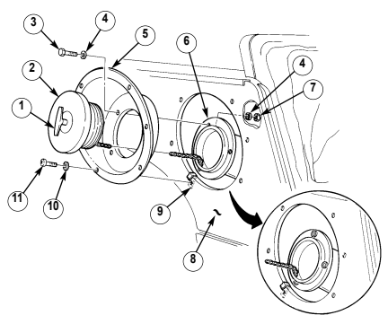

M1114

# 10-2. Fuel Filler Housing Maintenance (Cont'D)

b. Inspection Refer to para. 10-56 for plusnut (11) inspection and replacement. c. Installation 1. Pull filler cap (2) through filler housing (5) on right outer wheelhouse panel (8). 2. Install filler housing (5) on right outer wheelhouse panel (8) with six washers (9) and screws (10).

Tighten screws (10) to 20 lb-in. (2 N•m).

NOTE
M1114 vehicles are equipped with plusnuts instead of nuts and washers. Apply sealing compound on threads for M1114 vehicles only.

3. Install filler housing (5) on filler spout (6) with three washers (4), capscrews (3), washers (4), and nuts (7).

For M1114 only, tighten capscrews (3) to 75 lb-in. (9 N•m).

4. Install filler cap (2) on filler spout (6) with T-handle (1).

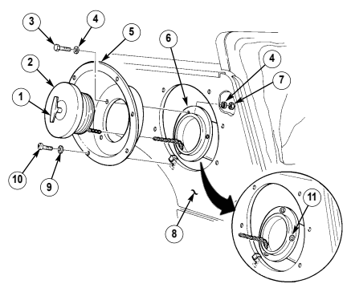

M1114

FOLLOW-ON TASK: Close fuel door (M1114 only) (TM 9-2320-387-10).

# 10-3. Fuel Door Replacement

This task covers:

| Materials/Parts   |
|-------------------|
| Sealing comp      |

a. Removal b. Installation

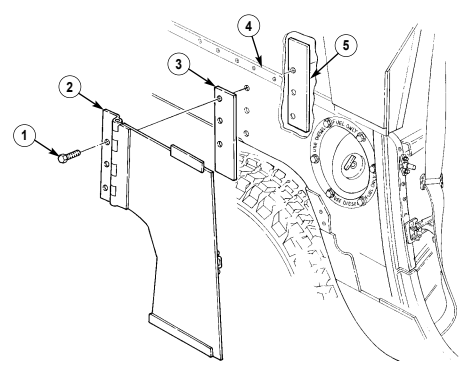

INITIAL SETUP:

| Maintenance Level   |
|---------------------|
| Unit                |

General mechanic's tool kit:
automotive (Appendix B, Item 1)
Maintenance and repair shop equipment:
automotive (Appendix B, Item 2)

| Equipment Condition   |
|-----------------------|
| Fuel door open (TM    |

| Manual References    |
|----------------------|
| TM 9\-2320\-387\-10  |
| TM 9\-2320\-387\-24P |

Sealing compound (Appendix C, Item 72.1)
Fuel door open (TM 9-2320-387-10).

| Personnel Required   |
|----------------------|
| One mechanic         |
| One assistant        |

a. Removal Remove three capscrews (1), fuel door (2), shim (3), and mounting plate (5) from body (4). 

b. Installation Apply sealing compound to threads of three capscrews (1), and install mounting plate (5), shim (3), and fuel door (2) on body (4) with capscrews (1). Tighten capscrews (1) to 10 lb-ft (14 N•m).

FOLLOW-ON TASK: Close fuel door (TM 9-2320-387-10).

# 10-4. Fuel Door Catch Replacement

This task covers:
INITIAL SETUP:

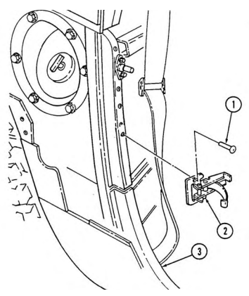

M1114 Tools General mechanic's tool kit:
automotive (Appendix B, Item 1)
Materials/Parts Two rivets (Appendix G, Item 272)

a. Removal b. Installation

| Equipment Condition   |
|-----------------------|
| Fuel door open (TN    |

| Maintenance Level   |
|---------------------|
| Unit                |

Manual References TM 9-2320-387-10 TM 9-2320-387-24P
Fuel door open (TM 9-2320-387-10).

a. Removal

For rivet replacement instructions, refer to para. 10-56.

Remove two rivets (1) and catch (2) from body (3).

b. Installation Install catch (2) on body (3) with two rivets (1).

FOLLOW-ON TASK: Close fuel door (TM 9-2320-387-10).

# 10-5. Hood Latch Maintenance

This task covers:

a. Removal **c. Assembly** b. Disassembly d. Installation

#### Initial Setup: Tools

General mechanic's tool kit:
automotive (Appendix B, Item 1)
Maintenance and repair shop equipment:
automotive (Appendix B, Item 2)

#### Materials/Parts

Two locknuts (Appendix G, Item 77) Cotter pin (Appendix G, Item 18) Spring pin (Appendix G, Item 317) Sealing compound (Appendix C, Item 72.1)
a. Removal

#### Manual References

TM 9-2320-387-10 TM 9-2320-387-24P
Equipment Condition Hood raised and secured (TM 9-2320-387-10).

Maintenance Level

| Vlantenance Level   |
|---------------------|
| Unit                |

- If only rubber latch is to be replaced, spring pin does not have to be completely out of base.

- M1114 vehicles are equipped with plusnuts/tapping blocks instead of nuts and washers.

1. Remove two locknuts (6), washers (4), capscrews (3), washers (4), and base (7) from body (5).

Discard locknuts (6).

2. Remove spring pin (2) and latch (10) from base (7). Discard spring pin (2). b. Disassembly Remove cotter pin (1), pin (8), two rollers (9), and hood latch (11) from latch (10). Discard cotter pin (1).

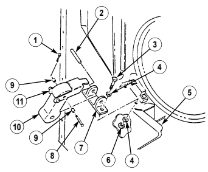

## 10-5. Hood Latch Maintenance (Cont'D)

c. Assembly Install hood latch (11) on latch (10) with two rollers (9), pin (8), and cotter pin (1).

d. Installation

- If only rubber latch is to be replaced, spring pin may not be completely out of base.

- M1114 vehicles are equipped with plusnuts/tapping blocks instead of nuts and washers. Apply sealing compound to threads of capscrews for M1114 vehicles only.

1. Install latch (10) on base (7) with spring pin (2). 2. Install base (7) on body (5) with two washers (4), capscrews (3), washers (4), and locknuts (6).

Tighten capscrews (3) to 6 lb-ft (8 N•m).

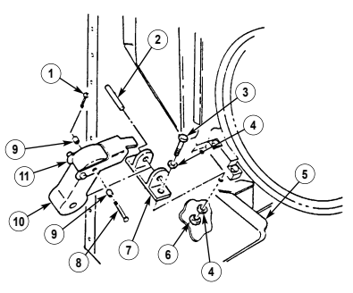

FOLLOW-ON TASK: Lower and secure hood (TM 9-2320-387-10).

# 10-6. Hood Latch Bracket Replacement

| INITIAL SETUP:   |
|------------------|

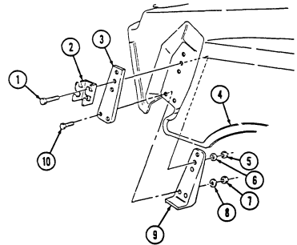

| This task covers:   |
|---------------------|

Tools General mechanic's tool kit:
automotive (Appendix B, Item 1)

| M\-28 6                      |
|------------------------------|
| M\-29 Added 5                |
| M\-30 6                      |
| M\-30 \- M\-33 Added 5       |
| M\-34 Blank Added 5          |
| Index 1 \- Index 68 5        |
| Index 69 \- Index 75 Added 5 |
| Index 76 Blank Added 5       |
| FP\-1 0                      |
| FP\-2 Blank 0                |

Materials/Parts Five locknuts (Appendix G, Item 77)

a. Removal **b. Installation**

a. Removal 1. Remove two locknuts (5), washers (6), capscrews (1), and latch bracket (2) from hood (4). Discard locknuts (5).

2. Remove three locknuts (7), washers (8), capscrews (10), latch stop bracket (9), and latch plate (3)
from hood (4). Discard locknuts (7).

## 10-6. Hood Latch Bracket Replacement (Cont'D)

b.  Installation Install latch plate (3) and latch stop bracket (9) on hood (4) with three capscrews (10), washers (8), and 1.

locknuts (7).

Install latch bracket (2) on latch plate (3) and hood (4) with two capscrews (1), washers (6), and 2.

locknuts (5). Tighten locknuts (5) and (7) to 10 lb-ft (14 N.m).

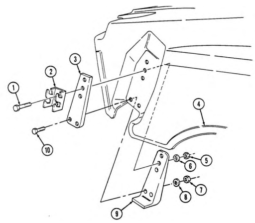

FOLLOW-ON TASK: Lower and secure hood (TM 9-2320-387-10).

# 10-7. Hood Latch Tapping Block Replacement

This task covers:
INITIAL SETUP:
Applicable Models M1114 Tools General mechanic's tool kit:
automotive (Appendix B, Item 1)
Manual References TM 9-2320-387-24P
a. Removal a. Removal **b. Installation**
Equipment Condition
- Hood latch removed (para. 10-5). - Side hood stop removed (para. 10-11).

Maintenance Level Unit

For instructions on replacement of rivets, refer to para. 10-56.

Remove two rivets (2) and tapping block (1) from body (3).

b. Installation 1. If new tapping block (1) is being installed, drill two 3/16-in. (4.8-mm) diameter rivet holes (4) through body (3) and tapping block (1).

2. Install tapping block (1) on body (3) with two rivets (2).

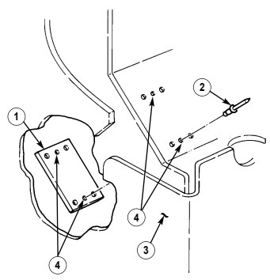

FOLLOW-ON TASKS: - Install side hood stop (para. 10-11).

- Install hood latch (para. 10-5).

# 10-8. Hood Prop Rod And Bracket Maintenance

This task covers:
a. Removal d. Assembly b. Disassembly e. Installation c. Inspection INITIAL SETUP:
Tools General mechanic's tool kit:
automotive (Appendix B, Item 1)
Maintenance and repair shop equipment:
automotive (Appendix B, Item 2)

#### Materials/Parts

Four lockwashers (Appendix G, Item 146) Locknut (Appendix G, Item 82) Cotter pin (Appendix G, Item 19)
Manual References TM 9-2320-387-10 TM 9-2320-387-24P
Equipment Condition Hood raised and secured (TM 9-2320-387-10).

General Safety Instructions Hood must be supported during hood prop rod and bracket replacement.

Maintenance Level Unit

#### Warning

Hood must be supported during hood prop rod and bracket replacement. Failure to support hood may cause injury to personnel or damage to equipment.

a. Removal 1. Remove cotter pin (4), washer (3), hood prop rod (2), and washer (3) from hood (1). Discard cotter pin (4).

2. Remove four screws (8), lockwashers (7), and bracket (6) from airlift bracket (5). Discard lockwashers (7).

b. Disassembly 1. Remove hood prop rod (2) from eyebolt (15). 2. Remove locknut (9), washer (10), bushing (16), spring (11), eyebolt (15), and washer (14) from bracket (6). Discard locknut (9).

3. Remove snapring (12) and bushing (13) from bracket (6).

c. Inspection Inspect bushings (13) and (16) and spring (11) for cracks, wear, or distortion. Replace bushings (13) and (16) and spring (11) if cracked, worn, or distorted.

d. Assembly 1. Install bushing (13) on bracket (6) with snapring (12).

Length of spring with bracket assembled is 2-1/4 in. (5.7 cm).

2. Install washer (14), eyebolt (15), and spring (11) on bracket (6) with bushing (16), washer (10), and locknut (9).

3. Install hood prop rod (2) into eyebolt (15).

# 10-8. Hood Prop Rod And Bracket Maintenance (Cont'D)

e. Installation 1. Install hood prop rod (2) and bracket (6) on airlift bracket (5) with four lockwashers (7) and screws (8). Tighten screws (8) to 6 lb-ft (8 N.m).

2. Install washer (3) and hood prop rod (2) on hood (1) with washer (3) and cotter pin (4).

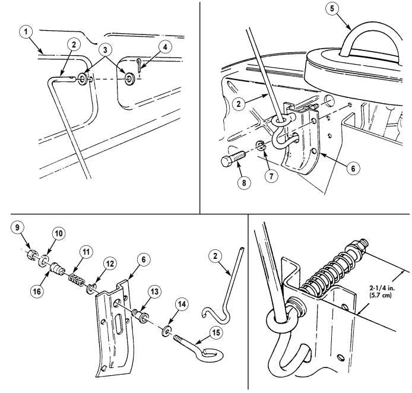

FOLLOW-ON TASK: Lower and secure hood (TM 9-2320-387-10).

# 10-9. Hood And Hinge Maintenance

This task covers:
b. Installation

#### Initial Setup: Tools

General mechanic's tool kit:
automotive (Appendix B, Item 1)
Maintenance and repair shop equipment:
automotive (Appendix B, Item 2)

#### Materials/Parts

Three cotter pins (Appendix G, Item 20) Eight locknuts (Appendix G, Item 128) Antiseize compound (Appendix C, Item 17)
Personnel Required One mechanic One assistant a. Removal c. Alignment Manual References TM 9-2320-387-10 TM 9-2320-387-24P TM 43-0139 Equipment Condition Hood raised and secured (TM 9-2320-387-10).

General Safety Instructions Hood must be supported during removal and installation.

Maintenance Level Unit

#### .Warning.

Hood must be supported during removal and installation. Failure to support hood may cause injury to personnel or damage to equipment.

a. Removal 1. Disconnect left and right hood harness connectors (1) from harness connectors (2).

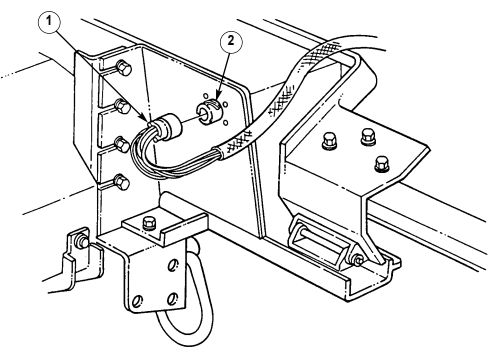

## 10-9. **Hood And Hinge Maintenance** (Cont'D)

2. Remove two cotter pins (41, washers (61, hinge pins (161, and washers (15) from upper hinge halves (14) and lower hinge halves (11). Discard cotter pins (4). 

3. Remove cotter pin (201, washer (211, hood prop rod (231, and washer (22) from hood (19). Discard cotter pin (20). 

4. Remove hood (19). 

l Perform steps 5 and 6 if replacing hinges. 

l Note position of hinge halves prior to removal for installation. 

5. Remove four locknuts (31, washers (18), capscrews (121, washers (13), and two upper hinge halves (14) from hood brackets (17). Discard locknuts (3). 

6. Remove (7), and two lower hinge halves (1 four locknuts (9), washers (lo), capscrews (51, washers 

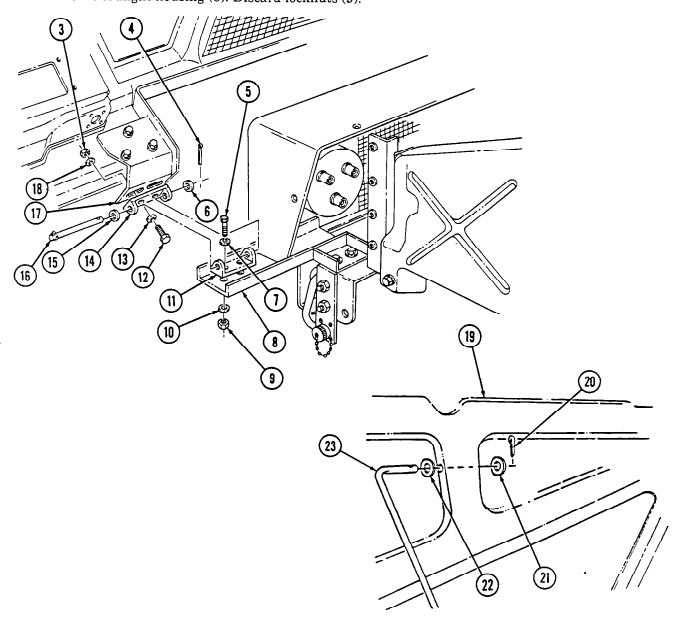

from headlight housing (8). Discard locknuts (9). 1) 

## 1 10-9. **Hood And Hinge Maintenance (Cont'D)** I

pLTizGq 

Perform steps 1 and 2 if hinges were removed. 

1. Install two lower hinge halves (8) on headlight housing (5) with four washers (41, capscrews (2), 
washers (7), and locknuts (6). Do not tighten locknuts (6). 

2. Install two upper hinge halves (11) on hood brackets (14) with four washers (IO), capscrews (91, washers (151, and locknuts (16). Tighten locknuts (16) to 28 lb-ft (38 N-m). 

3. Install hood (17) and align two upper hinge halves (11) with lower hinge halves (8). 4. Install two upper hinge halves (11) on lower hinge halves (8) with washers (131, hinge pins (12.1, washers (31, and cotter pins (1). 

5. Install washer (20) and hood prop rod (21) on hood (17) with washer (19) and cotter pin (18). 

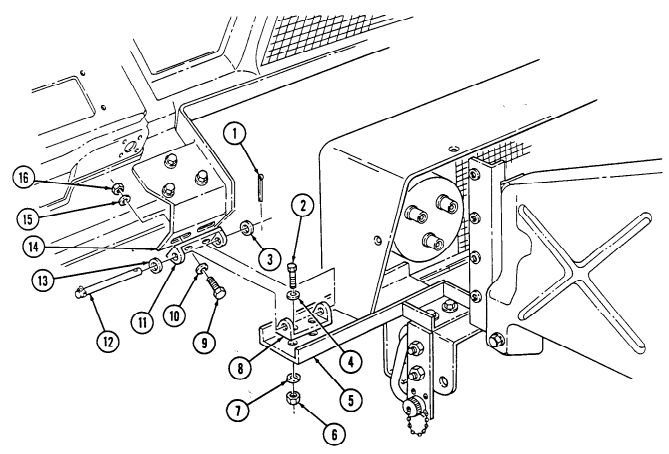 6. Connect left and right hood harness connectors (22) to harness connector (23). 

10-9.  HOOD AND HINGE MAINTENANCE (Cont'd)

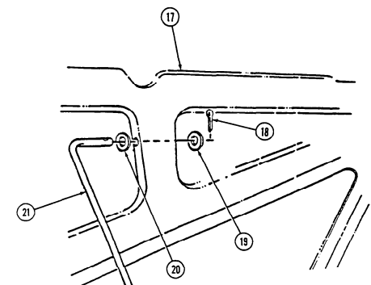

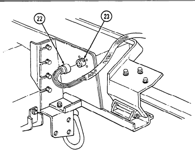

2 A
# 10-9. Hood And Hinge Maintenance (Cont'D)

c. Alignment

Spacing between A-pillar and hood should be no less than 1/2 in. (12.7 mm).

1. Lower hood (4) and check alignment of hood stop guide (3) with center hood stop (2) on A-pillar (1)
and hood latch plate (5) with side hood stop (6).

Upper and lower hinge halves contain slotted mounting holes to allow for adjustment.

2. With hood (4) lowered and secured, and alignment correct, tighten four locknuts (7) on lower hinge half (8) to 60 lb-ft (81 N•m).

After hood alignment is completed, some contact may occur between hood and left mirror bracket. If contact exists, use file and trim about 1/4 in. (6.4 mm) off left corner and edge of hood. Trim until hood closes without hitting left mirror bracket. Touch up with

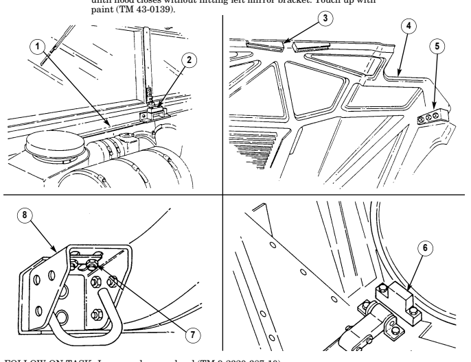

FOLLOW-ON TASK: Lower and secure hood (TM 9-2320-387-10).

# 10-9.1. Jack Retaining Strap Replacement

This task covers:
INITIAL SETUP:

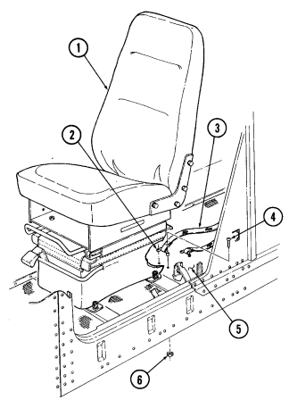

Tools General mechanic's tool kit:
automotive (Appendix B, Item 1)
Four nut and lockwasher assemblies 
(Appendix G, Item 197)
Personnel Required One mechanic One assistant a. Removal 1. Slide driver's seat (1) forward. 2. Remove four nut and lockwasher assemblies (6), screws (4), two footman loops (2), and jack retaining strap (3) from vehicle floor (5). Discard nut and lockwasher assemblies (6).

b. Installation 1. Install jack retaining strap (3) and two footman loops (2) on vehicle floor (5) with four screws (4) 
and nut and lockwasher assemblies (6).

2. Slide driver's seat (1) backward.

a. Removal b. Installation

TM 9-2320-387-24P

| Maintenance Level   |
|---------------------|
| Unit                |

| Manual References ..   |
|------------------------|

Equipment Condition Left front underbody armor removed (M1114 only)
(para. 11-36.1)
FOLLOW-ON TASK: Install left front underbody armor (para 11-36.1).

# 10-10. Outer Hood Seal Replacement

This task covers:
INITIAL SETUP:
Tools General mechanic's tool kit:
automotive (Appendix B, Item 1)
Manual References TM 9-2320-387-10 TM 9-2320-387-24P
a. Removal a. Removal b. Installation Equipment Condition Hood raised and secured (TM 9-2320-387-10).

Maintenance Level Unit Remove four capscrews (4), two seal retainers (3), and hood seal (2) from body (1).

b. Installation Install hood seal (2) on body (1) with two seal retainers (3) and four capscrews (4).

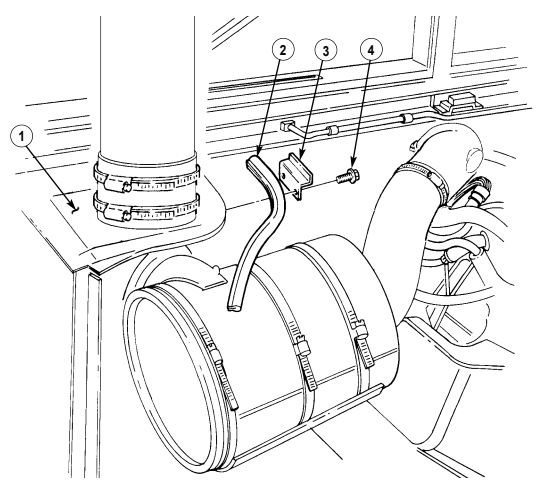

FOLLOW-ON TASK: Lower and secure hood (TM 9-2320-387-10).

# 10-11. Side Hood Stop Replacement

This task covers:
INITIAL SETUP:
Tools General mechanic's tool kit:
automotive (Appendix B, Item 1)
Maintenance and repair shop equipment:
automotive (Appendix B, Item 2)
Materials/Parts Two locknuts 
(Appendix G, Item 77)
Sealing compound 
(Appendix C, Item 72.1)
a. Removal b. Installation Manual References TM 9-2320-387-10 TM 9-2320-387-24P
Equipment Condition Hood raised and secured (TM 9-2320-387-10).

Maintenance Level Unit a. Removal

M1114 vehicles are equipped with plusnuts/tapping blocks instead of nuts and washers.

Remove two locknuts (6), washers (5), capscrews (3), washers (2), and side hood stop (1) from body (4). Discard locknuts (6).

b. Installation

M1114 vehicles are equipped with plusnuts/tapping blocks instead of nuts and washers. Apply sealing compound to threads of capscrews at installation for M1114 vehicles only.

Install side hood stop (1) on body (4) with two washers (2), capscrews (3), washers (5), and locknuts (6). Tighten capscrews (3) to 6 lb-ft (8 N•m).

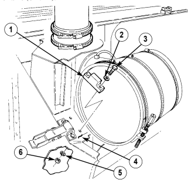

FOLLOW-ON TASK: Lower and secure hood (TM 9-2320-387-10).

# 10-12. Center Hood Stop Replacement

This task covers:
INITIAL SETUP:
Tools General mechanic's tool kit:
automotive (Appendix B, Item 1)
Manual References TM 9-2320-387-10 TM 9-2320-387-24P
a. Removal

a. Removal b. Installation

| Equipment Condition   |
|-----------------------|
| Hood raised and se    |

| Maintenance Level   |
|---------------------|

Hood raised and secured (TM 9-2320-387-10).

Unit Remove two capscrews (1), washers (2), center hood stop (3), and plate (4) from A-beam (5).

b. Installation Install center hood stop (3) and plate (4) on A-beam (5) with two washers (2) and capscrews (1). Tighten capscrews (1) to 12 lb-ft (16 N•m).

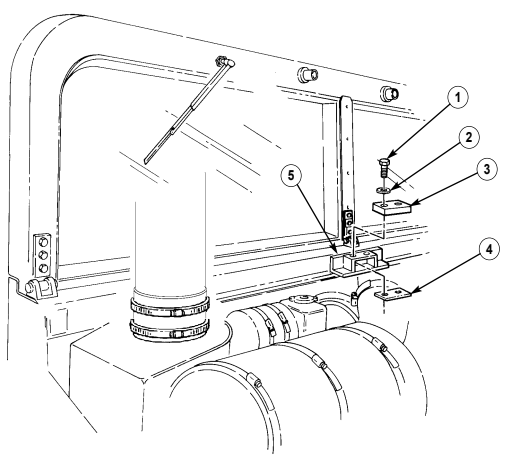

FOLLOW-ON TASK: Lower and secure hood (TM 9-2320-387-10).

# 10-13. Footman Loop And Strap Maintenance

This task covers:
a. Removal c. Installation b. Inspection INITIAL SETUP:
Tools General mechanic's tool kit:
automotive (Appendix B, Item 1)
Maintenance and repair shop equipment:
automotive (Appendix B, Item 2)
Materials/Parts Sealing compound (Appendix C, Item 72.1)
Manual References TM 9-2320-387-10 TM 9-2320-387-24P
Equipment Condition Lower tailgate (TM 9-2320-387-10)
Maintenance Level Unit

Replacement procedures for footman loops and straps are basically the same. The footman loop and strap on M1113 model is behind the driver's seat. This procedure covers footman loop and strap on tailgate.

a. Removal 1. Remove two screws (2) and footman loop (3) from tailgate (4). 2. Remove strap (1) from footman loop (3).

b. Inspection

For inspection and removal of insertnut, refer to para. 10-56.

Inspect four insertnuts (5). Replace if damaged.

c. Installation Apply sealing compound to threads of two screws (2) and install strap (1) and footman loop (3) on tailgate (4) with screws (2). Tighten screws (2) to 20 lb-in. (2 N•m).

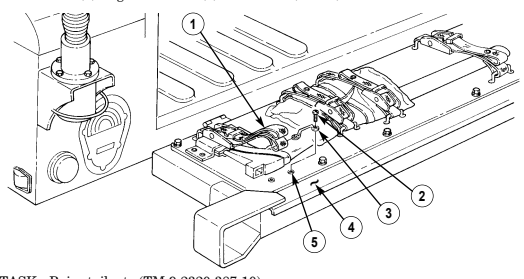

FOLLOW-ON TASK: Raise tailgate (TM 9-2320-387-10).

# 10-14. Center Hood Stop Guide Replacement

This task covers:
INITIAL SETUP:
Tools General mechanic's tool kit:
automotive (Appendix B, Item 1)
Maintenance and repair shop equipment:
automotive (Appendix B, Item 2)
Materials/Parts Six locknuts (Appendix G, Item 77)
Manual References TM 9-2320-387-10 TM 9-2320-387-24P
a. Removal a. Removal b. Installation Equipment Condition Hood raised and secured (TM 9-2320-387-10).

Maintenance Level Unit Remove six locknuts (5), washers (2), capscrews (1), washers (2), two guide plates (3), and guide brackets (4) from hood (6). Discard locknuts (5).

b. Installation Install two guide plates (3) and guide brackets (4) on hood (6) with six washers (2), capscrews (1), washers (2), and locknuts (5). Tighten locknuts (5) to 10 lb-ft (14 N•m).

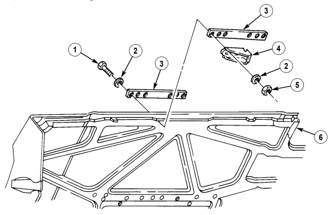

FOLLOW-ON TASK: Lower and secure hood (TM 9-2320-387-10).

| 410   | 00 S   |
|-------|--------|

# 10-15. Front Grille Screen Replacement

| INITIAL SETUP:   |
|------------------|

| This task covers:   |
|---------------------|

| Equipment Condition   |
|-----------------------|
| TT 71. 71. 7          |

| Maintenance Level   |
|---------------------|
| Unit                |

General mechanic's tool kit:
automotive (Appendix B, Item 1)
Maintenance and repair shop equipment:
automotive (Appendix B, Item 2)
Materials/Parts Sealing compound (Appendix C, Item 64)

| Manual References    |
|----------------------|
| TM 9\-2320\-387\-24P |

a. Removal b. Installation

Headlight housing removed (para. 10-18).

a. Removal 1. Remove lower three nuts (6), washers (5), and carriage bolts (3) from lower part of front grille screen (4) and headlight housing (1).

2. Remove upper three nuts (7), washers (8), front grille screen (4), three spacers (9), and capscrews (2) from upper part of headlight housing (1).

b. Installation 1. Apply sealing compound to threads of three capscrews (2) and install spacers (9) and front grille screen (4) on upper part of headlight housing (1) with capscrews (2), washers (8), and nuts (7). Tighten nuts (7) to 20-30 lb-in. (2-3 N•m).

2. Apply sealing compound to threads of three carriage bolts (3) and secure front grille screen (4) to

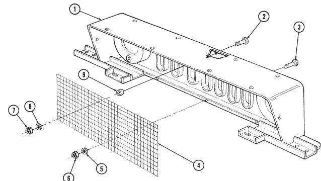

lower part of headlight housing (1) with carriage bolts (3), washers (5), and nuts (6). Tighten nuts (6) to 20-30 lb-in. (2-3 N•m).

FOLLOW-ON TASK: Install headlight housing (para. 10-18). 10-24 Change 2

# 10-16. Grille Frame Replacement

This task covers:
INITIAL SETUP:

#### Tools

General mechanic's tool kit:
automotive (Appendix B, Item 1)

#### Materials/Parts

Three locknuts (Appendix G, Item 77) Six lockwashers (Appendix G, Item 144) Sealing compound (Appendix C, Item 64)
Personnel Required One mechanic One assistant a. Removal a. Removal b. Installation Manual References TM 9-2320-387-24P
Equipment Condition Hood removed (para. 10-9).

Maintenance Level Unit 1. Remove three locknuts (8), washers (3), capscrews (2), and washers (3) from grille (9) and grille frame (7). Discard locknuts (8).

2. Remove eight capscrews (10), six capscrews (4), lockwashers (5), washers (6), and grille frame (7) from hood (1). Discard lockwashers (5).

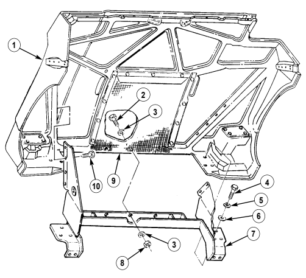

## 10-16. Grille Frame Replacement (Cont'D)

b. Installation 1. Apply sealing compound to threads of eight capscrews (10), and install grille frame (7) on hood (1)
with six lockwashers (5), washers (6), capscrews (4), and eight capscrews (10).

2. Install three washers (3), capscrews (2), washers (3), and locknuts (8) on grille frame (7) and grille (9).

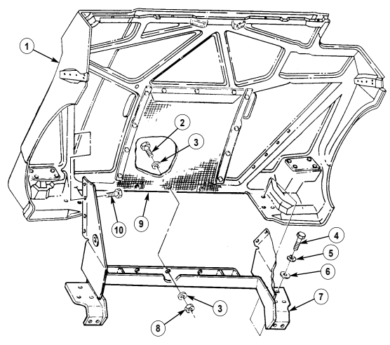

FOLLOW-ON TASK: Install hood (para. 10-9).

# 10-17. Hood Grille And Screen Replacement

This task covers:

| INITIAL SETUP:   |
|------------------|

#### Tools

General mechanic's tool kit:
automotive (Appendix B, Item 1)
Materials/Parts Six locknuts (Appendix G, Item 77) Six locknuts (Appendix G, Item 76)

| PAGE   | PROCEDURES   | NO.   |
|--------|--------------|-------|

a. Removal b. Installation

a. Removal 1. Remove six locknuts (5), washers (2), capscrews (1), washers (2), and grille (3) from hood (4).

Discard locknuts (5).

2. Remove six locknuts (7), washers (8), capscrews (10), washers (9), and screen (6) from grille (3).

Discard locknuts (7).

#### B. Installation

1. Install screen (6) on grille (3) with six washers (9), capscrews (10), washers (8), and locknuts (7).

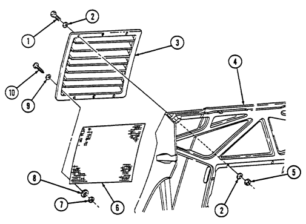

Tighten locknuts (7) to 6 lb-ft (8 N•m).

2. Install grille (3) on hood (4) with six washers (2), capscrews (1), washers (2), and locknuts (5).

Tighten locknuts (5) to 7 lb-ft (10 N•m).

FOLLOW-ON TASK: Lower and secure hood (TM 9-2320-387-10).

# 10-18. Headlight Housing Replacement

This task covers:

#### Initial Setup: Tools

General mechanic's tool kit:
automotive (Appendix B, Item 1)
Materials/Parts Six locknuts (Appendix G, Item 128) Eight lockwashers (Appendix G, Item 172)
Manual References TM 9-2320-387-24P
a. Removal 1. Remove four screws (19), washers (20), and lockwashers (18) from plate (22). Discard lockwashers (18).

2. Remove locknut (16) and screw (14) from plate (22) and headlight housing (5). Discard locknut (16). 3. Remove nut (23), screw (4), clamp (24), harness (3), and plate (22) from headlight housing (5). 4. Remove four nuts (15) and screws (21) and disconnect harness connector (17) from plate (22). 5. Remove five nuts (25), clamps (2), harness (3), and screws (1) from headlight housing (5). 6. Remove two nuts (8), screws (7), nut (12), socket-head screw (9), and bracket (10) (if equipped) from headlight housing (5) and hinge (11).

7. Remove three leads (6) from headlight (13). 8. Repeat steps 1 through 7 for other side. 9. Remove four locknuts (31), two plates (32), four screws (26), and washers (34) from headlight housing (5) and two frame brackets (33). Discard locknuts (31).

10. Remove four screws (30), washers (29), two spacers (27), and headlight housing (5) from frame extension (28).

#### B. Installation

1. Install headlight housing (5) on frame extension (28) with two spacers (27), four washers (29), and screws (30).

2. Install headlight housing (5) on two frame brackets (33) with four washers (34), screws (26), two plates (32), and four locknuts (31).

3. Install bracket (10) (if removed) on hinge (11) and headlight housing (5) with two screws (7), nuts
(8), socket-head screw (9), and nut (12).

4. Install harness (3) on headlight housing (5) with five clamps (2), screws (1), and nuts (25). 5. Install three leads (6) on headlight (13). 6. Install harness connector (17) on plate (22) with four screws (21) and nuts (15). 7. Install plate (22) on headlight housing (5) with screw (4), clamp (24), and nut (23). 8. Install plate (22) on headlight housing (5) with four lockwashers (18), washers (20), screws (19), 
screw (14), and locknut (16).

9. Repeat steps 3 through 8 for other side.

a. Removal b. Installation Equipment Condition
- Battery ground cables disconnected (para. 4-68). - Hood removed (para. 10-9).

Maintenance Level Unit

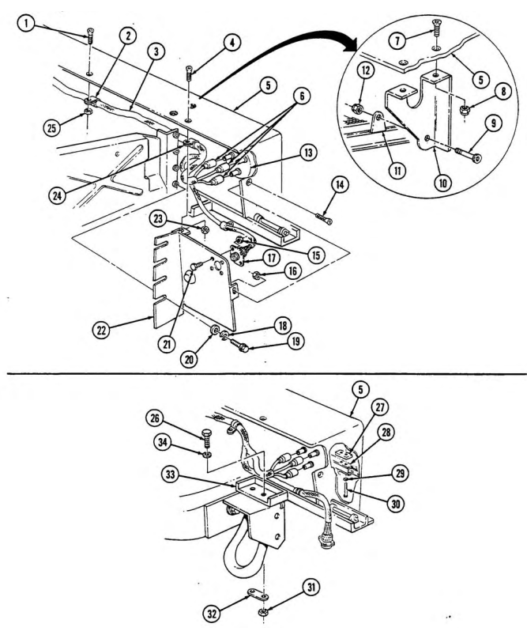

## 10-18. Headlight Housing Replacement (Cont'D)

FOLLOW-ON TASKS: - Connect battery ground cables (para. 4-68).

- Install hood (para. 10-9).

# 10-19. Door Handle Assembly Maintenance

This task covers:

a. Removal c. Installation b. Repair

INITIAL SETUP:
Applicable Models

| THOUSE THE TITACH TO                   | TV READ & LEAST I CLE US   |
|----------------------------------------|----------------------------|
| M1113, M1152                           | Spring pin (Append         |
|                                        | Adhesive (Appendix         |
| fools                                  |                            |
| General mechanic's tool kit:           | Manual References          |
| automotive (Appendix B. Item 1)        | TM 9\-2320\-387\-24P       |
| Maintenance and repair shop equipment: |                            |
| automotive (Appendix B, Item 2)        | Maintenance Level          |
|                                        | Unit                       |
|                                        | NOTE                       |

Materials/Parts Spring pin (Appendix G, Item 318) Adhesive (Appendix C, Item 8)

Some door handle assemblies may separate. To prevent or fix door handle assembly separation, perform task b.

a. Removal 1. Remove screw (5), inside door handle (4), and door handle spring (6) from door frame (7) and outside door handle (1).

2. Remove outside door handle (1) and washer (3) from door frame (7).

b. Repair

Repair procedures for all door handle assemblies are basically the same. This procedure covers the left front door handle assembly.

1. Tighten screw (5) on inside door handle (4) to 15 lb-in. (1.7 N•m).

- If screw will secure inside door handle, perform steps 2 and 3. - If screw will not secure inside door handle, perform steps 4 through 10.

2. Locate, mark, and drill 0.125-in. (3.2-mm) diameter hole (9) through inside door handle (4) and outside door handle (1).

3. Install spring pin (8) through inside door handle (4) and outside door handle (1).

Inside door handle can separate from outside door handle without removing screw.

4. Remove inside door handle (4) and door handle spring (6) from outside door handle (1) and door frame (7).

5. Remove outside door handle (1) and washer (3) from door frame (7). 6. Remove screw (5) and insert (2) from inside door handle (4). 7. Apply adhesive to outside of insert (2) and install insert (2) in outside door handle (1). Allow adhesive to cure for five minutes.

8. Install washer (3) and outside door handle (1) on door frame (7). 9. Install inside door handle spring (6) and inside door handle (4) on outside door handle (1) and door frame (7) with screw (5). Tighten screw (5) to 15 lb-in. (1.7 N•m).

10. Perform steps 2 and 3.

# 10-19. Door Handle Assembly Maintenance (Cont'D)

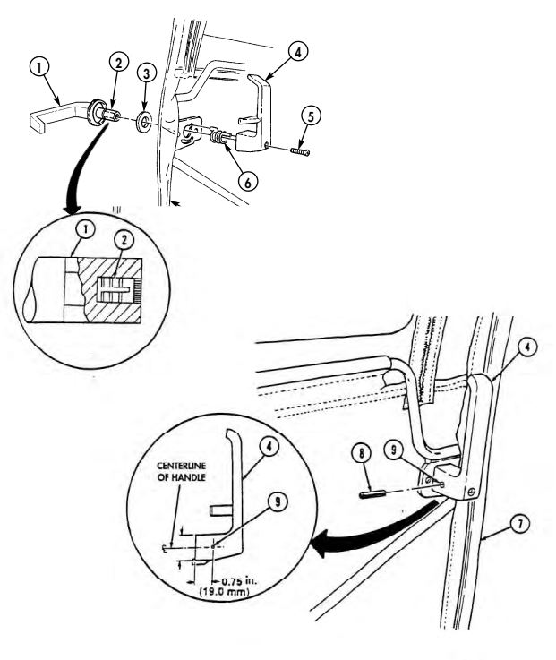

l

# 10-19. Door Handle Assembly Maintenance (Cont'D)

#### C. Installation

1. Install washer (2) and outside door handle (1) on door frame (6). 2. Install door handle spring (5) and inside door handle (3) on outside door handle (1) in door frame
(6).

3. Place outside door handle (1) in horizontal position, and place inside door handle (3) in vertical position with grip end of handle pointing to top of door.

4. Install inside door handle (3) on outside door handle (1) and door frame (6) with screw (4). Tighten screw (4) to 15 lb-in. (1.7 N•m).

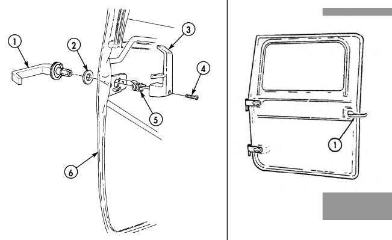

# 10-20. Fixed Rear Door Replacement

This task covers:
INITIAL SETUP:
Applicable Models M1113, M1152, M1152A1 Tools General mechanic's tool kit:
automotive (Appendix B, Item 1)
Maintenance and repair shop equipment:
automotive (Appendix B, Item 2)

#### Materials/Parts

Seal (Appendix G, Item 284) Door seal (Appendix G, Item 29) Door seal (Appendix G, Item 28)
a. Removal b. Installation Manual References TM 9-2320-387-24P
Equipment Condition Remove shelter (if applicable) (para. 11-78).

Maintenance Level Unit

#### A. Removal

1. Remove four capscrews (6) and washers (7) from fixed rear door (4) and B-pillar (1). 2. Remove locking pin (3) and fixed rear door (4) from body (2). 3. Remove three seals (5) from fixed rear door (4). Discard seals (5).

b. Installation 1. Install three seals (5) on fixed rear door (4). 2. Install fixed rear door (4) on body (2) with locking pin (3). 3. Install fixed rear door (4) on B-pillar (1) with four washers (7) and capscrews (6). Tighten 

capscrews (6) to 6 lb-ft (8 N•m).

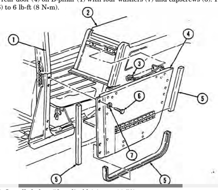

FOLLOW-ON TASK: Install shelter (if applicable) (para. 11-78).

# 10-20.1. Fixed Rear Door Access Panel Replacement

This task covers:
INITIAL SETUP:
Applicable Models M1113, M1152, M1152A1 Tools General mechanic's tool kit:
automotive (Appendix B, Item 1)

a. Removal b. Installation

| Materials/Parts   |
|-------------------|

Adhesive (Appendix C, Item 3) Fourteen blind rivets (Appendix G, Item 262) Twelve blind rivets (Appendix G, Item 265)
Manual References TM 9-2320-387-24P

- For instructions on replacement of rivets, refer to para. 10-56. - Replacement procedures for left and right exterior stowage doors are basically the same. This procedure covers the left stowage door.

#### A. Removal

1. Remove ten rivets (2), hinge (6), and door (8) from body (5). 2. Remove ten rivets (1) and hinge (6) from door (8). 3. Remove four rivets (11) and two rubber latches (10) from door (8). 4. Remove four rivets (9) and two brushguards (12) from door (8). 5. Remove four rivets (3) and two catches (4) from body (5). 6. Remove seal (7) from door (8). Discard seal (7) if damaged.

#### B. Installation

1. Apply adhesive to seal (7) and install seal (7) on door (8). 2. Install two catches (4) on body (5) with four rivets (3). 3. Install two brushguards (12) on door (8) with four rivets (9). 4. Install two rubber latches (10) on door (8) with four rivets (11). 5. Install hinge (6) on door (8) with seven rivets (1). 6. Install hinge (6) and door (8) on body (5) with seven rivets (2).

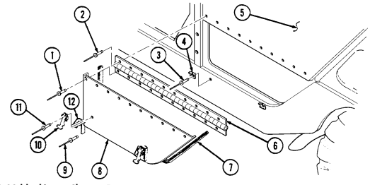

# 10-21. Engine Access Cover Flexible Latch And Holddown Strike Replacement

This task covers:
INITIAL SETUP:
Tools General mechanic's tool kit:
automotive (Appendix B, Item 1)
Materials/Parts Four rivets (Appendix G, Item 258)
Manual References TM 9-2320-387-24P
a. Removal b. Installation Equipment Condition Engine access cover removed (para. 10-22).

Maintenance Level Unit a. Removal

For rivet replacement instructions, refer to para. 10-56.

1. Remove two rivets (5) and holddown strike (6) from body (1). 2. Remove two rivets (3) and flexible latch (2) from cargo floor (4).

b. Installation 1. Install flexible latch (2) on cargo floor (4) with two rivets (3). 2. Install holddown strike (6) on body (1) with two rivets (5).

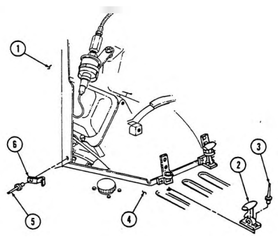

FOLLOW-ON TASK: Install engine access cover (para. 10-22).

# 10-22. Engine Access Cover Maintenance

This task covers:

a. Removal c. Assembly b. Disassembly d. Installation

#### Initial Setup: Tools

General mechanic's tool kit:
automotive (Appendix B, Item 1)

#### Materials/Parts

Two locknuts (Appendix G, Item 82) Two rivets (Appendix G, Item 263) Seven rivets (Appendix G, Item 255) Eight rivets (Appendix G, Item 260) Two rivets (Appendix G, Item 264)
Manual References TM 9-2320-387-24P
Equipment Condition Front radio rack removed (para. 12-17).

Maintenance Level Unit a. Removal 1. Unlatch two flexible latches (6) from keepers (5) on holddown brackets (7). 2. Unlatch two holddown latches (4) from holddown strikes (3). 3. Turn two ring studs (1) and remove access cover (2) from vehicle.

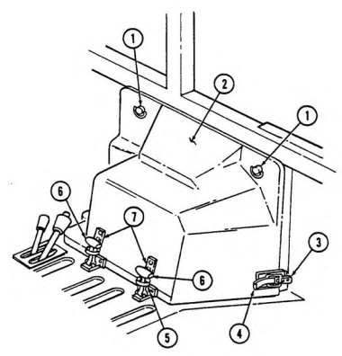

# 10-22. Engine Access Cover Maintenance (Cont'D)

b. Disassembly

For rivet replacement instructions, refer to para. 10-56.

1. Remove seven rivets (5), retainers (2), and insulation (3) from access cover (4). 2. Remove seal (1) from access cover (4). 3. Remove four retaining rings (6), two washers (7), ring studs (8), and washers (7) from access cover (4). 4. Remove two locknuts (14), shoulder bolts (17), and latches (16) from access cover (4). Discard locknuts (14).

5. Remove two rivets (18), backing plates (15), and guide plates (19) from access cover (4). 6. Remove two rivets (12) and keepers (11) from holddown brackets (9). 7. Remove eight rivets (10), two holddown brackets (9), and backing plates (13) from access cover (4). 

c. Assembly 1. Install two holddown brackets (9) and backing plates (13) on access cover (4) with eight rivets (10). 2. Install two keepers (11) on holddown brackets (9) with two rivets (12).

5. Install two washers (7) and ring studs (8) on access cover (4) with two washers (7) and four retaining rings (6).

6. Install insulation (3) on access cover (4) with seven retainers (2) and rivets (5). 7. Install seal (1) on access cover (4).

d. Installation 1. Install access cover (4) on vehicle with two ring studs (8). 2. Install two holddown latches (16) on holddown strikes (20). 3. Latch two flexible latches (21) to keepers (11) on holddown brackets (9).

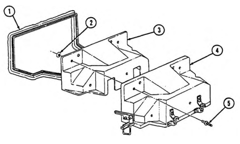

3. Install two backing plates (15) and guide plates (19) on access cover (4) with two rivets (18). 4. Install two latches (16) on guide plates (19) and access cover (4) with two shoulder bolts (17) and locknuts (14).

# 10-22. Engine Access Cover Maintenance (Cont'D)

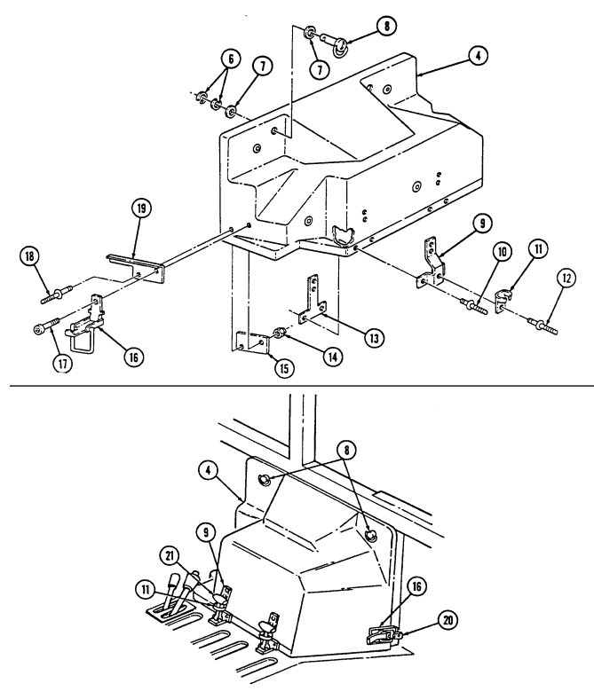

FOLLOW-ON TASK:   Install front radio rack (para. 12-17).

# 10-23. Engine Left Splash Shield Maintenance (Serial Numbers 299999 And Below)

This task covers:

Tools General mechanic's tool kit:
automotive (Appendix B, Item 1)
Maintenance and repair shop equipment:
automotive (Appendix B, Item 2)

#### Materials/Parts

Eight locknuts (Appendix G, Item 76) Nut and lockwasher assembly
(Appendix G, Item 134)
Four rivets (Appendix G, Item 262.1) Locknut (Appendix G, Item 106) Locknut (Appendix G, Item 82) (M1114 only) Three locknuts (Appendix G, Item 82)
(M1113, M1152, M1152A1 only)
Four locknuts (Appendix G, Item 82)
(M1151, M1151A1, M1165, M1165A1 only)
a. Removal c. Assembly

b. Disassembly **d. Installation**

#### Manual References

TM 9-2320-387-24P

#### Equipment Condition

- Battery ground cables disconnected 
(para. 4-68).

- Hood prop rod and bracket removed 
(para. 10-8).

- Fuel drainvalve removed (M1114 only)
(para. 3-35).

#### General Safety Instructions

Hood must be supported during removal and installation.

Maintenance Level Unit

#### Warning

Hood must be supported during removal and installation. Failure to support hood may cause injury to personnel or damage to equipment.

#### A. Removal

1. Disconnect hood harness connector (1) from connector (2).

Perform steps 2 through 6 and step 9 for M1114 vehicles only. Perform steps 2 through 9 for all other vehicles.

2. Remove four capscrews (23), washers (24), and washers (25) from plate (27) and left splash shield (12). 3. Remove hex-head screws (28) and (30), washer (29), plates (27), and two spring nuts (26) from headlight housing (31).

4. Remove four nuts (36), screws (35), and connector (2) from plate (27). 5. Remove nut and lockwasher assembly (32), screw (34), and harness and clamp (33) from left splash shield (12). Discard nut and lockwasher assembly (32).

6. Remove locknut (3), washer (4), capscrew (20), washer (21), and left splash shield (12) from support bracket (22). Discard locknut (3).

7. Remove locknut (6), washer (7), washer (8), capscrew (16), and washer (15) from left splash shield (12) and airlift bracket (5). Discard locknut (6).

8. Remove capscrew (17), washer (18), washer (19), and left splash shield (12) from airlift bracket (5). 9. Remove locknut (9), washer (10), capscrew (14), and washer (13) from master cylinder bracket (11)
and splash shield (12). Discard locknut (9) and remove splash shield (12) from vehicle.

10-23.  ENGINE LEFT SPLASH SHIELD MAINTENANCE

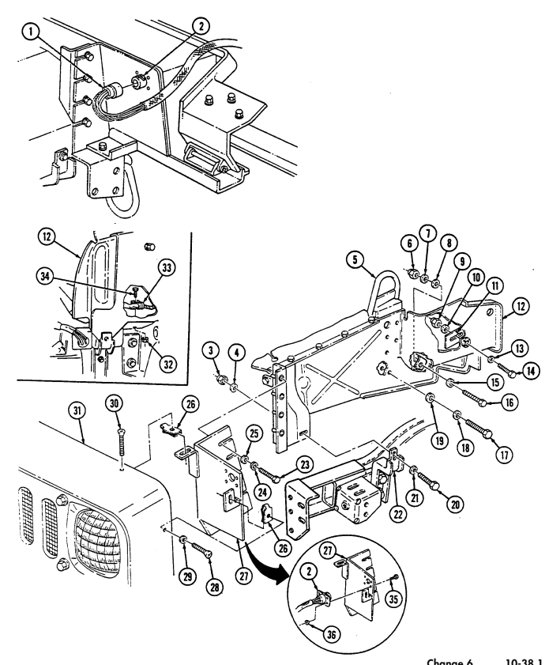

I

# 10-23. Engine Left Splash Shield Maintenance (Serial Numbers 299999 And Below) (Cont'D)

b. Disassembly

Perform step 1 only if vehicle has an armor plate.

1. Remove locknut (17), washer (14), capscrew (15), washer (14), and armor plate (16) from splash shield (1). Discard locknut (17).

2. Remove three locknuts (7), washers (8), capscrews (10), and bracket (9) from left splash shield (1).

Discard locknuts (7).

3. Remove five locknuts (6), washers (5), capscrews (13), seal retainer (12), and seal (11) from splash shield (1). Discard locknuts (6).

For rivet replacement instructions, refer to para. 10-56.

4. Remove four rivets (3), support (4), and reinforcement (2) from splash shield (1). Discard rivets (3).

c. Assembly 1. Install support (4) and reinforcement (2) on left splash shield (1) with four rivets (3). 2. Install seal (11) and seal retainer (12) on splash shield (1) with five capscrews (13), washers (5), and locknuts (6).

3. Install bracket (9) on splash shield (1) with three capscrews (10), washers (8), and locknuts (7).

Perform step 4 only if vehicle has an armor plate.

4. Install armor plate (16) on splash shield (1) with washer (14), capscrew (15), washer (14), and locknut (17). Tighten locknut (17) to 15 lb-ft (20 N•m).

10-23.  ENGINE LEFT SPLASH SHIELD MAINTENANCE

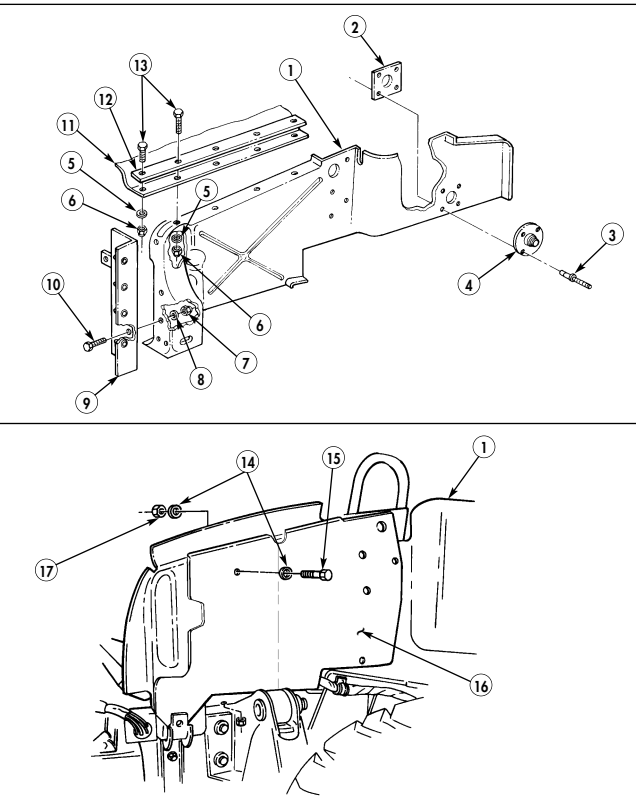

I

# 10-23. Engine Left Splash Shield Maintenance (Serial Numbers 299999 And Below) (Cont'D)

d. Installation

- Perform steps 2 and 4 through step 9 for M1114 vehicles only.

Perform steps 1 through 9 for all other vehicles.

- Ensure left splash shield clears oil cooler lines.

1. Install splash shield (1) on airlift bracket (15) with washer (24), capscrew (25), washer (18),
washer (17), and locknut (16). Tighten capscrew (25) to 10 lb-ft (14 N•m).

2. Install splash shield (1) on master cylinder bracket (21) with washer (22), capscrew (23),
washer (20), and locknut (19).

3. Install splash shield (1) on airlift bracket (15) with washer (28), washer (27), and capscrew (26). 4. Install splash shield (1) on support bracket (31) with washer (30), capscrew (29), washer (14), and locknut (41). Tighten capscrew (29) to 15 lb-ft (20 N•m).

5. Install harness and clamp (43) on splash shield (1) with screw (44) and nut and lockwasher assembly (42).

6. Install connector (47) on plate (36) with four screws (45) and nuts (46). 7. Install plate (36) on splash shield (1) with four washers (34), washers (33), and capscrews (32). 8. Install spring nuts (35) and plate (36) on headlight housing (40) with washer (38) and hex-head screws (37) and (39).

9. Connect hood harness connector (48) to connector (47).

# 10-23.  Engine Left Splash Shield Maintenance (Serial Numbers 299999 And Below) (Cont'D)

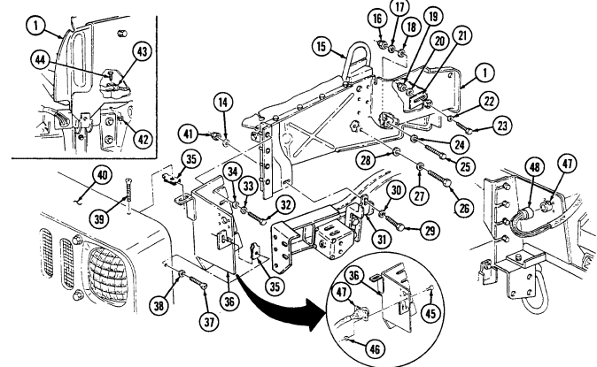

FOLLOW-ON TASKS: - • Install fuel drainvalve (M1114 only) (para. 3-35).

-  Install hood prop rod and bracket (para. 10-8).
-  Connect battery ground cables (para. 4-68).

# 10-23.1. Engine Left Splash Shield Maintenance (Serial Numbers 300000 And Above)

| This task covers:   |
|---------------------|

a. Removal c. Assembly b. Disassembly d. Installation

#### Initial Setup: Tools

General mechanic's tool kit:
automotive (Appendix B, Item 1)
Maintenance and repair shop equipment:
automotive (Appendix B, Item 2)

#### Materials/Parts

Eight locknuts (Appendix G, Item 76) Nut and lockwasher assembly 
(Appendix G, Item 134)
Four rivets (Appendix G, Item 262.1) Locknut (Appendix G, Item 106) Three locknuts (Appendix G, Item 82) Four lockwashers (Appendix G, Item 172) Lockwasher (Appendix G, Item 145)

#### Manual References

TM 9-2320-387-24P

#### Equipment Condition

- Battery ground cables disconnected 
(para. 4-68).

- Hood prop rod and bracket removed 
(para. 10-8).

General Safety Instructions Hood must be supported during removal and installation.

Maintenance Level Unit

#### Warning

Hood must be supported during removal and installation. Failure to support hood may cause injury to personnel or damage to equipment.

a. Removal 1. Disconnect hood harness (1) from connector (2). 2. Remove four capscrews (27), lockwashers (28), and washers (29) from plate (31) and splash shield bracket (9). Discard lockwashers (28).

3. Remove capscrews (34) and (36), plate (31), and spring nuts (30) and (37) from headlight housing (35).

4. Remove four nuts (33), capscrews (32), and connector (2) from plate (31). 5. Remove nut and lockwasher assembly (5), capscrew (6), and harness and clamp assembly (4) from splash shield (3). Discard nut and lockwasher assembly (5).

6. Remove nut (7) and valve (8) from splash shield (3). 7. Remove locknut (38), washer (39), capscrew (24), and washer (25) from support bracket (26) and splash shield (3). Discard locknut (38).

8. Remove capscrew (23), lockwasher (22), and washer (21) from airlift bracket (10) and splash shield (3). Discard lockwasher (22).

9. Remove locknut (11), washers (12) and (13), capscrew (19), and washer (18) from lower airlift bracket (20) and splash shield (3). Discard locknut (11).

10. Remove locknut (14), capscrew (17), and washer (16) from master cylinder bracket (15). Discard locknut (14) and remove splash shield (3) from vehicle.

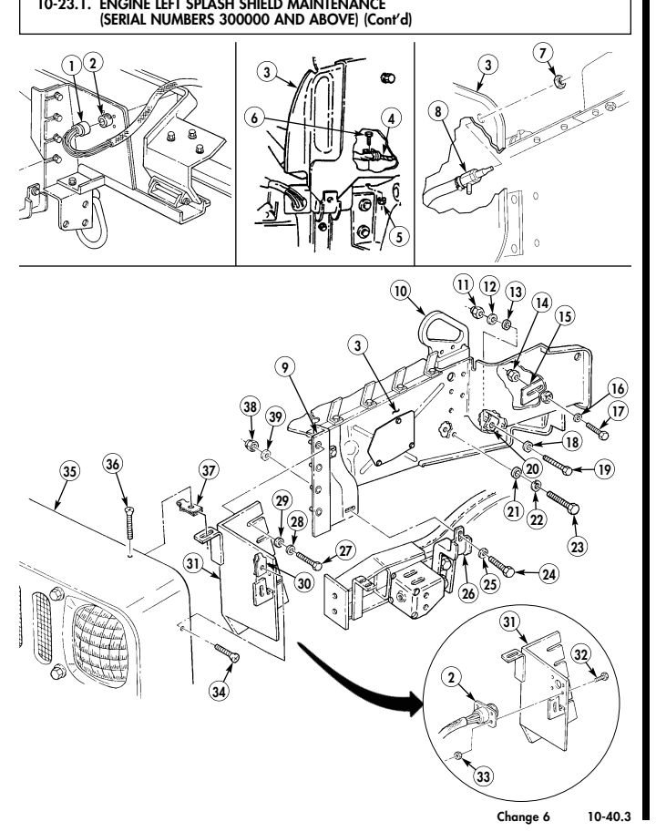

# 10-23.1. Engine Left Splash Shield Maintenance (Serial Numbers 300000 And Above) (Cont'D)

b. Disassembly 1. Remove three locknuts (11), washers (12), capscrews (14), and bracket (13) from splash shield (1).

Discard locknuts (11).

2. Remove five locknuts (10), washers (9), capscrews (17), four rubber guards (18), seal retainer (16), and seal (15) from splash shield (1). Discard locknuts (10).

3. Remove three capscrews (5), washers (6), cover (7), and spring nuts (8) from splash shield (1). 4. Remove four rivets (4), support (3), and reinforcement (2) from splash shield (1). Discard rivets (4).

c. Assembly

For rivet replacement instructions, refer to TM 9-2320-387-24-1.

1. Install support (3) and reinforcement (2) on splash shield (1) with four rivets (4). 2. Install cover (7) on splash shield (1) with three washers (6), capscrews (5), and spring nuts (18). 3. Install seal (15), seal retainer (16), and four rubber guards (18) on splash shield (1) with five capscrews (17), washers (9), and locknuts (10).

4. Install bracket (13) on splash shield (1) with three capscrews (14), washers (12), and locknuts (11).

# 10-23.1. Engine Left Splash Shield Maintenance

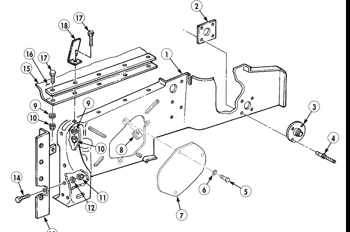

(13)
# 10-23.1. Engine Left Splash Shield Maintenance (Serial Numbers 300000 And Above) (Cont'D)

#### D. Installation

1. Install splash shield (3) on master cylinder bracket (15) with washer (16), capscrew (17), and locknut (14).

2. Install splash shield (3) on lower airlift bracket (20) with washer (18), capscrew (19), washers (13)
and (12), and locknut (11).

3. Install splash shield (3) on airlift bracket (10) with washer (21), lockwasher (22), and capscrew (23). 4. Install splash shield (3) on support bracket (26) with washer (25), capscrew (24), washer (39), and locknut (38).

5. Install valve (8) on splash shield (3) with nut (7). 6. Install harness and clamp assembly (4) on splash shield (3) with capscrew (6) and nut and lockwasher assembly (5).

7. Install connector (2) on plate (31) with four capscrews (32) and nuts (33). 8. Install spring nuts (37) and (30) on plate (31). 9. Install plate (31) on headlight housing (35) with hex-head screws (36) and (34).

10. Install plate (31) on splash shield bracket (9) with four washers (29), lockwashers (28), and capscrews (27).

11. Connect hood harness (1) to connector (2).

# 10-23.1.  Engine Left Splash Shield Maintenance (Serial Numbers 300000 And Above) (Cont'D)

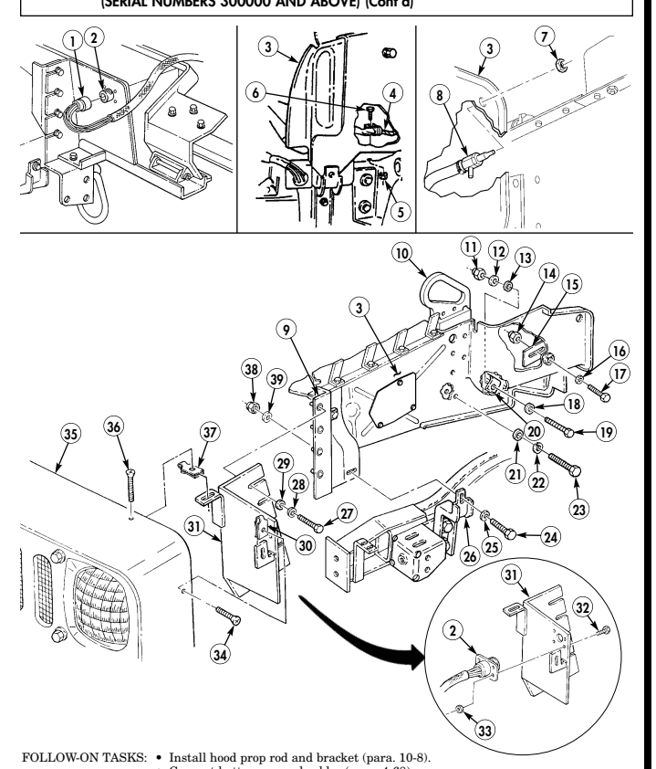

· Connect battery ground cables (para. 4-68).

# 10-24. Engine Right Splash Shield Maintenance (Serial Numbers 299999 And Below)

This task covers:

Tools General mechanic's tool kit:
automotive (Appendix B, Item 1)
Maintenance and repair shop equipment:
automotive (Appendix B, Item 2)

#### Materials/Parts

Four lockwashers (Appendix G, Item 172) Eight locknuts (Appendix G, Item 76) Two locknuts (Appendix G, Item 82)
(M1113, M1152, M1152A1 only)
Locknut (Appendix G, Item 77) Locknut (Appendix G, Item 82) (M1114 only) Three locknuts (Appendix G, Item 82) 
(M1151, M1151A1, M1165, M1165A1 only)
a. Removal c. Assembly

b. Disassembly d. Installation

Manual References TM 9-2320-387-10 TM 9-2320-387-24P
Equipment Condition Hood raised and secured (TM 9-2320-387-10).

Maintenance Level Unit

#### A. Removal

1. Disconnect hood harness connector (33) from connector (34). 2. Remove four capscrews (18), lockwashers (19), and washers (20) from plate (16) and splash shield bracket (8). Discard lockwashers (19).

3. Remove two hex-head screws (11), harness (14), clamp (15), plate (16), and spring nuts (13) and (17)
from headlight housing (12).

4. Remove four nuts (35), capscrews (36), and plate (16) from connector (34). 5. Remove locknut (10), washer (9), capscrew (25), and washer (26) from splash shield (1) and support bracket (24). Discard locknut (10).

Perform step 6 for all models except M1114.

6. Remove locknut (7), washers (6) and (21), capscrews (27) and (28), washers (23) and (29), and clamp (22) from splash shield (1) and airlift bracket (5). Discard locknut (7).

7. Deleted. 8. Remove screw (3), washer (4), and splash shield (1) from airlift bracket (5).

# 10-24.  Engine Right Splash Shield Maintenance

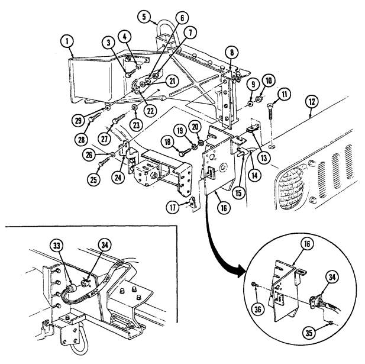

■

# 10-24. Engine Right Splash Shield Maintenance (Serial Numbers 299999 And Below) (Cont'D)

b. Disassembly 1. Remove locknut (2), washer (3), capscrew (6), washer (5), and bracket (4) from splash shield (1). Discard locknut (2).

2. Remove three locknuts (15), washers (14), capscrews (13), and support bracket (12) from splash shield (1). Discard locknuts (15).

3. Remove five locknuts (10), washers (9), capscrews (8), seal retainer (7), and seal (11) from splash shield (1). Discard locknuts (10).

Perform step 4 only if vehicle has an armor plate.

4. Remove locknut (17), washer (18), capscrew (19), washer (18), and armor plate (20) from splash shield (1). Discard locknut (17).

c. Assembly NOTE
Perform step 1 only if vehicle has an armor plate.

1. Install armor plate (20) on splash shield (1), ensuring capscrew holes align, and secure with washer (18), capscrew (19), washer (18), and locknut (17). Tighten locknut (17) to 15 lb-ft (20 N•m).

2. Install support bracket (12) on splash shield (1) with three capscrews (13), washers (14), and locknuts (15).

3. Install seal (11) and seal retainer (7) on splash shield (1) with five capscrews (8), washers (9), and locknuts (10).

4. Install bracket (4) on splash shield (1) with washer (5), capscrew (6), washer (3), and locknut (2).

Ensure second hole in bracket (4) aligns with hole (16) in splash shield (1).

10-24.  ENGINE RIGHT SPLASH SHIELD MAINTENANCE
 

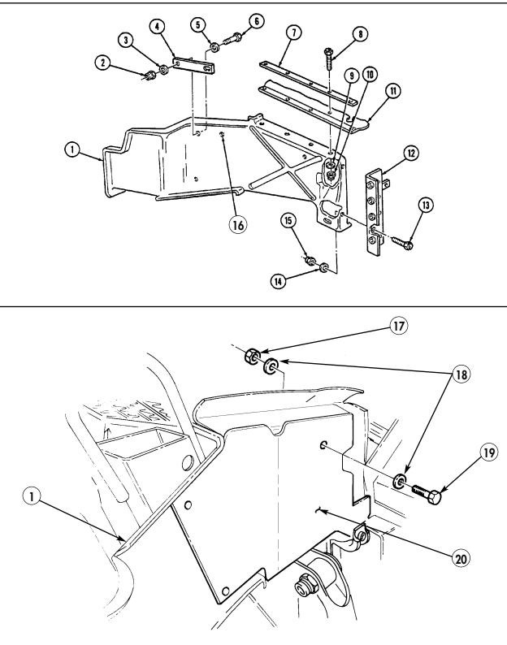

■

# 10-24. Engine Right Splash Shield Maintenance (Serial Numbers 299999 And Below) (Cont'D)

d. Installation 1. Install splash shield (1) on airlift bracket (20) with washer (19) and capscrew (18). 2. Install splash shield (1) on splash shield mount (38) with washer (40), capscrew (39), washer (24), and locknut (25). Tighten capscrew (39) to 15 lb-ft (20 N•m).

Perform steps 3 through 5 for all models except M1114.

3. Install splash shield (1) on lower airlift bracket (36) with washer (43), capscrew (42), washer (23),
lockwasher (21), and locknut (22). Tighten capscrew (42) to 10 lb-ft (14 N•m).

4. Deleted. 5. Install splash shield (1) on airlift bracket (20) with lockwasher (37) and capscrew (41). 6. Install plate (31) on connector (48) with four screws (49) and nuts (50). 7. Install spring nuts (28) and (32) and plate (31) on headlight housing (26) with two hex-head screws (27), harness (29), and clamp (30).

8. Install plate (31) on support bracket (12) with four washers (35), lockwashers (34), and capscrews (33). 9. Connect hood harness connector (47) to connector (48).

# 10-24.  Engine Right Splash Shield Maintenance (Serial Numbers 299999 And Below) (Cont'D)

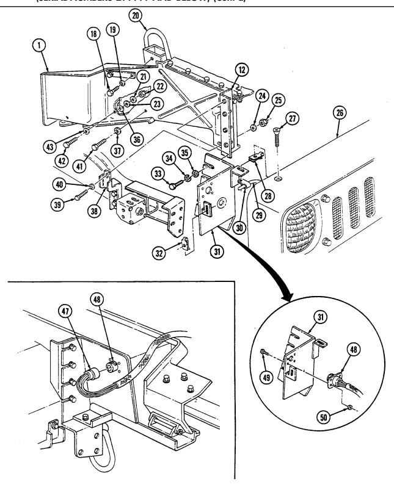

FOLLOW-ON TASK:  Lower and secure hood (TM 9-2320-387-10).

■

# 10-24.1. Engine Right Splash Shield Maintenance (Serial Numbers 300000 And Above)

This task covers:

a. Removal c. Assembly b. Disassembly d. Installation

| Maintenance Level                                                                            | Manual References    | Unit   |
|----------------------------------------------------------------------------------------------|----------------------|--------|
| TM 9\-2320\-387\-10                                                                          | TM 9\-2320\-387\-24P |        |
| a. Removal                                                                                   |                      |        |
| Remove two capscrews (1), washers (2), center hood stop (3), and plate (4) from A\-beam (5). |                      |        |
| b. Installation                                                                              |                      |        |

#### A. Removal

9. Remove capscrew (3), lockwasher (4), and washer (5) from airlift bracket (9). Discard lockwasher (4).

1. Disconnect hood harness (39) from connector (20). 2. Remove four capscrews (24), lockwashers (25), and washers (26) from splash shield bracket (10) and plate (19). Discard lockwashers (25).

3. Remove capscrews (13) and (22), harness (16), clamp (17), and plate (19) from headlight housing (14). 4. Remove four nuts (21), capscrews (18), and connector (20) from plate (19). 5. Remove locknut (12), washer (11), capscrew (29), and washer (28) from splash shield (1) and support bracket (27). Discard locknut (12).

6. Remove capscrew (32), lockwasher (31), and washer (30) from splash shield (1) and airlift bracket (9).

Discard lockwasher (31).

7. Remove locknut (7), washer (6), capscrew (34), and washer (33) from splash shield (1) lower airlift bracket (8). Discard locknut (7).

8. Remove locknut (35), washer (36), capscrew (2), harness (37), and clamp (38) from splash shield (1).

Discard locknut (35).

# 10-24.1.  Engine Right Splash Shield Maintenance (Serial Numbers 300000 And Above) (Cont'D)

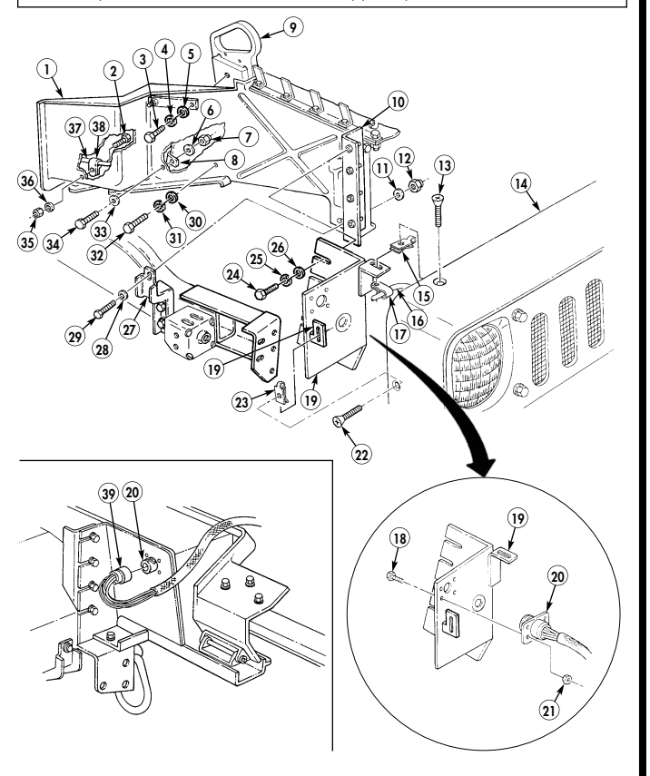

## 10-24.1. Engine Right Splash Shield Maintenance (Serial Numbers 300000 And Above) (Cont'D)

b. Disassembly 1. Remove locknut (2), washer (3), capscrew (6), washer (5), and bracket (4) from splash shield (1).

Discard locknut (2).

2. Remove three locknuts (16), washers (15), capscrews (14), and support bracket (13) from splash shield (1). Discard locknuts (16).

3. Remove five locknuts (12), washers (11), capscrews (8), four rubber guards (9), seal retainer (7), and seal (10) from splash shield (1). Discard locknuts (12).

#### C. Assembly

1. Install seal (10), seal retainer (7), and four rubber guards (9) on splash shield (1) with five capscrews (8),
washers (11), and locknuts (12).

2. Install support bracket (13) on splash shield (1) with three capscrews (14), washers (15), and locknuts (16).

3. Install bracket (4) on splash shield (1) with washer (5), capscrew (6), washer (3), and locknut (2).

Ensure second hole in bracket (4) aligns with hole (17) in splash shield (1).

# 10-24.1.  Engine Right Splash Shield Maintenance (Serial Numbers 300000 And Above) (Cont'D)

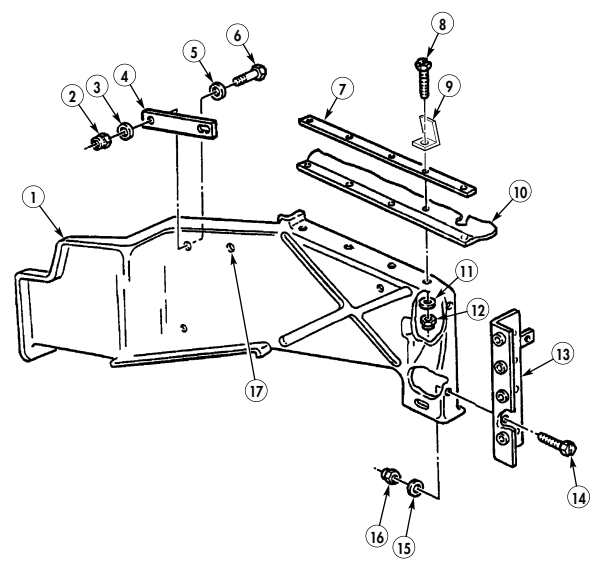

# 10-24.1. Engine Right Splash Shield Maintenance (Serial Numbers 300000 And Above) (Cont'D)

#### D. Installation

1. Install splash shield (1) on airlift bracket (9) with washer (5), lockwasher (4), and capscrew (3). 2. Install harness (37) and clamp (38) on splash shield (1) with capscrew (2), washer (36), and locknut (35).

3. Install splash shield (1) on lower airlift bracket (8) with washer (33), capscrew (34), washer (6), and locknut (7).

4. Secure splash shield (1) to airlift bracket (9) with washer (30), lockwasher (31), and capscrew (32).

Tighten capscrew (32) to 15 lb-ft (20 N·m).

5. Install splash shield (1) on support bracket (27) with washer (28), capscrew (29), washer (11), and locknut (12).

6. Install connector (20) on plate (19) with four capscrews (18) and nuts (21). 7. Install spring nuts (15) and (23) on plate (19). 8. Install plate (19) on headlight housing (14) with hex-head screws (13) and (22), harness (16), and clamp (17).

9. Install plate (19) on splash shield (1) with four washers (26), lockwashers (25), and capscrews (24).

10. Connect hood harness (39) to connector (20).

# 10-24.1.  Engine Right Splash Shield Maintenance (Serial Numbers 300000 And Above) (Cont'D)

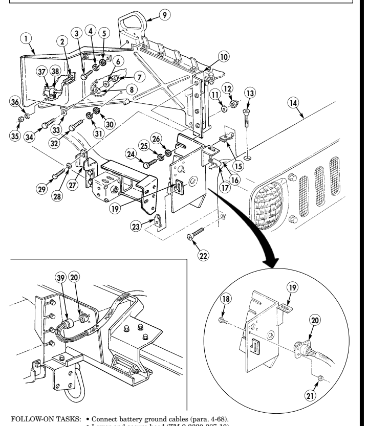

· Lower and secure hood (TM 9-2320-387-10).

PRODUCT
# 10-25. Engine Left Splash Shield Access Cover Replacement

This task covers:
INITIAL SETUP:
Tools General mechanic's tool kit:
automotive (Appendix B, Item 1)
Manual References TM 9-2320-387-10 TM 9-2320-387-24P

a. Removal b. Installation

Equipment Condition Hood raised and secured (TM 9-2320-387-10).

Maintenance Level Unit a. Removal 1. Remove three capscrews (4), washers (3), and splash shield access cover (5) from engine left splash shield (1).

2. Inspect spring nuts (2). Replace if damaged.

b. Installation Install splash shield access cover (5) on engine left splash shield (1) with three washers (3) and capscrews (4).

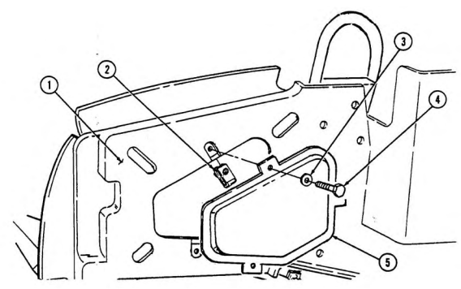

FOLLOW-ON TASK: Lower and secure hood (TM 9-2320-387-10).

# 10-26. Windshield Glass And Weatherstrip Replacement

This task covers:
INITIAL SETUP:
Applicable Models M1113 Tools General mechanic's tool kit:
automotive (Appendix B, Item 1)
Materials/Parts Sealing compound (Appendix C, Item 68)
Manual References TM 9-2320-387-24P
a. Removal b. Installation Equipment Condition Windshield wiper blade and arm removed
(para. 10-62).

General Safety Instructions Eyeshields and gloves are required when installing and removing windshield glass.

Maintenance Level Unit

#### Warning

Use eyeshields and gloves when removing and installing windshield glass. Glass could shatter and cause injury.

a. Removal 1. Remove six capscrews (7) and upper retainer (3) from windshield frame (5). 2. Remove four capscrews (1) and center retainer (2) from windshield frame (5). 3. Remove weatherstrip (4) and glass (6) from windshield frame (5).

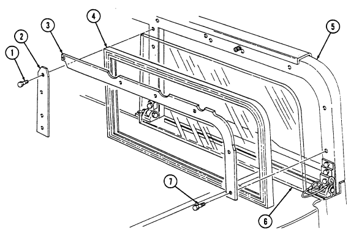 4. Clean sealant from windshield frame (5).

# 10-26. Windshield Glass And Weatherstrip Replacement (Cont'D)

b. Installation 1. Apply a 1/8 in. (3 mm) bead of sealing compound to edge of glass (6) and to windshield frame (5). 2. Install weatherstrip (4) on glass (6). 3. Install glass (6) and weatherstrip (4) on windshield frame (5) with center retainer (2) and four capscrews (1).

4. Install upper retainer (3) on windshield frame (5) with six capscrews (7). 5. Apply thin bead of sealing compound to top edge of outside weatherstrip (4).

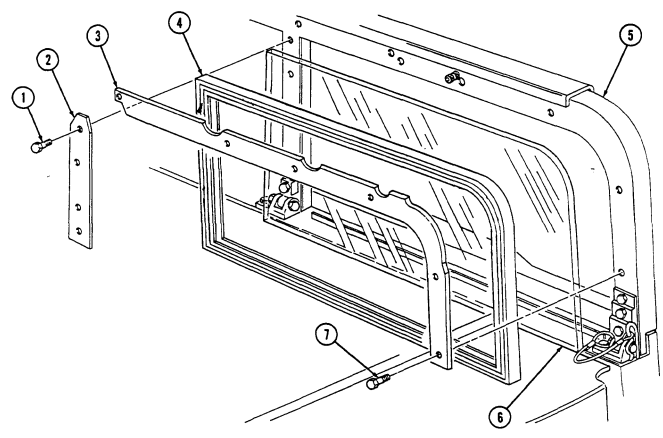

FOLLOW-ON TASK: Install windshield wiper blade and arm (para. 10-62).

10-48/(10-48.1 blank) Change 3

# 10-26.1. Windshield Ballistic Glass And Weatherstrip Maintenance

This task covers:
b. Inspection

Applicable Models M1151, M1152, M1165 Tools General mechanic's tool kit:
automotive (Appendix B, Item 1)
Materials/Parts Sealing compound (Appendix C, Item 68)
Manual References TM 9-2320-387-24P
a. Removal c. Installation Personnel Required One mechanic One assistant Equipment Condition Windshield wiper blade and arm removed
(para. 10-62).

General Safety Instructions Eyeshields and gloves are required when installing and removing windshield glass.

#### Warning

Use eyeshields and gloves when removing and installing windshield glass. Glass could shatter causing injury.

a. Removal 1. Remove six capscrews (10), lockwashers (9), washers (8), and upper retainer (7) from windshield frame (6).

2. Remove four capscrews (1), lockwashers (2), washers (3), and center retainer (4) from windshield frame (6).

3. Remove ballistic glass (5) from windshield frame (6). 4. Clean sealing compound from windshield frame (6).

#### B. Inspection

Refer to para. 10-56 for nut insert inspection and replacement.

c. Installation

#### Caution

Use grade 5 torque value when installing capscrews into nut inserts. Failure to do so may damage equipment and/or components.

1. Apply a 1/8 in. (3 mm) bead of sealing compound around windshield frame (6). 2. Position ballistic glass (5) to windshield frame (6) with marking on weatherstrip facing inward. 3. Install center retainer (4) on windshield frame (6) with four washers (3), lockwashers (2), and capscrews (1).

4. Install upper retainer (7) on windshield frame (6) with six washers (8), lockwashers (9), and capscrews (10).

# 10-26.1. Windshield Ballistic Glass And Weatherstrip Maintenance (Cont'D)

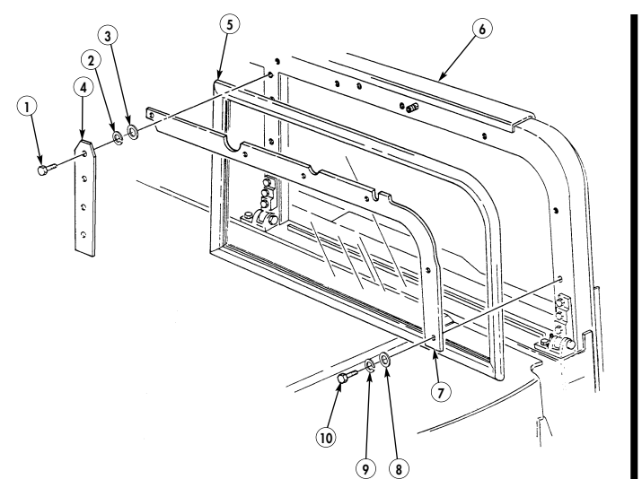

FOLLOW-ON TASK:  Install windshield wiper blade and arm (para. 10-62).

# 10-27. Windshield Glass Maintenance (M1114)

This task covers:
b. Inspection INITIAL SETUP:
Applicable Models M1114 Tools General mechanic's tool kit:
automotive (Appendix B, Item 1)
Maintenance and repair shop equipment:
automotive (Appendix B, Item 2)

#### Materials/Parts

Three locknuts (right side only)
(Appendix G, Item 170)
Two locknuts (Appendix G, Item 129) Two lockwashers (Appendix G, Item 142) Sealing compound (Appendix C, Item 63) Sealing compound, windshield
(Appendix C, Item 68)

#### Personnel Required

One mechanic One assistant a. Removal c. Installation Manual References TM 9-2320-387-10 TM 9-2320-387-24P

#### Equipment Condition

- Windshield wiper blade and arm removed
(para. 10-62).

- Rearview mirror removed (para. 10-68). - Hood raised and secured (TM 9-2320-387-10). - A/C air distribution duct register removed 
(right side only) (para. 11-82).

- Air intake assembly removed (right side only)
(para. 3-19).

- Windshield de-icer removed removed (para. 10-67).

Maintenance Level Unit

Replacement procedures for left and right windshield glass are basically the same. This procedure covers the left windshield glass.

a. Removal

Use cardboard and masking tape to cover windshield glass.

1. Remove screw (5) and clamp (6) from left deflector (3).

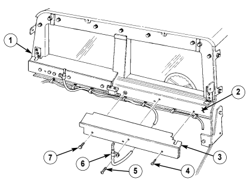

## 10-27. Windshield Glass Maintenance (M1114) (Cont'D)

2. Remove two capscrews (7), capscrew (4), and left deflector (3) from body (2) and windshield (1). 3. Remove three capscrews (18) from windshield bracket (15) and left capping ring (12). 4. Remove two locknuts (20), lockwashers (19), socket-head screws (16), and windshield bracket (15)
from body (3). Discard locknuts (20) and lockwashers (19).

5. Remove five capscrews (21) and upper capping ring (22) from windshield frame (11). 6. Remove two capscrews (17), capscrews (14), washers (13), and left capping ring (12) from windshield frame (11).

7. Remove two capscrews (9) and center capping ring (10) from windshield frame (11). 8. Remove windshield glass (25) from windshield frame (11). 9. Remove neoprene weatherstrips (23) and (24) from windshield glass (25).

10. Remove gasket (26) from windshield glass (25).

b. Inspection Refer to para. 10-56 for plusnut (2) inspection and replacement.

c. Installation 1. Apply a thin coat of windshield sealing compound to side and bottom of windshield glass (25). 2. Install neoprene weatherstrips (23) and (24) on sides and bottom of windshield glass (25). 3. Install gasket (26) on windshield glass (25). 4. Install windshield glass (25) on windshield frame (11). 5. Apply sealing compound to threads of two capscrews (9), and install center capping ring (10) on windshield frame (11) with capscrews (9). Tighten capscrews (9) to 68-82 lb-in. (8-9 N•m).

6. Apply sealing compound to threads of five capscrews (21), and install upper capping ring (22) on windshield frame (11) with capscrews (21). Tighten capscrews (21) to 68-82 lb-in. (8-9 N•m).

7. Apply sealing compound to threads of two capscrews (14) and (17), and install left capping ring (12)
on windshield frame (11) with two washers (13), capscrews (14), and capscrews (17). Tighten capscrews (17) to 68-82 lb-in. (8-9 N•m).

8. Apply sealing compound to threads of three caspcrews (18), and install windshield bracket (15) on left capping ring (12) with capscrews (18). Tighten capscrews (18) to 40-60 lb-in. (5-7 N•m).

9. Install windshield bracket (15) on body (3) with two socket-head screws (16), lockwashers (19), and locknuts (20). Tighten socket-head screws (16) to 40-60 lb-in. (5-7 N•m).

10. Apply sealing compound to threads of two capscrews (8) and capscrew (5), and install left deflector
(4) on body (3) and windshield (1) with two capscrews (8) and capscrew (5). Tighten capscrews (8) and (5) to 68-82 lb-in. (8-9 N•m).

11. Apply sealing compound to threads of screw (6), and install clamp (7) on left deflector (4) with screw (6). Tighten screw (6) to 33-37 lb-in. (3.7-4.2 N•m).

# 10-27. Windshield Glass Maintenance (M1114) (Cont'D)

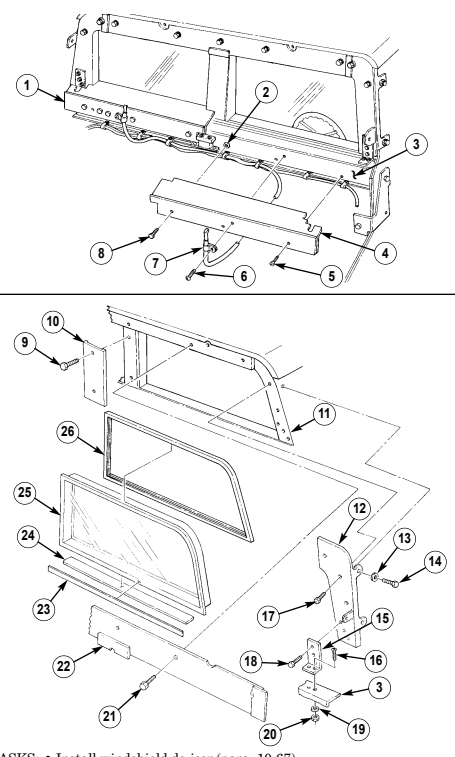

FOLLOW-ON TASKS: - Install windshield de-icer (para. 10-67).

- Install wiper blade and arm (para. 10-62). - Install rearview mirror (para. 10-68). - Install air intake assembly, if removed (para. 3-19). - Lower and secure hood (TM 9-2320-387-10). - Install A/C distribution duct register, if removed (para. 11-82).

# 10-28. Windshield Assembly Maintenance

This task covers:

b. Disassembly **d. Installation**

Applicable Models M1113 Tools General mechanic's tool kit:
automotive (Appendix B, Item 1)
Personnel Required One mechanic One assistant Manual References TM 9-2320-387-10 TM 9-2320-387-24P
a. Removal

a. Removal c. Assembly

#### Equipment Condition

- Soft top enclosure removed, if installed
(TM 9-2320-387-10).

- Windshield wiper arm pivot removed (para. 10-60). - Windshield retention bracket removed (para. 10-29).

General Safety Instructions Windshield must be supported during removal and installation.

Maintenance Level Unit

#### Warning

Windshield must be supported during removal and installation. Failure to support windshield may cause injury to personnel or damage to equipment.

1. Remove five hitch pins (5) from hinge pins (6). 2. Remove five hinge pins (6) from upper hinge halves (2) and lower hinge halves (4). 3. Remove grommet (11) from A-pillar (12) and remove jumper harness (10). 4. Remove windshield assembly (1) from A-pillar (12). 5. Remove two seals (3) from windshield assembly (1). 6. Clean remains of seal (3) from windshield assembly (1).

#### B. Disassembly

1. Remove thirteen screws (9), former (8), and seal (7) from windshield assembly (1). 2. Clean remains of seal (7) from windshield assembly (1). c. Assembly 1. Peel paper backing from seal (7) and install seal (7) on windshield assembly (1). 2. Install former (8) on seal (7) and windshield assembly (1) with thirteen screws (9). d. Installation 1. Peel paper backing from two seals (3) and install seals (3) on windshield assembly (1). 2. Install windshield assembly (1) on A-pillar (12). 3. Install jumper harness (10) on windshield center pillar (13) and install grommet (11) on A-pillar (12). 4. Install upper hinge halves (2) on lower hinge halves (4) with five hinge pins (6). 5. Install five hitch pins (5) in hinge pins (6).

# 10-28. Windshield Assembly Maintenance (Cont'D)

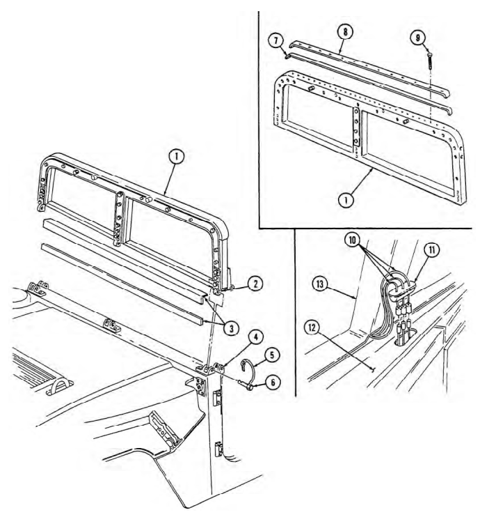

FOLLOW-ON TASKS: -  Install windshield retention bracket (para. 10-29).

-  Install windshield wiper arm pivot (para. 10-60).
-  Install soft top enclosure, if removed (TM 9-2320-387-10).

# 10-29. Windshield Retention Bracket Maintenance

This task covers:
b. Inspection

Applicable Models M1113, M1151, M1152, M1165 Tools General mechanic's tool kit:
automotive (Appendix B, Item 1)
a. Removal **c. Installation**

| Spring pin (Appendix G, Item 318)   |
|-------------------------------------|
| Adhesive (Appendix C, Item 8)       |
| Manual References                   |
| TM 9\-2320\-387\-24P                |
| Maintenance Level                   |

#### A. Removal

Remove four capscrews (2), lockwashers (3), and retention bracket (1) from windshield frame (5). Discard lockwashers (3). b. Inspection Refer to para. 10-56 for nut insert inspection and replacement. c. Installation

#### Caution

Use grade 5 torque value when installing capscrews into nut inserts.

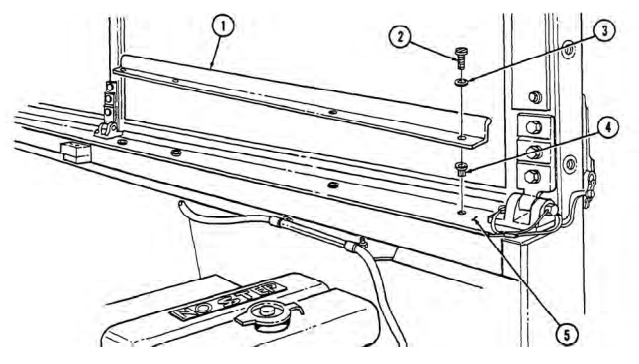 Failure to do so may damage equipment and/or components.

Install retention bracket (1) on windshield frame (5) with four lockwashers (3) and capscrews (2).

# 10-30. Left Outer Cowl Insulation Replacement

This task covers:
INITIAL SETUP:
Applicable Models All models except M1114 Tools General mechanic's tool kit:
automotive (Appendix B, Item 1)
Materials/Parts Locknut (Appendix G, Item 76)

a. Removal b. Installation

| Materials/Parts   |
|-------------------|

| Maintenance Level   |
|---------------------|
| Unit                |

Maintenance Level a. Removal Remove locknut (4), capscrew (1), washer (2), clamp (6), wiring harness (7), and insulation (3) from cowl (5). Discard locknut (4).

b. Installation Install insulation (3) and wiring harness (7) on cowl (5) with clamp (6), washer (2), capscrew (1), and locknut (4).

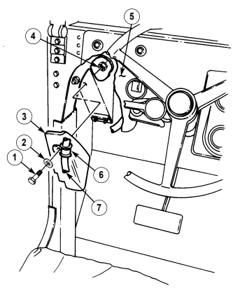

# 10-31. Left Front Cowl Insulation Maintenance

This task covers:
b. Inspection INITIAL SETUP:
Tools General mechanic's tool kit:
automotive (Appendix B, Item 1)
Maintenance and repair shop equipment:
automotive (Appendix B, Item 2)
Materials/Parts Five locknuts (Appendix G, Item 133) Two locknuts (Appendix G, Item 76) Five AVK fasteners (Appendix G, Item 1) 
(all models except M1113)
Sealing compound (Appendix C, Item 72.1)
a. Removal c. Installation Manual References TM 9-2320-387-24P
Personnel Required One mechanic One assistant Equipment Condition Headlight beam selector switch and shield removed (para. 4-59).

Maintenance Level Unit a. Removal

Perform steps 1 and 5 for all models except M1113 and steps 2, 3, and 4 for M1113 models only.

1. Remove two capscrews (5), washers (4), and clamps (3) from wiring harness (2), insulation (10), and body (6).

NOTE
All models except M1113 are equipped with nut inserts, not with nuts and lockwashers as indicated in step 2.

2. Remove two locknuts (1), capscrews (5), washers (4), and clamps (3) from wiring harness (2), insulation (10),
and body (6). Discard locknuts (1).

3. Remove locknut (17), washer (16), spacer (15), capscrew (8), and washer (7) from insulation (10) and floor (12). Discard locknut (17).

4. Remove four locknuts (13), washers (14), capscrews (9), retainer (11), and insulation (10) from floor (12).

Discard locknuts (13).

5. Remove three capscrews (9), retainer (11), and insulation (10) from floor (12).

b. Inspection

Perform this step for all models except M1113.

For inspection and removal of nut inserts (18), refer to para. 10-56. c. Installation

Perform steps 1 and 5 for all models except M1113 and steps 2, 3, and 4 for M1113 models only.

1. Install insulation (10) and retainer (11) on floor (12) with three capscrews (9). 2. Install insulation (10) and retainer (11) on floor (12) with four capscrews (9), washers (14), and locknuts (13). TIghten locknuts (13) to 6 lb-ft (8 N•m).

3. Install washer (7), capscrew (8), spacer (15), washer (16), and locknut (17) on insulation (10) and floor (12).

NOTE
All models except M1113 are equipped with nut inserts, not with nuts and lockwashers as indicated in step 4. Apply sealing compound to threads of capscrews at installation.

# 10-31. Left Front Cowl Insulation Maintenance (Cont'D)

#### Caution

Use grade 5 torque value when installing capscrews into nut inserts. Failure to do so may damage equipment and/or components.

4. Install wiring harness (2) on insulation (10) and body (6) with two clamps (3), washers (4), capscrews (5),
and locknuts (1).

5. Install wiring harness (2) on insulation (10) and body (6) with two clamps (3), washers (4), and capscrews (5).

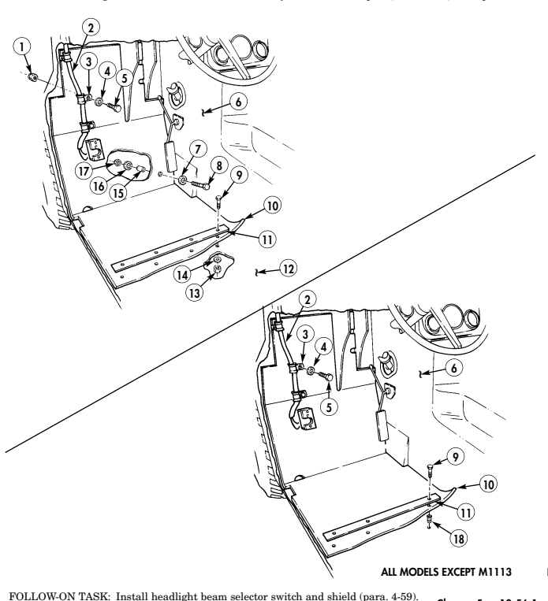

Change 5 10-56.1

# 10-31.1. Left Inner Cowl Insulation Panel Replacement

This task covers:

a. Removal b. Installation

| INITIAL SETUP:                                                       |                                          |
|----------------------------------------------------------------------|------------------------------------------|
| Tools                                                                | Manual References                        |
| General mechanic's tool kit:                                         | TM 9\-2320\-387\-24P                     |
| automotive (Appendix B, Item 1)                                      | Equipment Condition                      |
| Materials/Parts                                                      | Front radio rack removed (para. 12\-17). |
| Two locknuts (Appendix G, Item 82) Two rivets (Appendix G, Item 263) | Maintenance Level                        |
| Seven rivets (Appendix G, Item 255)                                  | Unit                                     |
| Eight rivets (Appendix G, Item 260)                                  |                                          |
| Two rivets (Appendix G, Item 264)                                    |                                          |
| a. Removal                                                           |                                          |

a. Removal 1. Remove four locknuts (5), washers (3), capscrews (2), and washers (3) from harness clamp (4), brake harness (8), retainer (1), and cowl (7). Discard locknuts (5).

2. Remove assembled locknut (10), capscrew (12), and harness clamp (9) from body harness (11), brake harness (8), and cowl (7). Discard assembled locknut (10).

3. Remove assembled locknut (15) and capscrew (13) from harness clamp (14) and cowl (7) and disconnect body harness (11) from cowl (7). Discard assembled locknut (15).

4. Remove upper insulation panel (6) by sliding up and out from between retainer (1) and cowl (7). 5. Remove assembled locknut (19) and capscrew (17) from clamp (18) and cowl (7). Discard assembled locknut (19).

6. Remove lower insulation panel (16) by sliding down between retainer (1) and cowl (7).

10-31.1. LEFT INNER COWL INSULATION PANEL REPLACEMENT (Cont'd)

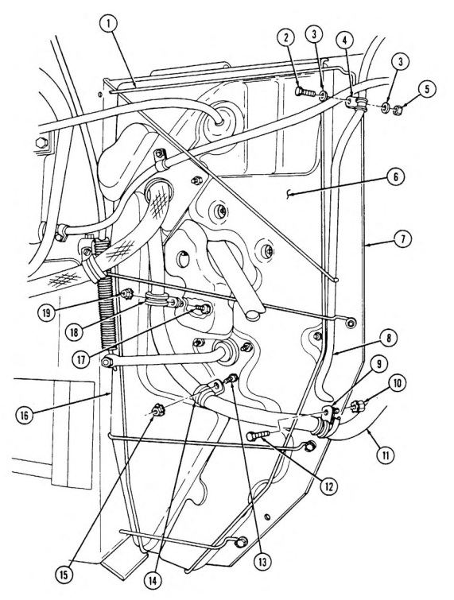

## 10-31.1. Left Inner Cowl Insulation Panel Replacement (Cont'D)

7. Remove four screws (8) from instrument cluster (3) and dash panel (7) and pull instrument cluster (3) away for access to speedometer cable (2).

8. Remove speedometer cable (2) and O-ring (4) from speedometer (1). Discard O-ring (4). 9. Remove grommet (6) from cowl (5) and route speedometer cable (2) through cowl (5).

10. Remove cotter pin (14), washer (13), and accelerator cable (15) from linkage (12). Discard cotter pin (14).

11. Pull retainer (9) clear of linkage (12) and remove retainer (9) from between splash shield (10) and frame rail (11) by pulling forward and then down.

#### B. Installation

1. Install retainer (9) by sliding up between splash shield (10) and frame rail (11) forward of cowl (5),
and then sliding back to mounting position on cowl (5).

2. Connect accelerator cable (15) to linkage (12) with washer (13) and cotter pin (14). 3. Route speedometer cable (2) through cowl (5). Install O-ring (4) into end of speedometer cable (2) and connect speedometer cable (2) to speedometer (1).

4. Install instrument cluster (3) on dash panel (7) with four screws (8). 5. Install grommet (6) on speedometer cable (2) in cowl (5).

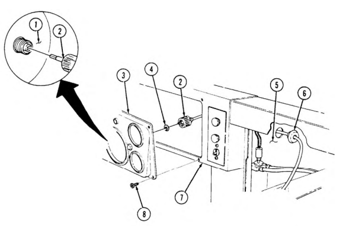

# 10-31.1. Left Inner Cowl Insulation Panel Replacement (Cont'D)

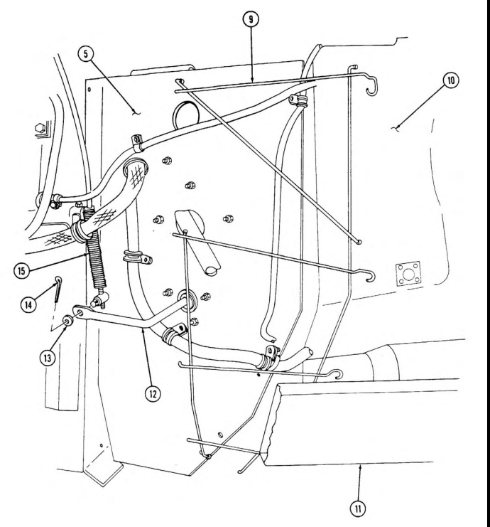

## 10-31.1. Left Inner Cowl Insulation Panel Replacement (Cont'D)

6. Install lower insulation panel (14) by sliding up into position between retainer (2) and cowl (9). 7. Install clamp (19) on cowl (9) with capscrew (18) and assembled locknut (20). 8. Install upper insulation panel (8) by sliding down into position between retainer (2) and cowl (9). 9. Install clamp (15) and body harness (17) on cowl (9) with screw (13) and assembled locknut (16).

10. Install clamp (11) on brake harness (7) and body harness (17) on cowl (9) with capscrew (12) and assembled locknut (10).

11. Install retainer (2) and brake harness (7) on cowl (9), ensuring rear ends of retainer (2) are inserted in body holes (1), with harness clamp (5), four washers (4), capscrews (3), washers (4), and locknuts (6).

# 10-31.1. Left Inner Cowl Insulation Panel Replacement (Cont'D)

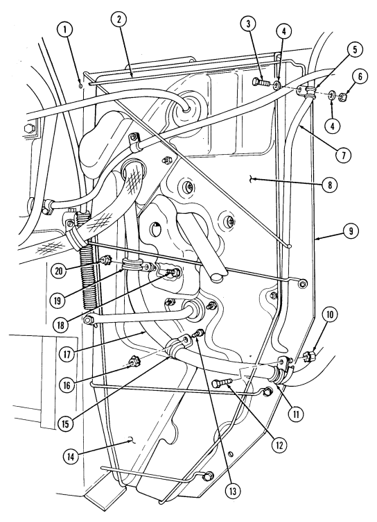

FOLLOW-ON TASK:   Lower and secure hood (TM 9-2320-387-10).

# 10-31.2. Insulation Panel Maintenance

This task covers:

| This task covers:   |
|---------------------|

| INITIAL SETUP:                         |                     |
|----------------------------------------|---------------------|
| Tools                                  | Manual References   |
| General mechanic's tool kit:           |                     |
| automotive (Appendix B, Item 1)        |                     |
| Maintenance and repair shop equipment: | Equipment Condition |
| automotive (Appendix B, Item 2)        |                     |

a. Removal c. Installation

Replacement procedures for all insulation panels are replaced basically the same. This procedure covers replacement of right roof insulation panel.

#### A. Removal

1. Remove two capscrews (1), washers (2) and side liner plate (9) from roof (3). 2. Remove four screws (5) and rear line plate (6) from roof (3). 3. Remove four screw (8), and two center roof liner plates (7) from roof (3). 4. Remove screw (4) and roof liner rod (10) from front roof mount (12) and roof (3). 5. Remove roof insulation (11) from roof (3).

b. Inspection Refer to para. 10-56 for nut inserts inspection or replacement.

c. Installation

#### Caution

Use grade 5 torque value when installing capscrews into nut inserts. Failure to do so may damage equipment and/or components.

1. Position roof insulation (11) on roof (3). 2. Secure side liner plate (9) to roof (3) with two washers (2) and capscrews (1). 3. Secure rear liner plate (6) to roof (3) with four screws (5). 4. Secure two center liner plates (7) to roof (3) with four screws (8). 5. Position end of roof liner rod (10) in slot of front roof mount (12) and secure other end with screw (4).

10-31.2. INSULATION PANEL MAINTENANCE (Cont'd)

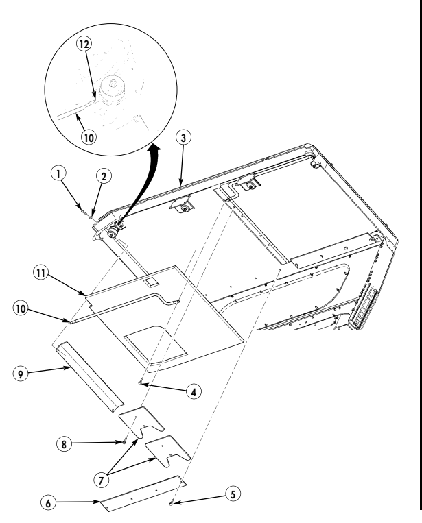

# 10-32. Right Front Cowl Insulation Maintenance

This task covers:
a. Removal c. Installation b. Inspection INITIAL SETUP:

#### Tools

General mechanic's tool kit:
automotive (Appendix B, Item 1)
Maintenance and repair shop equipment:
automotive (Appendix B, Item 2)

#### Materials/Parts

Four locknuts (Appendix G, Item 133) Two nut inserts (Appendix G, Item 1)
(all models except M1113)
a. Removal Personnel Required One mechanic One assistant Manual References TM 9-2320-387-24P
Maintenance Level Unit

Perform step 1 for all models except M1113 and step 2 for M1113 models only.

1. Remove two capscews (2), retainer (1), and insulation (4) from floor (7). 2. Remove four locknuts (6), washers (5), capscrews (2), retainer (1), and insulation (4) from floor (7).

Discard locknuts (6).

b. Inspection

Perform this step for all models except M1113.

For inspection and removal of nut inserts (8), refer to para. 10-56. c. Installation

#### Caution

Use grade 5 torque value when installing capscrews into nut inserts.

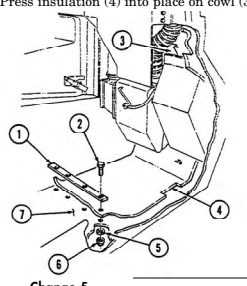 Failure to do so may damage equipment and/or components.

NOTE
Perform step 1 for all models except M1113 and step 2 for M1113 models only.

1. Install insulation (4) and retainer (1) on floor (7) with two capscrews (2). 2. Install insulation (4) and retainer (1) on floor (7) with four capscrews (2), washers (5), and locknuts (6).

Tighten locknuts (6) to 6 lb-ft (8 N•m).

3. Press insulation (4) into place on cowl (3).

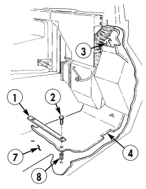

| This task covers:                      |                                      |
|----------------------------------------|--------------------------------------|
| a. Removal                             | c. Assembly                          |
| b. Disassembly                         | d. Installation                      |
| INITIAL SETUP:                         |                                      |
| Tools                                  | Manual References                    |
| General mechanic's tool kit:           | TM 9\-2320\-387\-24P                 |
| automotive (Appendix B, Item 1)        |                                      |
| Maintenance and repair shop equipment: | Equipment Condition                  |
| automotive (Appendix B, Item 2)        | - Battery ground cables disconnected |
|                                        | (para. 4\-68).                       |
| Materials/Parts                        | - Hood prop rod and bracket removed  |

# 10-32.1. Right Inner Cowl Insulation Panel Replacement

#### A. Removal

Remove three locknuts (7), washers (4), capscrews (5), washers (4), retainer (3), insulation (2), and drain hose clamp (6) from cowl (1). Discard locknuts (7).

#### B. Installation

Install drain hose clamp (6), insulation (2), and retainer (3) on cowl (1) with three washers (4),

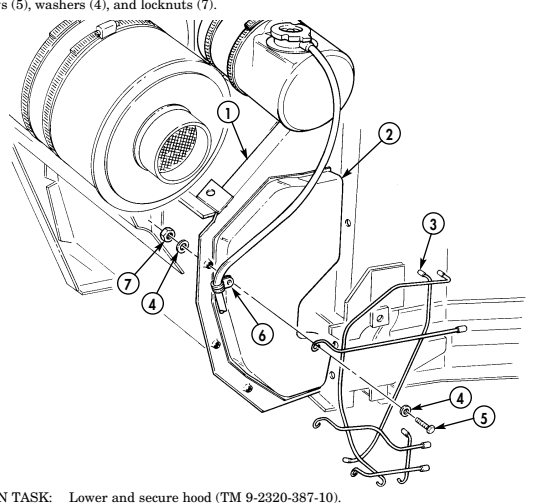

FOLLOW-ON TASK: Lower and secure hood (TM 9-2320-387-10).
# 10-33. Tunnel Interior Side Insulation Replacement

This task covers:

Tools General mechanic's tool kit:
automotive (Appendix B, Item 1)
Manual References TM 9-2320-387-24P

#### Equipment Condition

- Left front cowl insulation removed 
(para. 10-31).

- Gunner's platform removed (M1114 only) 
(para. 11-71).

a. Removal **b. Installation**

#### Equipment Condition (Cont'D)

- Left front cowl insulation removed 
(para. 10-31).

- Gunner's platform removed (M1114 only)
(para. 11-71).

- Tunnel top insulation removed 
(all models except M1113, M1114) (para. 11-97).

- Rifle support removed (M1114 only) 
(para. 11-66).

Maintenance Level Unit

Replacement procedures for all tunnel interior side insulation are basically the same. This procedure covers the left front insulation.

a. Removal 1. Remove six screws (3), retainer rods (1), (2), (4), and insulation (6) from tunnel (5).

Perform step 2 for M1114 models and step 3 for all other models.

2. Remove two screws (8) and washers (7) from insulation (6) and tunnel (5). 3. Remove four screws (9), two angle brackets (10), and insulation (6) from floor (11).

b. Installation

Perform step 1 for all models except M1114 and step 2 for M1114

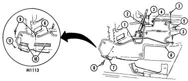 models only.

1. Install insulation (6) and two angle brackets (10) on floor (11) with four screws (9). 2. Install insulation (6) on tunnel (5) with two washers (7) and screws (8). 3. Install insulation (6) and retainer rods (1), (2), and (4) on tunnel (5) with six screws (3).

FOLLOW-ON TASKS: - Install rifle support (M1114 only) (para. 11-66).

- Install tunnel top insulation (all models except M1113, M1114) (para 11-97). - Install gunner's platform (M1114 only) (para. 11-71). - Install left front cowl insulation (para. 10-31).

# 10-34. Rear Seat Floor Insulation Replacement

This task covers: 

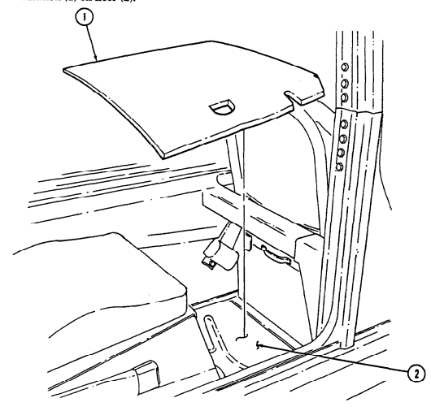

| Tools   |
|---------|

a. Removal b. Installation 

automotive (Appendix B, Item 1) 
1 a. Removal 1 Remove insulation (1) from floor (2). 

| Manual References   |
|---------------------|

b. Installation Install insulation (1) on floor (2). 

# 10-35. Tailgate Chain And Brackets Maintenance

This task covers:
a. Removal c. Installation b. Inspection

Applicable Models All models except M1113 Tools General mechanic's tool kit:
automotive (Appendix B, Item 1)
Maintenance and repair shop equipment:
automotive (Appendix B, Item 2)
Materials/Parts Four locknuts (Appendix G, Item 82)
a. Removal

All models except M1114 are equipped with nut inserts, not nuts and washers as indicated in step 3.

1. Open tailgate chain cap link (6) and disconnect tailgate chain (7) from bracket (9). 2. Unhook tailgate chain (7) from tailgate chain bracket (4) and remove tailgate chain (7). 3. Remove four locknuts (1), washers (2), capscrews (5), washers (2), angle bracket (10), chain bracket (9), and latch bracket (4) from body (3). Discard locknuts (1).

Perform step 4 only if tailgate chain cover is damaged.

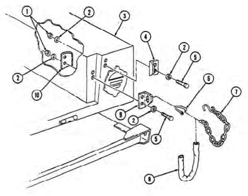

4. Remove cover (8) from tailgate chain (7).

Manual References TM 9-2320-387-10 TM 9-2320-387-24P
Equipment Condition Tailgate lowered (TM 9-2320-387-10).

Maintenance Level Unit

## 10-35. Tailgate Chain And Brackets Maintenance (Cont'D)

b. Inspection Refer to para. 10-56 for nut insert inspection and replacement.

c. Installation

#### Caution

Use grade 5 torque value when installing capscrews into nut inserts. Failure to do so may damage equipment and/or components.

NOTE
- Perform step 1 only if tailgate chain cover was removed. - All models except M1114 are equipped with nut inserts, not nuts and washers as indicated in step 2.

1. Install cover (8) on tailgate chain (7). 2. Install angle bracket (10), chain bracket (9), and latch bracket (4) on body (3) with four washers (2),
capscrews (5), washers (2), and locknuts (1). Tighten capscrews (5) to 15 lb-ft (20 N•m).

3. Hook tailgate chain (7) to tailgate chain bracket (4). 4. Connect tailgate chain cap link (6) to bracket (9) and chain (7) by closing chain cap link (6).

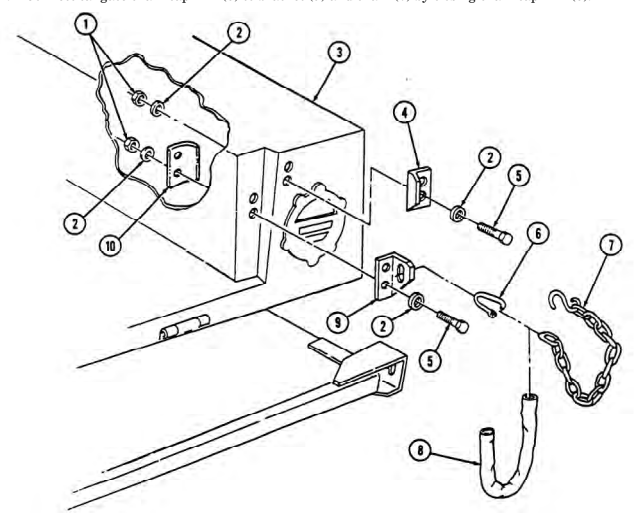

FOLLOW-ON TASK: Raise and secure tailgate (TM-9-2320-387-10).

10-62 Change 5

# 10-36. Camouflage Screen Stowage Straps Replacement

This task covers:
INITIAL SETUP:

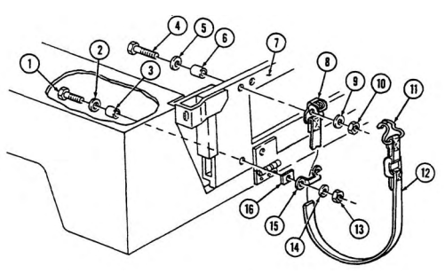

| Applicable Models   |
|---------------------|
| M1114               |

General mechanic's tool kit:
automotive (Appendix B, Item 1)
Materials/Parts Sixteen locknuts (Appendix G, Item 80)

a. Removal b. Installation

Manual References TM 9-2320-387-24P
Maintenance Level Unit

#### A. Removal

1. Remove strap hook (11) from strap buckle (8). 2. Remove two locknuts (10), washers (9), capscrews (4), washers (5), spacers (6), and strap buckle (8)
from tailgate (7). Discard locknuts (10).

3. Remove two locknuts (13), washers (14), handle (15), spacer (16), capscrews (1), washers (2),
spacers (3), and strap (12) from tailgate (7).

4. Repeat steps 1 through 3 for other three straps (12).

#### B. Installation

1. Install spacer (16), strap (12), and handle (15) on tailgate (7) with two spacers (3), washers (2),
capscrews (1), washers (14), and locknuts (13).

2. Install strap bracket (8) on tailgate (7) with two spacers (6), washers (5), capscrews (4), washers (9),
and locknuts (10).

3. Install strap hook (11) on strap buckle (8). 4. Repeat steps 1 through 3 for other three straps (12).

# 10-37. Max Tool Kit Stowage Strap And Bracket Maintenance

This task covers:
a. Removal c. Installation b. Inspection INITIAL SETUP:

| General mechanic's tool kit:   | automotive (Appendix B, Item 1)   |      |
|--------------------------------|-----------------------------------|------|
| Maintenance Level              | Manual References                 | Unit |
| TM 9\-2320\-387\-10            | TM 9\-2320\-387\-24P              |      |

Sealing compound (Appendix C, Item 72.1)

The replacement procedure for all stowage straps on tailgate is basically the same. This procedure covers one strap.

a. Removal 1. Remove strap (3) from loop (5). 2. Remove four screws (1) and holder (2) from tailgate (6). 3. Remove four screws (4), two loops (5), and strap (3) from tailgate (6).

b. Inspection

For inspection and removal of insertnuts, refer to para. 10-56.

Inspect insertnuts (7). Replace if damaged.

c. Installation 1. Apply sealing compound to threads of four screws (4), and install two loops (5) and strap (3) on tailgate (6) with screws (4). Tighten screws (4) to 20 lb-in. (2 N•m).

2. Apply sealing compound to threads of four screws (1), and install holder (2) on tailgate (6) with screws (1). Tighten screws (1) to 32-41 lb-in. (4-5 N•m).

3. Install strap (3) on loop (5).

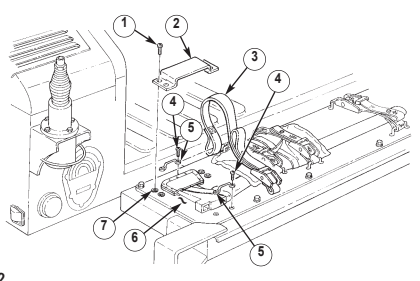

# 10-38. Tailgate Replacement

This task covers:
INITIAL SETUP:
Applicable Models All models except M1113 Tools General mechanic's tool kit:
automotive (Appendix B, Item 1)
Maintenance and repair shop equipment:
automotive (Appendix B, Item 2)
Materials/Parts Six locknuts (Appendix G, Item 106)
Personnel Required One mechanic One assistant a. Removal 1. Remove six locknuts (9), washers (8), and capscrews (5) from tailgate (3) and body (2). Discard locknuts (9).

2. Disconnect two tailgate chains (1) from tailgate (3) and remove tailgate (3) and shims (7).

Perform step 3 if replacing seal(s).

3. Remove seals (4) and (6) from tailgate (3).

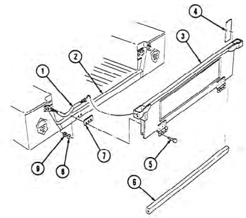 4. Clean adhesive from tailgate (3).

a. Removal b. Installation Manual References TM 9-2320-387-24P
Equipment Condition Camouflage screen stowage straps removed (para. 10-36).

Maintenance Level Unit

## 10-38. Tailgate Replacement (Cont'D)

b. Installation

Perform step 1 if replacing seal(s).

1. Peel paper backing (5) from seals (4) and (6) and install seals (4) and (6) on tailgate (3). 2. Install shims (8) and tailgate (3) on body (2) with six capscrews (7), washers (9), and locknuts (10).

Tighten capscrews (7) to 26 lb-ft (35 N•m).

3. Connect two tailgate chains (1) to tailgate (3).

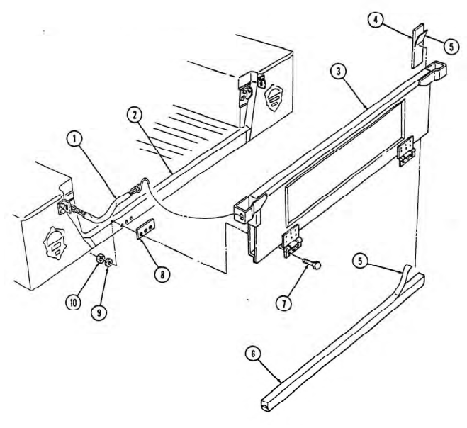

FOLLOW-ON TASK: Install camouflage screen stowage straps (para. 10-36).

# 10-39. Tailgate Upper Hinge Replacement

This task covers:

| a. Removal                      | c. Assembly                                            |
|---------------------------------|--------------------------------------------------------|
| b.  Disassembly                 | d.  Installation                                       |
| INITIAL SETUP:                  |                                                        |
| Applicable Models               | Equipment Condition                                    |
| M1113                           | - Soft top enclosure removed, if installed             |
|                                 | (TM 9\-2320\-387\-10).                                 |
| Tools                           | - Windshield wiper arm pivot removed (para. 10\-60).   |
| General mechanic's tool kit:    | - Windshield retention bracket removed (para. 10\-29). |
| automotive (Appendix B, Item 1) |                                                        |
|                                 | General Safety Instructions                            |
| Personnel Required              | Windshield must be supported during removal and        |
| One mechanic                    | installation.                                          |

a. Removal

- Replacement procedures for left and right tailgate upper hinges are basically the same. This procedure covers the left tailgate upper hinge.

- Seal across bottom of tailgate is used on M1151 vehicles only.

For access to capscrews, a small portion of the seal has to be removed.

- The upper hinge is installed with rivets during manufacturing.

A kit has been developed to repair the upper hinge. Use kit P/N 57K0107 for installation.

1. Remove seal (10) from tailgate (6) behind upper hinge (7).

- Perform step 2 for M1151 vehicles. Perform step 3 for M1152. - Note direction of capscrews for installation.

2. Remove two locknuts (8), washers (4), spacers (5), capscrews (3), and washers (4) from upper hinge (7) and tailgate (6). Discard locknuts (8).

3. Remove three locknuts (8), washers (4), spacers (5), capscrews (3), and washers (4) from upper hinge (7) and tailgate (6). Discard locknuts (8).

4. Remove three locknuts (9), washers (1), capscrews (2), washers (1), and upper hinge (7) from tailgate (6). Discard locknuts (9).

5. Remove pin (12) and lower hinge (11) from upper hinge (7).

b. Installation 1. Install lower hinge (11) on upper hinge (7) with pin (12). 2. Install upper hinge (7) on tailgate (6) with three washers (1), capscrews (2), washers (1), and locknuts (9). Tighten locknuts (9) to 8 lb-ft (11 N•m).

Perform step 3 for M1151 vehicles. Perform step 4 for M1152 vehicles.

3. Secure upper hinge (7) to tailgate (6) with two washers (4), capscrews (3), spacers (5), washers (4),
and locknuts (8). Tighten locknuts (8) to 8 lb-ft (11 N•m).

# 10-40. Driver'S Seat Assembly Replacement

This task covers:
INITIAL SETUP:

#### Tools

General mechanic's tool kit:
automotive (Appendix B, Item 1)
Maintenance and repair shop equipment:
automotive (Appendix B, Item 2)

#### Materials/Parts

Four lockwashers (Appendix G, Item 145) Tape (Appendix C, Item 78)
a. Removal 1. Spread cover (7) to allow access to socket-head screws (2).

NOTE
Perform step 2 for M1113 models. Perform step 3 for all other models.

2. Remove four socket-head screws (2), lockwashers (3), cover (7), seat assembly (1), tape (4), and four washers (5) from supports (6). Discard lockwashers (3).

3. Remove four socket-head screws (2), lockwashers (3), washers (5), cover (7), and seat assembly (1)
from supports (6). Discard lockwashers (3).

b. Installation

a. Removal b. Installation

| Maintenance Level   |
|---------------------|

| Manual References    |
|----------------------|
| TM 9\-2320\-387\-24P |

Unit Perform step 1 for M1113 models. Perform step 2 for all other models.

1. Install four washers (5), tape (4), cover (7), and seat assembly (1) on supports (6) with four lockwashers (3) and socket-head screws (2).

2. Install seat assembly (1) on supports (6) with four washers (5), lockwashers (3), and socket-head screws (2). Tighten socket-head screws (2) to 140–170 lb-in. (15–19 N•m).

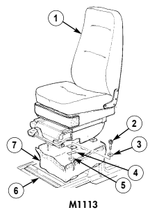

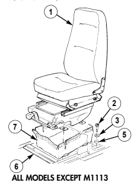

M1113 ALL MODELS EXCEPT M1113
# 10-41. Driver'S Seat Assembly Maintenance

This task covers:
a. Disassembly b. Assembly INITIAL SETUP:
Tools General mechanic's tool kit:
automotive (Appendix B, Item 1)
Materials/Parts Four lockwashers (Appendix G, Item 145) Four lockwashers (Appendix G, Item 157) Four locknuts (Appendix G, Item 79)
Manual References TM 9-2320-387-24P
Equipment Condition Driver's seat assembly removed (para. 10-40).

Maintenance Level Unit

Slide seat back and forth to gain access to slide set hardware.

a. Disassembly 1. Remove four locknuts (13), washers (12), socket-head screws (8), lockwashers (10), height adjuster (14), and cover (15) from slide set (11). Discard locknuts (13) and lockwashers (10).

Perform steps 2 and 3 for all models except M1113. Perform steps 4 through 7 for M1113 models.

2. Remove four nuts (9), lockwashers (17), and seat (2) from absorber (21). Discard lockwashers (17). 3. Remove four nuts (3), washers (4), capscrews (16), and absorber (21) from slide set (11). 4. Remove four nuts (9), lockwashers (17), and seat (2) from riser (6). Discard lockwashers (17). 5. Remove four locknuts (3), washers (4), capscrews (16), riser (6), and tray (5) from slide set (11). Discard locknuts (3).

6. Remove two nuts (18), capscrews (20), loop (19), and strap (1) from riser (6). 7. Inspect velcro strip (7) on riser (6) and replace if damaged.

b. Assembly

Perform steps 1 through 3 for M1113 models. Perform steps 4 and 5 for all other models.

1. Install strap (1) and loop (19) on riser (6) with two capscrews (20) and nuts (18). 2. Install tray (5) and riser (6) on slide set (11) with four capscrews (16), washers (4), and locknuts (3). 3. Install seat (2) on riser (6) with four lockwashers (17) and nuts (9). 4. Install absorber (21) on slide set (11) with four capscrews (16), washers (4), and nuts (3). 5. Install seat (2) on absorber (21) with four lockwashers (17) and nuts (9). 6. Install height adjuster (14) and cover (15) on slide set (11) with four lockwashers (10), socket-head screws (8), washers (12), and locknuts (13).

# 10-41. Driver'S Seat Assembly Maintenance (Cont'D)

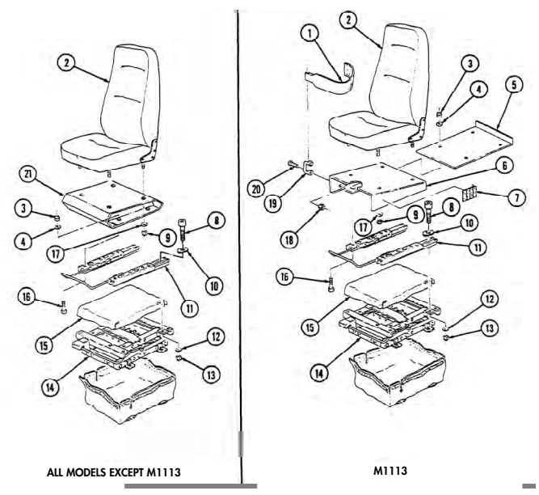

FOLLOW-ON TASK:    Install driver's seat assembly (para. 10-40).

■

# 10-42. Battery Box Cover Catch Replacement

This task covers:
INITIAL SETUP:
Tools General mechanic's tool kit:
automotive (Appendix B, Item 1)
Materials/Parts Two rivets (Appendix G, Item 259) Two rivets (Appendix G, Item 257)

a. Removal **b. Installation**

| Manual References    |
|----------------------|
| TM 9\-2320\-387\-24P |

| Maintenance Level   |
|---------------------|
| Unit                |

Equipment Condition Batteries removed (para. 4-74).

For instruction on replacement of rivets, refer to para. 10-56.

a. Removal

M1113 models are equipped with bracket as indicated in step 1.

1. Remove two rivets (1) and striker catch (2) from battery box cover (3) and bracket (7). 2. Remove two rivets (6) and clamping catch (5) from battery box (4).

b. Installation 1. Install clamping catch (5) on battery box (4) with two rivets (6).

NOTE
M1113 models are equipped with bracket as indicated in step 2.

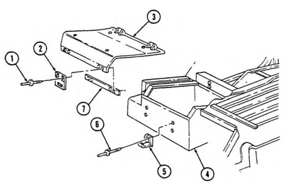

2. Install striker catch (2) on battery box cover (3) and bracket (7) with two rivets (1).

FOLLOW-ON TASK: Install batteries (para. 4-74).

# 10-43. Companion Seat Assembly And Battery Box Cover Replacement

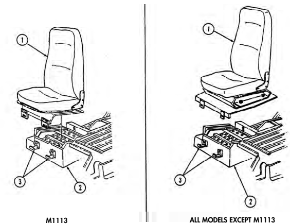

This task covers:
General mechanic's tool kit:
automotive (Appendix B, Item 1)

a. Removal b. Installation

| Personnel Required   |
|----------------------|
| One mechanic         |
| One assistant        |
| Manual References    |

a. Removal 1. Release two latches (3) from companion seat and battery box cover (1). 2. Lift up and pull forward on companion seat and battery box cover (1) and remove from battery box (2).

b. Installation Install companion seat and battery box cover (1) on battery box (2) with two latches (3).

# 10-44. Companion Seat Assembly Maintenance

This task covers:
a. Disassembly b. Assembly

| INITIAL SETUP:                  |                      |
|---------------------------------|----------------------|
| Applicable Models               | Manual References    |
| M1152A1                         | TM 9\-2320\-387\-24P |
| Tools                           | TM 9\-2320\-387\-10  |
| General mechanics tool kit:     | Maintenance Level    |
| automotive (Appendix B, Item 1) | Unit                 |

| INITIAL SETUP:   |
|------------------|

Eight lockwashers (Appendix G, Item 145)
(all models except M1113) 
a. Disassembly

Perform step 1 for M1113 models. Perform steps 2 and 3 for all other models.

1. Remove four nuts (6), lockwashers (5), spacers (4), seat (1), and plate (2) from battery box cover (3).

Discard lockwashers (5).

2. Remove four nuts (9), lockwashers (8), and seat (1) from absorber (7). Discard lockwashers (8). 3. Remove four nuts (12), lockwashers (11), and capscrews (10) from absorber (7) and battery box cover
(3). Discard lockwashers (11).

b. Assembly

Perform step 1 for M1113 models. Perform steps 2 and 3 for all other models.

1. Install plate (2) and seat (1) on battery box cover (3) with four spacers (4), lockwashers (5), and nuts (6).

Tighten nuts (6) to 15 lb-ft (20 N•m).

2. Install seat (1) on absorber (7) with four lockwashers (8) and nuts (9). 3. Install absorber (7) and seat (1) on battery box cover (3) with four capscrews (10), lockwashers (11),
and nuts (12).

# 10-44. Companion Seat Assembly Maintenance (Cont'D)

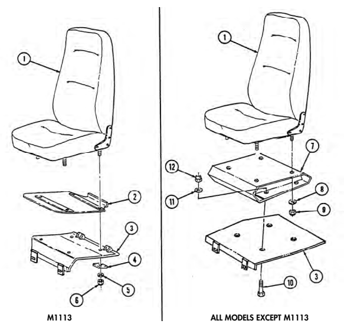

■
FOLLOW-ON TASK:   Install companion seat assembly and battery box cover (para. 10-43).

# 10-45. Passenger Seat Replacement

This task covers:
INITIAL SETUP:
Applicable Models M1114, M1151A1, M1165A1, M1167 Tools General mechanic's tool kit:
automotive (Appendix B, Item 1)
Maintenance and repair shop equipment:
automotive (Appendix B, Item 2)

a. Removal b. Installation

| Materials/Parts   |
|-------------------|
| Four lockwash     |

| Equipment Condition   |
|-----------------------|
| Maintenance Level     |

Four lockwashers (Appendix G, Item 145)

#### A. Removal

Remove four socket-head screws (2), lockwashers (3), washers (4), and passenger seat (1) with base (6) from supports (5). Discard lockwashers (3). b. Installation Install base (6) with passenger seat (1) on supports (5) with four washers (4), lockwashers (3), and socket-head screws (2). Tighten socket-head screws (2) to 140-170 lb-in. (16-19 N•m).

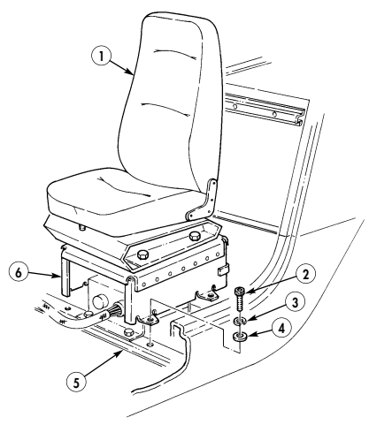

# 10-45.1. Passenger Seat Maintenance

This task covers:
a. Disassembly b. Assembly INITIAL SETUP:
Applicable Models All models except M1113 Tools General mechanic's tool kit:
automotive (Appendix B, Item 1)
Maintenance and repair shop equipment:
automotive (Appendix B, Item 2)

#### Materials/Parts

Eight locknuts (Appendix G, Item 82) Four lockwashers (Appendix G, Item 145)

| Maintenance Level   |
|---------------------|
| Unit                |

| Unit   |
|--------|

#### A. Disassembly

1. Remove four locknuts (10), washers (11), capscrews (5), absorber (2), and passenger seat (1) from base (12). Discard locknuts (10).

2. Remove four locknuts (4), washers (3), and absorber (2) from seat (1). Discard locknuts (4). 3. Remove four socket-head screws (6), lockwashers (7), washers (8), and base (12) from floor (9).

Discard lockwashers (7).

#### B. Assembly

1. Install base (12) on floor (9) with four washers (8), lockwashers (7), and socket-head screws (6).

Tighten socket-head screws (6) to 140-170 lb-in. (16-19 N•m).

2. Install absorber (2) on seat (1) with four washers (3) and locknuts (4). 3. Install passenger seat (1) and absorber (2) on base (12) with four capscrews (5), washers (11), and locknuts (10).

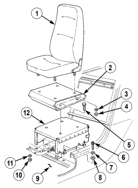

# 10-46. Three Point Seatbelt Brackets Replacement

This task covers:
a. Removal b. Installation INITIAL SETUP:

| Applicable Models               | Manual References    |
|---------------------------------|----------------------|
| M1114                           | TM 9\-2320\-387\-24P |
| Tools                           | Maintenance Level    |
| General mechanic's tool kit:    | Unit                 |
| automotive (Appendix B, Item 1) |                      |
| Materials/Parts                 |                      |

Replacement procedures for left and right seatbelt brackets are basically the same. This procedure covers the left seatbelt bracket.

a. Removal

Perform step 1 for M1113 model only.

1. Remove four capscrews (3), washers (2), and upper bracket (1) from B-pillar (4). 2. Remove four capscrews (6), washers (5), and lower bracket (7) from B-pillar (4).

b. Installation 1. Install lower bracket (7) on B-pillar (4) with four washers (5) and capscrews (6). Tighten capscrews (6) to 15-21 lb-ft (20-28 N•m).

Perform step 2 for M1113 model only.

2. Install upper bracket (1) on B-pillar (4) with four washers (2) and capscrews (3). Tighten capscrews (3) to 15-21 lb-ft (20-28 N•m).

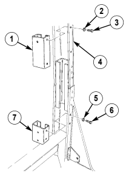

FOLLOW-ON TASK: Install three point seatbelt (para. 10-47).

10-76.2/(10-76.3 blank) Change 3

# 10-46.1. Seatbelt Bracket/B-Pillar Support Replacement

This task covers:

a. Removal b. Installation

| INITIAL SETUP:                         |                      |
|----------------------------------------|----------------------|
| Applicable Models                      | Materials/Parts      |
| M1114                                  |                      |
| Tools                                  | Manual References    |
| General mechanic's tool kit:           | TM 9\-2320\-387\-24P |
| automotive (Appendix B, Item 1)        |                      |
| Maintenance and repair shop equipment: | Maintenance Level    |
| automotive (Appendix B, Item 2)        | Unit                 |

Replacement procedures for left and right seatbelt brackets/ B-pillar support are basically the same. This procedure covers the left seatbelt bracket/B-pillar support.

#### A. Removal

1. Remove capscrew (1), D-ring (2) and washer (3) from roof support (5). 2. Remove two capscrews (10), lockwashers (9), washers (8), one padding bracket (7) and padding (4)
from seatbelt bracket/B-pillar support (6). Discard lockwashers (9).

3. Remove capscrew (12), washer (13), locknut (17), washer (18) and door check strap (14) from door check strap bracket (19). Discard locknut (17).

4. Remove two capscrews (23), four washers (16), two locknuts (15), one door striker (21), shim(s) (20),
and door check strap bracket (19) from B-pillar (11). Discard locknuts (15).

For installation, note length and locations of capscrews.

5. Remove six capscrews (25), twelve washers (24) and six locknuts (23) from B-pillar (11). Discard locknuts (23).

6. Remove four capscrews (26), eight washers (27), four locknuts (28) and seatbelt bracket/B-pillar support (6) from B-pillar (11). Discard locknuts (28).

b. Installation 1. Install seatbelt bracket/B-pillar support (6) on B-pillar (11) with four capscrews (26), eight washers (27) and four locknuts (28).

2. Install six capscrews (25), twelve washers (24) and six locknuts (23) on B-pillar (11). 3. Install door striker (21), shim(s) (20), and door check strap bracket (19) on B-pillar (11) with two capscrews (23), four washers (16), and two locknuts (15).

4. Install door check strap (14) on door check strap bracket (19) with capscrew (12), washer (13), and locknut (17).

5. Install padding (4) on seatbelt bracket/B-pillar support (6) with two capscrews (10), lockwashers (9)
and washers (8).

6. Install D-ring (2) on roof support (5) with capscrew (1) and washer (3).

10-46.1. SEATBELT BRACKET/B-PILLAR SUPPORT REPLACEMENT (Cont'd)

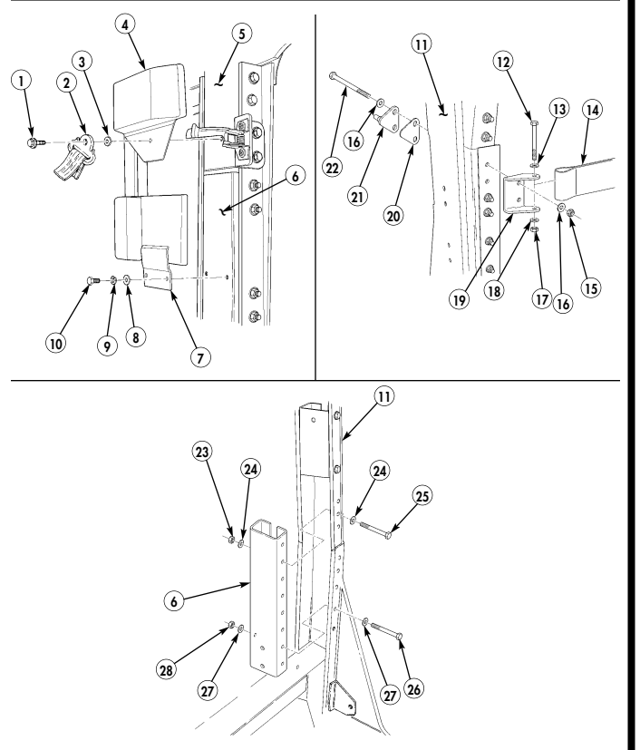

FOLLOW-ON TASK:

Install front seatbelt retractor (para. 10-47).

# 10-47. Three-Point Seatbelt Maintenance

This task covers:
a. Front Seatbelt Removal d. Rear Seatbelt Removal b. Front Seatbelt Bracket Inspection e. Rear Seatbelt Bracket Inspection c. Front Seatbelt Installation f. Rear Seatbelt Installation

Tools General mechanic's tool kit:
automotive (Appendix B, Item 1)
Maintenance and repair shop equipment:
automotive (Appendix B, Item 2)
Materials/Parts Locknut (Appendix G, Item 121) Two locknuts Manual References TM 9-2320-387-24P

#### Equipment Condition

- Passenger seat removed (M1114, M1151, and M1151A1) (para. 10-45).

- Companion seat and battery box cover removed (companion seatbelt only) (para. 10-43).

General Safety Instructions Seatbelts are to be replaced as a set.

Maintenance Level Unit

#### Warning

Seatbelts are to be replaced as a set. Failure to do this may cause injury to personnel or damage to equipment.

Maintenance procedures for left and right seatbelts are basically the same. This procedure covers left seatbelts.

#### A. Front Seatbelt Removal

1. Remove capscrew (20), buckle assembly (21), and washer (22) from body (23). 2. Remove capscrew (19), connector assembly (18), and washer (17) from bracket (16).

Perform steps 3 and 4 for M1114 models only.

3. Remove two screws (9), washers (9.1), saddle block (10), and clamp (11) from upper support (3) and padding (5).

4. Remove locknut (1), washer (2), screw (8), washer (7), D-ring (6), padding (5), and bracket (4) from upper support (3). Discard locknut (1).

Perform step 5 for all models except M1114.

5. Remove capscrew (12), D-ring (13), and washer (14) from padding (15). 6. Remove capscrew (24), washer (25), and retractor (26) from lower bracket (27). b. Front Seatbelt Bracket Inspection 1. Inspect bracket (4) for breaks, bends, or cracks. Replace if broken, bent, or cracked. 2. Inspect upper bracket (15) for breaks, bends, or cracks. Replace if broken, bent, or cracked (para. 10-46). 3. Inspect lower bracket (27) for breaks, bends, or cracks. Replace if broken, bent, or cracked (para. 10-46).

# 10-47. Three-Point Seatbelt Maintenance (Cont'D)

c. Front Seatbelt Installation 1. Install retractor (26) on lower bracket (27) with washer (25) and capscrew (24). Tighten capscrew (24)
to 43-60 lb-ft (58-81 N•m).

Perform steps 2 and 3 for M1114 models only.

2. Install bracket (4), padding (5), and D-ring (6) on upper support (3) with washer (7), screw (8),
washer (2), and locknut (1). Tighten screw (8) to 37 lb-ft (50 N•m).

3. Install clamp (11) and saddle block (10) on upper support (3) with two washers (9.1) and screws (9).

Tighten screws (9) to 35 lb-in. (4 N•m).

Perform step 4 for all models except M1114.

4. Install washer (14) and D-ring (13) on padding (15) with capscrew (12). Tighten capscrew (12) to 35-40 lb-ft (47-54 N•m).

5. Install washer (17) and connector assembly (18) on bracket (16) with capscrew (19). Tighten capscrew (19) to 35-40 lb-ft (47-54 N•m).

6. Install washer (22) and buckle assembly (21) on body (23) with capscrew (20). Tighten capscrew (20) 

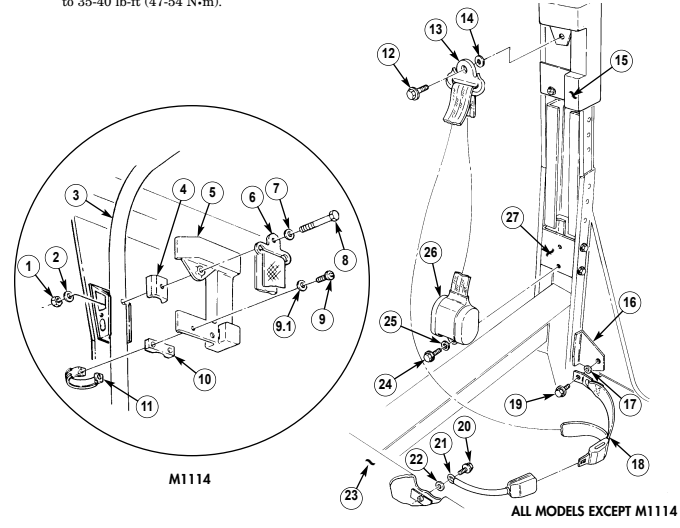

# 10-47. Three-Point Seatbelt Maintenance (Cont'D)

d. Rear Seatbelt Removal

Maintenance procedures for left and right seatbelts are basically the same. This procedure covers the right seatbelt.

1. Remove capscrew (11), buckle assembly (14), and washer (12) from body (13). 2. Remove capscrew (10), connector assembly (15), and washer (9) from bracket (8).

Perform steps 3 and 4 for M1114 only.

3. Remove capscrew (1), D-ring (2), and washer (3) from bracket (4). 4. Remove capscrew (6), washer (5), and retractor (7) from bracket (4).

Perform steps 5 and 6 for M1151 and M1151A1 only.

5. Remove capscrew (16), D-ring (17), washer (18), and locknut (20) from roof support (19). Discard locknut (20).

6. Remove capscrew (23), washer (22), locknut (21), and retractor (24) from roof support (19). Discard locknut (21).

e. Rear Seatbelt Bracket Inspection Inspect brackets (4) and (8). Replace if broken, bent, or cracked.

f. Rear Seatbelt Installation

Perform steps 1 and 2 for M1151 and M1151A1 only.

1. Install retractor (24) on roof support (19) with capscrew (23), washer (22), and locknut (21). Tighten capscrew (23) to 35–40 lb-ft (47–54 N•m).

2. Install D-ring (17) on roof support (19) with capscrew (16), washer (18), and locknut (20). Tighten capscrew (16) to 35–40 lb-ft (47–54 N•m).

Perform steps 3 and 4 for M1114 only.

3. Install retractor (7) on bracket (4) with washer (5) and capscrew (6). Tighten capscrew (6) to 35-40 lb-ft (47-54 N•m).

4. Install washer (3) and D-ring (2) on bracket (4) with capscrew (1). Tighten capscrew (1) to 35-40 lb-ft (47-54 N•m).

5. Install washer (9) and connector assembly (15) on bracket (8) with capscrew (10). Tighten capscrew (10) to 35-40 lb-ft (47-54 N•m).

6. Install washer (12) and buckle assembly (14) on body (13) with capscrew (11). Tighten capscrew (11)
to 35-40 lb-ft (47-54 N•m).

# 10-47. Three-Point Seatbelt Maintenance (Cont'D)

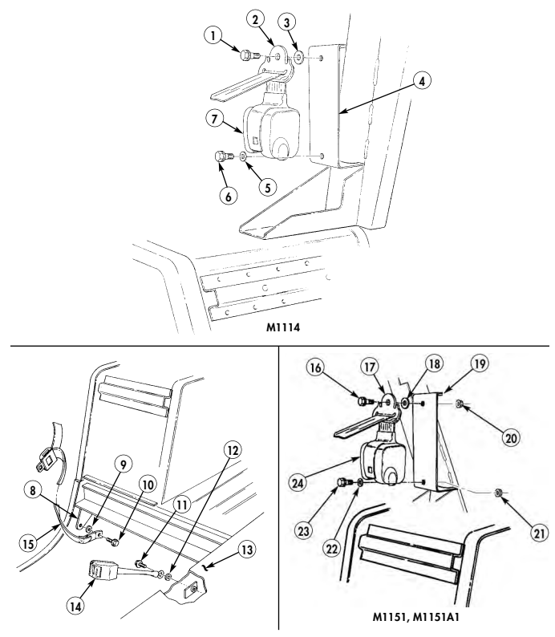

1 FOLLOW-ON TASKS: - Install passenger seat (M1114, M1151, and M1151A1 only) (para. 10-45).

- Install companion seat and battery box cover (companion seatbelt only)
(para. 10-43).

 I

# 10-47.1. Improved Personal Restraint System Front Shoulder Strap Assembly Replacement **(M1151A1, M1152A1, M1165A1, M1167)**

This task covers:
INITIAL SETUP:
Applicable Models M1151A1, M1152A1, M1165A1, M1167 Tools General mechanic's tool kit:
automotive (Appendix B, Item 1)
Maintenance and repair shop equipment:
automotive (Appendix B, Item 2)
Materials/Parts Thread locking adhesive 
(Appendix C, Item 3.1)
a. Removal b. Installation Manual References

| TM 9\-2320\-387\-24P             |
|----------------------------------|
| Equipment Condition              |
| Tailgate removed (para. 10\-38). |
| Maintenance Level                |

Replacement procedures for left and right front shoulder strap assemblies are basically the same. This procedure covers the right front shoulder strap assembly.

a. Removal 1. Remove capscrew (11), washer (1), front shoulder strap assembly (2), two capscrews (10),
washers (9), padding bracket (3), and padding (4) from upper B-pillar (5).

2. Remove capscrew (8), washer (7), and front shoulder strap assembly (2) from lower B-pillar (6).

b. Installation 1. Apply adhesive to threads of capscrew (8) and install front shoulder strap assembly (2) on lower B-pillar (6) with washer (7) and capscrew (8). Tighten capscrew (8) to 40 lb-ft (54 N•m).

2. Apply adhesive to threads of capscrew (11) and install front shoulder strap assembly (2) on upper B-pillar (5) with padding (4), padding bracket (3), washer (1), capscrew (11), two washers (9), and capscrews (10). Tighten capscrew (11) to 40 lb-ft (54 N•m).

# 10-47.1. Improved Personal Restraint System Front Shoulder Strap

l

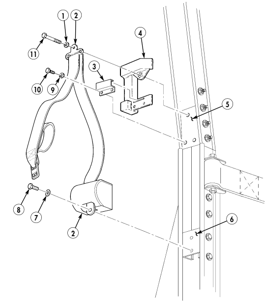

FOLLOW-ON TASK:
Install companion seat (para. 10-44).

# 10-47.2. Improved Personal Restraint System Front Shoulder Strap Assembly Replacement **(M1114)**

This task covers:
a. Removal b. Installation

| Tools                                   |                      |
|-----------------------------------------|----------------------|
| General mechanic's tool kit:            |                      |
| automotive (Appendix B, Item 1)         | Manual References    |
| Maintenance and repair shop equipment:  | TM 9\-2320\-387\-24P |
| automotive (Appendix B, Item 2)         |                      |
|                                         | Maintenance Level    |
| Materials/Parts                         | Unit                 |
| Four lockwashers (Appendix G, Item 145) |                      |
| Tape (Appendix C, Item 78)              |                      |

Replacement procedures for left and right front shoulder strap assemblies are basically the same. This procedure covers the right front shoulder strap assembly.

a. Removal 1. Remove capscrew (1), washer (2), front shoulder strap assembly (3), upper padding (4), and mounting plate (5) from B-pillar tube (6).

2. Remove two capscrews (14), washers (13), and lower padding (4) from nut plate (8) and clamp (7). 3. Remove capscrew (12), washer (11), and front shoulder strap assembly (10) from lower B-pillar (9).

#### B. Installation

1. Install front shoulder strap assembly (10) on lower B-pillar (9) with washer (11) and capscrew (12).

Tighten capscrew (12) to 40 lb-ft (54 N•m).

2. Install lower padding (4) on nut plate (8) and clamp (7) on B-pillar tube (6) with two capscrews (14)
and washers (13).

3. Install front shoulder strap assembly (3) on upper padding (4) on mounting plate (5) on B-pillar tube (6) with capscrew (1) and washer (2). Tighten capscrew (1) to 40 lb-ft (54 N•m).

# 10-47.2. Improved Personal Restraint System Front Shoulder Strap

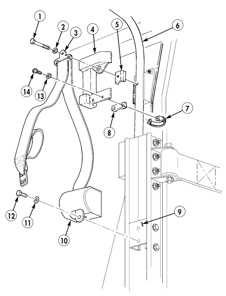

FOLLOW-ON TASK:
Install companion seat (para. 10-44).

# 10-47.3. Improved Personal Restraint System Rear Shoulder Strap Assembly Replacement

This task covers:
INITIAL SETUP:
Tools

| Two rivets (Appendix G, Item 259)   |
|-------------------------------------|

| General mechanic's tool kit:    |
|---------------------------------|
| automotive (Appendix B, Item 1) |

Maintenance and repair shop equipment:
a. Removal b. Installation

| TM 9\-2320\-387\-24P                               |
|----------------------------------------------------|
| Equipment Condition                                |
| Batteries removed (para. 4\-74). Maintenance Level |

Replacement procedures for left and right rear shoulder strap assemblies are basically the same. This procedure covers the right rear shoulder strap assembly.

a. Removal 1. Remove locknut (1), capscrew (5), washer (4), and rear shoulder strap assembly (3) from C-pillar (2).

Discard locknut (1).

2. Remove locknut (1), capscrew (6), washer (7), and rear shoulder strap assembly (3) from C-pillar (2).

Discard locknut (1).

#### B. Installation

1. Install rear shoulder strap assembly (3) to C-pillar (2) with capscrew (6), washer (7), and locknut (1). Tighten locknut (1) to 40 lb-ft (54 N•m).

2. Install rear shoulder strap assembly (3) to C-pillar (2) with capscrew (5), washer (4), and locknut (1). Tighten locknut (1) to 40 lb-ft (54 N•m).

10-47.3. IMPROVED PERSONAL RESTRAINT SYSTEM REAR SHOULDER STRAP
ASSEMBLY REPLACEMENT (Cont'd)

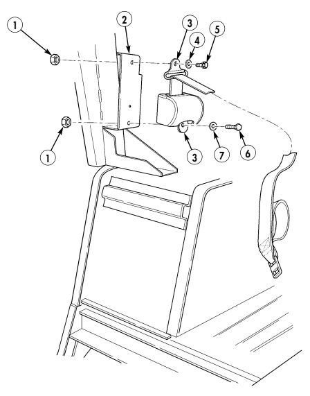

# 10-47.4. Improved Personal Restraint System Front Lap Strap Assembly

## Replacement

This task covers:
INITIAL SETUP:
Tools General mechanic's tool kit:
automotive (Appendix B, Item 1)
Maintenance and repair shop equipment:
automotive (Appendix B, Item 2)
Materials/Parts Two locknuts (Appendix G, Item 133.16) Two locknuts (Appendix G, Item 133.17) Thread locking adhesive (Appendix C, Item 3.1)

a. Removal b. Installation Manual References TM 9-2320-387-24P
Equipment Condition Companion seat removed (para. 10-45).

Maintenance Level Unit Replacement procedures for left and right front lap strap assemblies are basically the same. This procedure covers the right front lap strap assembly.

a. Removal 1. Remove four capscrews (4), washers (3), and front restraint mounting bracket (2) from B-pillar (1). 2. Remove capscrew (9), washer (3), front lap strap bracket (8), and front lap strap assembly (5) from front restraint mounting bracket (2).

NOTE
Only replace front lap strap bracket if damaged, otherwise remove capscrews and washers to remove lap strap assembly only. Perform step 3 for bracket removal if front lap strap bracket is damaged.

3. Remove two locknuts (6) and (7), capscrews (10) and (11), and front lap strap bracket (8) from front lap strap assembly (5). Discard locknuts (6) and (7).

b. Installation

- The anti-rotation bolt is a metric bolt and requires a specific torque.

- Perform step 1 for front lap strap bracket installation if front lap strap bracket is being replaced.

1. Install front lap strap bracket (8) on lap strap assembly (5) with two capscrews (10) and (11) and locknuts (6) and (7). Tighten locknut (6) to 40 lb-ft (54 N•m) and locknut (7) to 12 ft-lb (16 N•m).

# 10-47.4. Improved Personal Restraint System Front Lap Strap Assembly Replacement (Cont'D)

Replacement procedures for left and right front lap strap assemblies are basically the same. This procedure covers the right front lap strap assembly.

a. Removal 1. Remove four capscrews (4), washers (3), and front restraint mounting bracket (2) from B-pillar (1). 2. Remove capscrew (9), washer (3), front lap strap bracket (8), and front lap strap assembly (5) from front restraint mounting bracket (2).

NOTE

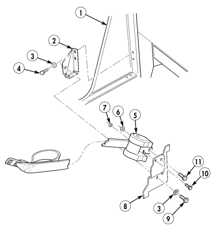

FOLLOW-ON TASK: Install companion seat (para. 10-44).

# 10-47.5. Improved Personal Restraint System Rear Lap Strap Assembly Replacement (M1151A1, M1152A1, M1165A1, M1167)

This task covers:
a. Removal b. Installation INITIAL SETUP:
Applicable Models M1151A1, M1152A1, M1165A1, M1167 Tools General mechanic's tool kit:
automotive (Appendix B, Item 1)
Maintenance and repair shop equipment:
automotive (Appendix B, Item 2)

| Materials/Parts      |
|----------------------|
| Two locknuts (Apper  |
| Manual References    |
| TM 9\-2320\-387\-24P |
| Equipment Condition  |
| Doggangar goot roma  |

Two locknuts (Appendix G, Item 133.17)
Passenger seat removed (para. 10-45).

Maintenance Level Unit

Replacement procedures for left and right rear lap strap assemblies are basically the same. This procedure covers the right rear lap strap assembly.

a. Removal 1. Remove capscrew (2), washer (1), and rear lap strap bracket (7) from nut plate (5). 2. Remove two locknuts (6), capscrews (4), and rear lap strap bracket (7) from rear lap strap assembly (3).

Discard locknuts (6).

b. Installation

- The anti-rotation bolt is a metric bolt and requires a specific torque.

- Ensure arrow on rear lap strap bracket is pointing upward. - Ensure the correct rear lap strap assembly and rear lap strap bracket are being used. Red dot on lap strap retractor is for the right rear lap strap. Blue dot on lap strap retractor is for the left rear lap strap. Ensure dot is positioned upward.

1. Install rear lap strap assembly (3) on rear lap strap bracket (7) with two capscrews (4) and locknuts (6). Tighten locknuts (6) to 12 lb-ft (16 N•m).

2. Install rear lap strap assembly (3) with rear lap strap bracket (7) on nut plate (5) with washer (1)
and capscrew (2). Tighten capscrew (2) to 40 lb-ft (54 N•m).

# 10-47.5. Improved Personal Restraint System Rear Lap Strap Assembly Replacement (M1151A1, M1152A1, M1165A1, M1167) (Cont'D)

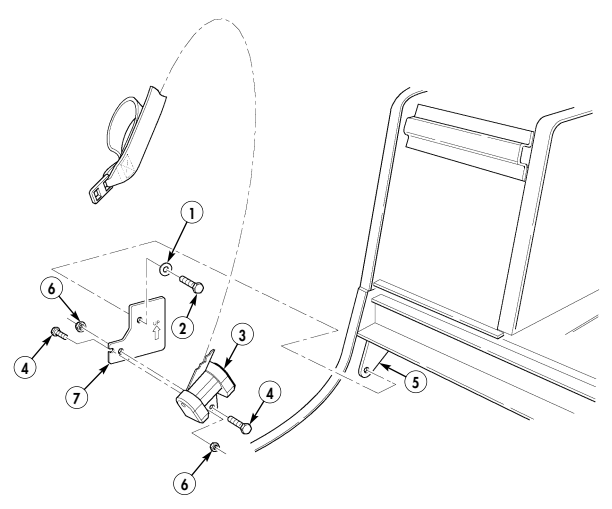

FOLLOW-ON TASK: Install passenger seat (para. 10-45).

# 10-47.6. Improved Personal Restraint System Rear Lap Strap Assembly Replacement (M1114)

This task covers:

a. Removal b. Installation

| General mechanic's tool kit:             | TM 9\-2320\-387\-24P                          |
|------------------------------------------|-----------------------------------------------|
| automotive (Appendix B, Item 1)          |                                               |
| Maintenance and repair shop equipment:   | Equipment Condition                           |
| automotive (Appendix B, Item 2)          | Companion seat assembly and battery box cover |
|                                          | removed (para. 10\-43).                       |
| Materials/Parts                          |                                               |
| Four lockwashers (Appendix G, Item 145)  | Maintenance Level                             |
| (M1113)                                  | Unit                                          |
| Eight lockwashers (Appendix G, Item 145) |                                               |

Replacement procedures for left and right rear lap strap assemblies are basically the same. This procedure covers the right rear lap strap assembly.

a. Removal 1. Remove capscrew (5) and washer (4) from vehicle body (3) and rear lap strap bracket (1). 2. Remove locknut (6) and capscrew (9) from rear lap strap assembly (8) on rear lap strap bracket (7).

Discard locknut (6).

3. Remove locknut (11), capscrew (10), and rear lap strap assembly (8) from rear lap strap bracket (7).

Discard locknut (11).

b. Installation

- The anti-rotation bolt is a metric bolt and requires a specific torque.

- Ensure the correct rear lap strap assembly and rear lap strap bracket are being used. Red dot on lap strap retractor is for the right rear lap strap. Blue dot on lap strap retractor is for the left rear lap strap. Ensure dot is positioned upward.

1. Install rear lap strap assembly (8) on rear lap strap bracket (7) with capscrew (10) and locknut (11).

Tighten locknut (11) to 12 lb-ft (16 N•m).

2. Install rear lap strap assembly (8) on rear lap strap bracket (7) with capscrew (9) and locknut 6).

Tighten locknut (11) to 12 lb-ft (16 N•m).

3. Install rear lap strap bracket (1) and rear lap strap assembly (2) on vehicle body (3) with capscrew (5) and washer (4).

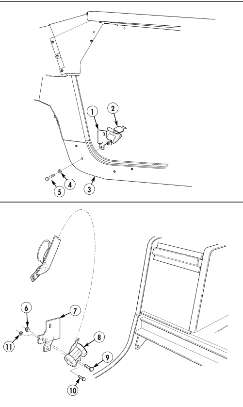

10-47.6.  IMPROVED PERSONAL RESTRAINT SYSTEM REAR LAP STRAP ASSEMBLY
 

# 10-47.7. Improved Personal Restraint System Front Buckle Assembly Replacement (M1151A1, M1152A1, M1165A1, M1167)

This task covers:
INITIAL SETUP:
Applicable Models M1151A1, M1152A1, M1165A1, M1167 Tools General mechanic's tool kit:
automotive (Appendix B, Item 1)
Maintenance and repair shop equipment:
automotive (Appendix B, Item 2)
a. Removal b. Installation

| Materials/Parts .   |
|---------------------|
| I                   |

| TM 9\-2320\-387\-24P   |
|------------------------|

Thread locking adhesive (Appendix C, Item 3.1)
Equipment Condition Companion seat removed (para. 10-44).

Maintenance Level Unit

Replacement procedures for left and right front buckle assemblies are basically the same. This procedure covers the right front buckle assembly.

a. Removal Remove capscrew (3), washer (2), anti-rotation cover (1), front buckle assembly (4), washer (2), and antirotation spacer (6) from vehicle body (5). b. Installation

- After installation, ensure the buckle cable is vertical in the upper position and at 30 degrees in the lower position.

- Ensure side of anti-rotation spacer with raised corners faces vehicle body.

Apply adhesive to threads of capscrew (3) and install front buckle assembly (4) on vehicle body (5) with capscrew (3), washer (2), anti-rotation cover (1), washer (2), and anti-rotation spacer (6). Tighten capscrew (3) to 22 lb-ft (30 N•m).

# 10-47.7.  Improved Personal Restraint System Front Buckle Assembly

■

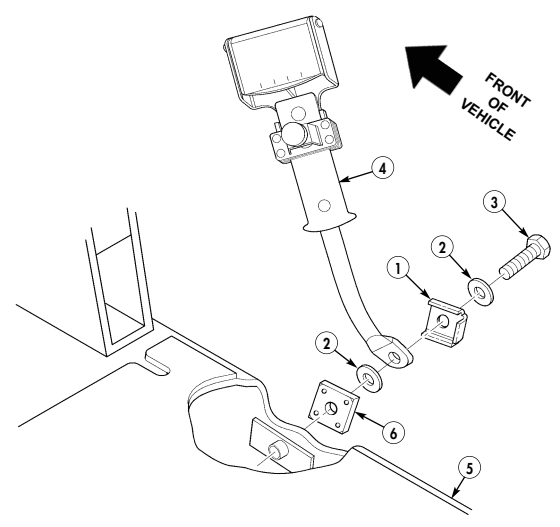

FOLLOW-ON TASK:
Install companion seat (para. 10-44).

# 10-47.8. Improved Personal Restraint System Front Buckle Assembly Replacement (M1114)

This task covers:
INITIAL SETUP:

| General mechanic's tool kit:          |
|---------------------------------------|
| Tools automotive (Appendix B, Item 1) |

General mechanic's tool kit:
automotive (Appendix B, Item 1)
Maintenance and repair shop equipment:
automotive (Appendix B, Item 2)
a. Front Buckle Assembly (Right) Removal c. Front Buckle Assembly (Left) Removal b. Front Buckle Assembly (Right) Installation d. Front Buckle Assembly (Left) Installation Materials/Parts Thread locking adhesive (Appendix C, Item 3.1)

| Equipment Condition                    |
|----------------------------------------|
| Companion seat removed (para. 10\-44). |
| Maintenance Level                      |
| Unit                                   |

Manual References TM 9-2320-387-24P
a. Front Buckle Assembly (Right) Removal Remove capscrew (3), washer (2), anti-rotation cover (1), front buckle assembly (4), washer (2), and antirotation spacer (6) from vehicle body (5). b. Front Buckle Assembly (Right) Installation

- After installation, ensure the buckle cable is vertical in the upper position and at 30 degrees in the lower position.

- Ensure side of anti-rotation spacer with raised corners faces vehicle body.

Apply adhesive to threads of capscrew (3) and install front buckle assembly (4) on vehicle body (5) with capscrew (3), washer (2), anti-rotation cover (1), washer (2), and anti-rotation spacer (6). Tighten capscrew (3) to 22 lb-ft (30 N•m). c. Front Buckle Assembly (Left) Removal Remove capscrew (3), two washers (2), and left front buckle assembly (4) from vehicle body (5). d. Front Buckle Assembly (Left) Installation

- After installation, ensure the buckle cable is vertical in the upper position and at 30 degrees in the lower position.

Install left front buckle assembly (4) on vehicle body (5) with capscrew (3) and two washers (2).

10-47.8.  IMPROVED PERSONAL RESTRAINT SYSTEM FRONT BUCKLE ASSEMBLY
 

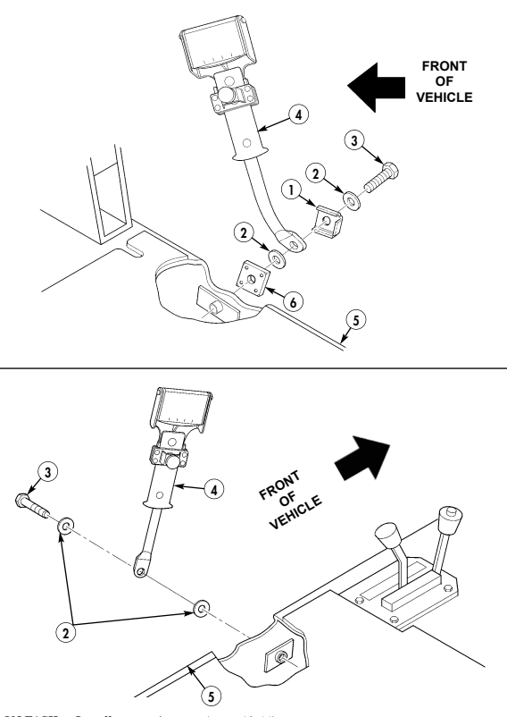

FOLLOW-ON TASK:
Install companion seat (para. 10-44).

# 10-47.9. Improved Personal Restraint System Rear Buckle Assembly Replacement (Cont'D)

This task covers:
INITIAL SETUP:
Tools General mechanic's tool kit:
automotive (Appendix B, Item 1)
Maintenance and repair shop equipment:
automotive (Appendix B, Item 2)
Materials/Parts Thread locking adhesive (Appendix C, Item 3.1)
a. Removal b. Installation

| TM 9\-2320\-387\-24P                         |
|----------------------------------------------|
| Equipment Condition                          |
| Three point seatbelt removed (para. 10\-47). |
| Maintenance Level                            |
| Unit                                         |

Replacement procedures for left and right rear buckle assemblies are basically the same. This procedure covers the right rear buckle assembly.

a. Removal Remove capscrew (1), washer (2), anti-rotation cover (3), rear buckle assembly (7), washer (4), and anti-rotation spacer (5) from vehicle body (6). b. Installation

- After installation, ensure the buckle cable is vertical in the upper position and at 30 degrees in the lower position.

- Ensure side of anti-rotation spacer with raised corners faces vehicle body.

Apply adhesive to threads of capscrew (1) and install rear buckle assembly (7) on vehicle body (6) with capscrew (1), washer (2), anti-rotation cover (3), washer (4), and anti-rotation spacer (5). Tighten capscrew (1) to 22 lb-ft (30 N•m).

10-47.9.  IMPROVED PERSONAL RESTRAINT SYSTEM REAR BUCKLE ASSEMBLY
                  REPLACEMENT (Cont'd)

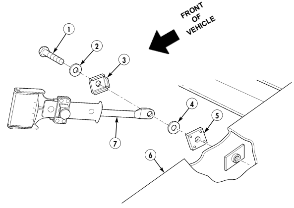

FOLLOW-ON TASK:
Install companion seat (para. 10-45).

# 10-48. Steering Wheel Lock Replacement

This task covers:
a. Removal b. Installation INITIAL SETUP:
Tools General mechanic's tool kit:
automotive (Appendix B, Item 1 )
Maintenance Level Unit Manual References TM 9-2320-387-24P

Replacement procedures for steering wheel lock on all vehicles except the M1114 are basically the same. The M1114 vehicle has three screws instead of four.

a. Removal Remove four nuts (5), washers (4), screws (1), and wheel lock assembly (2) from body (3).

b. Installation Install wheel lock assembly (2) on body (3) with four screws (1), washers (4), and nuts (5). Tighten

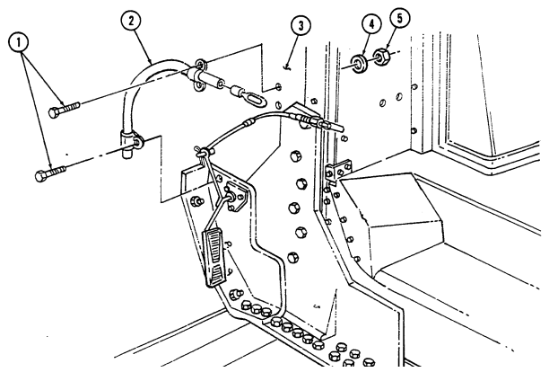 screws (1) to 5 lb-ft (7 N•m).

# 10-49. Cargo Bulkhead Replacement

This task covers:

| INITIAL SETUP:   |
|------------------|

| Tools                                                                | Manual References                |
|----------------------------------------------------------------------|----------------------------------|
| General mechanic's tool kit:                                         | TM 9\-2320\-387\-24P             |
| automotive (Appendix B, Item 1)                                      | Equipment Condition              |
| Materials/Parts                                                      | Front seatbelt retractor removed |
| Two lockwashers                                                      | (para. 10\-47).                  |
| Twelve locknuts (Appendix G, Item 87)  Locknut (Appendix G, Item 82) | Maintenance Level                |

a. Removal b. Installation

#### A. Removal

1. Remove two capscrews (7), lockwashers (8), washers (9), and cargo bulkhead bracket (10) from cargo floor (11). Discard lockwashers (8).

2. Remove two nuts (1), lockwashers (2), washers (3), capscrews (5), and washers (3) from cargo bulkhead (6) and B-pillar (4). Discard lockwashers (2).

3. Remove cargo bulkhead (6) from vehicle. 4. Inspect antinoise pads (12). Replace if damaged.

#### B. Installation

1. Install cargo bulkhead (6) on cargo floor (11). 2. Install cargo bulkhead (6) on B-pillar (4) with two washers (3), capscrews (5), washers (3),
lockwashers (2), and nuts (1).

3. Install cargo bulkhead bracket (10) on cargo floor (11) with two washers (9), lockwashers (8), and

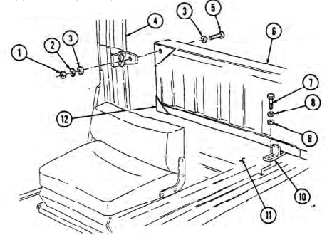

capscrews (7). Tighten capscrews (7) to 65 lb-ft (88 N•m).

4. Tighten nuts (1) to 15 lb-ft (20 N•m).

# 10-50. Cargo Bulkhead Extension Maintenance

This task covers:

a. Removal c. Assembly b. Disassembly d. Installation

| M1151A1, M1152A1, M1165A1, M1167                                       |
|------------------------------------------------------------------------|
| Tools                                                                  |
| General mechanic's tool kit:                                           |
| automotive (Appendix B, Item 1) Maintenance and repair shop equipment: |

a. Removal

| Equipment Condition Maintenance Level   |
|-----------------------------------------|

Remove quick-release pin (12) from post assembly (4) and remove cargo barrier extension (5) from cargo bulkhead (13).

#### B. Disassembly

1. Remove screw (6) and lanyard (7) from post assembly (4). 2. Remove twenty-four screws (1), nut and washer assemblies (3), and three backboards (2) from four post assemblies (4).

3. Remove eight nuts (11), washers (9), capscrews (8), washers (9), and four mounting brackets (10)
from cargo bulkhead (13).

#### C. Assembly

1. Install lanyard (7) on post assembly (4) with screw (6). 2. Install three backboards (2) on post four assemblies (4) with twenty-four screws (1) and nut and washer assemblies (3).

3. Install four mounting brackets (10) on cargo bulkhead (13) with eight washers (9), capscrews (8),
washers (9), and nuts (11).

d. Installation

When installing cargo barrier extension, ensure side rack pins on post assemblies slide into holes of cargo bulkhead.

Install cargo barrier extension (5) on cargo bulkhead (13) with quick-release pin (12).

# 10-50.  Cargo Bulkhead Extension Maintenance (Cont'D)

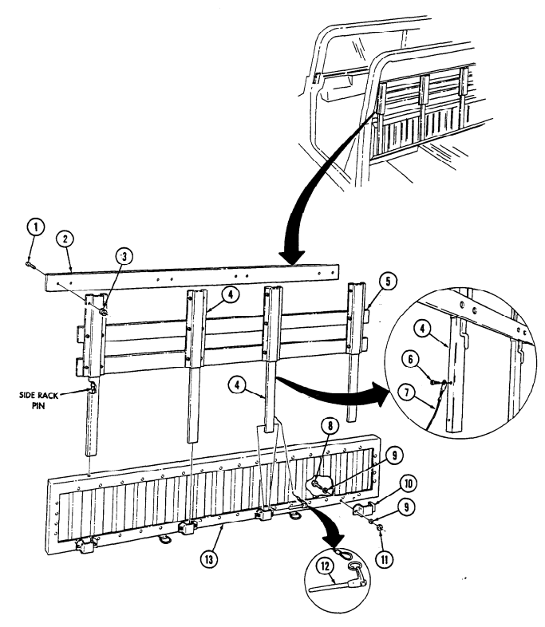

# 10-51. Cargo Bulkhead Mounting Brackets Replacement

This task covers:

| Applicable Models   |
|---------------------|

INITIAL SETUP:
Tools General mechanic's tool kit:
automotive (Appendix B, Item 1)
a. Removal

a. Removal b. Installation

1. Remove nut (6), washer (7), capscrew (10), washer (7), cargo bracket (9), and tiedown (8) from cargo floor (5).

| Manual References                      |
|----------------------------------------|
| TM 9\-2320\-387\-24P                   |
| Equipment Condition                    |
| Companion seat removed (para. 10\-44). |
| Maintenance Level                      |

Note position of latch on B-pillar for installation.

2. Remove two capscrews (4), latch (3), and latch retainer (2) from B-pillar (1).

b. Installation 1. Install latch retainer (2) and latch (3) on B-pillar (1) with two capscrews (4). Tighten capscrews (4)
to 6 lb-ft (8 N•m)
2. Install tiedown (8) and bracket (9) on cargo floor (5) with washer (7), capscrew (10), washer (7), and

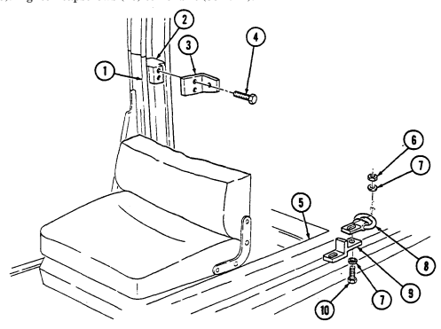

nut (6). Tighten capscrews (10) to 26 lb-ft (35 N•m).

FOLLOW-ON TASK: Install cargo bulkhead (para. 10-49).

10-86 Change 5

# 10-52. Cargo Tiedown Replacement

This task covers:
INITIAL SETUP:

#### Tools

General mechanic's tool kit:
automotive (Appendix B, Item 1)
Maintenance and repair shop equipment:
automotive (Appendix B, Item 2)

#### Materials/Parts

Locknut (Appendix G, Item 85)
Personnel Required One mechanic One assistant a. Removal

For removal of rear cargo tiedown, one assistant will be needed.

1. Remove hex-head screw (1) and front cargo tiedown (2) from cargo floor (3). 2. Remove locknut (7), washer (6), hex-head screw (4), and rear cargo tiedown (5) from cargo floor (3).

Discard locknut (7).

b. Installation

For installation of rear cargo tiedown, one assistant will be needed.

1. Install front cargo tiedown (2) on cargo floor (3) with hex-head screw (1). Tighten hex-head screw
(1) to 65 lb-ft (88 N•m).

2. Install rear cargo tiedown (5) on cargo floor (3) with hex-head screw (4), washer (6), and locknut (7).

Tighten locknut (7) to 65 lb-ft (88 N•m).

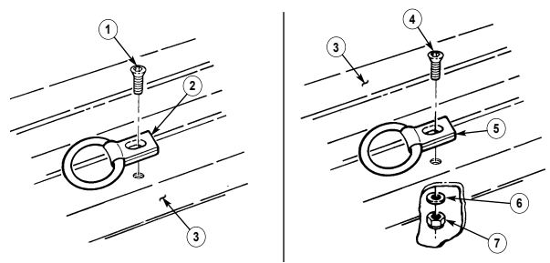

a. Removal b. Installation Manual References TM 9-2320-387-24P
Maintenance Level Unit

# 10-53. Fire Extinguisher Bracket Maintenance

This task covers:
a. Removal c. Installation b. Inspection INITIAL SETUP:
Tools General mechanic's tool kit:
automotive (Appendix B, Item 1)
Maintenance and repair shop equipment:
automotive (Appendix B, Item 2)
Manual References TM 9-2320-387-10 TM 9-2320-387-24P
Equipment Condition Fire extinguisher removed (TM 9-2320-387-10).

| Maintenance Level   |
|---------------------|
| 1                   |

Unit a. Removal 1. Remove four capscrews (6) and retainer plate (4) from two supports (3). 2. Remove four capscrews (1), washers (2), and fire extinguisher bracket (7) from retainer plate (4). b. Inspection

For inspection and removal of struxnuts, refer to para. 10-56.

Inspect four struxnuts (5). Replace if damaged. c. Installation 1. Install fire extinguisher bracket (7) on retainer plate (4) with four washers (2) and capscrews (1).

Tighten capscrews (1) to 6 lb-ft (8 N•m).

2. Install retainer plate (4) on two supports (3) with four capscrews (6). Tighten capscrews (6) to 68-82 lb-in. (8-9 N•m).

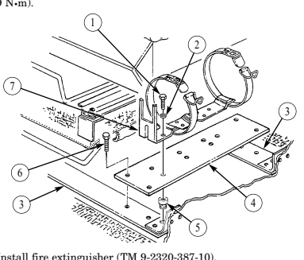

FOLLOW-ON TASK: Install fire extinguisher (TM 9-2320-387-10).
10-88 Change 1

# 10-54. Body Hinge Mount Replacement (M1113)

This task covers:

| This task covers:                |                   |
|----------------------------------|-------------------|
| a.  Removal                      | b.  Installation  |
| INITIAL SETUP:                   |                   |
| Applicable Models                | Materials/Parts   |
| M1151A1, M1152A1, M1165A1, M1167 |                   |
| Tools                            | Manual References |

a. Removal

Perform step 1 for upper front body hinge removal.

1. Remove two nuts (1), washers (2), twelve-point screws (5), washers (4), and upper front body hinge mount (3) from body (6).

Perform step 2 for lower front body hinge removal.

2. Remove two twelve-point screws (9), washers (8), and lower front body hinge mount (7) from body (6).

#### B. Installation Note

Perform step 1 for lower front body hinge mount installation.

1. Install lower body hinge mount (7) on body (6) with two washers (8) and twelve-point screws (9).

Tighten twelve-point screws (9) to 8 lb-ft (11 N•m).

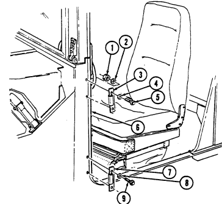

Perform step 2 for upper front body hinge installation.

2. Install upper body hinge mount (3) on body (6) with two washers (4), twelve-point screws (5),
washers (2), and nuts (1). Tighten twelve-point screws (5) to 8 lb-ft (11 N•m).

# 10-54.1. Body Hinge Mount Replacement (M1151, M1152, M1165)

| This task covers:   |                   |
|---------------------|-------------------|
| a.  Removal         | b.  Installation  |
| INITIAL SETUP:      |                   |
| Applicable Models   | Materials/Parts   |
| M1114               |                   |
| Tools               |                   |
|                     | Manual References |

#### A. Removal

Remove four nuts (1), twelve-point screws (4), washers (3), and two body hinge mounts (2) from body (5).

#### B. Installation

Install two body hinge mounts (2) on body (5) with four washers (3), twelve-point screws (4), and nuts (1).

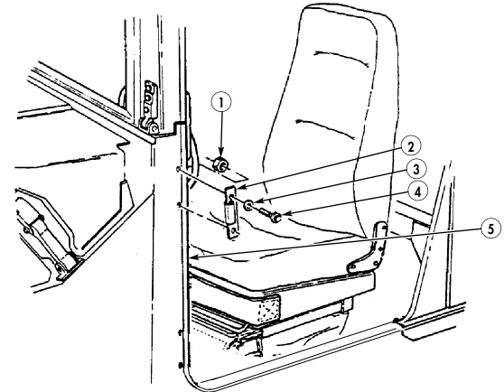

# 1 O-55. Airlift Bracket-To-Hood Seal Replacement

This task covers: 
INITIAL SETUP: 
Tools General mechanic's tool kit: 
automotive (Appendix B, Item 1) 
Manual References TM 9-2320-387-10 TM 9-2320-387-24P 

a. Removal b. Installation 

Equipment Condition Hood raised and secured (TM 9-2320-387-10). 

Maintenance Level Unit 1 a. Removal 1 Remove protector (1) and seal (2) from airlift bracket (3). 

1 b. Installation 1 Install seal (2) and protector (1) on airliR bracket (3). 

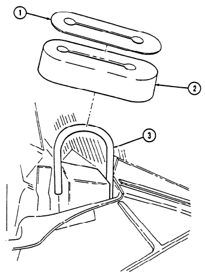

FOLLOW-ON TASK: Lower and secure hood (TM 9-2320-387-10). 

# 10-56. Body Repair

This task covers:
b. Inspection INITIAL SETUP:
a. General c. Rivet Replacement

| INITIAL SETUP:                  |                                                |
|---------------------------------|------------------------------------------------|
| Applicable Models               | Materials/Parts                                |
| M1114                           | Thread locking adhesive (Appendix C, Item 3.1) |
| Tools                           | Manual References                              |
| General mechanic's tool kit:    | TM 9\-2320\-387\-24P                           |
| automotive (Appendix B, Item 1) | Equipment Condition                            |

#### A. General

1. The body is constructed from aluminum alloys that have been heat-treated to obtain high strength.

Welding cannot be used to make body repairs. Heat generated in welding will reverse the heat treatment process and cause a great reduction in strength of material.

2. Solid 3/16-in. diameter aluminum rivets are the primary method of joining body components. Rivets are inserted into a hole through two pieces of metal, and a second head is formed by manual or pneumatic impact or by squeezing the rivet. A bucking bar is used to back up the rivet to form rivet head. When making repairs, use blind rivets of the same size or oversize diameter with the appropriate grip length.

3. Blind structural aluminum rivets of 3/16-in. diameter are used in applications where there is access from only one side of the part. Blind rivets are installed using a tool that pulls on the rivet stem, causing a bulbed head to form on the back side of the part. Fastening is complete when stem breaks off. High strength is obtained in blind structural rivets by mechanically locking the remaining stem inside rivet body. Blind pop rivets are used in locations where nonstructural attachments such as latches, striker plates, etc., are attached to the body.

4. Steel pull-type lockbolt fasteners in 3/16 and 1/4-in. diameter are used where tension or high shear loads exist. Lockbolts are two-piece unthreaded fasteners. One part is a high-strength, steel-headed, bolt-like part with serrations on its shank. The mating part is a collar which is swaged over the serrations, causing the fastener to be locked in place.

5. Rivnut/plusnut/nut insert fasteners are tubular rivets with internal threads. Rivnut/plusnut/nut insert fasteners are installed using a tool that engages the threads of the fastener and extends a pull, causing the shank to expand tightly against the material being fastened. This process is called "upsetting" a rivnut/plusnut/nut insert.

5.1. Struxnut fasteners are round, steel, with internal threads. Struxnut fasteners are installed using an automated or manual ramming device.

6. To facilitate repairs to body, it is acceptable to replace lockbolts and rivets with 1/4-in. AN4 series bolts. Do not replace lockbolts with rivets. Standard threaded fasteners should not be used, as these will quickly wear the aluminum structure. Bolt lengths should be chosen so that the cylindrical portion of bolt is bearing on all members being joined. Bolts are designated as AN4-XX or AN4C-XX where XX defines grip length. Tighten all bolts to 70-75 lb-in. (8-9 N•m).

7. Fatigue strength of riveted joints and seams is increased by one part epoxy adhesive. This adhesive requires special material storage and metal preparation along with a low-temperature heat cycle for curing. Because of its impracticality in field repairs, epoxy adhesive will not be used. Where possible, extra rivets and thicker metal gauges should be used instead of adhesives. When making repairs, note epoxy exists and that parts may be difficult to separate, even after rivets are removed.

#### 10-S. Body Repair (Cont'D)

b. inspection 1. The damaged area should be thoroughly cleaned and inspected to determine cause and extent of damage. Body parts should be inspected for holes, cracks, dents, distortion, or breaks. Fasteners should be inspected for breaks, stretching, looseness, cocked heads, or hole elongation. Seams, flanges, and joints should be inspected for straightness or local deformation which is an indication that fasteners may have been stretched or holes elongated. It is possible for this to happen and fasteners can still appear to be tight in their holes. In addition, make thorough inspection of adjacent areas to determine if high loads have been transmitted from the damaged area to other areas. This can result in secondary damage of distorted panels or seams, loosened or sheared fasteners, elongated fastener holes, and cracks. 

2. Signs of rivet failure include tipped heads, looseness, and sometimes chipped or cracked paint. If heads are tipped in the same direction and rivets are loose in consecutive groups, the joint has undergone excessive load. Rivet heads which are tipped in different directions and are not in groups may be improperly installed. With chipped or cracked paint, it may be necessary to remove paint to check true condition of rivets. Rivets subjected to critical loads but showing no distortion should be inspected if failure is suspected. The head should be drilled off, and the shank should be carefully punched out. Failure is indicated by notched rivet shank and misaligned holes. Flush rivets showing head slippage within the dimple or countersink indicate either sheet bearing or rivet shear failure and must be removed for inspection and replacement. If failure of rivets cannot be detected by visual inspection, the joint can be checked by drilling and punching out several rivets. If rivet shanks are notched, rivets should be replaced with next larger size rivets. If rivet holes show elongation due to local failure in tearing of the sheet, the next larger size rivet must be used in replacement. Any deformation of the sheet around the rivet, tear-outs, or cracks between rivets usually indicates partially failed or damaged rivets. Complete repairof the joint will require replacement by the next larger size rivets. Use the next l/32-in. larger diameter rivet to obtain a tight joint when original hole has been enlarged. If original size rivet is installed, the rivet will not be able to carry its share of the shear load, and the joint would not meet its strength requirement. 

#### C. Rivet Replacement Note

When removing rivets, do not enlarge rivet hole because this would require use of an oversize or larger rivet for replacement. 

1. Solid Rivet Removal. 

(a) 
(b) 
File a flat surface on the manufactured head if accessible. It is always preferable to work on manufactured head rather than the one that is bucked over, since the former will always be more symmetrical around the shank. 

Indent center of the filed surface with a center punch. 

Drill through rivet head. Be sure to use a drill slightly smaller than diameter of rivet shank to avoid making rivet hole oversized. 

Shear weakened rivet head off with a sharp chisel. For this operation, support back side of rivet and cut rivet head along direction of rivet line or panel edge. This will prevent distortion of the panel. 

Firmly support the panel from the opposite side and drive out shank with a pin punch. If rivet is unduly tight because of swelling between sheets, drill rivet shank out with an undersize drill. 

2. Blind Rivet Removal. 

(c) 
(d) 
(e) 
(a) File a small flat on rivet head. 

(b) Center-punch the flat. Support rivet backside, if possible. (c) Using a small drill about the size of rivet pin, drill off tapered end of pin which 'forms the lock. 

# 10-56. Body Repair (Cont'D)

(d) Shear lock using a pin punch to drive out pin. (e) Pry out remainder of locking collar. (f) Using a drill slightly smaller than rivet shank, drill almost through rivet head. (g) Pry off rivet head with a pin punch. (h) Tap out rivet shank with a pin punch.

3. Rivnut/Plusnut/Nut Insert Removal.

#### Warning

Drilling creates metal chips, which may enter eyes and cause serious injury. Eye protection is required.

(a) Drill through head of rivnut/plusnut/nut insert, using same size drill used to make original hole. Counterbore in rivnut/plusnut/nut insert will act as drill guide.

(b) Remove head of rivnut/plusnut/nut insert.

#### Caution

Do not puncture opposite face sheet of panel when punching out rivnut/plusnut/nut insert shank.

(c) Punch out shank of rivnut/plusnut/nut insert using a pin punch slightly smaller than hole in structure.

4. Rivet Hole Drilling.

(a) Center-punch all new rivet locations. Center punch mark must be large enough to prevent drill from slipping out of position, yet it must not dent the surface of the material. To prevent denting, place a bucking bar behind material during punching.

Table 10-1. Drill Sizes for Solid Shank Rivets.

| - After installation, ensure the buckle cable is vertical in the   | upper position and at 30 degrees in the lower position.   |
|--------------------------------------------------------------------|-----------------------------------------------------------|
| - Ensure side of anti\-rotation spacer with raised corners faces   |                                                           |

|                |            | NOMINAL DIAMETER (INCH)   |         |                | OVERSIZE DIAMETER (INCH)   |         |         |
|----------------|------------|---------------------------|---------|----------------|----------------------------|---------|---------|
| RIVET DIAMETER | DRILL SIZE | MINIMUM                   | MAXIMUM | RIVET DIAMETER | DRILL SIZE                 | MINIMUM | MAXIMUM |
| 1/8            | #30        | 0.129                     | 0.132   | 1/8            | #27                        | 0.143   | 0.146   |
| 5/32           | #20        | 0.160                     | 0.164   | 5/32           | #16                        | 0.176   | 0.180   |
| 3/16           | #10        | 0.192                     | 0.196   | 3/16           | #5                         | 0.205   | 0.209   |

Table 10-2. Drill Sizes for Blind Rivets.

## 10-56. Body Repair (Cont'D)

(b) Make sure drill is the correct size (tables 10-1 and 10-2) and point is properly ground. A No. 10 drill is used to install standard 3/16-in. blind rivets.

(c) Place drill in center mark for new rivet locations, or align drill with old hole when replacing old rivets with oversize rivets. When using a power drill, give the bit a few turns with fingers before starting motor. This will help assure that drill does not jump out of position when motor is started.

NOTE
- While drilling, hold drill at 90° angle to material surface. Avoid letting drill wobble, marking oblong holes.

- Avoid excessive pressure. Let drill bit do the cutting. - Do not push drill through material.

(d) Remove all burrs with a metal countersink or file. (e) Clean away all drill chips. Care must be taken to assure no chips are trapped between sheets of metal. (f) Apply sealing compound to hole and surrounding area.

5. Hole Countersinking.

Some rivet installations in the body require that rivet head be flush with the material surface. In these instances, countersunk or flush-head rivets are used.

(a) When using countersunk rivets, rivet holes must be countersunk with a tool having a 100°
taper so rivet head will fit flush with surface.

(b) When using a hand-operated countersink, the hole must be tried with a rivet so the recess will not be too deep or too shallow. It is best to use a countersink with a stop on it so depth of countersink can be controlled. Typical countersinking dimensions for blind rivets are shown in table 10-3. The minimum sheet thickness that can be machined for 100° countersink rivets is given in table 10-4.

(c) Do not remove edge of hole on blind side of joint.

|          | COUNTERSINKING DIMENSIONS (100°) l   |         | 010R. MIN.   |
|----------|--------------------------------------|---------|--------------|
| RIVET    | C (INCH)                             |         |              |
| DIAMETER |                                      |         |              |
| (INCH)   | MINIMUM                              | MAXIMUM |              |
| 1/8      | 0.222                                | 0.228   |              |
| 5/32     | 0.283                                | 0.289   |              |
| 3/16     | 0.350                                | 0.356   |              |

Table 10-3. Countersinking Dimensions for 100° Countersunk Blind Rivets.

| RIVET SIZE (INCH)   | 3/32   | 1/8   | 5/32   | 3/16 1/4          |
|---------------------|--------|-------|--------|-------------------|
| GAUGE (INCH)        | 0.040  | 0.050 | 0.064  | \| 0.072 \| 0.072 |

Table 10-4. Minimum Sheet Gauge for 100° Machine Countersink.

# 10-56. Body Repair (Cont'D)

6. Blind Rivet Driving Practices and Precautions.

(a) Rivets should be inspected for proper installation. The grip length of each rivet is marked on top of its head to provide positive identification. Use of proper grip length will produce a rivet installation where locking collar is flush with top surface of rivet head. Tolerance limit on flushness is 0.02 in. (0.5 mm).

(b) For proper rivet installation, it is imperative that holes be properly prepared, tools be in good working order, and rivets properly applied. When problems occur, the source of trouble could be in any of these areas.

7. Blind Rivet Installation.

- Prior to installing blind rivets, the hole must be prepared with the parts aligned and clamped firmly in place. These steps are the same as for solid riveting operations. Proper drill sizes for standard and oversized blind rivets are given in table 10-2. Countersinking dimensions and minimum sheet gauge for countersunk blind rivets are shown in tables 10-3 and 10-4.

- It is very important that the proper length rivet is selected for each application. Rivet lengths are sized by the range of material thickness that the rivet will grip. Selecting the proper rivet length is critical because rivets can tolerate only 1/16-in. variation in material thickness for each particular rivet length. Rivet grip lengths are called out as a dash number at the end of the manufacturer's part number. Grip lengths are determined as shown in table 10-5.

- For double-dimpled sheets, add countersunk head height to material thickness.

- Use rivet installation tool kit for all blind rivets.

| NOTE                                                |
|-----------------------------------------------------|
| post assemblies slide into holes of cargo bulkhead. |

Table 10-5. Rivet Grip Length Determination.

## 10-56. Body Repair (Cont'D)

(a) Insert rivet stem into pulling head of rivet gun. (b) Hold rivet gun in line with axis of rivet as accurately as possible. (c) Apply a steady, firm pressure against rivet head. (d) Squeeze handles of manual gun. The rivet clamping action will pull sheets together, seat rivet head, and break stem flush with head of rivet.

8. Rivnut/Plusnut/Nut/Threaded Insert Installation.

#### Caution

Use grade 5 torque value when installing capscrews into nut inserts. Failure to do so may damage equipment and/or components.

(a) Install washer, tool body, and insert on screw/mandrel. Install tool and insert assembly in vehicle surface.

(b) Insert rivnut/plusnut/nut/threaded inserts into hole for installation. (c) Apply steady, firm pressure against rivnut/plusnut/nut/threaded inserts head. (d) Holding tool body with box end wrench, turn screw/mandrel clockwise with torque wrench until proper torque is met (refer to table) and insert is fully compressed.

(e) Remove mandrel from rivnut/plusnut/nut/threaded inserts.

9. Struxnut Installation.

(a) Position struxnut over hole. (b) Apply force sufficient using riveter to seat struxnut. (c) The struxnut is properly staked when head of nut rests securely and flush on surface of component being staked.

| THREAD SIZE   | TORQUE (LB\-IN.)   |
|---------------|--------------------|
| 10\-24 unc    | 57.5               |
| 1/4\-20 unc   | 84.0               |

# 10-56. Body Repair (Cont'D)

# 10-57. B-Pillar Replacement

This task covers:
INITIAL SETUP:
Applicable Models M1113, M1152, M1152A1 Tools General mechanic's tool kit:
automotive (Appendix B, Item 1)
Maintenance and repair shop equipment:
automotive (Appendix B, Item 2)
Materials/Parts Twelve locknuts (Appendix G, Item 87)
Manual References TM 9-2320-387-10 TM 9-2320-387-24P
a. Removal b. Installation

#### Equipment Condition

- Soft top removed, if installed (TM 9-2320-387-10). - Soft top door strikers removed, if installed
(para. 10-94).

- Front seatbelts removed (M1113 only) 
(para. 10-47).

- Front shoulder strap assembly removed 
(M1152 and M1152A1 only) (para. 10-47.1).

Maintenance Level Unit a. Removal Remove twelve locknuts (5), washers (4), capscrews (2), and B-pillar (1) from body (3). Discard locknuts (5).

b. Installation Install B-pillar (1) on body (3) with twelve capscrews (2), washers (4), and locknuts (5). Tighten locknuts (5)

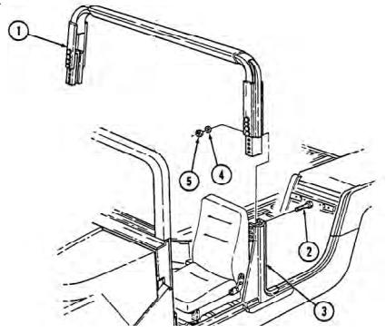 to 15 lb-ft (20 N•m).

FOLLOW-ON TASKS: - Install front shoulder strap assembly (M1152 and M1152A1 only) (para. 10-47.1.).

- Install front seatbelts (M1113) (para. 10-47). - Install soft top door strikers, if removed (para. 10-94). - Install soft top, if removed (TM 9-2320-387-10).

# 10-57.1. C-Pillar Reinforcement Brackets Installation

This task covers:
Installation INITIAL SETUP:
Applicable Models M1152 Tools

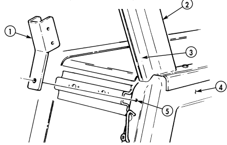

General mechanic's tool kit:
automotive (Appendix B, Item 1)
Two brackets (Appendix D, Fig. D-116) Two locknuts (Appendix G, Item 101.6) Eight rivets (Appendix G, Item 269.1)
Installation TM 9-2320-387-24P TM 43-0139

| Equipment Condition   |
|-----------------------|

Equipment Condition Soft top removed as required (TM 9-2320-387-10).

Maintenance Level Unit

- The following procedure can be performed to prevent fatigue cracking of the C-pillar mount brackets. Installation is at commander's discretion.

- For instructions on replacement of rivets, refer to para. 10-56.

1. Using 0.187-in. (4.75 mm) drill bit, remove rivet (5) from wheelhousing (4). 2. Scribe two reference lines (3) on C-pillar (2). 3. Align reinforcement bracket (1) with reference lines (3) on C-pillar (2). 4. Scribe hole location (5) on wheelhousing (4) onto reinforcement bracket (1). 5. Using reinforcement bracket as template, drill four 0.187-in. (4.75 mm) diameter holes through reinforcement bracket (1) and C-pillar (2). Remove bracket (1).

6. Using 0.281-in. (7.14 mm) drill bit, enlarge hole (5) in wheelhousing (4). 7. Using hole location marked in step 4, drill 0.281-in. (7.14 mm) diameter hole in reinforcement bracket (1).

8. Spot paint reinforcement bracket (refer to TM 43-0139).

# 10-57.1. C-Pillar Reinforcement Brackets Installation (Cont'D)

9. Install reinforcement bracket (1) on C-pillar (2) with four rivets (3).

10. Align mount hole (7) in reinforcement bracket (1) and hole in wheelhousing (4) and install washer (6), screw (8), washer (6), and locknut (5).

11. Spot paint as necessary (refer to TM 43-0139).

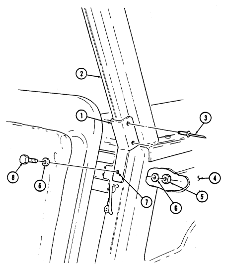

FOLLOW-ON TASK: Install soft top as required (TM 9-2320-387-10).

# 10-58. M13 Decontamination Brackets Installation

This task covers:
Installation INITIAL SETUP:
Tools Maintenance Level Unit General mechanic's tool kit:
automotive (Appendix B, Item 1)
Manual References TM 9-2320-387-24P

- The following procedure is for initial installation of apparatus 
(P/N E5-51-527). This apparatus is not included in TM 9-2320-387-24P.

- Perform steps 1 through 4 for M1113 vehicles only. Perform steps 5 through 7 for all other vehicles.

Installation 1. Using plate (3) as template, locate, mark, and drill twenty-four 0.187-in. diameter holes (1) in rear of shelter (2).

2. Install plate (3) on shelter (2) with twenty-five rivets (4). 3. Install four rivnuts (7) in holes (8) of plate (3). 4. Install bracket (6) on plate (3) with four capscrews (5). Tighten capscrews (5) to 49 lb-ft (66 N•m). 5. Using bracket (9) as a template, locate, mark, and drill four 0.333 diameter holes (13) in cargo floor (14).

6. Install four rivnuts (12) in holes (13). 7. Install bracket (9) on cargo floor (14) with four lockwashers (11) and screws (10).

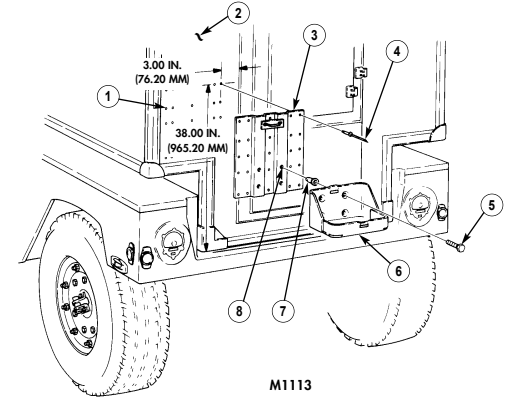

10-58. M13 DECONTAMINATION BRACKETS INSTALLATION (Cont'd)

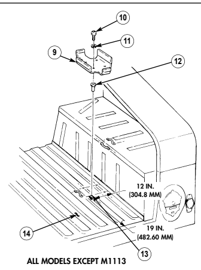

■
.

## 10-58.1. Floor Drain Hole Plate Installation

This task covers:
Installation INITIAL SETUP:
Tools General mechanic's tool kit:
automotive (Appendix B, Item 1)
Maintenance and repair shop equipment:
automotive (Appendix B, Item 2)
Special Tools Tool kit, riveter (Appendix B, Item 123)

#### Materials/Parts

Adhesive sealant (Appendix C, Item 7.1) Three rivets (Appendix G, Item 257.1) Five rivets (Appendix G, Item 260)
Manual References TM 9-2320-387-24P TM 43-0139 Maintenance Level Unit Installation

All drain hole plates are installed basically the same. This procedure covers one drain hole plate.

1. Mark an outline at drain hole (3) on floor panel (4).

- It may be necessary to bend or shape the drain hole plate to the contour of the floor panel.

- When installed, the drain hole plate opening faces toward the center of the vehicle.

5. Position drain hole plate (5) to underside of floor panel (4). Bend or shape drain hole plate (5) to the contour of the floor panel (4).

6. Using drain hole plate (5) as a template, locate, mark, and drill four 0.187-in. (4.8-mm) diameter holes on floor panel (4).

7. Apply approximately 0.125-in. (3.175-mm) thickness of adhesive sealant to shaded mating surface on drain hole plate (5).

8. Apply approximately 0.125-in. (3.175-mm) thickness of adhesive sealant to shaded mating surface on underside of floor panel (4) and side body panel (6).

9. Position drain hole plate (5) to underside of floor panel (4) and install seven rivets (2) on floor panel (4) and drain hole plate (5).

10. Using rivet hole drilled in step 4 as a template, drill 0.187-in. (4.8-mm) diameter hole through drain hole plate (5).

11. Install rivet (2) on floor panel (4), side body panel (6), and drain hole plate (5). 12. Remove excessive adhesive and clean edges on floor panel (4) and drain hole plate (5). 13. Spot-paint floor panel (4) and drain hole plate (5) (TM 43-0139).

2. Cut and remove drain hole material (1) from floor panel (4), and remove sharp edges and burrs from floor panel (4).

3. Mark underside of floor panel (4) with two lines centered over damaged floor drain area. 4. Using a 0.187-inch diameter drill, remove rivet (2) securing floor panel (4) to side body panel (6).

# 10-58.1. Floor Drain Hole Plate Installation (Cont'D)

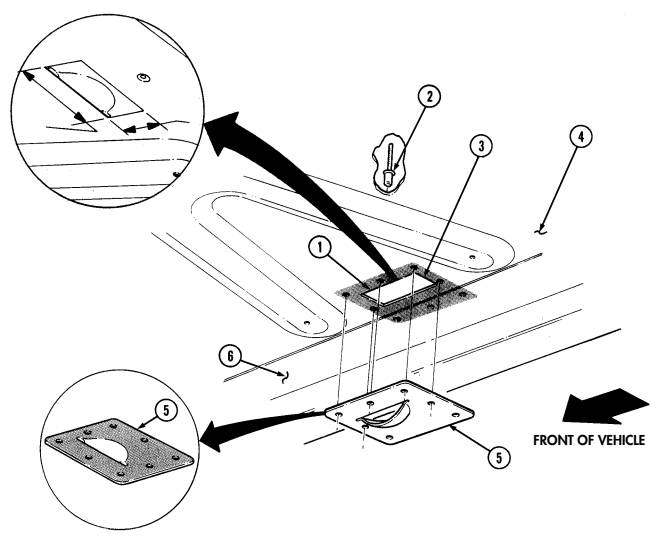

# 10-58.2. Underbody Protection Kit Replacement

This task covers:

#### Initial Setup: Tools

a. Front Skid Plate Removal **g. Fuel Tank Shield Installation** b. Front Shield Removal h. Rear Shield Installation e. Rear Shield Removal k. Front Shield Installation f. Fuel Tank Shield Removal **l. Front Skid Plate Installation**
c. Intermediate Shield Removal i. Transfer Case Shield Installation d. Transfer Case Shield Removal j. Intermediate Shield Installation

#### Equipment Condition

General mechanic's tool kit: automotive
(Appendix B, Item 1)
Maintenance and repair shop equipment:
automotive (Appendix B, Item 2)

#### Materials/Parts

Four rubber washers (Appendix G, Item 274) Forty-six locknuts (Appendix G, Item 106)
Manual References TM 9-2320-387-24P

#### A. Front Skid Plate Removal

1. Remove three locknuts (9), washers (2), capscrews (7), washers (2), and front skid plate (6) from front shield (8). Discard locknuts (9).

The position of the front skid plate on front bumper varies between models. Note position for installation.

2. Remove three locknuts (5), washers (3), capscrews (4), washers (3), and front skid plate (6) from

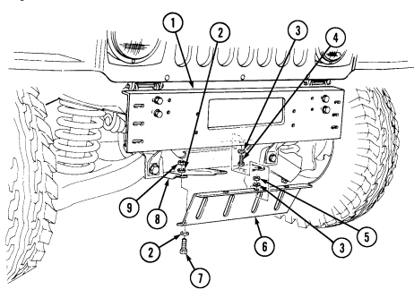

front bumper (1). Discard locknuts (5).

- Battery ground cables disconnected (para. 4-68). - Fuel tank drained (para. 3-25). - Brake protection guards removed 
(para. 7-11 or para. 7-11.1).

#### General Safety Instructions

- Do not perform this procedure near fire, flames, or sparks.

- Fuel tank must be supported during removal and installation.

Maintenance Level Unit

# 10-58.2. Underbody Protection Kit Replacement (Cont'D)

b.  Front Shield Removal Remove three locknuts (16), washers (17), capscrews (18), and washers (17) from front shield (14),
1.

front crossmember (15), and intermediate shield (19). Discard locknuts (16).

2.

Remove three locknuts (13), washers (12), capscrews (11), washers (12), and front shield (14) from front skid plate (10). Discard locknuts (13).

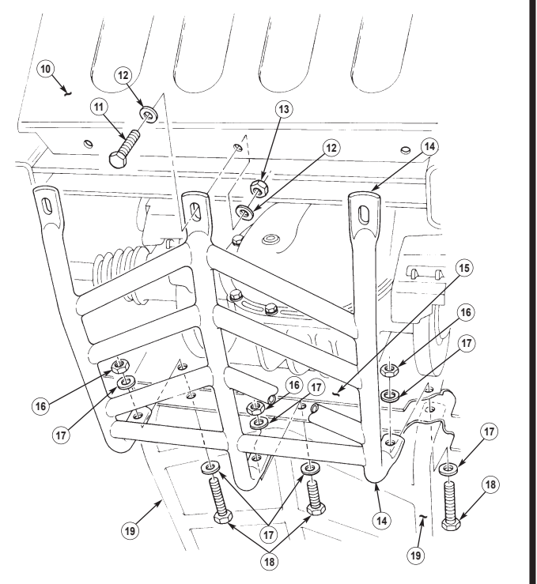

# 10-58.2. Underbody Protection Kit Replacement (Cont'D)

#### C. Intermediate Shield Removal

1. Remove six locknuts (6), washers (2), capscrews (3), washers (2), two transmission support brackets (4), and four rubber washers (5) from intermediate shield (1) and transmission mount crossmember (7). Discard locknuts (6) and rubber washers (5).

Perform steps 2 through 5 for M1113, M1151, and M1152. Perform steps 7 through 10 for M1114 only.

2. Remove locknut (8), washer (9), capscrew (10), and washer (9) from right support bracket (15) and right side frame rail (16). Discard locknut (8).

3. Remove locknut (22), washer (19), capscrew (18), and washer (19) from left support bracket (24),
engine mount bracket (17), and left side frame rail (23). Discard locknut (22).

4. Remove four locknuts (14), washers (12), capscrews (11), washers (12), and right side support bracket (15) from right side mounting bracket (13). Discard locknuts (14).

5. Remove four locknuts (26), washers (21), capscrews (20), washers (21), and left side support

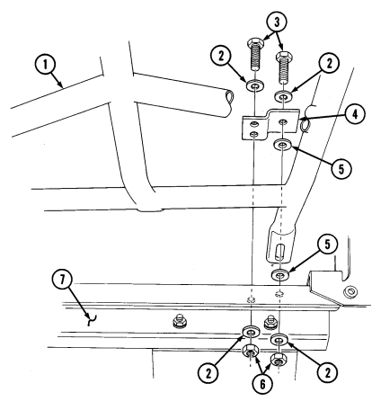

bracket (24) from left side mounting bracket (25). Discard locknuts (26).

6. Remove two locknuts (29), washers (30), capscrews (31), washers (30), and intermediate shield (1)
(M1113, M1151, and M1152 only) from front crossmember (27) and front shield (28). Discard locknuts (29).

10-58.2. UNDERBODY PROTECTION KIT REPLACEMENT (Cont'd)

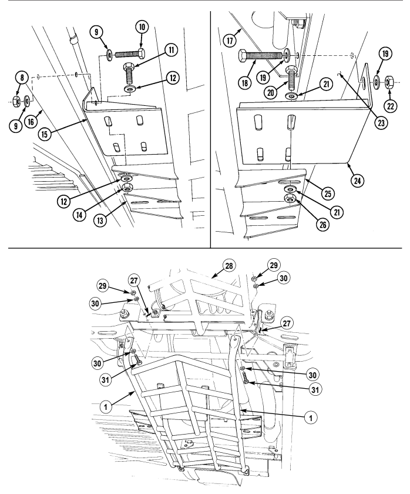

## 10-58.2. Underbody Protection Kit Replacement (Cont'D)

7. Remove two locknuts (2), four washers (3), and two screws (4) from intermediate shield (1) and lefthand bracket (5). Discard locknuts (2).

8. Remove two locknuts (9), four washers (3), two screws (7), and intermediate shield (1) and righthand bracket (6). Discard locknuts (9).

9. Remove two locknuts (12), washers (11), spacer (13), rod (10) and left-hand bracket (5) from left engine mount (14). Discard locknuts (12).

10. Remove screw (17), two fuel line P-clamps (16), and right-hand bracket (18) from right frame rail (15).

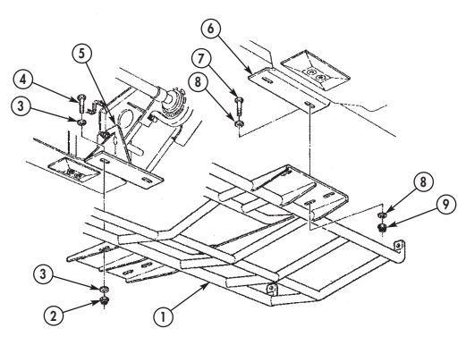

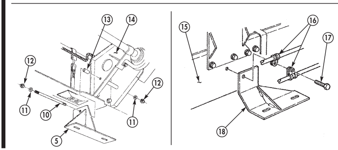

10-98.8 Change 2

10-58.2. UNDERBODY PROTECTION KIT REPLACEMENT (Cont'd)

#### D. Transfer Case Shield Removal

Remove two locknuts (1), washers (2), capscrews (4), washers (2), and transfer case shield (5) from crossmember (3). Discard locknuts (1).

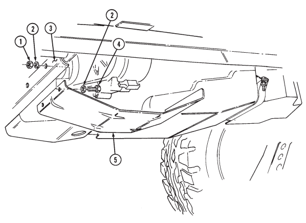

# 10-58.2. Underbody Protection Kit Replacement (Cont'D)

#### E. Rear Shield Removal

1. Remove three locknuts (18), washers (16), capscrews (15), washers (16), and spacers (17) from rear shield (19) and rear-front crossmember (14). Discard locknuts (18).

2. Remove three locknuts (10), washers (11), capscrews (13), washers (20), and rear shield (19) from three mounting brackets (12). Discard locknuts (20).

3. Remove six locknuts (9), washers (7), capscrews (6), washers (7), spacers (21), and three mounting brackets (12) from rear-rear crossmember (8). Discard locknuts (9).

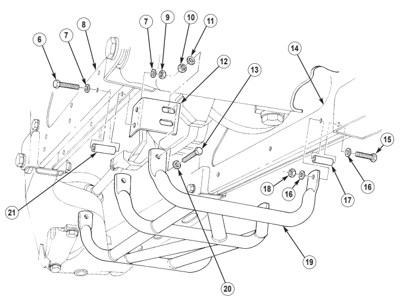

# 10-58.2. Underbody Protection Kit Replacement (Cont'D)

f. Fuel Tank Shield Removal

#### .Warning.

- Fuel tank must be supported during removal. Failure to do so may cause damage to fuel tank or injury to personnel.

- Diesel fuel is highly flammable. Do not perform this task near fire, flames, or sparks. Severe injury or death may result.

1. Deleted 2. Remove two locknuts (6), washers (2), capscrews (3), washers (2), and support straps (5) from upper straps (4). Discard locknuts (6).

3. Swing support straps (5) down and remove fuel tank shield (7).

g. Fuel Tank Shield Installation

#### .Warning.

- Fuel tank must be supported during installation. Failure to do so may cause damage to fuel tank or injury to personnel.

- Diesel fuel is highly flammable. Do not perform this task near fire, flames, or sparks. Severe injury or death may result.

1. Position fuel tank shield (7) on fuel tank (1) and raise support straps (5).

Maintain 0.50-in. (13-mm) clearance between upper and lower straps when tightening locknuts.

2. Install support straps (5) on upper straps (4) with two washers (2), capscrews (3), washers (2), and locknuts (6). Tighten locknuts (6) to 37 lb-ft (50 N•m).

3. Deleted

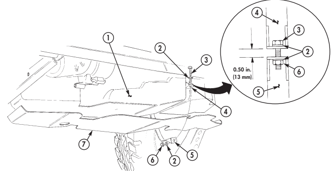

# 10-58.2. Underbody Protection Kit Replacement (Cont'D)

#### H. Rear Shield Installation

1. Install rear shield (14) on rear-front crossmember (9) with three spacers (12), washers (11),
capscrews (10), washers (11), and locknuts (13). Tighten locknuts (13) to 44 lb-ft (60 N•m).

2. Install rear shield (14) on three mounting brackets (7) with three washers (6), capscrews (8),
washers (6), and locknuts (5). Do not tighten locknuts (5).

3. Install three mounting brackets (7) on rear-rear crossmember (3) with six spacers (15), washers (2),
capscrews (1), washers (2), and locknuts (4). Tighten locknuts (4) to 24 lb-ft (33 N•m).

4. Tighten three locknuts (5) to 24 lb-ft (33 N•m).

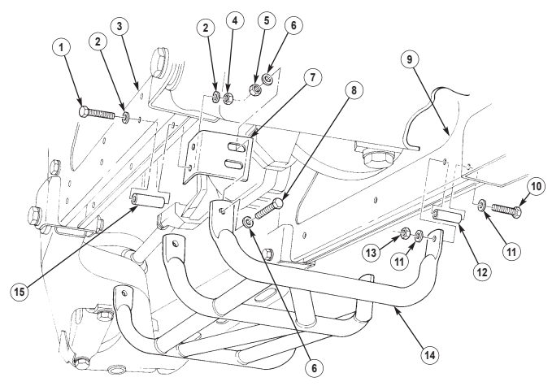

## 10-58.2. Underbody Protection Kit Replacement (Cont'D)

i.  Transfer Case Shield Installation Install transfer case shield (20) on crossmember (18) with two washers (17), capscrews (19), washers (17),
and locknuts (16).

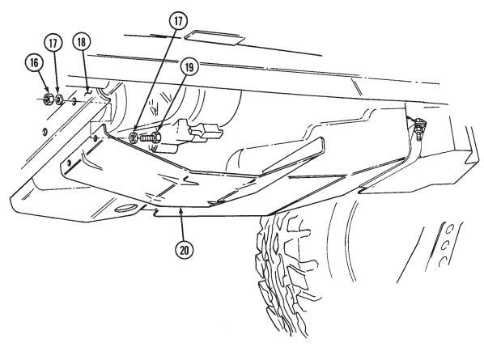

# 10-58.2. Underbody Protection Kit Replacement (Cont'D)

j. Intermediate Shield Installation

- Perform steps 1 through 3 for M1114 vehicles only. Perform steps 4 through 8 for M1113, M1151, and M1152 vehicles.

- When positioning bracket on right frame rail, ensure 0.75-inch
(19 mm) diameter boss engages into 0.75-inch (19 mm) diameter hole in right frame rail.

1. Install right-hand bracket (4) and two fuel line P-clamps (2) on right frame rail (1) with screw (3).

Do not tighten screw (3).

2. Install left-hand bracket (5) on left engine mount (10) with rod (6), spacer (9), two washers (7) and locknuts (8). Do not tighten locknuts (8).

3. Install intermediate shield (11) on left-hand bracket (5) and right-hand bracket (4) with four screws
(14), eight washers (13), and four locknuts (12). Do not tighten locknuts (12).

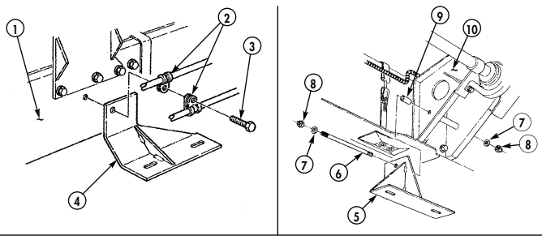

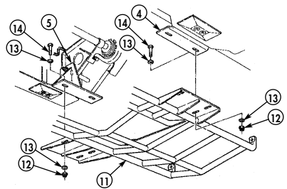

## 10-58.2. Underbody Protection Kit Replacement (Cont'D)

4. Install intermediate shield (6) (M1113, M1151, and M1152 only) and front shield (2) on front crossmember (1) with two washers (4), capscrews (5), washers (4), and locknuts (3). Tighten locknuts (3) to 44 lb-ft (60 N•m).

5. Install left side support bracket (14) on left side mounting bracket (15) with four washers (11),
capscrews (10), washers (11), and locknuts (16). Do not tighten locknuts (16).

6. Install right side support bracket (24) on right side mounting bracket (22) with four washers (21),
capscrews (20), washers (21), and locknuts (23). Do not tighten locknuts (23).

7. Install left side support bracket (14) on engine mount bracket (7) and left side frame rail (13) with washer (9), capscrew (8), washer (9), and locknut (12). Tighten locknut (12) to 105 lb-ft (142 N•m).

8. Install right side support bracket (24) on right side frame rail (25) with washer (18), capscrew (19),
washer (18), and locknut (17). Tighten locknut (17) to 105 lb-ft (142 N•m).

9. Install two transmission support brackets (28) on intermediate shield (6) and transmission mount crossmember (31) with four rubber washers (29), six washers (26), capscrews (27), washers (26), and locknuts (30). Tighten locknuts (30) to 30 lb-in. (3 N•m).

10. Tighten locknuts (16) and (23) and screw and locknuts installed in steps 1 through 3 to 24 lb-ft
(33 N•m).

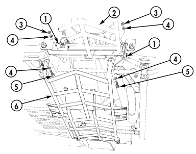

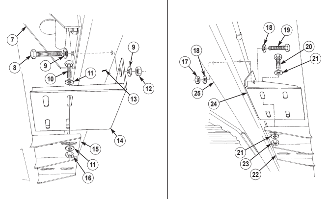

# 10-58.2. Underbody Protection Kit Replacement (Cont'D)

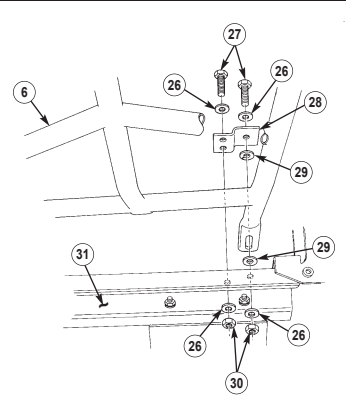

# 10-58.2. Underbody Protection Kit Replacement (Cont'D)

k.  Front Shield Installation Install front shield (5) on front skid plate (1) with three washers (3), capscrews (2), washers (3), and 1.

locknuts (4). Do not tighten locknuts (4).

Install front shield (5) on front crossmember (6) and intermediate shield (9) with three washers (8),
2.

capscrews (10), washers (8), and locknuts (7).

Tighten locknuts (4) and (7) to 44 lb-ft (60 N+m).

3.

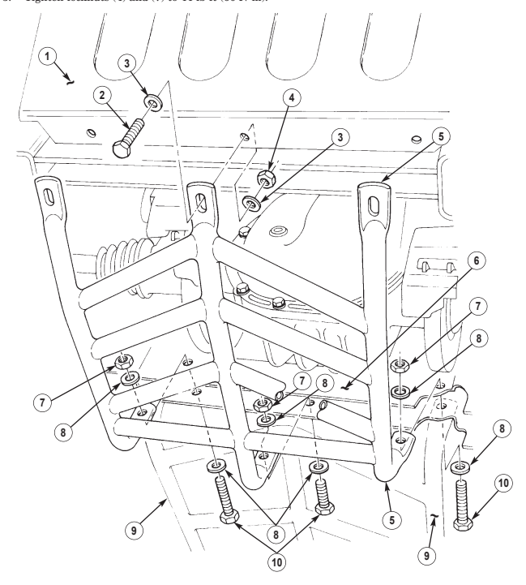

# 10-58.2. Underbody Protection Kit Replacement (Cont'D)

l. Front Skid Plate Installation

On the M1113, M1151, and M1152, without winch, the front skid plate is bolted underneath the lip of the bumper. On the M1114, the front skid plate is bolted on top of the bumper lip. There is no skid plate for M1113, M1151, and M1152 with winch.

1. Install front skid plate (6) on front bumper (1) with three washers (3), capscrews (4), washers (3),
and locknuts (5). Tighten locknuts (5) to 24 lb-ft (33 N•m).

2. Install front skid plate (6) on front shield (8) with three washers (2), capscrews (7), washers (2), and

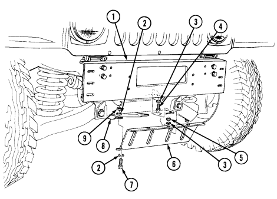

locknuts (9). Tighten locknuts (9) to 44 lb-ft (60 N•m).

FOLLOW ON TASKS: - Install brake protection guards (para. 7-11 or para. 7-11.1).

- Fill fuel tank (TM 9-2320-387-10). - Connect battery ground cables (para. 4-68).

## 10-58.3. Cargo Floor Access Cover Installation

This task covers:
Installation

| INITIAL SETUP:                  |                                                                                                     |
|---------------------------------|-----------------------------------------------------------------------------------------------------|
| Applicable Models               | Manual References                                                                                   |
| M1113                           | TM 9\-2320\-387\-24P                                                                                |
| Tools                           | Maintenance Level                                                                                   |
| General mechanic's tool kit:    | Unit                                                                                                |
| automotive (Appendix B, Item 1) |                                                                                                     |
| a. Removal                      |                                                                                                     |
|                                 | NOTE                                                                                                |
|                                 | Perform step 1 for upper front body hinge removal.                                                  |
| 1.                              | Remove two nuts (1), washers (2), twelve\-point screws (5), washers (4), and upper front body hinge |
| mount (3) from body (6).        |                                                                                                     |
|                                 | NOTE                                                                                                |

#### Installation

1. Using access cover (4), as a template, mark an outline for hole (7) and four insert holes (9) on floor panel (6).

2. Cut and remove access hole material (8) from floor panel (6), and remove sharp edges and burrs from floor panel (6).

3. Locate and drill four 0.297-in. (4.8-mm) diameter holes on floor panel (6). 4. Install four screw inserts (5) in holes on floor panel (6). 5. Position access cover (4) on floor panel (6) and install with four washers (1), lockwashers (3), and screws (2).

6. Spot-paint floor panel (6) (TM 43-0139).

# 10-58.3. Cargo Floor Access Cover Installation (Cont'D)

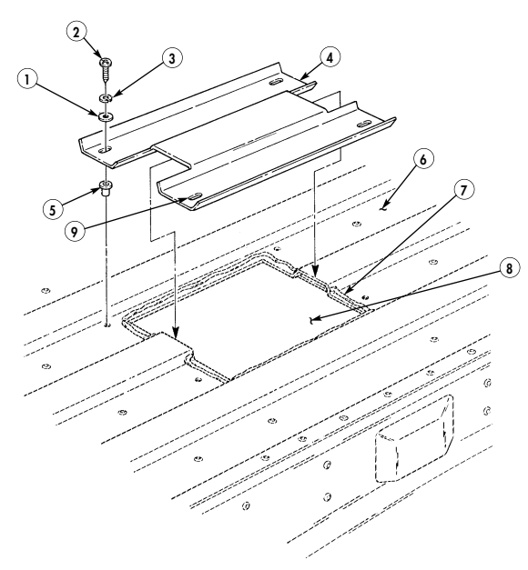

FOLLOW ON TASK:  Install tunnel-top insulation (para. 11-97).

# 10-58.4. Parking Brake Access Cover Maintenance (Serial Numbers 300000 And Above)

This task covers:
a. Removal c. Installation b. Inspection

| M1151, M1152, M1165             | TM 9\-2320\-387\-24P   |
|---------------------------------|------------------------|
| Tools                           | Maintenance Level      |
| General mechanic's tool kit:    | Unit                   |
| automotive (Appendix B, Item 1) |                        |
| a. Removal                      |                        |

a. Removal Remove four capscrews (2), lockwashers (3), washers (1), and access cover (4) from body (6). Discard lockwashers (3).

b. Inspection Refer to para. 10-56 for nut insert (7) inspection and replacement.

c. Installation Install access cover (4) on body (6) with four washers (1), lockwashers (3), and capscrews (2).

# 10-58.4. Parking Brake Access Cover Maintenance (Serial Numbers 300000 And Above) (Cont'D)

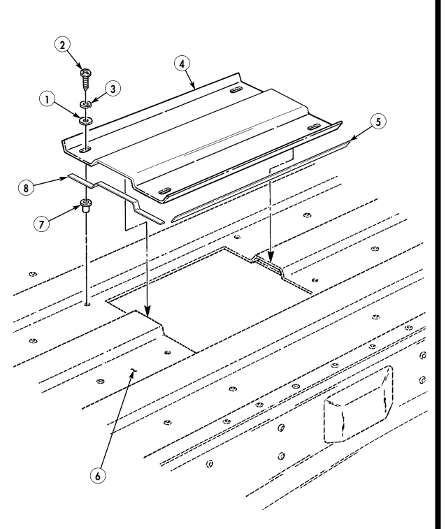

FOLLOW-ON TASK: Install shelter (if applicable) (para. 11-78).

# Section Ii. Body Accessories Maintenance 10-59. Body Accessories Maintenance Task Summary

| b. Installation                                               | a. Removal                                     |                              |
|---------------------------------------------------------------|------------------------------------------------|------------------------------|
| INITIAL SETUP:                                                | Equipment                                      | Condition                    |
| Tools                                                         | Hood raised and secured (TM 9\-2320\-387\-10). | General mechanic's tool kit: |
| automotive (Appendix B, Item 1)                               | Maintenance                                    | Level                        |
| Manual References                                             | Unit                                           | TM 9\-2320\-387\-10          |
| TM 9\-2320\-387\-24P                                          |                                                |                              |
| 1                                                             | a. Removal                                     | 1                            |
| Remove protector (1) and seal (2) from airlift bracket (3).   |                                                |                              |
| 1                                                             | b. Installation                                | 1                            |
| Install seal (2) and protector (1) on airliR bracket (3).     |                                                |                              |
| FOLLOW\-ON TASK: Lower and secure hood (TM 9\-2320\-387\-10). |                                                |                              |

# 1 O-60. Windshield Wiper Arm Pivot Maintenance

This task covers: 
a. Repair (Optional) 
b. Removal INITIAL **SETUP:** 
Tools General mechanic's tool kit: 
automotive (Appendix B, Item 1) 
Manual References TM 9-2320-387-24P 
c. Installation 

#### Equipment Condition

l Windshield wiper linkage removed (para. 10-61). 

l Windshield wiper blade and arm removed 
(para. 10-62). 

Maintenance **Level** 
Unit 

#### A. Repair (Optional) Note

Steps 1 through 3 are an alternative repair for the windshield wiper arm pivot. Repair can be left up to the discretion of the commander. For easy handling, use of an old wiper arm as a hole guide is recommended. This will also protect the splined surface of the pivot. Use roll pin (5315-01-027-4759) for repair. 

1. Center punch side of wiper arm (1). Position wiper arm (1) so it is horizontal for drilling. 

2. Drill a 3/32-in. (2.4-mm) hole halfway through center shaft (2). Remove old wiper arm (1) and 

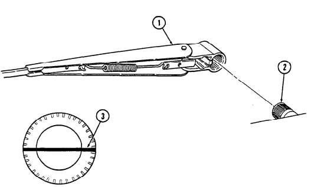

continue drilling all the way through shaft (2) and cap. 

3. Using a small hammer or punch, drive roll pin (3) into hole until it is flush with the *surface.* Replace original wiper arm (1). 

## 1 10-60. Windshield Wiper Arm Pivot Maintenance (Cont'D)

1 b. Removal 1 Remove nut (0, washer (21, seal (3), and pivot (5) from windshield frame (4). 

c. Installation Install pivot (5) on windshield frame (4) with seal (31, washer (21, and nut 0). 

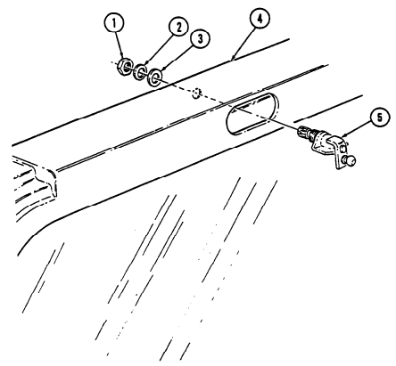

FOLLOW-ON TASKS: l Install windshield wiper blade and arm (para. 10-62). 

l Install windshield wiper linkage (para. 10-61). 

10-102 

# 10-61. Windshield Wiper Linkage Replacement

This task covers:

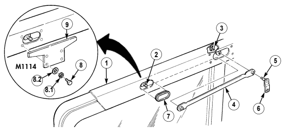

INITIAL SETUP:

#### Tools

General mechanic's tool kit:
automotive (Appendix B, Item 1)
Maintenance and repair shop equipment:
automotive (Appendix B, Item 2)
Eight lockwashers (Appendix G, Item 146)
a. Removal 1. Remove two access covers (7) (all models except M1114), or eight capscrews (8), lockwashers (8.1),
washers (8.2), and two plates (9) (M1114), from windshield frame (1). Discard lockwashers (8.1).

2. Pull connector arm retainer (3) from ball stud (5) and remove motor drive lever (6) from connector arm (4).

3. Disconnect connector arm (4) from wiper arm pivots (2) and remove connector arm (4) through center access in windshield frame (1).

b. Installation

#### Caution

Install left (driver's) side connector arm first, or damage to equipment will result.

1. Install connector arm (4) through center access on windshield frame (1) and connect connector arm (4) to wiper arm pivots (2).

2. Connect connector arm (4) together with motor drive lever (6) and connector arm retainer (3) on ball stud (5).

3. Install two access covers (7) (all models except M1114), or two plates (9) with eight washers (8.2),
lockwashers (8.1), and capscrews (8) (M1114), on windshield frame (1). Tighten capscrews (8) to 75 lb-in. (9 N•m).

FOLLOW-ON TASK: Install windshield wiper motor (para. 10-63).

a. Removal b. Installation Windshield wiper motor removed (para. 10-63).

| Maintenance Level   |
|---------------------|
| Unit                |

| Manual References   |
|---------------------|

| Manual References    |
|----------------------|
| TM 9\-2320\-387\-24P |

# 10-62. Windshield Wiper Blade And Arm Maintenance

This task covers:
b. Repair (Optional)

| 3.  Rivnut/Plusnut/Nut Insert Removal.   |
|------------------------------------------|

INITIAL SETUP:
a. Removal

| Manual References    |
|----------------------|
| TM 9\-2320\-387\-10  |
| TM 9\-2320\-387\-24P |
| Maintenance Level    |
| Unit                 |

- Ensure windshield wiper motor switch is in OFF position. Note position of wiper arm for installation.

- Perform step 1 only if wiper blade assembly is to be replaced.

1. Remove nut (10), screw (1), and blade assembly (8) from wiper arm (2). 2. Lift wiper arm (2) away from windshield (9). 3. Lift up wiper arm latch (3) at base of wiper arm (2) and remove wiper arm (2) from splined shaft (4).

b. Repair (Optional)

- Steps 1 through 4 apply to all models except M1114. - If spring inside wiper arm loses tension, replace spring as an alternate to replacing the wiper arm.

1. Remove wiper arm (2) and blade assembly (8). See task a. 2. Remove spring (7) from wiper arm (2). Discard spring (7). 3. Install spring (7) in second hole (6) of wiper arm tab (5). 4. Install wiper arm (2) and blade assembly (8). See task c.

c. Installation

With motor switch OFF (parked position), mount wiper arm approximately 60º to vertical centerline, so that a sweep of approximately 120º will be achieved in operation.

1. Ensure wiper arm latch (3) is unlocked. 2. Install wiper arm (2) on splined shaft (4).

Perform step 3 only if wiper blade assembly was removed.

3. Install blade assembly (8) on wiper arm (2) with screw (1) and nut (10).

10-104 Change 5 a. Removal c. Installation

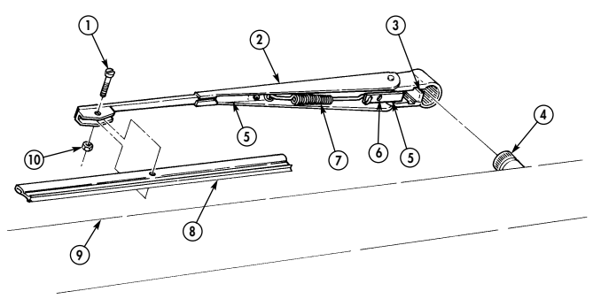

# 10-62.  Windshield Wiper Blade And Arm Maintenance (Cont'D)

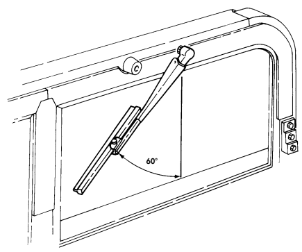

FOLLOW-ON TASK:  Check windshield wiper for proper operation (TM 9-2320-387-10).

# 10-63. Windshield Wiper Switch/Motor Replacement

This task covers:

a. Removal **b. Installation**

| (c)  Place drill in center mark for new rivet locations, or align drill with old hole when replacing old   |
|------------------------------------------------------------------------------------------------------------|
| rivets with oversize rivets. When using a power drill, give the bit a few turns with fingers before        |
| starting motor. This will help assure that drill does not jump out of position when motor is started.      |
| NOTE                                                                                                       |
| - While drilling, hold drill at 90° angle to material surface. Avoid                                       |
| letting drill wobble, marking oblong holes.                                                                |
| - Avoid excessive pressure. Let drill bit do the cutting.                                                  |
| - Do not push drill through material.                                                                      |
| (d) Remove all burrs with a metal countersink or file.                                                     |

a. Removal

Perform steps 1 through 5 for removal of wiper motor switch. Proceed to step 6 for removal of wiper motor assembly.

1. Disconnect lead (12) from wiper switch (11). 2. Depress retaining clip on back of knob (15) and remove knob (15) from wiper switch (11). 3. Remove nut (14) and lockwasher (13) from wiper switch (11) and wiper motor mounting plate (10).

Discard lockwasher (13).

4. Disconnect switch connector (9) from wiper motor (5) and remove wiper switch (11). 5. Remove screw (16), lockwasher (17), ground lead 57G (18), wiper switch ground lead (6), and lockwasher (19) from wiper motor mounting plate (10). Discard lockwashers (17) and (19).

6. Remove three capscrews (8) and washers (7) from wiper motor (5) and windshield frame (1). 7. Pull wiper motor (5) away from windshield frame (1) for access to clip (2). 8. Remove clip (2) and connecting arms (3) from wiper motor shaft (4) and remove wiper motor shaft (4) from windshield frame (1).

#### B. Installation Note

Perform steps 1 through 5 for installation of wiper motor switch. Proceed to step 6 for installation of wiper motor assembly.

1. Install wiper switch (11) on wiper motor mounting plate (10) with lockwasher (13) and nut (14). 2. Depress retaining clip on back of knob (15) and install knob (15) on wiper switch (11). 3. Connect switch connector (9) to wiper motor (5). 4. Connect lead (12) to wiper switch (11). 5. Install lockwasher (19), wiper switch ground lead (6), and ground lead 57G (18) on wiper motor mounting plate (10) with lockwasher (17) and screw (16).

6. Position wiper motor (5) in windshield frame (1) and connecting arms (3) on wiper motor shaft (4)
with clip (2).

7. Install wiper motor (5) on windshield frame (1) with three washers (7) and capscrews (8).

# 10-63. Windshield Wiper Switch/Motor Replacement (Cont'D)

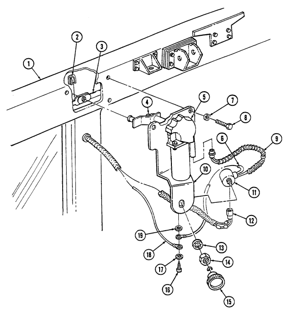

FOLLOW-ON TASKS: - Connect battery ground cables (para. 4-68).
- • - • - Check wiper motor for proper operation (TM 9-2320-387-10).

# 10-64. Windshield Washer Reservoir And Pump Assembly Maintenance

This task covers:
a.1. Inspection

Tools General mechanic's tool kit:
automotive (Appendix B, Item 1)
Maintenance and repair shop equipment:
automotive (Appendix B, Item 2)
Materials/Parts Two lockwashers (Appendix G, Item 149) Seal (Appendix G, Item 291) Lockwasher (Appendix G, Item 146)
a. Removal b. Installation Manual References TM 9-2320-387-10 TM 9-2320-387-24P
Equipment Condition
- Battery ground cables disconnected 
(para. 4-68).

- Hood raised and secured 
(TM 9-2320-387-10).

Maintenance Level Unit a. Removal

- M1114 models are equipped with plusnuts, not with nuts, washers, and lockwashers as indicated in steps 1 and 2.

- All models except M1113 and M1114 are equipped with nut inserts, not with nuts and lockwashers as indicated in steps 1 and 2.

1. Remove two nuts (17), lockwashers (18), capscrews (1), and washers (2) from reservoir (3),
pump (8), and cowl (19). Discard lockwashers (18).

2. Remove nut (14), lockwasher (15), washer (16), capscrew (4), and washer (5) from pump (8) and cowl (19). Discard lockwasher (15).

3. Disconnect hose (6) from pump (8). 4. Disconnect harness lead 57D (12) and lead 71C (13) from pump terminals (11) and remove grommet (7) and reservoir (3) from cowl (19).

5. Remove pushnut (10), seal (9), and pump (8) from reservoir (3).

a.1. Inspection 1. For plusnut inspection and replacement (M1114), refer to para 10-56. 2. For nut insert inspection and replacement (all models except M1113 and M1114), refer to para. 10-56.

b. Installation 1. Install seal (9) and pump (8) on reservoir (3) with pushnut (10). 2. Position reservoir (3) on cowl (19), connect harness lead 57D (12) and lead 71C (13) to pump terminals (11), and install grommet (7) on cowl (19).

3. Connect hose (6) on pump (8).

#### Caution

Use grade 5 torque value when installing capscrews into nut inserts. Failure to do so may damage equipment and/or components.

# 10-64. Windshield Washer Reservoir And Pump Assembly Maintenance

- M1114 models are equipped with plusnuts, not with nuts, washers, and lockwashers as indicated in steps 4 and 5.

- All models except M1113 and M1114 are equipped with nut inserts, not with nuts and lockwashers as indicated in steps 4 and 5.

4. Install pump (8) on cowl (19) with washer (5), capscrew (4), washer (16), lockwasher (15), and nut (14). Tighten nut (14) to 6-10 lb-ft (8-14 N•m) on M1113 and capscrew (4) to 36 lb-in. (4 N•m) on M1114.

5. Install reservoir (3) and pump (8) on cowl (19) with two washers (2), capscrews (1), lockwashers (18),
and nuts (17). Tighten nuts (17) to 8 lb-ft (11 N•m) on M1113 and capscrew (1) to 68-82 lb-in. (8 N•m) on M1114.

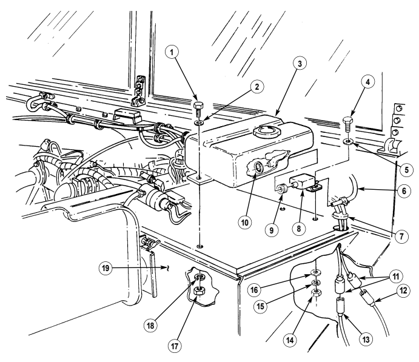

FOLLOW-ON TASKS: - Fill reservoir (TM 9-2320-387-10).

- Lower and secure hood (TM 9-2320-387-10). - Connect battery ground cables (para. 4-68).

# 10-65. Windshield Washer Hoses Replacement

This task covers:

| (a) Rivets should be inspected for proper installation. The grip length of each rivet is marked on    |
|-------------------------------------------------------------------------------------------------------|
| top of its head to provide positive identification. Use of proper grip length will produce a rivet    |
| installation where locking collar is flush with top surface of rivet head. Tolerance limit on         |
| flushness is 0.02 in. (0.5 mm).                                                                       |
| (b) For proper rivet installation, it is imperative that holes be properly prepared, tools be in good |
| working order, and rivets properly applied. When problems occur, the source of trouble could be       |
| in any of these areas.                                                                                |
| 7.  Blind Rivet Installation.                                                                         |
| NOTE                                                                                                  |
| - Prior to installing blind rivets, the hole must be prepared with                                    |
| the parts aligned and clamped firmly in place. These steps are                                        |

#### A. Removal

1. Remove nut (18), washer (4), capscrew (5), washer (4), clamp (3), and washer hose (1) from body (14).

2. Remove two nuts (12), washers (11), capscrews (16), washers (11), clamps (10), and washer hose (13)
from body (14).

3. Disconnect washer hose (13) from pump (15) and tee (6), and remove through clamps (17).

NOTE
Perform steps 4 and 5 for M1114 models only. Perform steps 6 and 7 for all other models.

4. Remove two screws (19), clamps (21), and nozzles (20) from body (14).

b. Installation

5. Remove washer hoses (1) and (8) from nozzles (20). 6. Remove clamp (7) and washer hose (8) from tee (6) and nozzle (9). 7. Remove clamp (7) and washer hose (1) from tee (6) and nozzle (2). 8. Remove washer hoses (8) and (1) through clamps (17).

Perform steps 1 and 2 for all models except M1114 only. Perform steps 3 and 4 for M1114 models.

1. Install washer hose (1) through clamps (17) and connect to nozzle (2) and tee (6). 2. Install washer hose (8) through clamps (17) and connect to nozzle (9) and tee (6). 3. Install two nozzles (20) on washer hoses (1) and (8). 4. Apply sealing compound to screws (19) and install washer hoses (1) and (8) and two nozzles (20) 
on body (14) with two clamps (21) and screws (19). Tighten screws (19) to 35 lb-in (4 N•m).

5. Install washer hose (13) through clamps (17) and connect to tee (6) and pump (15).

When installing clamps, ensure they are positioned below hood rest, so hood does not interfere with clamps or hose when lowered.

6. Install clamp (3) on washer hose (1) and body (14) with washer (4), capscrew (5), washer (4), and nut (18).

7. Install two clamps (10) on washer hose (13) and body (14) with two washers (11), capscrews (16),
washers (11), and nuts (12).

# 10-65.  Windshield Washer Hoses Replacement (Cont'D)

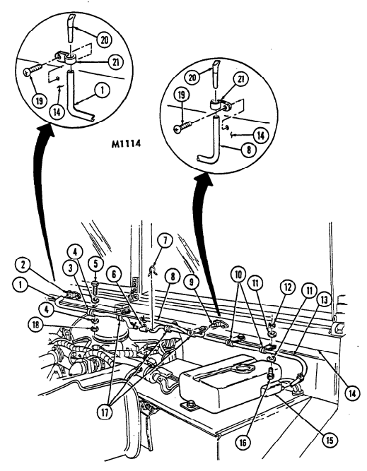

FOLLOW-ON TASK:   Lower and secure hood (TM 9-2320-387-10).

ﺴﻤﺔ

# 10-66. Windshield Washer Nozzle Replacement

This task covers:

a. Removal b. Installation

INITIAL SETUP:
Tools General mechanic's tool kit:
automotive (Appendix B, Item 1)
Manual References TM 9-2320-387-10 TM 9-2320-387-24P
a. Removal 1. Disconnect hose (2) from nozzle (3). 2. Remove screw (1) and nozzle (3) from body (4).

Perform steps 3 and 4 for M1114 models only.

3. Remove screw (5), clamp (7), and nozzle (6) from armor (9). 4. Disconnect hose (8) from nozzle (6).

b. Installation

Perform steps 1 and 2 for all models except M1114.

1. Install nozzle (3) on body (4) with screw (1). 2. Connect hose (2) to nozzle (3).

Perform steps 3 and 4 for M1114 models only.

3. Connect hose (8) to nozzle (6). 4. Install nozzle (6) on armor (9) with clamp (7) and screw (5).

Equipment Condition Hood raised and secured (TM 9-2320-387-10).

Maintenance Level Unit

Perform steps 1 and 2 for all models except M1114.

10-66.  WINDSHIELD WASHER NOZZLE REPLACEMENT (Cont'd)

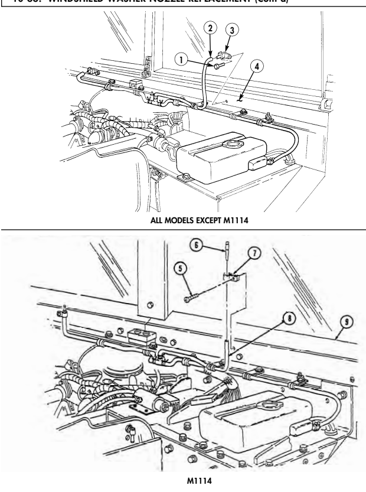

■
FOLLOW-ON TASK:   Lower and secure hood (TM 9-2320-387-10).

# 10-67. Windshield De-Icer, Defroster Switch, And Circuit Breaker Replacement

This task covers:

a. Removal b. Installation

| INITIAL SETUP:                         |                                                     |
|----------------------------------------|-----------------------------------------------------|
| Applicable Models                      | Manual Reference                                    |
| M1152                                  | TM 9\-2320\-387\-10                                 |
|                                        | TM 9\-2320\-387\-24P                                |
| Tools                                  | TM 43\-0139                                         |
| General mechanic's tool kit:           |                                                     |
| automotive (Appendix B, Item 1)        | Equipment Condition                                 |
|                                        | Soft top removed as required (TM 9\-2320\-387\-10). |
| Materials/Parts                        |                                                     |
| Two brackets (Appendix D, Fig. D\-116) | Maintenance Level                                   |
| Two locknuts (Appendix G, Item 101.6)  | Unit                                                |
| Eight rivets (Appendix G, Item 269.1)  |                                                     |

#### A. Removal

1. Disconnect lead (5) from rotary switch (2). 2. Disconnect lead (28) from body harness connector (27). 3. Disconnect right side de-icer connector (33) of cable (11) from defroster switch circuit breaker (32). 4. Disconnect de-icer power wiring connector (34) from defroster switch circuit breaker (32). 5. Remove two screws (35) and defroster switch circuit breaker (32) from footwell armor (29). 6. Disconnect de-icer ground wiring connector (31) from A/C wiring harness ground connector (30). 7. Remove tiedown straps (12), as required, from right side de-icer cable (11) and de-icer ground cable
(9). Discard tiedown straps (12).

8. Loosen screws (16) and (23) and remove covers (15) and (22) from de-icers (6) and (8). 9. Remove screws (21) and (24) and leads (20) and (25) from de-icer (6).

10. Remove screws (14) and (18) and leads (13) and (17) from de-icer (8). 11. Remove sealing compound (1) and (10) from end of instrument panel (3). 12. Remove two screws (26), de-icer control unit (19), and ends of cables (4), (11), and de-icer ground cable (9) from center pillar (7).

#### B. Installation

1. Install de-icer control unit (19) on center pillar (7) with two screws (26). Tighten screws (26) to 12 lb-in. (1 N•m).

2. Install leads (13) and (17) on de-icer (8) with screws (14) and (18). 3. Install leads (20) and (25) on de-icer (6) with screws (21) and (24). 4. Install covers (15) and (22) on de-icers (6) and (8) and tighten screws (16) and (23). 5. Connect de-icer ground wiring connector (31) to A/C wiring harness ground connector (30). 6. Install defroster switch circuit breaker (32) on footwell armor (29) with two screws (35). 7. Secure right side cable (11) and de-icer cable (9) with tiedown straps (12), as required. 8. Connect right side de-icer connector (33) of cable (11) to defroster switch circuit breaker (32). 9. Connect de-icer power wiring connector (34) to defroster switch circuit breaker (32).

# 10-67. Windshield De-Icer, Defroster Switch, And Circuit Breaker Replacement **(Cont'D)**

10. Connect lead (28) to body harness connector (27). 11. Connect lead (5) to rotary switch (2). 12. Apply sealing compound (1) and (10) to end of instrument panel (3) and to ends of cables (4), (9), 
and (11).

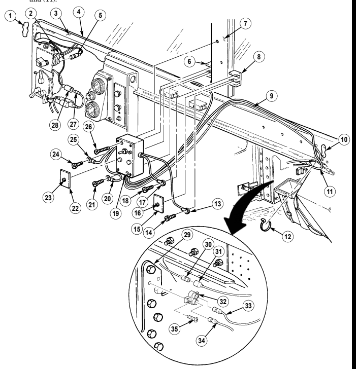

FOLLOW-ON TASKS: - Install A/C front air distribution duct (para. 11-81).

- Connect battery ground cables (para. 4-68).

# 10-68. Rearview Mirror Maintenance

This task covers:
c. Disassembly

Tools General mechanic's tool kit:
automotive (Appendix B, Item 1)
Maintenance and repair shop equipment:
automotive (Appendix B, Item 2)
Materials/Parts Four lockwashers (Appendix G, Item 145) Locknut (Appendix G, Item 82) 
(M1114 only)
Five locknuts (Appendix G, Item 132)
a. Removal d. Assembly b. Inspection e. Installation Manual References TM 9-2320-387-10 TM 9-2320-387-24P
Maintenance Level Unit

Replacement procedures for left and right rearview mirrors are basically the same. This procedure covers the left rearview mirror.

a. Removal

Perform step 1 for all models except M1114 only Perform step 2 for M1114 models only.

1. Remove two capscrews (3), lockwashers (4), washers (5), and mirror assembly (2) from windshield frame (7) and body (6). Discard lockwashers (4).

2. Remove locknut (9), two capscrews (3), and mirror assembly (2) from windshield frame (7) and rearview mirror brackets (8). Discard locknut (9).

b. Inspection

For inspection and removal of nut insert, refer to para. 10-56.

Inspect nut insert (1). Replace if damaged.

# 10-68. Rearview Mirror Maintenance (Cont'D)

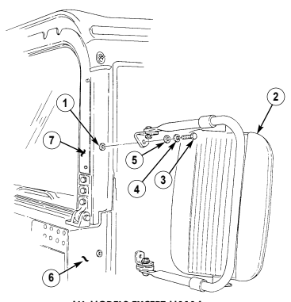

 ALL MODELS EXCEPT M1114

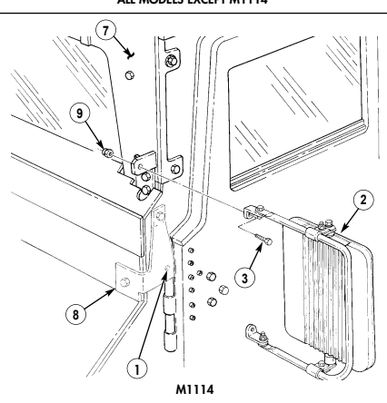

l

## 10-68. Rearview Mirror Maintenance (Cont'D)

c. Disassembly 1. Remove two capscrews (10), lockwashers (9), washers (8), spacers (6), and mirror assembly (5) from mirror brackets (7). Discard lockwashers (9).

2. Remove locknut (21), washer (22), nylon washers (23) and (2), capscrew (4), and upper mounting bracket (1) from mirror arm assembly (3). Discard locknut (21).

3. Remove locknut (20), washer (19), and lower mounting bracket (18) from mirror lock (17). Discard locknut (20).

4. Remove locknut (15), washer (16), and mirror lock (17) from arm assembly (3). Discard locknut (15).

To remove clamps, slide clamps off mirror arm assembly.

5. Remove two locknuts (11), washers (12), capscrews (14), clamps (13), and brackets (7) from mirror arm assembly (3). Discard locknuts (11).

d. Assembly

- To install clamps, slide clamps on mirror arm assembly. - Ensure clamps are positioned on mirror arm assembly to align with center of mirror head.

1. Install two clamps (13) and mirror brackets (7) on mirror arm assembly (3). Install mirror brackets (7) between clamps (13) with two capscrews (14), washers (12), and locknuts (11).

2. Install mirror lock (17) on mirror arm assembly (3) with washer (16) and locknut (15). 3. Install lower mounting bracket (18) on mirror lock (17) with washer (19) and locknut (20). 4. Install upper mounting bracket (1) on mirror arm assembly (3) with capscrew (4), nylon washers (2)
and (23), washer (22), and locknut (21).

Spacers must be positioned between mirror head and mirror brackets for proper installation.

5. Install mirror assembly (5) and two spacers (6) on mirror brackets (7) with washers (8), lockwashers (9), and capscrews (10).

e. Installation

Perform step 1 for all models except M1114. Perform step 2 for M1114 models only.

1. Install mirror assembly (5) on windshield frame (24) and body (28) with two washers (27), lockwashers (26), and capscrews (25).

2. Install mirror assembly (5) on windshield frame (24) and rearview mirror bracket (31) with two capscrews (25) and locknut (29). Tighten capscrews (25) to 10 lb-ft (14 N•m).

# 10-68. Rearview Mirror Maintenance (Cont'D)

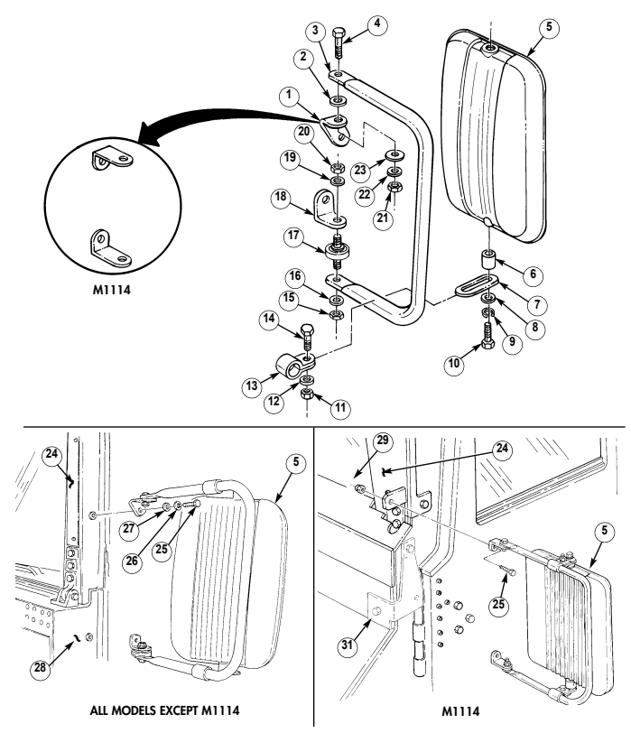

FOLLOW-ON TASK:   Adjust rearview mirror (TM 9-2320-387-10).

# 10-69. Driver'S Rearview Mirror Bracket Maintenance

This task covers:
a. Removal b. Installation a.1. Inspection

Applicable Models M1114 Tools General mechanic's tool kit:
automotive (Appendix B, Item 1)
Maintenance and repair shop equipment:
automotive (Appendix B, Item 2)
Materials/Parts Sealing compound (Appendix C, Item 72.1)
Manual References TM 9-2320-387-24P
Equipment Condition Rearview mirror removed (para. 10-68).

| Maintenance Level   |
|---------------------|
| Unit                |

a. Removal Remove capscrew (3), washer (4), capscrew (6), washer (5), and bracket (2) from A-pillar armor (1) and firewall armor (7). a.1. Inspection For plusnut inspection and replacement, refer to para. 10-56.

#### B. Installation

Apply sealing compound to threads of capscrews (3) and (6), and install bracket (2) on firewall armor (7) and A-pillar armor (1) with washer (4), capscrew (3), washer (5), and capscrew (6). Tighten capscrew (3) to 21 lb-ft (29 N•m) and capscrew (6) to 68-75 lb-in. (8-9 N•m).

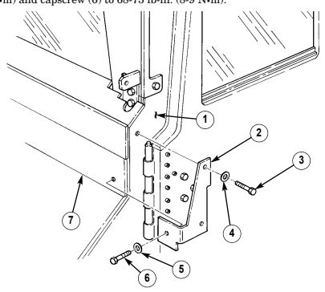

FOLLOW-ON TASK: Install rearview mirror (para. 10-68).

# 10-70. Sun Visor Maintenance

This task covers:
a. Removal c. Installation b. Inspection

Tools General mechanic's tool kit:
automotive (Appendix B, Item 1)
Materials/Parts Four lockwashers (Appendix G, Item 144)
Manual References TM 9-2320-387-24P

| Maintenance Level   |
|---------------------|
| Unit                |

The replacement procedures for left and right sun visors are basically the same. This procedure covers the left sun visor.

a. Removal Remove four capscrews (4), lockwashers (3), and sun visor (1) from windshield frame (2). Discard lockwashers (3).

b. Inspection

For inspection and removal of insertnut, refer to para. 10-56.

Inspect four insertnuts (5). Replace if damaged.

#### C. Installation

Install sun visor (1) on windshield frame (2) with four lockwashers (3) and capscrews (4).

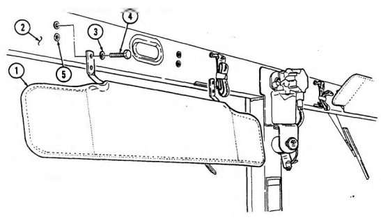

# 10-71. Heater Outlet/Inlet Piping Maintenance

This task covers:
a. Removal c. Installation b. Inspection INITIAL SETUP:
Tools General mechanic's tool kit:
automotive (Appendix B, Item 1)
Manual References TM 9-2320-387-10 TM 9-2320-387-24P
Equipment Condition Cooling system drained as required (para. 3-61).

Maintenance Level Unit

Replacement procedures for inlet and outlet piping are basically the same. This procedure covers the outlet piping.

#### A. Removal

1. Loosen clamp (9) and disconnect heater outlet hose (10) from water pump nipple (8). 2. Remove nut (12), washer (7), capscrew (6), and washer (7) from inlet hose clamp (5) and outlet hose clamp (13).

3. Loosen clamp (2) and remove heater outlet hoses (3) and (10) and heater outlet tube (11) from heater outlet port (1) and vehicle.

4. Loosen two clamps (4) and remove heater outlet hoses (3) and (10) from heater outlet tube (11). 5. Remove clamps (2), (4), (13), and (9) from hoses (3) and (10).

#### B. Inspection

Inspect heater outlet port (1) and water pump nipple (8). Replace if damaged.

c. Installation 1. Install clamps (2), (4), (13), and (9) on hoses (3) and (10). 2. Install two heater outlet hoses (3) and (10) on heater outlet tube (11) and tighten two clamps (4). 3. Install heater outlet hoses (3) and (10) and heater outlet tube (11) on heater outlet port (1) and water pump nipple (8) and tighten clamps (2) and (9).

4. Install outlet hose clamp (13) on inlet hose clamp (5) with washer (7), capscrew (6), washer (7), and nut (12).

# 10-71.  Heater Outlet/Inlet Piping Maintenance (Cont'D)

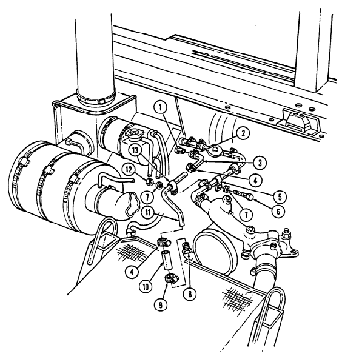

FOLLOW-ON TASKS: - • Fill cooling system (para. 3-61).
- • - • - • Start engine (TM 9-2320-387-10) and check outlet piping for leaks.

(1 

## I 1 O-72. **Heater Shutoff Valve Replacement I** L I

This task covers: 
a. Removal b. Installation INITIAL SETUP: 
Tools General mechanic's tool kit: 
automotive (Append.ix B, Item 1) 
Equipment Condition Cooling system drained as required (para. 3-61). 

Maintenance Level Unit Manual References TM 9-2320-387-10 TM 9-2320-387-24P 
1. Remove screw (6) and clip (5) from shutoff valve (8). 

2. Disconnect control wire (4) of heater control cable (7) from pin (3) on shutoff valve (8). 3. Loosen two clamps (2) and remove shutoff valve (8) from hoses (1). 

1. Install shutoff valve (8) on two hoses (1) and tighten clamps (2). 

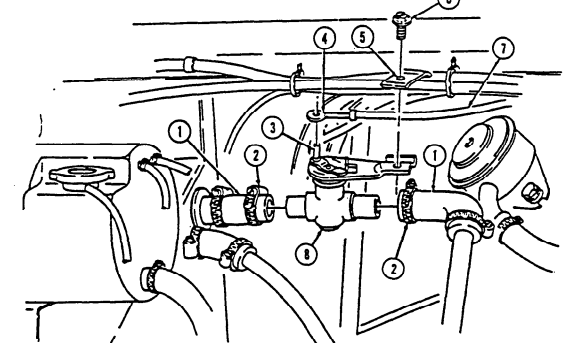

2. Install control wire (4) of heater control cable (7) to pin (3) on shutoff valve (8) with clip (5) and screw (6). 

FOLLOW-ON TASKS: l Fill cooling system (para. 3-61). 

l Start engine (TM 9-2320-387-10) and check shutoff valve for leaks. 

# 10-73. Heater Fan Switch Replacement

This task covers:
a. Removal b. Installation INITIAL SETUP:
Tools General mechanic's tool kit:
automotive (Appendix B, Item 1)
Manual References TM 9-2320-387-10 TM 9-2320-387-24P
a. Removal 1. Remove four capscrews (8) from instrument cluster (1) and instrument panel (6), and pull instrument cluster (1) away from panel (6) for access to fan switch (2).

2. Remove two screws (7) from fan switch (2) and panel (6). 3. Pull fan switch (2) out from behind panel (6).

Prior to removal, tag leads for installation.

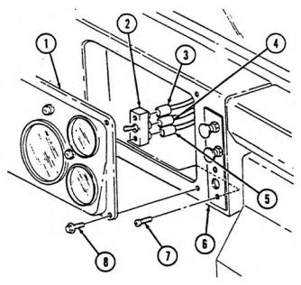

4. Disconnect leads 399 (3), 27D (4), and 400 (5) from fan switch (2) and remove fan switch (2).

b. Installation 1. Connect leads 399 (3), 27D (4), and 400 (5) to fan switch (2). 2. Install fan switch (2) on panel (6) with two screws (7). 3. Install instrument cluster (1) on panel (6) with four capscrews (8).

FOLLOW-ON TASKS: - Connect battery ground cables (para. 4-68).

- Check heater fan for proper operation (TM 9-2320-387-10).

Equipment Condition Battery ground cables disconnected (para. 4-68).

Maintenance Level Unit 10-74. AIR DUCT ASSEMBLY REPLACEMENT
This task covers:
a. Removal b. Installation INITIAL SETUP:
Applicable Models M1113, M1151, M1152, M1165 Tools General mechanic's tool kit:
automotive (Appendix B, Item 1)
Manual References TM 9-2320-387-24P
Equipment Condition Heater boot removed (para. 10-85).

Maintenance Level Unit a. Removal Remove four speed nuts (2), screws (5), air duct retainer (1), and grille assembly (3) from body (4).

b. Installation Install grille assembly (3) and air duct retainer (1) on body (4) with four screws (5) and speed nuts (2).

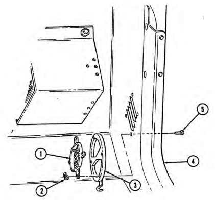

FOLLOW-ON TASK: Install heater boot (para. 10-85).

# 10-75. Heater Fan Motor Resistor Assembly Replacement

This task covers:
INITIAL SETUP:

#### Tools

General mechanic's tool kit:
automotive (Appendix B, Item 1)
Manual References TM 9-2320-387-10 TM 9-2320-387-24P
a. Removal

a. Removal b. Installation

Equipment Condition Battery ground cables disconnected (para. 4-68).

Maintenance Level Unit 1. Remove four capscrews (12) from instrument cluster (1) and instrument panel (2), and pull instrument cluster (1) away from panel (2) for access to resistor assembly (5).

2. Remove two screws (11) and heater fan switch (8) from panel (2). Pull heater fan switch (8) out from behind panel (2).

Prior to removal, tag leads for installation.

3. Disconnect leads 399 (3) and 400 (6) from heater fan switch (8). Disconnect lead 400 (4) from harness lead 400D (7).

4. Loosen two screws (9) and nuts (10) and remove resistor assembly (5) from panel (2).

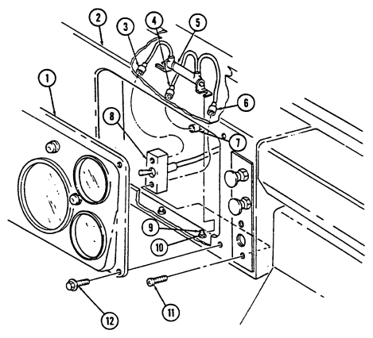

# 10-75. Heater Fan Motor Resistor Assembly Replacement (Cont'D)

b. Installation 1. Connect lead 400 (4) to harness lead 400D (7). Connect leads 400 (6) and 399 (3) to heater fan switch (8).

2. Install resistor assembly (5) on panel (2) and tighten two screws (9) and nuts (10). 3. Install heater fan switch (8) on panel (2) with two screws (11). 4. Install instrument cluster (1) on panel (2) with four capscrews (12).

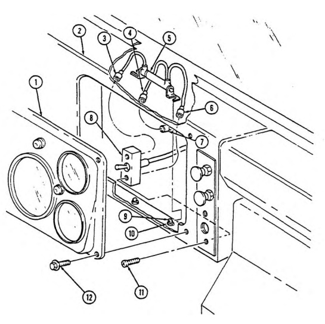

FOLLOW-ON TASKS: - Connect battery ground cables (para. 4-68).

- Check heater fan for proper operation (TM 9-2320-387-10).

# 10-75.1. Rear Heater Assembly Maintenance

This task covers:
b. Inspection

Applicable Models

| M1114   |
|---------|

Tools General mechanic's tool kit:
automotive (Appendix B, Item 1)
Maintenance and repair shop equipment:
automotive (Appendix B, Item 2)
Materials/Parts Sealing compound (Appendix C, Item 64) Two lockwashers (Appendix G, Item 145)
Manual References TM 9-2320-387-10 TM 9-2320-387-24P
a. Removal c. Installation

#### Equipment Condition

- Right passenger seat fasteners removed
(para. 10-45).

- Rear heater manifold assembly removed
(para. 10-88.2).

- Battery ground cables disconnected 
(para. 4-68).

- Cooling system drained (para. 3-61).

Maintenance Level Unit

#### A. Removal

1. Close both rear heater line shut-off valves (3). Ensure both shut-off valves (3) are perpendicular to heater hoses (10) and (12).

2. Move right passenger seat (1) and base (2) forward. 3. Disconnect electrical harness connectors (5) from electrical connector (6). 4. Remove capscrew (16), washer (17), and double hose clamp (7) from right rear footwell (18). 5. Remove hose clamp (9) and heater hose (10) from seat base manifold inlet tube (8). 6. Remove hose clamp (13) and heater hose (12) from seat base manifold outlet tube (14). 7. Remove right passenger seat (1) and base (2) from vehicle. 8. Remove two nuts (23), lockwashers (24), washers (28), and capscrews (29) securing back of seat bracket (34) to seat base (2). Discard lockwashers (24).

9. Remove two capscrews (32) and washers (33) securing front of seat bracket (34) to seat base (2). 10. Remove seat base (2) from seat bracket (34). 11. Disconnect electrical connector (25) from extension connector (26). 12. Remove hose clamps (27) and (36) and heater hose (22) from heater assembly outlet (37) and seat base manifold outlet tube (30).

13. Remove hose clamps (35) and (20) and heater hose (21) from heater assembly inlet (19) and seat base manifold inlet tube (31).

14. Remove heater assembly (38) from seat base (2). 15. Remove extension connector (26) from electrical harness extension (10). 16. Remove electrical harness extension (10) from seat base manifold (4). 17. Remove three self-drilling screws (14) and seat base manifold (4) from seat base (2).

# 10-75.1. Rear Heater Assembly Maintenance (Cont'D)

b.  Inspection Refer to para. 10-56 for plusnut (18) and (39) inspection and replacement.

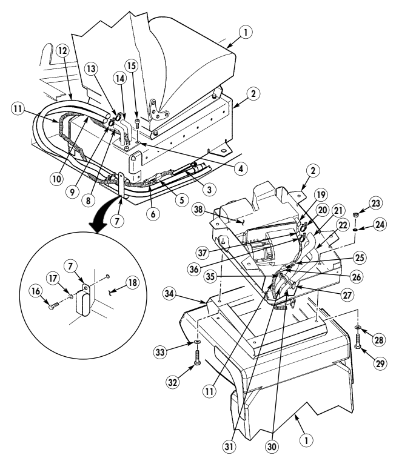

# 10-75.1. Rear Heater Assembly Maintenance (Cont'D)

#### C. Installation

1. Install seat base manifold (4) on seat base (2) with three self-drilling screws (15). 2. Install electrical harness extension (11) through seat base mainifold (4) and install electrical connector (26).

3. Install heater hose (22) in heater assembly outlet (37) and secure with hose clamp (36). 4. Install heater hose (21) in heater assembly inlet (19) and secure with hose clamp (20). 5. Install heater assembly (38) in seat base (2). 6. Install heater hose (22) in seat base manifold outlet tube (30) and secure with hose clamp (27). 7. Install heater hose (21) in seat base manifold inlet tube (31) and secure with hose clamp (35). 8. Connect electrical harness extension connector (26) to heater assembly electrical connector (25). 9. Install seat base (2) on seat bracket (34) with two capscrews (29), washers (28), lockwashers (24),
and nuts (23). Tighten capscrews (29) to 21 lb-ft (28 N•m).

10. Apply sealing compound to threads of two capscrews (32). 11. Secure front side of seat base (2) to seat bracket (34) with two washers (33) and capscrews (32).

Tighten capscrews (32) to 13 lb-ft (18 N•m).

12. Place right passenger seat (1) and base (2) in vehicle, forward of mounting position. 13. Install electrical harness extension (11) through double hose clamp (7), and connect electrical connector (6) to rear seat electrical harness connection (5).

14. Apply sealing compound to threads of capscrew (16). 15. Secure double hose clamp (7) to footwell back wall (18) with washer (17) and capscrew (16). 

Do not tighten capscrew (16) at this time.

16. Install heater hose (12) in seat base manifold inlet tube (14) and secure with hose clamp (13). 17. Install heater hose (10) in seat base manifold outlet tube (8) and secure with hose clamp (9). 18. Place right passenger seat (1) in proper mounting position. 19. Tighten capscrew (16) securing double hose clamp (7) to 6 lb-ft (8 N•m). 20. Open both rear heater line shut-off valves (3). Ensure both shut-off valves (3) are parallel to heater hoses (10) and (12).

# 10-75.1. Rear Heater Assembly Maintenance (Cont'D)

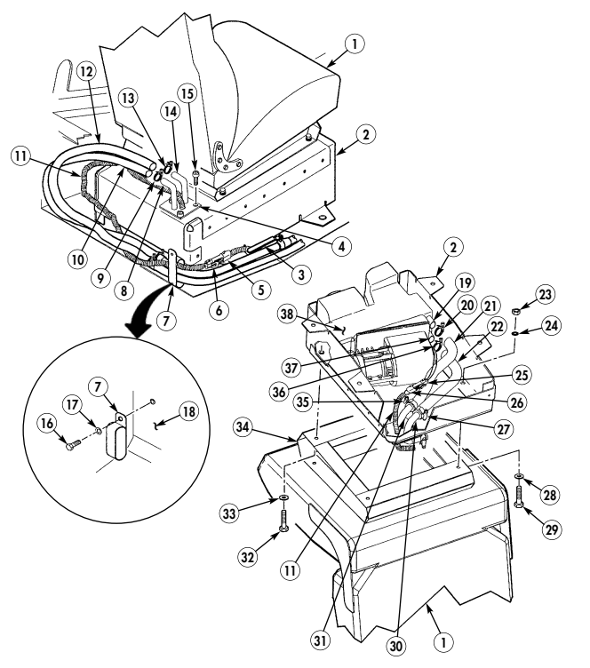

FOLLOW-ON TASKS: - Install right passenger seat fasteners (para. 10-45).

· Install rear heater manifold assembly (para. 10-88.2).

· Open rear heater valves (TM 9-2320-387-10).

· Fill cooling system (para. 3-61). · Connect battery ground cables (para. 4-68). · Start engine (TM 9-2320-387-10) and check cooling system for leaks.

# 10-75.2. Rear Heater Hoses And Tubes Maintenance

This task covers:
b. Inspection

| Tools                           |
|---------------------------------|
| General mechanic's tool kit:    |
| automotive (Appendix B, Item 1) |
| Materials/Parts                 |
| Spring (Appendix G, Item 316)   |
| a. Removal                      |

Sealing compound (Appendix C, Item 64) Three locknuts (Appendix G, Item 133.2) Two tiedown straps (Appendix G, Item 329.3)
Manual References TM 9-2320-387-10 TM 9-2320-387-24P
a. Removal c. Installation

#### Equipment Condition

- Cooling system drained (para. 3-61). - Right passenger seat fasteners removed 
(para. 10-45).

- Rear heater manifold assembly removed 
(para. 10-88.2).

- Remove A/C front air distribution duct 
(para. 11-81).

- Rear heater line guard and cover removed 
(para. 10-88.1)
Maintenance Level Unit

#### A. Removal

1. Close both rear heater line shut-off valves (8). Ensure both shut-off valves (8) are perpendicular to heater hoses (2) and (3).

2. Move right passenger seat (1) and base (7) forward of mounting location. 3. Remove tiedown straps (5) and (14) securing electrical harness (4) and electrical harness extension
(12) to hoses (2) and (3) and tubes (11) and (13). Discard tiedown straps (5) and (14).

4. Remove hose clamp (17) and heater hose (13) from seat base manifold outlet tube (18). 5. Remove hose clamp (20) and heater hose (11) from seat base manifold inlet tube (21). 6. Remove hose clamp (10) and heater hose (11) from bottom heater hose (3) with valve (8). Remove hose guard spring (16) from heater hose (11).

7. Remove hose clamp (19) and heater hose (13) from top heater hose (2) with valve (8). Remove hose guard spring (15) from heater hose (13).

8. Remove capscrew (24) and washer (22) securing double hose clamp (9) to right rear footwell (23). 9. Remove locknut (29), washer (28), and capscrew (27) securing double hose clamp (6) to hose mount L-bracket (32). Discard locknut (29).

10. Remove bottom heater hose (3) with valve (8) and top heater hose (2) with valve (8) from two double hose clamps (9) and (6).

11. If necessary, remove two locknuts (31), washers (30), washer (33) and hose mount L-bracket (32)
from rocker panel (25). Remove capscrews (26) from hose mount L-bracket (32) and leave capscrews (26) installed in rocker panel (25). Discard locknuts (31).

# 10-75.2. Rear Heater Hoses And Tubes Maintenance (Cont'D)

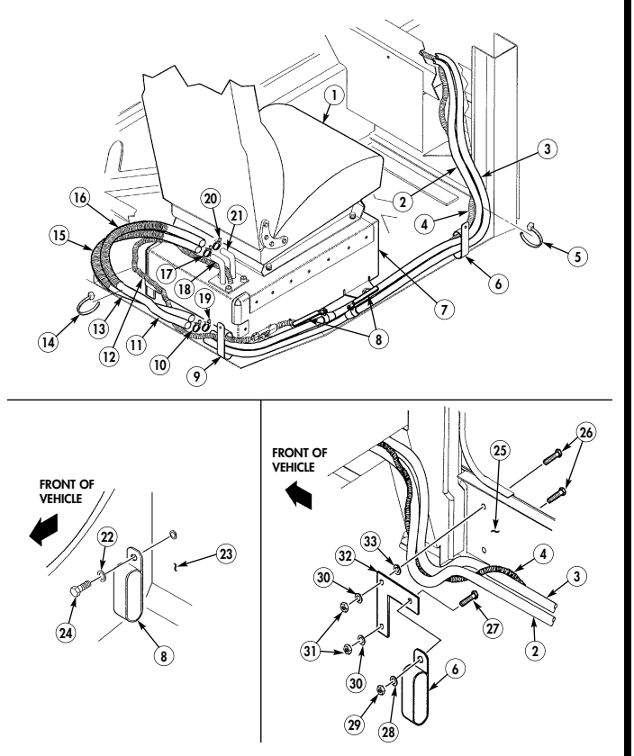

## 10-75.2. Rear Heater Hoses And Tubes Maintenance (Cont'D)

12. Remove hose clamp (10) and heater hose (12) from bottom heater inlet tube assembly (9). 13. Remove hose clamp (11) and heater hose (13) from top heater outlet tube assembly (8). 14. Remove hose clamp (15) and heater hose (13) from top heater outlet tube assembly (4). 15. Remove hose clamp (14) and heater hose (12) from bottom heater inlet tube assembly (1). 16. Remove hose clamp (31) and heater hose (32) from top heater outlet tube assembly (4). 17. Remove hose clamp (30) and heater hose (29) from bottom heater inlet tube assembly (1). 18. Remove two capscrews (6), washers (7), and double hose clamps (3) from vehicle tunnel (5). 19. Remove top heater outlet tube assembly (4) and bottom heater inlet tube assembly (1) from two double hose clamps (3).

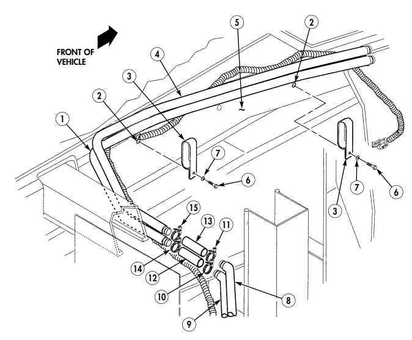

## 10-75.2. Rear Heater Hoses And Tubes Maintenance (Cont'D)

20. Remove hose clamp (27) and heater hose (32) from top heater outlet manifold tee (20). Remove braided insulation (33) from heater hose (32).

21. Remove hose clamp (26) and heater hose (29) from bottom heater inlet manifold tee (25). Remove braided insulation (28) from heater hose (29).

22. Remove hose clamp (21) and heater hose (23) from top heater outlet manifold tee (20). 23. Remove hose clamp (24) and heater hose (22) from bottom heater inlet manifold tee (25). 24. Loosen hose clamp (18), located in engine compartment, and rotate top outlet manifold tee (20)
upward. Pull top heater outlet manifold tee (20) out of heater hose (17) and through grommet (19).

25. Loosen hose clamp (34), located in engine compartment, and rotate bottom inlet manifold tee (25)
upward. Pull bottom inlet manifold tee (25) out of heater hose (16) and through grommet (19).

#### B. Inspection

Refer to para. 10-56 for plusnuts (2) inspection and replacement.

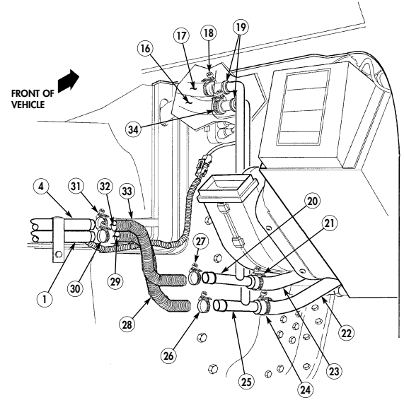

# 10-75.2. Rear Heater Hoses And Tubes Maintenance (Cont'D)

c. Installation

Heater manifold tees need to be installed through grommets and into heater hoses at a near horizontal angle, then rotated downward.

1. Install bottom heater inlet manifold tee (10) through grommet (4) and into heater inlet hose (1). 2. Rotate bottom heater inlet manifold tee (10) in a downward motion until it stops, and tighten hose clamp (22) located in engine compartment.

3. Install top heater outlet manifold tee (5) through grommet (4) and into heater outlet hose (2). 4. Rotate top heater outlet manifold tee (5) in a downward motion, placing it outboard of bottom heater outlet manifold tee (10), and tighten hose clamp (3) located in engine compartment. Ensure top heater outlet manifold tee (5) is in the outboard position.

5. Install lower heater hose (7) on bottom heater inlet manifold tee (10) and secure with hose clamp (9). 6. Install upper heater hose (8) on top heater inlet manifold tee (5) and secure with hose clamp (6). 7. Slide braided insulation (13) and (20) on heater hoses (14) and (19). 8. Install heater hose (14), with braided insulation (13), on bottom heater inlet manifold tee (10) and secure with hose clamp (11).

9. Install heater hose (19), with braided insulation (20), on top heater inlet manifold tee (5) and secure with hose clamp (12).

10. Install heater hose (14), with braided insulation (13), on bottom heater inlet tube assembly (16)
and secure with hose clamp (15).

11. Install heater hose (19), with braided insulation (20), on top heater outlet tube assembly (17) and secure with hose clamp (18).

# 10-75.2. Rear Heater Hoses And Tubes Maintenance (Cont'D)

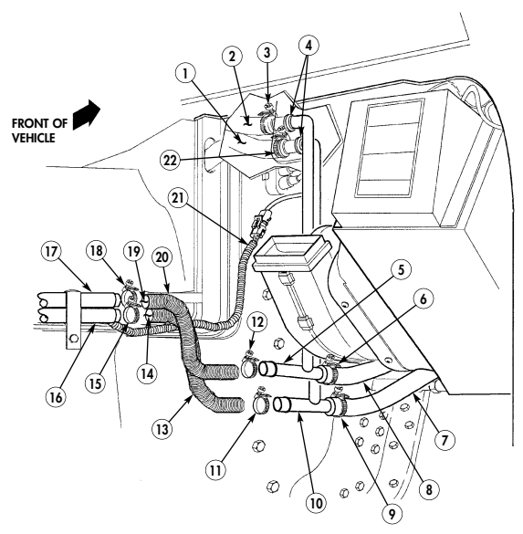

## 10-75.2. Rear Heater Hoses And Tubes Maintenance (Cont'D)

12. Install top heater outlet tube assembly (4) and bottom heater inlet tube assembly (1) into two double hose clamps (3) with electrical harness (6).

13. Apply sealing compound to threads of two capscrews (7). 14. Secure two double hose clamps (3) to vehicle tunnel (5) with two washers (8) and capscrews (7). 

Do not tighten capscrews (7) at this time.

15. Connect heater hose (13) to bottom heater inlet tube assembly (1) and secure with hose clamp (15). 16. Connect heater hose (14) to top heater outlet tube assembly (4) and secure with hose clamp (16). 17. Connect heater hose (13) to bottom heater inlet tube assembly (10) and secure with hose clamp (11). 18. Connect heater hose (14) to top heater outlet tube assembly (9) and secure with hose clamp (12). 19. Adjust top heater outlet tube assembly (4), bottom heater inlet tube assembly (1), and electrical harness (6) in double hose clamps (3) as required. Tighten two capscrews (7) to 6 lb-ft (8 N•m).

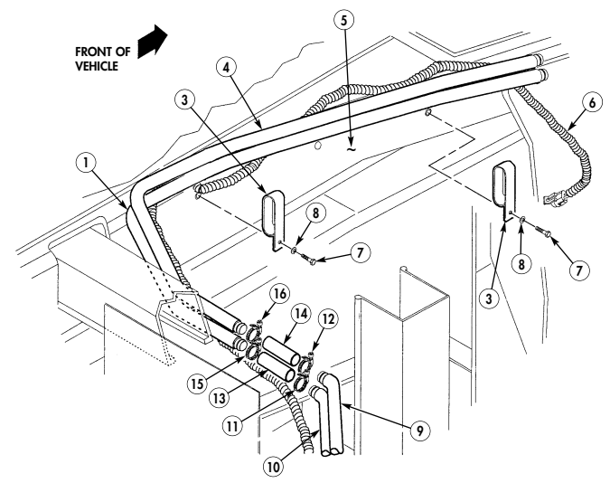

# 10-75.2. Rear Heater Hoses And Tubes Maintenance (Cont'D)

20. If necessary, install capscrew (19) into hose mount L-bracket (24), mount hose mount L-bracket
(24) and washer (25) on rocker panel (17), and secure with two capscrews (18), washers (22), and locknuts (23). Tighten locknuts (23) to 10 lb-ft (14 N•m).

21. Apply sealing compound to threads of capscrew (7). 22. Install double hose clamp (3), with tube assemblies (1) and (4) and electrical harness extension (6)
installed, on right rear footwell back wall (26) and secure with washer (8) and capscrew (7). Do not tighten capscrew (7) at this time.

23. Install double hose clamp (3), with tube assemblies (1) and (4) and electrical harness extension (6)
installed, on capscrew (19) and secure with washer (20) and locknut (21). Do not tighten locknut (21) at this time.

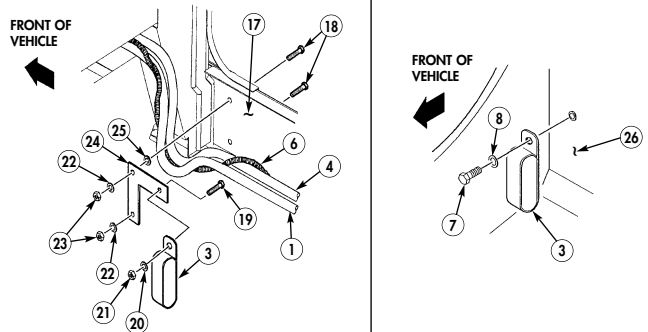

## 10-75.2. Rear Heater Hoses And Tubes Maintenance (Cont'D)

24. Install heater hose (10) on bottom heater inlet tube assembly (3) with valve (7) and secure with hose clamp (9).

25. Install heater hose (12) on top heater outlet tube assembly (2) with valve (7) and secure with hose clamp (18).

26. Slide hose guard springs (14) and (15) onto heater hoses (10) and (12). 27. Install heater hose (10) on seat base manifold inlet tube (20) and secure with hose clamp (19). 28. Install heater hose (12) on seat base manifold outlet tube (17) and secure with hose clamp (16). 29. Adjust bottom heater inlet tube assembly (3) with valve (7), top heater outlet tube assembly (2)
with valve (7), electrical harness (4), and electrical harness extension (11) in double hose clamps (6) and (8) as required. Tighten capscrew installed in step (22) to 6 lb-ft (8 N•m) and locknut installed in step (23) to 10 lb-ft (14 N•m).

30. Secure electrical harness (4) and electrical harness extension (11) to inlet and outlet tubes (2), (3), (10),
and (12) with tiedown straps (5) and (13).

31. Move right passenger seat (1) to mounting position and ensure hose guard springs (14) and (15) are positioned to avoid kinking of heater hoses (10) and (12).

32. Open both rear heater line shut-off valves (7).

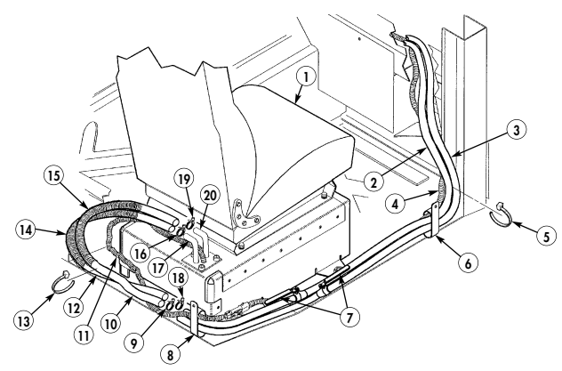

FOLLOW-ON TASKS: - Install right passenger seat fasteners (para. 10-45).

- Install A/C front air distribution duct (para. 11-81). - Install rear heater manifold assembly (para. 10-88.2). - Install right passenger seat fasteners (para. 10-45). - Fill cooling system (para. 3-61). - Start vehicle and check for leaks (TM 9-2320-287-10).

# 10-75.3. Heater Fan Motor Resistor Assembly (Electronic) Replacement

This task covers:

| a.  Removal                       | b.  Installation                                  |
|-----------------------------------|---------------------------------------------------|
| INITIAL SETUP:                    |                                                   |
| Tools                             | Manual References                                 |
| General mechanic's tool kit:      | TM 9\-2320\-387\-10                               |
| automotive (Appendix B, Item 1)   | TM 9\-2320\-387\-24P                              |
| Materials/Parts                   | Equipment Condition                               |
| Lockwasher (Appendix G, Item 172) |                                                   |
|                                   | Battery ground cables disconnected (para. 4\-68). |
| Lockwasher (Appendix G, Item 173) |                                                   |
|                                   | Maintenance Level                                 |

a. Removal 1. Remove four capscrews (17), washers (16), and instrument cluster (1) from instrument panel (2). 2. Remove two nuts (4) and (6) and resistor (8) from threaded studs (12) on instrument panel (2).

Prior to removal, tag leads for installation.

3. Disconnect harness lead 399 (3) from harness lead 399A (11). 4. Disconnect harness lead 400 (5) from harness lead 400D (10). 5. Disconnect harness lead 400 (7) from harness lead 400A (9). 6. Remove nut (14), capscrew (15), and resistor plate (13) from instrument panel (2).

#### B. Installation

1. Install resistor plate (13) on instrument panel (2) with capscrew (15) and nut (14). 2. Connect harness lead 400 (7) to harness lead 400A (9). 3. Connect harness lead 400 (5) to harness lead 400D (10). 4. Connect harness lead 399 (3) to harness lead 399A (11). 5. Install resistor (8) on threaded studs (12) on instrument panel (2) with two nuts (4) and (6). 6. Install instrument cluster (1) on instrument panel (2) with four capscrews (17) and washers (16).

# 10-75.3. Heater Fan Motor Resistor Assembly (Electronic) Replacement (Cont'D)

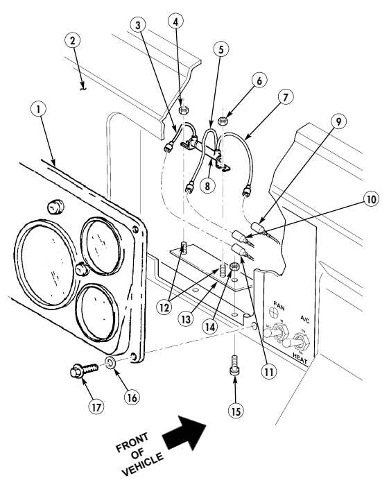

FOLLOW-ON TASKS:  - Install instrument cluster (electronic) (para. 4-14.1).
- Check heater fan for proper operation (TM 9-2320-387-10).

# 10-76. Heater Assembly Maintenance

This task covers:
b. Inspection

Applicable Models M1113, M1151, M1152, M1165 Tools General mechanic's tool kit:
automotive (Appendix B, Item 1)
Maintenance and repair shop equipment:
automotive (Appendix B, Item 2)

#### Materials/Parts

Four locknuts (Appendix G, Item 82) Nut and lockwasher assembly
(Appendix G, Item 197)
a. Removal c. Installation Manual References TM 9-2320-387-10 TM 9-2320-387-24P

#### Equipment Condition

- Battery ground cables disconnected (para. 4-68). - Cooling system drained as required (para. 3-61). - Air intake assembly removed (para. 3-19). - Diverter box removed (para. 10-81).

Maintenance Level Unit a. Removal 1. Remove ten clips (1) from heater boot (3) and heater assembly (2).

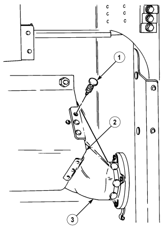

## 10-76. Heater Assembly Maintenance (Cont'D)

2. Loosen two clamps (1) and disconnect heater inlet hose (2) and heater outlet hose (12) from inlet port (3) and outlet port (11).

All models except M1113 are equipped with nut inserts, not nuts and washers as indicated in step 3.

3. Remove four locknuts (4), washers (5), capscrews (6), and washers (5) from heater assembly (8) and body (7). Discard locknuts (4).

4. Disconnect harness lead 400D (9) from heater assembly lead (10). 5. Remove nut and lockwasher assembly (15) and lead 57E (14) from heater assembly (8). Discard nut and lockwasher assembly (15).

6. Slide heater assembly (8) right and away from firewall (13) to allow heater inlet port (3) and outlet port (11) to clear grommet openings in firewall (13) and remove heater assembly (8).

b. Inspection Refer to para. 10-56 for nut insert inspection and replacement.

c. Installation 1. Install heater assembly (8) on firewall (13) and insert heater inlet port (3) and heater outlet port (11) through grommet openings in firewall (13).

2. Connect heater inlet hose (2) and heater outlet hose (12) to inlet port (3) and outlet port (11) and tighten two clamps (1).

3. Install lead 57E (14) on heater assembly (8) with nut and lockwasher assembly (15). 4. Connect harness lead 400D (9) to heater assembly lead (10).

#### Caution

Use grade 5 torque value when installing capscrews into nut inserts. Failure to do so may damage equipment and/or components.

All models except M1113 are equipped with nut inserts, not nuts and washers as indicated in step 5.

5. Install heater assembly (8) on body (7) with four washers (5), capscrews (6), washers (5), and locknuts (4). Tighten locknuts (4) to 15 lb-ft (20 N•m).

6. Install heater boot (17) on heater assembly (8) with ten clips (16).

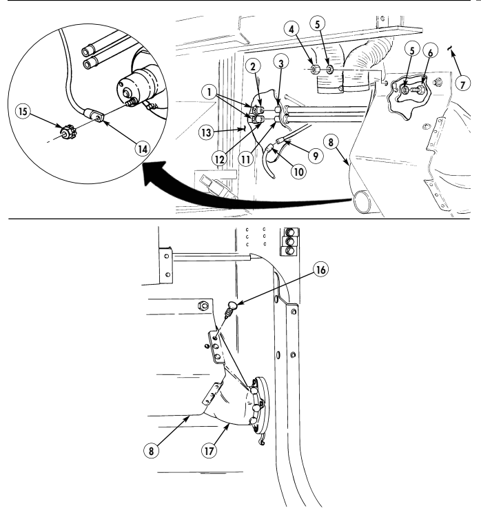

# 10-76. Heater Assembly Maintenance (Cont'D)

FOLLOW-ON TASKS: - Install diverter box (para. 10-81).

- Install air intake assembly (para. 3-19). - Connect battery ground cables (para. 4-68). - Fill cooling system (para. 3-61). - Check heater assembly for proper operation (TM 9-2320-387-10).

# 10-77. Defrost Control Replacement

This task covers:

| INITIAL SETUP:                           |                                                |
|------------------------------------------|------------------------------------------------|
| Tools                                    | Manual References                              |
| General mechanic's tool kit:             | TM 9\-2320\-387\-10                            |
| automotive (Appendix B, Item 1)          | TM 9\-2320\-387\-24P                           |
| Maintenance and repair shop equipment:   | Equipment Condition                            |
| automotive (Appendix B, Item 2)          |                                                |
|                                          | Hood raised and secured (TM 9\-2320\-387\-10). |
| Materials/Parts                          |                                                |
| Sealing compound (Appendix C, Item 72.1) | Maintenance Level                              |
|                                          | Unit                                           |

a. Removal 1. Remove four capscrews (2) from instrument cluster (5) and instrument panel (3). 2. Pull instrument cluster (5) away from panel (3). 3. Remove screw (15) from clip (10) and diverter box (12). 4. Remove pushnut (13) and disconnect defroster cable core (11) from baffle pin (14). Discard pushnut (13).

5. Pull control cable (6) through firewall (9) and three clamps (7) on A-beam (8) and firewall (9). 6. Remove nut (4) from threaded shaft (1) and instrument panel (3) and pull control cable (6) through panel (3).

b. Installation 1. Feed control cable (6) through instrument panel (3) and install threaded shaft (1) on panel (3) with nut (4).

2. Route control cable (6) through three clamps (7) on A-beam (8) and firewall (9). 3. Connect defroster cable core (11) on baffle pin (14) and install pushnut (13).

NOTE
Control wire and knob must be pushed in, and baffle pin must be in the upward position before securing control cable to diverter box.

4. Install clip (10) on diverter box (12) with screw (15). 5. Install instrument cluster (5) on panel (3) with four capscrews (2).

a. Removal b. Installation

# 10-77.  Defrost Control Replacement (Cont'D)

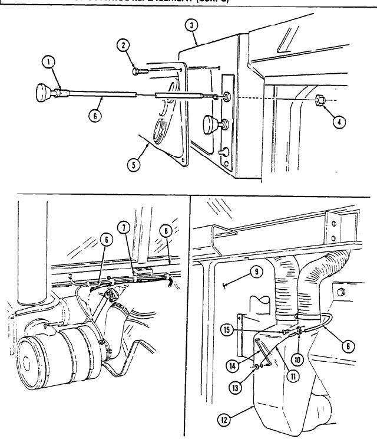

FOLLOW-ON TASKS: - Lower and secure hood (TM 9-2320-387-10).

· Install engine access cover (para. 10-22).

- Check defroster control for proper operation (TM 9-2320-387-10).

## 1 O-78. Heater Control Replacement I

This task covers: 
INITIAL SETUP: 
Tools 

| Manual References   | of the property of the property of the property of the property of the controlled by the country of the controlled by the controlled   | Company of Children   |
|---------------------|----------------------------------------------------------------------------------------------------------------------------------------|-----------------------|

?&era1 mechanic's tool kit: 
automotive (Appendix B, Item 11 TM 9-2320-387-10 TM 9-2320-387-24P 

#### 1 A. Removal 1

1. Remove screw (12) and clamp (11) from cable (7) and heater shutoff valve (15). 2. Remove control wire (10) from pin (9) on heater shutoff valve (151. 

3. Carefully feed cable (7) through three clips (13) along A-beam (14). 

4. Remove four capscrews (2) from instrument cluster (6) and instrument panel (3). 

5. Pull instrument cluster (6) away from instrument panel (3). 6. Loosen nut (41 and slide along cable (7). 

7. Pull cable (7) through nut (4) and instrument panel (3). 

1. Feed cable (7) through instrument panel (3) and seat threaded shaft (1) in grommet (5). 

2. Place nut (4) over cable (7) and secure threaded shaft (1) on instrument panel (31 by tightening nut (41. 

3. Install instrument cluster (6) on instrument panel (3) with four capscrews (2). 

4. Carefully feed cable (7) through three clips (13) along A-beam (141. 

5. Slip coiled end of control wire (10) over pin (9). 

Control wire and knob must be pushed in, and pin and lever rotated toward heater before anchoring cable to shutoff valve. 

6. With control wire (10) and knob all the way in, and pin (9) moved as close to heater (8) as possible, install cable (7) on shutoff valve (15) with clamp (11) and screw (12). 

a. Removal b. Installation 

l Hood raised and secured (TM 9-2320-387-101. 

l Engine access cover removed (para. 10-221. 

| 1   |    | Unit   |
|-----|----|--------|

| Equipment Condition   |
|-----------------------|

Maintenance Level 
-1 10-78.  HEATER CONTROL REPLACEMENT (Cont'd)

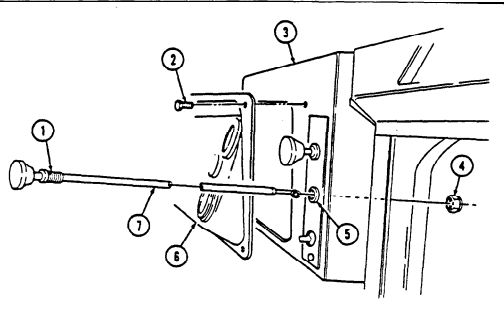

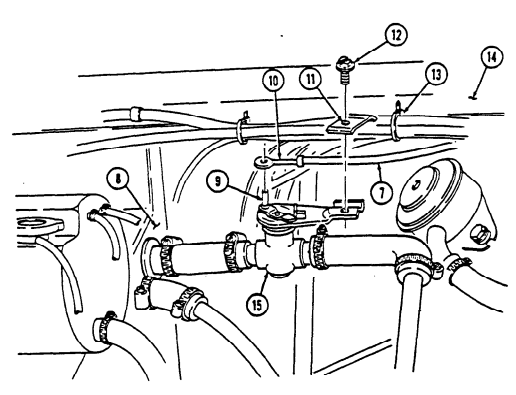

FOLLOW-ON TASKS: - Lower and secure hood (TM 9-2320-387-10).

- Install engine access cover (para. 10-22).
- Check heater control for proper operation (TM 9-2320-387-10).

# 10-79. **Heater Control Cable And Shutoff Valve Adjustment**

This task covers: 
Adjustment INITIAL SETUP: 
Tools General mechanic's tool kit: 
automotive (Appendix B, Item 1) 
Materials/Parts Lubricating oil (Appendix C, Item 45) 
Manual References TM 9-2320-387-10 TM 9-2320-387-24P 
Equipment Condition Hood raised and secured (TM 9-2320-387-10). 

General Safety Instructions Ensure engine is cool prior to performing this procedure. 

| Maintenance Level \- A B \- A B \- A B \- A B \- A   |
|------------------------------------------------------|
| \-\-\- STATUTE A NEW OF COLUMN OF                    |

Unit 

Perform the following procedure if the heater temperature control assembly is difficult to operate. The repositioning of the heater temperature control cable and heater shutoff valve will reduce cable bends and allow access for lubrication. 

IAdjustment] 

#### Warning

Ensure engine is cool prior to performing this procedure. Steam or hot coolant under pressure can cause injury to personnel. 

Push heater control knob (18) to OFF position. 

1. 

2. 3. 4. 5. 6. 

7. 

8. 9. 

10. 

11. 

12. 

13. 

14. 15. 16. 

17. 

18. 

19. 

20. 21. 

Apply lubricating oil to heater shutoff valve lever (141 and shutoff valve pin (21). 

Apply lubricating oil to plunger (19). 

Move heater control knob (18) to OFF and ON several times to distribute oil. ,, 
Check engine coolant level (TM 9-2320-387-10). Start engine (TM 9-2320-387-10) and check heater shutoff valve (1) connections for leaks. 

Loosen two clamps (12) on hoses (13). 

Rotate heater shutoff valve (1) and position heater shutoff valve lever (141 in the upward position. 

Tighten two clamps (12) on hoses (13). 

Loosen screw (11) and clip (101 and remove cable assembly (4) from heater shutoff valve<l). 

Remove screw (51, washer (61, clamp (71, and crankcase depression regulator valve (8) from mounting bracket (9). 

Install crankcase depression regulator valve (81 on mounting bracket (9) with washer (61 and screw (5). Cut loop end (2) from spring wire (3). Cut as close to loop end (2) as possible. Remove spring wire (3) from steel casing (161 and tube (15) by pulling heater control knob (18). Remove any kinks in spring wire (3). Remove a 5-in. (127.0-mm) section from steel casing (16). 

Route steel casing (161 through clamp (201. 

Install spring wire (3) into steel casing (16) and tube (15). 

Position end of steel casing (1610.75 in. (19 mm) from clip (10) and install steel casing (16) on heater shutoff valve (11 with clip (10) and screw (11). 

Position heater control knob (18) 0.125 in. (3.18 mm) from instrument panel (17). Turn spring wire (31 three turns around heater shutoff valve pin (211. Cut off any excess spring wire (3). 

Pull out heater control knob (181 to ON position. 

# 10-79.  Heater Control Cable And Shutoff Valve Adjustment (Cont'D)

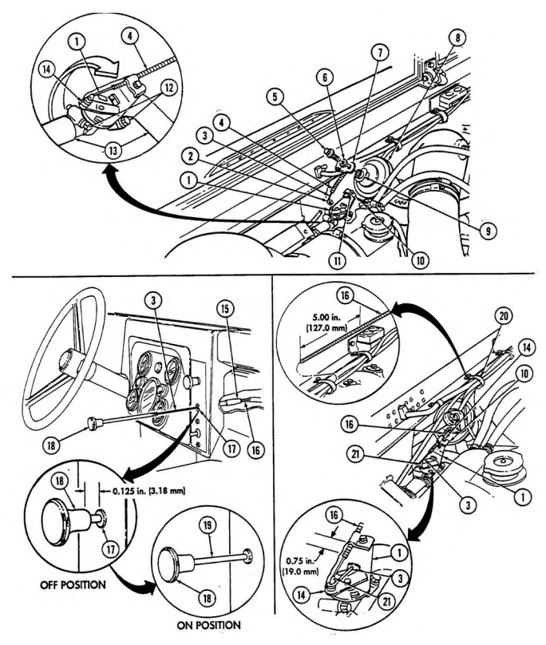

FOLLOW-ON TASK:   Lower and secure hood (TM 9-2320-387-10).

# 10-80. Heater Ducting Replacement

This task covers:
INITIAL SETUP:

a. Removal b. Installation

| INITIAL SETUP:                                                         |                                         |
|------------------------------------------------------------------------|-----------------------------------------|
| Applicable Models                                                      | Manual References                       |
| M1114                                                                  | TM 9\-2320\-387\-24P                    |
| Tools                                                                  | Equipment Condition                     |
| General mechanic's tool kit:                                           | Rearview mirror removed (para. 10\-68). |
| automotive (Appendix B, Item 1) Maintenance and repair shop equipment: | Maintenance Level                       |
| automotive (Appendix B, Item 2)                                        | Unit                                    |

Two locknuts (Appendix G, Item 77)

#### A. Removal

1. Remove nine screws (8), two capscrews (6), washers (5), and plenum (7) from A-beam (4). 2. Disconnect connector (23) from light switch (10). 3. Remove two locknuts (25), washers (11), capscrews (12), and washers (11) from instrument panel (9) and firewall (24). Discard locknuts (25).

#### B. Installation

8. Install plenum (7) on A-beam (4) with nine screws (8), two washers (5), and capscrews (6).

4. Remove nut (20), washer (18), capscrew (17), and washer (18) from panel (9), hand throttle bracket (15), and steering column bracket (19).

5. Remove nut (13), screw (16), and hand throttle bracket (15) from instrument panel (9). 6. Remove screw (14) from panel (9) and firewall (24) and pull panel (9) away from A-beam (4) for access to heat flex duct (1).

7. Loosen clamp (2) and remove heat flex duct (1) from A-beam (4) and plenum bracket (3). 8. Loosen clamp (22) and remove heat flex duct (1) from steering column mount (21).

1. Install heat flex duct (1) on steering column mount (21) and tighten clamp (22). 2. Install heat flex duct (1) on A-beam (4) and plenum bracket (3) and tighten clamp (2). 3. Place panel (9) on A-beam (4). Install panel (9) to firewall (24) with screw (14). 4. Install panel (9) and hand throttle bracket (15) on steering column bracket (19) with washer (18),
capscrew (17), washer (18), and nut (20).

5. Install hand throttle bracket (15) on instrument panel (9) with screw (16) and nut (13). 6. Install panel (9) on firewall (24) with two washers (11), capscrews (12), washers (11), and locknuts (25).

7. Connect connector (23) to light switch (10).

# 10-80.  Heater Ducting Replacement (Cont'D)

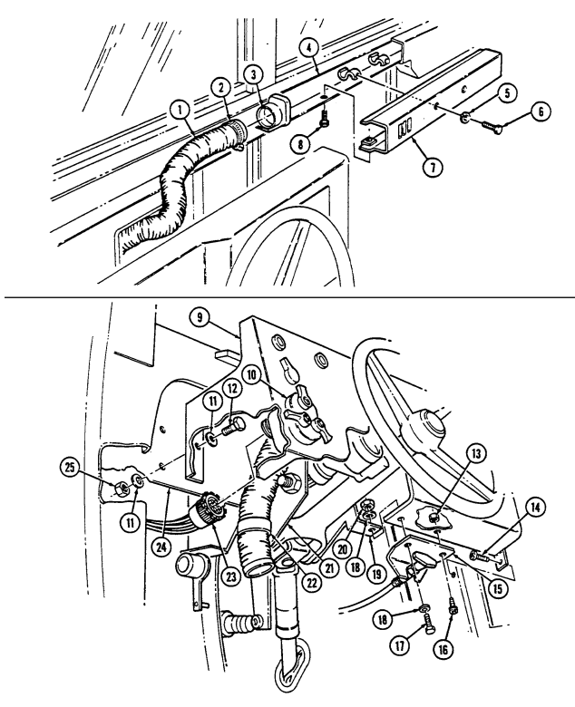

FOLLOW-ON TASK:  Install engine access cover (para. 10-22).

# 10-81. Diverter Box Maintenance

This task covers:
b. Disassembly d. Installation

Applicable Models M1113, M1151, M1152, M1165 Tools General mechanic's tool kit:
automotive (Appendix B, Item 1)
Materials/Parts Pushnut (Appendix G, Item 249) Two rivets (Appendix G, Item 268) Four rivets (Appendix G, Item 265)
a. Removal c. Assembly Equipment Condition Diverter ducting removed (para. 10-86).

Manual References TM 9-2320-387-24P
Maintenance Level Unit

#### A. Removal

1. Remove two screws (14) from transition diverter (12) and transition (13). 2. Remove two screws (8) from diverter (9) and heater (7). 3. Remove screw (5) and clamp (4) from diverter (9). 4. Remove pushnut (11) and disconnect defroster cable core (6) from baffle pin (10). Discard pushnut (11). 5. Pull diverter (9) away from A-beam (1), loosen two clamps (3), and remove diverter (9) from flex ducts (2).

a. Removal 1. Remove four rivets (21) and transition diverter (12) from diverter (9). 2. Remove screw (15), spring (16), and louver (17) from transition diverter (12). 3. Remove two rivets (19), flap (20), and bracket (18) from diverter (9). c. Assembly 1. Install flap (20) and bracket (18) on diverter (9) with two rivets (19). 2. Install louver (17) on transition diverter (12) with spring (16) and screw (15). 3. Install diverter (9) on transition diverter (12) with four rivets (21). d. Installation 1. Position diverter (9) under A-beam (1) and connect two defroster flex ducts (2) on diverter (9). 2. Secure flex ducts (2) to diverter (9) with two clamps (3). 3. Connect defroster cable core (6) on baffle pin (10) and secure with pushnut (11). 4. Install transition diverter (12) on transition (13) with two screws (14).

Control cable must be pushed in, and baffle pin must be in the upward position before securing control cable to diverter box.

5. Install clamp (4) on diverter (9) with screw (5). 6. Install diverter (9) on heater (7) with two screws (8).

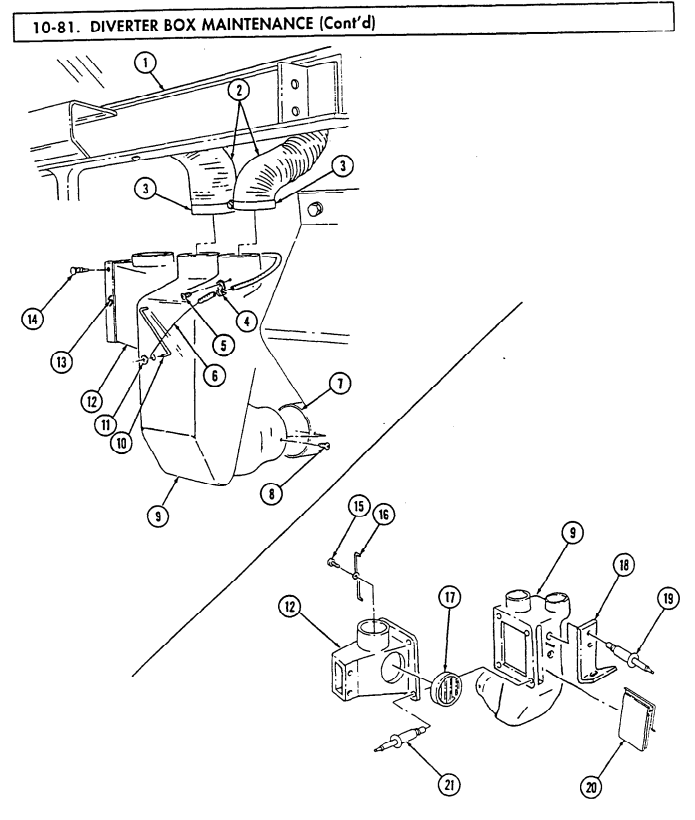

FOLLOW-ON TASK:   Install diverter ducting (para. 10-86).

# 10-82. Defroster Ducting Replacement

This task covers:

a. Removal b. Installation

| INITIAL SETUP:                          |                      |
|-----------------------------------------|----------------------|
| Tools                                   | Manual References    |
| General mechanic's tool kit:            | TM 9\-2320\-387\-24P |
| automotive (Appendix B, Item 1)         |                      |
|                                         | Maintenance Level    |
| Materials/Parts                         | Unit                 |
| Four lockwashers (Appendix G, Item 144) |                      |
|                                         | NOTE                 |

#### A. Removal

1. Remove ten screws (5), retainer (6), and closeout panel (4) from A-beam (3). 2. Remove three nuts (11), washers (8), capscrews (7), and washers (8) from three clamps (9), cable clamp (10), closeout panel (4), and A-beam (3).

3. Remove three screws (12) from closeout panel (4) and A-beam (3). 4. Disconnect left flex duct (2) from left defroster nozzle (1). 5. Remove four screws (18) and diverter cover (17) from A-beam (3). 6. Disconnect right flex duct (14) from right defroster nozzle (13). 7. Loosen two clamps (15) and disconnect left flex duct (2) and right flex duct (14) from diverter housing (16).

#### B. Installation

1. Connect left flex duct (2) and right flex duct (14) to diverter housing (16) and tighten two clamps (15).

2. Apply adhesive sealant and connect right flex duct (14) to right defroster nozzle (13). 3. Install diverter cover (17) on A-beam (3) with four screws (18). 4. Apply adhesive and connect left flex duct (2) to left defroster nozzle (1). 5. Install retainer (6) and closeout panel (4) on A-beam (3) with ten screws (5). 6. Secure closeout panel (4) to A-beam (3) with three screws (12). 7. Install three clamps (9), cable clamp (10), and closeout panel (4) on A-beam (3) with three washers (8), capscrews (7), washers (8), and nuts (11).

# 10-82. Defroster Ducting Replacement (Cont'D)

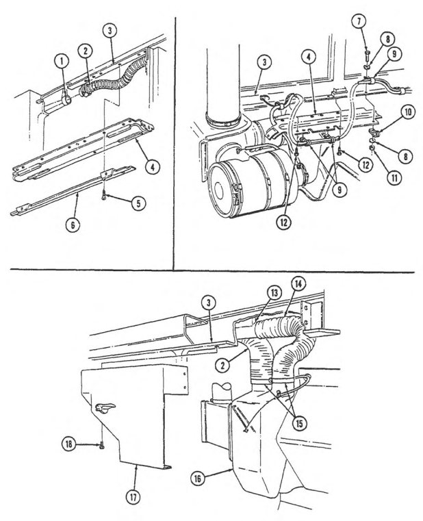

FOLLOW-ON TASKS: - Install engine access cover (para. 10-22).

- Lower and secure hood (TM 9-2320-387-10).

# 10-83. Left Defroster Nozzle Replacement

This task covers:

a. Removal b. Installation

| INITIAL SETUP:                                                                                |                                                   |
|-----------------------------------------------------------------------------------------------|---------------------------------------------------|
| Tools Equipment Condition                                                                     |                                                   |
| General mechanic's tool kit:                                                                  | Battery ground cables disconnected (para. 4\-68). |
| automotive (Appendix B, Item 1)  Maintenance Level                                            |                                                   |
| Manual References  Unit                                                                       |                                                   |
| TM 9\-2320\-387\-10                                                                           |                                                   |
| TM 9\-2320\-387\-24P                                                                          |                                                   |
| a. Removal                                                                                    |                                                   |
| 1.  Remove four capscrews (12) from instrument cluster (1) and instrument panel (2), and pull |                                                   |

a. Removal 1. Remove ten screws (5) and retainer (6) from closeout panel (4) and A-beam (7). 2. Remove three nuts (28), washers (25), capscrews (24), and washers (25) from three clamps (26),
cable clamp (27), closeout panel (4), and A-beam (7).

3. Remove three screws (29) and closeout panel (4) from A-beam (7). 4. Disconnect defroster duct (3) from defroster nozzle (2). 5. Remove locknut (21), screw (15), and ground wire 57C (20) from steering column (19). Discard locknut (21).

6. Remove locknut (17), washer (18), capscrew (23), washer (22), and two brackets (16) from steering column (19). Discard locknut (17).

7. Remove locknut (9), lockwasher (10), washer (11), and pin (14) from steering column (19) and bracket (13), and lower steering column (19). Discard locknut (9) and lockwasher (10).

8. Remove retaining pin (12) from defroster nozzle (2) and bracket (13).

Note position of defroster nozzle for installation.

9. Turn defroster nozzle (2) counterclockwise and remove from A-beam (7).

b. Installation 1. Install defroster nozzle (2) on A-beam (7). 2. Turn defroster nozzle (2) clockwise until defroster nozzle outlets (8) align with windshield frame louvers (1).

3. Install defroster nozzle (2) on steering column bracket (13) with retaining pin (12). 4. Place steering column (19) in desired position, and install on bracket (13) with pin (14), washer (11),
lockwasher (10), and locknut (9). Tighten locknut (9) to 31 lb-ft (42 N•m).

5. Install two brackets (16) on steering column (19) with washer (22), capscrew (23), washer (18), and locknut (17).

6. Install ground wire 57C (20) on steering column (19) with screw (15) and locknut (21). 7. Apply adhesive and connect defroster duct (3) to defroster nozzle (2).

## 10-83. Left Defroster Nozzle Replacement (Cont'D)

8.

Install retainer (6) and closeout panel (4) on A-beam (7) with ten screws (5).

 9.

Secure closeout panel (4) to A-beam (7) with three screws (29).

10.

 Install closeout panel (4), three clamps (26), and cable clamp (27) on A-beam (7) with three washers (25), capscrews (24), washers (25), and nuts (28).

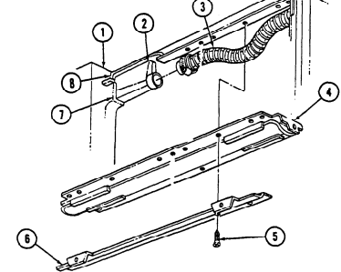

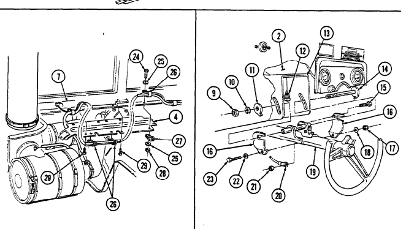

FOLLOW-ON TASKS: - Lower and secure hood (TM 9-2320-387-10).

· Install engine access cover (para. 10-22).

# 10-84. Right Defroster Nozzle Replacement

This task covers:
INITIAL SETUP:
Applicable Models M1113, M1151, M1152, M1165 Tools General mechanic's tool kit:
automotive (Appendix B, Item 1)

a. Removal b. Installation

| Manual References    |
|----------------------|
| TM 9\-2320\-387\-24P |

Equipment Condition Defroster ducting removed (para. 10-82).

Maintenance Level Unit a. Removal

Note position of defroster nozzle for installation.

Turn defroster nozzle (2) counterclockwise and remove from A-beam (4).

#### B. Installation

Install defroster nozzle (2) on A-beam (4) and turn defroster nozzle (2) clockwise until defroster nozzle

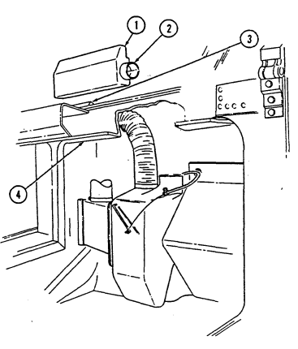 outlets (1) align with windshield frame louvers (3).

FOLLOW-ON TASK: Install defroster ducting (para. 10-82).

# 10-85. Heater Boot Replacement

This task covers:
a. Removal b. Installation INITIAL SETUP:
Applicable Models M1113, M1151, M1152, M1165 Tools General mechanic's tool kit:
automotive (Appendix B, Item 1)
a. Removal 1. Remove ten clips (2) from heater boot (5) and heater assembly (1). 2. Remove six clips (4) and heater boot (5) from air duct retainer (3).

b. Installation 1. Install heater boot (5) on air duct retainer (3) with six clips (4).

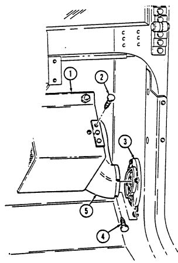 2. Install heater boot (5) on heater assembly (1) with ten clips (2).

| Maintenance Level   |
|---------------------|
| Unit                |

| Manual References    |
|----------------------|
| TM 9\-2320\-387\-24P |

# 10-86. Diverter Ducting Replacement

This task covers:
INITIAL SETUP:
Applicable Models M1113, M1151, M1152, M1165 Tools General mechanic's tool kit:
automotive (Appendix B, Item 1)

a. Removal b. Installation

| Manual References   |
|---------------------|
| Diverter box cove   |

| Maintenance Level   |
|---------------------|
| Unit                |

| Equipment Condition   |
|-----------------------|

Diverter box cover removed (para. 10-89).

a. Removal Loosen clamp (1) and remove diverter ducting (2) from diverter duct (3).

b. Installation Install diverter ducting (2) on diverter duct (3) and tighten clamp (1).

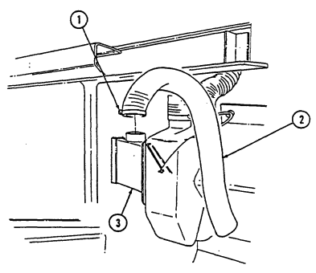

FOLLOW-ON TASK: Install diverter box cover (para. 10-89).

# 10-87. Heater Deflector Replacement

This task covers:

| Applicable Models   |
|---------------------|

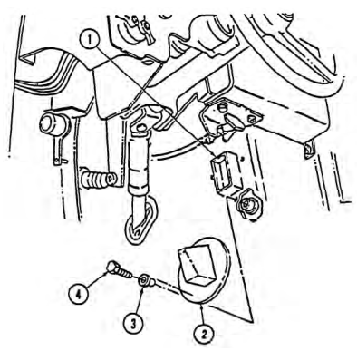

INITIAL SETUP:
M1113, M1114, M1151, M1152, M1165 General mechanic's tool kit:
automotive (Appendix B, Item 1)
a. Removal Remove three capscrews (4), guides (3), and deflector (2) from transition (1).

b. Installation Install deflector (2) on transition (1) with three guides (3) and capscrews (4).

a. Removal b. Installation

| Manual References    |
|----------------------|
| TM 9\-2320\-387\-10  |
| TM 9\-2320\-387\-24P |
| Equipment Condition  |

# 10-88. Heater Hose Replacement

This task covers:
INITIAL SETUP:
Applicable Models M1113, M1114, M1151, M1152, M1165 Tools General mechanic's tool kit:
automotive (Appendix B, Item 1)
Materials/Parts Adhesive (Appendix C, Item 12)

a. Removal b. Installation

Manual References TM 9-2320-387-10 TM 9-2320-387-24P
Equipment Condition
•Hood raised and secured (TM 9-2320-387-10). •Engine access cover removed (para. 10-22).

Maintenance Level Unit a. Removal Disconnect heater hose (2) from left duct (1) and right duct (3), and remove heater hose (2).

b. Installation Apply adhesive and connect heater hose (2) to left duct (1) and right duct (3).

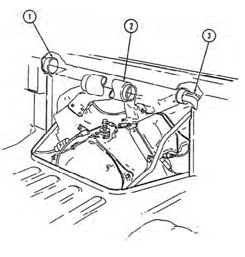

FOLLOW-ON TASKS: - Install engine access cover (para. 10-22).

- Lower and secure hood (TM 9-2320-387-10).

# 10-88.1. Rear Heater Line Guard And Cover Maintenance

This task covers:
b. Inspection

a. Removal c. Installation

| General mechanic's tool kit:          | Hood raised and secured (TM 9\-2320\-387\-10).   |
|---------------------------------------|--------------------------------------------------|
| automotive (Appendix B, Item 1)       | General Safety Instructions                      |
| Materials/Parts                       | Ensure engine is cool prior to performing this   |
| Lubricating oil (Appendix C, Item 45) | procedure.                                       |
| Manual References                     | Maintenance Level                                |
| TM 9\-2320\-387\-10                   | Unit                                             |
| TM 9\-2320\-387\-24P                  |                                                  |

Materials/Parts Sealing compound (Appendix C, Item 64) Locknut (Appendix G, Item 133.2)

#### A. Removal

1. Remove five capscrews (2), washers (3), and heater tube protection cover (4) from right rear floor area (1).

2. Remove two capscrews (10) and washers (11) securing heater line guard (6) to right B-pillar beam
(19) and vehicle tunnel (20).

3. Remove capscrew (15) and washer (14) securing heater line guard (6) to right inner kick liner (16). 4. Remove heater line guard (6) from vehicle. 5. If necessary, remove locknut (8), washer (9), capscrew (12), and mounting bracket (7) from heater line guard (6). Discard locknut (8).

6. If necessary, remove two screws (17) and installation retainer rod (18) from heater line guard (6).

#### B. Inspection

Refer to para. 10-56 for plusnut (5) and (13) inspection and replacement.

c. Installation 1. If removed, install insulation retaining rod (18) on heater line guard (6) with two screws (17). 2. If removed, install mounting bracket (7) on heater line guard (6) with capscrew (12), washer (9),
and locknut (8). Tighten locknut (8) to 10 lb-ft (14 N•m).

3. Apply sealing compound to threads of capscrew (15). 4. Secure front of heater line guard (6) to right inner kick liner (16) with washer (14) and capscrew (15).

Do not tighten capscrew (15) at this time.

5. Apply sealing compound to threads of two capscrews (21). 6. Secure heater line guard (6) to vehicle tunnel (20) and right B-pillar beam (19) with two washers
(11) and capscrews (21). Tighten two capscrews (21) to 6 lb-ft (8 N•m).

7. Tighten capscrew (15) to 23 lb-ft (31 N•m). 8. Apply sealing compound to threads of five capscrews (2). 9. Install heater tube protection cover (4) in right rear floor area (1) with five washers (3) and capscrews (2). Tighten capscrews (2) to 6 lb-ft (8 N•m).

10-88.1. REAR HEATER LINE GUARD AND COVER MAINTENANCE (Cont'd)

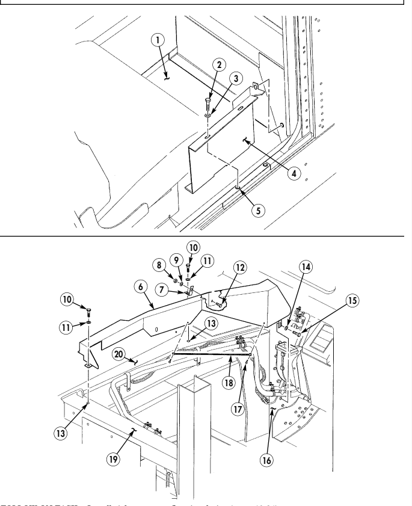

FOLLOW-ON TASK:   Install right rear seat floor insulation (para. 10-34).

# 10-88.2. Rear Heater Manifolds Maintenance

This task covers:

a. Removal c. Installation b. Inspection

| Tools                              | Equipment Condition                         |
|------------------------------------|---------------------------------------------|
| General mechanic's tool kit:       | Engine access cover removed (para. 10\-22). |
| automotive (Appendix B, Item 1)    | Maintenance Level                           |
| Materials/Parts                    | Unit                                        |
| Two locknuts (Appendix G, Item 77) |                                             |

#### A. Removal

1. Remove two capscrews (4) and washers (6) securing vertical manifold assembly (8) to vehicle tunnel (3).

2. Disengage vertical manifold assembly (8) from horizontal manifold assembly (1) and rear heater (5).

Remove vertical manifold assembly (8) and heater gasket (7), if present, from vehicle.

3. Remove capscrew (13) and washer (12) securing mounting bracket (15) to side of vehicle tunnel (3). 4. Remove capscrew (16) and washer (17) securing bracket (18) to vehicle tunnel (3).

9. Remove hole plugs (24) and (25) from left B-pillar beam (26) as required. 10. Remove screw (28), washer (29), and manifold vent assembly (27) from left B-pillar beam (26). 11. Remove vent side B-beam baffle (22) and vent manifold flange nut (23) from left B-pillar beam (26).

b. Inspection Refer to para. 10-56 for plusnut (9) inspection and replacement.

5. Remove horizontal manifold assembly (1) from vehicle. 6. If necessary, remove two screws (19), washers (20), and bracket (18) from horizontal manifold assembly (1).

7. If necessary, remove locknut (14), two washers (11), capscrew (10), and mounting bracket (15) from horizontal manifold assembly (1). Discard locknut (14).

8. Remove horizontal manifold baffle (21) from right B-pillar beam (2).

# 10-88.2. Rear Heater Manifolds Maintenance (Cont'D)

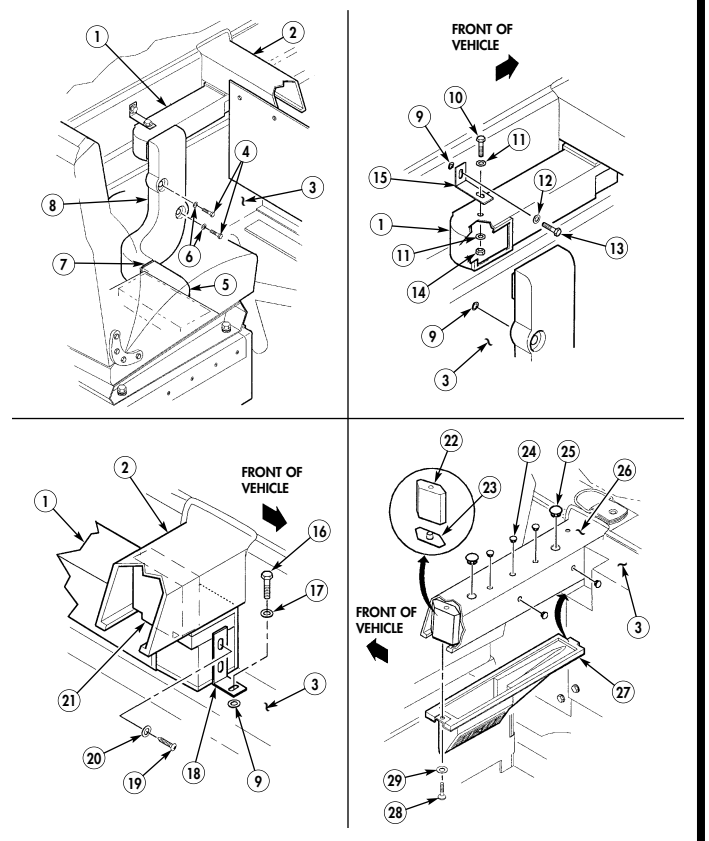

# 10-88.2. Rear Heater Manifolds Maintenance (Cont'D)

#### C. Installation

1. Install vent manifold flange nut (2) in vent side B-beam baffle (1) and install assembled parts inside left B-pillar beam (5).

2. Slide or wedge manifold vent assembly (7) into place under left B-pillar beam (5) until it stops against vehicle tunnel (6).

3. Secure manifold vent assembly (7) to vent manifold flange nut (2) with washer (9) and screw (8).

Tighten screw (8) to 6 lb-ft (8 N•m).

4. Install hole plugs (3) and (4) in left B- pillar beam (5) as required. 5. Install horizontal manifold baffle (18) inside right B-pillar beam (11). 6. If removed, install mounting bracket (24) on horizontal manifold assembly (10) with capscrew (19),
two washers (20), and locknut (23). Tighten locknut (23) to 10 lb-ft (14 N•m).

7. If removed, install bracket (15) on horizontal manifold assembly (10) with two washers (17) and screws (16). Do not overtighten screws (16).

8. Apply sealing compound to threads of capscrew (12). 9. Install horizontal manifold assembly (10) and secure bracket (15) on plusnut (14) on vehicle tunnel (6)
with washer (13) and capscrew (12). Tighten capscrew (12) to 6 lb-ft (8 N•m).

10. Apply sealing compound to threads of capscrew (22). 11. Secure mounting bracket (24) on plusnut (14) on side of vehicle tunnel (6) with washer (21) and capscrew (22). Tighten capscrew (22) to 6 lb-ft (8 N•m).

12. Install vertical manifold assembly (29) and heater gasket (28), if required, and ensure tight fit with rear heater (27) and horizontal manifold assembly (10).

13. Apply sealing compound to threads of two capscrews (25). 14. Secure vertical manifold assembly (29) to vehicle tunnel (6) with two washers (26) and capscrews (25).

Tighten capscrews (25) to 6 lb-ft (8 N•m).

# 10-88.2. Rear Heater Manifolds Maintenance (Cont'D)

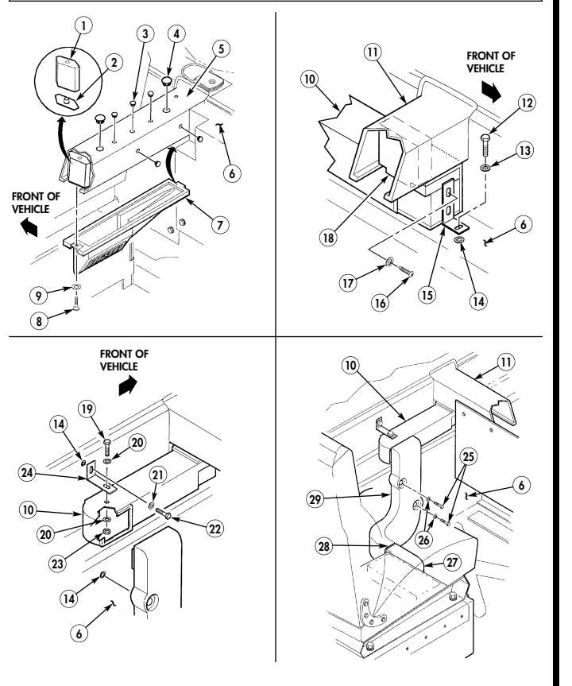

10-150.7/(10-150.8 blank)
Change 2

# 10-89. Diverter Box Cover Replacement

This task covers:

| INITIAL SETUP:                  |                      |
|---------------------------------|----------------------|
| Applicable Models               | Manual References    |
| M1113, M1151, M1152, M1165      | TM 9\-2320\-387\-10  |
|                                 | TM 9\-2320\-387\-24P |
| Tools                           |                      |
| General mechanic's tool kit:    | Equipment Condition  |
| automotive (Appendix B, Item 1) |                      |

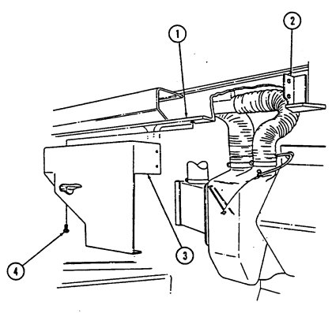

a. Removal b. Installation

a. Removal Remove three capscrews (4) and diverter box cover (3) from right mounting bracket (2) and A-beam (1).

b. Installation Install diverter box cover (3) on right mounting bracket (2) and A-beam (1) with three capscrews (4).

# 10-90. A-Pillar Former Assembly Maintenance

This task covers:
b. Inspection

Applicable Models M1113, M1152, M1165 Tools General mechanic's tool kit:
automotive (Appendix B, Item 1)
a. Removal c. Installation Manual References TM 9-2320-387-10 TM 9-2320-387-24P
Equipment Condition Soft top removed (TM 9-2320-387-10).

| Unit   |
|--------|

a. Removal 1. Remove thirteen screws (3) and A-pillar former (2) from A-pillar (1). 2. Clean weatherstrip from A-pillar (1).

b. Inspection

For inspection and removal of rivnut, refer to para. 10-56.

Inspect rivnut (4). Replace if damaged.

c. Installation 1. Peel backing paper from A-pillar former (2).

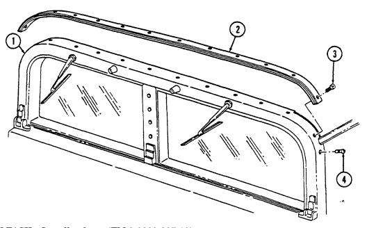 2. Install A-pillar former (2) on A-pillar (1) with thirteen screws (3).

FOLLOW-ON TASK: Install soft top (TM 9-2320-387-10).

10-152 Change 5

# 10-91. Soft Top Door Hinge Replacement

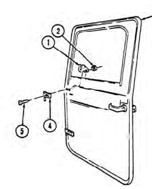

This task covers:

| Applicable Models   |
|---------------------|

INITIAL SETUP:
General mechanic's tool kit:
automotive (Appendix B, Item 1)
Two locknuts (Appendix G, Item 77)

| Equipment Condition   |
|-----------------------|
| Soft top door remo    |

| Unit   |
|--------|

a. Removal b. Installation

Soft top door removed (TM 9-2320-387-10).

- Doorstrap brackets are attached to upper hinges only.

| Manual References    |
|----------------------|
| TM 9\-2320\-387\-24P |

- Replacement procedures for all door hinges are basically the same. This procedure covers the upper left door hinge.

a. Removal Remove two locknuts (2), screws (5), hinge (4), and bracket (1) from door (3). Discard locknuts (2).

b. Installation Install hinge (4) and bracket (1) on door (3) with two screws (5) and locknuts (2). Tighten locknuts (2) to 6 lb-ft (8 N•m).

FOLLOW-ON TASKS: - Install soft top door (TM 9-2320-387-10).

- Adjust soft top door (para. 10-92).

# 10-92. Soft Top Door Adjustment

This task covers:
Adjustment INITIAL SETUP:
Applicable Models M1113, M1152, M1165 Tools General mechanic's tool kit:
automotive (Appendix B, Item 1)
Personnel Required One mechanic One assistant

#### Adjustment

| Manual References    |
|----------------------|
| TM 9\-2320\-387\-24P |
| Maintenance Level    |
| Unit                 |

1. Open and close door (1) to check fit of door seal (2) to body (3). Door seal (2) should fit inside and contact door outline on body (3).

2. For vertical and horizontal adjustment of door (1), loosen four screws (4) on two hinges (5) and door (1). Slide door (1) to fit door outline on body (3). Hold door (1) in position, and tighten four screws (4) on two door hinges (5) and door (1).

If additional vertical adjustment is needed, follow step 3. If no additional vertical adjustment is needed, go to step 4.

3. For additional vertical adjustment of door (1), remove door (1) from body (3) (TM 9-2320-387-10).

Loosen four capscrews (7) on two body hinge mounts (6) and body (3) and slide body hinge mounts (6) up or down for adjustment. Hold body hinge mounts (6) in position, and tighten four capscrews (7) to 8 lb-ft (11 N•m). Install door (1) (TM 9-2320-387-10).

4. For in and out adjustment of door (1), loosen two capscrews (8) on striker (10) and B-pillar (11). With door (1) closed and door seal (2) pressed against body (3), slide striker (10) against inner door handle latch (9) and tighten two capscrews (8). Open door (1) and tighten two capscrews (8) to 15 lb-ft (20 N•m).

5. Close door (1) and check for fit of door seal (2) to door outline on body (3) and inner door handle latch (9) operation. Readjust door (1) if necessary.

# 10-92.  Soft Top Door Adjustment (Cont'D)

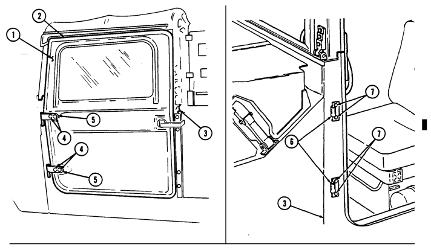

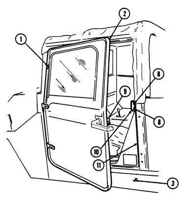

I

# 10-92.1. Soft Top Door Handle Repair

This task covers:
b. Repair a. Removal c. Installation

Applicable Models M1113, M1152, M1165 Manual References TM 9-2320-387-24P
Tools General mechanic's tool kit:
automotive (Appendix B, Item 1)
a. Removal 1. Remove screw (5), inner (4) and outer (1) door handles, washer (7), and spring (6) from door (3). 2. Remove insert (2) from outer door handle (1) if present.

b. Repair 1. Drill 0.250-in. (6.35 mm) diameter hole through outer door handle (1).

NOTE
Countersink hole deep enough so screw is flush with surface of handle.

2. Using a 0.500-in. (12.7 mm) diameter drill bit, countersink outer handle (1).

#### Caution

Use tape or drill stop to ensure the proper depth is not exceeded when counterboring, or inner door handle may be damaged.

3. Counterbore inner door handle (4) to 0.238-in. (6.04 mm) diameter, 0.531-in. (13.49 mm) depth.

# 10-92.1. Soft Top Door Handle Repair (Cont'D)

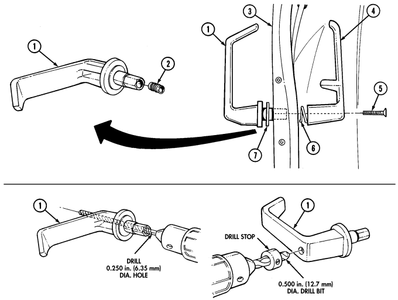

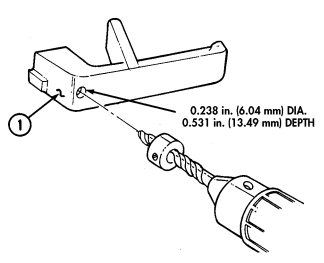

## 10-92.1. Soft Top Door Handle Repair (Cont'D)

c. Installation 1. Install two nuts (5), washers (3), and insert (2) on screw (4). 2. Install insert (2) with screw (4) into inner handle (1). Seat bottom washer (3) against handle surface (1).

3. Loosen two nuts (5) and remove screw (4), two nuts (5), and washers (3) from insert (2). 4. Assemble inner handle (1), washer (7), spring (6), and outer handle (8) with screw (4). 5. Measure length of screw (4) from insert (2). 6. Remove screw (4) and cut to measurement. 7. Install washer (7), outer handle (8), spring (6), and inner handle (1) on door (9) with screw (4). 8. Check door handle for proper operation.

# 10-92.1. Soft Top Door Handle Repair (Cont'D)

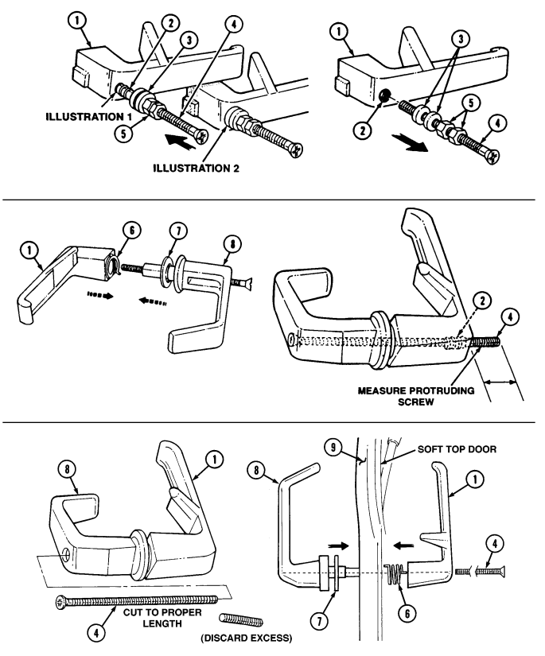

## 10-93. Soft Top Repair

This task covers:
c. Soft Top Window Repair

Applicable Models M1113, M1152, M1165 Tools General mechanic's tool kit:
automotive (Appendix B, Item 1)

#### Materials/Parts

Hook and pile material (Appendix C, Item 79) Sealing compound (Appendix C, Item 60.1) Two plastic sheets (Appendix D, Figure D-117) Green plastic canvas
(Appendix D, Figure D-118)
Six socket turnbuttons (Appendix G, Item 314) Six grommets (Appendix G, Item 68.1) Twelve clinch plate turnbuttons
(Appendix G, Item 330.1)
a. Inspection and Cleaning d. Soft Top Window Zipper Repair (Temporary) b. Soft Top Material Repair e. Soft Top Canvas Repair Manual References FM 10-16 TM 9-2320-387-10 TM 9-2320-387-24P
Equipment Condition Soft top enclosure removed, as required
(TM 9-2320-387-10).

Maintenance Level Unit

#### A. Inspection And Cleaning

1. Inspect soft top doors and tops for pin holes and leaks around the seam areas. 2. Using soapy water solution and stiff brush, clean area to be sealed on the outer side of the canvas.

Allow to dry.

b. Soft Top Material Repair 1. Apply sealing compound to cleaned area where leak occurred. Ensure sealing compound is pressed into stitching of seams.

2. Allow 20 minutes for sealing compound to cure.

# 10-93. Soft Top Repair (Cont'D)

#### C. Soft Top Window Repair Note

The use of pressure-sensitive, adhesive-coated plastic sheets for

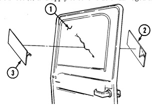 temporary repair of small window cracks and holes should only be utilized if it does not hinder operator's vision. If damaged area is large enough so that plastic sheets will hinder operator's vision, door assembly should be replaced.

1. Ensure damaged area of window (1) is clean and dry. 2. Peel backing off plastic sheet (2) and apply to damaged area of window (1). 3. Peel backing off plastic sheet (3) and apply to other side of damaged area of window (1).

d. Soft Top Window Zipper Repair (Temporary)

Use hook and pile material as a temporary measure to secure

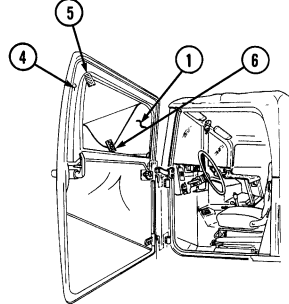 window with failed zipper until zipper or door can be replaced.

1. Apply half of the self-adhesive hook and pile material (5) on inside of door (4) around window (1). 2. Put mating half of hook and pile material (6) on window (1). Apply strips as required to firmly secure window.

## 10-93. Soft Top Repair (Cont'D)

e. Soft Top Canvas Repair

Since these procedures are a reinforcement guide, you can modify them to meet individual needs. These reinforcement procedures are helpful because: - The securing straps reinforce the enclosure and reduce its
"ballooning" action.

- The extra wear, damage, and holes in the enclosure are reduced.

- Any enclosure can be returned to a serviceable condition at a significantly lower cost than replacing the enclosure.

1. Secure six socket turnbuttons and grommets to canvas straps (2), (3), and (4) using twelve clinch plate turnbuttons, follow procedures found in FM 10-16, General Fabric Repair.

2. Sew the eight canvas straps (2), (3), and (4) to inside of soft top enclosure (1). Follow procedures for sewing on straps as found in FM 10-16, General Fabric Repair. Attach straps in the following locations: (a) Strap A (4) - On top front corners of soft top enclosure (1). (b) Strap B (3) - Where the corners of second and third bows make contact with the enclosure (1).

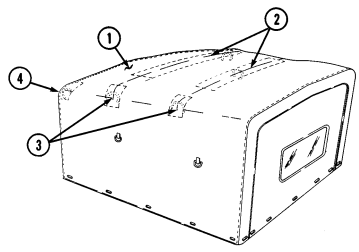 (c) Strap C (2) - On the soft top enclosure (1) where second and third bows make contact with soft top enclosure (1). 

# 10-93. Soft Top Repair (Cont'D)

FOLLOW-ON TASK: Install soft top enclosure, as required, (TM 9-2320-387-10), ensuring straps are fastened around bows.

# 10-94. Soft Top Door Striker Replacement

This task covers:
a. Removal b. Installation INITIAL SETUP:
Applicable Models M1113, M1152, M1165 Tools General mechanic's tool kit:
automotive (Appendix B, Item 1)
Maintenance and repair shop equipment:
automotive (Appendix B, Item 2)
Manual References TM 9-2320-387-24P
Maintenance Level Unit a. Removal Remove two nuts (4), washers (2), capscrews (1), washers (2), and door striker (3) from body (5).

b. Installation Install door striker (3) on body (5) with two washers (2), capscrews (1), washers (2), and nuts (4). Tighten capscrews (1) to 15 lb-ft (20 N•m).

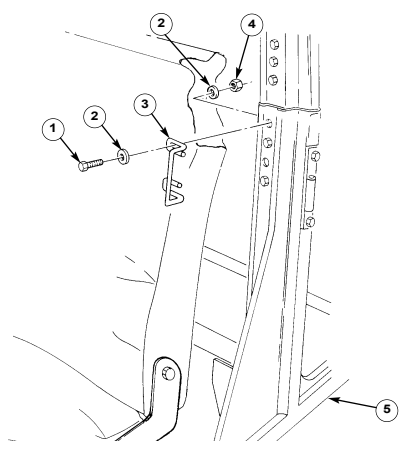

FOLLOW-ON TASK: Adjust soft top door (para. 10-92).

# 10-94.1. Rear Bow Pivot Bracket Replacement

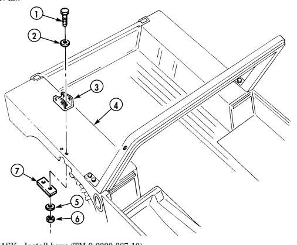

This task covers:
INITIAL SETUP:
Tools General mechanic's tool kit:
automotive (Appendix B, Item 1)
Materials/Parts Two locknuts (Appendix G, Item 77)

a. Removal b. Installation

TM 9-2320-387-10

| Manual References TM 9\-2320\-387\-24P   |
|------------------------------------------|

Equipment Condition Bows removed (TM 9-2320-387-10).

a. Removal Remove two locknuts (6), washers (5), capscrews (1), washers (2), bow pivot bracket (3), and plate (7) from body (4). Discard locknuts (6).

b. Installation Install plate (7) and bow pivot bracket (3) on body (4) with two washers (2), capscrews (1), washers (5), and locknuts (6). Align bow pivot bracket (3) flush with side of body (4) and tighten two locknuts (6) to 6 lb-ft (8 N•m).

FOLLOW-ON TASK: Install bows (TM 9-2320-387-10).

# 10-95. Diverter Manifold And Housing Replacement

This task covers:

a. Removal b. Installation

| Applicable Models                 | Manual References    |
|-----------------------------------|----------------------|
| M1113, M1114, M1151, M1152, M1165 | TM 9\-2320\-387\-24P |
| Tools                             | Maintenance Level    |
| General mechanic's tool kit:      | Unit                 |
| automotive (Appendix B, Item 1)   |                      |

a. Removal 1. Remove four screws (16) and panel assembly (15) from right mounting bracket (3) and A-beam (1). 2. Remove four rivets (14) from manifold and housing (9) and duct (13). 3. Remove two screws (8) from manifold and housing (9) and heater (7). 4. Remove screw (6) from clip (5) and manifold and housing (9). 5. Remove pushnut (11) and disconnect defroster cable core (12) from baffle pin (10). Discard pushnut (11). 6. Pull manifold and housing (9) away from A-beam (1) and loosen two clamps (4) securing defroster flex ducts (2) to manifold and housing (9).

7. Remove manifold and housing (9) from heater (7).

# 10-95. Diverter Manifold And Housing Replacement (Cont'D)

b. Installation 1. Position manifold and housing (9) under A-beam (1) and connect two defroster flex ducts (2) to manifold and housing (9) with two clamps (4).

2. Connect defroster cable core (12) to baffle pin (10) and install pushnut (11). 3. Install duct (13) on manifold and housing (9) with four rivets (14).

Ensure diverter control knob is pushed into cowl and baffle pin is in the downward position before securing control cable to diverter box.

4. Install clip (5) on manifold and housing (9) with screw (6). 5. Install manifold and housing (9) on heater (7) with two screws (8). 6. Install panel assembly (15) on A-beam (1) and right mounting bracket (3) with four screws (16).

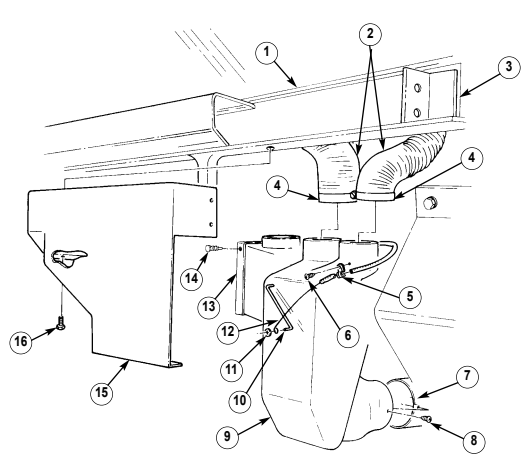

# 10-96. Spare Tire Carrier Replacement

## (Serial Numbers 300000 And Above)

This task covers:
a. Removal b. Installation INITIAL SETUP:

| . UUIS                       |
|------------------------------|
| General mechanic's tool kit: |

| General mechanic's tool kit:    |
|---------------------------------|
| automotive (Appendix B, Item 1) |

Tools automotive (Appendix B, Item 1)
Lockwasher (Appendix G, Item 174) Six locknuts (Appendix G, Item 114.4)
a. Removal 1. Remove pin (3) from locking block (2) and bumper lock (1). 2. Remove capscrew (16), lockwasher (15), washer (14), retainer washer (13), thrust bushing (12), tire carrier subassembly (4), and thrust bushing (8) from pivot mount (9). Discard lockwasher (15).

3. Remove four locknuts (5), washers (6), capscrews (11), washers (10), large washers (17) and (18),
pivot mount (9), and mud flap (19) from bumper (7). Discard locknuts (5).

| TM 9\-2320\-387\-10   |
|-----------------------|
| TM 9\-2320\-387\-24P  |

4. Remove two locknuts (24), washers (23), capscrews (20), washers (21), and bumper lock (22) from bumper (7). Discard locknuts (24).

#### B. Installation

1. Install bumper lock (22) on bumper (7) with two washers (21), capscrews (20), washers (23), and locknuts (24). Tighten locknuts (24) to 90 lb-ft (122 N•m).

2. Install mud flap (19) and pivot mount (9) on bumper (7) with four large washers (17) and (18),
washers (10), capscrews (11), washers (6), and locknuts (5). Tighten locknuts (5) to 90 lb-ft (122 N•m).

3. Install tire carrier subassembly (4) on pivot mount (9) with thrust busing (8), thrust bushing (12),
retainer washer (13), washer (14), lockwasher (15), and capscrew (16). Tighten capscrew (16) to 75 lb-ft (102 N•m).

4. Install pin (3) on locking block (2) and bumper lock (1).

10-96.  SPARE TIRE CARRIER REPLACEMENT
(SERIAL NUMBERS 300000 AND ABOVE) (Cont'd)

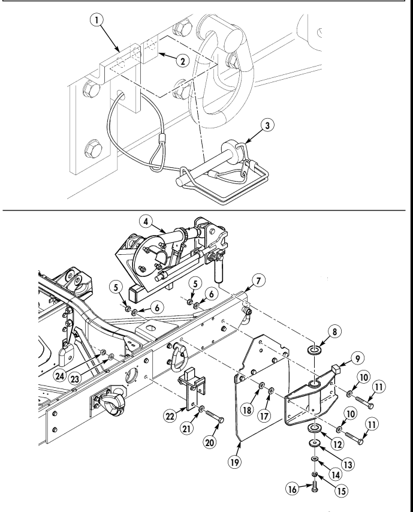

## 10-97. Mud Flap Maintenance

| This task covers:            |                      |
|------------------------------|----------------------|
| a. Removal                   | c. Installation      |
| b. Inspection                |                      |
| INITIAL SETUP:               |                      |
| Applicable Models            | Manual References    |
| M1114                        | TM 9\-2320\-387\-24P |
| Tools                        | Equipment Condition  |
| General mechanic's tool kit: |                      |

a. Removal Remove two locknuts (1), washers (2), capscrews (5), washers (4), and mud flap assembly (3) from bumper (6). Discard locknuts (1). b. Disassembly Remove four locknuts (8), washers (9), capscrews (13), washers (12), mud flap (10), and mud flap retainer (7) from mounting bracket (11). Discard locknuts (8). c. Assembly Install mud flap retainer (7) and mud flap (10) on mounting bracket (11) with four washers (12), capscrews (13), washers (9), and locknuts (8). d. Installation Install mud flap assembly (3) on bumper (6) with two washers (4), capscrews (5), washers (2), and locknuts (1).

# 10-97.  Mud Flap Maintenance (Cont'D)

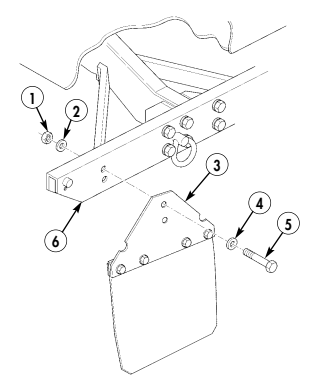

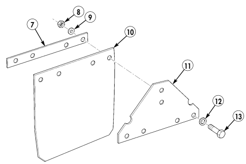

# Chapter 11 Special Purpose Bodies (Unit) Maintenance Section I. Weapon Carrier Body Maintenance

11-1. WEAPON CARRIER BODY MAINTENANCE TASK SUMMARY

| Applicable Models                                                                                         | Materials/Parts                                                                                     | M1114                                                                                              | Sealing compound (Appendix C, Item 64)                                                        |
|-----------------------------------------------------------------------------------------------------------|-----------------------------------------------------------------------------------------------------|----------------------------------------------------------------------------------------------------|-----------------------------------------------------------------------------------------------|
| Locknut (Appendix G, Item 127)                                                                            | Tools                                                                                               | Manual References                                                                                  |                                                                                               |
| General mechanic's tool kit:                                                                              | automotive (Appendix B, Item 1)                                                                     | TM 9\-2320\-387\-24P                                                                               |                                                                                               |
| Maintenance and repair shop equipment:                                                                    | Maintenance Level                                                                                   | automotive (Appendix B, Item 2)                                                                    |                                                                                               |
| Unit                                                                                                      |                                                                                                     |                                                                                                    |                                                                                               |
| a. Removal                                                                                                |                                                                                                     |                                                                                                    |                                                                                               |
| 1.                                                                                                        | Remove two capscrews (4) and washers (6) securing vertical manifold assembly (8) to vehicle         | tunnel (3).                                                                                        |                                                                                               |
| 2.                                                                                                        | Disengage vertical manifold assembly (8) from horizontal manifold assembly (1) and rear heater (5). | Remove vertical manifold assembly (8) and heater gasket (7), if present, from vehicle.             |                                                                                               |
| 3.                                                                                                        | Remove capscrew (13) and washer (12) securing mounting bracket (15) to side of vehicle tunnel (3).  | 4.                                                                                                 | Remove capscrew (16) and washer (17) securing bracket (18) to vehicle tunnel (3).             |
| 5.                                                                                                        | Remove horizontal manifold assembly (1) from vehicle.                                               | 6.                                                                                                 | If necessary, remove two screws (19), washers (20), and bracket (18) from horizontal manifold |
| assembly (1).                                                                                             | 7.                                                                                                  | If necessary, remove locknut (14), two washers (11), capscrew (10), and mounting bracket (15) from |                                                                                               |
| horizontal manifold assembly (1). Discard locknut (14).                                                   | 8.                                                                                                  | Remove horizontal manifold baffle (21) from right B\-pillar beam (2).                              |                                                                                               |
| 9.                                                                                                        | Remove hole plugs (24) and (25) from left B\-pillar beam (26) as required.                          | 10. Remove screw (28), washer (29), and manifold vent assembly (27) from left B\-pillar beam (26). |                                                                                               |
| 11. Remove vent side B\-beam baffle (22) and vent manifold flange nut (23) from left B\-pillar beam (26). |                                                                                                     |                                                                                                    |                                                                                               |
| b. Inspection                                                                                             |                                                                                                     |                                                                                                    |                                                                                               |
| Refer to para. 10\-56 for plusnut (9) inspection and replacement.                                         |                                                                                                     |                                                                                                    |                                                                                               |

# 11-1. Weapon Carrier Body Maintenance Task Summary (Cont'D)

| This task covers:                                                                                      | a.                | Removal                      | b.                   | Installation   |
|--------------------------------------------------------------------------------------------------------|-------------------|------------------------------|----------------------|----------------|
| INITIAL SETUP:                                                                                         |                   |                              |                      |                |
| Applicable Models                                                                                      | Manual References | M1113, M1151, M1152, M1165   | TM 9\-2320\-387\-24P |                |
| Tools                                                                                                  | Maintenance Level | General mechanic's tool kit: | Unit                 |                |
| automotive (Appendix B, Item 1)                                                                        |                   |                              |                      |                |
| a.                                                                                                     | Removal           |                              |                      |                |
| Remove three capscrews (4) and diverter box cover (3) from right mounting bracket (2) and A\-beam (1). |                   |                              |                      |                |
| b. Installation                                                                                        |                   |                              |                      |                |
| Install diverter box cover (3) on right mounting bracket (2) and A\-beam (1) with three capscrews (4). |                   |                              |                      |                |

| This task covers:                       | a.                                                                      | Removal                                 | c.                                                                      | Installation   |
|-----------------------------------------|-------------------------------------------------------------------------|-----------------------------------------|-------------------------------------------------------------------------|----------------|
| b.                                      | Inspection                                                              |                                         |                                                                         |                |
| INITIAL SETUP:                          |                                                                         |                                         |                                                                         |                |
| Manual References                       | Applicable Models                                                       | TM 9\-2320\-387\-10                     | M1113, M1152, M1165                                                     |                |
| TM 9\-2320\-387\-24P                    | Tools                                                                   | Equipment Condition                     |                                                                         |                |
| General mechanic's tool kit:            | automotive (Appendix B, Item 1)                                         | Soft top removed (TM 9\-2320\-387\-10). |                                                                         |                |
| Maintenance Level                       | Unit                                                                    |                                         |                                                                         |                |
| a. Removal                              |                                                                         |                                         |                                                                         |                |
| 1.                                      | Remove thirteen screws (3) and A\-pillar former (2) from A\-pillar (1). | 2.                                      | Clean weatherstrip from A\-pillar (1).                                  |                |
| b. Inspection                           |                                                                         |                                         |                                                                         |                |
| NOTE                                    | For inspection and removal of rivnut, refer to para. 10\-56.            |                                         |                                                                         |                |
| Inspect rivnut (4). Replace if damaged. |                                                                         |                                         |                                                                         |                |
| c. Installation                         |                                                                         |                                         |                                                                         |                |
| 1.                                      | Peel backing paper from A\-pillar former (2).                           | 2.                                      | Install A\-pillar former (2) on A\-pillar (1) with thirteen screws (3). |                |

# 11-1. Weapon Carrier Body Maintenance Task Summary (Cont'D)

| This task covers: a.  Removal      | b.  Installation                             |
|------------------------------------|----------------------------------------------|
| INITIAL SETUP:                     |                                              |
| Applicable Models                  | Manual References                            |
| M1113, M1152, M1165                | TM 9\-2320\-387\-10                          |
| Tools                              | TM 9\-2320\-387\-24P                         |
| General mechanic's tool kit:       | Equipment Condition                          |
| automotive (Appendix B, Item 1)    | Soft top door removed (TM 9\-2320\-387\-10). |
| Materials/Parts                    | Maintenance Level                            |
| Two locknuts (Appendix G, Item 77) | Unit                                         |
|                                    | NOTE                                         |

11-1. WEAPON CARRIER BODY MAINTENANCE TASK SUMMARY (Cont'd)

# 11-2. Front Door And Hinge Replacement

This task covers:
a. Removal **b. Installation**

Applicable Models M1114 Tools General mechanic's tool kit:
automotive (Appendix B, Item 1)
Maintenance and repair shop equipment:
automotive (Appendix B, Item 2)
Special Tools Riveter tool kit (Appendix B, Item 123)
Materials/Parts Fifteen rivets (Appendix G, Item 267) Locknut (Appendix G, Item 127) Six lockwashers (Appendix G, Item 159) Closed-cell foam rubber 
(Appendix G, Item 13)
Adhesive (Appendix C, Item 2.1) Sealing compound (Appendix C, Item 60)
Personnel Required One mechanic One assistant Manual References TM 9-2320-387-24P
General Safety Instructions Vehicle door is extremely heavy and must be supported during removal and installation.

Maintenance Level Unit

#### Warning

Vehicle door is extremely heavy and must be supported during removal and installation. Failure to do so may cause injury to personnel or damage to equipment.

CAUTION
- To prevent damage to armored glass, protect all exposed glass surfaces when replacing rivets.

- Do not place door flat on ground. Window is spring loaded and may disengage if placed in horizontal position.

#### A. Removal

1. Remove locknut (4), screw (2), and door check strap (8) from door bracket (3). Discard locknut (4). 2. Remove sixteen capscrews (10), washers (9.1), and door (1) from A-pillar (7). 

2.1. Remove foam rubber strip (13) from rivet (11) heads.

3. Remove fifteen rivets (11) and hinge (12) from door (1). 4. Remove six capscrews (5), lockwashers (6), and two stop blocks (9) from door (1). Discard lockwashers (6).

5. Remove old adhesive completely from door (1), A-pillar (7), and hinge (12). Ensure all rust is removed from bonded area.

#### B. Installation

1. Install two stop blocks (9) on door (1) with six lockwashers (6) and capscrews (5). Tighten capscrews (5) to 10 lb-ft (14 N•m).

2. Apply adhesive to hinge (12) and door (1). Install hinge (12) on door (1) with fifteen rivets (11).

NOTE
New capscrews come with preapplied thread locking compound. If old capscrews are to be used, mating threads must be cleaned and sealing compound applied to threads of capscrews.

3. Apply sealing compound to sixteen capscrews (10) (for used capscrews only). Apply adhesive to hinge (12) and A-pillar (7). Install hinge (12) on A-pillar (7) with sixteen washers (9.1) and capscrews (10). Tighten capscrews (10) to 37 lb-ft (50 N•m).

3.1. Apply foam rubber strip (13) over rivet (11) heads on door (1).

4. Install door check strap (8) on door bracket (3) with screw (2) and locknut (4).

11-4 Change 2

11-2. FRONT DOOR AND HINGE REPLACEMENT (Cont'd)

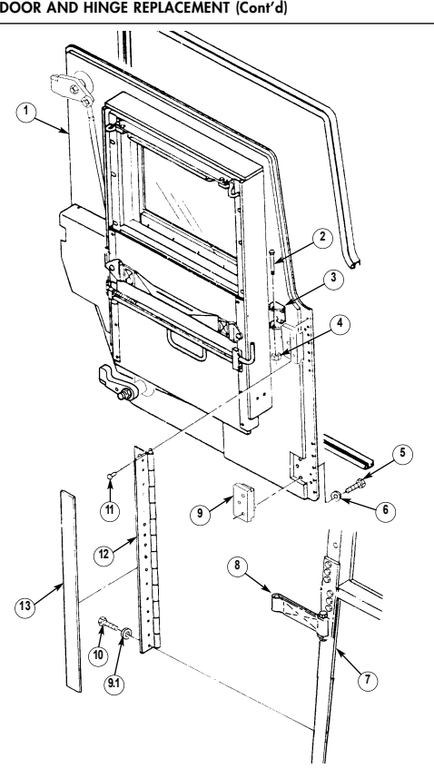

I

# 11-2.1. Rear Door And Hinge Replacement

This task covers:
INITIAL SETUP:

| Applicable Models   |
|---------------------|

M1114 Tools General mechanic's tool kit:
automotive (Appendix B, Item 1)
Maintenance and repair shop equipment:
automotive (Appendix B, Item 2)
Special Tools Riveter tool kit (Appendix B, Item 123)

#### Materials/Parts

Thirty-five rivets (Appendix G, Item 267) Locknut (Appendix G, Item 127) Six lockwashers (Appendix G, Item 159) Adhesive (Appendix C, Item 2.1) Closed-cell foam rubber (Appendix G, Item 13)

#### A. Removal B. Installation

Personnel Required One mechanic One assistant Manual References TM 9-2320-387-24P
General Safety Instructions Vehicle door is extremely heavy and must be supported during removal and installation.

Maintenance Level Unit

#### Warning

Vehicle door is extremely heavy and must be supported during removal and installation. Failure to do so may cause injury to personnel or damage to equipment.

#### Caution

- To prevent damage to armored glass, protect all exposed glass surfaces when replacing rivets.

- Do not place door flat on ground. Window is spring loaded and may disengage if placed in horizontal position.

#### A. Removal

1. Remove locknut (4), screw (2), and door check strap (8) from door bracket (3). Discard locknut (4). 2. Remove foam rubber strip (13) from rivet (12) heads. 3. Remove seventeen rivets (11) and door (1) from B-pillar (7). 4. Remove eighteen rivets (12) and hinge (10) from door (1). 5. Remove six capscrews (5), lockwashers (6), and two stop blocks (9) from door (1). Discard lockwashers (6).

6. Remove old adhesive completely from door (1), B-pillar (7), and hinge (10). Ensure all rust is removed from bonded area.

b. Installation 1. Install two stop blocks (9) on door (1) with six lockwashers (6) and capscrews (5). Tighten capscrews (5) to 10 lb-ft (14 N•m).

2. Apply adhesive to hinge (10) and door (1). Install hinge (10) on door (1) with eighteen rivets (12). 3. Apply adhesive to hinge (10) and B-pillar (7). Install hinge (10) on B-pillar (7) with seventeen rivets (11).

4. Apply foam rubber strip (13) over rivet (12) heads on door (1). 5. Install door check strap (8) on door bracket (3) with screw (2) and locknut (4).

11-2.1. REAR DOOR AND HINGE REPLACEMENT (Cont'd)

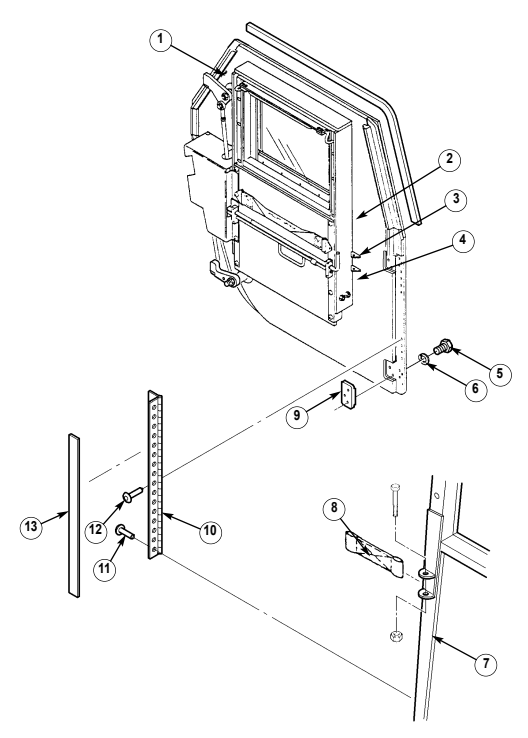

## 11-3. Door Window Replacement

This task covers:
INITIAL SETUP:
Applicable Models M1114 Tools General mechanic's tool kit:
automotive (Appendix B, Item 1)
Maintenance and repair shop equipment:
automotive (Appendix B, Item 2)
Materials/Parts Five lockwashers (Appendix G, Item 140) Eight locknuts (Appendix G, Item 127) Seal (Appendix G, Item 281) Two cotter pins (Appendix G, Item 17) Sealing compound (Appendix C, Item 66)

#### Personnel Required

One mechanic One assistant a. Removal b. Installation Manual References TM 9-2320-387-10 TM 9-2320-387-24P
Equipment Condition
•Window in raised (closed) position 
(TM 9-2320-387-10).

•Locking pawl and connecting rods removed 
(para. 11-7).

•Locking rod and door release handle removed
(para. 11-8).

•Bottom insulation panel removed from door
(para. 11-30).

Maintenance Level Unit

#### Caution

- Interior side of window glass is covered with a film which is crucial to the protection integrity. Scratching, bumping, or incorrect cleaning practices will damage glass and reduce ballistic protection.

- Do not apply bug spray near ballistic glass. The charge from the spray can crack ballistic glass.

- Do not place door flat on ground. Window is spring loaded and may disengage if placed in horizontal position.

a. Removal

Note location of five screws for installation.

1. Remove five capscrews (21), lockwashers (22), and washers (24), and slide door cover (20) from door (5). Discard lockwashers (22).

2. Remove four locknuts (8), washers (7), socket-head screws (25), and two protective bumpers (26)
from window channels (6). Discard locknuts (8).

3. Remove two locknuts (18) and capscrews (9) from negator spring assembly (17) and window frame (13). Discard locknuts (18).

4. Pull two negator spring assemblies (17) down from side window (12) and install a 4-in. (102-mm)
piece of flat bar stock to gain access to cotter pin (19).

5. Remove cotter pin (19) from stud (23) and remove tongue of negator spring (17). Discard cotter pin (19). 6. Repeat steps 3 through 5 for remaining negator spring (17).

#### Caution

Support window before removing retainer plates.

7. Remove four screws (11), two retainer plates (14), springs (15), and locking rod (16) from window (12).

8. Lower window (12) and remove from window channel (6) and door (5). 9. Remove five screws (1), clamp bar (2), seal (3), and spacer (4) from door (5). Discard seal (3).

# 11-3. Door Window Replacement (Cont'D)

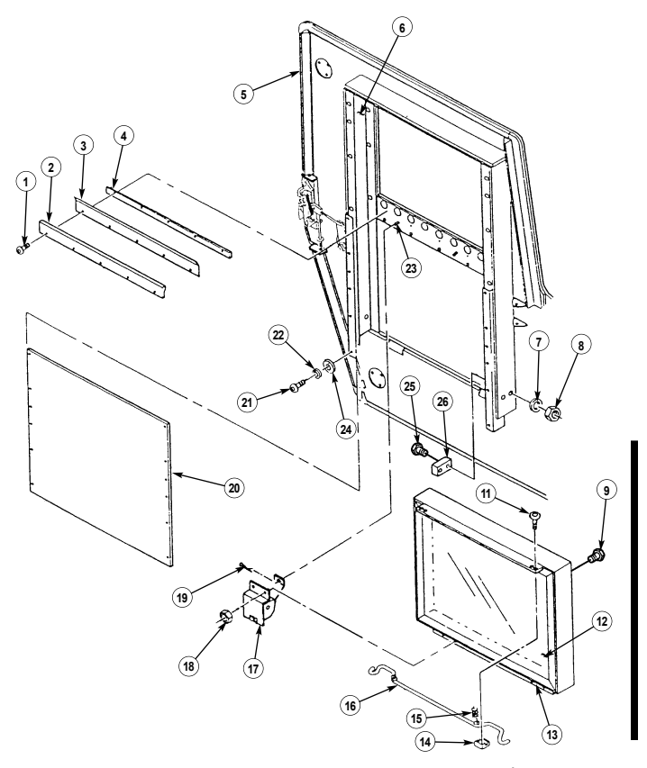

ಲ್ಲಿ

Change  1

11-7

## 11-3. Door Window Replacement (Cont'D)

b. Installation 1. Apply sealing compound to threads of five screws (1). 2. Install spacer (4), seal (3), and clamp bar (2) on door (5) with five screws (1). Tighten screws (1) to 13-16 lb-in. (1.5-1.8 N•m).

#### Caution

Support window until retainer plates and negator springs are installed.

3. Position window (12) at bottom of window channels (6) in door (5) and slide window (12) to highest position. 

4. Position hole in tongue end of negator spring assembly (17) over stud (23) on door (5). 5. Install cotter pin (19) through hole in stud (23). 6. Install negator spring assembly (17) on window frame (13) with two capscrews (9) and locknuts
(18). Tighten locknuts (18) to 10 lb-ft (14 N•m).

7. Repeat steps 4 through 6 for remaining negator spring (17). 8. Apply sealing compound to threads of four screws (11), and install locking rod (16) on window (12)
with two retainer plates (14), springs (15), and screws (11). Tighten screws (11) to 20-23 lb-in. (2.2-2.6 N•m).

9. Install two protective bumpers (26) on window channels (6) with four socket-head screws (25),
washers (7), and locknuts (8). Tighten locknuts (8) to 10 lb-ft (14 N•m).

10. Install door cover (20) at bottom of grooves in door (5) with beveled corners down. Slide door cover (20)
up and secure door cover (20) to door (5) with five washers (24), lockwashers (22), and capscrews (21). Tighten capscrews (21) to 20-23 lb-in. (2.2-2.6 N•m).

11-3. DOOR WINDOW REPLACEMENT (Cont'd)

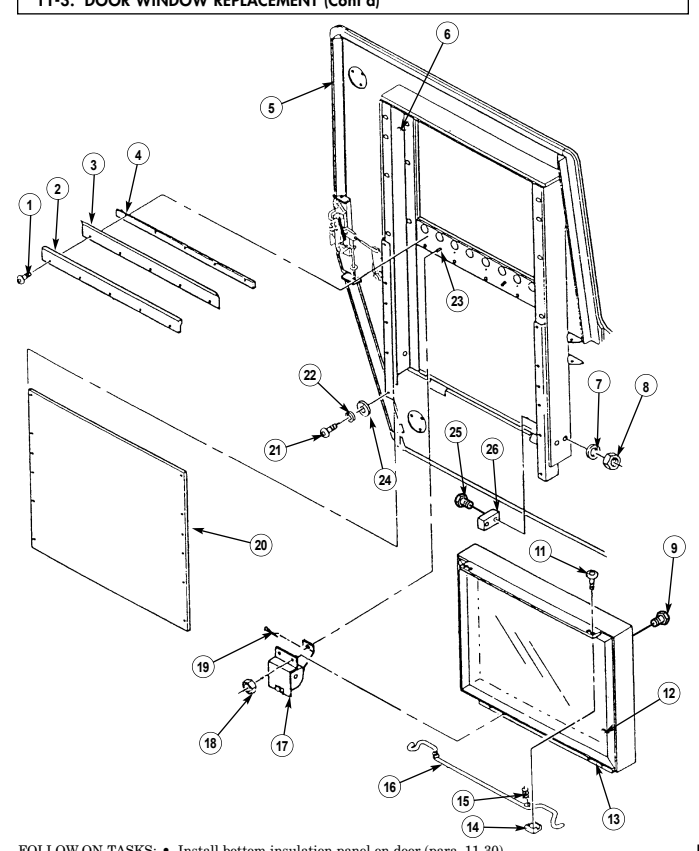

FOLLOW-ON-TASKS: - Install bottom insulation panel on door (para. 11-30).
- Install locking rod and door release handle (para. 11-8). - Install locking pawl and connecting rods (para. 11-7).

# 11-4. Door Latch Maintenance

This task covers:
a. Removal c. Installation b. Inspection

| General mechanic's tool kit:   |
|--------------------------------|

| . 1      |
|----------|
| T M111 4 |

Applicable Models automotive (Appendix B, Item 1)
Maintenance and repair shop equipment:
automotive (Appendix B, Item 2)
Materials/Parts Lockwasher (Appendix G, Item 160) Locknut (Appendix G, Item 110) Sealing compound (Appendix C, Item 72.1)
a. Removal 1. Remove locknut (11) and bushing (10) from link rod (14) on door release handle (9). Discard locknut (11).

2. Remove link rod (14), washer (13), and spring (12) from door latch (4) and door release handle (9). 3. Remove capscrew (1) and link rod boss (2) from door latch (4). 4. Remove link rod boss (2) from door handle lever (8). 4.1. Loosen nut (16) and remove rod (17), lockwasher (18), and nut (16) from link rod boss (2). Discard lockwasher (18).

5. Remove four screws (3), door latch (4), two spacer plates (5), and spring (15) from door (7). 6. Remove spring (15) from latch (4).

b. Inspection Refer to para. 10-56 for plusnuts (6) inspection and replacement.

c. Installation 1. Install spring (15) on latch (4). 2. Apply sealing compound to threads of four screws (3), and install two spacer plates (5), door latch (4), and spring (15) on door (7) with screws (3).

3. Apply sealing compound to threads of capscrew (1), and install link rod boss (2) on door latch (4)
with capscrew (1). Tighten capscrew (1) to 10 lb-ft (14 N•m).

3.1 Install nut (16) and lockwasher (18) on rod (17). 3.2 Install rod (17) on link rod boss (2) and tighten nut (16).

4. Install rod (17) on door handle lever (8). 4.1. Install washer (13) and spring (12) on link rod (14). 5. Install link rod (14) on door latch (4) and through door release handle (9). 6. Attach link rod (14) to door release handle (9) with bushing (10) and locknut (11).

| TM 9\-2320\-387\-10                 |
|-------------------------------------|
| TM 9\-2320\-387\-24P                |
| Equipment Condition                 |
| Bows removed (TM 9\-2320\-387\-10). |

# 11-4. Door Latch Maintenance (Cont'D)

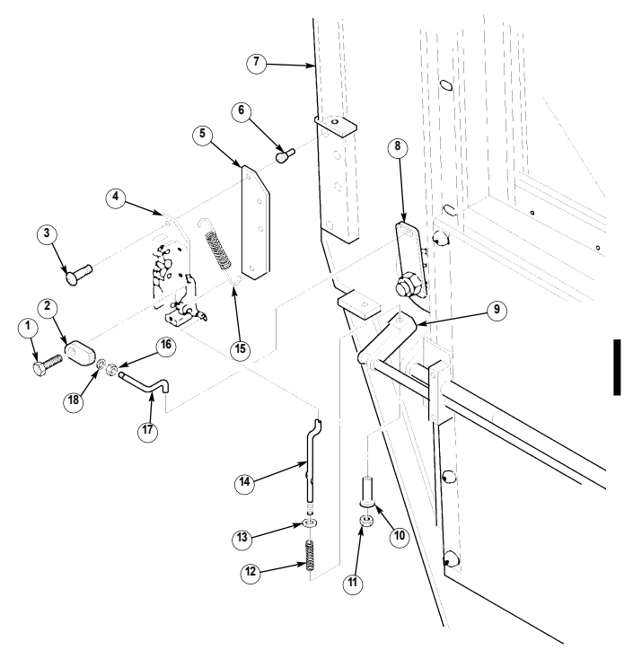

FOLLOW-ON TASKS: - • Install door latch cover (para. 11-6).
- • - • - Adjust door latch (para. 11-9).

## 11-5. Door Handle Replacement

This task covers:
INITIAL SETUP:

a. Removal b. Installation

| Applicable Models                                                       | Materials/Parts                                                                                  |
|-------------------------------------------------------------------------|--------------------------------------------------------------------------------------------------|
| M1113, M1151, M1152, M1165                                              | Pushnut (Appendix G, Item 249)                                                                   |
| Tools                                                                   | Four rivets (Appendix G, Item 268)                                                               |
| General mechanic's tool kit:                                            | Manual References                                                                                |
| automotive (Appendix B, Item 1)                                         | TM 9\-2320\-387\-24P                                                                             |
| a. Removal                                                              |                                                                                                  |
| 1.                                                                      | Remove four screws (16) and panel assembly (15) from right mounting bracket (3) and A\-beam (1). |
| 2. Remove four rivets (14) from manifold and housing (9) and duct (13). |                                                                                                  |

a. Removal 1. Remove locknut (1), washers (3), lever (2), and washer(s) (3) from link rod (5.1) and door handle (7).

Discard locknut (1).

2. Remove locknut (11), retainer washer (4), handle (7), O-ring (6), handle retainer (8), backing plate (9), and gasket (10) from door (5). Discard locknut (11) and O-ring (6).

b. Installation

Apply a light coat of white lithium grease to uncoated surfaces of handle and O-ring prior to assembly.

1. Install O-ring (6), handle retainer (8), backing plate (9), and gasket (10) on handle (7) and install handle (7) on door (5) with retainer washer (4) and locknut (11).

NOTE
A total of six washers are required. Install washers under lever as required to position link rod parallel to door.

2. Install washer(s) (3), lever (2), washers (3), and locknut (1) on door handle (7) and link rod (5.1).

# 11-5. Door Handle Replacement (Cont'D)

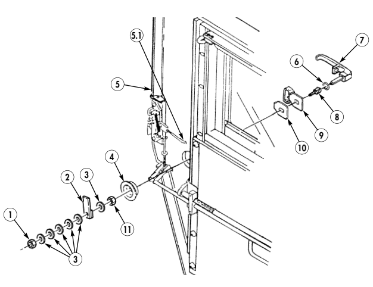

FOLLOW-ON TASK:
 Adjust door latch (para. 11-9).

# 11-5.1. Door Handle (With Locking Feature) Replacement

This task covers:

| Tools                             |
|-----------------------------------|
| General mechanic's tool kit:      |
| automotive (Appendix B, Item 1)   |
| Materials/Parts                   |
| Lockwasher (Appendix G, Item 174) |

Maintenance and repair shop equipment:
automotive (Appendix B, Item 2)
Materials/Parts Lithium grease (Appendix C, Item 36) O-ring (Appendix G, Item 230) Locknut (Appendix G, Item 113) Locknut (Appendix G, Item 104) Locknut (Appendix G, Item 127)

| Manual References    |
|----------------------|
| TM 9\-2320\-387\-24P |
| Maintenance Level    |
| Unit                 |

a. Removal b. Installation

#### A. Removal

1. Remove locknut (11), washer (10), lever (12), and washer (10) from link rod (2) and door handle (5).

Discard locknut (11).

2. Remove locknut (13), retainer washer (9), door handle (5), handle retainer (7), and O-ring (6) from door (1). Discard locknut (13) and O-ring (6).

3. Remove locknut (4), low head capscrew (14), backing plate (3), and gasket (8) from door (1). Discard locknut (4).

#### B. Installation

1. Install gasket (8), backing plate (3), low head capscrew (14), and locknut (4) on door (1). Ensure door handle holes align and tighten locknut (4) to 10 lb-ft (13.6 N•m).

2. Install retainer washer (9) in door (1) and ensure cut-out area fits over low head capscrew (14).

NOTE
Apply a light coat of white lithium grease to uncoated surfaces of door handle and O-ring prior to assembly.

3. Install O-ring (6) and handle retainer (7) on door handle (5), slide door handle (5) through door (1),
and secure with locknut (13). Tighten locknut (13) to 64 lb-ft (86.8 N•m).

NOTE
A total of six washers are required. Install washers under lever as required to position link rod parallel to door.

4. Install washer(s) (10), lever (12), washer(s) (10), and locknut (11) on door handle (5) and link rod
(2). Tighten locknut (11) to 10 lb-ft (13.6 N•m).

# 11-5.1. Door Handle (With Locking Feature) Replacement (Cont'D)

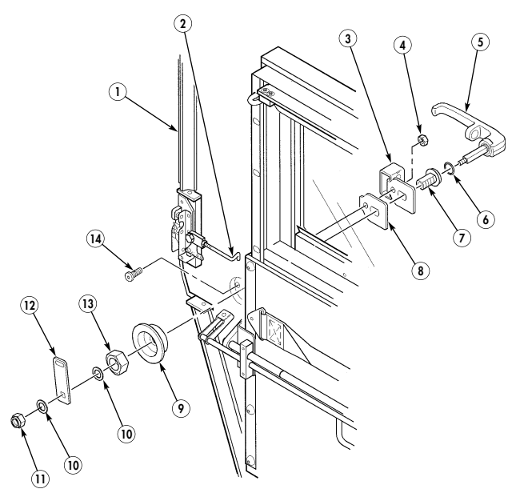

FOLLOW-ON TASKS: -  Install door latch cover (para. 11-6).

- Adjust door latch (para. 11-9).

# 11-6. Door Latch Cover Replacement

This task covers:
INITIAL SETUP:

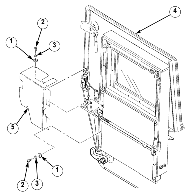

| Materials/Parts   |    |
|-------------------|----|

General mechanic's tool kit:
automotive (Appendix B, Item 1)
Maintenance and repair shop equipment:
automotive (Appendix B, Item 2)
Three lockwashers (Appendix G, Item 140)
a. Removal Remove three screws (2), lockwashers (3), washers (1), and latch cover (5) from door (4). Discard lockwashers (3).

b. Installation

| Maintenance Level   |
|---------------------|
| Unit                |

a. Removal b. Installation Manual References TM 9-2320-387-10 TM 9-2320-387-24P
Equipment Condition
- Window in raised (closed) position 
(TM 9-2320-387-10).

- Pull strap removed (para. 11-11).

Install latch cover (5) on door (4) with three washers (1), lockwashers (3), and screws (2). Tighten screws (2) to 20-23 lb-in. (2-3 N•m).

FOLLOW-ON TASK: Install pull strap (para. 11-11).

# 11-7. Locking Pawl And Connecting Rod Replacement

This task covers:
INITIAL SETUP:

a. Removal b. Installation

| 11\-1.   | WEAPON CARRIER BODY MAINTENANCE TASK SUMMARY   |
|----------|------------------------------------------------|
| TASK     | PAGE                                           |
| PARA.    | PROCEDURES NO.                                 |
| 11\-2.   | Front Door and Hinge Replacement  11\-4        |

Materials/Parts Two locknuts (Appendix G, Item 130) Six lockwashers (Appendix G, Item 141) Four lockwashers (Appendix G, Item 142) Sealing compound (Appendix C, Item 72.1)

#### A. Removal

1. Remove four screws (1), two connecting rods (12), and four lockwashers (9) from upper and lower locking pawls (3) and locking rod (13). Discard lockwashers (9).

Tie washers together to be used in installation.

2. Remove two locknuts (2), washers (2.1), locking pawls (3), and washers (4) from upper and lower pivot bases (5). Discard locknuts (2).

3. Remove six capscrews (6), lockwashers (7), and two pivot bases (5) from door (8). Discard lockwashers (7).

4. Remove four rod ends (10) and locking nuts (11) from two connecting rods (12).

#### B. Installation

1. Install upper and lower pivot bases (5) on door (8) with six lockwashers (7) and capscrews (6).

Tighten capscrews (6) to 21 lb-ft (29 N•m).

2. Install washers (4) and locking pawls (3) on upper and lower pivot bases (5) with two washers (2.1)
and locknuts (2), tighten locknuts (2) until tight, then loosen 1/2 turn.

3. Install four locking nuts (11) and rod ends (10) on two connecting rods (12). 4. Apply sealing compound to threads of four screws (1), and install two connecting rods (12) on locking rod (13) and upper and lower locking pawls (3) with four lockwashers (9) and screws (1).

# 11-7. Locking Pawl And Connecting Rod Replacement (Cont'D)

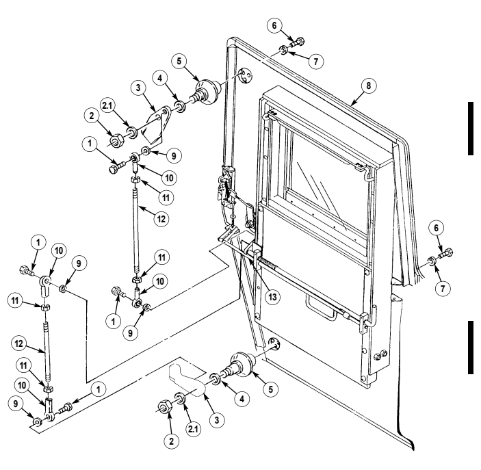

FOLLOW-ON TASK:  Adjust door latch (para. 11-9).

# 11-8. Locking Rod And Door Release Handle Replacement

This task covers:
INITIAL SETUP:
Applicable Models M1114 Tools General mechanic's tool kit:
automotive (Appendix B, Item 1)
Maintenance and repair shop equipment:
automotive (Appendix B, Item 2)
Materials/Parts

#### A. Removal B. Installation

Manual References TM 9-2320-387-24P
Equipment Condition
- Door link rod removed (para. 11-4). - Door locking pawls and connecting rods removed
(para. 11-7).

Maintenance Level Unit Four lockwashers (Appendix G, Item 140)

Replacement procedures for locking rod and door release handle are basically the same. This procedure covers the left front door.

#### A. Removal

1. Remove four retaining rings (7) from locking rod (6) and door release handle (11) and uncompress spring (4).

2. Remove four screws (10), lockwashers (9), washers (1), two retainer blocks (8), locking rod (6), door release handle (11), retainer (5), and detent bracket (2) from door (3). Discard lockwashers (9).

3. Remove spring (4) from locking rod (6). b. Installation 1. DELETED. 2. Install spring (4) on locking rod (6), and install detent bracket (2), retainer (5), door release handle (11), and locking rod (6) on door (3) with two retainer blocks (8), four washers (1), lockwashers (9), and screws (10). Tighten screws (10) to 21 lb-in. (2 N•m).

3. Compress spring (4) and install four retaining rings (7) on locking rod (6) and door release handle (11).

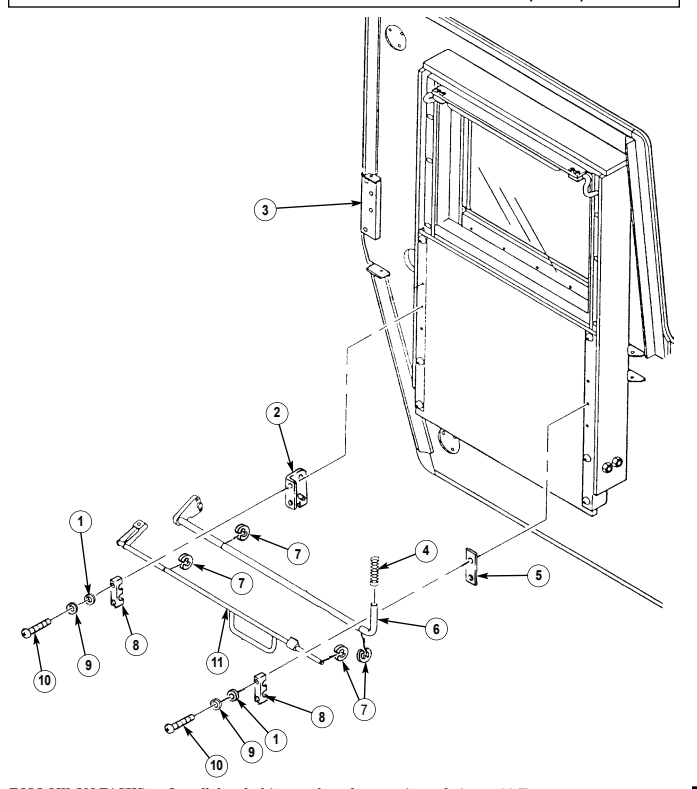

# 11-8. Locking Rod And Door Release Handle Replacement (Cont'D)

FOLLOW-ON TASKS: - Install door locking pawls and connecting rods (para. 11-7).

-  Install door link rod (para. 11-4).
-  Adjust door latch (para. 11-9).

#### 11-9. Door Latch Adjustment _

This task covers: 

a. Exterior Handle Adjustment b. Interior Handle Adjustment

c. Locking Rod Adjustment 

Applicable Models Manual References 

Ml114 TM 9-2320-387-24P 

Tools General mechanic's tool kit: 
automotive (Appendix B, Item 1) 
Equipment Condition Door latch cover removed (para. 11-6). 

| Maintenance Level   |
|---------------------|
| Unit                |

#### A. Exterior Handle Adjustment

1. Loosen nut (4). 

2. Remove capscrew (2) and boss (3) from latch (1).

3. Adjust boss (3) until rod (5) contacts end of slot, (6) with door handle (18) in contact with lower flange (19) and bolt hole in boss (3) aligns with threaded hole in latch (1). 

4. Install capscrew (2) on boss (3) and tighten nut (4).

#### B. Interior Handle Adjustment

1. Close latch (1). 

2. Tighten or loosen nut, (14) until handle (18) releases latch (1) prior to detent pin (9) bottoming in recess of lock rod (12).

#### C. Locking Rod Adjustment

1. Loosen two nuts (7) on clevises (8). 

2. Remove two screws (13) **and clevises** (8) from locking rod bracket (11). 

3. Position detent pin (9) to upper hole (17) in detent bracket (10). 

4. Adjust clevises (8) until lock pawls (16) are If2 in. (12.7 mm) from door channel (15) and bolt holes in clevises (8) align with threaded holes in locking rod bracket (11). 

5. Install clevises (8) on locking rod bracket. (11) with two screws (13). 6. Tighten two nuts (7) on clevises (8).

# 11-9. Door Latch Adjustment (Cont'D)

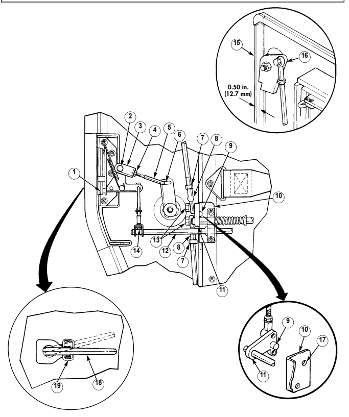

FOLLOW-ON TASK: Install door latch cover (para. 11-6).

# 11-10. Door Window Seal Replacement

This task covers:
a. Removal b. Installation INITIAL SETUP:
Applicable Models M1114 Tools General mechanic's tool kit:
automotive (Appendix B, Item 1)
Materials/Parts Seal (Appendix G, Item 281) Drycleaning solvent (Appendix C, Item 26) Adhesive (Appendix C, Item 4)
Manual References TM 9-2320-387-24P
Equipment Condition Door window removed (para. 11-3).

General Safety Instructions Do not perform this procedure near fire, flames, or sparks.

Maintenance Level Unit

#### Warning

Drycleaning solvent is highly flammable. Do not perform this procedure near fire, flames, or sparks. Injury to personnel and/or damage to equipment will result.

a. Removal

Use drycleaning solvent to remove adhesive from window channels.

1. Remove three seals (2) from window channels (3). 2. Remove five seals (1) from window channels (3).

b. Installation 1. Apply a thin coat of adhesive on inside of window channel (3).

NOTE
Seal is supplied in bulk and must be cut to fit.

2. Trim three seals (2) to fit window channels (3), as required.

NOTE
evenly.

5. Apply a thin coat of adhesive on edges of window channels (3) and on contact edge of five door seals (1).

Two seals are located on right side, two seals on left side, and one seal on top of window channels.

6. Install five seals (1) on window channels (3).

Ensure mating surfaces of seals are installed on window channels evenly.

3. Apply a thin coat of adhesive on three seals (2) and install seals (2) on window channels (3).

NOTE
Two seals will be trimmed 21.25-in. (540 mm) in length, two seals will be 20.00-in. (508 mm) in length, and one seal will be 16.00-in. (406 mm) in length.

4. Trim five seals (1) to fit window channels (3), as required.

NOTE
Ensure mating surfaces of seals are installed on window channels

# 11-10. Door Window Seal Replacement (Con'Td)

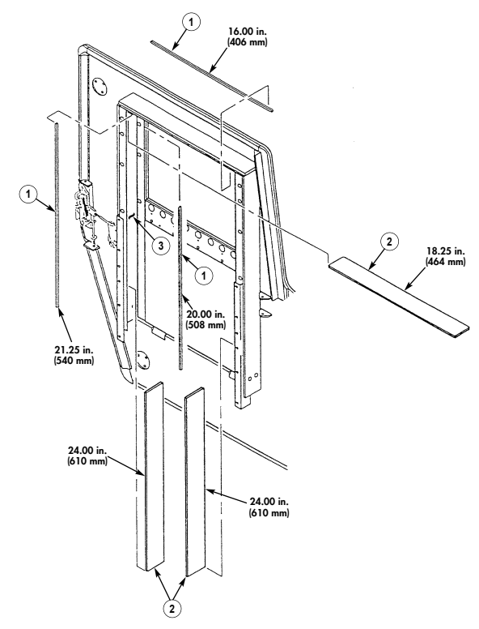 
# 11-11. Door Seal And Pull Strap Replacement

This task covers:

Applicable Models M1114 Tools General mechanic's tool kit:
automotive (Appendix B, Item 1)
Maintenance and repair shop equipment:
automotive (Appendix B, Item 2)
a. Door Seal Removal c. Door Pull Strap Removal b. Door Seal Installation d. Door Pull Strap Installation Manual References TM 9-2320-387-24P
Maintenance Level Unit

#### Materials/Parts

Seal (Appendix G, Item 294) Two lockwashers (Appendix G, Item 140) RTV sealant (Appendix C, Item 74)

#### A. Door Seal Removal

Remove door seal (2) from door (1) and clean adhesive from door (1). b. Door Seal Installation Install door seal (2) on door (1) with sealant.

c. Door Pull Strap Removal Remove two screws (5), lockwashers (6), washers (4), and door pull strap (3) from door (1). Discard lockwashers (6). d. Door Pull Strap Installation Install door pull strap (3) on door (1) with two washers (4), lockwashers (6), and screws (5). Tighten screws (5) to 21 lb-in. (2 N•m).

# 11-11. Door Seal And Pull Strap Replacement (Cont'D)

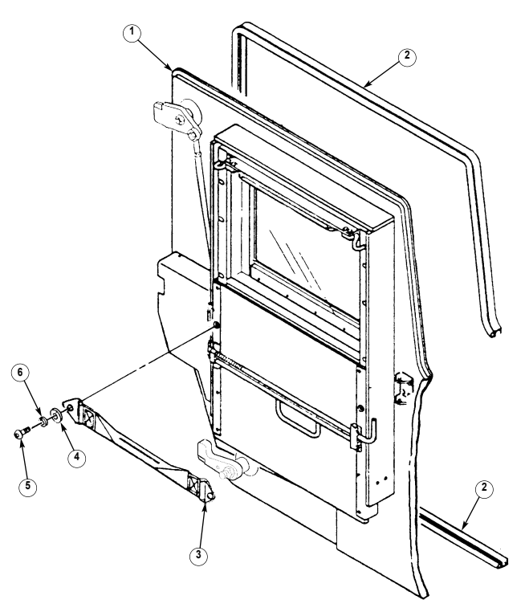

## 11-12. Door Striker Replacement

This task covers:

| TASK      | PROCEDURES                                   | PAGE     |
|-----------|----------------------------------------------|----------|
| PARA.     |                                              | NO.      |
| 11\-42.   | A\-beam Left Side Armor Replacement          | 11\-86   |
| 11\-43.   | A\-beam Right Side Armor Replacement         | 11\-88   |
| 11\-44.   | B\-pillar Armor Replacement                  | 11\-90   |
| 11\-44.1. | B\-pillar Padding Replacement                | 11\-90.2 |
| 11\-45.   | C\-pillar Top Armor Maintenance              | 11\-92   |
| 11\-46.   | C\-pillar Bottom Left Side Armor Maintenance | 11\-94   |
| 11\-47.   | Tailgate Armor Plate Replacement             | 11\-95   |

a. Removal

Replacement procedures for left and right door strikers are basically the same. This procedure covers the right door striker.

Remove two capscrews (3), door striker (2), and spacer (1) from body (4).

b. Installation Apply sealing compound to threads of two capscrews (3), and install spacer (1) and door striker (2) on body (4) with capscrews (3). Tighten capscrews (3) to 75 lb-in. (8 N•m).

# 11-12. Door Striker Replacement (Cont'D)

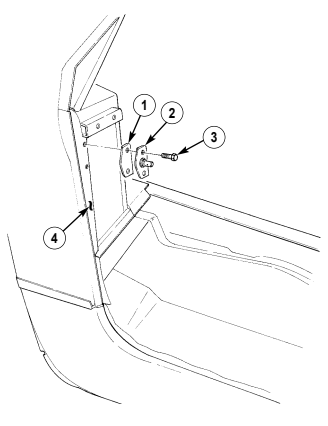

# 11-12.1. Right Rear Door Striker Reinforcement Replacement

This task covers:

Applicable Models M1114 Tools General mechanic's tool kit:
automotive (Appendix B, Item 1)
Materials/Parts Six locknuts (Appendix G, Item 133.2)
Manual References TM 9-2320-387-24P
a. Removal b. Installation Equipment Condition
- Right rear door striker removed 
(para. 11-12).

- Fuel filler housing removed 
(para. 10-2).

Maintenance Level Unit a. Removal Remove six locknuts (1), washers (2), five screws (5), screw (4), and reinforcement plate (6) from right rear wheelhouse (3). Discard locknuts (1).

#### B. Installation

Install reinforcement plate (6) on right rear wheelhouse (3) with five screws (5), screw (4), six washers (2), and locknuts (1).

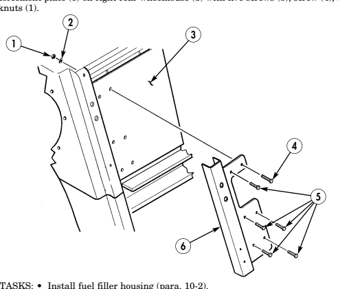

FOLLOW-ON TASKS: - Install fuel filler housing (para. 10-2).
- Install right rear door striker (para. 11-12).

# 11-12.2. Ballistic Crew Door Maintenance

This task covers:

a. Removal c. Inspection

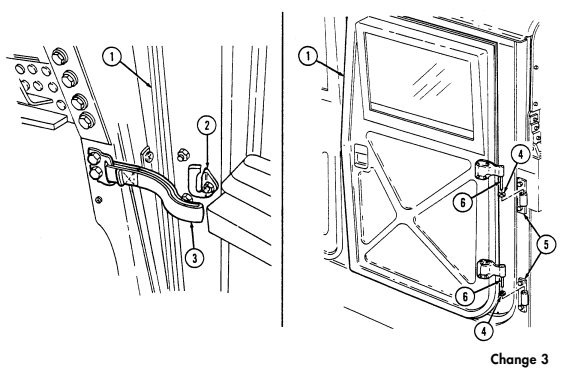

General mechanic's tool kit:
automotive (Appendix B, Item 1)

#### Materials/Parts

Six locknuts (Appendix G, Item 133.3) Spacer plate, 0.125-in. (3.2-mm) thick
(Appendix G, Item 315.4)
Spacer plate, 0.063-in. (1.5-mm) thick
(Appendix G, Item 315.3)
Spacer plate, hinge(Appendix G, Item 315.2)

b. Installation d. Adjustment

| I OF OOTHEST TECCAH OG   |
|--------------------------|
| One mechanic             |
| One assistant            |
| Manual References        |
| . MITA ODOO OOT O IT     |

| Maintenance Level   |
|---------------------|
| 【Init              |

Personnel Required TM 9-2320-387-24P

#### A. Removal

1. Slide doorstrap (3) off doorstop bracket (2). 2. Open and hold crew door (1) straight out from vehicle. Lift up crew door (1) to remove door hinge pins (6) from body hinge mounts (5) and remove crew door (1) and washers (4) (if present).

#### B. Installation

1. Hold crew door (1) straight out from vehicle and insert washers (4) (if removed) and door hinge pins (6) on body hinge mounts (5).

2. Slide doorstrap (3) on doorstop bracket (2).

Change 3 11-24.3
# 11-12.2. Ballistic Crew Door Maintenance (Cont'D)

c. Inspection 1. Inspect crew door assembly (2) for proper alignment. Ensure door (2) is centered between pillar (7),
roof (5), cargo shell (10), and lower side rail (8). If out-of-alignment condition exists, perform horizontal or vertical adjustment procedures.

2. Inspect crew door assembly (2) to ensure latch (1) is closing completely on striker (15) without extreme force. If latch (1) is out of adjustment, perform latch (1) adjustment procedures.

3. Inspect hinge (4) and latch (1) for adjustment. Insert a piece of paper (9) between crew door assembly (2) and pillar (7), and close door (2). Perform this test at four or five locations around the door (2). Door seals should offer some resistance when paper is pulled out. If door seal does not offer resistance, or resistance is excessive, perform hinge and latch adjustment procedures.

4. Inspect latch (1), hinge (4), and door handle (3) for loose, missing, or unserviceable parts.

#### D. Adjustment Note

Perform steps 1 and 2 for horizontal adjustment. Perform steps 3 through 6 for vertical adjustment. Perform steps 7 through 18 for hinge adjustment and steps 19 through 23 for latch adjustment.

1. Loosen six screws (6) from two hinges (4) and crew door assembly (2). 2. Align and center crew door assembly (2) between pillar (7), roof (5), cargo shell (10), and lower side rail (8). Tighten six screws (6) to 6 lb-ft (8 N•m).

3. Remove door strap (11) from doorstop bracket (12). 4. Open crew door assembly (2) to approximately 45°, and lift and remove door (2) from body hinge mounts (14).

5. Install washer (13) on each door hinge (4), and install crew door assembly (2) on body hinge mounts (14).

6. Check vertical adjustment and repeat steps if necessary. 7. Remove door strap (11) from doorstop bracket (12). 8. Open crew door assembly (2) to approximately 45°, and lift door (2) and remove washers (13) (if installed) from body hinge mounts (14).

9. Remove locknut (19), washer (17), screw (16), washer (17), and doorstop bracket (12) from crew door assembly (2). Discard locknut (19).

10. Remove five locknuts (20), washers (21), screws (23), washers (21), two hinges (4), and spacer plates (18) (if installed) from crew door assembly (2). Discard locknuts (20).

11. To increase resistance to that portion of the door seal (22), install two hinge spacer plates (18)
between door hinge (4) and outer side of crew door assembly (2).

12. To decrease resistance to that portion of the door seal (22), discard hinge spacer plate (18) between door hinge (4) and outer side of crew door assembly (2).

13. Install two spacer plates (18) (if required) and door hinges (4) on crew door assembly (2) with five washers (21), screws (23), washers (21), and locknuts (20).

14. Install doorstop bracket (12) on crew door assembly (2) with washer (17), screw (16), washer (17),
and locknut (19).

15. Tighten locknuts (19) and (20) installed in steps 13 and 14 to 6 lb-ft (8 N•m). 16. Install two door hinge washers (13) (if removed), position crew assembly door (2) to approximately 45°, and install door hinges (4) on body hinge mounts (14).

17. Check hinge (4) adjustment and repeat steps if necessary. 18. Install door strap (11) on doorstop bracket (12).

# 11-12.2. Ballistic Crew Door Maintenance (Cont'D)

19. Remove crew door latch (para. 11-21.11).

- To increase resistance to door seal and adjust rear of crew door assembly, perform step 20.

- To decrease resistance to door seal and adjust rear of crew door assembly, perform step 21.

20. Discard spacer plate(s) (24) from crew door (2). 21. Add spacer plate (24) 0.125-in. (3.2-mm) thick or spacer plate (24) 0.060-in. (1.5-mm) thick to crew door (2).

22. Install crew door latch (para. 11-21.11). 23. Check door latch adjustment and repeat steps if necessary.

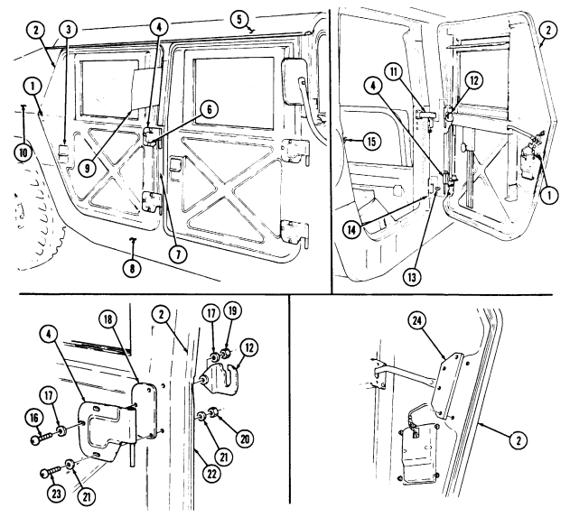

FOLLOW-ON TASK: Install Ballistic Crew Door Latch (para. 11-12.11) (if adjustment needed).

# 11-12.3. Ballistic Crew Door Hinge Replacement

This task covers:
INITIAL SETUP:
Applicable Models M1151 Tools General mechanic's tool kit:
automotive (Appendix B, Item 1)
a. Removal b. Installation

| Personnel Required   |
|----------------------|
| One mechanic         |
| One assistant        |
| Manual References    |

Ballistic crew door removed (para. 11-12.2).

Maintenance Level Unit Materials/Parts Three locknuts (Appendix G, Item 133.3)

- M1151 vehicles have one additional hinge shim on the inner door side of each door hinge mounting hardware.

- On top hinges, note position of doorstop bracket.

a. Removal Remove three locknuts (5), washers (2), screws (1), washers (2), hinge (3), and shim(s) (4) from crew door (6). Discard locknuts (5).

#### B. Installation

Install shim(s) (4) and hinge (3) on crew door (6) with three washers (2), capscrews (1), washers (2), and

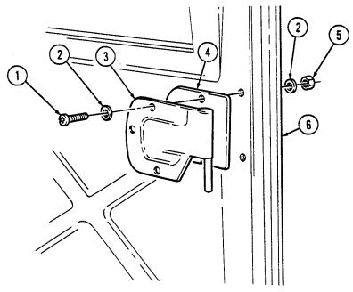 locknuts (5). Tighten locknuts (5) to 6 lb-ft (8 N•m).

FOLLOW-ON TASK: Install ballistic crew door (para. 11-12.2).

# 11-12.4. Ballistic Crew Door Rear Striker Plate Replacement

This task covers:

a. Removal b. Installation

INITIAL SETUP:

| INITIAL SETUP:                         |                                         |
|----------------------------------------|-----------------------------------------|
| Applicable Models                      | Manual References                       |
| M1114                                  | TM 9\-2320\-387\-24P                    |
| Tools                                  | Equipment Condition                     |
| General mechanic's tool kit:           | Door latch cover removed (para. 11\-6). |
| automotive (Appendix B, Item 1)        |                                         |
| Maintenance and repair shop equipment: | Maintenance Level                       |

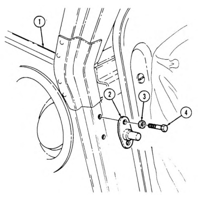

#### A. Removal

Remove two capscrews (4), washers (3), and rear striker plate (2) from body (1). Remove tape from rear striker plate (2) and discard tape.

#### B. Installation

Apply tape to rear striker plate (2) mounting surface. Install rear striker plate (2) on body (1) with two washers (3) and capscrews (4). Tighten capscrews (4) to 8 lb-ft (11 N•m).

# 11-12.5. Ballistic Crew Door Front Striker Plate Maintenance

This task covers:
b. Installation

Applicable Models M1151 Tools General mechanic's tool kit:
automotive (Appendix B, Item 1)
a. Removal c. Adjustment

| Lithium grease (Appendix C, Item 36)    |
|-----------------------------------------|
| Manual References                       |
| TM 9\-2320\-387\-24P                    |
| Equipment Condition                     |
| Door latch cover removed (para. 11\-6). |
| Maintenance Level                       |

#### A. Removal

Remove two locknuts (5), door strap (4), two capscrews (1), and front striker plate (2) from B-pillar (3). Discard locknuts (5). Remove tape from front striker plate (2) and discard tape.

#### B. Installation

Apply tape to front striker plate (2) mounting surface. Install front striker plate (2) on B-pillar (3) with two capscrews (1), door strap (4), and two locknuts (5). Finger tighten locknuts (5).

#### C. Adjustment

1. Close door (6) ensuring latch (7) latches on front striker plate (2).

Front striker plates are slotted for vertical adjustment.

2. Press crew door (6) slightly inward and upward until seal (9) contacts body (8). Tighten locknuts (5)
to 19 lb-ft (26 N•m).

3. Open and close crew door (6) several times to ensure proper latch (7) and front striker plate (2)
alignment. If front striker plate (2) cannot be adjusted to align with latch (7), adjust crew door (6)

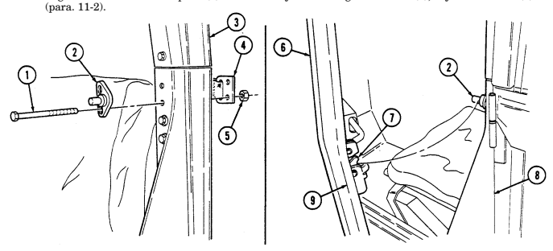

# 11-12.6. Ballistic Crew Door Paddle Lock Replacement

This task covers:
INITIAL SETUP:

a. Removal b. Installation

| Applicable Models                                                      | Manual References                       |
|------------------------------------------------------------------------|-----------------------------------------|
| M1114                                                                  | TM 9\-2320\-387\-24P                    |
| Tools                                                                  | Equipment Condition                     |
| General mechanic's tool kit:                                           | Door latch cover removed (para. 11\-6). |
| automotive (Appendix B, Item 1) Maintenance and repair shop equipment: | Maintenance Level                       |

a. Removal 1. Release clevis clip (3) from hook (4) and remove hook (4) and clevis clip (3) from paddle lock (2). 2. Remove four locknuts (7), washers (6), screws (5), and paddle lock (2) from crew door (1). Discard locknuts (7).

b. Installation 1. Install paddle lock (2) on crew door (1) with four screws (5), washers (6), and locknuts (7). Tighten

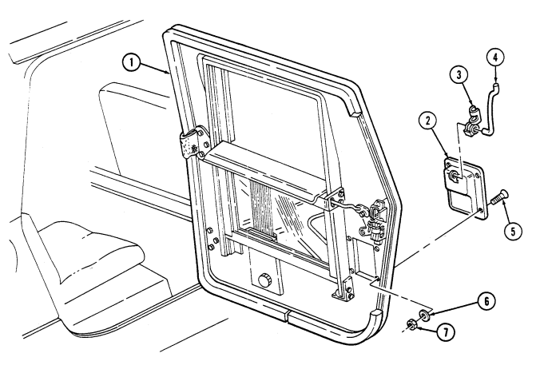

locknuts (7) to 12-17 lb-in. (1-2 N•m).

2. Connect hook (4) to paddle lock (2) with clevis clip (3).

# 11-12.7. Ballistic Crew Door Window Assembly Maintenance

This task covers:

a. Removal c. Assembly b. Disassembly d. Installation

| M1114                                  | TM 9\-2320\-387\-10                  |
|----------------------------------------|--------------------------------------|
|                                        | TM 9\-2320\-387\-24P                 |
| Tools                                  |                                      |
| General mechanic's tool kit:           | Equipment Condition                  |
| automotive (Appendix B, Item 1)        | - Window in raised (closed) position |
| Maintenance and repair shop equipment: | (TM 9\-2320\-387\-10).               |
| automotive (Appendix B, Item 2)        | - Pull strap removed (para. 11\-11). |
| Materials/Parts                        | Maintenance Level                    |

a. Removal Pull out on window latch knob (4) and slide window (5) down and out from door side rails (1) and guide channel (2).

b. Disassembly 1. Remove latch knob (4) from pin (6). 2. Remove retaining ring (9), pin (6), and spring (10) from window latch (3). Discard retaining ring (9). 3. Remove four rollers (8) from guide pins (7). 4. Remove four guide pins (7) from window (5).

c. Assembly 1. Apply sealing compound to threads of guide pins (7) and install guide pins (7) on window (5) frame. 2. Install spring (10) and pin (6) on window latch (3) with retaining ring (9). 3. Apply sealing compound to threads of pin (6) and install latch knob (4) onto pin (6). 4. Install four rollers (8) on guide pins (7).

#### D. Installation

Align window latch (3) with window guide channel (2) and push window (5) up into guide channel (2) and door side rails (1).

# 11-12.7. Ballistic Crew Door Window Assembly Maintenance (Cont'D)

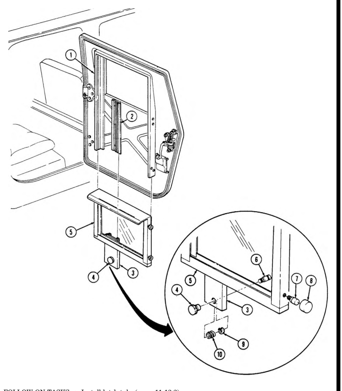

FOLLOW-ON TASKS: - Install latch tube (para. 11-12.2).

-  Install window stops (para. 11-12.9).

# 11-12.8. Ballistic Crew Door Window Protective Shield Replacement

This task covers:
a. Initial Installation c. Installation b. Removal

| M1114 Tools General mechanic's tool kit:   |
|--------------------------------------------|

General mechanic's tool kit:
automotive (Appendix B, Item 1)
Materials/Parts Protective shield (Appendix D, Fig. D-39) Two blind rivets (Appendix G, Item 265) Two blind rivets (Appendix G, Item 262.1)

| TM 9\-2320\-387\-24P   |
|------------------------|
| Equipment Condition    |
| Maintenance Level      |

- The following procedure can be performed to prevent damage to door glass. This task can be accomplished with the approval of the unit commander.

- Procedures for initial installation and replacement of the protective shields are basically the same for all windows. This procedure covers the left front protective shield.

a. Initial Installation

Initial installation steps apply only to vehicles that have not been previously retrofitted with protective shields.

1. Position protective shield (3) on inside of ballistic door (1). 2. Using protective shield (3) as a template, locate and mark three top holes (2) and two bottom holes (5) on inside of ballistic door (1).

Ensure window is closed tightly before drilling holes for the protective shield.

3. Drill three 0.156-in. (0.396-cm) diameter holes (8) through ballistic door frame (9). 4. Drill two 0.193-in. (0.490-cm) diameter holes (6) through ballistic door (1). 5. Install protective shield (3) on ballistic door fame (9) with three screws (4). 6. Install protective shield (3) on ballistic door (1) with two 5/32-in. blind rivets (7). 7. Spot paint ballistic door (1) and protective shield (3) as necessary. Refer to TM 43-0139.

# 11-12.8. Ballistic Crew Door Window Protective Shield Replacement (Cont'D)

b. Removal

For instructions on replacement of rivets, refer to para. 10-56.

1. Remove two rivets (7) from protective shield (3) and ballistic door (1). 2. Remove three screws (4) and protective shield (3) from ballistic door frame (9).

c. Installation 1. Install protective shield (3) on ballistic door frame (9) with three screws (4).

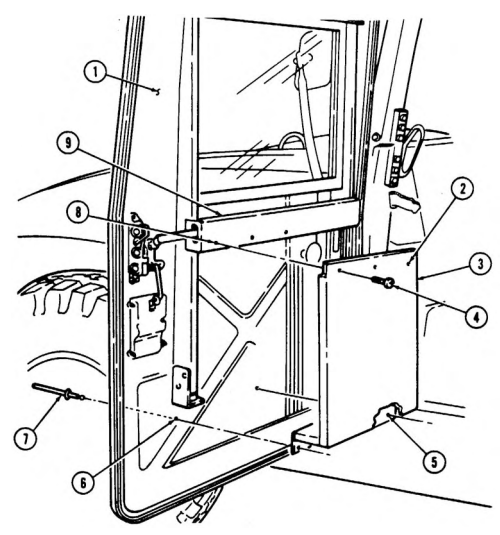 2. Install protective shield (3) on ballistic door (1) with two 5/32-in. blind rivets (7).

# 11-12.9. Ballistic Crew Door Window Stop Replacement

This task covers:

| INITIAL SETUP:  Tools   |
|-------------------------|

INITIAL SETUP:
automotive (Appendix B, Item 1)

a. Removal b. Installation

#### Caution

| Door latch cover removed (para. 11\-6).   |
|-------------------------------------------|

If both window stops are being replaced, ensure ballistic window is locked in the full up position to prevent damage to window.

a. Removal 1. Remove two locknuts (2), screws (5), washers (4), and window stop bracket (6) from side rail (3).

Discard locknuts (2).

2. Remove locknut (7), washer (8), screw (1), and pad (9) from window stop bracket (6). Discard locknut (7).

b. Installation 1. Install pad (9) on window stop bracket (6) with screw (1), washer (8), and locknut (7).

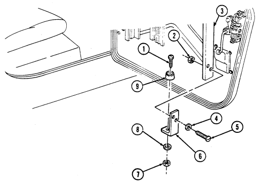 2. Install window stop bracket (6) on side rail (3) with two washers (4), screws (5), and locknuts (2).

# 11-12.10. Ballistic Crew Door Seal Replacement

This task covers:

a. Removal b. Installation

INITIAL SETUP:

| Applicable Models                                                      | Materials/Parts                          |
|------------------------------------------------------------------------|------------------------------------------|
| M1114                                                                  | Sealing compound (Appendix C, Item 72.1) |
| Tools                                                                  | Manual References                        |
| General mechanic's tool kit:                                           | TM 9\-2320\-387\-24P                     |
| automotive (Appendix B, Item 1) Maintenance and repair shop equipment: | Maintenance Level                        |
| automotive (Appendix B, Item 2)                                        | Unit                                     |

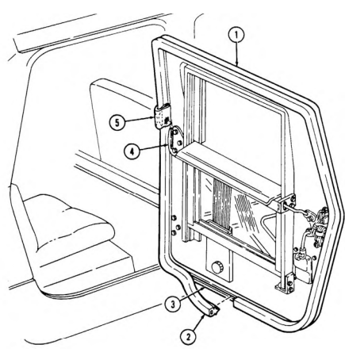

a. Removal 1. Slide door strap (5) off doorstop bracket (4). 2. Start at end of seal (2) and pry seal (2) from seal retainer (3) around crew door (1).

b. Installation 1. Coat seal (2) with liquid detergent. Start at one end of seal (2) and press seal (2) into retainer (3)
around door (1).

2. Slide door strap (5) on door stop bracket (4).

1

# 11-12.11. Ballistic Crew Door Latch Replacement

This task covers:

a. Removal b. Installation

| Applicable Models               | Personnel Required   |
|---------------------------------|----------------------|
| M1151                           | One mechanic         |
| Tools                           | One assistant        |
| General mechanic's tool kit:    | Manual References    |
| automotive (Appendix B, Item 1) | TM 9\-2320\-387\-24P |
| Materials/Parts                 | Maintenance Level    |

| INITIAL SETUP:   |
|------------------|

a. Removal 1. Remove clevis clip (6) and hook (7) from paddle lock (10) and disconnect hook (7) from door latch (14). 2. Disconnect spring (13) from top of latch (14). 3. Remove lockbolt (1), wave washer (2), latch tube (3), and washer (4) from latch arm (5). Discard lockbolt (1).

4. Remove four locknuts (15), washer (8), screws (9), latch (14), and spacer (12) from crew door (11)
Discard locknuts (15).

#### B. Installation

1. Install spacer (12) and latch (14) on crew door (11) with four washers (8), screws (9), and locknuts (15).

Tighten locknuts (15) to 6 lb-ft (8 N•m).

2. Connect spring (13) to top of latch (14). 3. Install washer (4) and latch tube (3) on latch arm (5) with wave washer (2) and lockbolt (1).

Tighten lockbolt (1) to 6 lb-ft (8 N•m).

4. Install hook (7) on latch (14) and connect other end of hook (7) to paddle lock (10) with clevis clip (6).

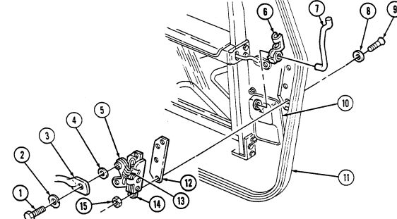

11-24.16 Change 3

# 11-12.12. Ballistic Crew Door Latch Tube Replacement

This task covers:

| Applicable Models   |
|---------------------|
| M1151               |
| Tools               |

INITIAL SETUP:
General mechanic's tool kit:
automotive (Appendix B, Item 1)
Materials/Parts Lockbolt (Appendix G, Item 72.3) Four screws (Appendix G, Item 279.2)
a. Removal b. Installation a. Removal

| Manual References    |
|----------------------|
| TM 9\-2320\-387\-24P |
| Equipment Condition  |

1. Remove lockbolt (9), wave washer (8), latch tube (7), and washer (3) from latch arm (4). Discard lockbolt (9).

2. Remove four screws (6), washers (5), and bracket (1) from side rails (2). Discard screws (6). 3. Remove two screws (12), washers (13), and guide (11) from bracket (1). 4. Slide latch tube (7) out of bracket (1). 5. Remove protector (10) from bracket (1).

#### B. Installation

1. Install protector (10) on bracket (1).

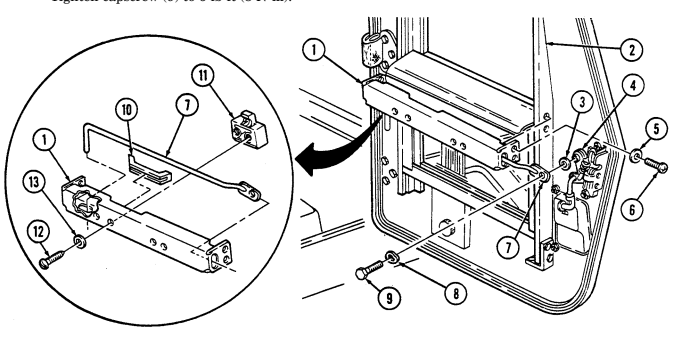 2. Slide latch tube (7) into bracket (1). 3. Install guide (11) on bracket (1) with two washers (13) and screws (12). 4. Install bracket (1) on side rails (2) with four washers (5) and screws (6). 5. Install washer (3) and latch tube (7) on latch arm (4) with wave washer (8) and lockbolt (9).

Tighten capscrew (9) to 6 lb-ft (8 N•m).

# 11-12.13. Ballistic Cargo Shell Door Maintenance

This task covers:

a. Removal c. Adjustment b. Installation

Applicable Models

| Tools   |
|---------|

Tools General mechanic's tool kit:
automotive (Appendix B, Item 1)
Materials/Parts Two locknuts (Appendix G, Item 77) Two assembled washer screws
(Appendix G, Item 277)
Two locknuts (Appendix G, Item 82)
Personnel Required One mechanic One assistant a. Removal Manual References TM 9-2320-387-10 TM 9-2320-387-24P
Equipment Condition Rear end of cargo shell door raised
(TM 9-2320-387-10).

General Safety Instructions Never open one end of cargo shell door before ensuring opposite end is securely closed.

Maintenance Level Unit

#### Warning

Opening one end of cargo door before ensuring opposite end is fully closed will cause both ends to open simultaneously, resulting in injury to personnel or damage to equipment.

1. Remove two assembled washer screws (2) and footman loop (3) from strap (1) and cargo door (4). Discard assembled washer screws (2).

4. Remove two locknuts (12), washers (11), and gas springs (10) from cargo door (4) and lay gas springs (10) inside vehicle. Discard locknuts (12).

5. Lower cargo door (4), release handle latch (13), and remove cargo door (4).

2. Lower cargo door (4) slightly, and remove two locknuts (5), washers (6), shoulder bolts (8), and retention cable (9) from two retention cable brackets (7). Discard locknuts (5).

3. Slowly raise cargo door (4) as far as possible to allow removal of gas springs (10) from cargo door (4).

11-12.13. BALLISTIC CARGO SHELL DOOR MAINTENANCE (Cont'd)

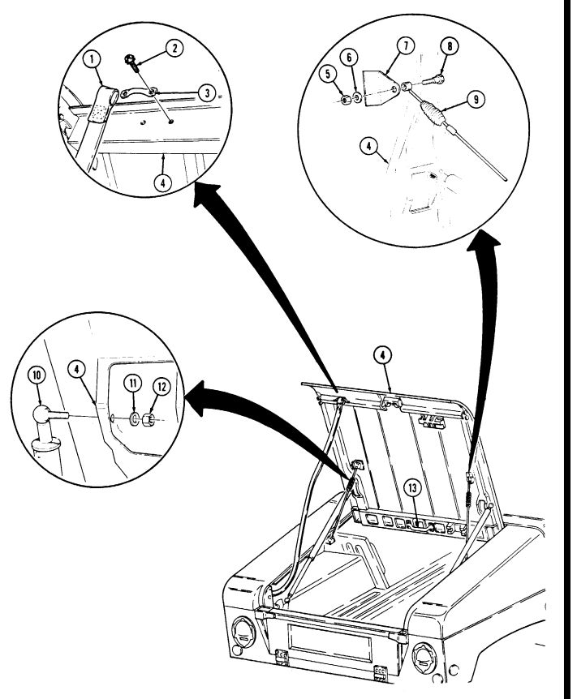

# 11-12.13. Ballistic Cargo Shell Door Maintenance (Cont'D)

b. Installation 1. Install front latches (5) on front striker pins (6).

5. Connect two retention cables (14) to retention cable brackets (12) with two shoulder bolts (13), 
washers (11), and locknuts (10). Tighten locknuts (10) to 85-110 lb-in. (10-12 N•m).

6. Install strap (7) on cargo door (4) with footman loop (9) and two assembled washer screws (8).

To assist closing cargo shell door, a grab loop may be added. Refer to cargo shell door strap replacement (para. 11-22).

7. Close cargo door (4), and ensure cargo door (4) is securely latched on rear striker pins (15).

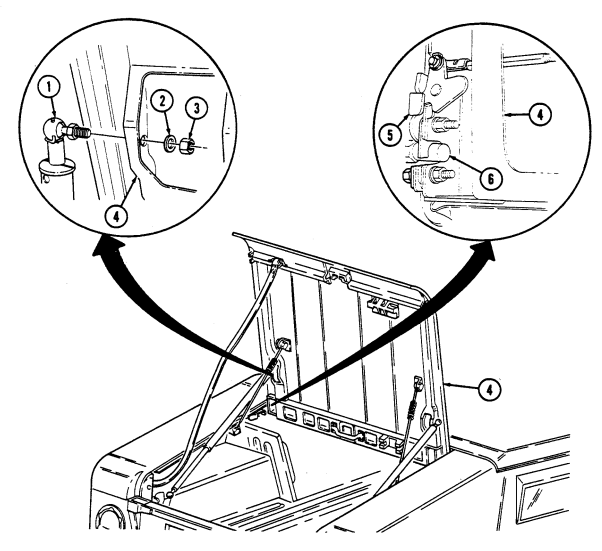

2. Push down on cargo door (4) edge to ensure front striker pins (6) are locked in front latches (5). 3. Slowly raise cargo door (4) as far as possible to allow installation of gas springs (1) on cargo door (4).

4. Connect two gas springs (1) to cargo door (4) with two washers (2) and locknuts (3). Tighten locknuts (3) to 15-20 lb-ft (20-27 N•m).

11-12.13. BALLISTIC CARGO SHELL DOOR MAINTENANCE (Cont'd)

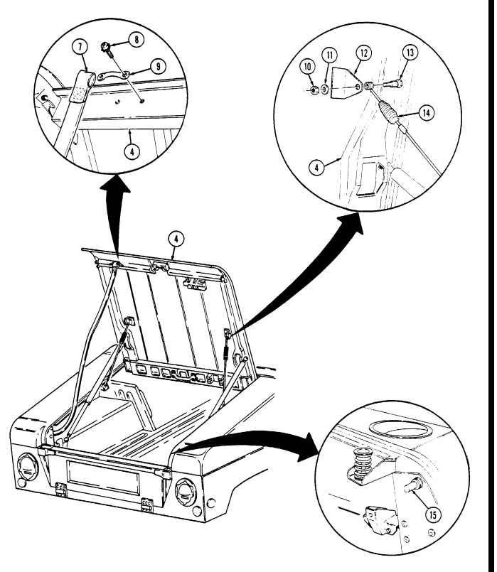

# 11-12.13. Ballistic Cargo Shell Door Maintenance (Cont'D)

c. Adjustment 1. Pull rear wire handle (2) and raise rear end of cargo shell door (1). 2. Perform steps 1 through 4 of a., Removal. 3. Close cargo door (1). 4. Release handle latch (3) and push cargo door (1) open. 5. Loosen two front striker pin mounting nuts (5). 6. Loosen two countersunk screws (11) and nuts (10) to allow movement of male dovetail (9). 7. Close cargo door (1). Ensure front striker pins (7) are secured and centered in front latches (6). 8. Ensure male dovetail (9) is aligned with female dovetail (8).

It may be necessary to shim front striker pins for proper door alignment and operation.

9. Pull down on handle (4) to ensure cargo door (1) properly seals to cargo shell (12). With striker pins (7) properly adjusted, tighten striker pin mounting nuts (5) to 35-45 lb-ft (47-61 N•m).

10. Release handle latch (3) and push cargo door (1) open. 11. Tighten two nuts (10) on male dovetail (9) to 85-110 lb-in. (10-12 N•m). 12. Lower cargo door (1). Ensure front striker pins (7) are secured and centered in front latches (6). 13. Raise cargo door (1) from rear wire handle (2) and perform steps 3 through 6 of b., Installation. 14. Insert a piece of paper between door seals and door opening. With cargo door closed, seals should

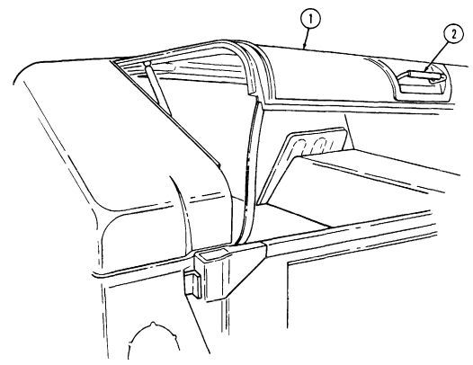

offer resistance when pulling out paper. If door seals do not offer resistance, readjust cargo door.

11-12.13. BALLISTIC CARGO SHELL DOOR MAINTENANCE (Cont'd)

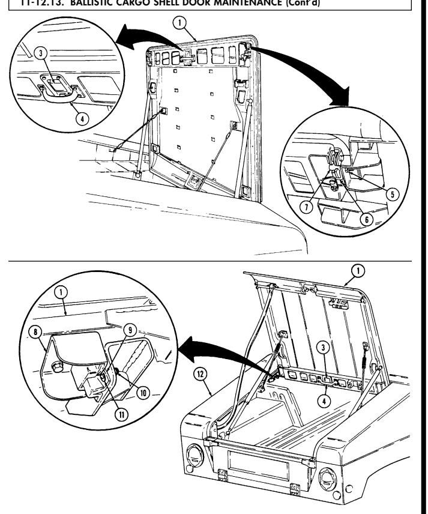

FOLLOW-ON TASK:  Close cargo shell door (TM 9-2320-387-10).

# 11-13. Cargo Shell Door Armor Maintenance

This task covers:
b. Inspection

Applicable Models M1114 Tools General mechanic's tool kit:
automotive (Appendix B, Item 1)
Maintenance and repair shop equipment:
automotive (Appendix B, Item 2)

#### Materials/Parts

Sealing compound (Appendix C, Item 72.1)
a. Removal Remove sixteen screws (1), eight footman loops (2), and cargo shell door armor (3) from cargo shell door (4). 

b. Inspection Refer to para. 10-56 for plusnuts inspection and replacement.

#### C. Installation

Apply sealing compound to screws (1), and install cargo shell door armor (3) and eight footman loops (2) on cargo shell door (4) with sixteen screws (1). Tighten screws (1) to 29-35 lb-in. (3-4 N•m).

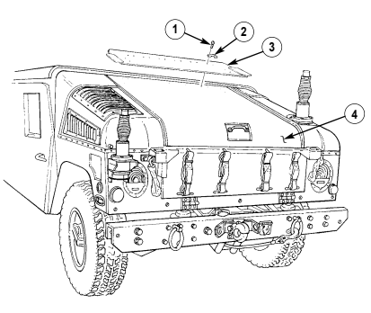

a. Removal c. Installation Manual References TM 9-2320-387-24P
Maintenance Level Unit

# 11-14. Cargo Shell Door Maintenance

This task covers:
a.1. Inspection d. Seal Cleaning b. Installation

Applicable Models M1114 Tools General mechanic's tool kit:
automotive (Appendix B, Item 1)
Maintenance and repair shop equipment:
automotive (Appendix B, Item 2)

#### Materials/Parts

Four locknuts (Appendix G, Item 82) Two screw-assembled lockwashers
(Appendix G, Item 277)
Sealing compound (Appendix C, Item 72.1) Cleaning compound (Appendix C, Item 20.1) Sealing compound (Appendix C, Item 59) Cotton rag (Appendix C, Item 55) Drycleaning solvent (Appendix C, Item 26) Detergent (Appendix C, Item 25)
Personnel Required One mechanic One assistant a. Removal a. Removal c. Adjustment Manual References TM 9-2320-387-10 TM 9-2320-387-24P

#### Equipment Condition

- Cargo shell door armor removed 
(para. 11-13).

- Cargo shell door raised (TM 9-2320-387-10).

#### General Safety Instructions

- Never open one end of cargo shell door before ensuring opposite end is securely closed.

- Cargo door must be supported before removal of gas springs.

- Drycleaning solvent is flammable and will not be used near an open flame. A fire extinguisher will be kept nearby when the solvent is used. Use only in well-ventilated places. Failure to do this may result in injury to personnel and /or damage to equipment.

#### Maintenance Level

Unit

#### Warning

Opening one end of cargo door before ensuring opposite end is fully closed may cause both ends to open simultaneously, resulting in injury to personnel or damage to equipment.

1. Remove two screw-assembled lockwashers (4), footman loop (5), and strap (3) from cargo door (1).

Discard screw-assembled lockwashers (4).

2. Remove two capscrews (15), footman loop (16), and strap (14) from cargo door (1). 3. Lower cargo door (1) slightly, and remove two locknuts (9), shoulder bolts (6), and retention cables (10) from retention cable brackets (8). Discard locknuts (9).

#### Warning

Cargo door must be supported before removal of gas springs. Failure to do so may result in injury to personnel or damage to equipment.

4. Slowly raise cargo door (1) as far as possible to allow removal of gas springs (11) from cargo door (1). 5. Remove two locknuts (13), washers (12), and gas springs (11) from cargo door (1) and place gas springs (11) inside vehicle. Discard locknuts (13).

6. Lower cargo door (1), release front handle latch (2), and remove cargo door (1) from vehicle. a.1. Inspection Refer to para. 10-56 for plusnuts (17) inspection and replacement.

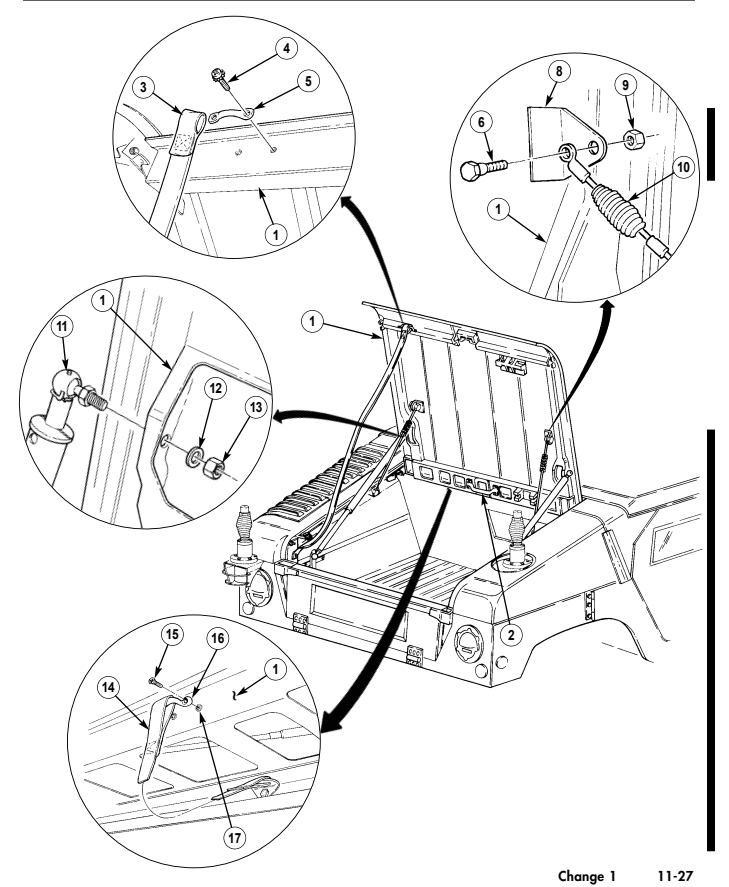

# 11-14. Cargo Shell Door Maintenance (Cont'D) 11-14. Cargo Shell Door Maintenance (Cont'D)

b. Installation 1. Install front latches (5) on front striker pins (6). 2. Push down on cargo door (1) edge to ensure front striker pins (6) are locked in front latches (5).

#### Warning

Cargo door must be supported before installation of gas springs. Failure to do so may result in injury to personnel or damage to equipment.

3. Slowly raise cargo door (1) as far as possible to allow installation of gas springs (2) on cargo door (1).

4. Install two gas springs (2) on cargo door (1) with two washers (3) and locknuts (4). Tighten locknuts (3) to 15-20 lb-ft (20-27 N•m).

5. Connect two retention cables (13) to retention cable brackets (11) with two shoulder bolts (10) and locknuts (12). Tighten locknuts (12) to 85-110 lb-in. (10-12 N•m).

6. Install strap (7) on cargo door (1) with footman loop (9) and two screw-assembled lockwashers (8).

Tighten screw-assembled lockwashers (8) to 21 lb-in. (2 N•m).

7. Apply sealing compound to threads of two screws (17), and install strap (16) on cargo door (1) with footman loop (18) and screws (17).

To assist closing of cargo shell door, a grab loop may be added. Refer to cargo shell door strap replacement (para. 11-23).

8. Close cargo door (1), and ensure cargo door (1) is securely latched on two rear striker pins (14).

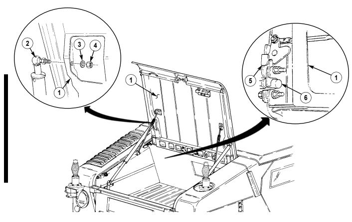

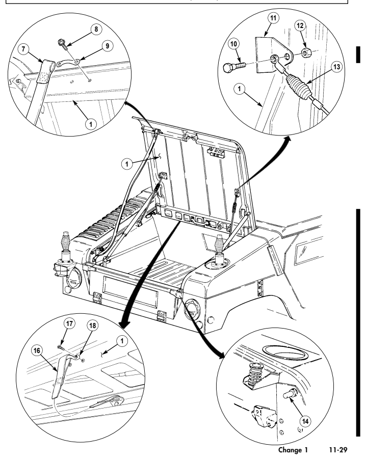

# 11-14. Cargo Shell Door Maintenance (Cont'D) 11-14. Cargo Shell Door Maintenance (Cont'D)

c. Adjustment 1. Raise rear end of cargo shell door (1.1) (TM 9-2320-387-10). 2. Perform task a., steps 1 and 5. 3. Close cargo door (1.1). 4. Release front handle latch (2) and push cargo door (1.1) open. 5. Loosen two front striker pin mounting nuts (4). 6. Loosen two countersunk screws (11) and nuts (10) to allow movement of male dovetail (9). 7. Close cargo door (1.1). Ensure front striker pins (6) are secured and centered in front latches (5). 8. Ensure male dovetail (9) is aligned with female dovetail (8).

It may be necessary to shim front striker pins for proper door alignment and operation.

9. Pull down on handle (3) to ensure cargo door (1.1) properly seals to cargo shell (7). With striker pins (6) properly adjusted, tighten striker pin mounting nuts (4) to 35-45 lb-ft (47-61 N•m).

10. Release handle latch (2) and push cargo door (1.1) open. 11. Tighten two nuts (10) on male dovetail (9) to 85-110 lb-in. (10-12 N•m). 12. Lower cargo door (1.1). Ensure front striker pins (6) are secured and centered in front latches (5). 13. Raise cargo door (1.1) with handle (3) and perform task b., steps 3, 4, and 6. 14. Insert a piece of paper between door seals and door opening. With cargo door (1.1) closed, resistance should be felt when pulling out paper. If not, readjust cargo door (1.1).

#### D. Seal Cleaning

1. Remove seal (1).

#### Warning

Drycleaning solvent is flammable and will not be used near an open flame. A fire extinguisher will be kept nearby when the solvent is used. Use only in well-ventilated places. Failure to do this may result in injury to personnel and /or damage to equipment.

2. Use clean cotton rags and drycleaning solvent to clean edge of cargo door (1.1). 3. Use detergent and water to clean rubber seal (1). Let seal (1) dry. 4. Apply sealing compound in seal channel along entire length of seal (1). 5. Press seal (1) back in place. 6. Close cargo door (1.1) and let compound dry. 7. Perform paper test, found in task c, step 14. If seal (1) fails test again, replace seal (1).

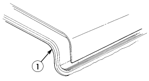

11-14.  CARGO SHELL DOOR MAINTENANCE (Cont'd)

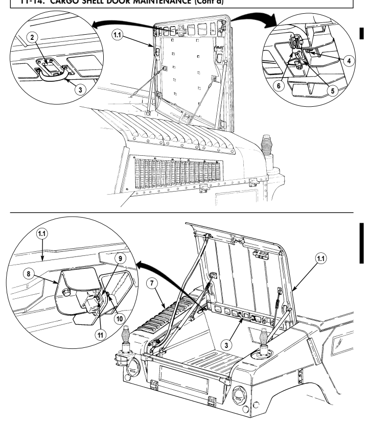

FOLLOW-ON TASK:   Install cargo shell door armor (para. 11-13).

# 11-15. Cargo Shell Door Wire Handle Lock Replacement

This task covers:
INITIAL SETUP:
Applicable Models M1114, M1151, M1151A1, M1167 Tools General mechanic's tool kit:
automotive (Appendix B, Item 1)
Materials/Parts Two pushnuts (Appendix G, Item 250) Sealing compound (Appendix C, Item 70)

a. Removal b. Installation

Manual References TM 9-2320-387-10 TM 9-2320-387-24P
Equipment Condition Tailgate lowered (TM 9-2320-387-10).

Maintenance Level

| THET COLLECT Unit   |
|---------------------|

#### A. Removal

1. Remove two pushnuts (1), rod end clips (2), and latch rods (3) from wire handle lock pivot arms (4). Discard pushnuts (1).

2. Remove four nuts (5), washers (6), capscrews (8), washers (6), and wire handle lock (9) from cargo door (7).

#### B. Installation

1. Apply sealing compound to threads of four capscrews (8). 2. Install wire handle lock (9) on cargo door (7) with four washers (6), capscrews (8), washers (6), and nuts (5).

3. Install two latch rods (3) on wire handle lock pivot arms (4) with rod end clips (2) and pushnuts (1).

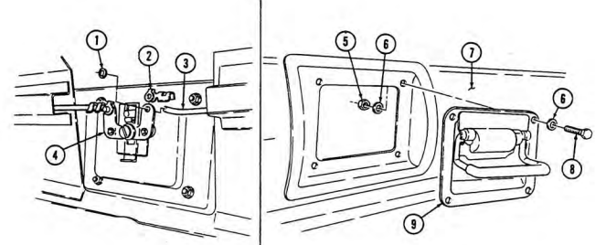

FOLLOW-ON TASKS: - Raise and secure tailgate (TM 9-2320-387-10).

- Check cargo shell door for proper operation (TM 9-2320-387-10).

# 11-16. Cargo Shell Door Grab Handle Replacement

This task covers:
INITIAL SETUP:
Applicable Models M1114, M1151, M1151A1, M1167 Tools General mechanic's tool kit:
automotive (Appendix B, Item 1)
Materials/Parts Four lockwashers (Appendix G, Item 143) Sealing compound (Appendix C, Item 64)

#### A. Removal B. Installation

Manual References

| ATAHUAT TACICI CILCCS   |
|-------------------------|
| TM 9\-2320\-387\-24P    |

Equipment Condition

| Maintenance Level   | Unit   |
|---------------------|--------|

Forward end of cargo shell door raised

#### A. Removal

Remove four nuts (1), lockwashers (2), washers (3), countersunk screws (6), and grab handle (5) from cargo door (4). Discard lockwashers (2).

b. Installation 1. Apply sealing compound to threads of four countersunk screws (6). 2. Install grab handle (5) on cargo door (4) with four countersunk screws (6), washers (3),
lockwashers (2), and nuts (1).

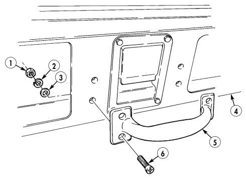

FOLLOW-ON TASK: Lower cargo shell door (para. 11-90).

# 11-17. Cargo Shell Door Handle Latch Replacement

This task covers:
INITIAL SETUP:

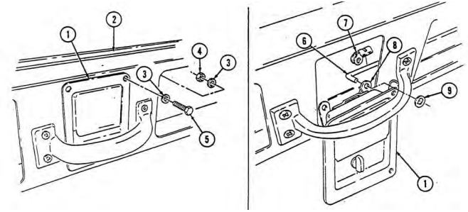

Applicable Models M1114, M1151, M1151A1, M1167 General mechanic's tool kit:
automotive (Appendix B, Item 1)
Two pushnuts (Appendix G, Item 250)
a. Removal

a. Removal b. Installation

1. Remove four nuts (4), washers (3), capscrews (5), and washers (3) from handle latch (1) and cargo door (2).

2. Pull handle latch (1) out and down until two latch rods (6) are visible.

| Manual References                       |
|-----------------------------------------|
| TM 9\-2320\-387\-24P                    |
| Equipment Condition                     |
| •Window stops removed (para. 11\-12.9). |
| •Latch tube removed (para. 11\-12.12).  |
| Maintenance Level                       |

3. Remove two pushnuts (9), rod end clips (7), and latch rods (6) from handle latch pivot arms (8) and remove handle latch (1). Discard pushnuts (9).

b. Installation 1. Position handle latch (1) to cargo door (2) until two latch rods (6) can be connected to handle latch pivot arms (8) and install two latch rods (6) on pivot arms (8) with rod end clips (7) and pushnuts (9).

2. Install handle latch (1) on cargo door (2) with four washers (3), capscrews (5), washers (3), and nuts (4).

FOLLOW-ON TASK: Lower cargo shell door (para. 11-90).

# 11-18. Cargo Shell Door Latch Maintenance

This task covers:
a. Removal c. Adjustment b. Installation

Applicable Models M1114, M1151, M1151A1, M1167 Tools General mechanic's tool kit:
automotive (Appendix B, Item 1)
Maintenance and repair shop equipment:
automotive (Appendix B, Item 2)
Materials/Parts Three lockwashers (Appendix G, Item 145) Pushnut (Appendix G, Item 250)
Manual References TM 9-2320-387-10 TM 9-2320-387-24P
Equipment Condition Rear end of cargo shell door raised (TM 9-2320-387-10).

Maintenance Level Unit a. Removal 1. Remove pushnut (6), rod end clip (7), and rod (8) from door latch (4). Discard pushnut (6). 2. Remove three nuts (1), lockwashers (2), capscrews (5), and door latch (4) from cargo door (3).

Discard lockwashers (2).

b. Installation Install door latch (4) on cargo door (3) with three capscrews (5), lockwashers (2), and nuts (1). Fingertighten nuts (1).

c. Adjustment 1. Loosen three nuts (1) on door latch (4) and cargo door (3). 2. Close cargo door (3), ensuring latches (4) are fully engaged on door striker pins (9). 3. Tighten three nuts (1) to 17 lb-ft (23 N•m). 4. Open cargo door and install rod (8) on latch (4) with rod end clip (7) and pushnut (6).

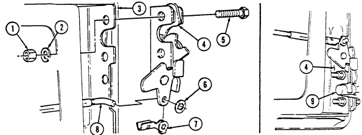

FOLLOW-ON TASKS: - Lubricate door latch (TM 9-2320-387-10).

- Check cargo shell door for proper operation (TM 9-2320-387-10).

# 11-19. Cargo Shell Door Latch Rod Maintenance

This task covers:
b. Installation

Applicable Models M1114, M1151, M1151A1, M1167 Tools General mechanic's tool kit:
automotive (Appendix B, Item 1)
Materials/Parts Two pushnuts (Appendix G, Item 250)
a. Removal **c. Adjustment**

| Maintenance Level   |
|---------------------|
| Unit                |

| TM 43\-0139   |
|---------------|

Maintenance Level Unit

Maintenance procedures for all cargo shell door latch rods are basically the same. This procedure covers the left rear latch rod.

a. Removal 1. Remove pushnut (1), rod end clip (3), and latch rod (4) from pivot arm (2) on wire handle lock (5). Discard pushnut (1).

2. Remove pushnut (7), rod end clip (6), and latch rod (4) from door latch (8). Discard pushnut (7).

b. Installation 1. Connect latch rod (4) to door latch (8) with rod end clip (6). 2. Connect latch rod (4) to pivot arm (2) on wire handle lock (5) with rod end clip (3) and pushnut (1). 3. Close forward end of cargo door.

c. Adjustment 1. Open rear end of cargo door. 2. Close both rear door latches (8) to check latch action. 3. Gently pull wire handle lock (5) and observe movement of door latches (8). If both door latches (8)
unlatch at the same time, install pushnut (7) on latch rod (4); no adjustment is necessary. If door latches (8) do not unlatch at the same time, go to step 4.

4. Remove rod end clip (6) from rod (4) and door latch (8). Rotate rod adjuster (9) clockwise if door latch (8) unlatches after opposite latch (8), or rotate rod adjuster (9) counterclockwise if door latch (8) unlatches before opposite door latch (8).

5. Repeat step 4 until both door latches (8) unlatch at the same time. 6. Install latch rod (4) on door latch (8) with rod end clip (6) and pushnut (7).

# 11-19. Cargo Shell Door Latch Rod Maintenance (Cont'D)

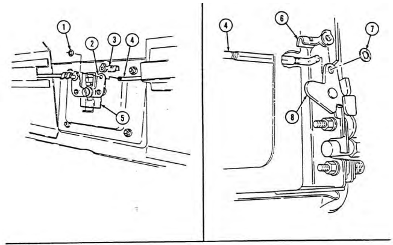

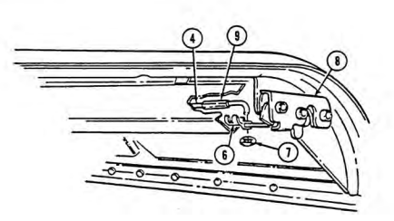

FOLLOW-ON TASK:   Lower cargo shell door (para. 11-90).

# 11-20. Cargo Shell Door Dovetail Assembly Maintenance

This task covers:
b. Installation

Applicable Models M1114, M1151, M1151A1, M1167 Tools General mechanic's tool kit:
automotive (Appendix B, Item 1)
Maintenance and repair shop equipment:
automotive (Appendix B, Item 2)
Materials/Parts Two locknuts (Appendix G, Item 127) Two lockwashers (Appendix G, Item 172)
a. Removal c. Adjustment Manual References TM 9-2320-387-10 TM 9-2320-387-24P
Equipment Condition Rear end of cargo shell door raised (TM 9-2320-387-10).

Maintenance Level Unit

The cargo shell door dovetail assembly is of two-piece construction. The female half is mounted on the cargo door. The male half is mounted on a bracket attached to the left cargo shell. Both halves are adjustable and function as door alignment devices.

a. Removal 1. Remove two capscrews (1), lockwashers (2), washers (3), and female dovetail (4) from cargo door (5).

Discard lockwashers (2).

2. Remove two locknuts (6), washers (7), countersunk screws (11), male dovetail (10), and shim (9)
from cargo shell bracket (8). Discard locknuts (6).

b. Installation 1. Install shim (9) and male dovetail (10) on cargo shell bracket (8) with two countersunk screws (11),
washers (7), and locknuts (6). Leave male dovetail (10) loose enough to allow movement from left to right.

2. Install female dovetail (4) on cargo door (5) with two washers (3), lockwashers (2), and capscrews (1).

Leave dovetail (4) loose enough to allow up and down movement.

3. Close rear end of cargo door (5).

#### C. Adjustment

1. Open forward end of cargo door (5).

Perform steps 2 and 3 if dovetails were not removed.

2. Loosen two capscrews (1) from female dovetail (4) and cargo door (5) until female dovetail (4) will slide up and down.

3. Loosen two countersunk screws (11) and locknuts (6) from male dovetail (10) and cargo shell bracket (8) until male dovetail (10) can be moved from left to right.

4. Gently close cargo door (5) until male dovetail (10) and female dovetail (4) fully seat without interference. Once this condition exists, tighten mounting hardware of dovetails (4) and (10).

5. Open and close cargo door (5) several times to ensure dovetails (4) and (10) are properly adjusted. 6. Tighten two capscrews (1) on female dovetail (4) to 10 lb-ft (14 N•m). 7. Tighten two locknuts (6) on male dovetail (10) to 85-100 lb-in. (10-11 N•m).

# 11-20. Cargo Shell Door Dovetail Assembly Maintenance (Cont'D)

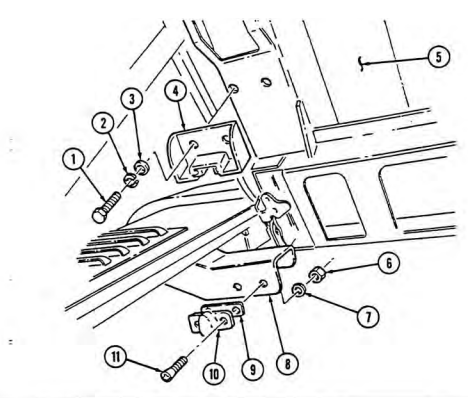

.

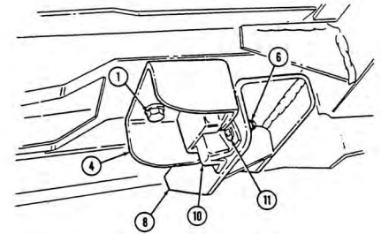

FOLLOW-ON TASK:   Close cargo shell door (TM 9-2320-387-10).

# 11-21. Cargo Shell Door Retention Cable Maintenance

This task covers:
b. Inspection

Applicable Models M1114, M1151, M1151A1, M1167 Tools General mechanic's tool kit:
automotive (Appendix B, Item 1)
Maintenance and repair shop equipment:
automotive (Appendix B, Item 2)
Materials/Parts Sealing compound (Appendix C, Item 72.1) Two locknuts (Appendix G, Item 77)
a. Removal c. Installation Manual References TM 9-2320-387-24P
Equipment Condition Forward end of cargo shell door raised 
(para. 11-90).

| Maintenance Level   |
|---------------------|

Unit a. Removal

It will be necessary to lower cargo shell door slightly to relieve cable tension during step 1.

1. Remove locknut (3), shoulder bolt (1), and spring end of cable (4) from cargo door bracket (2).

Discard locknut (3).

Perform step 2 for right side cable and step 3 for left side cable.

2. Remove locknut (7), washer (8), two washers (5), cable (4), and shoulder bolt (9) from cargo door bracket (6). Discard locknut (7).

3. Remove shoulder bolt (9) and cable (4) from cargo shell bracket (6).

b. Inspection Refer to para. 10-56 for plusnut inspection and replacement.

c. Installation

Perform step 1 for left side cable and step 2 for right side cable.

1. Apply sealing compound to threads of shoulder bolt (9), and install cable (4) on cargo shell bracket (6) with shoulder bolt (9).

2. Install cable (4) on cargo shell bracket (6) with shoulder bolt (9), two washers (5), washer (8), and locknut (7). Tighten locknut (7) to 85–110 lb-in. (10–12 N•m).

3. Install spring end of cable (4) on cargo door bracket (2) with shoulder bolt (1) and locknut (3).

Tighten locknut (3) to 85–110 lb-in. (10–12 N•m).

# 11-21. Cargo Shell Door Retention Cable Maintenance (Cont'D)

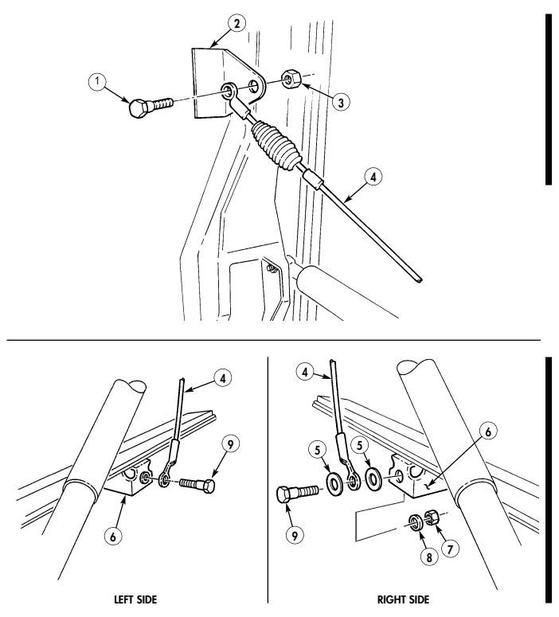

FOLLOW-ON TASK:   Lower cargo shell door (para. 11-90).

Change 6

# 11-22. Cargo Shell Door Gas Spring Maintenance

This task covers:

Applicable Models M1114, M1151, M1151A1, M1167 Tools General mechanic's tool kit:
automotive (Appendix B, Item 1)

#### Materials/Parts

Two locknuts (Appendix G, Item 82) Two retaining rings (Appendix G, Item 254) Two screw-assembled lockwashers
(Appendix G, Item 277)
Two locknuts (Appendix G, Item 77) Grease (Appendix C, Item 34) Personnel Required One mechanic One assistant

a. Rotating c.1. Inspection b. Removal d. Assembly c. Disassembly e. Installation

#### Manual References

TM 9-2320-387-10 TM 9-2320-387-24P Equipment Condition Rear end of cargo shell door raised
(TM 9-2320-387-10).

#### General Safety Instructions

•Do not attempt to remove gas cylinders from spring rods.

•An assistant will be required to hold the cargo door open when either one or both gas springs are being removed or installed.

#### Maintenance Level

Unit

#### A. Removal Note

- Prior to starting any maintenance, ensure forward end of cargo shell door is locked.

- A 2x4x79.25 in. board can used to support cargo door in the open position.

1. Remove cargo shell door strap (para. 11-21). 2. Remove cargo shell door retention cable (para. 11-21). 3. Secure rear cargo door (1) in full open position.

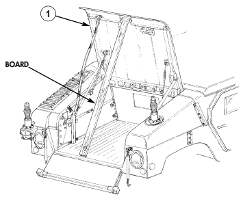

# 11-22. Cargo Shell Door Gas Spring Maintenance (Cont'D)

4. Remove four retaining rings (1) from rod sockets (2) on two gas spring assemblies (5).

#### Warning

Do not attempt to remove gas spring assemblies from ball studs until cargo door is supported in full open position. Failure to do so may result in injury to personnel or damage to equipment.

5. Remove left and right gas spring assemblies (5) from ball studs (3) on cargo door (4) and body bracket (6).

6. Invert left gas spring assembly (5) 180° and position to right side of vehicle. 7. Invert right gas spring assembly (5) 180° and position to left side of vehicle. 8. Install left and right gas spring assemblies (5) over ball studs (3) on cargo door (4) and body brackets (6).

9. Install four retaining rings (1) in rod sockets (2) on two gas springs (5).

10. Remove cargo door support. 11. Install cargo shell retension cable (para. 11-21). 12. Install cargo shell door strap (para. 11-21).

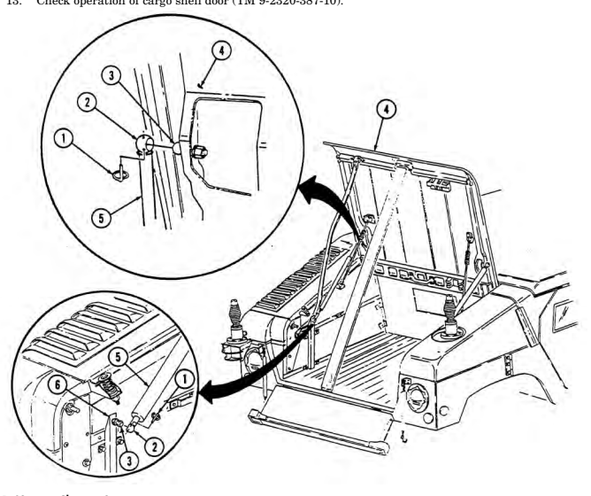 13. Check operation of cargo shell door (TM 9-2320-387-10).

# 11-22. Cargo Shell Door Gas Spring Maintenance (Cont'D)

#### Warning

An assistant will be required to hold the cargo door open when either one or both gas springs are being removed or installed. Failure to do so may result in injury to personnel or damage to equipment.

#### B. Removal

1. Remove two locknuts (10), shoulder bolts (7), and retention cables (11) from cargo door bracket (9). Discard locknuts (10).

2. Remove two screw-assembled lockwashers (12), footman loop (13), and cargo door strap (14) from cargo door (9). Discard screw-assembled lockwashers (12).

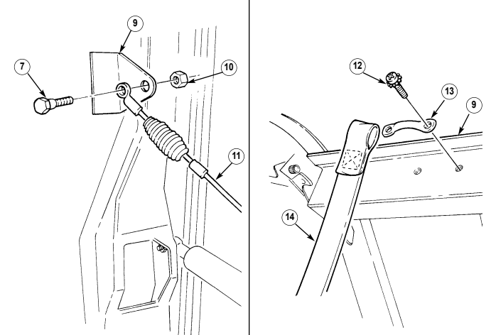

## 11-22. Cargo Shell Door Gas Spring Maintenance (Cont'D)

3. Remove two locknuts (1), washers (2), and gas spring assembly (4) from cargo door (3) and body bracket (5). Discard locknuts (1).

c. Disassembly 1. Remove inner spring tube (6) from outer spring tube (13). 2. Remove two retaining rings (8) from ball studs (11) and rod sockets (12). Remove two ball studs (11) from rod sockets (12). Discard retaining rings (8).

3. Remove two clamps (10) from bushings (9) and spring rods (7) and (14). Pull spring rods (7) 
and (14) approximately 1 in. (2.54 cm) out of tubes (6) and (13) and remove two bushings (9).

#### Warning

Do not attempt to remove gas cylinders from inner spring rod or outer spring rod. High internal pressure will cause cylinder to explode and may result in injury to personnel.

4. Pull inner spring rod (7) from inner tube (6) and outer spring rod (14) from outer tube (13).

c.1. Inspection Refer to para. 10-56 for plusnut inspection and replacement.

d. Assembly 1. Install longer outer spring rod (14) on outer tube (13), leaving approximately 1 in. (2.54 cm) of the small diameter portion of rod (14) exposed for installation of bushing (9).

2. Install bushing (9) on outer spring rod (14), ensuring bushing (9) is fully seated on outer tube (13) and rod socket (12) end is fully seated on bushing (9). Install clamp (10) and tighten.

3. Apply grease to rod end socket (12), and install ball stud (11) on socket (12) with retaining ring (8). 4. Repeat steps 1 through 3 for inner tube (6) and inner spring rod (7). 5. Install inner tube (6) into outer tube (13).

#### E. Installation

1. Install gas spring assembly (4) on body bracket (5) and cargo door (3) with two washers (2) and locknuts (1). Tighten locknuts (1) to 85-110 lb-ft (10-12 N•m).

2. Install footman loop (16) and cargo door strap (17) on cargo door (3) with two screw-assembled lockwashers (15). Tighten screw-assembled lockwashers (15) to 21 lb-in. (2 N•m).

3. Install two retention cables (21) on cargo door bracket (19) with two shoulder bolts (18) and locknuts (20). Tighten locknuts (20) to 85-110 lb-in. (10-12 N•m).

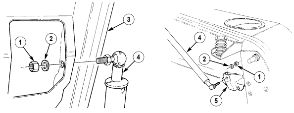

11-22. CARGO SHELL DOOR GAS SPRING MAINTENANCE (Cont'd)

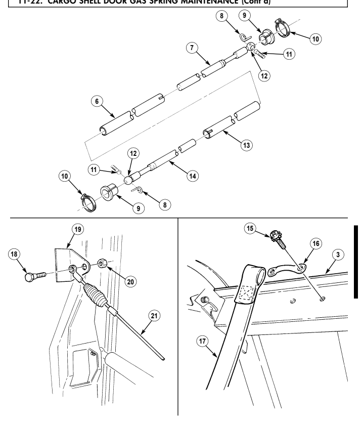

FOLLOW-ON TASK:

Check cargo shell door for proper operation (TM 9-2320-387-10).

# 11-23. Cargo Shell Door Strap Maintenance

This task covers:
a. Removal b. Installation a.1 Inspection

Applicable Models M1114, M1151, M1151A1, M1167 Tools General mechanic's tool kit:
automotive (Appendix B, Item 1)
Maintenance and repair shop equipment:
automotive (Appendix B, Item 2)
Materials/Parts Two screw-assembled lockwashers
(Appendix G, Item 277)
Sealing compound (Appendix C, Item 72.1)
Manual References TM 9-2320-387-10 TM 9-2320-387-24P
Equipment Condition Rear end of cargo shell door raised (TM 9-2320-387-10).

Maintenance Level Unit a. Removal 1. Remove two screw-assembled lockwashers (3), footman loop (2), and strap (1) from cargo door (4).

Discard screw-assembled lockwashers (3).

2. Remove capscrew (6), washer (5), and strap (1) from left gas spring mounting bracket (7).

a.1. Inspection Refer to para. 10-56 for plusnut inspection and replacement.

b. Installation

To assist closing cargo shell door, a grab loop may be added. Refer to appendix D, fig. D-42.

1. Apply sealing compound to threads of capscrew (6), and install strap (1) on left gas spring mounting bracket (7) with washer (5) and capscrew (6). Tighten capscrew (6) to 75 lb-in. (8 N•m).

2. Install strap (1) and footman loop (2) on cargo door (4) with two screw-assembled lockwashers (3).

Tighten screw-assembled lockwashers (3) to 21 lb-in. (2 N•m).

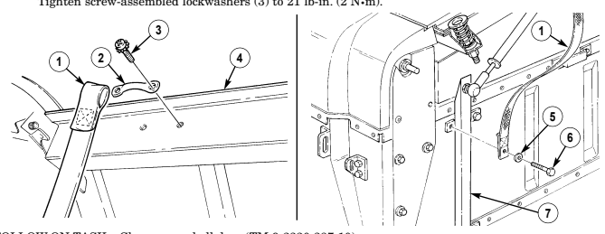

FOLLOW-ON TASK: Close cargo shell door (TM 9-2320-387-10).

# 11-24. Cargo Shell Door Seal Replacement

This task covers:

#### A. Removal B. Installation Initial Setup:

Applicable Models M1114, M1151, M1151A1, M1167 Tools General mechanic's tool kit:
automotive (Appendix B, Item 1)
Materials/Parts Sealing compound (Appendix C, Item 59)
Manual References TM 9-2320-387-10 TM 9-2320-387-24P
Equipment Condition
- Cargo shell door armor removed (M1114 only) (para. 11-13).

- Rear end of cargo shell door raised
(TM 9-2320-387-10).

Maintenance Level Unit a. Removal Remove seal (1) from cargo door (2). Clean edge around cargo door (2) to remove dirt, corrosion, or remaining adhesive.

#### B. Installation

1. Install seal (1) on cargo door (2), ensuring seal (1) is fully seated. 2. Detach seal (1) at rear edge of cargo door (2) only, and apply sealing compound in seal (1) channel the entire length of rear edge of cargo door (2).

3. Install seal (1) on rear edge of cargo door (2), ensuring seal (1) is fully seated.

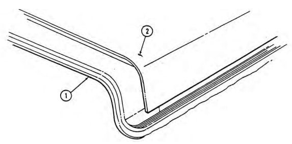

FOLLOW-ON TASKS: - Install cargo door armor (M1114 only) (para. 11-13).

- Close and secure shell door (TM 9-2320-387-10).

# 11-24.1. Cargo Shell Door Seal Protector Replacement

This task covers:

| a.                              | Removal   | b.  Installation                       |
|---------------------------------|-----------|----------------------------------------|
| INITIAL SETUP:                  |           |                                        |
| Applicable Models               |           | Materials/Parts                        |
| M1151                           |           | Lockbolt (Appendix G, Item 72.3)       |
| Tools                           |           | Four locknuts (Appendix G, Item 133.3) |
| General mechanic's tool kit:    |           | Manual References                      |
| automotive (Appendix B, Item 1) |           | TM 9\-2320\-387\-24P                   |
|                                 |           | Maintenance Level                      |
|                                 |           | Unit                                   |

#### A. Removal

Remove thirteen locknuts (4), washers (5), capscrews (2), washers (5), and seal protector (1) from cargo door (3). Discard locknuts (4). b. Installation Install seal protector (1) on cargo door (3) with thirteen washers (5), capscrews (2), washers (5), and

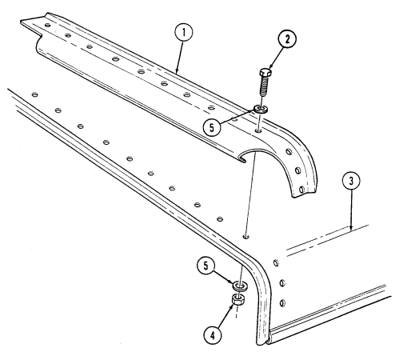 locknuts (4). Tighten locknuts (4) to 85-100 lb-in. (10-12 N•m).

FOLLOW-ON TASK: Close cargo shell door (TM 9-2320-387-10).

11-46.2/(11-46.3 blank) Change 5

# 11-24.2. Cargo Shell Door Support Maintenance

This task covers:

Applicable Models M1114, M1151, M1151A1, M1167 Materials/Parts Four lockwashers (Appendix G, Item 150) Two lockwashers (Appendix G, Item 144) Two locknuts (Appendix G, Item 133) Ten inserts (Appendix G, Item 1)
Tools General mechanics tool kit:
automotive (Appendix B, Item 1)
Torque wrench 3/8-in. drive, 75 lb-ft 
(Appendix B, Item 2.1)
a. Removal c. Installation b. Inspection d. Adjustment Manual References TM 9-2320-387-24P
Equipment Condition Cargo shell door raised and secured,
(TM 9-2320-387-10).

Maintenance Level Unit

#### A. Removal

b. Inspection Refer to para. 10-56 for nut inserts (5), (9), and (19) inspection and replacement. c. Installation 1. Remove end of support (1) from stop plate (18). 2. Remove two capscrews (16), lockwashers (17), inserts (19), and stop plate (18) from cargo shell (15).

Discard lockwashers (17) and inserts (19).

3. Remove locknut (13), capscrew (14), and rod end (11) from bracket (10). Discard locknut (13). 4. Remove locknut (12) and support (1) from rod end (11). Discard locknut (12). 5. Remove two capscrews (7), lockwashers (8), inserts (9), and bracket (10) from cargo shell door (6).

Discard lockwashers (8) and inserts (9).

6. Remove two capscrews (2), lockwashers (3), inserts (5), and clip (4) from cargo shell door (6). Discard lockwashers (3) and inserts (5).

Adjust support as necessary. Turn clockwise to shorten and counterclockwise to lengthen. Tighten nut (12).

1. Install clip (4) and two inserts (5) on cargo shell door (6) with two capscrews (2) and lockwashers (3). 2. Install two inserts (9) and bracket (10) on cargo shell door (6) with two capscrews (7) and lockwashers (8).

3. Install support (1) in rod end (11) with locknut (12). 4. Install rod end (11) in bracket (10) with capscrew (14) and locknut (13). Tighten locknut (13) to 22 lb-ft (16 N•m).

5. Install two inserts (19) and stop plate (18) in cargo shell (15) with two capscrews (16) and lockwashers (17).

Tighten capscrews (16) to 17 lb-ft (23 N•m).

6. Install end of support (1) into stop plate (18).

d. Adjustment

# 11-24.2. Cargo Shell Door Support Maintenance (Cont'D)

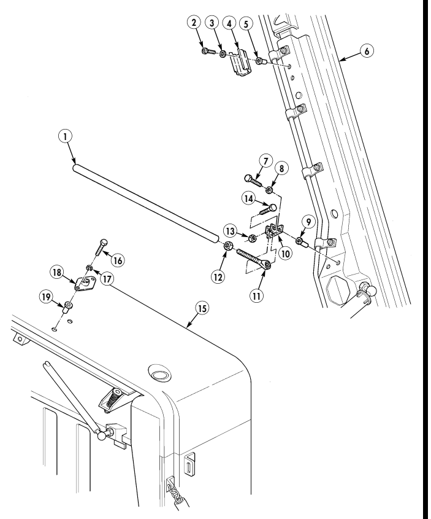

# 11-25. Cargo Shell Door Front Striker Replacement

This task covers:

Applicable Models M1114, M1151, M1151A1, M1167 Tools General mechanic's tool kit:
automotive (Appendix B, Item 1)
Maintenance and repair shop equipment:
automotive (Appendix B, Item 2)
Materials/Parts Locknut (Appendix G, Item 128)
a. Removal b. Installation

| Manual References    |
|----------------------|
| TM 9\-2320\-387\-24P |
| Maintenance Level    |
| Unit                 |

#### A. Removal

Remove locknut (5), washer (2), front striker (4), spacer (3), and washer (2) from body bracket (1). Discard locknut (5).

b. Installation Install washer (2), spacer (3), and front striker (4) on body bracket (1) with washer (2) and locknut (5). Tighten locknut (5) to 35-45 lb-ft (47-61 N•m).

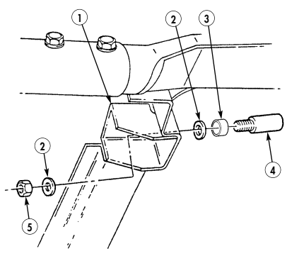

FOLLOW-ON TASK: Adjust cargo shell door (para. 11-14).

11-48 Change 6

# 11-26. Cargo Shell Door Rear Striker Replacement

This task covers:
INITIAL SETUP:
Applicable Models M1114, M1151, M1151A1, M1167

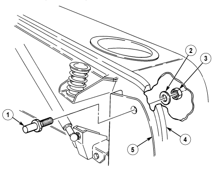

General mechanic's tool kit:
automotive (Appendix B, Item 1)
Maintenance and repair shop equipment:
automotive (Appendix B, Item 2)
Materials/Parts Locknut (Appendix G, Item 122)

#### A. Removal B. Installation

Manual References TM 9-2320-387-10 TM 9-2320-387-24P
Equipment Condition
- Tailgate lowered (TM 9-2320-387-10).

- Rear end of cargo shell door raised
(TM 9-2320-387-10).

Maintenance Level Unit Personnel Required One mechanic One assistant a. Removal Remove locknut (3), washer (2), and striker (1) from striker plate (5) and wheelhouse (4). Discard locknut (3).

b. Installation Install striker (1) on striker plate (5) and wheelhouse (4) with washer (2) and locknut (3). Tighten locknut (3) to 190-210 lb-ft (258-285 N•m).

FOLLOW-ON TASKS: - Raise and secure tailgate (TM 9-2320-387-10).

- Close cargo shell door (TM 9-2320-387-10).

# 11-27. Cargo Shell Door Rear Striker Mounting Plate Replacement

This task covers:
INITIAL SETUP:
Applicable Models M1114, M1151, M1151A1, M1167 Tools General mechanic's tool kit:
automotive (Appendix B, Item 1)
Maintenance and repair shop equipment:
automotive (Appendix B, Item 2)
Materials/Parts Six locknuts (Appendix G, Item 111)
Personnel Required One mechanic One assistant a. Removal 1. Remove locknut (5), washer (4), and socket-head screw (2) from striker mounting plate (3) and wheelhouse (8). Discard locknut (5).

2. Remove five locknuts (6), washers (7), capscrews (1), washers (9), and striker mounting plate (3)
from wheelhouse (8). Discard locknuts (6).

b. Installation 1. Install striker mounting plate (3) on wheelhouse (8) with five washers (9), capscrews (1), washers (7),
and locknuts (6).

2. Install striker mounting plate (3) on wheelhouse (8) with socket-head screw (2), washer (4), and

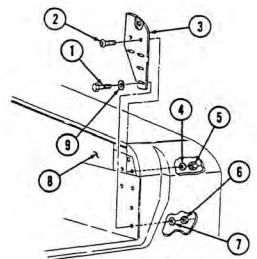

locknut (5). Tighten locknuts (5) and (6) to 25-30 lb-ft (34-41 N•m).

a. Removal b. Installation

#### Manual References

TM 9-2320-387-24P
Equipment Condition
- Rear striker removed (para. 11-26). - Cargo shell door strap removed (left side only)
(para. 11-23).

Maintenance Level Unit FOLLOW-ON TASKS: - Install cargo shell door strap (left side only) (para. 11-23).

- Install rear striker (para. 11-26).

# 11-28. Cargo Shell Door Dovetail Spring Replacement

This task covers:
INITIAL SETUP:
Applicable Models M1114, M1151, M1151A1, M1167 Tools General mechanic's tool kit:
automotive (Appendix B, Item 1)
Maintenance and repair shop equipment:
automotive (Appendix B, Item 2)
Materials/Parts Two locknuts (Appendix G, Item 88)

a. Removal b. Installation

Manual References TM 9-2320-387-10 TM 9-2320-387-24P
Equipment Condition
- Rear end of cargo shell door raised
(TM 9-2320-387-10).

- Tailgate lowered (TM 9-2320-387-10).

Maintenance Level Unit

#### A. Removal

Remove locknut (7), washer (6), cup (8), spring (3), locknut (2), retainer (9), and head bolt (1) from cargo shell dovetail (5). Discard locknuts (2) and (7).

#### B. Installation

1. Install retainer (9) on head bolt (1) and install locknut (2) to end of threads on head bolt (1). 2. Install cup (8) and head bolt (1) on dovetail (5). 3. Lower cargo door. 4. Hold locknut (2) and adjust head bolt (1) up until head bolt (1) touches bottom of cargo door (4). 5. Raise cargo door (4). 6. Remove head bolt (1) from dovetail (5). 7. Install spring (3), cup (8), and head bolt (1) on dovetail (5) with washer (6), and locknut (7).

Tighten locknut (7) to 55 lb-ft (75 N•m).

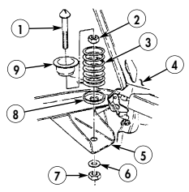

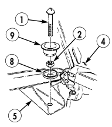

FOLLOW-ON TASKS: - Close cargo shell door (TM 9-2320-387-10).

- Raise and secure tailgate (TM 9-2320-387-10).

# 11-29. Cargo Shell Door Left Side Gas Spring Mounting Bracket

## Maintenance

This task covers:
a. Removal c. Installation b. Inspection

Applicable Models M1114 Tools General mechanic's tool kit:
automotive (Appendix B, Item 1)
Maintenance and repair shop equipment:
automotive (Appendix B, Item 2)
Personnel Required One mechanic One assistant Materials/Parts Sealing compound (Appendix C, Item 72.1) Two locknuts (Appendix G, Item 127)

#### Manual References

TM 9-2320-387-10 TM 9-2320-387-24P
Equipment Condition
- Tailgate lowered (TM 9-2320-387-10). - Cargo shell door gas spring removed 
(para. 11-22).

Maintenance Level Unit a. Removal 1. Remove two locknuts (10), washers (9), and capscrews (7) from wheelhouse (8). Discard locknuts (10). 2. Remove capscrews (3) and (6), washer (5), strap (4), and bracket (2) from wheelhouse (8). b. Inspection Refer to para. 10-56 for plusnut (1) inspection and installation. c. Installation 1. Apply sealing compound to threads of capscrews (3) and (6), and install bracket (2) and strap (4) on wheelhouse (8) with washer (5) and capscrews (3) and (6). Tighten capscrews (3) and (6) to 75 lb-in. (8 N•m).

2. Install bracket (2) on wheelhouse (8) with two capscrews (7), washers (9), and locknuts (10). Tighten locknuts (10) to 10 lb-ft (14 N•m).

11-29.  CARGO SHELL DOOR LEFT SIDE GAS SPRING MOUNTING BRACKET

# Maintenance (Cont'D)

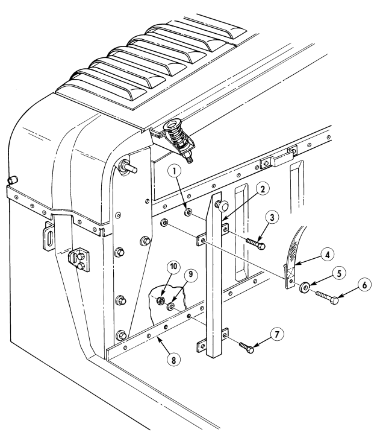

FOLLOW-ON TASKS: · · Install gas spring (para. 11-22).

· Raise and secure tailgate (TM 9-2320-387-10).

# 11-29.1. Cargo Shell Door Gas Spring Mounting Bracket Replacement

This task covers:
INITIAL SETUP:
Applicable Models M1151, M1151A1, M1167 Tools General mechanic's tool kit:
automotive (Appendix B, Item 1)
Materials/Parts Tape (Appendix C, Item 78) Four locknuts (Appendix G, Item 77)
Personnel Required One mechanic One assistant a. Removal 1. Remove two locknuts (9), washers (1), capscrews (2), and washers (1) from bracket (3) and wheelhouse (6). Discard locknuts (9).

2. Remove two locknuts (8), washers (4), backing plate (7), capscrews (5), washers (4), and bracket (3)
from wheelhouse (6). Discard locknuts (8). Remove tape from bracket (3) and discard tape.

b. Installation 1. Apply tape to bracket (3) mounting surfaces. Install bracket (3) on wheelhouse (6) with two washers (4), capscrews (5), backing plate (7), washers (4), and locknuts (8). Tighten locknuts (8) to 8 lb-ft (11 N•m).

2. Secure bracket (3) to wheelhouse (6) with two washers (1), capscrews (2), washers (1), and

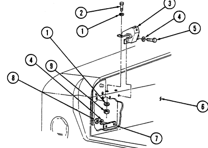

locknuts (9). Tighten locknuts (9) to 8 lb-ft (11 N•m).

FOLLOW-ON TASKS: - Install gas spring (para. 11-22).

- Raise and secure tailgate (TM 9-2320-387-10).

#### A. Removal B. Installation

Manual References TM 9-2320-387-10 TM 9-2320-387-24P
Equipment Condition
•Tailgate lowered (TM 9-2320-387-10). •Gas spring removed (para. 11-22).

Maintenance Level Unit 11-52.2 Change 6

# 11-29.2. Cargo Bulkhead Replacement

This task covers:

| Applicable Models               |
|---------------------------------|
| M1114, M1151, M1151A1, M1167    |
| Tools                           |
| General mechanic's tool kit:    |
| automotive (Appendix B, Item 1) |
| Materials/Parts                 |

INITIAL SETUP:
Four locknuts (Appendix G, Item 106)
a. Removal

| Manual References                      |
|----------------------------------------|
| TM 9\-2320\-387\-24P                   |
| Equipment Condition                    |
| Forward end of cargo shell door raised |
| (para. 11\-90).                        |
| Maintenance Level                      |
| Unit                                   |

1. Remove cargo bulkhead (4) from two channels (5). 2. Remove four locknuts (2), hex head screws (3), and two channels (5) from wheel housings (1).

Discard locknuts (2).

b. Installation 1. Install two channels (5) on wheel housings (1) with four hex head screws (3) and locknuts (2). 2. Tighten locknuts (2) to 15 lb-ft (20 N•m).

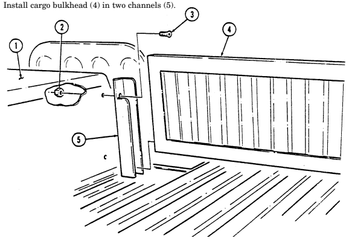

FOLLOW-ON TASK: Install stowage compartment net (TM 9-2320-387-10).

a. Removal b. Installation

# 11-30. Insulation Panel Replacement (M1114)

This task covers:
INITIAL SETUP:
Applicable Models M1114 Tools General mechanic's tool kit:
automotive (Appendix B, Item 1)
Materials/Parts Adhesive (Appendix C, Item 6) Drycleaning solvent (Appendix C, Item 26)
a. Removal **b. Installation**
Manual References TM 9-2320-387-24P
General Safety Instructions Do not perform this procedure near fire, flames or sparks.

Maintenance Level Unit

#### .Warning.

Dry cleaning solvent is highly flammable. Do not perform this procedure near fire, flames, or sparks. Injury to personnel and/or damage to equipment will result.

All insulation panels are replaced basically the same. This procedure covers the roof insulation panel. Refer to facing page art for locations of other insulation panels.

a. Removal 1. Remove insulation panel (2) from roof (1). 2. Clean surface of roof (1) with drycleaning solvent to remove adhesive.

b. Installation 1. Apply adhesive on roof (1), and install panel (2) on roof (1). 2. Press surface of panel (2) to ensure adhesion.

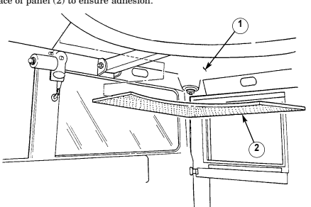

# 11-30. Insulation Panel Replacement (M1114) (Cont'D)

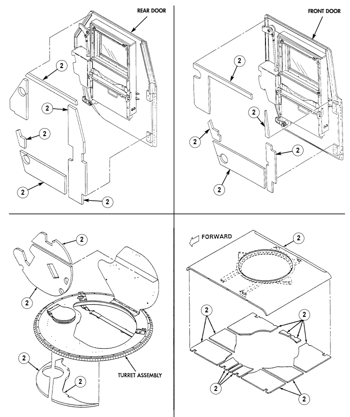

# 11-31. Cargo Shell Door Liner Replacement

This task covers:

| Applicable Models   |
|---------------------|

INITIAL SETUP:

| Materials/Parts   |
|-------------------|

Tools General mechanic's tool kit:
automotive (Appendix B, Item 1)
Twelve clips (Appendix G, Item 12)
Personnel Required One mechanic One assistant

a. Removal b. Installation

Equipment Condition Rear end of cargo shell door raised (TM 9-2320-387-10).

Maintenance Level Unit

| Manual References    |
|----------------------|
| TM 9\-2320\-387\-24P |

#### A. Removal

1. Remove ten screws (6), washers (5), clips (4), and two retainers (7) from cargo shell door (1). 2. Remove twelve fastener clips (8) from liner (3) and door (1). Discard fastener clips (8). 3. Remove liner (3) and three sound dampeners (2) from door (1). 4. Clean cargo door (1) to remove adhesive.

b. Installation

Ensure surface is free of dirt and oil before applying adhesive backing.

1. Position three sound dampeners (2) on door (1). 2. Place four fastener clips (8) in two top and two bottom holes of liner (3). Ensure heads of fastener clips (8) are on side of liner (3) without adhesive.

3. Peel paper backing (9) from liner (3). 4. Align liner (3) with door (1), ensuring top and bottom fastener clips (8) in liner (3) align with top and bottom holes in door (1), and install liner (3) on door (1) with top and bottom fastener clips (8). Press entire surface of liner (3) to ensure adhesion.

5. Install eight remaining fastener clips (8) through liner (3) into door (1). 6. Install two retainers (7) on door (1) with ten clips (4), washers (5), and screws (6).

# 11-31. Cargo Shell Door Liner Replacement (Cont'D)

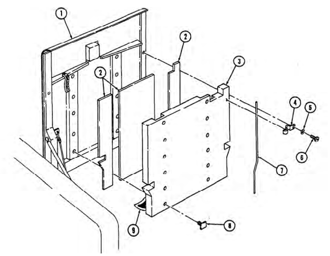

FOLLOW-ON TASK:  Close cargo shell door (TM 9-2320-387-10).

# 11-32. Left Side A-Pillar Armor Maintenance

This task covers:
a. Removal **c. Installation** b. Inspection

Applicable Models M1114 Tools General mechanic's tool kit:
automotive (Appendix B, Item 1)
Maintenance and repair shop equipment:
automotive (Appendix B, Item 2)

#### Materials/Parts

Twelve locknuts (Appendix G, Item 111)
Adhesive (Appendix C, Item 2.1) Sealing compound (Appendix C, Item 72.1)
Personnel Required One mechanic One assistant Manual References TM 9-2320-387-24P
a. Removal b. Inspection Refer to para. 10-56 for plusnut inspection and replacement.

c. Installation

- Apply adhesive to inboard side of shim. - Ensure that all holes are aligned on installation.

1. Apply adhesive to spacer plate (6.1), shim (4.1), and two washers (4.2), and position on A-pillar armor (6).

2. Apply sealing compound to threads of two capscrews (4), and install A-pillar armor (6) on A-pillar (2) with two washers (3) and capscrews (4). Tighten capscrews (4) to 37 lb-ft (50 N•m).

3. Secure A-pillar armor (6) to A-pillar (2) and footwell armor (7) with twelve capscrews (5) and locknuts (1). Tighten locknuts (1) to 35 lb-ft (47 N•m).

#### Equipment Condition

- Left front door and hinge (Frag 5) removed 
(if equipped) (para. 11-142).

- Left front door and hinge removed (if equipped)
(para. 11-2).

- Driver's rearview mirror bracket removed
(if equipped) (para. 10-69).

- Driver's rearview mirror bracket (Frag 1) removed
(if equipped) (para. 11-129).

- A-pillar IED overlay - LH (Frag 1A) removed 
(if equipped) (para. 11-133).

- A-pillar IED overlay - LH (Frag 1) removed 
(if equipped) (para. 11-122.1).

- Left front underbody armor removed
(para. 11-36).

- A-pillar to rocker gap plate removed 
(para. 11-34).

Maintenance Level Unit 1. Remove two capscrews (4) and washers (3) from A-pillar armor (6) and A-pillar (2). 2. Remove twelve locknuts (1), capscrews (5), and A-pillar armor (6) from A-pillar (2) and footwell armor (7). Discard locknuts (1).

3. Remove spacer plate (6.1), shim (4.1), and two washers (4.2) from A-pillar armor (6). 4. Remove old adhesive completely from A-pillar armor (6), spacer plate (6.1), shim (4.1), and two washers (4.2).

11-32. LEFT SIDE A-PILLAR ARMOR MAINTENANCE (Cont'd)

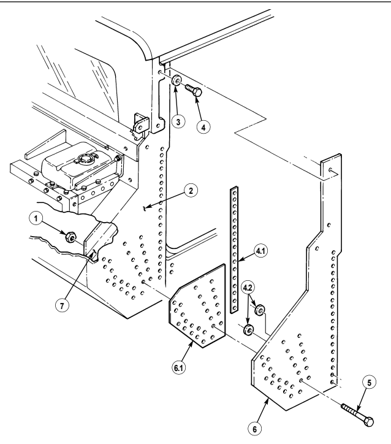

FOLLOW-ON TASKS: - Install A-pillar to rocker gap plate (para. 11-34).

· Install left front underbody armor (para. 11-36).

· Install A-pillar IED overlay - LH (Frag 1) (if equipped) (para. 11-122.1).

· Install A-pillar IED overlay - LH (Frag 1A) (if equipped) (para. 11-133).

· Install driver's rearview mirror bracket (Frag 1) (if equipped) (para. 11-129).

· Install driver's rearview mirror bracket (if equipped) (para. 10-69).

· Install left front door and hinge (if equipped) (para. 11-2).

· Install left front door and hinge (Frag 5) (if equipped) (para. 11-142).

# 11-33. Right Side A-Pillar Armor Maintenance

This task covers:
b. Inspection

Applicable Models M1114 Tools General mechanic's tool kit:
automotive (Appendix B, Item 1)
Maintenance and repair shop equipment:
automotive (Appendix B, Item 2)

| Materials/Parts   |
|-------------------|

| Manual References    |
|----------------------|
| TM 9\-2320\-387\-24P |

| Personnel Required   |
|----------------------|

Ten locknuts (Appendix G, Item 111) Adhesive (Appendix C, Item 2.1) Sealing compound (Appendix C, Item 72.1)
One mechanic One assistant

#### A. Removal

1. Remove two capscrews (1) and washers (2) from A-pillar armor (7) and A-pillar (3).

1.1. Remove capscrew (6.1) from A-pillar armor (7) and A-pillar (3).

2. Remove ten locknuts (4), capscrews (6), and A-pillar armor (7) from A-pillar (3). Discard locknuts (4). 3. Remove spacer plate (5), shim (5.2), and three washers (5.1) from A-pillar armor (7). 4. Remove old adhesive completely from A-pillar armor (7), spacer plate (5), shim (5.2), and three washers (5.1).

b. Inspection Refer to para. 10-56 for plusnut inspection and replacement.

c. Installation

- Apply adhesive to inboard side of shim. - Ensure that all holes are aligned on installation.

1. Apply adhesive to spacer plate (5), shim (5.2), and three washers (5.1), and position on A-pillar armor (7).

1.1. Apply sealing compound to threads of capscrew (6.1), and install A-pillar armor (7) on A-pillar (3)
with capscrew (6.1). Tighten capscrew (6.1) to 35 lb-ft (47 N•m).

1.2. Apply sealing compound to threads of two capscrews (1), and install A-pillar armor (7) on A-pillar (3) with two washers (2) and capscrews (1). Tighten capscrews (1) to 37 lb-ft (50 N•m).

2. Install A-pillar armor (7) on A-pillar (3) with ten capscrews (6) and locknuts (4). Tighten locknuts (4) to 35 lb-ft (47 N•m).

a. Removal c. Installation

#### Equipment Condition

| Maintenance Level   |
|---------------------|
| Unit                |

- Right front door and hinge (Frag 5) removed 
(if equipped) (para. 11-142).

- Right front door and hinge removed (para. 11-2). - Right rearview mirror removed (if equipped)
(para. 10-68).

- Right rearview mirror (Frag 1) removed 
(if equipped) (para. 11-129).

- A-pillar IED overlay RH (Frag 1A) removed 
(if equipped) (para. 11-134).

- A-pillar IED overlay RH (Frag 1) removed 
(if equipped) (para. 11-123).

- Right front underbody armor removed 
(para. 11-38).

- A-pillar to rocker gap plate removed 
(para. 11-35).

# 11-33. Right Side A-Pillar Armor Maintenance (Cont'D)

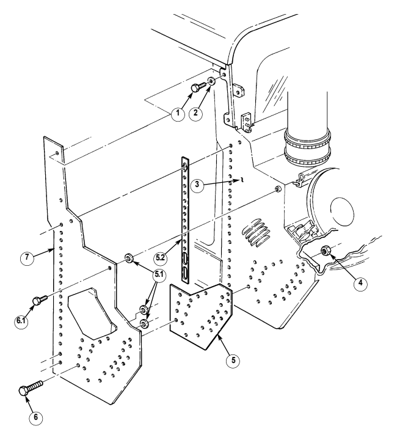

FOLLOW-ON TASKS: - Install A-pillar to rocker gap plate (para. 11-35).

- Install right front underbody armor (para. 11-38). - Install A-pillar IED overlay - RH (Frag 1) (if equipped) (para. 11-123). - Install A-pillar IED overlay - RH (Frag 1A) (if equipped) (para. 11-134). - Install right rearview mirror (Frag 1) (if equipped) (para. 11-129). - Install right rearview mirror (if equipped) (para. 10-68). - Install right front door and hinge (if equipped) (para. 11-2). - Install right front door and hinge (Frag 5) (if equipped) (para. 11-142).

# 11-34. **Left Side Rocker Panel Armor And Inside Protection Plate** Maintenance

This task covers:
a. Removal c. Installation b. Inspection

| M1114, M1151, M1151A1, M1167             | Equipment Condition                    |
|------------------------------------------|----------------------------------------|
| Tools                                    | Forward end of cargo shell door raised |
| General mechanic's tool kit:             | (para. 11\-90).                        |
| automotive (Appendix B, Item 1)          | Maintenance Level                      |
| Maintenance and repair shop equipment:   |                                        |
| automotive (Appendix B, Item 2)          | Unit                                   |
| Materials/Parts                          |                                        |
| Sealing compound (Appendix C, Item 72.1) |                                        |
| Two locknuts (Appendix G, Item 77)       |                                        |
| a. Removal                               |                                        |

a. Removal 1. Remove three capscrews (15) from A-pillar to rocker gap plate (16) and A-pillar armor (17). 2. Remove four locknuts (1), washers (3), capscrews (13), A-pillar to rocker gap plate (16), rocker panel armor (14), and four washers (7) from rocker panel (6) and inside protection plate (18). Discard locknuts (1).

3. Remove six locknuts (2), washers (3), capscrews (12), rocker panel armor (11), inside protection plate (18), and six washers (7) from rocker panel (6). Discard locknuts (2).

4. Remove four locknuts (4), washers (3), capscrews (10), capscrew (8), rocker panel armor (9), inside protection plate (5), and four washers (7) from rocker panel (6). Discard locknuts (4).

b. Inspection Refer to para. 10-56 for plusnut inspection and replacement.

c. Installation 1. Apply sealing compound to threads of capscrew (8), and install four washers (7), rocker panel armor (9), and inside protection plate (5) on rocker panel (6) with four capscrews (10), washers (3), locknuts (4), and capscrew (8). Do not tighten locknuts (4).

2. Install six washers (7), rocker panel armor (11), and inside protection plates (5) and (18) on rocker panel (6) with six capscrews (12), washers (3), and locknuts (2). Do not tighten locknuts (2).

3. Install rocker panel armor (14), four washers (7), inside protection plate (18), and A-pillar to rocker gap plate (16) on rocker panel (6) with four capscrews (13), washers (3), and locknuts (1). Do not tighten locknuts (1).

4. Apply sealing compound to threads of three capscrews (15), and secure A-pillar to rocker gap plate
(16) to A-pillar armor (17) with capscrews (15). Tighten capscrews (15) to 35 lb-ft (47 N•m).

5. Tighten locknuts (1), (2), and (4) to 10 lb-ft (14 N•m).

11-34. LEFT SIDE ROCKER PANEL ARMOR AND INSIDE PROTECTION PLATE 
MAINTENANCE (Cont'd)

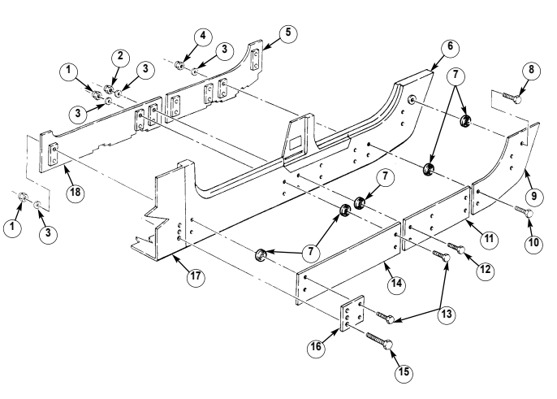

FOLLOW-ON TASKS: - Install rocker panel IED overlay - LH (Frag 1) (if equipped) (para. 11-130).

- Install rocker panel IED overlay - LH (Frag 1A) (if equipped) (para. 11-140). - Install left passenger seat (para. 10-45) - Install fire extinguisher (TM 9-2320-387-10).

# 11-35. Right Side Rocker Panel Armor And Inside Protection Plate Maintenance

This task covers:
a. Removal c. Installation b. Inspection

Applicable Models M1114 Tools General mechanic's tool kit:
automotive (Appendix B, Item 1)
Maintenance and repair shop equipment:
automotive (Appendix B, Item 2)

#### Materials/Parts

Sixteen locknuts (Appendix G, Item 111) Four locknuts (Appendix G, Item 127) Sealing compound (Appendix C, Item 72.1)

#### Manual References

| Tallual References   |
|----------------------|
| TM 9\-2320\-387\-24P |

Equipment Condition

| spring rods.   |
|----------------|

- Right passenger seat removed (para. 10-45). - Companion seat assembly removed 
(para. 10-44).

- Rocker panel IED overlay - RH (Frag 1A)
removed (if equipped) (para. 11-141).

- Rocker panel IED overlay - RH (Frag 1)
removed (if equipped) (para. 11-131).

Unit

#### A. Removal

1. Remove three capscrews (13) from A-pillar to rocker gap plate (12) on A-pillar armor (11). 2. Remove eight locknuts (8), washers (2), capscrews (15), two capscrews (14), A-pillar to rocker gap plate (12), rocker panel armor (16), two washers (3), and inside protection plates (9) and (10) and from rocker panel (4) and A-pillar armor (11). Discard locknuts (8).

3. Remove six locknuts (8), washers (2), capscrews (15), rocker panel armor (17), six washers (3), and inside protection plate (7) from rocker panel (4). Discard locknuts (8).

4. Remove four locknuts (6), washers (2), capscrews (17.1), capscrew (1), rocker panel armor (18), four washers (3), and inside protection plate from rocker panel (4). Discard locknuts (6).

b. Inspection Refer to para. 10-56 for plusnut inspection and replacement.

c. Installation 1. Apply sealing compound to threads of capscrew (1), and install four washers (3), rocker panel armor (18), and inside protection plate (5) on rocker panel (4) with four capscrews (17.1), washers (2), locknuts (6), and capscrew (1). Do not tighten locknuts (6).

2. Install six washers (3), rocker panel armor (17), and inside protection plate (7) on rocker panel (4)
with six capscrews (15), washers (2), and locknuts (8). Do not tighten locknuts (8).

3. Install two washers (3), rocker panel armor (16), A-pillar to rocker gap plate (12), and inside protection plates (9) and (10) on rocker panel (4) with two capscrews (14), eight capscrews (15), and ten locknuts (8). Do not tighten locknuts (8).

4. Apply sealing compound to threads of three capscrews (13), and secure A-pillar to rocker gap plate (12) to A-pillar armor (11) with capscrews (13). Tighten capscrews (13) to 35 lb-ft (47 N•m).

5. Tighten locknuts (6) and (8) to 10 lb-ft (14 N•m).

11-35. RIGHT SIDE ROCKER PANEL ARMOR AND INSIDE PROTECTION PLATE

# Maintenance (Cont'D)

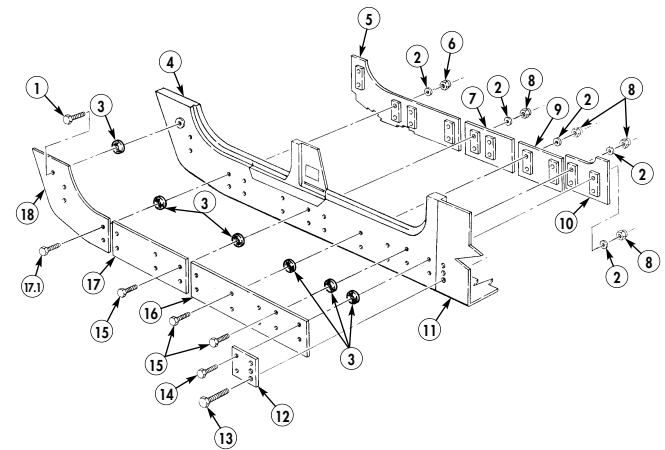

FOLLOW-ON-TASKS: - Install rocker panel IED overlay - RH (Frag 1) (if equipped) (para. 11-131).

- Install rocker panel IED overlay - RH (Frag 1A) (if equipped) (para. 11-141). - Install companion seat assembly (para. 10-44). - Install right passenger seat (para. 10-45).

# 11-36. Left Front Underbody Armor Maintenance

This task covers:
b. Inspection

Applicable Models

| TH STEEMA   |
|-------------|
| M1114       |

Tools

| Materials/Parts   |
|-------------------|

General mechanic's tool kit:
automotive (Appendix B, Item 1)
Maintenance and repair shop equipment:
automotive (Appendix B, Item 2)
Twenty-six locknuts (Appendix G, Item 111) Six locknuts (Appendix G, Item 112) Adhesive (Appendix C, Item 2.1) Sealing compound (Appendix C, Item 72.1)
Personnel Required One mechanic One assistant Manual References TM 9-2320-387-10 TM 9-2320-387-24P
a. Removal c. Installation

#### Equipment Condition

- Hood raised and secured (TM 9-2320-387-10). - Left side rocker panel armor removed 
(para. 11-34).

- Upper left front underbody wheelwell IED
armor overlay (Frag 2) removed (if equipped) (para. 11-148).

- Lower left front underbody wheelwell IED
armor overlay (Frag 2) removed (if equipped) (para. 11-147).

- Left front cowl insulation removed (para. 10-31).

#### General Safety Instructions

Left front underbody armor plate is extremely heavy and must be supported during removal and installation.

Maintenance Level Unit

#### Warning

Left front underbody armor plate is extremely heavy and must be supported during removal and installation. Failure to do so may result in injury to personnel or damage to equipment.

NOTE
If new left front underbody armor is being installed, perform para. 11-36.1.

a. Removal 1. Remove four capscrews (21) and washers (22) from left front underbody armor (16), shim (23), and bracket (1).

2. Remove six capscrews (25) from left front underbody armor (16) and left side cowl (3).

- Note location of spacers for installation. - Note number and location of screws for installation.

3. Remove twelve locknuts (20) and capscrews (2) from left front underbody armor (16) and body (26).

Discard locknuts (20).

4. Remove six socket-head screws (18) and three plates (17) from left front underbody armor (16) and three brackets (8).

5. Remove seven capscrews (14), washers (15), and spacers (13) from left front underbody armor (16)
and body (26).

6. Remove fifteen capscrews (4) from driver's footwell armor (5) and left front underbody armor (16). 7. Remove fourteen locknuts (27) and capscrews (19) from left front underbody armor (16) and body (26). Discard locknuts (27).

8. Remove eight socket-head screws (12) and left front underbody armor (16) from rocker panel (7).

# 11-36. Left Front Underbody Armor Maintenance (Cont'D)

- Perform step 9 if clamps and/or brackets are damaged. - Mark bracket locations for installation.

9. Remove six locknuts (9), clamps (10), and three mounting brackets (8) from frame rail (6). Discard locknuts (9).

10. Remove four socket-head screws (24) and shim (23) from bracket (1). 

b. Inspection 1. Refer to para. 10-56 for plusnut inspection and replacement. 2. Inspect rubber strips (11). Replace rubber strips (11) if damaged using adhesive.

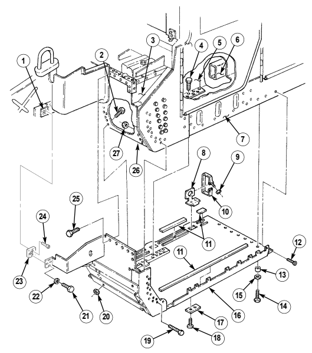

# 11-36. Left Front Underbody Armor Maintenance (Cont'D)

c. Installation

#### Caution

Ensure position of clamps on frame are under vent lines. Failure to do so will result in damage to equipment.

- If new left front underbody armor is installed, perform para. 11-36.1 in place of task C.

- Perform step 2 if clamps and brackets were removed. - Ensure all old adhesive and paint is removed from area to be adhesive bonded.

1. Apply sealing compound to threads of four socket-head screws (23), and install shim (22) on bracket
(1) with socket-head screws (23). Tighten socket-head screws (23) to 10 lb-ft (14 N•m).

2. Apply adhesive to three mounting brackets (8) and install mounting brackets (8) with six clamps (10) on frame rail (6) with six locknuts (9). Tighten locknuts (9) to 64-68 lb-in. (7-8 N•m).

3. Apply sealing compound to threads of eight socket-head screws (11), and install underbody armor
(15) on rocker panel (7) with eight socket-head screws (11). Tighten socket-head screws (11) to 68-82 lb-in. (7-9 N•m).

4. Install underbody armor (15) on body (25) and left side cowl (3) with fourteen capscrews (18) and locknuts (26). Tighten locknuts (26) to 35 lb-ft (47 N•m).

5. Apply sealing compound to threads of seven capscrews (13), and install underbody armor (15) on body (25) with seven spacers (12), washers (14), and capscrews (13). Tighten capscrews (13) to 23 lb-ft (31 N•m).

6. Apply sealing compound to threads of six socket-head screws (17), and install three plates (16) and underbody armor (15) on three brackets (8) with socket-head screws (17). Tighten socket-head screws (17) to 37 lb-ft (50 N•m).

Ensure large spacers are installed in upper holes.

7. Install underbody armor (15) on body (25) with twelve capscrews (2) and locknuts (19). Tighten locknuts (19) to 37 lb-ft (50 N•m).

8. Apply sealing compound to threads of six capscrews (24), and install underbody armor (15) on left side cowl (3) with capscrews (24). Tighten capscrews (24) to 68-82 lb-in. (7-9 N•m).

9. Apply sealing compound to threads of four capscrews (20), and install underbody armor (15) on shim (22) and bracket (1) with four washers (21) and capscrews (20). Tighten capscrews (20) to 10 lb-ft (14 N•m).

10. Apply sealing compound to threads of fifteen capscrews (4), and install underbody armor (15) on driver's footwell armor (5) with capscrews (4). Tighten capscrews (4) to 23 lb-ft (31 N•m).

NOTE

# 11-36. Left Front Underbody Armor Maintenance (Cont'D)

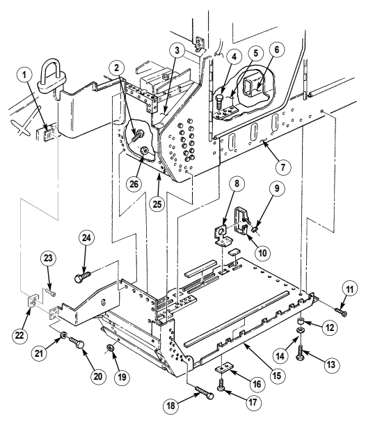

FOLLOW-ON TASKS: - Install left front cowl insulation (para. 10-31).

- Install lower left front underbody wheelwell IED armor overlay (Frag 2) 
(if equipped) (para. 11-147).

- Install upper left front underbody wheelwell IED armor overlay (Frag 2) 
(if equipped) (para. 11-148).

- Install left side rocker panel armor (para. 11-34). - Lower and secure hood (TM 9-2320-387-10).

# 11-36.1. Left Front Underbody Armor Installation

This task covers:
a. New Driver's Side Footwell Outer c. New Front Underbody Armor Installation Armor Installation b. New Driver's Side Footwell Inner Armor Installation

Applicable Models M1114 Tools General mechanic's tool kit:
automotive (Appendix B, Item 1)
Maintenance and repair shop equipment:
automotive (Appendix B, Item 2)

#### Materials/Parts

Fifteen AVK fasteners (Appendix G, Item 1)
Thirty-nine locknuts (Appendix G, Item 111) Sealing compound (Appendix C, Item 72.1)

#### Personnel Required

One mechanic One assistant Materials/Parts TM 9-2320-387-10 TM 9-2320-387-24P

#### Equipment Condition

- Raise and secure hood (TM 9-2320-387-10). - Remove accelerator linkage (para. 3-43). - Remove steering wheel lock (para. 10-48). - Remove engine access cover (para. 10-22). - Remove tunnel insulation (para. 10-33). - Remove left front cowl insulation (para. 10-31). - Remove left front underbody armor (para. 11-36). - Remove driver's side footwell outer armor (para. 11-40).

- Remove driver's side footwell inner armor (para. 11-41).

General Safety Instructions Left front underbody armor is extremely heavy and must be supported during removal and installation.

Maintenance Level Unit

#### .Warning.

Left front underbody armor is extremely heavy and must be supported during removal and installation. Failure to do so may result in injury to personnel or damage to equipment.

Installing a new left front underbody armor requires match drilling of the underbody to the vehicle. In addition, the driver's side footwell left inner and outer liners will have to be replaced.

#### A. New Driver'S Side Footwell Outer Armor Installation

1. Install driver's side footwell outer armor (5) and spacer (6) on left A-beam armor (4) with six capscrews (7). Tighten capscrews (7) to 35 lb-ft (47 N•m).

2. Using A-pillar armor (1) as a template, drill one 13/32-in. (10.3 mm) diameter hole from A-pillar armor (1) through driver's side footwell outer armor (5).

Capscrews in steps 3 and 5 are installed in darkened hole locations in A-pillar armor.

3. Install one capscrew (2) and locknut (3) through A-pillar armor (1) and driver's side footwell outer armor (5). Tighten locknut (3) to 35 lb-ft (47 N•m).

4. Using A-pillar armor (1) as a template, match-drill twenty-five 13/32 in. (10.3 mm) diameter holes from A-pillar armor (1) through driver's side footwell outer armor (5).

5. Install eleven capscrews (2) and locknuts (3) through A-pillar armor (1) and driver's side footwell outer armor (5). Tighten locknuts (3) to 35 lb-ft (47 N•m).

11-68.2 Change 2

# 11-36.1. Left Front Underbody Armor Installation (Cont'D)

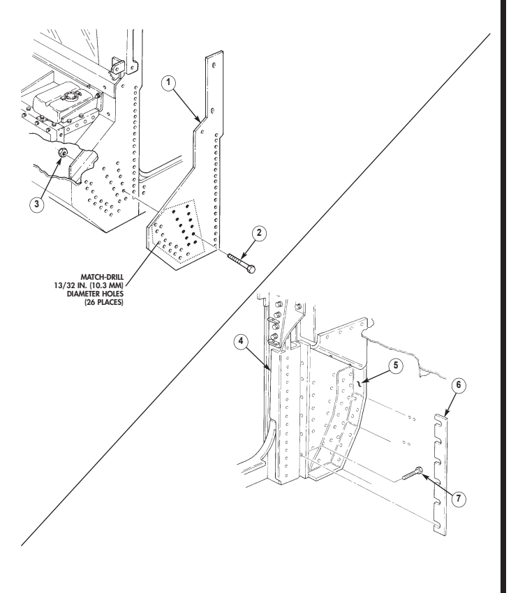

## 11-36.1. Left Front Underbody Armor Installation (Cont'D)

b.  New Driver's Side Footwell Inner Armor Installation Apply sealing compound to threads of six capscrews (1), and install driver's side footwell inner 1.

armor (2) on vehicle tunnel (4) with capscrews (1) and one washer (3) (behind armor). Tighten capscrews (1) to 23 lb-ft (31 N•m).

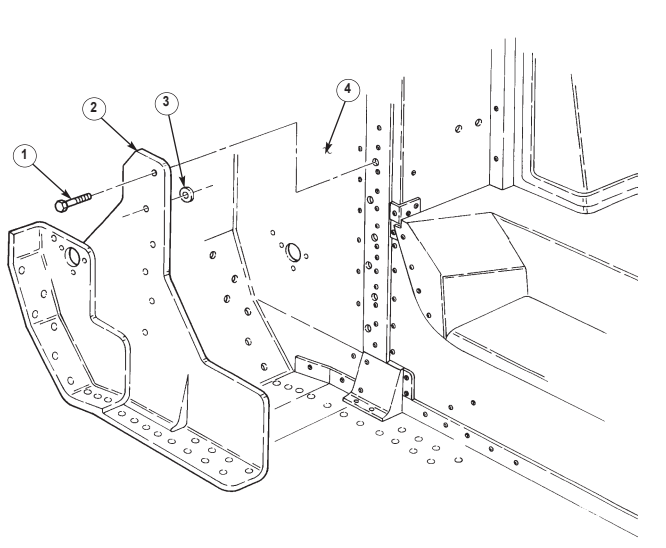

# 11-36.1. Left Front Underbody Armor Installation (Cont'D)

c. New Front Underbody Armor Installation

Steps 1 through 8 are performed to temporarily install a new left front underbody armor segment in order to perform match-drilling to provide a secure interface with other vehicle body armor brackets and liners prior to final installation.

1. Move new left front underbody armor (9) into place underneath vehicle with hydraulic jack and slowly raise left front underbody armor (9) into position on vehicle.

2. Install left front underbody armor (9) to left rear underbody (10) with two spacers (12), washers (13),
and capscrews (14) in inner and outer holes. Tighten capscrews (14) to 23 lb-ft (31 N•m).

3. Install left front underbody armor (9) to vehicle side panel (15) with two socket-head screws (11) into front and rear holes. Tighten socket-head screws (11) to 75 lb-in. (8.5 N•m).

4. Secure left front underbody armor (9) to resilient mount shim (5) with four washers (19) and capscrews (18). Tighten capscrews (18) to 10 lb-ft (14 N•m).

5. Install three retainer plates (8) to left front underbody armor (9) and secure each with two socket-head screws (7). Tighten socket-head screws (7) to 37 lb-ft (50 N•m).

6. Install left front underbody armor (9) to left front underbody angle (6) with six capscrews (17).

Tighten capscrews (17) to 75 lb-in. (8 N•m).

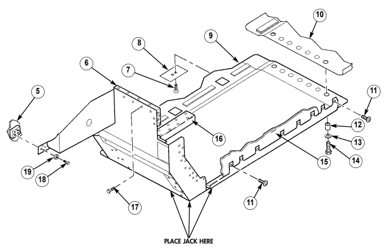

## 11-36.1. Left Front Underbody Armor Installation (Cont'D)

7. From inside vehicle, match-drill fifteen 13/32-in. (10.3-mm) diameter holes from driver's side footwell outer armor (5) and A-pillar armor (3) through left front underbody armor (6).

8. Install three capscrews (2) and locknuts (4) through driver's side footwell outer armor (5), A-pillar armor (3), and left front underbody armor (6). Tighten locknuts (4) to 35 lb-ft (47 N•m).

9. Using driver's side footwell inner armor (1) as a template, match-drill fifteen 13/32-in. (10.3-mm)
diameter holes from driver's side footwell inner armor (1) into left front underbody armor (6). Stop drilling when drill bit penetrates hat section (7). Do not drill completely through left front underbody armor (6).

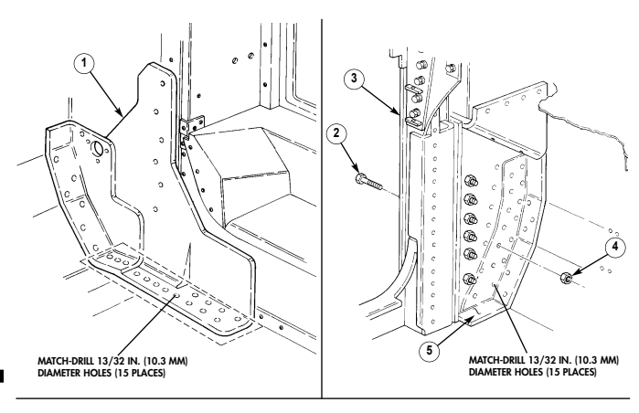

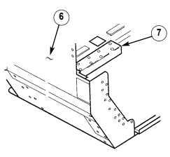

## 11-36.1. Left Front Underbody Armor Installation (Cont'D)

10. Remove four capscrews (20) and washers (21) securing left front underbody armor (6) to resilient mount shim (8).

11. Remove six capscrews (19) from left front underbody armor (6) and left front underbody angle (9). 12. Remove six socket-head screws (10) and three retainer plates (11). 13. Remove two capscrews (17), washers (16), and spacers (15), from inner and outer holes in left front underbody armor (6) and left rear underbody (13).

14. Remove three capscrews (2) and locknuts (4) from left front underbody armor (6) and driver's side footwell outer armor (5).

15. Remove two socket-head screws (14) from front and rear holes in left front underbody armor (6) and vehicle side panel (18).

16. Using hydraulic jack, slowly lower left front underbody armor (6) and remove from underneath vehicle.

17. Enlarge fifteen holes in left front underbody armor hat section (7) to 17/32 in. (13.5 mm). 18. Install fifteen AVK fasteners (12) into left front underbody hat section (7).

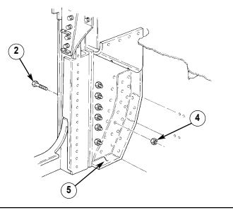

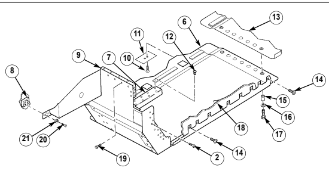

## 11-36.1. Left Front Underbody Armor Installation (Cont'D)

19. Move left front underbody armor (10) into place underneath vehicle with hydraulic jack and slowly raise left front underbody armor (10) into position on vehicle.

20. Apply sealing compound to seven capscrews (15), and install left front underbody armor (10) to left rear underbody (11) with seven spacers (13), washers (14), and capscrews (15). Tighten capscrews (15) to 23 lb-ft (31 N•m).

21. Apply sealing compound to eight socket-head screws (12), and install left front underbody armor
(10) on vehicle side panel (16) with socket-head screws (12). Tighten socket head screws (12) to 75 lb-in. (8 N•m).

22. Apply sealing compound to four capscrews (19) and secure left front underbody armor (10) to resilient mount shim (6) with four washers (20) and capscrews (19). Tighten capscrews (19) to 10 lb-ft (14 N•m).

23. Apply sealing compound to six socket-head screws (8), and install three retainer plates (9) and secure each with two socket-head screws (8). Tighten socket-head screws (8) to 37 lb-ft (50 N•m).

24. Install driver's side footwell outer armor (5) on left front underbody armor (10) with fifteen capscrews (3) and locknuts (4). Tighten locknuts (4) to 35 lb-ft (50 N•m).

25. Apply sealing compound to six capscrews (18), and install left front underbody armor (10) to left front underbody angle (7) with capscrews (18). Tighten capscrews (18) to 68-82 lb-in. (7-9 N•m).

26. Apply sealing compound to fifteen capscrews (1), and secure driver's side footwell inner armor (2) to left front underbody armor hat section (17) with capscrews (1). Tighten capscrews (1) to 23 lb-ft (31 N•m).

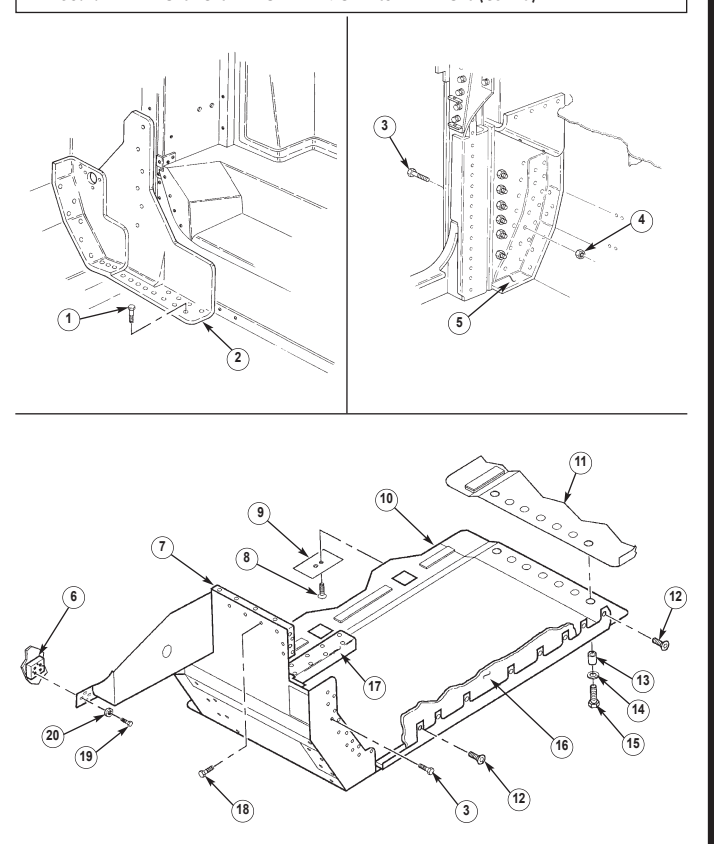

# 11-36.1. Left Front Underbody Armor Installation (Cont'D)

## 11-36.1. Left Front Underbody Armor Installation (Cont'D)

27. Match-drill six 13/32-in. (10.3-mm) diameter holes from left front underbody armor (1) through driver's side footwell inner armor (right side (inner)).

28. Match-drill six 13/32-in. (10.3-mm) diameter holes from left front underbody armor (1) through driver's side footwell outer armor (left side (outer)).

29. Secure driver's side footwell inner liner (10) to left front underbody armor (1) with capscrews 
(4), (5), (7), (8), and (9), three spacers (3), spacers (6), and six locknuts (2). Tighten locknuts (2) to 35 lb-ft (50 N•m).

30. Secure driver's side footwell outer liner (11) to left front underbody armor (1) with capscrews
(4), (5), (7), (8), and (9), three spacers (3), spacers (6), and six locknuts (2). Tighten locknuts (2) to 35 lb-ft (50 N•m).

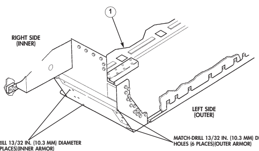

HOLES (6 PLACES)(INNER ARMOR)

# 11-36.1. Left Front Underbody Armor Installation (Cont'D)

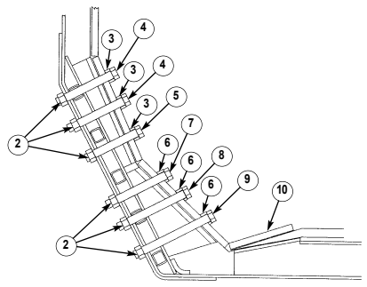

INNER LINER INSTALLATION

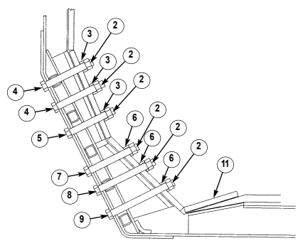

OUTER LINER INSTALLATION
FOLLOW-ON TASKS: - Install left front cowl insulation (para. 11-31).

- Install engine access cover (para. 10-22). - Install tunnel insulation (para. 10-33). - Install steering wheel lock (para. 10-48). - Install accelerator linkage (para. 3-43). - Lower and secure hood (TM 9-2320-387-10).

# 11-37. Left Rear Underbody Armor Maintenance

This task covers:
b. Inspection

Applicable Models M1114 Tools General mechanic's tool kit:
automotive (Appendix B, Item 1)
Maintenance and repair shop equipment:
automotive (Appendix B, Item 2)

#### Materials/Parts

Eight locknuts (Appendix G, Item 127) Four locknuts (Appendix G, Item 112) Sealing compound (Appendix C, Item 72.1) Adhesive (Appendix C, Item 2.1)
Personnel Required One mechanic One assistant a. Removal c. Installation

#### Manual References

TM 9-2320-387-24P
Equipment Condition
- Left side rocker panel armor removed (para. 11-34). - Tailpipe removed (para. 3-48). - Tailpipe hanger bracket removed (para. 3-53). - Left front underbody armor removed (para. 11-36). - C-pillar bottom left side armor removed (para. 11-46).

#### General Safety Instructions

Left rear underbody armor plate is extremely heavy and must be supported during removal and installation.

Maintenance Level Unit

#### Warning

Left rear underbody armor plate is extremely heavy and must be supported during removal and installation. Failure to do so may result in injury to personnel or damage to equipment.

a. Removal

Note location of screws, nuts, spacers, and brackets for installation.

1. Remove capscrew (10), washer (9), socket-head screw (8), and tiedown (7) from wheelwell (14). 2. Remove two locknuts (24), capscrews (5), and washers (6) from left rear underbody armor (18) and wheelwell (14). Discard locknuts (24).

3. Remove three locknuts (19) and capscrews (15) from bracket (22). Discard locknuts (19). 4. Remove three capscrews (20), washers (21), and bracket (22) from left rear underbody armor (18). 5. Remove seven capscrews (36), washers (35), and bracket (34) from left rear underbody armor (18). 6. Remove four socket-head screws (28) and two plates (26) from left rear underbody armor (18) and bracket (31).

7. Remove three locknuts (23), capscrews (12), and bar (11) from left rear underbody armor (18) and wheelwell (14). Discard locknuts (23).

8. Remove eighteen socket-head screws (27), left rear underbody armor (18), and armor plate (17)
from rocker panel (4) and wheelwell (14).

9. Remove three capscrews (2), bar (1), and spacer (30) from rubber strip (29) and body.

NOTE
- Perform step 10 if clamps and/or brackets are damaged. - Mark bracket locations for installation.

10. Remove four locknuts (33), clamps (32), and two mounting brackets (31) from frame rail (3). Discard locknuts (33).

# 11-37. Left Rear Underbody Armor Maintenance (Cont'D)

b. Inspection 1. Refer to para. 10-56 for plusnut inspection and replacement.

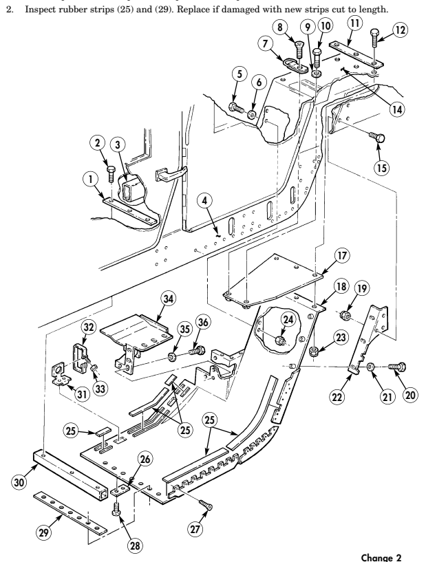

Change 2 11-71

# 11-37. Left Rear Underbody Armor Maintenance (Cont'D)

c. Installation

#### Caution

Ensure position of clamps on frame are under vent lines. Failure to do so will result in damage to equipment.

- Perform step 1 if clamps and brackets were removed. - Ensure all old adhesive and paint are removed from area to be adhesive bonded.

1. Apply adhesive to two brackets (29) and install brackets (29) and four clamps (31) on frame rail (3)
with four locknuts (30). Tighten locknuts (30) to 64-68 lb-in. (7-8 N•m).

2. Apply sealing compound to threads of three capscrews (2), and install bar (1) and spacer (28) and rubber strip (27.1) on body with capscrews (2). Tighten capscrews (2) to 68-82 lb-in. (7-8 N•m).

3. Apply sealing compound to threads of eighteen socket-head screws (26), and install armor plate (17)
and left rear underbody armor (18) on rocker panel (4) with socket-head screws (26). Tighten sockethead screws (26) to 68-82 lb-in. (8-9 N•m).

4. Install bar (11) on wheelwell (14) with three capscrews (12) and locknuts (23). Tighten locknuts (23)
to 10 lb-ft (14 N•m).

5. Apply sealing compound to threads of four socket-head screws (27), and install two plates (25) and left rear underbody armor (18) on brackets (29) with socket-head screws (27). Tighten socket-head screws (27) to 37 lb-ft (50 N•m).

6. Apply sealing compound to threads of seven capscrews (34), and install bracket (32) on left rear underbody armor (18) with seven washers (33) and capscrews (34). Tighten capscrews (34) to 21 lb-ft (28 N•m).

7. Install left rear underbody armor (18) on wheelwell (14) with two washers (6), capscrews (5), and locknuts (24). Tighten locknuts (24) to 10 lb-ft (14 N•m).

8. Apply sealing compound to threads of three capscrews (20), and install bracket (22) on left rear underbody armor (18) with three washers (21) and capscrews (20). Tighten capscrews (20) to 21 lb-ft (28 N•m).

9. Install bracket (22) on wheelwell (14) with three capscrews (15) and locknuts (19). Tighten locknuts (19) to 37 lb-ft (50 N•m).

10. Apply sealing compound to threads of socket-head screw (8), and install tiedown (7) on wheelwell
(14) with socket-head screw (8). Tighten socket-head screw (8) to 81-99 lb-ft (110-134 N•m).

11. Apply sealing compound to threads of capscrew (10), and install washer (9) and capscrew (10) on wheelwell (14). Tighten capscrew (10) to 37 lb-ft (50 N•m).

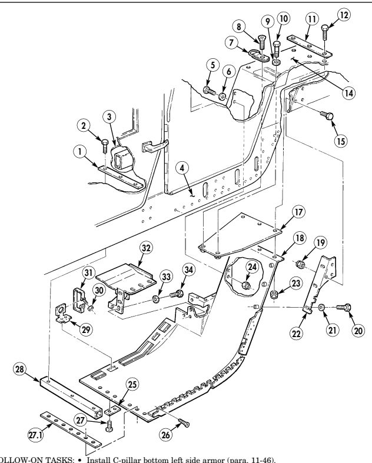

# 11-37. Left Rear Underbody Armor Maintenance (Cont'D)

- Install left front underbody armor (para. 11-36). - Install tailpipe hanger bracket (para. 3-53). - Install tailpipe (para. 3-48). - Install left side rocker panel armor (para. 11-34).

# 11-39. Right Rear Underbody Armor Maintenance

This task covers:
a. Removal **c. Installation** b. Inspection

Applicable Models M1114 Tools General mechanic's tool kit:
automotive (Appendix B, Item 1)
Maintenance and repair shop equipment:
automotive (Appendix B, Item 2)
Materials/Parts Four locknuts (Appendix G, Item 112) Eight locknuts (Appendix G, Item 127) Sealing compound (Appendix C, Item 72.1) Adhesive (Appendix C, Item 2.1)
Personnel Required One mechanic One assistant Manual References TM 9-2320-387-10 TM 9-2320-387-24P

#### Equipment Condition

- Rear cargo door raised and secured 
(TM 9-2320-387-10).

- Fuel filler armor cover opened (TM 9-2320-387-10). - Right side rocker panel armor and inside protection plate removed (para. 11-35).

- Right front underbody armor removed 
(para. 11-38).

General Safety Instructions Right rear underbody armor plate is extremely heavyand must be supported during removal and installation.

Maintenance Level Unit

#### Warning

Right rear underbody armor plate is extremely heavy and must be supported during removal and installation. Failure to do so may result in injury to personnel or damage to equipment.

a. Removal 1. Remove socket-head screw (6), capscrew (5), washer (4), and tiedown (7) from right rear underbody armor (24) and wheelwell (8).

2. Remove two locknuts (29), capscrews (10), and washers (9) from right rear underbody armor (24)
and wheelwell (8). Discard locknuts (29).

3. Remove three locknuts (32) and capscrews (34) from bracket (25). Discard locknuts (32). 4. Remove three capscrews (27), washers (26), and bracket (25) from right rear underbody armor (24). 5. Remove five capscrews (30), washers (31), and bracket (15) from right rear underbody armor (24). 6. Remove four socket-head screws (21) and two plates (22) from right rear underbody armor (24) and two brackets (18).

7. Remove three locknuts (28), capscrews (1), and bar (3) from armor plate (33) and wheelwell (8).

Discard locknuts (28).

8. Remove eighteen socket-head screws (23), right rear underbody armor (24), and armor plate (33)
from rocker panel (14) and wheelwell (8).

9. Remove three capscrews (12), bar (13), and spacer (20) from body.

Perform step 10 if brackets and clamps are damaged.

10. Remove four locknuts (17), clamps (16), and two brackets (18) from frame rail (11). Discard locknuts (17).

b. Inspection 1. Refer to para. 10-56 for plusnut inspection and replacement. 2. Inspect rubber strips (19). Replace if damaged with new strips cut to length.

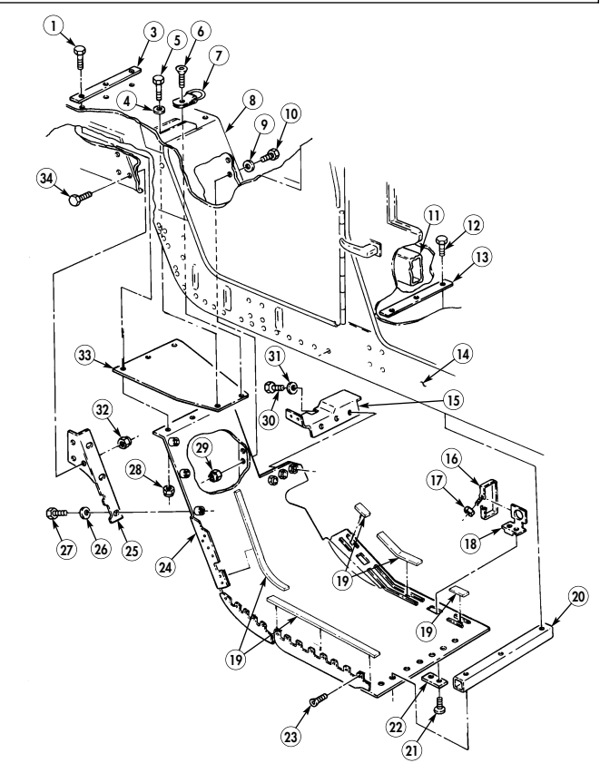

# 11-39.  Right Rear Underbody Armor Maintenance (Cont'D) 11-39. Right Rear Underbody Armor Maintenance (Cont'D)

c. Installation

#### Caution

Ensure position of clamps on frame are under brake lines. Failure to do so will result in damage to equipment.

- Perform step 1 if brackets and clamps were removed. - Ensure all old adhesive and paint is removed from area to be adhesive bonded.

1. Apply adhesive to two brackets (18) and install brackets (18) and four clamps (16) on frame rail (11) with four locknuts (17).

2. Apply sealing compound to threads of three capscrews (12), and install bar (13) and spacer (19) on body with capscrews (12). Tighten capscrews (12) to 68-82 lb-in. (8-9 N•m).

3. Apply sealing compound to threads of eighteen socket-head screws (22), and install armor plate (32)
and right rear underbody armor (23) on rocker panel (14) with socket-head screws (22). Tighten socket-head screws (22) to 68-82 lb-in. (8-9 N•m).

4. Install bar (3) and right rear underbody armor (23) on wheelwell (8) with three capscrews (1) and locknuts (27). Tighten locknuts (27) to 10 lb-ft. (14 N•m).

5. Apply sealing compound to threads of four socket-head screws (20), and install two plates (21) and right rear underbody armor (23) on bracket (18) with socket-head screws (20). Tighten socket-head screws (20) to 37 lb-ft (50 N•m).

6. Apply sealing compound to threads of five capscrews (29), and install bracket (15) on right rear underbody armor (23) with five washers (30) and capscrews (29). Tighten capscrews (29) to 21 lb-ft (28 N•m).

7. Apply sealing compound to threads of three capscrews (26), and install bracket (24) on right rear underbody armor (23) with three washers (25) and capscrews (26). Tighten capscrews (26) to 21 lb-ft (28 N•m).

8. Install bracket (24) on wheelwell (8) with three capscrews (33) and locknuts (31). Tighten locknuts (31) to 10 lb-ft (14 N•m).

9. Install tiedown (7) on wheelwell (8) with socket-head screw (6), washer (4), and capscrew (5).

Tighten socket-head screw (6) to 81-99 lb-ft (110-134 N•m) and capscrew (5) to 37 lb-ft (50 N•m).

10. Install two washers (9), capscrews (10), and locknuts (28) on wheelwell (8) and right rear underbody armor (23). Tighten capscrews (10) to 10 lb-ft (14 N•m).

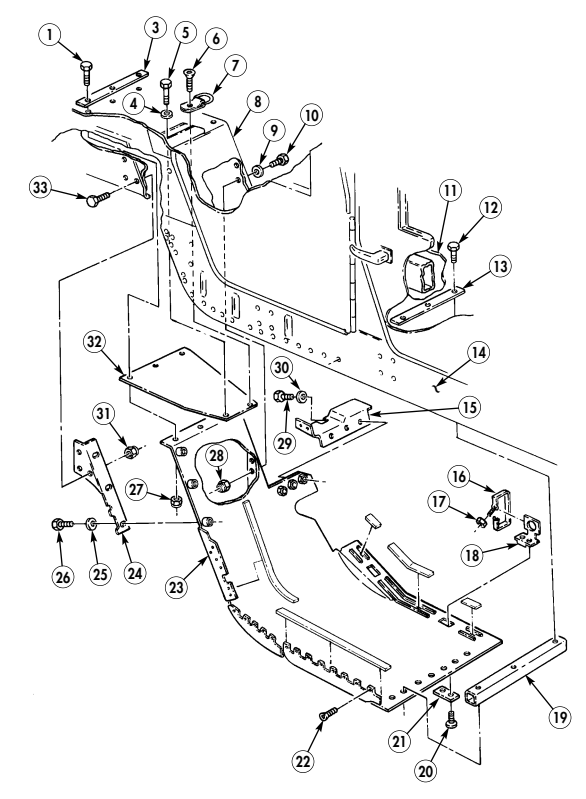

# 11-39. Right Rear Underbody Armor Maintenance (Cont'D)

FOLLOW-ON-TASKS: - Install right front underbody armor (para. 11-38).

- Install right side rocker panel armor and inside protection plate (para. 11-35). - Close fuel filler armor cover (TM 9-2320-387-10). - Lower and secure rear cargo door (TM 9-2320-387-10).

Change 2 11-81

# 11-40. Driver'S Footwell Outer Armor Maintenance

This task covers: a. Removal c. Installation b. Inspection

Applicable Models M1114 Tools General mechanic's tool kit:
automotive (Appendix B, Item 1)
Maintenance and repair shop equipment:
automotive (Appendix B, Item 2)
Materials/Parts Four locknuts (Appendix G, Item 127) Thirty-two locknuts (Appendix G, Item 111) Sealing compound (Appendix C, Item 72.1)

| TM 9\-2320\-387\-10   |
|-----------------------|
| TM 9\-2320\-387\-24P  |

Manual References TM 9-2320-387-24P
Equipment Condition
- Headlight beam selector switch and bracket removed (para. 4-59).

- Protective control box removed (para. 4-4).

Maintenance Level Unit

If new driver's footwell outer armor is installed, perform para 11-36.1.

a. Removal 1. Remove six capscrews (10) and spacer (6) from footwell armor (4) and A-beam armor (11). 2. Remove twelve locknuts (9) and capscrews (13) from footwell armor (4) and outer cowl (2). Discard locknuts (9).

3. Remove fourteen locknuts (8) and capscrews (14) from footwell armor (4) and outer cowl (2). Discard locknuts (8).

Note location of screws and spacers for installation.

4. Remove six locknuts (12), spacers (7), and capscrews (5) from footwell armor (4) and footwell (10.1).

Discard locknuts (12).

5. Remove four locknuts (3), socket-head screws (1), and footwell armor (4) from outer cowl (2). Discard locknuts (3).

b. Inspection Refer to para. 10-56 for plusnut inspection and replacement.

c. Installation

Ensure large spacers are installed in upper holes.

2. Secure footwell armor (4) to outer cowl (2) with four socket-head screws (1), locknuts (3), twelve capscrews (13), locknuts (9), fourteen capscrews (14), and locknuts (8). Tighten locknuts (8) and (9) to 37 lb-ft (50 N•m). Tighten socket-head screws (1) to 10 lb-ft (13 N•m).

3. Apply sealing compound to threads of six capscrews (10), and install spacer (6) and footwell armor (4)
on A-beam armor (11) with capscrews (10). Tighten capscrews (10) to 37 lb-ft (50 N•m).

1. Install footwell armor (4) on footwell (10.1) with six capscrews (5), spacers (7), and locknuts (12).

Tighten locknuts (12) to 35 lb-ft (47 N•m).

# 11-40. Driver'S Footwell Outer Armor Maintenance (Cont'D)

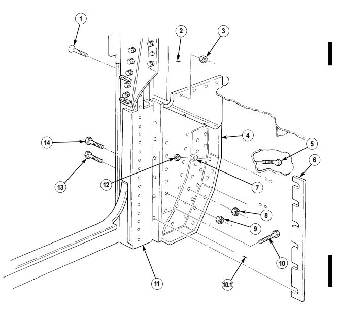

FOLLOW-ON TASKS: -  Install protective control box (para. 4-4).

· Install headlight beam selector switch and bracket (para. 4-59).

## 11-40.1. Left Footwell Outer Armor Installation

This task covers:
Installation

| INITIAL SETUP:                         |                                       |
|----------------------------------------|---------------------------------------|
| Applicable Models                      | Manual References                     |
| M1114, M1151, M1151A1, M1167           | TM 9\-2320\-387\-10                   |
|                                        | TM 9\-2320\-387\-24P                  |
| Tools                                  | Equipment Condition                   |
| General mechanic's tool kit:           |                                       |
| automotive (Appendix B, Item 1)        |                                       |
| Maintenance and repair shop equipment: | - Rear end of cargo shell door raised |
| automotive (Appendix B, Item 2)        | (TM 9\-2320\-387\-10).                |
| Materials/Parts                        | Maintenance Level                     |
| Locknut (Appendix G, Item 122)         | Unit                                  |
| Personnel Required                     |                                       |

#### Installation

1. Install new driver's side footwell outer armor (5), and spacer (6) and secure left A-beam armor (1)
with six capscrews (7). Tighten capscrews (7) to 35 lb ft. (47 N•m).

2. Drill a 13/32 in. hole from A-pillar armor (1) through driver's side footwell outer armor (5). 3. Install capscrew (2) and locknut (3) through A-pillar armor (1) and driver's side footwell outer armor (5). Tighten locknuts (3) to 35 lb ft. (47 N•m).

4. Match drill twenty-five 13/32 in. holes from A-pillar armor (1) and driver's side footwell outer armor (5).

5. Install twenty-five capscrews (2) and locknuts (3) through A-pillar armor (1) and driver's side footwell outer armor (5). Tighten locknuts (3) to 35 lb ft. (47 N•m).

11-40.1. LEFT FOOTWELL OUTER ARMOR INSTALLATION (Cont'd)

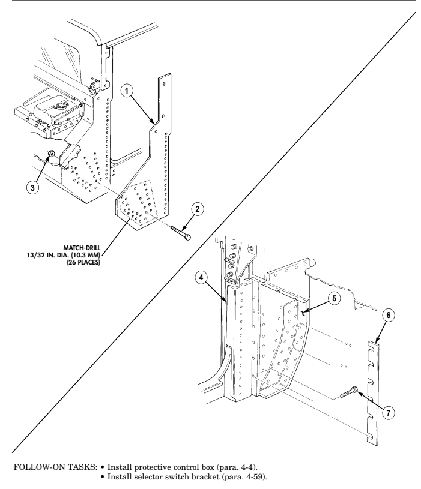

# 11-41. Driver'S Footwell Inner Armor Maintenance

This task covers:
a. Removal c. Installation b. Inspection

Applicable Models M1114 Tools General mechanic's tool kit:
automotive (Appendix B, Item 1)
Maintenance and repair shop equipment:
automotive (Appendix B, Item 2)

#### Materials/Parts

Six locknuts (Appendix G, Item 111) Sealing compound (Appendix C, Item 72.1)
Personnel Required One mechanic One assistant

| TM 9\-2320\-387\-10   |
|-----------------------|
| TM 9\-2320\-387\-24P  |

Equipment Condition
- Accelerator linkage removed (para. 3-43). - Steering wheel lock removed (para. 10-48). - Tunnel interior side insulation removed 
(para. 10-33).

- Left front cowl insulation removed (para. 10-31).

Maintenance Level Unit

If new driver's footwell inner armor is installed, perform para 11-36.1.

a. Removal

Note location of screws and spacers for installation.

1. Remove fifteen capscrews (7) from footwell armor (1), footwell (6.2), and left front underbody (6.1). 2. Remove six locknuts (5), capscrews (4), and spacers (3) from footwell armor (1) and footwell (6.2).

Discard locknuts (5).

3. Remove six capscrews (2), washer (4.1), and footwell armor (1) from inner cowl (6). b. Inspection Refer to para. 10-56 for plusnut inspection and replacement. c. Installation 1. Apply sealing compound to threads of six capscrews (2), and install footwell armor (1) on inner cowl (6)
with capscrews (2) and washer (4.1). Tighten capscrews (2) to 23 lb-ft (31 N•m).

Ensure large spacers are installed in upper holes.

2. Install six spacers (3), capscrews (4), and locknuts (5) on footwell armor (1) and footwell (6.2). Tighten locknuts (5) to 35 lb-ft (47 N•m).

3. Apply sealing compound to threads of fifteen capscrews (7), and install capscrews (7) on footwell armor (1), footwell (6.2), and left front underbody (6.1). Tighten capscrews (7) to 35 lb-ft (47 N•m).

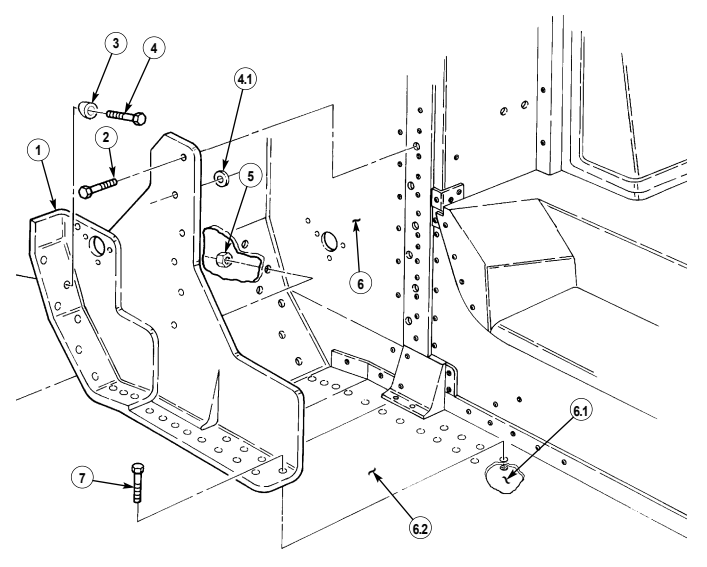

# 11-41. Driver'S Footwell Inner Armor Maintenance (Cont'D)

FOLLOW-ON TASKS: - Install left front cowl insulation (para. 10-31).

· Install tunnel interior side insulation (para. 10-33). · Install steering wheel lock (para. 10-48).

-  Install accelerator linkage (para. 3-43).

# 11-42. A-Beam Left Side Armor Replacement

This task covers:
a. Removal b. Installation INITIAL SETUP:
Applicable Models M1114 Manual References TM 9-2320-387-24P
Tools General mechanic's tool kit:
automotive (Appendix B, Item 1)
Maintenance and repair shop equipment:
automotive (Appendix B, Item 2)
Materials/Parts Sealing compound (Appendix C, Item 72.1)
Personnel Required One mechanic One assistant a. Removal 1. Remove two capscrews (6) and washers (5) from A-beam armor (1) and body (7). 2. Remove six capscrews (3), A-beam armor (1), and spacer (4) from left side footwell outer armor (2).

b. Installation 1. Apply sealing compound to threads of six capscrews (3), and install spacer (4) and A-beam armor (1)
on left side footwell outer armor (2) with capscrews (3). Tighten capscrews (3) to 37 lb-ft (50 N•m).

2. Apply sealing compound to threads of two capscrews (6), and install A-beam armor (1) on body (7)
with two washers (5) and capscrews (6). Tighten capscrews (6) to 37 lb-ft (50 N•m).

Equipment Condition
- Driver's side door removed (para. 11-2). - Left front underbody armor removed 
(para. 11-36).

Maintenance Level Unit

# 11-42. A-Beam Left Side Armor Replacement (Cont'D)

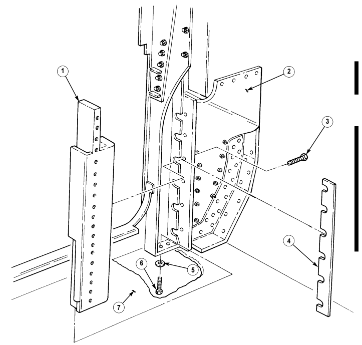

FOLLOW-ON TASKS: - Install left front underbody armor (para. 11-36).
- • Install driver's side door (para. 11-2).

# 11-43. A-Beam Right Side Armor Replacement

This task covers:

Applicable Models M1114 Tools General mechanic's tool kit:
automotive (Appendix B, Item 1)
Maintenance and repair shop equipment:
automotive (Appendix B, Item 2)
Riveter tool kit (Appendix B, Item 123)

#### Materials/Parts

Sealing compound (Appendix C, Item 72.1)
Personnel Required One mechanic One assistant a. Removal b. Installation a. Removal b. Installation

#### Manual References

TM 9-2320-387-24P

#### Equipment Condition

- Right front door removed (para. 11-2). - Right front underbody armor removed (para. 11-38).

Maintenance Level Unit 1. Remove two capscrews (7) and washers (8) from body (5) and A-beam armor (4). 2. Remove five capscrews (1), A-beam armor (4), and spacers (3) and (9) from right side footwell outer armor (2) and A-beam (6).

1. Apply sealing compound to threads of five capscrews (1), and install spacers (3) and (9) and A-beam armor (4) on right side footwell outer armor (2) with capscrews (1). Tighten capscrews (1) to 37 lb-ft (50 N•m).

2. Apply sealing compound to threads of two capscrews (7), and install A-beam armor (4) on A-beam (6) and body (5) with two washers (8) and capscrews (7). Tighten capscrews (6) to 37 lb-ft (50 N•m).

# 11-43. A-Beam Right Side Armor Replacement (Cont'D)

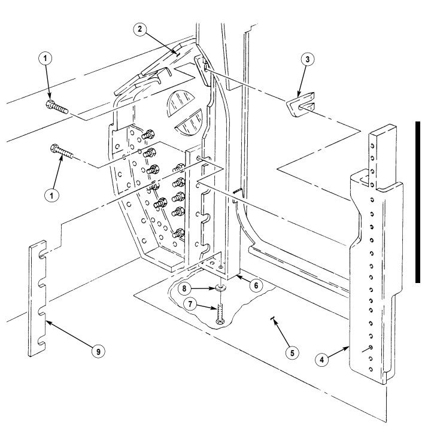

FOLLOW-ON TASKS: - Install right front underbody armor (para. 11-38).

-  Install right front door (para. 11-2).

# 11-44. B-Pillar Armor Replacement

This task covers:
INITIAL SETUP:

| Applicable Models   |
|---------------------|

Tools General mechanic's tool kit:
automotive (Appendix B, Item 1)
Maintenance and repair shop equipment:
automotive (Appendix B, Item 2)
Special Tools Riveter tool kit (Appendix B, Item 123)
Materials/Parts Adhesive (Appendix C, Item 4) Four rivets (Appendix G, Item 267) Five locknuts (Appendix G, Item 127) Three locknuts (Appendix G, Item 129)

#### A. Removal B. Installation

Personnel Required

| Equipment Condition   |
|-----------------------|

One mechanic One assistant

|    | \-   | 1   |
|----|------|-----|

Equipment Condition
- B-pillar IED overlay (Frag 1) removed 
(if equipped) (para. 11-124).

- Rear door and hinge removed (if equipped)
(para. 11-2.1).

- Rear door and hinge (Frag 5) removed 
(if equipped) (para. 11-143).

Maintenance Level NOTE
Replacement procedures for left and right B-pillar armor are basically the same. This procedure covers left side B-pillar armor.

a. Removal NOTE
For replacement of rivets, refer to para. 10-56.

1. Remove two rivets (15) from B-pillar armor (1) and B-pillar back-up armor (2).

NOTE
Rifle mount bracket is used on right side B-pillar armor in place of shims.

2. Remove three locknuts (9), washers (10), shims (11) and (11.1), and three capscrews (16) from armor (1) and bracket (8). Discard locknuts (9).

3. Remove two locknuts (4), capscrews (17), and B-pillar armor (1) from B-pillar back-up armor (2).

Discard locknuts (4).

4. Remove any adhesive from B-pillar armor (1) and B-pillar back-up armor (2). 5. Remove three locknuts (5), capscrews (3), shims (6), and B-pillar back-up armor (2) from header (7)
and body (12). Discard locknuts (5).

Perform step 6 if spacer is damaged.

6. Remove two rivets (14) and spacer (13) from body (12). b. Installation

Perform step 1 if spacer was removed.

1. Install spacer (13) on body (12) with two rivets (14). 2. Install B-pillar back-up armor (2) and shims (6) on body (12) and header (7) with three capscrews (3)
and locknuts (5). Tighten capscrews (3) to 5 lb-ft (7 N•m).

## 11-44. B-Pillar Armor Replacement **(Cont'D)**

3. Install B-pillar armor (1) on B-pillar back-up armor (2) with two capscrews (17) and locknuts (4).

Tighten locknuts (4) to 10 lb-ft (13 N•m).

4. Install three capscrews (16), washers (10), shims (11) and (11.1), and three locknuts (9) on B-pillar armor (1) and bracket (8). Tighten locknuts (9) to 51 lb-ft (69 N•m).

4.1. If new spacer (13) is installed, it will be necessary to match-drill two 17/64-in. (6.7 mm) diameter holes through B-pillar armor (1) and B-pillar back-up armor (2) into spacer (13).

5. Install B-pillar armor (1) on B-pillar back-up armor (2) with two rivets (15). 6. Seal top of B-pillar armor (1) with adhesive.

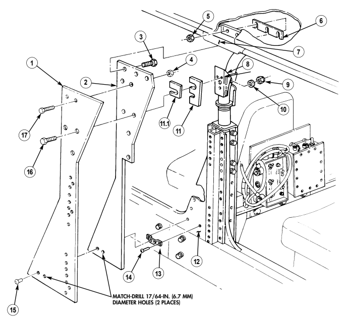

FOLLOW-ON TASKS: - Install rear door and hinge (Frag 5) (if equipped) (para. 11-143).

- Install rear door and hinge (if equipped) (para. 11-2.1). - Install B-pillar IED overlay (Frag 1) (if equipped) (para. 11-124).

## 11-44.1. B-**Pillar Padding Replacement**

This task covers:
INITIAL SETUP:
Applicable Models M1151 Tools General mechanic's tool kit:
automotive (Appendix B, Item 1)
Materials/Parts Two locknuts (Appendix G, Item 105)
a. Removal

#### B. Installation

1. Install edge trim (9) on B-pillar (11). 2. Install padding (3) on B-pillar (11) with washer (2) and screw (1).

a. Removal b. Installation

| TM 9\-2320\-387\-24P   |
|------------------------|

| Manual References    |
|----------------------|
| TM 9\-2320\-387\-24P |

1. Remove locknut (8), washer (7), capscrew (6), and washer (7) from padding (3) and B-pillar (11).

Discard locknut (8).

2. Remove locknut (10), washer (4), capscrew (5), and washer (4) from padding (3) and B-pillar (11).

Discard locknut (10).

3. Remove screw (1), washer (2), and padding (3) from B-pillar (11). 4. Remove edge trim (9) from B-pillar (11).

3. Secure padding (3) to B-pillar (11) with washer (4), capscrew (5), washer (4), and locknut (10).

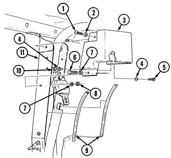 4. Secure padding (3) to B-pillar (11) with washer (7), capscrew (6), washer (7), and locknut (8).

# 11-45. C-Pillar Top Armor Maintenance

This task covers:
b. Inspection

Applicable Models M1114 Tools General mechanic's tool kit:
automotive (Appendix B, Item 1)
Maintenance and repair shop equipment:
automotive (Appendix B, Item 2)
Materials/Parts Eight locknuts (Appendix G, Item 127) Sealing compound (Appendix C, Item 72.1)
Manual References TM 9-2320-387-24P
a. Removal a. Removal c. Installation

#### Equipment Condition

- C-pillar bottom left side armor removed 
(para. 11-46).

- Condenser fan access panel removed (para. 11-86). - C-pillar IED overlay (Frag 1A) removed 
(if equipped) (para. 11-138).

- C-pillar IED overlay-LH (Frag 1) removed 
(if equipped) (para. 11-125).

- C-pillar IED overlay-RH (Frag 1) removed 
(if equipped) (para. 11-125).

Maintenance Level Unit

Mark location of capscrews for installation.

1. Remove three locknuts (4) and capscrews (3) securing C-pillar top armor (2) to cargo shell (8).

Discard locknuts (4).

2. Remove three locknuts (15) and capscrews (9) from cargo shell (8) and C-pillar top armor (2).

Discard locknuts (15).

3. Remove two capscrews (1) and bracket (6) from C-pillar top armor (2) and header assembly (5). 4. Remove two capscrews (19) and plate (11) from C-pillar (10). 5. Remove two locknuts (12), capscrews (16), shim (14), and C-pillar top armor (2) from bracket (13).

Discard locknuts (12).

6. Remove four capscrews (17) and bracket (13) from C-pillar (10).

b. Inspection Refer to para. 10-56 for plusnut inspection and replacement.

c. Installation

- Apply sealing compound on capscrews in steps 1, 3, and 6. - If bracket is being replaced, drill two 9/32-in. (7.1 mm) diameter holes from C-pillar top armor to bracket.

1. Install bracket (13) on C-pillar (10) with four capscrews (17). Tighten capscrews (17) 
to 68-82 lb-in. (8-9 N•m).

2. Install C-pillar top armor (2) and shim (14) on bracket (13) with two capscrews (16) and locknuts (12). Tighten capscrews (16) to 10 lb-ft (14 N•m).

3. Install C-pillar top armor (2) and bracket (6) on header assembly (5) with two capscrews (1).

Tighten capscrews (1) to 10 lb-ft (14 N•m).

4. Install C-pillar top armor (2) on cargo shell (8) with three capscrews (3) and locknuts (4).

Tighten capscrews (3) to 10 lb-ft (14 N•m).

5. Install C-pillar top armor (2) on cargo shell (8) with three capscrews (9) and locknuts (15).

Tighten capscrews (9) to 10 lb-ft (14 N•m).

6. Install plate (11) on C-pillar (10) with two capscrews (19). Tighten capscrews (19) to 68-82 lb-in.

(7-9 N•m).

# 11-45. C-Pillar Top Armor Maintenance (Cont'D)

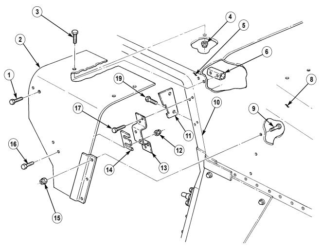

FOLLOW-ON TASKS: - Install C-pillar IED overlay-RH (Frag 1) (if equipped) (para. 11-126).

- Install C-pillar IED overlay-LH (Frag 1) (if equipped) (para. 11-125). - Install C-pillar IED overlay (Frag 1A) (if equipped) (para. 11-138). - Install condenser fan access panel (para. 11-86). - Install C-pillar bottom left side armor (para. 11-46).

# 11-46. C-Pillar Bottom Left Side Armor Maintenance

This task covers:
a.1. Inspection

Applicable Models M1114 Tools General mechanic's tool kit:
automotive (Appendix B, Item 1)
Maintenance and repair shop equipment:
automotive (Appendix B, Item 2)
Materials/Parts Sealing compound (Appendix C, Item 72.1)
a. Removal Remove four capscrews (2), bottom left side armor (3), and four washers (4) from body (1).

a.1. Inspection Refer to para. 10-56 for plusnut inspection and replacement.

b. Installation a. Removal b. Installation Manual References TM 9-2320-387-24P
Equipment Condition Left side C-pillar IED overlay (Frag 1) removed (if equipped) (para. 11-125).

Maintenance Level Unit Apply sealing compound to threads of four capscrews (2), and install four washers (4) and bottom left side armor (3) on body (1) with capscrews (2). Tighten capscrews (2) to 68-82 lb-in. (8-9 N•m).

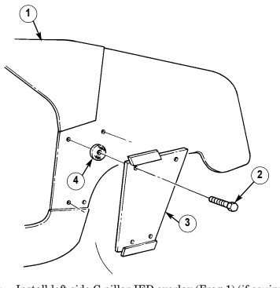

FOLLOW-ON TASK: Install left side C-pillar IED overlay (Frag 1) (if equipped) (para. 11-125).

# 11-47. Tailgate Armor Plate Replacement

This task covers:
INITIAL SETUP:
Applicable Models M1114, M1151, M1115A1 Tools General mechanic's tool kit:
automotive (Appendix B, Item 1)
Maintenance and repair shop equipment:
automotive (Appendix B, Item 2)
Materials/Parts Nine lockwashers (Appendix G, Item 146) Sound dampener (Appendix G, Item 314.1)

#### A. Removal B. Installation

Manual References TM 9-2320-387-10 TM 9-2320-387-24P
Equipment Condition
- Tailgate lowered (TM 9-2320-387-10). - Pioneer tool kit stowage straps and bracket removed (para. 10-37).

Maintenance Level Unit

#### A. Removal

1. Remove nine capscrews (3), lockwashers (2), armor plate (1), and sound dampener (4) from tailgate (5). Discard lockwashers (2) and sound dampener (4).

2. Clean armor plate (1) to remove adhesive.

b. Installation 1. Peel paper backing (6) from sound dampener (4) and install sound dampener (4) on armor plate (1).

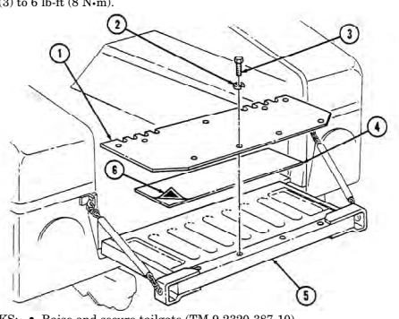 2. Install armor plate (1) on tailgate (5) with nine lockwashers (2) and capscrews (3). Tighten capscrews (3) to 6 lb-ft (8 N•m).

FOLLOW-ON TASKS: - Raise and secure tailgate (TM 9-2320-387-10).
- Install pioneer tool kit stowage straps and bracket (para. 10-37).

## 11-48. Firewall Armor Maintenance

This task covers:
a. Removal c. Installation b. Inspection

Applicable Models M1114 Tools General mechanic's tool kit:
automotive (Appendix B, Item 1)
Maintenance and repair shop equipment:
automotive (Appendix B, Item 2)
Materials/Parts Sealing compound (Appendix C, Item 72.1)

#### Manual References

TM 9-2320-387-10 TM 9-2320-387-24P
Equipment Condition
- Hood raised and secured (TM 9-2320-387-10). - Left front firewall cowl armor removed
(para. 11-49).

Maintenance Level Unit

#### A. Removal

1. Remove capscrew (3) and left front firewall armor (1) from body (2). 2. Remove two capscrews (5) and right side firewall armor (4) from body (2).

3. Remove two capscrews (7) and center firewall armor (6) from body (2).

b. Inspection Refer to para. 10-56 for plusnut inspection and replacement.

c. Installation

Apply sealing compound to capscrews prior to installation.

1. Install center firewall armor (6) on body (2) with two capscrews (7). Tighten capscrews (7) to 68-82 lb-in. (8-9 N•m).

2. Install right side firewall armor (4) on body (2) with two capscrews (5). Tighten capscrews (5) to 68-82 lb-in. (8-9 N•m).

3. Install left front firewall armor (1) on body (2) with capscrew (3). Tighten capscrew (3) to 68-82 lb-in. (8-9 N•m).

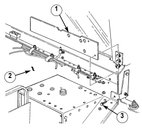

# 11-48. Firewall Armor Maintenance (Cont'D)

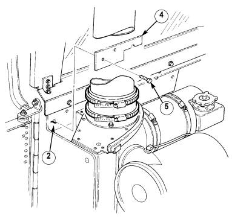

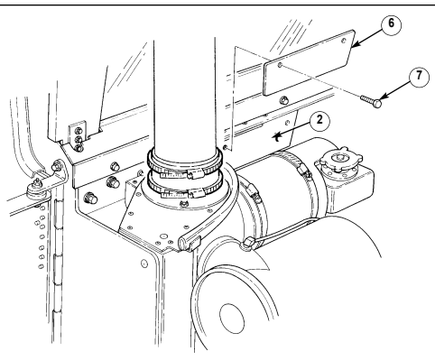

FOLLOW-ON TASKS: - • Install left front firewall cowl armor (para. 11-49).
- • - • Lower and secure hood (TM 9-2320-387-10).

# 11-49. Cowl Armor Maintenance

This task covers:
a. Removal c. Installation b. Inspection

| M11   | 1   | 4   |
|-------|-----|-----|

Applicable Models Tools General mechanic's tool kit:
automotive (Appendix B, Item 1)
Maintenance and repair shop equipment:
automotive (Appendix B, Item 2)
Materials/Parts Eight locknuts (Appendix G, Item 127) Adhesive (Appendix C, Item 4) Sealing compound (Appendix C, Item 64)

| Maintenance Level   |
|---------------------|
| Unit                |

- Windshield washer reservoir and pump assembly

| Equipment Condition                                 |
|-----------------------------------------------------|
| - Right front door and hinge (Frag 5) removed       |
| (if equipped) (para. 11\-142).                      |
| - Right front door and hinge removed (para. 11\-2). |
| - Right rearview mirror removed (if equipped)       |
| (para. 10\-68).                                     |

#### A. Removal

1. Remove six capscrews (15) from left front underbody armor (17) and bracket (18). 2. Remove two capscrews (9) from bracket (8). 3. Remove four capscrews (7) and bracket (8) from cowl armor (20). If necessary, remove four capscrews (16)
from front of left front underbody armor (17) to allow bracket (8) to be removed.

4. Remove four locknuts (11), capscrews (12), and bracket (13) from left front cowl (14). Discard locknuts (11).

5. Remove two capscrews (1) from shield (23) and front cowl armor (20). 6. Remove three capscrews (3) from bracket (2), bracket (4), and front cowl armor (20). 7. Remove two capscrews (5), controller ground lead (21), and circuit breaker (6) from front cowl armor (20). 8. Move shield (23), bracket (2), and circuit breaker (6) off to one side. 9. Remove two capscrews (22) and bracket (4) from front cowl armor (20).

10. Move bracket (4) off to one side. 11. Remove two capscrews (10) and front cowl armor (20) from left front cowl (14). 12. Remove twelve washers (19) from left front cowl (14).

b. Inspection Refer to para. 10-56 for plusnut (18) inspection and replacement.

#### C. Installation

1. Install twelve washers (19) on left front cowl (14) with adhesive. Wait for adhesive to dry. 2. Apply sealing compound to threads of two capscrews (10) and install front cowl armor (20) on left front cowl (14) with capscrews (10). Tighten capscrews (10) and install front cowl armor (20) on left front cowl (14) with capscrews (10). Tighten capscrews (10) to 6 lb-ft (8 N•m).

3. Apply sealing compound to threads of two capscrews (22) and install bracket (4) on front cowl armor
(20) with capscrews (22). Tighten capscrews (22) to 6 lb-ft (8 N•m).

4. Apply sealing compound to threads of two capscrews (1), three capscrews (3), and two capscrews (5). 5. Install shield (23) and bracket (2) on front cowl armor (20) with two capscrews (1) and three capscrews (3). Tighten capscrews (1) and (3) to 6 lb-ft (8 N•m).

6. Install circuit breaker (6) and controller ground lead (21) on front cowl armor (20) with two screws (5). 7. Install bracket (13) on left front cowl (14) with four capscrews (12) and locknuts (11). Tighten locknuts
(11) to 10 lb-ft (14 N•m).

8. Apply sealing compound to threads of four capscrews (7) and two capscrews (9).

## 11-49. Cowl Armor Maintenance (Cont'D)

9. Install bracket (8) between left front underbody armor (17) and left front cowl (14) with four capscrews (7) and two capscrews (9). Tighten capscrews (7) and (9) to 6 lb-ft (8 N•m).)
10. If removed, apply sealing compound to threads of four capscrews (16) and install four capscrews (16)
on front section of left front underbody armor (17). Tighten capscrews (16) to 10 lb-ft (14 N•m).

11. Apply sealing compound to threads of six capscrews (15) and install on left front underbody armor (17).

Tighten capscrews (15) to 6 lb-ft (8 N•m).

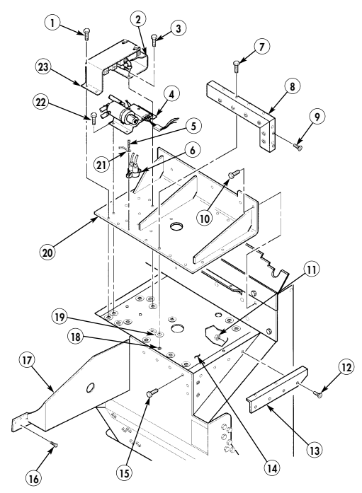

FOLLOW-ON TASKS: - Install directional signal flasher (para. 4-61).

- Install protective control box (para. 4-4). - Install windshield washer reservoir and pump assembly (para. 10-64).

# 11-50. Turret Armor And Turret Bearing Hatch Latch Replacement

| This task covers:               |                      |
|---------------------------------|----------------------|
| a.  Removal                     | c.  Installation     |
| b.  Inspection                  |                      |
| INITIAL SETUP:                  |                      |
| Applicable Models               | Manual References    |
| M1114                           | TM 9\-2320\-387\-10  |
|                                 | TM 9\-2320\-387\-24P |
| Tools                           |                      |
| General mechanic's tool kit:    | Equipment Condition  |
| automotive (Appendix B, Item 1) |                      |

This task covers:

To increase latch tension, 3/8 in. (9.5 mm) washers may be added between bottom of turret armor and hatch latch.

a. Removal

- Perform step 1 for turret armor-mounted hatch latch. - Perform steps 2 and 3 for turret bearing-mounted hatch latch.

1. Remove capscrew (2), hatch latch (5), and spacer (4) from turret armor (3). 2. Remove capscrew (6) and hatch latch (9) from turret hatch clamp bracket (7). 3. Remove two capscrews (10) and turret hatch clamp bracket (7) from turret bearing (8).

b. Installation

- Apply sealant to capscrews prior to installation. - Perform steps 1 and 2 for turret armor-mounted hatch latch. - Perform steps 3 and 4 for turret bearing-mounted hatch latch.

1. Apply RTV sealant around mount hole (1) prior to installing capscrew (2). 2. Install spacer (4) and hatch latch (5) on turret armor (3) with capscrew (2). Tighten capscrew (2) to 37 lb-ft (50 N•m).

3. Install turret hatch clamp bracket (7) on turret bearing (8) with two capscrews (10). Tighten capscrews (10) to 37 lb-ft (50 N•m).

4. Install hatch latch (9) on turret hatch clamp bracket (7) with capscrew (6). Tighten capscrew (6) to 37 lb-ft (50 N•m).

# 11-50.  Turret Armor And Turret Bearing Hatch Latch Replacement (Cont'D)

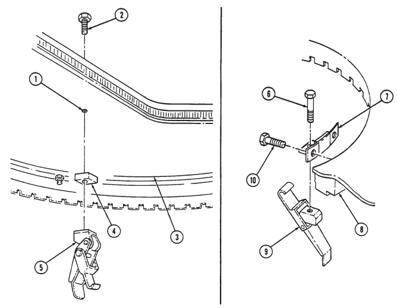

# 11-51. Turret Armor Brush Seal Replacement

This task covers:
INITIAL SETUP:
Applicable Models M1114 Tools General mechanic's tool kit:
automotive (Appendix B, Item 1)
Special Tools Riveter tool kit (Appendix B, Item 123)
Materials/Parts Twenty-eight rivets (Appendix G, Item 266) RTV sealant (Appendix C, Item 74)
a. Removal a. Removal b. Installation Manual References TM 9-2320-387-24P
Equipment Condition
- Turret pintle mount removed (para. 11-62). - Night vision lid bumper bracket removed 
(para. 11-58).

Maintenance Level Unit

- Note brush seals location for installation. - For replacement of rivets, refer to para. 10-56.

Remove twenty-eight rivets (1) and two brush seals (3) from turret armor (2).

b. Installation 1. Apply a small amount of sealant to brush seal mount holes (4).

Ensure two rivet holes are left open for night vision lid bumper bracket.

2. Position two brush seals (3) on turret armor (2) and install twenty-eight rivets (1) (leave two rivet holes (5) open).

3. Seal butt joints of brush seals (3) with sealant.

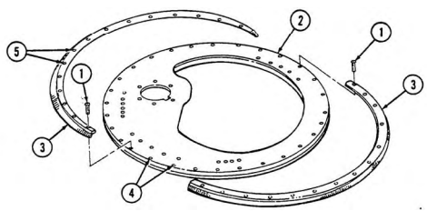

FOLLOW-ON TASKS: - Install turret pintle mount (para. 11-62).

- Install night vision lid bumper bracket (para. 11-58).

11-102 Change 2

# 11-52. Turret Armor And Seal Replacement

This task covers:

Applicable Models M1114 Tools General mechanic's tool kit:
automotive (Appendix B, Item 1)
Maintenance and repair shop equipment:
automotive (Appendix B, Item 2)

#### Materials/Parts

RTV sealant (Appendix C, Item 74) Adhesive (Appendix C, Item 4) Sealing compound (Appendix C, Item 64)
a. Removal b. Installation

#### Manual References Tm 9-2320-387-24P Equipment Condition

- Night vision mount removed (para. 11-60), If required. - Turret pintle mount removed (para. 11-62). - Turret armor brush seal removed (para. 11-51), if required.

- Turret door removed (para. 11-53), if required. - Turret armor hatch latch removed (para. 11-50). - Turret hatch pivot base removed (para. 11-59).

Maintenance Level Unit

#### A. Removal

1. Remove seal (2) from turret armor (7).

Note location of mount holes for installation.

2. Remove two capscrews (1) and turret armor (7) from turret bearing (6).

b. Installation 1. Start installation of seal (2) centered in location of five turret door hinge mounting holes (3) and press edge of seal (2) over lip of turret armor (7).

2. Apply adhesive to sponge rubber (5) and insert into installed end of seal (2). 3. Continue installation of seal (2) around turret armor (7) and complete by inserting free end of sponge rubber (5) into seal (2). Allow adhesive to set and cure for about one hour.

4. Apply sealant around turret armor mount holes (4). 5. Apply sealing compound to threads of two capscrews (1). 6. Install turret armor (7) on turret bearing (6) and secure with two capscrews (1). Tighten capscrews
(1) to 37 lb-ft (50 N•m).

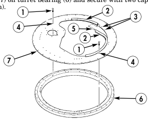

FOLLOW-ON TASKS: - Install turret hatch pivot base (para. 11-59).

- Install turret armor hatch latch (para. 11-50). - Install turret door (para. 11-53), if removed. - Install turret armor brush seal (para. 11-51). - Install turret pintle mount (para. 11-62). - Install night vision mount (para. 11-60).

# 11-53. Turret Door Replacement

This task covers:

| INITIAL SETUP:    |
|-------------------|
| Applicable Models |
| M1114             |
| Tools             |

INITIAL SETUP:
Maintenance and repair shop equipment:
automotive (Appendix B, Item 2)
Personnel Required One mechanic One assistant

#### A. Removal

1. Open turret hatch door (3) flat against turret (6). 2. Remove four nuts (7), washers (8), and capscrews (1) from turret door (3) and turret (6). 3. Remove nut (5), washer (4), and capscrew (2) from turret door (3) and turret (6). 4. Remove turret door (3) from turret (6).

#### B. Installation

1. Position turret door (3) on turret (6) and secure with capscrew (2), washer (4), and nut (5). Tighten capscrew (2) to 37 lb-ft (50 N•m).

2. Install four capscrews (1), washers (8), and nuts (7) on turret door (3) and turret (6). Tighten capscrews (1) to 37 lb-ft (50 N•m).

a. Removal b. Installation

| Manual References    |
|----------------------|
| TM 9\-2320\-387\-24P |
| Equipment Condition  |

11-53. TURRET DOOR REPLACEMENT (Cont'd)

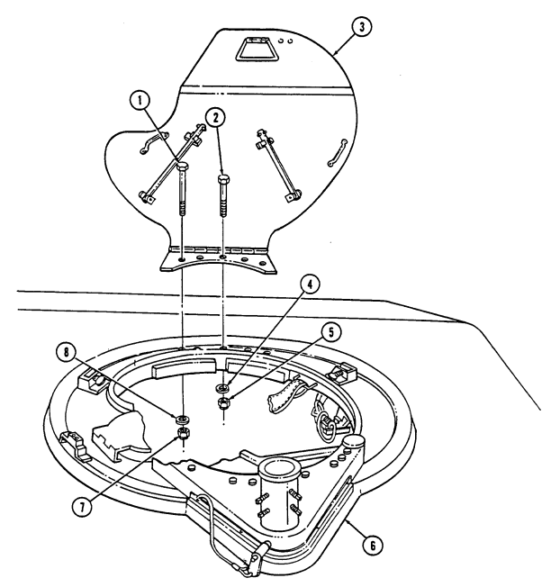

FOLLOW-ON TASK:  Close and secure turret door (TM 9-2320-387-10).

## I **1 L-54. Turret Backrest Replacement I**

This task covers: 

a. Removal b. Installation 

| Applicable Models                      | Equipment Condition                              |
|----------------------------------------|--------------------------------------------------|
| M1114                                  | - Hood raised and secured (TM 9\-2320\-387\-10). |
|                                        | - Left side rocker panel armor removed           |
| Tools                                  | (para. 11\-34).                                  |
| General mechanic's tool kit:           | - Upper left front underbody wheelwell IED       |
| automotive (Appendix B, Item 1)        | armor overlay (Frag 2) removed (if equipped)     |
| Maintenance and repair shop equipment: | (para. 11\-148).                                 |
| automotive (Appendix B, Item 2)        | - Lower left front underbody wheelwell IED       |
|                                        | armor overlay (Frag 2) removed (if equipped)     |
| Materials/Parts                        | (para. 11\-147).                                 |

1 a. Removal 1 1. Remove two nuts (31, washers (4), and capscrews (1) from turret hatch door (9) and turret (2). 

2. Remove capscrew W, washer (6), backrest (71, and spacer (8) from turret (21. 

1. Apply sealant around screw mounting holes in turret hatch door (9). 

Apply sealant to capscrews prior to installation. 

2. Install spacer (8) and backrest (7) on turret (2) with washer (6) and capscrew (5). Tighten capscrew (51 to 37 lb-ft (50 N-m). 

3. Install two capscrews (11, washers (41, andnuts (3) on turret hatch door (91 and turret (2). Tighten capscrews (11 to 37 lb-R (50 Nom). 

-1 

# 11-54. Turret Backrest Replacement (Cont'D)

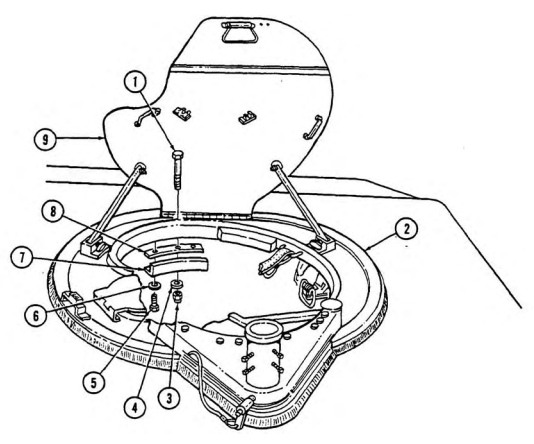

FOLLOW-ON TASK:  Close and secure turret door (TM 9-2320-387-10).

# 11-55. Turret Brake And Base Maintenance

This task covers:
a. Removal c. Adjustment b. Installation

| Applicable Models                      | Personnel Required                           |
|----------------------------------------|----------------------------------------------|
| M1114                                  | One mechanic                                 |
| Tools                                  | One assistant                                |
| General mechanic's tool kit:           | Manual References                            |
| automotive (Appendix B, Item 1)        | TM 9\-2320\-387\-24P                         |
| Maintenance and repair shop equipment: |                                              |
| automotive (Appendix B, Item 2)        | Equipment Condition                          |
| Materials/Parts                        | - Headlight beam selector switch and bracket |

#### A. Removal

1. Remove four locknuts (9), capscrews (1), and brake (8) from base (6). Discard locknuts (9). 2. Remove two capscrews (2) from base (6) and turret (3). 3. Remove two capscrews (4), capscrew (5), and base (6) from turret (3).

b. Installation c. Adjustment 1. Adjust capscrew (5) to 0.56 in. (14.2 mm). 2. Close brake assembly (8). 3. Adjust capscrew (5) to contact detent arm (7) of brake assembly (8) plus 1/4-1/3 turn.

1. Install base (6) on turret (3) with two capscrews (2). Tighten capscrews (2) to 37 lb-ft (50 N•m). 2. Apply sealing compound to threads of two capscrews (4) and capscrew (5), and install capscrews (4)
and capscrew (5) on base (6) and turret (3). Tighten capscrews (4) and (5) to 37 lb-ft (50 N•m).

3. Install brake assembly (8) on base (6) with four capscrews (1) and locknuts (9). Tighten locknuts (9) to 19-23 lb-ft (25-31 N•m).

# 11-55. Turret Brake And Base Maintenance (Cont'D)

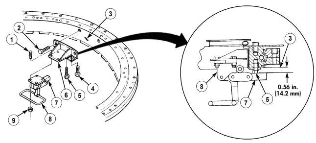

# 11-55.1. Turret Brake Assembly Replacement

This task covers:
a. Removal b. Installation

| General mechanic's tool kit:           |
|----------------------------------------|
| automotive (Appendix B, Item 1)        |
| Maintenance and repair shop equipment: |
| automotive (Appendix B, Item 2)        |

automotive (Appendix B, Item 1)
Maintenance and repair shop equipment:
automotive (Appendix B, Item 2)

| One mechanic      |
|-------------------|
| One assistant     |
| Manual References |

#### A. Removal

1. Disengage turret brake (2) by pulling handle (1) outward. 2. Loosen two capscrews (4) on turret stop ring (5). 3. Remove turret brake (2) from turret stop ring (5).

#### B. Installation

1. Install turret brake (2) between two capscrews (4), washers (3), and stop ring (5). Ensure washers
(3) are positioned on bottom side of turret brake (2) and tighten capscrews (4) to 37 lb-ft (50 N•m).

2. Check turret brake (2) engagement with turret stop ring (5). Loosen capscrews (4) and adjust turret brake (2) as required. Retighten capscrews (4) to 37 lb-ft (50 N•m).

3. Engage turret brake (2) by pushing handle (1) inward.

# 11-55.1. Turret Brake Assembly Replacement (Cont'D)

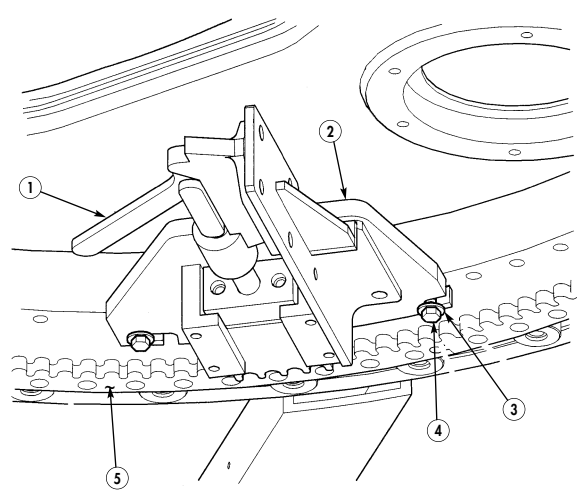

# 11-55.2. Turret Brake Maintenance

This task covers:
a. Disassembly c. Assembly b. Inspection

| Applicable Models                      | Manual References                             |
|----------------------------------------|-----------------------------------------------|
| M1114                                  | TM 9\-2320\-387\-24P                          |
| Tools                                  | Equipment Condition                           |
| General mechanic's tool kit:           | - Accelerator linkage removed (para. 3\-43).  |
| automotive (Appendix B, Item 1)        | - Steering wheel lock removed (para. 10\-48). |
| Maintenance and repair shop equipment: | - Tunnel interior side insulation removed     |
| automotive (Appendix B, Item 2)        | (para. 10\-33).                               |
| Materials/Parts                        |                                               |

Materials/Parts Sealing compound (Appendix C, Item 64) Six locknuts (Appendix G, Item 111)

#### A. Disassembly

1. Remove capscrew (12) from clamp bracket (14). 2. Remove two locknuts (2) and capscrews (11) from clamp bracket (14) and mount plate (1). Discard locknuts (2).

3. Remove four locknuts (13), capscrews (17), clamp bracket (14), and shims (15) from push-and-pull lever (16). Discard locknuts (13).

4. Remove four capscrews (18) and two slide blocks (19) from mount plate (1). 5. Remove two capscrews (10) from lower gear plate (9). 6. Remove gear plate (3) along with four washers (4) and spring (5) from push-and-pull lever (16). 7. Remove flat head screw (6), spindle retainer (7), five washers (8), and lower gear plate (9) from shaft of push-and-pull lever (16).

#### B. Inspection

Inspect spring (5) for wear and damage. If worn or damaged, replace spring (5).

# 11-55.2. Turret Brake Maintenance (Cont'D)

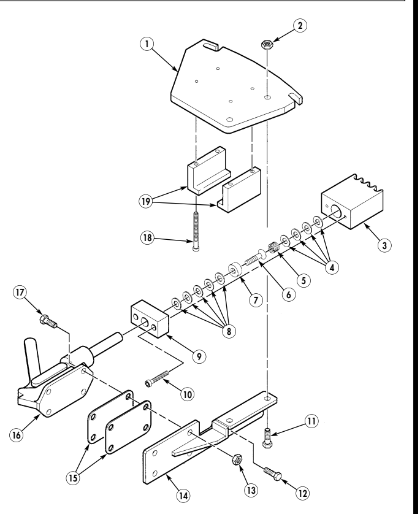

# 11-55.2. Turret Brake Maintenance (Cont'D)

#### C. Assembly

1. Install lower gear plate (9) on shaft of push-and-pull lever (16). 2. Apply sealing compound to threads of flathead screw (6). 3. Install five washers (8) and spindle retainer (7) on shaft of push-and-pull lever (16) and secure with flathead screw (6). Tighten flathead screw (6) to 37 lb-ft (50 N•m).

4. Install four washers (4) and spring (5) in large hole in gear plate (3). 5. Apply sealing compound to threads of two capscrews (10). 6. Secure lower gear plate (9) on gear plate (3) with two capscrews (10). Tighten capscrews (10) to 10 lb-ft (14 N•m).

7. Apply sealing compound to four capscrews (18). 8. Install two slide blocks (19) on mount plate (1) and secure with four capscrews (18). Tighten capscrews (18) to 10 lb-ft (14 N•m).

9. Slide gear plate (3), with previously attached parts, between slide blocks (19). 10. Install clamp bracket (14) on mount plate (1) and secure with two capscrews (11) and locknuts (2).

Tighten locknuts (2) to 37 lb-ft (50 N•m).

11. Apply sealing compound to capscrew (12). 12. Install capscrew (12) into side of clamp bracket (14). Tighten capscrew (12) to 37 lb-ft (50 N•m). 13. Install turret brake shims (15) as required. Secure clamp bracket (14) and turret brake shims (15)
to push-and-pull lever (16) with four capscrews (17) and locknuts (13). Tighten locknuts (13) to 37 lb-ft (50 N•m).

14. Engage and disengage push-and-pull lever (16) to check turret brake assembly for binding or other improper operation. Add or remove turret brake shims (15) as required.

11-55.2. TURRET BRAKE MAINTENANCE (Cont'd)

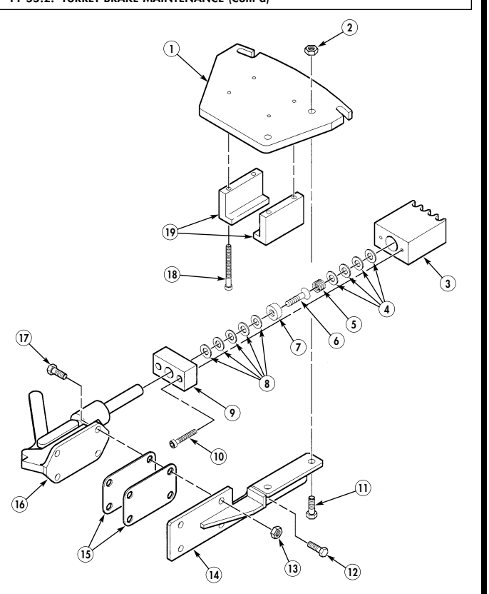

FOLLOW-ON TASK:   Install turret break assembly (para. 11-55.1).

# 11-56. Gunner'S Sling And Hook Replacement

| This task covers:   |
|---------------------|

INITIAL SETUP:

| Applicable Models                      | Personnel Required                       |
|----------------------------------------|------------------------------------------|
| M1114                                  | One mechanic                             |
| Tools                                  | One assistant                            |
|                                        | Manual References                        |
| General mechanic's tool kit:           | TM 9\-2320\-387\-24P                     |
| automotive (Appendix B, Item 1)        |                                          |
| Maintenance and repair shop equipment: | Equipment Condition                      |
| automotive (Appendix B, Item 2)        | - B\-pillar IED overlay (Frag 1) removed |

a. Removal **b. Installation**

#### A. Removal

1. Remove gunner's sling (4), capscrew (3), and bracket (2) from turret (1). 2. Remove capscrew (5) and gunner's sling hook (6) from turret (1).

b. Installation 1. Apply sealing compound to threads of capscrews (5) and (3). 2. Install gunner's sling hook (6) on turret (1) with capscrew (5). Tighten capscrew (5) to 37 lb-ft 
(50 N•m).

3. Install gunner's sling (4) and bracket (2) on turret (1) with capscrew (3). Tighten capscrew (3) to 37 lb-ft (50 N•m).

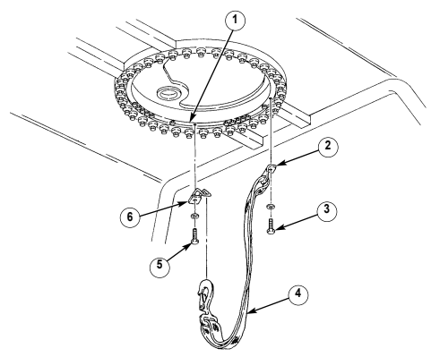

# 11-57. Turret Bearing And Stop Ring Maintenance

This task covers:
a. Removal c. Installation INITIAL SETUP:
Applicable Models M1114 Tools General mechanic's tool kit:
automotive (Appendix B, Item 1)
Maintenance and repair shop equipment:
automotive (Appendix B, Item 2)
Materials/Parts Sealing compound (Appendix C, Item 72.1)
Personnel Required One mechanic One assistant b. Inspection **d. Adjustment**

#### Manual References

TM 9-2320-387-24P

#### Equipment Condition

- Turret armor removed (para. 11-52). - Turret brake and base removed (para. 11-55). - Turret backrest removed (para. 11-54). - Gunner's sling and hook removed (para. 11-56).

Maintenance Level Unit

Note location of camouflage net bracket for installation.

#### A. Removal

1. Remove thirty-six capscrews (7), thirty-five washers (6), net bracket (8), and thirty-six lower bushings (5) from turret frame (4).

2. Remove bearing assembly (2) from turret frame (4). 3. Remove stop ring (1) from turret frame (4). 4. Remove thirty-six upper bushings (3) from turret frame (4). b. Inspection Inspect bushings (3) for serviceability. Replace if damaged.

#### C. Installation

1. Install thirty-six upper bushings (3) on turret frame (4). 2. Install stop ring (1) on turret frame (4) with holes in upper bushings (3) aligned. 3. Install bearing assembly (2) on stop ring (1) with holes in turret frame (4) aligned. 4. Apply sealing compound to threads of thirty-six capscrews (7), and secure bearing assembly (2) to turret frame (4) with thirty-six lower bushings (5), net bracket (8), thirty-five washers (6), and thirty-six capscrews (7). Tighten capscrews (7) to 37 lb-ft (50 N•m).

11-57. TURRET BEARING AND STOP RING MAINTENANCE (Cont'd)

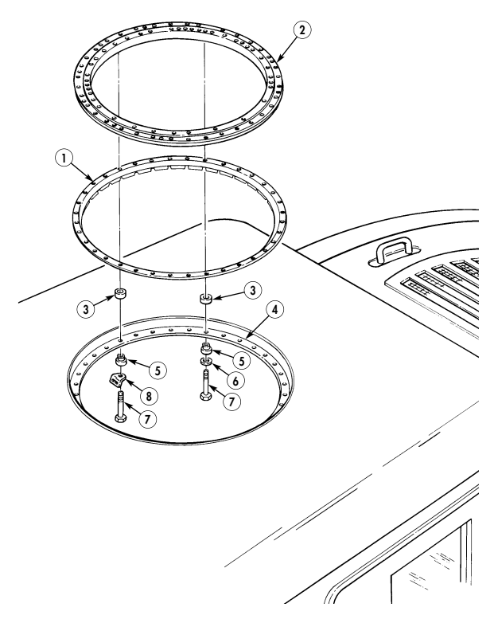

## 11-57. Turret Bearing And Stop Ring Maintenance (Cont'D)

#### D. Adjustment

1. Inspect, tighten, or replace any loose, missing, or damaged parts on weapon station turret (1) area. 2. If weapon station turret rotation has not improved, loosen bolt (5), securing rear of support ring (3)
to C-pillar support bracket (4).

3. Check gap between C-pillar support bracket (4) and rear support ring (3).

- If no gap exists, proceed to step 4. - If gap is the thickness of a slotted washer or greater, proceed to step 5.

4. Remove slotted washers (2), one at a time, as required, and rotate turret to check for binding. If there is no improvement, proceed to step 6.

5. Add slotted washers (2), one at a time, as required, and rotate turret to check to see if it rotates freely. If there is no improvement, proceed to step 6.

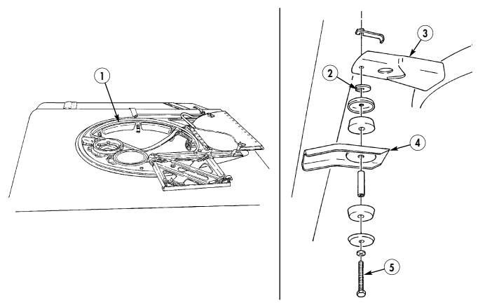

# 11-57. Turret Bearing And Stop Ring Maintenance (Cont'D)

6. Loosen eight clevis retaining bolts (9), securing front ring assembly supports (7) to windshield frame (8). Rotate turret and check if it rotates freely.

7. If turret rotation has improved, position adjustment slots (10) in clevis (11) where turret operates freely, and tighten eight clevis retaining bolts (9) and rear support ring bolt (6).

8. Install turret armor and seal (para. 11-52). 9. Install primary weapon system and check operation of weapon station turret (TM 9-2320-387-10).

10. If turret rotation has not improved as a result of adjustment, replace turret bearing assembly.

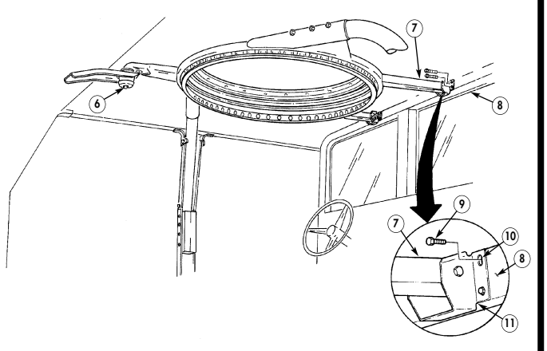

FOLLOW-ON TASKS: - Install turret brake and base (para. 11-55).

- Install turret backrest (para. 11-54). - Install gunner's sling and hook (para. 11-56).

# 11-58. Night Vision Lid Bumper And Bracket Replacement

This task covers:
INITIAL SETUP:
Applicable Models M1114 Tools General mechanic's tool kit:
automotive (Appendix B, Item 1)
Maintenance and repair shop equipment:
automotive (Appendix B, Item 2)
a. Removal b. Installation

| Special Tools   |
|-----------------|

Riveter tool kit (Appendix B, Item 123)
Materials/Parts Two rivets (Appendix G, Item 273) Sealing compound (Appendix C, Item 72.1)
Manual References TM 9-2320-387-24P
Maintenance Level Unit

For replacement of rivets, refer to para. 10-56.

a. Removal 1. Remove two socket-head screws (2) and bumper (1) from night vision lid bumper bracket (5). 2. Remove two rivets (3) and night vision lid bumper bracket (5) from brush seal (4). b. Installation 1. Install night vision lid bumper bracket (5) on brush seal (4) with two rivets (3). 2. Apply sealing compound to threads of two socket-head screws (2), and install bumper (1) on night vision lid bumper bracket (5) with socket-head screws (2). Tighten socket-head screws (2) to 68-82 lb-in. (8-9 N•m).

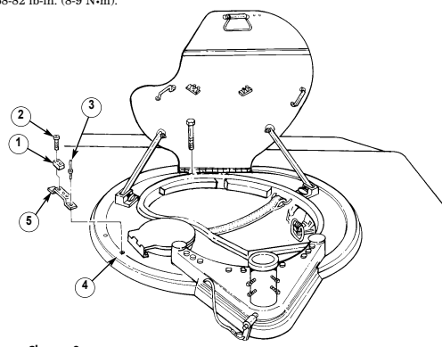

# 11-59. Turret Hatch Pivot Base Replacement

This task covers:
INITIAL SETUP:
Applicable Models M1114

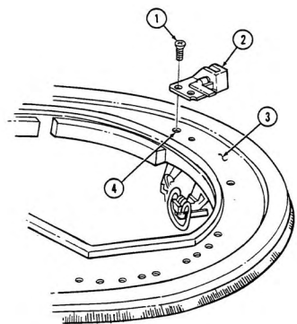

General mechanic's tool kit:
automotive (Appendix B, Item 1)
Maintenance and repair shop equipment:
automotive (Appendix B, Item 2)

a. Removal b. Installation

#### Materials/Parts

| Maintenance Level   |
|---------------------|
| Unit                |

| Manual References    |
|----------------------|
| TM 9\-2320\-387\-24P |

RTV sealant (Appendix C, Item 74) Sealing compound (Appendix C, Item 64)

Replacement procedures for left and right turret hatch pivot bases are basically the same. This procedure covers the right pivot base.

a. Removal Remove two socket-head screws (1) and turret hatch pivot base (2) from turret armor (3).

b. Installation 1. Apply sealing compound on socket-head screws (1). 2. Apply sealant around screw holes (4), and install turret hatch pivot base (2) on turret armor (3)
with two socket-head screws (1). Tighten socket-head screws (1) to 37 lb-ft (50 N•m).

# 11-59.1. Turret Cover Replacement

This task covers:

| M1114                                  |
|----------------------------------------|
| Tools                                  |
| General mechanic's tool kit:           |
| automotive (Appendix B, Item 1)        |
| Maintenance and repair shop equipment: |
| automotive (Appendix B, Item 2)        |

Two locknuts (Appendix G, Item 127) Sealing compound (Appendix C, Item 72.1)

#### A. Removal

1. Remove six capscrews (4), washers (5), and turret cover nut ring (8) from turret armor (1). 2. Remove two locknuts (9), capscrews (2), four washers (3), turret cover seal (7), and turret cover (6) 
from turret armor (1). Discard locknuts (9).

#### B. Installation

1. Install turret cover seal (7) and turret cover (6) on turret armor (1) with two capscrews (2), four washers (3), and two locknuts (9). Do not tighten locknuts (9) at this time.

2. Apply sealing cmpound to threads of six capscrews (4). 3. Secure turret cover nut ring (8) to underside of turret armor (1) with six capscrews (4) and washers (5). Tighten capscrews (4) and locknuts (9) to 40 lb-ft (54 N•m).

a. Removal b. Installation

| RTV sealant (Appendix C, Item 74)   |
|-------------------------------------|
| TM 9\-2320\-387\-24P                |

# 11-59.1. Turret Cover Replacement (Cont'D)

l

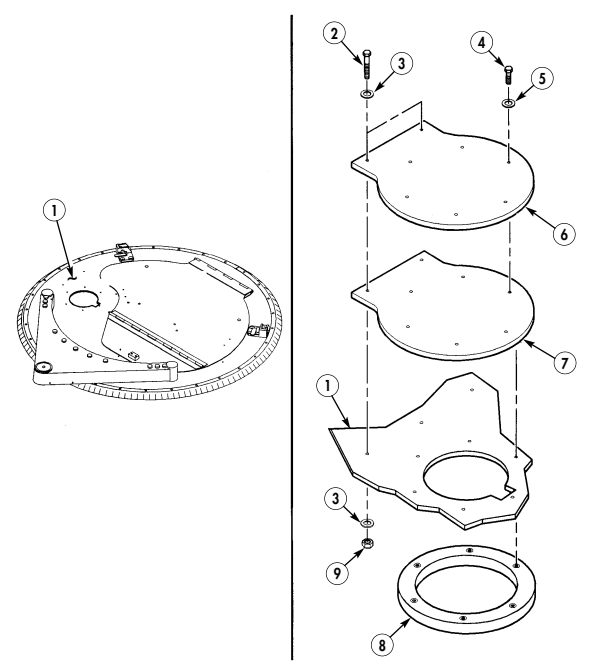

FOLLOW-ON TASK:   Close turret door (TM 9-2320-387-10).

1

# 11-60. Night Vision Mount Replacement

This task covers:
INITIAL SETUP:

a. Removal **b. Installation**

| INITIAL SETUP:                         |                      |
|----------------------------------------|----------------------|
| Applicable Models                      | Manual References    |
| M1114                                  | TM 9\-2320\-387\-10  |
| Tools                                  | TM 9\-2320\-387\-24P |
| General mechanic's tool kit:           | Maintenance Level    |
| automotive (Appendix B, Item 1)        | Unit                 |
| Maintenance and repair shop equipment: |                      |
| automotive (Appendix B, Item 2)        |                      |

#### Materials/Parts

Sealant (Appendix C, Item 74) Sealing compound (Appendix C, Item 72.1)

#### A. Removal

1. Remove two capscrews (4) and footman loop (3) from bracket lid (2). 2. Remove two nuts (6), capscrews (1), and bracket lid (2) from bracket (7). 3. Remove two nuts (16), washers (17), capscrews (5), bracket (7), and two spacers (19) from pedestal (9). 4. Remove six capscrews (8), clamping catch (14), and pedestal (9) from turret armor (11) and support (15).

5. Remove two capscrews (13), washers (12), and support (15) from turret armor (11) and turret bearing (10).

b. Installation 1. Apply sealing compound to threads of two capscrews (13), and install support (15) on turret bearing (10) and turret armor (11) with two washers (12) and capscrews (13). Tighten capscrews (13) to 37 lb-ft (50 N•m).

2. Apply sealant around pedestal mount holes (18) in turret armor (11). 3. Apply sealing compound to threads of six capscrews (8), and install pedestal (9) and clamping catch (14) on turret armor (11) with capscrews (8). Tighten capscrews (8) to 37 lb-ft (50 N•m).

4. Apply sealant around bracket (7) mounting holes in pedestal (9). 5. Install two spacers (19) and bracket (7) on pedestal (9) with two capscrews (5), washers (17), and nuts (16). Tighten nuts (16) to 37 lb-ft (50 N•m).

6. Install lid (2) on bracket (7) with two capscrews (1) and nuts (6). Tighten nuts (6) to 10 lb-ft
(14 N•m).

7. Apply sealing compound to threads of two capscrews (4), and install footman loop (3) on bracket lid (2) with capscrews (4). Tighten capscrews (4) to 30 lb-in. (3 N•m).

11-60.  NIGHT VISION MOUNT REPLACEMENT (Cont'd)

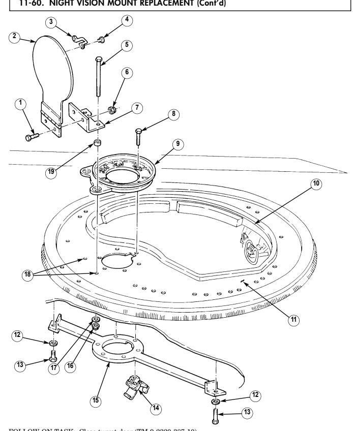

FOLLOW-ON TASK:  Close turret door (TM 9-2320-387-10).

# 11-61. Turret Hatch Assembly Components Replacement

This task covers:
c. Strap Fastener Loop Removal h. Strap Fastener Loop Installation d. Hatch Support Rod Clip Removal i. Pivot Lug Installation e. Protective Bumper Removal j. Pivot Rod Installation

Applicable Models M1114 Tools General mechanic's tool kit:
automotive (Appendix B, Item 1)
Maintenance and repair shop equipment:
automotive (Appendix B, Item 2)
Materials/Parts Two locknuts (Appendix G, Item 127) O-ring (Appendix G, Item 208) Four locknuts (Appendix G, Item 131)
a. Pivot Rod Removal a. Pivot Rod Removal f. Protective Bumper Installation b. Pivot Lug Removal g. Hatch Support Rod Clip Installation

#### Materials/Parts (Cont'D)

Locknut (Appendix G, Item 129) RTV sealant (Appendix C, Item 74) Lithium grease (Appendix C, Item 36)
Manual References TM 9-2320-387-24P
Maintenance Level Unit

Replacement procedures for left and right pivot rods are basically the same. This procedure covers the left pivot rod.

1. Raise and support turret hatch (4). 2. Disconnect pivot rod (8) from hatch support rod clip (5). 3. Remove locknut (7), socket-head screw (9), and pivot rod (8) from pivot lug (10). Discard locknut (7). b. Pivot Lug Removal

Replacement procedures for left and right pivot lugs are basically the same. This procedure covers the left pivot lug.

1. Remove pivot rod (8) (task a.). 2. Remove nut (14), washer (13), O-ring (12), pivot lug (10), and washer (11) from turret hatch (4).

Discard O-ring (12).

c. Strap Fastener Loop Removal

Replacement procedures for strap fastener loops are basically the same. This procedure covers the strap fastener loop with lifting loop.

1. Raise and support turret hatch (4). 2. Remove two locknuts (19), screws (16), lifting loop (18), and strap fastener loop (17) from turret hatch (4). Discard locknuts (19).

## 11-61. Turret Hatch Assembly Components Replacement (Cont'D)

d. Hatch Support Rod Clip Removal

Replacement procedures for left and right hatch support rod clips are basically the same. This procedure covers the left hatch support rod clip.

Raise and support turret hatch (4).

1.

2.

Remove two locknuts (15), screws (6), and hatch support rod clip (5) from turret hatch (4). Discard locknuts (15).

e. Protective Bumper Removal 1.

Raise and support turret hatch (4).

2.

Remove two locknuts (3), screws (1), and protective bumper (2) from turret hatch (4). Discard locknuts (3).

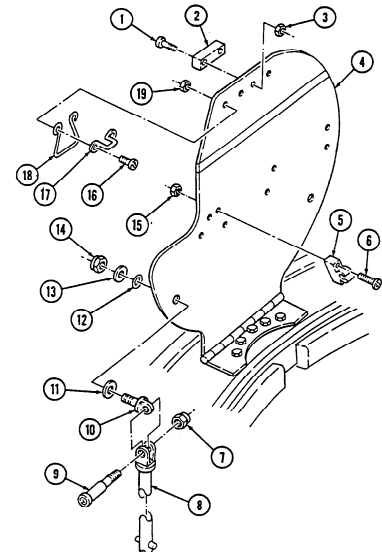

# 1 L-61. Turret Hatch Assembly Components Replacement (Cont'D)

Apply a small amount of sealant around all screw holes prior to installation of components. 

f. Protective Bumper Installation 1. Install protective bumper (2) on turret hatch (4) with two screws (1) and nuts (3). Tighten nuts (3) to 10 lb-R (14 N=m). 

2. Lower and close turret hatch (4). 

g. Hatch Support Rod Clip Installation 1. Install hatch support rod clip (5) on turret hatch (4) with two screws (6) and locknuts (15). Tighten locknuts (15) to 30 lb-in. (3 Nom). 

2. Lower and close turret hatch (4). 

h. Strap Fastener Loop Installation 1. Install lifting loop (18) and strap fastener loop (17) on turret hatch (4) with two screws (16) and locknuts (19). Tighten locknuts (19) to 30 lb-in. (3 Nom). 

2. Lower and close turret hatch (4). 

i. Pivot Lug Installation 

Pivot lug must rotate by hand after installation. 

1. Lightly lubricate shaft of pivot lug (10) and O-ring (12) and install pivot lug (10) on turret hatch **(4)** 
with washer (111, O-ring (121, washer (131, and nut (14). Ensure pivot lug (10) will rotate by hand. 

2. Install pivot rod (81 (task j.). 

#### J. Pivot Rod Installation

1. Install pivot rod (8) on pivot lug (10) with socket-head screw (9) and locknut (7). Tighten locknut (7) 
to 21 lb-R (28 Nom). 

2. Connect pivot rod (8) to hatch support rod clip (5). 

3. Lower and close turret hatch (41. 

# 11-61. Turret Hatch Assembly Components Replacement (Cont'D)

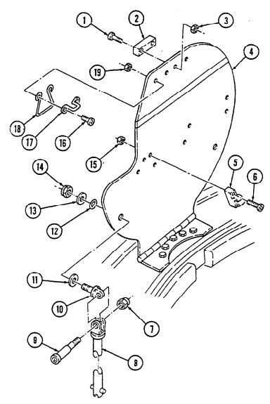

# I 1 L-62. **Turret Pintle Mou.Nt Maintenance**

This task covers: 
a. Removal b. Inspection c. Installation INITIAL SETUP: 

| Ml114                             | TM 9\-2320\-387\-10.                                                                           |
|-----------------------------------|------------------------------------------------------------------------------------------------|
|                                   | TM 9\-2320\-387\-24P                                                                           |
| Tools                             |                                                                                                |
| General mechanic's tool kit:      | Equipment Condition                                                                            |
| automotive (Appendix B, Item 1)   | Turret door opened (TM 9\-2320\-387\-102                                                       |
| Materials/Parts                   | Maintenance Level                                                                              |
| RTV sealant (Appendix C, Item 741 | Unit                                                                                           |
| 1.                                | Remove two nuts (31, washers (4), and capscrews (1) from turret hatch door (9) and turret (2). |

1. Remove twelve capscrews (6) and washers (7) from turret armor (3) and turret pintle mount (1). 

2. Remove capscrew (5) and washer (4) from turret armor (3) and turret pintle mount (1). 

3. Remove turret pintle mount (1) from turret armor (3). 4. Remove four screws (9), pin assembly (81, and pintle brush seal (2) from turret pintle mount (1). 

b. Inspection Inspect pintle brush seal (2). Replace if damaged. 

vf.Installationl 1.. Install pintle brush seal (2) and pin assembly (8) on turret pintle mount (1) with four screws (9). 

Tighten screws (9) to 30 lb-in. (3 N-m). 

2. Apply sealant to thirteen bosses (10) on bottom of pintle mount (1) and around holes in turret armor (3). 

3. Install turret pintle mount (1) on turret armor (3) with washer (4) and capscrew (5). Do not tighten capscrew (5). 

Apply sealing compound to capscrews prior to installation. 

4. Install twelve washers (7) and capscrews (6) on turret pintle mount (1) and turret armor (3). Tighten capscrews (6) and (5) to 37 lb-R (50 Nom). 

# 11-62. Turret Pintle Mount Maintenance (Cont'D)

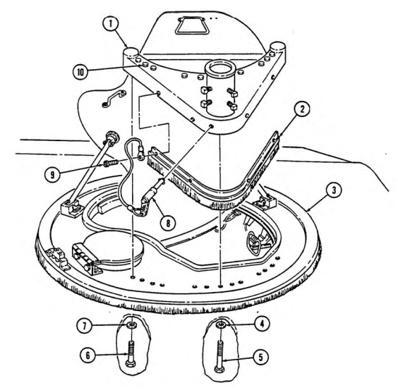

FOLLOW-ON TASK:  Close and secure turret hatch (TM 9-2320-387-10).

# 11-62.1. Turret Hatch Hinge Seal Replacement

This task covers:

#### A. Removal B. Installation Initial Setup:

| Applicable Models                      | Materials/Parts                        |
|----------------------------------------|----------------------------------------|
| M1114                                  | Four locknuts (Appendix G, Item 129)   |
|                                        | Sealing compound (Appendix C, Item 64) |
| Tools                                  |                                        |
| General mechanic's tool kit:           | Manual References                      |
| automotive (Appendix B, Item 1)        | TM 9\-2320\-387\-24P                   |
| Maintenance and repair shop equipment: |                                        |
| automotive (Appendix B, Item 2)        | Maintenance Level                      |
|                                        | Unit                                   |

#### A. Removal

1. Remove seven locknuts (5), screws (4), and long hatch hinge seal tie-down (2) from turret hatch (8).

Discard locknuts (5).

2. Remove six locknuts (6), screws (3), short hatch hinge seal tie-down (1), and hatch hinge seal (9)
from turret hatch (8). Discard locknuts (6) and remove adhesive from turret hatch (8).

#### B. Installation

1. Apply adhesive to bottom side of hatch hinge seal (9). 2. Install hatch hinge seal (9) over turret hatch hinge (7) and align mounting holes with holes in turret hatch (8).

3. Install short hatch hinge seal tie-down (1) over hatch hinge seal (9) and secure with six screws (3)
and locknuts (6). Tighten locknuts (6) to 6 lb-ft (8 N•m).

4. Install long hatch seal tie-down (2) over hatch hinge seal (9) and secure with seven screws (4) and locknuts (5). Tighten locknuts (5) to 6 lb-ft (8 N•m).

# 11-62.1. Turret Hatch Hinge Seal Replacement (Cont'D)

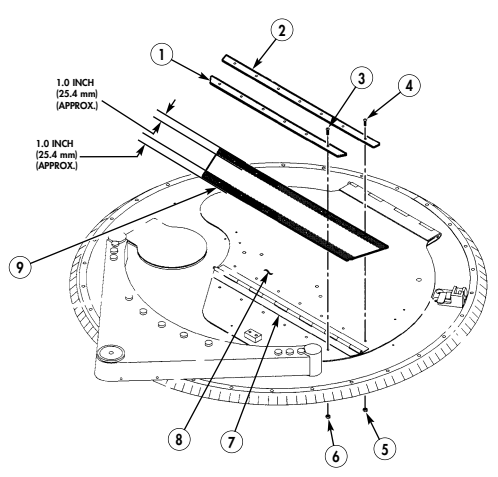

FOLLOW-ON TASK: Secure three turret hatch fastener clamps (TM 9-2320-387-10).

# 11-63. Intercom And Brackets Replacement

This task covers:

| a. Removal        | b. Installation   |
|-------------------|-------------------|
| INITIAL SETUP:    |                   |
| Applicable Models | Manual References |
| M1114             |                   |
| Tools             | Maintenance Level |

#### A. Removal

1. Disconnect intercom cable (11) from intercom control (10). 2. Remove two nuts (17), washers (16), capscrews (12), washers (13), and intercom control (10) from intercom mounting bracket (6). 

3. Disconnect cable (7) from audio amplifier (8). 4. Remove four nuts (3), washers (4), capscrews (9), washers (4), and audio amplifier (8) from intercom mounting bracket (6).

5. Remove two nuts (14), washers (15), capscrews (18), and washers (19) from intercom mounting bracket (6) and radio rack support (5).

6. Remove two nuts (20), washers (21), screws (2), and intercom mounting bracket (6) from radio rack (1).

#### B. Installation

1. Install intercom mounting bracket (6) on radio rack support (5) with two washers (19),
capscrews (18), washers (15), and nuts (14).

2. Install intercom mounting bracket (6) on radio rack (1) with two screws (2), washers (21), and nuts (20).

3. Install audio amplifier (8) on intercom mounting bracket (6) with four washers (4), capscrews (9),
washers (4), and nuts (3). Connect cable (7) to audio amplifier (8).

4. Install intercom control (10) on intercom mounting bracket (6) with two washers (13),
capscrews (12), washers (16), and nuts (17). Connect intercom cable (11) to intercom control (10).

# 11-63. Intercom And Brackets Replacement (Cont'D)

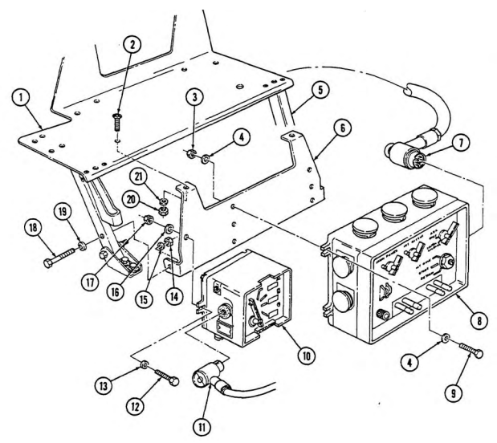

# 11-64. Commander'S Control Box Mounting Bracket Replacement

This task covers:
INITIAL SETUP:

#### Applicable Models

M1114, M1151, M1151A1, M1167

a. Removal b. Installation

| INITIAL SETUP:                  |                     |
|---------------------------------|---------------------|
| Applicable Models               | Manual References   |
| M1114                           |                     |
| Tools                           | Equipment Condition |
| General mechanic's tool kit:    |                     |
| automotive (Appendix B, Item 1) | (para. 11\-55.1).   |

Two locknuts (Appendix G, Item 133)

#### A. Removal

Remove two locknuts (4), washers (3), screws (1), and commander's control box mounting bracket (5) from underside of radio rack (2). Discard locknuts (4).

b. Installation Install commander's control box mounting bracket (5) on underside of radio rack (2) with two screws (1), washers (3), and locknuts (4). Tighten locknuts (4) to 6 lb-ft (8 N•m).

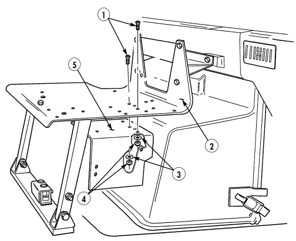

# 11-65. Field Glasses Bracket Replacement

This task covers:
INITIAL SETUP:

a. Removal b. Installation

| Applicable Models                      | Materials/Parts                          |
|----------------------------------------|------------------------------------------|
| M1114                                  | Sealing compound (Appendix C, Item 72.1) |
| Tools                                  | Manual References                        |
| General mechanic's tool kit:           | TM 9\-2320\-387\-24P                     |
| automotive (Appendix B, Item 1)        |                                          |
| Maintenance and repair shop equipment: | Maintenance Level                        |
| automotive (Appendix B, Item 2)        | Unit                                     |

#### A. Removal

Remove three locknuts (4), washers (5), screws (2), and field glasses bracket (1) from radio rack (3). Discard locknuts (4).

b. Installation Install field glasses bracket (1) on radio rack (3) with three screws (2), washers (5), and locknuts (4).

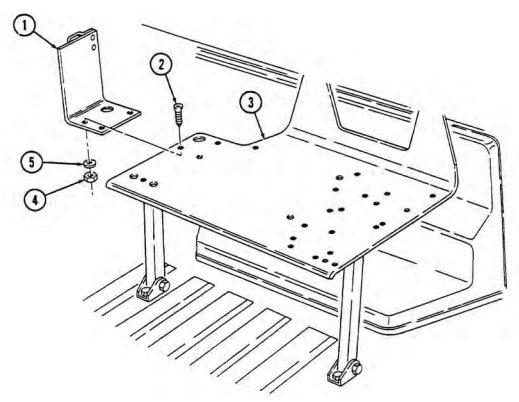 Tighten locknuts (4) to 6 lb-ft (8 N•m).

# 11-66. Rifle Support Maintenance

This task covers:
a. Removal b. Installation a.1. Inspection

Applicable Models M1114 Tools General mechanic's tool kit:
automotive (Appendix B, Item 1)
Maintenance and repair shop equipment:
automotive (Appendix B, Item 2)

#### Materials/Parts

Sealing compound (Appendix C, Item 72.1)
a. Removal Personnel Required One mechanic One assistant Manual References TM 9-2320-387-24P

| TM 9\-2320\-387\-24P   |
|------------------------|

Unit

Perform step 1 for removal of left front rifle support. Perform step 2 for removal of right front rifle support. Perform step 3 for removal of right rear rifle support.

1. Remove capscrew (2) and rifle support (1) from floor tunnel (3). 2. Remove two capscrews (5) and rifle support (4) from right footwell (6). 3. Remove two capscrews (7) and rifle support (10) from bracket (9). a.1. Inspection Refer to para. 10-56 for plusnut (8) inspection and replacement.

b. Installation

Perform step 1 for installation of left front rifle support. Perform step 2 for installation of right front rifle support. Perform step 3 for installation of right rear rifle support.

1. Apply sealing compound to threads of capscrew (2), and install rifle support (1) on floor tunnel (3)
with capscrew (2). Tighten capscrew (2) to 68-82 lb-in. (8-9 N•m).

2. Apply sealing compound to threads of two capscrews (5), and install rifle support (4) on right footwell (6) with capscrews (5). Tighten capscrews (5) to 68-82 lb-in. (8-9 N•m).

3. Apply sealing compound to threads of two capscrews (7), and install rifle support (10) on bracket (9)
with capscrews (7). Tighten capscrews (7) to 68-82 lb-in. (8-9 N•m).

# 11-66.  Rifle Support Maintenance (Cont'D)

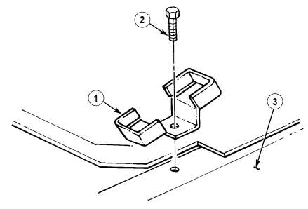

 LEFT SIDE FRONT

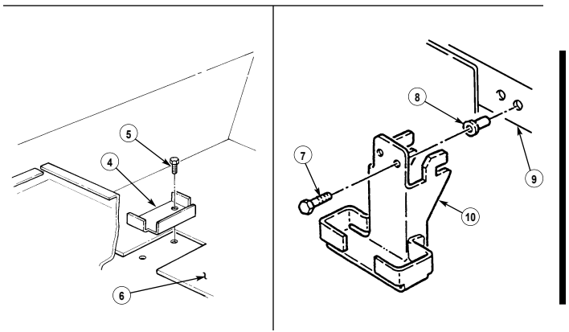

 RIGHT SIDE FRONT
 RIGHT SIDE REAR

# 11-67. Rifle Mounting Clamp Replacement

This task covers:
INITIAL SETUP:
Applicable Models M1114 Tools General mechanic's tool kit:
automotive (Appendix B, Item 1)

a. Removal b. Installation

| Materials/Parts   |
|-------------------|

Two locknuts (Appendix G, Item 123) Four locknuts (Appendix G, Item 110) Sealing compound (Appendix C, Item 72.1)
Manual References TM 9-2320-387-24P
Maintenance Level Unit a. Removal

Perform step 1 and 2 for removal of left front rifle mounting clamp. Perform step 3 for removal of right front rifle mounting clamp. Perform step 4 for removal of right rear rifle mounting clamp.

1. Remove two screws (1.1) and clamp bracket (1) from turret support (4). 2. Remove two locknuts (2.1), screws (3), and clamp (2) from clamp bracket (1) and turret support (4).

Discard locknuts (2.1).

3. Remove two locknuts (9), screws (7), and clamp (6) from clamp bracket (8) on radio rack (5). Discard locknuts (9).

4. Remove two locknuts (11), screws (14), and clamp (10) from clamp bracket (13) on B-pillar (12).

Discard locknuts (11).

b. Installation

Perform step 1 and 2 for installation of left front rifle mounting clamp. Perform step 3 for installation of right front rifle mounting clamp. Perform step 4 for installation of right rear rifle mounting clamp.

1. Install clamp (2) on clamp bracket (1) with two screws (3) and locknuts (2.1). 2. Apply sealing compound to threads of two screws (1.1) and install clamp bracket (1) on turret support (4) with screws (1.1).

3. Install clamp (6) on clamp bracket (8) and radio rack (5) with two screws (7) and locknuts (9). 4. Install clamp (10) on clamp bracket (13) and B-pillar (12) with two screws (14) and locknuts (11).

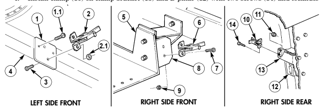

11-128 Change 2

# 11-68. Double Ammo Box Tray (Caliber .50) Maintenance

This task covers:

a. Removal b. Installation

a.1. Inspection

| Applicable Models                        | Manual References    |
|------------------------------------------|----------------------|
| M1114                                    | TM 9\-2320\-387\-10  |
| Tools                                    | TM 9\-2320\-387\-24P |
|                                          | Equipment Condition  |
| General mechanic's tool kit:             |                      |
| automotive (Appendix B, Item 1)          |                      |
| Materials/Parts                          | Maintenance Level    |
| Two locknuts (Appendix G, Item 127)      | Unit                 |
| Sealing compound (Appendix C, Item 72.1) |                      |
| a. Removal                               |                      |

a. Removal Remove four capscrews (1) and ammo box tray (2) from wheelhouse (3). 

a.1. Inspection Refer to para. 10-56 for plusnut (4) inspection and replacement.

b. Installation Apply sealing compound to threads of four capscrews (1), and install ammo box tray (2) on wheelhouse (3) with capscrews (1). Tighten capscrews (1) to 75 lb-in. (8 N•m).

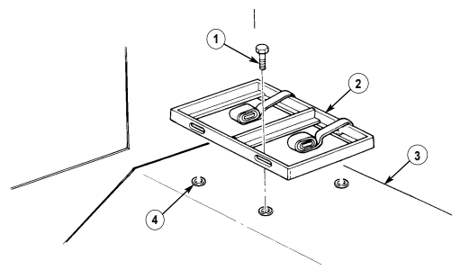

FOLLOW-ON TASK: Close cargo shell door (TM 9-2320-387-10).

# 11-69. Triple Ammo Box Tray (40 Mm) Replacement (M1114)

This task covers:
INITIAL SETUP:
Applicable Models M1114 Tools General mechanic's tool kit:
automotive (Appendix B, Item 1)
Maintenance and repair shop equipment:
automotive (Appendix B, Item 2)
Materials/Parts Sealing compound (Appendix C, Item 72.1)
a. Removal b. Installation Manual References TM 9-2320-387-10 TM 9-2320-387-24P
Equipment Condition Rear of cargo shell door raised (TM 9-2320-387-10).

Maintenance Level Unit a. Removal 1. Remove six capscrews (2) and ammo box tray (1) from cargo floor (3). 2. Inspect rivnuts (4). Replace if damaged (refer to para. 10-56).

b. Installation Apply sealing compound to threads of six capscrews (2), and install ammo box tray (1) on cargo floor (3) with capscrews (2). Tighten capscrews (2) to 6 lb-ft (8 N•m).

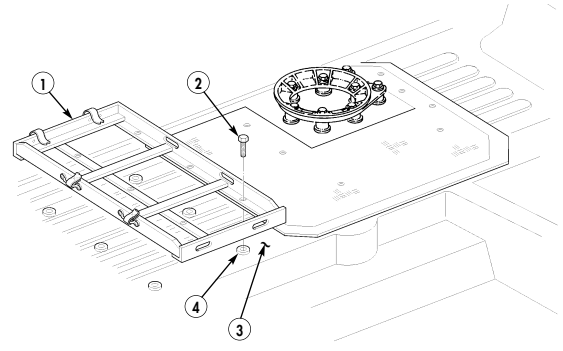

FOLLOW-ON TASK: Close cargo shell door (TM 9-2320-387-10).

11-130/(11-130.1 blank) Change 3

# 11-69.1. Triple Ammo Box Tray (40 Mm) Maintenance (M1151, M1151A1, M1165, M1165A1, M1167)

This task covers:
b. Inspection

Applicable Models M1151, M1151A1, M1165, M1165A1, M1167 Tools General mechanic's tool kit:
automotive (Appendix B, Item 1)
Torque wrench 3/8-in. drive, 75 lb-ft 
(Appendix B, Item 2.1)

#### A. Removal

| Equipment Condition   | Turret door open (TM 9\-2320\-387\-10)   |
|-----------------------|------------------------------------------|
| Maintenance Level     | Unit                                     |

1. Remove three capscrews (1), lockwashers (2), and washers (3) from ammo box tray (4) and rear evaporator (8). Discard lockwashers (2).

2. Remove three capscrews (5), lockwashers (6), washers (7), and ammo box tray (4) from rear evaporator (8). Discard lockwashers (6).

#### B. Inspection

Refer to para. 10-56 for nut insert (9) inspection and replacement.

c. Installation 1. Install ammo box tray (4) on rear evaporator (8) with three washers (7), lockwashers (2), and capscrews (5). Tighten capscrews (5) to 8 lb-ft (11 N•m).

2. Secure ammo box tray (4) to rear evaporator (8) with three washers (3), capscrews (1). Tighten capscrews (1) and (5) to 6 lb-ft (8 N•m). Tighten capscrews (1) to 8 lb-ft (11 N•m).

a. Removal c. Installation 11-69.1. TRIPLE AMMO BOX TRAY (40 MM) MAINTENANCE
(M1151, M1151A1, M1165, M1165A1, M1167) (Cont'd)
■■

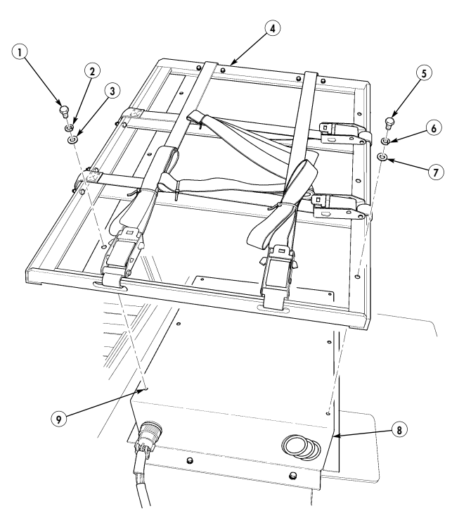

# 11-70. Water Can Tray Maintenance (M1114)

This task covers:
a. Removal c. Installation b. Inspection INITIAL SETUP:
Applicable Models

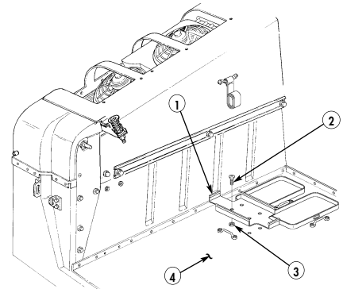

Tools General mechanic's tool kit:
automotive (Appendix B, Item 1)
Maintenance and repair shop equipment:
automotive (Appendix B, Item 2)
Materials/Parts Sealing compound (Appendix C, Item 72.1)
a. Removal Remove four screws (2) and water can tray (1) from cargo floor (4). b. Inspection Refer to para. 10-56 for rivnut (3) inspection and replacement. c. Installation Apply sealing compound to threads of four screws (2), and install water can tray (1) on cargo floor (4) with screws (2). Tighten screws (2) to 6 lb-ft (8 N•m).

FOLLOW-ON TASK: Close cargo shell door (TM 9-2320-387-10).

11-130.4 Change 3 Manual References TM 9-2320-387-10 TM 9-2320-387-24P

| TM 9\-2320\-387\-24P   |
|------------------------|
| TM 9\-2320\-387\-10    |

Equipment Condition

# 11-70.1. Water Can Tray Maintenance (M1151, M1151A1, M1167)

This task covers:
b. Inspection INITIAL SETUP:

| M1114   |
|---------|

Applicable Models Tools General mechanic's tool kit:
automotive (Appendix B, Item 1)
Torque wrench 3/8-in. drive, 75 lb-ft 
(Appendix B, Item 2.1)
Personnel Required One mechanic One assistant a. Removal Remove three screws (2), washers (3), and water can tray (1) from cargo floor (5). b. Inspection Refer to para. 10-56 for nut insert (4) inspection and replacement. c. Installation Install water can tray (1) on cargo floor (5) with two capscrews (2) and washers (3). Tighten capscrews (2) to 8 lb-ft (11 N•m).

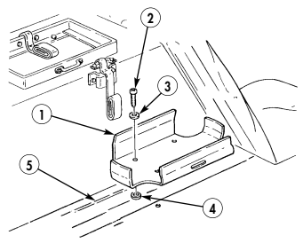

FOLLOW-ON TASK: Close cargo shell door (TM 9-2320-387-10).

| Equipment Condition   |
|-----------------------|
| Rear of cargo shell   |

a. Removal c. Installation

| .   | J   |
|-----|-----|

Rear of cargo shell door raised
(TM 9-2320-387-10).

| Manual References   |
|---------------------|
| TM 9\-2320\-387\-10 |

Maintenance Level

# 11-70.2. Water Can Bumper Maintenance

This task covers:
b. Inspection INITIAL SETUP:

| automotive (Appendix B, Item 1)   |
|-----------------------------------|

Applicable Models automotive (appendix B, Item 1)
Torque wrench 3/8-in. drive, 75 lb-ft 
(Appendix B, Item 2.1)
a. Removal c. Installation a. Removal

| TM 9\-2320\-387\-24P   |      |
|------------------------|------|
| Maintenance Level      | Unit |

Remove two screws (3), and water can bumper (2) from wheelhouse (1). b. Inspection Refer to para. 10-56 for nut insert (4) inspection and replacement. c. Installation Install water can bumper (2) on wheelhouse (1) with two screws (3). Tighten capscrews (3) to 8 lb-ft (11 N•m).

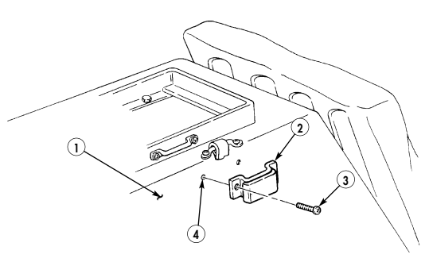

FOLLOW-ON TASK: Close cargo shell door (TM 9-2320-387-10).

11-130.6/(11-131 blank) Change 6

# 11-71. Stowage Pedestal And Gunner'S Platform Maintenance

This task covers:
a.1. Inspection

a. Removal b. Installation

| M1114, M1151, M1151A1, M1167                                                                       | Two locknuts (Appendix G, Item 133)   |
|----------------------------------------------------------------------------------------------------|---------------------------------------|
| Tools                                                                                              | Manual References                     |
| General mechanic's tool kit:                                                                       | TM 9\-2320\-387\-24P                  |
| automotive (Appendix B, Item 1)                                                                    |                                       |
| Maintenance and repair shop equipment:                                                             | Maintenance Level                     |
| automotive (Appendix B, Item 2)                                                                    | Unit                                  |
| a. Removal                                                                                         |                                       |
| Remove two locknuts (4), washers (3), screws (1), and commander's control box mounting bracket (5) |                                       |

#### A. Removal

1. Remove eight capscrews (2), washers (3), and stowage pedestal (1) from gunner's platform (4). 2. Remove eight capscrews (6) and gunner's platform (4) from floor (5).

a.1. Inspection Refer to para. 10-56 for plusnut (5.1) inspection and replacement. b. Installation 1. Apply sealing compound to threads of eight capscrews (6), and install gunner's platform (4) on floor
(5) with capscrews (6).

2. Apply sealing compound to threads of eight capscrews (2), and install stowage pedestal (1) on gunner's platform (4) with washers (3) and capscrews (2). Tighten capscrews (2) to 31 lb-ft (42 N•m).

# 11-71. Stowage Pedestal And Gunner'S Platform Maintenance (Cont'D)

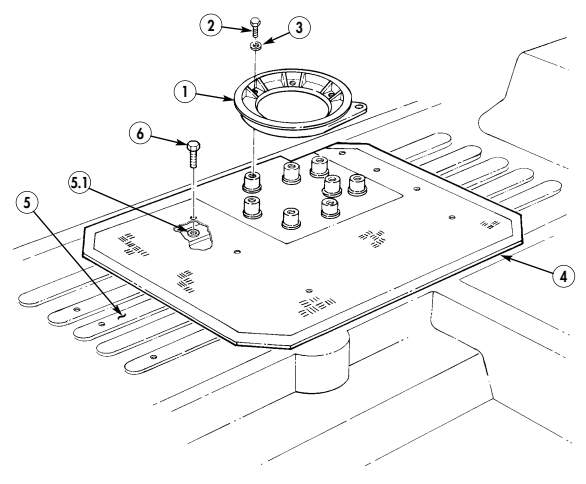

FOLLOW-ON TASKS: - • Install traversing unit mount adapter (TM 9-1425-450-12, TM 9-1425-472-12).
- • - • - Install triple ammo box tray (para. 11-69).

# 11-71.1. Gunner Shield Replacement

This task covers:

| General mechanic's tool kit:   |
|--------------------------------|

Applicable Models M1114 automotive (Appendix B, Item 1)

#### Materials/Parts

Eight lockwashers (Appendix G, Item 159) Eight locknuts (Appendix G, Item 111)

#### A. Removal

1. Remove four locknuts (14), lockwashers (15), capscrews (1), washers (2), and gunner shield (3) from gunner shield support bracket (4). Discard lockwashers (15) and locknuts (14).

2. Remove four locknuts (6), lockwashers (5), capscrews (13), washers (12), and gunner shield support bracket (4) from pintle adapter (11). Discard lockwashers (5) and locknuts (6).

3. Remove screw (8) and split sleeve (9) from pintle adapter (11). 4. Remove clamping pawl (10) from pintle adapter (11). 5. Remove locking handle assembly (7) from pintle adapter (11).

b. Installation

Installation direction and orientation of clamping pawl is critical to proper operation. Angled end of clamping pawl must match the contour of pintle adapters for proper fit against split sleeve.

1. Install clamping pawl (10) in pintle adapter (11) and ensure angled end of clamping pawl (10)
matches contour of pintle adapter (11).

2. Install split sleeve (9) on pintle adapter (11) and secure with screw (8). 3. Install locking handle assembly (7) in pintle adapter (11). Do not tighten locking handle assembly (7).

4. Install gunner shield support bracket (4) on pintle adapter (11) with four capscrews (13), washers
(12), lockwashers (5), and locknuts (6). Tighten capscrews (13) to 37 lb-ft (50 N•m).

5. Install gunner shield (3) on gunner shield support bracket (4) with four capscrews (1), washers (2),
lockwashers (15), and locknuts (14). Tighten capscrews (1) to 37 lb-ft (50 N•m).

a. Removal b. Installation

| Manual References    |
|----------------------|
| TM 9\-2320\-387\-24P | | Materials/Parts   |
|-------------------|

# 11-71.1.  Gunner Shield Replacement (Cont'D)

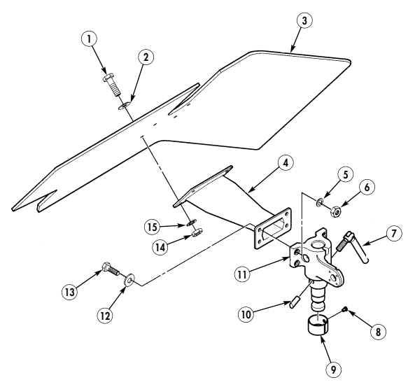

## 11-71.2. Gunner Platform Maintenance

This task covers:
b. Inspection

Applicable Models M1114 Tools General mechanic's tool kit:
automotive (Appendix B, Item 1)
Maintenance and repair shop equipment:
automotive (Appendix B, Item 2)
Materials/Parts Adhesive (Appendix C, Item 4) Sealing compound (Appendix C, Item 64)
a. Removal c. Installation Manual References TM 9-2320-387-24P
Equipment Condition
- Triple ammo box tray removed (para. 11-69). - Adjustable gunner stand removed 
(para. 11-71.3).

Maintenance Level Unit a. Removal 1. Remove eight capscrews (1) and gunner platform (3) from vehicle tunnel (2). 2. If necessary, remove three spacers (4) from vehicle tunnel (2). Note location of spacers (4) for installation.

#### B. Inspection

Refer to para. 10-56 for plusnut (5) inspection and replacement.

#### C. Installation

1. If removed, apply adhesive to bottom of three spacers (4) and install over three plusnuts (5). Ensure holes in spacers (4) are aligned with plusnuts (5).

2. Apply sealing compound to threads of eight capscrews (1). 3. Install gunner platform (3) on vehicle tunnel (2) and secure with eight capscrews (1). Tighten capscrews (1) to 6 lb-ft (8 N•m).

# 11-71.2. Gunner Platform Maintenance (Cont'D)

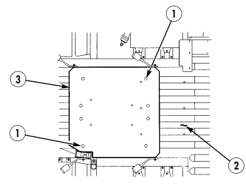

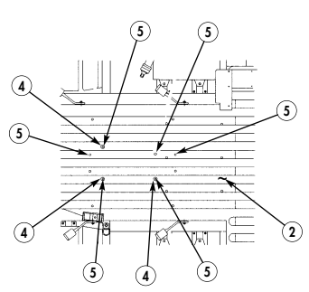

FOLLOW-ON TASKS: - Install adjustable gunner stand (para. 11-71.3).
- • Install triple ammo box tray (para. 11-69).

# 11-71.3. Adjustable Gunner Stand Replacement

This task covers:

|       |
|-------|
| M1114 |

Applicable Models Tools:
General mechanic's tool kit:
automotive (Appendix B, Item 1)
Maintenance and repair shop equipment:
automotive (Appendix B, Item 2)
Materials/Parts Sealing compound (Appendix C, Item 64)
a. Removal b. Installation Maintenance Level Unit

| Personnel Required   |
|----------------------|

#### A. Removal

1. Remove two capscrews (9) and washers (7) securing front adjustable gunner stand bracket (8) to gunner platform (6).

2. Remove capscrews (2) and (4) and two washers (3) securing rear adjustable gunner stand bracket
(5) to gunner platform (6).

3. Remove adjustable gunner stand (1) from gunner platform (6).

#### B. Installation

1. Install adjustable gunner stand (1) on gunner platform (6) and align mounting holes. 2. Apply sealing compound to threads of four capscrews (2), (4), and (9). 3. Secure rear adjustable gunner stand bracket (5) to gunner platform (6) with two washers (3) and capscrews (2) and (4). Do not tighten capscrews (2) and (4) at this time.

4. Secure front adjustable gunner stand bracket (8) to gunner platform (6) with two washers (7) and capscrews (9). Tighten capscrews (2), (4), and (9) to 6 lb-ft (8 N•m).

# 11-71.3. Adjustable Gunner Stand Replacement (Cont'D)

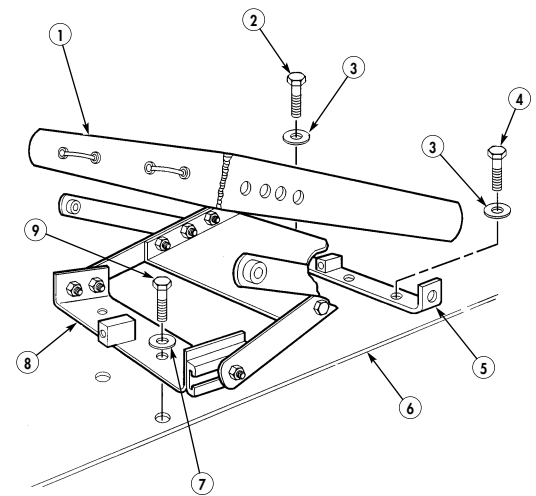

# 11-71.4. Rear Half Door And Hinge Maintenance

This task covers:
b. Disassembly e. Installation c. Inspection

Tools General mechanic's tool kit:
automotive (Appendix B, Item 1)
Materials/Parts Eleven locknuts (Appendix G, Item 77) Three locknuts (Appendix G, Item 73.2) Four locknuts (Appendix G, Item 101.9)

#### A. Removal

1. Remove two capscrews (21) and washers (22) from bracket (20) and frame (23). 2. Remove two capscrews (19) and washers (18) from bracket (20) and frame (23).

a. Removal d. Assembly

| Manual References    |
|----------------------|
| TM 9\-2320\-387\-24P |

3. Remove four capscrews (9), washers (10), and bracket (20) from door (1). 4. Remove three locknuts (16), washers (17), capscrews (15), washers (14), upper hinge (13), large spacer (12), and small spacer (11) from door (1). Discard locknuts (17).

5. Remove three locknuts (2), washers (3), capscrews (8), washers (7), lower hinge (6), and two spacers
(5) and (4) from door (1). Discard locknuts (2).

11-71.4. REAR HALF DOOR AND HINGE MAINTENANCE (Cont'd)

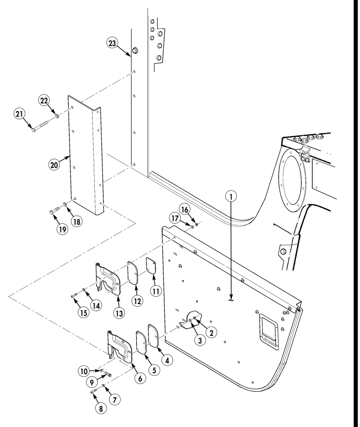

# 11-71.4. Rear Half Door And Hinge Maintenance (Cont'D)

#### B. Disassembly

1. Remove four capscrews (1) and washers (2) from cover (23) and door (22). 2. Remove three locknuts (7), washers (6), capscrews (4), washers (5), and cover (23) from door (22).

Discard locknuts (7).

3. Remove rear latch hook (10) and clevis clip (21) from handle (20). 4. Remove five locknuts (11), washers (12), capscrews (8), washers (9), spacer (15), and latch (14) from door (22). Discard locknuts (11).

5. Remove return spring (13) from latch (14). 6. Remove four locknuts (16), washers (17), capscrews (19), and handle (20) from door (22).

Discard locknuts (16).

7. Remove seal (18) from door (22).

#### C. Inspection

Refer to para. 10-56 for nut insert (3) inspection and replacement.

#### D. Assembly

1. Install seal (18) on door (22). 2. Install handle (20) on door (22) with four capscrews (19), washers (17), and locknuts (16). 3. Install return spring (13) on latch (14). 4. Install spacer (15) and latch (14) on door (22) with five washers (9), capscrews (8), washers (12), and locknuts (11).

5. Install clevis clip (21) on handle (20) and latch hook (10) on latch (14). 6. Install cover (23) on door (22) with three capscrews (4), washers (5), washers (6), and locknuts (7). 7. Secure cover (23) to door (22) with four washers (2), and capscrews (1).

# 11-71.4. Rear Half Door And Hinge Maintenance (Cont'D)

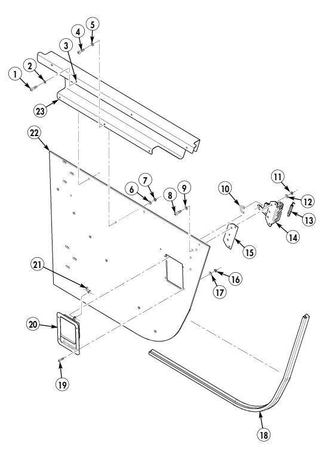

## 11-71.4. Rear Half Door And Hinge Maintenance (Cont'D)

e. Installation 1. Install lower hinge (6) and two spacers (4) and (5) on door (1) with three washers (7), capscrews (8),
washers (3), and locknuts (2).

2. Install upper hinge (13), large spacer (12), and small spacer (11) on door (1) with three washers (14), capscrews (15), washers (17), and locknuts (16).

3. Install door (1) on bracket (20) with four washers (10) and capscrews (9). 4. Install bracket (20) on frame (23) with two washers (18) and capscrews (19). 5. Secure bracket (20) to frame (23) with two washers (22) and capscrews (21).

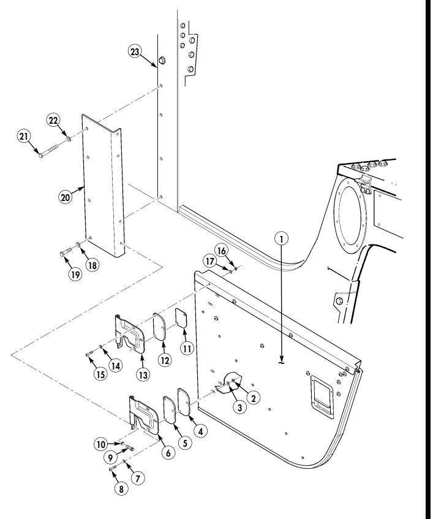

11-71.4. REAR HALF DOOR AND HINGE MAINTENANCE (Cont'd)

# Section Ii. Shelter Carrier Body Maintenance 11-72. Shelter Carrier Body Maintenance Task Summary

| Applicable Models M1114                                              | Personnel Required                  |
|----------------------------------------------------------------------|-------------------------------------|
| Tools                                                                | One mechanic  One assistant         |
| General mechanic's tool kit:                                         | Manual References                   |
| automotive (Appendix B, Item 1)                                      | TM 9\-2320\-387\-10                 |
| Maintenance and repair shop equipment:                               | TM 9\-2320\-387\-24P                |
| automotive (Appendix B, Item 2)                                      | Equipment Condition                 |
| Materials/Parts                                                      | Rear end of cargo shell door raised |
| Sealing compound (Appendix C, Item 72.1)                             | (TM 9\-2320\-387\-10).              |
|                                                                      | Maintenance Level                   |
|                                                                      | Unit                                |
| a. Removal                                                           |                                     |
| Remove four capscrews (1) and ammo box tray (2) from wheelhouse (3). |                                     |

# 11-73. Shelter Mounting Bracket Replacement

This task covers:
INITIAL SETUP:
Applicable Models M1113, M1152 Tools General mechanic's tool kit:
automotive (Appendix B, Item 1)
Materials/Parts Capscrew (Appendix G, Item 7) Lockwasher (Appendix G, Item 161)

a. Removal b. Installation

Manual References TM 9-2320-387-24P
Equipment Condition Shelter removed (if equipped) (para. 11-78).

Maintenance Level Unit

Replacement procedures for all four mounting brackets are basically the same. This procedure covers the left rear mounting bracket.

a. Removal Remove capscrew (5), lockwasher (4), washer (3), and mounting bracket (1) from shelter (2). Discard capscrew (5) and lockwasher (4). b. Installation Install mounting bracket (1) on shelter (2) with washer (3), lockwasher (4), and capscrew (5). Do not

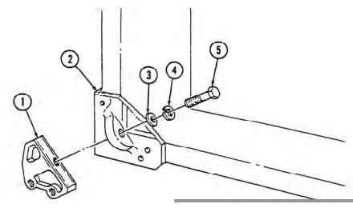 tighten capscrew (5) until shelter (2) is installed.

FOLLOW-ON TASK: Install shelter (if equipped) (para. 11-78).

# 11-74. Shelter Carrier Tailgate Bracket Replacement

This task covers:
INITIAL SETUP:
Applicable Models M1113, M1152 Tools General mechanic's tool kit:
automotive (Appendix B, Item 1)
Maintenance and repair shop equipment:
automotive (Appendix B, Item 2)
Materials/Parts Three locknuts (Appendix G, Item 124) Locknut (Appendix G, Item 91)

a. Removal b. Installation

Manual References TM 9-2320-387-24P
Equipment Condition Shelter carrier tailgate removed (if equipped)
(para. 11-75).

Maintenance Level Unit

Replacement procedures for right and left tailgate brackets are basically the same. This procedure covers the right tailgate bracket.

a. Removal 1. Remove locknut (7), washer (6), capscrew (5), and washer (6) from tailgate bracket (8) and shelter support assembly (3). Discard locknut (7).

2. Remove three locknuts (4), washers (2), capscrews (1), washers (2), and tailgate bracket (8) from shelter support assembly (3). Discard locknuts (4).

b. Installation 1. Install tailgate bracket (8) on shelter support assembly (3) with three washers (2), capscrews (1),
washers (2), and locknuts (4). Do not tighten capscrews (1).

2. Install washer (6), capscrew (5), washer (6), and locknut (7) on shelter support assembly (3) and tailgate bracket (8). Tighten locknut (7) to 65 lb-ft (88 N•m). 

3. Tighten capscrews (1) to 26 lb-ft (35 N•m).

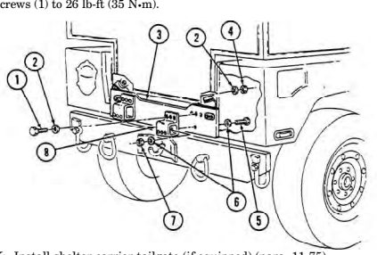

FOLLOW-ON TASK: Install shelter carrier tailgate (if equipped) (para. 11-75).

# 11-75. Shelter Carrier Tailgate Replacement

This task covers:
INITIAL SETUP:
Applicable Models M1113, M1152 Tools General mechanic's tool kit:
automotive (Appendix B, Item 1)
Maintenance and repair shop equipment:
automotive (Appendix B, Item 2)
Materials/Parts Four locknuts (Appendix G, Item 79) Six locknuts (Appendix G, Item 106)

a. Removal b. Installation

Personnel Required One mechanic One assistant Manual References TM 9-2320-387-24P

| Maintenance Level   | TT ..   |
|---------------------|---------|

Unit a. Removal 1. Remove four locknuts (9), washers (2), capscrews (1), washers (2), and right and left side tailgate chain brackets (10) from tailgate (8). Discard locknuts (9).

Note number and location of shims prior to removal for installation.

2. Remove six locknuts (3), washers (4), capscrews (7), tailgate (8), and shims (6) from two tailgate mounting brackets (5). Discard locknuts (3).

b. Installation 1. Install shims (6) and tailgate (8) on two tailgate mounting brackets (5) with six capscrews (7),
washers (4), and locknuts (3). Tighten locknuts (3) to 26 lb-ft (35 N•m).

2. Install right and left side tailgate chain brackets (10) on tailgate (8) with four washers (2), cap-

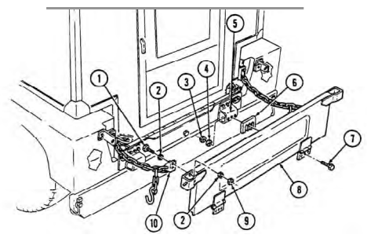

screws (1), washers (2), and locknuts (9). Tighten locknuts (9) to 15 lb-ft (20 N•m).

# 11-76. Shelter Support Reinforcement Replacement

This task covers:
INITIAL SETUP:
Applicable Models M1113, M1152 Tools General mechanic's tool kit:
automotive (Appendix B, Item 1)
Maintenance and repair shop equipment:
automotive (Appendix B, Item 2)
Materials/Parts Two capscrews (Appendix G, Item 8)
Two lockwashers (Appendix G, Item 175)
a. Removal

a. Removal b. Installation

Manual References TM 9-2320-387-10 TM 9-2320-387-24P
Equipment Condition Tailgate lowered (TM 9-2320-387-10).

| Maintenance Level   |
|---------------------|

Unit

- It may be necessary to detach cab rear panel straps and turnbuttons and roll cab rear panel upward to gain access to front support reinforcements.

- Note number and location of shims prior to removal for installation.

Remove two capscrews (7), lockwashers (6), washers (5), reinforcement (4), and shims (3), if present, from mounting bracket (2) and support assembly (1). Discard capscrews (7) and lockwashers (6).

#### B. Installation

Install shims (3), if removed, and reinforcement (4) on support assembly (1) and mounting bracket (2)

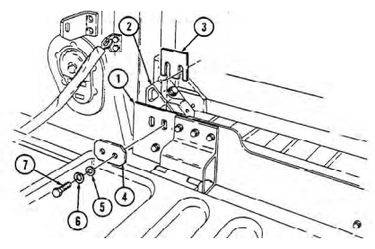 with two washers (5), lockwashers (6), and capscrews (7). Tighten capscrews (7) to 90 lb-ft (122 N•m).

FOLLOW-ON TASK: Raise and secure tailgate (TM 9-2320-387-10).

# 11-77. Shelter Carrier Tailgate Chain Maintenance

This task covers:

a. Removal c. Assembly b. Disassembly d. Installation

Applicable Models

| M1114   |
|---------|

Tools General mechanic's tool kit:
automotive (Appendix B, Item 1)
Maintenance and repair shop equipment:
automotive (Appendix B, Item 2)

#### Materials/Parts

Four locknuts (Appendix G, Item 106)
Manual References TM 9-2320-387-10 TM 9-2320-387-24P
Equipment Condition Tailgate lowered (TM 9-2320-387-10).

Maintenance Level Unit

Replacement procedures for right and left tailgate chain assemblies are basically the same. This procedure covers the left tailgate chain assembly.

#### A. Removal

1. Remove two locknuts (1), washers (2), reinforcing bracket (3), capscrews (5), washers (2), and tailgate chain mounting bracket (4) from body (10). Discard locknuts (1).

2. Remove two locknuts (9), washers (7), capscrews (6), washers (7), and tailgate chain mounting bracket (4) from tailgate (8). Discard locknuts (9).

NOTE
Perform disassembly and assembly of tailgate chain assembly only if damaged.

#### B. Disassembly

1. Pry apart two chain links (11) and remove two chain mounting brackets (4) from chain (15). 2. Pry apart S-hook (14) and remove S-hook (14) from chain (13). 3. Pry apart chain link (12) and remove chain (13) from chain (15).

c. Assembly 1. Install chain (13) on chain (15) with chain link (12). Bend chain link (12) closed. 2. Install S-hook (14) on chain (13) and bend S-hook (14) closed. 3. Install two chain mounting brackets (4) on chain (15) with two chain links (11). Bend chain links
(11) closed.

d. Installation 1. Install tailgate chain mounting bracket (4) and reinforcing bracket (3) on body (10) with two washers (2), capscrews (5), washers (2), and locknuts (1). Tighten locknuts (1) to 15 lb-ft (20 N•m).

2. Install tailgate chain mounting bracket (4) on tailgate (8) with two washers (7), capscrews (6),
washers (7), and locknuts (9). Tighten locknuts (9) to 15 lb-ft (20 N•m).

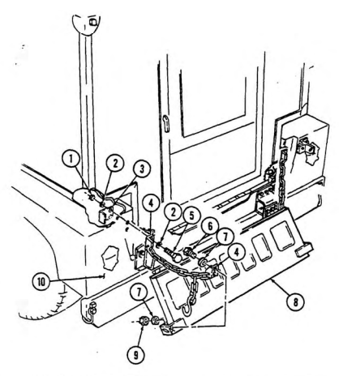

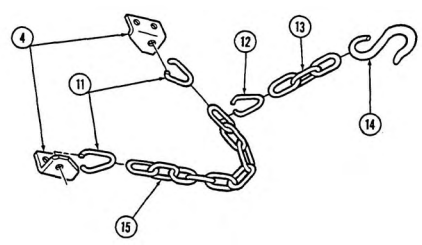

FOLLOW-ON TASK:  Raise and secure tailgate (TM 9-2320-387-10).

# 11-77. Shelter Carrier Tailgate Chain Maintenance (Cont'D) 11-78. Shelter Replacement

This task covers:
INITIAL SETUP:
Applicable Models M1113, M1152 Tools General mechanic's tool kit:
automotive (Appendix B, Item 1)
Maintenance and repair shop equipment:
automotive (Appendix B, Item 2)
Materials/Parts Eight capscrews (Appendix G, Item 8) Eight lockwashers (Appendix G, Item 175)
Personnel Required One mechanic One assistant a. Removal a. Removal b. Installation Manual References TM 9-2320-387-10 TM 9-2320-387-24P
Equipment Condition Tailgate lowered (TM 9-2320-387-10).

General Safety Instructions Direct all personnel to stand clear during hoisting operations.

Maintenance Level Unit

#### Warning

Direct all personnel to stand clear during hoisting operations. A heavy, swinging load can cause injury to personnel and damage to equipment.

1. Position chain hoist (2) over top of shelter (3). 2. Connect lifting chains (1) to chain hoist (2) and four corners of shelter (3).

- It may be necessary to detach cab rear panel straps and turnbuttons and roll cab rear panel upward to gain access to front mounting brackets.

- Note number and location of shims prior to removal for installation.

3. Remove eight capscrews (12), lockwashers (11), washers (10), and four reinforcements (9) from mounting brackets (6) and support assembly (4), and remove shims (7), if present. Discard capscrews (12) and lockwashers (11).

4. Using chain hoist (2), remove shelter (3) from support assembly (4). 5. Remove mounting brackets (6) (para. 11-76).

b. Installation

#### Warning

Direct all personnel to stand clear during hoisting operations. A heavy, swinging load can cause injury to personnel and damage to equipment.

1. Install mounting brackets (para. 11-73). 2. Position shelter (3) over support assembly (4) and gradually lower shelter (3) into position on support assembly (4) with front mounting points (5) aligned.

Shelter should be tightly fitted on front of support assembly and centered from side to side. Shims should only be added at rear shelter mounting brackets.

3. Install shelter (3) on front of support assembly (4) and two mounting brackets (6) with reinforcements
(9), four washers (10), lockwashers (11), and capscrews (12). Tighten capscrews (12) to 90 lb-ft (122 N•m) and capscrews (8) to 60 lb-ft (81 N•m).

## 11-78. Shelter Replacement (Cont'D)

4.

Install two reinforcements (9), four washers (10), lockwashers (11), and capscrews (12) on rear of support assembly (4) and two mounting brackets (6). Do not tighten capscrews (12).

5.

Add shims (7) at rear of two shelter mounting brackets (6), and tighten four capscrews (12) to 90 lb-ft (122 N-m) and capscrews (8) to 60 lb-ft (81 N-m).

6.

Disconnect lifting chains (1) and chain hoist (2) from shelter (3).

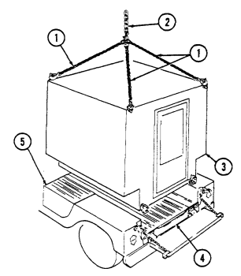

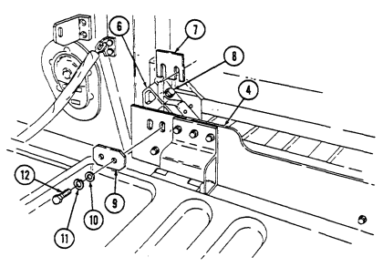

FOLLOW-ON TASK:  Raise and secure tailgate (TM 9-2320-387-10).

# 11-79. Shelter Support Assembly Replacement

This task covers:

| a.  Removal                                                                                             | b. Installation      |
|---------------------------------------------------------------------------------------------------------|----------------------|
| INITIAL SETUP:                                                                                          |                      |
| Applicable Models                                                                                       | Manual References    |
| M1114                                                                                                   | TM 9\-2320\-387\-24P |
| Tools                                                                                                   | Maintenance Level    |
| General mechanic's tool kit:                                                                            | Unit                 |
| automotive (Appendix B, Item 1)                                                                         |                      |
| Materials/Parts                                                                                         |                      |
| Eight lockwashers (Appendix G, Item 159)                                                                |                      |
| Eight locknuts (Appendix G, Item 111)                                                                   |                      |
| a. Removal                                                                                              |                      |
| 1.  Remove four locknuts (14), lockwashers (15), capscrews (1), washers (2), and gunner shield (3) from |                      |
| gunner shield support bracket (4). Discard lockwashers (15) and locknuts (14).                          |                      |

a. Removal 1. Remove two locknuts (24), washers (2), capscrews (4), washers (5), and spacers (6) from support assembly (27), cargo floor (22), and B-beam (26). Discard locknuts (24).

2. Remove six locknuts (24), washers (2), reinforcement plates (23) and (25), six capscrews (3),
washers (2), and spacers (1) from support assembly (27), cargo floor (22), and B-beam (26). Discard locknuts (24).

3. Remove two locknuts (21), washers (7), capscrews (9), and washers (10) from support assembly (27)
and cargo floor (22). Discard locknuts (21).

4. Remove locknut (34), washer (33), capscrew (29), and washer (30) from clamp (32) on fuel filler spout (28) and body (31). Pull fuel filler spout (28) away for access to locknut (21). Discard locknut (34).

5. Remove two locknuts (21), washers (7), capscrews (8), and washers (7) from support assembly (27)
and cargo floor (22). Discard locknuts (21).

6. Remove four locknuts (19), washers (14), capscrews (13), and washers (14) from support assembly
(27) and cargo floor (22). Discard locknuts (19).

7. Remove three locknuts (20), washers (15), capscrews (16), and washers (15) from support assembly (27), cargo floor (22), and D-beam (17). Discard locknuts (20).

8. Remove locknut (18), washer (12), capscrew (11), washer (12), and support assembly (27) from cargo floor (22) and D-beam (17). Discard locknut (18).

b. Installation

Do not tighten hardware until all hardware is installed.

1. Install support assembly (27) on cargo floor (22) and D-beam (17) with washer (12), capscrew (11),
washer (12), and locknut (18).

2. Install three washers (15), capscrews (16), washers (15), and locknuts (20) on support assembly
(27), cargo floor (22), and D-beam (17).

3. Install four washers (14), capscrews (13), washers (14), and locknuts (19) on support assembly (27)
and cargo floor (22).

## 11-79. Shelter Support Assembly Replacement (Cont'D)

4. Install two washers (7), capscrews (8), washers (7), and locknuts (21) on support assembly (27) and cargo floor (22).

5. Install six spacers (1), washers (2), capscrews (3), reinforcement plates (23) and (25), six washers
(2), and locknuts (24) on support assembly (27), cargo floor (22), and B-beam (26).

6. Install two spacers (6), washers (5), capscrews (4), washers (2), and locknuts (24) on support assembly (27), cargo floor (22), and B-beam (26).

7. Install two washers (10), capscrews (9), washers (7), and locknuts (21) on support assembly (27) and cargo floor (22).

8. Tighten four locknuts (19) to 26 lb-ft (35 N•m). 9. Tighten locknuts (18), (20), (21), and (24) to 65 lb-ft (88 N•m).

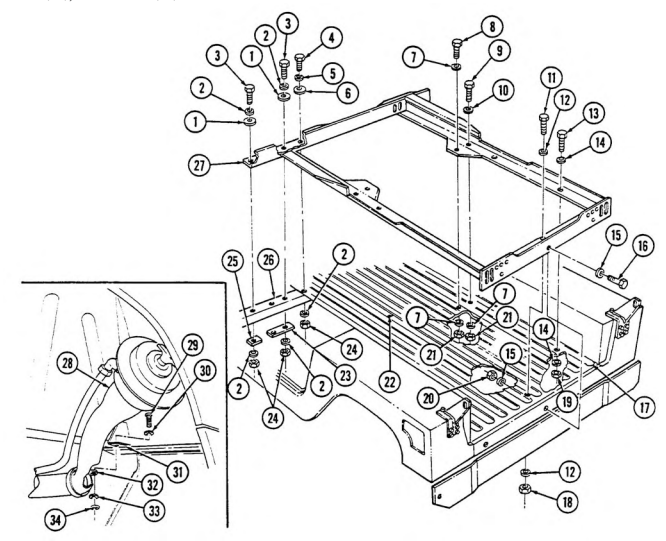

10. Install clamp (32) on fuel filler spout (28) and body (31) with washer (30), capscrew (29), washer
(33), and locknut (34).

FOLLOW-ON TASKS: - Install shelter (if equipped) (para. 11-78).

- Roll down rear soft top curtain (if equipped) (TM 9-2320-387-10). - Install fuel filler housing (para. 10-2). - Install shelter carrier tailgate brackets (if equipped) (para. 11-74). - Install cab enclosure panels (para. 11-79.1).

# 11-79.1. Cab Enclosure Panel Replacement

This task covers:

a. Removal b. Installation

| INITIAL SETUP:                         |                      |
|----------------------------------------|----------------------|
| Applicable Models                      | Manual References    |
| M1114                                  | TM 9\-2320\-387\-24P |
| Tools:                                 | Maintenance Level    |
| General mechanic's tool kit:           | Unit                 |
| automotive (Appendix B, Item 1)        |                      |
| Maintenance and repair shop equipment: |                      |
| automotive (Appendix B, Item 2)        |                      |

a. Removal 1. Remove three nuts (5), lockwashers (4), and capscrews (7) from panel (1) and footwell (6). Discard lockwashers (4).

2. Remove three screws (2) and panel (1) from B-beam (3).

b. Installation 1. Install panel (1) on B-beam (3) with three screws (2). 2. Install panel (1) on footwell (6) with three capscrews (7), lockwashers (4), and nuts (5). Tighten

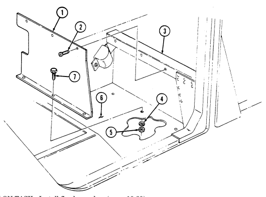

nuts (5) to 15-20 lb-in. (2 N•m).

FOLLOW-ON TASK: Install fixed rear door (para. 10-20).

# Section Iii. Air Conditioning Maintenance (M1114) 11-80. Air Conditioning Maintenance Task Summary

| b.  Disassembly                        |                      | e.   | Installation      |
|----------------------------------------|----------------------|------|-------------------|
| c.  Inspection                         |                      |      |                   |
| INITIAL SETUP:                         |                      |      |                   |
| Tools                                  |                      |      | Manual References |
| General mechanic's tool kit:           | TM 9\-2320\-387\-24P |      |                   |
| automotive (Appendix B, Item 1)        |                      |      | Maintenance Level |
| Materials/Parts                        |                      | Unit |                   |
| Eleven locknuts (Appendix G, Item 77)  |                      |      |                   |
| Three locknuts (Appendix G, Item 73.2) |                      |      |                   |
| Four locknuts (Appendix G, Item 101.9) |                      |      |                   |
| a. Removal                             |                      |      |                   |

# 11-81. A/C Front Air Distribution Duct Replacement

This task covers:
INITIAL SETUP:

| Applicable Models   |
|---------------------|

M1114 Tools General mechanic's tool kit:
automotive (Appendix B, Item 1)
Materials/Parts Three locknuts (Appendix G, Item 111) RTV silicone sealant (Appendix C, Item 70)

#### A. Removal

| Manual References    |
|----------------------|
| TM 9\-2320\-387\-24P |

a. Removal b. Installation

| Maintenance Level   |
|---------------------|

Equipment Condition
- Battery ground cables disconnected (para. 4-68). - Radio rack removed (para. 12-17).

Unit 1. Remove nut (7) and screw (9) from clamp (10). 2. Remove two right registers (13) from air distribution duct (14) by carefully prying out. 3. Remove two screws (2) from air distribution duct (14) and mounting bracket (1). 4. Remove three locknuts (12), washers (11), and capscrews (4) from air distribution duct (14) and body (3). Discard locknuts (12).

5. Disconnect wiring harness connector (6) from air distribution connector (5). 6. Remove air distribution duct (14) from evaporator (8). 7. Remove clamp (10) from evaporator (8). 8. Remove A/C toggle switch and harness (only if replacement duct will be installed) (para. 11-84). 9. Remove A/C front air distribution duct registers (only if replacement duct will be installed) 
(para. 11-82).

#### B. Installation

1. Install A/C toggle switch and harness, if removed (para. 11-84). 2. Install front A/C air distribution duct registers, if removed (para. 11-82). 3. Install clamp (10) on evaporator (8). 4. Install air distribution duct (14) on evaporator (8). 5. Connect wiring harness connector (6) to air distribution connector (5). 6. Install air distribution duct (14) on mounting bracket (1) with two screws (2).

If new air distribution duct is being installed, match-drill three 13/32-in. (10.3 mm) holes from body to air distribution duct.

7. Apply RTV sealant to heads of three capscrews (4), and install air distribution duct (14) on body (3)
with capscrews (4), washers (11), and locknuts (12).

8. Install two right registers (13) on air distribution duct (14) by carefully pushing in place. 9. Install screw (9) and nut (7) on clamp (10).

10. Fill around radio bracket holes (13.1) with RTV sealant.

# 11-81. A/C Front Air Distribution Duct Replacement (Cont'D)

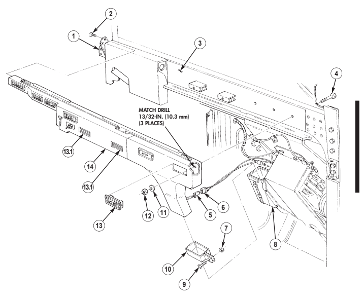

FOLLOW-ON TASKS: - Install radio rack (para. 12-17).
- Connect battery ground cables (para. 1-68).

# 1 L-82. A/C Front Air Distribution Duct Registers Replacement

This task covers: 
a. Removal INITIAL SETUP: 

Applicable Models Manual References 

Ml114 TM 9-2320-387-24P 

Tools 

General mechanic's tool kit: 

automotive (Appendix B, Item 1) 

| Maintenance Level   |
|---------------------|
| Unit                |

| Installation   | b.   |
|----------------|------|

Remove two registers (1) from air distribution duct (2) by carefully prying out. 

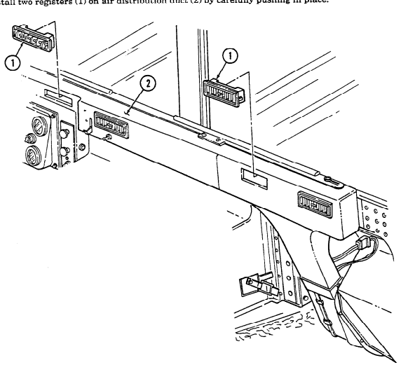

(1 

## 1 1 L-83. A/C Front Evaporator Drain Hose Replacement -I

This task covers: 

a. **Removal b. Installation** 

| INITIAL SETUP:                  |                      |
|---------------------------------|----------------------|
| Applicable Models               | Manual References    |
| M1113, M1152                    | TM 9\-2320\-387\-24P |
| Tools                           | Equipment Condition  |
| General mechanic's tool kit:    |                      |
| automotive (Appendix B, Item 1) | (para. 11\-75).      |

1 a. Removal 1 Pull back floor insulation, loosen two clamps (2), and remove drain hose (3) from drain tube **(4)** and evaporator housing (1). 

Install drain hose (3) on drain tube (4) and evaporator housing (1) and tighten two clamps (2). 

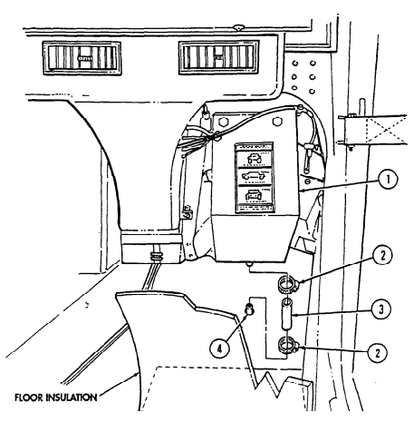

-1 

# 1 L-84. A/C Toggle Switch And Harness Replacement

This task covers: 
a. Removal INITIAL SETUP: 

| Applicable Models                                                      | Personnel Required   |
|------------------------------------------------------------------------|----------------------|
| M1113, M1152                                                           | One mechanic         |
|                                                                        | One assistant        |
| Tools                                                                  |                      |
| General mechanic's tool kit:                                           | Manual References    |
| automotive (Appendix B, Item 1)                                        | TM 9\-2320\-387\-24P |
| Maintenance and repair shop equipment: automotive (Appendix B, Item 2) | Maintenance Level    |
|                                                                        | Unit                 |

| Installation   | b.   |    |
|----------------|------|----|

Prior to removal, tag leads for installation. 

1. Remove register (1) from air distribution duct (5) by carefully prying out. 2. Remove nut (7) from toggle switch (9). 

3. Remove toggle switch (9) from air distribution duct (5) and route toggle switch (9) through register opening (6). 

4. Remove two screws (8) and leads (10) from toggle switch (9). 

5. Disconnect harness connector (2) from connector (3) and remove harness (4) from air distribution duct (5). 

1. Position harness (4) in air distribution duct (5). 

2. Install two leads (10) on toggle switch (9) with two screws (8). 3. Install toggle switch (9) on air distribution duct (5) with nut (7). 

4. Install register (1) on air distribution duct (5) by carefully pushing in place. 

5. Connect harness connector (2) to connector (3). 

# 11-84. A/C Toggle Switch And Harness Replacement (Cont'D)

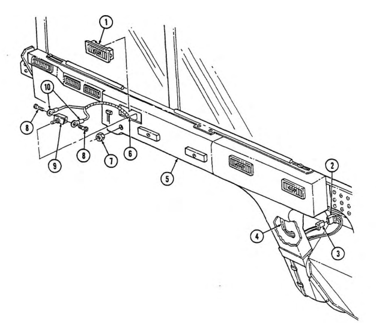

# 11-85. Condenser Fan Exhaust And Supply Vent Maintenance

This task covers:
c. Inspection

a. Exhaust Vents Removal d. Exhaust Vents Installation b. Supply Vents Removal e. Supply Vents Installation

| M1113, M1152                           | TM 9\-2320\-387\-10                     |
|----------------------------------------|-----------------------------------------|
|                                        | TM 9\-2320\-387\-24P                    |
| Tools                                  |                                         |
| General mechanic's tool kit:           | Equipment Condition                     |
| automotive (Appendix B, Item 1)        | Tailgate lowered (TM 9\-2320\-387\-10). |
| Maintenance and repair shop equipment: |                                         |
| automotive (Appendix B, Item 2)        | Maintenance Level                       |
|                                        | Unit                                    |
| Materials/Parts                        |                                         |
| Two capscrews (Appendix G, Item 8)     |                                         |
| Two lockwashers (Appendix G, Item 175) |                                         |

#### A. Exhaust Vents Removal

Remove fifteen screws (3), lockwashers (3.1), washers (3.2), and three A/C exhaust vents (2) from cargo shell (1). Discard lockwashers (3.1). b. Supply Vents Removal Remove twelve screws (6), lockwashers (6.1), washers (6.2), two A/C supply vents (5), and screen (4) from cargo shell (1). Discard lockwashers (6.1). c. Inspection Refer to para. 10-56 for plusnut (7) inspection and replacement.

#### D. Exhaust Vents Installation

Apply sealing compound to threads of fifteen screws (3), and install three A/C exhaust vents (2) on cargo shell (1) with fifteen washers (3.2), lockwashers (3.1), and screws (3). Tighten screws (3) to 36 lb-in. (4 N•m).

#### E. Supply Vents Installation

Apply sealing compound to threads of twelve screws (6), and install screen (4) and two A/C supply vents (5) on cargo shell (1) with twelve washers (6.2), lockwashers (6.1), and screws (6). Tighten screws (6) to 36 lb-in. (4 N•m).

# 11-85.  Condenser Fan Exhaust And Supply Vent Maintenance (Cont'D)

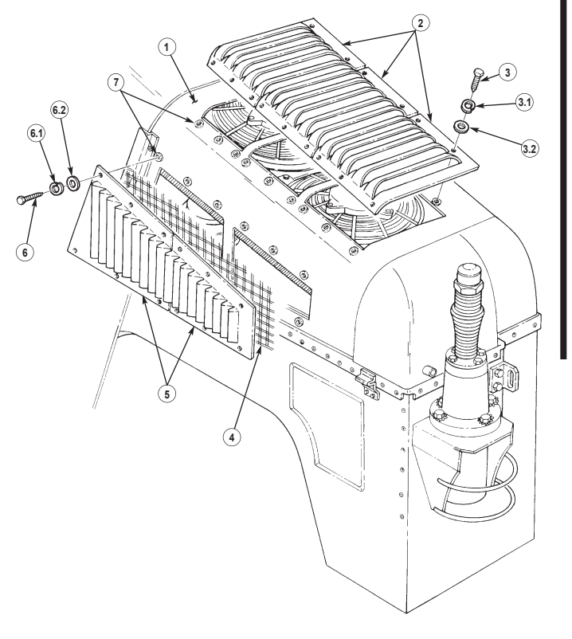

# 11-86. Condenser Fan Access Panel Maintenance

This task covers:
b. Inspection INITIAL SETUP:
Applicable Models M1114 Tools General mechanic's tool kit:
automotive (Appendix B, Item 1)
Maintenance and repair shop equipment:
automotive (Appendix B, Item 2)
Manual References TM 9-2320-387-24P

#### A. Removal C. Installation Materials/Parts

Sealing compound (Appendix C, Item 72.1)
Equipment Condition
- Condenser fan exhaust vents removed

| Equipment Condition   |
|-----------------------|
| Maintenance Level     |
| Unit                  |

- Cargo shell door gas spring mounting bracket removed (para. 11-29).

#### A. Removal

1. Remove three capscrews (9), washers (8), and bracket (7) from access panel (2). 2. Remove capscrew (9.1) and washer (9.2) from access panel (2). 3. Remove three self-tapping screws (4), washers (3), and access panel (2) from condenser tray (11) and cargo shell (1).

4. Remove two screws (6) and footman loop (5) from access panel (2).

b. Inspection Refer to para. 10-56 for plusnut (10) inspection and replacement.

#### C. Installation

1. Install footman loop (5) on access panel (2) with two screws (6). 2. Install access panel (2) on condenser tray (11) and cargo shell (1) with three washers (3) and self-tapping screws (4).

3. Apply sealing compound to threads of capscrews (9), and install bracket (7) on access panel (2) with three washers (8) and capscrews (9). Tighten capscrews (9) to 10 lb-ft (14 N•m).

4. Apply sealing compound to threads of capscrew (9.1), and install washer (9.2) and capscrew (9.1) on access panel (2). Tighten capscrew (9.1) to 10 lb-ft (14 N•m).

# 11-86. Condenser Fan Access Panel Maintenance (Cont'D)

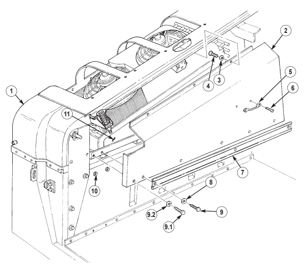

FOLLOW-ON TASKS:  -  Install cargo door gas spring mounting bracket (para. 11-29).
-  - 

# 1 L-87. A/C Rear Air Distribution Duct And Register Maintenance

This task covers: 
a. Removal c. Installation b. Inspection INITIAL SETUP: 

| M1113, M1152                    | TM 9\-2320\-387\-10   |
|---------------------------------|-----------------------|
| Tools                           | TM 9\-2320\-387\-24P  |
| General mechanic's tool kit:    | Equipment Condition   |
| automotive (Appendix B, Item 1) |                       |

automotive (Appendix B, Item 1) 
a. Removal 1. Remove two screws (7) and bracket (6) from air distribution duct (1) and evaporator (5). 

2. Remove three screws (3) and A/C distribution duct (1) from rear A/C blower motor (4). 

3. Remove register (2) from air distribution duct (1) by carefully prying out. 

Refer to para. lo-56 for plusnut (8) inspection and replacement. 

c. Installation 1. Install A/C distribution duct (1) on rear A/C blower motor (4) with three screws (3). 

2. Install register (2) on air distribution duct (1) by carefully pushing in place. 3. Install bracket (6) on air distribution duct (1) and evaporator (5) with two screws (7). 

1 ._ 

(1 

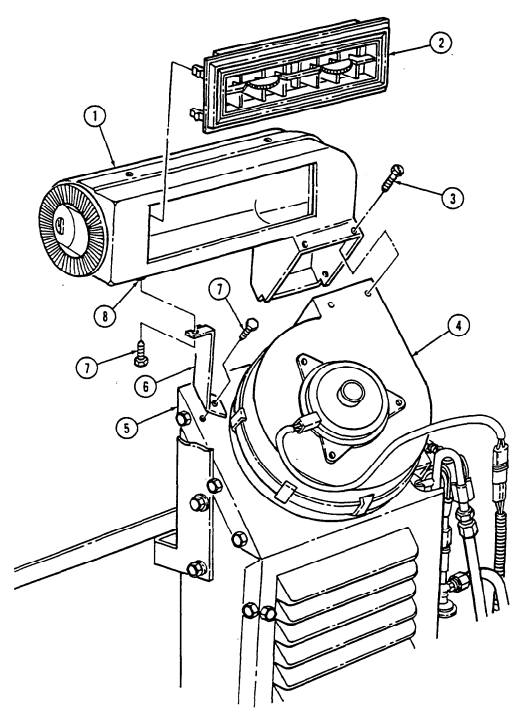

# 11-87.  A/C Rear Air Distribution Duct And Register Maintenance (Cont'D) 11-88. A/C Rear Evaporator Drain Hose Replacement

This task covers:
INITIAL SETUP:
Applicable Models M1114 Tools General mechanic's tool kit:
automotive (Appendix B, Item 1)
Manual References TM 9-2320-387-24P
a. Removal b. Installation Equipment Condition Left passenger seat removed (para. 10-45).

Maintenance Level Unit a. Removal 1. Remove clamp (3) and hose (2) from tube (1). 2. Remove drain plug restrictor (2.1) from end of hose (2).

b. Installation 1. Install drain plug restrictor (2.1) on end of hose (2). 2. Install hose (2) on tube (1) with clamp (3).

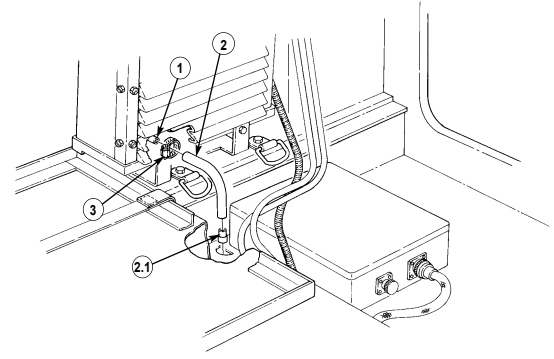

FOLLOW-ON TASK: Install left passenger seat (para. 10-45).

11-158 Change 1

# Section Iv. Rear Cargo Door Access

| Removal                      | b.  Installation   | a.   |
|------------------------------|--------------------|------|
| INITIAL SETUP:               |                    |      |
| Applicable Models            | Personnel Required |      |
| M1113, M1152                 | One mechanic       |      |
| Tools                        | One assistant      |      |
| General mechanic's tool kit: | Manual References  |      |

#### 1 L-90. Rear Cargo Door Access

| This task covers:   |
|---------------------|

| Annlicable Models                                                                                                                   |
|-------------------------------------------------------------------------------------------------------------------------------------|
| M1114                                                                                                                               |
| Tools                                                                                                                               |
| Company of the consideration of control concession and consideration of the consideration of the consideration of the controlled in |

| Personnel Required 40   |
|-------------------------|
| One mechanic            |
| One assistant           |

a. Lifting b. Lowering 

General mechanic's tool kit: 
automotive (Appendix B, Item 1) 

#### Warning

| Manual References                               |
|-------------------------------------------------|
| TM 9\-2320\-387\-24P ·                          |
| General Safety Instructions                     |
| Stand clear during hoisting operations. A heavy |
| or swinging load can cause injury.              |
| Maintenance Level                               |
| Unit                                            |

Direct all personnel to stand clear during hoisting operations. A heavy or swinging load can cause injury to personnel and damage to equipment. 

1. Position lifting device over top of rear cargo door (1). 2. Pull door handle (4) and release. 

3. Connect lifting chains (2) to lifting device (3). 

4. Holding rear cargo door (1) open, connect lifting chains (2) at two comers of rear cargo door (1). 

5. Using lifting device, raise rear cargo door (1) to full open position. 6. Remove lifting chains (2) and lifting device (3). 

Pull on strap (8) to lower door (11, then slam door (1) shut. Ensure door (1) is locked by observing alignment of door surface (7) with cargo shell surface side (6) and bottom edges (5). 

# 11-90.  Rear Cargo Door Access (Cont'D)

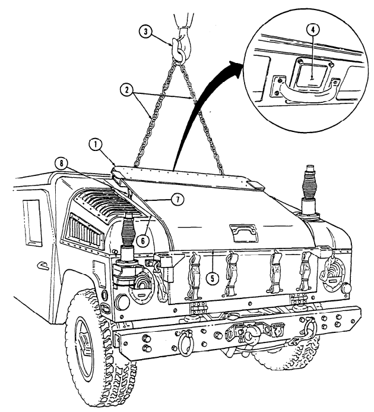

# Section V. Air Conditioning Maintenance (All Models Except M1113/M1114)

| a.    | Removal  b.  Installation                                                                         |
|-------|---------------------------------------------------------------------------------------------------|
|       | INITIAL SETUP:                                                                                    |
|       | Applicable Models  Manual References                                                              |
|       | M1114 TM 9\-2320\-387\-24P                                                                        |
| Tools | Equipment Condition                                                                               |
|       | General mechanic's tool kit: - Battery ground cables disconnected (para. 4\-68).                  |
|       | automotive (Appendix B, Item 1) - Radio rack removed (para. 12\-17).                              |
|       | Materials/Parts Maintenance Level                                                                 |
|       | Three locknuts (Appendix G, Item 111) Unit                                                        |
|       | RTV silicone sealant (Appendix C, Item 70)                                                        |
|       | a. Removal                                                                                        |
| 1.    | Remove nut (7) and screw (9) from clamp (10).                                                     |
| 2.    | Remove two right registers (13) from air distribution duct (14) by carefully prying out.          |
| 3.    | Remove two screws (2) from air distribution duct (14) and mounting bracket (1).                   |
| 4.    | Remove three locknuts (12), washers (11), and capscrews (4) from air distribution duct (14) and   |
|       | body (3). Discard locknuts (12).                                                                  |
| 5.    | Disconnect wiring harness connector (6) from air distribution connector (5).                      |
| 6.    | Remove air distribution duct (14) from evaporator (8).                                            |
| 7.    | Remove clamp (10) from evaporator (8).                                                            |
| 8.    | Remove A/C toggle switch and harness (only if replacement duct will be installed) (para. 11\-84). |

# 11-91. Air Conditioning Maintenance Task Summary 11-92. A/C Relay (Four-Man) Replacement

| This task covers:   |
|---------------------|

a. Removal b. Installation

| Materials/Parts Company of Children Company of Children   |
|-----------------------------------------------------------|

| Applicable Models               | Manual References    |
|---------------------------------|----------------------|
| Ml114                           | TM 9\-2320\-387\-24P |
| Tools                           | Maintenance  Level   |
| General mechanic's tool kit:    | Unit                 |
| automotive (Appendix B, Item 1) |                      |

INITIAL SETUP:
automotive (Appendix B, Item 2)

| Maintenance Level   |
|---------------------|
| Unit                |

Eight lockwashers (Appendix G, Item 146)
a. Removal

Prior to removal of A/C relay, tag leads for installation.

1. Remove eight capscrews (2), lockwashers (3), and washers (4) from rear A/C evaporator assembly (1).

Discard lockwashers (3).

2. Disconnect cannon plug connector (5) from rear A/C evaporator assembly (1). 3. Raise and support rear of rear A/C evaporator assembly (1). 4. Remove two screws (6) from left side of rear A/C evaporator assembly (1). 5. Disconnect A/C relay electrical connectors (7) from A/C wiring harness connectors (8) and remove A/C relay (9) from rear A/C evaporator assembly (1).

#### B. Installation

1. Connect A/C relay electrical connectors (7) to A/C wiring harness connectors (8). 2. Install A/C relay (9) on A/C evaporator assembly (1) with two screws (6). 3. Remove support and lower rear A/C evaporator assembly (1) into place. 4. Install eight capscrews (2), lockwashers (3), and washers (4). 5. Connect cannon plug connector (5) to rear A/C evaporator assembly (1).

# 11-92. A/C Relay (Four-Man) Replacement (Cont'D)

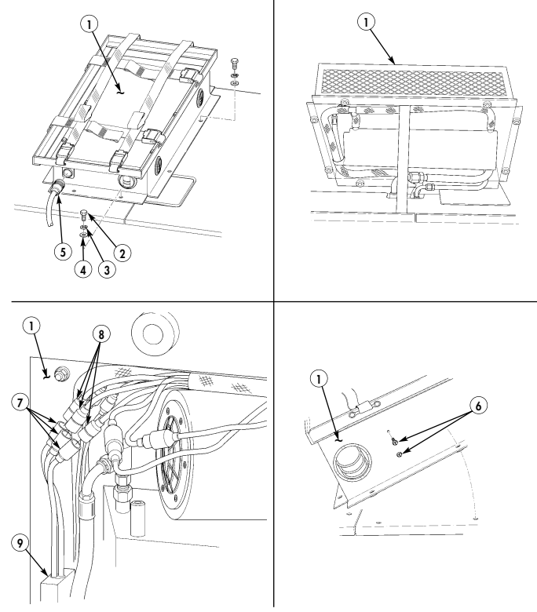

FOLLOW-ON TASKS:  -  Connect battery ground cables (para. 4-68).
 - 

## 11-93. A/C Module Replacement

This task covers:

| 1   | a. Removal   | 1   |
|-----|--------------|-----|

| Applicable Models            |
|------------------------------|
| Ml114                        |
| Tools                        |
| ?&era1  mechanic's tool kit: |

automotive (Appendix B, Item 1)

| Maintenance Level   |
|---------------------|
| Unit                |

Nut and lockwasher assembly (Appendix G,

a. Removal **b. Installation**

a. Removal

| Equipment Condition                       |
|-------------------------------------------|
| - Battery ground cables disconnected      |
| (para. 4\-68).                            |
| · Lower air duct removed (para. 11\-100). |

Prior to removal, mark and tag all leads for ease of installation.

1. Remove nut and lockwasher assembly (10) and A/C module ground lead (2) from ground stud (9).

Discard nut and lockwasher assembly (10).

2. Disconnect two module connectors (4) from A/C wiring harness (3) and module connector (5) from A/C heater/evaporator assembly connector (6).

| Manual References    |
|----------------------|
| TM 9\-2320\-387\-24P |

3. Remove two screws (7) and A/C module (8) from front A/C heater evaporator assembly (1).

#### B. Installation

1. Install A/C module (8) on front A/C heater/evaporator assembly (1) with two screws (7). 2. Connect module connector (5) to A/C heater/evaporator assembly connector (6) and two module connectors (4) to A/C wiring harness (3).

3. Install A/C module ground lead (2) to ground stud (9) with nut and lockwasher assembly (10).

# 11-93.  A/C Module Replacement (Cont'D)

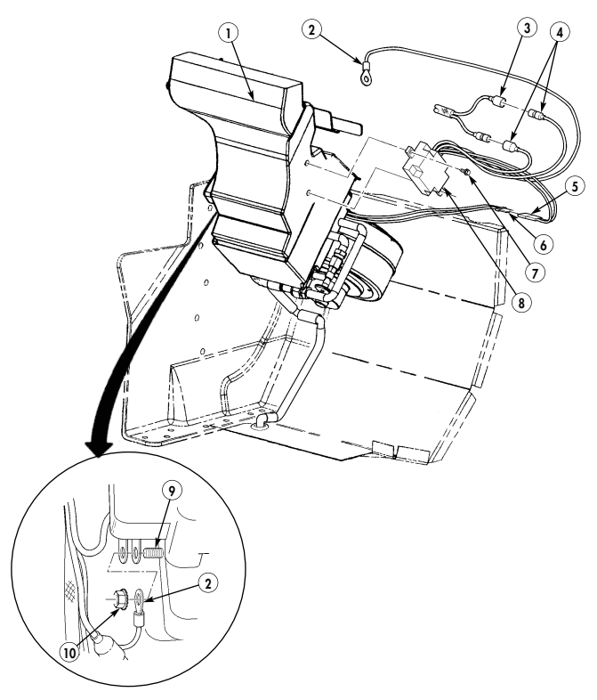

FOLLOW-ON TASKS:  - Connect battery ground cables (para. 4-68).

- Install lower air duct (para. 11-100).

· Start vehicle, run A/C system, and check A/C module (TM 9-2320-387-10).

## 11-94. A/C Relay Replacement

This task covers:

#### Initial Setup: Applicable Models

All models except M1113, M1114 Tools General mechanic's tool kit:
automotive (Appendix B, Item 1)
Maintenance and repair shop equipment:
automotive (Appendix B, Item 2)
Materials/Parts Two locknuts (Appendix G, Item 94.2)

a. Removal b. Installation

#### Manual References

TM 9-2320-387-10 TM 9-2320-387-24P

#### Equipment Condition

- Battery ground cables disconnected 
(para. 4-68).

- Condenser fan access panel removed 
(para. 11-103).

- Right rear upper underbody armor
(integrated) (if equipped) removed (para. 11-109).

#### Maintenance Level

Unit a. Removal

Prior to disconnecting A/C relay connectors, tag leads for proper installation.

1. Disconnect three A/C relay connectors (3) from A/C wiring harness connectors (2). 2. Remove two screws (7), four washers (4), two locknuts (5) and A/C relay (1) from mounting bracket (6).

#### B. Installation

1. Install A/C relay (1) on mounting bracket (6) with two screws (7), four washers (4) and two locknuts (5).

2. Connect three A/C relay connectors (3) to A/C wiring harness connectors (2).

# 11-94. A/C Relay Replacement (Cont'D)

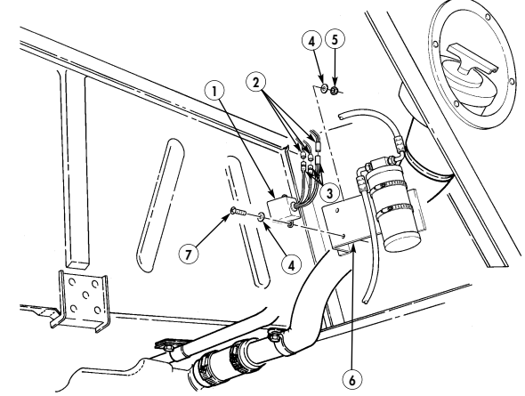

FOLLOW-ON TASKS: - Install right rear upper underbody armor (integrated) (if equipped) (para. 11-109).

- Install condenser fan access panel (para. 11-103). - Connect battery ground cables (para. 4-68). - Start vehicle, run A/C system and check A/C relay (TM 9320-387-10).

11-95. A/C WIRING HARNESS REPLACEMENT
This task covers:

#### Initial Setup: Applicable Models

All models except M1113, M1114 Tools General mechanics tool kit:
Automotive (Appendix B, Item 1)
Manual References TM 9-2320-387-10 TM 9-2320-387-24P
a. Removal **b. Installation**

#### Equipment Condition

- Battery cables disconnected (para. 4-68). - Tunnel interior side insulation removed
(para. 10-33).

- Lower A/C duct removed (para. 11-100). - Engine access cover removed (para. 10-22). - Air horn-to-air cleaner elbow removed
(para. 3-15).

#### Maintenance Level

Unit

#### A. Removal Note

- Tag and mark location of all wires prior to removal for ease of installation
- Note location of all tie down straps prior to removal for ease of installation
- Cut and remove tie down straps as necessary 1. Remove four A/C wiring harness connectors (5) from four condenser fan harness connectors (6). 2. Remove A/C wiring harness connector (3) from high pressure cut-off switch (4). 3. Remove A/C wiring harness connector (2) from low pressure cut-off switch (1). 4. Remove A/C wiring harness connector (7) from water valve solenoid (8). 5. Remove two A/C wiring harness connectors (9) from compressor (10).

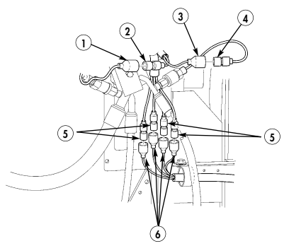

# 11-95. A/C Wiring Harness Replacement (Cont'D)

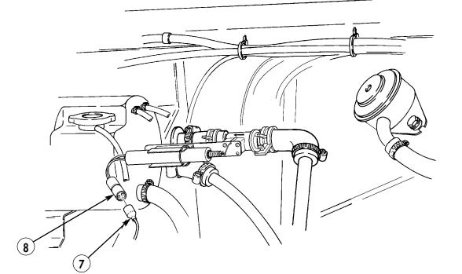

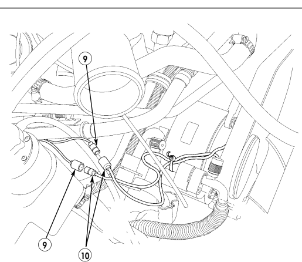

## 11-95. A/C Wiring Harness Replacement (Cont'D)

6. Remove one A/C wiring harness connector (1) from A/C switch jumper wire (2). 7. Remove two A/C wiring harness connectors (3) from temperature switch (4). 8. Remove four A/C wiring harness connectors (5) from two circuit breakers (6) and feed four A/C wiring harness connectors (5) through grommet (7).

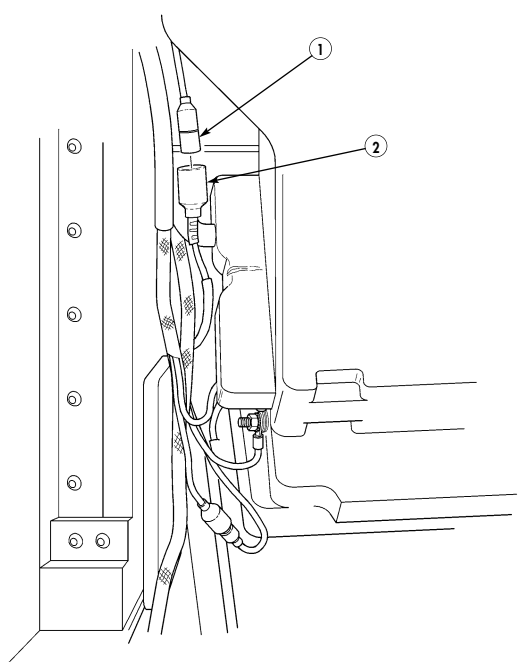

# 11-95. A/C Wiring Harness Replacement (Cont'D)

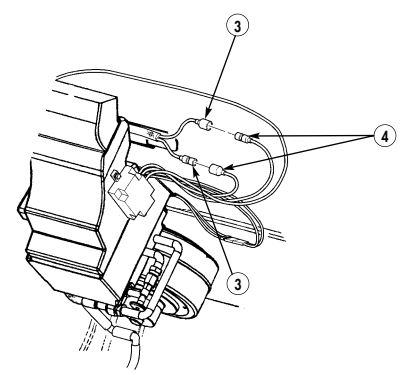

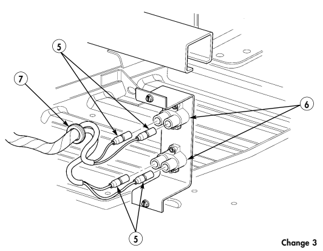

## 11-95. A/C Wiring Harness Replacement (Cont'D)

9. Remove screw (9), lockwasher (8), washer (7) and A/C wiring harness connector (10) from negative battery shunt (1).

10. Remove nut (5), lockwasher (4), washer (3) and two A/C wiring harness connector wires (6) from positive buss bar (2) and feed A/C wiring harness connectors (6) and (10) through grommet (11).

11. Remove screw (13), washer (14), and clamp (15) from A/C wiring harness (12) and remove wiring harness from vehicle (16).

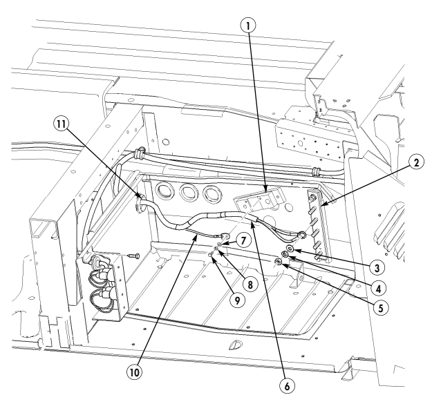

# 11-95. A/C Wiring Harness Replacement (Cont'D)

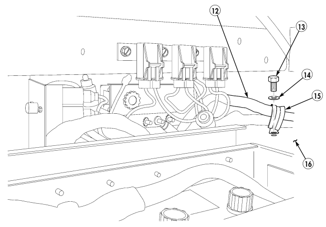

## 11-95. A/C Wiring Harness Replacement (Cont'D)

12. Remove A/C wiring harness connector (5) from rear blower/evaporator harness connector (4) and remove A/C wiring harness (6) from vehicle (8).

Perform steps 13 and 14 only if removal of rear blower/evaporator harness is necessary.

13. Remove harness connector (10) from rear evaporator (9).

14. Remove two screws (3), clamps (2), washers (7), and rear blower/evaporator harness (1) from vehicle (8).

b. Installation

Perform steps 1 and 2 only if removal of rear blower/evaporator harness was necessary.

1. Install harness connector (10) on rear evaporator (9). 2. Install rear blower/evaporator harness (1) on vehicle (8) with two clamps (2), screws (3), and washers (7).

3. Install A/C wiring harness connector (5) on rear blower/evaporator harness connector (4).

## 11-95. A/C Wiring Harness Replacement (Cont'D)

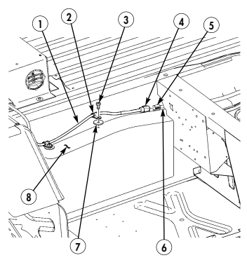

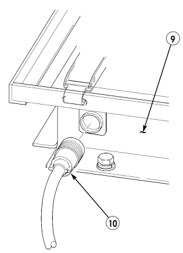

## 11-95. A/C Wiring Harness Replacement (Cont'D)

4. Install clamp (4) and A/C wiring harness (1) on vehicle (5) with washer (3), clamp (4), and screw (2). 5. Install A/C wiring harness connectors (8) and (12) through grommet (16). 6. Install A/C wiring harness connector (12) on negative battery shunt (6) with washer (13),
lockwasher (14), and screw (15).

7. Install two A/C wiring harness connectors (8) on positive buss bar (7) with washer (9),
lockwasher (10), and nut (11).

11-95. A/C WIRING HARNESS REPLACEMENT (Cont'd)

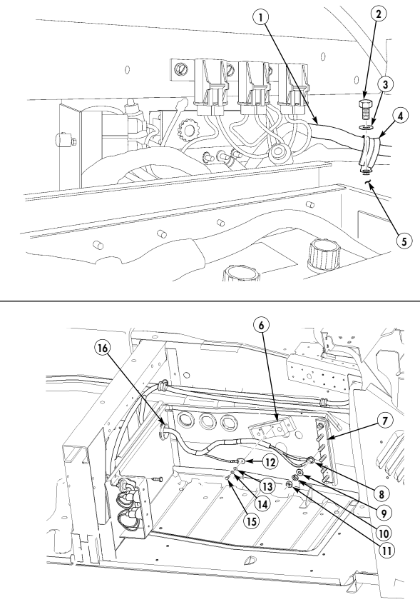

## 11-95. A/C Wiring Harness Replacement (Cont'D)

circuit breakers (6).

8. Install A/C wiring harness connector (5) through grommet (7) and install connectors (5) on two 9. Install two A/C wiring harness connectors (3) on temperature switch (4).

10. Install one A/C wiring harness connector (2) on A/C switch jumper wire (1).

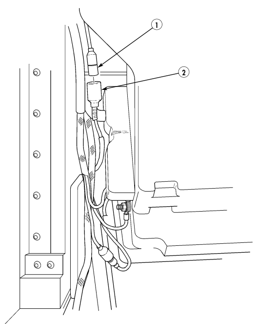

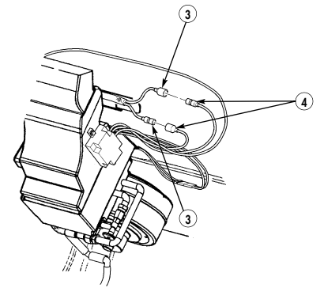

## 11-95. A/C Wiring Harness Replacement (Cont'D)

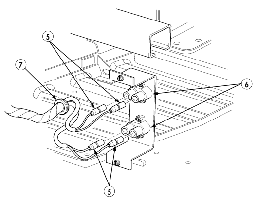

## 11-95. A/C Wiring Harness Replacement (Cont'D)

11. Install two A/C wiring harness connectors (9) on compressor (10). 12. Install A/C wiring harness connector (7) on watervalve solenoid (8). 13. Install A/C wiring harness connector (2) on low pressure cut-off switch (1). 14. Install A/C wiring harness connector (3) on high pressure cut-off switch (4). 15. Install four A/C wiring harness connectors (5) on four condenser fan harness connectors (6).

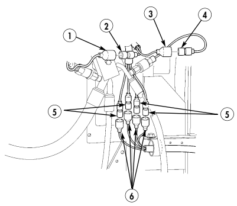

# 11-95. A/C Wiring Harness Replacement (Cont'D)

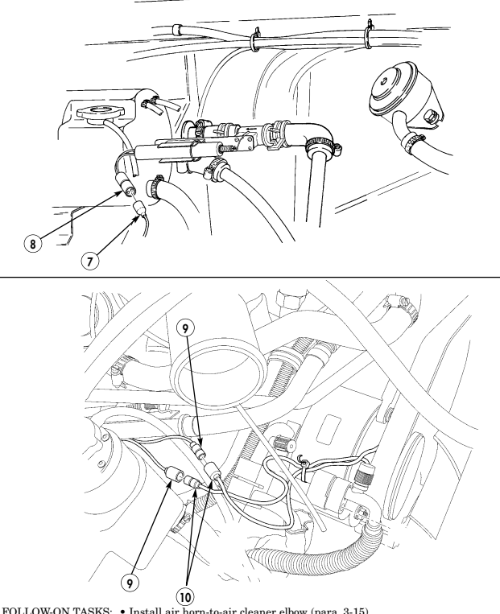

FOLLOW-ON TASKS: - Install air horn-to-air cleaner elbow (para. 3-15).
- Install engine access cover (para. 10-22). - Install lower A/C duct (para. 11-100). - Install interior side insulation (para. 10-33). - Connect battery cables (para. 4-68). - Start vehicle, run A/C system and check A/C harness (TM 9-2320-387-10).

## 11-96. Valve, Heater Shutoff Replacement

This task covers:

Applicable Models All models except M1113, M1114 Tools General mechanic's tool kit:
automotive (Appendix B, Item 1)
Maintenance and repair shop equipment:
automotive (Appendix B, Item 2)
Manual References TM 9-2320-387-10 TM 9-2320-387-24P
a. Removal **b. Installation**

#### Equipment Condition

- Cooling system drained as required 
(para. 3-61).

- Battery ground cables disconnected 
(para. 4-68).

- Air intake tube removed (para. 3-19).

Maintenance Level Unit

Prior to disconnecting heater shutoff valve connector, tag lead for proper installation.

a. Removal 1. Disconnect heater shutoff valve connector (7) from A/C wiring harness connector (6).

Use a container to catch antifreeze solution.

2. Loosen clamps (3) and (4). Remove heater shutoff valve (1) from heater hoses (2) and (5).

b. Installation 1. Install heater shutoff valve (1) on heater hoses (2) and (5) and secure with clamps (3) and (4). 2. Connect heater shutoff valve connector (7) on A/C wiring harness connector (6).

# 11-96. Valve, Heater Shutoff Replacement (Cont'D)

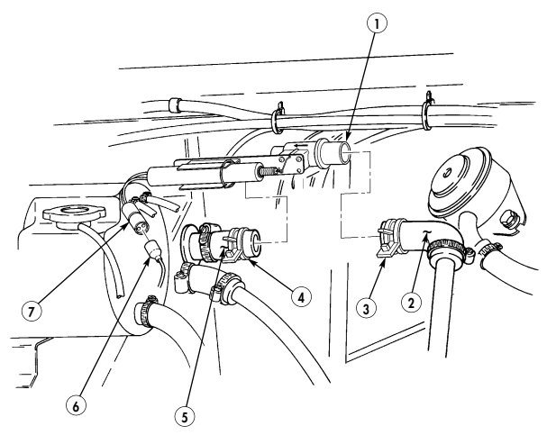

FOLLOW-ON TASKS: - Connect air intake tube (para. 3-19).

- Connect battery ground cables (para. 4-68). - Fill cooling system (para. 3-61). - Start engine (TM 9-2320-387-10) and check shutoff valve for leaks.

# 11-97. Tunnel Top Insulation Maintenance

This task covers:
c. Inspection

Applicable Models All models except M1113, M1114 Tools General mechanic's tool kit:
automotive (Appendix B, Item 1)
Materials/Parts Eight lockwashers (Appendix G, Item 146)

#### A. Front Tunnel Top Insulation Removal

a. Front Tunnel Top Insulation Removal **d. Front Tunnel Top Insulation Installation** b. Rear Tunnel Top Insulation Removal e. Rear Tunnel Top Insulation Installation

| Maintenance Level   |
|---------------------|
| Unit                |

| TM 9\-2320\-387\-24P   |
|------------------------|

| Personnel Required   |
|----------------------|
| One mechanic         |
| One assistant        |

1. Remove six capscrews (6) from front tunnel top insulation (5). 2. Remove two capscrews (3), lockwashers (2), and washers (1) from front of rear evaporator (10).

Discard lockwashers (2).

- A/C lines do not need to be disconnected for removal of tunnel top insulation
- A/C lines removed for clarity. View is from rear looking forward.

3. Lift front edge of rear evaporator (10) and slide front tunnel top insulation (5) out from under edge of rear evaporator (10).

4. Remove front tunnel top insulation (5) from tunnel (8).

b. Rear Tunnel Top Insulation Removal 1. Remove connector (4) from rear evaporator (10).

Perform step 2 only if front tunnel top insulation was removed. Otherwise proceed to step 3.

2. Remove six capscrews (3), lockwashers (2), and washers (1) from rear evaporator (10) and front tunnel top insulation (5). Discard lockwashers (2)
3. Remove eight capscrews (3), lockwashers (2), and washers (1) from rear evaporator (10). Discard lockwashers (2).

4. Lift rear evaporator (10) and slide rear tunnel top insulation (9) and insert panel (11) out from under rear evaporator (10).

5. Remove rear tunnel top insulation (9) from tunnel (8).

c. Inspection Refer to para. 11-56 for nut insert (7) inspection and replacement.

#### Caution

Use grade 5 torque value when installing capscrews into nut inserts. Failure to do so may damage equipment or components.

# 11-97. Tunnel Top Insulation Maintenance (Cont'D)

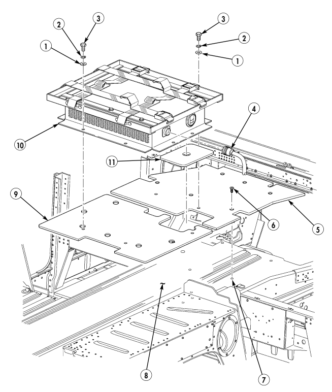

# 11-97. Tunnel Top Insulation Maintenance (Cont'D)

d. Rear Tunnel Top Insulation Installation

#### Caution

Use grade 5 torque value when installing capscrews into nut inserts. Failure to do so may damage equipment or components.

1. Install rear tunnel top insulation (9) and insert panel (11) on tunnel (8).

Perform step 2 if front tunnel top insulation was removed. Otherwise proceed to step 3.

2. Install rear evaporator (10) on rear tunnel top insulation (9) and insert panel (11) with six capscrews (3), lockwashers (2), and washers (1).

3. Install rear evaporator (10) on rear tunnel top insulation (10) and insert panel (11) with eight capscrews (3), lockwashers (2), and washers (1).

4. Install connector (4) on rear evaporator (10).

e. Front Tunnel Top Insulation Installation

#### Caution

Use grade 5 torque value when installing capscrews into nut inserts. Failure to do so may damage equipment or components.

1. Install front tunnel top insulation (5) on tunnel top (8), ensuring rear edge of insulation (5) is under front edge of rear evaporator (10) and secure with two capscrews (3), lockwashers (2), and washers (1).

2. Install six screws (6) on front tunnel top insulation (5) and tunnel (8).

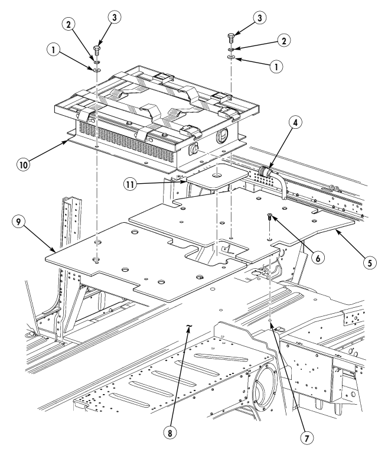

# 11-97. Tunnel Top Insulation Maintenance (Cont'D)

## 11-98. A/C Front Blower Motor Replacement

This task covers:
INITIAL SETUP:
Applicable Models All models except M1113, M1114 Tools General mechanic's tool kit:
automotive (Appendix B, Item 1)
Manual References TM 9-2320-387-10 TM 9-2320-387-24P
a. Removal a. Removal **b. Installation**

#### Equipment Condition

- Battery ground cables disconnected 
(para. 4-68).

- Lower air duct removed (para. 11-100).

Maintenance Level Unit

Prior to removal of blower motor, tag leads for installation.

1. Remove assembled nut (7) and blower motor ground wire (4) from A/C heater/evaporator assembly (1). 2. Disconnect blower motor electrical connector (5) from A/C wiring harness connector (6). 3. Remove five screws (3) and blower motor (2) from A/C heater/evaporator assembly (1).

#### B. Installation

1. Install blower motor (2) on A/C heater/evaporator assembly (1) with five screws (3). 2. Connect blower motor electrical connector (5) to A/C wiring harness connector (6). 3. Install blower motor ground wire (4) on A/C heater/evaporator assembly (1) with assembled nut (7).

# 11-98. A/C Front Blower Motor Replacement (Cont'D)

FOLLOW-ON TASKS: - Install lower air duct (para. 11-100).

- Connect battery ground cables (para. 4-68). - Start vehicle, run A/C system, and check blower motor
(TM 9-2320-387-10).

| This task covers:                                                       |                                                |
|-------------------------------------------------------------------------|------------------------------------------------|
| a.  Removal                                                             | c.  Installation                               |
| b.  Inspection                                                          |                                                |
| INITIAL SETUP:                                                          |                                                |
| Applicable Models                                                       | Materials/Parts                                |
| M1114                                                                   | Sealing compound (Appendix C, Item 72.1)       |
| Tools                                                                   | Equipment Condition                            |
| General mechanic's tool kit:                                            | - Condenser fan exhaust vents removed          |
| automotive (Appendix B, Item 1)                                         | (para. 11\-85).                                |
| Maintenance and repair shop equipment:  automotive (Appendix B, Item 2) | - Cargo shell door gas spring mounting bracket |
|                                                                         | removed (para. 11\-29).                        |

# 11-99. A/C And Fan Toggle Switches And Jumper Wires Replacement

a. Removal

- Prior to removal, tag all leads for installation. - Attaching hardware is part of switch assembly. - Perform steps 1 through 4 if removing toggle switches only. - Perform steps 3 through 7 if removing A/C jumper wires only.

1. Remove nut (8) and lockwasher (7) from A/C toggle switch (6) and remove A/C toggle switch (6) from instrument panel (5). Discard nut (8) and lockwasher (7).

2. Remove nut (9) and lockwasher (10) from fan toggle switch (11) and remove fan toggle switch (11)
from instrument panel (5). Discard nut (9) and lockwasher (10).

3. Disconnect two A/C toggle switch leads (3) from A/C toggle switch wiring harness (13) and jumper harness lead (4).

4. Disconnect three fan toggle switch leads (2) from wiring harness (1) and jumper harness leads (4). 5. Disconnect two resistor leads (12) from A/C switch jumper wiring harness leads (4) and remove A/C
switch jumper wire (14) from instrument panel (5).

6. Disconnect A/C toggle switch jumper wiring harness (13) from A/C wiring harness (15). 7. Remove A/C toggle switch jumper wiring harness (13) from "A" beam (16) and P-clamp (17).

b. Installation

- Perform steps 1 through 5 if installing A/C jumper wires only. - Perform steps 4 through 7 if installing toggle switches only.

1. Route A/C toggle switch jumper wiring harness (13) through "A" beam (16) securing with existing P-
clamp (17).

2. Connect A/C toggle switch jumper wiring harness (13) to A/C wiring harness (15). 3. Connect two resistor leads (12) to jumper harness leads (4) and install A/C switch jumper wire (14)
on instrument panel (5).

4. Connect three fan toggle switch leads (2) to wiring harness (1) and A/C switch jumper harness leads (4).

5. Connect two A/C toggle switch leads (3) to A/C toggle switch wiring harness (13) and jumper harness leads (4).

6. Install fan toggle switch (11) on instrument panel (5) with lockwasher (10) and nut (9). 7. Install A/C toggle switch (6) on instrument panel (5) with lockwasher (7) and nut (8).

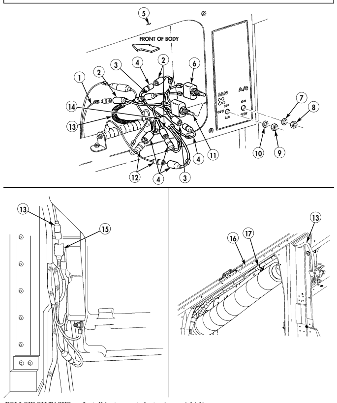

# 11-99.  A/C And Fan Toggle Switches And Jumper Wire Replacement (Cont'D)

FOLLOW-ON TASKS:  - Install instrument cluster (para. 4-14.1).

· Start vehicle, run A/C system, and check toggle switches (TM 9-2320-387-10).

# 11-100. A/C Front Air Distribution Duct Replacement

| a. Removal                     | c. Installation      |
|--------------------------------|----------------------|
| b. Inspection                  |                      |
| INITIAL SETUP:                 |                      |
| Applicable Models              | Manual References    |
| Ml114                          | TM 9\-2320\-387\-24P |
| Tools                          | Maintenance Level    |
| General  mechanic's  tool kit: | unit                 |

| This task covers:   |
|---------------------|

#### A. Removal

1. Remove four registers (1) from front air distribution duct (3) by carefully prying out of place. 2. Remove capscrew (2) from lower air duct (6) and pull lower air duct (6) downward and remove from A/C front air distribution duct (3).

3. Remove four capscrews (2) from front air distribution duct (3) and A-beam (4). 4. Remove front air distribution duct (3) from heater/evaporator (5) and A-beam (4).

#### B. Installation

1. Install front air distribution duct (3) on heater/evaporator (5) and A-beam (4) with four capscrews (2). 2. Install four registers (1) on front air distribution duct (3) by carefully pushing in place. 3. Install lower air duct (6) to A/C front air distribution duct (3).

# 11-100.  A/C Front Air Distribution Duct Replacement (Cont'D)

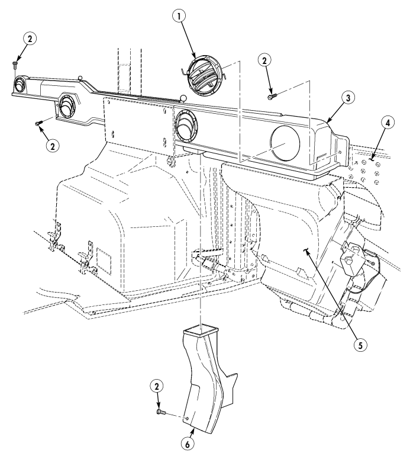

# 11-101. A/C Front Evaporator Drain Hose Replacement

| 1 l\-89.   | REAR CARGO DOOR ACCESS TASK SUMMARY   |
|------------|---------------------------------------|
| TASK       | PROCEDURES                            |
| PARA.      |                                       |
| n\-90.     | Rear Cargo Door Access                |

| This task covers:   |
|---------------------|

a. Removal 1. Pull aside cowl insulation (4). 2. Remove evaporator drain hose (1) from rubber grommet (3) and A/C heater/evaporator assembly (2). 3. Remove evaporator drain hose (1) from rubber grommet (5) and floor (6).

#### B. Installation

1. Install evaporator drain hose (1) on rubber grommet (5) and floor (6). 2. Install evaporator drain hose (1) on A/C heater/evaporator assembly (2) and rubber grommet (3). 3. Reposition cowl insulation (4).

11-101. A/C FRONT EVAPORATOR DRAIN HOSE REPLACEMENT (Cont'd)

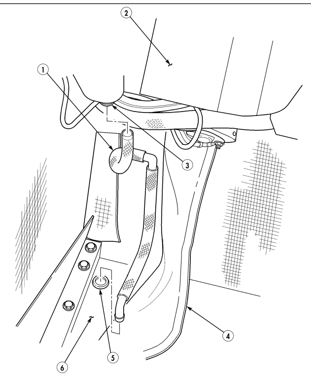

# 11-102. A/C Rear Evaporator Drain Hose Maintenance

This task covers:

a. Removal c. Installation b. Inspection

Applicable Models All models except M1113, M1114 Tools General mechanic's tool kit:
automotive (Appendix B, Item 1)
Materials/Parts Eight lockwashers (Appendix G, Item 146)
Manual References TM 9-2320-387-10 TM 9-2320-387-24P
Equipment Condition Battery ground cables disconnected 

| Maintenance Level   |
|---------------------|

| Dateor ) 2\- carr   |
|---------------------|
| (para. 4\-68).      |

Unit support

#### A. Removal

1. Disconnect A/C wiring harness cannon plug (3) from rear evaporator assembly (1). 2. Remove eight capscrews (4), lockwashers (5), and washers (5) from rear evaporator assembly (1) and tunnel (9). Discard lockwashers (5).

3. Raise rear evaporator assembly (1) and support. 4. Remove evaporator drain hose (7) from both ends of evaporator assembly (1) and from hole in floor (10).

b. Inspection Refer to para. 11-56 for nut insert (8) inspection and replacement.

c. Installation

#### Caution

Use grade 5 torque value when installing capscrews into nut inserts. Failure to do so may damage equipment or components.

1. Install evaporator drain hose (7) on both ends of evaporator assembly (1). 2. Install evaporator drain hose (7) into hole in floor (10). 3. Remove support and lower rear evaporator assembly (1). 4. Connect cannon plug (3) to rear evaporator assembly (1). 5. Install rear evaporator assembly (1) on tunnel (9) with eight capscrews (4), lockwashers (5), and washers (6).

# 11-102.  A/C Rear Evaporator Drain Hose Maintenance (Cont'D)

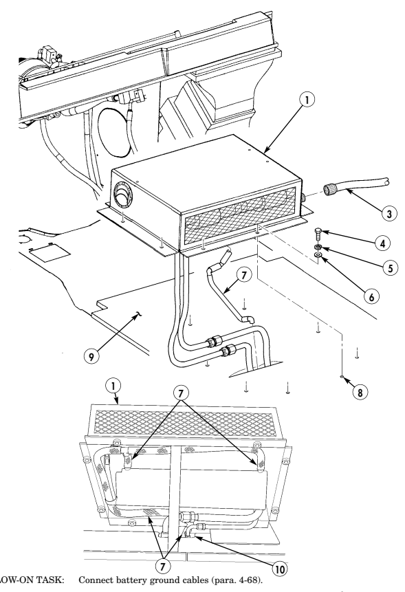

## 11-103. Condenser Fan Access Panel Replacement

| This task covers:   |
|---------------------|

| NITIAL SETUP:                   |                      |
|---------------------------------|----------------------|
| Applicable Models               | Manual References    |
| All models except M1113, M1114  | TM 9\-2320\-387\-24P |
| Tools                           | Maintenance Level    |
| General mechanic's tool kit:    | Unit                 |
| automotive (Appendix B, Item 1) |                      |

a. Removal **b. Installation**

a. Removal 1. Remove two screws (3) from condenser fan access panel (2). 2. Remove two nuts (1) and condenser fan access panel (2) from condenser assembly (4).

b. Installation Install condenser fan access panel (2) on condenser assembly (4) with two screws (3) and two nuts (1).

# 11-103.  Condenser Fan Access Panel Replacement (Cont'D)

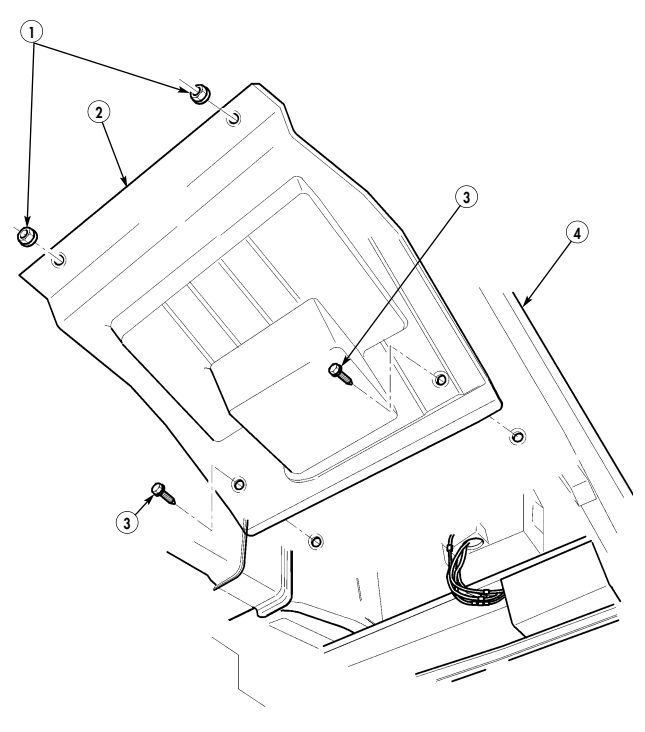

# 11-104. Condenser Fan Supply Vent Maintenance

This task covers:
b. Inspection a. Removal c. Installation

Applicable Models Tools

| Maintenance Level   |
|---------------------|
| Unit                |

| TM 9\-2320\-387\-24P               |
|------------------------------------|
| Equipment Condition                |
| Battery ground cables disconnected |
| (para. 4\-68).                     |

| General mechanic's tool kit:           |
|----------------------------------------|
| automotive (Appendix B, Item 1)        |
| Maintenance and repair shop equipment: |
| automotive (Appendix B, Item 2)        |

a. Removal Remove nine screws (3), lockwashers (4), washers (5), and condenser fan supply vent (2) from body (1). Discard lockwashers (4).

b. Inspection Refer to para. 11-56 for nut insert (6) inspection ad replacement.

c. Installation

#### Caution

Use grade 5 torque value when installing capscrews into nut inserts. Failure to do so may damage equipment or components.

Install condenser fan supply vent (2) on body (1) with nine screws (3), lockwashers (4), and washers (5).

# 11-104.  Condenser Fan Supply Vent Maintenance (Cont'D)

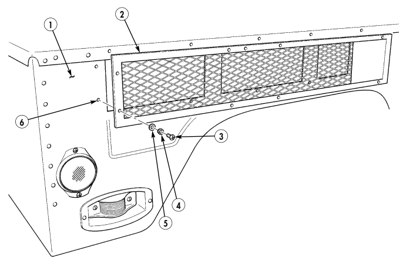

# 11-104.1. A/C High And Low Pressure Switches Replacement

This task covers:

Applicable Models All models except M1113, M1114 Tools General mechanic's tool kit:
automotive (Appendix B, Item 1)
a. Removal b. Installation

#### Materials/Parts

Two O-rings (Appendix G, Item 205) Refrigerant oil (Appendix C, Item 48)
Manual References TM 9-2320-387-24P
Maintenance Level Unit

#### A. Removal

1. Disconnect low pressure switch connector (1) from A/C wiring harness connector (2). 2. Remove low pressure switch (10) and O-ring (9) from low pressure line (8). Discard O-ring (9). 3. Disconnect high pressure switch connector (4) from A/C wiring harness connector (3). 4. Remove high pressure switch (5) and O-ring (6) from high pressure line (7). Discard O-ring (6).

b. Installation

Ensure O-ring is in threaded area of pressure switches prior to installation.

1. Apply refrigerant oil on O-ring (9), and install O-ring (9) and low pressure switch (10) to low pressure line (8). Tighten low pressure switch (10) to 5-7 lb-ft (7-9 N•m).

2. Connect low pressure switch connector (1) to A/C wiring harness connector (2). 3. Apply refrigerant oil on O-ring (6), and install O-ring (6) and high pressure switch (5) to high pressure line (7). Tighten high pressure switch (5) to 5-7 lb-ft (7-9 N•m).

4. Connect high pressure switch connector (4) to A/C wiring harness connector (3).

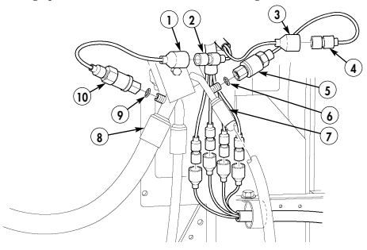

## 11-104.2. Driver'S Closeout Panel Replacement

This task covers:
a. Removal b. Installation INITIAL SETUP:
Tools General mechanic's tool kit:
automotive (Appendix B, Item 1)

| Manual References   |
|---------------------|
| TM 9\-2320\-387\-10 |

Manual References TM 9-2320-387-24P
a. Removal 1. Remove capscrew (6) from instrument panel (1) and drivers closeout panel (5). 2. Remove two capscrews (3), washers (2), throttle handle (4), and drivers closeout panel (5) from instrument panel (1).

b. Installation 1. Install throttle handle (4) and drivers closeout panel (5) on instrument panel (1) with two washers (2)
and capscrews (3).

2. Secure drivers closeout panel (5) to instrument panel (1) with capscrew (6).

# 11-104.2.  Driver'S Closeout Panel Replacement (Cont'D)

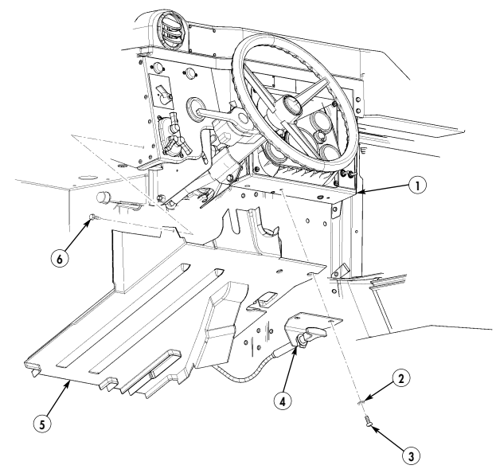

# Section Vi. Integrated Armor Protection (Iap) Maintenance 11-105. Integrated Armor Protection (Iap) Maintenance Task Summary

| a. Removal                             | b. Installation                                                                                        |
|----------------------------------------|--------------------------------------------------------------------------------------------------------|
| INITIAL SETUP:                         |                                                                                                        |
| Applicable Models                      | Manual References                                                                                      |
| All models except M1113, M1114         | TM 9\-2320\-387\-10                                                                                    |
| Tools                                  | TM 9\-2320\-387\-24P                                                                                   |
| General mechanic's tool kit:           | Equipment Condition                                                                                    |
| automotive (Appendix B, Item 1)        | - Battery ground cables disconnected                                                                   |
| Maintenance and repair shop equipment: | (para. 4\-68).                                                                                         |
| automotive (Appendix B, Item 2)        | - Condenser fan access panel removed                                                                   |
| Materials/Parts                        | (para. 11\-103).                                                                                       |
| Two locknuts (Appendix G, Item 94.2)   | - Right rear upper underbody armor (integrated) (if equipped) removed                                  |
|                                        | (para. 11\-109).                                                                                       |
|                                        | Maintenance Level                                                                                      |
|                                        | Unit                                                                                                   |
| a. Removal                             |                                                                                                        |
| NOTE                                   | Prior to disconnecting A/C relay connectors, tag leads for proper                                      |
| installation.                          |                                                                                                        |
| 1.                                     | Disconnect three A/C relay connectors (3) from A/C wiring harness connectors (2).                      |
| 2.                                     | Remove two screws (7), four washers (4), two locknuts (5) and A/C relay (1) from mounting bracket (6). |
| b. Installation                        |                                                                                                        |
| 1.                                     | Install A/C relay (1) on mounting bracket (6) with two screws (7), four washers (4) and two            |
| locknuts (5).                          |                                                                                                        |
| 2.                                     | Connect three A/C relay connectors (3) to A/C wiring harness connectors (2).                           |
| 11\-168                                | Change 5                                                                                               |

| This task covers:                        |                                                                |                                             |
|------------------------------------------|----------------------------------------------------------------|---------------------------------------------|
| a. Front Tunnel Top Insulation Removal   |                                                                | d. Front Tunnel Top Insulation Installation |
| b. Rear Tunnel Top Insulation Removal    |                                                                | e. Rear Tunnel Top Insulation Installation  |
| c. Inspection                            |                                                                |                                             |
| INITIAL SETUP:                           |                                                                |                                             |
| Applicable Models                        |                                                                | Personnel Required                          |
| All models except M1113, M1114           |                                                                | One mechanic                                |
| Tools                                    |                                                                | One assistant                               |
| General mechanic's tool kit:             |                                                                | Manual References                           |
| automotive (Appendix B, Item 1)          |                                                                | TM 9\-2320\-387\-24P                        |
| Materials/Parts                          |                                                                | Maintenance Level                           |
| Eight lockwashers (Appendix G, Item 146) |                                                                | Unit                                        |
| a. Front Tunnel Top Insulation Removal   |                                                                |                                             |
| 1.                                       | Remove six capscrews (6) from front tunnel top insulation (5). |                                             |

11-105. INTEGRATED ARMOR PROTECTION (IAP) MAINTENANCE TASK SUMMARY (Cont'd)

# 11-106. Left Front Underbody Armor (Integrated) Maintenance (Serial Numbers 241953 And Below)

This task covers:
b. Inspection

Applicable Models M1151A1, M1152A1, M1165A1 Tools General mechanic's tool kit:
automotive (Appendix B, Item 1)
Maintenance and repair shop equipment:
automotive (Appendix B, Item 2)

#### Materials/Parts

Nine locknuts (Appendix G, Item 106) Three lockwashers (Appendix G, Item 146) Sixteen lockwashers (Appendix G, Item 144)
Personnel Required One mechanic One assistant Manual References TM 9-2320-387-10 TM 9-2320-387-24P
a. Removal c. Installation

#### Equipment Condition

•Left underbody extension armor (integrated)
removed (para. 11-115).

•Fire extinguisher removed (TM 9-2320-387-10). •Left front wheelwell armor (Frag 2) removed 
(if equipped) (Appendix L, L-4).

•Upper rocker plate IED overlay (Frag 1) removed
(if equipped) (Appendix K, K-15) (M1165A1 only).

•Upper rocker plate IED overlay (Frag 1) removed 
(if equipped) (Appendix K, K-16) (M1152A1 only).

•Rocker plate IED overlay (Frag 1) removed (if equipped) (Appendix K, K-14) (M1151A1 only).

•Armor side rocker plate (perimeter) removed 
(if equipped) (Appendix J, J-56).

#### General Safety Instructions

Left front underbody armor plate is extremely heavy and must be supported during removal and installation.

Maintenance Level Unit

#### Warning

Left front underbody armor plate is extremely heavy and must be supported during removal and installation. Failure to do so may result in injury to personnel or damage to equipment.

- Note location of screws, nuts, spacers, and brackets for installation. - Quantity of mounting hardware may vary depending on Frag application on vehicle.

#### A. Removal

1. Remove two locknuts (30), washers (29), capscrews (11), and washers (12) from front underbody armor (18), lower A-pillar armor (8), and outer kick liner (31). Discard locknuts (30).

2. Remove three capscrews (22), lockwashers (23), and washers (24) from front underbody armor (18)
and L-bracket (32). Discard lockwashers (23).

3. Remove four capscrews (21), lockwashers (20), washers (19), and front underbody extension plate (25)
from front underbody armor (18). Discard lockwashers (20).

4. Remove eight capscrews (3), lockwashers (2), washers (4), and threaded plate (17) from front underbody armor (18) and inner kick liner (1). Discard lockwashers (2).

5. Remove four capscrews (15), lockwashers (14), washers (13) and two plates (16) from front underbody armor (18). Discard lockwashers (14).

6. Remove three locknuts (5), washers (6), capscrews (10), and washers (9) from front underbody armor
(18) and lower A-pillar armor (8). Discard locknuts (5).

7. Lower front underbody armor (18).

# 11-106. Left Front Underbody Armor (Integrated) Maintenance (Serial Numbers 241953 And Below) (Cont'D)

Perform step 8 only if brackets and clamps are damaged.

8. Remove four locknuts (27), clamps (28), and two brackets (26) from frame rail (7). Discard locknuts (27).

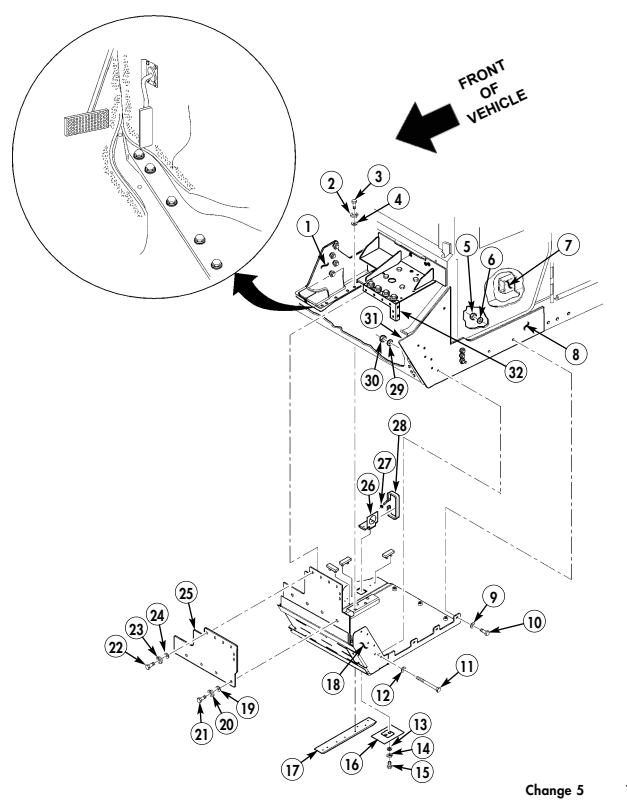

# 11-106. Left Front Underbody Armor (Integrated) Maintenance (Serial Numbers 241953 And Below) (Cont'D)

b. Inspection 1. Refer to para. 10-56 for nut insert inspection and replacement. 2. Inspect rubber strips, replace if damaged.

c. Installation

#### Caution

- Ensure clamps on frame are positioned under brake lines.

Failure to do so will result in damage to equipment.

- Use grade 5 torque value when installing capscrews into nut inserts. Failure to do so may damage equipment or components.

1. Install four clamps (28) and two brackets (26) on frame rail (7) with four locknuts (27). Tighten locknuts (27) to 64-68 lb-in. (7-8 N•m).

When installing left front underbody, tilt rear of underbody downward to avoid engine mount bracket interference.

2. Raise front underbody armor (18) into proper position. 3. Install front underbody armor (18) on lower A-pillar armor (8) with three washers (9), capscrews (10),
washers (6), and locknuts (5).

4. Install two plates (16) on front underbody armor (18) with four washers (13), lockwashers (14), and capscrews (15).

5. Install threaded plate (17) on front underbody armor (18) and inner kick liner (1) with eight washers (4), lockwashers (2), and capscrews (3).

6. Install front underbody extension plate (25) on front underbody armor (18) with four washers (19),
lockwashers (20), and capscrews (21).

7. Install front underbody armor (18) on L-bracket (32) with six washers (24), lockwashers (23), and capscrews (22).

8. Install front underbody armor (18) on lower A-pillar armor (8) and outer kick liner (31) with six washers (12), capscrews (11), washers (29), and locknuts (30).

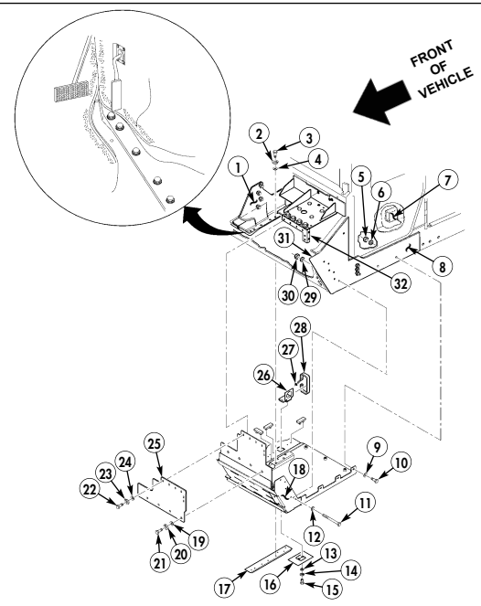

11-106. LEFT FRONT UNDERBODY ARMOR (INTEGRATED) MAINTENANCE
(SERIAL NUMBERS 241953 AND BELOW) (Cont'd)
FOLLOW-ON TASKS: - Install armor side rocker plate (perimeter) (if equipped) (Appendix J, J-56).

- Install rocker plate IED overlay (Frag 1) (if equipped) (Appendix K, K-14)
(M1151A1 only).

- Install upper rocker plate IED overlay (Frag 1) (if equipped) (Appendix K, K-16) 
(M1152A1 only).

- Install upper rocker plate IED overlay (Frag 1) (if equipped) (Appendix K, K-15) 
(M1165A1 only).

- Install left front wheelwell armor (Frag 1) (if equipped) (Appendix L, L-4). - Install fire extinguisher (TM 9-2320-387-10). - Install left underbody extension armor (integrated) (para. 11-115).

# 11-106.1. Left Front Underbody Armor (Integrated) Maintenance (Serial Numbers 241954 And Above)

This task covers:
b. Inspection

Applicable Models M1151A1, M1152A1, M1165A1, M1167 Tools General mechanic's tool kit:
automotive (Appendix B, Item 1)
Maintenance and repair shop equipment:
automotive (Appendix B, Item 2)

#### Materials/Parts

Nine locknuts (Appendix G, Item 106) Three lockwashers (Appendix G, Item 146) Sixteen lockwashers (Appendix G, Item 144)
Personnel Required One mechanic One assistant Manual References TM 9-2320-387-10 TM 9-2320-387-24P
a. Removal c. Installation

#### Equipment Condition

•Left underbody extension armor (integrated)
removed (para. 11-115.1).

•Fire extinguisher removed (TM 9-2320-387-10). •Left front wheelwell armor (Frag 2) removed 
(if equipped) (Appendix L, L-4).

•Upper rocker plate IED overlay (Frag 1) removed
(if equipped) (Appendix K, K-15) (M1165A1, M1167 only).

•Upper rocker plate IED overlay (Frag 1) removed 
(if equipped) (Appendix K, K-16) (M1152A1 only).

•Rocker plate IED overlay (Frag 1) removed (if equipped) (Appendix K, K-14) (M1151A1 only).

•Armor side rocker plate (perimeter) removed 
(if equipped) (Appendix J, J-56).

#### General Safety Instructions

Left front underbody armor plate is extremely heavy and must be supported during removal and installation.

Maintenance Level Unit

#### Warning

Left front underbody armor plate is extremely heavy and must be supported during removal and installation. Failure to do so may result in injury to personnel or damage to equipment.

NOTE
- Note location of screws, nuts, spacers, and brackets for installation. - Quantity of mounting hardware may vary depending on Frag application on vehicle.

#### A. Removal

1. Remove two locknuts (32), washers (31), capscrews (13), and washers (12) from front underbody armor (19), lower A-pillar armor (30) and vehicle (8). Discard locknuts (32).

2. Remove three capscrews (23), lockwashers (24), and washers (25) from front underbody extension plate (26), front underbody armor (19), and L-bracket (33). Discard lockwashers (24).

3. Remove four capscrews (22), lockwashers (21), washers (20), and front underbody extension plate (26) from front underbody armor (19). Discard lockwashers (21).

4. Remove eight capscrews (3), lockwashers (2), washers (4), and threaded plate (18) from front underbody armor (19) and inner kick liner (1). Discard lockwashers (2).

5. Remove four capscrews (16), lockwashers (15), washers (14), and two plates (17) from front underbody armor (19). Discard lockwashers (15).

6. Remove three locknuts (5), washers (6), capscrews (11), and washers (10) from front underbody armor (19) and vehicle (8). Discard locknuts (5).

7. Lower front underbody armor (19) and remove spacers (9).

# 11-106.1. Left Front Underbody Armor (Integrated) Maintenance (Serial Numbers 241954 And Above) (Cont'D)

Perform step 8 only if brackets and clamps are damaged.

8. Remove four locknuts (28), clamps (29), and two brackets (27) from frame rail (7). Discard locknuts (28).

b. Inspection 1. Refer to para. 10-56 for nut insert inspection and replacement. 2. Inspect rubber strips, replace if damaged.

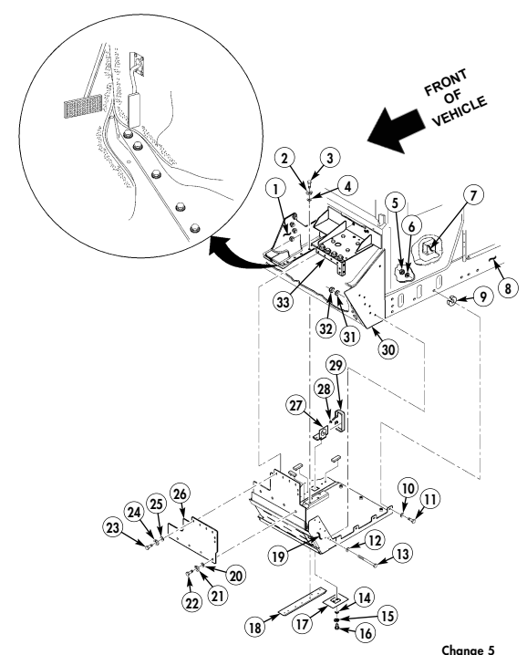

Change 5 11-208.3

# 11-106.1. Left Front Underbody Armor (Integrated) Maintenance (Serial Numbers 241954 And Above) (Cont'D)

c. Installation

#### Caution

- Ensure clamps on frame are positioned under brake lines.

Failure to do so will result in damage to equipment.

- Use grade 5 torque value when installing capscrews into nut inserts. Failure to do so may damage equipment or components.

1. Install four clamps (29) and two brackets (27) on frame rail (7) with four locknuts (28). Tighten locknuts (28)
to 64-68 lb-in. (7-8 N•m).

2. Raise front underbody armor (19) and place spacers (9) into proper position. 3. Install front underbody armor (19) on vehicle (8) with three washers (10), capscrews (11), washers (6),
and locknuts (5).

4. Install two plates (17) on front underbody armor (19) with four washers (14), lockwashers (15), and capscrews (16).

5. Install threaded plate (18) on front underbody armor (19) and inner kick liner (1) with eight washers (4), lockwashers (2), and capscrews (3).

6. Install front underbody extension plate (26) on front underbody armor (19) with four washers (20),
lockwashers (21), and capscrews (22).

7. Secure front underbody armor (19) and front underbody extension plate (26) to L-bracket (33) with six washers (25), lockwashers (24), and capscrews (23).

8. Secure front underbody armor (19) to lower A-pillar armor (30) and vehicle (8) with six washers (12),
capscrews (13), washers (31), locknuts (32).

# 11-106.1. Left Front Underbody Armor (Integrated) Maintenance (Serial Numbers 241954 And Above) (Cont'D)

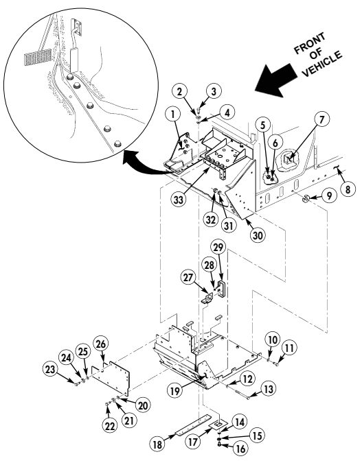

FOLLOW-ON TASKS: - Install armor side rocker plate (perimeter) (if equipped) (Appendix J, J-56).

- Install rocker plate IED overlay (Frag 1) (if equipped) (Appendix K, K-14)
(M1151A1 only).

- Install upper rocker plate IED overlay (Frag 1) (if equipped) (Appendix K, K-16) 
(M1152A1 only).

- Install upper rocker plate IED overlay (Frag 1) (if equipped) (Appendix K, K-15) 
(M1165A1, M1167 only).

- Install left front wheelwell armor (Frag 2) (if equipped) (Appendix L, L-4). - Install fire extinguisher (TM 9-2320-387-10). - Install left underbody extension armor (integrated) (para. 11-115.1).

# 11-107. Left Outer Kick Liner (Integrated) And A-Pillar Maintenance (Serial Numbers 241953 And Below)

This task covers:
b. Inspection

Applicable Models M1151A1, M1152A1, M1165A1 Tools General mechanic's tool kit:
automotive (Appendix B, Item 1)
Materials/Parts Seven locknuts (Appendix G, Item 106) Three lockwashers (Appendix G, Item 144) Three assembled washer screws (Appendix G, Item 278.1)
a. Removal c. Installation

#### Manual References

TM 9-2320-387-24P
Equipment Condition
- Left front door (perimeter) (if equipped) removed
(Appendix J, J-4).

- Left front cowl insulation removed 
(para.10-31).

•Washer reservoir removed (para. 10-64).

Maintenance Level

| 0   | .   | 1   | 1   | t   | n   |
|-----|-----|-----|-----|-----|-----|

Note location of screws, nuts, spacers, and brackets for installation.

a. Removal 1. Remove three assembled washer screws (15) and shield (16) from dimmer switch (17) on footwell (13).

Discard assembled washer screws (15).

2. Remove six locknuts (14), twelve washers (11), and six capscrews (10) from underbody armor (12),
outer kick liner (3), and lower A-pillar armor (6). Discard locknuts (14).

3. Remove three capscrews (9), washers (7), and lockwashers (8) from lower A-pillar armor (6), and outer kick liner (3). Discard lockwashers (8).

4. Remove locknut (1), two washers (2), and capscrew (5) from outer lick liner (3) and lower A-pillar armor (6). Discard locknut (1).

5. Remove outer kick liner (3) and A-pillar support (4) from footwell (13).

b. Inspection Refer to para. 10-56 for nut insert inspection and replacement.

c. Installation

#### Caution

Use grade 5 torque value when installing capscrews into nut inserts. Failure to do so may damage equipment or components.

1. Install A-pillar support (4) and outer kick liner (3) on footwell (13) and lower A-pillar armor (6) with capscrew (5), two washers (2), and locknut (1).

2. Secure outer kick liner (3) to lower A-pillar armor (6) with three capscrews (9), washers (7), and lockwashers (8).

3. Secure outer kick liner (3) and lower A-pillar armor (6) to underbody armor (12) with six capscrews (10), twelve washers (11), and six locknuts (14).

4. Install shield (16) on dimmer switch (17) on footwell (13) with three assembled washer screws (15).

11-107. LEFT OUTER KICK LINER (INTEGRATED) AND A-PILLAR MAINTENANCE
(SERIAL NUMBERS 241953 AND BELOW) (Cont'd)

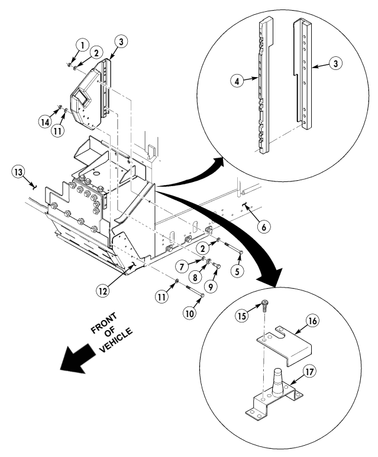

FOLLOW-ON TASKS: - Install washer reservoir (para. 10-64).

- Install left front cowl insulation (para. 10-31). - Install left front door (perimeter) (if equipped) (Appendix J, J-4).

# 11-107.1. Left Outer Kick Liner (Integrated) And A-Pillar Maintenance (Serial Numbers 241954 And Above)

This task covers:
b. Inspection

Applicable Models M1151A1, M1152A1, M1165A1, M1167 Tools General mechanic's tool kit:
automotive (Appendix B, Item 1)
Torque wrench 3/8-in. drive, 75 lb-ft 
(Appendix B, Item 2.1)
Materials/Parts Three locknuts (Appendix G, Item 146) Seven locknuts (Appendix G, Item 106) Three lockwashers (Appendix G, Item 144) Three assembled washer screws 
(Appendix G, Item 278.1)
a. Removal c. Installation

#### Manual References

TM 9-2320-387-24P
Equipment Condition
•Left front door (Frag 5) (if equipped) removed
(Appendix M, M-4).

•Left front cowl insulation removed (para.10-31). •Washer reservoir removed (para. 10-64). •Vent cover removed (left-side) (para. 11-120.1).

Maintenance Level Unit a. Removal b. Inspection Refer to para. 10-56 for nut insert inspection and replacement.

c. Installation 1. Install plate (20) on outer kick liner (3) with washer (19), lockwasher (18), and capscrew (17). 2. Install A-pillar support (4) and outer kick liner (3) on footwell with washer (7), capscrew (8), washer (2)
and locknut (1).

3. Secure outer kick liner (3) to lower A-pillar armor (5) with three washers (9), lockwashers (10), and capscrews (11). Tighten capscrews (11) to 31 lb-ft (42 N•m).

4. Secure outer kick liner (3) and underbody armor (14) to body (6) with six washers (12), capscrews (13),
washers (15), and locknuts (16).

5. Install shield (22) on dimmer switch (23) on footwell (13) with three assembled washer screws (21).

1. Remove three assembled washer screws (21) and shield (22) from dimmer switch (23) on footwell (13).

Discard assembled washer screws (21).

2. Remove six locknuts (16), washers (15), capscrews (13), and washers (12) from body (6), outer kick liner (3), and underbody armor (14). Discard locknuts (16).

3. Remove three capscrews (11), lockwashers (10), and washers (9) from lower A-pillar armor (5), and outer kick liner (3). Discard lockwashers (10).

4. Remove locknut (1), washer (2), capscrew (8), and washer (7) from outer kick liner (3) and lower A-pillar armor (5). Discard locknut (1).

5. Remove outer kick liner (3) and A-pillar support (4) from footwell. 6. Remove capscrew (17), lockwasher (18), washer (19), and plate (20) from outer kick liner (3).

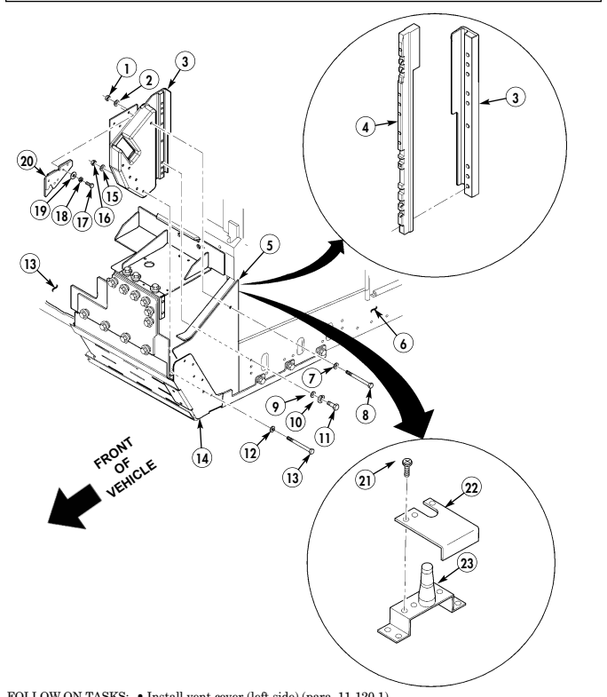

FOLLOW-ON TASKS: - Install vent cover (left side) (para. 11-120.1).
11-107.1. LEFT OUTER KICK LINER (INTEGRATED) AND A-PILLAR MAINTENANCE
(SERIAL NUMBERS 241954 AND ABOVE) (Cont'd)
- Install washer reservoir (para. 10-64). - Install left front cowl insulation (para. 10-64). - Install left front door (Frag 5) (if equipped) (Appendix M, M-4).

# 11-108. Left Inner Kick Liner (Integrated) Maintenance

This task covers:
b. Inspection

Applicable Models M1151A1, M1152A1, M1165A1, M1167 Tools General mechanic's tool kit:
automotive (Appendix B, Item 1)
Torque wrench 3/8-in. drive, 75 lb-ft 
(Appendix B, Item 2.1)
a. Removal c. Installation

#### Materials/Parts

Twelve lockwashers (Appendix G, Item 144)
Manual References TM 9-2320-387-24P
Equipment Condition Tunnel insulation removed (para. 10-33).

Maintenance Level Unit

Note location of screws, nuts, spacers, and brackets for installation.

#### A. Removal

1. Remove eight capscrews (9), lockwashers (8), and washers (7) from inner kick liner (10) and threaded plate (6). Discard lockwashers (8).

2. Remove four capscrews (1), lockwashers (2), and washers (3) from inner kick liner (10) and body (5).

Discard lockwashers (2).

3. Remove inner kick liner (10) from body (5). 4. Remove four spacers (4) from inner kick liner (10).

b. Inspection Refer to para. 10-56 for nut insert inspection and replacement.

c. Installation 1. Install four spacers (4) on inner kick liner (10). 2. Position inner kick liner (10) on body (5). 3. Install inner kick liner (10) on body (5) with four capscrews (1), lockwashers (2) and washers (3).

Tighten capscrews (1) to 31 lb-ft (42 N•m).

4. Install inner kick liner (10) and threaded plate (6) on body (5) with eight capscrews (9),
lockwashers (8) and washers (7). Tighten capscrews (9) to 31 lb-ft (42 N•m).

# 11-108. Left Inner Kick Liner (Integrated) Maintenance (Cont'D)

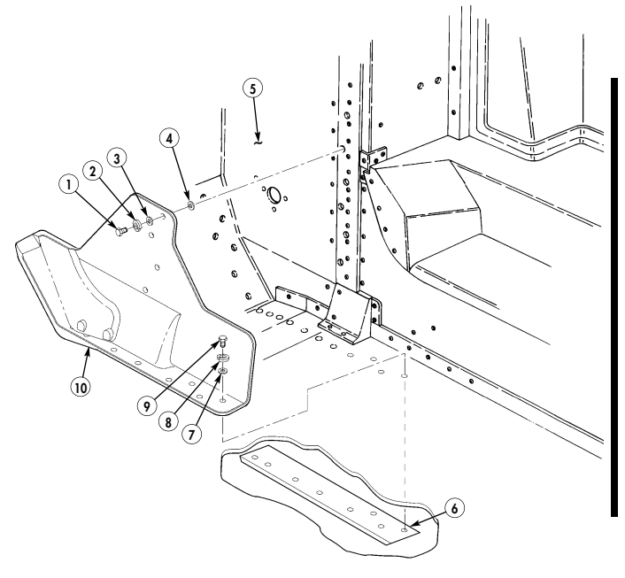

FOLLOW-ON TASK:
 Install tunnel insulation (para. 10-33).

# 11-109. Right Rear Upper Underbody Armor (Integrated) Maintenance (Serial Numbers 241953 And Below)

This task covers:
b. Inspection

Applicable Models M1151A1, M1152A1, M1165A1 Tools General mechanic's tool kit:
automotive (Appendix B, Item 1)

| Personnel Required   |
|----------------------|
| One mechanic         |
| One assistant        |

Materials/Parts Thirteen lockwashers (Appendix G, Item 144)
a. Removal c. Installation Unit

| Maintenance Level   | Unit   |
|---------------------|--------|

#### Warning

Right rear underbody armor is extremely heavy and must be supported during removal and installation. Failure to do so may result in injury to personnel or damage to equipment.

#### A. Removal

1. Remove five capscrews (9), lockwashers (8), and washers (10) from rear upper underbody armor (4)
and rear underbody armor (6). Discard lockwashers (8).

2. Remove two capscrews (1), lockwashers (2), and washers (3) from rear upper underbody armor (4)
and rear underbody armor (6). Discard lockwashers (2).

3. Remove four capscrews (14), lockwashers (15), and washers (16) from rear upper underbody armor (4) and bracket (5). Discard lockwashers (15).

4. Remove two capscrews (13), lockwashers (12), and washers (11) from rear upper underbody armor (4) and rear rocker armor (7). Discard lockwashers (12).

5. Lower rear upper underbody armor (4).

b. Inspection Refer to para. 10-56 for nut insert inspection and replacement.

# 11-109. Right Rear Upper Underbody Armor (Integrated) Maintenance (Serial Numbers 241953 And Below) (Cont'D)

c. Installation

#### Caution

Use grade 5 torque value when installing capscrews into nut inserts. Failure to do so may damage equipment or components.

1. Raise rear upper underbody armor (4) into position. 2. Install rear upper underbody armor (4) on rear rocker armor (7) with two washers (11),
lockwashers (12), and capscrews (13).

3. Secure rear upper underbody armor (4), to bracket (5) with four washers (16), lockwashers (15), and capscrews (14).

4. Install two washers (3), lockwasher (2), and capscrews (1) on rear upper underbody armor (4) and rear underbody armor (6).

5. Install five washers (10), lockwashers (8), and capscrews (9) on rear upper underbody armor (4) and rear underbody armor (6).

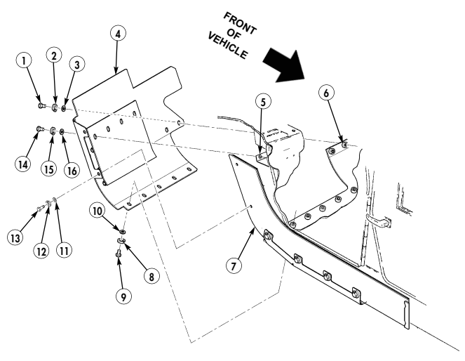

FOLLOW-ON TASK: Install rocker panel (Frag 1) (if equipped) (Appendix K, K-14).

# 11-109.1. Right Rear Upper Underbody Armor (Integrated) Maintenance (Serial Numbers 241954 And Above)

This task covers:
b. Inspection

Applicable Models M1151A1, M1152A1, M1165A1, M1167 Tools General mechanic's tool kit:
automotive (Appendix B, Item 1)
Materials/Parts Thirteen lockwashers (Appendix G, Item 144)
Personnel Required One mechanic One assistant a. Removal c. Installation

| Maintenance Level   |
|---------------------|
| Unit                |

| Maintenance Level   |
|---------------------|

| installation.   |
|-----------------|

heavy and must be supported during removal and Unit

#### Warning

Right rear upper underbody armor is extremely heavy and must be supported during removal and installation. Failure to do so may result in injury to personnel or damage to equipment.

a. Removal 1. Remove five capscrews (11), lockwashers (10), and washers (9) from rear upper underbody armor (4)
and rear underbody armor (6). Discard lockwashers (10).

2. Remove two capscrews (1), lockwashers (2), and washers (3) from rear upper underbody armor (4)
and rear underbody armor (6). Discard lockwashers (2).

3. Remove four capscrews (17), lockwashers (16), and washers (15) from rear upper underbody armor (4) and bracket (5). Discard lockwashers (16).

4. Remove two capscrews (14), lockwashers (13), and washers (12) from rear upper underbody armor (4) and body (7). Discard lockwashers (13).

5. Lower rear upper underbody armor (4) and remove spacers (8).

b. Inspection Refer to para. 10-56 for nut insert inspection and replacement.

# 11-109.1. Right Rear Upper Underbody Armor (Integrated) Maintenance (Serial Numbers 241954 And Above) (Cont'D)

c. Installation

#### Caution

Use grade 5 torque value when installing capscrews into nut inserts. Failure to do so may damage equipment or components.

1. Raise rear upper underbody armor (4) and place spacers (8) into position. 2. Install rear upper underbody armor (4) on body (7) with two capscrews (14), lockwashers (13), and washers (12).

3. Secure rear upper underbody armor (4) to bracket (5) with four washers (15), lockwashers (16), and capscrews (17).

4. Secure rear upper underbody armor (4) to rear underbody armor (6) with two washers (3),
lockwashers (2), and capscrews (1).

5. Secure rear upper underbody armor (4) to rear underbody armor (6) with five washers (9),
lockwashers (10), and capscrews (11).

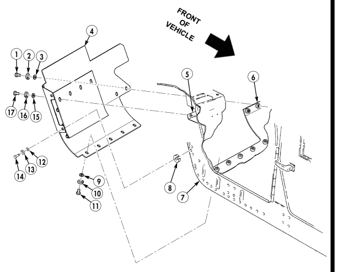

FOLLOW-ON TASK: Install rocker panel (Frag 1) (if equipped) (Appendix K, K-14).

# 11-110. Left Rear Upper Underbody Armor (Integrated) Maintenance (Serial Numbers 241953 And Below)

This task covers:
b. Inspection

Applicable Models M1151A1, M1152A1, M1165A1 Tools General mechanic's tool kit:
automotive (Appendix B, Item 1)
Materials/Parts Eleven lockwashers (Appendix G, Item 144)
Personnel Required One mechanic One assistant a. Removal c. Installation

| Manual References    |
|----------------------|
| TM 9\-2320\-387\-24P |

General Safety Instructions Left rear upper underbody armor is extremely heavy and must be supported during removal and installation.

Maintenance Level Unit

#### Warning

Left rear upper underbody armor is extremely heavy and must be supported during removal and installation. Failure to do so may result in injury to personnel or damage to equipment.

a. Removal 1. Remove four capscrews (13), lockwashers (14), and washers (15) from rear upper underbody armor (3) and rear underbody armor (1). Discard lockwashers (14).

2. Remove capscrew (6), lockwasher (5), and washer (4) from rear upper underbody armor (3) and rear underbody armor (1). Discard lockwasher (5).

3. Remove four capscrews (9), lockwashers (8), and washers (7) from rear upper underbody armor (3)
and bracket (2). Discard four lockwashers (8).

4. Remove two capscrews (10), lockwashers (11), and washers (12) from rear upper underbody armor (3)
and rear rocker armor (16). Discard lockwashers (11).

5. Lower rear upper underbody armor (3).

b. Inspection Refer to para. 10-56 for nut insert inspection and replacement.

c. Installation

#### Caution

Use grade 5 torque value when installing capscrews into nut inserts. Failure to do so may damage equipment or components.

1. Raise rear upper underbody armor (3) into position. 2. Install rear upper underbody armor (3) on rear rocker armor (16) with two capscrews (10),
lockwashers (11), and washers (12).

## 11-110. Left Rear Upper Underbody Armor (Integrated) Maintenance (Serial Numbers 241953 And Below) (Cont'D)

3. Install four capscrews (9), lockwashers (8), and washers (7) on rear upper underbody armor (3) and bracket (2).

4. Install capscrew (6), lockwasher (5), and washer (4) on rear upper underbody armor (3) and rear underbody armor (1).

5. Install four capscrews (13), lockwashers (14), and washers (15) on rear upper underbody armor (3)
and rear underbody armor (1).

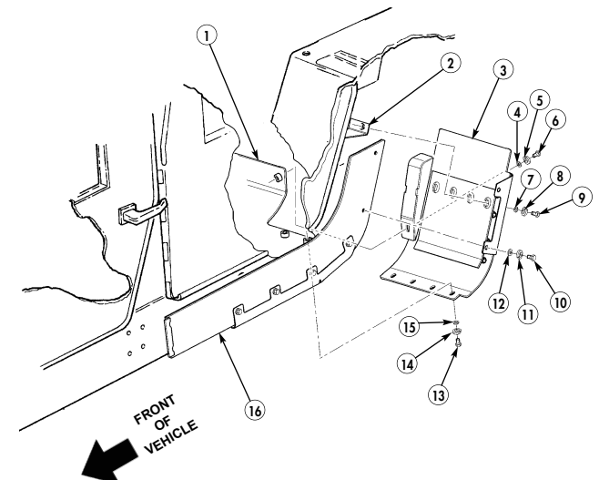

# 11-110.1. Left Rear Upper Underbody Armor (Integrated) Maintenance (Serial Numbers 241954 And Above)

This task covers:
b. Inspection

Applicable Models M1151A1, M1152A1, M1165A1, M1167 Tools General mechanic's tool kit:
automotive (Appendix B, Item 1)
Materials/Parts Eleven lockwashers (Appendix G, Item 144)
Personnel Required One mechanic One assistant a. Removal c. Installation

| Unit   |
|--------|

Left rear upper underbody armor is extremely heavy and must be supported during removal and installation.

Maintenance Level Unit

#### Warning

Left rear upper underbody armor is extremely heavy and must be supported during removal and installation. Failure to do so may result in injury to personnel or damage to equipment.

#### A. Removal

1. Remove four capscrews (14), lockwashers (15), and washers (16) from rear upper underbody armor (4) and rear underbody armor (1). Discard lockwashers (15).

2. Remove capscrew (7), lockwasher (6), and washer (5) from rear upper underbody armor (4) and rear underbody armor (1). Discard lockwasher (6).

3. Remove four capscrews (10), lockwashers (9), and washers (8) from rear upper underbody armor (4)
and bracket (2). Discard lockwashers (9).

4. Remove two capscrews (11), lockwashers (12), and washers (13) from rear upper underbody armor (4) and body (17). Discard lockwashers (12).

5. Lower rear upper underbody armor (4) and remove spacers (3).

b. Inspection Refer to para. 10-56 for nut insert inspection and replacement.

# 11-110.1. Left Rear Upper Underbody Armor (Integrated) Maintenance (Serial Numbers 241954 And Above) (Cont'D)

c. Installation

#### Caution

Use grade 5 torque value when installing capscrews into nut inserts. Failure to do so may damage equipment or components.

1. Raise rear upper underbody armor (4) and place spacers (3) into position. 2. Install rear upper underbody armor (4) on body (17) with two washers (13), lockwashers (12), and capscrews (11).

3. Secure rear upper underbody armor (4) to bracket (2) with four washers (8), lockwashers (9), and capscrews (10).

4. Secure rear upper underbody armor (4) to rear underbody armor (1) with washer (5), lockwasher (6),
and capscrew (7).

5. Secure rear upper underbody armor (4) to rear underbody armor (1) with four washers (16),
lockwashers (15), and capscrews (14).

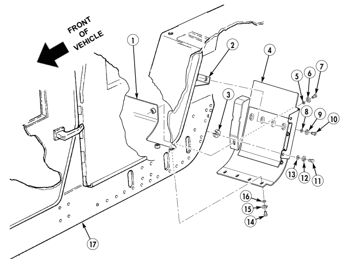

FOLLOW-ON TASK: Install rocker panel (Frag 1) (if equipped) (Appendix K, K-14).

# 11-111. Left Upper Cowl Armor (Integrated) Maintenance

This task covers:
b. Inspection

Applicable Models M1151A1, M1152A1, M1165A1, M1167 Tools General mechanic's tool kit:
automotive (Appendix B, Item 1)
Torque wrench 3/8-in. drive, 75 lb-ft 
(Appendix B, Item 2.1)
a. Removal c. Installation

| Materials/Parts                         |
|-----------------------------------------|
| Nine lockwashers (Appendix G, Item 146) |
| Manual References                       |
| TM 9\-2320\-387\-24P                    |
| Maintenance Level                       |
| Unit                                    |

Materials/Parts Nine lockwashers (Appendix G, Item 146)

Note location of screws, nuts, spacers, and brackets for installation.

a. Removal 1. Remove six capscrews (8), lockwashers (9), and washers (10), from front underbody armor (1) and L-bracket (7). Discard lockwashers (9).

2. Remove three capscrews (2), lockwashers (3), and washers (4), L-bracket (7) and upper cowl armor (5)
from body (6). Discard lockwashers (3).

b. Inspection Refer to para. 10-56 for nut insert inspection and replacement.

c. Installation 1. Install L-bracket (7) and upper cowl armor (5) on body (6) with three capscrews (2), lockwashers (3),
and washers (4). Tighten capscrews (2) to 8 lb-ft (11 N•m).

2. Install front underbody armor (1), and L-bracket (7) with six capscrews (8), lockwashers (9), and washers (10). Tighten capscrews (8) to 31 lb-ft (42 N•m).

# 11-111. Left Upper Cowl Armor (Integrated) Maintenance (Cont'D)

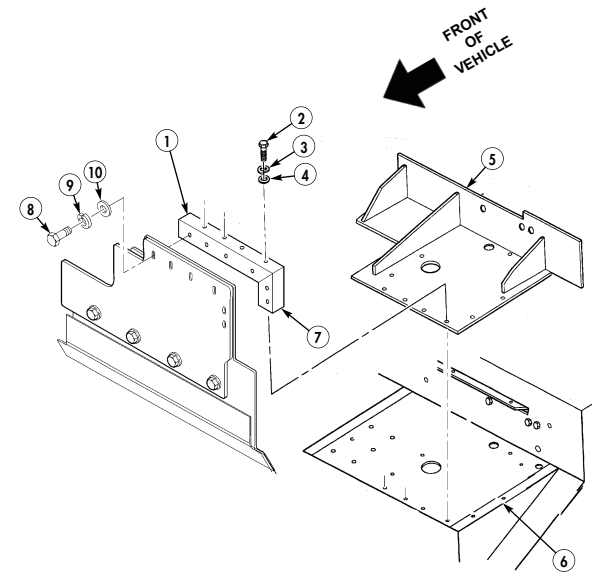

FOLLOW-ON TASKS: - Install Protective Control Box (PCB) (TM 9-2320-387-24-1).

· Install washer reservoir (para. 10-64).

- Install air restriction gauge hose (TM 9-2320-387-24-1).

■

# 11-112. Right Rear Underbody Bracket (Integrated) Replacement (Serial Numbers 241953 And Below)

This task covers:

Applicable Models M1151A1, M1152A1, M1165A1 Tools a. Removal **b. Installation**

| Manual References    |
|----------------------|
| TM 9\-2320\-387\-24P |

•Right rear upper underbody armor (integrated)

| Maintenance Level   |
|---------------------|
| Unit                |

General mechanic's tool kit:
automotive (Appendix B, Item 1)
Materials/Parts Seven locknuts (Appendix G, Item 106)
•Right rear seat back armor (perimeter) 
removed (if equipped) (Appendix J, J-28).

Note location of screws, nuts, spacers, and brackets for installation.

a. Removal 1. Remove three locknuts (3), six washers (4), and three capscrews (8), from rear underbody bracket (9)
and body (5). Discard locknuts (3).

2. Remove four locknuts (6), eight washers (2), four capscrews (1), backing plate (7), and rear underbody bracket (9) from body (5). Discard locknuts (6).

b. Installation

Prior to step 1 ensure beveled edge of backing plate is on bottom and faces rear of vehicle (Section A-A).

1. Install rear underbody bracket (9) and backing plate (7) on body (5) with eight washers (2), four capscrews (1), and locknuts (6).

2. Secure rear underbody bracket (9) to body (5) with six washers (4), three capscrews (8), and locknuts (3).

| Equipment Condition       |
|---------------------------|
| · Right rear upper under  |
| removed (para. 11\-109).  |
| · Right rear seat back ar |
| removed (if equipped) (   |

11-112. RIGHT REAR UPPER UNDERBODY BRACKET (INTEGRATED) REPLACEMENT
(SERIAL NUMBERS 241953 AND BELOW) (Cont'd)

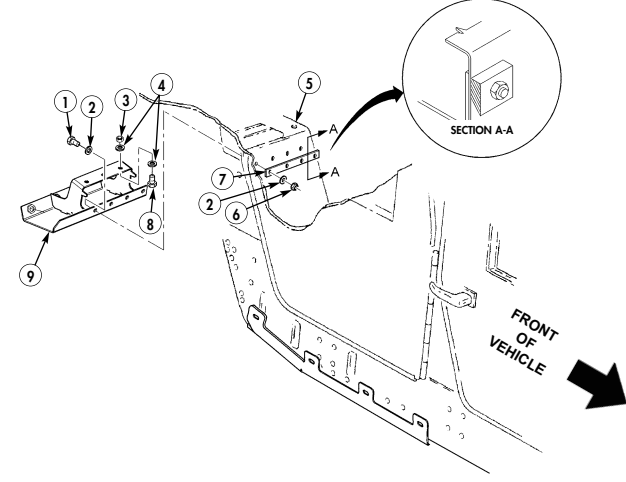

FOLLOW-ON TASKS: - Install right rear seat back armor (perimeter) (if equipped) (Appendix J, J-28).

- Install right rear upper underbody armor (integrated) (para. 11-109).

# 11-112.1. Right Rear Underbody Bracket (Integrated) Replacement (Serial Numbers 241954 And Above)

This task covers:

Tools Applicable Models M1151A1, M1152A1, M1165A1, M1167 General mechanic's tool kit:
automotive (Appendix B, Item 1)
Materials/Parts Seven locknuts (Appendix G, Item 106)
a. Removal b. Installation

| Manual References                               |
|-------------------------------------------------|
| TM 9\-2320\-387\-24P                            |
| Equipment Condition                             |
| · Right rear upper underbody armor (integrated) |
| removed (para 11\-109.1).                       |
| · Right rear seat back armor (perimeter)        |
| (if equipped) removed (Appendix J, J\-28).      |
| Maintenance Level                               |
| 【Jnit                                          |

Note location of screws, nuts, spacers, and brackets for installation.

a. Removal 1. Remove three locknuts (3), six washers (4), and three capscrews (8) from rear underbody bracket (9)
and body (5). Discard locknuts (3).

2. Remove four locknuts (6), eight washers (2), four capscrews (1), backing plate (7), and rear underbody bracket (9) from body (5). Discard locknuts (6).

b. Installation

Prior to step 1 ensure beveled edge of backing plate is on bottom and faces rear of vehicle (Section A-A).

1. Install rear underbody bracket (9) and backing plate (7) on body (5) with eight washers (2), four capscrews (1), and locknuts (6).

2. Secure rear underbody bracket (9) to body (5) with six washers (4), three capscrews (8), and locknuts (3).

11-112.1. RIGHT REAR UPPER UNDERBODY BRACKET (INTEGRATED) REPLACEMENT
(SERIAL NUMBERS 241954 AND ABOVE) (Cont'd)

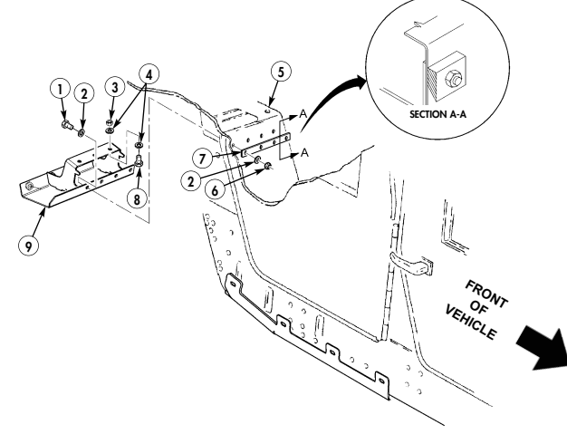

FOLLOW-ON TASKS: - Install right rear seat back armor (perimeter) (if equipped) (Appendix J, J-28).

- Install right rear upper underbody armor (integrated) (para 11-109.1).

# 11-113. Left Rear Underbody Bracket (Integrated) Replacement (Serial Numbers 241953 And Below)

This task covers:

Applicable Models M1151A1, M1152A1, M1165A1

a. Removal **b. Installation**

Tools General mechanic's tool kit:
automotive (Appendix B, Item 1)
Materials/Parts Seven locknuts (Appendix G, Item 106)

| Manual References                               |
|-------------------------------------------------|
| TM 9\-2320\-387\-24P                            |
| Equipment Condition                             |
| · Left rear upper underbody armor (integrated)  |
| removed (para. 11\-110).                        |
| · Left rear seat back armor (perimeter) removed |
| (if equipped) (Appendix J, J\-29).              |
| Maintenance Level                               |
| Unit                                            |

Note location of screws, nuts, spacers, and brackets for installation.

a. Removal 1. Remove three locknuts (4), six washers (5) and three capscrews (7) from rear underbody bracket (6)
and body (1). Discard locknuts (4).

2. Remove four locknuts (9), eight washers (2), four capscrews (3), backing plate (8), and rear underbody bracket (6) from body (1). Discard locknuts (9).

b. Installation

Prior to step 1 ensure beveled edge of backing plate is on bottom and faces rear of vehicle (Section A-A).

1. Install rear underbody bracket (6) and backing plate (8) on body (1) with four capscrews (3),
locknuts (9), and eight washers (2).

2. Secure rear underbody bracket (6) to body (1) with three capscrews (7), six washers (5), and three locknuts (4).

11-113. LEFT REAR UNDERBODY BRACKET (INTEGRATED) REPLACEMENT
(SERIAL NUMBERS 241953 AND BELOW) (Cont'd)

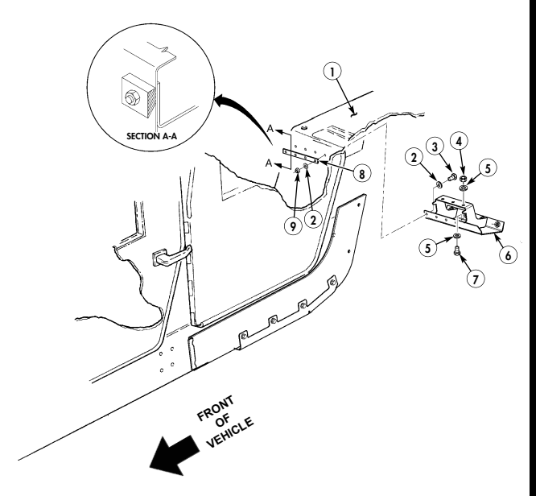

FOLLOW-ON TASKS: - Install left rear seat back armor (perimeter) (if equipped) (Appendix J, J-29).

- Install left rear upper underbody armor (integrated) (para. 11-110).

# 11-113.1. Left Rear Underbody Bracket (Integrated) Replacement (Serial Numbers 241954 And Above)

This task covers:
INITIAL SETUP:
Applicable Models M1151A1, M1152A1, M1165A1, M1167 Tools General mechanic's tool kit:
automotive (Appendix B, Item 1)
Materials/Parts Seven locknuts (Appendix G, Item 106)

#### A. Removal B. Installation

| Manual References                                   |
|-----------------------------------------------------|
| TM 9\-2320\-387\-24P                                |
| Equipment Condition                                 |
| - Left front door (perimeter) (if equipped) removed |
| (Appendix J, J\-4).                                 |
| - Left front cowl insulation removed                |
| (para.10\-31).                                      |

Note location of screws, nuts, spacers, and brackets for installation.

a. Removal 1. Remove three locknuts (4), six washers (5), and three capscrews (7) from rear underbody bracket (6),
and body (1). Discard locknuts (4).

2. Remove four locknuts (9), eight washers (2), four capscrews (3), backing plate (8), and rear underbody bracket (6) from body (1). Discard locknuts (9).

b. Installation

Prior to step 1 ensure beveled edge of backing plate is on bottom and faces rear of vehicle (Section A-A).

1. Install rear underbody bracket (6) and backing plate (8) on body (1) with eight washers (2), four capscrews (3), and locknuts (9).

2. Secure rear underbody bracket (6) to body (1) with six washers (5), three capscrews (7), and locknuts (4).

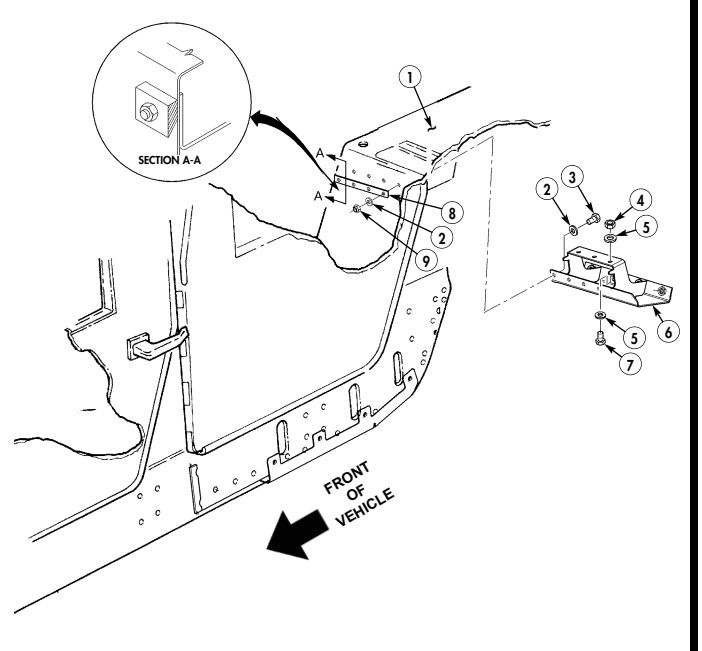

11-113.1. LEFT REAR UNDERBODY BRACKET (INTEGRATED) REPLACEMENT
(SERIAL NUMBERS 241954 AND ABOVE) (Cont'd)
FOLLOW-ON TASKS: - • Install left rear seat back armor (perimeter) (if equipped) (Appendix J, J-29).

· Install left rear upper underbody armor (integrated) (para 11-110.1).

# 11-114. Right Underbody Extension Armor (Integrated) Maintenance (Serial Numbers 241953 And Below)

This task covers:
b. Inspection

Applicable Models M1151A1, M1152A1, M1165A1 Tools General mechanic's tool kit:
automotive (Appendix B, Item 1)
Materials/Parts Six lockwashers (Appendix G, Item 144)
a. Removal c. Installation

#### Personnel Required

One mechanic One assistant Manual References TM 9-2320-387-24P
General Safety Instructions Right underbody extension armor is extremely heavy and must be supported during removal and installation.

Maintenance Level Unit

#### Warning

Right underbody extension armor is extremely heavy and must be supported during removal and installation. Failure to do so may result in injury to personnel or damage to equipment.

a. Removal 1. Remove three capscrews (5), lockwashers (4), and washers (3) from underbody extension armor (9)
and front underbody armor (2). Discard lockwashers (4).

2. Remove three capscrews (6), lockwashers (7), and washers (8) from underbody extension armor (9)
and rear underbody armor (1). Discard lockwashers (7).

3. Lower underbody extension armor (9).

b. Inspection Refer to para. 10-56 for nut insert inspection and replacement.

c. Installation

#### Caution

Use grade 5 torque value when installing capscrews into nut inserts. Failure to do so may damage equipment or components.

1. Raise underbody extension armor (9) into position. 2. Install underbody extension armor (9) on rear underbody armor (1) with three capscrews (6),
lockwashers (7), and washers (8).

3. Install underbody extension armor (9) on front underbody armor (2) with three capscrews (5),
lockwashers (4), and washers (3).

1 1-1 14. RIGHT UNDERBODY EXTENSION ARMOR (INTEGRATED) MAINTENANCE
(SERIAL NUMBERS 241953 AND BELOW) (Cont'd)
l

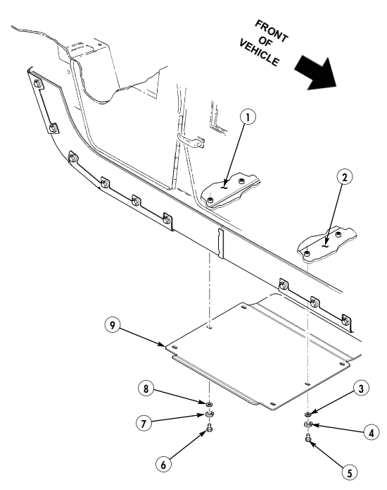

# 11-114.1. Right Underbody Extension Armor (Integrated) Maintenance (Serial Numbers 241954 And Above)

This task covers:
b. Inspection

Applicable Models M1151A1, M1152A1, M1165A1, M1167 Tools General mechanic's tool kit:
automotive (Appendix B, Item 1)
Torque wrench 3/8-in. drive, 75 lb-ft 
(Appendix B, Item 2.1)

#### Materials/Parts

Six lockwashers (Appendix G, Item 144)
Personnel Required One mechanic One assistant a. Removal c. Installation Manual References TM 9-2320-387-24P
General Safety Instructions Right underbody extension armor is extremely heavy and must be supported during removal and installation.

Maintenance Level Unit

#### Warning

Right underbody extension armor is extremely heavy and must be supported during removal and installation. Failure to do so may result in injury to personnel or damage to equipment.

a. Removal 1. Remove three capscrews (5), lockwashers (4), and washers (3) from underbody extension armor (9)
and front underbody armor (2). Discard lockwashers (4).

2. Remove three capscrews (6), lockwashers (7), and washers (8) from underbody extension armor (9)
and rear underbody armor (1). Discard lockwashers (7).

3. Lower underbody extension armor (9).

b. Inspection Refer to para. 10-56 for nut insert inspection and replacement.

c. Installation 1. Raise underbody extension armor (9) into position. 2. Install underbody extension armor (9) on rear underbody armor (1) with three washers (8),
lockwashers (7), and capscrews (6). Tighten capscrews (6) to 31 lb-ft (42 N•m).

3. Install underbody extension armor (9) on front underbody armor (2) with three washers (3),
lockwashers (4), and capscrews (5). Tighten capscrews (5) to 31 lb-ft (42 N•m).

11-114.1. RIGHT UNDERBODY EXTENSION ARMOR (INTEGRATED) MAINTENANCE
(SERIAL NUMBERS 241954 AND ABOVE) (Cont'd)

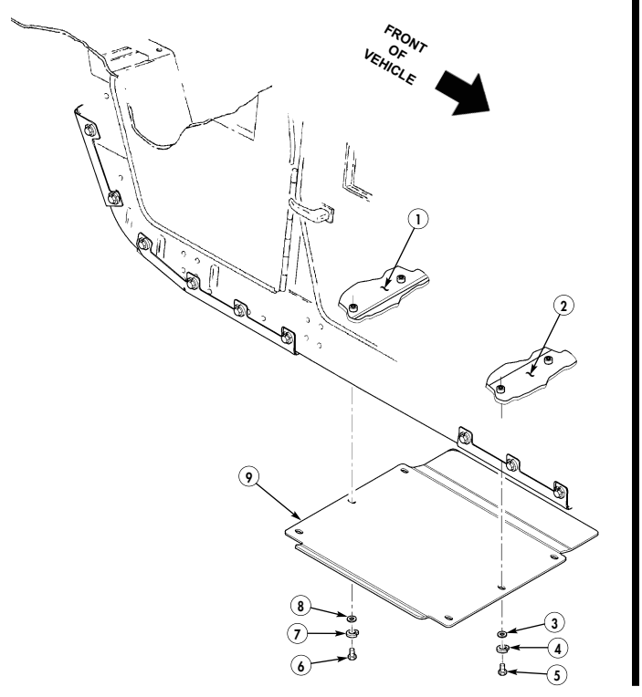

# 11-115. Left Underbody Extension Armor (Integrated) Maintenance (Serial Numbers 241953 And Below)

This task covers:
b. Inspection

Applicable Models M1151A1, M1152A1, M1165A1 Tools General mechanic's tool kit:
automotive (Appendix B, Item 1)
Materials/Parts Six lockwashers (Appendix G, Item 144)
Personnel Required One mechanic One assistant a. Removal c. Installation Manual References TM 9-2320-387-24P
General Safety Instructions Left underbody extension armor is extremely heavy and must be supported during removal and installation.

Maintenance Level Unit

#### Warning

Left underbody extension armor is extremely heavy and must be supported during removal and installation. Failure to do so may result in injury to personnel or damage to equipment.

a. Removal 1. Remove three capscrews (7), lockwashers (8), and washers (9) from underbody extension armor (3)
and front underbody armor (1). Discard lockwashers (8).

2. Remove three capscrews (6), lockwashers (5), and washers (4) from underbody extension armor (3)
and rear underbody armor (2). Discard lockwashers (5).

3. Lower underbody extension armor (3).

b. Inspection Refer to para. 10-56 for nut insert inspection and replacement.

c. Installation

#### Caution

Use grade 5 torque value when installing capscrews into nut inserts. Failure to do so may damage equipment or components.

1. Raise underbody extension armor (3) into position. 2. Install underbody extension armor (3) on rear underbody armor (2) with three capscrews (6),
lockwashers (5), and washers (4).

3. Install underbody extension armor (3) on front underbody armor (1) with three capscrews (7),
lockwashers (8), and washers (9).

11-115. LEFT UNDERBODY EXTENSION ARMOR (INTEGRATED) MAINTENANCE
(SERIAL NUMBERS 241953 AND BELOW) (Cont'd)
 

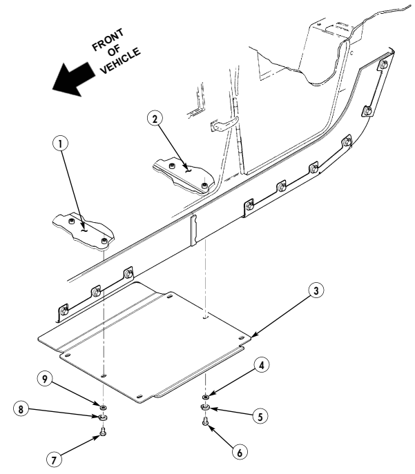

# 11-115.1. Left Underbody Extension Armor (Integrated) Maintenance (Serial Numbers 241954 And Above)

This task covers:
b. Inspection

Applicable Models M1151A1, M1152A1, M1165A1, M1167 Tools General mechanic's tool kit:
automotive (Appendix B, Item 1)
Torque wrench 3/8-in. drive, 75 lb-ft 
(Appendix B, Item 2.1)

#### Materials/Parts

Six lockwashers (Appendix G, Item 144)
Personnel Required One mechanic One assistant a. Removal c. Installation Manual References TM 9-2320-387-24P
General Safety Instructions Left underbody extension armor is extremely heavy and must be supported during removal and installation.

Maintenance Level Unit

#### Warning

Left underbody extension armor is extremely heavy and must be supported during removal and installation. Failure to do so may result in injury to personnel or damage to equipment.

a. Removal 1. Remove three capscrews (7), lockwashers (8), and washers (9) from underbody extension armor (3)
and front underbody armor (1). Discard lockwashers (8).

2. Remove three capscrews (6), lockwashers (5), and washers (4) from underbody extension armor (3)
and rear underbody armor (2). Discard lockwashers (5).

3. Lower underbody extension armor (3).

b. Inspection Refer to para. 10-56 for nut insert inspection and replacement.

c. Installation 1. Raise underbody extension armor (3) into position. 2. Install underbody extension armor (3) on rear underbody armor (2) with three washers (4),
lockwashers (5), and capscrews (6). Tighten capscrews (6) to 31 lb-ft (42 N•m).

3. Install underbody extension armor (3) on front underbody armor (1) with three washers (9),
lockwashers (8), and capscrews (7). Tighten capscrews (7) to 31 lb-ft (42 N•m).

11-115.1. LEFT UNDERBODY EXTENSION ARMOR (INTEGRATED) MAINTENANCE
(SERIAL NUMBERS 241954 AND ABOVE) (Cont'd)

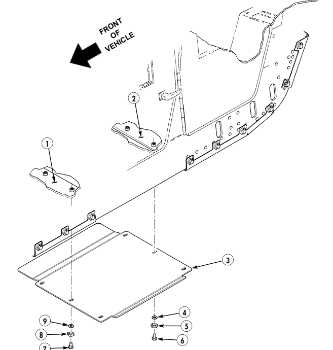

(7
# 11-116. Right Rear Underbody And Right Rear Rocker Armor (Integrated) Maintenance (Serial Number 241953 And Below)

This task covers:
b. Inspection INITIAL SETUP:
Applicable Models M1151A1, M1152A1, 1165A1 Tools General mechanic's tool kit:
automotive (Appendix B, Item 1)
Materials/Parts Eight locknuts (Appendix G, Item 106) Four lockwashers (Appendix G, Item 144)
Personnel Required One mechanic One assistant Manual References TM 9-2320-387-24P
a. Removal c. Installation

#### Equipment Condition

•Upper rocker plate IED overlay (Frag 1) removed 
(if equipped) (Appendix K, K-15) (M1165A1 only).

•Upper rocker plate IED overlay (Frag 1) removed 
(if equipped) (Appendix K, K-16) (M1152A1 only).

•Rocker plate IED overlay (Frag 1) removed 
(if equipped) (Appendix K, K-14) (M1151A1 only).

•Right underbody extension armor (integrated)
removed (para. 11-114).

•Right rear upper underbody armor (integrated)
removed (para. 11-109).

#### General Safety Instructions

Right rear underbody armor plate is extremely heavy and must be supported during removal and installation.

Maintenance Level Unit

#### Warning

Right rear underbody armor is extremely heavy and must be supported during removal and installation. Failure to do so may result in injury to personnel or damage to equipment.

a. Removal 1. Remove four capscrews (8), lockwashers (7), washers (6), and two plates (5) from rear underbody armor (12) and two brackets (2). Discard lockwashers (7).

2. Remove four locknuts (13), eight washers (9), and four capscrews (10) from rear underbody armor (12),
and rear rocker armor (11). Discard locknuts (13).

3. Lower rear underbody armor (12) and rear rocker armor (11) from body (14).

NOTE
Perform next step if brackets and clamps are damaged.

4. Remove four locknuts (4), clamps (3), and two brackets (2) from frame rail (1). Discard locknuts (4).

b. Inspection 1. Refer to para. 10-56 for nut insert inspection and replacement. 2. Inspect rubber strips, replace if damaged.

c. Installation

#### Caution

- Ensure position of clamps on frame are under brake lines.

Failure to do so will result in damage to equipment.

- Use grade 5 torque value when installing capscrews into nut inserts.

Failure to do so may damage equipment or components.

NOTE
Perform step 1 if brackets and clamps are damaged.

1. Install two brackets (2) and four clamps (3) on frame rail (1) with four locknuts (4).

2. Raise rear underbody armor (12) and rear rocker armor (11) into proper position.

11-228 Change 5

# 11-116. Right Rear Underbody And Right Rear Rocker Armor (Integrated) Maintenance (Serial Number 241953 And Below) (Cont'D)

3. Install rear underbody armor (12) and rear rocker armor (11) on body (14) with four capscrews (10),
eight washers (9), and four locknuts (13).

4. Install two plates (5) on rear underbody armor (12) and two brackets (2) with four capscrews (8),
lockwashers (7), and washers (6).

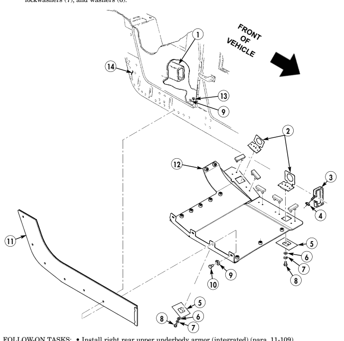

FOLLOW-ON TASKS: - Install right rear upper underbody armor (integrated) (para. 11-109).
- Install right underbody extension armor (integrated) (para. 11-114). - Install rocker plate IED overlay (Frag 1) (if equipped) (Appendix K, K-14)
(M1151A1 only).

- Install upper rocker plate IED overlay (Frag 1) (if equipped) (Appendix K, K-16)
(M1152A1 only).

- Install upper rocker plate IED overlay (Frag 1) (if equipped) (Appendix K, K-15)
(M1165A1 only).

# 11-116.1. Right Rear Underbody Armor (Integrated) Maintenance (Serial Number 241954 And Above)

This task covers:
b. Inspection

Applicable Models M1151A1, M1152A1, M1165A1, M1167 Tools General mechanic's tool kit:
automotive (Appendix B, Item 1)
Torque wrench 3/8-in. drive, 75 lb-ft 
(Appendix B, Item 2.1)
Materials/Parts Eight locknuts (Appendix G, Item 106) Four lockwashers (Appendix G, Item 144)
Manual References TM 9-2320-387-24P
a. Removal c. Installation

#### Equipment Condition

•Upper rocker plate IED overlay (Frag 1) removed
(if equipped) (Appendix K, K-15) (M1165A1, M1167 only).

•Upper rocker plate IED overlay (Frag 1) removed
(if equipped) (Appendix K, K-16) (M1152A1 only).

•Rocker plate IED overlay (Frag 1) removed (if equipped) (Appendix K, K-14) (M1151A1 only).

•Right underbody extension armor (integrated)
removed (para. 114.1).

•Right rear upper underbody armor (integrated)
removed (para. 11-109.1).

#### General Safety Instructions

Right rear underbody armor is extremely heavy and must be supported during removal and installation. Maintenance Level Unit

#### Warning

Right rear underbody armor is extremely heavy and must be supported during removal and installation. Failure to do so may result in injury to personnel or damage to equipment.

a. Removal 1. Remove four capscrews (8), lockwashers (7), washers (6), and two plates (5) from rear underbody armor (11) and two brackets (2). Discard lockwashers (7).

2. Remove four locknuts (14), washers (12), capscrews (10), and washers (9) from rear underbody armor (11). Discard locknuts (14).

3. Lower rear underbody armor (11) from body (15) and remove spacers (13).

Perform next step if brackets and clamps are damaged.

4. Remove four locknuts (4), clamps (3), and two brackets (2) from frame rail (1). Discard locknuts (4).

b. Inspection 1. Refer to para. 10-56 for nut insert inspection and replacement. 2. Inspect rubber strips, replace if damaged.

c. Installation

#### Caution

Ensure position of clamps on frame are under brake lines. Failure to do so will result in damage to equipment.

# 11-116.1. Right Rear Underbody Armor (Integrated) Maintenance (Serial Number 241954 And Above) (Cont'D)

Perform step 1 if brackets and clamps are damaged.

1. Install two brackets (2) and four clamps (3) on frame rail (1) with four locknuts (4). 2. Raise rear underbody armor (11) and place spacers (13) into position. 3. Install rear underbody armor (11) on body (15) with four washers (9), capscrews (10), washers (12),
and locknuts (14).

4. Install two plates (5) on rear underbody armor (11) and two brackets (2) with four capscrews (8),
lockwashers (7), and washers (6). Tighten capscrews (8) to 31 lb-ft (42 N•m).

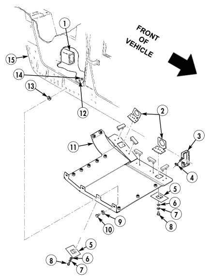

FOLLOW-ON TASKS: - Install right rear upper underbody armor (integrated) (para. 11-109.1).

- Install right underbody extension armor (integrated) (para 11-114.1). - Install rocker plate IED overlay (Frag 1) (if equipped) (Appendix K, K-14) 
(M1151A1 only).

- Install upper rocker plate IED overlay (Frag 1) (if equipped) (Appendix K, K-16)
(M1152A1 only).

- Install upper rocker plate IED overlay (Frag 1) (if equipped) (Appendix K, K-15) 
(M1165A1, M1167 only).

# 11-117. Left Rear Underbody And Left Rear Rocker Armor (Integrated) Maintenance (Serial Numbers 241953 And Below)

This task covers:
b. Inspection

Applicable Models M1151A1, M1152A1, M1165A1 Tools General mechanic's tool kit:
automotive (Appendix B, Item 1)
Materials/Parts Eight locknuts (Appendix G, Item 106) Four lockwashers (Appendix G, Item 144)
Personnel Required One mechanic One assistant a. Removal **c. Installation**
Manual References TM 9-2320-387-24P
Equipment Condition
- Left underbody extension armor (integrated)
removed (para. 11-115).

- Left rear upper underbody armor (integrated)
removed (para. 11-110).

General Safety Instructions Left rear underbody armor is extremely heavy and must be supported during removal and installation.

Maintenance Level Unit

#### Warning

Left rear underbody armor is extremely heavy and must be supported during removal and installation. Failure to do so may result in injury to personnel or damage to equipment.

a. Removal 1. Remove four capscrews (12), lockwashers (11), washers (10), and two plates (9) from rear underbody armor (7) and two brackets (13). Discard lockwashers (11).

2 Remove four locknuts (1), eight washers (2), and four capscrews (8) from rear underbody armor (7)
and rear rocker armor (5). Discard locknuts (1).

3. Lower rear underbody armor (7) and rear rocker armor (5) from body (4).

Perform step 4 if brackets and clamps are damaged.

4. Remove four locknuts (14), clamps (6), and two brackets (13) from frame rail (3).

Discard locknuts (14).

b. Inspection 1. Refer to para. 10-56 for nut insert inspection and replacement. 2. Inspect rubber strips, replace if damaged.

c. Installation

#### Caution

- Ensure position of clamps on frame are under brake lines.

Failure to do so will result in damage to equipment.

- Use grade 5 torque value when installing capscrews into nut inserts. Failure to do so may damage equipment or components.

# 11-117. Left Rear Underbody And Left Rear Rocker Armor (Integrated) Maintenance (Serial Numbers 241953 And Below) (Cont'D)

Perform step 1 if brackets and clamps are damaged.

1. Install two brackets (13) and four clamps (6) on frame rail (3) with four locknuts (14). 2. Raise rear underbody armor (7) and rear rocker armor (5) into proper position. 3. Install rear underbody armor (7) and rear rocker armor (5) on body (4) with four capscrews (8),
eight washers (2), and four locknuts (1).

4. Install four capscrews (12), lockwashers (11), washers (10), and two plates (9) on rear underbody armor (7) and two brackets (13).

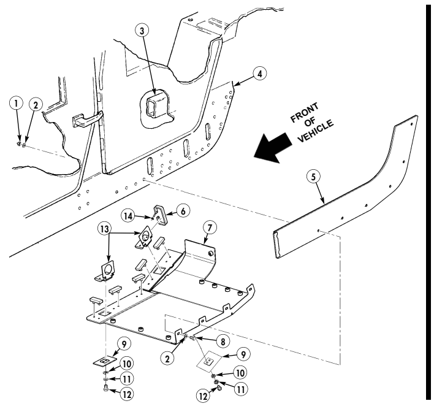

FOLLOW-ON TASKS: - Install left rear upper underbody armor (integrated) (para. 11-110).

- Install left underbody extension armor (integrated) (para. 11-115).

# 11-117.1. Left Rear Underbody (Integrated) Maintenance (Serial Numbers 241954 And Above)

This task covers:
b. Inspection

Applicable Models M1151A1, M1152A1, M1165A1, M1167 Tools General mechanic's tool kit:
automotive (Appendix B, Item 1)
Torque wrench 3/8-in. drive, 75 lb-ft 
(Appendix B, Item 2.1)
Materials/Parts Eight locknuts (Appendix G, Item 106) Four lockwashers (Appendix G, Item 144)
Manual References TM 9-2320-387-24P
a. Removal c. Installation

#### Equipment Condition

- Left underbody extension armor (integrated)
removed (para 11-115.1).

- Left rear upper underbody armor (integrated)
removed (para 11-110.1).

#### General Safety Instructions

Left rear underbody armor plate is extremely heavy and must be supported during removal and installation.

Maintenance Level Unit

#### Warning

Left rear underbody armor plate is extremely heavy and must be supported during removal and installation. Failure to do so may result in injury to personnel or damage to equipment.

a. Removal 1. Remove four capscrews (11), lockwashers (10), washers (9), and two plates (8) from rear underbody armor (7) and two brackets (13). Discard lockwashers (10).

2. Remove four locknuts (1), eight washers (2), and four capscrews (12) from rear underbody armor (7)
and body (4). Discard locknuts (1).

3. Lower rear underbody armor (7) from body (4) and remove spacers (5).

Perform step 4 if brackets and clamps are damaged.

4. Remove four locknuts (14), clamps (6), and two brackets (13) from frame rail (3).

Discard locknuts (14).

b. Inspection 1. Refer to para. 10-56 for nut insert inspection and replacement. 2. Inspect rubber strips, replace if damaged.

c. Installation

#### Caution

Ensure position of clamps on frame are under brake lines. Failure to do so will result in damage to equipment.

# 11-117.1. Left Rear Underbody (Integrated) Maintenance (Serial Numbers 241954 And Above) (Cont'D)

Perform step 1 if brackets and clamps are damaged.

1. Install two brackets (13) and four clamps (6) on frame rail (3) with four locknuts (14). 2. Raise rear underbody armor (7) and place spacers (5) into position. 3. Install rear underbody armor (7) on body (4) with eight washers (2), four capscrews (12), and locknuts (1).

4. Install two plates (8) on rear underbody armor (7) with four washers (9), lockwashers (10), and capscrews (11). Tighten capscrews (11) to 31 lb-ft (42 N•m).

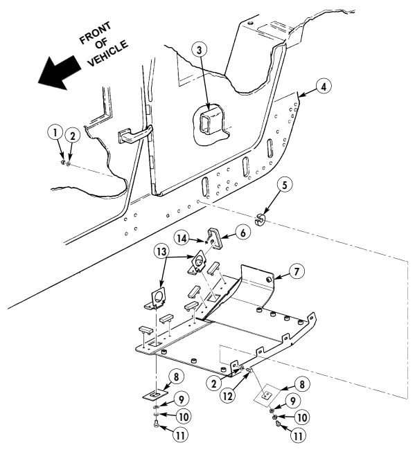

FOLLOW-ON TASKS: - Install left rear upper underbody armor (integrated) (para. 11-110.1).

- Install left underbody extension armor (integrated) (para. 11-115.1).

# 11-118. Right Lower A-Pillar Armor (Integrated) Maintenance (Serial Numbers 241953 And Below)

This task covers:
b. Inspection

Applicable Models M1151A1, M1152A1, M1165A1 Tools General mechanic's tool kit:
automotive (Appendix B, Item 1)
Materials/Parts Four lockwashers (Appendix G, Item 144) Nine locknuts (Appendix G, Item 106)
Personnel Required One mechanic One assistant Manual References TM 9-2320-387-24P
a. Removal c. Installation

#### Equipment Condition

•Right front door and hinge (Frag 5) removed 
(if equipped) (Appendix M, M-4).

•Right front door and hinge (perimeter) removed
(if equipped) (Appendix J, J-4).

•Right front body hinge mount removed (para. 10-54). •Right front cowl insulation removed (para. 10-32). •Right underbody extension armor (integrated)
removed (para. 11-114).

•Right front wheelwell armor removed 
(Appendix L, L-5).

•Right lower A-pillar IED overlay (Frag1) removed
(if equipped) (Appendix K, K-7) (M1151A1 only).

•Right lower A-pillar IED overlay (Frag 1)
removed (if equipped) (Appendix K, K-8). (M1152A1, M1165A1 only).

Maintenance Level Unit

It may be necessary to loosen attaching capscrews, locknuts and hardware from adjoining armor before removing lower A-pillar armor.

a. Removal 1. Remove six locknuts (5), twelve washers (6), and six capscrews (8) from front underbody armor (7),
lower A-pillar armor (12) and outer kick liner (4). Discard locknuts (5).

2. Remove capscrew (13), lockwasher (14), and washer (15), from lower A-pillar armor (12). Discard lockwasher (14).

3. Remove three locknuts (2), six washers (1), and three capscrews (16) from front underbody armor (7)
and lower A-pillar armor (12). Discard locknuts (2).

4. Remove three capscrews (11), lockwashers (10), and washers (9), from lower A-pillar armor (7) and A-pillar support (3). Discard lockwashers (10).

5. Remove lower A-pillar armor (12). 6. Remove spacer (17) from lower A-pillar armor (12).

b. Inspection Refer to para. 10-56 for nut insert inspection and replacement.

c. Installation

#### Caution

Use grade 5 torque value when installing capscrews into nut inserts. Failure to do so may damage equipment or components.

1. Install spacer (17) on lower A-pillar armor (12). 2. Install lower A-pillar armor (12) into proper position.

## 11-118. Right Lower A-Pillar Armor (Integrated) Maintenance (Serial Numbers 241953 And Below) (Cont'D)

3. Install lower A-pillar armor (7) on A-pillar support (3) with three capscrews (11), lockwashers (10)
and washers (9).

4. Secure lower A-pillar armor (12) to underbody armor (7) with three capscrews (16), six washers (1),
and three locknuts (2).

5. Secure lower A-pillar armor (12) to vehicle (18) with capscrew (13), lockwasher (14), and washer (15). 6. Secure front underbody armor (7) to lower A-pillar armor (12) and outer kick liner (4) with six capscrews (8), twelve washers (6), and six locknuts (5).

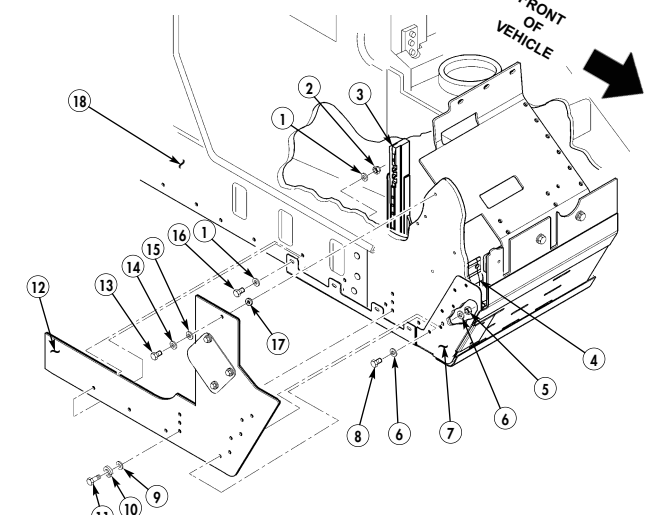

11
FOLLOW-ON TASKS: - Install right lower A-pillar IED overlay (Frag 1) (if equipped) 
(Appendix K, K-8) (M1152A1, M1165A1 only).

- Install right lower A-pillar IED overlay (Frag 1) (if equipped) 
(Appendix K, K-7) (M1151A1 only).

- Install right front wheelwell armor (Appendix L, L-5). - Install right underbody extension armor (integrated) (para. 11-114). - Install right front cowl insulation (para. 10-32). - Install right front body hinge mount (para. 10-54). - Install right front door and hinge (perimeter) (if equipped) (Appendix J, J-4). - Install right front door and hinge (Frag 5) (if equipped) (Appendix M, M-4).

# 11-118.1. Right Lower A-Pillar Armor (Integrated) Replacement (Serial Numbers 241954 And Above)

This task covers:

Applicable Models M1151A1, M1152A1, M1165A1, M1167 Tools General mechanic's tool kit:
automotive (Appendix B, Item 1)
Materials/Parts Lockwasher (Appendix G, item 144) Six locknuts (Appendix G, Item 106)
Personnel Required One mechanic One assistant Manual References TM 9-2320-387-24P

#### A. Removal B. Installation Equipment Condition

- Right lower A-pillar IED overlay (Frag 1) removed
(if equipped) (Appendix K, K-7) (M1151A1 only).

- Right lower A-pillar IED overlay (Frag 1) removed
(if equipped) (Appendix K, K-8). (M1152A1, M1165A1, M1167 only).

- Right front wheelwell armor removed 
(Appendix L, L-5).

- Right front door and hinge (Frag 5) removed 
(if equipped) (Appendix M, M-4).

- Right front door and hinge (perimeter) removed 
(if equipped) (Appendix J, J-4).

- Right front body hinge mount removed 
(para. 10-54).

- Right front cowl insulation removed (para. 10-32). - Right underbody extension armor (integrated)
removed (para. 11-114.1).

Maintenance Level Unit

It may be necessary to loosen attaching capscrews, locknuts, and hardware from adjoining armor before removing lower A-pillar armor.

#### A. Removal

1. Remove capscrew (1), lockwasher (2), and washer (3) from lower A-pillar armor (4) and outer kick liner (6). Discard lockwasher (2).

2. Remove six locknuts (7), washers (8), capscrews (11), and washers (10) from front underbody armor (9), lower A-pillar armor (4), and outer kick liner (6). Discard locknuts (7).

3. Remove lower A-pillar armor (4). 4. Remove spacer (5) from lower A-pillar armor (4).

#### B. Installation

1. Install spacer (5) on lower A-pillar armor (4). 2. Install A-pillar armor (4) into position. 3. Secure lower A-pillar armor (4) to outer kick liner (6) with washer (10), capscrew (11), washer (8),
and locknut (7).

4. Secure lower A-pillar armor (4) to outer kick liner (6) with three washers (3), lockwashers (2), and capscrews (1).

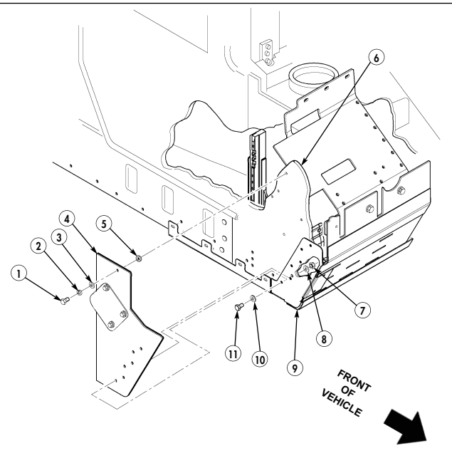

11-118.1. RIGHT LOWER A-PILLAR ARMOR (INTEGRATED) REPLACEMENT
(SERIAL NUMBERS 241954 AND ABOVE) (Cont'd)
FOLLOW-ON TASKS: - Install right underbody extension armor (integrated) removed (para. 11-114.1).

- Install right front cowl insulation (para. 10-32). - Install right front body hinge mount (para. 10-54). - Install right front door and hinge (perimeter) (if equipped) (Appendix J, J-4). - Install right front door and hinge (Frag 5) (if equipped) (Appendix M, M-4). - Install right front wheelwell armor (Appendix L, L-5). - Install right lower A-pillar IED overlay (Frag 1) (if equipped) (Appendix K, K-8)
(M1152A1, M1165A1, M1167 only).

- Install right lower A-pillar IED overlay (Frag 1) (if equipped) (Appendix K, K-7)
(M1151A1 only).

# 11-119. Left Lower A-Pillar Armor (Integrated) Replacement (Serial Numbers 241953 And Below)

This task covers:

Applicable Models M115A1, M1152A1, M1165A1 Tools General mechanic's tool kit:
automotive (Appendix B, Item 1)

| Materials/Parts   |
|-------------------|

| Personnel Required   |
|----------------------|

Three lockwashers (Appendix G, Item 144) Seven locknuts (Appendix G, Item 106)
One mechanic One assistant

| Manual References                              |
|------------------------------------------------|
| TM 9\-2320\-387\-24P                           |
| Equipment Condition                            |
| Rocker panel (Frag 1) removed (if equipped)    |
| (Appendix K, Item K\-14).                      |
| Right rear upper underbody armor is extremely  |
| heavy and must be supported during removal and |
| installation.                                  |
| Maintenance Level                              |
| Unit                                           |
| General Safety Instructions                    |

Manual References TM 9-2320-387-24P
a. Removal **b. Installation**
Unit

It may be necessary to loosen attaching capscrews, locknuts and hardware from adjoining armor before removing lower A-pillar armor.

a. Removal 1. Remove locknut (2), two washers (3), and capscrew (5) from lower A-pillar armor (6) and outer kick liner (4). Discard locknut (2).

2. Remove six locknuts (16), twelve washers (14), and six capscrews (13) from front underbody armor (15),
lower A-pillar armor, (6) and outer kick liner (4). Discard locknuts (16).

3. Remove three locknuts (12), six washers (10), and three capscrews (11) from front underbody armor (15)
and lower A-pillar armor (6). Discard locknuts (12).

4. Remove three capscrews (9), washers (7), and lockwashers (8) from lower A-pillar armor (6) and A-pillar support (1). Discard lockwashers (8).

5. Remove A-pillar armor (6).

#### B. Installation

1. Install A-pillar armor (6) into proper position. 2. Install lower A-pillar armor (6) on A-pillar support (1) with three capscrews (9), lockwashers (8), and washers (7).

3. Install lower A-pillar armor (6) on front underbody armor (15) with three capscrews (11), six washers (10), and locknuts (2).

4. Install capscrew (5), two washers (3), and locknut (2) on lower A-pillar armor (6) and outer kick liner (4). 5. Secure front underbody armor (15) to lower A-pillar armor (6) and outer kick liner (4) with six capscrews (13), twelve washers (14), and six locknuts (16).

# 11-119. Left Lower A-Pillar Armor (Integrated) Replacement (Serial Numbers 241953 And Below)

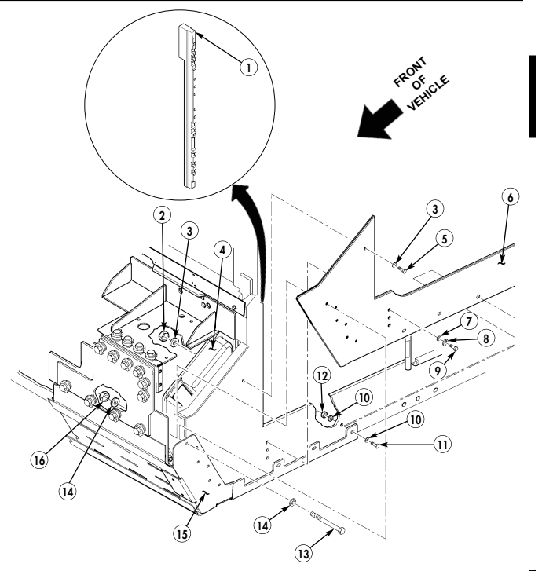

FOLLOW-ON TASKS: - Install left front wheelwell armor (Appendix L, L-4).

- Install A-pillar assembly (perimeter) (if equipped) (Appendix J, J-25). - Install A-pillar gap armor (perimeter) (if equipped) (Appendix J, J-25). - Install left underbody extension armor (integrated) (para. 11-115). - Install left front cowl insulation (para. 10-31). - Install left front body hinge mount (if equipped) (para. 10-54). - Install left front door and hinge (perimeter) (if equipped) (Appendix J, J-4). - Install left front door and hinge (Frag 5) (if equipped) (Appendix M, M-4).

# 11-119.1. Left Lower A-Pillar Armor (Integrated) Replacement (Serial Numbers 241954 And Above)

This task covers:

Applicable Models M1151A1, M1152A1, M1165A1, M1167 Tools General mechanic's tool kit:
automotive (Appendix B, Item 1)

| Personnel Required   |
|----------------------|

Materials/Parts Seven locknuts (Appendix G, Item 106)

#### A. Removal

3. Remove lower A-pillar armor (4).

#### B. Installation

1. Install lower A-pillar armor (4) into proper position.

#### A. Removal B. Installation

2. Secure lower A-pillar armor (4) to front underbody armor (9) and outer kick liner (3) with six washers (8), capscrews (7), washers (10), and locknuts (11).

3. Secure lower A-pillar armor (4) to outer kick liner (3) with washer (5), capscrew (6), washer (2), and locknut (1).

| Manual References                              |
|------------------------------------------------|
| TM 9\-2320\-387\-24P                           |
| Equipment Condition                            |
| Rocker panel (Frag 1) removed (if equipped)    |
| (Appendix K, K\-14).                           |
| General Safety Instructions                    |
| Right rear upper underbody armor is extremely  |
| heavy and must be supported during removal and |
| installation.                                  |

1. Remove locknut (1), washer (2), capscrew (6), and washer (5) from lower A-pillar armor (4) and outer kick liner (3). Discard locknut (1).

2. Remove six locknuts (11), washers (10), capscrews (7), and washers (8) from lower A-pillar armor (4),
front underbody armor (9), and outer kick liner (3). Discard locknuts (11).

# 11-119.1. Left Lower A-Pillar Armor (Integrated) Replacement (Serial Numbers 241954 And Above) (Cont'D)

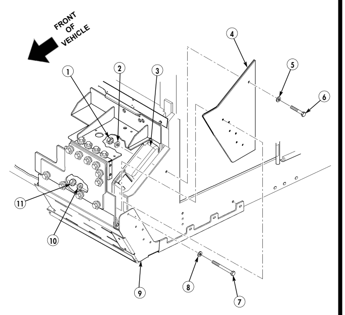

FOLLOW-ON TASKS: - Install front wheelwell armor (Frag 2) (if equipped) (Appendix L, L-4).

- Install left underbody extension armor (integrated) (para. 11-115.1). - Install left lower A-pillar IED overlay (Frag 1) (if equipped) (Appendix K, K-4).

# 11-120. Vent Cover Armor (Integrated) Maintenance (Serial Numbers 241953 And Below)

This task covers:
b. Inspection INITIAL SETUP:
Applicable Models M1151A1, M1152A1, M1165A1 Tools General mechanic's tool kit:
automotive (Appendix B, Item 1)
Materials/Parts Three lockwashers (Appendix G, Item 144)
a. Removal c. Installation Manual References

| Manual References    |
|----------------------|
| TM 9\-2320\-387\-24P |

Maintenance Level Unit a. Removal Remove three capscrews (3), lockwashers (4), and vent cover armor (2) from lower A-pillar armor (1). Discard lockwashers (4).

b. Inspection Refer to para. 10-56 for nut insert inspection and replacement.

c. Installation

#### Caution

Use grade 5 torque value when installing capscrews into nut inserts. Failure to do so may damage equipment or components.

Install vent cover armor (2) on lower A-pillar armor (1) with three capscrews (3), and lockwashers (4).

# 11-120. Vent Cover Armor (Integrated) Maintenance (Serial Numbers 241953 And Below) (Cont'D)

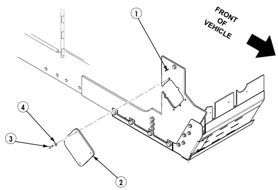

# 11-120.1. Vent Cover Armor (Integrated) Maintenance (Serial Numbers 241954 And Above)

This task covers:
b. Inspection

Applicable Models M1151A1, M1152A1, M1165A1, M1167 Tools General mechanic's tool kit:
automotive (Appendix B, Item 1)
Torque wrench 3/8-in. drive, 75 lb-ft 
(Appendix B, Item 2.1)

| Manual References                           |
|---------------------------------------------|
| TM 9\-2320\-387\-24P                        |
| Equipment Condition                         |
| Rocker panel (Frag 1) removed (if equipped) |
| (Appendix K, K\-14).                        |

a. Removal Remove three capscrews (3), lockwashers (4), washers (5), vent cover armor (2), and spacers (6) from lower A-pillar armor (1). Discard lockwashers (4).

b. Inspection Refer to para. 10-56 for nut insert inspection and replacement.

c. Installation Install vent cover armor (2) on lower A-pillar armor (1) with three spacers (6), washers (5), lockwashers (4), and capscrews (3). Tighten capscrews (3) to 31 lb-ft (42 N•m).

a. Removal c. Installation

# 11-120.1. Vent Cover Armor (Integrated) Maintenance (Serial Numbers 241954 And Above) (Cont'D)

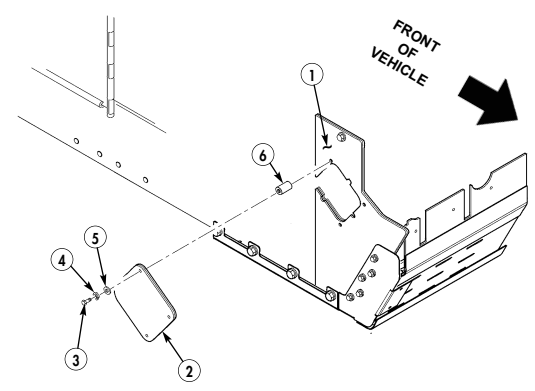

# 11-121. Lower Windshield Capping Ring Armor (Integrated) Maintenance

This task covers:
b. Inspection

Applicable Models M1151A1, M1152A1, M1165A1, M1167 Tools General mechanic's tool kit:
automotive (Appendix B, Item 1)
Torque wrench 3/8-in. drive, 75 lb-ft 
(Appendix B, Item 2.1)
Materials/Parts Five lockwashers (Appendix G, Item 146) Three locknuts (Appendix G, Item 106)

#### A. Removal

1. Remove two capscrews (12), washers (13), and clamps (11) from lower windshield capping ring armor (1). 2. Remove two capscrews (14), and nozzles (10), from capping ring armor (1). 3. Remove five capscrews (9), lockwashers (8), and washers (7) from capping ring armor (1), and windshield frame (6). Discard lockwashers (8).

4. Remove three locknuts (5), six washers (4), and three capscrews (15) from capping ring armor (1),
and right upper cowl armor (3). Discard locknuts (5).

5. Remove capping ring armor (1) from windshield frame (6). 6. Remove three spacers (2) from capping ring armor (1).

b. Inspection Refer to para. 10-56 for nut insert inspection and replacement.

c. Installation 1. Install three spacers (2) on capping ring armor (1). 2. Install capping ring armor (1) on windshield frame (6). 3. Install capping ring armor (1) on right upper cowl armor (3) with three capscrews (15), six washers (4),
and three locknuts (5).

4. Install capping ring armor (1) on windshield frame (6) with five capscrews (9), lockwashers (8), and washers (7). Tighten capscrews (9) to 8 lb-ft (11 N•m).

5. Install two nozzles (10) on capping ring armor (1) with two capscrews (14). 6. Install two clamps (11) on capping ring armor (1) with two capscrews (12) and washers (13).

a. Removal c. Installation

#### Manual References

TM 9-2320-387-10 TM 9-2320-387-24P
Equipment Condition
- Hood raised and secured (TM 9-220-387-10). - Air intake assembly and bracket removed 
(para. 3-19).

Unit Maintenance Level

# 11-121. Lower Windshield Capping Ring Armor (Integrated) Maintenance (Cont'D)

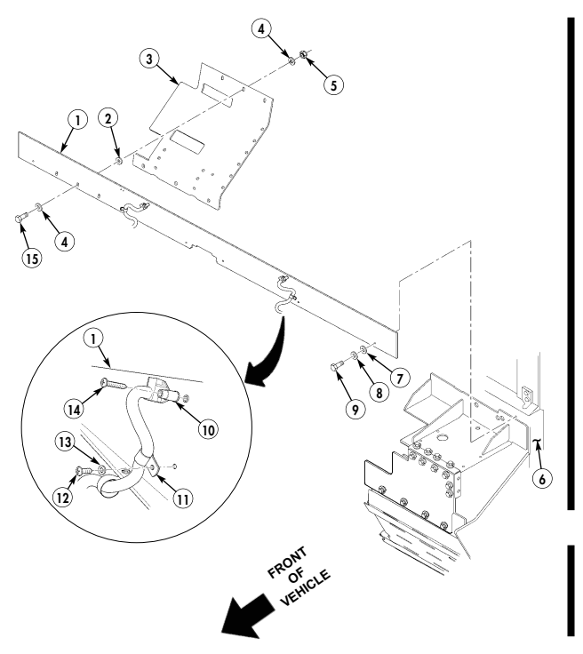

FOLLOW-ON TASKS: - Install air intake and bracket assembly (TM 9-2320-387-24-1).

- Lower and secure hood (TM 9-2320-387-10).

# Section Vii. Ied Overlay (M1114) Maintenance 11-122. Ied Overlay (M1114) Maintenance Task Summary

| a. Removal                                                       | c. Installation                                                                                        | b. Inspection                                                |                                       |
|------------------------------------------------------------------|--------------------------------------------------------------------------------------------------------|--------------------------------------------------------------|---------------------------------------|
| INITIAL SETUP:                                                   | Applicable Models                                                                                      | Manual References                                            |                                       |
| M1151A1, M1152A1, M1165A1, M1167                                 | TM 9\-2320\-387\-24P                                                                                   | Equipment Condition                                          |                                       |
| Tools                                                            | •Air restriction gauge hose removed (para. 3\-20).                                                     | General mechanic's tool kit:                                 |                                       |
| automotive (Appendix B, Item 1)                                  | •Washer reservoir removed (para. 10\-64).                                                              | Torque wrench 3/8\-in. drive, 75 lb\-ft                      | •Protective Control Box (PCB) removed |
| (Appendix B, Item 2.1)                                           | (para. 4\-4).                                                                                          |                                                              |                                       |
| Maintenance Level                                                | Materials/Parts                                                                                        | Nine lockwashers (Appendix G, Item 146)                      | Unit                                  |
| NOTE                                                             | Note location of screws, nuts, spacers, and brackets for installation.                                 |                                                              |                                       |
| a. Removal                                                       |                                                                                                        |                                                              |                                       |
| 1.                                                               | Remove six capscrews (8), lockwashers (9), and washers (10), from front underbody armor (1) and        | L\-bracket (7). Discard lockwashers (9).                     |                                       |
| 2.                                                               | Remove three capscrews (2), lockwashers (3), and washers (4), L\-bracket (7) and upper cowl armor (5)  | from body (6). Discard lockwashers (3).                      |                                       |
| b. Inspection                                                    |                                                                                                        |                                                              |                                       |
| Refer to para. 10\-56 for nut insert inspection and replacement. |                                                                                                        |                                                              |                                       |
| c. Installation                                                  |                                                                                                        |                                                              |                                       |
| 1.                                                               | Install L\-bracket (7) and upper cowl armor (5) on body (6) with three capscrews (2), lockwashers (3), | and washers (4). Tighten capscrews (2) to 8 lb\-ft (11 N•m). |                                       |
| 2.                                                               | Install front underbody armor (1), and L\-bracket (7) with six capscrews (8), lockwashers (9), and     | washers (10). Tighten capscrews (8) to 31 lb\-ft (42 N•m).   |                                       |
| 11\-218                                                          | Change 6                                                                                               |                                                              |                                       |

# 11-122.1. A-Pillar Ied Overlay Replacement - Lh (Frag 1)

This task covers:

| a. Removal                            | b. Installation                                |
|---------------------------------------|------------------------------------------------|
| INITIAL SETUP:                        |                                                |
| Applicable Models                     | Manual References                              |
| M1151A1, M1152A1, M1165A1             | TM 9\-2320\-387\-24P                           |
| Tools                                 | Equipment Condition                            |
| General mechanic's tool kit:          | •Right rear upper underbody armor (integrated) |
| automotive (Appendix B, Item 1)       | removed (para. 11\-109).                       |
| Materials/Parts                       | •Right rear seat back armor (perimeter)        |
|                                       | removed (if equipped) (Appendix J, J\-28).     |
| Seven locknuts (Appendix G, Item 106) | Maintenance Level                              |
|                                       | Unit                                           |
|                                       | NOTE                                           |

a. Removal b. Installation

Maintenance Level

#### Warning

A-pillar IED overlay (Frag 1) is heavy and must be supported during removal and installation. Failure to do so may cause injury to personnel or damage to equipment.

a. Removal 1. Remove three capscrews (7) from gap plate (8), left side A-pillar IED overlay (11), and left side rocker panel (3).

2. Remove two locknuts (14), washers (2), capscrews (6) and gap plate (8), from left side A-pillar IED
overlay (11) and left side rocker panel (3). Discard locknuts (14).

3. Remove five locknuts (1), capscrews (5), and washers (4), from left side A-pillar IED overlay (11) and left side A-pillar (12). Discard locknuts (1).

4. Remove locknut (13), capscrew (9), washer (10) and left side A-pillar IED overlay (11) from left side A-pillar (12). Discard locknut (13).

#### B. Installation

1. Install left side A-pillar IED overlay (11) on left side A-pillar (12) with washer (10), capscrew (9), and locknut (13). Do not tighten locknut (13).

2. Install A-pillar IED overlay (11) to left side A-pillar (12) with five washers (4), capscrews (5), and locknuts (1). Tighten locknuts (1) to 37 lb-ft (50 N•m).

3. Tighten locknut (13) installed in step 1 to 37 lb-ft (50 N•m). 4. Install gap plate (8) on left side A-pillar IED overlay (11) and left side rocker panel (3) with two capscrews (6), washers (2), and locknuts (14). Do not tighten locknuts (14).

5. Install gap plate (8) to left side A-pillar IED overlay (11) and left side rocker panel (3) with three capscrews (7). Tighten capscrews (7) to 23 lb-ft (31 N•m).

6. Tighten locknuts (14) installed in step 4 to 10 lb-ft (14 N•m).

# 11-122.1. A-Pillar Ied Overlay Replacement - Lh (Frag 1) (Cont'D)

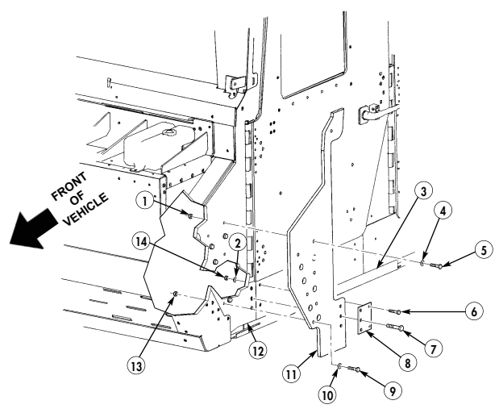

FOLLOW-ON TASKS:  - Install left side A-pillar IED overlay (Frag 1A) (if equipped) (para. 11-133).
- Install driver's rearview mirror bracket (para. 10-69).

# 11-123. A-Pillar Ied Overlay Maintenance - Rh (Frag 1) (Cont'D)

This task covers:
b. Inspection

Applicable Models M1114 Tools

| Personnel Required   |
|----------------------|
| One mechanic         |

General mechanic's tool kit:
automotive (Appendix B, Item 1)
Maintenance and repair shop equipment:
automotive (Appendix B, Item 2)
Materials/Parts Four locknuts (Appendix G, Item 111) Two locknuts (Appendix G, Item 127)
One mechanic One assistant a. Removal c. Installation

#### General Safety Instructions

| Manual References                              |
|------------------------------------------------|
| TM 9\-2320\-387\-24P                           |
| Equipment Condition                            |
| •Right rear upper underbody armor (integrated) |
| removed (para 11\-109.1).                      |
| •Right rear seat back armor (perimeter)        |
| (if equipped) removed (Appendix J, J\-28).     |

A-pillar IED overlay (Frag 1) is heavy and must be supported during removal and installation.

| Maintenance Level   |
|---------------------|
| Unit                |

#### Warning

A-pillar IED overlay (Frag 1) is heavy and must be supported during removal and installation. Failure to do so may cause injury to personnel or damage to equipment.

#### A. Removal

1. Remove two locknuts (5), washers (6), and capscrews (15) from gap plate (13), and rocker panel (9).

Discard locknuts (5).

2. Remove three capscrews (14) and gap plate (13) from lower A-pillar IED overlay (10) and rocker panel (9).

3. Remove locknut (4), capscrew (16), and washer (17) from vent cover (18) and lower A-pillar IED
overlay (10). Discard locknut (4).

4. Remove two capscrews (21), washers (22), vent cover (18), four spacer washers (20), and two spacer washers (19) from upper A-pillar IED overlay (3) and lower A-pillar IED overlay (10).

5. Remove three locknuts (7), capscrews (12), washers (11), and lower A-pillar IED overlay (10) from A-
pillar (8). Discard locknuts (7).

6. Remove capscrew (1), washer (2), and upper A-pillar IED overlay (3) from A-pillar (8).

b. Inspection Refer to para. 10-56 for nut insert inspection and replacement.

c. Installation

#### Caution

Use grade 5 torque value when installing capscrews into nut inserts. Failure to do so may damage equipment or components.

1. Install upper A-pillar IED overlay (3) on A-pillar (8) with washer (2) and capscrew (1). Do not tighten capscrew (1).

## 11-123. A-Pillar Ied Overlay Maintenance - Rh (Frag 1) (Cont'D)

2. Install lower A-pillar IED overlay (10) on A-pillar (8) with three capscrews (12), washers (11), and locknuts (7). Do not tighten locknuts (7).

3. Install vent cover (18) on upper A-pillar IED overlay (3) with two washers (22), capscrews (21), and four spacer washers (20). Do not tighten capscrews (21).

4. Install vent cover (18) on lower A-pillar IED overlay (10) with washer (2), capscrew (15), two spacer washers (19), and locknut (4). Do not tighten locknut (4).

5. Tighten capscrews (21) installed in step 3 to 21 lb-ft (28 N•m). 6. Tighten locknut (4) installed in step 4 to 37 lb-ft (50 N•m). 7. Tighten capscrew (1) installed in step 1 to 6 lb-ft (8 N•m). 8. Tighten locknuts (7) installed in step 2 to 37 lb-ft (50 N•m). 9. Install gap plate (13) on lower A-pillar IED overlay (10) and rocker panel (9) with three capscrews (14). Do not tighten capscrews (14).

10. Secure gap plate (13) to rocker panel (9) with two capscrews (15), washers (6), and locknuts (5).

Do not tighten locknuts (5).

11. Tighten capscrews (14) installed in step 9 to 23 lb-ft (31 N•m). 12. Tighten locknuts (5) installed in step 10 to 10 lb-ft (14 N•m).

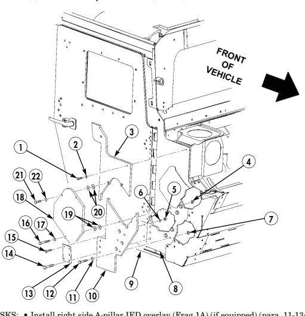

FOLLOW-ON TASKS: - Install right side A-pillar IED overlay (Frag 1A) (if equipped) (para. 11-134).
- Install right rearview mirror bracket (para. 10-68).

# 11-124. B-Pillar Ied Overlay Replacement (Frag 1)

This task covers:

a. Removal b. Installation

| INITIAL SETUP:                  |                                                |
|---------------------------------|------------------------------------------------|
| Applicable Models               | Manual References                              |
| M1151A1, M1152A1, M1165A1       | TM 9\-2320\-387\-24P                           |
| Tools                           | Equipment Condition                            |
| General mechanic's tool kit:    | •Left rear upper underbody armor (integrated)  |
| automotive (Appendix B, Item 1) | removed (para. 11\-110).                       |
|                                 | •Left rear seat back armor (perimeter) removed |

Materials/Parts Four locknuts (Appendix G, Item 129)

Replacement procedures for left and right B-pillar IED overlays are basically the same. This procedure covers the left B-pillar IED overlay.

#### A. Removal

1. Remove two locknuts (1), washers (2), capscrews (4), and washers (3) from B-pillar IED overlay (7)
and B-pillar (8). Discard locknuts (1).

2. Remove two locknuts (10), washers (9), capscrews (5), and washers (6) from left side B-pillar IED
overlay (7) and B-pillar (8). Discard locknuts (10).

b. Installation

Use alignment tool for top two holes when installing B-pillar IED overlay.

1. Install B-pillar IED overlay (7) on B-pillar (8) with two washers (6), capscrews (5), washers (9), and locknuts (10). Tighten locknuts (10) to 21 lb-ft (28 N•m).

2. Secure B-pillar IED overlay (7) to left side B-pillar (8) with two washers (3), capscrews (4), washers (2),
and locknuts (1). Tighten locknuts (1) to 21 lb-ft (28 N•m).

# 11-124. B-Pillar Ied Overlay Replacement (Frag 1) (Cont'D)

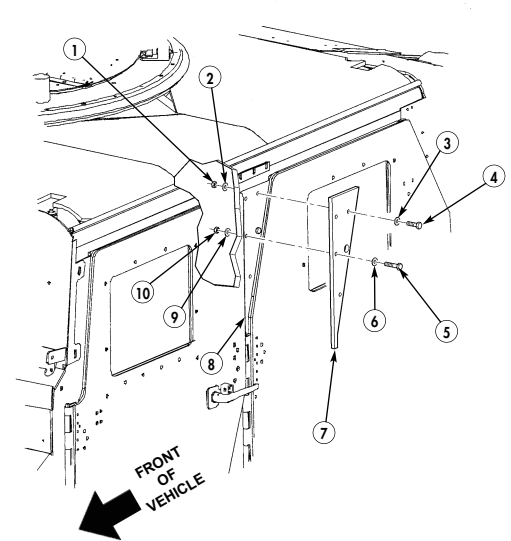

FOLLOW-ON TASK:
Install B-pillar IED overlay (Frag 1A) (if equipped) (para. 11-136).

# 11-125. C-Pillar Ied Overlay Maintenance - Lh (Frag 1)

This task covers:
b. Inspection

| Applicable Models                     | Manual References                              |
|---------------------------------------|------------------------------------------------|
| M1151A1, M1152A1, M1165A1, M1167      | TM 9\-2320\-387\-24P                           |
| Tools                                 | Equipment Condition                            |
| General mechanic's tool kit:          | •Left rear upper underbody armor (integrated)  |
| automotive (Appendix B, Item 1)       | removed (para. 11\-110.1).                     |
|                                       | •Left rear seat back armor (perimeter) removed |
|                                       | (if equipped) (Appendix J, J\-29).             |
| Materials/Parts                       |                                                |
| Seven locknuts (Appendix G, Item 106) | Maintenance Level                              |

Materials/Parts Four locknuts (Appendix G, Item 127)
a. Removal 1. Remove two capscrews (3) and C-pillar inner gap strip (2) from C-pillar (1). 2. Remove four locknuts (13), washers (12), capscrews (7), washers (6), and upper C-pillar IED overlay (5)
from upper C-pillar (4). Discard locknuts (13).

3. Remove four capscrews (9), washers (8), and lower C-pillar IED overlay (10) from lower C-pillar (11).

b. Inspection Refer to para. 10-56 for nut insert inspection and replacement.

b. Installation

#### Caution

Use grade 5 torque value when installing capscrews into nut inserts. Failure to do so may damage equipment or components.

1. Install lower C-pillar IED overlay (10) on lower C-pillar (11) with four washers (8), and capscrews (9).

Tighten capscrews (9) to 6 lb-ft (8 N•m).

2. Install upper C-pillar IED overlay (5) on upper C-pillar (4) with four washers (6), capscrews (7),
washers (12), and four locknuts (13). Tighten locknuts (13) to 10 lb-ft (13 N•m).

3. Install C-pillar inner gap strip (2) on left side C-pillar (1) with two capscrews (3). Tighten capscrews (3) to 6 lb-ft (8 N•m).

a. Removal c. Installation

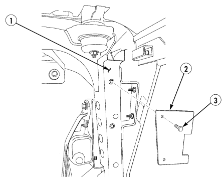

# 11-125. C-Pillar Ied Overlay Maintenance - Lh (Frag 1) (Cont'D)

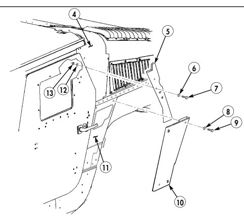

FOLLOW-ON TASK:

Install left C-pillar IED overlay (Frag 1A) (if equipped) (para. 11-138).

# 11-126. C-Pillar Ied Overlay Replacement - Rh (Frag 1)

This task covers:
a. Removal b. Installation

| Applicable Models                                            | Equipment Condition                            |
|--------------------------------------------------------------|------------------------------------------------|
| M115A1, M1152A1, M1165A1                                     | •Left front door and hinge (Frag 5) removed    |
| Tools                                                        | (if equipped) (Appendix M, M\-4).              |
|                                                              | •Left front door and hinge (perimeter) removed |
| General mechanic's tool kit: automotive (Appendix B, Item 1) | (if equipped) (Appendix J, J\-4).              |
|                                                              | •Left front body hinge mount removed           |
| Materials/Parts                                              | (if equipped) (para. 10\-54).                  |
| Three lockwashers (Appendix G, Item 144)                     | •Left front cowl insulation removed            |
| Seven locknuts (Appendix G, Item 106)                        | (para. 10\-31).                                |
|                                                              | •Left underbody extension armor (integrated)   |

Sealing compound (Appendix C, Item 64)
a. Removal 1. Remove locknut (3), washer (4), capscrew (6), and washer (5) from C-pillar IED overlay (1) and C-pillar (2). Discard locknut (3).

2. Remove capscrew (7), washer (8), and C-pillar IED overlay (1) from C-pillar (2).

b. Installation 1. Apply sealing compound to threads of capscrew (7) and install right side upper C-pillar IED overlay (1)
on right side C-pillar (2) with capscrew (7) and washer (8). Tighten capscrew (7) to 68 - 82 lb-in. (8 - 9 N•m).

2. Secure right side upper C-pillar IED overlay (1) to right side C-pillar (2) with capscrew (6), washer (5),
washer (4), and locknut (3). Tighten locknut (3) to 10 lb-ft (13 N•m).

# 11-126. C-Pillar Ied Overlay Replacement - Rh (Frag 1) (Cont'D)

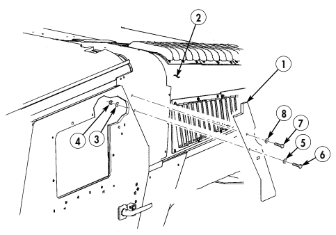

FOLLOW-ON TASK: Install C-pillar IED overlay (Frag 1A) (if equipped) (para. 11-138).

# 11-127. Door Header Ied Overlay Replacement (Frag 1)

This task covers:

| Tools   |
|---------|

| M111   | 4   |
|--------|-----|

| INITIAL SETUP:   |
|------------------|

INITIAL SETUP:
General mechanic's tool kit:
automotive (Appendix B, Item 1)
Maintenance and repair shop equipment:
automotive (Appendix B, Item 2)

| TM 9\-2320\-387\-24P                                |
|-----------------------------------------------------|
| Equipment Condition                                 |
| - Left lower A\-pillar IED overlay (Frag 1) removed |
| (if equipped) (Appendix K, K\-4).                   |
| - Left underbody extension armor (integrated)       |

#### Materials/Parts

Two locknuts (Appendix G, Item 127) Sealing compound (Appendix C, Item 64)

a. Removal b. Installation

Replacement procedures for left and right door header IED overlays (Frag 1) are basically the same. This procedure covers the left door header IED overlay.

a. Removal

| Manual References    |
|----------------------|
| TM 9\-2320\-387\-24P |

b. Installation 1. Remove two capscrews (13) and washers (14) from front door header IED overlay (16) and A-pillar bracket (1).

2. Remove two locknuts (3), washers (4), and capscrews (11) from header support plate (12) and B-pillar (15). Discard locknuts (3).

3. Remove capscrew (7) and washer (8) from rear door header IED overlay (6) and C-pillar (5). 4. Remove four capscrews (10), washers (9), header support plate (12), rear door header plate (6), and front door header plate (16), from left side door header panel (2).

Use alignment tool for top two holes when installing door header IED overlay on B-pillar.

1. Apply sealing compound to four capscrews (10) and install rear door header plate (6), front door header plate (16), and header support plate (12) on left side door header panel (2) with four washers (9) and capscrews (10).

2. Apply sealing compound to capscrew (7) and secure rear door header IED overlay (6) to C-pillar (5)
with washer (8) and capscrew (7) . Do not tighten capscrew (7).

3. Secure header support plate (12) to B-pillar (15) with two capscrews (11), washers (4), and locknuts (3).

Do not tighten locknuts (3).

4. Apply sealing compound to two capscrews (13) and secure rear door header IED overlay (16) to A-
pillar bracket (1) with two washers (14) and capscrews (13). Tighten capscrews (13) to 23 lb-ft (31 N•m).

5. Tighten locknuts (3) installed in step 3 to 6 lb-ft (8 N•m). 6. Tighten capscrew (7) installed in step 2 to 6 lb-ft (8 N•m).

# 11-127. Door Header Ied Overlay Replacement (Frag 1) (Cont'D)

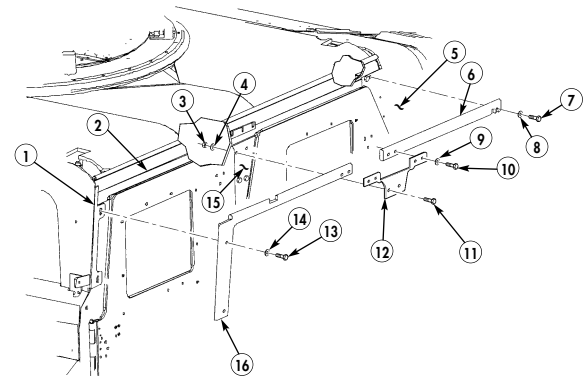

FOLLOW-ON TASK:
Install door header IED overlay (Frag 1A) (if equipped) (para. 11-139).

# 11-128. Fuel Door Ied Overlay Maintenance (Frag 1)

This task covers:
b. Inspection

Applicable Models M1114 Tools General mechanic's tool kit:
automotive (Appendix B, Item 1)
Maintenance and repair shop equipment:
automotive (Appendix B, Item 2)
Materials/Parts Sealing compound (Appendix C, Item 64)
a. Removal c. Installation

| Manual References    |
|----------------------|
| TM 9\-2320\-387\-24P |
| Maintenance Level    |
| Unit                 |

Mark position of shim for installation reference.

a. Removal 1. Remove three capscrews (1), fuel door assembly (6), shim (2), and nut plate (3) from vehicle (4). 2. Remove three capscrews (5) and fuel door IED overlay (7) from fuel door assembly (6).

b. Inspection Refer to para. 10-56 for nut insert inspection and replacement.

c. Installation

#### Caution

Use grade 5 torque value when installing capscrews into nut inserts. Failure to do so may damage equipment or components.

1. Apply sealing compound to three capscrews (5) and install fuel door IED overlay (7) on fuel door (6)
with three capscrews (5). Tighten capscrews (5) to 10 lb-ft (14 N•m).

2. Apply sealing compound to three capscrews (1) and install fuel door assembly (6), shim (2), and nut plate (3) to vehicle (4) with three capscrews (1). Tighten capscrews (1) to 23 lb-ft (31 N•m).

# 11-128. Fuel Door Ied Overlay Maintenance (Frag 1) (Cont'D)

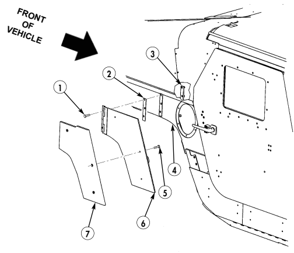

# 11-129. Ied Mirror Assembly Maintenance (Frag 1)

This task covers:

| b. Inspection   |
|-----------------|

| Applicable Models                       | Materials/Parts                          |
|-----------------------------------------|------------------------------------------|
| M1151A1, M1152A1, M1165A1, M1167        | Three lockwashers (Appendix G, Item 144) |
| Tools                                   | Manual References                        |
| General mechanic's tool kit:            | TM 9\-2320\-387\-24P                     |
| automotive (Appendix B, Item 1)         | Maintenance Level                        |
| Torque wrench 3/8\-in. drive, 75 lb\-ft |                                          |
| (Appendix B, Item 2.1)                  | Unit                                     |

Applicable Models a. Removal c. Installation

Replacement procedures for left and right IED mirror assemblies (Frag 1) are basically the same. The right mirror assembly has no lower mounting bracket. This procedure covers the left IED mirror assembly.

a. Removal 1. Remove capscrew (8) and washer (7) from mounting bracket (6) on A-pillar (10). 2. Remove locknut (1), and capscrew (2), from mirror assembly (4) on A-pillar bracket (11). Discard locknut
(1).

3. Remove capscrew (3), washer (7), mounting bracket (6), and mirror assembly (4) from A-pillar (10). 4. Remove locknut (9), capscrew (5), and mirror assembly (4) from mounting bracket (6).

Discard locknut (9).

b. Inspection Refer to para. 10-56 for nut insert inspection and replacement.

c. Installation

#### Caution

Use grade 5 torque value when installing capscrews into nut inserts. Failure to do so may damage equipment or components.

1. Install mirror assembly (4) on mounting bracket (6) with capscrew (5) and locknut (9). Tighten locknut (9) to 21 lb-ft (28 N•m).

2. Apply sealing compound to threads of capscrew (3) and install mirror assembly (4) and mounting bracket (6) on A-pillar (10) with washer (7), and capscrew (3). Do not tighten capscrew (3).

3. Secure mirror assembly (4) to A-pillar bracket (11) with capscrew (2), and locknut (1). Do not tighten locknut (1).

4. Apply sealing compound to threads of capscrew (8) and secure mounting bracket (6) to A-pillar (10)
with washer (7) and capscrew (8). Do not tighten capscrew (8).

5. Tighten capscrew (3) installed in step 2 to 21 lb-ft (28 N•m). 6. Tighten locknut (1) installed in step 3 to 6 lb-ft (8 N•m). 7. Tighten capscrew (8) installed in step 4 to 13 lb-ft (18 N•m).

# 11-129. Ied Mirror Assembly Maintenance (Frag 1) (Cont'D)

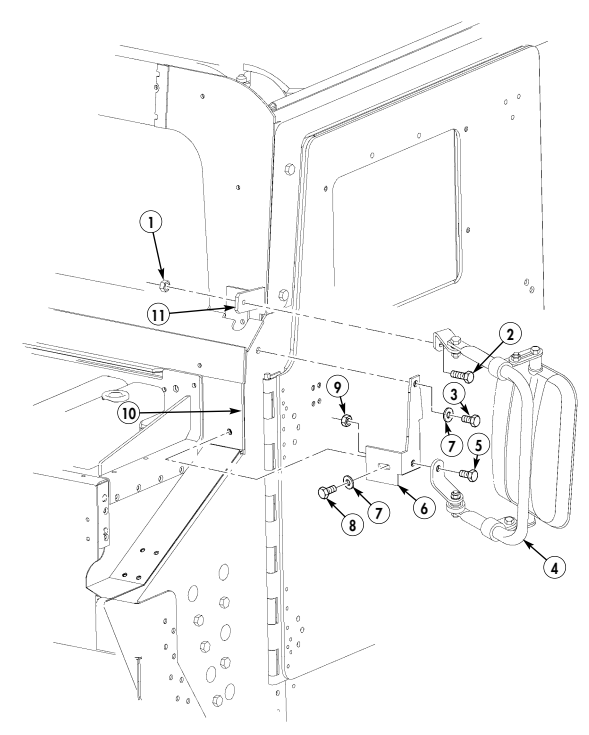

# 11-130. Rocker Panel Ied Overlay Replacement - Lh (Frag 1)

This task covers:

a. Removal b. Installation

| TASK       |                                                             | PAGE    |
|------------|-------------------------------------------------------------|---------|
| PARA.      | PROCEDURES                                                  | NO.     |
| 11\-122.1. | A\-Pillar IED Overlay Replacement - LH (Frag 1)             | 11\-240 |
| 11\-123.   | A\-Pillar IED Overlay Maintenance - RH (Frag 1)             | 11\-242 |
| 11\-124.   | B\-Pillar IED Overlay Replacement (Frag 1)                  | 11\-244 |
| 11\-125.   | C\-Pillar IED Overlay Maintenance - LH (Frag 1)             | 11\-246 |
| 11\-126.   | C\-Pillar IED Overlay Replacement - RH (Frag 1)             | 11\-248 |
| 11\-127.   | Door Header IED Overlay Replacement (Frag 1)                | 11\-250 |
| 11\-128.   | Fuel Door IED Overlay Maintenance (Frag 1)                  | 11\-252 |
| 11\-129.   | IED Mirror Assembly Maintenance (Frag 1)                    | 11\-254 |
| 11\-130.   | Rocker Panel IED Overlay - LH (Frag 1)                      | 11\-256 |
| 11\-131.   | Rocker Panel IED Overlay - RH (Frag 1)                      | 11\-258 |
| 11\-132.   | Safety Strap and Safety Strap Bracket Replacement (Frag 1A) | 11\-260 |
| 11\-133.   | A\-Pillar IED Overlay Replacement - LH (Frag 1A)            | 11\-262 |

#### Warning

Rocker panel IED overlay (Frag 1) is heavy and must be supported during removal and installation. Failure to do so may cause injury to personnel or damage to equipment.

#### A. Removal

1. Remove locknut (5), capscrew (11), and two washers (10) and (6) from rocker panel IED overlay (24)
on rocker panel (7). Discard locknut (5).

2. Remove two capscrews (16), washers (17), and nut plate (18) from rocker panel IED overlay (24) on rocker panel (7).

3. Remove three capscrews (22) from gap plate (23), and rocker panel IED overlay (24). 4. Remove two locknuts (1), washers (2), capscrews (21), and gap plate (23) from rocker panel IED
overlay (24), and rocker panel (7). Discard locknuts (1).

5. Remove capscrew (13) and washer (12) from rocker panel IED overlay (24) and rocker panel (7). 6. Remove locknut (8), washers (9) and (15), and capscrew (14) from rocker panel IED overlay (24) on rocker panel (7). Discard locknut (8).

7. Remove six locknuts (3), washers (4), capscrews (19), washers (20), and rocker panel IED
overlay (24) from rocker panel (7). Discard locknuts (3).

#### B. Installation

1. Install rocker panel IED overlay (24) on rocker panel (7) with six washers (4), locknuts (3),
washers (20), and capscrews (19). Do not tighten locknuts (3).

2. Install rocker panel IED overlay (24) on rocker panel (7) with capscrew (14), washers (9) and (15),
and locknut (8).

3. Install rocker panel IED overlay (24) to rocker panel (7) with washer (12) and capscrew (13). Do not tighten capscrew (13).

4. Install gap plate (23) on rocker panel IED overlay (24), and rocker panel (7) with two capscrews (21), washers (2), and locknuts (1).

## 11-130. Rocker Panel Ied Overlay Replacement - Lh (Frag 1) (Cont'D)

5. Apply sealing compound to three capscrews (22) and secure gap plate (23) to rocker panel IED overlay (24)
and rocker panel (7) with three capscrews (22). Do not tighten capscrews (22).

6. Tighten locknuts (3) installed in step 1 to 10 lb-ft (14 N•m). 7. Tighten locknuts (1) installed in step 4 to 23 lb-ft (31 N•m). 8. Tighten locknut (8) installed in step 2 to 6 lb-ft (8 N•m). 9. Install nut plate (18) on rocker panel IED overlay (24) with two capscrews (16) and washers (17).

10. Install rocker panel IED overlay (24) on rocker panel (7) with capscrew (11), two washers (10) and (6), and locknut (5).

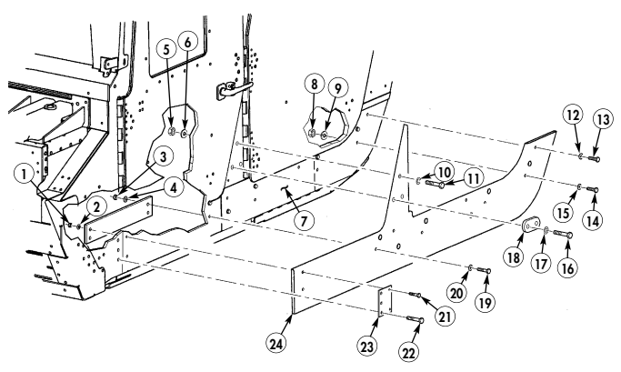

FOLLOW-ON TASK: Install left rocker panel IED overlay (Frag 1A) (if equipped) (para. 11-140).

# 11-131. Rocker Panel Ied Overlay Replacement - Rh (Frag 1)

| Tools   |
|---------|

| Applicable Models   |
|---------------------|
| M1114               |

| Personnel Required   |
|----------------------|

This task covers:

| INITIAL SETUP:   |
|------------------|

General mechanic's tool kit:
automotive (Appendix B, Item 1)
Maintenance and repair shop equipment:
automotive (Appendix B, Item 2)

#### Materials/Parts

Twelve locknuts (Appendix G, Item 127) Sealing compound (Appendix C, Item 64)

| Maintenance Level   |
|---------------------|

One mechanic One assistant

a. Removal b. Installation

Unit

#### Warning

| Manual References                                   |
|-----------------------------------------------------|
| TM 9\-2320\-387\-24P                                |
| Equipment Condition                                 |
| - Driver's rearview mirror bracket removed          |
| (para. 10\-69).                                     |
| - Left side A\-pillar IED overlay (Frag 1A) removed |
| (if equipped) (para. 11\-133).                      |
| General Safety Instructions                         |
| A\-pillar IED overlay (Frag 1) is heavy and must be |

Rocker panel IED overlay (Frag 1) is heavy and must be supported during removal and installation. Failure to do so may cause injury to personnel or damage to equipment.

The slave receptacle plate on the right side rocker panel will need to be removed and retained for re-installation after the rocker panel IED overlay is installed. If this plate is worn, broken, painted over, missing, or unreadable, it must be replaced.

#### A. Removal

1. Remove three capscrews (11) from gap plate (10), and rocker panel IED overlay (13). 2. Remove two locknuts (8), washers (9), capscrews (12), and gap plate (10) from rocker panel IED overlay (13), and rocker panel (7). Discard locknuts (8).

3. Remove locknut (5), two washers (6), and capscrew (17) from rocker panel IED overlay (13) on rocker planel (7). Discard locknut (5).

4. Remove two capscrews (16), washers (15), and nut plate (14) from rocker panel IED overlay (13) and rocker panel (7).

5. Remove capscrew (1) and washer (2) from rocker panel IED overlay (13) and rocker panel (7). 6. Remove nine locknuts (4), washers (3), capscrews (19), washers (18), and rocker panel IED overlay (13)
from rocker panel (7). Discard locknuts (4).

# 11-131. Rocker Panel Ied Overlay Replacement - Rh (Frag 1) (Cont'D)

b. Installation 1. Install right side rocker panel IED overlay (13) on rocker panel (7) with nine washers (18),
capscrews (19), washers (3), and locknuts (4). Do not tighten locknuts (4).

2. Apply sealing compound to threads of capscrew (1) and secure rocker panel IED overlay (13) to rocker panel (7) with washer (2) and capscrew (1). Do not tighten capscrew (1).

3. Install two capscrews (16), washers (15), and nut plate (14) to rocker panel IED overlay (13) and rocker panel (7).

4. Install capscrew (17), two washers (6), and locknut (5) on rocker panel IED overlay (13) on rocker panel (7).

5. Install gap plate (10) on rocker panel IED overlay (13), and rocker panel (7) with two capscrews (12),
washers (9), and locknuts (8). Do not tighten locknuts (8).

6. Install gap plate (10) on rocker panel IED overlay (13), and rocker panel (7) with three capscrews (11).

Do not tighten capscrews (11).

7. Tighten locknuts (4) installed in step 1 to 10 lb-ft (14 N•m).

8. Tighten capscrew (1) installed in step 2 to 6 lb-ft (8 N•m). 9. Tighten locknuts (8) installed in step 5 to 10 lb-ft (14 N•m).

10. Tighten capscrews (11) installed in step 6 to 23 lb-ft (31 N•m).

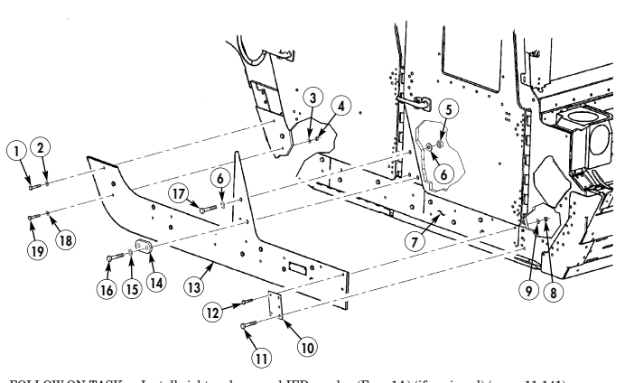

FOLLOW-ON TASK: Install right rocker panel IED overlay (Frag 1A) (if equipped) (para. 11-141).

# 11-132. Safety Strap And Safety Strap Bracket Replacement (Frag 1A)

This task covers:

| Tools   |
|---------|

| INITIAL SETUP: Applicable Models   |
|------------------------------------|

INITIAL SETUP:
General mechanic's tool kit:
automotive (Appendix B, Item 1)
Materials/Parts Five locknuts (Appendix G, Item 129)

a. Removal b. Installation

Replacement procedures for all door safety straps and brackets are basically the same. This procedure covers the left door safety strap and bracket.

| Manual References    |
|----------------------|
| TM 9\-2320\-387\-24P |
| Equipment Condition  |

a. Removal 1. Remove locknut (3), capscrew (1), and safety strap (4) from door bracket (2). Discard locknut (3).

Perform steps 2 through 5 for front door safety straps and brackets and steps 6 and 7 for rear door safety straps and brackets.

2. Remove locknut (14), capscrew (16), and safety strap (4) from safety strap bracket (15). Discard locknut (14).

3. Remove two capscrews (13), washers (12), nut plate (11), and safety strap bracket (15) from bracket (7)
and A-pillar (8).

4. Remove three locknuts (9), washers (10), capscrews (17), and washers (18) from bracket (7). Discard locknuts (9).

5. Remove three capscrews (5), washers (6), and bracket (7) from A-pillar (8). 6. Remove locknut (23), capscrew (19), and safety strap (4) from rear safety strap bracket (22). Discard locknut (23).

Perform step 7 if removing safety strap bracket.

7. Remove two locknuts (21), washers (20), and rear safety strap bracket (22) from B-pillar capscrews (24).

Discard locknuts (21).

b. Installation

Perform steps 1 and 2 for rear door safety straps and brackets and steps 3 through 6 for front door safety straps and brackets.

1. Install rear safety strap bracket (22) on B-pillar capscrews (24) with two washers (20) and locknuts (21). 2. Install safety strap (4) on rear safety strap bracket (22) with capscrew (19) and locknut (23). 3. Install bracket (7) on A-pillar (8) with three washers (6) and capscrews (5). 4. Install bracket (7) to A-pillar (8) with three washers (18), capscrews (17), washers (10), and locknuts (9).

## 11-132. Safety Strap And Safety Strap Bracket Replacement (Frag 1A) (Cont'D)

5. Install safety strap bracket (15) on bracket (7) and A-pillar (8) with two washers (12), capscrews (13),
and nut plate (11).

6. Install safety strap (4) on safety strap bracket (15) with capscrew (16) and locknut (14). 7. Install safety strap (4) on door bracket (2) with capscrew (1) and locknut (3).

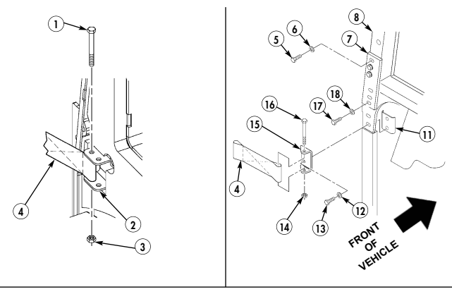

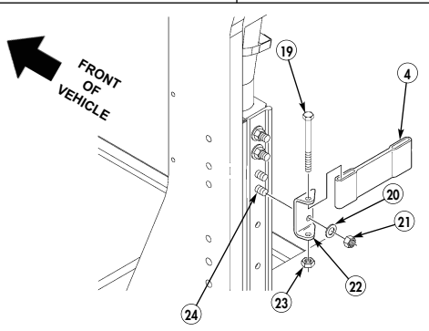

11-133. A-PILLAR IED OVERLAY REPLACEMENT - LH (FRAG 1A)

This task covers:

a. Removal b. Installation

| Applicable Models   |
|---------------------|

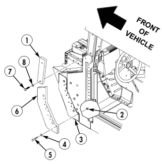

INITIAL SETUP:
M1114 General mechanic's tool kit:
automotive (Appendix B, Item 1)
Maintenance and repair shop equipment:
automotive ( Appendix B, Item 2)

#### Materials/Parts

Four locknuts (Appendix G, Item 127) Locknut (Appendix G, Item 129) Three locknuts (Appendix G, Item 133.16) Sixteen locknuts (Appendix G, Item 111) Two lockwashers (Appendix G, Item 141) Sealing compound (Appendix C, Item 64)
One assistant Manual References TM 9-2320-387-24P

| Manual References   |
|---------------------|

Maintenance Level Unit a. Removal 1. Remove twelve locknuts (2), capscrews (5), washers (4), and left side A-pillar IED overlay (6) from vehicle (3). Discard locknuts (2).

2. Remove two capscrews (7), washers (8), and A-pillar IED overlay (1) from vehicle (3).

## 11-133. A-Pillar Ied Overlay Replacement - Lh (Frag 1A) (Cont'D)

3. Remove three capscrews (17) from gap plate (9) and left side A-pillar overlay (18). 4. Remove locknut (11), washer (10), and capscrew (16) from gap plate (9) and left side rocker panel IED
overlay (14). Discard locknut (11).

5. Remove locknut (12), washer (13), capscrew (15), and gap plate (9) from left side rocker panel overlay (14). Discard locknut (12).

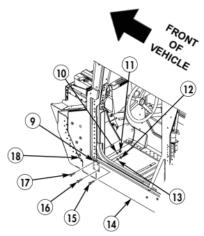

6. Remove capscrew (19) and washer (20) from left side A-pillar IED overlay (24) and vehicle (23). 7. Remove three locknuts (21), washers (28), and capscrews (27) from left side A-pillar IED overlay (24)
and vehicle (23). Discard locknuts (21).

8. Remove locknut (22), capscrew (26), washer (25), and left side A-pillar IED overlay (24) from vehicle (23).

Discard locknut (22).

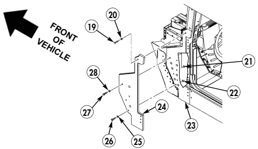

## 11-133. A-Pillar Ied Overlay Replacement - Lh (Frag 1A) (Cont'D)

b. Installation 1. Install left side A-pillar IED overlay (6) on vehicle (5) with washer (7), capscrew (8), and locknut (3). Do not tighten locknut (3).

2. Install left side A-pillar IED overlay (6) to vehicle (5) with three washers (10), capscrews (9), and locknuts (4). Do not tighten locknuts (4).

3. Apply sealing compound to threads of capscrew (1) and secure left side A-pillar IED overlay (6) to vehicle (5) with washer (2) and capscrew (1). Do not tighten capscrew (1).

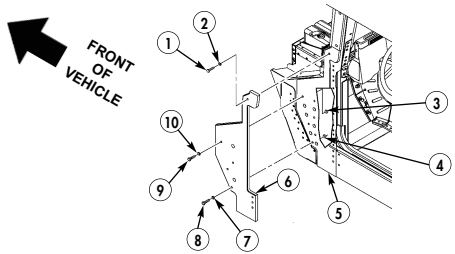

4. Apply sealing compound to threads of three capscrews (17) and install gap plate (19) on left side A-pillar IED overlay (18) with three capscrews (17). Do not tighten capscrews (17).

5. Install gap plate (19) to vehicle (5) with capscrew (16), washer (11), and locknut (12). Do not tighten locknut (12).

6. Install gap plate (19) to vehicle (5) with capscrew (15), washer (14), and locknut (13). Do not tighten locknut (13).

7. Tighten capscrews (17) installed in step 4 to 37 lb-ft (50 N•m). 8. Tighten locknut (13) installed in step 6 to 37 lb-ft (50 N•m).

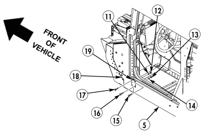

## 11-133. A-Pillar Ied Overlay Replacement - Lh (Frag 1A) (Cont'D)

9. Tighten locknut (3) installed in step 1 to 10 lb -ft (14 N•m).

10. Tighten locknuts (4) installed in step 2 to 10 lb-ft (14 N•m). 11. Tighten capscrew (1) installed in step 3 to 21 lb-ft (28 N•m). 12. Tighten locknut (12) installed in step 5 to 10 lb-ft (14 N•m). 13. Apply sealing compound to threads of two capscrews (26) and install A-pillar IED overlay (20) on vehicle (22) with two washers (27) and capscrews (26). Tighten capscrews (26) to 23 lb-ft (31 N•m).

14. Install left side A-pillar IED overlay (25) on vehicle (22) with twelve washers (23), capscrews (24),
and locknuts (21). Tighten locknuts (21) to 37 lb-ft (50 N•m).

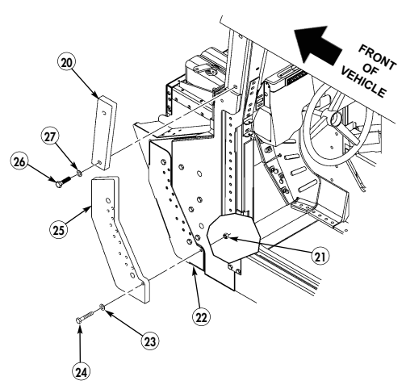

# 11-134. A-Pillar Ied Overlay Replacement - Rh (Frag 1A)

This task covers:

#### Initial Setup: Applicable Models

M1114 Tools General mechanic's tool kit:
automotive (Appendix B, Item 1)
Maintenance and repair shop equipment:
automotive (Appendix B, Item 2)

#### Materials/Parts

Fifteen locknuts (Appendix G, Item 111) Seven locknuts (Appendix G, Item 127) Three locknuts (Appendix G, Item 133.16) Two locknuts (Appendix G, Item 129) Two lockwashers (Appendix G, Item 141) Sealing Compound (Appendix C, Item 64)

#### A. Removal B. Installation Personnel Required

One mechanic One assistant Manual References TM 9-2320-387-24P
Equipment Condition
•Remove safety strap (para. 11-132). •Remove rearview mirror (para. 11-129).

General Safety Instructions An assistant must hold right side upper A-pillar IED overlay (Frag 1) in place when removing upper A-pillar IED overlay (Frag 1A).

Maintenance Level Unit a. Removal 1. Remove twelve locknuts (8), capscrews (5), washers (6), and right side A-pillar IED overlay (4) from vehicle (7). Discard locknuts (8).

2. Remove two capscrews (3), washers (2), and A-pillar IED overlay (1) from vehicle (7).

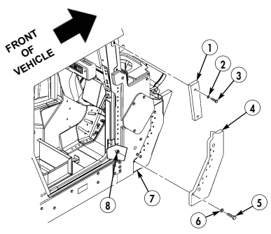

## 11-134. A-Pillar Ied Overlay Replacement - Rh (Frag 1A) (Cont'D)

3. Remove locknut (15), capscrew (13), and washer (14), from vent cover (12). Discard locknut (15). 4. Remove two capscrews (11), washers (10), vent cover (12), and six spacer washers (9), from vehicle (16).

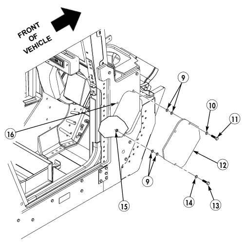

# 11-134. A-Pillar Ied Overlay Replacement - Rh (Frag 1A) (Cont'D)

5. Remove capscrew (5), and washer (6), from upper A-pillar IED overlay (2).

#### Warning

An assistant must hold right side upper A-pillar IED overlay (Frag 1) in place when removing upper A-pillar IED overlay (Frag 1A). Failure to do so will cause right side upper A-pillar IED (Frag 1) overlay to fall, resulting in injury to personnel or damage to equipment.

6. Remove capscrew (4), washer (3), and upper A-pillar IED overlay (2) from right side upper A-pillar IED overlay (Frag 1) (7).

7. Remove three capscrews (9) from gap plate (11). 8. Remove two locknuts (13), washers (12), capscrews (10), and gap plate (11) from vehicle (8). Discard locknuts (13).

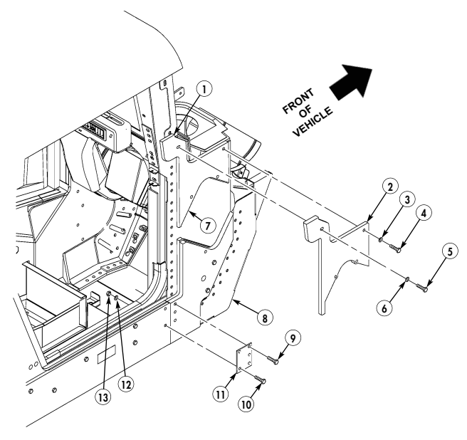

# 11-134. A-Pillar Ied Overlay Replacement - Rh (Frag 1A) (Cont'D)

#### Warning

An assistant must hold right side lower A-pillar IED overlay (Frag 1) in place when removing upper A-pillar IED overlay (Frag 1A). Failure to do so will cause right side lower A-pillar IED (Frag 1) overlay to fall, resulting in injury to personnel or damage to equipment.

9. Remove two locknuts (14), capscrews (15), washers (16) and right side A-pillar IED overlay (17) from right side lower A-pillar IED (Frag 1) (18). Discard locknuts (14).

b. Installation 1. Install right side A-pillar overlay (17) on right side lower A-pillar IED (Frag 1) (18) with two washers (16), capscrews (15), and locknuts (14). Do not tighten locknuts (14).

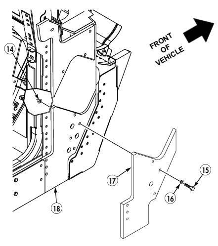

## 11-134. A-Pillar Ied Overlay Replacement - Rh (Frag 1A) (Cont'D)

2. Apply sealing compound to threads of three capscrews (9) and install gap plate (11) on vehicle (14)
with three capscrews (9). Do not tighten capscrews (9).

3. Install gap plate (11) to vehicle (8) with two capscrews (11), washers (12), and locknuts (13). Do not tighten locknuts (13).

4. Tighten capscrews (9) installed in step 2 to 37 lb-ft (50 N•m). 5. Tighten locknuts (13) installed in step 3 to 37 lb-ft (50 N•m). 6. Apply sealing compound to threads of capscrew (4) and install upper A-pillar IED overlay (2) on right side upper A-pillar IED overlay (Frag 1) (7) with washer (3) and capscrew (4). Tighten capscrew (4) to 6 lb-ft (8 N•m).

7. Apply sealing compound to threads of capscrew (5) and install upper A-pillar IED overlay (7) with washer (6) and capscrew (5). Tighten capscrew (5) to 21 lb-ft (8 N•m).

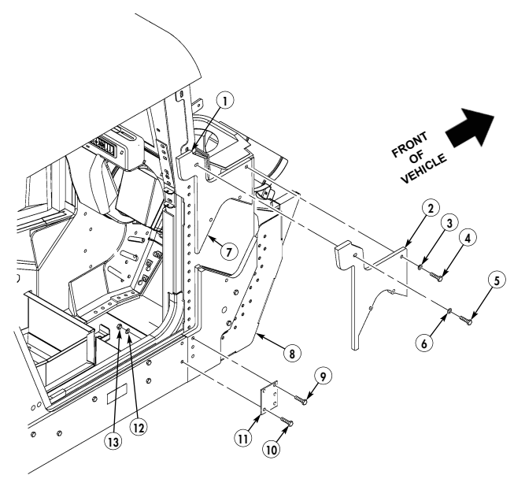

# 11-134. A-Pillar Ied Overlay Replacement - Rh (Frag 1A) (Cont'D)

8. Tighten locknuts installed in step 1 to 37 lb-ft (50 N•m). 9. Apply sealing compound to threads of two capscrews (16) and install vent cover (17) on vehicle (8)
with two washers (15), capscrews (16), and four spacer washers (14). Do not tighten capscrews (16).

10. Install vent cover (17) to vehicle with two spacer washers (14), washer (19), capscrew (18), and locknut (20). Tighten locknut (20) to 37 lb-ft (50 N•m).

11. Tighten capscrews (16) installed in step 9 to 21 lb-ft (28 N•m).

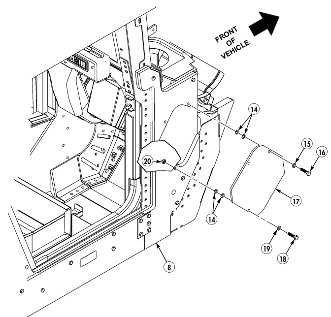

## 11-134. A-Pillar Ied Overlay Replacement - Rh (Frag 1A) (Cont'D)

12. Apply sealing compound to threads of two capscrews (3) and install A-pillar IED overlay (1) on vehicle (7) with two washers (2) and capscrews (3). Tighten capscrews (3) to 23 lb-ft (31 N•m).

13. Install right side A-pillar IED overlay (4) on vehicle (7) with twelve washers (6), capscrews (5), and locknuts (8). Tighten locknuts (8) to 37 lb-ft (50 N•m).

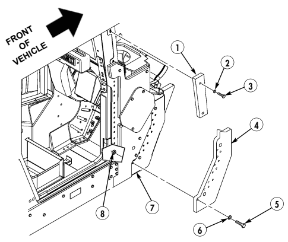

FOLLOW-ON TASKS: - Install rearview mirror (if equipped) (para. 11-129).

- Install safety strap (para. 11-132).

11-272 Change 5

# 11-135. B-Pillar Deflector Plate Replacement (Frag 1A)

This task covers:

Applicable Models M1114 Tools General mechanic's tool kit:
automotive (Appendix B, Item 1)
Materials/Parts Two lockwashers (Appendix G, Item 141)
a. Removal **b. Installation**

| Manual References    |
|----------------------|
| TM 9\-2320\-387\-24P |
| Equipment Condition  |

Replacement procedures for left and right B-pillar deflector plates are basically the same. This procedure covers the left B-pillar deflector plate.

a. Removal Remove two capscrews (5), lockwashers (4), washers (3), and B-pillar deflector plate (2) from B-pillar (1). Discard lockwashers (4).

b. Installation Install B-pillar deflector plate (2) on B-pillar (1) with two washers (3), lockwashers (4), and capscrews (5).

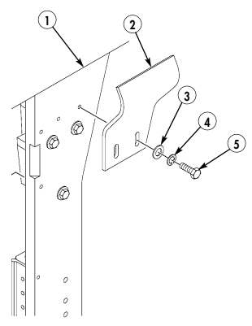

## 11-136. Latch Ramp Replacement (Frag 1A)

This task covers:

Applicable Models M1114 Tools

| Materials/Parts   |
|-------------------|

General mechanic's tool kit:
automotive (Appendix B, Item 1)
Two locknuts (Appendix G, Item 127) Two lockwashers (Appendix G, Item 141)
a. Removal b. Installation

| Manual References                            |
|----------------------------------------------|
| TM 9\-2320\-387\-24P                         |
| Equipment Condition                          |
| Left C\-pillar IED overlay (Frag 1A) removed |
| (if equipped) (para. 11\-138).               |
| Maintenance Level                            |
| Unit                                         |

Replacement procedures for left and right door latch ramps are basically the same. This procedure covers the left door latch ramps.

a. Removal

Perform steps 1 and 2 for front door latch ramps and step 3 for rear door latch ramps.

1. Remove two capscrews (1), lockwashers (6), washers (5), shim(s) (3), and lower latch ramp (2) from B-pillar (4). Discard lockwashers (6).

2. Remove two capscrews (7), lockwashers (8), washers (9), and upper latch ramp (10) from B-pillar (4).

Discard lockwashers (8).

Mark location of latch ramp for reference in installation.

3. Remove two locknuts (15), washers (16), capscrews (11), washers (12), latch ramp (13), and latch ramp base (17) from C-beam (14). Discard locknuts (15).

b. Installation

Perform step 1 for rear door latch ramps and steps 2 and 3 for front door latch ramps.

1. Install latch ramp (13) and latch ramp base (17) on C-beam (14) with two washers (12), capscrews (11),
washers (16), and locknuts (15).

2. Install upper latch ramp (10) on B-pillar (4) with two washers (9), lockwashers (8), and capscrews (7).

3. Install lower latch ramp (2) and shim(s) (3) on B-pillar (4) with two washers (5), lockwashers (6),
and capscrews (1).

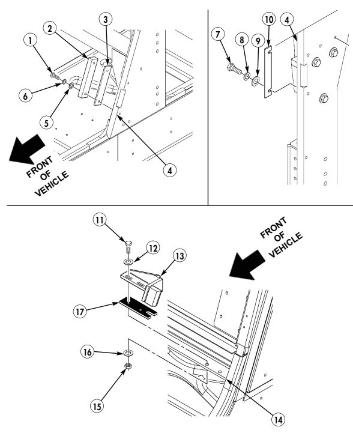

11-136. LATCH RAMP REPLACEMENT (FRAG 1A) (Cont'd)
FOLLOW-ON TASKS:  - Install right rear passenger seat (para. 10-46).

· Install left rear passenger seat (para. 10-45).

# 11-137. Door Guide Mount Maintenance (Frag 1A)

This task covers:
b. Inspection

Applicable Models M1114 Tools General mechanic's tool kit:
automotive (Appendix B, Item 1)
Materials/Parts Two lockwashers (Appendix G, Item 158.1) Two lockwashers (Appendix G, Item 141) Seven locknuts (Appendix G, Item 129) Sealing compound (Appendix C, Item 64)
a. Removal c. Installation Manual References TM 9-2320-387-24P
Equipment Condition
- Left rear passenger seat removed (para. 10-45). - Fuel filler housing removed (para. 10-2).

Maintenance Level Unit

Replacement procedures for left and right door guide mounts are basically the same. This procedure covers the left door guide mount.

a. Removal

Perform steps 1 through 3 for front door guide mounts and steps 4 through 9 for rear door guide mounts.

1. Remove four capscrews (1) and male door guide (11) from front door guide mount (5). 2. Remove two capscrews (2), lockwashers (3), and washers (4) from front door guide mount (5).

Discard lockwashers (3).

3. Remove two locknuts (7), washers (8), capscrews (10), front door guide mount (5), and shim(s) (6)
from B-pillar (9). Discard locknuts (7).

4. Remove six capscrews (15) from access panel (14) on vehicle body (20). 5. Remove four locknuts (18), washers (19), capscrews (22), and air conditioning lines cover (23) from vehicle body (20). Discard locknuts (18).

6. Remove four capscrews (29) and male door guide (28) from rear door guide mount (12). 7. Remove two capscrews (27) and lockwashers (26) from rear door guide mount (12). Discard lockwashers (26).

8. Remove two capscrews (25), lockwashers (24), and rear door guide mount (12) from rear door guide support (21). Discard lockwashers (24).

9. Remove locknut (17), washer (16), capscrew (13), and rear door guide support (21) from vehicle body (20). Discard locknut (17).

b. Inspection Refer to para. 10-56 for nut insert inspection and replacement.

c. Installation

#### Caution

Use grade 5 torque value when installing capscrews into nut inserts. Failure to do so may damage equipment or components.

Perform steps 1 through 5 for rear door guide mounts and steps 6 through 9 for front door guide mounts.

1. Install door guide support (21) on body (20) with capscrew (13), washer (16), and locknut (17).

## 11-137. Door Guide Mount Maintenance (Frag 1A) (Cont'D)

2. Install rear door guide mount (12) on rear door guide support (21) with two lockwashers (24) and capscrews (25).

3. Install rear door guide mount (12) to rear door guide support (21) with two lockwashers (26) and capscrews (27).

4. Install male door guide (28) on rear door guide mount (12) with four capscrews (29). 5. Install access panel (14) on vehicle body (20) with six capscrews (15). 6. Install air conditioning lines cover (23) on vehicle body (20) with four capscrews (22), washers (19), and locknuts (18).

7. Install door guide (5) and shim(s) (6) on B-pillar (9) with two capscrews (10), washers (8), and locknuts (7). 8. Install front door guide mount(s) (5) to B-pillar (9) with two washers (4), lockwashers (3), and capscrews (2).

9. Apply sealant to four capscrews (2) and install male door guide (11) on front door guide mount (5)
with four capscrews (2).

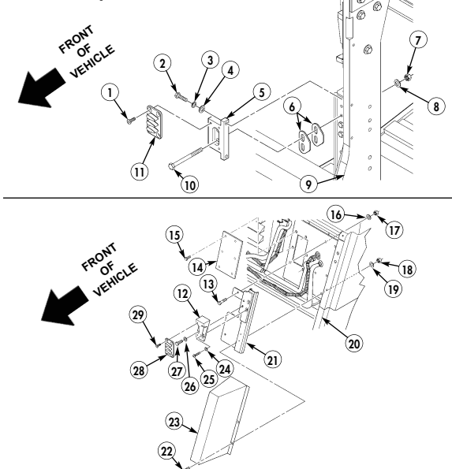

FOLLOW-ON TASKS: - Install fuel filler housing (para. 10-2).

- Install left rear passenger seat (para. 10-45).

# 11-138. C-Pillar Ied Overlay Replacement (Frag 1A)

This task covers:
a. Removal b. Installation

| Applicable Models                                                      | Manual References                         |
|------------------------------------------------------------------------|-------------------------------------------|
| M1114                                                                  | TM 9\-2320\-387\-24P                      |
| Tools                                                                  | Equipment Condition                       |
| General mechanic's tool kit:                                           | Door header IED overlay (Frag 1A) removed |
| automotive (Appendix B, Item 1)                                        | (if equipped) (para. 11\-139).            |
| Maintenance and repair shop equipment: automotive (Appendix B, Item 2) | Maintenance Level                         |
|                                                                        | Unit                                      |
| Materials/Parts                                                        |                                           |
| Two locknuts (Appendix G, Item 127)                                    |                                           |
| Sealing compound (Appendix C, Item 64)                                 |                                           |

Replacement procedures for left and right rear door latch ramps and C-pillar IED overlays are basically the same. This procedure covers the left rear door latch ramp and C-pillar IED overlay.

a. Removal 1. Remove two capscrews (3) and C-pillar inner gap strip (2) from C-pillar (1). 2. Remove two locknuts (5), capscrews (12), washers (4), washers (13), and (14) from C-pillar IED 
overlay (9) on C-pillar IED overlay (Frag 1) (6). Discard locknuts (5).

3. Remove two locknuts (7), capscrews (11), washers (10), C-pillar IED overlay (9), and washers (8)
from C-pillar IED overlay (Frag 1) (6). Discard locknuts (7).

4. Remove upper left rear door latch ramp (16) and shim(s) (15) from behind C-pillar (17).

b. Installation 1. Position washers (8) and (10) on upper C-pillar IED overlay (9) and install upper C-pillar IED
overlay (9) on upper C-pillar IED overlay (Frag 1) (6) with two capscrews (11), and locknuts (7). Do not tighten locknuts (7).

2. Install left side upper C-pillar IED overlay (9) to upper C-pillar IED overlay (Frag 1) (6) with two washers (13) and (14), capscrews (12), washers (4) and locknuts (5). Do not tighten locknuts (5).

3. Install upper left rear door latch ramp (16) and shim(s) (15) behind C-pillar (17). 4. Tighten locknuts (7) installed in step 1 to 10 lb-ft (14 N•m). 5. Tighten locknuts (5) installed in step 2 to 10 lb-ft (14 N•m). 6. Install C-pillar inner gap strip (2) on left side C-pillar (1) with two capscrews (3).

Tighten capscrews (3) to 6 lb-ft (8 N•m).

# 11-138. C-Pillar Ied Overlay Replacement (Frag 1A) (Cont'D)

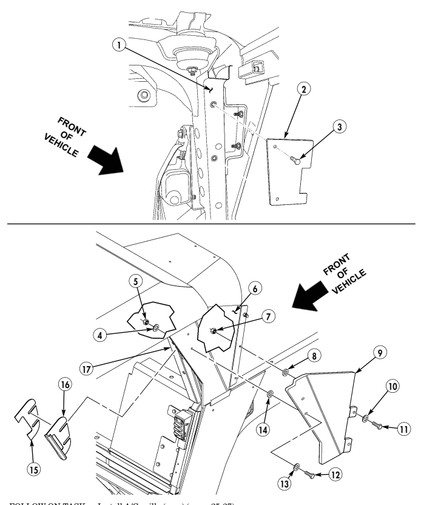

FOLLOW-ON TASK:
 Install A/C grille (rear) (para. 25-27).

# 11-139. Door Header Ied Overlay Replacement (Frag 1A)

This task covers:
INITIAL SETUP:

| M1114                           |
|---------------------------------|
| Tools                           |
| General mechanic's tool kit:    |
| automotive (Appendix B, Item 1) |

Applicable Models automotive (Appendix B, Item 1)
Maintenance and repair shop equipment:
automotive (Appendix B, Item 2)
Materials/Parts Two locknuts (Appendix G, Item 127) Sealing compound (Appendix C, Item 64)

a. Removal b. Installation

| One assistant     |
|-------------------|
| Manual References |

| One mechanic   |
|----------------|

One mechanic

| Personnel Required   |
|----------------------|

Maintenance Level Unit

Replacement procedures for left and right door header IED overlays are basically the same. This procedure covers the left door header IED overlay.

a. Removal 1. Remove two capscrews (12) and washers (13) from door header IED overlay (15),
A-pillar bracket (1), and A-pillar (16).

2. Remove two locknuts (3), washers (4), and capscrews (10) from door header IED overlay (11) and B-pillar (14). Discard locknuts (3).

3. Remove capscrew (7), washer (8), door header IED overlay (6), from door header panel (2), and C-pillar (5).

4. Remove four capscrews (9), washers (8), header support plate (11), rear door header plate (6), and front door header plate (15) from A-pillar bracket (1).

b. Installation

Use alignment tool for top two holes when installing door header IED overlay to B-pillar.

1. Apply sealing compound to four capscrews (9) and install rear door header plate (6), front door header plate (15), and header support plate (11) on B-pillar (14) with four capscrews (9) and washers (8).

2. Apply sealing compound to capscrew (7) and secure on door header IED overlay (6) to C-pillar (5) with washer (8), and capscrew (7) . Do not tighten capscrew (7).

3. Install door header IED overlay (11) to B-pillar (14) with two capscrews (10), washers (4), and locknuts (3). Do not tighten locknuts (3).

4. Apply sealing compound to two capscrews (12) and secure door header IED overlay (15) to A-pillar bracket (1) and door header (2) with two washers (13) and capscrews (12). Tighten capscrews (12) to 23 lb-ft (31 N•m).

## 11-139. Door Header Ied Overlay Replacement (Frag 1A) (Cont'D)

5. Tighten locknuts (3) installed in step 3 to 6 lb-ft (8 N•m). 6. Tighten capscrew (7) installed in step 2 to 6 lb-ft (8 N•m).

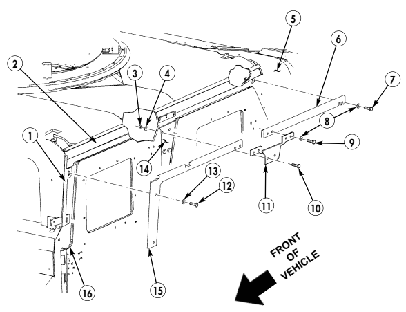

# 11-140. Rocker Panel Ied Overlay Replacement - Lh (Frag 1A)

This task covers:

| a. Removal                             | c. Installation                        |
|----------------------------------------|----------------------------------------|
| b. Inspection                          |                                        |
| INITIAL SETUP:                         |                                        |
| Applicable Models                      | Materials/Parts                        |
| M1114                                  | Two locknuts (Appendix G, Item 129)    |
| Tools                                  | Sealing compound (Appendix C, Item 64) |
| General mechanic's tool kit:           | Manual References                      |
| automotive (Appendix B, Item 1)        | TM 9\-2320\-387\-24P                   |
| Maintenance and repair shop equipment: | Maintenance Level                      |
| automotive (Appendix B, Item 2).       |                                        |
|                                        | Unit                                   |
|                                        | NOTE                                   |

#### A. Removal

1. Remove three capscrews (11) from gap plate (12), A-pillar IED overlay (14), and rocker panel IED
overlay (7).

2. Remove two locknuts (1), washers (2), capscrews (10), and gap plate (12) from rocker panel IED
overlay (7). Discard locknuts (1).

3. Remove capscrew (6) and washer (4) from rocker panel IED overlay (7) and rocker panel (13). 4. Remove nine locknuts (3), washers (5), capscrews (8), washers (9), and rocker panel IED overlay (7)
from rocker panel (13). Discard locknuts (3).

#### B. Installation

1. Install rocker panel IED overlay (7) on rocker panel (13) with nine washers (9), capscrews (8),
washers (4), and locknuts (3). Do not tighten locknuts (3).

2. Apply sealing compound to threads of capscrew (6) and secure rocker panel IED overlay (7) to rocker panel (13) with capscrew (6) and washer (5). Do not tighten capscrew (6).

3. Install gap plate (12) on rocker panel IED overlay (7) and A-pillar IED overlay (14) with two capscrews (10), washers (2), and locknuts (1). Do not tighten locknuts (1).

4. Install gap plate (12) to rocker panel IED overlay (7) and rocker panel (13) with three capscrews (11).

Do not tighten capscrews (11).

5. Tighten locknuts (3) installed in step 1 to 10 lb-ft (14 N•m). 6. Tighten capscrew (6) installed in step 2 to 6 lb-ft (8 N•m). 7. Tighten locknuts (1) installed in step 3 to 10 lb-ft (14 N•m). 8. Tighten capscrews (11) installed in step 4 to 23 lb-ft (31 N•m).

11-140. ROCKER PANEL IED OVERLAY REPLACEMENT - LH (FRAG 1A) (Cont'd)

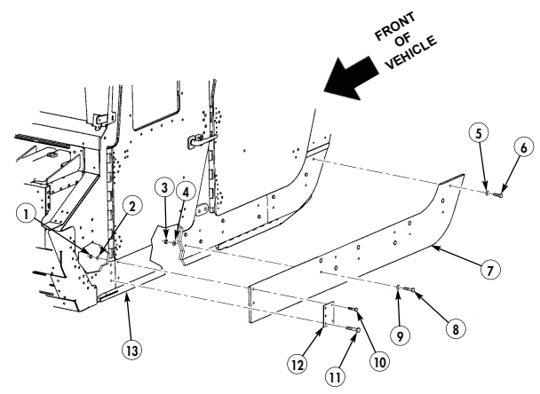

# 11-141. Rocker Panel Ied Overlay Replacement - Rh (Frag 1A)

This task covers:

| Materials/Parts   |
|-------------------|

| M1114                                  |
|----------------------------------------|
| Tools                                  |
| General mechanic's tool kit:           |
| automotive (Appendix B, Item 1)        |
| Maintenance and repair shop equipment: |

Maintenance and repair shop equipment:
automotive (Appendix B, Item 2)
Eleven locknuts (Appendix G, Item 127) Sealing compound (Appendix C, Item 64)

a. Removal b. Installation

Personnel Required One mechanic One assistant

| General Safety Instructions   |
|-------------------------------|

Unit

The slave receptacle data plate on the right side rocker panel IED overlay (Frag 1) will need to be removed and retained for reinstallation after the rocker panel IED overlay (Frag 1A) is installed. If this plate is worn, broken, painted over, missing, or unreadable, it must be replaced.

#### A. Removal

1. Remove three capscrews (8) from gap plate (7), rocker panel IED overlay (10), and rocker panel (4). 2. Remove two locknuts (6), washers (5), capscrews (9), and gap plate (7) from rocker panel IED overlay (10), and rocker panel (4). Discard locknuts (6).

3. Remove capscrew (1) and washer (13) from rocker panel IED overlay (10) and rocker panel (4). 4. Remove nine locknuts (3), washers (2), capscrews (12), washers (11), and rocker panel IED overlay
(10) from rocker panel (4). Discard locknuts (3).

#### B. Installation

1. Install rocker panel IED overlay (10) on rocker panel (4) with nine capscrews (12), washers (2),
washers (11), and locknuts (3). Do not tighten locknuts (3).

2. Apply sealing compound to threads of capscrew (1) and secure rocker panel IED overlay (10) to rocker panel (4) with capscrew (1) and washer (13). Do not tighten capscrew (1).

3. Install gap plate (7), rocker panel IED overlay (10), and rocker panel (4) with two capscrews (9),
washers (5), and locknuts (6). Do not tighten locknuts (6).

4. Install gap plate (7) to rocker panel IED overlay (10), and rocker panel (4) with three capscrews (8).

Do not tighten capscrews (8).

5. Tighten locknuts (3) installed in step 1 to 10 lb-ft (14 N•m). 6. Tighten capscrew (1) installed in step 2 to 6 lb-ft (8 N•m). 7. Tighten locknuts (6) installed in step 3 to 10 lb-ft (14 N•m). 8. Tighten capscrews (8) installed in step 4 to 23 lb-ft (31 N•m).

11-141. ROCKER PANEL IED OVERLAY REPLACEMENT - RH (FRAG 1A) (Cont'd)

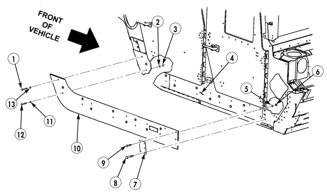

# 11-142. Rearview Mirror Assembly Maintenance (Frag 5)

This task covers:

a. Removal c. Assembly b. Disassembly d. Installation

| M1114   |
|---------|

Tools General mechanic's tool kit:
automotive (Appendix B, Item 1)
Materials/Parts Four lockwashers (Appendix G, Item 145) Five locknuts (Appendix G, Item 82)

Replacement procedures for left and right rearview mirrors are basically the same. This procedure covers the left rearview mirror.

a. Removal Remove two capscrews (5), lockwashers (4), and washers (3) from mirror assembly (1) and door side plate (4). Discard lockwashers (4). b. Disassembly 1. Remove two capscrews (13), lockwashers (12), washers (11), spacers (9), and mirror (8) from brackets (10). Discard lockwashers (12).

2. Remove locknut (24), washer (25), nylon washer (27), capscrew (6), washer (28), and upper mounting bracket (26) from mirror arm assembly (7). Discard locknut (24).

3. Remove locknut (23), washer (22), and lower mounting bracket (21) from mirror lock (20). Discard locknut (23).

4. Remove locknut (18), washer (19), and mirror lock (20) from mirror arm assembly (7). Discard locknut (18).

To remove clamps, slide clamps off mirror arm assembly.

5. Remove two locknuts (14), washers (15), capscrews (17), clamps (16), and brackets (10) from mirror arm assembly (7). Discard locknuts (14).

Manual References TM 9-2320-387-10 TM 9-2320-387-24P
Maintenance Level Unit

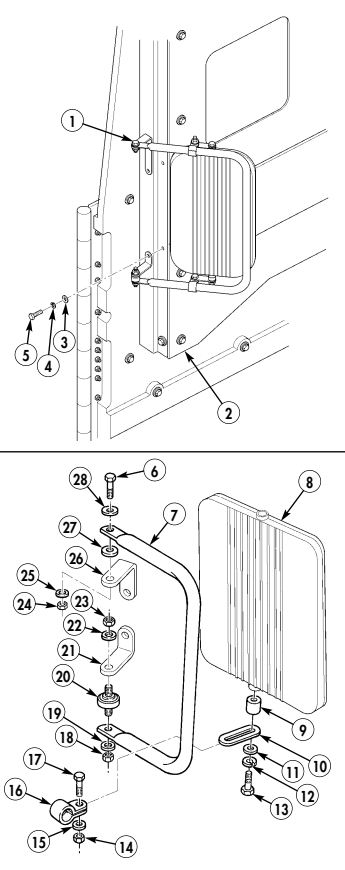

11-142. REARVIEW MIRROR ASSEMBLY MAINTENANCE (FRAG 5) (Cont'd)

# 11-142. Rearview Mirror Assembly Maintenance (Frag 5) (Cont'D)

c. Assembly

- To install clamps, slide clamps on mirror arm assembly. - Ensure clamps are positioned on mirror arm assembly to align with center of mirror head.

1. Install two clamps (11) and brackets (5) on mirror arm assembly (2). Install brackets (5) between clamps (11) with two capscrews (12), washers (10), and locknuts (9).

2. Install mirror lock (15) on mirror arm assembly (2) with washer (14) and locknut (13). 3. Install lower mounting bracket (16) on mirror lock (15) with washer (17) and locknut (18). 4. Install upper mounting bracket (21) on mirror arm assembly (2) with capscrew (1), washer (23),
nylon washer (22), washer (20), and locknut (19).

Spacers must be positioned between mirror and brackets for proper installation.

5. Install mirror (3) and two spacers (4) on brackets (5) with washers (6), lockwashers (7), and capscrews (8).

d. Installation Secure mirror assembly (24) to door side plate (25) with two washers (26), lockwashers (27), and capscrews (28).

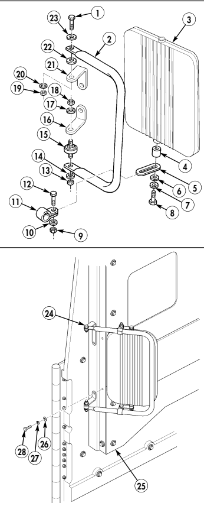

11-142. REARVIEW MIRROR ASSEMBLY MAINTENANCE (FRAG 5) (Cont'd)
FOLLOW-ON TASK: Adjust rearview mirror (TM 9-2320-387-10).

# 11-143. Door Window Box Assembly Replacement (Frag 5)

This task covers:
INITIAL SETUP:
Applicable Models M1114 Tools General mechanic's tool kit:
automotive (Appendix B, Item 1)
Materials/Parts Eighteen lockwashers (Appendix G, Item 174)
Personnel One mechanic One assistant

a. Removal b. Installation

| TM 9\-2320\-387\-24P   |
|------------------------|

Equipment Condition
- Exterior linkage rod covers removed 
(upper and lower) (Frag 5) (para. 11-146).

- Door window handle and latch removed (Frag 5)
(para. 11-145).

Maintenance Level Unit

#### Caution

To prevent damage to armored glass, protect all exposed glass surfaces when replacing rivets.

Replacement procedures for all door window box assemblies are basically the same. This procedure covers the right door window box assembly.

a. Removal 1. Remove two capscrews (8), lockwashers (7), washers (6), four spacers (2) and upper door skirt (1)
from vehicle door (19). Discard lockwashers (7).

2. Remove four capscrews (3), lockwashers (4), washers (5) and top panel (9) from window box assembly (10) on vehicle door (19). Discard lockwashers (4).

3. Remove four capscrews (12), lockwashers (13), washers (14), and side panel (11) from window box assembly (10) on vehicle door (19). Discard lockwashers (13).

4. Remove eight capscrews (15), lockwashers (16), and washers (17) from sides of window box assembly (10) on vehicle door (19). Discard lockwashers (16).

5. Remove window box assembly (10) and two plastic shims (18) from vehicle door (19).

b. Installation 1. Install two plastic shims (18) and window box assembly (10) on vehicle door (19) with eight capscrews (15), lockwashers (16), and washers (17).

2. Install side panel (11) on window box assembly (10) with four capscrews (12), lockwashers (13), and washers (14).

3. Install top panel (9) on window box assembly (10) with four capscrews (3), lockwashers (4), and washers (5).

4. Install upper door skirt (1) on vehicle door (19) with two capscrews (8), lockwashers (7), washers (6),
and four spacers (2).

# 11-143. Door Window Assembly, Replacement (Frag 5) (Cont'D)

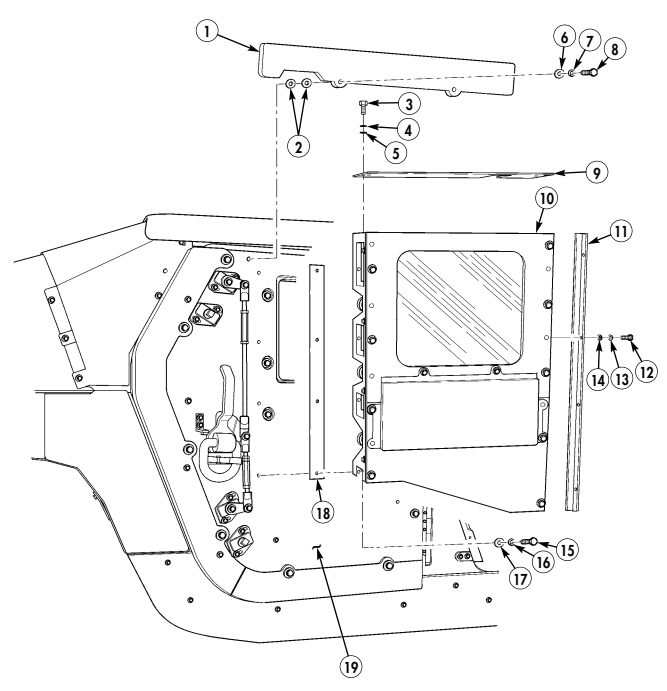

FOLLOW-ON TASKS: - Install door window handle and latch (Frag 5) (para. 11-145).

- Install exterior linkage rod covers (upper and lower) (Frag 5) (para. 11-146).

# 11-144. Door Window And Roller Assist Coils Replacement (Frag 5)

This task covers:

a. Removal b. Installation

| Applicable Models                      | Personnel Required   |
|----------------------------------------|----------------------|
| M1114                                  | One mechanic         |
|                                        | One assistant        |
| Tools                                  |                      |
|                                        | Manual References    |
| General mechanic's tool kit:           |                      |
| automotive (Appendix B, Item 1)        | TM 9\-2320\-387\-24P |
| Maintenance and repair shop equipment: | Maintenance Level    |
| automotive ( Appendix B, Item 2)       |                      |
|                                        | Unit                 |
| Materials/Parts                        |                      |
| Four locknuts (Appendix G, Item 127)   |                      |
| Locknut (Appendix G, Item 129)         |                      |

#### Caution

To prevent damage to armored glass, protect all exposed glass surfaces when replacing rivets.

NOTE
Replacement procedures for all door windows and roller assist coils are basically the same. This procedure covers the right door window and roller assist coils.

#### A. Removal

1. Remove four capscrews (6), lockwashers (5), washers (4) and roller cover panel (3) from window box assembly (1). Discard lockwashers (5).

Ensure door window is in the OPEN position.

2. Remove three cotter pins (8) from roller assist coils (7) on window box assembly (1).

Discard cotter pins (8).

3. Remove three roller assist coils (7) from studs (2). 4. Remove window (12) from window box assembly (1). 5. Remove six capscrews (9), lockwashers (10), washers (11), and three roller assist coils (7) from window (12). Discard lockwashers (10).

b. Installation 1. Install three roller assist coils (7) on window (12) with six capscrews (9), lockwashers (10), and washers (11).

2. Install window box (12) in window box assembly (1). 3. Install three roller assist coils (7) on studs (2).

Ensure door window is in the OPEN position.

4. Install roller assist coils (7) to window box assembly (1) with three cotter pins (8). 5. Install roller cover panel (3) on window box assembly (1) with four capscrews (6), lockwashers (5),
and washers (4).

# 11-144. Door Window And Roller Assist Coils Replacement (Frag 5) (Cont'D)

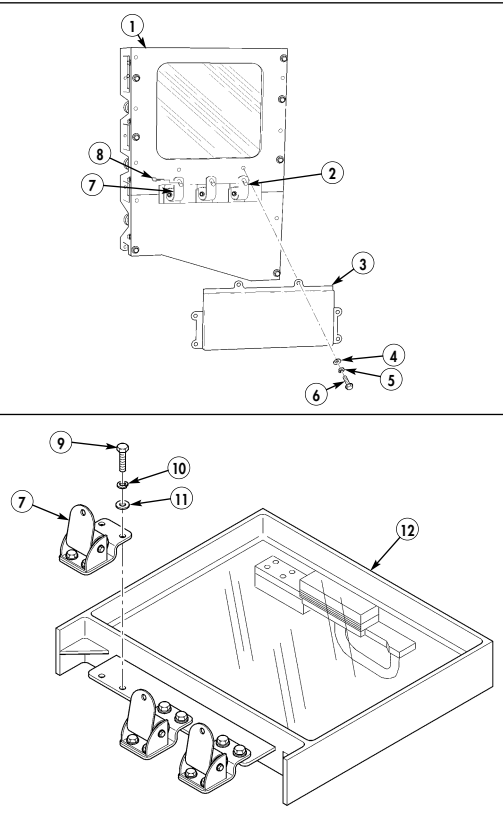

FOLLOW-ON TASK:
Install door window box assembly (para. 11-143).

# 11-145. Door Window Handle And Latch Assembly Replacement (Frag 5)

This task covers:

a. Removal b. Installation

| Applicable Models               | Manual References    |
|---------------------------------|----------------------|
| M1114                           | TM 9\-2320\-387\-24P |
| Tools                           | Maintenance Level    |
| General mechanic's tool kit:    | Unit                 |
| automotive (Appendix B, Item 1) |                      |
| Materials/Parts                 |                      |

Replacement procedures for all door window handles and latch assemblies are basically the same. This procedure covers the left door window handle and latch assembly.

a. Removal 1. Remove two capscrews (6), lockwashers (5), washers (4), shim(s) (2), and door window handle and latch assembly (3) from door window (1). Discard lockwashers (6).

2. Remove four capscrews (8), lockwashers (5), and latch (7) from window handle (3).

Discard lockwashers (5).

b. Installation 1. Install latch (7) on window handle (3) with four capscrews (8) and lockwashers (5). 2. Install door window handle and latch assembly (3) on door window (1) with two capscrews (6),
lockwashers (5), washers (4), and shim(s) (2).

# 11-145. Door Window Handle And Latch Assembly Replacement (Frag 5) (Cont'D)

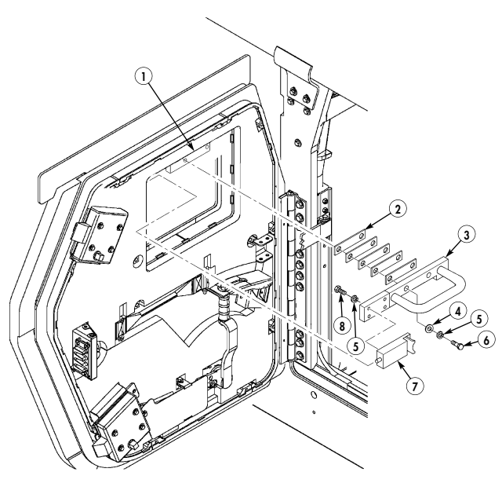

# 11-146. Linkage Rod Covers Replacement (Frag 5)

This task covers:
b. Exterior Linkage (Upper) Cover Installation e. Interior Linkage Cover Removal c. Exterior Linkage (Lower) Cover Removal f. Interior Linkage Cover Installation

Applicable Models M1114 Tools General mechanic's tool kit:
automotive (Appendix B, Item 1)
a. Exterior Linkage (Upper) Cover Removal d. Exterior Linkage (Lower) Cover Installation

| •Left rear passenger seat removed (para. 10\-45).   | •Right rear pasenger seat removed (para. 10\-46).   |
|-----------------------------------------------------|-----------------------------------------------------|
| Maintenance Level                                   | Unit                                                |

Replacement procedures for all linkage rod covers are basically the same. This procedure covers the left linkage rod covers.

a. Exterior Linkage (Upper) Cover Removal Remove five capscrews (2), lockwashers (3), and upper exterior linkage rod cover (1) from vehicle door (4). Discard lockwashers (3).

b. Exterior Linkage (Upper) Cover Installation Install upper exterior linkage rod cover (1) on vehicle door (4) with five capscrews (2) and lockwashers (3).

c. Exterior Linkage (Lower) Cover Removal Remove four capscrews (7), lockwashers (6) and lower exterior linkage rod cover (5) from vehicle door (4). Discard lockwashers (6).

d. Exterior **Linkage (Lower) Cover Installation**
Install lower exterior linkage rod cover (5) on vehicle door (4) with four capscrews (7) and lockwashers (6).

e. Interior Linkage Cover Removal Remove three capscrews (13), lockwashers (12), washers (11), and interior linkage rod cover (10) from linkage rod cover brackets (8) on vehicle door (9).

f. Interior Linkage Cover Installation Install interior linkage rod cover (10) on linkage rod cover brackets (8) on vehicle door (9) with three capscrews (13), lockwashers (12), and washers (11).

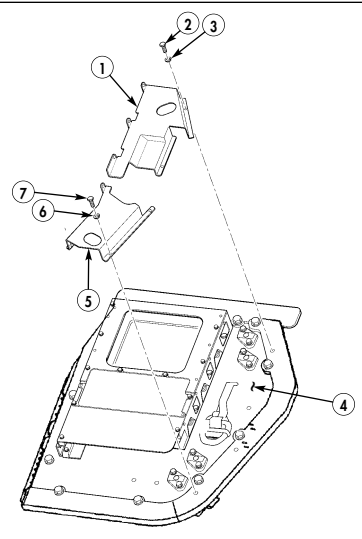

11-146. LINKAGE ROD COVERS REPLACEMENT (FRAG 5) (Cont'd)

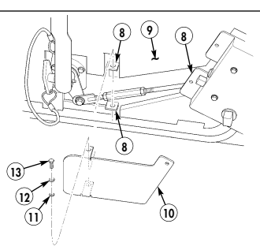

# 11-147. Linkage Rod Assembly (Exterior) Replacement (Frag 5)

This task covers:
INITIAL SETUP:

a. Removal b. Installation

| Applicable Models                                                       | Personnel Required                        |
|-------------------------------------------------------------------------|-------------------------------------------|
| M1114                                                                   | One mechanic                              |
| Tools                                                                   | One assistant                             |
| General mechanic's tool kit:                                            | Manual References                         |
| automotive (Appendix B, Item 1)                                         | TM 9\-2320\-387\-24P                      |
| Maintenance and repair shop equipment:  automotive (Appendix B, Item 2) | Equipment Condition                       |
|                                                                         | A/C grille removed (rear) (para. 25\-27). |

Replacement procedures for all exterior linkage rod assemblies are basically the same. This procedure covers the right exterior linkage rod assembly.

a. Removal Remove three capscrews (3), washers (4), and exterior linkage rod assembly (2) from vehicle door (1).

b. Installation Install exterior linkage rod assembly (2) to vehicle door (1) with three capscrews (3) and washers (9).

# 11-147. Linkage Rod Assembly (Exterior) Replacement (Frag 5) (Cont'D)

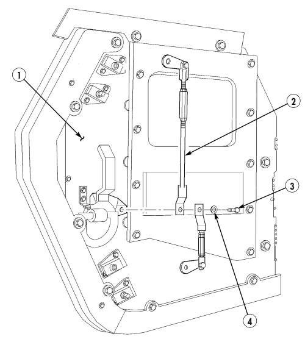

FOLLOW-ON TASK:
Install exterior linkage rod covers (upper and lower) (para. 11-146).

| This task covers:                      |                      |
|----------------------------------------|----------------------|
| a. Removal                             | b. Installation      |
| INITIAL SETUP:                         |                      |
| Applicable Models                      | Personnel Required   |
| M1114                                  | One mechanic         |
| Tools                                  | One assistant        |
| General mechanic's tool kit:           | Manual References    |
| automotive (Appendix B, Item 1)        | TM 9\-2320\-387\-24P |
| Maintenance and repair shop equipment: | Maintenance Level    |
| automotive (Appendix B, Item 2)        |                      |
|                                        | Unit                 |
| Materials/Parts                        |                      |

## 11-148. Linkage Rod Assembly (Interior) Replacement (Frag 5)

Replacement procedures for all interior linkage rod assemblies are basically the same. This procedure covers the right interior linkage rod assembly.

a. Removal 1. Remove capscrew (5) and washer (4) from interior linkage rod (3) and interior linkage bracket (2) on lanyard (1).

2. Remove capscrew (10), washer (9) and interior linkage rod (8) from interior linkage bracket (6) on vehicle door (7).

b. Installation 1. Install interior linkage rod (8) on interior linkage bracket (6) on vehicle door (7) with capscrew (10)
and washer (9).

2. Install interior linkage rod (3) on interior linkage bracket (2) on lanyard (1) with capscrew (5) and washer (4).

11-148. LINKAGE ROD ASSEMBLY (INTERIOR) REPLACEMENT (FRAG 5) (Cont'd)

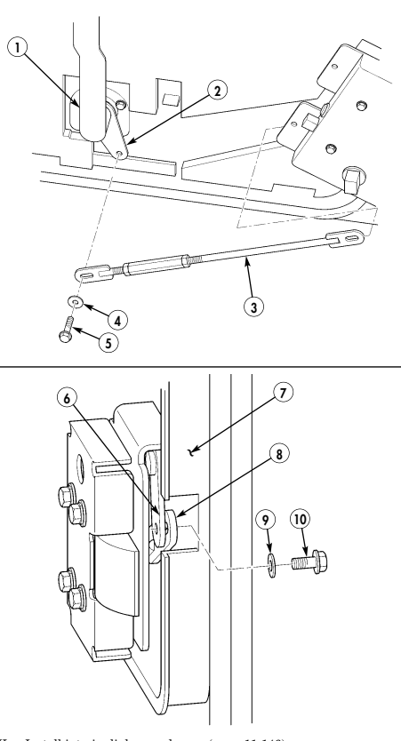

FOLLOW-ON TASK: Install interior linkage rod cover (para. 11-146).

# 11-149. Door Combat Slam Latches Replacement (Frag 5)

This task covers:

Applicable Models M1114

| Tools   |
|---------|

| Materials/Parts   |
|-------------------|

| Materials/Parts ..   |
|----------------------|

General mechanic's tool kit:
automotive (Appendix B, Item 1)
Eight lockwashers (Appendix G, Item 146)

| Personnel Required                               |
|--------------------------------------------------|
| One mechanic                                     |
| One assistant                                    |
| Manual References                                |
| TM 9\-2320\-387\-10                              |
| TM 9\-2320\-387\-24P                             |
| Equipment Condition                              |
| Fire extinguisher removed (TM 9\-2320\-387\-10). |

a. Removal b. Installation

Replacement procedures for all door combat slam latches are basically the same. This procedure covers the right upper and lower door combat slam latches.

#### A. Removal

1. Remove four capscrews (4), lockwashers (3), washers (2), two nut plates (5) and upper combat slam latch (1) from vehicle door (12). Discard lockwashers (3).

2. Remove four capscrews (10), lockwashers (9), washers (8), shim(s) (6), two nut plates (11) and lower combat slam latch (7) from vehicle door (12). Discard lockwashers (9).

#### B. Installation

1. Install lower combat slam latch (7), shim(s) (6), and two nut plates (11) on vehicle door (12) with four capscrews (10), lockwashers (9), and washers (8).

2. Install upper combat slam latch (1) and two nut plates (5) on vehicle door (12) with four capscrews (4), lockwashers (3), and washers (2).

# 11-149. Door Combat Slam Latches Replacement (Frag 5) (Cont'D)

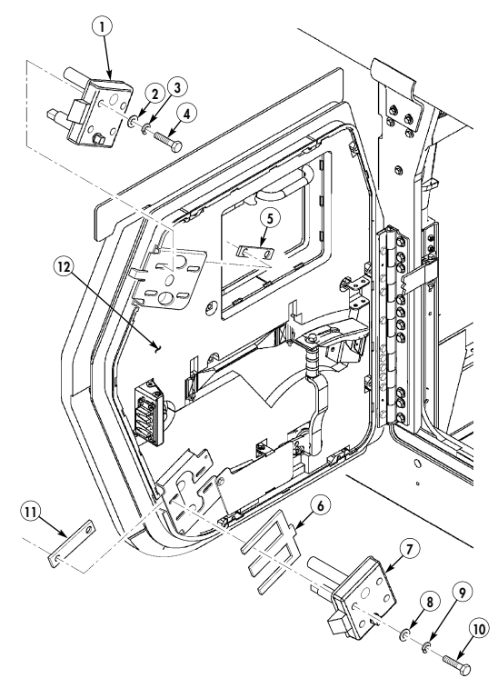

FOLLOW-ON TASKS:  - Install interior linkage assembly rod (para. 11-148).

- Install interior linkage rod cover (para. 11-146). · Install exterior linkage assembly rods (para. 11-147).

- Install exterior linkage rod covers (upper and lower) (para. 11-146).

# 11-150. Door Lock Guides (Front) Replacement (Frag 5)

This task covers:

a. Removal b. Installation

| INITIAL SETUP:                                                          |                      |
|-------------------------------------------------------------------------|----------------------|
| Applicable Models                                                       | Personnel Required   |
| M1114                                                                   | One mechanic         |
| Tools                                                                   | One assistant        |
| General mechanic's tool kit:                                            | Manual References    |
| automotive (Appendix B, Item 1)                                         | TM 9\-2320\-387\-24P |
| Maintenance and repair shop equipment:  automotive (Appendix B, Item 2) | Maintenance Level    |
|                                                                         | Unit                 |

Replacement procedures for left and right front door lock guides are basically the same. This procedure covers the right front door lock guide.

#### A. Removal

1. Remove four capscrews (9), front door lock guide (8), and nut plate (7) from mounting bracket (10)
on vehicle door (12).

2. Remove four capscrews (1), lockwashers (2), washers (3), and access cover (11) from mounting bracket (10) on vehicle door (12). Discard lockwashers (2).

3. Remove two capscrews (4), lockwashers (5), and nut plate (6) from mounting bracket (10) on vehicle door (12). Discard lockwashers (5).

#### B. Installation

4. Install nut plate (6) on mounting bracket (10) on vehicle door (12) with two capscrews (4) and lockwashers (5).

5. Install access cover (11) on mounting bracket (10) on vehicle door (12) with four capscrews (1),
lockwashers (2), and washers (3).

6. Install front door lock guide (8) and nut plate (7) on mounting bracket (10) on vehicle door (12) with four capscrews (9).

# 11-150. Door Lock Guides (Front) Replacement (Frag 5) (Cont'D)

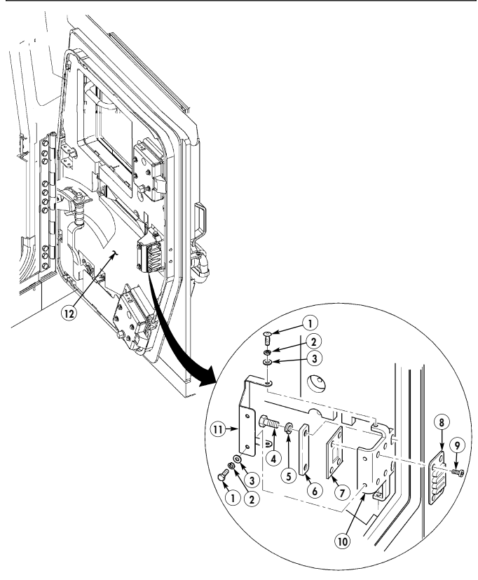

# 11-151. Door Lock Guides (Rear) Replacement (Frag 5)

This task covers:

a. Removal b. Installation

| INITIAL SETUP:                          |                      |
|-----------------------------------------|----------------------|
| Applicable Models                       | Manual References    |
| M1114                                   | TM 9\-2320\-387\-10  |
| Tools                                   | TM 9\-2320\-387\-24P |
| General mechanic's tool kit:            | Maintenance Level    |
| automotive (Appendix B, Item 1)         | Unit                 |
| Materials/Parts                         |                      |
| Four lockwashers (Appendix G, Item 145) |                      |

Replacement procedures for left and right rear door lock guides are basically the same. This procedure covers the right rear door lock guide.

a. Removal 1. Remove four capscrews (6), rear door lock guide (5), shim(s) (4), and nut plate (7) from mounting bracket (3) on vehicle door (9).

2. Remove four capscrews (1), lockwashers (2), and access cover (8) from mounting bracket (3) on vehicle door (9). Discard lockwashers (2).

b. Installation 1. Install access cover (8) on mounting bracket (3) on vehicle door (9) with four capscrews (1) and lockwashers (2).

2. Install rear door lock guide (5), shim(s) (4), and nut plate (7) on mounting bracket (3) on vehicle door (9) with four capscrews (6).

# 11-151. Door Lock Guides (Rear) Replacement (Frag 5) (Cont'D)

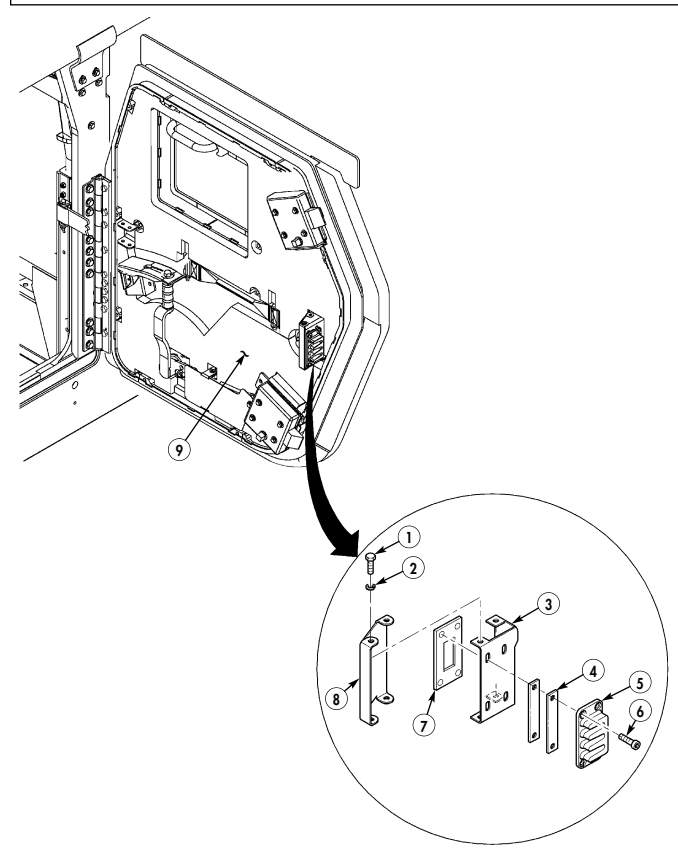

# 11-152. Door Lock Assembly Replacement (Frag 5)

This task covers:

a. Removal b. Installation

| INITIAL SETUP:                              |                                                 |
|---------------------------------------------|-------------------------------------------------|
| Applicable Models                           | Manual References                               |
| M1114                                       | TM 9\-2320\-387\-24P                            |
| Tools                                       | Equipment Condition                             |
| General mechanic's tool kit:                | - Exterior linkage rod covers removed           |
| automotive (Appendix B, Item 1)             | (upper and lower) (Frag 5) (para. 11\-146).     |
| Materials/Parts                             | - Door window handle and latch removed (Frag 5) |
|                                             | (para. 11\-145).                                |
| Eighteen lockwashers (Appendix G, Item 174) | Maintenance Level                               |

Replacement procedures for all door lock assemblies are basically the same. This procedure covers the right door lock assembly.

#### A. Removal

1. Remove quick release pin (13) and combat lock lever (10) from lanyard (4) on vehicle door (6). 2. Remove capscrew (9), washer (8), from interior linkage rod (7) on linkage bracket (5). 3. Remove three capscrews (12), lockwashers (11), and lanyard (4) from vehicle door (6). Discard lockwashers (11).

4. Remove two locknuts (2), washers (3), spring (14), and combat lock retainer (1) from two threaded studs (15) on vehicle door (6). Discard locknuts (2).

b. Installation 1. Install combat lock retainer (1) on two threaded studs (15) with two washers (3), locknuts (2) and spring (14).

2. Install lanyard (4) on vehicle door (6) with three capscrews (12), and lockwashers (11) 3. Install interior linkage rod (7) on linkage bracket (5) on vehicle door (6) with capscrew (9) and washer (8).

4. Install combat lock lever (10) and quick release pin (13) on lanyard (4) on vehicle door (6).

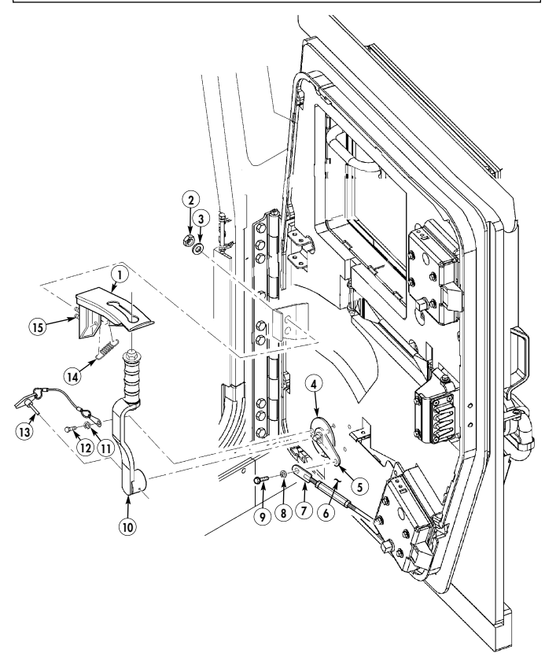

# 11-152. Door Lock Assembly Replacement (Frag 5) (Cont'D) 11-153. Door Pull Strap Replacement (Frag 5)

This task covers:

a. Removal b. Installation

| Applicable Models               | Personnel            |
|---------------------------------|----------------------|
| M1114                           | One mechanic         |
| Tools                           | One assistant        |
| General Mechanics tool kit:     | Manual References    |
| automotive (Appendix B, Item 1) | TM 9\-2320\-387\-24P |
| Materials/Parts                 | Equipment Condition  |

Replacement procedures for all door pull straps are basically the same. This procedure covers the right door pull strap.

a. Removal Remove two locknuts (3), capscrews (1), and door pull strap (2) from pull strap bracket (5) on vehicle door (4). Discard locknuts (3).

b. Installation Install door pull strap (2) on pull strap bracket (5) on vehicle door (4) with two capscrews (1) and locknuts (3).

# 11-153. Door Pull Strap Replacement (Frag 5) (Cont'D)

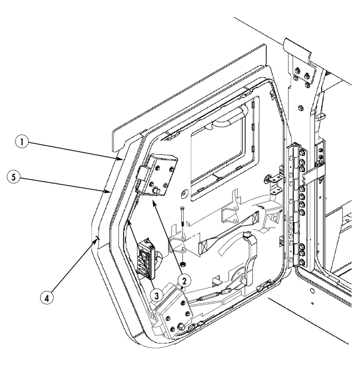

## 11-154. Door Handle (Exterior) Replacement (Frag 5)

This task covers:

Applicable Models M1114

| Materials/Parts   |
|-------------------|

Tools General mechanic's tool kit:
automotive (Appendix B, Item 1)
Locknut (Appendix G, Item 133.19)
a. Removal b. Installation

| Materials/Parts                        |
|----------------------------------------|
| Six lockwashers (Appendix G, Item 140) |
| Manual References                      |
| TM 9\-2320\-387\-24P                   |
| Maintenance Level                      |
| Unit                                   |

Replacement procedures for all exterior door handles are basically the same. This procedure covers the right exterior door handle.

a. Removal 1. Remove capscrew (3), washer (4) and upper and lower linkage rods (2) and (5) from linkage plate (6)
on door handle (7).

2. Remove locknut (9), washer (8) and door handle (7) from vehicle door (1). Discard locknut (9).

b. Installation 1. Install door handle (7) to vehicle door (1) with washer (8) and locknut (9). Tighten locknut until fully tightened and then loosen slowly until handle shaft turns freely.

2. Install upper and lower linkage rods (2) and (5) on linkage plate (6) on door handle (7) with capscrew (3), and washer (4).

# 11-154. Door Handle (Exterior) Replacement (Frag 5) (Cont'D)

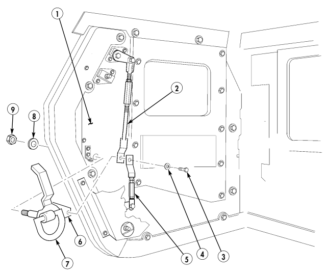

FOLLOW-ON TASKS:  - Install door lock guide (front doors only) (para. 11-150).
- Install exterior - Install exterior linkage rod cover (upper only) (para. 11-146).

## 11-155. Door Skirts Replacement (Frag 5)

This task covers:

a. Removal b. Installation

| b. Exterior Linkage (Upper) Cover Installation   | e. Interior Linkage Cover Removal       |
|--------------------------------------------------|-----------------------------------------|
| c. Exterior Linkage (Lower) Cover Removal        | f. Interior Linkage Cover Installation  |
| INITIAL SETUP:                                   |                                         |
| Applicable Models                                | Materials/Parts                         |
| M1114                                            | Nine lockwashers (Appendix G, Item 146) |
| Tools                                            | Manual References                       |
| General mechanic's tool kit:                     | TM 9\-2320\-387\-24P                    |
| automotive (Appendix B, Item 1)                  | Maintenance Level                       |

Replacement procedures for all door skirts are basically the same. This procedure covers the right door skirts.

a. Removal 1. Remove two capscrews (12), lockwashers (11), washers (10), and lower skirt (13) from vehicle door (1).

2. Remove four capscrews (6), lockwashers (7), washers (8), and side skirt (9) from vehicle door (1). 3. Remove two capscrews (5), lockwashers (4), washers (3), and upper skirt (2) from vehicle door (1).

b. Installation 1. Install upper skirt (2) on vehicle door (1) with two capscrews (5), lockwashers (4), and washers (3). 2. Install side skirt (9) on vehicle door (1) with four capscrews (6), lockwashers (7), and washers (8). 3. Install lower skirt (13) on vehicle door (1) with two capscrews (12), lockwashers (11), and washers (10).

# 11-155. Door Skirts Replacement (Frag 5) (Cont'D)

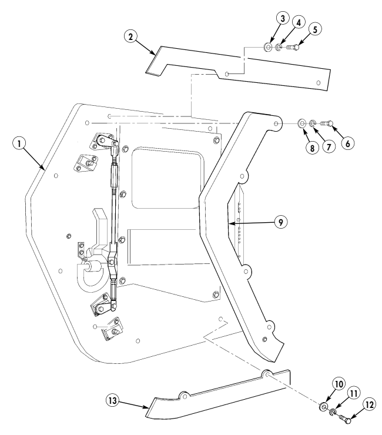

FOLLOW-ON TASK:
 Install exterior linkage rod covers (rear doors only) (para. 11-146).

## 11-156. Door Insulation Replacement (Frag 5)

This task covers:

a. Removal b. Installation

| INITIAL SETUP:                  |                                     |
|---------------------------------|-------------------------------------|
| Applicable Models               | Maintenance Level                   |
| M1114                           | Unit                                |
| Tools                           | Manual References                   |
| General mechanic's tool kit:    | TM 9\-2320\-387\-24P                |
| automotive (Appendix B, Item 1) | Equipment Condition                 |
|                                 | Exterior linkage rod covers removed |
|                                 | (upper and lower) (para. 11\-146).  |

Drycleaning solvent (Appendix C, Item 26)

#### Warning

Do not perform this procedure near fire, flames, or sparks. Dry cleaning solvent is highly flammable. Injury to personnel or damage to equipment will result.

NOTE
Replacement procedures for all door insulations are basically the same. This procedure covers the right door insulation.

a. Removal 1. Remove upper insulation (1) from vehicle door (3). 2. Remove lower insulation (2) from vehicle door (3). 3. Clean surface of vehicle door (3) with drycleaning solvent to remove adhesive.

b. Installation 1. Apply a thin coat of silicone compound adhesive on upper and lower insulations (1) and (2). 2. Install lower insulation (2) on vehicle door (3). 3. Install upper insulation (1) on vehicle door (3).

11-156. DOOR INSULATION REPLACEMENT (FRAG 5) (Cont'd)

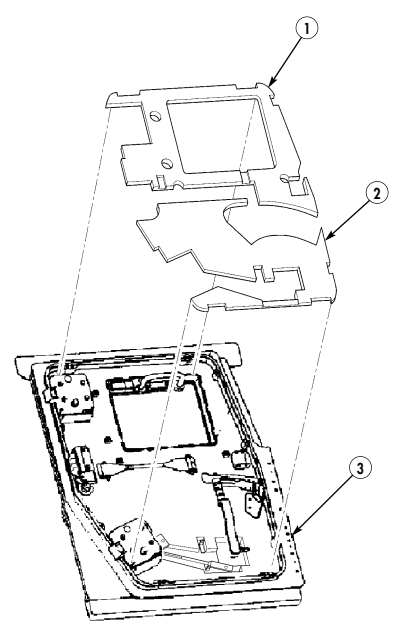

## 11-157. Door Seal Replacement (Frag 5)

This task covers:
a. Removal b. Installation INITIAL SETUP:
Applicable Models M1114 Manual References TM 9-2320-387-24P
Maintenance Level Unit

Replacement procedures for all door seals are basically the same. This procedure covers the right door seal.

a. Removal Remove door seal (1) from vehicle door (2).

b. Installation Install door seal (1) on vehicle door (2).

Tools General mechanic's tool kit automotive (Appendix B, Item 1)

# 11-157. Door Seal Replacement (Frag 5) (Cont'D)

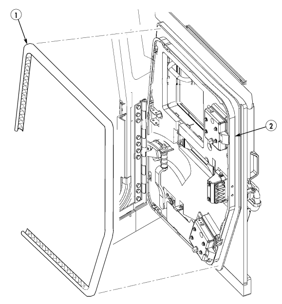

# 11-158. Door And Hinge (Front) Replacement (Frag 5)

This task covers:

Applicable Models M1114 Tools General mechanic's tool kit:
automotive (Appendix B, Item 1)
Maintenance and repair shop equipment:
automotive (Appendix B, Item 2)

#### Materials/Parts

Locknut (Appendix G, Item 129) Ten locknuts (Appendix G, Item 111) Sealing compound (Appendix C, Item 64)

#### Personnel Required

One mechanic One assistant

a. Removal b. Installation

| Manual References   |
|---------------------|

TM 9-2320-387-24P
Equipment Condition Rearview mirror assembly (Frag 5) removed 
(para. 11-142).

General Safety Instructions Front door (Frag 5) is extremely heavy and must be supported during removal and installation.

Maintenance Level Unit

#### Warning

Front door (Frag 5) is extremely heavy and must be supported during removal and installation. Failure to do so may result in injury to personnel or damage to equipment.

CAUTION
To prevent damage to armored glass, protect all exposed glass surfaces when replacing rivets.

- Replacement procedures for left and right front doors and hinges are basically the same. This procedure covers the right front door and hinge.

- Mark location of hinge prior to removal for installation.

#### A. Removal

1. Remove two dowel pins (12) from door assembly (5). 2. Remove locknut (3), capscrew (2), and door check strap (1) from strap bracket (4). Discard locknut (3). 3. Remove ten locknuts (6), capscrews (10), washers (9), and door assembly (5) from door hinge (13).

Discard locknuts (6).

4. Remove ten capscrews (7), washers (8), and door hinge (13) from A-pillar (11).

b. Installation 1. Apply sealing compound to threads of ten capscrews (7) and install door hinge (13) on A-pillar (11)
with ten washers (8), and capscrews (7).

2. Install two dowel pins (12) on door assembly (5). 3. Install door assembly (5) on door hinge (13) with ten washers (9), capscrews (10), and locknuts (6).

Tighten locknuts (6) to 37 lb-ft (50 N•m).

4. Install door check strap (1) on strap bracket (4) with capscrew (2) and locknut (3). Tighten locknut (3)
until three or four threads of capscrew (2) are extended through locknut (3).

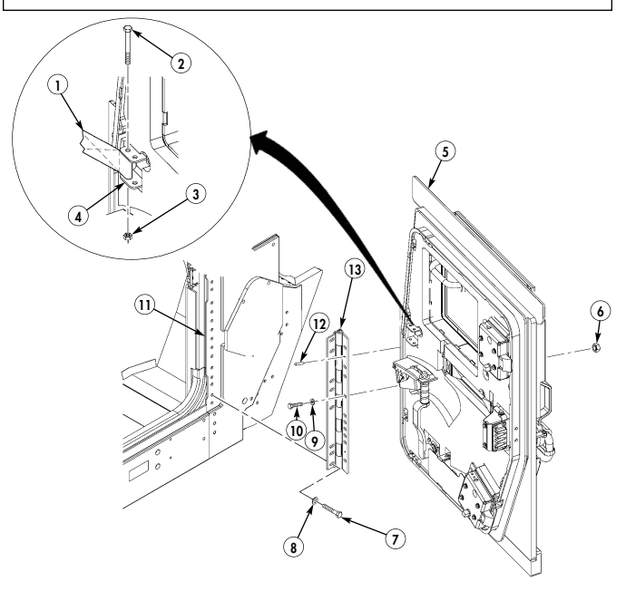

11-158. DOOR AND HINGE (FRONT) REPLACEMENT (FRAG 5) (Cont'd)
FOLLOW-ON TASKS: - Adjust front door (Frag 5) (para. 11-160).

- Install rearview mirror assembly (Frag 5) (para. 11-142).

# 11-159. Door And Hinge (Rear) Replacement (Frag 5)

This task covers:

Applicable Models M1114 Tools General mechanic's tool kit:
automotive (Appendix B, Item 1)
Maintenance and repair shop equipment:
automotive (Appendix B, Item 2)

| Materials/Parts   |
|-------------------|

Three locknuts (Appendix G, Item 129) Fourteen locknuts (Appendix G, Item 111) Sealing compound (Appendix C, Item 64)

a. Removal b. Installation

Personnel Required One mechanic One assistant Manual References TM 9-2320-387-24P
Equipment Condition
•B-deflector plate removed (Frag 1A) 
(para. 11-135).

•Front lap strap removed (para. 10-47.4).

General Safety Instructions Rear door (Frag 5) is extremely heavy and must be supported during removal and installation.

Maintenance Level Unit

#### Warning

Rear door (Frag 5) is extremely heavy and must be supported during removal and installation. Failure to comply may result in injury to personnel or damage to equipment.

#### Caution

To prevent damage to armored glass, protect all exposed glass surfaces when replacing rivets.

- Replacement procedures for left and right rear door and hinges are basically the same. This procedure covers the right rear door and hinge.

- Mark location of hinge prior to removal for installation.

a. Removal 1. Remove two dowel pins (11) from door assembly (9). 2. Remove locknut (7), capscrew (2), and door check strap (3) from strap bracket (6). Discard locknut (7). 3. Remove two locknuts (5), washers (4), and strap bracket (6) from B-pillar (1). Discard locknuts (5). 4. Remove four capscrews (21), washers (20), and B-pillar lower mounting bracket (23) from B-pillar (1).

5. Remove ten locknuts (10), capscrews (13), washers (12), and door assembly (9) from door hinge (8).

Discard ten locknuts (10).

6. Remove three capscrews (15), washers (14) from door hinge (8) and B-pillar (1). 7. Remove three capscrews (19), washers (18), and B-pillar nut plate (22) from door hinge (8) and B-pillar (1).

8. Remove four locknuts (24), eight washers (16), four capscrews (17), and door hinge (8) from B-pillar (1). Discard locknuts (24).

11-159. DOOR AND HINGE (REAR) REPLACEMENT (FRAG 5) (Cont'd)

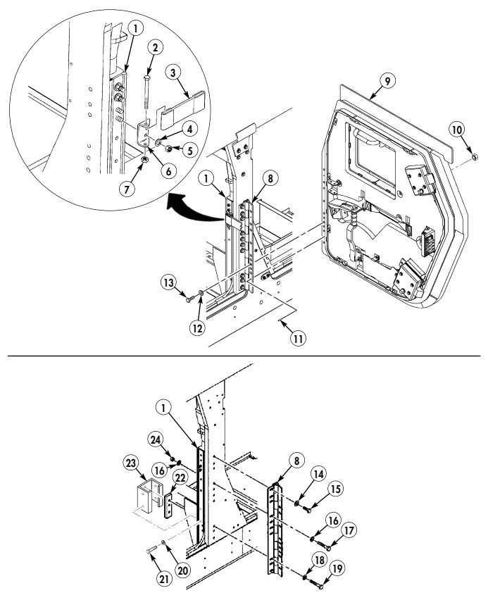

## 11-159. Door And Hinge (Rear) Replacement (Frag 5) (Cont'D)

b. Installation 1. Apply sealing compound to threads of six capscrews (4) and (8). 2. Install two dowel pins (16) on door assembly (14). 3. Install door hinge (2) on B-pillar (1), with four capscrews (6), eight washers (5), and four locknuts (13). 4. Install three washers (7), capscrews (8), and B-pillar nut plate (11) on door hinge (2) and B-pillar (1).

5. Install three washers (3), capscrews (4) on door hinge (2) and B-pillar (1). 6. Tighten locknuts (13), capscrews (4), and (8) to 37 lb-ft (50 N•m). 7. Install door assembly (14) on door hinge (2) with ten washers (17), capscrews (18), and locknuts (15).

Tighten locknuts (15) to 37 lb-ft (50 N•m).

8. Install B-pillar lower mounting bracket (12) on B-pillar (1) with four capscrews (10), and washer (9). 9. Install strap bracket (23) on B-pillar (1) with two washers (21) and locknuts (22).

Tighten locknuts (22) to 21 lb-ft (28 N•m).

10. Install door check strap (20) on strap bracket (23) with capscrew (19) and locknut (24).

Tighten locknut (24) until three or four threads of capscrew (19) are extended through locknut (24).

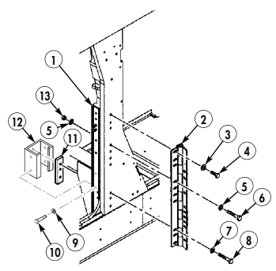

# 11-159. Door And Hinge (Rear) Replacement (Frag 5) (Cont'D)

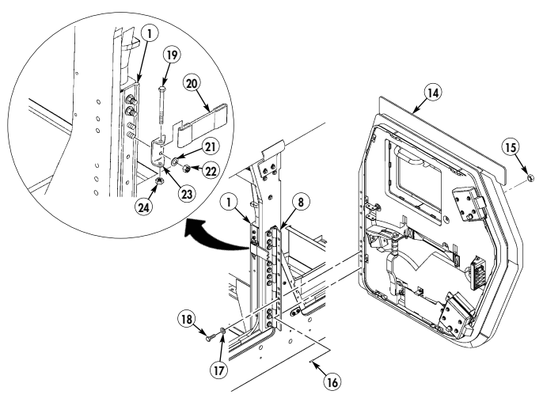

FOLLOW-ON TASKS:  - Install front lap strap (para. 10-47.4).

- Install B-deflector plate (Frag 1A) (para. 11-135).
- Adjust rear door (Frag 5) (para. 11-160).

# 11-160. Door Assembly Adjustments (Frag 5)

This task covers:
b. Baseline Exterior Linkage Rod Adjustment g. Door Adjustment c. Baseline Interior Linkage Rod Adjustment h. Final Door Adjustment d. Final Linkage Rod Adjustment i. Window Adjustment e. Ramp Block Adjustment

Applicable Models a. Door Hinge Adjustment f. Door Latch Adjustment

| Unit                                                               |
|--------------------------------------------------------------------|
| NOTE                                                               |
| Replacement procedures for left and right front door lock guides   |
| are basically the same. This procedure covers the right front door |
| lock guide.                                                        |

#### A. Door Hinge Adjustment

1. With door assembly (5) open, use an adjustable wrench to lock out upper combat slam latch assembly (2) and lower combat slam latch assembly (4) by turning square lug (3) clockwise for left side doors and counterclockwise for right side doors.

2. Close door (5) and from inside vehicle, check for consistent gap (7) around door. If gap (7) is not consistent, support door assembly (5), loosen capscrews (6) and adjust hinge (1) mounting position as required. Tighten capscrews (6) to 37 lb-ft (50 N•m).

3. Unlock upper and lower combat slam latch assemblies (2) and (4).

11-160. DOOR ASSEMBLY ADJUSTMENTS (FRAG 5) (Cont'd)

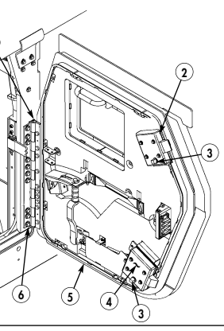

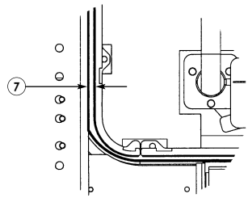

# 11-160. Door Assembly Adjustments (Frag 5) (Cont'D)

#### B. Baseline Exterior Linkage Rod Adjustment

1. Remove upper and lower exterior linkage covers from vehicle door (para. 11-146). 2. Loosen jamnuts (4) and rotate lower turnbuckle (5). Adjust lower exterior linkage rod until slight inward movement is noticed in the ramped end (11) of the lower combat slam latch (12) and there is minimal back and forth movement in the exterior handle (3).

3. Loosen jamnuts (2) and rotate upper turnbuckle (1). Adjust upper exterior linkage rod until slight inward movement is noticed in the ramped end (13) of the upper combat slam latch (6).

4. When slight engagement pressure is applied to the exterior door handle (3), both upper and lower exterior linkage rods should start to drive both combat slam latch mechanisms (6) and (12) equally and simultaneously.

5. Proceed to Final Linkage Rod Adjustment (para. d).

#### C. Baseline Interior Linkage Rod Adjustment

1. Remove interior linkage cover from vehicle door (para. 11-146). 2. Place combat lock lever (7) in the LOCKED position. 3. Loosen jamnuts (9) and rotate lower turnbuckle (8). Adjust interior linkage rod until there is minimal back and forth movement in the exterior door handle (3).

3. Proceed to Final Linkage Rod Adjustment (para. d).

#### D. Final Linkage Rod Adjustment

1. Adjust lower exterior linkage rod until there is 3/16 to ¼ inch clearance extending from the rear side of the lower combat slam hatch (12).

2. Adjust upper exterior linkage rod until there is 3/16 to ¼ inch clearance extending from the rear side of the upper combat slam hatch (6).

3. Place combat lock lever (7) in the LOCKED position and re-adjust interior linkage rod until there is minimal back and forth movement in the exterior door handle (3).

4. Tighten jamnuts (2), (4), and (9).

#### E. Ramp Block Adjustment

1. Loosen two capscrews and slide ramp block (15) side-to-side to achieve clean engagement with the lower combat slam latch ramped end (11).

2. Upper rear ramp blocks (14) are stationary and cannot be adjusted. Proceed to Door Latch Adjustment (para. f).

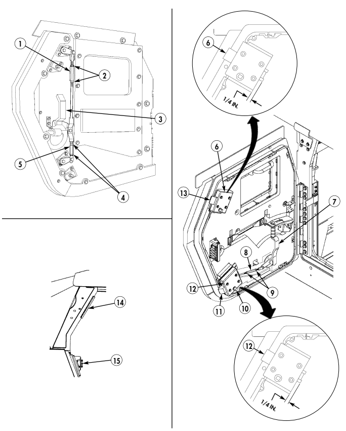

11-160. DOOR ASSEMBLY ADJUSTMENTS (FRAG 5) (Cont'd)

# 11-160. Door Assembly Adjustments (Frag 5) (Cont'D)

#### F. Door Latch Adjustment

1. Pull exterior door handle (3) and release. The handle on a properly adjusted door vehicle should snap back to its original position.

2. When slight engagement pressure is applied to the exterior door handle (3), both upper and lower exterior linkage rods and should start to move ramped ends (11) and (13) of upper and lower combat slam latches (6) and (11) equally and simultaneously.

3. Place combat lock lever (7) in LOCKED position. 4. Check combat lock lever (7) for excessive back and forth movement. The handle (3) on a properly adjusted door should have little or no movement.

5. If door latch does not pass this inspection refer to linkage rod adjustment's (para.'s b, c, and d) and then repeat steps 1 through 4 until properly adjusted.

6. Unlock lower combat slam latch (12) by turning square lug (10) counterclockwise for left door and clockwise for right doors.

7. With lower combat slam latch (12) unlocked, gently close door and check for a clean engagement between lower combat slam latch (12) and ramped end (11) and the combat slam latch is striking approximately the center of the ramped end (11).

8. If lower combat slam latch (12) is hitting the ramped end (11) too hard, loosen four capscrews securing lower combat slam latch (12) to the door and move lower combat slam latch (12) slightly away from ramped end (11). Tighten capscrews to 7 lb-ft (9 N•m).

9. If lower combat slam latch (12) is not hitting approximately in the center of the ramped end (11),
loosen four capscrews securing lower combat slam latch (12) to the door and adjust accordingly. Tighten capscrews to 7 lb-ft (9 N•m).

Shim combat slam latch bodies only as a last resort. In lieu of shimming combat slam latch bodies, adjust lower ramp blocks (15) whenever possible. When shimming combat slam latch bodies, do not use more than the equivalent of one thick shim. Excessive shimming may result in poor rescue wrench engagement.

10. If lower combat slam latch (12) is not fully engaging the ramped end (11), loosen two outside capscrews and remove the two inside capscrews from the lower combat slam latch (12) and shim as needed. Once shim(s) have been added re-install two inside capscrews and tighten all four capscrews to 7 lb-ft (9 N•m).

11. Repeat steps 1 through 10 to adjust upper combat slam latch (6).

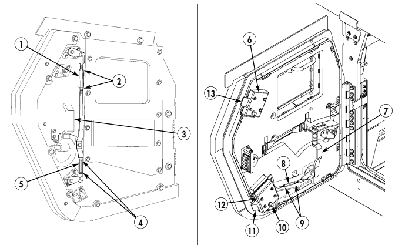

11-160. DOOR ASSEMBLY ADJUSTMENTS (FRAG 5) (Cont'd)

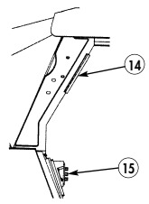

# 11-160. Door Assembly Adjustments (Frag 5) (Cont'D)

#### G. Door Adjustment

1. Tighten or loosen door guide capscrews (1) as required to ensure that they are snug.

Do not allow door guides to dictate position of door. Loosen or remove female door guide on door as required.

2. On front doors only, loosen two capscrews securing door guide bracket to door assembly. Gently close door. With door closed, tighten two capscrews securing the door guide bracket to the door assembly. Open door and tighten capscrews to 37 lb-ft (50 N•m).

3. For all doors, loosen capscrews (1) on female door guide then gently close door and check for proper fit of the male to female door guide mounts. Once proper fit is achieved tighten capscrews on the female door guides to 10 lb-ft (13 N•m).

4. Add or remove shims(s) as needed from under female door guides to obtain proper depth engagement.

#### H. Final Door Adjustment

1. Remove four capscrews (1) securing door guides (male and female), one capscrew at a time. Apply sealing compound and re-install capscrews (1) tightening to 10 lb-ft (13 N•m).

2. Mark properly torqued capscrews (1) with paint pen or indelible marker. Marking should be applied on both capscrews (1) and door guide base so that any future backing out of capscrews (1) can be easily identified.

3. Inspect inward facing surface of door latch boxes (3) for the presence of an in a circle. The marking represents a newer design.

E E
4. Remove four capscrews (2) securing latch box (3), one capscrew at a time. Apply sealing compound and re-install capscrews (2) tightening to 6 lb-ft (8 N•m) on the older designed latch boxes or 10 lb-ft (13 N•m) on the newer latch boxes (marked boxes).

5. Mark properly torqued capscrews (2) with paint pen or indelible marker. Marking should be applied on both capscrews (2) and latch box (3) so that any future backing out of capscrews (2) can be easily identified.

E

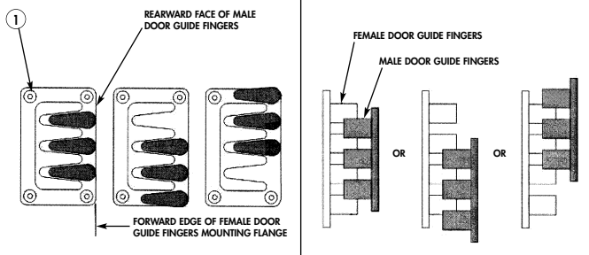

# 11-160. Door Assembly Adjustments (Frag 5) (Cont'D)

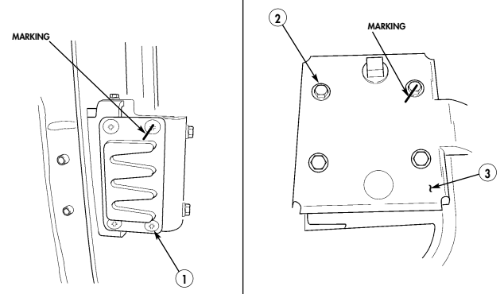

# 11-160. Door Assembly Adjustments (Frag 5) (Cont'D)

i. Window Adjustment

Only the three window rollers on the rearward rail of the window box are adjustable.

1. Loosen capscrew (1) to allow roller cam (2) to be adjusted. 2. Adjust right side of vehicle roller cams (2) by rotating clockwise to tighten or counterclockwise to loosen.

3. Adjust left side of vehicle roller cams (2) by rotating clockwise to loosen or counterclockwise to tighten.

4. After correct window travel is achieved, tighten capscrew (1) to 25 lb-ft (18 N•m).

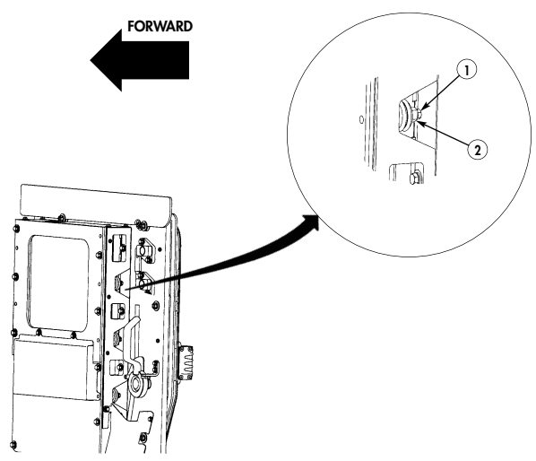

# 11-161. Cowl Ied Overlay Maintenance - Lh Front (Frag 2)

This task covers:
b. Inspection

a. Removal c. Installation

| Tools                                                             | Manual References    |
|-------------------------------------------------------------------|----------------------|
| General mechanic's tool kit:                                      | TM 9\-2320\-387\-24P |
| automotive (Appendix B, Item 1)                                   | Maintenance Level    |
| Unit                                                              |                      |
| NOTE                                                              |                      |
| Replacement procedures for left and right rear door lock guides   |                      |
| are basically the same. This procedure covers the right rear door |                      |
| lock guide.                                                       |                      |
| a. Removal                                                        |                      |

#### A. Removal

1. Remove four locknuts (2), capscrews (9), and eight washers (3), from side of front cowl outer IED overlay (8) and left front cowl (4). Discard locknuts (2).

2. Remove two capscrews (5), washers (7), lockwashers (6), and front cowl outer IED overlay (8) and (1)
from front cowl (4). Discard lockwashers (6).

b. Inspection Refer to para. 10-56 for nut insert inspection and replacement.

c. Installation

#### Caution

Use grade 5 torque value when installing capscrews into nut inserts. Failure to do so may damage equipment or components.

1. Apply sealing compound to threads of two capscrews (5) and install front cowl outer IED 
overlay (8) and (1) on left front cowl (4) with two washers (7), lockwashers (6), and capscrews (5). Do not tighten capscrews (5).

2. Secure front cowl outer IED overlay (8) to left front cowl (4) with eight washers (3), four capscrews (9), and locknuts (2). Do not tighten locknuts (2).

3. Tighten capscrews (5) installed in step 1 to 6 lb-ft (8 N•m). 4. Tighten locknuts (2) installed in step 2 to 10 lb-ft (14 N•m).

11-161. COWL IED OVERLAY MAINTENANCE - LH FRONT (FRAG 2) (Cont'd)

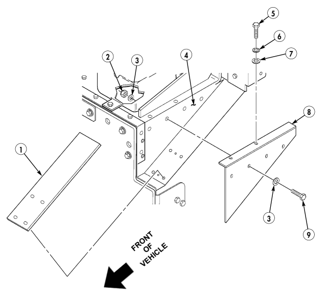

FOLLOW-ON TASK:
Install hood tapping block (para. 10-7).

11-162. UNDERBODY WHEELWELL IED OVERLAY MAINTENANCE - LH FRONT LOWER 

# (Frag 2)

This task covers:
b. Inspection

Applicable Models M1114 Tools General mechanic's tool kit:
automotive (Appendix B, Item 1)
Maintenance and repair shop equipment:
automotive (Appendix B, Item 2)
Materials/Parts Four locknuts (Appendix G, Item 111) Three lockwashers (Appendix G, Item 158.1)
Personnel Required One mechanic One assistant a. Removal c. Installation Manual References TM 9-2320-387-24P
Equipment Condition Left front cowl insulation removed (para. 10-31.1).

General Safety Instructions Ensure underbody wheelwell IED overlay (Frag 2) is supported during removal and installation.

Maintenance Level Unit

#### Warning

Underbody wheelwell IED overlay (Frag 2) is heavy and must be supported during removal and installation. Failure to do so may cause injury to personnel or damage to equipment.

#### A. Removal

1. Remove three capscrews (4), lockwashers (5), washers (3), and upper left front underbody wheelwell gapstrip armor (6) from left front underbody wheelwell (2). Discard lockwashers (5).

2. Remove two locknuts (10), capscrews (7), washers (9), and lower kick panel wedge spacers (8) from left front underbody wheelwell IED overlay (2) and left front underbody wheelwell (1) on section A-A. Discard locknuts (10).

3. Remove two locknuts (10), capscrews (7), washers (9), and lower kick panel wedge spacers (8) from left front underbody wheelwell IED overlay (2) and left front underbody wheelwell (1) on section B-B. Discard locknuts (10).

b. Inspection Refer to para. 10-56 for nut insert inspection and replacement.

c. Installation

#### Caution

Use grade 5 torque value when installing capscrews into nut inserts. Failure to do so may damage equipment or components.

1. Install two capscrews (7), washers (9), lower kick panel wedge spacers (8), and locknuts (10) to left front underbody wheelwell IED overlay (2) and left front underbody wheelwell (1) on section B-B. Do not tighten locknuts (10).

2. Install two capscrews (7), washers (9), lower kick panel wedge spacers (8), and locknuts (10) to left front underbody wheelwell IED overlay (2) and left front underbody wheelwell (1) on section A-A. Do not tighten locknuts.

# 11-162. Underbody Wheelwell Ied Overlay Maintenance - Lh Front Lower (Frag 2) (Cont'D)

3. Tighten locknuts (10) installed in steps 1 and 2 to 37 lb-ft (50 N•m). 4. Apply sealing compound to threads of three capscrews (4) and install upper left front underbody wheelwell gapstrip armor (6) on left front underbody wheel (2) with three washers (3), lockwashers (5), and capscrews (4). Tighten capscrews (4) to 10 lb-ft (14 N•m).

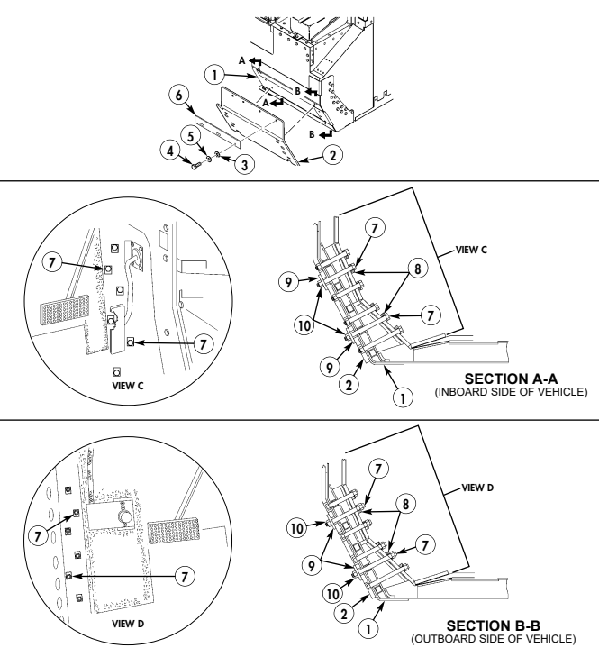

FOLLOW-ON TASK: Install left front cowl insulation (para. 10-31.1).

# 11-163. Underbody Wheelwell Ied Overlay Maintenance - Lh Front Upper (Frag 2)

This task covers:
b. Inspection

a. Removal c. Installation

| Tools                           | Two locknuts (Appendix G, Item 77)   |
|---------------------------------|--------------------------------------|
| General mechanic's tool kit:    | Manual References                    |
| automotive (Appendix B, Item 1) | TM 9\-2320\-387\-24P                 |
|                                 | Maintenance Level                    |
|                                 | Unit                                 |
|                                 | NOTE                                 |

a. Removal 1. Remove three capscrews (7), lockwashers (8), washers (6), and upper left front underbody wheelwell gapstrip armor (5) from left front underbody wheelwell (3). Discard lockwashers (8).

2. Remove two capscrews (14), capscrew (12) three lockwashers (13), washers (1) and left front underbody wheelwell upper IED overlay (2) from upper left underbody wheelwell IED overlay (4). Discard lockwashers (13).

3. Remove two capscrews (10), lockwashers (11), washers (9), and upper left front underbody wheelwell IED overlay (4) from front left underbody wheelwell (3). Discard lockwashers (11).

b. Inspection Refer to para. 10-56 for nut insert inspection and replacement.

c. Installation

#### Caution

Use grade 5 torque value when installing capscrews into nut inserts. Failure to do so may damage equipment or components.

1. Apply sealing compound to threads of two capscrews (10) and install upper left front underbody wheelwell armor overlay (4) on front left underbody wheelwell (3) with two washers (9), lockwashers (11), and capscrews (10). Do not tighten capscrews (10).

2. Apply sealing compound to threads of two capscrews (14) and install upper left front underbody wheelwell IED overlay (2) with three lockwashers (13), washers (1), two capscrews (14), and one capscrew (12). Tighten capscrews (14) to 6 lb-ft (8 N•m).

3. Tighten capscrews (10) installed in step 1 to 6 lb-ft (8 N•m). 4. Tighten capscrew (12) installed in step 2 to 10 lb-ft (14 N•m).

NOTE
Install left front underbody wheelwell gapstrip armor with slotted holes facing inboard.

5. Apply sealing compound to threads of three capscrews (7) and install upper left front underbody wheelwell gapstrip armor (5) on left front underbody wheelwell (3) with three washers (6), lockwashers (8), and capscrews (7). Tighten capscrews (7) to 10 lb-ft (14 N•m).

11-163. UNDERBODY WHEELWELL IED OVERLAY MAINTENANCE - LH FRONT UPPER
(FRAG 2) (Cont'd)

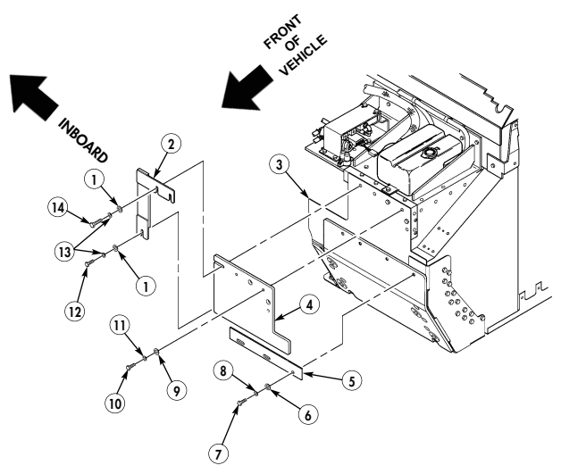

# 11-164. Underbody Wheelwell Ied Overlay Replacement - Rh Front (Frag 2)

This task covers:

a. Removal b. Installation

| INITIAL SETUP:                                                    |                                    |
|-------------------------------------------------------------------|------------------------------------|
| Applicable Models                                                 | Materials/Parts                    |
| M1114                                                             | Two locknuts (Appendix G, Item 77) |
| Tools                                                             | Manual References                  |
| General mechanic's tool kit:                                      | TM 9\-2320\-387\-24P               |
| automotive (Appendix B, Item 1)                                   | Maintenance Level                  |
|                                                                   | Unit                               |
|                                                                   | NOTE                               |
| Replacement procedures for all door pull straps are basically the |                                    |

Personnel Required One mechanic One assistant

#### Warning

Underbody wheelwell IED overlay (Frag 2) is heavy and must be supported during removal and installation. Failure to do so may cause injury to personnel or damage to equipment.

#### A. Removal

1. Remove two locknuts (6), capscrews (5), washers (4), and lower kick panel wedge spacers (7) from left front underbody wheelwell IED overlay (1) and left front underbody wheelwell (3) on section B-B. Discard locknuts (6).

2. Remove two locknuts (6), capscrews (5), washers (4), lower kick panel wedge spacers (7), and wheelwell cover (2) from left front underbody wheelwell IED overlay (1) and left front underbody wheelwell (3) on section A-A. Discard locknuts (6).

#### B. Installation

1. Install two capscrews (5), washers (4), lower kick panel wedge spacers (7), wheelwell cover (2), and locknuts (6) to left front underbody wheelwell IED overlay (1) and left front underbody wheelwell (3) on section A-A. Do not tighten locknuts (6).

2. Install two capscrews (5), washers (4), lower kick panel wedge spacers (7), and locknuts (6) to left front underbody wheelwell IED overlay (1) and left front underbody wheelwell (3) on section B-B. Do not tighten locknuts (6).

3. Tighten two locknuts (6) installed in steps 1 and 2 to 37 lb-ft (50 N•m).

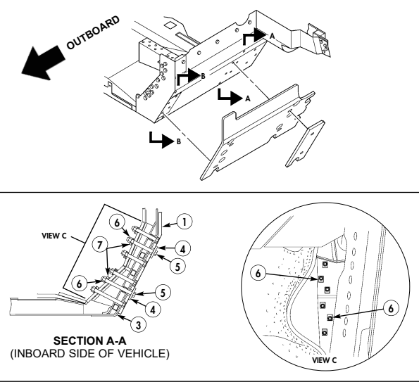

11-164. UNDERBODY WHEELWELL IED OVERLAY REPLACEMENT - RH FRONT (FRAG 2) (Cont'd)

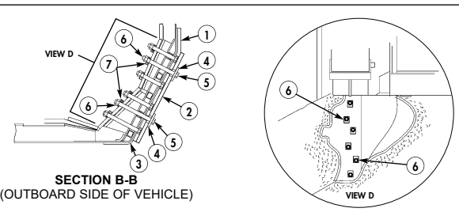

FOLLOW-ON TASK:
Install right front cowl insulation (para. 10-32).

# Section Viii. Tow Itas Missile System Maintenance (M1167) 11-165. Tow Itas Missile System Maintenance (M1167) Task Summary

| a. Removal                                                        | b. Installation                                                                                          |
|-------------------------------------------------------------------|----------------------------------------------------------------------------------------------------------|
| INITIAL SETUP:                                                    |                                                                                                          |
| Applicable Models                                                 | Manual References                                                                                        |
| M1114                                                             | TM 9\-2320\-387\-24P                                                                                     |
| Tools                                                             | Equipment Condition                                                                                      |
| General mechanic's tool kit:                                      | - Exterior linkage rod cover removed                                                                     |
| automotive (Appendix B, Item 1)                                   | (upper only) (para. 11\-146).                                                                            |
| Materials/Parts                                                   | - Door lock guide removed (front doors only)                                                             |
|                                                                   | (para. 11\-150).                                                                                         |
| Locknut (Appendix G, Item 133.19)                                 | Maintenance Level                                                                                        |
|                                                                   | Unit                                                                                                     |
|                                                                   | NOTE                                                                                                     |
|                                                                   | Replacement procedures for all exterior door handles are basically                                       |
|                                                                   | the same. This procedure covers the right exterior door handle.                                          |
| a. Removal                                                        |                                                                                                          |
| 1.                                                                | Remove capscrew (3), washer (4) and upper and lower linkage rods (2) and (5) from linkage plate (6)      |
| on door handle (7).                                               |                                                                                                          |
| 2.                                                                | Remove locknut (9), washer (8) and door handle (7) from vehicle door (1). Discard locknut (9).           |
| b. Installation                                                   |                                                                                                          |
| 1.                                                                | Install door handle (7) to vehicle door (1) with washer (8) and locknut (9). Tighten locknut until fully |
| tightened and then loosen slowly until handle shaft turns freely. |                                                                                                          |
| 2.                                                                | Install upper and lower linkage rods (2) and (5) on linkage plate (6) on door handle (7) with            |
| capscrew (3), and washer (4).                                     |                                                                                                          |

# 11-166. Antenna Blast Shield (Tow Itas) Replacement

This task covers:
a. Removal b. Installation

| INITIAL SETUP:                  |                                     |
|---------------------------------|-------------------------------------|
| Applicable Model                | Manual References                   |
| M1114                           | TM 9\-2320\-387\-24P                |
| Tools                           | Equipment Condition                 |
| General mechanic's tool kit:    | Exterior linkage rod covers removed |
| automotive (Appendix B, Item 1) | (rear doors only) (para. 11\-146).  |
| Materials/Parts                 | Maintenance Level                   |

#### A. Removal

1. Remove three locknuts (8), washers (9), capscrews (1), and washers (11) from antenna blast shield (4) and vehicle (10). Discard locknuts (8).

Clamp will be present only on vehicles with VIC communication systems.

2. Remove locknut (7), washer (6), capscrew (2), washer (3), clamp (5), and antenna blast shield (4)
from vehicle (10). Discard locknut (7).

b. Installation

Clamp will be present only on vehicles with VIC communication systems.

1. Install antenna blast shield (4) and clamp (5) on vehicle (10) with washer (3), capscrew (2),
washer (6), and locknut (7).

2. Secure antenna blast shield (4) on vehicle (10) with three washers (11), capscrews (1), washers (9),
and locknuts (8).

3. Tighten locknut (7) and locknuts (8) to 12 lb-ft. (16 N•m).

# 11-166. Antenna Blast Shield (Tow Itas) Replacement (Cont'D)

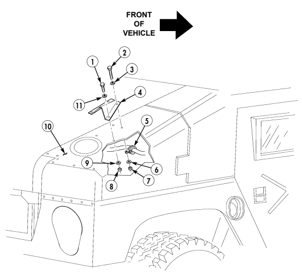

FOLLOW-ON TASK: Close cargo shell door (TM 9-2320-387-10).

# 11-167. Cargo Shell Door Blast Shield (Tow Itas) Maintenance

This task covers:
b. Inspection

Tools General mechanic's tool kit:
automotive (Appendix B, Item 1)
Torque wrench 3/8-in. drive, 75 lb-ft 
(Appendix B, Item 2.1)
Materials/Parts Six lockwashers (Appendix G, Item 146)
a. Removal c. Installation

| TM 9\-2320\-387\-24P        |
|-----------------------------|
| General Safety Instructions |
| sparks.                     |

Replacement procedures for left and right side cargo shell door blast shields are basically the same. This procedure covers the left blast shield.

a. Removal Remove six capscrews (4), lockwashers (3), washers (2), and blast shield (1) from cargo shell door (5). Discard lockwashers (3).

b. Inspection Refer to para. 10-56 for nut insert inspection and replacement.

c. Installation Install blast shield (1) on cargo shell door (5) with six washers (2), lockwashers (3), and capscrews (4). Tighten capscrews (4) to 8 lb-ft (11 N•m).

11-167. CARGO SHELL DOOR BLAST SHIELD (TOW ITAS) MAINTENANCE (Cont'd)

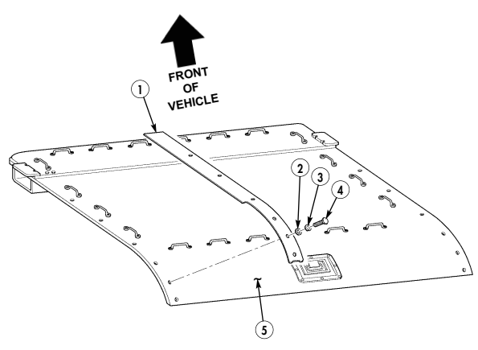

# 11-168. Mounting Bracket (Tow Itas) Replacement

This task covers:

Tools General mechanic's tool kit:
automotive (Appendix B, Item 1)
Torque wrench 3/8-in. drive, 75 lb-ft 
(Appendix B, Item 2.1)
Materials/Parts Four locknuts (Appendix G, Item 133.21)
a. Removal Remove four locknuts (5), washers (4), capscrews (2), washers (3), and mounting bracket (1) from evaporator stowage plate (6). Discard locknuts (5).

#### B. Installation

Install mounting bracket (1) on evaporator stowage plate (6) with four washers (3), capscrews (2), washers (4), and locknuts (5). Tighten capscrews (2) to 44 lb-ft. (60 N•m).

a. Removal b. Installation

| Manual References    |
|----------------------|
| TM 9\-2320\-387\-24P |
| Equipment Condition  |

# 11-168.  Mounting Bracket (Tow Itas) Replacement (Cont'D)

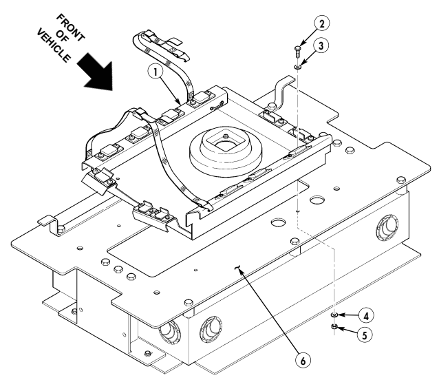

# 11-169. Evaporator Stowage Plate (Tow Itas) Maintenance

This task covers:
b. Inspection

Tools General mechanic's tool kit:
automotive (Appendix B, Item 1)
Torque wrench 3/8-in. drive, 75 lb-ft 
(Appendix B, Item 2.1)
Materials/Parts Nine locknuts (Appendix G, Item 77) Four lockwashers (Appendix G, Item 147) Four lockwashers (Appendix G, Item 190.1)
a. Removal c. Installation

| One mechanic         |
|----------------------|
| One assistant        |
| Manual References    |
| TM 9\-2320\-387\-24P |

(para. 11-168).

Maintenance Level Unit

If vehicle is not equipped with VIC-3, proceed to step 7.

#### A. Removal

1. Disconnect P1 connector (1) of highway cable (2) from left rear full function crew station light (3). 2. Disconnect P2 connector (4) of highway cable (2) from left rear full function crew station light (3). 3. Remove two nuts (10), lockwashers (9), washers (8), capscrews (6), washers (7), and full function crew station light (3) from evaporator stowage plate assembly (5). Discard lockwashers (9).

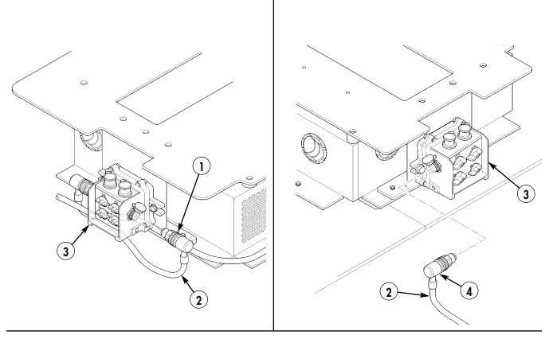

# 11-169.  Evaporator Stowage Plate (Tow Itas) Maintenance (Cont'D)

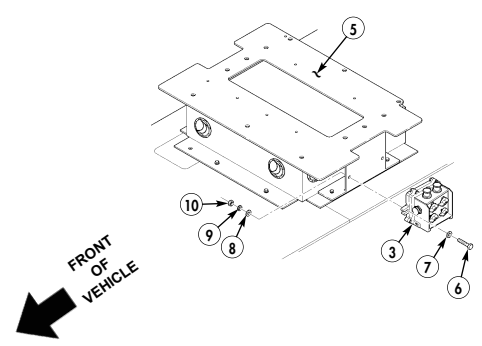

## 11-169. Evaporator Stowage Plate (Tow Itas) Maintenance (Cont'D)

4. Disconnect P1 connector (1) of highway cable (2) from right rear full function crew station light (3). 5. Disconnect P2 connector (4) of highway cable (2) from right rear full function crew station light (3). 6. Remove two nuts (6), lockwashers (7), washers (8), capscrews (10), washers (9), and full function crew station light (3) from evaporator stowage plate assembly (5). Discard lockwashers (7).

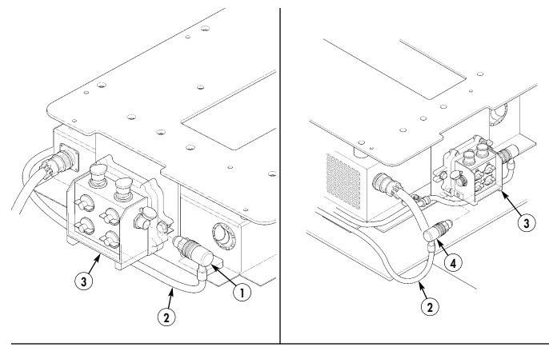

11-169.  EVAPORATOR STOWAGE PLATE (TOW ITAS) MAINTENANCE (Cont'd)

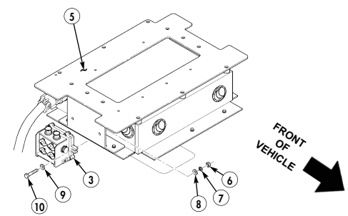

# 11-169. Evaporator Stowage Plate (Tow Itas) Maintenance (Cont'D)

7. Remove five capscrews (1) from stowage plate (6) and evaporator cover (18). 8. Remove six locknuts (25), washers (24), capscrews (2), and stowage plate (6) from two side brackets (17) and (23). Discard locknuts (25).

Remove P-clamps and highway cables only if removing VIC-3 components.

9. Remove capscrews (9) and (12), lockwashers (10) and (13), washers (11) and (14), P-clamps (22) 
and (16), and highway cables (29) and (15) from two side brackets (17) and (23) and evaporator cover (18). Discard lockwashers (10) and (13).

10. Remove capscrews (28) and (21), lockwashers (27) and (20), washers (26) and (19), and two side brackets (17) and (23) from evaporator cover (18). Discard lockwashers (27) and (20).

11. Remove three locknuts (8), washers (7), capscrews (4), washers (5), and cable stowage bracket (3) from stowage plate (6). Discard locknuts (8).

#### B. Inspection

1. Refer to para. 10-56 for nut insert inspection and replacement. 2. Inspect edge protector (2.1). Replace if damaged.

#### C. Installation

1. Install cable stowage bracket (3) on stowage plate (6) with three washers (5), capscrews (4),
washers (7), and locknuts (8).

2. Install two side brackets (17) and (23) on evaporator cover (18) with washers (26) and (19),
lockwashers (27) and (20), and capscrews (28) and (21). Tighten capscrews (28) and (21) to 8 lb-ft (11 N•m).

Install P-clamps and highway cables only if installing VIC-3 components.

3. Install P-clamps (22) and (16) and highway cables (29) and (15) on two side brackets (17) and (23),
and evaporator cover (18) with washers (11) and (14), lockwashers (10) and (13), and capscrews (9) and (12). Tighten capscrews (9) and (12) to 8 lb-ft (11 N•m).

4. Install stowage plate (6) on two side brackets (17) and (23) with six capscrews (2), washers (24), and locknuts (25). Tighten capscrews (2) to 8 lb-ft (11 N•m).

5. Install stowage plate (6) on evaporator cover (18) with five capscrews (1). Tighten capscrews (1) to 8 lb-ft (11 N•m).

11-169.  EVAPORATOR STOWAGE PLATE (TOW ITAS) MAINTENANCE (Cont'd)

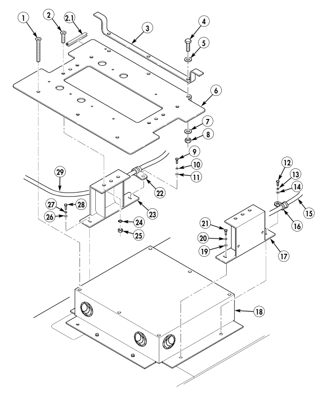

# 11-169. Evaporator Stowage Plate (Tow Itas) Maintenance (Cont'D)

6. Install right full function crew station light (5), on evaporator stowage plate assembly (1) with two washers (6), capscrews (7), washers (4), lockwashers (3), and nuts (2).

7. Connect P2 connector (10) of highway cable (11) to right rear full function crew station light (5). 8. Connect P1 connector (8) of highway cable (9) to right rear full function crew station light (5).

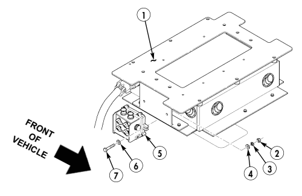

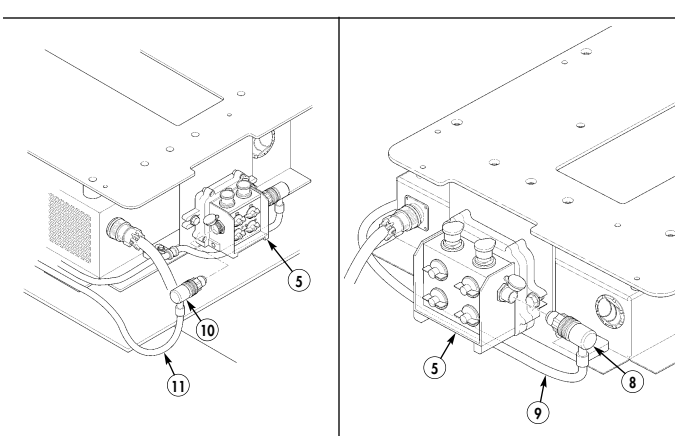

# 11-169. Evaporator Stowage Plate (Tow Itas) Maintenance (Cont'D)

9. Install left full function crew station light (4) on evaporator stowage plate assembly (1) with two washers (3), capscrews (2), washers (5), lockwashers (6), and nuts (7).

10. Connect P2 connector (8) of highway cable (9) to left rear full function crew station light (4). 11. Connect P1 connector (10) of highway cable (11) to left rear full function crew station light (4).

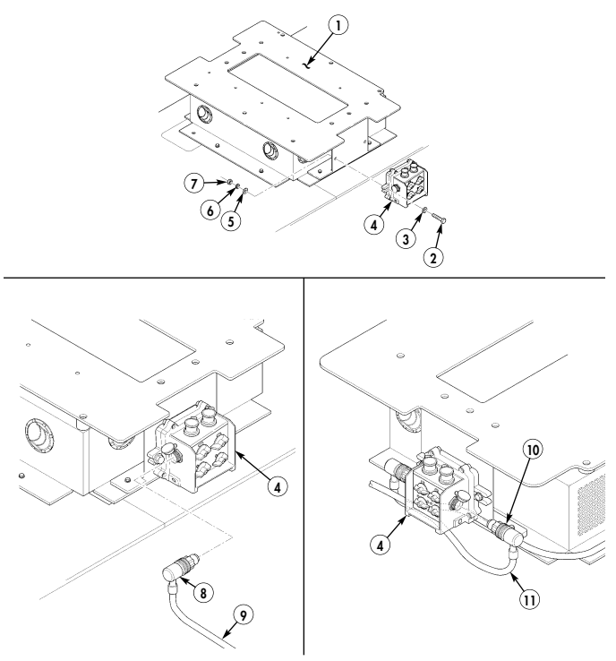

FOLLOW-ON TASK: Install mounting bracket (TOW ITAS) (para. 11-168).

# 11-170. Battery Box (Tow Itas) Maintenance

This task covers:
b. Inspection

a. Removal c. Installation

| d. Final Linkage Rod Adjustment   | i. Window Adjustment                   |
|-----------------------------------|----------------------------------------|
| e. Ramp Block Adjustment          |                                        |
| INITIAL SETUP:                    |                                        |
| Applicable Models                 | Materials/Parts                        |
| M1114                             | Sealing compound (Appendix C, Item 64) |
| Tools                             | Manual References                      |
|                                   | TM 9\-2320\-387\-24P                   |

#### A. Removal

1. Remove four capscrews (10), lockwashers (9), washers (8), and battery box (1) from cargo floor (6).

Discard lockwashers (9).

2. Remove four locknuts (4), washers (3), capscrews (2), two straps (5), and footman loops (7) from battery box (1). Discard locknuts (4).

#### B. Inspection

1. Refer to para. 10-56 for nut insert inspection and replacement. 2. Inspect edge protectors (11) and (12). Replace if damaged.

#### C. Installation

1. Install two footman loops (7) and straps (5) on battery box (1) with four capscrews (2), washers (3),
and locknuts (4).

2. Install battery box (1) on cargo floor (6) with four washers (8) lockwashers (9), and capscrews (10).

Tighten capscrews (10) to 8 lb-ft (11 N•m).

11-170. BATTERY BOX (TOW ITAS) MAINTENANCE (Cont'd)

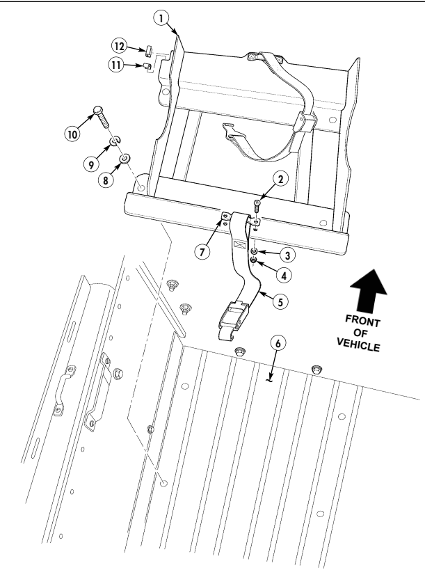

FOLLOW-ON TASK:  Close cargo shell door (TM 9-2320-387-10).

# 11-171. Stowage Pedestal And Traversing Unit (Tu) Mounting Bracket (Tow Itas) Maintenance

This task covers:
b. Inspection

Tools General mechanic's tool kit:
automotive (Appendix B, Item 1)
Torque wrench 3/8-in. drive, 75 lb-ft 
(Appendix B, Item 2.1)
Torque wrench 1/2-in. drive, 250 lb-ft 
(Appendix B, Item 2.1)
Materials/Parts Eight locknuts (Appendix G, Item 133.26) Locknut (Appendix G, Item 85) Five lockwashers (Appendix G, Item 144) Two locknuts (Appendix G, Item 138.22)
a. Removal c. Installation

#### Personnel Required

| One mechanic         |
|----------------------|
| One assistant        |
| Manual References    |
| TM 9\-2320\-387\-24P |
| Equipment Condition  |

TM 9-1475-472-12 Equipment Condition
- Traversing unit (TU) mount adapter removed
(TM 9-1425-450-12, TM 9-1425-472-12).

- Passenger seat removed (para. 10-45).

Maintenance Level Unit a. Removal

Raise gunner's platform and insert lanyards into side holes for LOCK position.

1. Remove three capscrews (5), lockwashers (4), washers (3), and terminal access panel (1) from B-pillar bracket (2). Discard lockwashers (4).

2. Remove two locknuts (20), washers (21), capscrews (9), and washers (10) from stowage pedestal (6)
and TU mounting bracket (23). Discard locknuts (20).

3. Remove six locknuts (24), washers (25), capscrews (8), washers (7), and stowage pedestal (6) from TU mounting bracket (23). Discard locknuts (24).

4. Remove locknut (18), washer (19), capscrew (11), and washer (12) from TU mounting bracket (23)
and tunnel floor (22). Discard locknut (18).

5. Remove capscrew (28), lockwasher (27), and washer (26) from TU mounting bracket (23) and tunnel floor (22). Discard lockwasher (27).

6. Remove capscrew (29), lockwasher (30), and washer (31) from TU mounting bracket (23) and tunnel floor (22). Discard lockwasher (30).

7. Remove two locknuts (17), washers (16), capscrews (14), washers (13), and TU mounting bracket (23)
from vehicle mounting plate (15). Discard locknuts (17).

#### B. Inspection

Refer to para. 10-56 for nut insert inspection and replacement.

# 11-171. Stowage Pedestal And Traversing Unit (Tu) Mounting Bracket (Tow Itas) Maintenance (Cont'D)

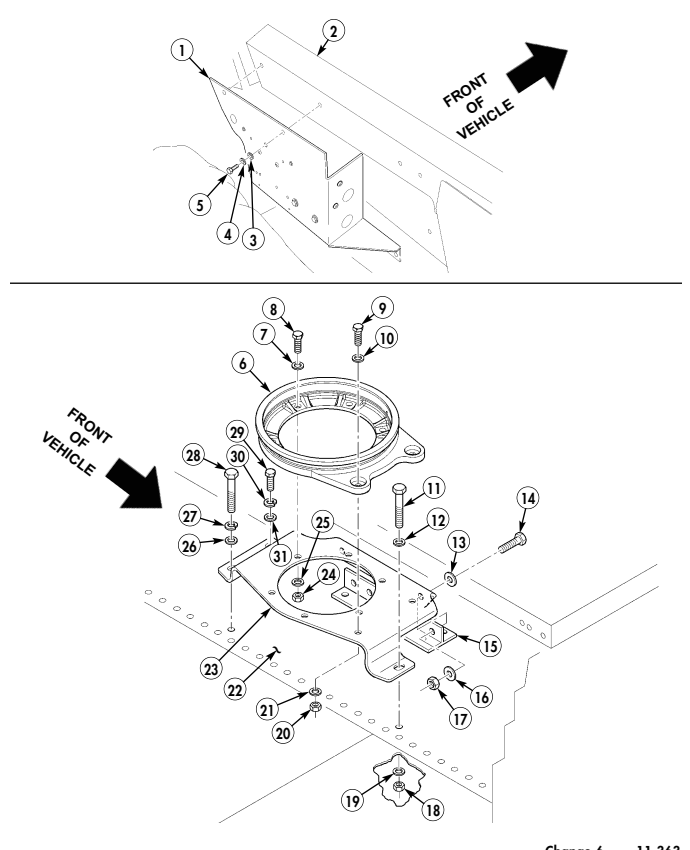

# 11-171. Stowage Pedestal And Traversing Unit (Tu) Mounting Bracket (Tow Itas) Maintenance (Cont'D)

c. Installation

After installation is performed, remove lanyards and lower gunner's platform, place lanyards in the front and rear holes for STOWAGE position.

1. Install TU mounting bracket (23) on vehicle mounting plate (15) with two washers (13),
capscrews (14), washers (16), and locknuts (17).

2. Install TU mounting bracket (23) on tunnel floor (22) with washer (31), lockwasher (30), and capscrew (29). Do not tighten capscrew (29).

3. Secure TU mounting bracket (23) to tunnel floor (22) with washer (26), lockwasher (27), and capscrew (28). Do not tighten capscrew (28).

4. Secure TU mounting bracket (23) to tunnel floor (22) with washer (12), capscrew (11), washer (19),
and locknut (18). Tighten capscrew (11) to 105 lb-ft (142 N•m) and capscrews (28) and (29) to 31 lb-ft (42 N•m).

5. Install stowage pedestal (6) on TU mounting bracket (23) with six washers (7), capscrews (8),
washers (25), and locknuts (24).

6. Secure stowage pedestal (6) to TU mounting bracket (23) with two washers (10), capscrews (9),
washers (21), and locknuts (20).

7. Install terminal access panel (1) on B-pillar bracket (2) with three capscrews (5), lockwashers (4),
and washers (3).

# 11-171. Stowage Pedestal And Traversing Unit (Tu) Mounting Bracket (Tow Itas) Maintenance (Cont'D)

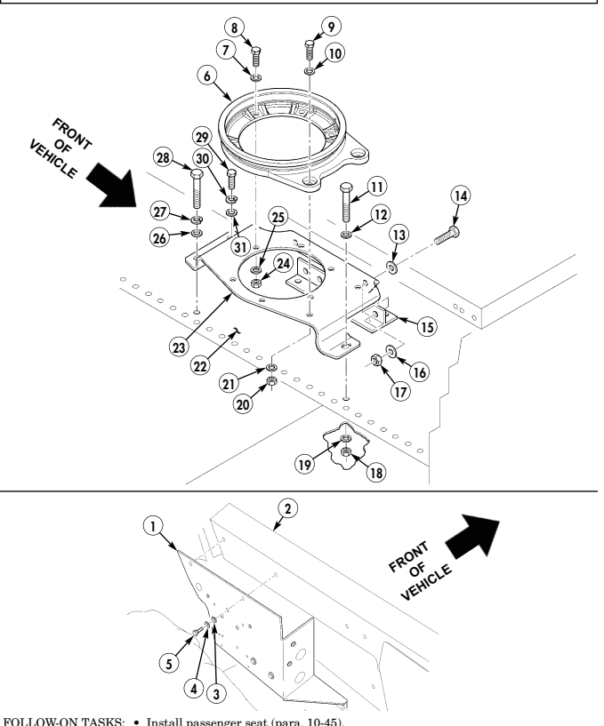

· Install traversing unit (TU) mount adapter (TM 9-1425-450-12, TM 9-1425-472-12).

# 11-172. Gunner'S Platform And Restraint (Tow Itas) Maintenance

This task covers:
b. Inspection

Tools General mechanic's tool kit:
automotive (Appendix B, Item 1)
Torque wrench 3/8-in. drive, 75 lb-ft 
(Appendix B, Item 2.1)
Materials/Parts Thirteen lockwashers (Appendix G, Item 145) Eight locknuts (Appendix G, Item 73.2) Six locknuts (Appendix G, Item 133.8) Six locknuts (Appendix G, Item 133.6)
a. Removal a. Removal c. Installation

| Materials/Parts                            |
|--------------------------------------------|
| Eight lockwashers (Appendix G, Item 158.1) |
| Sealing compound (Appendix G, Item 64)     |
| Manual References                          |
| TM 9\-2320\-387\-24P                       |
| Maintenance Level                          |

Raise gunner's platform and place lanyards in side holes on platform for LOCK position.

1. Remove eight locknuts (6), washers (5), capscrews (3), four straps (2), and footman loops (4) from gunner's platform (1). Discard locknuts (6).

2. Remove four nuts (15), capscrews (8), washers (7), two lanyards (9), and nut slides (16) from gunner's platform (1) and crossbraces (14).

3. Remove two locknuts (10), washers (11), capscrews (13), and gunner's platform (1) from crossbraces (14) and platform brackets (12). Discard locknuts (10).

4. Remove four locknuts (17), washers (18), capscrews (22), washers (21), and inner bracket (20) from crossbraces (14). Discard locknuts (17).

5. Remove two capscrews (32), lockwashers (33), washers (34), and anchor plate (35) from mounting plate (36). Slide crossbraces (29) from channels (35). Discard lockwashers (33).

6. Remove two locknuts (28), washers (27), capscrews (31), washers (30), and crossbraces (29) from anchor plate (23). Discard locknuts (28).

7. Remove three capscrews (24), lockwashers (25), washers (26), and anchor plate (23) from mounting plate (36). Discard lockwashers (25).

8. Remove six capscrews (57), lockwashers (56), washers (55), and mounting plate (36) from vehicle (51).

Discard lockwashers (56).

9. Remove two locknuts (40), capscrews (42), and washers (41) from retractor (39) and mounting plate
(36). Discard locknuts (40).

10. Remove two locknuts (37), washers (38), capscrews (53), washers (54), and retractor (39) from mounting plate (36). Discard locknuts (37).

11. Remove two capscrews (43), lockwashers (44), and washers (45) from evaporator plate (46) and large insulation (49). Discard lockwashers (44).

12. Remove eight capscrews (47), washers (48), and large insulation (49) from vehicle (51). 13. Remove five capscrews (52) and small insulation (50) from vehicle (51).

11-172. GUNNER'S PLATFORM AND RESTRAINT (TOW ITAS) MAINTENANCE (Cont'd)

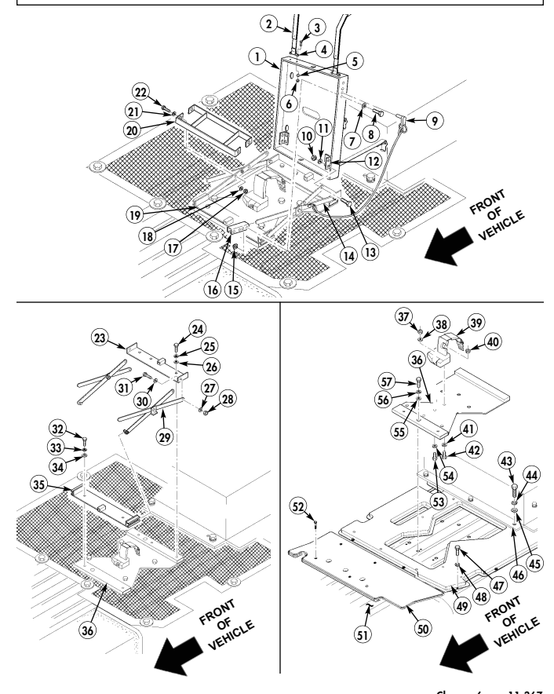

Change 6 11-367
# 11-172. Gunner'S Platform And Restraint (Tow Itas) Maintenance (Cont'D)

b. Inspection 1. Refer to para. 10-56 for nut insert inspection and replacement. 2. Inspect insulation for damage. Replace if necessary.

c. Installation

After installation, lower gunner's platform and place lanyards in the front and rear holes for STOWAGE position.

1. Install small insulation (15) on vehicle (16) with five capscrews (17). 2. Install large insulation (14) on vehicle (16) with eight capscrews (12) and washers (13). 3. Secure large insulation (14) to evaporator plate (11), with two washers (10), lockwashers (9), and capscrews (8).

4. Install retractor (3) on mounting plate (5) with washer (19), capscrew (18), washer (2), and locknut (1).

Tighten capscrew (18) to 70 lb-ft (95 N•m).

5. Secure retractor (3) to mounting plate (5) with washer (6), capscrew (7), and locknut (4). Tighten capscrew (7) to 70 lb-ft (95 N•m).

6. Install mounting plate (5) on vehicle (16) with six washers (20), lockwashers (21), and capscrews (22).

Tighten capscrews (22) to 17 lb-ft (23 N•m).

7. Install anchor plate (23) on mounting plate (5) with three washers (26), lockwashers (25), and capscrews (24). Tighten capscrews (24) to 17 lb-ft (23 N•m).

8. Install crossbraces (31) on anchor plate (23) with two washers (28), capscrews (27), washers (29),
and locknuts (30). Tighten capscrews (27) to 27 lb-ft (37 N•m).

9. Install anchor plate (32) on mounting plate (5) with two washers (33), lockwashers (34), and capscrews (35). Tighten capscrews (35) to 17 lb-ft (23 N•m).

10. Install inner bracket (55) on crossbraces (49) with four washers (56), capscrews (57), washers (53),
and locknuts (52). Tighten capscrews (57) to 14 lb-ft (19 N•m).

11. Install gunner's platform (36) on crossbraces (49) and platform brackets (47) with two capscrews (48),
washers (46), and locknuts (45). Slide two crossbraces (49) into channels (54). Tighten capscrews (48) to 28 lb-ft (38 N•m).

12. Install gunner's platform (36) and two nut slides (51) on crossbraces (49) with four washers (44),
capscrews (43), nuts (50), and two lanyards (42). Tighten capscrews (43) to 14 lb-ft (19 N•m).

13. Install four straps (37) and footman loops (39) on gunner's platform (36) with eight capscrews (38),
washers (40), and locknuts (41).

# 11-172. Gunner'S Platform And Restraint (Tow Itas) Maintenance (Cont'D)

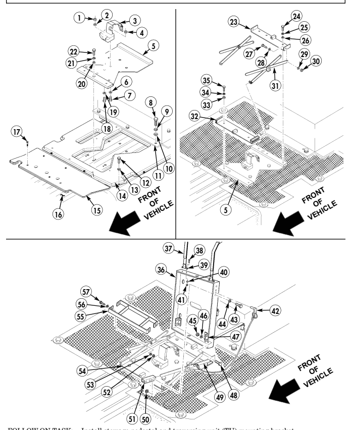

FOLLOW-ON TASK: Install stowage pedestal and traversing unit (TU) mounting bracket 
(TOW ITAS) (para. 11-171).

# 11-173. Wheelhouse Stowage Plate (Tow Itas) Maintenance

This task covers:
b. Inspection

Tools General mechanic's tool kit:
automotive (Appendix B, Item 1)
Torque wrench 3/8-in. drive, 75 lb-ft 
(Appendix B, Item 2.1)
Manual References TM 9-2320-387-10 TM 9-2320-387-24P
a. Removal c. Installation

#### Equipment Condition

- Cargo shell door raised (TM 9-2320-387-10). - Vehicle mounted charger (VMC) removed 
(FM 3-22.32).

Maintenance Level Unit a. Removal Remove six capscrews (2) and stowage plate (1) from wheelhouse (3).

b. Inspection Refer to para. 10-56 for nut insert inspection and replacement.

#### C. Installation

Install stowage plate (1) on wheelhouse (3) with six capscrews (2). Tighten capscrews (2) to 8 lb-ft (11 N•m).

# 11-173. Wheelhouse Stowage Plate (Tow Itas) Maintenance (Cont'D)

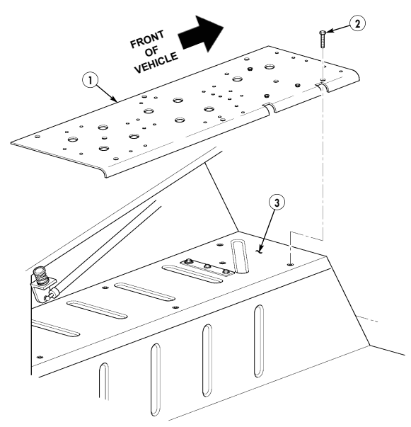

FOLLOW-ON TASKS: - Install vehicle mounted charger (VMC) (FM 3-22.32).

- Lower cargo shell door (TM 9-2320-387-10).

11-174. VEHICLE MOUNTED CHARGER (VMC) WIRING HARNESS (TOW ITAS) 
MAINTENANCE
This task covers:
b. Inspection

Tools General mechanic's tool kit:
automotive (Appendix B, Item 1)
Torque wrench 3/8-in. drive, 75 lb-ft 
(Appendix B, Item 2.1)

#### Materials/Parts

Three lockwashers (Appendix G, Item 146) Three lockwashers (Appendix G, Item 189) Four lockwashers (Appendix G, Item 190.12) Four locknuts (Appendix G, Item 77) Locknut (Appendix G, Item 133.19) Two tie straps (Appendix G, Item 326)
a. Removal c. Installation

#### Manual References

TM 9-2320-387-24P
Equipment Condition
- Battery ground cables disconnected (para. 4-68). - Battery box (TOW ITAS) removed (para. 11-170).

Maintenance Level Unit

#### A. Removal

1. Remove three capscrews (3), lockwashers (4), washers (5), and terminal access panel (2) from B-pillar (1). Discard lockwashers (4).

2. Remove four capscrews (9), lockwashers (8), and washers (7) from connector plate (6) and base plate (12). Discard lockwashers (8).

3. Remove two locknuts (13), capscrews (10), and washers (11) from connector plate (6) and base plate (12). Discard locknuts (13).

4. Remove capscrew (19), washer (20), lead E1 (21), washer (22), and lead E2 (23) from circuit breaker (14).

5. Remove locknut (18) and leads E3 (17) and E4 (16) from ground stud (15). Discard locknut (18).

11-174.  VEHICLE MOUNTED CHARGER (VMC) WIRING HARNESS (TOW ITAS)
 MAINTENANCE (Cont'd)

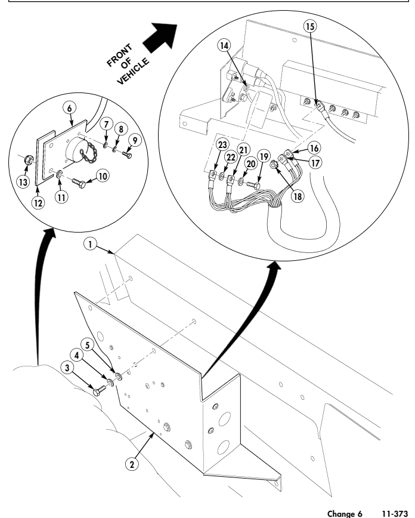

## 11-174. Vehicle Mounted Charger (Vmc) Wiring Harness (Tow Itas) Maintenance (Cont'D)

6. Remove capscrew (2), clamp (4), and VMC harness (3) from clamp (1) on tunnel (5). 7. Remove tie strap (9), two capscrews (6), clamps (8), and VMC harness (3) from two clamps (7) on tunnel (5). Discard tie strap (9).

8. Remove locknut (14), clamp (13), VMC harness (3), and TOW ITAS harness (10) from stud (12) on passenger side of C-partition (11). Discard locknut (14).

9. Remove locknut (15), clamp (16), VMC harness (3), and TOW ITAS harness (10) from stud (17) on driver side of C-partition (18). Discard locknut (15).

10. Remove two capscrews (26) and washers (25) from rear seat brackets (24) and rear seatback (27).

Pull seatback (27) forward.

11. Remove three capscrews (31), lockwashers (30), washers (29), and armor plate (28) from cargo wall (23). Discard lockwashers (30).

12. Loosen two capscrews (19), lockwashers (20), and washers (21) from armor plate (22) and cargo wall (23).

13. Remove tie strap (32) from VMC harness (3) and TOW ITAS harness (10). 14. Pull VMC harness (3) and TOW ITAS harness (10) from rear cargo area (33) into rear passenger seat area (34).

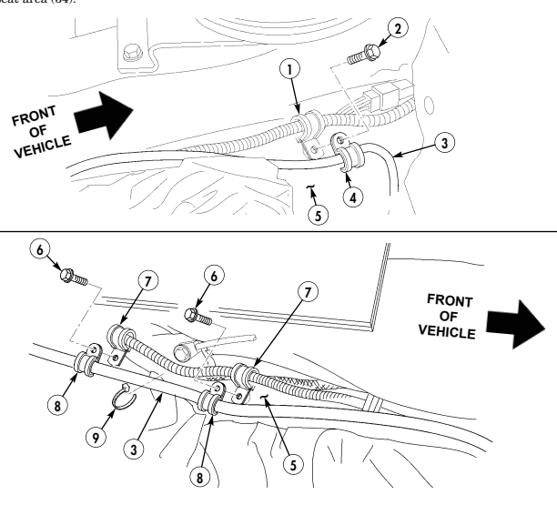

11-174. VEHICLE MOUNTED CHARGER (VMC) WIRING HARNESS (TOW ITAS) 
MAINTENANCE (Cont'd)

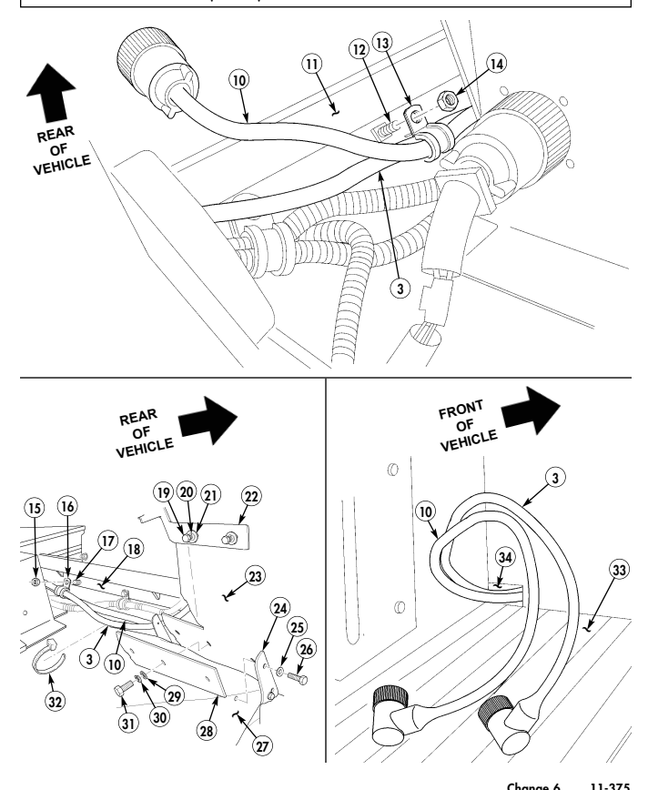

Change 6 11-375

11-174. VEHICLE MOUNTED CHARGER (VMC) WIRING HARNESS (TOW ITAS) 
MAINTENANCE (Cont'd)
b. Inspection Refer to para. 10-56 for nut insert inspection and replacement.

#### C. Installation

1. Push TOW ITAS wiring harness (1) and VMC harness (2) from rear passenger seat area (4) into rear cargo area (3).

2. Install tie strap (22) on TOW ITAS harness (1) and VMC harness (2). 3. Secure armor plate (12) on cargo wall (13) with two capscrews (9), lockwashers (10), and washers (11).

4. Install armor plate (18) on cargo wall (13) with three capscrews (21), lockwashers (18), and washers (19).

5. Install seatback (17) on two rear seat brackets (14) with two capscrews (16) and washers (15). 6. Install wiring TOW ITAS harness (1) and VMC harness (2) on stud (7) on driver side of C-partition (8) with clamp (6) and locknut (5).

7. Install wiring TOW ITAS harness (1) and VMC harness (2) on stud (24) on passenger side of C-partition (23) with clamp (25) and locknut (26).

8. Install VMC wiring harness (2) on two clamps (28) on tunnel (29) with two capscrews (27),
clamps (30), and tie strap (31). Tighten capscrews (27) to 31 lb-ft (42 N•m).

9. Install VMC wiring harness (2) and clamp (34) on tunnel (29) with capscrew (33) and clamp (34).

Tighten capscrews (33) to 31 lb-ft (42 N•m).

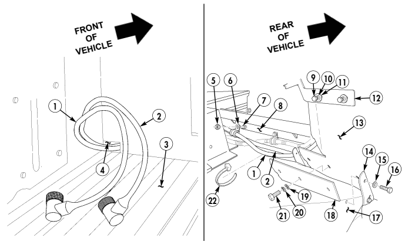

11-174. VEHICLE MOUNTED CHARGER (VMC) WIRING HARNESS (TOW ITAS) 
MAINTENANCE (Cont'd)

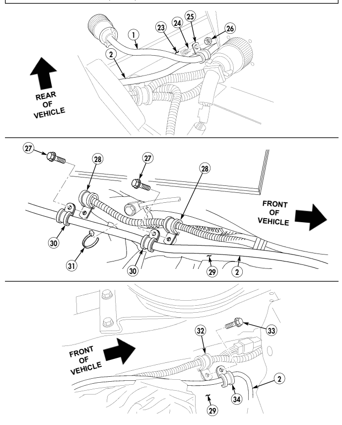

## 11-174. Vehicle Mounted Charger (Vmc) Wiring Harness (Tow Itas) Maintenance (Cont'D)

10. Install leads E3 (17) and E4 (16) on ground stud (15) with locknut (18). 11. Install lead E2 (23), washer (22), lead E1 (21), and washer (20) on circuit breaker (14) with capscrew (19).

12. Install leads E1 (21) and E2 (23) on circuit breaker (14) with capscrew (19) and washers (20) and (22). 13. Install connector plate (6) on base plate (12) with four washers (7), lockwashers (8), and capscrews (9).

14. Secure connector plate (6) to base plate (12) with two washers (11), capscrews (10), and locknuts (13).

Tighten capscrews (10) to 12 lb-ft (16 N•m).

15. Install terminal access panel (2) on B-pillar (1) with three washers (5), lockwashers (4), and capscrews (3).

11-174.  VEHICLE MOUNTED CHARGER (VMC) WIRING HARNESS (TOW ITAS)
MAINTENANCE (Cont'd)

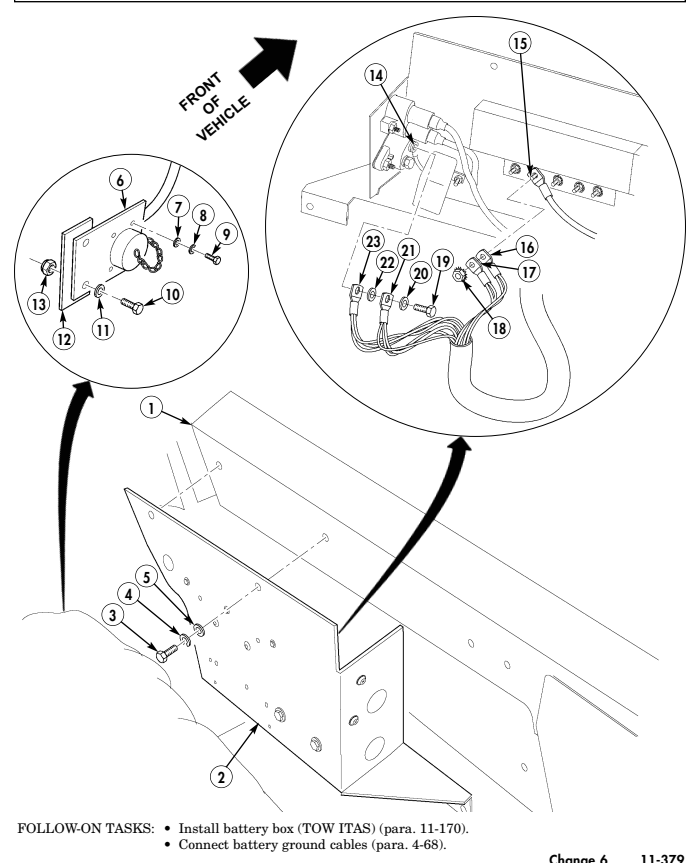

# 11-175. Mount Pedestal (Tow Itas) Replacement

This task covers:
a. Removal b. Installation

| Applicable Models                      | Manual References                                   |
|----------------------------------------|-----------------------------------------------------|
| M1114                                  | TM 9\-2320\-387\-24P                                |
| Tools                                  | Equipment Condition                                 |
| General mechanic's tool kit:           | Right front cowl insulation removed (para. 10\-32). |
| automotive (Appendix B, Item 1)        | General Safety Instructions                         |
| Maintenance and repair shop equipment: |                                                     |
| automotive (Appendix B, Item 2)        | Ensure underbody wheelwell IED overlay (Frag 2)     |
|                                        | is supported during removal and installation.       |
| Materials/Parts                        |                                                     |

#### A. Removal

1. Remove two capscrews (1) and two-piece lockwashers (6) from mount pedestal (4) and mount pedestal spacer plate (5). Discard two-piece lockwashers (6).

2. Remove six capscrews (2), two-piece lockwashers (3), and mount pedestal (4) from mount pedestal spacer plate (5). Discard two-piece lockwashers (3).

#### B. Installation

1. Install mount pedestal (4) on mount pedestal spacer plate (5) with six two-piece lockwashers (3) and capscrews (2).

2. Secure mount pedestal (4) to mount pedestal spacer plate (5) with two two-piece lockwashers (6)
and capscrews (1).

3. Tighten capscrews (2) to 31 lb-ft (42 N•m). 4. Tighten capscrews (1) to 31 lb-ft (42 N•m).

# 11-175. Mount Pedestal (Tow Itas) Replacement (Cont'D)

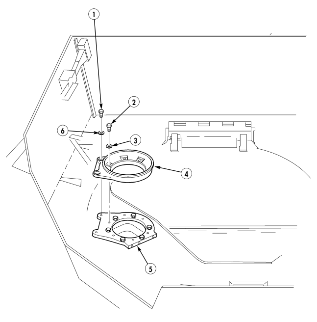

FOLLOW-ON TASK:  Install mount pedestal cover (TOW ITAS) (para 11-176).

# 11-176. Mount Pedestal Cover (Tow Itas) Replacement

This task covers:
a. Removal b. Installation

| INITIAL SETUP:                           |                      |
|------------------------------------------|----------------------|
| Tools                                    | Manual References    |
| General mechanic's tool kit:             | TM 9\-2320\-387\-24P |
| automotive (Appendix B, Item 1)          | Maintenance Level    |
| Materials/Parts                          | Unit                 |
| Three lockwashers (Appendix G, Item 146) |                      |
| Two locknuts (Appendix G, Item 77)       |                      |

Locknut (Appendix G, Item 101.3) Two locknuts (Appendix G, Item 73.3)

#### A. Removal

1. Remove three capscrews (11), lockwashers (12), washers (13), and angle bracket (8) from mount pedestal (14). Discard lockwashers (11).

2. Remove two locknuts (6), washers (7), capscrews (2), washers (3), and pedestal cover (1) from angle bracket (8). Discard locknuts (6).

3. Remove two locknuts (21), washers (20), capscrews (19), and footman loop (18) from pedestal cover (1).

Discard locknuts (21).

4. Remove quick release pin (5) from angle bracket (8). 5. Remove locknut (10), washer (9), capscrew (17), washer (16), and lanyard (15) from angle bracket (8).

Discard locknut (10).

6. Remove cushioning pad (4) from angle bracket (8).

#### B. Installation

1. Install cushioning pad (4) on angle bracket (8). 2. Install lanyard (15) on angle bracket (8) with washer (16), capscrew (17), washer (9), and locknut (10).

3. Install quick release pin (5) on angle bracket (8). 4. Install footman loop (18) on pedestal cover (1) with two capscrews (19), washers (20), and locknuts (21).

5. Install pedestal cover (1) on angle bracket (8) with two washers (3), capscrews (2), washers (7), and locknuts (6).

6. Install angle bracket (8) on mount pedestal (14) with three washers (13), lockwashers (12), and capscrews (11).

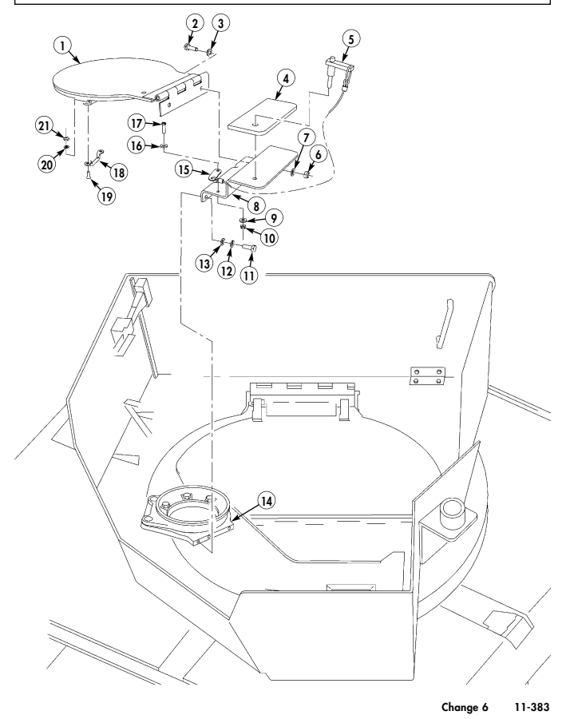

11-176. MOUNT PEDESTAL COVER (TOW ITAS) REPLACEMENT (Cont'd)
11-177. MOUNT PEDESTAL ADAPTER SPACER PLATE (TOW ITAS) 

# Replacement

This task covers:
a. Removal b. Installation

| Tools                        |                                         | Manual References                              |
|------------------------------|-----------------------------------------|------------------------------------------------|
| General mechanic's tool kit: |                                         | TM 9\-2320\-387\-10                            |
|                              | automotive (Appendix B, Item 1)         | TM 9\-2320\-387\-24P                           |
|                              | Torque wrench 3/8\-in. drive, 75 lb\-ft | Equipment Condition                            |
|                              | (Appendix B, Item 2.1)                  | Cargo shell door raised (TM 9\-2320\-387\-10). |
| Materials/Parts              |                                         | Maintenance Level                              |
|                              | Four locknuts (Appendix G, Item 77)     |                                                |
|                              |                                         | Unit                                           |
| a. Removal                   |                                         |                                                |

#### A. Removal

1. Remove five locknuts (7), washers (6), capscrews (3), and washers (4) from spacer plate (5). Discard locknuts. (7).

2. Remove capscrew (1), two-piece lockwasher (2), latch (9), spacer (10), and spacer plate (5) from turret (8). Discard two-piece lockwasher (2).

#### B. Installation

4. Tighten capscrew (1) to 35 lb-ft (47 N•m).

1. Install spacer plate (5) on turret (8) with two-piece lockwasher (2), capscrew (1), spacer (10), and latch (9).

2. Secure spacer plate (5) to turret (8) with five washers (4), capscrews (3), washers (6), and locknuts (7). 3. Tighten capscrews (3) to 49 lb-ft (66 N•m).

# 11-177.  Mount Pedestal Adapter Spacer Plate (Tow Itas) Replacement (Cont'D)

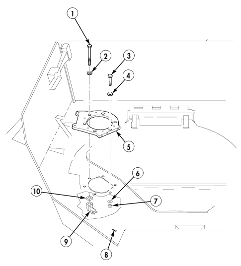

FOLLOW-ON TASK:  Install mount pedestal (TOW ITAS) (para. 11-175).

# 11-178. Tripod Stowage Plate (Tow Itas) Replacement

This task covers:
a. Removal b. Installation

| INITIAL SETUP:                          |                      |
|-----------------------------------------|----------------------|
| Tools                                   | Manual References    |
| General mechanic's tool kit:            | TM 9\-2320\-387\-24P |
| automotive (Appendix B, Item 1)         | Maintenance Level    |
| Torque wrench 3/8\-in. drive, 75 lb\-ft |                      |
| (Appendix B, Item 2.1)                  | Unit                 |
| Materials/Parts                         |                      |
| Six lockwashers (Appendix G, Item 146)  |                      |

#### A. Removal

1. Remove eight locknuts (9), four footman loops (10), eight capscrews (12), and washers (11) from stowage plate (5). Discard locknuts (9).

2. Remove eight locknuts (2), washers (1), capscrews (13), washers (14), and stowage plate (5) from tailgate (3). Discard locknuts (2).

3. Remove ten locknuts (6), washers (7), five straps (8), capscrews (16), washers (15), and two hinges (4) from stowage plate (5). Discard locknuts (6).

#### B. Installation

1. Install two hinges (4) and five straps (8) on tailgate (5) with ten washers (15), capscrews (16),
washers (7), and locknuts (6). Tighten capscrews (16) to 12 lb-ft (16 N•m).

2. Install stowage plate (5) on tailgate (3) with eight washers (14), capscrews (13), washers (1), and locknuts (2). Tighten capscrews (13) to 12 lb-ft (16 N•m).

3. Install four footman loops (10) on stowage plate (5) with eight washers (11), capscrews (12), and locknuts (9). Tighten capscrews (12) to 12 lb-ft (16 N•m).

11-178. TRIPOD STOWAGE PLATE (TOW ITAS) REPLACEMENT (Cont'd)

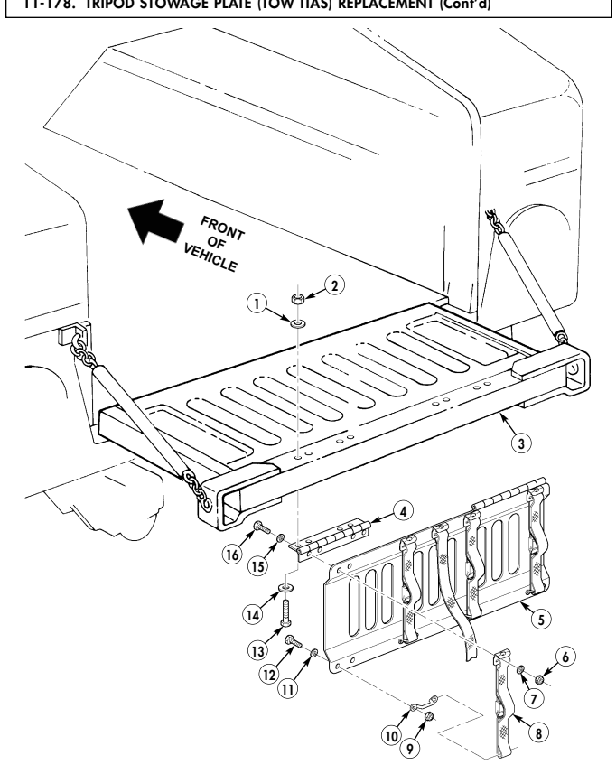

FOLLOW-ON TASK:  Close cargo shell door (TM 9-2320-387-10).

# 11-179. Fire Control System (Fcs) Tray (Tow Itas) Replacement

This task covers:
a. Removal b. Installation

| INITIAL SETUP:                          |                      |
|-----------------------------------------|----------------------|
| Tools                                   | Manual References    |
| General mechanic's tool kit:            | TM 9\-2320\-387\-24P |
| automotive (Appendix B, Item 1)         | Maintenance Level    |
| Torque wrench 3/8\-in. drive, 75 lb\-ft | Unit                 |
| (Appendix B, Item 2.1)                  |                      |
| Materials/Parts                         |                      |

#### A. Removal

1. Remove capscrew (2), lockwasher (3), and washer (4) from FCS tray (1) and pintle (11). Discard lockwasher (3).

2. Remove locknut (12), washer (13), capscrew (5), and washer (6) from FCS tray (1) and pintle (11).

Discard locknut (12).

3. Remove two capscrews (7), lockwashers (8), washers (9), and FCS tray (1) from pintle (11) and recessed pillars (10). Discard lockwashers (8).

#### B. Installation

1. Install FCS tray (1) on recessed pillars (10) and pintle (11) with two washers (9), lockwashers (8),
and capscrews (7).

2. Secure FCS tray (1) to pintle (11) with washer (6), capscrew (5), washer (13), and locknut (12). 3. Secure FCS tray (1) to pintle (11) with washer (4), lockwasher (3), and capscrew (2). 4. Tighten capscrews (2) and (7) to 35 lb-ft (47 N•m). 5. Tighten capscrews (5) to 49 lb-ft (66 N•m).

# 11-179. Fire Control System (Fcs) Tray (Tow Itas) Replacement (Cont'D)

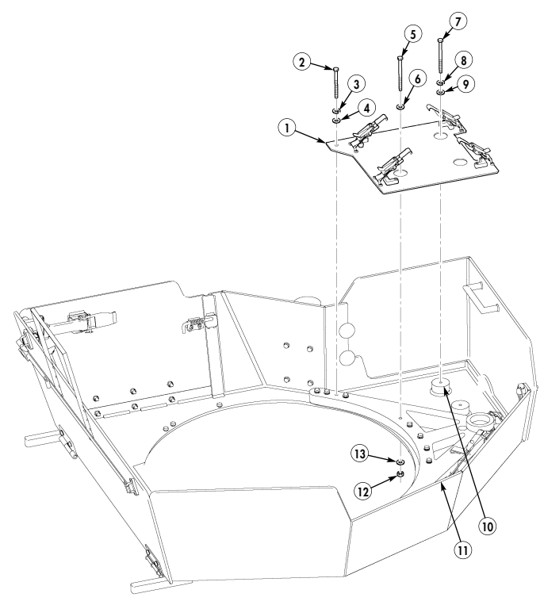

# 11-180. Fire Control System (Fcs) Tray Latches (Tow Itas) Replacement

This task covers:

| INITIAL SETUP:                          |                                     |
|-----------------------------------------|-------------------------------------|
| Tools                                   | Manual References                   |
| General mechanic's tool kit:            | TM 9\-2320\-387\-24P                |
| automotive (Appendix B, Item 1)         | Equipment Condition                 |
| Torque wrench 3/8\-in. drive, 75 lb\-ft | Mounting bracket (TOW ITAS) removed |
| (Appendix B, Item 2.1)                  |                                     |
| Materials/Parts                         | (para. 11\-168).                    |
|                                         | Maintenance Level                   |

a. Removal b. Installation a. Removal 1. Remove two locknuts (9), washers (10), capscrews (12), footman loop (11), and latch (13) from FCS tray assembly (1). Discard locknuts (9).

2. Remove footman loop (11) from latch (13).

Removal procedures for the locators are basically the same. Step 3 covers the locator with lanyard bracket configuration.

3. Remove two locknuts (8), washers (7), lanyard bracket (6), capscrews (3), washers (4), and locator (5)
from FCS tray (1). Discard locknuts (8).

4. Remove quick release pin (2) from FCS tray (1).

#### B. Installation

1. Install quick release pin (2) on FCS tray (1).

Removal procedures for the locators are basically the same. Step 3 covers the locator with lanyard bracket configuration 2. Install locator (5) on FCS tray (1) with two washers (4), capscrews (3), lanyard bracket (6), two washers (7), and locknuts (8).

3. Install footman loop (11) in latch (13). 4. Install footman loop (11) and latch (13) on FCS tray (1) with two capscrews (12), washers (10), and locknuts (9).

# 11-180.  Fire Control System (Fcs) Tray Latches (Tow Itas) Replacement (Cont'D)

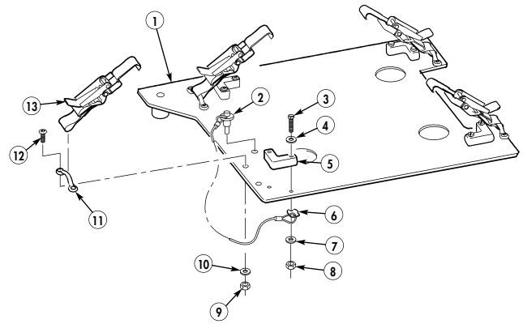

FOLLOW-ON TASK:  Install fire control system (FCS) tray (TOW ITAS) (para. 11-179).

# 11-181. Missile Guidance Rack (Tow Itas) Replacement

This task covers:
c. Webbing Straps Disassembly h. Webbing Straps Assembly d. Upper Support Disassembly i. Base Frame Assembly

Tools General mechanic's tool kit:
automotive (Appendix B, Item 1)
Torque wrench, 3/8-in. drive 75 lb-ft.

(Appendix B, Item 2.1)
Torque wrench, 1/2-in. drive 250 lb-ft.

(Appendix B, Item 2.1)

#### Materials/Parts

Three locknuts (Appendix G, Item 77) Twelve cotter pins (Appendix G, Item 16) Adhesive (Appendix C, Item 2) Eleven locknuts (Appendix G, Item 106) Six lockwashers (Appendix G, Item 174) Four rivets (Appendix G, Item 260) Two rivets (Appendix G, Item 271.5)

#### A. Missile Rack Removal

a. Missile Rack Removal f. Lower Support Assembly b. Base Frame Disassembly g. Upper Support Assembly e. Lower Support Disassembly j. Missile Rack Installation

#### Personnel Required

One mechanic One assistant Manual References TM 9-2320-387-10 TM 9-2320-387-24P
Equipment Condition Cargo shell door raised (TM 9-2320-387-10).

Maintenance Level Unit 1. Unlatch ten quick release locks (10) and remove upper missile rack (1) from base frame (11). 2. Remove three locknuts (6), washers (7), capscrews (9), and washers (8) from vehicle (5) and base frame (11). Discard locknuts (6).

3. Remove six capscrews (2), lockwashers (3), washers (4), and base frame (11) from vehicle (5).

Discard lockwashers (3).

# 11-181. Missile Guidance Rack (Tow Itas) Replacement (Cont'D)

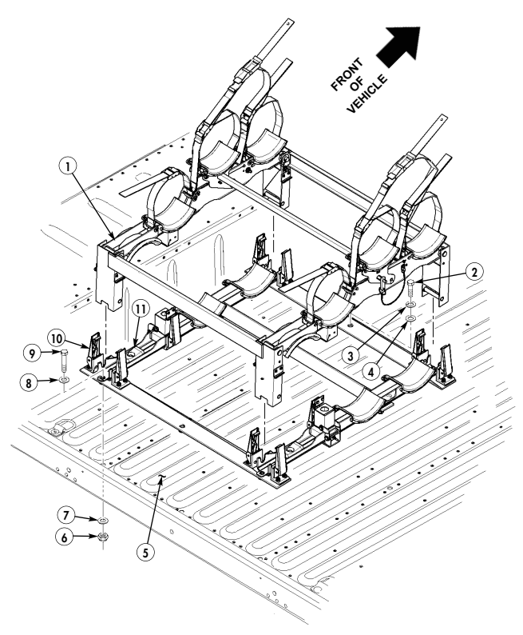

## 11-181. Tow Itas Missile Guidance Rack Replacement (Cont'D)

#### B. Base Frame Disassembly

1. Remove two locknuts (8), washers (9), capscrews (3), and quick release lock (7) from angle bracket (4). Discard locknuts (8).

2. Remove two locknuts (5), washers (6), capscrews (10), and angle bracket (4) from base frame (2).

Discard locknuts (5).

3. Remove two cotter pins (11), washers (12), pillar hinge (13), straight pins (17), washers (16), pillar hinge (15), and pillar support (14) from U-bracket (20) and base frame (2). Discard cotter pins (11).

4. Remove two locknuts (18), washers (19), capscrews (1), washers (22), quick release lock (21), and U-bracket (20) from base frame (2). Discard locknuts (18).

5. Remove locknut (23), washer (24), capscrew (27), washer (26), and bumper (25) from base frame (2).

Discard locknut (23).

# 11-181. Tow Itas Missile Guidance Rack Replacement (Cont'D)

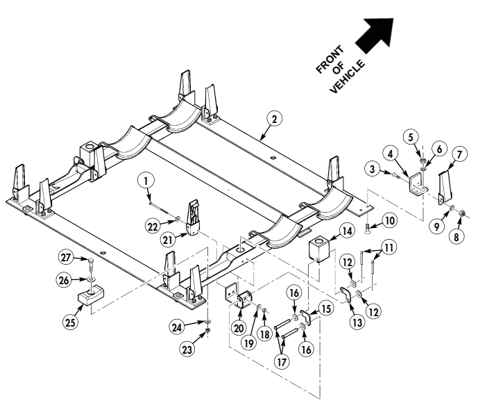

# 11-181. Tow Itas Missile Guidance Rack Replacement (Cont'D)

c. Webbing Straps Disassembly

Strap removal is the basically the same for right and left side. This procedure covers the right side removal.

1. Remove cotter pin (8), washer (7), straight pin (6), and large strap (1) from upper missile rack (9).

Discard cotter pin (8).

2. Remove three cotter pins (5), washers (4), straight pins (3), and small straps (2) from upper

missile rack (9). Discard cotter pins (5).

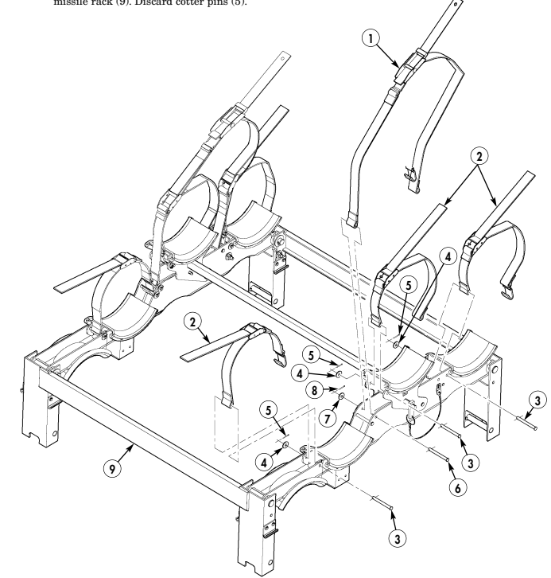

11-396 Change 6

# 11-181. Tow Itas Missile Guidance Rack Replacement (Cont'D)

d. Upper Support Disassembly 1. Remove two quick release pins (15) from upper support (10). 2. Remove two cotter pins (11), washers (12), straight pins (13), and upper support (10) from lower support (14). Discard cotter pins (11).

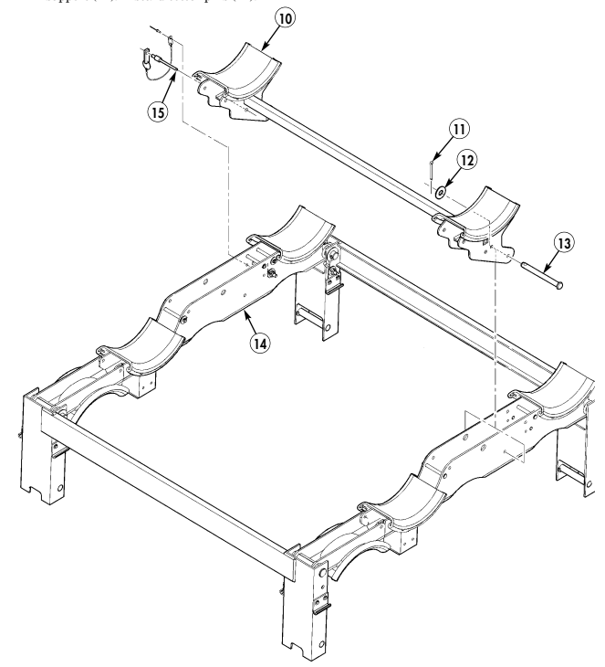

# 11-181. Tow Itas Missile Guidance Rack Replacement (Cont'D)

#### E. Lower Support Disassembly

1. Remove four cotter pins (7), washers (8), straight pins (9), and two lower support arms (1) from supports (6). Discard cotter pins (7).

2. Remove two locknuts (17), washers (16), capscrews (10), washers (11), bumper (12), and spacer (15)
from lower support arms (1). Discard locknuts (17).

3. Remove two locknuts (5), washers (4), lanyards (3), washers (2), capscrews (20), and washers (21)
from lower support arms (1). Discard locknuts (5).

4. Remove two rivets (19) and lanyard assemblies (18) from lower support arms (1).

Discard rivets (19).

5. Remove four rivets (13) and two latches (14) from lower support arms (1). Discard rivets (13).

#### F. Lower Support Assembly

1. Install two latches (14) on lower support arms (1) with four rivets (13). 2. Install two lanyard assemblies (18) on lower support arms (1) with rivets (19). 3. Install two lanyards (3) on lower support arms (1) with four washers (21), capscrews (20),
washers (2), washers (4), and locknuts (5).

4. Install two spacers (15) and bumpers (12) on lower support arms (1) with washer (11),
capscrew (10), washers (16), and locknuts (17).

5. Install lower support arms (1) on supports (6) with four straight pins (9), washers (8), and cotter pins (7).

# 11-181. Tow Itas Missile Guidance Rack Replacement (Cont'D)

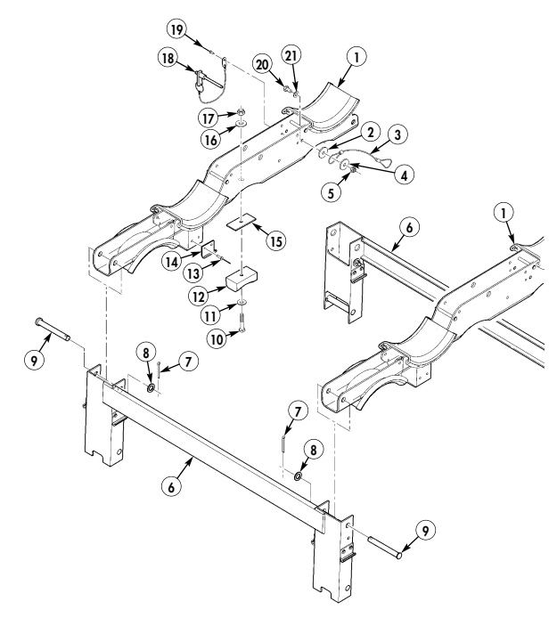

# 11-181. Tow Itas Missile Guidance Rack Replacement (Cont'D)

g. Upper Support Assembly 1. Install upper support (1) on lower support (5) with two straight pins (4), washers (3), and cotter pins (2).

2. Secure upper support (1) to lower support (5) with quick release pin (6),
h. Webbing Straps Assembly 1. Install three small straps (8) on upper missile rack (15) with straight pins (9), washers (10), and cotter pins (11).

2. Install large strap (7) on upper missile rack (15) with straight pin (12), washer (13), and cotter pin (14).

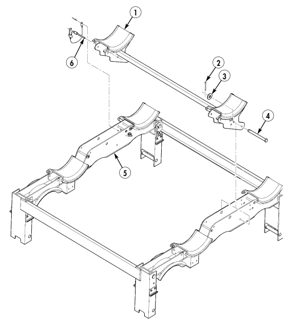

# 11-181. Tow Itas Missile Guidance Rack Replacement (Cont'D)

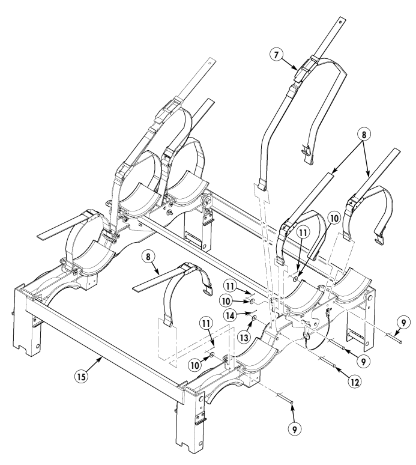

# 11-181. Tow Itas Missile Guidance Rack Replacement (Cont'D)

#### I. Base Frame Assembly

1. Install bumper (25) on base frame (2) with washer (26), capscrew (27), washer (24), and locknut (23).

2. Install U-bracket (20) on base frame (2) with clamping catch (21), washer (22), capscrew (1),
washer (19), and locknut (18).

3. Install pillar support (14) on base frame (2) and U-bracket (20) with two pillar hinges (15) and (13),
four washers (16) and (12), straight pins (17), and cotter pins (11).

4. Install angle bracket (4) on base frame (2) with two capscrews (10), washers (6), and locknuts (5). 5. Install quick release lock (7) on angle bracket (4) with two capscrews (3), washers (9), and locknuts (8).

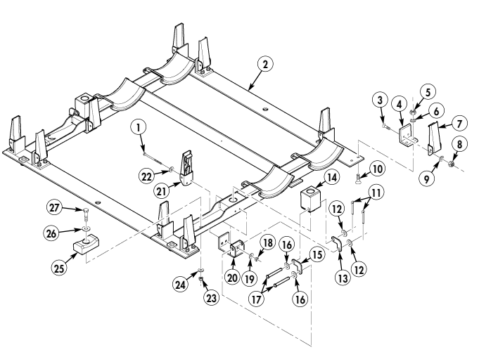

# 11-181. Tow Itas Missile Guidance Rack Replacement (Cont'D)

#### J. Missile Rack Installation

1. Install base frame (11) on vehicle (5) with six washers (4), lockwashers (3), and capscrews (2). 2. Secure base frame (11) to vehicle (5) with three washers (8), capscrews (9), washers (7), and locknuts (6).

3. Install upper missile rack (1) on base frame (11) with ten quick release locks (10). 4. Tighten capscrews (2) to 75 lb-ft (102 N•m). 5. Tighten capscrews (9) to 105 lb-ft (142 N•m).

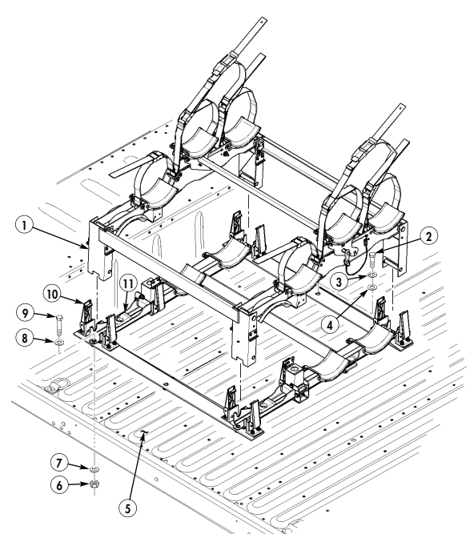

FOLLOW-ON TASK: Close cargo shell door (TM 9-2320-387-10).

# 11-182. Traversing Unit Mount Adapter Replacement

This task covers:

Tools General mechanic's tool kit:
automotive (Appendix B, Item 1)
Torque wrench 3/8-in. drive, 75 lb-ft 
(Appendix B, Item 2.1)
Materials/Parts Twelve locknuts (Appendix G, Item 77)
a. Removal b. Installation

| Manual References    |
|----------------------|
| TM 9\-2320\-387\-10  |
| TM 9\-2320\-387\-24P |

- Upper coupling clamp and lower coupling clamp procedures are basically the same. This procedure covers the upper coupling clamp.

- Note position of coupling clamp for installation.

a. Removal Remove twelve locknuts (2), washers (3), capscrews (7), washers (6), six retainers (5), and coupling clamp (1) from traversing unit mount adapter (4). Discard locknuts (2).

#### B. Installation

Install coupling clamp (1) on traversing unit mount adapter (4) with six retainers (5), twelve washers (6), capscrews (7), washers (3), and locknuts (2). Tighten locknuts (2) to 6 lb-ft (8 N•m).

# 11-182. Traversing Unit Mount Adapter Replacement (Cont'D)

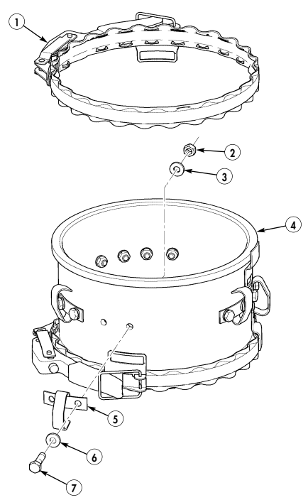

# 11-183. Turret Pintle (Tow Itas) Maintenance

This task covers:
b. Disassembly d. Installation

Tools General mechanic's tool kit:
automotive (Appendix B, Item 1)
Torque wrench, 3/8-in. drive, 75 lb-ft.

(Appendix B, Item 2.1)
Materials/Parts Five lockwashers (Appendix G, Item 144) Six locknuts (Appendix G, Item 133.21) Six lockwashers (Appendix G, Item 140)
a. Removal a. Removal c. Assembly

| Personnel Required   |
|----------------------|
| One mechanic         |
| One assistant        |
| Manual References    |
| TM 9\-2320\-387\-24P |
| TM 9\-1425\-450\-12  |
| TM 9\-1475\-472\-12  |

There are two different sized capscrews. Mark capscrews for installation.

1. Remove five capscrews (2), lockwashers (3), and washers (4) from pintle (1). Discard lockwashers (3). 2. Remove six locknuts (15), washers (16), capscrews (5), washers (6), and pintle (1) from T-GPK (14).

Discard locknuts (15).

#### B. Disassembly

1. Remove capscrew (12), lockwasher (13), and lock pin (11) from pintle (1). Discard lockwasher (13). 2. Remove five capscrews (10), lockwashers (9), washers (8), and cover (7) from pintle (1).

Discard lockwashers (9).

#### C. Assembly

1. Install cover (7) on pintle (1) with five washers (8), lockwashers (9), and capscrews (10). 2. Install lockpin (11) on pintle (1) with lockwasher (13) and capscrew (12).

#### D. Installation

1. Install pintle (1) on T-GPK (14) with six washers (6), capscrews (5), washers (16), and locknuts (15). 2. Secure pintle (1) to T-GPK (14) with five washers (4), lockwashers (3), and capscrews (2). 3. Tighten capscrews (5) to 49 lb-ft (66 N•m). 4. Tighten capscrews (2) to 35 lb-ft (47 N•m).

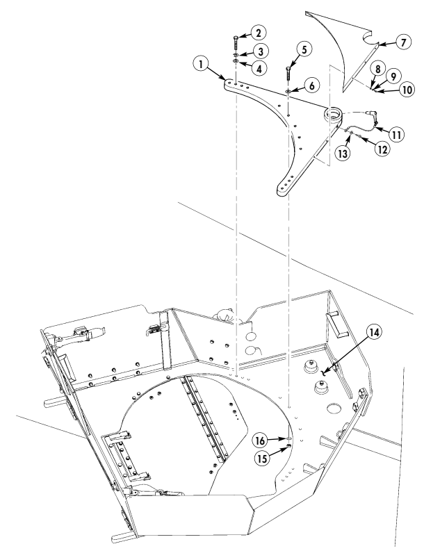

# 11-183.  Turret Pintle (Tow Itas) Maintenance (Cont'D)

FOLLOW-ON TASKS:  •  Install FCS tray (para. 11-179).

- Close and secure turret hatch (TM 9-2320-387-10).

# 11-184. Turret Door/Hatch (Tow Itas) Maintenance

This task covers:

b. Disassembly d. Installation

| INITIAL SETUP:                          |                      |
|-----------------------------------------|----------------------|
| Tools                                   | Manual References    |
| General mechanic's tool kit:            | TM 9\-2320\-387\-24P |
| automotive (Appendix B, Item 1)         | Equipment Condition  |
| Torque wrench 3/8\-in. drive, 75 lb\-ft |                      |

Thirty-three foam washers 
(Appendix G, Item 35.3)
Eight locknuts (Appendix G, Item 133.25) Five locknuts (Appendix G, Item 106) Two locknuts (Appendix G, Item 73.1)

#### A. Removal

Remove five capscrews (20), small washers (21), large washers (22), small washers (23), and turret hatch/door (36) from turret armor (24).

#### B. Disassembly

1. Remove eight locknuts (40), washers (41), capscrews (4), washers (3), foam washers (2), and top cover (1) from turret hatch/door (36). Discard locknuts (40) and foam washers (2).

2. Remove eight locknuts (30), washers (29), capscrews (10), washers (9), foam washers (8), and hinge (7) from turret hatch/door (36). Discard locknuts (30) and foam washers (8).

3. Remove six locknuts (39), washers (38), foam washers (37), capscrews (35), and three bow handles (34) from turret hatch/door (36). Discard locknuts (39) and foam washers (37).

4. Remove four locknuts (26), washers (25), capscrews (18), washers (17), foam washers (16), and two latch assemblies (19) from bracket (11) and turret hatch/door (36). Discard locknuts (26) and foam washers (16).

5. Remove five locknuts (28), washers (27), capscrews (15), washers (14), foam washers (13),
bracket (12), and door hinge (11) from turret hatch/door (36). Discard foam washers (13).

6. Remove two locknuts (33), washers (32), foam washers (31), capscrews (6), and bumper (5) from cover (1). Discard locknuts (33).

#### C. Assembly

1. Install bumper (5) on cover (1) with two capscrews (6), foam washers (31), washer (32), and locknuts (33).

2. Install turret hatch/door (36) on hinge (11) with bracket (12), five foam washers (13), washers (14),
capscrews (15), washers (27), and locknuts (28).

3. Install two latch assemblies (19) on turret hatch/door (36) and bracket (12) with four foam washers (16), washers (17), capscrews (18), washers (25), and locknuts (26).

4. Install two bow handles (34) on turret/hatch (36) with four foam washers (37), washers (38),
capscrews (35), and locknuts (39).

a. Removal c. Assembly

## 11-184. Turret Door/Hatch (Tow Itas) Maintenance (Cont'D)

5. Install hinge (7) on turret/hatch door (36) with eight foam washers (8), washers (9), capscrews (10),
washers (29), and locknuts (30).

6. Install top cover (1) on turret hatch/door (36) with eight foam washers (2), washers (3),
capscrews (4), washers (41), and locknuts (40).

#### D. Installation

Install turret/hatch door (36) on turret armor (24) with five small washers (23), large washers (22), washers (21), and capscrews (20). Tighten capscrews (20) to 35 lb-ft (47 N•m).

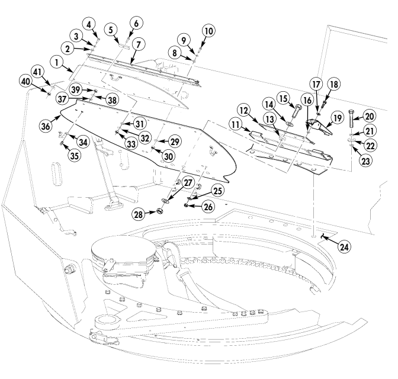

# 11-184.1. Cargo Door Strap (Tow Itas) Replacement

This task covers:
a. Removal b. Installation

| Tools                                     | Manual References                       |
|-------------------------------------------|-----------------------------------------|
| General mechanic's tool kit:              | TM 9\-2320\-387\-24P                    |
| automotive (Appendix B, Item 1)           | Equipment Condition                     |
| Torque wrench, 3/8\-in. drive, 75 lb\-ft. | Mount pedestal cover (TOW ITAS) removed |
| (Appendix B, Item 2.1)                    | (para. 11\-176).                        |
| Materials/Parts                           |                                         |
|                                           | Maintenance Level                       |
| Eight two\-piece lockwashers              |                                         |
| (Appendix G, Item 191)                    | Unit                                    |

#### A. Removal

1. Remove door strap (7) from footman loop (5). 2. Remove two locknuts (6), footman loop (5), bracket (4), capscrews (2), and washers (3) from cargo door (1). Discard locknuts (6).

3. Remove two nuts (14), lockwashers (13), washers (12), quick release pin (15), two capscrews (9), and footman loop (10) from bracket (11). Discard lockwashers (13).

4. Remove locknut (16), washer (17), capscrew (8), and brackets (11) and (18) from cargo door (1).

Discard locknut (16).

#### B. Installation

1. Install brackets (18) and (11) on cargo door (1) with capscrew (8), washer (17), and locknut (16). 2. Install quick release pin (15) on bracket (11) with footman loop (10), two capscrews (9),
washers (12), lockwashers (13), and nuts (14).

3. Install bracket (4) on cargo door (1) with two washers (3), capscrews (2), footman loop (5), and locknuts (6).

4. Install door strap (7) on footman loop (5).

11-184.1. CARGO DOOR STRAP (TOW ITAS) REPLACEMENT (Cont'd)

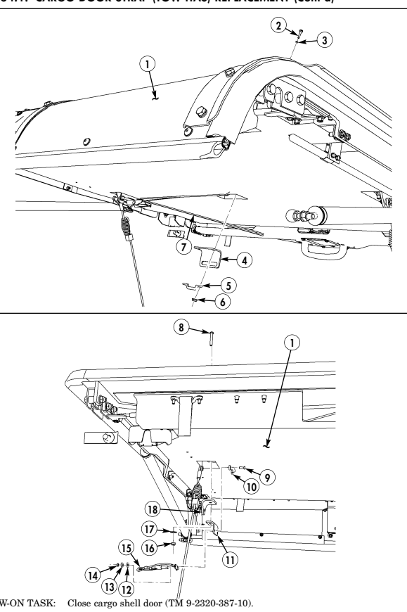

FOLLOW-ON TASK:
# 11-184.2. Elevation And Depression Stop Assembly Replacement

This task covers:
a. Removal b. Installation

| INITIAL SETUP:                           |                      |
|------------------------------------------|----------------------|
| Tools                                    | Manual References    |
| General mechanic's tool kit:             | TM 9\-2320\-387\-24P |
| automotive (Appendix B, Item 1)          | Maintenance Level    |
| Materials/Parts                          | Unit                 |
| Three lockwashers (Appendix G, Item 146) |                      |
| Two locknuts (Appendix G, Item 77)       |                      |
| Locknut (Appendix G, Item 101.3)         |                      |
| Two locknuts (Appendix G, Item 73.3)     |                      |

#### Warning

Note position of elevation and depression downward stop and upward stop for assembly. Injury to personnel or damage to equipment may result if stops are not properly assembled.

#### A. Removal

1. Remove retaining ring (3), clevis pin (15), cable end of pin assembly (14), and return spring (1) from upward stop strap (4). Discard retaining ring (3).

2. Remove pin assembly (14) and upward stop bracket (2) from upward stop strap (4). 3. Remove retaining ring (6), clevis pin (9), cable end of pin assembly (10), and return spring (8) from downward stop strap (11). Discard retaining ring (6).

4. Remove pin assembly (10) and downward stop bracket (7) from downward stop strap (11). 5. Remove retaining ring (16), clevis pin (5), socket head screw (12) and washer (13) from stop straps (4) and (11). Discard retaining ring (16).

#### B. Installation

1. Install stop straps (4) and (11) together with clevis pin (5), retaining ring (16) washer (13) and socket head screw (12).

2. Install downward stop bracket (7) on downward stop strap (11) with pin assembly (10) through upper holes of downward stop bracket (7) and downward stop strap (11).

3. Install return spring (8), downward stop bracket (7), and cable end of pin assembly (10) on downward stop strap (11) with clevis pin (9) and retaining ring (6).

4. Install upward stop bracket (2) on upward stop strap (4) with pin assembly (14) through upper holes of upward stop bracket (2) and upward stop strap (4).

5. Install return spring (1), upward stop bracket (2), and cable end of pin assembly (14) on upward stop strap (4) with clevis pin (15) and retaining ring (3).

11-184.2. ELEVATION AND DEPRESSION STOP ASSEMBLY REPLACEMENT (Cont'd)

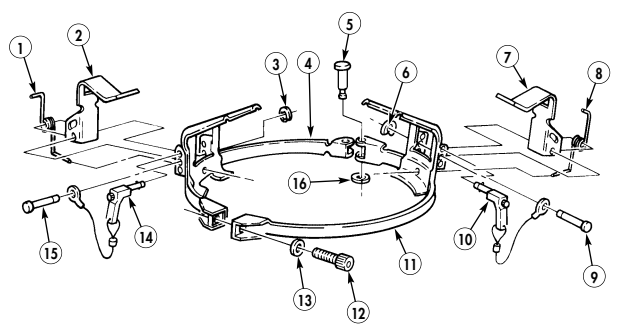

# Section Ix. Turret Maintenance

| This task covers:   |                                                                                                            |    |
|---------------------|------------------------------------------------------------------------------------------------------------|----|
| a.                  | Removal b. Installation                                                                                    |    |
|                     | INITIAL SETUP:                                                                                             |    |
| Tools               | Manual References                                                                                          |    |
|                     | General mechanic's tool kit: TM 9\-2320\-387\-24P                                                          |    |
|                     | automotive (Appendix B, Item 1) Equipment Condition                                                        |    |
|                     | Torque wrench, 3/8\-in. drive, 75 lb\-ft. Mount pedestal (TOW ITAS) removed                                |    |
|                     | (Appendix B, Item 2.1) (para. 11\-175).                                                                    |    |
|                     | Materials/Parts Maintenance Level                                                                          |    |
|                     | Five locknuts (Appendix G, Item 106) Unit                                                                  |    |
|                     | Two\-piece lockwasher                                                                                      |    |
|                     | (Appendix G, Item 190.11)                                                                                  |    |
|                     | a. Removal                                                                                                 |    |
|                     | Remove five locknuts (7), washers (6), capscrews (3), and washers (4) from spacer plate (5). Discard       | 1. |
|                     | locknuts. (7).                                                                                             |    |
|                     | Remove capscrew (1), two\-piece lockwasher (2), latch (9), spacer (10), and spacer plate (5) from          | 2. |
|                     | turret (8). Discard two\-piece lockwasher (2).                                                             |    |
|                     | b. Installation                                                                                            |    |
|                     | Install spacer plate (5) on turret (8) with two\-piece lockwasher (2), capscrew (1), spacer (10), and      | 1. |
|                     | latch (9).                                                                                                 |    |
|                     | Secure spacer plate (5) to turret (8) with five washers (4), capscrews (3), washers (6), and locknuts (7). | 2. |
|                     | Tighten capscrews (3) to 49 lb\-ft (66 N•m).                                                               | 3. |
|                     | Tighten capscrew (1) to 35 lb\-ft (47 N•m).                                                                | 4. |

# 11-185. Turret Maintenance (M1151, M1167) Task Summary 11-186. Turret Brake Assembly (Old Configuration) Maintenance

This task covers:
b. Inspection

a. Removal c. Installation

| General mechanic's tool kit:               | TM 9\-2320\-387\-10                            |
|--------------------------------------------|------------------------------------------------|
| automotive (Appendix B, Item 1)            | TM 9\-2320\-387\-24P                           |
| Torque wrench 3/8\-in. drive, 75 ft\-lb    | Equipment Condition                            |
| (Appendix B, Item 2.1)                     |                                                |
| Materials/Parts                            | Cargo shell door raised (TM 9\-2320\-387\-10). |
|                                            | Maintenance Level                              |
| Eighteen locknuts (Appendix G, Item 100.1) |                                                |
| Eight locknuts (Appendix G, Item 73.1)     | Unit                                           |

a. Removal Remove four capscrews (3), lockwashers (4), washers (5), and brake (2) from adapter plate (1). Discard lockwashers (4).

b. Inspection Refer to para. 10-56 for nut insert inspection and replacement.

c. Installation Secure brake (2) to adapter plate (1) with four washers (5), lockwashers (4), and capscrews (3). Tighten capscrews (3) to 31 lb-ft (42 N•m).

11-186.  TURRET BRAKE ASSEMBLY (OLD CONFIGURATION) MAINTENANCE (Cont'd)

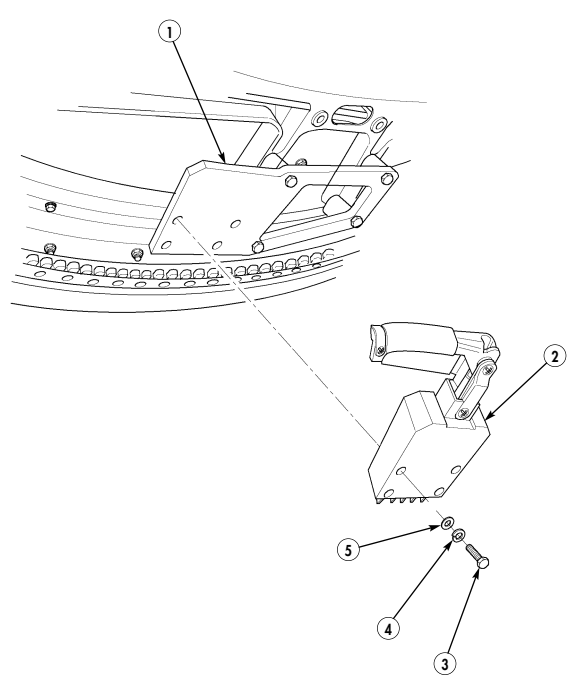

# 11-187. Turret Brake Assembly (New Configuration) Replacement

This task covers:

Tools General mechanic's tool kit:
automotive (Appendix B, Item 1)
Torque wrench 3/8-in. drive, 75 lb-ft 
(Appendix B, Item 2.1)
Materials/Parts Two lockwashers (Appendix G, Item 144)
a. Removal a. Removal b. Installation

| Manual References    |
|----------------------|
| TM 9\-2320\-387\-24P |
| Maintenance Level    |
| Unit                 |

Remove two capscrews (6), lockwashers (5), washers (4), turret brake assembly (3), and two spacers (2) from bearing (1). Discard lockwashers (5).

#### B. Installation

Install turret brake assembly (3) and spacers (2) on bearing (1) with two washers (4), lockwashers (5), and capscrews (6). Tighten capscrews (6) to 31 lb-ft (42 N•m).

11-187. TURRET BRAKE ASSEMBLY (NEW CONFIGURATION) REPLACEMENT (Cont'd)

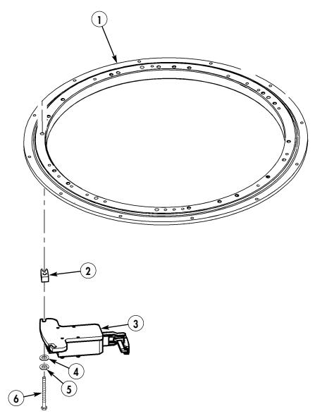

# 11-188. Turret Brake Adapter Plate Maintenance

This task covers:
b. Inspection

Applicable Models M1151A1 Tools General mechanic's tool kit:
automotive (Appendix B, Item 1)
Torque wrench 3/8-in. drive, 75 lb-ft 
(Appendix B, Item 2.1)

#### Materials/Parts

Two locknuts (Appendix G, Item 111) Two lockwashers (Appendix G, Item 159)
Manual References TM 9-2320-387-10 TM 9-2320-387-24P
a. Removal c. Installation

#### Equipment Condition

- Turret brake assembly removed 
(old configuration) (para. 11-186).

- Turret stop-ring removed 
(old configuration) (para. 11-201).

- Turret hatch open (TM 9-2320-387-10).

#### General Safety Instructions

Turret brake adapter plate is heavy and must be supported during removal and installation.

Maintenance Level Unit

#### Warning

Turret brake adapter plate is heavy and must be supported during removal and installation. Failure to do so may result in injury to personnel or damage to equipment.

#### A. Removal

1. Remove two capscrews (6), washer (5), washers (3), and locknuts (2) from turret brake adapter plate (10). Discard locknuts (2).

2. Remove two capscrews (7), lockwashers (8), washers (9), spacers (4), and turret brake adapter plate (10) from support (1). Discard lockwashers (8).

#### B. Inspection

Refer to para. 10-56 for nut insert inspection and replacement.

#### C. Installation

1. Install turret brake adapter plate (10) and two spacers (4) on support (1) with two washers (9),
lockwashers (8), and capscrews (7). Tighten capscrews (7) to 31 lb-ft (42 N•m).

2. Secure turret brake adapter plate (10) to support (1) with washer (5), capscrew (6), washer (3), and locknut (2). Tighten capscrews (6) to 31 lb-ft (42 N•m).

# 11-188. Turret Brake Adapter Plate Maintenance (Cont'D)

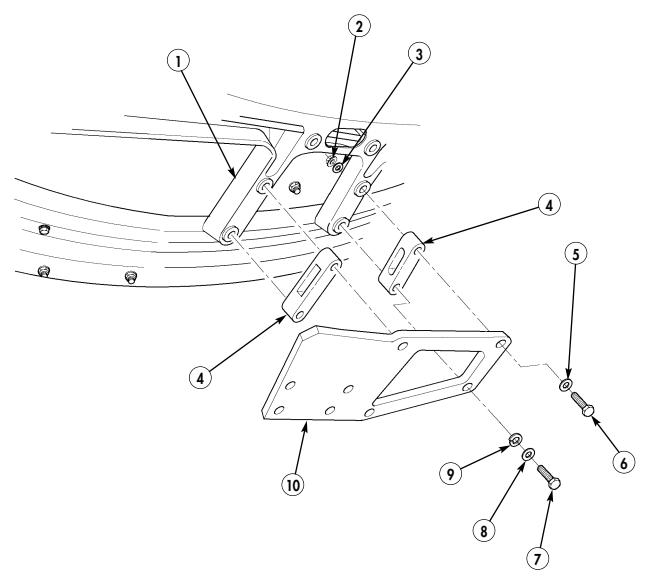

FOLLOW-ON TASKS: - Install turret stop-ring (old configuration) (para. 11-201).

· Install turret brake assembly (old configuration) (para. 11-186).

- Close and secure turret hatch (TM 9-2320-387-10).

# 11-189. Turret Hatch Latches (Old Configuration) Replacement

This task covers:

a. Removal b. Installation

| INITIAL SETUP:                          |                                              |
|-----------------------------------------|----------------------------------------------|
| Tools                                   | Manual References                            |
| General mechanic's tool kit:            | TM 9\-2320\-387\-24P                         |
| automotive (Appendix B, Item 1)         | Equipment Condition                          |
| Materials/Parts                         | FCS tray (TOW ITAS) removed (para. 11\-179). |
| Four locknuts (Appendix G, Item 133.25) | Maintenance Level                            |

RTV sealant (Appendix C, Item 74) Four lockwashers (Appendix G, Item 144)
a. Removal

- Perform step 1 for turret armor-mounted hatch latch. - Perform steps 2 and 3 for turret bearing-mounted hatch latch.

1. Remove capscrew (2), lockwasher (1), hatch latch (5), and spacer (4) from turret armor (3).

Discard lockwasher (1).

2. Remove capscrew (6), lockwasher (12), and hatch latch (9) from turret hatch clamp bracket (7).

Discard lockwasher (12).

3. Remove two capscrews (10), lockwashers (11), and turret hatch clamp bracket (7) from turret bearing (8). Discard lockwashers (11).

b. Installation

- Apply sealant to capscrews and mounting holes prior to installation.

- Perform step 1 for turret armor-mounted hatch latch. - Perform steps 2 and 3 for turret bearing-mounted hatch latch.

1. Install spacer (4) and hatch latch (5) on turret armor (3) with capscrew (2) and lockwasher (1).

Tighten capscrew (2) to 31 lb-ft (42 N•m).

2. Install turret hatch clamp bracket (7) on turret bearing (8) with two capscrews (10) and lockwashers (11). Tighten capscrews (10) to 31 lb-ft (42 N•m).

3. Install hatch latch (9) on turret hatch clamp bracket (7) with capscrew (6) and lockwasher (12).

Tighten capscrew (6) to 31 lb-ft (42 N•m).

11-189.  TURRET HATCH LATCHES (OLD CONFIGURATION) REPLACEMENT (Cont'd)

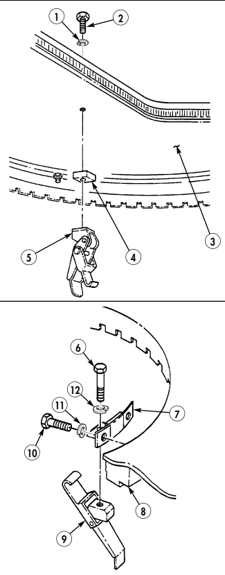

FOLLOW-ON TASK:  Close and secure turret hatch (TM 9-2320-387-10).

# 11-190. Turret Hatch Latches (New Configuration) Replacement

This task covers:

Tools General mechanic's tool kit:
automotive (Appendix B, Item 1)
Torque wrench, 3/8-in. drive, 75 lb-ft.

(Appendix B, Item 2.1)
Materials/Parts RTV sealant (Appendix C, Item 74) Three lockwashers (Appendix G, Item 146) Two lockwashers (Appendix G, Item 159)
a. Removal a. Removal b. Installation

| Manual References    |
|----------------------|
| TM 9\-2320\-387\-24P |
| Unit                 |
| Maintenance Level    |

- Perform step 1 for turret armor-mounted hatch latch. - Perform steps 2 and 3 for turret bearing-mounted hatch latch.

1. Remove two capscrews (1), lockwashers (2), washers (3), hatch latch (6), and spacers (5) from turret armor (4). Discard lockwashers (2).

2. Remove capscrew (7), lockwasher (8), washer (9), and hatch latch (12) from turret hatch clamp bracket (10). Discard lockwasher (8).

3. Remove two capscrews (15), lockwashers (14), washers (13), and turret hatch clamp bracket (10)
from turret bearing (11). Discard lockwashers (14).

b. Installation

- Apply sealant to capscrews and mounting holes prior to installation.

- Perform steps 1 and 2 for turret bearing-mounted hatch latch. - Perform step 3 for turret armor-mounted hatch latch.

1. Install turret hatch clamp bracket (10) on turret bearing (11) with two washers (13),
lockwashers (14), and capscrews (15). Tighten capscrews (15) to 31 lb-ft. (42 N•m).

2. Install hatch latch (12) on turret hatch clamp bracket (10) with washer (9), lockwasher (8), and capscrew (7). Tighten capscrew (7) to 31 lb-ft. (42 N•m).

3. Install two spacers (5) and hatch latches (6) on turret armor (4) with two washers (3),
lockwashers (2), and capscrews (1). Tighten capscrews (1) to 31 lb-ft. (42 N•m).

# 11-190.  Turret Hatch Latches (New Configuration) Replacement (Cont'D)

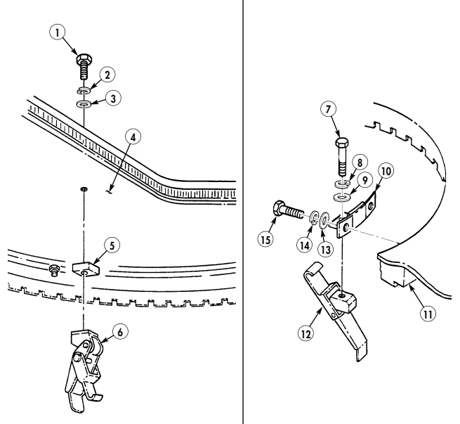

FOLLOW-ON TASK:  Close and secure turret hatch (TM 9-2320-387-10).

# 11-191. Gunner'S Sling And Hook (Old Configuration) Replacement

This task covers:

Applicable Models M1151A1 Tools General mechanic's tool kit:
automotive (Appendix B, Item 1)
Torque wrench 3/8-in. drive, 75 lb-ft 
(Appendix B, Item 2.1)
Materials/Parts Lockwasher (Appendix G, Item 144)
a. Removal b. Installation

| Manual References                             |
|-----------------------------------------------|
| TM 9\-2320\-387\-10                           |
| TM 9\-2320\-387\-24P                          |
| Equipment Condition                           |
| •Turret hatch open (TM 9\-2320\-387\-10).     |
| •FCS tray (TOW ITAS) removed (para. 11\-179). |

a. Removal 1. Remove gunner's sling (2) from gunner's sling hook (1). 2. Remove capscrew (3), washer (4), and gunner's sling hook (1) from turret ring (5). 3. Remove capscrew (6), lockwasher (7), washer (8), and bracket (9) from turret ring (5).

Discard lockwasher (7).

#### B. Installation

1. Install bracket (9) on turret ring (5) with washer (8), lockwasher (7), and capscrew (6).

Tighten capscrew (6) to 31 lb-ft (42 N•m).

2. Install gunner's sling hook (1) on turret ring (5) with washer (4), and capscrew (3).

Tighten capscrew (3) to 31 lb-ft (42 N•m).

3. Install gunner's sling (2) on gunner's sling hook (1).

11-191. GUNNER'S SLING AND HOOK (OLD CONFIGURATION) REPLACEMENT (Cont'd)

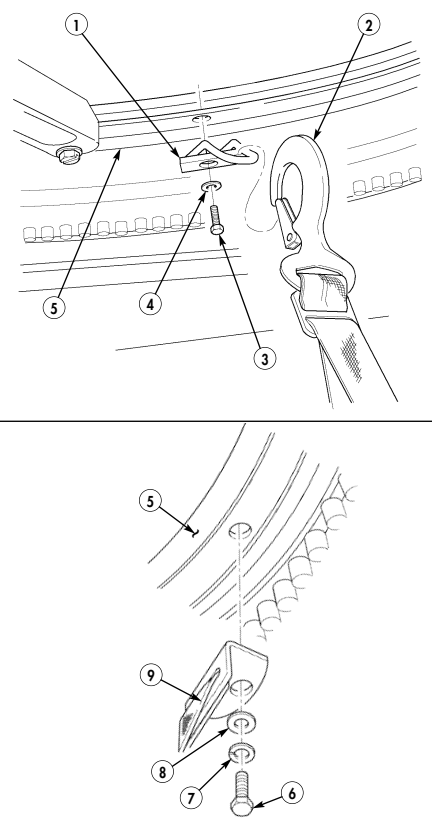

FOLLOW-ON TASK:  Close and secure turret hatch (TM 9-2320-387-10).

# 11-192. Gunner'S Sling And Hook (New Configuration) Replacement

This task covers:
a. Removal b. Installation

| INITIAL SETUP:                          |                      |
|-----------------------------------------|----------------------|
| Tools                                   | Manual References    |
| General mechanic's tool kit:            | TM 9\-2320\-387\-24P |
| automotive (Appendix B, Item 1)         | Maintenance Level    |
| Materials/Parts                         | Unit                 |
| Sixteen locknuts (Appendix G, Item 133) |                      |
| Thirty\-three foam washers              |                      |
| (Appendix G, Item 35.3)                 |                      |

#### A. Removal

1. Remove gunner's sling (2) from gunner's sling hook (1). 2. Remove two capscrews (3), lockwashers (4), washers (5), and gunner's sling hooks (1) from turret ring (6). Discard lockwashers (4).

#### B. Installation

1. Install gunner's sling hooks (1) on turret ring (6) with washers (5), lockwashers (4), and capscrews (3). Tighten capscrews (3) to 31 lb-ft (42 N•m).

2. Install gunner's sling (2) on gunner's sling hooks (1).

# 11-192. Gunner'S Sling And Hook (New Configuration) Replacement (Cont'D)

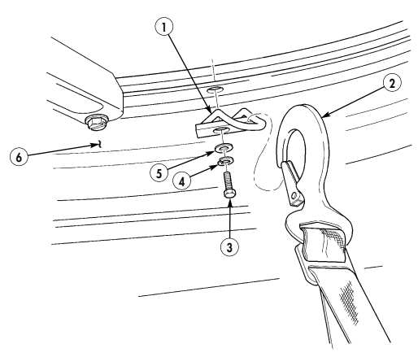

FOLLOW-ON TASK:  Close and secure turret hatch (TM 9-2320-387-10).

# 11-193. Turret Armor Brush Seal (Old Configuration) Maintenance

This task covers:
b. Inspection INITIAL SETUP:
Applicable Models M1151A1 Tools General mechanic's tool kit:
automotive (Appendix B, Item 1)
Special Tools Riveter tool kit (Appendix B, Item 123)
Materials/Parts Twenty-eight rivets (Appendix G, Item 266) RTV sealant (Appendix C, Item 74)
a. Removal a. Removal c. Installation Manual References TM 9-2320-387-24P
Equipment Condition Turret pintle mount removed (para. 11-209).

Maintenance Level Unit

- Note brush seals location for installation. - For replacement of rivets, refer to para. 10-56.

Remove twenty-eight rivets (1) and three brush seals (3) from turret armor (2). b. Inspection Inspect brush seals, replace if damaged. c. Installation 1. Apply a small amount of sealant to brush seal mount holes (4). 2. Position three brush seals (3) on turret armor (2) and install twenty-eight rivets (1). 3. Seal butt joints of brush seals (3) with sealant.

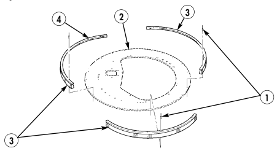

FOLLOW-ON TASK: Install turret pintle mount (para. 11-209).

11-430/(11-431 blank) Change 6

# 11-194. Turret Armor Brush Seal (New Configuration) Maintenance

This task covers:
b. Inspection

Tools General mechanic's tool kit:
automotive (Appendix B, Item 1)
Torque wrench 3/8-in. drive, 75 lb-ft 
(Appendix B, Item 2.1)
Materials/Parts RTV sealant (Appendix C, Item 74) Six lockwashers (Appendix G, Item 144)
Manual Reference TM 9-2320-384-24P
a. Removal a. Removal c. Installation

#### Equipment Condition

- TOW gunner's protection kit (T-GPK) removed 
(para. 12-174).

- Turret door/hatch (TOW ITAS) removed
(para. 11-184).

Maintenance Level Unit

Note brush seals location for installation.

1. Remove six capscrews (2), lockwashers (3), washers (4), turret armor (1), seal (6), and brush seals (7) from turret bearing (8). Discard lockwashers (3).

2. Remove twenty-four capscrews (5) and three brush seals (7) from turret armor (1).

#### B. Inspection

1. Inspect brush seals (7). Replace if damaged. 2. Refer to para. 10-56 for nut insert inspection replacement. 3. Inspect plugs (11). Replace if damaged.

#### C. Installation

1. Apply a small amount of sealant to brush seal mounting holes (10). 2. Position three brush seals (7) on turret armor (1) and install twenty-four capscrews (5).

Tighten capscrews (5) to 31 lb-ft (42 N•m).

3. Seal butt joints (9) of brush seals (7) with sealant. 4. Install turret armor (1), seal (6), and brush seals (7) on turret bearing (8) with eight washers (4),
lockwashers (3), and capscrews (2). Tighten capscrews (2) to 31 lb-ft (42 N•m).

11-194.  TURRET ARMOR BRUSH SEAL (NEW CONFIGURATION) MAINTENANCE (Conr'd)

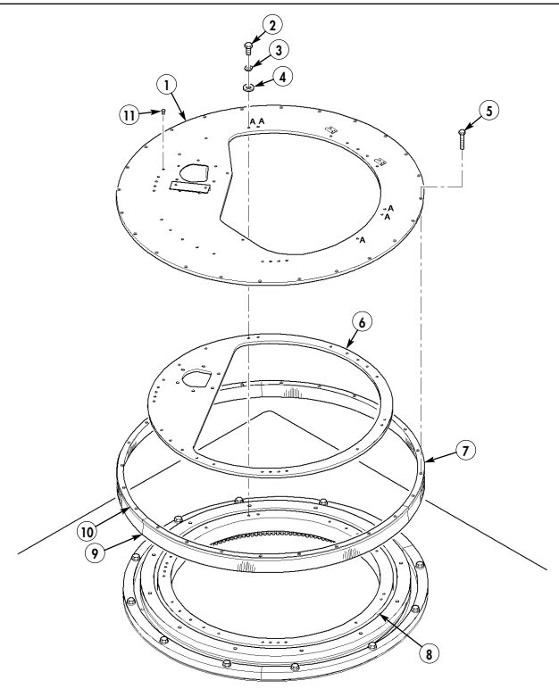

FOLLOW-ON TASKS:  - Install turret door/hatch (TOW ITAS) (para. 11-184).

· Install TOW gunner's protection kit (T-GPK) (para. 12-174).

# 11-195. Turret Armor Seal (Old Configuration) Replacement

This task covers:

| a. Removal                                       | b. Installation                     |
|--------------------------------------------------|-------------------------------------|
| INITIAL SETUP:                                   |                                     |
| Tools                                            | Manual References                   |
| General mechanic's tool kit:                     | TM 9\-2320\-387\-24P                |
| automotive (Appendix, B, Item 1)                 | Equipment Condition                 |
| Materials/Parts                                  | Rear end of cargo shell door raised |
| Locknut (Appendix G, Item 73.1)                  | (TM 9\-2320\-387\-10).              |
| Two locknuts (Appendix G, Item 101.5)            | Maintenance Level                   |
| Two lockwashers (Appendix G, Item 149)           | Unit                                |
| a. Removal                                       |                                     |
| 1.  Remove door strap (7) from footman loop (5). |                                     |

a. Removal 1. Remove seal (3) from turret armor (1).

#### B. Installation

1. Start installation of seal (3) centered in location of five turret door hinge mounting holes and press edge of seal (3) over lip of turret armor (1).

2. Apply adhesive to sponge rubber (2) and insert into installed end of seal (3). 3. Continue installation of seal (3) around turret armor (1) and complete by inserting free end of sponge rubber (2) into seal (3). Allow adhesive to set and cure for about one hour.

11-195. TURRET ARMOR SEAL (OLD CONFIGURATION) REPLACEMENT  (Cont'd))

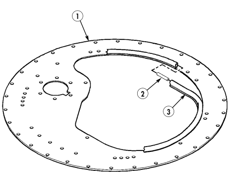

FOLLOW-ON TASK: Install turret door/hatch and slam latch bracket and turret cover assembly (para. 11-203).

# 11-196. Turret Armor Seal (New Configuration) Replacement

This task covers:

a. Removal b. Installation

| INITIAL SETUP:                               |                                                |
|----------------------------------------------|------------------------------------------------|
| Tools                                        | Manual References                              |
| General mechanic's tool kit:                 | TM 9\-2320\-387\-24P                           |
| automotive (Appendix B, Item 1)              | General Safety Instructions                    |
| Materials/Parts                              | Note position of downward stop and upward stop |
| Two retaining rings (Appendix G, Item 254.2) | for assembly.                                  |
| Retaining ring (Appendix G, Item 254.3)      | Maintenance Level                              |
|                                              | Unit                                           |

a. Removal Remove seal (1) from turret armor (3).

#### B. Installation

1. Start installation of seal (1) centered in location of five turret door hinge mounting holes and press edge of seal (1) over lip of turret armor (3).

2. Apply adhesive to sponge rubber (2) and insert into installed end of seal (1). 3. Continue installation of seal (1) around turret armor (3) and complete by inserting free end of sponge rubber (2) into seal (1). Allow adhesive to set and cure for about one hour.

# 11-196. Turret Armor Seal (New Configuration) Replacement (Cont'D)

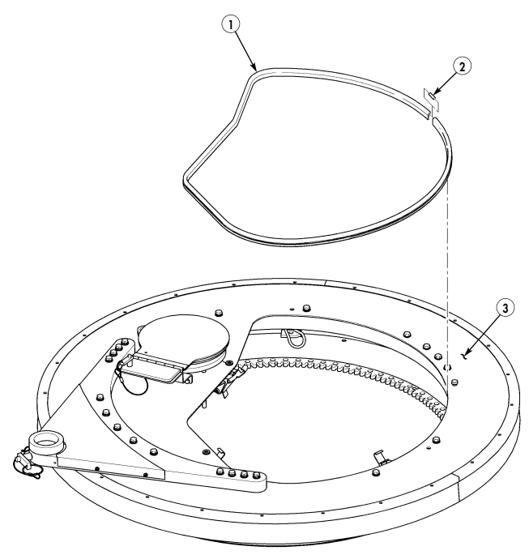

FOLLOW-ON TASK:  Close and secure turret hatch (TM 9-2320-387-10).

# 11-197. Turret Armor Cover (Old Configuration) Replacement

This task covers:
INITIAL SETUP:

a. Removal b. Installation

| PARA.    | PROCEDURES                                              | NO.     |
|----------|---------------------------------------------------------|---------|
| 11\-186. | Turret Brake Assembly (Old Configuration) Maintenance   | 11\-416 |
| 11\-187. | Turret Brake Assembly (New Configuration) Replacement   | 11\-418 |
| 11\-188. | Turret Brake Adapter Plate Maintenance                  | 11\-420 |
| 11\-189. | Turret Hatch Latches (Old Configuration) Replacement    | 11\-422 |
| 11\-190. | Turret Hatch Latches (New Configuration) Replacement    | 11\-424 |
| 11\-191. | Gunner's Sling and Hook (Old Configuration) Replacement | 11\-426 |
| 11\-192. | Gunner's Sling and Hook (New Configuration) Replacement | 11\-428 |
| 11\-193. | Turret Armor Brush Seal (Old Configuration) Maintenance | 11\-430 |

Personnel Required One mechanic One assistant a. Removal 3. Remove turret armor (4) from turret bearing (8).

#### B. Installation Note

Note location of mount holes for installation.

1. Remove four capscrews (3), lockwashers (2), and washers (1) from turret armor (4) and turret bearing (8).

Discard lockwashers (2).

2. Remove four capscrews (5), lockwashers (6), and washers (7) from turret armor (4) and turret bearing (8).

Discard lockwashers (6).

1. Apply sealing compound to threads of four capscrews (3) and (5). 2. Install turret armor (4) on turret bearing (8) with four washers (7), lockwashers (6), and capscrews (5).

Tighten capscrews (5) to 31 lb-ft (42 N•m).

3. Secure turret armor (4) to turret bearing (8) with four washers (1), lockwasher (2), and capscrews (3).

Tighten capscrews (3) to 31 lb-ft (42 N•m).

# 11-197. Turret Armor Cover (Old Configuration) Replacement (Cont'D)

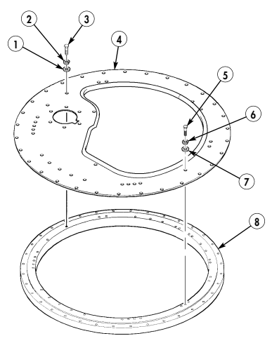

FOLLOW-ON TASKS: - • Install turret door/hatch and slam latch bracket (para. 11-203).

-  Install turret armor brush seal (old configuration) (para. 11-193).
- Install night vision mount (para. 11-60).

# 11-198. Turret Armor Cover (New Configuration) Replacement

This task covers:

| INITIAL SETUP:                          |                                           |
|-----------------------------------------|-------------------------------------------|
| Applicable Models                       | Materials/Parts                           |
| M1151A1                                 | Four lockwashers (Appendix G, Item 158.1) |
| Tools                                   | Manual References                         |
| General mechanic's tool kit:            | TM 9\-2320\-387\-24P                      |
| automotive (Appendix B, Item 1)         | Maintenance Level                         |
| Torque wrench 3/8\-in. drive, 75 lb\-ft | Unit                                      |
| (Appendix B, Item 2.1)                  |                                           |

a. Removal b. Installation

#### A. Removal

Remove six capscrews (2), lockwashers (3), washers (4), and turret armor (1) from turret bearing (5). Discard lockwashers (3).

#### C. Installation

Install turret armor (1) on turret bearing (5) with eight washers (4), lockwashers (3), and capscrews (2). Tighten capscrews (2) to 31 lb-ft (42 N•m).

# 11-198. Turret Armor Cover (New Configuration) Replacement (Cont'D)

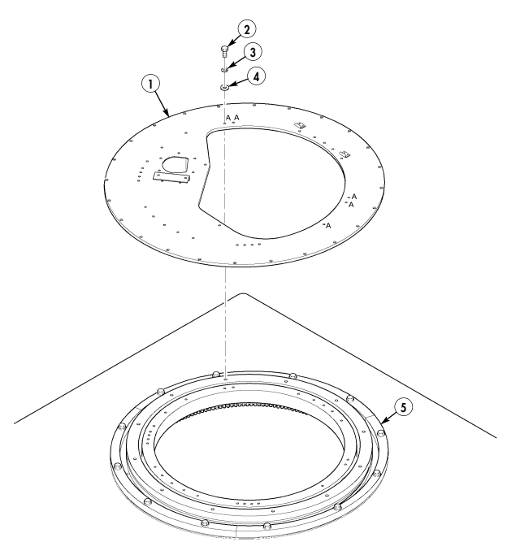

FOLLOW-ON TASKS: - ▪ Install TOW ITAS mount pedestal spacer plate (para. 11-177).

· Install turret brush (new configuration) (para. 11-194).

# 11-199. Turret Bearing (Old Configuration) Perimeter Replacement

This task covers:

| a. Removal                                                                                             | b. Installation      |
|--------------------------------------------------------------------------------------------------------|----------------------|
| INITIAL SETUP:                                                                                         |                      |
| Tools                                                                                                  | Manual References    |
| General mechanic's tool kit:                                                                           | TM 9\-2320\-387\-24P |
| automotive (Appendix B, Item 1)                                                                        | Maintenance Level    |
| Torque wrench 3/8\-in. drive, 75 lb\-ft  (Appendix B, Item 2.1)                                        | Unit                 |
| Materials/Parts                                                                                        |                      |
| Two lockwashers (Appendix G, Item 144)                                                                 |                      |
| a. Removal                                                                                             |                      |
| Remove two capscrews (6), lockwashers (5), washers (4), turret brake assembly (3), and two spacers (2) |                      |
| from bearing (1). Discard lockwashers (5).                                                             |                      |
| b. Installation                                                                                        |                      |

#### A. Removal

1. Remove nine capscrews (10), lockwashers (11), washers (12), and three turret spacers (1) from turret bearing (13). Discard lockwashers (11).

2. Remove twelve locknuts (8), twenty-four washers (3), twelve capscrews (2), and turret bearing (13)
from turret support (9). Discard locknuts (8).

3. Remove twelve locknuts (7), twenty-four washers (5), twelve capscrews (4), and turret support (9)
from roof (6). Discard locknuts (7).

#### B. Installation

1. Install turret support (9) on roof (6) with twelve capscrews (4), twenty-four washers (5), and twelve locknuts (7).

2. Install turret bearing (13) on turret support (9) with twelve capscrews (2), twenty-four washers (3),
and twelve locknuts (8).

3. Install three turret spacers (1) on turret bearing (13) with nine capscrews (10), lockwashers (11), and washers (12).

# 11-199. Turret Bearing (Configuration) Perimeter Replacement (Cont'D)

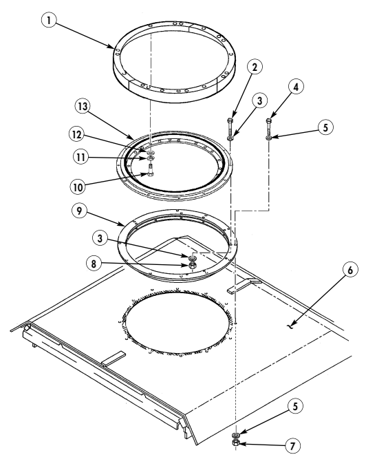

FOLLOW-ON TASKS:  - Install turret K-frame (para. 11-206).

· Install gunner's restraint (if equipped) (para. 12-135).

· Install gunner's sling and hook (old configuration) (para. 11-191).

· Install turret backrest (para. 11-208). · Install turret brake adapter plate (old configuration) (para. 11-188).

- Install turret armor cover (old configuration) (para. 11-197).

# 11-200. Turret Bearing (New Configuration) Replacement

This task covers:

| INITIAL SETUP:   |
|------------------|

Tools

| AT THE ULT OF OTTOTT OF O THE UT   |
|------------------------------------|
| (Appendix B, Item 2.1)             |

General mechanic's tool kit:
automotive (Appendix B, Item 1)
Torque wrench 3/8-in. drive, 75 lb-ft 

| Five lockwasners (App   |
|-------------------------|
| Personnel Required      |
| One mechanic            |
| One assistant           |

#### Materials/Parts

Twelve locknuts (Appendix G, Item 133.21) Five lockwashers (Appendix G, Item 144)
Manual References

| Manual References                        |
|------------------------------------------|
| TM 9\-2320\-387\-10                      |
| TM 9\-2320\-387\-24P                     |
| Equipment Condition                      |
| Turret hatch open (TM 9\-2320\-387\-10). |
| Maintenance Level                        |
| Unit                                     |

TM 9-2320-387-24P

#### A. Removal

a. Removal b. Installation 1. Remove twelve locknuts (6), washers (5), capscrews (2), washers (3), and turret bearing (4) from support (7). Discard locknuts (6).

2. Remove five capscrews (8), lockwashers (9), washers (10), and turret spacer (1) from turret bearing (4).

Discard lockwashers (9).

#### B. Installation

1. Install turret spacer (1) on turret bearing (4) with five washers (10), lockwashers (9), and capscrews
(8). Tighten capscrews (8) to 31 lb-ft (42 N•m).

2. Install turret bearing (4) on support (7) with twelve washers (3), capscrews (2), washers (5), and locknuts (6).

# 11-200. Turret Bearing (New Configuration) Replacement (Cont'D)

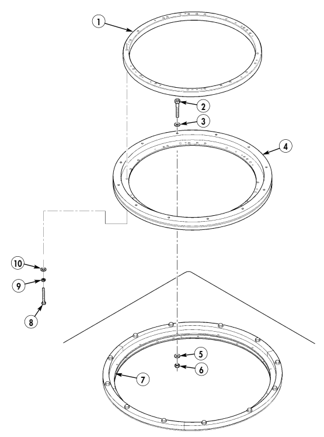

FOLLOW-ON TASKS: - Install turret brake assembly (new configuration) (para. 11-187).

- Install manual traversing unit (para. 11-210). - Install gunner's sling and hook (new configuration) (para. 11-192). - Install turret backrest (old configuration) (para. 11-208). - Install turret-stop ring (new configuration) (para. 11-202). - Install turret armor cover (para. 11-198).

# 11-201. Turret Stop-Ring (Old Configuration) Replacement

This task covers:

| a. Removal                                | b. Installation                          |
|-------------------------------------------|------------------------------------------|
| INITIAL SETUP:                            |                                          |
| Tools                                     | Manual References                        |
| General mechanic's tool kit:              | TM 9\-2320\-387\-10                      |
| automotive (Appendix B, Item 1)           | TM 9\-2320\-387\-24P                     |
| Torque wrench, 3/8\-in. drive, 75 lb\-ft. | Equipment Condition                      |
| (Appendix B, Item 2.1)                    | Turret hatch open (TM 9\-2320\-387\-10). |
| Materials/Parts                           | Maintenance Level                        |
| RTV sealant (Appendix C, Item 74)         | Unit                                     |
| Three lockwashers (Appendix G, Item 146)  |                                          |
| Two lockwashers (Appendix G, Item 159)    |                                          |

#### Warning

Turret stop-ring is heavy and must be supported during removal and installation. Do not allow stop-ring to fall. Failure to do so may result in injury to personnel or damage to equipment.

- Tag and mark intercom harness wires prior to removal for ease of installation.

- If vehicle is equipped with VIC-3, perform steps 1-5. - If vehicle is not equipped with VIC-3, perform step 6.

#### A. Removal

1. Remove four connector wires (11) from VIC-3 communication boxes (12). 2. Remove two nuts (10), lockwashers (9), washers (8), capscrews (15), washers (14), and VIC-3 communication boxes (12) from bracket (13). Discard lockwashers (9).

3. Remove two locknuts (5), four washers (6), two capscrews (16), one bracket (13), and spacer (17) from roof (7). Discard locknuts (5).

4. Remove two locknuts (3), four washers (4), two capscrews (18), clamps (19), and spacers (20) from roof (7). Discard locknuts (3).

5. Remove fourteen locknuts (1), twenty-eight washers (2), fourteen capscrews (21), and stop-ring (22)
from roof (7). Discard locknuts (1).

6. Remove eighteen locknuts (1), thirty-six washers (2), eighteen capscrews (21), and stop-ring (22)
from roof (7). Discard locknuts (1).

b. Installation

- If vehicle is not equipped with VIC-3 perform step 1. - If vehicle is equipped with VIC-3 perform steps 2-6.

1. Install stop-ring (22) on roof (7) with eighteen capscrews (21), thirty six washers (2), and eighteen locknuts (1). Tighten capscrews (21) to 31 lb-ft (42 N•m).

2. Install stop-ring (22) on roof (7) with fourteen capscrews (21), twenty-eight washers (2), and fourteen locknuts (1).

11-201. TURRET STOP-RING (OLD CONFIGURATION) REPLACEMENT (Cont'd)
3. Install two clamps (19) and spacers (20) on roof (7) with two capscrews (18), four washers (4), and two locknuts (3).

4. Install bracket (13) and spacer (17) on roof (7) with two capscrews (16), four washers (6), and two locknuts (5).

5. Install VIC-3 communication boxes (12) on bracket (13) with two capscrews (10), washers (8),
lockwashers (9), washers (14), and two nuts (10).

6. Install four connector wires (11) on VIC-3 communication boxes (12).

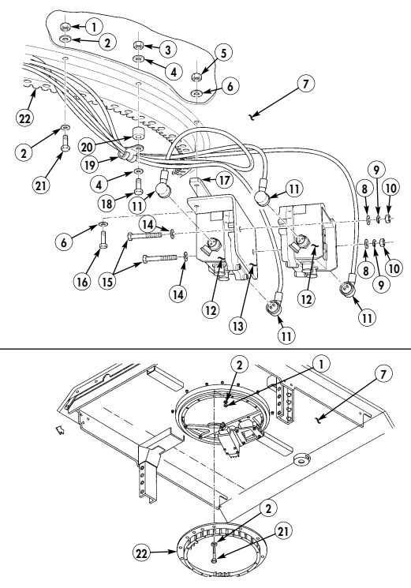

# 11-202. Turret Stop-Ring (New Configuration) Replacement

This task covers:

a. Removal b. Installation

| INITIAL SETUP:                          |                                          |
|-----------------------------------------|------------------------------------------|
| Applicable Models                       | Manual References                        |
| M1151A1                                 | TM 9\-2320\-387\-10                      |
| Tools                                   | TM 9\-2320\-387\-24P                     |
| General mechanic's tool kit:            | Equipment Condition                      |
| automotive (Appendix B, Item 1)         | Turret hatch open (TM 9\-2320\-387\-10). |
| Torque wrench 3/8\-in. drive, 75 lb\-ft | Maintenance Level                        |
| (Appendix B, Item 2.1)                  | Unit                                     |
| Materials/Parts                         |                                          |
| Lockwasher (Appendix G, Item 144)       |                                          |

#### Warning

Turret stop-ring is extremely heavy and must be supported during removal and installation. Do not allow stop-ring to fall. Failure to do so may result in injury to personnel or damage to equipment.

#### A. Removal

1. Remove twelve locknuts (6), capscrews (1), washers (5), washers (2), and three-piece spacer (3) from support (4) and vehicle (11). Discard locknuts (6).

2. Remove eighteen locknuts (13), washers (12), capscrews (9), washers (10), support (4), spacer (7),
and traversing ring (8) from vehicle (11). Discard locknuts (13).

#### B. Installation

1. Install traversing ring (8), spacer (7), and support (4) on vehicle (11) with eighteen washers (10),
capscrews (9), washers (12), and locknuts (13).

2. Install three-piece spacer (3) on support (4) and vehicle (11) with twelve washers (2), capscrews (1),
and washers (5) and twelve locknuts (6).

3. Tighten capscrews (1) and (9) to 49 lb-ft (66 N•m).

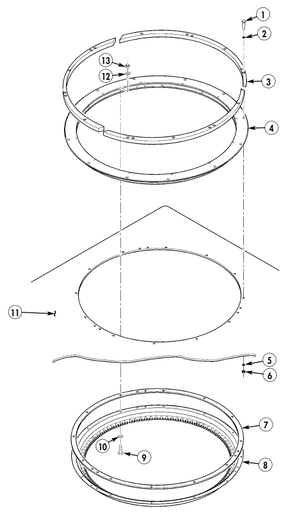

11-202. TURRET STOP-RING (NEW CONFIGURATION) REPLACEMENT (Cont'd)

# 11-203. Turret Hatch And Slam Latch Bracket Replacement

This task covers:

| a. Removal                                                                                    | b. Installation                          |
|-----------------------------------------------------------------------------------------------|------------------------------------------|
| INITIAL SETUP:                                                                                |                                          |
| Tools Manual References                                                                       |                                          |
| General mechanic's tool kit: TM 9\-2320\-387\-10                                              |                                          |
| automotive (Appendix B, Item 1) TM 9\-2320\-387\-24P                                          |                                          |
| Torque wrench 3/8\-in. drive, 75 lb\-ft  Equipment Condition                                  |                                          |
| (Appendix B, Item 2.1)                                                                        | Turret hatch open (TM 9\-2320\-387\-10). |
| Materials/Parts Maintenance Level                                                             |                                          |
| Two lockwashers (Appendix G, Item 144) Unit                                                   |                                          |
| a. Removal                                                                                    |                                          |
| 1.  Remove gunner's sling (2) from gunner's sling hook (1).                                   |                                          |
| 2.  Remove two capscrews (3), lockwashers (4), washers (5), and gunner's sling hooks (1) from |                                          |

#### Warning

Turret hatch and slam latch bracket are extremely heavy and must be supported during removal and installation. Failure to do so may result in injury to personnel or damage to equipment.

Note different lengths of screws for installation.

a. Removal 1. Remove two hexhead screws (3) from slam latch bracket (4) and turret (5). 2. Remove three hexhead screws (2), slam latch bracket (4) and turret hatch (1) from turret (5).

b. Installation

Apply sealing compound to capscrews prior to installation.

1. Install bracket (4) and turret hatch (1) on turret (5) with three hexhead screws (2). Tighten hexhead screws (2) to 31 lb-ft (42 N•m).

2. Secure slam latch bracket (4) to turret (5) with two hexhead screws (3). Tighten hexhead screws (3)
to 31 lb-ft (42 N•m).

# 11-203.  Turret Hatch And Slam Latch Bracket Replacement (Cont'D)

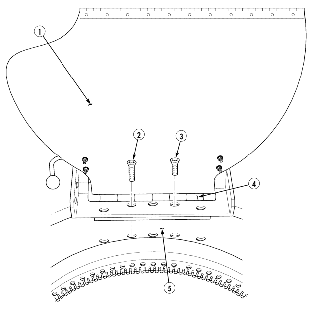

FOLLOW-ON TASK:  Close and secure turret hatch (TM 9-2320-387-10).

| This task covers:                       |                                          |
|-----------------------------------------|------------------------------------------|
| a. Removal                              | b. Installation                          |
| INITIAL SETUP:                          |                                          |
| Applicable Models                       | Personnel Required                       |
| M1151A1                                 | One mechanic                             |
| Tools                                   | One assistant                            |
| General mechanic's tool kit:            | Manual References                        |
| automotive (Appendix B, Item 1)         | TM 9\-2320\-387\-24P                     |
| Torque wrench 3/8\-in. drive, 75 lb\-ft |                                          |
| (Appendix B, Item 2.1)                  | Equipment Condition                      |
| Materials/Parts                         | Turret door/hatch and slam latch bracket |
|                                         | removed (para. 11\-203).                 |

# 11-204. Turret Hatch Slam Latch Handle Replacement

#### A. Removal

Remove four locknuts (1), eight washers (2), four capscrews (4), sleeves (5), and slam latch handle (3) from turret hatch (6). Discard locknuts (1).

#### B. Installation

Install slam latch handle (3) on turret hatch (6) with four capscrews (4), eight washers (2), four sleeves (5), and locknuts (1).

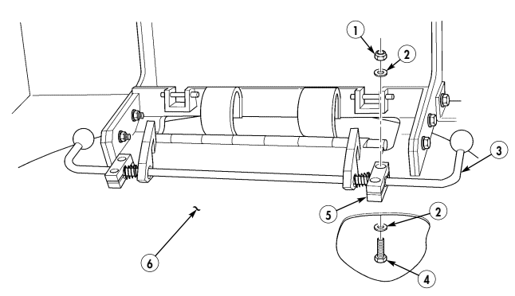

FOLLOW-ON TASK: Open hatch cover (TM 9-2320-387-10).

11-452 Change 6

# 11-205. Turret Hatch Slam Latch Bumper Spring Replacement

This task covers:

| a.  Removal                     | b.  Installation                         |
|---------------------------------|------------------------------------------|
| INITIAL SETUP:                  |                                          |
| Tools                           | Manual References                        |
| General mechanic's tool kit:    | TM 9\-2320\-387\-10                      |
| automotive (Appendix B, Item 1) | TM 9\-2320\-387\-24P                     |
| Materials/Parts                 | Equipment Condition                      |
| Adhesive (Appendix C, Item 4)   | Turret hatch open (TM 9\-2320\-387\-10). |
|                                 | Maintenance Level                        |
|                                 | Unit                                     |

Replacement procedures for both springs are basically the same. This procedure covers one spring.

a. Removal Remove locknut (2), two washers (3), one capscrew (5), and slam latch bumper spring (1) from slam latch bracket (4). Discard locknut (2).

#### B. Installation

Install slam latch bumper spring (1) on slam latch bracket (4) with capscrew (5), two washers (3), and one locknut (2).

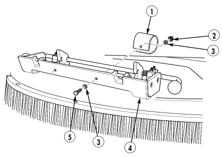

FOLLOW-ON TASK: Open turret cover (TM 9-2320-387-10).

## 11-206. Turret K-Frame Replacement

This task covers:

a. Removal b. Installation

| Applicable Models                       | Manual References                            |
|-----------------------------------------|----------------------------------------------|
| M1151A1                                 | TM 9\-2320\-387\-24P                         |
| Tools                                   | Equipment Condition                          |
| General mechanic's tool kit:            | •Night vision mount removed (para. 11\-60).  |
| automotive (Appendix B, Item 1)         | •Turret armor brush seal (old configuration) |
| Torque wrench 3/8\-in. drive, 75 lb\-ft | removed (para. 11\-193).                     |
| (Appendix B, Item 2.1)                  | •Turret door/hatch and slam latch bracket    |

#### A. Removal

1. Remove two capscrews (5), lockwashers (4) and washers (3) from turret (1) and turret K-frame (2).

Discard lockwashers (4).

2. Remove capscrew (6), lockwasher (7), washer (8), and turret K-frame (2) from turret (1).

Discard lockwasher (7).

#### B. Installation

1. Install turret K-frame (2) on turret (1) with capscrew (6), lockwasher (7), and washer (8).

Tighten capscrew (6) to 31 lb-ft (42 N•m).

2. Install two washers (3), lockwashers (4), and capscrews (5) on turret (1) and turret K-frame (2).

Tighten capscrews (5) to 31 lb-ft (42 N•m).

# 11-206. Turret K-Frame Replacement (Cont'D)

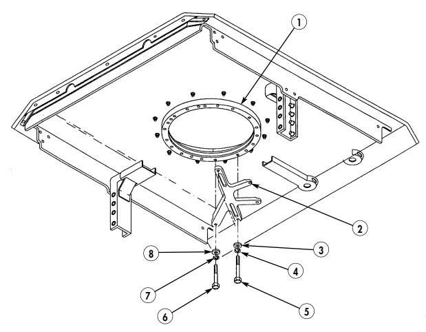

# 11-207. Turret Opening Cover And Insulation Panels Replacement

This task covers:

| (Appendix B, Item 2.1)   |
|--------------------------|

| Tools   |
|---------|

INITIAL SETUP:
automotive (Appendix B, Item 1)

#### Materials/Parts

Eight locknuts (Appendix G, Item 106) Eight foam washers (Appendix G, Item 35.2)
a. Removal Remove eight locknuts (7), washers (6), capscrews (3), foam washers (2), insulation panel (5), and turret opening cover (4) from roof (1). Discard locknuts (7) and foam washers (2).

b. Installation Install turret opening cover (4) and insulation panel (5) on roof (1) with eight foam washers (2), capscrews (3), washers (6) and locknuts (7).

a. Removal b. Installation

| Manual References    |
|----------------------|
| TM 9\-2320\-387\-24P |
| Equipment Condition  |

11-207. TURRET OPENING COVER AND INSULATION PANELS REPLACEMENT (Cont'd)

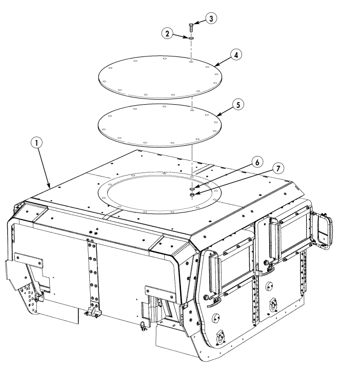

# 11-208. Turret Backrest Replacement

This task covers:
INITIAL SETUP:
a. Removal b. Installation

| Applicable Models                        | Manual References                          |
|------------------------------------------|--------------------------------------------|
| M1151A1                                  | TM 9\-2320\-387\-24P                       |
| Tools                                    | Equipment Condition                        |
| General mechanic's tool kit:             | - Turret K\-frame removed (para. 11\-206). |
| automotive (Appendix B, Item 1)          | - Gunner's restraint removed (if equipped) |
| Materials/Parts                          | (para. 12\-135).                           |
|                                          | - Gunner's sling and hook removed          |
| Sealing compound (Appendix C, Item 72.1) | (old configuration) (para. 11\-191).       |

Materials/Parts Two lockwashers (Appendix G, Item 144)

Replacement procedures for backrests are basically the same. This procedure covers one backrest.

a. Removal Remove two capscrews (5), lockwashers (4), washers (3), and backrest (2) from turret (1). Discard lockwashers (4).

#### B. Installation

Install backrest (2) on turret (1) with two washers (3), lockwashers (4), and capscrews (5). Tighten capscrews (5) to 31 lb-ft (42 N•m).

# 11-208. Turret Backrest Replacement (Cont'D)

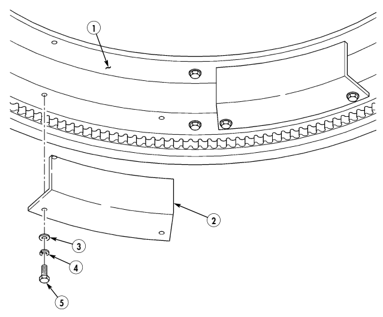

FOLLOW-ON TASK:
Close and secure turret hatch (TM 9-2320-387-10).

# 11-209. Turret Pintle Mount Replacement

This task covers:

| a. Removal                                | b. Installation                                   |
|-------------------------------------------|---------------------------------------------------|
| INITIAL SETUP:                            |                                                   |
| Tools                                     | Equipment Condition                               |
| General mechanic's tool kit:              | - Turret armor cover removed (para. 11\-194).     |
| automotive (Appendix B, Item 1)           | - Turret stop\-ring (new configuration) removed   |
| Torque wrench 3/8\-in. drive, 75 lb\-ft   | (para. 11\-202).                                  |
| (Appendix B, Item 2.1)                    | - Turret backrest removed (para. 11\-208).        |
| Materials/Parts                           | - Gunner's sling and hook (new configuration)     |
| Twelve locknuts (Appendix G, Item 133.21) | removed (para. 11\-192).                          |
| Five lockwashers (Appendix G, Item 144)   | - Manual traversing unit removed (para. 11\-210). |
|                                           | - Turret brake assembly (new configuration)       |
| Personnel Required                        | removed (para. 11\-187).                          |
| One mechanic                              | Maintenance Level                                 |
| One assistant                             |                                                   |
|                                           | Unit                                              |

#### A. Removal

1. Remove eleven capscrews (5), lockwashers (6), and washers (4) from turret armor (11) and turret pintle mount (10). Discard lockwashers (6).

2. Remove two capscrews (7), lockwashers (8), and washers (9) from turret armor (11) and turret pintle mount (10). Discard lockwashers (8).

3. Remove turret pintle mount (10) from turret armor (11). 4. Remove screw (1), washer (2) and lanyard (3) from turret pintle mount (10).

#### B. Installation

1. Install lanyard (3) on turret pintle mount (10) with screw (1) and washer (2). 2. Apply sealant to thirteen bosses on bottom of turret pintle mount (10) and around holes in turret armor (11).

3. Install turret pintle mount (10) on turret armor (11) with two washers (9), lockwashers (8), and capscrews (7). Do not tighten capscrew (7).

Apply sealing compound to capscrews prior to installation.

4. Install eleven washers (4), lockwashers (6), and capscrews (5) on turret pintle mount (10) and turret armor (11). Tighten capscrews (5) to 31 lb-ft (42 N•m).

5. Tighten capscrews (7) to 31 lb-ft (42 N•m).

# 11-209. Turret Pintle Mount Replacement (Cont'D)

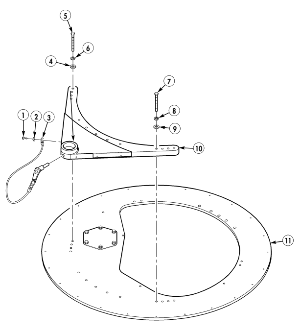

FOLLOW-ON TASK:  Close and secure turret hatch (TM 9-2320-387-10).

# 11-210. Manual Traversing Unit Replacement

This task covers:

| M1151A1                      |
|------------------------------|
| Tools                        |
| General mechanic's tool kit: |

automotive (Appendix B, Item 1)
Maintenance and repair shop equipment:
automotive (Appendix B, Item 2)
Torque wrench 3/8-in. drive, 75 lb-ft 
(Appendix B, Item 2.1)
a. Removal b. Installation

#### Materials/Parts

Sealing compound (Appendix C, Item 72.1) Three lockwashers (Appendix G, Item 159)
Manual References TM 9-2320-387-24P
Equipment Condition

| œ   |
|-----|

| Maintenance Level   |
|---------------------|

Turret weapon station cover open
(TM 9-2320-387-10).

#### A. Removal

1. Remove pin (8) and quick release crank handle assembly (9) from traversing gear assembly (18). 2. Remove five capscrews (13), capscrew (12), washer (11), and traversing lower cover (10) from traversing gear assembly (18) and traversing upper cover (5).

3. Remove two capscrews (7), washers (6), capscrew (3), washer (4), and traversing upper cover (5)
from front cover bracket (2) and traversing gear assembly (18).

4. Remove two screws (16), washers (17), screw (14), washer (15), and traversing gear assembly (18)
from side of turret bearing (1) and spacer (19).

5. Remove three capscrews (22), lockwasher (21), washer (20), and spacer (19) from side of turret bearing (1). Discard lockwashers (21).

b. Installation

- Apply sealing compound to threads of all traversing gear assembly capscrews.

- Leave socket head capscrew out approximately 0.250 inch to allow installation of traversing gear assembly.

1. Install spacer (19) on side of turret bearing (1) with three capscrews (22), lockwashers (21), and washer (20). Tighten capscrews (22) to 37 lb-ft (50 N•m).

2. Install capscrew (14) and washer (15) into center hole in bottom side of turret bearing (1). 3. Install traversing gear assembly (18) on turret bearing (1), ensuring washer (15) is on bottom side of traversing gear assembly (18).

4. Secure traversing gear assembly (18) to side of turret bearing (1) with two screws (16) and washers (17). Do not tighten capscrews (16).

In order to tighten socket head capscrew, allen wrench must be inserted through hole in turret stop ring. Rotate turret as required to gain access to socket head capscrew.

5. Tighten capscrew (14) to 37 lb-ft (50 N•m).

# 11-210. Manual Traversing Unit Replacement (Cont'D)

6. Tighten capscrews (16) to 37 lb-ft (50 N•m). 7. Install traversing upper cover (5) on front cover bracket (2) with two capscrews (7) and washers (6).

Do not tighten capscrews (7).

8. Secure traversing upper cover (5) to traversing gear assembly (18) with capscrew (3) and washer (4). Do not tighten capscrew (3).

9. Install traversing lower cover (10) on traversing upper cover (5) and traversing gear assembly (18)
with five screws (13), capscrew (12), and washer (11).

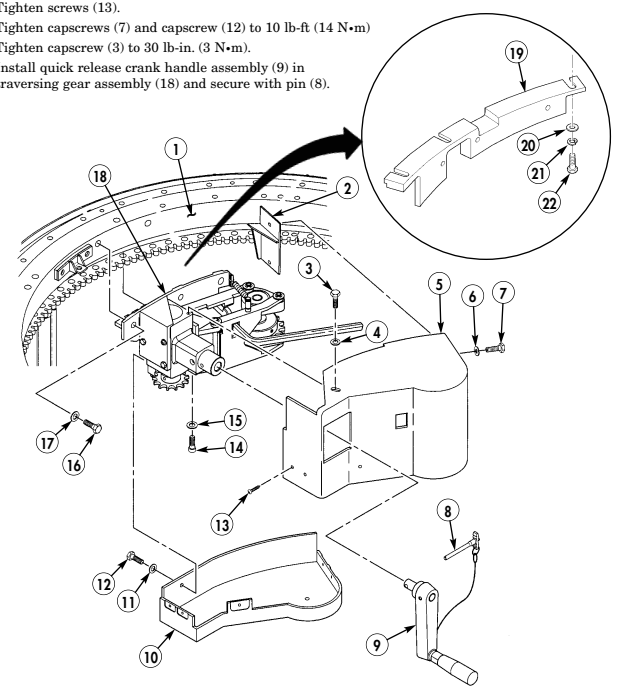

FOLLOW-ON TASK: Close turret weapon station cover (TM 9-2320-387-10).

# Chapter 12 Special Purpose Kits (Unit) Maintenance

Section I. ENGINE/CREW COMPARTMENT HEATER MAINTENANCE

| Torque wrench 3/8\-in. drive, 75 lb\-ft                               | Turret stop\-ring is extremely heavy and must be                                                      |
|-----------------------------------------------------------------------|-------------------------------------------------------------------------------------------------------|
| (Appendix B, Item 2.1)                                                | supported during removal and installation. Materials/Parts                                            |
| Maintenance Level                                                     | Thirty locknuts (Appendix G, Item 113)                                                                |
| Unit                                                                  | Personnel Required                                                                                    |
| One mechanic                                                          | One assistant                                                                                         |
| WARNING                                                               |                                                                                                       |
| Turret stop\-ring is extremely heavy and must be supported during     |                                                                                                       |
| removal and installation. Do not allow stop\-ring to fall. Failure to |                                                                                                       |
| do so may result in injury to personnel or damage to equipment.       |                                                                                                       |
| a. Removal                                                            |                                                                                                       |
| 1.                                                                    | Remove twelve locknuts (6), capscrews (1), washers (5), washers (2), and three\-piece spacer (3) from |
| support (4) and vehicle (11). Discard locknuts (6).                   |                                                                                                       |
| 2.                                                                    | Remove eighteen locknuts (13), washers (12), capscrews (9), washers (10), support (4), spacer (7),    |
| and traversing ring (8) from vehicle (11). Discard locknuts (13).     |                                                                                                       |

12-1. ENGINE/CREW COMPARTMENT HEATER MAINTENANCE TASK SUMMARY

# 12-2. Engine/Crew Compartment Heater Heat Shield Replacement

This task covers:
INITIAL SETUP:

#### Tools

General mechanic's tool kit:
automotive (Appendix B, Item 1)
Materials/Parts Two lockwashers (Appendix G, Item 149) Two lockwashers (Appendix G, Item 147) Three lockwashers (Appendix G, Item 162)
Manual References TM 9-2320-387-10 TM 9-2320-387-24P

a. Removal b. Installation

Equipment Condition Hood raised and secured (TM 9-2320-387-10).

General Safety Instructions Do not touch hot exhaust system components with bare hands.

Maintenance Level Unit

#### .Warning.

Do not touch hot exhaust system components with bare hands. Severe injury may result.

#### A. Removal

1. Remove nut (13), lockwasher (12), screw (14), and clamp (15) from intake pipe (16) and heat shield (7). Discard lockwasher (12).

4. Remove two nuts (4), lockwashers (5), and screws (10) from heat shield (7) and circuit breaker (6). Discard lockwashers (5).

5. Remove heat shield (7) from heater (3). 

#### B. Installation

1. Install circuit breaker (6) on heat shield (7) with two screws (10), lockwashers (5), and nuts (4). 2. Install heat shield (7) on heater (3) with three lockwashers (8) and screws (9). 3. Install clamp (2) on wiring harness (1) and heat shield (7) with screw (11), lockwasher (12), and nut
(13).

4. Install clamp (15) on intake pipe (16) and heat shield (7) with screw (14), lockwasher (12), and nut (13).

2. Remove nut (13), lockwasher (12), screw (11), and clamp (2) from wiring harness (1) and heat shield (7). Discard lockwasher (12).

3. Remove three screws (9) and lockwashers (8) from heat shield (7) and heater (3). Discard lockwashers (8).

# 12-2. Engine/Crew Compartment Heater Heat Shield Replacement (Con'D)

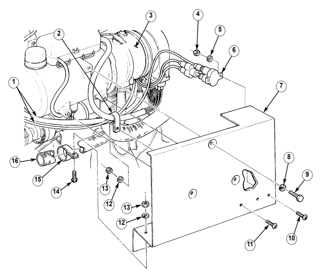

FOLLOW-ON TASK:   Lower and secure hood (TM 9-2320-387-10).

تزال والايد
# 12-3. Engine/Crew Compartment Heater Exhaust Muffler Replacement

This task covers:
INITIAL SETUP:
Tools General mechanic's tool kit:
automotive (Appendix B, Item 1)
Materials/Parts Lockwasher (Appendix G, Item 183)
Manual References TM 9-2320-387-24P

a. Removal b. Installation

General Safety Instructions Do not touch hot exhaust system components with bare hands.

Maintenance Level Unit

#### .Warning.

Do not touch hot exhaust system components with bare hands. Severe injury may result.

a. Removal 1. Remove nut (7), lockwasher (6), washer (5), capscrew (8), and muffler (1) from bracket (4). Discard lockwasher (6).

2. Loosen clamp (2) and remove muffler (1) from exhaust pipe (3).

#### B. Installation

1. Install muffler (1) on exhaust pipe (3) and tighten clamp (2). 2. Install muffler (1) on bracket (4) with capscrew (8), washer (5), lockwasher (6), and nut (7).

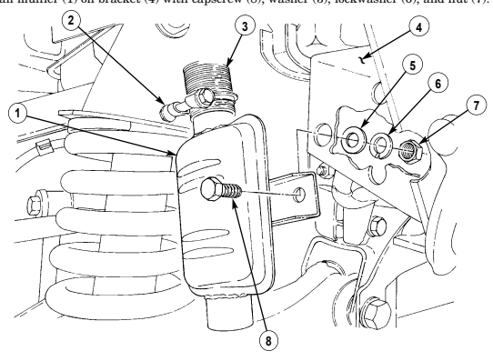

# 12-4. Engine/Crew Compartment Heater Exhaust Pipe Replacement

This task covers:
INITIAL SETUP:
Tools General mechanic's tool kit:
automotive (Appendix B, Item 1)
Manual References TM 9-2320-387-24P
Equipment Condition Heat shield removed (para. 12-2).

a. Removal b. Installation General Safety Instructions Do not touch hot exhaust system components with bare hands.

Maintenance Level Unit

#### .Warning.

Do not touch hot exhaust system components with bare hands. Severe injury may result.

a. Removal 1. Remove clamp (2) and exhaust pipe (3) from muffler (1). 2. Remove clamp (5) and exhaust pipe (3) from heater (4). b. Installation 1. Install clamps (2) and (5) on exhaust pipe (3). 2. Install exhaust pipe (3) on heater (4) and tighten clamp (5). 3. Install exhaust pipe (3) on muffler (1) and tighten clamp (2).

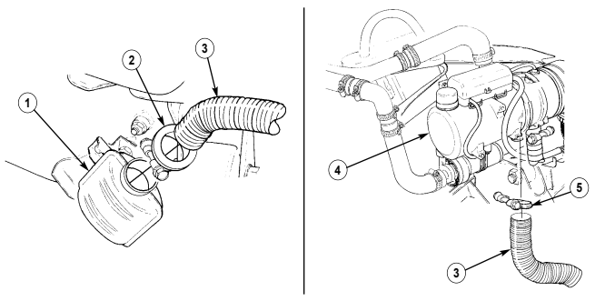

FOLLOW-ON TASK: Install heat shield (para. 12-2).

# 12-4.1. Engine/Crew Compartment Heater Inlet Pipe Replacement

This task covers:
INITIAL SETUP:
Tools General mechanic's tool kit:
automotive (Appendix B, Item 1)
Manual References TM 9-2320-387-24P
Equipment Condition Heat shield removed (para. 12-2).

a. Removal b. Installation

General Safety Instructions Do not touch hot exhaust system components with bare hands.

Maintenance Level Unit

#### .Warning.

Do not touch hot exhaust system components with bare hands. Severe injury may result.

a. Removal 1. Remove clamp (4) and inlet pipe (3) from muffler (5). 2. Remove clamp (2) and inlet pipe (3) from heater (1). b. Installation 1. Install clamps (2) and (4) on inlet pipe (3). 2. Install inlet pipe (3) on heater (1) and tighten clamp (2). 3. Install inlet pipe (3) on muffler (5) and tighten clamp (4).

# 12-4.1. Engine/Crew Compartment Heater Inlet Pipe Replacement (Cont'D)

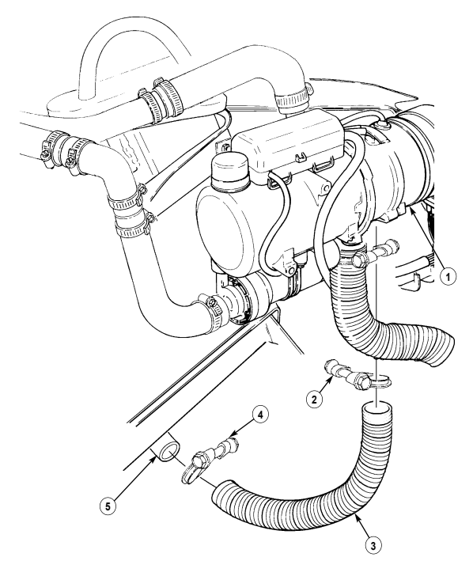

FOLLOW-ON TASK:  Install heat shield (para. 12-2).

# 12-5. Engine/Crew Compartment Heater Lower Hose Assembly Replacement

This task covers:
INITIAL SETUP:
Tools General mechanic's tool kit:
automotive (Appendix B, Item 1)
Manual References TM 9-2320-387-24P

#### A. Removal

a. Removal b. Installation

| TM 9\-2320\-387\-24P   |
|------------------------|
| Equipment Condition    |
| Maintenance Level      |

1. Loosen clamp (2) and disconnect heater hose (1) from heater tube (3). 2. Loosen clamp (10) and disconnect elbow (11) from inlet port (9) on heater (8). 3. Loosen clamps (12) and (14), and disconnect reducer (13) from elbow (11) and elbow (7). 4. Loosen clamps (4) and (6) and disconnect mender (5) from heater hose (1) and elbow (7).

#### B. Installation

1. Install clamps (4), (6), (14), (12), (10), and (2) on heater tube (3), heater hose (1), and elbows (7)
and (11).

2. Connect heater hose (1) to heater tube (3) and tighten clamp (2). 3. Connect elbow (11) to inlet port (9) on heater (8) and loosely tighten clamp (10). 4. Connect mender (5) to heater hose (1) and elbow (7), and tighten clamps (4) and (6). 5. Connect reducer (13) to elbows (7) and (11) and tighten clamps (12), (14), and (10).

12-5.  ENGINE/CREW COMPARTMENT HEATER LOWER HOSE ASSEMBLY
           REPLACEMENT (Cont'd)

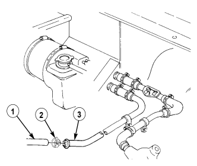

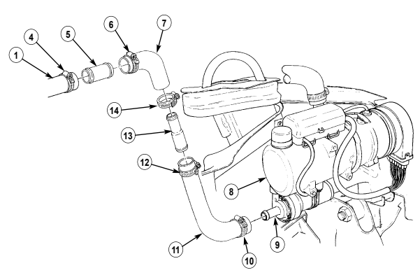

FOLLOW-ON TASK:  Fill cooling system (para. 3-61).

# 12-6. Engine/Crew Compartment Heater Outlet Hose Assembly Replacement

This task covers:
INITIAL SETUP:
Tools General mechanic's tool kit:
automotive (Appendix B, Item 1)
Manual References TM 9-2320-387-24P

#### A. Removal

3. Loosen clamp (10) and disconnect elbow (9) from heater outlet port (11). 4. Loosen clamps (6) and (8) and remove reducer (7) from heater hose (1) and elbow (9).

#### B. Installation

1. Loosen clamp (4) and remove mender (3) from water pump hose (5). 2. Loosen clamp (2) and remove mender (3) from heater hose (1).

a. Removal b. Installation

#### Equipment Condition

- Battery ground cables disconnected (para. 4-68). - Air horn removed (para. 3-14). - Cooling system drained, as required (para. 3-61).

Maintenance Level Unit 1. Install reducer (7) on heater hose (1) and elbow (9) and tighten clamps (6) and (8). 2. Connect elbow (9) on heater outlet port (11) and tighten clamp (10). 3. Install mender (3) on heater hose (1) and tighten clamp (2). 4. Install mender (3) with heater hose (1) on water pump hose (5) and tighten clamp (4).

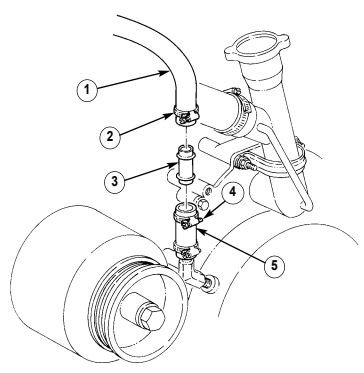

12-6. ENGINE/CREW COMPARTMENT HEATER OUTLET HOSE ASSEMBLY
REPLACEMENT (Cont'd)

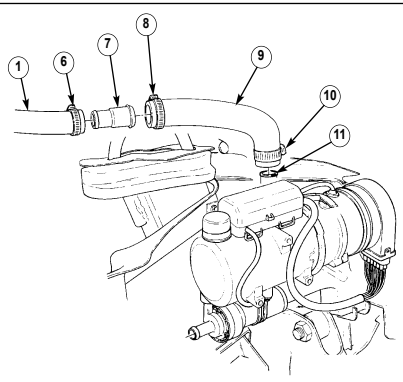

FOLLOW-ON TASKS: - Install air horn (para. 3-14).

- Fill cooling system (para. 3-61). - Connect battery ground cables (para. 4-68).

# 12-7. Engine/Crew Compartment Heater Circulating Pump Replacement

This task covers:
INITIAL SETUP:
Tools General mechanic's tool kit:
automotive (Appendix B, Item 1)
Materials/Parts O-ring (Appendix G, Item 228)
Manual References TM 9-2320-387-24P

a. Removal b. Installation

#### Equipment Condition

- Battery ground cables disconnected (para. 4-68). - Cooling system drained, as required (para. 3-61). - Heater lower hose assembly disconnected 
(para. 12-5).

Maintenance Level Unit a. Removal

Prior to removal, tag leads for installation.

1. Remove heater harness connector cover (3) from harness connector (2). 2. Disconnect two leads (1) (brown 5 and black 8) from heater harness connector (2). 3. Remove two screws (7), clamp (6), heater pump (5), and O-ring (8) from heater (4). Discard O-ring
(8).

b. Installation 1. Install O-ring (8) and heater pump (5) on heater (4) with clamp (6) and two screws (7). 2. Connect two leads (1) (brown 5 and black 8) to heater harness connector (2). 3. Install heater harness connector cover (3) on harness connector (2).

12-7. ENGINE/CREW COMPARTMENT HEATER CIRCULATING PUMP 

# Replacement (Cont'D)

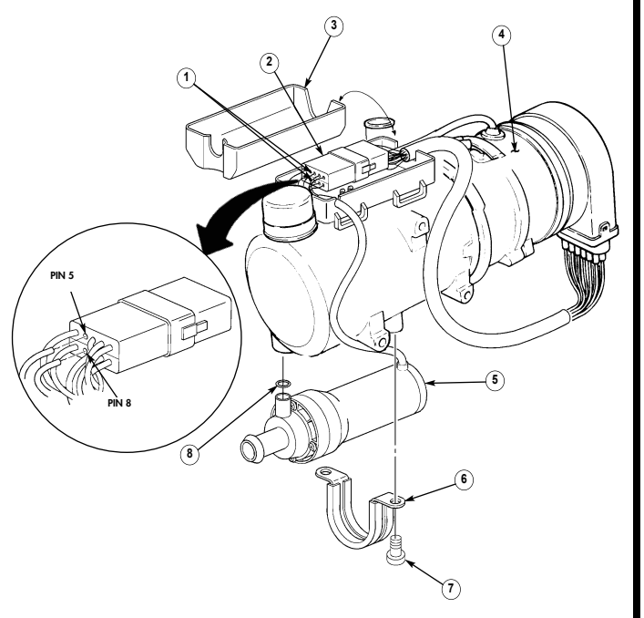

FOLLOW-ON TASKS: - Connect heater lower hose assembly (para. 12-5).

- Fill cooling system (para. 3-61). - Connect battery ground cables (para. 4-68).

# 12-8. Engine/Crew Compartment Heater Fuel Lines Replacement

This task covers:

Tools General mechanic's tool kit:
automotive (Appendix B, Item 1)
Materials/Parts Four lockwashers (Appendix G, Item 150) Two lockwashers (Appendix G, Item 144)
Manual References TM 9-2320-387-24P
a. Heater Fuel Line Removal c. Tank Fuel Line and Supply Tube Removal b. Heater Fuel Line Installation **d. Tank Fuel Line and Supply Tube Installation**

| One mechanic   |
|----------------|
| One assistant  |

General Safety Instructions Do not perform this procedure near fire, flames, or sparks.

Maintenance Level Unit

#### .Warning.

Diesel fuel is highly flammable. Do not perform this procedure near fire, flames, or sparks. Severe injury or death may result.

#### Caution

Cover or plug all open connections immediately after removal to prevent contamination. Remove all covers or plugs prior to connection.

Have drainage container ready to catch fuel.

#### A. Heater Fuel Line Removal

1. Remove clamps (4) and (6) and hose section (5) from fuel line (3) and inlet tube (7) on heater (8). 2. Remove nut (9), washer (10), screw (1), washer (2), and clamp (15) from fuel line (3). 3. Remove clamps (13) and (14) and hose section (11) from fuel lines (3) and (12). 4. Remove clamps (16) and (18) and hose section (17) from fuel lines (12) and (19). Allow fuel to drain.

5. Remove clamps (24) and (26) and elbow (25) from fuel line (19) and fuel pump (23). 6. Remove screws (22) and (27), lockwashers (21) and (28), clamps (20) and (29), and fuel line (19) from transmission cooler tube (30) and frame (31). Discard lockwashers (21) and (28).

#### B. Heater Fuel Line Installation

1. Install clamps (24) and (26) on elbow (25) and install elbow (25) on fuel pump (23) and fuel line (19). Tighten clamps (24) and (26).

2. Install clamps (20) and (29) on fuel line (19) and secure fuel line (19) to transmission cooler tube (30) and frame (31) with lockwashers (21) and (28) and screws (22) and (27).

3. Install clamps (16) and (18) on hose section (17) and install hose section (17) on fuel lines (12)
and (19). Tighten clamps (16) and (18).

4. Install clamps (13) and (14) on hose section (11) and install hose section (11) on fuel lines (12)
and (3). Tighten clamps (13) and (14).

5. Install clamps (4) and (6) on hose section (5) and install hose section (5) on fuel line (3) and inlet tube (7) of heater (8). Tighten clamps (4) and (6).

6. Install clamp (15) on fuel line (3) with washer (2), screw (1), washer (10), and nut (9).

12-8. ENGINE/CREW COMPARTMENT HEATER FUEL LINES REPLACEMENT (Cont'd)

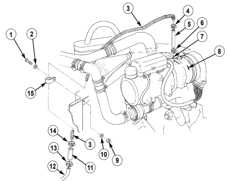

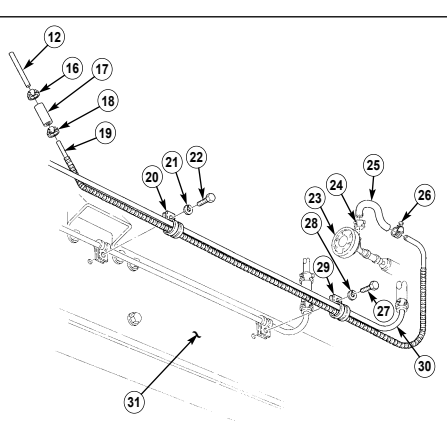

# 12-8. Engine/Crew Compartment Heater Fuel Lines Replacement (Cont'D)

Fuel line replacement for the M1114 requires fuel tank removal to provide access (para. 3-25).

c. Tank Fuel Line and Supply Tube Removal 1. Remove four screws (3), lockwashers (2), washers (1), and access cover (4) from tunnel (6).

Discard lockwashers (2).

2. Disconnect fuel line (7) from in-tank fitting (5) on fuel tank (8). 3. Remove hose clamps (16) and (18), fuel hose (17), screw (9), two clamps (10), and fuel line (7) from fuel tank (8).

4. Remove hose clamps (12) and (14), union (15), and hose section (13) from fuel pump (11).

#### D. Tank Fuel Line And Supply Tube Installation

1. Install hose section (13) on fuel pump (11) and union (15) with clamps (12) and (14). 2. Install fuel hose (17) on union (15) and fuel line (7) with clamps (18) and (16). 3. Connect fuel line (7) to in-tank fitting (5) on fuel tank (8). 4. Install two clamps (10) on fuel line (7) and fuel tank (8) with screw (9). 5. Install access cover (4) on tunnel (6) with four washers (1), lockwashers (2), and screws (3).

12-8. ENGINE/CREW COMPARTMENT HEATER FUEL LINES REPLACEMENT (Cont'd)

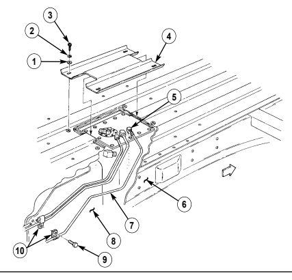

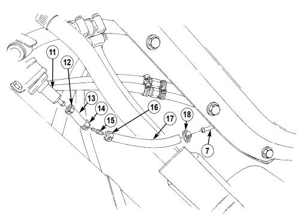

FOLLOW-ON TASKS: - • Install heat shield (para. 12-2).
- • - Bleed heater fuel system (para. 12-14).

# 12-9. Engine/Crew Compartment Heater Fuel Pump Replacement

This task covers:
INITIAL SETUP:
Tools General mechanic's tool kit:
automotive (Appendix B, Item 1)
Manual References TM 9-2320-387-24P
Equipment Condition Battery ground cables disconnected (para. 4-68).

a. Removal b. Installation General Safety Instructions Do not perform this procedure near fire, flames, or sparks.

Maintenance Level Unit

#### .Warning.

Diesel fuel is highly flammable. Do not perform this procedure near fire, flames, or sparks. Severe injury or death may result.

#### Caution

Cover or plug all open connections immediately after removal to prevent contamination. Remove all covers or plugs prior to connection.

Have drainage container ready to catch fuel.

a. Removal 1. Remove clip (12) and connector (11) from fuel pump (1). 2. Loosen clamp (2) and remove fuel line (3) from fuel pump (1) and allow fuel to drain. 3. Loosen clamp (6) and remove fuel line (5) from fuel pump (1). 4. Remove nut (10), washer (9), screw (7), clamp (8), and fuel pump (1) from frame rail bracket (4). 

#### B. Installation

1. Install fuel pump (1) on frame rail bracket (4) with clamp (8), screw (7), washer (9), and nut (10). 2. Connect fuel line (5) to fuel pump (1) and tighten clamp (6). 3. Connect fuel line (3) to fuel pump (1) and tighten clamp (2). 4. Install connector (11) on fuel pump (1) with clip (12).

# 12-9. Engine/Crew Compartment Heater Fuel Pump Replacement (Cont'D)

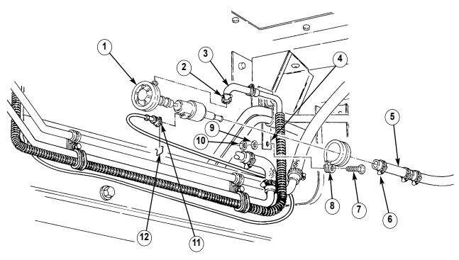

FOLLOW-ON TASKS: - Connect battery ground cables (para. 4-68).

· Bleed heater fuel system (para. 12-14).

# 12-10. Engine/Crew Compartment Heater Assembly Replacement

This task covers:
INITIAL SETUP:

#### Tools

General mechanic's tool kit:
automotive (Appendix B, Item 1)
Materials/Parts Three lockwashers (Appendix G, Item 145) Three lockwashers (Appendix G, Item 162)
Manual References TM 9-2320-387-24P

a. Removal b. Installation

#### Equipment Condition

- Battery ground cables disconnected (para. 4-68). - Heater exhaust pipe removed (para. 12-4). - Heater inlet pipe removed (para. 12-4.1). - Heater lower hose removed (para. 12-5). - Heater outlet hose removed (para. 12-6).

General Safety Instructions Do not touch hot exhaust system components with bare hands.

Maintenance Level Unit

#### .Warning

Do not touch hot exhaust system components with bare hands. Severe injury may result.

#### A. Removal

1. Loosen clamp (7) and disconnect fuel supply hose (6) from heater (8). 2. Disconnect plug (10) and connector (9) from heater (8). 3. Remove capscrew (5), lockwasher (4), and washer (3) from bracket (2) and splash shield (1). Discard lockwasher (4).

4. Remove two capscrews (11), lockwashers (4), washers (12), and heater (8) from splash shield (1).

Discard lockwashers (4).

5. Remove three capscrews (13), lockwashers (14), and bracket (2) from heater (8). Discard lockwashers (14).

#### B. Installation

5. Connect fuel supply hose (6) to heater (8) and tighten clamp (7).

1. Install bracket (2) on heater (8) with three lockwashers (14) and capscrews (13). 2. Install heater (8) and bracket (2) on splash shield (1) with two washers (12), lockwashers (4), and capscrews (11).

3. Install bracket (2) on splash shield (1) with washer (3), lockwasher (4), and capscrew (5). 4. Connect plug (10) and connector (9) to heater (8).

# 12-10. Engine/Crew Compartment Heater Assembly Replacement (Cont'D)

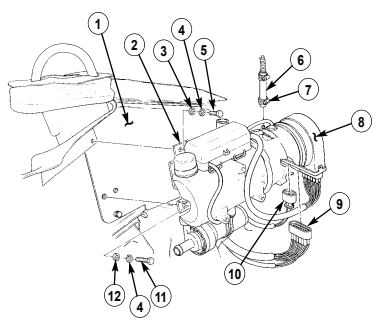

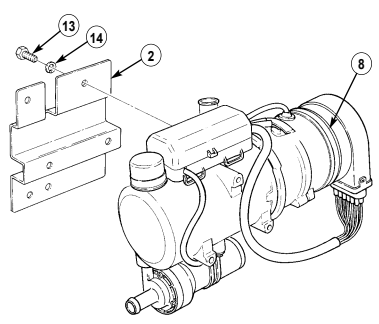

FOLLOW-ON TASKS: - Install heater outlet hose installed (para. 12-6).

- Install heater lower hose (para. 12-5). - Install heater inlet hose (para. 12-4.1). - Install heater exhaust pipe (para. 12-4). - Connect battery ground cables (para. 4-68). - Fill cooling system (para. 3-61).

# 12-11. Engine/Crew Compartment Heater Wiring Harness Replacement

This task covers:

#### A. Removal B. Installation

INITIAL SETUP:
Tools General mechanic's tool kit:
automotive (Appendix B, Item 1)
Manual References TM 9-2320-387-24P
a. Removal

#### Equipment Condition

- Battery ground cables disconnected (para. 4-68). - Heat shield removed (para. 12-2). - Air horn removed (para. 3-14).

Maintenance Level Unit

#### Caution

Use care when removing harness. Failure to do so will cause damage to harness.

1. Remove cover (1) from heater (4). 2. Disconnect wiring harness connector (2) from heater harness connector (7). 3. Disconnect wiring harness connector (6) from heater control unit (5). 4. Remove wiring harness (3) from vehicle. b. Installation

#### Caution

Use care when installing harness. Failure to do so will cause damage to harness.

1. Position wiring harness (3) in vehicle. 2. Connect wiring harness connector (2) to heater harness connector (7). 3. Connect wiring harness connector (6) to heater control unit (5). 4. Install cover (1) on heater (4).

12-11. ENGINE/CREW COMPARTMENT HEATER WIRING HARNESS 
REPLACEMENT (Cont'd)

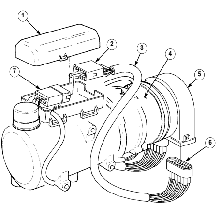

FOLLOW-ON TASKS: - Install air horn (para. 3-14).

- Install heat shield (para. 12-2). - Connect battery ground cables (para. 4-68).

# 12-12. Engine/Crew Compartment Heater Circuit Breaker Replacement

| This task covers:   |
|---------------------|

|        | Section I. ENGINE/CREW COMPARTMENT HEATER MAINTENANCE   |          |
|--------|---------------------------------------------------------|----------|
| 12\-1. | ENGINE/CREW COMPARTMENT HEATER MAINTENANCE TASK SUMMARY |          |
| TASK   | PROCEDURES                                              | PAGE NO. |
| PARA.  |                                                         |          |

a. Removal b. Installation

a. Removal

Prior to removal, tag leads for installation.

1. Remove three screws (9) and lockwashers (8) from heat shield (7) and heater (1). Discard lockwashers (8).

2. Move heat shield (7) away from heater (1) and disconnect cable (5) and connector (2) from circuit breaker (6).

3. Remove two nuts (3), lockwashers (4), screws (10), and circuit breaker (6) from heat shield (7).

Discard lockwashers (4).

#### B. Installation

1. Install circuit breaker (6) on heat shield (7) with two screws (10), lockwashers (4), and nuts (3). 2. Connect cable (5) and connector (2) to circuit breaker (6). 3. Install heat shield (7) on heater (1) with three lockwashers (8) and screws (9).

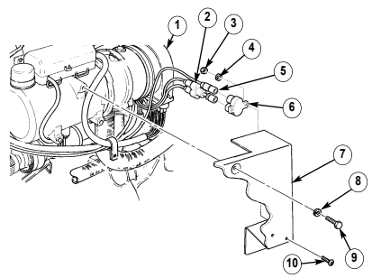

FOLLOW-ON TASK: Connect battery ground cables (para. 4-68).

# 12-13. Engine/Crew Compartment Heater Controller Replacement

This task covers:
a. Removal b. Installation INITIAL SETUP:
Tools General mechanic's tool kit:
automotive (Appendix B, Item 1)
Materials/Parts Three lockwashers (Appendix G, Item 162)
Manual References TM 9-2320-387-24P
Equipment Condition Battery ground cables disconnected (para. 4-68).

Maintenance Level Unit a. Removal

Prior to removal, tag leads for installation.

1. Remove three capscrews (8) and lockwashers (7) from heat shield (6). Discard lockwashers (7). 2. Move heat shield (6) away from heater (1) and disconnect plug (2) and harness connectors (4) 
and (5) from controller (3).

3. Lift up on controller (3) and remove from heater (1). b. Installation 1. Install controller (3) on heater (1). 2. Connect plug (2) and harness connectors (4) and (5) to controller (3). 3. Install heat shield (6) on heater (1) with three lockwashers (7) and capscrews (8).

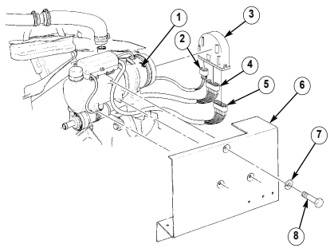

FOLLOW-ON TASK: Connect battery ground cables (para. 4-68).

# 12-14. Engine/Crew Compartment Heater Fuel System Bleeding

This task covers:
Bleeding INITIAL SETUP:
Tools General mechanic's tool kit:
automotive (Appendix B, Item 1)
Personnel Required One mechanic One assistant Manual References TM 9-2320-387-24P
General Safety Instructions Do not perform this procedure near fire, flames, or sparks.

Maintenance Level Unit

#### .Warning.

Diesel fuel is highly flammable. Do not perform this procedure near fire, flames, or sparks. Severe injury or death may result.

NOTE
Have drainage container ready to catch fuel.

Bleeding 1. Loosen clamp (3) and disconnect heater fuel line (2) from heater (4). 2. Place end of fuel line (2) in drainage container. 3. Turn heater switch (1) to ON position. Hold switch (1) in ON position until fuel flows free of air bubbles.

4. Turn switch (1) to OFF position. 5. Connect fuel line (2) to heater (4) and tighten clamp (3).

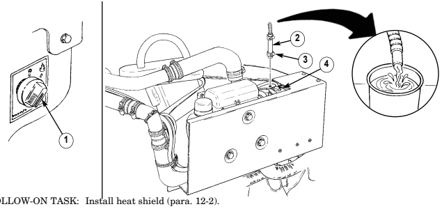

12-24/(12-25/(12-26 blank) deleted) Change 1

# Section Ii. Communications Kits (Unit) Maintenance

## 12-16. Communications Kits Maintenance Task Summary

| a.                                     | Removal                                                     | b.                                       | Installation                                   |
|----------------------------------------|-------------------------------------------------------------|------------------------------------------|------------------------------------------------|
| INITIAL SETUP:                         |                                                             |                                          |                                                |
| Tools                                  | Equipment Condition                                         | General mechanic's tool kit:             | Hood raised and secured (TM 9\-2320\-387\-10). |
| automotive (Appendix B, Item 1)        | General Safety Instructions                                 |                                          |                                                |
| Materials/Parts                        | Do not touch hot exhaust system components with             | Two lockwashers (Appendix G, Item 149)   | bare hands.                                    |
| Two lockwashers (Appendix G, Item 147) | Maintenance Level                                           | Three lockwashers (Appendix G, Item 162) |                                                |
| Unit                                   | Manual References                                           |                                          |                                                |
| TM 9\-2320\-387\-10                    | TM 9\-2320\-387\-24P                                        |                                          |                                                |
| .WARNING.                              | Do not touch hot exhaust system components with bare hands. |                                          |                                                |
| Severe injury may result.              |                                                             |                                          |                                                |
| a. Removal                             |                                                             |                                          |                                                |

## 12-17. Radio Rack And Mounting Brackets Replacement (M1113/M1114)

| 4.                                            | Remove two nuts (4), lockwashers (5), and screws (10) from heat shield (7) and                        |
|-----------------------------------------------|-------------------------------------------------------------------------------------------------------|
| circuit breaker (6). Discard lockwashers (5). |                                                                                                       |
| 5.                                            | Remove heat shield (7) from heater (3).                                                               |
|                                               | b. Installation                                                                                       |
| 1.                                            | Install circuit breaker (6) on heat shield (7) with two screws (10), lockwashers (5), and nuts (4).   |
| 2.                                            | Install heat shield (7) on heater (3) with three lockwashers (8) and screws (9).                      |
| 3.                                            | Install clamp (2) on wiring harness (1) and heat shield (7) with screw (11), lockwasher (12), and nut |
|                                               | (13).                                                                                                 |
| 4.                                            | Install clamp (15) on intake pipe (16) and heat shield (7) with screw (14), lockwasher (12), and      |
|                                               | nut (13).                                                                                             |

This task covers:

# 12-17. Radio Rack And Mounting Brackets Replacement (Cont'D)

a. Removal

Perform steps 1 and 2 for M1113 vehicles. Perform steps 3 and 4 for M1114 vehicles.

1. Remove two nut and lockwasher assemblies (11), screws (2), clamps (9), and cables (29) from radio rack (1). Discard nut and lockwasher assemblies (11).

2. Remove four locknuts (6), washers (4), capscrews (3), and washers (4) from two brackets (5) and radio rack (1). Discard locknuts (6).

3. Remove four locknuts (6), capscrews (3), washers (4), radio rack (1), and bracket (30) with rifle mounting clamp (31) from two brackets (5). Discard locknuts (6).

4. Remove two locknuts (33), capscrews (32), and rifle mounting clamp (31) from bracket (30). Discard locknuts (34).

5. Remove two locknuts (14), washers (15), capscrews (12), and radio rack (1) from two brackets (13).

Discard locknuts (14).

6. Remove two locknuts (25), washers (26), screws (28), and headphone mounting bracket (27) from radio rack (1). Discard locknuts (25).

7. Remove two capscrews (8), washers (7), and brackets (5) from A-beam (10). 8. Remove four capscrews (21), lockwashers (20), washers (19), and two brackets (13) from support bracket (17). Discard lockwashers (19).

9. Remove three capscrews (22), lockwashers (23), washers (24), support bracket (17), and three spacers (18) from tunnel floor (16). Discard lockwashers (23).

# 12-17. Radio Rack And Mounting Brackets Replacement (Cont'D)

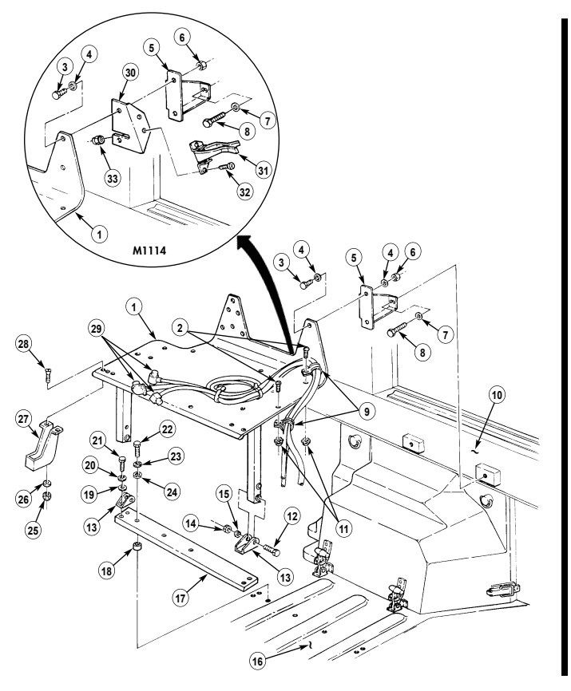

# 12-17. Radio Rack And Mounting Brackets Replacement (Cont'D)

b. Installation 1. Position three spacers (18) and support bracket (17) on tunnel floor (16) and install with three washers (24), lockwashers (23), and capscrews (22).

2. Install two brackets (13) on support bracket (17) with four washers (19), lockwashers (20), and capscrews (21). Tighten capscrews (21) to 8 lb-ft (11 N•m).

3. Install two brackets (5) on A-beam (10) with two washers (7) and capscrews (8). Tighten capscrews (8) to 6 lb-ft (8 N•m).

4. Install headphone mounting bracket (27) on radio rack (1) with two screws (28), washers (26), and locknuts (25). Tighten locknuts (25) to 6 lb-ft (8 N•m).

5. Install radio rack (1) on two brackets (13) with two capscrews (12), washers (15), and locknuts (14).

Tighten locknuts (14) to 8-10 lb-ft (11-14 N•m).

Perform steps 6 and 7 for M1114 vehicles.

6. Install rifle mounting clamp (31) on bracket (30) with two capscrews (32) and locknuts (33). 7. Install bracket (30) with rifle mounting clamp (31) and radio rack (1) on two brackets (5) with four capscrews (3), washers (4), and locknuts (6).

Perform steps 8 and 9 for M1113 vehicles.

8. Install radio rack (1) on two brackets (5) with four washers (4), capscrews (3), washers (4), and locknuts (6).

9. Install cables (29) and two clamps (9) on radio rack (1) with two screws (2) and nut and lockwasher assemblies (11).

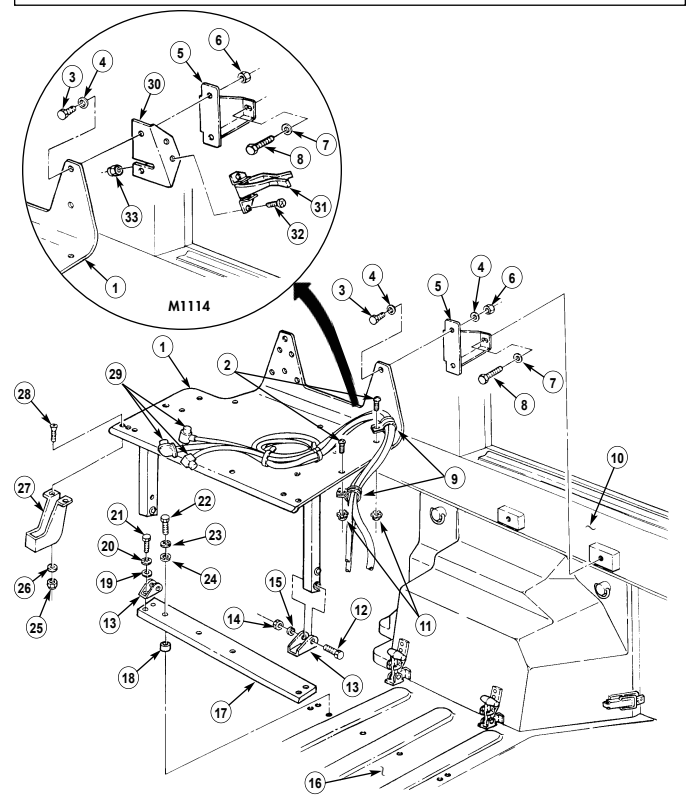

FOLLOW-ON TASKK - • Install ferminal board (M1114) (para. 12-18).
- Install field glasses bracket (M1114) (para. 11-65).
- Install Vehicle Power Conditioner (VPC) mounting br
· Connect battery ground cables (para. 4-68).

# 12-17. Radio Rack And Mounting Brackets Replacement (Cont'D)

12-30.1 I

# 12-17.1. Precision Lightweight Global Positioning Receiver (Plgr) Mounting Bracket Replacement

This task covers:
a. Removal b. Installation

| Tools                             |
|-----------------------------------|
| General mechanic's tool kit:      |
| automotive (Appendix B, Item 1)   |
| Materials/Parts                   |
| Lockwasher (Appendix G, Item 183) |

INITIAL SETUP:
automotive (Appendix B, Item 1)
a. Removal

| General Safety Instructions bare hands.   |
|-------------------------------------------|
| Maintenance Level                         |
| Unit                                      |

1. Remove two tighteners (6), nuts (9), screws (8), and front bracket (7) with PLGR mount (12) from rear bracket (5).

2. Remove two capscrews (1), washers (2), and adapter (4) from frame (3). 3. Remove two nuts (10), capscrews (11), and rear bracket (5) from adapter (4). 4. Remove four nuts (13), screws (14), and PLGR mount (12) from front bracket (7).

b. Installation 1. Install PLGR mount (12) on front bracket (7) with four screws (14) and nuts (13). 2. Install rear bracket (5) on adapter (4) with two capscrews (11) and nuts (10). 3. Install adapter (4) on frame (3) with two capscrews (1) and washers (2). 4. Install front bracket (7) on rear bracket (5) with two screws (8), nuts (9), and tighteners (6).

12-17.1. PRECISION LIGHTWEIGHT GLOBAL POSITIONING RECEIVER (PLGR)

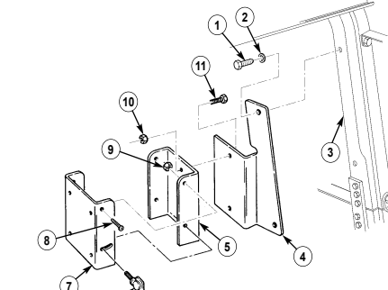

9 6

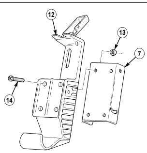

# 12-17.2. Radio Rack And Mounting Brackets Replacement (M1151/M1152)

| Manual References                  |
|------------------------------------|
| TM 9\-2320\-387\-24P               |
| Equipment Condition                |
| Heat shield removed (para. 12\-2). |

This task covers:

| General mechanic's tool kit:    |
|---------------------------------|
| automotive (Appendix B, Item 1) |

INITIAL SETUP:
Two locknuts (Appendix G, Item 110) Two locknuts (Appendix G, Item 106) Two locknuts (Appendix G, Item 133.16)

a. Removal **b. Installation**

| Equipment Condition                     |
|-----------------------------------------|
| . Battery ground cables disconnected    |
| (para. 4\-68).                          |
| . Air distribution duct (front) removed |
| (para. 11\-99).                         |

Maintenance Level Unit

| General Safety Instructions   |
|-------------------------------|

#### A. Removal

1. Remove two nut and lockwasher assemblies (11), screws (2), clamps (9), and cables (29) from radio rack (1). Discard nut and lockwasher assemblies (11).

2. Remove four locknuts (6), washers (4), capscrews (3), and washers (4) from bracket (5) and radio rack (1). Discard locknuts (6).

3. Remove two locknuts (14), washers (15), capscrews (12), and radio rack (1) from two brackets (13).

Discard locknuts (14).

4. Remove two locknuts (24), washers (25), screws (27), and headphone mounting bracket (26) from radio rack (1). Discard locknuts (24).

5. Remove two capscrews (8), washers (7), and bracket (5) from A-pillar (10). 6. Remove four capscrews (20), lockwashers (19), washers (18), and two brackets (13) from support bracket (17). Discard lockwashers (19).

7. Remove three capscrews (21), lockwashers (22), washers (23), and support bracket (17) from tunnel floor (16). Discard lockwashers (22).

# 12-17.2. Radio Rack And Mounting Brackets Replacement (M1151/M1152) (Cont'D)

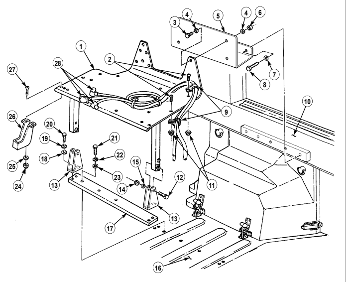

## 12-17.2. Radio Rack And Mounting Brackets Replacement (M1151/M1152) (Cont'D)

b. Installation 1. Position support bracket (17) on tunnel floor (16) and install with three washers (23), lockwashers (22),
and capscrews (21).

2. Install two brackets (13) on support bracket (17) with four washers (18), lockwashers (19), and capscrews (20). Tighten capscrews (20) to 8 lb-ft (11 N•m).

3. Install bracket (5) on A-pillar (10) with two washers (7) and capscrews (8). Tighten capscrews (8) to 6 lb-ft (8 N•m).

4. Install headphone mounting bracket (26) on radio rack (1) with two screws (27), washers (25), and locknuts (24). Tighten locknuts (24) to 6 lb-ft (8 N•m).

5. Install radio rack (1) on two brackets (13) with two capscrews (12), washers (15), and locknuts (14).

Tighten locknuts (14) to 8-10 lb-ft (11-14 N•m).

6. Install radio rack (1) on bracket (5) with four washers (4), capscrews (3), washers (4), and locknuts (6). 7. Install cables (28) and two clamps (9) on radio rack (1) with two screws (2) and nut and lockwasher assemblies (11).

# 12-17.2. Radio Rack And Mounting Brackets Replacement (M1151/M1152) (Cont'D)

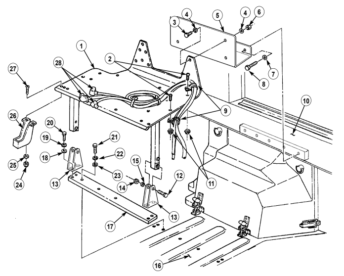

FOLLOW-ON TASKS:  -  Install air distribution duct (front) (para. 11-99).
-  -  -   - 

# 12-18. Terminal Board Replacement

This task covers:
INITIAL SETUP:
Applicable Models M1114 Tools General mechanic's tool kit:
automotive (Appendix B, Item 1)
Materials/Parts Sealing compound (Appendix C, Item 70)
a. Removal

a. Removal b. Installation

Manual References TM 9-2320-387-24P
Equipment Condition Battery ground cables disconnected (para. 4-68).

Maintenance Level Unit NOTE
Tag all leads for installation.

1. Loosen two terminal lugs (2) and remove cover (1) from terminal board (10). 2. Remove nut (15), lockwasher (14), washer (13), and three leads (12) from positive post (9) of terminal board (10). Discard lockwasher (14).

3. Remove nut (3), lockwasher (4), washer (5), and three leads (6) from negative post (8) of terminal board (10). Discard lockwasher (4).

4. Remove three screws (11) and terminal board (10) from support bracket (7).

b. Installation

Apply sealant compound to negative and positive posts on terminal board.

1. Install terminal board (10) on support bracket (7) with three screws (11). 2. Install three leads (6) on negative post (8) of terminal board (10) with washer (5), lockwasher (4),
and nut (3).

3. Install three leads (12) on positive post (9) of terminal board (10) with washer (13), lockwasher (14),
and nut (15).

4. Install cover (1) on terminal board (10) and tighten two terminal lugs (2).

# 12-18. Terminal Board Replacement (Cont'D)

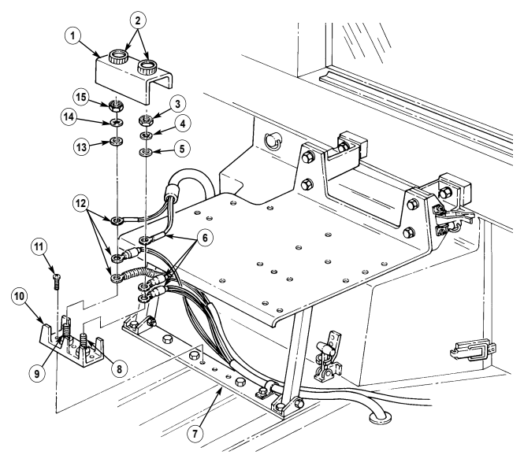

FOLLOW-ON TASK:  Connect battery ground cables (para. 4-68).

# 12-19. Headphone Mounting Bracket Replacement

This task covers:
INITIAL SETUP:
Tools General mechanic's tool kit:
automotive (Appendix B, Item 1)

a. Removal b. Installation

| Maintenance Level   |
|---------------------|
| Unit                |

| Equipment Condition   |
|-----------------------|

Materials/Parts Two locknuts (Appendix G, Item 77)
a. Removal Remove two locknuts (4), washers (5), screws (1), and headphone mounting bracket (3) from radio rack (2). Discard locknuts (4).

b. Installation Install headphone mounting bracket (3) on radio rack (2) with two screws (1), washers (5), and

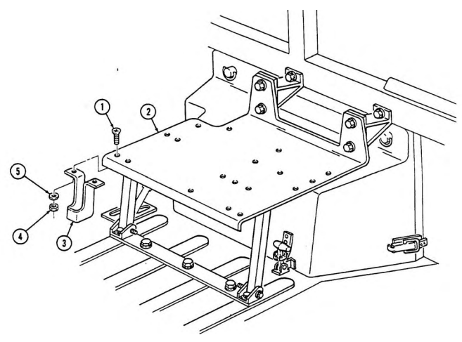 locknuts (4). Tighten locknuts (4) to 6 lb-ft (8 N•m).

# 12-20. Antenna Ground Strap Replacement

This task covers:
INITIAL SETUP:
Tools General mechanic's tool kit:
automotive (Appendix B, Item 1)
Materials/Parts Two lockwashers (Appendix G, Item 168) Locknut (Appendix G, Item 98) Antiseize compound (Appendix C, Item 16)
a. Removal b. Installation Manual References TM 9-2320-387-10 TM 9-2320-387-24P
Equipment Condition
- Battery ground cables disconnected (para. 4-68). - Cargo shell door raised (TM 9-2320-387-10).

Maintenance Level Unit a. Removal 1. Remove screw (6), lockwasher (7), and ground strap (3) from antenna base (2). Discard lockwasher (7).

NOTE
Perform step 2 for M1113, M1152, M1152A1, M1165, and M1165A1 models only. Perform step 3 for M1114, M1151, M1151A1, and M1167 models only.

2. Remove locknut (4), ground strap (3), lockwasher (5), and screw (8) from antenna mounting bracket assembly (1). Discard locknut (4) and lockwasher (5).

3. Remove locknut (13), washer (10), ground strap (3), lockwasher (12), capscrew (9), and washer (10),

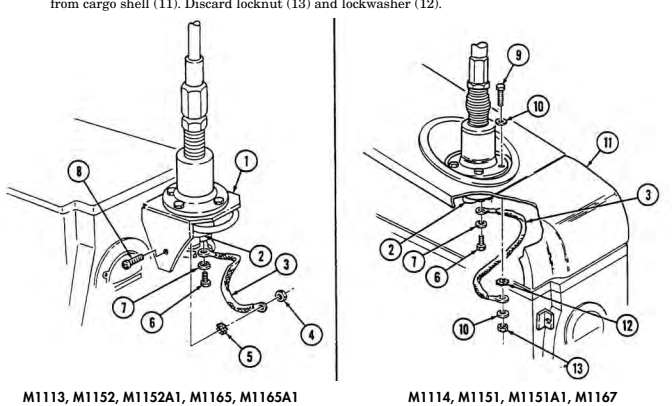

# 12-20. Antenna Ground Strap Replacement (Cont'D)

b. Installation

Perform step 1 for M1114, M1151, M1151A1, and M1167 models only. Perform steps 2 and 3 for M1113, M1152, M1152A1, M1165, and M1165A1 models only.

1. Install lockwasher (12) and ground strap (3) on cargo shell (11) with washer (10), capscrew (9),
washer (10), and locknut (13). Tighten locknut (13) to 31 lb-ft (42 N•m).

2. Apply antiseize compound to threads of screw (8). 3. Install screw (8), lockwasher (5), and ground strap (3) on antenna mounting bracket assembly (1)
with locknut (4).

4. Install ground strap (3) on antenna base (2) with lockwasher (7) and screw (6).

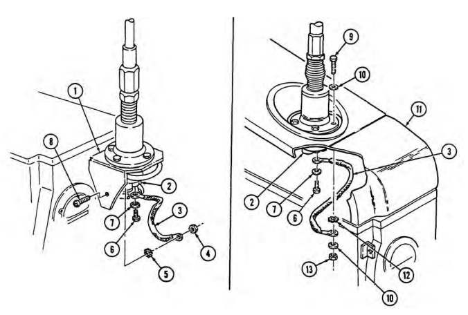

#### M1113, M1152, M1152A1, M1165, M1165A1 M1114, M1151, M1151A1, M1167

FOLLOW-ON TASKS: - Connect battery ground cables (para. 4-68).

- Lower cargo shell door (TM 9-2320-387-10).

# 12-21. As 1729/Vrc Antenna Replacement

This task covers:
INITIAL SETUP:
Tools General mechanic's tool kit:
automotive (Appendix B, Item 1)
Materials/Parts Three locknuts (Appendix G, Item 106)
a. Removal b. Installation Manual References TM 9-2320-387-24P
Equipment Condition Antenna ground strap removed (para. 12-20).

Maintenance Level Unit

Replacement procedures for the antenna are basically the same for all models except the M1113, M1152, M1152A1, M1165, and M1165A1 use an external antenna mounting bracket. This procedure covers the M1114, M1151, M1151A1, and M1167 models.

a. Removal 1. Disconnect radio antenna cable (2) from antenna (1). 2. Remove three locknuts (5), washers (4), capscrews (3), washers (4), and antenna (1) from cargo shell (6). Discard locknuts (5).

b. Installation

Antenna must be installed perpendicular to horizontal plane. If antenna is not perpendicular after installation, rotate antenna base to correct.

1. Install antenna (1) on cargo shell (6) with three washers (4), capscrews (3), washers (4), and locknuts (5). Tighten locknuts (5) to 26 lb-ft (35 N•m).

2. Connect radio antenna cable (2) to antenna (1).

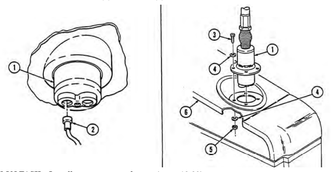

FOLLOW-ON TASK: Install antenna ground strap (para. 12-20).

# 12-22. Rear Antenna Mounting Bracket Replacement

This task covers:
INITIAL SETUP:
Applicable Models M1113, M1152, M1152A1, M1165, and M1165A1 Tools General mechanic's tool kit:
automotive (Appendix B, Item 1)
Special Tools Crowfoot, 3/8-in. (Appendix B, Item 142) Socket adapter, 3/8-in. (Appendix B, Item 135)
Materials/Parts Three locknuts (Appendix G, Item 82)
a. Removal 1. Remove grommet (3) from body (1).

Note position of washers and clamp for installation.

2. Remove three locknuts (8), washers (7), capscrews (4), washers (5), antenna mounting bracket (2),
and clamp (6) from body (1). Discard locknuts (8).

b. Installation 1. Install antenna mounting bracket (2) and clamp (6) on body (1) with three washers (5),
capscrews (4), washers (7), and locknuts (8). Using crowfoot, tighten locknuts (8) to 15 lb-ft (20 N•m).

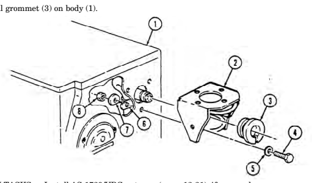

FOLLOW-ON TASKS: - Install AS 1729/VRC antenna (para. 12-21), if removed.

- Install AB-652/GR antenna (para. 12-23), if removed.

a. Removal b. Installation

#### Manual References

TM 9-2320-387-24P
Equipment Condition
- AS 1729/VRC antenna removed 
(if equipped) (para. 12-21).

- AB-652/GR antenna removed (if equipped) 
(para. 12-23).

Maintenance Level Unit

# 12-23. Ab-652/Gr Antenna Replacement

This task covers:
INITIAL SETUP:

#### Tools

General mechanic's tool kit:
automotive (Appendix B, Item 1)
Materials/Parts Four locknuts (Appendix G, Item 106)

#### A. Removal

1. Disconnect antenna cable (7) from adapter (8). 2. Loosen ground clamp (9) and remove from adapter (8). 3. Remove adapter (8) from lower insulator (10). 4. Remove antenna (1), rubber washer (13), ground ring (12), rubber washer (11), and lower insulator (10) from antenna mounting bracket (5).

5. Remove four locknuts (6), washers (3), capscrews (2), washers (3), and adapter (4) from antenna mounting bracket (5). Discard locknuts (6).

b. Installation 1. Install adapter (4) on antenna mounting bracket (5) with four washers (3), capscrews (2),
washers (3), and locknuts (6).

2. Install ground ring (12), rubber washer (11), lower insulator (10), rubber washer (13), and antenna (1) on mounting bracket (5).

3. Install adapter (8) on lower insulator (10). 4. Install ground clamp (9) on adapter (8) and tighten. 5. Connect antenna cable (7) to adapter (8).

FOLLOW-ON TASK: Connect battery ground cables (para. 4-68).

a. Removal b. Installation

| - Heater lower hose assembly disconnected   |
|---------------------------------------------|
| (para. 12\-5).                              |
| Maintenance Level                           |
| Unit                                        |

| Equipment Condition   |
|-----------------------|

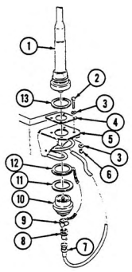

# 12-24. Rear Antenna Cables Replacement

This task covers:
INITIAL SETUP:

a. Removal b. Installation

| Tools                                   | Equipment Condition   |
|-----------------------------------------|-----------------------|
| General mechanic's tool kit:            |                       |
| automotive (Appendix B, Item 1)         |                       |
| Materials/Parts                         |                       |
| Four lockwashers (Appendix G, Item 150) | sparks.               |
| Two lockwashers (Appendix G, Item 144)  | Maintenance Level     |
| Manual References                       | Unit                  |
| TM 9\-2320\-387\-24P                    |                       |
|                                         | .WARNING.             |

(Appendix G, Item 197) (M1113 only)
Locknut (Appendix G, Item 77) Lockwasher (Appendix G, Item 166)
(M1114 only)
Eight lockwashers (Appendix G, Item 165)
(M1114 only)
- Battery ground cables disconnected (para. 4-68). - Right rear passenger seat back removed (M1114 only) (para. 10-45).

- Cargo shell door raised (TM 9-2320-387-10). - Right rear underbody armor removed (M1114 only) (para 11-39).

Maintenance Level Unit

Replacement procedures for left and right rear antenna cables are replaced basically the same, except the left antenna cables have an additional six clamps securing cables across rear of vehicle. This procedure covers the right rear antenna cables.

a. Removal 1. Remove two tiedown straps (6) from antenna cables (4). Discard tiedown straps (6). 2. Remove two nut and lockwasher assemblies (5), screws (2), clamps (3), and antenna cables (4) from front radio rack (1). Discard nut and lockwasher assemblies (5).

3. Remove nut and lockwasher assembly (11), capscrew (8), and clamp (9) from two antenna cables (4)
and grommet (10). Discard nut and lockwasher assembly (11).

4. Remove two screws (12) and insulation retainer (13) from cargo floor (7) and pull insulation retainer (13) away from cargo floor (7).

5. Remove three capscrews (19), clamps (20), and two antenna cables (4) from body (18). 6. Remove nut and lockwasher assembly (21), screw (17), and clamp (22) from two antenna cables (4)
and body (18). Discard nut and lockwasher assembly (21).

7. Remove two nut and lockwasher assemblies (14), capscrews (23), antenna cables (4), grommet (16),
and retainer (15) from body (18). Discard nut and lockwasher assemblies (14).

# 12-24. Rear Antenna Cables Replacement (Cont'D)

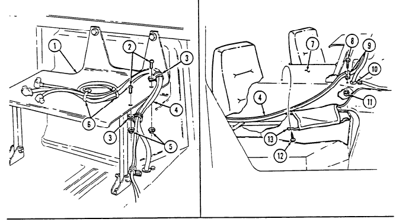

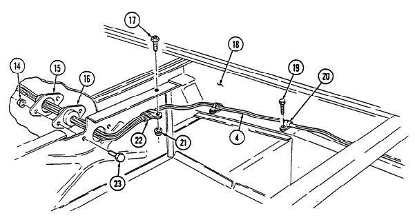

## 12-24. Rear Antenna Cables Replacement **(Cont'D)** I

8. 

9. 

Remove Eve capscrews (7), clamps (3), and antenna cables (1) from underbody (2). Remove locknut (5), washer (4), capscrew (9), washer (4), and filler Pipe clamp (8) from underbody (2) and filler pipe (6). Discard locknut (5). 

10. 

11. 

12. 

13. 

Perform steps 10 through 14 for Ml114 models OdY. 

Remove two locknuts (lo), screws (l3), clamps (ll), and antenna cables (1) from wheelhouse (12). 

Discard locknuts (10). 

Remove screw (19), lockwasher (20), and ground strap (21) from antenna base (22). Discard lockwasher (20). 

Remove four nuts (18), lockwashers (17), capscrews (15), lockwashers (16), and antenna (14) from wheelhouse (12). Discard lockwashers (16) and (17). Disconnect antenna cables (1) from antenna base (22) and remove antenna cables (1). 

Remove four clamps (11) from antenna cables (1). 

14. 

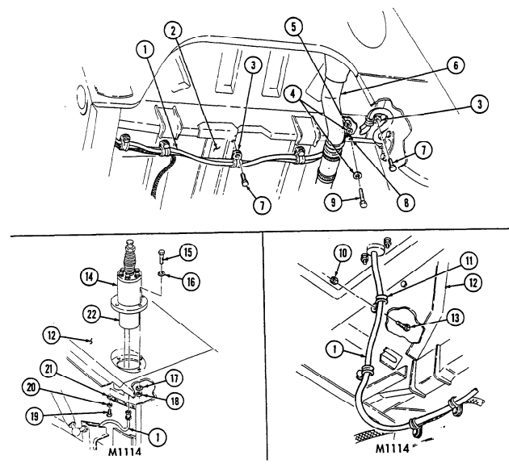

# 1 12-24. Rear Antenna Cables Replacement (Cont'D) I

15. 

16. 

Perform steps 15 through 21 for Ml113 models only. 

Remove nut and lockwasher assembly (28), capscrew (301, clamp (311, two antenna cables (11, and body harness (29) from body (27). Discard nut and lockwasher assembly (28). Remove two capscrews (33) and lockwashers (32) from cable shield (26) and body (27). Pull cable shield (26) away from body (27) to allow access to clamps (35). Discard lockwashers (32). 

17. 

Remove two nut and lockwasher assemblies (341, capscrews (251, clamps (351, antenna cables (11, and body harness (29) from cable shield (26). Discard nut and lockwasher assemblies (34). 

18. 

Note position of clamp for installation. 

Remove nut (231, clamp (361, and two antenna cables (1) from antenna mounting bracket capscrew (24). Discard nut (23). 

19. 

20. 21. 

Disconnect two antenna cables (1) from antenna base (14), and push grommet (38) and antenna cables (1) through grommet opening (37) in body (27). Remove grommet (38) from antenna cables (1). Remove antenna cables (1). 

Remove clamps (311, (351, and (36) from two antenna cables (1) and body harness (291, as required. 

b. Installation 1. Position two antenna cables (1) in approximate mounting location. 

Perform steps 2 through 8 for Ml113 models-only 2. Install clamps (311, (351, and (36) and grommet (38) on two antenna cables (1) and body harness (291, as required. 

3. Insert antenna cables (1) through grommet opening (37) and install grommet (38) in body (27). 

4. Connect antenna cables (1) to antenna base (14). 

5. Install two antenna cables (1) on antenna mounting bracket capscrew (24) with clamp (36) and nut (23). 6. Install two antenna cables (1) and body harness (29) on shield (26) with two clamps (351, capscrews (251, and nut and lockwasher assemblies (34). 

7. Install shield (26) on body (27) with two lockwashers (32) and capscrews (33). 

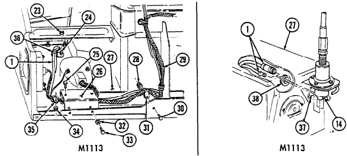 8. Install two antenna cables (1) and body harness (29) on body (27) with clamp (31), capscrew (301, and nut and lockwasher assembly (28). 

# I I I 1

# 1 12-24. Rear Antenna Cables Replacement (Cont'D) I

Perform steps 9 through 12 for Ml114 models only. 

Connect antenna cable (6) to antenna base (11). 

9. 

10. 

Install antenna (1) and ground strap (9) on wheelhouse (10) with four lockwashers (31, capscrews (21, lockwashers (41, and nuts (5). 

11. 

12. 

13. 

14. 

15. 

16. 

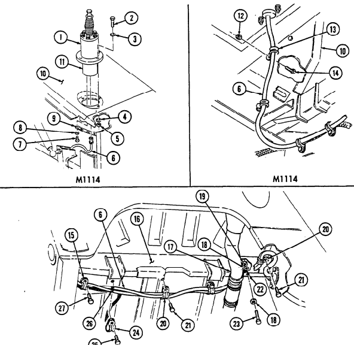

Instah ground strap (9) on antenna base (11) with lo&washer (8) andcapscrew (7). 

Insta.Il antenna cable (6) on wheelhouse (10) with four clamps (131, capscrews (141, and locknuts (12). Install antenna cable (6) on underbody (16) with clamp (15) and capscrew (27). 

Position clamp (24) over yellow locator tape (26) on two antenna cables (6) and install on underbody (16) 
with capscrew (25). 

Install two antenna cables (6) on underbody (16) with five clamps (20) and capscrews (21). Install clamp (22) on filler spout (17) and underbody (16) with washer (181, capscrew (231, washer (181, and locknut (19). 

## 12-24. Rear Antenna Cables Replacement (Cont'D)

17. Install grommet (29) and retainer (28) on two antenna cables (6). 18. Install two antenna cables (61, grommet (291, and retainer (28) on body (32) with two capscrews (36) 
and nut and lockwasher assemblies (371. 

19. Install two antenna cables (6) on body (32) with clamp (30), screw (311, and nut and lockwasher assembly (35). 

20. Install two antenna cables (6) on body (32) with three clamps (34) and capscrewa i33). 

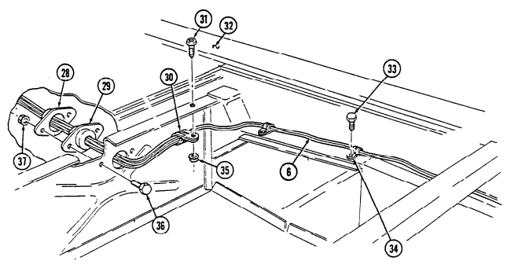

,. 

#### 12-24. Rear Antenna Cables Replacement **(Cont'D)**

21. Route two antenna cables (9) under insulation (6) along cargo **floor** (1). 

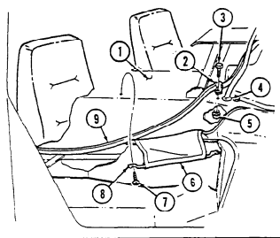

22. Install insulation retainer (8) on cargo floor (1) with two screws (7). 

23. Install two antenna cables (9) and grommet (4) on cargo floor (1) with clamp (21, capscrew (31, and nut and lockwasher assembly (51. 

24. Install two antenna cables (9) and power cable (14) on front radio rack (10) with two clamps (121, screws (ll), and nut and lockwasher assemblies (13). 

25. Secure two antenna cables (9) to radio power cable (14) with two tiedown straps (15). 

FOLLOW-ON TASKS: . Install right rear passenger seat (Ml114 only) (para. 10-45). 

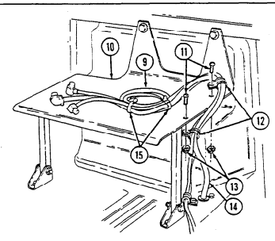

l Connect battery ground cables (para. 4-681. l Lower cargo shell door (TM 9-2320-387-10). 

l Install right rear underbody armor (Ml114 only) (para. 11-39). 

# 12-25. Power Cable Replacement

This task covers:
INITIAL SETUP:

#### Tools

General mechanic's tool kit:
automotive (Appendix B, Item 1)

#### Materials/Parts

Four nut and lockwasher assemblies
(Appendix G, Item 197)
Two lockwashers (Appendix G, Item 164)
(M1114 only)
Two tiedown straps (Appendix G, Item 322) Four locknuts (Appendix G, Item 77) Two lockwashers (Appendix G, Item 187)
(M1113 only)
Sealing compound (Appendix C, Item 70)
a. Removal b. Installation Manual References TM 9-2320-387-24P
Equipment Condition Battery ground cables disconnected (para. 4-68).

Maintenance Level Unit a. Removal

- Perform steps 1 and 2 for M1113 models only. - Perform steps 3 through 5 for M1114 models only.

1. Remove nut (5), lockwasher (4), washer (3), and positive lead (2) from power feed-through stud (10).

Discard lockwasher (4).

2. Remove nut (6), lockwasher (7), and negative lead (8) from shunt stud (9). Discard lockwasher (7). 3. Loosen terminal lugs (12) and remove cover (11) from terminal board (21). 4. Remove two nuts (13), lockwashers (14), washers (15), power cable leads (17), and cable leads (16)
and (22) from terminal board (21).

5. Remove screw (20), clamp (19), and power cable (1) from support bracket (18).

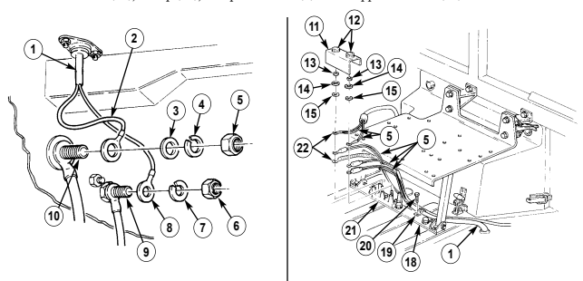

## 12-25. Power Cable Replacement (Cont'D)

6. Remove two tiedown straps (16) from power cable (13) and antenna cables (18). Discard tiedown straps (16).

7. Remove two nut and lockwasher assemblies (8), screws (4), clamps (7), and power cable (13) from radio rack (17). Discard nut and lockwasher assemblies (8).

Perform step 8 for M1113 vehicles. Perform step 8.1 for M1114 vehicles.

8. Remove four locknuts (3), washers (2), capscrews (1), washers (2), and radio rack (17) from two brackets (5). Pull radio rack (17) away from A-beam (6). Discard locknuts (3).

10. Remove two nut and lockwasher assemblies (15) and capscrews (9) from clamp (10), retainer (14),
grommet (12), power cable (13), and body (11). Discard nut and lockwasher assemblies (15).

#### B. Installation

1. Position power cable (13) in approximate mounting location. 2. Install grommet (12), retainer (14), clamp (10), and power cable (13) on body (11) with two capscrews (9) and nut and lockwasher assemblies (15). Tighten nut and lockwasher assemblies (15) to 5 lb-ft (7 N•m).

3. Install engine access cover (para. 10-22).

Perform step 4 for M1113 vehicles. Perform step 4.1 for M1114 vehicles.

4. Install radio rack (17) on two brackets (5) with four washers (2), capscrews (1), washers (2), and locknuts (3). Tighten locknuts (3) to 6 lb-ft (8 N•m).

4.1. Install radio rack (17) on two brackets (5) with rifle mounting clamp bracket (17.1), four washers (2), capscrews (1), and locknuts (3). Tighten locknuts (3) to 6 lb-ft (8 N•m).

5. Install power cable (13) on antenna cables (18) with two tiedown straps (16). 6. Install power cable (13) on radio rack (17) with two clamps (7), screws (4), and nut and lockwasher assemblies (8).

- Perform steps 7 and 8 for M1113 models only. - Perform steps 9 through 11 for M1114 models only. - Apply sealing compound to studs and terminal board after attaching leads in step 7 through 9.

7. Install negative lead (37) on shunt stud (38) with lockwasher (36) and nut (35). Tighten nut (35) to 75 lb-ft (102 N•m).

8. Install positive lead (31) on power stud (39) with washer (32), lockwasher (33), and nut (34).

Tighten nut (34) to 26 lb-ft (35 N•m).

9. Install power cable leads (25) and cable leads (24) and (30) on terminal board (29) with two washers (23), lockwashers (22), and nuts (21).

10. Install power cable (13) and clamp (27) on support bracket (26) with screw (28). 11. Install cover (19) on terminal board (29). Tighten terminal lugs (20).

8.1. Remove four locknuts (3), capscrews (1), washers (2), rifle mounting clamp bracket (17.1), and radio rack (17) from two brackets (5). Pull radio rack (17) away from A-beam (6). Discard locknuts (3).

9. Remove engine access cover (para. 10-22).

# 12-25. Power Cable Replacement (Cont'D)

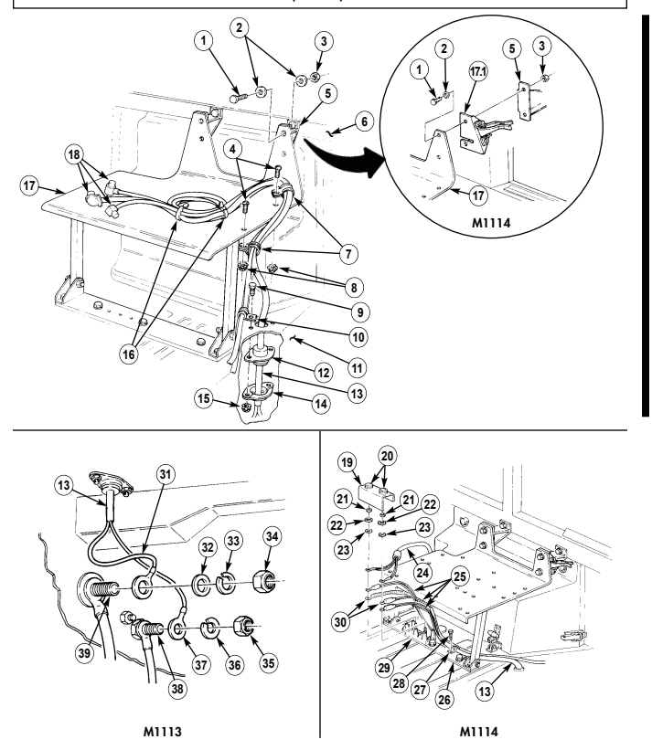

FOLLOW-ON TASK: Connect battery ground cables (para. 4-68).

# Section Iii. Winch Kit Maintenance

| This task covers:               |                                                                                                     |
|---------------------------------|-----------------------------------------------------------------------------------------------------|
| a.  Removal                     | b.  Installation                                                                                    |
| INITIAL SETUP:                  |                                                                                                     |
| Tools                           | Equipment Condition                                                                                 |
| General mechanic's tool kit:    | - Battery ground cables disconnected (para. 4\-68).                                                 |
| automotive (Appendix B, Item 1) | - Heater exhaust pipe removed (para. 12\-4).                                                        |
|                                 | - Heater inlet pipe removed (para. 12\-4.1).                                                        |
| Materials/Parts                 | - Heater lower hose removed (para. 12\-5).                                                          |
|                                 | Three lockwashers (Appendix G, Item 145) - Heater outlet hose removed (para. 12\-6).                |
|                                 | Three lockwashers (Appendix G, Item 162) General Safety Instructions                                |
| Manual References               |                                                                                                     |
| TM 9\-2320\-387\-24P            | Do not touch hot exhaust system components with bare hands.                                         |
|                                 | Maintenance Level                                                                                   |
|                                 | Unit                                                                                                |
|                                 | .WARNING                                                                                            |
|                                 | Do not touch hot exhaust system components with bare hands.                                         |
|                                 | Severe injury may result.                                                                           |
| a. Removal                      |                                                                                                     |
| 1.                              | Loosen clamp (7) and disconnect fuel supply hose (6) from heater (8).                               |
| 2.                              | Disconnect plug (10) and connector (9) from heater (8).                                             |
| 3.                              | Remove capscrew (5), lockwasher (4), and washer (3) from bracket (2) and splash shield (1). Discard |
| lockwasher (4).                 |                                                                                                     |
| 4.                              | Remove two capscrews (11), lockwashers (4), washers (12), and heater (8) from splash shield (1).    |
| Discard lockwashers (4).        |                                                                                                     |
| 5. lockwashers (14).            | Remove three capscrews (13), lockwashers (14), and bracket (2) from heater (8). Discard             |
| b. Installation                 |                                                                                                     |
| 1.                              | Install bracket (2) on heater (8) with three lockwashers (14) and capscrews (13).                   |
| 2.                              | Install heater (8) and bracket (2) on splash shield (1) with two washers (12), lockwashers (4), and |
| capscrews (11).                 |                                                                                                     |
| 3.                              | Install bracket (2) on splash shield (1) with washer (3), lockwasher (4), and capscrew (5).         |

# 12-27. Front Winch Replacement

This task covers:

| automotive (Appendix B, Item 1)   |
|-----------------------------------|
| Materials/Parts                   |

| Materials/Parts   |
|-------------------|

| Personnel Required   |
|----------------------|

INITIAL SETUP:

| Tools   |
|---------|

automotive (Appendix B, Item 1)
Two lockwashers (Appendix G, Item 146) Four tiedown straps (Appendix G, Item 325) Assembled locknut (Appendix G, Item 134) Lockwasher (Appendix G, Item 144) Lockwasher (Appendix G, Item 148)
One mechanic One assistant

a. Removal b. Installation

- Battery ground cables disconnected (para. 4-68).

- Engine right splash shield removed (para. 10-24). - Front winch clutch rod removed (para. 12-31).

General Safety Instructions Winch must be supported during removal and installation.

| TM 9\-2320\-387\-24P   |
|------------------------|
| Equipment Condition    |

Maintenance Level Unit

#### Warning

Winch must be supported during removal and installation. Failure to support winch may result in injury to personnel or damage to equipment.

#### A. Removal

1. Remove nut (9) and lockwasher (10) and disconnect lead 7 (11) from starter terminal (8). Discard lockwasher (10).

2. Remove nut (7) and lockwasher (6) and disconnect lead 6 (4) from starter terminal (5). Discard lockwasher (6). 3. Remove assembled locknut (1) and clamp (3) from oil pan bracket screw (2). Discard assembled locknut (1).

4. Remove capscrew (24), clamp (23), capscrew (18), and bracket (19) from airlift bracket (20). 5. Remove nut (12), lockwasher (13), capscrew (15), and clamp (14) from frame bracket (30). Discard lockwasher (13).

6. Disconnect vent line (25) from fitting (26) and remove three tiedown straps (27) and vent line (25)
from power cables (28). Pull cables (28) to front of vehicle. Discard tiedown straps (27).

7. Remove four retaining rings (39), two shafts (38), and rollers (40) from fairlead roller bracket (37).

Pull cable (36) through bumper (31).

8. Remove two capscrews (43) and washers (44) from winch (35) and bumper (31). 9. Remove two capscrews (41), washers (42), and fairlead roller bracket (37) from bumper (31). Lower and remove winch (35).

10. Measure length of power cables (28) from clamp (29) on winch (35) to clamp (21) on bracket (19)
and record. Remove nut (17), lockwasher (16), capscrew (22), clamp (21), and bracket (19) from power cables (28). Discard lockwasher (16).

11. Remove four capscrews (32), washers (33), and two brackets (34) from winch (35). 

# 12-27.  Front Winch Replacement (Cont'D)

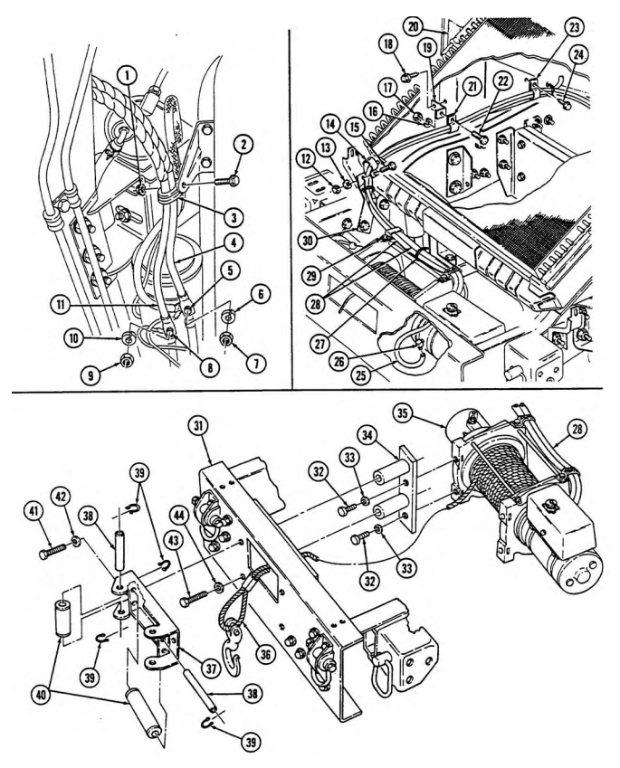

# 12-27. Front Winch Replacement (Cont'D)

b. Installation 1. Install two brackets (24) on winch (25) with four washers (23) and capscrews (22). Tighten capscrews (22) to 35 lb-ft (47 N•m).

2. Position clamp (6) on power cables (13) at same distance from clamp (15) on winch (25) that was recorded in removal.

3. Install clamp (6) and bracket (4) on power cables (13) with capscrew (7), lockwasher (1), and nut (2). 4. Install winch (25) and fairlead roller bracket (27) on bumper (21) with two washers (32) and capscrews (31). Tighten capscrews (31) finger-tight. Feed cable (26) through bumper (21) and roller bracket (27). 

5. Secure winch (25) on bumper (21) with two washers (34) and capscrews (33). Tighten capscrews
(33) and (31) to 35 lb-ft (47 N•m).

6. Install two rollers (30) and shafts (28) on fairlead roller bracket (27) with four retaining rings (29). 7. Route power cables (13) in approximate mounting location in vehicle. 8. Install lead 7 (44) on starter terminal (41) with lockwasher (43) and nut (42). Tighten nut (42) to 15 lb-ft (20 N•m).

9. Install lead 6 (37) on starter terminal (38) with lockwasher (39) and nut (40). Tighten nut (40) to 25 lb-ft (34 N•m).

10. Install clamp (36) and power cables (13) on oil pan bracket screw (35) with assembled locknut (45).

11. Install clamp (8) and power cables (13) on airlift bracket (5) with capscrew (9). 12. Install bracket (4) on airlift bracket (5) with capscrew (3), capscrew (7), lockwasher (1), and nut (2).

13. Install clamp (19) on power cables (13) and frame bracket (16) with capscrew (20), lockwasher (18), and nut (17).

14. Connect vent line (10) to fitting (11) on winch housing (14). Install vent line (10) on power cables (13)
with three tiedown straps (12).

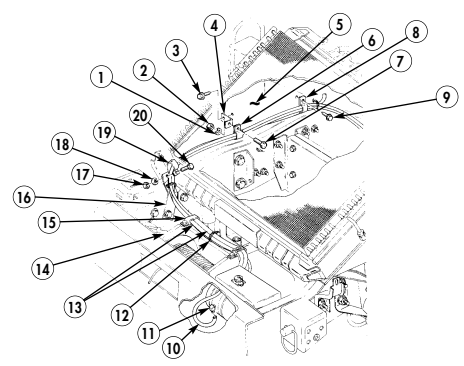

# 12-27.  Front Winch Replacement (Cont'D)

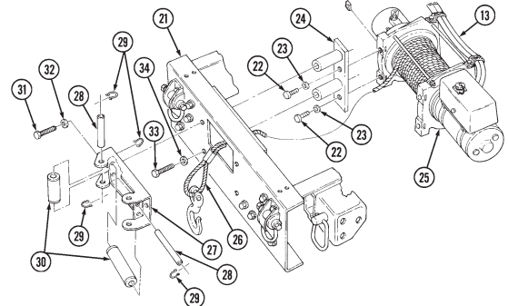

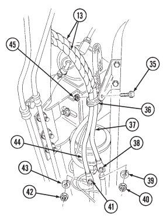

FOLLOW-ON TASKS: - Install front winch clutch rod (para. 12-31).

· Install engine right splash shield (para. 10-24).

· Connect battery ground cables (para. 4-68).

# 12-27.1. 10,500 Lb Hydraulic Winch And Brackets Replacement

This task covers:
b. Brackets Removal d. Winch Installation

Applicable Models:
All models except M1114 Tools General mechanics tool kit:
automotive (Appendix B, Item 1)
Maintenance and repair shop equipment:
automotive (Appendix B, Item 2)

#### Materials/Parts

Six locknuts (Appendix G, Item 83) Four locknuts (Appendix G, Item 85) Two locknuts (Appendix G, Item 88)

#### Manual References

TM 9-2320-387-24P
a. Winch Removal c. Brackets Installation

#### Equipment Condition

•Battery ground cables disconnected (para. 4-68). •Underbody protection kit removed (if applicable)
(para. 10-58.2).

•Brake protection guards removed 
(if applicable) (para. 7-11 or para. 7-11.1).

General Safety Instructions Support winch and bumper during winch replacement.

Maintenance Level Unit NOTE
Tag all leads prior to removal.

#### A. Winch Removal

1. Disconnect controller plug lead 758C (10) from winch lead 758C (9). 2. Disconnect controller plug lead 758A (8) from winch lead 758A (7). 3. Disconnect controller plug lead 758B (6) from lead wire 758B (5). 4. Remove screw (12) and two clamps (11) with hydraulic hose assemblies (1) and (4) from winch and bumper assembly (15).

#### Caution

Cover or plug hoses and connections immediately after removal to prevent contamination. Remove all plugs prior to connecting hoses.

5. Disconnect hydraulic hose (1) from elbow (2) on bottom winch outlet port on winch (15) . 6. Disconnect hydraulic hose (4) from elbow (3) on top winch inlet port on winch (15).

If vehicle is to be operated with winch assembly removed, perform step 7.

7. Connect tube assembly (16) to hydraulic hose assemblies (1) and (4).

12-27.1.  10,500 LB HYDRAULIC WINCH AND BRACKETS REPLACEMENT (Cont'd)

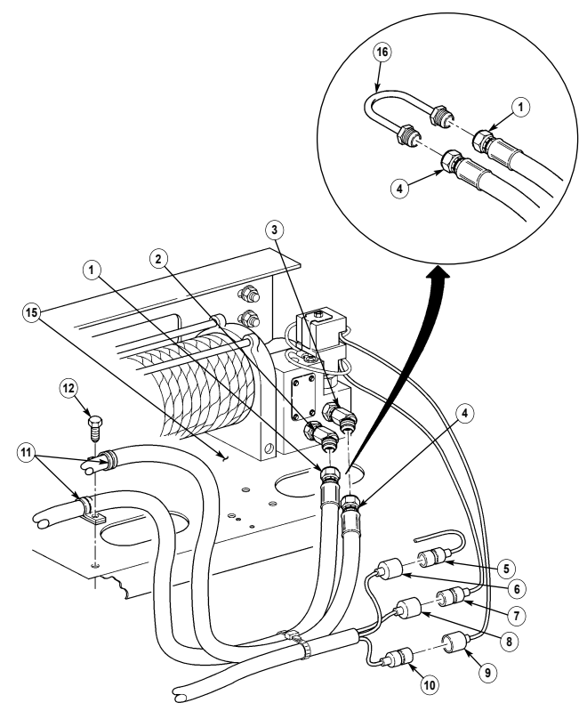

# 12-27.1. 10,500 Lb Hydraulic Winch And Brackets Replacement (Cont'D)

#### Warning

Winch and bumper must be supported with a floor jack during winch replacement. Failure to support winch may result in injury to personnel or damage to equipment.

8. Remove four locknuts (14), washers (10), capscrews (11), washers (10), and two tow brackets (9)
from winch and bumper assembly (8) and left and right bracket assemblies (5). Discard locknuts (14).

9. Remove two locknuts (12), washers (13), and winch and bumper assembly (8) from left and right lower control arm screws (1). Discard locknuts (12).

#### B. Brackets Removal Note

- Brackets may not require replacement. Replace brackets only when damaged.

- The left and right side brackets are removed the same. This procedure covers the left side.

1. Remove three locknuts (3), washers (2), capscrews (15), and washers (2) from left hand bracket assembly (5) and frame (16). Discard locknuts (3).

2. Remove capscrew (7), washer (6), and left hand bracket assembly (5) from grille extension (4).

#### C. Brackets Installation

1. Install left hand bracket assembly (5) on grille extension (4) with washer (6) and capscrew (7).

Finger tighten capscrew (7).

2. Install left hand bracket assembly (5) on frame rail (16) with three washers (2), capscrews (15),
washers (2), and locknuts (3). Tighten locknuts (3) to 225 lb-ft (303 N•m).

#### D. Winch Installation

1. Install winch and bumper assembly (8) on left and right lower control arm screws (1) with two washers (13) and locknuts (12). Finger tighten locknuts (12).

2. Secure winch and bumper assembly (8) and two tow brackets (9) on left and right bracket assemblies (5) with four washers (10), capscrews (11), washers (10), and locknuts (14).

3. Tighten locknuts (12) to 260 lb-ft (353 N•m).

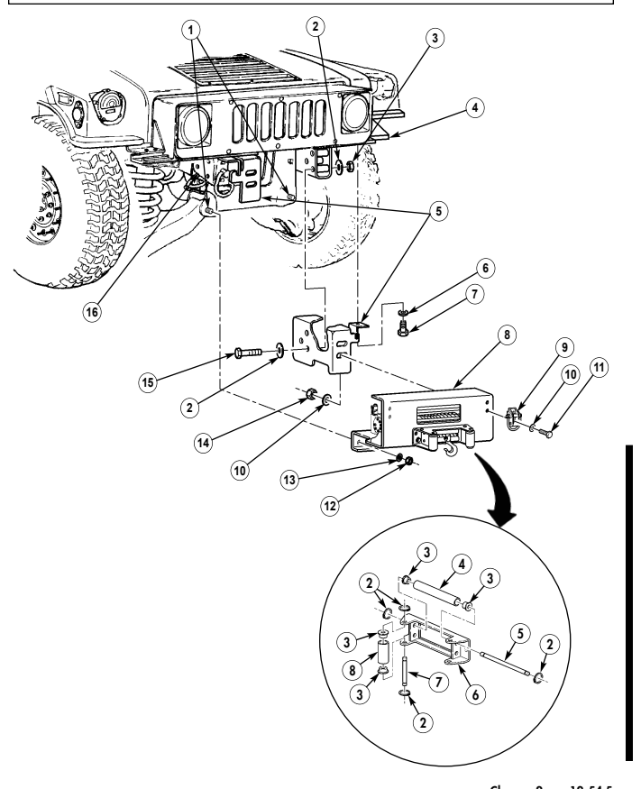

12-27.1.  10,500 LB HYDRAULIC WINCH AND BRACKETS REPLACEMENT (Cont'd)

# 12-27.1. 10,500 Lb Hydraulic Winch And Brackets Replacement (Cont'D)

If tube assembly is installed, perform step 4. 

4. Disconnect tube assembly (16) from hydraulic hose assemblies (1) and (4). 5. Connect hydraulic hose assembly (4) to elbow (3) on top winch inlet port on winch (15). 6. Connect hydraulic hose assembly (1) to elbow (2) on bottom winch outlet port on winch (15). 7. Install hydraulic hose assemblies (1) and (4) on winch and bumper assembly (15) with two clamps (11) and screw (12).

8. Connect controller plug lead 758B (6) to lead wire 785B (5). 9. Connect controller plug lead 758A (8) to winch lead 758A (7).

10. Connect controller plug lead 758C (10) to winch lead 758C (9).

# 12-27.1. 10,500 Lb Hydraulic Winch And Brackets Replacement (Cont'D)

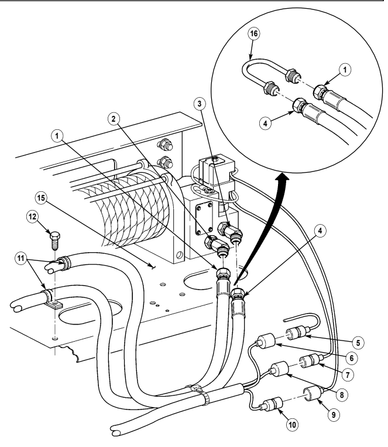

FOLLOW-ON TASKS: - Install brake protection guards (if applicable) (para. 7-11 or para. 7-11.1).

- Install underbody protection kit (if applicable) (para. 10-58.2). - Connect battery ground cables (para. 4-68). - Bleed power steering system (para. 8-27).

# 12-28. Winch Cable Replacement

This task covers:
INITIAL SETUP:
Tools General mechanic's tool kit:
automotive (Appendix B, Item 1)
Materials/Parts Cotter pin (Appendix G, Item 22)
Personnel Required One mechanic One assistant

a. Removal b. Installation

Manual References TM 9-2320-387-10 TM 9-2320-387-24P
General Safety Instructions Wear leather gloves when handling winch cable.

Maintenance Level

| Maintena Unit   |
|-----------------|

#### Warning

Gloves must be worn when handling winch cable or severe personnel injury may result.

a. Removal 1. Unwind winch cable (2) from drum assembly (1) (TM 9-2320-387-10). 2. Remove capscrew (6) and winch cable (2) from drum assembly (1). 3. Remove cotter pin (5), clevis pin (3), and hook (4) from winch cable (2). Discard cotter pin (5).

b. Installation

Install clamp on winch cable to keep wires from shearing or breaking. Refer to appendix D, fig. D-102 for instructions.

1. Install hook (4) on winch cable (2) with clevis pin (3) and cotter pin (5). 2. Install winch cable (2) on drum assembly (1) with capscrew (6).

#### Caution

- The winch cable must be spooled on the drum according to the direction of rotation label on the winch or brake will not function.

- Winch cable must be installed on drum under a load of at least 500 lb (227 kg) or outer wraps will draw into inner wraps and damage winch cable.

3. Wind winch cable (2) on drum assembly (1) (TM 9-2320-387-10).

# 12-28.  Winch Cable Replacement (Cont'D)

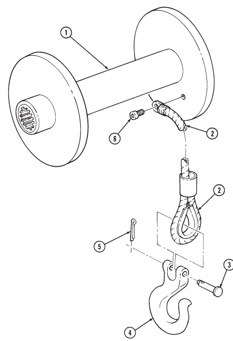

FOLLOW-ON TASKS: - • Lubricate winch cable (TM 9-2320-387-10).
- • - • - • - Check winch for proper operation (TM 9-2320-387-10).

# 12-28.1. 10,500 Lb Hydraulic Winch Cable Replacement

This task covers:

Applicable Models:
All models except M1114 Tools General mechanics tool kit: automotive (Appendix B, Item 1)
Materials/Parts Cotter pin (Appendix G, Item 22)
Personnel Required One mechanic One assistant

#### A. Removal B. Installation

Manual References TM 9-2320-387-10 TM 9-2320-387-24P
General Safety Instructions Wear leather gloves when handling winch cable.

Maintenance Level Unit

#### Warning

Gloves must be worn when handling winch cable or severe personnel injury may result.

a. Removal 1. Unwind winch cable (2) from drum assembly (1) (TM 9-2320-387-10). 2. Remove capscrew (4), terminal (3), and winch cable (2) from drum assembly (1). 3. Remove cotter pin (7), clevis pin (5), and hook (6) from winch cable (2). Discard cotter pin (7).

b. Installation

#### Caution

Install clamp on winch cable to keep wires from shearing or breaking. Refer to appendix D, fig. D-102 for instructions.

1. Install hook (6) on winch cable (2) with clevis pin (5) and cotter pin (7).

CAUTION
When installing cable on drum assembly, route cable in through fairlead assembly, under drum, and install on top of drum. Failure to do so may cause damage to cable and winch.

NOTE
It may be necessary to place the drumlock handles in FREE to route the winch cable through the rear winch mounting bracket, reinforcement plate, and roller assembly. Place drumlock handle back to ENGAGED position to prevent cable from unwrapping from drum.

2. Route winch cable (2) through fairlead assembly (8), under drum assembly (1), and install terminal (3) on drum assembly (1) with capscrew (4).

#### Caution

- The winch cable must be spooled on the drum according to the direction of rotation label on the winch or brake will not function.

- Winch cable must be installed on drum under a load of at least 500 lb (227kg) or outer wraps will draw into inner wraps and damage winch cable.

3. Install winch cable (2) on drum assembly (1) (TM 9-2320-387-10).

# 12-28.1. 10,500 Lb Hydraulic Winch Cable Replacement (Cont'D)

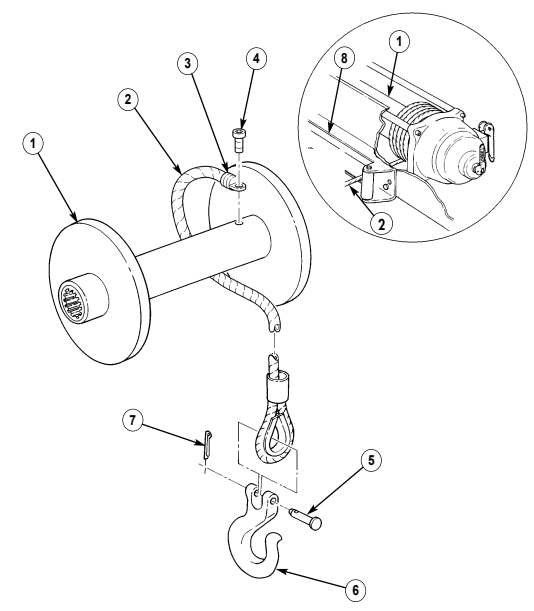

FOLLOW ON TASKS: - Lubricate winch cable (TM 9-2320-387-10).

- Check winch for proper operation (TM 9-2320-387-10).

# 12-29. Winch Vent Line Replacement

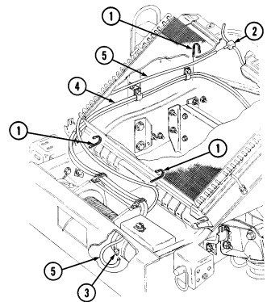

This task covers:

| Applicable Models            |
|------------------------------|
| M1114                        |
| Tools                        |
| General mechanic's tool kit: |

| INITIAL SETUP:   |
|------------------|

Three tiedown straps (Appendix G, Item 325)
a. Removal 1. Disconnect vent line (5) from winch fitting (3). 2. Remove three tiedown straps (1) from vent line (5) and cables (4). Discard tiedown straps (1). 3. Disconnect vent line (5) from tee fitting (2) and remove vent line (5).

b. Installation 1. Connect vent line (5) to tee fitting (2) and winch fitting (3). 2. Install vent line (5) on cables (4) with three tiedown straps (1).

| Manual References    |
|----------------------|
| TM 9\-2320\-387\-24P |
| Maintenance Level    |
| Unit                 |

a. Removal b. Installation

FOLLOW-ON TASK: Lower and secure hood (TM 9-2320-387-10).

# 12-30. Front Fairlead Roller Bracket Assembly Replacement

This task covers:
INITIAL SETUP:
Applicable Models All models except M1114 Tools General mechanic's tool kit:
automotive (Appendix B, Item 1)
Manual References TM 9-2320-387-24P

a. Removal b. Installation

General Safety Instructions Winch must be supported during removal and installation.

Maintenance Level Unit

#### Warning

Winch must be supported during removal and installation. Failure to support winch may result in injury to personnel or damage to equipment.

#### A. Removal

1. Remove four retaining rings (8), two shafts (7), and rollers (9) from bracket (6). 2. Remove four retaining rings (4), two shafts (3), and rollers (10) from bracket (6). 3. Remove two capscrews (1), washers (2), and bracket (6) from bumper (5).

b. Installation 1. Install bracket (6) on bumper (5) with two washers (2) and capscrews (1). Tighten capscrews (1) to 35 lb-ft (47 N•m).

2. Install two rollers (10) and shafts (3) on bracket (6) with four retaining rings (4). 3. Install two rollers (9) and shafts (7) on bracket (6) with four retaining rings (8).

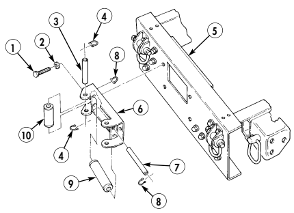

# 12-31. Front Winch Clutch Rod Replacement

This task covers:

| a.  Removal       | b.  Installation     |
|-------------------|----------------------|
| INITIAL SETUP:    |                      |
| Applicable Models | Manual References    |
| M1114             | TM 9\-2320\-387\-24P |

General mechanic's tool kit:
automotive (Appendix B, Item 1)
Materials/Parts Locknut (Appendix G, Item 109)
a. Removal 3. Remove clutch rod (6) through bracket (7) and frame (2). 4. Loosen nut (5) and remove handle (4) and nut (5) from clutch rod (6). 5. Remove capscrew (3) and bracket (7) from winch (8).

#### B. Installation Note

Adjust rod end as required to allow full clutch operation.

5. Install capscrew (13), two washers (11), and rod end (12) on lever (1) with washer (10) and locknut (9).

1. Remove locknut (9), washer (10), rod end (12), two washers (11), and capscrew (13) from lever (1).

Discard locknut (9).

2. Remove rod end (12) from clutch rod (6).

1. Install bracket (7) on winch (8) with capscrew (3). 2. Install nut (5) and handle (4) on clutch rod (6). Tighten nut (5). 3. Install clutch rod (6) through frame (2) and bracket (7). 4. Install rod end (12) on clutch rod (6).

# 12-31. Front Winch Clutch Rod Replacement (Cont'D)

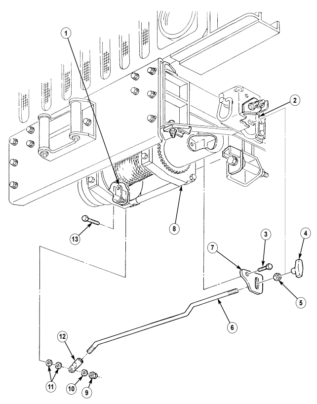

# 12-31.1. 10,500 Lb Winch Hydraulic Hose Replacement

This task covers:

#### A. Removal B. Installation Initial Setup:

| General mechanic's tool kit:                                                                    | TM 9\-2320\-387\-24P            | automotive (Appendix B, Item 1)   |
|-------------------------------------------------------------------------------------------------|---------------------------------|-----------------------------------|
| Maintenance Level                                                                               | Materials/Parts                 | Unit                              |
| Two locknuts (Appendix G, Item 77)                                                              |                                 |                                   |
| Remove two locknuts (4), washers (5), screws (1), and headphone mounting bracket (3) from radio | rack (2). Discard locknuts (4). |                                   |
| b. Installation                                                                                 |                                 |                                   |

#### A. Removal

1. Remove screw (2) and two clamps (4) with hydraulic hose assemblies (8) and (9) from winch and bumper assembly (12).

2. Remove three tiedown straps (1) from hydraulic hose assemblies (8) and (9), lead wire (10), and controller plug harness (11). Discard tiedown straps (1).

#### Caution

Cover or plug power steering gear and hydro-boost connections immediately after removing hoses to prevent contamination. Remove all plugs prior to connecting hoses.

3. Disconnect hydraulic hose (8) from elbow (6) at bottom winch outlet port on winch (5). 4. Disconnect hydraulic hose (9) from elbow (7) at top winch inlet port on winch (5).

# 12-31.1.  10,500 Lb Winch Hydraulic Hose Replacement (Cont'D)

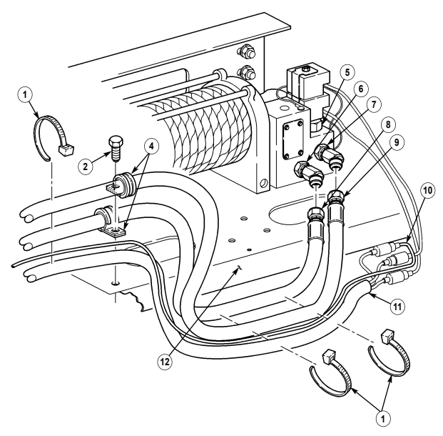

## 12-31.1. 10,500 Lb Winch Hydraulic Hose Replacement (Cont'D)

5. Remove four tiedown straps (1) from hydraulic hose assemblies (4) and (7), lead wire (3), and controller plug harness (2). Discard tiedown straps (1).

Ensure area around power steering port and hydro-boost is clean before removing hydraulic hose assembly.

6. Disconnect hydraulic hose assembly (7) and O-ring (6) from power steering gear port (8). Discard O-ring (6).

7. Disconnect hydraulic hose assembly (4) and O-ring (6) from hydro-boost port (5). Discard O-ring (6).

8. Remove hydraulic hose assemblies (4) and (7) from vehicle.

#### B. Installation Note

Lubricate O-rings with Dexron® VI prior to installation.

1. Install O-ring (6) on hydraulic hose assembly (4). 2. Connect hydraulic hose assembly (4) to hydro-boost port (5). 3. Route hydraulic hose (4) from hydro-boost port (5) along frame rail (10), oil cooler hose (9), and between frame rail (10) and radiator shroud (11) towards winch and bumper assembly (12).

4. Install O-ring (6) on hydraulic hose assembly (7). 5. Connect hydraulic hose assembly (7) to power steering gear port (8). 6. Route hydraulic hose (7) from power steering gear port (8) along hydraulic hose assembly (4). 7. Secure lead wire (3) and controller plug harness (2) to hydraulic hose assemblies (4) and (7) with four tiedown straps (1).

# 12-31.1.  10,500 Lb Winch Hydraulic Hose Replacement (Cont'D)

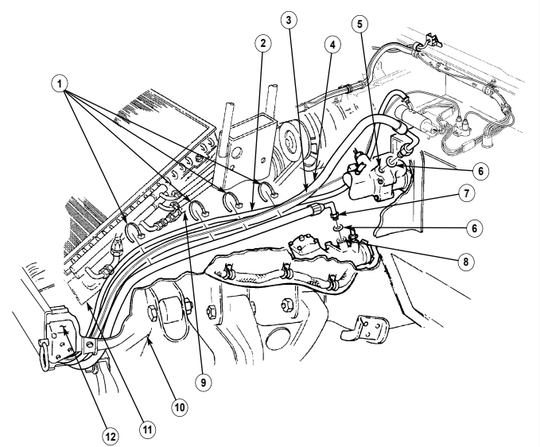

# 12-31.1. 10,500 Lb Winch Hydraulic Hose Replacement (Cont'D)

8. Connect hydraulic hose (9) to elbow (7) at top inlet port on winch (5). 9. Connect hydraulic hose (8) to elbow (6) at bottom outlet port on winch (5).

10. Install hydraulic hose assemblies (8) and (9) on winch and bumper assembly (12) with two clamps (4) and screw (2).

11. Secure lead wire (10) and controller plug (11) to hydraulic hose assemblies (8) and (9) with three tiedown straps (1).

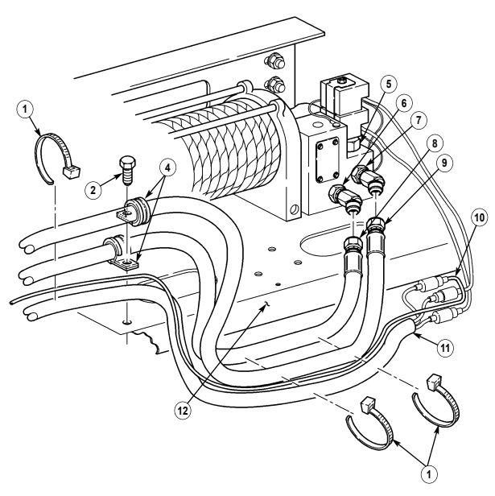

FOLLOW-ON TASKS: - Connect battery ground cables (para. 4-68).

- Bleed power steering system (para. 8-27). - Install engine left splash shield (para. 10-23).

# 12-32. Front Winch Receptacle Bracket Replacement

This task covers:
INITIAL SETUP:

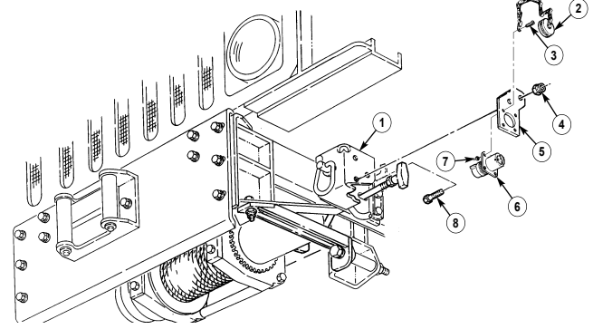

General mechanic's tool kit:
automotive (Appendix B, Item 1)
Materials/Parts Two locknuts (Appendix G, Item 118)

| TM 9\-2320\-387\-24P   |
|------------------------|

a. Removal b. Installation

#### A. Removal

1. Remove four nuts (7), capscrews (3), control receptacle (6), and cover (2) from bracket (5). 2. Remove two locknuts (4), capscrews (8), and bracket (5) from mounting bracket (1). Discard locknuts (4).

#### B. Installation

1. Install bracket (5) on mounting bracket (1) with two capscrews (8) and locknuts (4). 2. Install cover (2) and control receptacle (6) on bracket (5) with four capscrews (3) and nuts (7).

# 12-32.1. 10,500 Lb Hydraulic Winch Controller Plug Replacement

This task covers:

Applicable Models All models except M1114 Tools General mechanics tool kit: automotive (Appendix B, Item1)
Materials/Parts Eight tiedown straps (Appendix G, Item 325)
Manual References TM 9-2320-387-10 TM 9-2320-387-24P
a. Removal a. Removal b. Installation

#### Equipment Condition

- Hood raised and secured 
(TM 9-2320-387-10).

- Battery ground cables disconnected 
(para 4-68).

- Engine left splash shield removed
(para 10-23).

Maintenance Level Unit 1. Remove tiedown strap (5) from controller plug harness (1), harness (3), lead wire (2), and hydraulic hose assemblies (4). Discard tiedown strap (5).

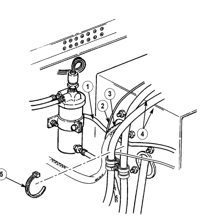

# 12-32.1. 10,500 Lb Hydraulic Winch Controller Plug Replacement (Cont'D)

2. Remove four tiedown straps (5) from controller plug harness (1), lead wire (2), and hydraulic hose assemblies (4). Discard tiedown straps (5).

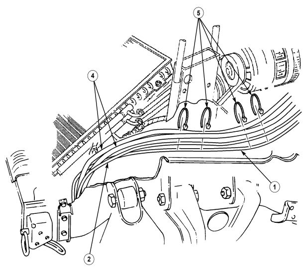

# 12-32.1. 10,500 Lb Hydraulic Winch Controller Plug Replacement (Cont'D)

3. Remove three tiedown straps (8) from controller plug harness (9), lead wire (3), and hydraulic hose assemblies (1). Discard tiedown straps (8). 

4. Disconnect controller plug lead 785C (7) from winch lead 785C (6). 5. Disconnect controller plug lead 785A (4) from winch lead 785A (5). 6. Disconnect controller plug lead 785B (2) from lead wire 785B (3).

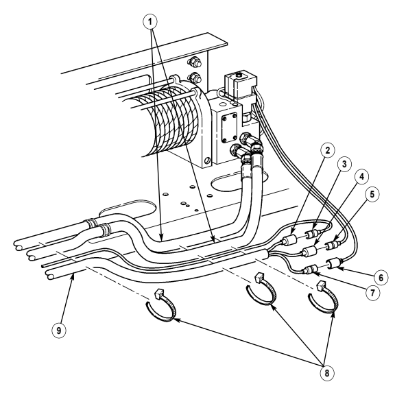

# 12-32.1.  10,500 Lb Hydraulic Winch Controller Plug Replacement (Cont'D)

Remove four screws (3), controller plug (2), and cap with chain (4) from body panel (1).

7.

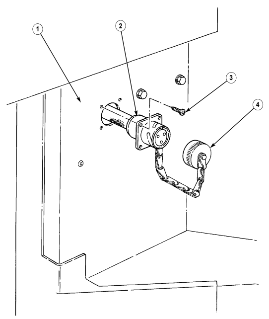

# 12-32.1.  10,500 Lb Hydraulic Winch Controller Plug Replacement (Cont'D)

Move controller plug harness (1) away from frame rail (4) and from around fuel filter (2) and route 8.

controller plug harness (1) back through hole in body panel (3).

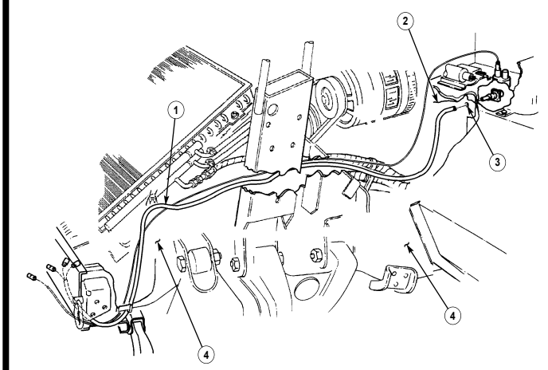

# 12-32.1. 10,500 Lb Hydraulic Winch Controller Plug Replacement (Cont'D)

b. Installation

#### Caution

Ensure controller plug harness does not contact any moving parts.

1. Route controller plug harness (1) through hole in body panel (3) into engine compartment (6). 2. Route controller plug harness (1) around fuel filter (2) and along body wiring harness (7) and lead wire (5) to frame rail (4) and then down to winch valve assembly (8).

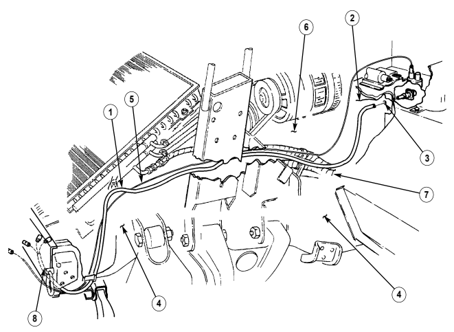

12-32.1. 10,500 LB HYDRAULIC WINCH CONTROLLER PLUG REPLACEMENT (Cont'd)
3. Align holes in controller plug (5) with holes (6) in body panel (1) and blind spline (3) at top position and install controller plug (5) and cap with chain (4) on body panel (1) with four screws (2).

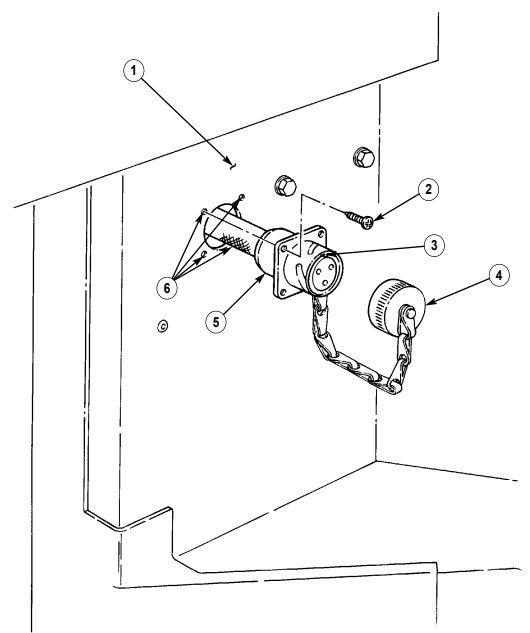

# 12-32.1. 10,500 Lb Hydraulic Winch Controller Plug Replacement (Cont'D)

4. Connect lead wire 785B (9) to controller plug lead (8) 785B. 5. Connect controller plug lead 785A (10) to winch lead 785A (11). 6. Connect controller plug lead 785C (13) to winch lead 785C (12). 7. Secure controller plug harness (15) and lead wire (9) to hydraulic hose assemblies (7) with three tiedown straps (14).

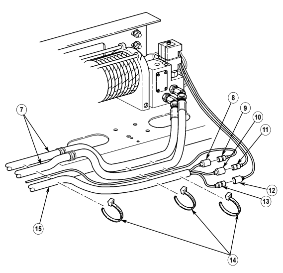

# 12-32.1. 10,500 Lb Hydraulic Winch Controller Plug Replacement (Cont'D)

8. Secure lead wire (1) and controller plug harness (4) to hydraulic hose assemblies (2) with four tiedown straps (3).

9. Secure controller plug harness (5), body harness (7), and lead wire (6) to hydraulic hose assemblies

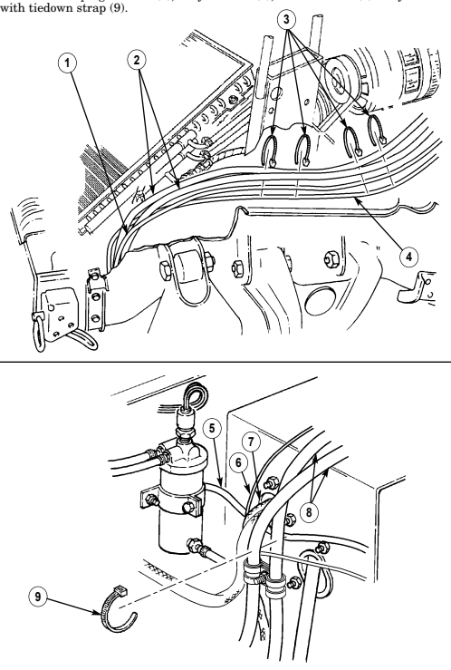

FOLLOW-ON TASKS: - Install engine left splash shield. (para. 10-23).

- Connect battery ground cables (para. 4-68).

12-62.8 **Change 1**

# 12-32.2. Regulating Valve Hydraulic Hose Replacement (Serial Numbers 246890 And Above)

This task covers:

Tools General mechanic's tool kit:
automotive (Appendix B, Item 1)
Maintenance and repair shop equipment:
automotive (Appendix B, item 2)
Materials/Parts Four locknuts (Appendix G, Item 85) Two locknuts (Appendix G, Item 88) Three locknuts (Appendix G, Item 133.23).

a. Removal b. Installation

#### Equipment Condition

•Battery ground cables disconnected (para. 4-68). •Hood raised and secured (TM 9-2320-387-10).

General Safety Instructions
•Winch and bumper must be supported with a floor jack during winch replacement.

•Do not drain fluid when engine is hot. •Bumper and winch must be supported while connecting and securing hydraulic hoses.

Maintenance Level Unit a. Removal

#### Warning

Winch and bumper must be supported with a floor jack during winch replacement. Failure to support winch may result in injury to personnel or damage to equipment.

1. Remove four locknuts (9), washers (8), capscrews (5), washers (4), and two tow brackets (3) from winch and bumper assembly (2) and left and right bracket assemblies (1). Discard locknuts (9).

2. Remove two locknuts (6), washers (7), and winch and bumper assembly (2) from left and right lower control arm screws (10). Discard locknuts (6).

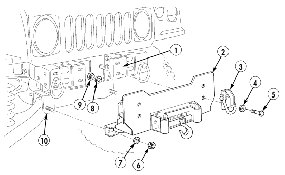

# 12-32.2. Regulating Valve Hydraulic Hose Replacement (Serial Numbers 246890 And Above) (Cont'D)

#### Warning

Bumper and winch must be supported after removing from vehicle so hydraulic hoses can be disconnected. Severe injury to personnel will result if not supported properly.

Discard locknuts (7).

3. Remove two locknuts (7), four washers (4), and two screws (5) from bumper (6).

4. Remove locknut (8), washer (9), screw (2), two clamps (3) and (10), and hydraulic hoses (1) and (11)
from bumper (6). Discard locknut (8).

#### Warning

Do not drain fluid when engine is hot. Severe injury to personnel will result.

#### Caution

Cover and plug all hoses and connections immediately after disconnection to prevent contamination. Remove all plugs prior to connections.

Note location of hoses for installation. Have drainage container ready to catch fluid.

5. Disconnect hydraulic hose (1) from hydro-boost (22). 6. Disconnect hydraulic hose (12) from steering gear (20). 7. Remove hydraulic hose (1) from tee fitting (21) on regulating valve (14). 8. Remove hydraulic hose (12) from tee fitting (18) on regulating valve (14). 9. Disconnect hydraulic hose (19) from tee fitting (21) on regulating valve (14).

10. Disconnect hydraulic hose (17) from tee fitting (18) on regulating valve (14). 11. Remove hydraulic hose (19) from elbow (15) on winch (13). 12. Remove hydraulic hose (17) from elbow (16) on winch (13).

# 12-32.2. Regulating Valve Hydraulic Hose Replacement (Serial Numbers 246890 And Above) (Cont'D)

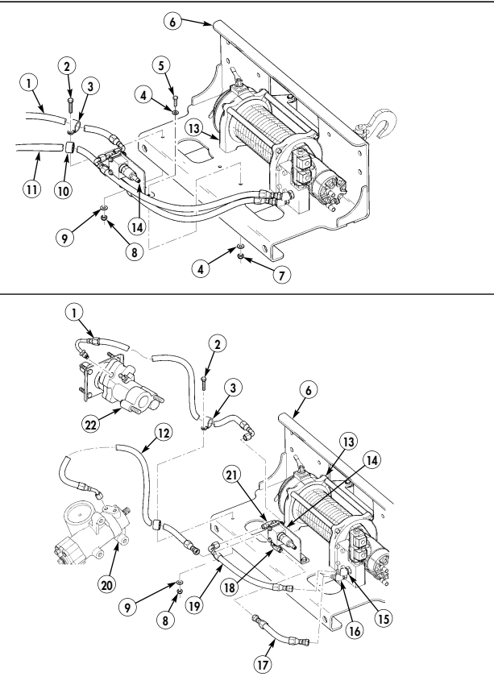

# 12-32.2. Regulating Valve Hydraulic Hose Replacement (Serial Numbers 246890 And Above) (Cont'D)

#### B. Installation

1. Connect hydraulic hose (17) to elbow (16) on winch (13). 2. Connect hydraulic hose (19) to elbow (15) on winch (13). 3. Connect hydraulic hose (17) to tee fitting (18) on regulating valve (14). 4. Connect hydraulic hose (19) to tee fitting (21) on regulating valve (14). 5. Connect hydraulic hose (12) to tee fitting (18) on regulating valve (14). 6. Connect hydraulic hose (1) to tee fitting (21) on regulating valve (14).

#### Warning

Bumper and winch must be supported while connecting and securing hydraulic hoses. Severe injury to personnel will result if not properly supported.

7. Position bumper (6) with winch (13) close enough to vehicle to route and connect hydraulic hoses (1)
and (12).

8. Route and connect hydraulic hose (1) to hydro-boost (22). 9. Route and connect hydraulic hose (12) to steering gear (20).

10. Secure bracket (10) with regulating valve (14) to bumper (6) with two washers (4), screws (5),
washers (4), and locknuts (7).

11. Install clamps (3) and (11) on hoses (1) and (12). 12. Secure hoses (1) and (12) with clamps (3) and (11) on bumper (6) with screw (2), washer (9), and locknut (8).

# 12-32.2. Regulating Valve Hydraulic Hose Replacement (Serial Numbers 246890 And Above) (Cont'D)

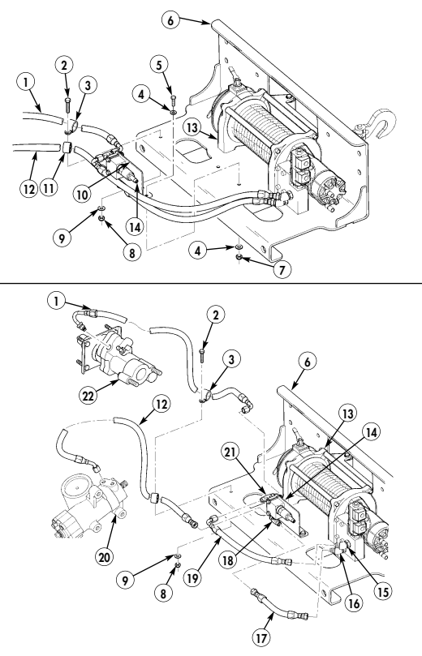

## 12-32.2. Regulating Valve Hydraulic Hose Replacement (Serial Numbers 246890 And Above) (Cont'D)

13. Install winch and bumper assembly (2) on left and right lower control arm screws (10) with two washers (7) and locknuts (6). Finger tighten locknuts (6).

14. Secure winch and bumper assembly (2) and two tow brackets (3) on left and right bracket assemblies (1) with four washers (4), capscrews (5), washers (8), and locknuts (9).

15. Tighten locknuts (6) to 260 lb-ft (353 N•m).

12-32.2. REGULATING VALVE HYDRAULIC HOSE REPLACEMENT
(SERIAL NUMBERS 246890 AND ABOVE) (Cont'd)

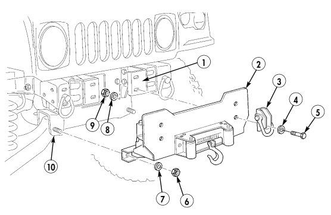

FOLLOW-ON TASKS: - Fill power steering reservoir (TM 9-2320-387-10).

- Connect battery ground cables (para. 4-68). - Bleed power steering system (para. 8-27). - Close and secure hood (TM 9-2320-387-10).

# 12-32.3. Regulating Valve And Bracket Replacement (Serial Numbers 246890 And Above)

This task covers:
INITIAL SETUP:
a. Removal b. Installation

| Tools                                     | Personnel Required   |
|-------------------------------------------|----------------------|
| General mechanic's tool kit:              | One mechanic         |
| automotive (Appendix B, Item 1)           | One assistant        |
| Materials/Parts                           | Manual References    |
| Two tiedown straps (Appendix G, Item 322) | TM 9\-2320\-387\-10  |
| Six nut and lockwasher assemblies         |                      |

Manual References TM 9-2320-387-24P

#### A. Removal

1. Remove two locknuts (9), washers (7), bracket (3), washers (7), screws (6), and regulating valve (2)
from bumper (8). Discard two locknuts (9).

2. Remove two locknuts (5), washers (4), regulating valve (2), washers 4), and screws (11) from bracket (3). Discard two locknuts (5).

3. Remove tee fitting (10) from regulating valve (2). 4. Remove tee fitting (1) from regulating valve (2).

#### B. Installation

1. Install tee fitting (1) on regulating valve (2). 2. Install tee fitting (10) on regulating valve (2). 3. Install regulating valve (2) on bracket (3) with two washers (4), screws (11), washers (4), and locknuts (5).

4. Install regulating valve (2) and bracket (3) on bumper (8) with two washers (7), screws (6),
washers (7), and locknuts (9).

# 12-32.3. Regulating Valve And Bracket Replacement (Serial Numbers 246890 And Above) (Cont'D)

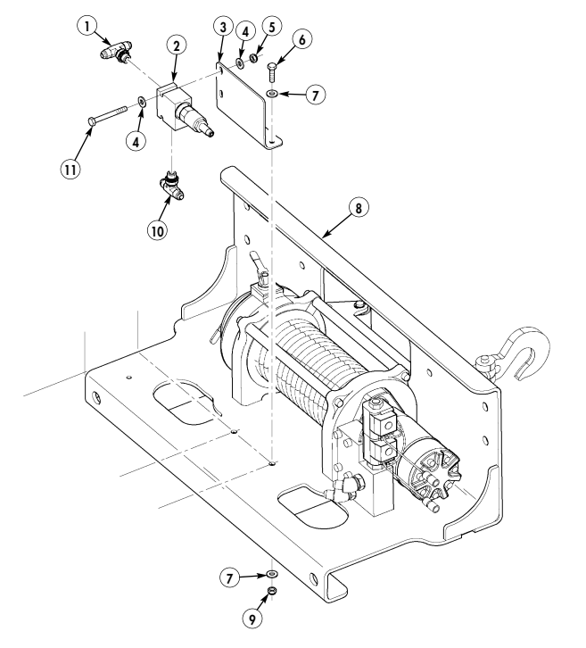

FOLLOW-ON TASK:
Install regulating valve hydraulic hoses installed (para. 12-32.2).

# 12-33. Rear Winch Replacement

This task covers:
INITIAL SETUP:
Applicable Models M1114 Tools General mechanic's tool kit:
automotive (Appendix B, Item 1)
Materials/Parts RTV sealant (Appendix C, Item 74) Locknut (Appendix G, Item 109)
Personnel Required One mechanic One assistant a. Removal b. Installation Manual References TM 9-2320-387-24P
Equipment Condition Battery ground cables disconnected (para. 4-68).

General Safety Instructions Winch must be supported during removal and installation.

Maintenance Level Unit

#### Warning

Winch must be supported during removal and installation. Failure to support winch may result in injury to personnel or damage to equipment.

a. Removal 1. Remove nut (3) and power lead (2) from solenoid pack power stud (1). 2. Remove four nuts (8), capscrews (6), cover (7), and control receptacle (4) from bracket (5).

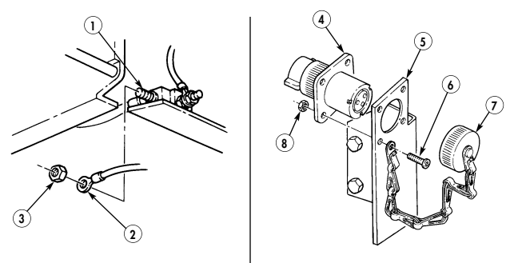

## 12-33. Rear Winch Replacement (Cont'D)

3. Remove two retaining rings (2), shaft (4), and roller (3) from bracket (1). 4. Remove two retaining rings (5), shaft (7), and roller (6) from bracket (1). 5. Remove capscrew (22) and ground lead (21) from winch (10). 6. Remove locknut (14), washer (15), rod end (16), capscrew (13), and two washers (12) from lever (11).

Discard locknut (14).

7. Disconnect vent line (9) from elbow (8). 8. Remove four capscrews (18), washers (17), and winch (10) from winch mount (19) and bracket (20).

#### B. Installation

1. Install winch (10) on winch mount (19) and bracket (20) with four washers (17) and capscrews (18).

Tighten capscrews (18) to 60 lb-ft (81 N•m).

2. Install two washers (12), capscrew (13), and rod end (16) on lever (11) with washer (15) and locknut (14). Tighten locknut (14) to 44 lb-ft (60 N•m).

3. Install ground lead (21) on winch (10) with capscrew (22). Tighten capscrew (22) to 25 lb-ft 
(34 N•m).

4. Connect vent line (9) to elbow (8). 5. Install roller (6) and shaft (7) on bracket (1) with two retaining rings (5). 6. Install roller (3) and shaft (4) on bracket (1) with two retaining rings (2). 7. Install cover (25) and control receptacle (23) on bracket (20) with four screws (24) and nuts (26). 8. Connect power lead (28) to solenoid pack power stud (27) with nut (29). 9. Apply RTV sealant on power lead (28) and stud (27).

# 12-33. Rear Winch Replacement (Cont'D)

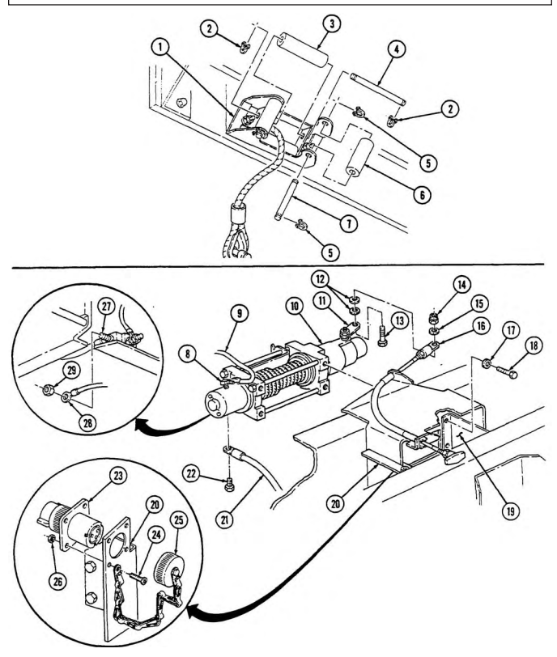

WEBBER

FOLLOW-ON TASK:  Connect battery ground cables (para. 4-68).

# 12-34. Rear Winch Vent Line Replacement

This task covers:
INITIAL SETUP:
Applicable Models M1114 Tools General mechanic's tool kit:
automotive (Appendix B, Item 1)
Materials/Parts Two tiedown straps (Appendix G, Item 322)
a. Removal 1. Disconnect vent line (1) from elbow (2). 2. Remove two tiedown straps (3) from vent line (1) and air line (4). Discard tiedown straps (3). 3. Disconnect vent line (1) from tee (5) and remove vent line (1).

b. Installation 1. Connect vent line (1) to tee (5) and elbow (2). 2. Secure vent line (1) to air line (4) with two tiedown straps (3).

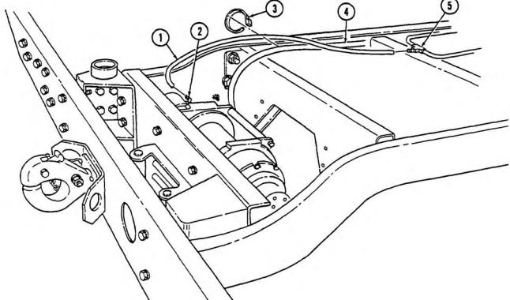

a. Removal b. Installation Manual References TM 9-2320-387-24P
Maintenance Level Unit

# 12-35. Rear Fairlead Roller Bracket Assembly Replacement

This task covers:
INITIAL SETUP:

| Applicable Models   |
|---------------------|
| M1114               |

M1114 Tools General mechanic's tool kit:
automotive (Appendix B, Item 1)
Materials/Parts Two locknuts (Appendix G, Item 117)

a. Removal b. Installation

Manual References TM 9-2320-387-24P
General Safety Instructions Wear leather gloves when handling winch cable.

Maintenance Level Unit

#### Warning

Gloves must be worn when handling winch cable. Failure to do so may cause severe injury to personnel.

#### A. Removal

1. Remove four retaining rings (6), two shafts (5), and rollers (4) from bracket (10). 2. Remove four retaining rings (7), two shafts (9), and rollers (8) from bracket (10). 3. Remove two locknuts (11), washers (2), capscrews (1), washers (2), and bracket (10) from frame (3).

Discard locknuts (11).

b. Installation 1. Install bracket (10) on frame (3) with two washers (2), capscrews (1), washers (2), and locknuts (11).

Tighten locknuts (11) to 35 lb-ft (47 N•m).

2. Install two rollers (8) and shafts (9) on bracket (10) with four retaining rings (7).

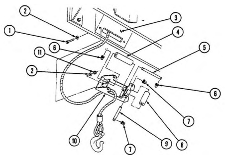 3. Install two rollers (4) and shafts (5) on bracket (10) with four retaining rings (6).

# 12-36. Rear Winch Clutch Cable Replacement

This task covers:
INITIAL SETUP:

| Applicable Models   | M1113   |
|---------------------|---------|

Tools General mechanic's tool kit:
automotive (Appendix B, Item 1)
Materials/Parts Locknut (Appendix G, Item 109)
a. Removal 1. Remove locknut (6), washer (7), rod end (8), two washers (9), and capscrew (11) from lever (10).

Discard locknut (6).

2. Loosen nut (5) and remove rod end (8) and nut (5) from cable (4). 3. Loosen nut (2) and remove handle (1) and nut (2) from cable (4). 4. Remove two clips (3) and cable (4) from bracket (12).

b. Installation 1. Install cable (4) on bracket (12) with two clips (3). 2. Install nut (2) and handle (1) on cable (4). Tighten nut (2). 3. Install nut (5) and rod end (8) on cable (4) and adjust rod end (8) and nut (5) as required to allow full clutch operation.

4. Tighten nut (5).

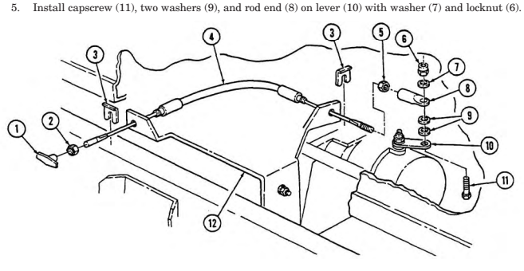

a. Removal b. Installation Manual References TM 9-2320-387-24P
Maintenance Level Unit

# 12-36.1. 10,500 Lb Rear Hydraulic Winch Assembly And Brackets Replacement

This task covers:

Applicable Models M1114 Tools General mechanics tool kit: automotive
(Appendix B, Item 1)
Maintenance and repair shop equipment:
automotive (Appendix B, Item 2)
Materials/Parts Two locknuts (Appendix G, Item 83) Six locknuts (Appendix G, Item 85) Four locknuts (Appendix G, Item 132) Two locknuts (Appendix G, Item 88)
Manual References TM 9-2320-387-24P
a. Winch Removal a. Winch Removal c. Bracket Installation b. Bracket Removal d. Winch Installation Equipment Condition Battery ground cables disconnected 
(para. 4-68).

General Safety Instructions Support winch and bumper during winch replacement.

Maintenance Level Unit

#### Warning

Winch and motor assembly and rear winch mounting bracket must be supported during winch replacement. Failure to support winch and motor assembly and rear winch mounting bracket may result in injury to personnel or damage to equipment.

#### Caution

Cover or plug all hoses and connections immediately after removal to prevent contamination. Remove all plugs prior to connecting hoses.

# 12-36.1. 10,500 Lb Rear Hydraulic Winch Assembly And Brackets Replacement (Cont'D)

1. Disconnect hydraulic hose (24) from front port 2 elbow (23) on rear winch assembly (25). 2. Disconnect hydraulic hose (21) from rear port 4 elbow (22) on rear winch assembly (25).

NOTE
Perform step 3 only if vehicle is to be operated with winch assembly removed. Tube assembly is located in stowage box under commander's (companion) seat inside vehicle.

3. Connect tube assembly (26) to hydraulic hose assemblies (21) and (24).

On some vehicles rear body mount bolts may interfere with removal of right and left hand rear bracket nuts. Perform step 4 if rear body mounting screws interfere with removal of winch/bumper mounting bracket screws.

4. Remove two locknuts (17), screws (20), and spacers (19) from left and right rear body mounts (18).

Discard locknuts (17).

5. Remove two locknuts (9) and washers (8) from lower control arm bolts (5). Discard locknuts (9). 6. Remove four locknuts (15), screws (16), eight washers (11), and winch and bumper assembly (10)
from two lower control arm bolts (5) and rear brackets (6). Discard locknuts (15).

b. Bracket Removal

Brackets may not require replacement, replace only if damaged.

Remove six locknuts (2), capscrews (7), twelve washers (3), and two rear brackets (6) from rear bumper (1) and frame rails (4) Discard locknuts (2).

#### C. Bracket Installation

Install two rear brackets (6) on frame rail (4) and rear bumper (1) with six capscrews (7), twelve washers (3), and six locknuts (2).

#### D. Winch Installation

1. Install winch and bumper assembly (10) on two lower control arm bolts (5) with washers (8) and locknuts (9). Do not tighten locknuts (9).

2. Install winch and bumper assembly (10) on rear brackets (6) with four screws (16), eight washers (11), and four locknuts (15). Tighten four locknuts (15) to 37 lb-ft (50 N•m) and locknuts (9) to 260 lb-ft (352 N•m).

Perform step 3 if tube assembly was installed. Store tube assembly in stowage box under commander's (companion) seat inside vehicle.

3. Disconnect tube assembly (26) from hydraulic hose assemblies (21) and (24).

Perform step 4 if body mount bolts were removed for access to left and right hand rear bracket nuts.

4. Install two screws (20), spacers (19), and locknuts (17) on left and right rear body mounts (18).

Tighten locknuts (17) to 90 lb-ft (122 N•m).

5. Connect hydraulic hose (21) to rear port 4 elbow (22) on rear winch assembly (25). 6. Connect hydraulic hose (24) to front port 2 elbow (23) on rear winch assembly (25).

# 12-36.1.  10,500 Lb Rear Hydraulic Winch Assembly And Brackets

REPLACEMENT (Cont'd)

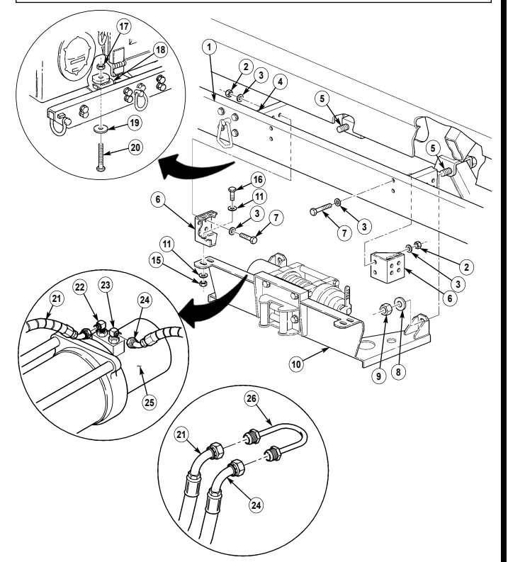

FOLLOW-ON TASKS: - Connect battery ground cables (para. 4-68).

· Bleed power steering system (para. 8-27).

# 12-36.2. 10,500 Lb Rear Hydraulic Winch Cable Replacement

This task covers:

| Tools Materials/Parts   |
|-------------------------|

General mechanic's tool kit: automotive
(Appendix B, Item 1)
Materials/Parts Cotter pin (Appendix G, Item 22) 
Personnel Required One mechanic One assistant

#### A. Removal B. Installation

| Wear leather gloves when handling winch cable.   |
|--------------------------------------------------|

Manual References TM 9-2320-387-10 TM 9-2320-387-24P
Maintenance Level Unit

#### Warning

Gloves must be worn when handling winch cable or severe personnel injury may result.

#### A. Removal

1. Unwind winch cable (2) from drum assembly (1) (TM 9-2320-387-10). 2. Remove capscrew (4), clamp (3), and winch cable (2) from drum assembly (1). 3. Remove cotter pin (7), clevis pin (5), and hook (6), from winch cable (2). Discard cotter pin (7).

b. Installation

#### Caution

Install clamp on winch cable to keep wires from shearing or breaking. Refer to appendix D, fig. D-102 for instructions.

1. Install hook (6) on winch cable (2) with clevis pin (5) and cotter pin (7).

#### Caution

When installing cable on drum assembly, route cable in through fairlead assembly, under drum, and install on top of drum. Failure to do so may cause damage to cable and winch.

It may be necessary to place the drumlock handles in FREE to route the winch cable through the rear winch mounting bracket, reinforcement plate, and roller assembly. Place drumlock handle back to ENGAGED position to prevent cable from unwrapping from drum.

2. Route winch cable (2) through fairlead assembly (8), under drum assembly (1), and install clamp
(3) on drum assembly (1) with capscrew (4).

#### Caution

- The winch cable must be spooled on the drum according to the direction of rotation label on the winch or brake will not function. 

- Winch cable must be installed on drum under a load of at least 500 lb (227kg) or outer wraps will draw into inner wraps and damage winch cable. 

3. Install winch cable (2) on drum assembly (1) (TM 9-2320-387-10).

# 12-36.2. 10,500 Lb Rear Hydraulic Winch Cable Replacement (Cont'D)

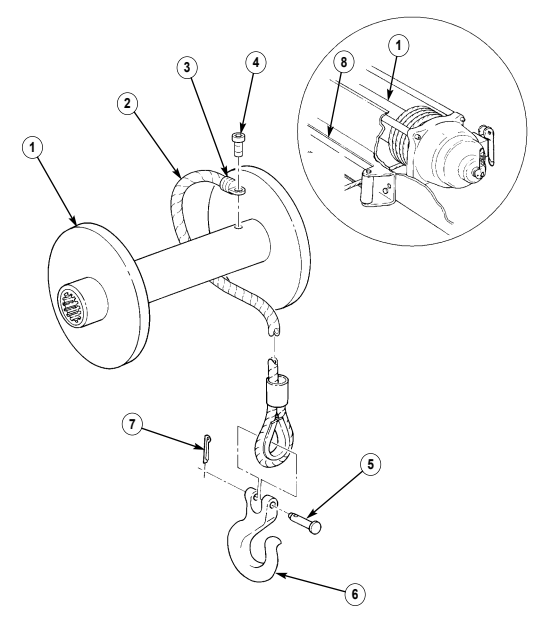

FOLLOW ON TASKS: - Lubricate winch cable (TM 9-2320-387-10).

- Check winch for proper operation (TM 9-2320-387-10).

# 12-36.3. 10,500 Lb Rear Hydraulic Winch Fairlead Roller Bracket Assembly Replacement

This task covers:

a. Removal b. Installation

| All models except M1114                     | TM 9\-2320\-387\-10                            |
|---------------------------------------------|------------------------------------------------|
|                                             | TM 9\-2320\-387\-24P                           |
| Tools                                       |                                                |
| General mechanic's tool kit:                | Equipment Condition                            |
| automotive (Appendix B, Item 1)             | Hood raised and secured (TM 9\-2320\-387\-10). |
| Materials/Parts                             | Maintenance Level                              |
| Three tiedown straps (Appendix G, Item 325) | Unit                                           |

#### Materials/ Parts

Four lockwashers (Appendix G, Item 138)

#### Warning

Winch assembly must be supported during fairlead bracket removal and installation. Failure to support winch assembly may result in injury to personnel or damage to equipment.

a. Removal 1. Remove four retaining rings (12), two shafts (13), and rollers (14) from fairlead bracket (10). 2. Remove four retaining rings (1), two shafts (2), and rollers (3) from fairlead bracket (10). 3. Remove two capscrews (9), lockwashers (8), and fairlead bracket (10) from winch and bumper assembly (6). Discard lockwashers (8).

If reinforcement plate is damaged, perform step 4.

4. Remove two capscrews (4), lockwashers (5), and reinforcement plate (7) from winch and bumper assembly (6). Discard lockwashers (5).

b. Installation

If replacing reinforcement plate, perform step 1.

1. Install reinforcement plate (7) on winch and bumper assembly (6) with two lockwashers (5) and capscrews (4). Tighten capscrews (4) to 37 lb-ft (50 N•m).

2. Install fairlead bracket (10) on reinforcement plate (7) and winch and bumper assembly (6) with two lockwashers (8) and capscrews (9). Tighten capscrews (9) to 37 lb-ft (50 N•m).

3. Route winch cable (11) through slot in winch and bumper assembly (6), reinforcement plate (7),
and fairlead bracket (10).

4. Install two rollers (3) and shafts (2) in fairlead bracket (10) with four retaining rings (1). 5. Install two rollers (14) and shafts (13) in fairlead bracket (10) with four retaining rings (12).

12-36.3.  10,500 LB REAR HYDRAULIC WINCH FAIRLEAD ROLLER BRACKET ASSEMBLY

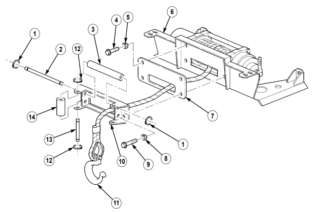

# 12-36.4. 10,500 Lb Rear Hydraulic Winch Hose Replacement

This task covers:

Applicable Models

| Tools   |
|---------|

General mechanics tool kit:
automotive (Appendix B, Item 1)
Materials/ Parts Dexron® VI (Appendix C, Item 37) Two O-rings (Appendix G, Item 220)
Manual References TM 9-2320-387-10 TM 9-2320-387-24P
a. Removal a. Removal b. Installation

#### Equipment Condition

- Hood raised and secured 
(TM 9-2320-387-10).

- Engine left splash shield removed 
(para. 10-23).

- Battery ground cables disconnected 
(para. 4-68).

Maintenance Level Unit

#### Caution

Cover or plug all open hoses and connections immediately after disconnection to prevent contamination. Remove all plugs prior to connecting hoses.

Ensure area around valve assembly ports and power steering gear ports are clean before removing hoses.

1. Disconnect hydraulic hose assembly (1) from port 1 elbow (2) on valve assembly (3). 2. Disconnect hydraulic hose assembly (1) and O-ring (8) from power steering gear port (9).

Discard O-ring (8).

3. Disconnect hydraulic hose assembly (5) from port 3 elbow (4) on valve assembly (3). 4. Disconnect hydraulic hose assembly (5) and O-ring (6) from hydro-boost (7). Discard O-ring (6).

12-36.4.  10,500 LB REAR HYDRAULIC WINCH HOSE REPLACEMENT (Cont'd)

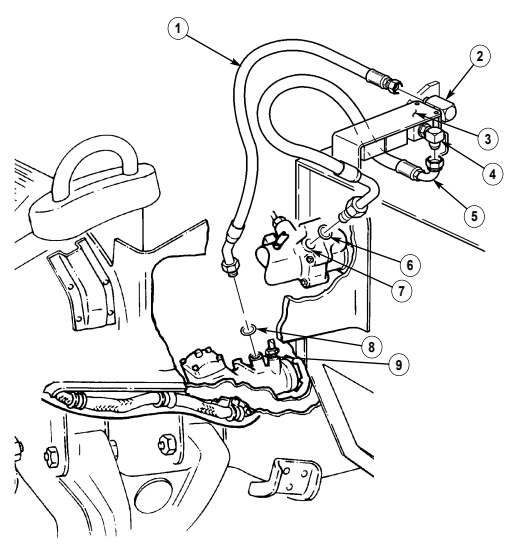

## 12-36.4. 10,500 Lb Rear Hydraulic Winch Hose Replacement (Cont'D)

5. Disconnect hydraulic hose assembly (5) from port 4 adapter (3) on valve assembly (4). 6. Disconnect hydraulic hose assembly (1) from port 2 adapter (2) on valve assembly (4).

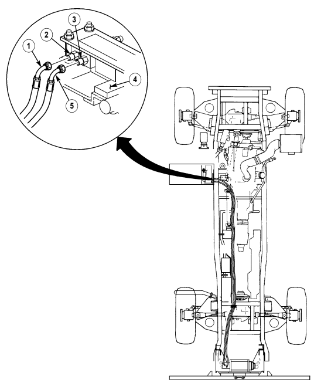

# 12-36.4. 10,500 Lb Rear Hydraulic Winch Hose Replacement (Cont'D)

7. Remove capscrew (9), clamp (10), and hydraulic hose assemblies (6) and (7) from brace (8). 8. Remove capscrew (11), clamp (13), cables (14), clamp (10), and hydraulic hose assemblies (6) 
and (7) from front intermediate tunnel support (12).

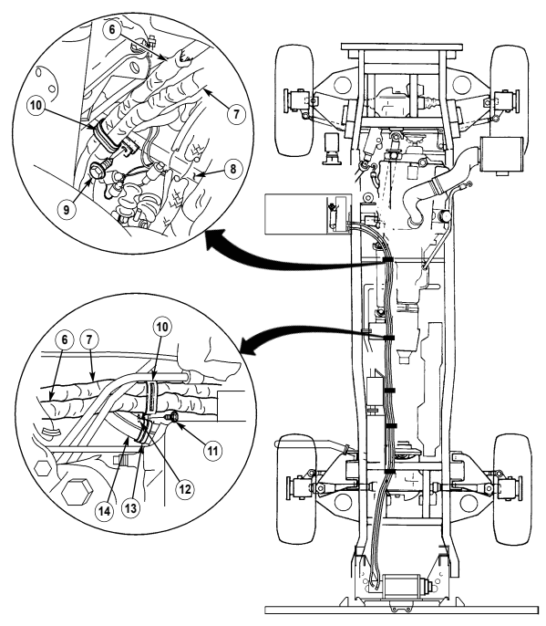

# 12-36.4. 10,500 Lb Rear Hydraulic Winch Hose Replacement (Cont'D)

9. Remove capscrew (6), clamp (4), cables (5), clamp (7), and hydraulic hose assemblies (1) and (2)
from center tunnel support (3).

10. Remove capscrew (8), clamp (9), and hydraulic hose assemblies (1) and (2) from rear intermediate tunnel support (10).

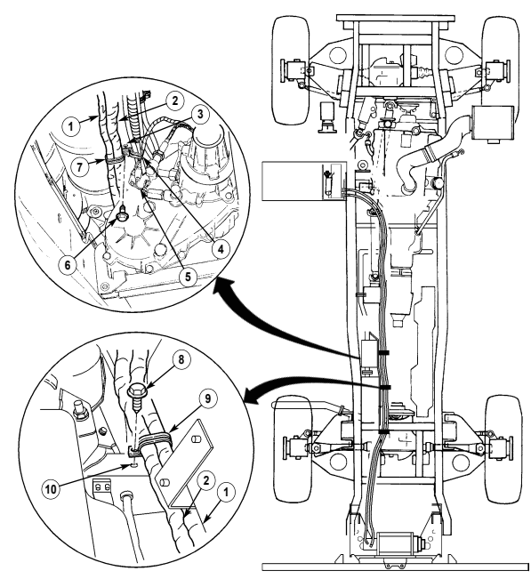

# 12-36.4. 10,500 Lb Rear Hydraulic Winch Hose Replacement (Cont'D)

11. Remove capscrew (12), clamp (11), and hydraulic hose assemblies (1) and (2) from rear tunnel support (13).

12. Disconnect hydraulic hose assembly (2) from front port 2 elbow (15) on rear winch assembly (16).

Remove hydraulic hose assembly (2) from vehicle.

13. Disconnect hydraulic hose assembly (1) from rear port 4 elbow (14) on rear winch assembly (16).

Remove hydraulic hose assembly (1) from vehicle.

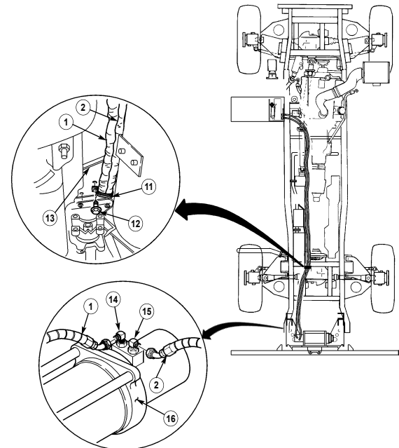

# 12-36.4. 10,500 Lb Rear Hydraulic Winch Hose Replacement (Cont'D)

b. Installation

- Use tape on one hose for ease of installation and identification from rear winch to valve assembly port.

- When positioning hoses on vehicle, place ends with heat shield closest to fittings at rear of vehicle.

1. Starting from left rear of vehicle (14), route two hydraulic hose assemblies (1) and (2) over rear crossmember (13), over differential support (12), and over muffler (11).

2. Route two hydraulic hose assemblies (1) and (2) between speedometer drive (15) and transfer case (16). Continue along right side of transmission shift linkage (10), next to transfer case cooler lines (9), and towards front of vehicle.

3. Route two hydraulic hose assemblies (1) and (2) along left inner cowl (6), two hydraulic hoses (7),
and between body wiring harness (8) to port 2 adapter (3) and port 4 adapter (5) on valve assembly (4).

4. Connect hydraulic hose assembly (1) to port 2 adapter (3) on valve assembly (4). 5. Connect hydraulic hose assembly (2) to port 4 adapter (5) on valve assembly (4).

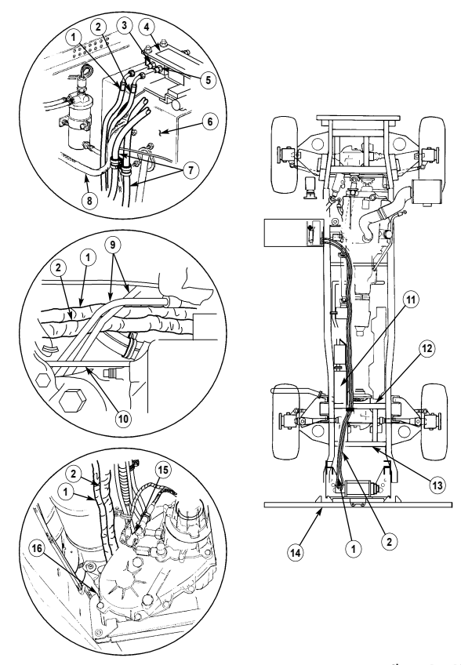

# 12-36.4.  10,500 Lb Rear Hydraulic Winch Hose Replacement (Cont'D) 12-36.4. 10,500 Lb Rear Hydraulic Winch Hose Replacement (Cont'D)

6. Connect hydraulic hose assembly (1) to rear port 4 elbow (6) on rear winch assembly (8). 7. Connect hydraulic hose assembly (2) to front port 2 elbow (7) on rear winch assembly (8).

CAUTION
Ensure hydraulic hoses are positioned away from all moving parts and away from heated surfaces.

8. Secure hydraulic hose assemblies (1) and (2) to rear tunnel support (5) with clamp (4) and capscrew (3).

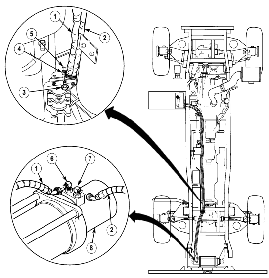

# 12-36.4. 10,500 Lb Rear Hydraulic Winch Hose Replacement (Cont'D)

9. Secure hydraulic hose assemblies (1) and (2) to rear intermediate tunnel support (16) with clamp (15) and capscrew (14).

10. Secure cables (11), clamp (10), hydraulic hose assemblies (1) and (2), and clamp (13) to center tunnel support (9) with capscrew (12).

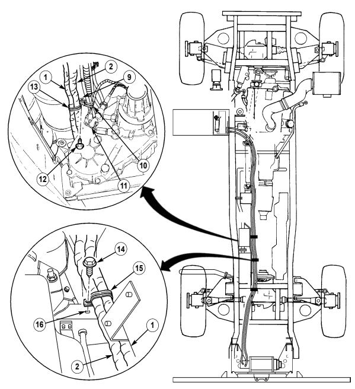

# 12-36.4. 10,500 Lb Rear Hydraulic Winch Hose Replacement (Cont'D)

11. Secure cables (8), clamp (7), hydraulic hose assemblies (1) and (2), and clamp (5) to front intermediate tunnel support (6) with capscrew (4).

12. Secure hydraulic hose assemblies (1) and (2) and clamp (5) to intermediate tunnel support (3) with capscrew (4).

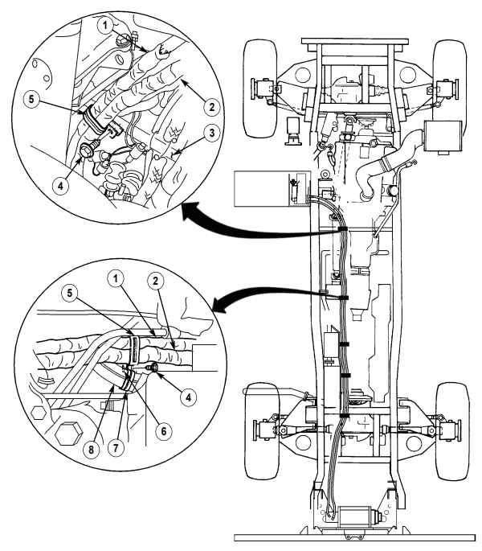

# 12-36.4. 10,500 Lb Rear Hydraulic Winch Hose Replacement (Cont'D)

13. Connect hydraulic hose assembly (13) to port 3 elbow (12) on valve assembly (11). 14. Route hydraulic hose assembly (13) from port 3 elbow (12) under valve assembly (11).

NOTE
- Ensure area around hydro-boost and power steering gear port is clean before installing power steering hose assembly.

- Lubricate O-rings with Dexron® VI prior to installation.

15. Install O-ring (14) on hydraulic hose assembly (13) and connect hydraulic hose assembly (13) to hydro-boost (15).

16. Connect hydraulic hose assembly (9) to port 1 elbow (10) on valve assembly (11). 17. Route hydraulic hose assembly (9) from port 1 elbow (10) on valve assembly (11) along left inner cowl to power steering gear port (17).

18. Install O-ring (16) on hydraulic hose assembly (9) and connect hydraulic hose assembly (9) to power steering gear port (17).

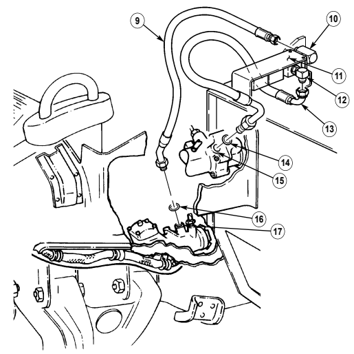

FOLLOW-ON TASKS: - Connect battery ground cables (para. 4-68).

- Bleed power steering system (para. 8-27). - Install engine left splash shield (para. 10-23).

# 12-36.5. 10,500 Lb Rear Hydraulic Winch Valve Assembly Replacement

This task covers:

Applicable Models M1114 Tools General mechanics tool kit:
automotive (Appendix B, Item 1)
Materials/Parts Tiedown strap (Appendix G, Item 324) Two assembled locknuts (Appendix G, Item 134)
Manual References TM 9-2320-387-10 TM 9-2320-387-24P
a. Removal

#### Caution

Cover or plug power steering gear and hydro-boost connections immediately after removing hoses to prevent contamination. Remove all plugs prior to connecting hoses.

1. Remove tiedown strap (11) from lead wire (1), controller plug harness (2), and valve assembly wires (9). Discard tiedown strap (11).

2. Disconnect controller plug lead 785C (5) from valve assembly lead 785C (8). 3. Disconnect controller plug lead 785B (3) from circuit breaker (4). 4. Disconnect controller plug lead 785A (6) from valve assembly lead 785A (7). 5. Remove screw (12) and controller ground lead (10) from circuit breaker (4).

a. Removal b. Installation

| Maintenance Level Unit   |
|--------------------------|

12-36.5.  10,500 LB REAR HYDRAULIC WINCH VALVE ASSEMBLY REPLACEMENT (Conr'd)

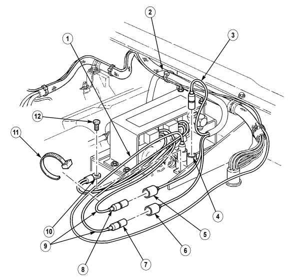

# 12-36.5. 10,500 Lb Rear Hydraulic Winch Valve Assembly Replacement (Cont'D)

Ensure area around valve assembly ports are clean before removing hoses.

6. Disconnect hydraulic hose assembly (2) from port 1 elbow (3) on valve assembly (1). 7. Disconnect hydraulic hose assembly (5) from port 3 elbow (4) on valve assembly (1). 8. Disconnect hydraulic hose assemblies (9) and (8) from port 2 adapter (6) and port 4 adapter (7) 
on valve assembly (1). 

Perform step 9 only if vehicle is to be operated with valve assembly removed. Tube assembly is located in stowage box under commander's (companion) seat inside vehicle.

9. Connect tube assembly (10) to hydraulic hose assemblies (2) and (5).

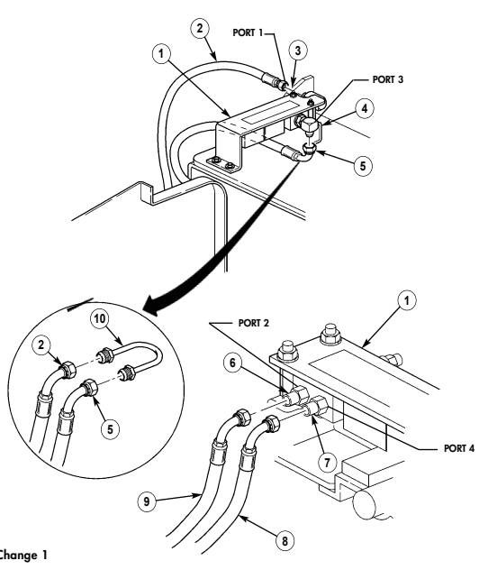

12-68.22 Change 1
# 12-36.5. 10,500 Lb Rear Hydraulic Winch Valve Assembly Replacement (Cont'D)

10. Remove two screws (11) from shield (12) and top left cowl armor (17). 11. Remove two assembled locknuts (13), capscrews (15), six washers (14), shield (12), and valve assembly (1) from bracket (16). Discard assembled locknuts (13).

#### B. Installation

1. Install valve assembly (1) and shield (12) on bracket (16) with two capscrews (15), six washers (14), and two assembled locknuts (13). 

2. Install shield (12) on top left cowl armor (17) with two screws (11).

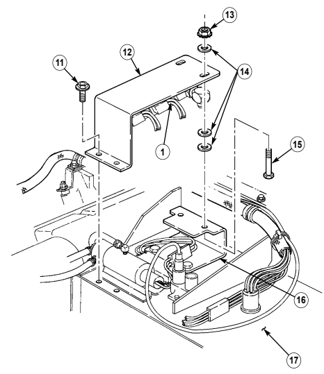

# 12-36.5. 10,500 Lb Rear Hydraulic Winch Valve Assembly Replacement (Cont'D)

Perform steps 3 and 4 if tube assembly was installed. Store tube assembly in stowage box under commander's (companion) seat inside vehicle.

3. Disconnect tube assembly (10) from hydraulic hose assemblies (2) and (5). 4. Remove plugs from hydraulic hose assemblies (8) and (9). 5. Connect hydraulic hose assemblies (2) and (5) to port 1 elbow (3) and port 3 elbow (4) on valve assembly (1).

6. Connect hydraulic hose assemblies (9) and (8) to port 2 adapter (6) and port 4 adapter (7) on valve assembly (1).

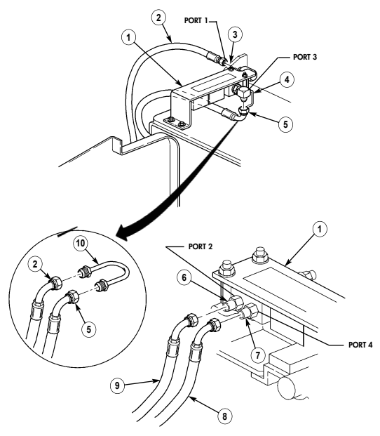

# 12-36.5. 10,500 Lb Rear Hydraulic Winch Valve Assembly Replacement (Cont'D)

10. Connect controller plug lead 785C (15) to valve assembly lead 785C (18). 11. Install tiedown strap (21) on lead wire (11), controller plug harness (12), and valve assembly wires (19).

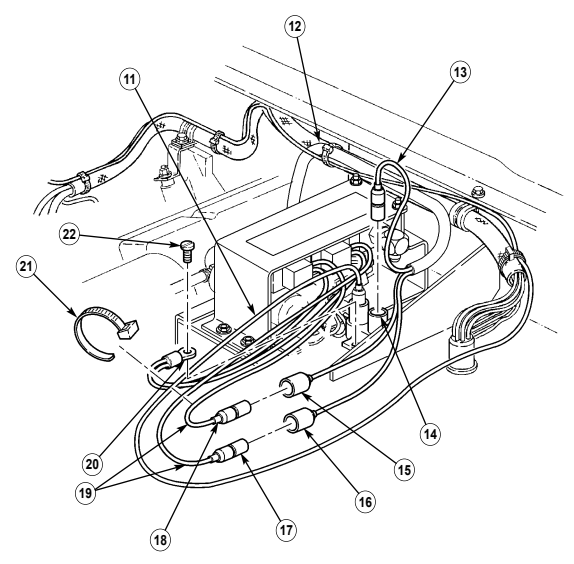

FOLLOW ON TASKS: - Connect battery ground cables (para. 4-68).

- Bleed power steering system (para. 8-27).

7. Connect controller ground lead (20) to circuit breaker (14) with screw (22). 8. Connect controller plug lead 785A (16) to valve assembly lead 785A (17). 9. Connect controller plug lead 785B (13) to circuit breaker (14).

# 12-36.6. 10,500 Lb Rear Hydraulic Winch Controller Plug Replacement

This task covers:

| All models except M1114   |
|---------------------------|
| Tools                     |

Applicable Models Tools General mechanics tool kit:
automotive (Appendix B, Item 1)
Materials/Parts Three tiedown straps (Appendix G, Item 325)
Manual References TM 9-2320-387-10 TM 9-2320-387-24P
a. Removal 4. Disconnect controller plug lead 785A (11) from valve assembly lead 785A (12). 5. Remove four screws (7) and controller plug (6) with cap and chain (8) from body panel (9). 6. Remove controller plug harness (3) from around fuel filter (17) and back through hole in body panel (16).

#### A. Removal B. Installation

1. Remove three tiedown straps (2) from lead wire (4), controller plug harness (3), valve assembly wires (5), and body wiring harness (1). Discard tiedown straps (2).

2. Disconnect controller plug lead 785C (14) from valve assembly lead 785C (13). 3. Disconnect controller plug lead 785B (10) from circuit breaker (15). 

| Manual References         |
|---------------------------|
| TM 9\-2320\-387\-10       |
| TM 9\-2320\-387\-24P      |
| Equipment Condition       |
| - Hood raised and secured |

# 12-36.6.  10,500 Lb Rear Hydraulic Winch Controller Plug Replacement (Cont'D)

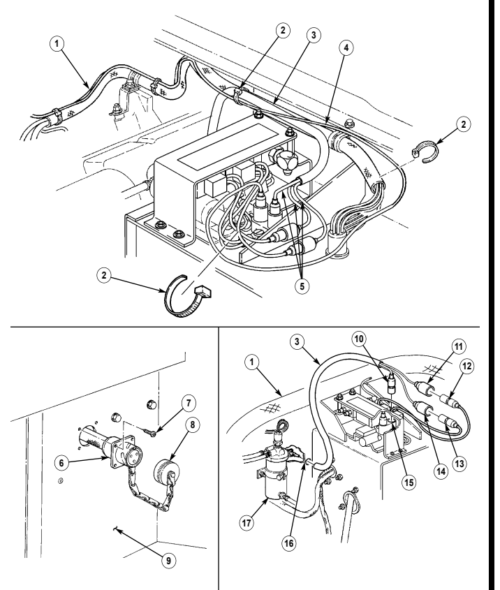

# 12-36.6. 10,500 Lb Rear Hydraulic Winch Controller Plug Replacement (Cont'D)

b. Installation 1. Route controller plug harness (1) through hole in body panel (10), around fuel filter (11), and along body wiring harness (2) to valve assembly (9).

2. Connect controller plug lead 785A (4) to valve assembly lead 785A (6). 3. Connect controller plug lead 785B (3) to circuit breaker (8). 4. Connect controller plug lead 785C (5) to valve assembly lead 785C (7). 5. Align holes in controller plug (15) with holes (12) in body panel (10) and blind spline (16) at top position and install controller plug (1) and cap and chain (14) on body panel (10) with four screws (13).

6. Secure lead wire (18), controller plug harness (1), controller plug harness leads (19), and valve assembly wires (20) to body harness (2) with three tiedown straps (17).

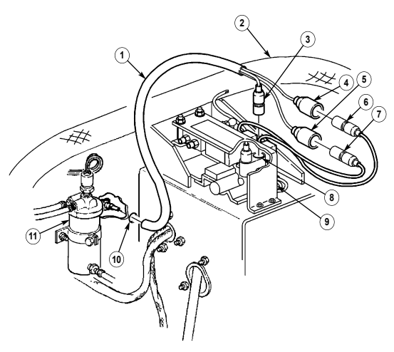

# 12-36.6.  10,500 Lb Rear Hydraulic Winch Controller Plug Replacement (Cont'D)

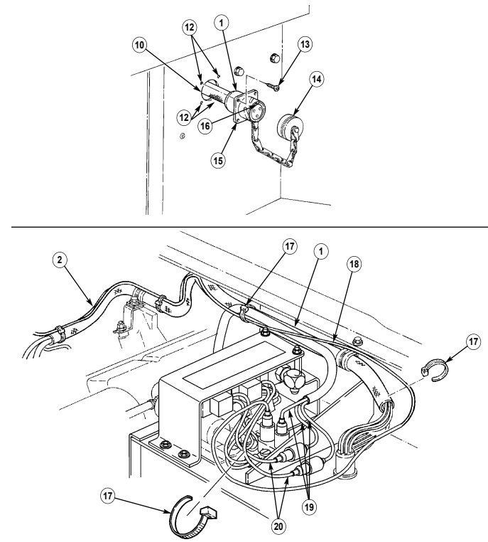

FOLLOW-ON TASK:
Connect battery ground cables (para. 4-68).

1

# 12-36.7. Brushguard Replacement

This task covers:
b. Brushguard Bracket Removal **d. Brushguard Installation**

Tools General mechanic's tool kit:
automotive (Appendix B, Item 1)
Maintenance and repair shop equipment:
automotive (Appendix B, Item 2)
Materials/Parts Two nut and lockwasher assemblies
(Appendix G, Item 197)

#### A. Brushguard Removal

1. Remove two quick-release pins (12) and lower brushguard (7). 2. Remove two nuts (8), washers (9), spacers (10), capscrews (11), and brushguard (7) from brushguard support brackets (1) and (5).

3. Remove two nut and lockwasher assemblies (13), cable brackets (14) with quick release pins (12),
washers (15), and screws (16) from brushguard (7). Discard nut and lockwasher assemblies (13).

#### B. Brushguard Bracket Removal Note

It may be necessary to remove winch (if equipped) to gain access to bottom nuts.

Remove four nuts (3), washers (4), capscrews (6), and brushguard brackets (1) and (5) from bumper (2).

c. Brushguard Bracket Installation Install brushguard brackets (1) and (5) on bumper (2) with four capscrews (6), washers (4), and nuts (3).

#### D. Brushguard Installation

1. Install lockpin cable brackets (14) with quick release pins (12) on brushguard (7) with two screws
(16), washers (15), and nut and lockwasher assemblies (13).

2. Install brushguard (7) on brushguard support brackets (1) and (5) with two capscrews (11),
spacers (10), washers (9), and nuts (8).

3. Raise brushguard (7) and secure with two quick-release pins (12).

a. Brushguard Removal c. Brushguard Bracket Installation

| TM 9\-2320\-387\-24P   |
|------------------------|
| Maintenance Level      |
| Unit                   |

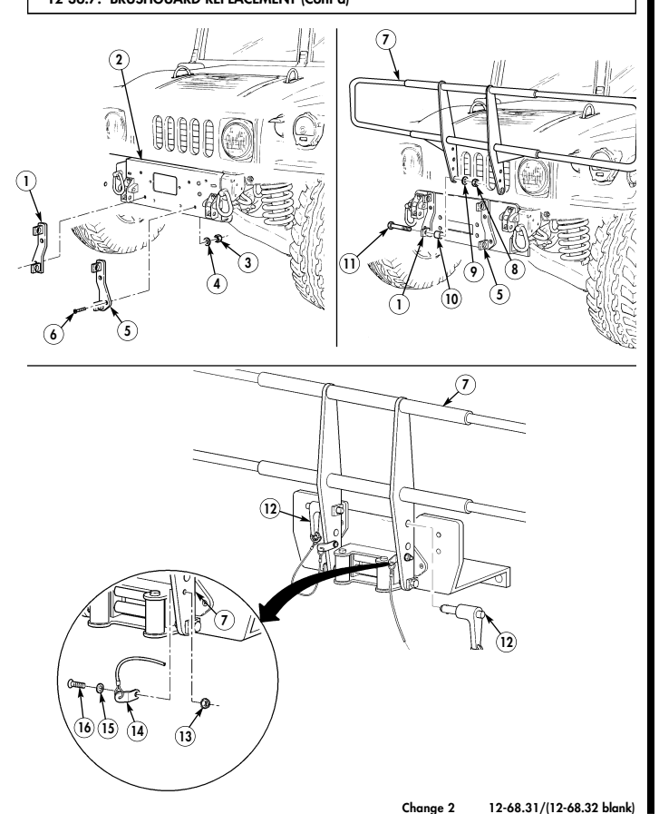

# 12-36.7.  Brushguard Replacement (Cont'D)

# Section Iv. Deep Water Fording Kit Maintenance

## 12-37. Deep Water Fording Kit Maintenance Task Summary

| a. Removal b. Installation                                                                           |    |
|------------------------------------------------------------------------------------------------------|----|
| INITIAL SETUP:                                                                                       |    |
| Tools Equipment Condition                                                                            |    |
| General mechanic's tool kit: Regulating valve hydraulic hoses removed                                |    |
| automotive (Appendix B, Item 1) (para. 12\-32.2)                                                     |    |
| Materials/Parts Maintenance Level                                                                    |    |
| Four locknuts (Appendix G, Item 133.23). Unit                                                        |    |
| Manual References                                                                                    |    |
| TM 9\-2320\-387\-24P                                                                                 |    |
| a. Removal                                                                                           |    |
| Remove two locknuts (9), washers (7), bracket (3), washers (7), screws (6), and regulating valve (2) | 1. |
| from bumper (8). Discard two locknuts (9).                                                           |    |
| Remove two locknuts (5), washers (4), regulating valve (2), washers 4), and screws (11) from         | 2. |
| bracket (3). Discard two locknuts (5).                                                               |    |
| Remove tee fitting (10) from regulating valve (2).                                                   | 3. |
| Remove tee fitting (1) from regulating valve (2).                                                    | 4. |

# 12-38. Deep Water Fording Kit Exhaust Assembly Maintenance

This task covers:

| ર   | TAUTITU VAL   |
|-----|---------------|
| b.  | Inspection    |

Applicable Models M1113, M1151, and M1152 Tools General mechanic's tool kit:
automotive (Appendix B, Item 1)
Materials/Parts Gasket (Appendix G, Item 39) Five locknuts (Appendix G, Item 106)
a. Removal c. Installation

#### Manual References

TM 9-2320-387-10 TM 9-2320-387-24P
General Safety Instructions Do not touch hot exhaust system components with bare hands.

Maintenance Level Unit

#### Warning

Do not touch hot exhaust system components with bare hands. Severe injury will result.

#### A. Removal

1. Remove two nuts (14), washers (13), and U-bolt (12) from exhaust assembly (9). 2. Remove two locknuts (4), washers (5), and two spacers (8) from wheelhouse (7) and exhaust assembly (9). Discard locknuts (4).

3. Remove three locknuts (1), washers (2), capscrews (10), washers (2), exhaust assembly (9), and gasket (11) from muffler (3). Discard locknuts (1) and gasket (11).

b. Inspection Inspect two insulators (6) for breaks, cracks, or deterioration. Replace if damaged.

#### C. Installation

1. Install two spacers (8) and exhaust assembly (9) on wheelhouse (7) with two washers (5) and locknuts (4). Tighten locknuts (4) to 37 lb-ft (50 N•m).

2. Install exhaust assembly (9) and gasket (11) on muffler (3) with three washers (2), capscrews (10),
washers (2), and locknuts (1). Tighten locknuts (1) to 26 lb-ft (35 N•m).

3. Install U-bolt (12) on exhaust assembly (9) with two washers (13) and nuts (14).

# 12-38.  Deep Water Fording Kit Exhaust Assembly Maintenance (Cont'D)

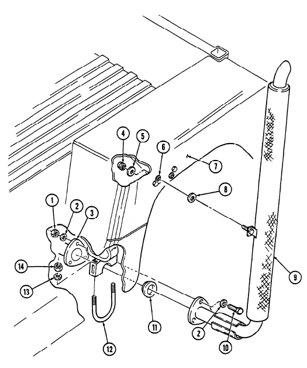

FOLLOW-ON TASK:    Start engine (TM 9-2320-387-10) and check for exhaust leaks.

# 12-39. Air Cleaner Shield Maintenance

This task covers:
b. Inspection

| M1114                           | TM 9\-2320\-387\-24P   |
|---------------------------------|------------------------|
| Tools                           | Maintenance Level      |
| General mechanic's tool kit:    | Unit                   |
| automotive (Appendix B, Item 1) |                        |
| Materials/Parts                 |                        |
| Locknut (Appendix G, Item 109)  |                        |

#### A. Removal

1. Loosen clamp (3) and disconnect air horn-to-air cleaner elbow (4) from air cleaner assembly (6). 2. Disconnect air cleaner-to-selector valve vent line (2) from air cleaner assembly (6). 3. Disconnect air restriction gauge hose (5) from air cleaner assembly (6). 4. Loosen two clamps (7) from air cleaner assembly (6) and support brackets (9).

4.1. Remove three screws (1.2), washers (1.3), and air cleaner shield (1.1) from air induction box (1).

5. Remove air cleaner assembly (6) and gasket (8) from air induction box (1).

b. Inspection Inspect gasket (8). Replace if broken or cracked.

c. Installation 4. Connect air cleaner-to-selector valve vent line (2) to air cleaner assembly (6).

1. Install air cleaner assembly (6) and gasket (8) on air induction box (1) and support brackets (9)
with two clamps (7). Tighten clamps (7) to 35-40 lb-in. (4-5 N•m).

2. Install air cleaner shield (1.1) on air induction box (1) with three washers (1.3) and screws (1.2). 3. Connect air restriction gauge hose (5) to air cleaner assembly (6).

5. Connect air horn-to-air cleaner elbow (4) to air cleaner assembly (6). Tighten clamp (3) to 45-50 lb-in. (5-6 N•m).

a. Removal c. Installation 12-39.  AIR CLEANER SHIELD MAINTENANCE (Cont'd)

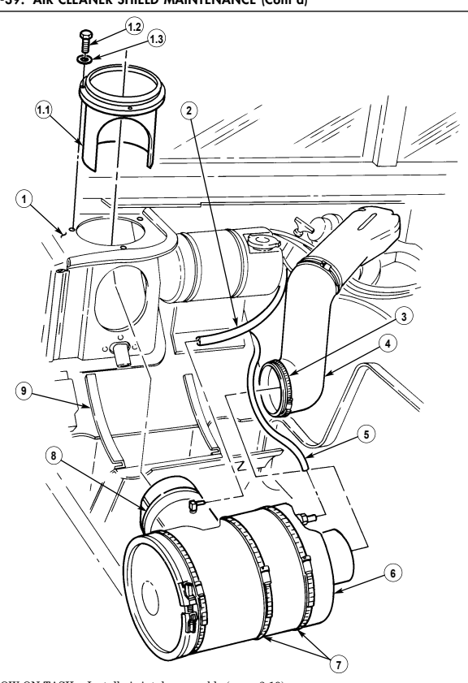

FOLLOW-ON TASK:   Install air intake assembly (para. 3-19).

# 12-40. Air Cleaner Dust Cap Replacement

This task covers:
INITIAL SETUP:
Applicable Models M1113, M1151, and M1152 Tools General mechanic's tool kit:
automotive (Appendix B, Item 1)

a. Removal b. Installation

| Equipment Condition   |
|-----------------------|
| Hood raised and see   |

| Unit   |
|--------|

| Manual References   |
|---------------------|
| TM 9\-2320\-387\-10 |

Hood raised and secured (TM 9-2320-387-10).

a. Removal 1. Remove four screws (5) and dust unloader cover plate (4) from air cleaner bracket (6). 2. Remove clamp (2) and air cleaner dust cap (3) from air cleaner assembly (1). 

b. Installation 1. Install dust cap (3) on air cleaner assembly (1) with clamp (2). Tighten clamp (2) to

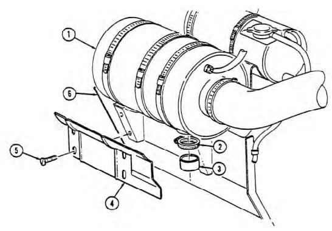

45-50 lb-in. (5-6 N•m).

2. Install dust unloader cover plate (4) on air cleaner bracket (6) with four screws (5).

FOLLOW-ON TASK: Lower and secure hood (TM 9-2320-387-10).

# 12-41. Air Cleaner-To-Selector Valve Vent Line Replacement

This task covers:
INITIAL SETUP:
Applicable Models M1113, M1151, and M1152 Tools General mechanic's tool kit:
automotive (Appendix B, Item 1)
Materials/Parts Three tiedown straps (Appendix G, 
Item 329.2)

a. Removal b. Installation

| Manual References   |
|---------------------|

Equipment Condition Hood raised and secured (TM 9-2320-387-10).

a. Removal 1. Disconnect air cleaner-to-selector valve vent line (2) from air cleaner assembly fitting (1). 2. Remove vent line (2) from three tiedown straps (3) and hoses (4) on A-beam (5). Discard tiedown straps (3).

3. Remove air cleaner-to-selector valve vent line (2) from selector valve (6). 

#### B. Installation

1. Connect air cleaner-to-selector valve vent line (2) to selector valve (6). 2. Route vent line (2) along A-beam (5) and secure to hoses (4) with three tiedown straps (3). 3. Connect air cleaner-to-selector vent line (2) to air cleaner assembly fitting (1).

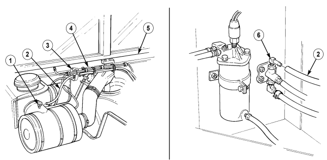

| Maintenance Level   |
|---------------------|
| Unit                |

FOLLOW-ON TASK: Lower and secure hood (TM 9-2320-387-10).

# 12-41.1. Air Cleaner Extension Elbow Replacement

This task covers:
b. Inspection

| Applicable Models           |
|-----------------------------|
| M1114                       |
| Tools                       |
| General mechanics tool kit: |

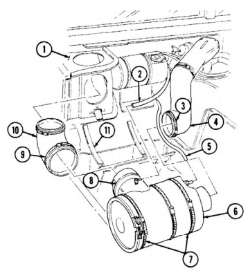

automotive (Appendix B, Item 1)
Manual References TM 9-2320-387-24P
a. Removal c. Installation

#### A. Removal

| Equipment Condition       |
|---------------------------|
| - Hood raised and secured |
| (TM 9\-2320\-387\-10).    |
| (para. 10\-23).           |

1. Loosen clamp (3) and disconnect air horn-to-air cleaner elbow (4) from air cleaner assembly (6). 2. Disconnect air cleaner-to-selector valve vent line (2) from air cleaner assembly (6). 3. Disconnect air restriction gauge hose (5) from air cleaner assembly (6). 4. Loosen two outer clamps (7) from air cleaner assembly (6) and support brackets (11). 5. Remove air cleaner assembly (6), gasket (8), and air cleaner extension elbow (10) from air induction box (1).

6. Loosen clamp (9) and remove air cleaner extension elbow (10) from air cleaner assembly (6).

# 12-41.1 Air Cleaner Extension Elbow Replacement (Cont'D)

b. Inspection Inspect gasket (8) for breaks or cracks. Replace if broken or cracked.

c. Installation 1. Install air cleaner extension elbow (10) on air cleaner assembly (6). Tighten clamp (9) to 45-50 lb-in.

(5-6 N•m).

2. Install air cleaner extension elbow (10) on air induction box (1). 3. Install air cleaner assembly (6) on support brackets (11) with two outer clamps (7). Tighten clamps (7) to 35-40 lb-in. (4-5 N•m).

4. Connect air restriction gauge hose (5) to air cleaner assembly (6). 5. Connect air cleaner-to-selector valve vent line (2) to air cleaner assembly (6). 6. Connect air horn-to-air cleaner elbow (4) to air cleaner assembly (6). Tighten clamp (3) to 

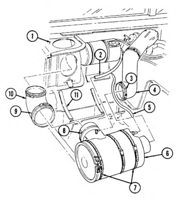

45-50 lb-in. (5-6 N•m).

FOLLOW-ON TASK: Install air intake assembly (para. 3-19).

# 12-42. Fuel Tank Vent Stack Tube Replacement

This task covers:

| INITIAL SETUP:                       |                                    |
|--------------------------------------|------------------------------------|
| Applicable Models                    | Equipment Condition                |
| M1114                                | Battery ground cables disconnected |
| Tools                                | (para. 4\-68).                     |
| General mechanics tool kit:          | Maintenance Level                  |
| automotive (Appendix B, Item 1)      | Unit                               |
| Materials/Parts                      |                                    |
| Tiedown strap (Appendix G, Item 324) |                                    |

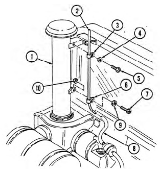

| INITIAL SETUP:   |
|------------------|

a. Removal b. Installation

#### A. Removal

b. Installation 1. Disconnect fuel tank vent line (8) from fuel tank vent stack tube (2). 2. Remove nut (10), screw (7), lockwasher (9), and clamp (6) from fuel tank vent stack tube (2) and air intake assembly (1). Discard lockwasher (9).

3. Remove screw (5), lockwasher (4), fuel tank vent stack tube (2), and clamp (3) from air intake assembly (1). Discard lockwasher (4).

1. Install fuel tank vent stack tube (2) and clamp (3) on air intake assembly (1) with lockwasher (4)
and screw (5).

2. Install fuel tank vent stack tube (2) and clamp (6) on air intake assembly (1) with lockwasher (9),
screw (7), and nut (10).

3. Connect vent line (8) to vent stack tube (2).

FOLLOW-ON TASK: Lower and secure hood (TM 9-2320-387-10).

# 12-43. Selector Valve Replacement

This task covers:

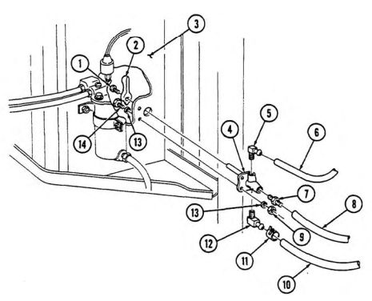

INITIAL SETUP:

| Applicable Models   |
|---------------------|

General mechanic's tool kit:
automotive (Appendix B, Item 1)
Materials/Parts Two locknuts (Appendix G, Item 77)

a. Removal b. Installation

| Manual References   |
|---------------------|
| TM 9\-2320\-387\-10 |
| TM 9\-2320\-387\-24 |

Equipment Condition
- Hood raised and secured (TM 9-2320-387-10). - Engine access cover removed (para. 10-22).

Maintenance Level Unit

#### A. Removal

1. Remove screw (1) and selector control (2) from selector valve (4). 2. Remove two locknuts (9), washers (13), capscrews (14), and washers (13) from selector valve (4) and body (3). Discard locknuts (9).

Prior to removal, tag vent lines for installation.

3. Disconnect air cleaner-to-selector valve vent line (6) from elbow (5). 4. Disconnect selector valve-to-union tee vent line (8) from connector (7). 5. Loosen clamp (11) and disconnect CDR valve vent line (10) from elbow (12). 6. Remove elbow (5), connector (7), and elbow (12) from selector valve (4).

## 12-43. Selector Valve Replacement (Cont'D)

b. Installation 1. Install elbow (12), connector (7), and elbow (5) on selector valve (4). 2. Connect CDR valve vent line (10) to selector elbow (12) with clamp (11). 3. Connect selector valve-to-union tee vent line (8) to connector (7). 4. Connect air cleaner-to-selector valve vent line (6) to elbow (5). 5. Install selector valve (4) on body (3) with two washers (13), capscrews (14), washers (13), and locknuts (9). Tighten locknuts (9) to 10 lb-ft (14 N•m).

6. Install selector control (2) on selector valve (4) with screw (1).

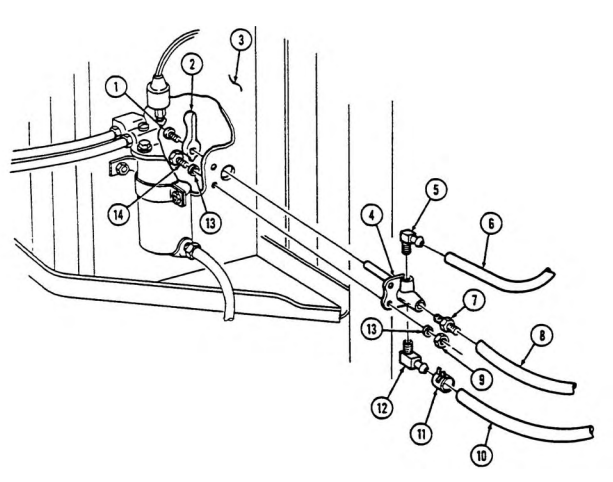

FOLLOW-ON TASKS: - Install engine access cover (para. 10-22).

- Lower and secure hood (TM 9-2320-387-10).

# 12-44. Cdr Valve Vent Line Replacement

This task covers:

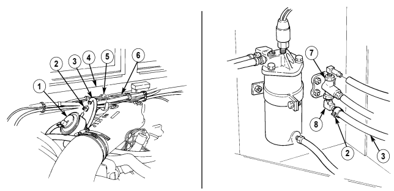

| Tools   |
|---------|

INITIAL SETUP:
General mechanic's tool kit:
automotive (Appendix B, Item 1)

| Maintenance Level   |
|---------------------|
| Unit                | | Maintenance Level   |
|---------------------|
| Unit                |

Materials/Parts Two tiedown straps (Appendix G, Item 323)

a. Removal b. Installation

Hood raised and secured (TM 9-2320-387-10).

#### A. Removal

| Manual References   |
|---------------------|

1. Loosen clamp (2) and disconnect CDR valve vent line (3) from CDR valve (1). 2. Remove two tiedown straps (5) from vent line (3) and existing hoses (6) on A-beam (4). Discard tiedown straps (5).

3. Loosen clamp (2) and remove vent line (3) from elbow (8) on selector valve (7). 4. Remove clamps (2) from vent line (3).

#### B. Installation

1. Install clamps (2) on vent line (3). 2. Connect vent line (3) to elbow (8) on selector valve (7) with clamp (2). 3. Install vent line (3) along A-beam (4) on existing hoses (6) with two straps (5). 4. Connect vent line (3) to CDR valve (1) with clamp (2).

FOLLOW-ON TASK: Lower and secure hood (TM 9-2320-387-10).

# 12-45. Hydro-Boost Vent Line Replacement

This task covers:

| Applicable Models            |
|------------------------------|
| All except M1114             |
| Tools                        |
| General mechanic's tool kit: |

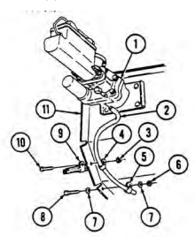

automotive (Appendix B, Item 1)
Materials/Parts Locknut (Appendix G, Item 77) Nut and lockwasher assembly
(Appendix G, Item 197)

#### A. Removal

1. Disconnect hydro-boost vent line (2) from hydro-boost (1). 2. Remove nut and lockwasher assembly (3), capscrew (10), clamp (4), harness clamp (9), and vent line (2) from body (11). Discard nut and lockwasher assembly (3).

3. Remove locknut (6), washer (7), capscrew (8), washer (7), clamp (5), and vent line (2) from body (11).

Discard locknut (6).

4. Remove two clamps (4) and (5) from vent line (2).

#### B. Installation

1. Install two clamps (4) and (5) on vent line (2). 2. Install vent line (2) and clamp (5) on body (11) with washer (7), capscrew (8), washer (7), and locknut (6). Tighten capscrew (8) to 6 lb-ft (8 N•m).

3. Install vent line (2), harness clamp (9), and clamp (4) on body (11) with capscrew (10) and nut and lockwasher assembly (3).

4. Connect vent line (2) to hydro-boost (1).

FOLLOW-ON TASK: Install engine left splash shield (para. 10-23 or para. 10-23.1).

a. Removal b. Installation 12-80 Change 6

| Manual References                 |
|-----------------------------------|
| TM 9\-2320\-387\-24P              |
| Equipment Condition               |
| Engine left splash shield removed |
| (para. 10\-23 or para. 10\-23.1). |
| Maintenance Level                 |
| Unit                              |

# 12-46. Deep Water Fording Sensor Cup Replacement

This task covers:

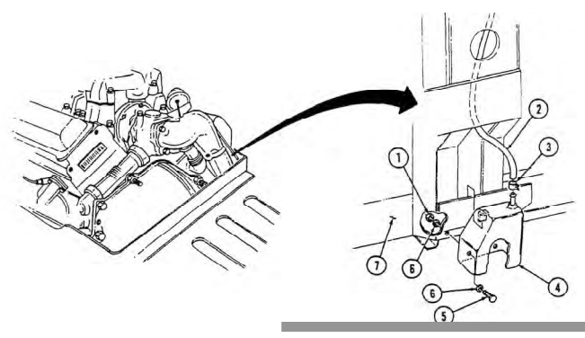

INITIAL SETUP:
M1113, M1151, and M1152 General mechanic's tool kit:
automotive (Appendix B, Item 1)
Materials/Parts Two locknuts (Appendix G, Item 77)

| Main   | Jnit   |
|--------|--------|

a. Removal b. Installation

Equipment Condition Engine access cover removed (para. 10-22).

Maintenance Level

| Manual References   |
|---------------------|

a. Removal 1. Loosen clamp (3) and disconnect sensor cup vent line (2) from sensor cup (4). 2. Remove two locknuts (1), washers (6), capscrews (5), washers (6), and sensor cup (4) from body (7). Discard locknuts (1).

b. Installation 1. Install sensor cup (4) on body (7) with two washers (6), capscrews (5), washers (6), and locknuts (1).

Tighten locknuts (1) to 6 lb-ft (8 N•m).

2. Connect sensor cup vent line (2) to sensor cup (4) with clamp (3).

FOLLOW-ON TASK: Install engine access cover (para. 10-22).

# 12-47. Sensor Cup Vent Line Replacement

This task covers:
INITIAL SETUP:
Applicable Models M1113, M1151, and M1152 Tools General mechanic's tool kit:
automotive (Appendix B, Item 1)
a. Removal b. Installation Manual References TM 9-2320-387-10 TM 9-2320-387-24P
Equipment Condition
- Hood raised and secured (TM 9-2320-387-10). - Engine access cover removed (para. 10-22).

Maintenance Level Unit a. Removal 1. Loosen clamp (3) and disconnect sensor cup vent line (1) from CDR valve (2). 2. Loosen clamp (6) and remove vent line (1) from sensor cup (5). 3. Remove two clamps (3) and (6) from vent line (1).

b. Installation 1. Install two clamps (3) and (6) on vent line (1). 2. Route vent line (1) through A-beam (4). 3. Connect vent line (1) to sensor cup (5) with clamp (6). 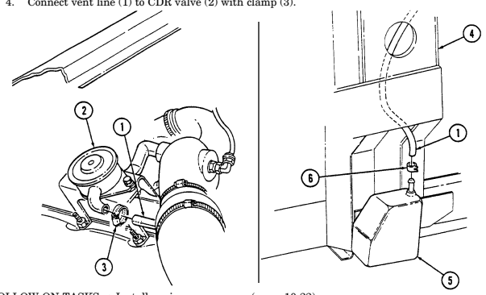

FOLLOW-ON TASKS: - Install engine access cover (para. 10-22).

- Lower and secure hood (TM 9-2320-387-10).

# 12-48. Power Steering Vent Line Replacement

This task covers:

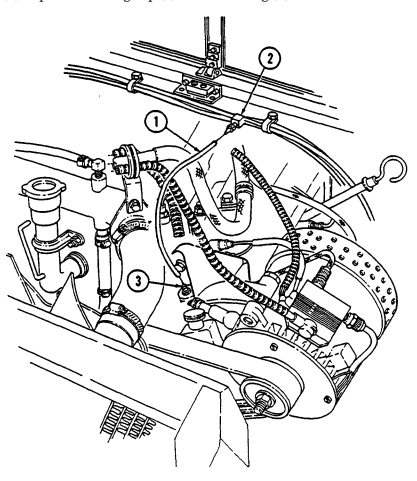

INITIAL SETUP:
General mechanic's tool kit:
automotive (Appendix B, Item 1)

a. Removal b. Installation

a. Removal

| Manual References                          |
|--------------------------------------------|
| TM 9\-2320\-387\-24P                       |
| Equipment Condition                        |
| Air intake assembly removed (para. 3\-19). |
| Maintenance Level                          |
| Unit                                       |

Remove power steering vent line (1) from power steering pump cap (3) and tee fitting (2). 

b. Installation Connect vent line (1) to power steering cap (3) and tee fitting (2).

FOLLOW-ON TASK: Lower and secure hood (TM 9-2320-387-10).

# 12-49. Exhaust Reinforcement Bracket Replacement

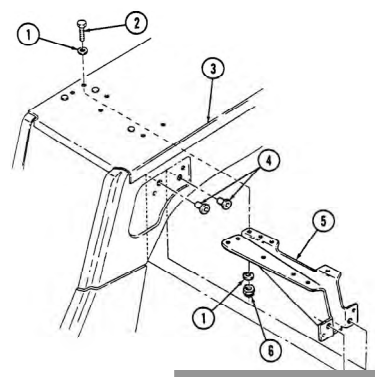

This task covers:
INITIAL SETUP:
General mechanic's tool kit:
automotive (Appendix B, Item 1)
Materials/Parts Eight locknuts (Appendix G, Item 77)

a. Removal b. Installation

a. Removal 1. Remove two isolators (4) from wheelhouse (3) and reinforcement bracket (5). 2. Remove eight locknuts (6), washers (1), capscrews (2), washers (1), and reinforcement bracket (5)
from wheelhouse (3). Discard locknuts (6).

| Manual References                              |
|------------------------------------------------|
| TM 9\-2320\-387\-10                            |
| TM 9\-2320\-387\-24P                           |
| Equipment Condition                            |
| Hood raised and secured (TM 9\-2320\-387\-10). |
| Maintenance Level                              |
| Unit                                           |

#### B. Installation

1. Install reinforcement bracket (5) on wheelhouse (3) with eight washers (1), capscrews (2),
washers (1), and locknuts (6). Tighten capscrews (2) to 6 lb-ft (8 N•m).

2. Install two isolators (4) on wheelhouse (3) and reinforcement bracket (5).

FOLLOW-ON TASK: Install deep water fording kit exhaust assembly (para. 12-38).

# Section V. Troop Seat Kit Maintenance

## 12-50. Troop Seat Kit Maintenance Task Summary

| INITIAL SETUP:                  |                                                |
|---------------------------------|------------------------------------------------|
| Applicable Models               | Manual References                              |
| M1113, M1151, and M1152         | TM 9\-2320\-387\-10                            |
|                                 | TM 9\-2320\-387\-24P                           |
| Tools                           |                                                |
| General mechanic's tool kit:    | Equipment Condition                            |
| automotive (Appendix B, Item 1) | Hood raised and secured (TM 9\-2320\-387\-10). |

## 12-51. Seat Support Replacement

This task covers:

a. Removal b. Installation

| 2.   | Remove vent line (2) from three tiedown straps (3) and hoses (4) on A\-beam (5). Discard tiedown   |
|------|----------------------------------------------------------------------------------------------------|
|      | straps (3).                                                                                        |
| 3.   | Remove air cleaner\-to\-selector valve vent line (2) from selector valve (6).                      |
| b.   | Installation                                                                                       |
| 1.   | Connect air cleaner\-to\-selector valve vent line (2) to selector valve (6).                       |

INITIAL SETUP:

#### A. Removal

1. Remove two lockpins (1) from troop seat (2). 2. Lower seat support (4). 3. Remove three cotter pins (6), clevis pins (5), and seat support (4) from back support (3). Discard cotter pins (6).

b. Installation 1. Install seat support (4) on back support (3) with three clevis pins (5) and cotter pins (6). 2. Raise seat support (4) and install two lockpins (1) on troop seat (2).

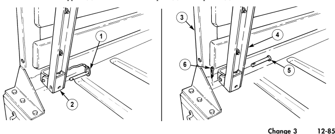

# 12-52. Troop Seat Kit Replacement

This task covers:
INITIAL SETUP:
a. Removal b. Installation

| INITIAL SETUP:                  |                     |
|---------------------------------|---------------------|
| Applicable Models               | Equipment Condition |
| M1151, M1152                    |                     |
| Tools                           | (para. 3\-19).      |
| General mechanic's tool kit:    | Maintenance Level   |
| automotive (Appendix B, Item 1) | Unit                |
| Manual References               |                     |
| TM 9\-2320\-387\-24P            |                     |

#### A. Removal

1. Remove three locknuts (16), washers (2), capscrews (3), washers (2), and rear angle bracket (18) from wheelhouse (1). Discard locknuts (16).

2. Remove two locknuts (13), washers (14), capscrews (17), washers (14), and rear bracket retainer plate (15) from wheelhouse (1). Discard locknuts (13).

3. Remove two nuts (9), washers (7), capscrews (8), washers (7), and support bracket (6) 
from wheelhouse (1).

4. Remove six locknuts (12), washers (5), capscrews (4), washers (5), three reinforcement plates (11), and main channel (10) from wheelhouse (1). Discard locknuts (12).

5. Remove troop seat (19). 6. Remove three locknuts (22), washers (21), capscrews (24), and channel support (23) from B-pillar (20). Discard locknuts (22).

#### B. Installation

1. Install channel support (23) on B-pillar (20) with three capscrews (24), washers (21), and locknuts (22). Tighten locknuts (22) to 15 lb-ft (20 N•m).

2. Install troop seat (19) on wheelhouse (1). 3. Install main channel (10) and three reinforcement plates (11) on wheelhouse (1) with six washers (5),
capscrews (4), washers (5), and locknuts (12). Tighten capscrews (4) to 15 lb-ft (20 N•m).

4. Install support bracket (6) on wheelhouse (1) with two washers (7), capscrews (8), washers (7), and nuts (9). Tighten nuts (9) to 43 lb-ft (58 N•m).

5. Install rear bracket retainer plate (15) on wheelhouse (1) with two washers (14), capscrews (17),
washers (14), and locknuts (13). Tighten locknuts (13) to 6 lb-ft (8 N•m).

6. Install rear angle bracket (18) on wheelhouse (1) with three washers (2), capscrews (3), washers (2),
and locknuts (16). Tighten locknuts (16) to 6 lb-ft (8 N•m).

12-52. TROOP SEAT KIT REPLACEMENT (Cont'd)

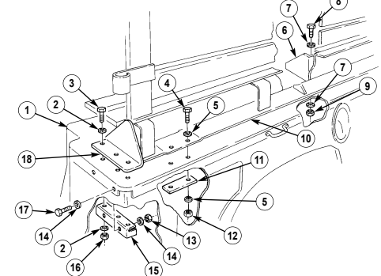

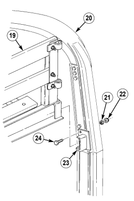

# 12-53. Troop Seat Board Replacement

This task covers:

| Applicable Models            |
|------------------------------|
| M1113, M1151, and M1152      |
| Tools                        |
| General mechanic's tool kit: |

INITIAL SETUP:

a. Removal b. Installation

| TM 9\-2320\-387\-10 TM 9\-2320\-387\-24P   |
|--------------------------------------------|

The procedure for replacing seat boards and back boards is basically the same. This procedure covers seat boards.

a. Removal Remove three carriage bolts (1), plain-assembled nuts (3), and seat board (2) from channel assembly (4). Discard plain-assembled nuts (3).

b. Installation Install seat board (2) on channel assembly (4) with three carriage bolts (1) and plain-assembled nuts (3).

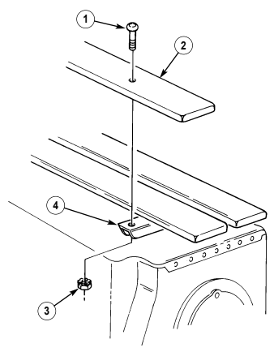

# Section Vi. Arctic Winterization Crew Top Kits Maintenance

| INITIAL SETUP:                     |                                                  |
|------------------------------------|--------------------------------------------------|
| Applicable Models                  | Manual References                                |
| M1113                              | TM 9\-2320\-387\-10                              |
| Tools                              | TM 9\-2320\-387\-24P                             |
| General mechanic's tool kit:       | Equipment Condition                              |
| automotive (Appendix B, Item 1)    | - Hood raised and secured (TM 9\-2320\-387\-10). |
| Materials/Parts                    | - Engine access cover removed (para. 10\-22).    |
| Two locknuts (Appendix G, Item 77) | Maintenance Level                                |
|                                    | Unit                                             |
| a. Removal                         |                                                  |

## 12-54. Arctic Winterization Crew Top Kits Maintenance Task Summary

# 12-55. Arctic Top Cover Assembly Replacement

This task covers:

| INITIAL SETUP:   |
|------------------|

| Applicable Models               | Manual References    |
|---------------------------------|----------------------|
| M1113, M1151, and M1152         | TM 9\-2320\-387\-10  |
|                                 | TM 9\-2320\-387\-24P |
| Tools                           |                      |
| General mechanic's tool kit:    | Equipment Condition  |
| automotive (Appendix B, Item 1) |                      |

a. Removal b. Installation

#### A. Removal

1. Unfasten eleven turnbuttons (8) from top cover (6) and B-pillar (7). 2. Unfasten two turnbuttons (9) from top cover flaps (2) and B-pillar (7). 3. Unfasten six turnbuttons (10) from top cover flaps (2) and horizontal rails (11). 4. Unfasten two turnbuttons (3) from top cover flaps (2) and windshield frame (4). 5. Fold top cover (6) toward front of vehicle and slide front bead (1) of top cover (6) from A-pillar former assembly (5) and remove top cover (6).

#### B. Installation

1. Install top cover (6) by sliding front bead (1) of top cover (6) into A-pillar former assembly (5). 2. Unfold top cover (6) toward rear of vehicle. 3. Install top cover flaps (2) on horizontal rails (11) with six turnbuttons (10). 4. Install top cover flaps (2) on B-pillar (7) with two turnbuttons (9). 5. Install top cover (6) on B-pillar (7) with eleven turnbuttons (8). 6. Install two top cover flaps (2) on windshield frame (4) with two turnbuttons (3).

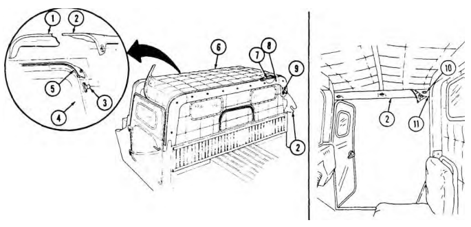

# 12-56. Arctic Curtain Assembly Replacement

This task covers:
a. Removal b. Installation INITIAL SETUP:
Applicable Models

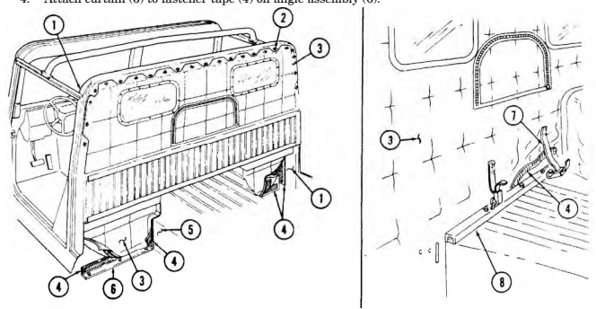

Tools General mechanic's tool kit:
automotive (Appendix B, Item 1)
Manual References TM 9-2320-387-24P

#### Equipment Condition

- Companion seat back removed (para. 1043).

- Arctic top cover assembly removed (para.

12-55).

Maintenance Level Unit

#### A. Removal

1. Peel curtain (3) back from fastener tape (4) on angle assembly (6). 2. Release two straps (7), remove curtain (3) from channel assembly (8), and peel curtain (3) back from fastener tape (4) on channel assembly (8).

3. Peel curtain (3) back from fastener tape (4) on tunnel (5) and B-pillar (1). 4. Unfasten twelve turnbuttons (2) and remove curtain (3) from B-pillar (1).

#### B. Installation

1. Install curtain (3) on B-pillar (1) with twelve turnbuttons (2). 2. Attach curtain (3) to fastener tape (4) on B-pillar (1) and tunnel (5). 3. Attach curtain (3) to fastener tape (4) on channel assembly (8) with two straps (7). 4. Attach curtain (3) to fastener tape (4) on angle assembly (6).

FOLLOW-ON TASKS: - Install arctic top cover assembly (para. 12-55).

- Install companion seat back (para. 10-43).

# 12-57. Arctic Curtain Angle Assembly Replacement

This task covers:
INITIAL SETUP:

| Tools   |
|---------|

| man and change to the same of the   |
|-------------------------------------|
| M1152                               |

Applicable Models General mechanic's tool kit:
automotive (Appendix B, Item 1)
Materials/Parts Adhesive-sealant (Appendix C, Item 10) Three locknuts (Appendix G, Item 101.8)

#### A. Removal

1. Peel curtain (2) back from fastener tape (1) on angle assembly (4). 2. Remove three locknuts (8), washers (9), capscrews (5), washers (6), and angle assembly (4) from cargo floor (7). Discard locknuts (8).

3. Peel fastener tape (1) from angle assembly (4). 4. Clean remaining adhesive from angle assembly (4) surface.

b. Installation

Ensure surface is free of dirt and oil before applying adhesive backing.

1. Peel paper backing (3) from fastener tape (1) and install fastener tape (1) to angle assembly (4). 2. Install angle assembly (4) on cargo floor (7) with three washers (6), capscrews (5), washers (9), and locknuts (8). Tighten locknuts (8) to 17 lb-ft (23 N•m).

3. Attach curtain (2) to fastener tape (1) on angle assembly (4).

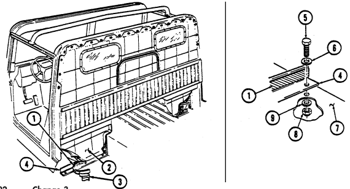

| Manual References    |
|----------------------|
| TM 9\-2320\-387\-24P |
| Maintenance Level    |
| Unit                 |

12-92 Change 3
a. Removal b. Installation

| TM 9\-2320\-387\-24P   |
|------------------------|

# 12-58. Arctic Window Replacement

This task covers:
INITIAL SETUP:

| N M1   | 152   |
|--------|-------|

Applicable Models Tools General mechanic's tool kit:
automotive (Appendix B, Item 1)
Materials/Parts Adhesive-sealant (Appendix C, Item 10) Eighteen locknuts (Appendix G, Item 101.9)

#### A. Removal

1. Remove eighteen locknuts (1), screws (7), two retainers (2), inner window (3), and outer window (6)
from arctic curtain (4). Discard locknuts (1).

2. Remove adhesive-sealant from edge of outer window (6).

b. Installation 1. Apply adhesive-sealant around edge of outer window (6) between screw holes. 2. Insert outer window (6) into curtain flaps (5), ensuring surface without adhesive-sealant faces outside of vehicle.

3. Insert inner window (3) into curtain flaps (5) from inside of vehicle, and align inner window (3) and outer window (6) screw holes.

4. Secure inner window (3) and outer window (6) to arctic curtain flaps (5) with two retainers (2),

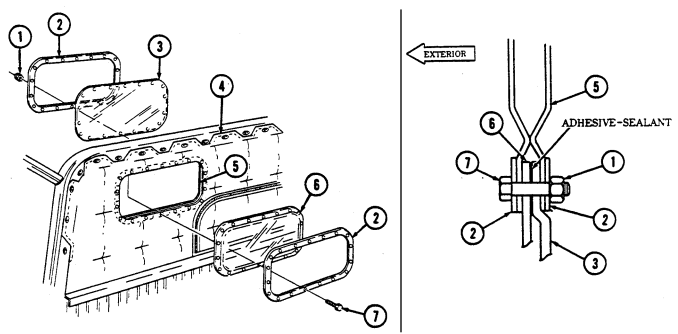

eighteen screws (7), and locknuts (1).

| Manual References    |
|----------------------|
| TM 9\-2320\-387\-24P |
| Maintenance Level    |
| Unit                 |

a. Removal b. Installation

| TM 9\-2320\-387\-10   |
|-----------------------|

# 12-59. Arctic Curtain Channel Assembly Replacement (2-Man Crew)

This task covers:

| INITIAL SETUP:   |
|------------------|

| Applicable Models               | Manual References    |
|---------------------------------|----------------------|
| M1113, M1152                    | TM 9\-2320\-387\-24P |
| Tools                           | Equipment Condition  |
| General mechanic's tool kit:    | (para. 12\-38).      |
| automotive (Appendix B, Item 1) |                      |

a. Removal b. Installation

#### A. Removal

1. Peel curtain (13) back from fastener tape (7) on channel assembly (8). 2. Open two straps (1) from curtain (13) and channel assembly (8). 3. Remove four capscrews (4), washers (5), and channel assembly (8) from cargo floor (12). 4. Peel and remove fastener tape (7) from channel assembly (8). 5. Remove seal (9) from channel assembly (8). 6. Remove four nuts (11), washers (10), screws (3), and two footman loops (2) from channel assembly (8). 

b. Installation

Ensure surface is free of dirt and oil before applying adhesive backing.

1. Install two footman loops (2) on channel assembly (8) with four screws (3), washers (10), and nuts (11).

2. Install seal (9) into channel assembly (8). 3. Peel paper backing (6) from fastener tape (7) and install fastener tape (7) on channel assembly (8). 4. Install channel assembly (8) on cargo floor (12) with four washers (5) and capscrews (4). 5. Install curtain (13) on channel assembly (8) with two straps (1).

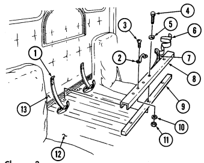 6. Secure curtain (13) to channel assembly (8) with fastener tape (7).

# 12-60. Arctic Curtain Channel Assembly Replacement (4-Man Crew)

This task covers:
b. Inspection INITIAL SETUP:

#### A. Removal C. Installation

| 12\-51.                          | Seat Support Replacement     | 12\-85   |
|----------------------------------|------------------------------|----------|
| 12\-52.                          | Troop Seat Kit Replacement   | 12\-86   |
| 12\-53.                          | Troop Seat Board Replacement | 12\-88   |
| 12\-51. SEAT SUPPORT REPLACEMENT |                              |          |

#### A. Removal

1. Release two straps (2) from curtain (3) and wheelhousing channel assemblies (1) and (22). 2. Release four straps (4) from curtain (3) and cargo floor channel assembly (11). 3. Pull curtain (3) back from fastener tape (10) on wheelhousing channel assemblies (1) and (22), and cargo floor channel assembly (11).

4. Remove six capscrews (8), washers (9), and cargo floor channel assembly (11) from cargo floor (14). 5. Remove seal (12) from cargo floor channel assembly (11). 6. Remove eight locknuts (13), washers (12.1), screws (7), and four footman loops (6) from cargo floor channel assembly (11). Discard locknuts (13).

7. Remove ten locknuts (21), twenty washers (16), ten capscrews (15), and wheelhousing channel assemblies (1) and (22) from wheelhousings (20). Discard locknuts (21).

8. Remove four locknuts (19), screws (17), and two footman loops (18) from wheelhousing channel assemblies (1) and (22). Discard locknuts (19).

#### B. Inspection C. Installation

1. Inspect thirty-one turnbuttons (23) on soft top for bends, corrosion, or damage. Replace if bent, corroded, or damaged (refer to para. 10-56).

2. Inspect six rivnuts (5) on cargo floor for looseness, cracks, wearing, or damage. Replace if loose, cracked, worn, or damaged (refer to para. 10-56).

3. Inspect fastener tape (10) on wheelhousing channel assemblies (1) and (22) and cargo floor channel assembly (11) for tearing or damage. Replace if torn or damaged (refer to para. 12-61).

1. Install two footman loops (18) on wheelhousing channel assemblies (1) and (22) with four screws (17)
and locknuts (19).

2. Install wheelhousing channel assemblies (1) and (22) on wheelhousings (20) with twenty washers (16),
ten capscrews (15), and locknuts (21).

3. Install four footman loops (6) on cargo floor channel assembly (11) with eight screws (7),
washers (12.1), and locknuts (13).

4. Install seal (12) in cargo floor channel assembly (11). 5. Install cargo floor channel assembly (11) on cargo floor (14) with six washers (9) and capscrews (8). 6. Install curtain (3) on wheelhousing channel assemblies (1) and (22) and cargo floor channel assembly (11) with fastener tape (10).

7. Secure curtain (3) to cargo floor channel assembly (11) with four straps (4). 8. Secure curtain (3) to wheelhousing channel assemblies (1) and (22) with two straps (2).

12-60.  ARCTIC CURTAIN CHANNEL ASSEMBLY REPLACEMENT

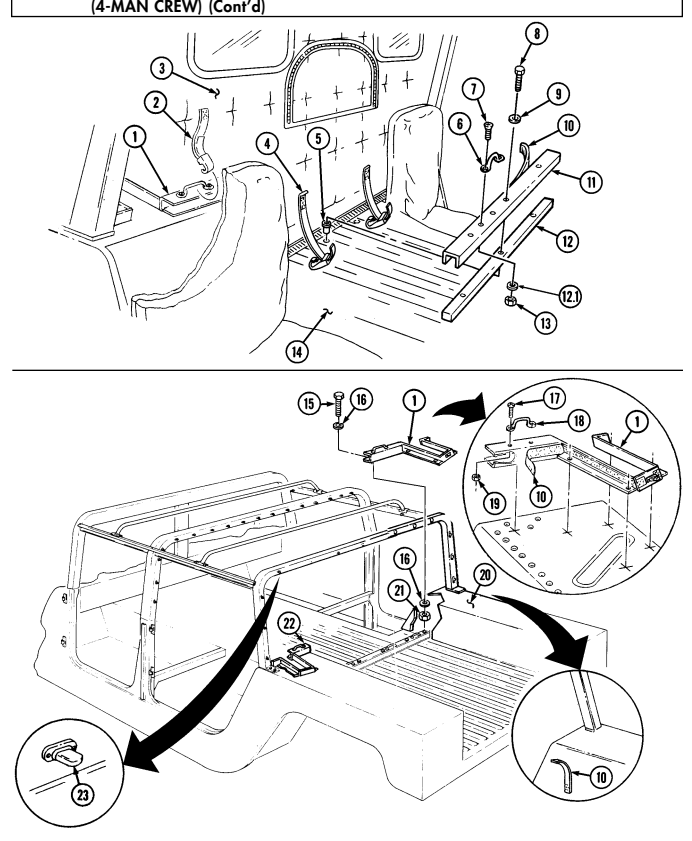

# 12-61. Arctic Curtain Fastener Tape Hook Replacement

This task covers:
INITIAL SETUP:
Applicable Models M1152 Tools General mechanic's tool kit:
automotive (Appendix B, Item 1)
a. Removal b. Installation Manual References TM 9-2320-387-24P
Equipment Condition Arctic curtain assembly removed 
(para. 12-56).

Maintenance Level Unit

All fastener tape is removed and installed the same. This procedure covers the B-pillar fastener tape.

a. Removal 1. Peel fastener tape (3) from B-pillar (2). 2. Clean remaining adhesive from B-pillar (2).

b. Installation 1. Ensure B-pillar surface (2) is free of dirt and oil. 2. Peel paper backing (1) from fastener tape (3). 3. Apply fastener tape (3) to B-pillar (2) and press firmly in place.

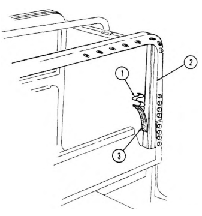

FOLLOW-ON TASK: Install arctic curtain assembly (para. 12-56).

# 12-62. Arctic Foam Insulation Strip Replacement

This task covers:

a. Removal b. Installation

INITIAL SETUP:

| Applicable Models               | Personnel Required   |
|---------------------------------|----------------------|
| M1152                           | One mechanic         |
| Tools                           | One assistant        |
| General mechanic's tool kit:    | Manual References    |
| automotive (Appendix B, Item 1) | TM 9\-2320\-387\-24P |

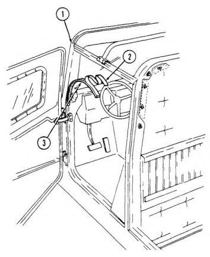

a. Removal 1. Peel foam insulation strip (3) from A-pillar (1). 2. Clean remaining adhesive from A-pillar surface (1).

b. Installation

Ensure A-pillar surface is free of dirt and oil before applying foam insulation strip.

1. Peel paper backing (2) from foam insulation strip (3). 2. Install foam insulation strip (3) on A-pillar (1) and press firmly in place.

# Section Vii. L119 Kit Maintenance

| INITIAL SETUP:                                                                                              |                 |                             |
|-------------------------------------------------------------------------------------------------------------|-----------------|-----------------------------|
| Applicable Models                                                                                           | Materials/Parts |                             |
| M1152                                                                                                       |                 | Three plain\-assembled nuts |
| Tools                                                                                                       |                 | (Appendix G, Item 197.1)    |
| General mechanic's tool kit:                                                                                |                 | Manual References           |
| automotive (Appendix B, Item 1)                                                                             |                 | TM 9\-2320\-387\-24P        |
| Maintenance Level                                                                                           |                 |                             |
| Unit                                                                                                        |                 |                             |
| NOTE                                                                                                        |                 |                             |
| The procedure for replacing seat boards and back boards is                                                  |                 |                             |
| basically the same. This procedure covers seat boards.                                                      |                 |                             |
| a. Removal                                                                                                  |                 |                             |
| Remove three carriage bolts (1), plain\-assembled nuts (3), and seat board (2) from channel assembly (4).   |                 |                             |
| Discard plain\-assembled nuts (3).                                                                          |                 |                             |
| b. Installation                                                                                             |                 |                             |
| Install seat board (2) on channel assembly (4) with three carriage bolts (1) and plain\-assembled nuts (3). |                 |                             |
| 1                                                                                                           |                 |                             |
| 2                                                                                                           |                 |                             |

# 12-63. L119 Kit Maintenance Task Summary 12-64. Trailer Connector And Wiring Harness Replacement (L119)

This task covers:
INITIAL SETUP:
Applicable Models

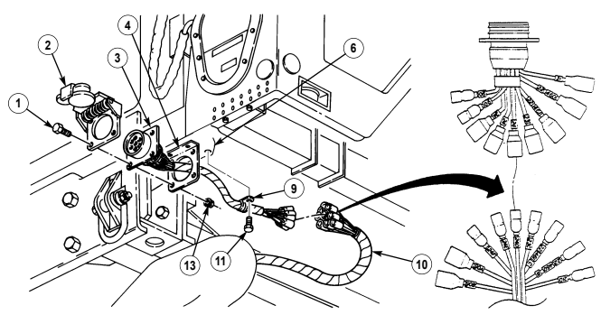

General mechanic's tool kit:
automotive (Appendix B, Item 1)
Materials/Parts Four assembled locknuts
(Appendix G, Item 134)
a. Removal b. Installation Manual References TM 9-2320-387-24P
Equipment Condition Battery ground cable disconnected 
(para. 4-68).

Maintenance Level Unit

Prior to removal, tag leads for installation.

#### A. Removal

1. Remove four assembled locknuts (13), capscrews (1), and receptacle cover (2) from mounting bracket (4). Discard assembled locknuts (13). 

2. Remove screw (11) and clamp (9) from D-beam (6). 3. Disconnect receptacle assembly (3) from body wiring harness (10) and remove receptacle assembly (3).

12-64. TRAILER CONNECTOR AND WIRING HARNESS REPLACEMENT (L119) (Cont'd)
b. Installation 1. Feed receptacle assembly (3) leads through bracket (4) and connect receptacle assembly (3) to body wiring harness (10).

2. Install clamp (9) on D-beam (6) with screw (11). 3. Install receptacle assembly (3) and receptacle cover (2) on mounting bracket (4) with four capscrews (1) and assembled locknuts (13).

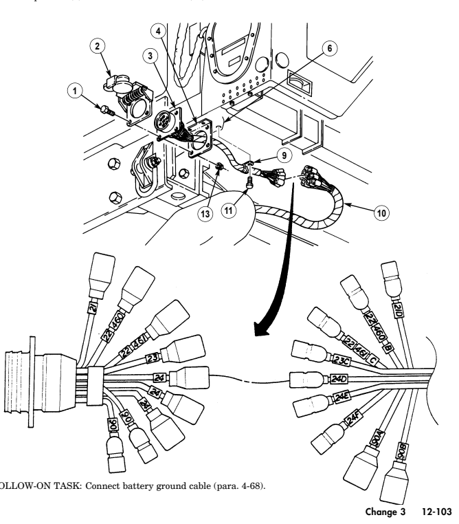

# 12-65. Rear Bumper Replacement (L119)

This task covers:
INITIAL SETUP:
Applicable Models M1152 Tools General mechanic's tool kit:
automotive (Appendix B, Item 1)
Materials/Parts Four locknuts (Appendix G, Item 85)
a. Removal b. Installation

#### Equipment Condition

- Towing pintle removed (para. 9-9). - Rear tiedown brackets (L119) removed
(para. 24-12).

Maintenance Level Unit a. Removal Remove four locknuts (6), washers (5), capscrews (3), washers (2), and bumper (4) from two inner mounting brackets (1). Discard locknuts (6).

#### B. Installation

Install bumper (4) on two inner mounting brackets (1) with four washers (2), capscrews (3),

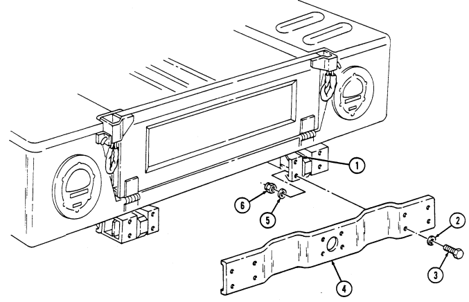 washers (5), and locknuts (6). Tighten locknuts (6) to 90 lb-ft (122 N•m).

FOLLOW-ON TASKS: - Install rear tiedown brackets (L119) (para. 24-12).

- Install towing pintle (para. 9-9).

# 12-66. Rear Bumper Brace Bracket Replacement (L119)

This task covers:
INITIAL SETUP:

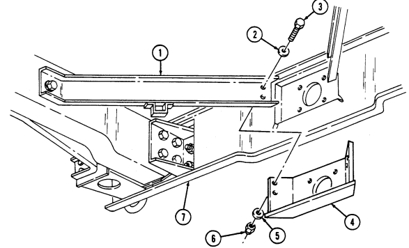

General mechanic's tool kit:
automotive (Appendix B, Item 1)
Materials/Parts Four locknuts (Appendix G, Item 85)
a. Removal b. Installation Manual References TM 9-2320-387-10

| Unit   |
|--------|

| Maintenance Level   |
|---------------------|
| Unit                |

Equipment Condition
- Towing pintle removed (para. 9-9).

#### A. Removal

Remove four locknuts (6), washers (5), capscrews (3), washers (2), and brace bracket (4) from rear bumper (7) and two inner braces (1). Discard locknuts (6).

b. Installation 1. Install brace bracket (4) on rear bumper (7) and two inner braces (1). 2. Secure brace bracket (4) to two inner braces (1) with four washers (2), capscrews (3), washers (5),
and locknuts (6). Tighten locknuts (6) to 90 lb-ft (122 N•m).

FOLLOW-ON TASKS: - Install towing pintle (para. 9-9).

- Install pioneer tool stowage rack (TM 9-2320-387-10).

# 12-67. Rear Bumper Outer Brace Replacement (L119)

This task covers:

| a.  Removal                                                  | b.  Installation                           |
|--------------------------------------------------------------|--------------------------------------------|
| INITIAL SETUP:                                               |                                            |
| Applicable Models                                            | Equipment Condition                        |
| M1152                                                        | - Companion seat back removed (para. 10\-  |
| Tools                                                        | 43).                                       |
|                                                              | - Arctic top cover assembly removed (para. |
| General mechanic's tool kit: automotive (Appendix B, Item 1) | 12\-55).                                   |
| Manual References                                            | Maintenance Level                          |
|                                                              | Unit                                       |

#### A. Removal

1. Remove locknut (7), washer (8), capscrew (10), and washer (9) from outer brace (4) and frame (11).

Discard locknut (7).

2. Remove two locknuts (2), washers (3), capscrews (6), washers (5), and outer brace (4) from outer mounting bracket (1). Discard locknuts (2).

#### B. Installation

1. Install outer brace (4) on outer mounting bracket (1) with two washers (5), capscrews (6),
washers (3), and locknuts (2). Tighten locknuts (2) to 90 lb-ft (122 N•m).

2. Install outer brace (4) on frame (11) with washer (9), capscrew (10), washer (8), and locknut (7).

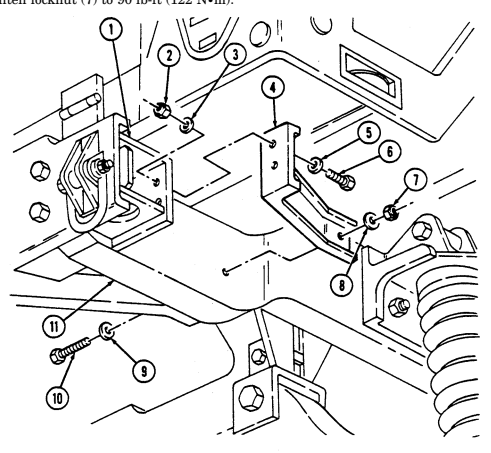

Tighten locknut (7) to 90 lb-ft (122 N•m).

# 12-68. Rear Bumper Outer Mounting Bracket Replacement (L119)

| Applicable Models                       |
|-----------------------------------------|
| M1152                                   |
| Tools                                   |
| General mechanic's tool kit:            |
| automotive (Appendix B, Item 1)         |
| Materials/Parts                         |
| Adhesive\-sealant (Appendix C, Item 10) |

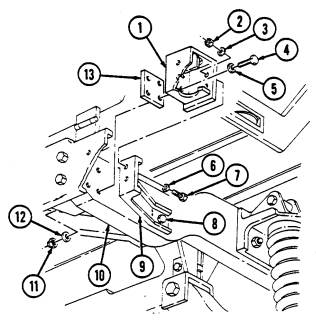

This task covers:

| INITIAL SETUP:   |
|------------------|

a. Removal b. Installation

| Personnel Required   |
|----------------------|
| One mechanic         |
| One assistant        |
| Manual References    |
| TM 9\-2320\-387\-24P |
| Maintenance Level    |
| Unit                 |

#### A. Removal

1. Remove two locknuts (2), washers (3), capscrews (7), and washers (6) from outer mounting bracket (1) and outer brace (9). Discard locknuts (2).

2. Loosen locknut (8) from outer brace (9) and frame (10). 3. Remove four locknuts (11), washers (12), capscrews (4), washers (5), outer mounting bracket (1) and spacer (13) from frame (10). Discard locknuts (11).

#### B. Installation

1. Install outer mounting bracket (1) and spacer (13) on frame (10) with four washers (5),
capscrews (4), washers (12), and locknuts (11). Tighten locknuts (11) to 90 lb-ft (122 N•m).

2. Install outer mounting bracket (1) on outer brace (9) with two washers (6), capscrews (7), 
washers (3), and locknuts (2). Tighten locknuts (2) to 90 lb-ft (122 N•m).

3. Tighten locknut (8) on outer brace (9) to 90 lb-ft (122 N•m).

FOLLOW-ON TASKS: Install rear tiedown bracket (para. 12-73).

# 12-69. Rear Bumper Inner Brace Replacement (L119)

This task covers:
INITIAL SETUP:
Applicable Models M1152 Tools General mechanic's tool kit:
automotive (Appendix B, Item 1)
Materials/Parts Three locknuts (Appendix G, Item 85)
a. Removal b. Installation Manual References TM 9-2320-387-10 TM 9-2320-387-24P
Equipment Condition
- Pioneer tool stowage rack removed 
(TM 9-2320-387-10).

- Pioneer tool stowage rack latch strike removed (para. 12-71). 

Maintenance Level Unit a. Removal 1. Remove locknut (5), washer (4), capscrew (8), and washer (7) from inner brace (9) and frame (6).

Discard locknut (5).

2. Remove two locknuts (3), washers (2), capscrews (10), washers (11), and inner brace (9) from brace bracket (1). Discard locknuts (3).

#### B. Installation

1. Install inner brace (9) on brace bracket (1) with two washers (11), capscrews (10), washers (2), and locknuts (3). Tighten locknuts (3) to 90 lb-ft (122 N•m).

2. Install inner brace (9) on frame (6) with washer (7), capscrew (8), washer (4), and locknut (5).

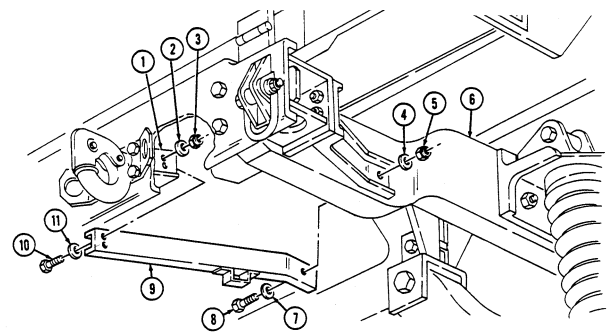

Tighten locknut (5) to 90 lb-ft (122 N•m).

FOLLOW-ON TASKS: - Install pioneer tool stowage rack latch strike (para. 12-71).

- Install pioneer tool stowage rack (TM 9-2320-387-10).

12-108 Change 3

# 12-70. Rear Bumper Inner Mounting Bracket Replacement (L119)

This task covers:

a. Removal b. Installation

INITIAL SETUP:

| Applicable Models                          | Personnel Required   |
|--------------------------------------------|----------------------|
| M1152                                      | One mechanic         |
| Tools                                      | One assistant        |
| General mechanic's tool kit:               | Manual References    |
| automotive (Appendix B, Item 1)            | TM 9\-2320\-387\-24P |
| Materials/Parts                            | Maintenance Level    |
| Adhesive\-sealant (Appendix C, Item 10)    | Unit                 |
| Eighteen locknuts (Appendix G, Item 101.9) |                      |

#### A. Removal

1. Remove two locknuts (7), washers (8), capscrews (1), and washers (2) from inner mounting bracket (10) and bumper (13). Discard locknuts (7).

2. Remove four locknuts (11), washers (12), capscrews (4), washers (3), inner mounting bracket (10),
and spacers (9) and (6) from frame (5). 

#### B. Installation

1. Install inner mounting bracket (10) and spacers (9) and (6) on frame (5) with four washers (3),
capscrews (4), washers (12), and locknuts (11). Tighten locknuts (11) to 90 lb-ft (122 N•m).

2. Install inner mounting bracket (10) on bumper (13) with two washers (2), capscrews (1), washers

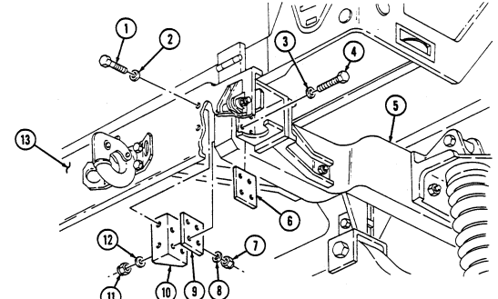

(8), and locknuts (7). Tighten locknuts (7) to 90 lb-ft (122 N•m).

FOLLOW-ON TASK: Install pioneer stowage rack (TM 9-2320-387-10).

# 12-71. Pioneer Tool Stowage Rack Latch Striker Replacement (L119)

This task covers:

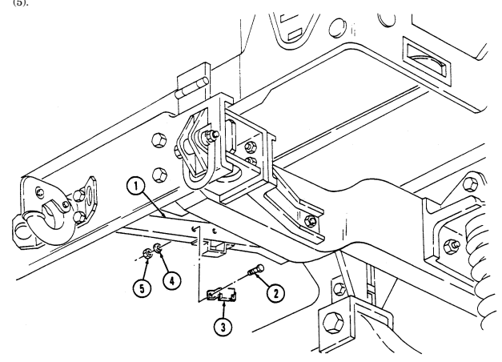

INITIAL SETUP:
Two lockwashers (Appendix G, Item 149)

a. Removal b. Installation

a. Removal

| Manual References    |
|----------------------|
| TM 9\-2320\-387\-24P |
| Maintenance Level    |
| Unit                 |

Remove two nuts (5), lockwashers (4), screws (2), and latch striker (3) from rear bumper inner brace (1). Discard lockwashers (4).

b. Installation Install latch striker (3) on rear bumper inner brace (1) with two screws (2), lockwashers (4), and nut FOLLOW-ON TASK: Install pioneer tool stowage rack (TM 9-2320-387-10).

12-110 **Change 3**

# 12-72. Rear Bumper Lifting Shackle Replacement (L119)

This task covers:

a. Removal b. Installation

INITIAL SETUP:

| Applicable Models               | Materials/Parts                       |
|---------------------------------|---------------------------------------|
| M1152                           | Twelve locknuts (Appendix G, Item 98) |
| Tools                           | Ten locknuts (Appendix G, Item 133)   |
| General mechanic's tool kit:    | Manual References                     |
| automotive (Appendix B, Item 1) | TM 9\-2320\-387\-24P                  |
|                                 | Maintenance Level                     |

#### A. Removal

Remove cotter pin (6), slotted nut (1), spring washer (5), capscrew (3), and shackle (4) from tiedown bracket (2). Discard cotter pin (6).

#### B. Installation

1. Install shackle (4) on tiedown bracket (2) with capscrew (3), spring washer (5), and slotted nut (1).

Tighten slotted nut (1) enough to allow movement of shackle (4).

2. Install cotter pin (6) on slotted nut (1).

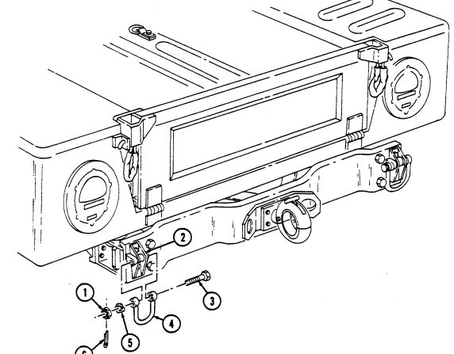

# 12-73. Rear Tiedown Bracket Replacement (L119)

This task covers:
INITIAL SETUP:
a. Removal b. Installation

| Applicable Models                                            | Manual References    |
|--------------------------------------------------------------|----------------------|
| M1152                                                        | TM 9\-2320\-387\-24P |
| Tools                                                        | Maintenance Level    |
| General mechanic's tool kit: automotive (Appendix B, Item 1) | Unit                 |
| a. Removal                                                   |                      |

a. Removal Remove two locknuts (4), washers (3), capscrews (6), washers (5), and tiedown bracket (2) from rear bumper (1). Discard locknuts (4).

#### B. Installation

Install tiedown bracket (2) on rear bumper (1) with two washers (5), capscrews (6), washers (3), and

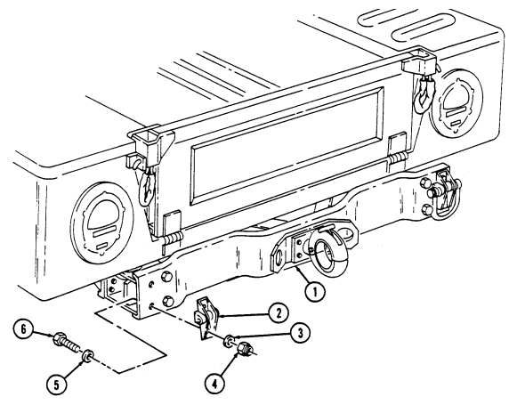 locknuts (4). Tighten locknuts (4) to 90 lb-ft (122 N•m).

FOLLOW-ON TASK: Install rear bumper lifting shackle (L119) (para. 12-72).

12-112 Change 3

# 12-74. Ammo Tiedown Strap Replacement (L119)

This task covers:
INITIAL SETUP:

a. Removal b. Installation

| Applicable Models                  | Manual References    |
|------------------------------------|----------------------|
| M1152                              | TM 9\-2320\-387\-24P |
| Tools                              | Personnel Required   |
| General mechanic's tool kit:       | One mechanic         |
| automotive (Appendix B, Item 1)    | One assistant        |
| Materials/Parts                    | Maintenance Level    |
| Two locknuts (Appendix G, Item 77) | Unit                 |

#### A. Removal

1. Remove two locknuts (1), washers (9), reinforcement (11), screws (8), washers (9), and footman loop (10) from strap (5) and wheelhouse (2). Discard locknuts (1).

2. Slide strap (5) through footman loop (3) on wedge (4). 3. Remove strap hook (6) from slot in ammo rack assembly (7) and remove strap (5).

#### B. Installation

1. Slide strap (5) on footman loop (10). Install footman loop (10) and strap (5) on wheelhouse (2) with two washers (9), screws (8), reinforcement (11), washers (9), and locknuts (1).

2. Install strap (5) through footman loop (3) on wedge (4). 3. Attach strap hook (6) to slot in ammo rack assembly (7).

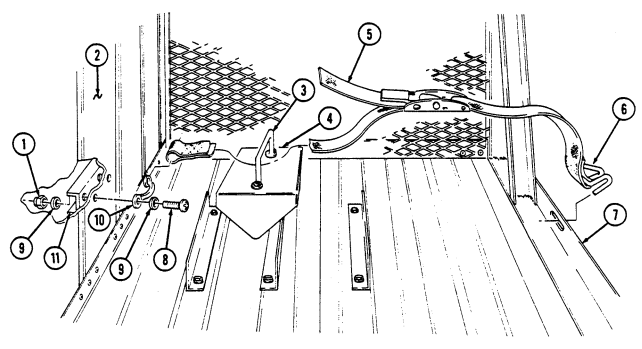

# 12-75. Ammo Divider Replacement (L119)

This task covers:

a. Removal b. Installation

| Applicable Models               |
|---------------------------------|
| M1152                           |
| Tools                           |
| General mechanic's tool kit:    |
| automotive (Appendix B, Item 1) |

INITIAL SETUP:
a. Removal

| Manual References                 |
|-----------------------------------|
| TM 9\-2320\-387\-24P              |
| Equipment Condition               |
| Battery ground cable disconnected |
| (para. 4\-68).                    |
| Maintenance Level                 |

Remove two capscrews (2), washers (1), and ammo divider (3) from cargo floor (4). 

b. Installation Install ammo divider (3) on cargo floor (4) with two washers (1) and capscrews (2).

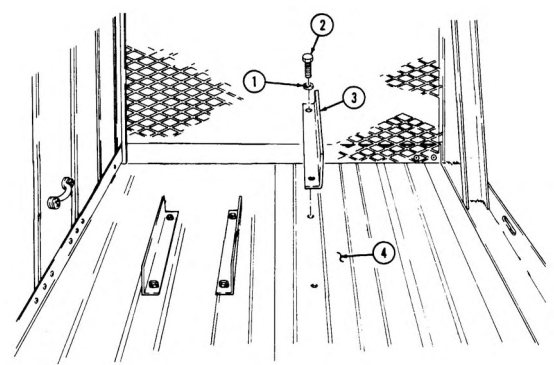

FOLLOW-ON TASK: Install ammo tiedown strap (para. 12-74).

# 12-76. Telephone Strap Replacement (L119)

This task covers:
a. Removal b. Installation INITIAL SETUP:

| Applicable Models   |
|---------------------|
| M1152               |
| Tools               |

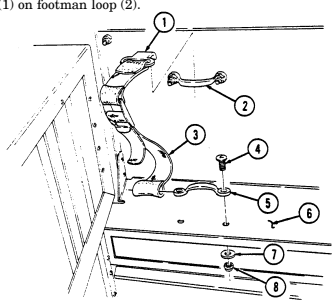

General mechanic's tool kit:
automotive (Appendix B, Item 1)
Materials/Parts

| Manual References   |
|---------------------|
| TM 9\-2320\-387\-10 |

Two locknuts (Appendix G, Item 101.7)
One assistant Manual References TM 9-2320-387-10 TM 9-2320-387-24P

| Maintenance Level   |
|---------------------|
| Unit                |

Equipment Condition Troop seat (R.H.) raised (TM 9-2320-387-10).

Replacement procedures for the telephone strap, remote strap, and cable reel strap are basically the same. This procedure covers the telephone strap replacement.

a. Removal 1. Remove two locknuts (8), washers (7), screws (4), footman loop (5), and strap (3) from fixed door (6).

Discard locknuts (8).

2. Remove strap hook (1) from footman loop (2) and remove strap (3).

#### B. Installation

1. Slide strap (3) onto footman loop (5). Install footman loop (5) and strap (3) on fixed door (6) with two screws (4), washers (7), and locknuts (8).

2. Attach strap hook (1) on footman loop (2).

FOLLOW-ON TASK: Lower right troop seat (TM 9-2320-387-10).

# 12-77. Section Chest Strap Replacement (L119)

This task covers:
a. Removal b. Installation INITIAL SETUP:

| Applicable Models               | Materials/Parts      |
|---------------------------------|----------------------|
| M1152                           |                      |
| Tools                           | Manual References    |
| General mechanic's tool kit:    | TM 9\-2320\-387\-24P |
| automotive (Appendix B, Item 1) | Maintenance Level    |

Replacement procedures for the section chest straps, aiming post straps, and spade straps are basically the same. This procedure covers the section chest strap.

a. Removal Remove two screws (1), footman loop (2), and strap (4) from body (3) and remove footman loop (2) from strap (4).

#### B. Installation

Slide strap (4) onto footman loop (2). Install footman loop (2) and strap (4) on body (3) with two 

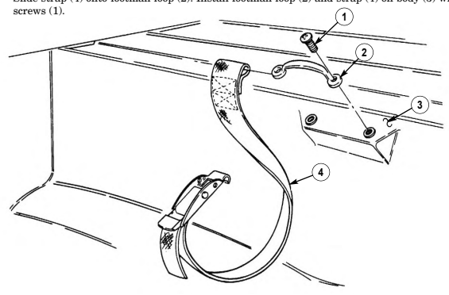

# 12-78. Tripod Strap Replacement (L119)

This task covers:

a. Removal b. Installation

INITIAL SETUP:

| Applicable Models                  | Manual References                            |
|------------------------------------|----------------------------------------------|
| M1152                              | TM 9\-2320\-387\-24P                         |
| Tools                              | Equipment Condition                          |
| General mechanic's tool kit:       | Rear tiedown bracket removed (para. 12\-73). |
| automotive (Appendix B, Item 1)    | Maintenance Level                            |
| Materials/Parts                    | Unit                                         |
| Six locknuts (Appendix G, Item 85) |                                              |

a. Removal 1. Remove strap hook (7) from strap buckle (5). 2. Remove four locknuts (4), screws (1), two footman loops (3), and straps (6) from troop seat (2).

Discard locknuts (4).

#### B. Installation

1. Slide straps (6) onto two footman loops (3). Install footman loops (3) and straps (6) on troop seat (2) 
with four screws (1) and locknuts (4).

2. Attach strap hook (7) on strap buckle (5).

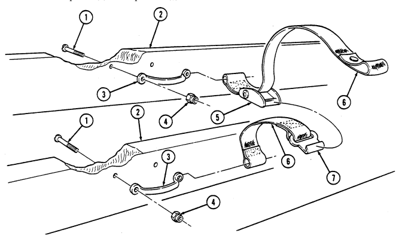

FOLLOW-ON TASK: Lower right troop seat (TM 9-2320-387-10).

# 12-79. Gun Display Unit Battery Strap Replacement (L119)

This task covers:
a. Removal b. Installation

| Applicable Models   |
|---------------------|
| M1152               |
| Tools               |

INITIAL SETUP:
General mechanic's tool kit:
automotive (Appendix B, Item 1)
Materials/Parts Four locknuts (Appendix G, Item 89)
One mechanic One assistant

| Manual References   |
|---------------------|

Manual References TM 9-2320-387-10 TM 9-2320-387-24P

| .   | 1   | \-   |
|-----|-----|------|

Equipment Condition Left troop seat raised (TM 9-2320-387-10).

Maintenance Level

Replacement procedures for the G.D.U. battery strap and G.D.U. strap are basically the same. This procedure covers the G.D.U. battery strap.

a. Removal 1. Remove strap hook (3) from strap buckle (2). 2. Remove two locknuts (7), screws (5), washers (4), footman loop (6), and strap (1) from fixed door (8).

Discard locknuts (7).

3. Remove two locknuts (9), screws (11), footman loop (10), and strap (1) from fixed door (8). Discard locknuts (9).

b. Installation 1. Slide strap (1) onto footman loop (6). Install footman loop (6) and strap (1) on fixed door (8) with two washers (4), screws (5), and locknuts (7).

2. Slide strap (1) onto footman loop (10). Install footman loop (10) and strap (1) on fixed door (8) with two screws (11) and locknuts (9).

3. Attach strap hook (3) to strap buckle (2).

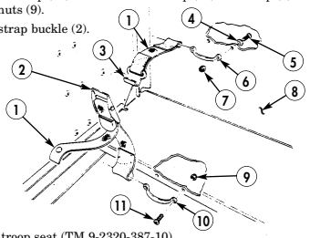

FOLLOW-ON TASK: Lower left troop seat (TM 9-2320-387-10).

12-118 Change 3

# 12-80. Sight Box Straps Replacement (L119)

This task covers:
a. Removal b. Installation INITIAL SETUP:

| Applicable Models               | Manual References                 |
|---------------------------------|-----------------------------------|
| M1152                           | TM 9\-2320\-387\-10               |
| Tools                           | TM 9\-2320\-387\-24P              |
| General mechanic's tool kit:    | Equipment Condition               |
| automotive (Appendix B, Item 1) | Pioneer tool stowage rack removed |
| Materials/Parts                 | (TM 9\-2320\-387\-10).            |

Replacement procedures for the sight box \#1 straps and the sight box \#2 straps are basically the same. This procedure covers the sight box \#1 straps.

a. Removal 1. Remove strap hooks (5) from strap buckles (6). 2. Remove four locknuts (4), screws (1), two footman loops (3), and straps (7) and (16) from ammo rack (2). Discard locknuts (4).

3. Remove two locknuts (10), screws (8), footman loop (9), and strap (7) from C-beam (11). Discard locknuts (10).

4. Remove two screws (15), washers (14), flat footman loop (13), and strap (16) from cargo floor (12).

Remove strap (16).

#### B. Installation

1. Slide strap (16) onto flat footman loop (13). Install flat footman loop (13) and strap (16) on cargo floor (12) with two screws (15) and washers (14).

2. Slide strap (7) onto footman loop (9). Install footman loop (9) and strap (7) on C-beam (11) with two screws (8) and locknuts (10).

3. Slide straps (7) and (16) onto two footman loops (3). Install footman loops (3) and straps (7) and (16)
on ammo rack (2) with four screws (1) and locknuts (4).

4. Attach strap hooks (5) on strap buckles (6).

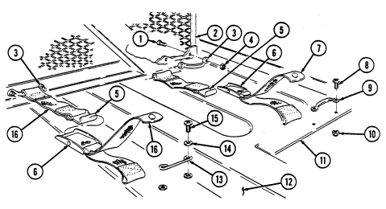

# 12-81. Water/Fuel Can Strap Replacement (L119)

This task covers:

a. Removal b. Installation

INITIAL SETUP:

| Applicable Models               | Materials/Parts      |
|---------------------------------|----------------------|
| M1152                           |                      |
| Tools                           | Manual References    |
| General mechanic's tool kit:    | TM 9\-2320\-387\-24P |
| automotive (Appendix B, Item 1) | Maintenance Level    |
|                                 | Unit                 |

a. Removal 1. Remove two locknuts (7), washers (6), screws (4), footman loop (5), and strap (3) from footwell (8).

Discard locknuts (7).

2. Remove strap hook (2) from flat footman loop (1). 

b. Installation 1. Slide strap (3) onto footman loop (5). Install footman loop (5) and strap (3) on footwell (8) with two screws (4), washers (6), and locknuts (7).

2. Attach strap hook (2) to flat footman loop (1).

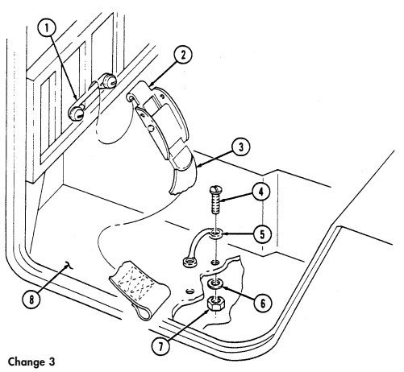

12-120 Change 3
# 12-82. Ammo Rack Maintenance (L119)

This task covers:

a. Removal c. Assembly b. Disassembly d. Installation

Applicable Models

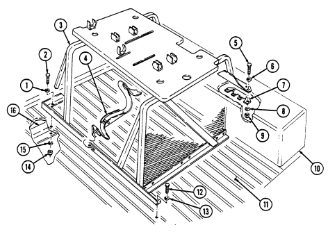

Tools General mechanic's tool kit:
automotive (Appendix B, Item 1)

#### Materials/Parts

Twelve locknuts (Appendix G, Item 77) Twelve locknuts (Appendix G, Item 89) Locknut (Appendix G, Item 85) Four lockwashers (Appendix G, Item 146)
Personnel Required One mechanic One assistant

#### A. Removal

1. Remove twelve locknuts (9), washers (8), capscrews (5), and washers (6) from ammo rack assembly (3), two plates (7), and wheelhouse (10). Discard locknuts (9).

2. Remove locknut (14), washer (15), capscrew (2), and washer (1) from ammo rack assembly (3) and D-beam (16). Discard locknut (14).

3. Remove six capscrews (12) and washers (13) from ammo rack assembly (3) and cargo floor (11). 4. Remove ammo tiedown strap hook (4) from ammo rack assembly (3). 5. Remove ammo rack assembly (3).

#### Manual References

TM 9-2320-387-10 TM 9-2320-387-24P
Equipment Condition
- Tailgate lowered (TM 9-2320-387-10). - Troop seat (L.H.) raised 
(TM 9-2320-387-10).

- Sight box straps removed (para. 12-80). - M60 machine gun straps removed
(para. 12-83).

Maintenance Level Unit

## 12-82. Ammo Rack Maintenance (L119) (Cont'D)

b. Disassembly 1. Remove four locknuts (28), washers (29), screws (18), and two strut spring clips (17) from ammo rack top tray (21). Discard locknuts (28).

2. Remove eight locknuts (26), washers (27), screws (19), and four spike spring clips (20) from ammo rack top tray (21). Discard locknuts (26).

3. Remove four capscrews (22), lockwashers (23), washers (24), and ammo rack top tray (21) from ammo rack (25). Discard lockwashers (23).

c. Assembly 1. Install ammo rack top tray (21) on ammo rack (25) with four washers (24), lockwashers (23), and capscrews (22).

2. Install four spike spring clips (20) on ammo rack top tray (21) with eight screws (19), washers (27),
and locknuts (26).

3. Install two strut spring clips (17) on ammo rack top tray (21) with four screws (18), washers (29),

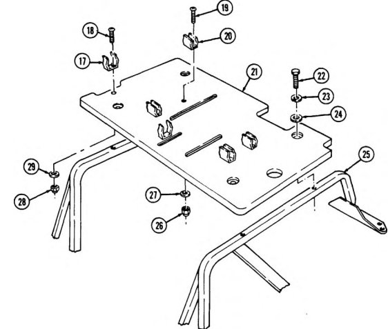

and locknuts (28).

12-82. AMMO RACK MAINTENANCE (L119) (Cont'd)

#### D. Installation

1. Install ammo rack assembly (3) on cargo floor (11) with six washers (13) and capscrews (12). 2. Install ammo rack assembly (3) on D-beam (16) with washer (1), capscrew (2), washer (15), and locknut (14).

3. Install ammo rack assembly (3) and two plates (7) on wheelhouse (10) with twelve washers (6),
capscrews (5), washers (8), and locknuts (9).

4. Attach ammo tiedown strap hook (4) to ammo rack assembly (3).

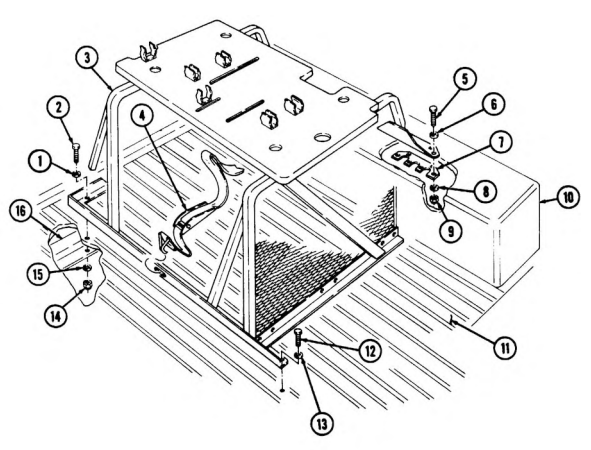

FOLLOW-ON TASKS: - Install M60 machine gun straps (para. 12-83).

- Install sight box straps (para. 12-80). - Lower troop seat (L.H.) (TM 9-2320-387-10). - Raise tailgate (TM 9-2320-387-10).

# 12-83. M60 Machine Gun Strap Replacement (L119)

This task covers:

a. Removal b. Installation

INITIAL SETUP:

| Applicable Models               | Manual References    |
|---------------------------------|----------------------|
| M1152                           | TM 9\-2320\-387\-24P |
| Tools                           | Personnel Required   |
| General mechanic's tool kit:    | One mechanic         |
| automotive (Appendix B, Item 1) | One assistant        |
| Materials/Parts                 | Maintenance Level    |

#### A. Removal

1. Remove strap hook (4) from footman loop (3). 2. Remove two locknuts (7), washers (8), screws (2), footman loops (3) and (6), and strap (5) from ammo rack top tray (1). Remove strap (5) from loop (6). Discard locknuts (7).

b. Installation 1. Install strap (5) on loop (6) and footman loops (3) and (6) on ammo rack top tray (1) with two screws (2), washers (8), and locknuts (7).

2. Attach strap hook (4) to footman loop (3).

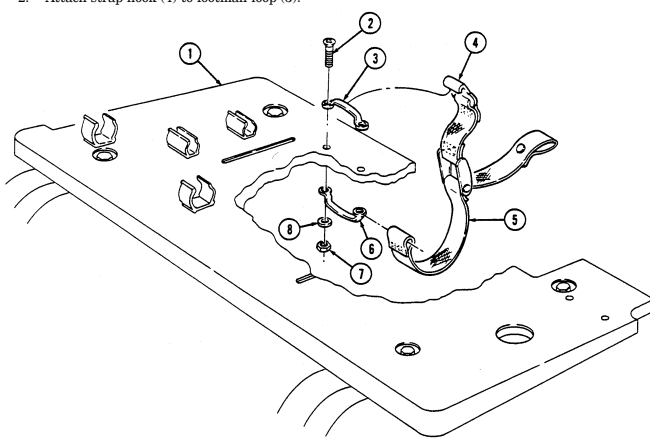

# 12-84. Camouflage Rack Maintenance (L119)

This task covers:

a. Removal c. Assembly b. Disassembly d. Installation

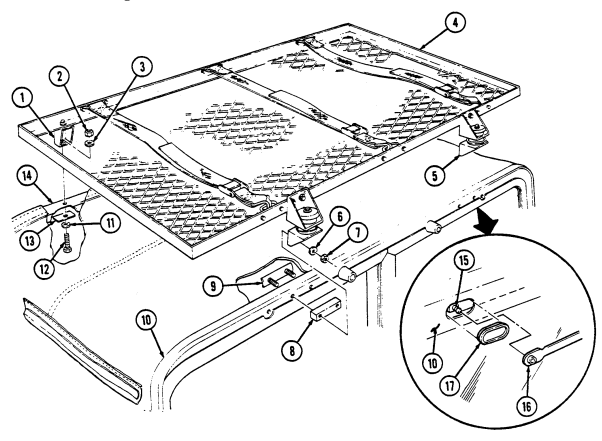

automotive (Appendix B, Item 1)
Twelve locknuts (Appendix G, Item 77) Eight locknuts (Appendix G, Item 82) Six locknuts (Appendix G, Item 106)

| TM 9\-2320\-387\-24P   |
|------------------------|
| Equipment Condition    |
| Maintenance Level      |
| Unit                   |

#### A. Removal

1. Remove two access covers (17) from windshield (10). 2. Disconnect connector arms (16) from wiper arm pivots (15). 3. Remove four locknuts (7), washers (6), two brackets (9), lower front mounting brackets (5), and spacers (8) from windshield (10). Discard locknuts (7).

4. Remove two capscrews (12), washers (11), locknuts (2), washers (3), and two rear mounting brackets (1) and plates (13) from B-pillar (14). Discard locknuts (2).

5. Remove camouflage rack (4) from vehicle.

## 12-84. Camouflage Rack Maintenance (L119) (Cont'D)

b. Disassembly 1. Remove two locknuts (38), washers (37), capscrews (26), washers (27), snubber plates (35),
mounts (34), spacers (30), mounts (29), snubber plates (28), and two lower front mounting brackets (36) from upper front mounting brackets (31). Discard locknuts (38).

2. Remove four locknuts (42), washers (41), capscrews (33), washers (32), and two upper front mounting brackets (31) from camouflage rack (4). Discard locknuts (42).

3. Remove two locknuts (47), washers (48), capscrews (19), washers (18), and two rear mounting brackets (1) from camouflage rack (4). Discard locknuts (47).

4. Remove six locknuts (24), washers (23), capscrews (20), washers (21), three rear footman loops (22),
and three straps (25) from camouflage rack (4). Discard locknuts (24).

5. Remove six locknuts (46), washers (45), capscrews (39), washers (40), three front footman loops (43),

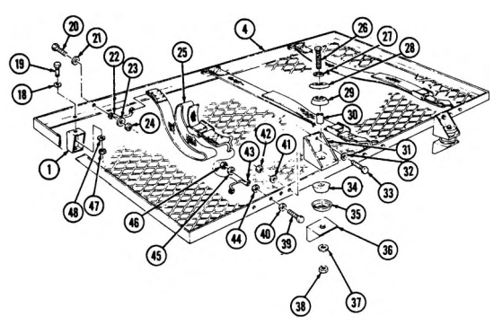

and six washers (44) from camouflage rack (4). Discard locknuts (46).

## 12-84. Camouflage Rack Maintenance (L119) (Cont'D)

c. Assembly 1. Install two rear mounting brackets (33) on camouflage rack (9) with two washers (1), capscrews (2),
washers (32), and locknuts (31). Tighten locknuts (31) to 37 lb-ft (50 N•m).

2. Install two upper front mounting brackets (15) on camouflage rack (9) with four washers (16),
capscrews (17), washers (25), and locknuts (26). Tighten locknuts (26) to 21 lb-ft (29 N•m).

3. Install two snubber plates (12), mounts (13), spacers (14), mounts (18), snubber plates (19), and lower front mounting brackets (20) on upper front mounting bracket (15) with two washers (11), capscrews (10), washers (21), and locknuts (22). Tighten locknuts (22) to 37 lb-ft (50 N•m).

4. Install three rear footman loops (5) and three straps (8) on camouflage rack (9) with six washers (4),
capscrews (3), washers (6), and locknuts (7). Tighten locknuts (7) to 6 lb-ft (8 N•m).

5. Install six washers (28) and three front footman loops (27) on camouflage rack (9) with six washers

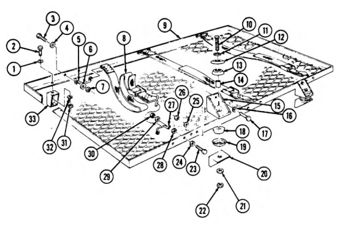

(24), capscrews (23), washers (29), and locknuts (30). Tighten locknuts (30) to 6 lb-ft (8 N•m).

# 12-84. Camouflage Rack Maintenance (L119) (Cont'D)

d. Installation 1. Position camouflage rack (9) on vehicle. 2. Install two rear mounting brackets (33) and plates (44) on B-pillar (45) with two washers (42),
capscrews (43), washers (35), and locknuts (34). Tighten locknuts (34) to 37 lb-ft (50 N•m).

3. Install two brackets (40), lower front mounting brackets (36), and spacers (39) on windshield (41)
with four washers (37) and locknuts (38). Tighten locknuts (38) to 15 lb-ft (20 N•m).

4. Connect connector arms (47) on wiper arm pivots (46). 5. Install access covers (48) to windshield (41).

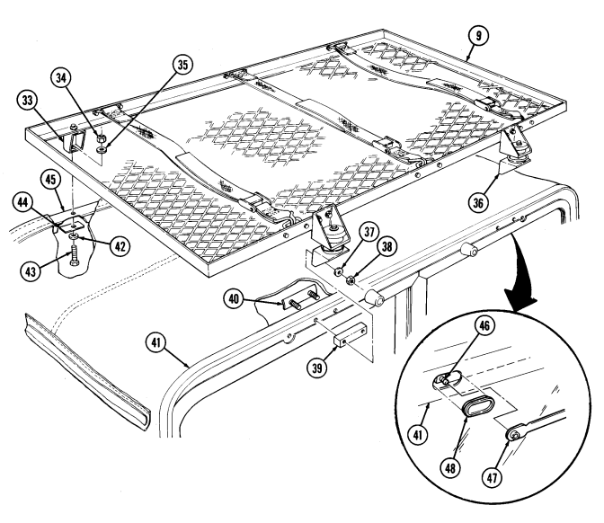

# Section Viii. Troop/Cargo Winterization Kit Maintenance 12-85. Troop/Cargo Winterization Kit Maintenance Task Summary

| INITIAL SETUP:                                                     |                                                                                                        |                                                |              |
|--------------------------------------------------------------------|--------------------------------------------------------------------------------------------------------|------------------------------------------------|--------------|
| Applicable Models                                                  | Personnel Required                                                                                     | M1152                                          | One mechanic |
| One assistant                                                      | Tools                                                                                                  | Manual References                              |              |
| General mechanic's tool kit:                                       | automotive (Appendix B, Item 1)                                                                        | TM 9\-2320\-387\-10                            |              |
| TM 9\-2320\-387\-24P                                               | Materials/Parts                                                                                        | Equipment Condition                            |              |
| Two locknuts (Appendix G, Item 101.7)                              | Troop seat (R.H.) raised (TM 9\-2320\-387\-10).                                                        |                                                |              |
| Maintenance Level                                                  | Unit                                                                                                   |                                                |              |
| NOTE                                                               | Replacement procedures for the telephone strap, remote strap,                                          |                                                |              |
| and cable reel strap are basically the same. This procedure covers | the telephone strap replacement.                                                                       |                                                |              |
| a.                                                                 | Removal                                                                                                |                                                |              |
| 1.                                                                 | Remove two locknuts (8), washers (7), screws (4), footman loop (5), and strap (3) from fixed door (6). | Discard locknuts (8).                          |              |
| 2.                                                                 | Remove strap hook (1) from footman loop (2) and remove strap (3).                                      |                                                |              |
| b.                                                                 | Installation                                                                                           |                                                |              |
| 1.                                                                 | Slide strap (3) onto footman loop (5). Install footman loop (5) and strap (3) on fixed door (6) with   | two screws (4), washers (7), and locknuts (8). |              |
| 2.                                                                 | Attach strap hook (1) on footman loop (2).                                                             |                                                |              |

12-85. TROOP/CARGO WINTERIZATION KIT MAINTENANCE TASK SUMMARY (Cont'd)

| This task covers:                                                                                     | a.                                                               | Removal                      | b.                   | Installation   |
|-------------------------------------------------------------------------------------------------------|------------------------------------------------------------------|------------------------------|----------------------|----------------|
| INITIAL SETUP:                                                                                        |                                                                  |                              |                      |                |
| Applicable Models                                                                                     | Manual References                                                | M1152                        | TM 9\-2320\-387\-24P |                |
| Tools                                                                                                 | Maintenance Level                                                | General mechanic's tool kit: | Unit                 |                |
| automotive (Appendix B, Item 1)                                                                       |                                                                  |                              |                      |                |
| NOTE                                                                                                  | Replacement procedures for the section chest straps, aiming post |                              |                      |                |
| straps, and spade straps are basically the same. This procedure                                       | covers the section chest strap.                                  |                              |                      |                |
| a. Removal                                                                                            |                                                                  |                              |                      |                |
| Remove two screws (1), footman loop (2), and strap (4) from body (3) and remove footman loop (2) from | strap (4).                                                       |                              |                      |                |
| b. Installation                                                                                       |                                                                  |                              |                      |                |
| Slide strap (4) onto footman loop (2). Install footman loop (2) and strap (4) on body (3) with two    | screws (1).                                                      |                              |                      |                |
| 1                                                                                                     |                                                                  |                              |                      |                |
| 2                                                                                                     |                                                                  |                              |                      |                |
| 3                                                                                                     |                                                                  |                              |                      |                |
| 4                                                                                                     |                                                                  |                              |                      |                |

# 12-86. Troop/Cargo Winterization Heater Fuel Pump Replacement

This task covers:
INITIAL SETUP:

| Applicable Models                   | Manual References                               |
|-------------------------------------|-------------------------------------------------|
| M1152                               | TM 9\-2320\-387\-10                             |
| Tools                               | TM 9\-2320\-387\-24P                            |
| General mechanic's tool kit:        | Equipment Condition                             |
| automotive (Appendix B, Item 1)     | Troop seat (R.H.) raised (TM 9\-2320\-387\-10). |
| Materials/Parts                     | Maintenance Level                               |
| Four locknuts (Appendix G, Item 89) | Unit                                            |
| a. Removal                          |                                                 |

#### Warning

Diesel fuel is highly flammable. Do not perform this procedure near fire, flames, or sparks. Severe injury or death will result.

a. Removal

#### Caution

Cover or plug all open hoses and connections immediately after disconnection to prevent contamination. Remove all plugs prior to connection.

- Have drainage container ready to catch fuel. - Prior to removal, tag leads for installation.

1. Disconnect fuel pump lead (2) from electrical connector (3). 2. Disconnect pump-to-hose fuel supply line (6) from connector (7). 3. Remove connector (7) from fuel pump (1). 4. Disconnect pump-to-bulkhead fuel supply line (8) from connector (9). 5. Deleted. 6. Remove cap (11) from connector (4). 7. Remove two locknuts (15), washers (14), lockwasher (12), two capscrews (17), washers (14), fuel pump (1), and ground lead 799B (13) from bracket (16). Discard locknuts (15) and lockwasher (12).

For instructions on replacement of rivets, refer to para. 10-66.

8. Inspect four rivets (19) on bracket (16) and crossmember (18) and replace rivets (19),
if damaged.

9. Remove connectors (9) and (4) and tee (10) from fuel pump (1).

a. Removal b. Installation

12-86. TROOP/CARGO WINTERIZATION HEATER FUEL PUMP REPLACEMENT (Cont'd)

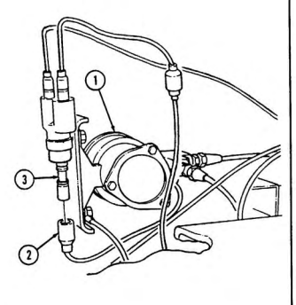

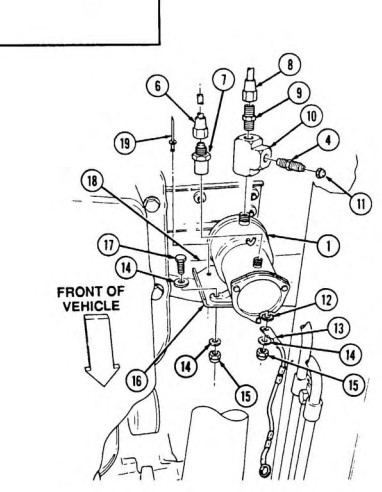

# 12-86. Troop/Cargo Winterization Heater Fuel Pump Replacement (Cont'D)

b. Installation 1. Apply sealing compound to threads of connectors (9) and (4) and install connectors (9) and (4)
on tee (10).

2. Apply sealing compound to threads of fuel pump (1) and install connector (7) and tee (10) on fuel pump (1).

3. Install fuel pump (1) and ground lead 799B (13) on bracket (16) with two washers (14),
capscrews (17), lockwasher (12), two washers (14), and locknuts (15).

4. Apply sealing compound to threads of connector (9) and connect pump-to-bulkhead fuel supply line (8) to connector (9).

5. Deleted. 6. Apply sealing compound to threads of connector (4) and install cap (11) on connector (4). 7. Apply sealing compound to threads of connector (7) and connect pump-to-hose fuel supply line (6) 
to connector (7).

8. Connect fuel pump lead (2) to electrical connector (3).

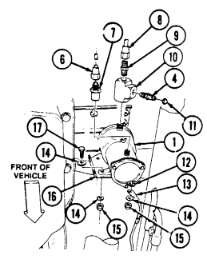

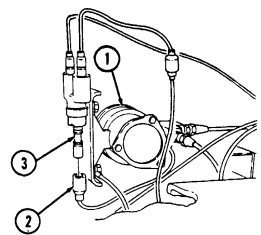

FOLLOW-ON TASKS: - Connect battery ground cable (para. 4-68).

- Operate troop/cargo heater (TM 9-2320-387-10) and check for fuel leaks.

# 12-87. Troop/Cargo Winterization Heater Fuel Filter Assembly Replacement

This task covers:
INITIAL SETUP:
Applicable Models M1152, M1152A1 Tools General mechanic's tool kit:
automotive (Appendix B, Item 1)
Materials/Parts Sealing compound (Appendix C, Item 62) Two locknuts (Appendix G, Item 133.10)
Manual References TM 9-2320-387-10 TM 9-2320-387-24P
a. Removal b. Installation Equipment Condition Heater guard assembly removed 
(para. 12-98).

General Safety Instructions Do not perform this procedure near fire, flames, or sparks.

Maintenance Level Unit

#### Warning

Diesel fuel is highly flammable. Do not perform this procedure near fire, flames, or sparks. Severe injury or death will result.

a. Removal

#### Caution

Cover or plug all open hoses and connections immediately after disconnection to prevent contamination. Remove all plugs prior to connection.

Have drainage container ready to catch fuel.

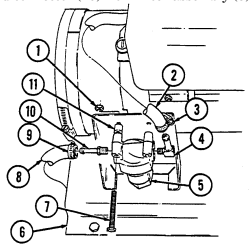

1. Loosen clamp (3) and disconnect filter-to-heater fuel supply hose (2) from filter elbow (4). 2. Loosen clamp (9) and disconnect filter-to-bulkhead coupling fuel supply hose (8) from filter connector (10).

3. Remove two locknuts (1) and capscrews (7) from filter assembly (5), spacers (11), and heater base assembly (6). Discard locknuts (1).

4. Remove filter elbow (4) and connector (10) from filter assembly (5).

## 12-87. Troop/Cargo Winterization Heater Fuel Filter Assembly Replacement (Cont'D)

b. Installation 1. Apply sealing compound to threads of filter elbow (4) and connector (10) and install filter elbow (4)
and connector (10) on filter assembly (5).

2. Install two spacers (11) and filter assembly (5) on heater base assembly (6) with two capscrews (7)
and locknuts (1).

3. Connect filter-to-bulkhead coupling fuel supply hose (8) to filter connector (10) with clamp (9).

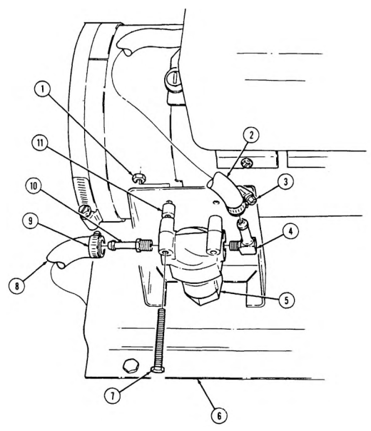 4. Connect filter-to-heater fuel supply hose (2) to filter elbow (4) with clamp (3).

FOLLOW-ON TASKS: - Install heater guard assembly (para. 12-98).

- Operate troop/cargo heater (TM 9-2320-387-10) and check for fuel leaks.

# 12-88. Troop/Cargo Winterization Heater Fuel Supply Tube Assembly Replacement

This task covers:
INITIAL SETUP:
Applicable Models M1152, M1152A1 Tools General mechanic's tool kit:
automotive (Appendix B, Item 1)
Materials/Parts Sealing compound (Appendix C, Item 62)
Manual References TM 9-2320-387-10 TM 9-2320-387-24P
a. Removal b. Installation Equipment Condition Fuel tank removed (para. 3-25).

General Safety Instructions Do not perform this procedure near fire, flames, or sparks.

Maintenance Level Unit

#### Warning

Diesel fuel is highly flammable. Do not perform this procedure near fire, flames, or sparks. Severe injury or death will result.

a. Removal 1. Mark position of fuel supply tube assembly (2) on access cover (3).

#### Caution

Cover or plug all open hoses and connections immediately after disconnection to prevent contamination. Remove all plugs prior to connection.

Have drainage container ready to catch fuel.

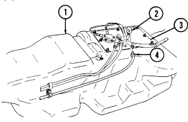

2. Disconnect tank-to-hose fuel supply line (4) from fuel supply tube assembly (2). 3. Remove fuel supply tube assembly (2) from fuel tank (1).

b. Installation 1. Apply sealing compound to threads of fuel supply tube assembly (2) and install tube assembly (2)
on fuel tank (1).

2. Apply sealing compound to tank-to-hose fuel supply line (4) and connect fuel supply line (4) to fuel supply tube assembly (2).

FOLLOW-ON TASKS: - Install fuel tank (para. 3-25).

- Operate troop/cargo heater (TM 9-2320-387-10) and check for fuel leaks.

# 12-89. Troop/Cargo Winterization Heater Tank-To-Hose Fuel Supply Line Replacement

This task covers:
a. Removal b. Installation INITIAL SETUP:
Applicable Models M1152, M1152A1 Tools General mechanic's tool kit:
automotive (Appendix B, Item 1)
Materials/Parts Sealing compound (Appendix C, Item 62)
Manual References TM 9-2320-387-10 TM 9-2320-387-24P
Equipment Condition Fuel tank removed (para. 3-25).

General Safety Instructions Do not perform this procedure near fire, flames, or sparks.

Maintenance Level Unit

#### Warning

Diesel fuel is highly flammable. Do not perform this procedure near fire, flames, or sparks. Severe injury or death will result.

a. Removal

#### Caution

Cover or plug all open hoses and connections immediately after disconnection to prevent contamination. Remove all plugs prior to connection.

Have drainage container ready to catch fuel.

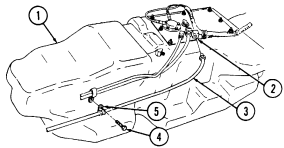

1. Disconnect tank-to-hose fuel supply line (3) from tube assembly (2). 2. Remove capscrew (4), clamp (5), and tank-to-hose fuel supply line (3) from fuel tank (1).

b. Installation 1. Apply sealing compound to threads of tank-to-hose fuel supply line (3) and connect tank-to-hose fuel supply line (3) to tube assembly (2).

2. Install tank-to-hose fuel supply line (3) on fuel tank (1) with clamp (5) and capscrew (4).

FOLLOW-ON TASKS: - Install fuel tank (para. 3-25).

- Operate troop/cargo heater (TM 9-2320-387-10) and check for fuel leaks.

# 12-90. Troop/Cargo Winterization Heater Fuel Supply Hose Replacement

This task covers:
INITIAL SETUP:
Applicable Models M1152, M1152A1 Tools General mechanic's tool kit:
automotive (Appendix B, Item 1)
Manual References TM 9-2320-387-10 TM 9-2320-387-24P
a. Removal b. Installation General Safety Instructions Do not perform this procedure near fire, flames, or sparks.

Maintenance Level Unit

#### Warning

Diesel fuel is highly flammable. Do not perform this procedure near fire, flames, or sparks. Severe injury or death will result.

a. Removal

#### Caution

Cover or plug all open hoses and connections immediately after disconnection to prevent contamination. Remove all plugs prior to connection.

Have drainage container ready to catch fuel.

Remove two clamps (4) and fuel supply hose (3) from tank-to-hose fuel supply line (2) and pump-to-hose fuel supply line (1).

b. Installation 1. Connect fuel supply hose (3) to tank-to-hose fuel supply line (2) with clamp (4).

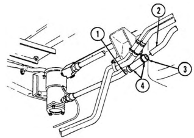 2. Connect fuel supply hose (3) to pump-to-hose fuel supply line (1) with clamp (4).

FOLLOW-ON TASK: Operate troop/cargo heater (TM 9-2320-387-10) and check for fuel leaks.

# 12-91. Troop/Cargo Winterization Heater Pump-To-Hose Fuel Supply Line Replacement

| M1152   |
|---------|
| Tools   |

This task covers:
INITIAL SETUP:
Tools General mechanic's tool kit:
automotive (Appendix B, Item 1)
Materials/Parts Sealing compound (Appendix C, Item 62)
a. Removal b. Installation Diesel fuel is highly flammable. Do not perform this procedure near fire, flames, or sparks. Severe injury or death will result.

| One mechanic                                  |
|-----------------------------------------------|
| One assistant                                 |
| Manual References                             |
| TM 9\-2320\-387\-10                           |
| TM 9\-2320\-387\-24P                          |
| Equipment Condition                           |
| Left troop seat raised (TM 9\-2320\-387\-10). |
| Maintenance Level                             |

a. Removal

#### Caution

Cover or plug all open hoses and connections immediately after disconnection to prevent contamination. Remove all plugs prior to connection.

Have drainage container ready to catch fuel.

1. Loosen clamp (5) and disconnect fuel supply hose (4) from pump-to-hose fuel supply line (3). 2. Disconnect pump-to-hose fuel supply line (3) from connector (2) on fuel pump (1). 3. Inspect connector (2) for damaged threads or cracks. Replace if cracked or damaged.

b. Installation 1. Apply sealing compound to threads of connector (2) and connect pump-to-hose fuel supply line (3) 
to connector (2) on fuel pump (1).

2. Connect fuel supply hose (4) to pump-to-hose fuel supply line (3) with clamp (5).

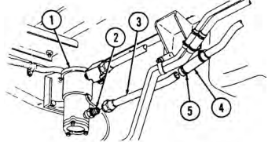

FOLLOW-ON TASK: Operate troop/cargo heater (TM 9-2320-387-10) and check for fuel leaks.

WARNING

# 12-92. Troop/Cargo Winterization Heater Pump-To-Bulkhead Fuel Supply Line Replacement

This task covers:

Applicable Models M1152, M1152A1 Tools General mechanic's tool kit:
automotive (Appendix B, Item 1)
Materials/Parts Sealing compound (Appendix C, Item 62)
a. Removal b. Installation Manual References TM 9-2320-387-10 TM 9-2320-387-24P
General Safety Instructions Do not perform this procedure near fire, flames, or sparks.

Maintenance Level Unit

#### Warning

Diesel fuel is highly flammable. Do not perform this procedure near fire, flames, or sparks. Severe injury or death will result.

a. Removal

#### Caution

Cover or plug all open hoses and connections immediately after disconnection to prevent contamination. Remove all plugs prior to connection.

Have drainage container ready to catch fuel.

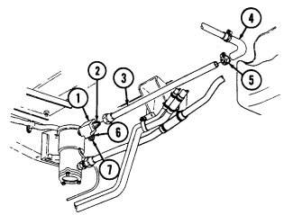

1. Disconnect pump-to-bulkhead fuel supply line (3) from connector (2). 2. Remove clamp (5) and bulkhead hose (4) from pump-to-bulkhead fuel supply line (3). 3. Inspect connector (2), tee (1), connector (6), and cap (7) for damaged threads or cracks. Replace if cracked or damaged.

12-92. TROOP/CARGO WINTERIZATION HEATER PUMP-TO-BULKHEAD FUEL SUPPLY

# Line Replacement (Cont'D)

b. Installation 1. Connect bulkhead hose (4) to pump-to-bulkhead fuel supply line (3) with clamp (5).

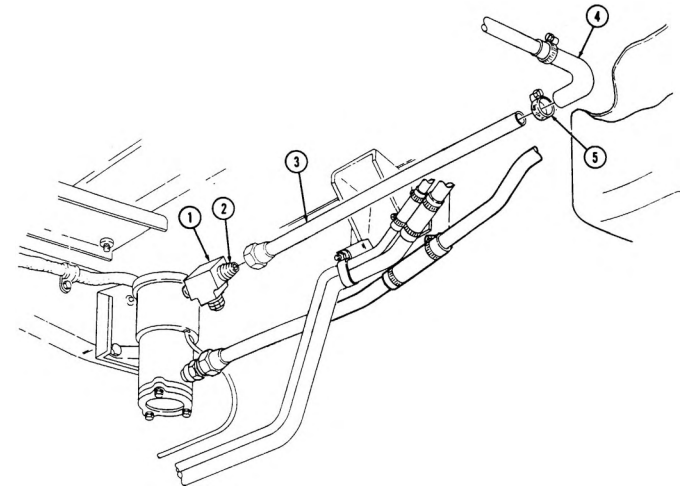 2. Apply sealing compound to threads of connector (2) on tee (1) and connect pump-to-bulkhead fuel supply line (3) to connector (2).

FOLLOW-ON TASK: Operate troop/cargo heater (TM 9-2320-387-10) and check for fuel leaks.

# 12-93. Troop/Cargo Winterization Heater Bulkhead Fuel Supply Hose Replacement

This task covers:
INITIAL SETUP:
Applicable Models M1152, M1152A1 Tools General mechanic's tool kit:
automotive (Appendix B, Item 1)
a. Removal b. Installation Manual References TM 9-2320-387-10 TM 9-2320-387-24P
General Safety Instructions Do not perform this procedure near fire, flames, or sparks.

Maintenance Level Unit

#### Warning

Diesel fuel is highly flammable. Do not perform this procedure near fire, flames, or sparks. Severe injury or death will result.

a. Removal

#### Caution

Cover or plug all open hoses and connections immediately after disconnection to prevent contamination. Remove all plugs prior to connection.

Have drainage container ready to catch fuel.

Remove two clamps (2) and bulkhead fuel supply hose (4) from pump-to-bulkhead fuel supply line (1) and bulkhead hose-to-bulkhead coupling supply line (3).

b. Installation Connect bulkhead fuel supply hose (4) to pump-to-bulkhead fuel supply line (1) and bulkhead hose-to-

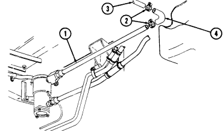 bulkhead coupling supply line (3) with two clamps (2).

FOLLOW-ON TASK: Operate troop/cargo heater (TM 9-2320-387-10) and check for fuel leaks.

# 12-94. Troop/Cargo Winterization Heater Bulkhead Hose-To-Bulkhead Coupling Fuel Supply Line Replacement

This task covers:
INITIAL SETUP:
Applicable Models M1152, M1152A1 Tools General mechanic's tool kit:
automotive (Appendix B, Item 1)
Materials/Parts Sealing compound (Appendix C, Item 62)
a. Removal b. Installation Manual References TM 9-2320-387-10 TM 9-2320-387-24P
General Safety Instructions Do not perform this procedure near fire,

| flames, or sparks.   |
|----------------------|
| Maintenance Level    |
| Unit                 |

#### Warning

Diesel fuel is highly flammable. Do not perform this procedure near fire, flames, or sparks. Severe injury or death will result.

a. Removal

#### Caution

Cover or plug all open hoses and connections immediately after disconnection to prevent contamination. Remove all plugs prior to connection.

Have drainage container ready to catch fuel.

1. Loosen clamp (2) and disconnect bulkhead hose (1) from bulkhead hose-to-bulkhead coupling fuel supply line (3).

2. Disconnect bulkhead hose-to-bulkhead coupling fuel supply line (3) from elbow (4) and remove bulkhead hose-to-bulkhead coupling fuel supply line (3).

b. Installation 1. Apply sealing compound to threads of elbow (4) and connect bulkhead hose-to-bulkhead coupling fuel supply line (3) to elbow (4).

2. Connect bulkhead hose (1) to bulkhead hose-to-bulkhead coupling fuel supply line (3) with clamp (2).

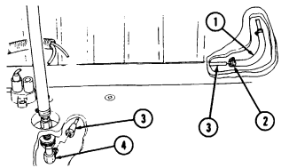

FOLLOW-ON TASK: Operate troop/cargo heater (TM 9-2320-387-10) and check for fuel leaks.

12-144 Change 5

# 12-95. Troop/Cargo Winterization Heater Fuel Supply Line Bulkhead Coupling Replacement

This task covers:

| Tools   |
|---------|

INITIAL SETUP:

| M1152   |
|---------|
| Tools   |

General mechanic's tool kit:
automotive (Appendix B, Item 1)
Materials/Parts Sealing compound (Appendix C, Item 62)
a. Removal b. Installation

| TM 9\-2320\-387\-24P   |
|------------------------|
| Personnel Required     |
| One mechanic           |
| One assistant          |
| Maintenance Level      |
| Unit                   |

#### Warning

Diesel fuel is highly flammable. Do not perform this procedure near fire, flames, or sparks. Severe injury or death will result.

a. Removal

#### Caution

Cover or plug all open hoses and connections immediately after disconnection to prevent contamination. Remove all plugs prior to connection.

Have drainage container ready to catch fuel.

1. Disconnect bulkhead hose-to-bulkhead coupling fuel supply line (7) from elbow (8). 2. Remove elbow (8) from nipple (9). 3. Remove nut (10) and washers (11) and (6) from coupling half (12) and cargo floor (5). 4. Pull remaining fittings up through cargo floor (5). 5. Loosen clamp (1) and disconnect filter-to-bulkhead coupling fuel supply hose (2) from connector (3). 6. Remove connector (3) from adapter (4).

g pp y ( )

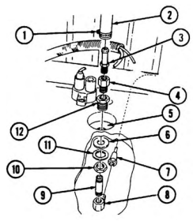

7. Remove adapter (4) from coupling half (12). 8. Remove nipple (9) from coupling half (12).

# 12-95. Troop/Cargo Winterization Heater Fuel Supply Line Bulkhead Coupling Replacement (Cont'D)

#### B. Installation

1. Apply sealing compound to threads of nipple (9) and install nipple (9) on coupling half (12). 2. Apply sealing compound to threads of adapter (4) and install adapter (4) on coupling half (12). 3. Apply sealing compound to threads of connector (3) and install connector (3) on adapter (4). 4. Connect filter-to-bulkhead coupling fuel supply hose (2) to connector (3) with clamp (1). 5. Insert nipple (9), coupling half (12), adapter (4), and connector (3) through cargo floor (5). 6. Secure coupling half (12) to cargo floor (5) with washers (6) and (11) and nut (10). 7. Apply sealing compound to threads of nipple (9) and install elbow (8) on nipple (9).

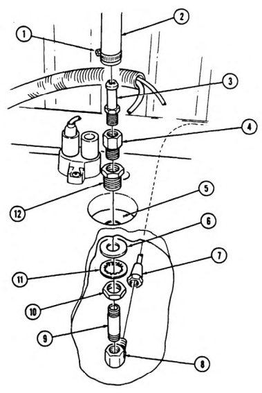 8. Apply sealing compound to threads of elbow (8) and connect bulkhead hose-to-bulkhead coupling fuel supply line (7) to elbow (8).

FOLLOW-ON TASK: Operate troop/cargo heater (TM 9-2320-387-10) and check for fuel leaks.

# 12-96. Troop/Cargo Winterization Heater Filter-To-Bulkhead Coupling Fuel Supply Hose Replacement

This task covers:
INITIAL SETUP:
Applicable Models M1152, M1152A1 Tools General mechanic's tool kit:
automotive (Appendix B, Item 1)
Materials/Parts Sealing compound (Appendix C, Item 62)
Manual References TM 9-2320-387-10 TM 9-2320-387-24P
a. Removal b. Installation Equipment Condition Heater guard assembly removed
(para. 12-98).

General Safety Instructions Do not perform this procedure near fire, flames, or sparks.

Maintenance Level Unit

#### Warning

Diesel fuel is highly flammable. Do not perform this procedure near fire, flames, or sparks. Severe injury or death will result.

a. Removal

#### Caution

Cover or plug all open hoses and connections immediately after disconnection to prevent contamination. Remove all plugs prior to connection.

#### Note

Have drainage container ready to catch fuel.

1. Loosen clamp (2) and disconnect filter-to-bulkhead coupling fuel supply hose (1) from filter connector (3).

2. Loosen clamp (4) and remove filter-to-bulkhead coupling fuel supply hose (1) from bulkhead coupling connector (5).

3. Inspect filter connector (3) and bulkhead coupling connector (5) for damage. Replace if cracked

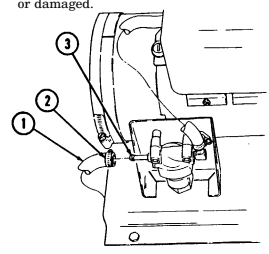

# 12-96. Troop/Cargo Winterization Heater Filter-To-Bulkhead Coupling Fuel Supply Hose Replacement (Cont'D)

b. Installation 1. Connect filter-to-bulkhead coupling fuel supply hose (1) to bulkhead coupling connector (5) with

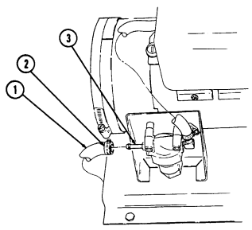

clamp (4).

2. Connect filter-to-bulkhead coupling fuel supply hose (1) to filter connector (3) with clamp (2).

FOLLOW-ON TASKS: - Install heater guard assembly (para. 12-98).

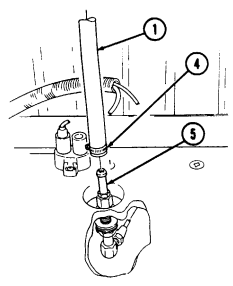

- Operate troop/cargo heater (TM 9-2320-387-10) and check for fuel leaks.

# 12-97. Troop/Cargo Winterization Heater Filter-To-Heater Fuel Supply Hose Replacement

This task covers:
INITIAL SETUP:
Applicable Models M1152, M1152A1 Tools General mechanic's tool kit:
automotive (Appendix B, Item 1)
Materials/Parts Sealing compound (Appendix C, Item 62)
Manual References TM 9-2320-387-10 TM 9-2320-387-24P
a. Removal b. Installation Equipment Condition Heater guard assembly removed
(para. 12-98).

General Safety Instructions Do not perform this procedure near fire, flames, or sparks.

Maintenance Level Unit

#### Warning

Diesel fuel is highly flammable. Do not perform this procedure near fire, flames, or sparks. Severe injury or death will result.

a. Removal

#### Caution

Cover or plug all open hoses and connections immediately after disconnection to prevent contamination. Remove all plugs prior to connection.

Have drainage container ready to catch fuel.

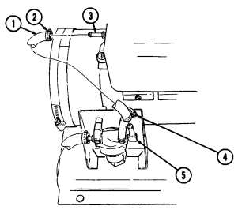

1. Loosen clamp (4) and disconnect filter-to-heater fuel supply hose (1) from filter elbow (5). 2. Loosen clamp (2) and disconnect filter-to-heater fuel supply hose (1) from heater connector (3). 3. Inspect filter elbow (5) and heater connector (3) for damage. Replace if damaged.

12-97. TROOP/CARGO WINTERIZATION HEATER FILTER-TO-HEATER FUEL SUPPLY
HOSE REPLACEMENT (Cont'd)
b. Installation 1. Connect filter-to-heater fuel supply hose (1) to heater connector (3) with clamp (2).

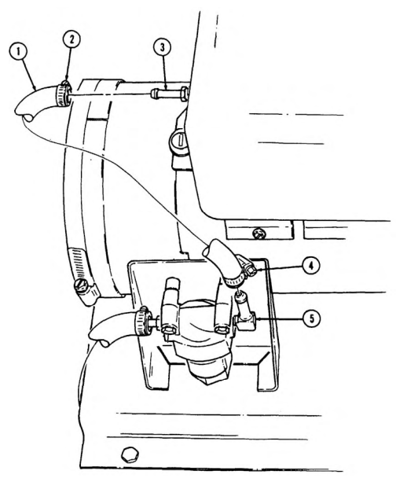 2. Install filter-to-heater fuel supply hose (1) on filter elbow (5) with clamp (4).

FOLLOW-ON TASKS: - Install heater guard assembly (para. 12-98).

- Operate troop/cargo heater (TM 9-2320-387-10) and check for fuel leaks.

# 12-98. Troop/Cargo Winterization Heater Guard Assembly Replacement

This task covers:

a. Removal b. Installation

INITIAL SETUP:

| Applicable Models               | Manual References                         |
|---------------------------------|-------------------------------------------|
| M1152                           | TM 9\-2320\-387\-10                       |
| Tools                           | TM 9\-2320\-387\-24P                      |
| General mechanic's tool kit:    | Equipment Condition                       |
| automotive (Appendix B, Item 1) | - Tailgate lowered (TM 9\-2320\-387\-10). |
|                                 | - Troop seat (L.H.) raised                |

a. Removal Remove four capscrews (3), lockwashers (2), and guard assembly (1) from heater base assembly (4). Discard lockwashers (2).

b. Installation Install guard assembly (1) on heater base assembly (4) with four lockwashers (2) and capscrews (3).

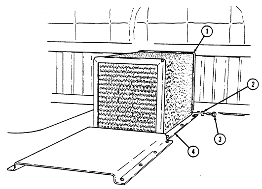

# 12-99. Troop/Cargo Winterization Heat Deflector Replacement

This task covers:
INITIAL SETUP:

| Materials/Parts                    | Applicable Models               |
|------------------------------------|---------------------------------|
| Two locknuts (Appendix G, Item 89) | M1152                           |
| Manual References                  | Tools                           |
| TM 9\-2320\-387\-24P               | General mechanic's tool kit:    |
| Maintenance Level                  | automotive (Appendix B, Item 1) |
| Unit                               |                                 |

a. Removal b. Installation

a. Removal Remove four capscrews (3), lockwashers (4), and heat deflector (1) from heater base assembly (2). Discard lockwashers (4).

b. Installation Install heat deflector (1) on heater base assembly (2) with four lockwashers (4) and capscrews (3).

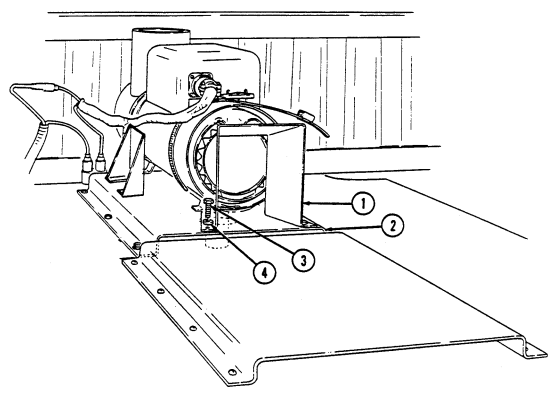

FOLLOW-ON TASK: Install heater guard assembly (para. 12-98).

# 12-100. Troop/Cargo Winterization Heater Assembly Replacement

This task covers:
INITIAL SETUP:
Applicable Models M1152, M1152A1 Tools General mechanic's tool kit:
automotive (Appendix B, Item 1)
Materials/Parts Adhesive sealant (Appendix C, Item 12) Sealing compound (Appendix C, Item 60.1) O-ring (Appendix G, Item 228.2)
Manual References TM 9-2320-387-10 TM 9-2320-387-24P
a. Removal b. Installation

#### Equipment Condition

- Battery ground cable disconnected
(para. 4-68).

- Heater guard assembly removed
(para. 12-98).

#### General Safety Instructions

- Do not perform this procedure near fire, flames or sparks.

- Ensure handle on diverter assembly is facing toward left side of vehicle.

Maintenance Level Unit

#### Warning

Diesel fuel is highly flammable. Do not perform this procedure near fire, flames, or sparks. Severe injury or death may result.

a. Removal

#### Caution

Cover or plug all open hoses and connections immediately after disconnection to prevent contamination. Remove all plugs prior to connection.

Have drainage container ready to catch fuel.

1. Loosen clamp (2) and disconnect filter-to-heater fuel supply hose (1) from connector (3). 2. Remove connector (3) from heater inlet port (4). 3. Remove clamp (6) and diverter assembly (7) from air inlet adapter (5).

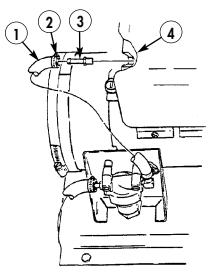

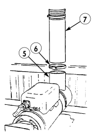

# 12-100. Troop/Cargo Winterization Heater Assembly Replacement (Cont'D)

4. Disconnect cannon plug (2) from heater (3). 5. Remove two clamps (1) and heater (3) from heater base assembly (4) . 6. Remove air inlet adapter (5) from heater (3). 7. Remove O-ring (6) and washer (7) from heater (3). Discard O-ring (6). 8. Remove exhaust extension (8) from heater base assembly (4).

#### B. Installation Note

When installing exhaust extension into heater base assembly, ensure tab on exhaust extension and notch in heater base assembly are aligned.

1. Apply sealant to underside surface of flange on exhaust extension (8), and install exhaust extension (8) on heater base assembly (4).

2. Install washer (7) and O-ring (6) on heater (3). 3. Install air inlet adapter (5) on heater (3). 4. Install heater (3) on heater base assembly (4) with two clamps (1). 5. Connect cannon plug (2) to heater (3).

#### Warning

Ensure handle on diverter assembly is facing toward left side of vehicle. Improper installation of the diverter assembly may cause serious injury to personnel.

6. Install diverter assembly (10) on air inlet adapter (5) with clamp (9). 7. Apply sealing compound to threads of connector (13) and install connector (13) on heater inlet port (14).

8. Connect filter-to-heater fuel supply hose (11) to connector (13) with clamp (12).

# 12-100. Troop/Cargo Winterization Heater Assembly Replacement (Cont'D)

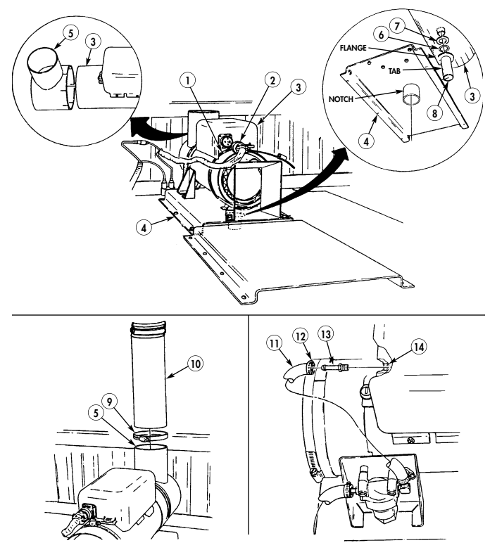

FOLLOW-ON TASKS: - Install heater guard assembly (para. 12-98).

- Connect battery ground cable (para. 4-68). - Operate troop/cargo heater (TM 9-2320-387-10) and check for fuel leaks.

# 12-101. Troop/Cargo Winterization Heater Diverter Assembly Replacement

This task covers:
INITIAL SETUP:

| Tools                        |
|------------------------------|
| General mechanic's tool kit: |

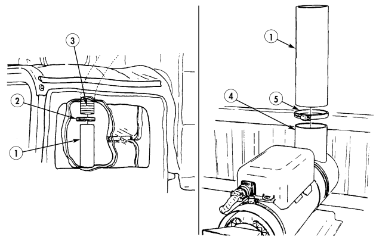

a. Removal b. Installation

a. Removal 1. Remove clamp (2) and flex duct (3) from diverter assembly (1). 2. Remove clamp (5) and diverter assembly (1) from air inlet adapter (4).

| Manual References   |
|---------------------|
| Personnel Required  |

b. Installation 1. Install diverter assembly (1) on air inlet adapter (4) with clamp (5). 2. Install flex duct (3) on diverter assembly (1) with clamp (2).

# 12-102. Troop/Cargo Winterization Heater Air Intake Assembly Replacement

This task covers:

#### A. Removal B. Installation

INITIAL SETUP:
Applicable Models M1152, M1152A1 Tools General mechanic's tool kit:
automotive (Appendix B, Item 1)

| Materials/Parts   |
|-------------------|
| Three locknut     |

| Four locknuts (Appe   |
|-----------------------|
| Manual References     |
| TM 9\-2320\-387\-24P  |
| Maintenance Level     |
| Unit                  |

Three locknuts (Appendix G, Item 133.11) Four locknuts (Appendix G, Item 133.10)

#### A. Removal

1. Remove two clamps (9) and flex duct (11) from diverter assembly (10) and adapter (7). 2. Remove three locknuts (5), capscrews (3), and hood (2), from top cover assembly (1) and plate (4).

Discard locknuts (5).

3. Remove four locknuts (8), screws (12), adapter (7), and screen (6) from plate (4). Discard locknuts (8).

#### B. Installation

1. Install screen (6) and adapter (7) on plate (4) with four screws (12) and locknuts (8).

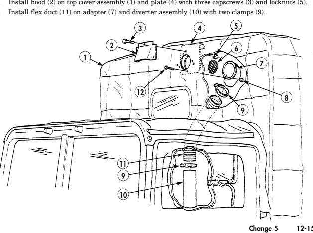

# 12-103. Troop/Cargo Winterization Heater Base Assembly Replacement

This task covers:
INITIAL SETUP:
Applicable Models M1152, M1152A1 Tools General mechanic's tool kit:
automotive (Appendix B, Item 1)
Materials/Parts Gasket (Appendix G, Item 56.1)
Six lockwashers (Appendix G, Item 190.4)
a. Removal b. Installation Manual References TM 9-2320-387-24P
Equipment Condition
- Heater assembly removed (para. 12-100). - Heater fuel filter assembly removed
(para. 12-87).

- Heat deflector removed (para. 12-99).

Maintenance Level

| L   |
|-----|
| L   |

#### A. Removal

1. Remove six capscrews (2), lockwashers (1), and heater base assembly (3) from cargo floor cover (4).

Discard lockwashers (1).

2. Remove gasket (5) from heater base assembly (3). Discard gasket (5).

b. Installation 1. Install gasket (5) on heater base assembly (3).

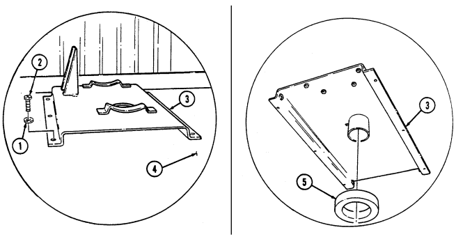 2. Install heater base assembly (3) on cargo floor cover (4) with six lockwashers (1) and capscrews (2).

FOLLOW-ON TASKS: - Install heat deflector (para. 12-99).

- Install fuel filter assembly (para. 12-87). - Install heater assembly (para. 12-100).

# 12-104. Troop/Cargo Winterization Floor Bracket Replacement

This task covers:

a. Removal b. Installation

INITIAL SETUP:

| Applicable Models               | Manual References    |
|---------------------------------|----------------------|
| M1152, M1152A1                  | TM 9\-2320\-387\-10  |
| Tools                           | TM 9\-2320\-387\-24P |
| General mechanic's tool kit:    | Equipment Condition  |
| automotive (Appendix B, Item 1) |                      |

a. Removal Remove eight screws (2) and floor bracket (1) from front cargo floor cover (3).

b. Installation Install floor bracket (1) on front cargo floor cover (3) with eight screws (2).

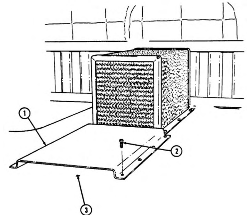

# 12-105. Troop/Cargo Winterization Heater Control Box And Angle Bracket Replacement

This task covers:
INITIAL SETUP:

| Applicable Models               | M1152, M1152A1               |
|---------------------------------|------------------------------|
| Tools                           | General mechanic's tool kit: |
| automotive (Appendix B, Item 1) | Materials/Parts              |
| Sealing compound (Appendix C,   | Item 62)                     |

a. Removal b. Installation

#### A. Removal

| Manual References                        |
|------------------------------------------|
| TM 9\-2320\-387\-10                      |
| TM 9\-2320\-387\-24P                     |
| General Safety Instructions              |
| Do not perform this procedure near fire, |
| flames, or sparks.                       |
| Maintenance Level                        |
| Unit                                     |

1. Disconnect control box lead 400 (7) from harness lead 1C (8).

#### B. Installation

2. Remove tiedown strap (6) from ground lead 2C (3), ground lead (2), control box lead 400 (7), and heater wiring harness (10). Discard tiedown strap (6).

3. Disconnect cannon plug (11) from inner shell (13). 4. Remove two screws (12) and control box inner shell (13) from outer shell (14). 5. Remove two crown nuts (4), nuts (5), lockwashers (1), capscrews (9), ground lead 2C (3), ground lead (2), and outer shell (14) from angle bracket (15). Discard lockwashers (1).

6. Remove two locknuts (18), washers (17), capscrews (19), and angle bracket (15) from cargo bulkhead (16). Discard locknuts (18).

1. Install angle bracket (15) on cargo bulkhead (16) with two capscrews (19), washers (17), and locknuts (18).

2. Install outer shell (14), ground lead (2), and ground lead 2C (3) to angle bracket (15) with two capscrews (9), lockwashers (1), and nuts (5).

3. Apply adhesive to exposed threads of two capscrews (9) and install two crown nuts (4) on capscrews (9).

4. Install inner shell (13) on outer shell (14) with two screws (12). 5. Connect cannon plug (11) to inner shell (13). 6. Connect control box lead 400 (7) to harness lead 1C (8). 7. Install tiedown strap (6) on ground lead 2C (3), ground lead (2), control box lead 400 (7), and heater wiring harness (10).

# 12-105. Troop/Cargo Winterization Heater Control Box And Angle Bracket Replacement (Cont'D)

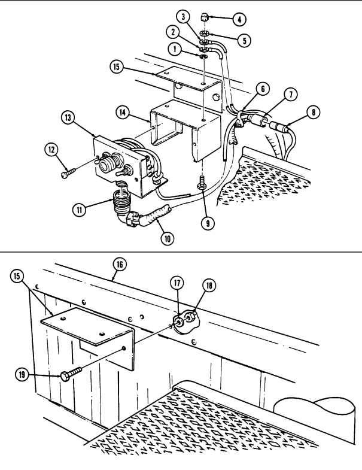

FOLLOW-ON TASKS: - Connect battery ground cable (para. 4-68).

- Check for proper operation of troop/cargo heater (TM 9-2320-387-10).

# 12-106. Troop/Cargo Winterization Heater Wiring Harness Replacement

This task covers:
INITIAL SETUP:

| Applicable Models   |
|---------------------|
| M1152, M1152A1      |

General mechanic's tool kit:
automotive (Appendix B, Item 1)
Materials/Parts Adhesive (Appendix C, Item 8) Two lockwashers (Appendix G, Item 174) Lockwasher (Appendix G, Item 190.5) Tiedown strap (Appendix G, Item 327) Tiedown strap (Appendix G, Item 329.1)
a. Removal a. Removal b. Installation

| TM 9\-2320\-387\-24P                     |
|------------------------------------------|
| General Safety Instructions              |
| Do not perform this procedure near fire, |
| flames, or sparks.                       |

Manual References TM 9-2320-387-10 TM 9-2320-387-24P

- Depending on what kits are installed on the vehicle, there may be unidentified leads on the shunt stud and power stud. These leads must remain on the studs.

- Prior to removal, tag leads for installation.

1. Remove nut (6), lockwasher (7), fuel pump ground lead 799B (10) and lead 2A (8) from shunt stud (9). Discard lockwasher (7).

2. Remove nut (15), lockwasher (14), starter cable (13), and lead 1A (12) from power stud (11). Discard lockwasher (14).

3. Disconnect lead FP (1) from adapter (2). 4. Remove tiedown strap (4) and heater wiring harness (3) from transmission vacuum line (5). Discard tiedown strap (4).

5. Disconnect cannon plug (25) from control box inner shell (27). 6. Remove two screws (26) and control box inner shell (27) from outer shell (28). 7. Remove crown nut (19), nut (20), lockwasher (16), capscrew (24), ground lead 2C (18), and ground lead (17) from angle bracket (29). Discard lockwasher (16).

8. Disconnect lead 1C (23) from control box lead 400 (22). 9. Remove tiedown strap (21) from ground lead 2C (18), ground lead (17), control box lead 400 (22),
and heater wiring harness (3). Discard tiedown strap (21).

10. Disconnect lead 2B (31) from lead 2A (30). 11. Disconnect lead 1B (36) from circuit breaker (35). 12. Disconnect cannon plug (32) from heater (33) and remove heater wiring harness (3). 13. Remove plastic sleeve (34) from heater wiring harness (3).

12-106.  TROOP/CARGO WINTERIZATION HEATER WIRING HARNESS REPLACEMENT
(Cont'd)

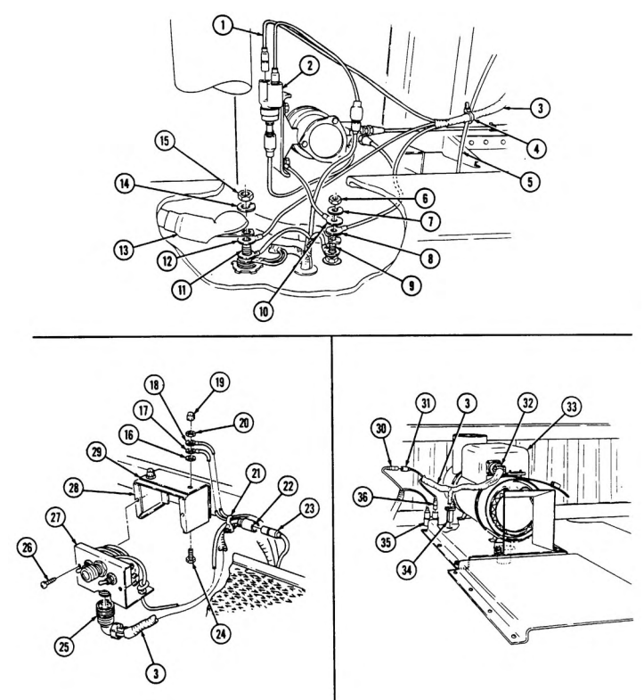

12-106. TROOP/CARGO WINTERIZATION HEATER WIRING HARNESS REPLACEMENT 

# (Cont'D)

#### B. Installation

1. Install heater wiring harness (3) through cargo floor (7), and position plastic sleeve (6) around harness (3). Insert plastic sleeve (6) into cargo floor (7).

2. Connect cannon plug (4) to heater (5). 3. Connect lead 1B (9) to circuit breaker (8). 4. Connect lead 2B (2) to lead 2A (1). 5. Connect lead 1C (17) to control box lead 400 (16). 6. Install ground lead (11) and ground lead 2C (12) on angle bracket (23) with capscrew (18),
lockwasher (10), and nut (14).

7. Apply adhesive to exposed threads of capscrew (18) and install crown nut (13) on capscrew (18). 8. Install control box inner shell (21) on outer shell (22) with two screws (20). 9. Connect cannon plug (19) to control box inner shell (21).

10. Install tiedown strap (15) on ground lead 2C (12), ground lead (11), control box lead 400 (16), and heater wiring harness (3).

11. Connect lead FP (24) to adapter (25). 12. Install lead 1A (34) and starter cable (35) on power stud (33) with lockwasher (36) and nut (37). 13. Install lead 2A (30) and fuel pump ground lead 799B (32) on shunt stud (31) with lockwasher (29)
and nut (28).

14. Install heater wiring harness (3) to transmission vacuum line (27) with tiedown strap (26).

12-106. TROOP/CARGO WINTERIZATION HEATER WIRING HARNESS REPLACEMENT
(Cont'd)

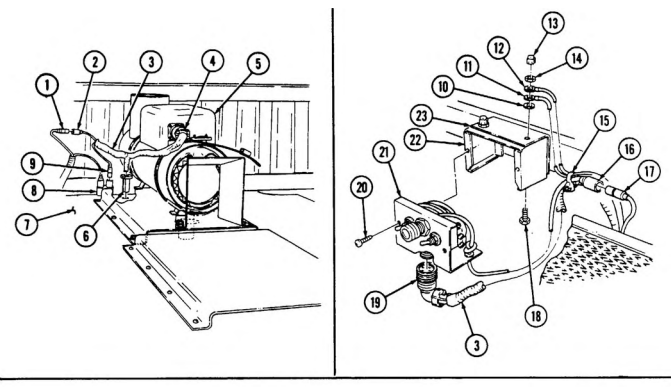

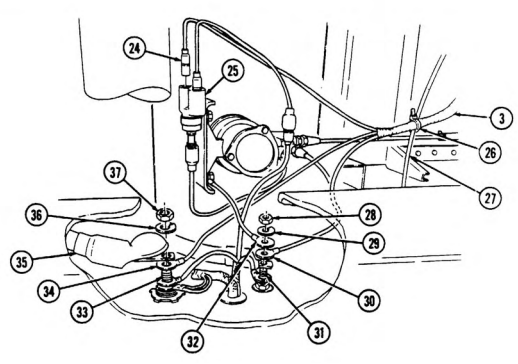

FOLLOW-ON TASKS:  - Connect battery ground cable (para. 4-68).
- • - • Check for proper operation of troop/cargo heater (TM 9-2320-387-10).

# 12-107. Troop/Cargo Winterization Heater Wiring Harness Adapter Replacement

This task covers:
INITIAL SETUP:
a. Removal b. Installation

| Applicable Models                      | Manual References                        |
|----------------------------------------|------------------------------------------|
| M1152, M1152A1                         | TM 9\-2320\-387\-10                      |
| Tools                                  | TM 9\-2320\-387\-24P                     |
| General mechanic's tool kit:           | General Safety Instructions              |
| automotive (Appendix B, Item 1)        | Do not perform this procedure near fire, |
| Materials/Parts                        | flames, or sparks.                       |
| Sealing compound (Appendix C, Item 62) | Maintenance Level                        |
|                                        | Unit                                     |

a. Removal 1. Disconnect fuel pump lead (11) from connector (5). 2. Disconnect connector (5) from adapter (4). 3. Disconnect lead FP (1) from adapter (4).

Perform step 5 if vehicle is not equipped with front arctic heater.

4. Deleted 5. Disconnect plug (2) and plug shell (3) from adapter (4). 6. Remove locknut (13), washer (14), capscrew (9), washer (8), fuel pump (10), clamp (12), and adapter (4) from bracket (7). Discard locknut (13).

7. Remove clamp (12) from adapter (4).

b. Installation 1. Install clamp (12) on adapter (4). 2. Install fuel pump (10), clamp (12), and adapter (4) on bracket (7) with washer (8), capscrew (9),
washer (14), and locknut (13).

Perform step 4 if vehicle is not equipped with front arctic heater.

3. Deleted 4. Connect plug shell (3) and plug (2) to adapter (4). 5. Connect lead FP (1) to adapter (4). 6. Connect connector (5) to adapter (4). 7. Connect fuel pump lead (11) to connector (5).

12-107.  TROOP/CARGO WINTERIZATION HEATER WIRING HARNESS ADAPTER
                 REPLACEMENT (Cont'd)

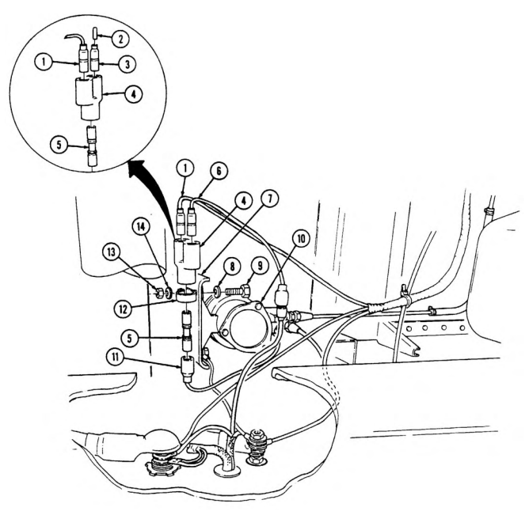

FOLLOW-ON TASKS: - Connect battery ground cable (para. 4-68).

· Check for proper operation of troop/cargo heater (TM 9-2320-387-10).

# 12-108. Troop/Cargo Winterization Circuit Breaker Replacement

This task covers:
INITIAL SETUP:
Applicable Models M1152, M1152A1 Tools General mechanic's tool kit:
automotive (Appendix B, Item 1)
a. Removal b. Installation Manual References TM 9-2320-387-10 TM 9-2320-387-24P
Equipment Condition Battery ground cable disconnected
(para. 4-68).

Maintenance Level Unit

Prior to removal, tag leads for installation.

#### A. Removal

1. Disconnect heater harness lead 1B (2) from circuit breaker (4). 2. Disconnect blackout/dome light harness lead 1A (1) from circuit breaker (4). 3. Remove two screws (3) and circuit breaker (4) from front cargo floor cover (5).

b. Installation 1. Install circuit breaker (4) on front cargo floor cover (5) with two screws (3).

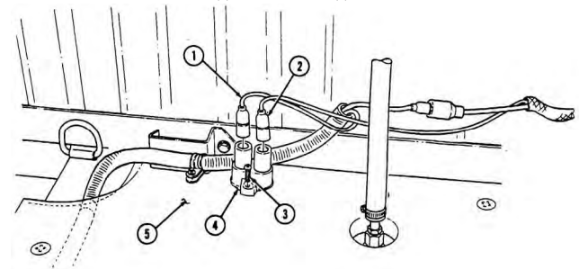 2. Connect blackout/dome light harness lead 1A (1) to circuit breaker (4). 3. Connect heater harness lead 1B (2) to circuit breaker (4).

FOLLOW-ON TASKS: - Connect battery ground cable (para. 4-68).

- Check for proper operation of troop/cargo heater (TM 9-2320-387-10).

# 12-109. Troop/Cargo Winterization Blackout Curtain Replacement

This task covers:

| Applicable Models   |
|---------------------|
| M1152, M1152A1      |
| Tools               |

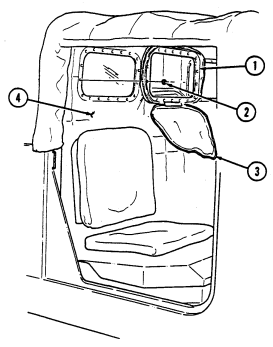

INITIAL SETUP:
General mechanic's tool kit:
automotive (Appendix B, Item 1)
Materials/Parts Eighteen locknuts (Appendix G, Item 101.9)

| Materials/Parts      |
|----------------------|
| Manual References    |
| TM 9\-2320\-387\-24P |

There are two blackout curtains located in the driver's compartment. There is also a blackout curtain located above the driver's compartment on the troop/cargo enclosure assembly. This blackout curtain opens from inside the enclosure assembly. Replacement procedures for all blackout curtains are basically the same. This procedure covers the right blackout curtain in the driver's compartment.

a. Removal Remove eighteen locknuts (2), blackout curtain (3), and retainer (1) from arctic curtain (4). Discard locknuts (2).

b. Installation Install blackout curtain (3) and retainer (1) on arctic curtain (4) with eighteen locknuts (2).

a. Removal b. Installation

# 12-110. Troop/Cargo Winterization Blackout/Dome Light Wiring Harness Replacement

This task covers:

| Manual References    |
|----------------------|
| TM 9\-2320\-387\-10  |
| TM 9\-2320\-387\-24P |

INITIAL SETUP:

| Applicable Models M1152, M1152A1   |
|------------------------------------|
| Tools                              |
| General mechanic's tool kit:       |
| automotive (Appendix B, Item 1)    |

a. Removal **b. Installation**

| TM 9\-2320\-387\-24P          |
|-------------------------------|
| Equipment Condition           |
| Heater guard assembly removed |
| (para. 12\-98).               |
| Maintenance Level             |
| Unit                          |

Prior to removal, tag leads for installation.

#### A. Removal

1. Remove four screws (22) and upper side channel (23) from left end closure (24). 2. Remove ten screws (26) and lower side channel (25) from left end closure (24).

b. Installation 3. Remove four screws (19) and right blackout/dome light assembly (1) from right end closure (27). 4. Disconnect harness leads 712C (7) and 719C (6) from dome light leads 711/712 (8) and 719 (9). 5. Disconnect harness leads 711C (2) and 2C (3) from blackout light leads 711/712 (5) and 717 (4). 6. Remove four screws (21) and left blackout/dome light assembly (10) from left end closure (24). 7. Disconnect harness leads 712B (13) and 719B (14) from dome light leads 711/712 (12) and 719 (11). 8. Disconnect harness leads 711B (16) and 2B (15) from blackout light leads 711/712 (17) and 717 (18)
and remove wiring harness (20).

1. Connect harness leads 711B (16) and 2B (15) to blackout light leads 711/712 (17) and 717 (18). 2. Connect harness leads 712B (13) and 719B (14) to dome light leads 711/712 (12) and 719 (11). 3. Install left blackout/dome light assembly (10) on left end closure (24) with four screws (21). 4. Connect harness leads 711C (2) and 2C (3) to blackout light leads 711/712 (5) and 717 (4). 5. Connect harness leads 712C (7) and 719C (6) to dome light leads 711/712 (8) and 719 (9). 6. Install right blackout/dome light assembly (1) on right end closure (27) with four screws (19). 7. Install wiring harness (20) under lower side channel (25) and install lower side channel (25) 
to left end closure (24) with ten screws (26).

8. Install wiring harness (20) under upper side channel (23) and install upper side channel (23) 
to left end closure (24) with four screws (22).

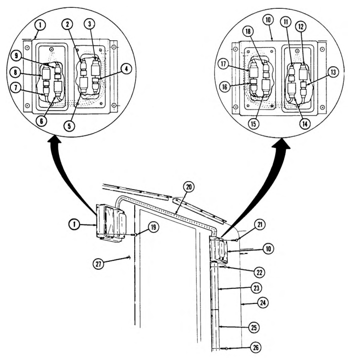

12-110. TROOP/CARGO WINTERIZATION BLACKOUT/DOME LIGHT WIRING HARNESS
REPLACEMENT (Cont'd)
FOLLOW-ON TASKS: - Install blackout/dome light door switch (para. 12-112).

· Install blackout/dome light switch (para. 12-111).

· Install cargo floor cover (para. 12-115).

· Connect battery ground cable (para. 4-68). · Check blackout light and dome light for proper operation (TM 9-2320-387-10).

# 12-111. Troop/Cargo Winterization Blackout/Dome Light Switch Replacement

This task covers:
INITIAL SETUP:
Applicable Models M1152, M1152A1 Tools General mechanic's tool kit:
automotive (Appendix B, Item 1)
Manual References TM 9-2320-387-10 TM 9-2320-387-24P
a. Removal a. Removal b. Installation Equipment Condition Battery ground cable disconnected
(para. 4-68).

| Maintenance Level   |
|---------------------|

Unit 1. Remove nut (7) from box (3). 2. Remove two screws (2), box (3), and switch (9) from upper side channel (1) and lower side channel (4). 3. Inspect decal (8) and remove from box (3) if decal (8) is damaged or illegible.

Prior to removal, tag leads for installation.

4. Remove three screws (5), washers (11), and leads 711A (6), 1B (12), and 712A (10) 
from switch (9).

b. Installation

Ensure lead 711A is positioned on top switch contact, and keyway is on bottom of switch.

1. Install leads 711A (6), 1B (12), and 712A (10) on switch (9) with three washers (11) and screws (5).

Do not tighten screws (5).

2. Install decal (8) on box (3), if removed.

Ensure keyway in switch is toward the BLACKOUT position on box when installed.

3. Install switch (9) on box (3) with nut (7). 4. Tighten three screws (5) installed in step 1.

Ensure electrical harness lead are not binding during box installation.

5. Install box (3) on upper side channel (1) and lower side channel (4) with two screws (2).

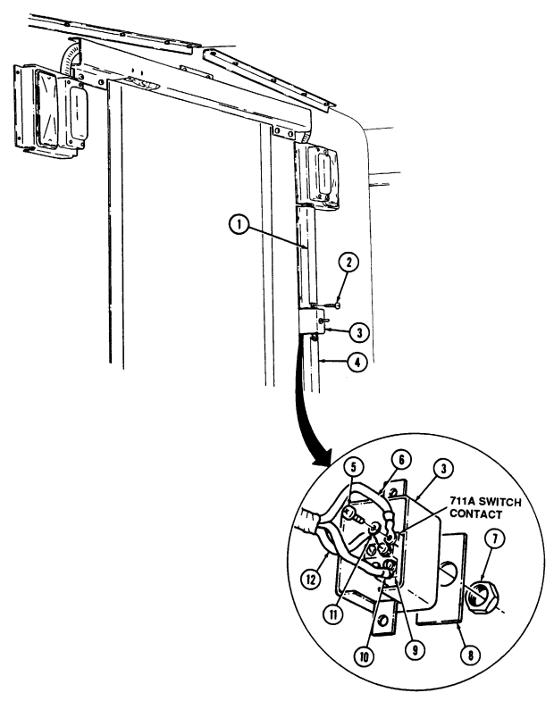

12-111.  TROOP/CARGO WINTERIZATION BLACKOUT/DOME LIGHT SWITCH
               REPLACEMENT (Conf'd)
FOLLOW-ON TASKS:  - Connect battery ground cable (para. 4-68).
- • - • - • Check blackout light and dome light for proper operation (TM 9-2320-387-10).

# 12-112. Troop/Cargo Winterization Blackout/Dome Light Door Switch Replacement

This task covers:
INITIAL SETUP:
a. Removal b. Installation

| Applicable Models               | Materials/Parts                          |
|---------------------------------|------------------------------------------|
| M1152, M1152A1                  | Three locknuts (Appendix G, Item 133.11) |
| Tools                           | Four locknuts (Appendix G, Item 133.10)  |
| General mechanic's tool kit:    | Manual References                        |
| automotive (Appendix B, Item 1) | TM 9\-2320\-387\-24P                     |
|                                 | Maintenance Level                        |
|                                 | Unit                                     |

a. Removal 1. Remove six screws (2) and top channel (1) from left end closure (3) and right end closure (4). 2. Remove four screws (7), locknuts (5), four clamps (6), and wiring harness (11) from top channel (1).

Discard locknuts (5).

3. Remove two screws (12), nuts (8), washers (9), and switch (10) from top channel (1).

Prior to removal, tag leads for installation.

4. Remove two screws (16), washers (15), and leads 719A (14) and 2D (13) from switch (10).

b. Installation 1. Install leads 719A (14) and 2D (13) on switch (10) with two washers (15) and screws (16). 2. Install switch (10) on top channel (1) with two screws (12), washers (9), and nuts (8). 3. Install four clamps (6) and wiring harness (11) on top channel (1) with four screws (7) and locknuts (5).

4. Install top channel (1) on left end closure (3) and right end closure (4) with six screws (2).

12-112.  TROOP/CARGO WINTERIZATION BLACKOUT/DOME LIGHT DOOR SWITCH
 

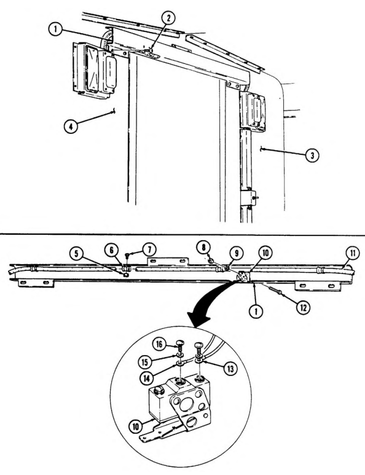

FOLLOW-ON TASKS: - Connect battery ground cable (para. 4-68).

- Check blackout light and dome light for proper operation (TM 9-2320-387-10).

# 12-113. Troop/Cargo Winterization Blackout/Dome Light Assembly Replacement

This task covers:
INITIAL SETUP:
Applicable Models M1152, M1152A1 Tools General mechanic's tool kit:
automotive (Appendix B, Item 1)
a. Removal b. Installation Manual References TM 9-2320-387-10 TM 9-2320-387-24P
Equipment Condition Battery ground cable disconnected
(para. 4-68).

Maintenance Level Unit

- Replacement instructions for left and right blackout/dome light assemblies are the same. This procedure covers right blackout/dome light assembly.

- Prior to removal, tag leads for installation.

a. Removal 1. Remove four screws (1) from blackout/dome light assembly (3) and right end closure (2). 2. Disconnect blackout light leads 717 (8) and 711/712 (9) from leads 2C (7) and 711C (6). 3. Disconnect dome light leads 719 (5) and 711/712 (4) from leads 719C (10) and 712C (11) and remove blackout/dome light assembly (3).

b. Installation 1. Connect dome light leads 719 (5) and 711/712 (4) to leads 719C (10) and 712C (11).

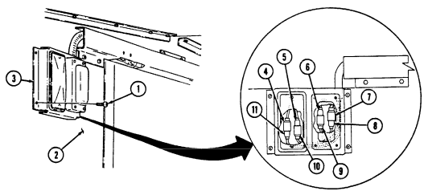 2. Connect blackout light leads 717 (8) and 711/712 (9) to leads 2C (7) and 711C (6). 3. Install blackout/dome light assembly (3) on right end closure (2) with four screws (1).

FOLLOW-ON TASKS: - Connect battery ground cable (para. 4-68).

- Check blackout light and dome light for proper operation (TM 9-2320-387-10).

# 12-114. Troop/Cargo Winterization Blackout/Dome Light Lamp Replacement

This task covers:
INITIAL SETUP:
Applicable Models M1152, M1152A1 Tools General mechanic's tool kit:
automotive (Appendix B, Item 1)
Manual References TM 9-2320-387-10 TM 9-2320-387-24P
a. Removal a. Removal b. Installation Equipment Condition Battery ground cable disconnected
(para. 4-68).

| Maintenance Level   |
|---------------------|

Unit

Perform steps 1 and 2 for blackout light lamp removal. Perform steps 3 and 4 for dome light lamp removal.

1. Remove four screws (5) and blackout light cover and lens assembly (3) from light body (2). 2. Remove lamp (4) from light body (2). 3. Remove two screws (7) and dome light cover and lens assembly (6) from light body (1). 4. Remove lamp (8) from light body (1).

b. Installation

Perform steps 1 and 2 for blackout light lamp installation.

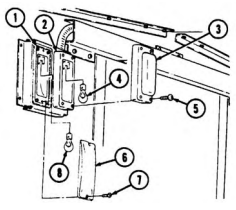 Perform steps 3 and 4 for dome light lamp installation.

1. Install lamp (4) in light body (2). 2. Install blackout light cover and lens assembly (3) on light body (2) with four screws (5). 3. Install lamp (8) in light body (1). 4. Install dome light cover and lens assembly (6) on light body (1) with two screws (7).

FOLLOW-ON TASKS: - Connect battery ground cable (para. 4-68).

- Check blackout light and dome light for proper operation (TM 9-2320-387-10).

# 12-115. Troop/Cargo Winterization Front And Rear Cargo Floor Cover Replacement

This task covers:
INITIAL SETUP:

| the monto products   |
|----------------------|
| M1152, M1152A1       |

Applicable Models

| UU UUTITUUT V   |
|-----------------|
| Materials/Parts |

Tools General mechanic's tool kit:
automotive (Appendix B, Item 1)
Four locknuts (Appendix G, Item 101.10) Six platenuts (Appendix G, Item 247.1) Nine rivnuts (Appendix G, Item 272.1)
Manual References TM 9-2320-387-24P

#### A. Removal

a. Removal b. Installation Maintenance Level Unit

| TM 9\-2320\-387\-24P   |
|------------------------|
| Maintenance Level      |
| Unit                   |

1. Remove screw (1) and clamp (2) from blackout/dome light wiring harness (3) and front cargo floor cover (4).

2. Remove two locknuts (11), washers (10), and screws (8) from door and frame assembly (9), rear cargo floor cover (7), cargo floor (15), and D-beam (14). Discard locknuts (11).

3. Remove two locknuts (12), washers (13), and capscrews (16) from door and frame assembly (9), rear cargo floor cover (7), cargo floor (15), and D-beam (14). Discard locknuts (12).

4. Remove two screws (5) and step latch strip (6) from rear cargo floor cover (7). 5. Remove nine screws (17), front cargo floor cover (4), and rear cargo floor cover (7) from cargo floor (15).

6. Inspect nine rivnuts (18) for damage. Replace if damaged. 7. Inspect six platenuts (19) for damage. Replace if damaged.

b. Installation

Ensure position markers on blackout/dome light wiring harness extend beyond the front and rear cargo floor covers.

1. Install front cargo floor cover (4) and rear cargo floor cover (7) on cargo floor (15) with nine screws (17).

2. Install step latch strip (6) on rear cargo floor cover (7) with two screws (5). 3. Install door and frame assembly (9) and rear cargo floor cover (7) on cargo floor (15) and D-beam (14) with two capscrews (16), washers (13), and locknuts (12).

4. Secure door and frame assembly (9) and rear cargo floor cover (7) to cargo floor (15) and D-beam (14) with two screws (8), washers (10), and locknuts (11).

5. Install blackout/dome light wiring harness (3) on front cargo floor (4) with clamp (2) and screw (1).

12-115. TROOP/CARGO WINTERIZATION FRONT AND REAR CARGO FLOOR COVER

# Replacement (Cont'D)

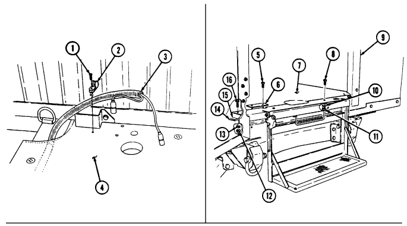

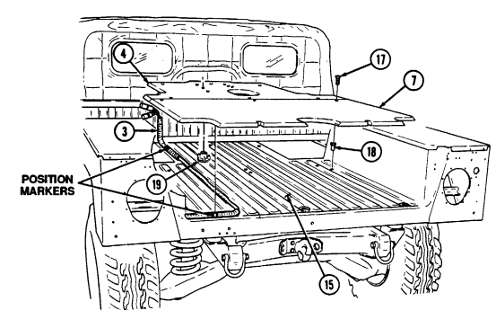

FOLLOW-ON TASKS: - Install side wheelhousing covers (para. 12-120).

-  Install skid strips (para. 12-116).

· Install circuit breaker (para. 12-108). · Install heater wiring harness (para. 12-106). · Install heater base assembly (para. 12-103).

# 12-116. Troop/Cargo Winterization Cargo Floor Skid Strips Replacement

This task covers:
INITIAL SETUP:

| Applicable Models               |
|---------------------------------|
| M1152, M1152A1                  |
| Tools                           |
| General mechanic's tool kit:    |
| automotive (Appendix B, Item 1) |

a. Removal b. Installation a. Removal

| Manual References                 |
|-----------------------------------|
| TM 9\-2320\-387\-10               |
| TM 9\-2320\-387\-24P              |
| Equipment Condition               |
| Battery ground cable disconnected |
| (para. 4\-68).                    |

1. Remove fourteen screws (4) and two skid strips (3) from front cargo floor cover (1) and rear cargo floor cover (6).

2. Remove five screws (2) and skid strip (5) from rear cargo floor cover (6).

b. Installation 1. Install skid strip (5) on rear cargo floor cover (6) with five screws (2). 2. Install two skid strips (3) to front cargo floor cover (1) and rear cargo floor cover (6) with fourteen

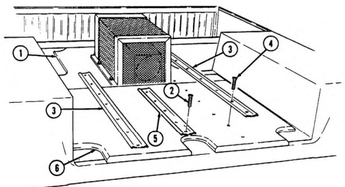

screws (4).

FOLLOW-ON TASK: Install floor bracket (para. 12-104).

# 12-117. Troop/Cargo Winterization Seat Back Cover Replacement

This task covers:

| Applicable Models               |
|---------------------------------|
| M1152, M1152A1                  |
| Tools                           |
| General mechanic's tool kit:    |
| automotive (Appendix B, Item 1) |

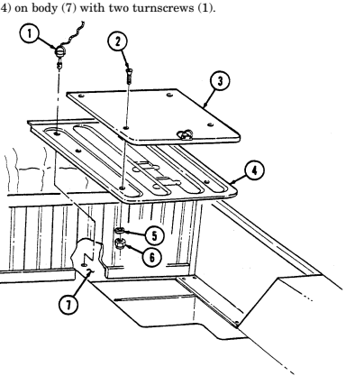

INITIAL SETUP:

a. Removal b. Installation

| Manual References                                |
|--------------------------------------------------|
| TM 9\-2320\-387\-10                              |
| TM 9\-2320\-387\-24P                             |
| Equipment Condition                              |
| Battery ground cable disconnected (para. 4\-68). |
| Maintenance Level                                |

Replacement procedures for left and right seat back covers are the same. This procedure covers right seat back cover.

a. Removal 1. Remove two turnscrews (1) and seat back (4) from body (7). 2. Remove four locknuts (6), washers (5), screws (2), and seat back cover (3) from seat back (4).

Discard locknuts (6).

#### B. Installation

1. Install seat back cover (3) on seat back (4) with four screws (2), washers (5), and locknuts (6). 2. Install seat back (4) on body (7) with two turnscrews (1).

# 12-118. Troop/Cargo Winterization Fixed Door Cover Replacement

This task covers:
INITIAL SETUP:
a. Removal b. Installation

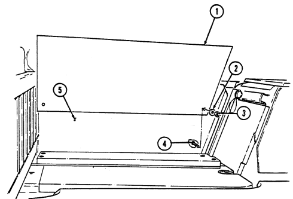

Applicable Models Tools General mechanic's tool kit:
automotive (Appendix B, Item 1)
Materials/Parts Two locknuts (Appendix G, Item 101.6)

Replacement procedures for left and right fixed door covers are basically the same. This procedure covers right fixed door cover.

a. Removal Remove two locknuts (3), washers (2), screws (4), and fixed door cover (1) from fixed door (5). Discard locknuts (3).

b. Installation Install fixed door cover (1) on fixed door (5) with two screws (4), washers (2), and locknuts (3).

| Manual References    |
|----------------------|
| TM 9\-2320\-387\-10  |
| TM 9\-2320\-387\-24P |

# 12-119. Troop/Cargo Winterization Side Floor Cover Replacement

This task covers:
a. Removal b. Installation

| Applicable Models               | Manual References    |
|---------------------------------|----------------------|
| M1152, M1152A1                  | TM 9\-2320\-387\-10  |
| Tools                           | TM 9\-2320\-387\-24P |
| General mechanic's tool kit:    | Maintenance Level    |
| automotive (Appendix B, Item 1) | Unit                 |
| Materials/Parts                 |                      |

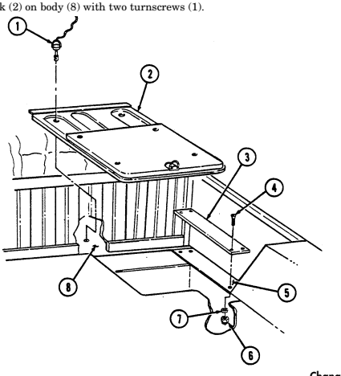

Replacement procedures for left and right side floor covers are the same. This procedure covers right side floor cover.

a. Removal 1. Remove two turnscrews (1) and seat back (2) from body (8). 2. Remove four locknuts (6), washers (7), screws (4), and side floor cover (3) from cargo floor (5).

Discard locknuts (6).

b. Installation 1. Install side floor cover (3) on cargo floor (5) with four screws (4), washers (7), and locknuts (6). 2. Install seat back (2) on body (8) with two turnscrews (1).

# 12-120. Troop/Cargo Winterization Wheelhousing Covers Replacement

This task covers:

| INITIAL SETUP:   |
|------------------|

| INITIAL SETUP:                  |                                              |
|---------------------------------|----------------------------------------------|
| Applicable Models               | Equipment Condition                          |
| M1152, M1152A1                  | - Battery ground cable disconnected          |
| Tools                           | (para. 4\-68).                               |
|                                 | - Cargo floor cover removed (para. 12\-115). |
| General mechanic's tool kit:    | - Blackout/dome light switch removed         |
| automotive (Appendix B, Item 1) | (para. 12\-111).                             |
| Manual References               | - Blackout/dome light door switch removed    |
| TM 9\-2320\-387\-10             | (para. 12\-112).                             |

a. Removal b. Installation

Replacement procedures for left and right wheelhousing covers are basically the same. This procedure covers right wheelhousing covers.

#### A. Removal

1. Remove four locknuts (2), washers (3), screws (5), and front cover (1) from wheelhousing (4). Discard locknuts (2).

2. Remove twelve locknuts (7), washers (6), screws (9), and side cover (8) from wheelhousing (4).

Discard locknuts (7).

3. Remove six locknuts (12), washers (13), screws (11), and top cover (10) from wheelhousing (4).

Discard locknuts (12).

4. Remove six screws (14) and six spacers (15) from top cover (10).

#### B. Installation

1. Install six spacers (15) on top cover (10) with six screws (14). 2. Install top cover (10) on wheelhousing (4) with six screws (11), washers (13), and locknuts (12). 3. Install side cover (8) on wheelhousing (4) with twelve screws (9), washers (6), and locknuts (7). 4. Install front cover (1) on wheelhousing (4) with four screws (5), washers (3), and locknuts (2).

12-120.  TROOP/CARGO WINTERIZATION WHEELHOUSING COVERS REPLACEMENT
 

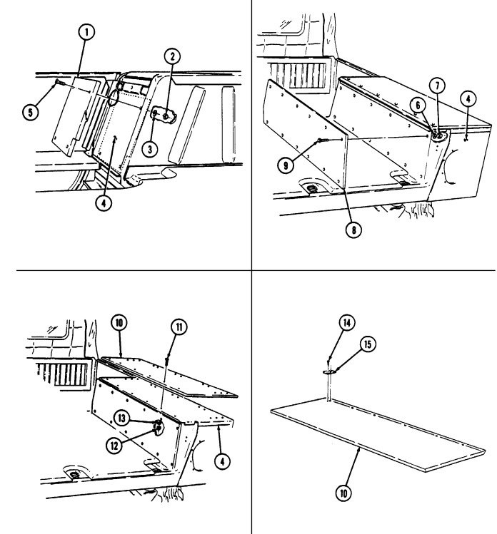

FOLLOW-ON TASK:  Install troop seat (para. 12-126).

# 12-121. Troop/Cargo Winterization Door Adjustment

This task covers:
Adjustment INITIAL SETUP:

| INITIAL SETUP:                  |                     |
|---------------------------------|---------------------|
| Applicable Models               | Equipment Condition |
| M1152, M1152A1                  |                     |
| Tools                           | (para. 4\-68).      |
| General mechanic's tool kit:    | Maintenance Level   |
| automotive (Appendix B, Item 1) | Unit                |
| Manual References               |                     |
| TM 9\-2320\-387\-10             |                     |

#### Adjustment Note

- Adjustment of door and frame assembly may be required if door is not centered or binds during opening or closing.

- Ensure door has an equal distance around frame assembly in both vertical and horizontal directions.

- For vertical or horizontal door adjustment, perform step 1. - For lateral door adjustment, perform steps 2 and 3. - For dome light on/off adjustment, perform steps 4 through 10.

1. Loosen eight nuts (14) and capscrews (11) from two hinges (2) and frame assembly (3) and lift or lower door (1) as required. Tighten nuts (14) to 85-90 lb-ft (115-122 N•m).

2. Remove eight locknuts (13) from door (1) and two hinges (2). Discard locknuts (13). 3. Add or remove shims (12) from door (1), as required. Install and tighten locknuts (13) to 50-55 lb-ft
(68-75 N•m).

4. Place dome light switch in DOME LIGHT position (TM 9-2320-280-10). 5. With door (1) in open position, loosen upper jamnut (6) and lower jamnut (7) to maximum outward position on control rod (8).

6. Close and fasten door (1). 7. Align rod (10) of actuator light control (9) with center of control arm (5) on door switch assembly (4). 8. Engage control arm (5) by adjusting lower jamnut (7) upward on control arm (5) and actuator light control (9) until dome lights are on.

9. Adjust lower jamnut (7) 0.25 in. (6.4 mm) beyond initial adjustment made in step 8.

10. Adjust upper jamnut (6) on control rod (8) down on actuator light control (9) and tighten jamnut (6).

12-121. TROOP/CARGO WINTERIZATION DOOR ADJUSTMENT (Cont'd)

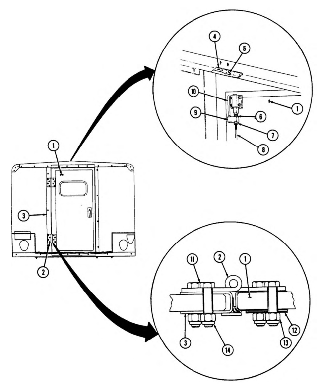

# 12-122. Troop/Cargo Winterization Door And Frame Assembly Replacement

This task covers:
INITIAL SETUP:
Applicable Models M1152, M1152A1 Tools General mechanic's tool kit:
automotive (Appendix B, Item 1)

#### Materials/Parts

Twelve locknuts (Appendix G, Item 101.6) Four locknuts (Appendix G, Item 101.10) Twelve locknuts (Appendix G, Item 133.12)

#### A. Removal B. Installation

Personnel Required One mechanic One assistant Manual References TM 9-2320-387-24P
Equipment Condition
•End closures removed (para. 12-123). •Rear step assembly removed (para. 12-127).

Maintenance Level Unit

#### A. Removal

1. Shut door (1) and close latch (2). 2. Remove eight nuts (6) capscrews (5), and shims (if installed) from two hinges (3) and frame assembly (4).

3. Open latch (2) and remove door (1) and two hinges (3) from frame assembly (4). 4. Remove two locknuts (17) and screws (15) from channel (9) and top enclosure plate support (16).

Discard locknuts (17).

5. Remove eight locknuts (21), screws (19), and washers (18) from channel (9) and top enclosure assembly (20). Discard locknuts (21).

6. Remove two locknuts (26), washers (27), and capscrews (22) from frame assembly (4), rear floor cover (30), cargo floor (29), and D-beam (28). Discard locknuts (26).

7. Remove two locknuts (25), washers (24), and screws (23) from frame assembly (4), rear floor cover (30), cargo floor (29), and D-beam (28). Discard locknuts (25).

8. Remove four locknuts (11), washers (12), capscrews (14), washers (13), and frame assembly (4) from support (10). Discard locknuts (11).

9. Remove two locknuts (35) and capscrews (34) from trailer mount bracket (36) and support (10).

Discard locknuts (35).

10. Remove four locknuts (31), washers (32), capscrews (33), and support (10) from D-beam (28).

Discard locknuts (31).

11. Remove four locknuts (8), capscrews (7), and frame assembly (4) from channel (9). Discard locknuts (8).

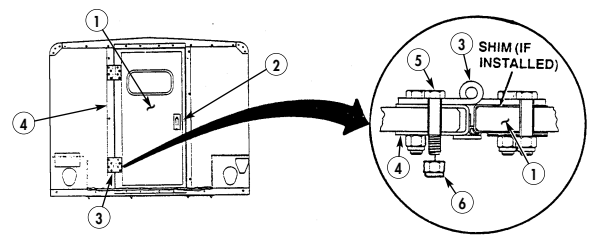 

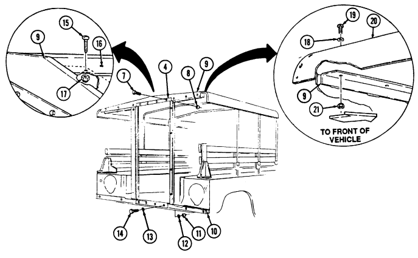

12-122.  TROOP/CARGO WINTERIZATION DOOR AND FRAME ASSEMBLY
REPLACEMENT (Cont'd)

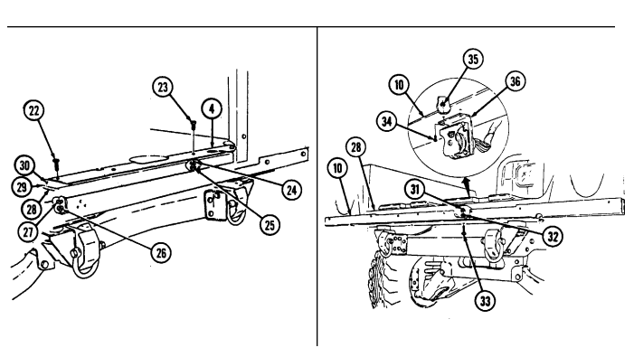

# 12-122. Troop/Cargo Winterization Door And Frame Assembly Replacement (Cont'D)

#### B. Installation

1. Install support (4) on D-beam (5) with four capscrews (3), washers (2), and locknuts (1). 2. Install trailer mount bracket (8) on support (4) with two capscrews (6) and locknuts (7). 3. Install frame assembly (11) on channel (20) with four capscrews (18) and locknuts (19). 4. Install frame assembly (11) and channel (20) on support (4) with four washers (23), capscrews (24),
washers (22), and locknuts (21).

5. Install frame assembly (11) on rear floor cover (17), cargo floor (16), and D-beam (5) with two screws (10), washers (12), and locknuts (13).

6. Secure frame assembly (11) to rear floor cover (17), cargo floor (16), and D-beam (5) with two capscrews (9), washers (15), and locknuts (14).

7. Install channel (20) on top enclosure assembly (30) with eight washers (28), screws (29), and locknuts (31).

8. Install channel (20) on top enclosure plate support (26) with two screws (25) and locknuts (27).

Ensure shims are added as required.

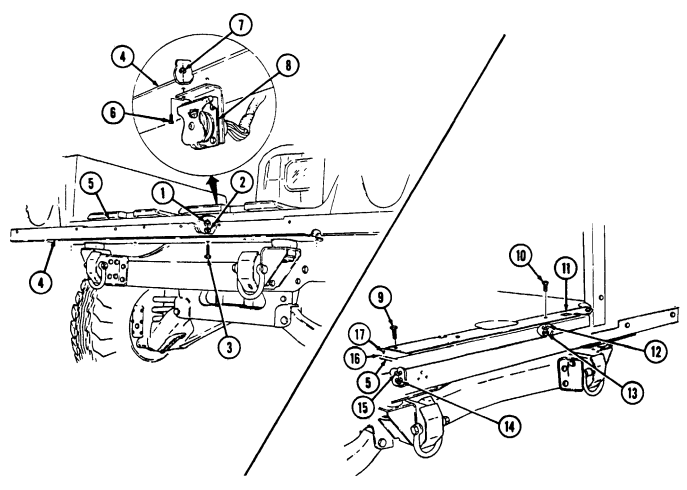

9. Install door (32) and two hinges (33) on frame assembly (11) with eight capscrews (34) and 
(35). Tighten nuts (35) to 85-90 lb-ft (115-122 N•m).

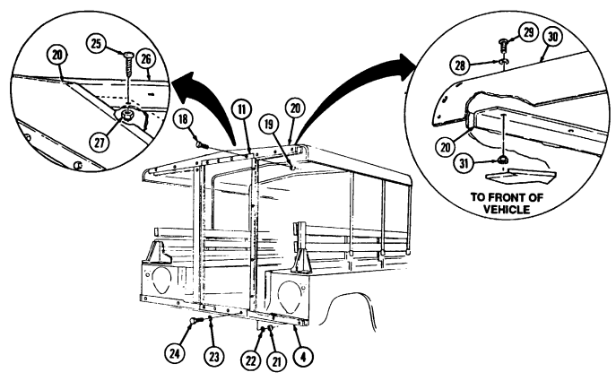

12-122.  TROOP/CARGO WINTERIZATION DOOR AND FRAME ASSEMBLY
REPLACEMENT (Cont'd)

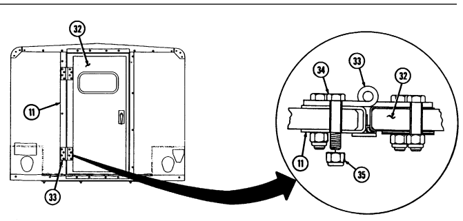

FOLLOW-ON TASKS: - Install rear step assembly (para. 12-127).

- Install end closures (para. 12-123).

- Adjust door (para. 12-121).

# 12-123. Troop/Cargo Winterization End Closure Replacement

This task covers:
INITIAL SETUP:
Applicable Models M1152, M1152A1 Tools General mechanic's tool kit:
automotive (Appendix B, Item 1)
Materials/Parts Twelve locknuts (Appendix G, Item 133.12)
Personnel Required One mechanic One assistant Manual References TM 9-2320-387-24P
a. Removal

#### Equipment Condition

•Rear reflector removed (para. 12-131). •Rear composite light housing removed para. 12-132).

•Handle assembly removed (right end closure only) (para. 12-128).

•Antenna mounting bracket removed 
(right end closure only) (para. 12-130).

•Fuel can mounting bracket removed 
(left end closure only) (para. 12-129).

•Blackout/dome light wiring harness removed (para. 12-110).

Maintenance Level Unit

Replacement procedures for left and right end closures are basically the same. This procedure covers right end closure.

1. Remove seven screws (1) and clamping strip (9) from top cover assembly (5), channel (10), and right end closure (6).

2. Remove three screws (2) and clamping strip (3) from top cover assembly (5), outside corner plate (4), and right end closure (6).

3. Remove eight screws (8) and clamping strip (7) from top cover assembly (5), and right end closure (6). 4. Remove screw (14) from clamping strip (15), top cover assembly (5) and right end closure (6). 5. Remove eight nuts (11), capscrews (13), clamping strip (15), and top cover assembly (5) from right

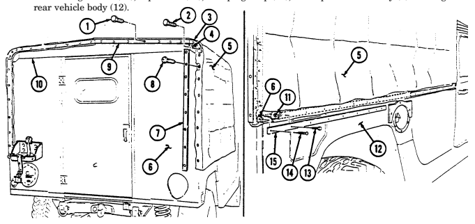

#### A. Removal B. Installation

# 12-123. Troop/Cargo Winterization End Closure Replacement (Cont'D)

8. Remove two locknuts (19) and capscrews (16) from right end closure (6) and channel (10). Discard locknuts (19).

9. Remove four locknuts (21) and capscrews (25) from right end closure (6) and door and frame assembly (20). Discard locknuts (21).

10. Remove two locknuts (23), capscrews (24), and right end closure (6) from support assembly (22).

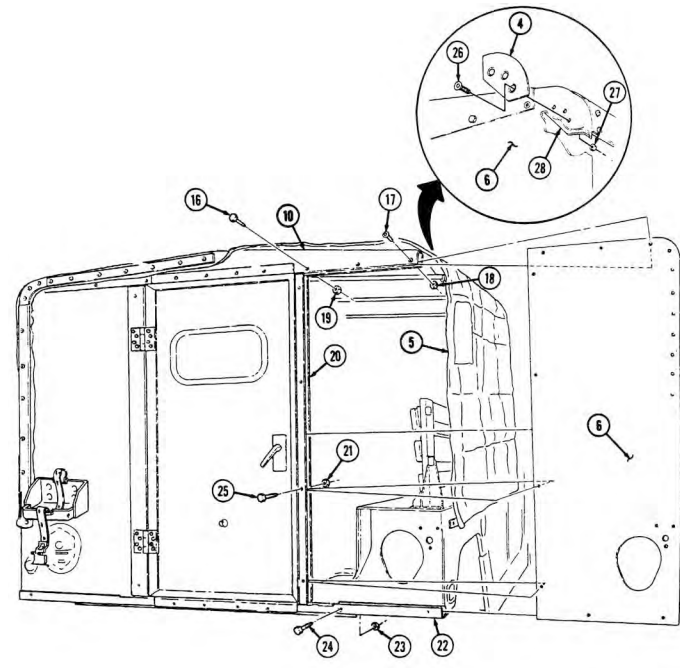

Discard locknuts (23).

6. Remove three locknuts (27), screws (26), and outside corner plate (4) from inside corner bracket (28), and right end closure (6). Discard locknuts (27).

7. Remove locknut (18) and screw (17) from right end closure (6) and channel (10). Discard locknut (18).

# 12-123. Troop/Cargo Winterization End Closure Replacement (Cont'D)

b. Installation

Ensure lower right corner of end closure is flush with support assembly.

1. Position right end closure (9) on support assembly (10), door and frame assembly (7), and channel (1).

2. Secure right end closure (9) to support assembly (10) with two capscrews (12) and locknuts (11). 3. Install right end closure (9) on door and frame assembly (7) with four capscrews (13) and locknuts (8).

4. Install right end closure (9) on channel (1) with two capscrews (2) and locknuts (5). 5. Secure right end closure (9) to channel (1) with screw (3) and locknut (4). 6. Install outside corner plate (14) on right end closure (9) and inside corner bracket (16) with three

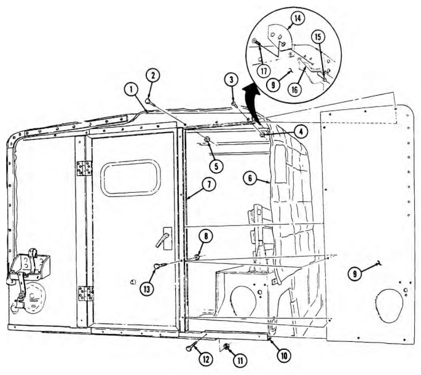

screws (17) and locknuts (15).

## 12-123. Troop/Cargo Winterization End Closure Replacement (Cont'D)

7. Install top cover assembly (6) on right rear vehicle body (19) with strip (22), eight capscrews (20),
and nuts (18).

8. Install top cover assembly (6) on right end closure (9) with strip (22) and screw (21). 9. Secure top cover assembly (6) to right end closure (9) with strip (26) and eight screws (27).

10. Install top cover assembly (6) on outside corner plate (14) and right end closure (9) with strip (25)
and three screws (24).

11. Install top cover assembly (6) on channel (1) and right end closure (9) with strip (28) and seven

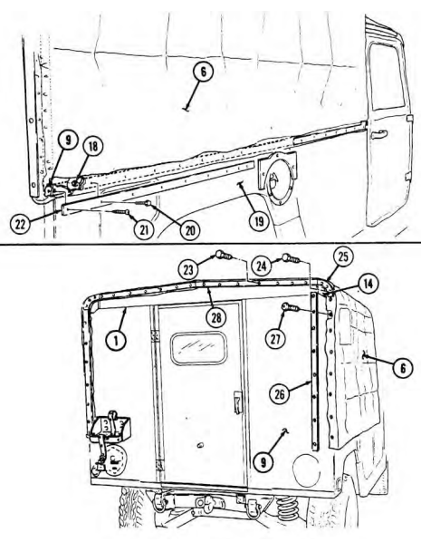

screws (23).

FOLLOW-ON TASKS: - Install blackout/dome light wiring harness (para. 12-110).

- Install fuel can mounting bracket (left end closure only) (para. 12-129). - Install antenna mounting bracket (right end closure only) (para. 12-130). - Install handle assembly (right end closure only) (para. 12-128). - Install rear composite light housing (para. 12-132). - Install rear reflector (para. 12-131).

# 12-124. Troop/Cargo Winterization Top Cover Assembly Replacement

This task covers:
a. Removal b. Installation

| INITIAL SETUP:                          |                                   |
|-----------------------------------------|-----------------------------------|
| Applicable Models                       | Manual References                 |
| M1152, M1152A1                          | TM 9\-2320\-387\-10               |
| Tools                                   | TM 9\-2320\-387\-24P              |
| General mechanic's tool kit:            | Equipment Condition               |
| automotive (Appendix B, Item 1)         | Battery ground cable disconnected |
| Materials/Parts                         | (para. 4\-68).                    |
| Four locknuts (Appendix G, Item 133.10) | Maintenance Level                 |
|                                         | Unit                              |
| a. Removal                              |                                   |

#### A. Removal

1. Remove nut (2) and capscrew (1) from clamping strip (16), top cover assembly (5), rubber strip (13),
and left rear fixed door (12).

5. Remove and discard rubber strip (13). 6. Remove nut (19) and capscrew (22) from clamping strip (23), top cover assembly (5), rubber strip (35), and right rear fixed door (24).

7. Remove six nuts (18), capscrews (25), and clamping strip (23) from top cover assembly (5), rubber strip (35), and right rear fixed door (24).

8. Remove three screws (26), spring nuts (17), (if damaged) and plate assembly (27) from top cover assembly (5), rubber strip (35), fuel tank filler (28), and right rear vehicle body (32).

9. Remove screw (31) from clamping strip (29), top cover assembly (5), rubber strip (35), and right end closure (33).

10. Remove eight nuts (34), capscrews (30), clamping strip (29), top cover assembly (5), and rubber strip (35) from right rear vehicle body (32). Discard rubber strip (35).

11. Remove sixteen screws (47), two clamping strips (46), and two rubber strips (44) from rear end closure assembly (45) and top cover (5). Discard rubber strips (44).

12. Remove six screws (36), two clamping strips (37), seals (43), and outside corner plates (42) from rear end closure assembly (45) and top cover (5). Discard seals (43).

13. Remove fourteen screws (39), two clamping strips (38), and rubber strips (41) from channel (40), top cover (5), and two rear end closure assemblies (45). Discard rubber strips (41).

14. Detach eight fastener straps (3) from bow assemblies (4). 15. Detach top cover assembly fastener strip (21) from cab top cover strip (20). 16. Remove top cover assembly (5).

2. Remove six nuts (14), capscrews (15), and clamping strip (16) from top cover assembly (5), rubber strip (13), and left rear fixed door (12).

3. Remove screw (9) from clamping strip (11), top cover assembly (5), rubber strip (13), and left end closure (7).

4. Remove ten nuts (6), capscrews (10), and clamping strip (11) from top cover assembly (5), rubber strip (13), and left rear vehicle body (8).

12-124.  TROOP/CARGO WINTERIZATION TOP COVER ASSEMBLY REPLACEMENT

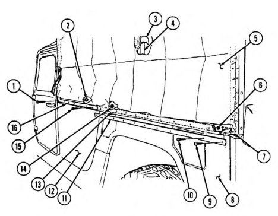

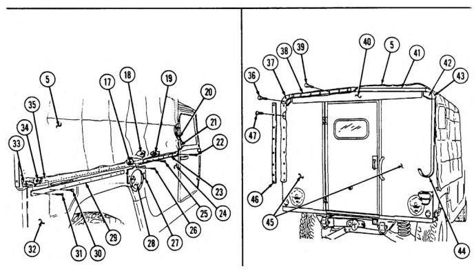

# 12-124. Troop/Cargo Winterization Top Cover Assembly Replacement (Cont'D)

b. Installation 1. Apply adhesive spray to channel (3) and mating surfaces of two rubber strips (2) and install rubber strips (2) on channel (3).

2. Apply adhesive spray to outside corner plates (4) and mating surfaces of two seals (1) and install seals (1) on outside corner plates (4).

3. Apply adhesive spray to two rear end closure assemblies (6) and mating surfaces of rubber strips (5) and install rubber strips (5) on rear end closure assembly (6).

4. Apply adhesive spray to right side of vehicle (8) and mating surface of rubber strip (7) and install rubber strip (7) on right side of vehicle (8).

5. Apply adhesive spray to left side of vehicle (10) and mating surface of rubber strip (9) and install rubber strip (9) on left side of vehicle (10).

6. Apply an even coat of sealant to two top enclosure assemblies (13), rear end closure assemblies (17),
corner edges (19), and other shaded areas.

7. Apply sealant to top enclosure assembly clamps (11), plates (14), and screws (12).

If raised edges or gaps exist around areas of outside corner plates and rear end closure assembly, fill with sealant.

8. Apply sealant to outside corner plates (15) and channel assembly (16). 9. Apply sealant to any open gaps on rear end closure assembly (17) and vehicle body (18).

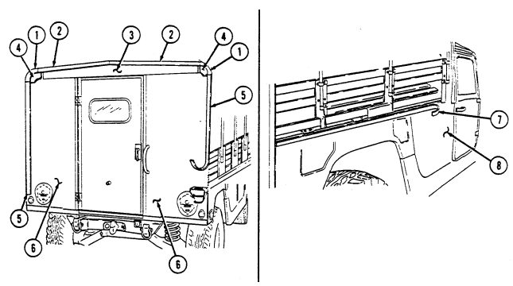

12-124.  TROOP/CARGO WINTERIZATION TOP COVER ASSEMBLY REPLACEMENT

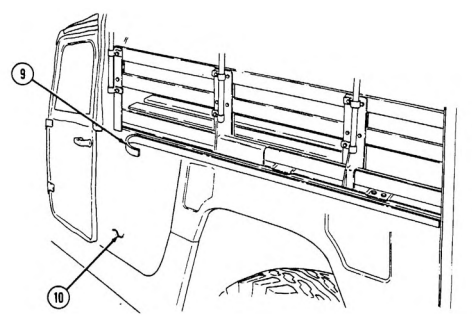

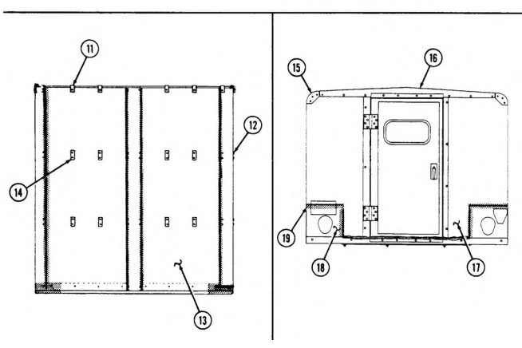

# 12-124. Troop/Cargo Winterization Top Cover Assembly Replacement (Cont'D)

When installing top cover assembly, ensure fastener straps are installed on inside of enclosure.

10. Center and install top cover assembly (6) over top enclosure assembly (7), rear end closure assemblies (13), and vehicle body (12).

11. Attach top cover assembly fastener strip (20) to cab top cover strip (19). 12. Install eight fastener straps (37) on bow assemblies (38).

Top cover assembly is oversized to allow for shrinkage for proper fit.

13. Install top cover assembly (6) and two clamping strips (3) on two rubber strips (8), channel (5), and rear end closure assemblies (13) with fourteen screws (4).

14. Install top cover assembly (6) and two clamping strips (2) on two seals (10), outside corner plates (9), and rear end closure assemblies (13) with six screws (1).

15. Install top cover assembly (6) and two clamping strips (14) on two rubber strips (11) and rear end closure assemblies (13) with sixteen screws (15).

16. Install top cover assembly (6) and clamping strip (28) on rubber strip (34) and right rear vehicle body (31) with eight capscrews (29) and nuts (33).

17. Secure top cover assembly (6) and clamping strip (28) to rubber strip (34) and right end closure (32)
with screw (30).

18. Install top cover assembly (6) and plate assembly (26) on rubber strip (34), fuel tank filler (27), and right rear vehicle body (31) with three screws (25) and spring nuts (16) (if removed).

19. Install top cover assembly (6) and clamping strip (22) on rubber strip (34) and right rear fixed door (23) with six capscrews (24) and nuts (17).

20. Secure top cover assembly (6) and clamping strip (22) to rubber strip (34) and right rear fixed door (23) with capscrew (21) and nut (18).

21. Install top cover assembly (6) and clamping strip (44) on rubber strip (46) and left rear vehicle body (41) with ten capscrews (43) and nuts (39).

22. Install top cover assembly (6) and clamping strip (44) on rubber strip (46) and left end closure (40)
with screw (42).

23. Install top cover assembly (6) and clamping strip (49) on rubber strip (46) and left rear fixed door (45) with six capscrews (48) and nuts (47).

24. Secure top cover assembly (6) and clamping strip (49) to rubber strip (46) and left rear fixed door (45) with capscrew (35) and nut (36).

12-124. TROOP/CARGO WINTERIZATION TOP COVER ASSEMBLY REPLACEMENT
(Cont'd)

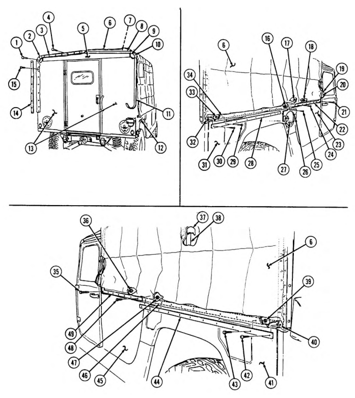

FOLLOW-ON TASK:  Install air intake assembly (para. 3-19).

# 12-125. Troop/Cargo Winterization Top Enclosure Assembly Replacement

This task covers:
a. Removal b. Installation INITIAL SETUP:

| Applicable Models               | Equipment Condition               |
|---------------------------------|-----------------------------------|
| M1152, M1152A1                  | Battery ground cable disconnected |
| Tools                           | (para. 4\-68).                    |
| General mechanic's tool kit:    | Maintenance Level                 |
| automotive (Appendix B, Item 1) | Unit                              |
| Manual References               |                                   |
| TM 9\-2320\-387\-10             |                                   |
| TM 9\-2320\-387\-24P            |                                   |

a. Removal 1. Remove safety caps (2) as required from top enclosure assembly mounting screws (1). 2. Remove six locknuts (9) and screws (5), and two outside plates (4) from inside corner brackets (6),
and end enclosures (8). Discard locknuts (9).

For installation, note size and location of inside corner bracket mounting screws.

3. Remove four locknuts (7) and screws (11) from two inside corner brackets (6) and supports (3).

Discard locknuts (7).

4. Remove four locknuts (10) and screws (12) from two inside corner brackets (6) and supports (3).

Discard locknuts (10).

5. Remove two locknuts (17) and screws (15) from plate (14), channel (13), and two supports (16).

Discard locknuts (17).

6. Remove eight locknuts (20), screws (19), and washers (18) from two supports (3) and channel (13).

Discard locknuts (20).

7. Remove sixteen nuts (38), screws (40), and eight clamps (39) from two supports (21), supports (3),
rear bow (24), and middle bow (23).

8. Remove four nuts (35), screws (37), clamps (36), two supports (21), and supports (3) from front bow (22).

9. Remove sixteen nuts (31), screws (28), eight support plates (29), and clamps (30) from two supports (16), rear bow (24), and middle bow (23).

10. Remove six nuts (34), screws (32), and clamps (33) from two supports (16), plate (14), and front bow (22).

11. Remove eight nuts (27), screws (25), four clamps (26), two supports (16), and plate (14) from rear bow (24) and middle bow (23).

12-125. TROOP/CARGO WINTERIZATION TOP ENCLOSURE ASSEMBLY REPLACEMENT
(Cont'd)

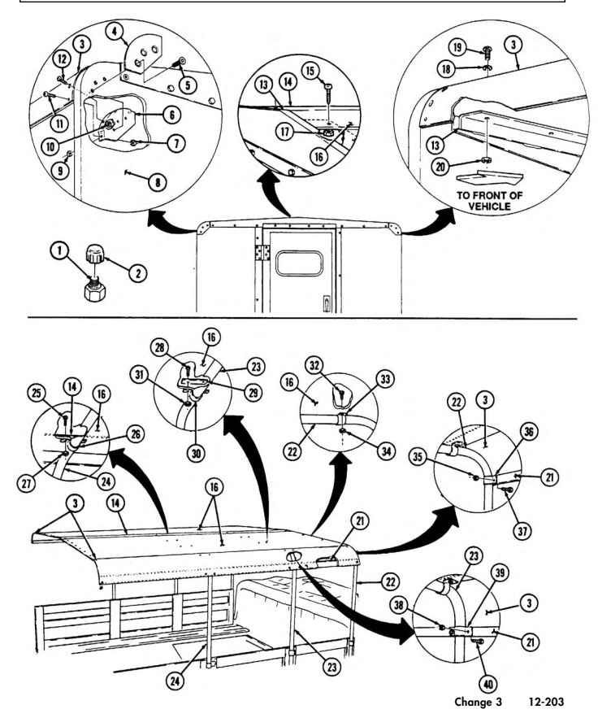

12-125. TROOP/CARGO WINTERIZATION TOP ENCLOSURE ASSEMBLY REPLACEMENT

# (Cont'D)

#### B. Installation

1. Install plate (2) and two supports (3) on front bow (5), middle bow (6), and rear bow (7) with four clamps (9), eight screws (8) and nuts (10).

2. Secure plate (2) and two supports (3) to front bow (5) with six clamps (16), screws (15), and nuts (17).

3. Install two supports (3) on rear bow (7) and middle bow (6) with eight clamps (13), support plates (12), sixteen screws (11), and nuts (14).

4. Install two supports (4) and supports (1) on front bow (5), middle bow (6), and rear bow (7) with four clamps (19), screws (20), and nuts (18).

5. Install two supports (4) and supports (1) on rear bow (7) and middle bow (6) with eight clamps (22),
sixteen screws (23), and nuts (21).

6. Install two supports (1) on channel (33) with eight washers (36), screws (37), and locknuts (38). 7. Install plate (2) on channel (33) and two supports (16) with two screws (34) and locknuts (35). 8. Install two outside plates (24) and inside corner brackets (26) on two end closures (28) with six screws (25) and locknuts (29).

9. Install two inside corner brackets (26) on two supports (1) with four screws (32) and locknuts (30).

10. Secure two inside corner brackets (26) to two supports (1) with four screws (31) and locknuts (27). 11. Apply adhesive to exposed threads of top enclosure assembly mounting screws (39) and install safety caps (40) on screws (39) as required.

12-125. TROOP/CARGO WINTERIZATION TOP ENCLOSURE ASSEMBLY REPLACEMENT
(Cont'd)

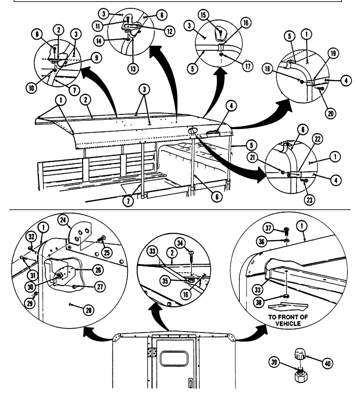

FOLLOW-ON TASK:  Install top cover assembly (para. 12-124).

# 12-126. Troop/Cargo Winterization Troop Seat Assembly And Bow Replacement

This task covers:
a. Removal b. Installation INITIAL SETUP:

| Applicable Models                       | Equipment Condition                        |
|-----------------------------------------|--------------------------------------------|
| M1152, M1152A1                          | - Heater base assembly removed             |
| Tools                                   | (para. 12\-103).                           |
|                                         | - Heater wiring harness removed            |
| General mechanic's tool kit:            | (para. 12\-106).                           |
| automotive (Appendix B, Item 1)         | - Circuit breaker removed (para. 12\-108). |
| Materials/Parts                         | - Skid strips removed (para. 12\-116).     |
| Four locknuts (Appendix G, Item 101.10) | - Side wheelhousing covers removed         |
| Six platenuts (Appendix G, Item 247.1)  | (para. 12\-120).                           |
| Nine rivnuts (Appendix G, Item 272.1)   | Maintenance Level                          |

Replacement procedures for left and right troop seat assemblies are basically the same. This procedure covers left troop seat assembly.

#### A. Removal

1. Remove plate (1) from front bow (20). 2. Remove front bow (20), middle bow (2), and rear bow (3) from troop seat assembly (9). 3. Remove six locknuts (11), washers (10), capscrews (13), and washers (12) from troop seat assembly (9) and wheelhousing (14). Discard locknuts (11).

4. Remove three locknuts (25), washers (26), capscrews (28), and washers (27) from rear corner troop seat bracket (29) and wheelhousing (14). Discard locknuts (25).

5. Remove two locknuts (24), washers (23), and capscrews (21) from front wheelhousing bracket (22)
and wheelhousing (14). Discard locknuts (24).

6. Remove troop seat assembly (9) from wheelhousing (14) and support assembly (16). 7. Remove three locknuts (19), washers (18), and capscrews (15) from support assembly (16) and B-pillar (17). Discard locknuts (19).

8. Remove two locknuts (8), washers (7), screws (5), and block (6) from cargo bulkhead (4).

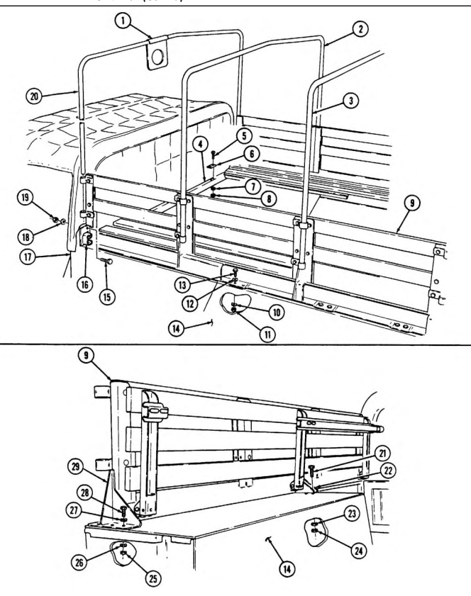

12-126.  TROOP/CARGO WINTERIZATION TROOP SEAT ASSEMBLY AND BOW
 

# 12-126. Troop/Cargo Winterization Troop Seat Assembly And Bow Replacement (Cont'D)

b. Installation 1. Install block (6) on cargo bulkhead (4) with two screws (5), washers (7), and locknuts (8).

NOTE
Support assembly must be installed with narrow offset to outside of vehicle and rounded side up.

2. Install support assembly (16) on B-pillar (17) with three capscrews (15), washers (18), and locknuts (19).

3. Install troop seat assembly (9), folded in stowed position, into support assembly (16) and on wheelhousing (14).

4. Install front wheelhousing bracket (22) on wheelhousing (14) with two capscrews (21), washers (23),
and locknuts (24). Tighten locknuts (24) to 49 lb-ft (66 N•m).

5. Install rear corner troop seat bracket (29) on wheelhousing (14) with three washers (27),
capscrews (28), washers (26), and locknuts (25). Tighten locknuts (25) to 96 lb-in. (11 N•m).

6. Install troop seat assembly (9) on wheelhousing (14) with six washers (12), capscrews (13),
washers (10), and locknuts (11). Tighten locknuts (11) to 96 lb-in. (11 N•m).

7. Install front bow (20), middle bow (2), and rear bow (3) on slots on outside of troop seat assembly (9).

8. Install plate (1) on front bow (20).

12-126.  TROOP/CARGO WINTERIZATION TROOP SEAT ASSEMBLY AND BOW
 

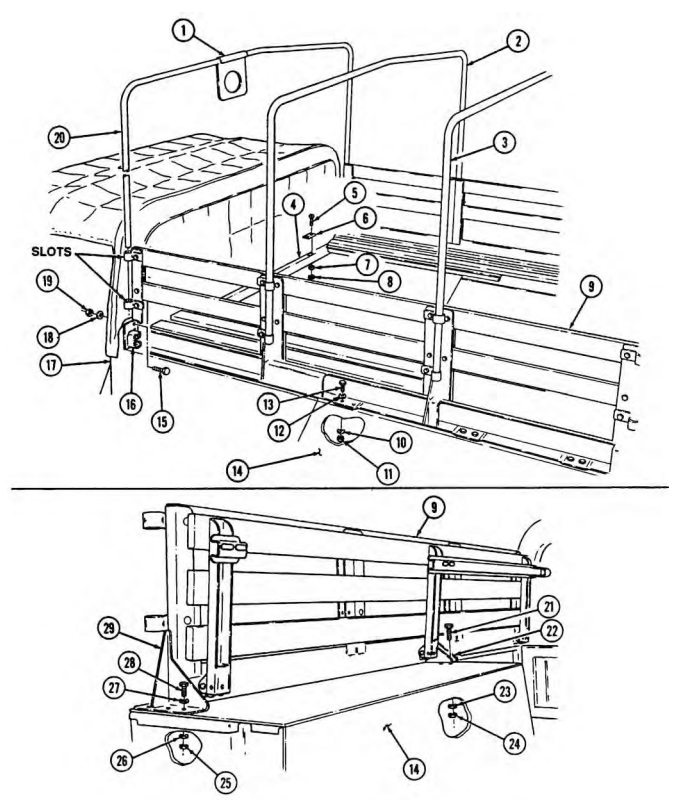

FOLLOW-ON TASK:  Install top enclosure assembly (para. 12-125).

# 12-127. Troop/Cargo Winterization Rear Step Assembly Replacement

| INITIAL SETUP:               |
|------------------------------|
| Applicable Models            |
| M1152, M1152A1               |
| Tools                        |
| General mechanic's tool kit: |

| This task covers:   |
|---------------------|

INITIAL SETUP:

a. Removal b. Installation

| Manual References                      |
|----------------------------------------|
| TM 9\-2320\-387\-24P                   |
| Equipment Condition                    |
| Floor bracket removed (para. 12\-104). |
| Maintenance Level                      |

a. Removal 1. Remove two cotter pins (7), clevis pins (6), and step assembly (5) from door and frame assembly (4).

Discard cotter pins (7).

2. Remove two screws (1) and step latch strip (2) from cargo floor cover (3).

b. Installation 1. Install step latch strip (2) on cargo floor cover (3) with two screws (1). 2. Install step assembly (5) on door and frame assembly (4) with two clevis pins (6) and cotter pins (7).

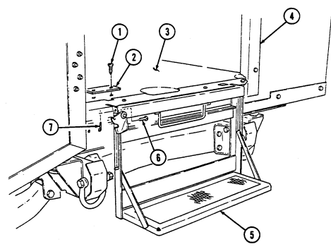

# 12-128. Troop/Cargo Winterization Handle Assembly Replacement

This task covers:

| Applicable Models               |
|---------------------------------|
| M1152, M1152A1                  |
| Tools                           |
| General mechanic's tool kit:    |
| automotive (Appendix B, Item 1) |

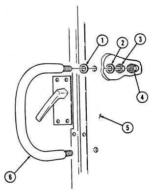

INITIAL SETUP:

a. Removal b. Installation

#### A. Removal

| Materials/Parts                         |
|-----------------------------------------|
| Four locknuts (Appendix G, Item 101.10) |
| Manual References                       |
| TM 9\-2320\-387\-24P                    |
| Maintenance Level                       |
| Unit                                    |

Remove two safety caps (4), locknuts (3), washers (2), handle assembly (6) and two washers (1) from right end closure (5). Discard locknuts (3).

#### B. Installation

1. Install two washers (1) and handle assembly (6) on right end closure (5) with two washers (2) and locknuts (3).

2. Apply adhesive to exposed threads of handle assembly (6) and install two safety caps (4) on handle assembly (6).

# 12-129. Troop/Cargo Winterization Fuel Can Mounting Bracket Replacement

| This task covers:               |                      |
|---------------------------------|----------------------|
| a.  Removal                     | b.  Installation     |
| INITIAL SETUP:                  |                      |
| Applicable Models               | Manual References    |
| M1152, M1152A1                  | TM 9\-2320\-387\-24P |
| Tools                           | Maintenance Level    |
| General mechanic's tool kit:    | Unit                 |
| automotive (Appendix B, Item 1) |                      |
| Materials/Parts                 |                      |

a. Removal 1. Remove two locknuts (1), plate (2), and two capscrews (4) from fuel can mounting bracket (5) and left end closure (7). Discard locknuts (1).

2. Remove two locknuts (10), washers (9), capscrews (6), and fuel can mounting bracket (5) from left end closure (7). Discard locknuts (10).

3. Remove two spacers (8) from lower mounting holes (3) in left end closure (7).

#### B. Installation

1. Install two spacers (8) in lower mounting holes (3) in left end closure (7). 2. Install fuel can mounting bracket (5) on left end closure (7) with two capscrews (6), washers (9), and locknuts (10).

3. Secure fuel can mounting bracket (5) and plate (2) to left end closure (7) with two capscrews (4) and locknuts (1).

4. Tighten two locknuts (1) and locknuts (10) to 34 lb-ft (46 N•m).

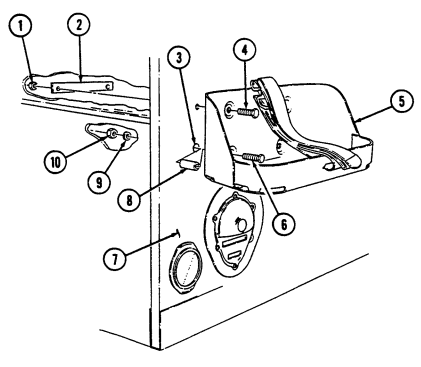

# 12-130. Troop/Cargo Winterization Antenna Mounting Bracket Replacement

This task covers:

|       | M1152, M1152A1   |
|-------|------------------|
| Tools |                  |

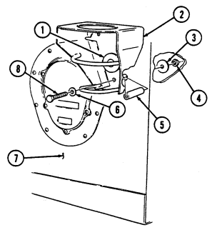

INITIAL SETUP:
Applicable Models General mechanic's tool kit:
automotive (Appendix B, Item 1)
Materials/Parts Three locknuts (Appendix G, Item 133.15)

#### A. Removal

| Materials/Parts                         |
|-----------------------------------------|
| Four locknuts (Appendix G, Item 101.10) |
| Manual References                       |
| TM 9\-2320\-387\-24P                    |
| Maintenance Level                       |
| Unit                                    |

1. Remove three locknuts (4), washers (3), capscrews (8), washers (6), and antenna mounting bracket (2) from right end closure (7). Discard locknuts (4).

2. Remove three spacers (5) from right end closure (7). 3. Remove grommet (1) from antenna mounting bracket (2).

b. Installation 1. Install grommet (1) on antenna mounting bracket (2). 2. Install three spacers (5) on right end closure (7). 3. Install antenna mounting bracket (2) on right end closure (7) with three washers (6), capscrews (8),
washers (3), and locknuts (4). Tighten locknuts (4) to 15 lb-ft (20 N•m).

FOLLOW-ON TASKS: - Install AS 1729/VRC antenna (para. 12-21) (if removed).

- Install AB-652/GR antenna (para. 12-23) (if removed).

a. Removal b. Installation

# 12-131. Troop/Cargo Winterization Rear Reflector Replacement

This task covers:

a. Removal b. Installation

INITIAL SETUP:

| M1152, M1152A1   |
|------------------|
| Tools            |

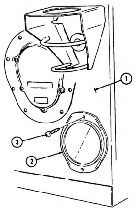

Applicable Models General mechanic's tool kit:
automotive (Appendix B, Item 1)

| Manual References    |
|----------------------|
| TM 9\-2320\-387\-24P |
| Equipment Condition  |

Replacement procedures for left and right rear reflectors are basically the same. This procedure covers right rear reflector.

a. Removal Remove two screws (3) and reflector (2) from right end closure (1).

b. Installation Install reflector (2) on right end closure (1) with two screws (3).

# 12-132. Troop/Cargo Winterization Rear Composite Light Housing Replacement

This task covers:
INITIAL SETUP:
Applicable Models M1152, M1152A1

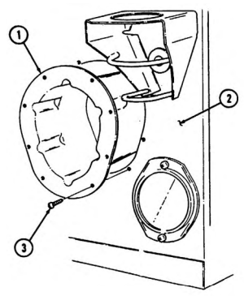

General mechanic's tool kit:
automotive (Appendix B, Item 1)

| Personnel Required   |
|----------------------|
| One mechanic         |
| One assistant        |
| Manual References    |
| TM 9\-2320\-387\-10  |
| TM 9\-2320\-387\-24P |
| Maintenance Level    |

a. Removal b. Installation

Replacement procedures for left and right rear composite light housings are basically the same. This procedure covers right rear composite light housing.

a. Removal Remove eight screws (3) and rear composite light housing (1) from right end closure (2).

b. Installation Install rear composite light housing (1) on right end closure (2) with eight screws (3).

FOLLOW-ON TASK: Install rear composite light housing (para. 4-57).

# 12-133. Troop/Cargo Winterization Data Plate Replacement

This task covers:

| Applicable Models               |
|---------------------------------|
| M1152, M1152A1                  |
| Tools                           |
| General mechanic's tool kit:    |
| automotive (Appendix B, Item 1) |

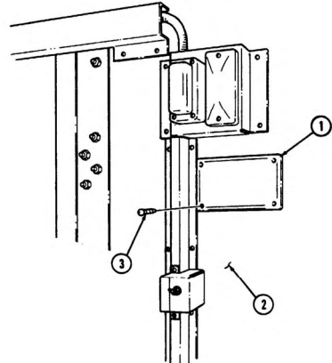

INITIAL SETUP:

a. Removal b. Installation

a. Removal

| Personnel Required   |
|----------------------|
| One mechanic         |
| One assistant        |
| Manual References    |

Remove four screws (3) and data plate (1) from left end closure (2).

b. Installation Install data plate (1) on left end closure (2) with four screws (3).

# Section Ix. Gunner'S Restraint Kit Maintenance

## 12-134. **Gunner'S Restraint Kit Maintenance Task Summary**

| INITIAL SETUP:                  |                      |
|---------------------------------|----------------------|
| Applicable Models               | Personnel Required   |
| M1152, M1152A1                  | One mechanic         |
| Tools                           | One assistant        |
| General mechanic's tool kit:    | Manual References    |
| automotive (Appendix B, Item 1) | TM 9\-2320\-387\-24P |
| Materials/Parts                 | Equipment Condition  |

# 12-135. Gunner'S Restraint Turret Brackets Replacement

This task covers:

a. Removal b. Installation

| Applicable Models                    | Personnel Required                              |
|--------------------------------------|-------------------------------------------------|
| M1152, M1152A1                       | One mechanic                                    |
| Tools                                | One assistant                                   |
| General mechanic's tool kit:         | Manual References                               |
| automotive (Appendix B, Item 1)      | TM 9\-2320\-387\-24P                            |
| Materials/Parts                      | Equipment Condition                             |
| Nine locknuts (Appendix G, Item 105) | Top enclosure assembly removed (para. 12\-125). |

#### A. Removal

1. Remove gunner's sling (5), capscrew (4), washer (3), and bracket (2) from turret (1). 2. Remove capscrew (6), washer (7), and gunner's sling hook (8) from turret (1).

b. Installation 1. Apply sealing compound to threads of capscrews (6) and (4). 2. Install gunner's sling hook (8) on turret (1) with washer (7) and capscrew (6). Tighten capscrew (6)
to 37 lb-ft (50 N•m).

3. Install gunner's sling (5) and bracket (2) on turret (1) with washer (3) and capscrew (4). Tighten capscrew (4) to 37 lb-ft (50 N•m).

12-135. GUNNER'S RESTRAINT TURRET BRACKETS REPLACEMENT (Cont'd)

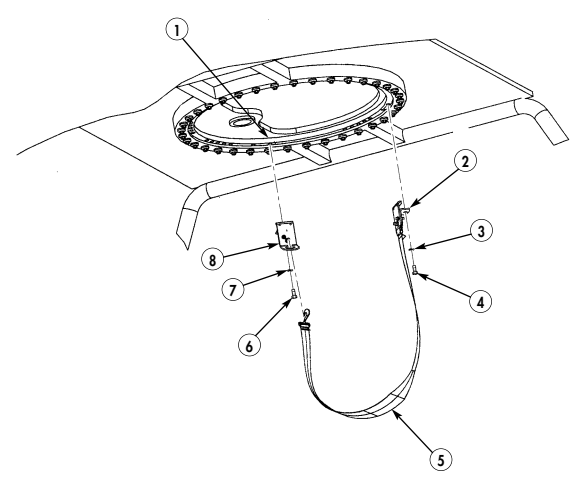

# 12-136. Gunner'S Restraint Lower Retractor And Mounting Plate Maintenance (M1151, M1151A1)

This task covers:
b. Inspection

| General mechanic's tool kit:    |
|---------------------------------|
| automotive (Appendix B, Item 1) |

Applicable Models General mechanic's tool kit:
automotive (Appendix B, Item 1)
Maintenance and repair shop equipment:
automotive (Appendix B, Item 2)
a. Removal **c. Installation**
a. Removal

| Manual References   |
|---------------------|
| Maintenance Level   |
| Unit                |

1. Remove two capscrews (5), washers (4), and lower retractor (3) from mounting plate (1). 2. Remove five capscrews (2), mounting plate (1), and spacers (7) from crossmember (6).

b. Inspection Refer to para. 10-56 for nut insert inspection and replacement. c. Installation

#### Caution

Use grade 5 torque value when installing capscrews into nut inserts. Failure to do so may damage equipment or connectors.

1. Install five spacers (7) and mounting plate (1) on crossmember (6) with five capscrews (2). 2. Install lower retractor (3) on mounting plate (1) with two washers (4) and capscrews (5). Tighten capscrews (5) to 26 lb-ft (35 N•m).

12-136.  GUNNER'S RESTRAINT LOWER RETRACTOR AND MOUNTING PLATE
 

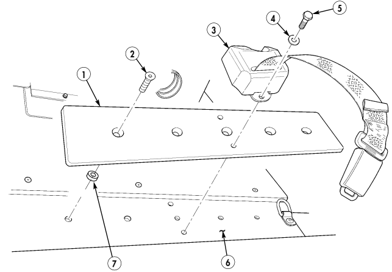

# 12-137. Gunner'S Restraint Lower Retractor Assembly Maintenance (M1114)

This task covers:
b. Inspection

a. Removal **c. Installation**

| Tools                           |                      |
|---------------------------------|----------------------|
| General mechanic's tool kit:    | Manual References    |
| automotive (Appendix B, Item 1) | TM 9\-2320\-387\-24P |
|                                 | Maintenance Level    |
|                                 | Unit                 |
| a. Removal                      |                      |

a. Removal 1. Remove four capscrews (14), washers (13), spacers (6), and adjustable gunner's platform (1) from armor plate (5).

2. Remove two capscrews (2), four washers (3), and lower retractor (4) from armor plate (5). 3. Remove eight capscrews (12) from armor plate (5). 4. Remove two capscrews (11), washers (10), armor plate (5), support bar (7) and two spacers (9) from vehicle floor (8).

b. Inspection Refer to para. 10-56 for nut insert inspection and replacement.

c. Installation

#### Caution

Use grade 5 torque value when installing capscrews into nut inserts. Failure to do so may damage equipment or components.

1. Install support bar (7), armor plate (5), and two spacers (9) on floor (8) with two washers (10) and capscrews (11). Tighten rear most support bar capscrews (11) to 44 lb-ft (60 N•m).

2. Apply sealing compound to threads of eight capscrews (12). 3. Secure armor plate (5) to floor (8) with eight capscrews (12).

Install additional washers if lower retractor interferes with vehicle floor.

4. Install lower retractor (4) on armor plate (5) with four washers (3) and two capscrews (2).

Tighten capscrews (2) to 44 lb-ft (60 N•m).

5. Install gunner's platform (1) on armor plate (5) with four spacers (6), washers (13), and capscrews (14).

12-137.  GUNNER'S RESTRAINT LOWER RETRACTOR ASSEMBLY MAINTENANCE
 

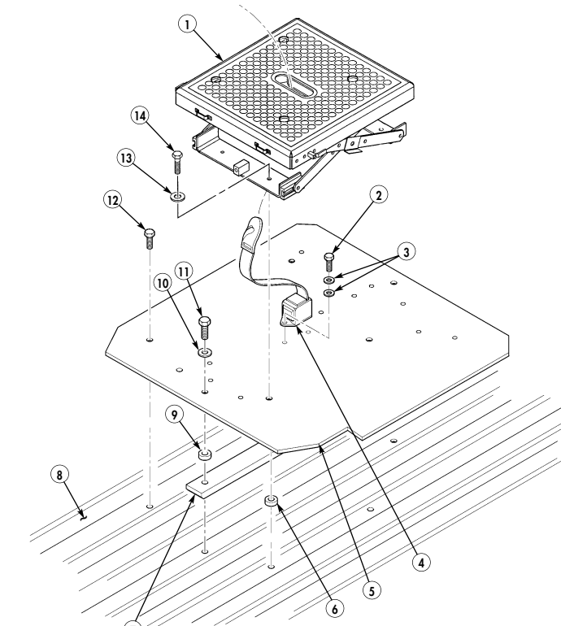

(7

# Section X. Automatic Fire Extinguishing System (Afes) Maintenance 12-138. Automatic Fire Extinguishing System (Afes) Maintenance Task Summary

| Applicable Models               | Materials/Parts                                                                                   | M1152, M1152A1                                                                                        | Four locknuts (Appendix G, Item 101.10)                                                                |
|---------------------------------|---------------------------------------------------------------------------------------------------|-------------------------------------------------------------------------------------------------------|--------------------------------------------------------------------------------------------------------|
| Tools                           | Manual References                                                                                 | General mechanic's tool kit:                                                                          | TM 9\-2320\-387\-24P                                                                                   |
| automotive (Appendix B, Item 1) | Maintenance Level                                                                                 |                                                                                                       |                                                                                                        |
| Unit                            |                                                                                                   |                                                                                                       |                                                                                                        |
| a.                              | Removal                                                                                           |                                                                                                       |                                                                                                        |
| 1.                              | Remove two locknuts (1), plate (2), and two capscrews (4) from fuel can mounting bracket (5) and  | left end closure (7). Discard locknuts (1).                                                           |                                                                                                        |
| 2.                              | Remove two locknuts (10), washers (9), capscrews (6), and fuel can mounting bracket (5) from left | end closure (7). Discard locknuts (10).                                                               |                                                                                                        |
| 3.                              | Remove two spacers (8) from lower mounting holes (3) in left end closure (7).                     |                                                                                                       |                                                                                                        |
| b. Installation                 |                                                                                                   |                                                                                                       |                                                                                                        |
| 1.                              | Install two spacers (8) in lower mounting holes (3) in left end closure (7).                      | 2.                                                                                                    | Install fuel can mounting bracket (5) on left end closure (7) with two capscrews (6), washers (9), and |
| locknuts (10).                  | 3.                                                                                                | Secure fuel can mounting bracket (5) and plate (2) to left end closure (7) with two capscrews (4) and |                                                                                                        |
| locknuts (1).                   | 4.                                                                                                | Tighten two locknuts (1) and locknuts (10) to 34 lb\-ft (46 N•m).                                     |                                                                                                        |

# 12-139. Automatic Fire Extinguishing System (Afes) Master Controller Assembly Replacement (Standard Radio Rack) (M1151A1, M1152A1, M1165A1, M1167)

This task covers:

Applicable Models M1151A1, M1152A1, M1165A1, M1167 Tools General mechanic's tool kit:
automotive (Appendix B, Item 1)

#### Materials/Parts

Two locknuts (Appendix G, Item 87) Locknut (Appendix G, Item 77) Four lockwashers (Appendix G, Item 158.2)

#### A. Removal **B. Installation**

| .   | D   |
|-----|-----|

| Equipment Condition   | •AS 1729/VRC antenna removed (para. 12\-   |
|-----------------------|--------------------------------------------|
| 21) (if installed).   | •AB\-652/GR antenna removed (para. 12\-23) |
| (if installed).       | Maintenance Level                          |
| Unit                  |                                            |

#### Warning

Ensure Automatic Fire Extinguishing System (AFES) anti-recoil device is installed in place of deflector valve. Failure to do so can result in discharge of liquid and powder agents which can cause injury to personnel.

#### A. Removal

1. Disconnect connector (7) from master controller plug (8). 2. Remove locknut (14), washer (15), capscrew (2), and washer (1) from radio rack (4). Discard locknut (14).

3. Remove two locknuts (6), washers (5), capscrews (3), and bracket (10) from radio rack (4). Discard locknuts (6).

4. Remove four capscrews (13), lockwashers (12), washers (11), and master controller (9) from bracket (10). Discard lockwashers (12).

#### B. Installation

1. Install master controller (9) on bracket (10) with four washers (11), lockwashers (12), and capscrews (13).

2. Install bracket (10) on radio rack (4) with two capscrews (3), washers (5), and locknuts (6). 3. Secure bracket (10) to radio rack (4) with capscrew (2), washer (1), washer (15), and locknut (14). 4. Connect connector (7) to master controller plug (8).

# 12-139. Automatic Fire Extinguishing System (Afes) (M1151A1, M1152A1, M1165A1, M1167) (Cont'D)

MASTER CONTROLLER ASSEMBLY REPLACEMENT (STANDARD RADIO RACK)

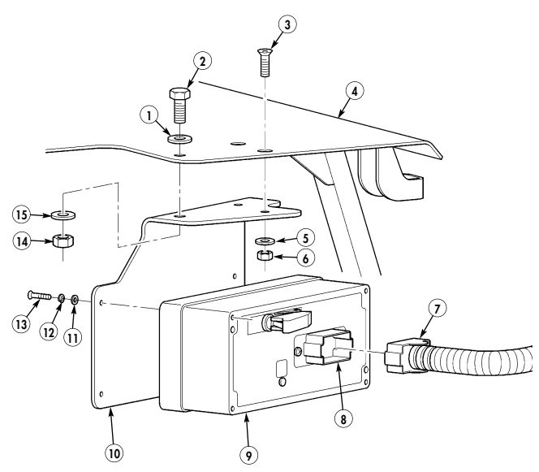

FOLLOW-ON TASK:  Connect battery ground cables (para. 4-68).

# 12-140. Automatic Fire Extinguishing System (Afes) Master Controller Assembly Replacement (Integrated Radio Rack) (M1151A1, M1152A1, M1165A1, M1167)

This task covers:

Applicable Models M1151A1, M1152A1, M1165A1, M1167 Tools General mechanic's tool kit:
automotive (Appendix B, Item 1)

#### Materials/Parts

Two locknuts (Appendix G, Item 82) Four lockwashers (Appendix G, Item 145)

a. Removal **b. Installation**

| TM 9\-2320\-387\-24P   |
|------------------------|
| Unit                   |
| Maintenance Level NOTE |

#### Warning

Ensure Automatic Fire Extinguishing System (AFES) anti-recoil device is installed in place of deflector valve. Failure to do so can result in discharge of liquid and powder agents which can cause injury to personnel.

#### A. Removal

1. Disconnect connector (1) from master controller plug (2). 2. Remove two locknuts (10), washers (8), capscrews (7), and bracket (11) from radio rack (9).

Discard locknuts (10).

3. Remove four capscrews (6), lockwashers (5), washers (4), and master controller (3) from bracket (11).

Discard lockwashers (5).

b. Installation 1. Install master controller (3) on bracket (11) with four washers (4), lockwashers (5), and capscrews (6).

2. Install bracket (11) on radio rack (9) with two washers (8), capscrews (7), and locknuts (10). 3. Connect connector (1) to master controller plug (2).

# 12-140. Automatic Fire Extinguishing System (Afes) Master Controller Assembly Replacement (Integrated Radio Rack) (M1151A1, M1152A1, M1165A1, M1167) (Cont'D)

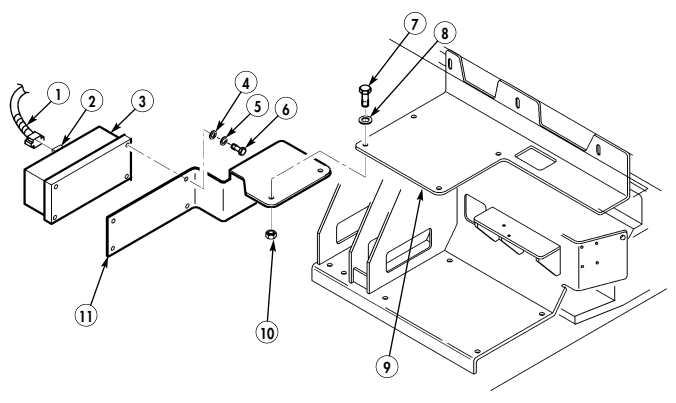

FOLLOW-ON TASK: Connect battery ground cables (para. 4-68).

# 12-141. Automatic Fire Extinguishing System (Afes) Control Module Assembly Replacement (M1114)

This task covers:

| M1152, M1152A1               | Tools                           |
|------------------------------|---------------------------------|
| General mechanic's tool kit: | automotive (Appendix B, Item 1) |

Materials/Parts Two locknuts (Appendix G, Item 77) Four lockwashers (Appendix G, Item 145)
a. Removal b. Installation Unit

| Manual References   | TM 9\-2320\-387\-24P                  |
|---------------------|---------------------------------------|
| Equipment Condition | Rear composite light assembly removed |
| (para. 4\-57).      | Maintenance Level                     |
| Unit                |                                       |

#### Warning

Ensure Automatic Fire Extinguishing System (AFES) anti-recoil device is installed in place of deflector valve. Failure to do so can result in discharge of liquid and powder agents which can cause injury to personnel.

#### A. Removal

1. Disconnect connector (1) from control module (2). 2. Remove two locknuts (9), washers (10), capscrews (8), washers (7), and bracket (3) from radio rack (11). Discard locknuts (9).

3. Remove four capscrews (4), lockwashers (5), washers (6), and control module (2) from bracket (3).

Discard lockwashers (5).

#### B. Installation

1. Install control module (2) on bracket (3) with four washers (6), lockwashers (5), and capscrews (4). 2. Install bracket (3) on radio rack (11) with two washers (7), capscrews (8), washers (10), and locknuts (9).

3. Connect connector (1) to control module (2).

# 12-141. Automatic Fire Extinguishing System (Afes) Control Module Assembly Replacement (M1114) (Cont'D)

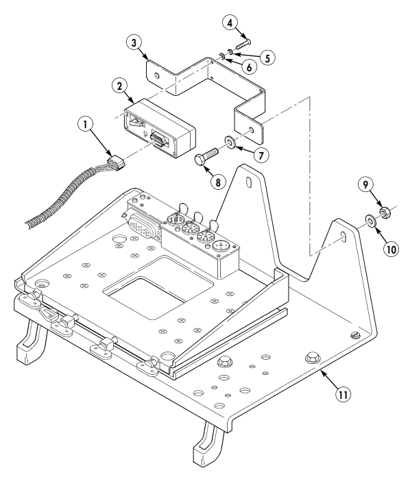

FOLLOW-ON TASK: Connect battery ground cables (para. 4-68).

# 12-142. Automatic Fire Extinguishing System (Afes) Sensor Assembly And B-Pillar Bracket Replacement (M1151A1, M1165A1, M1167)

This task covers:

Applicable Models M1151A1, M1165A1, M1167 Tools General mechanic's tool kit:
automotive (Appendix B, Item 1)
Materials/Parts Two locknuts (Appendix G, Item 106) Two lockwasher (Appendix G, Item 149)
Manual References TM 9-2320-387-24P
a. Removal **b. Installation**

#### Equipment Condition

- Battery ground cables disconnected (para. 4-68). - Upper seatbelt bracket removed (para. 10-47.1).

General Safety Instructions Ensure Automatic Fire Extinguishing System (AFES) anti-recoil device is installed in place of deflector valve.

Maintenance Level Unit

#### Warning

Ensure Automatic Fire Extinguishing System (AFES) anti-recoil device is installed in place of deflector valve. Failure to do so can result in discharge of liquid and powder agents which can cause injury to personnel.

Replacement procedures for left and right AFES sensor assemblies and B-pillar brackets are basically the same. This procedure covers the left AFES sensor assembly and B-pillar bracket.

#### A. Removal

1. Disconnect connector (13) and connector (15) from connector (11) and connector (14). 2. Remove two capscrews (10), lockwashers (9), washers (8), ground wire (7), and sensor (6) from B-pillar bracket (3). Discard lockwashers (9).

3. Remove two locknuts (5), washers (4), capscrews (1), washers (2), and bracket (3) from B-pillar (12).

Discard locknuts (4).

#### B. Installation

1. Install bracket (3) on B-pillar (12) with two washers (2), capscrews (1), washers (4), and locknuts (5). 2. Install sensor (6) on bracket (3) with ground wire (7), two washers (8), lockwashers (9), and capscrews (10).

3. Connect connector (13) and connector (15) to connector (11) and connector (14).

12-142. AUTOMATIC FIRE EXTINGUISHING SYSTEM (AFES) SENSOR ASSEMBLY AND
B-PILLAR BRACKET REPLACEMENT (M1151A1, M1165A1, M1167) (Cont'd)
■

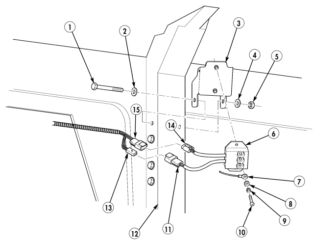

FOLLOW-ON TASKS: - Install upper seatbelt bracket (para. 10-47.1).

· Connect battery ground cables (para. 4-68).

# 12-143. Automatic Fire Extinguishing System (Afes) Crew Sensor Bracket Assembly Maintenance **(M1152A1)**

This task covers:
b. Inspection

| 1       |
|---------|
| M1152A1 |

Applicable Models Tools General mechanic's tool kit:
automotive (Appendix B, Item 1)
Materials/Parts Two lockwashers (Appendix G, Item 145) Four lockwashers (Appendix G, Item 135)
a. Removal c. Installation deflector valve.

| Unit   |
|--------|

Maintenance Level Unit

#### Warning

Ensure Automatic Fire Extinguishing System (AFES) anti-recoil device is installed in place of deflector valve. Failure to do so can result in discharge of liquid and powder agents which can cause injury to personnel.

#### A. Removal

1. Disconnect wiring harness connector (2) from sensor connector (18). 2. Disconnect sensor connector (11) from sensor connector (12). 3. Remove two capscrews (6), lockwashers (5), washers (4), ground wire (3), and sensor (9) from bracket
(10). Discard lockwashers (5).

4. Remove two capscrews (17), lockwashers (16), washers (15), ground wire (14), and sensor (13) from crew sensor bracket (10). Discard lockwashers (16).

5. Remove two capscrews (19), lockwashers (20), and crew sensor bracket (10) from roof reinforcement (1).

Discard lockwashers (20).

b. Inspection Ensure end-of-line device (7) is properly installed on connector (8).

c. Installation 1. Install crew sensor bracket (10) on roof reinforcement (1) with two lockwashers (20) and capscrews (19).

2. Install sensor (13) on crew sensor bracket (10) with ground wire (14), two washers (15),
lockwashers (16), and capscrews (17).

3. Install sensor (9) on crew sensor bracket (10) with ground wire (3), two washers (4), lockwashers (5),
and capscrews (6).

4. Connect sensor connector (11) to sensor connector (12). 5. Connect wiring harness connector (2) to sensor connector (18).

# 12-143. Automatic Fire Extinguishing System (Afes) Crew Sensor Bracket Assembly Maintenance (M1152A1) (Cont'D)

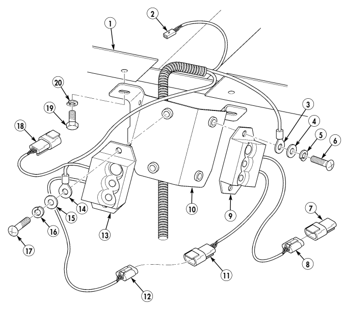

FOLLOW-ON TASK: Connect battery ground cables (para. 4-68).

# 12-144. Automatic Fire Extinguishing System (Afes) Bottle Replacement

This task covers:
a. Removal b. Installation

| TASK                               | PROCEDURES                                     | PAGE     | PARA.                                       | NO.                                             |
|------------------------------------|------------------------------------------------|----------|---------------------------------------------|-------------------------------------------------|
| 12\-135.                           | Gunner's Restraint Turret Brackets Replacement | 12\-218  | 12\-136.                                    | Gunner's Restraint Lower Retractor and Mounting |
| Plate Maintenance (M1151, M1151A1) | 12\-220                                        | 12\-137. | Gunner's Restraint Lower Retractor Assembly |                                                 |
| Maintenance (M1114)                | 12\-222                                        |          |                                             |                                                 |

#### Warning

Ensure Automatic Fire Extinguishing System (AFES) anti-recoil device is installed in place of deflector valve. Failure to do so can result in discharge of liquid and powder agents which can cause injury to personnel.

Replacement procedures for Automatic Fire Extinguishing System (AFES) bottles are the same for all vehicles. This procedure covers bottle replacement for the M1151A1 crew bottle.

#### A. Removal

1. Disconnect connector (11) from control valve (6). 2. Remove capscrew (1), lockwasher (2), and washer (3) from bottle discharge tube (4) and bottle bracket (8). Discard lockwasher (2).

#### Warning

Ensure control valve cap is installed in place of bottle discharge tube. Failure to do so can result in discharge of gas and powder under pressure which can damage skin.

3. Disconnect bottle discharge tube (4) from control valve (6). 4. Remove control valve cap (7) from bottle bracket (8) and install on control valve (6). 5. Remove two locknuts (10), open two clamps (9), and remove bottle (5) from bottle bracket (8).

Discard locknuts (10).

Perform step 6 if clamps are damaged.

6. Remove four cotter rings (13), pins (12), and two clamps (9) from automatic fire extinguishing bracket (8). Discard cotter rings (13).

b. Installation

Perform step 1 if clamps are to be replaced.

1. Install two clamps (9) on bottle bracket (8) with four pins (12) and cotter rings (13). 2. Install bottle (5) on bottle bracket (8) and close two clamps (9).

# 12-144. Automatic Fire Extinguishing System (Afes) Bottle Replacement (Cont'D)

3. Install two locknuts (10) on clamps (9). Do not tighten locknuts (10) at this time. 4. Remove control valve cap (7) from control valve (6) and connect bottle discharge tube (4) to control valve (6).

5. Install control valve cap (7) on bottle bracket (8).

#### Caution

Ensure bottle discharge tube moves freely after fitting has been secured and tightened. Failure to do so can cause the tube to rupture when system is fired.

6. Install bottle discharge tube (4) on bottle bracket (8) with washer (3), lockwasher (2), and capscrew
(1).

7. Connect connector (11) to control valve (6). 8. Tighten locknuts (10) installed in step 3.

4

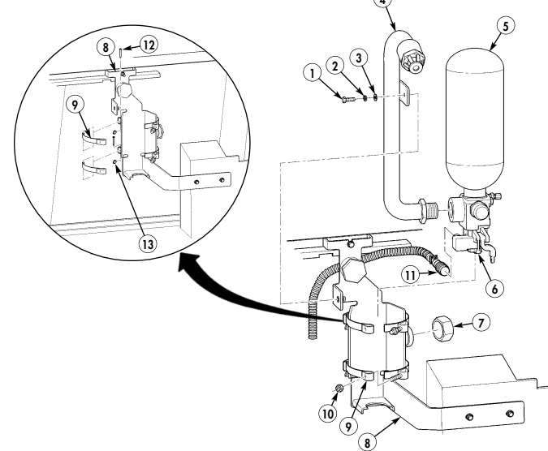

FOLLOW-ON TASK: Connect battery ground cables (para. 4-68).

# 12-144.1 Automatic Fire Extinguishing System (Afes) Crew Bottle Replacement

This task covers:

a. Removal b. Installation

| Maintenance Level   |
|---------------------|

| M1114, M1151, M1151A1                                                  | Sealing compound (Appendix C, Item 72.1)   |
|------------------------------------------------------------------------|--------------------------------------------|
| Tools                                                                  | Manual References                          |
| General mechanic's tool kit:                                           | TM 9\-2320\-387\-24P                       |
| automotive (Appendix B, Item 1) Maintenance and repair shop equipment: | Maintenance Level                          |
| automotive (Appendix B, Item 2)                                        | Unit                                       |
| a. Removal                                                             |                                            |

Unit

#### Warning

Ensure Automatic Fire Extinguishing System (AFES) anti-recoil device is installed in place of deflector valve. Failure to do so can result in discharge of liquid and powder agents which can cause injury to personnel.

#### A. Removal

1. Disconnect connector (9) from control valve (8). 2. Remove deflector valve (10) from bottle (1) and replace with anti-recoil device (6). 3. Remove two locknuts (2) and open two clamps (3) on crew bottle bracket (7). Discard locknuts (2). 4. Remove bottle (1) from bracket (7).

Perform step 5 if clamps are damaged.

5. Remove four cotter rings (5), pins (4), and two clamps (3) from bracket (7). Discard cotter rings (5).

b. Installation

Perform step 1 if clamps are to be replaced.

1. Install two clamps (3) on bracket (7) with four pins (4) and cotter rings (5).

Ensure the discharge valve is facing center of windshield.

2. Install bottle (1) on bracket (7). 3. Close two clamps (3) on bracket (7) and secure with two locknuts (2). 4. Remove anti-recoil device (6) from bottle (1) and replace with deflector valve (10). 5. Connect connector (9) to control valve (8).

# 12-144.1 Automatic Fire Extinguishing System (Afes) Crew Bottle Replacement (Cont'D)

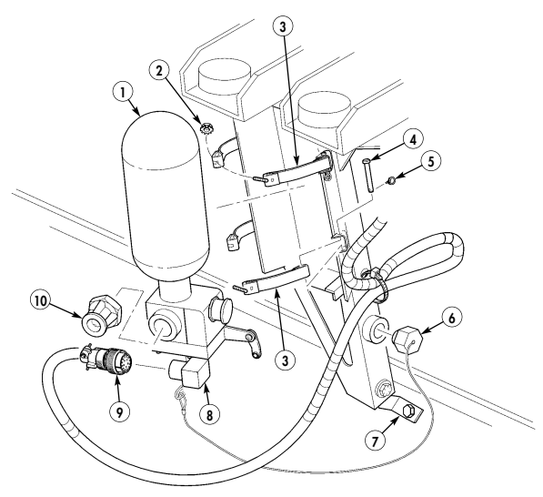

FOLLOW-ON TASK: Connect battery ground cables (para. 4-68).

# 12-145. Automatic Fire Extinguishing System (Afes) Crew Sensor Bracket Assembly Replacement **(M1114)**

This task covers:

a. Removal b. Installation

| Maintenance Level   |
|---------------------|

| Applicable Models                      | Manual References    |
|----------------------------------------|----------------------|
| M1151, M1151A1                         | TM 9\-2320\-387\-24P |
| Tools                                  | Maintenance Level    |
| General mechanic's tool kit:           | Unit                 |
| automotive (Appendix B, Item 1)        |                      |
| Maintenance and repair shop equipment: |                      |
| automotive (Appendix B, Item 2)        |                      |

Unit

#### Warning

Ensure Automatic Fire Extinguishing System (AFES) anti-recoil device is installed in place of deflector valve. Failure to do so can result in discharge of liquid and powder agents which can cause injury to personnel.

Replacement procedures for the left and right AFES sensor brackets are basically the same. This procedure covers the right AFES sensor bracket.

#### A. Removal

1. Remove tiedown straps (1), (2), and (4) from upper support (12). Discard tiedown straps (1), (2),
and (4).

2. Disconnect connector (3) and connector (16) from connector (15) and connector (14). 3. Remove two capscrews (6) and sensor (5) from bracket (7). 4. Remove clamp (13) from bracket (7) and upper support (12). 5. Remove capscrew (10), bracket (7), lockwasher (9), and washer (8) from body (11).

Discard lockwasher (9).

#### B. Installation

1. Install bracket (7) on body (11) with washer (8), lockwasher (9), and capscrew (10). 2. Secure bracket (7) to upper support (12) with clamp (13). 3. Install sensor (5) on bracket (7) with two capscrews (6). 4. Connect connector (3) and connector (16) to connector (15) and connector (14). 5. Secure harness (17) to upper support (12) with tiedown straps (1), (2), and (4).

# 12-145. Automatic Fire Extinguishing System (Afes) Crew Sensor Bracket Assembly Replacement (M1114) (Cont'D)

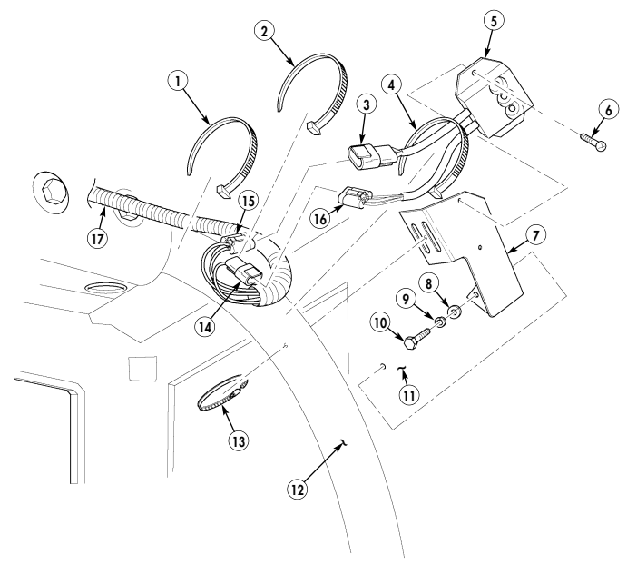

FOLLOW-ON TASK: Connect battery ground cables (para 4-68).

# 12-146. Automatic Fire Extinguishing System (Afes) Crew Bottle Bracket Assembly Maintenance (M1151A1, M1152A1, M1167)

This task covers:
b. Inspection

Applicable Models M1151A1, M1152A1 Tools General mechanic's tool kit:
automotive (Appendix B, Item 1)
Materials/Parts Locknut (Appendix G, Item 106) Two lockwashers (Appendix G, Item 135) Three lockwashers (Appendix G, Item 144)
Manual References TM 9-2320-387-24P
a. Removal c. Installation

#### Equipment Condition

- Battery ground cables disconnected (para. 4-68). - AFES bottle removed (para. 12-144). - Rear seatback removed (M1151A1 only) 
(para. 10-45).

General Safety Instructions Ensure Automatic Fire Extinguishing System (AFES) anti-recoil device is installed in place of deflector valve.

Maintenance Level Unit

#### Warning

Ensure Automatic Fire Extinguishing System (AFES) anti-recoil device is installed in place of deflector valve. Failure to do so can result in discharge of liquid and powder agents which can cause injury to personnel.

a. Removal

- Perform steps 1 and 2 for M1151A1. - Perform steps 3 and 4 for M1152A1.

1. Remove locknut (6), washer (5), capscrew (2), and washer (1) from crew bottle bracket (4) and C-partition (3). Discard locknut (6).

2. Remove two capscrews (9), lockwashers (8), washers (7), and crew bottle bracket (4) from C-partition (3). Discard lockwashers (8).

3. Remove capscrew (15), lockwasher (16), and washer (17) from crew bottle bracket (11) and vehicle floor (18). Discard lockwasher (16).

4. Remove two capscrews (14), lockwashers (13), washers (12), and crew bottle bracket (11) from interior closeout panel (10). Discard lockwashers (13).

b. Inspection Refer to para. 10-56 for nut insert inspection and replacement.

# 12-146. Automatic Fire Extinguishing System (Afes) Crew Bottle Bracket Assembly Maintenance (M1151A1, M1152A1, M1167) (Cont'D)

c. Installation

#### Caution

Use grade 5 torque value when installing capscrew into nut insert. Failure to do so may damage equipment or components.

NOTE
- Perform steps 1 and 2 for M1152A1. - Perform steps 3 and 4 for M1151A1.

1. Install crew bottle bracket (11) on interior closeout panel (10) with two washers (12),
lockwashers (13), and capscrews (14).

2. Secure crew bottle bracket (11) to vehicle floor (18) with washer (17), lockwasher (16), and capscrew (15).

3. Install crew bottle bracket (4) on C-partition (3) with two washers (7), lockwashers (8),
capscrews (9).

4. Secure crew bottle bracket (4) to C-partition (3) with washer (1), capscrew (2), washer (5), and locknut (6).

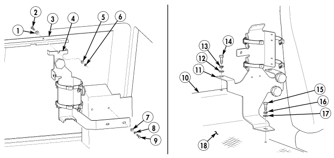

FOLLOW-ON TASKS: - Install rear seatback (M1151A1 only) (para. 10-45).

- Install AFES bottle (para. 12-144). •Connect battery ground cables (para. 4-68).

# 12-147. Automatic Fire Extinguishing System (Afes) Crew Bottle Bracket Assembly Replacement (M1114)

This task covers:

Applicable Models M1114 Tools General mechanic's tool kit:
automotive (Appendix B, Item 1)
Materials/Parts Three locknuts (Appendix G, Item 111) Tiedown strap (Appendix G, Item 145)
a. Removal

#### B. Installation

a. Removal b. Installation

#### Manual References

TM 9-2320-387-24P
Equipment Condition
- Battery ground cables disconnected (para. 4-68). - AFES bottle removed (para.12-144.1).

Maintenance Level Unit

Perform step 1 if wiring harness is secured to crew bottle bracket with tiedown strap.

1. Remove tiedown strap (3) from wiring harness (2) and crew bottle bracket (10).

Discard tiedown strap (3).

2. Remove locknut (6), washer (5), capscrew (8), washer (7), and two spacers (4) from C-partition (9)
and crew bottle bracket (10). Discard locknut (6).

3. Remove two locknuts (11), washers (12), and crew bottle bracket (10) from roof mounts (1).

Discard locknuts (11).

1. Install crew bottle bracket (10) on roof mounts (1) with two washers (12) and locknuts (11). 2. Secure crew bottle bracket (10) to C-partition (9) with two spacers (4), washer (7), capscrew (8),
washer (5), and locknut (6).

3. Secure wiring harness (2) to crew bottle bracket (10) with tiedown (3).

# 12-147. Automatic Fire Extinguishing System (Afes) Crew Bottle Bracket Assembly Replacement (M1114) (Cont'D)

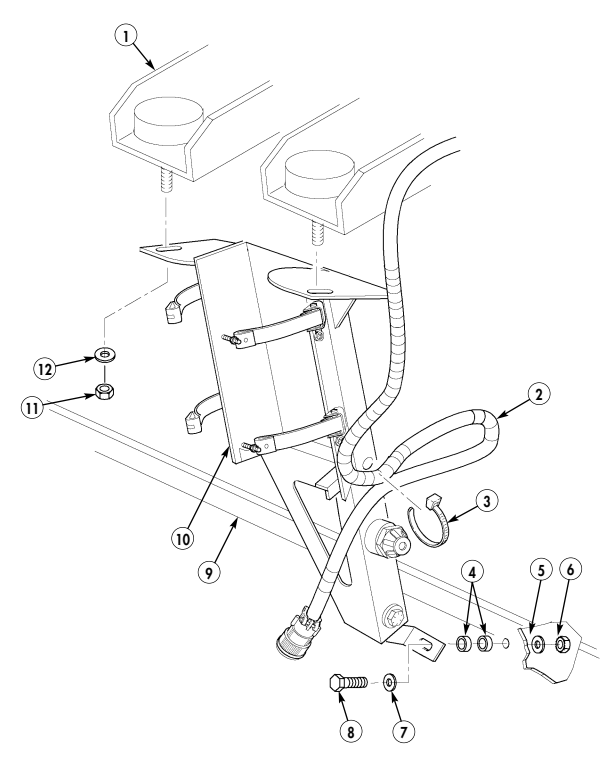

FOLLOW-ON TASKS:  - Install AFES bottle (para. 12-144.1).

· Connect battery ground cables (para. 4-68).

# 12-148. Automatic Fire Extinguishing System (Afes) Cargo Bottle Bracket Assembly Maintenance (M1151A1, M1167)

This task covers:
b. Inspection

Applicable Models M1151A1 Tools General mechanic's tool kit:
automotive (Appendix B, Item 1)
Torque wrench 3/8-in. drive, 75 lb-ft
(Appendix B, Item 2.1)
Materials/Parts Two lockwashers (Appendix G, Item 135) Lockwasher (Appendix G, Item 144) Two locknuts (Appendix G, Item 106)
a. Removal c. Installation

#### Manual References

TM 9-2320-387-24P

#### Equipment Condition

•Right rear seatback removed (para. 10-45). •AFES bottle removed (para. 12-144). •AFES cargo sensor disconnected (para. 12-150).

General Safety Instructions Ensure Automatic Fire Extinguishing System (AFES) anti-recoil device is installed in place of deflector valve.

Maintenance Level Unit

#### Warning

Ensure Automatic Fire Extinguishing System (AFES) anti-recoil device is installed in place of deflector valve. Failure to do so can result in discharge of liquid and powder agents which can cause injury to personnel.

#### A. Removal

1. Remove capscrew (5), lockwasher (4), and washer (3) from cargo bottle bracket (2) and C-partition (1). Discard lockwasher (4).

2. Remove two locknuts (7), washers (6), capscrews (10), lockwashers (9), washers (8), and cargo bottle bracket (2) from C-partition (1). Discard locknuts (7) and lockwashers (9).

b. Inspection Refer to para. 10-56 for nut insert inspection and replacement.

c. Installation 1. Install cargo bottle bracket (2) on C-partition (1) with two washers (8), lockwashers (9),
capscrews (10), washers (6), and locknuts (7). Tighten capscrews (10) to 44 lb-ft (60 N•m).

2. Secure cargo bottle bracket (2) to C-partition (1) with washer (3), lockwasher (4), and capscrew (5).

Tighten capscrew (5) to 31 lb-ft (42 N•m).

# 12-148. Automatic Fire Extinguishing System (Afes) Cargo Bottle Bracket Assembly Maintenance (M1151A1, M1167) (Cont'D)

■■

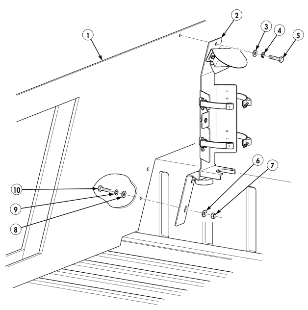

FOLLOW-ON TASKS: - Connect AFES cargo sensor (para. 12-150).

· Install AFES bottle (para. 12-144).

· Install right rear seatback (para. 10-45).

# 12-149. Automatic Fire Extinguishing System (Afes) Cargo Bottle Bracket Assembly Replacement (M1114)

This task covers:

#### Initial Setup: A. Removal B. Installation

| INITIAL SETUP:                         |                                          |
|----------------------------------------|------------------------------------------|
| Applicable Models                      | Materials/Parts                          |
| M1114                                  | Sealing compound (Appendix C, Item 72.1) |
| Tools                                  | Manual References                        |
| General mechanic's tool kit:           | TM 9\-2320\-387\-24P                     |
| automotive (Appendix B, Item 1)        |                                          |
| Maintenance and repair shop equipment: | Maintenance Level                        |
| automotive (Appendix B, Item 2)        | Unit                                     |

#### A. Removal

1. Remove locknut (8), washer (9), capscrew (2), and washer (3) from cargo bottle bracket (10) and C-partition (1). Discard locknut (8).

2. Remove three locknuts (6), washers (7), capscrews (4), washers (5) and cargo bottle bracket (10) from C-partition (1). Discard locknuts (6).

b. Installation 1. Install cargo bottle bracket (10) on C-partition (1) with three washers (5), capscrews (4), washers (7),
and locknuts (6).

2. Secure cargo bottle bracket (10) to C-partition (1) with washer (3), capscrew (2), washer (9), and locknut (8).

12-149. AUTOMATIC FIRE EXTINGUISHING SYSTEM (AFES) CARGO BOTTLE BRACKET

ASSEMBLY REPLACEMENT (M1114) (Cont'd)

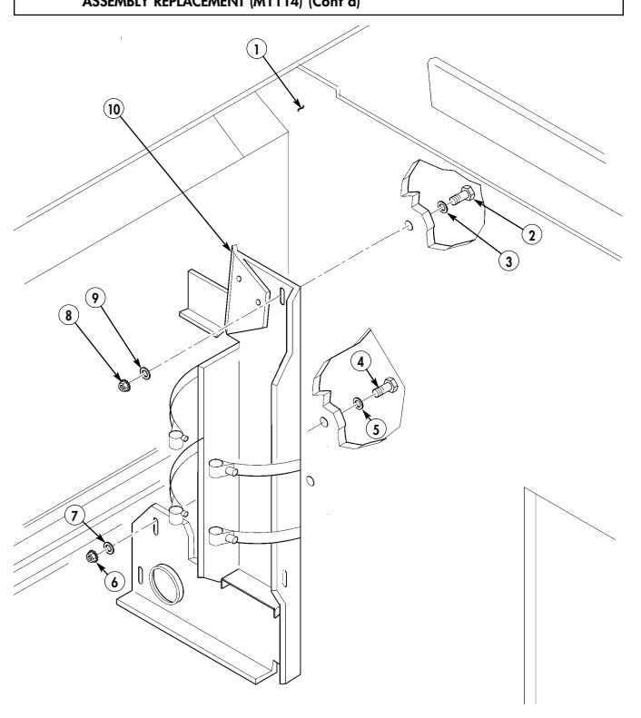

FOLLOW-ON TASKS: - Install AFES cargo sensor (para. 12-151).

- Install AFES bottle (para. 12-144.1). · Connect battery ground cables (para. 4-68).

# 12-150. Automatic Fire Extinguishing System (Afes) Cargo Sensor Assembly Maintenance (M1151A1, M1167)

This task covers:
b. Inspection

Applicable Models M1151A1, M1167 Tools General mechanic's tool kit:
automotive (Appendix B, Item 1)
Materials/Parts Two lockwashers (Appendix G, Item 149)
Manual References TM 9-2320-387-24P
a. Removal **c. Installation**

| Equipment Condition                                 |
|-----------------------------------------------------|
| Battery ground cables disconnected (para. 4\-68).   |
| General Safety Instructions                         |
| Ensure Automatic Fire Extinguishing System          |
| (AFES) anti\-recoil device is installed in place of |
| deflector valve.                                    |

| TVIAHUUHAHUU LAYU   |
|---------------------|
| Unit                |

Maintenance Level

#### Warning

Ensure Automatic Fire Extinguishing System (AFES) anti-recoil device is installed in place of deflector valve. Failure to do so can result in discharge of liquid and powder agents which can cause injury to personnel.

#### A. Removal

1. Disconnect connector (1) from connector (6). 2. Remove two capscrews (7), lockwashers (8), washers (9), ground wire (10), and sensor (3) from bracket (2). Discard lockwashers (8).

b. Inspection Ensure end-of-line device (5) is properly installed on connector (4).

c. Installation 1. Install sensor (3) on bracket (2) with ground wire (10), two washers (9), lockwashers (8), and capscrews (7).

2. Connect connector (6) to connector (1).

12-150. AUTOMATIC FIRE EXTINGUISHING SYSTEM (AFES) CARGO SENSOR ASSEMBLY
MAINTENANCE (M1151A1, M1167) (Cont'd)
■

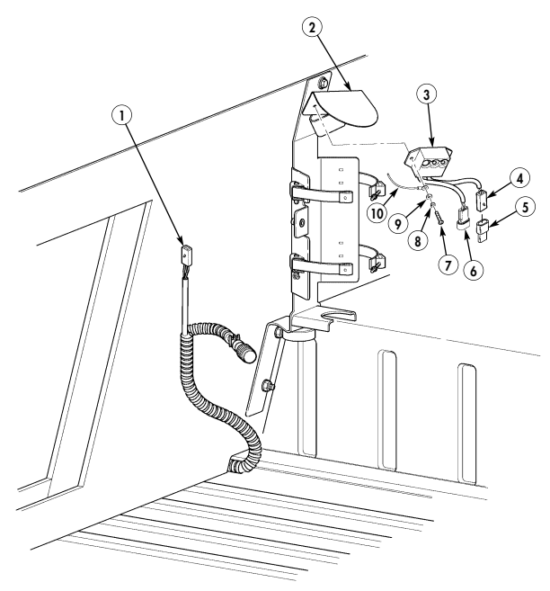

FOLLOW-ON TASK: Connect battery ground cables (para. 4-68).

12-151. AUTOMATIC FIRE EXTINGUISHING SYSTEM (AFES) CARGO SENSOR ASSEMBLY

# Maintenance **(M1114)**

This task covers:
b. Inspection

Applicable Models M1114 Tools General mechanics tool kit:
automotive (Appendix B, Item 1)
Manual References TM 9-2320-387-24P
a. Removal c. Installation Equipment Condition Battery ground cables disconnected (para. 4-68).

General Safety Instructions Ensure Automatic Fire Extinguishing System (AFES) anti-recoil device is installed in place of deflector valve.

Maintenance Level Unit

#### Warning

Ensure Automatic Fire Extinguishing System (AFES) anti-recoil device is installed in place of deflector valve. Failure to do so can result in discharge of liquid and powder agents which can cause injury to personnel.

a. Removal 1. Disconnect connector (1) from connector (7). 2. Remove two capscrews (4) and sensor (2) from bracket (3).

b. Inspection Ensure end-of-line device (6) is properly installed on connector (5).

c. Installation 1. Install sensor (2) on bracket (3) with two capscrews (4). 2. Connect connector (7) to connector (1).

12-151. AUTOMATIC FIRE EXTINGUISHING SYSTEM (AFES) CARGO SENSOR ASSEMBLY

# Maintenance (M1114) (Cont'D)

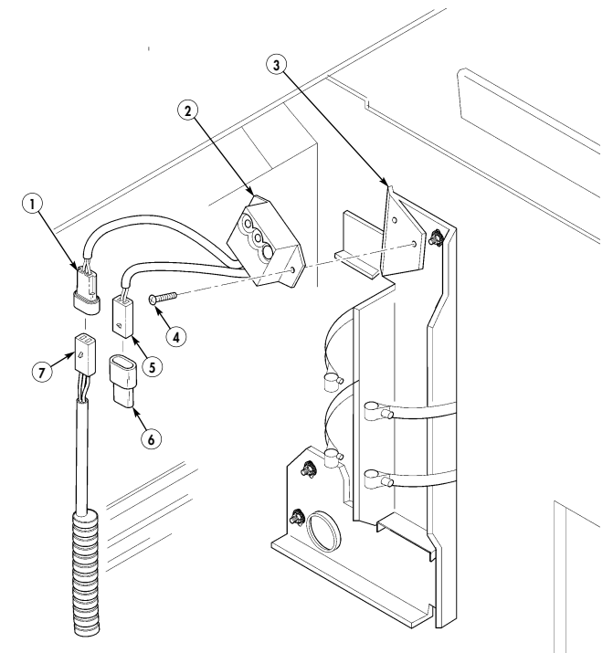

FOLLOW-ON TASK: Connect battery ground cables (para. 4-68).

# 12-152. Automatic Fire Extinguishing System (Afes) Wiring Harness Replacement (M1151A1, M1165A1, M1167)

This task covers:

Applicable Models M1151A1, M1165A1, M1167 Tools General mechanic's tool kit:
automotive (Appendix B, Item 1)
Materials/Parts Seven tiedown straps (Appendix G, Item 145) Four lockwashers (Appendix G, Item 135) Five locknut washer assemblies 
(Appendix G, Item 82)
Three lockwashers (Appendix G, Item 172)
Manual References TM 9-2320-387-24P

#### A. Removal **B. Installation** Equipment Condition

- Tunnel top insulation removed (para. 11-97). - Companion seat and battery box cover removed
(para. 10-43).

- Cargo access panel removed (para. 4-43). - Right rear seat back armor removed 
(Appendix J, J-28).

- Left rear seat back armor removed 
(Appendix J, J-29).

#### General Safety Instructions

Ensure Automatic Fire Extinguishing System (AFES) anti-recoil device is installed in place of deflector valve.

Maintenance Level Unit

#### Warning

Ensure Automatic Fire Extinguishing System (AFES) anti-recoil device is installed in place of deflector valve. Failure to do so can result in discharge of liquid and powder agents which can cause injury to personnel.

#### A. Removal

1. Disconnect connector (10) from master controller (1). 2. Remove four tiedown straps (4) from wiring harness (3) and radio rack (2). Discard tiedown straps (4). 3. Remove three capscrews (7) and lockwashers (8) from radio rack support (9) and position support (9)
out of way. Discard lockwashers (8).

4. Remove two capscrews (5) from insulation retainer rod (6). 5. Remove nut (12), capscrew (20), negative battery cable (19), and AFES wiring negative terminal (18)
from negative battery terminal (11).

6. Remove nut (14), capscrew (17), positive battery cable (16), and AFES wiring positive terminal (15)
from positive battery terminal (13).

7. Pull wiring harness (3) through battery box access hole (21).

12-152. AUTOMATIC FIRE EXTINGUISHING SYSTEM (AFES) WIRING HARNESS
REPLACEMENT (M1151A1, M1165A1, M1167) (Cont'd)
■

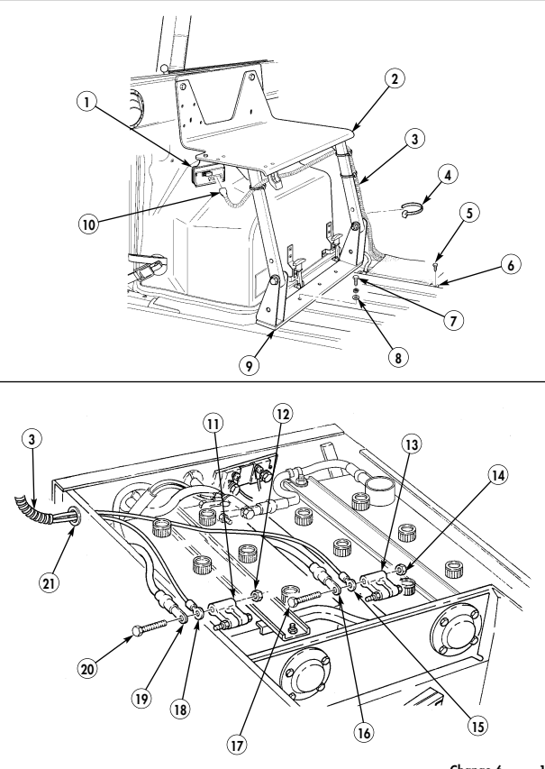

Change 6

## 12-152. Automatic Fire Extinguishing System (Afes) Wiring Harness Replacement (M1151A1, M1165A1, M1167) (Cont'D)

7. Disconnect AFES wiring harness J11 connector (4) from circuit 2 connector (2). 8. Disconnect AFES wiring harness J12 connector (3) from circuit 29T connector (1). 9. Remove three tiedown straps (6) from AFES wiring harness (7) and A/C wiring harness (5). Discard tiedown straps (6).

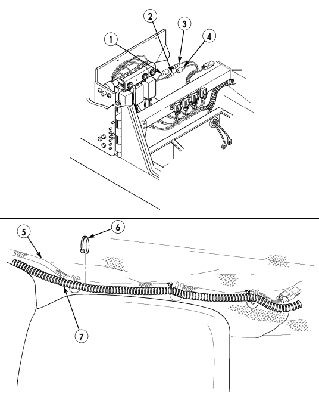

## 12-152. Automatic Fire Extinguishing System (Afes) Wiring Harness Replacement (M1151A1, M1165A1, M1167) (Cont'D)

10. Disconnect AFES wiring harness J3 and J4 connectors (12) from passenger side B-pillar sensor (17). 11. Remove capscrew (8), lockwasher (9), washer (10), and ground wire (11) from B-pillar sensor (17).

Discard lockwasher (9).

12. Remove three locknut washer assemblies (16), clamps (13), and J3/J4 leg of AFES wiring harness (14)
from passenger side roof (15). Discard locknut washer assemblies (16).

13. Disconnect AFES wiring harness J8 connector (18) from P34 control valve connector (19).

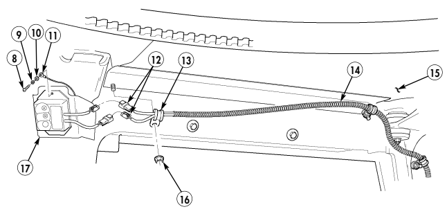

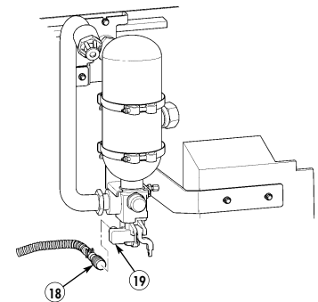

## 12-152. Automatic Fire Extinguishing System (Afes) Wiring Harness Replacement (M1151A1, M1165A1, M1167) (Cont'D)

14. Disconnect AFES wiring harness J5 connector (1) from cargo sensor (2). 15. Remove capscrew (3), lockwasher (4), washer (5), and ground wire (6) from cargo sensor (2). Discard lockwasher (4).

16. Pull J5 leg of AFES wiring harness (8) through ballistic wall access hole (7) into crew compartment. 17. Remove two locknut washer assemblies (10) and clamps (11) from excess wiring harness (9).

Discard locknut washer assemblies (10).

18. Disconnect AFES wiring harness J9 connector (13) from PO9 control valve connector (12).

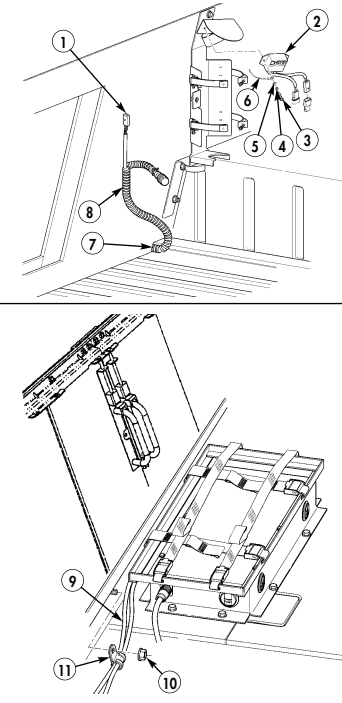

# 12-152. Automatic Fire Extinguishing System (Afes) Wiring Harness Replacement (M1151A1, M1165A1, M1167) (Cont'D)

19. Remove capscrew (14) and two AFES ground wires (16) from left side rear wheelwell (15). 20. Remove two locknut washer assemblies (18), clamps (20), tiedown (17), J6/J7 leg of AFES wiring harness (19), and AFES wiring harness (21) from driver side roof. Discard locknut washer assemblies (18) and tiedowns (17).

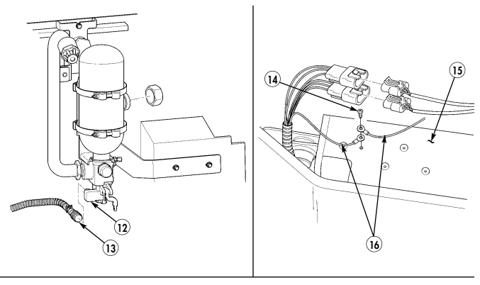

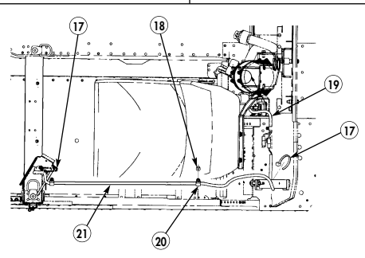

# 12-152. Automatic Fire Extinguishing System (Afes) Wiring Harness Replacement (M1151A1, M1165A1, M1167) (Cont'D)

#### B. Installation

1. Connect connector (12) to master controller (1). 2. Attach wiring harness (3) to radio rack (2) with four tiedown straps (4). 3. Route wiring harness (3) under insulation (5) and secure with insulation retainer rod (7) and two capscrews (6).

4. Secure radio rack support (11) with three lockwashers (10), washers (9), and capscrews (8). 5. Route wiring harness (3) through battery box access hole (23). 6. Install AFES wiring negative terminal (20) and negative battery cable (21) on negative battery terminal (13) with nut (14) and capscrew (22).

7. Install AFES wiring positive terminal (17) and positive battery cable (18) on positive battery terminal (15) with nut (16) and capscrew (19).

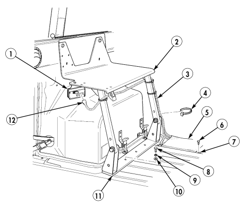

12-152. AUTOMATIC FIRE EXTINGUISHING SYSTEM (AFES) WIRING HARNESS
REPLACEMENT (M1151A1, M1165A1, M1167) (Cont'd)

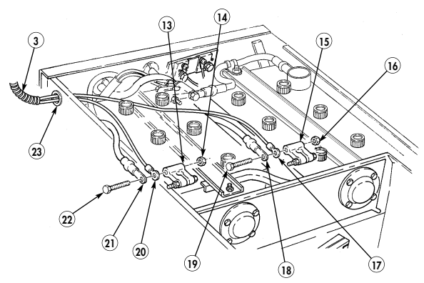

■

## 12-152. Automatic Fire Extinguishing System (Afes) Wiring Harness Replacement (M1151A1, M1165A1, M1167) (Cont'D)

8. Connect AFES wiring harness J11 connector (4) to circuit 2 connector (2). 9. Disconnect AFES wiring harness J12 connector (3) to circuit 29T connector (1).

10. Secure AFES wiring harness (7) to A/C wiring harness (5) with three tiedown straps (6).

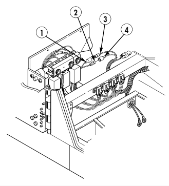

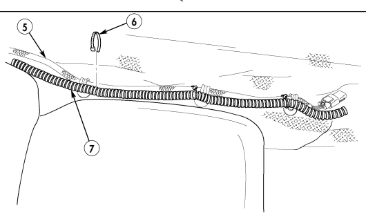

## 12-152. Automatic Fire Extinguishing System (Afes) Wiring Harness Replacement (M1151A1, M1165A1, M1167) (Cont'D)

11. Connect AFES wiring harness J3 and J4 connectors (12) to passenger side B-pillar sensor (17). 12. Install ground wire (11) on B-pillar sensor (17) with washer (10), lockwasher (9), and capscrew (8). 13. Secure J3/J4 leg of AFES wiring harness (14) to passenger side roof (15) with three clamps (13) and locknut washer assemblies (16).

14. Connect AFES wiring harness J8 connector (18) to P34 control valve connector (19).

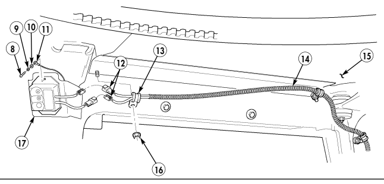

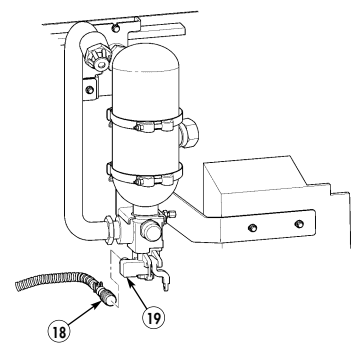

# 12-152. Automatic Fire Extinguishing System (Afes) Wiring Harness Replacement (M1151A1, M1165A1, M1167) (Cont'D)

Perform steps 15 through 19 for M1151A1 and M1167 vehicles only.

15. Route J5 leg of AFES wiring harness (8) through ballistic wall access hole (7) into cargo shell. 16. Connect AFES wiring harness J5 connector (1) to cargo sensor (2). 17. Install ground wire (6) on cargo sensor (2) with washer (5), lockwasher (4), and screw (3). 18. Connect AFES wiring harness J9 connector (13) on P09 control valve connector (12).

Perform step 20 for M1165A1 vehicles only.

19. Secure excess wiring harness (9) with two clamps (11) and locknut washer assemblies (10).

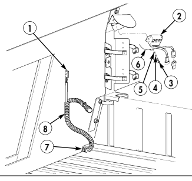

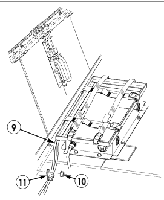

# 12-152. Automatic Fire Extinguishing System (Afes) Wiring Harness Replacement (M1151A1, M1165A1, M1167) (Cont'D)

Perform step 20 for M1151A1 and M1167 vehicles only.

20. Install two AFES ground wires (16) on left side rear wheelwell (15) with capscrew (14). 21. Install J6/J7 leg of AFES wiring harness (19) and AFES wiring harness (21) on driver's side roof with two tiedowns (17), clamps (20), and locknut washer assemblies (18).

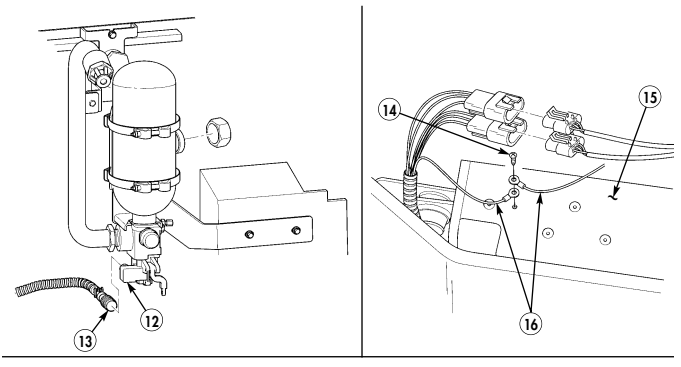

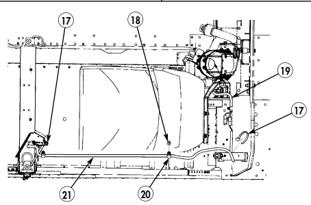

FOLLOW-ON TASKS: - Install left rear seatback armor (Appendix J, J-29).

- Install right rear seat back armor (Appendix J, J-28). - Install cargo access panel (para. 4-43). - Install companion seat and battery box cover (para. 10-43). - Install tunnel top insulation (para. 11-97).

# 12-153. Automatic Fire Extinguishing System (Afes) Wiring Harness Replacement (M1114)

This task covers:

Applicable Models M1114 Tools General mechanic's tool kit:
automotive (Appendix B, Item 1)

#### Materials/Parts

Tiedown straps (as required) 
(Appendix G, Item 323) 
Tiedown straps (as required) 
(Appendix G, Item 329.4) 
Four locknuts (Appendix G, Item 133.18) 

#### Equipment Condition

- Tunnel top insulation removed (para. 11-97). - Companion seat and battery box cover removed (para. 10-43).

#### A. Removal B. Installation Equipment Condition (Cont'D)

- Battery cables disconnected (para. 4-68). - Cargo access panel removed (para. 4-43). - Driver seat removed (para. 10-40). - Left rear seat removed (para. 10-45). - A/C coolant line covers removed (para. 25-32). - Access hole cover plate removed (para. 25-36).

#### Manual References

TM 9-2320-387-24P

#### General Safety Instructions

Ensure Automatic Fire Extinguishing System (AFES) anti-recoil device is installed in place of deflector valve.

Maintenance Level Unit

#### Warning

Ensure Automatic Fire Extinguishing System (AFES) anti-recoil device is installed in place of deflector valve. Failure to do so can result in discharge of liquid and powder agents which can cause injury to personnel.

- Tag and mark location of all wires prior to removal for ease of installation.

- Note location of all tiedown straps prior to removal for ease of installation.

- Cut and remove tiedown straps as necessary for removal of harness.

#### A. Removal

1. Disconnect connector (2) from master controller (1) 2. Remove nut (10), capscrew (18), AFES wiring harness connector (17), and negative battery cable (16)
from negative battery terminal (9) of rear battery (8).

3. Remove nut (12), capscrew (15), and AFES wiring harness connector (13) from positive battery terminal (14) of forward battery (11).

4. Route AFES wiring harness (5) through battery box access hole (7). 5. Disconnect two AFES wiring harness connectors (19) and (20) from vehicle harness connectors (6)
and (21).

6. Route AFES wiring harness (5) from radio rack (3) and from under tunnel insulation (4).

12-153. AUTOMATIC FIRE EXTINGUISHING SYSTEM (AFES) WIRING HARNESS
REPLACEMENT (M1114) (Cont'd)

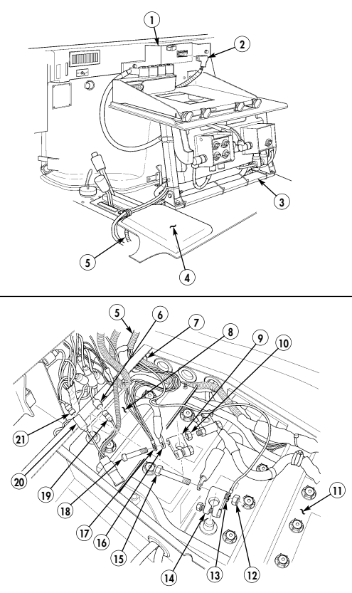

# 12-153. Automatic Fire Extinguishing System (Afes) Wiring Harness

## Replacement (M1114) (Cont'D)

7. Route AFES wiring harness (1) along tunnel (2) to the rear along A/C hoses (3). 8. Disconnect AFES wiring harness connector (5) from cargo sensor connector (4). 9. Disconnect AFES wiring harness connector (7) from cargo control valve connector (6).

10. Route AFES wiring harness (1) through access holes (8) and (9) and into passenger compartment.

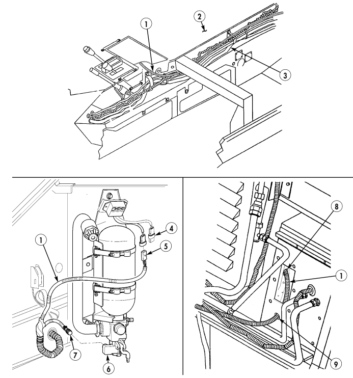

12-266 Change 5

## 12-153. Automatic Fire Extinguishing System (Afes) Wiring Harness Replacement (M1114) (Cont'D)

11. Disconnect AFES wiring harness connectors (10) and (23) from driver side sensor connectors (11)
and (22).

12. Remove two locknuts (14) and (21), clamps (13), and wiring harness (1) from turret (12). Discard locknuts (14).

13. Disconnect AFES wiring harness connectors (17) and (20) from passenger side sensor connectors (18)
and (19).

14. Remove two locknuts (16), clamps (15), and wiring harness (1) from turret (12) and remove wiring harness (1) from vehicle. Discard locknuts (16).

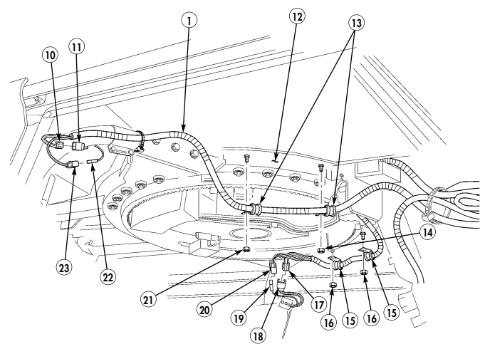

# 12-153. Automatic Fire Extinguishing System (Afes) Wiring Harness Replacement (M1114) (Cont'D)

b. Installation 1. Route portion of AFES wiring harness (5) under tunnel insulation (4) and along radio rack (3). 2. Connect AFES wiring harness connector (2) to master controller (1). 3. Route AFES wiring harness (5) through battery box access hole (7). 4. Install AFES wiring harness connector (13) and battery positive cable (15) on positive terminal (14)
of forward battery (11) with nut (12) and capscrew (16).

5. Install AFES wiring harness connector (18) and battery negative cable (17) on negative terminal (9)
of rear battery (8) with nut (10) and capscrew (19).

6. Connect AFES wiring harness connectors (20) and (21) to vehicle harness connectors (6) and (22).

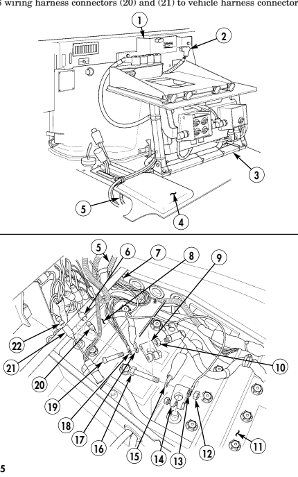

## 12-153. Automatic Fire Extinguishing System (Afes) Wiring Harness

# Replacement (M1114) (Cont'D)

 Route AFES wiring harness (5) along side of tunnel (23) to the rear along A/C hoses (24).

7.

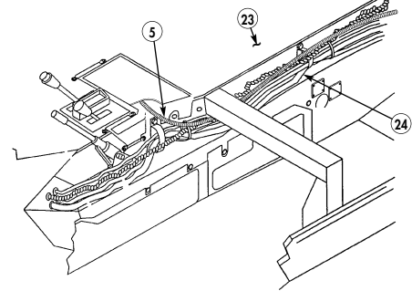

## 12-153. Automatic Fire Extinguishing System (Afes) Wiring Harness Replacement (M1114) (Cont'D)

8. Route AFES wiring harness (3) up to driver side of turret (4) and secure with two clamps (5) and locknuts (6) and (13).

9. Connect harness connectors (1) and (15) to driver side sensor connectors (14) and (2).

10. Route AFES wiring harness (3) around to passenger side of turret (4) and secure with two clamps (7) and locknuts (8).

11. Connect harness connectors (9) and (12) to passenger side sensor connectors (10) and (11).

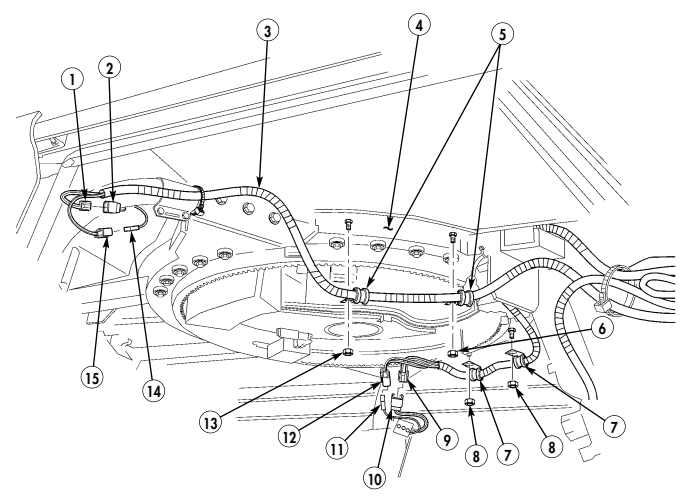

# 12-153. Automatic Fire Extinguishing System (Afes) Wiring Harness Replacement (M1114) (Cont'D)

12. Route AFES wiring harness (3) through access holes (16) and (17) and into cargo area. 13. Connect harness connector (21) to control valve connector (20). 14. Connect harness connector (19) to cargo sensor connector (18). 15. Secure harness as needed with tiedown straps.

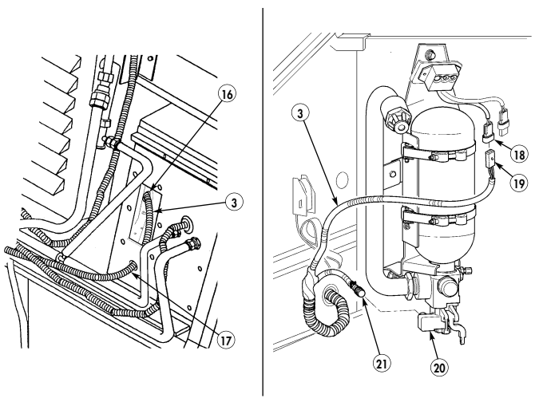

FOLLOW-ON TASKS: - Install access hole cover plate (para. 25-36).

- Install A/C coolant line covers (para. 25-32). - Install left rear seat (para. 10-45). - Install driver seat (para. 10-40). - Install cargo access panel (para. 4-43). - Connect battery cables (para. 4-68). - Install companion seat and battery box cover (para. 10-43). - Install tunnel top insulation (para. 11-97).

# 12-154. Automatic Fire Extinguishing System (Afes) Wiring Harness Replacement (M1152A1)

This task covers:

Applicable Models M1152A1 Tools General mechanic's tool kit:
automotive (Appendix B, Item 1)

#### Materials/Parts

Six tiedown straps (Appendix G, Item 145) Two lockwashers (Appendix G, Item 135) Three lockwashers (Appendix G, Item 172)

#### A. Removal B. Installation

Manual References TM 9-2320-387-24P
Equipment Condition
- Tunnel top insulation removed (para. 11-97). - Companion seat and battery box cover removed
(para. 10-43).

General Safety Instructions Ensure Automatic Fire Extinguishing System (AFES) anti-recoil device is installed in place of deflector valve.

Maintenance Level Unit

#### Warning

Ensure Automatic Fire Extinguishing System (AFES) anti-recoil device is installed in place of deflector valve. Failure to do so can result in discharge of liquid and powder agents which can cause injury to personnel.

#### A. Removal

1. Disconnect J1 connector (7) from master controller (8). 2. Remove tiedown straps (5) from J3 leg of AFES wiring harness (6) and radio rack driver side leg (4).

Discard tiedown straps (5).

3. Remove tiedown straps (3) from AFES wiring harness (1) and radio rack crewmember side leg (2).

Discard tiedown straps (3).

4. Remove tiedown strap (9) and AFES wiring harness (1) from passenger side tunnel (10). Discard tiedown strap (9).

5. Remove nut (15), capscrew (17), battery positive cable (12), and AFES positive cable (13) from positive terminal (16) of forward battery (14).

6. Remove nut (18), capscrew (22), battery negative cable (21), and AFES negative cable (20) from negative terminal (19) of rear battery (11).

12-154. AUTOMATIC FIRE EXTINGUISHING SYSTEM (AFES) WIRING HARNESS
REPLACEMENT (M1152A1) (Cont'd)

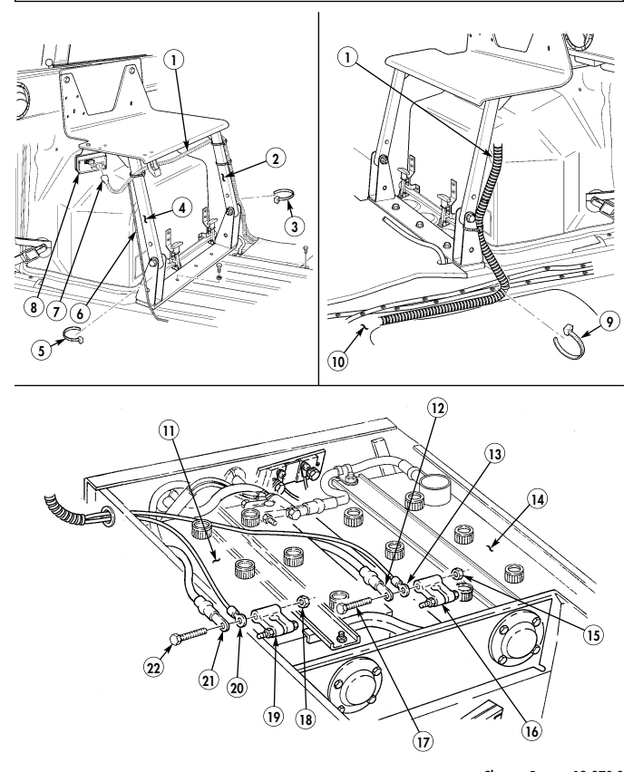

## 12-154. Automatic Fire Extinguishing System (Afes) Wiring Harness

# Replacement (M1152A1) (Cont'D)

7. Pull AFES wiring harness (5) through tunnel interior side insulation (6) and battery box access hole (7).

Circuit 29T is the ignition circuit; circuit 2 comes from the transmission relay on the closeout panel.

8. Disconnect AFES wiring harness J6 connector (4) from circuit 2 connector (2). 9. Disconnect AFES wiring harness J7 connector (3) from circuit 29T connector (1).

10. Disconnect AFES wiring harness J4 connector (9) from passenger side sensor connector (8). 11. Remove screw (19), lockwasher (18), washer (17), and ground wire (16) from passenger side sensor (15). Discard lockwasher (18).

12. Remove screw (10), lockwasher (11), washer (12), and ground wire (13) from driver side sensor (14).

Discard lockwasher (11).

13. Remove nut (24) and lockwasher (23) from stud (21) of rear ballistic wall (20). Discard lockwasher (23). 14. Remove capscrew (25), lockwasher (26), washer (27), cable guard (22), and J4 leg of AFES wiring harness (28) from rear ballistic wall (20). Discard lockwasher (26).

15. Remove capscrew (33), lockwasher (32), washer (31), clamp (30), and J4 leg of AFES wiring harness
(28) from interior armor closeout panel (29). Discard lockwasher (32).

16. Disconnect J3 connector (35) from AFES control valve (34).

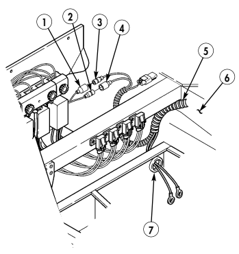

12-154. AUTOMATIC FIRE EXTINGUISHING SYSTEM (AFES) WIRING HARNESS
REPLACEMENT (M1152A1) (Cont'd)

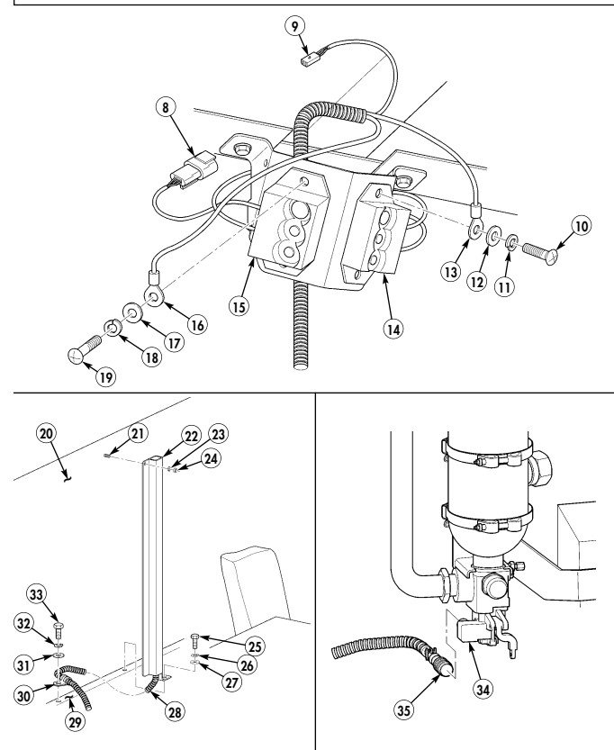

# 12-154. Automatic Fire Extinguishing System (Afes) Wiring Harness Replacement (M1152A1) (Cont'D)

b. Installation 1. Connect J1 connector (9) to master controller (10). 2. Route AFES wiring harness (1) to radio rack drivers side leg (5) and secure with tiedown strap (4). 3. Route AFES wiring harness (1) to radio rack passenger side leg (2) and secure with three tiedown straps (3).

4. Route AFES wiring harness J3 leg (8) along radio rack driver side leg (5) and along driver side tunnel (6) and back to AFES control valve, secure with tiedown strap (7).

5. Route AFES wiring harness (1) along passenger side tunnel (12) and secure with tiedown strap (11). 6. Route AFES wiring harness (1) through battery box access hole (25). 7. Install AFES positive cable (15) and battery positive cable (14) on positive terminal (18) of forward battery (16) with nut (17) and capscrew (19).

8. Install AFES negative cable (22) and battery negative cable (23) on negative terminal (21) of rear battery (13) with nut (20) and capscrew (24).

Circuit 29T is the ignition circuit; circuit 2 comes from the transmission relay on the closeout panel.

9. Connect AFES wiring harness J6 connector (29) to circuit 2 connector (27).

10. Connect AFES wiring harness J7 connector (28) to circuit 29T connector (26).

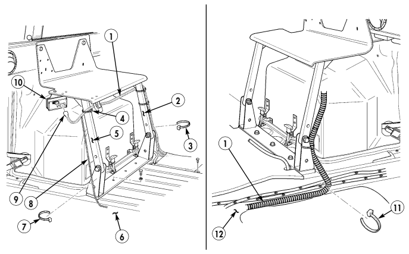

12-154. AUTOMATIC FIRE EXTINGUISHING SYSTEM (AFES) WIRING HARNESS
REPLACEMENT (M1152A1) (Cont'd)

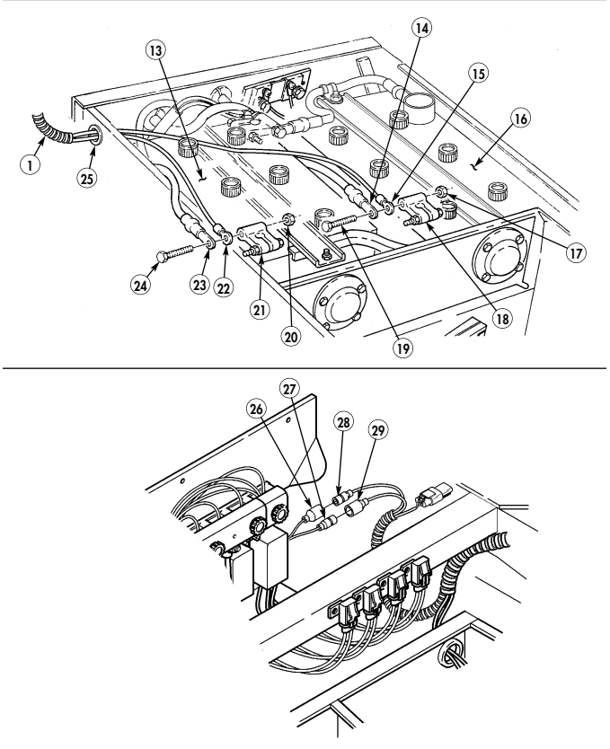

## 12-154. Automatic Fire Extinguishing System (Afes) Wiring Harness Replacement (M1152A1) (Cont'D)

11. Route J4 leg of AFES wiring harness (9) along interior armor closeout panel (10). 12. Secure J4 leg of AFES wiring harness (9) to interior armor closeout panel (10) with clamp (11),
washer (12), lockwasher (13), and capscrew (14).

13. Route J4 leg of AFES wiring harness (10) up rear ballistic wall (1) and through cable guard (5),
secure with washer (8), lockwasher (7), capscrew (6), lockwasher (4), and nut (5).

14. Connect J4 connector (16) to passenger side sensor connector (15). 15. Install ground wire (23) on passenger side sensor (22) with washer (24), lockwasher (25), and screw (26).

16. Install ground wire (17) on driver side sensor (21) with washer (18), lockwasher (19), and screw (20). 17. Connect J3 connector (28) to AFES control valve (27).

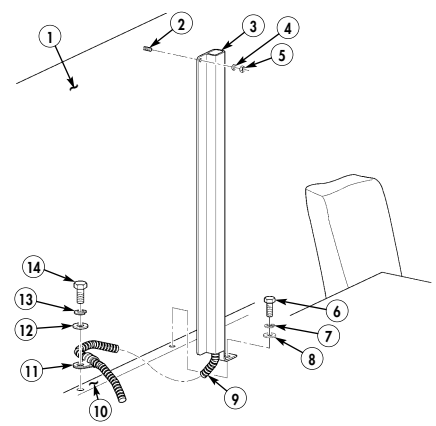

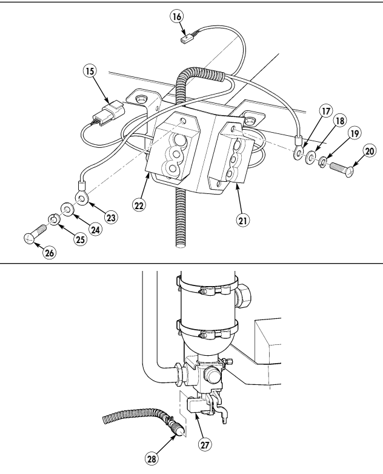

# 12-154. Automatic Fire Extinguishing System (Afes) Wiring Harness Replacement (M1152A1) (Cont'D)

FOLLOW-ON TASKS: - Install companion seat and battery box cover (para. 10-43).

· Install tunnel top insulation (para. 11-97).

# Section Xi. Objective Gunner'S Protection Kit (O-Gpk)

12-155. OBJECTIVE GUNNER'S PROTECTION KIT (O-GPK) MAINTENANCE TASK SUMMARY

| a. Removal b. Installation                                            |                                                                                                    |
|-----------------------------------------------------------------------|----------------------------------------------------------------------------------------------------|
| INITIAL SETUP:                                                        |                                                                                                    |
| Applicable Models                                                     | Manual References                                                                                  |
| M1151A1, M1152A1, M1165A1, M1167                                      | TM 9\-2320\-387\-24P                                                                               |
| Tools                                                                 | Equipment Condition                                                                                |
| General mechanic's tool kit:                                          | Battery ground cables disconnected (para. 4\-68).                                                  |
| automotive (Appendix B, Item 1)                                       | General Safety Instructions                                                                        |
| Materials/Parts                                                       | Ensure Automatic Fire Extinguishing System                                                         |
| Two locknuts (Appendix G, Item 87)                                    | (AFES) anti\-recoil device is installed in place of                                                |
| Locknut (Appendix G, Item 77)                                         | deflector valve.                                                                                   |
| Four lockwashers (Appendix G, Item 158.2)                             |                                                                                                    |
| Maintenance Level                                                     |                                                                                                    |
| Unit                                                                  |                                                                                                    |
| WARNING                                                               |                                                                                                    |
| Ensure Automatic Fire Extinguishing System (AFES) anti\-recoil        |                                                                                                    |
| device is installed in place of deflector valve. Failure to do so can |                                                                                                    |
| result in discharge of liquid and powder agents which can cause       |                                                                                                    |
| injury to personnel.                                                  |                                                                                                    |
| a. Removal                                                            |                                                                                                    |
| 1.                                                                    | Disconnect connector (7) from master controller plug (8).                                          |
| 2.                                                                    | Remove locknut (14), washer (15), capscrew (2), and washer (1) from radio rack (4). Discard        |
| locknut (14).                                                         |                                                                                                    |
| 3.                                                                    | Remove two locknuts (6), washers (5), capscrews (3), and bracket (10) from radio rack (4). Discard |
| locknuts (6).                                                         |                                                                                                    |

# 12-156. Objective Gunner'S Protection Kit (O-Gpk) Replacement (M1114)

This task covers:

a. Removal b. Installation

| INITIAL SETUP:                          |                      |
|-----------------------------------------|----------------------|
| Applicable Models                       | Manual References    |
| M1151A1, M1152A1, M1165A1, M1167        | TM 9\-2320\-387\-24P |
| Tools                                   | Equipment Condition  |
| General mechanic's tool kit:            |                      |
| automotive (Appendix B, Item 1)         |                      |
| Materials/Parts                         |                      |
| Two locknuts (Appendix G, Item 82)      |                      |
| Four lockwashers (Appendix G, Item 145) |                      |
|                                         | deflector valve.     |
|                                         | Maintenance Level    |
|                                         | Unit                 |

#### Equipment Condition

- Glass removed (O-GPK) (para. 12-158). - Front shield and pintle (O-GPK) removed 
(para. 12-159).

- Battery and battery box (O-GPK) removed 
(para. 12-160).

- Mirror (O-GPK) removed (para. 12-163). - Handle (O-GPK) removed (para. 12-164). - Joystick (O-GPK) removed (para. 12-168). - Fuse (O-GPK) removed (para. 12-169). - M4 gun brackets (O-GPK) removed 

#### General Safety Instructions

| . D   |
|-------|

Armor panels are extremely heavy and must be supported during removal and installation.

Maintenance Level Twelve locknuts (Appendix G, Item 185)

| Manual References   |
|---------------------|

TM 9-2320-387-24P
a. Removal

#### Warning

Armor panels are extremely heavy and must be supported during removal and installation. Two personnel or proper lifting equipment is required to remove armor panels from turret assembly. Failure to do so may result in injury to personnel or damage to equipment.

1. Remove four locknuts (5), washers (3), capscrews (1), lockwashers (2), washers (3), and point bracket (4) from front panel (6) and right armor panel (7). Discard lockwashers (2) and locknuts (5).

2. Remove two locknuts (23), washers (22), capscrews (19), lockwashers (20), and washers (21) from front panel (6) and left armor panel (17). Discard lockwashers (20) and locknuts (23).

3. Remove three locknuts (10), washers (11), capscrews (14), lockwashers (13), washers (11), and seam plate (12) from rear of left armor panel (17). Discard lockwashers (13) and locknuts (10).

4. Remove four locknuts (8), washers (9), capscrews (15), lockwashers (16), washers (9), and left armor panel (17) from turret assembly (18). Discard lockwashers (16) and locknuts (8).

12-156. OBJECTIVE GUNNER'S PROTECTION KIT (O-GPK) REPLACEMENT (M1114) (Cont'd)

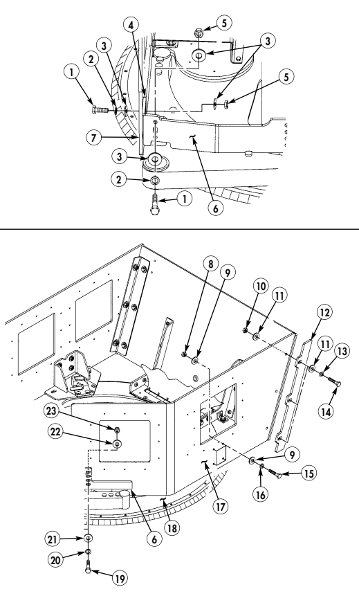

## 12-156. Objective Gunner'S Protection Kit (O-Gpk) Replacement (M1114) (Cont'D)

5. Remove three locknuts (7), washers (3), capscrews (1), lockwashers (2), washers (3), and seam plate (4)
from rear of right armor panel (5) and right rear corner bracket (6). Discard lockwashers (2) and locknuts (7).

6. Remove locknut (10), washer (11), capscrew (14), lockwasher (13), and washer (11) from bracket (12)
and right armor panel (5). Discard lockwasher (13) and locknut (10).

7. Remove four locknuts (8), washers (9), capscrews (17), lockwashers (16), washers (9), and right armor panel (5) from side bracket (15). Discard lockwashers (16) and locknuts (8).

8. Remove locknut (22), washer (21), capscrew (18), washer (19), and right front bracket (23) from top of control box plate (20). Discard locknut (22).

9. Remove capscrew (24), washer (25) and left front bracket (26) from turret assembly (27).

10. Remove two locknuts (32), washers (31), capscrews (29), lockwashers (30), and washers (31) from left side bracket (33) and right side bracket (15). Discard lockwashers (30) and locknuts (32).

11. Remove four capscrews (28), two hatch cover brackets (34), left side bracket (33) and right side bracket (15) from turret assembly (27).

12. Remove six locknuts (35), washers (36), capscrews (37), washers (36), and two rear corner brackets (39)
from rear armor panel (38). Discard locknuts (35).

13. Remove rubber grommet (40) from rear armor panel (38).

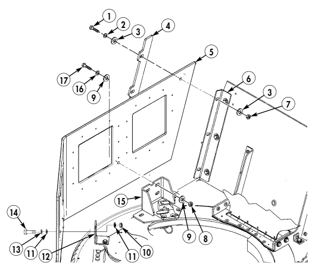

# 12-156. Objective Gunner'S Protection Kit (O-Gpk) Replacement (M1114) (Cont'D)

## 12-156. Objective Gunner'S Protection Kit (O-Gpk) Replacement (M1114) (Cont'D)

14. Remove six capscrews (4), lockwashers (3), washers (2), and rear armor panel (1) from left and right rear support brackets (5) and (6). Discard lockwashers (3).

15. Remove two locknuts (11), washers (9), capscrews (7), lockwashers (8), washers (9), and rear base plate (10) from left and right rear support brackets (5) and (6). Discard locknuts (11) and lockwashers (8).

16. Remove four capscrews (12), lockwashers (13), washers (14), and left and right rear support brackets (5) and (6) from hatch mounting bracket (15). Discard lockwashers (13).

17. Remove two capscrews (20), lockwashers (18), washers (17), and two small mounting angle brackets (16) and (19) from right and left rear support brackets (5) and (6). Discard lockwashers (18).

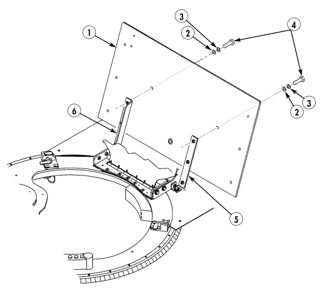

12-156. OBJECTIVE GUNNER'S PROTECTION KIT (O-GPK) REPLACEMENT (M1114) (Cont'd)

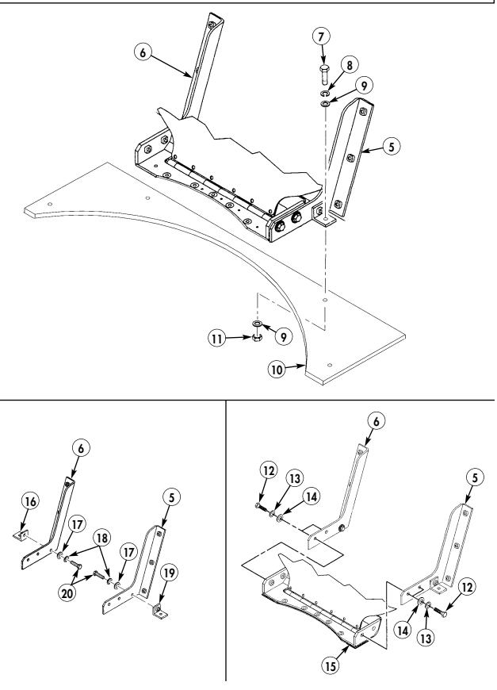

# 12-156. Objective Gunner'S Protection Kit (O-Gpk) Replacement (M1114) (Cont'D)

b. Installation

#### Warning

Armor panels are extremely heavy and must be supported during removal and installation. Two personnel or proper lifting equipment is required to install armor panels on turret assembly. Failure to do so may result in injury to personnel or damage to equipment.

Do not tighten capscrews until instructed to do so.

1. Install two small mounting angle brackets (1) and (6) on right and left rear support brackets (2)
and (5) with two washers (3), lockwashers (4), and capscrews (7). Do not tighten capscrews (7).

2. Install right and left rear support brackets (2) and (5) on hatch mounting bracket (11) with four washers (10), lockwashers (9), and capscrews (8). Do not tighten capscrews (8).

3. Install rear base plate (16) on right and left rear support brackets (2) and (5) with two washers (14),
lockwashers (13), capscrews (12), washers (15), and locknuts (14). Do not tighten capscrews (12).

4. Install rear armor panel (17) on right and left rear support brackets (2) and (5) with six washers (18),
lockwashers (19), and capscrews (20). Do not tighten capscrews (20).

5. Tighten capscrews (7), (8), (12), and (20) to 37 lb-ft (50 N•m).

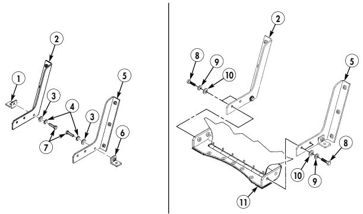

12-156. OBJECTIVE GUNNER'S PROTECTION KIT (O-GPK) REPLACEMENT (M1114) (Cont'd)

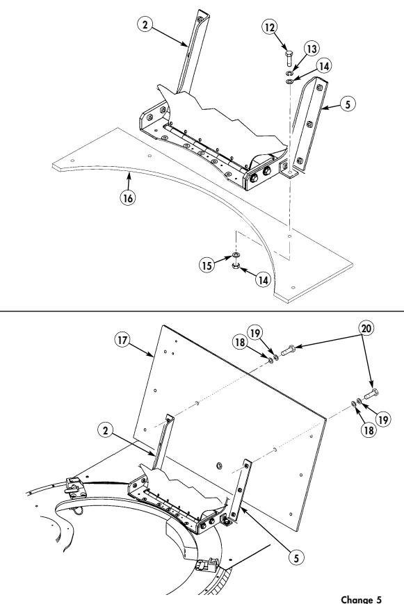

# 12-156. Objective Gunner'S Protection Kit (O-Gpk) Replacement (M1114) (Cont'D)

6. Install rubber grommet (6) on rear armor panel (5). 7. Install two rear corner brackets (3) on rear armor panel (5) with six washers (2), capscrews (4),
washers (2), and locknuts (1). Do not tighten capscrews (4).

8. Install two hatch cover brackets (15), left side bracket (12), and right side bracket (14) on turret assembly (13) with four capscrews (7). Do not tighten capscrews (7).

9. Secure left side bracket (12) and right side bracket (14) to turret assembly (13) with two washers (10),
lockwashers (9), capscrews (8), washers (10), and locknuts (11). Do not tighten capscrews (8).

10. Install left front bracket (16) on turret assembly (13) with washer (17) and capscrew (18). Do not tighten capscrew (18).

11. Install right front bracket (24) on top of control box plate (21) with washer (20), capscrew (19),
washer (22), and locknut (23). Do not tighten capscrew (19).

12. Install right armor panel (29) on side bracket (14) with four washers (32), lockwashers (38),
capscrews (39), washers (32), and locknuts (31). Do not tighten capscrews (39).

13. Secure right armor panel (29) to bracket (35) with washer (34), lockwasher (36), capscrew (37),
washer (34), and locknut (33). Do not tighten capscrew (37).

14. Install seam plate (28) on rear of right armor panel (29) and right rear corner bracket (3) with three washers (27), lockwashers (26), capscrews (25), washers (27), and locknuts (30). Do not tighten capscrews (25).

15. Tighten capscrews (4), (7), (8), (18), (19), (39), (37), and (25) to 37 lb-ft (50 N•m).

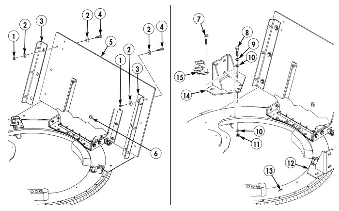 
# 12-156. Objective Gunner'S Protection Kit (O-Gpk) Replacement (M1114) (Cont'D)

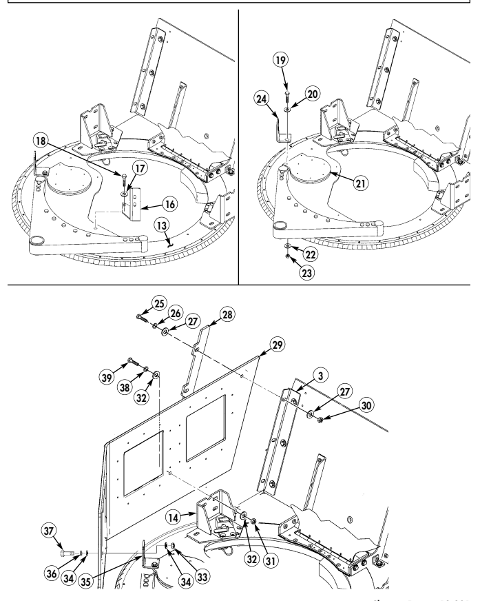

## 12-156. Objective Gunner'S Protection Kit (O-Gpk) Replacement (M1114) (Cont'D)

16. Install left armor panel (10) on turret assembly (11) with four washers (2), lockwashers (9),
capscrews (8), washers (2), and locknuts (1). Do not tighten capscrews (8).

17. Install seam plate (5) on rear of left armor panel (10) with three washers (4), lockwashers (6),
capscrews (7), washers (4), and locknuts (3). Do not tighten capscrews (7).

18. Secure front panel (12) to left armor panel (10) with two washers (15), lockwashers (14),
capscrews (13), washers (15), and locknuts (16). Do not tighten capscrews (13).

19. Install point bracket (20) on front panel (12) and right armor panel (20) with four washers (19),
lockwashers (18), capscrews (17), washers (19), and locknuts (21). Do not tighten capscrews (17).

20. Tighten capscrews (8), (7), (13), and (17) to 37 lb-ft (50 N•m).

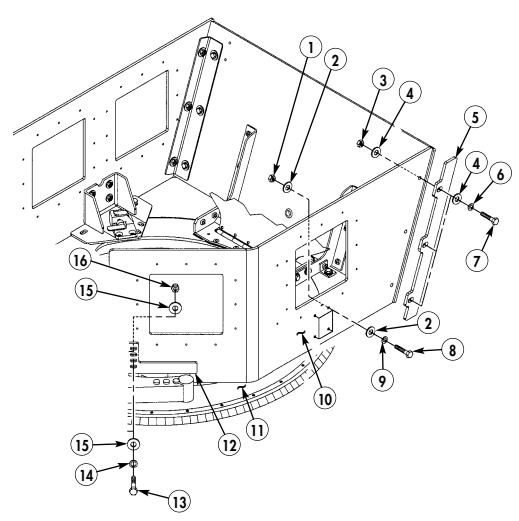

# 12-156. Objective Gunner'S Protection Kit (O-Gpk) Replacement (M1114) (Cont'D)

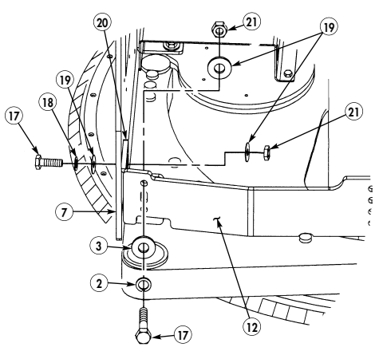

FOLLOW-ON TASKS: - Install M4 gun brackets (O-GPK) (para. 12-170).

- Install fuse (O-GPK) (para. 12-169). - Install joystick (O-GPK) (para. 12-168). - Install handle (O-GPK) (para. 12-164). - Install mirror (O-GPK) (para. 12-163). - Install battery and battery box (O-GPK) (para. 12-160). - Install front shield and pintle (O-GPK) (para. 12-159). - Install glass (O-GPK) (para. 12-158).

# 12-157. Objective Gunner'S Protection Kit (O-Gpk) Replacement (M1151A1 W/Perimeter B Kit)

This task covers:

Applicable Models M1151A1 w/Perimeter B Kit Tools General mechanic's tool kit:
automotive (Appendix B, Item 1)
Maintenance and repair shop equipment:
automotive (Appendix B, Item 2)

#### Personnel Required

One mechanic One assistant

#### Material/Parts

Twenty lockwashers (Appendix G, Item 144) Six lockwashers (Appendix G, Item 174) Fifteen lockwashers (Appendix G, Item 159) Twenty-nine locknuts 
(Appendix G, Item 106)
Twelve locknuts (Appendix G, Item 185)
Manual References TM 9-2320-387-24P
a. Removal b. Installation

#### Equipment Condition

- Glass (O-GPK) removed (para. 12-158). - Front shield and pintle (O-GPK) removed 
(para. 12-159).

- Battery and battery box (O-GPK) removed 
(para. 12-160).

- Mirror removed (O-GPK) (para. 12-163). - Handle removed (O-GPK) (para. 12-164). - Joystick removed (O-GPK) (para. 12-168). - Fuse removed (O-GPK) (para. 12-169). - M4 gun brackets removed (O-GPK) 
(para. 12-170).

#### General Safety Instructions

Armor panels are extremely heavy and must be supported during removal and installation.

Maintenance Level Unit

#### Warning

Armor panels are extremely heavy and must be supported during removal and installation. Two personnel or proper lifting equipment is required to remove armor panels from turret assembly. Failure to do so may result in injury to personnel or damage to equipment.

#### A. Removal

1. Remove four locknuts (5), washers (3), capscrews (1), lockwashers (2), washers (3), and point bracket (4) from front panel (6) and right armor panel (7). Discard lockwashers (2) and locknuts (5).

2. Remove capscrew (21), lockwasher (14), and washer (15) from left front outer bracket (20) and turret pintle mount (13). Discard lockwasher (14).

3. Remove capscrew (22), lockwasher (17), and washer (16) from left front outer bracket (20) and turret pintle mount (13). Discard lockwasher (17).

4. Remove capscrew (23), lockwasher (19), and washer (18) from left front outer bracket (20) and turret pintle mount (13). Discard lockwasher (19).

5. Remove two locknuts (11), washers (10), capscrews (8), lockwashers (9), washers (10), left front outer bracket (20), and front panel (6) from turret pintle mount (13) and left armor panel (12). Discard locknuts (11) and lockwashers (9).

12-157. OBJECTIVE GUNNER'S PROTECTION KIT (O-GPK) REPLACEMENT
 

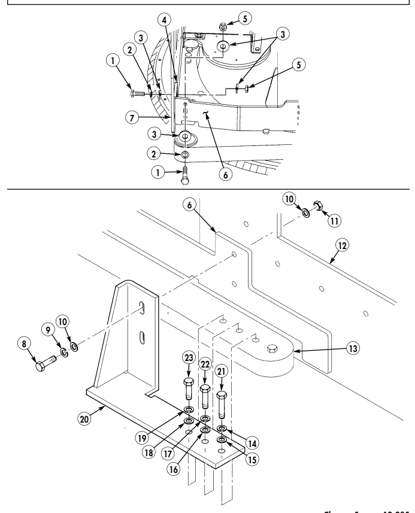

## 12-157. Objective Gunner'S Protection Kit (O-Gpk) Replacement (M1151A1 W/Perimeter B Kit) (Cont'D)

6. Remove two locknuts (4), washers (3), capscrews (1), washers (3), and right L-bracket (6) from right rear base plate (5) and right armor panel (1). Discard locknuts (4).

7. Remove two locknuts (8), washers (7), capscrews (9), washers (7), and left L-bracket (11) from left rear base plate (12) and left armor panel (10). Discard locknuts (8).

8. Remove three locknuts (15), washers (16), capscrews (18), lockwashers (19), washers (16), and seam plate (17) from rear of left armor panel (10). Discard lockwashers (19) and locknuts (15).

9. Remove four locknuts (13), washers (14), capscrews (21), lockwashers (20), washers (14), and left armor panel (10) from turret assembly (22). Discard lockwashers (20) and locknuts (13).

10. Remove three locknuts (28), washers (25), capscrews (23), lockwashers (24), washers (25), and seam plate (27) from rear of right armor panel (1), and right rear corner bracket (27). Discard lockwashers (24) and locknuts (28).

11. Remove locknut (31), washer (32), capscrew (35), lockwasher (34), and washer (32) from bracket (33)
and right armor panel (1). Discard lockwasher (34) and locknut (31).

12. Remove four locknuts (29), washers (30), capscrews (38), lockwashers (37), washers (30), and right armor panel (1) from side bracket (36). Discard lockwashers (37) and locknuts (29).

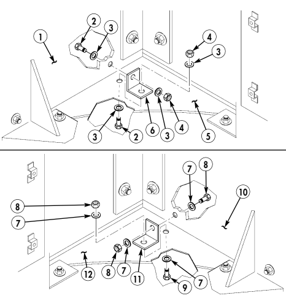

12-157. OBJECTIVE GUNNER'S PROTECTION KIT (O-GPK) REPLACEMENT
(M1151A1 W/PERIMETER B KIT) (Cont'd)

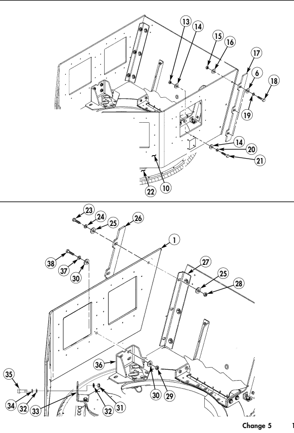

## 12-157. Objective Gunner'S Protection Kit (O-Gpk) Replacement (M1151A1 W/Perimeter B Kit) (Cont'D)

13. Remove locknut (5), washer (4), capscrew (1), washer (2), and right front bracket (6) from top of control box plate (3). Discard locknut (5).

14. Remove two locknuts (11), washers (10), capscrews (8), lockwashers (9), and washers (10) from left side bracket (7), and right side bracket (12). Discard lockwashers (9) and locknuts (11).

15. Remove four locknuts (15), washers (14), capscrews (13), washers (14), left side bracket (7), and right side bracket (12) from turret ring (16). Discard locknuts (15).

16. Remove six locknuts (17), washers (18), capscrews (20), washers (18), and two rear corner brackets (19) from rear armor panel (21). Discard locknuts (17).

17. Remove rubber grommet (22) from rear armor panel (21).

12-157. OBJECTIVE GUNNER'S PROTECTION KIT (O-GPK) REPLACEMENT

# (M1151A1 W/Perimeter B Kit) (Cont'D)

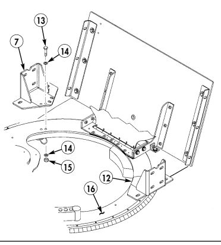

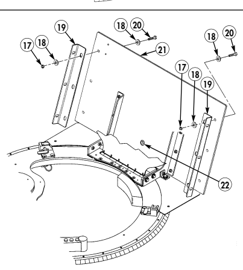

## 12-157. Objective Gunner'S Protection Kit (O-Gpk) Replacement (M1151A1 W/Perimeter B Kit) (Cont'D)

18. Remove six capscrews (4), lockwashers (3), washers (2), and rear armor panel (1) from left and right rear support brackets (5) and (6). Discard lockwashers (3).

19. Remove two locknuts (7), washers (8), capscrews (10), lockwashers (11), washers (8), and two rear base plates (8) and (12) from left and right rear support brackets (5) and (6). Discard locknuts (7) and lockwashers (11).

20. Remove four capscrews (13), lockwashers (14), washers (15), and left and right rear support brackets (5) and (6) from hatch mounting bracket (16). Discard lockwashers (14).

21. Remove two capscrews (21), lockwashers (19), washers (18), and two small mounting angle brackets (17) and (20) from right and left rear support brackets (5) and (6). Discard lockwashers (19).

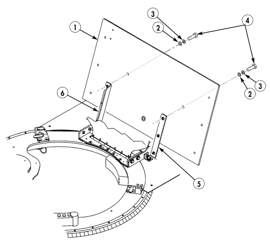

12-157. OBJECTIVE GUNNER'S PROTECTION KIT (O-GPK) REPLACEMENT
 

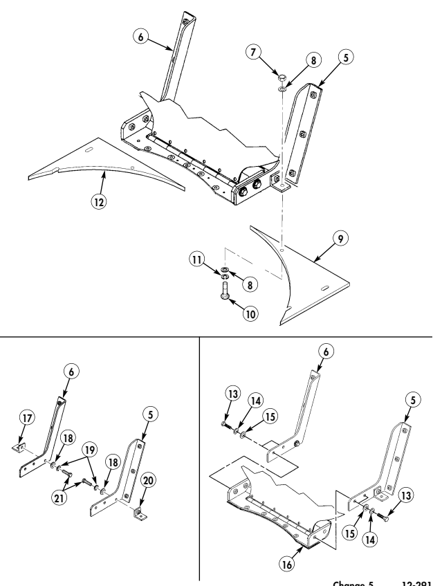

# 12-157. Objective Gunner'S Protection Kit (O-Gpk) Replacement (M1151A1 W/Perimeter B Kit) (Cont'D)

b. Installation

#### Warning

Armor panels are extremely heavy and must be supported during removal and installation. Two personnel or proper lifting equipment is required to remove armor panels from turret assembly. Failure to do so may result in injury to personnel or damage to equipment.

Do not tighten capscrews until instructed to do so.

1. Install two small mounting angle brackets (1) and (6) on right and left rear support brackets (2)
and (5) with two washers (3), lockwashers (4), and capscrews (7). Do not tighten capscrews (7).

2. Install right and left rear support brackets (2) and (5) on hatch mounting bracket (11) with four washers (10), lockwashers (9), and capscrews (8). Do not tighten capscrews (8).

3. Install two rear base plates (14) and (17) on right and left rear support brackets (2) and (5) with two washers (13), lockwashers (16), capscrews (15), washers (13), and locknuts (12). Do not tighten capscrews (15).

4. Install rear armor panel (18) on right and left rear support brackets (2) and (5) with six washers (19),
lockwashers (20), and capscrews (21). Do not tighten capscrews (21).

5. Tighten capscrews (7), (8), (15), and (21) in steps 1 through 4 to 37 lb-ft (50 N•m).

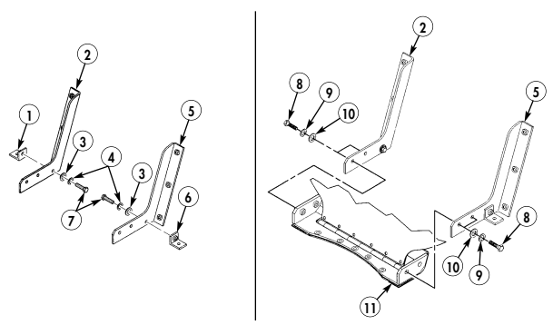

12-157. OBJECTIVE GUNNER'S PROTECTION KIT (O-GPK) REPLACEMENT
 

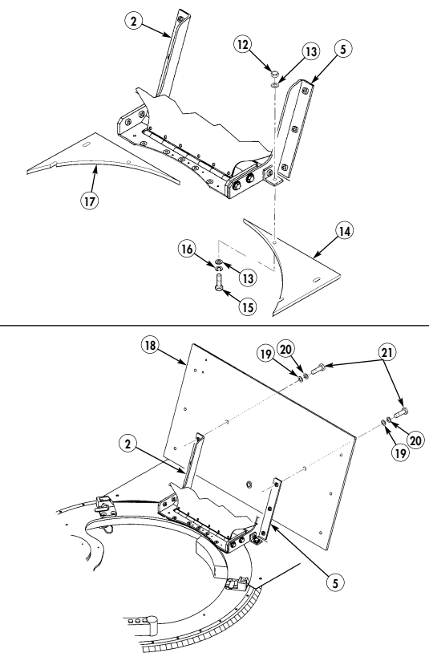

# 12-157. Objective Gunner'S Protection Kit (O-Gpk) Replacement (M1151A1 W/Perimeter B Kit) (Cont'D)

6. Install rubber grommet (6) on rear armor panel (5). 7. Install two rear corner brackets (3) on rear armor panel (5) with six washers (2), capscrews (4),
washers (2), and locknuts (1). Do not tighten capscrews (4).

8. Install left side bracket (7) and right side bracket (10) on turret ring (11) with four washers (9),
capscrews (8), washers (9), and locknuts (12). Do not tighten capscrews (8).

9. Secure left side bracket (7) and right side bracket (10) to turret ring (11) with two washers (15),
lockwashers (14), capscrews (13), washers (15), and locknuts (16). Do not tighten capscrews (13).

10. Install right front bracket (17) on top of control box plate (20) with washer (19), capscrew (18),
washer (21), and locknut (22). Do not tighten capscrew (18).

11. Tighten capscrews (4), (8), (13), and (18) in steps 6 through 10 to 37 lb-ft (50 N•m).

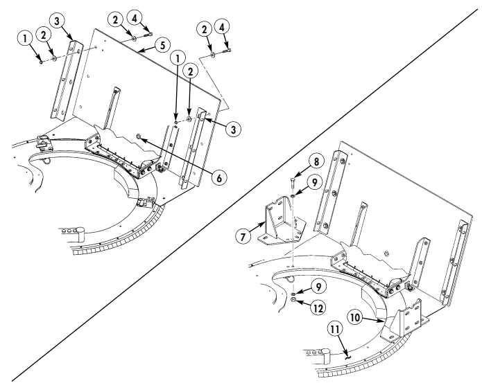

# 12-157. Objective Gunner'S Protection Kit (O-Gpk) Replacement (M1151A1 W/Perimeter B Kit) (Cont'D)

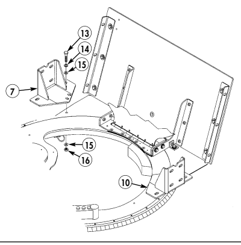

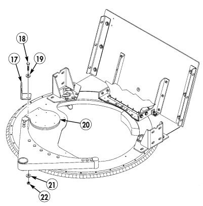

## 12-157. Objective Gunner'S Protection Kit (O-Gpk) Replacement (M1151A1 W/Perimeter B Kit) (Cont'D)

12. Install right armor panel (5) on side bracket (15) with four washers (9), lockwashers (16),
capscrews (17), washers (9), and locknuts (8). Do not tighten capscrews (17).

13. Install right armor panel (5) on bracket (12) with washer (11), lockwasher (13), capscrew (14),
washer (11), and locknut (10). Do not tighten capscrew (14).

14. Install seam plate (4) on rear of right armor panel (5) and right rear corner bracket (6) with three washers (3), lockwashers (2), capscrews (1), washers (3), and locknuts (7). Do not tighten capscrews (1).

15. Install left armor panel (27) on turret assembly (28) with four washers (19), lockwashers (25),
capscrews (26), washers (19), and locknuts (18). Do not tighten capscrews (26).

16. Install seam plate (22) on rear of left armor panel (27) with three washers (21), lockwashers (24),
capscrews (23), washers (21), and locknuts (20). Do not tighten capscrews (23).

17. Install left L-bracket (31) on left armor panel (27) and left rear base plate (33) with two washers (29), capscrews (30), and locknuts (32). Do not tighten capscrews (30).

18. Install right L-bracket (39) on right armor panel (34) and right rear base plate (38) with two washers (36), capscrews (35), washers (36), and locknuts (37). Do not tighten capscrews (35).

19. Tighten capscrews (17), (14), (1), (26), (23), (30), and (35) in steps 12 through 19 to 37 lb-ft (50 N•m).

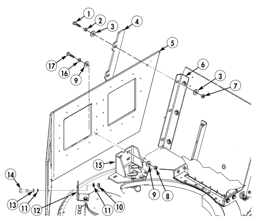

# 12-157. Objective Gunner'S Protection Kit (O-Gpk) Replacement (M1151A1 W/Perimeter B Kit) (Cont'D)

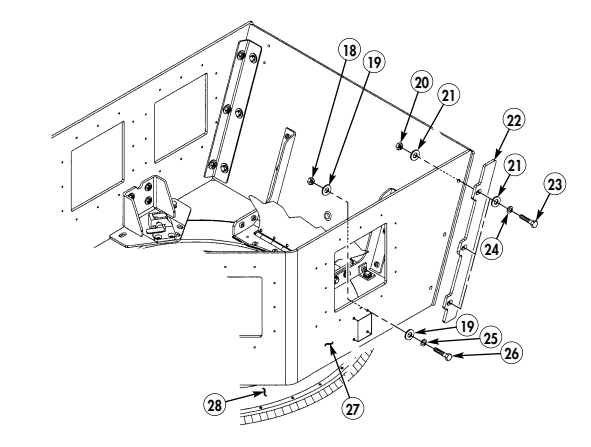

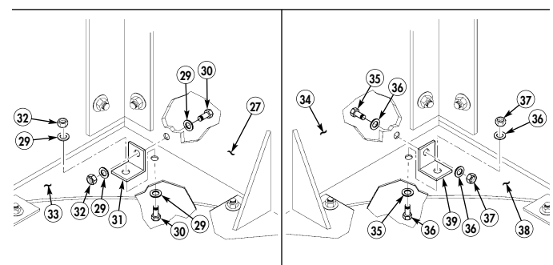

## 12-157. Objective Gunner'S Protection Kit (O-Gpk) Replacement (M1151A1 W/Perimeter B Kit) (Cont'D)

20. Install left front outer bracket (12) and front panel (1) on turret pintle mount (5) and left armor panel (4) with two washers (2), lockwashers (17), capscrews (16), washers (2), and locknuts (3). Do not tighten capscrews (16).

21. Secure left front outer bracket (12) to turret pintle mount (5) with washer (10), lockwasher (11), and capscrew (15). Do not tighten capscrew (15).

22. Secure left front outer bracket (12) to turret pintle mount (5) with washer (8), lockwasher (9), and capscrew (14). Do not tighten capscrew (14).

23. Secure left front outer bracket (12) to turret pintle mount (5) with washer (7), lockwasher (6), and capscrew (13). Do not tighten capscrew (13).

24. Install point bracket (21) on front panel (1) and right armor panel (23) with four washers (20),
lockwashers (19), capscrews (18), washers (20), and locknuts (22). Do not tighten capscrews (18).

25. Tighten capscrews (16), (15), (14), (13), and (18) in steps 20 through 25 to 37 lb-ft (50 N•m).

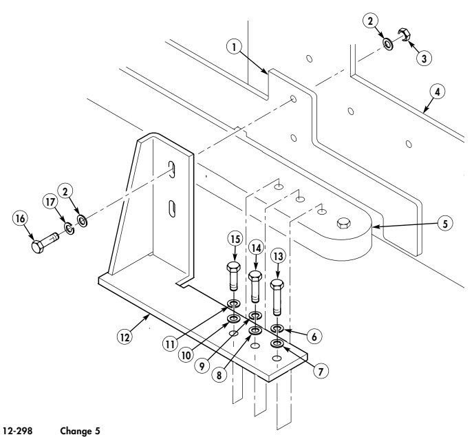

# 12-157. Objective Gunner'S Protection Kit (O-Gpk) Replacement (M1151A1 W/Perimeter B Kit) (Cont'D)

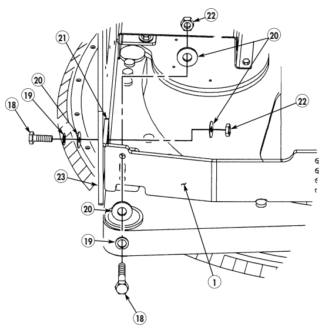

FOLLOW-ON TASKS: - Install M4 gun brackets (O-GPK) (para. 12-170).

- Install fuse (O-GPK) (para. 12-169). - Install joystick (O-GPK) (para. 12-168). - Install handle (O-GPK) (para. 12-164). - Install mirror (O-GPK) (para. 12-163). - Install battery and battery box (O-GPK) (para. 12-160). - Install front shield and pintle (O-GPK) (para. 12-159). - Install glass (O-GPK) (para. 12-158).

# 12-158. Glass (O-Gpk) Replacement

This task covers:

a. Removal b. Installation

| INITIAL SETUP:                          |                                                     |
|-----------------------------------------|-----------------------------------------------------|
| Applicable Models                       | Manual References                                   |
| M1114                                   | TM 9\-2320\-387\-24P                                |
| Tools                                   | Equipment Condition                                 |
| General mechanic's tool kit:            | Battery ground cables disconnected (para. 4\-68).   |
| automotive (Appendix B, Item 1)         |                                                     |
|                                         | General Safety Instructions                         |
| Materials/Parts                         |                                                     |
|                                         | Ensure Automatic Fire Extinguishing System          |
| Two locknuts (Appendix G, Item 77)      | (AFES) anti\-recoil device is installed in place of |
| Four lockwashers (Appendix G, Item 145) |                                                     |

#### A. Removal

1. Remove three capscrews (4), lockwashers (3), and upper bracket (2) from side armor panel (1).

Discard lockwashers (3).

2. Remove glass (5) from side armor panel (1) and brackets (6). 3. Remove nine capscrews (8), lockwashers (7), and three brackets (6) from side armor panel (1).

Discard lockwashers (7).

#### B. Installation Warning

Transparent armor glass (side with small label) must face outward from turret and spall liner must face inward toward turret. Failure to comply may result in death or injury to personnel.

Plastic spall liner will scratch easier then glass. Take a sharp piece of metal and try to scribe a tiny line inside and outside of each window pane. The side that scratches easier is the spall liner and must face inward toward turret.

1. Install three brackets (6) on side armor panel (1) with nine lockwashers (7) and capscrews (8).

Tighten capscrews (8) to 21 lb-ft (28 N•m).

2. Install glass (5) on brackets (6) and side armor panel (1). 3. Install upper bracket (2) on side armor panel (1) with three lockwashers (3) and capscrews (4).

Tighten capscrews (4) to 21 lb-ft (28 N•m).

# 12-158. Glass (O-Gpk) Replacement (Cont'D)

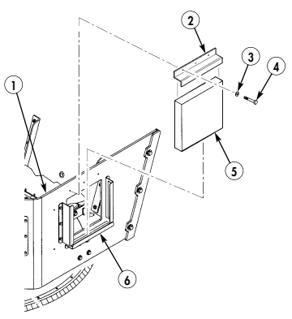

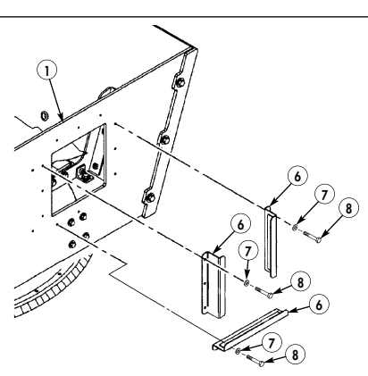

# 12-159. Front Shield And Pintle (O-Gpk) Replacement

This task covers:

a. Removal b. Installation

| b. Inspection                   |                                                   |
|---------------------------------|---------------------------------------------------|
| INITIAL SETUP:                  |                                                   |
| Applicable Models               | Manual References                                 |
| M1152A1                         | TM 9\-2320\-387\-24P                              |
| Tools                           | Equipment Condition                               |
| General mechanic's tool kit:    | Battery ground cables disconnected (para. 4\-68). |
| automotive (Appendix B, Item 1) | General Safety Instructions                       |
| Materials/Parts                 |                                                   |

#### A. Removal

1. Remove three capscrews (6), lockwashers (5), and right upper bracket (7) from front shield (1).

Discard lockwashers (5).

2. Remove three capscrews (4), lockwashers (3), and left upper bracket (2) from front shield (1).

Discard lockwashers (3).

3. Remove right glass (8) from front shield (1) and right lower bracket (13). 4. Remove left glass (9) from front shield (1) and left lower bracket (10). 5. Remove three capscrews (15), lockwashers (14), and right lower bracket (13) from front shield (1).

Discard lockwashers (14).

6. Remove three capscrews (12), lockwashers (11), and left lower bracket (10) from front shield (1).

Discard lockwashers (11).

7. Remove four locknuts (20), washers (21), capscrews (23), washers (21), and front shield (1) from front spacer (22). Discard locknuts (20).

8. Remove four locknuts (18), capscrews (16), washers (17), and front spacer (22) from pintle (19).

Discard locknuts (18).

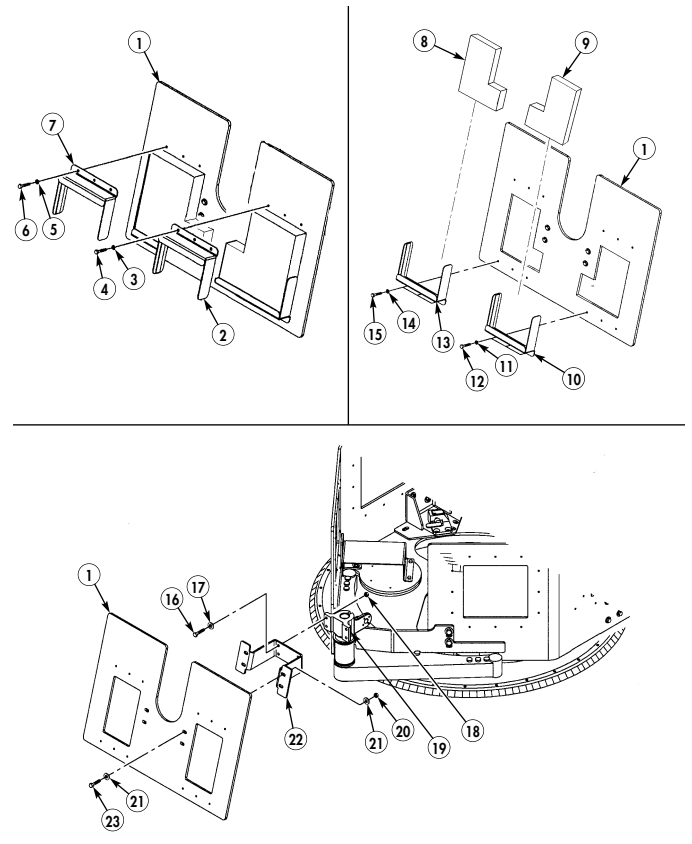

# 12-159. Front Shield And Pintle (O-Gpk) Replacement (Cont'D) 12-159. Front Shield And Pintle (O-Gpk) Replacement (Cont'D)

9. Remove four set screws (3) from bearing sleeve (2).

10. Remove locking pin (5) from bearing sleeve (2). 11. Remove bearing sleeve (2) from bearing sleeve hole (4). 12. Remove pintle (1) from bearing sleeve (2). 13. Remove locking handle (6) from pintle (1). 14. Remove set screw (7) and split sleeve (8) from pintle (1).

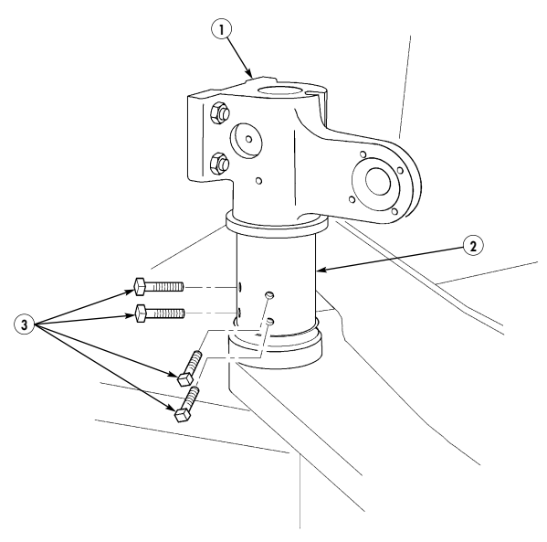

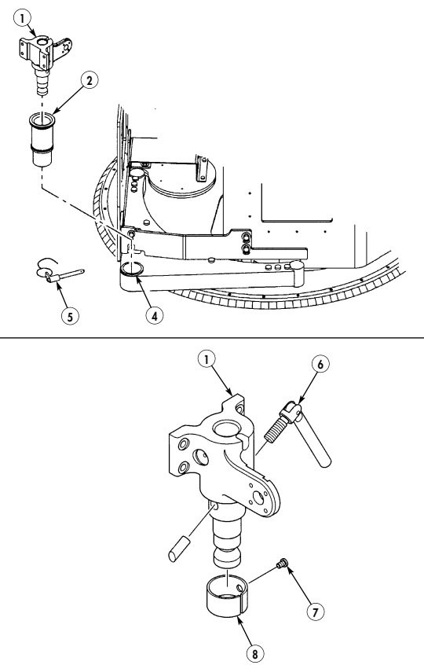

12-159. FRONT SHIELD AND PINTLE (O-GPK) REPLACEMENT (Cont'd)

# 12-159. Front Shield And Pintle (O-Gpk) Replacement (Cont'D)

b. Installation 1. Install set screw (7) and split sleeve (8) on pintle (1). 2. Install locking handle (6) in pintle (1). 3. Install pintle (1) on bearing sleeve (2). 4. Install bearing sleeve (2) in bearing sleeve hole (4). 5. Install locking pin (5) on bearing sleeve (2). 6. Install four set screws (3) on bearing sleeve (2).

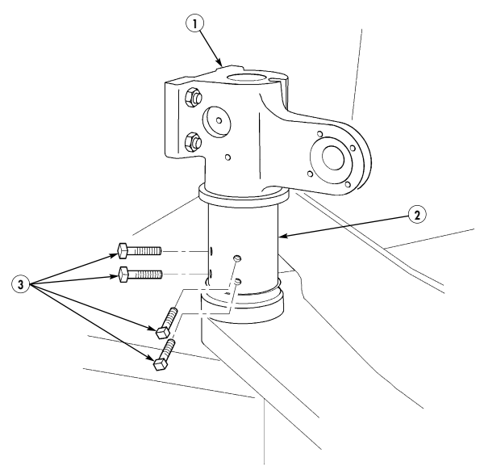

12-159. FRONT SHIELD AND PINTLE (O-GPK) REPLACEMENT (Cont'd)

## 12-159. Front Shield And Pintle (O-Gpk) Replacement (Cont'D)

7. Install front spacer (8) on pintle (5) with four washers (3), capscrews (2), and locknuts (4). 8. Install front shield (1) on front spacer (8) with four locknuts (6), eight washers (7), and four capscrews (9).

9. Tighten locknuts (4) and (6) to 37 lb-ft (50 N•m).

10. Install left lower bracket (12) on front shield (1) with three capscrews (14) and lockwashers (13).

Tighten capscrews (14) to 21 lb-ft (28 N•m).

11. Install right lower bracket (15) on front shield (1) with three capscrews (17) and lockwashers (16).

Tighten capscrews (17) to 21 lb-ft (28 N•m).

12. Install left glass (11) on front shield (1) and left lower bracket (12). 13. Install right glass (10) on front shield (1) and right lower bracket (15). 14. Install left upper bracket (18) on front shield (1) with three capscrews (20) and lockwashers (19).

Tighten capscrews (20) to 21 lb-ft (28 N•m).

15. Install right upper bracket (23) on front shield (1) with three capscrews (22) and lockwashers (21).

Tighten capscrews (22) to 21 lb-ft (28 N•m).

# 12-159. Front Shield And Pintle (O-Gpk) Replacement (Cont'D)

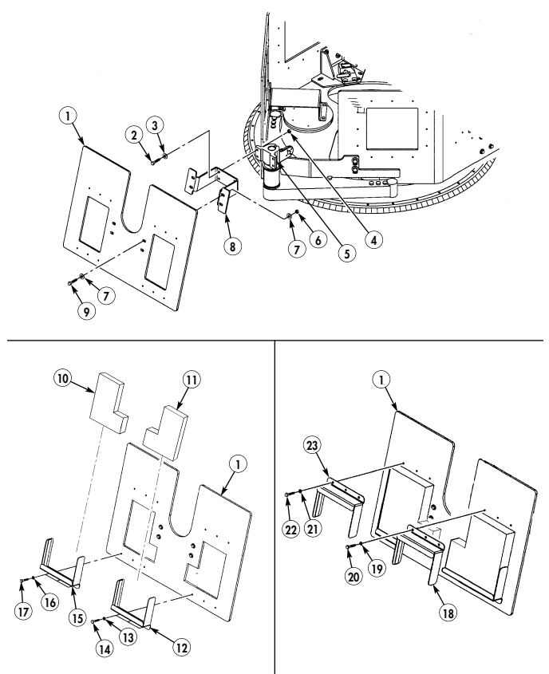

# 12-160. Battery And Battery Box (O-Gpk) Replacement

This task covers:
a. Removal b. Installation

| INITIAL SETUP:                                               |                                                     |
|--------------------------------------------------------------|-----------------------------------------------------|
| Applicable Models                                            | Manual References                                   |
| M1114 (cargo only), M1151A1 (crew and cargo),                | TM 9\-2320\-387\-24P                                |
| M1152A1, M1165A1 (crew only)                                 | Equipment Condition                                 |
| Tools                                                        | Battery ground cables disconnected (para. 4\-68).   |
| General mechanic's tool kit: automotive (Appendix B, Item 1) | General Safety Instructions                         |
|                                                              | Ensure Automatic Fire Extinguishing System          |
| Materials/Parts                                              | (AFES) anti\-recoil device is installed in place of |
| Two locknuts (Appendix G, Item 106)                          | deflector valve.                                    |
| Lockwashers (Appendix G, Item 145)                           | Maintenance Level                                   |
| Two locknuts (Appendix G, Item 182)                          | Unit                                                |
| Two cotter rings (Appendix G, Item 26.1)                     |                                                     |

#### A. Removal

1. Remove four capscrews (9), lockwashers (8), washers (7), and upper battery box panel (1) from battery box (5). Discard lockwashers (8).

2. Remove locknut (3), washer (4), capscrew (6), washer (4), and battery hold down bar (2) from battery box (5). Discard locknut (3).

3. Reposition positive battery terminal boot (12) and remove positive battery terminal bolt (10) and positive cable (11) from battery (17).

4. Reposition negative battery terminal boot (15) and remove negative battery terminal bolt (13) and negative cable (14) from battery (16).

5. Reposition positive battery terminal boot (23) and remove positive battery terminal bolt (21) and positive cable (22) from battery (16).

6. Reposition negative battery terminal boot (20) and remove negative battery terminal bolt (18) and negative cable (19) from battery (17).

7. Remove batteries (17) and (16) from battery box (5). 8. Remove four capscrews (27), lockwashers (26), washers (25), and battery box (5) from rear plate (24).

Discard lockwashers (27).

9. Remove two locknuts (31), washers (30), and clamps (29) from capscrews (28).

Discard locknuts (31).

10. Disconnect battery cable (33) from control box (32) and remove battery cable (33) from grommet in rear plate (24).

12-160. BATTERY AND BATTERY BOX (O-GPK) REPLACEMENT (Cont'd)

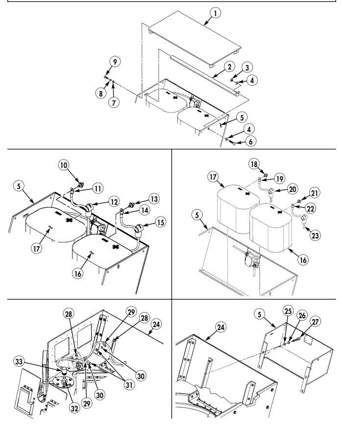

# 12-160. Battery And Battery Box (O-Gpk) Replacement (Cont'D)

#### B. Installation

1. Connect battery cable (7) to control box (6) and install battery cable (7) through grommet in rear plate (3).

2. Install clamps (2) on capscrews (1) with two washers (4) and locknuts (5). 3. Install battery box (8) on rear plate (3) with four capscrews (11), lockwashers (10), and washers (9).

Tighten capscrews (11) to 37 lb-ft (50 N•m).

4. Install batteries (12) and (19) in battery box (8). 5. Install negative cable (14) on battery (12) with negative battery terminal bolt (13). Tighten negative battery terminal bolt (13) to 70 lb-in. (8 N•m). Push negative battery terminal boot (15) on negative battery terminal bolt (13).

6. Install positive cable (17) on battery (19) with positive battery terminal bolt (16). Tighten positive battery terminal bolt (16) to 70 lb-in. (8 N•m). Push positive battery terminal boot (18) on positive battery terminal bolt (16).

7. Install negative cable (24) on battery (19) with negative battery terminal bolt (23). Tighten negative battery terminal bolt (23) to 70 lb-in. (8 N•m). Push negative battery terminal boot (25) on negative battery terminal bolt (23).

8. Install positive cable (21) on battery (12) with positive battery terminal bolt (20). Tighten positive battery terminal bolt (20) to 70 lb-in. (8 N•m). Push positive battery terminal boot (22) on positive battery terminal bolt (20).

9. Install battery hold down bar (27) on battery box (8) with locknut (28), two washers (29), and capscrew (30). Tighten locknut (28) to 21 lb-ft (28 N•m).

10. Install upper battery box panel (26) on battery box (8) with four capscrews (33), lockwashers (32),
and washers (30). Tighten capscrews (33) to 10 lb-ft (14 N•m).

# 12-160. Battery And Battery Box (O-Gpk) Replacement (Cont'D)

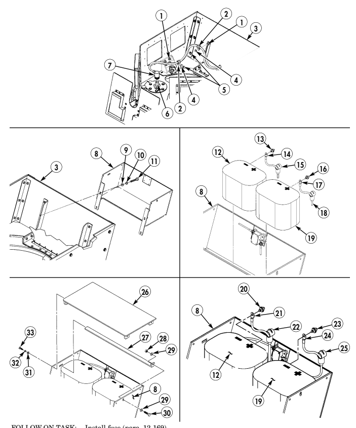

FOLLOW-ON TASK:
 Install fuse (para. 12-169).

# 12-161. Manual Traversing Unit (O-Gpk) Replacement

This task covers:

Applicable Models M1114, M1151A1 w/Perimeter B Kit Tools General mechanic's tool kit:
automotive (Appendix B, Item 1)
Maintenance and repair shop equipment:
automotive (Appendix B, Item 2)
Materials/Parts Sealing compound (Appendix C, Item 72.1) Three lockwashers (Appendix G, Item 159)

#### A. Removal B. Installation

Manual References TM 9-2320-387-24P
Equipment Condition Turret weapon station cover open
(TM 9-2320-387-10).

| Maintenance Level   |
|---------------------|

Unit

#### A. Removal

1. Remove pin (8) and quick release crank handle assembly (9) from traversing gear assembly (18). 2. Remove five capscrews (13), capscrew (12), washer (11), and traversing lower cover (10) from traversing gear assembly (18) and traversing upper cover (5).

3. Remove two capscrews (7), washers (6), capscrew (3), washer (4), and traversing upper cover (5)
from front cover bracket (2) and traversing gear assembly (18).

4. Remove two screws (16), washers (17), screw (14), washer (15), and traversing gear assembly (18)
from side of turret bearing (1) and spacer (19).

Perform step 5 for M1115A1 only.

5. Remove three capscrews (22), lockwasher (21), washer (20), and spacer (19) from side of turret bearing (1). Discard lockwashers (21).

b. Installation

- Apply sealing compound to threads of all traversing gear assembly capscrews.

- Leave socket head capscrew out approximately 0.250 inch to allow installation of traversing gear assembly.

- Perform step 1 for M1115A1 only.

1. Install spacer (19) on side of turret bearing (1) with three capscrews (22), lockwashers (21), and washer (20). Tighten capscrews (22) to 37 lb-ft (50 N•m).

2. Install capscrew (14) and washer (15) into center hole in bottom side of turret bearing (1). 3. Install traversing gear assembly (18) on turret bearing (1), ensuring washer (15) is on bottom side of traversing gear assembly (18).

4. Secure traversing gear assembly (18) to side of turret bearing (1) with two screws (16) and washers (17). Do not tighten capscrews (16).

In order to tighten socket head capscrew, allen wrench must be inserted through hole in turret stop ring. Rotate turret as required to gain access to socket head capscrew.

5. Tighten capscrew (14) to 37 lb-ft (50 N•m).

# 12-161. Manual Traversing Unit (O-Gpk) Replacement (Cont'D)

6. Tighten capscrews (16) to 37 lb-ft (50 N•m). 7. Install traversing upper cover (5) on front cover bracket (2) with two capscrews (7) and washers (6).

Do not tighten capscrews (7).

8. Secure traversing upper cover (5) to traversing gear assembly (18) with capscrew (3) and washer (4). Do not tighten capscrew (3).

9. Install traversing lower cover (10) on traversing upper cover (5) and traversing gear assembly (18)
with five screws (13), capscrew (12), and washer (11).

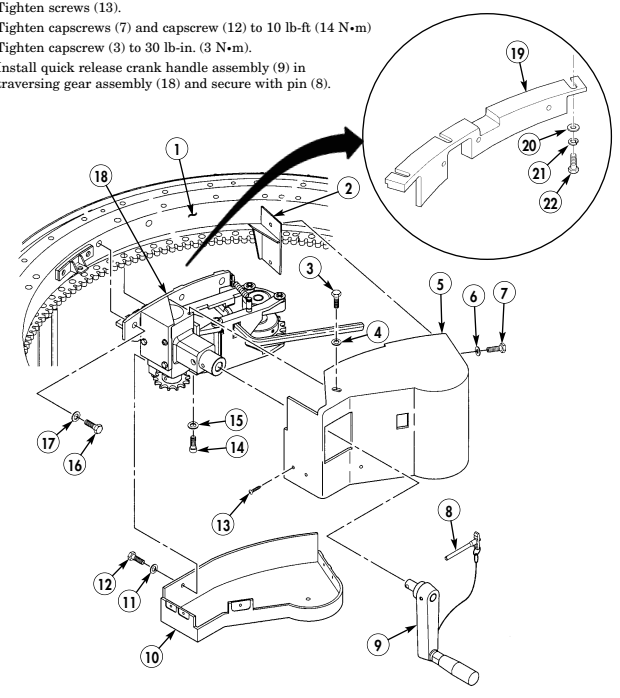

FOLLOW-ON TASK: Close turret weapon station cover (TM 9-2320-387-10).

# 12-162. Battery Powered Motorized Traversing Unit (Bpmtu) (O-Gpk) Replacement

This task covers:

Applicable Models M1114, M1151A1 w/Perimeter B Kit Tools General mechanic's tool kit:
automotive (Appendix B, Item 1)
Maintenance and repair shop equipment:
automotive (Appendix B, Item 2)
Material/Parts Three lockwashers (Appendix G, Item 144) Three locknuts (Appendix G, Item 111) Lockwasher (Appendix G, Item 158.1) Three lockwashers (Appendix G, Item 146)
a. Removal b. Installation

#### Manual References

TM 9-2320-387-24P
Equipment Condition
- Control box assembly removed (O-GPK) 
(para. 12-166).

- Turret weapon station cover opened.

(TM 9-2320-387-10).

Maintenance Level Unit

#### A. Removal

1. Disconnect wiring harness connector (6) from battery powered motorized traversing unit connector (7).

2. Remove three screws (2), lockwashers (3), washers (4), and drive housing guard (5) from motor and drive assembly (1). Discard lockwashers (3).

There are two configurations for the battery powered motorized traversing unit. One utilizes screws, washers, and nuts while the other utilizes capscrews. The motor and drive assembly is removed basically the same for all vehicles. Perform steps 3 through 5 for M1114 vehicle only.

3. Remove capscrew (13), lockwasher (12), and washer (11) from drive mount lock (16).

Discard lockwasher (12).

4. Remove two locknuts (14), washers (15), and drive mount lock (16) from motor and drive assembly (1). Discard locknuts (14).

5. Remove locknut (10), washer (9), and motor and drive assembly (1) from turret bearing (8).

Discard locknut (10).

Perform steps 6 through 8 for M1151 and M1151A1 vehicles only.

6. Remove capscrew (13), lockwasher (12), and washer (11) from drive mount lock (16).

Discard lockwasher (12).

7. Remove two capscrews (21), lockwashers (20), washers (22), and drive mount lock (16) from motor and drive assembly (1). Discard lockwashers (20).

8. Remove capscrew (19), lockwasher (18), washer (17), and motor and drive assembly (1) from turret bearing (8). Discard lockwasher (18).

12-162. BATTERY POWERED MOTORIZED TRAVERSING UNIT
(BPMTU) (O-GPK) REPLACEMENT (Cont'd)

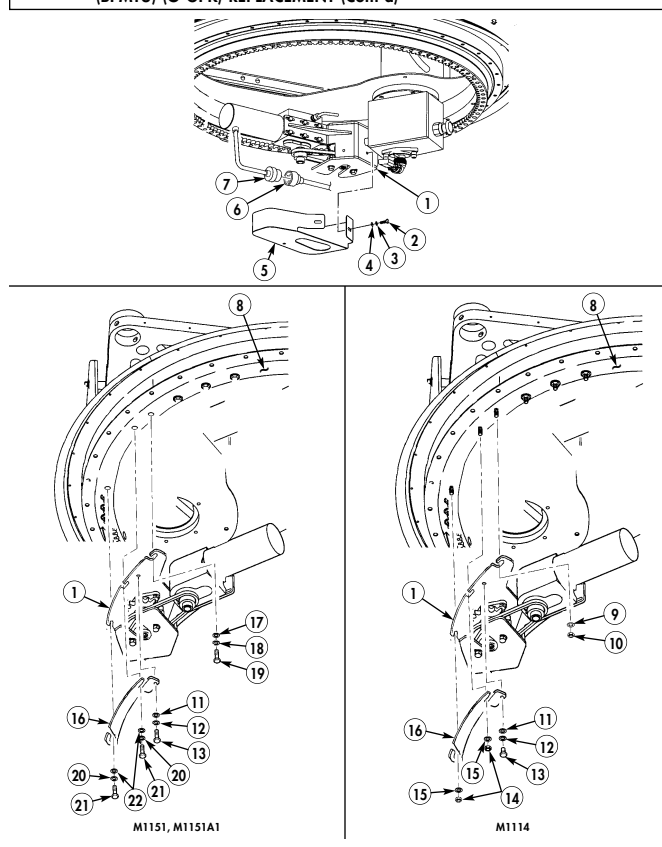

# 12-162. Battery Powered Motorized Traversing Unit (Bpmtu) (O-Gpk) Replacement (Cont'D)

b. Installation

Perform steps 1 through 3 for M1151 and M1151A1 vehicles only.

1. Install motor and drive assembly (1) on turret bearing (2) with capscrew (5), lockwasher (4), and washer (3). Do not tighten capscrew (5).

2. Install drive mount lock (12) on motor and drive assembly (1) with two capscrews (10),
lockwashers (9), and washers (11). Do not tighten capscrew (10).

3. Tighten capscrews (5) and (10) to 37 lb-ft (50 N•m).

Perform steps 4 through 6 for M1114 vehicles only.

4. Secure drive mount lock (12) to motor and drive assembly (1) with capscrew (8), lockwasher (7), and washer (6). Tighten capscrew (8) to 10 lb-ft (14 N•m).

5. Install motor and drive assembly (1) on turret bearing (2) with locknut (14) and washer (13). Do not tighten locknut (14).

6. Install drive mount lock (12) on motor and drive assembly (1) with two locknuts (15) and washers (16). Do not tighten locknut (15).

7. Tighten locknuts (14) and (15) to 37 lb-ft (50 N•m). 8. Secure drive mount lock (12) to motor and drive assembly (1) with capscrew (8), lockwasher (7), and washer (6). Tighten capscrew (8) to 10 lb-ft (14 N•m).

9. Install drive housing guard (20) on motor and drive assembly (1) with three screws (19),
lockwashers (18), and washers (17).

10. Connect wiring harness connector (21) to battery powered motorized traversing unit connector (22).

# 12-162. Battery Powered Motorized Traversing Unit (Bpmtu) (O-Gpk) Replacement (Cont'D)

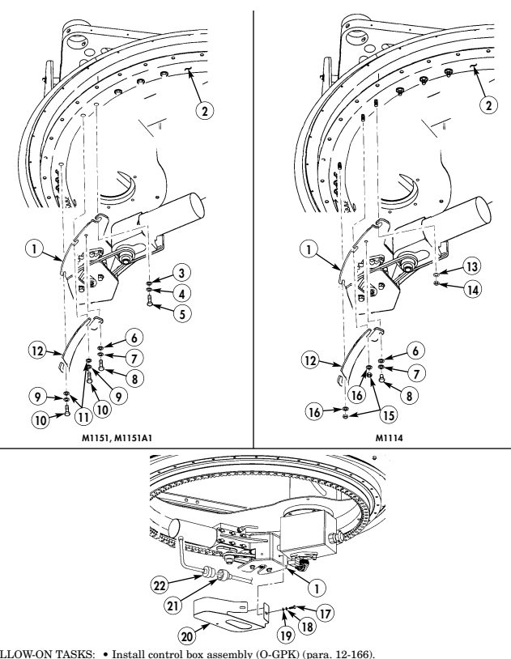

· Close turret weapon station cover (TM 9-2320-387-10).

# 12-163. Mirror (O-Gpk) Replacement

This task covers:

| INITIAL SETUP:                  |                                                   |
|---------------------------------|---------------------------------------------------|
| Applicable Models               | Manual References                                 |
| M1114                           | TM 9\-2320\-387\-24P                              |
| Tools                           | Equipment Condition                               |
| General mechanic's tool kit:    | Battery ground cables disconnected (para. 4\-68). |
| automotive (Appendix B, Item 1) | General Safety Instructions                       |

Material/Parts Four lockwashers (Appendix G, Item 145) Three locknuts (Appendix G, Item 132) Two locknuts (Appendix G, Item 82)

#### A. Removal

4. Remove two capscrews (23), lockwashers (22), washers (21), spacers (19), and mirror (18) from mirror arm assembly (1). Discard lockwashers (22).

5. Remove two locknuts (24), washers (25), capscrews (27), brackets (26), and adjuster brackets (20)
from mirror arm assembly (1). Discard locknuts (24).

#### B. Installation

1. Install two brackets (26) and adjuster bracket (20) on mirror arm assembly (1) with two capscrews (27),
washers (25), and locknuts (24).

2. Install mirror (18) on mirror arm assembly (1) with two capscrews (23), lockwashers (22),
washers (21), and spacers (19).

3. Install lower bracket (14) on mirror arm assembly (1) with mirror lock (15), washers (16) and (13),
and locknuts (17) and (12).

1. Remove two capscrews (5), lockwashers (4), washers (3), and mirror arm assembly (1) from side panel (2). Discard lockwashers (4).

2. Remove locknut (11), washer (10), upper bracket (9), nylon washer (8), washer (7), and capscrew (6)
from mirror arm assembly (1). Discard locknut (11).

3. Remove locknuts (17) and (12), washers (16) and (13), mirror lock (15), and lower bracket (14) from mirror arm assembly (1). Discard locknuts (17) and (12).

#### A. Removal B. Installation

4. Install upper bracket (9) on mirror arm assembly (1) with washers (7) and (8), capscrew (6), washer
(10), and locknut (11).

5. Install mirror arm assembly (1) on side panel (2) with two washers (3), lockwashers (4), and capscrews (5). Tighten capscrews (5) to 21 lb-ft (28 N•m).

12-163.  MIRROR (O-GPK) REPLACEMENT (Cont'd)

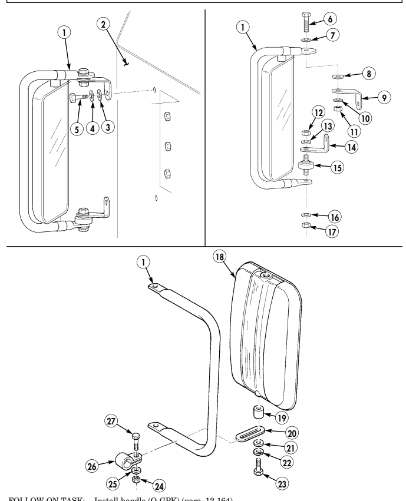

FOLLOW ON TASK:
Install handle (O-GPK) (para. 12-164).

## 12-164. Handle (O-Gpk) Replacement

This task covers:

a. Removal b. Installation

| INITIAL SETUP:                  |                                              |
|---------------------------------|----------------------------------------------|
| Applicable Models               | Manual References                            |
| M1114                           | TM 9\-2320\-387\-24P                         |
| Tools                           | Equipment Condition                          |
| General mechanic's tool kit:    |                                              |
| automotive (Appendix B, Item 1) | - AFES bottle removed (para.12\-144.1).      |
| Materials/Parts                 | - AFES cargo sensor removed (para. 12\-151). |

a. Removal Remove two locknuts (2), washers (3), and handle (1) from side armor panel (4). Discard locknuts (2).

b. Installation Install handle (1) on side armor panel (4) with two washers (3) and locknuts (2). Tighten locknuts (2) to 37 lb-ft (50 N•m).

12-164.  HANDLE (O-GPK) REPLACEMENT (Cont'd)

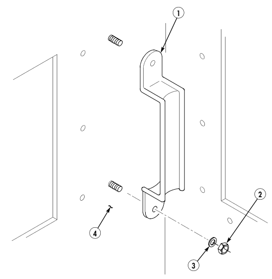

# 12-165. Control Box Assembly Cover (O-Gpk) Replacement

This task covers:

Applicable Models M1114, M1151A1 w/Perimeter B Kit Tools General mechanics tool kit:
automotive (Appendix B, Item 1)
Maintenance and repair shop equipment:
automotive (Appendix B, Item 2)

#### A. Removal B. Installation

| Equipment Condition                                 |
|-----------------------------------------------------|
| Battery ground cables disconnected (para. 4\-68).   |
| General Safety Instructions                         |
| Ensure Automatic Fire Extinguishing System          |
| (AFES) anti\-recoil device is installed in place of |

#### A. Removal

1. Remove two capscrews (2) from control box cover (1) and turret (3). 2. Remove two locknuts (4), washers (5), capscrews (8), lockwashers (7), washers (6), and control box cover (1) from turret (3) and side panel (9). Discard lockwashers (6) and locknuts (4).

#### B. Installation

1. Install control box cover (1) on side panel (9) with two washers (6), lockwashers (7), capscrews (8),
washers (5), and locknuts (4).

2. Secure control box cover (1) to turret (3) with two capscrews (2).

# 12-165.  Control Box Assembly Cover (O-Gpk) Replacement (Cont'D)

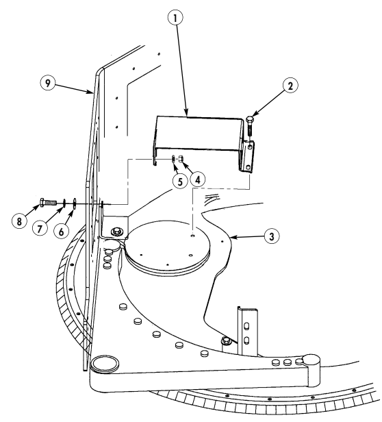

# 12-166. Control Box Assembly (O-Gpk) Replacement

This task covers:

Applicable Models M1114, M1151A1 w/Perimeter B Kit Tools General mechanic's tool kit:
automotive (Appendix B, Item 1)
Maintenance and repair shop equipment:
automotive (Appendix B, Item 2)
Material/Parts Four lockwashers (Appendix G, Item 149)

#### A. Removal B. Installation

Manual References TM 9-2320-387-24P
Equipment Condition Control box assembly cover removed 
(para. 12-165).

| Maintenance Level   |
|---------------------|

Unit a. Removal

Replacement procedures for M1114, M1151, and M1151A1 control box assembly are basically the same. M1114 vehicles do not use a spacer between the control box assembly and turret. This procedure covers the M1151 control box assembly.

1. Disconnect electrical connectors (2) and (3) from control box assembly (1). 2. Disconnect electrical connector (14) from control box assembly (1). 3. Remove four nuts (13), lockwashers (12), washers (11), control box assembly (1), spacer (10),
gasket (9), four capscrews (6), washers (7), cover (5), and gasket (4) from turret assembly (8). Discard lockwashers (12).

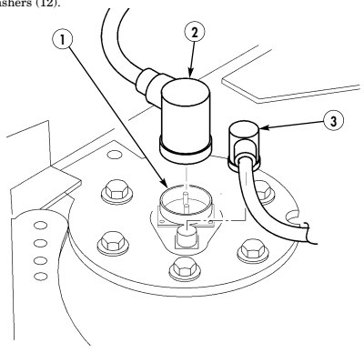

12-166.  CONTROL BOX ASSEMBLY (O-GPK) REPLACEMENT (Cont'd)

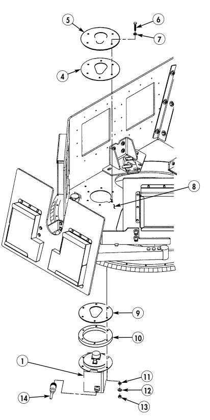

## 12-166. Control Box Assembly (O-Gpk) Replacement (Cont'D)

b. Installation 1. Install control box assembly (1) on turret assembly (8) with gasket (4), cover (5), four washers (7),
capscrews (6), gasket (9), spacer (10), four washers (11), lockwashers (12), and nuts (13).

2. Connect electrical connector (14) to control box assembly (1). 3. Connect electrical connectors (2) and (3) to control box assembly (1).

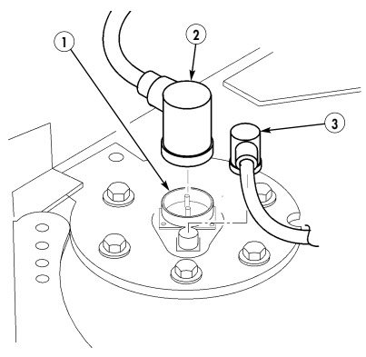

12-166. CONTROL BOX ASSEMBLY (O-GPK) REPLACEMENT (Cont'd)

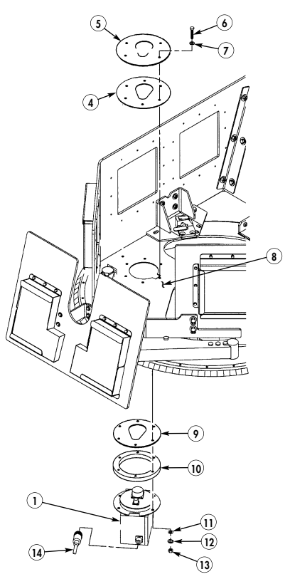

FOLLOW ON TASK:

Install control box assembly cover (para. 12-165).

# 12-167. Gunner'S Sling (O-Gpk) Replacement

This task covers:

a. Removal b. Installation

| Equipment Condition   |
|-----------------------|
| (para. 12\-159).      |

Applicable Models M1114, M1151A1 w/Perimeter B Kit Tools General mechanic's tool kit:
automotive (Appendix B, Item 1)
Maintenance and repair shop equipment:
automotive (Appendix B, Item 2)
a. Removal Remove gunner's sling (2) from turret brackets (1).

b. Installation Install gunner's sling (2) on turret brackets (1).

# 12-167. Gunner'S Sling (O-Gpk) Replacement (Cont'D)

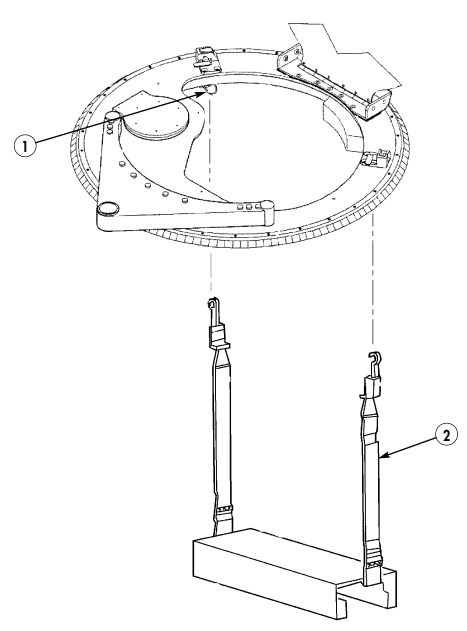

# 12-168. Joystick (O-Gpk) Replacement

This task covers:
INITIAL SETUP:
Applicable Models M1114, M1151A1 w/Perimeter B Kit Tools General mechanic's tool kit:
automotive (Appendix B, Item 1)
a. Removal b. Installation

| Manual References           |
|-----------------------------|
| TM 9\-2320\-387\-24P        |
| General Safety Instructions |

Joystick assembly is equipped with magnets in the base for easy mounting on steel surfaces.

a. Removal 1. Remove joystick (1) from side panel (2). 2. Disconnect cannon plug (5) from joystick (1). 3. Disconnect cannon plug (4) from control box assembly (3).

#### B. Installation

1. Connect cannon plug (4) to control box assembly (3). 2. Connect cannon plug (5) to joystick (1). 3. Install joystick (1) on side panel (2).

# 12-168.  Joystick (O-Gpk) Replacement (Cont'D)

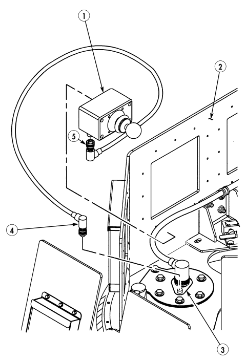

# 12-169. Fuse (O-Gpk) Replacement

This task covers:

Applicable Models M1114, M1151A1 w/Perimeter B Kit Tools General mechanic's tool kit:
automotive (Appendix B, Item 1)
Maintenance and repair shop equipment:
automotive (Appendix B, Item 2)
Material/Parts Four lockwashers (Appendix G, Item 140)

#### A. Removal B. Installation Manual References

TM 9-2320-387-24P

| Four locknuts (Appendix G, Item 106)   |
|----------------------------------------|
| Manual References                      |
| TM 9\-2320\-387\-24P                   |
| Maintenance Level                      |

- Negative battery cable disconnected (para. 4-68).

Maintenance Level Unit a. Removal

Prior to removal, tag all leads for installation.

1. Remove nut (11) and auxiliary battery cable (1) from auxiliary terminal (2). 2. Remove nut (9) and battery cable (8) from battery terminal (7). 3. Remove two capscrews (5), lockwashers (4), washers (3), and fuse (10) from rear panel (6). Discard lockwashers (4).

4. Remove nut (15) and cable (14) from battery terminal (13). 5. Remove nut (16) and positive cable (17) from auxiliary terminal (18). 6. Remove two capscrews (22), lockwashers (21), washers (20), and fuse (19) from rear panel (12).

Discard lockwashers (21).

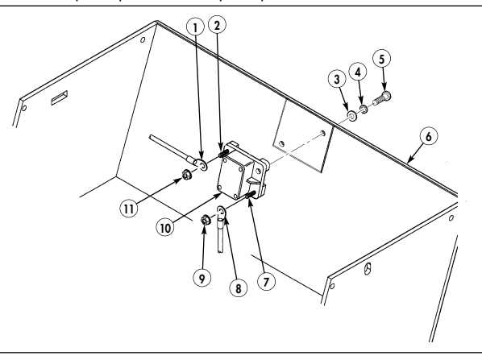

12-169. FUSE (O-GPK) REPLACEMENT (Cont'd)

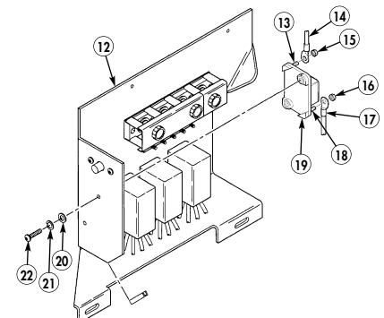

## 12-169. Fuse (O-Gpk) Replacement (Cont'D)

#### B. Installation

1., Install fuse (8) on rear panel (1) with two washers (9), lockwashers (10), and capscrews (11). Tighten capscrews (11) to 68 lb-in (8 N•m).

2. Install positive cable (6) on auxiliary terminal (7) with nut (5). Tighten nut (5) to 10 lb-ft (14 N•m). 3. Install cable (3) on battery terminal (2) with nut (4). Tighten nut (4) to 10 lb-ft (14 N•m). 4. Install fuse (21) on rear panel (17) with two washers (14), lockwashers (15), and capscrews (16).

Tighten capscrews (16) to 68 lb-in (8 N•m).

5. Install battery cable (19) on battery terminal (18) with nut (20). Tighten nut (20) to 10 lb-ft
(14 N•m).

6. Install auxiliary battery cable (12) on auxiliary terminal (13) with nut (22). Tighten nut (22) to 10 lb-ft (14 N•m).

# 12-169. Fuse (O-Gpk) Replacement (Cont'D)

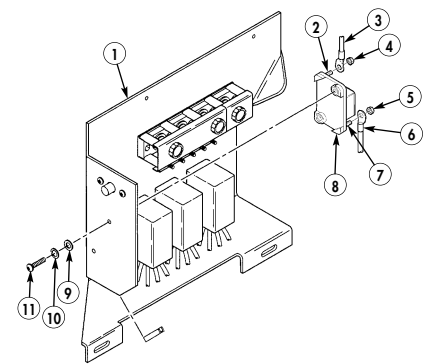

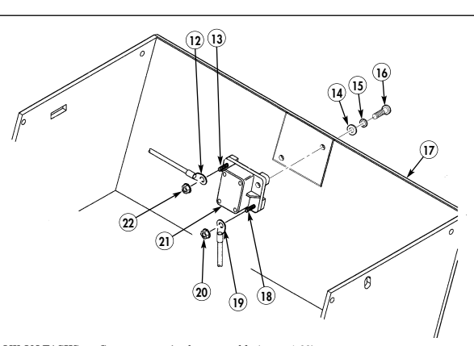

FOLLOW-ON TASKS:  - Connect negative battery cable (para. 4-68).

- Install battery box cover (O-GPK) (para. 12-160).

# 12-170. M4 Gun Brackets (O-Gpk) Replacement

This task covers:

#### A. Removal B. Installation Initial Setup:

| Applicable Models                      | Materials/Parts (Cont'd)                  |
|----------------------------------------|-------------------------------------------|
| M1114, M1151A1 w/Perimeter B Kit       | Four lockwashers (Appendix G, Item 158.1) |
| Tools                                  | Two locknuts (Appendix G, Item 111)       |
| General mechanic's tool kit:           | Manual References                         |
| automotive (Appendix B, Item 1)        | TM 9\-2320\-387\-24P                      |
| Maintenance and repair shop equipment: | Equipment Condition                       |
| automotive (Appendix B, Item 2)        | Fuse removed (para. 12\-169).             |
| Materials/Parts                        |                                           |

#### A. Removal

1. Remove two locknuts (9), washers (8), capscrews (11), lockwashers (12), washers (13), and M4 rear bracket (7) from rear armor panel (10). Discard two locknuts (9) and lockwashers (12).

2. Remove two capscrews (4) and M4 front bracket (2) from left armor panel (3). 3. Remove locknut (5), capscrew (1), and tension spring clip (6) from M4 front bracket (2). Discard locknut (5).

#### B. Installation

1. Install tension spring clip (6) on M4 front bracket (2) with capscrew (1) and locknut (5). Tighten capscrew (1) to 37 lb-ft (50 N•m).

2. Install M4 front bracket (2) to left armor panel (3) with two capscrews (4). Tighten capscrews (4) to 21 lb-ft (28 N•m).

3. Install M4 rear bracket (7) on rear armor panel (10) with two washers (13), lockwashers (12),
capscrews (11), four washers (8), and locknuts (9). Tighten capscrews (11) to 37 lb-ft (50 N•m).

12-170. M4 GUN BRACKETS (O-GPK) REPLACEMENT (Cont'd)

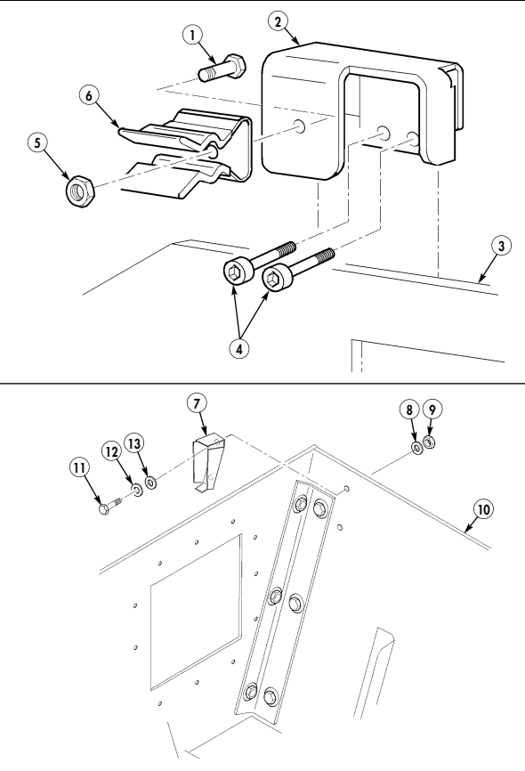

# 12-171. Wiring Harness (O-Gpk) Replacement

This task covers:

Applicable Models M1114, M1151A1 w/Perimeter B Kit Tools General mechanic's tool kit:
automotive (Appendix B, Item 1)
Maintenance and repair shop equipment:
automotive (Appendix B, Item 2)
Materials/Parts Two lockwashers (Appendix G, Item 46)

#### A. Removal B. Installation

| Manual References                |
|----------------------------------|
| TM 9\-2320\-387\-24P             |
| Equipment Condition              |
| Turret weapon station cover open |
| (TM 9\-2320\-387\-10).           |
| Maintenance Level                |
| Unit                             |

#### A. Removal

1. Remove two capscrews (7) from cover plate (1) and B-beam (2). 2. Remove two capscrews (6), lockwashers (5), washers (4), and cover plate (1) from battery box (3).

Discard lockwashers (5).

3. Remove small cover assembly (13) from power buss bar (9). 4. Remove nut (12), air conditioning connector (11), fuse connectors (10), and cable (8) from power buss bar (9).

5. Remove nut (15) and negative lead (16) of wire harness (18) from grounding buss bar (17). 6. Remove nut (20) and cable (19) from battery terminal (24). 7. Remove nut (21) and positive cable (22) from auxiliary terminal (23).

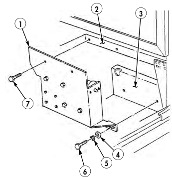

12-171. WIRING HARNESS (O-GPK) REPLACEMENT (Cont'd)

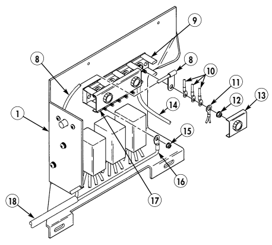

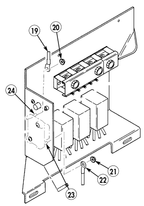

## 12-171. Wiring Harness (O-Gpk) Replacement (Cont'D)

8. Remove locknut (5), washers (6), capscrew (1), washer (2), clamp (4), and wiring harness (3) from B-beam panel (7). Discard locknut (5).

9. Remove capscrew (13), washer (14), clamp (15) and wiring harness (3) from B-pillar (8).

10. Remove capscrew (12), washer (11), clamp (10) and wiring harness (3) from B-beam gusset (9). 11. Remove two capscrews (19), washers (18), clamps (16), and wiring harness (3) from right turret support (17).

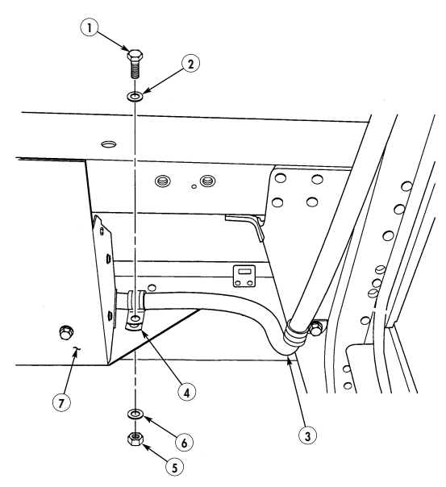

12-171. WIRING HARNESS (O-GPK) REPLACEMENT (Cont'd)

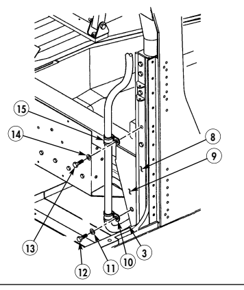

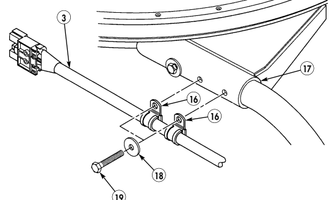

## 12-171. Wiring Harness (O-Gpk) Replacement (Cont'D)

#### B. Installation

1. Apply sealing compound to two capscrews (5), capscrew (10), and capscrew (11). 2. Install wiring harness (1) on right turret support (3) with two capscrews (5), washers (4), and clamps (2). Tighten capscrews (5) to 37 lb-ft (50 N•m).

3. Install clamp (8) and wiring harness (1) on B-beam gusset (7) with capscrew (10) and washer (9).

Tighten capscrew (10) to 6 lb-ft (8 N•m).

4. Install clamp (13) and wiring harness (1) on B-pillar (6) with capscrew (11) and washer (12).

Tighten capscrew (11) to 21 lb-ft (28 N•m).

5. Install clamp (16) and wiring harness (1) on B-beam panel (19) with washer (15), capscrew (14),
washer (17), and locknut (18).

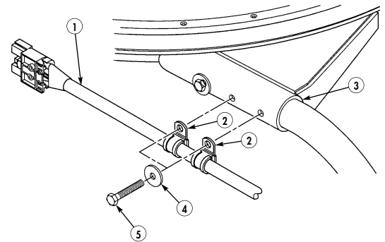

# 12-171. Wiring Harness (O-Gpk) Replacement (Cont'D)

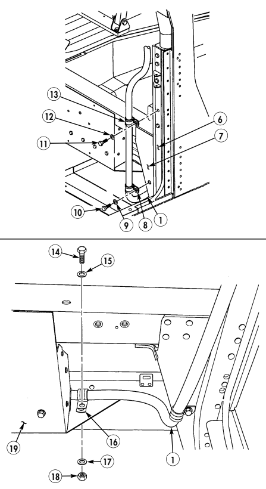

## 12-171. Wiring Harness (O-Gpk) Replacement (Cont'D)

6. Install negative lead (10) of wiring harness (12) on grounding buss bar (11) with locknut (9).

Tighten locknut (9) to 80 lb-in (9 N•m).

7. Install cable (1), fuse connectors (4), and air conditioning connector (5) on power buss bar (3) with locknut (6). Tighten locknut (6) to 80 lb-in (9 N•m).

8. Install small cover assembly (7) on power buss bar (3).

#### Caution

Ensure wiring on front side of cover plate is not pinched between B-beam and cover plate. Failure to do so may result in damage to equipment.

9. Install cover plate (1) on battery box (13) with two capscrews (17), lockwashers (16), and washers (15).

10. Install cover plate (1) on B-beam (13) with capscrew (18). 11. Install positive cable (22) on auxiliary terminal (23) with nut (21). Tighten nut (21) to 10 lb-ft (14 N•m).

12. Install cable (19) on battery terminal (24) with nut (20). Tighten nut (20) to 10 lb-ft (14 N•m).

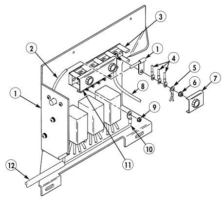

# 12-171. Wiring Harness (O-Gpk) Replacement (Cont'D)

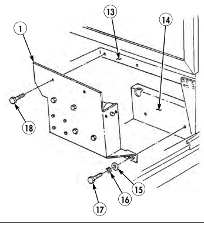

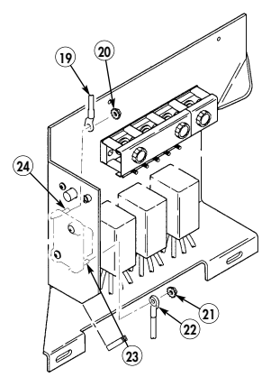

FOLLOW-ON TASK:

Connect battery ground cable (para. 4-68).

# 12-172. Battery Powered Motorized Traversing Unit (Bpmtu) (O-Gpk) Adjustment

This task covers:
a. Adjustment

Applicable Models M1114, M1151A1 w/Perimeter B Kit Tools General mechanic's tool kit:
automotive (Appendix B, Item 1)
Maintenance and repair shop equipment:
automotive (Appendix B, Item 2)
Equipment Condition Turret weapon station cover opened.

(TM 9-2320-387-10).

| Maintenance Level   |
|---------------------|

Unit a. Adjustment

If necessary, manually rotate turret to locate pintle weapon mount toward front of vehicle.

1. Visually inspect engagement of drive gear (1) into turret stop ring (2) and adjust two bearings (9) to achieve full engagement. Tighten capscrews (8) to 37 lb-ft (50 N•m).

#### Warning

Ensure roof is clear of tools, parts, personnel, etc. and cargo hatch is closed before operating turret. Failure to do so may cause damage to equipment or injury to personnel.

Motorized traversing gear system will be noticeably louder in area of hardest engagement of drive gear and turret stop ring.

2. Activate motorized traversing unit by moving stop switch (5), on system control box assembly (6),
to the ON (out) position and move motor engagement control (4) to DRIVE position.

3. While rotating turret, using joystick assembly, listen to system and determine area of hardest engagement of drive gear (1) into turret stop ring (2). Stop turret at location of hardest engagement.

#### Warning

Turn off battery powered motorized traversing unit (BPMTU) before performing any adjustments to the motor and drive assembly. Failure to do so may cause damage to equipment or injury to personnel 4. Loosen four capscrews (8) and adjust two bearings (9) to achieve full engagement of drive gear (1)
into turret stop ring (2). Tighten capscrews (8) to 37 lb-ft (50 N•m).

A properly adjusted motor and drive assembly chain has no slack.

5. Inspect the motor and drive assembly chain (10) for excessive slack.

Ensure motor engagement control is in the NEUTRAL position.

6. If necessary, move motor engagement control (4) to NEUTRAL position by pushing in and rotating down.

7. To adjust chain (10), loosen six capscrews (3) holding the motor and drive (11) to drive housing (7).

Use hand to slide motor and drive assembly over until there is no slack in drive chain. Tighten capscrews (3) to 6 lb-ft (8 N•m).

12-348 Change 5

## 12-172. Battery Powered Motorized Traversing Unit (Bpmtu) (O-Gpk) Adjustment (Cont'D)

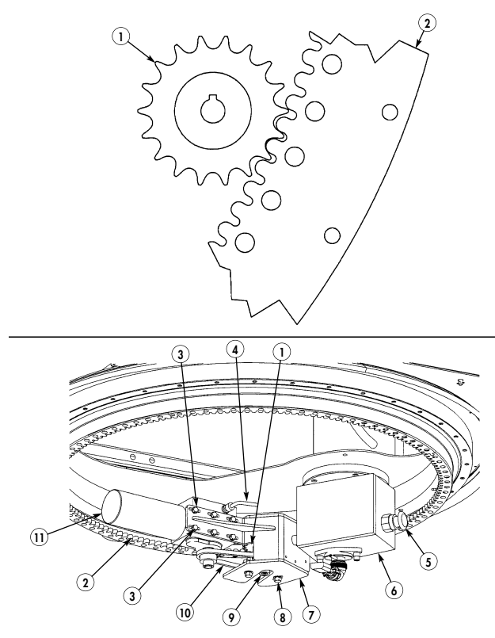

FOLLOW-ON TASK: Close turret weapon station cover (TM 9-2320-387-10).

| This task covers:                                                       |                                    |
|-------------------------------------------------------------------------|------------------------------------|
| a.  Removal                                                             | b.  Installation                   |
| INITIAL SETUP:                                                          |                                    |
| Applicable Models                                                       | Material/Parts                     |
| M1114, M1151A1 w/Perimeter B Kit                                        | Two locknuts (Appendix G, Item 82) |
| Tools                                                                   | Manual References                  |
| General mechanic's tool kit:                                            | TM 9\-2320\-387\-24P               |
| automotive (Appendix B, Item 1)  Maintenance and repair shop equipment: | Maintenance Level                  |
| automotive (Appendix B, Item 2)                                         | Unit                               |
| a. Removal                                                              |                                    |

# Section Xii. Tow Gunner'S Protection Kit (T-Gpk) (M1167) 12-174. Tow Gunner'S Protection Kit (T-Gpk) Replacement

This task covers:

Tools General mechanic's tool kit:
automotive (Appendix B, Item 1)
Torque wrench 3/8-in. drive, 75 lb-ft
(Appendix B, Item 2.1)
Materials/Parts Five lockwashers (Appendix G, Item 144) Locknut (Appendix G, Item 133.21)
Manual References TM 9-2320-387-24P
a. Removal b. Installation

#### Equipment Condition

- FCS tray removed (para. 11-179). - Turret pintle removed (para. 11-183).

General Safety Instructions Direct all personnel to stand clear during hoisting operations.

| Maintenance Level   |
|---------------------|

Unit

#### Warning

Direct all personnel to stand clear during hoisting operations. A heavy, swinging load can cause injury to personnel and damage to equipment.

#### A. Removal

1. Remove five capscrews (2), lockwashers (3), and washers (4) from T-GPK (1). Discard lockwashers (3). 2. Remove locknut (8), washer (7), capscrew (5), and washer (6) from T-GPK (1). Discard locknut (8). 3. Using lifting device, remove T-GPK (1) from vehicle.

#### B. Installation

1. Using lifting device, position T-GPK (1) on vehicle. 2. Install T-GPK (1) on vehicle with washer (6), capscrew (5), washer (7), and locknut (8). 3. Secure T-GPK (1) to vehicle with five washers (4), lockwashers (3), and capscrews (2).

Tighten capscrews (2) to 35 lb-ft (47 N•m).

4. Tighten locknut (8) to 49 lb-ft (66 N•m).

# 12-174. Tow Gunner'S Protection Kit (T-Gpk) Replacement (Cont'D)

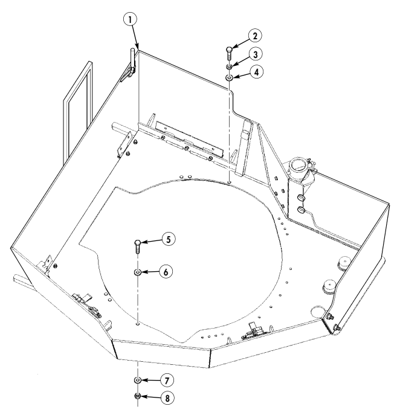

FOLLOW-ON TASKS:  -  Install turret pintle (para. 11-183).
- •  -  -  -  -   -  Install FCS tray (para. 11-179).

# 12-175. Tow Gunner'S Protection Kit (T-Gpk) Shelter Replacement

This task covers:
INITIAL SETUP:
Tools General mechanic's tool kit:
automotive (Appendix B, Item 1)
Torque wrench 3/8-in. drive, 75 lb-ft 
(Appendix B, Item 2.1)

| Material/Parts   |
|------------------|

Three assistants Materials/Parts Thirteen lockwashers (Appendix G, Item 144) Eighteen locknuts (Appendix G, Item 133.21)

#### A. Removal

| TM 9\-2320\-387\-24P               | Equipment Condition   |
|------------------------------------|-----------------------|
| Control box assembly cover removed | (para. 12\-165).      |
| Maintenance Level                  | Unit                  |

a. Removal b. Installation

#### Warning

- Armor plates are extremely heavy and must be supported during removal and installation. Failure to do so may result in injury to personnel or damage to equipment.

- When climbing on vehicle roof, soldiers should maintain three points of contact with the vehicle to avoid slips and falls. Failure to do so may result in injury to personnel.

1. Remove locknut (14), washer (15), capscrew (6), and washer (5) from fire control tray (1).

Discard locknut (14).

Mark capscrews for installation.

2. Remove three capscrews (2), (8), and (10), lockwashers (3), (9), and (11), washers (4), (7), and (12),
and fire control tray (1) from pintle (13). Discard lockwashers (3), (9), and (11).

12-175. TOW GUNNER'S PROTECTION KIT (T-GPK) SHELTER REPLACEMENT (Cont'd)

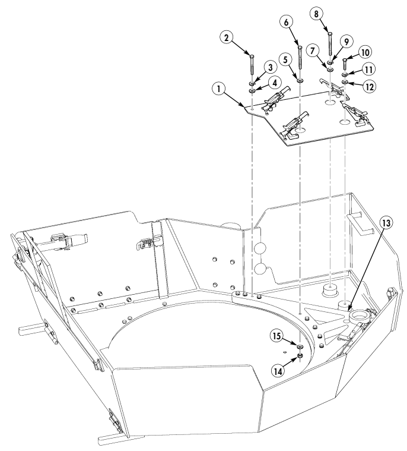

# 12-175. Tow Gunner'S Protection Kit (T-Gpk) Shelter Replacement (Cont'D)

#### Warning

Armor plates are extremely heavy and must be supported during removal. Two soldiers must be used to lift the pintle weapon mount from the vehicle. Failure to do so may result in injury to personnel or damage to equipment.

- Mark capscrews for installation in steps 3 and 4. - There are two different pintle configurations available on the T-GPK. Removal procedures are the same.

3. Remove six locknuts (8), washers (7), capscrews (2), and washers (3) from pintle (1).

Discard locknuts (8).

4. Remove five capscrews (4), lockwashers (5), washers (6), and pintle (1) from T-GPK (9).

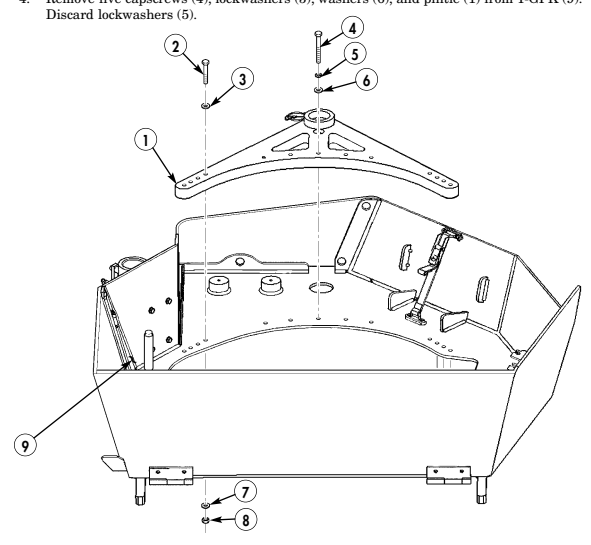

12-175. TOW GUNNER'S PROTECTION KIT (T-GPK) SHELTER REPLACEMENT (Cont'd)

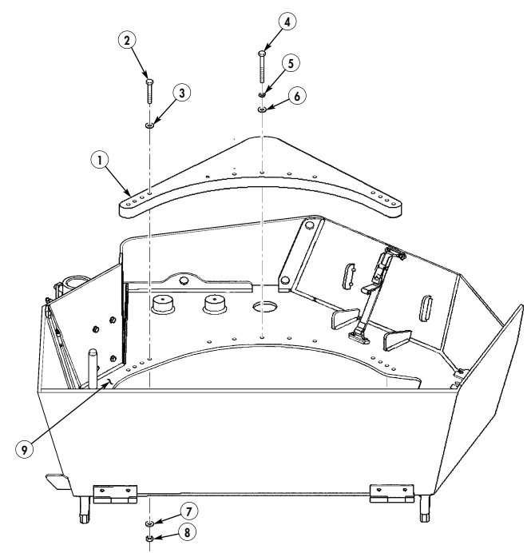

# 12-175. Tow Gunner'S Protection Kit (T-Gpk) Shelter Replacement (Cont'D)

#### Warning

Armor plates are extremely heavy and must be supported during removal. Two soldiers must be used to lift the front and rear armor plates from the vehicle. Failure to do so may result in injury to personnel or damage to equipment.

5. Remove three lynch pins (2) and front cover (1) from T-GPK (3). 6. Remove three locknuts (12), washers (11), capscrews (8), and washers (7) from left rear door (4).

Discard locknuts (8).

7. Unhook latch (9) from bracket (5) on left rear door (4). 8. Slide bolt handle (6) away from door stop (10) and remove left rear door (4) from T-GPK (3).

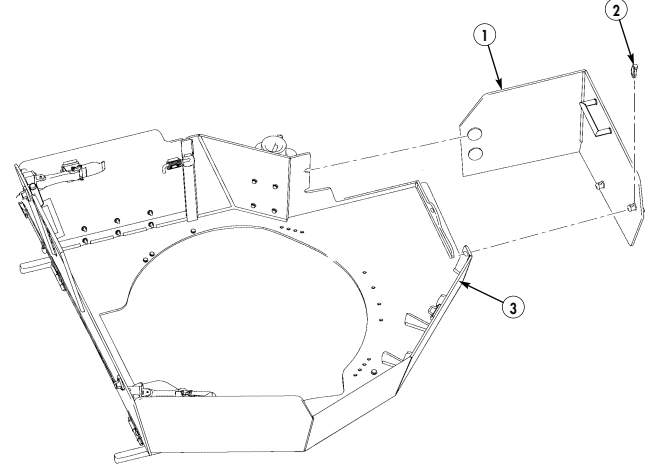

12-175. TOW GUNNER'S PROTECTION KIT (T-GPK) SHELTER REPLACEMENT (Cont'd)

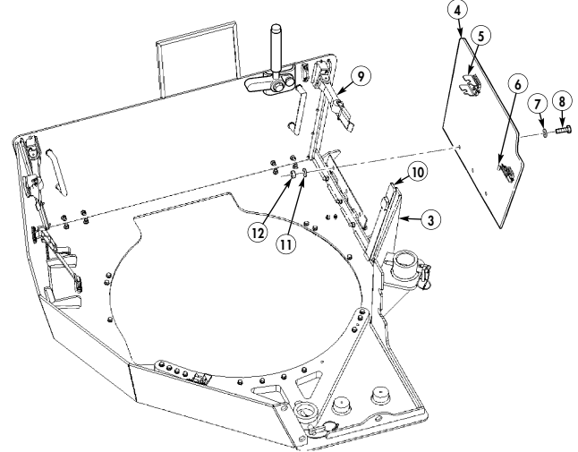

# 12-175. Tow Gunner'S Protection Kit (T-Gpk) Shelter Replacement (Cont'D)

#### Warning

Armor plates are extremely heavy and must be supported during removal. Two soldiers must be used to lift the rear armor plate from the vehicle. Failure to do so may result in injury to personnel or damage to equipment.

9. Remove four locknuts (7), washers (6), capscrews (5), and washers (4) from rear door (3).

Discard locknuts (7).

10. Unhook latch (2) from bracket (1) and remove rear door (3) from T-GPK (8). 11. Remove five capscrews (9), lockwashers (10), and washers (11) from T-GPK (8). Discard lockwashers (10). 12. Remove locknut (15), washer (14), capscrew (12), and washer (13) from T-GPK (8). Discard locknut (15).

#### Warning

Four soldiers must be used to lift the T-GPK shell from the roof. Failure to do so may result in injury to personnel or damage to equipment.

13. Remove T-GPK (8) from vehicle.

b. Installation

#### Warning

- Armor plates are extremely heavy and must be supported during installation. Two soldiers must be used to lift the rear armor plate onto the vehicle. Failure to do so may result in injury to personnel or damage to equipment.

- Four soldiers must be used to lift the T-GPK shell from the roof.

Failure to do so may result in injury to personnel or damage to equipment.

- When climbing on vehicle roof, soldiers should maintain three points of contact with the vehicle to avoid slips and falls. Failure to do so may result in injury to personnel.

1. Position T-GPK (8) onto vehicle. 2. Install T-GPK (8) on vehicle with washer (13), capscrew (12), washer (14), and locknut (15). Tighten locknut (15) 49 lb-ft (66 N•m).

3. Secure T-GPK (8) to vehicle with five washers (11), lockwashers (10), and capscrews (9). Tighten capscrews (9) to 35 lb-ft (47 N•m).

4. Install rear door (3) on T-GPK (8) and hook latch (2) to bracket (1). 5. Secure rear door (3) to T-GPK (8) with four washers (4), capscrews (5), washers (6), and locknuts (7).

Tighten locknuts (7) to 44 lb-ft (60 N•m).

12-175. TOW GUNNER'S PROTECTION KIT (T-GPK) SHELTER REPLACEMENT (Cont'd)

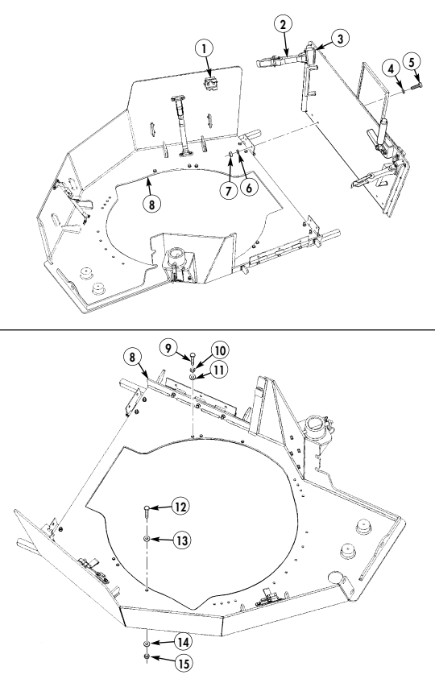

# 12-175. Tow Gunner'S Protection Kit (T-Gpk) Shelter Replacement (Cont'D)

#### Warning

Armor plates are extremely heavy and must be supported during installation. Two soldiers must be used to lift the front and rear armor plates onto the vehicle. Failure to do so may result in injury to personnel or damage to equipment.

6. Install left rear door (1) on T-GPK (8) and slide bolt handle (3) onto stop (7). 7. Secure left rear door (1) to T-GPK (8) with latch (6) on bracket (2). 8. Secure left rear door (1) to T-GPK (8) with three washers (4), capscrews (5), washers (9), and locknuts (10). Tighten locknuts (10) 44 lb-ft (60 N•m).

9. Install front cover (11) on T-GPK (8) with three lynch pins (12).

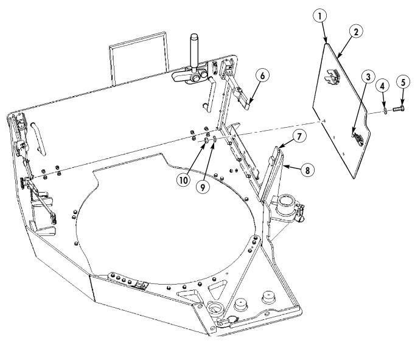

12-175. TOW GUNNER'S PROTECTION KIT (T-GPK) SHELTER REPLACEMENT (Cont'd)

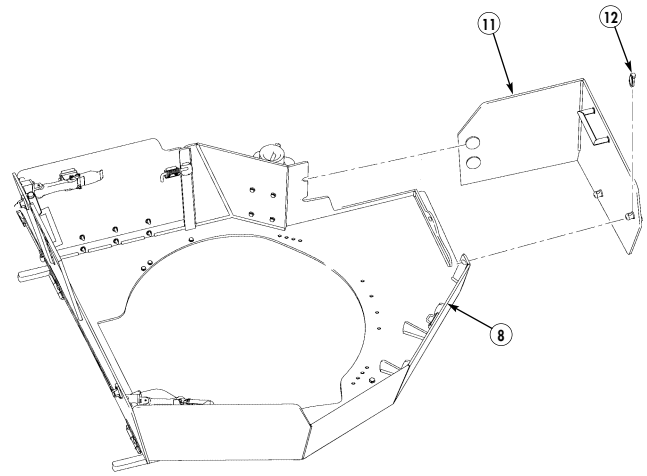

# 12-175. Tow Gunner'S Protection Kit (T-Gpk) Shelter Replacement (Cont'D)

#### Warning

Armor plates are extremely heavy and must be supported during installation. Two soldiers must be used to lift the front and rear armor plates onto the vehicle. Failure to do so may result in injury to personnel or damage to equipment.

There are two different pintle configurations available on the T-GPK. Installation procedures are the same.

10. Install pintle (1) on T-GPK (9) with five washers (6), lockwashers (3), and capscrews (5). Tighten capscrews (5) to 35 lb-ft (47 N•m).

11. Secure pintle (1) to T-GPK (9) with six washers (3), capscrews (2), washers (7), and locknuts (8).

Tighten locknuts (8) to 49 lb-ft (66 N•m).

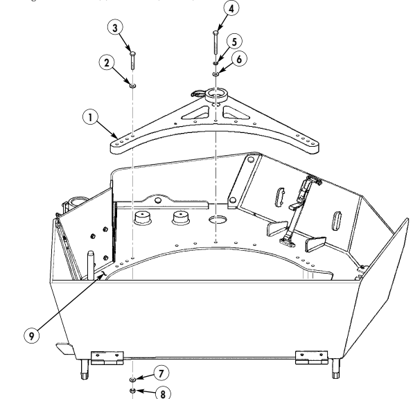

12-175. TOW GUNNER'S PROTECTION KIT (T-GPK) SHELTER REPLACEMENT (Cont'd)

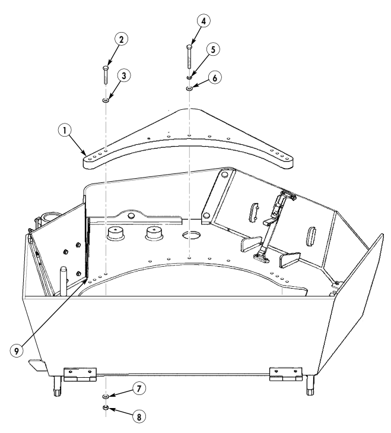

## 12-175. Tow Gunner'S Protection Kit (T-Gpk) Shelter Replacement (Cont'D)

12. Install fire control tray (1) on pintle (13) with three washers (12), (7), and (4),
lockwashers (11), (9), and (3), and capscrews (10), (8), and (2). Tighten capscrews (10), (8), and (2) to 35 lb-ft (47 N•m).

13. Secure fire control tray (1) to pintle (13) with washer (5), capscrew (6), washer (15), and locknut (14). Tighten locknut (14) to 49 lb-ft (66 N•m).

12-175. TOW GUNNER'S PROTECTION KIT (T-GPK) SHELTER REPLACEMENT (Cont'd)

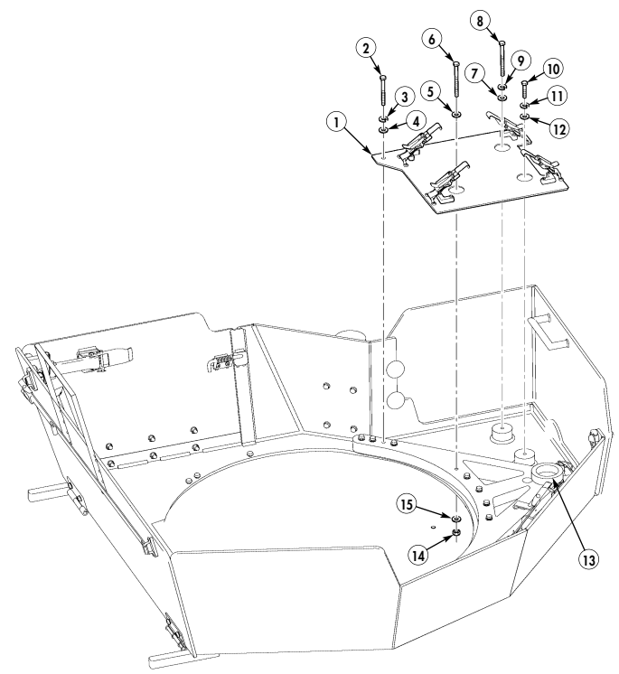

# 12-176. Gunner'S Shelter Cover (T-Gpk) Replacement

This task covers:

| INITIAL SETUP:                         |                      |
|----------------------------------------|----------------------|
| Applicable Models                      | Manual References    |
| M1114, M1151A1 w/Perimeter B Kit       | TM 9\-2320\-387\-24P |
| Tools                                  | Maintenance Level    |
| General mechanic's tool kit:           | Unit                 |
| automotive (Appendix B, Item 1)        |                      |
| Maintenance and repair shop equipment: |                      |
| automotive (Appendix B, Item 2)        |                      |

a. Removal b. Installation

#### Warning

Armor plates are extremely heavy and must be supported during removal and installation. Failure to do so may result in injury to personnel or damage to equipment.

#### A. Removal

1. Remove three nuts (3), washers (2), bolts (8), and lynch pins (5) from front cover (1). 2. Remove front cover (1) from T-GPK (9) by sliding front cover knobs (11) out of T-GPK slots (10). 3. Remove brackets (6) from bolts (8). 4. Remove three locknuts (7), capscrews (4), and lynch pins (5) from brackets (6). Discard locknuts (7).

#### B. Installation

1. Install three lynch pins (5) on brackets (6) with three capscrews (4) and locknuts (7). 2. Install brackets (6) on bolts (8). 3. Install front cover (1) to T-GPK (9) by sliding front cover knob (11) into T-GPK slots (10). 4. Secure front cover (1) to T-GPK (9) with three bolts (8), lynch pins (5), washers (2), and nuts (3).

# 12-176.  Gunner'S Shelter Cover (T-Gpk) Replacement (Cont'D)

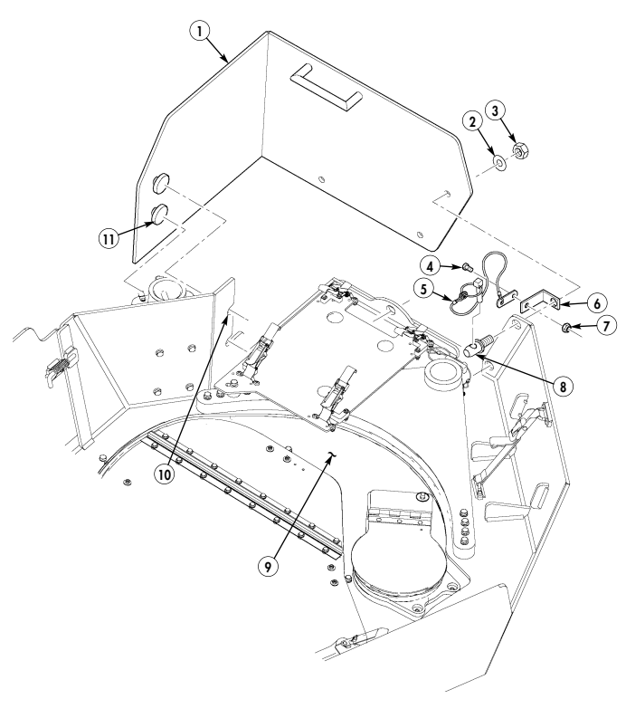

# 12-177. Secondary Weapon Mount (T-Gpk) Replacement

This task covers:

Tools General mechanic's tool kit:
automotive (Appendix B, Item 1)
Torque wrench 3/8-in. drive, 75 lb-ft 
(Appendix B, Item 2.1)
Materials/Parts Locknut (Appendix G, Item 133.21) Four locknuts (Appendix G, Item 101.9)

#### A. Removal

1. Remove locknut (4), capscrew (2), and quick-release pin (3) from secondary weapon mount (1).

Discard locknut (4).

2. Remove four locknuts (5), washers (6), capscrews (9), washers (8), and secondary weapon mount (1)
from T-GPK (7). Discard locknuts (5).

#### B. Installation

1. Install secondary weapon mount (1) on T-GPK (7) with four washers (8), capscrews (9), washers (6),
and locknuts (5). Tighten locknuts (5) to 44 lb-ft (66 N•m).

2. Install quick-release pin (3) on secondary weapon mount (1) with capscrew (2), and locknut (4).

a. Removal b. Installation

| Manual References    |
|----------------------|
| TM 9\-2320\-387\-24P |
| Maintenance Level    |

# 12-177. Secondary Weapon Mount (T-Gpk) Replacement (Cont'D)

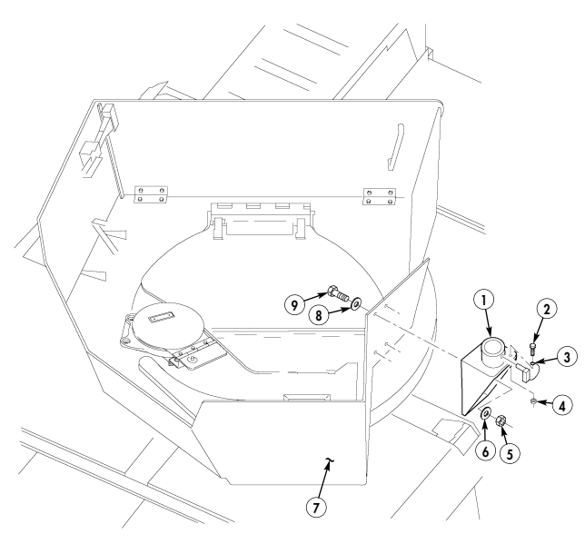

# 12-178. Left Rear Door (T-Gpk) Replacement

This task covers:

#### Initial Setup: Tools

General mechanic's tool kit:
automotive (Appendix B, Item 1)
Torque wrench 3/8-in. drive, 75 lb-ft 
(Appendix B, Item 2.1)

#### Materials/Parts

Six locknuts (Appendix G, Item 133.21) Two lockwashers (Appendix G, Item 146)
Manual References TM 9-2320-387-24P
a. Removal b. Installation

#### General Safety Instructions

| Manual References                    |
|--------------------------------------|
| TM 9\-2320\-387\-24P                 |
| Equipment Condition                  |
| - Battery box cover removed (O\-GPK) |

Armor plates are extremely heavy and must be supported during removal and installation. Failure to do so may result in injury to personnel or damage to equipment.

#### A. Removal

1. Remove three locknuts (11), washers (10), capscrews (7), washers (8), and hinge (9) from T-GPK (13).

Discard locknuts (7).

2. Unhook latch (14) from bracket (2) on T-GPK (13). 3. Slide bolt handle (17) away from door stop (12). 4. Remove two capscrews (15), lockwashers (16), and bolt handle (17) from left rear door (1).

Discard lockwashers (16).

5. Remove three locknuts (4), washers (3), capscrews (6), washers (5), and left rear door (1) from T-GPK (13). Discard locknuts (6).

#### B. Installation

1. Install hinge (9) on T-GPK (13) with three washers (8), capscrews (7), washers (10), and locknuts (11).

Tighten locknuts (11) to 44 lb-ft (60 N•m).

2. Hook latch (14) to bracket (2) on T-GPK (13). 3. Install bolt handle (17) on left rear door (1) with two washers (16) and capscrews (15). 4. Slide bolt handle (17) on to door stop (12). 5. Install left rear door (1) on T-GPK (13) with three washers (5), capscrews (6), washers (3), and locknuts (4). Tighten locknuts (4) to 44 lb-ft (60 N•m).

# 12-178. Left Rear Door (T-Gpk) Replacement (Cont'D)

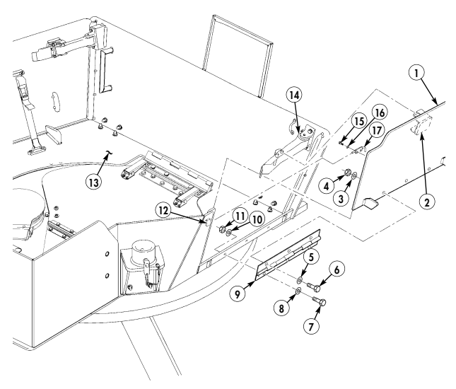

# 12-179. Gunner'S Shelter Rear Door (T-Gpk) Maintenance

This task covers:
b. Disassembly d. Installation

a. Removal c. Assembly

| M1114, M1151A1 w/Perimeter B Kit                                        | Two lockwashers (Appendix G, Item 144)   |
|-------------------------------------------------------------------------|------------------------------------------|
| Tools                                                                   | Three locknuts (Appendix G, Item 106)    |
| General mechanic's tool kit:                                            | Manual References                        |
| automotive (Appendix B, Item 1)  Maintenance and repair shop equipment: | TM 9\-2320\-387\-24P                     |
| automotive (Appendix B, Item 2)                                         | Maintenance Level                        |
|                                                                         | Unit                                     |

Locknut (Appendix G, Item 83) Two locknuts (Appendix G, Item 73.1) Eight locknuts (Appendix G, Item 133.21)

#### Warning

Armor plates are extremely heavy and must be supported during removal and installation. Failure to do so may result in injury to personnel or damage to equipment.

#### A. Removal

1. Remove four locknuts (20), washers (19), capscrews (16), and washers (17) from rear door (7).

Discard locknuts (20).

2. Unlatch two latches (6) from brackets (2) and remove rear door (7) from T-GPK (1). 3. Remove four locknuts (30), washers (29), capscrews (28), washers (27), and two hinges (26) and (18)
from T-GPK (1). Discard locknuts (30).

#### B. Disassembly

1. Remove four capscrews (3), lockwashers (4), washers (5), and two latches (6) from rear door (7).

Discard lockwashers (4).

2. Remove two locknuts (12), washers (11), capscrews (8), washers (9), and stop block (10) from rear door (7). Discard locknuts (12).

3. Remove locknut (15), two washers (14), capscrew (24), washers (25), and bushing (23) from turret latch (13) and rear door (7). Discard locknut (15).

4. Remove quick-release plunger (22), nut (21), and turret latch (13) from rear door (7).

#### C. Assembly

1. Install turret latch (13) on rear door (7) with nut (21) and quick-release plunger (22). 2. Secure turret latch (13) to rear door (7) with capscrew (24), two washers (25), bushing (23), two washers (14), and locknut (15).

3. Install stop block (10) on rear door (7) with two washers (9), capscrews (8), washers (11), and locknuts (12).

4. Install two latches (6) on rear door (7) with four washers (5), lockwashers (4), and capscrews (3).

# 12-179. Gunner'S Shelter Rear Door Maintenance (Cont'D)

#### D. Installation

1. Install two hinges (26) and (18) on T-GPK (1) with four washers (27), capscrews (28), washers (29),
and locknuts (30). Tighten locknut (30) to 44 lb-ft (60 N•m).

2. Install rear door (7) on T-GPK (1) and hook two latches (6) to brackets (2). 3. Secure rear door (7) to T-GPK (1) with four washers (17), capscrews (16), washers (19), and locknuts (20). Tighten locknuts (20) to 44 lb-ft (60 N•m).

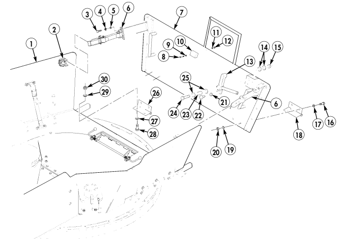

# 12-180. Footman Loop And Strap (T-Gpk) Replacement

This task covers:

Tools General mechanic's tool kit:
automotive (Appendix B, Item 1)
Torque wrench 3/8-in. drive, 75 lb-ft 
(Appendix B, Item 2.1)
Materials/Parts Two lockwashers (Appendix G, Item 146)
a. Removal b. Installation Manual References

| Sealing compound   |
|--------------------|
| Manual References  |

Replacement procedures for footman loops and straps are basically the same. This procedure covers the rear footman loop and strap.

#### A. Removal

1. Unlatch rear door strap (3) from bracket (4). 2. Remove two capscrews (6), lockwashers (5), and bracket (4) from T-GPK (1). Discard lockwashers (5).

3. Remove four screws (8), two footman loops (7), and footman loop straps (2) from T-GPK (1).

#### B. Installation

1. Install two footman loop straps (2) and footman loops (7) on T-GPK (1) with four screws (8). 2. Install bracket (4) on T-GPK (1) with two lockwashers (5) and capscrews (6). Tighten capscrews (6)
to 8 lb-ft (10 N•m).

3. Latch rear door strap (3) on bracket (4).

12-180. FOOTMAN LOOP AND STRAP (T-GPK) REPLACEMENT (Cont'd)

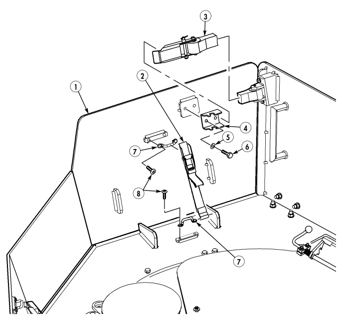

# 12-181. Tow Gunner'S Protection Kit (T-Gpk) Base Replacement

This task covers:

#### Initial Setup: Tools

General mechanic's tool kit:
automotive (Appendix B, Item 1)
Torque wrench 3/8-in. drive, 75 lb-ft
(Appendix B, Item 2.1)

#### Materials/Parts

Five lockwashers (Appendix G, Item 144) Locknut (Appendix G, Item 133.21)
Manual References TM 9-2320-387-24P
a. Removal b. Installation

#### Equipment Condition

- FCS tray removed (para. 11-179). - Turret pintle removed (para. 11-183). - Gunner's shelter cover (T-GPK) removed 
(para. 12-176).

- Left side plate (T-GPK) removed (para. 12-178). - Gunner's shelter rear door (T-GPK) removed
(para. 12-179).

General Safety Instructions Direct all personnel to stand clear during hoisting operations.

Maintenance Level Unit

#### Warning

Direct all personnel to stand clear during hoisting operations. A heavy, swinging load can cause injury to personnel and damage to equipment.

#### A. Removal

1. Remove five capscrews (2), lockwashers (3), and washers (4) from T-GPK (1). Discard lockwashers (3). 2. Remove locknut (8), washer (7), capscrew (5), and washer (6) from T-GPK (1). Discard locknut (8). 3. Using lifting device, remove T-GPK (1) from vehicle.

#### B. Installation

1. Using lifting device, position T-GPK (1) on vehicle. 2. Install T-GPK (1) on vehicle with washer (6), capscrew (5), washer (7), and locknut (8). 3. Secure T-GPK (1) to vehicle with five washers (4), lockwashers (3), and capscrews (2). Tighten locknut (8) to 35 lb-ft (47 N•m).

4. Tighten locknut (5) to 49 lb-ft (66 N•m).

# 12-181. Tow Gunner'S Protection Kit (T-Gpk) Base Replacement (Cont'D)

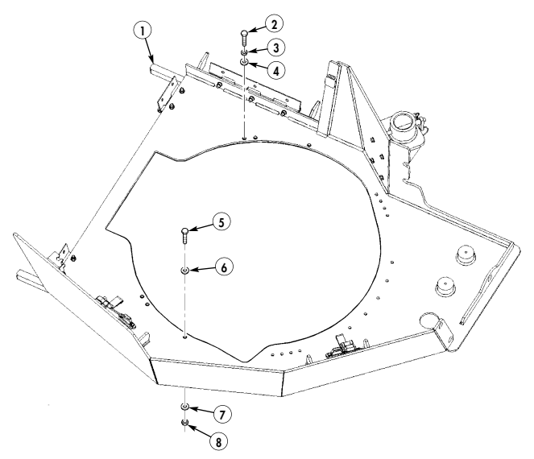

FOLLOW-ON TASKS: - Install gunner's shelter rear door (T-GPK) (para. 12-179).

- Install left side plate (T-GPK) (para. 12-178). - Install gunner's shelter cover (T-GPK) (para. 12-176). - Install turret pintle (para. 11-183). - Install FCS tray (para. 11-179).

# Chapter 13 Preparation For Storage Or Shipment

Section I. GENERAL INSTRUCTIONS

## 13-1. Scope

a. This chapter describes requirements for preparation of ECV vehicles and components for shipment and limited storage.

b. When vehicles are shipped or stored, the officer in charge is responsible for preparing the vehicles in a properly maintained and serviceable condition. Vehicles must be properly cleaned, preserved, painted, and lubricated. Vehicles, componentry, and BII must be prepared and protected to prevent corrosion, deterioration, and physical damage.

## 13-2. Administrative Storage

a. Administrative storage is the placement of a unit's organic material in a limited care and preservation status for short periods of time.

b. Instructions and requirements pertaining to administrative storage are found in DA Pam 750-8.

## 13-3. Security

a. Equipment and vehicle security requirements are covered in AR 190-13 and AR 190-51. b. Cryptographic materials or COMSEC equipment will not be shipped with vehicles or remain in vehicles in storage. Refer to AR 380-40 for information concerning COMSEC materials.

c. Access to materiel in storage should be strictly controlled to prevent unauthorized cannibalization or pilferage. Refer to AR 750-1.

## 13-4. Special Packaging And Shipping Requirements

a. When required, wrap, pack, mark, and stow uninstalled government-furnished equipment and BII in accordance with MIL-B-12841, MIL-STD-129, MIL-V-62038, and TM 746-10.

b. Height and width of vehicles prepared for rail transportation must not exceed the limitations of AR 700-15. Whenever possible, local transportation personnel must be consulted about limitations of particular railroad lines to be used for movement in order to avoid delays, dangerous conditions, or damage to equipment.

c. Loading and blocking procedures must be in accordance with pamphlet number MD-7, Rules Governing the Loading of Defense Materiel on Open-Top Cars, published by the Association of American Railroads.

d. Loading and blocking of vehicles for highway shipment must be in accordance with Interstate Commerce Commission Publication, Motor Carrier Safety Regulations.

e. For specific instructions concerning loading and blocking of vehicles for air, land, or sea shipment, refer to TM 55-2320-280-14.

# Section Ii. Preparation For Storage And Shipment

## 13-5. General Storage And Shipping Information

a. Storage procedures will be such that the vehicle can be returned to service and operated with minimum delay. Disassembly should be limited to that necessary to clean and preserve exposed surfaces and equipment and to the maximum extent consistent with safe storage. The vehicle will be placed in storage in as nearly a completely assembled condition as practical.

b. Storage site selection should offer maximum protection from the environment and provide access for inspection, maintenance, and vehicle exercise if necessary.

c. For long-term storage, refer to MIL-V-62038 for information concerning preparation of vehicles and components.

## 13-6. Cleaning

a. Before applying preservatives, thoroughly clean all vehicle surfaces of corrosion, soil, grease, damaged paint, or other foreign materials. Refer to TM 9-2320-387-10 for cleaning instructions.

________

## _W__A_**Rn_I_N_G_**

- Drycleaning solvent is flammable and will not be used near an open flame. A fire extinguisher will be kept nearby when the solvent is used. Use only in well-ventilated places. Failure to do this may result in injury to personnel and/or damage to equipment.

- Protective gloves, clothing, and/or respiratory equipment must be worn whenever caustic, toxic, or flammable cleaning solutions are used. Failure to do this may result in injury to personnel and/or damage to equipment.

## _Ca_U_T_Io_N_

- Do not allow cleaning compounds to come into contact with rubber, leather, vinyl, or canvas materials. Damage to equipment may result.

- Do not use compressed air when cleaning vehicle interiors.

Damage to equipment may result.

b. Descriptions and uses of cleaning compounds, solvents, drycleaning solutions, and corrosion-removing compounds are found in TM 9-247. Refer to TM 9-2320-387-10 as a general guide of cleaning materials used in removing contaminants from vehicles.

## 13-7. Inspections, Stowage, And Inventory

a. Perform semiannual (S) PMCS on vehicles intended for limited storage or shipment (para. 2-12). b. Apply all urgent MWOs to vehicle and equipment (DA Pam 25-30). c. Inventory the vehicle and components (TM 9-2320-387-10-HR) and ensure proper stowage of components and BII (TM 9-2320-387-10).

d. Prepare uninstalled BII and government-furnished equipment in accordance with para. 13-4a.

## 13-8. Repair, Painting, And Preservation

a. All equipment deficiencies noted during inspections should be repaired in accordance with vehicle TMs.

b. All unpainted metal surfaces must be protected during storage or shipment. Inspect, clean, and spotpaint metal surfaces as required in TM 9-2320-387-10. Unpainted exposed machined surfaces must be prepared with corrosion-preventive compounds or oil and grease as referenced in TM 9-2320-387-10. Be sure to select preservatives that will not harm vehicle interior components.

c. Sunlight, heat, moisture, and dirt accelerate deterioration. Install all covers authorized for the equipment. Close and secure all openings except those required for venting and drainage. Seal all openings to prevent the entry of rain, snow, or dust.

d. Inflate tires to a maximum of 30 psi (207 kPa).

## 13-9. Lubrication

Lubricate vehicles in accordance with TM 9-2320-387-10 before shipment or storage.

## 13-10. Records And Reports

Maintenance records required by AR 750-1 will be maintained and reports submitted in accordance with DA Pam 750-8 and AR 220-1.

# Chapter 14 Troubleshooting (Ds/Gs) Section I. Mechanical Troubleshooting

## 14-1. General

Information in this section is for use by support maintenance personnel in conjunction with, and as a supplement to, troubleshooting procedures in chapter 2.

## 14-2. Mechanical Troubleshooting Instructions

a. The troubleshooting procedures in this section cannot give answers to every possible vehicle malfunction encountered. However, the procedures do list the most common answers to a problem in an organized step-bystep study. Faults are listed in the order they are most likely to occur, and instruction directs tests and inspections toward the source of a problem and successful correction.

#### Caution

Operation of a deadlined vehicle without preliminary inspection could cause further damage.

b. Do the easiest things first. Look for the most obvious cause to a problem. For example:
(1) Excessive oil consumption may be the result of leaks at gaskets or loose line connections. (2) Always check the easiest and most obvious things first. This simple rule saves time and trouble.

c. Doublecheck diagnosis before disassembly. The source of most engine problems can be traced to more than one part in a system. For example:
(1) Excessive fuel consumption may not be caused by the fuel pump alone. Instead, the trouble could be a clogged air cleaner or a restricted exhaust passage causing severe back pressure.

(2) Engines are often disassembled in search of a problem and the real evidence of the problem is destroyed. Check again to be sure an easier solution to the problem has not been overlooked.

d. Before correcting a problem, diagnose the cause of the problem. Do not allow the same failure to occur again.

| to the ON (out) position and move motor engagement control (4) to DRIVE position.                         |
|-----------------------------------------------------------------------------------------------------------|
| 3.  While rotating turret, using joystick assembly, listen to system and determine area of hardest        |
| engagement of drive gear (1) into turret stop ring (2). Stop turret at location of hardest engagement.    |
| WARNING                                                                                                   |
| Turn off battery powered motorized traversing unit (BPMTU)                                                |
| before performing any adjustments to the motor and drive                                                  |
| assembly. Failure to do so may cause damage to equipment or                                               |
| injury to personnel                                                                                       |
| 4.  Loosen four capscrews (8) and adjust two bearings (9) to achieve full engagement of drive gear (1)    |
| into turret stop ring (2). Tighten capscrews (8) to 37 lb\-ft (50 N•m).                                   |
| NOTE                                                                                                      |
| A properly adjusted motor and drive assembly chain has no slack.                                          |
| 5.  Inspect the motor and drive assembly chain (10) for excessive slack.                                  |
| NOTE                                                                                                      |
| Ensure motor engagement control is in the NEUTRAL position.                                               |
| 6.  If necessary, move motor engagement control (4) to NEUTRAL position by pushing in and                 |
| rotating down.                                                                                            |
| 7.  To adjust chain (10), loosen six capscrews (3) holding the motor and drive (11) to drive housing (7). |
| Use hand to slide motor and drive assembly over until there is no slack in drive chain. Tighten           |
| capscrews (3) to 6 lb\-ft (8 N•m).                                                                        |
| 12\-348  Change 5                                                                                         |

## Troubleshooting Symptom Index

# Troubleshooting Symptom Index (Co&D)

| 12\-173.   | TOW GUNNER'S PROTECTION KIT (T\-GPK) (M1167) TASK SUMMARY   |          |
|------------|-------------------------------------------------------------|----------|
| TASK PARA. | PROCEDURES                                                  | PAGE NO. |
| 12\-174.   | TOW Gunner's Protection Kit (T\-GPK) Replacement            | 12\-352  |
| 12\-175.   | TOW Gunner's Protection Kit (T\-GPK) Shelter Replacement    | 12\-354  |
| 12\-176.   | Gunner's Shelter Cover (T\-GPK) Replacement                 | 12\-368  |
| 12\-177.   | Secondary Weapon Mount (T\-GPK) Replacement                 | 12\-370  |
| 12\-178.   | Left Rear Door (T\-GPK) Replacement                         | 12\-372  |
| 12\-179.   | Gunner's Shelter Rear Door (T\-GPK) Maintenance             | 12\-374  |
| 12\-180.   | Footman Loops and Straps (T\-GPK) Replacement               | 12\-376  |
| 12\-181.   | TOW Gunner's Protection Kit (T\-GPK) Base Replacement       | 12\-378  |

TEST OR INSPECTION I 

## Engine

#### 1. **Engine Will Not Crank**

Step 1. Remove converter housing cover (para. 5-11 or 5-12) and check for damaged flywheel. 

Replace flywheel (TM 9-2815-237-34) if damaged. 

Step 2. Remove all glow plugs (para. 3-391. Using socket and breaker bar at crankshaft pulley, rotate crankshaft and check for mechanical or hydrostatic lock. If crankshaft will not turn, replace engine (para. 15-26). If crankshaft turns and liquid is discharged from glow plug holes, determine if liquid is coolant or fuel. If coolant is discharged, remove cylinder heads (paras. 15-4 and 15-5) and check for cracked cylinder block, cylinder heads, or leaking head gaskets. Replace damaged parts. If fuel is discharged from glow plug holes, remove and test fuel injection nozzles. Replace defective fuel injection nozzles (para. 16-3). 

END OF TESTING! 

#### 2. **Engine Cranks But Will Not Start**

Step 1. Loosen fuel injection lines at injection nozzles and crank engine. If no fuel leaks from fuel injection lines while cranking engine, replace fuel injection pump (para. 16-6). 

Step 2. Remove and test fuel injection nozzles. Replace defective fuel injection nozzles (para. 16-3). 

Step 3. Using compression tester J 6692, elbow NSN 4730-00-985-4804, coupling NSN 4730-01042-5266, and adapter J 26999-30, check compression of each cylinder following steps (a> 
through (0. 

(a) 
(b) 
Remove all glow plugs (para. 3-39). Remove air cleaner element (para. 3-13). 

(c) 
Disconnect lead 54A from fuel injection pump. 

Install compression gauge adapter on glow plug hole of cylinder to be tested and connect compression gauge. 

(d) 

#### Caution

Do not add oil to any cylinder when checking compression or damage to engine may result. 

Compression reading may exceed 450 psi (3,103 kPa). 

(e) 
Crank engine. Allow engine to crank long enough to accumulate six compression pulses, and record highest reading. 

(0 Repeat steps (d) and (e) for remaining cylinders. 

All cylinders should build up quickly and evenly to a minimum of 380 psi (2,620 kPa), 
and lowest reading should not be less than 80% of highest cylinder reading. 

Step 4. Check for warped or damaged cylinder heads. Replace warped or damaged cylinder heads 
(paras. 15-4 and 15-5). 

(g) 
Step 5. Check for damaged valves. Replace damaged valves (TM 9-2815-237-34). Step 6. Check for damaged or worn pistons and piston rings. Replace pistons or piston rings if worn or damaged (TM 9-2815-237-34). 

END OF TESTING! 

#### Malfunction Test Or Inspection 3. Engine Stops During Normal Operation

Step 1. Perform step 1 of malfunction 1. Step 2. Perform steps 1 and 2 of malfunction 2.

END OF TESTING!

#### 4. Engine Knocks (Mechanical Noise)

Step 1. Remove converter housing cover (para. 5-11 or 5-12) and tighten torque converter capscrews to 32 lb-ft (43 N•m).

Step 2. Remove and test fuel injection nozzles. Replace defective fuel injection nozzles (para. 16-3). Step 2.1. Check for defective fuel injection pump. Replace defective fuel injection pump (para. 16-6). Step 3. Check for worn or damaged connecting rod bearings. Replace worn or damaged connecting rod bearings (TM 9-2815-237-34).

Step 4. Check for worn or damaged main bearings. Replace worn or damaged main bearings 
(TM 9-2815-237-34).

Step 5. Check for worn or damaged crankshaft. Replace worn or damaged crankshaft (TM 9-2815-237-34). Step 6. Check for worn or damaged pistons and connecting rods. Replace worn or damaged pistons and connecting rods (TM 9-2815-237-34).

END OF TESTING!

#### 5. Excessive Oil Loss Or Consumption

Step 1. Check for oil leaks around oil pan, rocker arm covers, and timing gear cover oil seal. If any leakage is found, repair as necessary (chapter 15).

Step 2. Check for worn valve oil seals. Replace worn valve oil seals (TM 9-2815-237-34). Step 3. Check for worn valve guides. Replace worn valve guides (TM 9-2815-237-34). Step 4. Check for worn or damaged piston rings. Replace worn or damaged piston rings (TM 9-2815-237-34).

END OF TESTING!

#### 5.1. Injection Pump Leaks Fuel From Throttle Shaft

Step 1. Check for clogged/restricted fuel return lines (para. 16-4). Replace clogged/restricted fuel return lines. Step 2. Check for defective fuel line check valve. Replace defective fuel return line check valve with new valve, or known good valve (TM 9-2815-237-34).

Step 3. Check for defective fuel injection pump. Replace fuel injection pump (para. 16-6).

END OF TESTING!

#### 6. Low Oil Pressure

Step 1. Check for worn oil pump. Replace worn oil pump (para. 15-15). Step 2. Check for worn and damaged main bearings. Replace worn or damaged main bearings 
(TM 9-2815-237-34).

Step 3. Check for worn or damaged rod bearings. Replace worn or damaged rod bearings (TM 9-2815-237-34). Step 4. Check for worn or damaged crankshaft. Replace worn or damaged crankshaft (TM 9-2815-237-34).

#### Malfunction Test Or Inspection End Of Testing! 7. Excessive Engine Vibration

Step 1. Check for air in fuel lines. Bleed air from fuel lines (para. 3-33). Step 2. Remove and test fuel injection nozzles. Replace defective fuel injection nozzles (para. 16-3). Step 2.1. Check defective fuel injection pump. Replace defective fuel injection pump (para. 16-6). Step 3. Check for broken engine mounts. Replace broken engine mounts (para. 15-3). Step 4. Remove converter housing cover (para. 5-11 or 5-12) and tighten torque converter capscrews to 32 lb-ft (43 N•m).

Step 5. Check for loose or damaged torsional damper. Replace if damaged (para. 15-7). Step 6. Check for damaged flywheel and missing counterweight on flywheel. Replace flywheel if damaged or counterweight is missing (TM 9-2815-237-34).

END OF TESTING!

#### 8. Excessive Exhaust Smoke

a. Black Smoke Step 1. Check for restricted exhaust pipe, catalytic converter, muffler, and intake manifold.

Replace exhaust pipe (para. 3-48), catalytic converter, muffler (para. 3-49) or intake manifold (para. 15-16 or 15-17) if restricted.

Step 2. Remove and test fuel injection nozzles. Replace worn fuel injection nozzles (para. 16-3). Step 3. Check fuel injection pump timing (para. 15-23). Step 4. Check for worn or damaged fuel injection pump. Replace worn or damaged fuel injection pump (para. 16-6).

END OF TESTING!

b. White Smoke Step 1. Perform step 2 of malfunction 12. Step 2. Remove and test glow plugs. Replace inoperative glow plugs (TM 9-2815-237-34). Step 3. Remove and test fuel injection nozzles. Replace worn fuel injection nozzles (para. 16-3). Step 4. Check for worn or damaged fuel injection pump. Replace worn or damaged fuel injection pump (para. 16-6).

END OF TESTING!

c. Blue Smoke Step 1. Perform step 3 of malfunction 2. Step 2. Check for worn valve oil seals. Replace worn valve oil seals (TM 9-2815-237-34). Step 3. Check for worn valve guides. Replace worn valve guides (TM 9-2815-237-34). Step 4. Check for worn or damaged pistons and piston rings. Replace worn or damaged pistons and piston rings (TM 9-2815-237-34).

Step 5. Check for worn or damaged cylinder block. Replace engine (para. 15-26) if cylinder block MALFUNCTION 
TEST OR INSPECTION 

#### 9. Accelerator Pedal Sticks Or Full Throtm Cannot Be Obtained

Disconnect accelerator cable from fuel injection pump. Move throttle lever on injection pump to wide open throttle. If throttle lever does not move freely, replace injection pump (para. 16-6). 

END OF TESTING! 

#### 10. Leaking Exhaust Gases Or Exhaust Noises

Check for leaking exhaust gases around exhaust manifolds. Replace any leaking exhaust manifold gaskets or exhaust manifolds (para. 3-57). 

END OF TESTING! 

11. **LOSS OF COOLANT** 
step 1. Pressurize coolant system and check for leaks at water pump and around cylinder heads. 

If any leakage is present, replace cylinder head gaskets, cylinder heads (para. 15-4 or 15-51, or water pump (para. 3-78). 

step 2. Check cylinder block for cracks. Replace engine (para. 15-26) if cylinder block is cracked. 

END OF TESTING! 

12. **ENGINE OVERHEATS** 
Step 1. Check for leaking or defective water pump. Replace leaking or defective water pump 
(para. 3-78). 

Step 2. Remove surge tank cap (TM 9-2320-387-10). With engine running, check for excessive bubbles in surge tank that may indicate leaking head gaskets or cracked cylinder heads. If bubbles are present, remove cylinder heads (paras. 15-4 and 15-5) and check for defective head gaskets, cracked cylinder heads, or cracked cylinder block. Replace cylinder heads (paras. 15-4 and 15-5) if damaged. Replace engine (para. 15-26) if cylinder block is cracked. 

END OF TESTING! 

#### 13. **Engine Does Not Develop Full Power**

step 1. 

Step 2. 

Remove and test fuel injection nozzles. Replace worn fuel injection nozzles (para. 16-3). Check for worn or damaged fuel injection pump. Replace worn or damaged fuel injection pump (para. 16-6). 

Step 3. 

Perform step 3 of malfunction 2. 

Step 4. 

Check for damaged lifters. Replace damaged lifters (TM 9-2815-237-34). 

Step 5. 

Check for damaged camshaft. Replace damaged camshaft (TM 9-2815-237-34). 

Step 6. 

Check for burned valves. Replace burned valves (TM 9-2815-237-34). 

Step 7. 

Check for worn or damaged pistons and piston rings. Replace worn or damaged pistons and piston rings (TM 9-2815-237-34). 

END OF TESTING! 

#### Malfunction Test Or Inspection 14. Crankcase Oil Diluted

Step 1. Remove and test fuel injection nozzles. Replace worn fuel injection nozzles (para. 16-3). Step 2.1. Check defective fuel injection pump. Replace defective fuel injection pump (para. 16-6). Step 2. Check for broken piston rings. Replace broken piston rings (TM 9-2815-237-34).

END OF TESTING!

#### 15. Engine Fails To Stop With Rotary Switch Off

Check for inoperative fuel shutoff solenoid. Replace inoperative fuel shutoff solenoid (para. 16-8).

END OF TESTING!

## Transmission

- The transmission is an electronically-controlled four speed. The Transmission Control Module (TCM), an on-board computer, receives and processes input signals from sensors on the vehicle and delivers output signals to the solenoids located on the control valve assembly. These solenoids control the transmission operating pressures, upshift and downshift patterns, and Torque Converter Clutch (TCC) operation. Unit Maintenance has recorded the trouble codes stored in the TCM. Refer to chapter 2 (para. 2-40) for definitions of trouble codes.

- In the event of a major transmission malfunction involving the torque converter or oil pump, replace filter and flush oil cooler and lines before replenishing fluid.

- Perform the transmission system tests (para. 2-40) and record the readings for use during troubleshooting.

- Perform a road test (para. 5-14). - Perform electrical check-out at transmission electrical connector of malfunction 16.

#### 16. Transmission Control Module (Tcm) Codes Are 59, 71, 75, 79, 81, 82, 83

a. Shift solenoid A (1-2) may not function properly (1st and 4th gears only, 2nd and 3rd gears only).

Step 1. Disconnect transmission electrical connector. Step 2. Check resistance between pins A and E. Resistance should be between 18 to 24 ohms. Step 3. If resistance at connector is high or low, proceed to step 4. Step 4. Check wires to solenoid for open or short circuit and bad connections. Replace internal harness if damaged (para. 28-3). If ok, proceed to step 5.

Step 5. Replace solenoid (para. 28-17).

END OF TESTING!

#### Malfunction Test Or Inspection

b. Shift solenoid B (2-3) may not function properly (1st and 2nd gears only, 2nd gear only, 3rd and 4th gears only). Step 1. Disconnect transmission electrical connector. Step 2. Check resistance between pins B and E. Resistance should be between 18 to 24 ohms. Step 3. If resistance at connector is high or low, proceed to step 4. Step 4. Check wires to solenoid for open or short circuits and bad connections. Replace internal harness if damaged (para. 28-3). If ok, proceed to step 5.

Step 5. Replace solenoid (para. 28-17).

END OF TESTING!

c. Force motor (pressure control solenoid) may not function properly (harsh shifting and soft shift).

Step 1. Disconnect transmission electrical connector. Step 2. Check resistance between pins C and D. Resistance should be between 3.5 to 5.0 ohms. Step 3. If resistance at connector is high or low, proceed to step 4. Step 4. Check wires to solenoid for open or short circuits and bad connections. Replace internal harness if damaged (para. 28-3). If ok, proceed to step 5.

Step 5. Replace solenoid (para. 28-17).

END OF TESTING!

d. Torque converter clutch solenoid (no 4th gear, or clutch stuck on).

Step 1. Disconnect transmission electrical connector. Step 2. Check resistance between pins S and E. Resistance should be between 10 to 14 ohms. Step 3. If resistance at connector is high or low, proceed to step 4. Step 4. Check wires from connector to solenoid for breaks or shorts. Replace internal harness if damaged (para. 28-3). If ok, proceed to step 5.

Step 5. Replace solenoid (para. 28-17).

END OF TESTING!

e. Transmission fluid temperature sensor may not function properly (incorrect TCC apply and release). Step 1. Disconnect transmission electrical connector. Step 2. Check resistance between pins M and L (the resistance should be high at low temperatures and low at high temperatures). (a) The resistance at connector at 32°F (0°C) should be be less than 11,000 ohms and more than 7,800 ohms.

(b) The resistance at connector at 68°F (20°C) should be less than 4,100 ohms and more than 2,900 ohms.

(c) The resistance at connector at 104°F (40°C) should be less than 1,700 ohms and 1,200 ohms.

(d) The resistance at room temperature (72°F) should be between 2,500 and 5,000 ohms. If any of the above conditions are not met, replace transmission (control valve and internal harness accumulator housing repair) wiring procedures (para. 28-3).

Step 3. Check wires from connector to sensor for breaks or shorts. Replace internal harness if damaged (para. 28-3).

END OF TESTING!

#### Malfunction Test Or Inspection I 17. No L-2 **Upshift Or Delayed Upshift**

Step 1. Ifoil pressure in @ (overdrive) at 1,000 rpm is normal, proceed to step 2. Ifoil pressure is high, proceed to step 3. 

Step 2. Check results of control valve and governor line pressure test (para- 2-41). Step 3. If oil pressure in N (neutral) at 1,000 rpm was normal or high, proceed to step 4. Step 4. Check control valve spacer plate for obstructions. Clean or replace spacer plate (chapter 28). 

END OF TESTING! 

#### 18. L-2 Shift Soft Or Sups

step 1. 

Check transmission oil pressure response to varying throttle openings. Pressure should respond rapidly to quick changes in throttle opening. If oil pressure response is poor, proceed to step 2. If oil pressure response is normal, proceed to step 3. 

If oil pressure in (D3 (overdrive) at 1,000 rpm is low, proceed to step 3. If oil pressure is normal, proceed to step 9. 

step 2. 

step 3. 

Check oil pump for obstructed oil passages or damage. Repair oil pump (para. 28-18). 

Check forward clutch seals for damage. Replace damaged seals (para. 28-111. 

step 4. step 5. 

Step 6. 

Check center support oil seal rings for damage. Replace damaged rings (para. 28-9). 

Check rear servo piston and oil seal rings for damage. Repair rear servo (para. 28-16) if damaged. 

Check front accumulator piston and oil seal rings for damage. Replace control valve 
(chapter 281 if accumulator piston components are damaged. 

step 7. 

Step 8. 

Check transmission case for internal damage or porosity. Replace _transmission (para. 19-3) 
ifcase is damaged or porous. Inspect control valve for nicks on machined surfaces or voids in casting. Check l-2 accumulator valve train for stuck valves or incorrect assembly. Check front accumulator piston and oil seal rings for damage. Replace control valve (chapter 281 if any damage is found. 

Check rear servo and rear accumulator pistons and oil seal rings for damage. Repair rear servo (para. 28-16) if damaged. 

step 9. 

step 10. 

step 11. 

Check center support bolt for looseness. Tighten to 20-25 lb-R (27-34 N-m). 

#### Warning

Compressed air used for cleaning purposes will not exceed 30 psi 
(207 kPa). Use only with effective chip guarding and personnel protective equipment (goggles, shield, gloves, etc.). 

Air-check intermediate clutch piston for proper operation. If operation is normal, proceed to step 13. If piston exhibits excessive leakage, proceed to step 14. 

step 12. 

step 13. 

step *14.* 
Check intermediate clutch piston, plates, and release springs for damage or incorrect assembly. Repair intermediate clutch piston (para. 28-14) if damaged. 

Check center support for missing orifice plug. Replace transmission (para. 19-3) if plug is missing. 

END OF TESTING! 

#### H4Awjnctlon Test Or Inspection 19. **L-2 Shift Firm Or Rough**

Step 1. 

If oil pressure in @) (overdrive) at 1,000 rpm is normal, proceed to step 2. If oil pressure is high, proceed to step 6. 

Check l-2 accumulator valve train for stuck valves or incorrect assembly. Replace control valve (para. 28-17) if any damage is found. 

step 2. 

Step 3. 

Check rear accumulator piston and oil seal rings for damage. Repair rear servo (para. 28-16) if damaged. 

step 4. 

Check transmission case for restricted oil passages, damage, or porosity. Remove obstructions or replace transmission (para. 19-3) if case is damaged or porous. 

Check for missing or incorrectly installed check balls. Replace missing check balls 
(chapter 28). 

Step 5. 

Step 6. 

step 7. 

Check control valve spacer plate for obstructions and damaged or misaligned gasket. 

Clean or replace spacer plate (chapter 28). 

Check oil pump for obstructed oil passages or damage. Repair oil pump (para. 28-18) if damaged. 

END OF TESTING! 

#### 20. No 2-3 **Upshift Or Dewed Upshift** Note

If malfunction only occurs at or near full throttle, check engine timing for proper adjustment and check exhaust system for restrictions. 

step 1. Check control valve for a stuck 2-3 valve, and misaligned or damaged gaskets. Replace control valve (chapter 28) if damaged. 

Step 2. Check direct clutch for damage or burned clutch plates. Repair direct clutch (para. 28-10) 
if damaged. 

END OF TESTING! 

2 1. 2-3 SHIFT SOFT OR SUPS 
step 1. If oil pressure in @ (overdrive) at 1,000 rpm is low, proceed to step 2. If oil pressure is normal, proceed to step 3. 

step 2. Perform steps 3 through 8 of malfunction 18. step 3. Perform steps 6 and 7 of malfunction 19. 

step 4. Check front servo for broken or missing spring and leak at servo pin. Repair front servo 
(para. 28-15) if damaged. 

1 ._. 

#### Warning

Compressed air used for cleaning purposes will not exceed 30 psi (207 kPa). Use only with effective chip guarding and personnel protective equipment (goggles, shield, gloves, etc.). 

step 5. Air-check direct clutch piston for proper operation. If piston exhibits excessive leakage, proceed to step 6. If operation is normal, proceed to step 7. 

#### Malfuncllon Test Or Inspecllon

Step 6. Check direct clutch piston, plates, and release springs for damage or incorrect assembly. 

Repair direct clutch (para. 28-10) if damaged. 

step 7. Check transmission case passages for leaks. Replace transmission (para. 19-3) if case is damaged. 

END OF TESTING! 

#### 22. 2-3 **Shift Firm Or Rough**

step 1. If oil pressure in @) (overdrive) at 1,000 r-pm is normal, proceed to step 2. If oil pressure is high, proceed to step 5. 

step 2. Check front accumulator for damaged piston, rings, and broken or missing spring. Check valve to accumulator feed for obstructions. Replace control valve (para. 28-17) if damaged. 

#### Warning

Compressed air used for cleaning purposes will not exceed 30 psi 
(207 kPa). Use only with effective chip guarding and personnel protective equipment (goggles, shield, gloves, etc.). 

step 3. Air-check direct clutch piston for leak to outer area of clutch piston. Check center piston seal for damage. Repair direct clutch (para. 28-10) if damaged. 

step 4. Check center support and second oil ring for damage. Repair center support (para. 28-9) 
if damaged. 

step 5. Perform steps 6 and 7 of malfunction 19. 

END OF TESTING! 

#### 23. No 3-4 **Upshift Or Dewed Upshift** Note

If malfunction only occurs at or near full throttle, check engine timing for proper adjustment and check exhaust system for restrictions. 

step 1. Check control valve for a stuck 2-3 valve and misaligned or damaged gaskets. Replace control valve (chapter 28) if damaged. 

step 2. Check direct clutch for damage or burned clutch plates. Repair direct clutch (para. 28-10) 
if damaged. 

END OF TESTING! 

#### 24. 3-4 **Shift Soft Or Sups**

step 1. 

If oil pressure in @ (overdrive) at 1,000 rpm is low, proceed to step 2. If oil pressure is normal, proceed to step 4. 

Step 2. 

Perform steps 3 through 8 of malfunction 18. 

Perform steps 6 and 7 of malfunction 19. 

Step 3. 

Step 4. 

Check front servo for broken or missing spring and leak at servo pin. Repair front servo (para. 28-15) if damaged. 

#### Table 14-1. Mechanical Troubleshooting (Cont'D). Malfunction Test Or Inspection Warning

Compressed air used for cleaning purposes will not exceed 30 psi (207 kPa). Use only with effective chip guarding and personnel protective equipment (goggles, shield, gloves, etc.). 

Step 5. Air-check direct clutch piston for proper operation. If piston exhibits excessive leakage, proceed to step 6. If operation is normal, proceed to step 7. 

Step 6. Check direct clutch piston, plates, and release springs for damage or incorrect assembly. 

Repair direct clutch (para. 28-10) if damaged. 

Step 7. Check transmission case passages for leaks. Replace transmission (para. 19-3) if case is damaged. 

#### End Of Testing! 25. 3-4 **Shift Firm Or Rough**

Step 1. If oil pressure in (fi> (overdrive) at 1,000 rpm is normal, proceed to step 2. If oil pressure is high, proceed to step 5. 

Step 2. Check front accumulator for damaged piston, rings, and broken or missing spring. Check valve to accumulator feed for obstructions. Replace piston rings and broken or missing spring (para. 28-17) if damaged. 

Ensure control valve makes contact; clean electrical connections. 

Step 3. Check control valve for proper electrical connection. Replace control valve if stuck in off position (para. 28-17). 

#### Warning

Compressed air used for cleaning purposes will not exceed 30 psi (207 kPa). Use only with effective chip guarding and personnel protective equipment (goggles, shield, gloves, etc.). 

Step 4. Air-check direct clutch piston for leak to outer area of clutch piston. Check center piston seal for damage. Repair direct clutch (para. 28-10) if damaged. 

Step 5. Check center support and second oil ring for damage. Repair center support (para. 28-9) 
if damaged. 

Step 6. Perform steps 6 and 7 of malfunction 19. 

END OF TESTING! 

#### 26. No Engine Braking - Third Gear

Step 1. Check front servo piston for leaking oil rings and damaged piston. Replace damaged components (para. 28-15). 

END OF TESTING! 

Step 2. Check front accumulator piston for leaking oil rings and damaged piston. Replace damaged or worn components (para. 28-17). 

Step 3. Check front band for damage and proper installation. Replace front band (para. 28-14) if damaged. 

#### Table 14-1. Mechanical Doubleshooting (Cont'D).

## I **Malfunction** Test Or Inspection I

#### 27. No Engine Braking - Second Gear

step 1. Check front servo piston for leaking oil rings and damaged piston. Replace damaged components (para. 28-15). 

step 2. Check fTont accumulator piston for leaking oil rings and damaged piston. Replace damaged or worn components (para. 28-17). 

step 3. Check front band for damage and proper installation. Replace front band (para. 28-14) if damaged. 

END OF TESTING! 

#### 28. No Engine Braking - First Gear

END OF TESTING! 

#### 29. No Drive Or Sups In Drive

step 1. If oil pressure in @ (overdrive) at 1,000 rpm is low, proceed to step 2. If oil pressure is 
, 8 , normal, proceed to step 4. 

Step 2. Perform steps 3,4, and 8 of malfunction 18. step 3. Check forward clutch for damage and burned clutch plates. Repair forward clutch 
(para. 28-11) if damaged. 

Step 4. Check roller clutch for damage and proper installation. Replace roller clutch (para. 28-13) 
if damaged END OF TESTING! 

#### 30. No Reverse Or Sups In Reverse

step 1. If oil pressure in @ (overdrive) at 1,000 rpm is low, proceed to step 2. If oil pressure is normal, proceed to step 4. 

step 2. Perform steps 4 and 6 through 9 of malfunction 18. step 3. Check control valve spacer plate for obstructions and misaligned gasket. Clean or replace spacer plate (chapter 28) if damaged. 

Step 4. Check control valve for damaged or leaking oil passages and stuck valves or incorrect assembly. Replace control valve (para. 28-17) if damaged. 

Step 1. Check for missing or incorrectly installed check balls. Replace missing check balls 
(chapter 28). 

step 2. Check transmission case for damage at check ball locations. Replace transmission 
(para 19-3) if damaged. 

step 3. Check rear servo for leaking oil seal rings and damaged piston. Repair rear servo 
(para. 28-16) if damaged. 

step 4. Check rear band apply pin for proper length. Replace pin (para. 26-7) if length is not correct step 5. Check rear band for damage and proper installation. Replace rear band (para. 28-7) if damaged. 

Table 14-1. Mechanical Doubleshooting (Cont'd). 

I MALFUNCTION 

TEST OR INSPECTION I 

|                                         | Equipment Condition                                 |
|-----------------------------------------|-----------------------------------------------------|
| General mechanic's tool kit:            | - FCS tray removed (para. 11\-179).                 |
| automotive (Appendix B, Item 1)         | - Turret pintle removed (para. 11\-183).            |
| Torque wrench 3/8\-in. drive, 75 lb\-ft | General Safety Instructions                         |
| (Appendix B, Item 2.1)                  | Direct all personnel to stand clear during hoisting |
|                                         | operations.                                         |
| Five lockwashers (Appendix G, Item 144) | Maintenance Level                                   |
| Locknut (Appendix G, Item 133.21)       | Unit                                                |

END OF TESTING! 

#### 31. Vehicle Moves In Neutral

step 1. Check manual valve for damage and proper installation. Replace manual valve 
(para. 28-3) if damaged. 

step 2. Check oil pump for leaking oil passages and damage. Repair oil pump (para. 28-18) if damaged. 

step 3. Check forward clutch for damage and burned clutch plates. Repair forward clutch 
(para. 28-U) if damaged. 

END OF TESTING! 

#### 32. Vehicle Moves In Park

Check parking lock paw1 and actuator assembly for damage and proper installation. Replace 
(para. 28-6) if damaged. 

END OF TESTING! 

#### 33. Transmission Noisy Note

Check engine accessory drive components: water pump, power steering pump, alternator, and air conditioner compressor (if installed) for the source of noise before checking transmission. 

#### A. Noise In Neutral And All Driving Ranges

step 1. Check torque converter for loose mounting capscrews and damage. Tighten capscrews or replace torque converter (para. 28-4) if damaged. 

Step 2. Check flywheel for damage. Replace flywheel (TM 9-2815-237-34) if damaged. Step 3. Check oil pump for obstructed oil passages, damage, and proper assembly. Repair oil 

pump (para. 28-18) if damaged.

#### Malfunction Test Or Inspection

b. Noise in 1st, 2nd, 3rd, and Reverse Step 1. Check gear unit thrust bearings and races for damage. Replace bearing(s) and races if either is damaged (para. 28-8).

Step 2. Inspect gears for damage and wear. Replace damaged or worn components (para. 28-8). Step 3. Inspect front internal gear ring for damage. Replace gear ring if damaged (para. 28-8).

c. Noise During Acceleration - Any Gear Check engine and transmission mounts for looseness or damage. Secure or replace mounts (para. 15-3).

END OF TESTING!

## Transfer Case

#### 34. Transfer Case Difficult To Shift

Step 1. Check transfer case shift linkage for improper adjustment or damage which would interfere with operation. Adjust or replace shift rod (para. 5-16).

Step 2. Check transfer case fluid level. Add fluid (para. 2-12) if necessary. Step 3. Repair or replace transfer case (para. 20-3 or para. 20-3.1).

END OF TESTING!

#### 35. Transfer Case Noisy

Step 1. Check transfer case fluid level. Add fluid (para. 2-12) if necessary. Step 2. Repair or replace transfer case (para. 20-3 or para. 20-3.1).

END OF TESTING!

## Differential

36. DIFFERENTIAL NOISY
Step 1. Check differential and axle free play tolerance (para. 21-10). Step 2. Replace differential (para. 21-4.1, para. 21-4.2, or para. 21-5).

END OF TESTING!

## Brakes

37. NOISY BRAKES
Step 1. Check for worn brake pads. Replace brake pads (para. 7-3 or para. 7-3.1) if worn. Step 2. Check for hard spots on brake rotors. Replace brake rotors if hard spots are present
(para. 22-3).

END OF TESTING!

MALFUNCTION
TEST OR INSPECTION

#### 38. Brake Pedal Pulsation

Check brake rotor lateral runout (para. 22-3). Turn or replace any rotor not meeting specifications.

END OF TESTING!

#### 39. Erratic Braking Action

Check for seized or binding brake caliper pistons. Repair any binding or seized caliper pistons (para. 22-4).

END OF TESTING!

## Wheels, Suspension, And Steering

#### 40. Poor Directional Stability Or Uneven Tire Wear

Step 1. Check for proper tire inflation (TM 9-2320-387-10). Step 2. Check front and rear ball joints. Replace front or rear ball joints if worn (para. 6-24). Step 3. Check front and rear tie rods. Replace front or rear tie rods if worn (para. 8-13). Step 4. Check front and rear wheel alignment (para. 21-8).

END OF TESTING!

#### 41. Noisy Suspension

Check for broken or cracked springs or spring seats. Replace any damaged springs or spring seats (para. 24-5).

END OF TESTING!

#### 42. Hard Steering Or Excessive Play In Steering

Step 1. Check power steering reservoir (TM 9-2320-387-10). Step 2. Bleed power steering system (para. 8-27 or para. 8-27.1). Step 3. Check front ball joints. Replace front or rear ball joints if worn (para. 6-24). Step 4. Check front tie rods. Replace tie rods if worn (para. 8-13). Step 5. Check centerlink. Replace centerlink if damaged or worn (para. 8-15). Step 6. Check idler arm. Replace idler arm if worn (para. 8-17). Step 7. Check front wheel alignment (para. 21-8).

END OF TESTING!

# Section Ii. Air Conditioning Troubleshooting

## 14-3. General

Information in this section is used by support maintenance personnel to diagnose and correct air conditioning system malfunctions.

## 14-4. Air Conditioning Troubleshooting Instructions

Before taking any action to correct a possible air conditioning malfunction, perform the following:
(1) Question vehicle operator about nature of complaint and conditions under which problem occurs. (2) Record symptoms and compare symptoms of listed malfunctions to help identify problem. (3) Conduct visual inspection of system to identify obvious problems (loose belt or fittings, disconnected wires, dirty condenser, or evaporator surfaces, blown fuses, and massive leak).

## 14-5. Initial Test Conditions

a. Install manifold gauge set on compressor (para. 25-15). b. Ensure a full charge of refrigerant is in system at start of test.

(1) Check sight glass reading for low refrigerant indication. (2) Add refrigerant (para. 25-15), if necessary.

NOTE
Gauge readings taken at normal engine idle may not accurately reflect condition of system.

c. Set engine speed at 1,500 rpm (TM 9-2320-387-10).

d. Set air conditioner cooling and blower speed settings to maximum value (TM 9-2320-387-10).

e. Open vehicle doors to permit fresh flow of air through passenger compartment.

f. Run engine with air conditioner on for a minimum of five minutes to allow temperature and pressure stabilization.

## 14-6. System Performance Evaluation

a. Measure air temperature at outlet duct in crew compartment by inserting end of thermometer in center air duct louver. Normal operation air temperature at duct louver is 40°-50°F (4°-10°C), while ambient (air) temperature is 70°F (21°C) and humidity is low. Refer to table 14-2 for relative humidity effect on normal operation air temperature at duct louver.

In a properly functioning system, air temperature at duct will increase as the ambient air temperature and humidity increase.

b. Low and high side gauge readings on manifold gauge set are used to identify and diagnose system problems. Refer to table 14-2 for normal low and high side pressure readings.

c. After troubleshooting, repair, evacuation, and recharging are complete, conduct performance test of system. Refer to table 14-2 for performance guidelines.

d. Perform pressure gauge and in-vehicle cold air duct readings to confirm system has been restored to peak operating condition.

e. Verify refrigerant level is correct before returning vehicle to service.

| a. Removal                                  | b. Installation             |                                                   |
|---------------------------------------------|-----------------------------|---------------------------------------------------|
| INITIAL SETUP:                              |                             |                                                   |
| Tools                                       | Manual References           |                                                   |
| General mechanic's tool kit:                | TM 9\-2320\-387\-24P        |                                                   |
| automotive (Appendix B, Item 1)             | General Safety Instructions |                                                   |
| Torque wrench 3/8\-in. drive, 75 lb\-ft     |                             |                                                   |
| (Appendix B, Item 2.1)                      |                             | - Armor plates are extremely heavy and must be    |
| Personnel Required                          |                             | supported during removal and installation.        |
|                                             |                             | - Four soldiers must be used to lift T\-GPK shell |
| One mechanic                                | from the roof.              |                                                   |
| Three assistants                            |                             | - When climbing on vehicle roof, soldiers should  |
| Materials/Parts                             |                             | maintain three points of contact with the vehicle |
| Thirteen lockwashers (Appendix G, Item 144) | to avoid slips and falls.   |                                                   |
| Eighteen locknuts (Appendix G, Item 133.21) | Maintenance Level           |                                                   |
|                                             | Unit                        |                                                   |
| a. Removal                                  |                             |                                                   |

|    | during removal and installation. Failure to do so may result in  injury to personnel or damage to equipment.   |
|----|----------------------------------------------------------------------------------------------------------------|
|    | - When climbing on vehicle roof, soldiers should maintain three                                                |
|    | points of contact with the vehicle to avoid slips and falls. Failure                                           |
|    | to do so may result in injury to personnel.                                                                    |
| 1. | Remove locknut (14), washer (15), capscrew (6), and washer (5) from fire control tray (1).                     |
|    | Discard locknut (14).                                                                                          |
|    | NOTE                                                                                                           |
|    | Mark capscrews for installation.                                                                               |
| 2. | Remove three capscrews (2), (8), and (10), lockwashers (3), (9), and (11), washers (4), (7), and (12),         |

Table 14-2. Normal Operating Pressures and Temperatures (M1114).

## Air Conditioning (M1114) Troubleshooting Symptom Index

MALFUNCTION
TEST OR INSPECTION

## Air Conditioner

#### 1. Insufficient Cooling

a. Check for refrigerant loss.

Step 1. Connect manifold gauge set to service ports (para. 25-15). Step 2. Open all doors. Step 3. Start vehicle and allow vehicle engine to idle (TM 9-2320-387-10). Step 4. Engage system blower to high position (TM 9-2320-387-10). Step 5. Engage A/C system switch (TM 9-2320-387-10). Step 6. All A/C systems should be set to a maximum blower position 
(TM 9-2320-387-10).

Step 7. After five minutes, record the pressure readings and temperature of discharge air coming from unit outlets.

Step 8. Subtract air temperature from the ambient temperature of the surroundings. Step 9. Compare this temperature drop to the temperature drop as corrected for relative humidity (table 14-2).

A slow refrigerant leak is often indicated by a dirty, oily patch at or near the point of leakage. This is especially true along high pressure hoses and connections. A slight oily patch near the shaft nut of pulley and clutch assembly is normal seepage.

Step 10. Check low and high side gauges for low readings. If these conditions occur, perform leak test, repair leak, evacuate and recharge with R-134a (para. 25-15).

b. Check for air or moisture in system.

Step 1. Perform, steps 1 through 8 of malfunction 1a. Step 2. Check low side gauge for normal to high readings and thermometer for high reading.

Discharge system. Evacuate and recharge with R-134a (para. 25-15).

c. Check expansion valve(s).

Step 1. Perform steps 1 through 8 of malfunction 1a.

If control tube must be repositioned, rewrap bulb with insulating tape.

Step 2. If low side gauge is low or in vacuum and high side is normal to high with no cooling at louver, replace expansion valve (para. 25-26).

Step 3. If low side gauge is high and high side gauge is normal to low and thermometer reading is high, check bulb on expansion valve to ensure it is tightly clamped to suction tube on evaporator and wrapped. If this is ok, replace valve (para. 25-26).

d. Check thermostat.

Step 1. Perform steps 1 through 8 of malfunction 1a. Step 2. If all gauge readings are normal (table 14-2) and thermometer reading is normal to low and continues to fall, check thermostat probe. Ensure the probe is in the fins of the evaporator coil.

#### Table 14-3. Air Conditioning Troubleshooting (M1114) (Cont'D). Malfunction Test Or Inspection

Step 3. If the thermostat does not cycle off when discharge temperature of front unit drops to approximately 40°F, replace thermostat (para. 25-24).

Step 4. If thermostat cycles off but does not come back on for a long period, refer to step 3. Step 5. If clutch on compressor does not come on and evaporator temperature is above 40°F,
jump across thermostat. If this engages clutch, replace thermostat (para. 25-24).

e. Check for high side restriction.

Step 1. Perform steps 1 through 8 of malfunction 1a. Step 2. Check high side gauge for high reading and low side for normal to low reading. Monitor hoses and tubes for frost or ice.

Step 3. Check liquid hose/tube for temperature. The liquid hose/tube should be hot to the touch.

If not, check condenser for damage.

Step 4. If no frost or ice is noticed and low side gauge is normal to high or in a vacuum and replacing expansion valve did not fix system, replace suction hose.

- An ice or frost patch on hoses/tubes is a sign of restriction. Flush hose/tube or condenser. If this does not work, replace hose.

- Barrier hose has an internal barrier. It can collapse and cause a restriction.

f. Check condenser.

Step 1. Perform steps 1 through 8 of malfunction 1a. Step 2. Check low side of manifold gauge for normal or high reading and high side for high reading (table 14-2). If discharge (evaporator) air is warm, liquid line is hot, air flow through condenser is restricted, or bubbles are seen in sight glass, clean condenser exterior.

Step 3. If condenser fans are inoperative, check for system voltage at A/C circuit breaker.

If system voltage and A/C circuit breaker are good, check A/C power source circuit. Flush condenser (para. 25-15) or replace condenser (para. 25-18) if damaged.

g. Check for overcharged system.

Step 1. Perform steps 1 through 8 of malfunction 1a. Step 2. Check low side of manifold gauge for normal to high reading and high side for high reading (table 14-2). If system runs continuously, compressor is noisy on start-up, or discharge (evaporator) air is warm, then a partial system discharge is required; continue to step 3.

Step 3. Insert center hose of manifold gauge set in an empty bottle or can.

Do not allow refrigerant R-134a to escape too quickly. Refrigerant oil will escape.

Step 4. Turn low-pressure gauge valve and high-pressure gauge valve counterclockwise slightly to permit refrigerant to slowly escape through center hose until correct pressure is obtained.

END OF TESTING!

## I **Malfunction** Test Or Inspection I

#### 2. Intermitent Cooling

Check air conditioner output for temperature variation. If air is intermittently warm and cold, perform the following: 
Step 1. Check for air or moisture in system by performing malfunction lb. Step 2. Ensure temperature sensing probe is inserted properly in the evaporator fins near the outlet (para. 25-26). 

Step 3. Perform mechanical troubleshooting, malfunction 9. step 4. Check sight glass reading for oil streaks indicating too much oil in system. Step 5. If there is excess oil in system, flush A/C system (para. 25-15). Charge A/C system with correct quantity of refrigerant oil (para. 25-15). 

END OF TESTING! 

## Air Conditioner Compressor

Before beginning compressor troubleshooting or inspection procedures, always clean away oil, grease, dirt, and refrigerant residue. 

#### 3. **Insufficient Cooling**

a. If air conditioner compressor runs smoothly, perform the following: 
Step 1. 

Connect manifold gauge set to low and high service connector ports (para. 25-15). 

Step 2. 

Run compressor at idle speed (1,500 rpm) for five minutes. 

Step 3. 

If-unusually high low pressure is observed in combination with unusually low high side pressure, stop compressor and measure elapsed time before high side pressure is equal to low side pressure. If less than two minutes, then reed valve or head gasket may be defective. Replace compressor (para. 25-20). 

Step 4. 

If unusually low side pressure and high side pressure are observed, check for low refrigerant charge or refrigerant leaks and replenish refrigerant as necessary 
(para. 25-15). 

Check for compressor oil leak at front shaft seal in pulley and clutch assembly. Replace compressor if there is more than a minor dry patch (para. 25-20). 

Step 5. 

Step 6. 

Check compressor for oil leaks. If leaking at compressor hose junction, replace seals 
(para. 25-30). Any other compressor housing leaks require compressor replacement 
(para. 25-20). 

b. If air conditioner compressor runs intermittently or is inoperative, check clutch air gap (space between pulley and front clutch plate) with feeler gauge. Gap must-be within range of 0.016 - 
0.031 in. (0.406 - 0.787 mm). If gap is out of specification, replace compressor (para. 25-20). 

c. If compressor runs roughly, perform the following: 
Step 1. Discharge air conditioning system (para. 25-15). 

Step 2. Disconnect field coil harness connector from field coil. 

Step 3. Rotate compressor shaft clockwise (facing compressor) using 3/4-in. socket and wrench on shaft nut. 

Step 4. Check for severe rough spots or catches while rotating shaft nut. If rough spots or catches are observed, replace compressor (para. 25-20). 

END OF TESTING! 

#### Malfunction

TEST OR INSPECTION

#### 4. Unusual Noise With Clutch Engaged

a. Inspect compressor mounting component.

Step 1. Check for a loose belt. Step 2. Check for broken bracket or compressor mounting gear. Replace damaged components
(para. 25-20).

Step 3. Check for missing, broken, or loose bolts at compressor and engine mounting points.

Replace damaged or missing components (para. 25-20).

Step 4. Check for loose or wobbling compressor pulley and for shaft nut torque and bottoming.

Repair or replace damaged components (para. 25-20).

b. Inspect engine compartment.

Step 1. Disconnect serpentine belt (para. 3-81) and operate engine at idle to isolate engine noise from air conditioner compressor noise. If noise condition stops, continue to step 2. If noise condition still exists, refer to mechanical troubleshooting (table 2-1).

Step 2. Check for proper refrigerant charge (malfunction 1a). Low or excessive refrigerant charge can cause unusual noise.

Step 3. Check clutch air gap (space between pulley and front clutch plate) with feeler gauge. Gap must be within range of 0.016 - 0.031 in. (0.406 - 0.787 mm). If air gap is incorrect, replace compressor (para. 25-20).

c. Check clutch and pulley bearing operation.

Step 1. Remove serpentine belt (para. 3-81). Step 2. Rotate pulley by hand and listen for bearing noise while feeling for hard spots. If noise or hard spots are excessive, replace compressor (para. 25-20).

d. Check oil level.

Insufficient amount of oil may cause compressor to be noisy. Restore oil to correct level (para. 25-15).

END OF TESTING!

#### 5. Unusual Noise With Clutch Disengaged

a. Check clutch air gap (space between pulley and front clutch plate) with feeler gauge. Gap must be within range of 0.016 - 0.031 in. (0.406 - 0.787 mm). If air gap is out of specification, replace compressor (para. 25-20).

b. Check for defective clutch pulley. Replace compressor (para. 25-20).

END OF TESTING!

#### 6. Incorrect Oil Level Or Leak Note

There is no oil dipstick port on this A/C compressor. Oil quantity can only be checked in compressor by removing and draining the compressor.

After a system component has been replaced or there is reason to suspect an incorrect oil level or leak, check system (para. 25-20).

END OF TESTING!

# Section Iii. Air Conditioning Troubleshooting (All Models Except M1113/M1114)

## 14-7. General

Information in this section is used by support maintenance personnel to diagnose and correct air conditioning system malfunctions on all vehicles except M1113 and M1114.

## 14-8. Air Conditioning Troubleshooting Instructions

Before taking any action to correct a possible air conditioning malfunction, perform the following:
(1) Question vehicle operator about nature of complaint and conditions under which problem occurs. (2) Record symptoms and compare symptoms of listed malfunctions to help identify problem. (3) Conduct visual inspection of system to identify obvious problems (loose belt or fittings, disconnected wires, dirty condenser, or evaporator surfaces, blown fuses, and massive leak).

## 14-9. Initial Test Conditions

a. Install manifold gauge set on compressor (para. 25-15). b. Ensure a full charge of refrigerant is in system at start of test.

(1) Check sight glass reading for low refrigerant indication. (2) Add refrigerant (para. 25-15), if necessary.

Gauge readings taken at normal engine idle may not accurately reflect condition of system.

c. Set engine speed at 1,500 rpm (TM 9-2320-387-10).

d. Set air conditioner cooling and blower speed settings to maximum value (TM 9-2320-387-10).

e. Open vehicle doors to permit fresh flow of air through passenger compartment.

f. Run engine with air conditioner on for a minimum of five minutes to allow temperature and pressure stabilization.

## 14-10. System Performance Evaluation

a. Measure air temperature at outlet duct in crew compartment by inserting end of thermometer in center air duct louver.

In a properly functioning system, air temperature at duct will increase as the ambient air temperature and humidity increase.

b. Low and high side gauge readings on manifold gauge set are used to identify and diagnose system problems.

c. After troubleshooting, repair, evacuation, and recharging are complete, conduct performance test of system.

d. Perform pressure gauge and in-vehicle cold air duct readings to confirm system has been restored to peak operating condition.

e. Verify refrigerant level is correct before returning vehicle to service.

# Air Conditioning (All Models Except M1113/M1114) Troubleshooting Symptom Index

| a. Removal                             | b. Installation                              |
|----------------------------------------|----------------------------------------------|
| INITIAL SETUP:                         |                                              |
| Tools                                  | Manual References                            |
| General mechanic's tool kit:           | TM 9\-2320\-387\-24P                         |
| automotive (Appendix B, Item 1)        | General Safety Instructions                  |
| Materials/Parts                        | Armor plates are extremely heavy and must be |
| Three locknuts (Appendix G, Item 73.1) | supported during removal and installation.   |
| Personnel Required                     | Maintenance Level                            |
| One mechanic                           | Unit                                         |
| One assistant                          |                                              |

#### Table 14-4. Air Conditioning Troubleshooting (All Models Except M1113/M1114).

MALFUNCTION
TEST OR INSPECTION

## Air Conditioner

#### 1. Insufficient Cooling

a. Check for refrigerant loss.

Step 1. Connect manifold gauge set to service ports (para. 25-50.1). Step 2. Open all doors. Step 3. Start vehicle and allow vehicle engine to idle (TM 9-2320-387-10). Step 4. Engage system blower to high position (TM 9-2320-387-10). Step 5. Engage A/C system switch (TM 9-2320-387-10). Step 6. After five minutes, record the pressure readings and temperature of discharge air coming from unit outlets.

Step 7. Subtract air temperature from the ambient temperature of the surroundings. Step 8. Compare this temperature drop to the temperature drop as corrected for relative humidity.

A slow refrigerant leak is often indicated by a dirty, oily patch at or near the point of leakage. This is especially true along high pressure hoses and connections. A slight oily patch near the shaft nut of pulley and clutch assembly is normal seepage.

Step 9. Check low and high side gauges for low readings. If these conditions occur, perform leak test, repair leak, evacuate and recharge with R-134a (para. 25-50.1).

b. Check for air or moisture in system.

Step 1. Perform, steps 1 through 8 of malfunction 1a. Step 2. Check low side gauge for normal to high readings and thermometer for high reading.

Discharge system. Evacuate and recharge with R-134a (para. 25-50.1).

#### Table 14-4. Air Conditioning Troubleshooting (All Models Except M1113/M1114) (Cont'D). Malfunction Test Or Inspection

c. Check for high side restriction.

Step 1. Perform steps 1 through 8 of malfunction 1a. Step 2. Check high side gauge for high reading and low side for normal to low reading. Monitor hoses and tubes for frost or ice.

Step 3. Check liquid hose/tube for temperature. The liquid hose/tube should be hot to the touch.

If not, check condenser for damage.

Step 4. If no frost or ice is noticed and low side gauge is normal to high or in a vacuum replace suction hose(s).

An ice or frost patch on hoses/tubes is a sign of restriction. Flush hose/tube or condenser. If this does not work, replace suction hose.

d. Check condenser.

Step 1. Perform steps 1 through 8 of malfunction 1a. Step 2. Check low side of manifold gauge for normal or high reading and high side for high reading. If discharge (evaporator) air is warm, liquid line is hot, air flow through condenser is restricted, or bubbles are seen in sight glass, clean condenser exterior.

e. Check for overcharged system.

Step 1. Perform steps 1 through 8 of malfunction 1a. Step 2. Check low side of manifold gauge for normal to high reading and high side for high reading. If system runs continuously, compressor is noisy on start-up, or discharge (evaporator) air is warm, then a partial system discharge is required; continue to step 3.

Step 3. Insert center hose of manifold gauge set in an empty bottle or can.

Do not allow refrigerant R-134a to escape too quickly. Refrigerant oil will escape.

Step 4. Turn low-pressure gauge valve and high-pressure gauge valve counterclockwise slightly to permit refrigerant to slowly escape through center hose until correct pressure is obtained.

END OF TESTING!

#### Malfunction

TEST OR INSPECTION

#### 2. Intermittent Cooling

Check air conditioner output for temperature variation. If air is intermittently warm and cold, perform the following:
Step 1. Check for air or moisture in system by performing malfunction 1b. Step 2. Ensure temperature sensing probe is inserted properly in the evaporator fins near the outlet (para. 25-43).

Step 3. Perform mechanical troubleshooting, malfunction 9. Step 4. Check sight glass reading for oil streaks indicating too much oil in system. Step 5. If there is excess oil in system, flush A/C system (para. 25-50.1). Charge A/C system with correct quantity of refrigerant oil (para. 25-50.1).

END OF TESTING!

## Air Conditioner Compressor

Before beginning compressor troubleshooting or inspection procedures, always clean away oil, grease, dirt, and refrigerant residue.

#### 3. Insufficient Cooling

a. If air conditioner compressor runs smoothly, perform the following:
Step 1. Connect manifold gauge set to low and high service connector ports (para. 25-50.1). Step 2. Run compressor at idle speed (1,500 rpm) for five minutes. Step 3. If unusually high low pressure is observed in combination with unusually low high side pressure, stop compressor and measure elapsed time before high side pressure is equal to low side pressure. If less than two minutes, then reed valve or head gasket may be defective. Replace compressor (para. 25-41).

Step 4. If unusually low side pressure and high side pressure are observed, check for low refrigerant charge or refrigerant leaks and replenish refrigerant as necessary (para. 25-50.1).

Step 5. Check for compressor oil leak at front shaft seal in pulley and clutch assembly. Replace compressor if there is more than a minor dry patch (para. 25-41).

Step 6. Check compressor for oil leaks. If leaking at compressor hose junction, replace seals 
(para. 25-45). Any other compressor housing leaks require compressor replacement (para. 25-41).

b. If air conditioner compressor runs intermittently or is inoperative, check clutch air gap (space between pulley and front clutch plate) with feeler gauge. Gap must be within range of 0.016 - 0.031 in. (0.406 - 0.787 mm). If gap is out of specification, replace compressor (para. 25-41).

c. If compressor runs roughly, perform the following:
Step 1. Discharge air conditioning system (para. 25-50.1). Step 2. Disconnect field coil harness connector from field coil. Step 3. Rotate compressor shaft clockwise (facing compressor) using 3/4-in. socket and wrench on shaft nut.

Step 4. Check for severe rough spots or catches while rotating shaft nut. If rough spots or catches are observed, replace compressor (para. 25-41).

END OF TESTING!

MALFUNCTION
TEST OR INSPECTION

#### 4. Unusual Noise With Clutch Engaged

a. Inspect compressor mounting component.

Step 1. Check for a loose belt. Step 2. Check for broken bracket or compressor mounting gear. Replace damaged components
(para. 25-41).

Step 3. Check for missing, broken, or loose bolts at compressor and engine mounting points.

Replace damaged or missing components (para. 25-41).

Step 4. Check for loose or wobbling compressor pulley and for shaft nut torque and bottoming.

Repair or replace damaged components (para. 25-41).

b. Inspect engine compartment.

Step 1. Disconnect serpentine belt (para. 3-81.1 or para. 3-81.2) and operate engine at idle to isolate engine noise from air conditioner compressor noise. If noise condition stops, continue to step 2. If noise condition still exists, refer to mechanical troubleshooting (table 2-1).

Step 2. Check for proper refrigerant charge (malfunction 1a). Low or excessive refrigerant charge can cause unusual noise.

Step 3. Check clutch air gap (space between pulley and front clutch plate) with feeler gauge. Gap must be within range of 0.016 - 0.031 in. (0.406 - 0.787 mm). If air gap is incorrect, replace compressor (para. 25-41).

c. Check clutch and pulley bearing operation.

Step 1. Remove serpentine belt (para. 3-81.1 or para. 3-81.2). Step 2. Rotate pulley by hand and listen for bearing noise while feeling for hard spots. If noise or hard spots are excessive, replace compressor (para. 25-41).

d. Check oil level.

Insufficient amount of oil may cause compressor to be noisy. Restore oil to correct level (para. 25-50.1).

END OF TESTING!

#### 5. Unusual Noise With Clutch Disengaged

a. Check clutch air gap (space between pulley and front clutch plate) with feeler gauge. Gap must be within range of 0.016 - 0.031 in. (0.406 - 0.787 mm). If air gap is out of specification, replace compressor (para. 25-41).

b. Check for defective clutch pulley. Replace compressor (para. 25-41).

END OF TESTING!

#### 6. Incorrect Oil Level Or Leak Note

There is no oil dipstick port on this A/C compressor. Oil quantity can only be checked in compressor by removing and draining the compressor.

After a system component has been replaced or there is reason to suspect an incorrect oil level or leak check system.

# Chapter 15 Engine (Ds) Maintenance Section I. General Engine Maintenance

## 15-1. Introduction

This chapter contains instructions for replacement and repair of engine components at the direct support maintenance level. Some subassemblies and parts must be removed before engine components can be accessed. They are referenced to other paragraphs in this manual.

15-2. GENERAL ENGINE MAINTENANCE TASK SUMMARY

| a. Removal      |                                                                                                     |                                                               |
|-----------------|-----------------------------------------------------------------------------------------------------|---------------------------------------------------------------|
| 1.              | Remove locknut (4), capscrew (2), and quick\-release pin (3) from secondary weapon mount (1).       | Discard locknut (4).                                          |
| 2.              | Remove four locknuts (5), washers (6), capscrews (9), washers (8), and secondary weapon mount (1)   | from T\-GPK (7). Discard locknuts (5).                        |
| b. Installation |                                                                                                     |                                                               |
| 1.              | Install secondary weapon mount (1) on T\-GPK (7) with four washers (8), capscrews (9), washers (6), | and locknuts (5). Tighten locknuts (5) to 44 lb\-ft (66 N•m). |
| 2.              | Install quick\-release pin (3) on secondary weapon mount (1) with capscrew (2), and locknut (4).    |                                                               |

# 15-3. Engine Mount And Insulator Maintenance

This task covers:
a. Removal **c. Assembly** b. Disassembly **d. Installation**

Tools General mechanic's tool kit:
automotive (Appendix B, Item 1)
Maintenance and repair shop equipment:
automotive (Appendix B, Item 2)
Special Tools Crowfoot, 5/8-in. (Appendix B, Item 138) Torque adapter, 9/16-in.

(Appendix B, Item 133)
Torque adapter, 3/4-in.

(Appendix B, Item 134)
Adapter, 3/8-1/2-in. (Appendix B, Item 135) Engine lifting sling (Appendix B, Item 24)

#### Materials/Parts

Three lockwashers (Appendix G, Item 144) Eight locknuts (Appendix G, Item 106) Two locknuts (Appendix G, Item 85)
Personnel Required One mechanic One assistant

#### Manual References

| TM 9\-2320\-387\-24P   |
|------------------------|

Equipment Condition
•Fuel pump removed (right engine mount only)
(para. 3-24).

•Engine right splash shield removed 
(para. 10-24 or para. 10-24.1).

•Engine access cover removed (para. 10-22). •Front propeller shaft removed (left engine mount only) (para. 6-2).

•Glow plug controller/temperature sensor removed
(para. 4-33).

•Air horn support and engine lift bracket removed
(para. 3-16).

#### General Safety Instructions

Direct all personnel to stand clear during hoisting operation.

Maintenance Level Direct support a. Removal

- Left and right engine mounts are removed basically the same. - Left and right engine mounts are not interchangeable with each other.

1. Remove two locknuts (6) and washers (7) from insulator (8) on engine mount bracket (5). Discard locknuts (6).

2. Loosen nut (9) securing starter (10) to starter support bracket (11). 3. Remove three capscrews (4) and lockwashers (3) from right engine mount (1) and cylinder block (2).

Discard lockwashers (3).

4. Remove four locknuts (16), washers (15), and capscrews (13) from two radiator supports (12) and airlift brackets (14). Discard locknuts (16).

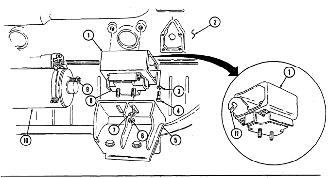

# 1 5-3.  Engine Mount And Insulator Maintenance (Cont'D)

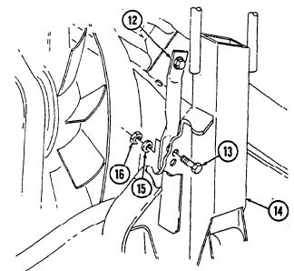

## I **15-3. Engine Mount And Insulator Maintenance (Cont'D)** I

l Install sling bracket on rear of engine first. l Use four 15x25-mm capscrews to instaIl Iifbing sling on engine. 

5. Install engine Iitig sling on engine (2) and right cylinder head (7) with two capscrews (6). 6. InstalI sling bracket (4) on left cylinder head (5) with two capscrews (3). Tighten capscrews (6) and (3) 
and install bracket (4) on engine Iifting sling with pin (1). 

#### Warning

Direct ah personnel to stand clear during hoisting operation. 

Failure to do this may cause injury to personnel. 

7. Attach hoist to engine lifting sling. Slowly raise engine (2) enough to remove engine mount (8) and insulator (10) from engine mount bracket (9). 

8. Remove engine mount (8) and insulator (10) from engine mount bracket (9). 

#### B. Disassembly

&move four locknuts (13), washers (12), capscrews (ll), washers (12), starter bracket (14) (for right mount), and insulator (10) from engine mount (8). Discard locknuts (13). 

InstaIl insulator (10) and starter bracket (14) (for right mount) on engine mount (8) with four washers (12), CEQSCEWS (ll), washers (12), and locknuts (13). Tighten locknuts (13) to 37 lb-R (50 N-m). 

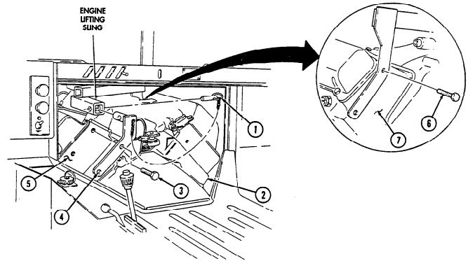

15-3. ENGINE MOUNT AND INSULATOR MAINTENANCE (Cont'd)

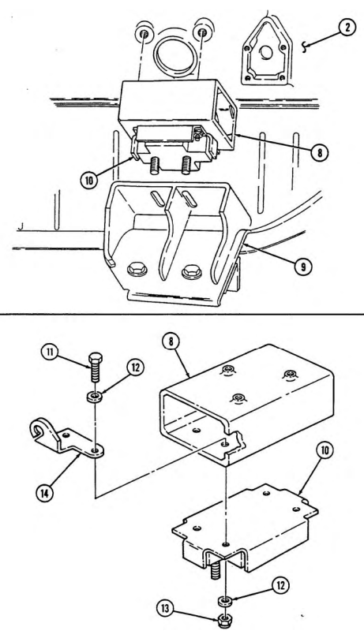

# 15-3. Engine Mount And Insulator Maintenance (Cont'D)

d. Installation

Left and right engine mounts are not interchangeable with each other.

1. Install engine mount (2) and insulator (9) on engine (3) with three lockwashers (4) and capscrews (5). Using 9/16-in. torque adapter, tighten capscrews (5) to 30-40 lb-ft (41-54 N•m).

2. Using crowfoot and adapter, tighten nut (11) to 24 lb-ft (33 N•m) on starter support bracket (1) and starter (10).

3. Lower engine (3) until insulator (9) is aligned and resting on engine mount bracket (6). Install two washers (8) and locknuts (7) on insulator (9) and engine mount bracket (6). Using 3/4-in. torque adapter, tighten locknuts (7) to 90 lb-ft (122 N•m).

4. Remove pin (12) from sling bracket (14) and engine lifting sling. 5. Remove two capscrews (13) and sling bracket (14) from left cylinder head (15). 6. Remove two capscrews (17) and engine lift sling from right cylinder head (16). 7. Install two radiator supports (19) on airlift brackets (21) with four capscrews (20), washers (22),
and locknuts (18). Tighten capscrews (20) to 37 lb-ft (50 N•m).

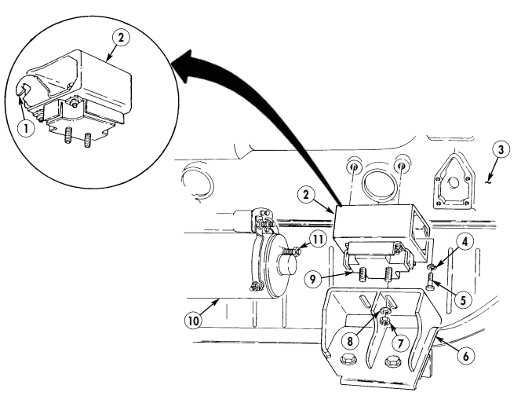

# 15-3. Engine Mount And Insulator Maintenance (Cont'D)

FOLLOW-ON TASKS: - Install fuel pump (right engine mount only) (para. 3-24).

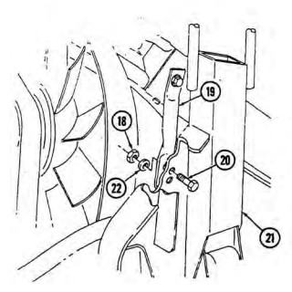

- Install air horn support and engine lift bracket (para. 3-16). - Install engine right splash shield (para. 10-24 or para. 10-24.1). - Install engine access cover (para. 10-22). - Install front propeller shaft (left engine mount only) (para. 6-2). - Install glow plug controller/temperature sensor (para. 4-33).

# 15-4. Left Cylinder Head Repair

This task covers:
a. Removal **c. Installation** b. Repair

Tools General mechanic's tool kit:
automotive (Appendix B, Item 1)
Maintenance and repair shop equipment:
automotive (Appendix B, Item 2)

#### Materials/Parts

Gasket (Appendix G, Item 53) Antiseize compound (Appendix C, Item 16) Pipe sealing compound (Appendix C, Item 62) Cylinder head lifting device
(Appendix D, Fig D-111) (Optional)

#### Personnel Required

One mechanic One assistant

| Manual References    |
|----------------------|
| TM 9\-2320\-387\-24P |
| TM 9\-2815\-237\-34  |

#### Equipment Condition

- Fuel drain-back tube removed (para. 3-38). - Alternator/power steering mounting bracket removed (para. 4-3).

- Left exhaust manifold removed (para. 3-57). - Left intake manifold removed (para. 15-16). - Water crossover removed 
(para. 3-79 or para. 3-79.1).

- Rocker arm shafts and pushrods removed
(para. 15-8).

- Fuel injection return hoses removed (para. 3-37). - Fuel injection nozzles removed (para. 16-3). - Glow plugs removed (para. 3-39). - Oil pressure sending unit removed (para. 4-29).

#### General Safety Instructions

Cylinder head must be supported during removal and installation. Maintenance Level Direct support

#### Warning

Cylinder head must be supported during removal and installation. Failure to support cylinder head may cause injury to personnel or damage to equipment.

a. Removal 1. Disconnect harness lead 33B (5) from engine temperature sending unit (4).

#### Caution

Cover or plug all hoses, connections, and openings immediately after disconnection to prevent contamination. Remove all covers or plugs prior to connection.

2. Remove seventeen capscrews (2) from cylinder head (1) and cylinder block (6). Discard capscrews (2).

Use of cylinder head lifting device is optional.

2.1. Install cylinder head lifting device (2.1) on center of cylinder head (1) with two washers (2.3) and capscrews (2.2).

3. Remove cylinder head (1) and gasket (3) from cylinder block (6). Discard gasket (3). 3.1. Remove two capscrews (2.2), washers (2.3), and cylinder head lifting device (2.1) from cylinder head (1), if installed.

4. For cylinder head (1) and valve repair procedures, notify general support (TM 9-2815-237-34). b. Repair 1. Extract broken portion of bolt (8) from cylinder head (1).

If threaded hole cannot be repaired, the left cylinder head can be interchanged with the right cylinder head.

2. If threads are unserviceable, use threaded inserts to repair threaded hole (7) in cylinder head (1).

# 15-4.  Left Cylinder Head Repair (Cont'D)

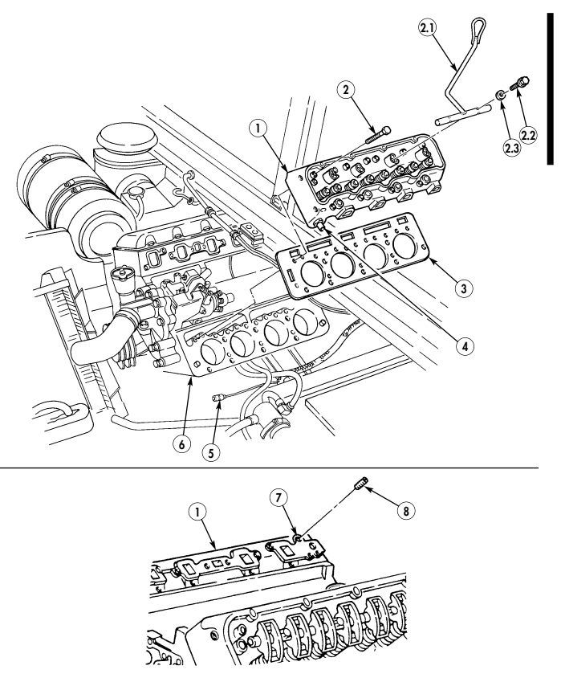

# 15-4. Left Cylinder Head Repair (Cont'D)

c. Installation

#### Caution

Head gasket must be used without a sealer. Sealant may cause leaks or damage to engine.

1. Install head gasket (3) over dowel pins (5) on cylinder block (6).

Use of cylinder head lifting device is optional.

1.1. Install cylinder head lifting device (2.1) on center of cylinder head (1) with two washers (2.3) and capscrews (2.2).

1.2. Install cylinder head (1) on cylinder block (6) and remove two capscrews (2.2), washers (2.3), and cylinder head lifting device (2.1) from center of cylinder head (1).

2. Apply pipe sealing compound to threads and under heads of seventeen capscrews (2).

#### Caution

Failure to tighten cylinder head capscrews in proper torque sequence may result in leaks or damage to cylinder head.

3. Secure cylinder head (1) to cylinder block (6) with seventeen capscrews (2). Tighten capscrews (2) to 20 lb-ft (27 N•m) following torque sequence.

4. Tighten seventeen capscrews (2) to 55 lb-ft (75 N•m) following torque sequence. 5. Retighten seventeen capscrews (2) to 55 lb-ft (75 N•m) following torque sequence. 6. Tighten seventeen capscrews (2) an additional 90° following torque sequence and mark capscrews (2).

7. Connect harness lead 33B (7) to engine temperature sending unit (4).

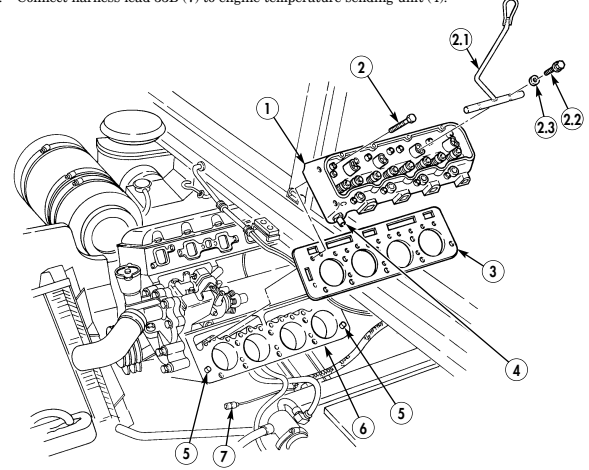

15-4. LEFT CYLINDER HEAD REPAIR (Cont'd)
TORQUE SEQUENCE

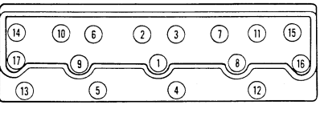

FOLLOW-ON TASKS: - Install oil pressure sending unit (para. 4-29).

- Install glow plugs (para. 3-39). - Install fuel injection nozzles (para. 16-3). - Install fuel injection return hoses (para. 3-37). - Install rocker arm shafts and pushrods (para. 15-8). - Install water crossover (para. 3-79 or para. 3-79.1). - Install left intake manifold (para. 15-16). - Install left exhaust manifold (para. 3-57). - Install alternator/power steering mounting bracket (para. 4-3).

# 15-5. Right Cylinder Head Repair

This task covers:
b. Repair INITIAL SETUP:
Tools General mechanic's tool kit:
automotive (Appendix B, Item 1)
Maintenance and repair shop equipment:
automotive (Appendix B, Item 2)
Materials/Parts Gasket (Appendix G, Item 53) Pipe sealing compound (Appendix C, Item 62) Cylinder head lifting device 
(Appendix D, Fig. D-111) (Optional)
Personnel Required One mechanic One assistant Manual References TM 9-2350-387-24P TM 9-2815-237-34 a. Removal c. Installation

#### Equipment Condition

- Right exhaust manifold removed (para. 3-57). - Water crossover removed 
(para. 3-79 or para. 3-79.1).

- Right intake manifold removed (para. 15-17). - Rocker arm shafts and pushrods removed 
(para. 15-8).

- Fuel injection return hoses removed (para. 3-37). - Fuel injection nozzles removed (para. 16-3). - Glow plugs removed (para. 3-39). General Safety Instructions Cylinder head must be supported during removal and installation. Maintenance Level Direct support

#### Warning

Cylinder head must be supported during removal and installation. Failure to support cylinder head may cause injury to personnel or damage to equipment.

a. Removal

#### Caution

Cover or plug all hoses, connections, and openings immediately after disconnection to prevent contamination. Remove all covers or plugs prior to connection.

1. Remove cold-advance switch (2) from cylinder head (1). 2. Remove seventeen capscrews (3) from cylinder head (1) and cylinder block (5). Discard capscrews (3).

Use of cylinder head lifting device is optional.

2.1. Install cylinder head lifting device (1.3) on center of cylinder head (1) with two washers (1.2) and capscrews (1.1).

3. Remove cylinder head (1) and gasket (6) from cylinder block (5). Discard gasket (6).

3.1. Remove two capscrews (1.1), washers (1.2), and cylinder head lifting device (1.3) from cylinder head (1),
if installed.

4. For cylinder head (1) and valve repair procedures, notify general support (TM 9-2815-237-34). b. Repair Refer to para. 15-4, task b., for extraction of broken bolts. c. Installation

#### Caution

Head gasket must be used without a sealer. Sealant may cause leaks or damage to engine.

1. Install head gasket (6) over dowel pins (4) on cylinder block (5).

# 15-5. Right Cylinder Head Replacement (Cont'D)

Use of cylinder head lifting device is optional.

1.1. Install cylinder head lifting device (1.3) on center of cylinder head (1) with two washers (1.2) and capscrews (1.1).

1.2. Install cylinder head (1) on cylinder block (5) and remove two capscrews (1.1), washers (1.2), and cylinder head lifting device (1.3) from center of cylinder head (1).

2. Apply pipe sealing compound to threads and under heads of seventeen capscrews (3).

#### Caution

Failure to tighten cylinder head capscrews in proper torque sequence may result in leaks or damage to cylinder head.

3. Secure cylinder head (1) to cylinder block (5) with seventeen capscrews (3). Tighten capscrews (3) to 20 lb-ft (27 N•m) following torque sequence.

4. Tighten seventeen capscrews (3) to 55 lb-ft (75 N•m) following torque sequence. 5. Retighten seventeen capscrews (3) to 55 lb-ft (75 N•m) following torque sequence. 6. Tighten seventeen capscrews (3) an additional 90° following torque sequence and mark capscrews (3). 7. Install cold-advance switch (2) on cylinder head (1).

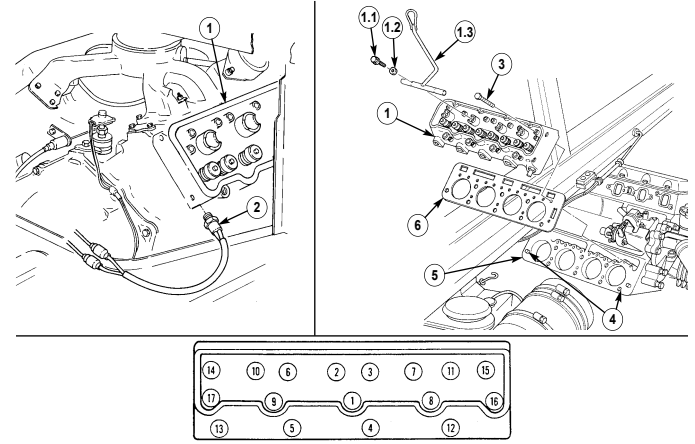

#### Torque Sequence

FOLLOW-ON TASKS: - Install fuel injection return hoses (para. 3-37).

- Install rocker arm shafts and pushrods (para. 15-8). - Install right intake manifold (para. 15-17). - Install right exhaust manifold (para. 3-57). - Install water crossover (para. 3-79 or para. 3-79.1). - Install glow plugs (para. 3-39). - Install fuel injection nozzles (para. 16-3).

# 15-6. Crankshaft Pulley Replacement

This task covers:

Tools General mechanic's tool kit:
automotive (Appendix B, Item 1)
Materials/Parts Sealing compound (Appendix C, Item 69)
Manual References TM 9-2320-387-10 TM 9-2320-387-24P
a. Removal a. Removal **b. Installation**

#### Equipment Condition

- Hood raised and secured (TM 9-2320-387-10). - Geared fan driveshaft removed (if applicable)
(para. 3-80.3).

Maintenance Level Direct support 1. Remove serpentine belt (para. 3-81, 3-81.1, or 3-81.2). 2. Remove four capscrews (5), mudshield (1), crankshaft pulley (2), and spacer (4) from torsional damper (3).

b. Installation 1. Apply sealing compound to four capscrews (5). 2. Install spacer (4), crankshaft pulley (2), and mudshield (1) on torsional damper (3) with four 

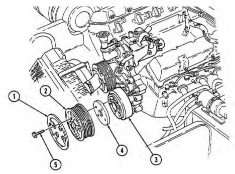

capscrews (5). Tighten capscrews (5) to 48 lb-ft (65 N•m).

3. Install serpentine belt (para. 3-81, para. 3-81.1, or para. 3-81.2).

FOLLOW-ON TASKS: - Install geared fan driveshaft (if applicable) (para. 3-80.3).

- Lower and secure hood (TM 9-2320-387-10).

## I **15-7. Torsional Damper Replacement I**

This task covers: 
INITIAL SETUP: 
Tools General mechanic's tool kit: 
automotive (Appendix B, Item 11 

#### Materials/Parts

Lubricating oil (Appendix C, Item 44) 
Sealing compound (Appendix C, Item 69) 
Manual References TM 9-2320-387-10 TM 9-2320-387-24P 

#### A. Removal B. Installation

Equipment Condition l Hood raised and secured (TM 9-2320-387-10). l Crankshaft pulley removed (para. E-6). 

General Safety Instruckions Torsional damper must be supported during removal and installation. 

Maintenance Level Direct support 

#### Warning

Torsional damper must be supported during removal and installation. 

Failure to do this may cause injury to personnel or damage to equipment. 

1. Remove capscrew (6) and washer (5) connecting torsional damper (1) to crankshaft (4). 

2. Reinstall capscrew (6) and loosen torsional damper (1) from crankshaft (4) with puller. 3. Remove capscrew (6) and torsional damper (1) from crankshaft (4). 

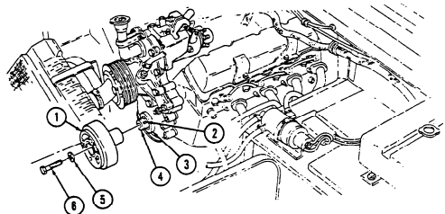

4. Inspect woodruff key (2) and front cover seal (3) for damage. Replace woodruff key (2) or front cover seal (3) (para. E-10) if damaged. 

#### I I 15-7. Torsional Damper Replacement (Co&D)

1. Apply lubricating oil to seal (3) surface and torsional damper (1). 

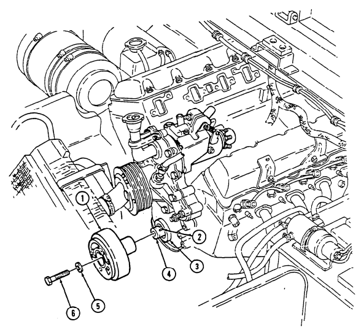

2. Align torsional damper (1) with woodruff key (2) and install torsional damper (1) on crankshaft (4) 
far enough to install washer (5) and capscrew (6). Secure torsional damper (1) with capscrew (6). Tighten capscrew (6) to 140-162 lb-ft (190-220 N-m). 

FOLLOW-ON TASKS: l Install crankshaft pulley (para. 15-6). 

l Lower and secure hood (TM 9-2320-387-102 

# 15-8. Rocker Arm Shafts And Pushrods Replacement

This task covers: 
a. Removal INITIAL SETUP: 
General **mechanic's** tool kit: Left or right rocker arm cover removed automotive (Appendix B, Item 1) (para. 15-11 or 15-12). 

Manual References Maintenance Level TM 9-2320-387-24P Direct support 

| b.  Installation   |
|--------------------|

Tools Equipment Condition 

1. Remove four capscrews (2) and retainers (3) from two arm rocker shaft assemblies (4) and cylinder head (5). 

Tag rocker arm shaft assemblies for assembly. 

2. Remove two rocker arm shaft assemblies (4) *from* cylinder head (5). 

Tops of pushrods are hardened and must be tagged for assembly. 

3. Remove eight pushrods (I) from cylinder head (5). 

b. Installation 

#### Caution

Marked ends of pushrods must point up when installed or engine damage may result. 

1. Install eight pushrods (1) in cylinder head (5) in proper location with marked ends of pushrods (1) 
up. Ensure pushrods (1) properly seat in lifters. 

2. Install two rocker arm shaR assemblies (4) on cylinder head (5). Ensure pushrods (1) 
properly seat in rocker arms (4). 

3. Secure rocker arm shaft assemblies (4) with four retainers (3) and capscrews (2). 

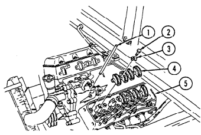 4. Tighten capscrews (2) to 41 lb-R (56 N-m). 

FOLLOW-ON TASK: Install left or right rocker arm cover (para. 15-11 or 15-12). 

## 15-9. Hydraulic Valve Lifter Replacement

This task covers: 

#### Initial Setup: Tools

General mechanic's tool kit: 
automotive (Appendix B, Item 1) 
Special Tools Hydraulic valve lifter remover 
(Appendix B, Item 231 

| Materials/Parts division and the successful and the property of of the property of each   |
|-------------------------------------------------------------------------------------------|

Lubricating oil (Appendix C, Item 44) 
Manual References TM 9-2320-387-24P 

a. Removal h. Installation 

Equipment Condition Left or right cylinder head removed 
(para. 15-4 or 15-51. 

General Safety Instructions Diesel fuel is flammable. Do not perform this procedure near fire, flames, or sparks. 

#### Maintenance Level

Direct support 1. Remove capscrew (11, guide plate clamp (21, and guide plate(s) (3) from cylinder block (51. 

NOTE 
Tag lifters for installation if more than one lifter is being removed. 

2. Using hydraulic valve lifter remover, remove valve lifter(s) (4) from cylinder block (5). 

[b.l 

#### Warning

Diesel fuel is flammable. Do not perform this procedure near fire, flames, or sparks. Severe injury or death may result. 

1. Prime lifter(s) (4) by submerging in clean diesel fuel or kerosene and working plunger (71 up and down on pushrod (6). 

2. Apply lubricating oil to lifter(s) (41. 3. Install lifter(s) (4) into cylinder block (5). 

4. Install guide plate(s) (3) on lifter(s) (4). 

5. Install guide plate clamp (2) on cylinder block (5) with capscrew (1). Tighten capscrew (I) to 15-20 lb-ft (20-27 Nom). 

# 15-9.  Hydraulic Valve Lifter Replacement (Cont'D)

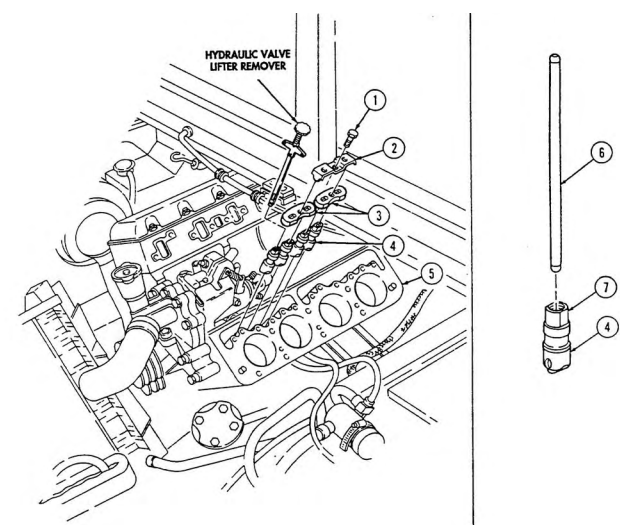

FOLLOW-ON TASK: Install left or right cylinder head (para. 15-4 or 15-5).

# 15-10. Timing Chain Cover, Timing Chain, And Drive Sprockets Maintenance

This task covers:
b. Inspection

Tools General mechanic's tool kit:
automotive (Appendix B, Item 1)
Dial indicator (Appendix B, Item 113)
Materials/Parts Gasket (Appendix G, Item 52) Three woodruff keys (Appendix G, Item 331) Sealant gasket set (Appendix C, Item 65) Lubricating oil (Appendix C, Item 44)
a. Removal a. Removal **c. Installation**
Manual References TM 9-2320-387-24P
Equipment Condition
- Torsional damper removed (para. 15-7). - Water pump and adapter plate removed
(para. 3-78).

Maintenance Level Direct support

In some cases, flanged-head fasteners may be present instead of standard fasteners and washers. In all cases, washers should be used when replacing a flanged-head fastener with a standard fastener.

1. Remove three capscrews (1) and driven gear (2) from injection pump (7). 2. Remove two capscrews (16), nut (3), and baffle (4) from timing chain cover (5). 3. Remove three nuts (9) and washers (8) from injection pump (7) and timing chain cover (5). 4. Remove four capscrews (11) from timing chain cover (5) and oil pan (12). 5. Remove five capscrews (14), four washers (13), timing chain cover (5), and gasket (6) from cylinder block (10). Discard gasket (6).

When measuring timing chain deflection, slack should be removed from one side before measurement is taken on opposite side.

6. Using dial indicator, check deflection of timing chain (21) midway between camshaft sprocket (20)
and crankshaft sprocket (27). Total deflection must not exceed 0.810 in. (20.6 mm). If deflection exceeds specification, timing chain (21) must be replaced.

7. Using dial indicator, check end play of camshaft (22). End play must not be more than 0.012 in. 

(0.3 mm). If end play exceeds specification, camshaft sprocket (20) and thrust plate (24) must be inspected for wear after removal.

8. Remove capscrew (17), washer (18), pump drive gear (19), and camshaft sprocket (20) from camshaft
(22).

9. Remove crankshaft sprocket (27), camshaft sprocket (20), and timing chain (21) as an assembly.

NOTE
Cover oil pan opening to prevent woodruff keys from falling into oil pan.

10. Remove two woodruff keys (25) from crankshaft (26) and woodruff key (23) from camshaft (22).

Discard woodruff keys (25) and (23).

15-10.  TIMING CHAIN COVER, TIMING CHAIN, AND DRIVE SPROCKETS MAINTENANCE
(Cont'd)
b.  Inspection Inspect front cover oil seal (15). Replace seal (15) (para. 15-13) if cracked, broken, or deteriorated.

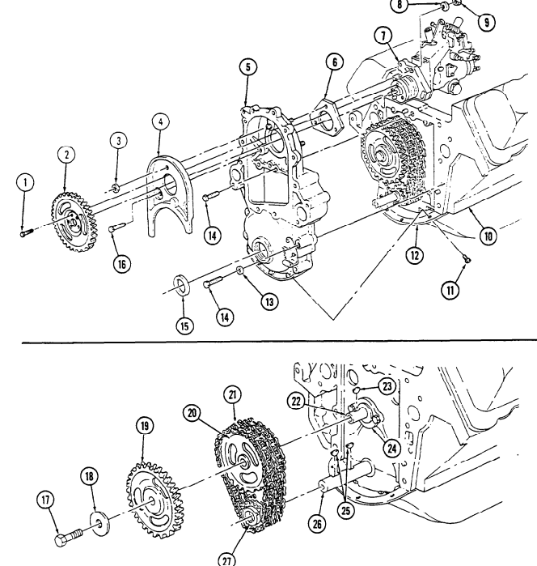

25

#### 15-L 0. Timing Chain Cover, Timing Chain, And Drive Sprockets Maintenance

# (Cont'D)

c. Installation 1. 2. 

Install woodruff key (8) in camshaft (71 and two woodruff keys (9) in crankshaft **(10).** 
Install crankshaft sprocket (11) and camshaft sprocket (5) in timing chain (6) and align timing marks (12). Rotate crankshaft (10) and camshaft (7) so woodruff keys (81 and (9) align with keyway slots in crankshaft sprocket (11) and camshaft sprocket (5). 

3. 

#### Caution

Timing marks on crankshaft sprocket and camshaft sprocket must remain aligned after installation or engine damage may result. 

4. 

5. 

6. 

Install crankshaft sprocket (111, camshaft sprocket (5), and timing chain (6) as an assembly onto camshaft (7) and crankshaft (10). 

Install pump drive gear (3) on camshaft (7) with timing mark (4) at 0 degrees with washer (2) and capscrew (1). Tighten capscrew (1) to 55-66 lb-R (75-90 N-ml. 

Apply lubricating oil to timing chain (6). 

NOTE 
Perform step 7 only if timing chain was replaced. 

Using dial indicator, check deflection of timing chain (6) midway between camshaft sprocket (5) and crankshaft sprocket (11). Total deflection must not exceed 0.5 in. (12.7 mm). If deflection exceeds specification, inspect camshaft sprocket (5) and crankshaft sprocket (11) for damage. Replace either if damaged and recheck deflection. 

7. 

Apply a 0.094 in. (2.4 mm) bead of sealant to sealing surface on timing chain cover (171, following sealant diagram. 

8. 

9. 

Install gasket (19) and timing chain cover (17) on cylinder block (24) with four washers (271, capscrews (281, and short capscrew (29). Tighten four capscrews (28) and short capscrew (29) to 33 lb-R (45 Nom). 

Secure timing chain cover (17) to oil pan (26) with four capscrews (25). Tighten capscrews (25) to 4-10 lb-f% (5-14 Nom). 

10. 

#### Caution

Maintain 0.040 in. (1.02 mm) minimum clearance between baffle plate and pump drive gear to avoid noise. 

11. 

12. 

13. 

Install baffle plate (16) in timing chain cover (17) with two capscrews (30) and nut (15). Tighten capscrews (30) and nut (15) to 33 lb-R (45 N-m). Align timing mark (21) on injection pump (20) with timing mark (18) on timing chain cover (17) and install three washers (22) and nuts (23). 

Align timing mark (31) on driven gear (14) with timing mark (4) on drive gear (3) and install three capscrews (13). Tighten capscrews (13) to 15-20 lb-ft (20-27 N-m). 

#### ,

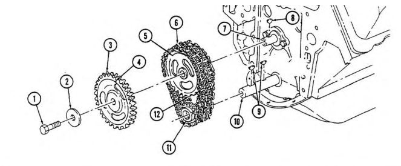

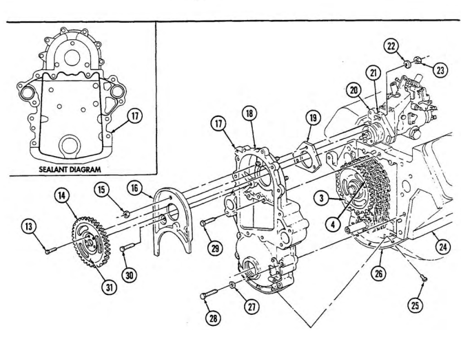

FOLLOW-ON TASKS:  - Install water pump and adapter plate (para. 3-78).

· Install torsional damper (para. 15-7).

15-10. TIMING CHAIN COVER, TIMING CHAIN, AND DRIVE SPROCKETS MAINTENANCE
(Cont'd)

# 15-11. Left Rocker Arm Cover Replacement

This task covers:

Tools General mechanic's tool kit:
automotive (Appendix B, Item 1)
Materials/Parts Valve cover gasket (Appendix G, Item 64) RTV sealant (Appendix C, Item 74)
Manual References TM 9-2320-387-24P
a. Removal a. Removal b. Installation Equipment Condition
- Fuel injection lines removed (para. 16-4). - Left fuel injection lines bracket removed
(para. 3-41).

Maintenance Level Direct support

In some cases, flanged-head fasteners may be present instead of standard fasteners and washers. In all cases, washers should be used when replacing a flanged-head fastener with a standard fastener.

1. Remove nut (2), washer (1), clamp (8), and fuel drain-back tube (9) from rocker arm cover stud (3). 2. Remove a combination of five capscrews (5), three studs (3), eight washers (6), and rocker arm cover (4) from cylinder head (7).

b. Installation

- When applying RTV sealant, keep sealant out of capscrew holes.

- During installation, RTV sealant or new gasket is approved. - If applying RTV sealant, perform step 1. - If installing new gasket, RTV sealant may be applied with the gasket, but is not required.

1. Apply a .06 in. (1.5 mm) bead of RTV sealant around rocker arm cover (4) sealing surface. 2. Install rocker arm cover (4) on cylinder head (7) with eight washers (6), five capscrews (5), and three studs (3), following assembly diagram.

3. Tighten capscrews (5) and studs (3) to 15-25 lb-ft (20-34 N•m). 4. Install fuel drain-back tube (9) and clamp (8) on stud (3) with washer (1) and nut (2).

# 15-11. Left Rocker Arm Cover Replacement (Cont'D)

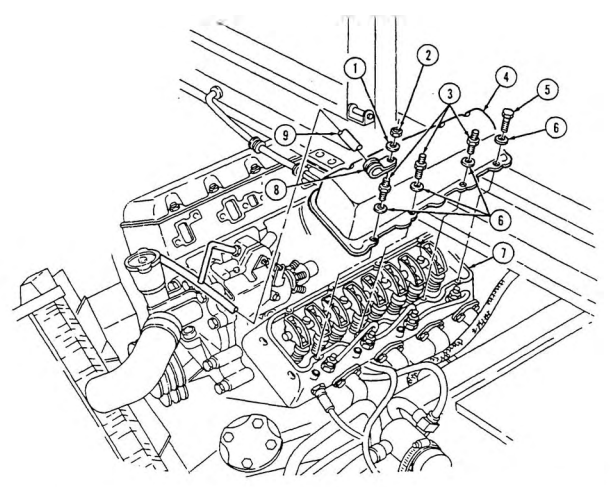

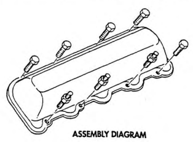

FOLLOW-ON TASKS: - Install left fuel injection lines bracket (para. 3-41).

-  Install fuel injection lines (para. 16-4).

# 15-12. Right Rocker Arm Cover Replacement

This task covers:

#### Initial Setup: Tools

General mechanic's tool kit:
automotive (Appendix B, Item 1)
Materials/Parts Valve cover gasket (Appendix G, Item 64) RTV sealant (Appendix C, Item 74)
Manual References TM 9-2320-387-24P
a. Removal a. Removal b. Installation

#### Equipment Condition

- Engine access cover removed (para. 10-22). - Fuel injection lines removed (para. 16-4). - Right fuel injection lines bracket removed 
(para. 3-40).

- CDR valve and bracket removed (para. 3-9). - Heater outlet/inlet piping removed (para. 10-71).

Maintenance Level Direct support

In some cases, flanged-head fasteners may be present instead of standard fasteners and washers. In all cases, washers should be used when replacing a flanged-head fastener with a standard fastener.

1. Remove capscrew (10) and transmission oil dipstick tube (11) from cylinder head (9). 2. Remove nut (4), washer (5), clamp (3), and fuel drain-back tube (8) from rocker arm cover stud (7). 3. Remove capscrew (2), seven studs (7), eight washers (1), and rocker arm cover (6) from cylinder head (9).

b. Installation

- When applying RTV sealant, keep sealant out of capscrew holes.

- During installation, RTV sealant or new gasket is approved. - If applying RTV sealant, perform step 1. - If installing new gasket, RTV sealant may be applied with the gasket, but is not required.

1. Apply a 0.06 in. (1.5 mm) bead of RTV sealant around rocker arm cover (6) sealing surface. 2. Install rocker arm cover (6) on cylinder head (9) with eight washers (1), capscrew (2), and seven studs (7), following assembly diagram.

3. Tighten capscrew (2) and studs (7) to 15-25 lb-ft (20-34 N•m). 4. Install fuel drain-back tube (8) and clamp (3) on stud (7) with washer (5) and nut (4). 5. Install transmission oil dipstick tube (11) on cylinder head (9) with capscrew (10). Tighten capscrew (10) to 25-37 lb-ft (34-50 N•m).

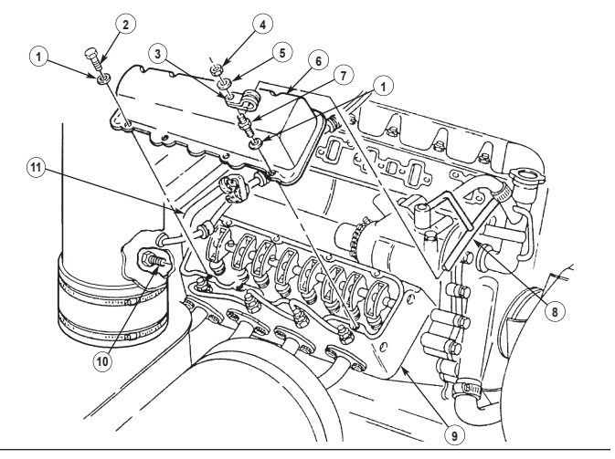

# 15-12. Right Rocker Arm Cover Replacement (Cont'D)

FOLLOW-ON TASKS: - Install heater outlet/inlet piping (para. 10-71).

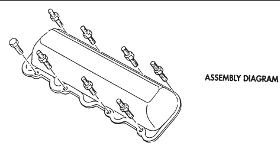

- Install CDR valve and bracket (para. 3-9). - Install right fuel injection lines bracket (para. 3-40). - Install fuel injection lines (para. 16-4). - Install engine access cover (para. 10-22).

# 15-13. Front Cover Oil Seal Replacement

This task covers:
INITIAL SETUP:
Tools General mechanic's tool kit:
automotive (Appendix B, Item 1)
Materials/Parts Seal (Appendix G, Item 287)
Manual References TM 9-2320-387-24P
a. Removal b. Installation Equipment Condition Torsional damper removed (para. 15-7).

Maintenance Level Direct support a. Removal Remove front cover seal (2) from timing chain cover (1). Discard front cover seal (2).

b. Installation Install front cover seal (2) on timing chain cover (1), ensuring lip of seal (2) faces inward.

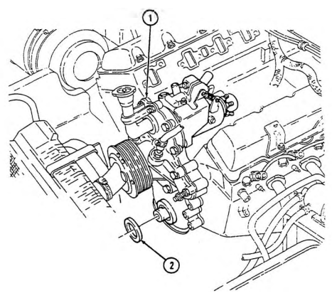

FOLLOW-ON TASK: Install torsional damper (para. 15-7).

15-28 Change 2

# 15-14. Oil Pump Drive Replacement

This task covers:
INITIAL SETUP:
Tools General mechanic's tool kit:
automotive (Appendix B, Item 1)
Materials/Parts Gasket (Appendix G, Item 55)
Manual References TM 9-2320-387-24P
a. Removal a. Removal b. Installation Equipment Condition
- Battery ground cables disconnected (para. 4-68). - Turbocharger removed (para. 15-21).

Maintenance Level Direct support

Prying may be performed around head of oil pump drive to assist in loosening oil pump drive for removal.

1. Remove capscrew (2) and clamp (3) from engine cylinder block (4). 2. Remove oil pump drive (1) and gasket (5) from engine cylinder block (4). Discard gasket (5).

b. Installation 1. Install gasket (5) and oil pump drive (1) in engine cylinder block (4).

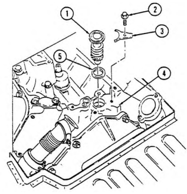 2. Secure oil pump drive (1) to engine cylinder block (4) with clamp (3) and capscrew (2). Tighten capscrew (2) to 25-37 lb-ft (34-50 N•m).

FOLLOW-ON TASKS: - Install turbocharger (para. 15-21).

- Connect battery ground cables (para. 4-68).

## 15-15. Oil Pump Maintenance

This task covers:
INITIAL SETUP:
Tools General mechanic's tool kit:
automotive (Appendix B, Item 1)
Manual References TM 9-2320-387-24P

#### A. Removal

a. Removal c. Installation Equipment Condition Oil pan removed (para. 3-6).

Maintenance Level Direct support 1. Remove nut (6) from pickup tube bracket (4) and stud (7). 2. Loosen capscrew (3) from bracket (4) and oil pickup tube (5) and slide bracket (4) off stud (7). 3. Remove stud (7) from oil pump (8) and rear main bearing cap (2). 4. Remove oil pump (8) and shaft (9) from cylinder block (1). 5. Remove capscrew (3) and bracket (4) from oil pickup tube (5).

b. Inspection Inspect shaft (9) for damage. Replace oil pump (8) if damaged.

c. Installation 1. Install bracket (4) on oil pickup tube (5) with capscrew (3). Finger-tighten capscrew (3). 2. Install oil pump (8) and shaft (9) on cylinder block (1). 3. Install stud (7) on oil pump (8) and rear main bearing cap (2) and tighten to 59-74 lb-ft (80-100 N•m).

4. Install bracket (4) on stud (7) with nut (6). Tighten nut (6) to 35 lb-ft (47 N•m). 5. Tighten capscrew (3) to 12 lb-ft (16 N•m).

# 15-15. Oil Pump Maintenance (Cont'D)

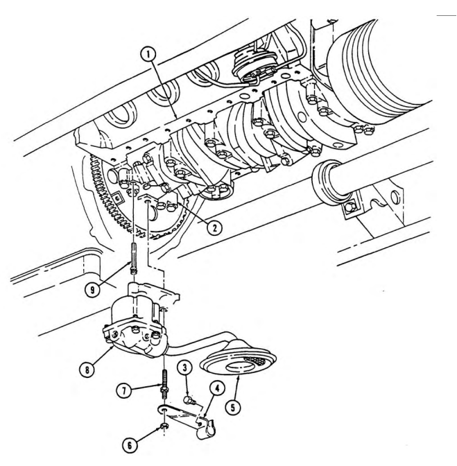

FOLLOW-ON TASK: Install oil pan (para. 3-6).

# 15-16. Left Intake Manifold Replacement

This task covers:
INITIAL SETUP:

#### Tools

General mechanic's tool kit:
automotive (Appendix B, Item 1)
Materials/Parts Intake manifold gasket (Appendix G, Item 58)
Manual References TM 9-2320-387-24P

a. Removal b. Installation

| Equipment Condition                                                                                                                                                                                            |
|----------------------------------------------------------------------------------------------------------------------------------------------------------------------------------------------------------------|
| · Air horn removed (para. 3\-14).                                                                                                                                                                              |
| Concern The Comments of Children and the control of the comments of the comments of the comments of the comments of the contraction of the contraction of the contribution of the contribution of the first of |

| Maintenance Level   |
|---------------------|
| Direct support      |

- Intake crossover removed (para. 15-20).

a. Removal 1. Remove clamp (1) and oil pressure sending unit (2) from bracket (4). Disconnect lead (3) and move sending unit (2) out of the way.

2. Loosen two fuel hose clamps (11) and disconnect fuel hoses (5) from fuel lines (6). 3. Remove capscrew (7) and two fuel line clamps (8) from stud nut (9) and move fuel lines (6) out of the way.

4. Remove stud nut (9) from stud (10). 5. Remove eight studs (10) from intake manifold (14). 6. Remove intake manifold (14) and gasket (13) from cylinder head (12). Discard gasket (13). 7. Clean mating surfaces of cylinder head (12) and intake manifold (14).

#### B. Installation

1. Install gasket (13) and intake manifold (14) on cylinder head (12) with eight studs (10). 2. Tighten studs (10), beginning at center of intake manifold (14) and working toward ends, to 30 lb-ft
(41 N•m).

3. Install stud nut (9) on stud (10). 4. Install two fuel lines (6) and fuel line clamps (8) on stud nut (9) with capscrew (7). 5. Connect two fuel hoses (5) on fuel lines (6) and tighten clamps (11). 6. Install oil pressure sending unit (2) on bracket (4) with clamp (1). Connect lead (3) to sending unit (2).

# 15-16. Left Intake Manifold Replacement (Cont'D)

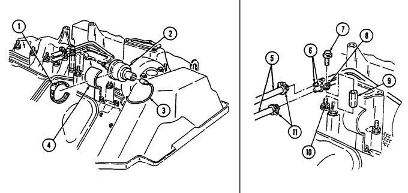

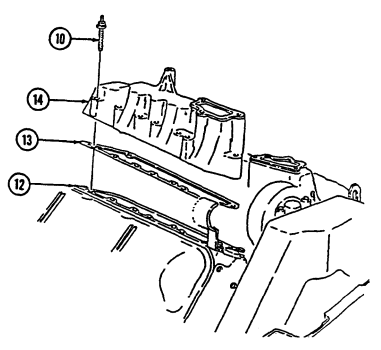

FOLLOW-ON TASKS:
-  Install intake crossover (para. 15-20).
-  Install air horn (para. 3-14).

# 15-17. Right Intake Manifold Replacement

This task covers:
INITIAL SETUP:
Tools General mechanic's tool kit:
automotive (Appendix B, Item 1)
Manual References TM 9-2320-387-24P
a. Removal 1. Remove eight intake manifold studs (2) from intake manifold (1). 2. Remove intake manifold (1) and gasket (4) from cylinder head (3). Discard gasket (4). 3. Clean mating surfaces of cylinder head (3) and manifold (1).

b. Installation 1. Install gasket (4) and intake manifold (1) on cylinder head (3) with eight studs (2). 

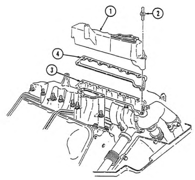 2. Tighten studs (2), beginning at center of intake manifold (1) and working toward ends, to 30 lb-ft 
(41 N•m).

FOLLOW-ON TASKS: - Install wastegate actuator (para. 15-19).

- Install CDR valve and bracket (para. 3-9). - Install intake crossover (para. 15-20). - Install air horn (para. 3-14).

a. Removal b. Installation Equipment Condition
- Air horn removed (para. 3-14). - Intake crossover removed (para. 15-20). - CDR valve and bracket removed (para. 3-9). - Wastegate actuator removed (para. 15-19).

Maintenance Level Direct support Materials/Parts Intake manifold gasket (Appendix G, Item 58)

# 15-18. Wastegate Housing Replacement

This task covers:

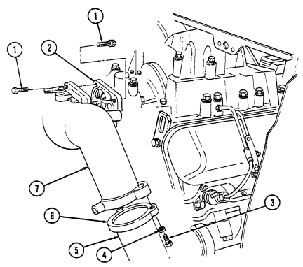

| INITIAL SETUP:   |
|------------------|

General mechanic's tool kit:
automotive (Appendix B, Item 1)

| Equipment Condition Wastegate actuator 1 Maintenance Level Direct support   |
|-----------------------------------------------------------------------------|

Manual References TM 9-2320-387-24P

a. Removal **b. Installation**

Wastegate actuator removed (para. 15-19).

#### A. Removal

1. Remove two bolts (3), washers (4), flange (6), and exhaust pipe (5) from wastegate housing (7). 2. Remove four capscrews (1) and wastegate housing (7) from turbocharger (2). 3. Clean mating surfaces on turbocharger (2) and wastegate housing (7).

#### B. Installation

1. Install wastegate housing (7) on turbocharger (2) with four capscrews (1). 2. Install flange (6) and exhaust pipe (5) on wastegate housing (7) with two washers (4) and bolts (3).

FOLLOW-ON TASK: Install wastegate actuator (para. 15-19).

# 15-19. Wastegate Actuator Replacement

| This task covers:   |
|---------------------|

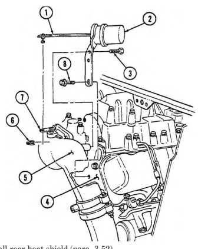

INITIAL SETUP:
Tools General mechanic's tool kit:
automotive (Appendix B, Item 1)
Manual References TM 9-2320-387-24P

#### A. Removal

1. Remove clip (6) and actuator rod (1) from wastegate bellcrank (7). 2. Remove two capscrews (3) from wastegate actuator (2) and wastegate housing (5). 3. Remove capscrew (8) and wastegate actuator (2) from cylinder head (4).

b. Installation 1. Install wastegate actuator (2) on cylinder head (4) with capscrew (8). 2. Install wastegate actuator (2) on wastegate housing (5) with two capscrews (3). 3. Install actuator rod (1) on wastegate bellcrank (7) with clip (6).

FOLLOW-ON TASK: Install rear heat shield (para. 3-52).

| Equipment Condition                     |
|-----------------------------------------|
| Rear heat shield removed (para. 3\-52). |
| Maintenance Level                       |
| Direct support                          |

a. Removal b. Installation

# 15-20. Intake Crossover Replacement

This task covers:
INITIAL SETUP:

#### Tools

General mechanic's tool kit:
automotive (Appendix B, Item 1)
Materials/Parts Crossover O-ring (Appendix G, Item 229) Two gaskets (Appendix G, Item 59)
Manual References TM 9-2320-387-10 TM 9-2320-387-24P
a. Removal 1. Remove ten nuts (2), capscrews (6), two screws (5), retainer (4), and closeout panel (3) from A-beam (1). 2. Remove six capscrews (7), intake crossover (8), and two gaskets (10) from intake manifolds (9) and turbocharger (11). Discard gaskets (10).

3. Remove crossover O-ring (12) from turbocharger (11). Discard crossover O-ring (12). Clean mating surfaces.

b. Installation a. Removal b. Installation Equipment Condition
- Hood raised and secured (TM 9-2320-387-10). - Engine access cover removed (para. 10-22).

Maintenance Level Direct support 1. Install crossover O-ring (12) on turbocharger (11).

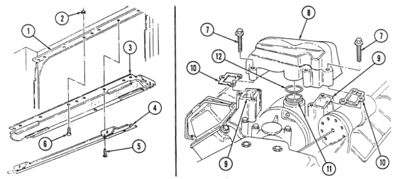 2. Install two gaskets (10) and intake crossover (8) on intake manifolds (9) and turbocharger (11) with six capscrews (7). Tighten capscrews (7) to 17 lb-ft (23 N•m).

3. Install closeout panel (3) and retainer (4) on A-beam (1) with two screws (5), ten capscrews (6), and nuts (2).

FOLLOW-ON TASKS: - Install engine access cover (para. 10-22).

- Lower and secure hood (TM 9-2320-387-10).

# 15-21. Turbocharger Replacement

This task covers:
INITIAL SETUP:
Tools General mechanic's tool kit:
automotive (Appendix B, Item 1)
Materials/Parts Turbocharger oil gasket (Appendix G, Item 63)
Manual References TM 9-2320-387-24P
a. Removal

a. Removal **b. Installation**

Equipment Condition Wastegate housing removed (para. 15-18).

Maintenance Level Direct support 1. Loosen clamp (4) on exhaust pipe (5) and turbocharger (3). Slide clamp (4) onto exhaust pipe (5).

NOTE
To remove turbocharger with intake crossover installed, slide turbocharger back, then up and out.

2. Remove two capscrews (2) and turbocharger (3) from engine block (6). 3. Remove turbocharger oil gasket (1) from engine block (6). Discard gasket (1) and clean mating surfaces.

b. Installation 1. Install turbocharger oil gasket (1) and turbocharger (3) on engine block (6) with two capscrews (2). 2. Install exhaust pipe (5) on turbocharger (3) and tighten clamp (4).

# 15-21. Turbocharger Replacement (Cont'D)

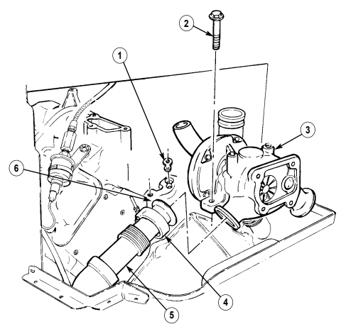

FOLLOW-ON TASK:  Install wastegate housing (para. 15-18).

# 15-22. Glow Plug Tip Removal (Damaged Or Broken)

This task covers:
Removal INITIAL SETUP:
Tools General mechanic's tool kit:
automotive (Appendix B, Item 1)
Needlenose pliers (Appendix B, Item 31)
Special Tools Socket, 3/8-in. (Appendix B, Item 144)
Manual References TM 9-2320-387-24P
Personnel Required One mechanic One assistant Removal

Affected cylinder piston must be brought to Top Dead Center 1. Using socket wrench and breaker bar on torsion damper bolt (3), rotate crankshaft to bring piston
(in affected cylinder) to TDC position.

(TDC) position to ensure intake and exhaust valves are closed.

Perform steps 2 and 3 if failed glow plug is still installed in cylinder head. Perform step 4 if failed glow plug has been removed from the cylinder head and glow plug tip is broken off in cylinder head prechamber. Perform steps 5 and 6 if failed glow plug tip is swollen.

2. Insert needlenose pliers through injector nozzle opening (1), grasp glow plug tip, break off expanded tip, and remove piece from prechamber.

3. Remove glow plug (para. 3-39).

#### Warning

Compressed air used for cleaning purposes will not exceed 30 psi (207 kPa). Use only with effective chip guarding and personnel protective equipment (goggles, shield, gloves, etc.).

4. Direct compressed air into glow plug port (2) to expel broken tip from prechamber through injector nozzle opening (1).

5. Coil one end of an 18-in. piece of tie wire the size of the injector nozzle opening (1). Place flat coil end over preheater to combustion chamber hole.

In some cases it may be necessary to remove cylinder head to remove expanded glow plug tip.

6. Using needlenose pliers with a 90 degrees bend, insert pliers through injector nozzle opening (1),
grasp glow plug tip, break off expanded tip, and remove piece from prechamber.

7. Install new glow plug (para. 3-39).

#### Equipment Condition

- Fuel injector nozzle removed (para. 16-3). - Serpentine drivebelt removed 
(para. 3-81, para. 3-81.1, or para. 3-81.2).

General Safety Instructions Compressed air used for cleaning purposes will not exceed 30 psi (207 kPa).

Maintenance Level Direct support

# 15-22. Glow Plug Tip Removal (Damaged Or Broken) (Cont'D)

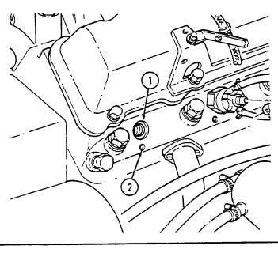

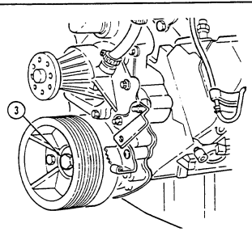

FOLLOW-ON TASKS: - Install serpentine drivebelt (para. 3-81, para. 3-81.1, or para. 3-81.2).

-  Install fuel injector nozzle (para. 16-3).

■

## 1523. Engine Injection Pump Timing

This task covers: 
INITIAL SETUP: 
Tools General mechanic's tool kit: 
automotive (Appendix B, Item 11 Special Tools Timing gauge (Appendix B, Item 26) 
Dynamic timing meter (Appendix B, Item 27) 
Materials/Parts Metallic wool (Appendix C, Item 83) 
Personnel Required One mechanic One assistant a. Timing Check 

#### A. Timing Check B. Timing Adjustment

Manual References TM 9-2320-387-10 TM 9-2320-387-24P 
Equipment Condition l Hood raised and secured (TM 9-2320-387-10). 

l Engine access cover removed (para. 10-22). 

l Companion seat and battery box cover removed 
(para. 10-43). 

General **Safety Instructions** 
Never adjust timing while engine is running. 

Maintenance Level Direct support 

Magnetic pickup receptacle on timing bracket must be correctly positioned or timing meter will not register correctly. 

1. 

2. 

3. 

4. 

Insert timing gauge into magnetic pickup receptacle (8) on timing bracket (1). 

Rotate timing gauge so pointer on gauge fits into Top Dead Center (TDC) notch (9) in timing bracket 
(1). If pointer on gauge does not fit exactly into TDC notch (91, bend magnetic pickup receptacle (8) until pointer on gauge fits exactly into TDC notch (9). Remove timing gauge from pickup receptacle (8) on timing bracket (1). 

NOTE 
End of magnetic pickup must be 0.06 in. (1.5 mm) from torsional damper. 

5. 

Install magnetic pickup (71 into magnetic pickup receptacle (8) and connect pickup lead (6) to dynamic timing meter. 

Clamp-on pickup must be used on a straight section of tube no farther than 4 in. (10 cm) from injection nozzle. 

Clean cylinder number one injection line (2) with metallic wool. 

6. 

#### Caution

Do not overtighten clamp-on pickup or damage to pickup will result. 

Install pickup (4) on injection line (21. Connect ground clip (31 to fuel injection line (2) and connect pickup lead (5) to timing meter. 

Route power leads of timing meter into battery compartment and connect red power lead (111 to positive battery terminal (12) on rear battery (14). 

Connect black ground lead (10) to negative battery terminal (131 on rear battery (14). Display should light up and read: SE-l 20.0. 

7. 

8. 

9. 

10. 

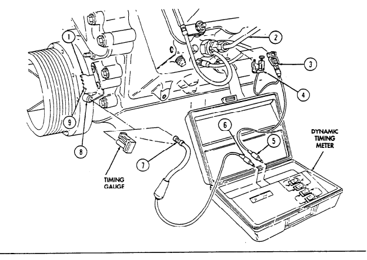

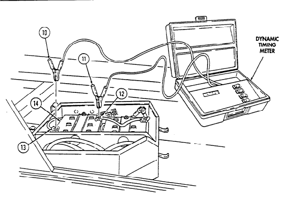

# 15-23.  Engine Injection Pump Timing (Cont'D) 15-23. Engine Injection Pump Timing (Cont'D)

#### Caution

Ensure all cables and wires are clear from fan, belts, and exhaust manifolds before starting engine or damage to equipment will result.

If sensor light is not blinking, check clamp-on pickup fuel injection line for proper installation.

11. Depress offset adjustment switch (3) and hold. 12. Operate increase/decrease switch (2) until offset adjustment reads 30.5 on display (4). Release offset adjustment switch (3). Display (4) should not read: 0000 . . . 0.0.

13. Start engine (TM 9-2320-387-10) and warm up to operating temperature. 14. Position sensor switches (1) to clamp-on and magnetic pickup positions. 15. Raise engine speed to 1,300 rpm and read injection pump timing on display (4). Timing must be 5 degrees before Top Dead Center (TDC). If timing is not 5 degrees before TDC, stop engine (TM 9-2320-387-10) and adjust timing (task b.).

16. Disconnect timing meter.

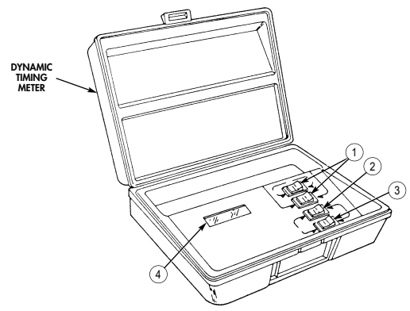

# I 1523. Engine Injection Pump Timing **(Cont'D) --1**

b. Timing Adjustment 

#### Warning

Never adjust injection pump timing with engine running or injury to personnel and damage to equipment may result. 

Loosen three nuts (7) securing injection pump (6) to timing chain cover (5). 

NOTE 
Moving injection pump 0.03 in. (0.8 mm) is equal to approximately 

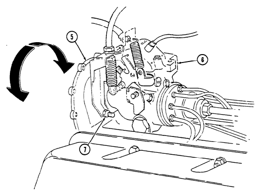 one degree of injection pump timing. 

Move injection pump (6) clockwise to retard timing; counterclockwise to advance timing. Tighten three nuts (71 securing injection pump (61 to timing chain cover (5) and recheck timing 
(task a.). 

FOLLOW-ON TASKS: l Install companion seat and battery box cover (para. 10-43). 

l Install engine access cover (para. 10-22). 

l Lower and secure hood (TM 9-2320-387-10). 

## I **1524. Engine Run-In** 1

This task covers: 
In-chassis Run-In INITIAL SETUP: 
Tools General mechanic's tool kit: 
automotive (Appendix B, Item 1) 
Manual References TM 9-2320-387-10 Equipment Condition Engine installed in vehicle (para. 15-28). 

General Safety Instructions Ensure engine compartment is free of all tools and working material before starting engine. 

Maintenance Level Direct support 

#### In-Chassis Run-In Warning

Ensure engine compartment is free of all tools and working material before starting engine. Failure to do this may cause injury to personnel or damage to equipment. 

#### Caution

If any leaks or abnormal noise is noted, stop engine immediately and correct as necessary. Any abnormalities must be corrected before proceeding. 

1. Start engine (TM 9-2320-387-10) and allow engine to idle for five to ten minutes. 

2. Stop engine and inspect oil and coolant levels (TM 9-2320-387-10). 

3. Check for leaks. If any leaks are found, correct as necessary. 

It may be necessary to block air flow to radiator. 

Start engine (TM 9-2320-387-10) and run at **l/4- to l./Zengine** throttle until coolant temperature reaches 165"-195°F (74"-91°C). 

4. 

5. 

Repeat steps 2 and 3. 

6. 

Set engine idle speed (para. 3-45). 

FOLLOW-ON TASK: Perform break-in service (TM 9-2320-387-10). 

# Section Ii. Engine Replacement

| 15\-1. INTRODUCTION                                                                                                                                                                                       |
|-----------------------------------------------------------------------------------------------------------------------------------------------------------------------------------------------------------|
| This chapter contains instructions for replacement and repair of engine components at the direct support  maintenance level. Some subassemblies and parts must be removed before engine components can be |
| accessed. They are referenced to other paragraphs in this manual.                                                                                                                                         |
| 15\-2. GENERAL ENGINE MAINTENANCE TASK SUMMARY                                                                                                                                                            |
| TASK PAGE PROCEDURES                                                                                                                                                                                      |
| PARA. NO.                                                                                                                                                                                                 |

## 15-25. Engine Replacement Task Summary

# 15-26. Engine Removal (Serial Numbers 299999 And Below)

This task covers:
Removal

#### Initial Setup: Tools

General mechanic's tool kit:
automotive (Appendix B, Item 1)
Special Tools Engine lifting sling (Appendix B, Item 24)
Hex-head driver, 8-mm 
(Appendix B, Item 145)

#### Materials/Parts

Engine/transmission support sling 
(Appendix D, Figs. 84 through 97) (Optional)
Personnel Required One mechanic One assistant Manual References TM 9-2320-387-10 TM 9-2320-387-24P

#### Equipment Condition

•Batteries removed (para. 4-74). •Engine access cover removed (para. 10-22). •Firewall armor removed (M1114 model)
(para. 11-48).

•A/C system discharged (M1114 model) 
(para. 25-15).

•Power steering reservoir and bracket removed
(serial numbers 196901 and above) (para. 8-29).

#### General Safety Instructions

•Hood must be supported during removal. •Do not remove surge tank filler cap before depressurizing system.

•Do not drain oil when engine is hot. •Alternator must be supported during removal. •Do not touch hot exhaust system components with bare hands.

•Do not use diesel fuel near fire, flames, or sparks. •Transmission must be supported during engine removal.

•Direct personnel to stand clear during hoisting operation.

•Do not use hands to free engine of hangups or snags.

#### Maintenance Level Direct Support Removal

1. Raise and secure hood (3) (TM 9-2320-387-10). 2. Disconnect hood harness connector (1) from harness connector (2).

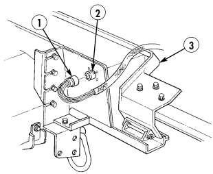

# 15-26. Engine Removal (Serial Numbers 299999 And Below) (Cont'D)

#### Warning

Hood must be supported during removal. Failure to support hood may cause injury to personnel and damage to equipment.

3. Remove four screws (13), lockwashers (12), and bracket (11) from airlift bracket (15). Discard lockwashers (12).

4. Lower hood (3) and remove two cotter pins (4), washers (5), hinge pins (8), and washers (5) from upper hinge halves (7) and lower hinge halves (6). Discard cotter pins (4).

5. Remove hood (3) with prop rod (14) and bracket (11) attached. 6. Remove two cover plates (9) and seals (10) from airlift brackets (15).

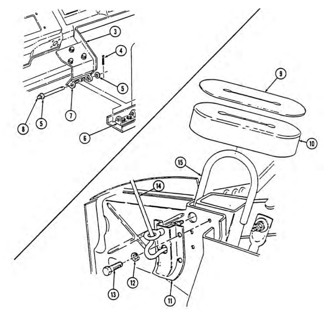

# 15-26. Engine Removal (Serial Numbers 299999 And Below) (Cont'D)

Perform steps 7 through 9 for M1114 models only.

7. Remove three A/C hoses (4) and O-rings (3) from tube assembly (12) and receiver/dryer (9). Discard O-rings (3).

8. Remove tiedown strap (7), nut (10), capscrew (5), and clamp (6) from bracket (8) and move A/C 
hoses (4) through clamp (6) and off to one side. Discard tiedown strap (7).

9. Remove screw (1), tube assembly (12), seal washer (11), and seal washer (11.1) and set tube assembly (12) aside. Discard seal washer (11) and seal washer (11.1).

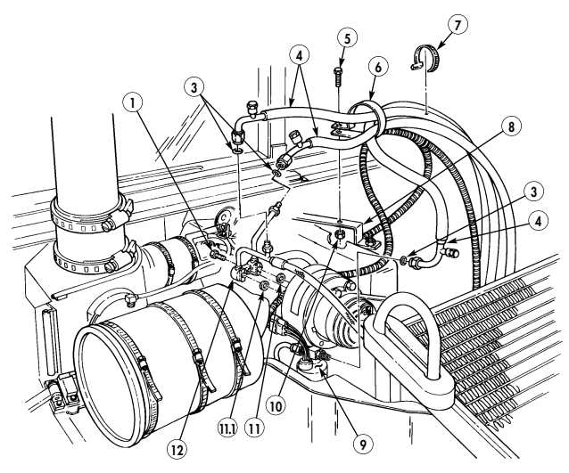

# 15-26. Engine Removal (Serial Numbers 299999 And Below) (Cont'D)

#### Warning

Do not remove surge tank filler cap before depressurizing system when engine temperature is above 190°F (88°C). Steam or hot coolant under pressure will cause severe burns.

10. If engine is hot, remove surge tank filler cap (13) by placing a thick cloth over cap (13). Press down and turn cap (13) counterclockwise to its first stop to release internal pressure.

11. After pressure has escaped, press down and turn cap (13) counterclockwise again and remove.

Have drainage container ready to catch coolant.

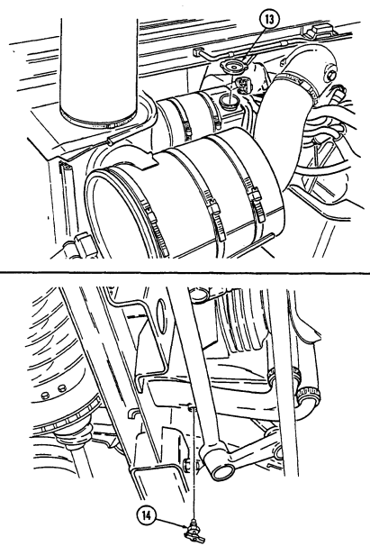

12. Open and remove drainvalve (14) and allow system to drain.

## 15-26. Engine Removal (Serial Numbers 299999 And Below) (Cont'D)

Remove four capscrews (6), washers (4), and lockwashers (5) from splash shield (3) and plate (7).

13.

Discard lockwashers (5).

14.

Remove hex-head screws (8) and (2), washer (9), plate (7), and spring nuts (10) and (11) from headlight housing (1).

Remove four nuts (14), screws (13), and harness connector (12) from plate (7).

15.

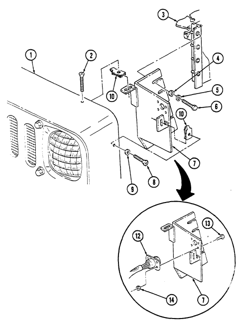

## 15-26. Engine Removal (Serial Numbers 299999 And Below) (Cont'D)

16. Remove nut and lockwasher assembly (34), screw (36), and harness with clamp (35) from left splash shield (3). Discard nut and lockwasher assembly (34).

Perform steps 17 and 18 for M1113 models only.

17. Remove locknut (18), washer (19), capscrew (27), and washer (26) from left splash shield (3) and airlift bracket (17). Discard locknut (18).

18. Remove capscrew (28), lockwasher (29), and left splash shield (3) from airlift bracket (17). Discard lockwasher (29).

19. Remove locknut (15), washer (16), capscrew (31), washer (32), and left splash shield (3) from support

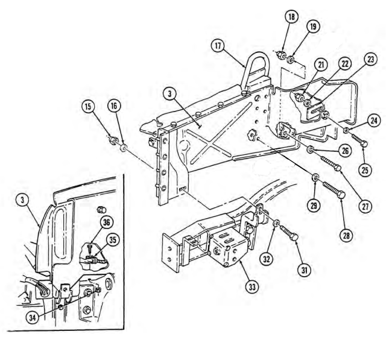

bracket (33). Discard locknut (15).

20. Remove locknut (21), washer (22), capscrew (25), washer (24), and splash shield (3) from master cylinder bracket (23). Discard locknut (21).

## 15-26. Engine Removal (Serial Numbers 299999 And Below) (Cont'D)

21. Remove four capscrews (15), washers (13), and lockwashers (14) from plate (12) and splash shield bracket (6). Discard lockwashers (14).

22. Remove two hex-head screws (10), plate (12), and spring nuts (11) from headlight housing (9). 23. Remove four nuts (29), screws (28), and harness connector (30) from plate (12). 24. Remove locknut (8), washer (7), capscrew (18), and washer (17) from right splash shield (1) and support bracket (16). Discard locknut (8).

Perform steps 25 and 26 for M1113 models only.

25. Remove locknut (23), washer (24), washer (22), two capscrews (19), washers (20), and clamp (21)
from right splash shield (1) and airlift bracket (5). Discard locknut (23).

26. Remove locknut (26), washer (25), capscrew (2), and vent line clamp (27) from right splash shield (1). Discard locknut (26).

27. Remove screw (3), washer (4), and right splash shield (1) from airlift bracket (5).

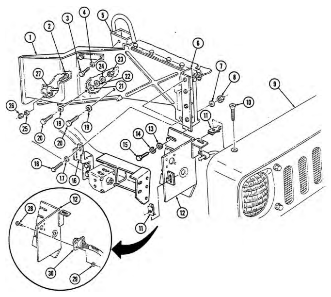

## 15-26. Engine Removal (Serial Numbers 299999 And Below) (Cont'D)

28. Remove leads 17 (36), 18 (42), and 91 (35) from headlight assembly (37). 29. Remove two assembled locknuts (48), clamps (31), body harness (34), and two screws (32) from headlight housing (33). Discard assembled locknuts (48).

30. Remove locknut (49) and screw (53) from bracket (51) (if equipped). Discard locknut (49). 31. Remove two locknuts (52), screws (50), and bracket (51) (if equipped) from headlight housing (33).

Discard locknuts (52).

32. Remove four locknuts (44), two plates (43), four screws (47), and washers (46) from headlight housing (33) and two frame brackets (45). Discard locknuts (44).

33. Remove two screws (41), washers (40), spacer (38), and headlight housing (33) from frame extension (39).

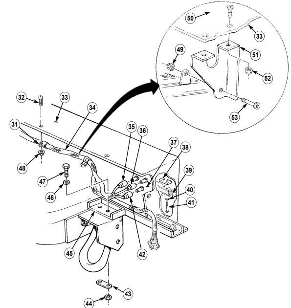

## 15-26. Engine Removal (Serial Numbers 299999 And Below) (Cont'D)

34. Loosen clamp (1) and disconnect radiator inlet hose (2) from engine (14). 35. Loosen clamp (5) and disconnect surge tank-to-radiator vent hose (4) from adapter (6). 36. Loosen clamp (16) and disconnect control valve hose (15) from bulkhead adapter (17). 37. Disconnect fan drive hose quick-disconnect (18) from fan drive (19). 38. Loosen clamp (9) and disconnect lower radiator front hose (10) from radiator (3). 39. Remove locknut (35), washer (36), capscrew (41), washer (40), large washer (39), and lower mount (37) from frame bracket (38) and radiator (3). Discard locknut (35).

40. Remove four locknuts (11), washers (12), capscrews (13), and two brackets (8) from airlift left and right brackets (7) and (26). Discard locknuts (11).

#### Warning

Do not drain engine oil when engine is hot. Severe injury to personnel may result.

#### Caution

Cover or plug all hoses and connections immediately after disconnection to prevent contamination. Remove all plugs prior to connection.

Have drainage container ready to catch oil.

41. Disconnect engine oil cooler supply and return lines (29) from engine, transmission, and power steering oil cooler ports (30).

42. Loosen two clamps (28) and disconnect power steering hoses (27) from engine, transmission, and power steering oil cooler ports (31).

43. Loosen two hose clamps (32) and disconnect transmission oil cooler line connector hoses (33) from transmission oil cooler ports (21).

44. Loosen nut (25) and release tension from crossbrace (24). 45. Remove four locknuts (23), washers (22), capscrews (20), and crossbrace (24) from airlift brackets (26) and (7). Discard locknuts (23).

46. Lift up radiator (3) and engine, transmission, and power steering oil cooler assembly (34) and remove from vehicle.

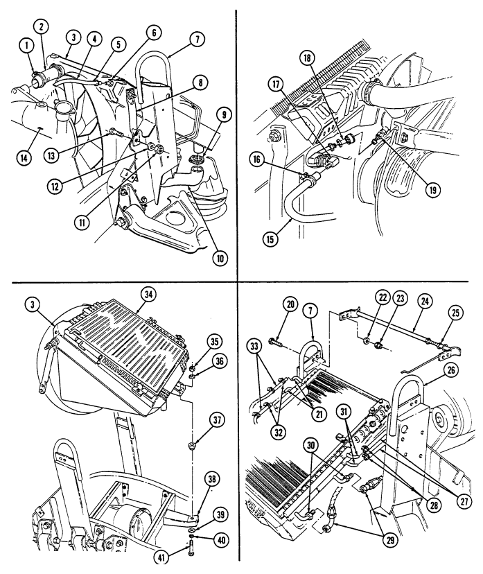

# 15-26. Engine Removal (Serial Numbers 299999 And Below) (Cont'D)

## 15-26. Engine Removal (Serial Numbers 299999 And Below) (Cont'D)

47. Position clutch adapter fitting (3) at the 6 o'clock position.

- Mark front of fan blade for installation. - Ensure clutch adapter fitting is at the 6 o'clock position when removing fan blade.

48. Remove four nuts (5), lockwashers (4), and fan blade (1) from fan drive (2). Discard 

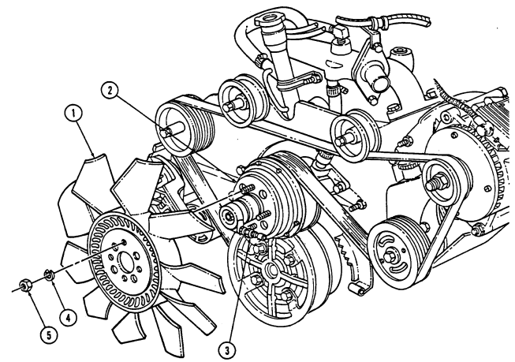

lockwashers (4).

# 15-26. Engine Removal (Serial Numbers 299999 And Below) (Cont'D)

49. Disconnect CDR hose (6) from air horn adapter (9).

#### Caution

Cover opening of intake manifold to prevent foreign material from entering engine.

50. Loosen two clamps (11) and (7) and remove air horn (10) from turbocharger intake hose (8) and air cleaner (12).

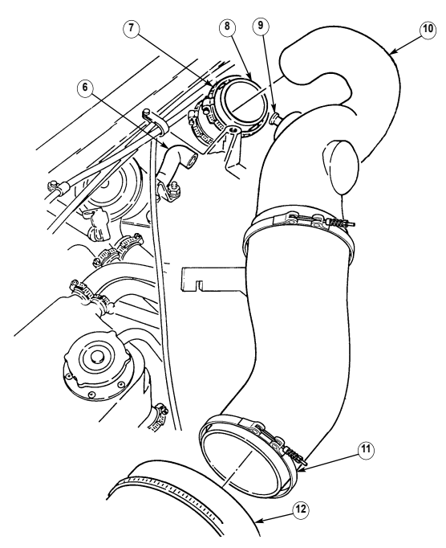

# 15-26. Engine Removal (Serial Numbers 299999 And Below) (Cont'D)

- Prior to removal, tag leads for installation. - Steps 51 through 58 are for the 200-ampere dual voltage alternator. The 400-ampere dual voltage alternator procedures are similar.

51. Slide back rubber boot (1) and remove nut (16), lead 568 (15), and washer (14) from IGN terminal (13).

52. Slide back rubber boot (2) and remove nut (3), lead 2A (4), and washer (5) from AC terminal (6). 53. Slide back rubber boot (10) and remove nut (11), washer (9), and lead (12) from terminal (8). 54. Remove nut (31), lockwasher (30), washer (29), and ground strap (28) from negative stud (27).

Discard lockwasher (30).

55. Slide back rubber boot (17) and remove nut (18), lockwasher (19), washer (20), and alternator positive cable (21) from positive stud (24). Discard lockwasher (19).

56. Position 3/8-in. breaker bar or, as appropriate, a 1/2-in. ratchet wrench on belt tensioner (32), move tensioner (32) clockwise, and remove drivebelt (25) from alternator pulley (26).

#### Warning

Alternator must be supported during removal. Failure to support alternator may cause injury to personnel or damage to equipment.

57. Remove nut (38), lockwasher (37), washer (33), capscrew (34), and washer (33) from alternator (7)
and support bracket (36). Discard lockwasher (37).

58. Remove alternator (7).

15-26. ENGINE REMOVAL (SERIAL NUMBERS 299999 AND BELOW) (Cont'd)

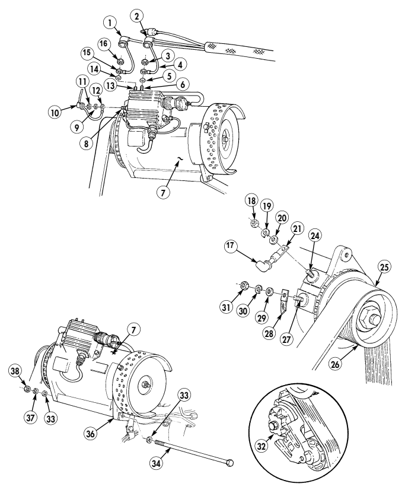

# 15-26. Engine Removal (Serial Numbers 299999 And Below) (Cont'D)

59. Remove capscrew (8) and ground leads 7A (7) and 7E (6) from cylinder head (10).

NOTE
Perform step 60 for M1113 models. Perform step 61 for M1114 models.

60. Remove capscrew (9), nut (5), lockwasher (4), stud (3), harness clamp (2), and air horn support bracket (1) from cylinder head (10). Discard lockwasher (4).

61. Remove capscrew (16), lockwasher (15), washer (14), harness clamp (13), capscrew (17), stud (18),
adapter (18.1), and air horn support bracket (12) from cylinder head (10). Discard lockwasher (15).

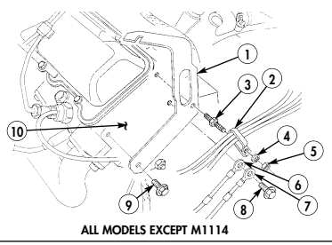

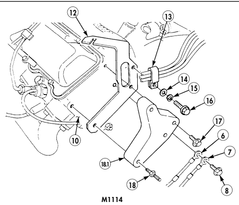

# 15-26. Engine Removal (Serial Numbers 299999 And Below) (Cont'D)

- CDR valves on vehicles equipped with deep water fording kit contain two additional vent lines.

- Leave hoses connected to CDR valve.

62. Loosen clamp (24) and disconnect CDR valve oil fill tube hose (23) from oil fill tube (25). 63. Remove two nuts (22) from intake manifold studs (26). 64. Remove two nuts (19) and CDR valve (20) with bracket (21) from valve cover studs (27) and manifold studs (26).

65. Remove capscrew (29) and clamp (30) from body (31).

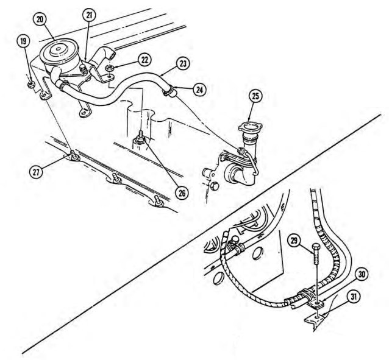

# 15-26. Engine Removal (Serial Numbers 299999 And Below) (Cont'D)

#### Warning

Do not touch hot exhaust system components with bare hands. Severe injury will result.

#### Caution

Plug open transmission port to prevent contamination of parts.

Have drainage container ready to catch fluid.

71. Deleted.

66. Remove transmission oil dipstick (5) from dipstick tube (6). 67. Remove two screws (8) from right rear heat shield (9) and right exhaust manifold heat shield (7). 68. Remove capscrew (11) and right rear heat shield (9) from dipstick tube (6) and rear heat shield (1). 69. Remove nut (2), washer (3), dipstick tube (6), and washer (3) from manifold stud (4). 70. Remove dipstick tube (6) from transmission (10).

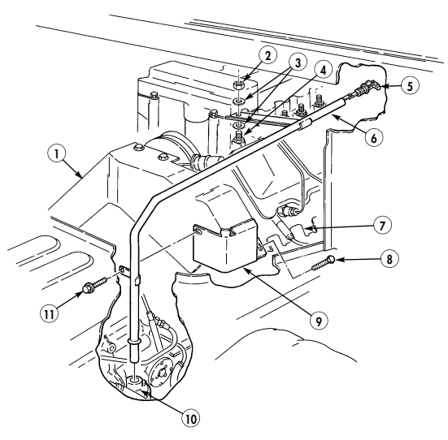

## 15-26. Engine Removal (Serial Numbers 299999 And Below) (Cont'D)

72. Remove capscrew (18) from rear heat shield (1) and left exhaust manifold (16). 73. Remove capscrew (19) from rear heat shield (1) and left cylinder head (17). 74. Remove two capscrews (14) and rear heat shield (1) from turbocharger (15).

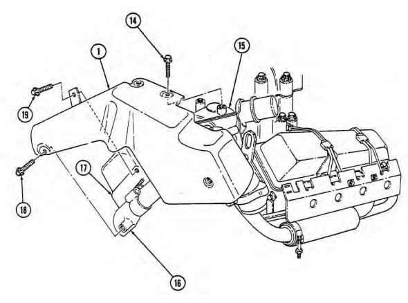

# 15-26. Engine Removal (Serial Numbers 299999 And Below) (Cont'D)

#### Caution

Cover or plug all hoses and connections immediately after disconnection to prevent contamination. Remove all plugs prior to connection.

75. Loosen clamp (5) and disconnect surge tank-to-water crossover hose (4) from water crossover (3). 76. Loosen two clamps (2) and disconnect heater hoses (1) at water crossover (3) and water pump (6).

#### Warning

Diesel fuel is highly flammable. Do not perform this procedure near fire, flames, or sparks. Severe injury or death may result.

Tag fuel lines for installation.

77. Loosen clamp (15) and disconnect fuel return hose (14) from fuel return line (16). 78. Loosen clamp (9) and disconnect fuel supply line (10) from fuel pump (11). 79. Loosen clamp (12) and disconnect vent line (13) from fuel pump (11). 80. Loosen clamp (7) and disconnect water pump inlet hose (8) from water pump (6). 81. Disconnect throttle return spring (19) from bracket (18). 82. Loosen two nuts (22) and disconnect cable assembly (17) from bracket (18).

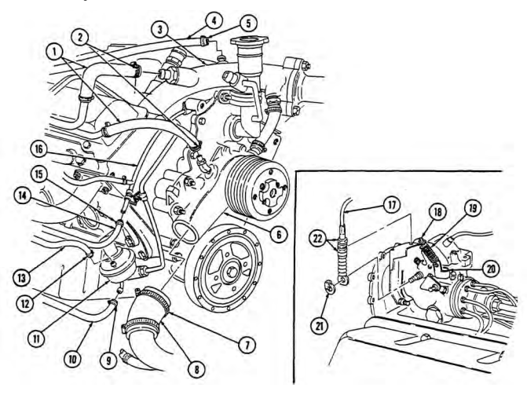 83. Remove accelerator cable clip (21) and disconnect cable assembly (17) from throttle shaft lever (20).

Retain clip (21) for installation.

## 15-26. Engine Removal (Serial Numbers 299999 And Below) (Cont'D)

84. Loosen clamps (36) and (37) and disconnect fuel inlet line (38) and fuel outlet line (39) from fuel filter (35).

85. Remove assembled locknut (40), engine harness ground 3C (41), and body harness ground 58B (42)
from body (24). Discard assembled locknut (40).

Perform steps 86 through 88 for M1113, M1151, and M1152.

86. Disconnect engine harness connector (29) from time-delay module (32). 87. Disconnect engine harness connector plug (30) from protective control box (31). 88. Remove nut (33), capscrew (27), clamp (28), and engine harness (26) from A-beam (25).

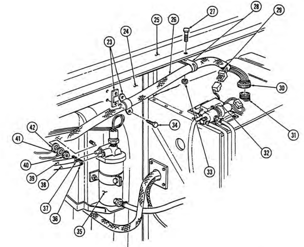 89. Remove two screws (34), clamp (23), and engine harness (26) from body (24).

## 15-26. Engine Removal (Serial Numbers 299999 And Below) (Cont'D)

90. Loosen hose clamps (14) and (18) and disconnect control valve hose (11) from control valve (15) and hydro-booster hose (17) from hydro-booster (19).

91. Remove nut (16), washer (20), and capscrew (2) from two clamps (1). 92. Disconnect high-pressure line (21) from hydro-booster (19). 93. Remove nut (10), screw (6), clamp (9), and body harness (8) from dipstick support bracket (7). 94. Disconnect two leads 458A (4) from leads 458C (3) and 458D (5). 95. Disconnect body harness leads 350B/359A/355A (12) from engine harness leads 349A (13).

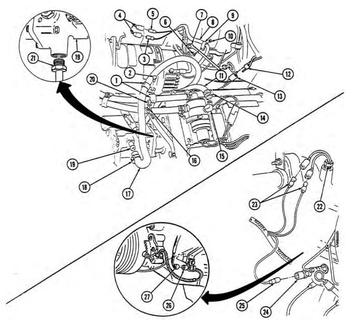 96. Disconnect harness lead 33B (25) from engine temperature sending unit (24) and harness lead (27)
from engine rpm sensor lead (26).

97. Disconnect harness leads 458A and 458B (23) from water temperature sending unit (22).

# 15-26. Engine Removal (Serial Numbers 299999 And Below) (Cont'D)

Prior to removal, tag leads for installation.

98. Disconnect lead 36A (32) from oil pressure sending unit (28).

#### Caution

Cover or plug all hoses and connections immediately after disconnection to prevent contamination. Remove all plugs prior to connection.

Have drainage container ready to catch oil.

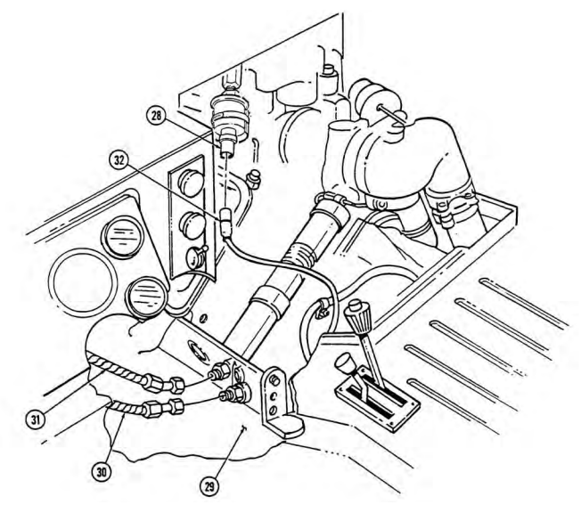

99. Disconnect oil cooler supply line (30) and oil cooler return line (31) from engine (29).

## 15-26. Engine Removal (Serial Numbers 299999 And Below) (Cont'D)

100. Remove nut (1), washer (2), and oil pressure sending unit (4) from stud (3). 101. Remove two nuts (9), lockwashers (8), washers (7), engine harness cable (6), and 200-amp alternator

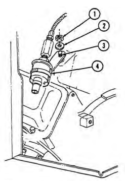

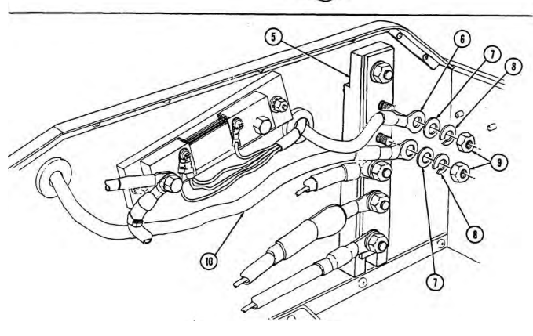

cable (10) from buss bar (5). Discard lockwashers (8).

# 15-26. Engine Removal (Serial Numbers 299999 And Below) (Cont'D)

102. Remove two clamps (22) and heat shield (21) from exhaust pipe (13). 103. Remove three locknuts (15), washers (14), capscrews (17), washers (14), and exhaust pipe (13) from muffler pipe (12). Discard locknuts (15).

104. Remove two capscrews (18), washers (19), flange (20), and exhaust pipe (13) from wastegate housing (11).

105. Remove gasket (16) from muffler pipe (12). Discard gasket (16).

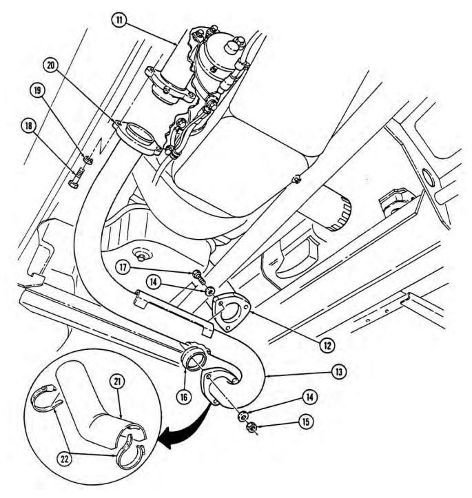

## 15-26. Engine Removal (Serial Numbers 299999 And Below) (Cont'D)

106. Remove two capscrews (4) and upper converter housing cover (3) from transmission (1). 107. Remove four capscrews (6) and lower converter housing cover (5) from transmission (1). 108. Remove gaskets (2) and (7) from converter housing covers (3) and (5). Discard gaskets (2) and (7).

- It will be necessary to rotate flywheel clockwise from capscrew in front of crankshaft to gain access to capscrews securing torque converter.

- Have assistant hold crankshaft pulley in place when removing capscrews securing flywheel to torque converter.

109. Remove six capscrews (9) and torque converter (8) from flywheel (10) and slide torque 

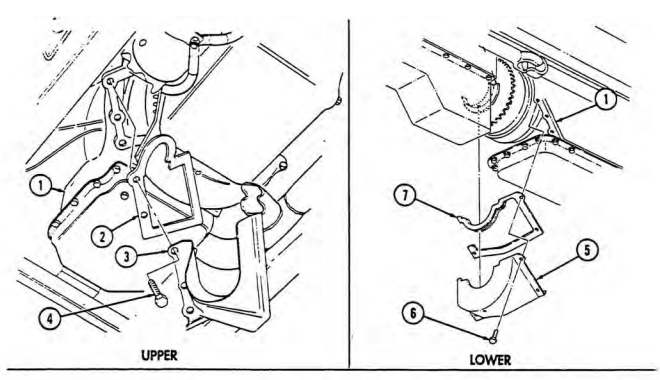

converter (8) away from flywheel (10).

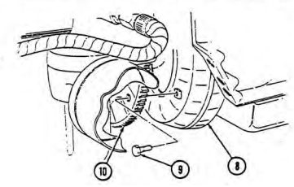

# 15-26. Engine Removal (Serial Numbers 299999 And Below) (Cont'D)

110. Install drainvalve (11) in radiator (12) and close drainvalve (11).

- Prior to removal, tag leads for installation. - Perform steps 111 and 112 if winch kit is installed on M1113.

111. Remove nut (20), lockwasher (21), and winch lead 7 (22) from starter negative terminal (19). Discard lockwasher (21).

112. Remove nut (18), lockwasher (17), and winch lead 6 (15) from starter positive terminal (16). Discard lockwasher (17).

113. Remove assembled locknut (23) and clamp (14) from oil pan bracket screw (13). Discard assembled locknut (23).

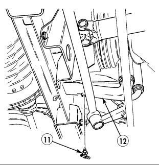

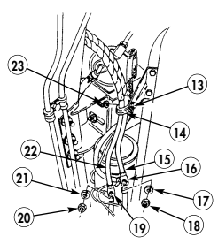

# 15-26. Engine Removal (Serial Numbers 299999 And Below) (Cont'D)

114. Remove lead 3D (8) and lead 7A (10) from starter negative terminal (11). 115. Remove screw (12), clamp (13), and positive cable 6A (9) from starter (14). 116. Remove lead 81B (7) and cable 6A (9) from starter positive terminal (3). 117. Remove screw (6), clip (5), and leads 74B (4) and 74A (2) from solenoid (1). 118. Remove ten nuts (16), capscrews (20), two screws (19), retainer (18), and closeout panel (17) from A-beam (15).

119. Remove six capscrews (21), intake crossover (22), and two gaskets (24) from intake manifolds (23)
and turbocharger (25). Discard gaskets (24).

120. Remove crossover O-ring (26) from turbocharger (25). Discard crossover O-ring (26). Clean mating surfaces.

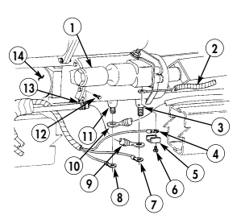

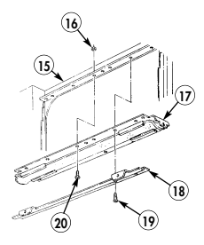

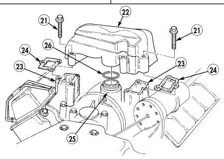

# 15-26. Engine Removal (Serial Numbers 299999 And Below) (Cont'D)

- Install sling bracket on rear of engine first. - Use four 15x25 mm capscrews to install lifting sling on engine.

121. Position engine lifting sling (27) on engine (30) and install on right cylinder head (34) with two capscrews (33).

122. Install sling bracket (28) on left cylinder head (32) with two capscrews (31). Tighten capscrews (31)

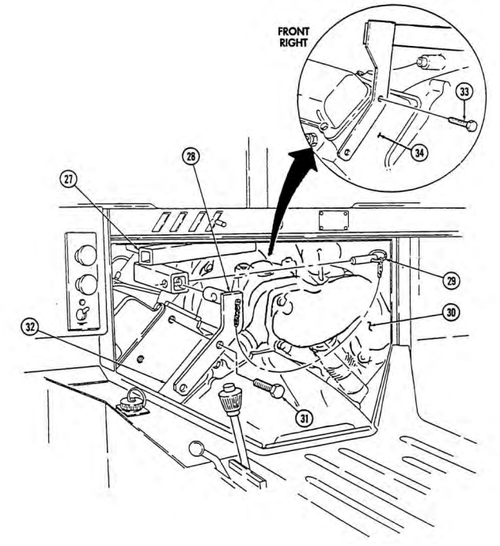

and (33). Install sling bracket (28) on engine lifting sling (27) with pin (29).

# 15-26. Engine Removal (Serial Numbers 299999 And Below) (Cont'D)

#### Caution

When using front eyelet on lifting sling, engine oil pan must be supported during engine removal to prevent rear eyelet of lifting sling from damaging windshield.

Hoist must be attached to intermediate eyelet when lifting engine and attached to rear eyelet when lifting engine and transmission together.

123. Raise engine (5) only enough to take pressure off mounting brackets (2). 124. Remove two locknuts (3) and washers (4) from right engine mount insulator (1) and engine mount bracket (2). Discard locknuts (3). Repeat for left engine mount.

#### Warning

Transmission must be supported during engine removal. Failure to do this may cause injury to personnel or damage to equipment.

#### Caution

If vehicle is moved because of limited shop space or tactical movement, damage to transmission and vehicle may occur. To prevent damage, engine/transmission support sling can be installed.

125. Support transmission (7) and remove four capscrews (8) and two studs (6) from transmission (7)
and engine (5).

#### Warning

- Direct all personnel not participating in engine removal to stand clear during hoisting operation. Failure to do this may cause injury to personnel.

- Do not use hands to free engine of hangups or snags. Use prybars to avoid injury.

#### Caution

Always remove engine slowly and watch for engine binding. Something may still be connected to engine that must be removed. Ensure wiring, lines, cables, and rods are not in the path of removal.

126. Hoist engine (5) slowly out of vehicle.

15-26. ENGINE REMOVAL (SERIAL NUMBERS 299999 AND BELOW) (Cont'd)

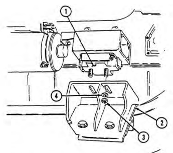

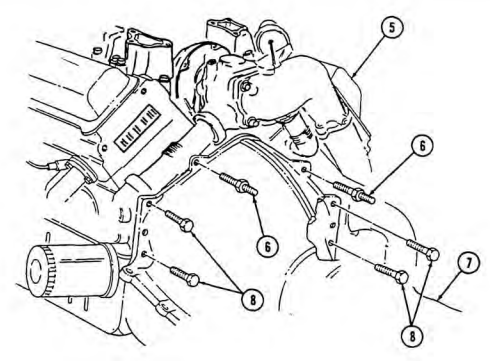

FOLLOW-ON TASK:  Prepare engine for disassembly (para. 15-27).

# 15-26.1. Engine Removal (Serial Numbers 300000 And Above)

This task covers:
Removal

#### Initial Setup: Tools

General mechanic's tool kit:
automotive (Appendix B, Item 1)
Special Tools Engine lifting sling (Appendix B, Item 24)
Hex-head driver, 8-mm 
(Appendix B, Item 145)

#### Materials/Parts

Engine/transmission support sling 
(optional) (Appendix D, Figs. 84 through 97)
Personnel Required One mechanic One assistant Manual References TM 9-2320-387-10 TM 9-2320-387-24P

#### Equipment Condition

•Batteries removed (para. 4-74). •Engine access cover removed (para. 10-22). •A/C system discharged (para. 25-15). •Power steering reservoir and bracket removed (para. 8-29).

#### Removal

1. Raise and secure hood (3) (TM 9-2320-387-10). 2. Disconnect hood harness connector (1) from harness connector (2).

#### General Safety Instructions

•Hood must be supported during removal. •Do not remove surge tank filler cap before depressurizing system.

•Do not drain oil when engine is hot. •Alternator must be supported during removal. •Do not touch hot exhaust system components with bare hands.

•Do not use diesel fuel near fire, flames, or sparks. •Transmission must be supported during engine removal.

•Direct personnel to stand clear during hoisting operation.

•Do not use hands to free engine of hangups or snags.

#### Maintenance Level

Direct support

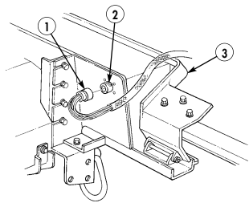

# 15-26.1. Engine Removal (Serial Numbers 300000 And Above) (Cont'D)

#### Warning

Hood must be supported during removal. Failure to support hood may cause injury to personnel and damage to equipment.

3. Remove cotter pin (15), washer (16), hood prop rod (17), and washer (18) from bracket (12).

Discard cotter pins (15).

4. Remove three capscrews (14), lockwashers (13), and bracket (12) from airlift bracket (11). Discard lockwashers (13).

5. Lower hood (3) and remove two cotter pins (4), washers (5), hinge pins (8), and washers (5) from upper hinge halves (7) and lower hinge halves (6). Discard cotter pins (4).

6. Remove hood (3). 7. Remove two cover plates (9) and seals (10) from airlift brackets (11).

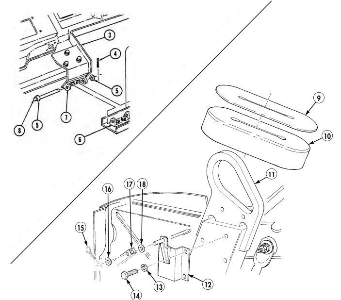

# 15-26.1. Engine Removal (Serial Numbers 300000 And Above) (Cont'D)

- Note location of all tiedown straps prior to removal for ease of installation.

- Cut and remove tie down straps as necessary prior to removal. - Note locations of all hoses and tees prior to removal for ease of installation.

- All lines and fittings must be plugged when disconnected.

8. Remove capscrew (4), lockwasher (5), washer (6), high pressure hose (3), and seal washer (2) from A/C manifold (1). Discard seal washer (2) and lockwasher (5).

9. Remove capscrew (7), lockwasher (8), washer (9), low pressure hose (10), and seal washer (11) from A/C manifold (1). Discard seal washer (11) and lockwasher (8).

15-26.1. ENGINE REMOVAL (SERIAL NUMBERS 300000 AND ABOVE) (Cont'd)

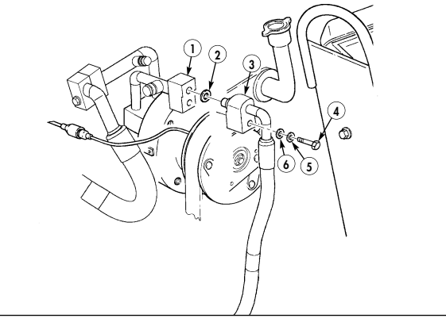

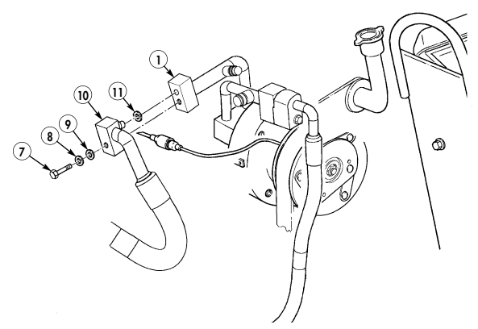

# 15-26.1. Engine Removal (Serial Numbers 300000 And Above) (Cont'D)

- Tag and mark location of all wires prior to removal for ease of installation
- Note location of all tie down straps prior to removal for ease of installation
- Cut and remove tie down straps as necessary 10. Remove four A/C wiring harness connectors (5) from four condenser fan harness connectors (6). 11. Remove A/C wiring harness connector (3) from high pressure cut-off switch (4). 12. Remove A/C wiring harness connector (2) from low pressure cut-off switch (1). 13. Remove A/C wiring harness connector (7) from water valve solenoid (8). 14. Remove two A/C wiring harness connectors (9) from compressor (10).

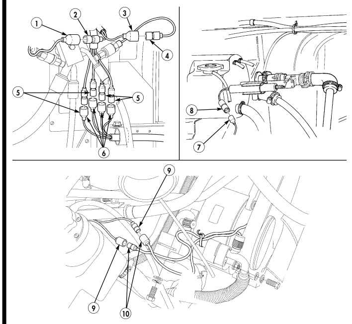

# 15-26.1. Engine Removal (Serial Numbers 300000 And Above) (Cont'D)

15. Remove A/C wiring harness connector (1) from A/C switch jumper wire (2). 16. Remove two A/C wiring harness connectors (3) from temperature switch (4). 17. Remove four A/C wiring harness connectors (5) from two circuit breakers (6) and feed four A/C wiring harness connectors (5) through grommet (7).

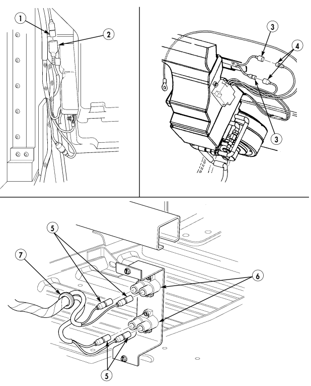

# 15-26.1. Engine Removal (Serial Numbers 300000 And Above) (Cont'D)

#### Warning

Do not remove surge tank filler cap before depressurizing system when engine temperature is above 190°F (88°C). Steam or hot coolant under pressure will cause severe burns.

18. If engine is hot, remove surge tank filler cap (1) by placing a thick cloth over cap (1). Press down and turn cap (1) counterclockwise to its first stop to release internal pressure.

19. After pressure has escaped, press down and turn cap (1) counterclockwise again and remove.

Have drainage container ready to catch coolant.

20. Open and remove drainvalve (2) and allow system to drain.

15-26.1. ENGINE REMOVAL (SERIAL NUMBERS 300000 AND ABOVE) (Cont'd)

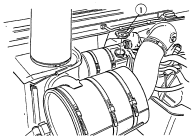

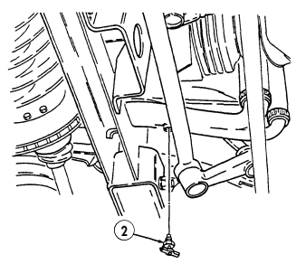

## 15-26.1. Engine Removal (Serial Numbers 300000 And Above) (Cont'D)

21. Remove four capscrews (25), lockwashers (26), and washers (27) from plate (29) and splash shield bracket (7). Discard lockwashers (26).

22. Remove hex-head screws (33) and (35), plate (29), and spring nuts (28) and (36) from headlight housing (34).

23. Remove four nuts (31), capscrews (30), and connector (32) from plate (29). 24. Remove nut and lockwasher assembly (3), capscrew (4), harness and clamp assembly (2) from splash shield (1). Discard nut and lockwasher assembly (3).

25. Remove nut (5) and valve (6) from splash shield (1). 26. Remove locknut (38), washer (39), capscrew (22), and washer (23) from support bracket (24) and splash shield (1). Discard locknut (37).

27. Remove capscrew (21), lockwasher (20), and washer (19) from airlift bracket (8) and splash shield (1). Discard lockwasher (20).

28. Remove locknut (9), washers (10) and (11), capscrew (17), and washer (16) from lower airlift bracket (18) and splash shield (1). Discard locknut (9).

29. Remove locknut (12), capscrew (15), and washer (14) from master cylinder bracket (13). Discard locknut (12) and remove splash shield (1) from vehicle.

15-26.1. ENGINE REMOVAL (SERIAL NUMBERS 300000 AND ABOVE) (Cont'd)

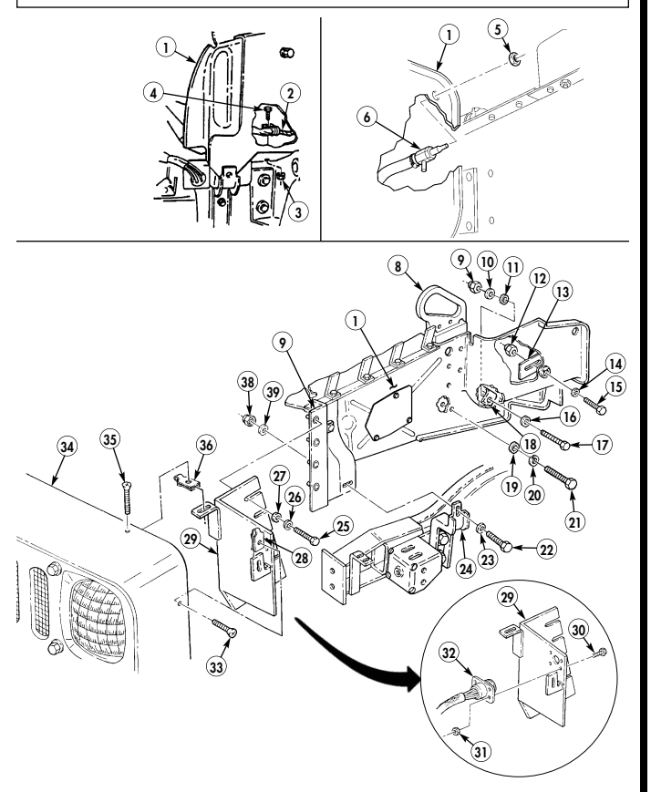

## 15-26.1. Engine Removal (Serial Numbers 300000 And Above) (Cont'D)

30. Disconnect hood harness (39) from connector (20). 31. Remove four capscrews (24), lockwashers (25), and washers (26) from splash shield bracket (10) and plate (19). Discard lockwashers (25).

32. Remove hex head screws (13) and (22), harness (16), clamp (17), and plate (19) from headlight housing (14).

33. Remove four nuts (21), capscrews (18), and connector (20) from plate (19). 34. Remove locknut (12), washer (11), capscrew (29), and washer (28) from splash shield (1) and support bracket (27). Discard locknut (12).

35. Remove capscrew (32), lockwasher (31), and washer (30) from splash shield (1) and airlift bracket (9).

Discard lockwasher (31).

36. Remove locknut (7), washer (6), capscrew (34), and washer (33) from splash shield (1) lower airlift bracket (8). Discard locknut (7).

37. Remove locknut (35), washer (36), capscrew (2), harness (37), and clamp (38) from splash shield (1).

Discard locknut (35).

38. Remove capscrew (3), lockwasher (4), and washer (5) from airlift bracket (9). Discard lockwasher (4).

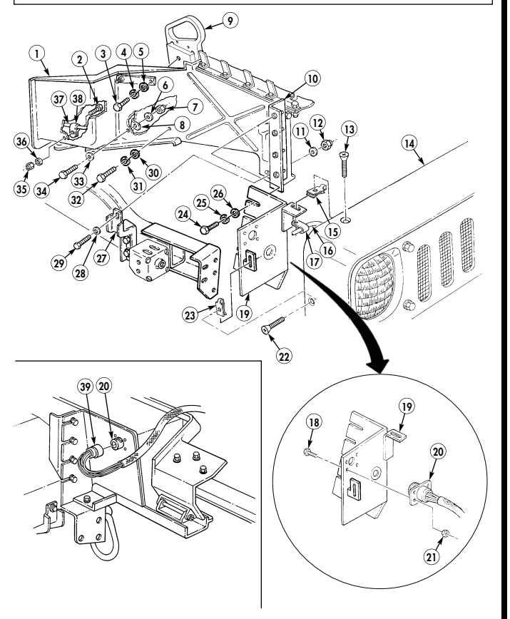

# 15-26.1. Engine Removal (Serial Numbers 300000 And Above) (Cont'D)

## 15-26.1. Engine Removal (Serial Numbers 300000 And Above) (Cont'D)

39. Remove leads 17 (35), 18 (41), and 91 (34) from headlight assembly (36). 40. Remove two assembled locknuts (47), clamps (30), body harness (33), and two screws (31) from headlight housing (32). Discard assembled locknuts (47).

41. Remove locknut (48) and screw (52) from bracket (50) (if equipped). Discard locknut (48). 42. Remove two locknuts (51), screws (49), and bracket (50) (if equipped) from headlight housing (32).

Discard locknuts (51).

43. Remove four locknuts (43), two plates (42), four screws (46), and washers (45) from headlight housing (32) and two frame brackets (44). Discard locknuts (43).

44. Remove two screws (40), washers (39), spacer (37), and headlight housing (32) from frame extension (38).

15-26.1. ENGINE REMOVAL (SERIAL NUMBERS 300000 AND ABOVE) (Cont'd)

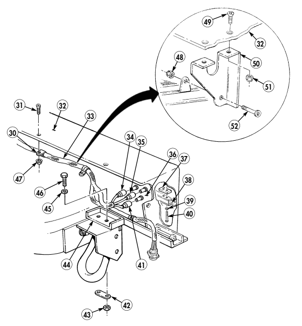

## 15-26.1. Engine Removal (Serial Numbers 300000 And Above) (Cont'D)

45. Loosen clamp (1) and disconnect radiator inlet hose (2) from engine (14). 46. Loosen clamp (5) and disconnect surge tank-to-radiator vent hose (4) from adapter (6). 47. Loosen clamp (9) and disconnect lower radiator front hose (10) from radiator (3). 48. Remove nut (29), washer (30), two rubber mounts (31), washer (33), lockwasher (34), and capscrew (35) from radiator (3) and frame bracket (32).

49. Remove four locknuts (11), washers (12), capscrews (13), and two brackets (8) from airlift left and right brackets (7) and (19). Discard locknuts (11).

#### Warning

Do not drain engine oil when engine is hot. Severe injury to personnel may result.

#### Caution

Cover or plug all hoses and connections immediately after disconnection to prevent contamination. Remove all plugs prior to connection.

Have drainage container ready to catch oil.

50. Disconnect engine oil cooler supply and return lines (22) from engine, transmission, and power steering oil cooler ports (23).

51. Loosen two clamps (21) and disconnect power steering hoses (20) from engine, transmission, and power steering oil cooler ports (24).

52. Loosen two hose clamps (25) and disconnect transmission oil cooler line connector hoses (26) from transmission oil cooler ports (27).

53. Loosen nut (18) and release tension from crossbrace (15). 54. Remove capscrews (16), lockwashers (17), and crossbrace (15) from airlift brackets (19) and (7). 55. Lift up radiator (3) and engine, transmission, and power steering oil cooler assembly (28) and remove from vehicle.

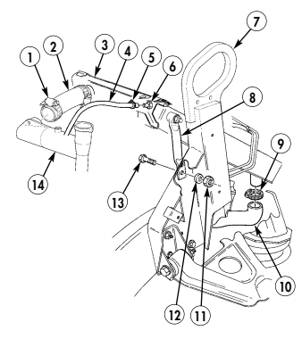

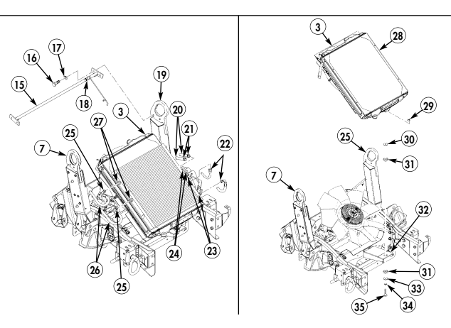

15-26.1. ENGINE REMOVAL (SERIAL NUMBERS 300000 AND ABOVE) (Cont'd)

Change 6

## 15-26.1. Engine Removal (Serial Numbers 300000 And Above) (Cont'D)

56. Remove four capscrews (1), lockwashers (2), and washers (3) from fan clutch (6), fan impeller (4),
and flange (5).

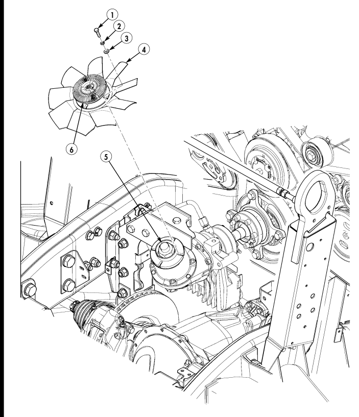

# 15-26.1. Engine Removal (Serial Numbers 300000 And Above) (Cont'D)

57. Disconnect CDR hose (7) from air horn adapter (10).

#### Caution

Cover opening of intake manifold to prevent foreign material from entering engine.

58. Loosen two clamps (12) and (8) and remove air horn (11) from turbocharger intake hose (9) and air cleaner (13).

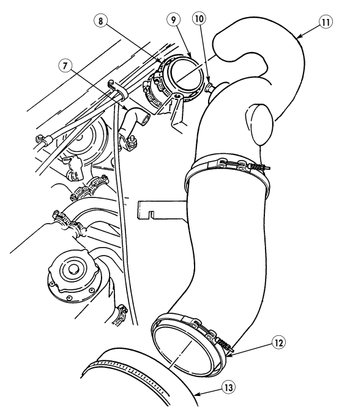

# 15-26.1. Engine Removal (Serial Numbers 300000 And Above) (Cont'D)

Prior to removal, tag leads for installation.

59. Slide back rubber boot (1) and remove nut (16), lead 568 (15), and washer (14) from IGN terminal (13).

60. Slide back rubber boot (2) and remove nut (3), lead 2A (4), and washer (5) from AC terminal (6). 61. Slide back rubber boot (10) and remove nut (11), washer (9), and lead (12) from terminal (8). 62. Remove capscrew (26), lockwasher (25), washer (24), and ground strap (23) from alternator (7). 63. Remove capscrew (17), lockwasher (18), washer (19), and alternator positive cable (20) from alternator (7).

64. Position 3/8-in. breaker bar or, as appropriate, a 1/2-in. ratchet wrench on belt tensioner (27), move tensioner (27) clockwise, and remove drivebelt (21) from alternator pulley (22).

#### Warning

Alternator must be supported during removal. Failure to support alternator may cause injury to personnel or damage to equipment.

65. Remove nut (33), lockwasher (32), washer (31), capscrew (29), and washer (28) from alternator (7)
and support bracket (30). Discard lockwasher (32).

66. Remove alternator (7).

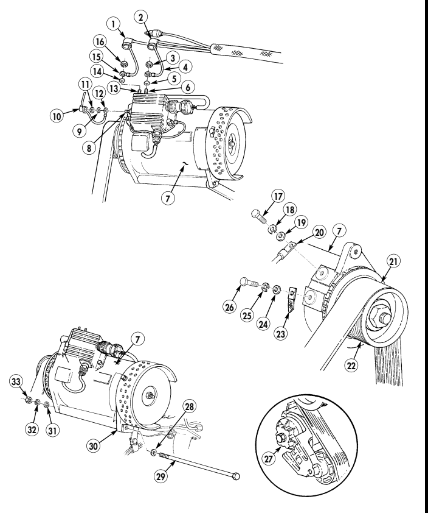

15-26.1. ENGINE REMOVAL (SERIAL NUMBERS 300000 AND ABOVE) (Cont'd)

## 15-26.1. Engine Removal (Serial Numbers 300000 And Above) (Cont'D)

Remove capscrew (8) and ground leads 7A (7) and 7E (6) from cylinder head (10).

67.

Remove capscrew (9), nut (5), lockwasher (4), stud (3), harness clamp (2), and air horn support 68.

bracket (1) from cylinder head (10). Discard lockwasher (4).

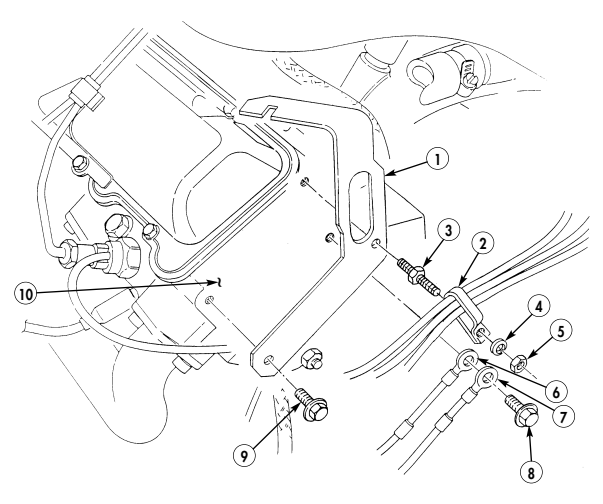

# 15-26.1. Engine Removal (Serial Numbers 300000 And Above) (Cont'D)

- CDR valves on vehicles equipped with deep water fording kit contain two additional vent lines.

- Leave hoses connected to CDR valve.

69. Loosen clamp (16) and disconnect CDR valve oil fill tube hose (15) from oil fill tube (17). 70. Remove two nuts (14) from intake manifold studs (18). 71. Remove two nuts (11) and CDR valve (12) with bracket (13) from valve cover studs (19) and manifold studs (18).

72. Remove capscrew (20) and clamp (21) from body (22).

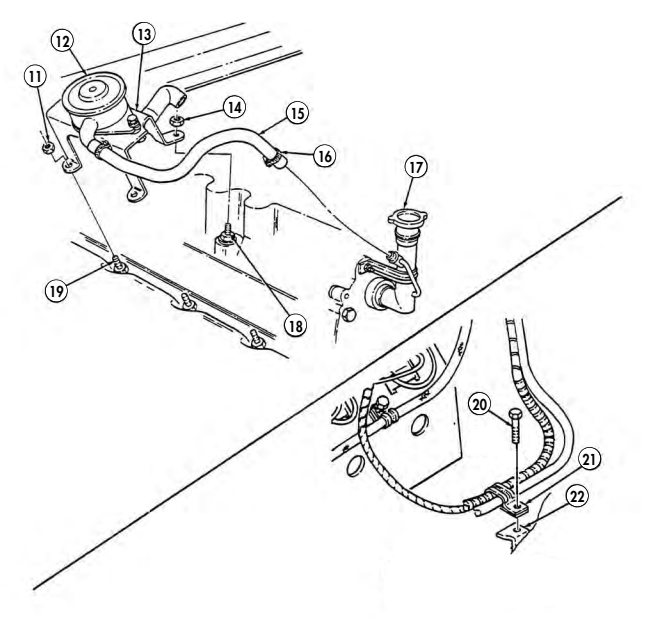

# 15-26.1. Engine Removal (Serial Numbers 300000 And Above) (Cont'D)

#### Warning

Do not touch hot exhaust system components with bare hands. Severe injury will result.

#### Caution

Plug open transmission port to prevent contamination of parts.

NOTE
Have drainage container ready to catch fluid.

73. Remove transmission oil dipstick (5) from dipstick tube (6). 74. Remove two screws (8) from right rear heat shield (9) and right exhaust manifold heat shield (7). 75. Remove capscrew (11) and right rear heat shield (9) from dipstick tube (6) and rear heat shield (1). 76. Remove nut (2), washer (3), dipstick tube (6), and washer (3) from manifold stud (4). 77. Remove dipstick tube (6) from transmission (10).

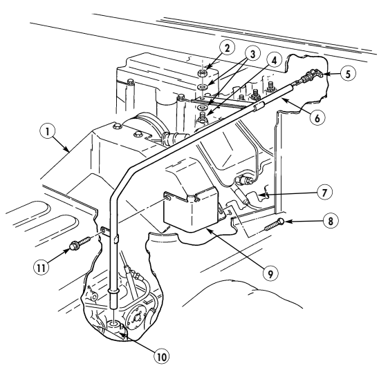

# 15-26.1. Engine Removal (Serial Numbers 300000 And Above) (Cont'D)

#### Caution

Cover or plug all hoses and connections immediately after disconnection to prevent contamination. Remove all plugs prior to connection.

78. Loosen clamp (5) and disconnect surge tank-to-water crossover hose (4) from water crossover (3). 79. Loosen two clamps (2) and disconnect heater hoses (1) at water crossover (3) and water pump (6).

#### Warning

Diesel fuel is highly flammable. Do not perform this procedure near fire, flames, or sparks. Severe injury or death may result.

Tag fuel lines for installation.

80. Loosen clamp (15) and disconnect fuel return hose (14) from fuel return line (16). 81. Loosen clamp (9) and disconnect fuel supply line (10) from fuel pump (11). 82. Loosen clamp (12) and disconnect vent line (13) from fuel pump (11). 83. Loosen clamp (7) and disconnect water pump inlet hose (8) from water pump (6). 84. Disconnect throttle return spring (19) from bracket (18). 85. Loosen two nuts (22) and disconnect cable assembly (17) from bracket (18). 86. Remove accelerator cable clip (21) and disconnect cable assembly (17) from throttle shaft lever (20).

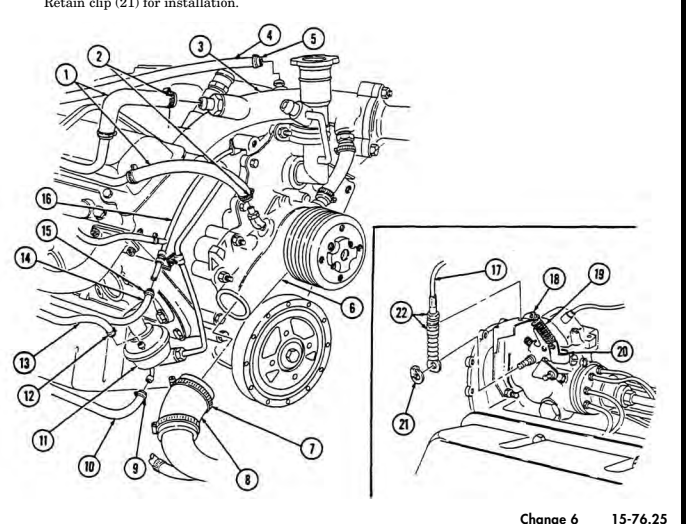

## 15-26.1. Engine Removal (Serial Numbers 300000 And Above) (Cont'D)

87. Loosen clamps (32) and (33) and disconnect fuel inlet line (34) and fuel outlet line (35) from fuel filter (31).

88. Remove assembled locknut (36), engine harness ground 3C (37), and body harness ground 58B (38)
from body (24). Discard assembled locknut (36).

89. Disconnect engine harness connector (26) from time-delay module (29). 90. Disconnect engine harness connector plug (27) from protective control box (28). 91. Remove two screws (30), clamp (23), and engine harness (25) from body (24).

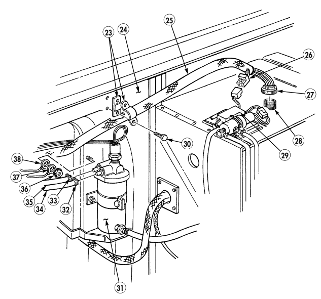

## 15-26.1. Engine Removal (Serial Numbers 300000 And Above) (Cont'D)

92. Loosen hose clamps (14) and (18) and disconnect control valve hose (11) from control valve (15) and hydro-booster hose (17) from hydro-booster (19).

93. Remove nut (16), washer (20), and capscrew (2) from two clamps (1). 94. Disconnect high-pressure line (21) from hydro-booster (19). 95. Remove nut (10), screw (6), clamp (9), and body harness (8) from dipstick support bracket (7). 96. Disconnect two leads 458A (4) from leads 458C (3) and 458D (5). 97. Disconnect body harness leads 350B/359A/355A (12) from engine harness leads 349A (13).

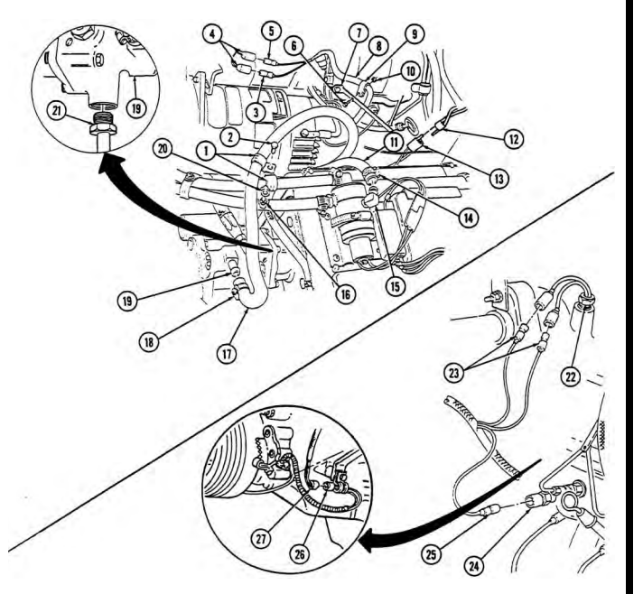 98. Disconnect harness lead 33B (25) from engine temperature sending unit (24) and harness lead (27)
from engine rpm sensor lead (26).

99. Disconnect harness leads 458A and 458B (23) from water temperature sending unit (22).

# 15-26.1. Engine Removal (Serial Numbers 300000 And Above) (Cont'D)

Prior to removal, tag leads for installation.

100. Disconnect lead 36A (32) from oil pressure sending unit (28).

#### Caution

Cover or plug all hoses and connections immediately after disconnection to prevent contamination. Remove all plugs prior to connection.

Have drainage container ready to catch oil.

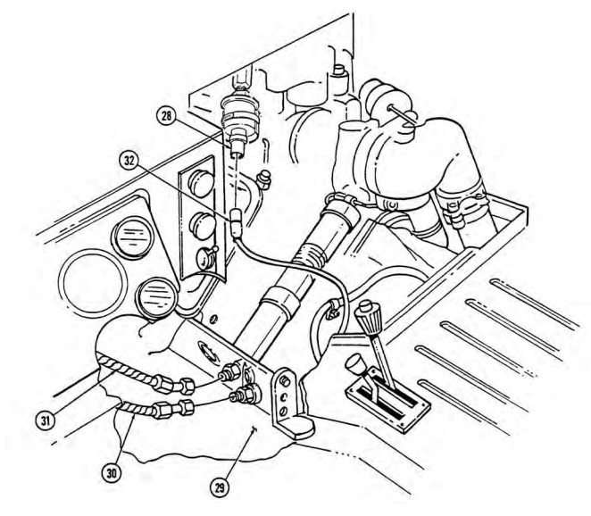

101. Disconnect oil cooler supply line (30) and oil cooler return line (31) from engine (29).

# 15-26.1. Engine Removal (Serial Numbers 300000 And Above) (Cont'D)

102. Remove nut (1), washer (2), and oil pressure sending unit (4) from stud (3). 103. Remove two nuts (9), lockwashers (8), washers (7), engine harness cable (6), and 200-amp alternator

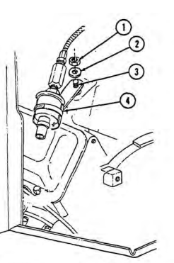

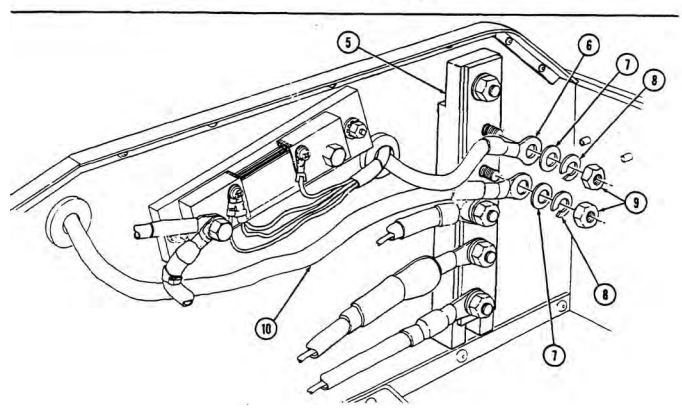

cable (10) from buss bar (5). Discard lockwashers (8).

# 15-26.1. Engine Removal (Serial Numbers 300000 And Above) (Cont'D)

104. Remove two clamps (22) and heat shield (21) from exhaust pipe (13). 105. Remove three locknuts (15), washers (14), capscrews (17), washers (14), and exhaust pipe (13) from muffler pipe (12). Discard locknuts (15).

106. Remove two capscrews (18), washers (19), flange (20), and exhaust pipe (13) from wastegate housing (11).

107. Remove gasket (16) from muffler pipe (12). Discard gasket (16).

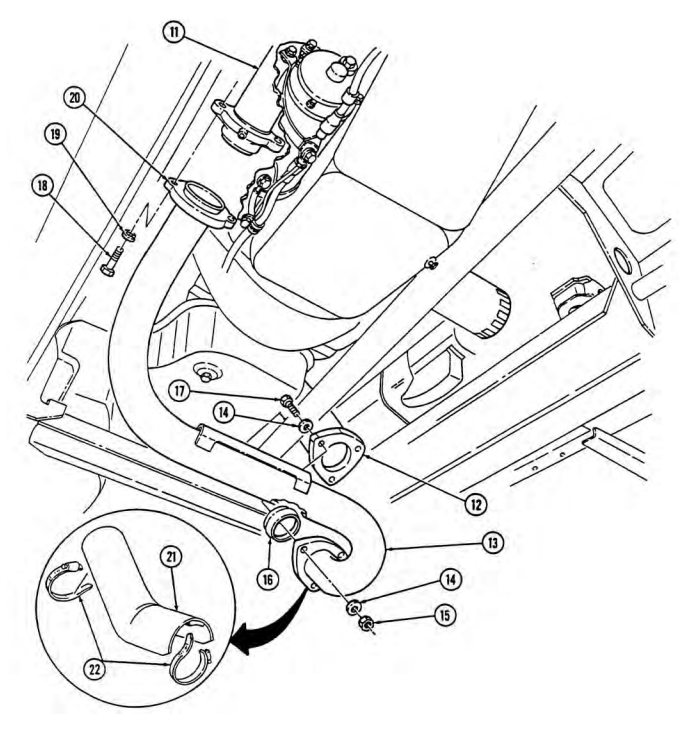

# 15-26.1. Engine Removal (Serial Numbers 300000 And Above) (Cont'D)

108. Remove two capscrews (4) and upper converter housing cover (3) from transmission (1). 109. Remove four capscrews (6) and lower converter housing cover (5) from transmission (1). 110. Remove gaskets (2) and (7) from converter housing covers (3) and (5). Discard gaskets (2) and (7).

- It will be necessary to rotate flywheel clockwise from capscrew in front of crankshaft to gain access to capscrews securing torque converter.

- Have assistant hold crankshaft pulley in place when removing capscrews securing flywheel to torque converter.

111. Remove six capscrews (9) and torque converter (8) from flywheel (10) and slide torque 

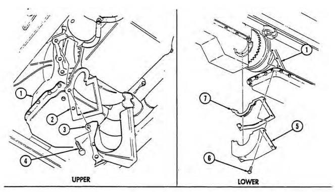

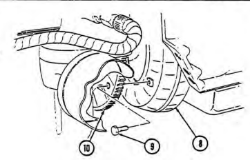

converter (8) away from flywheel (10).

# 15-26.1. Engine Removal (Serial Numbers 300000 And Above) (Cont'D)

112. Install drainvalve (11) in radiator (12) and close drainvalve (11).

Prior to removal, tag leads for installation.

113. Remove nut (20), lockwasher (21), and winch lead 7 (22) from starter negative terminal (19). Discard lockwasher (21).

114. Remove nut (18), lockwasher (17), and winch lead 6 (15) from starter positive terminal (16). Discard lockwasher (17).

115. Remove assembled locknut (23) and clamp (14) from oil pan bracket screw (13). Discard assembled locknut (23).

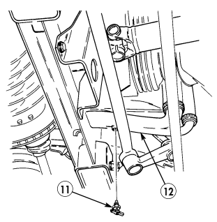

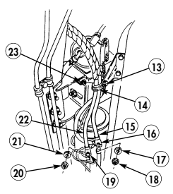

# 15-26.1. Engine Removal (Serial Numbers 300000 And Above) (Cont'D)

116. Remove lead 3D (8) and lead 7A (10) from starter negative terminal (11). 117. Remove screw (12), clamp (13), and positive cable 6A (9) from starter (14). 118. Remove lead 81B (7) and cable 6A (9) from starter positive terminal (3). 119. Remove screw (6), clip (5), and leads 74B (4) and 74A (2) from solenoid (1). 120. Remove ten nuts (16), capscrews (20), two screws (19), retainer (18), and closeout panel (17) from A-beam (15).

121. Remove six capscrews (21), intake crossover (22), and two gaskets (24) from intake manifolds (23)
and turbocharger (25). Discard gaskets (24).

122. Remove crossover O-ring (26) from turbocharger (25). Discard crossover O-ring (26). Clean mating surfaces.

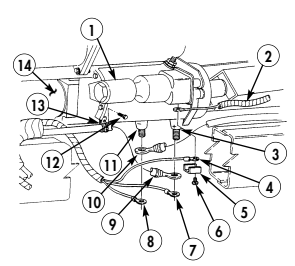

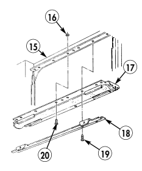

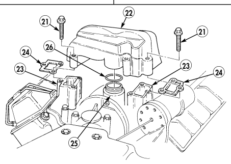

# 15-26.1. Engine Removal (Serial Numbers 300000 And Above) (Cont'D)

- Install sling bracket on rear of engine first. - Use four 15x25 mm capscrews to install lifting sling on engine.

123. Position engine lifting sling (27) on engine (30) and install on right cylinder head (34) with two capscrews (33).

124. Install sling bracket (28) on left cylinder head (32) with two capscrews (31). Tighten capscrews (31)
and (33). Install sling bracket (28) on engine lifting sling (27) with pin (29).

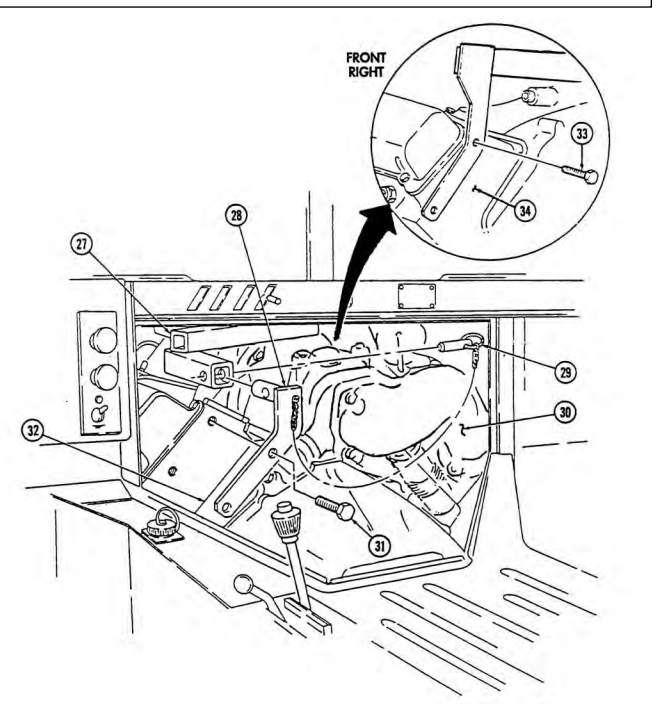

15-26.1. ENGINE REMOVAL (SERIAL NUMBERS 300000 AND ABOVE) (Cont'd)

# 15-26.1. Engine Removal (Serial Numbers 300000 And Above) (Cont'D)

#### Caution

When using front eyelet on lifting sling, engine oil pan must be supported during engine removal to prevent rear eyelet of lifting sling from damaging windshield.

Hoist must be attached to intermediate eyelet when lifting engine and attached to rear eyelet when lifting engine and transmission together.

125. Raise engine (5) only enough to take pressure off mounting brackets (2). 126. Remove two locknuts (3) and washers (4) from right engine mount insulator (1) and engine mount bracket (2). Discard locknuts (3). Repeat for left engine mount.

#### Warning

Transmission must be supported during engine removal. Failure to do this may cause injury to personnel or damage to equipment.

#### Caution

If vehicle is moved because of limited shop space or tactical movement, damage to transmission and vehicle may occur. To prevent damage, engine/transmission support sling can be installed.

127. Support transmission (7) and remove four capscrews (8) and two studs (6) from transmission (7)
and engine (5).

#### Warning

- Direct all personnel not participating in engine removal to stand clear during hoisting operation. Failure to do this may cause injury to personnel.

- Do not use hands to free engine of hangups or snags. Use prybars to avoid injury.

#### Caution

Always remove engine slowly and watch for engine binding. Something may still be connected to engine that must be removed. Ensure wiring, lines, cables, and rods are not in the path of removal.

128. Hoist engine (5) slowly out of vehicle.

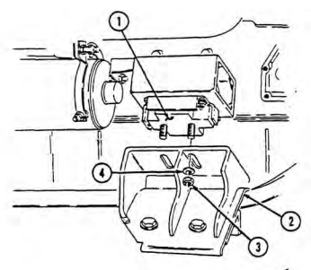

15-26.1. ENGINE REMOVAL (SERIAL NUMBERS 300000 AND ABOVE) (Cont'd)

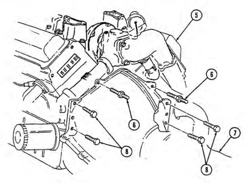

FOLLOW-ON TASK:  Prepare engine for disassembly (para. 15-27.1).

# 15-27. Engine Preparation (Serial Numbers 299999 And Below)

This task covers:
a. Disassembly b. Assembly

Tools General mechanic's tool kit:
automotive (Appendix B, Item 1)
Maintenance and repair shop equipment:
automotive (Appendix B, Item 2)

#### Special Tools

Hex-head driver, 8-mm 
(Appendix B, Item 145)
Torque adapter, 9/16-in.

(Appendix B, Item 133)
Crowfoot, 9/16-in. (Appendix B, Item 139) Engine stand (Appendix B, Item 28)

#### Materials/Parts

Three lockwashers (Appendix G, Item 138)
(M1114 only)
O-ring (Appendix G, Item 216) Three lockwashers (Appendix G, Item 183) Five lockwashers (Appendix G, Item 144) Two assembled washer screws
(Appendix G, Item 278.1)
Two lockwashers (Appendix G, Item 185) Two lockwashers (Appendix G, Item 151) Nut and lockwasher assembly 
(Appendix G, Item 197)

#### Materials/Parts (Cont'D)

Antiseize compound (Appendix C, Item 16) RTV sealant (Appendix C, Item 10) Sealing compound (Appendix C, Item 65) Sealing compound, thread-locking
(Appendix C, Item 66)
Manual References TM 9-2320-387-24P
Equipment Condition Engine removed (para. 15-26).

#### General Safety Instructions

•Direct personnel to stand clear during hoisting operation.

•Starter must be supported during removal and installation.

•Power steering pump must be supported during removal and installation.

Maintenance Level Direct support

#### Warning

Direct personnel to stand clear during hoisting operation. Failure to do this may cause injury to personnel.

a. Disassembly 1. Place engine on stand and disconnect hoist.

Have drainage container ready to catch oil.

2. Remove drainplug (5) and gasket (6) from oil pan (4). Allow oil to drain completely. 3. Install gasket (6) and drainplug (5) on oil pan (4). Tighten drainplug (5) to 20 lb-ft (27 N.m). 4. Remove two capscrews (3) and sling bracket (7) from left cylinder head (8). 5. Remove pin (2) from sling bracket (7) and engine lifting sling (1). 6. Remove two capscrews (9) and engine lifting sling (1) from right cylinder head (10).

# 15-27. Engine Preparation (Serial Numbers 299999 And Below) (Cont'D)

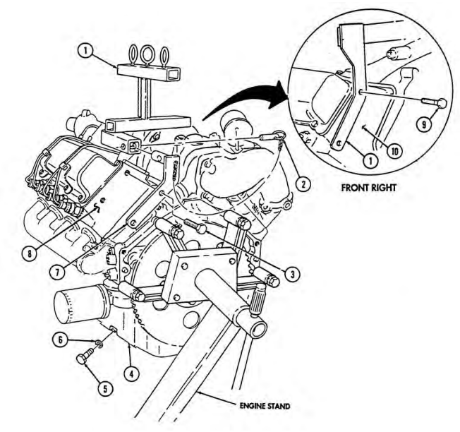

## 15-27. Engine Preparation (Serial Numbers 299999 And Below) (Cont'D)

7. Remove two capscrews (1), clamps (2), and harness (3) from brackets (4). 8. Remove nut and lockwasher assembly (10), capscrew (7), clamp (8), and harness (3) from dipstick bracket (9). Discard nut and lockwasher assembly (10).

9. Disconnect four harness leads (6) from glow plugs (5).

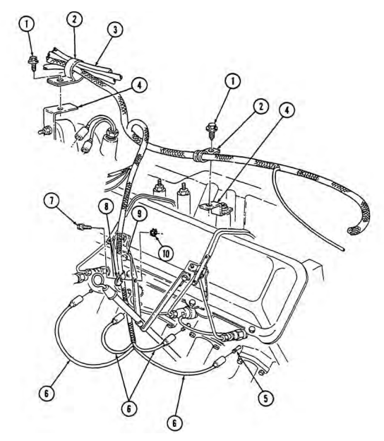

## 15-27. Engine Preparation (Serial Numbers 299999 And Below) (Cont'D)

10. Disconnect harness connector (18) from glow plug controller (17). 11. Disconnect leads 315A/315B (16) from fan cut-off switch leads (15). 12. Disconnect harness connector (11) from transmission TP sensor (14). 13. Disconnect leads 54A (12) and 569B (13) from fuel injection pump (19).

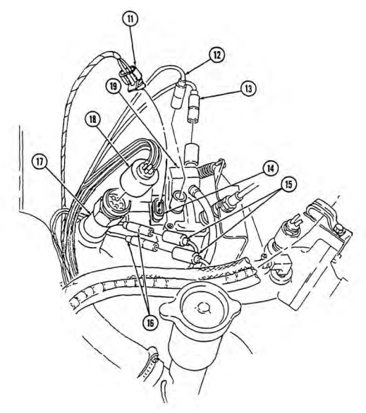

# 15-27. Engine Preparation (Serial Numbers 299999 And Below) (Cont'D)

14. Disconnect leads 569A (10) and 569B (9) from cold-advance switch (13). 15. Disconnect four harness boots (11) from glow plugs (12). 16. Remove two capscrews (6), lockwashers (7), clamps (8), and harness (4) from heat shield (5). Discard lockwashers (7).

17. Remove two screws (3), clamps (2), and harness (4) from intake manifold bracket (1).

Perform step 18 for vehicles with serial numbers 196900 and below.

18. Remove two nuts (18), lockwashers (17), capscrews (14), washer (20.1), lockwasher (17), A/C
compressor (20), and spacer (15) from mounting bracket (19) and bracket (16). Discard lockwashers (17).

Perform step 18.1 for vehicles with serial numbers 196901 and above.

18.1. Remove nut (18), lockwasher (17), two washers (20.1), capscrew (14), and A/C compressor (20) from mounting bracket (19). Discard lockwashers (17).

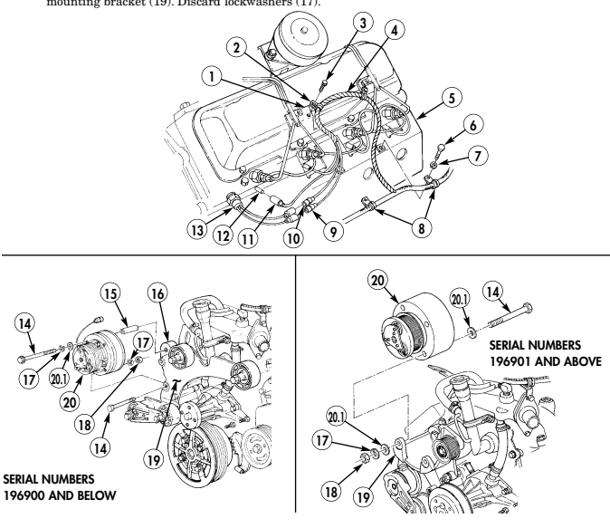

# 15-27. Engine Preparation (Serial Numbers 299999 And Below) (Cont'D)

19. Remove capscrew (30) and belt tensioner (29) from mounting bracket (19).

NOTE
On M1114 vehicles equipped with A/C, the compressor pulley is in place of the lower idler pulley.

20. Remove three nuts (25), lockwashers (24), washers (22), supports (23.1), capscrews (21),
washers (22), dust covers (22.1), and idler pulleys (23) from mounting bracket (19). Discard lockwashers (24).

21. Remove two capscrews (28) and lockwashers (27) from mounting bracket (19) and water pump (26).

Discard lockwashers (27).

21.1. Remove screw (26.1), collar washer (25.1), and mounting bracket (19) from engine (25.2).

NOTE
Perform steps 21.2 and 21.3 for vehicles with serial numbers 196901 and above.

21.2. Remove two nuts (25) and lockwashers (24) from studs (31) on water pump (26). Discard lockwashers (24). 21.3. Remove two screws (26.1) and mounting bracket (19) from engine (25.2).

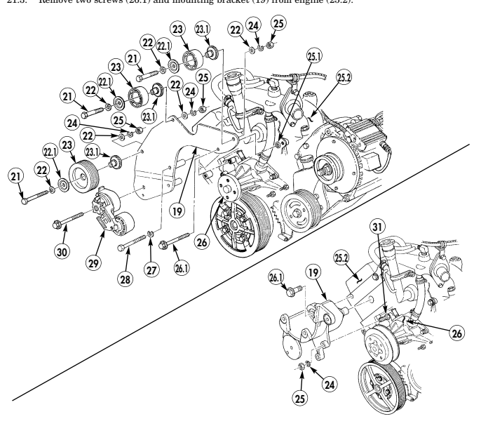 
# 15-27. Engine Preparation (Serial Numbers 299999 And Below) (Cont'D)

#### Warning

Power steering pump must be supported during removal and installation. Failure to do this may cause injury to personnel.

22. Remove two capscrews (1) and capscrew (4) from alternator/power steering bracket (3). 23. Remove power steering pump (2). 24. Remove three capscrews (6) and alternator/power steering bracket (3) from engine (5).

Perform step 24.1 for vehicles with serial numbers 196901 and above.

24.1. Remove three capscrews (6) and alternator/power steering bracket (3) from engine (5).

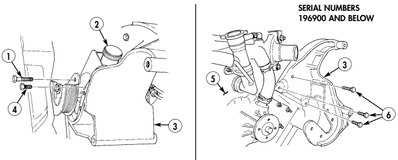

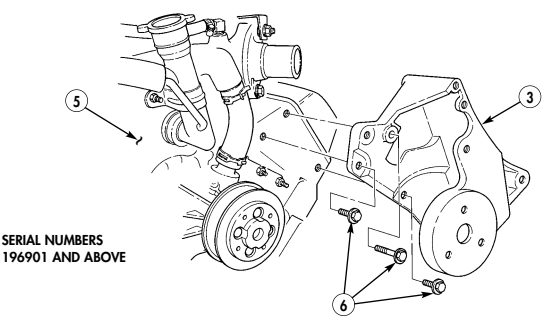

15-27. ENGINE PREPARATION (SERIAL NUMBERS 299999 AND BELOW) (Cont'd)
25. Remove oil dipstick (11) from oil dipstick tube (9). 26. Remove two assembled washer screws (8) and dipstick tube bracket (10) from two fuel line brackets (7). Discard assembled washer screws (8).

27. Remove oil dipstick tube (9) from engine oil pan (13). Remove and discard O-ring seal (12).

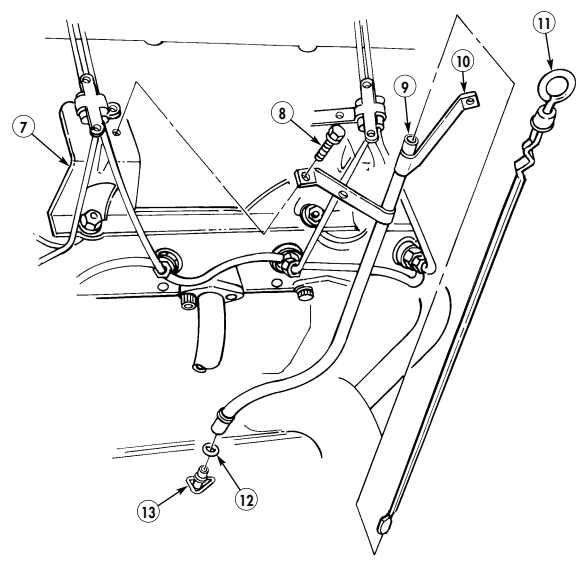

## 15-27. Engine Preparation (Serial Numbers 299999 And Below) (Cont'D)

28. Remove four capscrews (4) and right exhaust manifold heat shield (3) from exhaust manifold (2)
and cylinder head (1).

29. Loosen locknut (9) and washer (8) on front of starter (7) and bracket (10).

#### Warning

Starter must be supported during removal. Failure to support starter may cause injury to personnel or damage to equipment.

30. Remove two capscrews (11), washers (12), starter (7), and shim(s) (6), if present, from engine (5). 31. Remove three capscrews (15), lockwashers (14), and left and right engine mount and insulator assemblies (13) from engine (5). Discard lockwashers (14).

32. Remove two nuts (17), lockwashers (16), and wiring harness bracket (18) from oil pan (19). Discard

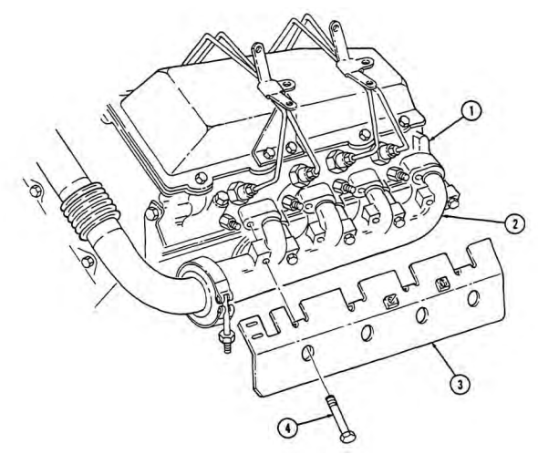

lockwashers (16).

15-27. ENGINE PREPARATION (SERIAL NUMBERS 299999 AND BELOW) (Cont'd)

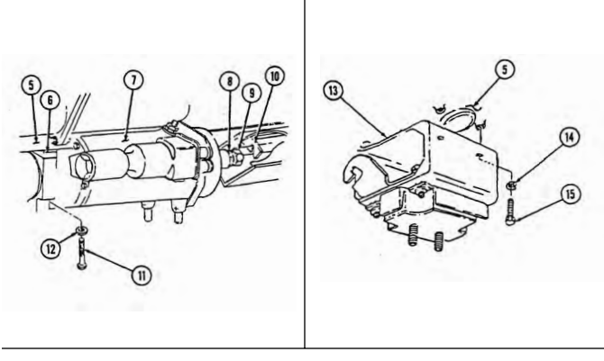

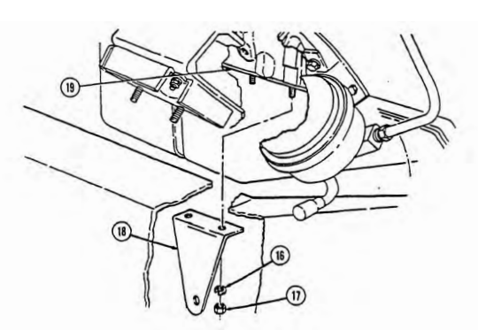

# 15-27. Engine Preparation (Serial Numbers 299999 And Below) (Cont'D)

33. Remove fitting (1) from clutch fan adapter (2).

Have drainage container ready to catch fluid.

34. Remove two plugs (3) and drain coolant from engine (4).

b. Assembly 1. Install fitting (1) on clutch fan adapter (2). 2. Apply antiseize compound to two plugs (3) and install in engine (4).

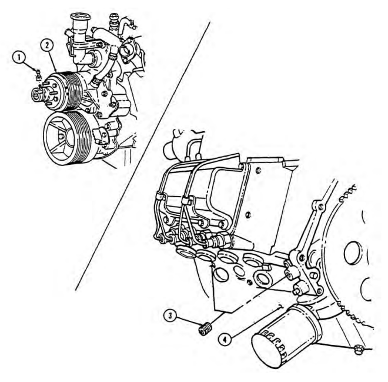

# 15-27. Engine Preparation (Serial Numbers 299999 And Below) (Cont'D)

3. Install wiring harness bracket (8) on oil pan (5) with two lockwashers (6) and nuts (7). 4. Install left and right engine mount and insulator assemblies (9) on engine (4) with three lockwashers (10) and capscrews (11). Using 9/16-in. torque adapter, tighten capscrews (11) to 30-40 lb-ft (41-54 N•m).

#### Warning

Starter must be supported during installation. Failure to support starter may cause injury to personnel or damage to equipment.

5. Position shim(s) (12), if removed, and starter (13) on flywheel housing (20) with solenoid (14) facing outward.

6. Slide front of starter (13) in bracket (17), ensuring bracket (17) is between washer (15) and starter (13).

7. Apply thread-locking compound to capscrews (18). Install two washers (19) and capscrews (18) on

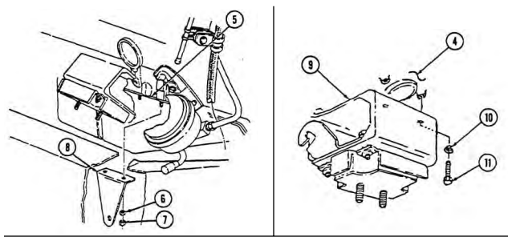

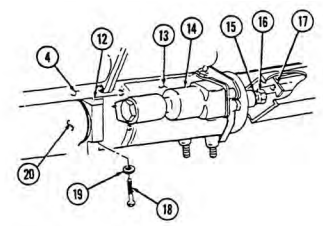

starter (13) and engine (4). Tighten capscrews (18) to 30-40 lb-ft (41-54 N•m).

8. Using crowfoot, tighten locknut (16) to 15-19 lb-ft (20-26 N•m).

1 15-27. ENGINE PREPARATION (SERIAL NUMBERS 299999 AND BELOW) (Cont'd)

9.

Install right exhaust manifold heat shield (3) on exhaust manifold (2) and cylinder head (1) with four capscrews (4).

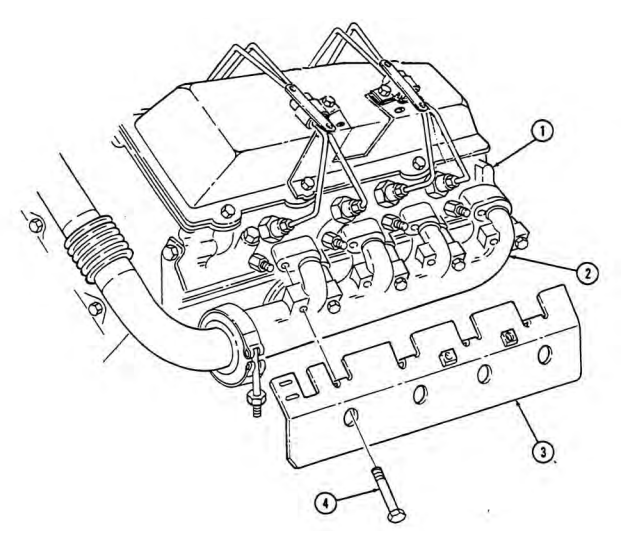

15-27. ENGINE PREPARATION (SERIAL NUMBERS 299999 AND BELOW) (Cont'd)
10. Apply RTV sealant to O-ring seal (9) and install O-ring seal (9) on oil dipstick tube (6). 11. Insert oil dipstick tube (6) into engine oil pan (10). 12. Install dipstick tube bracket (7) on two fuel line brackets (11) with assembled washer screws (5).

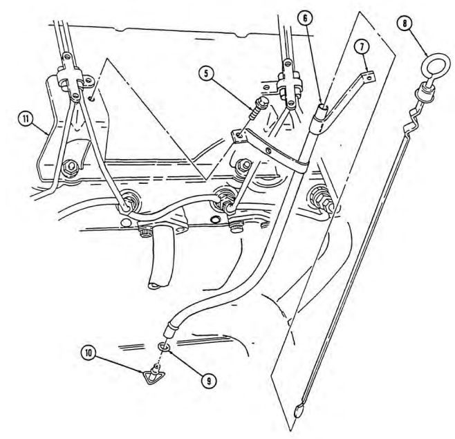 13. Install oil dipstick (8) into oil dipstick tube (6).

# 15-27. Engine Preparation (Serial Numbers 299999 And Below) (Cont'D)

14. Apply sealing compound to three capscrews (3). 15. Install alternator/power steering bracket (2) on engine (1) with three capscrews (3). Tighten capscrews (3) to 48 lb-ft (65 N•m).

16. Install power steering pump (4) on alternator/power steering bracket (2) with two capscrews (5) and capscrew (6).

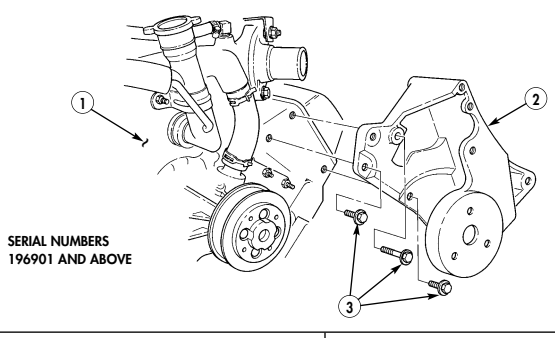

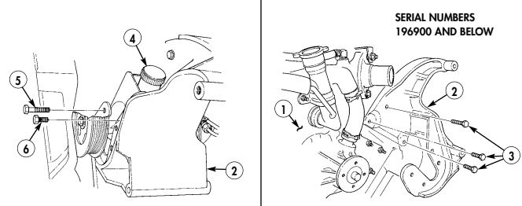

# 15-27. Engine Preparation (Serial Numbers 299999 And Below) (Cont'D)

Perform steps 16.1 and 16.2 for vehicles with serial numbers 196901 and above.

16.1. Install mounting bracket (8) on engine (9) with two screws (7). Tighten screws (7) to 43-51 lb-ft 
(58-69 N•m).

16.2. Install mounting bracket (8) on studs (10) on water pump (11) with two lockwashers (12) and nuts (13).

16.3. Install mounting bracket (8) on engine (9) with collar washer (20) and capscrew (22).

17. Install mounting bracket (8) on water pump (21) with two lockwashers (23) and capscrews (24).

On M1114 vehicles equipped with A/C, the compressor pulley is in place of the lower idler pulley.

18. Install three supports (18) and idler pulleys (17) on mounting bracket (8) with three dust covers (16),
washers (15), capscrews (14), washers (19), lockwashers (12), and nuts (13).

19. Install belt tensioner (25) on mounting bracket (8) with capscrew (26).

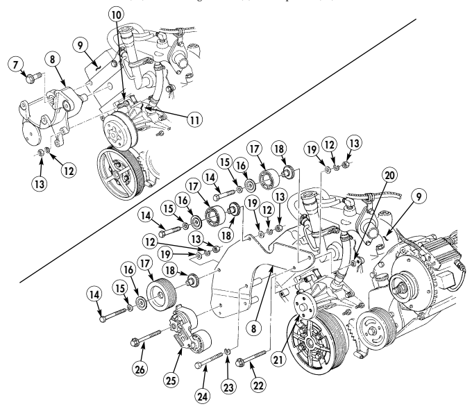 
# 15-27. Engine Preparation (Serial Numbers 299999 And Below) (Cont'D)

Perform step 19.1 for vehicles with serial numbers 196901 and above.

19.1. Install A/C compressor (8) on mounting bracket (5) with capscrew (1), washers (9), lockwasher (10),
and nut (7).

Perform step 20 for vehicles with serial numbers 196900 and below.

20. Install spacer (2) and A/C compressor (8) on bracket (3) and mounting bracket (5) with capscrews (1) and (6), lockwashers (10) and (4), washers (9), and nuts (7).

21. Connect four harness boots (21) to glow plugs (22). 22. Connect leads 569B (19) and 569A (20) to cold-advance switch (23). 23. Install harness (14) on heat shield (15) with two clamps (18), lockwashers (17), and capscrews (16). 24. Install harness (14) on intake manifold bracket (11) with two clamps (12) and screws (13).

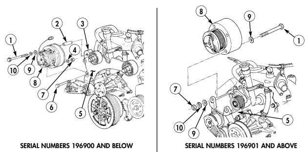

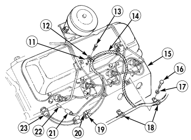

15-27. ENGINE PREPARATION (SERIAL NUMBERS 299999 AND BELOW) (Cont'd)
25. Connect harness connector (31) to glow plug controller (30). 26. Connect harness leads 315A/315B (29) to fan cut-off switch leads (28). 27. Connect harness leads 54A (25) and 569B (26) to fuel injection pump terminals (32). 28. Connect harness connector (24) to transmission TP sensor (27).

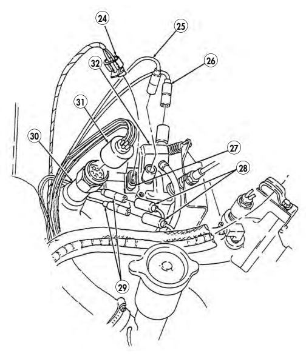

# 15-27. Engine Preparation (Serial Numbers 299999 And Below) (Cont'D)

29. Connect four harness leads (7) to glow plugs (6). 30. Install harness (3) on two brackets (4) with clamps (2) and capscrews (1). 31. Install harness (3) on dipstick mounting bracket (10) with clamp (9), capscrew (8), and nut and

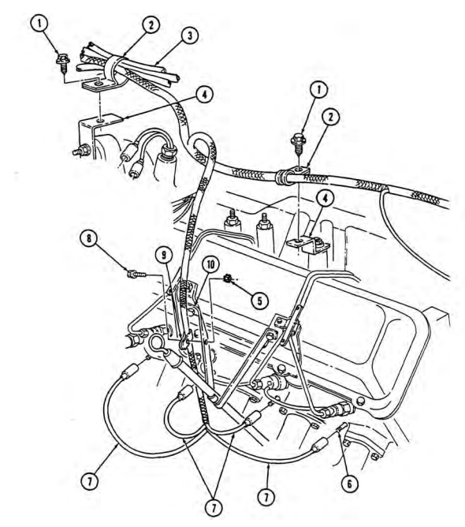

lockwasher assembly (5).

# 15-27. Engine Preparation (Serial Numbers 299999 And Below) (Cont'D)

Hoist must be attached to intermediate eyelet when lifting engine and attached to rear eyelet when lifting engine and transmission together.

32. Install sling bracket (14) on left cylinder head (15) with two capscrews (13). 33. Install engine lifting sling (11) on right cylinder head (17) with two capscrews (16). 34. Install sling bracket (14) on engine lifting sling (11) with pin (12).

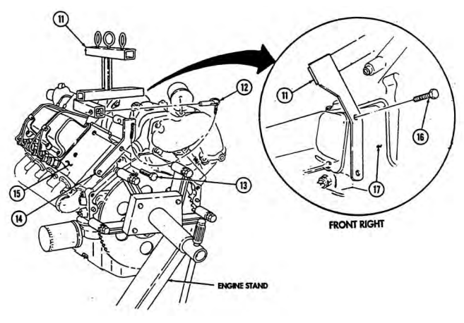

FOLLOW-ON TASK: Install engine (para. 15-26).

# 15-27.1. Engine Preparation (Serial Numbers 300000 And Above)

This task covers:
a. Disassembly b. Assembly

Tools General mechanic's tool kit:
automotive (Appendix B, Item 1)
Maintenance and repair shop equipment:
automotive (Appendix B, Item 2)

| Special Tools   |
|-----------------|

Hex-head driver, 8-mm 
(Appendix B, Item 145)
Torque adapter, 9/16-in.

(Appendix B, Item 133)
Crowfoot, 9/16-in. (Appendix B, Item 139) Engine stand (Appendix B, Item 28)

#### Materials/Parts

O-ring (Appendix G, Item 216) Three lockwashers (Appendix G, Item 183) Five lockwashers (Appendix G, Item 144) Two assembled washer screws
(Appendix G, Item 278.1)
Two lockwashers (Appendix G, Item 185) Two lockwashers (Appendix G, Item 151) Nut and lockwasher assembly 
(Appendix G, Item 197)

#### Materials/Parts (Cont'D)

Antiseize compound (Appendix C, Item 16) RTV sealant (Appendix C, Item 10) Sealing compound (Appendix C, Item 65) Sealing compound, thread-locking
(Appendix C, Item 66)
Manual References TM 9-2320-387-24P
Equipment Condition Engine removed (para. 15-26.1).

#### General Safety Instructions

•Direct personnel to stand clear during hoisting operation.

•Starter must be supported during removal and installation.

•Power steering pump must be supported during removal and installation.

Maintenance Level Direct support

#### Warning

Direct personnel to stand clear during hoisting operation. Failure to do this may cause injury to personnel.

a. Disassembly 1. Place engine on stand and disconnect hoist.

Have drainage container ready to catch oil.

2. Remove drainplug (5) and gasket (6) from oil pan (4). Allow oil to drain completely. 3. Install gasket (6) and drainplug (5) on oil pan (4). Tighten drainplug (5) to 20 lb-ft (27 N.m). 4. Remove two capscrews (3) and sling bracket (7) from left cylinder head (8). 5. Remove pin (2) from sling bracket (7) and engine lifting sling (1). 6. Remove two capscrews (9) and engine lifting sling (1) from right cylinder head (10).

# 15-27.1. Engine Preparation (Serial Numbers 300000 And Above) (Cont'D)

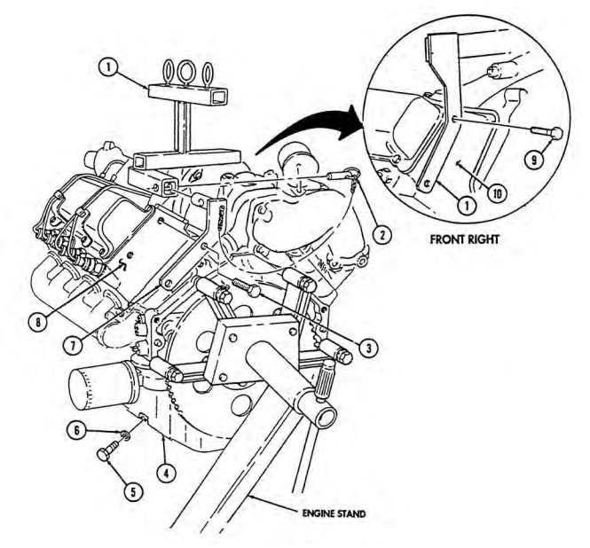

# 15-27.1. Engine Preparation (Serial Numbers 300000 And Above) (Cont'D)

7. Remove two capscrews (1), clamps (2), and harness (3) from brackets (4).

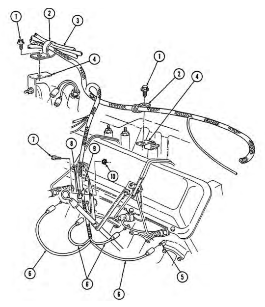 8. Remove nut and lockwasher assembly (10), capscrew (7), clamp (8), and harness (3) from dipstick bracket (9). Discard nut and lockwasher assembly (10).

9. Disconnect four harness leads (6) from glow plugs (5).

# 15-27.1. Engine Preparation (Serial Numbers 300000 And Above) (Cont'D)

10. Disconnect harness connector (18) from glow plug controller (17). 11. Disconnect leads 315A/315B (16) from fan cut-off switch leads (15). 12. Disconnect harness connector (11) from transmission TP sensor (14).

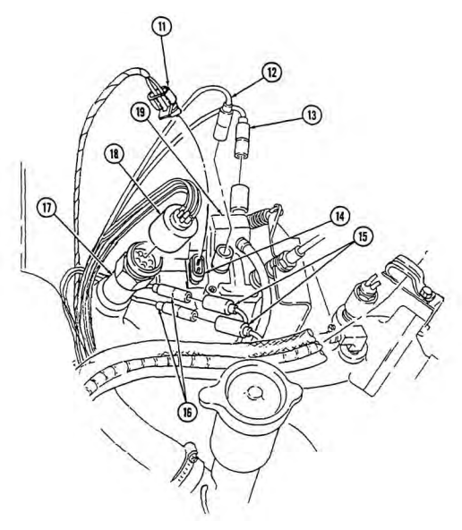 13. Disconnect leads 54A (12) and 569B (13) from fuel injection pump (19).

## 15-27.1. Engine Preparation (Serial Numbers 300000 And Above) (Cont'D)

14. Disconnect leads 569A (10) and 569B (9) from cold-advance switch (13). 15. Disconnect four harness boots (11) from glow plugs (12). 16. Remove two capscrews (6), lockwashers (7), clamps (8), and harness (4) from heat shield (5).

Discard lockwashers (7).

17. Remove two screws (3), clamps (2), and harness (4) from intake manifold bracket (1). 18. Remove nut (18), lockwasher (19), washer (20), washer (15), capscrew (16), and A/C compressor (14)
from mounting bracket (17). Discard lockwashers (19).

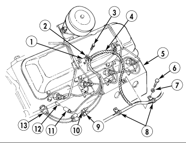

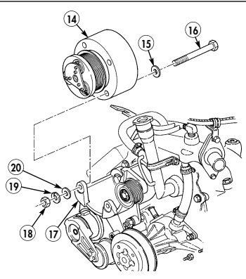

# 15-27.1. Engine Preparation (Serial Numbers 300000 And Above) (Cont'D)

19. Remove capscrew (35) and belt tensioner (34) from mounting bracket (17). 20. Remove three nuts (27), lockwashers (26), washers (22), supports (25), capscrews (21), washers (22),
dust covers (23), and idler pulleys (24) from mounting bracket (17). Discard lockwashers (26).

21. Remove two capscrews (33) and lockwashers (32) from mounting bracket (17) and water pump (30).

Discard lockwashers (32).

22. Remove screw (31), collar washer (28), and mounting bracket (17) from engine (29). 23. Remove two nuts (27) and lockwashers (26) from studs (36) on water pump (30). Discard lockwashers (26).

24. Remove two screws (31) and mounting bracket (17) from engine (29).

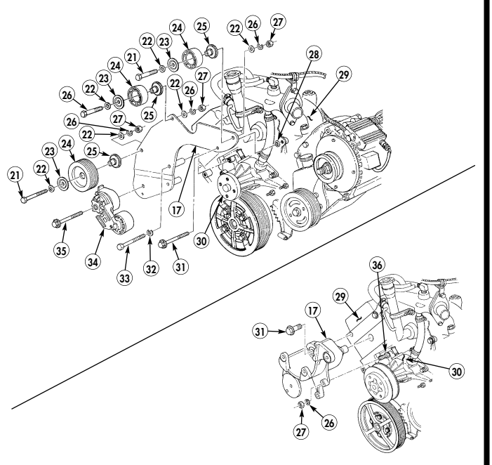

# 15-27.1. Engine Preparation (Serial Numbers 300000 And Above) (Cont'D)

#### Warning

Power steering pump must be supported during removal and installation. Failure to do this may cause injury to personnel.

25. Remove two capscrews (1) and capscrew (4) from alternator/power steering bracket (3). 26. Remove power steering pump (2). 27. Remove three capscrews (6) and alternator/power steering bracket (3) from engine (5). 28. Remove three capscrews (6) and alternator/power steering bracket (3) from engine (5).

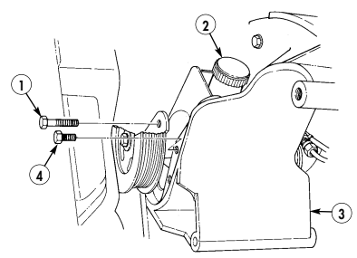

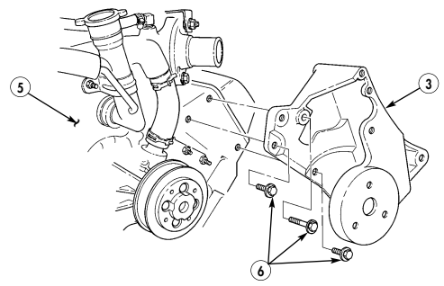

# 15-27.1. Engine Preparation (Serial Numbers 300000 And Above) (Cont'D)

29. Remove oil dipstick (11) from oil dipstick tube (9). 30. Remove two assembled washer screws (8) and dipstick tube bracket (10) from two fuel line brackets (7). Discard assembled washer screws (8).

31. Remove oil dipstick tube (9) from engine oil pan (13). Remove and discard O-ring seal (12).

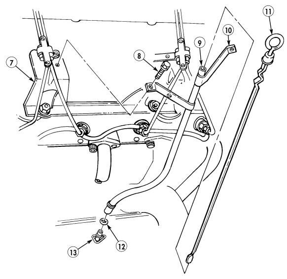

## 15-27.1. Engine Preparation (Serial Numbers 300000 And Above) (Cont'D)

32. Remove four capscrews (4) and right exhaust manifold heat shield (3) from exhaust manifold (2)
and cylinder head (1).

33. Loosen locknut (9) and washer (8) on front of starter (7) and bracket (10).

#### Warning

Starter must be supported during removal. Failure to support starter may cause injury to personnel or damage to equipment.

34. Remove two capscrews (11), washers (12), starter (7), and shim(s) (6), if present, from engine (5).

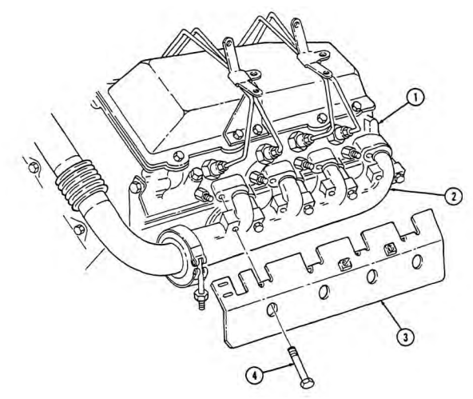 35. Remove three capscrews (15), lockwashers (14), and left and right engine mount and insulator assemblies (13) from engine (5). Discard lockwashers (14).

36. Remove two nuts (17), lockwashers (16), and wiring harness bracket (18) from oil pan (19). Discard lockwashers (16).

15-27.1. ENGINE PREPARATION (SERIAL NUMBERS 300000 AND ABOVE) (Cont'd)

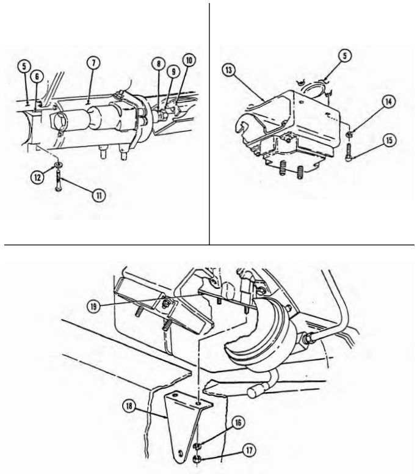

# 15-27.1. Engine Preparation (Serial Numbers 300000 And Above) (Cont'D)

Have drainage container ready to catch fluid.

37. Remove two plugs (1) and drain coolant from engine (2).

b. Assembly 1. Apply antiseize compound to two plugs (1) and install in engine (2).

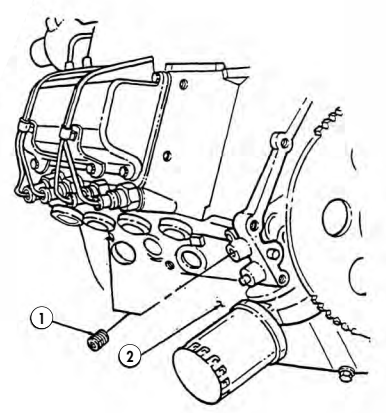

# 15-27.1. Engine Preparation (Serial Numbers 300000 And Above) (Cont'D)

2. Install wiring harness bracket (6) on oil pan (3) with two lockwashers (4) and nuts (5). 3. Install left and right engine mount and insulator assemblies (7) on engine (2) with three lockwashers (8) and capscrews (9). Using 9/16-in. torque adapter, tighten capscrews (9) to 30-40 lb-ft (41-54 N•m).

#### Warning

Starter must be supported during installation. Failure to support starter may cause injury to personnel or damage to equipment.

4. Position shim(s) (10), if removed, and starter (11) on flywheel housing (18) with solenoid (12) facing outward.

5. Slide front of starter (13) in bracket (17), ensuring bracket (17) is between washer (15) and starter (11).

6. Apply thread-locking compound to capscrews (16). Install two washers (17) and capscrews (16) on starter (11) and engine (2). Tighten capscrews (16) to 30-40 lb-ft (41-54 N•m).

7. Using crowfoot, tighten locknut (14) to 15-19 lb-ft (20-26 N•m).

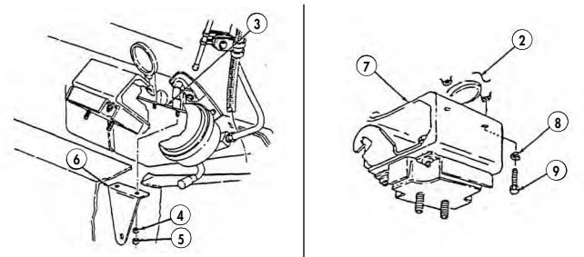

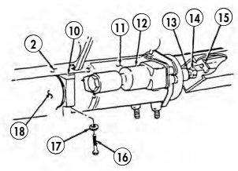

15-27.1. ENGINE PREPARATION (SERIAL NUMBERS 300000 AND ABOVE) (Cont'd)

8.

Install right exhaust manifold heat shield (3) on exhaust manifold (2) and cylinder head (1) with four capscrews (4).

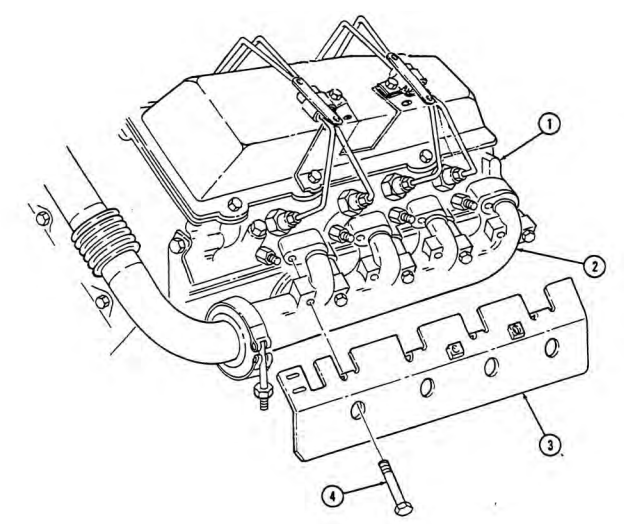

15-27.1. ENGINE PREPARATION (SERIAL NUMBERS 300000 AND ABOVE) (Cont'd)
9. Apply RTV sealant to O-ring seal (9) and install O-ring seal (9) on oil dipstick tube (6).

10. Insert oil dipstick tube (6) into engine oil pan (10). 11. Install dipstick tube bracket (7) on two fuel line brackets (11) with assembled washer screws (5).

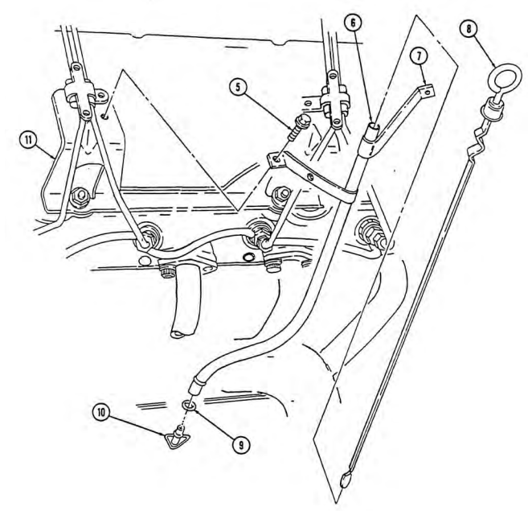 12. Install oil dipstick (8) into oil dipstick tube (6).

# 15-27.1. Engine Preparation (Serial Numbers 300000 And Above) (Cont'D)

13. Apply sealing compound to three capscrews (3). 14. Install alternator/power steering bracket (2) on engine (1) with three capscrews (3). Tighten capscrews (3) to 48 lb-ft (65 N•m).

15. Install power steering pump (4) on alternator/power steering bracket (2) with two capscrews (5) and capscrew (6).

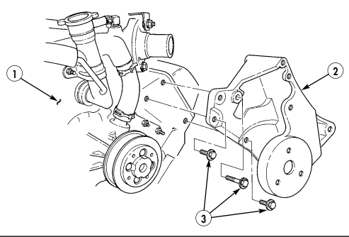

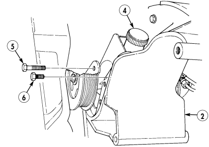

# 15-27.1. Engine Preparation (Serial Numbers 300000 And Above) (Cont'D)

16. Install mounting bracket (8) on engine (9) with two screws (7). Tighten screws (7) to 43-51 lb-ft 
(58-69 N•m).

17. Install mounting bracket (8) on studs (10) on water pump (11) with two lockwashers (12) and nuts (13).

18. Install mounting bracket (8) on engine (9) with collar washer (20) and capscrew (22). 19. Install mounting bracket (8) on water pump (21) with two lockwashers (23) and capscrews (24). 20. Install three supports (18) and idler pulleys (17) on mounting bracket (8) with three dust covers (16),
washers (15), capscrews (14), washers (19), lockwashers (12), and nuts (13).

21. Install belt tensioner (25) on mounting bracket (8) with capscrew (26).

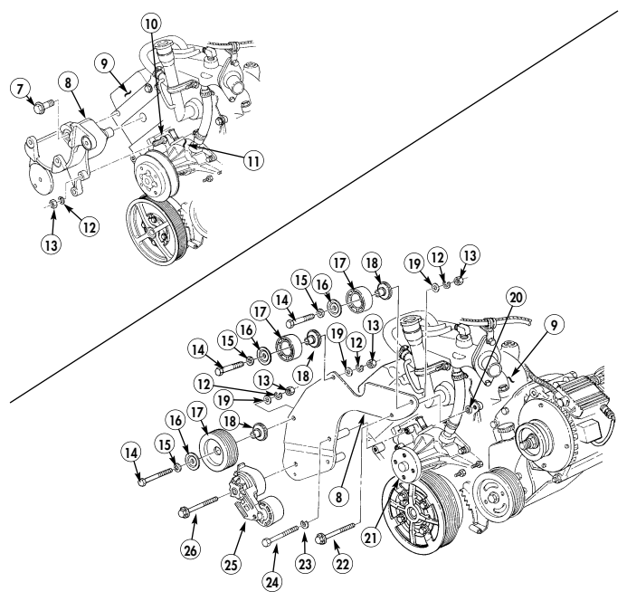

## 15-27.1. Engine Preparation (Serial Numbers 300000 And Above) (Cont'D)

22. Install A/C compressor (1) on mounting bracket (4) with capscrew (3), washers (5), lockwasher (6),
and nut (7).

23. Connect four harness boots (18) to glow plugs (19). 24. Connect leads 569B (16) and 569A (17) to cold-advance switch (20). 25. Install harness (11) on heat shield (12) with two clamps (15), lockwashers (14), and capscrews (13). 26. Install harness (11) on intake manifold bracket (8) with two clamps (9) and screws (10).

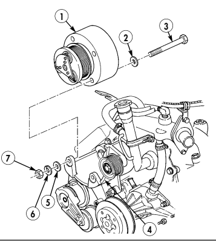

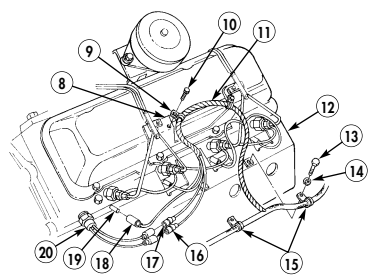

# 15-27.1. Engine Preparation (Serial Numbers 300000 And Above) (Cont'D)

27. Connect harness connector (28) to glow plug controller (27). 28. Connect harness leads 315A/315B (26) to fan cut-off switch leads (25). 29. Connect harness leads 54A (22) and 569B (23) to fuel injection pump terminals (29). 30. Connect harness connector (21) to transmission TP sensor (24).

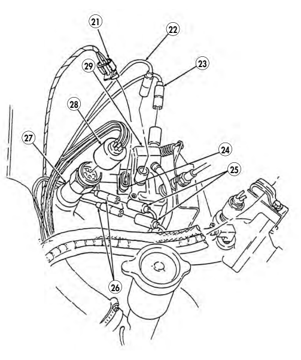

# 15-27.1. Engine Preparation (Serial Numbers 300000 And Above) (Cont'D)

31. Connect four harness leads (7) to glow plugs (6).

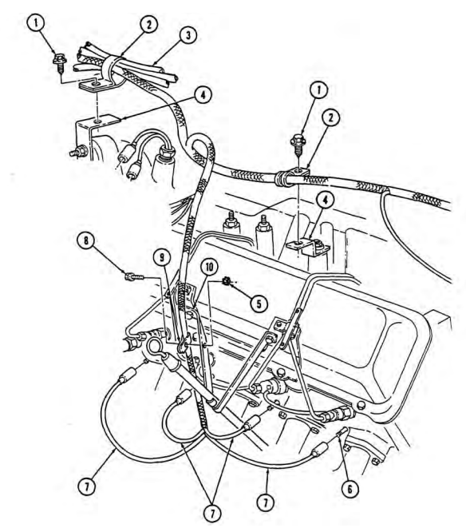 32. Install harness (3) on two brackets (4) with clamps (2) and capscrews (1). 33. Install harness (3) on dipstick mounting bracket (10) with clamp (9), capscrew (8), and nut and lockwasher assembly (5).

# 15-27.1. Engine Preparation (Serial Numbers 300000 And Above) (Cont'D)

Hoist must be attached to intermediate eyelet when lifting engine and attached to rear eyelet when lifting engine and transmission together.

34. Install sling bracket (14) on left cylinder head (15) with two capscrews (13).

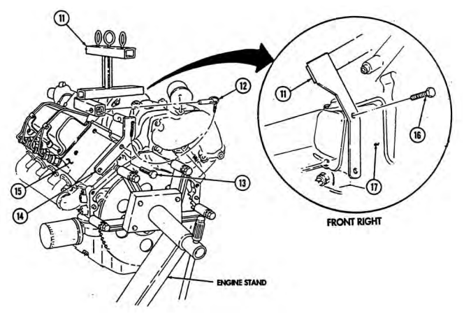 35. Install engine lifting sling (11) on right cylinder head (17) with two capscrews (16). 36. Install sling bracket (14) on engine lifting sling (11) with pin (12).

FOLLOW-ON TASK: Install engine (para. 15-26.1).

# 15-28. Engine Installation (Serial Numbers 299999 And Below)

This task covers:
Installation Tools General mechanic's tool kit:
automotive (Appendix B, Item 1)

#### Special Tools

Engine lifting sling (Appendix B, Item 24) Torque adapter, 3/4-in. (Appendix B, Item 134) Hex-head driver, 8-mm (Appendix B, Item 145)

#### Materials/Parts

Eight lockwashers (Appendix G, Item 172) Two cotter pins (Appendix G, Item 20) Eight locknuts (Appendix G, Item 106) Five lockwashers (Appendix G, Item 144) Four lockwashers (Appendix G, Item 146) Lockwasher (Appendix G, Item 148) Lockwasher (Appendix G, Item 181) Lockwasher (Appendix G, Item 180) Six locknuts (Appendix G, Item 77) Four locknuts (Appendix G, Item 128) Four locknuts (Appendix G, Item 82)
(M1113, M1151, and M1152 only)
Four locknuts (Appendix G, Item 85) Gasket (Appendix G, Item 40) O-ring (Appendix G, Item 216) Gasket (Appendix G, Item 39) Two intake manifold gaskets 
(Appendix G, Item 59)
Tiedown strap (Appendix G, Item 323)
(M1114 only)
O-ring (Appendix G, Item 204) (M1114 only) Locknut (Appendix G, Item 101.1) 
(M1113, M1151, and M1152 only)
Locknut (Appendix G, Item 94.1) Locknut (Appendix G, Item 92) Two locknuts (Appendix G, Item 82) 
(M1114 only)
Lockwasher (Appendix G, Item 138) 
(M1114 only)
Four assembled locknuts 
(Appendix G, Item 134)
Nut and lockwasher assembly 
(Appendix G, Item 197)

#### Installation

| Equipment Condition                            |
|------------------------------------------------|
| - Fuel drain\-back tube removed (para. 3\-38). |

(M1114 only)
Seal washer (Appendix G, Item 307)
(M1114 only)
Two O-rings (Appendix G, Item 206)
(M1114 only)
Lockwasher (Appendix G, Item 185)
(M1113, M1151, and M1152 only)
Crossover O-ring (Appendix G, Item 229) Adhesive (Appendix C, Item 8) Antiseize compound (Appendix C, Item 17) RTV sealant (Appendix C, Item 10)
Engine/transmission support sling (Appendix D, Figs. 84 through 97) (Optional)

#### Personnel Required

One mechanic One assistant Manual References TM 9-2320-387-10 TM 9-2320-387-24P

#### Equipment Condition

Engine prepared for installation (para. 15-27).

#### General Safety Instructions

•Direct personnel to stand clear during hoisting operation.

•Do not use hands to free engine of hangups or snags.

•Transmission must be supported during engine installation.

•Ensure fuel vent line is properly attached to top vent line fitting.

Maintenance Level Direct support

#### Warning

- Direct all personnel not participating in engine installation to stand clear during hoisting operation. Failure to do this may cause injury to personnel.

- Do not use hands to free engine of hangups or snags. Use prybars to avoid injury.

# 15-28. Engine Installation (Serial Numbers 299999 And Below) (Cont'D)

#### Caution

- Always install engine slowly. Lower into chassis carefully and closely observe all engine components to prevent engine damage.

- If transmission support sling was installed, remove prior to engine installation.

NOTE
- All plugs must be removed from hoses and connections prior to reconnection. - Assistant will be needed for steps 1 through 7.

1. Lower engine (1) into vehicle.

#### Warning

Transmission must be supported during engine installation. Failure to do this may cause injury to personnel or damage to equipment.

2. Raise and support transmission (3). 3. Install transmission (3) on engine (1) with four capscrews (4) and two studs (2). Using torque sequence shown, tighten capscrews (4) and studs (2) to 35 lb-ft (47 N•m)
4. Align right engine mount insulator (5) on engine mount bracket (6) and install two washers (8) 
and locknuts (7). Repeat for left engine mount. Using torque adapter, tighten locknuts (7) to

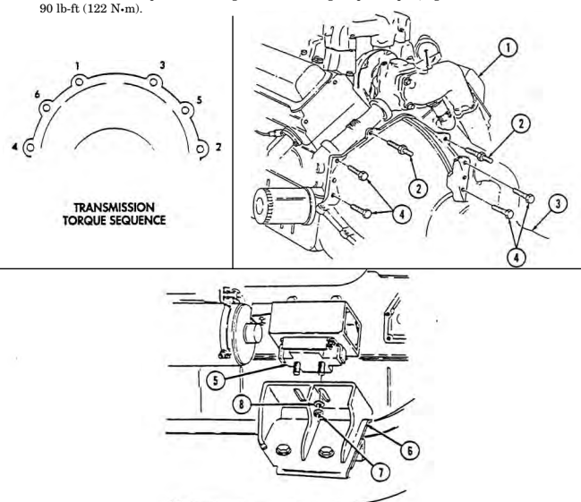

# 15-28. Engine Installation (Serial Numbers 299999 And Below) (Cont'D)

5. Remove lifting device from engine lifting sling (1). 6. Remove two capscrews (4) and sling bracket (6) from left cylinder head (5). 7. Remove pin (2) and sling bracket (6) from engine lifting sling (1). 8. Remove two capscrews (8) and engine lifting sling (1) from right cylinder head (7) and engine (3).

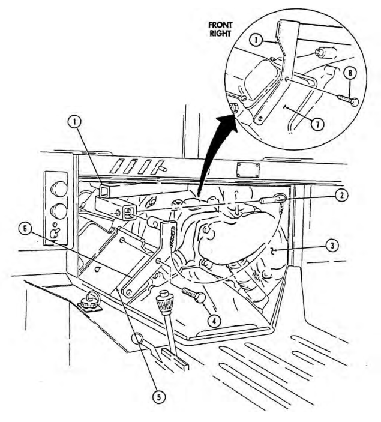

15-28. ENGINE INSTALLATION (SERIAL NUMBERS 299999 AND BELOW) (Cont'd)
9. Install crossover O-ring (14) on turbocharger (13).

10. Install two gaskets (12) and intake crossover (10) on intake manifolds (11) and turbocharger (13)
with six capscrews (9). Tighten capscrews (9) to 17 lb-ft (23 N•m).

11. Install closeout panel (17) and retainer (18) on A-beam (15) with two screws (19), ten capscrews (20),
and nuts (16).

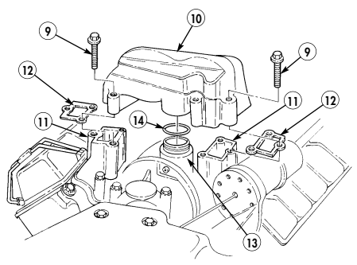

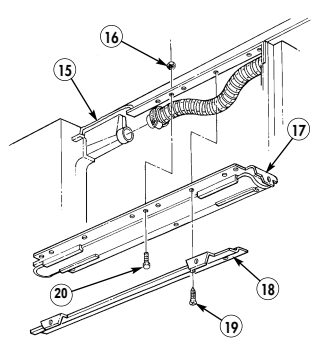

## 15-28. Engine Installation (Serial Numbers 299999 And Below) (Cont'D)

12. Install leads 74A (4) and 74B (2) on solenoid (1) with clip (5) and screw (6). 13. Install cable 6A (15), lead 81B (10), and winch cable 6 (7), if equipped, on starter terminal (3) with lockwasher (8) and nut (9). Using torque adapter, tighten nut (9) to 25 lb-ft (34 N•m).

14. Install negative cable 7A (16), lead 3D (14), and winch cable 7 (13), if equipped, on starter terminal (17) with lockwasher (12) and nut (11). Using torque adapter, tighten nut (11) to 15 lb-ft (20 N•m).

15. Install clamp (19) and negative cable 7A (15) on starter (20) with screw (18).

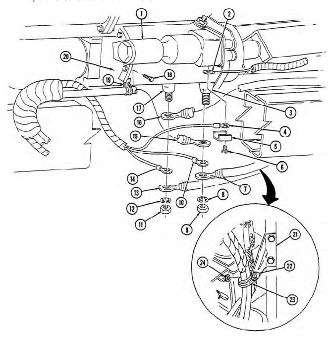 16. Install clamp (23) and winch cables 6 (7) and 7 (13) on oil pan bracket (21), if equipped, with capscrew (22) and assembled locknut (24).

# 15-28. Engine Installation (Serial Numbers 299999 And Below) (Cont'D)

- It will be necessary to rotate flywheel clockwise from capscrew in front of crankshaft to gain access to install capscrews to torque converter.

- Have assistant hold crankshaft pulley in place when installing flywheel to torque converter.

17. Align torque converter (27) to flywheel (25) and install six capscrews (26).

18. Tighten capscrews (26) to 32 lb-ft (43 N.m).

Gaskets may require bending over edge of converter housing cover to make gaskets seal properly.

19. Apply RTV sealant to upper converter housing cover gasket (32). Install gasket (32) and upper converter housing cover (33) on transmission (28) with four capscrews (34).

20. Apply RTV sealant to lower converter housing cover gasket (29). Install gasket (29) and lower

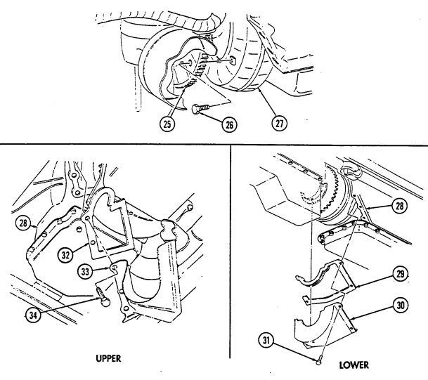

converter housing cover (30) on transmission (28) with two capscrews (31).

## 15-28. Engine Installation (Serial Numbers 299999 And Below) (Cont'D)

21. Install flange (10) and exhaust pipe (3) on wastegate housing (1) with two washers (9) and capscrews (8).

22. Install gasket (6) and exhaust pipe (3) on muffler (2) with three washers (4), capscrews (7),
washers (4), and locknuts (5).

23. Tighten locknuts (5) to 26 lb-ft (35 N•m). 24. Install heat shield (11) on exhaust pipe (3) with two clamps (12).

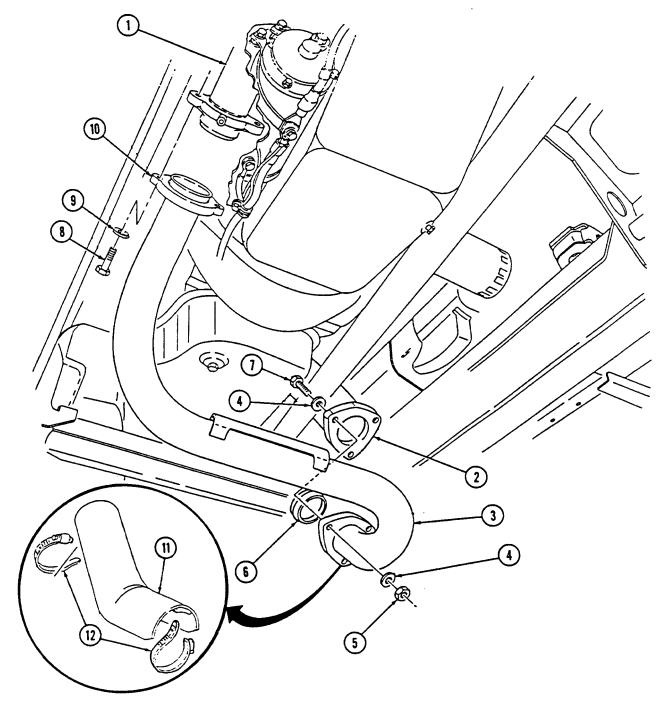

15-28. ENGINE INSTALLATION (SERIAL NUMBERS 299999 AND BELOW) (Cont'd)
25.

Feed engine harness cable (15) and 200-amp alternator cable (20) through grommets (21) and (13) in battery box (19) and install on buss bar (14) with two washers (16), lockwashers (17), and nuts (18).

Install oil pressure sending unit (23) and bracket (22) on stud (26) with washer (25) and nut (24).

26.

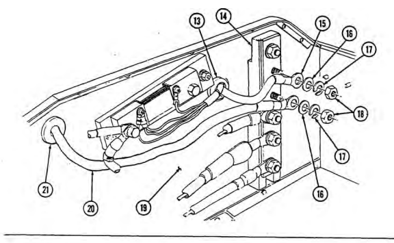

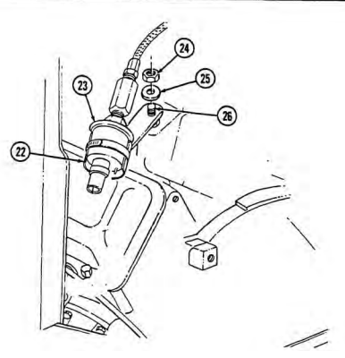

# 15-28. Engine Installation (Serial Numbers 299999 And Below) (Cont'D)

27. Connect lead 36A (2) to oil pressure sending unit (1). 28. Connect oil cooler supply line (4) and oil cooler return line (5) to engine (3). 29. Connect two leads 458A (12) to leads 458C (31) and 458D (13). 30. Connect engine harness lead 349A (20) to body harness leads 350B/359A/355A (21). 31. Install clamp (17) and body harness (16) on dipstick support bracket (14) with screw (15) and nut (18).

32. Connect control valve hose (19) to control valve (23) and hose (25) to hydro-booster (27) and tighten clamps (22) and (26) to 10-20 lb-in. (1-2 N•m).

33. Connect two clamps (29) with capscrew (30), washer (28), and nut (24). 34. Connect high-pressure line (32) to hydro-booster (27). 35. Connect fuel inlet (48) and fuel outlet (49) lines to fuel filter (45) and tighten clamps (46) and (47).

NOTE
Perform steps 36 and 37 for M1113, M1151, and M1152 models only.

36. Connect engine harness connector (39) to time-delay module (42). 37. Connect harness connector plug (40) to protective control box (41). 38. Apply antiseize compound to engine harness ground 3C (51) and body harness ground 58B (52) and install on body (33) with assembled locknut (50).

39. Install engine harness (35) on body (33) with clamp (34) and two screws (44). 40. Install engine harness (35) on A-beam (36) with clamp (38), capscrew (37), and nut (43). 41. Connect harness lead 33B (9) to engine temperature sending unit (8) and harness lead (11) to engine rpm sensor lead (10).

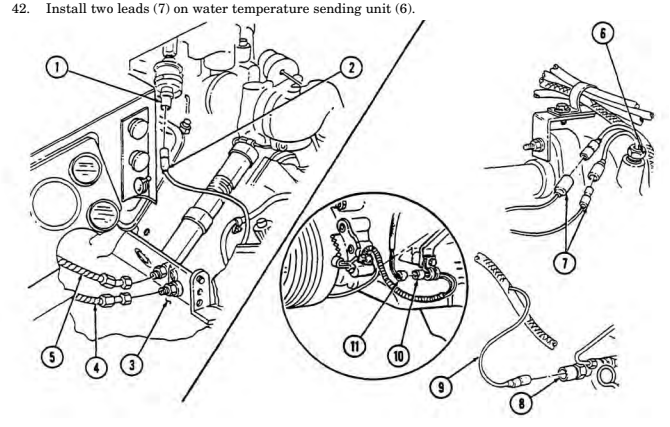

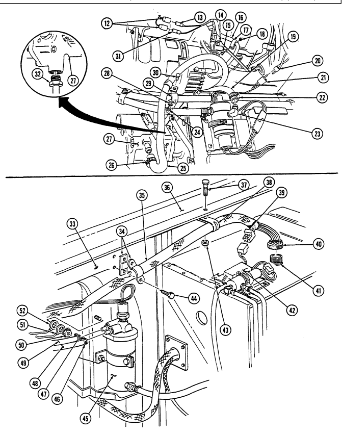

15-28. ENGINE INSTALLATION (SERIAL NUMBERS 299999 AND BELOW) (Cont'd)

## 15-28. Engine Installation (Serial Numbers 299999 And Below) (Cont'D)

43. Install cable assembly (1) on throttle shaft lever (4) with accelerator cable clip (7). 44. Install cable assembly (1) on cable bracket (2) and tighten two nuts (8). 45. Connect throttle return spring (3) to cable bracket (2).

Steps 46 through 51 cover accelerator linkage adjustment.

46. Loosen nuts (8) on cable assembly (1) and cable bracket (2). 47. Fully depress accelerator pedal. 48. Hold throttle shaft lever (4) on injection pump (5) in full-throttle position. 49. Adjust two nuts (8) up or down so cable end (6) holds throttle shaft lever (4) in full-throttle position. 50. Tighten two nuts (8) connecting cable assembly (1) to cable bracket (2). 51. Release accelerator pedal and ensure throttle shaft lever (4) returns all the way to idle position.

#### Warning

Ensure fuel pump vent line is properly attached to top vent line fitting of fuel pump. Improper vent line installation may cause injury to personnel or damage to equipment.

52. Connect vent line (22) to fuel pump (17) and tighten clamp (20). 53. Connect fuel supply line (21) to fuel pump (17) and tighten clamp (18) to 10-20 lb-in. (1-2 N•m). 54. Connect fuel return hose (19) to fuel return line (24) and tighten clamp (23) to 10-20 lb-in. (1-2 N•m). 55. Connect two water hoses (9) to water crossover (12) and water pump (14) and tighten two clamps (10).

56. Connect water pump inlet hose (16) to water pump (14) and tighten clamp (15). 57. Connect surge tank-to-water crossover hose (11) to crossover (12) and tighten clamp (13) to 10-20 lb-in. (1-2 N•m).

15-28. ENGINE INSTALLATION (SERIAL NUMBERS 299999 AND BELOW) (Cont'd)

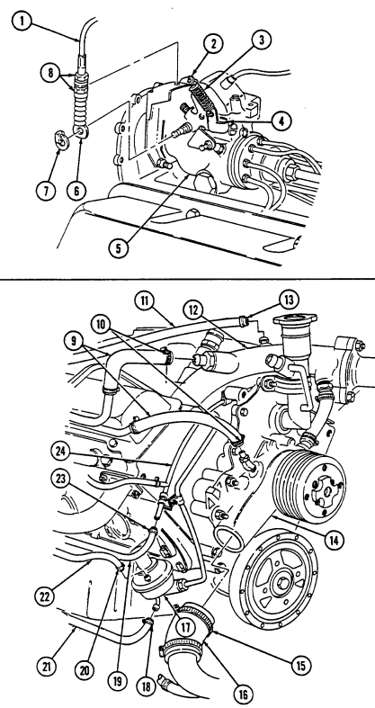

## 15-28. Engine Installation (Serial Numbers 299999 And Below) (Cont'D)

Install rear heat shield (2) on turbocharger (4) with two capscrews (3).

58.

59.

Install capscrew (1) on rear heat shield (2) and left cylinder head (6).

60.

Install capscrew (7) on rear heat shield (2) and left exhaust manifold (5).

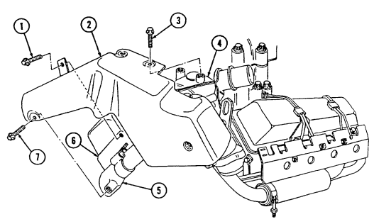

## 15-28. Engine Installation (Serial Numbers 299999 And Below) (Cont'D)

61. Install right rear heat shield (15) on right exhaust manifold heat shield (13) and rear heat shield (2) with two screws (14).

Remove plug prior to installation of transmission oil dipstick tube.

62. Deleted. 63. Install dipstick tube (12) into transmission (16). 64. Install washer (9) and dipstick tube (12) on manifold stud (10) with washer (9) and nut (8). 65. Install dipstick tube (12) on right rear heat shield (15) with capscrew (17). Tighten capscrew (17) 
25-37 lb-ft (34-50 N•m).

66. Install transmission oil dipstick (11) in dipstick tube (12).

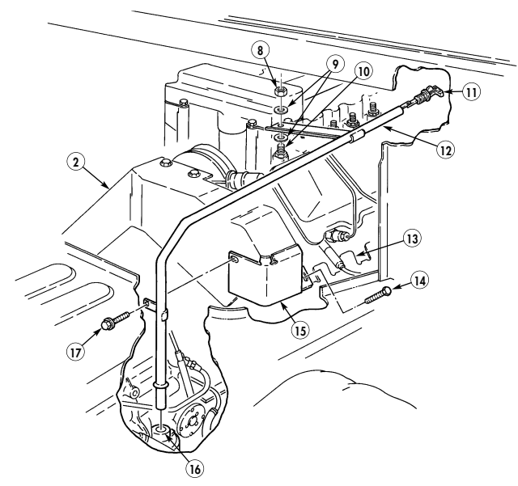

## 15-28. Engine Installation (Serial Numbers 299999 And Below) (Cont'D)

67. Position alternator (2) on mounting bracket (8) with support bracket (6) on outside of alternator mounting flange (7) and install washer (4), capscrew (3), washer (4), lockwasher (9), and nut (1).

68. Install positive cable (14) on stud (17) with washer (13), lockwasher (12), and nut (11). Tighten nut (11) to 10-15 lb-ft (14-20 N•m).

69. Install rubber boot (10) over stud (17). 70. Install ground strap (19) on negative stud (18) with washer (20), lockwasher (21), and nut (22).

Tighten nut (22) to 8-12 lb-ft (11-16 N•m).

- Ensure terminals are clean before connections are made. - Steps 67 through 75 are for the 200-amp dual voltage alternator. The 400-amp dual voltage alternator procedures are similar.

71. Position 3/8-in. breaker bar or, as appropriate, a 1/2-in. ratchet wrench on belt tensioner (24) and move tensioner (24) clockwise to allow installation of drivebelt (23).

72. Feed drivebelt (23) into groove on crankshaft pulley (31), A/C compressor or idler pulley (25),
alternator pulley (28), power steering pump pulley (29), upper idler pulleys (26) and (27), water pump pulley (30), and tensioner pulley (32). Release belt tensioner (24).

73. Install lead (43), washer (42), and nut (45) on terminal (41). Tighten nut (45) to 18-22 lb-in.

(2.0-2.5 N•m). Slide rubber boot (44) over terminal (41).

74. Install washer (33), lead 568 (33.1), and nut (34) on IGN terminal (46). Tighten nut (34) to 23-27 lb-in. (2.6-3.0 N•m). Slide rubber boot (35) over terminal (46).

75. Install washer (39), lead 2A (38), and nut (37) on AC terminal (40). Tighten nut (37) to 18-22 lb-in. (2.0-2.5 N•m). Slide rubber boot (36) over terminal (40).

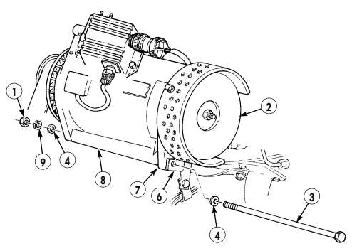

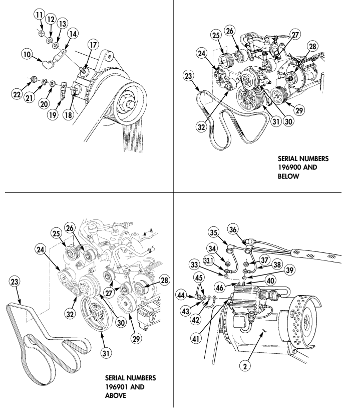

# 15-28. Engine Installation (Serial Numbers 299999 And Below) (Cont'D)

## 15-28. Engine Installation (Serial Numbers 299999 And Below) (Cont'D)

76. Position CDR valve (1) and bracket (2) over two intake manifold studs (7) and valve cover studs (6). 77. Secure CDR valve (1) and bracket (2) with four nuts (8). Tighten nuts (8) to 15 lb-ft (20 N•m). 78. Connect CDR valve oil fill tube hose (3) to oil fill tube (5) and tighten clamp (4). 79. Install clamp (11) on body (12) with screw (9).

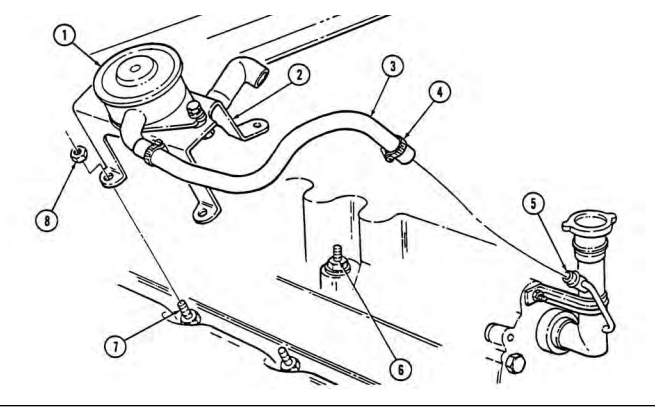

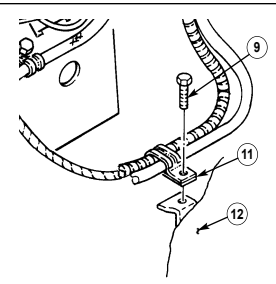

# 15-28. Engine Installation (Serial Numbers 299999 And Below) (Cont'D)

Perform step 80 for M1113, M1151, and M1152 models. Perform step 81 for M1114 models.

80. Install air horn support bracket (15) on cylinder head (24) with stud (16), harness clamp (17),
lockwasher (18), nut (19), and capscrew (23).

81. Install air horn support bracket (15) and adapter (23.1) on cylinder head (24) with stud (16) and capscrew (23). Secure clamp (17) on air horn support bracket (15) with washer (25), lockwasher (26), and capscrew (27).

82. Install ground leads 7A (22) and 7E (20) on cylinder head (24) with capscrew (21).

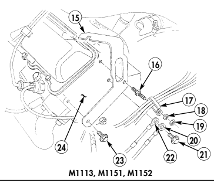

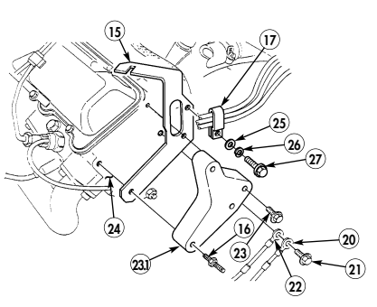

M1114

# 15-28. Engine Installation (Serial Numbers 299999 And Below) (Cont'D)

83. Connect air horn (5) to turbocharger intake hose (3) and tighten clamp (2). 84. Connect elbow (6) to air cleaner (8) and tighten clamp (7). 85. Connect CDR hose (1) to air horn adapter (4).

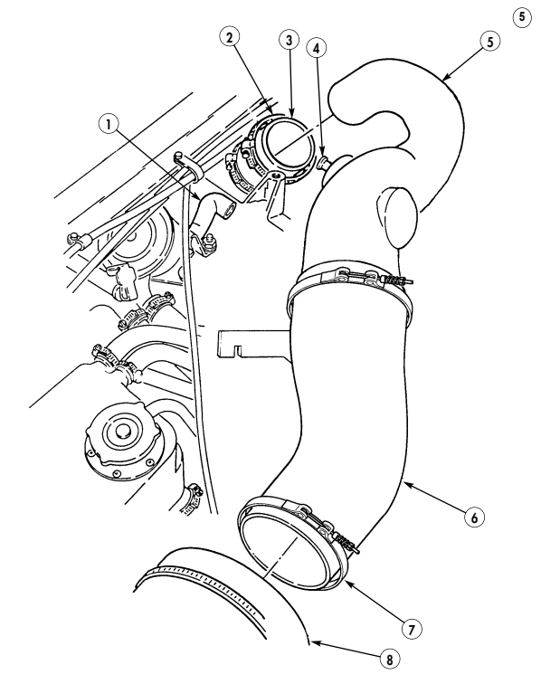

# 15-28. Engine Installation (Serial Numbers 299999 And Below) (Cont'D)

86. Position fitting (12) on clutch adapter (14) at 6 o'clock. 87. Align fan blade (11) onto fan drive (13) and install with four lockwashers (10) and nuts (9). Tighten

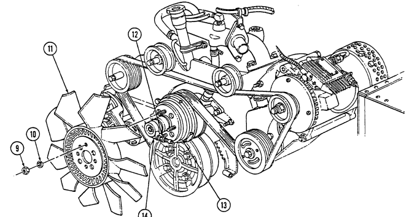

nuts (9) to 45 lb-ft (61 N•m).

## 15-28. Engine Installation (Serial Numbers 299999 And Below) (Cont'D)

88. Align radiator assembly (3) and oil cooler (33) to frame bracket (38) and two rear support brackets (13)
to airlift brackets (7).

89. Install two rear support brackets (13) on airlift brackets (7) with four capscrews (12), washers (11),
and locknuts (10). Do not tighten locknuts (10).

90. Install radiator assembly (3), large washer (36), and mount (37) on frame bracket (38) with large washer (36), washer (39), capscrew (40), washer (35), and locknut (34). Do not tighten capscrew (40).

91. Install crossbrace (23) on airlift brackets (7) with four capscrews (20), washers (21), and locknuts (22).

92. Tighten nut (24) to increase tension on crossbrace (23). 93. Connect two transmission oil cooler line connector hoses (32) to transmission oil cooler ports (30)
and tighten hose clamps (31) to 10-20 lb-in. (1-2 N•m).

94. Connect two engine oil cooler supply and return lines (27) to engine oil cooler ports (28). 95. Connect two power steering hoses (25) to power steering cooler ports (29) and tighten clamps (26).

- Fan shroud should be aligned so the following dimensions are maintained. Adjustments may be made by tilting the radiator/shroud assembly. Distance A from the edge of shroud ring and rear edge of fan must be 1-1/2 ± 1/4 in. (38.1 ± 6 mm). Measure distance A at the 2, 4, 8, and 10 o'clock positions.

- Fan blade to fan shroud clearance, the distance between the top of the fan blade and fan shroud, must not be less than 1/4 in. (6 mm) at any position.

96. Align radiator assembly (3) and tighten locknuts (10) to 26 lb-ft (35 N•m). Tighten capscrew (40) to 30 lb-ft (41 N•m).

97. Connect lower radiator front hose (9) to radiator (3) and tighten clamp (8). 98. Connect fan drive hose quick-disconnect (15) to fan drive disconnect (16). 99. Connect control valve hose (18) to bulkhead adapter (17) and tighten clamp (19).

100. Connect radiator inlet hose (2) to engine (14) and tighten clamp (1). 101. Connect surge tank-to-radiator vent hose (4) to adapter (6) and tighten clamp (5).

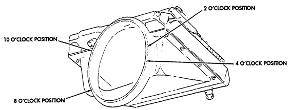

15-28. ENGINE INSTALLATION (SERIAL NUMBERS 299999 AND BELOW) (Cont'd)

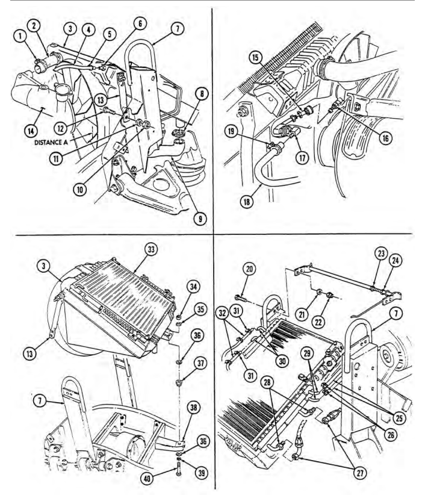

# 15-28. Engine Installation (Serial Numbers 299999 And Below) (Cont'D)

102. Install leads 17 (6), 18 (12), and 91 (5) on headlight assembly (7). 103. Install headlight housing (4) on frame extension (9) with spacer (8), two washers (10), and screws (11). 104. Install headlight housing (4) on two frame brackets (15) with four washers (16), screws (17), two plates (13), and four locknuts (14).

105. Install body harness (18) on headlight housing (4) with two screws (1), clamps (2), and assembled locknuts (3).

106. Install bracket (21), if removed, on headlight housing (4) with two screws (20), locknuts (22),
screw (23), and locknut (19).

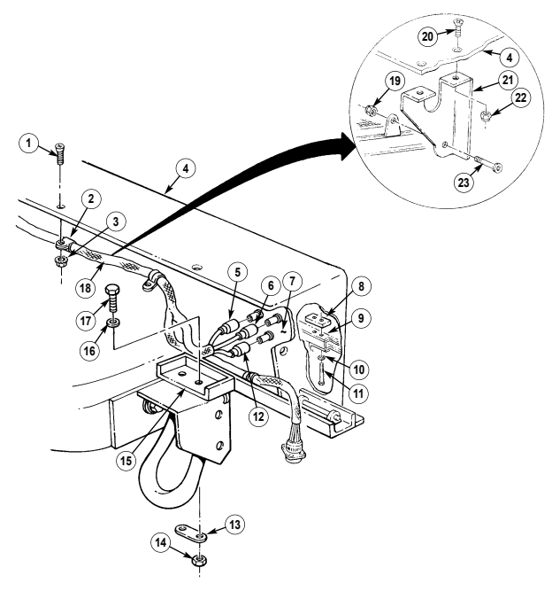

# 15-28. Engine Installation (Serial Numbers 299999 And Below) (Cont'D)

107. Install left splash shield (29) on bracket (40) with washer (38), capscrew (39), washer (52), and locknut (53).

108. Install harness and clamp (55) on splash shield (29) with screw (56) and nut and lockwasher assembly (54).

109. Install splash shield (29) on master cylinder bracket (30) with washer (31), capscrew (32),
washer (28), and locknut (27).

Perform steps 110 and 111 for M1113, M1151, and M1152 models only.

110. Install left splash shield (29) on airlift bracket (24) with lockwasher (35) and capscrew (36). Tighten capscrew (36) to 15 lb-ft (20 N•m).

111. Install left splash shield (29) on airlift bracket (24) with washer (33), capscrew (34), washer (26), and locknut (25). Tighten capscrew (34) to 95-145 lb-in. (11-16 N•m).

112. Install connector (57) on plate (44) with four screws (58) and nuts (59). 113. Install plate (44) and spring nuts (48) and (47) on headlight housing (49) with washer (46) and hex-head screws (45) and (50).

114. Install plate (44) on splash shield bracket (51) with four lockwashers (43), washers (41), and capscrews (42).

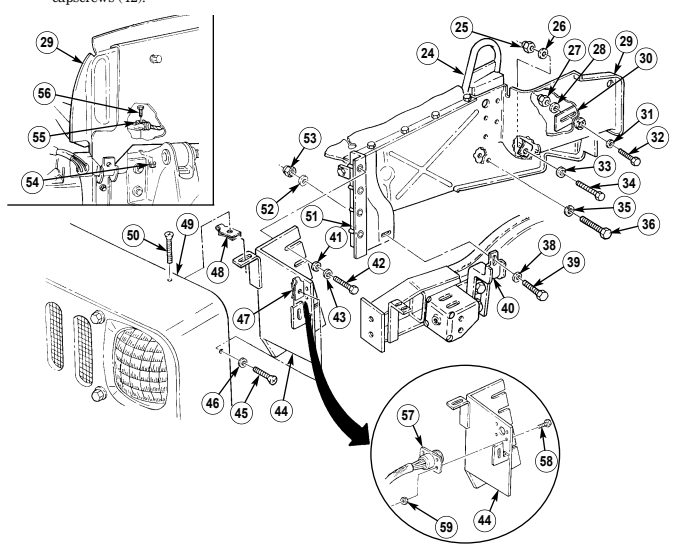

# 15-28. Engine Installation (Serial Numbers 299999 And Below) (Cont'D)

115. Install right splash shield (1) on airlift bracket (5) with washer (4) and screw (3). 116. Install right splash shield (1) on support bracket (16) with washer (17), capscrew (18), washer (7),
and locknut (8). Tighten capscrew (18) to 15 lb-ft (20 N•m).

Perform steps 117 and 118 for M1113, M1151, and M1152 models only.

117. Install right splash shield (1) on airlift bracket (5) with two washers (20), capscrews (19), clamp (21),
washer (24), washer (22), and locknut (23). Tighten capscrews (19) to 15 lb-ft (20 N•m).

118. Install vent line clamp (27) on right splash shield (1) with capscrew (2), washer (25), and locknut (26). Tighten locknut (26) to 15 lb-ft (20 N•m).

119. Install harness connector (29) on plate (12) with four screws (28) and nuts (30). 120. Install plate (12) and spring nuts (11) on headlight housing (9) with two hex-head screws (10).

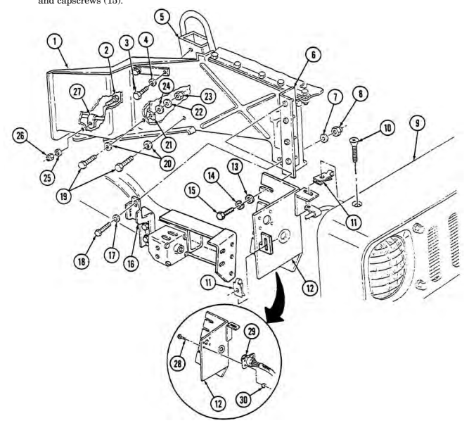 121. Install right splash shield (1) on bracket (6) and plate (12) with four lockwashers (14), washers (13),
and capscrews (15).

# 15-28. Engine Installation (Serial Numbers 299999 And Below) (Cont'D)

Perform steps 122 through 124 for M1114 models only.

122. Position three A/C hoses (34) through clamp (36) and install clamp (36) on bracket (38) with capscrew (35) and nut (40). Install tiedown strap (37) on A/C hoses (34).

123. Install seal washer (42), seal washer (42.1), and tube assembly (43) on compressor (41) with screw (31).

124. Install three O-rings (33) and A/C hoses (34) on receiver/dryer (39) and tube assembly (43).

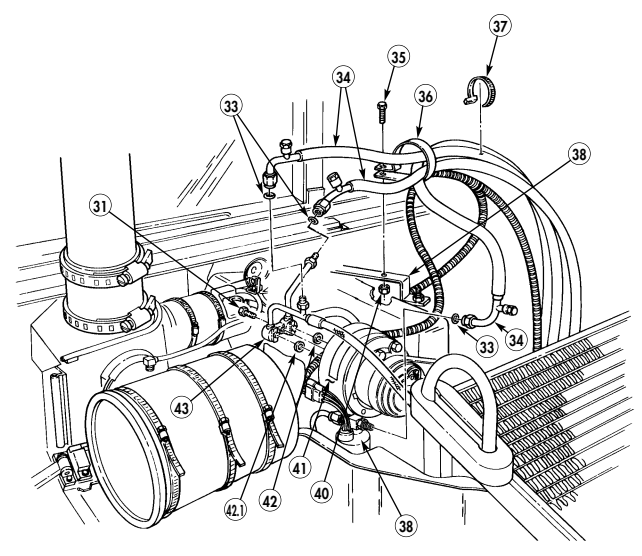

## 15-28. Engine Installation (Serial Numbers 299999 And Below) (Cont'D)

125. Install hood (1) and align two upper hinge halves (5) with lower hinge halves (4). 126. Install two upper hinge halves (5) on lower hinge halves (4) with washers (3), hinge pins (6),
washers (3), and cotter pins (2).

127. Install hood prop rod (7) and bracket (11) on airlift bracket (8) with four lockwashers (12) and screws (13). Tighten screws (13) to 6 lb-ft (8 N•m).

128. Install two seals (10) and cover plates (9) on airlift brackets (8). 129. Connect hood harness connector (14) to harness connector (15).

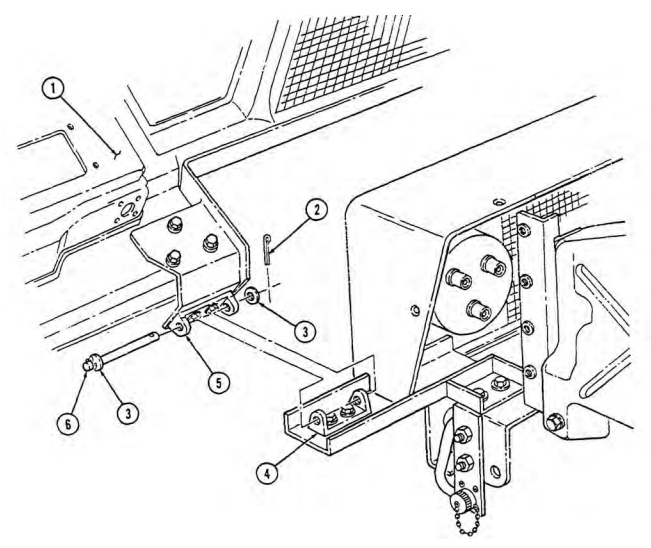

# 15-28. Engine Installation (Serial Numbers 299999 And Below) (Cont'D)

FOLLOW-ON TASKS: - Fill engine oil, transmission fluid, and power steering fluid to proper levels 

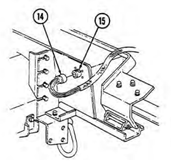

(TM 9-2320-387-10).

- Install batteries (para. 4-74). - Install power steering reservoir and bracket (serial numbers 196901 and above)
(para. 8-29).

- Install engine access cover (para. 10-22). - Charge A/C system (para. 25-15). - Perform engine run-in (para. 15-24).

# 15-28.1. Engine Installation (Serial Numbers 300000 And Above)

This task covers:
Installation Tools General mechanic's tool kit:
automotive (Appendix B, Item 1)

#### Special Tools

Engine lifting sling (Appendix B, Item 24) Torque adapter, 3/4-in. (Appendix B, Item 134) Hex-head driver, 8-mm (Appendix B, Item 145)

#### Materials/Parts

Eight lockwashers (Appendix G, Item 172) Two cotter pins (Appendix G, Item 20) Eight locknuts (Appendix G, Item 106) Five lockwashers (Appendix G, Item 144) Four lockwashers (Appendix G, Item 146) Lockwasher (Appendix G, Item 148) Lockwasher (Appendix G, Item 181) Lockwasher (Appendix G, Item 180) Six locknuts (Appendix G, Item 77) Four locknuts (Appendix G, Item 128) Four locknuts (Appendix G, Item 82) Four locknuts (Appendix G, Item 85) Gasket (Appendix G, Item 40) O-ring (Appendix G, Item 216) Gasket (Appendix G, Item 39) Two intake manifold gaskets 
(Appendix G, Item 59)
Locknut (Appendix G, Item 101.1) Locknut (Appendix G, Item 94.1) Locknut (Appendix G, Item 92) Two locknuts (Appendix G, Item 82) 
(M1114 only)
Lockwasher (Appendix G, Item 138) Four assembled locknuts 
(Appendix G, Item 134)
Nut and lockwasher assembly 
(Appendix G, Item 197)

#### Materials/Parts (Cont'D)

Gasket (Appendix G, Item 51) Two lockwashers (Appendix G, Item 187) Lockwasher (Appendix G, Item 182) Two O-rings (Appendix G, Item 206) Lockwasher (Appendix G, Item 185) Crossover O-ring (Appendix G, Item 229) Adhesive (Appendix C, Item 8) Antiseize compound (Appendix C, Item 17) RTV sealant (Appendix C, Item 10) Engine/transmission support sling 
(Appendix D, Figs. 84 through 97) (Optional)

#### Personnel Required

One mechanic One assistant Manual References TM 9-2320-387-10 TM 9-2320-387-24P
Equipment Condition Engine prepared for installation (para. 15-27.1).

#### General Safety Instructions

•Direct personnel to stand clear during hoisting operation.

•Do not use hands to free engine of hangups or snags.

•Transmission must be supported during engine installation.

•Ensure fuel vent line is properly attached to top vent line fitting.

Maintenance Level Direct support Installation

#### Warning

- Direct all personnel not participating in engine installation to stand clear during hoisting operation. Failure to do this may cause injury to personnel.

- Do not use hands to free engine of hangups or snags. Use prybars to avoid injury.

# 15-28.1. Engine Installation (Serial Numbers 300000 And Above) (Cont'D)

#### Caution

- Always install engine slowly. Lower into chassis carefully and closely observe all engine components to prevent engine damage.

- If transmission support sling was installed, remove prior to engine installation.

NOTE
- All plugs must be removed from hoses and connections prior to reconnection. - Assistant will be needed for steps 1 through 7.

1. Lower engine (1) into vehicle.

#### Warning

Transmission must be supported during engine installation. Failure to do this may cause injury to personnel or damage to equipment.

2. Raise and support transmission (3). 3. Install transmission (3) on engine (1) with four capscrews (4) and two studs (2). Using torque sequence shown, tighten capscrews (4) and studs (2) to 35 lb-ft (47 N•m)
4. Align right engine mount insulator (5) on engine mount bracket (6) and install two washers (8) 
and locknuts (7). Repeat for left engine mount. Using torque adapter, tighten locknuts (7) to

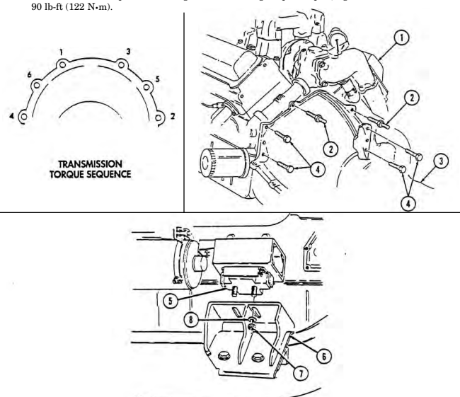

# 15-28.1. Engine Installation (Serial Numbers 300000 And Above) (Cont'D)

5. Remove lifting device from engine lifting sling (1). 6. Remove two capscrews (4) and sling bracket (6) from left cylinder head (5). 7. Remove pin (2) and sling bracket (6) from engine lifting sling (1). 8. Remove two capscrews (8) and engine lifting sling (1) from right cylinder head (7) and engine (3).

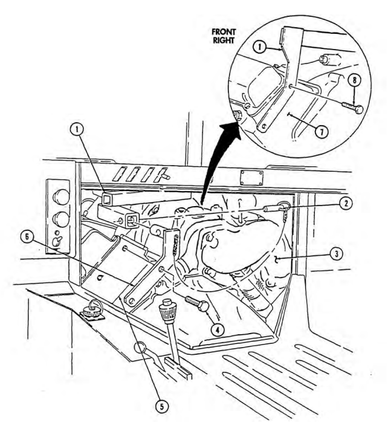

15-28.1. ENGINE INSTALLATION (SERIAL NUMBERS 300000 AND ABOVE) (Cont'd)
9. Install crossover O-ring (14) on turbocharger (13).

10. Install two gaskets (12) and intake crossover (10) on intake manifolds (11) and turbocharger (13)
with six capscrews (9). Tighten capscrews (9) to 17 lb-ft (23 N•m).

11. Install closeout panel (17) and retainer (18) on A-beam (15) with two screws (19), ten capscrews (20),
and nuts (16).

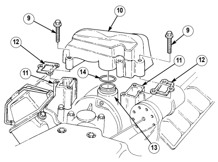

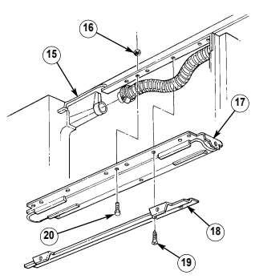

## 15-28.1. Engine Installation (Serial Numbers 300000 And Above) (Cont'D)

12. Install leads 74A (4) and 74B (2) on solenoid (1) with clip (5) and screw (6). 13. Install cable 6A (15), lead 81B (10), and winch cable 6 (7), if equipped, on starter terminal (3) with lockwasher (8) and nut (9). Using torque adapter, tighten nut (9) to 25 lb-ft (34 N•m).

14. Install negative cable 7A (16), lead 3D (14), and winch cable 7 (13), if equipped, on starter terminal (17)
with lockwasher (12) and nut (11). Using torque adapter, tighten nut (11) to 15 lb-ft (20 N•m).

15. Install clamp (19) and negative cable 7A (15) on starter (20) with screw (18). 16. Install clamp (23) and winch cables 6 (7) and 7 (13) on oil pan bracket (21), if equipped, with

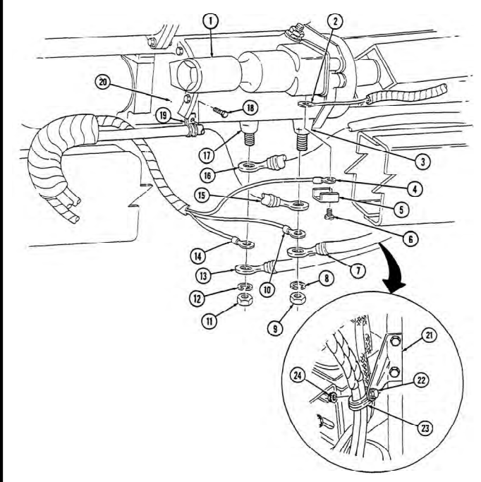

capscrew (22) and assembled locknut (24).

# 15-28.1. Engine Installation (Serial Numbers 300000 And Above) (Cont'D)

- It will be necessary to rotate flywheel clockwise from capscrew in front of crankshaft to gain access to install capscrews to torque converter.

- Have assistant hold crankshaft pulley in place when installing flywheel to torque converter.

17. Align torque converter (27) to flywheel (25) and install six capscrews (26).

18. Tighten capscrews (26) to 32 lb-ft (43 N.m).

Gaskets may require bending over edge of converter housing cover to make gaskets seal properly.

19. Apply RTV sealant to upper converter housing cover gasket (32). Install gasket (32) and upper converter housing cover (33) on transmission (28) with four capscrews (34).

20. Apply RTV sealant to lower converter housing cover gasket (29). Install gasket (29) and lower

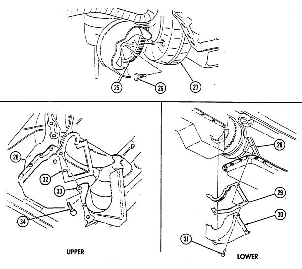

converter housing cover (30) on transmission (28) with two capscrews (31).

## 15-28.1. Engine Installation (Serial Numbers 300000 And Above) (Cont'D)

21. Install flange (10) and exhaust pipe (3) on wastegate housing (1) with two washers (9) and capscrews (8).

22. Install gasket (6) and exhaust pipe (3) on muffler (2) with three washers (4), capscrews (7),
washers (4), and locknuts (5).

23. Tighten locknuts (5) to 26 lb-ft (35 N•m). 24. Install heat shield (11) on exhaust pipe (3) with two clamps (12).

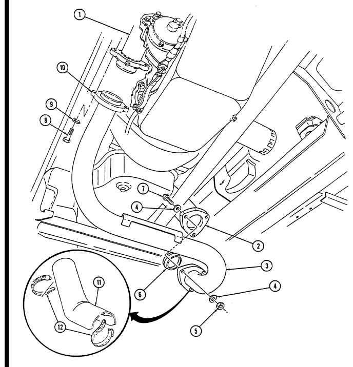

15-28.1. ENGINE INSTALLATION (SERIAL NUMBERS 300000 AND ABOVE) (Cont'd)
Feed engine harness cable (15) and 200-amp alternator cable (20) through grommets (21) and (13)
25.

in battery box (19) and install on buss bar (14) with two washers (16), lockwashers (17), and nuts (18).

Install oil pressure sending unit (23) and bracket (22) on stud (26) with washer (25) and nut (24).

26.

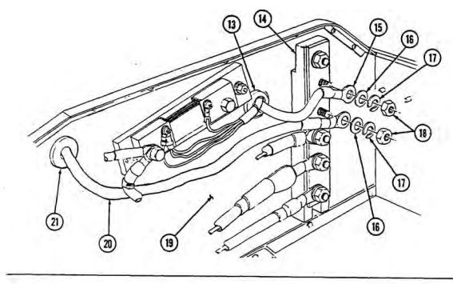

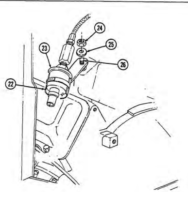

# 15-28.1. Engine Installation (Serial Numbers 300000 And Above) (Cont'D)

27. Connect lead 36A (2) to oil pressure sending unit (1). 28. Connect oil cooler supply line (4) and oil cooler return line (5) to engine (3). 29. Connect two leads 458A (12) to leads 458C (31) and 458D (13). 30. Connect engine harness lead 349A (20) to body harness leads 350B/359A/355A (21). 31. Install clamp (17) and body harness (16) on dipstick support bracket (14) with screw (15) and nut (18).

32. Connect control valve hose (19) to control valve (23) and hose (25) to hydro-booster (27) and tighten clamps (22) and (26) to 10-20 lb-in. (1-2 N•m).

33. Connect two clamps (29) with capscrew (30), washer (28), and nut (24). 34. Connect high-pressure line (32) to hydro-booster (27). 35. Connect fuel inlet (44) and fuel outlet (45) lines to fuel filter (41) and tighten clamps (42) and (43). 36. Connect engine harness connector (36) to time-delay module (39). 37. Connect harness connector plug (37) to protective control box (38). 38. Apply antiseize compound to engine harness ground 3C (47) and body harness ground 58B (48) and install on body (33) with assembled locknut (46).

39. Install engine harness (35) on body (33) with clamp (34) and two screws (40). 40. Connect harness lead 33B (9) to engine temperature sending unit (8) and harness lead (11) to engine rpm sensor lead (10).

41. Install two leads (7) on water temperature sending unit (6).

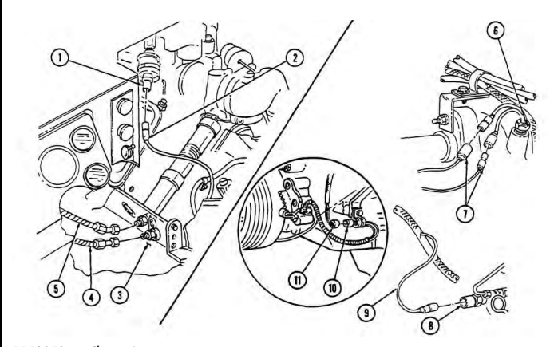

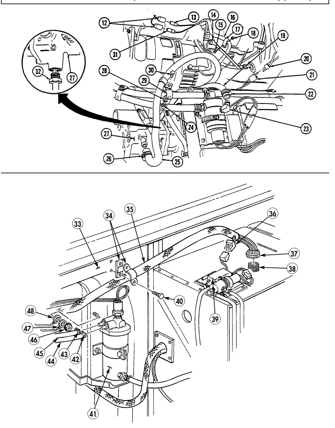

15-28.1. ENGINE INSTALLATION (SERIAL NUMBERS 300000 AND ABOVE) (Cont'd)

## 15-28.1. Engine Installation (Serial Numbers 300000 And Above) (Cont'D)

42. Install cable assembly (1) on throttle shaft lever (4) with accelerator cable clip (7). 43. Install cable assembly (1) on cable bracket (2) and tighten two nuts (8). 44. Connect throttle return spring (3) to cable bracket (2).

Steps 45 through 50 cover accelerator linkage adjustment.

45. Loosen nuts (8) on cable assembly (1) and cable bracket (2). 46. Fully depress accelerator pedal. 47. Hold throttle shaft lever (4) on injection pump (5) in full-throttle position. 48. Adjust two nuts (8) up or down so cable end (6) holds throttle shaft lever (4) in full-throttle position. 49. Tighten two nuts (8) connecting cable assembly (1) to cable bracket (2). 50. Release accelerator pedal and ensure throttle shaft lever (4) returns all the way to idle position.

#### Warning

Ensure fuel pump vent line is properly attached to top vent line fitting of fuel pump. Improper vent line installation may cause injury to personnel or damage to equipment.

51. Connect vent line (22) to fuel pump (17) and tighten clamp (20). 52. Connect fuel supply line (21) to fuel pump (17) and tighten clamp (18) to 10-20 lb-in. (1-2 N•m). 53. Connect fuel return hose (19) to fuel return line (24) and tighten clamp (23) to 10-20 lb-in. (1-2 N•m). 54. Connect two water hoses (9) to water crossover (12) and water pump (14) and tighten two clamps (10).

55. Connect water pump inlet hose (16) to water pump (14) and tighten clamp (15). 56. Connect surge tank-to-water crossover hose (11) to crossover (12) and tighten clamp (13) to 10-20 lb-in. (1-2 N•m).

15-28.1. ENGINE INSTALLATION (SERIAL NUMBERS 300000 AND ABOVE) (Cont'd)

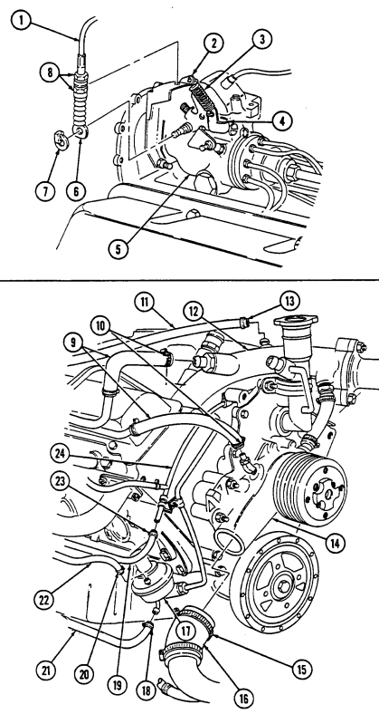

## 15-28.1. Engine Installation (Serial Numbers 300000 And Above) (Cont'D)

57. Install right rear heat shield (9) on right exhaust manifold heat shield (7) and rear heat shield (1) with two screws (8).

Remove plug prior to installation of transmission oil dipstick tube.

58. Install dipstick tube (6) into transmission (10). 59. Install washer (3) and dipstick tube (6) on manifold stud (4) with washer (3) and nut (2). 60. Install dipstick tube (6) on right rear heat shield (9) with capscrew (11). Tighten capscrew (11) 
25-37 lb-ft (34-50 N•m).

61. Install transmission oil dipstick (5) in dipstick tube (6).

15-28.1. ENGINE INSTALLATION (SERIAL NUMBERS 300000 AND ABOVE) (Cont'd)

# 15-28.1. Engine Installation (Serial Numbers 300000 And Above) (Cont'D)

Ensure terminals are clean before connections are made.

62. Position alternator (2) on mounting bracket (7) with support bracket (5) on outside of alternator mounting flange (6) and install washer (4), capscrew (3), washer (4), lockwasher (8), and nut (1).

63. Install positive cable (12) on alternator (2) with washer (11), lockwasher (10), and capscrew (9). 64. Install ground strap (13) an alternator (2) with washer (14), lockwasher (15), and capscrew (16). 65. Position 3/8-in. breaker bar or, as appropriate, a 1/2-in. ratchet wrench on belt tensioner (19) and move tensioner (19) clockwise to allow installation of drivebelt (18).

66. Feed drivebelt (18) into groove on crankshaft pulley (26), A/C compressor or idler pulley (20),
alternator pulley (23), power steering pump pulley (24), upper idler pulleys (21) and (22), water pump pulley (25), and tensioner pulley (27). Release belt tensioner (19).

67. Install lead (39), washer (38), and nut (41) on terminal (37). Tighten nut (41) to 18-22 lb-in.

(2.0-2.5 N•m). Slide rubber boot (40) over terminal (37).

68. Install washer (28), lead 568 (29), and nut (30) on IGN terminal (42). Tighten nut (30) to 23-27 lb-in. (2.6-3.0 N•m). Slide rubber boot (31) over terminal (42).

69. Install washer (35), lead 2A (34), and nut (33) on AC terminal (36). Tighten nut (33) to 18-22 lb-in. (2.0-2.5 N•m). Slide rubber boot (32) over terminal (36).

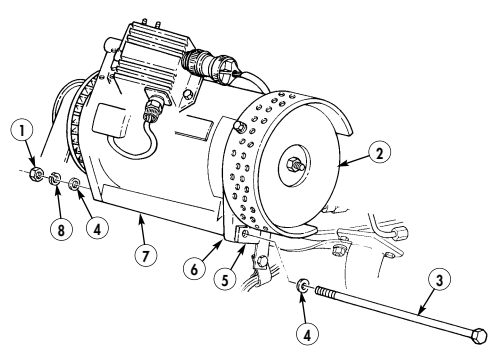

# 15-28.1. Engine Installation (Serial Numbers 300000 And Above) (Cont'D)

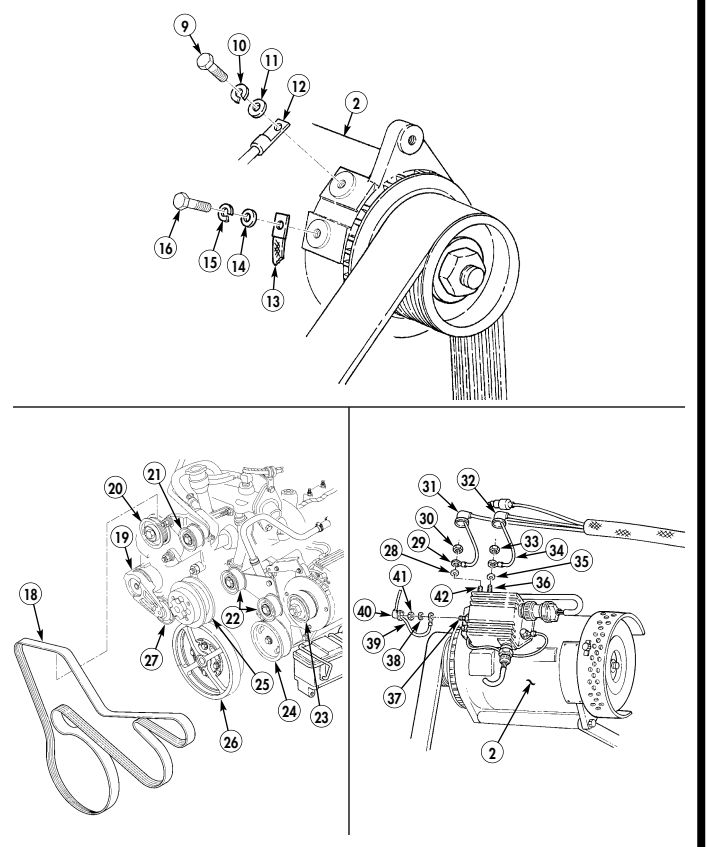

## 15-28.1. Engine Installation (Serial Numbers 300000 And Above) (Cont'D)

70. Position CDR valve (1) and bracket (2) over two intake manifold studs (7) and valve cover studs (6). 71. Secure CDR valve (1) and bracket (2) with four nuts (8). Tighten nuts (8) to 15 lb-ft (20 N•m). 72. Connect CDR valve oil fill tube hose (3) to oil fill tube (5) and tighten clamp (4). 73. Install clamp (10) on body (11) with screw (9).

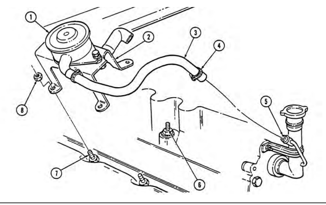

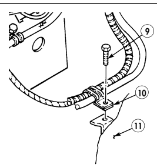

## 15-28.1. Engine Installation (Serial Numbers 300000 And Above) (Cont'D)

Install air horn support bracket (12) on cylinder head (21) with stud (13), harness clamp (14),
74.

lockwasher (15), nut (16), and capscrew (20).

75.

Install ground leads 7A (19) and 7E (17) on cylinder head (21) with capscrew (18).

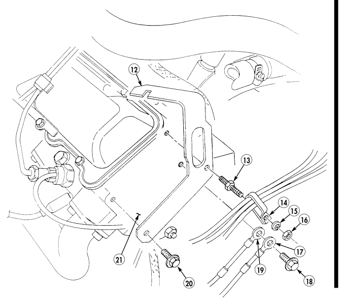

## 15-28.1. Engine Installation (Serial Numbers 300000 And Above) (Cont'D)

76. Connect air horn (5) to turbocharger intake hose (3) and tighten clamp (2). 77. Connect elbow (6) to air cleaner (8) and tighten clamp (7). 78. Connect CDR hose (1) to air horn adapter (4).

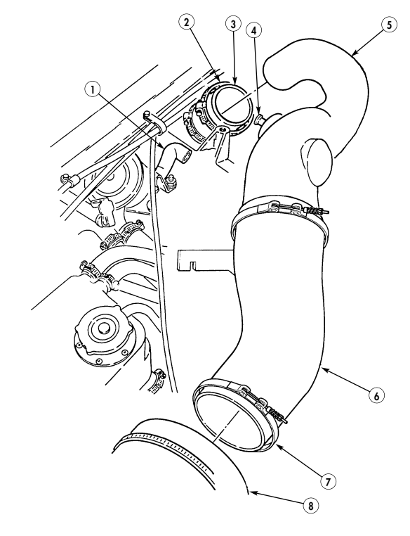

## 15-28.1. Engine Installation (Serial Numbers 300000 And Above) (Cont'D)

79. Install fan (12) and fan clutch (14) to flange (13) with four capscrews (9), lockwashers (10), and

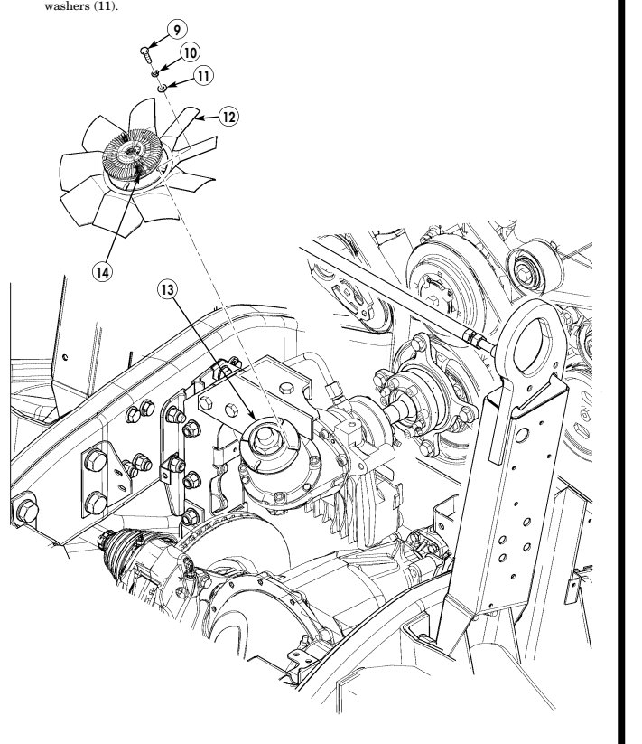

## 15-28.1. Engine Installation (Serial Numbers 300000 And Above) (Cont'D)

80. Align radiator assembly (3) and oil cooler (33) to frame bracket (37) and two rear support brackets (13)
to airlift brackets (7).

81. Install two rear support brackets (13) on airlift brackets (7) with four capscrews (12), washers (11),
and locknuts (10). Do not tighten locknuts (10).

82. Install radiator assembly (3) on frame bracket (37) with capscrew (40), lockwasher (39), washer (38),
two rubber mounts (36), washer (35), and nut (34).

83. Install crossbrace (20) on airlift brackets (7) with four capscrews (21), lockwashers (22), and washers (23).

84. Tighten nut (24) to increase tension on crossbrace (20). 85. Connect two transmission oil cooler line connector hoses (31) to transmission oil cooler ports (32)
and tighten hose clamps (30) to 10-20 lb-in. (1-2 N•m).

86. Connect two engine oil cooler supply and return lines (27) to engine oil cooler ports (28). 87. Connect two power steering hoses (25) to power steering cooler ports (29) and tighten clamps (26). 88. Align radiator assembly (3) and tighten locknuts (10) to 26 lb-ft (35 N•m). Tighten capscrew (40) to 30 lb-ft (41 N•m).

89. Connect lower radiator front hose (9) to radiator (3) and tighten clamp (8). 90. Connect fan drive hose quick-disconnect (15) to fan drive disconnect (16). 91. Connect control valve hose (18) to bulkhead adapter (17) and tighten clamp (19). 92. Connect radiator inlet hose (2) to engine (14) and tighten clamp (1). 93. Connect surge tank-to-radiator vent hose (4) to adapter (6) and tighten clamp (5).

15-28.1. ENGINE INSTALLATION (SERIAL NUMBERS 300000 AND ABOVE) (Cont'd)

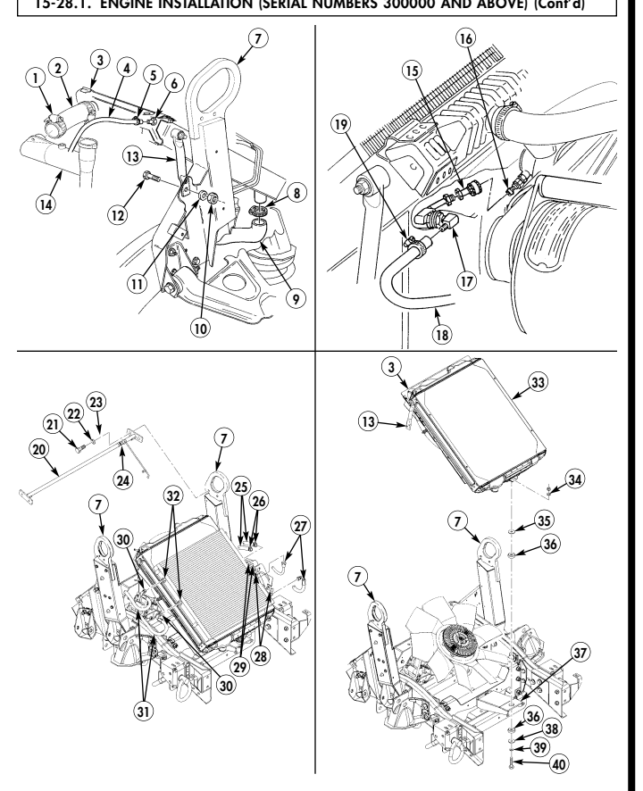

# 15-28.1. Engine Installation (Serial Numbers 300000 And Above) (Cont'D)

94. Install leads 17 (6), 18 (12), and 91 (5) on headlight assembly (7). 95. Install headlight housing (4) on frame extension (9) with spacer (8), two washers (10),
and screws (11).

96. Install headlight housing (4) on two frame brackets (15) with four washers (16), screws (17), two plates (13), and four locknuts (14).

97. Install body harness (18) on headlight housing (4) with two screws (1), clamps (2), and assembled locknuts (3).

98. Install bracket (21), if removed, on headlight housing (4) with two screws (20), locknuts (22),
screw (23), and locknut (19).

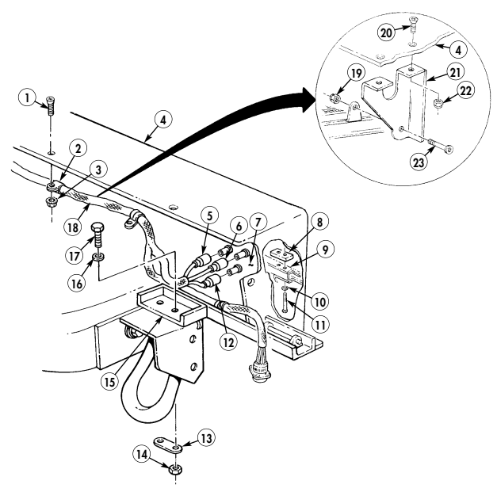

## 15-28.1. Engine Installation (Serial Numbers 300000 And Above) (Cont'D)

99. Install left splash shield (28) on bracket (38) with washer (36), capscrew (37), washer (50), and locknut (51).

100. Install harness and clamp (53) on splash shield (28) with screw (54) and nut and lockwasher assembly (52).

101. Install splash shield (28) on master cylinder bracket (29) with washer (30), capscrew (31),
and flange nut (27).

102. Install left splash shield (28) on airlift bracket (24) with lockwasher (34) and capscrew (35). Tighten capscrew (35) to 15 lb-ft (20 N•m).

103. Install left splash shield (28) on airlift bracket (24) with washer (32), capscrew (33), washer (26),
and locknut (25). Tighten capscrew (33) to 95-145 lb-in. (11-16 N•m).

104. Install connector (55) on plate (42) with four screws (56) and nuts (57). 105. Install plate (42) and spring nuts (46) and (45) on headlight housing (47) with washer (44) and hex-head screws (43) and (48).

106. Install plate (42) on splash shield bracket (49) with four lockwashers (41), washers (39), and capscrews (40).

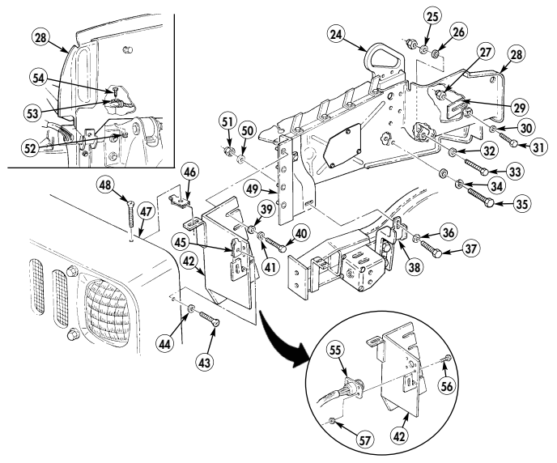

# 15-28.1. Engine Installation (Serial Numbers 300000 And Above) (Cont'D)

107. Install right splash shield (1) on airlift bracket (5) with washer (4) and screw (3). 108. Install right splash shield (1) on support bracket (16) with washer (17), capscrew (18), washer (7),
and locknut (8). Tighten capscrew (18) to 15 lb-ft (20 N•m).

109. Install right splash shield (1) on airlift bracket (5) with two washers (20), capscrews (19),
clamp (21), washer (22), and locknut (23). Tighten capscrews (19) to 15 lb-ft (20 N•m).

110. Install vent line clamp (26) on right splash shield (1) with capscrew (2), washer (24), and locknut (25). Tighten locknut (25) to 15 lb-ft (20 N•m).

111. Install harness connector (28) on plate (12) with four screws (27) and nuts (29). 112. Install plate (12) and spring nuts (11) on headlight housing (9) with two hex-head screws (10). 113. Install right splash shield (1) on bracket (6) and plate (12) with four lockwashers (14), washers (13),
and capscrews (15).

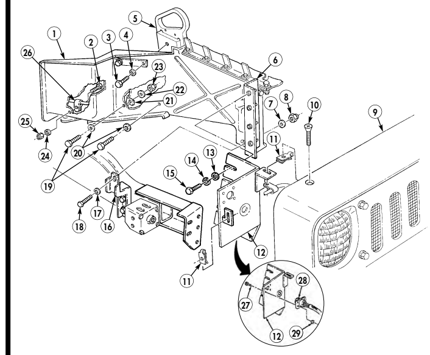

## 15-28.1. Engine Installation (Serial Numbers 300000 And Above) (Cont'D)

114. Apply refrigerant oil on seal washer (34) and install seal washer (34) on low pressure hose (33). 115. Install low pressure hose (33) on A/C manifold (35) with capscrew (30), lockwasher (31), and washer (32).

116. Apply refrigerant oil on seal washer (36) and install seal washer (36) on high pressure hose (37). 117. Install high pressure hose (37) on A/C manifold (35) with capscrew (38), lockwasher (39), and washer (40).

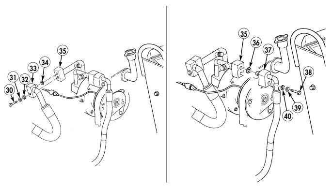

15-28.1. ENGINE INSTALLATION (SERIAL NUMBERS 300000 AND ABOVE) (Cont'd)
118. Install A/C wiring harness connector (5) through grommet (7) and install connectors (5) on two circuit breakers (6).

119. Install two A/C wiring harness connectors (3) on temperature switch (4). 120. Install one A/C wiring harness connector (2) on A/C switch jumper wire (1).

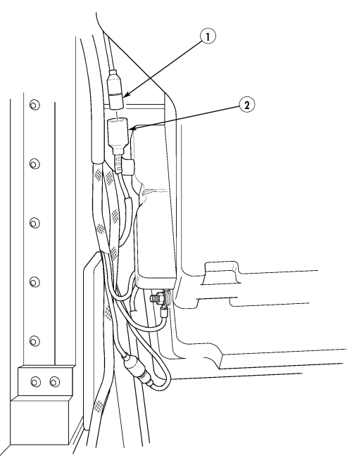

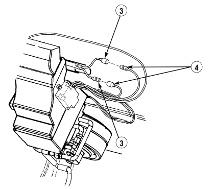

15-28.1. ENGINE INSTALLATION (SERIAL NUMBERS 300000 AND ABOVE) (Cont'd)

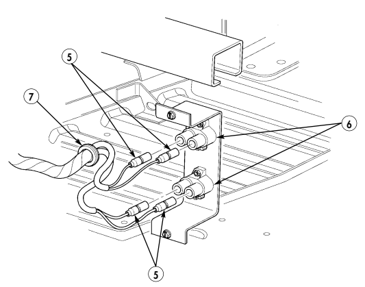

## 15-28.1. Engine Installation (Serial Numbers 300000 And Above) (Cont'D)

121. Install two A/C wiring harness connectors (9) on compressor (10). 122. Install A/C wiring harness connector (7) on watervalve solenoid (8). 123. Install A/C wiring harness connector (2) on low pressure cut-off switch (1). 124. Install A/C wiring harness connector (3) on high pressure cut-off switch (4). 125. Install four A/C wiring harness connectors (5) on four condenser fan harness connectors (6).

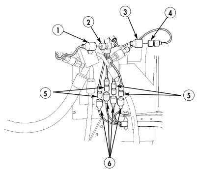

15-28.1. ENGINE INSTALLATION (SERIAL NUMBERS 300000 AND ABOVE) (Cont'd)

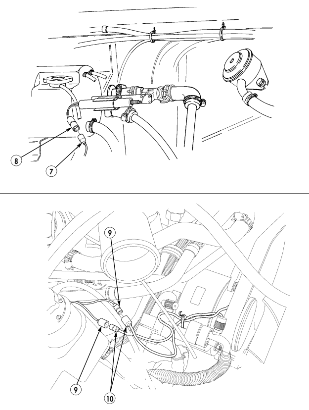

## 15-28.1. Engine Installation (Serial Numbers 300000 And Above) (Cont'D)

126. Install hood (1) and align two upper hinge halves (5) with lower hinge halves (4). 127. Install two upper hinge halves (5) on lower hinge halves (4) with washers (3), hinge pins (6),
washers (3), and cotter pins (2).

128. Install bracket (8) on airlift bracket (7) with three capscrews (10), and lockwashers (9). 129. Install hood prop (13) on bracket (8) with two washers (12) and cotter pin (11). 130. Connect hood harness connector (14) to harness connector (15).

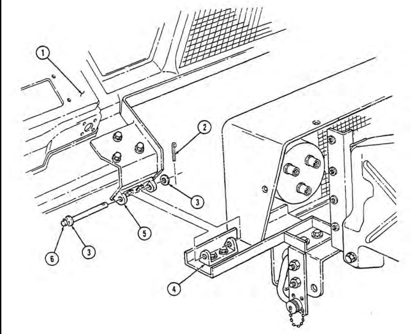

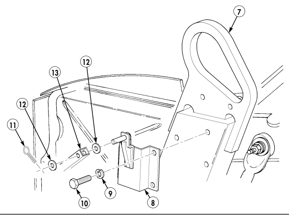

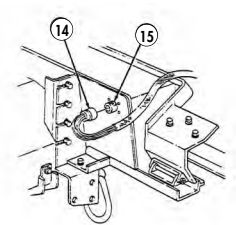

FOLLOW-ON TASKS: - Fill engine oil, transmission fluid, and power steering fluid to proper levels 
(TM 9-2320-387-10).

- Install batteries (para. 4-74). - Install power steering reservoir and bracket (serial numbers 196901 and above)
(para. 8-29).

- Install engine access cover (para. 10-22). - Charge A/C system (para. 25-15). - Perform engine run-in (para. 15-24).

# 15-28.1. Engine Installation (Serial Numbers 300000 And Above) (Cont'D) 15-29. Engine Replacement In Shipping/Storage Container

This task covers:

| a. Removal                           | b. Installation                                                                                   |
|--------------------------------------|---------------------------------------------------------------------------------------------------|
| INITIAL SETUP:                       |                                                                                                   |
| Tools  General mechanic's  tool kit: | Equipment  Condition   Left or right rocker arm cover removed                                     |
| automotive (Appendix B, Item 1)      | (para. 15\-11 or 15\-12).                                                                         |
| Manual References                    | Maintenance  Level                                                                                |
| TM 9\-2320\-387\-24P                 | Direct support                                                                                    |
| 1.                                   | Remove four capscrews (2) and retainers (3) from two arm rocker shaft assemblies (4) and cylinder |

a. Removal 1. If engine container (5) is closed and sealed, press air-release button (1) located at center of breather valve (2) before opening engine container (5).

2. Remove twenty-six nuts (19), washers (18), capscrews (16), and upper container (4) from lower container (13).

3. Position engine lifting sling on engine (6) and install on right cylinder head (25) with two capscrews (24). 

4. Install sling bracket (21) on left cylinder head (20) with two capscrews (23). Tighten capscrews (23)
and install sling bracket (21) to engine lifting sling with pin (22).

5. Remove four capscrews (14), lockwashers (8), and washers (7) from two engine mounts (12). Discard lockwashers (8).

6. Remove four capscrews (9), lockwashers (8), and washers (7) from two rear engine mounts (10).

Discard lockwashers (8).

#### Warning

Direct personnel to stand clear during hoisting operation. Failure to do this may cause injury to personnel.

7. Attach hoist to engine lifting sling and remove engine (6) from lower container (13). 8. Prepare engine for assembly (para. 15-27).

#### B. Installation

5. Remove two capscrews (24) and lifting sling from right cylinder head (25). 6. Remove two capscrews (23) and sling bracket (21) from left cylinder head (20). 7. Visually check humidity indicator (17) for discolorization. If indicator (17) is dark purple, replace desiccant (3).

1. Install engine assembly (6) in lower container (13). 2. Install engine assembly (6) on two rear engine mounts (10) with four lockwashers (8), washers (7),
and capscrews (9).

3. Install engine assembly (6) on two engine mounts (12) with four lockwashers (8), washers (7), and capscrews (14).

4. Remove pin (22) from sling bracket (21).

# 15-29. Engine Replacement In Shipping/Storage Container (Cont'D) Note

Ensure gasket is seated properly.

Position upper container (4) using alignment pins (15) on gasket (11) and lower container (13).

8.

9.

Install upper container (4) on lower container (13) with twenty-six capscrews (16), washers (18), and

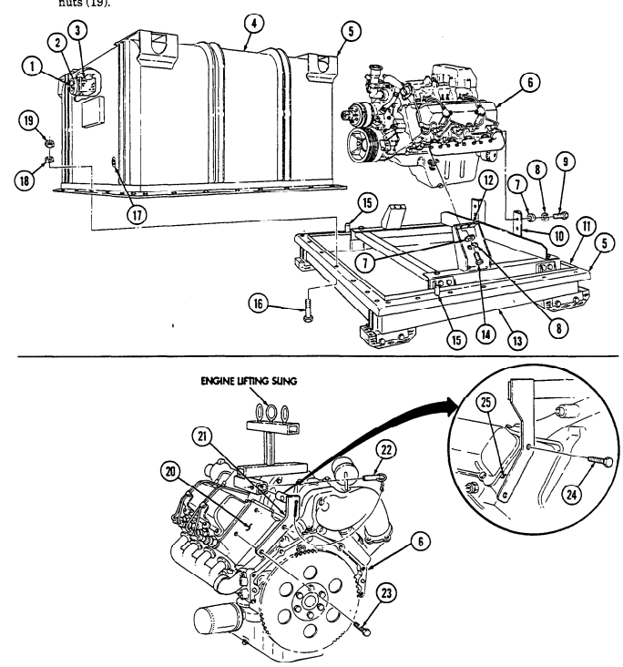

# Chapter 16 Fuel System (Ds) Maintenance

## 16-1. Introduction

This chapter contains maintenance instructions for replacement of fuel system components at the direct support maintenance level. Some subassemblies and parts must be removed before fuel system components can be accessed. They are referenced to other paragraphs of this manual.

## 16-2. Fuel System Maintenance Task Summary

| (Appendix B, Item 231                                                  | procedure near fire, flames, or sparks.                                                     |
|------------------------------------------------------------------------|---------------------------------------------------------------------------------------------|
| Materials/Parts                                                        | Maintenance Level                                                                           |
| Lubricating oil (Appendix C, Item 44)                                  | Direct support                                                                              |
| Manual References                                                      |                                                                                             |
| TM 9\-2320\-387\-24P                                                   |                                                                                             |
| 1.                                                                     | Remove capscrew (11, guide plate clamp (21, and guide plate(s) (3) from cylinder block (51. |
| NOTE                                                                   |                                                                                             |
| Tag lifters for installation if more than one lifter is being removed. |                                                                                             |
| 2.                                                                     | Using hydraulic valve lifter remover, remove valve lifter(s) (4) from cylinder block (5).   |

# 16-3. Fuel Injection Nozzle Replacement

This task covers:
INITIAL SETUP:

#### Tools

General mechanic's tool kit:
automotive (Appendix B, Item 1)
Special Tools Injection nozzle remover 
(Appendix B, Item 32)
Crowfoot, 19-mm (Appendix B, Item 137) Crowfoot, 7/8-in. (Appendix B, Item 142)
(rear injection nozzle only)
Materials/Parts Gasket (Appendix G, Item 56)
Manual References TM 9-2320-387-10 TM 9-2320-387-24P

#### A. Removal **B. Installation** Equipment Condition

- Hood raised and secured (TM 9-2320-387-10). - Engine access cover removed (para. 10-22)
(rear injection nozzles only).

- Battery ground cables disconnected (para. 4-68).

#### General Safety Instructions

Do not perform this procedure near fire, flames, or sparks.

Maintenance Level Direct support

#### Warning

Diesel fuel is highly flammable. Do not perform this procedure near fire, flames, or sparks. Severe injury or death may result.

CAUTION
Cover or plug all hoses, connections, and openings immediately after disconnection to prevent contamination. Remove all covers or plugs prior to connection.

- Refer to engine decal model number on left rocker arm cover before ordering replacement parts.

- The replacement procedure for all eight injection nozzles is basically the same. This procedure covers one injection nozzle.

a. Removal

- Have drainage container available to catch fuel. - Perform step 1 if replacing rear injection nozzles.

1. Loosen two clamps (6) and remove fuel return hose (2) and cap (10) from fuel injection nozzle (7). 2. Loosen two clamps (6) and disconnect fuel return hoses (2) from fuel injection nozzle (7) . 3. Remove screw (4) from clamp (3) and support bracket (1). 4. Loosen and disconnect two fuel injection line nuts (5) from fuel injection nozzles (7). 5. Using injection nozzle remover, remove fuel injection nozzle (7) and gasket (8) from cylinder head (9).

Discard gasket (8).

# 16-3. Fuel Injection Nozzle Replacement (Cont'D)

b. Installation

If replacing rear injection nozzles, tighten nozzles in accordance with step 2. Tighten fuel injection line nuts in accordance with step 4.

1. Install gasket (8) and fuel injection nozzle (7) on cylinder head (9). Using injection nozzle remover, tighten fuel injection nozzle (7) to 44-60 lb-ft (60-81 N•m).

2. Using injection nozzle remover and 7/8-in. crowfoot, tighten fuel injection nozzle (7) to 44-60 lb-ft
(60-81 N•m).

3. Install fuel injection line nuts (5) on fuel injection nozzles (7). 4. Using 19-mm crowfoot, tighten fuel injection line nuts (5) to 20 lb-ft (27 N•m). 5. Install clamp (3) on support bracket (1) with screw (4). Tighten screw (4) to 3-4 lb-ft (4-5 N•m).

NOTE
Perform step 6 if replacing rear injection nozzles.

6. Install fuel return hose (2) and cap (10) on fuel injection nozzle (7) with clamps (6). 7. Install two fuel return hoses (2) on fuel injection nozzle (7) with clamps (6). 8. Bleed fuel lines (para. 16-4, task d.).

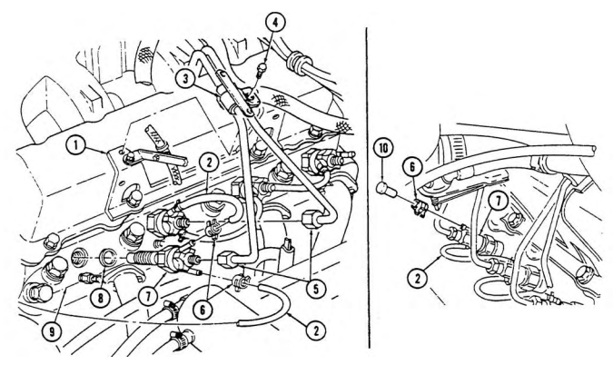

FOLLOW-ON TASKS: - Connect battery ground cables (para. 4-68).

- Start engine (TM 9-2320-387-10) and check for fuel leakage. - Install engine access cover (para. 10-22) (rear injection nozzles only). - Lower and secure hood (TM 9-2320-387-10).

# 16-4. Fuel Injection Lines Maintenance

| This task covers:   |
|---------------------|

b. Inspection **d. Bleeding**

#### Initial Setup: Tools

General mechanic's tool kit:
automotive (Appendix B, Item 1)
Special Tools Crowfoot, 16-mm (Appendix B, Item 136) Crowfoot, 19-mm (Appendix B, Item 137)
Manual References TM 9-2320-387-10 TM 9-2320-387-24P

a. Removal c. Installation

#### Equipment Condition

- Left and right intake manifolds removed 
(paras. 15-16 and 15-17).

- Fuel injection pump boot removed 
(para. 3-23).

General Safety Instructions Do not perform this procedure near fire, flames, or sparks.

Maintenance Level Direct support

#### Warning

Diesel fuel is highly flammable. Do not perform this procedure near fire, flames, or sparks. Severe injury or death may result.

#### Caution

Cover or plug all hoses, connections, and openings immediately after disconnection to prevent contamination. Remove all covers or plugs prior to connection.

a. Removal

Have drainage container ready to catch fuel.

1. Loosen two fuel injection line nuts (2) and disconnect fuel injection lines (3) from fuel injection nozzles (7).

2. Remove screw-assembled washer (4) and clamp (5) from support bracket (8).

Tag fuel injection lines by cylinder number for assembly.

3. Loosen two fuel injection line nuts (2) and remove fuel injection lines (3) from fuel injection pump
(1).

4. Remove clamp (5) and two grommets (6) from fuel injection lines (3).

#### B. Inspection

1. Inspect fuel injection lines (3). Replace if cracked, bent, or damaged. 2. Inspect grommets (6). Replace if damaged.

# 16-4. Fuel Injection Lines Maintenance (Cont'D)

c. Installation 1. Install two grommets (6) on fuel injection lines (3). 2. Install two fuel injection lines (3) on fuel injection pump (1) and fuel injection nozzles (7). 3. Using 16-mm crowfoot, tighten two fuel injection line nuts (2) on fuel injection lines (3) and fuel injection pump (1) to 20 lb-ft (27 N•m).

4. Install clamp (5) and fuel injection lines (3) on support bracket (8) with screw-assembled washer
(4). Tighten screw-assembled washer (4) to 3-4 lb-ft (4-5 N•m).

d. Bleeding 1. Loosen eight fuel injection line nuts (2) at eight injection nozzles (7).

#### Caution

Do not operate starter continuously for more than 20 seconds; wait 10 to 15 seconds between periods of operation. Failure to do so may result in damage to the starter.

Have drainage container ready to catch fuel.

2. Crank engine until fuel exits from all fuel injection lines (3).

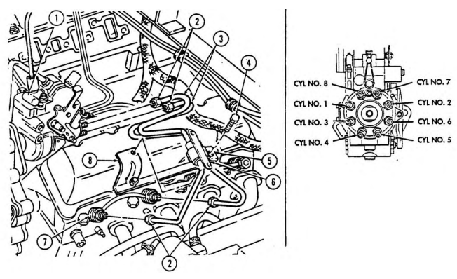 3. Using 19-mm crowfoot, tighten fuel injection line nuts (2) to 20 lb-ft (27 N•m).

FOLLOW-ON TASKS: - Install fuel injection pump boot (para. 3-23).

- Install left and right intake manifolds (paras. 15-16 and 15-17). - Start engine (TM 9-2320-387-10) and check for fuel leaks.

## 16-5. Servo Advance Seal Replacement

This task covers:

| a.  Removal                     | b.  Installation    |
|---------------------------------|---------------------|
| INITIAL SETUP:                  |                     |
| Tools                           | Equipment Condition |
| General mechanic's tool kit:    |                     |
| automotive (Appendix B, Item 1) | Maintenance Level   |
| Manual References               | Direct support      |

Seal (Appendix G, Item 295)
a. Removal 4. Remove seal (5) from piston plug nut (6). Discard seal (5).

b. Installation 1. Install seal (5) on piston plug nut (6). 2. Using modified box wrench, install piston plug nut (6) on fuel injection pump (4). 3. Install rocker lever (3) on piston plug nut (6) with plunger (7) and setscrew (8). 4. Install rocker lever (3) on fuel injection pump (4) with pin (1) and two retaining rings (2).

1. Remove two retaining rings (2) and pin (1) from rocker lever (3) and fuel injection pump (4). 2. Remove setscrew (8), rocker lever (3), and plunger (7) from piston plug nut (6). 3. Using a modified box wrench, remove piston plug nut (6) from fuel injection pump (4).

# 16-5. Servo Advance Seal Replacement (Cont'D)

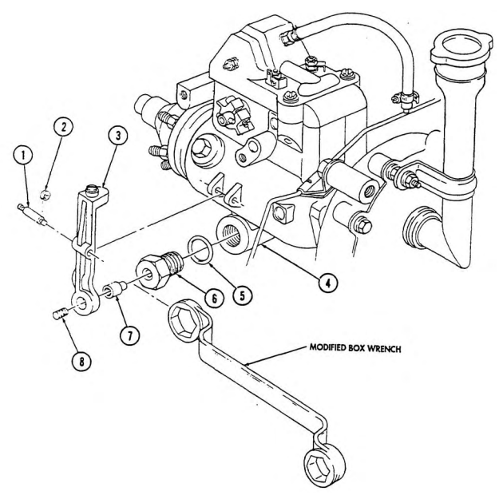

# 16-6. Fuel Injection Pump Maintenance

This task covers:
a. Removal **c. Installation** b. Repair

#### Initial Setup: Tools

General mechanic's tool kit:
automotive (Appendix B, Item 1)
Materials/Parts Gasket (Appendix G, Item 52)
Manual References TM 9-2320-387-10 TM 9-2320-387-24P TM 9-2815-237-34

#### Equipment Condition

- Engine oil filler tube removed (para. 3-3). - Fuel injection lines removed (para. 16-4).

#### Equipment Condition (Cont'D)

- TP sensor removed (para. 4-46). - Fan cut-off switch removed (para. 4-42). - Accelerator cable mounting bracket removed
(para. 16-10).

General Safety Instructions Do not perform this procedure near fire, flames, or sparks.

Maintenance Level Direct support

#### Warning

Diesel fuel is highly flammable. Do not perform this procedure near fire, flames, or sparks. Severe injury or death may result.

CAUTION
Cover or plug all hoses, connections, and openings immediately after disconnection to prevent contamination. Remove all covers or plugs prior to connection.

a. Removal

- In some cases, flanged-head fasteners may be present instead of standard fasteners and washers. In all cases, washers should be used when replacing a flanged-head fastener with a standard fastener.

- Prior to removal, tag leads for installation. - Have drainage container ready to catch fuel.

1. Disconnect leads 54A (3) and 569B (4) at fuel injection pump (7). 2. Loosen clamp (2) and disconnect fuel drainback hose (1) from fuel injection pump (7). 3. Loosen clamp (9) and disconnect outlet hose (10) from hose adapter (8). 4. Remove return spring (5) from throttle shaft lever (6). 5. Remove hose adapter (8) from fuel injection pump (7).

# 16-6.  Fuel Injection Pump Maintenance (Cont'D)

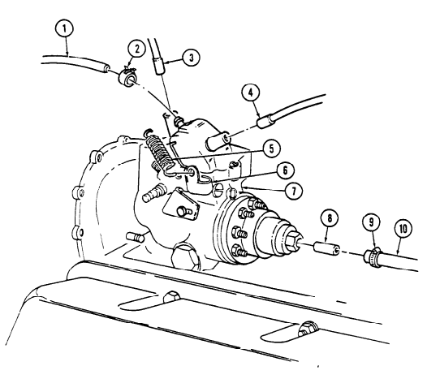

# I 6-6. Fuel Injection Pump **Maintenance Konw**

Rotate engine in order to gain access to driven gear and injection pump retaining capscrews. 

6. Remove three capscrews (9) from pump-driven gear and fuel injection pump (4). 7. Remove three nuts (51, washers (61, fuel injection pump (41, and gasket (1) from timing gear cover (7). Discard gasket (1). 

8. Clean gasket surface of timing gear cover (7) and fuel injection pump (4). 

1 b. Repair 1 For fuel injection pump repair procedures, notify general support (TM 9-2815-237-34). 

c. Installation 1. 

2. 

Align pin (2) on pump drive with elongated hole in pump-driven gear. 

Install gasket (11 and fuel injection pump (4) on timing gear cover (7). 

Align fuel injection pump timing marks (3) and gear cover timing marks (8). 

3. 

4. 

5. 

Install fuel injection pump (4) on timing gear cover (7) with three washers (6) and nuts (5). 

Secure pump-driven gear on fuel injection pump (4) with three capscrews (9). Tighten capscrews (9) 

to 13-20 lb-ft (18-27 N-m). 

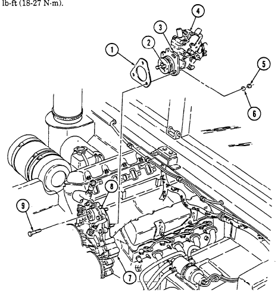

# 16-6. Fuel Injection Pump Maintenance (Cont'D)

8. Connect throttle return spring (15) to throttle shaft lever (16). 9. Connect fuel filter outlet hose (19) to hose adapter (17) and tighten clamp (18).

10. Install engine oil filler tube (para. 3-3). 11. Install fuel injection lines (para. 16-4), but do not bleed air from lines. 12. Adjust accelerator linkage (para. 3-43).

#### Caution

Do not operate starter continuously for more than 20 seconds; wait 10 to 15 seconds between periods of operation. Failure to do so may result in damage to the starter.

13. Crank engine until fuel exits from check valve (13) on fuel injection pump (4). 14. Connect fuel drainback hose (10) to check valve (13) with clamp (11).

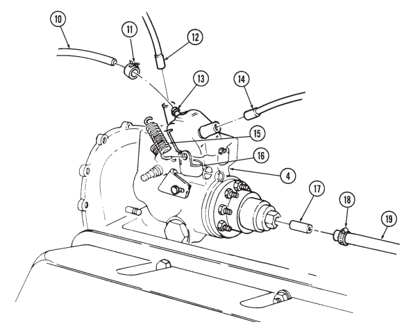 15. Connect leads 54A (12) and 569B (14) to fuel injection pump (4).

FOLLOW-ON TASKS: - Install TP sensor (para. 4-46).

- Install fan cut-off switch (para. 4-42). - Bleed fuel system (para. 16-4). - Start engine (TM 9-2320-387-10) and check for fuel leaks. - Time injector pump (para. 15-23).

6. Install hose adapter (17) on fuel injection pump (4). 7. Install accelerator cable mounting bracket (para. 16-10).

## 16-7. Fuel Injection Pump Cover Replacement

This task covers:
INITIAL SETUP:
Tools ____
General mechanic's tool kit:
automotive (Appendix B, Item 1)
Retaining tool (Appendix B, Item 48)
Materials/Parts _____________
Gasket (Appendix G, Item 57) O-ring (Appendix G, Item 210) Three lockwashers (Appendix G, Item 152)
Manual References ________________
TM 9-2320-387-10 TM 9-2320-387-24P
a. Removal **b. Installation**
Equipment Condition **_________________**
- Hood raised and secured (TM 9-2320-387-10). - Battery ground cables disconnected (para. 4-68).

General Safety Instructions **______________________**
Do not perform this procedure near fire, flames, or sparks.

Maintenance Level _______________
Direct support

#### Warning

Diesel fuel is highly flammable. Do not perform this procedure near fire, flames, or sparks. Severe injury or death may result.

#### Caution

Cover or plug all hoses, connections, and openings immediately after disconnection to prevent contamination. Remove all covers or plugs prior to connection.

a. Removal

Prior to removal, tag leads for installation.

1. Loosen clamp (2) and disconnect fuel drainback hose (1) from fuel injection pump (6). 2. Disconnect leads 54A (3) and 569B (5) at fuel injection pump (6).

#### Caution

Fuel pump body must be thoroughly cleaned before disconnecting any attaching components to prevent foreign particles from entering pump.

NOTE
Working area should be clean, well-ventilated, and free from blowing dirt and dust.

3. Clean exterior of fuel injection pump (6) in accordance with para. 2-14.

Discard lockwashers (10).

4. Remove three screws (9), lockwashers (10), four washers (11), and ground strap (12) from cover (4).

5. Remove cover (4) and gasket (13) from fuel injection pump housing (14). Discard gasket (13).

Perform step 6 only if fuel injection pump cover is being replaced.

6. Remove fuel return line check valve (7) and O-ring (8) from cover (4). Discard O-ring (8). 7. Inspect fuel return line check valve (7). Replace if damaged.

# 16-7. Fuel Injection Pump Cover Replacement

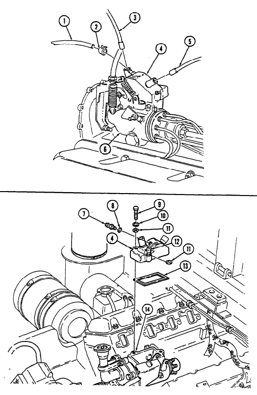

# 16-7. Fuel Injection Pump Cover Replacement **(Cont'D)**

b. Installation 

Perform step 1 only if check valve was removed. 

Install O-ring (8) and fuel return line check valve (7) in cover (4). 

1. 2. 

3. 

Install gasket (13) on fuel injection pump housing (141. 

Install retaining tool on cover (4) to restrict shutoff solenoid linkage (15). 

#### Caution

4. 

Incorrect installation of cover may cause damage to cover gasket or pump to malfunction. 

Position cover (4) over fuel injection pump housing (14) ahead of threaded holes in housing and slide rearward and downward to align holes in cover (4) with threaded holes in fuel injection pump housing ( 14). 

nirist retaining tool to release solenoid linkage (15) and slide tool out from between cover (4) and fuel injection pump housing (14). Do not damage gasket (13). 

5. 

6. 

7. 

Position washer (11) between ground strap (121 and cover (4). Secure cover (4) and ground strap (12) with three washers (111, lockwashers (101, and screws (9). 

Tighten screws (9) to 34-45 lb-in. (4-5 Nom). 

8. 

9. 

Connect fuel drainback hose (1) to fuel injection pump (6) with clamp (2). 

Connect battery ground cables (para. 4-68). 

#### Caution

Do not attempt to start engine until the following step is completed. If no clicking noise is present in the cover of the fuel injection pump, the linkage may possibly be jammed in the wideopen throttle position. If engine is started with linkage in wideopen throttle position, engine runaway will occur and engine damage will result. 

Place rotary switch to RUN position. Listen for a clicking noise when connecting and disconnecting lead 54A (3) to fuel injection pump (6). If no clicking noise is present, remove and reinstall cover (4). If clicking noise is present, connect harness leads 54A (3) and 569B (5) to fuel injection pump (6). 

10. 

# 16-7.  Fuel Injection Pump Cover Replacement (Cont'D)

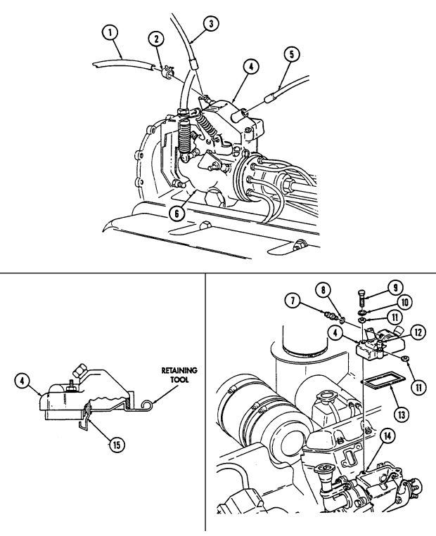

FOLLOW-ON TASKS: - Start engine (TM 9-2320-387-10) and check for fuel leaks.

-  Lower and secure hood (TM 9-2320-387-10).

# 16-8. **Fuel Injection Pump Shutoff Solenoid Maintenance**

This task covers:
a. Removal **c. Installation** b. Inspection

#### Initial Setup: Tools

General mechanic's tool kit:

| Maintenance Level    | Manual References   | Direct support   |
|----------------------|---------------------|------------------|
| TM 9\-2320\-387\-24P |                     |                  |

| Equipment Condition   |
|-----------------------|

Working area should be clean, well-ventilated, and free from blowing dirt and dust.

a. Removal 1. Remove terminal (5), washer (6), and shell (7) from stud (12). 2. Remove nut (8), lockwasher (9), washer (10), and fiber washer (11) from stud (12). Discard lockwasher (9) and fiber washer (11).

3. Remove locknut (4), ground strap (3), lockwasher (2), nut (8), lockwasher (9), washer (10), and fiber washer (11) from stud (14). Discard locknut (4), lockwashers (2) and (9), and fiber washer (11).

4. Remove electrical shutoff solenoid (13) from cover (1).

b. Inspection Inspect shell (7). Replace if cracked, deteriorated, or damaged.

c. Installation 1. Install electrical shutoff solenoid (13) in cover (1). 2. Install fiber washer (11), washer (10), lockwasher (9), nut (8), lockwasher (2), ground strap (3), and locknut (4) on stud (14).

3. Install fiber washer (11), washer (10), lockwasher (9), and nut (8) on stud (12). 4. Install shell (7), washer (6), and terminal (5) on stud (12).

# 16-8. Fuel Injection Pump Shutoff Solenoid Maintenance (Cont'D)

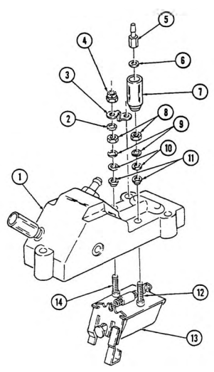

FOLLOW-ON TASK: Install fuel injection pump cover (para. 16-7).

# 16-9. **Fuel Injection Pump Cold-Advance Solenoid Maintenance**

This task covers:
b. Inspection

| Materials/Parts   |
|-------------------|

Tools General mechanic's tool kit:
automotive (Appendix B, Item 1)
Two lockwashers (Appendix G, Item 139) Locknut (Appendix G, Item 107) O-ring (Appendix G, Item 210) Two fiber washers (Appendix G, Item 32)

| Maintenance Level   |
|---------------------|
| Direct support      |

a. Removal c. Installation

| Maintenance Level   |
|---------------------|
| Direct support      |

| Equipment Condition   |
|-----------------------|

Working area should be clean, well-ventilated, and free from blowing dirt and dust.

#### A. Removal

1. Remove terminal (1), washer (2), and ribbed shell (3) from stud (15). 2. Remove nut (4), lockwasher (5), washer (6), and fiber washer (7) from stud (15). Discard lockwasher (5) and fiber washer (7).

3. Remove locknut (11), nut (4), lockwasher (5), washer (6), and fiber washer (7) from stud (12).

Discard lockwasher (5), locknut (11), and fiber washer (7).

4. Remove check valve (9) and O-ring (8) from cover (10). Discard O-ring (8). 5. Remove cold-advance solenoid (13) and plunger (14) from cover (10). 6. Remove plunger (14) from cold-advance solenoid (13).

#### B. Inspection

Inspect ribbed shell (3). Replace if cracked, deteriorated, or damaged.

c. Installation 1. Install plunger (14) in cold-start advance solenoid (13). Install stud (15) in hole in rear of cover (10). 2. Install O-ring (8) and check valve (9) in cover (10). 3. Install cold-start advance solenoid (13) in cover (10) so small tip of plunger (14) fits in port of check valve (9) and stud (12) fits through hole in side of cover (10).

4. Install fiber washer (7), washer (6), lockwasher (5), nut (4), and locknut (11) on stud (12). 5. Install fiber washer (7), washer (6), lockwasher (5), and nut (4) on stud (15). 6. Install ribbed shell (3), washer (2), and terminal (1) on stud (15).

# 16-9.  Fuel Injection Pump Cold-Advance Solenoid Maintenance (Cont'D)

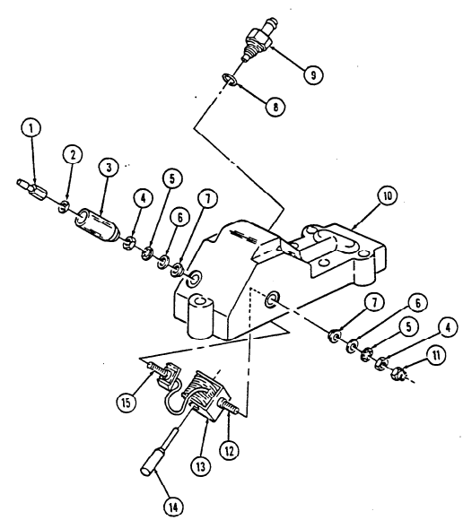

FOLLOW-ON TASK: Install fuel injection pump shutoff solenoid (para. 16-8).

# I 16-L 0. **Accelerator Cable Mounting Bracket Maintenance I**

This task covers: 
a. Removal b. Inspection INITIAL SETUP: 
Tools General mechanic's tool kit: 
automotive (Appendix B, Item 1) 
Manual References TM 9-2320-387-10 TM 9-2320-387-24P 
c. Installation Equipment Condition Hood raised and secured (TM 9-2320-387-10). 

Maintenance Level Direct support 1. Loosen two nuts (7) and disconnect cable assembly (1) from bracket (5). 

2. Disconnect throttle return spring (2) from bracket (5). 

3. Remove stop collar (6) and disconnect cable assembly (1) from fuel injection pump (4). 

4. Remove nut (8) and washer (9) from fuel injection pump (4) and stud (11). 5. Remove two capscrews (10) and bracket (5) from fuel injection pump (4). 

b. Inspection Inspect throttle return spring (2). Replace if defective. 

1. Install bracket (51 on fuel injection pump (4) and stud (11) with washer (9) and nut (8). 

2. Install bracket (5) on fuel injection pump (4) with two capscrews (10). Tighten capscrews (10) to 13 lb-ft (18 N-m). 

3. Position throttle shaft lever (3) to full-throttle position and secure cable assembly (1) to throttle shaft lever (3) with stop collar (6). 

4. Connect throttle return spring (2) to bracket (5). 

5. Install cable assembly (1) on bracket (5) and tighten two nuts (7). 

-1 

# 16-10.  Accelerator Cable Mounting Bracket Maintenance (Cont'D)

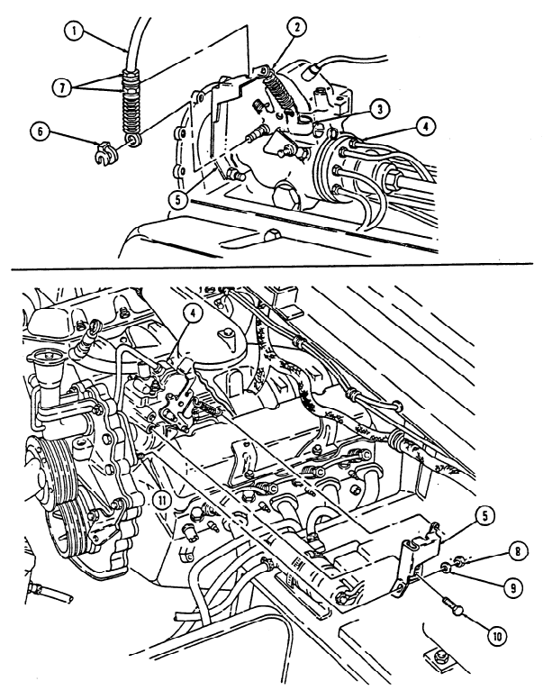

FOLLOW-ON TASK:  Adjust accelerator linkage (para. 3-43).

# Chapter 17 Cooling System (Ds) Maintenance

## 17-1. Introduction

This chapter contains maintenance instructions for replacement of cooling system components at the direct support maintenance level. Some subassemblies and parts must be removed before cooling system components can be accessed. They are referenced to other paragraphs of this manual.

## 17-2. Cooling System Maintenance Task Summary

| 15\-28.   | Engine Installation (Serial Numbers 299999 and Below)   | 15\-98    |
|-----------|---------------------------------------------------------|-----------|
| 15\-28.1. | Engine Installation (Serial Numbers 300000 and Above)   | 15\-124.2 |
| 15\-29.   | Engine Replacement in Shipping/Storage Container        | 15\-126   |

## 17-3. Radiator And Oil Cooler Maintenance

For authorized cleaning, inspection, troubleshooting, preventive maintenance, and repair of the radiator and oil cooler, refer to TM 750-254. When splicing radiator water tubes, the splices must be between the funneled ends of each tube. If the tube ends are damaged and cannot be repaired, the tube must be blocked (refer to TM 750-254) or the radiator should be declared unserviceable.

# 17-4. Differential Cooler Lines Maintenance (Serial Numbers 300000 And Above)

This task covers:
b. Disassembly d. Installation

Tools General mechanic's tool kit:
automotive (Appendix B, Item 1)
Equipment Condition a. Removal c. Assembly Manual References

| + OSTAATIKA ASVAVA VAAVVI   |
|-----------------------------|
| TM 9\-2320\-387\-24P        |

Maintenance Level Direct support
•Cooling system drained (para. 3-61). •Right underbody extension armor
(integrated) removed (para. 11-114.1).

•Fuel tank removed (para. 3-25). - Right front underbody armor (integrated)
removed (para. 25-52.1).

- Right side body mounts loosened (para 33-3).

a. Removal

It may be necessary to jack right side of body up slightly in order to access cooler lines.

1. Remove capscrew (5), washer (4), and coolant hoses (3) and (6) from bracket (7). 2. Loosen hose clamps (2) and (8) and remove coolant hoses (3) and (6) from tubes (1) and (9). 3. Remove capscrew (10), washer (11), and bracket (12) from reinforcement plate (13). 4. Remove capscrew (16) and washer (15) from clamps (14) and (17). 5. Loosen hose clamps (20) and (22) and remove tubes (18) and (19) from differential hose fittings (21)
and (23).

# 17-4.  Differential Cooler Lines Maintenance (Serial Numbers 300000 And Above) (Cont'D)

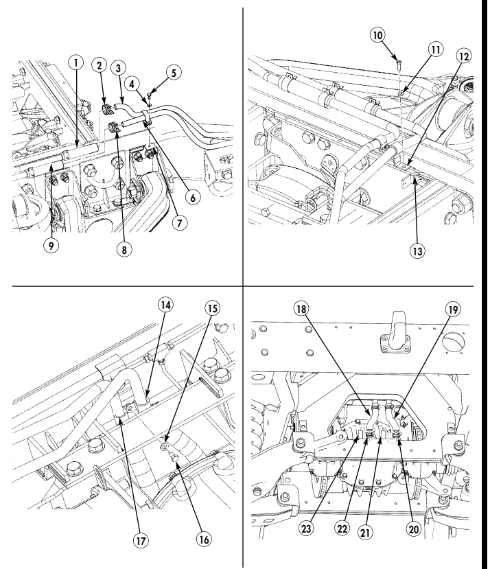

# 17-4. Differential Cooler Lines Maintenance (Serial Numbers 300000 And Above) (Cont'D)

b. Disassembly 1. Remove capscrew (2), washer (1), and clamps (3) and (11) from bracket (10). 2. Loosen hose clamps (6) and (9) and remove tubes (7) and (8) from coolant hoses (4) and (5). 3. Loosen hose clamps (12) and (15) and remove tubes (13) and (14) from coolant hoses (4) and (5). 4. Remove clamps (3), (6), (9), and (11) from coolant hoses (4) and (5).

c. Assembly 1. Install clamps (11), (9), (6), and (3) on coolant hoses (5) and (4). 2. Install tubes (14) and (13) on coolant hoses (5) and (4) with hose clamps (15) and (12). 3. Install tubes (8) and (7) on coolant hoses (5) and (4) with hose clamps (9) and (6). 4. Install clamps (11) and (3) on bracket (10) with washer (1) and capscrew (2).

# 17-4.  Differential Cooler Lines Maintenance (Serial Numbers 300000 And Above) (Cont'D)

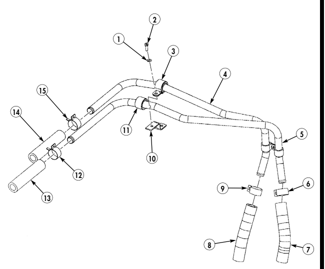

17-4. DIFFERENTIAL COOLER LINES MAINTENANCE 
(SERIAL NUMBERS 300000 AND ABOVE) (Cont'd)
b. Installation

It may be necessary to jack right side of body up slightly in order to access cooler lines.

1. Install tubes (19) and (18) on differential hose fittings (23) and (21) with hose clamps (22) and (20). 2. Install clamp (14) on clamp (17) with washer (15) and capscrew (16). 3. Install bracket (12) on reinforcement plate (13) with washer (11) and capscrew (10). 4. Install coolant hoses (3) and (6) on tubes (9) and (1) with hose clamps (8) and (2). 5. Install coolant hoses (3) and (6) on bracket (7) with washer (4) and capscrew (5).

# 17-4. Differential Cooler Lines Maintenance (Serial Numbers 300000 And Above) (Cont'D)

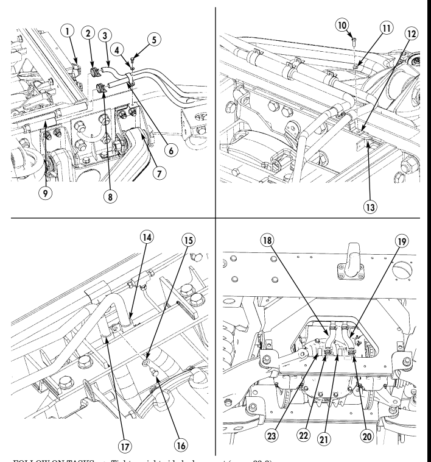

FOLLOW-ON TASKS: - Tighten right side body mount (para. 33-3).

- Install right front underbody armor (integrated) (para. 25-52.1). - Install fuel tank (para. 3-25). - Install right underbody extension armor (integrated) (para. 11-114.1). - Refill cooling system and bleed (para. 3-61).

# 17-5. Differential/Transfer Case Cooler Lines Replacement (Serial Numbers 300000 And Above)

This task covers:

Tools General mechanic's tool kit:
automotive (Appendix B, Item 1)
Manual References TM 9-2320-387-24P
Equipment Condition
- Cooling system drained (para. 3-61). - Right underbody extension armor
(integrated) removed (para. 11-14.1).

a. Removal b. Installation

#### Equipment Condition (Cont'D)

- Fuel tank removed (para. 3-25). - Right front underbody armor (integrated)
removed (para. 25-52.1).

- Right side body mounts loosened (para. 33-3).

Maintenance Level Direct support

It may be necessary to jack right side of body up in order to access cooler lines.

#### A. Removal

1. Remove hose clamps (3) and (5) and hose (4) from tubes (2) and (6). 2. Remove hose clamps (8) and (10) and hose (9) from tubes (7) and elbow (1). 3. Remove hose clamps (11) and (13) and hose (12) from tubes (14) and (20). 4. Remove hose clamps (16) and (18) and hose (17) from tubes (15) and (19). 5. Remove hose clamps (21) and (23) and hose (22) from tubes (24) and (25).

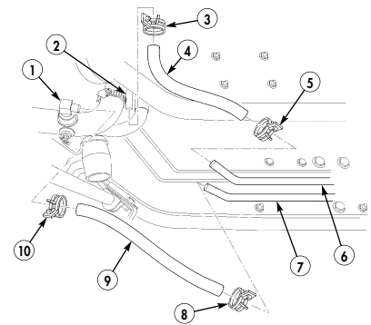

17-5.  DIFFERENTIAL/TRANSFER CASE COOLER LINES REPLACEMENT
(SERIAL NUMBERS 300000 AND ABOVE) (Cont'd)

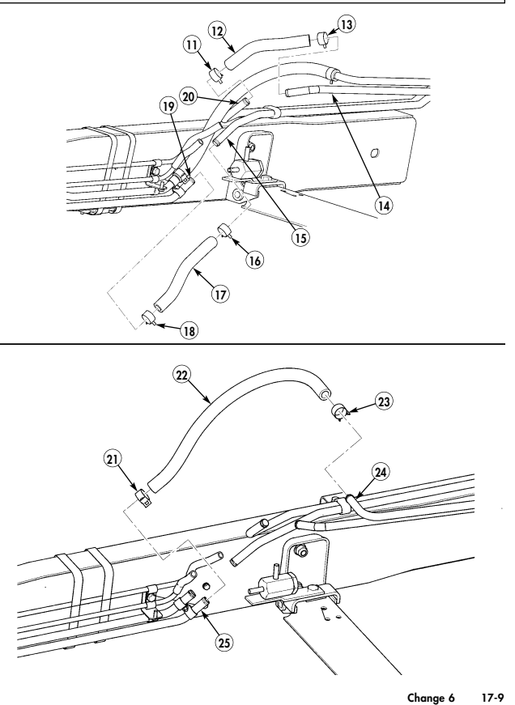

## 17-5. Differential/Transfer Case Cooler Lines Replacement (Serial Numbers 300000 And Above) (Cont'D)

6. Remove nut (10), washer (11), capscrew (2), and washer (1) from bracket (12). 7. Remove capscrew (6) and tubes (8) and (9) from bracket (3). 8. Remove nut (5), washer (4), capscrew (7), and tube (8) from tube (9). 9. Remove capscrew (13), washer (14), and clamp (16) from bracket (15).

10. Remove capscrew (17), washer (18), and clamp (20) from bracket (19). 11. Remove capscrew (24), washer (25), and tubes (23) and (27) from bracket (26). 12. Remove hose clamps (22) and (28) and tubes (23) and (27) from hoses (21) and (29). 13. Remove capscrews (33) and (34), washers (32) and (35), and brackets (31) and (36) from frame (30).

#### B. Installation

1. Install brackets (36) and (31) on frame (30) with washers (35) and (32) and capscrews (36) and (31). 2. Install tubes (27) and (23) on hoses (29) and (21) with hose clamps (28) and (22). 3. Install tubes (27) and (23) on bracket (26) with washer (25) and capscrew (24). 4. Install clamp (20) on bracket (19) with washer (18) and capscrew (17). 5. Install clamp (16) on bracket (15) with washer (14) and capscrew (13). 6. Install tube (9) on tube (8) with capscrew (7), washer (4), and nut (5). 7. Install tubes (9) and (8) on bracket (3) with capscrew (6). 8. Install tubes (9) and (8) on bracket (12) with washer (1), capscrew (2), washer (11), and nut (10).

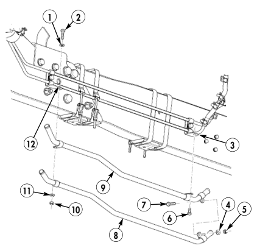

# 17-5.  Differential/Transfer Case Cooler Lines Replacement (Serial Numbers 300000 And Above) (Cont'D)

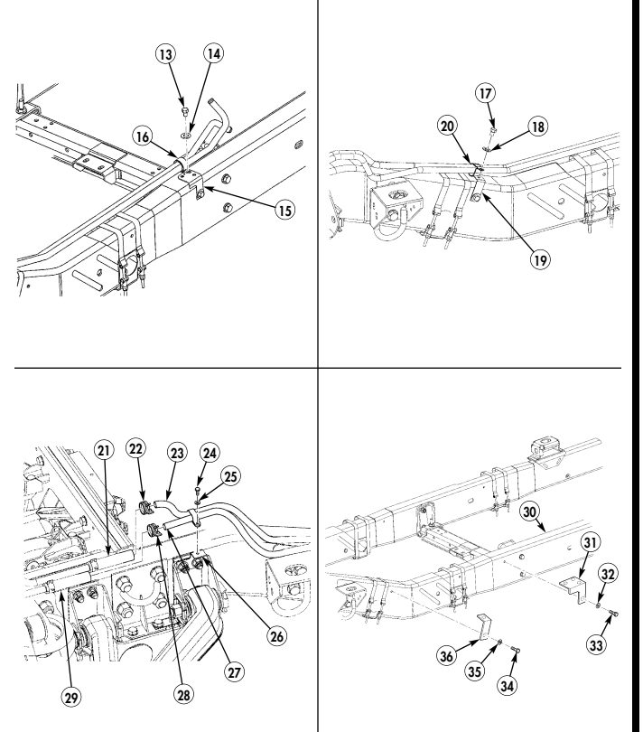

## 17-5. Differential/Transfer Case Cooler Lines Replacement (Serial Numbers 300000 And Above) (Cont'D)

9. Install hose (2) on tubes (5) and (4) with hose clamps (3) and (1).

10. Install hose (12) on tubes (14) and (10) with hose clamps (13) and (11). 11. Install hose (7) on tubes (15) and (9) with hose clamps (8) and (6). 12. Install hose (23) on tube (21) and elbow (25) with hose clamps (24) and (22). 13. Install hose (18) on tubes (20) and (16) with hose clamps (19) and (17).

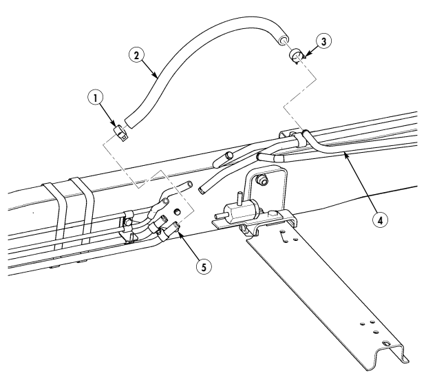

# 17-5. Differential/Transfer Case Cooler Lines Replacement (Serial Numbers 300000 And Above) (Cont'D)

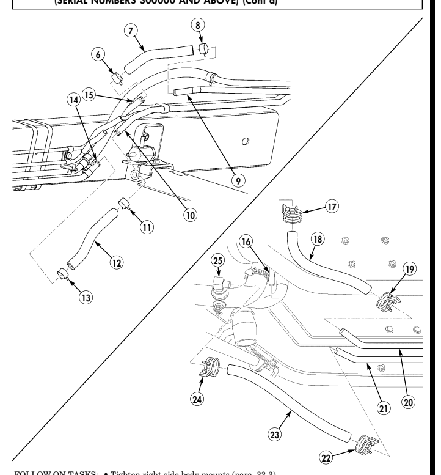

FOLLOW-ON TASKS: - Tighten right side body mounts (para. 33-3).
- Install right front underbody armor (integrated) (para. 25-52.1). - Install fuel tank (para. 3-25). - Install right underbody extension armor (integrated) (para. 11-114.1). - Fill cooling system (para. 3-61).

# Chapter 18 Electrical System (Ds) Maintenance

## 18-1. Introduction

This chapter contains maintenance instructions for replacement and repair of electrical system components at the direct support maintenance level. Some subassemblies and parts must be removed before electrical system components can be accessed. They are referenced to other paragraphs of this manual.

## 18-2. Electrical System Maintenance Task Summary

| Materials/Parts                                                                | Two O\-rings (Appendix G, Item 206)            |
|--------------------------------------------------------------------------------|------------------------------------------------|
| Eight lockwashers (Appendix G, Item 172) Two cotter pins (Appendix G, Item 20) | (M1114 only) Lockwasher (Appendix G, Item 185) |
| Eight locknuts (Appendix G, Item 106)                                          | (M1113, M1151, and M1152 only)                 |
| Five lockwashers (Appendix G, Item 144)                                        | Crossover O\-ring (Appendix G, Item 229)       |
| Four lockwashers (Appendix G, Item 146)                                        | Adhesive (Appendix C, Item 8)                  |
| Lockwasher (Appendix G, Item 148)                                              | Antiseize compound (Appendix C, Item 17)       |
| Lockwasher (Appendix G, Item 181)                                              | RTV sealant (Appendix C, Item 10)              |
| Lockwasher (Appendix G, Item 180)                                              | Engine/transmission support sling              |
| Six locknuts (Appendix G, Item 77)                                             | (Appendix D, Figs. 84 through 97) (Optional)   |
| Four locknuts (Appendix G, Item 128)                                           | Personnel Required                             |
| Four locknuts (Appendix G, Item 82)                                            | One mechanic                                   |
| (M1113, M1151, and M1152 only)                                                 |                                                |

# 18-3. 200-Ampere Dual Voltage Alternator Testing And Repair

This task covers:
a. Alternator Output Testing **d. Cleaning**

b. Disassembly e. Assembly

c. Static Testing

Test Equipment Multimeter (Appendix B, Item 155) Test stand (Appendix B, Item 56)

#### Tools

General mechanic's tool kit:
automotive (Appendix B, Item 1)
Puller (Appendix B, Item 54)

#### Materials/Parts

Silicone compound (Appendix C, Item 75) RTV sealant (Appendix C, Item 74) Locknut (Appendix G, Item 93) Eighteen locknuts (Appendix G, Item 116) Three lockwashers (Appendix G, Item 178)

| One assistant   |
|-----------------|

| Manual References   |
|---------------------|

| Equipment Condition   |
|-----------------------|

| General Safety Instructions   |
|-------------------------------|

| Maintenance Level   |
|---------------------|
| TI                  |

One mechanic One assistant TM 9-2320-387-24P TM 9-4910-663-12 TM 9-4910-485-12 Alternator removed (para. 4-5).

Always support alternator core and shaft assembly during removal and installation.

Direct support

#### A. Alternator Output Testing

1. Mount pivot arm of 500-amp test stand to high-speed side and install mounting flange adapter on pivot arm. Connect pulley driveshaft to high-speed head. Install pulley driveshaft on mounting flange adapter.

2. Mount alternator to starter/alternator mounting bracket on 500-amp test stand. Connect belt from 500-amp test stand pulley to alternator pulley. Adjust belt tension.

3. Connect cable from alternator ground terminal to 500-amp test stand G- terminal. Connect cable from alternator battery terminal to 500-amp test stand G+ terminal. Connect cable from alternator regulator IGN to 500-amp test stand F terminal.

4. Install voltage regulator (para. 4-8). 5. Connect 28VDC output and 14VDC output to test stand. Auxiliary voltage and current meters may be required to measure 14VDC output.

6. Fabricate a jumper wire with a ring terminal at both ends. Connect jumper wire on 500-amp test stand from IGNITION SWITCH terminal to F-B terminal.

# 1 18-3. 200~Ampere Dual Voltage Alternator Testing And Repair (Cont'D) 1

#### Caution

Ensure auxiliary measuring equipment is properly grounded to test stand. Failure to do so may lead to erroneous readings or damage to equipment. 

Prior to operation of test stand, ensure all switches and controls are in initial positions as referenced in Operator and Maintenance Manual, TM 9-4910-663-12 (UMC Model GSAR-5001, or Operator and Maintenance Manual, TM 9-4910-485-12 (Sun Model AGT-99A). 

| 16\-2.   | FUEL SYSTEM MAINTENANCE TASK SUMMARY   |            |       |     |
|----------|----------------------------------------|------------|-------|-----|
| TASK     | PAGE                                   | PROCEDURES | PARA. | NO. |

(e) Connect DC voltmeter (0-5OVDC) from point between regulator 14 VDC output and load in 14 volt circuit (or 14 volt battery). 

(0 Connect ammeter (O-75ADC) in load line from 14 V regulator to 14 V load. 

8. Turn 500-amp test stand master power switch and master load switch to ON, and turn battery switch to 24 VDC. Green lamp on 500-amp test stand must illuminate. 

9. Perform no-load test. Set test stand battery circuit selector to 24 VDC, IGN switch to ON, and start varidrive. Observing the DC voltmeter output voltage and tachometer rpm, increase speed until tachometer reads 5,000 rpm. Record voltmeter reading and refer to table 18-1 for diagnosis. 

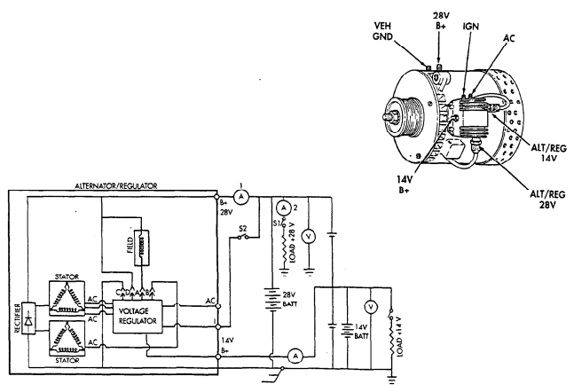

# 18-3. 200-Ampere Dual Voltage Alternator Testing And Repair (Cont'D)

- When tachometer reaches 3,000 rpm, green lamp should go off indicating proper charging from alternator.

- Normal voltage range is 26-30 VDC. High amperage is +10 percent over the rated alternator output of 182 amps at 5,000 rpm.

10. Perform no-load test. Increase alternator speed to 5,000 rpm; record results. Refer to table 18-1 for diagnosis.

11. Perform full-load test. Ensure all load switches are in ON position on 500-amp test stand, and increase alternator speed to 5,000 rpm. Set load to 182 amps/min; record results. Refer to table 18-2 for diagnosis.

| nozzles (7).                                              |                                                                            |                                                                                                      |                                           |
|-----------------------------------------------------------|----------------------------------------------------------------------------|------------------------------------------------------------------------------------------------------|-------------------------------------------|
| 2.                                                        | Remove screw\-assembled washer (4) and clamp (5) from support bracket (8). | NOTE                                                                                                 |                                           |
| Tag fuel injection lines by cylinder number for assembly. | 3.                                                                         | Loosen two fuel injection line nuts (2) and remove fuel injection lines (3) from fuel injection pump |                                           |
| (1).                                                      | 4.                                                                         | Remove clamp (5) and two grommets (6) from fuel injection lines (3).                                 |                                           |
| b. Inspection                                             |                                                                            |                                                                                                      |                                           |
| 1.                                                        | Inspect fuel injection lines (3). Replace if cracked, bent, or damaged.    | 2.                                                                                                   | Inspect grommets (6). Replace if damaged. |

| Crowfoot, 19\-mm (Appendix B, Item 137)                                          |
|----------------------------------------------------------------------------------|
| Do not perform this procedure near fire, flames,   Manual References  or sparks. |
| TM 9\-2320\-387\-10  Maintenance Level  TM 9\-2320\-387\-24P                     |
| Direct support                                                                   |
| WARNING                                                                          |
| Diesel fuel is highly flammable. Do not perform this procedure                   |
| near fire, flames, or sparks. Severe injury or death may result.                 |
| CAUTION                                                                          |
| Cover or plug all hoses, connections, and openings immediately                   |
| after disconnection to prevent contamination. Remove all covers                  |
| or plugs prior to connection.                                                    |
| NOTE                                                                             |
| Have drainage container ready to catch fuel.                                     |

# 18-3. 200-Ampere Dual Voltage Alternator Testing And Repair (Cont'D)

12. Alternator speed and current output tracking values. Refer to table 18-3.

Table 18-3. Alternator Speed and Current Tracking.

| INITIAL SETUP:   |                                                                                               |
|------------------|-----------------------------------------------------------------------------------------------|
|                  | Tools Manual References                                                                       |
|                  | General mechanic's tool kit: TM 9\-2320\-387\-24P                                             |
|                  | automotive (Appendix B, Item 1) Maintenance Level                                             |
|                  | Modified box wrench (Appendix D, Fig. 76) Direct support                                      |
|                  | Materials/Parts                                                                               |
|                  | Seal (Appendix G, Item 295)                                                                   |
|                  | a. Removal                                                                                    |
| 1.               | Remove two retaining rings (2) and pin (1) from rocker lever (3) and fuel injection pump (4). |
| 2.               | Remove setscrew (8), rocker lever (3), and plunger (7) from piston plug nut (6).              |
| 3.               | Using a modified box wrench, remove piston plug nut (6) from fuel injection pump (4).         |
| 4.               | Remove seal (5) from piston plug nut (6). Discard seal (5).                                   |
|                  | b. Installation                                                                               |
| 1.               | Install seal (5) on piston plug nut (6).                                                      |
| 2.               | Using modified box wrench, install piston plug nut (6) on fuel injection pump (4).            |
| 3.               | Install rocker lever (3) on piston plug nut (6) with plunger (7) and setscrew (8).            |
| 4.               | Install rocker lever (3) on fuel injection pump (4) with pin (1) and two retaining rings (2). |

13. Perform regulator bypass test. Prepare alternator as in full-load test.

- Perform this test only when instructed from tables 18-1 and 18-2. - Use jumper wire rated for 15 amps.

14. Disconnect alternator connector from regulator. With alternator spinning, use jumper wire and short pin A to ground momentarily. Record results.

15. Amperage should rise within ± 10 percent of rated value with jumper wire connected, and fall with jumper disconnected. Refer to table 18-4 for diagnosis.

16. Turn test stand master power switch and load switch to OFF. 17. Disconnect jumper wires from terminals on test stand and alternator. 18. Remove belt from test stand pulley and alternator pulley. Remove alternator from test stand.

| CONNECT   | DISCONNECT   | DIAGNOSIS                                        |
|-----------|--------------|--------------------------------------------------|
| AMPS RISE | AMPS FALL    | Alternator OK. See note. Replace regulator       |
|           |              | only if low AMPS (80\-119)/low VOLTS (21\-25)    |
|           |              | are indicated in table 18\-1 and/or table 18\-2. |
| NO CHANGE | NO CHANGE    | Alternator must be repaired. Refer to static     |
|           |              | testing, task c.                                 |

Table 18-4. Regulator Bypass Test.

# 18-3. 200-Ampere Dual Voltage Alternator Testing And Repair (Cont'D)

b. Disassembly

Complete alternator disassembly is not required for static testing.

1. Remove voltage regulator (para. 4-8). 2. Remove locknut (6), washer (5), fan (4), and bearing bushing (3) from core and shaft assembly (11).

Discard locknut (6).

3. Remove three screws (21), lockwashers (22), and plate cover (20) from front housing (18). Discard lockwashers (22).

4. Scribe alignment marks on front housing (18), stator shell (9), and end housing (2). 5. Remove nine locknuts (7) from end housing (2) and studs of stator shell (9). Discard locknuts (7). 6. Using puller, remove end housing (2) from stator shell (9). 7. Remove six nuts (1) from rear rotor (24) and studs of core and shaft assembly (11). 8. Using three 10-32 x 2-in. long machine screws as jacks in threaded holes on end plate of rear rotor (24), gradually tighten screws and remove rear rotor (24) from core and shaft assembly (11). Remove machine screws.

12. Remove shaft retaining ring (12) from core and shaft assembly (11).

#### Warning

Always support alternator core and shaft assembly during removal. Failure to do so may cause injury to personnel or equipment damage.

13. Using press, remove core and shaft assembly (11) from front bearing (14) and front housing (18). 14. Remove front (15) and rear (13) retaining rings from front housing (18). 15. Using press, remove front bearing (14) from front housing (18). 16. Remove six nuts (17) from front rotor (16) and studs of core and shaft assembly (11). 17. Using three 10-32 x 2-in. long machine screws as jacks in threaded holes on end plate of front rotor (16), gradually tighten screws and remove front rotor (16) from core and shaft assembly (11). Remove machine screws.

18. Using press, remove rear bearing (10) from core and shaft assembly (11).

10. Remove nine locknuts (23) from front housing (18) and studs of stator shell (9). Discard locknuts (23). 11. Remove front housing (18) from stator shell (9) by tapping lightly with a soft-faced mallet.

Prior to removal, tag leads for installation.

9. Remove eight nuts (19) and disconnect two field and six phase leads (8) from diodes in front housing (18). 

18-3.  200-AMPERE DUAL VOLTAGE ALTERNATOR TESTING AND REPAIR (Cont'd)

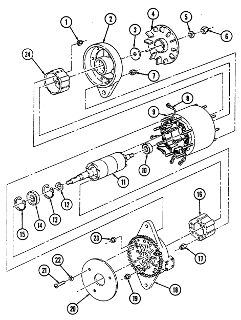

# 1 18-3. 200~Ampere Dual Voltage Alternator Testing And Repair (Cont'D) I

Refer to disassembly for component removal, if necessary. 

1. Perform Stator Test: 
(a) 
(b) 
Remove six nuts and phase leads from diodes in front housing. 

Set multimeter to XI scale and zero multimeter. 

Connect multimeter leads between each successive pair of stator phase leads Pl-P2, P2-P3, and Pl-P3. Multimeter should read less than 1 ohm. If multimeter reads infinity (-1, the stator is open; replace alternator. 

(c) 
(d) 
(e) 
Set multimeter to X10 scale and zero multimeter. 

Connect multimeter leads between each phase lead, Pl, P2, and P3 and the ground terminal on outside of front housing. Multimeter should read infinity (->. If multimeter reads zero, the stator is grounded, replace alternator. 

(0 Repeat step (e) to check phase lead P4, P5, and P6. 

2. Perform Field Coil Test: 
(a) Remove two nuts and field coil leads (F+, F-1 from diodes in front housing. 

(b) Set multimeter to XI scale and zero multimeter. 

(c) Connect multimeter leads to the two field leads and measure the resistance. Multimeter should read less than 3 ohms. If multimeter reads more than 3 ohms, the field coil is open; replace alternator. 

(d) Set multimeter to XlOK scale and zero multimeter. (e) Connect one multimeter lead to a field lead and the other to the ground stud on the front housing. Multimeter should read infinity t-1. If multimeter reads less than 1OOK ohms, the field coil is grounded. Replace alternator. 

3. Perform Positive Diode Test: 
Set multimeter to Xl00 scale and zero multimeter. 

(a) 
Connect one ohmmeter lead to the B+ output stud and the other lead to each of the six diode terminals S. Multimeter should read either less than 600 ohms or infinity (-1 for all six diode terminals. Reverse multimeter leads. Multimeter should read nearly alike for all six, but opposite the first set of readings. If readings are not opposite, the diode rectifier assembly is open. Replace alternator. 

(b) 
4. Perform Negative Diode Test: 
(a) Set multimeter to Xl00 scale and zero multimeter. (b) Connect one multimeter lead to the ground terminal and the other lead to each of the six diode terminals S. Multimeter should read either less than 600 ohms or infinity (-) for all six diode terminals. Reverse multimeter leads. Multimeter should read nearly alike for all six, but opposite the first set of readings. If readings are not opposite, the diode rectifier assembly is open. Replace alternator. 

#### D. Cleaning

Clean all alternator components in accordance with para. 2-14. 

# 18-3. 200-Ampere Dual Voltage Alternator Testing And Repair (Cont'D)

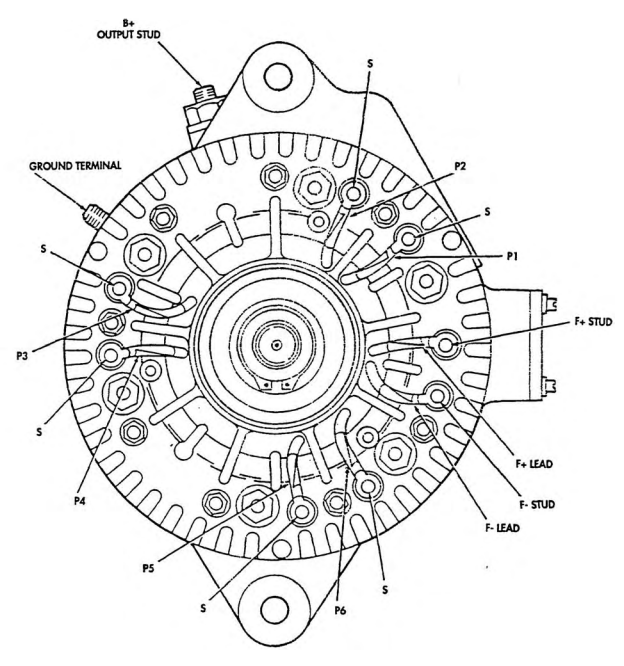

# 18-3. 200-Ampere Dual Voltage Alternator Testing And Repair (Cont'D)

e. Assembly

#### Warning

Always support alternator core and shaft assembly during installation. Failure to do so may cause injury to personnel or equipment damage.

1. Using press, install rear bearing (6) on core and shaft assembly (5). 2. Install front rotor (4) on core and shaft assembly (5). 3. Apply silicone compound to studs of core and shaft assembly (5). 4. Install core and shaft assembly (5) on front rotor (4) with six nuts (7). Tighten nuts (7) to 45 lb-in. (5 N•m).

5. Coat outer race of front bearing (2) with a thin coat of silicone compound. 6. Using press, install front bearing (2) on front housing (1). 7. Install front retaining ring (8) and rear retaining ring (3) on front housing (1).

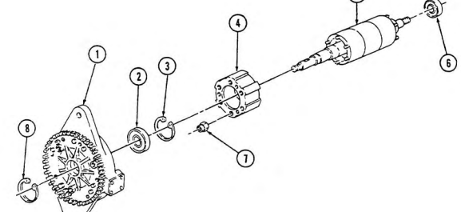

8. Using press, install front bearing (2) with housing assembly (1) on core and shaft assembly (5). 9. Install shaft retaining ring (19) on core and shaft assembly (5).

10. Insert core and shaft assembly (5) and front housing (1) into stator shell (15).

Align scribe marks on front housing and stator shell.

11. Feed leads (17) from stator shell (15) through front housing (1). 12. Apply silicone compound to studs (16) on stator shell (15). 13. Install front housing (1) on stator shell (15) with nine locknuts (23). Tighten locknuts (23) to 18 lb-in. (2 N•m).

14. Install six phase leads and two field leads (17) on diodes on front housing (1) with eight nuts (18). 15. Apply thin coat of RTV sealant on leads (17) and diodes on front housing (1). 16. Install rear rotor (24) on core and shaft assembly (5).

# 18-3. 200-Ampere Dual Voltage Alternator Testing And Repair (Cont'D)

17. Apply silicone compound to studs on core and shaft assembly (5). 18. Install core and shaft assembly (5) on rear rotor (24) with six nuts (25). Tighten nuts (25) to 45 lb-in. (5 N•m).

Align scribe marks on end housing and stator shell.

19. Install end housing (9) on core and shaft assembly (5) and rear bearing (6). Tap lightly with a softfaced mallet.

20. Apply silicone compound to studs on stator shell (15). 21. Install end housing (9) on stator shell (15) with nine locknuts (14). Tighten locknuts (14) to 18 lb-in.

(2 N•m).

22. Install cover plate (20) on front housing (1) with three lockwashers (22) and screws (21). 23. Install bearing bushing (10) on core and shaft assembly (5). 24. Install fan (11) on core and shaft assembly (5) with washer (12) and locknut (13). Tighten locknut (13) to 50 lb-ft (68 N•m).

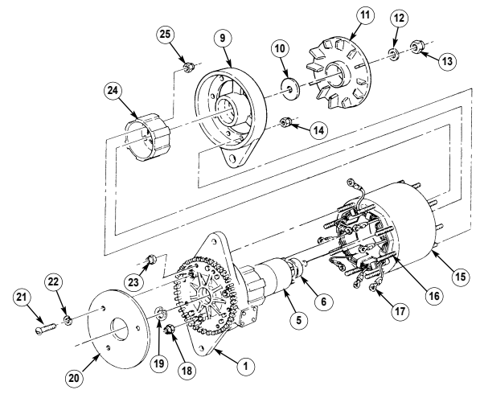

FOLLOW ON TASK: Install alternator (para. 4-5)

# 18-3.1. 400-Ampere Dual Voltage Alternator Testing And Repair

This task covers:
a. Alternator Output Testing **d. Cleaning** b. Disassembly e. Assembly c. Static Testing

| Applicable Models   |
|---------------------|

M1113 Tools General mechanic's tool kit:
automotive (Appendix B, Item 1)
Automotive and repair: field maintenance, basic (Appendix B, Item 6)
Puller (Appendix B, Item 54)

#### Test Equipment

Multimeter (Appendix B, Item 155) Test stand (Appendix B, Item 56)

#### Materials/Parts

Silicone compound (Appendix C, Item 75) RTV sealant (Appendix C, Item 74) Locknut (Appendix G, Item 115.1) Locknut (Appendix G, Item 115) Eighteen locknuts (Appendix G, Item 116) Twelve lockwashers (Appendix G, Item 178) Two lockwashers (Appendix G, Item 177) Two seals (Appendix G, Item 293)
Personnel Required One mechanic One assistant Manual References TM 9-2320-387-24P TM 9-4910-663-12 TM 9-4910-485-12 Equipment Condition Alternator removed (para. 4-8.3).

#### General Safety Instructions

Always support alternator core and shaft assembly during removal and installation.

Maintenance Level Direct support

#### A. Alternator Output Testing

1. Mount 500-amp test stand pivot arm to high-speed side and install mounting flange adapter on pivot arm. Connect pulley driveshaft to high-speed head. Install pulley driveshaft on mounting flange adapter.

5. Install support plate (4) on adapter mount (1) with two washers (5), screws (6), washers (5), and nuts (7). Do not tighten nuts (7).

6. Install serpentine belt (11) on driver pulley (12) on alternator/generator/starter test stand. 7. Position alternator (25) on adapter mount (1) and install serpentine belt (11) on pulley (15). 8. Position two washers (22) between rear lower mount (24) on alternator (25) and adapter mount (1),
and install washer (21), screw (23), washer (21), and nut (20). Do not tighten nut (20).

9. Align front lower mount holes (16) on alternator (25) and adapter mount (1) and install washer (18), screw (19), washer (18), and nut (17). Do not tighten nut (17).

10. Align top mount hole (26) on alternator (25) and adapter mount (1) and install two washers (13)
and screw (14).

11. Tighten nuts (20) and (17) to 40 lb-ft (54 N•m).

18-10.2 Change 2 2. Position adapter mount (1) to bracket (9) on test stand. 3. Install adapter mount (1) on bracket (9) with washer (3), screw (2), washer (3), and nut (8). Do not tighten screw (2).

4. Loosen locking handle (10) on bracket (9), raise bracket (9) to highest point, and tighten locking handle (10).

# 18-3.1. 400-Ampere Dual Voltage Alternator Testing And Repair (Cont'D)

12. Position chain mounting assembly over alternator (25) and secure to adapter mount (1). 13. Loosen locking handle (10) on bracket (9), lower bracket (9) to obtain tension on serpentine belt (11), and tighten locking handle (10).

14. Adjust support plate (4) on adapter mount (1) until support plate (4) contacts floor surface and tighten screws (2) and (6) and nuts (7) and (8).

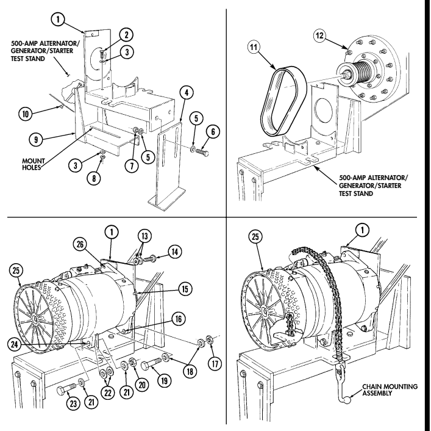

# 18-3.1. 400-Ampere Dual Voltage Alternator Testing And Repair (Cont'D)

- Ensure a jumper cable is attached to both alternator ground points when attaching cables from test stand G- terminals.

- Ensure a jumper cable is attached to both alternator 28V B+
terminals when attaching cables from test stand G+ terminals.

15. Connect cables from both alternator ground terminals to test stand G- terminal. 16. Connect cables from both alternator positive terminals to test stand G+ terminal. 17. Connect cable from alternator regulator IGN to test stand F terminal. 18. Connect 28 VDC output and 14 VDC output to test stand.

Auxiliary voltage and current meters may be required to measure 14 VDC output.

19. Fabricate a jumper wire with a ring terminal at both ends. Connect test stand wire from IGNITION
SWITCH terminal to F-B terminal.

#### Caution

Ensure auxiliary measuring equipment is properly grounded to test stand. Failure to do so may lead to erroneous readings or damage to equipment.

Prior to operation of test stand, ensure all switches and controls are in "initial" positions as referenced in Operator and Maintenance Manual, TM 9-4910-663-12 (UMC Model GSAR-500), or Operator and Maintenance Manual, TM 9-4910-485-12 (Sun Model AGT-9/9A).

20. Set test stand as follows: Model GSAR-500 Model AGT-9/9A

(a) DC ammeter load and starter selector X10 500 amp (b) DC ammeter field and battery charge selector X1 5 amp (c) Field circuit switch Regulator Regulator (d) DC voltmeter circuit selector RECT/GEN RECT/GEN

(e) Connect DC voltmeter (0-50 VDC) from point between regulator 14 VDC output and load in 14 volt circuit (or 14 volt battery).

(f) Connect ammeter (0-75 ADC) in load line from 14 V regulator to 14 V load.

21. Turn test stand master power switch and master load switch to ON, and turn battery switch to 24 VDC. Green lamp on test stand must illuminate.

22. Perform no-load test. Set test stand battery circuit selector to 24 VDC, IGN switch to ON, and start varidrive. Observing the DC voltmeter output voltage and tachometer rpm, increase speed until tachometer reads 5000 rpm. Record voltmeter reading and refer to table 18-5, No-Load Test, for diagnosis.

- When tachometer reaches 3000 rpm, green lamp should go off indicating proper charging from alternator.

- Normal voltage range is 26-30 VDC. High amperage is +10 percent over the rated alternator output of 364 amps at 5000 rpm.

23. Perform no-load test. Increase alternator speed to 5000 rpm; record results. Refer to table 18-5, No-Load Test, for diagnosis.

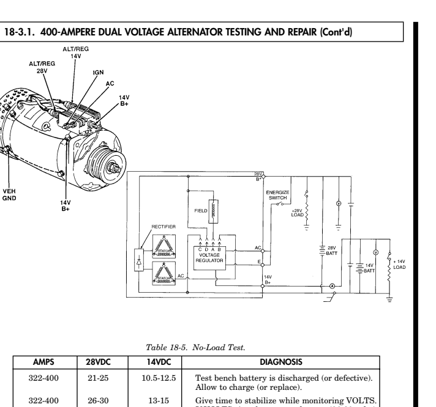

|          |        | Table 18\-5.  No\-Load Test.   |                                                    |
|----------|--------|--------------------------------|----------------------------------------------------|
| AMPS     | 28VDC  | 14VDC                          | DIAGNOSIS                                          |
| 322\-400 | 21\-25 | 10.5\-12.5                     | Test bench battery is discharged (or defective).   |
|          |        |                                | Allow to charge (or replace).                      |
| 322\-400 | 26\-30 | 13\-15                         | Give time to stabilize while monitoring VOLTS.     |
|          |        |                                | If VOLTS rise above normal range (26\-30 volts),   |
|          |        |                                | regulator and/or tube assembly must be             |
|          |        |                                | replaced. If AMPS fall, charging system is OK.     |
| 322\-400 | 31\-35 | 15.5\-17.5                     | STOP TEST. Regulator and/or tube assembly          |
|          |        |                                | must be replaced. Refer to static testing, task c. |
| 160\-238 | 21\-25 | 10.5\-12.5                     | Alternator and/or regulator must be repaired or    |
|          |        |                                | replaced. Refer to table 18\-8.                    |
| 160\-238 | 26\-30 | 13\-15                         | Regulator OK. Refer to table 18\-6.                |
| 160\-238 | 31\-35 | 15.5\-17.5                     | STOP TEST. Bench malfunction or wiring             |
|          |        |                                | error.                                             |

# 18-3.1. 400-Ampere Dual Voltage Alternator Testing And Repair (Cont'D)

24. Perform full-load test. Ensure all load switches are in ON position on test stand, and increase alternator speed to 5000 rpm. Set load to 364 amps/min; record results. Refer to table 18-6, Full- Load Test, for diagnosis.

25. Alternator speed and current output tracking values. Refer to table 18-7.

| NOTE                    | It may be necessary to jack right side of body up slightly in order                         |                                                                                  |                                                                                                      |
|-------------------------|---------------------------------------------------------------------------------------------|----------------------------------------------------------------------------------|------------------------------------------------------------------------------------------------------|
| to access cooler lines. | 1.                                                                                          | Remove capscrew (5), washer (4), and coolant hoses (3) and (6) from bracket (7). |                                                                                                      |
| 2.                      | Loosen hose clamps (2) and (8) and remove coolant hoses (3) and (6) from tubes (1) and (9). | 3.                                                                               | Remove capscrew (10), washer (11), and bracket (12) from reinforcement plate (13).                   |
| 4.                      | Remove capscrew (16) and washer (15) from clamps (14) and (17).                             | 5.                                                                               | Loosen hose clamps (20) and (22) and remove tubes (18) and (19) from differential hose fittings (21) |
| and (23).               |                                                                                             |                                                                                  |                                                                                                      |

| INITIAL SETUP:                                  |                      |
|-------------------------------------------------|----------------------|
| Tools                                           | Manual References    |
| General mechanic's tool kit:                    | TM 9\-2320\-387\-24P |
| automotive (Appendix B, Item 1)                 | Maintenance Level    |
| Equipment Condition                             | Direct support       |
| •Cooling system drained (para. 3\-61).          |                      |
| •Right underbody extension armor                |                      |
| (integrated) removed (para. 11\-114.1).         |                      |
| •Fuel tank removed (para. 3\-25).               |                      |
| - Right front underbody armor (integrated)      |                      |
| removed (para. 25\-52.1).                       |                      |
| - Right side body mounts loosened (para 33\-3). |                      |

Table 18-7. Alternator Speed and Current Tracking.

**Minimum acceptable current with no load on 28 VDC system.

# 18-3.1. 400-Ampere Dual Voltage Alternator Testing And Repair (Cont'D)

26. Perform regulator bypass test. Prepare alternator as in full-load test.

- Perform this test only when instructed from tables 18-5 and 18-6. - Use jumper wire rated for 15 amps.

27. Disconnect alternator connector from regulator. With alternator spinning, use jumper wire and short pin A to ground momentarily. Record results.

28. Amperage should rise within ±10 percent of rated value with jumper wire connected, and fall with jumper disconnected. Refer to table 18-8, Regulator Bypass Test, for diagnosis.

Table 18-8. Regulator Bypass Test.

| TASK     | PROCEDURES                                             | PAGE     |
|----------|--------------------------------------------------------|----------|
| PARA.    |                                                        | NO.      |
| 18\-3.   | 200\-Ampere Dual Voltage Alternator Testing and Repair | 18\-2    |
| 18\-3.1. | 400\-Ampere Dual Voltage Alternator Testing and Repair | 18\-10.2 |
| 18\-4.   | Starter Repair                                         | 18\-12   |

29. Turn test stand master power switch and load switch to OFF. 30. Disconnect jumper wires from terminals on test stand and alternator. 31. Remove belt from test stand pulley and alternator pulley. Remove alternator from test stand.

# 18-3.1. 400-Ampere Dual Voltage Alternator Testing And Repair (Cont'D)

b. Disassembly

Complete disassembly is not required for static testing.

1. Disconnect two cannon plugs (2) from voltage regulator (39). 2. Remove three screws (37), two lockwashers (38), three washers (40), and voltage regulator (39) from front housing (27). Discard lockwashers (38).

3. Remove locknut (31), washer (32), pulley (30), and pulley bushing (33) from core and shaft assembly (24). Discard locknut (31).

4. Remove four screws (8), washers (9), and fan guard (10) from stator (20). 5. Remove locknut (11), washer (12), fan (13), and spring ring (14) from core and shaft assembly (24).

Discard locknut (11).

6. Scribe alignment marks on front housing (27), stator (20), and end housing (1).

lockwashers (6).

7. Remove six screws (7), lockwashers (6), and plate cover (15) from end housing (1). Discard 17. Using a soft-faced mallet, tap from side-to-side to remove front housing (27) from stator (20). 18. Remove shaft retaining ring (29) from core and shaft assembly (24). 19. Using an arbor press, remove core and shaft assembly (24) from front housing (27). 20. Remove front (34) and rear (36) retaining rings from front housing (27). 21. Using an arbor press, remove bearing (35) from front housing (27). 22. Remove six nuts (17) from studs on core and shaft assembly (24). 23. Using a gear puller, remove rotor (23) from core and shaft assembly (24).

12. Using a gear puller, remove rotor (18) from core and shaft assembly (24). 13. Using a gear puller, remove rear bearing (26), two seals (16), and spring ring (25) from core and shaft assembly (24). Discard two seals (16).

14. Remove six screws (7), lockwashers (6), and plate cover (28) from front housing (27). Discard lockwashers (6).

Prior to removal, tag leads for installation.

15. Remove five screws (5) and washers (4), and disconnect two field leads (19) and three phase leads (22) from diodes in front housing (27).

16. Remove nine locknuts (3) from front housing (27) and studs (21) from stator (20). Discard locknuts (3).

Prior to removal, tag leads for installation.

8. Remove eight screws (5) and washers (4), and disconnect two field leads (19) and six phase leads (22) from diodes in end housing (1).

9. Remove nine locknuts (3) from end housing (1) and studs (21) of stator (20). Discard locknuts (3).

10. Using a soft-faced mallet, tap from side-to-side to remove end housing (1) from stator (20). 11. Remove six nuts (17) from studs of core and shaft assembly (24). 

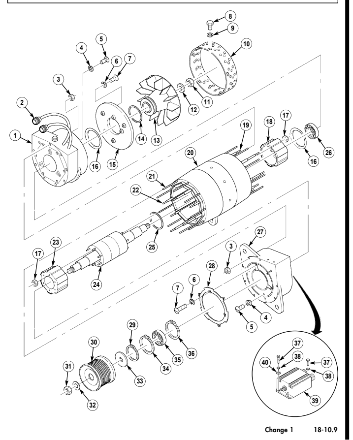

18-3.1. 400-AMPERE DUAL VOLTAGE ALTERNATOR TESTING AND REPAIR (Cont'd)

# 18-3.1. 400-Ampere Dual Voltage Alternator Testing And Repair (Cont'D)

c. Static Testing

Refer to disassembly for component removal, if necessary.

1. Perform Stator Test:

- Steps (a) through (f) apply to test procedure for end housing. - Steps (a) through (e) apply to test procedure for front housing.

(a) Remove six nuts and phase leads from diodes in end housing. (b) Set multimeter to X1 scale and zero multimeter. (c) Connect multimeter leads between each phase leads P1-P2, P2-P3, and P1-P3. Multimeter should read less than 1 ohm. If multimeter reads infinity ( ∞), the stator is open; replace alternator.

(d) Set multimeter to X1 scale and zero multimeter. (e) Connect multimeter leads between each phase lead, P1, P2, and P3 and ground terminal on outside of front housing. Multimeter should read infinity ( ∞). If multimeter reads zero, the stator is grounded; replace alternator.,
(f) Repeat step (e) to check phase lead P4, P5, and P6.

2. Perform Field Coil Test for End Housing Only:
(a) Remove two nuts and field coil leads (F+, F-) from diodes in end housing. (b) Set multimeter to XI scale and zero multimeter. (c) Connect multimeter leads to the two field leads and measure the resistance. Multimeter should read less than 3 ohms. If multimeter reads more than 3 ohms, field coil is open; replace alternator.

(d) Set multimeter to X10K scale and zero multimeter. (e) Connect one multimeter lead to a field lead and other to ground stud on front housing.

Multimeter should read infinity (∞). If multimeter reads less than 100K ohms, field coil is grounded. Replace alternator.

3. Perform Positive Diode Test:
(a) Set multimeter to X100 scale and zero multimeter. (b) Connect one ohmmeter lead to B+ output stud and other lead to each of six diode terminals S.

Multimeter should read either less than 600 ohms or infinity ( ∞) for all six diode terminals. Reverse multimeter leads. Multimeter should read nearly alike for all six, but opposite first set of readings. If readings are not opposite, diode rectifier assembly is open. Replace alternator.

4. Perform Negative Diode Test:
(a) Set multimeter to X100 scale and zero multimeter. (b) Connect one multimeter lead to ground terminal and other lead to each of six diode terminals S. Multimeter should read either less than 600 ohms or infinity ( ∞) for all six diode terminals.

Reverse multimeter leads. Multimeter should read nearly alike for all six, but opposite first set of readings. If readings are not opposite, diode rectifier assembly is open. Replace alternator.

# 18-3.1. 400-Ampere Dual Voltage Alternator Testing And Repair (Cont'D)

d. Cleaning Clean all alternator components in accordance with para. 2-14.

e. Assembly

#### Warning

Always support alternator core and shaft assembly during installation. Failure to do so may cause injury to personnel or equipment damage 1. Using press, install spring ring (8) and rear bearing (9) on core and shaft assembly (10). 2. Position front rotor (7) on core and shaft assembly (10). 3. Apply silicone compound to studs of core and shaft assembly (10). 4. Install core and shaft assembly (10) on front rotor (7) with six nuts (6). Tighten nuts (6) to 45 lb-in. (5 N•m).

5. Coat outer race of front bearing (3) with a thin coat of silicone compound. 6. Install retaining ring (4) on front housing (5). 7. Using a press, install front bearing (3) on front housing (5) and secure with retaining ring (2).

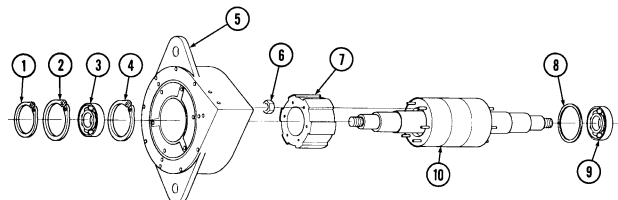 8. Using press, install front bearing (3) with housing assembly (5) on core and shaft assembly (10). 9. Install shaft retaining ring (1) on core and shaft assembly (10).

# 18-3.1. 400-Ampere Dual Voltage Alternator Testing And Repair (Cont'D)

10. Insert core and shaft assembly (9) and front housing (10) in stator (24).

Align scribe marks on front housing and stator.

11. Feed leads (23) and (21) from stator (24) through front housing (10). 12. Apply silicone compound to studs (22) on stator (24).

18. Apply silicone compound to studs on core and shaft assembly (9). 19. Using an arbor press, install ring bearing (17) and two seals (18) on core and shaft assembly (9). 20. Insert end housing (31) on stator (24).

Align scribe marks on end housing and stator.

21. Feed leads (23) and (21) from stator (24) through end housing (31). 22. Apply silicone compound to studs (22) on stator (24). 23. Install six phase leads (23) and two field leads (21) on diodes of end housing (31) with eight washers (16) and screws (15).

24. Apply thin coat of RTV sealant on leads (23) and (21) and diodes of end housing (31). 25. Using a soft-faced mallet, tap from side to side to install end housing (31) on stator (24). 26. Secure end housing (31) to studs (22) on stator (24) with nine locknuts (29). Tighten locknuts (29) to 18 lb-in. (2 N•m)
27. Install plate cover (32) on end housing (31) with six lockwashers (28) and screws (27). 28. Install plate cover (14) on front housing (10) with six lockwashers (12) and screws (13). 29. Install spring ring (33) on fan (34). 30. Install fan (34) on core and shaft assembly (9) with washer (35) and locknut (36). Tighten locknut (36) to 50 lb-ft (68 N•m).

31. Install fan guard (37) on stator (24) with four washers (26) and screws (25). 32. Install pulley bushing (4), pulley (3), washer (2), and locknut (1) on core and shaft assembly (9).

Tighten locknut (1) to 120 lb-ft (163 N•m).

33. Install voltage regulator (8) on stator (24) with three washers (5), two lockwashers (6), and three screws (7).

34. Connect two cannon plugs (30) to voltage regulator (8).

13. Install three phase leads (23) and two field leads (21) on diodes of front housing (10) with eight washers (16) and screws (15).

14. Apply a thin coat of RTV sealant on leads (23) and (21) and diodes of front housing (10). 15. Using a soft-faced mallet, tap from side to side to install front housing (10) on stator (24). 16. Secure front housing (10) to studs (22) on stator (24) with nine nuts (11). Tighten nuts (11) to 18 lb-in.

(2 N•m).

17. Install rear rotor (20) on core and shaft assembly (9) with six nuts (19). Tighten nuts (19) to 45 lb-in.

(5 N•m).

18-3.1.  400-AMPERE DUAL VOLTAGE ALTERNATOR TESTING AND REPAIR (Cont'd)

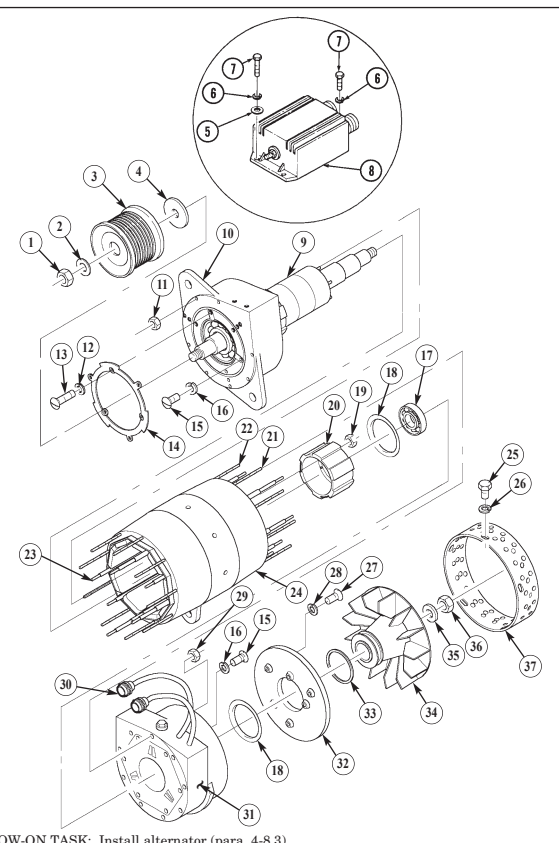

FOLLOW-ON TASK:  Install alternator (para. 4-8.3).

## 18-4. Starter Repair

This task covers:
c. Inspection INITIAL SETUP:

#### Test Equipment

Switch (Appendix B, Item 55) Multimeter (Appendix B, Item 155) Carbon pile (Appendix B, Item 52) Armature test set (Appendix B, Item 53)

#### Tools

General mechanic's tool kit:
automotive (Appendix B, Item 1)

#### Materials/Parts

Engine parts kit (Appendix G, Item 241) Bearing parts kit (Appendix G, Item 238) Gasket kit (Appendix G, Item 68) Gasket kit (Appendix G, Item 65) Solenoid parts kit (Appendix G, Item 246) Gasket (Appendix G, Item 66) Parts kit (Appendix G, Item 237.1) Engine parts kit (Appendix G, Item 240)
a. Disassembly d. Assembly b. Cleaning e. Bench Testing and Adjustment

#### Materials/Parts (Cont'D)

Four nut and lockwasher assemblies
(Appendix G, Item 197)
O-ring (Appendix G, Item 233) Engine parts kit (Appendix G, Item 239) Adhesive sealant (Appendix C, Item 13) Aircraft grease (Appendix C, Item 32) Lithium grease (Appendix C, Item 36) Lubricating oil (Appendix C, Item 49) Core shaft nut tool (Appendix D, Fig. 63)

#### Manual References

TM 9-2320-387-24P
Equipment Condition Starter removed (para. 4-11).

Maintenance Level Direct support

#### A. Disassembly

1. Remove plug (4) and gasket (5) from pinion housing (3). Discard gasket (5). 2. Using core shaft nut tool, remove locknut (2) from end of core shaft (1) located inside pinion housing (3). Discard locknut (2).

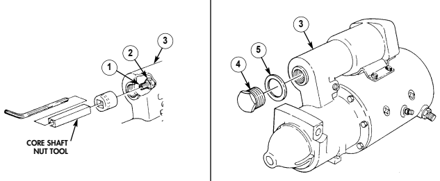

## 18-4. Starter Repair (Cont'D)

3. Remove four nuts (6), lockwashers (7), and two solenoid lead connectors (8) from field and armature terminals on starter motor frame (9) and solenoid (11). Discard lockwashers (7).

4. Remove four capscrews (10) and solenoid (11) from starter motor frame (9). 5. Scribe a locating mark (12) on commutator end frame (16) and starter motor frame (9). 6. Remove four capscrews (15), commutator end frame (16), and gasket (17) from starter motor frame (9). Discard gasket (17).

Measure and note combined thickness of thrust washer(s) and spacer for installation.

7. Remove spacer (14) and thrust washer (13) from armature shaft (19). Discard spacer (14) and thrust washer (13).

8. Remove felt oil retainer (18) from commutator end frame (16). Discard felt oil retainer (18).

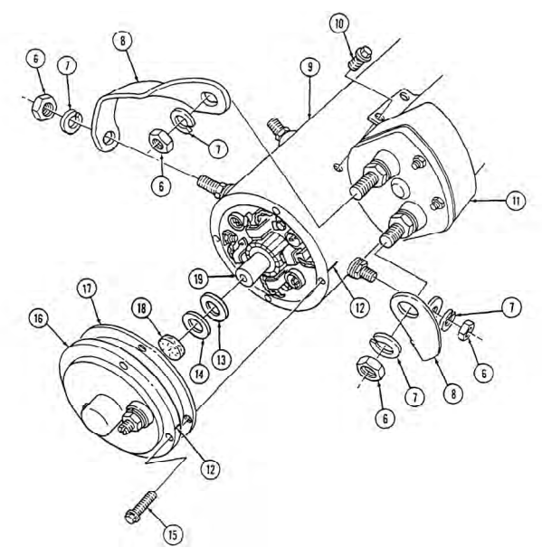

## 18-4. Starter Repair (Cont'D)

9. Scribe a locating mark (4) on pinion housing (1) and starter motor frame (3).

10. Remove seven capscrews (6), starter motor frame (3), gasket (5), and O-ring (2) from pinion housing (1). Discard gasket (5) and O-ring (2).

11. Remove two plugs (9) and pin (10) from shift lever (8) and pinion housing (1).

Armature and shift lever must be positioned as shown for removal from pinion housing.

12. Clamp pinion housing (1) in vise and remove three screws (17) from pinion housing (1). Slide armature (7) and shift lever (8) out from pinion housing (1).

13. Remove snapring (11) and pinion stop (12) from armature shaft (15), and slide clutch (13) off armature shaft (15). Discard snapring (11) and pinion stop (12).

14. Remove washer (14), pinion housing end plate (18), and washer (16) from armature shaft (15). 

Discard washers (14) and (16).

15. Remove gasket (19) from pinion housing end plate (18). Discard gasket (19).

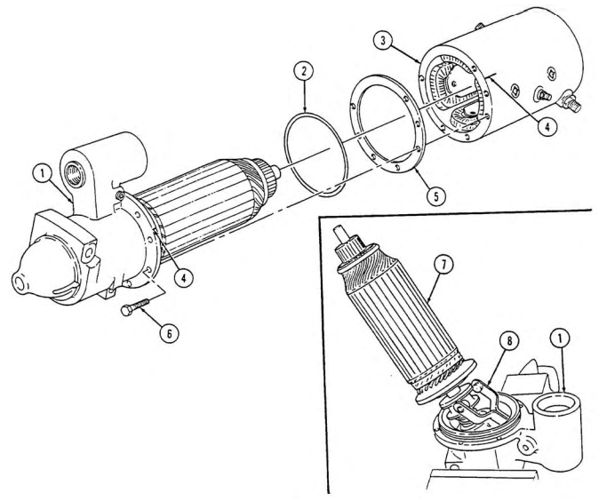

18-4.  STARTER REPAIR (Cont'd)

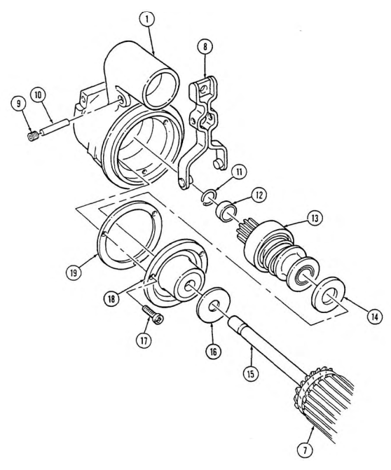

## 18-4. Starter Repair (Cont'D)

16. Remove two nuts (12), lockwashers (11), screws (8), washers (7), and two brush leads (10) from starter motor frame (4). Remove two brushes (9) from brush holder (6). Discard two lockwashers (11).

17. Remove two screws (1), two brush leads (2), and brushes (13) from field coil (3) and brush holder
(6).

18. Remove four springs (5) from brush holder (6). 19. Remove four nut and lockwasher assemblies (14), washers (15), and cover (16) from studs of solenoid housing (18). Pull cover (16) away from solenoid housing (18) far enough to allow access to series winding lead (19) and screw (20). Discard nut and lockwasher assemblies (14).

20. Remove screw (20), washer (21), and series winding lead (19) from cover (16), and remove cover (16)
and gasket (17) from solenoid housing (18). Discard gasket (17).

21. Remove snapring (31), spring retainer (30), spring (29), spring retainer (28), rubber boot (32), and washer (33) from core shaft (27), and remove core shaft (27) from solenoid housing (18). Discard snapring (31).

22. Hold core shaft (27) and remove locknut (26), washer (25), contact (24), spring (23), and washer (22)

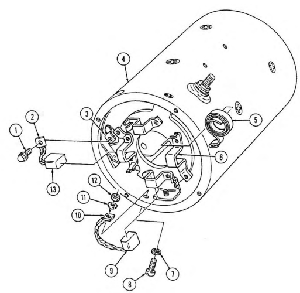

from core shaft (27). Discard locknut (26).

## 18-4. Starter Repair (Cont'D)

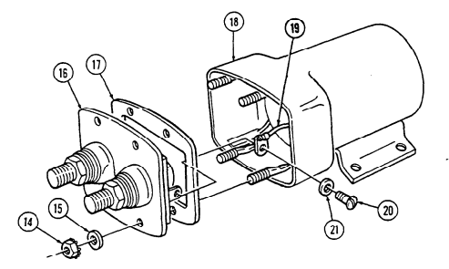

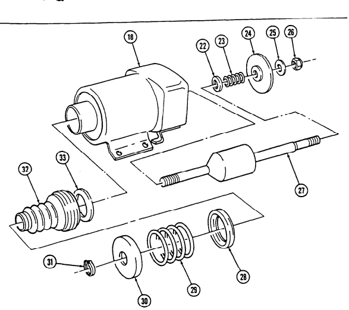

#### 18-4. Starter Repair (Cont'D)

pzzq Clean all starter motor components in accordance with para. 2-14. 

For general inspection instructions, refer to para. 2-15. 

Inspect clutch (7) for damage, roughness, or damaged pinion. Replace clutch (7) if defective. 

Check brushes (4) for roughness, galling, and wear. Replace brushes (4) if worn or brush length is less than 0.375 in. (9.52 mm). 

Check the brush springs (5) for loss of spring tension or damage. Replace brush springs (5) if weak or damaged. 

Inspect commutator end head bearing (1) for roughness, galling, or wear. Replace commutator end head bearing (1) if worn. 

1. 

2. 

3. 

4. 

5. 

6. 

Inspect pinion housing bearing (6) for roughness, galling, or wear. Replace pinion housing bearing (6) if worn. 

Check the commutator (10) for damage or evidence of excessive wear or arcing. Inspect the armature shaft (11) for rough bearing surfaces and rough or damaged splines (8). Turn commutator (10) and undercut insulation or replace starter motor if damaged. 

7. 

8. 9. 

The armature (91, field coils (3), and brush holder (2) should be checked for shorts, grounds, and open circuits with armature test set. Replace starter motor if armature (91, field coils (31, or brush holder (2) is shorted. 

Inspect core spring (20) and rubber boot (23) for damage. Replace if damaged. 

Inspect contact (15) for bums or damage. Replace if burned or damaged. 

#### 1 D. Assembly 1 Note

For general assembly instructions, refer to para. 2-17. 

1. Position core shaft (18) in solenoid housing (121, and install washer (131, spring (141, contact (151, washer (161, and locknut (171 on core shaft (18). Hold core shaft (18) and tighten locknut (17). 

2. Install washer (241, rubber boot (231, spring retainer (191, spring (20), and spring retainer (21) on core shaft (18) with retaining ring (22). 

## 18-4.  Starter Repair (Cont'D)

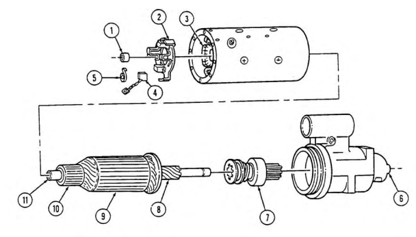

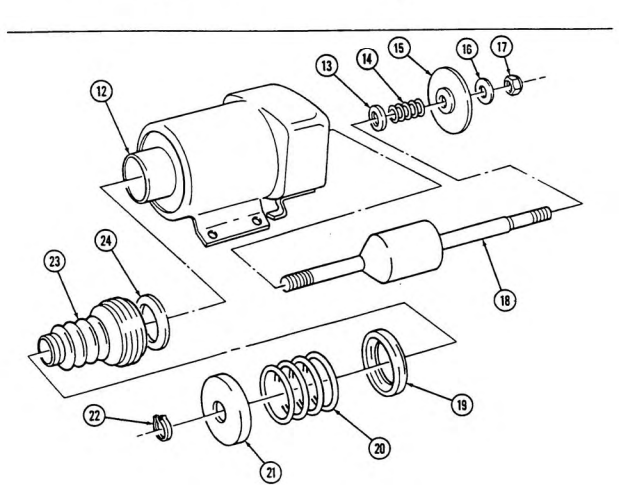

## 18-4. Starter Repair (Cont'D)

3.

Position gasket (1) on cover (9) and connect series winding lead (5) to series winding connection (6)
with washer (4) and screw (3).

■
4.

Install cover (9) on solenoid housing (2) with four washers (7) and nut and lockwasher assemblies (8).

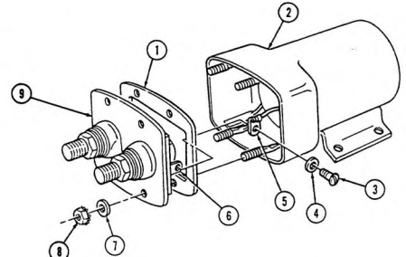

5.

Connect two brush leads (11) to field coil (12) and brush holder (15) with two screws (10).

6.

Connect two brush leads (19) to starter motor frame (13) with two washers (16), screws (17),
lockwashers (20), and nuts (21). Cover heads of screws (17) with adhesive sealant.

7.

Install two brushes (18) and two brushes (22) on brush holder (15) with four springs (14).

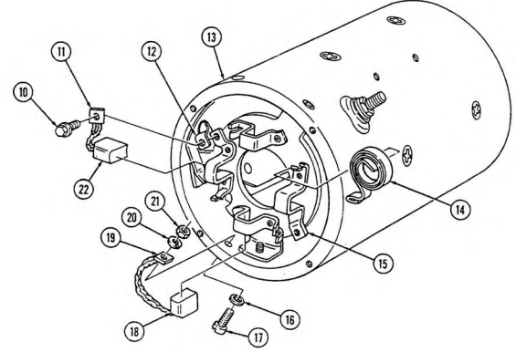

Change 2

## 18-4. Starter Repair (Cont'D)

8. Apply aircraft grease to armature shaft (32), shift lever studs (26), and the inside diameter of pinion housing end plate seal (34).

9. Install washer (33), pinion housing end plate (36), gasket (37), and washer (30) on armature shaft (32).

10. Install clutch (29) on armature shaft (32) with pinion stop (28) and snapring (27).

Armature and shift lever must be positioned as shown for

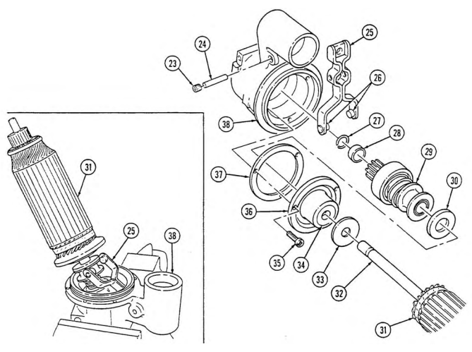 installation into pinion housing.

11. Install pinion shift lever (25) and armature (31) on pinion housing (38). Install pinion housing end plate (36) on pinion housing (38) with three screws (35). Tighten screws (35) to 40 lb-in. (5 N•m).

12. Install pin (24) on pinion shift lever (25) and pinion housing (38) and install two plugs (23) on pinion housing (38).

## 18-4. Starter Repair (Cont'D)

13. Install gasket (6) and O-ring seal (3) on pinion housing (1) and align locating scribe marks (5) on pinion housing (1) and starter motor frame (4).

14. Coat threads of seven capscrews (7) with adhesive sealant. 15. Position armature (2) in starter motor frame (4) with brushes (9) on commutator of armature (2).

Secure pinion housing (1) to starter motor frame (4) with seven capscrews (7). Tighten capscrews (7) to 50 lb-in. (6 N•m).

16. Saturate felt oil retainer (13) with lubricating oil and install on commutator end frame (12). 17. Install thrust washer (15) and spacer (14) on armature shaft (16). 18. Align locating marks (8) on commutator end frame (12) and starter motor frame (4). 19. Coat threads of four capscrews (11) with adhesive sealant. 20. Install commutator end frame (12) and gasket (10) on starter motor frame (4) with four capscrews (11). Tighten capscrews (11) to 25 lb-in. (3 N•m).

21. Coat threads of four capscrews (18) with adhesive sealant. Coat ribbed area of boot (19) with lithium grease.

22. Install solenoid (17) on starter motor frame (4) with four capscrews (18). Tighten capscrews (18) to 50 lb-in. (6 N•m).

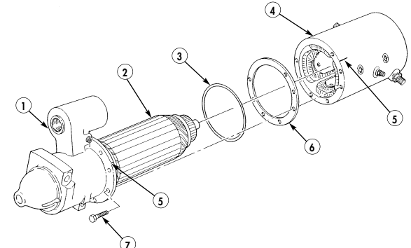

7

## 18-4.  Starter Repair (Cont'D)

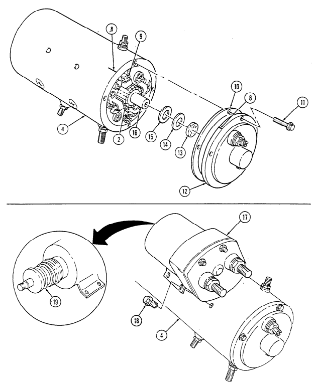

## I **18-4. Starter Repair (Cont'D)** I

23. Using core shaft nut tool, install locknut (2) on core shaft (1). 

e. **Bench Testing and Adjustment** 
1. Adjust armature end play to 0.005-0.030 in. (0.127-0.762 mm) by removing commutator end frame (3) and adding or removing thrust washer(s) (4) on commutator end of armature shaft (5). 

2. Connect 12 volts (not 24 volts) direct current to starter motor (7). Momentarily connect jumper lead (6) as shown. This will shift pinion (8) into cranking position until battery is disconnected. 

3. Push pinion (8) towards commutator end of starter motor (6) to end of travel, and measure distance between outside edge of pinion (8) and pinion stop (9). End play must be 0.020-0.050 in. 

(0.508-1.27 mm). Adjust end play by turning core shaft locknut (2) in or out. 

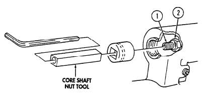

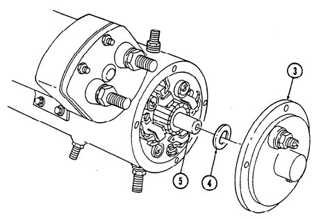

## 18-4.  Starter Repair (Cont'D)

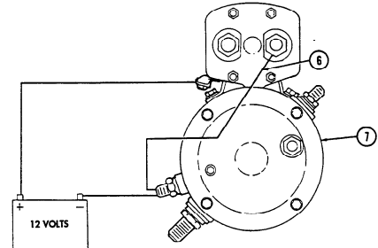

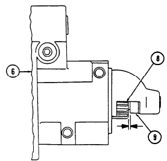

・

## 18-4. Starter Repair (Cont'D)

4.

Install gasket (2) and plug (1) on pinion housing (3).

5.

Install two solenoid lead connectors (7) on solenoid terminals (8) and starter motor terminals (4)
with four lockwashers (5) and nuts (6).

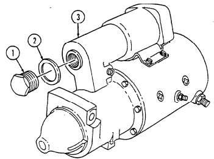

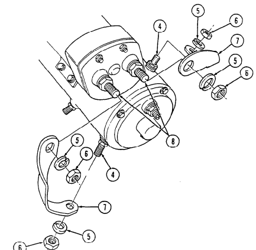

## 18-4. Starter Repair (Cont'D)

6. Connect 24 volts direct current to starter motor (10).

#### Caution

Do not operate starter motor for more than 30 seconds at a time. Allow starter motor to cool at least 2 minutes between tests, or damage to starter motor may result.

7. Close switch (9), adjust voltage to 20 volts on voltmeter (13) using carbon pile (12), and check rotating speed of armature with tachometer. Check current draw on ammeter (11).

8. Maximum current draw should be 65 amperes with a minimum armature speed of 5,000 rpm. If

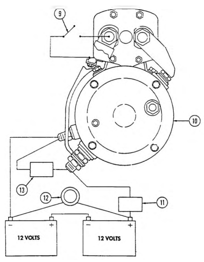

low-speed, high-current draw condition exists, check bearing alignment or inspect armature for shorts or grounds. If low-speed, low-current draw exists, inspect starter motor for faulty connections or poor brush contact.

FOLLOW-ON TASK: Install starter (para. 4-11).

# 18-5. Ste/Ice-R Wiring Harness Replacement

This task covers:
INITIAL SETUP:
Tools General mechanic's tool kit:
automotive (Appendix B, Item 1)
Special Tools Torque adapter, 3/4-in. (Appendix B, Item 134)
Materials/Parts Two lockwashers (Appendix G, Item 189) Lockwasher (Appendix G, Item 167) Lockwasher (Appendix G, Item 144) Lockwasher (Appendix G, Item 148) Antiseize compound (Appendix C, Item 16)
a. Removal 2. Slide boot (21) off power stud (22) and remove nut (25), lockwasher (26), and leads 6B-6C (24) and 6A (23) from power stud (22). Discard lockwasher (26).

3. Remove nut (27), lockwasher (28), and lead 3D (16) from starter terminal (29). Discard lockwasher (28).

4. Remove nut (15), lockwasher (14), leads 81A (13), 81B (12), and 6A (23) from starter (11). Discard lockwasher (14).

5. Remove screw (30), clip (31), and leads 74B (32) and 74A (33) from starter solenoid (10). 6. Remove screw (18), clamp (17), and leads 3D (16), 6A (23), 74B (32), and 81A (13) from starter (11).

a. Removal **b. Installation**
Manual Reference TM 9-2320-387-24P
Equipment Condition
- Battery holddown removed (para. 4-73). - Engine access cover removed (para. 10-22).

Maintenance Level Direct support

Prior to removal, tag leads for installation.

1. Remove two screws (5), lockwashers (6), and STE/ICE-R harness leads 7B-7D (7), 8A (2), 
57T-9A (8), and 599C (9) from shunt (1). Discard lockwashers (6).

#### Caution

Use care when removing harness. Snagging or pulling may cause damage to harness.

7. Remove harness (20) and grommet (3) from battery compartment (4). 8. Pull harness (20) out of coil (19).

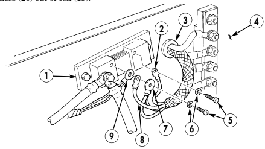

# 18-5. Ste/Ice-R Wiring Harness Replacement (Cont'D)

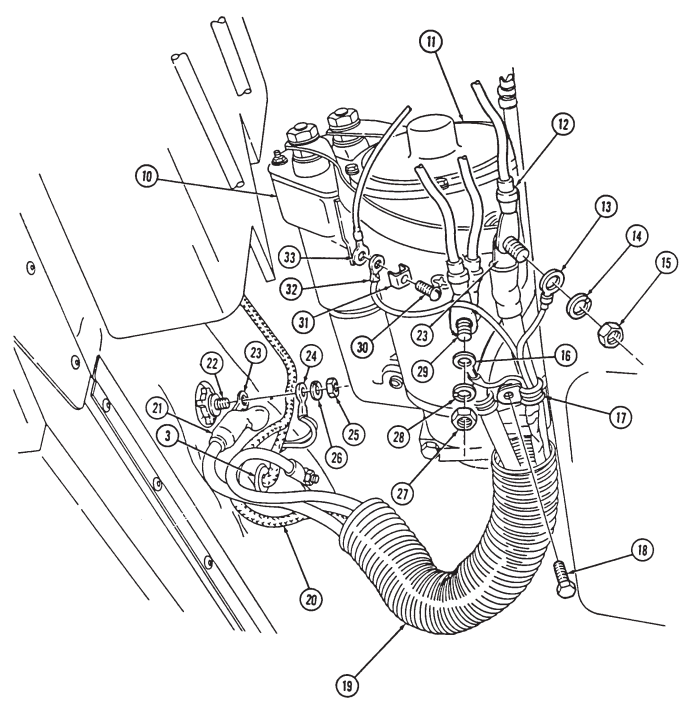

## 18-5. Ste/Ice-R Wiring Harness Replacement (Cont'D)

9. Remove three screws (2) and clamps (16) from harness (9) and body (1).

10. Remove two screws (10) and clamps (12) from body harness (11), harness (9), and body (1). 11. Disconnect harness connector (18) from rpm sensor connector (19) at right front wheelwell (17). 12. Disconnect harness connector (8) from fuel pressure transducer connector (7). 13. Remove cover (5) from STE/ICE-R Diagnostic Connector Assembly (DCA) cable (6). 14. Remove nut (13), washer (14), harness ground 7C (15), screw (4), and cover retainer (3) from body (1) and DCA cable (6)
15. Remove remaining three nuts (13), washers (14), and screws (4) from DCA cable (6) and body (1). 16. Remove DCA cable (6) and harness (9) from body (1).

Refer to para. 4-80 for wiring harness connector repair instructions.

17. Repair or replace harness (9).

#### B. Installation

1. Install harness (9) on body (1) in approximate mounting location.

#### Caution

Use care when routing harness. Snagging or pulling may cause damage to harness.

2. Connect harness connector (8) to fuel pressure transducer connector (7). 3. Connect harness connector (18) to rpm sensor connector (19) at right front wheelwell (17). 4. Install harness (9) and body harness (11) on body (1) with two clamps (12) and screws (10).

Finger-tighten screws (10).

5. Install DCA cable (6) on body (1) with three screws (4), washers (14), and nuts (13). 6. Apply antiseize compound to harness ground 7C (15) and install cover retainer (3) and harness ground 7C (15) on body (1) and DCA cable (6) with screw (4), washer (14), and nut (13).

7. Install cover (5) on DCA cable (6). 8. Install harness (9) on body (1) with three clamps (16) and screws (2). Finger-tighten screws (2). 9. Tighten screws (2) and (10).

# 18-5.  Ste/Ice-R Wiring Harness Replacement (Cont'D)

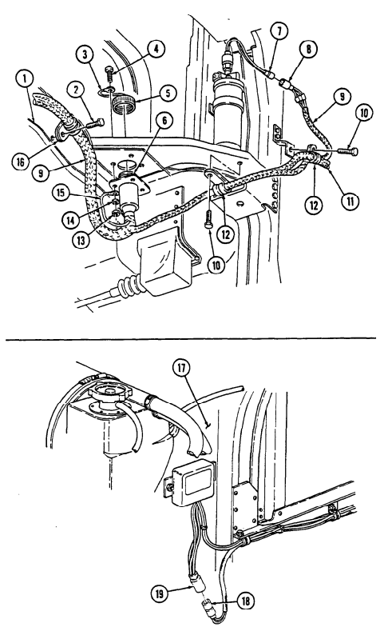

.

## 18-5. Ste/Ice-R Wiring Harness Replacement (Cont'D) I

10. 

11. 

12. 

13. 14. 

15. 

16. 

17. 

18. 

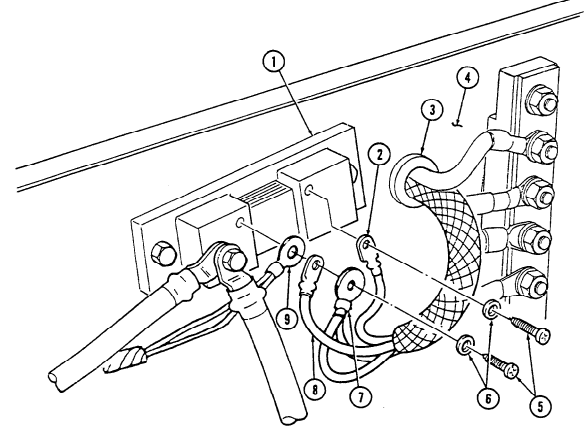 19. 

Pull harness (20) through protective coil (19). 

Insert harness (20) through battery compartment (4) and install grommet (3) on battery compartment (4). 

Install harness leads 6B-6C (24) and 6A (23) on power stud (22) with lockwasher (26) and nut (25). 

Slide boot (211 over power stud (22). . 

Install harness lead 8A (2) on right side of shunt (1) with lockwasher 161 and screw (5). 

Install harness leads 599C (9),57T-9A (81, and 7B-7D (71 on left side of shunt (1) with lockwasher (6) and screw (5). 

Install leads 74A (33) and 74B (321 on starter solenoid (10) with clip (31) and screw (30). 

Install harness lead 3D **(16)** on starter terminal (29) with lockwasher (28) and nut (27). Install harness leads 6A (23),81B (121, and 81A (131 on starter (111 with lockwasher (14) and nut (15). 

Install leads 3D (16), 6A (231, 74B (321, and 81A (13) on starter (11) with clamp (17) and screw (18). 

Tighten nut (271 to 15-20 lb-ft (20-27 N-m). Using torque adapter, tighten nut (15) to 25-30 lb-ft 
(34-41 N-ml. 

# 18-5. Ste/Ice-R Wiring Harness Replacement (Cont'D)

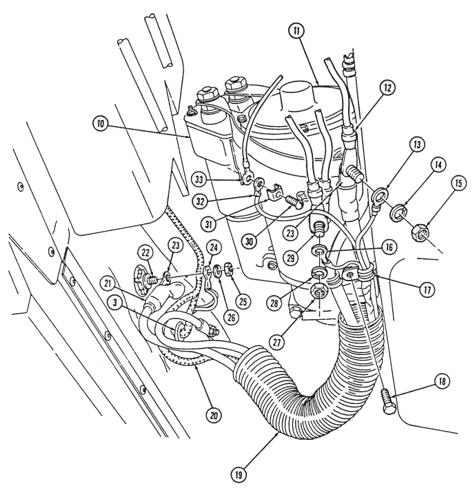

FOLLOW-ON TASKS: - Install engine access cover (para. 10-22).

-  Install battery holddown (para. 4-73).

- Perform STE/ICE-R G01, VTM connections and checkout test (para. 2-46).

# 18-6. Engine Wiring Harness Replacement

This task covers:

#### Initial Setup: Tools

General mechanic's tool kit:
automotive (Appendix B, Item 1)
Automotive and repair: field maintenance, basic (Appendix B, Item 6)
Maintenance and repair shop equipment:
automotive (Appendix B, Item 2)
Special Tools Torque adapter, 3/4-in. (Appendix B, Item 134)

#### Materials/Parts

Adhesive sealant (Appendix C, Item 13) Silicone compound (Appendix C, Item 73) Antiseize compound (Appendix C, Item 16) Grease (Appendix C, Item 33) Assembled locknut (Appendix G, Item 134) Lockwasher (Appendix G, Item 148) Lockwasher (Appendix G, Item 187) Three lockwashers (Appendix G, Item 144)

#### A. Removal

Prior to removal, tag leads for installation.

1. Remove screw (6), clip (5), and two leads 74A (4) and 74B (2) from starter solenoid (1). 2. Remove nut (9), lockwasher (8), winch cable 6W (7), if equipped, lead 81B (10), and battery cable 6A (15) from starter positive terminal (3). Discard lockwasher (8).

3. Remove nut (11), lockwasher (12), winch cable 7W (13), if equipped, lead 3D (14), and battery cable 7A (16) from starter negative terminal (17). Discard lockwasher (12).

4. Remove screw (18), clamp (19), and battery cable 6A (15) from starter motor (20). 5. Remove nut (35), lockwasher (34), washer (33), and lead 81A (32) from buss bar (31). Discard lockwasher (34).

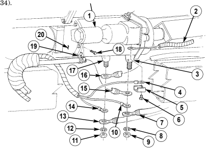

#### A. Removal **B. Installation** Materials/Parts (Cont'D)

Lockwasher (Appendix G, Item 185) (M1114 only) Lockwasher (Appendix G, Item 138) (M1114 only) Nut and lockwasher assembly (Appendix G, Item 197) Two lockwashers (Appendix G, Item 185) (M1113, M1151, and M1152 only)

#### Manual References

TM 9-2320-387-10 TM 9-2320-387-24P

#### Equipment Condition

- Hood raised and secured (TM 9-2320-387-10). - Battery ground cables disconnected 
(para. 4-68).

- Engine access cover removed (para. 10-22). - Air horn removed (para. 3-14).

Maintenance Level Direct support

## 18-6. Engine Wiring Harness Replacement (Cont'D)

6. Disconnect harness connector (21) from Throttle Position (TP) sensor (25). 7. Disconnect harness connector (29) from glow plug controller (28). 8. Disconnect leads 315A (27) and 315B (26) from fan cut-off switch leads (24). 9. Disconnect leads 54A (22) and 569B (23) from fuel injection pump (30).

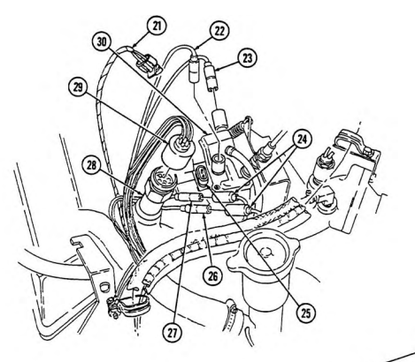

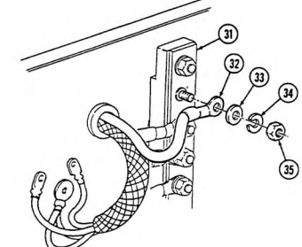

## 18-6. Engine Wiring Harness Replacement (Cont'D)

10. Disconnect leads 569A (9) and 569B (10) from cold-advance switch (13). 11. Disconnect four harness leads (11) from glow plugs (12). 12. Remove two capscrews (6), lockwashers (7), clamps (8), and harness (4) from heat shield (5).

Discard lockwashers (7).

13. Remove two screws (3), clamps (2), and harness (4) from bracket (1).

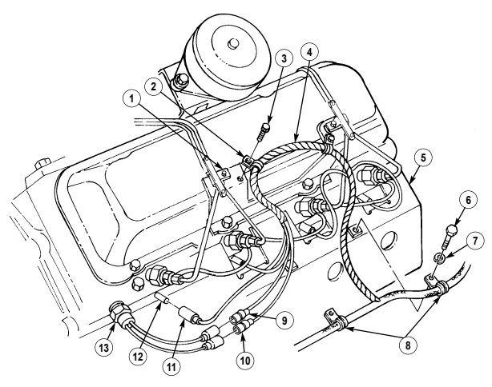

## 18-6. Engine Wiring Harness Replacement (Cont'D)

14.

15.

Remove two screws (14), clamps (15), and harness (16) from brackets (23).

Remove nut (18), lockwasher (19), washer (20), ground lead (21), and washer (20) from stud (22).

Discard lockwasher (19).

16.

17.

Remove nut and lockwasher assembly (27), capscrew (24), clamp (25), and harness (16) from dipstick mounting bracket (26). Discard nut and lockwasher assembly (27).

Disconnect four harness leads (29) from glow plugs (28).

18.

Disconnect two harness connectors (30) from water temperature sending unit (17).

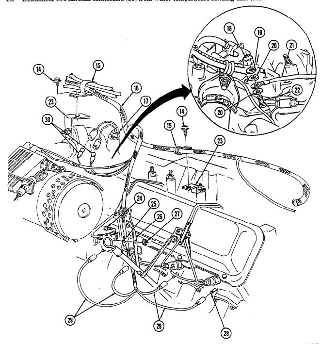

# 18-6. Engine Wiring Harness Replacement (Cont'D)

- Perform steps 19 through 21 for 200-amp dual voltage alternators only.

- Perform steps 21.1 and 21.2 for 400-amp dual voltage alternators only.

19. Slide back rubber boot (3) and remove nut (2), lead 568 (1.1), and washer (1) from IGN 
terminal (15) on voltage regulator (9).

20. Slide back rubber boot (4) and remove nut (5), lead 2A (5.1), and washer (6) from AC terminal (8) on voltage regulator (9).

21. Slide back rubber boot (14) and remove nut (12), washer (11), and lead 68A (13) from terminal (10)
on voltage regulator (9).

21.1. Slide back rubber boot (22.9) and remove nut (22.7), washer (22.8), and lead 5A (22.10) from red terminal (22.5) on voltage regulator (22.11).

21.2. Slide back rubber boot (22.4) and remove nut (22.2), washer (22.3), and lead 2A (22.6) from yellow terminal (22.1) on voltage regulator (22.11).

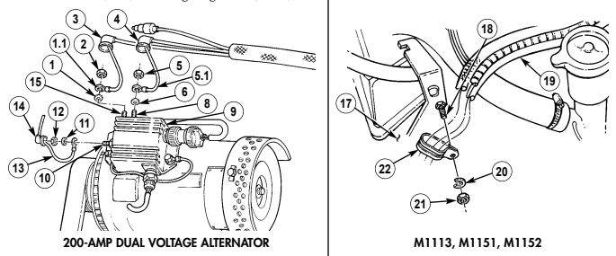

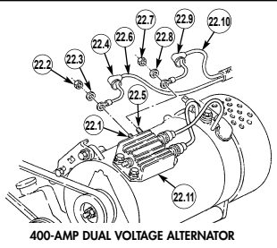

# 18-6. Engine Wiring Harness Replacement (Cont'D)

Perform step 22 for all models except M1114. Perform steps 23 and 24 for M1114 models.

22. Remove nut (21), lockwasher (20), clamp (22), and harness (19) from stud (18) on right front cylinder head (17). Discard lockwasher (20).

23. Remove capscrew (27), lockwasher (26), washer (25), and clamp (24) from bracket (23) on right cylinder head (17). Discard lockwasher (26).

24. Remove nut (29), clamp (30), harness (19), and screw (28) from bracket (23) on right cylinder head (17).

25. Remove assembled locknut (43) and lead 3C (44) from body (42). Discard assembled locknut (43). 26. Remove two capscrews (39), clamp (31), and harness (19) from body (42). 27. Remove nut (32), capscrew (33), clamp (34), and harness (19) from body (42). 28. Disconnect harness connector (35) from fan clutch time delay (38). 29. Disconnect harness connector (36) from protective control box receptacle (37). 30. Disconnect body harness (41) from harness connector (40). 31. Remove harness (19) from body (42).

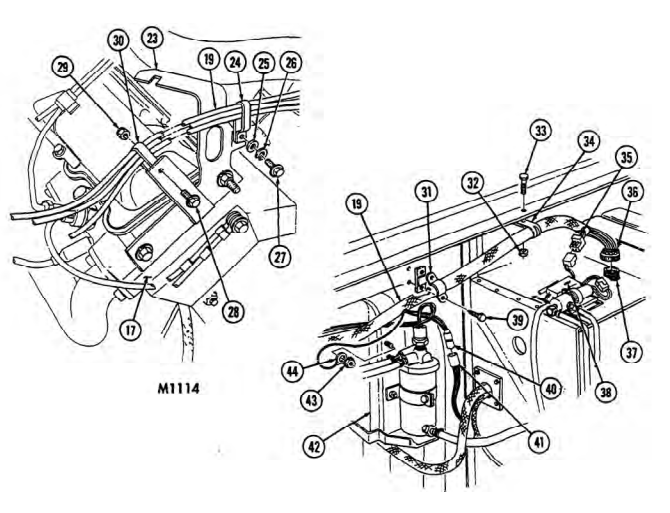

## 18-6. Engine Wiring Harness Replacement (Cont'D)

b. Installation 1. Position harness (1) in approximate mounting location. 2. Connect body harness (12) to harness connector (11). 3. Connect harness connector (7) to protective control box receptacle (8). 4. Connect harness connector (6) to fan clutch time delay (9). 5. Install harness (1) on body (13) with clamp (2) and two capscrews (10). 6. Install harness (1) on body (13) with clamp (5), capscrew (4), and nut (3). 7. Apply antiseize compound to lead 3C (15), and install lead 3C (15) on body (13) with assembled locknut (14).

Perform step 8 for all models except M1114. Perform steps 9 and 10 for M1114 models.

8. Install harness (1) on stud (17) at right cylinder head (16) with clamp (20), lockwasher (18), and nut (19). 9. Install harness (1) on back side of bracket (21) at right cylinder head (16) with clamp (28), screw (26),
and nut (27).

10. Install harness (1) on bracket (21) at right cylinder head (16) with clamp (22), washer (23),
lockwasher (24), and capscrew (25).

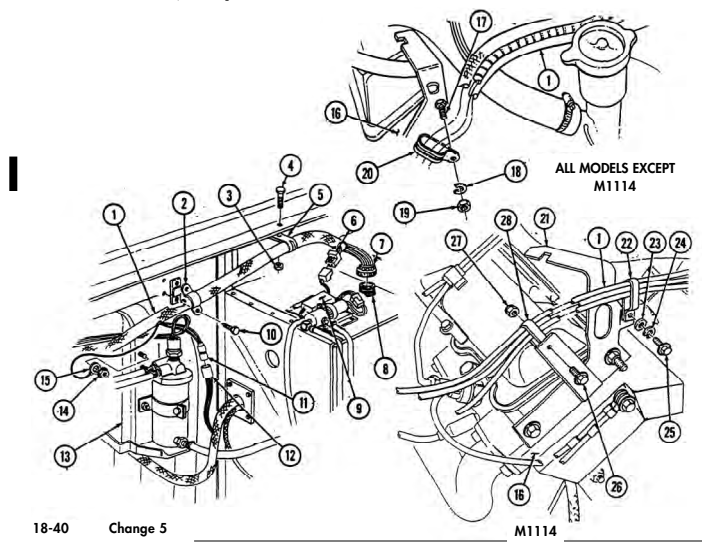

## 18-6. Engine Wiring Harness Replacement (Cont'D)

11.

12.

Connect four harness leads (43) to glow plugs (42). Connect two harness leads (44) to engine temperature sending unit (31).

13.

14.

15.

Install harness (1) on two brackets (37) with clamps (30) and screws (29).

Install washer (34), ground lead (35), washer (34), lockwasher (33), and nut (32) on stud (36).

Install harness (1) on dipstick mounting bracket (40) with clamp (39), capscrew (38), and nut and

lockwasher assembly (41).

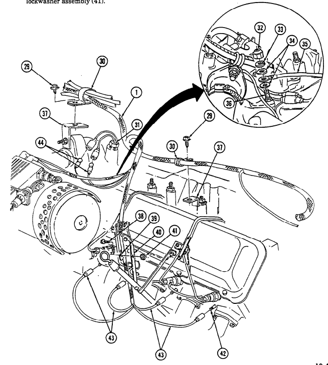

# 18-6. Engine Wiring Harness Replacement (Cont'D)

- Perform steps 16 through 18 for 200-amp dual voltage alternators only.

- Perform steps 18.1 through 18.4 for 400-amp dual voltage alternators only.

16. Install lead 68A (13), washer (11), and nut (12) on terminal (10) of voltage regulator (9). Tighten nut (12) to 18-22 lb-in. (2.0-2.5 N•m). Slide rubber boot (14) over terminal (10).

17. Install washer (1), lead 568 (1.1), and nut (2) on IGN terminal (15) of voltage regulator (9). Tighten nut (2) to 23-27 lb-in. (2.6-3.0 N•m). Slide rubber boot (3) over terminal (15).

18. Install washer (6), lead 2A (5.1), and nut (5) on AC terminal (8) of voltage regulator (9). Tighten nut
(5) to 18-22 lb-in. (2.0-2.5 N•m). Slide rubber boot (4) over terminal (8).

18.1. Install lead 5A (16.10), washer (16.8), and nut (16.7) on red terminal (16.5) of voltage regulator (16.11). Tighten nut (16.7) to 35 lb-in. (4 N•m).

18.2. Apply grease to red terminal (16.5), lead 5A (16.10), and inside of boot (16.9), and slide boot (16.9)
over red terminal (16.5).

18.3. Install lead 2A (16.6), washer (16.3), and nut (16.2) on yellow terminal (16.1) of voltage regulator (16.11). Tighten nut (16.2) to 20 lb-in. (2 N•m).

18.4. Apply grease to yellow terminal (16.1), lead 2A (16.6), and inside of boot (16.4), and slide boot (16.4)
over yellow terminal (16.1).

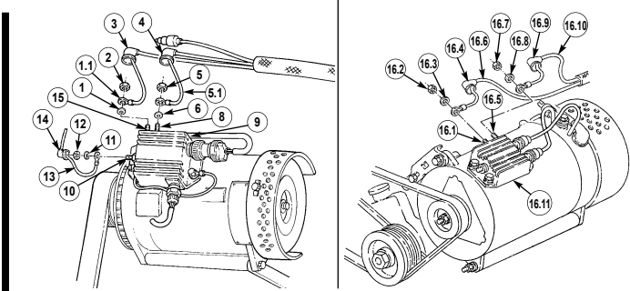

200-AMP DUAL VOLTAGE ALTERNATOR **400-AMP DUAL VOLTAGE ALTERNATOR**

## 18-6. Engine Wiring Harness Replacement (Cont'D)

19. Connect four harness leads (27) to glow plugs (28). 20. Connect harness leads 569A (26) and 569B (25) to cold-advance switch (29). 21. Install harness (20) on heat shield (21) with two clamps (24), lockwashers (23), and capscrews (22). 22. Install harness (20) on bracket (17) with two clamps (18) and capscrews (19).

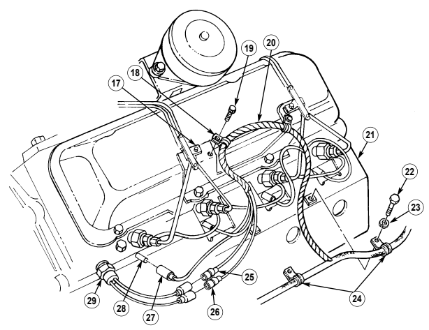

## 18-6. Engine Wiring Harness Replacement (Cont'D)

23. Install lead 81A (2) on buss bar (1) with washer (3), lockwasher (4), and nut (5). 24. Connect harness connector (14) to glow plug controller (13). 25. Connect harness leads 315A (12) and 315B (11) to fan cut-off switch leads (9). 26. Connect harness leads 54A (7) and 569B (8) to fuel injection pump (15).

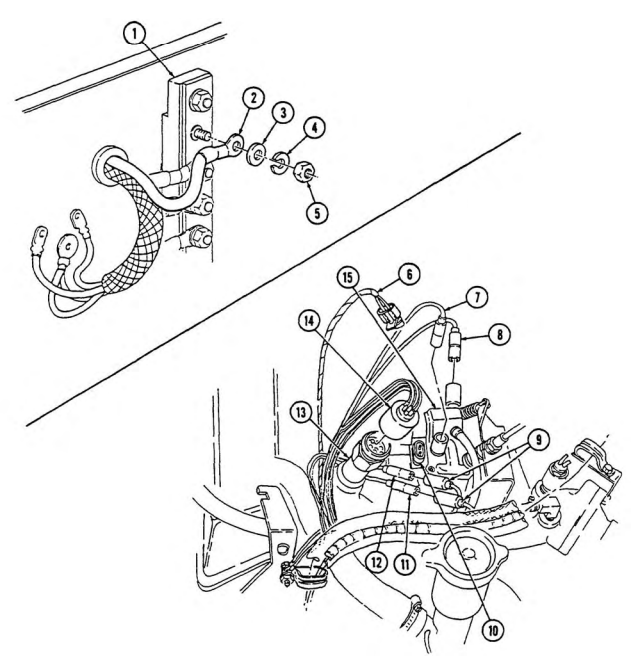 27. Connect harness connector (6) to TP sensor (10).

## I 18-6. Engine Wiring Harness Replacement **(Cont'D)** I

28. Install battery cable 7A (32), lead 3D (301, and winch cable 7W (29), if equipped, on starter negative terminal (33) with lockwasher (28) and nut (27). Tighten nut (27) to 39 lb-ft (53 Num). 

29. Install battery cable 6A (31), lead 81B (261, and winch cable 6W (23), if equipped, on starter positive terminal (19) with lockwasher (24) and nut (25). Tighten nut (25) to 39 lb-R (53 Nom). 

30. InstaII leads 74B (18) and 74A (20) on starter solenoid (17) with clip (21) and screw (22). 

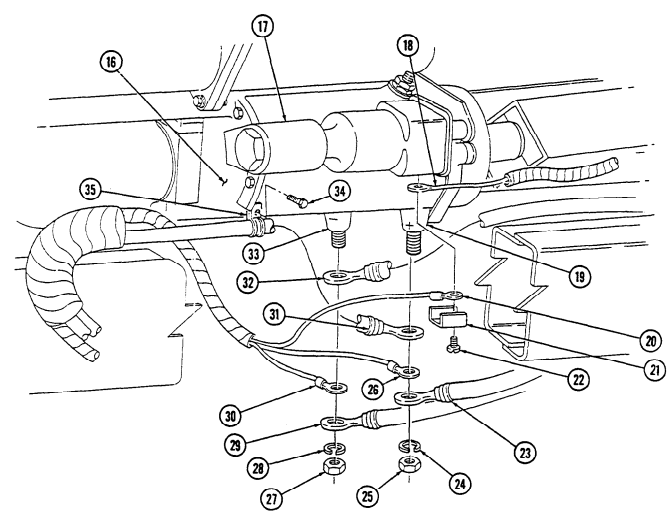

31. Install battery cable 6A (31) on starter motor (16) with clamp (35) and screw (34). 

FOLLOW-ON TASKS: l Install air horn (para. 3-14). 

Install engine access cover (para. 10-22). 

Connect battery ground cables (para. 468). Lower and secure hood (TM 9-2320-387-10). 

Start engine (TM 9-2320-387-10) and check for proper operation. 

# Chapter 19 Transmission (Ds) Maintenance

## 19-1. Introduction

This chapter contains maintenance instructions for replacement of transmission components at the direct support maintenance level. Some subassemblies and parts must be removed before transmission system components can be accessed. They are referenced to other paragraphs of this manual.

| Tools                                    | Manual References                                                                                 |
|------------------------------------------|---------------------------------------------------------------------------------------------------|
| General mechanic's tool kit:             | TM 9\-2320\-387\-24P                                                                              |
| automotive (Appendix B, Item 1)          | TM 9\-4910\-663\-12                                                                               |
| Puller (Appendix B, Item 54)             | TM 9\-4910\-485\-12                                                                               |
| Materials/Parts                          | Equipment Condition                                                                               |
| Silicone compound (Appendix C, Item 75)  | Alternator removed (para. 4\-5).                                                                  |
| RTV sealant (Appendix C, Item 74)        |                                                                                                   |
| Locknut (Appendix G, Item 93)            | General Safety Instructions                                                                       |
| Eighteen locknuts (Appendix G, Item 116) | Always support alternator core and shaft assembly                                                 |
| Three lockwashers (Appendix G, Item 178) | during removal and installation.                                                                  |
|                                          | Maintenance Level                                                                                 |
|                                          | Direct support                                                                                    |
| a. Alternator Output Testing             |                                                                                                   |
| 1.                                       | Mount pivot arm of 500\-amp test stand to high\-speed side and install mounting flange adapter on |

## 19-2. Transmission Maintenance Task Summary

# 19-3. Transmission/Transfer Case Assembly Removal (Serial Numbers 299999 And Below)

This task covers:
Removal INITIAL SETUP:
Tools General mechanic's tool kit:
automotive (Appendix B, Item 1)
Materials/Parts Engine/transmission support sling
(Appendix D, Figs. 81 through 97) (Optional)
Personnel Required One mechanic One assistant Manual References TM 9-2320-387-24P

#### Equipment Condition

- Engine access cover removed (para. 10-22). - Muffler support bracket removed
(para. 3-55).

- Rear propeller shaft removed (para. 6-4). - Sealed upper converter housing cover removed
(para. 5-12).

- Transmission oil dipstick removed
(para. 5-5).

- Transmission fluid drained (para. 5-2). - Front propeller shaft removed (para. 6-2).

#### General Safety Instructions

- Allow transmission/transfer case to cool before performing this task.

- Torque converter and transmission must be removed as an assembly and transmission must be level.

- Do not use hands to free transmission/transfer case assembly of hangups or snags.

Maintenance Level Direct support Removal

#### Warning

Allow transmission/transfer case to cool before performing this task. Failure to do this may cause injury.

#### Caution

Cover or plug all open lines and connections immediately after disconnection to prevent contamination. Remove all covers or plugs prior to connection.

1. Raise and support rear of vehicle (para. 8-2).

- Have drainage container ready to catch fluid. - Tag hoses for installation.

2. Loosen two hose clamps (2) and disconnect hoses (1) from cooler lines (3). 3. Remove cotter pin (4), washer (5), and shift rod and trunnion (8) from relay lever (6). Discard cotter pin (4).

4. Remove cotter pin (9) and washer (11) from transfer case shift rod (12). Disconnect shift rod (12)
from transfer case (10). Discard cotter pin (9).

# 19-3. Transmission/Transfer Case Assembly Removal (Serial Numbers 299999 And Below) (Cont'D)

5. Disconnect wiring harness connector (19) from transmission (7).

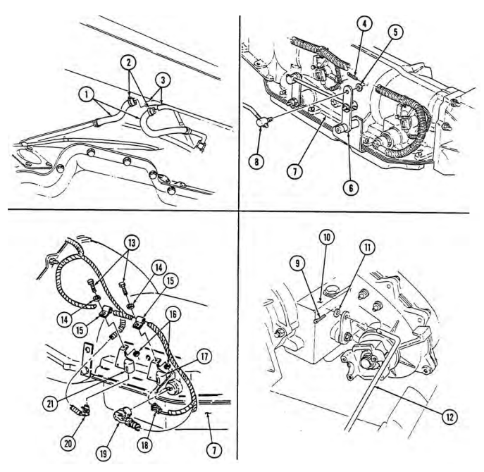 6. Disconnect connectors 495/496 (20) and 497/498 (18) from input speed sensor (21) and output speed sensor (17).

7. Remove two nuts (16), capscrews (13), washers (14), and clamps (15) from sensors (17) and (21).

# 19-3. Transmission/Transfer Case Assembly Removal (Serial Numbers 299999 And Below) (Cont'D)

It will be necessary to rotate flywheel clockwise from capscrew in front of crankshaft to gain access to capscrews securing torque converter.

8. Remove six capscrews (33) from torque converter (32) and flywheel (34) and slide torque converter (32) away from flywheel (34).

#### Caution

Safety chain must be routed under transmission oil cooler lines and speedometer cable or damage may result.

9. Support transmission (20) with transmission jack and secure with safety chain.

10. Remove two capscrews (13) and lockwashers (14) from transmission adapter (6) and mount (11).

Discard lockwashers (14).

11. Remove locknut (12), washer (9), capscrew (8), washer (9), and bypass valve (7) from right side of crossmember (15) and support bracket (10). Discard locknut (12).

12. Remove locknut (16), washer (17), and crossmember (15) from support bracket (1).

Discard locknut (16).

13. Remove nut (3), washer (4), cable (5), washer (4), nut (3), and stud (2) from support bracket (1).

#### Caution

- If transmission is lowered too far, cooling fan damage will result.

- Wood block must completely cover bottom of engine oil pan or oil pan damage will result.

14. Lower transmission (20) slightly and support engine under oil pan (25) with wood block and stand. 15. Disconnect main vent line (22) from transmission/transfer case vent line (23). 16. Remove 90° speedometer adapter (29) with speedometer cable (28) from transfer case (21). Secure 90° speedometer adapter (29) and speedometer cable (28) away from transfer case (21).

17. Disconnect two leads (31) from transfer case switch leads (30) on transfer case (21). 18. Deleted. 19. Remove four capscrews (24) and two studs (19) from transmission (20) and engine (18).

19-3.  TRANSMISSION/TRANSFER CASE ASSEMBLY REMOVAL
(SERIAL NUMBERS 299999 AND BELOW) (Cont'd)

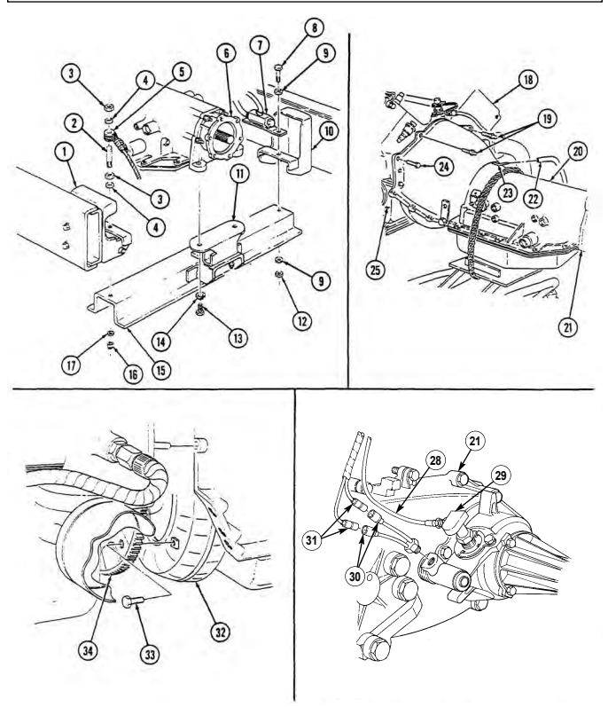

# 19-3. Transmission/Transfer Case Assembly Removal (Serial Numbers 299999 And Below) (Cont'D)

#### Warning

- Torque converter and transmission must be removed as an assembly. Keep transmission level. The converter may slide off front of transmission and cause injury to personnel or damage to converter.

- Do not use hands to free transmission/transfer case assembly of hangups or snags. Use prybar to avoid injury.

#### Caution

Always remove transmission/transfer case assembly slowly and watch for binding or hangups. Something may still be connected and must be removed. Ensure wiring, lines, cables, and rods are not in the path of the removal.

20. Move transmission (2) and transfer case (3) rearward to clear engine (1). 21. Lower transmission (2) and transfer case (3) slowly. 22. Remove transmission (2) and transfer case (3) from under vehicle.

#### Caution

If vehicle is moved because of limited shop space or tactical

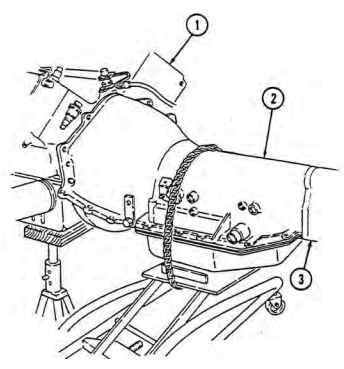 movement, damage to engine and vehicle may occur. To prevent damage, engine/transmission support sling can be installed.

FOLLOW-ON TASK: Prepare transmission for disassembly (para. 19-5).

19-6/(19-6.1 blank) Change 6

# 19-3.1. Transmission/Transfer Case Assembly Removal (Serial Numbers 300000 And Above)

This task covers:
Removal INITIAL SETUP:
Tools General mechanic's tool kit:
automotive (Appendix B, Item 1)
Materials/Parts Engine/transmission support sling
(Appendix D, Figs. 81-97) (Optional)
Personnel Required One mechanic One assistant Manual References TM 9-2320-387-24P

#### Equipment Condition

- Engine access cover removed (para. 10-22). - Muffler support bracket removed 
(para. 3-55).

- Rear propeller shaft removed (para. 5-12). - Sealed converter housing covers removed
(para. 5-11 or para. 5-12).

#### Removal Equipment Condition (Cont'D)

- Cooling system drained (para. 3-61). - Transmission oil dipstick removed 
(para. 5-5).

- Front propeller shaft removed (para. 6-2). - Transfer case guide cable removed 
(para. 20-5).

#### General Safety Instructions

- Allow transmission/transfer case to cool before performing this task.

- Torque converter and transmission must be removed as an assembly and transmission must be level.

- Do not use hands to free transmission/transfer case assembly of hangups or snags.

Maintenance Level Direct support

#### Warning

Allow transmission/transfer case to cool before performing this task. Failure to do this may cause injury.

#### Caution

Cover or plug all open lines and connections immediately after disconnection to prevent contamination. Remove all covers or plugs prior to connection.

1. Raise and support rear of vehicle (para. 8-2)

- Have drainage container ready to catch fluid. - Tag hoses for installation.

2. Disconnect transmission vent line (9), transfer case vent line (4), and main vent line (6) from vent tee (5).

3. Loosen clamp (2) and remove coolant hose (3) from transfer case inlet tube (1). 4. Loosen clamp (7) and remove coolant hose (8) from transfer case outlet tube (10). 5. Loosen hose clamp (15) and disconnect outlet hose (16) from oil cooler line tee (14). 6. Loosen hose clamp (12) and disconnect inlet hose (11) from oil cooler line tee (13).

19-3.1. TRANSMISSION/TRANSFER CASE ASSEMBLY REMOVAL
(SERIAL NUMBERS 300000 AND ABOVE) (Cont'd)

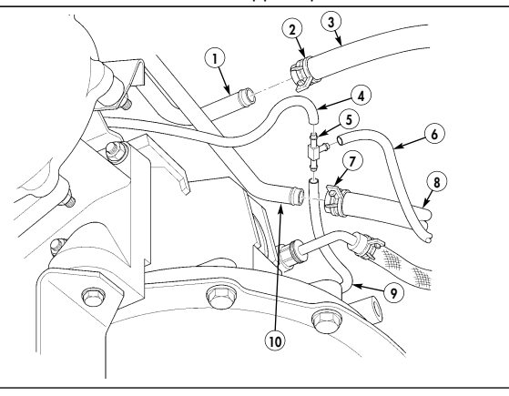

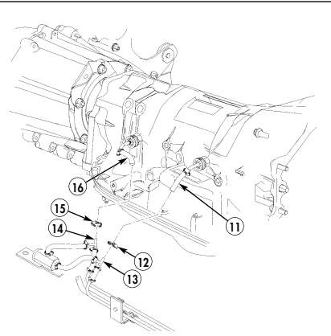

# 19-3.1. Transmission/Transfer Case Assembly Removal (Serial Numbers 300000 And Above) (Cont'D)

7. Remove cotter pin (1), washer (2), and shift rod and trunnion (4) from relay lever (3).

Discard cotter pin (1).

8. Remove cotter pin (5), washer (6), and transfer case shift rod (8) from transfer case shift lever (7).

Discard cotter pin (5).

9. Disconnect wiring harness connector (16) from transmission (14).

10. Disconnect connectors 495/496 (17) and 497/498 (15) from input speed sensor (13) and output speed sensor (18).

11. Remove two nuts (12), capscrews (9), washers (10), and clamps (11) from sensors (13) and (18). 12. Remove tie strap (20) from speedometer sensor (19). Discard tie strap (20). 13. Loosen nut (21) and remove speedometer sensor (19) from transfer case (22). 14. Disconnect two leads (24) from transfer case switch leads (23) on transfer case (22).

# 19-3.1. Transmission/Transfer Case Assembly Removal (Serial Numbers 300000 And Above) (Cont'D)

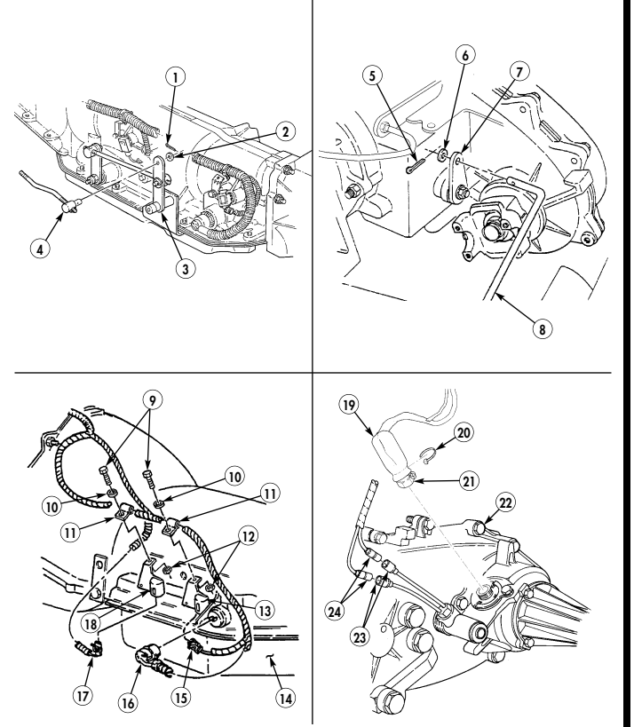

# 19-3.1. Transmission/Transfer Case Assembly Removal (Serial Numbers 300000 And Above) (Cont'D)

It will be necessary to rotate flywheel clockwise from capscrew in front of crankshaft to gain access to capscrews securing torque converter.

15. Remove six capscrews (2) from torque converter (1) and flywheel (3) and slide torque converter (1)
away from flywheel (3).

#### Caution

Safety chain must be routed under transmission oil cooler lines or damage may result.

16. Support transmission (7) with transmission jack and secure with safety chain. 17. Remove two capscrews (23) and lockwashers (24) from transmission adapter (15) and mount (22). 18. Remove locknut (21), washer (20), capscrew (17), washer (18), and bypass valve (16) from right side of crossmember (27) and support bracket (19). Discard locknut (21).

19. Remove locknut (25), washer (26), washer (14), stud (13), and washer (12) from left side of crossmember (27) and support bracket (11) and lower crossmember (27). Discard locknut (25).

#### Caution

- If transmission is lowered too far, geared fan drive damage will result.

- Wood block must completely cover bottom of engine oil pan or oil pan damage will result.

20. Lower transmission (7) slightly and support engine under oil pan (10) with block and stand. 21. Disconnect main vent line (6) from transmission/transfer case vent line (8). 22. Remove four capscrews (9) and two studs (5) from transmission (7) and engine (4).

# 19-3.1. Transmission/Transfer Case Assembly Removal (Serial Numbers 300000 And Above) (Cont'D)

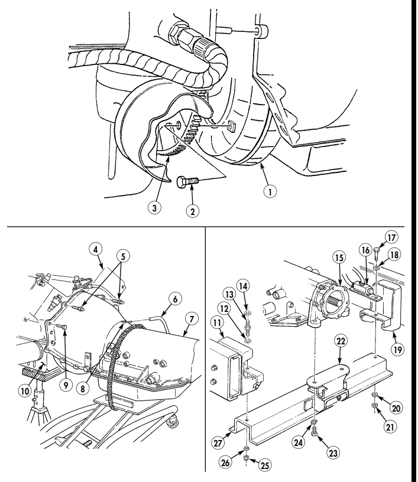

# 19-3.1. Transmission/Transfer Case Assembly Removal (Serial Numbers 300000 And Above) (Cont'D)

#### Warning

Torque converter and transmission must be removed as an assembly. Keep transmission level. The converter may slide off front of transmission and cause injury to personnel or damage to converter. Do not use hands to free transmission/transfer case assembly of hang-ups or snags. Use prybar to avoid injury.

#### Caution

Always remove transmission/transfer case assembly slowly and watch for binding or hang-ups. Something may still be connected and must be removed. Ensure wiring, lines, cables, and rods are not in the path of the removal.

23. Move transmission (2) and transfer case (3) rearward to clear engine (1). 24. Lower transmission (2) and transfer case (3) slowly. 25. Remove transmission (2) and transfer case (3) from under vehicle.

#### Caution

If vehicle is moved because of limited shop space or tactical

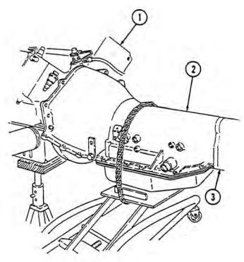 movement, damage to engine and vehicle may occur. To prevent damage, engine/transmission support sling can be installed.

# 19-4. Transmission/Transfer Case Assembly Installation (Serial Numbers 299999 And Below)

This task covers:
Installation INITIAL SETUP:
Tools General mechanic's tool kit:
automotive (Appendix B, Item 1)
Maintenance and repair shop equipment:
automotive (Appendix B, Item 2)

#### Materials/Parts

Two lockwashers (Appendix G, Item 174) Two cotter pins (Appendix G, Item 19) Two locknuts (Appendix G, Item 102) Silicone compound (Appendix C, Item 74)
Personnel Required One mechanic One assistant Manual References TM-9-2320-387-10 TM 9-2320-387-24P

#### Equipment Condition

Transmission/transfer case assembly prepared for installation (para. 19-5).

General Safety Instructions
•Torque converter and transmission must be installed as an assembly. Transmission must be level.

•Do not use hands to free transmission/
transfer case assembly of hangups or snags.

Maintenance Level Direct support Installation

#### Warning

Torque converter and transmission must be installed as an assembly. Keep transmission level. The torque converter may slide off front of transmission and cause injury to personnel or damage to converter.

#### Caution

- Torque converter must be properly installed in transmission or transmission damage will result.

- Safety chain must be routed under transmission oil cooler lines or damage to cooler lines will result.

# 19-4. Transmission/Transfer Case Assembly Installation (Serial Numbers 299999 And Below) (Cont'D)

1. Place transmission (3) and transfer case (4) on transmission jack and secure with safety chain.

#### Warning

Do not use hands to free transmission/transfer case assembly of hangups or snags. Use prybar to avoid injury.

#### Caution

Always install transmission/transfer case assembly slowly. Raise into chassis carefully, and closely observe all components to prevent damage.

2. Position transmission (3) and transfer case (4) under vehicle and raise into place, aligning converter housing pilot holes (9) with engine dowels (8).

Ensure torque converter rotates freely.

3. Move transmission (3) forward onto engine dowels (8). Install transmission (3) on engine (1) with four capscrews (7) and two studs (2). Tighten capscrews (7) and studs (2) to 35 lb-ft (47 N•m).

4. Apply RTV silicone compound to transmission/transfer case vent line (6) and connect main vent line (5) to transmission/transfer case vent line (6).

5. Raise transmission (3) and transfer case (4) and remove stand supporting engine (1).

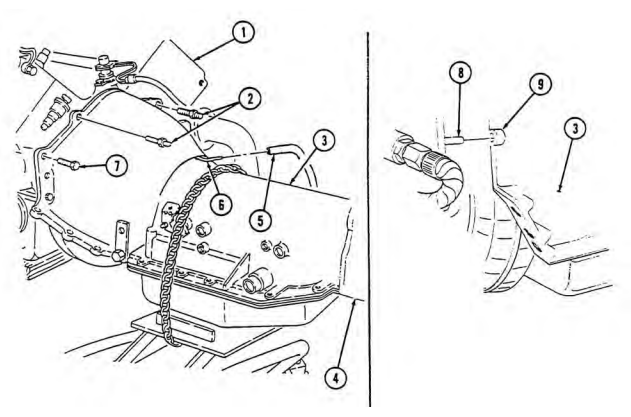

# 19-4. Transmission/Transfer Case Assembly Installation (Serial Numbers 299999 And Below) (Cont'D)

Nuts on mount must be loosened prior to installation of crossmember on vehicle for proper alignment.

6. Loosen two nuts (22) on mount (20) and crossmember (25). 7. Install mount (20) and crossmember (25) on transmission adapter (15) with two lockwashers (24)
and capscrews (23). Tighten capscrews (23) to 65 lb-ft (88 N•m).

8. Install stud (11), nut (12), washer (13), cable (14), washer (13), and nut (12) on support bracket (10).

Secure crossmember (25) on stud (11) with washer (27) and locknut (26).

9. Install bypass valve (16) and crossmember (25) on support bracket (19) with washer (18), capscrew (17),
washer (18), and locknut (21). Tighten locknut (21) to 65 lb-ft (88 N•m).

10. Tighten two nuts (22) to 65 lb-ft (88 N•m).

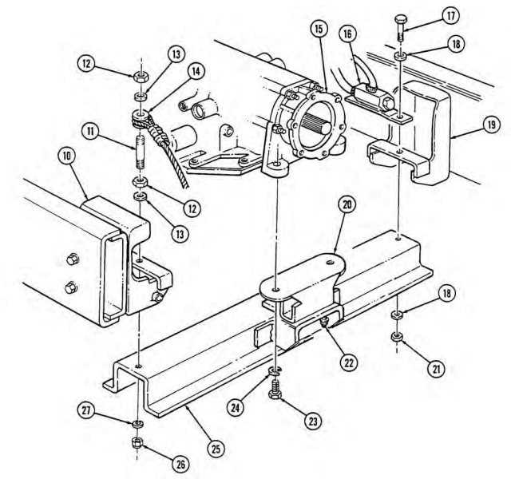

19-4. TRANSMISSION/TRANSFER CASE ASSEMBLY INSTALLATION 

## (Serial Numbers 299999 And Below) (Cont'D)

11. Remove safety chain and lower transmission (1).

It will be necessary to rotate flywheel clockwise from capscrew in front of crankshaft to gain access to capscrews securing torque converter.

12. Align torque converter (2) with holes in flywheel (4). Install torque converter (2) on flywheel (4)
with six capscrews (3).

13. Tighten capscrews (3) to 32 lb-ft (43 N•m).

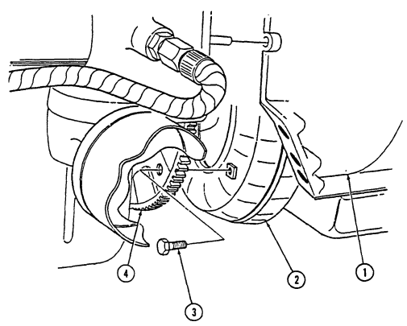

# 19-4. Transmission/Transfer Case Assembly Installation (Serial Numbers 299999 And Below) (Cont'D)

14. Install 90° speedometer cable (7) with speedometer adapter (9) on transfer case (8). 15. Connect two leads 511A and 511B (11) to transfer case switch leads (10). 16. Deleted.

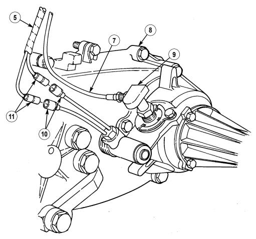

## 19-4. Transmission/Transfer Case Assembly Installation (Serial Numbers 299999 And Below) (Cont'D)

17. Connect wiring harness connector (10) to transmission case connector (8) on transmission (5). 18. Connect connectors 497/498 (9) and 495/496 (11) to output and input speed sensors (7) and (12) on transmission (5).

19. Install wiring harness (1) on sensors (7) and (12) with two clamps (4), washers (3), capscrews (2),
and nuts (6).

20. Connect transfer case shift rod (16) to transfer case (14) with washer (15) and cotter pin (13).

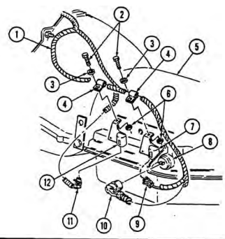

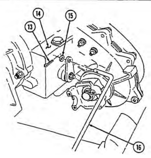

# 19-4. Transmission/Transfer Case Assembly Installation (Serial Numbers 299999 And Below) (Cont'D)

21. Connect two hoses (17) to transmission/transfer case cooler lines (19) and tighten hose clamps (18).

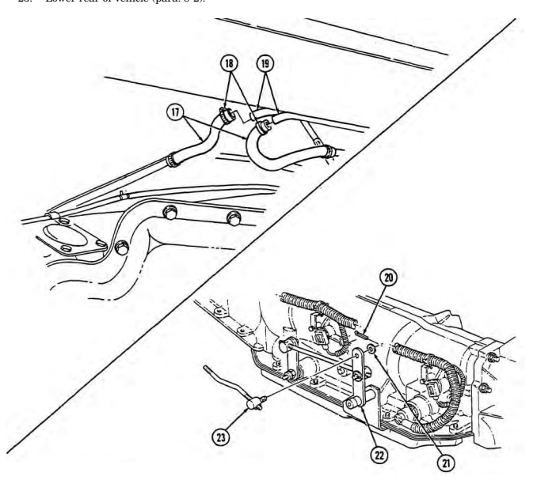 22. Install shift rod and trunnion (23) on relay lever (22) with washer (21) and cotter pin (20). 23. Lower rear of vehicle (para. 8-2).

FOLLOW-ON TASKS: - Install front propeller shaft (para. 6-2).

- Install muffler support bracket (para. 3-55). - Install sealed upper converter housing cover (para. 5-12). - Install transmission oil dipstick (para. 5-5). - Install rear propeller shaft (para. 6-4). - Install engine access cover (para. 10-22). - Fill transmission to proper fluid level (TM 9-2320-387-10). - Start engine (TM 9-2320-387-10) and inspect for leaks. - Road-test vehicle (para. 5-14) and check for proper transmission/transfer case operation.

19-4.1. TRANSMISSION/TRANSFER CASE ASSEMBLY INSTALLATION

# (Serial Numbers 300000 And Above)

This task covers:
a.. Installation INITIAL SETUP:
Tools General mechanic's tool kit:
automotive (Appendix B, Item 1)
Maintenance and repair shop equipment:
automotive (Appendix B, Item 2)

#### Material/Parts

Two lockwashers (Appendix G, Item 174) Two cotter pins (Appendix G, Item 19) Two locknuts (Appendix G, Item 102) Tiedown strap (Appendix G, Item 324) Silicon compound (Appendix G, Item 74)
Personnel Required One mechanic One assistant

#### A. Installation

Manual References TM 9-2320-387-10 TM 9-2320-387-24P
Equipment Condition Transmission/transfer case assembly prepared for installation (para. 19-6).

General Safety Instructions
- Do not use hands to free transmission/transfer case assembly of hang-ups or snags.

- Torque converter and transmission must be removed as an assembly and transmission must be level.

Maintenance Level Direct support

#### Warning

- Torque converter and transmission must be installed as an assembly. Keep transmission level. The converter may slide off front of transmission and cause injury to personnel or damage to converter.

- Do not use hands to free transmission/transfer case assembly of hang-ups or snags. Use prybar to avoid injury.

#### Caution

- Always install transmission/transfer case assembly slowly and watch for binding or hang-ups.

- Raise into chassis carefully, and closely observe all components to prevent damage.

- Ensure wiring, lines, cables, and rods are not in the path of the installation.

1. Place transmission (4) and transfer case (5) on transmission jack and secure with safety chains. 2. Position transmission (4) and transfer case (5) under vehicle and raise into place, aligning converter housing pilot holes (27) with engine dowels (26).

Ensure torque converter rotates freely.

3. Move transmission (4) forward onto engine dowels (26). Install transmission (4) on engine (1) with four capscrews (7) and two studs (2). Tighten capscrews (7) and studs (2) to 35 lb-ft (47 N•m).

4. Apply RTV silicone compound to transmission/transfer case vent line (6) and connect main vent line (3) to transmission/transfer case vent line (6).

# 19-4.1. **Transmission/Transfer Case Assembly Installation** (Serial Numbers 300000 And Above) (Cont'D)

5. Lower transmission (4) and transfer case (5) and remove stand and wood block from under oil pan (8). 6. Install mount (18) and crossmember (25) on transmission adapter (13) with two lockwashers (22)
and capscrews (21). Tighten capscrews (22) to 65 lb-ft (88 N•m).

7. Install left side of crossmember (25) on support bracket (9) with washer (10), stud (11), washer (12),
washer (24), and locknut (25).

8. Install bypass valve (14) and right side of crossmember (25) on support bracket (17) with washer (16), capscrew (15), washer (17), and locknut (20).

9. Remove safety chain and lower transmission (4).

10. Tighten locknuts (22) and (20) to 65 lb-ft (88 N•m).

It will be necessary to rotate flywheel clockwise from capscrew in front of crankshaft to gain assess to capscrews securing torque converter.

11. Align torque converter (28) with holes in flywheel (30). 12. Install torque converter (28) on flywheel (30) with six capscrews (29). Tighten capscrews (29) to 

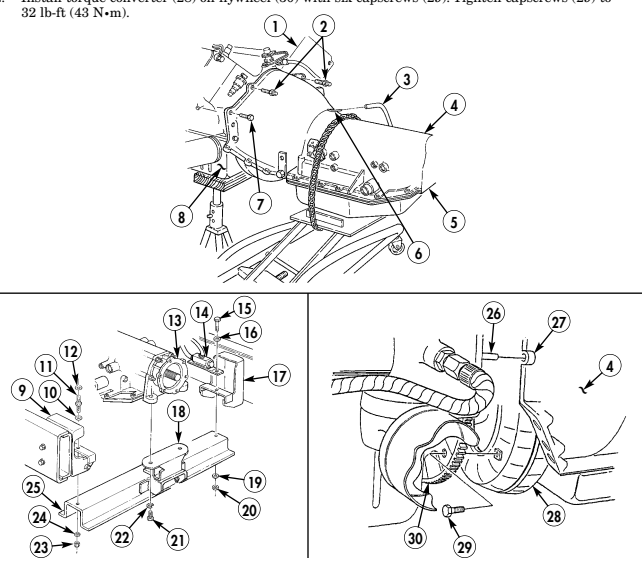

## 19-4.1. **Transmission/Transfer Case Assembly Installation** (Serial Numbers 300000 And Above) (Cont'D)

13. Connect two leads (6) to transfer case switch leads (5) on transfer case (4). 14. Install speedometer sensor (1) on transfer case (4) and tighten nut (3). 15. Install tie strap (2) on speedometer sensor (1). 16. Install clamps (9) on sensors (11) and (16) with two washers (8), capscrews (7), and nuts (10). 17. Connect connectors 495/496 (15) and 497/498 (13) on input speed sensor (11) and output speed sensor (16).

18. Connect wiring harness connector (14) on transmission (12). 19. Install transfer case shift rod (20) on transfer case shift lever (19) with washer (18)
and cotter pin (17).

20. Install shift rod and trunnion (24) on relay lever (23) with washer (22) and cotter pin (21).

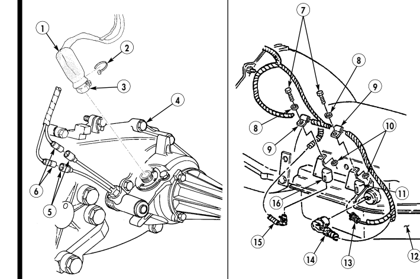

19-4.1.  TRANSMISSION/TRANSFER CASE ASSEMBLY INSTALLATION
(SERIAL NUMBERS 300000 AND ABOVE) (Cont'd)

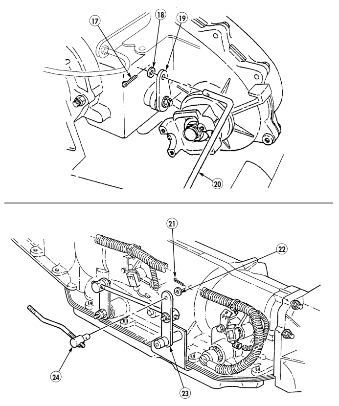

## 19-4.1. **Transmission/Transfer Case Assembly Installation** (Serial Numbers 300000 And Above) (Cont'D)

21. Connect inlet hose (1) to oil cooler line tee (3) and tighten hose clamp (2). 22. Connect outlet hose (6) to oil cooler line tee (4) and tighten hose clamp (5). 23. Install coolant hose (14) on transfer case outlet tube (16) and tighten clamp (13). 24. Install coolant hose (9) on transfer case inlet tube (7) and tighten clamp (8). 25. Connect transmission vent line (15), transfer case vent line (10), and main vent line (12) to vent tee (11).

26. Lower rear of vehicle (TM 9-2320-387-24-1).

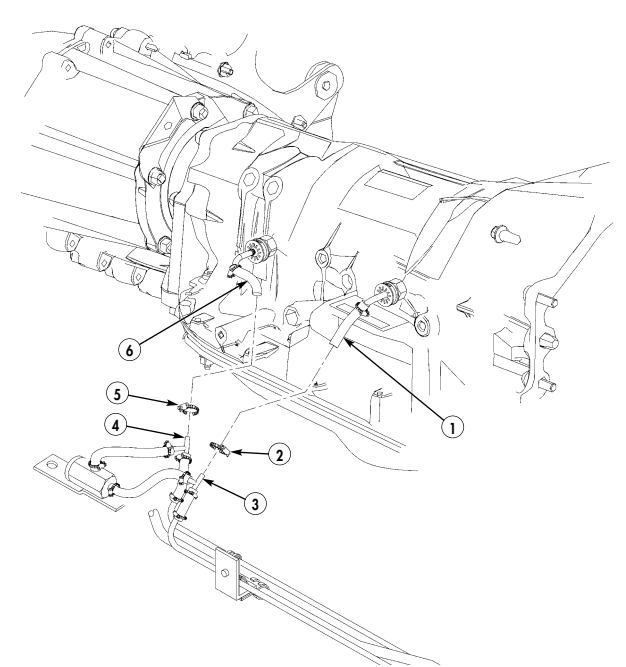

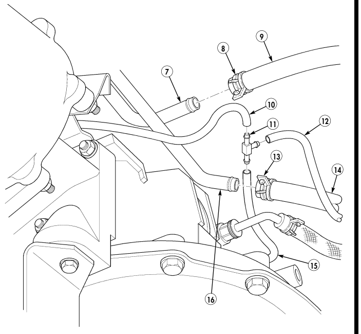

# 19-4.1. **Transmission/Transfer Case Assembly Installation** (Serial Numbers 300000 And Above) (Cont'D)

FOLLOW-ON TASKS: - Install transfer case guide cable (para. 20-5).

- Install front propeller shaft (para. 6-2). - Install transmission oil dipstick (para. 5-5). - Install sealed converter housing covers (para. 5-12). - Install rear propeller shaft (para. 6-4). - Install muffler support bracket (para. 3-55). - Install engine access cover (para. 10-22). - Fill transmission to proper fluid level (TM 9-2320-387-10). - Refill cooling system (para. 3-61). - Start engine (TM 9-2320-387-10) and inspect for leaks. - Road test vehicle and check for proper transmission/transfer case operation

# 19-5. Transmission Preparation (Serial Numbers 299999 And Below)

This task covers:

| Tools                                  |
|----------------------------------------|
| General mechanic's tool kit:           |
| automotive (Appendix B, Item 1)        |
| Special Tool                           |
| Torque adapter, 9/16\-in. (Appendix B, |
| Item 133)                              |
| Materials/Parts                        |

a. Disassembly **b. Assembly**

| INITIAL SETUP:   |
|------------------|

Six locknuts (Appendix G, Item 114) Anaerobic gasket sealing compound 
(Appendix C, Item 58)
Silicone compound (Appendix C, Item 74)

| Manual References                           |
|---------------------------------------------|
| TM 9\-2320\-387\-24P                        |
| Equipment Condition                         |
| Transmission/transfer case assembly removed |
| (para. 19\-3).                              |
| Maintenance Level                           |
| Direct support                              |

#### A. Disassembly

1. Disconnect two transmission/transfer case cooler lines (5) from transmission (3). 2. Disconnect transmission/transfer case vent line (2) from transmission vent tube (4). 3. Remove six locknuts (1) and transmission (3) from transfer case adapter (7). Discard locknuts (1). 4. Separate transmission (3) from transfer case adapter (7).

#### B. Assembly

1. Clean old sealer from transfer case adapter (7) and transmission mounting surface (6). 2. Apply anaerobic gasket sealing compound to transmission mounting surface (6). 3. Install transmission (3) on transfer case adapter (7) with six locknuts (1). Using torque adapter, tighten locknuts (1) to 26 lb-ft (35 N•m).

4. Apply RTV silicone compound to transmission vent tube (4) and connect transmission/transfer vent line (2) to transmission vent tube (4).

5. Connect transmission/transfer case cooler lines (5) to transmission (3).

19-5. TRANSMISSION PREPARATION (SERIAL NUMBERS 299999 AND BELOW) (Cont'd)

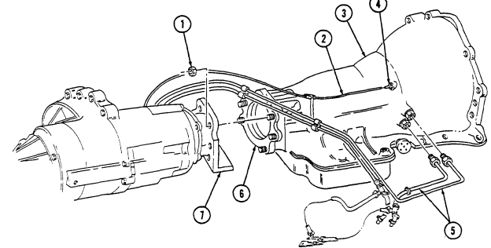

FOLLOW-ON TASK: Install transmission/transfer case assembly (para. 19-4).

# 19-6. Transmission Preparation (Serial Numbers 300000 And Above)

This task covers:

a. Disassembly **b. Assembly**

| - Normal voltage range is 26\-30 VDC. High amperage is +10 percent                                           |
|--------------------------------------------------------------------------------------------------------------|
| over the rated alternator output of 182 amps at 5,000 rpm.                                                   |
| 10.  Perform no\-load test. Increase alternator speed to 5,000 rpm; record results. Refer to table 18\-1 for |
| diagnosis.                                                                                                   |
| 11.  Perform full\-load test. Ensure all load switches are in ON position on 500\-amp test stand, and        |
| increase alternator speed to 5,000 rpm. Set load to 182 amps/min; record results. Refer to table 18\-2       |
| for diagnosis.                                                                                               |
| Table 18\-1. No\-Load Test.                                                                                  |

| and the comments of the comments of the comments of the comments of the comments of the comments of the comments of the comments of th 0   |
|--------------------------------------------------------------------------------------------------------------------------------------------|
| (Appendix C, Item 58)                                                                                                                      |

Six locknuts (Appendix G, Item 114.2) Anaerobic gasket sealing compound 

#### A. Disassembly

1. Loosen clamp (5) and remove cooler hose (6) from inlet pipe (4). 2. Remove cover (3), clip (7), and inlet pipe (4) from inlet adapter (2). 3. Remove inlet adapter (2) from transmission (1). 4. Loosen clamp (11) and remove cooler hose (10) from outlet pipe (12). 5. Remove cover (9), clip (13), and outlet pipe (12) from outlet adapter (8). 6. Remove outlet adapter (8) from transmission (1). 7. Remove six locknuts (14) and transmission (1) from transfer case adapter (15). Discard locknuts (14). 8. Separate transmission (1) from transfer case adapter (15).

#### B. Assembly

1. Clean oil sealer from transfer case adapter and transmission mounting surface. 2. Apply anaerobic gasket sealing compound to transmission mounting surface. 3. Install transmission (1) on transfer case adapter (8) with six locknuts (14). Using torque adapter, tighten locknuts (14) to 26 lb-ft (35 N•m).

4. Install outlet adapter (8) to transmission (1). 5. Install outlet pipe (12) to outlet adapter (8) with clip (13) and cover (9). 6. Install cooler hose (10) to outlet pipe (12) and tighten clamp (11). 7. Install inlet adapter (2) to transmission (1). 8. Install inlet pipe (4) to inlet adapter (2) with clip (7) and cover (3). 9. Install cooler hose (6) from inlet pipe (4) and tighten clamp (5).

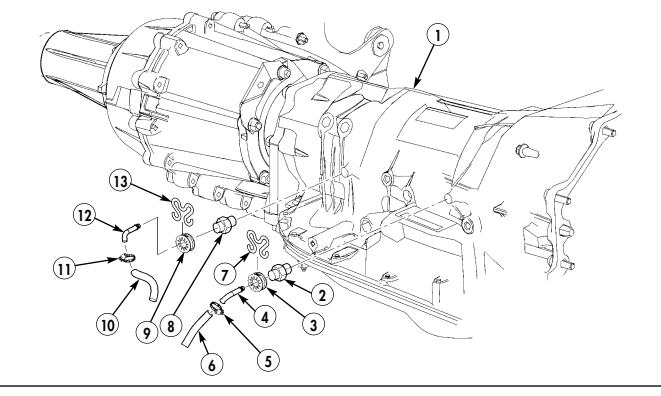

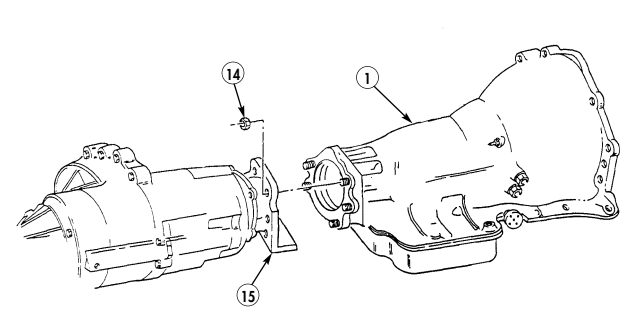

FOLLOW-ON TASK:
Install transmission/transfer case assembly (para. 19-4.1).

# 19-6. Transmission Preparation (Serial Numbers 300000 And Above) (Cont'D)

# Chapter 20 Transfer Case (Ds) Maintenance

## 20-1. Introduction

This chapter contains maintenance instructions for replacement of the transfer case at the direct support maintenance level. Some subassemblies and parts must be removed before the transfer case can be accessed. They are referenced to other paragraphs of this manual.

|       | 4    | 33   | 2,000   | 120   | 12   |
|-------|------|------|---------|-------|------|
| 1,200 | 20   | 17   |         | **132 | 0    |
|       | 30   | 7    |         | *0    | 23   |
|       | **37 | 0    |         | 14    | 50   |
|       | *0   | 40   | 3,000   | 110   | 50   |
|       | 6    | 50   |         | 130   | 30   |
| 1,500 | 50   | 40   |         | 150   | 10   |
|       |      |      |         | **160 | 0    |
|       | 60   | 30   |         | *0    | 10   |
|       | 74   | 16   | 5,000   | 15    | 50   |
|       | **90 | 0    | TO      | 140   | 50   |

# 20-3. Transfer Case Replacement (Serial Numbers 299999 And Below)

This task covers:

| c.  Static Testing                      |                                                   |
|-----------------------------------------|---------------------------------------------------|
| INITIAL SETUP:                          |                                                   |
| Applicable Models                       | Personnel Required                                |
| M1113                                   | One mechanic                                      |
|                                         | One assistant                                     |
| Tools                                   |                                                   |
| General mechanic's tool kit:            | Manual References                                 |
| automotive (Appendix B, Item 1)         | TM 9\-2320\-387\-24P                              |
| Automotive and repair: field            | TM 9\-4910\-663\-12                               |
| maintenance, basic (Appendix B, Item 6) | TM 9\-4910\-485\-12                               |
| Puller (Appendix B, Item 54)            |                                                   |
|                                         | Equipment Condition                               |
| Test Equipment                          | Alternator removed (para. 4\-8.3).                |
| Multimeter (Appendix B, Item 155)       |                                                   |
| Test stand (Appendix B, Item 56)        | General Safety Instructions                       |
|                                         | Always support alternator core and shaft assembly |
| Materials/Parts                         | during removal and installation.                  |
| Silicone compound (Appendix C, Item 75) |                                                   |

a. Removal b. Installation

a. Removal

#### Warning

Allow transfer case to cool before performing this task. Failure to do this may cause injury to personnel.

#### Caution

Cover or plug all open lines and connections immediately after disconnection to prevent contamination. Remove all plugs prior to connection.

1. Remove drainplug (4) from transfer case (1). Allow fluid to drain and install drainplug (4). Tighten drainplug (4) to 35 lb-ft (47 N•m).

2. Remove four nuts (12), lockwashers (13), two U-bolts (14), and front propeller shaft (15) from transfer case yoke (11). Discard lockwashers (13).

3. Disconnect vent line (5) from adapter (8) on transfer case (1). 4. Disconnect 90° speedometer cable adapter (7) from transfer case (1) and remove cable adapter (7)
with speedometer cable (6).

5. Remove rear propeller shaft (3) from transfer case housing (2). 6. Loosen two hose clamps (9) and disconnect rubber cooling lines (10) from transfer case (1).

20-3.  TRANSFER CASE REPLACEMENT (SERIAL NUMBERS 299999 AND BELOW) (Cont'd)

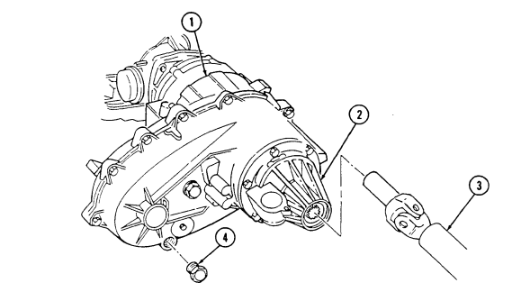

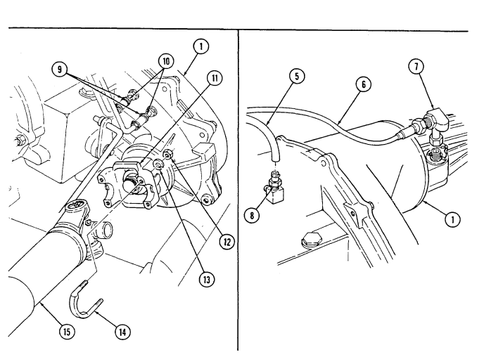

## 20-3. Transfer Case Replacement (Serial Numbers 299999 And Below) (Cont'D)

7. Remove cotter pin (1) and washer (3) from shift linkage (4) and transfer case (2) and disconnect shift linkage (4). Discard cotter pin (1).

#### Warning

Transfer case must be supported during removal. Failure to do this may cause injury to personnel or damage to equipment.

8. Place transmission jack under transfer case (2) for support. 9. Remove six locknuts (5) from studs (7) on transfer case (2). Discard locknuts (5).

10. Slide transfer case (2) away from transfer case adapter (6). Lower transfer case (2) to clear vehicle and remove transfer case (2).

11. Clean old sealant from transfer case adapter (6) and transfer case (2).

b. Installation

#### Warning

Transfer case must be supported during installation. Failure to do this may cause injury to personnel or damage to equipment.

1. Place transfer case (2) on transmission jack.

Immediately install transfer case after application of sealer.

2. Apply anaerobic gasket sealer to mounting surface of transfer case adapter (6). 3. Raise transfer case (2) and slide studs (7) into transfer case adapter (6). 4. Install transfer case (2) on transfer case adapter (6) with six locknuts (5). Tighten locknuts (5) to 26 lb-ft (35 N•m).

5. Remove transmission jack. 6. Connect transfer case shift linkage (4) to transfer case (2) with washer (3) and cotter pin (1). 7. Connect vent line (8) to adapter (11) on transfer case (2). 8. Install 90° speedometer cable adapter (10) with speedometer cable (9) on transfer case (2).

20-3. TRANSFER CASE REPLACEMENT (SERIAL NUMBERS 299999 AND BELOW) (Cont'd)

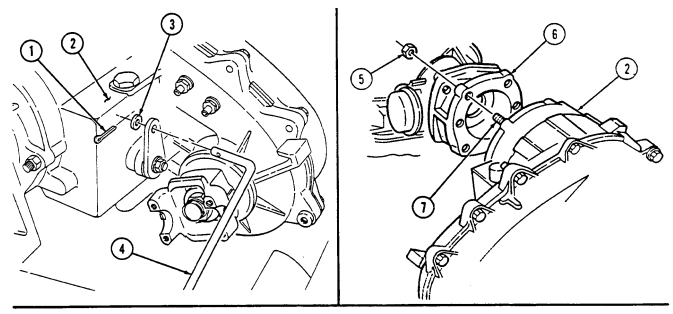

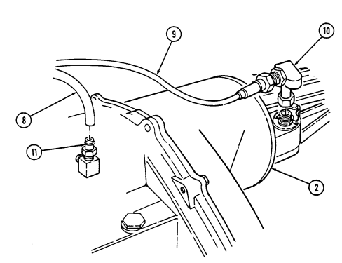

## 20-3. Transfer Case Replacement (Serial Numbers 299999 And Below) (Cont'D)

9. Connect cooler lines (1) to transfer case (3) and tighten two hose clamps (2).

10. Install rear propeller shaft (10) on transfer case housing (9). 11. Connect front propeller shaft (8) on transfer case yoke (4) with two U-bolts (7), four lockwashers (6),

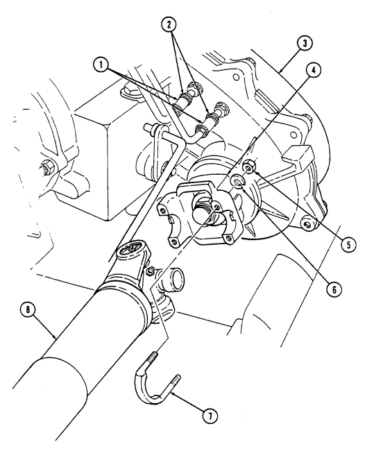

and nuts (5). Tighten nuts (5) to 13-18 lb-ft (18-24 N•m).

# 20-3. Transfer Case Replacement (Serial Numbers 299999 And Below) (Cont'D)

FOLLOW-ON TASKS: - Fill fluid to proper level (para. 2-12).

- Install muffler support bracket (para. 3-55). - Install muffler and catalytic converter (para. 3-49). - Install transfer case guide cable (para. 20-4). - Adjust shift linkage (para. 5-16).

# 20-3.1. Transfer Case Replacement (Serial Numbers 300000 And Above)

This task covers:

a. Removal **b. Installation**

| when attaching cables from test stand G\- terminals.                                             |     |
|--------------------------------------------------------------------------------------------------|-----|
| - Ensure a jumper cable is attached to both alternator 28V B+                                    |     |
| terminals when attaching cables from test stand G+ terminals.                                    |     |
| Connect cables from both alternator ground terminals to test stand G\- terminal.                 | 15. |
| Connect cables from both alternator positive terminals to test stand G+ terminal.                | 16. |
| Connect cable from alternator regulator IGN to test stand F terminal.                            | 17. |
| Connect 28 VDC output and 14 VDC output to test stand.                                           | 18. |
| NOTE                                                                                             |     |
| Auxiliary voltage and current meters may be required to measure                                  |     |
| 14 VDC output.                                                                                   |     |
| Fabricate a jumper wire with a ring terminal at both ends. Connect test stand wire from IGNITION | 19. |
| SWITCH terminal to F\-B terminal.                                                                |     |
| CAUTION                                                                                          |     |
| Ensure auxiliary measuring equipment is properly grounded to test                                |     |
| stand. Failure to do so may lead to erroneous readings or damage to                              |     |
| equipment.                                                                                       |     |

a. Removal

#### Warning

Allow transfer case to cool before performing this task. Failure to do this may cause injury to personnel.

#### Caution

Cover or plug all open lines and connections immediately after disconnection to prevent contamination. Remove all plugs prior to connection.

1. Remove drain plug (8) from transfer case (1). Allow fluid to drain and install drain plug (8). 2. Disconnect vent line (2) from transfer case (1). 3. Remove four nuts (4), lockwashers (3), two U-bolts (6), and front propeller shaft (7) from transfer case yoke (5). Discard lockwashers (3).

4. Remove cotter pin (9), washer (10), and shaft linkage (12) from transfer case lever (11).

Discard cotter pin (9).

5. Remove tiedown strap (14) from sender generator (13). Discard tiedown strap (14). 6. Loosen nut (15) and remove sender generator (13) from transfer case (1). 7. Disconnect two leads (17) from transfer case switch leads (16). 8. Remove rear propeller shaft (18) from transfer case (1). 9. Loosen two clamps (20) and remove coolant hoses (19) from transfer case (1).

10. Remove transfer case switch (21) from transfer case (1).

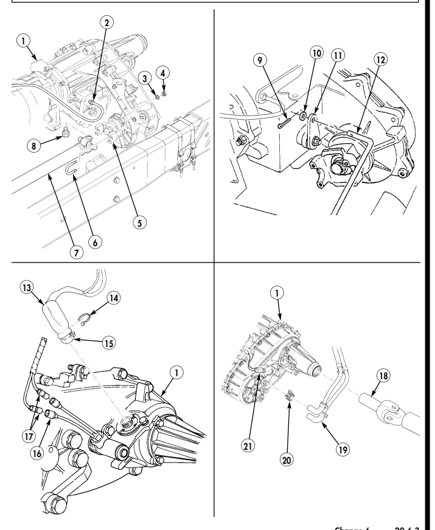

Change 6
# 20-3.1. Transfer Case Replacement (Serial Numbers 300000 And Above) (Conr'D) 20-3.1. Transfer Case Replacement (Serial Numbers 300000 And Above) (Cont'D)

#### Warning

Transfer case must be supported during removal. Failure to do this may cause injury to personnel or damage to equipment.

11. Place transmission jack under transfer case for support. 12. Remove two locknuts (5) and transfer case cooler hose bracket (4) from studs (2) of transfer case (1).

Discard locknuts (5).

13. Remove four locknuts (7) from studs (6) of transfer case (1). Discard locknuts (7). 14. Slide transfer case (1) away from transfer case adapter (3). Lower transfer case (1) to clear vehicle and remove transfer case (1).

15. Clean old sealant from transfer case adapter (3) and transfer case (1).

b. Installation

#### Warning

Transfer case must be supported during installation. Failure to do this may cause injury to personnel or damage to equipment.

1. Place transfer case (1) on transmission jack.

Immediately install transfer case after application of sealer.

2. Apply anaerobic gasket sealer to mounting surface of transfer case (1). 3. Raise transfer case (1) and slide studs (2) and (6) into transfer case adapter (3). 4. Secure transfer case (1) to transfer case adapter (3) with four locknuts (7). 5. Install transfer case cooler hose bracket (4) with two locknuts (5). 6. Tighten locknuts (5) and (7) to 26 lb-ft (35 N•m). 7. Remove transmission jack from transfer case.

20-3.1. TRANSFER CASE REPLACEMENT (SERIAL NUMBERS 300000 AND ABOVE) (Conr'd)

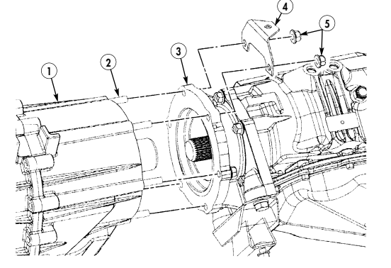

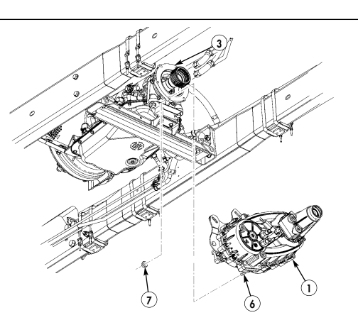

## 20-3.1. Transfer Case Replacement (Serial Numbers 300000 And Above) (Cont'D)

8. Install transfer case switch (5) from transfer case (1). 9. Install coolant hoses (3) on transfer case (1) with two clamps (4).

10. Install rear propeller shaft (2) on transfer case (1). 11. Connect two leads (10) on transfer case switch leads (9) of transfer case switch (1). 12. Install sender generator (6) on transfer case (1) and tighten nut (8). 13. Remove tie strap (7) on sender generator (6). 14. Install shaft linkage (14) on transfer case lever (13) with washer (12) and cotter pin (11). 15. Install front propeller shaft (20) on transfer case yoke (18) with two U-bolts (19), four washers (16),
and locknuts (17).

16. Connect vent line (15) to transfer case (1). 17. Install drain plug (21) on transfer case (1). Tighten drain plug (21) to 35 lb-ft (47 N•m ).

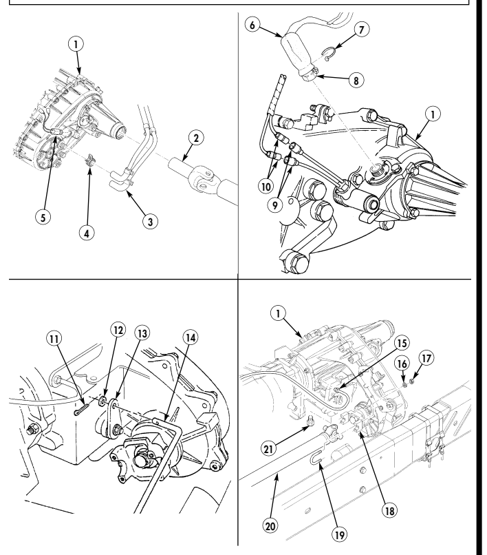

# 20-3.1. Transfer Case Replacement (Serial Numbers 300000 And Above) (Cont'D)

FOLLOW-ON TASKS: - • Transfer case guide cable installed (para. 20-5).

-  Muffler support bracket removed (para. 3-55).
-  Muffler and catalytic converter removed (para. 3-49).

# 20-4. Transfer Case Guide Cable Replacement (Serial Numbers 299999 And Below)

This task covers:
a. Removal b. Installation

| INITIAL SETUP:                    |                      |
|-----------------------------------|----------------------|
| Tools                             | Manual References    |
| General mechanic's tool kit:      | TM 9\-2320\-387\-24P |
| automotive (Appendix B, Item 1)   | Maintenance Level    |
| Materials/Parts                   | Direct support       |
| Lockwasher (Appendix G, Item 183) |                      |

#### A. Removal

1. Remove nut (9), washer (10), capscrew (15), and washer (14) from muffler mounting bracket (2) and guide cable bracket (3).

2. Remove nut (11) and guide cable bracket (3) from capscrew (13) on transfer case (1). 3. Remove capscrew (4), lockwasher (5), washer (6), guide cable (8), and support bracket (7) from frame (12). Discard lockwasher (5).

4. Remove nut (19), washer (18), guide cable (8), and washer (18) from stud (17) on crossmember support bracket (16).

#### B. Installation

1. Install guide cable bracket (3) on capscrew (13) with nut (11). Tighten nut (11) to 16-18 lb-ft 
(22-24 N•m).

2. Install guide cable bracket (3) on muffler mounting bracket (2) with washer (14), capscrew (15),
washer (10), and nut (9).

3. Install guide cable (8) and support bracket (7) on frame (12) with washer (6), lockwasher (5), and capscrew (4). Tighten capscrew (4) to 30 lb-ft (41 N•m).

4. Install washer (18) and guide cable (8) on stud (17) and crossmember support bracket (16) with washer (18) and nut (19). Tighten nut (19) to 60 lb-ft (81 N•m).

20-4.  TRANSFER CASE GUIDE CABLE REPLACEMENT
(SERIAL NUMBERS 299999 AND BELOW) (Cont'd)

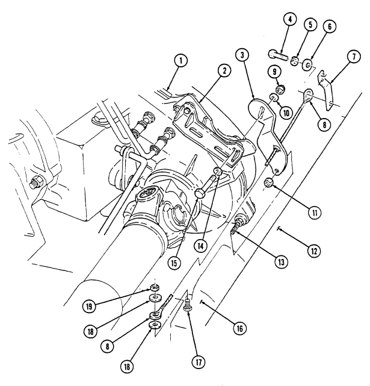

20-5. TRANSFER CASE GUIDE CABLE MAINTENANCE (SERIAL NUMBERS 300000 AND

## Above)

This task covers:
a. Removal c. Installation b. Inspection INITIAL SETUP:
Tools General mechanic's tool kit:
automotive (Appendix B, Item 1)
Torque wrench 3/8-in. drive, 75 ft-lb 
(Appendix B, Item 2.1)
Materials/Parts Lockwasher (Appendix G, Item 174) Locknut (Appendix G, Item 128) Locknut (Appendix G, Item 102) Locknut (Appendix G, Item 106)

#### A. Removal

b. Inspection Refer to TM 9-2320-387-24-1 for nut insert (12) inspection and replacement.

#### C. Installation

1. Install guide cable (10) and washer (20) on stud (18) on crossmember support bracket (19) with washer (21) and locknut (22).

2. Install guide cable (10) and washer (11) on frame (14) with washer (9), lockwasher (8), and capscrew (7).

Tighten capscrew (7) to 75 lb-ft (102 N•m).

3. Install guide cable bracket (4) on capscrew (15) on transfer case (1) with locknut (13). 4. Install washer (16), washer (3), capscrew (17), washer (5), and locknut (6) on muffler mounting bracket (2) and guide cable bracket (4).

| Allow to charge (or replace).   |
|---------------------------------|

1. Remove locknut (6), washer (5), capscrew (17), washer (3), and washer (16) from muffler mounting bracket (2) and guide cable bracket (4). Discard locknut (6).

2. Remove locknut (13) and guide cable bracket (4) from capscrew (15) on transfer case (1). Discard locknut (13).

3. Remove capscrew (7), lockwasher (8), washer (9), guide cable (10), and washer (11) from frame (14).

Discard lockwasher (8).

4. Remove locknut (22), washer (21), guide cable (10), and washer (20) from stud (18) on crossmember support bracket (19). Discard locknut (22).

20-5.  TRANSFER CASE GUIDE CABLE MAINTENANCE (SERIAL NUMBERS 300000 AND
ABOVE) (Cont'd)

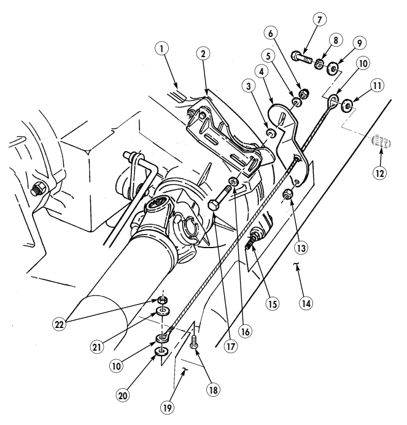

# Chapter 21 Propeller Shafts, Axles, And Suspension (Ds) Maintenance

## 21-1. Introduction

This chapter contains maintenance instructions for replacement and repair of propeller shafts, axles, and suspension system components at the direct support maintenance level. Some subassemblies and parts must be removed before propeller shafts, axles, and suspension system components can be accessed. They are referenced to other paragraphs of this manual.

21-2. PROPELLER SHAFTS, AXLES, AND SUSPENSION 
MAINTENANCE TASK SUMMARY

| CONNECT                                      | DISCONNECT                                                                                   | DIAGNOSIS                                    |                                                                      |
|----------------------------------------------|----------------------------------------------------------------------------------------------|----------------------------------------------|----------------------------------------------------------------------|
| AMPS RISE                                    | AMPS FALL                                                                                    | Alternator OK. Replace regulator only if low | AMPS (160\-238)/low VOLTS (21\-25) are                               |
| indicated in table 18\-5 and/or table 18\-6. | NO CHANGE                                                                                    | NO CHANGE                                    | Alternator must be repaired. Refer to static                         |
| testing, task c.                             |                                                                                              |                                              |                                                                      |
| 29.                                          | Turn test stand master power switch and load switch to OFF.                                  | 30.                                          | Disconnect jumper wires from terminals on test stand and alternator. |
| 31.                                          | Remove belt from test stand pulley and alternator pulley. Remove alternator from test stand. |                                              |                                                                      |

# 21-3. Differential Output Shaft Seal Replacement (Serial Numbers 299999 And Below)

This task covers:
INITIAL SETUP:
Tools General mechanic's tool kit:
automotive (Appendix B, Item 1)
Maintenance and repair shop equipment:
automotive (Appendix B, Item 2)
Special Tools Axle shaft and seal installer 
(Appendix B, Item 99)
Materials/Parts O-ring (Appendix G, Item 215) Locknut (Appendix G, Item 108) Sealing compound (Appendix C, Item 63)
a. Removal 1. Remove locknut (5), O-ring (4), and output flange (3) from output shaft (2). Discard O-ring (4) and locknut (5).

2. Remove two capscrews (7) and brake adapter (6) from differential (1). 3. Remove output shaft seal (8) from differential (1).

b. Installation 1. Using axle shaft and seal installer, install output shaft seal (8) in differential (1).

#### Caution

Apply a liberal amount of thread sealing compound to the tapped holes of differential. To allow adequate coating of threads, install capscrews shortly after applying thread sealing compound. Failure to do this could allow capscrews to loosen and cause damage to differential.

2. Apply sealing compound to tapped holes of differential (1) and install brake adapter (6) on differential (1) with two capscrews (7). Tighten capscrews (7) to 125-150 lb-ft (170-203 N•m).

3. Install output flange (3), O-ring (4), and locknut (5) on output shaft (2). Tighten locknut (5) to 170 lb-ft (231 N•m).

a. Removal **b. Installation**
Manual References TM 9-2320-387-24P

| Equipment Condition       |
|---------------------------|
| 11V1 J\-404V\-J01\-441  r |

| WAT I TAN KT MTT T UNAT   |
|---------------------------|
| Maintenance Level         |

Service brake rotors removed (para. 7-12).

Direct support

# 21-3. Differential Output Shaft Seal Replacement (Serial Numbers 299999 And Below) (Cont'D)

■

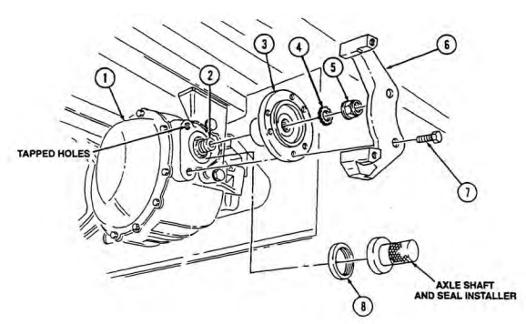

FOLLOW-ON TASK:

# 21-3.1. Rear Differential Output Shaft Seal Replacement (Serial Numbers 300000 And Above)

This task covers:
INITIAL SETUP:
Tools General mechanic's tool kit:
automotive (Appendix B, Item 1)
Maintenance and repair shop equipment:
automotive (Appendix B, Item 2)
Special Tools Axle shaft and seal installer 
(Appendix B, Item 99)
Materials/Parts O-ring (Appendix G, Item 215) Locknut (Appendix G, Item 108) Sealing compound (Appendix C, Item 63)
a. Removal b. Installation Manual References TM 9-2320-387-24P
Equipment Condition Service brake rotors removed (para. 7-12.1).

Maintenance Level Direct support

Replacement procedures for right and left rear differential output shaft seals are basically the same. This procedure covers the right side output shaft seals.

a. Removal 1. Remove locknut (3), O-ring (4), and output flange (5) from output shaft (8). Discard O-ring (4) and locknut (3).

2. Remove two capscrews (2) and brake adapter (1) from differential (9). 3. Remove output shaft seal (7) from differential (9).

b. Installation 1. Using axle shaft and seal installer (6), install output shaft seal (7) on differential (9).

#### Caution

Apply a liberal amount of thread sealing compound to the tapped holes of differential. To allow adequate coating of threads, install capscrews shortly after applying thread sealing compound. Failure to do this could allow capscrews to loosen and cause damage to differential.

2. Apply sealing compound to tapped holes of differential (9) and install brake adapter (1) on differential (9) with two capscrews (2). Tighten capscrews (2) to 125-150 lb-ft (170-203 N•m).

3. Install output flange (5), O-ring (4), and locknut (3) on output shaft (8). Tighten locknut (3) to 170 lb-ft (231 N•m).

21-3.1. REAR DIFFERENTIAL OUTPUT SHAFT SEAL REPLACEMENT
(SERIAL NUMBERS 300000 AND ABOVE) (Cont'd)

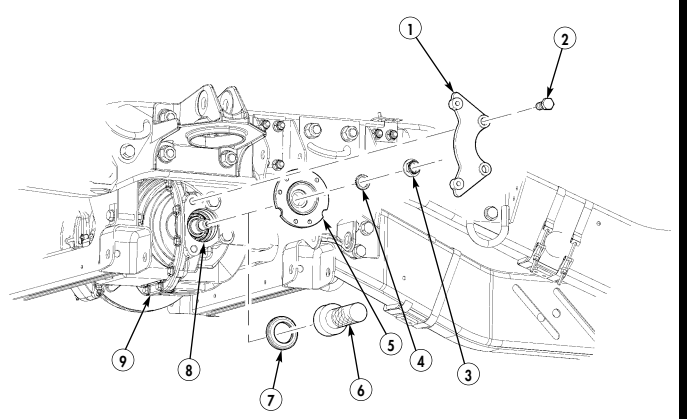

# 21-3.2. Front Differential Output Shaft Seal Replacement (Serial Numbers 300000 And Above)

This task covers:

Tools General mechanic's tool kit:
automotive (Appendix B, Item 1)
Maintenance and repair shop equipment:
automotive (Appendix B, Item 2)
Special Tools Axle shaft and seal installer 
(Appendix B, Item 99)
Materials/Parts O-ring (Appendix G, Item 215) Locknut (Appendix G, Item 108) Locknut (Appendix G, Item 114.4) Sealing compound (Appendix C, Item 63)
a. Removal b. Installation Manual References TM 9-2320-387-24P
Equipment Condition Service brake rotors removed (para. 7-12.1).

General Safety Instructions Differential is extremely heavy and must be supported during removal and installation.

Maintenance Level Direct support

#### Warning

Differential is extremely heavy and must be supported during removal and installation. Failure to do so may result in injury to personnel or damage to equipment.

NOTE
Replacement procedures for right and left front differential output shaft seals are basically the same. This procedure covers the left side output shaft seal.

#### A. Removal

1. Remove locknut (12), washer (11), capscrew (9), and washer (8) from suspension crossmember (10).

Discard locknut (12).

2. Remove locknut (6), O-ring (5), and output flange (4) from output shaft (14). Discard locknut (6) and O-ring (5).

3. Remove four capscrews (7) and brake adapter (3) from differential (13). 4. Remove output shaft seal (1) from differential (13).

b. Installation 1. Using axle shaft and seal installer (2), install output shaft seal (1) on differential (13).

#### Caution

Apply a liberal amount of thread sealing compound to the tapped holes of differential. To allow adequate coating of threads, install capscrews shortly after applying thread sealing compound. Failure to comply may allow capscrews to loosen and cause damage to differential.

2. Apply sealing compound to tapped holes of differential (13). Install mounting bracket (3) on differential (13) with four capscrews (7). Tighten capscrews to 125-150 lb-ft (170-203 N•m).

3. Install output flange (4) on output shaft (14) with O-ring (5) and locknut (6). Tighten locknut (6) to 170 lb-ft (231 N•m).

4. Secure differential (13) to suspension crossmember (10) with washer (8), capscrew (9), washer (11),
and locknut (12). Tighten locknut (12) to 90 lb-ft (122 N•m).

# 21-3.2. Front Differential Output Shaft Seal Replacement (Serial Numbers 300000 And Above) (Cont'D)

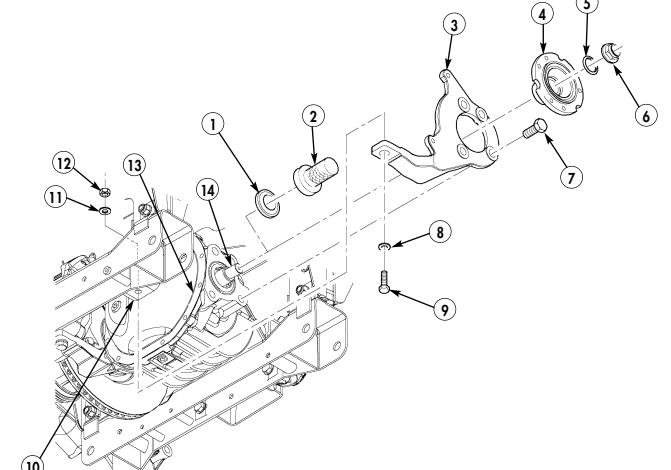

10
FOLLOW-ON TASK: Install service brake rotors (para. 7-12.1).

# 21-4. Pinion Seal Replacement

This task covers:

a. Removal **b. Installation**

| INITIAL SETUP:               | Tools                               | Manual References               |                     |        |         |
|------------------------------|-------------------------------------|---------------------------------|---------------------|--------|---------|
| General mechanic's tool kit: | TM 9\-2320\-387\-24P                | automotive (Appendix B, Item 1) | Equipment Condition |        |         |
| Special Tool                 | Torque adapter,                     | 9/16\-in.                       | (Appendix B,        | (para. | 19\-3). |
| Item 133)                    | Maintenance Level                   | Materials/Parts                 |                     |        |         |
| Direct support               | Six locknuts (Appendix G, Item 114) |                                 |                     |        |         |

The replacement procedure for pinion seals is basically the same for front and rear differential. This procedure covers the rear differential pinion seal.

#### A. Removal

1. Remove four capscrews (7), two straps (6), and rear propeller shaft (1) from pinion flange (3). 2. Using a lb-in. torque wrench, measure torque required to rotate pinion (4), and record measurement.

3. Count and record number of exposed threads on end of pinion (4) and mark locknut (2) and pinion (4) for assembly.

4. Remove locknut (2) and pinion flange (3) from pinion (4). 5. Remove pinion seal (5) from pinion (4).

#### B. Installation

1. Using seal installer, install pinion seal (5) on pinion (4). 2. Install pinion flange (3) on pinion (4) with locknut (2). 3. Tighten locknut (2) to original position. 4. Tighten locknut (2) in small increments, until torque required to rotate pinion (4) exceeds original measurement by 2 lb-in. (0.2 N•m).

5. Install rear propeller shaft (1) on pinion flange (3) with two straps (6) and four capscrews (7).

Tighten capscrews (7) to 60 lb-ft (81 N•m).

# 21-4. Pinion Seal Replacement (Cont'D)

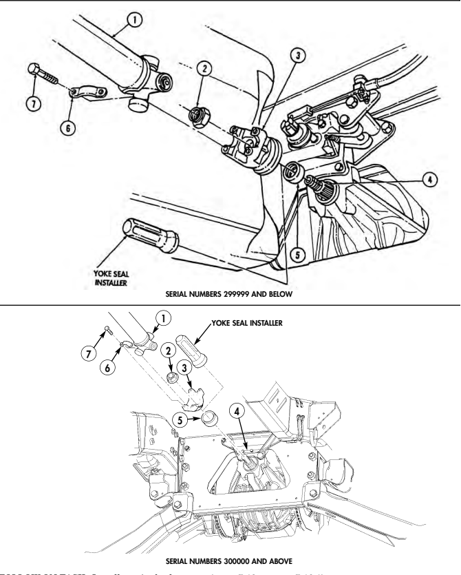

FOLLOW-ON TASK: Install service brake rotors (para. 7-12 or para. 7-12.1).

# 21-4.1. **Front Differential Replacement (Serial Numbers 300000 And Above)**

This task covers:

| INITIAL SETUP:   |
|------------------|

Tools General mechanic's tool kit:
automotive (Appendix B, Item 1)
Maintenance and repair shop equipment:
automotive (Appendix B, Item 2)
Special Tools Two locknuts (Appendix G, Item 108) Four locknuts (Appendix G, Item 114.4) Two O-rings (Appendix G, Item 215) Sealing compound (Appendix C, Item 63)
Personnel Required One mechanic One assistant

| Manual References   |
|---------------------|

a. Removal **b. Installation**

Equipment Condition
- Service brake rotors removed (para. 7-12.1). - Front differential vent line removed
(para. 6-14.2).

General Safety Instructions Differential must be supported during removal and installation.

Maintenance Level Direct support

#### Warning

Differential must be supported during removal and installation. Failure to do this may cause injury to personnel or damage to equipment.

Have drainage container ready to catch oil.

a. Removal 1. Remove drainplug (20) from differential (19). Allow oil to drain and install drainplug (20). 2. Remove four capscrews (13), two straps (12), and propeller shaft (1) from pinion flange (5). 3. Remove two capscrews (2) and washers (3) from differential (4). 4. Remove two locknuts (11), washers (10), capscrews (6), washers (7), and mounting bracket (9) from rear crossmember (8). Discard locknuts (11).

5. Remove two locknuts (26), O-rings (25), and output flanges (24) from differential (19). Discard locknuts (26) and O-rings (25).

6. Remove two locknuts (15), washers (14), capscrews (18), and washers (17) from front crossmember (16) and lower differential (19) from vehicle. Discard locknuts (15).

7. Remove eight capscrews (23) and two brake caliper adapters (22) from differential (19).

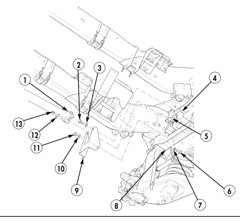

21-4.1. FRONT DIFFERENTIAL REPLACEMENT (SERIAL NUMBERS 300000 AND ABOVE) (Cont'd)

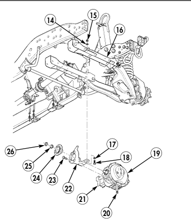

# 21-4.1. **Front Differential Replacement (Serial Numbers 300000 And Above) (Cont'D)**

b. Installation

#### Caution

Apply a liberal amount of thread sealing compound to the tapped holes of differential. To allow adequate coating of threads, install capscrews shortly after applying thread sealing compound. Failure to do this could allow capscrews to loosen and cause damage to differential.

1. Apply sealing compound to tapped holes (21) in differential (19). Install two brake caliper adapters (22)
on differential (19) with eight capscrews (23). Tighten capscrews (23) to 125-150 lb-ft (170-203 N•m).

2. Raise differential (19) into place and install on front crossmember (16) with two washers (17),
capscrews (18), washers (14), and locknuts (15).

3. Install mounting bracket (9) on rear crossmember (8) with two washers (7), capscrews (6), washers (10),
and locknuts (11). Tighten locknuts (11) to 90 lb-ft (122 N•m).

4. Apply sealing compound to capscrews (2). Secure differential (19) to mounting bracket (9) with two washers (3) and capscrews (2). Tighten capscrews (2) to 125-150 lb-ft (170-203 N•m).

5. Install propeller shaft (1) on pinion flange (5) with two straps (12) and four capscrews (13). Tighten capscrews (13) to 13-18 lb-ft (18-24 N•m).

6. Install output flange (24) on differential (19) with O-ring (25) and locknut (26). Tighten locknuts (26)
to 165-195 lb-ft (224-264 N•m).

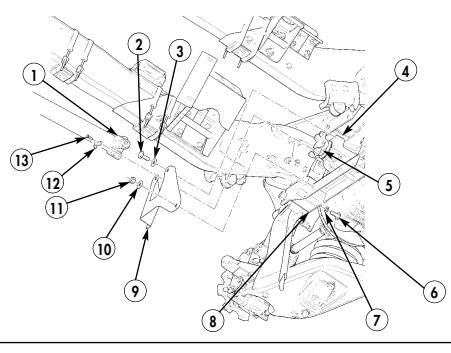

21-4.1. FRONT DIFFERENTIAL REPLACEMENT (SERIAL NUMBERS 300000 AND ABOVE) (Cont'd)

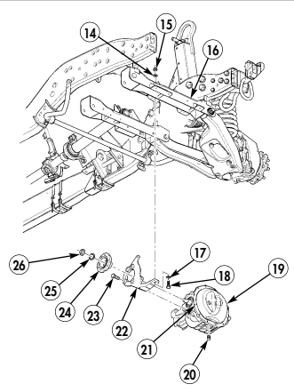

FOLLOW-ON TASKS: - Install front differential vent lines (para. 6-14.2).

- Install service brake rotors (para. 7-12.1). - Fill differential and check for leaks (para. 2-12).

# 21-4.2. Rear **Differential And Support Brackets Replacement** (Serial Numbers 300000 And Above) (Cont'D)

This task covers:
a. Removal **b. Installation**

Tools General mechanic's tool kit:
automotive (Appendix B, Item 1)
Maintenance and repair shop equipment automotive (Appendix B, Item 1)
Materials/Parts Two locknuts (Appendix G, Item 108) Two locknuts (Appendix G, Item 114.5) Four lockwashers (Appendix G, Item 174) Two locknuts (Appendix G, Item 114.4) Two O-rings (Appendix G, Item 215) Sealing compound (Appendix C, Item 63)
Personnel Required One mechanic One assistant

#### Manual References

TM 9-2320-387-24P
Equipment Condition Parking brake pads removed (para. 7-22). Service brake rotors removed (para. 7-12.1). Rear differential vent line removed (para. 6-14.2).

General Safety Instructions Differential must be supported during removal and installation.

Maintenance Level Direct Support

#### Warning

Differential must be supported during removal and installation. Failure to do this may cause injury to personnel or damage to equipment.

- Have drainage container ready to catch oil. - Mark brackets and rear mount for installation.

a. Removal 1. Remove two clamps (3) and (5) and coolant hoses (1) and (2) from differential adapters (4) and (6). 2. Remove drainplug (17) from differential (16). Allow oil to drain and install drainplug (17). 3. Remove four capscrews (20), two straps (19), and propeller shaft (7) from pinion flange (15). 4. Remove two locknuts (8), washers (9), capscrews (14), and washers (13) from crossmember (18).

Discard locknuts (8).

5. Remove two capscrews (10), washers (11), and mounting bracket (12) from crossmember (18).

21-4.2. REAR DIFFERENTIAL AND SUPPORT BRACKETS REPLACEMENT
(SERIAL NUMBERS 300000 AND ABOVE) (Cont'd)

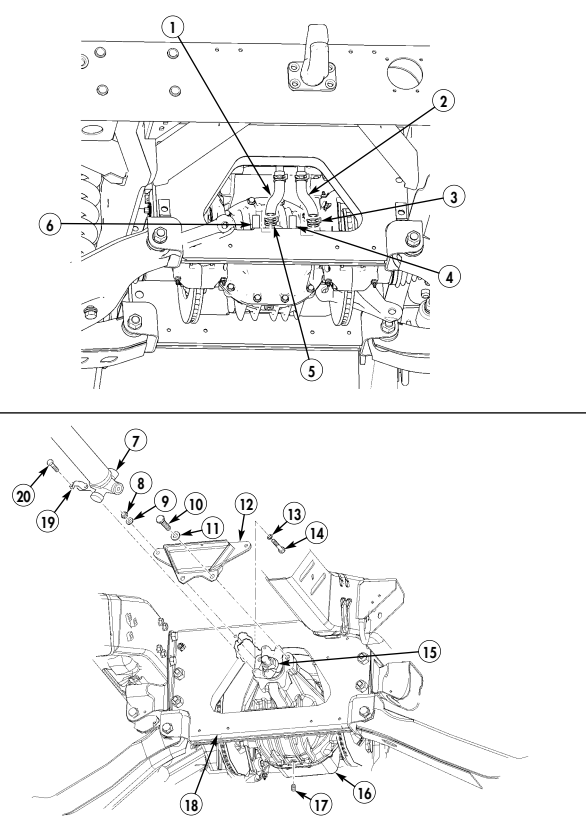

## 21-4.2. Rear **Differential And Support Brackets Replacement** (Serial Numbers 300000 And Above) (Cont'D)

6. Remove two locknuts (4), washers (5), capscrews (1), and washers (2) from differential mount (6). 7. Remove four capscrews (7), lockwashers (8), and washers (9) from rear mounting plate (10) and lower differential (3) from vehicle.

8. Remove two locknuts (15), O-rings (14), and output flanges (13) from differential (3). Discard locknuts (15) and O-rings (14).

9. Remove two capscrews (16) and caliper bracket (17) from differential (3).

10. Remove two capscrews (12) and differential support bracket (11) from differential (3).

#### B. Installation

1. Apply sealing compound to capscrews (12) and install differential support bracket (11) on differential (3). Tighten capscrews (12) to 125-150 lb ft. (169-203 N•m).

2. Apply sealing compound to capscrews (16) and install caliper bracket (17) on differential (3).

Tighten capscrews (16) to 125-150 lb ft. (169-203 N•m).

3. Install two output flanges (13) on differential (3) with O-rings (14) and locknuts (15). Tighten locknuts (15) to 165-195 lb-ft. (223-264 N•m).

4. Raise differential (3) and install on rear mounting plate (10) with four washers (9), lockwashers (8),
and capscrews (7).

5. Secure differential (3) to rear crossmember (6) with two washers (2), capscrews (1), washers (5), and locknuts (5). Tighten locknuts (5) to 90 lb-ft. (122 N•m).

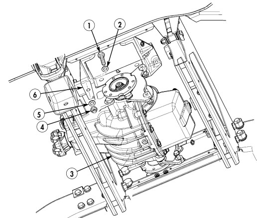

21-4.2. REAR **DIFFERENTIAL AND SUPPORT BRACKETS REPLACEMENT**
(SERIAL NUMBERS 300000 AND ABOVE) (Cont'd)

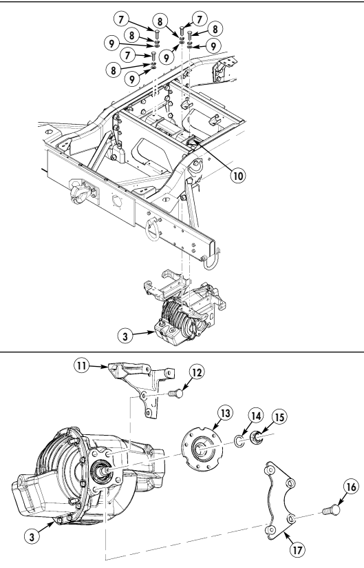

## 21-4.2. Rear **Differential And Support Brackets Replacement** (Serial Numbers 300000 And Above) (Cont'D)

6. Install mounting bracket (12) on crossmember (18) with two washers (11) and capscrews (10).

Tighten capscrews (10) to 125-150 lb-ft (170-203 N•m).

7. Secure mounting bracket (12) to crossmember (18) with two washers (13), capscrews (14),
washers (9), and locknuts (8). Tighten locknuts (8) to 90 lb-ft (122 N•m).

8. Install propeller shaft (7) on pinion flange (15) with two straps (19) and four capscrews (20). 9. Install two coolant hoses (2) and (1) on differential adapters (6) and (4) with hose clamps (5) and (3).

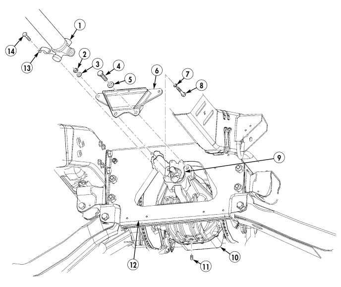

# 21-4.2. Rear Differential And Support Brackets Replacement (Serial Numbers 300000 And Above) (Cont'D)

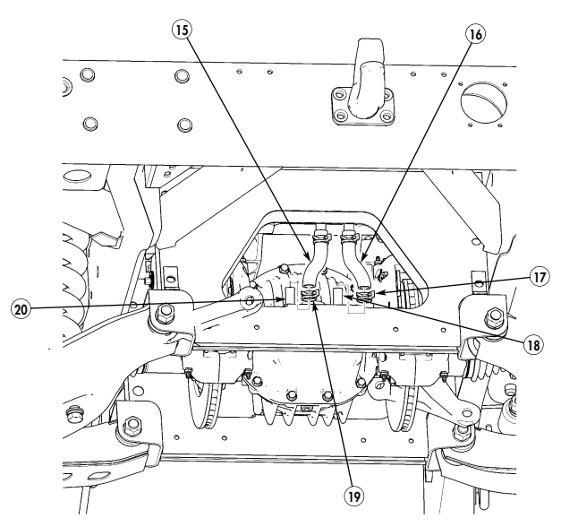

FOLLOW-ON TASKS: - • Rear differential vent line installed (para. 6-14.2)
- Service brake rotors installed (para. 7-12.1).

· Parking brake pads installed (para. 7-22).

· Fill differential to proper level (para. 2-12).

# 21-4.3. **Front Differential Cover Maintenance** (Serial Numbers 300000 And Above)

This task covers:
a. Removal c. Installation b. Cleaning and Inspection

Tools General mechanic's tool kit:
automotive (Appendix B, Item 1)
Materials/Parts RTV silicone compound (Appendix C, Item 74) Drycleaning solvent (Appendix C, Item 26)
Equipment Condition Front differential removed (para. 21-4.1).

a. Removal Remove twelve capscrews (2) and cover (1) from differential (3). b. Cleaning and Inspection

Drycleaning solvent is flammable and will not be used near an open flame. A fire extinguisher will be kept nearby when the solvent is used. Use only in well-ventilated places. Failure to do this may result in injury to personnel or damage to equipment.

1. Using drycleaning solvent, clean cover (1), twelve capscrews (2), and differential (3). 2. Inspect cover (1) for cracks, wear, or breaks. Replace cover (1) if cracked, worn, or broken.

c. Installation 1. Apply RTV silicone compound to face of differential (4) 2. Install cover (1) on differential (3) with twelve capscrews (2).

| Manual References                                |
|--------------------------------------------------|
| TM 9\-2320\-387\-24P                             |
| General Safety Instructions                      |
| Drycleaning solvent is flammable and will not be |

| Direct support   |
|------------------|

| Maintenance Level   |
|---------------------|

used near an open flame.

# 21-4.3.  Front Differential Cover Maintenance (Serial Numbers 300000 And Above) (Cont'D)

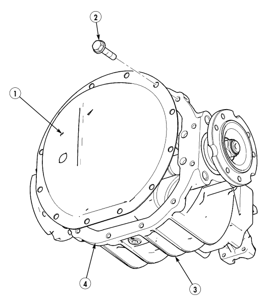

FOLLOW-ON TASK: Install front differential (para. 21-4.1).

# 21-4.4. Rear **Differential Cover Maintenance** (Serial Numbers 300000 And Above)

This task covers:
a. Removal c. Installation b. Cleaning and Inspection

Tools

| Materials/Parts   |
|-------------------|

General mechanic's tool kit:
automotive (Appendix B, Item 1)
RTV silicone compound (Appendix C, Item 74) Drycleaning solvent (Appendix C, Item 26)
Equipment Condition Rear differential removed (para. 21-4.2).

a. Removal Remove twelve capscrews (4) and cover (3) from differential (1). b. Cleaning and Inspection

| Equipment Condition                                 |
|-----------------------------------------------------|
| •Muffler and catalytic converter removed            |
| (para. 3\-49).                                      |
| •Muffler support bracket removed (para. 3\-55).     |
| •Transfer case guide cable removed (para. 20\-4).   |
| General Safety Instructions                         |
| •Allow transfer case to cool before performing this |
| task.                                               |

Drycleaning solvent is flammable and will not be used near an open flame. A fire extinguisher will be kept nearby when the solvent is used. Use only in well-ventilated places. Failure to do this may result in injury to personnel or damage to equipment.

1. Using drycleaning solvent, clean cover (3), twelve capscrews (4), and face of differential (2). 2. Inspect cover (3) and internal cooler for cracks, wear, or breaks. Replace cover (3) if cracked, worn, or broken.

#### C. Installation

1. Apply RTV silicone compound to face of differential (2) 2. Install cover (3) on differential (1) with twelve capscrews (4).

# 21-4.4.  Rear Differential Cover Maintenance (Serial Numbers 300000 And Above) (Cont'D)

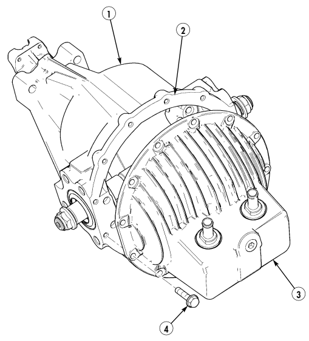

FOLLOW-ON TASK: Install rear differential (para. 21-4.2).

| Tools   |
|---------|

# 21-5. Differential Replacement (Serial Numbers 299999 And Below)

This task covers:
INITIAL SETUP:
Tools

| Tools                           | Manual References                         |
|---------------------------------|-------------------------------------------|
| General mechanic's tool kit:    | TM 9\-2320\-387\-24P                      |
| automotive (Appendix B, Item 1) | Equipment Condition                       |
| Special Tools                   | - Muffler and catalytic converter removed |
| Torque adapter, 9/16\-in.       | (para. 3\-49).                            |
| (Appendix B, Item 133)          | - Muffler support bracket removed         |

a. Removal b. Installation

Two locknuts (Appendix G, Item 108) Two locknuts (Appendix G, Item 85) Two O-rings (Appendix G, Item 215) Sealing compound (Appendix C, Item 63)
Differential must be supported during removal and installation.

Maintenance Level Direct support Personnel Required One mechanic One assistant

#### Warning

Differential must be supported during removal and installation. Failure to do this may cause injury to personnel or damage to equipment.

- Have drainage container ready to catch oil. - The replacement procedure for front and rear differential is basically the same except where noted.

a. Removal 1. Remove drainplug (21) from differential (1). Allow oil to drain and install drainplug (21). 2. Remove four capscrews (7), two straps (6), and propeller shaft (8) from pinion flange (2).

Rear differential is not equipped with washers as indicated in step 3.

3. Remove two capscrews (5) and washers (4) from differential (1) and mounting bracket (3). 4. Remove two locknuts (12), washers (9), capscrews (10), washers (9), and mounting bracket (3) from frame crossmember (11). Discard locknuts (12).

5. Remove two locknuts (16), O-rings (17), and output flanges (18) from differential (1). Discard locknuts (16) and O-rings (17).

6. Support differential (1). 7. Remove four capscrews (15) and washers (14) from differential (1) and side mounting brackets (13). 8. Lower differential (1) slightly and disconnect vent line (22). 9. Remove differential (1).

10. Remove four capscrews (19) and two brake caliper adapters (20) from differential (1).

21-5. DIFFERENTIAL REPLACEMENT (SERIAL NUMBERS 299999 AND BELOW) (Cont'd)
■

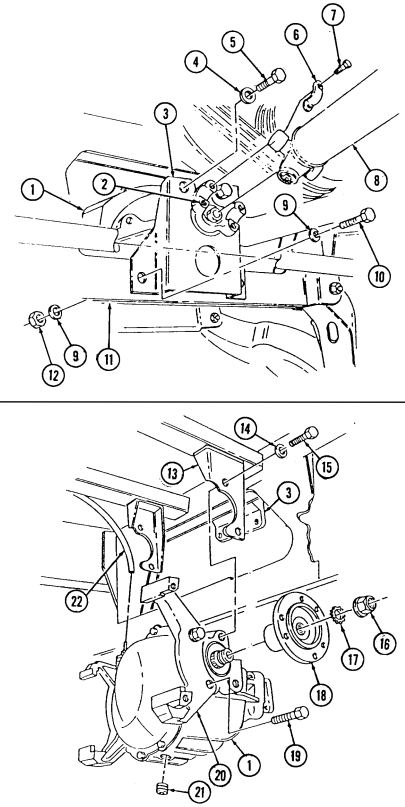

# 21-5. Differential Replacement (Serial Numbers 299999 And Below) (Cont'D)

b. Installation

#### Caution

Apply a liberal amount of thread sealing compound to the tapped holes of differential. To allow adequate coating of threads, install capscrews shortly after applying thread sealing compound. Failure to do this could allow capscrews to loosen and cause damage to differential.

1. For rear differentials, apply sealing compound to tapped holes in differential (11). Install two brake caliper adapters (12) on differential (11) with four capscrews (10). Tighten capscrews (10) to 125-150 lb-ft (170-203 N•m).

2. Raise differential (11) into place and connect vent line (13). 3. Apply sealing compound in tapped holes in differential (11). Install differential (11) on two side mounting brackets (1) with four washers (2) and capscrews (3).

4. Install mounting bracket (4) on frame crossmember (20) with two washers (19), capscrews (18),
washers (19), and locknuts (21). Tighten locknuts (21) to 90 lb-ft (122 N•m).

Rear differential is not equipped with washers as indicated in step 5.

5. Apply sealing compound to capscrews (6). Install differential (11) on mounting bracket (4) with two washers (5) and capscrews (6).

6. Tighten capscrews (3) and (6) to 125-150 lb-ft (170-203 N•m). 7. Connect propeller shaft (17) to pinion flange (14) with two straps (15) and four capscrews (16).

Tighten capscrews (16) to 13-18 lb-ft (18-24 N•m).

8. Install two output flanges (9) on differential (11) with O-rings (7) and locknuts (8). Tighten locknuts (8) to 165-195 lb-ft (224-264 N•m).

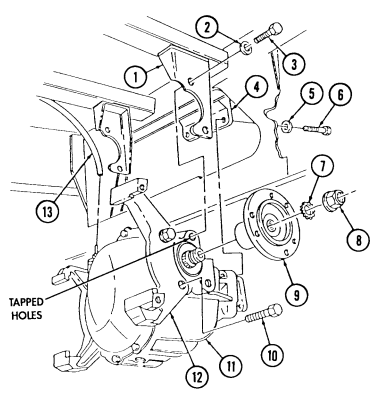

21-5. DIFFERENTIAL REPLACEMENT (SERIAL NUMBERS 299999 AND BELOW) (Cont'd)

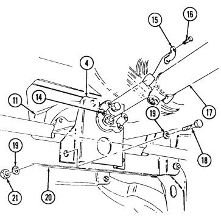

FOLLOW-ON TASKS: - • Install service brake rotors (para. 7-12).
- • - • - Fill differential to proper level (para. 2-12).

E

## 21-5.1. Front Differential Alignment

This task covers:
Alignment INITIAL SETUP:
Tools General mechanic's tool kit:
automotive (Appendix B, Item 1)

#### Materials/Parts

Six locknuts (Appendix G, Item 121)
Personnel Required One mechanic Manual References TM 9-2320-387-24P

#### Alignment Equipment Condition

- Vehicle on level ground. - Remove engine right and left splash shields 
(paras. 10-23 and 10-24).

- Remove radiator and fan shroud assembly
(para. 3-62).

Maintenance Level Direct support 1. Loosen two nuts (7) and screws (6) securing pinion mounting bracket (5) to rear crossmember (4). 2. Loosen four nuts (2) and screws (1) securing right and left channel brackets (3) to differential hanger brackets (10).

3. Move front differential assembly away from affected halfshaft by moving differential hanger brackets (10) approximately 0.250 in. +/- 0.125 in. (6.4 mm +/- 3.2 mm). Tighten four screws (1) and nuts (2) loosened in step 2.

4. Tighten two screws (6) and nuts (7) loosened in step 1. 5. Verify no resistance is felt during rotations of either wheel. 6. Remove two nuts (7) securing pinion mounting bracket (5) to rear crossmember (4) and install two locknuts (7).

7. Remove four nuts (2) securing right and left channel brackets (3) to differential hanger brackets (10) and install four locknuts (2).

# 21-5.1. Front Differential Alignment (Cont'D)

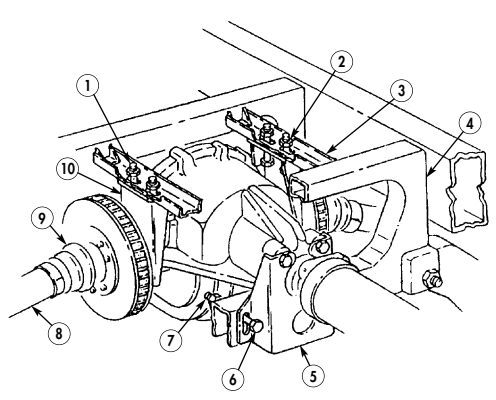

FOLLOW-ON TASKS: - Install radiator and fan shroud assembly (para. 3-62).

- Install engine right and left splash shields (para.s 10-23 and 10-24).

# 21-6. Geared Hub Repair

This task covers:

a. Disassembly c. Inspection b. Cleaning d. Assembly

#### Initial Setup: Tools

General mechanic's tool kit:
automotive (Appendix B, Item 1)
Dial indicator (Appendix B, Item 113) Blind hole puller set
(Appendix B, Item 112) (Optional)

#### Special Tools

Input seal installer (Appendix B, Item 107) Spindle seal installer (Appendix B, Item 109) Driver handle (Appendix B, Item 60)

#### Materials/Parts

Input seal (Appendix G, Item 297) Seal (Appendix G, Item 290) Seal (Appendix G, Item 280.1) Keyed washer (Appendix G, Item 72.1)

| Manual References    |
|----------------------|
| TM 9\-2320\-387\-24P |
| Maintenance Level    |
| Direct support       |

| Maintenance Level   |
|---------------------|
| Direct support      |

| Equipment Condition              |
|----------------------------------|
| Geared hub removed (para. 6\-9). |

TM 9-2320-387-24P

#### A. Disassembly

1. Position geared hub (4) with spindle (5) supporting geared hub (4).

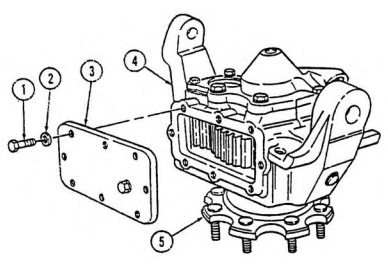 2. Remove eight capscrews (1), washers (2), and side cover (3) from geared hub (4). 

# 21-6. Geared Hub Repair (Cont'D)

- If backlash between drive and driven gears is more than 0.018 in.

(0.46 mm), both gears must be replaced. Worn or damaged bearings may invalidate backlash measurements.

- Backlash mesurement must be taken perpendicular to face of gear tooth.

3. Mount dial indicator on geared hub (4) and index indicator to register from one tooth of drive gear (7). Move drive gear (7) back and forth while holding driven gear (6) stationary to read backlash.

4. Remove four capscrews (8), washers (9), and steering arm cover (10) from geared hub (4). 5. Remove retaining ring (12) and seal (11) from steering arm cover (10). Discard seal (11). 6. Remove retaining ring (13), nut retainer (14), nut (15), and keyed washer (16) from spindle (20).

NOTE
It may be necessary to lightly tap threaded end of spindle to release it from the inner spindle bearing.

7. Lift geared hub (4) off spindle (20). 8. Remove inner bearing (17), inner bearing spindle spacer (18), and driven gear (6) from geared hub (4).

9. Remove outer bearing spacer (19) from spindle (20).

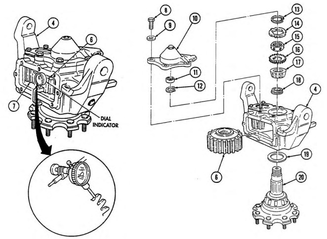

## 21-6. Geared Hub Repair (Cont'D)

10. Remove four capscrews (1), washers (2), drive gear retainer (3), shim gaskets (4), bearing cup (5),
and drive gear (6) from geared hub (8).

11. Remove retaining washer (7) from inside drive gear (6) or geared hub (8). 12. Remove output seal (9) from geared hub (8). Discard seal (9). 13. Remove input seal (10) from drive gear retainer (3). Discard seal (10).

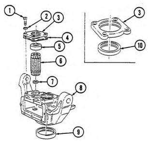

b. Cleaning Clean all geared hub components in accordance with para. 2-14.

c. Inspection

- For general inspection instructions, refer to para. 2-15. - For general repair instructions, refer to para. 2-16. - Replace both bearings of a pair if either bearing is damaged. - A blind hole puller should be used to remove bearing races from geared hub.

- A bearing splitter-type puller should be used to remove drive gear bearings.

- A bearing spacer is seated in geared hub behind inner spindle bearing race. Inspect bearing spacer only if bearing race has to be replaced.

1. Inspect all bearings (12) and bearing races (13) (TM 9-214). Replace if damaged.

If all bearings pass inspection and backlash, measured in step 3 of subtask a., was over 0.018 in. (0.45 mm), both drive and driven gears are worn and must be replaced. If any of the bearings failed inspection backlash between drive and driven gear must be rechecked at installation prior to replacing gears. Drive and driven gears must be replaced as matched set.

2. Inspect splines and gear teeth on drive gear (6) and driven gear (11). Replace both if damaged.

#### 21-6. Geared Hub Repair **(Cont'D)** Note

A new spindle extension is required if replacing spindle or if extension is damaged. Apply adhesive sealant on extension prior to pressing it into spindle. 

3. Inspect spindle (14) and spindle extension (15) for damage and rough or corroded sealing surface (16). Replace spindle (141 and extension (151 if damaged or if sealing surface (16) is rough or corroded. 

4. Inspect geared hub (8) and all threaded holes for damage. Repair any damaged holes using thread repair inserts. Replace geared hub assembly if geared hub (8) is damaged. 

5. Remove plug (17) from steering arm cover (18). Inspect steering arm cover (18) and threaded hole. 

Replace steering arm cover (181 if damaged. 

6. Inspect drive gear retainer (3). Replace if damaged. 

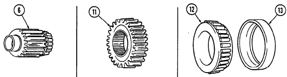

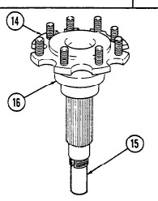

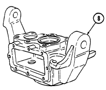

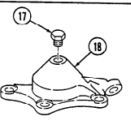

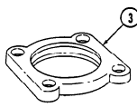

## I 21-6. Geared Hub Repair **(Cont'D)** 1

d. Assembly 

For general assembly instructions, refer to para. 2-17. 

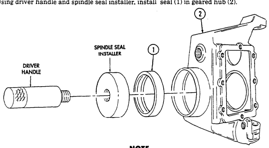

1. 

NOTE 
Ensure radius on outer diameter of input seal faces inside drive gear 

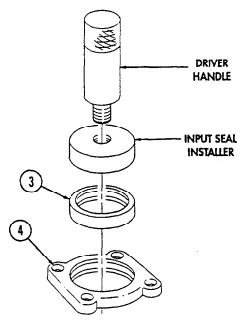

retainer. 

2. Using input seal installer and driver handle, install input seal (3) in drive gear retainer (4). 

## 21-6. Geared Hub Repair (Cont'D) I

3. Install retaining washer (101 in shallow end of drive gear (9). 

4. Install drive gear (9) and inboard bearing cup (8) in geared hub (2). 5. Apply sealing compound to capscrews (51. Install shim gaskets (7) and drive gear retainer (4) on geared hub (2) with four washers (6) and capscrews (51. Tighten capscrews (5) to 25-35 lb-ft 
(34-48 N-m). 

6. Mount dial indicator on geared hub (2) and index indicator to register on end of drive gear (9). 

Reapply sealing compound to capscrews if removed. 

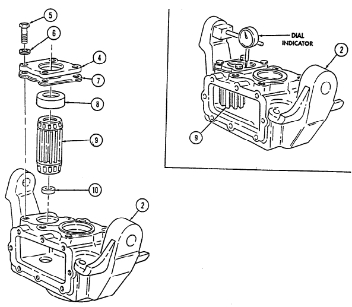

7. Move drive gear (9) up and down to read end play. End play should be 0.001-0.006 in. (0.03-0.15 mm). 

If end play is incorrect, add or subtract shim gaskets (71 and recheck end play. 

## 1 21-6. Geared Hub Repair (Cont'D) I

8. 9. 

Install driven gear (11) and spindle spacer (6) in geared hub (7). 

Install outer bearing spacer (8) on spindle (9). 

10. 

Lower geared hub (7) onto spindle (9) and align splines on driven gear (11) with splines on spindle (9). Ensure outer spindle bearing (10) seats in bearing cup. 

Apply grease to face of nut (3). 

11. 

12. 13. 

Install inner bearing (5), keyed washer (41, and nut (31 on spindle (9). 

Tighten nut (3) to 40 lb-R (54 N-m) while rotating geared hub (7) back and forth to seat bearings (4) 
and (10). 

Loosen and retighten nut (31 to 23-27 lb-ft (31-37 N-m). 

14. 

If gear backlash measurement in step 3 of subtask a. indicated a backlash over 0.018 in. (0.46 mm) and any bearings were replaced, remeasure gear backlash. 

15. 

Measure backlash between gears (11) and (12). Refer to subtask a., step 3. If backlash exceeds 0.018 in. (0.44 mm), replace both gears. 

l It may be necessary to slightly loosen or tighten nut to gain proper alignment with nut retainer and keyed washer. 

16. 

l Ensure retaining ring is seated in groove on nut. 

Install nut retainer (2) over nut (31, fitting tabs (131 on retainer (2) in keyed washer (4) and secure 

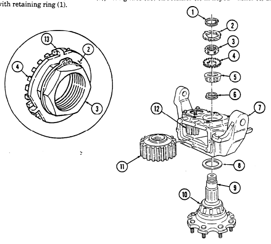

#### I 1

# 21-6. Geared Hub Repair (Cont'D)

Immediately install steering arm cover after application of sealer. 

17. 

Apply sealing compound to seal (17) and install seal (17) on steering arm cover (16) with retaining ring (18). 

18. 

Install steering arm *cover* (16) on geared hub (7) with four washers (15) and capscrews (141. Tighten capscrews (14) to 65 lb-ft (88 N-ml. 

19. 

Apply anaerobic sealer to side cover (22) mating surface and position side cover **(22)** on geared hub (7). 

20. 

Apply sealing compound to capscrews (20) and install side cover (22) on geared hub (7) with eight washers (21) and capscrews (201. Tighten capscrews (20) to 8-13 lb-ft (11-18 Neml. 

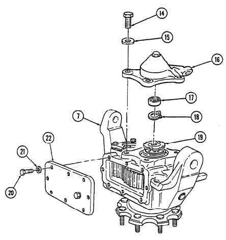

FOLLOW-ON TASKS: Install geared hub (para. 6-9). 

# 21-7. Control Arm Bushing Replacement

This task covers: 
INITIAL SETUP: 
Tools General mechanic's tool kit: 
automotive (Appendix B, Item 1) 
Materials/Parts Grease (Appendix C, Item 34) 
Personnel Required One mechanic One assistant 

a. Removal b. Installation 

Manual References TM 9-2320-387-24P, 
Equipment Condition Control arm removed (para. 6-25 or 6-26). 

Maintenance Level Direct support 

Control arm bushings must be replaced as a set. 

[ a. Removal 1 Support control arm (1) and press bushing (21 out of control arm (1). 

b. Installation 1. 

Lubricate O.D. of bushing (2) with grease. 

Insert bushing (2) in control arm (1). 

2. 

3. 

Support control arm (1) and press bushing (2) into control arm (1) until flange (3) on bushing (2) 

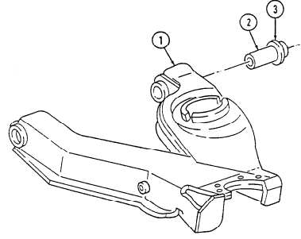

seats on control arm (1). 

FOLLOW-ON TASK: Install control arm (para. 6-25 or 6-26). 

# 21-8. Front Propeller Shaft Maintenance

This task covers:

a. Disassembly **b. Assembly**

| 21\-1.                                                                                                    | INTRODUCTION                                                                                       |
|-----------------------------------------------------------------------------------------------------------|----------------------------------------------------------------------------------------------------|
| This chapter contains maintenance instructions for replacement and repair of propeller shafts, axles, and | suspension system components at the direct support maintenance level. Some subassemblies and parts |
| must be removed before propeller shafts, axles, and suspension system components can be accessed. They    | are referenced to other paragraphs of this manual.                                                 |

#### A. Disassembly

1. Install bearing puller between center bearing (3) and shield (4). 2. Remove center bearing (3) and retainer (1) from coupling shaft (5). 3. Remove shield (4) from coupling shaft (5).

b. Assembly 1. Install shield (4) on coupling shaft (5). 2. Press center bearing (3) on coupling shaft (5) until seated against shoulder (6). Ensure flange (2) on center bearing (3) faces up.

3. Press bearing retainer (1) on coupling shaft (5).

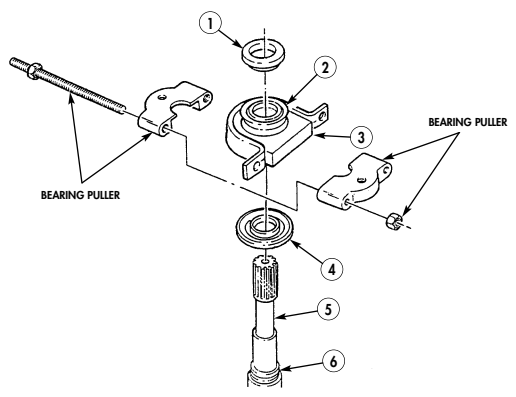

FOLLOW-ON TASK: Assemble front propeller shaft (para. 6-3).

# 21-9. Differential And Axle Free Play Tolerance Inspection

This task covers:
Inspection INITIAL SETUP:

#### Tools

General mechanic's tool kit:
automotive (Appendix B, Item 1)
Dial indicator (Appendix B, Item 113) C-clamp (Appendix B, Item 153)

| Maintenance Level   |
|---------------------|
| Direct support      |

| Manual References   |
|---------------------|

#### Inspection

1. Park vehicle on a flat surface. 2. Chock front and rear wheels and release parking brake (TM 9-2320-387-10). 3. Use a flat steel plate or scrap metal (5) and C-clamp to position dial indicator mount assembly (4)
on crossmember (1). 

4. Position dial indicator on disc assembly (3). 5. Manually move axle shaft (2) up and down vertically as far as possible. Note dial indicator reading in each direction and record combined readings.

6. If sum of up and down vertical movement exceeds 0.0236 in. (0.5994 mm), notify general support to disassemble differential, inspect for excessive wear, and replace worn components (para. 30-3).

7. Repeat steps 1 through 6 for remaining axles.

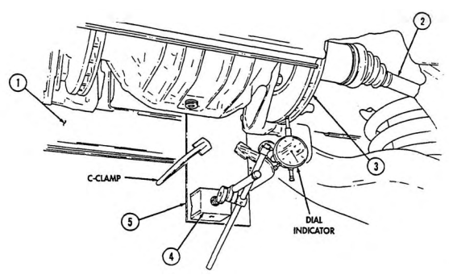

# Chapter 22 Service Brake System (Ds) Maintenance

## 22-1. Introduction

This chapter contains maintenance instructions for repair of service brake system components at the direct support maintenance level. Some subassemblies and parts must be removed before service brake system components can be accessed. They are referenced to other paragraphs of this manual.

## 22-2. Service Brake System Maintenance Task Summary

| Maintenance Level                                               | Yoke seal installer                                              | Direct support   | (Appendix B, Item 82)   |
|-----------------------------------------------------------------|------------------------------------------------------------------|------------------|-------------------------|
| NOTE                                                            | The replacement procedure for pinion seals is basically the same |                  |                         |
| for front and rear differential. This procedure covers the rear | differential pinion seal.                                        |                  |                         |

# 22-3. Brake Rotor Repair

This task covers:
b. Checking Lateral Runout **d. Refinishing**
INITIAL SETUP:
a. Inspection c. Checking Thickness Variation

| Two locknuts (Appendix G, Item 108)    |
|----------------------------------------|
| Four locknuts (Appendix G, Item 114.4) |
| Two O\-rings (Appendix G, Item 215)    |

| General mechanic's tool kit:           | TM 9\-2320\-387\-24P   |
|----------------------------------------|------------------------|
| automotive (Appendix B, Item 1)        | Equipment Condition    |
| Maintenance and repair shop equipment: |                        |
| automotive (Appendix B, Item 2)        |                        |
| Special Tools                          | (para. 6\-14.2).       |

a. Inspection

If rotor braking surfaces are rusted or scaled, they must be cleaned before attempting inspection or measurement.

1. Mount rotor (1) in brake lathe and turn while cleaning surfaces with abrasive crocus cloth. 2. Inspect rotor (1) for heat cracks, nicks, scoring, discoloration, and pitting. Replace if damaged. b. Checking Lateral Runout 1. Mount dial indicator with stylus contacting rotor (1) surface 1 in. (25 mm) in from outer edge. 2. Turn rotor (1) 360° and note indicator reading. 3. If lateral runout exceeds 0.004 in. (0.10 mm) total, replace or refinish rotor.

#### C. Checking Thickness Variation

1. Measure thickness variation of rotor (1) with a micrometer at four equally-spaced points around rotor (1). Measure 1 in. (25 mm) in from outer edge.

Rotor must be replaced if minimum thickness falls below 0.815 in. (20.7 mm).

2. If thickness variation exceeds 0.005 in. (0.13 mm), replace or refinish rotor (1). d. Refinishing 1. Mount rotor (1) on brake lathe and refinish surface. 2. Replace rotor (1) if refinishing causes rotor (1) to fall below minimum thickness, 0.815 in. (20.7 mm).

# 22-3. Brake Rotor Repair (Cont'D)

1 1

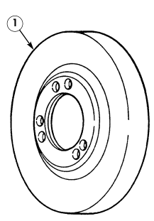

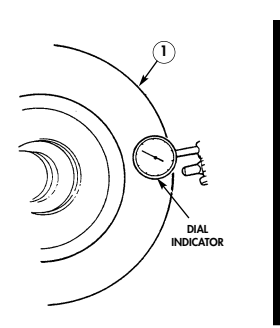

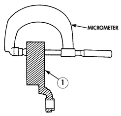

FOLLOW-ON TASK: Install brake rotor (para. 7-12).

# 22-4. Disc Brake Caliper Repair

This task covers:

a. Disassembly c. Inspection b. Cleaning **d. Assembly**

Tools General mechanic's tool kit:
automotive (Appendix B, Item 1)
Materials/Parts Service brake caliper kit
(Appendix G, Item 313)
Abrasive crocus cloth (Appendix C, Item 22) Brake fluid, silicone (Appendix C, Item 18)
Manual References TM 9-2320-387-24P
a. Disassembly

| Manual References    |
|----------------------|
| TM 9\-2320\-387\-24P |

| Direct support   |
|------------------|

- Hold caliper so piston is facing away from your body. Keep fingers out of space between piston and wood block.

- Compressed air will not exceed 30 psi (207 kPa).

Eyeshield must be worn.

#### Warning

- Hold caliper so piston is facing away from your body. Keep fingers out of space between piston and wood block. Failure to do this may cause injury to personnel.

- Compressed air used for cleaning purposes will not exceed 30 psi (207 kPa). Use only with effective chip guarding and personal protective equipment (goggles/shield, gloves, etc.).

1. Insert wood block between jaw of caliper (3) and piston (1). 2. Remove piston (1) from caliper (3) by applying air pressure to hose inlet (2) of caliper (3).

#### Caution

Do not use metal tools to remove dust boot and seal from caliper. Damage to caliper bore may result.

3. Remove piston dust boot (4) and seal (5) from caliper bore (6). Discard dust boot (4) and seal (5). 4. Remove bleeder screw (7) from caliper (3).

b. Cleaning Clean disc brake caliper components in accordance with para. 2-14.

## 22-4. Disc Brake Caliper Repair (Cont'D)

c. Inspection

For general inspection instructions, refer to para. 2-15.

1. Inspect caliper bore (6) for scoring, nicks, or corrosion. Bore (6) is not plated and minor corrosion can be polished with abrasive crocus cloth. Replace caliper (3) if bore (6) is not repairable.

2. Inspect piston (1) O.D. for scoring, nicks, corrosion, and worn or damaged chrome plating. Replace piston (1) if there are any surface defects.

3. Inspect bleeder screw (7) for damage or stripped threads. Replace if damaged. 4. Inspect seal (8) and bushing (9) for damage. Replace both if either is damaged.

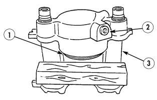

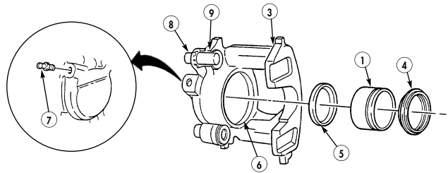

## 22-4. Disc Brake Caliper Repair (Cont'D)

d. Assembly

#### Caution

Use silicone brake fluid only, MIL-B-46176. Failure to use BFS will cause damage to brake system.

For general assembly instructions, refer to para. 2-17.

1. Lubricate caliper bore (5) and seal (4) with brake fluid. 2. Install seal (4) in groove of caliper bore (5). 3. Lubricate piston (2) with brake fluid and install dust boot (3) on piston (2). 4. Work piston (2) and dust boot (3) into caliper bore (5). 5. Seat dust boot (3) in caliper (1). 6. Install bleeder screw (6) in caliper (1) finger-tight.

# 22-4. Disc Brake Caliper Repair (Cont'D)

T

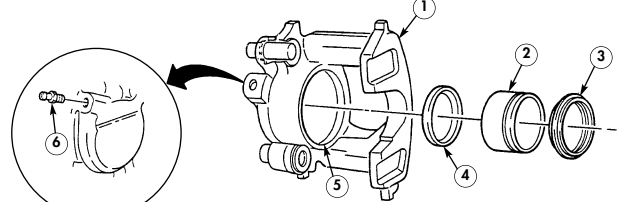

FOLLOW-ON TASK: Install disc brake caliper (para. 7-4).

# 22-5. Rear Parking Brake Caliper Repair

This task covers:

a. Disassembly c. Inspection b. Cleaning **d. Assembly**

Tools ____
General mechanic's tool kit:
automotive (Appendix B, Item 1)
Maintenance and repair shop equipment:
automotive (Appendix B, Item 2)

#### Materials/Parts _____________

Rear brake caliper kit
(Appendix G, Item 252)
Brake fluid, silicone (Appendix C, Item 18) Hex wrench (Appendix D, Fig. 103) (optional) Open-end wrench (Appendix D, Fig. 104)
(optional)
Parking brake spring tool
(Appendix D, Fig. 105) (optional)
Manual References _______________
TM 9-2320-387-24P
Equipment Condition **_________________**
Rear parking brake caliper removed 
(para. 7-15).

Maintenance Level _______________
Direct support

#### A. Disassembly Note

Refer to instructions for parking brake spring tool (Appendix D, Fig. 106) (optional).

1. Remove parking brake spring (10) from parking brake lever (9) and caliper housing (1). 2. Remove screw (11) and parking brake lever (9) from actuator shaft (12). 3. Remove piston cap (25) from piston (21). 4. Remove piston retaining screw (23) from piston (21). 5. Turn piston (21) counterclockwise and remove from caliper housing (1). 6. Remove piston boot (24) and piston seal (20) from caliper housing (1). 7. Remove thrust screw retaining ring (19) and thrust screw spring shield (26) from caliper housing (1).

8. Remove thrust screw spring (27) and thrust screw (28) from caliper housing (1). 9. Remove three actuator shaft bearings (18), bearing plate (17), actuator shaft (12), and washers (15) and (16) from caliper housing (1).

10. Remove actuator dust seal (13) from caliper housing (1). Discard dust seal (13). 11. Remove pin retaining plug assembly (5), antirotation pin spacer (6), and antirotation pin (7) from caliper housing (1).

12. Remove bleeder screw cap (3) and bleeder screw (2) from caliper housing (1). 13. Remove O-rings (4) and (8) from retaining plug assembly (5) and antirotation pin (7). Remove O-rings (22) and (14) from piston retaining screw (23) and actuator shaft (12). Discard O-rings (4), (8), (22), and (14).

# 22-5. Rear Parking Brake Caliper Repair (Cont'D)

b. Cleaning Clean rear brake caliper components in accordance with para. 2-14.

c. Inspection

For general inspection instructions, refer to para. 2-15.

1. Inspect caliper bore (29) for scoring, nicks, or corrosion. Replace if damaged. 2. Inspect piston (21) O.D. for scoring, nicks, corrosion, and worn or damaged plating. Replace piston (21) if there are any surface defects.

3. Inspect bleeder screw (2) for damage or stripped threads. Replace if damaged. 4. Inspect piston seal (20) and actuator shaft dust shield (13) for damage. Replace if damaged.

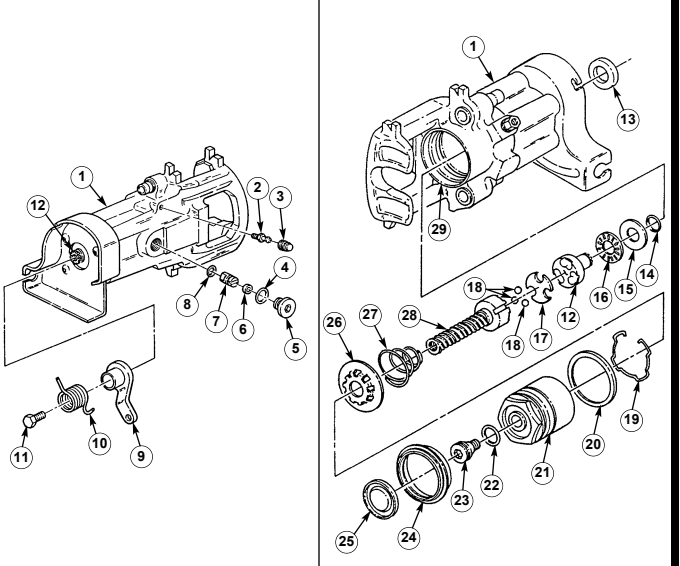

# 22-5. Rear Parking Brake Caliper Repair (Cont'D)

d. Assembly

#### Caution

Use silicone brake fluid only, MIL-B-46176. Failure to use BFS will cause damage to brake system.

- For general assembly instructions, refer to para. 2-17. - Lubricate caliper bore, piston, and piston seal with brake fluid.

1. Install O-rings (22) and (14) on piston retaining screw (23) and actuator shaft (12). 2. Install O-rings (4) and (8) on pin retaining plug assembly (5) and antirotation pin (7). 3. Install actuator shaft dust seal (13) in caliper housing (1). 4. Install washers (15) and (16) and actuator shaft (12) in caliper housing (1). 5. Install bearing plate (17) and three actuator shaft bearings (18) in caliper housing (1). 6. Install thrust screw (28) in caliper housing (1).

Ensure slot in thrust screw is aligned with hole in caliper housing for antirotation pin.

7. Install antirotation pin (7), antirotation pin spacer (6), and pin retaining plug assembly (5) in caliper housing (1). Tighten plug (5) to 8-12 lb-ft (11-16 N•m).

8. Install screw spring (27) and thrust screw spring shield (26) and secure with thrust screw retaining ring (19).

9. Install piston seal (20) in caliper housing (1).

10. Install piston (21) in caliper housing (1) by turning piston (21) clockwise and pushing in on piston (21).

11. Install piston boot (24) on caliper housing (1) and piston (21). 12. Install piston retaining screw (23) in piston (21). Tighten screw (23) to 15-22 lb-ft (20-30 N•m). 13. Install piston cap (25) in piston (21). 14. Install parking brake lever (9) on actuator shaft (12) with screw (11). Tighten screw (11) to 15-25 lb-ft (20-34 N•m).

15. Install parking brake spring (10) on caliper housing (1) and parking brake lever (9). 16. Install bleeder screw (2) in caliper housing (1). Tighten screw (2) to 6-15 lb-ft (8-20 N•m). 17. Install bleeder screw cap (3) on bleeder screw (2).

# 22-5. Rear Parking Brake Caliper Repair (Cont'D)

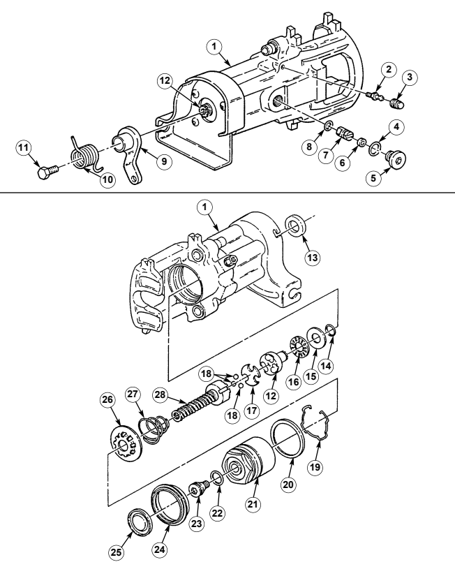

FOLLOW-ON TASK: Install rear parking brake caliper (para 7-15).

# Chapter 23 Steering System (Ds) Maintenance

## 23-1. Introduction

This chapter contains maintenance instructions for repair and testing of steering system components at the direct support maintenance level. Some subassemblies and parts must be removed before steering system components can be accessed. They are referenced to other paragraphs in this manual.

## 23-2. Steering System Maintenance Task Summary

| Two locknuts (Appendix G, Item 108)    | Differential must be supported during removal and   |
|----------------------------------------|-----------------------------------------------------|
| Two locknuts (Appendix G, Item 85)     | installation.                                       |
| Two O\-rings (Appendix G, Item 215)    | Maintenance Level                                   |
| Sealing compound (Appendix C, Item 63) | Direct support                                      |
| Personnel Required                     |                                                     |
| One mechanic                           |                                                     |
| One assistant                          |                                                     |

## 23-3. Power Steering Pump Repair

This task covers:

a. Disassembly c. Inspection b. Cleaning **d. Assembly**

Tools General mechanic's tool kit:
automotive (Appendix B, Item 1)
Materials/Parts Seal service kit (Appendix G Item 311)
Manual References TM 9-2320-387-24P
a. Disassembly

| Anaerobic gasket sealing compound      |
|----------------------------------------|
| (Appendix C, Item 58)                  |
| Sealing compound (Appendix C, Item 71) |
| Sealing compound (Appendix C, Item 64) |

Have drainage container ready to catch fluid.

1. Remove reservoir filler cap (1) and drain fluid from pump assembly (7). 2. Remove two mounting studs (2) from pump assembly (7).

NOTE
Fitting assembly is spring-loaded. Remove carefully to avoid losing parts.

3. Remove fitting assembly (6) and O-ring seal (5) from pump assembly (7). Discard O-ring seal (5). 4. Remove flow control valve (4) and valve spring (3) from pump assembly (7).

#### Caution

Do not overtighten vise as pump body could be distorted.

5. Place pump assembly (7) in vise so pump shaft (10) is pointing down. 6. Tap lightly around edge of reservoir (8). 7. Remove reservoir (8) and O-ring seal (9) from pump body (11). Discard O-ring seal (9). 8. Remove two O-ring seals (14) from pump body (11). Discard O-ring seals (14). 9. Remove magnet (13) from pump body (11). discard magnet (13).

10. Remove O-ring seal (12) from pump body (11). Discard O-ring seal (12).

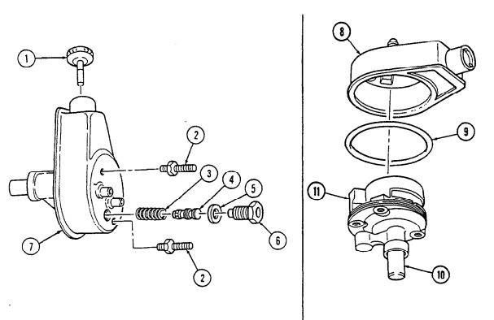

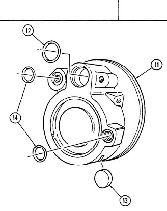

# 23-3. Power Steering Pump Repair (Cont'D)

## 23-3. Power Steering Pump Repair (Cont'D)

b. Cleaning Clean all power steering pump components in accordance with para. 2-14.

c. Inspection NOTE
For general inspection instructions, refer to para. 2-15.

1. Inspect external surface of flow control valve (12) for burrs, nicks, or damage. Inspect flow control valve (12) bore and screen for damage or debris. Inspect valve spring (11) for damage. Replace both flow control valve (12) and valve spring (11) if either is damaged.

2. Inspect studs (10). Replace if damaged. 3. Inspect fitting (14). Replace if damaged. 4. Inspect reservoir filler cap (9). Replace if damaged. 5. Inspect pump body (3). Replace entire power steering pump assembly (15) if pump body (3) is damaged.

d. Assembly

For general assembly instructions, refer to para. 2-17.

5. Install two studs (10) on pump assembly (15). Tighten studs (10) to 26 lb-ft (35 N•m). 6. Install valve spring (11) and flow control valve (12) in pump assembly (15). 7. Install O-ring seal (13) and fitting (14) in pump assembly (15). Tighten fitting (14) in pump assembly (15) to 37 lb-ft (50 N•m).

8. Install reservoir filler cap (9) on pump assembly (15).

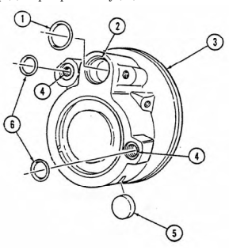

1. Install magnet (5) in pump body (3). 2. Install O-ring seal (1) into control valve cavity (2) and two O-ring seals (6) into threaded holes (4). 3. Install O-ring seal (8) on pump body (3). 4. Install reservoir (7) on pump body (3).

# 23-3. Power Steering Pump Repair (Cont'D)

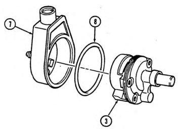

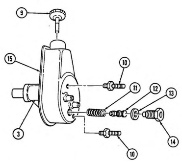

FOLLOW-ON TASKS: - • Perform leak test (para. 23-4).
- • Install power steering pump (para. 8-23).

# 23-4. Power Steering Pump And Steering Gear Leak Test

This task covers:
Leak Test

Tools General mechanic's tool kit:
automotive (Appendix B, Item 1)
Power steering analyzer
(Appendix B, Item 120)
Power steering pump and gear test stand
(Appendix D, Fig. D-77)

#### Equipment Condition

- Power steering pump and steering gear installed properly on test stand.

- Power steering fluid at proper level
(TM 9-2320-387-10).

Maintenance Level Direct support Manual References TM 9-2320-387-10 Leak Test

3. Plug unused power steering pump return port (9). 4. Start electric motor (3) using on/off switch (4). 5. Power steering pump should be operated at 455-1,475 rpm. 6. Adjust power steering analyzer pressure to 140-170 psi (965-1,172 kPa). 7. Check power steering pump and steering gear for leaks.

Mounting of components to stand is left to discretion of user.

1. Connect power steering analyzer (2) between power steering pump high-pressure (output) side (8)
and steering gear inlet (6).

2. Connect a pressure hose (7) between power steering return port (1) and steering gear outlet (5).

# 23-4.  Power Steering Pump And Steering Gear Leak Test

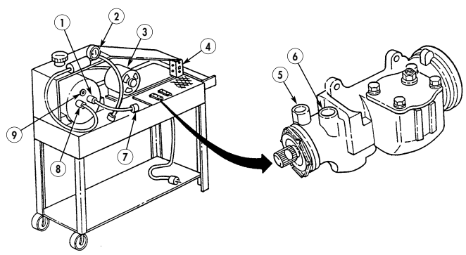

## 23-5. **Steering Gear Repair**

This task covers:
c. Housing Group Inspection and Repair g. Assembly d. Pitman Shaft Inspection and Repair **h. Adjustment**

#### Initial Setup: Tools

General mechanic's tool kit:
automotive (Appendix B, Item 1)
Special Tools Adjuster plug bearing remover/installer
(Appendix B, Item 116)
Pitman shaft bearing remover/installer
(Appendix B, Item 117)
Spanner wrench (Appendix B, Item 118) Rack piston arbor (Appendix B, Item 119)

#### Materials/Parts

Seal parts kit (Appendix G, Item 245) Seal parts kit (Appendix G, Item 244) Seal parts kit (Appendix G, Item 243)

#### A. Disassembly

1. Hold adjuster screw (10) and remove lash adjuster nut (1). 2. Remove four capscrews (2) from side cover (3) and housing (4). 3. Remove side cover (3) from adjuster screw (10).

6. Rotate stub shaft (5) counterclockwise to force end plug (8) from housing (4). 7. Rotate stub shaft (5) clockwise and remove O-ring (7). Discard O-ring (7). 8. Remove plug (12) from rack piston (13).

a. Disassembly e. Rack Piston Group Inspection and Repair b. Cleaning f. Valve and Adjuster Group Inspection and Repair

#### Materials/Parts (Cont'D)

Crocus cloth (Appendix C, Item 22) Grease (Appendix C, Item 35) Hydraulic fluid (Appendix C, Item 37)
Manual References TM 9-2320-387-24P TM 9-214 Equipment Condition Steering gear removed (para. 8-20).

Maintenance Level Direct Support 4. Remove gasket (11) from side cover (3). Discard gasket (11). 5. Insert punch through access hole (6) and force out retaining ring (9). Discard retaining ring (9).

9. Rotate stub shaft (5) to center and remove pitman shaft (14) from housing (4).

23-5. STEERING GEAR REPAIR (Cont'd)

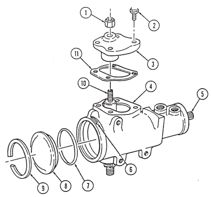

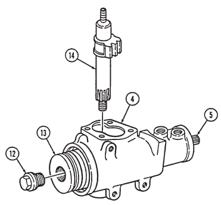

■

## 23-5. **Steering Gear Repair (Cont'D)**

10. Insert rack piston arbor in rack piston (1) and hold tightly while turning stub shaft (2) counterclockwise.

11. Remove rack piston (1) and rack piston arbor from gear housing (3) together. 12. Remove nut (4) from adjuster plug (5).

Worm and valve may come out with adjuster plug. If so, separate adjuster from worm and valve.

13. Using spanner wrench, remove adjuster plug (5) from housing (3). 14. Pry off bearing retainer (6) at raised area (7). 15. Remove bearing retainer (7.1), thrust bearing spacer (8), small bearing race (9), upper thrust bearing (10), and large bearing race (11) from plug (5).

16. Remove seal (12) from plug (5). Discard seal (12). 17. Remove retaining ring (15) from opposite side of adjuster plug (5). Discard retaining ring (15). 18. Remove stub shaft dust seal (14), stub shaft lip seal (13), and needle bearing (12.1) from plug (5).

Discard seals (14) and (13).

19. Hold stub shaft (2) and remove valve (21) and worm shaft (19) together from housing (3). 20. Remove bearing race (16), lower thrust bearing (17), and bearing race (18) from worm shaft (19). 21. Clamp worm shaft (19) in soft-jawed vise and pull valve (21) from worm shaft (19). 22. Remove and discard two valve body Teflon rings (23), three O-ring seals (22), and spacer (22.1)
from valve body (21).

23. Remove stub shaft seal (20) from valve body (21). Discard seal (20).

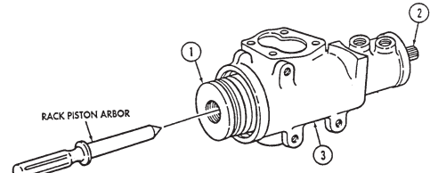

23-5. **STEERING GEAR REPAIR (Cont'd)**

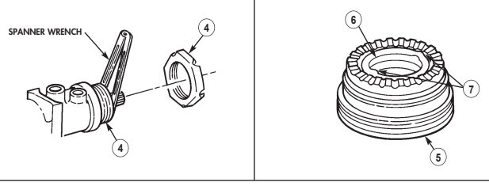

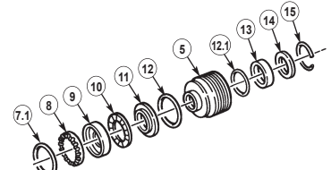

22 22.1

21 2

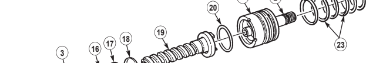

## 23-5. **Steering Gear Repair (Cont'D)**

24. Tap splined end of stub shaft (2) lightly on wood block until shaft cap (1) is free of valve body (5). 25. Pull shaft (2) outward 0.25 in. (6 mm). 26. Press spool valve locating pin (3) inward and remove stub shaft (2) from valve body (5).

Rotate spool to remove from valve.

27. Remove valve (6) from valve body (5). 28. Remove seal (4) from valve (6). Discard seal (4). 29. Remove two screw-assembled washers (7) and clamp (8) from rack piston (10). 30. Remove and separate two halves of guide (13). 31. Remove black and chrome bearing balls (9) from two halves of guide (13). 32. Tip rack piston (10) so remaining bearing balls (9) fall out. The total number of bearing balls (9)
should be twenty-four (twelve black and twelve chrome-colored).

33. Remove rack piston arbor from rack piston (10). 34. Remove Teflon ring (11) and O-ring seal (12) from rack piston (10). Discard Teflon ring (11) and O-ring seal (12).

35. Remove pitman shaft lockwasher (14) from housing (18). Discard lockwasher (14).

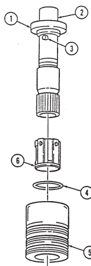 36. Remove dust seal (15), retaining ring (16), washer (16.1), and seal (17) from housing (18). Discard retaining ring (16), seal (17), dust seal (15), and washer (16.1).

23-5. STEERING GEAR REPAIR (Cont'd)

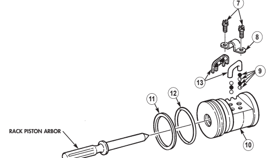

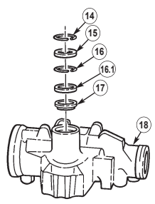

## 23-5. **Steering Gear Repair (Cont'D)**

b. Cleaning Clean all parts (para. 2-14).

#### C. Housing Group Inspection And Repair

1. Inspect housing (4) for breaks, cracks, chipped or broken retaining ring grooves (5) and (22), and damaged sealing surfaces. Replace steering gear if housing (4) is damaged.

2. Inspect housing (4) for crossed or stripped threads. Refer to paragraph 2-16 for thread repair.

Replace steering gear if housing (4) threads cannot be repaired.

- Rack piston bore has laser-hardened tracks on side of piston bore opposite pitman shaft cavity. These are not wear or scoring indicators.

- Inspect pitman shaft bearing bore only if pitman shaft bearing is replaced (refer to steps 3 and 4).

3. Inspect pitman shaft needle bearing (21) for damage or wear (TM 9-214). Replace needle bearing (21) if damaged or inside diameter (I.D.) (19) is worn below 1.2510 in. (31.75 mm). If damaged or worn, replace needle bearing (21) as follows: a. Using pitman shaft bearing remover/installer, remove bearing (21) from housing (4). b. Lubricate bearing bore (20) and bearing (21) with hydraulic fluid. c. Using pitman shaft bearing remover/installer and adapter ring, install bearing (21) until seated in housing (4).

4. Inspect valve bore (10), rack piston bore (6), worm support bore (3), and pitman shaft bearing bore (20) for rust, pitting, scoring, galling, and wear. Wear limits for bore I.D. are: valve bore (10) 2.034 in. (51.66 mm), rack piston bore (6) 3.128 in. (79.45 mm), worm support bore (3) 1.040 in. (26.42 mm), and pitman shaft bearing bore (20) 1.766 in. (44.86 mm). Remove minor rust, pitting, and scoring with crocus cloth. If bore(s) do not meet specifications, or if there is other unrepairable damage, replace steering gear.

5. Inspect check valve (9) for freedom of movement. If damaged, replace check valve (9) as follows:
a. Pry check valve (9) out of housing (4) with a small screwdriver. b. Lubricate housing (4) and check valve (9) with hydraulic fluid. c. Install check valve (9) using 3/8 in. (9.53 mm) outside diameter (O.D.) tubing, 4 in. (10.16 cm)
long.

6. Inspect side cover (1) for breaks, cracks, stripped or crossed threads (2), warped or damaged sealing surface (7), and scored or worn bushing (8). Repair minor scoring and thread (2) damage. Replace side cover (1) if bushing (8) is worn through or loose in bore. Replace bushing (8) if I.D. is worn over 1.248 in. (31.70 mm).

7. Inspect housing end plug (23) for breaks, cracks, and chipped edges. Replace housing end plug (23)
if damaged.

#### D. Pitman Shaft Inspection And Repair

1. Inspect pitman shaft (15) for bends, breaks, chipped, cracked, or broken gear teeth (14), wear on bushing journal (18) or bearing journal (17), crossed or stripped threads, and bent or twisted splines (16). Bushing journal (18) minimum O.D. is 1.2468 in. (31.699 mm) and bearing journal (17) minimum O.D. is 1.2500 in. (31.750 mm). Repair minor thread damage. Replace pitman shaft (15) if worn or unrepairable.

2. Inspect lash adjuster screw (11) for free rotation in shaft (15), tight retainer plug (13), crossed or stripped threads, and rounded hex-socket hole (12). Repair minor thread damage. Replace pitman shaft (15) if damaged.

# 23-5. Steering Gear Repair (Cont'D)

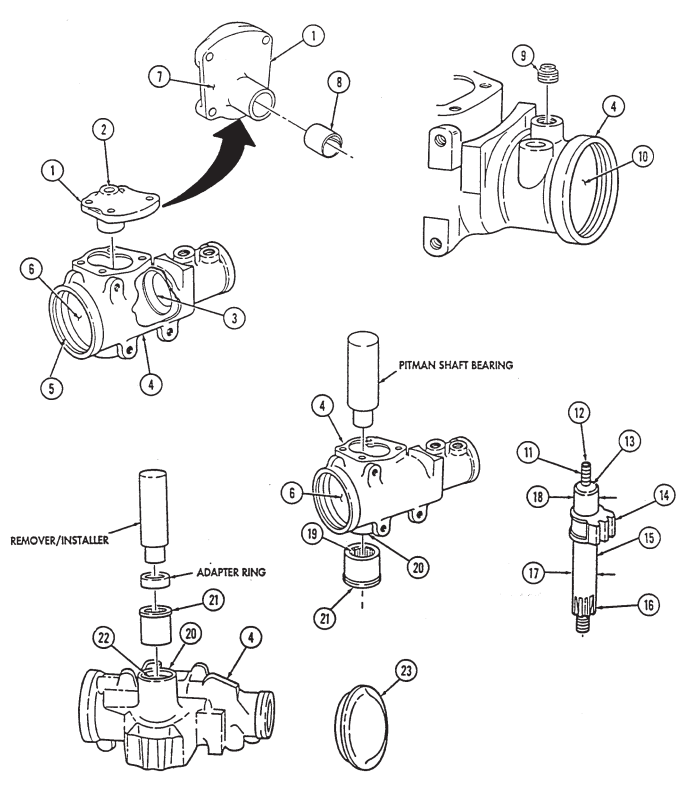

# 23-5. Steering Gear Repair (Cont'D)

e. Rack Piston Group Inspection and Repair

If rack piston internal worm thread, worm thread, or ball bearings are broken, chipped, or moderately or badly scored, replace all three parts.

1. Inspect rack piston (7) for breaks, burrs, chipped seal grooves (8), crossed or stripped threads, cracked or broken gear teeth (3), and broken, chipped or scored internal worm thread. Repair minor burrs and scoring with fine mill file or crocus cloth. Repair minor thread damage. Replace rack piston (7) if gear teeth (3) are cracked or broken or other damage is unrepairable.

2. Inspect twenty-four ball bearings (6) for breaks, chipped surface, flats, and scoring. Minor scoring on ball bearings (6) is acceptable. Replace ball bearings (6) as a set if any one or more fails inspection (refer to note above).

3. Inspect ball bearing guides (2) for bends, dents, and breaks and clamp (5) for bends and breaks.

Replace damaged parts.

4. Inspect screw-assembled washers (4) for crossed or stripped threads. Replace screw-assembled washers (4) if damaged.

5. Inspect rack piston plug (1) for burred or rounded hex-flats and stripped or crossed threads.

Replace rack piston plug (1) if damaged.

#### F. Valve And Adjuster Group Inspection And Repair

1. Inspect valve body (17) for burrs, chipped or broken seal ring grooves (16), scoring on inner bore (18), and wear. Repair minor burrs and scoring with crocus cloth. Valve body bore (18) maximum I.D. is 1.1557 in. (29.355 mm) and valve body (17) minimum O.D. (15) is 2.0150 in. (51.181 mm). Replace valve body (17) if worn or unrepairable.

2. Inspect valve (14) for burrs, cracks, blocked oil passages (19), chipped or cracked seal ring groove, scoring, and wear. Spool valve (14) minimum O.D. (13) is 1.152 in. (29.26 mm). Remove minor burrs and scoring with crocus cloth and clear blocked oil passages (19). Replace valve (14) if worn or unrepairable.

3. Inspect stub shaft (9) for bends, cracks, breaks, damaged pin (12), bent or twisted splines (11), and worn bearing journal (10). Bearing journal (10) minimum O.D. is 1.2495 in. (31.737 mm). Replace stub shaft (9) if worn or damaged.

4. Inspect worm shaft (20) for bends, breaks, burrs, chipped threads (21), and scoring. Remove minor burrs and scoring with fine mill file or crocus cloth. Replace worm shaft (20) if damage is unrepairable (refer to note before step e.1).

5. Inspect adjuster plug (22) for cracks, breaks, crossed or stripped threads, chipped retainer grooves, and seal ring surface. Replace plug (22) if damaged.

6. Inspect adjuster plug needle bearing (23) for damage (TM 9-214) and wear. Replace needle bearing (23) if damaged or I.D. is worn over 1.2505 in. (31.763 mm). If damaged or worn, replace needle bearing (23) as follows. a. Using adjuster plug bearing remover/installer, remove bearing (23) from adjuster plug (22). b. Lubricate adjuster plug (22) and bearing (23) with hydraulic fluid. c. Using adjuster plug bearing remover/installer, install bearing (23) 0.625 in. (15.88 mm) deep in adjuster plug (22).

Outer edge of bearing is marked with identification number.

7. Inspect large bearing race (24), upper thrust bearing (25), small bearing race (26), thrust bearing spacer (27), and bearing retainer (28) for damage (TM 9-214). Replace all items if one item is damaged.

8. Inspect lower thrust bearing (30) and two races (29) for damage (TM 9-214). Replace all items if any one is damaged.

23-16 Change 2

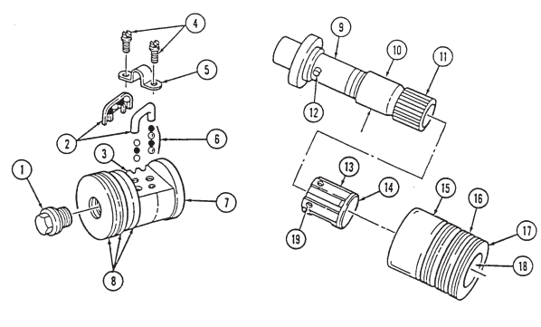

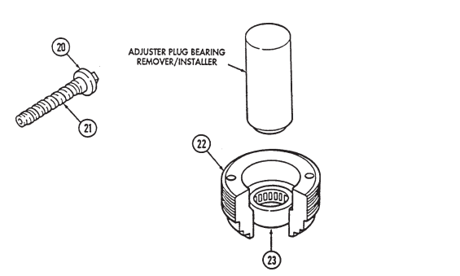

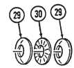

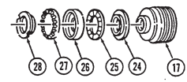

23-5. STEERING GEAR REPAIR (Cont'd)

## 23-5. **Steering Gear Repair (Cont'D)**

g. Assembly

For general assembly instructions, refer to para. 2-17.

1. Using pitman shaft bearing remover/installer and adapter ring, install seal (4) and washer (2.1) in housing (3) only far enough to provide clearance for retaining ring (5).

2. Using pitman shaft bearing remover/installer and adapter ring, install dust seal (2) in housing (3)
only far enough to provide clearance for lockwasher (1).

3. Install lockwasher (1) in housing (3).

Soak Teflon ring in warm water to ease assembly.

4. Install O-ring seal (7) and Teflon ring (6) on rack piston (8). 5. Install worm shaft (9) in rack piston (8). 6. Align lower ball return guide hole (10) with worm shaft groove. 7. Alternately install eight black and eight chrome bearing balls (11) into lower guide hole (10) while rotating worm shaft (9) counterclockwise.

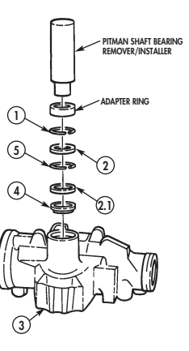

# 23-5. **Steering Gear Repair (Cont'D)**

Keep bearing balls in alternating sequence when installing guide in rack piston. Ensure a total of 24 bearing balls are used.

8. Install eight remaining bearing balls (11) in guide (12) half and retain with grease. 9. Assemble both guide (12) halves together and install guide (12) in guide holes (10).

10. Install clamp (14) over guide (12) with two screw-assembled washers (13). Tighten screw-assembled washers (13) to 4 lb-ft (5 N•m).

11. Rotate worm shaft (9) clockwise until flush with rack piston (8).

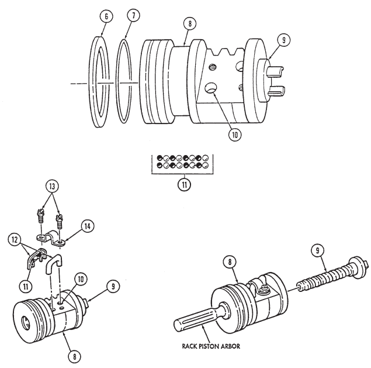 12. Install rack piston arbor into rack piston (8) and hold firmly against worm shaft (9). Remove worm shaft (9).

# 23-5. **Steering Gear Repair (Cont'D)**

Soak Teflon rings in warm water to ease assembly.

13. Starting on inner seal ring groove, install O-ring seal (1) and a backup Teflon ring (2) on valve body (11).

14. Repeat step 13 in order from innermost seal ring groove and install remaining two O-ring seals (1),
Teflon ring (2), and spacer (2.1) on valve body (11).

Rotate valve spool to install in valve.

15. Install seal (9) on valve (8) and install valve (8) into valve body (11) until flush with notched end of valve body (11).

16. Install stub shaft (6) in valve (8) so pin (3) on stub shaft (6) engages hole (7) in valve (8). 17. Align notch (5) in stub shaft cap (4) with pin (10) in valve body (11) and press stub shaft (6) and valve (8) into valve body (11).

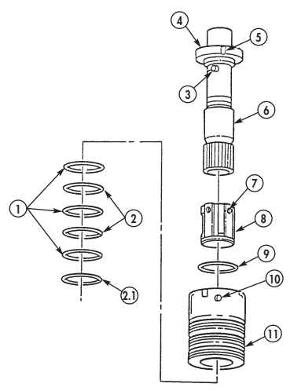

## 23-5. **Steering Gear Repair (Cont'D)**

18. Install seal (16) in valve body (11). 19. Insert worm shaft (14) into valve body (11). 20. Engage locating pin (15) on worm shaft (14) with slot (17) in valve body (11).

Coned surface of races face toward housing.

21. Install lower thrust bearing race (18), lower thrust bearing (13), and lower thrust bearing race (18)
on worm shaft (14).

22. Install assembled valve body (11) and worm shaft (14) into housing (12). 23. Install seal (24), large upper bearing race (23), upper thrust bearing (22), small bearing race (21),
thrust bearing spacer (20), and bearing retainer (19) on adjuster plug (25). Press retainer (19) onto adjuster plug (25) with a brass drift.

24. Install stub shaft oil seal (26) and needle bearing (25.1) in adjuster plug (25). Install far enough to provide clearance for dust seal (27) and retaining ring (28).

25. Install stub shaft dust seal (27) and retaining ring (28) in adjuster plug (25).

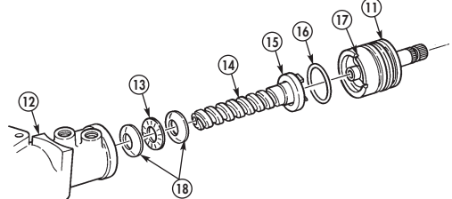

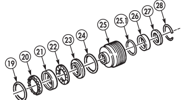

## 23-5. **Steering Gear Repair (Cont'D)**

26. Using spanner wrench, install adjuster plug (1) in housing (3). Do not tighten. 27. Install locknut (2) over adjuster plug (1). Do not tighten. 28. Install rack piston (4) and rack piston arbor into gear housing (3). Ensure gear teeth on rack piston (4) align with gear teeth on pitman shaft (5).

29. Hold rack piston arbor tightly against rack piston (4) while turning stub shaft (6) clockwise.

Remove rack piston arbor.

30. Install rack piston plug (7) into rack piston (4). Do not tighten. 31. Center rack piston (4) and install pitman shaft (5) in housing (3). 32. Tighten rack piston plug (7) to 75 lb-ft (102 N•m).

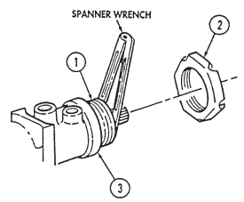

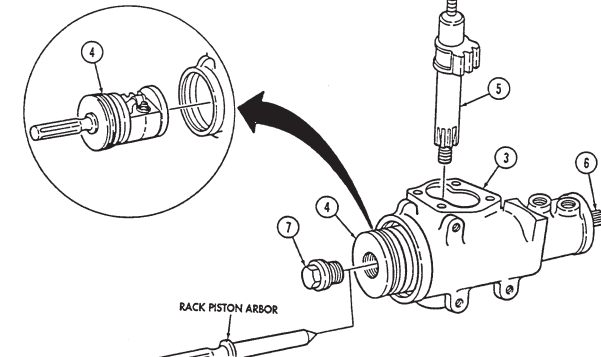

## 23-5. **Steering Gear Repair (Cont'D)**

33. Install housing end plug O-ring seal (10) and housing end plug (9) in housing (3).

Opening in retaining ring should be located approximately 1 in. (25 mm) from access hole.

34. Install retaining ring (8) in housing (3). 35. Install side cover gasket (15) on side cover (13) by bending tabs (14) around side cover (13) edge. 36. Install side cover (13) onto adjuster screw (16). 37. Install four capscrews (12) on side cover (13). Tighten capscrews (12) to 40 lb-ft (54 N•m).

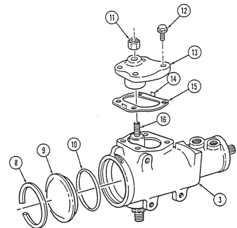 38. Install lash adjuster nut (11) on pitman shaft adjuster screw (16).

## 23-5. **Steering Gear Repair (Cont'D)**

#### H. Adjustment

1. For worm shaft bearing preload adjustment, remove locknut (1).

4. Measure back counterclockwise 0.5 in. (13 mm) and place second mark on housing (3). 5. Turn adjuster plug (2) counterclockwise until mark on face of adjuster plug (2) aligns with second mark on housing (3).

6. Install locknut (1) on adjuster plug (2). 7. Hold adjuster plug (2) using spanner wrench and tighten locknut (1). 8. Turn stub shaft (7) clockwise to stop, then back one-quarter turn. 9. Check torque required to turn stub shaft (7). Reading should be 4-10 lb-in. (0.5-1 N•m).

10. If reading is not correct, turn adjuster plug (2) in or out and repeat steps 7 through 9 until torque required to turn stub shaft (7) is 4-10 lb-in. (0.5-1 N•m).

11. For pitman shaft-over-center adjustment, loosen adjuster screw locknut (5). 12. Turn adjuster screw (4) counterclockwise until fully extended, then turn clockwise one full turn. 13. Rotate stub shaft (7) from stop to stop and count number of turns. 14. Back off stub shaft (7) one-half number of turns counted. 15. With gear centered, flat on stub shaft (7) will face upward and block tooth (6) should be in line with adjuster screw (4).

16. With gear at center of travel, check torque to turn stub shaft (7). 17. Turn adjuster screw (4) clockwise until torque to turn stub shaft (7) is 6-10 lb-in. (0.7-1 N•m) more than the reading obtained in step 16.

18. Hold adjuster screw (4) and tighten locknut (5) to 20 lb-ft (27 N•m).

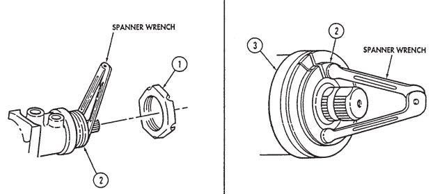

2. Using spanner wrench, tighten adjuster plug (2) clockwise until thrust bearing is firmly bottomed. 3. Match mark housing (3) and adjuster plug (2) face.

# 23-5. Steering Gear Repair (Cont'D)

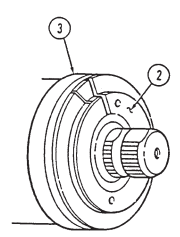

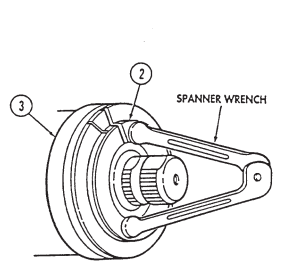

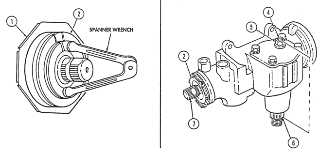

FOLLOW-ON TASKS: - Perform leak test (para. 23-4).

· Install steering gear (para. 8-20).

# Chapter 24 Frame (Ds) Maintenance

## 24-1. Introduction

This chapter contains maintenance instructions for replacement and repair of frame components at the direct support maintenance level. Some subassemblies and parts must be removed before frame components can be accessed. They are referenced to other paragraphs of this manual.

## 24-2. General

Refer to technical bulletin (TB 9-2300-247-40) for repairs on vehicle frames. Refer to TM 9-2320-387-24P for authorized replacement parts used in frame repair.

| One assistant                                                                                                                      |           |
|------------------------------------------------------------------------------------------------------------------------------------|-----------|
| NOTE   Control arm bushings  must be replaced                                                                                      | as a set. |
| 1   [  a. Removal                                                                                                                  |           |
| Support control arm (1) and press bushing (21 out of control arm (1).                                                              |           |
| b. Installation                                                                                                                    |           |
| 1.   Lubricate  O.D. of bushing (2) with grease.                                                                                   |           |
| 2.   Insert bushing (2) in control arm (1).                                                                                        |           |
| 3.  Support control arm (1) and press bushing (2) into control arm (1) until flange (3) on bushing (2)   seats on control arm (1). |           |
| FOLLOW\-ON  TASK: Install control arm (para. 6\-25 or 6\-26).                                                                      |           |

| 21\-8.                          | FRONT PROPELLER SHAFT MAINTENANCE   |                                    |
|---------------------------------|-------------------------------------|------------------------------------|
| This task covers:               |                                     |                                    |
| a.  Disassembly                 |                                     | b.  Assembly                       |
| INITIAL SETUP:                  |                                     |                                    |
| Tools                           |                                     | Equipment Condtion                 |
| General mechanic's tool kit:    |                                     | Front propeller shaft disassembled |
| automotive (Appendix B, Item 1) |                                     | (para. 6\-3).                      |
| Manual References               |                                     | Maintenance Level                  |
| TM 9\-2320\-387\-24P            |                                     | General support                    |
| a. Disassembly                  |                                     |                                    |

# 24-4. Splash Shield Support Bracket Replacement

This task covers:
a. Removal b. Installation

Tools General mechanic's tool kit:
automotive (Appendix B, Item 1)
Maintenance and repair shop equipment:
automotive (Appendix B, Item 2)
Materials/Parts Three locknuts (Serial numbers 299999 and below) (Appendix A, Item 85)
Three locknuts (Serial numbers 300000 and above) (Appendix A, Item 114.4)

#### A. Removal

1. Remove locknut (1), washer (2), capscrew (4), washer (2), and splash shield (3) from bracket (7).

Discard locknut (1).

2. Remove two locknuts (5), washers (6), capscrews (9), washers (6), and bracket (7) from frame rail (8).

Discard locknuts (5).

b. Installation 1. Install bracket (7) on frame rail (8) with two washers (6), capscrews (9), washers (6), and locknuts (5). Tighten locknuts (5) to 90 lb-ft (122 N•m).

2. Install splash shield (3) on bracket (7) with washer (2), capscrew (4), washer (2), and locknut (1).

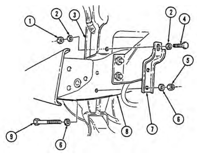

Tighten capscrew (4) to 15 lb-ft (20 N•m).

FOLLOW-ON TASK: Lower and secure hood (TM 9-2320-387-10).

| Manual References    |
|----------------------|
| TM 9\-2320\-387\-10  |
| TM 9\-2320\-387\-24P |

Equipment Condition

| Maintenance Level   |
|---------------------|
| Direct support      |

Hood raised and secured (TM 9-2320-387-10).

# 24-5. Spring Seat Replacement

This task covers:
INITIAL SETUP:
Tools General mechanic's tool kit:
automotive (Appendix B, Item 1)
Maintenance and repair shop equipment:
automotive (Appendix B, Item 2)
Materials/Parts Four locknuts (Appendix G, Item 88)
Manual References TM 9-2320-387-24P
a. Removal

The replacement procedure for the four spring seats is basically the same. This procedure covers the right front spring seat.

Remove four locknuts (6), washers (4), capscrews (5), washers (4), two spring brackets (3), and spring seat (1) from frame rail (2). Discard locknuts (6).

#### B. Installation

Install two spring brackets (3) and spring seat (1) on frame rail (2) with four washers (4), capscrews (5),

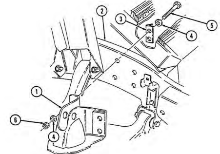 washers (4), and locknuts (6). Tighten locknuts (6) to 260 lb-ft (353 N•m).

FOLLOW-ON TASK: Install coil spring (para. 6-27).

a. Removal b. Installation

| Equipment Condition                |
|------------------------------------|
| Coil spring removed (para. 6\-27). |
| Maintenance Level                  |
| Direct support                     |

24-2.2/(24-3 blank) Change 6

# 24-6. Front Suspension Brace Replacement

This task covers:

| General mechanic's tool kit:                   |
|------------------------------------------------|
| Company of Children Company of Children י ח יו |

| Materials/Parts   |
|-------------------|

| INITIAL SETUP:   |
|------------------|

Tools automotive (Appendix B, Item 1)
Maintenance and repair shop equipment:
automotive (Appendix B, Item 2)
Two locknuts (Appendix G, Item 106) Locknut (Appendix G, Item 88)
Manual References TM 9-2320-387-24P

a. Removal b. Installation

| Maintenance Level   |
|---------------------|
| Direct support      |

(All models except M1114) (para. 12-27).

| Cauinment Condition         |
|-----------------------------|
| Winch removed (if equipped) |
| (All models except M1114)   |

General Safety Instructions Lower control arm must be supported during removal and installation.

#### Warning

Lower control arm must be supported during removal and installation. Failure to support lower control arm may cause injury to personnel or damage to equipment.

Replacement procedures for left and right front suspension braces are basically the same. This procedure covers the left front suspension brace.

#### A. Removal

1. Remove two locknuts (10), washers (11), capscrews (1), and washers (2) from brace (7) and frame extension (12). Discard locknuts (10).

2. Remove locknut (5), washer (4), capscrew (9), washer (8), and brace (7) from lower control arm (6)
and crossmember (3). Discard locknut (5).

#### B. Installation

1. Install brace (7) on crossmember (3) and lower control arm (6) with washer (8), capscrew (9),
washer (4), and locknut (5). Do not tighten locknut (5).

2. Install brace (7) on frame extension (12) with two washers (2), capscrews (1), washers (11), and locknuts (10). Do not tighten locknuts (10).

3. Tighten locknut (5) to 260 lb-ft (353 N•m) and two locknuts (10) to 178 lb-ft (241 N•m).

# 24-6. Front Suspension Brace Replacement (Cont'D)

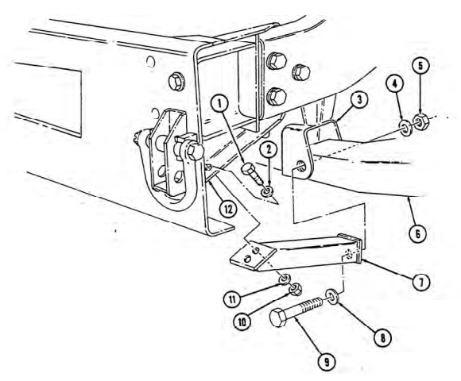

FOLLOW-ON TASK:  Install winch (if equipped) (All models except M1114) (para. 12-27).

# 24-7. Left Airlift Bracket And Front Upper Control Arm Brackets Replacement (Serial Numbers 299999 And Below)

This task covers:
INITIAL SETUP:
Tools General mechanic's tool kit:
automotive (Appendix B, Item 1)
Maintenance and repair shop equipment:
automotive (Appendix B, Item 2)

#### Materials/Parts

a. Removal b. Installation Manual References TM 9-2320-387-24P
Equipment Condition
•Engine left splash shield removed 
(para. 10-23).

•Airlift crossbrace removed (para. 9-12).

Maintenance Level Direct support

#### A. Removal

1. Raise and support front of vehicle. 2. Remove three screws (9), clamps (7), and harness (8) from airlift bracket (5).

2.1. Remove two locknuts (6.2), washers (6.1), capscrews (19.2), and washers (19.1) from airlift bracket (5)
and frame rail (19). Discard locknuts (6.2).

3. Remove two locknuts (2), washers (3), and capscrews (6) from radiator support (4) and airlift bracket (5). Discard locknuts (2).

4. Remove two locknuts (12), washers (13), capscrews (18), and washers (13) and disconnect upper control arm (15) from two control arm brackets (16). Discard locknuts (12).

Note direction of capscrews for installation.

5. Remove four locknuts (11), washers (10), capscrews (1), and washers (10) from two control arm brackets (16), airlift bracket (5), and frame rail (19). Discard locknuts (11).

6. Remove four locknuts (21), washers (20), two bolt and bracket assemblies (14), control arm brackets (16), shims(s) (17), if present, and airlift bracket (5) from frame rail (19). Discard locknuts (21).

#### B. Installation

1. Install airlift bracket (5), shim(s) (17), if removed, and two control arm brackets (16) on frame rail (19) with four washers (10), capscrews (1), washers (10), and locknuts (11). Tighten locknuts (11) to 90 lb-ft (122 N•m).

2. Apply sealing compound to threads of two bolt and bracket assemblies (14).

4. Install upper control arm (15) on two control arm brackets (16) with two washers (13),
capscrews (18), washers (13), and locknuts (12). Tighten locknuts (12) to 260 lb-ft (353 N•m).

5. Install radiator support (4) on airlift bracket (5) with two capscrews (6), washers (3), and locknuts (2). Tighten locknuts (2) to 37 lb-ft (50 N•m).

5.1. Secure airlift bracket (5) to frame rail (19) with two washers (19.1), capscrews (19.2), washers (6.1),
and locknuts (6.2).

6. Install harness (8) on airlift bracket (5) with three clamps (7) and screws (9). 7. Lower front of vehicle.

Two locknuts (Appendix G, Item 106) Four locknuts (Appendix G, Item 85) Four locknuts (Appendix G, Item 88) Sealing compound (Appendix C, Item 63)
3. Secure airlift bracket (5) and two control arm brackets (16) on frame rail (19) with two bolt and bracket assemblies (14), four washers (20), and locknuts (21).

24-7.

# Left Airlift Bracket And Front Upper Control Arm Brackets Replacement (Serial Numbers 299999 And Below)(Cont'D)

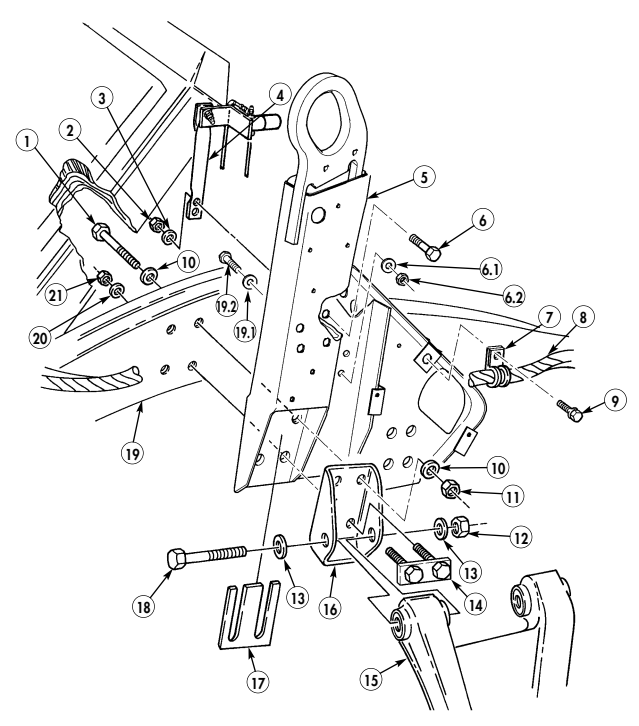

FOLLOW-ON TASKS: · · Install airlift crossbrace (para. 9-12).

· Install engine left splash shield (para. 10-23).

# 24-7.1. Left Airlift Bracket And Front Upper Control Arm Brackets Replacement (Serial Numbers 300000 And Above)

This task covers:

Tools General mechanic's tool kit:
automotive (Appendix B, Item 1)
Maintenance and repair shop equipment:
automotive (Appendix B, Item 2)
Materials/Parts Two lockwashers (Appendix G, Item 144) Two locknuts (Appendix G, Item 88) Ten locknuts (Appendix G, Item 114.4) Two locknuts (Appendix G, Item 106)
a. Removal **b. Installation**

#### Manual References

TM 9-2320-387-24P
Equipment Condition
- Airlift crossbrace removed (para. 9-12). - Engine left splash shield removed 
(para. 10-23.1).

Maintenance Level Direct support

#### A. Removal

1. Raise and support front of vehicle. 2. Remove two locknuts (29), washers (28), clip (11), two washers (12), and capscrews (13) from airlift bracket (7) and frame rail (27). Discard locknuts (29).

3. Remove three screws (16), clamps (14), and harness (15) from airlift bracket (7). 4. Remove two locknuts (4), washers (5), capscrews (10), lockwashers (9), and washers (8) from radiator support (6) and airlift bracket (7). Discard locknuts (4) and lockwashers (9).

5. Remove two locknuts (20), washers (19), capscrews (26), and washers (24) and disconnect upper control arm (22) from two control arm brackets (23). Discard locknuts (20).

- Control arm bracket towards front of vehicle contains bolt and bracket assembly.

- Note direction of capscrews for installation.

6. Remove six locknuts (18), washers (17), capscrews (1), washers (2), and bracket (3) from two control arm brackets (23), airlift bracket (7), and frame rail (27). Discard locknuts (18).

7. Remove two locknuts (31), washers (30), bolt and bracket assembly (21), control arm bracket (23),
shim(s) (25), if present, and airlift bracket (7) from frame rail (27). Discard locknuts (31).

b. Installation

Control arm bracket towards front of vehicle contains bolt and bracket assembly.

1. Install airlift bracket (7), shim(s) (25), if removed, and two control arm brackets (23) on frame rail (27) with six capscrews (1), washers (2) and (17), bracket (3), and locknuts (18). Tighten locknuts (18) to 90 lb-ft (122 N•m).

2. Apply sealing compound to threads of bolt and bracket assembly (21). 3. Secure airlift bracket (7) and control arm bracket (23) on frame rail (27) with bolt and bracket assembly (21), two washers (30), and locknuts (31).

4. Install upper control arm (22) on two control arm brackets (23) with two capscrews (26), washers (24)
and (19), and locknuts (20). Tighten locknuts (20) to 260 lb-ft (353 N•m).

# 24-7.1. Left Airlift Bracket And Front Upper Control Arm Brackets Replacement (Serial Numbers 300000 And Above) (Cont'D)

5. Install radiator support (6) on airlift bracket (7) with two capscrews (10), lockwashers (9),
washers (8) and (5), and locknuts (4). Tighten locknuts (4) to 37 lb-ft (50 N•m).

6. Secure airlift bracket (7) to frame rail (27) with two capscrews (13), washers (12), clip (11),
washers (28), and locknuts (29).

7. Install harness (15) on airlift bracket (7) with three clamps (14) and capscrews (16).

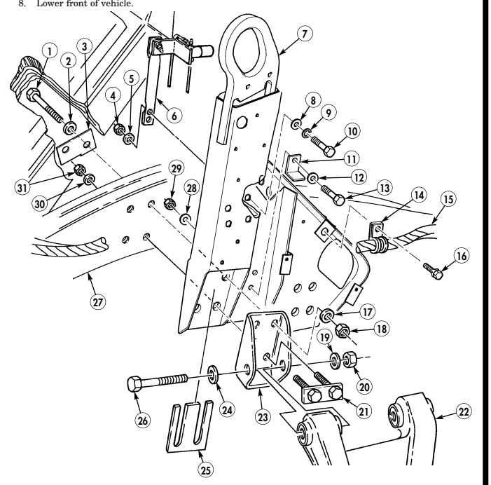

FOLLOW-ON TASKS: - Install left engine splash shield (para. 10-23.1).

- Install airlift crossbrace (para. 9-12).

# 24-8. Right Airlift Bracket And Front Upper Control Arm Brackets Replacement (Serial Numbers 299999 And Below)

This task covers:

Tools General mechanic's tool kit:
automotive (Appendix B, Item 1)
Maintenance and repair shop equipment:
automotive (Appendix B, Item 2)

#### Materials/Parts

Two locknuts (Appendix G, Item 106) Four locknuts (Appendix G, Item 85) Four locknuts (Appendix G, Item 88) Sealing compound (Appendix C, Item 63)
a. Removal **b. Installation**
Manual References TM 9-2320-387-24P
Equipment Condition
•Engine right splash shield removed
(para. 10-24).

•Airlift crossbrace removed (para. 9-12).

Maintenance Level Direct support a. Removal 1. Raise and support front of vehicle. 2. Remove two locknuts (9), washers (10), and capscrews (4) from radiator support (8) and airlift bracket (5). Discard locknuts (9).

2.1. Remove two locknuts (3.1), washers (3.2), capscrews (6.2) and washers (6.1) from airlift bracket (5)
and frame rail (11). Discard locknuts (3.1).

3. Remove two locknuts (16), washers (14), capscrews (12), washers (14), and upper control arm (15)
from two control arm brackets (3). Discard locknuts (16).

Note direction of capscrews for installation.

4. Remove four locknuts (1), washers (2), capscrews (7), washers (2), and cooler line bracket (6) from two control arm brackets (3), airlift bracket (5), and frame rail (11). Discard locknuts (1).

5. Remove four locknuts (10.1), washers (10.2), two bolt and bracket assemblies (15.1), control arm brackets (3), shim(s) (13), if present, and airlift bracket (5) from frame rail (11). Discard locknuts (10.1)

#### B. Installation

1. Install airlift bracket (5), shim(s) (13), if removed, two control arm brackets (3), and cooler line bracket (6) on frame rail (11) with four washers (2), capscrews (7), washers (2), and locknuts (1). Tighten locknuts (1) to 90 lb-ft (122 N•m).

1.1. Apply sealing compound to threads of two bolt and bracket assemblies (15.1). 1.2. Secure airlift bracket (5) and two control arm brackets (3) on frame rail (11) with two bolt and bracket assemblies (15.1), four washers (10.2), and locknuts (10.1).

2. Install upper control arm (15) on two control arm brackets (3) with two washers (14),
capscrews (12), washers (14), and locknuts (16). Tighten locknuts (16) to 260 lb-ft (353 N•m).

3. Install radiator support (8) on airlift bracket (5) with two capscrews (4), washers (10), and locknuts (9). Tighten locknuts (9) to 37 lb-ft (50 N•m).

3.1. Secure airlift bracket (5) to frame rail (11) with two washers (6.1), capscrews (6.2), washers (3.2),
and locknuts (3.1).

4. Lower front of vehicle.

24-8.

# Right Airlift Bracket And Front Upper Control Arm Brackets Replacement (Serial Numbers 299999 And Below) (Cont'D)

■

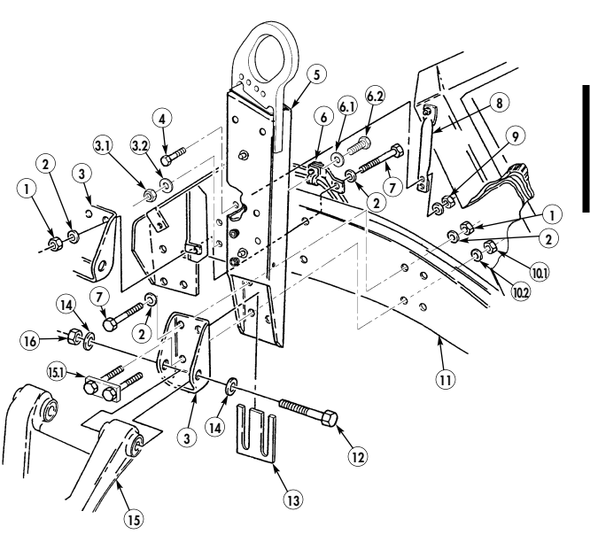

FOLLOW-ON TASKS:  - Install engine right splash shield (para. 10-24).
- • Install airlift brace (para. 9-12).

■

# 24-8.1. Right Airlift Bracket And Front Upper Control Arm Brackets Replacement (Serial Numbers 300000 And Above)

This task covers:
INITIAL SETUP:
Tools General mechanic's tool kit:
automotive (Appendix B, Item 1)
Maintenance and repair shop equipment:
automotive (Appendix B, Item 2)
Materials/Parts Two lockwashers (Appendix G, Item 144) Ten locknuts (Appendix G, Item 114.4) Two locknuts (Appendix G, Item 88) Two locknuts (Appendix G, Item 106)
a. Removal **b. Installation**
Manual References TM 9-2320-387-24P
Equipment Condition
- Airlift crossbrace removed (para. 9-12). - Engine right splash shield removed
(para. 10-24.1).

Maintenance Level Direct support

#### A. Removal

1. Raise and support front of vehicle. 2. Remove two locknuts (9), washers (8), clip (4), two washers (2), and capscrews (1) from airlift bracket (7) and frame rail (17). Discard locknuts (9).

3. Remove two locknuts (12), washers (11), capscrews (3), lockwashers (5), and washers (6) from radiator support (10) and airlift bracket (7). Discard locknuts (12).

4. Remove two locknuts (24), washers (25), capscrews (18), washers (20), and upper control arm (22)
from two control arm brackets (21). Discard locknuts (24).

- Control arm bracket towards front of vehicle contains bolt and bracket assembly.

- Note direction of capscrews for installation.

5. Remove six locknuts (26), washers (27) and (13), and capscrews (14) from two control arm brackets
(22), airlift bracket (7), and frame rail (17). Discard locknuts (26).

6. Remove two locknuts (15), washers (16), bolt and bracket assembly (23), control arm brackets (21),
shim(s) (19), if present, and airlift bracket (7) from frame rail (17). Discard locknuts (15).

b. Installation

Control arm bracket towards front of vehicle contains bolt and bracket assembly.

1. Install airlift bracket (7), shim(s) (19), if removed, and two control arm brackets (21) on frame rail (17) with six capscrews (14), washers (13) and (27), and locknuts (26). Tighten locknuts (26) to 90 lb-ft (122 N•m).

2. Apply sealing compound to threads of bolt and bracket assembly (23). 3. Secure airlift bracket (7) and control arm brackets (21) on frame rail (17) with bolt and bracket assembly (23), two washers (16), and locknuts (15).

4. Install upper control arm (22) on two control arm brackets (21) with two capscrews (18),
washers (20) and (25), and locknuts (24). Tighten locknuts (24) to 260 lb-ft (353 N•m).

# 24-8.1. Right Airlift Bracket And Front Upper Control Arm Brackets Replacement (Serial Numbers 300000 And Above) (Cont'D)

5. Install radiator support (10) on airlift bracket (7) with two capscrews (3), lockwashers (5),
washers (6) and (11), and locknuts (12). Tighten locknuts (12) to 37 lb-ft (50 N•m).

6. Secure airlift bracket (7) to frame rail (17) with two capscrews (1), washers (2), clip (4), two washers (8), and locknuts (9).

7. Lower front of vehicle.

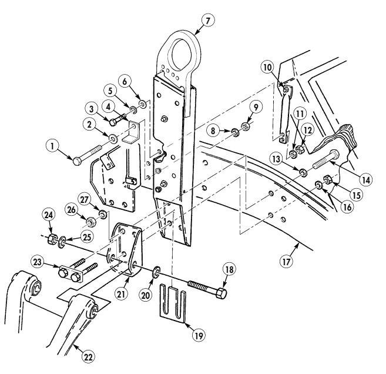

FOLLOW-ON TASKS: - Install right engine splash shield (para. 10-24.1)
- Install airlift crossbrace (para. 9-12).

# 24-9. Right Engine Mount Bracket Replacement

This task covers:
a. Removal **b. Installation**

Tools General mechanic's tool kit:
automotive (Appendix B, Item 1)
Maintenance and repair shop equipment:
automotive (Appendix B, Item 2)

#### Materials/Parts

Five locknuts (Serial numbers 299999 and below) (Appendix G, Item 85)
Five locknuts (Serial numbers 300000 and above) (Appendix G, Item 114.4)

| Disc brake caliper removed (para. 7\-4).          |
|---------------------------------------------------|
| General Safety Instructions                       |
| - Hold caliper so piston is facing away from your |
| body. Keep fingers out of space between piston    |
| and wood block.                                   |

Tag engine mounts for installation. The left and right engine mounts are not interchangeable with each other.

#### A. Removal

1. Remove two locknuts (10), washers (1), capscrews (2), and washers (1) from support bracket (8) and engine mount bracket (5). discard locknuts (10).

2. Remove capscrew (3) and vent tube clamp (4) from engine mount bracket (5). 3. Remove three locknuts (9), washers (7), capscrews (6), washers (7), support bracket (8), and engine mount bracket (5) from frame rail (11). Discard locknuts (9).

#### B. Installation

1. Install support bracket (8) and engine mount bracket (5) on frame rail (11) with three washers (7),
capscrews (6), washers (7), and locknuts (9).

2. Secure support bracket (8) on engine mount bracket (5) with two washers (1), capscrews (2),
washers (1), and locknuts (10). Tighten locknuts (10) and (9) to 90 lb-ft (122 N•m).

3. Install vent tube clamp (4) on engine mount bracket (5) with capscrew (3).

# 24-9.  Right Engine Mount Bracket Replacement (Cont'D)

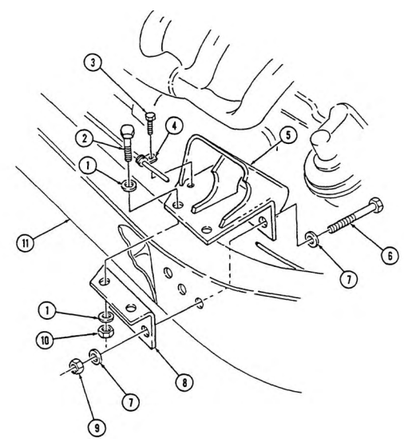

FOLLOW-ON TASK: Install engine right mount and insulator (para. 15-3).

# 24-10. Left Engine Mount Bracket Replacement

This task covers:

| INITIAL SETUP:                         |
|----------------------------------------|
| Tools ____                             |
| General mechanic's tool kit:           |
| automotive (Appendix B, Item 1)        |
| Maintenance and repair shop equipment: |
| automotive (Appendix B, Item 2)        |

INITIAL SETUP:
Six locknuts (Appendix G, Item 85)
(Serial numbers 299999 and below)
Six locknuts (Appendix G, Item 114.4)
(Serial numbers 300000 and above)
a. Removal **b. Installation**

| Manual References    |
|----------------------|
| TM 9\-2320\-387\-24P |
| Maintenance Level    |
| Direct support       |

Tag engine mounts for installation. Left and right engine mounts are not interchangeable with each other.

a. Removal 1. Remove two capscrews (2), brake line clamp (1), and oil line clamp (3) from engine mount bracket (4).

2. Remove two locknuts (7) and washers (6) from insulator (5) and engine mount bracket (4). Discard locknuts (7).

#### Caution

Wood block must completely cover bottom of engine oil pan or damage to oil pan may result.

3. Support engine under engine oil pan (12) with wood block and jack. 4. Remove four locknuts (11), washers (9), capscrews (8), washers (9), and engine mount bracket (4)
from frame rail (10). Discard locknuts (11).

#### B. Installation

1. Install engine mount bracket (4) on frame rail (10) with four washers (9), capscrews (8), washers (9),
and locknuts (11). Tighten locknuts (11) to 90 lb-ft (122 N•m).

2. Remove support from engine oil pan (12). 3. Install engine mount bracket (4) on insulator (5) with two washers (6) and locknuts (7). Tighten locknuts (7) to 90 lb-ft (122 N•m).

4. Install brake line clamp (1) and oil line clamp (3) on engine mount bracket (4) with two capscrews (2).

# 24-10.  Left Engine Mount Bracket Replacement (Cont'D)

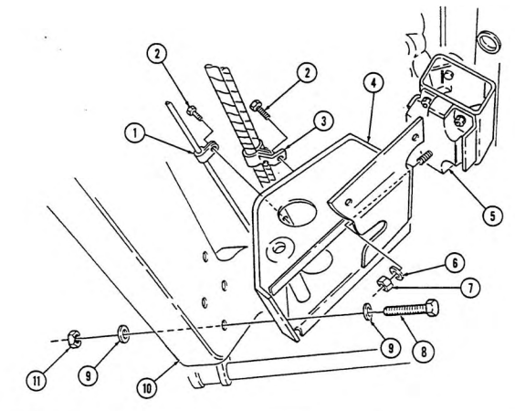

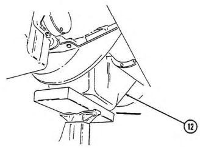

BRI
# 24-11. Rear Upper Control Arm Bracket Replacement

| automotive (Appendix B, Item 2)   |
|-----------------------------------|
| Materials/Parts                   |

| Tools                                  |
|----------------------------------------|
| General mechanic's tool kit:           |
| automotive (Appendix B. Item 1)        |
| Maintenance and repair shop equipment: |

This task covers:

| INITIAL SETUP:   |
|------------------|

Four locknuts (Appendix G, Item 88)
(Serial numbers 299999 and below)
Two locknuts (Appendix G, Item 85)
(Serial numbers 299999 and below)
Four locknuts (Appendix G, Item 114.4)
(Serial numbers 300000 and above)
Two locknuts (Appendix G, Item 88)
(Serial numbers 300000 and above)
a. Removal **b. Installation**
Direct support

The replacement procedure for four rear upper control arm brackets is basically the same. This procedure covers the right rear upper control arm front bracket.

| Manual References           |
|-----------------------------|
| TM 9\-2320\-387\-24P        |
| Equipment Condition         |
| Wheel removed (para. 8\-3). |
| Maintenance Level           |
| THE LEAST I                 |

a. Removal 1. Remove capscrew (2) and clamp (1) from bracket (5) and disconnect vent line (3) from geared hub
(4).

2. Remove two locknuts (17), washers (13), capscrews (14), washers (13), and upper control arm (15)
from two upper control arm brackets (16). Discard locknuts (17).

3. Remove four locknuts (7), washers (8), capscrews (12), washers (8), spacer (10), shim(s) (11), if present, vent line mounting bracket (9), and control arm bracket (16) from frame rail (6). Discard locknuts (7).

#### B. Installation

1. Install shim(s) (11), if removed, spacer (10), vent line mounting bracket (9), and control arm bracket (16) on frame rail (6) with four washers (8), capscrews (12), washers (8), and locknuts (7). Tighten locknuts (7) to 90 lb-ft (122 N•m).

2. Install upper control arm (15) on two upper control arm brackets (16) with two washers (13),
capscrews (14), washers (13), and locknuts (17). Tighten locknuts (17) to 260 lb-ft (353 N•m).

3. Connect vent line (3) to geared hub (4) and install clamp (1) on bracket (5) with capscrew (2).

# 24-11. Rear Upper Control Arm Bracket Replacement (Cont'D)

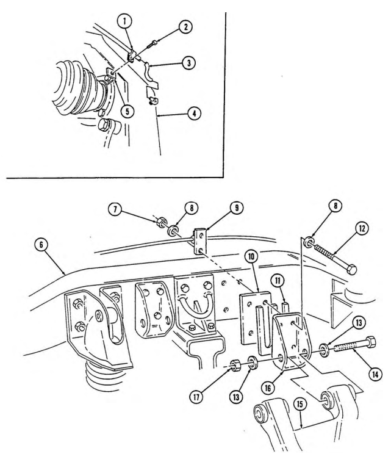

FOLLOW-ON TASK: Install wheel (para. 8-3).

# 24-12. Rear-Rear Tiedown Bracket Replacement

This task covers:
INITIAL SETUP:
Tools General mechanic's tool kit:
automotive (Appendix B, Item 1)
Maintenance and repair shop equipment:
automotive (Appendix B, Item 2)

a. Removal b. Installation

| Manual References   |
|---------------------|
| TM 9\-2320\-387\-2  |

| Maintenance Level   |
|---------------------|

TM 9-2320-387-24P
Direct support

#### Materials/Parts

Two locknuts (Appendix G, Item 88)
a. Removal Remove two locknuts (1), washers (2), capscrews (3), washers (2), and rear-rear tiedown bracket (4) from frame rail (5). Discard locknuts (1).

b. Installation Install rear-rear tiedown bracket (4) on frame rail (5) with two washers (2), capscrews (3), washers (2),

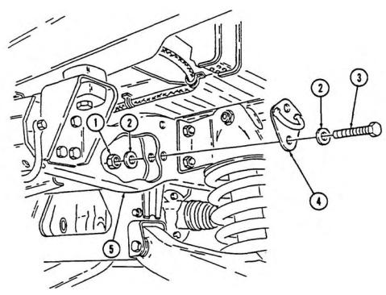 and locknuts (1). Tighten locknuts (1) to 260 lb-ft (353 N•m).

# 24-13. Transmission Crossmember Support Bracket Replacement

This task covers:
INITIAL SETUP:
Tools General mechanic's tool kit:
automotive (Appendix B, Item 1)
Maintenance and repair shop equipment:
automotive (Appendix B, Item 2)
Materials/Parts Two locknuts (Appendix G, Item 85)
Manual References TM 9-2320-387-24P
a. Removal **b. Installation**
Equipment Condition Transmission mount crossmember removed
(para. 9-10).

Maintenance Level Direct support a. Removal Remove two locknuts (3), washers (4), and transmission support bracket (5) from two capscrews (2) on frame rail (1). Discard locknuts (3).

b. Installation Install transmission support bracket (5) on two capscrews (2) on frame rail (1) with two washers (4) and

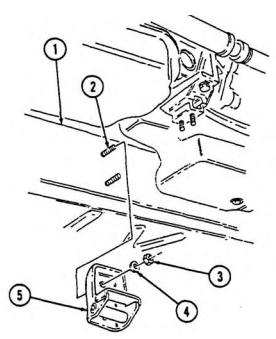 locknuts (3). Tighten locknuts (3) to 90 lb-ft (122 N•m).

FOLLOW-ON TASK: Install transmission mount crossmember (para. 9-10).

# 24-14. Rear-Front Tiedown Bracket Replacement

This task covers:
INITIAL SETUP:
Tools General mechanic's tool kit:
automotive (Appendix B, Item 1)
Maintenance and repair shop equipment:
automotive (Appendix B, Item 2)
Materials/Parts Four locknuts (Appendix G, Item 88) Two locknuts (Appendix G, Item 85)
(Serial numbers 299999 and below)
Two locknuts (Appendix G, Item 114.4)
(Serial numbers 300000 and above)
a. Removal **b. Installation**

| Manual References           |
|-----------------------------|
| TM 9\-2320\-387\-24P        |
| Equipment Condition         |
| Wheel removed (para. 8\-3). |
| Maintenance Level           |
| Direct support              |

a. Removal 1. Remove four locknuts (1), washers (2), capscrews (7), and washers (2) from tiedown bracket (3) and frame rail (10). Discard locknuts (1).

2. Remove two locknuts (8), washers (4), capscrews (5), washers (4), vent tube mounting bracket (6),
and tiedown bracket (3) from rear suspension front crossmember mounting bracket (9). Discard locknuts (8).

#### B. Installation

1. Install tiedown bracket (3) on frame rail (10) with four washers (2), capscrews (7), washers (2), and locknuts (1). Tighten locknuts (1) to 260 lb-ft (353 N•m).

2. Install tiedown bracket (3) and vent tube mounting bracket (6) on rear suspension front crossmember mounting bracket (9) with two washers (4), capscrews (5), washers (4), and locknuts (8). Tighten locknuts (8) to 90 lb-ft (122 N•m).

# 24-14. Rear-Front Tiedown Bracket Replacement (Cont'D)

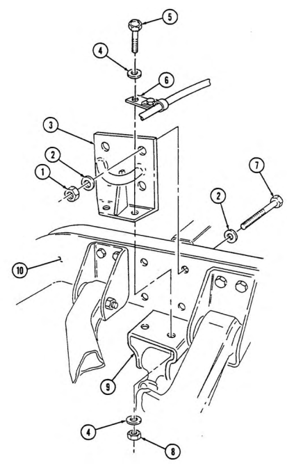

FOLLOW-ON TASK: Install wheel (para. 8-3).

# 24-15. Differential Support Bracket And Side Mounting Bracket Replacement (Serial Numbers 299999 And Below)

This task covers:

#### Initial Setup: Tools

General mechanic's tool kit:
automotive (Appendix B, Item 1)
Maintenance and repair shop equipment:
automotive (Appendix B, Item 2)

#### Materials/Parts

O-ring (Appendix G, Item 215) Four locknuts (Appendix G, Item 85) Locknut (Appendix G, Item 108) Sealing compound (Appendix C, Item 63)
a. Removal **b. Installation**
Manual References TM 9-2320-387-24P
Equipment Condition Service brake rotor removed (para. 7-12).

| Maintenance Level   |
|---------------------|

Direct support

#### A. Removal

1. Remove locknut (5), O-ring (4), and output flange (3) from output shaft (2). Discard O-ring (4) and locknut (5).

2. Remove two capscrews (7) and brake adapter (6) from differential (1). 3. Remove two capscrews (12) and washers (13) from differential side mounting bracket (14) and differential (1).

4. Remove two locknuts (11), washers (8), capscrews (9), washers (8), and differential support bracket (10)
with side mounting bracket (14) from suspension crossmember (15). discard locknuts (11).

NOTE
Scribe a locating mark on differential support bracket and side mounting bracket for installation.

5. Remove two locknuts (16), washers (17), capscrews (19), washers (17), mounting plate (18), and side mounting bracket (14) from support bracket (10). Discard locknuts (16).

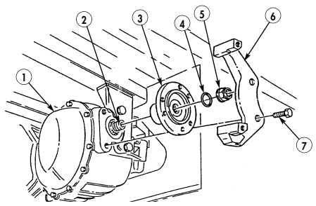

24-15. DIFFERENTIAL SUPPORT BRACKET AND SIDE MOUNTING BRACKET
             REPLACEMENT (SERIAL NUMBERS 299999 AND BELOW) (Confd)
■■

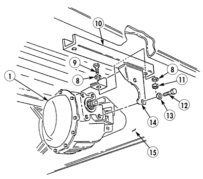

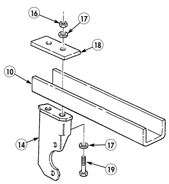

# 24-15. Differential Support Bracket And Side Mounting Bracket Replacement (Serial Numbers 299999 And Below) **(Cont'D)**

#### B. Installation

1. Align locating marks and install side mounting bracket (6) and mounting plate (4) on support bracket (1) with two washers (3), capscrews (5), washers (3), and locknuts (2). Tighten capscrews (5) to 90 lb-ft (122 N•m).

2. Install support bracket (1) with side mounting bracket (6) attached on suspension crossmember (11)
with two washers (7), capscrews (13), washers (7), and locknuts (8).

#### Caution

Apply a liberal amount of thread sealing compound to the tapped holes of differential. To allow adequate coating of threads, install capscrews shortly after applying thread sealing compound. Failure to do this could allow capscrews to loosen and cause damage to differential.

3. Apply sealing compound to tapped holes of differential (12). Install side mounting bracket (6) on differential (12) with two washers (10) and short capscrews (9). Tighten capscrews (9) to 125-150 lb-ft (170-203 N•m) and locknuts (8) to 90 lb-ft (122 N•m).

4. Apply sealing compound to tapped holes of differential (12) and install brake adapter (18) on

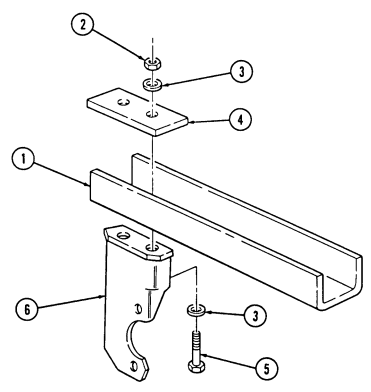

differential (12) with two capscrews (19). Tighten capscrews (19) to 125-150 lb-ft (170-203 N•m).

5. Install output flange (15) on output shaft (14) with O-ring (16) and locknut (17). Tighten locknut (17) to 170 lb-ft (231 N•m).

# 24-15.  Differential Support Bracket And Side Mounting Bracket Replacement (Serial Numbers 299999 And Below) (Cont'D)

■

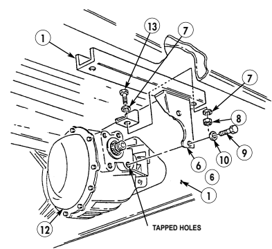

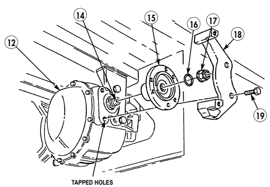

FOLLOW-ON TASK: Install service brake rotor (para. 7-12).

# 24-15.1. Front Differential Support Bracket/Brake Adapter Replacement (Serial Numbers 300000 And Above)

This task covers:
a. Removal b. Installation

| automotive (Appendix B, Item 1)           | TM 9\-2320\-387\-24P                           |
|-------------------------------------------|------------------------------------------------|
| Maintenance and repair shop equipment:    | Equipment Condition                            |
| automotive (Appendix B, Item 2)           | Hood raised and secured (TM 9\-2320\-387\-10). |
| Materials/Parts                           | Maintenance Level                              |
| Three locknuts (Serial numbers 299999 and |                                                |
| below) (Appendix A, Item 85)              | Direct support                                 |
| Three locknuts (Serial numbers 300000 and |                                                |
| above) (Appendix A, Item 114.4)           |                                                |
| a. Removal                                |                                                |

| INITIAL SETUP:   |
|------------------|

#### Warning

Differential is extremely heavy and must be supported during removal and installation. Failure to do so may result in injury to personnel or damage to equipment.

NOTE
Replacement procedures for all differential support brackets/brake adapters are basically the same. This procedure covers the left front differential support bracket/brake adapter.

a. Removal 1. Remove locknut (12), washer (11), capscrew (9), and washer (8) from suspension crossmember (10).

Discard locknut (12).

2. Remove locknut (6), O-ring (5), and output flange (4) from output shaft (2). Discard locknut (6) and O-ring (5).

3. Remove four capscrews (7) and brake adapter (3) from differential (1). b. Installation

#### Caution

Apply a liberal amount of thread sealing compound to the tapped holes of differential. To allow adequate coating of threads, install capscrews shortly after applying thread sealing compound. Failure to comply may allow capscrews to loosen and cause damage to differential.

1. Apply sealing compound to tapped holes of differential (1). Install brake adapter (3) on differential (1)
with four capscrews (7). Tighten capscrews (7) to 125-150 lb-ft (170-203 N•m).

2. Install output flange (4) and O-ring (5) on output shaft (2) with locknut (6). Tighten locknut (6) to 170 lb-ft (231 N•m).

3. Secure brake adapter (3) to suspension crossmember (10) with washer (8), capscrew (9), washer (11),
and locknut (12).

24-15.1. FRONT DIFFERENTIAL SUPPORT BRACKET/BRAKE ADAPTER REPLACEMENT
(SERIAL NUMBERS 300000 AND ABOVE) (Cont'd)

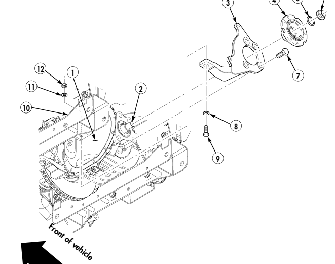

3 4 5 6
➡Front of vehicle
# 24-15.2. Rear Mounting Plate/Brake Adapter Replacement (Serial Numbers 300000 And Above)

This task covers:
INITIAL SETUP:
Tools General mechanic's tool kit:
automotive (Appendix B, Item 1)
Maintenance and repair shop equipment:
automotive (Appendix B, Item 2)
Materials/Parts Two locknuts (Appendix G , Item 114.4)
Personnel Required One mechanic One assistant a. Removal b. Installation Manual References TM 9-2320-387-24P
Equipment Condition Rear differential removed (para. 21-4.2).

Maintenance Level Direct support a. Removal Remove two locknuts (5), washers (4), capscrews (1), washers (2), and rear brake adapter mounting plate (6) from rear crossmember (3). Discard locknuts (5). b. Installation Install rear brake adapter mounting plate (6) on rear crossmember (3) with two washers (2), capscrews (1), washers (4), and locknuts (5). Tighten locknuts (5) to 90 lb-ft (122 N•m).

# 24-15.2.  Rear Mounting Plate/Brake Adapter Replacement (Serial Numbers 300000 And Above) (Cont'D)

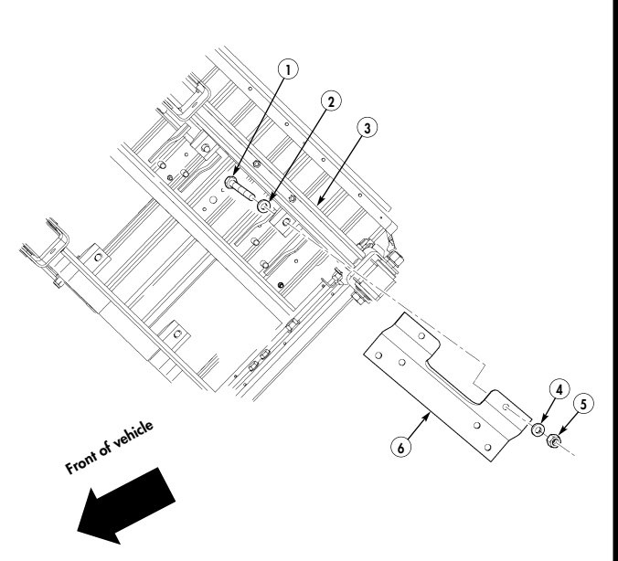

FOLLOW-ON TASK:  Install rear differential (para. 21-14.2).

# 24-16. Front Suspension Front Crossmember Replacement (Serial Numbers 299999 And Below)

This task covers:
INITIAL SETUP:
Tools General mechanic's tool kit:
automotive (Appendix B, Item 1)
Maintenance and repair shop equipment:
automotive (Appendix B, Item 2)
Materials/Parts Four locknuts (Appendix G, Item 88) Ten locknuts (Appendix G, Item 85)
Manual References TM 9-2320-387-24P
a. Removal

#### A. Removal B. Installation Equipment Condition

- Front lower control arms removed
(para. 6-26).

- Lower radiator hose removed (para. 3-72). - Horn removed (para. 4-26). - Radiator front mounting bracket removed
(para. 9-5).

- Differential removed (para. 21-5). - Differential support brackets and side mounting brackets removed (para. 24-15).

Maintenance Level Direct support

Note direction of capscrews for installation.

1. Remove four locknuts (1), washers (2), capscrews (3), washers (2), and two splash shield brackets (5)
from frame rails (4). Discard locknuts (1).

2. Remove screw (11), clamp (12), and harness (13) from front crossmember (14). 3. Remove four locknuts (16), washers (6), capscrews (7), and washers (6) from front crossmember (14)
and two frame rails (4). Discard locknuts (16).

4. Remove six locknuts (15), washers (10), capscrews (9), and washers (10) from front crossmember (14)
and left and right front crossmember mounting brackets (8). Discard locknuts (15).

5. Slide front crossmember (14) and mounting brackets (8) down and out from under vehicle. 6. Remove left and right mounting brackets (8) from crossmember (14).

#### B. Installation

1. Install left and right crossmember mounting brackets (8) on front crossmember (14). 2. Install front crossmember (14) and two mounting brackets (8) on frame rails (4) with four washers (6), capscrews (7), washers (6), and locknuts (16).

3. Secure left and right mounting brackets (8) on front crossmember (14) with six washers (10),
capscrews (9), washers (10), and locknuts (15).

4. Install two splash shield brackets (5) on frame rails (4) with four washers (2), capscrews (3),
washers (2), and locknuts (1).

5. Tighten four locknuts (16) to 260 lb-ft (353 N•m). 6. Tighten four locknuts (1) and six locknuts (15) to 90 lb-ft (122 N•m). 7. Install harness (13) on front crossmember (14) with clamp (12) and screw (11).

# 24-16.  Front Suspension Front Crossmember Replacement

(SERIAL NUMBERS 299999 AND BELOW) (Cont'd)

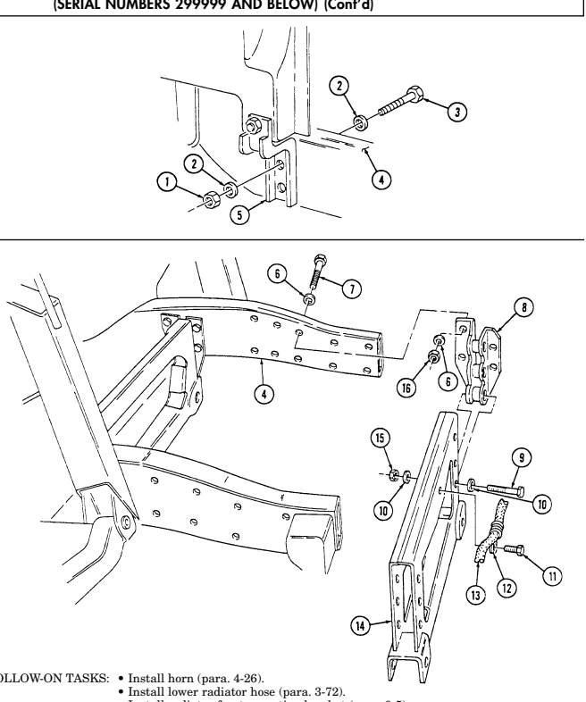

- Install radiator front mounting bracket (para. 9-5). · Install differential support brackets and side mounting brackets (para. 24-15). · Install differential (para. 21-5).

- Install front lower control arms (para. 6-26).

# 24-16.1. Front Suspension Front Crossmember Maintenance (Serial Numbers 300000 And Above)

This task covers:
a. Removal c. Installation b. Inspection INITIAL SETUP:
Tools General mechanic's tool kit:
automotive (Appendix B, Item 1)
Maintenance and repair shop equipment:
automotive (Appendix B, Item 2)
Materials/Parts Fifteen locknuts (Appendix G, Item 114.4)
Manual References TM 9-2320-387-24P

#### Equipment Condition

- Radiator removed (para. 3-62.1). - Front lower control arms removed
(para. 6-26).

- Horn removed (para. 4-26.1). - Front differential removed (para. 21-4.1) - Front differential support brackets and side mounting brackets removed (para. 24-15.1).

- Front brake lines removed (para. 7-7.1).

#### A. Removal

5. Slide crossmember (20) and mounting brackets (10) down and out from under vehicle. b. Inspection Inspect edge protector (19). Replace if damaged.

#### B. Installation

1. Install left and right crossmember mounting brackets (10) on front crossmember (20). 2. Install front crossmember (20) and two mounting brackets (10) on frame rails (23) with four washers (11), capscrews (9), washers (1), and locknuts (2).

3. Install brake line brackets (8) and left and right crossmember mounting brackets (10) on front crossmember with six washers (7), locknuts (6), washers (14) and capscrews (15).

4. Install two splash shield brackets (3) on frame rails (23) with four washers (12), capscrews (13),
washers (5), and locknuts (4).

6. Tighten four locknuts (2). 7. Tighten four locknuts (4) and six locknuts (6).

1. Remove four locknuts (4), washers (5), capscrews (13), washers (12), and two splash shield brackets (3)
from frame rails (23). Discard locknuts (4).

2. Remove locknut (22), washer (21), screw (17), clamp (18), and harness (16) from front crossmember (20). Discard locknut (22).

3. Remove four locknuts (2), washers (1), capscrews (9), and washers (11) from front crossmember (20)
and two frame rails (23). Discard locknuts (2).

4. Remove six locknuts (6), washers (7), capscrews (15), washers (14), and brake line brackets (8) from front crossmember (20) and left and right front crossmember mounting brackets (10). Discard locknuts (6).

5. Install harness (16) on front crossmember (20) with clamp (18) and screw (17), washer (21), and locknut (22).

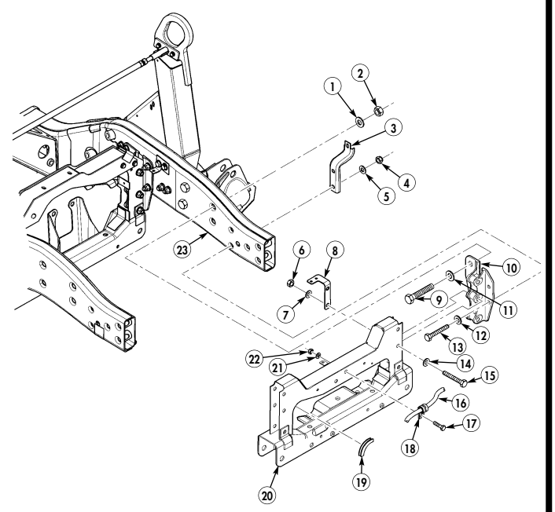

# 24-16.1. Front Suspension Front Crossmember Maintenance (Serial Numbers 300000 And Above) (Cont'D)

FOLLOW-ON TASKS: - Install front brake lines (para. 7-7.1).

- Install front differential support brackets and side mounting brackets 
(para. 24-15.1).

- Install front differential (para 21-4.1). - Install horn (para. 4-26.1). - Install front lower control arms (para. 6-26). - Install radiator (3-62.1).

# 24-17. Front Suspension Rear Crossmember Replacement (Serial Numbers 299999 And Below)

This task covers:

| General mechanic's tool kit:                                           | Coil spring removed (para. 6\-27).   |
|------------------------------------------------------------------------|--------------------------------------|
| automotive (Appendix B, Item 1)                                        | Maintenance Level                    |
| Maintenance and repair shop equipment: automotive (Appendix B, Item 2) | Direct support                       |
| Materials/Parts                                                        |                                      |
| Four locknuts (Appendix G, Item 88)                                    |                                      |
| Manual References                                                      |                                      |
| TM 9\-2320\-387\-24P                                                   |                                      |
| a. Removal                                                             |                                      |
|                                                                        | NOTE                                 |
| The replacement procedure for the four spring seats is basically       |                                      |

#### A. Removal **B. Installation** A. Removal

1. Remove three capscrews (4), lockwashers (3), and washers (2) and pull steering gear (1) away from left frame rail (5). Discard lockwashers (3).

2. Remove three capscrews (12) and vent line clamps (11) from rear crossmember (17).

Note direction of capscrews for installation.

3. Remove four locknuts (15), washers (16), capscrews (19), washers (16), and vent line bracket (20)
from rear crossmember (17) and right frame rail (10). Discard locknuts (15).

4. Remove three locknuts (9), washers (7), capscrews (8), washers (7), and vent line bracket (6) from crossmember (17) and frame rail (5). Discard locknuts (9).

5. Remove capscrew (21) and washer (22) from rear crossmember (17) and frame rail (5). 6. Remove six locknuts (18), washers (14), capscrews (13), and washers (14) from rear crossmember (17) and left and right rear crossmember mounting brackets (23). Discard locknuts (18).

7. Slide rear crossmember (17) and left and right crossmember mounting brackets (23) down and out from under vehicle.

8. Remove left and right crossmember mounting brackets (23) from rear crossmember (17).

24-17. FRONT SUSPENSION REAR CROSSMEMBER REPLACEMENT
(SERIAL NUMBERS 299999 AND BELOW) (Cont'd)
1

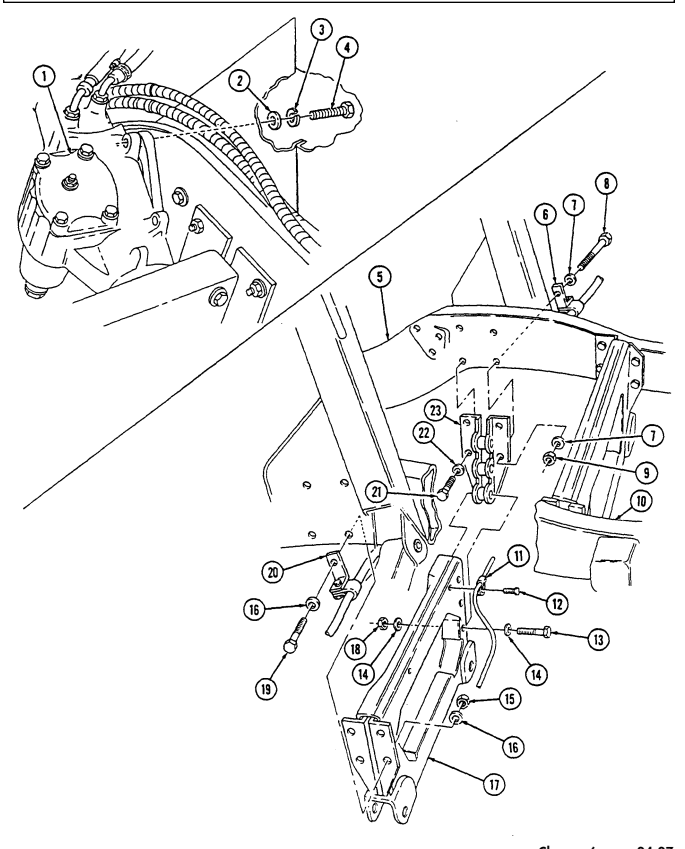

# 24-17. Front Suspension Rear Crossmember Replacement

(SERIAL NUMBERS 299999 AND BELOW) (Cont'd)

#### B. Installation

1. Install left and right rear crossmember mounting brackets (20) on rear crossmember (14). 2. Install rear crossmember (14) on frame rails (1) and (6). 3. Apply sealing compound to capscrew (18) and secure rear crossmember (14) on frame rail (1) with

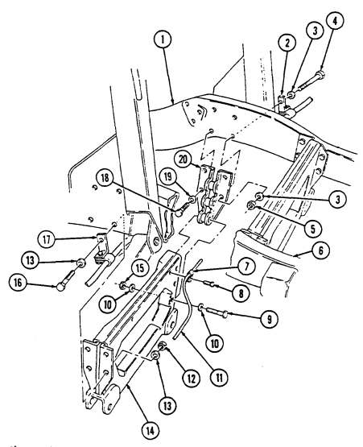

washer (19) and capscrew (18).

4. Secure rear crossmember (14) on frame rail (1) with vent line bracket (2), three washers (3),
capscrews (4), washers (3), and locknuts (5).

5. Install rear crossmember (14) and vent line bracket (17) on frame rail (6) with four washers (13),
capscrews (16), washers (13), and locknuts (12).

6. Install six washers (10), capscrews (9), washers (10), and locknuts (15) on rear crossmember (14)
and left and right mounting brackets (20).

24-28 Change 6

# 24-17. Front Suspension Rear Crossmember Replacement (Serial Numbers 299999 And Below) (Cont'D)

7. Tighten capscrew (18) to 65-78 lb-ft (88-106 N•m). 8. Tighten three capscrews (4) to 90 lb-ft (122 N•m). 9. Tighten four capscrews (16) to 90 lb-ft (122 N•m).

10. Tighten six capscrews (9) to 90 lb-ft (122 N•m). 11. Install vent line (11) on rear crossmember (14) with three clamps (7) and capscrews (8).

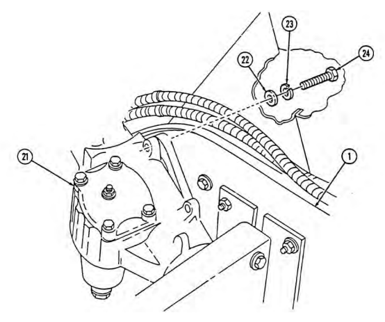 12. Install steering gear (21) on frame rail (1) with three washers (22), lockwashers (23), and capscrews (24). Tighten capscrews (24) to 60 lb-ft (81 N•m).

FOLLOW-ON TASKS: - Install differential support brackets and side mounting brackets (para. 24-15).

- Install differential (para. 21-5). - Install lower control arms (para. 6-26). - Install right front caliper-to-tee brake line (para. 7-7). - Install right front upper control arm (para. 6-25). - Install lower radiator tube (para. 3-71). - Install radiator (para. 3-62).

# 24-17.1. Front Suspension Rear Crossmember Replacement (Serial Numbers 300000 And Above)

This task covers:
a. Removal b. Installation

| automotive (Appendix B, Item 1)                                        | (All models except M1114) (para. 12\-27).   |
|------------------------------------------------------------------------|---------------------------------------------|
| Maintenance and repair shop equipment: automotive (Appendix B, Item 2) | General Safety Instructions                 |
|                                                                        | Lower control arm must be supported during  |
| Materials/Parts                                                        | removal and installation.                   |
| Two locknuts (Appendix G, Item 106)                                    | Maintenance Level                           |
| Locknut (Appendix G, Item 88)                                          | Direct support                              |
| Manual References                                                      |                                             |
| TM 9\-2320\-387\-24P                                                   |                                             |
| WARNING                                                                |                                             |
| Lower control arm must be supported during removal and                 |                                             |

| INITIAL SETUP:   |
|------------------|

- Geared fan drive and upper front rear crossmember removed (para. 3-80.2).

- Right front upper control arm removed - Lower radiator tube removed (para. 3-71.1).

- Lower control arms removed (para. 6-26).

#### A. Removal

1. Remove three capscrews (4), lockwashers (3), and washers (2) and pull steering gear (1) away from left frame rail (6). Discard lockwashers (3).

Note direction of capscrews for installation.

2. Remove six locknuts (15), washers (13), capscrews (10), and brackets (11) from left and right rear crossmember mounting brackets (16), frame rails (5) and (6), and shims (7). Discard locknuts (15).

3. Remove two locknuts (9), washers (8), shims (7), capscrews (14), and washers (12) from left and right rear crossmember mounting brackets (16) and frame rails (5) and (6). Discard locknuts (9).

4. Remove six locknuts (17), washers (18), capscrews (20), and washers (19) from rear crossmember (21) and left and right rear crossmember mounting brackets (16). Discard locknuts (17).

5. Slide rear crossmember (21) and left and right crossmember mounting brackets (16) down and out from under vehicle.

6. Remove left and right crossmember mounting brackets (16) from rear crossmember (21).

# 24-17.1. Front Suspension Rear Crossmember Replacement (Serial Numbers 300000 And Above) (Cont'D)

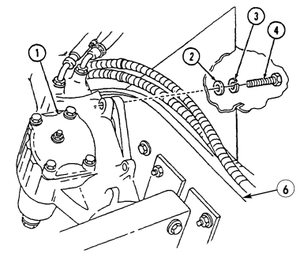

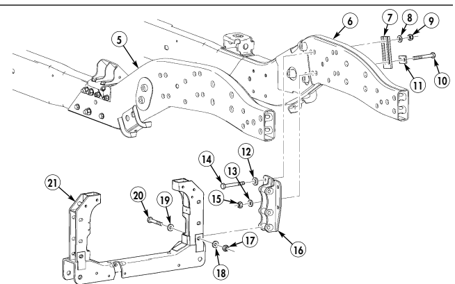

# 24-17.1. Front Suspension Rear Crossmember Replacement (Serial Numbers 300000 And Above) (Cont'D)

#### B. Installation

1. Install left and right rear crossmember mounting brackets (12) on rear crossmember (17). 2. Install rear crossmember (17) and left and right rear crossmember mounting brackets (12) on frame rails (1) and (2).

3. Apply sealing compound to two capscrews (10) and secure left and right rear crossmember mounting brackets (12) on frame rails (1) and (2) with two washers (8), capscrews (10), shims (3), washers (4), and nuts (5).

4. Secure rear crossmember (17) on frame rails (1) and (2) with six brackets (6), capscrews (7),
washers (9), and nuts (11).

5. Secure rear crossmember (17) on left and right rear crossmembers (12) with six washers (15),
capscrews (16), washers (14), and nuts (13).

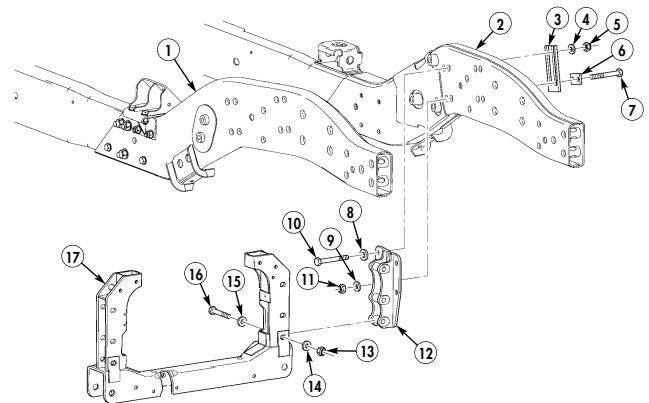

# 24-17.1. Front Suspension Rear Crossmember Replacement (Serial Numbers 300000 And Above) (Cont'D)

6. Tighten two capscrews (10) to 65-78 lb-ft (88-106 N•m). 7. Tighten six capscrews (7) to 90 lb-ft (122 N•m). 8. Tighten six capscrews (16) to 90 lb-ft (122 N•m). 9. Install steering gear (18) on frame rail (2) with three washers (19), lockwashers (20), and capscrews (21). Tighten capscrews (21) to 60 lb-ft (81 N•m).

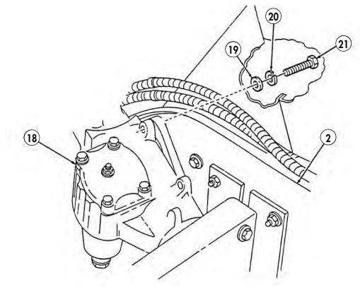

FOLLOW-ON TASKS: - Install front differential (para. 21-4.1).

- Install lower control arms (para. 6-26). - Install right front caliper-to-tee brake line (para. 7-7.1). - Install lower radiator tube (para. 3-71.1). - Install right front upper control arm (para. 6-25). - Install geared drive and upper front rear crossmember (para. 3-80.2).

## 24-18. Rear Suspension Front Crossmember Replacement (Serial Numbers 299999 And Below)

#### B. Installation

1. Install two crossmember mounting brackets (7) on front crossmember (4) with two washers (2),
capscrews (3), washers (2), and locknuts (1).

2. Install four washers (6), capscrews (5), washers (6), and locknuts (12) on two crossmember mounting brackets (7) and front crossmember (4).

3. Install front crossmember (4) on frame rail (13). 4. Deleted. 5. Tighten four locknuts (12) to 260 lb-ft (353 N•m) and two locknuts (1) to 90 ft-lb (122 N•m). 6. Install two radius rods (10) on crossmember mounting brackets (7) with washers (9), capscrews (11),
washers (9), and locknuts (8). Tighten locknuts (8) to 260 lb-ft (353 N•m).

7. Install brake line (17) on tube coupling (18). 8. Install brake line (17) and vent line (16) on front crossmember (4) with three clamps (15) and

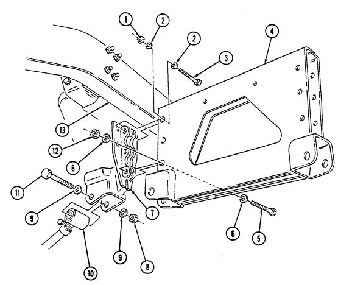

capscrews (14).

24-18.  REAR SUSPENSION FRONT CROSSMEMBER REPLACEMENT
(SERIAL NUMBERS 299999 AND BELOW) (Cont'd)
■■

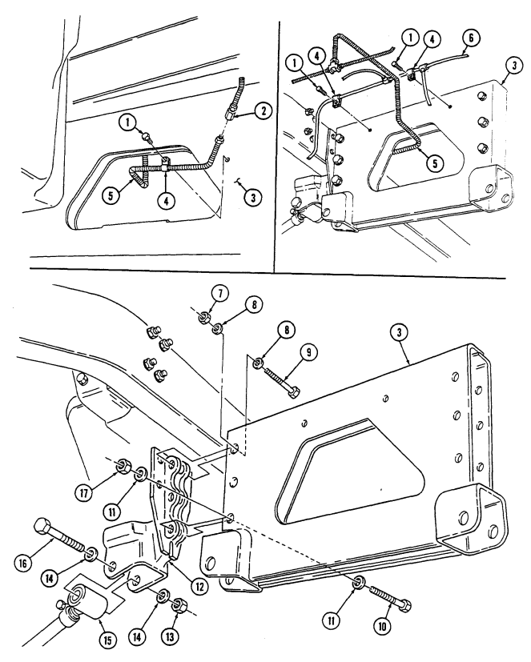

## 24-18. Rear Suspension Front Crossmember Replacement (Serial Numbers 299999 And Below)

#### B. Installation

1. Install two crossmember mounting brackets (7) on front crossmember (4) with two washers (2),
capscrews (3), washers (2), and locknuts (1).

2. Install four washers (6), capscrews (5), washers (6), and locknuts (12) on two crossmember mounting brackets (7) and front crossmember (4).

3. Install front crossmember (4) on frame rail (13). 4. Install rear-front tiedown brackets (para. 24-14). 5. Tighten four locknuts (12) to 260 lb-ft (353 N•m) and two locknuts (1) to 90 ft-lb (122 N•m). 6. Install two radius rods (10) on crossmember mounting brackets (7) with washers (9), capscrews (11),
washers (9), and locknuts (8). Tighten locknuts (8) to 260 lb-ft (353 N•m).

7. Install brake line (17) on tube coupling (18). 8. Install brake line (17) and vent line (16) on front crossmember (4) with three clamps (15) and

capscrews (14).

# 24-18. Rear Suspension Front Crossmember Replacement 

 (Serial Numbers 299999 And Below) (Cont'D)

FOLLOW-ON TASKS: - Install rear lower control arms (para. 6-26).

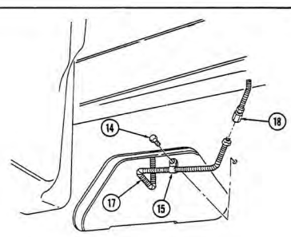

- Install differential support brackets and side mounting brackets (para. 24-15). - Install differential (para. 21-5). - Install rear-front tiedown brackets (para. 24-14). - Bleed rear brakes (para. 7-2).

# 24-18.1. Rear Suspension Front Crossmember Replacement (Serial Numbers 300000 And Above)

This task covers:
INITIAL SETUP:
Tools General mechanic's tool kit:
automotive (Appendix B, Item 1)
Maintenance and repair shop equipment:
automotive (Appendix B, Item 2)
Materials/Parts Seven locknuts (Appendix G, Item 88) Three locknuts (Appendix G, Item 114.4)
Manual References TM 9-2320-387-24P
Equipment Condition
- Rear differential removed (para. 21-4.2). - Rear differential support brackets and side mounting brackets removed (para. 24-15.2).

#### A. Removal B. Installation Equipment Condition (Cont'D)

•Rear upper control arms removed (para. 6-25). •Rear lower control arms removed (para. 6-26). •Rear-front tiedown brackets installed
(para. 24-14).

•Rear brake protection guards removed 
(para. 7-11.1).

General Safety Instructions Crossmember must be supported during removal and installation.

Maintenance Level Direct support

#### Warning

Crossmember must be supported during removal and installation. Failure to do so may cause injury to personnel or damage to equipment.

Replacement procedures for left and right assemblies are basically the same. This procedure covers the right side assembly.

a. Removal 1. Remove two capscrews (1) and (3), clamps (2) and (4), and vent line (5) from crossmember (6). 2. Remove two locknuts (16), washers (15), capscrews (8), washers (7), and vent line bracket (9) from crossmember mount (17). Discard locknuts (16).

3. Remove four locknuts (20), washers (19), capscrews (13), washers (12), tiedown bracket (18), and reinforcement plates (10) and (11) from frame (14). Discard locknuts (20).

4. Remove locknut (25), washer (26), capscrew (29), washer (28), and radius rod (27) from crossmember mount (17). Discard locknut (25).

5. Slide crossmember mount (17) and crossmember (6) down and out from vehicle. 6. Remove locknut (33), washer (32), capscrew (22), and washer (21) from crossmember (6). Discard locknut (33).

7. Remove two locknuts (31), washers (30), capscrews (23), washers (24), and crossmember mount (17)
from crossmember (6). Discard locknuts (31).

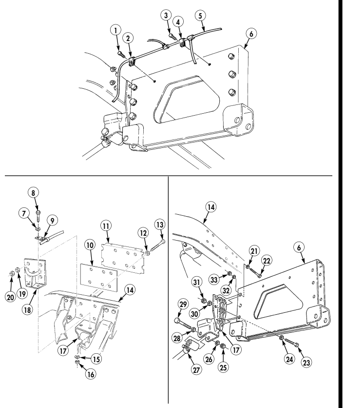

24-18.1. REAR SUSPENSION FRONT CROSSMEMBER REPLACEMENT
(SERIAL NUMBERS 300000 AND ABOVE) (Cont'd)

# 24-18.1. Rear Suspension Front Crossmember Replacement (Serial Numbers 300000 And Above) (Cont'D)

#### B. Installation

1. Install crossmember mount (17) on crossmember (6) with two washers (24), capscrew (23), washers (30),
and locknuts (31). Tighten locknuts (31) to 260 lb-ft (353 N•m).

2. Secure crossmember mount (17) to crossmember (6) with washer (21), capscrews (22), washers (32),
and locknuts (33). Tighten locknuts (33) to 90 lb-ft (122 N•m).

3. Slide crossmember mount (17) and crossmember (6) onto frame (14). 4. Install reinforcement plates (10) and (11) and tiedown bracket (18) on frame (14) with four washers (12),
capscrews (13), washers (19), and locknuts (20).

5. Install radius rod (27) on crossmember mount (17) with washer (28), capscrew (29), washer (26), and locknut (25). Tighten locknuts (25) to 260 lb-ft (353 N•m).

6. Secure tiedown bracket (18) to crossmember mount (17) with vent line bracket (9), two washers (7),
capscrews (8), washers (15), and locknuts (16).

7. Install vent line (5) on crossmember (6) with two clamps (4) and (2) and capscrews (3) and (1).

# 24-18.1. Rear Suspension Front Crossmember Replacement (Serial Numbers 300000 And Above) (Cont'D)

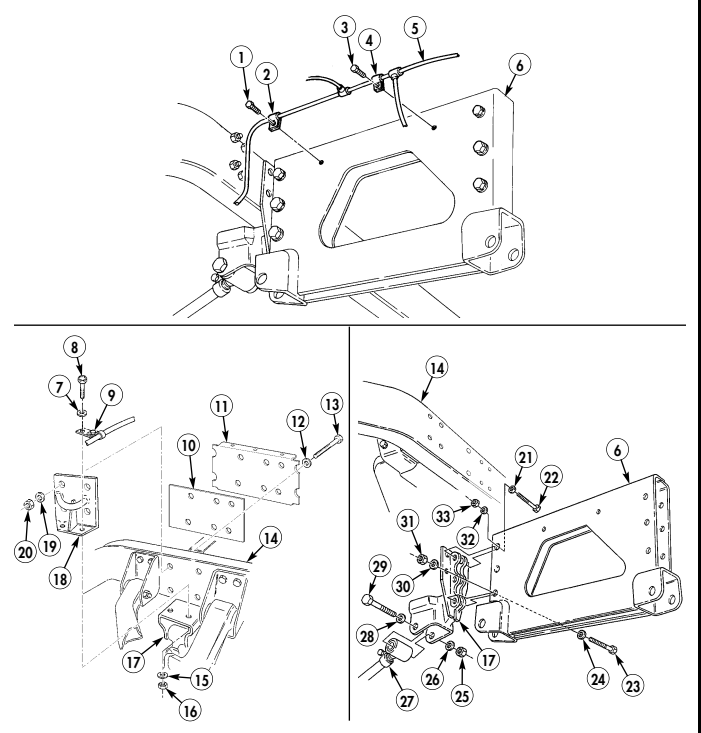

FOLLOW-ON TASKS: - Install rear brake protection guards (para. 7-11.1).

- Install rear front tiedown brackets (para. 24-14). - Install rear lower control arms (para. 6-26). - Install rear upper control arms (para. 6-25). - Install rear differential support brackets and side mounting brackets (para. 24-15.2). - Install rear differential (para. 21-4.2).

# 24-19. Rear Suspension Rear Crossmember Replacement (Serial Numbers 299999 And Below)

This task covers:

Tools General mechanic's tool kit:
automotive (Appendix B, Item 1)
Maintenance and repair shop equipment:
automotive (Appendix B, Item 2)
Materials/Parts Four locknuts (Appendix G, Item 88) Six locknuts (Appendix G, Item 85)
Manual References TM 9-2320-387-24P
a. Removal a. Removal **b. Installation**

#### Equipment Condition

- Differential support brackets and side mounting brackets removed (para. 24-15).

- Rear-rear tiedown brackets removed
(para. 24-12).

- Rear lower control arms removed
(para. 6-26).

#### General Safety Instructions

Crossmember must be supported during removal.

Maintenance Level Direct support

#### Warning

Crossmember must be supported during removal. Failure to support crossmember during removal may cause injury to personnel or damage to equipment.

1. Remove four locknuts (4), washers (3), capscrews (2), and washers (3) from rear crossmember (7)
and frame rails (1). Discard locknuts (4).

2. Loosen six locknuts (9) on two rear crossmember mounting brackets (8) and rear crossmember (7). 3. Slide rear crossmember (7) down and out from under vehicle. 4. Remove six locknuts (9), washers (5), capscrews (6), washers (5), and two rear crossmember mounting brackets (8) from rear crossmember (7). Discard locknuts (9).

#### B. Installation

1. Install two crossmember mounting brackets (8) on rear crossmember (7) with six washers (5),
capscrews (6), washers (5), and locknuts (9).

2. Install rear crossmember (7) on frame rails (1) with four washers (3), capscrews (2), washers (3), and locknuts (4). Tighten locknuts (4) to 260 lb-ft (353 N•m).

3. Tighten six locknuts (9) to 90 lb-ft (122 N•m).

# 24-19. Rear Suspension Rear Crossmember Replacement (Serial Numbers 299999 And Below) (Cont'D)

■

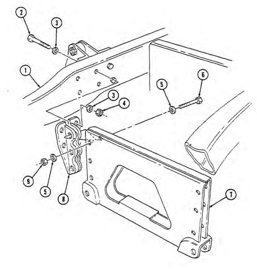

FOLLOW-ON TASKS: - Install rear-rear tiedown brackets (para. 24-12).

- Install differential support brackets and side mounting brackets (para. 24-15). · Install rear lower control arms (para. 6-26).

# 24-19.1. Rear Suspension Rear Crossmember Replacement (Serial Numbers 300000 And Above)

This task covers:

Tools General mechanic's tool kit:
automotive (Appendix B, Item 1)
Maintenance and repair shop equipment:
automotive (Appendix B, Item 2)
Materials/Parts Eight locknuts (Appendix G, Item 88) Six locknuts (Appendix G, Item 114.4)
Manual References TM 9-2320-387-24-1 TM 9-2320-387-24-2 TM 9-2320-387-24P
a. Removal a. Removal b. Installation

#### Equipment Condition

•Rear mounting plate/brake adapter 
(para. 24-15.2).

•Rear-rear tiedown brackets removed 
(para. 24-12).

•Rear lower control arms removed (para. 6-26).

General Safety Instructions Crossmember must be supported during removal.

Maintenance Level Direct support

#### Warning

Crossmember must be supported during removal. Failure to support crossmember during removal may cause injury to personnel or damage to equipment.

1. Remove eight locknuts (2), washers (3), capscrews (6), washers (5), and two brackets (4) from rear crossmember (9) and two frame rails (1). Discard locknuts (2).

2. Loosen six locknuts (7) on two rear crossmember mounting brackets (10) and rear crossmember (9). 3. Slide rear crossmember (9) down and out from under vehicle. 4. Remove six locknuts (7), washers (8), capscrews (12), washers (11), and two rear crossmember mounting brackets (10) from rear crossmember (9). Discard locknuts (7).

#### B. Installation

1. Install two crossmember mounting brackets (10) on rear crossmember (9) with six washers (11),
capscrews (12), washers (8), and locknuts (7).

2. Install rear crossmember (9) and two brackets (4) on two frame rails (1) with four washers (5),
capscrews (6), washers (3), and locknuts (2).

# 24-19.1. Rear Suspension Rear Crossmember Replacement (Serial Numbers 300000 And Above) (Cont'D)

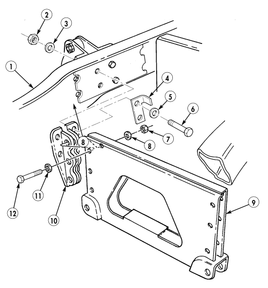

FOLLOW-ON TASKS: - Install rear lower control arms (para. 6-26).

· Install rear-rear tiedown brackets (para. 24-12).

- Install rear mounting plate/brake adapter (para. 24-15.2).

## 24-20. Suspension Crossmember Repair

This task covers:
a. Inspection **b. Repair**

Tools General mechanic's tool kit:
automotive (Appendix B, Item 1)
Materials/Parts Metal strip (Appendix C, Item 50)

| (para. 15\-3).   |
|------------------|

| Manual References   |
|---------------------|
| Equipment Condition |

#### A. Inspection

1. Visually inspect the main frame rails for damage or distortion. Vehicles with damaged frame rails should be sent to GS maintenance for repair.

NOTE
Crossmember with end bracket weld breaks of more than 1 in. (2.54 cm) must be replaced. Any crack or tear in the crossmember longer than 1-3/4 in. (4.4 cm) requires replacement of the crossmember.

2. Inspect the crossmember (1) for bends, cracks, or broken end bracket welds. Bent crossmembers (1)
should be straightened. Small cracks or tears should be stop-drilled and welded.

b. Repair

- Heli-Arc, MIG, or TIG welding equipment may be used, provided the electrode used has a 70,000 psi (482,650 kPa) tensile strength.

- Avoid heat build-up in the rubber bushing areas toward the outer edges of the crossmember.

- For welding instructions, refer to TC 9-237.

1. Center a 15-1/2-in. (39.4 cm) metal strip (3) between the end brackets (2), flat against bottom edges of the crossmember (1). Weld metal strip (3) to the crossmember (1).

2. Spot-paint welded area (TM 43-0139).

# 24-20. Suspension Crossmember Repair (Cont'D)

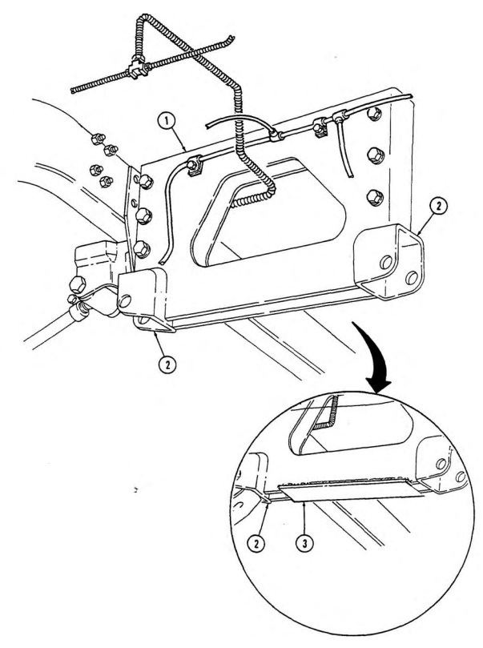

24-21. REAR CROSSMEMBER BRACKET AND REAR BODY MOUNT BRACKET

# Replacement

This task covers:
INITIAL SETUP:
Tools General mechanic's tool kit:
automotive (Appendix B, Item 1)
Maintenance and repair shop equipment:
automotive (Appendix B, Item 2)
Materials/Parts Four locknuts (Appendix G, Item 85)
Manual References TM 9-2320-387-24P
a. Removal **b. Installation**
Equipment Condition Rear body mount removed (para. 33-3).

| Direct support   |
|------------------|

a. Removal 1. Remove four locknuts (1), washers (2), rear body mount bracket (3), and plate (4) from frame rail
(5). Discard locknuts (1).

2. Remove four capscrews (8), washers (2), crossmember bracket (7), and plate (6) from frame rail (5).

b. Installation 1. Install plate (6) and crossmember bracket (7) on frame rail (5) with four washers (2) and capscrews (8).

2. Install plate (4) and rear body mount bracket (3) on frame rail (5) with four washers (2) and locknuts (1).

3. Install rear body mount (para. 33-3). 4. Tighten locknuts (1) to 90 lb-ft (122 N•m).

24-21.  REAR CROSSMEMBER BRACKET AND REAR BODY MOUNT BRACKET
REPLACEMENT (Cont'd)

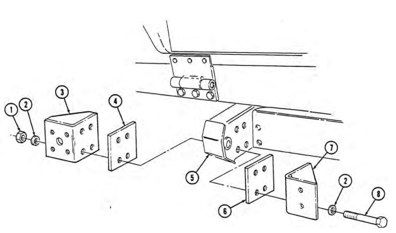

# 24-22. Rear Bumper Mounting Bracket And Tiedown Bracket Replacement (Serial Numbers 299999 And Below)

This task covers:
INITIAL SETUP:
Tools General mechanic's tool kit:
automotive (Appendix B, Item 1)
Maintenance and repair shop equipment:
automotive (Appendix B, Item 2)
Materials/Parts Eight locknuts (Appendix G, Item 85)
Manual References TM 9-2320-387-24P
a. Removal a. Removal **b. Installation**
Equipment Condition
- Rear body mount removed (para. 33-3). - Tiedown ring removed (para. 9-4).

Maintenance Level Direct support 1. Remove four locknuts (9), washers (6), capscrews (5), and washers (6) from bumper mounting bracket (7) and bumper (4). Discard locknuts (9).

2. Remove four locknuts (8), washers (2), capscrews (3), washers (2), and bumper mounting bracket (7)
from frame rail (1). Discard locknuts (8).

b. Installation 1. Install bumper mounting bracket (7) on frame rail (1) with four washers (2), capscrews (3),
washers (2), and locknuts (8).

2. Install bumper mounting bracket (7) on bumper (4) with four washers (6), capscrews (5),

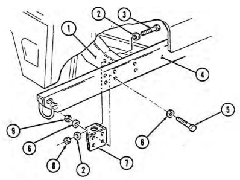

washers (6), and locknuts (9).

3. Tighten locknuts (8) and (9) to 90 lb-ft (122 N•m).

FOLLOW-ON TASKS: - Install rear body mount (para. 33-3).

- Install tiedown ring (para. 9-4).

24-38.2/(24-39 blank) Change 6

# 24-23. Rear Bumper Mounting Bracket And Tiedown Bracket Replacement (Serial Numbers 300000 And Above)

This task covers:
INITIAL SETUP:
Tools General mechanic's tool kit:
automotive (Appendix B, Item 1)
Maintenance and repair shop equipment:
automotive (Appendix B, Item 2)
Materials/Parts Four locknuts (Appendix G, Item 83) Four locknuts (Appendix G, Item 114.4)

#### A. Removal B. Installation Manual References

TM 9-2320-387-24P
Equipment Condition
- Rear body mount removed (para. 33-3). - Tiedown ring removed (para. 9-4).

Maintenance Level Direct support a. Removal 1. Remove four locknuts (9), washers (6), capscrews (5), and washers (6) from bumper mounting bracket (7) and bumper (4). Discard locknuts (9).

2. Remove four locknuts (8), washers (2), capscrews (3), washers (2), bumper mounting bracket (7), and spacer (10) from frame rail (1). Discard locknuts (8).

#### B. Installation

1. Install spacer (10) and bumper mounting bracket (7) on frame rail (1) with four washers (2),
capscrews (3), washers (2), and locknuts (8).

2. Install bumper mounting bracket (7) on bumper (4) with four washers (6), capscrews (5),
washers (6), and locknuts (9).

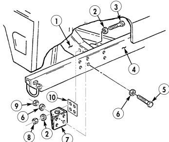

FOLLOW-ON TASKS: - Install tiedown ring (para. 9-4).

- Install rear body mount (para. 33-3).

# Chapter 25 Special Purpose Bodies (Ds) Maintenance

## 25-1. Introduction

This chapter contains maintenance instructions for replacement and repair of special purpose bodies components at the direct support maintenance level. Some subassemblies and parts must be removed before body components can be accessed. They are referenced to other paragraphs in this manual.

Section I. ARMAMENT CARRIER MAINTENANCE
25-2. ARMAMENT CARRIER MAINTENANCE TASK SUMMARY

| (Serial numbers 299999 and below)                                                               | Two locknuts (Appendix G, Item 85)                                                                |                                                                                                      |
|-------------------------------------------------------------------------------------------------|---------------------------------------------------------------------------------------------------|------------------------------------------------------------------------------------------------------|
| (Serial numbers 299999 and below)                                                               | Four locknuts (Appendix G, Item 114.4)                                                            |                                                                                                      |
| (Serial numbers 300000 and above)                                                               | Two locknuts (Appendix G, Item 88)                                                                |                                                                                                      |
| (Serial numbers 300000 and above)                                                               |                                                                                                   |                                                                                                      |
| NOTE                                                                                            | The replacement procedure for four rear upper control arm                                         |                                                                                                      |
| brackets is basically the same. This procedure covers the right                                 | rear upper control arm front bracket.                                                             |                                                                                                      |
| a. Removal                                                                                      |                                                                                                   |                                                                                                      |
| 1.                                                                                              | Remove capscrew (2) and clamp (1) from bracket (5) and disconnect vent line (3) from geared hub   | (4).                                                                                                 |
| 2.                                                                                              | Remove two locknuts (17), washers (13), capscrews (14), washers (13), and upper control arm (15)  | from two upper control arm brackets (16). Discard locknuts (17).                                     |
| 3.                                                                                              | Remove four locknuts (7), washers (8), capscrews (12), washers (8), spacer (10), shim(s) (11), if | present, vent line mounting bracket (9), and control arm bracket (16) from frame rail (6). Discard   |
| locknuts (7).                                                                                   |                                                                                                   |                                                                                                      |
| b. Installation                                                                                 |                                                                                                   |                                                                                                      |
| 1.                                                                                              | Install shim(s) (11), if removed, spacer (10), vent line mounting bracket (9), and control arm    | bracket (16) on frame rail (6) with four washers (8), capscrews (12), washers (8), and locknuts (7). |
| Tighten locknuts (7) to 90 lb\-ft (122 N•m).                                                    | 2.                                                                                                | Install upper control arm (15) on two upper control arm brackets (16) with two washers (13),         |
| capscrews (14), washers (13), and locknuts (17). Tighten locknuts (17) to 260 lb\-ft (353 N•m). | 3.                                                                                                | Connect vent line (3) to geared hub (4) and install clamp (1) on bracket (5) with capscrew (2).      |

# 25-3. Roof Panel And Resilient Mount Maintenance

This task covers:
a. Removal c. Installation b. Cleaning and Inspection

| Tools                                  |                      |
|----------------------------------------|----------------------|
| General mechanic's tool kit:           | TM 9\-2320\-387\-24P |
| automotive (Appendix B, Item 1)        |                      |
| Maintenance and repair shop equipment: | Maintenance Level    |
| automotive (Appendix B, Item 2)        | Direct support       |
| Materials/Parts                        |                      |
| Two locknuts (Appendix G, Item 88)     |                      |

Twenty-two locknuts (Appendix G, Item 127)
Seven locknuts (Appendix G, Item 111)
Tape (Appendix C, Item 80) Sealant (Appendix C, Item 74)
Personnel Required One mechanic One assistant

#### A. Removal

Equipment Condition Turret bearing and stop ring removed (para. 11-57).

General Safety Instructions Direct all personnel to stand clear during hoisting Maintenance Level Direct support 1. Remove three nuts (19), capscrews (22), and spacer(s) (20) from left and right side roof panel (2). 2. Remove twenty-two locknuts (4) and capscrews (1) from roof panel (2) and turret frame (3). Discard locknuts (4).

3. Remove seven locknuts (12), washers (13), plates (14), resilient mounts (15), and spacers (10) from three C-pillar mounts (17), center roof mounts (9), and right and left side windshield mounts (18). Discard locknuts (12).

#### .Warning.

Direct all personnel to stand clear during hoisting operations. A heavy or swinging load can be dangerous. Failure to do so may cause injury to personnel or damage to equipment.

4. Using a lifting device, lift roof panel (2) until it is clear of resilient mounts (8). 5. Remove seven resilient mounts (8) and plates (7) from roof mounts (5). 6. Remove seven studs (11) and brackets (6) from roof mounts (5). 7. Lift roof panel (2) clear of C-pillar mounts (17), center roof mounts (9), and right and left side windshield mounts (18).

#### B. Cleaning And Inspection

1. Remove tape and foam rubber from mating surfaces of roof panel (2) and windshield assembly (16). 2. Clean and inspect mating surfaces of roof panel (2) and windshield assembly (16). Ensure mating surfaces are clean and smooth.

3. Ensure seals on header are in place and serviceable.

c. Installation

#### .Warning.

Direct all personnel to stand clear during hoisting operations. A heavy or swinging load can be dangerous. Failure to do so may cause injury to personnel or damage to equipment.

1. Using a lifting device, lift roof panel (2) over mounting surfaces.

## 25-3. Roof Panel And Resilient Mount Maintenance (Cont'D)

2. Apply tape and foam rubber to forward and rear mating surfaces of roof panel (2) and to top of windshield assembly (16).

3. Install seven resilient mounts (8) and plates (7) on roof mounts (5). 4. Slowly lower roof panel (2) on C-pillar mounts (17), center roof mounts (9), and right and left side windshield mounts (18).

5. Install seven brackets (6) on three C-pillar mounts (17), center roof mounts (9), and right and left side windshield mounts (18).

6. Install seven studs (11) on roof mounts (5) and brackets (6). Thread stud through bracket (6) until three threads are through bracket (6).

7. Install seven spacers (10), resilient mounts (15), plates (14), washers (13), and locknuts (12) on lower end of studs (11). Tighten locknuts (12) to 37 lb-ft (50 N•m).

7.1. If new turret frame (3) is installed, match-drill twenty-two 9/32 in. (7.1 mm) holes from roof panel (2) to turret frame (3).

8. Apply sealant around holes prior to installing capscrews (1). 9. Install twenty-two capscrews (1) and locknuts (4) on roof panel (2) and turret frame (3). Tighten locknuts (4) to 160-210 lb-in. (18-24 N•m).

9.1. If new roof panel (2) is being installed, match-drill six 11/32 in. (8.7 mm) holes from header (21) to left and right side of roof panel (2).

10. Install left and right side roof panel (2) on header (21) with spacer(s) (20), three capscrews (22), and

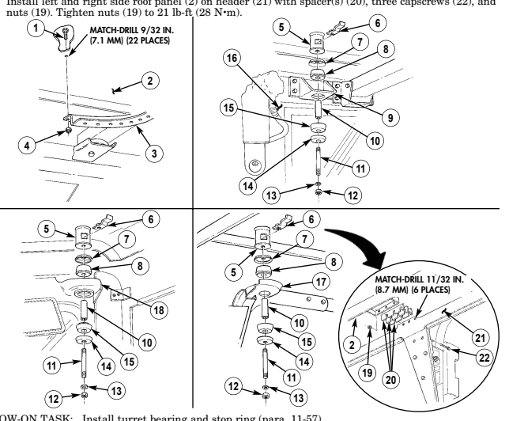

FOLLOW-ON TASK: Install turret bearing and stop ring (para. 11-57).

# 25-4. Turret Frame Replacement

This task covers:

a. Removal **b. Installation**

| General mechanic's tool kit:           |                   |
|----------------------------------------|-------------------|
| automotive (Appendix B, Item 1)        |                   |
| Maintenance and repair shop equipment: |                   |
| automotive (Appendix B, Item 2)        |                   |
| Materials/Parts                        | Maintenance Level |
| Four locknuts (Appendix G, Item 88)    | Direct support    |
| Two locknuts (Appendix G, Item 85)     |                   |
| (Serial numbers 299999 and below)      |                   |
| Two locknuts (Appendix G, Item 114.4)  |                   |
| (Serial numbers 300000 and above)      |                   |
| a. Removal                             |                   |

Roof panel removed (para. 25-3).

#### A. Removal

1. Remove four screws (25), washers (25.1), two clamps (36), and saddle blocks (27) from upper supports (12) and paddings (26).

2. Remove two locknuts (38), washers (38.1), capscrews (19), washers (20), D-rings (21), paddings (26),
and brackets (28) from upper supports (12). Discard locknuts (38).

NOTE
Mark locations of washers and capscrews for installation.

3. Remove six locknuts (43), washers (42), capscrews (39), two brackets (41), and spacers (40) from B-pillar armor (37). Discard locknuts (43).

4. Remove four locknuts (35), washers (30), capscrews (31), washers (30), two strikers (32), and spacer(s) (33) from connecting blocks (29) and B-pillar (34). Discard locknuts (35). Keep spacer(s) (33) with strikers (32).

4.1. Remove four locknuts (34.2), capscrews (33.1), and rear door safety strap brackets (34.1) from connecting blocks (29) and B-pillar (34). Discard locknuts (34.2).

5. Remove two nuts (15), washers (14), capscrews (18), and washers (14) from front mounting clevises (16) and front supports (13).

6. Remove two nuts (1) and washers (2) from C-pillar (4) and rear supports (5). 7. Remove two studs (3), locknuts (8), washers (2), mounts (7), bushings (6), spacers (44), bushings (6),
and mounts (7) from C-pillar (4) and rear supports (5). Discard locknuts (8).

8. Remove four isolation mounts (17) from two front supports (13). 9. Remove two upper supports (12) and four connecting blocks (29) from B-pillar (34).

10. Remove support ring (9) and two upper supports (12) from C-pillar (4) and front mounting clevises (16).

11. Remove six screws (10), washers (11), and two upper supports (12) from support ring (9). 12. Remove two capscrews (22), nuts (24) and net bracket (23) from upper support (12).

# 25-4.  Turret Frame Replacement (Cont'D)

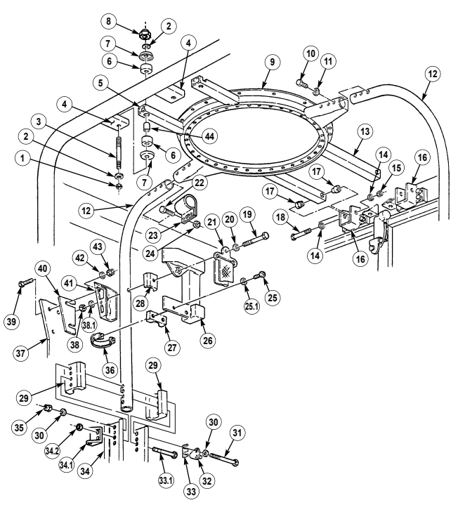

# 25-4. Turret Frame Replacement (Cont'D)

#### B. Installation

1. Install net bracket (23) on upper support (12) with two capscrews (22) and locknuts (24). Tighten locknuts (24) to 10 lb-ft (14 N•m).

2. Install four isolation mounts (17) on two front supports (13) of support ring (9). 3. Install two upper supports (12) on support ring (9) with six washers (11) and capscrews (10). Tighten capscrews (10) to 37 lb-ft (50 N•m).

4. Position support ring (9), two upper supports (12), and four connecting blocks (29) on C-pillar (4),
B-pillar (34), and front mounting clevises (16).

- Studs have longer threaded area on one end. Install stud with longer threaded end up.

- Ensure threads on stud extend beyond locknut at least three threads.

5. Secure support ring (9) and rear supports (5) on C-pillar (4) with two spacers (44), four bushings (6),
mounts (7), two studs (3), washers (2), locknuts (8), washers (2), and locknuts (1). Tighten locknuts (1) to 37 lb-ft (50 N•m).

6. Secure support ring (9) on two front mounting clevises (16) with four washers (14), capscrews (18), 
washers (14), and nuts (15). Tighten nuts (15) to 37 lb-ft (50 N•m).

7. Secure two upper supports (12) and four connecting blocks (29) on B-pillar (34) with two spacers (33),
strikers (32), four washers (30), capscrews (31), washers (30), and locknuts (35). Tighten locknuts (35) to 21 lb-ft (28 N•m).

7.1. Install two rear door safety strap brackets (34.1) to connecting blocks (29) and B-pillar (34) with four capscrews (33.1) and locknuts (34.2). Tighten locknuts (34.2) to 21 lb-ft (28 N•m).

7.2. If new bracket (41) is being installed, match-drill three 11/32 in. (8.7 mm) holes from B-pillar armor
(37) to bracket (41).

8. Install two spacers (40) and brackets (41) on B-pillar armor (37) with six capscrews (39), washers
(42), and locknuts (43). Tighten locknuts (43) to 5 lb-ft (7 N•m).

9. Install two brackets (28), paddings (26), and D-rings (21) on upper supports (12) with two washers (20), capscrews (19), washers (38.1), and locknuts (38). Tighten locknuts (38) to 37 lb-ft (50 N•m).

10. Install two clamps (36) and saddle blocks (27) on upper supports (12) and paddings (26) with four screws (25) and washers (25.1). Tighten screws (25) to 33-37 lb-ft (45-50 N•m).

# 25-4.  Turret Frame Replacement (Cont'D)

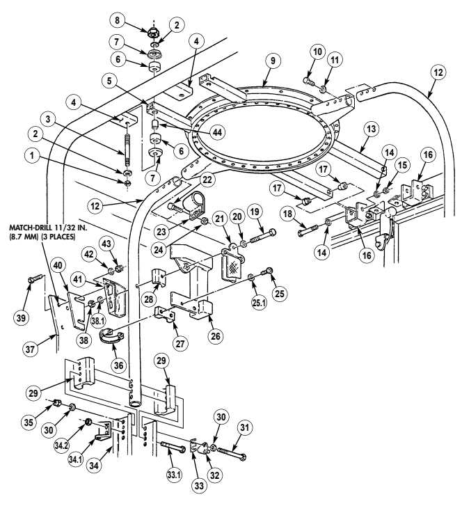

FOLLOW-ON TASK:  Install roof panel (para. 25-3).

# 25-5. Header Maintenance

This task covers:
a. Removal **c. Installation** b. Inspection INITIAL SETUP:
Applicable Models M1114 Tools General mechanic's tool kit:
automotive (Appendix B, Item 1)
Automotive maintenance and repair: field maintenance, basic (Appendix B, Item 6)
Materials/Parts Sealing compound (Appendix C, Item 63)
Manual References TM 9-2320-387-24P
Equipment Condition Roof panel removed (para. 25-3).

Maintenance Level Direct support

Replacement procedures for left and right side headers are basically the same. This procedure is for left side header.

a. Removal 1. Remove two capscrews (1) and block (8) from header (2) and C-pillar (9). 2. Remove two capscrews (5) and header (2) from windshield interior armor (4). b. Inspection 1. Inspect seals (3), (6), and (7) for damage. If damaged, replace. 2. Refer to para. 10-56 for plusnut inspection and replacement. c. Installation

Apply sealing compound to threads of capscrews prior to installation.

1. Install header (2) on windshield interior armor (4) with two capscrews (5). 2. Align header (2) and tighten capscrews (5) to 10 lb-ft (14 N•m). 3. Install header (2) on C-pillar (9) with block (8) and two capscrews (1). Tighten capscrews (1) to 68-82 lb-in. (8-9 N•m).

# 25-5. Header Maintenance (Cont'D)

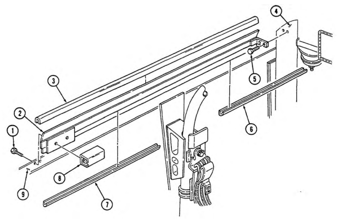

# 25-6. Windshield Maintenance

This task covers:

a. Removal **c. Installation** b. Inspection

Applicable Models M1114 Tools General mechanic's tool kit:
automotive (Appendix B, Item 1)
Automotive maintenance and repair: field maintenance, basic (Appendix B, Item 6)

#### Personnel Required

One mechanic One assistant Manual References TM 9-2320-387-10 TM 9-2320-387-24P

#### Materials/Parts

Sealing compound (Appendix C, Item 72.1) Four locknuts (Appendix G, Item 129) Four lockwashers (Appendix G, Item 142) Five locknuts (Appendix G, Item 127)

#### A. Removal Equipment Condition

- Roof panel removed (para. 25-3). - Wiper blades and arms removed (para. 10-62). - Windshield wiper switch/motor removed 
(para. 10-63).

- Roof panel removed (para. 25-3). - Hood raised and secured TM 9-2320-387-10). - Air intake assembly removed (para. 3-19). - Sun visors removed (para. 10-70). - Air distribution duct right two registers removed (para. 11-82).

#### General Safety Instructions

To prevent injury to fingers, place two wood blocks between vehicle and windshield before placing fingers between windshield and vehicle.

Maintenance Level Direct support 2. Remove two nuts (5), washers (2), capscrews (1), washers (2), and front supports (4) from two clevises (3).

3. Remove two screws (11) and clamps (12) from lower left deflector (13) and lower right deflector (15). 4. Remove three nuts (8), washers (7), and capscrews (16) from right deflector (15). 5. Remove screw (10), two capscrews (14), and lower left deflector (13) from body (6). 6. Remove three capscrews (14) and lower right deflector (15) from body (6) and windshield (9). 7. Remove six capscrews (22) from two brackets (20) and windshield (9). 8. Remove four locknuts (18), lockwashers (19), socket-head screws (21), and two brackets (20) from body (6). Discard locknuts (18) and lockwashers (19).

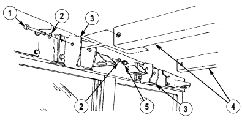

1. Install cardboard over windshield glass with masking tape.

# 25-6.  Windshield Maintenance (Cont'D)

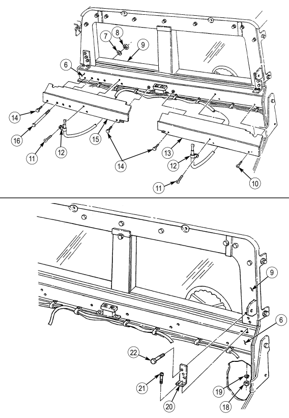

## 25-6. Windshield Maintenance (Cont'D)

9. Remove three locknuts (3), washers (4), capscrews (10), and washers (4) from bracket (1) on each side of windshield (2). Discard locknuts (3).

10. Remove two locknuts (8), capscrews (11), and left and right front door check straps (9) from brackets (1). Discard locknuts (8).

11. Remove two capscrews (7), washers (6), and nut plate (5) from each side of windshield (2). 12. Remove three capscrews (12), washers (13), and bracket (1) from each side of windshield (2).

#### Caution

Windshield assembly must be supported when performing steps 13 through 18.

13. Remove two capscrews (16) and washers (15) from header (14) on each side of windshield (2). 14. Attach lifting device to windshield (2). 15. Lean top of windshield (2) forward. 16. Remove two capscrews (26) and washers (25) from A-pillar armor (24) on each side of windshield (2).

#### .Warning.

To prevent injury to fingers, place two wood blocks between vehicle and windshield before placing fingers between windshield and vehicle.

18. Remove windshield (2) from body (23).

b. Inspection Refer to para. 10-56 for plusnut inspection and replacement. c. Installation 1. Using lifting device, position windshield (2) on body (23) with top leaning forward.

#### .Warning.

To prevent injury to fingers, place two wood blocks between vehicle and windshield before placing fingers between windshield and vehicle.

#### Caution

Windshield assembly must be supported when performing steps 2 and 3.

2. Connect leads 71 (17), 71B (19), and 57F (20) to three body harness connectors (21) and install grommet (18) on A-beam (22).

Apply sealing compound to capscrews in steps 3, 4, and 7 prior to installation.

3. Push top of windshield (2) into place and install header (14) on each side of windshield (2) with two washers (15) and capscrews (16). Tighten capscrews (16) to 68-82 lb-in. (8-9 N•m).

4. Install two washers (25) and capscrews (26) on windshield (2) and A-pillar armor (24) on each side of windshield (2). Tighten capscrews (26) to 37 lb-ft (50 N•m).

5. Install bracket (1) on each side of windshield (2) with two washers (6), capscrews (7), and nut plate
(5). Tighten capscrews (7) to 70-110 lb-in. (8-12 N•m).

17. Remove grommet (18) from A-beam (22) and disconnect leads 71 (17), 71B (19), and 57F (20) from three body harness connectors (21).

## 25-6. Windshield Maintenance (Cont'D)

6. Secure bracket (1) to windshield (2) with three washers (4), capscrews (10), washers (4), and locknuts (3) on each side of windshield (2). Tighten locknuts (3) to 10 lb-ft (14 N•m).

7. Secure bracket (1) to windshield (2) with three washers (13) and capscrews (12) on each side of windshield (2).

8. Install left and right front door check straps (9) on bracket (1) with two capscrews (11) and locknuts (8). Tighten locknuts (8) to 40-60 lb-in. (5-8 N•m).

9. Install bracket (29) on each forward side of body (23) with two socket-head screws (30),
lockwashers (28), and locknuts (27). Tighten socket-head screws (30) to 21 lb-ft (28 N•m).

10. Install each lower forward side of windshield (2) on windshield bracket (29) with three capscrews (31). Tighten capscrews (31) to 68-82 lb-in. (8-9 N•m).

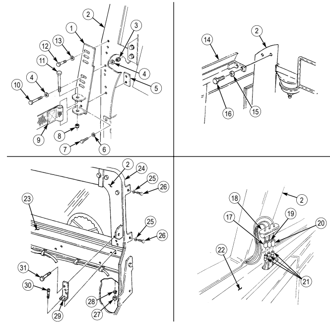

## 25-6. Windshield Maintenance (Cont'D)

11. Install lower right deflector (11) on body (1) and windshield (4) with three capscrews (10). Tighten capscrews (10) to 68-82 lb-in. (8-9 N•m).

12. Install three capscrews (12), washers (2), and nuts (3) on lower right deflector (11) and body (1).

Tighten capscrews (12) to 37 lb-ft (50 N•m).

13. Install lower left deflector (8) on body (1) with two capscrews (9) and capscrew (5). Tighten capscrews (9) and (5) to 68-82 lb-in. (8-9 N•m).

14. Install two clamps (7) on lower left deflector (8) and lower right deflector (11) with two screws (6).

Tighten screws (6) to 13-16 lb-in. (1.5-1.8 N•m).

15. Install front supports (16) on two clevises (15) with washers (14), capscrews (13), washers (14), and nuts (17). Tighten nuts (17) to 37 lb-ft (50 N•m).

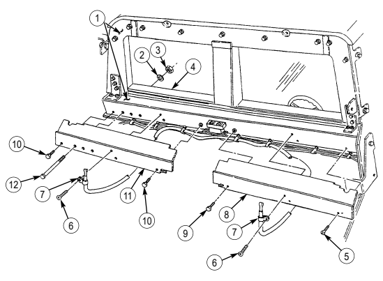

# 25-6. Windshield Maintenance (Cont'D)

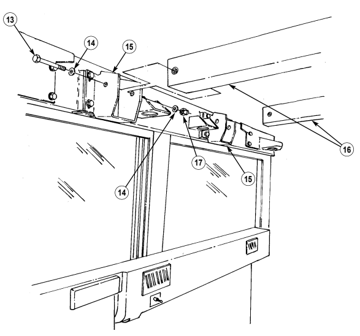

FOLLOW-ON TASKS: - Install rearview mirrors (para. 10-68).

- Lower and secure hood (TM 9-2320-387-10). - Install wiper blades and arms (para. 10-62). - Install windshield de-icer (para. 10-67). - Install windshield wiper switch/motor (para. 10-63). - Install roof panel (para. 25-3). - Install sun visors (para. 10-70).. - Install air intake assembly (para. 3-19). - Install air distribution duct registers (para. 11-82).

# 25-7. Cargo Shell Maintenance

This task covers:
a. Removal **c. Installation** b. Inspection

Applicable Models M1114 Tools General mechanic's tool kit:
automotive (Appendix B, Item 1)
Automotive maintenance and repair: field maintenance, basic (Appendix B, Item 6)

#### Materials/Parts

Five locknuts (Appendix G, Item 111) Grease (Appendix C, Item 34) Tape, adhesive (Appendix C, Item 80) Sealing compound (Appendix C, Item 72.1)
Personnel Required One mechanic One assistant Manual References TM 9-2320-387-24P

#### Equipment Condition

- Rear three-point seatbelt removed (para. 10-47). - Cargo shell door removed (para. 11-14). - Front striker removed (para. 11-25). - Rear striker removed (para. 11-26). - Antenna removed, if present (para. 12-24). - Dovetail spring removed (para. 11-28). - Ammo box tray removed (para. 11-68 or para. 11-69).

- A/C condenser removed (left cargo shell)
(para. 25-18).

- C-pillar top armor removed (para. 11-45). - Roof panel removed (para. 25-3).

Maintenance Level Direct support

Replacement procedures for right and left cargo shell are basically the same. This procedure covers right cargo shell.

#### A. Removal

1. Remove two locknuts (6), washer (5), capscrew (10), and socket-head screw (9) from cargo shell (4)
and striker mounting plate (8). Discard locknuts (6).

2. Remove nine capscrews (2), washers (3), and spacers (11) from cargo shell (4) and wheelwell (7).

Left cargo shell cable uses a plusnut instead of a washer and nut.

3. Remove nut (15), washer (16), two shoulder bolts (13), support bracket (16.1) (right side), and two cables (12) from brackets (14).

3.1. Remove two capscrews (19.1) and projectile stop plate (22.1) from bracket (19). 4. Remove two locknuts (27), washers (28), and capscrews (17) from cargo shell support tube (1) and C-pillar (18). Discard locknuts (27).

5. Remove locknut (22), capscrew (26), washer (25), bushing (24), bracket (19), bushing (20), and spacer (21) from C-pillar partition (23). Discard locknut (22).

# 25-7.  Cargo Shell Maintenance (Cont'D)

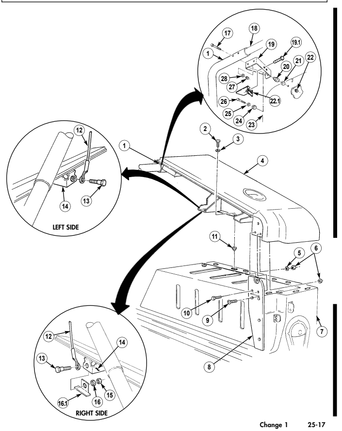

## 25-7. Cargo Shell Maintenance (Cont'D)

6. Remove two nuts (1) and washers (2) from stud (7) in turret support ring (9). 7. Remove sleeve spacer (8), two resilient mounts (3), plates (4), stud (7), and shim(s) (5), if present, from between turret support ring (9) and C-pillar support mount (6).

8. Remove nut (20) and washer (21) from stud (22) on right cargo shell mount (14). 9. Remove stud (22), sleeve spacer (23), two resilient mounts (13), plates (12), and bracket (11) from roof mount (10) and C-pillar support mount (14).

10. Remove socket-head screw (17) and cargo tiedown (18) from cargo shell support tube (25) and wheelwell (19).

11. Remove capscrew (16) and washer (15) from wheelwell (19) and support tube (25).

#### Caution

Do not lift cargo shell farther than limits specified in step 12. Raising cargo shell too far may cause damage to C-pillar.

12. Raise cargo shell (26) approximately 1 in. (2.5 cm) and, using a mallet, rap cargo shell support tube (25) at point A to loosen cargo shell (26), taking care not to bend C-pillar (24). Remove cargo shell (26) from wheelwell (19).

13. Remove cargo shell seal (27) and inspect for damage. Replace if damaged. 14. Remove adhesive tape from cargo shell (26). Discard tape.

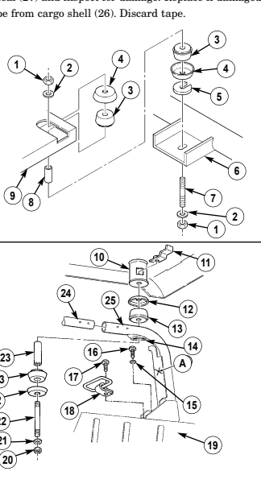

21 22
13 12

# 25-7. Cargo Shell Maintenance (Cont'D)

b. Inspection Refer to para. 10-56 for plusnut inspection and replacement. c. Installation 1. Apply adhesive tape to cargo shell (26) and wheelwell (19) mounting surface. 2. Using grease, coat inside surface of support tube (25) that makes contact with outside surface of C-pillar (24).

3. Lift rear of cargo shell (26) slightly while installing cargo shell support tube (25) over C-pillar (24). 4. Align cargo shell seal (27) between cargo shell (26) and wheelwell (19). 5. When cargo shell support tube (25) is installed over C-pillar (24), cargo shell (26) is aligned with wheelwell (19) and lower cargo shell (26).

6. Apply sealing compound to threads of capscrew (16), and install support tube (25) on wheelwell (19)
with washer (15) and capscrew (16).

7. Apply sealing compound to threads of socket-head screw (17), and install cargo tiedown (18) on wheelwell (19) and support tube (25) with socket-head screw (17).

8. Apply sealing compound to threads of stud (7), and install two resilient mounts (3), plates (4), sleeve spacer (8), and shim(s) (5), if present, between turret support ring (9) and C-pillar support mount (6) with stud (7), two washers (2) and nuts (1). Tighten nuts (1) to 37 lb-ft (50 N•m).

8.1. Apply sealing compound to threads of stud (22), and install two resilient mounts (13), plates (12),
and sleeve spacer (23) between C-pillar support mount (14) and roof mount (10) with bracket (11), stud (22), washer (21), and nut (20). Tighten nut (20) to 37 lb-ft (50 N•m).

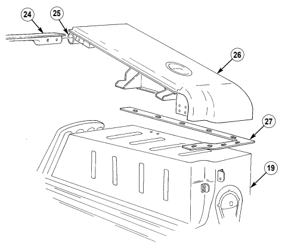

## 25-7. Cargo Shell Maintenance (Cont'D)

9. Apply sealing compound to threads of capscrew (11), and install bracket (4) on C-pillar partition (8)
with spacer (6), bushing (5), bushing (9), washer (10), capscrew (11), and locknut (7).

10. Install two capscrews (2), washers (13), and locknuts (12) on C-pillar (3), bracket (4), and cargo shell (1).

10.1. Install projectile stop plate (7.1) on bracket (4) with two capscrews (4.1).

Left cargo shell cable uses a plusnut instead of a washer and nut.

11. Apply sealing compound to threads of two shoulder bolts (24) and support bracket (27.1) (right side),
and install two cables (23) on brackets (25) with shoulder bolts (24), washer (27), and nut (26).

12. Apply sealing compound to threads of capscrews (14), and install nine spacers (16), washers (15),
and capscrews (14) on cargo shell (1) and wheelwell (19).

13. Install capscrew (22), socket-head screw (21), washer (17), and two locknuts (18) on striker mounting plate (20) and cargo shell (1).

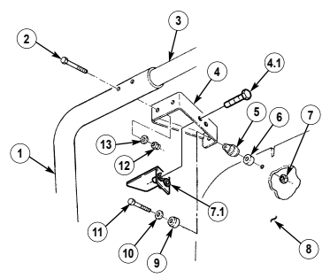

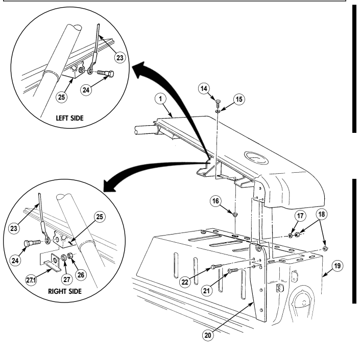

# 25-7. Cargo Shell Maintenance (Cont'D)

FOLLOW-ON TASKS: - Install dovetail spring (para. 11-28).

- Install antenna, if removed (para. 12-24). - Install front striker plate (para. 11-25). - Install rear striker (para. 11-26). - Install cargo shell door (para. 11-14). - Install A/C condenser (left cargo shell) (para. 25-18). - Install ammo box tray (para. 11-68 or 11-69). - Install C-pillar top armor (para. 11-45). - Install roof panel (para. 25-3). - Install three-point seatbelt (para. 10-47).

#### 25-8. Cargo Shell Repair

This task covers: 
Repair INITIAL SETUP: 

| INITIAL SETUP:                         |                                               |
|----------------------------------------|-----------------------------------------------|
| Tools                                  | Manual References                             |
| General mechanic's tool kit:           | TM 9\-2320\-387\-24P                          |
| automotive (Appendix B, Item 1)        | Equipment Condition                           |
| Maintenance and repair shop equipment: |                                               |
| automotive (Appendix B, Item 2)        | Service brake rotors removed (para. 7\-12.1). |
| Materials/Parts                        | General Safety Instructions                   |
| O\-ring (Appendix G, Item 215)         | Differential is extremely heavy and must be   |
|                                        | supported during removal and installation.    |

1. Remove sealing compound (1) from cargo shell seam (2). 

2. Remove paint from surface area to be welded (refer to TM 43-0139). 3. Prime surface area to be welded with weld-through primer (refer to TM 43-0139). 

Clamping devices are recommended to hold cargo shell reinforcement to cargo shell during positioning. 

4. Position cargo shell reinforcement (5) on cargo shell (3) and comer cap (4). 

5. Weld cargo shell reinforcement (51, cargo shell (3), and comer cap (4) (refer to TM 9-237). 6. Apply sealing compound (1) to cargo shell seam (2). 

7. Spot-paint welded area (refer to TM 43-0139). 

# 25-8. Cargo Shell Repair (Cont'D)

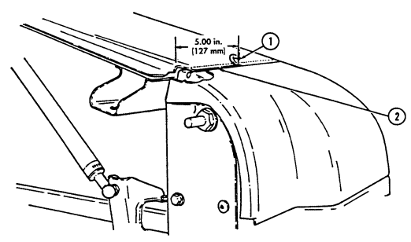

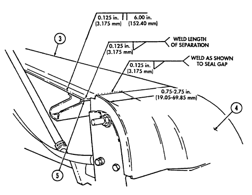

FOLLOW-ON TASK:  Install cargo shell door dovetail spring (para. 11-28).

## 25-8.1. Spall Liner Replacement

This task covers:

| INITIAL SETUP:               |
|------------------------------|
| Tools                        |
| General mechanic's tool kit: |

General mechanic's tool kit:
automotive (Appendix B, Item 1)
Materials/Parts Three lockwashers (Appendix G, Item 146) Five locknuts (Appendix G, Item 133.22)

#### A. Removal

1. Remove four locknuts (13), washers (12), washers (2), and capscrews (1) from side of cargo shell (3)
and spall liner (14). Discard locknuts (13).

2. Remove three capscrews (7), lockwashers (8), and washers (9) from top of cargo shell (3) and spall liner (14). Discard lockwashers (8).

3. Remove two countersunk screws (4) from top of cargo shell (3) and spall liner (14). 4. Remove locknut (11), washer (10), washer (5), capscrew (6), and spall liner (14) from cargo shell (3).

Discard locknut (11).

#### B. Installation

1. Install spall liner (14) to top of cargo shell (3) with three capscrews (7), lockwashers (8), and washers (9).

2. Secure spall liner (14) to cargo shell (3) with capscrew (6), washer (5), washer (10), and locknut (11). 3. Secure spall liner (14) to side of cargo shell (3) with four capscrews (1), washers (2), washers (12),
and locknuts (13).

4. Secure spall liner (14) to top of cargo shell (3) with two countersunk screws (4).

a. Removal b. Installation

| Equipment Condition   |
|-----------------------|

# 25-8.1. Spall Liner Replacement (Cont'D)

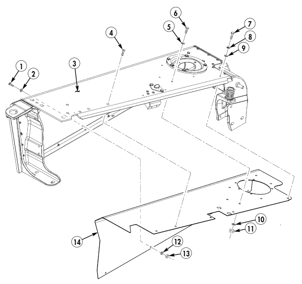

## 25-8.2. Spall Liner End Cap Replacement

This task covers:

| INITIAL SETUP:   |
|------------------|

INITIAL SETUP:
M1114, M1151, M1151A1 Tools General mechanic's tool kit:
automotive (Appendix B, Item 1)
Materials/Parts Two lockwashers (Appendix G, Item ??) Two locknuts (Appendix G, Item 77)
a. Removal 1. Remove two capscrews (7), lockwashers (6), washers (5), and spacers (4) from spall liner end cap (9),
cargo shell (3), and wheelhouse (10). Discard lockwashers (6).

2. Remove two locknuts (8), washers (2), capscrews (1), and spall liner end cap (9) from cargo shell (3).

#### B. Installation

1. Install spall liner end cap (9) to cargo shell (3) with two capscrews (1), washers (2), and nuts (8). 2. Secure spall liner end cap (9) to cargo shell (3) and wheelhouse (10) with two capscrews (7),
lockwashers (6), washers (5), and spacers (4).

a. Removal b. Installation

| Equipment Condition   |
|-----------------------|

# 25-8.2. Spall Liner End Cap Replacement (Cont'D)

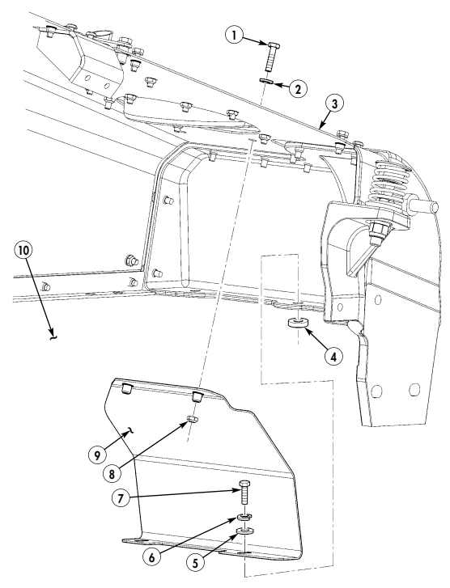

## 25-8.3. Antenna Mount And Gasket Replacement

This task covers:

| Tools                        |
|------------------------------|
| General mechanic's tool kit: |

INITIAL SETUP:
General mechanic's tool kit:
automotive (Appendix B, Item 1)
Materials/Parts Five locknuts (Appendix G, Item 133.22) Gasket (Appendix G, Item 56.2)
a. Removal Remove five locknuts (5), ten washers (2), five capscrews (1), antenna mount (3), and gasket (4) from cargo shell (6). Discard locknuts (5) and gasket (4).

#### B. Installation

Install gasket (4) and antenna mount (3) on cargo shell (6) with five capscrews (1), ten washers (2), and five locknuts (5).

a. Removal b. Installation

| Manual References    |
|----------------------|
| TC 9\-237            |
| TM 43\-0139          |
| TM 9\-2320\-387\-24P |

25-8.3. ANTENNA MOUNT AND GASKET REPLACEMENT (Cont'd)

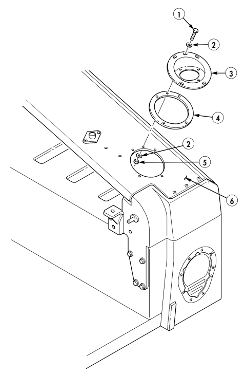

## 25-8.4. Cargo Shell Stop Plate Replacement

This task covers:
b. Inspection

Applicable Models M1114, M1151, M1151A1 Tools General mechanic's tool kit:
automotive (Appendix B, Item 1)
Materials/Parts Two lockwashers (Appendix G, Item 145)
a. Removal Remove two capscrews (1), lockwashers (2), and stop plate (3) from cargo shell (4). Discard lockwashers (2).

b. Inspection Refer to para. 10-56 for nut insert (5) inspection and repair.

c. Installation Install stop plate (3) on cargo shell (4) with two capscrews (1) and lockwashers (2).

a. Removal c. Installation

| Equipment Condition Maintenance Level   |
|-----------------------------------------|
| Direct support                          |

# 25-8.4. Cargo Shell Stop Plate Replacement (Cont'D)

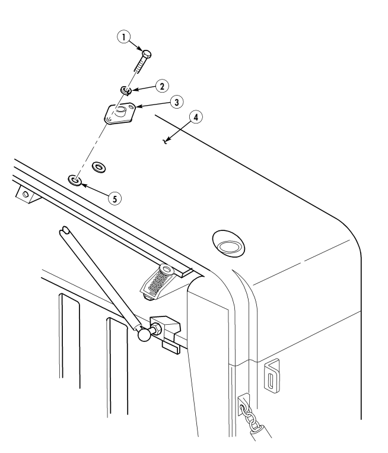

## 25-8.5. Cargo Shell Replacement

This task covers:
b. Inspection

Applicable Models M1114, M1151, M1151A1 Tools General mechanic's tool kit:
automotive (Appendix B, Item 1)
Materials/Parts Four rivets (Appendix G, Item 270.2) Two locknuts (Appendix G, Item 85) Four rivets (Appendix G, Item 270.3) Two locknuts (Appendix G, Item 128) Two locknuts (Appendix G, Item 114.1) Fifteen lockwashers (Appendix G, Item 146) Seal (Appendix G, Item 293.1) Seal (Appendix G, Item 293.2)
a. Removal c. Installation Manual References TM 9-2320-387-24P
Equipment Condition Cargo shell door removed (para. 11-14).

Maintenance Level Direct support

#### A. Removal

b. Inspection Refer to para. 10-56 for nut insert inspection and repair. c. Installation

Install seven capscrews, lockwashers and washers on left side 1. Install cargo shell (13) and seal (19) on wheelhouse (20) with eight capscrews (21), spacers (22),
lockwashers (23), and washers (24).

2. Secure cargo shell (13) to wheelhouse (20) with two capscrews (17) and lockwashers (18).

Remove seven capscrews, lockwashers and washers on left side.

9. Remove eight capscrews (21), spacers (22), lockwashers (23), washers (24), cargo shell (13), and seal (19) from wheelhouse (20). Discard lockwashers (23).

1. Remove two rivets (28) and plate (29) from cargo shell (13) and wheelhouse (20). Discard rivets (28). 2. Remove two capscrews (27) and washers (26) from wheelwell (20), cargo shell (13) and striker mounting plate (25).

3. Remove screw (2) from center support (1) and closeout (6). 4. Remove locknut (11), washer (3), and screw (4) from center support (1) and closeout (6). Discard locknut (11).

5. Remove two rivets (5) from center support (1) and closeout (6). Discard rivets (5). 6. Remove locknut (16), washer (15), washer (12), and capscrew (10) from cargo shell (13). 7. Remove locknut (14), D-ring (8), countersunk screw (9), and wedge (7) from cargo shell (13) and wheelhouse (20). Discard locknut (14).

8. Remove two capscrews (17) and lockwashers (18) from cargo shell (13) and wheelhouse (20).

## 25-8.5. Cargo Shell Replacement (Cont'D)

3. Install wedge (7) on cargo shell (13) and wheelhouse (20) with capscrew (10), washers (12),
washers (15) and locknut (16).

4. Secure wedge (7) to cargo shell (13) with capscrew (9), D-ring (8) and locknut (14). 5. Install cargo shell (13) on center support (1) and closeout (6) with screw (2). 6. Secure cargo shell (13) to center support (1) and closeout (6) with screw (4), washer (3), and locknut (11). 7. Secure cargo shell (13) to center support (1) and closeout (6) with two rivets (5). 8. Secure cargo shell (13) to striker mounting plate (25) with two capscrews (27) and washers (26). 9. Install plate (29) on cargo shell (13) and wheelhouse (20) with two rivets (28).

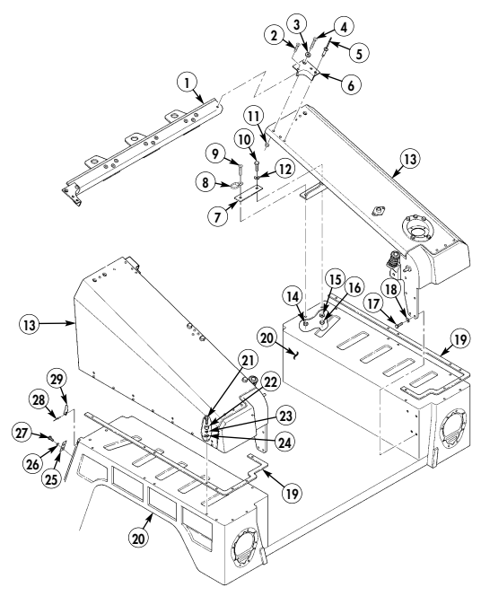

FOLLOW-ON TASK: Install cargo shell door (para. 11-14).

# 25-8.6. Cargo Shell Center Support And Bracket Replacement

This task covers:

| Applicable Models            |
|------------------------------|
| M1114, M1151, M1151A1        |
| Tools                        |
| General mechanic's tool kit: |

INITIAL SETUP:
automotive (Appendix B, Item 1)
Materials/Parts Eleven locknuts (Appendix G, Item 114.1) Two rivets (Appendix G, Item 270.2)

#### A. Removal

1. Remove two screws (4) from center support (1), closeout (8) and cargo shell (9). 2. Remove two locknuts (10), washers (5), and screws (6) from center support (1), closeout (8), and cargo shell (9). Discard locknuts (10).

3. Remove two rivets (7) and center support (1) from closeout (8) and cargo shell (9). Discard rivets (7). 4. Remove nine locknuts (12), washers (2), capscrews (3), and three brackets (11) from center support (1).

Discard locknuts (12).

#### B. Installation

1. Install three brackets (11) on center support (1) with nine capscrews (3), washers (2), and locknuts (12).

4. Secure center support (1) to closeout (8) and cargo shell (9) with two screws (4).

2. Install center support (1) to closeout (8) and cargo shell (9) with two rivets (7). 3. Install center support (1) to closeout (8) and cargo shell (9) with two screws (6), washers (5), and locknuts (10).

a. Removal b. Installation

| Manual References    |
|----------------------|
| TM 9\-2320\-387\-24P |
| Maintenance Level    |
| Direct support       |

# 25-8.6. Cargo Shell Center Support And Bracket Replacement (Cont'D)

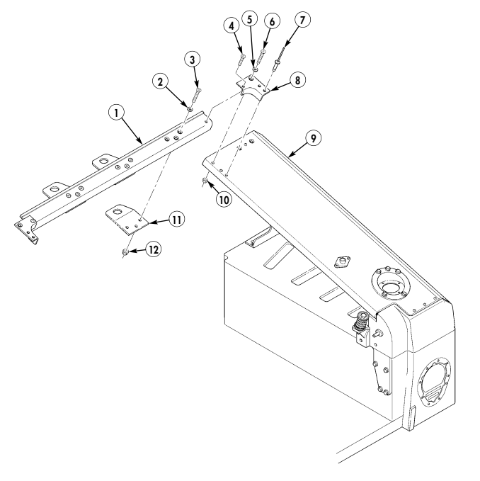

# 25-9. C-Pillar Partition Maintenance

This task covers:
a. Removal c. Assembly b. Disassembly **d. Installation** b.1. Inspection

Applicable Models M1114 Tools General mechanic's tool kit:
automotive (Appendix B, Item 1)
Automotive maintenance and repair: field maintenance, basic (Appendix B, Item 6)

#### Materials/Parts

Four locknuts (Appendix G, Item 127) Five locknuts (Appendix G, Item 111) Sealing compound (Appendix C, Item 72.1)

#### Manual References

TM 9-2320-387-24P

#### Equipment Condition

- Cargo shell door removed (para. 11-14). - Passenger seats removed (para. 10-45). - Rear A/C evaporator removed (para. 25-22). - Cargo shells removed (para. 25-7).

#### General Safety Instructions

C-pillar partition is extremely heavy and must be supported during removal and installation.

Maintenance Level Direct support

#### Warning

C-pillar partition is extremely heavy and must be supported during removal and installation. Failure to do so may result in serious injury to personnel or damage to equipment.

- These procedures cover replacement of left side mounting hardware for the C-pillar partition. Right side is basically the same.

- Note location of capscrews for installation.

#### A. Removal

1. Remove four capscrews (2) and C-pillar gap bracket (3) from wheelwell (1). 2. Remove two capscrews (12) and washers (11) securing C-pillar partition stop bracket (9) to vehicle floor (10).

3. Remove eight capscrews (7) securing two C-pillar parition isolator brackets (6) to vehicle wheelwells (1).

4. Remove shims (5) and C-pillar partition (4) from vehicle.

b. Disassembly

Note locations of capscrews for installation.

1. Remove locknut (8), capscrew (13), washer (14), and C-pillar partition stop bracket (9) from C-pillar partition (4). Discard locknut (8).

# 25-9.  C-Pillar Partition Maintenance (Cont'D)

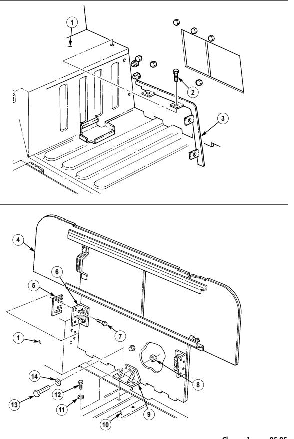

## 25-9. C-Pillar Partition Maintenance (Cont'D)

2. Remove two locknuts (5), capscrews (1), four washers (2), and isolator mount bushings (3) from two C-pillar partition isolator brackets (4). Discard locknuts (5).

3. Remove two locknuts (7), D-ring washers (6), D-rings (8), capscrews (12), washers (10), isolator bushings (11), C-pillar partition isolator brackets (4), isolator bushings (11), and washers (10) from C-pillar partition (9). Discard locknuts (7).

4. Remove locknut (16), D-ring washer (15), D-ring (14), capscrew (13), and washer (17) from C-pillar partition (9). Discard locknut (16).

5. Remove three locknuts (21), capscrews (18), washers (19), and cable access cover (20) from C-pillar partition (9). Discard locknuts (21).

b.1. Inspection Refer to para. 10-56 for plusnut inspection and replacement.

c. Assembly 1. Install cable access cover (20) on C-pillar partition (9) with three washers (19), capscrews (18), and locknuts (21). Tighten locknuts (21) to 10 lb-ft (14 N•m).

2. Install D-ring (14) on C-pillar partition (9) with washer (17), capscrew (13), D-ring washer (15), and locknut (16). Tighten locknut (16) to 35 lb-ft (47 N•m).

3. Install two washers (10) and (2), isolator bushings (11) and (3), and C-pillar partition isolator brackets (4) on C-pillar partition (9) with two isolator bushings (11) and (3), washers (10) and (2), capscrews (12) and (1), D-rings (8), D-ring washers (6), and locknuts (7) and (5). Tighten locknuts (7) and (5) to 35 lb-ft (47 N•m).

4. Install stop bracket (25) on C-pillar partition (9) with washer (30), capscrew (29), and locknut (24).

Tighten locknut (24) to 10 lb-ft (14 N•m).

d. Installation 1. Position C-pillar partition (9) and two shims (22) on floor (26) between wheelwells (31). 2. Apply sealing compound to threads of eight capscrews (23), and install two C-pillar partition isolator brackets (4) on wheelwells (31) with eight capscrews (23). Tighten capscrews (23) 10 lb-ft (14 N•m).

3. Apply sealing compound to threads of two capscrews (28), and install C-pillar partition stop bracket (25)
on floor (26) with two washers (27) and capscrews (28). Tighten capscrews (28) to 75 lb-in. (8 N•m).

4. Install C-pillar gap bracket (33) on wheelwell (31) with four capscrews (32).

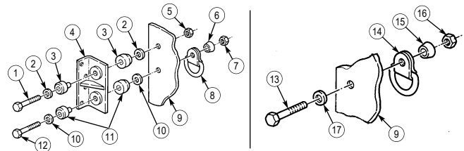

# 25-9.  C-Pillar Partition Maintenance (Cont'D)

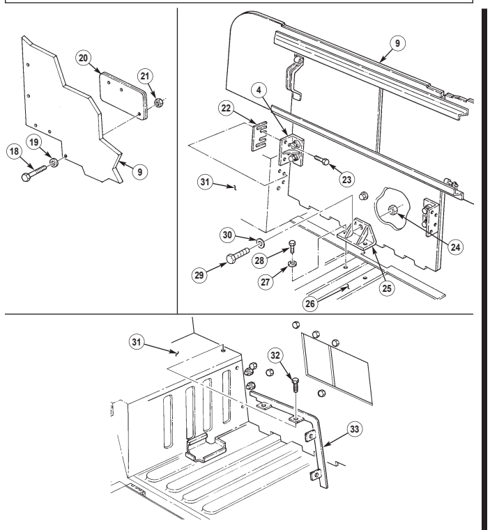

FOLLOW-ON TASKS: -  Install cargo shells (para 25-7).
- Install turret frame (para. 25-4).

· Install passenger seats (para. 10-45).

· Install rear A/C evaporator (para. 25-22).

-  Install cargo shell door (para. 11-14).

# 25-10. Passenger Side Footwell Outer Armor Maintneance

This task covers:
a. Removal b. Installation a.1. Inspection

Applicable Models M1114 Tools General mechanic's tool kit:
automotive (Appendix B, Item 1)
Maintenance and repair shop equipment:
automotive (Appendix B, Item 2)

#### Materials/Parts

Thirty locknuts (Appendix G, Item 111) Sealing compound (Appendix C, Item 72.1)
Personnel Required One mechanic One assistant

#### Manual References

TM 9-2320-387-24P
Equipment Condition
- A/C heater/evaporator assembly removed
(para. 25-21).

- Right front cowl insulation removed (para. 10-32).

Maintenance Level Direct support

If new passenger side footwell outer armor is being installed, perform para. 11-38.1.

a. Removal

Note location of capscrews, nuts, and spacers for installation.

1. Remove six locknuts (11), spacers (12), and capscrews (1) from footwell armor (2) and outer cowl (7).

Discard locknuts (11).

2. Remove twenty-four locknuts (9) and capscrews (5) from footwell armor (2), A-pillar armor (4), and outer cowl (7). Discard locknuts (9).

3. Remove four capscrews (10) from footwell armor (2) and A-beam armor (6).

3.1. Remove nut (12.2) and capscrew (12.1) from footwell armor (2).

4. Remove capscrew (13), footwell armor (2), and spacers (3) and (8) from outer cowl (7).

a.1. Inspection Refer to para. 10-56 for plusnut inspection and replacement. b. Installation 1. Apply sealing compound to threads of four capscrews (10), and install spacer (8) and footwell armor (2)
on A-beam armor (6) with capscrews (10). Tighten capscrews (10) to 37 lb-ft (50 N•m).

1.1. Install capscrew (12.1) and nut (12.2) on footwell armor (2).

2. Apply sealing compound to threads of capscrew (13), and install spacer (3) and capscrew (13) on footwell armor (2) and A-beam armor (4). Tighten capscrew (13) to 37 lb-ft (50 N•m).

3. Install twenty-four capscrews (5) and locknuts (9) on footwell armor (2), A-pillar armor (4), and outer cowl (7). Tighten locknuts (9) to 37 lb-ft (50 N•m).

# 25-10. Passenger Side Footwell Outer Armor Maintenance (Cont'D)

Ensure large spacers are installed in upper holes.

4.

Install six capscrews (1), spacers (12), and locknuts (11) on footwell armor (2) and outer cowl (7). Tighten locknuts (11) to 35 lb-ft (47 N-m).

I

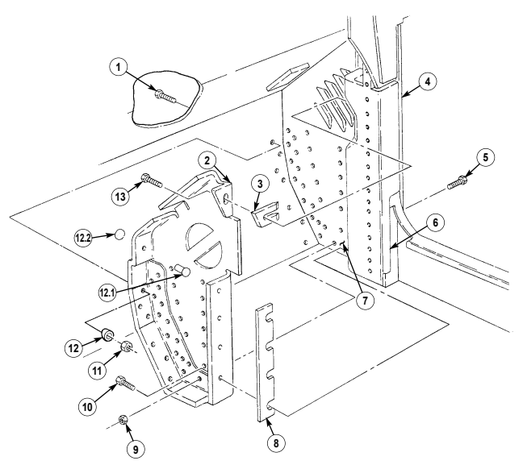

FOLLOW-ON TASKS: - Install A/C heater/evaporator assembly (para. 25-21).

· Install front cowl insulation (para. 10-32).

# 25-11. Passenger Side Footwell Inner Armor Maintenance

This task covers:
a. Removal b. Installation a.1. Inspection

Applicable Models M1114 Tools General mechanic's tool kit:
automotive (Appendix B, Item 1)
Maintenance and repair shop equipment:
automotive (Appendix B, Item 2)

#### Materials/Parts

Eleven locknuts (Appendix G, Item 100) Sealing compound (Appendix C, Item 72.1)
Personnel Required One mechanic One assistant Manual References TM 9-2320-387-24P

#### Equipment Condition

- Rifle support removed (para. 11-66). - Engine access cover removed (para. 10-22). - A/C front distribution duct removed (para. 11-81). - A/C heater/evaporator assembly removed
(para. 25-21).

- Tunnel interior side insulation removed
(para. 10-33).

- Right front cowl insulation removed (para. 10-32). - Surge tank removed (para. 3-65). - Right front underbody armor removed (para. 11-38).

Maintenance Level Direct support

If new passenger side footwell outer armor is being installed, perform para. 11-38.1.

a. Removal

Note location of capscrews and locknuts for installation.

1. Disconnect de-icer wiring harness connector (6) and A/C power wiring connector (9) from de-icer switch circuit breaker (5), and remove two screws (7) and de-icer switch circuit breaker (5) from footwell armor (3).

2. Remove eight capscrews (4) from body (8) and footwell armor (3). 3. Remove eleven locknuts (1), capscrews (10), inner/outer cowl reinforcement (2), and footwell armor (3) from body (8). Discard locknuts (1).

a.1. Inspection Refer to para. 10-56 for plusnut inspection and replacement.

b. Installation 1. Install footwell armor (3) and inner/outer cowl reinforcement (2) on body (8) with eleven capscrews (10) and locknuts (1). Tighten locknuts (1) to 37 lb-ft (50 N•m).

2. Apply sealing compound to threads of eight capscrews (4), and install capscrews (4) on footwell armor (3) and body (8). Tighten capscrews (4) to 37 lb-ft (50 N•m).

3. Install de-ice switch circuit breaker (5) on footwell armor (3) with two screws (7), and connect de-icer wiring harness connector (6) and A/C power wiring connector (9) to de-icer switch circuit breaker (5).

# 25-11. Passenger Side Footwell Inner Armor Maintenance (Cont'D)

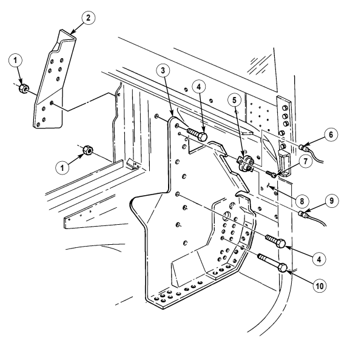

FOLLOW-ON TASKS: - Install A/C heater/evaporator assembly (para. 25-21).

- Install A/C front distribution duct (para. 11-81). - Install engine access cover (para. 10-22). - Install rifle support (para. 11-66). - Install tunnel interior side insulation (para 10-33). - Install right front cowl insulation (para. 10-32). - Install surge tank (para 3-65). - Install right front underbody armor (para. 11-38).

# 25-12. C-Pillar Door, Guides, Track, And Door Stop Maintenance

This task covers:
a. Removal c. Installation b. Inspection

Applicable Models M1114 Tools General mechanic's tool kit:
automotive (Appendix B, Item 1)
Automotive maintenance and repair: field maintenance, basic (Appendix B, Item 6)

#### Materials/Parts

Eighteen locknuts (Appendix G, Item 127)
Sealing compound (Appendix C, Item 72.1)

#### Equipment Condition

- Left passenger seat removed (para. 10-45). - A/C evaporator assembly (rear) removed 
(para. 25-27).

Manual References TM 9-2320-387-24P
Maintenance Level Direct support

#### A. Removal

1. Remove pin (16), thumb block (18), and spring (17) from bracket (15). 2. Remove two locknuts (2), capscrews (11), washers (10), right-hand evaporator bracket (9), and strap bracket (8) from upper track (4) and lower track (23). Discard locknuts (2).

3. Remove two locknuts (3), capscrews (7), washers (6), and left-hand evaporator bracket (5) from upper track (4) and lower track (23). Discard locknuts (3).

4. Remove seven locknuts (1) and screws (30) from upper track (4) and C-pillar partition (32). Discard locknuts (1).

5. Remove upper track (4), upper guide (12), and strip (13) from C-pillar partition (32). 6. Remove seven screws (29) from upper guide (12) and separate upper guide (12) from upper track (4). 7. Remove door (14) and strip (27) from lower guide (25). 8. Remove two nuts (20), four capscrews (28), handle (19), and bracket (15) from door (14). 9. Remove seven screws (26) and lower guide (25) from lower track (23).

10. Remove bumper (22) and nut (21) from lower track (23). 11. Remove seven locknuts (31), capscrews (24), and lower track (23) from C-pillar partition (32).

Discard locknuts (31).

b. Inspection Refer to para. 10-56 for plusnuts inspection and replacement.

# 25-12.  C-Pillar Door, Guides, Track, And Door Stop Maintenance (Cont'D)

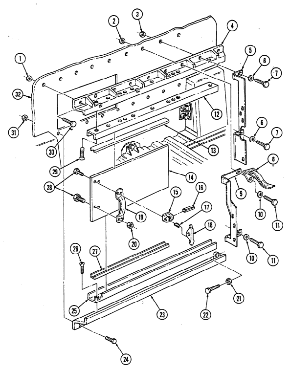

2000

## 25-12. C-Pillar Door, Guides, Track, And Door Stop Maintenance (Cont'D)

#### C. Installation

1. Install lower track (23) on C-pillar partition (32) with seven capscrews (24) and locknuts (31).

Tighten capscrews (24) to 10 lb-ft (14 N•m).

2. Install bumper (22) and nut (21) on lower track (23). 3. Apply sealing compound to threads of seven screws (26), and install lower guide (25) on lower track (23) with screws (26).

4. Install door handle (19) and bracket (15) on door (14) with four capscrews (28) and two nuts (20).

Tighten nuts (20) to 10 lb-ft (14 N•m).

5. Position strip (27), door (14), and strip (13) in lower guide (25). 6. Apply sealing compound to threads of seven screws (29), and install upper guide (12) on upper track (4) with screws (29).

7. Install upper track (4) on C-pillar partition (32) with seven capscrews (30) and locknuts (1). Tighten locknuts (1) to 10 lb-ft (14 N•m).

8. Install left-hand evaporator bracket (5) on upper track (4) and lower track (23) with two washers (6), capscrews (7), and locknuts (3). Tighten capscrews (7) to 10 lb-ft (14 N•m).

9. Install right-hand evaporator bracket (9) and strap bracket (8) on upper track (4) and lower track (23) with two washers (10), capscrews (11), and locknuts (2). Tighten locknuts (2) to 10 lb-ft (14 N•m).

10. Install spring (17) and thumb block (18) on bracket (15) with pin (16).

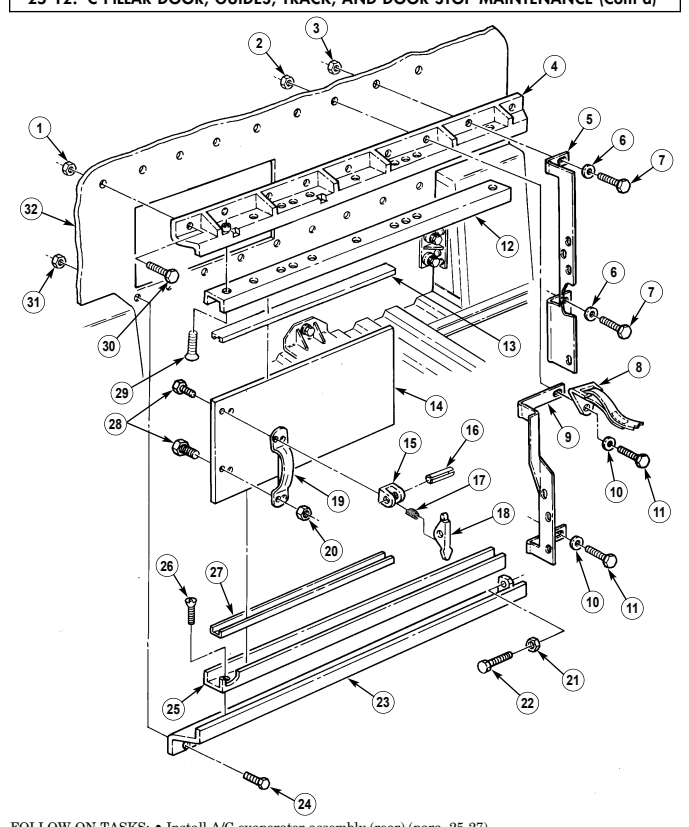

FOLLOW-ON TASKS: - Install A/C evaporator assembly (rear) (para. 25-27).
25-12. C-PILLAR DOOR, GUIDES, TRACK, AND DOOR STOP MAINTENANCE (Cont'd)

- Install left passenger seat (para. 10-45).

# 25-13. Passenger Side Upper Cowl Liner Replacement

This task covers:
INITIAL SETUP:
Applicable Models M1114 Tools General mechanic's tool kit:
automotive (Appendix B, Item 1)
Automotive maintenance and repair: field maintenance, basic (Appendix B, Item 6)
Materials/Parts Five locknuts (Appendix G, Item 111)

#### A. Removal **B. Installation** Manual References

TM 9-2320-387-24P
Equipment Condition
- Passenger side footwell outer armor removed
(para. 25-10).

- Passenger side footwell inner armor removed
(para. 25-11).

Maintenance Level Direct support a. Removal 1. Remove two locknuts (2), washers (3), and capscrews (4) from liner (1). Discard locknuts (2). 2. Remove three locknuts (2), capscrews (6), and liner (1) from cowl (5). Discard locknuts (2).

b. Installation 1. Install liner (1) on cowl (5) with three capscrews (6) and locknuts (2). 2. Install two capscrews (4), washers (3), and locknuts (2) on liner (1).

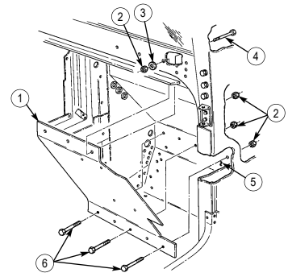

FOLLOW-ON TASKS: - Install passenger side footwell inner armor (para. 25-11).

- Install passenger side footwell outer armor (para. 25-10).

# 25-13.1. Air Horn Support Bracket Replacement

This task covers:
a. Removal b. Installation

Applicable Models M1114 Tools General mechanic's tool kit:
automotive (Appendix B, Item 1)
Maintenance and repair shop equipment:
automotive (Appendix B, Item 2)
Materials/Parts Lockwasher (Appendix G, Item 185)
Manual References TM 9-2320-387-24P
Equipment Condition
•Air horn removed (para. 3-14). •A/C compressor removed (para. 25-20).

Maintenance Level Direct Support a. Removal 1. Remove nut (5), lockwasher (4), two clamps (3), and stud (2) from air horn support bracket (1) and cylinder head (7). Discard lockwasher (4).

2. Remove capscrew (6) and support bracket (1) from cylinder head (7).

#### B. Installation

1. Install air horn support bracket (1) on cylinder head (7) with stud (2). 2. Secure air horn support bracket (1) to cylinder head (7) with capscrew (6). Tighten capscrew (6) and stud (2) to 40 lb-ft (54 N•m).

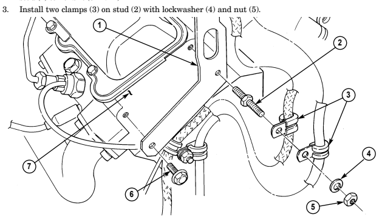

# 25-13.2. 10,500 Lb Hydraulic Winch Repair

This task covers:

a. Disassembly c. Inspection

Tools General mechanic's tool kit:
automotive (Appendix B, Item 1)
Maintenance and repair shop equipment:
automotive (Appendix B, Item 2)

#### Materials/Parts

Two O-rings (Appendix G, Item 228.1) 
(All models except M1114)
O-ring (Appendix G, Item 220) 
(All models except M1114)
O-ring (appendix G, Item 223) Two O-rings (Appendix G, Item 231) O-ring (Appendix G, Item 224) Two O-rings (Appendix G, Item 225) Grease (Appendix C, Item 33) Adhesive (Appendix C, Item 3.1) Hydraulic fluid (Appendix C, Item 37)

b. Cleaning **d. Assembly**

Manual References TM 9-2320-387-24P TM 9-214

#### Equipment Condition

- Winch cable removed (All models except M1114)
(para. 12-28.1).

- Winch cable removed (M1114) (para. 12-36.2). - Winch removed (All models except M1114) 
(para. 12-27.1).

- Winch removed (M1114) (para. 12-36.1). Maintenance Level Direct support a. Disassembly

- Valve/solenoid/coil assembly and hydraulic motors differ between model applications.

- Perform step 1 for M1114 winch only. Perform step 2 for all other models.

1. Remove fittings (1) and (2) from hydraulic motor (3). 2. Remove fittings (5) and (6) from valve assembly (4).

# 25-13.2.  10,500 Lb Hydraulic Winch Repair (Cont'D)

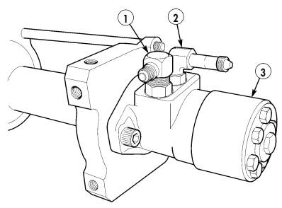

 M1114

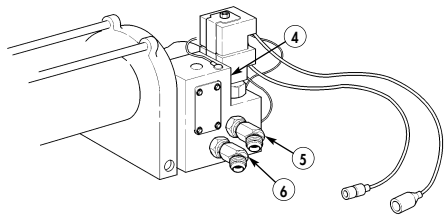

 ALL MODELS EXCEPT M1114 l

# 25-13.2. 10,500 Lb Hydraulic Winch Repair (Cont'D)

- Hydraulic motor and valve body orientation differs between models but disassembly is the same.

- Perform steps 3 through 5 for all models except M1114.

3. Remove four bolts (1), washers (2), plate (3), and valve body (8) from hydraulic motor (4). 4. Remove two O-rings (7) from ports (6) on hydraulic motor (4). Discard O-rings (7). 5. Remove restrictor (11), restrictor washer (9), and O-ring (10) from valve body (8). Discard O-ring (10).

6. Scribe a line (12) on hydraulic motor (4) and motor end support assembly (5). 7. Remove two bolts (14), hydraulic motor (4), and O-ring (13) from motor end support assembly (5).

Discard O-ring (13).

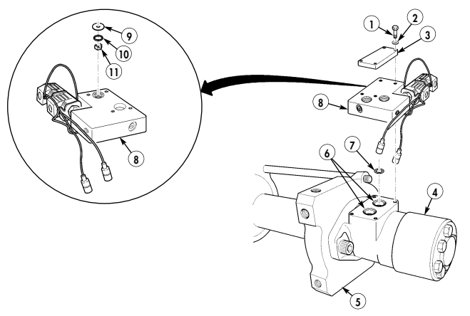

# 25-13.2.  10,500 Lb Hydraulic Winch Repair (Cont'D)

 ALL MODELS EXCEPT M1114

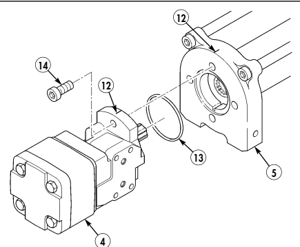

# 25-13.2. 10,500 Lb Hydraulic Winch Repair (Cont'D)

Winch selector lever must be placed in FREESPOOL position.

8. Remove four bolts (1) and two tie bars (2) from motor end support assembly (3) and gearbox housing assembly (4).

9. Remove motor end support (10), drum bushing (9), and O-ring (8) from drum (11). Discard O-ring (8).

10. Remove gearbox housing (16) and O-ring (12) from drum (11). Discard O-ring (12). 11. Remove driveshaft (6), driveshaft thrust washer (5), and driveshaft O-ring (7) from drum (11).

Discard O-ring (7).

12. Remove drum drive bushing (13), ring gear (14), and ring gear thrust washer (15) from gearbox

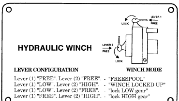

housing (16).

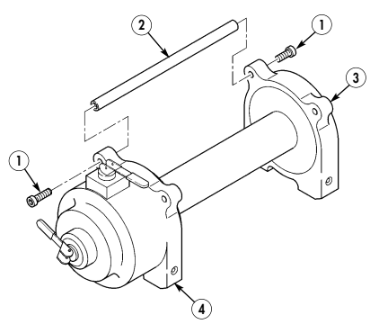

# 25-13.2.  10,500 Lb Hydraulic Winch Repair (Cont'D)

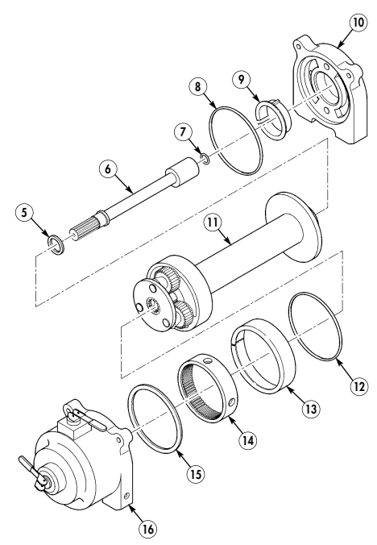

# 25-13.2. 10,500 Lb Hydraulic Winch Repair (Cont'D)

#### Warning

When disassembling high and low range levers, apply pressure to compress springs. Failure to do so may cause injury.

13. Depress driveshaft plunger (8) and remove roll pin (3), high range lever (7), lever washer (5), and O-ring (6) from driveshaft plunger (8). Discard O-ring (6).

14. Remove driveshaft plunger (8) and driveshaft plunger spring (9) from gearbox housing (2). 15. Depress low range lever plunger (10) and remove roll pin (3), low range lever (4), lever washer (5),
and O-ring (6) from lever plunger (10). Discard O-ring (6).

16. Remove low range lever plunger (10) and low range lever spring (1) from gearbox housing (2). 17. Depress shift plate (17) and remove three snaprings (18), shift plate (17), and three springs (16)
from drum (14).

18. Remove three snaprings (11), planetary washers (12), and planetary gears (13) from planetary gearshafts (15).

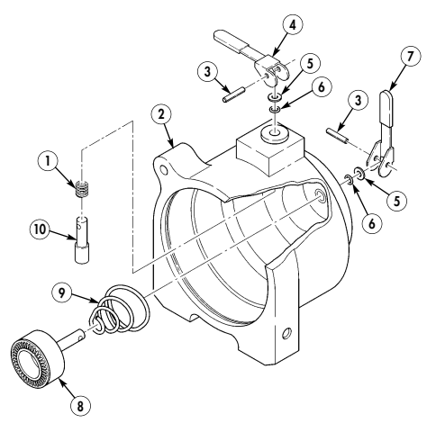

# 25-13.2.  10,500 Lb Hydraulic Winch Repair (Cont'D)

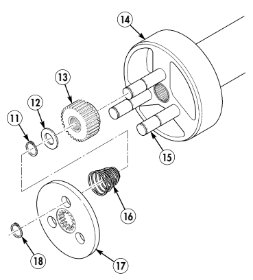

# 25-13.2. 10,500 Lb Hydraulic Winch Repair (Cont'D)

b. Cleaning 1. Clean all winch components in accordance with para. 2-14. 2. Bearings. Refer to TM 9-214 for information and care of bearings.

c. Inspection Inspect all parts and mating surfaces for damage or wear. Replace if damaged or worn.

d. Assembly 1. Apply GAA grease to drum and planetary gear components (1). 2. Install three planetary gears (2), washers (8), and snaprings (7) on planetary gearshafts (3). 3. Install three planetary gear springs (4) with smaller diameter of spring towards planetary gears (2) on planetary gearshafts (3).

4. Install shift plate (5) on planetary gearshafts (3), apply pressure to shift plate (5), and install three snaprings (6).

# 25-13.2.  10,500 Lb Hydraulic Winch Repair (Cont'D)

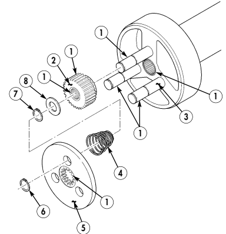

## 25-13.2. 10,500 Lb Hydraulic Winch Repair (Cont'D)

5. Apply hydraulic fluid to two O-rings (6) and install in gearbox housing (2). 6. Apply GAA grease to shaft (9) and needle bearings (11) of driveshaft plunger (10) and shaft (13) of low range lever plunger (12).

7. Install low range lever spring (1), low range lever plunger (12), and lever washer (5) in position.

Depress low range lever plunger (12) and install low range lever (4) with roll pin (3).

8. Install driveshaft plunger spring (8), driveshaft plunger (10), and lever washer (5) in position.

Depress driveshaft plunger (10) and install high range lever (7) with roll pin (3).

9. Place selector levers (4) and (7) in FREESPOOL position.

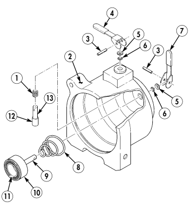

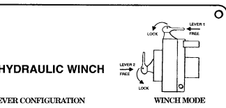

# 25-13.2. 10,500 Lb Hydraulic Winch Repair (Cont'D)

10. Apply GAA grease to components (14). 11. Install ring gear thrust washer (18), ring gear (17) (with wider machined edge of ring gear towards drum), and drum drive bushing (16) in gearbox housing (2).

12. Apply hydraulic fluid to O-ring (15) and install in gearbox housing (2).

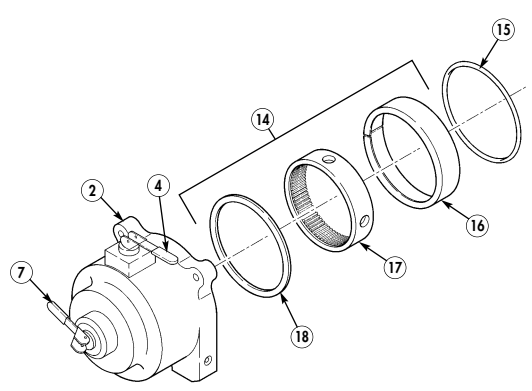

## 25-13.2. 10,500 Lb Hydraulic Winch Repair (Cont'D)

13. Apply hydraulic fluid to drum flange (6) and O-ring (7) and install in motor end support (1). 14. Stand drum (4) on end with planetary gear end (5) down. Apply GAA grease to drum bushing (2). Align tab (3) on drum (4) with slot on bushing (2) and slowly lower motor end support (1) onto drum (4), taking care not to damage O-ring (7).

15. Stand drum (4) on end with motor end support (1) down. Slowly lower gearbox assembly (8) 
onto end of drum (4), taking care not to damage O-ring installed in gearbox assembly (8).

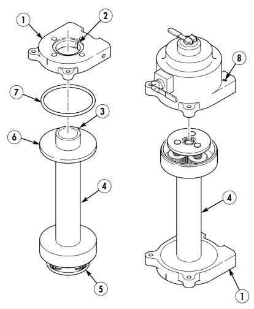

# 25-13.2. 10,500 Lb Hydraulic Winch Repair (Cont'D)

16. Apply adhesive to threads of four bolts (9). Install two tie bars (10) on motor end support (1) and gearbox housing (8) with four bolts (9). Tighten bolts (9) to 18 lb-ft (24 N•m).

17. Apply GAA grease to driveshaft splines (12) and (14) and to driveshaft thrust washer (13). 18. Apply hydraulic fluid to O-ring (15) and install into end of driveshaft (11). 19. Install driveshaft thrust washer (13) onto driveshaft (11) and slide driveshaft (11) into drum (4) until splines (12) engage planetary gears.

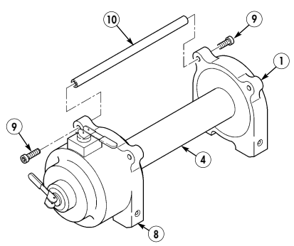

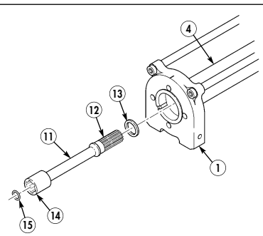

# 25-13.2. 10,500 Lb Hydraulic Winch Repair (Cont'D)

Hydraulic motor orientation differs between models but mounting to motor end support assembly is the same.

20. Apply hydraulic fluid to O-ring (5) and GAA grease to splines (6) of hydraulic motor (7). Install Oring (5) and motor (7) onto motor end support (4), aligning scribe marks (2) and (3).

21. Apply adhesive to threads of two bolts (1). Install motor (7) on motor end support (3) with two bolts (1). Tighten bolts (1) to 45 lb-ft (61 N•m).

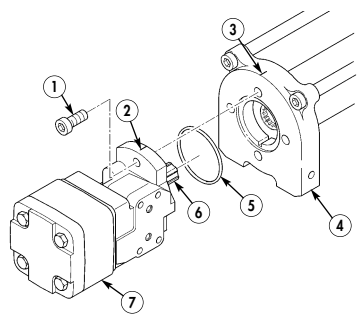

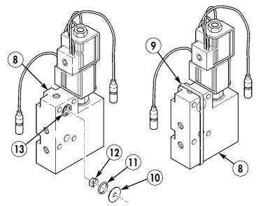

# 25-13.2. 10,500 Lb Hydraulic Winch Repair (Cont'D)

Perform steps 23 through 25 for all models except M1114.

23. Apply hydraulic fluid to two O-rings (18) and install in inlet and outlet ports (17) of motor (7).

#### Caution

Do not allow restrictor valve assembly to separate from valve and solenoid assembly during installation. Damage to equipment may result.

24. Install restrictor (12), O-ring (11), and restrictor washer (10) in port (13) of valve body (8). Use a rubber band (9) to temporarily secure restrictor (12) in position until installed.

25. Apply adhesive to four screws (15) and secure plate (14) and valve body (8) loosely to hydraulic motor (7) with screws (15). Remove rubber band being careful not to allow restrictor to fall out of position in valve body. Tighten screws (15) to 18 lb-ft (24 N•m).

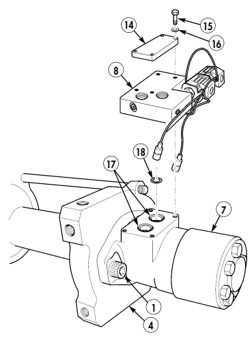

# 25-13.2. 10,500 Lb Hydraulic Winch Repair (Cont'D)

- Perform step 27 for M1114 winch only. - Perform step 28 for all other models.

27. Install fittings (1) and (2) on hydraulic motor (3). 28. Install fittings (5) and (6) on valve assembly (4).

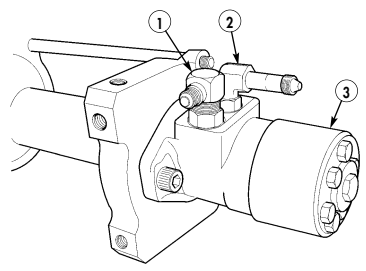

M1114

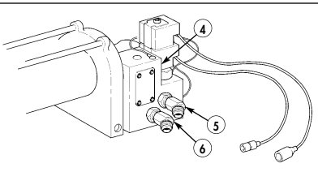

ALL MODELS EXCEPT M1114

FOLLOW-ON TASKS: Install winch (all models except M1114) (para. 12-27.1).

Install winch (M1114) (para. 12-36.1). Install winch cable (all models except M1114) (para. 12-28.1). Install winch cable (M1114) (para. 12-36.2).

## 25-13.3. Right Front Underbody Armor Installation

This task covers:

Applicable Models M1114 Tools General mechanic's tool kit:
automotive (Appendix B, Item 1)
Maintenance and repair shop equipment:
automotive (Appendix B, Item 2)

#### Materials/Parts

Four flatwashers (Appendix G, Item 34) Two capscrews (Appendix G, Item 9) Twelve AVK fasteners (Appendix G, Item 1) Sixty-two locknuts (Appendix G, Item 100) Two locknuts (Appendix G, Item 111) Sealing compound (Appendix C, Item 72.1)
Personnel Required One mechanic One assistant Manual References TM 9-2320-387-10 TM 9-2320-387-24P
a. New Passenger Side Footwell c. New Passenger Side Footwell Upper Armor Installation Inner Armor and Inner/Outer b. New Passenger Side Footwell Cowl Reinforcement Installation Outer Armor Installation d. New Right Front Underbody Armor Installation

#### Equipment Condition

- Air cleaner removed (para. 3-12). - Engine access cover removed (para. 10-22). - Air distribution duct removed (para. 11-81). - Tunnel insulation removed (para. 10-33). - Right front underbody armor removed
(para. 25-13.4).

- Passenger side footwell outer armor removed 
(para. 25-10).

- Passenger side footwell inner armor removed 
(para. 25-11).

- Passenger side upper cowl liner removed 
(para. 25-13).

#### General Safety Instructions

Right front underbody armor is extremely heavy and must be supported during removal and installation.

Maintenance Level Direct support

#### Warning

Right front underbody armor is extremely heavy and must be supported during removal and installation. Failure to do so may result in injury to personnel or damage to equipment.

Installing a new right front underbody requires match-drilling of the underbody to the vehicle. In addition, the passenger side footwell upper armor, passenger side footwell outer armor, passenger side footwell inner armor, and passenger side inner/outer cowl reinforcement will have to be replaced.

# 25-13.3. Right Front Underbody Armor Installation (Cont'D)

Step a. is performed to temporarily install a new right front underbody armor segment in order to perform match-drilling and provide a secure interface with other vehicle body armor brackets and liners prior to final installation.

a. New Passenger Side Footwell Upper Armor Installation 1. Install passenger side footwell upper armor (6) on A-pillar cowl (4) with two capscrews (3), four washers (2), and two nuts (5). Tighten nuts (5) to 10 lb-ft (14 N•m).

2. Using lower right deflector (7) as a template, match-drill three 13/32-in. (10.3-mm) diameter holes from lower right deflector (7) through passenger side footwell upper armor (6).

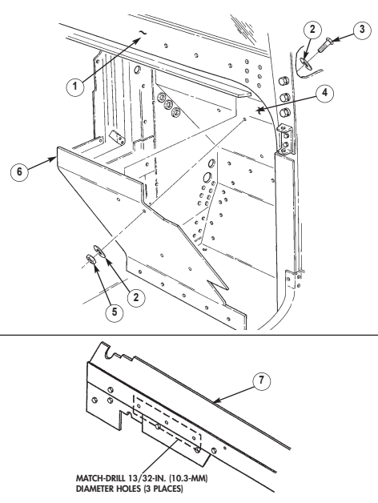

## 25-13.3. Right Front Underbody Armor Installation (Cont'D)

b. New Passenger Side Footwell Outer Armor Installation 1. Install passenger side footwell outer armor (2) and spacer (6) on right A-beam armor (3) with capscrew (1). Do not tighten capscrew (1).

2. Install spacer (4) and four capscrews (5) on A-beam armor (3). Tighten capscrews (1) and (5) to 35 lb-ft (47 N•m).

3. Using A-pillar armor (7) as a template, match-drill twenty-four 13/32-in. (10.3-mm) diameter holes from A-pillar armor (7) through passenger side footwell outer armor (2).

Capscrews in step 4 are installed in darkened hole locations in A-pillar armor.

4. Install ten capscrews (9) and locknuts (8) through A-pillar armor (7) and passenger side footwell outer armor (2). Tighten locknuts (8) to 35 lb-ft (47 N•m).

# 25-13.3. Right Front Underbody Armor Installation (Cont'D)

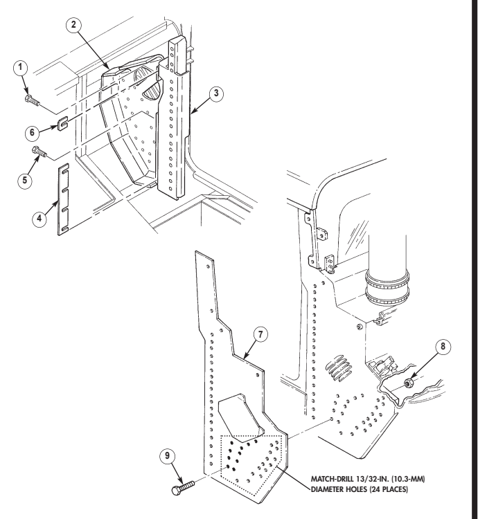

## 25-13.3. Right Front Underbody Armor Installation (Cont'D)

c. New Passenger Side Footwell Inner Armor and Inner/Outer Cowl Reinforcement Installation 1. Apply sealing compound to threads of eight capscrews (4), and install passenger side footwell inner armor (7) on inner cowl (2) with capscrews (4). Tighten capscrews (4) to 23 lb-ft (31 N•m).

2. Install inner/outer cowl reinforcement (9) on inner cowl (2) with two capscrews (5) and locknuts (1).

Tighten capscrews (5) to 35 lb-ft (47 N•m).

3. Match-drill nine 13/32-in. (10.3-mm) diameter holes from passenger side footwell inner armor (7)
through inner/outer cowl reinforcement (9).

4. Install nine capscrews (6) and locknuts (8) through passenger side footwell inner armor (7) and inner/outer cowl reinforcement (9). Tighten capscrews (6) to 35 lb-ft (47 N•m).

NOTE
Step 5 removes the temporary mounting hardware installed in Step a.

5. Remove two nuts (12), washers (10), capscrews (11), and washers (10) from passenger side footwell upper armor (3).

# 25-13.3. Right Front Underbody Armor Installation (Cont'D)

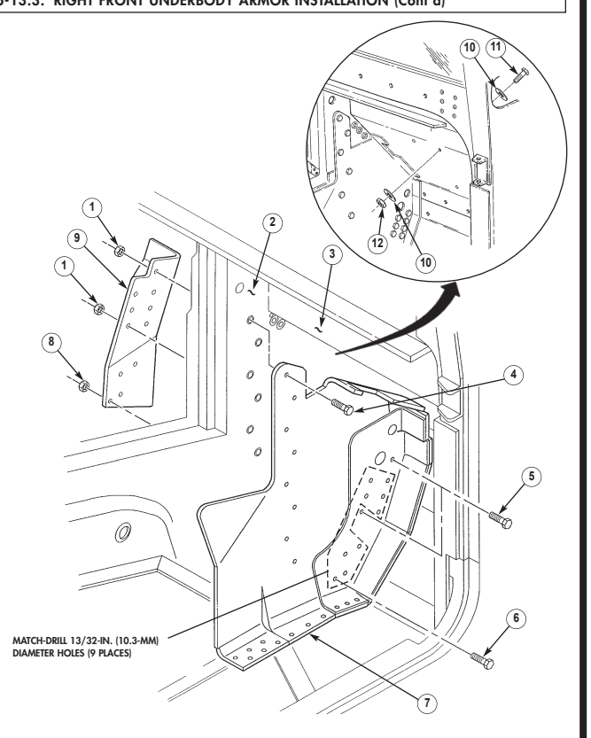

# 25-13.3. Right Front Underbody Armor Installation (Cont'D)

#### Warning

Right front underbody armor is extremely heavy and must be supported during removal and installation. Failure to do so may result in injury to personnel or damage to equipment.

Steps 1 through 5, and 7 through 8 are performed to temporarily install a new right front underbody armor segment in order to perform match-drilling and provide a secure interface with other vehicle body armor brackets and lines prior to final installation.

#### D. New Right Front Underbody Armor Installation

1. Move new right front underbody armor (2) into place underneath vehicle with hydraulic jack and slowly raise right front underbody armor (2) into position on vehicle.

2. Install right front underbody armor (2) to right rear underbody (1) with two spacers (16),
washers (15), and capscrews (14) in inner and outer holes. Tighten capscrews (14) to 23 lb-ft (31 N•m).

3. Install right front underbody armor (2) to vehicle side panel (13) with two socket-head screws (12)
in front and rear holes. Tighten socket-head screws (12) to 75 lb-in. (8 N•m).

4. Secure right front underbody armor (2) to resilient mount shim (6) and resilient mount (7) with four washers (8) and capscrews (9). Tighten capscrews (9) to 10 lb-ft (14 N•m).

5. Install three retainer plates (3) to right front underbody armor (2) and secure each with two socket-head screws (4). Tighten socket-head screws (4) to 35 lb-ft (47 N•m).

6. Using the right front underbody armor (2) as a template, match-drill five 13/32-in. (10.3-mm)
diameter holes from right front underbody armor (2) through the passenger side footwell upper armor (11).

7. Install right front underbody armor (2) to passenger side footwell upper armor (11) with five capscrews (5) and locknuts (10). Tighten capscrews (5) to 35 lb-ft (47 N•m).

# 25-13.3. Right Front Underbody Armor Installation (Cont'D)

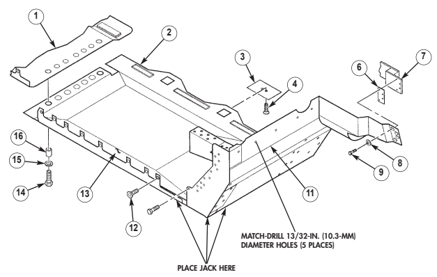

## 25-13.3. Right Front Underbody Armor Installation (Cont'D)

8. From inside vehicle, match-drill fourteen 13/32-in. (10.3-mm) diameter holes from passenger side footwell outer armor (3) and A-pillar armor (4) through right front underbody armor (1).

9. Install three capscrews (7) and locknuts (5) through passenger side footwell outer armor (3),
A-pillar armor (4), and right front underbody armor (1). Tighten locknuts (5) to 35 lb-ft (47 N•m).

10. Match-drill twelve 13/32-in. (10.3-mm) diameter holes from passenger side footwell inner armor (2)
into right front underbody armor (1). Stop drilling when drill bit penetrates hat section (6). Do not drill completely through right front underbody armor (1).

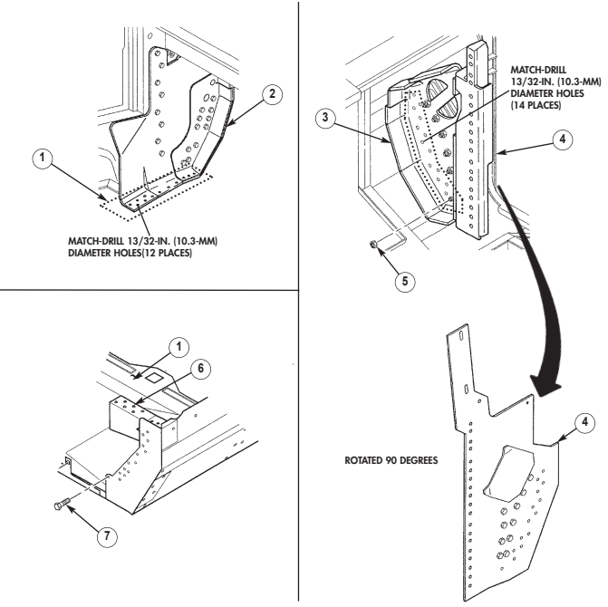

## 25-13.3. Right Front Underbody Armor Installation (Cont'D)

11. Remove five locknuts (17) and capscrews (11) from right front underbody armor (1) and passenger side footwell upper armor (18).

12. Remove six socket-head screws (12) and three retainer plates (10) from right front underbody armor (1).

13. Remove two capscrews (22), washers (23), and spacers (21) from inner and outer holes in right front underbody armor (1) and right rear underbody (24).

14. Remove three locknuts (5) and capscrews (7) from right front underbody armor (1) and passenger side footwell outer armor (3).

15. Remove two socket-head screws (19) from front and rear holes in right front underbody armor (1)
and vehicle side panel (20).

16. Remove four capscrews (16), washers (15), and resilient mount shim (13) from resilient mount (14)
and right front underbody (1).

17. Using hydraulic jack, slowly lower right front underbody armor (1) and remove from underneath vehicle.

18. Enlarge twelve holes in left front underbody armor hat section (9) to 17/32-in. (13.5-mm) diameter. 19. Install twelve AVK fasteners (8) into right underbody armor hat section (9).

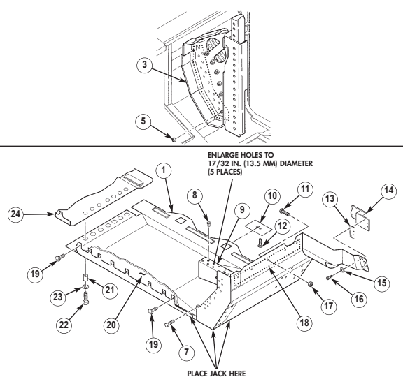

## 25-13.3. Right Front Underbody Armor Installation (Cont'D)

20. Move right front underbody armor (2) into place underneath vehicle with hydraulic jack and slowly raise right front underbody armor (2) into position on vehicle.

21. Apply sealing compound to seven capscrews (22), and install right front underbody armor (2) to right rear underbody (1) with seven spacers (24), washers (23), and capscrews (22). Tighten capscrews (22) to 23 lb-ft (31 N•m).

22. Apply sealing compound to eight socket-head screws (20) and install right front underbody armor (2) on vehicle side panel (21) with socket-head screws (20). Tighten socket-head screws (20) to 75 lb-in. (8 N•m).

23. Apply sealing compund to four capscrews (9), and install right front underbody armor (2) to resilient mount shim (6) and resilient mount (7) with four capscrews (9) and washers (8). Tighten capscrews (9) to 10 lb-ft (14 N•m).

24. Apply sealing compound to six socket-head screws (5), and install three retainer plates (4) and secure each with two socket-head screws (5). Tighten socket-head screws (5) to 35 lb-ft (47 N•m).

25. Install passenger side footwell outer armor (18) on right front underbody armor (2) with fourteen capscrews (19) and locknuts (17). Tighten locknuts (17) to 35 lb-ft (47 N•m).

26. Install right front underbody armor (2) to right upper liner (10) with capscrews (11), (12), and (13)
and locknuts (14). Tighten locknuts (14) to 35 lb-ft (47 N•m).

27. Apply sealing compound to twelve capscrews (16), and secure passenger side footwell inner armor
(15) to right front underbody armor hat section (3) with capscrews (16). Tighten capscrews (16) to 23 lb-ft (31 N•m).

# 25-13.3. Right Front Underbody Armor Installation (Cont'D)

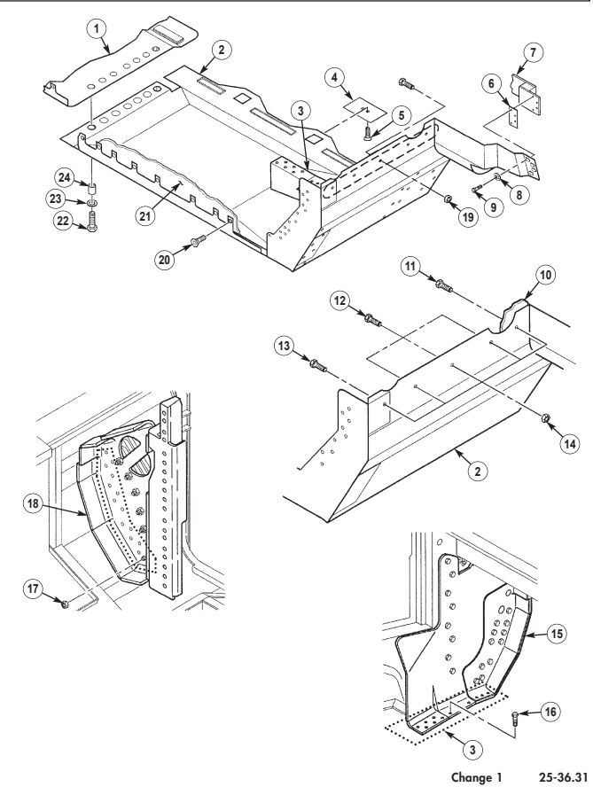

# 25-13.3. Right Front Underbody Armor Installation (Cont'D)

28. Using the right front underbody armor (1) as a template, match-drill six 13/32-in. (10.3-mm)
diameter holes from right front underbody armor (1) through passenger side footwell inner armor (left side).

29. Using the right front underbody armor (1) as a template, match-drill six 13/32-in. (10.3-mm)
diameter holes from right front underbody armor (1) through passenger side footwell outer armor (right side).

30. Using right front underbody armor (1) as a template, match-drill three 13/32-in. (10.3-mm)
diameter holes from right front underbody armor (1) through passenger side inner/outer cowl reinforcement (3).

31. Install right front underbody armor (1) to passenger side inner/outer cowl reinforcement (3) with three capscrews (4) and locknuts (2). Tighten capscrews (4) to 35 lb-ft (47 N•m).

32. Install passenger side footwell inner liner (12) to right front underbody armor (1) with capscrews
(7), (8), (9), (10), and (11), three spacers (6), spacers (14), and six locknuts (5). Tighten locknuts (5) to 35 lb-ft (47 N•m).

33. Install passenger side footwell outer liner (13) to right front underbody armor (1) with capscrews
(7), (8), (9), (10), and (11), three spacers (6), spacers (14), and six locknuts (5). Tighten locknuts (5) to 35 lb-ft (47 N•m).

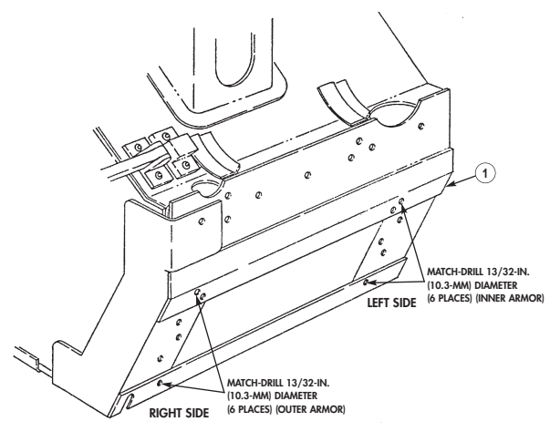

# 25-13.3. Right Front Underbody Armor Installation (Cont'D)

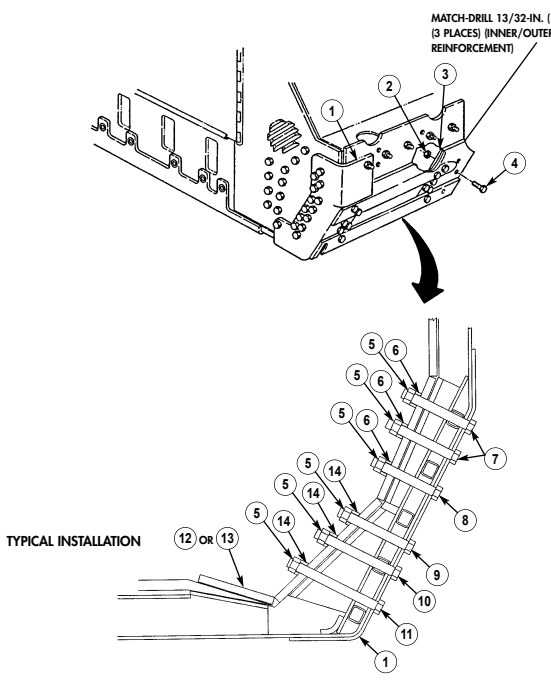

MATCH-DRILL 13/32-IN. (10.3-MM) DIAMETER
FOLLOW-ON TASKS: - Install passenger side upper cowl liner (para. 25-13).

- Install passenger side footwell inner armor (para. 25-11). - Install passenger side footwell outer armor (para. 25-10). - Install right front underbody armor (para. 25-13.4). - Install tunnel insulation (para. 10-33). - Install air distribution duct (para. 11-81). - Install engine access cover (para. 10-22). - Install air cleaner (para. 3-12).

# 25-13.4. Right Front Underbody Armor Maintenance

This task covers:
a. Removal c. Installation b. Inspection

Applicable Models M1114 Tools General mechanic's tool kit:
automotive (Appendix B, Item 1)
Maintenance and repair shop equipment:
automotive (Appendix B, Item 2)
Materials/Parts Fourteen locknuts (Appendix G, Item 126) Six locknuts (Appendix G, Item 112) Seventeen locknuts (Appendix G, Item 111) Sealing compound (Appendix C, Item 72.1) Adhesive (Appendix C, Item 2.1)
Personnel Required One mechanic One assistant Manual References TM 9-2320-387-10 TM 9-2320-387-24P

#### Equipment Condition

- Air cleaner removed (para. 3-12). - Right front underbody wheelwell IED
armor overlay (Frag 2) removed (if equipped) (para. 11-147).

- Right side rocker panel armor removed
(para. 11-35).

- Right front cowl insulation removed 
(para. 10-32).

- Heater/evaporator removed (para. 25-21).

#### General Safety Instructions

Right front underbody armor plate is extremely heavy and must be supported during removal and installation.

Maintenance Level Direct support

#### Warning

Right front underbody armor plate is extremely heavy and must be supported during removal and installation. Failure to do so may result in injury to personnel or damage to equipment.

NOTE
If new right front underbody armor is being installed, perform para. 25-13.3.

a. Removal

Note location of screws, nuts, spacers, and brackets for installation.

1. Remove four capscrews (12), washers (11.1), and shim (10) from from right front underbody armor
(11) and bracket (8).

2. Remove six socket-head screws (17) and three plates (18) from right front underbody armor (11) and three brackets (24).

3. Remove twelve capscrews (2) from right front underbody armor (11) and footwell armor (3). 4. Remove fourteen locknuts (6) and capscrews (16) from right front underbody armor (11). Discard locknuts (6).

5. Remove twelve locknuts (4), spacers (5), and capscrews (15) from right front underbody armor (11)
and body (7). Discard locknuts (4).

6. Remove seven screws (19), washers (20), and spacers (21) from right front underbody armor (11)
and body (7).

# 25-13.4. Right Front Underbody Armor Maintenance (Cont'D)

Support upper cowl liner when removing right front underbody armor.

6.1. Remove five locknuts (9) and capscrews (5.1) from upper cowl liner (5.2), body (7), and right front underbody armor (11). Discard locknuts (9).

7. Remove eight socket-head screws (22) and right front underbody armor (11) from rocker panel (27).

NOTE
- Perform step 8 if removing air cleaner mounting brackets. - Perform step 9 if removing brackets and clamps.

8. Remove four capscrews (14), washers (14.1), and two air cleaner brackets (13) from right front underbody armor (11).

9. Remove six locknuts (25), clamps (26), and three brackets (24) from frame rail (1). Discard locknuts (25).

#### B. Inspection

1. Refer to para. 10-56 for plusnut inspection and replacement. 2. Inspect rubber strips (23). Replace if damaged.

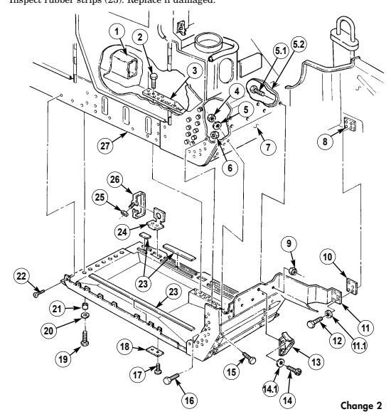

Change 2 25-36.35
# 25-13.4. Right Front Underbody Armor Maintenance (Cont'D)

c. Installation

#### Caution

Ensure position of clamps on frame are under brake lines. Failure to do so will result in damage to equipment.

- Perform step 1 if air cleaner mounting brackets were removed. - Perform step 2 if brackets and clamps were removed. - Ensure all old adhesive and paint is removed from area to be adhesive bonded.

1. Apply sealing compound to four capscrews (13), and install two air cleaner brackets (12) on right front underbody armor (10) with four washers (13.1) and capscrews (13). Tighten capscrews (13) to 35 lb-in (4 N•m).

2. Apply adhesive to three brackets (22) and install six clamps (24) and three brackets (22) on frame rail (1) with six locknuts (23). Tighten locknuts (23) to 64-68 lb-in. (7-8 N•m).

Ensure upper cowl liner is positioned against bulkhead.

2.1 Install right front underbody armor (10) on body (7) and upper cowl liner (5.2) with five capscrews (5.1) and locknuts (9.1). Tighten locknuts (9.1) to 37 lb-ft (50 N•m).

3. Apply sealing compound to seven capscrews (18), and install right front underbody armor (10) on body (7) with seven spacers (20), washers (19), and capscrews (18). Tighten capscrews (18) to 23 lb-ft (31 N•m).

4. Apply sealing compound to eight socket-head screws (21), and install right front underbody armor (10) on rocker panel (25) with socket-head screws (21). Tighten socket-head screws (21) to 68-82 lb-in. (8-9 N•m).

Ensure large spacers are installed in upper holes.

5. Install right front underbody armor (10) on body (7) and footwell armor (3) with twelve capscrews (14), spacers (5), and locknuts (4). Tighten locknuts (4) to 37 lb-ft (50 N•m).

6. Install right front underbody armor (10) on body (7) and footwell armor (3) with fourteen capscrews (15) and locknuts (6). Tighten locknuts (6) to 37 lb-ft (50 N•m).

7. Apply sealing compound to twelve capscrews (2), and install right front underbody armor (10) on footwell armor (3) and body (7) with capscrews (2). Tighten capscrews (2) to 37 lb-ft (50 N•m).

8. Apply sealing compound to six socket-head screws (16), and install right front underbody armor (10)
and three plates (17) on brackets (22) with socket-head screws (16). Tighten socket-head screws (16) to 37 lb-ft (50 N•m).

9. Apply sealing compound to four capscrews (11), and install shim (9) and right front underbody armor (10) on bracket (8) with four washers (10.1) and capscrews (11). Tighten capscrews (11) to 10 lb-ft (14 N•m).

# 25-13.4. Right Front Underbody Armor Maintenance (Cont'D)

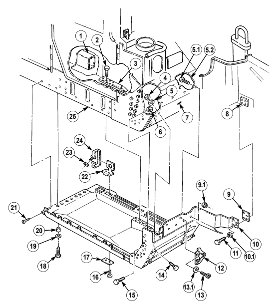

FOLLOW-ON TASKS: - Install heater/evaporator (para. 25-21).

- Install right front cowl insulation (para. 10-32). - Install right side rocker panel armor (para. 11-35). - Install right front underbody wheelwell IED armor overlay (Frag 2) 
if equipped (para. 11-35).

- Install air cleaner (para. 3-12).

# 25-13.5. Rear Door Striker Nut Plate Replacement

This task covers:

Applicable Models M1114 Tools General mechanic's tool kit:
automotive (Appendix B, Item 1)
Special Tools Riveter tool kit (Appendix B, Item 123)
Materials/Parts One rivet (Appendix G, Item 271.2)
Manual References TM 9-2320-387-24P
a. Removal b. Installation

#### Equipment Condition

- Door striker removed (para. 11-12). - Access hole cover plate removed, driver's side only (para. 25-36).

- Fuel filler housing removed, passenger's side only (para. 10-2).

#### Maintenance Level

Direct support

- Replacement procedures for rear door striker nut plates are basically the same. Access passenger's side through fuel filler area, and access driver's side nut plate through left rear wheel well access hole.

- For rivet replacement instructions, refer to para. 10-56.

a. Removal Hold nut plate (2) in place through access area and remove rivet (1). 

b. Installation 1. Install nut plate (2) in vehicle body channel (3) and temporarily secure with door striker capscrew (4).

2. Install rivet (1) to secure nut plate (2). 3. Remove door striker capscrew (4).

# 25-13.5. Rear Door Striker Nut Plate Replacement (Cont'D)

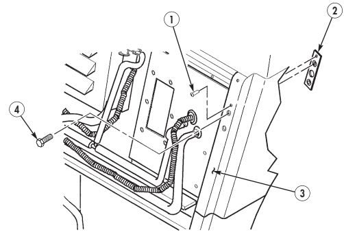

FOLLOW-ON TASKS: - Install fuel filler housing, passenger's side only (para. 10-2).

- Install access hole cover, driver's side only (para. 25-36). - Install door striker (para. 11-12).

# 25-13.6. Rear Door Striker Tapping Plate Replacement

This task covers:

Applicable Models

| M1114   |
|---------|
| Tools   |

General mechanic's tool kit:
automotive (Appendix B, Item 1)
Special Tools Riveter Tool Kit (Appendix B, Item 123)
Materials/Parts Two rivets (Appendix G, Item (271.2)
Manual References TM 9-2320-387-24P
a. Removal b. Installation

#### Equipment Condition

- Left rear door striker reinforcement plate removed (para. 11-12.3).

- A/C coolant line cover removed 
(para. 25-32).

- Left passenger's seat removed (para. 10-45). - Access hole cover plate removed, driver's side only (para. 25-36)
Maintenance Level Direct support

- Replacement procedures for rear door striker tapping plates are basically the same. Access passenger's side tapping plate through fuel filler area. This procedure covers driver's side tapping plate only.

- For rivet replacement instructions, refer to para. 10-56.

a. Removal 1. Hold retainer strap (2) and tapping plate (1) in place through access area and remove two rivets (4). 2. Remove retainer strap (2) and tapping plate (1) from vehicle body channel (3) through access area.

b. Installation 1. Install tapping plate (1) in vehicle body channel (3) through access area and temporarily secure with door striker capscrew (5).

Install retainer strap bottom first.

2. Install retainer strap (2) over tapping plate (1) and secure with two rivets (4). 3. Remove door striker capscrew (5).

# 25-13.6. Rear Door Striker Tapping Plate Replacement (Cont'D)

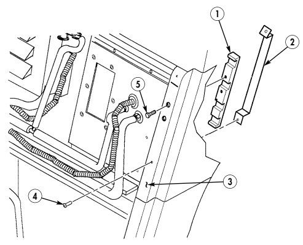

FOLLOW-ON TASKS: - Install access hole cover plate (para. 25-36).

- Install left passsenger's seat (para. 10-45). - Install A/C coolant line cover (para. 25-32). - Install left rear door striker reinforcement plate (para. 11-12.3).

# 25-13.7. Left Rear Door Striker Reinforcement Replacement

This task covers:

| Applicable Models                        |
|------------------------------------------|
| M1114                                    |
| Tools                                    |
| General mechanic's tool kit:             |
| automotive (Appendix B, Item 1)          |
| Automotive maintenance and repair: field |
| maintenance, basic (Appendix B, Item 6)  |

| Personnel Required   |
|----------------------|
| One mechanic         |

Four locknuts (Appendix G, Item 133.2)
a. Removal b. Installation a. Removal Remove four locknuts (2), washers (1), three screws (4), screw (5), and reinforcement plate (3) from left rear wheelhouse (6). Discard locknuts (2).

| Equipment Condition                          |
|----------------------------------------------|
| - Roof panel removed (para. 25\-3).          |
| - Windshield wiper switch/motor removed      |
| (para. 10\-63).                              |
| - Roof panel removed (para. 25\-3).          |
| - Air intake assembly removed (para. 3\-19). |
| - Sun visors removed (para. 10\-70).         |
| - Air distribution duct right two registers  |
| removed (para. 11\-82).                      |

b. Installation Install reinforcement plate (3) on left rear wheelhouse (6) with screw (5), three screws (4), four washers (1), and locknuts (2).

25-13.7. LEFT REAR DOOR STRIKER REINFORCEMENT REPLACEMENT (Cont'd)

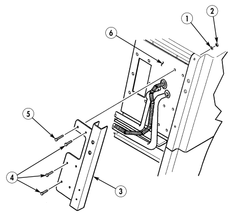

FOLLOW-ON TASKS: - Install A/C coolant line cover (para. 25-32).

-  Install access hole cover plate (para. 25-36).

-  Install left rear door striker (para. 11-12).

# Section Ii. Air Conditioning Maintenance (M1114) 25-14. Air Conditioning Maintenance Task Summary

| Repair                                                                                       |                                                                                   |                                                                              |                                                                     |
|----------------------------------------------------------------------------------------------|-----------------------------------------------------------------------------------|------------------------------------------------------------------------------|---------------------------------------------------------------------|
| INITIAL SETUP:                                                                               |                                                                                   |                                                                              |                                                                     |
| Applicable Models                                                                            | Manual References                                                                 | TM 9\-2320\-387\-24P                                                         | Ml114                                                               |
| TM 43\-0139                                                                                  | Tools                                                                             | TM 9\-237                                                                    |                                                                     |
| General mechanic's tool kit:                                                                 | Equipment Condition                                                               | automotive (Appendix B, Item 1)                                              |                                                                     |
| Cargo shell door dovetail spring removed                                                     | Materials/Parts                                                                   | (para. 11\-28).                                                              |                                                                     |
| Sealing compound (Appendix C, Item 69)                                                       | Maintenance Level                                                                 | Primer, weld\-through (Append= C, Item 54)                                   |                                                                     |
| Direct support                                                                               |                                                                                   |                                                                              |                                                                     |
| 1.                                                                                           | Remove sealing compound (1) from cargo shell seam (2).                            | 2.                                                                           | Remove paint from surface area to be welded (refer to TM 43\-0139). |
| 3.                                                                                           | Prime surface area to be welded with weld\-through primer (refer to TM 43\-0139). |                                                                              |                                                                     |
| NOTE                                                                                         | Clamping devices are recommended to hold cargo shell reinforcement to             |                                                                              |                                                                     |
| cargo shell during positioning.                                                              | 4.                                                                                | Position cargo shell reinforcement (5) on cargo shell (3) and comer cap (4). |                                                                     |
| Weld cargo shell reinforcement (51, cargo shell (3), and comer cap (4) (refer to TM 9\-237). | 5.                                                                                | Apply sealing compound (1) to cargo shell seam (2).                          | 6.                                                                  |
| 7.                                                                                           | Spot\-paint welded area (refer to TM 43\-0139).                                   |                                                                              |                                                                     |

# 25-15. A/C System Servicing

This task covers:
a. Manifold Gauge Set Installation e. Evacuating System b. Manifold Gauge Set Removal **f. Charging System** c. Discharging System g. Adding Refrigerant Oil d. Flushing System

Applicable Models M1114 Tools General mechanic's tool kit:
automotive (Appendix B, Item 1)
Flushing cylinder (Appendix B, Item 128) Flush gun (Appendix B, Item 129) Service refrigeration unit tool kit 
(Appendix B, Item 131)
Vacuum pump (Appendix B, Item 132) Manifold gauge set (Appendix B, Item 130)

#### Materials/Parts

Lubricating oil (Appendix C, Item 48) Refrigerant R-134a (Appendix C, Item 56) Nitrogen (Appendix C, Item 51) Flushing agent (Appendix C, Item 30)

#### Manual References

TM 9-2320-387-10 TM 9-2320-387-24P

#### Equipment Condition

Hood raised and secured (TM 9-2320-387-10).

#### General Safety Instructions

- Always wear eye protection when working with R-134a.

- Exercise extreme care when handling R-134a. - Do not attempt to connect servicing equipment while engine is running.

- Ensure hand valves on manifold gauge set are closed during connection; hoses must be clear of any moving engine parts.

- Eye protection must be worn when using compressed nitrogen.

Maintenance Level Direct support

#### Warning

- Always wear eye protection when using R-134a or when servicing the air conditioning system. Injury will result if R-134a comes in contact with eyes.

- Exercise extreme care when handling R-134a. Direct contact between R-134a and skin may cause frostbite.

- Always use recovery machine. - Do not attempt to connect servicing equipment while engine is running. Injury to personnel or damage to equipment may result.

Whenever any air conditioning vapor system component needs replacement, the system must be discharged, flushed, and a new dryer bottle installed (para. 25-16).

# 1 25-L 5. A/C System Servicing (Cont'D) I

a. hlanifold Gauge Set Installation 1. Turn high-pressure gauge valve (2) and low-pressure gauge valve (1) on manifold gauge set (3) 
clockwise to seated (closed) positions. 

2. Remove two caps (61 from service ports (7) and (8). 

#### Warning

Ensure hand valves on manifold gauge are in closed position during connection and hoses are clear of any moving parts in engine compartment. Injury to personnel or damage to equipment may result. 

3. Connect low-pressure gauge hose (51 on manifold gauge set (3) to suction (low side) service port (8). 

4. Connect high-pressure gauge hose (41 on manifold gauge set (31 to discharge (high side) service port (7). 

5. Hang manifold gauge set (3) so hoses (4) and (5) are well away from moving engine parts. 

Do not perform step 6 if system is already evacuated. High- and 

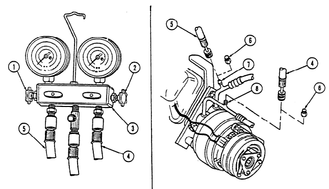

low-pressure hoses must be purged with R-134a for charging purposes (refer to task f.). 

6. Slightly loosen low-pressure gauge hose (5) and high-pressure gauge hose (4) at manifold gauge set (3) 
to purge air from hoses, then tighten. 

- 

## 25 15. **A/C System Servicing (Cont'D)**

-aManifold Gauge Set Removal 1 1. Ensure high-pressure gauge valve (21 and low-pressure gauge valve (1) on manifold gauge set (3) are in seated (clockwise) position. 

2. If system was charged with refrigerant, wait several minutes after turning engine off for high and low sides to stabilize before performing next step. 

A charged A/C system is always pressurized at 20-30 psi 
(138-207 kPa). Hose connectors must be held firmly to avoid ends whipping back and damaging equipment. 

3. Disconnect low-pressure gauge hose (6) and high-pressure gauge hose (41 from service ports (8) and (9). 4. Install two caps (71 on service ports (8) and (9). 

#### C. Discharging System

1. Install manifold gauge set (refer to task a.). 

2. Connect center hose (5) of manifold gauge set (3) to an approved recovery machine. 

NOTE 
l Do not allow refrigerant R-134a to escape too quickly. 

Refrigerant oil will escape. 

l When high- and low-pressure gauges read zero, the discharging procedure is complete. Allow machine to run for 5 minutes after gauges read zero. 

3. Slightly turn high-pressure gauge valve (2) and low-pressure gauge valve (1) counterclockwise to permit refrigerant to slowly escape through center hose (5) until both gauges read zero. 

4. Measure any significant accumulation of oil in discharge bottle and record for oil charging purposes. 

5. Disconnect manifold gauge set (3) (refer to task b.). 

# 25-15.  A/C System Servicing (Cont'D)

.

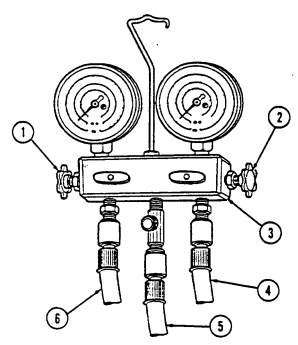

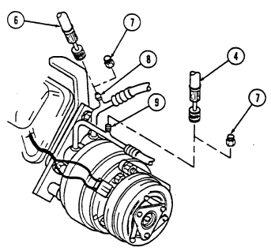

# 25-15. A/C System Servicing (Cont'D)

d. Flushing System

#### Warning

Eye protection must be worn at all times when performing this procedure. Failure to do so may result in injury to personnel.

CAUTION
Never flush compressor. Damage to compressor will result if flushed. A/C system flushing is essential when replacing failed compressors. Failure to flush the system properly will result in damage to the new compressor.

- The procedures outlined below are to be followed whenever there is evidence of catastrophic compressor failure. Catastrophic compressor failure is defined as the failure of internal components located inside the compressor and is evident when the presence of sludge and/or metal particles is found mixed with the compressor oil.

- Do not attempt to use R-134a as a flushing agent. R-134a will not remain a liquid at ambient temperatures. Use a flushing solution that is specifically manufactured for use with R-134a for this procedure.

- Flushing is done to remove contaminants such as oil, sludge, and metal particles due to failed components.

- The following procedure should be completed with an EPA
approved Recovery Machine purchased locally.

1. Recover refrigerant in the A/C system by following the recommended recovery machine instructions.

(Refer to para. 25-15, task 25-15c).

2. Remove the A/C compressor. (Refer to para. 25-20). Drain the compressor oil into a clean container.

If the oil has evidence of contamination from metal particles or sludge, or the compressor has other evidence of catastrophic failure, proceed with the flushing instructions. If there is no evidence of oil contamination or catastrophic failure, proceed to A/C compressor replacement (Refer to para. 25-20).

3. Disconnect the discharge and suction lines from the compressor manifold (Refer to para. 25-20.1). 4. Remove the receiver/driers at the condenser and front evaporator locations (Refer to para. 25-16 and para. 25-17).

5. Remove the expansion valves on both front and rear evaporators (Refer to para. 25-26 and para. 25-27).

6. Connect the flushing gun (2) to the flushing cylinder (1). 7. Fill the flushing cylinder (1) approximately half full with flushing agent. 8. Pressurize the flushing cylinder (1) with compressed nitrogen to 100 psi (690 kPa).

# 25-15. A/C System Servicing (Cont'D)

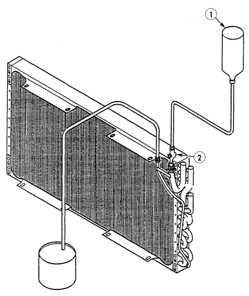

# 25-15. A/C System Servicing (Cont'D)

Perform steps 9 through 13 on condenser, front and rear evaporators and all refrigerant lines.

in a drain pan (6).

9. Connect a drain hose (7) over inlet (5) of component to be flushed (1), and place other end of hose (7)
10. Insert the flushing gun nozzle (3) into the refrigerant outlet tube (4) of component to be flushed.

Continue flushing until there is no evidence of oil or contaminants. The flushing cylinder (2) may need to be refilled and pressurized depending on the amount of contamination.

11. Open the flushing gun valve (3) to blow flushing agent through component.

After flushing the component in one direction, reverse the connections of the drain hose and flushing gun. Repeat step 11 to ensure that the component has been flushed in both directions. If the drain hose does not fit over the hose fittings, the item being flushed will need to be oriented over a drain container to catch the solvent.

12. Prior to performing step 13, allow the flushing agent to stay in the component at least five minutes for cleaning action to occur.

13. Blow compressed air or nitrogen through the component until there is no evidence of flushing agent left inside the component.

#### Warning

Prior to removing the flushing agent cylinder hoses or flushing gun, relieve the pressure in the cylinder. Personal injury may occur.

14. Remove the flushing gun (3) and drain hose from component and cover refrigerant line with a clean shop rag.

15. Fill the new compressor with measured 12 ounces of PAG-150 refrigerant lubricating oil.

Failure to fill the compressor with the specified amount of oil will result in compressor or system component damage.

16. Reassemble the system using new front receiver dryer and rear receiver dehydrator, expansion valves, and new O-rings. new O-rings must be installed at each location that refrigerant lines were disconnected during the flushing procedure. Dip O-rings in refrigerant oil prior to assembly.

17. Recharge the system with refrigerant (Refer to para. 25-15.f). 18. Dispose of used flushing agent IAW local hazardous material disposal procedures.

NOTE

# 25-15. A/C System Servicing (Cont'D)

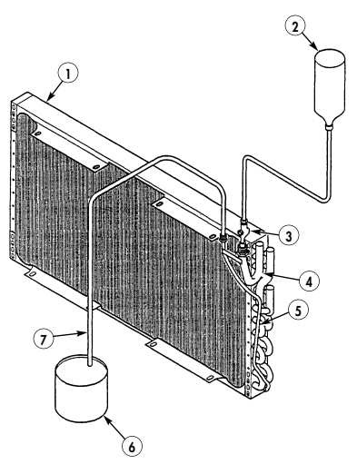

| Individual System Component   |                 |
|-------------------------------|-----------------|
| Refrigerant Oil Capacities:   |                 |
| Compressor                    | .25 to 5 ounces |
| Condenser                     | 1 ounce         |
| Front Evaporator              | 3 ounces        |
| Front Receiver/Dryer          | 3 ounces        |
| Rear Evaporator               | 3 ounces        |
| Rear Receiver/Dryer           | .5 ounces       |
| System Lines                  | .75 ounces      |

FOLLOW-ON TASK: Lower and secure hood (TM 9-2320-280-10).

# 25-15. A/C System Servicing (Cont'D)

e. Evacuating System

#### Caution

Never attempt to evacuate A/C system if system has not been completely discharged.

1. Discharge A/C system (refer to task c.) and flush A/C system if necessary (refer to task d.). 2. Connect manifold gauge set (3) (refer to task a.). 3. Connect vacuum pump to center hose (4) on manifold gauge set (3). 4. Turn vacuum pump on and open high-pressure gauge valve (2) and low-pressure gauge valve (1) on manifold gauge set (3).

High-pressure side gauge should drop to zero or below. If not, a blockage in A/C system is indicated.

5. Evacuate unit until low-pressure gauge reads 29 in. Hg of vacuum. 6. Continue evacuation for forty-five minutes after correct gauge reading of 29 in. Hg of vacuum has been achieved.

7. Turn high-pressure gauge valve (2) and low-pressure gauge valve (1) on manifold gauge set (3) to closed position after evacuation is complete.

8. Turn off vacuum pump and disconnect center hose (4) from vacuum pump.

Vacuum of 29 in. Hg should be sustained on low-pressure gauge for at least ten minutes. If not, a leak in A/C system is indicated. Identify source of leak and repair as necessary.

9. Check for leaks ten minutes after gauge valves are turned off.

Manifold gauge set can remain connected and service valves left in mid-position if charging A/C system will follow immediately.

10. Disconnect manifold gauge set (3) (refer to task b.).

# 25-15.  A/C System Servicing (Cont'D)

 
 -

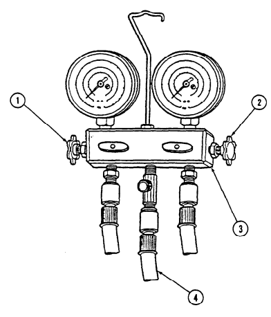

# 25-15. A/C System Servicing (Cont'D)

f. Charging System

If A/C system requires replacement of a major component or has been flushed, refrigerant oil must be added to system to compensate loss (refer to task g.).

1. Evacuate A/C system (refer to task e.). 2. Connect refrigerant R-134a source to center hose (5) of manifold gauge set (3). 3. Open refrigerant R-134a source to allow refrigerant to flow into center hose (5). 4. Purge center hose (5), low-pressure hose (6), and high-pressure hose (4) as follows:
a. Slightly loosen center hose (5) at center port (7) of manifold gauge set (3) until refrigerant escapes, then tighten hose (5).

b. Open high-pressure gauge valve (2) and low-pressure gauge valve (1) to allow refrigerant to flow into high-pressure hose (4) and low-pressure hose (6).

c. Purge high-pressure hose (4) and low-pressure hose (6) at service ports on compressor. d. Turn high-pressure gauge valve (2) and low-pressure gauge valve (1) clockwise to OFF position.

5. Connect STE/ICE-R (para. 2-47) to obtain engine rpm reading.

#### Warning

Ensure high-pressure gauge valve is in closed position on manifold gauge set during charging. Failure to do so will cause compressor to build pressure in refrigerant container, causing injury to personnel or damage to equipment.

6. Start engine and set engine speed to 1,500 rpm with hand throttle (TM 9-2320-387-10). 7. Turn on A/C system (TM 9-2320-387-10) and set blower fans on high speed.

Keep refrigerant container upright at all times so refrigerant enters system as a gas.

8. Open low-pressure gauge valve (1) on manifold gauge set (3) until system is fully charged with 3 lbs 4 oz of R-134a refrigerant (refer to table 14-2).

9. Close low-pressure gauge valve (1) on manifold gauge set (3).

10. Return hand throttle to normal idle (TM 9-2320-387-10). 11. Stop engine (TM 9-2320-387-10). 12. Remove refrigerant R-134a source from center hose (5) of manifold gauge set (3). 13. If no refrigerant oil is needed, disconnect manifold gauge hoses (4) and (6) from A/C system service ports (9) and (10). Install caps (8) on service ports (9) and (10). If refrigerant oil is needed, perform task g.

# 25-15. A/C System Servicing (Cont'D)

g. Adding Refrigerant Oil

- It is not necessary to check or add oil as routine maintenance.

It is necessary to add oil when the evaporator, condenser, compressor, or receiver/dryer has been replaced or there was an obvious oil leak. When a system is discharged, it is also necessary to replace any oil carried out with the refrigerant.

- Vehicle must be on level ground. - A new compressor is charged with 6 oz of refrigerant oil.

1. If only the compressor is being replaced, drain and measure oil from compressor being replaced.

Drain new compressor and add the same amount of refrigerant oil as was drained from old compressor.

2. If there is a loss of refrigerant over a period of time and a component is being replaced to correct leak, add refrigerant oil to the component being replaced as follows: - Condenser - 1 oz - Receiver/Dryer - 1 oz - Evaporator - 3 oz 3. When the system oil level is unknown, or system performance and efficiency are marginal, drain and flush system and add a new 6-oz charge of refrigerant oil to the system.

FOLLOW-ON TASK: Lower and secure hood (TM 9-2320-387-10).

# 25-16. A/C Receiver/Dryer (Front) Maintenance

This task covers:
b. Inspection

Applicable Models M1114 Tools General mechanic's tool kit:
automotive (Appendix B, Item 1)
Automotive maintenance and repair: field maintenance, basic (Appendix B, Item 6)

#### Materials/Parts

O-ring (Appendix G, Item 205) Two O-rings (Appendix G, Item 204) Two locknuts (Appendix G, Item 99) Refrigerant oil (Appendix C, Item 48) Sealing compound (Appendix C, Item 63)
a. Removal c. Installation Manual References TM 9-2320-387-24P
Equipment Condition
- Battery ground cables disconnected (para. 4-68). - A/C system discharged (para. 25-15).

Maintenance Level Direct support a. Removal

Prior to removal, tag lines for installation.

1. Loosen nuts (1) and (5) and remove lines (17) and (6) and O-rings (2) and (4) from receiver/dryer (3).

Discard O-rings (2) and (4).

2. Remove trinary switch (7) and O-ring (8) from receiver/dryer (3). Discard O-ring (8). 3. Remove two locknuts (11), washers (10), clamp (9), and receiver/dryer (3) from mounting bracket (16).

Discard locknuts (11).

4. Remove two capscrews (12), washers (13), and mounting bracket (16) from body (14).

b. Inspection Refer to para. 10-56 for plusnut (15) inspection and replacement.

c. Installation

When installing receiver/dryer, IN fitting must be toward front of vehicle.

1. Apply sealing compound to two capscrews (12), and install mounting bracket (16) on body (14) with two washers (13) and capscrews (12). Tighten capscrews (12) to 75 lb-in. (8 N•m).

2. Install receiver/dryer (3) and clamp (9) on mounting bracket (16) with two washers (10) and locknuts (11). Tighten locknuts (11) to 10 lb-ft. (14 N•m).

3. Apply refrigerant oil on O-rings (2) and (4), and install O-rings (2) and (4) and lines (17) and (6) on receiver/dryer (3) and tighten nuts (1) and (5) to 12 lb-ft (16 N•m).

4. Apply refrigerant oil on O-ring (8), and install O-ring (8) and trinary switch (7) on receiver/dryer (3).

# 25-16. A/C Receiver/Dryer (Front) Maintenance (Cont'D)

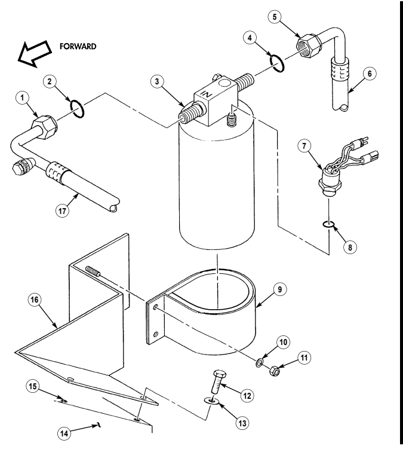

FOLLOW-ON TASKS: - Connect battery ground cables (para. 4-68).
- • - Charge A/C system (para. - Charge A/C system (para. 25-15).

# 25-17. A/C Receiver/Dryer (Rear) Replacement

This task covers:
INITIAL SETUP:

| Applicable Models   |
|---------------------|

Tools

| Materials/Parts   |
|-------------------|

General mechanic's tool kit:
automotive (Appendix B, Item 1)
Automotive maintenance and repair: field maintenance, basic (Appendix B, Item 6)
Two O-rings (Appendix G, Item 204) Refrigerant oil (Appendix C, Item 48)

a. Removal b. Installation

Manual References TM 9-2320-387-24P
Equipment Condition
- A/C system discharged (para. 25-15). - Condenser supply vents removed 
(para. 11-85).

Maintenance Level Direct support

#### A. Removal

1. Loosen nut (8) and remove return line (7) and O-ring (9) from A/C receiver/dryer (1). Discard O-ring (9).

2. Loosen nut (4) and remove supply line (3) and O-ring (5) from A/C receiver/dryer (1). Discard O-ring (5).

3. Loosen clamp (2) and remove A/C receiver/dryer (1) from bracket (6). Remove A/C receiver/dryer (1)
through side vent.

#### B. Installation

1. Install A/C receiver/dryer (1) on bracket (6) with clamp (2). Do not tighten clamp (2). 2. Apply refrigerant oil to O-ring (5), and install O-ring (5) on supply line (3). 3. Install supply line (3) on A/C receiver/dryer (1) and tighten nut (4) to 12 lb-ft (16 N•m). 4. Apply refrigerant oil to O-ring (9), and install O-ring (9) on return line (7). 5. Install return line (7) on A/C receiver/dryer (1) and tighten nut (8) to 12 lb-ft (16 N•m). 6. Tighten clamp (2).

# 25-17. A/C Receiver/Dryer (Rear) Replacement (Cont'D)

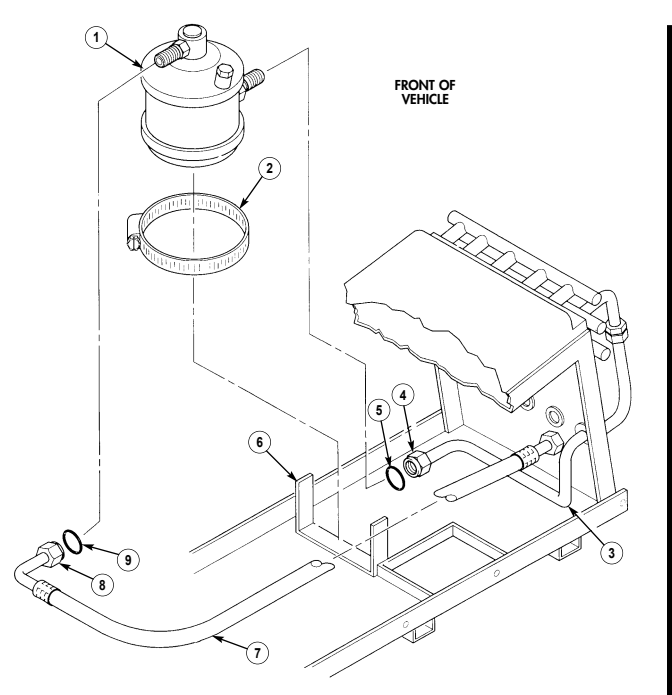

FOLLOW-ON TASKS: - Charge A/C system (para. 25-15).
- • - Install condenser supply vents (para. 11-85).

1

# 25-17.1. A/C Receiver/Dryer (Rear) Lines Replacement

This task covers:
INITIAL SETUP:

a. Removal **b. Installation**

| Applicable Models                       | Manual References    |
|-----------------------------------------|----------------------|
| M1114, M1151, M1151A1                   | TM 9\-2320\-387\-24P |
| Tools                                   | Maintenance Level    |
| General mechanic's tool kit:            | Direct support       |
| automotive (Appendix B, Item 1)         |                      |
| Materials/Parts                         |                      |
| Five locknuts (Appendix G, Item 133.22) |                      |

- A/C system discharged (para. 25-15). - A/C condenser removed (para. 25-18).

Three O-rings (Appendix G, Item 204) Rubber washer (Appendix G, Item 273.1) Refrigerant oil (Appendix C, Item 48)

#### A. Removal

1. Loosen bulkhead fitting (9) and remove nut (5) and rubber washer (4) from forward end of return line (10). Discard rubber washer (4).

2. Loosen nut (11) and remove return line (10) and O-ring (12) from A/C receiver/dryer (13). Discard O-ring (12).

3. Loosen two nuts (2) and remove supply line (8) and two O-rings (1) from A/C receiver/dryer (13) and A/C condenser (3). Discard O-rings (1).

4. Remove supply line (8) and grommet (6) from A/C condenser bracket (7).

#### B. Installation

1. Apply refrigerant oil to two O-rings (1), and install O-rings (1) on supply line (8). 2. Position supply line (8) and grommet (6) through A/C condenser bracket (7). 3. Install supply line (8) on A/C condenser (3) and A/C receiver/dryer (13) and tighten nuts (2) to 12 lb-ft (16 N•m).

4. Install return line bulkhead fitting (9) through A/C condenser bracket (7) and secure with rubber washer (4) and nut (5).

5. Apply refrigerant oil to O-ring (12), and install O-ring (12) on return line (10). 6. Install return line (10) on A/C receiver dryer (13) and tighten nut (11) to 12 lb-ft (16 N•m).

# 25-17.1. A/C Receiver/Dryer (Rear) Lines Replacement (Cont'D)

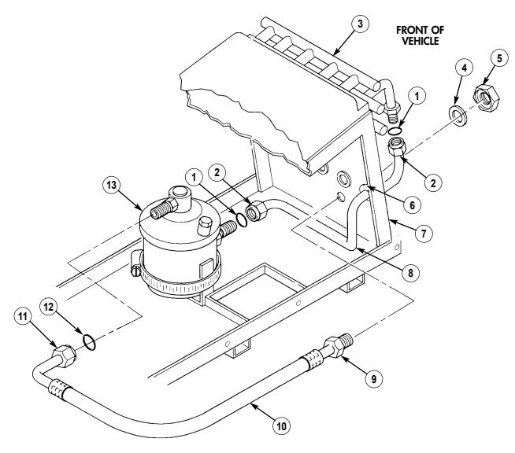

FOLLOW-ON TASKS: - Install A/C condenser (para. 25-18).

-  Charge A/C system (para. 25-15).

# 25-18. A/C Condenser Maintenance

This task covers:

a. Removal b. Installation a.1. Inspection

| Applicable Models   |
|---------------------|

Tools General mechanic's tool kit:
automotive (Appendix B, Item 1)
Automotive maintenance and repair: field maintenance, basic (Appendix B, Item 6)

#### Materials/Parts

Two O-rings (Appendix G, Item 204) Tiedown straps (As required) 
(Appendix G, Item 324)
Refrigerant oil (Appendix C, Item 48) Sealing compound (Appendix C, Item 63)
Manual References TM 9-2320-387-10 TM 9-2320-387-24P
Equipment Condition
- Battery ground cables disconnected (para. 4-68). - A/C system discharged (para. 25-15).

Maintenance Level Direct support

#### A. Removal

1. Remove tiedown straps (1), as required, from A/C wiring harness (3) and condenser fan grille (2). 2. Disconnect two condenser fan connectors (4) from A/C wiring harness connectors (5).

7. Remove A/C condenser (6) from wheelwell (8) and vehicle.

a.1. Inspection Refer to para. 10-56 for plusnut (18) inspection and replacement.

b. Installation 1. Position A/C condenser (6) on wheelwell (8). 2. Apply refrigerant oil to O-ring (15), and install O-ring (15) on supply line (17). 3. Install supply line (17) on A/C condenser (6) and tighten nut (16) to 18 lb-ft (24 N•m). 4. Apply refrigerant oil to O-ring (14), and install O-ring (14) on return line (13). 5. Install return line (13) on bulkhead fitting (11) and tighten nut (12) to 12 lb-ft (16 N•m). 6. Apply sealing compound to threads of four capscrews (10). 7. Install A/C condenser (6) on wheelwell (8) and secure with four capscrews (10) and washers (9).

Tighten capscrews (10) to 6 lb-ft (8 N•m).

8. Route A/C wiring harness (3) over front of A/C condenser (6) and connect two A/C wiring harness connectors (5) to condenser fan connectors (4).

9. Secure A/C wiring harness (3) to condenser fan grille (2) with tiedown straps (1), as required.

3. Remove four capscrews (10) and washers (9) from wheelwell (8) and condenser tray (7). 4. Slide A/C condenser (6) off wheelwell (8) to access return line (13) and supply line (17) connectors. 5. Loosen nut (12) and remove return line (13) and O-ring (14) from bulkhead fitting (11). Discard O-ring (14).

6. Loosen nut (16) and remove supply line (17) and O-ring (15) from A/C condenser (6). Discard O-ring (15).

# 25-18.  A/C Condenser Maintenance (Cont'D)

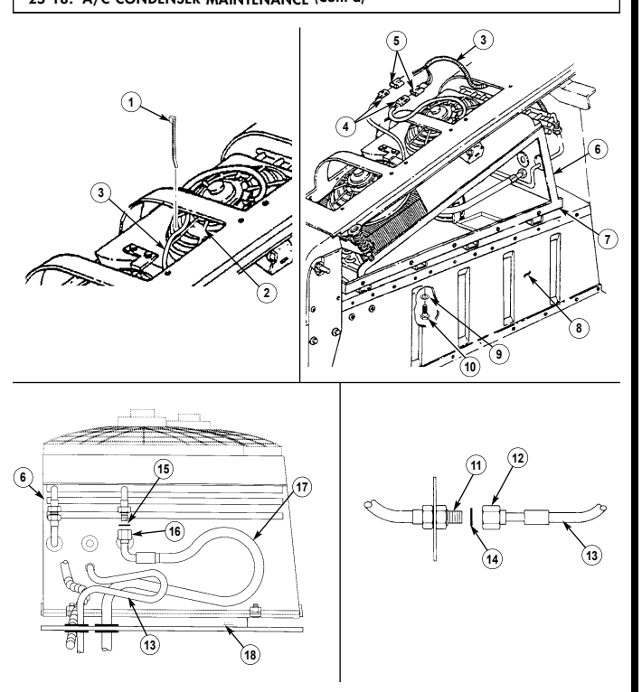

FOLLOW-ON TASKS: - • Connect battery ground cables (para. 4-68).
- • - Charge A/C system (para. - Charge A/C system (para. 25-15).

| a. Removal                                                   | b. Installation      |
|--------------------------------------------------------------|----------------------|
| INITIAL SETUP:                                               |                      |
| Applicable Models                                            | Manual References    |
| M1114, M1151, M1151A1                                        | TM 9\-2320\-387\-24P |
| Tools                                                        | Maintenance Level    |
| General mechanic's tool kit: automotive (Appendix B, Item 1) | Direct support       |
| Materials/Parts                                              |                      |
| Eleven locknuts (Appendix G, Item 114.1)                     |                      |
| Two rivets (Appendix G, Item 270.2)                          |                      |

# 1 2519. A/C Condenser Fan And Shroud Replacement I

1. Remove five capscrews (8) from shroud (9) and A/C condenser (10). 

2. Remove four nuts (17), capscrews (11, capscrews (5), and fan (4) from shroud (9) and AK 
condenser (10). 

3. Remove eight nuts (6), capscrews (111, and fan (7) from shroud (9). 

4. Remove four nuts (21, capscrews (3), and brackets (18) from fan (4). 

5. Remove six capscrews (12) and bracket (13) from A/C condenser (10). 

6. Loosen clamp (15) and remove drain hose (16) from condenser tray (141. 

#### 71

1. Install bracket (13) on A/C condenser (10) with six capscrews (12). 

2. Install four brackets (18) on fan (4) with four capscrews (3) and nuts (2). 

3. Install fan (7) on shroud (9) with eight capscrews (11) and nuts (6). 4. Install fan (4) on shroud (9) with four capscrews (5). 

5. Secure fan (4) to A/C condenser (10) with four capscrews (1) and nuts (17). 

6. Install shroud (9) on NC condenser (10) with five screws (8). 7. Install drain hose (16) on condenser tray (14) and tighten clamp (15). 

# 25-19. A/C Condenser Fan And Shroud Replacement (Cont'D)

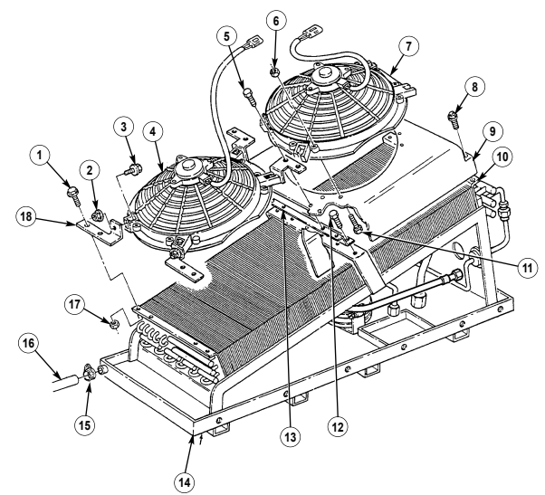

FOLLOW-ON TASK:   Install A/C condenser (para. 25-18).

# 25-20. A/C Compressor Replacement

This task covers:
INITIAL SETUP:

| General mechanic's tool kit:   |
|--------------------------------|

| Applicable Models   |
|---------------------|

M1114 automotive (Appendix B, Item 1)
Maintenance and repair shop equipment:
automotive (Appendix B, Item 2)

#### Materials/Parts

Seal washer (Appendix G, Item 306) Seal washer (Appendix G, Item 307) Six lockwashers (Appendix G, Item 138)

#### A. Removal

a. Removal **b. Installation**

| Manual References    |
|----------------------|
| TM 9\-2320\-387\-24P |

#### Equipment Condition

- Battery ground cables disconnected (para. 4-68).

- Serpentine belt removed (para. 3-81).

- Air horn-to-air cleaner elbow removed (para. 3-15).

- A/C system discharged (para. 25-15).

Maintenance Level Direct support 1. Disconnect body wiring harness lead (1) from A/C compressor lead (6). 2. Remove A/C compressor lead connector (6.1) from A/C compressor lead (6) 3. Remove nut (9.1), lockwasher (10), screw (7), and spacer (8) from A/C compressor (5). Discard lockwasher (10).

4. Remove capscrew (2), compressor manifold (3), seal washer (4), and seal washer (3.1) from A/C
compressor (5). Discard seal washer (4) and seal washer (3.1).

5. Remove two nuts (11), lockwashers (10), capscrews (12.1), and A/C compressor (5) from idler bracket (12) and bracket (9). Discard lockwashers (10).

Perform step 5 for vehicles with serial numbers 196901 and above.

6. Remove three nuts (11), lockwashers (10), washers (13), screws (7), washers (13), and A/C
compressor (5) from idler bracket (12). Discard lockwashers (10).

#### B. Installation

1. Install A/C compressor (5) on bracket (9) and idler bracket (12) with two capscrews (12.1),
lockwashers (10), and nuts (11). Do not tighten nuts (11).

Perform step 2 for vehicles with serial numbers 196901 and above.

2. Install A/C compressor (5) on idler bracket (12) with three washers (13), screws (7), washers (13),
lockwashers (10), and nuts (11). Do not tighten nuts (11).

3. Install seal washer (4) and seal washer (3.1) on compressor manifold (3). 4. Install compressor manifold (3) on A/C compressor (5) with capscrew (2). Tighten capscrew (2) to 18 lb-ft (24.4 N•m).

5. Install spacer (8) between A/C compressor (5) and bracket (9) with capscrew (7), lockwasher (10), and nut (9.1).

6. Install A/C compressor lead (6) through wire protector (12.2). 7. Install A/C compressor lead connector (6.1) to A/C compressor lead (6). 8. Connect body wiring harness lead (1) to A/C compressor lead (6). 9. Tighten nuts (11) to 33-41 lb-ft. (45-56 N•m).

# 25-20. A/C Compressor Replacement (Cont'D)

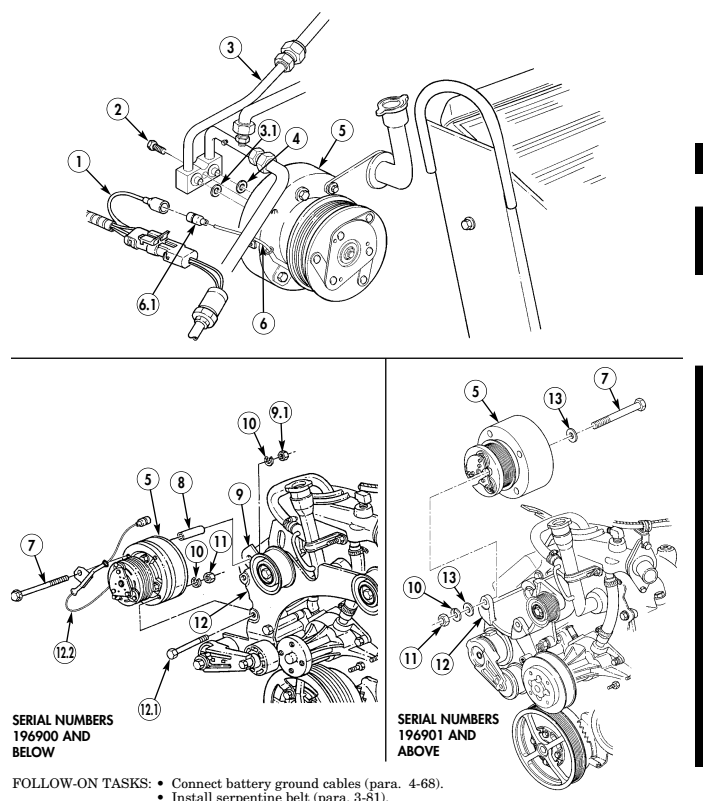

- Install serpentine belt (para. 3-81). - Charge A/C system (para. 25-15). - Install air horn-to-air cleaner elbow (para. 3-15).

# 25-20.1. A/C Compressor Manifold Replacement

This task covers:
INITIAL SETUP:
Applicable Models M1114 Tools General mechanic's tool kit:
automotive (Appendix B, Item 1)
Automotive maintenance and repair: field maintenance, basic (Appendix B, Item 6)

#### Materials/Parts

Three O-rings (Appendix G, Item 204) Seal washer (Appendix G, Item 306) Seal washer (Appendix G, Item 307) Refrigerant oil (Appendix C, Item 48)

#### A. Removal **B. Installation** Manual References

TM 9-2320-387-24P

#### Equipment Condition

- Battery ground cables disconnected (para. 4-68).

- A/C system discharged (para. 25-15). - Air horn-to-air cleaner elbow removed
(para. 3-15).

Maintenance Level Direct support

Use a wrench to hold the A/C compressor manifold nut stationary while loosening the A/C hose fitting.

#### A. Removal

1. Disconnect high-pressure hose (5) from manifold tube (3). 2. Disconnect high-pressure hose (6) from manifold tube (7). 3. Disconnect high-pressure hose (8) from manifold tube (7). 4. Remove three O-rings (4) from manifold tubes (3) and (7). Discard O-rings (4). 5. Remove capscrew (1), A/C manifold (12), seal washer (11), and seal washer (10) from A/C
compressor (9). Discard seal washer (10) and seal washer (11).

#### B. Installation

1. Install seal washer (10) and seal washer (11) on A/C manifold (12). 2. Install A/C manifold (12) on A/C compressor (9) with capscrew (1). Tighten capscrew (1) to 18 lb-ft
(24.4. N•m).

3. Apply refrigerant oil to O-ring (4), and install on high-pressure hose (5). 4. Connect high-pressure hose (5) to manifold tube (3). 5. Apply refrigerant oil to O-ring (4), and install on high-pressure hose (6). 6. Connect high-pressure hose (6) to manifold tube (7). 7. Apply refrigerant oil to O-ring (4), and install on high-pressure hose (8). 8. Connect high-pressure hose (8) to manifold tube (7).

# 25-20.1. A/C Compressor Manifold Replacement (Cont'D)

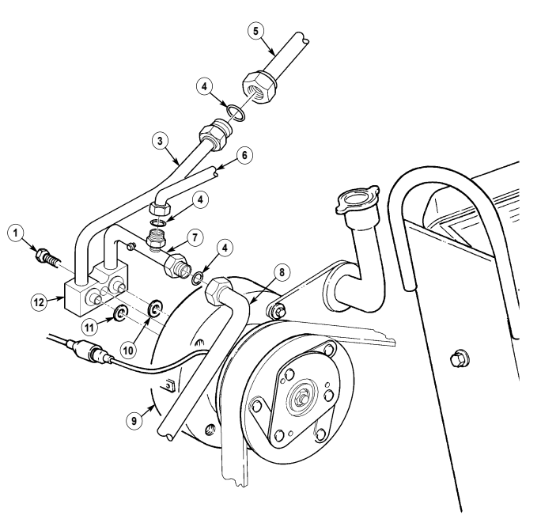

FOLLOW-ON TASKS: -  Connect battery ground cables (para.  4-68).
- FOLLOW-ON TASKS: -  - Charge A/C system (para. 25-15).
- •  -  -   

# 25-21. A/C Heater/Evaporator Assembly (Front) Replacement

This task covers:
INITIAL SETUP:
Applicable Models

| Tools   |
|---------|

M1114 General mechanic's tool kit:
automotive (Appendix B, Item 1)
Materials/Parts Lockwasher (Appendix G, Item 140)
Personnel Required One mechanic One assistant a. Removal

a. Removal b. Installation

Equipment Condition

| Equipment Condition   |
|-----------------------|

- Air cleaner removed (para 3-12). - Air distribution duct removed (para. 11-81). - A/C system discharged (para. 25-15). - Cooling system drained (para. 3-61).

Maintenance Level Direct support

Prior to removal, tag leads for installation.

1. Remove four nuts (13) and cover (12) from heater/evaporator assembly (11). 2. Disconnect three relay connectors (4) from relays (6). 3. Remove screw (20), lockwasher (19), washer (18), vehicle ground lead (17), A/C ground lead (16),
A/C control module ground lead (15), and blower motor ground lead (14) from side of heater/evaporator assembly (11). Discard lockwasher (19).

4. Disconnect two leads (3) from circuit breaker (5). 5. Disconnect two A/C control module leads (1) from A/C wiring harness leads (2). 6. Remove nut (10), screw (7), and air vent control cable (9) from cable (8). 7. Remove two harness leads (28) from heater/evaporator thermostat (29).

Use a container to catch antifreeze solution.

8. Loosen four clamps (21) and disconnect heater hoses (34) from body (22) and heater/evaporator assembly (11).

9. Disconnect low-pressure tube (26) from heater/evaporator assembly (11).

10. Disconnect high-pressure tube (25) from heater/evaporator assembly (11). 11. Loosen clamp (31) and remove drain hose (30) from heater/evaporator assembly (11). 12. Remove two capscrews (33) and washers (32) from heater/evaporator assembly (11). 13. Remove two nuts (23), washers (24), and spacers (27) from heater/evaporator assembly (11). 14. Remove blower motor switch connector (35) from A/C wiring harness connector (38) and blower motor fan connector (36) from vehicle wiring harness connector (37).

15. Remove heater/evaporator assembly (11) from body (22).

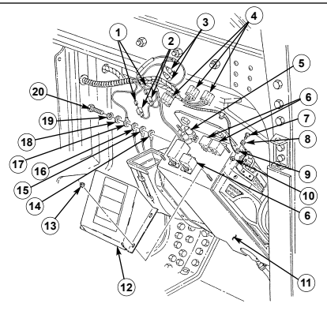

25-21. A/C HEATER/EVAPORATOR ASSEMBLY (FRONT) REPLACEMENT (Cont'd)

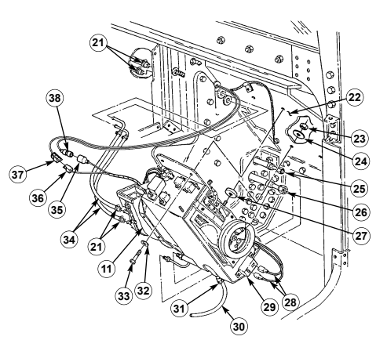

# 25-21. A/C Heater/Evaporator Assembly (Front) Replacement (Cont'D)

b. Installation 1. Install heater/evaporator assembly (14) on body (2) with two spacers (7), washers (4), and nuts (3). 2. Install two washers (12) and capscrews (13) on heater/evaporator assembly (14) and body (2). 3. Install blower motor switch connector (17) to A/C wiring harness connector (18) and blower motor fan connector (16) to vehicle wiring harness connector (19).

4. Install drain hose (10) on heater/evaporator assembly (14) and tighten clamp (11). 5. Connect high-pressure tube (5) to heater/evaporator assembly (14). 6. Connect low-pressure tube (6) to heater/evaporator assembly (14). 7. Connect two heater hoses (15) to heater/evaporator assembly (14) and body (2) and tighten four clamps (1).

10. Connect two A/C control module leads (20) to A/C wiring harness leads (21). 11. Connect two leads (22) to circuit breaker (24). 12. Install blower motor ground lead (32), A/C control module ground lead (33), A/C ground lead (34),
and vehicle ground lead (35) to side of heater/evaporator assembly (14) with washer (36), lockwasher (37), and screw (38).

13. Connect three relay connectors (23) to relays (25). 14. Install cover (30) on heater/evaporator assembly (14) with four nuts (31).

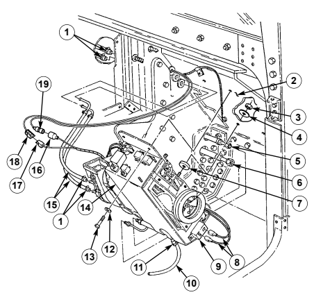

8. Connect two harness leads (8) to heater/evaporator assembly thermostat (9). 9. Connect air vent control cable (28) to cable (27) with screw (26) and nut (29).

# 25-21. A/C Heater/Evaporator Assembly (Front) Replacement (Cont'D)

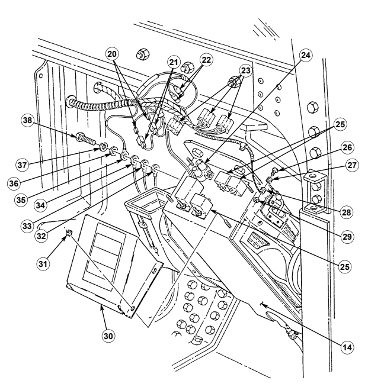

FOLLOW-ON TASKS: - Fill cooling system (para. 3-61).

- Charge A/C system (para. 25-15). - Install air distribution duct (para. 11-81). - Install air cleaner (para. 3-12).

# 25-22. A/C Evaporator Assembly (Rear) Maintenance

This task covers:

a. Removal b. Installation a.1.Inspection

| Applicable Models   |
|---------------------|
| M1114               |

Tools General mechanic's tool kit:
automotive (Appendix B, Item 1)
Automotive maintenance and repair: field maintenance, basic (Appendix B, Item 6)

#### Materials/Parts

O-ring (Appendix G, Item 204) O-ring (Appendix G, Item 206) Refrigerant oil (Appendix C, Item 48) Sealing compound (Appendix C, Item 63)

#### Manual References

TM 9-2320-387-10 TM 9-2320-387-24P
Equipment Condition
- Battery ground cables disconnected (para. 4-68). - Cargo door opened (TM 9-2320-387-10). - A/C system purged (para. 25-15). - Left passenger seat removed (para. 10-45).

Maintenance Level Direct support

#### A. Removal

1. Disconnect A/C wiring harness connector (14) from evaporator connector (10). 2. Loosen nut (12) and remove rear suction tube (18) and O-ring (13) from evaporator connector (11).

Discard O-ring (13).

3. Loosen nut (16) and remove rear liquid tube (17) and O-ring (15) from evaporator connector (7).

Discard O-ring (15).

4. Remove four capscrews (5), washers (4), and evaporator (1) from brackets (2) and (3). 5. Loosen clamp (9) and remove drain hose (8) from evaporator (1).

#### A.1. Inspection

Refer to para. 10-56 for plusnut (6) inspection and replacement.

#### B. Installation

1. Install drain hose (8) on evaporator (1) and tighten clamp (9). 2. Apply sealing compound to threads of four capscrews (5), and install evaporator (1) on brackets (2)
and (3) with four washers (4) and capscrews (5). Tighten capscrews (5) to 6 lb-ft (8 N•m).

3. Lubricate O-rings (13) and (15) with refrigerant oil. 4. Install O-ring (15) and rear liquid tube (17) on evaporator connector (7) and tighten nut (16) to 12 lb-ft (16 N•m).

5. Install O-ring (13) and rear suction tube (18) on evaporator connector (11) and tighten nut (12) to 24 lb-ft (32 N•m).

6. Connect A/C wiring harness connector (14) to evaporator connector (10).

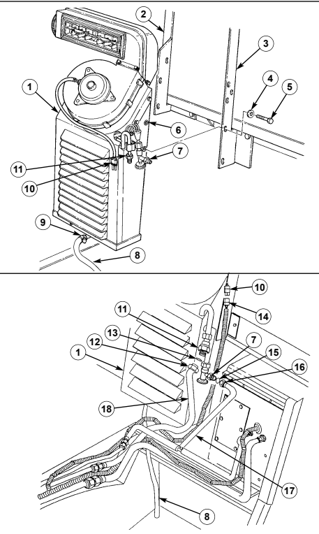

# 25-22. A/C Evaporator Assembly (Rear) Maintenance **(Cont'D)**

FOLLOW-ON TASKS: - Charge A/C system (para. 25-15).

- Connect battery ground cables (para. 4-68). - Start vehicle, run A/C system, and check for leaks (TM 9-2320-387-10). - Close rear cargo door (TM 9-2320-387-10). - Install left passenger seat (para. 10-45).

# 25-23. A/C Trinary Switch Replacement

This task covers:
INITIAL SETUP:

| Applicable Models               |
|---------------------------------|
| M1114                           |
| Tools                           |
| General mechanic's tool kit:    |
| automotive (Appendix B, Item 1) |

Materials/Parts O-ring (Appendix G, Item 205) Refrigerant oil (Appendix C, Item 48)

| Manual References                                 |
|---------------------------------------------------|
| TM 9\-2320\-387\-24P                              |
| Equipment Condition                               |
| Battery ground cables disconnected (para. 4\-68). |
| Maintenance Level                                 |
| Direct support                                    |

a. Removal **b. Installation**

a. Removal 1. Disconnect two wiring harness connectors (2) from trinary switch (1). 2. Remove trinary switch (1) from receiver/dryer (4). 3. Remove O-ring (3) from trinary switch (1). Discard O-ring (3).

b. Installation 1. Lubricate O-ring (3) with refrigerant oil and install on trinary switch (1). 2. Install trinary switch (1) on receiver/dryer (4). 3. Connect two wiring harness connectors (2) to trinary switch (1).

# 25-23.  A/C Trinary Switch Replacement (Cont'D)

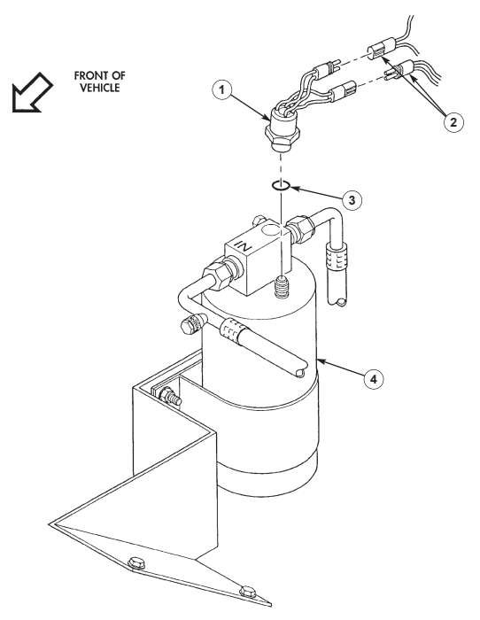

FOLLOW-ON TASKS:  Connect battery ground cables (para. 4-68).

## 25-24. A/C Thermostat Replacement _ I

This task covers: 
a. Removal INITIAL SETUP: 
Applicable Models Ml114 Tools General mechanic's tool kit: 
automotive (Appendix B, Item 1) 
Manual References TM 9-2320-387-24P 
b. Installation Equipment Condition AK heater/evaporator assembly removed (para. 25-21). 

Maintenance Level Direct support 71 1. Disconnect two thermostat wires (4) from thermostat (2). 

2. Remove two screws (3) and thermostat (2) from heater/evaporator assembly (1). 

(b./ 
1. Install thermostat (2) on heater/evaporator assembly (1) with two screws (3). 

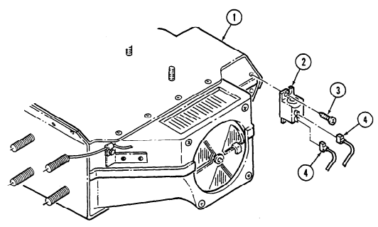

2. Connect two thermostat wires (4) to thermostat (2). 

FOLLOW-ON TASK: Install AIC hea!er/evaporator assembly (para. 25-21). 

25-66 

# 25-25. A/C Blower Motor Replacement

This task covers:
INITIAL SETUP:
Applicable Models

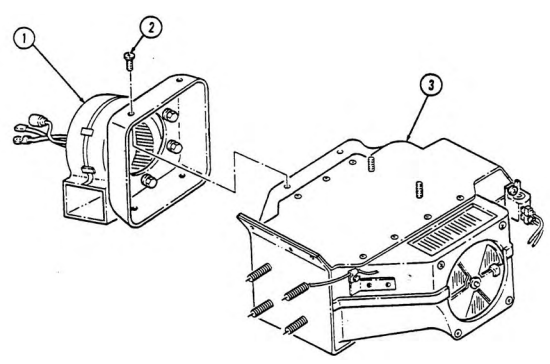

General mechanic's tool kit:
automotive (Appendix B, Item 1)
Manual References TM 9-2320-387-24P
a. Removal b. Installation Equipment Condition A/C heater/evaporator assembly removed (para. 25-21).

Maintenance Level Direct support a. Removal Remove four screws (2) and blower assembly (1) from heater/evaporator assembly (3).

b. Installation Install blower assembly (1) on heater/evaporator assembly (3) with four screws (2).

FOLLOW-ON TASK: Install A/C heater/evaporator assembly (para. 25-21).

# 25-26. A/C Heater/Evaporator Assembly (Front) Maintenance

This task covers:
INITIAL SETUP:
Applicable Models M1114 Tools General mechanic's tool kit:
automotive (Appendix B, Item 1)
Riveter tool kit (Appendix B, Item 123)

#### Materials/Parts

O-ring (Appendix G, Item 204) O-ring (Appendix G, Item 207) O-ring (Appendix G, Item 211) Three rivets (Appendix G, Item 270) Seven rivets (Appendix G, Item 271) RTV sealant (Appendix C, Item 74) Refrigerant oil (Appendix C, Item 48)
a. Disassembly

a. Disassembly b. Assembly

#### Manual References

TM 9-2320-387-24P

#### Equipment Condition

- A/C thermostat removed (para. 25-24). - A/C blower motor removed (para. 25-25).

General Safety Instructions Heater core and evaporator fins are sharp and bend easily. 

Maintenance Level Direct support

#### Warning

Heater core and evaporator fins are sharp and bend easily. Use care when handling to avoid injury to personnel or damage to equipment.

For instructions on replacement of rivets, refer to para. 10-56.

1. Remove three screws (11) and rivets (1) from top mounting bracket (3) and bottom mounting bracket (12).

2. Remove bottom mounting bracket (12) from top mounting bracket (3). 3. Remove seven rivets (2) from top mounting bracket (3) and top case (4) and remove top mounting bracket (3) from case (4).

4. Remove screw (15) and clamp (16) from cable (6) and top case (4). 5. Cut sealant at joint of top case (4) and bottom case (9). 6. Remove ten screws (5) from top case (4) and bottom case (9). 7. Remove sealant from heater core (14) and low-pressure outlet tube (26). 8. Remove top case (4) from bottom case (9). Remove sealant from case joint. 9. Remove heater core (14) from bottom case (9).

10. Remove evaporator (13) from bottom case (9). 11. Remove tube (24) from valve (21). 12. Remove O-ring (25) from tube (24). Discard O-ring (25). 13. Remove bulb clamp (23) from low-pressure outlet tube (26). 14. Disconnect pressure sensor tube (22) from low-pressure outlet tube (26). 15. Remove O-ring (19) from pressure sensor tube (22). Discard O-ring (19). 16. Remove valve (21) and O-ring (20) from evaporator (13). Discard O-ring (20). 17. Remove detent washer (8) and cable (6) from control plate (7). 

# 25-26.  A/C Heater/Evaporator Assembly (Front) Maintenance (Cont'D)

Two screws may be installed in place of two rivets.

18.

Remove two rivets (10) and control plate (7) from bottom case (9).

19.

Remove two capscrews (17) and cable bracket (18) from top case (4).

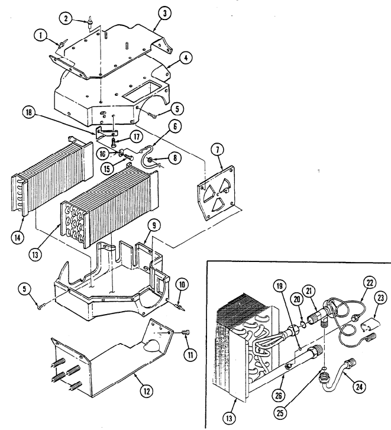

# -1 25-26. A/C Heater/Evaporator Assembly (Front) Maintenance (Cont'D) I

1 b. Assembly ] 
1. Install cable bracket (18) on top case (4) with two capscrews (17). 

2. 

3. 

Two screws may be installed in place of two rivets. 

Install control plate (7) on bottom case (9) with two rivets (10). Install cable (6) on control plate (7) with detent washer (811 4. 

Lubricate O-ring (201 with refrigerant oil and install O-ring (20) and valve (21) on evaporator (13). 

5. 

Lubricate O-ring (191 with refrigerant oil and install on low-pressure outlet tube (26). 

6. 

Connect pressure sensor tube (22) to low-pressure outlet tube (26). 

7. 

Install bulb clamp (23) on low-pressure outlet tube (261 and pressure sensor tube (22). 

Lubricate O-ring (251 with refrigerant oil and install on tube (24). 

8. 

9. 

Install tube (24) on valve (21). 

#### Warning

Heater core and evaporator fins are sharp and bend easily. Use care when handling to avoid injury to personnel or damage to equipment. 

10. Install evaporator (13) on bottom case (9). 

- 11. Install heater core (14) on bottom case (9). 

12. Install top case (4) on bottom case (9) with ten screws (5). 13. Apply sealant to top and bottom of case joint. 

14. Install cable (6) on cable bracket (18) with clamp (16) and screw (15). 

15. Install top mounting bracket (3) on top case (4) with seven rivets (2). 16. Install bottom mounting bracket (12) on top mounting bracket (3) with rivet (1) and three screws (11). 17. Install sealant around heater core (14) and low-pressure outlet tube (26). 

# 25-26.  A/C Heater/Evaporator Assembly (Front) Maintenance (Cont'D)

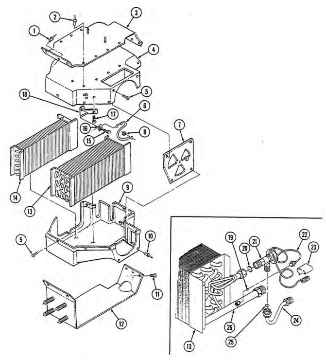

FOLLOW-ON TASKS:  - Install A/C blower motor (para. 25-25).
- Install A/C thermostat (para. 25-24).

# 25-27. A/C Evaporator Assembly (Rear) Maintenance

This task covers:
a. Disassembly **b. Assembly**

| Applicable Models                                                        | Manual References                       |
|--------------------------------------------------------------------------|-----------------------------------------|
| M1114                                                                    | TM 9\-2320\-387\-24P                    |
| Tools                                                                    | Equipment Condition                     |
| General mechanic's tool kit:                                             | - A/C system discharged (para. 25\-15). |
| automotive (Appendix B, Item 1) Automotive maintenance and repair: field | - A/C condenser removed (para. 25\-18). |
| maintenance, basic (Appendix B, Item 6)                                  | Maintenance Level                       |
| Materials/Parts                                                          | Direct support                          |

#### A. Disassembly

1. Remove three screws (7) and drain pan (10) from A/C evaporator (11). 2. Remove insulation packing (8) from expansion valve (9). 3. Remove insulation (6) from rear A/C evaporator cover (4). 4. Remove ten screws (5) and rear A/C evaporator cover (4) from front A/C evaporator cover (12). 5. Remove six screws (13), grille (14), and front A/C evaporator cover (12) from A/C evaporator (11). 6. Remove four screws (3), washers (2), and fan assembly (1) from front A/C evaporator cover (12). 7. Remove expansion valve (9) and O-ring (8.1) from A/C evaporator (11). Discard O-ring (8.1) b. Assembly 1. Lubricate O-ring (8.1) with refrigerant oil and install O-ring (8.1) and expansion valve (9) on A/C
evaporator (11).

2. Install fan assembly (1) on front A/C evaporator cover (12) with four washers (2) and screws (3). 3. Install grille (14) and front A/C evaporator cover (12) on A/C evaporator (11) with six screws (13). 4. Install rear A/C evaporator cover (4) on front A/C evaporator cover (12) with ten screws (5). 5. Install insulation (6) on rear A/C evaporator cover (4). 6. Install insulation packing (8) on expansion valve (9). 7. Install drain pan (10) on evaporator (11) with three screws (7).

# 25-27. A/C Evaporator Assembly (Rear) Maintenance (Cont'D)

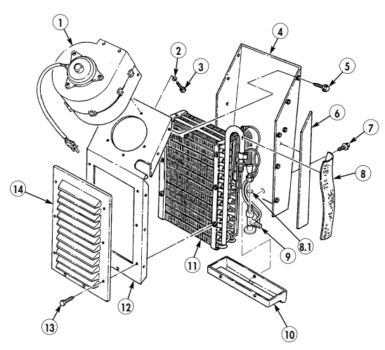

FOLLOW-ON TASK:
 Install A/C evaporator assembly (rear) (para. 25-22).

ಲ್ಲಿ
# 25-28. A/C Condenser Assembly Maintenance

This task covers:
a. Disassembly b. Assembly INITIAL SETUP:
Applicable Models M1114 Tools General mechanic's tool kit:
automotive (Appendix B, Item 1)
Manual References TM 9-2320-387-24P
a. Disassembly Equipment Condition A/C condenser removed (para. 25-18).

| TM 9\-2320\-387\-10   |
|-----------------------|
| TM 9\-2320\-387\-24P  |

1. Remove four nuts (3), washers (4), and A/C condenser brackets (2) and (5) from studs (6) and drain pan (8).

2. Remove twelve screws (7) and A/C condenser (1) from A/C condenser brackets (2) and (5). 3. Remove trim (9) from forward edge of A/C condenser drain pan (8).

#### B. Assembly

1. Install trim (9) on forward edge of A/C condenser drain pan (8).

1.1. Install A/C condenser brackets (2) and (5) on A/C condenser (1) with twelve screws (7).

2. Install A/C condenser brackets (2) and (5) on drain pan (8) and studs (6) with four washers (4) and nuts (3).

# 25-28.  A/C Condenser Assembly Maintenance (Cont'D)

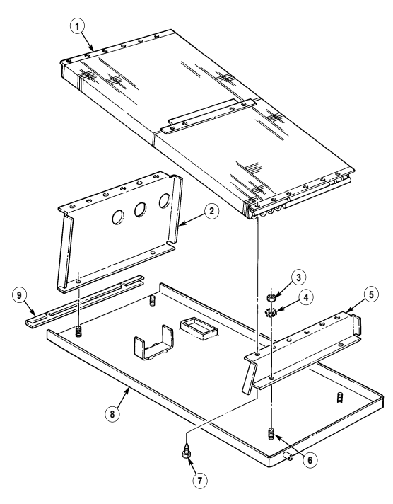

FOLLOW-ON TASK:  Install A/C condenser (para. 25-18).

# 25-29. A/C Evaporator (Rear) Supply And Return Line Replacement

This task covers:

a. Removal b. Installation

| INITIAL SETUP:                                                        |                                    |
|-----------------------------------------------------------------------|------------------------------------|
| Applicable Models                                                     | Manual References                  |
| Ml114                                                                 | TM 9\-2320\-387\-24B               |
| Tools   Equipment                                                     | Condition                          |
| General mechanic's tool kit:                                          | A/C condenser removed (para. 25\-W |
| automotive (Appendix B, Item 1)                                       | Maintenance Level                  |
| Direct support                                                        |                                    |
| 1.  Remove five capscrews (8) from shroud (9) and A/C condenser (10). |                                    |

#### A. Removal B. Installation

8. Install two O-rings (3) and rear liquid tube (10) on evaporator connector (2) and bulkhead fitting (5). Tighten nuts (4) to 12 lb-ft (16 N•m).

9. Install O-ring (19) and hose assembly (17) on rear liquid tube (10). Tighten nut (18) to 12 lb-ft
(16 N•m).

1. Loosen nut (18), disconnect hose assembly (17) from rear liquid tube (10), and remove O-ring (19).

Discard O-ring (19).

2. Loosen two nuts (4) and remove rear liquid tube (10) and two O-rings (3) from evaporator connector
(2) and bulkhead fitting (5). Discard O-rings (3).

3. Loosen nut (12), disconnect hose assembly (13) from rear discharge tube (9), and remove O-ring (11). Discard O-ring (11).

4. Loosen nut (8) and remove rear discharge tube (9) and O-ring (7) from bulkhead fitting (6). Discard O-ring (7).

5. Loosen nut (15), disconnect hose (14) from rear suction tube (20), and remove O-ring (16). Discard O-ring (16).

6. Loosen nut (21) and remove rear suction tube (20) and O-ring (22) from evaporator connector (1).

Discard O-ring (22).

1. Lubricate O-rings (16) and (22) with refrigerant oil. 2. Install O-ring (22) and rear suction tube (20) on evaporator connector (1). Tighten nut (21) to 24 lb-ft (33 N•m).

3. Install O-ring (16) and hose (14) on rear suction tube (20). Tighten nut (15) to 24 lb-ft (33 N•m). 4. Lubricate O-rings (7) and (11) with refrigerant oil. 5. Install O-ring (7) and rear discharge tube (9) on bulkhead fitting (6). Tighten nut (8) to 18 lb-ft
(24 N•m).

6. Install O-ring (11) and hose assembly (13) on rear discharge tube (9). Tighten nut (12) to 18 lb-ft
(24 N•m).

7. Lubricate two O-rings (3) and O-ring (19) with refrigerant oil.

# 25-29. A/C Evaporator (Rear) Supply And Return Line Replacement **(Cont'D)**

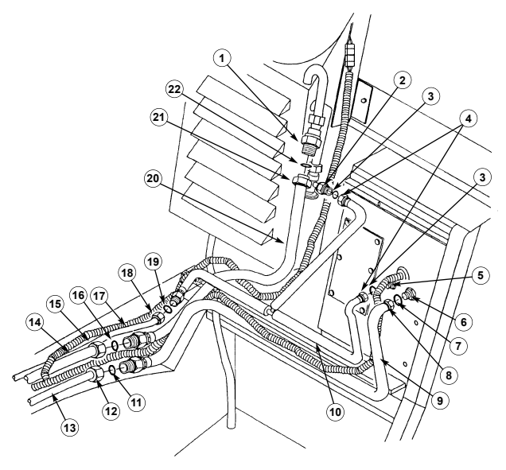

FOLLOW-ON TASKS: - Charge A/C system (para. 25-15).

- Install A/C coolant line rear B-piller cover and left rear HVAC lines covers
(para. 25-32).

- Install left passenger seat (para. 10-45).

# 25-30. A/C Compressor Hose Assembly Maintenance

This task covers:

a. Removal c. Installation a.1. Inspection

Applicable Models M1114 Tools General mechanic's tool kit:
automotive (Appendix B, Item 1)
Automotive maintenance and repair: field maintenance, basic (Appendix B, Item 6)
Materials/Parts Six O-rings (Appendix G, Item 206) Tiedown straps (as required) 
(Appendix G, Item 323)
Refrigerant oil (Appendix C, Item 48) Sealing compound (Appendix C, Item 63)
Manual References TM 9-2320-387-24P
Equipment Condition
- Air horn-to-air cleaner elbow removed (para. 3-15). - A/C system discharged (para. 25-15). - A/C coolant line covers removed (para. 25-32).

Maintenance Level Direct support

#### A. Removal

1. Loosen two nuts (4) and remove low-pressure hose (6) and two O-rings (3) from compressor manifold (8) and evaporator tube (7). Discard O-rings (3).

2. Loosen two nuts (1) and remove hose (12) and two O-rings (2) from compressor manifold (8) and rear suction tube (19). Discard O-rings (2).

3. Loosen two nuts (10) and remove hose assembly (11) and two O-rings (9) from compressor manifold (8) and rear discharge tube (20). Discard O-rings (9).

4. Remove tiedown straps (16), as required, from hose (12), hose assemblies (11) and (5), and A/C
wiring harness (15) in engine compartment.

5. Remove capscrew (13), washer (18), and clamp (14) from clamping bracket (17). 6. Remove tiedown straps (16), as required, from hose (12), hose assemblies (11) and (5), and A/C
wiring harness (15) at left side tunnel (21).

7. Remove two capscrews (27) and washers (28) securing clamps (29) to left side tunnel (21). 8. Remove hose (12) and hose assembly (11) from two clamps (29) at left side tunnel (21). 9. Remove two screws (24), screw (25), and CTIS cover (23) from vehicle body (26).

10. Route hose (12) and hose assembly (11) forward through CTIS cover grommets (22) and up into engine compartment. Remove hose (12) and hose assembly (11) from vehicle.

a.1. Inspection Refer to para. 10-56 for plusnut (31) inspection and replacement.

# 25-30. A/C Compressor Hose Assembly Maintenance (Cont'D)

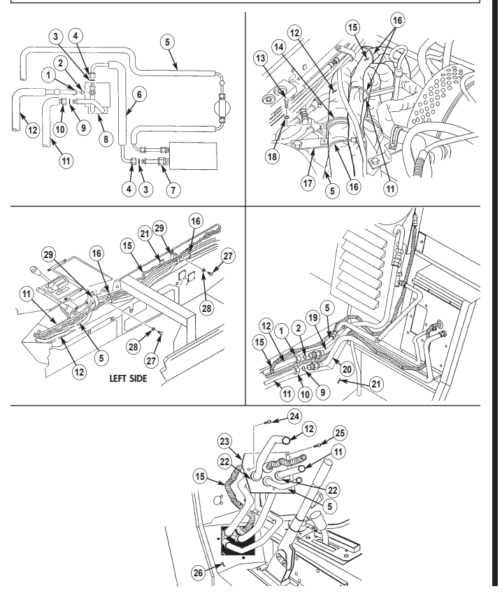

# 25-30. A/C Compressor Hose Assembly Maintenance (Cont'D)

b. Installation 1. Lubricate O-ring (9) with refrigerant oil, and install on hose assembly (11). 2. Connect hose assembly (11) to compressor manifold (8) and tighten nut (10) to 18 lb-ft (24 N•m). 3. Lubricate O-ring (2) with refrigerant oil, and install on hose (12). 4. Connect hose (12) to compressor manifold (8) and tighten nut (1) to 24 lb-ft (33 N•m). 5. Route hose (12) and hose assembly (11) across engine compartment and over upper oil dipstick support bracket (17).

6. Continue routing hose (12) and hose assembly (11) under vehicle and through CTIS cover grommets (23).

7. Pull hose (12), hose assemblies (11) and (5), and A/C wiring harness (15) rearward and slide CTIS
cover (24) forward until foil insulation (28) contacts CTIS cover (24). Foil insulation (29) on A/C wiring harness (15) should extend through CTIS cover (24) approximately 1-in. (2.5 cm).

8. Install CTIS cover (24) on vehicle body (27) with two screws (25) and screw (26). 9. Continue routing hose (12) and hose assembly (11) along left side tunnel (22).

10. Lubricate O-ring (9) with refrigerant oil, and install on hose assembly (11). 11. Connect hose assembly (11) to rear discharge tube (21) and tighten nut (10) to 18 lb-ft (24 N•m). 12. Lubricate O-ring (2) with refrigerant oil, and install on hose (12). 13. Connect hose (12) to rear suction tube (20) and tighten nut (1) to 24 lb-ft (33 N•m). 14. Install two clamps (30) around hose (12) and hose assemblies (11) and (5). 15. Apply sealing compound to threads of two capscrews (31). 16. Secure two clamps (30) to left side tunnel (22) with washers (32) and capscrews (31) and tighten capscrews (31) to 6 lb-ft (8 N•m).

17. Install clamp (14) around hose (12) and hose assemblies (11) and (5) in engine compartment. 18. Apply sealing compound to threads of capscrew (13). 19. Secure clamp (14) to clamping bracket (18) with washer (19) and capscrew (13) and tighten capscrew (13) to 10-lb-ft (14 N•m).

20. Lubricate two O-rings (3) with refrigerant oil, and install on low-pressure hose (6). 21. Connect low-pressure hose (6) to compressor manifold (8) and evaporator tube (7) and tighten nuts (4) to 18 lb-ft (24 N•m).

22. Secure hose (12), hose assemblies (11) and (5), and A/C wiring harness (15) in engine compartment with tiedown straps (16), as required.

23. Secure hose (12), hose assemblies (11) and (5), and A/C wiring harness (15) along left side tunnel (22) with tiedown straps (16), as required.

# 25-30. A/C Compressor Hose Assembly Maintenance (Cont'D)

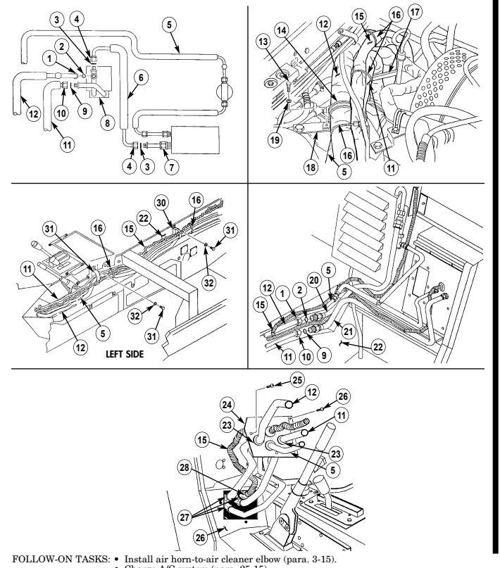

- Charge A/C system (para. 25-15). - Install A/C coolant line covers (para. 25-32).

# 25-31. A/C Pressure Hoses Maintenance

This task covers:

a. Removal **b. Installation** a.1.Inspection

Applicable Models

| Applicable Models   |
|---------------------|
| M1114               |

Tools General mechanic's tool kit:
automotive (Appendix B, Item 1)
Automotive maintenance and repair: field maintenance, basic (Appendix B, Item 6)

#### Materials/Parts

Four O-rings (Appendix G, Item 204) Tiedown straps (as required) 
(Appendix G, Item 323)
Refrigerant oil (Appendix C, Item 48) Sealing compound (Appendix C, Item 63)
Manual References TM 9-2320-387-24P
Equipment Condition
- Air horn-to-air cleaner elbow removed
(para. 3-15).

- A/C system discharged (para. 25-15). - A/C coolant line covers removed (para. 25-32).

Maintenance Level Direct support

#### A. Removal

1. Loosen two nuts (6) and remove high-pressure hose (8) and two O-rings (5) from front receiver/
dryer (4) and evaporator tube (7). Discard O-rings (5).

2. Loosen two nuts (2) and remove high-pressure hose (1) and two O-rings (3) from front receiver/
dryer (4) and rear liquid tube (17). Discard O-rings (3).

3. Remove tiedown straps (14), as required, from hose (10), hose assembly (9), high-pressure hose (1),
and A/C wiring harness (13) in engine compartment.

4. Remove capscrew (11), washer (16), and clamp (12) from clamping bracket (15). 5. Remove tiedown straps (14), as required, from hose (10), hose assembly (9), high-pressure hose (1).

and A/C wiring harnes (13) at left side tunnel (18).

6. Remove two capscrews (28) and washers (29) securing clamps (26) to left side tunnel (18). 7. Remove high-pressure hose (1) from two clamps (26) at left side tunnel (18). 8. Remove two screws (21), screw (22), and CTIS cover (20) from vehicle body (23). 9. Route high-pressure hose (1) forward through CTIS cover grommet (19) and up into engine compartment. Remove high-pressure hose (1) from vehicle.

a.1. Inspection Refer to para. 10-56 for plusnut (27) inspection and replacement.

# 25-31.  A/C Pressure Hoses Maintenance (Cont'D)

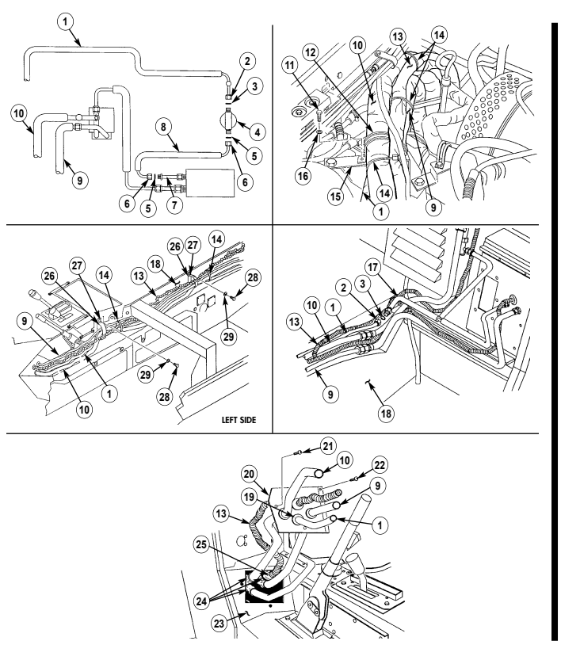

minimum ma

## 25-31. A/C Pressure Hoses Maintenance **(Cont'D)**

#### B. Installation

1. Lubricate O-ring (3) with refrigerant oil, and install on high-pressure hose (1). 2. Connect high-pressure hose (1) to front receiver/dryer (4) and tighten nut (2) to 12 lb-ft (16 N•m). 3. Route high-pressure hose (1) across engine compartment and over upper oil dipstick support bracket (15).

4. Continue routing high-pressure hose (1) under vehicle and through CTIS cover grommet (20). 5. Pull hose (10), hose assembly (9), high-pressure hose (1), and A/C wiring harness (13) rearward and slide CTIS cover (21) forward until foil insulation (25) contacts CTIS cover (21). Foil insulation (26) on A/C wiring harness (13) should extend through CTIS cover (21) approximately 1-in. (2.5 cm).

6. Install CTIS cover (21) on vehicle body (24) and secure with two screws (22) and screw (23). 7. Continue routing high-pressure hose (1) along left side tunnel (19). 8. Lubricate O-ring (3) with refrigerant oil, and install on high-pressure hose assembly (1). 9. Connect high-pressure hose assembly (1) to rear liquid tube (18) and tighten nut (2) to 12 lb-ft
(16 N•m).

10. Install two clamps (27) around hose (10), hose assembly (9), and high-pressure hose (1). 11. Apply sealing compound to threads of two capscrews (28), and secure two clamps (27) to left side tunnel (19) with two washers (29) and capscrews (28) and tighten capscrews (28) to 6 lb-ft (8 N•m).

12. Install clamp (12) around hose (10), hose assembly (9), and high-pressure hose (1) in engine compartment.

13. Apply sealing compound to threads of capscrew (11) and secure clamp (12) to clamping bracket (16)
with washer (17) and capscrew (11) and tighten capscrew (11) to 10 lb-ft (14 N•m).

14. Lubricate two O-rings (5) with refrigerant oil and install on high-pressure hose (8). 15. Connect high-pressure hose (8) to front receiver/dryer (4) and evaporator tube (7) and tighten nuts (6) to 18 lb-ft (24 N•m).

16. Secure hose (10), hose assembly (9), high-pressure hose (1), and A/C wiring harness (13) in engine compartment with tiedown straps (14), as required.

17. Secure hose (10), hose assembly (9), high-pressure hose (1), and A/C wiring harness (13) along left side tunnel (19) with tiedown straps (14), as required.

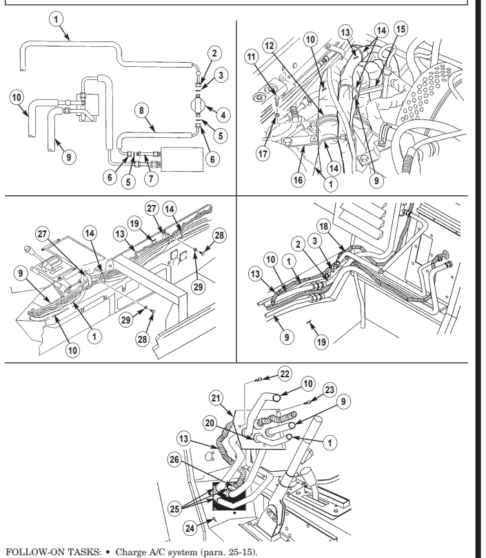

# 25-31. A/C Pressure Hoses Maintenance (Cont'D)

· Install A/C coolant line covers (para.25-32).

- Install air horn-to-air cleaner elbow (dryer-to-heater/evaporator assembly only)
(para. 3-15).

# 25-32. A/C Coolant Line Covers Maintenance

This task covers:

a. Removal **c. Installation** b. Inspection

Applicable Models M1114 Tools General mechanic's tool kit:
automotive (Appendix B, Item 1)
Automotive maintenance and repair: field maintenance, basic (Appendix B, Item 6)
Materials/Parts Sealing compound (Appendix C, Item 72.1)
a. Removal b. Inspection Refer to para. 10-56 for plusnuts (10), (13), and (16) inspection and replacement.

Manual References TM 9-2320-387-24P
Equipment Condition
- Left passenger seat removed (para. 10-45). - Driver's seat assembly removed (para. 10-40).

Maintenance Level Direct support 1. Remove four capscrews (5) and washers (6) from A/C coolant line front cover (7) at left side tunnel (1).

2. Remove two capscrews (4) and washers (3) from mounting angle (2) at left side tunnel (1). 3. Remove A/C coolant line front cover (7) with mounting angle (2) from left side tunnel (1). 4. Remove two screws (8), washers (9), and mounting angle (2) from A/C coolant line front cover (7). 5. Remove four capscrews (20), washers (21), and A/C coolant line rear B-pillar cover (22) from left side tunnel (1).

6. Remove three capscrews (18), washers (19), and left rear HVAC lines cover (17) from left side rear tunnel (1).

7. Remove two screws (14), washers (15), and left rear HVAC lines cover (11) from left rear wheelhouse (12).

# 25-32.  A/C Coolant Line Covers Maintenance (Cont'D)

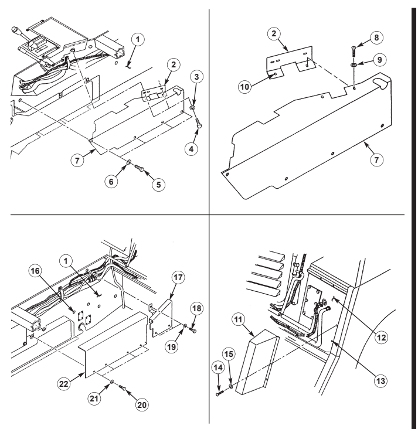

## 25-32. A/C Coolant Line Covers Maintenance (Cont'D)

c. Installation 1. Apply sealing compound to threads of two screws (3), and install left rear HVAC lines cover (1) on left rear wheelhouse (2) with two washers (4) and capscrews (3). Tighten capscrews (3) to 36 lb-in. (4 N•m).

2. Apply sealing compound to threads of three capscrews (7), and install left rear HVAC lines cover
(6) on left side tunnel (5) with three washers (8) and capscrews (7). Tighten capscrews (7) to 6 lb-ft (8 N•m).

3. Apply sealing compound to threads of four capscrews (9), and install A/C coolant line rear B-pillar cover (11) on left side tunnel (5) with four washers (10) and four capscrews (9). Tighten capscrews (9) to 6 lb-ft (8 N•m).

4. Apply sealing compound to threads of two screws (13), and install mounting angle (12) on A/C
coolant line front cover (15) with two washers (14) and screws (13). Do not tighten screws (13).

5. Apply sealing compound to threads of four capscrews (18), and install A/C coolant line front cover
(15) on left side tunnel (5) with four washers (19) and capscrews (18). Tighten capscrews (18) to 6 lb-ft (8 N•m).

6. Apply sealing compound to threads of two capscrews (17), and secure mounting angle (12) to left side tunnel (5) with two washers (16) and two capscrews (17). Tighten capscrews (17) to 6 lb-ft (8 N•m).

7. Tighten two screws (13) to 36 lb-in. (4 N•m).

# 25-32.  A/C Coolant Line Covers Maintenance (Cont'D)

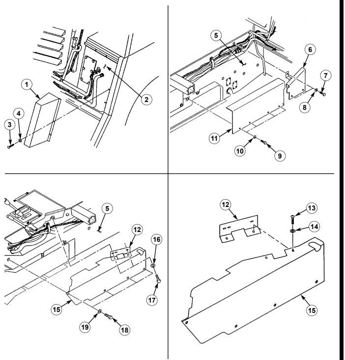

FOLLOW-ON TASKS: - Install driver's seat assembly (para. 10-40).

- Install left passenger seat (para. 10-45).

# 25-33. A/C Condenser Hose Assemblies Replacement

This task covers:

a. Removal **b. Installation**

| Materials/Parts   |
|-------------------|

| Applicable Models               | Manual References                                 |
|---------------------------------|---------------------------------------------------|
| M1114                           | TM 9\-2320\-387\-24P                              |
| Tools                           | Equipment Condition                               |
| General mechanic's tool kit:    | Battery ground cables disconnected (para. 4\-68). |
| automotive (Appendix B, Item 1) |                                                   |
|                                 | Maintenance Level                                 |
| Materials/Parts                 | Direct support                                    |
| O\-ring (Appendix G, Item 205)  |                                                   |

O-ring (Appendix G, Item 204) O-ring (Appendix G, Item 206) Refrigerant oil (Appendix C, Item 48)
Maintenance Level Direct support

#### Initial Setup: A. Removal

1. Loosen nut (8) and remove rear discharge tube (9) from hose assembly (3) at left rear wheelhouse (11). Remove and discard O-ring (7).

2. Loosen nut (12) and remove rear liquid tube (10) from hose assembly (2) at left rear wheelhouse (11).

Remove and discard O-ring (13).

3. Remove nut (14) and washer (15) from hose assembly (2) at left rear wheelhouse (11). 4. Remove nut (6) and washer (5) from hose assembly (3) at left rear wheelhouse (11). 5. Pull hose assemblies (2) and (3) through grommets (1) and remove from left rear wheelwell (4).

b. Installation 1. Install hose assemblies (2) and (3) through grommets (1) on left rear wheelwell (4). 2. Route hose assembly (3) through left rear wheelhouse (11) and install with washer (5) and nut (6). 3. Route hose assembly (2) through left rear wheelhouse (11) and install with washer (15) and nut (14). 4. Lubricate O-ring (7) with refrigerant oil, and install on rear discharge tube (9). 5. Connect rear discharge tube (9) to hose assembly (3) at left rear wheelhouse (11) and tighten nut (8)
to 18 lb-ft (24 N•m).

6. Lubricate O-ring (13) with refrigerant oil, and install on rear liquid tube (10). 7. Connect rear liquid tube (10) to hose assembly (2) at left rear wheelhouse (11) and tighten nut (12)
to 12 lb-ft (16 N•m).

# 25-33. A/C Condenser Hose Assemblies Replacement (Cont'D)

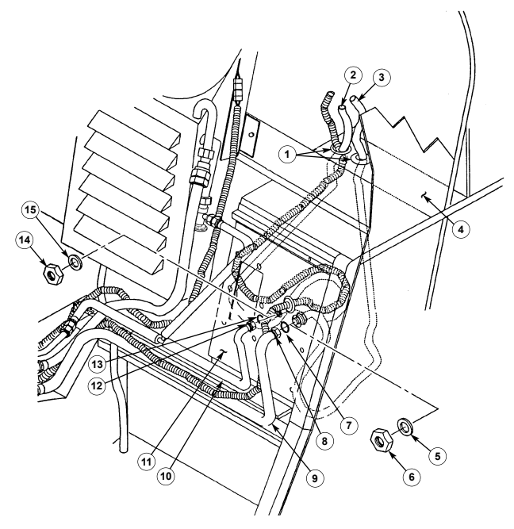

FOLLOW-ON TASKS: - Install A/C condenser (para. 25-18).

- Install access hole cover plate (para. 25-36). - Install left rear HVAC lines cover (para. 25-32).

# 25-34. A/C And De-Ice Relays Replacement

| Tools                           |
|---------------------------------|
| General mechanic's tool kit:    |
| automotive (Appendix B, Item 1) |

This task covers:

| Applicable Models   |
|---------------------|
| M1114               |

| INITIAL SETUP:   |
|------------------|

Automotive maintenance and repair: field maintenance, basic (Appendix B, Item 6)

#### Materials/Parts

Four locknuts (Appendix G, Item 101)

| Maintenance Level   |
|---------------------|

a. Removal

| Equipment Condition   |
|-----------------------|

a. Removal **b. Installation**

Equipment Condition Battery ground cables disconnected (para. 4-68).

Direct support

Prior to removal, tag leads for installation.

1. Disconnect ignition jumper wiring connector (11) from de-ice relay connector number one (10). 2. Disconnect grounding wiring connector (15) from de-ice relay connector number two (14). 3. Disconnect de-ice power wiring connector (6) from de-ice relay connector number three (5). 4. Disconnect A/C wiring harness de-ice power connector (19) from de-ice relay connector number four (18).

5. Remove two locknuts (25), washers (24), capscrews (22), washers (23), and de-ice relay (4) from B-beam cover plate (27) at rear side of battery box (7). Discard locknuts (25).

6. Disconnect ignition jumper wiring connector (9) from A/C relay connector number one (8). 7. Disconnect grounding wiring connector (13) from A/C relay connector number two (12). 8. Disconnect de-ice power wiring connector (3) from A/C relay connector number three (1). 9. Disconnect A/C wiring harness A/C power connector (17) from A/C relay connector number four (16).

10. Remove two locknuts (26), washers (21), capscrews (20), washers (21), and A/C relay (2) from B-beam cover plate (27) at rear side of battery box (7). Discard locknuts (26).

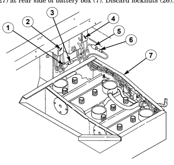

# 25-34. A/C And De-Ice Relays Replacement (Cont'D)

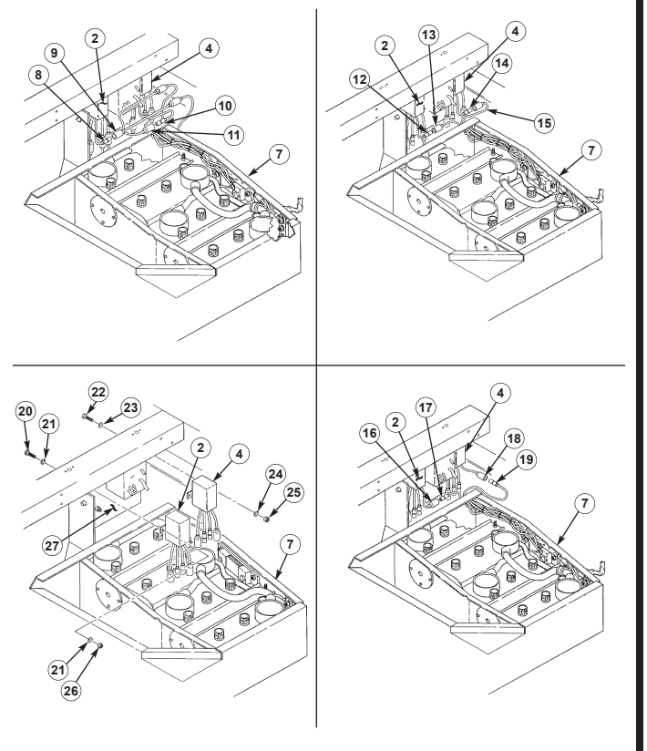

## 25-34. A/C And De-Ice Relays Replacement (Cont'D)

b. Installation 1. Install A/C relay (2) on B-beam cover plate (15) at rear side of battery box (7) with two washers (9),
capscrews (8), washers (9), and locknuts (14). Tighten locknuts (14) to 10 lb-ft (14 N•m).

2. Connect A/C wiring harness A/C power connector (17) to A/C relay connector number four (16). 3. Connect de-ice power wiring connector (3) to A/C relay connector number three (1). 4. Connect grounding wiring connector (21) to A/C relay connector number two (20). 5. Connect ignition jumper wiring connector (25) to A/C relay connector number one (24). 6. Install de-ice relay (4) on B-beam cover plate (15) at rear side of battery box (7) with two washers (11), capscrews (10), washers (11), and locknuts (13). Tighten locknuts (13) to 10 lb-ft (14 N•m).

7. Connect A/C wiring harness de-ice power connector (19) to de-ice relay connector number four (18). 8. Connect de-ice power wiring connector (6) to de-ice relay connector number three (5). 9. Connect grounding wiring connector (23) to de-ice relay connector number two (22).

10. Connect ignition jumper wiring connector (27) to de-ice relay connector number one (26).

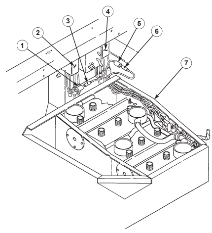

# 25-34. A/C And De-Ice Relays Replacement (Cont'D)

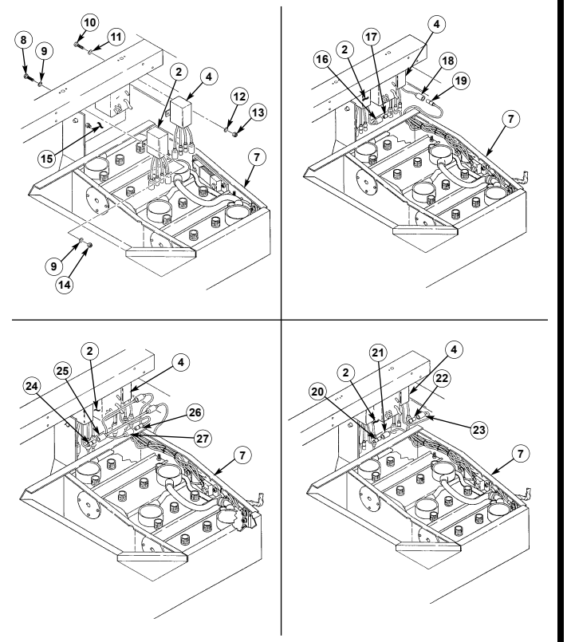

FOLLOW-ON TASK: Connect battery ground cables (para. 4-68).

# 25-35. A/C Wiring Harness And Cable Maintenance

This task covers:
a. Removal **c. Installation** b. Inspection INITIAL SETUP:
Applicable Models M1114 Tools General mechanic's tool kit:
automotive (Appendix B, Item 1)
Automotive maintenance and repair: field maintenance, basic (Appendix B, Item 6)

#### Materials/Parts

Sealing compound (Appendix C, Item 63) Silicone rubber (Appendix C, Item 12) Two lockwashers (Appendix G, Item 189) Tiedown straps (as required)
(Appendix G, Item 321)
Lockwasher (Appendix G, Item 140) Lockwasher (Appendix G, Item 187)

#### Manual References

TM 9-2320-387-24P
Equipment Condition - A/C front air distribution duct removed 
(para. 11-81).

- Heater/evaporator assembly cover removed 
(para. 25-21).

- Access hole cover plate removed (para. 25-36). - Condenser fan access panel removed
(para. 11-86).

- Air horn-to-air cleaner elbow removed
(para. 3-15).

- A/C coolant line covers removed (para. 25-32). Maintenance Level Direct support

#### A. Removal Note

Prior to removal tag leads for assembly 1. Remove four capscrews (7) and washers (6) securing A/C condenser (4) to left rear wheelwell (5). 2. Remove A/C condenser (4) from left rear wheelwell (5). Do not disconnect coolant lines. 3. Remove tiedown straps (8), as required, from A/C wiring harness (3) and fan grille (9). 4. Disconnect two A/C wiring harness connectors (2) from A/C condenser fan connectors (1). 5. Remove two A/C wiring harness connectors (2) from A/C wiring harness (3). 6. Route A/C wiring harness (3) down through grommet (11) at left rear wheelwell (5) and forward through grommet (12) at left rear wheelhouse (13).

7. Disconnect A/C wiring harness connector (14) from rear A/C evaporator connector (10). 8. Remove tiedown straps (15), as required, from A/C wiring harness (3) along left side tunnel (16).

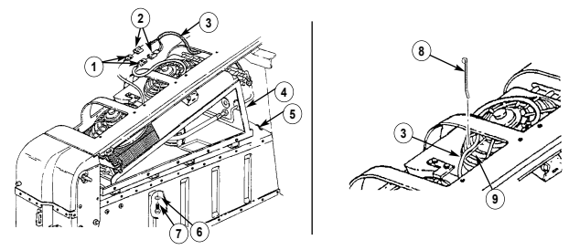

25-35. A/C WIRING HARNESS AND CABLE MAINTENANCE (Cont'd)

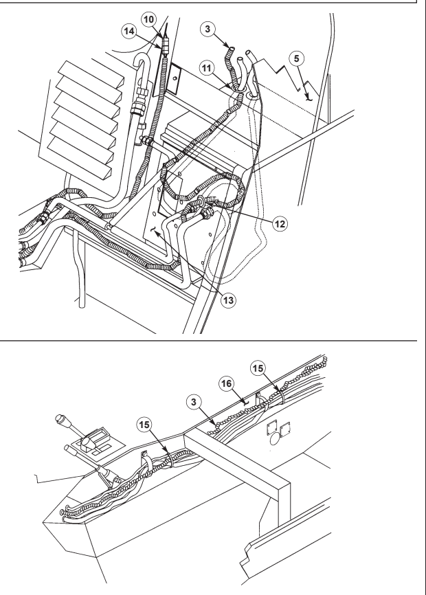

DODDOD

## 25-35. A/C Wiring Harness And Cable Maintenance (Cont'D)

9. Remove two screws (1), screw (2), and CTIS cover (6) from plusnut (3) and vehicle body (4).

10. Remove tiedown straps (7), as required, from A/C wiring harness (5) in engine compartment. 11. Pull loose end of A/C wiring harness (5) up into engine compartment. 12. Disconnect A/C wiring harness connector (8) from A/C compressor clutch connector (9). 13. Disconnect A/C wiring harness connector (10) from pressure switch connector (11). 14. Disconnect A/C wiring harness connectors (13) and (14) from trinary switch connectors (12)
and (15).

15. Disconnect A/C wiring harness connector (17) from de-ice ground wiring connector (19) near slot
(16) in vehicle body.

16. Disconnect de-ice power jumper cable (20) from A/C wiring harness connector (21) and defroster switch circuit breaker (18).

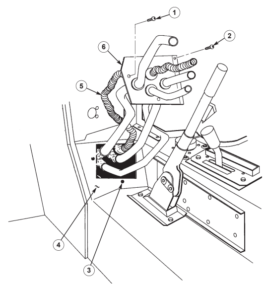

# 25-35. A/C Wiring Harness And Cable Maintenance (Cont'D)

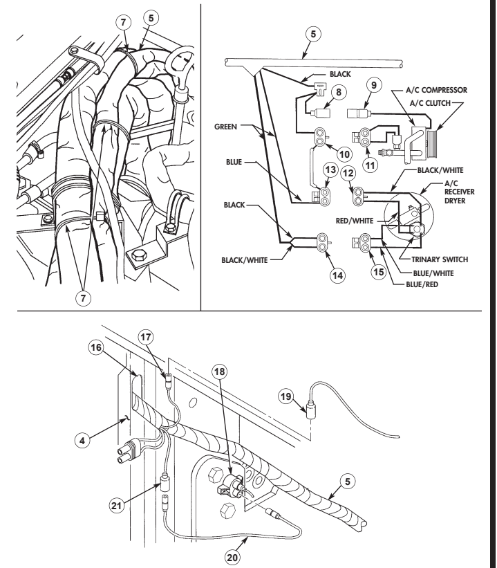

## 25-35. A/C Wiring Harness And Cable Maintenance (Cont'D)

17. Remove screw (5), lockwasher (4), and washer (3) securing blower motor ground (8), A/C control module ground (7), A/C wiring harness ground (6), and vehicle harness ground (1) to heater/evaporator assembly (2). Discard lockwasher (4).

18. Remove tiedown straps, as required, from wiring at heater/evaporator assembly (2). 19. Disconnect two A/C wiring harness connectors (18) from thermostat jumper harness connectors (9). 20. Disconnect two A/C wiring harness connectors (11) from circuit breaker (10). 21. Disconnect A/C wiring harness connector (17) from A/C control module connector (16). 22. Disconnect A/C wiring harness connector (14) from A/C control module connector (15). 23. Disconnect A/C wiring harness connector (13) from blower motor connector (12). 24. Disconnect A/C wiring harness connector (21) from clutch relay (19). 25. Disconnect A/C wiring harness connector (22) from condenser fan relay (20). 26. Disconnect A/C wiring harness connector (23) from rear blower relay (24).

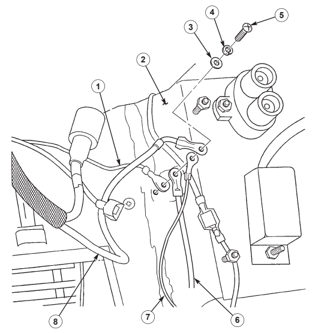

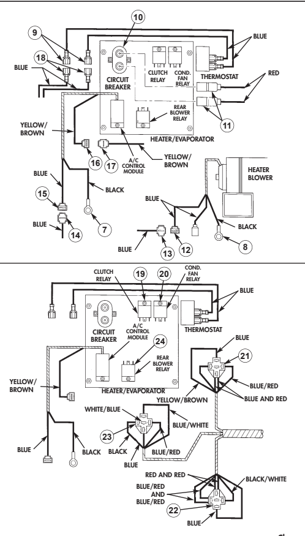

# 25-35. A/C Wiring Harness And Cable Maintenance (Cont'D) 25-35. A/C Wiring Harness And Cable Maintenance (Cont'D)

27. Remove tiedown straps (6), as required, from wiring in battery box (7). 28. Disconnect two 29Z circuit connectors (4) from ignition jumper wiring connectors (3). 29. Disconnect ignition jumper wiring connector (8) from de-ice relay connector number one (5). 30. Disconnect ignition jumper wiring connector (2) from A/C relay connector number one (1). 31. Remove sealant from buss bar top terminal (14). 32. Remove nut (17), lockwasher (16), washer (15), and de-ice power wiring connector (13) from buss bar top terminal (14). Discard lockwasher (16).

33. Disconnect de-ice power wiring connector (12) from de-ice relay connector number three (11). 34. Disconnect de-ice power wiring connector (10) from A/C relay connector number three (9). 35. Disconnect A/C wiring harness connector (21) from de-ice relay connector number four (20). 36. Disconnect A/C wiring harness connector (19) from A/C relay connector number four (18).

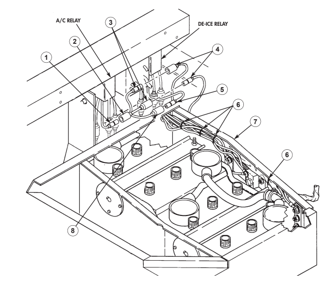

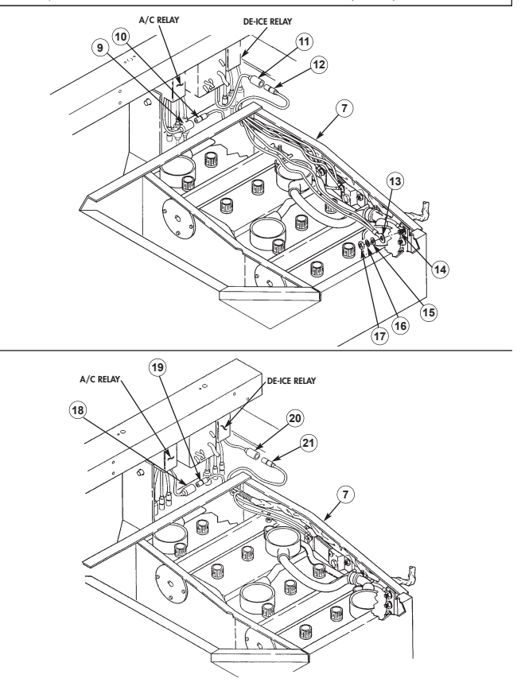

25-35. A/C WIRING HARNESS AND CABLE MAINTENANCE (Cont'd)

## 25-35. A/C Wiring Harness And Cable Maintenance (Cont'D)

37. Remove screw (7), lockwasher (6), washers (1), and two A/C wiring harness ground connectors (2)
from shunt (3). Discard lockwasher (6).

38. Route A/C wiring harness (5) forward and out of battery box (4). 40. Disconnect grounding wiring connector (10) from de-ice relay connector number two (9). 41. Disconnect grounding wiring connector (8) from A/C relay connector number two (12). 42. Remove screw (7), lockwasher (6), washer (1), and two grounding wire connectors (11) at forward end of shunt (3). Discard lockwasher (6).

43. Route A/C wiring harness (5) through slot (15) in vehicle body and up into engine compartment.

Remove A/C wiring harness (5) from vehicle.

b. Inspection Refer to para. 10-56 for plusnut (13) inspection and replacement.

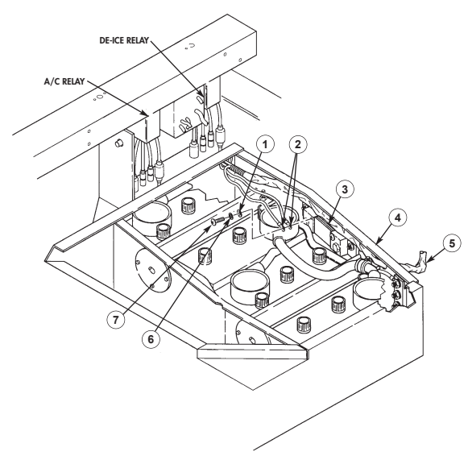

# 25-35. A/C Wiring Harness And Cable Maintenance (Cont'D)

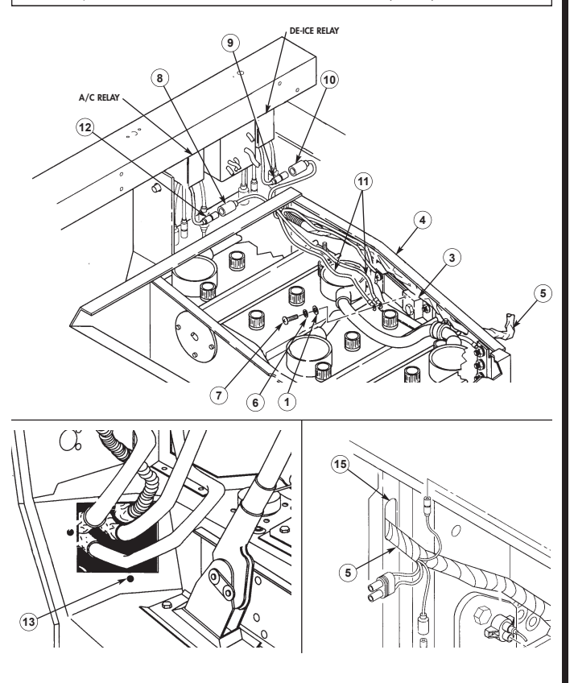

# 25-35. A/C Wiring Harness And Cable Maintenance (Cont'D)

c. Installation 1. Route section of A/C wiring harness (2) down along right side of engine compartment and through slot (1) in vehicle body.

2. Route section of A/C wiring harness (2) with ground connectors (7), de-ice power connector (6), and A/C power connector (4) through forward access hole in battery box (8).

3. Continue routing de-ice power connector (6) and A/C power connector (4) through grommet (10) at rear end of battery box (8).

4. Connect A/C wiring harness de-ice power connector (6) to de-ice relay connector number four (5). 5. Connect A/C wiring harness A/C power connector (4) to A/C relay connector number four (3). 6. Connect two A/C wiring harness ground connectors (7) to rear end of shunt (9) and secure with washer (11), lockwasher (12), and screw (13).

7. Position A/C wiring harness (2) under inboard flange of battery box (8). 8. Connect grounding wiring connector (16) to de-ice relay connector number two (15). 9. Connect grounding wiring connector (14) to A/C relay connector number two (18).

10. Route two grounding wiring connectors (17) forward through grommet (10) at rear end of battery box (8).

11. Connect two grounding wire connectors (17) to forward end of shunt (9) and secure with washer (11), lockwasher (12), and screw (13).

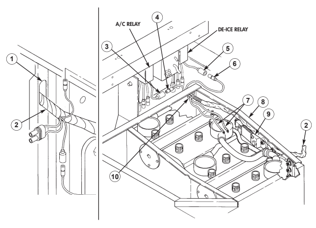

25-35. A/C WIRING HARNESS AND CABLE MAINTENANCE (Cont'd)

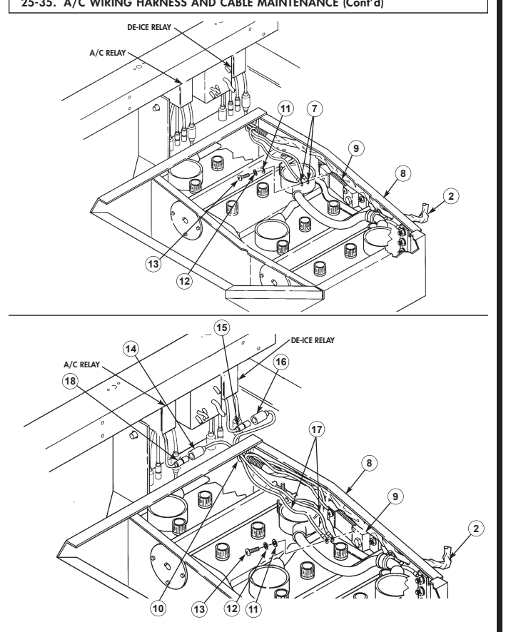

# 25-35. A/C Wiring Harness And Cable Maintenance (Cont'D)

12. Connect de-ice power wiring connector (4) to de-ice connector number three (3). 13. Connect de-ice power wiring connector (2) to A/C relay connector number three (1). 14. Route de-ice power wiring connector (6) forward through grommet at rear end of battery box (5). 15. Connect de-ice power wiring connector (6) to buss bar top terminal (7) and secure with washer (8),
lockwasher (9), and nut (10).

16. Apply sealing compound to buss bar top terminal (7). 17. Connect two 29Z circuit connectors (14) to ignition jumper wiring connectors (13). 18. Connect ignition jumper wiring connector (17) to de-ice relay connector number one (15). 19. Connect ignition jumper wiring connector (12) to A/C relay connector number one (11). 20. Install tiedown straps (16), as required, on wiring at inboard flange of battery box (5). 21. Connect A/C wiring harness connector (22) to rear blower relay (23). 22. Connect A/C wiring harness connector (21) to condenser fan relay (19). 23. Connect A/C wiring harness connector (20) to clutch relay (18).

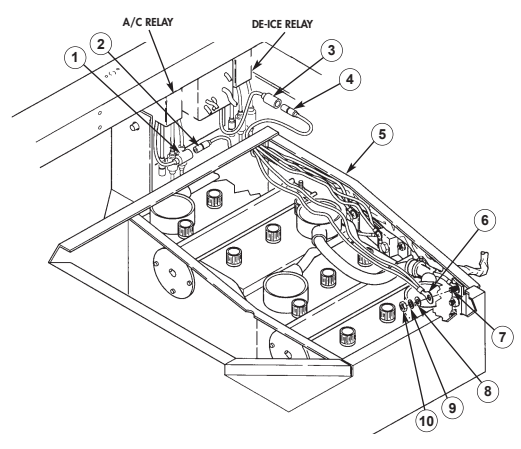

# 25-35. A/C Wiring Harness And Cable Maintenance (Cont'D)

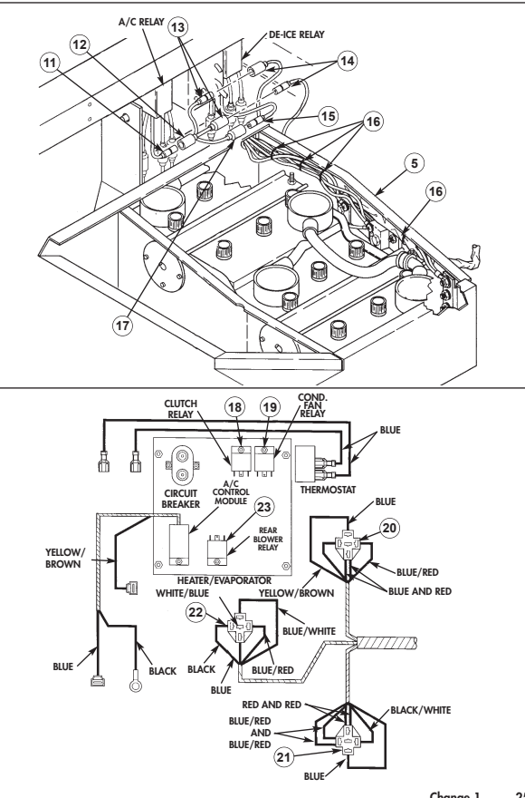

## 25-35. A/C Wiring Harness And Cable Maintenance (Cont'D)

24. Connect two A/C wiring harness connectors (3) to circuit breaker (2). 25. Connect two A/C wiring harness connectors (12) to thermostat jumper harness connectors (1). 26. Connect A/C wiring harness connector (11) to A/C control module connector (10). 27. Connect A/C wiring harness connector (8) to A/C control module connector (9). 28. Connect A/C wiring harness connector (6) to blower motor connector (5). 29. Connect vehicle harness ground (13), blower motor ground (4), A/C control module ground (7), and A/C wiring harness ground (18) to heater/evaporator assembly (14) and secure with washer (15), lockwasher (16), and screw (17).

30. Connect A/C wiring harness (23) de-ice ground connector (20) to de-ice ground wiring connector (22).

31. Connect de-ice power jumper cable (24) to A/C wiring harness de-ice power connector (25) and defroster switch circuit breaker (21) near slot (19) in vehicle body.

32. Secure A/C wiring harness (23) to heater/evaporator assembly (14) with tiedown straps as required.

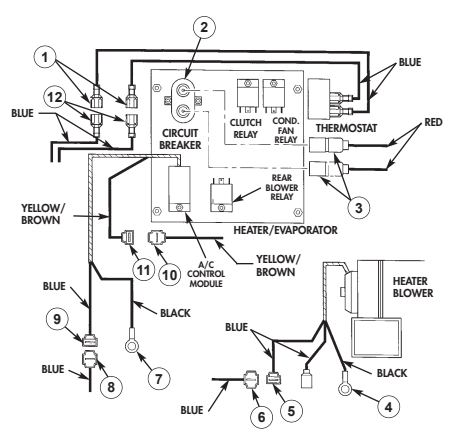

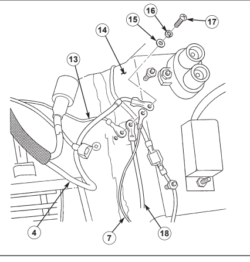

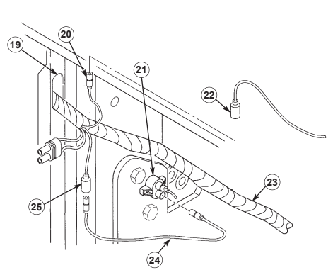

25-35. A/C WIRING HARNESS AND CABLE MAINTENANCE (Cont'd)

קיש

## 25-35. A/C Wiring Harness And Cable Maintenance (Cont'D)

33. Connect A/C wiring harness connectors (7) and (8) to trinary switch connectors (6) and (9). 34. Connect A/C wiring harness connector (4) to pressure switch connector (5). 35. Connect A/C wiring harness connector (2) to A/C compressor clutch connector (3). 36. Route loose end of A/C wiring harness (1) across engine compartment, over upper oil dipstick support bracket (11), and down left side of engine compartment and secure with tiedown straps (10) as required.

37. Slide CTIS cover (20) forward until foil insulation (18) on A/C hose assemblies (15) and (16) and A/C hose (13) is in contact with CTIS cover (11).

38. Pull A/C wiring harness (1) rear until foil insulation (19) extends through CTIS cover (20)
approximately 1-in. (2.5 cm).

39. Apply sealing compound to two screws (12), and install CTIS cover (20) on vehicle body (17) 
with screws (12) and screw (14).

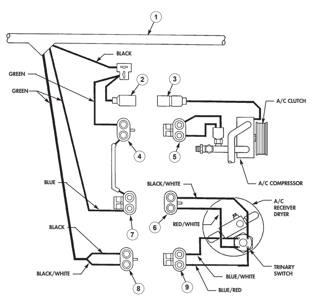

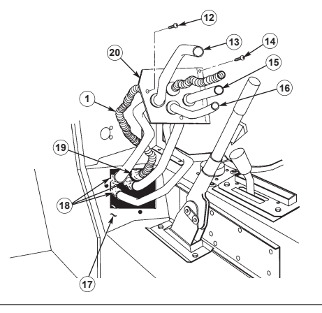

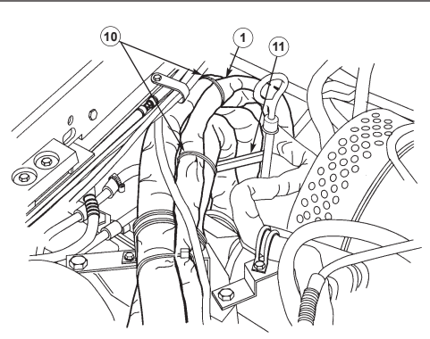

25-35. A/C WIRING HARNESS AND CABLE MAINTENANCE (Cont'd)

# 25-35. A/C Wiring Harness And Cable Maintenance (Cont'D)

40. Route A/C wiring harness (2) rearward along left side tunnel (3). 41. Connect A/C wiring harness connector (9) to rear A/C evaporator connector (4). 42. Route remaining section of A/C wiring harness (2) through grommet (7) in left rear wheelhouse (8)
and up through grommet (5) in left rear wheelwell (6).

43. Apply sealing compound to threads of four capscrews (14). 44. Install A/C condenser (12) on left rear wheelwell (6) with four washers (13) and capscrews (14).

Tighten capscrews (14) to 6 lb-ft (8 N•m).

45. Route A/C wiring harness (2) over forward end of A/C condenser (12) and connect two A/C wiring harness connectors (11) to A/C condenser fan connectors (10).

46. Secure A/C wiring harness (2) to fan grille (15) with tiedown straps (1) as required. 47. Secure A/C wiring harness (2) along left side tunnel (3) with tiedown straps (1) as required. 48. Secure A/C wiring harness (2) in engine compartment with tiedown straps (1) as required.

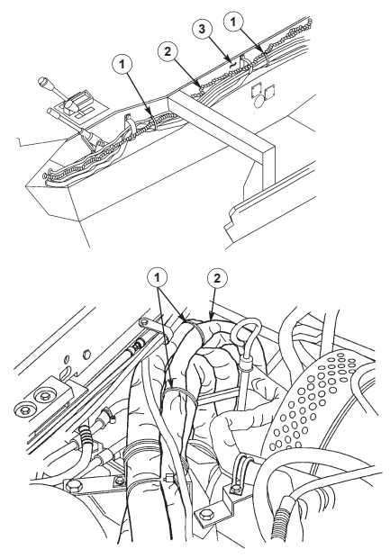

# 25-35. A/C Wiring Harness And Cable Maintenance (Cont'D)

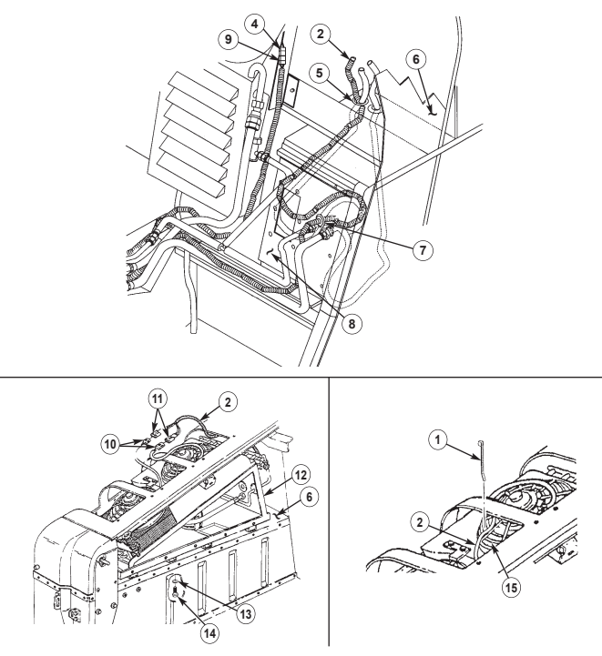

FOLLOW-ON TASKS: - Install A/C coolant line covers (para. 25-32).

- Install air horn-to-air cleaner elbow (para. 3-15). - Install access hole cover plate (para. 25-36). - Install condenser fan access panel (para. 11-86). - Install heater/evaporator assembly cover (para. 25-21). - Install A/C front air distribution duct (para. 11-81).

# 25-36. Access Hole Cover Plate Maintenance

This task covers:

a. Removal **c. Installation** b. Inspection

Applicable Models M1114 Tools General mechanic's tool kit:
automotive (Appendix B, Item 1)
Automotive maintenance and repair: field maintenance, basic (Appendix B, Item 6)
Materials/Parts Sealing compound (Appendix C, Item 63)
Manual References TM 9-2320-387-24P
Equipment Condition Left passenger seat removed (para. 10-45).

| Maintenance Level   |
|---------------------|
| Direct Support      |

a. Removal Remove six capscrews (4) and access hole cover plate (3) from left rear wheelhouse (2). b. Inspection Refer to para. 10-56 for plusnut (1) inspection and replacement. c. Installation 1. Apply sealing compound to threads of six capscrews (4). 2. Install access hole cover plate (3) on left rear wheelhouse (2) with six capscrews (4). Tighten capscrews (4) to 6 lb-ft (8 N•m).

# 25-36.  Access Hole Cover Plate Maintenance (Cont'D)

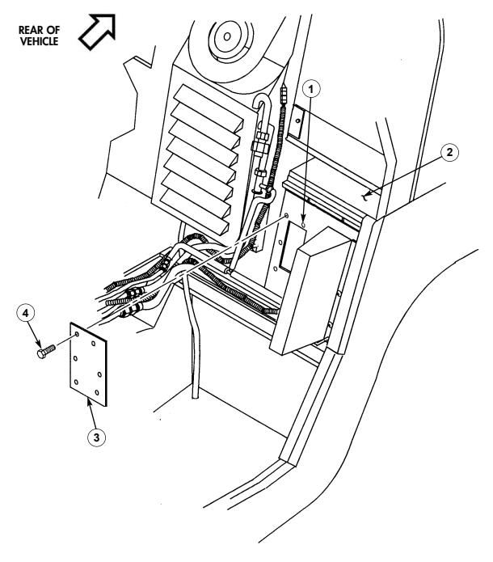

FOLLOW-ON TASK: Install left passenger seat (para. 10-45).

# 25-37. Left Side Tunnel Interior Insulation Replacement

This task covers:
INITIAL SETUP:

a. Removal b. Installation

| INITIAL SETUP:                  |
|---------------------------------|
| Applicable Models               |
| M1114                           |
| Tools                           |
| General mechanic's tool kit:    |
| automotive (Appendix B, Item 1) |

| Equipment Condition   |
|-----------------------|

| (para. 25\-22).   |
|-------------------|
| Maintenance Level |

Manual References TM 9-2320-387-24P
A/C coolant line covers removed (para. 25-32).

automotive (Appendix B, Item 2)
Materials/Parts Sealing compound (Appendix C, Item 72.1)
a. Removal 1. Remove left rear interior tunnel insulation (4) from left side tunnel (5). 2. Remove two capscrews (7), washers (8), and left front interior tunnel insulation (9) from left side tunnel (5).

3. Remove six screws (6) and left front top tunnel insulation (2) from tunnel (3). 4. Remove three interior insulation retainers (1) from left front top tunnel insulation (2).

#### B. Installation

1. Install three interior insulation retainers (1) on left front top tunnel insulation (2). 2. Install left front top tunnel insulation (2) on tunnel (3) with six screws (6). 3. Apply sealing compound to threads of two capscrews (7), and install left front interior tunnel insulation (9) on left side tunnel (5) with capscrews (7) and washers (8). Tighten capscrews (7) to 23 lb-ft (31 N•m).

4. Install left rear interior tunnel insulation (4) on left side tunnel (5).

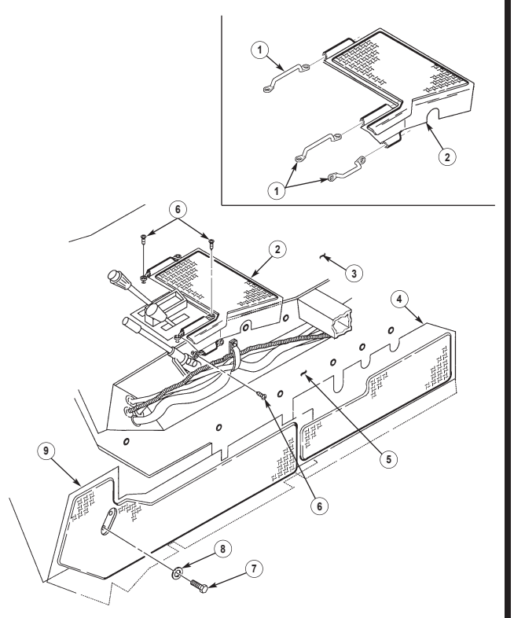

FOLLOW-ON TASK:   Install A/C coolant line covers (para. 25-32).

# 25-37. Left Side Tunnel Interior Insulation Replacement (Cont'D)

# Section Iii. Air Conditioning Maintenance (All Models Except M1113/M1114)

| a.          | Disassembly b.  Assembly                                                                           |    |
|-------------|----------------------------------------------------------------------------------------------------|----|
|             | INITIAL SETUP:                                                                                     |    |
|             | Applicable Models Equipment Condition                                                              |    |
|             | M1114 A/C condenser removed (para. 25\-18).                                                        |    |
| Tools       | Maintenance Level                                                                                  |    |
|             | General mechanic's tool kit: Direct support                                                        |    |
|             | automotive (Appendix B, Item 1)                                                                    |    |
|             | Manual References                                                                                  |    |
|             | TM 9\-2320\-387\-24P                                                                               |    |
|             | a. Disassembly                                                                                     |    |
|             | Remove four nuts (3), washers (4), and A/C condenser brackets (2) and (5) from studs (6) and drain | 1. |
|             | pan (8).                                                                                           |    |
|             | Remove twelve screws (7) and A/C condenser (1) from A/C condenser brackets (2) and (5).            | 2. |
|             | Remove trim (9) from forward edge of A/C condenser drain pan (8).                                  | 3. |
| b. Assembly |                                                                                                    |    |
|             | Install trim (9) on forward edge of A/C condenser drain pan (8).                                   | 1. |

# 25-38. Air Conditioning Maintenance Task Summary

## 25-39. A/C Receiver/Dryer Replacement

This task covers:

Applicable Models All models except M1113, M1114 Tools General mechanic's tool kit:
automotive (Appendix B, Item 1)
Maintenance and repair shop equipment:
automotive (Appendix B, Item 2)

#### Materials/Parts

Two O-rings (Appendix G, Item 228.3) Refrigerant oil (Appendix C, Item 48)
a. Removal **b. Installation**

#### Manual References

TM 9-2320-387-10 TM 9-2320-387-24P

#### Equipment Condition

- A/C system discharged (para. 25-50.1). - Right rear upper underbody armor
(integrated) removed (para. 11-109 or para. 109.1).

- Condenser fan access panel removed 
(para. 11-103).

- Right rear seatback armor removed
(perimeter) (if equipped) (Appendix J, J-28).

#### Maintenance Level

Direct support

- All lines and fittings must be plugged when disconnected. - Prior to removal, tag lines for installation.

#### A. Removal

1. Disconnect three electrical connectors (10) from body harness (1). 2. Loosen two clamps (4) securing A/C receiver/dryer (7) to mounting bracket (8). 3. Remove two screw-assembled washers (5) securing mounting bracket (8) and remove A/C receiver dryer (7) and bracket (8) as an assembly.

4. Loosen nuts (2) and remove lines (3) and O-rings (6) from A/C receiver/dryer (7). Discard O-rings (6). 5. Remove A/C receiver/dryer (7) from bracket (8).

b. Installation

When installing A/C receiver/dryer, IN fitting must be toward the outside of vehicle.

1. Install A/C receiver/dryer (7) through clamps (4) on mounting bracket (8). Do not tighten clamps at this time.

2. Apply refrigerant oil to O-rings (6) and install O-rings (6) and lines (3) on A/C receiver/dryer (7).

Tighten nuts (2) to 12 lb-ft (16 N•m).

3. Install mounting bracket (8) on body (9) with two screw-assembled washers (5) . 4. Tighten clamps (4) securing A/C receiver/dryer (7) on mounting bracket (8). 5. Connect three electrical connectors (10) to body harness (1).

# 25-39. A/C Receiver/Dryer Replacement (Cont'D)

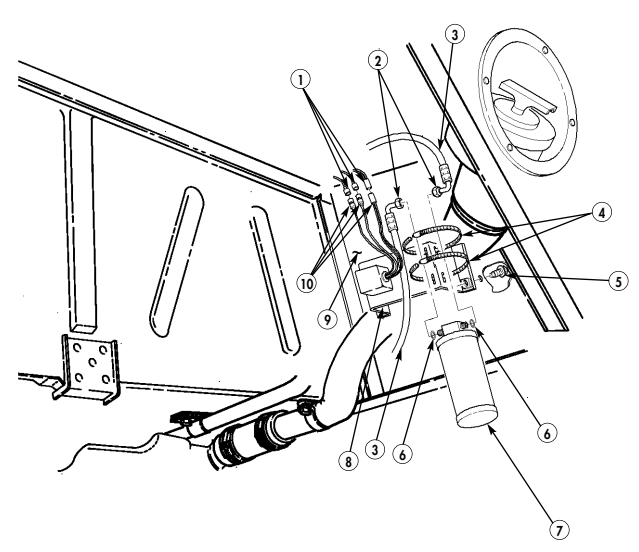

FOLLOW-ON TASKS: - Install right rear seatback armor (perimeter) (if equipped) (Appendix J, J-28).

- Install condenser fan access panel (para. 11-103). - Install right rear upper underbody armor (integrated) (para. 11-109). - Charge A/C system (para. 25-50.1). - Start vehicle, run A/C system, and check for leaks (TM 9-2320-387-10).

## 25-40. A/C Condenser Replacement

This task covers:

#### Initial Setup: Applicable Models

All models except M1113, M1114 Tools General mechanic's tool kit:
automotive (Appendix B, Item 1)
Maintenance and repair shop equipment:
automotive (Appendix B, Item 2)

#### Materials/Parts

Two lockwashers (Appendix G, Item 146) Two O-rings (Appendix G, Item 228.4) Tiedown straps (as required) 
(Appendix G, Item 324)
Refrigerant oil (Appendix C, Item 48)

#### Personnel Required

One mechanic One assistant Manual References TM 9-2320-387-10 TM 9-2320-387-24P
a. Removal **b. Installation**

#### Equipment Condition

- Battery ground cables disconnected 
(para. 4-68).

- A/C system discharged (para. 25-50.1). - Rear wheel removed (para. 8-3). - Condenser fan access panel removed 
(para. 11-103).

- A/C rear condenser fans disconnected 
(para. 25-47).

- Fuel filler housing removed
(right side only) (para. 10-2).

- Fuel tank filler cap and spout removed 
(right side only) (para. 3-29).

- Condenser fan supply vent removed 
(para. 11-104).

- Right rear upper underbody armor
(integrated) removed (if equipped) (para. 11-109 or para. 11-109.1).

- Double ammo box tray removed (para. 11-68).

Maintenance Level Direct support

- This procedure covers right A/C condenser. Left A/C condenser is similar.

- All lines and fittings must be plugged when disconnected.

#### A. Removal

1. Remove two capscrews (5), lockwashers (4), washers (3), clamps (2), and wiring harness (6) from condenser tray (1). Discard lockwashers (4).

2. Loosen nut (12) and remove return hose (13) and O-ring (11) from A/C condenser line fitting (10).

Discard O-ring (11).

3. Loosen nut (15) and remove supply hose (14) and O-ring (16) from A/C condenser line fitting (17).

Discard O-ring (16).

4. Remove five capscrews (8) and plate (7) from wheelwell (9) and A/C condenser (18). 5. Slide A/C condenser (18) off wheelwell bracket (20) and remove A/C condenser (18) from wheelwell (9). 6. Remove two capscrews (19) and wheelwell bracket (20) from wheelwell (9).

## 25-40.  A/C Condenser Replacement (Cont'D)

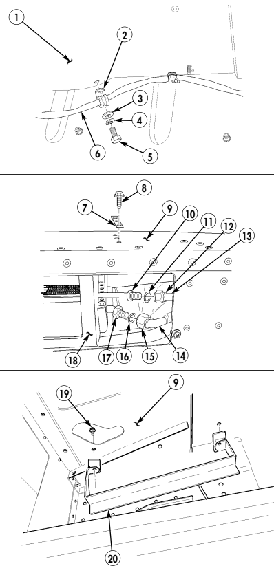

## 25-40. A/C Condenser Replacement (Cont'D)

b. Installation 1. Install wheelwell bracket (3) on wheelwell (2) with two capscrews (1). 2. Position A/C condenser (14) in wheelwell (2) and slide A/C condenser (14) on wheelwell bracket (3). 3. Install A/C condenser (14) on wheelwell (2) with five capscrews (5) and plate (4). 4. Apply refrigerant oil to O-ring (12) and install O-ring (12) on supply hose (10). 5. Install supply hose (10) on A/C condenser line fitting (13). Tighten nut (11). 6. Apply refrigerant oil to O-ring (7) and install O-ring (7) on return hose (9). 7. Install return hose (9) on A/C condenser line fitting (6). Tighten nut (8).

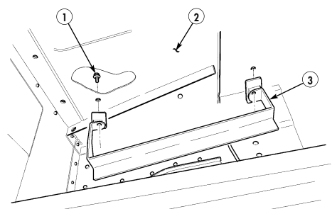

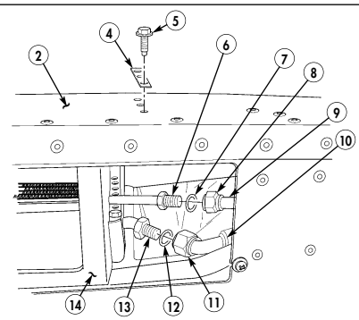

## 25-40. A/C Condenser Replacement (Cont'D)

8. Install wiring harness (20) on condenser tray (15) with two clamps (16), washers (17),
lockwashers (18), and capscrew (19).

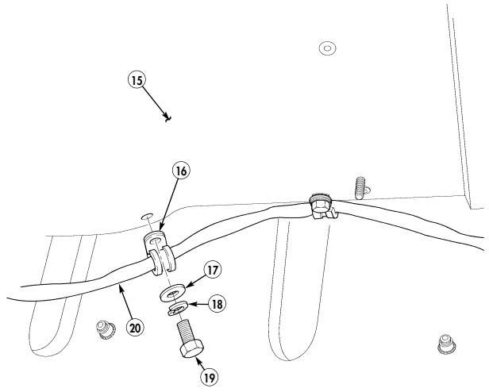

FOLLOW-ON TASKS: - Install double ammo box tray (11-68).

- Install right rear upper underbody armor (integrated) (if equipped) 
(para. 11-109 or para. 11-109.1).

- Install condenser fan supply vent (para. 11-104). - Install fuel tank filler cap and spout (right side only) (if removed) (para. 3-29). - Install fuel filler housing (right side only) (if removed) (para. 10-2). - Connect A/C condenser fans (para. 25-47). - Install condenser fan access panel (para. 11-103). - Install rear wheel (para. 8-3). - Charge A/C system (para. 25-50.1). - Connect battery ground cables (para. 4-68). - Start vehicle, run A/C system and check for leaks (TM 9-2320-387-10).

# 25-41. A/C Manifold And Compressor Replacement

This task covers:

Applicable Models All models except M1113, M1114 Tools General mechanic's tool kit:
automotive (Appendix B, Item 1)
Maintenance and repair shop equipment:
automotive (Appendix B, Item 2)

#### Materials/Parts

Two seal washers (Appendix G, Item 307.1) Two seal washers (Appendix G, Item 307.2) Three lockwashers (Appendix G, Item 138) Three lockwashers (Appendix G, Item 146) Refrigerant oil (Appendix C, Item 48)
a. Removal b. Installation

#### Manual References

TM 9-2320-387-10 TM 9-2320-387-24P

#### Equipment Condition

- Battery ground cables disconnected 
(para. 4-68).

- Serpentine belt removed (para. 3-81.1 or para. 3-81.2).

- Air horn-to-air cleaner elbow removed
(para. 3-15).

- A/C system discharged (para. 25-50.1).

Maintenance Level Direct support a. Removal

#### Note B. Installation

- Mark and tag all electrical leads prior to removal for ease of assembly.

- All lines and fittings must be plugged when disconnected.

1. Disconnect body wiring harness leads (14) from A/C compressor leads (13). 2. Remove capscrew (1), lockwasher (2), washer (3), A/C manifold (4), seal washer (6), and seal washer (7) from A/C compressor (12). Discard seal washers (6), (7), and lockwasher (2).

For A/C manifold removal, proceed with steps 3 and 4. To remove A/C compressor only, proceed to step 5.

3. Remove capscrew (11), lockwasher (10), washer (9), high pressure hose (8), and seal washer (5) from A/C manifold (4). Discard seal washer (5) and lockwasher (10).

4. Remove capscrew (15), lockwasher (16), washer (17), low pressure hose (18), and seal washer (19)
from A/C manifold (4). Discard seal washer (19) and lockwasher (16).

5. Remove three nuts (23), lockwashers (24), washers (20), capscrews (21), washers (20), and A/C
compressor (12) from idler bracket (22). Discard lockwashers (24).

1. Install A/C compressor (12) on idler bracket (22) with three washers (20), capscrews (21),
washers (20), lockwashers (24), and nuts (23). Do not tighten nuts (23).

NOTE
- If A/C compressor manifold was removed from high and low pressure hoses, perform steps 2 and 3. If A/C manifold was not removed from high and low pressure hoses, proceed to step 4.

- Lubricate all seal washers before installation with refrigerant oil.

2. Install low pressure hose (18) on A/C manifold (4) with seal washer (19), washer (17),
lockwasher (16), and capscrew (15).

3. Install high pressure hose (8) on A/C manifold (4) with seal washer (5), washer (9), lockwasher (10),
and capscrew (11).

# 25-41. A/C Manifold And Compressor Replacement (Cont'D)

4. Install seal washer (6) and seal washer (7) on A/C manifold (4). 5. Install A/C manifold (4) on A/C compressor (12) with washer (3), lockwasher (2), and capscrew (1). 6. Connect body wiring harness leads (14) to A/C compressor leads (13). 7. Tighten nuts (23).

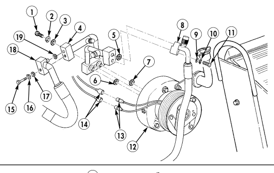

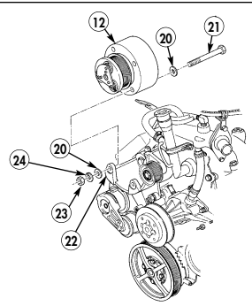

FOLLOW-ON TASKS: - Charge A/C system (para. 25-50.1).

- Install air horn-to-air cleaner elbow (para. 3-15). - Install serpentine belt (para. 3-81.1 or para. 3-81.2). - Connect battery ground cables (para. 4-68). - Start vehicle, run A/C system, and check for leaks (TM 9-2320-387-10).

# 25-42. A/C Seal Plate Replacement

This task covers:

Applicable Models All models except M1113, M1114 Tools General mechanic's tool kit:
automotive (Appendix B, Item 1)
Maintenance and repair shop equipment:
automotive (Appendix B, Item 2)

#### Materials/Parts

Two lockwashers (Appendix G, Item 146) Seal washer (Appendix G, Item 307.1) Seal washer (Appendix G, Item 307.2) Two seal washers (Appendix C, Item 307.2)
(four-man system only) 
Refrigerant oil (Appendix C, Item 48)
a. Removal b. Installation Manual References TM 9-2320-387-24P
Equipment Condition A/C heater/evaporator assembly (front)
removed (para. 25-43).

Maintenance Level Direct support

All lines and fittings must be plugged when disconnected.

a. Removal

Perform step 1 for A/C two-man system only.

1. Remove capscrew (1), lockwasher (2), washer (3), low pressure hose (4), and seal washer (11) from seal plate (5). Discard lockwasher (2) and seal washer (11).

Perform step 2 for A/C four-man system only.

2. Remove capscrew (1), lockwasher (2), washer (3), low pressure hose (4), low pressure hose (12),
seal washer (11) and seal washer (13) from seal plate (5). Discard seal washers (11), (13) and lockwasher (2).

3. Remove capscrew (10), lockwasher (9), washer (8), high pressure hose (7), and seal washer (6) from seal plate (5). Discard lockwasher (9) and seal washer (6).

4. Remove two capscrews (16), lockwashers (15), nuts (14) and seal plate (5) from body (17). Discard two lockwashers (15).

#### B. Installation

1. Install seal plate (5) on body (17) with two capscrews (16), lockwashers (15), and nuts (14). 2. Apply refrigerant oil to seal washer (6) and install seal washer (6) on high pressure hose (7). 3. Install high pressure hose (7) on seal plate (5) with capscrew (10), lockwasher (9), and washer (8).

NOTE
Perform steps 4 through 6 for A/C four-man system only.

4. Apply refrigerant oil seal washer (11) and install seal washer (11) on low pressure hose (12). 5. Apply refrigerant oil on seal washer (13) and install seal washer (13) on low pressure hose (4). 6. Install low pressure hose (4) and (12) on seal plate (5) with capscrew (1), lockwasher (2) and washer (3).

# 25-42. A/C Seal Plate Replacement (Cont'D)

Perform steps 7 through 8 for A/C two-man system only.

7. Apply refrigerant oil to seal washer (11) and install seal washer (11) on low pressure hose (4). 8. Install low pressure hose (4) on seal plate (5) with capscrew (1), lockwasher (2), and washer (3).

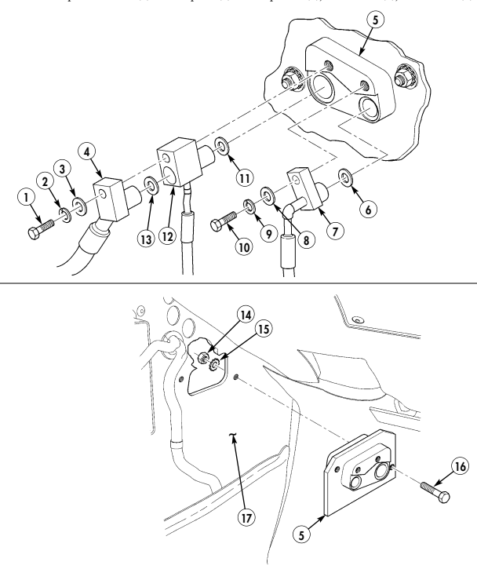

FOLLOW-ON TASKS: - Install A/C heater/evaporator assembly (front) (para. 25-43).

# 25-43. A/C Heater/Evaporator Assembly (Front) Replacement

This task covers:

| Applicable Models   |
|---------------------|
| M1114               |

a. Removal b. Installation

| Materials/Parts   |
|-------------------|

Tools

| Maintenance Level   | Direct support   |
|---------------------|------------------|

General mechanic's tool kit:
automotive (Appendix B, Item 1)
Maintenance and repair shop equipment:
automotive (Appendix B, Item 2)
Seal washer (Appendix G, Item 307.1) Seal washer O-ring (Appendix G, Item 307.2) Nut and lockwasher assembly 
(Appendix G, Item 196.1)
Refrigerant oil (Appendix C, Item 48)
a. Removal

| TM 9\-2320\-387\-24P                                  |                                               |
|-------------------------------------------------------|-----------------------------------------------|
| - A/C system discharged (para. 25\-15).               | - Left passenger seat removed (para. 10\-45). |
| - A/C coolant line rear B\-pillar cover and left rear | HVAC lines covers removed (para. 25\-32).     |

- Use a container to catch antifreeze solution. - All lines and fittings must be plugged when disconnected.

1. Remove screw (28) and lower airduct (27) from pillar (26) and A/C heater/evaporator assembly (15). 2. Loosen two clamps (2) and disconnect heater hoses (1) from A/C heater/evaporator assembly (15).

Mark and tag all electrical leads prior to removal for ease of assembly.

3. Disconnect three electrical connectors (13) from module (14).

7. Remove two washer assembled capscrews (21) from A/C heater/evaporator assembly (15). 8. Remove A/C heater/evaporator assembly (15) from pillar (26).

If necessary, perform step 9.

9. Remove two washer assembled nuts (8), one plate (12), two spacers (11), and washers (10) from body (9).

4. Remove capscrew (6), washer (5), low pressure hose (7), and seal washer (4) from evaporator body block (3). Discard seal washer (4).

5. Remove capscrew (22), washer (23), high pressure hose (24), and seal washer (25) from evaporator body block (3). Discard seal washer (25).

6. Remove nut and lockwasher assembly (18), and three leads (17), (19), and (20) from stud (16). Discard nut and lockwasher assembly (18).

# 25-43.  A/C Heater/Evaporator Assembly (Front) Replacement (Cont'D)

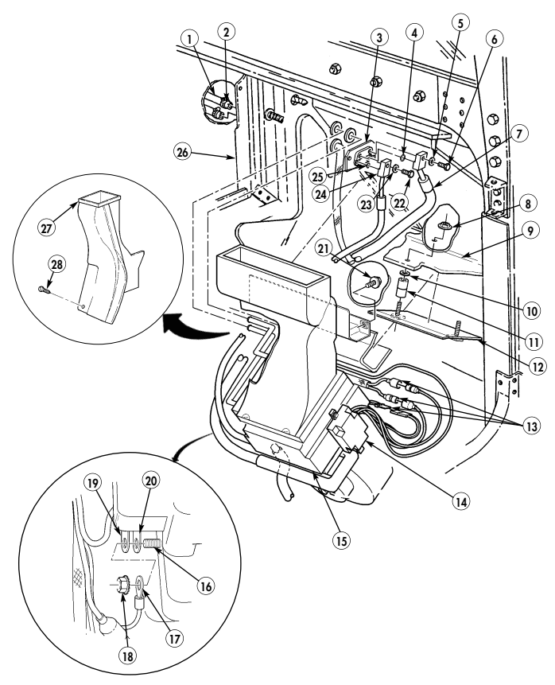

# 25-43. A/C Heater/Evaporator Assembly (Front) Replacement (Cont'D)

b. Installation

If plate was removed during removal, perform step 1. If plate was not removed, proceed to step 2.

1. Install plate (12) on body (9) with two spacers (11), washers (10), and washer assembled nuts (8). 2. Install A/C heater/evaporator assembly (15) on vehicle (26) with two washer assembled capscrews (21). 3. Install three leads (17), (19), and (20), to stud (16) with nut and lockwasher assembly (18). 4. Apply refrigerant oil to seal washer (25) and install seal washer (25) on high pressure hose (24). 5. Install high pressure hose (24) on evaporator block (3) with washer (23) and capscrew (22). 6. Apply refrigerant oil to seal washer (4) and install seal washer (4) on low pressure hose (7). 7. Install low pressure hose (7) on evaporator block (3) with washer (5) and capscrew (6). 8. Connect three electrical connectors (13) to module (14). 9. Install two heater hoses (1) and clamps (2) on A/C heater/evaporator assembly (15). Tighten two clamps (2).

10. Install lower airduct (27) on pillar (26) and A/C heater/evaporator assembly (15) with screw (28).

# 25-43. A/C Heater/Evaporator Assembly (Front) Replacement (Cont'D)

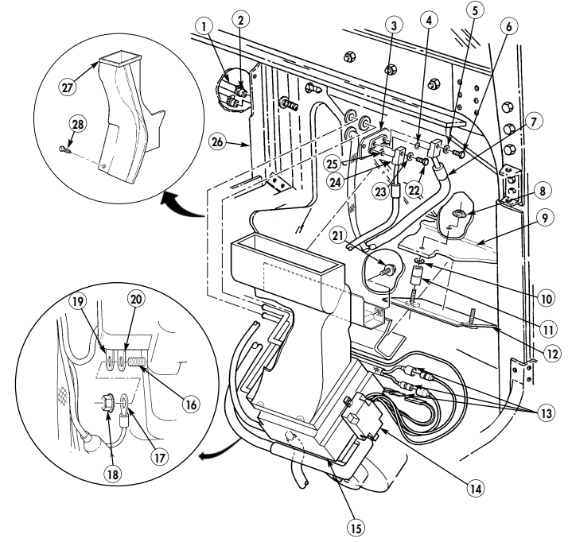

FOLLOW-ON TASKS: - Install front evaporator drain hose (para. 11-83).

- Connect battery ground cables (para. 4-68). - Install air intake assembly (para. 3-19). - Refill cooling system (para. 3-61). - Charge A/C system (para. 25-50.1). - Start vehicle, run A/C system, and check for leaks (TM 9-2320-387-10).

# 25-44. A/C Evaporator Assembly (Rear) Maintenance

This task covers:
b. Inspection

Applicable Models All models except M1113, M1114 Tools General mechanic's tool kit:
automotive (Appendix B, Item 1)
Maintenance and repair shop equipment:
automotive (Appendix B, Item 2)

#### Materials/Parts

Seal washer (Appendix G, Item 307.1) Seal washer (Appendix G, Item 307.2) Refrigerant oil (Appendix C, Item 48) Eight lockwashers (Appendix G, Item 146)
a. Removal c. Installation Manual References TM 9-2320-387-10 TM 9-2320-387-24P
Equipment Condition
- Battery ground cables disconnected 
(para. 4-68).

- A/C system discharged (para. 25-50.1).

Maintenance Level Direct support

All lines and fittings must be plugged when disconnected.

#### A. Removal

1. Remove eight capscrews (4), lockwashers (5), and washers (6) from rear A/C evaporator assembly (1)
and tunnel (11). Discard lockwashers (5).

2. Disconnect A/C wiring harness connector (2) from cannon plug (3). 3. Raise rear A/C evaporator assembly (1) and support. 4. Disconnect rear evaporator drain hose (16) from rear A/C evaporator assembly (1). 5. Loosen nut (8) and remove high-pressure hose (10) and seal washer (9) from evaporator highpressure tube (7). Discard seal washer (9).

6. Loosen nut (14) and remove low-pressure hose (12) and seal washer (13) from evaporator lowpressure tube (15). Discard seal washer (13).

7. Remove rear A/C evaporator assembly (1) from tunnel (11).

b. Inspection Refer to para. 10-56 for nut insert (17) inspection and replacement.

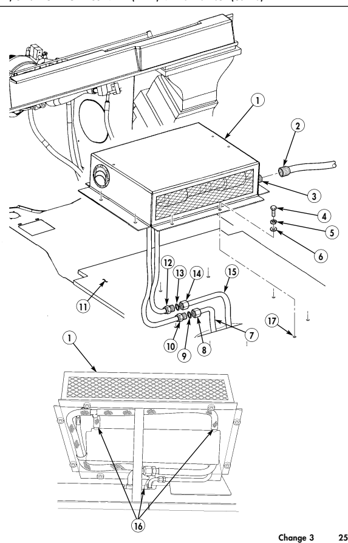

25-44.  A/C EVAPORATOR ASSEMBLY (REAR) MAINTENANCE (Cont'd)

# 25-44. A/C Evaporator Assembly (Rear) Maintenance (Cont'D)

c. Installation

#### Caution

Use grade 5 torque value when installing capscrews into nut inserts. Failure to do so may damage equipment or components.

1. Install rear A/C evaporator assembly (1) on tunnel (11) and support. 2. Apply refrigerant oil to seal washer (13) and install seal washer (13) on low-pressure hose (12). 3. Connect low-pressure hose (13) to evaporator low-pressure tube (15). Tighten nut (14). 4. Apply refrigerant oil to seal washer (9) and install seal washer (9) on high-pressure hose (10). 5. Connect high-pressure hose (10) to evaporator high-pressure tube (7). Tighten nut (8). 6. Connect rear evaporator drain hoses (16) to rear A/C evaporator assembly (1). 7. Connect A/C wiring harness connector (2) to cannon plug (3). 8. Remove support and lower rear A/C evaporator assembly (1). 9. Install rear A/C evaporator assembly (1) on tunnel (11) with eight capscrews (4), lockwashers (5),
and washers (6).

# 25-44. A/C Evaporator Assembly (Rear) Maintenance (Cont'D)

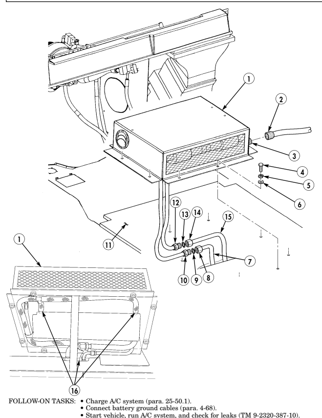

# 25-45. A/C Hoses (Front) Replacement

This task covers:

Applicable Models All models except M1113, M1114 Tools General mechanics tool kit:
automotive (Appendix B, Item 1)
Maintenance and repair shop equipment:
automotive (Appendix B, Item 2)

#### Materials/Parts

Four seal washers (Appendix G, Item 307.1) Four seal washers (two-man) 
(Appendix G, Item 307.2)
Five seal washers (four-man) (Appendix G,
Item 307.2)
Six lockwashers (Appendix G, Item 149) Refrigerant oil (Appendix C, Item 48)
a. Removal a. Removal **b. Installation**

| Manual References   |
|---------------------|

TM 9-2320-387-10 TM 9-2320-387-24P

#### Equipment Condition

Right front underbody armor (integrated)
removed (para. 25-52 or para. 25-52.1).

A/C high and low pressure switches removed
(para. 11-104.1).

Maintenance Level Direct support

- Note location of all tiedown straps prior to removal for ease of installation.

- Cut and remove tie down straps as necessary prior to removal. - Note locations of all hoses and tees prior to removal for ease of installation.

- All lines and fittings must be plugged when disconnected.

1. Remove capscrew (4), lockwasher (5), washer (6), high pressure hose (3), and seal washer (2) from A/C manifold (1). Discard seal washer (2) and lockwasher (5).

2. Remove capscrew (7), lockwasher (8), washer (9), low pressure hose (10), and seal washer (11) from A/C manifold (1). Discard seal washer (11) and lockwasher (8).

3. Remove capscrew (21), lockwasher (20), washer (19), high pressure hose (18), and seal washer (17)
from seal plate (16). Discard seal washer (17) and lockwasher (20).

Perform step 4 for A/C two-man system only.

4. Remove capscrew (12), lockwasher (13), washer (14), low pressure hose (10), and seal washer (22)
from seal plate (16). Discard seal washer (22) and lockwasher (13).

Perform step 5 for A/C four-man system only.

5. Remove capscrew (12), lockwasher (13), washer (14), low pressure hose (10), low pressure hose (15),
seal washer (22) and seal washer (23) from seal plate (16). Discard seal washers (22), (23) and lockwasher (13).

6. Remove capscrew (33), lockwasher (32), washer (31), high pressure hose (3), and seal washer (30)
from A/C hard line end (29). Discard seal washer (30) and lockwasher (32).

7. Remove capscrew (27), lockwasher (26), washer (25), high pressure hose (18), and seal washer (28)
from A/C hard line end (24). Discard seal washer (28) and lockwasher (26).

8. Remove high pressure hoses (3) and (18) from vehicle. 9. Remove low pressure hose (10) from vehicle.

# 25-45.  A/C Hoses (Front) Replacement (Cont'D)

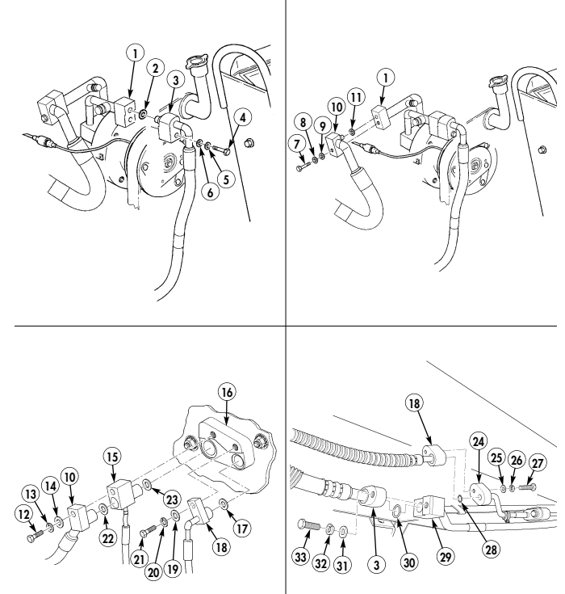

## 25-45. A/C Hoses (Front) Replacement (Cont'D)

#### B. Installation

1. Position low pressure hose (16) into proper position. 2. Position high pressure hoses (1) and (9) into proper position. 3. Apply refrigerant oil on seal washer (6) and install seal washer (6) on A/C hard line end (2). 4. Install high pressure hose (1) on A/C hard line end (2) with capscrew (5), lockwasher (4), and washer
(3).

5. Apply refrigerant oil on seal washer (8) and install seal washer (8) on A/C hard line end (7). 6. Install high pressure hose (9) on A/C hard line end (7) with capscrew (12), lockwasher (11), and washer (10).

Perform steps 7 through 9 for A/C four-man system only.

7. Apply refrigerant oil on seal washer (24) and install seal washer (24) on low pressure hose (17). 8. Apply refrigerant oil on seal washer (23) and install seal washer (23) on low pressure hose (16). 9. Install low pressure hoses (17) and (16) on seal plate (18) with capscrew (13), lockwasher (14), and washer (15).

Perform steps 10 and 11 for A/C two-man system only.

10. Apply refrigerant oil on seal washer (23) and install seal washer (23) on low pressure hose (16). 11. Install low pressure hose (16) on seal plate (18) with capscrew (13), lockwasher (14), and washer (15).

12. Apply refrigerant oil on seal washer (19) and install seal washer (19) on high pressure hose (1). 13. Install high pressure hose (1) on seal plate (18) with capscrew (22), lockwasher (21), and washer (20).

14. Apply refrigerant oil on seal washer (28) and install seal washer (28) on low pressure hose (16). 15. Install low pressure hose (16) on A/C manifold (29) with capscrew (25), lockwasher (26), and washer (27).

16. Apply refrigerant oil on seal washer (30) and install seal washer (30) on high pressure hose (9). 17. Install high pressure hose (9) on A/C manifold (29) with capscrew (31), lockwasher (32), and washer (33).

# 25-45. A/C Hoses (Front) Replacement (Cont'D)

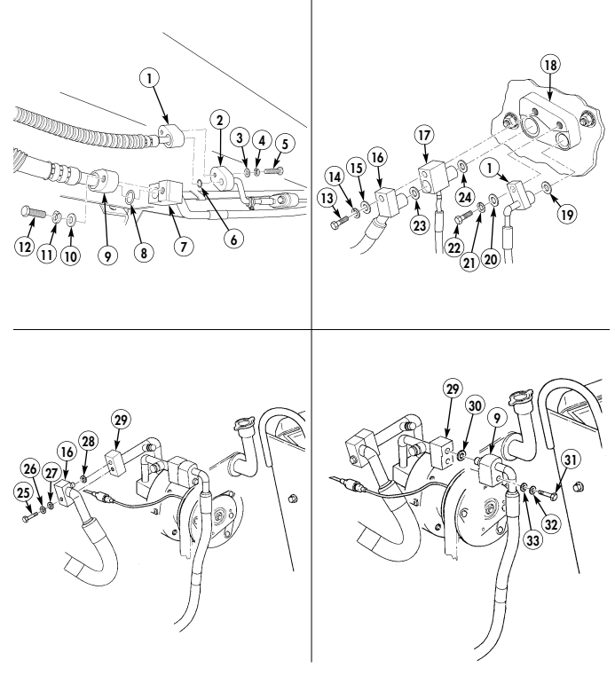

FOLLOW-ON TASKS: - Install A/C high and low pressure switches (para. 11-104.1).

- Install right front underbody armor (integrated) (para. 25-52 or para. 25-52.1). - Start vehicle, run A/C system, and check for leaks (TM 9-2320-387-10).

## 25-46. A/C Hose (Rear) Replacement

This task covers:

Applicable Models All models except M1113, M1114 Tools General mechanic's tool kit:
automotive (Appendix B, Item 1)
Maintenance and repair shop equipment:
automotive (Appendix B, Item 2)

#### Personnel Required

One mechanic One assistant

#### Materials/Parts

Five lockwashers (Appendix G, Item 149) Seven seal washers (Appendix G, Item 307.1) Tiedown straps (as required) (Appendix G,
Item 324)
Refrigerant oil (Appendix C, Item 48) Six O-rings (appendix G, Item 228.3)
a. Removal **b. Installation**

#### Manual References

TM 9-2320-387-10 TM 9-2320-387-24P

#### Equipment Condition

- Battery ground cables disconnected 
(para. 4-68).

- A/C system discharged (para. 25-50.1). - Condenser fan access panel removed 
(para. 11-103).

- Condenser fan supply vent removed 
(para. 11-104)
- Left rear upper underbody armor
(integrated) removed (para. 11-110 or para. 11-110.1).

- Left rear underbody armor (integrated)
removed (para. 11-117 or para 11-117.1 ).

- Right rear upper underbody armor
(integrated) removed (para. 11-109 or para. 11-109.1).

- Right rear underbody armor (integrated)
removed (para. 11-116 or para. 11-116.1).

#### Maintenance Level

Direct support a. Removal

- All lines and fittings must be plugged when disconnected. - Removal procedures for right A/C condenser hoses are the same as the left A/C condenser hoses. Perform steps 1 and 2 for left and right condenser hoses.

1. Loosen nut (3) and remove return hose (4) and O-ring (2) from A/C condenser line fitting (1). Discard O-ring (2).

2. Loosen nut (6) and remove supply hose (5) and O-ring (7) from A/C condenser line fitting (8). Discard O-ring (7).

3. Loosen two nuts (9) and remove both hoses (10), (13) and O-rings (11) from A/C receiver/dryer (12).

Discard O-rings (11).

# 25-46.  A/C Hose (Rear) Replacement (Cont'D)

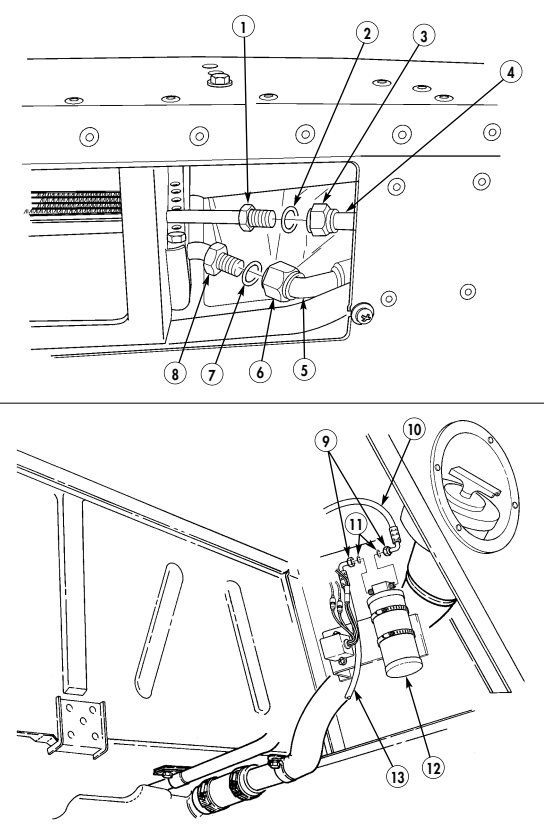

## 25-46. A/C Hose (Rear) Replacement (Cont'D)

4. Remove capscrew (14), lockwasher (15), washer (16), hard line end (25), seal washer (26), and seal washer (28) from junction block (27) and hose end (13). Discard seal washer (26), seal washer (28) and lockwasher (15).

5. Remove capscrew (22), lockwasher (23), washer (24), hard line end (21), seal washer (20), and seal washer (18) from junction block (19) and hose end (17). Discard seal washer (20), seal washer (18) and lockwasher (23).

6. Remove capscrew (2), lockwasher (3), washer (4), hard line end (7), and seal washer (6) from hose end (5). Discard seal washer (6) and lockwasher (3).

7. Remove capscrew (8), lockwasher (9), washer (10), hard line end (11), and seal washer (12) from hose end (1). Discard seal washer (12) and lockwasher (9).

25-46.  A/C HOSE (REAR) REPLACEMENT (Cont'd)

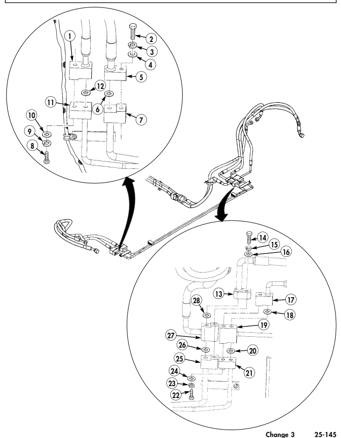

## 25-46. A/C Hose (Rear) Replacement (Cont'D)

8. Remove capscrew (1), lockwasher (2), washer (3), A/C hose (6), and seal washer (5) from front to rear hard line end (4). Discard seal washer (5) and lockwasher (2).

9. Remove capscrew (7), lockwasher (8), washer (9), A/C hose (10), and seal washer (11) from front to rear hard line end (12). Discard seal washer (11) and lockwasher (8).

#### B. Installation

1. Apply refrigerant oil to seal washer (5) and install seal washer (5) on A/C hose (6). 2. Install A/C hose (6) on front to rear hard line end (4) with capscrew (1), lockwasher (2), and washer (3).

3. Apply refrigerant oil to seal washer (11) and install seal washer (11) on A/C hose (10). 4. Install A/C hose (10) on front to rear hard line end (12) with capscrew (7), lockwasher (8), and washer (9).

# 25-46.  A/C Hose (Rear) Replacement (Cont'D)

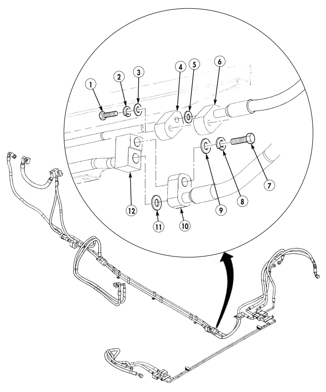

## 25-46. A/C Hose (Rear) Replacement (Cont'D)

5. Lubricate seal washer (12) and install on hose end (1). 6. Install hose end (1) on hard line end (11) with capscrew (8), lockwasher (9), and washer (10). 7. Lubricate seal washer (6) and install on hose end (5). 8. Install hose end (5) on hard line end (7) with capscrew (2), lockwasher (3), and washer (4). 9. Lubricate seal washer (20) and seal washer (18) and install on hose end (17) and junction block (19).

10. Install hose end (17) on hard line end (21), and junction block (19) with capscrew (22),
lockwasher (23), and washer (24).

11. Lubricate seal washer (28) and seal washer (26) and install on hose end (13) and junction block (27). 12. Install hose end (13) on hard line end (25) and junction block (27) with capscrew (14),
lockwasher (15), and washer (16).

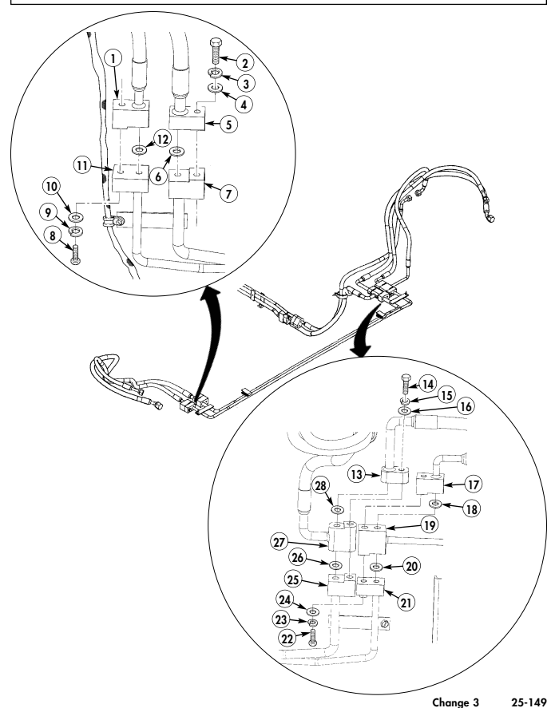

25-46.  A/C HOSE (REAR) REPLACEMENT (Cont'd)

## 25-46. A/C Hose (Rear) Replacement (Cont'D)

13. Apply refrigerant oil to O-rings (11) and install O-rings (11) and lines (10) and (13) on A/C receiver/dryer (12). Tighten nuts (9) to 12 lb-ft (16 N•m).

Removal procedures for right A/C condenser hoses are the same as the left A/C condenser hoses. Perform steps 14 through 17 for left condenser hoses.

14. Apply refrigerant oil to O-ring (7) and install O-ring (7) on supply hose (5). 15. Install supply hose (5) on A/C condenser line fitting (8). Tighten nut (6). 16. Apply refrigerant oil to O-ring (2) and install O-ring (2) on return hose (4). 17. Install return hose (4) on A/C condenser line fitting (1). Tighten nut (3).

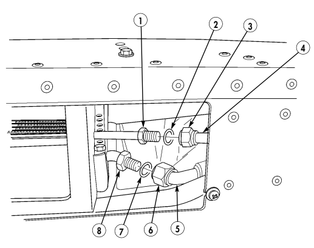

# 25-46. A/C Hose (Rear) Replacement (Cont'D)

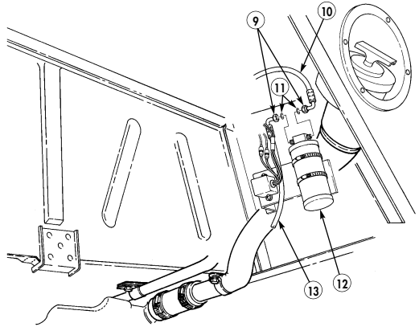

FOLLOW-ON TASKS: - Install right rear underbody armor (integrated) (para. 11-116 or para. 116.1).

- Install right rear upper underbody armor (integrated) (para 11-109 or para. 11-109.1).

- Install left rear underbody armor (integrated) (para. 11-117 or para. 11-117.1). - Install left rear upper underbody armor (integrated) 
(para. 11-110 or para. 11-110.1).

- Install condenser fan supply vent (para. 11-104) - Install condenser fan access panel (para. 11-103). - A/C system charged (para. 25-50.1). - Battery ground cables connected (para. 4-68). - Start vehicle, run A/C system and check for leaks (TM 9-2320-387-10).

# 25-47. A/C Condenser Fan Wiring Harness Replacement

This task covers:

Applicable Models All models except M1113 and M1114 Tools General mechanics tool kit:
automotive (Appendix B, Item 1)

#### Materials/Parts

Twenty tiedown straps (Appendix G, Item 323) Two lockwashers (Appendix G, Item 146) Refrigerant oil (Appendix C, Item 48)
Manual References TM 9-2320-387-10 TM 9-2320-387-24P

#### A. Removal B. Installation Equipment Condition

•A/C front air distribution duct removed 
(para. 11-100).

•Condenser fan access panels removed 
(para. 11-103).

•Engine access cover removed (para. 10-22). •Right front underbody armor (integrated)
removed (para. 25-52 or para. 25-52.1).

•Right rear underbody armor (integrated)
removed (para. 11-116 or para. 11-116.1).

•A/C hard line (front) removed (para. 25-49).

#### Maintenance Level

Direct support

- Tag and mark location of all wires prior to removal for ease of installation.

- Note location of all tie-down straps prior to removal for ease of installation.

- Cut and remove tie-down straps as necessary.

#### A. Removal

1. Disconnect two harness connectors (4) from right rear condenser fan (1). 2. Disconnect two harness connectors (3) from right front condenser fan (2). 3. Disconnect three harness connectors (5) from condenser fan relay (6).

Perform steps 4 and 5 for vehicles equipped with four-man A/C system only.

4. Disconnect two harness connectors (9) from left rear condenser fan (8). 5. Disconnect two harness connectors (10) from left front condenser fan (7). 6. Remove two capscrews (15), lockwashers (14), washers (13), clamps, (12), and A/C condenser fan wiring harness (16) from each condenser tray (11). Discard lockwashers (14).

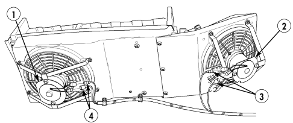

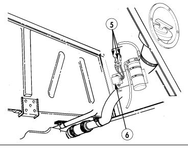

25-47.  A/C CONDENSER FAN WIRING HARNESS REPLACEMENT (Cont'd)

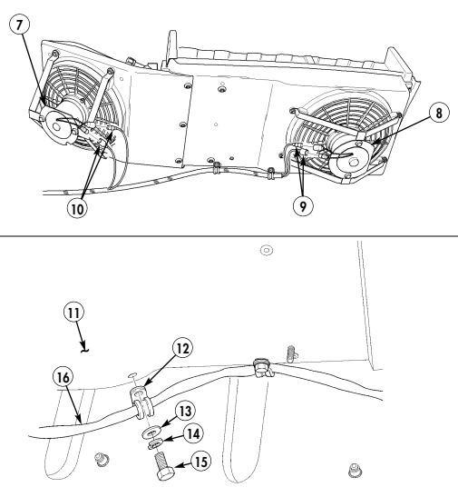

## 25-47. A/C Condenser Fan Wiring Harness Replacement (Cont'D)

7. Remove three screws (3) and clamps (1) securing A/C condenser fan wiring harness (2) to rear body support (4).

8. Remove screw (8), and clamp (7) securing A/C condenser fan wiring harness (2) to right rear tunnel of vehicle (9).

9. Remove A/C condenser fan wiring harness (2) from channel along bottom of tunnel on right side of vehicle (9).

10. Remove two screws (5), (6), and clamps (10), (11) securing A/C condenser fan wiring harness (2) to front of vehicle.

11. Disconnect four A/C condenser fan wiring harness connectors (13) from A/C wiring harness (12).

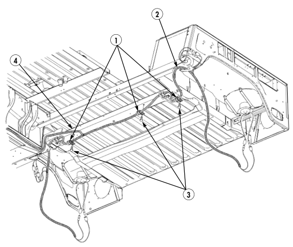

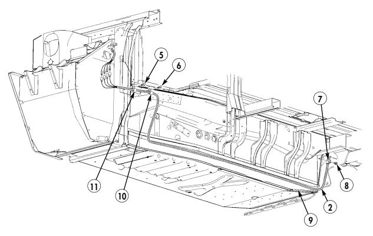

25-47.  A/C CONDENSER FAN WIRING HARNESS REPLACEMENT (Cont'd)

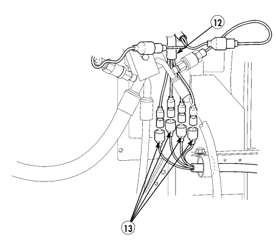

## 25-47. A/C Condenser Fan Wiring Harness Replacement (Cont'D)

b. Installation 1. Connect four replacement harness connectors (2) to A/C wiring harness (1). 2. Secure replacement harness (7) to front of vehicle (8) with two screws (3), (4), and clamps (9), (10). 3. Route replacement harness (7) downward along bottom of tunnel on right side of vehicle (8). 4. Secure replacement harness (7) to right rear tunnel of vehicle (8) with screw (6), and clamp (5). 5. Secure replacement harness (7) to rear body support (14) with three screws (12) and clamps (11).

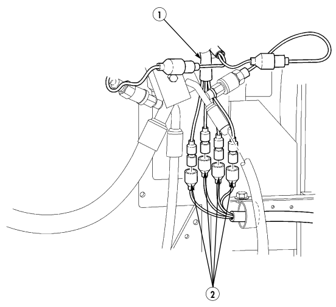

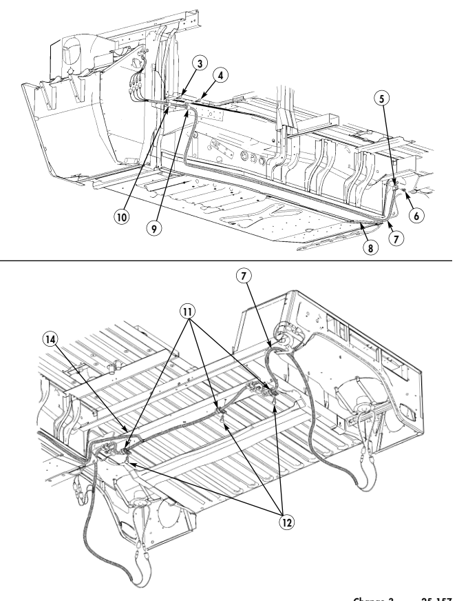

# 25-47.  A/C Condenser Fan Wiring Harness Replacement (Cont'D)

## 25-47. A/C Condenser Fan Wiring Harness Replacement (Cont'D)

6. Secure replacement harness (6) to each condenser tray (1) with two clamps (2), washers (3),
lockwashers (4), and capscrews (5).

Perform steps 7 and 8 only if vehicle is equipped with four-man A/C system. Otherwise, plug connector ends.

7. Connect two harness connectors (10) to left front condenser fan (7). 8. Connect two harness connectors (9) to left rear condenser fan (8). 9. Connect three harness connectors (11) to condenser fan relay (12).

10. Connect two harness connectors (15) to right front condenser fan (14). 11. Connect two harness connectors (16) to right rear condenser fan (13).

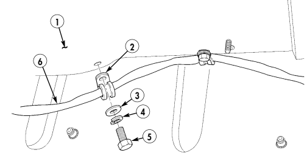

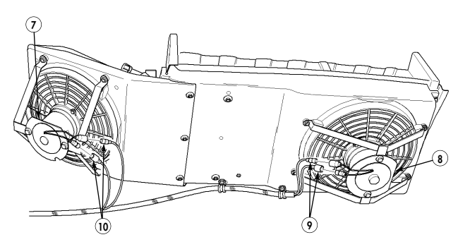

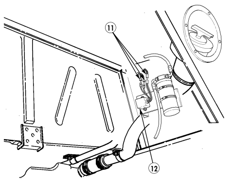

# 25-47. A/C Condenser Fan Wiring Harness Replacement (Cont'D)

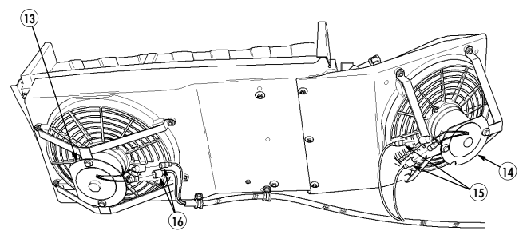

FOLLOW-ON TASKS: - Install A/C hard line (front) (para. 25-49).

- Install right rear underbody armor (integrated) (para. 11-116 or para. 11-116.1). - Install right front underbody armor (integrated) (para. 25-52 or para. 25-52.1) . - Install engine access cover (para. 10-22). - Install condenser fan access panels (para. 11-103). - Install A/C front air distribution duct (para. 11-100). - Start engine, run A/C system and check operation (TM 9-2320-387-10).

## 25-48. A/C Hoses (Middle) Replacement

This task covers:

Applicable Models All models except M1113, M1114 Tools General mechanics tool kit:
automotive (Appendix B, Item 1)
Maintenance and repair shop equipment:
automotive (Appendix B, Item 2)

#### Materials/Parts

Two seal washers (Appendix G, Item 307.1) Two seal washers (Appendix G, Item 307.2) Two lockwashers (Appendix G, Item 149) Refrigerant oil (Appendix C, Item 48)
a. Removal **c. Installation**

#### Manual References

TM 9-2320-387-24P
Equipment Condition
- A/C evaporator assembly (rear) removed
(para. 25-44).

- A/C low pressure switch removed 
(para. 11-104.1).

Maintenance Level Direct support a. Removal

- Note location of all tiedown straps prior to removal for ease of installation.

- Cut and remove tie down straps as necessary prior to removal. - Note locations of all hoses and tees prior to removal for ease of installation.

3. Remove low pressure hose (5) and high pressure hose (11) from vehicle.

#### B. Installation

1. Install low pressure hose (5) and high pressure hose (11) into proper position on vehicle. 2. Apply refrigerant oil on seal washers (10) and (12) and install seal washers (10) and (12) on high pressure hose (11) and hard line end (13).

3. Install high pressure hose (11) on A/C hard line end (9) and (13) with capscrew (16), lockwasher (15),
and washer (14).

4. Apply refrigerant oil on seal washers (7) and (8) and install seal washers (7) and (8) on low pressure hose (4) and low pressure hose (5).

5. Install low pressure hose (4) and low pressure hose (5) on seal plate (6) with capscrew (1),
lockwasher (2), and washer (3).

- All lines and fittings must be plugged when disconnected.

1. Remove capscrew (1), lockwasher (2), washer (3), low pressure hose (4), low pressure hose (5), seal washer (8) and seal washer (7) from seal plate (6). Discard seal washers (8), (7) and lockwasher (2).

2. Remove capscrew (16), lockwasher (15), washer (14), high pressure hose (11), seal washer (10) and seal washer (12) from A/C hard line end (9) and (13). Discard seal washers (10), (12) and lockwasher (15).

# 25-48. A/C Hoses (Middle) Replacement (Cont'D)

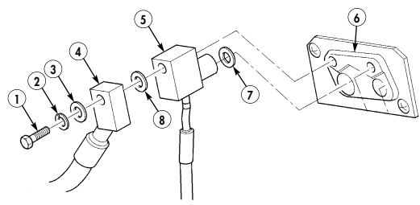

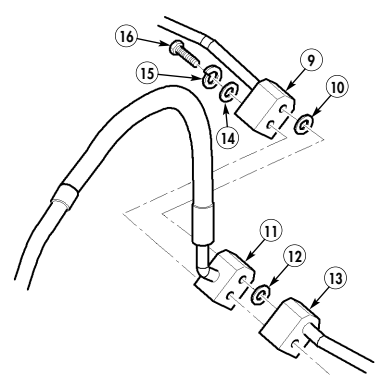

FOLLOW-ON TASKS
- Install A/C low pressure switch (para. 11-104.1).
- Install A/C evaporator assembly (rear) (para. 25-44).

## 25-49. A/C Hard Line (Front) Replacement

This task covers:

Applicable Models All models except M1113, M1114 Tools General mechanics tool kit:
automotive (Appendix B, Item 1)
Maintenance and repair shop equipment:
automotive (Appendix B, Item 2)

#### Materials/Parts

Five lockwashers (Appendix G, Item 149) Five seal washers (Appendix G, Item 307.1) Refrigerant oil (Appendix C, Item 48)
a. Removal **b. Installation**

#### Manual References

TM 9-2320-387-10 TM 9-2320-387-24P

#### Equipment Condition

- Right front underbody armor (integrated)
removed (para. 25-52 or para. 25-52.1).

- Right rear upper underbody armor
(integrated) removed (para 11-109 or para. 11-109.1).

- Right rear underbody armor (integrated)
removed (para. 11-116 or para. 11-116.1).

Maintenance Level Direct support

#### A. Removal Note

- Note locations of all lines and tees prior to removal for ease of installation
- All lines and fittings must be plugged when disconnected.

1. Remove screw (6) and P-clamp (7) from body channel (14). 2. Remove capscrew (5), lockwasher (4), washer (3), A/C hose (1), and seal washer (21) from hard line jumper (2). Discard seal washer (21) and lockwasher (4).

3. Remove capscrew (12), lockwasher (11), washer (10), hard line jumper (2) and seal washer (9) from A/C hard line end (8). Discard seal washer (9) and lockwasher (11).

4. Remove capscrew (20), lockwasher (19), washer (18), A/C hose (17), and seal washer (16) from A/C hard line end (15). Discard seal washer (16) and lockwasher (19).

5. Remove capscrew (22), lockwasher (23), washer (24), A/C hose (27), and seal washer (26) from A/C hard line end (25). Discard seal washer (26) and lockwasher (23).

6. Remove capscrew (28), lockwasher (29), washer (30), A/C hose (31), and seal washer (32) from A/C hard line end (33). Discard seal washer (32) and lockwasher (29).

7. Remove four capscrews (35) and washers (34) from A/C hard line (13) and body channel (14). 8. Remove A/C hard lines (13) from body channel (14) by moving A/C hard lines forward.

25-49.  A/C HARD LINE (FRONT) REPLACEMENT (Cont'd)

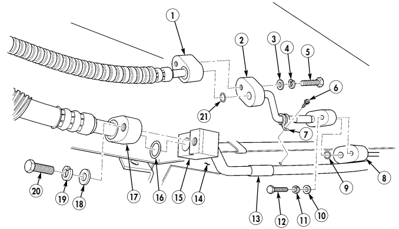

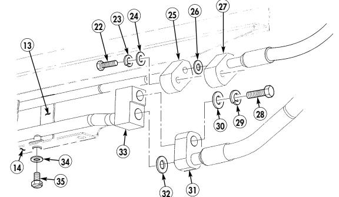

## 25-49. A/C Hard Line (Front) Replacement (Cont'D)

#### B. Installation

1. Position A/C hard lines (16) on body channel (15). 2. Install A/C hard lines (16) on body channel (15) with four capscrews (14) and washers (13). 3. Apply refrigerant oil on seal washer (11) and install seal washer (11) on A/C hose (10). 4. Install A/C hose (10) on A/C hard line end (12) with capscrew (7), lockwasher (8), and washer (9). 5. Apply refrigerant oil to seal washer (5) and install seal washer (5) on A/C hose (6). 6. Install A/C hose (6) on A/C hard line end (4) with capscrew (1), lockwasher (2), and washer (3).

7. Apply refrigerant oil on seal washer (30) and install seal washer (30) on A/C hose (31). 8. Install A/C hose (31) on A/C hard line end (29) with capscrew (34), lockwasher (33), and washer (32). 9. Apply refrigerant oil on seal washer (25) and install seal washer (25) on hard line jumper (18).

10. Install hard line jumper (18) on A/C hard line end (24) with capscrew (28), lockwasher (27), and washer (26).

11. Apply refrigerant oil on seal washer (35) and install seal washer (35) on A/C hose (17). 12. Install A/C hose (17) on hard line jumper (18) with capscrew (21), lockwasher (20), and washer (19). 13. Install P-clamp (23) on body channel (15) with screw (22).

# 25-49. A/C Hard Line (Front) Replacement (Cont'D)

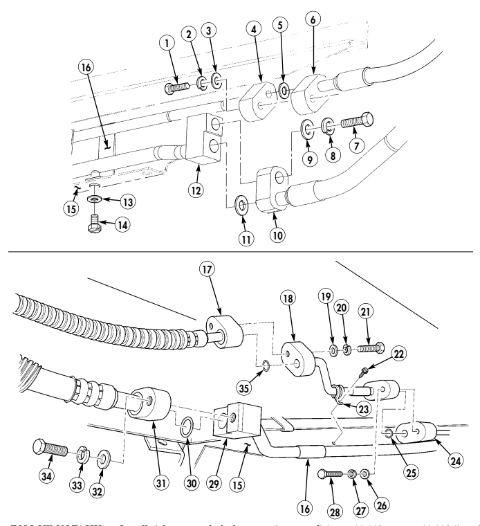

FOLLOW-ON TASKS: - Install right rear underbody armor (integrated) (para. 11-116 or para. 11-116.1).

- Install right rear upper underbody armor (integrated) (para. 11-109 or para. 109.1). - Install right front underbody armor (integrated) (para. 25-52 or para. 25-52.1). - Start engine, run A/C system and check for leaks (TM 9-2320-387-10).

# 25-50. A/C Hard Line (Rear) Replacement

This task covers:

Applicable Models All models except M1113 and M1114

| Materials/Parts   |
|-------------------|

Tools General mechanics tool kit:
automotive (Appendix B, Item 1)
Maintenance and repair shop equipment:
automotive (Appendix B, Item 2)
Nine lockwashers (Appendix G, Item 149) Twelve seal washers (Appendix G,
Item 307.1)
Refrigerant oil (Appendix C, Item 48)
a. Removal b. Installation

| Manual References                                 | TM 9\-2320\-387\-24P                      |
|---------------------------------------------------|-------------------------------------------|
| Equipment Condition                               | - Air horn\-to\-air cleaner elbow removed |
| (para. 3\-15).                                    | - A/C system discharged (para. 25\-15).   |
| - A/C coolant line covers removed (para. 25\-32). | Maintenance Level                         |
| Direct support                                    |                                           |

All lines and fittings must be plugged when disconnected.

#### A. Removal

1. Remove capscrew (19), lockwasher (20), washer (21), hard line end (30), seal washer (31), and seal washer (33) from junction block (32) and hose end (18). Discard seal washer (33), seal washer (31) and lockwasher (20).

2. Remove capscrew (27), lockwasher (28) and washer (29), hard line end (26), seal washer (25), and seal washer (23) from junction block (24) and hose end (22). Discard seal washer (25), seal washer (23) and lockwasher (28).

3. Remove capscrew (2), lockwasher (3), washer (4), hard line end (7), and seal washer (6) from hose end (5). Discard seal washer (6) and lockwasher (3).

4. Remove capscrew (11), lockwasher (12), washer (13), hard line end (16), and seal washer (17) from hose end (1). Discard seal washer (17) and lockwasher (12).

5. Remove four capscrews (9), one P-clamp (10), harness (15), and rear hard lines (8) from body (14).

#### B. Installation

1. Install rear hard lines (8), harness (15), and P-clamp (10) on body (14) with four capscrews (9). 2. Lubricate seal washer (17) and install on hose end (1). 3. Install hose end (1) on hard line end (16) with capscrew (11), lockwasher (12), and washer (13). Tighten capscrew (11) to 6 lb-ft (8 N•m).

4. Lubricate seal washer (6) and install on hose end (5). 5. Install hose end (5) on hard line end (7) with capscrew (2), lockwasher (3), and washer (4). Tighten capscrew (2) to 6 lb-ft (8 N•m).

6. Lubricate seal washer (25) and seal washer (23) and install on hose end (22) and junction block (24). 7. Install hose end (22) on hard line end (26), and junction block (24) with capscrew (27),
lockwasher (28), and washer (29). Tighten capscrew (27) to 6 lb-ft (8 N•m).

8. Lubricate seal washer (33) and seal washer (31) and install on hose end (18) and junction block (32). 9. Install hose end (18) on hard line end (30) and junction block (32) with capscrew (19), lockwasher (20), and washer (21). Tighten capscrew (19) to 6 lb-ft (8 N•m).

# 25-50. A/C Hard Line (Rear) Replacement (Cont'D)

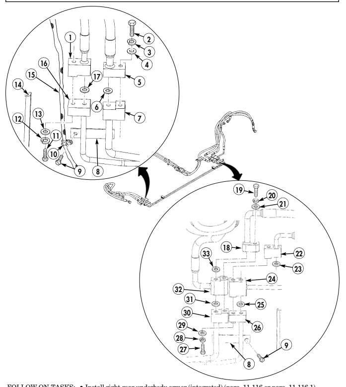

FOLLOW-ON TASKS: - Install right rear underbody armor (integrated) (para. 11-116 or para. 11-116.1).
- Install right rear upper underbody armor (integrated) (para. 11-109 or para. 11-109.1). - Install left rear underbody armor (integrated) (para. 11-117 or para. 11-117.1). - Install left rear upper underbody armor (integrated) (para. 11-110 or para. 11-110.1). - Charge A/C system (para. 25-50.1). - Start vehicle, run A/C system and check for leaks (TM 9-2320-387-10).

## 25-50.1. A/C System Servicing

This task covers:
a. Manifold Gauge Set Installation e. Evacuating System b. Manifold Gauge Set Removal f. Charging System c. Discharging System g. Adding Refrigerant Oil d. Flushing System

Applicable Models All except M1113 and M1114

#### Tools

General mechanic's tool kit:
automotive (Appendix B, Item 1)
Flushing cylinder (Appendix B, Item 128) Flush gun (Appendix B, Item 129) Service refrigeration unit tool kit 
(Appendix B, Item 131)
Vacuum pump (Appendix B, Item 132) Manifold gauge set (Appendix B, Item 130)

#### Materials/Parts

Lubricating oil (Appendix C, Item 48) Refrigerant R-134a (Appendix C, Item 56) Nitrogen (Appendix C, Item 51) Flushing agent (Appendix C, Item 30)

#### Manual References

TM 9-2320-387-10 TM 9-2320-387-24P

#### Equipment Condition

Hood raised and secured (TM 9-2320-387-10).

#### General Safety Instructions

- Always wear eye protection when working with R-134a.

- Exercise extreme care when handling R-134a. - Do not attempt to connect servicing equipment while engine is running.

- Ensure hand valves on manifold gauge set are closed during connection; hoses must be clear of any moving engine parts.

- Eye protection must be worn when using compressed nitrogen.

Maintenance Level Direct support

#### Warning

- Always wear eye protection when using R-134a or when servicing the air conditioning system. Injury will result if R-134a comes in contact with eyes.

- Exercise extreme care when handling R-134a. Direct contact between R-134a and skin may cause frostbite.

- Always use recovery machine. - Do not attempt to connect servicing equipment while engine is running. Injury to personnel or damage to equipment may result.

Whenever any air conditioning vapor system component needs replacement, the system must be discharged, flushed, and a new dryer bottle installed (para. 25-16).

# 25-50.1. A/C System Servicing (Cont'D)

#### A. Manifold Gauge Set Installation

1. Turn high-pressure gauge valve (2) and low-pressure gauge valve (1) on manifold gauge set (3)
clockwise to seated (closed) positions.

2. Remove two caps (6) from service ports (7) and (8).

#### Warning

Ensure hand valves on manifold gauge are in closed position during connection and hoses are clear of any moving parts in engine compartment. Injury to personnel or damage to equipment may result.

3. Connect low-pressure gauge hose (5) on manifold gauge set (3) to suction (low side) service port (8). 4. Connect high-pressure gauge hose (4) on manifold gauge set (3) to discharge (high side) service port (7). 5. Hang manifold gauge set (3) so hoses (4) and (5) are well away from moving engine parts.

NOTE
Do not perform step 6 if system is already evacuated. High- and

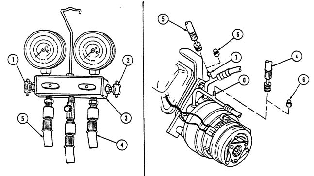 low-pressure hoses must be purged with R-134a for charging purposes (refer to task f.).

6. Slightly loosen low-pressure gauge hose (5) and high-pressure gauge hose (4) at manifold gauge set (3)
to purge air from hoses, then tighten.

# 25-50.1. A/C System Servicing (Cont'D)

b. Manifold Gauge Set Removal 1. Ensure high-pressure gauge valve (2) and low-pressure gauge valve (1) on manifold gauge set (3)
are in seated (clockwise) position.

2. If system was charged with refrigerant, wait several minutes after turning engine off for high and low sides to stabilize before performing next step.

#### Caution

A charged A/C system is always pressurized at 20-30 psi (138-207 kPa). Hose connectors must be held firmly to avoid ends whipping back and damaging equipment.

3. Disconnect low-pressure gauge hose (6) and high-pressure gauge hose (4) from service ports (8) and (9). 4. Install two caps (7) on service ports (8) and (9).

#### C. Discharging System

1. Install manifold gauge set (refer to task a.). 2. Connect center hose (5) of manifold gauge set (3) to an approved recovery machine.

- Do not allow refrigerant R-134a to escape too quickly.

Refrigerant oil will escape.

- When high- and low-pressure gauges read zero, the discharging procedure is complete. Allow machine to run for 5 minutes after gauges read zero.

3. Slightly turn high-pressure gauge valve (2) and low-pressure gauge valve (1) counterclockwise to permit refrigerant to slowly escape through center hose (5) until both gauges read zero.

4. Measure any significant accumulation of oil in discharge bottle and record for oil charging purposes. 5. Disconnect manifold gauge set (3) (refer to task b.).

# 25-50.1. A/C System Servicing (Cont'D)

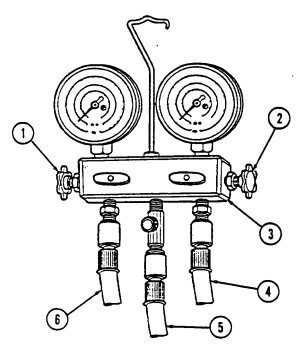

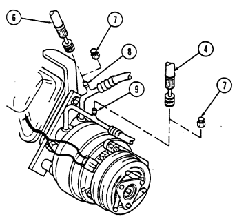

# 25-50.1. A/C System Servicing (Cont'D)

d. Flushing System

#### Caution

- Never flush compressor. Flushing removes oil. Damage to compressor will result if compressor is flushed.

- Air conditioning system flushing is essential when replacing failed compressors. Failure to flush A/C system will result in damage to new compressor.

NOTE
- Do not attempt to use R-134a as a flushing agent. R-134a will not remain a liquid at ambient temperatures. Use R-111 or R-113 for flushing purposes.

- Flushing is done to remove solid materials such as oil, sludge, and metal particles from failed components.

- For a complete system flush, tools must be installed at A/C lines at compressor.

1. Discharge A/C system (refer to task c.). 2. Fill flushing cylinder (2) with flushing agent.

#### Warning

Eye protection must be worn when using compressed nitrogen. Failure to do so may result in injury to personnel.

3. Pressurize flushing cylinder (2) with compressed nitrogen to 100 psi (690 kPa). 4. Connect flushing gun (3) to flushing cylinder (2).

- Perform steps 5 through 7 on condenser, evaporator, and refrigerant lines. Continue flushing until there is no evidence of oil or contaminants.

- Illustration shows flushing of condenser. Procedure is similar for flushing of other components.

5. Insert flushing gun (3) into refrigerant outlet tube (4) of component to be flushed. 6. Connect a rubber hose (7) over inlet (5) of component to be flushed, and place other end of hose (7)
in a drain pan (6).

7. Open flushing gun (3) to blow cleaning agent through component. 8. Remove rubber hose (7) from component and plug refrigerant line. 9. Remove flushing gun (3) from component and plug refrigerant line.

# 25-50.1. A/C System Servicing (Cont'D)

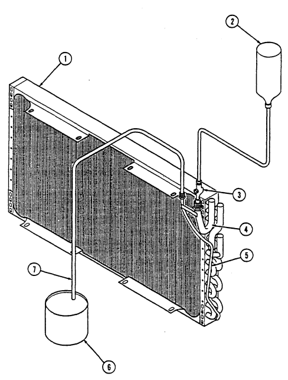

# 25-50.1. A/C System Servicing (Cont'D)

e. Evacuating System

#### Caution

Never attempt to evacuate A/C system if system has not been completely discharged.

1. Discharge A/C system (refer to task c.) and flush A/C system if necessary (refer to task d.). 2. Connect manifold gauge set (3) (refer to task a.). 3. Connect vacuum pump to center hose (4) on manifold gauge set (3). 4. Turn vacuum pump on and open high-pressure gauge valve (2) and low-pressure gauge valve (1) on manifold gauge set (3).

High-pressure side gauge should drop to zero or below. If not, a blockage in A/C system is indicated.

5. Evacuate unit until low-pressure gauge reads 29 in. Hg of vacuum. 6. Continue evacuation for forty-five minutes after correct gauge reading of 29 in. Hg of vacuum has been achieved.

7. Turn high-pressure gauge valve (2) and low-pressure gauge valve (1) on manifold gauge set (3) to closed position after evacuation is complete.

8. Turn off vacuum pump and disconnect center hose (4) from vacuum pump.

Vacuum of 29 in. Hg should be sustained on low-pressure gauge for at least ten minutes. If not, a leak in A/C system is indicated. Identify source of leak and repair as necessary.

9. Check for leaks ten minutes after gauge valves are turned off.

Manifold gauge set can remain connected and service valves left in mid-position if charging A/C system will follow immediately.

10. Disconnect manifold gauge set (3) (refer to task b.).

# 25-50.1. A/C System Servicing (Cont'D)

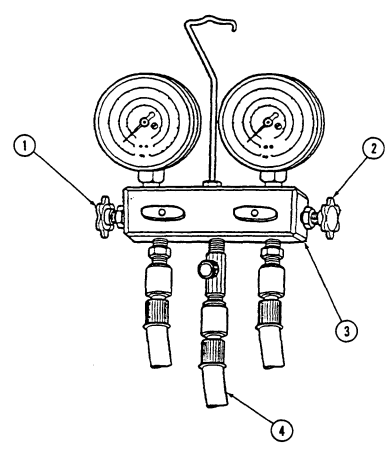

# 25-50.1. A/C System Servicing (Cont'D)

f. Charging System

If A/C system requires replacement of a major component or has been flushed, refrigerant oil must be added to system to compensate loss (refer to task g.).

1. Evacuate A/C system (refer to task e.). 2. Connect refrigerant R-134a source to center hose (5) of manifold gauge set (3). 3. Open refrigerant R-134a source to allow refrigerant to flow into center hose (5). 4. Purge center hose (5), low-pressure hose (6), and high-pressure hose (4) as follows:
a. Slightly loosen center hose (5) at center port (7) of manifold gauge set (3) until refrigerant escapes, then tighten hose (5).

b. Open high-pressure gauge valve (2) and low-pressure gauge valve (1) to allow refrigerant to flow into high-pressure hose (4) and low-pressure hose (6).

c. Purge high-pressure hose (4) and low-pressure hose (6) at service ports on compressor. d. Turn high-pressure gauge valve (2) and low-pressure gauge valve (1) clockwise to OFF position.

5. Connect STE/ICE-R (para. 2-47) to obtain engine rpm reading.

#### Warning

Ensure high-pressure gauge valve is in closed position on manifold gauge set during charging. Failure to do so will cause compressor to build pressure in refrigerant container, causing injury to personnel or damage to equipment.

6. Start engine and set engine speed to 1,500 rpm with hand throttle (TM 9-2320-387-10). 7. Turn on A/C system (TM 9-2320-387-10) and set blower fans on high speed.

Keep refrigerant container upright at all times so refrigerant enters system as a gas.

8. Open low-pressure gauge valve (1) on manifold gauge set (3) until system is fully charged with 3 lbs 8 oz of R-134a refrigerant (refer to table 14-2).

9. Close low-pressure gauge valve (1) on manifold gauge set (3).

10. Return hand throttle to normal idle (TM 9-2320-387-10). 11. Stop engine (TM 9-2320-387-10). 12. Remove refrigerant R-134a source from center hose (5) of manifold gauge set (3). 13. If no refrigerant oil is needed, disconnect manifold gauge hoses (4) and (6) from A/C system service ports (9) and (10). Install caps (8) on service ports (9) and (10). If refrigerant oil is needed, perform task g.

# 25-50.1. A/C System Servicing (Cont'D)

g. Adding Refrigerant Oil

- It is not necessary to check or add oil as routine maintenance.

It is necessary to add oil when the evaporator, condenser, compressor, or receiver/dryer has been replaced or there was an obvious oil leak. When a system is discharged, it is also necessary to replace any oil carried out with the refrigerant.

- Vehicle must be on level ground. - A new compressor is charged with 6 oz of refrigerant oil.

1. If only the compressor is being replaced, drain and measure oil from compressor being replaced.

Drain new compressor and add the same amount of refrigerant oil as was drained from old compressor.

2. If there is a loss of refrigerant over a period of time and a component is being replaced to correct leak, add refrigerant oil to the component being replaced as follows: - Condenser - 1 oz - Receiver/Dryer - 1 oz - Evaporator - 3 oz 3. When the system oil level is unknown, or system performance and efficiency are marginal, drain and flush system and add a new 6-oz charge of refrigerant oil to the system.

FOLLOW-ON TASK: Lower and secure hood (TM 9-2320-387-10).

# Section Iv. Integrated Armor Protection (Iap)

## 25-51. Integrated Armor Protection (Iap) Maintenance Task Summary

| b.  Inspection                           |                                                                                              |
|------------------------------------------|----------------------------------------------------------------------------------------------|
| INITIAL SETUP:                           |                                                                                              |
| Applicable Models                        | Manual References                                                                            |
| M1114                                    | TM 9\-2320\-387\-24P                                                                         |
| Tools                                    | Equipment Condition                                                                          |
| General mechanic's tool kit:             | - Left passenger seat removed (para. 10\-45).                                                |
| automotive (Appendix B, Item 1)          | - Driver's seat assembly removed (para. 10\-40).                                             |
| Automotive maintenance and repair: field |                                                                                              |
| maintenance, basic (Appendix B, Item 6)  | Maintenance Level                                                                            |
|                                          | Direct support                                                                               |
| Materials/Parts                          |                                                                                              |
| Sealing compound (Appendix C, Item 72.1) |                                                                                              |
| a. Removal                               |                                                                                              |
| 1.                                       | Remove four capscrews (5) and washers (6) from A/C coolant line front cover (7) at left side |
| tunnel (1).                              |                                                                                              |

# 25-52. Right Front Underbody Armor (Integrated) Maintenance (Serial Numbers 241953 And Below)

This task covers:
b. Inspection

Applicable Models M1151A1, M1152A1, M1165A1 Tools General mechanic's tool kit:
automotive (Appendix B, Item 1)
Maintenance and repair shop equipment:
automotive (Appendix B, Item 2)

#### Materials/Parts

Thirteen locknuts (Appendix G, Item 106) Eleven lockwashers (Appendix G, Item 144) Four locknuts (Appendix G, Item 112)
a. Removal c. Installation

#### Equipment Condition

- Air cleaner assembly removed (para. 3-12). - Companion seat removed (para. 10-43). - Right front cowl insulation removed
(para. 10-32).

- A/C heater/evaporator assembly (front)
removed (para. 25-43).

- Right underbody extension armor
(integrated) removed (para. 11-114).

#### General Safety Instructions

Right front underbody armor is extremely heavy and must be supported during removal and installation.

Maintenance Level Direct support Personnel Required One mechanic One assistant Manual References TM 9-2320-387-24P

#### Warning

Right front underbody armor is extremely heavy and must be supported during removal and installation. Failure to do so may result in injury to personnel or damage to equipment.

NOTE
Note location of screws, nuts, spacers, and brackets for installation.

#### A. Removal

1. Remove six locknuts (28), washers (29), capscrews (21), and washers (20) from front underbody armor (19), lower A-pillar armor (35), and outer kick liner (27). Discard locknuts (28).

2. Remove locknut (10) washer (36), capscrew (37), and washer (11) from front underbody armor (19)
and inner cowl armor (7). Discard locknut (37).

3. Remove locknut (12), washer (13), capscrew (31), and washer (30) from front underbody armor (19),
inner cowl armor (7), and outer kick liner (27). Discard locknut (12).

4. Remove locknut (9), washer (3), capscrew (2), and washer (8) from front underbody armor (19), inner cowl armor (7), and inner kick liner (32). Discard locknut (9).

5. Remove seven capscrews (4), lockwashers (5), washers (6), and threaded plate (18) from front underbody armor (19) and inner kick liner (32). Discard lockwashers (5).

6. Remove four locknuts (34), washers (33), capscrews (23), and washers (22) from front underbody armor (19) and lower A-pillar armor (35). Discard locknuts (34).

7. Remove four capscrews (17), lockwashers (16), washers (15), and two plates (14) from front underbody armor (19). Discard lockwashers (16).

25-170 Change 5

# 25-52. Right Front Underbody Armor (Integrated) Maintenance (Serial Numbers 241953 And Below) (Cont'D)

8. Lower front underbody armor (19). 9. Remove four locknuts (25), clamps (26), and two brackets (27) from frame rail (1). Discard locknuts (25).

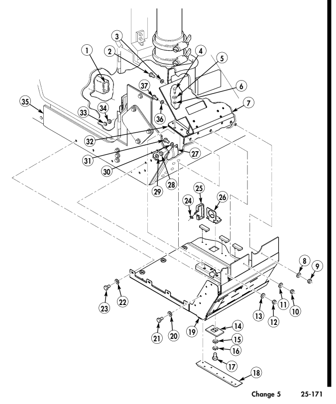

# 25-52. Right Front Underbody Armor (Integrated) Maintenance (Serial Numbers 241953 And Below) (Cont'D)

b. Inspection 1. Refer to para. 10-56 for nut insert inspection and replacement. 2. Inspect rubber strips, replace if damaged.

c. Installation

#### Caution

- Ensure clamps on frame are positioned under brake lines.

Failure to do so will result in damage to equipment.

- Use grade 5 torque value when installing capscrews into nut inserts. Failure to do so may damage equipment or components.

Perform step 2 if brackets and clamps were removed.

1. Install four clamps (25) and two brackets (26) on frame rail (1) with four locknuts (24). Tighten locknuts (24) to 64-68 lb-in. (7-8 N•m).

2. Raise front underbody armor (19) into proper position. 3. Install two plates (14) on front underbody armor (19) with four washers (15), lockwashers (16), and capscrews (17).

4. Secure front underbody armor (19) to lower A-pillar armor (35) with four washers (22), capscrews (23),
washers (33), and locknuts (34).

5. Install threaded plate (18) on front underbody armor (19) and inner kick liner (32) with seven washers (6), lockwashers (5), and capscrews (4).

6. Secure front underbody armor (19) to inner cowl armor (7), and inner kick liner (32) with washer (8),
capscrew (2), washer (3), and locknut (9).

7. Secure front underbody armor (19) to inner cowl armor (7) and outer kick liner (27) with washer (30),
capscrew (31), washer (13), and locknut (12).

8. Secure front underbody armor (19) to inner cowl armor (7) with washer (37), capscrew (37), washer (11),
and locknut (10).

9. Secure front underbody armor (19) to lower A-pillar armor (35) and outer kick liner (27) with six washers (20), capscrews (21), washers (29), and locknuts (28).

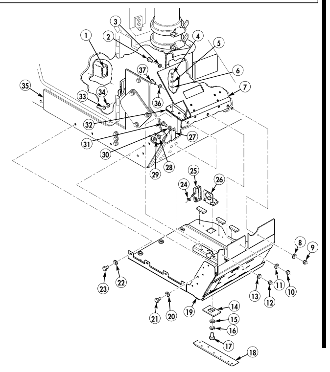

# 25-52. Right Front Underbody Armor (Integrated) Maintenance (Serial Numbers 241953 And Below) (Cont'D)

FOLLOW-ON TASKS: - Install right underbody extension armor (integrated) (para. 11-114).

- Install A/C heater/evaporator assembly (front) (para. 25-43). - Install right front cowl insulation (para. 10-32). - Install companion seat (para. 10-43). - Install air cleaner assembly (para. 3-12).

# 25-52.1. Right Front Underbody Armor (Integrated) Maintenance (Serial Numbers 241954 And Above)

This task covers:
b. Inspection

Applicable Models M1151A1, M1152A1, M1165A1 Tools General mechanic's tool kit:
automotive (Appendix B, Item 1)
Maintenance and repair shop equipment:
automotive (Appendix B, Item 2)
Materials/Parts Thirteen locknuts (Appendix G, Item 106) Seven lockwashers (Appendix G, Item 144) Four locknuts (Appendix G, Item 112) Adhesive (Appendix C, Item 4)
Personnel Required One mechanic One assistant a. Removal c. Installation

#### Manual References

TM 9-2320-387-24P

#### Equipment Condition

- Air cleaner assembly removed (para. 3-12). - Companion seat removed (para. 10-43). - Right front cowl insulation removed
(para. 10-32).

- A/C heater/evaporator assembly (front)
(integrated) removed (para. 25-43).

- Right underbody extension armor
(integrated) removed (para. 11-114.1).

General Safety Instructions Right front underbody armor is extremely heavy and must be supported during removal and installation.

Maintenance Level Direct support

#### Warning

Right front underbody armor is extremely heavy and must be supported during removal and installation. Failure to do so may result in injury to personnel or damage to equipment.

NOTE
Note location of screws, nuts, spacers, and brackets for installation.

a. Removal 1. Remove six locknuts (28), washers (29), capscrews (21), and washers (20) from front underbody (19),
body (36), and outer kick liner (27). Discard locknuts (28).

2. Remove locknut (10), washer (11), capscrew (34), and washer (33) from front underbody armor (19)
and inner cowl armor (7). Discard locknut (10).

3. Remove locknut (12), washer (13), capscrew (31), and washer (32) from front underbody armor (19),
inner cowl armor (7), and outer kick liner (27). Discard locknut (12).

4. Remove locknut (9), washer (8), capscrew (2), and washer (3) from front underbody armor (19), inner cowl armor (7), and outer kick liner (27). Discard locknut (9).

5. Remove seven capscrews (4), lockwashers (5), washers (6), and threaded plate (18) from front underbody armor (19) and inner kick liner (32). Discard lockwashers (5).

6. Remove four locknuts (38), washers (37), capscrews (23), and washers (22) from front underbody armor (19) and body (36). Discard locknuts (38).

7. Remove four capscrews (17), lockwashers (16), washers (15), and two plates (14) from front underbody armor (19). Discard lockwasher (16)

Support upper cowl liner when removing front underbody armor.

8. Lower front underbody armor (19) and remove spacer (35) from body (36). 9. Remove four locknuts (24), clamps (25), and two brackets (26) from frame rail (1). Discard locknuts (24).

25-52.1. RIGHT FRONT UNDERBODY ARMOR (INTEGRATED) MAINTENANCE
(SERIAL NUMBERS 241954 AND ABOVE) (Cont'd)

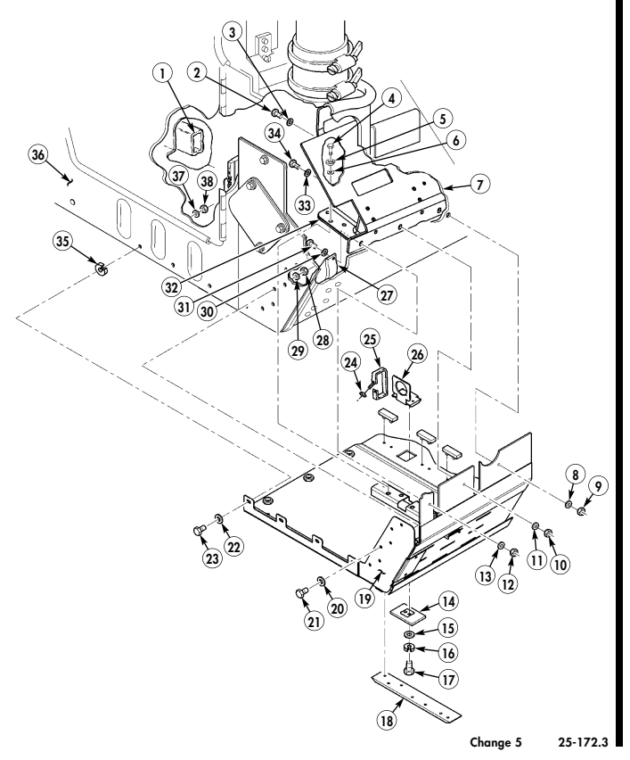

# 25-52.1. Right Front Underbody Armor (Integrated) Maintenance (Serial Numbers 241954 And Above) (Cont'D)

b. Inspection 1. Refer to para. 10-56 for nut insert inspection and replacement. 2. Inspect rubber strips, replace if damaged.

c. Installation

#### Caution

- Ensure clamps on frame are positioned under brake lines.

Failure to do so will result in damage to equipment.

- Use grade 5 torque value when installing capscrews into nut inserts. Failure to do so may damage equipment or components.

Perform step 2 if brackets and clamps were removed.

1. Install four clamps (25) and two brackets (26) on frame rail (1) with four locknuts (24). Tighten locknuts (24) to 64-68 lb-in. (7-8 N•m).

2. Raise front underbody armor (19) into proper position. 3. Install two plates (14) on front underbody armor (19) with four washers (15), lockwashers (16), and capscrews (17).

4. Secure front underbody armor (19) to lower A-pillar armor (35) with four washers (22), capscrews (23),
washers (33), and locknuts (34).

5. Install threaded plate (18) on front underbody armor (19) and inner kick liner (32) with seven washers (6), lockwashers (5), and capscrews (4).

6. Secure front underbody armor (19) to inner cowl armor (7), and inner kick liner (32) with washer (8),
capscrew (2), washer (3), and locknut (9).

7. Secure front underbody armor (19) to inner cowl armor (7) and outer kick liner (27) with two washers (13), capscrew (31), washers (30), and locknut (12).

8. Secure front underbody armor (19) to inner cowl armor (7) with washer (11), capscrew (37), washer (36),
and locknut (10).

9. Secure front underbody armor (19) to lower A-pillar armor (35) and outer kick liner (27) with six washers (20), capscrews (21), washers (29), and locknuts (28).

25-52.1. RIGHT FRONT UNDERBODY ARMOR (INTEGRATED) MAINTENANCE
(SERIAL NUMBERS 241954 AND ABOVE) (Cont'd)

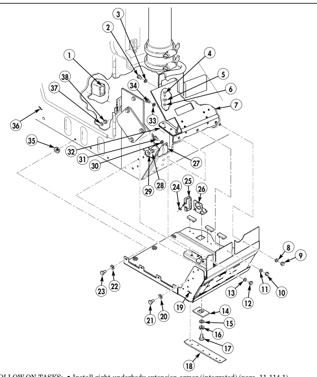

FOLLOW-ON TASKS: - Install right underbody extension armor (integrated) (para. 11-114.1).
- Install A/C heater/evaporator assembly (front) (integrated) (para. 25-43). - Install right front cowl insulation (para. 10-32). - Install companion seat (para. 10-43). - Install air cleaner assembly (para. 3-12).

# 25-53. Right Outer Kick Liner (Integrated) And A-Pillar Replacement (Serial Numbers 241953 And Below)

This task covers:
INITIAL SETUP:
Applicable Models M1151A1, M1152A1, M1165A1 Tools General mechanic's tool kit:
automotive (Appendix B, Item 1)
Materials/Parts Seven locknuts (Appendix G, Item 106) Three lockwashers (Appendix G, Item 144)
Manual References TM 9-2320-387-24P

a. Removal **b. Installation**

#### Equipment Condition

- Right front door (Frag 5) (if equipped)
removed (Appendix M, M-4).

- Right front door (perimeter) (if equipped)
removed (Appendix J, J-4).

- Right front body hinge mount removed
(para. 10-54).

- Companion seat removed (para. 10-43). - A/C heater/evaporator assembly (front)
removed (para. 25-43).

- Soft-top door removed (if equipped)
(para. 10-91).

- Ballistic crew door removed (if equipped)
(para. 11-12.2).

#### Maintenance Level

Direct support

Note location of screws, nuts, spacers, and brackets for installation.

a. Removal 1. Remove six locknuts (6), twelve washers (5), and six capscrews (10) from outer kick liner (2) and front underbody armor (9). Discard locknuts (6).

2. Remove three capscrews (13), lockwashers (12), and washers (11) from lower A-pillar armor (14) and outer kick liner (2). Discard lockwashers (12).

3. Remove locknut (3), two washers (4), and capscrew (8) from outer kick liner (2), front underbody armor (9), and upper cowl armor (7). Discard locknut (3).

4. Remove outer kick liner (2) and A-pillar support (1).

b. Installation

#### Caution

Use grade 5 torque value when installing capscrews into nut inserts. Failure to do so may damage equipment or components.

1. Position outer kick liner (2) and A-pillar support (1) in proper position. 2. Secure outer kick liner (2) to front underbody armor (9) and upper cowl armor (7) with locknut (3),
two washers (4), and capscrew (8).

3. Secure outer kick liner (2) to lower A-pillar armor (14) with three capscrews (13), washers (11), and lockwashers (12).

4. Secure outer kick liner (2) to front underbody armor (9) with six locknuts (6), twelve washers (5),
and six capscrews (10).

# 25-53. Right Outer Kick Liner (Integrated) And A-Pillar Replacement (Serial Numbers 241953 And Below) (Cont'D)

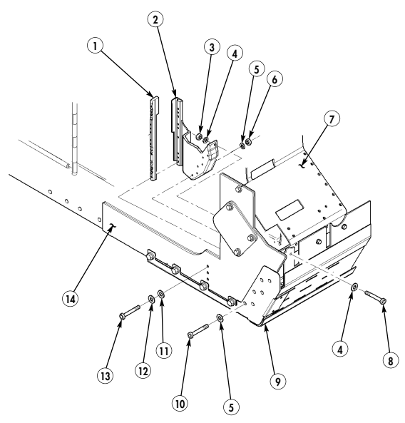

FOLLOW-ON TASKS: - Install ballistic crew door (para. 11-12.2).

- Install soft-top door (if equipped) (para. 10-91). - Install A/C heater/evaporator assembly (front) (para. 25-43). - Install companion seat (para. 10-43). - Install right front body hinge mount (para. 10-54). - Install right front door (perimeter) (if equipped) (Appendix J, J-4). - Install right front door (Frag 5) (if equipped) (Appendix M, M-4).

# 25-53.1. Right Outer Kick Liner (Integrated) And A-Pillar Replacement (Serial Numbers 241954 And Above)

This task covers:
INITIAL SETUP:
Applicable Models M1151A1, M1152A1, M1165A1 Tools General mechanic's tool kit:
automotive (Appendix B, Item 1)
Materials/Parts Seven locknuts (Appendix G, Item 106) Three lockwashers (Appendix G, Item 144)
Manual References TM 9-2320-387-24P
a. Removal b. Installation

#### Equipment Condition

- Right front door (Frag 5) (if equipped)
removed (Appendix M, M-4).

- Right front door (perimeter) (if equipped)
removed (Appendix J, J-4).

- Right front body hinge mount removed
(para. 10-54).

- Companion seat removed (para. 10-43). - A/C heater/evaporator assembly (front)
removed (para. 25-43).

- Soft-top door removed (if equipped) 
(para. 10-91).

- Ballistic crew door removed (para. 11-12.2).

#### Maintenance Level

Direct support

Note location of screws, nuts, spacers, and brackets for installation.

a. Removal 1. Remove six locknuts (6), twelve washers (5), and six capscrews (10) from outer kick liner (2) and front underbody armor (9). Discard locknuts (6).

2. Remove three capscrews (13), lockwashers (12), and washers (11) from lower A-pillar armor (14) and outer kick liner (2). Discard lockwashers (12).

3. Remove locknut (8), washers (4), and capscrew (3), from outer kick liner (2), front underbody armor (9), and upper cowl armor (7). Discard locknut (8).

4. Remove outer kick liner (2) and A-pillar support (1).

b. Installation

#### Caution

Use grade 5 torque value when installing capscrews into nut inserts. Failure to do so may damage equipment or components.

1. Position outer kick liner (2) and A-pillar support (1) in proper position. 2. Secure outer kick liner (2) to front underbody armor (9) and upper cowl armor (7) with locknut (8),
two washers (4), and capscrew (3).

3. Secure outer kick liner (2) to lower A-pillar armor (14) with three capscrews (13), washers (11), and lockwashers (12).

4. Secure outer kick liner (2) to front underbody armor (10) with six locknuts (6), twelve washers (5),
and six capscrews (10).

25-53.1. RIGHT OUTER KICK LINER (INTEGRATED) AND A-PILLAR REPLACEMENT
(SERIAL NUMBERS 241954 AND ABOVE) (Cont'd)

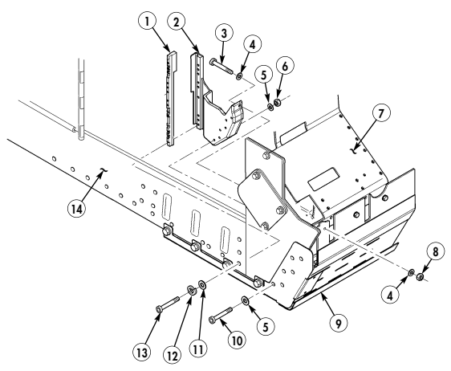

FOLLOW-ON TASKS: - Install ballistic crew door (para. 11-12.2).

- Install soft-top door (if equipped) (para. 10-91). - Install A/C heater/evaporator assembly (front) (para. 25-43). - Install companion seat (para. 10-43). - Install right front body hinge mount (para. 10-54). - Install right front door (perimeter) (if equipped) (Appendix J, J-4). - Install right front door (Frag 5) (if equipped) (Appendix M, M-4).

# 25-54. Right Inner Kick Liner (Integrated) Replacement

This task covers:

Applicable Models

| Tools   |
|---------|

| Materials/Parts   |
|-------------------|
|                   |

M1151A1, M1152A1, M1165A1 General mechanic's tool kit:
automotive (Appendix B, Item 1)
Thirteen lockwashers (Appendix G, Item 144) Locknut (Appendix G, Item 106)
Manual References TM 9-2320-387-24P

a. Removal **b. Installation**

Note location of screws, nuts, spacers, and brackets for installation.

| Manual References                                 |
|---------------------------------------------------|
| TM 9\-2320\-387\-24P                              |
| Equipment Condition                               |
| Battery ground cables disconnected (para. 4\-68). |
| Maintenance Level                                 |
| Direct support                                    |

#### A. Removal

1. Remove eight capscrews (7), lockwashers (8), and washers (9) from inner kick liner (11) and threaded plate (10). Discard lockwashers (8).

2. Remove five capscrews (5), lockwashers (4), and washers (6) from inner kick liner (11) and body (13). Discard lockwashers (4).

3. Remove locknut (3), two washers (1), and capscrew (2). Discard locknut (3). 4. Remove inner kick liner (11). 5. Remove five spacers (12) from inner kick liner (11).

#### B. Installation

1. Install five spacers (12) on inner kick liner (11). 2. Install inner kick liner (11) in proper position. 3. Install capscrew (2), two washers (1), and locknut (3) on inner kick liner (11) and body (13). 4. Install five capscrews (5), lockwashers (4), and washers (6) on inner kick liner (11) and body (13). 5. Install eight capscrews (7), lockwashers (8), and washers (9) on inner kick liner (11) and threaded plate (10).

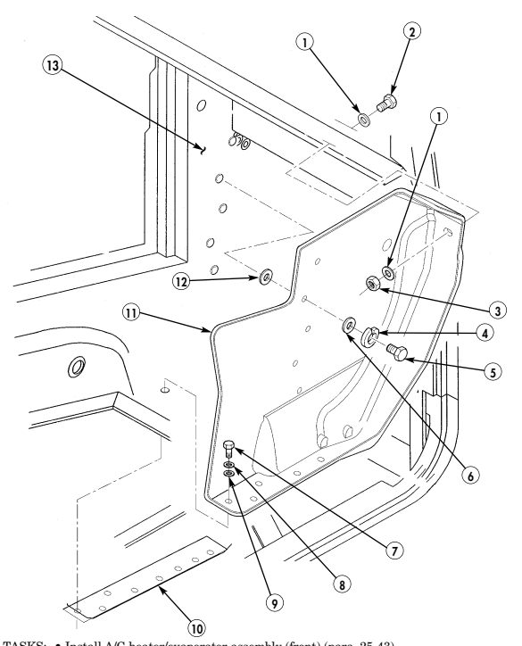

# 25-54. Right Inner Kick Liner (Integrated) Replacement (Cont'D)

FOLLOW-ON TASKS: - Install A/C heater/evaporator assembly (front) (para. 25-43).

· Install companion seat (para. 10-43).

· Install tunnel interior side insulation (para. 10-33). - Install left front cowl insulation (para. 10-31).

# 25-55. Right Upper Cowl Armor (Integrated) Replacement (Serial Numbers 241953 And Below)

This task covers:

Applicable Models M1151A1, M1152A1, M1165A1 Tools General mechanic's tool kit:
automotive (Appendix B, Item 1)
Materials/Parts

| Personnel Required   |
|----------------------|

Four locknuts (Appendix G, Item 144)
One mechanic One assistant a. Removal **b. Installation**

#### Equipment Condition

| Manual References    |
|----------------------|
| TM 9\-2320\-387\-24P |

- A/C heater/evaporator assembly (front) and brackets removed (para. 25-43).

- Right inner kick liner (integrated) removed 
(para. 25-54).

- Right outer kick liner (integrated) and A-pillar support removed (para. 25-53).

- Air intake stack removed (para. 3-19). - Wiring harness removed (para. 11-95). - A/C seal plate removed (para. 25-42).

Maintenance Level Direct support

#### A. Removal

4. Remove upper cowl armor (7).

#### B. Installation

1. Install upper cowl armor (7) in proper position. 2. Install upper cowl armor (7) on lower windshield capping ring armor (4) with three washers (14),
capscrews (13), washers (6), and locknuts (5).

3. Secure upper cowl armor (7) to front underbody armor with washer (10), capscrew (11), washer (9),
and locknut (8).

1. Remove A/C leads (1) and three grommets (2) from inner kick panel (3). 2. Remove locknut (8), washer (9), capscrew (11), and washer (10) from upper cowl armor (7) and front underbody armor (12). Discard locknut (8).

3. Remove three locknuts, (5) washers (6), capscrews (13), and washers (14) from upper cowl armor (7)
and lower windshield capping ring armor (4). Discard locknuts (5).

4. Install three grommets (2) and A/C leads (1) on inner kick panel (3).

# 25-55. Right Upper Cowl Armor (Integrated) Replacement (Serial Numbers 241953 And Below) (Cont'D)

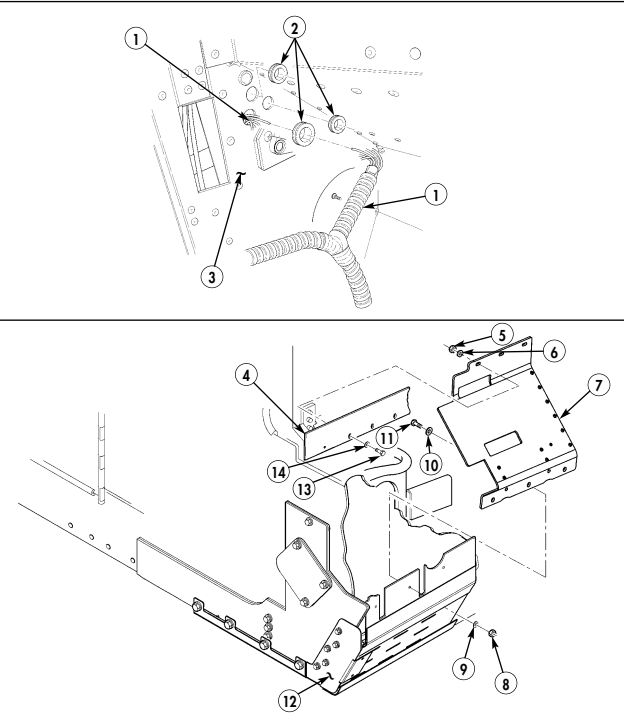

FOLLOW-ON TASKS: - Install A/C seal plate (para. 25-42).

- Install wiring harness (para. 11-95). - Install air intake stack (para. 3-19). - Install right outer kick liner (integrated) and A-pillar support (para. 25-53). - Install right inner kick liner (integrated) (para. 25-54). - Install A/C heater/evaporator assembly (front) and brackets (para. 25-43).

# 25-55.1. Right Upper Cowl Armor (Integrated) Replacement (Serial Numbers 241954 And Above)

This task covers:
INITIAL SETUP:
Applicable Models M1151A1, M1152A1, M1165A1 Tools General mechanic's tool kit:
automotive (Appendix B, Item 1)
Materials/Parts

| Personnel Required   |
|----------------------|

Four locknuts (Appendix G, Item 144)
One mechanic One assistant a. Removal b. Installation

#### Equipment Condition

| Equipment Condition   |
|-----------------------|

- A/C heater/evaporator assembly (front) and brackets removed (para. 25-43).

- Right inner kick liner (integrated) removed 
(para. 25-54).

- Right outer kick liner (integrated) and A-pillar support removed (para. 25-53.1).

- Air intake stack removed (para. 3-19). - Wiring harness removed (para. 11-95). - A/C seal plate removed (para. 25-42).

Maintenance Level Direct support a. Removal 4. Remove upper cowl armor (7).

#### B. Installation

1. Install upper cowl armor (7) in proper position. 2. Install upper cowl armor (7) on lower windshield capping ring armor (4) with three washers (14),
capscrews (13), washers (6), and locknuts (5).

3. Secure upper cowl armor (7) to front underbody armor with washer (10), capscrew (11), washer (9),
and locknut (8).

4. Install three grommets (2) and A/C leads (1) on inner kick panel (3).

1. Remove A/C leads (1) and three grommets (2) from inner kick panel (3). 2. Remove locknut (8), washer (9), capscrew (11), and washer (10) from upper cowl armor (7) and front underbody armor (12). Discard locknut (8).

3. Remove three locknuts (5), washers (6), capscrews (13), and washers (14) from upper cowl armor (7)
and lower windshield capping ring armor (4). Discard locknuts (5).

# 25-55.1. Right Upper Cowl Armor (Integrated) Replacement (Serial Numbers 241954 And Above) (Cont'D)

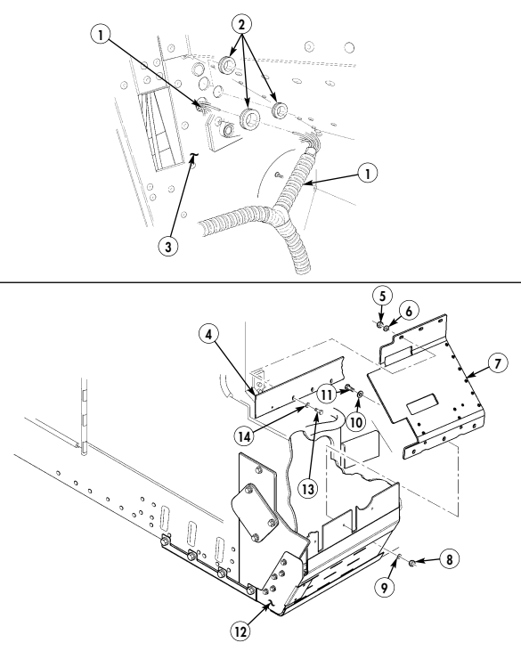

FOLLOW-ON TASKS: - Install A/C seal plate (para. 25-42).

- Install wiring harness (para. 11-95). - Install air intake stack (para. 3-19). - Install right outer kick liner (integrated) and A-pillar support (para. 25-53.1). - Install right inner kick liner (integrated) (para. 25-54). - Install A/C heater/evaporator assembly (front) and brackets (para. 25-43).

# Chapter 26 Special Purpose Kits (Ds) Maintenance

## 26-1. Introduction

This chapter contains maintenance instructions for disassembly and repair of winch components at the direct support maintenance level. Some subassemblies and parts must be removed before winch components can be accessed. They are referenced to other paragraphs in this manual.

## 26-2. Special Purpose Kits Task Summary

| 25\-42.   | A/C Seal Plate Replacement                         | 25\-128   |
|-----------|----------------------------------------------------|-----------|
| 25\-43.   | A/C Heater/Evaporator Assembly (Front) Replacement | 25\-130   |
| 25\-44.   | A/C Evaporator Assembly (Rear) Maintenance         | 25\-134   |
| 25\-45.   | A/C Hoses (Front) Replacement                      | 25\-138   |

# 26-3. 9,000 Lb Winch Repair

This task covers:

a. Disassembly c. Inspection b. Cleaning d. Assembly

INITIAL SETUP:
Applicable Models M1113, M1114 Tools General mechanic's tool kit:
automotive (Appendix B, Item 1)

#### Materials/Parts

Three gaskets (Appendix G, Item 54) Two oil seals (Appendix G, Item 202) Two nylon thrust washers 
(Appendix G, Item 198)
Coating compound (Appendix C, Item 23) Lubricating oil (Appendix C, Item 42) Aircraft grease (Appendix C, Item 32) Anaerobic pipe sealing compound
(Appendix C, Item 62)
a. Disassembly

#### Manual References

TM 9-2320-387-24P

#### Equipment Condition

- Winch removed (M1113) (para. 12-27). - Winch removed (M1114) (para. 12-33). - Winch cable removed (para. 12-28).

Maintenance Level Direct support

Tag leads for assembly.

1. Remove three screws (1), ground lead (3), and motor control cover (2) from control pack (4).

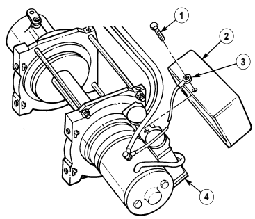

# 26-3. 9,000 Lb Winch Repair (Cont'D)

In order to perform steps 2 through 8, it may be necessary to remove plastic coating from winch.

2. Remove nut (9) and lead 6 (10) from control pack (4). 3. Remove capscrew (8), lead 7 (6), and ground lead (3) from motor (5). 4. Disconnect motor connector (12) from control connector (11). 5. Slide back three rubber boots (13) and remove nuts (14) and control leads (15) from motor (5). 6. Remove setscrew (16) from motor (5). 7. Loosen clamp (17) and remove control pack (4) from motor (5). 8. Remove clamp (17) from motor (5).

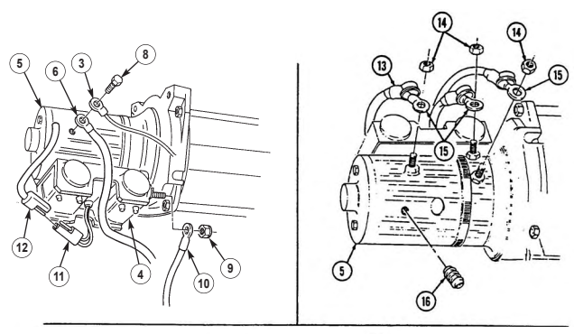

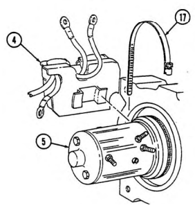

## 26-3. 9,000 Lb Winch Repair (Cont'D)

9. Mark motor end drum support (6) and gear end drum support (7) for assembly.

10. Remove six capscrews (8), three tie rods (11), two springs (12), anchors (10), and plate (9) from motor end drum support (6) and gear end drum support (7).

11. Place winch on end with motor end up and remove two hex-head screws (1) and motor (15) from motor end drum support (6).

12. Remove gasket (4) and motor end drum support (6) from drum assembly (13). Discard gasket (4). 13. Remove bearing (2), spacer (14), brake driver (3), and drum bushing (5) from end drum support (6). 14. Remove drum assembly (13) from gear end drum support (7). 15. Remove two oil seals (16) and nylon thrust washers (17) from drum assembly (13). Discard oil seals (16) and thrust washers (17).

16. Push brake (19) and bearing (18) through open end of drum assembly (13). 17. Remove driveshaft (22) from output ring gear (21). 18. Turn gear housing (23) over with gear end drum support (7) down and remove ten hex-head

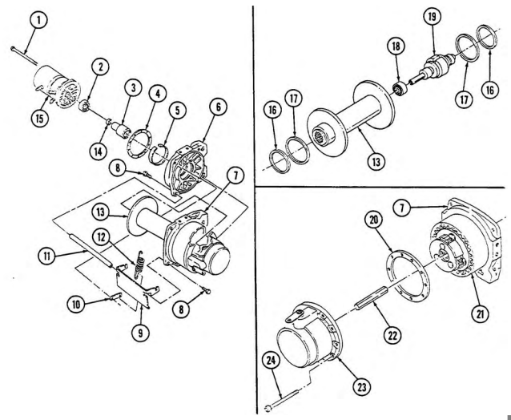

screws (24) and gear housing (23) from output ring gear (21).

19. Remove gasket (20) from output ring gear (21). Discard gasket (20).

#### 26-3. 9,000 Lb Winch Repair (Cont'D)

20. Remove detent spacer (291, spring (281, and detent ball (27) from gear housing (23). 21. Remove nut (26) and clutch lever (25) from gear housing (23). 

22. Remove retaining ring (31) from gear housing (23). 

#### Note 

Intermediate ring gear will come out with 85-87 steel balls. Be careful to catch all 85-87 steel balls. 

23. Remove intermediate ring gear (32) and 85-87 steel balls (30) from gear housing (23). 

24. Remove input sun gear (341, input gear carrier (331, and thrust plate (35) from gear housing (23). 

25. Remove intermediate gear carrier (361, output gear carrier (371, and output ring gear (21) from gear end drum support (7). 

26. Remove gasket (38) and drum bushing (39) from gear end drum support (7). Discard gasket (38). 

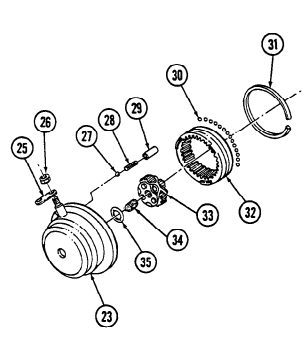

1 b. Cleaning 1 

#### Caution

Do not clean brake assembly or damage to equipment may result. 

Clean all winch components in accordance with para. 2-14. 

#### 26-3. 9,000 Lb Winch Repair (Cont'D)

1 c. Inspection 1 

For general inspection instructions, refer to para. 2-15. 

1. 

2. 3. 

4. 

5. 

6. 

Inspect drum (5) for damage to splined end (9), two flanges (7), and tube (8). Replace if damaged. Inspect gear end drum support (6) and motor end drum support (4). Replace if damaged. 

Inspect gear housing (10). Replace if damaged. 

Inspect gear teeth and machined surfaces of intermediate ring gear (2). Replace if damaged. Inspect clutch lever (1) and driveshaft (3). Replace if damaged. 

Inspect gear teeth, splines, and machined surfaces of output ring gear (141, output gear carrier (15), 
intermediate gear carrier (131, input gear carrier (121, and input sun gear (11). Replace any damaged parts. 

7. 

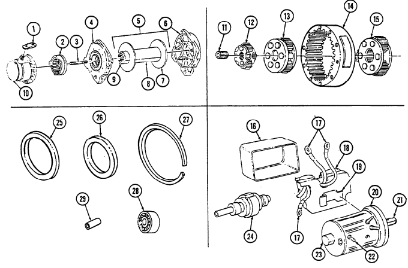

8. 

9. 

10. 

11. 

Inspect brake assembly (24). Replace if damaged. 

Inspect motor (231, spline (211, mating surface (201, and three terminals (22). Replace if damaged. Inspect cover (16). Replace if damaged. Inspect control pack (18) for damaged leads (171, breaks in plastic coating, and damaged mounting base (19). Replace control pack (18) if damaged or repair plastic coating. 

Inspect two thrust washers (251, seals (261, retaining rings (271, bearing (28), and detent spacer (29). 

Replace if damaged. 

## 26-3. 9,000 Lb Winch Repair (Cont'D)

d. Assembly 1. Position 85-87 steel balls (35) in groove of intermediate ring gear (2) and install in gear housing (10).

Opening in retaining ring should be 90° from clutch lever.

2. Install retaining ring (27) in gear housing (10). 3. Install thrust plate (36), input sun gear (11), and input gear carrier (12) in gear housing (10). 4. Install clutch lever (1) on clutch shaft (31) with nut (30). 5. Install detent ball (32), spring (33), and detent spacer (34) in gear housing (10). 6. Apply aircraft grease to output ring gear (14), intermediate gear carrier (13), output gear carrier
(15), and input gear carrier (12).

Ensure ring gear engages in gear housing.

7. Install gasket (37) and output ring gear (14) on gear housing (10). 8. Install intermediate gear carrier (13) on gear housing (10). 9. Install output gear carrier (15) on input gear carrier (12).

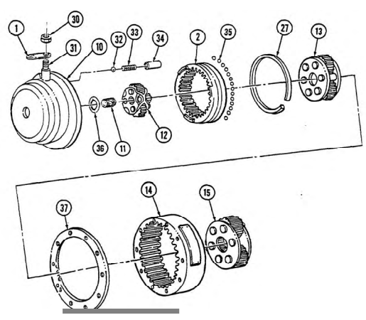

## 26-3. 9,000 **Lb Winch Repair** (Cont'D) 1

10. InstalI gasket (5) and nylon bushing (4) on output ring gear (6). 

Ensure spline on drum support engages in output ring gear. 

11. 12. 

13. 

Install gear end drum support (2) on output ring gear (6). Install gear housing (1) on gear end drum support (2) with ten hex-head screws (7). Tighten hex-head screws (7) to 100 lb-in. (11.3 Nom). 

Turn gear housing (1) over with gear end drum support (2) facing up. 

Install driveshaft (3) in gear housing (1). 

14. 15. 16. 

Apply grease to drum assembly (10) and brake (12). With drum assembly (10) horizontal, install bearing (11) and brake (12) into drum assembly (10). 

17. 

18. 

Install two nylon thrust washers (9) and oil seals (8) on drum assembly (10). 

Install drum assembly (10) on gear end drum support (2). Rotate drum assembly (10) as needed to engage driveshaft (3) and brake (12). 

19. 

20. 

21. 

22. 

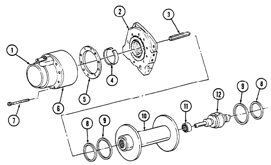

Install motor end drum support (19) on drum assembly (10). 

Install drum bushing (181, brake driver (25), spacer (161, and bearing (15) in motor end drum support (19). 

Install gasket (17) on motor (13) and motor end drum support (191, ensuring to engage motor shaft (26) into brake driver (25). 

Install two hex-head screws (14) on motor (13) and motor end drum support (19). Tighten hex-head screws (14) to 35 lb-in. (47 Nom). 

## 26-3. 9,000 Lb Winch Repair (Cont'D)

23. Install plate (21), anchor (22), and three tie rods (24) on drum supports (2) and (19) with six capscrews (20). Tighten capscrews (20) to 18 lb-ft (24 N•m).

24. Install two springs (23) on anchors (22) and plate (21).

If motor or control have been precoated with sealing compound, remove compound from between motor case and control mounting gear contact area. Failure to do so may cause improper grounding of control.

25. Install clamp (27) on motor (13). 26. Install control pack (26) on motor (13) and tighten clamp (27).

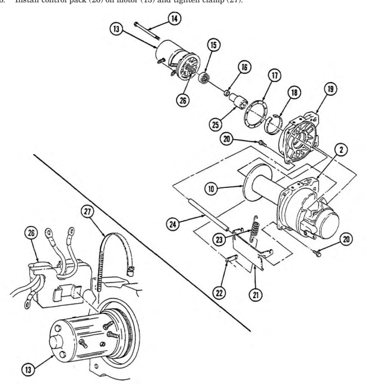

## 26-3. 9,000 Lb Winch Repair (Cont'D)

27. Install three leads (3) on terminals (4) with nuts (2) and slide rubber boots (1) over nuts (2). 28. Apply pipe sealant to threads of setscrew (5) and install on motor (6). 29. Connect control connector (14) to motor connector (15). 30. Install lead 6 (12) on control pack (13) with nut (11). 31. Install lead 7 (7) and ground lead (8) on motor (6) with capscrew (10). 32. Using coating compound, coat motor end of winch (6) up to motor end drum support (18).

33. Install motor control cover (17) and ground lead (8) on control pack (13) with three screws (16).

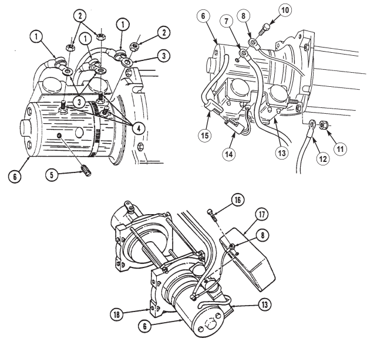

FOLLOW-ON TASKS: - Install winch (M1114) (para. 12-33).

- Install winch (M1113) (para. 12-27). - Install winch cable (para. 12-28).

# Chapter 27 Electrical System Engine (Gs) Repair

## Section I. Engine Disassembly, Repair, And Assembly 27-1. Introduction

This chapter contains maintenance instructions for replacement of body wiring harness at the general support maintenance level. Some subassemblies and parts must be removed before the body wiring harness can be accessed. They are referenced to other paragraphs of this manual.

## 27-2. Body Wiring Maintenance Task Summary

| Four seal washers (Appendix G, Item 307.1)  Four seal washers (two\-man)   Direct support   |
|---------------------------------------------------------------------------------------------|
| (Appendix G, Item 307.2)                                                                    |
| Five seal washers (four\-man) (Appendix G,                                                  |
| Item 307.2)                                                                                 |
| Six lockwashers (Appendix G, Item 149)                                                      |

# 27-3. Body Wiring Harness Replacement

This task covers:
INITIAL SETUP:

| 4.8   | ools   |
|-------|--------|

General mechanic's tool kit:
automotive (Appendix B, Item 1)

| General mechanics tool kit:            | automotive (Appendix B, Item 1)         |
|----------------------------------------|-----------------------------------------|
| Maintenance and repair shop equipment: | automotive (Appendix B, Item 2)         |
| Materials/Parts                        | Nine lockwashers (Appendix G, Item 149) |
| Twelve seal washers (Appendix G,       | Item 307.1)                             |
| Refrigerant oil (Appendix C, Item 48)  |                                         |

a. Removal Three lockwashers (Appendix G, Item 145)
(All models except M1114)
Lockwasher (Appendix G, Item 189) Antiseize compound (Appendix C, Item 16) Lubricating oil (Appendix C, Item 44) Silicone compound (Appendix C, Item 73)

a. Removal **b. Installation**

Personnel Required One mechanic One assistant Manual References TM 9-2320-387-10 TM 9-2320-387-24P

#### Equipment Condition

- Engine access cover removed (para. 10-22). - Left splash shield removed (para. 10-23). - Muffler and catalytic converter removed 
(para. 3-49).

- Heater ducting removed (para. 10-80). - Left defroster nozzle removed (para. 10-83). - Instrument cluster removed (para. 4-14). - Rear side marker light lenses removed 
(para. 4-56).

- Left and right underbody armor removed 
(M1114 only) (paras. 11-36 through 11-39).

Maintenance Level General support

#### Caution

Use care when removing harness. Snagging or pulling may cause damage to harness.

Prior to removal, tag leads for installation.

1. Disconnect hood harness connector (1) from headlight housing connector (2). 2. Remove four screws (15) from plate (17) and bracket (19). 3. Remove locknut (14) and screw (11) from plate (17) and headlight housing (9). Discard locknut (14). 4. Remove nut (18), screw (6), clamp (7), harness (5), and plate (17) from headlight housing (9). 5. Remove four nuts (12), screws (16), and harness connector (13) from plate (17). 6. Remove three nuts (20), screws (3), clamps (4), and harness (5) from headlight housing (9). 7. Remove three leads (8) from headlight (10). 8. Repeat steps 1 through 7 for opposite side. 9. Remove three screws (24), clamps (22), and harness (23) from left airlift bracket (21).

10. Disconnect harness leads 25A (28) and 26A (29) from horn (30). 11. Remove screw (26), clamp (27), and harness (23) from crossmember (25).

11.1. Remove conduit (24.1) and (24.2) from harness (23) if damaged.

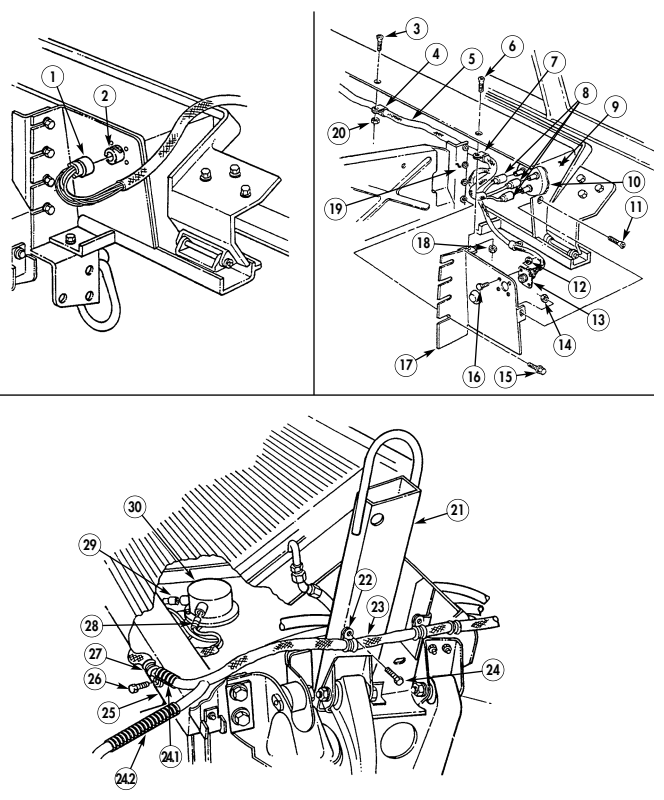

27-3. BODY WIRING HARNESS REPLACEMENT (Cont'd)

## 27-3. Body Wiring Harness Replacement (Cont'D)

12. Disconnect harness connector (1) from brake warning lamp switch (2). 13. Remove two nut and lockwasher assemblies (4), capscrews (6), clamps (5), and harness (9) from cowl (3). Discard nut and lockwasher assemblies (4).

14. Remove assembled locknut (8), clamp (7), and harness (9) from cowl (3). Discard assembled locknut (8).

14.1. Remove locknut (2.1), screw (9.1), clamp (9.2), and harness (9) from cowl (3). Discard locknut (2.1).

Top screws connecting closeout plate may be longer than other screws if the fuel filter drain tube is routed to top of closeout plate.

15. Remove four nut and lockwasher assemblies (12), screws (13), closeout plate (10), and grommet (11)
from cowl (3). Discard nut and lockwasher assemblies (12).

16. Remove closeout plate (10) and grommet (11) from harness (9).

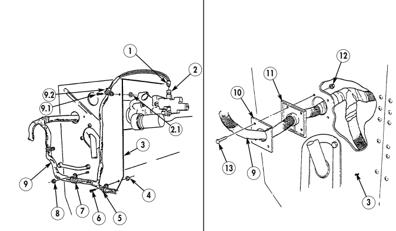

# 27-3. Body Wiring Harness Replacement (Cont'D)

17. Disconnect harness leads 67C (41) and 67E (40) from parking brake switch (34). 18. Disconnect harness leads 14A (14), 14B (15), 467C (39), 457D (38), and 40F (43) from shift controls housing (44).

19. Remove screws (24) and (21), clamps (20) and (22), and harnesses (19) and (23) from body (30).

20. Disconnect harness leads (47) and (48) from transmission and transfer case indicator lights (46)
and (45).

21. Remove two screws (33), clamp (31), and harness (19) from body (30). 22. Remove nut and lockwasher assembly (29), capscrew (27), clamp (28), and harness (19) from body (30). Discard nut and lockwasher assembly (29).

23. Remove assembled locknut (42), capscrew (26), clamp (25), and harness (19) from parking brake boot (35). Discard assembled locknut (42).

24. Remove screw (18), clamp (17), and harness (19) from body (30). 25. Remove four assembled locknuts (37), capscrews (32), clamps (36), and harness (19) from body (30).

Discard assembled locknuts (37).

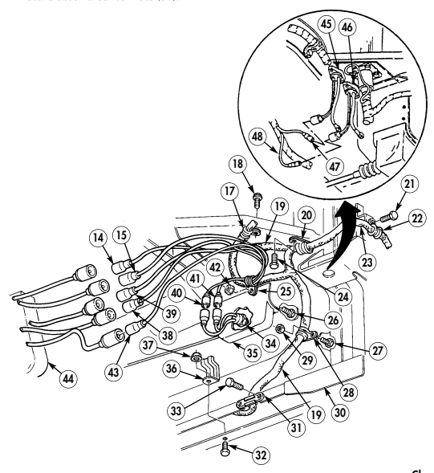

# 27-3. Body Wiring Harness Replacement (Cont'D)

Tag lead lines for installation.

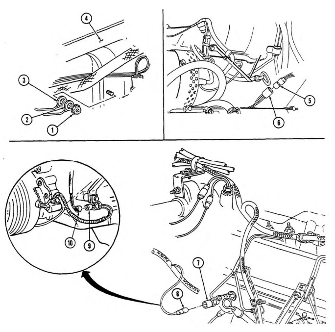

26. Remove assembled locknut (1), engine harness ground 3C (2), and body ground lead 58B (3) from body (4). Discard assembled locknut (1).

27. Disconnect engine harness 350B/359G/355A lead (5) from body harness lead (6). 28. Disconnect harness lead 33A (8) from engine temperature sending unit (7) and harness leads (10)
from engine rpm sensor leads (9).

# 27-3. Body Wiring Harness Replacement (Cont'D)

29.

Disconnect harness connector (12) from STE/ICE-R rpm converter (11).

30.

Disconnect harness lead 36A (14) from engine oil pressure sending unit (13).

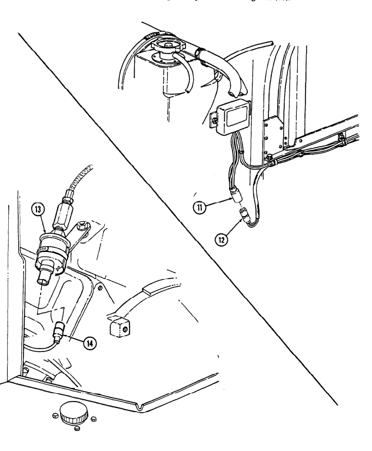

## 27-3. Body Wiring Harness Replacement (Cont'D)

Disconnect harness leads 28A (3) and 58C (4) from fuel tank jumper harness (2).

31.

Remove six screws (5), clamps (1), and harness (7) from body (6).

32.

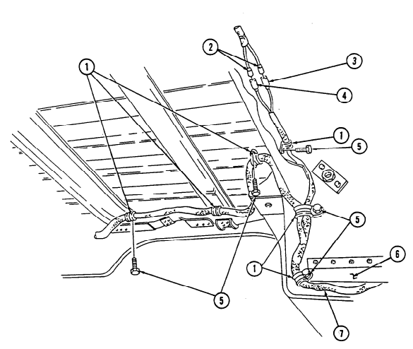

# 27-3. Body Wiring Harness Replacement (Cont'D)

33. Disconnect wiring harness connector (15) from sensor (13). 34. Disconnect connectors 497/498 (14) and 495/496 (16) from output and input speed sensors (12) and
(17).

35. Remove two nuts (11), capscrews (8), washers (9), and clamps (10) from sensors (12) and (17). 36. Disconnect two leads (19) from transfer case switch leads (18) on transfer case (23). 37. Remove tiedown strap (21) and harness (20) from speedometer adapter (22). Discard tiedown strap (21).

38. Disconnect harness connector (24) from Transmission Control Module (TCM) (25).

Perform step 39 for M1114 models only.

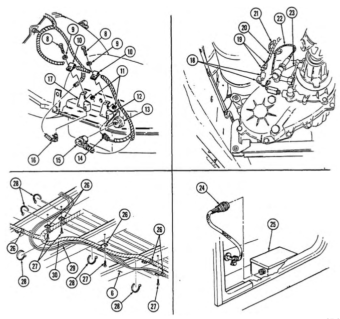

39. Remove four screws (27), six clamps (26), five tiedown straps (28), harness (30), and winch cables
(29) from body (6). Discard tiedown straps (28).

# 27-3. Body Wiring Harness Replacement (Cont'D)

Perform step 40 for all models except M1114. Perform steps 41 and 42 for M1114 models only.

40. Remove three capscrews (1), two nuts (4), washers (5), screws (12), washers (11), three screws (9),
lockwashers (8), and washers (7) from bracket (10) and coverplate (2). Remove coverplate (2) from battery box (6) and B-beam (3). Discard lockwashers (8).

41. Remove two capscrews (17) from coverplate (13) and B-beam (3). 42. Remove two capscrews (16), lockwashers (15), washers (14), and coverplate (13) from battery box (6). Discard lockwashers (15).

43. Remove two harness leads (18) from circuit breaker (19).

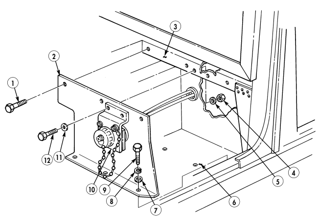

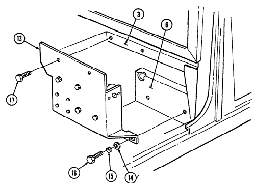

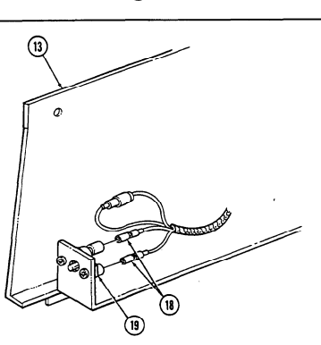

## 27-3. Body Wiring Harness Replacement (Cont'D) 27-3. Body Wiring Harness Replacement **(Cont'D) I**

44. Disconnect four harness leads 57T, 290B/291B, and 29OCY291C (1) from transmission relay leads (2). 

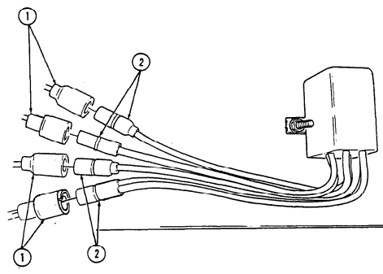 45. Push four leads 57T, 290B/291B, and 29OCY291C (1) through grommet (11) in battery box (3). 46. Remove screw (lo), lockwasher (9), washer (81, lead 290/29X37 (7), and leads (5) and (6) from shunt (4). Discard lockwasher (9). 

# 27-3. Body Wiring Harness Replacement (Cont'D)

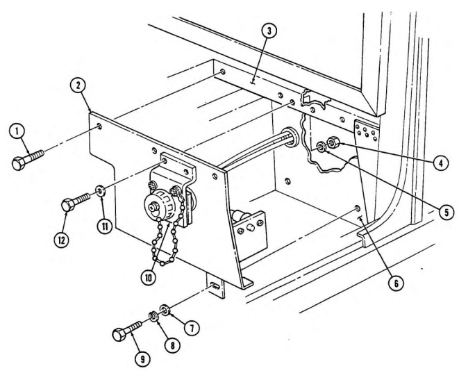

## 27-3. Body Wiring Harness Replacement (Cont'D)

47. Remove two screws (23), clamps (26), and harness (27) from body (22).

48. Remove nut and lockwasher assembly (24), capscrew (20), clamp (21), and harness (27) from body (22).

Discard nut and lockwasher assembly (24).

49. Remove two nuts (8.1), screws (14), lockwashers (15), and shield (8) from body (22). Discard lockwashers (15).

50. Remove two nut and lockwasher assemblies (18), capscrews (7), clamps (19), and harness (27) from shield (8). Discard nut and lockwasher assemblies (18).

51. Disconnect harness lead 489A (13) from right rear side marker light (9).

52. Disconnect harness leads 21C (17), 22-461B (25), 23B (16), and 24B (6) at left rear composite light (1). 53. Remove locknut (12), screw (10), and harness ground lead 95C (11) from left rear side marker light (9).

Discard locknut (12).

54. Remove capscrew (5), washer (4), and harness ground lead 95B (3) from buss bar (2). 55. Remove five screws (29), clamps (30), and harness (27) from body (22). 56. Remove four assembled locknuts (31), capscrews (32), and trailer connector (33) from bracket (28).

Discard assembled locknuts (31).

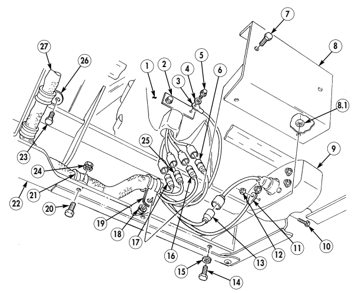

# 27-3. Body Wiring Harness Replacement (Cont'D)

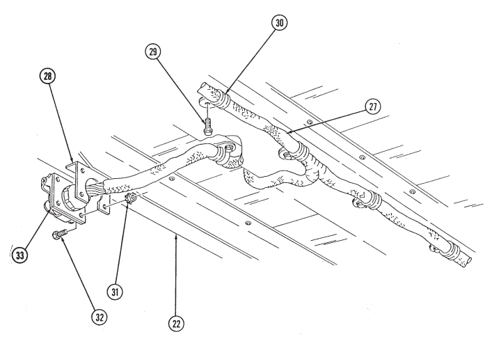

## 27-3. Body Wiring Harness Replacement (Cont'D)

57. Remove two screws (13), clamps (12), and harness (18) from body (14).

58. Remove nut and lockwasher assembly (17), capscrew (16), clamp (15), and harness (18) from body (14).

Discard nut and lockwasher assembly (17).

59. Remove two nuts (1.1), screws (21), lockwashers (22), and shield (1) from body (14). Discard lockwashers (22).

60. Remove two nut and lockwasher assemblies (19), capscrews (2), clamps (20), and harness (18) from shield (1). Discard nut and lockwasher assemblies (19).

61. Disconnect harness lead 489B (23) from right rear side marker light (27).

62. Disconnect harness leads 21E (9), 22-460C (8), 23D (7), and 24C (3) from right rear composite light (11).

63. Remove locknut (24), screw (26), and harness ground lead 95G (25) from right rear side marker light (27). Discard locknut (24).

64. Remove capscrew (4), washer (5), and harness ground lead 95F (6) from buss bar (10).

# 27-3. Body Wiring Harness Replacement (Cont'D)

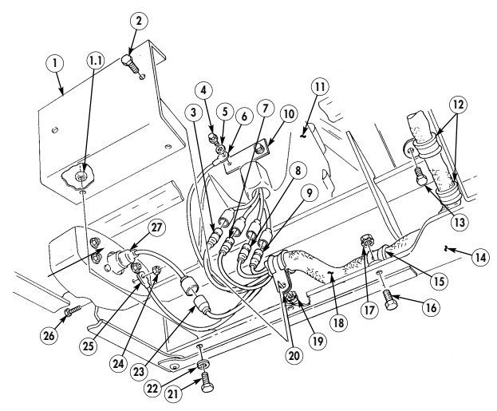

## 27-3. Body Wiring Harness Replacement (Cont'D)

65. Disconnect harness leads 11A (1), 14A (2), and 29A (3) from run-start switch (21) behind instrument panel (22).

66. Disconnect harness leads 27F (4) and 571A (20) at wait-to-start indicator light (19). 67. Disconnect harness leads 27L (5) and 67D (6) at parking brake warning indicator light (18). 68. Disconnect harness lead 400D (7) from resistor (17). 69. Disconnect harness lead 27D (15) from blower switch (16). 70. Remove assembled locknut (9), engine harness ground lead 3C (10), assembled locknut (11), capscrew
(13), and harness ground leads 57A (12) and 79A (14) from body (8). Discard assembled locknuts (9) and (11).

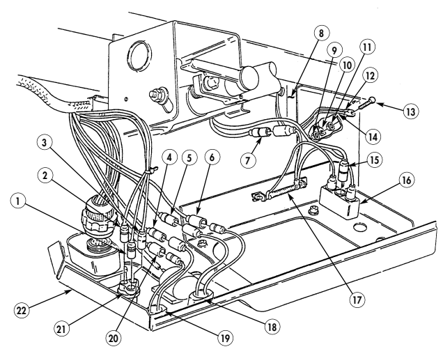

## 27-3. Body Wiring Harness Replacement (Cont'D)

71. Disconnect harness leads 27C (27), 27D (28), 27K (32), and 71A (33) from two circuit breakers (35). 72. Remove two screws (31), clamps (29), and harness (30) from steering column support (34). 73. Disconnect harness lead 25A (23) from horn switch (37). 74. Remove nut and lockwasher assembly (26), capscrew (24), and harness ground lead 57C (25) from steering column (36). Discard nut and lockwasher assembly (26).

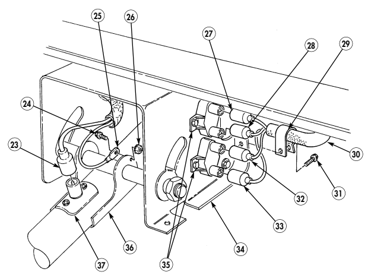

## 27-3. Body Wiring Harness Replacement (Cont'D)

75. Disconnect harness connector (12) from turn signal control (11). 76. Disconnect harness connector (7) from turn signal flasher module (6). 77. Disconnect harness leads 75A (13) and 75B (15) and connector 810A/810B (14) from stoplight switch leads (16).

78. Disconnect harness leads 57D (18) and 71C (17) from windshield washer motor leads 57 (1) and 71 (2). 79. Disconnect harness connector (5) from protective control box (3). 80. Remove screw (8), clamp (9), and harness (4) from steering column support (10). 81. Remove three assembled washer screws (22) and shield (23) from dimmer switch (24). Discard assembled washer screws (22).

82. Disconnect harness leads 16A (21), 17A (25), and 18A (26) from dimmer switch (24).

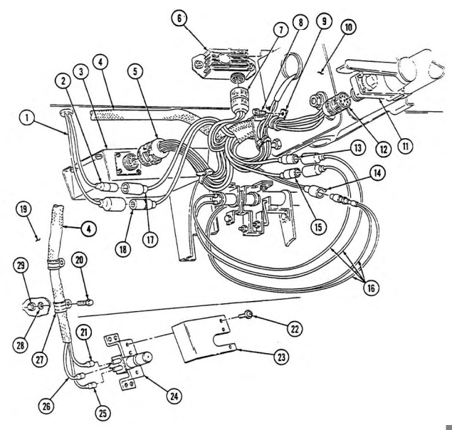 83. Remove three locknuts (29), washers (28), capscrews (20), clamps (27), and harness (4) from body (19).

Discard locknuts (29).

## 27-3. Body Wiring Harness Replacement (Cont'D)

84. Disconnect harness lead 400D (34) from heater motor (35). 85. Remove screw (38), washer (37), and harness ground lead 57E (36) from heater motor (35). 86. Remove two nut and lockwasher assemblies (33), capscrews (30), clamps (42), and harness (4) from A-beam (31). Discard nut and lockwasher assemblies (33).

87. Disconnect harness connectors 27K (40), 57F (41), and 71C (39) from windshield wiper motor jumper harness leads (32).

88. Remove harness (4) from A-beam (31) and guide harness (4) into instrument panel area. 89. Remove left body mounts (para. 33-3). 90. Guide harness (4) out through hole in body (19) and remove harness (4) from vehicle.

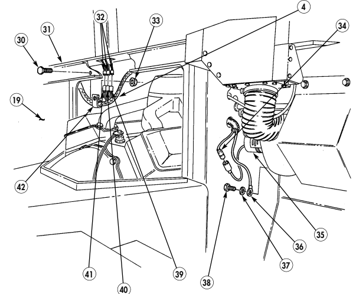

27-3. BODY WIRING HARNESS REPLACEMENT (Cont'd)
b. Installation

#### Caution

Use care when installing harness. Snagging or pulling may damage harness.

1. Position harness (5) in approximate mounting position. Feed forward branch of harness (5)
through hole (17).

2. Install left body mounts (para. 33-3). 3. Install grommet (16) over yellow locator tape (19) and position closeout plate (15) on grommet (16).

NOTE
Top screws connecting closeout plate may be longer than other screws if fuel filter drain tube is routed to top of closeout plate.

4. Install grommet (16) and closeout plate (15) on cowl (20) with four screws (21) and nut and lockwasher assemblies (18).

5. Install harness ground lead 57E (8) on heater motor (7) with washer (9) and screw (10). 6. Connect harness lead 400D (6) to heater motor (7). 7. Connect harness leads 27K (12), 57F (13), and 71C (11) to windshield wiper motor jumper harness leads (3).

8. Install harness (5) on A-beam (2) with two clamps (14), capscrews (1), and nut and lockwasher assemblies (4).

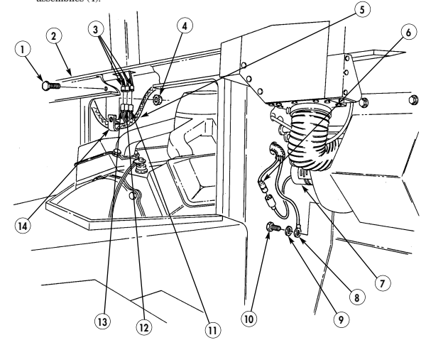

27-22 Change 2

# 27-3. Body Wiring Harness Replacement (Cont'D)

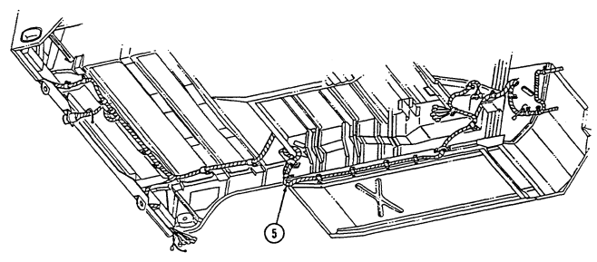

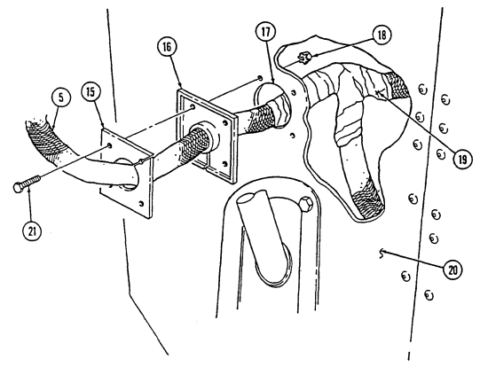

## 27-3. Body Wiring Harness Replacement (Cont'D)

9. Connect harness connector (5) to protective control box (3).

10. Connect harness connector (7) to turn signal flasher module (6). 11. Connect harness connector (12) to turn signal control (11). 12. Connect harness leads 75A (13), 75B (15), and 810A/810B (14) to stoplight switch leads (16). 13. Connect harness leads 57D (18) and 71C (17) to windshield washer motor leads 57 (1) and 71 (2). 14. Install harness (4) on steering column support (10) with clamp (9) and screw (8). 15. Connect harness leads 17A (25), 18A (26), and 16A (21) to dimmer switch (24). 16. Install shield (23) on dimmer switch (24) with three assembled washer screws (22). 17. Install harness (4) on body (29) with three clamps (19), capscrews (20), washers (27), and locknuts
(28).

18. Connect harness leads 27C (34), 27D (37), 27K (38), and 71A (39) to two circuit breakers (40). 19. Connect harness lead 25A (30) to horn switch (42). 20. Apply antiseize compound to harness ground lead 57C (32) and install on steering column (41) with capscrew (31) and nut and lockwasher assembly (33).

21. Install harness (4) on steering column support (10) with two clamps (35) and screws (36).

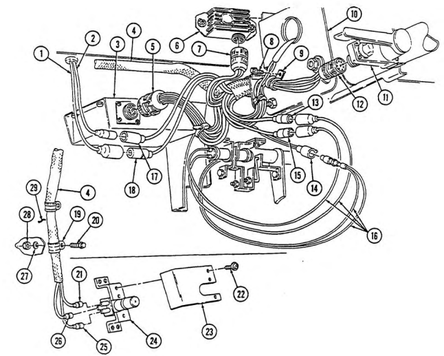

27-24 Change 2

## 27-3. Body Wiring Harness Replacement (Cont'D)

22. Apply antiseize compound to harness leads 57A (52) and 79A (54) and install on body (48) with capscrew (53) and assembled locknut (51). Apply antiseize compound to engine harness ground lead 3C (50) and install on body (48) with assembled locknut (49).

23. Connect harness lead 27D (55) to blower switch (56). 24. Connect harness lead 400D (47) to resistor (57). 25. Connect harness leads 27L (45) and 67D (46) to parking brake warning indicator light (58). 26. Connect harness leads 27F (44) and 571A (60) to wait-to-start indicator light (59). 27. Connect harness leads 11A (62), 14A (63), and 29A (43) to run-start switch (61).

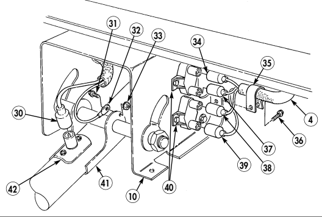

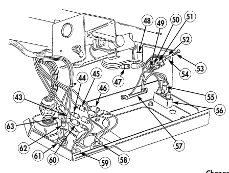

## 27-3. Body Wiring Harness Replacement (Cont'D)

28. Apply antiseize compound to harness ground lead 95F (7) and install on buss bar (8) with washer (6)
and capscrew (5).

29. Apply antiseize compound to harness ground lead 95G (25) and install on right rear side marker light (27) with screw (24) and locknut (26).

30. Connect harness leads 21E (11), 22-460C (10), 23D (4), and 24C (3) to right rear composite light (9). 31. Install harness (18) on shield (1) with two clamps (20), capscrews (2), and nut and lockwasher assemblies (19).

32. Install shield (1) on body (14) with two lockwashers (22), screws (21), and nuts (1.1). 33. Install harness (18) on body (14) with clamp (15), capscrew (16), and nut and lockwasher assembly
(17).

34. Install harness (18) on body (14) with two clamps (12) and screws (13). 35. Connect harness lead 489B (23) at right side marker light (27).

# 27-3. Body Wiring Harness Replacement (Cont'D)

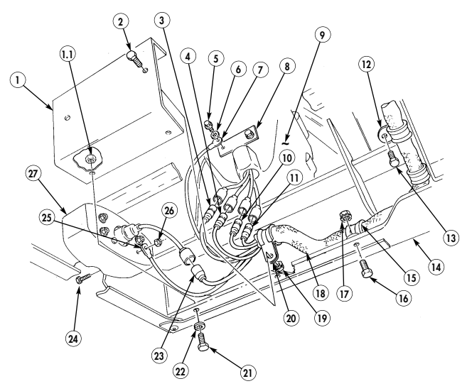

## 27-3. Body Wiring Harness Replacement (Cont'D)

36. Install trailer connector (1) in bracket (2) with four capscrews (8) and assembled locknuts (7).

37. Install harness (3) on body (6) with five clamps (5) and screws (4). 38. Apply antiseize compound to harness ground lead 95B (12) and install on buss bar (11) with washer
(13) and capscrew (14).

39. Apply antiseize compound to harness ground lead 95C (21) and install on left rear side marker light (19) with screw (20) and locknut (22).

40. Connect harness leads 21C (27), 22-461B (26), 23B (18), and 24B (17) to left rear composite light (10). 41. Connect harness lead 489A (23) to left rear side marker light (19). 42. Install harness (3) on shield (16) with two clamps (33), capscrews (15), and nut and lockwasher assemblies (28).

43. Install shield (16) on body (6) with two lockwashers (25), screws (24), and nuts (16.1). 44. Install harness (3) on body (6) with clamp (29), capscrew (30), and nut and lockwasher assembly (31). 45. Install harness (3) on body (6) with two clamps (9) and screws (32). 46. Install harness (3) on body (6) with six clamps (37) and screws (38). 47. Connect harness leads 28A (36) and 58C (35) to fuel tank jumper harness leads (34).

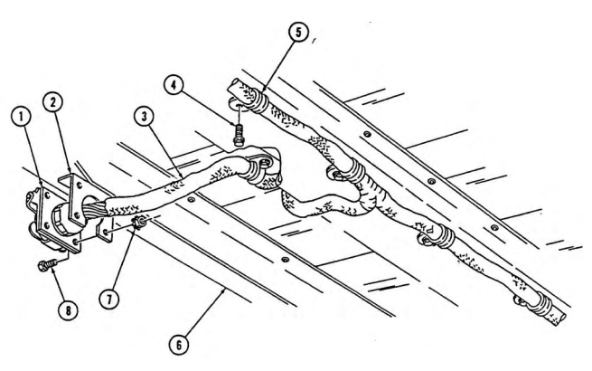

# 27-3. Body Wiring Harness Replacement (Cont'D)

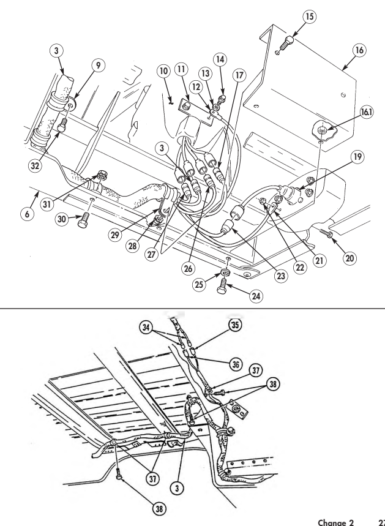

## 27-3. Body Wiring Harness Replacement (Cont'D)

48. Connect wiring harness connector (8) to sensor (6). 49. Connect connectors 497/498 (7) and 495/496 (9) to output and input speed sensors (4) and (10). 50. Install two capscrews (1), washers (2), clamps (3), and nuts (5) on sensors (4) and (10). 51. Connect two leads (16) to transfer case switch leads (15) on transfer case (14). 52. Secure speedometer cable (13) and harness (12) with tiedown strap (11). 53. Connect harness connector (17) to TCM (18).

Perform step 54 for M1114 models only.

54. Install winch cables (23) and harness (24) on body (22) with six clamps (20), four screws (21), and five tiedown straps (19).

Perform step 55 for all models except M1114. Perform steps 56 and 57 for M1114 models only.

55. Install coverplate (26) and bracket (34) on battery box (30) and B-beam (27) with two washers (35),
capscrews (36), washers (29), nuts (28), three washers (31), lockwashers (32), and capscrews (33) and (25).

56. Install coverplate (37) on battery box (30) with two washers (38), lockwashers (39), and capscrews (40). 57. Install coverplate (37) on B-beam (27) with two capscrews (41). 58. Connect two harness leads (42) to circuit breaker (43).

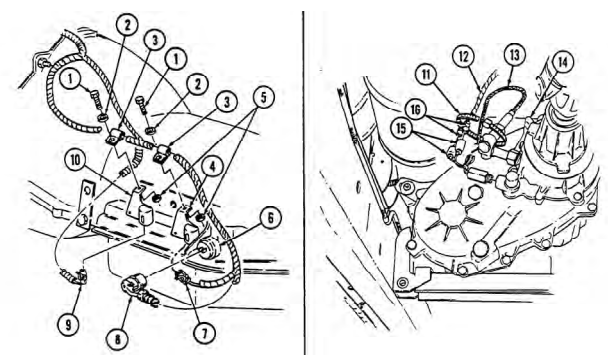

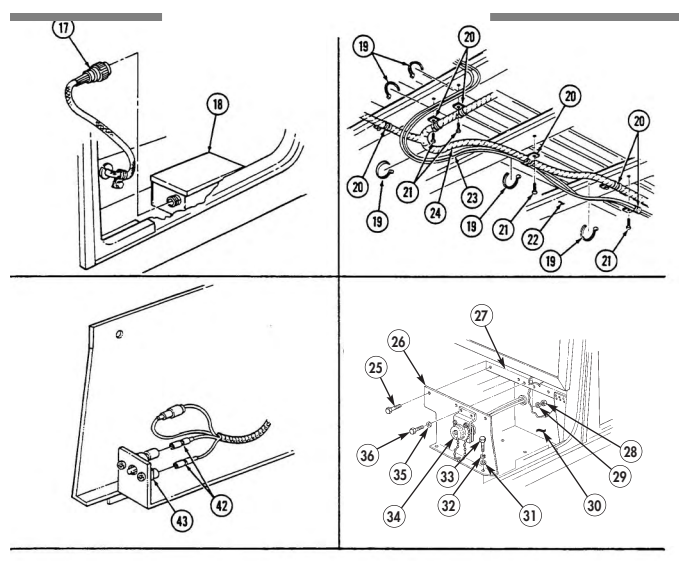

# 27-3. Body Wiring Harness Replacement (Cont'D)

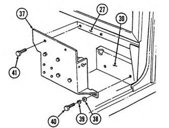

## 27-3. Body Wiring Harness Replacement (Cont'D)

59. Connect four harness leads 57T, 290B/291B, and 290C/291C (1) on transmission relay leads (2). 60. Push four leads 57T, 290B/291B, and 290C/291C (1) of harness (11) through rear gromment (12) in battery box (3).

61. Install leads 290/291/537 (7), (5), and (6) to shunt (4) with washer (8), lockwasher (9), and 

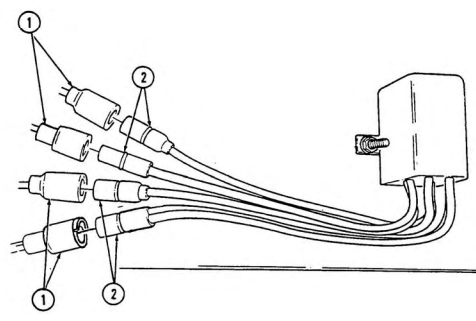

screw (10).

# 27-3. Body Wiring Harness Replacement (Cont'D)

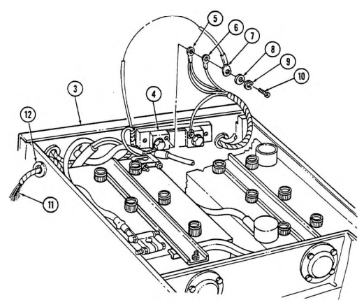

## 27-3. Body Wiring Harness Replacement (Cont'D)

62. Install engine harness ground 3C (3) and lead 58B (4) on body (1) with assembled locknut (2).

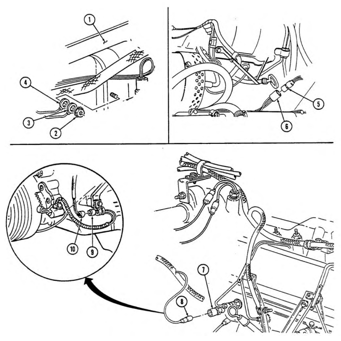 63. Connect engine harness 350B/359G/355A lead (5) to body harness lead (6). 64. Connect harness 33A (8) to engine temperature sending unit (7), and harness lead (10) to engine rpm sensor lead (9).

# 27-3. Body Wiring Harness Replacement (Cont'D)

65. Connect harness connector (11) to STE/ICE-R rpm converter (12). 66. Connect harness lead 36A (14) to engine oil pressure sending unit (13).

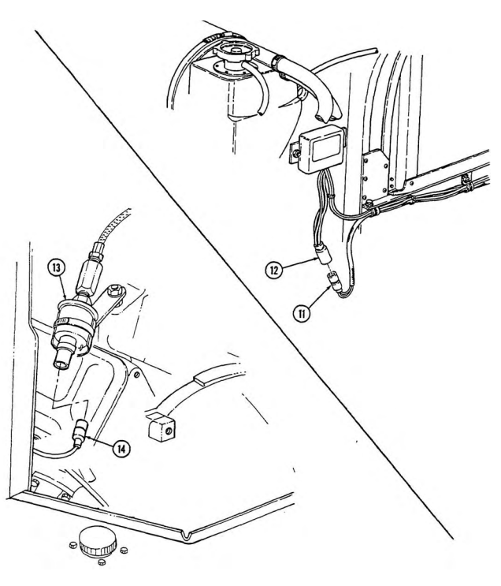

## 27-3. Body Wiring Harness Replacement (Cont'D)

67. Install harness (6) on body (24) with four clamps (22), capscrews (19), and assembled locknuts (23). 68. Connect harness leads 67C (30) and 67E (29) to parking brake switch (20). 69. Connect harness leads 467C (28), 457 (25), 14A (1), 14B (2), and 40F (26) to shift controls housing
(27).

70. Install harness (6) on body (24) with clamp (17) and two screws (18). 71. Install harness (6) and harness (10) on body (24) with clamps (7) and (9) and screws (8) and (11). 72. Connect harness leads (34) and (35) to transmission and transfer case indicator lights (33) and (32). 73. Install harness (6) on body (24) with clamp (15), capscrew (14), and nut and lockwasher assembly (16).

74. Install harness (6) on parking brake boot (21) with clamp (12), capscrew (13), and assembled locknut (31).

75. Install harness (6) on body (24) with clamp (5) and screw (4). 76. Install harness (6) on cowl (38) with two clamps (40), capscrews (41), and nut and lockwasher assemblies (39).

77. Install harness (6) on cowl (38) with clamp (42) and assembled locknut (43). 77.1. Install harness (6) on cowl (38) with clamp (35.2), capscrew (35.1), and locknut (35.3). 78. Apply lubricating oil to harness connector (36) and to brake warning lamp switch (37). 79. Connect harness connector (36) to brake warning lamp switch (37).

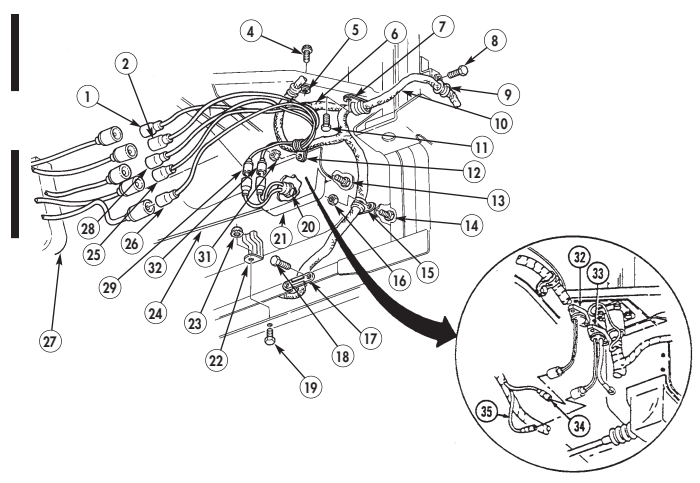

# 27-3. Body Wiring Harness Replacement (Cont'D)

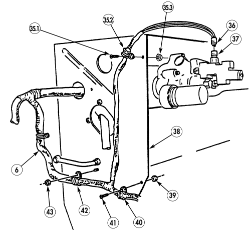

## 27-3. Body Wiring Harness Replacement (Cont'D)

80. Connect harness leads 25A (10) and 26A (1) to horn (2).

80.1. Install conduit (6.1) and (6.2) on harness (4) if removed.

81. Install harness (4) on crossmember (7) with clamp (9) and screw (8). 82. Install harness (4) on left airlift bracket (3) with three clamps (6) and screws (5). 83. Connect harness leads 17E, 18C, and 91D (18) on headlight (20). 84. Install harness (15) on headlight housing (19) with three clamps (14), screws (13), and nuts (29). 85. Install harness connector (12) on plate (26) with four screws (25) and nuts (22). 86. Install plate (26) on headlight housing (19) with screw (16), clamp (17), nut (27), screw (21), and locknut (23).

87. Install plate (26) on bracket (28) with four screws (24). 88. Connect hood harness connector (11) to harness connector (12). 89. Repeat steps 84 through 88 for opposite side.

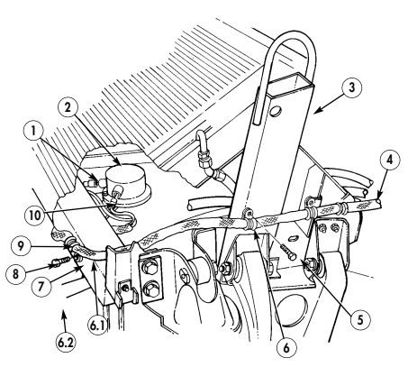

# 27-3. Body Wiring Harness Replacement (Cont'D)

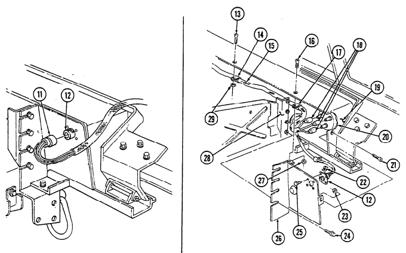

FOLLOW-ON TASKS: - Install left and right underbody armor (M1114 only) (paras. 11-36 through 11-39).

· Install instrument cluster (para. 4-14).

· Install rear side marker light lenses (para. 4-56).

· Install heater ducting (para. 10-80).

· Install left defroster nozzle (para. 10-83).

· Install muffler and catalytic converter (para. 3-49). - Install left splash shield (para. 10-23).

· Install engine access cover (para 10-22).

- Start engine (TM 9-2320-387-10) and check operation of vehicle electrical systems.

# Chapter 28 Transmission (Gs) Repair

## 28-1. Introduction

This chapter contains maintenance instructions for disassembly and repair of transmission components at the general support maintenance level. Some subassemblies and parts must be removed before transmission system components can be accessed. They are referenced to other paragraphs in this manual.

## Transmission Disassembly, Repair, And Assembly 28-2. Transmission Disassembly, Repair, And Assembly Task Summary

| 25\-53.                           | Right Outer Kick Liner (Integrated) and A\-Pillar Replacement   | (Serial Numbers 241953 and Below)   | 25\-174                                         |                                                 |
|-----------------------------------|-----------------------------------------------------------------|-------------------------------------|-------------------------------------------------|-------------------------------------------------|
| 25\-53.                           | Right Outer Kick Liner (Integrated) and A\-Pillar Replacement   | (Serial Numbers 241954 and Above)   | 25\-174.2                                       |                                                 |
| 25\-54.                           | Right Inner Kick Liner (Integrated) and A\-Pillar Replacement   | 25\-176                             | 25\-55.                                         | Right Upper Cowl Armor (Integrated) Replacement |
| (Serial Numbers 241953 and Below) | 25\-178                                                         | 25\-55.1                            | Right Upper Cowl Armor (Integrated) Replacement |                                                 |
| (Serial Numbers 241954 and Above) | 25\-180                                                         |                                     |                                                 |                                                 |

# 28-3. Transmission Disassembly Into Subassemblies

This task covers:
c. Speed Sensors Removal k. Pump Assembly Removal e. Control Valve Assembly Removal (1995-1996) Removal e.1. Control Valve Assembly Removal (1997-1998) m. Forward Clutch Assembly Removal f. Front Servo Removal n. Direct Clutch Assembly Removal g. Rear Servo Removal o. Intermediate Clutch Assembly Removal

#### Initial Setup: Tools

General mechanic's tool kit: 
automotive (Appendix B, Item 1)
Dial indicator (Appendix B, Item 113)

#### Special Tools

Transmission holding fixture 
(Appendix B, Item 57)
Transmission holding fixture base 
(Appendix B, Item 58)
Holding tool adapter (Appendix B, Item 62) Slide hammer adapter (Appendix B, Item 59) Oil pump remover/installer tool
(Appendix B, Item 64)
Torx drive socket (Appendix B, Item 36) Gear unit installer/remover
(Appendix B, Item 65)

#### A. Torque Converter Removal

a. Torque Converter Removal i. Front End Play Check (Measured)
b. Holding Fixture Installation j. Rear Unit End Play Check (Measured) d. Oil Pan and Filter Assembly Removal l. Turbine Shaft and Overdrive Carrier Assembly h. Parking Lock Pawl and Actuator Assembly p. Gear Unit Assembly and Rear Band Removal Removal **q. Center Support Assembly Removal**

#### Personnel Required

One mechanic One assistant Manual References TM 9-2320-387-24P
Equipment Condition Transmission prepared for disassembly
(para. 19-5).

General Safety Instructions Torque converter must be supported during removal.

Maintenance Level General support

#### Warning

Torque converter must be supported during removal and installation. Failure to do this may cause injury to personnel or damage to equipment.

Be certain torque converter turns freely. Record any abnormal looseness or noises.

Remove torque converter (2) from transmission (1).

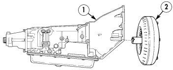

# 28-3. Transmission Disassembly Into Subassemblies (Cont'D)

b. Holding Fixture Installation

#### Caution

Do not overtighten screws. This will bind center support.

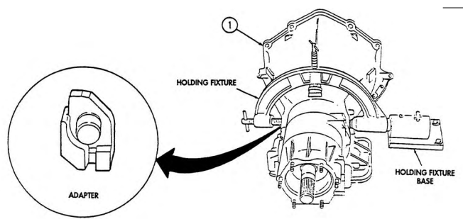

1. Install transmission holding fixture and adapter into locating holes on side of transmission case (1). 2. Install transmission holding fixture and transmission (1) into transmission holding fixture base.

## 28-3. Transmission Disassembly Into Subassemblies (Cont'D)

c. Speed Sensors Removal Remove two capscrews (5), brackets (4), speed sensors (3), and O-rings (2) from transmission (1). Discard O-rings (2).

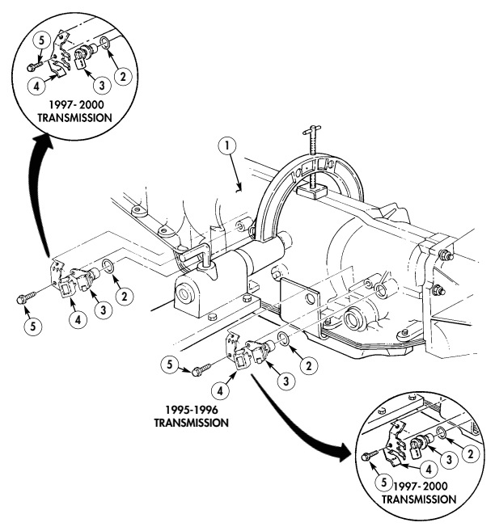

# 28-3. Transmission Disassembly Into Subassemblies (Cont'D)

d. Oil Pan and Filter Assembly Removal 1. Rotate transmission (1) to a vertical left side position and lock in place. This position will prevent any remaining contaminated fluid from reentering transmission.

2. Remove seventeen capscrews (10) and oil pan (9) from transmission (1).

Oil pan gasket seal is reusable. Discard only if damaged.

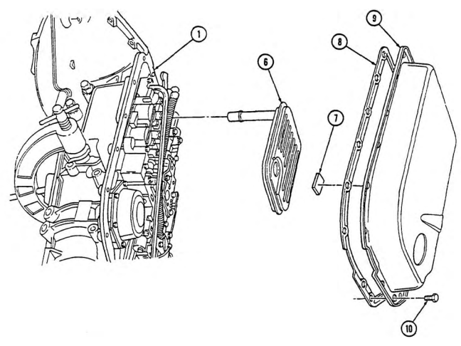

3. Remove gasket (8) and magnet (7) from transmission (1). 4. Remove filter (6) from transmission (1).

# 28-3. Transmission Disassembly Into Subassemblies (Cont'D)

e. Control Valve Assembly Removal (1995-1996)
1. Position transmission (1) so oil pan surface faces up. 2. Disconnect wiring harness (6) from PWM solenoid (7), pressure control solenoid (8), transmission fluid pressure switch (2), 2-3 shift solenoid (5), 1-2 shift solenoid (4), and connector (3).

Capscrews are different lengths. Record location of each capscrew for installation.

3. Remove three capscrews (9), wiring harness clips (10), and harness (6) from control valve assembly (12).

4. Remove six capscrews (18) and transmission fluid pressure switch (19) from control valve assembly (12).

5. Remove capscrew (14) and clip (13) from lube pipe (11) and control valve assembly (12). 6. Remove two capscrews (14) and spring and roller assembly (20) from control valve assembly (12). 7. Remove two capscrews (14), fluid level indicator stop (17), capscrew (15), lube pipe retainer (16),
and lube pipe (11) from control valve assembly (12).

8. Remove sixteen capscrews (23) (1995 transmission), or fifteen capscrews (23) (1996 transmission),
and control valve body assembly (12) from transmission (1).

#### Caution

Do not use magnets or any magnetized tools to remove checkballs. Some checkballs are metal and, if magnetized, will pick up debris from oil and cause malfunction of transmission.

Record locations of checkballs for assembly.

9. Remove eight checkballs (21) from transmission (1).

10. Remove screen (22) from transmission (1).

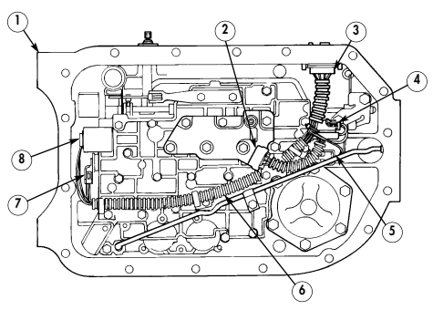

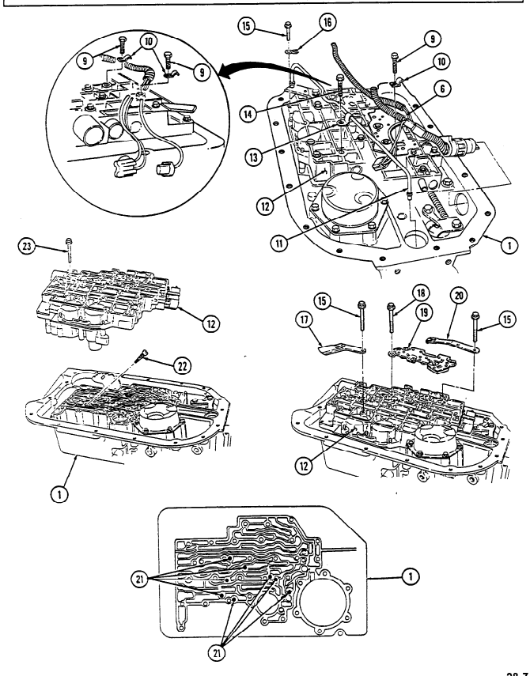

28-3.  TRANSMISSION DISASSEMBLY INTO SUBASSEMBLIES (Cont'd)

# 28-3. Transmission Disassembly Into Subassemblies (Cont'D)

e.1. Control Valve Assembly Removal (1997-1998) 1. Position transmission (1) so oil pan surface faces up. 2. Disconnect wiring harness (6) from PWM solenoid (7), pressure control solenoid (8), transmission fluid pressure switch (2), 2-3 shift solenoid (5), 1-2 shift solenoid (4), and connector (3).

Capscrews are different lengths. Record location of each capscrew for installation.

3. Remove two capscrews (9), wiring harness clips (10), and harness (6) from control valve assembly (14).

4. Remove six capscrews (15) and transmission fluid pressure switch (16) from control valve assembly (14).

5. Remove capscrew (11), clip (12), and lube pipe (13) from control valve assembly (14). 6. Remove two capscrews (18) and spring and roller assembly (17) from control valve assembly (14). 7. Remove seventeen capscrews (21) and control valve assembly (14) from transmission (1).

#### Caution

Do not use magnets or any magnetized tools to remove checkballs. Some checkballs are metal and, if magnetized, will pick up debris from oil and cause malfunction of transmission.

Record locations of checkballs for assembly.

8. Remove eight checkballs (19) from transmission (1). 9. Remove screen (20) from transmission (1).

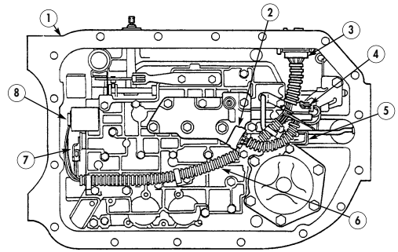

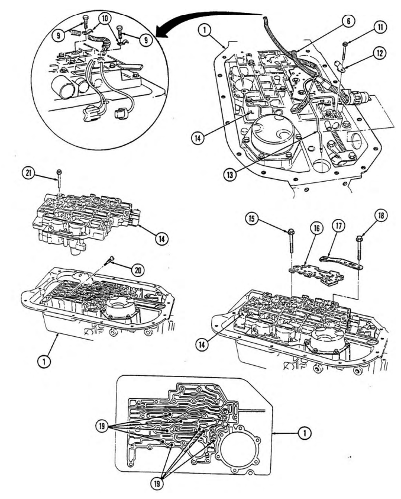

28-3. TRANSMISSION DISASSEMBLY INTO SUBASSEMBLIES (Cont'd)

# 28-3. Transmission Disassembly Into Subassemblies (Cont'D)

f. Front Servo Removal Remove servo piston assembly (1) and piston spring (3) from transmission case (2).

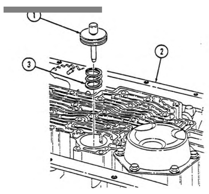

#### G. Rear Servo Removal

1. Remove six capscrews (4), cover (5), and gasket (6) from transmission case (2). Discard gasket (6).

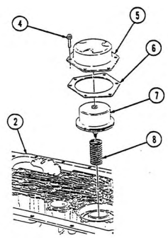 2. Remove servo piston assembly (7) and piston spring (8) from transmission case (2).

# 28-3. Transmission Disassembly Into Subassemblies (Cont'D)

h. Parking Lock Pawl and Actuator Assembly Removal

#### Caution

Do not apply excessive force, prying, or hammering to any parking mechanism parts. Doing so may cause parking system failure.

1. Remove shaft retaining pin (14) from manual shaft (15). 2. Loosen nut (12), slide manual shaft (15) from detent lever (13), and remove nut (12) and detent lever (13).

3. Turn detent lever (13) to free it from parking lock actuator (11). 4. Remove two screws (10) and bracket (9) from transmission case (2). 5. Remove parking lock actuator (11) from pawl (20). 6. Disconnect and remove return spring (21) from pawl (20), retainer (17), and round end on stud (22) in transmission case (2).

7. Remove plug (19) from transmission case (2). Discard plug (19). 8. Remove retainer (17), shaft (18), and pawl (20) from transmission case (2). 9. Remove manual shaft (15) and gasket (16) from transmission case (2). Discard gasket (16).

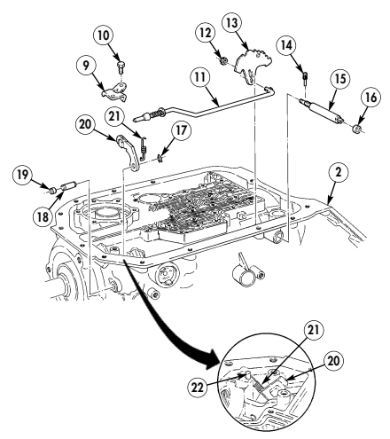

# 28-3. Transmission Disassembly Into Subassemblies (Cont'D)

i. Front End Play Check (Measured)

#### Caution

If end play procedures are not closely adhered to, incorrect shim thickness will be selected, which may result in severe damage to internal transmission components.

1. Turn transmission case (3) with turbine shaft (1) vertical. 2. Set dial indicator to read turbine shaft (1) vertical movement. 3. Press down turbine shaft (1) and pry up output carrier to remove rear end play. 4. Lift turbine shaft (1) with light force to remove slack between snapring (2) on turbine shaft (1) and overdrive carrier (4).

5. Index dial indicator to read zero. 6. Pull up turbine shaft (1) and hold up overdrive carrier (4). Use enough force (at least 20 lb (9.1 kg))
to lift front parts. Read amount of movement on dial indicator.

7. Record this value for use in reassembly. Proper end play is 0.004-0.022 in. (0.102-0.559 mm). 8. Remove dial indicator and pry tool.

#### J. Rear Unit End Play Check (Measured)

1. Turn transmission case (3) with output shaft (5) horizontal. 2. Set dial indicator to read end movement of output shaft (5). 3. Push output shaft (5) into transmission case (3) and zero dial indicator. 4. Pull output shaft (5) out of transmission case (3) and read amount of movement on dial indicator. 5. Record this value for use in reassembly. Proper end play is 0.005-0.025 in. (0.127-0.635 mm). 6. Remove dial indicator.

# 28-3. Transmission Disassembly Into Subassemblies (Cont'D)

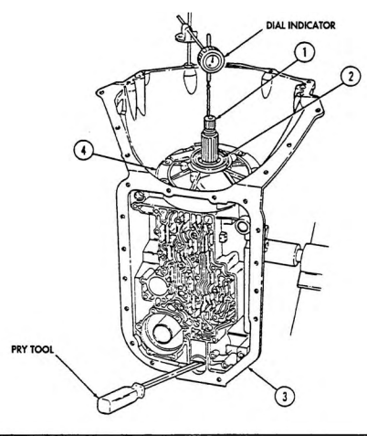

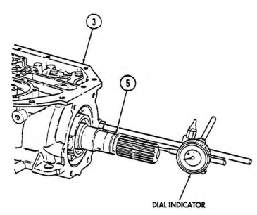

# 28-3. Transmission Disassembly Into Subassemblies (Cont'D)

k. Pump Assembly Removal 1. Remove seal (2) from turbine shaft (1). Discard seal (2). 2. Install pump remover/installer J 37789-A on stator shaft (3). 3. Remove seven screws (5) from pump (6) and transmission case (7). 4. Remove pump (6) and gasket (4) from transmission case (7). Discard gasket (4).

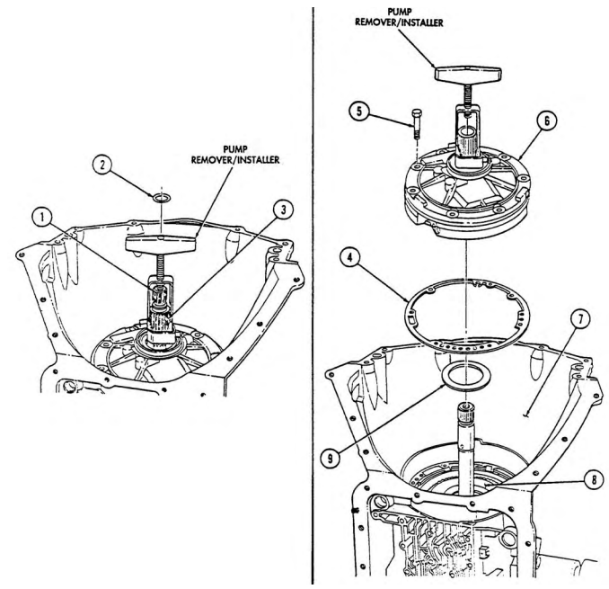 5. Remove thrust washer (9) from overdrive carrier (8).

#### 28-3. Transmission Disassembly Into Subassemblies **(Cont'D)**

1. Turbine Shaft and Overdrive Carrier Assembly Removal 1. Lift turbine shaft. (1) and remove overrun clutch housing assembly (10) from transmission case (7). 

CAUTION 
Correct torque for installed fourth clutch bolt should be 133 lb-in. (15 N-m). If not tightened to minimum torque, check case for cracks and damaged threads. Replace case if damaged. 

2. Check fourth clutch bolt (12) torque for a minimum of 133 lb-in. (15 N=m). 3. Remove bolt (12) from fourth clutch housing (11) with torx adapter. Discard bolt (12). 

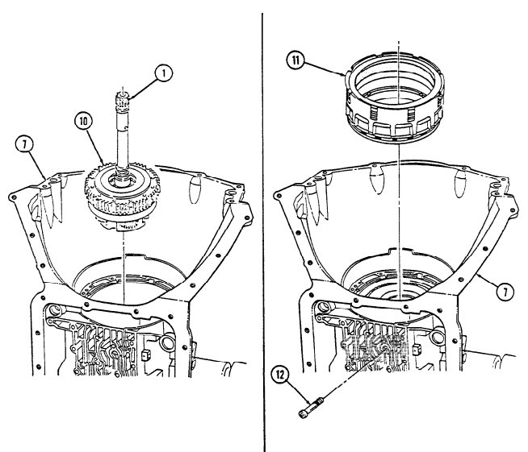 4. Remove fourth clutch housing (11). 

## 28-3. Transmission Disassembly Into Subassemblies (Cont'D)

m.  Forward Clutch Assembly Removal 1.

Remove flat bearing assembly (2) from top of forward clutch assembly (1).

2.

Remove forward clutch assembly (1) from transmission case (3).

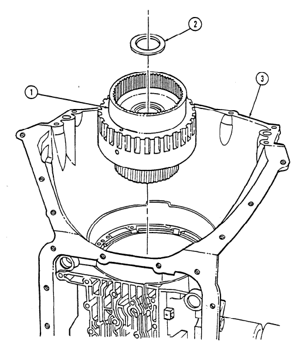

# 28-3. Transmission Disassembly Into Subassemblies (Cont'D)

#### N. Direct Clutch Assembly Removal

1. Remove snapring (4), direct clutch backing plate (5), five composition clutch plate assemblies (6),
clutch plates (7), and dished plate (8) (1995-1996 transmissions only), from direct clutch housing (9).

2. Remove direct clutch housing (9) from transmission case (3). 3. Install dished plate (8) (1995-1996 transmissions only), five clutch plates (7), clutch plate assemblies (6), and backing plate (5) in direct clutch housing (9) with snapring (4).

4. Remove front band (10) from transmission case (3).

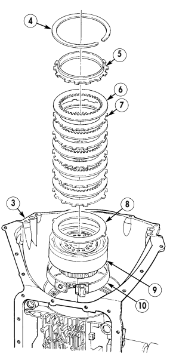

# 28-3. Transmission Disassembly Into Subassemblies (Cont'D)

o. Intermediate Clutch Assembly Removal

Wave plate is used on 1997-1998 transmissions only.

Remove snapring (3), backing plate (2), four clutch plate assemblies (4), clutch plates (1), and wave plate (6) from transmission case (5).

p. Gear Unit Assembly and Rear Band Removal

#### Caution

Correct torque for installed center support bolt should be 29 lb-ft (39 N•m). If not tightened to minimum torque, case could be damaged. If center support bolt is not tightened to minimum torque, a new center support and bolt should be installed during reassembly to avoid component damage.

Perform step 1 for 1997-1998 transmissions only.

1. Remove oil cooler fitting (7) from transmission case (5). 2. Check center support bolt (8) for torque. 3. Remove and discard center support bolt (8). 4. Remove snapring (9) from transmission case (5). 5. Attach gear unit installer/remover tool and slide hammer to main shaft (10). 6. Lift gear unit (11) out of transmission case (5). 7. Remove thrust washer (12) from gear unit (11). 8. Remove spacer (13), rear band (14), and thrust washer (15) from transmission case (5). q. Center Support Assembly Removal Remove center support (16) and thrust washer (17) from gear unit (11).

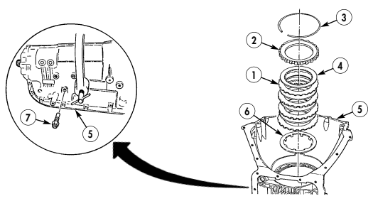

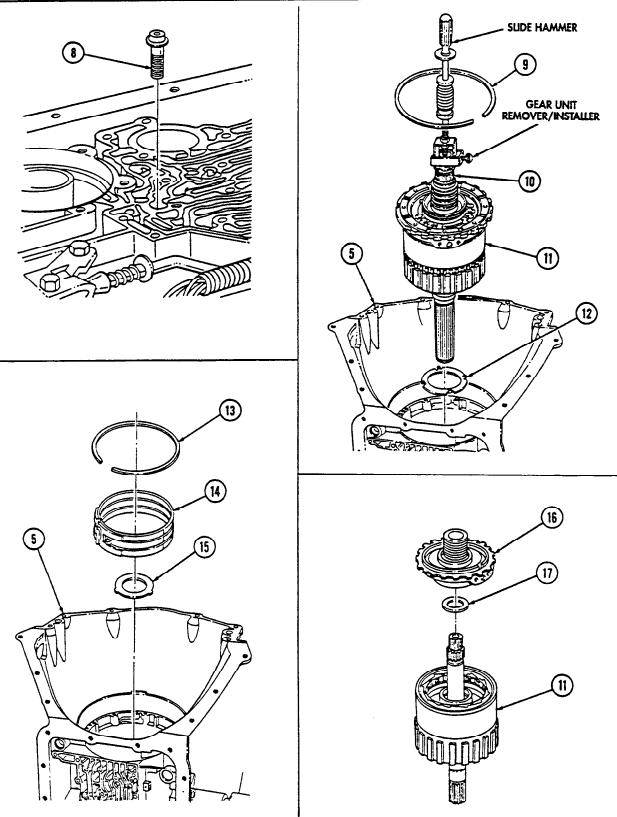

28-3. TRANSMISSION DISASSEMBLY INTO SUBASSEMBLIES (Cont'd)

HOM

#### 28-4. Torque Converter Maintenance

This task covers: 

| Cleaning a.   |
|---------------|

| Inspection   | b.   |
|--------------|------|

| Maintenance Level   |
|---------------------|
| General support     |

INITIAL SETUP: 
Manual References TM 9-2320-387-24P 
Equipment Condition 
?kansmission disassembled into subassemblies (para. 28-3). 

NOTE 
Have drainage container ready to catch fluid. 

1. Drain fluid from torque converter (1). Replace torque converter (11 if fluid is contaminated or abnormal looseness or noises were recorded during torque converter removal (para. 28-31. 

2. Clean exterior of torque converter (1) in accordance with para. 2-14. 

rb. inspection ] 

1. 

2. 

3. 

4. 

5. 

For general inspection instructions, refer to para. 2-15. 

Inspect torque converter hub (2) for damage. Replace torque converter (11 if hub (2) is damaged. 

Inspect torque converter (1) for proper operation by manually rotating splined inner race (3) in both directions. The splined inner race (3) should turn freely in clockwise direction, but not turn or be very difficult to turn in counterclockwise direction. Replace torque converter (1) if it does not operate properly. Inspect torque converter (1) for damaged or leaking seams and welds. Replace torque converter (1) if damaged. 

Inspect torque converter pilot (5) for damage. Replace torque converter (1) if damaged. Inspect threaded holes (4) for damage. Repair with thread repair inserts. If unable to repair threaded holes (41, replace torque converter (1). 

# 28-4.  Torque Converter Maintenance (Cont'D)

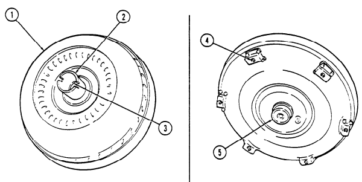

# 28-5. Transmission Case Maintenance

This task covers: 
INITIAL SETUP: 

| œ   | Tool   | 1   |
|-----|--------|-----|

| Special Tools 1   |
|-------------------|

General mechanic's tool kit: 
automotive (Appendix B, Item 1) 
Seal installer (Appendix B, Item 61) 

| Manual References                                                                               |
|-------------------------------------------------------------------------------------------------|
| and and and the below to the commend of the many of the many of the commend of the first of the |
| TM 9\-2320\-387\-24P                                                                            |

Materials/Parts Crocus cloth (Appendix C, Item 22) 
a. Cleaning 

a. Cleaning b. Inspection 

Equipment Condition Transmission disassembled into subassemblies 
(para. 28-3). 

General Safety Instructions l Protective clothing must be used when steam cleaning. 

l Compressed air for cleaning purposes will not exceed 30 psi (207 kPa). 

Maintenance Level General support 

Work area should be well-ventilated, clean, and free from blowing dirt and dust. 

1. Remove transmission case (1) from transmission holding fixture. 

#### Warning

When steam-cleaning, protective clothing must be used. Failure to do this may cause serious injury. 

2. Thoroughly steam-clean transmission case (1). 

#### Warning

Compressed air used for cleaning purposes will not exceed 30 psi (207 kPa). Use only with effective chip guarding and personal protective equipment (goggles/shield, gloves, etc.). 

3. Blow all dirt and cleaning solution from transmission case (1) with compressed air. 

b. Inspection 

For general inspection procedures, refer to para. 2-15. 

Inspect all oil passages and bores for cracks, leaks, holes, and burrs. Use soft stone or crocus cloth to remove burrs. 

1. 

2. 

3. 

4. 

5. 

Use helicoils to repair damaged threads. 

Inspect bores for holes or pits as leakage paths. Replace transmission case (1) if holes or pits are present. Inspect anchor pins (4) for damage or looseness. Replace anchor pins (4) if damaged or loose. Inspect internal splines, lugs, and snapring grooves for cracks, breaks, and burrs. Repair minor burrs. Replace damaged transmission case (1). 

Remove retaining ring (7) and replace seal assembly (6) using seal installer. 

Inspect plugs (51, cooler fittings (21, and vent pipe (3). Replace damaged parts. 

6. 7. 

8. 

Inspect oil multilip seal (8) for damage. Replace if damaged. Inspect bolt holes (9) for damage. Replace transmission case (1) if holes (9) are damaged. 

9. 

28-5.  TRANSMISSION CASE MAINTENANCE (Cont'd)

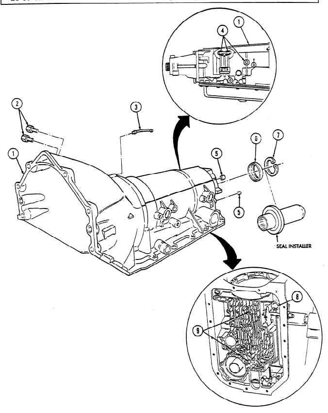

# 28-6. Parking Lock Pawl And Actuator Assembly Inspection

This task covers: 
Inspection INITIAL SETUP: 
Manual References Maintenance Level TM 9-2320-387-24P General support Equipment Condition Transmission disassembled into subassemblies 
(para. 28-3). 

Return spring is part of transmission. 

Inspect parking lock paw1 (2) for cracks and burrs. Remove any minor burrs. Replace if cracked. 

Inspect paw1 shaft (1) for cracks, burrs, and damaged flats. Remove minor burrs. Replace if damaged. 

1. 

2. 

Inspect detent lever (3) and manual shaft (5) for cracks, burrs, or threads. Replace both if either is damaged. 

3. 

Inspect actuator assembly (6) for cracks, burrs, free movement, and damaged spring. Replace if damaged. 

5. Inspect return spring (7) for breaks and distortion. Replace if damaged. 

6. Inspect retaining pin (4) for tightness. Replace if damaged. 

4. 

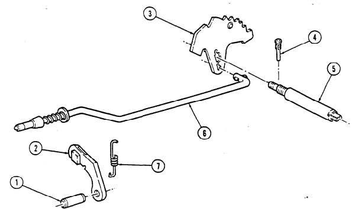

# 28-7. Rear Band And Selective Thrust Washer Inspection

This task covers: 
Inspection INITIAL SETUP: 
Manual References Maintenance Level TM 9-2320-387-24P General support Equipment Condition Transmission disassembled into subassemblies (para. 28-3). 

1. Inspect rear band (1) for burning, scoring, distortion, or other damage. Replace rear band (1) if 

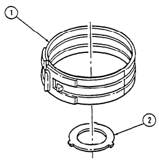

damaged. 

2. Inspect rear selective thrust washer (2) for wear, scoring, breaks, cracks, or heat discoloration. 

Replace thrust washer (2) if damaged. 

# 28-8. Gear Unit And Output Assemblies Repair

This task covers:
a. Disassembly (1995) c. Inspection a.1. Disassembly (1996-1998) d. Assembly (1995)
b. Cleaning d.1. Assembly (1996-1998)
INITIAL SETUP:
Tools General mechanic's tool kit:
automotive (Appendix B, Item 1)
Maintenance and repair shop equipment:
automotive (Appendix B, Item 2)
Materials/Parts Petrolatum (Appendix C, Item 52) Transmission fluid (Appendix C, Item 37)
Manual References TM 9-2320-387-24P
Equipment Condition Transmission disassembled into subassemblies (para. 28-3).

Maintenance Level General support

Work area should be well-ventilated, clean, and free from blowing dirt and dust.

a. Disassembly (1995) 1. Remove sun gear shaft (4) from sun gear (5) and main shaft (6). 2. Remove reaction drum (2) from output carrier assembly (8).

Keep bearing and races together as sets.

3. Remove bearing and two races (3) and sun gear (5) from output carrier assembly (8).

Place output carrier assembly on its side for ease of disassembly.

4. Remove thrust washer (7) from output carrier assembly (8). 5. Remove thrust washer (9), snapring (10), output shaft (11), and bearing and two races (12) from internal gear (13).

6. Remove internal gear (13), main shaft (6), and bearing and two races (14) from output carrier assembly (8).

7. Remove snapring (15) and internal gear (13) from main shaft (6). 8. Remove roller clutch (1) and spacer ring (1.1) from reaction drum (2).

# 28-8. Gear Unit And Output Assemblies Repair (Cont'D)

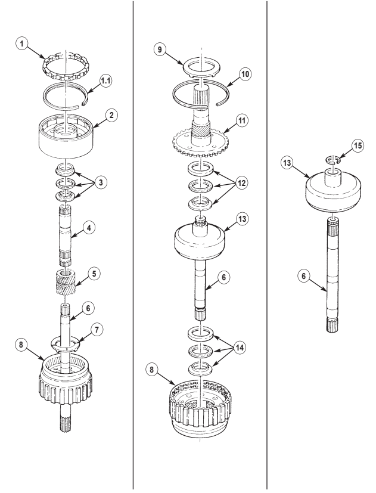

# 28-8. Gear Unit And Output Assemblies Repair (Cont'D)

Work area should be well-ventilated, clean, and free from blowing dirt and dust.

a.1. Disassembly (1996-1998) 1. Remove sun gear shaft (4) from sun gear (5) and main shaft (6). 2. Remove reaction drum (2) from output carrier assembly (8).

Keep all bearing and races together as sets.

3. Remove bearing and two races (3) and sun gear (5) from output carrier assembly (8).

Place output carrier assembly on its side for ease of disassembly.

4. Remove thrust washer (7) from output carrier assembly (8). 5. Remove thrust washer (9), snapring (10), output shaft (11), and bearing and two races (12) from internal gear (13).

6. Remove internal gear (13), main shaft (6), and bearing and two races (14) from output carrier assembly (8).

7. Remove snapring (15) and internal gear (13) from main shaft (6). 8. Remove roller clutch (1) from reaction drum (2).

# 28-8. Gear Unit And Output Assemblies Repair (Cont'D)

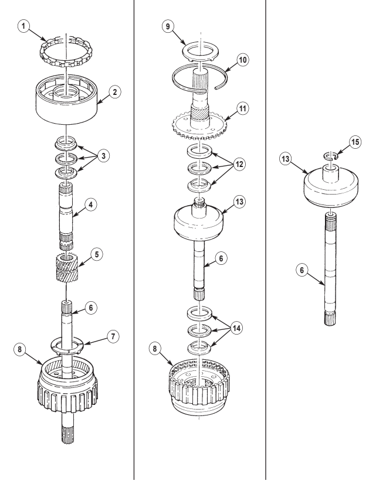

# 28-8. Gear Unit And Output Assemblies Repair (Cont'D)

b. Cleaning Clean all center support components in accordance with para. 2-14.

c. Inspection

For general inspection instructions, refer to para. 2-15.

1. Inspect output carrier (2) for damage. Replace if damaged. 2. Inspect output carrier pinion gears (1) for damage, rough bearings, or excessive end play. Using feeler gauge, measure pinion gear end play; end play should not exceed 0.024 in. (0.61 mm). If any of these conditions exist, replace output carrier (2).

3. Inspect band surface (4) on reaction drum (3) for burning, scoring, or galling. Replace if burned, scored, or galled.

4. Inspect reaction carrier bushing (5). Replace reaction drum (3) if bushing (5) is damaged. 5. Inspect reaction carrier pinion gear (6) for damage, rough bearings, or excessive end play. Using feeler gauge, measure pinion gear end play; end play should not exceed 0.024 in. (0.61 mm). If any of these conditions exist, replace reaction drum (3).

6. Inspect roller clutch (10) for damaged rollers (8), springs (7), or cage (9). Replace roller clutch (10) if any parts are damaged.

Internal rings are used on 1995-1996 transmissions only.

7. Inspect snapring (11), case thrust washer (12), reaction carrier thrust washer (13), and spacer ring (13.1) for distortion or damage. Replace any part distorted or damaged.

8. Inspect sun gear shaft (14) for damage. Replace if damaged. 9. Inspect output shaft (15) for damage. Replace if damaged.

10. Refer to para. 2-15 for general inspection instructions for all other gear unit parts.

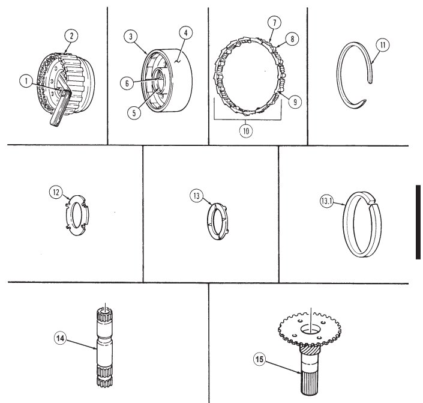

# 28-8.  Gear Unit And Output Assemblies Repair (Cont'D) 28-8. Gear Unit And Output Assemblies Repair (Cont'D)

d. Assembly (1995)

#### Caution

All transmission parts must be lubricated with clean transmission fluid (Dexron® VI) before assembly. Foreign material will cause transmission damage.

For general assembly instructions, refer to para. 2-17.

1. Install space ring (10.1) and roller clutch (10) in reaction drum (11). 2. Install main shaft (3) into rear internal gear (2) with snapring (1). 3. Install bearing and two races (7) on rear journal of rear internal gear (2). Retain races (7) with petrolatum.

4. Install output carrier assembly (9), bearing and two races (8), and output shaft (6) on internal gear
(2). Secure with snapring (5).

The metal thrust washer is installed on output shaft. The plastic thrust washer is installed in output carrier.

5. Install thrust washer (4) on output shaft (6) and retain with petrolatum. Seat tabs in pockets of output shaft (6).

6. Turn partially-assembled gear unit over with main shaft (3) facing up. 7. DELETED. 8. Install plastic thrust washer (15) and reaction drum (11) on output carrier assembly (9). Mesh gears.

9. Install sun gear (14), chamfered edge first, into reaction drum (11) and output carrier assembly (9).

10. Install long, splined end of sun gear shaft (13) in sun gear (14). 11. Install bearing and two races (12) with longer lip race on reaction drum (11). Retain races (12) with petrolatum.

28-8.  GEAR UNIT AND OUTPUT ASSEMBLIES REPAIR (Cont'd)

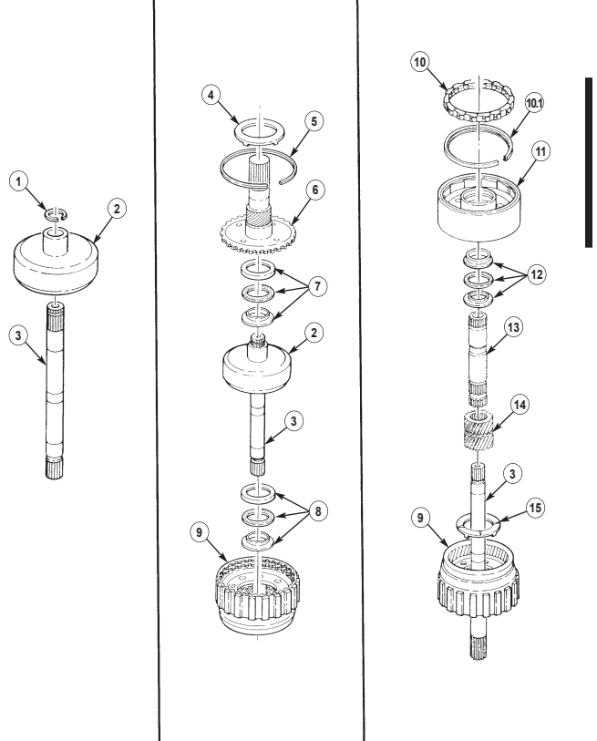

# 28-8. Gear Unit And Output Assemblies Repair (Cont'D)

d.1. Assembly (1996-1998)

#### Caution

All transmission parts must be lubricated with clean transmission fluid (Dexron® VI) before assembly. Foreign material will cause transmission damage.

For general assembly instructions, refer to para. 2-17.

1. Install roller clutch (10) in reaction drum (11). 2. Install main shaft (3) into rear internal gear (2) with snapring (1). 3. Install bearing and two races (7) on rear journal of rear internal gear (2). Retain races (7) with petrolatum.

4. Install output carrier assembly (9), bearing and two races (8), and output shaft (6) on internal gear (2).

Secure with snapring (5).

6. Turn partially-assembled gear unit over with main shaft (3) facing up. 7. Install plastic thrust washer (15) and reaction drum (11) on output carrier assembly (9).

Mesh gears.

8. Install sun gear (14), chamfered edge first, into reaction drum (11) and output carrier (9). 9. Install long, splined end of sun gear shaft (13) in sun gear (14).

10. Install bearing and two races (12) with longer lip race on reaction drum (11). Retain races (12) with petrolatum.

The metal thrust washer is installed on output shaft. The plastic thrust washer is installed in output carrier.

5. Install thrust washer (4) on output shaft (6) and retain with petrolatum. Seat tabs in pockets of output shaft (6).

# 28-8.  Gear Unit And Output Assemblies Repair (Cont'D)

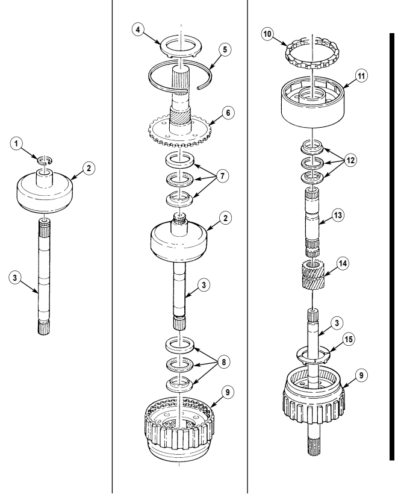

# 28-9. Center Support Repair

This task covers:

a. Disassembly **c. Inspection** b. Cleaning **d. Assembly**

INITIAL SETUP:

#### Tools

General mechanic's tool kit:
automotive (Appendix B, Item 1)
Maintenance and repair shop equipment:
automotive (Appendix B, Item 2)
Special Tools Driver handle (Appendix B, Item 60) Bushing service set (Appendix B, Item 76) Adapter (Appendix B, Item 67) Clutch compressor spring adapter
(Appendix B, Item 69)
Center support thread reamer
(Appendix B, Item 73.1)
Materials/Parts Seal kit (Appendix G, Item 308) 
(1995-1996 only)
Materials/Parts (Cont'd)
Seal kit (Appendix G, Item 309)
(1997-2000 only)
Transmission fluid (Appendix C, Item 37)
Manual References TM 9-2320-387-24P
Equipment Condition Transmission disassembled into subassemblies (para. 28-3).

General Safety Instructions Air pressure must not exceed 15 psi (103 kPa) when air-checking clutch piston.

Maintenance Level General support

Work area should be well-ventilated, clean, and free from blowing dirt and dust.

a. Disassembly 1. Remove four packing retainers (1) from center support (2). Discard packing retainers (1). 2. Using adapter and clutch spring compressor J 23327, compress spring and retainer (10) and remove snapring (11) from center support (2).

3. Remove spring and retainer (10), releasing springs (9), and remove clutch piston (6) from center support (2).

4. Remove preformed packings (7) and (8) from clutch piston (6). Discard preformed packings (7)
and (8).

Perform step 5 for 1997-1998 transmissions only. 

5. Remove oil cooler fitting seal (8.1) from center support (2). b. Cleaning Clean all center support components in accordance with para. 2-14.

c. Inspection

For general inspection instructions, refer to para. 2-15.

1. Inspect roller clutch inner race (3) for damage. Replace center support (2) if damaged. 2. Inspect oil ring grooves (4) in center support (2) for roughness or damage. Replace center support (2) if damaged.

3. Inspect center support (2) for damage. Replace if damaged.

# 28-9. Center Support Repair (Cont'D)

- The center support bolt hole can be reconditioned ONE TIME
ONLY using a reamer and a new service bolt. This is an optional procedure.

- 1997-1998 transmission center supports are shown. The 1995-1996 transmissions are similar.

3.1. Insert, do not force, gauge pin with chamfer end towards hole in bolt hole (5). If gauge pin fits in hole at least half way, go to step 3.2. If half way or more, replace center support (2).

3.2. Position reamer in bolt hole (5) and using light pressure, turn clockwise approximately 4-6 times or until reamer bottoms out. Remove reamer and clean center support (2).

4. Check all oil passages in center support (2) for blockage. 5. Inspect release springs (9) for signs of distortion or collapsed coils. Replace all springs (9) if any have distorted or collapsed coils.

6. Inspect clutch piston (6), spring and retainer (10), and snapring (11) for damage or distortion.

Replace any part if damaged or distorted.

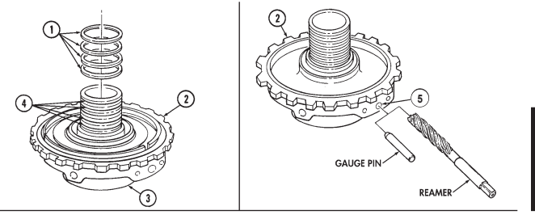

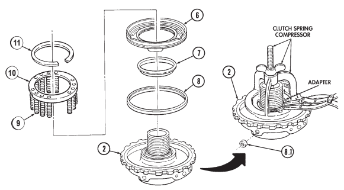

# 28-9. Center Support Repair (Cont'D)

Intermediate clutch plates and backing plate were removed during transmission disassembly (para. 28-3).

7. Inspect steel clutch plates (1) and backing plate (2) for signs of burning, scoring, or cracks. Replace any that are burned, scored, or cracked.

8. Inspect bushing (4) in center support (3) for damage. If damaged, perform steps 9 through 11. If not, go to step 12.

9. Using driver handle and bushing remover and installer J 21465-01, remove bushing (4) from center support (3).

10. Align elongated slot in bushing (4) with drilled hole in oil delivery sleeve (6) closest to piston cavity in center support (3).

11. Using driver handle and bushing remover and installer, install bushing (4) into center support (3)
until bushing (4) is flush to 0.010 in. (0.254 mm) below top of oil delivery sleeve (6).

12. Check center support (3) for obstructions in orifice plug (5). Remove obstructions with a piece of wire. Replace center support if plug (5) is missing or obstructions cannot be removed.

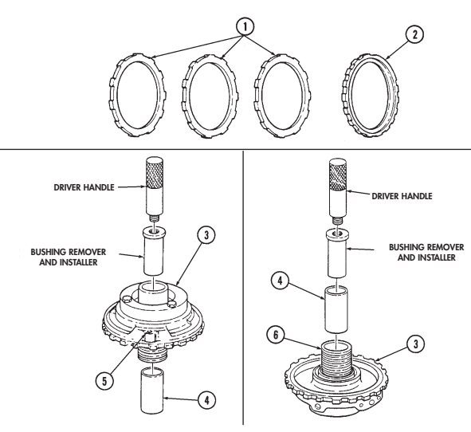

# 28-9. Center Support Repair (Cont'D)

d. Assembly

#### Caution

All transmission parts must be lubricated with clean transmission fluid (Dexron® VI) before assembly. Foreign material will cause transmission damage.

- For general assembly instructions, refer to para. 2-17. - It may be necessary to use a 0.015-in. (0.381-mm) feeler gauge to start outer and inner piston seals into center support.

1. Install preformed packings (8) and (9) on clutch piston (7). Ensure lips on preformed packings (8)
and (9) face away from spring pockets in clutch piston (7).

2. Install clutch piston (7) in center support (3), indexing spring pockets in clutch piston (7) with cored areas in center support (3).

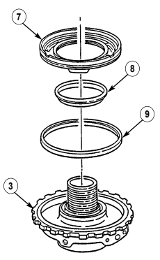

## 28-9. Center Support Repair (Cont'D)

3. Place release springs (2.1) and spring and retainer (2) on center support (3). 4. Using adapter and spring compressor J 23327, compress spring and retainer (2) on center support (3) and install snapring (1).

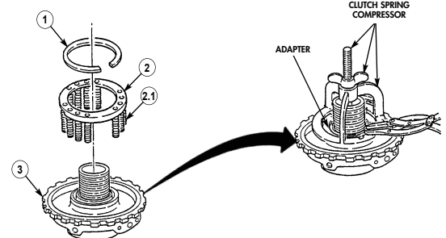

# 28-9. Center Support Repair (Cont'D)

#### .Warning.

Air pressure must not exceed 15 psi (103 kPa) when air-checking clutch piston or injury to personnel or damage to equipment may result.

NOTE
Clutch piston must move up and down freely when air pressure is applied.

5. Apply compressed air through center support bolt hole (7) to check operation of clutch piston (6). 6. Install four packing retainers (4) on oil delivery sleeve (5).

Perform step 7 for 1997-2000 transmissions only.

7. Install oil cooler fitting seal (8) in center support (3).

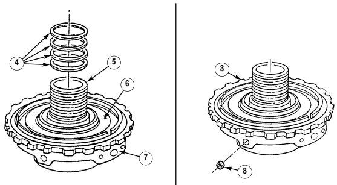

1997 AND 1998 MODELS

# 28-10. Direct Clutch Assembly Repair

This task covers:
a. Disassembly d. Assembly c. Inspection

#### Initial Setup: Tools

General mechanic's tool kit:
automotive (Appendix B, Item 1)
Dial indicator (Appendix B, Item 113)
Special Tools Clutch spring compressor 
(Appendix B, Item 69)
Adapter (Appendix B, Item 70) Adapter (Appendix B, Item 67) Seal protectors (Appendix B, Item 68)

#### Materials/Parts

Seal kit (Appendix G, Item 308) 
(1995-1996 only)
Seal kit (Appendix G, Item 309) 
(1997-2000 only)
Transmission fluid (Appendix C, Item 37)
b. Cleaning e. Direct Clutch Piston Movement Measurement Manual References TM 9-2320-387-24P
Equipment Condition Transmission disassembled into subassemblies (para. 28-3).

General Safety Instructions Air pressure must not exceed 80 psi (552 kPa) when air-checking clutch piston.

Maintenance Level General support

Work area should be well-ventilated, clean, and free from blowing dirt and dust.

a. Disassembly 1. Remove snapring (1), clutch retainer (2), and outer race (3) from direct clutch housing (5). 2. Remove sprag assembly (4) from direct clutch housing (5). 3. Remove snapring (6), backing plate (7), five clutch plate assemblies (8), clutch plates (10), and dished plate (9) (1995-1996 transmissions only) from direct clutch housing (5).

Piston removed in step 4 is for 1995-1996 transmissions only.

4. Using spring compressor, adapter, and clutch spring adapter, remove snapring (11), spring and retainer assembly (12), and piston (13) from clutch housing (5).

Perform step 5 for 1995-1996 transmissions only.

5. Remove inner seal (14), outer seal (15), and direct clutch seal (16) from clutch housing (5). Discard seals (14), (15), and (16).

b. Cleaning Clean all direct clutch components in accordance with para. 2-14.

c. Inspection

For general inspection instructions, refer to para. 2-15.

1. Inspect backing plate (7), five clutch plates (10), and dished plate (9) (1995-1996 transmissions only) for signs of burning, scoring, or cracks. Replace any plate if burned, scored, or cracked.

# 28-10. Direct Clutch Assembly Repair (Cont'D)

2. Inspect snapring (1), backing plate snapring (6), spring and retainer assembly (12), and clutch retainer (2) for distortion or damage. Replace any part if distorted or damaged.

3. Inspect sprag assembly (4) and outer race (3) for scoring, galling, or damage. Replace any part if scored, galled, or damaged.

Perform step 4 for 1995-1996 transmissions only.

4. Inspect piston (13) for distortion or damage. Replace if distorted or damaged. 5. Inspect spring and retainer assembly (12) for collapsed coils or distortion. Replace all if any are collapsed or distorted.

6. Inspect direct clutch housing (5) for damage. Replace if damaged. 7. Check for freeness of checkball (17) and ensure all oil passages in clutch housing (5) are open.

Replace direct clutch housing (5) if checkball (17) is not free or oil passages are blocked.

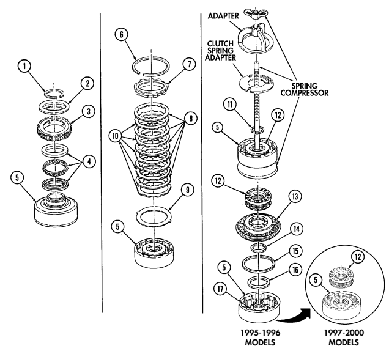

# 28-10. Direct Clutch Assembly Repair (Cont'D)

d. Assembly

#### Caution

All transmission parts must be lubricated with clean transmission fluid (Dexron® VI) before assembly. Foreign material will cause transmission damage.

- For general assembly instructions, refer to para 2-17. - Perform step 1 for 1995-1996 models only.

1. With piston (2) facing up, install inner seal (3) and outer seal (4), lip side down, and direct clutch seal (5), lip side up, into clutch housing (6).

2. Position seal protectors J 38732-1 and J 21362 on direct clutch housing (6).

e. Direct Clutch Piston Movement Measurement Perform step 2.1 for 1995-1996 transmissions only.

2.1. Install piston (2). Use twisting motion on piston (2) until seated.

3. Using spring compressor and adapter, install spring and retainer assembly (1) on piston (2) with snapring (7).

4. Install sprag assembly (11) over rear hub of direct clutch housing (6). 5. Install outer race (10), groove side up, and clutch retainer (9) over sprag assembly (11) with snapring (8).

6. Check sprag assembly (11) to ensure it only turns clockwise and locks on housing (6) when turned counterclockwise.

Perform step 7 for 1995-1996 transmissions only.

7. Install dished plate (15), cupped surface toward piston (2), on direct clutch housing (6). 8. Install five clutch plates (16) and clutch plate assemblies (14) on clutch housing (6). Alternate plates, starting with a clutch plate (16).

9. Install backing plate (13) on housing (6) with snapring (12).

1. Set direct clutch assembly (17) on center support (18). 2. Set dial indicator to seat on direct clutch assembly (17).

#### Warning

Air pressure must not exceed 80 psi (552 kPa) when air-checking clutch position.

Air applied to reverse passage will vent out normally.

3. Apply 80 psi (552 kPa) of air pressure to direct clutch fluid passage (20) in center support (18) only.

Do not apply air pressure to reverse passage (19); air will vent out normally.

4. Piston should move to compress clutch plates. Travel should be 0.121-0.186 in. (3.07-4.72 mm). 5. If correct measurement is read, remove direct clutch assembly (17) from center support (18). 6. If incorrect measurement is read, check clutch plates (16) and (14) for proper installation. Replace all clutch plates if damaged.

# 28-10. Direct Clutch Assembly Repair (Cont'D)

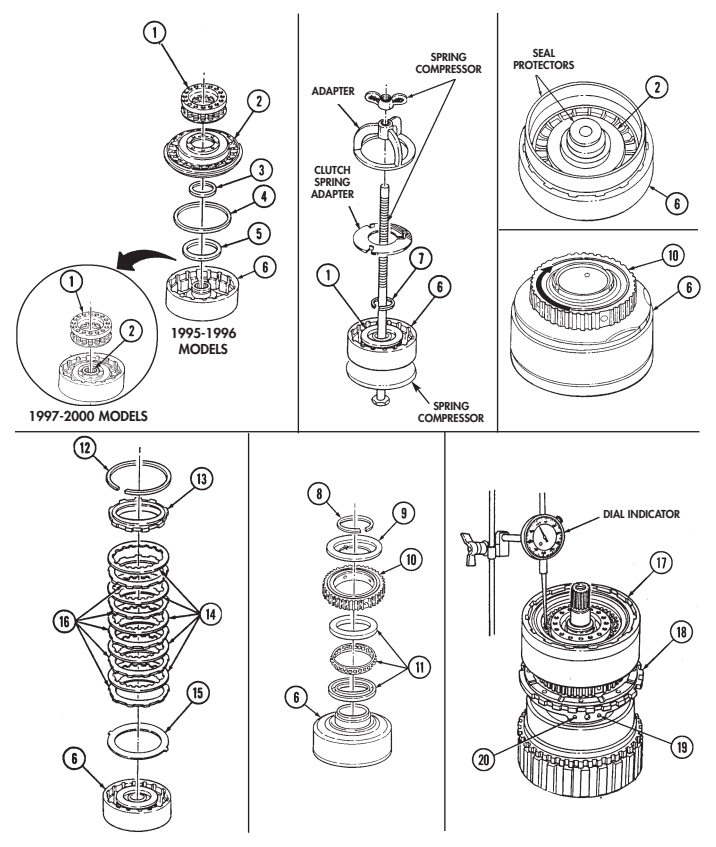

# 28-11. Forward Clutch Assembly Repair

This task covers:

a. Disassembly c. Inspection b. Cleaning d. Assembly

INITIAL SETUP:
Tools General mechanic's tool kit:
automotive (Appendix B, Item 1)
Dial indicator (Appendix B, Item 113)
Special Tools Clutch spring compressor (Appendix B, Item 69) Adapter (Appendix B, Item 70) Seal protectors (Appendix B, Item 68)
Materials/Parts Seal kit (Appendix G, Item 308) 
(1995-1996 only)
Seal kit (Appendix G, Item 309)
(1997-2000 only)
Petrolatum (Appendix C, Item 52) Transmission fluid (Appendix C, Item 37)
Manual References TM 9-2320-387-24P
Equipment Condition Transmission disassembled into subassemblies (para. 29-3).

Maintenance Level General support General Safety Instructions Air pressure must not exceed 80 psi (552 kPa) when air checking clutch position.

Work area should be well-ventilated, clean, and free from blowing dirt and dust.

#### A. Disassembly

1. Remove snapring (1) and direct clutch driving hub (2) from forward clutch housing (8). 2. Remove forward clutch hub (4), thrust washer (3), and bearing washer (5) from direct clutch driving hub (2).

3. Remove five clutch plates (9), clutch plate assemblies (6), and dished clutch plate (7) (1995-1996 transmissions only), from forward clutch housing (8).

4. Using spring compressor, adapter, and clutch spring adapter, compress spring and retainer assembly (11) and remove snapring (10) from forward clutch housing (8).

5. Remove spring and retainer assembly (11) from forward clutch housing (8).

Perform steps 6, 7, and 8 for 1995-1996 transmissions only.

6. Remove piston (12) from forward clutch housing (8). 7. Remove inner seal (13) and outer seal (14) from piston (12). Discard seals (13) and (14). 8. Remove inner seal (15) from clutch housing (8). Discard inner seal (15). b. Cleaning Clean all forward clutch components in accordance with para. 2-14. c. Inspection

For general inspection instructions, refer to para. 2-15.

1. Inspect five clutch plates (9) for signs of burning, scoring, or cracks. Replace any that are burned, scored, or cracked.

## 28-11. Forward Clutch Assembly Repair (Cont'D)

2. Inspect thrust washer (3), bearing washer (5), spring and retainer assembly (11), and snapring (10)
for distortion or damage. Replace any if distorted or damaged.

3. Inspect forward clutch hub (4) and direct clutch hub (2) for damage. Replace either if damaged. 4. Inspect piston (12) for distortion or damage. Replace if distorted or damaged. 5. Inspect spring and retainer assembly (11) for collapsed coils or distortion. Replace if distorted or damaged.

6. Inspect clutch housing (8) for damage. Replace if damaged. 7. Check for freeness of checkball (16) in clutch housing (8), and that all oil passages are open.

Replace forward clutch assembly if checkball (16) is not free or if oil passages are blocked.

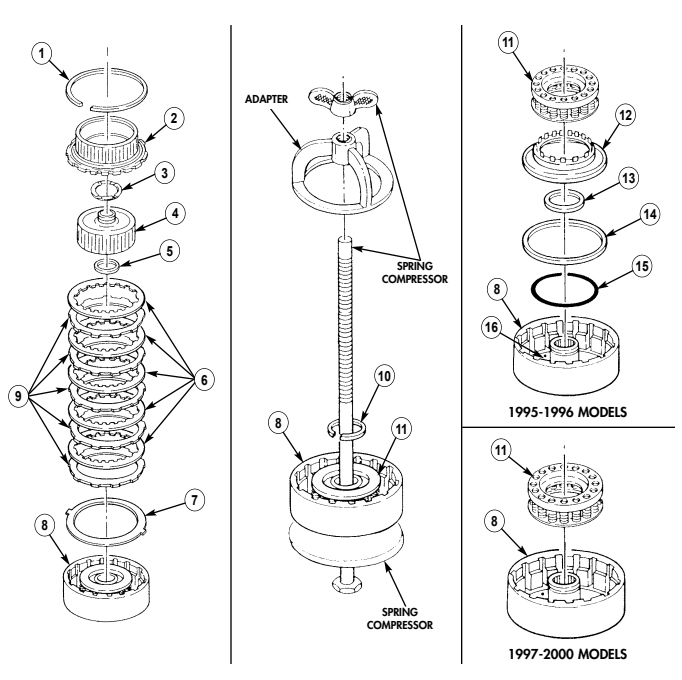

# 28-11. Forward Clutch Assembly Repair (Cont'D)

d. Assembly

#### Caution

All transmission parts must be lubricated with clean transmission fluid (Dexron® VI) before assembly. Foreign material will cause transmission damage.

Perform steps 1 and 2 for 1995-1996 transmissions only.

1. Install inner seal (3) and outer seal (4) on piston (2), with lips of seals facing down toward housing (6).

2. Install inner seal (5) on forward clutch housing (6), with lip of seal facing up. 3. Install seal protectors over clutch housing (6). 4. Install piston (2) on forward clutch housing (6). Twist slightly to ensure piston (2) seats on housing (6).

5. Using spring compressor and adapter, install spring and retainer assembly (1) on piston (2) and forward clutch housing (6) and secure with snapring (7).

9. Install forward clutch housing (6) on turbine shaft (16).

10. Set up dial indicator to measure piston (2) movement with direct clutch driving hub (9).

#### .Warning.

Air pressure must not exceed 80 psi (552 kPa) when checking clutch piston.

11. Apply 80 psi (552 kPa) of air pressure to hole A on forward clutch assembly (6). Piston (2) should move 0.121-0.186 in. (3.07-4.27 mm).

12. Remove turbine shaft (16), snapring (8), and direct clutch driving hub (9) from forward clutch housing (6).

13. Install thrust washer (10) inside forward clutch hub (11) and bearing washer (12) outside forward clutch hub (11) and retain with petrolatum.

14. Install clutch hub (11) on forward clutch housing (6). 15. Install direct clutch driving hub (9) on forward clutch housing (6) with snapring (8).

6. Install dished clutch plate (14) (1995-1996 transmissions only), concave side toward piston (2), on forward clutch housing (6).

7. Starting with a clutch plate (15), install five clutch plates (15) and clutch plate assemblies (13) on clutch housing (6).

8. Install direct clutch driving hub (9) in forward clutch housing (6) with snapring (8).

# 28-11. Forward Clutch Assembly Repair (Cont'D)

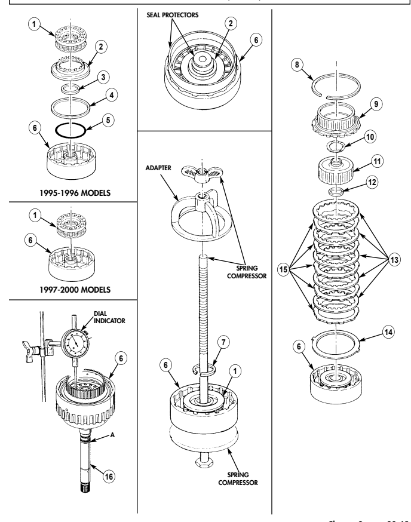

I

# 28-12. Fourth Clutch Assembly Repair

This task covers:
a. Disassembly d. Assembly c. Inspection INITIAL SETUP:
Tools General mechanic's tool kit:
automotive (Appendix B, Item 1)
Special Tools Seal protectors (Appendix B, Item 71)
Materials/Parts Seal kit (Appendix G, Item 308)
(1995-1996 only)
Seal kit (Appendix G, Item 309)
(1997-2000 only)
b. Cleaning e. End Play Measurement

#### Materials/Parts (Cont'D)

Petrolatum (Appendix C, Item 52) Transmission fluid (Appendix C, Item 37)
Manual References TM 9-2320-387-24P
Equipment Condition Transmission disassembled into subassemblies

| (para. 28\-3).    |
|-------------------|
| Maintenance Level |
| General support   |

Work area should be well-ventilated, clean, and free from blowing dirt and dust.

a. Disassembly 1. Remove snapring (1), backing plate (11), four clutch plates (9), and clutch plate assemblies (10) from clutch housing (4).

2. Remove snapring (8) and spring and retainer assembly (7) from clutch housing (4). 3. Remove piston (3) from clutch housing (4). 4. Remove O-ring (2) from piston (3) and O-ring (6) from housing (4). Discard O-rings (2) and (6).

b. Cleaning Clean all components in accordance with para. 2-14.

c. Inspection 1. Inspect piston (3), backing plate (11), and clutch housing (4) for cracks, breaks, and damaged seal ring grooves. Replace any that are cracked, broken, or damaged.

2. Inspect plug (5). If missing, replace clutch housing (4).

d. Assembly 3. Place O-ring protector J 38731-1 on clutch housing (4). 4. Place O-ring protector J 38731-2 on piston (3). 5. Position piston (3) on base J 38731-3 with snapring groove of piston (3) up. 6. Place housing (4) over piston (3) while holding inner seal protector in position.

#### Caution

All transmission parts must be lubricated with clean transmission fluid (Dexron® VI) before assembly. Foreign material will cause transmission damage.

1. Install O-ring (2) on piston (3), with lip facing toward spring and retainer assembly (7) side. 2. Install O-ring (6) on housing (4), with lip facing away from spring and retainer assembly (7) side.

## 28-12. Fourth Clutch Assembly Repair (Cont'D)

7. Using both hands with a firm grip on the outside of housing (4), push down on housing (4) until the inner piston (3) protrudes through the center.

8. Place spring and retainer assembly (7) and snapring (8) over piston (3), keeping the housing (4) on base J 38731-3.

9. Compress spring and retainer assembly (7) and install snapring (8).

Clutch plate index notch is opposite fourth clutch assembly bolt hole in housing.

10. Turn housing (4) over and install four clutch plates (9), clutch plate assemblies (10), and backing plate (11). Start with clutch plate (9). Backing plate (11) must have flat side down.

11. Secure backing plate (11), clutch plates (9), and clutch plate assemblies (10) to housing (4) with snapring (1).

#### E. End Play Measurement

1. Place fourth clutch assembly (4) on bench with spring and retainer assembly (7) facing down.

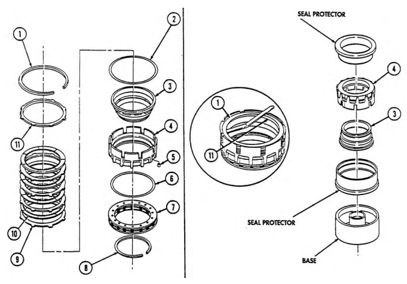 2. Press lightly on backing plate (11) and measure gap between snapring (1) and backing plate (11).

Measurement should be 0.040-0.100 in. (1.016-2.540 mm). If not, check for correct clutch plate pack or replace worn clutch plate pack.

# 28-13. Turbine Shaft And Overdrive Carrier Assembly Repair

This task covers:
b. Overrun Clutch Disassembly g. Overdrive Carrier Cleaning d. Overrun Clutch Inspection **i. Turbine Shaft Inspection** e. Overrun Clutch Assembly **j. Overdrive Unit Assembly**

Tools General mechanic's tool kit:
automotive (Appendix B, Item 1)
Dial indicator (Appendix B, Item 113)
Special Tools Spring compressor (Appendix B, Item 69) Adapter (Appendix B, Item 67) Seal installer (Appendix B, Item 107)
Materials/Parts Two seals (Appendix G, Item 282) Seal kit (Appendix G, Item 308) 
(1995-1996 only)
a. Overdrive Unit Disasssembly **f. Overdrive Carrier Measurement** c. Overrun Clutch Cleaning h. Overdrive Carrier Inspection

#### Materials/Parts

Mechanical parts kit (Appendix G, Item 309)
(1997-2000 only)
Transmission fluid (Appendix C, Item 37)
Manual References TM 9-2320-387-24P
Equipment Condition Transmission disassembled into subassemblies (para. 28-3).

Maintenance Level General support

Work area should be well-ventilated, clean, and free from blowing dirt and dust.

#### A. Overdrive Unit Disassembly

1. Remove snapring (1) and turbine shaft (4) from overdrive carrier assembly (2). 2. Remove four seals (5) from shaft (4). Discard seals (5). 3. Separate overdrive carrier assembly (2) from overrun clutch housing assembly (3).

#### B. Overrun Clutch Disassembly

1. Remove snapring (6), backing plate (7), three clutch plates (12), and clutch plate assemblies (8)
from clutch housing (3).

2. Using spring compressor and adapter, compress spring and retainer assembly (10) and remove snapring (9). 3. Remove spring compressor and adapter, spring and retainer assembly (10), and piston (11) from housing (3).

#### C. Overrun Clutch Cleaning

Clean all overrun clutch components, except piston (11), in accordance with para. 2-14.

#### D. Overrun Clutch Inspection

5. Inspect housing (3) for cracks, chips, scored or burned thrust faces and plugged holes. Unplug holes.

Replace if damaged.

1. Inspect all clutch plates (12) and (8) for cracks, breaks, scoring, pitting, and evidence of overheating or composition wear. Replace clutch plates (12) and clutch plate asssemblies (8) as a set if any are damaged.

2. Inspect backing plate (7) for cracks, warpage, and scoring. Remove minor scoring. Replace plate (7)
if damaged.

3. Inspect spring and retainer assembly (10) for cracks, breaks, and uneven or damaged springs.

Replace springs if damaged.

4. Inspect piston (11) for crack or damage. Replace piston (11) if damaged.

# 28-13.  Turbine Shaft And Overdrive Carrier Assembly Repair (Cont'D)

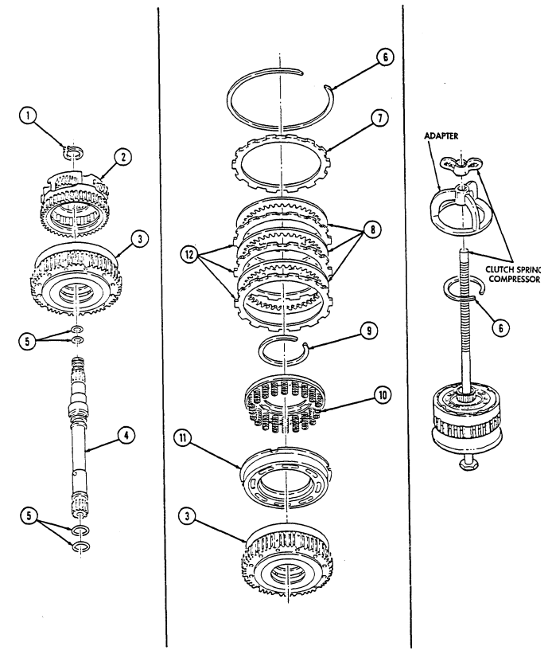

## 28-13. Turbine Shaft And Overdrive Carrier Assembly Repair (Cont'D)

e. Overrun Clutch Assembly

#### Caution

All transmission parts must be lubricated with clean transmission fluid (Dexron® VI) before assembly. Foreign material will cause transmission damage.

1. Install piston (6) on clutch housing (7) and rotate piston (6) while seating in housing (7). 2. Using spring compressor and adapter, install spring and retainer assembly (5) on housing (7) and secure with snapring (4).

3. Starting with clutch plate (8), install three clutch plates (8) alternately with clutch plate assemblies (3) in housing (7).

4. Install backing plate (2) over clutch plate assembly (3) and secure with snapring (1). 5. Measure gap between snapring (1) and backing plate (2). Gap should be 0.033-0.094 in.

(0.838-2.388 mm). If not, check assembly of clutch plate pack (8) or replace clutch plate pack (8).

# 28-13.  Turbine Shaft And Overdrive Carrier Assembly Repair (Cont'D)

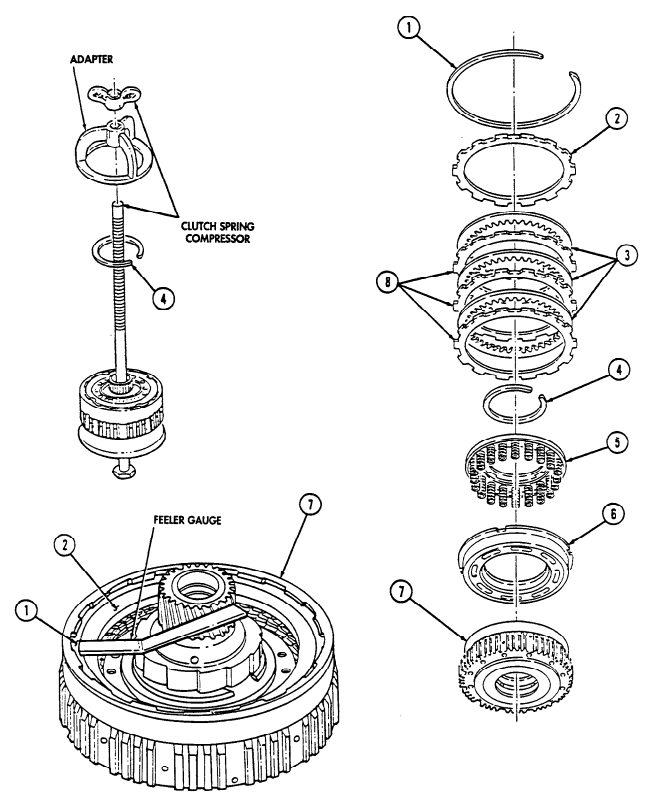

## 28-13. Turbine Shaft And Overdrive Carrier Assembly Repair **(Cont'D)**

#### F. Overdrive Carrier Measurement

1. Set dial indicator to read pinion gear (1) end play. 

2. Lift pinion gear (1) and read movement from dial indicator. Normal end freeplay is 0.009-0.024 in. 

(0.229-0.610 mm). If not, replace overdrive carrier assembly (61. 

g. Overdrive **Carrier Cleaning** 
Clean all components in accordance with para. 2-14. 

h. Overdrive Carrier Inspection 1. 

Inspect pinion gears (1) surfaces for scoring or burrs. Remove minor burrs. Replace overdrive carrier assembly (6) if damaged. 

2. 

3. 

4. 

Inspect pinion gears (1) for damaged teeth and scored or damaged bearing bore. Replace overdrive carrier assembly (6) if damaged. Inspect roller clutch assembly (3) for cracked or broken rollers or cage and scoring. Replace roller clutch assembly (3) if damaged. 

5. 

6. 

Inspect bearing assembly (4) for damage. Replace if damaged. 

Inspect carrier (6) for cracks, breaks, or scoring on finished thrust surfaces. Remove minor scoring. Replace overdrive carrier assembly (6) if damaged. 

Inspect pinion pins (5) and pinion pin retainer (2) for looseness and drainage. Replace overdrive carrier assembly (6) if loose or damaged. 

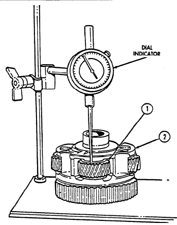

28-13.  TURBINE SHAFT AND OVERDRIVE CARRIER ASSEMBLY REPAIR (Cont'd)

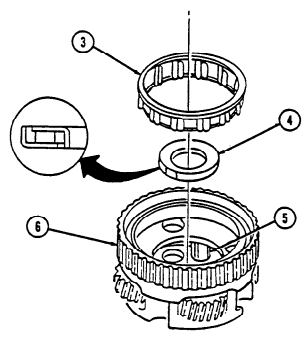

-

# 28-13. Turbine Shaft And Overdrive Carrier Assembly Repair (Cont'D)

#### I. Turbine Shaft Inspection

1. Ensure that checkball (3) on end of shaft (2) is present. Replace shaft (2) if checkball (3) is missing. 2. Inspect shaft (2) for broken or twisted splines, cracks, and plugged oil passages. Clear oil passages.

Replace shaft (2) if damaged.

j. Overdrive Unit Assembly

#### Caution

All transmission parts must be lubricated with clean transmission fluid (Dexron® VI) before assembly. Foreign material will cause transmission damage.

- Steps 1 through 4 apply to one end of shaft. Repeat these steps using different size tools for opposite end of shaft.

- Use small chamfered end of sizer to do the lower seal. Use larger chamfered end to size all other seals.

- Install the inner seal ring first, then the outer ring.

1. Place seal installer J 38736-1 on shaft (2). 2. Using seal pusher J 38736-5, push inner seal ring (1) over and down the installer until in place.

Repeat step for outer ring (1).

3. Remove seal pusher and installer.

Sizer must remain on seal for 5 minutes.

4. Place seal sizer J 38736-3 over shaft (2) and size seal ring (1) in place. 5. Repeat steps 1 through 4 for inner and outer seal rings (4). 6. Place carrier assembly (6) in overrun clutch housing (7). Rotate carrier (6) during assembly to align clutch plate assembly teeth.

7. Install turbine shaft (8) through housing (7) and overdrive carrier assembly (6), and secure with snapring (5).

28-13.  TURBINE SHAFT AND OVERDRIVE CARRIER ASSEMBLY REPAIR (Cont'd)

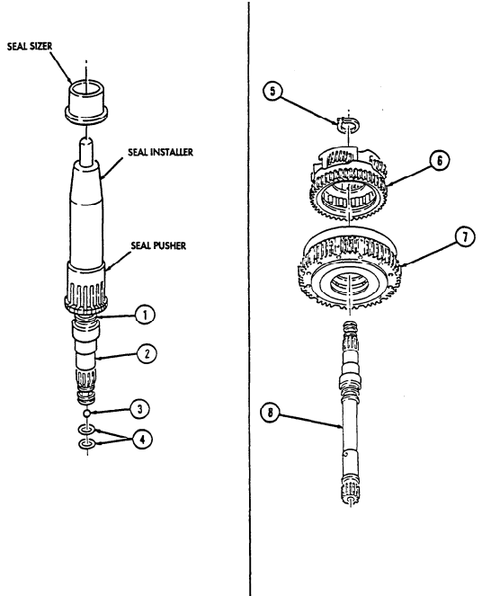

# 28-14. Intermediate Clutch Assembly And Front Band Inspection

This task covers:
Inspection INITIAL SETUP:
Manual References TM 9-2320-387-24P
Maintenance Level General support Equipment Condition Transmission disassembled into subassemblies (para. 28-3).

Inspection

- Intermediate clutch plates, backing plate, and front band were removed during disassembly. Inspect clutch plates only if they will be reused.

- Work area should be well-ventilated, clean, and free from blowing dirt and dust.

- Replace damaged plates as a set. - Wave plate is used on 1997-1998 transmissions only.

1. Inspect wave plate (5), four clutch plates (3), and clutch plate assemblies (4) for cracks, wear, and evidence of overheating and scoring. 

2. Inspect backing plate (1) for cracks, breaks, scoring, and evidence of overheating. Replace if damaged.

3. Inspect front band (2) for cracks, loose or damaged anchor or pin ends, and worn or burned composition material. Replace if damaged.

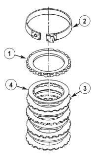

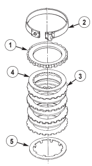

1995 - 1996 MODELS 1997 - 1998 MODELS

# 28-15. Front Servo Repair

This task covers:
a. Disassembly c. Inspection b. Cleaning d. Assembly

Tools General mechanic's tool kit:
automotive (Appendix B, Item 1)
Materials/Parts Transmission fluid (Appendix C, Item 37)
Manual References TM 9-2320-387-24P
Equipment Condition Transmission disassembled into subassemblies (para. 28-3).

Maintenance Level General support

Work area should be well-ventilated, clean, and free from blowing dirt and dust.

a. Disassembly 1. Remove spring retainer (4) and piston (3) from pin (1). 2. Remove seal (2) from piston (3).

b. Cleaning Clean all components in accordance with para. 2-14.

c. Inspection

For general inspection instructions, refer to para. 2-15.

1. Inspect front servo piston (3) for cracks and broken seal groove. Replace if damaged. 2. Inspect piston pin (1) for cracks, bends, and damaged snapring groove. Replace if damaged. 3. Inspect spring (5) for breaks and distortion. Replace if damaged.

#### D. Assembly

1. Coat seal (2) with transmission fluid (Dexron® VI) and install seal (2) on piston (3). 2. Install pin (1) on piston (3) and secure with spring retainer (4).

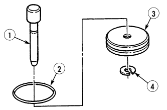

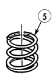

# 28-16. Rear Servo Repair (1995)

This task covers:
a. Disassembly c. Inspection b. Cleaning d. Assembly

Tools General mechanic's tool kit:
automotive (Appendix B, Item 1)
Materials/Parts Transmission fluid (Appendix C, Item 37)
Manual References TM 9-2320-387-24P
Equipment Condition Transmission disassembled into subassemblies (para. 28-3).

Maintenance Level General support

Work area should be well-ventilated, clean, and free from blowing dirt and dust.

a. Disassembly 1. Remove retainer clip (1) from pin (8) in servo piston (10). 2. Remove accumulator piston (3), spacer (5), servo spring (6), and spring retainer (7) from pin (8).

b. Cleaning Clean all parts in accordance with para. 2-14.

c. Inspection 1. Inspect pistons (3) and (10) for cracks, porosity, and damaged seal grooves. Remove minor burrs and scoring. Replace if damaged.

2. Inspect servo spring (6) for breaks and distortion. Replace if damaged. 3. Inspect pin (8) for cracks, burrs, bends, and chipped or damaged retainer groove. Replace if damaged.

If replacing any seal, coat seal with transmission fluid (Dexron® VI).

4. Inspect outer oil seal (9) for nicks, cuts, or damage. Replace seal (9) if nicked, cut, or damaged. 5. Inspect inner seal (2) and piston seal (4) for nicks, cuts, or damage. Replace inner seal (2) and piston seal (4) if nicked, cut, or damaged.

d. Assembly Install spring retainer (7), servo spring (6), spacer (5), pin (8), and accumulator piston (3) on servo piston (10) with clip (1).

# 28-16.  Rear Servo Repair (1995) (Cont'D)

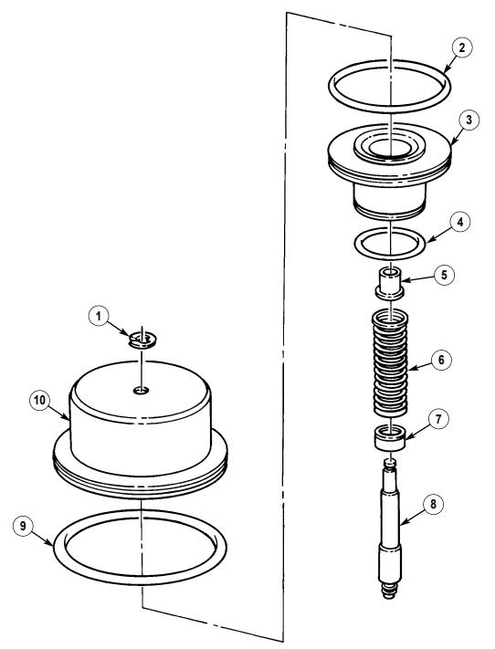

# 28-16.1. Rear Servo Repair (1996-1998)

This task covers:
a. Disassembly c. Inspection b. Cleaning d. Assembly

Tools General mechanic's tool kit:
automotive (Appendix B, Item 1)
Materials/Parts Transmission fluid (Appendix C, Item 37)
Manual References TM 9-2320-387-24P
Equipment Condition Transmission disassembled into subassemblies (para. 28-3).

Maintenance Level General support

Work area should be well-ventilated, clean, and free from blowing dirt and dust.

a. Disassembly 1. Remove retainer clip (11) from pin (8) in servo piston (10). 2. Remove spring (1), accumulator piston (3), spacer (5), servo spring (6), and spring retainer (7) from pin (8).

b. Cleaning Clean all parts in accordance with para. 2-14.

c. Inspection

For general inspection instructions, refer to para. 2-15.

1. Inspect pistons (3) and (10) for cracks, porosity, and damaged seal grooves. Remove minor burrs and scoring. Replace if damaged.

2. Inspect servo spring (6) and spring (1) for breaks and distortion. Replace if damaged. 3. Inspect pin (8) for cracks, burrs, bends, and chipped or damaged retainer groove. Replace if damaged.

If replacing any seal, coat seal with transmission fluid (Dexron® VI).

4. Inspect outer oil seal (9) for nicks, cuts, or damage. Replace seal (9) if nicked, cut, or damaged. 5. Inspect inner seal (2) and piston seal (4) for nicks, cuts, or damage. Replace inner seal (2) and piston seal (4) if nicked, cut, or damaged.

d. Assembly 1. Install spring retainer (7), servo spring (6), spacer (5), and accumulator piston (3) on pin (8). 2. Install spring (1) and accumulator piston (3) in servo piston (10) and install retaining clip (11) on pin (8).

# 28-16.1.  Rear Servo Repair (1996-1998) (Cont'D)

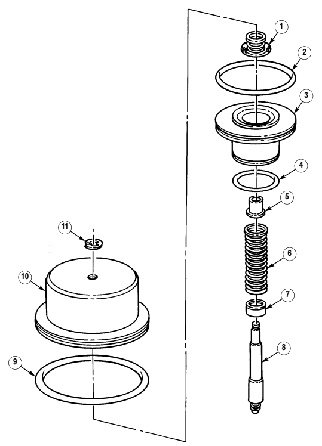

I

# 28-17. Control Valve And Accumulator Housing Repair

This task covers:
a. Accumulator Housing Cleaning e. Control Valve Inspection b. Accumulator Housing Disassembly f. Control Valve Assembly c. Control Valve Disassembly g. Accumulator Housing Inspection d. Control Valve Cleaning h. Accumulator Housing Assembly

Tools General mechanic's tool kit:
automotive (Appendix B, Item 1)
Maintenance and repair shop equipment:
automotive (Appendix B, Item 2)

#### Materials/Parts

Gasket (Appendix G, Item 50) Seal kit (Appendix G, Item 308) 
(1995-1996 only)
Seal kit (Appendix G, Item 309)
(1997-2000 only)
O-ring (Appendix G, Item 214) Seat kit (Appendix G, Item 312)

#### Materials/Parts (Cont'D)

Seal (Appendix G, Item 283) Petrolatum (Appendix C, Item 52)
Manual References TM 9-2320-387-24P
Equipment Condition Transmission disassembled into subassemblies (para. 28-3).

Maintenance Level General support

#### Caution

Do not use a honing stone, fine sandpaper, or crocus cloth to clean a valve. Use micro-fine lapping compound 900 grit (J 384-59).

Work area should be well-ventilated, clean, and free from blowing dirt and dust.

a. Accumulator Housing Cleaning 1. Clean control valve assembly (8) and accumulator housing (2) thoroughly in solvent. 2. Air-dry control valve assembly (8). b. Accumulator Housing Disassembly 1. Remove six capscrews (1) from accumulator housing (2) and control valve assembly (8). 2. Remove accumulator housing (2), gasket (4), and springs (3) and (9) from control valve assembly (8). Discard gasket (4).

3. Remove gasket (5), spacer plate (6), and gasket (7) from control valve assembly (8). Discard gaskets (7) and (5).

4. Remove snapring (10) and fourth clutch piston assembly (15) with pin (16) from housing (2).

Perform step 5 for 1995-1996 transmissions only.

5. Remove snapring (17) and pin (16) from fourth clutch piston (15). 6. Remove seal (14) from fourth clutch piston (15). Discard seal (14). 7. Remove third clutch piston (12) from housing (2). 8. Remove preformed packings (11) and (13) from third clutch piston (12). Discard preformed packings (11) and (13).

28-17. CONTROL VALVE AND ACCUMULATOR HOUSING REPAIR (Cont'd)

8

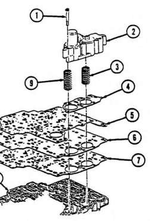

SA

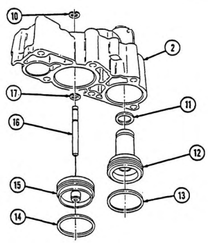

# 28-17. Control Valve And Accumulator Housing Repair (Cont'D)

#### C. Control Valve Disassembly

1. Remove manual valve (30) from body (2). 2. Remove screen filter (1) from body (2).

A 5/64-in. (1.984-mm) drill bit may be used to remove spring pins. While rotating drill bit, lift and remove spring pins.

3. Remove spring pin (9), plug (8), ball (7), bushing (6), preformed packing (5), 3-4 shift valve (4), and spring (3) from body (2). Discard preformed packing (5).

4. Remove capscrew (10), 2-3 shift solenoid (11), spring pin (12), 2-3 shift valve (13), and spring (14)
from body (2).

5. Remove capscrew (18), 1-2 shift solenoid (19), spring pin (17), 1-2 shift valve (16), and spring (15)
from body (2).

6. Remove spring pin (20), plug (21), and filter (22) from body (2). 7. Remove sleeve (25), plug (24), and ball (23) from body (2). 8. Remove capscrew (31), clamp (32), and pressure control solenoid (33) from body (2). 9. Remove clip (37), PWM solenoid (38), spring pin (36), TCC valve (35), and spring (34) from body (2).

10. Remove retainer plate (39), spring (40), and feed-limit valve (41) from body (2). 11. Remove spring pin (26), plug (27), spring (28), and accumulator valve (29) from body (2).

#### D. Control Valve Cleaning

Clean all parts in accordance with para. 2-14.

e. Control Valve Inspection 1. Inspect valves (4), (13), (16), (29), (30), (35), and (41) and bushing (6) for scoring, nicks, and scratches. Replace control valve assembly if damaged.

2. Inspect shift solenoids (11) and (19) for O-ring damage. Replace if damaged. 3. Inspect springs (3), (14), (15), (28), (34), and (40) for damage or distorted coils. Replace springs that are damaged.

4. Inspect body (2) for cracks, interconnected passages, and damaged machined surfaces. Replace control valve if damaged.

5. Inspect screen filter (1) for damage. Replace if damaged.

#### F. Control Valve Assembly

1. Install accumulator valve (29), spring (28), and plug (27) in body (2) with spring pin (26). 2. Install feed-limit valve (41) and spring (40) in body (2) with retainer plate (39). 3. Install spring (34) and TCC valve (35) in body (2) with spring pin (36). Install PWM solenoid (38)
with clip (37).

4. Install clamp (32) and pressure control solenoid (33) in body (2) with capscrew (31). 5. Install ball (23) and plug (24) in body (2) with sleeve (25). 6. Install filter (22) and plug (21) in body (2) with spring pin (20). 7. Install spring (15) and 1-2 shift valve (16) in body (2) with spring pin (17). Install 1-2 shift solenoid (19) with capscrew (18).

## 28-17. Control Valve And Accumulator Housing Repair (Cont'D)

Install spring (14) and 2-3 shift valve (13) in body (2) with spring pin (12). Install 2-3 shift 8.

solenoid (11) with capscrew (10).

9.

Install spring (3), 3-4 shift valve (4), preformed packing (5), bushing (6), ball (7), and plug (8) in body (2) with spring pin (9).

10.

Install manual valve (30) in body (2).

11.

Install screen filter (1) in body (2).

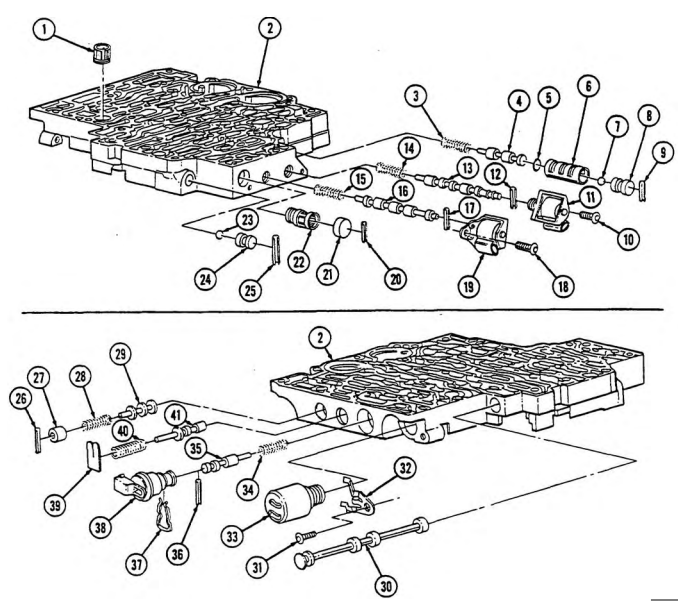

■

# 28-17. Control Valve And Accumulator Housing Repair (Cont'D)

#### G. Accumulator Housing Inspection

1. Inspect accumulator housing (2) for cracks, breaks, and scoring on bores and sealing surfaces.

Remove minor scoring. Replace if damaged.

2. Inspect springs (11) and (17) for breaks and distortion. Replace if damaged. 3. Inspect pistons (4) and (7) for cracks, breaks, and chipped or damaged seal grooves. Replace if damaged.

4. Inspect pin (8) for cracks, bends, and damaged grooves. Replace if damaged. h. Accumulator Housing Assembly 1. Coat preformed packings (3) and (5) with petrolatum and install on third clutch piston (4). 2. Install third clutch piston (4) on housing (2). 3. Coat seal (6) with petrolatum and install on fourth clutch piston (7).

Perform step 4 for 1995-1996 transmissions only.

4. Install fourth clutch piston (7) on pin (8) and install snapring (9) in lower snapring groove. 5. Install fourth clutch piston (7) and pin (8) in housing (2) and secure with snapring (1) on the outside housing.

6. Install springs (17) and (11) on control valve assembly (16). 7. Install gasket (15), spacer plate (14), and gasket (13) on control valve assembly (16). 8. Install gasket (12) and accumulator housing (2) on control valve assembly (16) with six capscrews (10). Tighten capscrews (10) in sequence shown to 97 lb-in. (11 N•m).

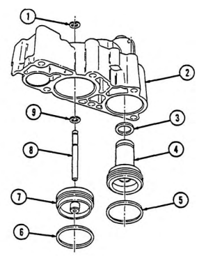

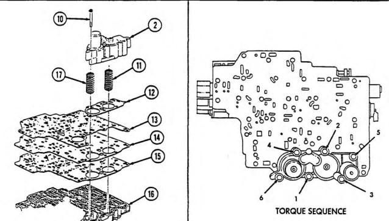

28-17. CONTROL VALVE AND ACCUMULATOR HOUSING REPAIR (Cont'd)

# 28-18. Oil Pump Assembly Repair

This task covers:
INITIAL SETUP:
Tools General mechanic's tool kit:
automotive (Appendix B, Item 1)
Maintenance and repair shop equipment:
automotive (Appendix B, Item 2)
Special Tools Output shaft seal installer 
(Appendix B, Item 90)
Oil pump seal installer (Appendix B, Item 61)
Materials/Parts Seal (Appendix G, Item 288) Two seal rings (Appendix G, Item 310)
(1995-1996 only)

a. Disassembly c. Inspection b. Cleaning **d. Assembly**

| Manual References                       |
|-----------------------------------------|
| TM 9\-2320\-387\-24P                    |
| Equipment Condition                     |
| - Winch removed (M1113) (para. 12\-27). |
| - Winch removed (M1114) (para. 12\-33). |
| - Winch cable removed (para. 12\-28).   |
| Maintenance Level                       |
| Direct support                          |

NOTE
Work area should be well-ventilated, clean, and free from blowing dirt and dust.

a. Disassembly 1. Remove seal (32) from pump body (1). Discard seal (32).

NOTE
Before removal, mark pump body and cover for assembly.

2. Remove five screws (5) from cover (4) and pump body (1). Separate pump body (1) and cover (4). 3. Remove seal (2) from pump body (1). Discard seal (2).

NOTE
Before removal, mark gear faces for assembly.

4. Remove drive gear (3) and driven gear (6) from pump body (1).

#### Caution

Pressure regulator valve is spring-loaded.

5. Remove snapring (19) from cover (4) and release tension. 6. Remove bushing (18), reverse boost valve (17), spring retainer (16), two springs (15), pressure regulator valve (14), spring pin (11), and plug (12) from cover (4).

7. Remove spring pin (25), plug (28), spring (27), and converter limit valve (26) from cover (4). 8. Remove spring retainer (7), spring (8), and converter enable valve (9) from cover (4). 9. Remove snapring (20), plug (21), converter clutch valve (22), spring (23), spring pin (24), and plug (10) from cover (4).

10. Remove screw (31) and vent shield (30) from cover (4). 11. Remove two seals (29) from cover (4). Discard seals (29). 12. Remove front selective thrust washer (13) from cover (4).

b. Cleaning Clean all components in accordance with para. 2-14.

# 28-18. Oil Pump Assembly Repair (Cont'D)

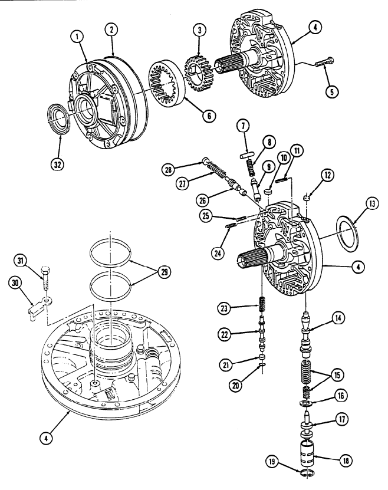

#### 28- 18. **Oil Pump Assembly Repair (Cont'D)**

r~ C. Inspection 1 1. 

2. 

3. 

4. 

5. 

6. 7. 8. 

9. 

10. 

11. 

Inspect pump body (1) for cracks, breaks, burrs, damaged threads, and chipped seal or snapring grooves. Remove minor burrs. If damaged, replace oil pump. 

Inspect pump body (1) gear pockets, crescent, bushings, and gear face for nicks, scoring, and wear. Repair minor nicks and scoring. If damaged, replace oil pump. 

Inspect pump body (1) for blocked oil passages and ports and cross-channel leakage paths. Clear oil passages. If damaged, replace oil pump. 

Install drive gear (3) and driven gear (2) in pump body (1) with chamfered edges down. Measure clearance of gears (3) and (2) to pump body (1) using a straightedge and feeler gauge. Clearance should be 0.0007-0.0028 in. (0.018-0.071 mm). If clearance does not meet specifications, replace oil pump. 

Inspect pump cover (6) for cracks, breaks, burrs, and chipped seal or snapring grooves. Remove minor burrs. If damaged, replace oil pump. 

Inspect stator shaft (9) splines. Replace oil pump if damaged. 

Inspect pump cover (6) for scored, discolored, or worn bushings. If damaged, replace oil pump. Inspect pump cover (6) for chipped or broken oil seal ring grooves on hub. If damaged, replace oil pump. 

Inspect pump cover (6) for blocked oil passages and ports, and cross-channel leakage paths. Clear oi passages. If damaged, replace oil pump. Inspect pump cover (6) for blocked breather hole. Unblock hole if plugged. 

Inspect that pressure regulator (71, converter limit (41, converter clutch (8), and converter enable valves (5) are not broken, burred, or chipped, and can move freely (dry) in cover (6). Replace any damaged items. 

12. Inspect spring pins (10) for breaks, burrs, or chips. If damaged, replace oil pump. 

# 28-18. Oil Pump Assembly Repair (Cont'D)

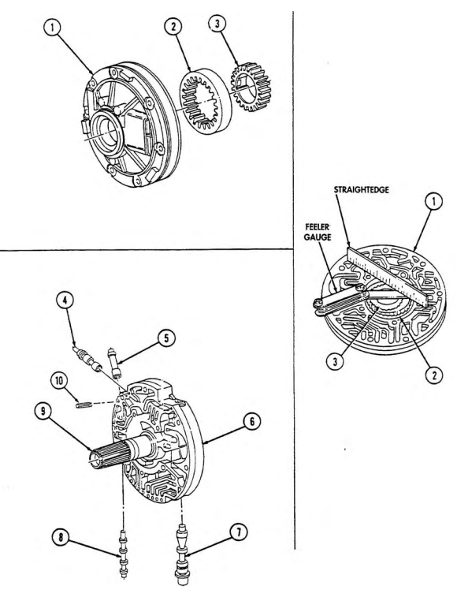

## 28-18. Oil Pump Assembly Repair (Cont'D)

d. Assembly

#### Caution

All transmission parts must be lubricated with clean transmission fluid (Dexron® VI) before assembly. Foreign material will cause transmission damage.

1. Install plug (8), spring pin (7), regulator valve (11), two springs (12), spring retainer (13), reverse boost valve (14), and bushing (15) in cover (10) with snapring (16).

2. Install converter limit valve (23), spring (2), and plug (1) in cover (10) with spring pin (22). 3. Install converter enable valve (5) and spring (4) in cover (10). Compress spring (4) and install spring retainer (3).

4. Install plug (6), spring pin (21), spring (20), converter clutch valve (19), and plug (18) in cover (10)
with snapring (17).

5. Install drive gear (25) and driven gear (24), with marked surfaces facing up, in oil pump body (26).

Align reference marks on cover and pump body.

6. Install cover (10) on pump body (26) with five capscrews (29). Tighten capscrews (29) to 18 lb-ft 
(24 N•m).

7. Coat seal (27) with petrolatum and install on pump body (26). 8. Coat selective thrust washer (9) with petrolatum and install on cover (10). 9. Install vent shield (30) on cover (10) with screw (31).

Use small chamfered end of seal installer to install inner seal ring.

10. Using seal installer, pusher, and sizer, install seal (32) in pump cover (10) groove. 11. Using seal installer, pusher, and sizer, install seal (33) in pump cover (10) groove. 12. Using oil pump seal installer, install seal (28) on pump body (26).

# 28-18. Oil Pump Assembly Repair (Cont'D)

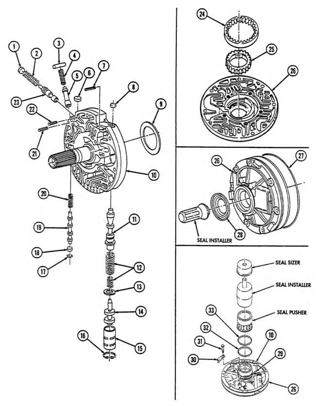

# 28-19. Transmission Assembly From Subassemblies

This task covers:
a. Parking Lock Pawl and Actuator Assembly i. Pump Assembly Installation Installation j. Front Unit End Play Check b. Center Support Assembly Installation k. Front Servo Installation c. Gear Unit Assembly Installation l. Band Apply Pin Check d. Rear Unit End Play Check m. Rear Servo Installation

#### Initial Setup: Tools

General mechanic's tool kit:
automotive (Appendix B, Item 1)
Maintenance and repair shop equipment:
(Appendix B, Item 2)
Dial indicator (Appendix B, Item 113)
Special Tools Transmission holding fixture (Appendix B, Item 57)
Transmission holding fixture base
(Appendix B, Item 58)
Holding tool adapter (Appendix B, Item 62) Gear unit installer/remover (Appendix B, Item 65) Band apply pin checking tool 
(Appendix B, Item 75)
Pump remover/installer tool (Appendix B, Item 64)
Clutch alignment tool (Appendix B, Item 66)

| Materials/Parts   |
|-------------------|

Gasket (Appendix G, Item 47) Gasket (Appendix G, Item 61) Plug (Appendix G, Item 248)
e. Intermediate Clutch Assembly Installation n. Control Valve Assembly Installation (1995-1996) f. Direct Clutch Assembly Installation n.1. Control Valve Assembly Installation (1997-1998) g. Forward Clutch Assembly Installation o. Oil Pan and Filter Assembly Installation h. Fourth Clutch, Turbine Shaft, and p. Speed Sensors Installation Overdrive Carrier Assembly Installation q. Holding Fixture Removal r. Torque Converter Installation

#### Materials/Parts (Cont'D)

Seal (Appendix G, Item 286)
O-ring (Appendix G, Item 234) O-ring (Appendix G, Item 213) Filter (Appendix G, Item 33) (1996 only) Gasket (Appendix G, Item 62) Hydraulic parts kit (Appendix G, Item 242)
(1997, 1998 only)
O-ring (Appendix G, Item 219)
Transmission fluid (Appendix C, Item 37) Petrolatum (Appendix C, Item 52) Silicone compound (Appendix C, Item 74) Two guide pins (Appendix D, Fig. 62)

#### Personnel Required

One mechanic One assistant

| Maintenance Level   |
|---------------------|
| General support     |

Manual References TM 9-2320-387-24P

#### A. Parking Lock Pawl And Actuator Assembly Installation Caution

All transmission parts must be lubricated with clean transmission fluid (Dexron® VI) before assembly. Foreign material will cause transmission damage.

- During assembly operations, it is important to closely inspect each unit to ensure nothing has been overlooked during inspection and repair. Plugs should be checked for tightness, parts kept clean, openings covered, and machined surfaces protected. Application of lubricant should be performed from covered containers.

- Install transmission case in holding fixture (para. 28-3). - For general assembly instructions, refer to para. 2-17.

# 28-19. Transmission Assembly From Subassemblies **(Cont'D)**

1. Install shaft (14) and pawl (1) in transmission case (11) and secure with retainer (12). 2. Using sealant, install plug (13) in transmission case (11). 3. Install return spring (2) with square hook end under pawl (1) and round end over stud (15) on transmission case (11).

4. Position actuator (5) in detent lever (7) over pawl (1) in transmission case (11). 5. Install gasket (10) in transmission case (11). 6. Coat manual shaft (9) with transmission fluid and install shaft (9) on transmission case (11)
through gasket (10) and detent lever (7).

7. Secure manual shaft (9) to detent lever (7) with nut (6). 8. Adjust position of manual shaft (9) in transmission case (11) and secure manual shaft (9) with retaining pin (8). Tighten nut (6) to 18 lb-ft (24 N•m).

9. Install slide bracket (3) over actuator (5) and transmission case (11) with two capscrews (4).

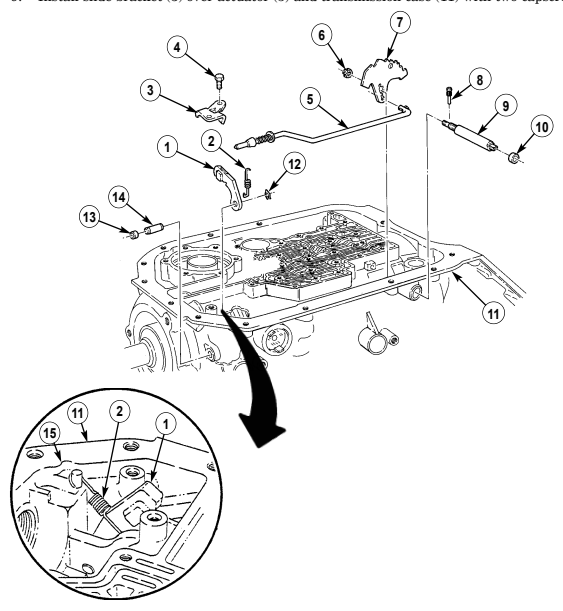

# 28-19. Transmission Assembly From Subassemblies **(Cont'D)**

b. Center Support Assembly Installation 1. Install thrust washer (2) and center support (1) in gear unit (3).

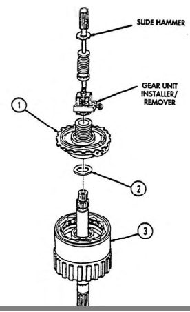 2. Install gear unit installer/remover and slide hammer to hold assembly together.

#### C. Gear Unit Assembly Installation

1. Install selective thrust washer (5) in transmission case (6) with smooth side of thrust washer (5)
facing up.

2. Position rear band (4) on transmission case (6) with flat end in notch and tab aligned with servo pin hole.

Do not confuse center support spacer (0.040 in. (1.016 mm) thick and both sides flat) with either center support snapring (beveled on one side) or intermediate clutch backing plate snapring (0.093 in. (2.362 mm) thick and both sides flat).

3. Install center support spacer (11) on fourth snapring groove (12) in transmission case (6) and position spacer gap at nine o'clock position.

4. Coat thrust washer (10) with petrolatum and install over output shaft (9) onto gear unit (3),
ensuring four tabs align with holes on gear unit (3).

5. Align bolt hole (8) in center support (1) with bolt hole in transmission case (6).

# 28-19. Transmission Assembly From Subassemblies **(Cont'D)**

6. Lower gear unit (3) into transmission case (6). Remove gear unit remover/installer. 7. Install center support snapring (7) against center support (1) in second snapring groove. Beveled side of snapring (7) must be in an upward position and snapring gap at nine o'clock position.

NOTE
Perform step 8 for 1997-1998 transmissions only.

8. Install oil cooler fitting (6.1) in transmission case (6).

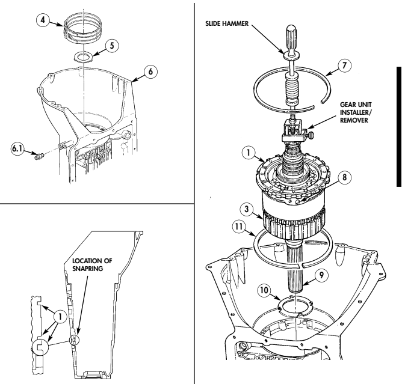

# 28-19. Transmission Assembly From Subassemblies **(Cont'D)**

#### D. Rear Unit End Play Check

1. Turn transmission case (1) horizontally, and install dial indicator on case (1) with probe against end of output shaft (2).

2. Push output shaft (2) into case (1) and zero dial indicator. 3. Pull output shaft (2) out and read movement from dial indicator. Repeat twice to check value.

Movement should be 0.005-0.025 in. (0.127-0.635 mm). The selective washer controlling this end play is the steel washer having three lugs and located between the rear thrust washer and the rear face of the transmission case (1).

If a difference in washer thickness is required to bring end play within specifications, it can be selected from the following table.

Table 28-1. Rear Selective Washer Thickness.

| Two locknuts (Appendix G, Item 95)        | - Muffler and catalytic converter removed       |
|-------------------------------------------|-------------------------------------------------|
| Six tiedown straps (Appendix G, Item 323) | (para. 3\-49).                                  |
| Four lockwashers (Appendix G, Item 146)   | - Heater ducting removed (para. 10\-80).        |
| (All models except M1114)                 | - Left defroster nozzle removed (para. 10\-83). |
| Four locknuts (Appendix G, Item 76)       | - Instrument cluster removed (para. 4\-14).     |
| Two locknuts (Appendix G, Item 77)        | - Rear side marker light lenses removed         |
| Three assembled washer screws             | (para. 4\-56).                                  |
| (Appendix G, Item 278.1)                  | - Left and right underbody armor removed        |
| Thirteen assembled locknuts               | (M1114 only) (paras. 11\-36 through 11\-39).    |
| (Appendix G, Item 134)                    |                                                 |
| Three lockwashers (Appendix G, Item 145)  | Maintenance Level                               |

4. If end play is not within specifications, remove selective washer and install a new selective washer of proper thickness.

#### Caution

Do not overtorque bolt. Damage to case or bolt could result in transmission malfunction.

NOTE
If center support was reconditioned, bolt will be coated with zinc chromate and will be yellow in color.

5. Install bolt (3). Tighten bolt (3) to 32 lb-ft (43 N•m).

# 28-19. Transmission Assembly From Subassemblies (Cont'D)

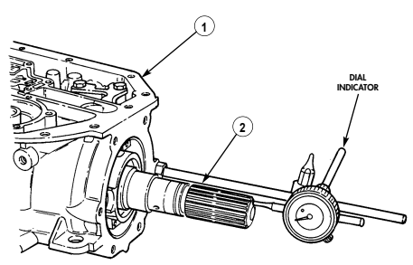

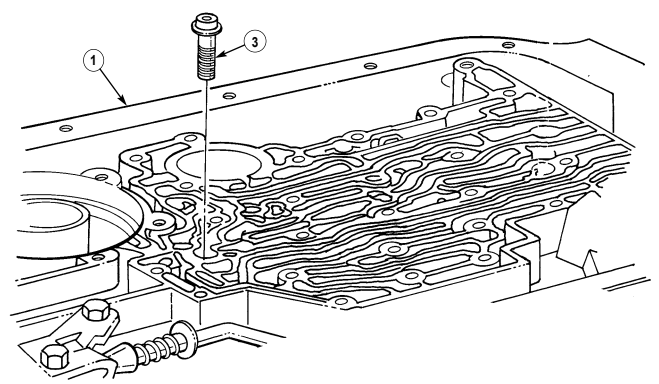

# 28-19. Transmission Assembly From Subassemblies **(Cont'D)**

e. Intermediate Clutch Assembly Installation

- Soak all clutch plates in transmission fluid (Dexron® VI) for at least three minutes before assembly.

- Wave plate is used on 1997-1998 transmissions only.

1. Install wave plate (5), four clutch plates (3), clutch plate assemblies (6), and backing plate (2) on transmission case (4) starting with clutch plate (3), then alternating clutch plate assemblies (6) with clutch plates (3) and ending with flat side of backing plate (2) facing down.

2. Secure backing plate (2) to transmission case (4) with snapring (1). Position snapring gap at nine o'clock position.

3. Measure gap between snapring (1) and backing plate (2). Gap should be 0.040-0.107 in.

(1.02-2.72 mm).

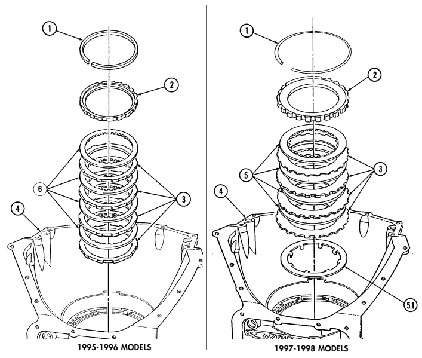

# 28-19. Transmission Assembly From Subassemblies **(Cont'D)**

#### F. Direct Clutch Assembly Installation

1. Install front band (10) on transmission case (4). Ensure pin socket on band is over servo pin hole and tab end can move freely.

2. Remove snapring (7), backing plate (14), five clutch plate assemblies (13), clutch plates (8), and dished plate (12) (1995-1996 transmissions only) from direct clutch housing (11).

3. Using clutch alignment tool, align intermediate clutch plates (3). Do not remove tool. 4. Apply air pressure to intermediate clutch plates (3) through hole (9) in center support bolt. Remove alignment tool and maintain air pressure.

5. Install direct clutch assembly (11) into transmission case (4) and remove air pressure. 6. Install dished clutch plate (12) (1995-1996 transmissions only) on direct clutch housing (11). 7. Install five clutch plates (8) and clutch plate assemblies (13) on clutch housing (11). Alternate plates, starting with a clutch plate (8).

8. Install backing plate (14) on housing (11) with snapring (7).

#### G. Forward Clutch Assembly Installation

1. Install forward clutch assembly (16) onto direct clutch (11). 2. Ensure that forward clutch assembly (16) is fully seated, and that top of speed sensor ring (18) is 3.85-3.89 in. (97.79-98.81 mm) below oil pump gasket surface (17).

3. Install flat bearing (15) on forward clutch (16).

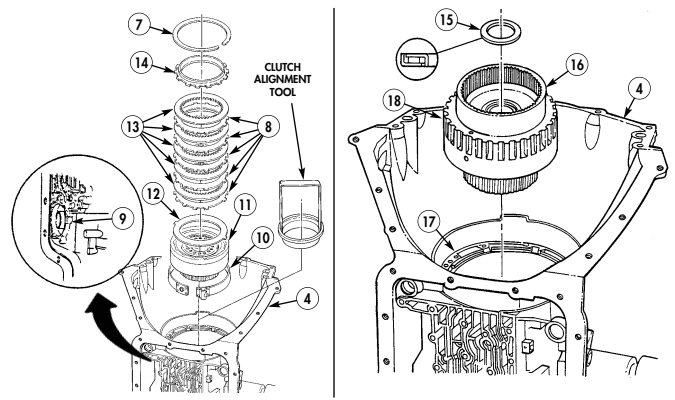

#### 28-19. Transmission Assembly From Subassemblies (Cont'D)

h. Fourth Clutch, Turbine Shaft, and Overdrive Carrier Assembly Installation 1. Remove snapring (l), backing plate (2), four clutch plate assemblies (51, and clutch plates (3) from 

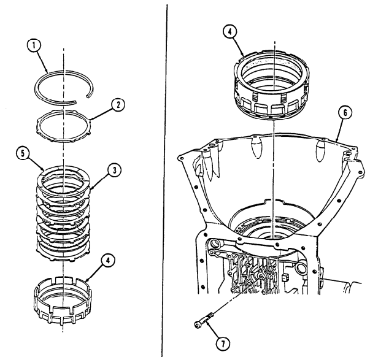

fourth clutch housing (4). 

2. Install fourth clutch housing (4) on transmission case (61, aligning bolt hole in housing (4) with bolt hole in case (6). 

3. Install bolt (7) on fourth clutch housing (4). Tighten bolt (7) to 13-17 lb-ft (18-23 Nom). 

# 28-19. Transmission Assembly From Subassemblies **(Cont'D)**

4. Install turbine shaft and overrun clutch housing assembly (81 on fourth clutch assembly (4). Mesh pinion gears in teeth of forward clutch assembly (41. 

5. Install selective thrust washer (9) on overrun clutch housing assembly (81. 

6. Use a straightedge on pump-to-case surface (10) and over thrust washer (9). The two surfaces should be flush. 

Ensure clutch plates are saturated with transmission fluid before installation. 

7. Install four clutch plates (3) and clutch plate assemblies (5) on fourth clutch housing (15) and overrun carrier assembly (14). Start with clutch plate (31, with the V-notch (11) at the one o'clock position, then alternate with clutch plate assemblies (5). 

8. Install backing plate (131, flat side facing down, on clutch plate assemblies (5) and secure with 

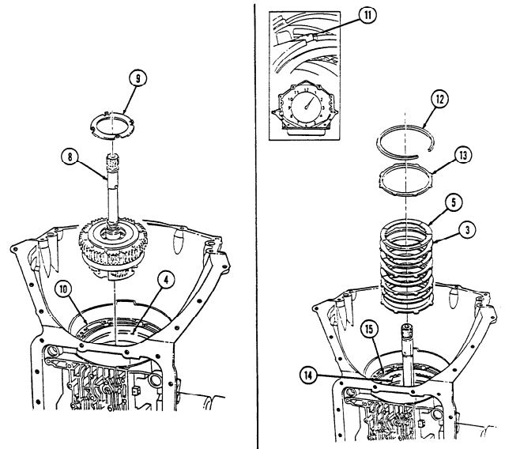

snapring (12). Position snapring (12) with gap at one o'clock position. 

# 28-19. Transmission Assembly From Subassemblies **(Cont'D)**

i. Pump Assembly Installation 1. Install two guide pins at 12 and 5 o'clock positions on transmission case (2). 2. Install gasket (1) over guide pins, ensuring it matches holes in transmission case (21. 3. Using pump remover&staller, align pump assembly (4) over guide pins in transmission case (21. 

#### Caution

If turbine shaft cannot be rotated as pump assembly is being 

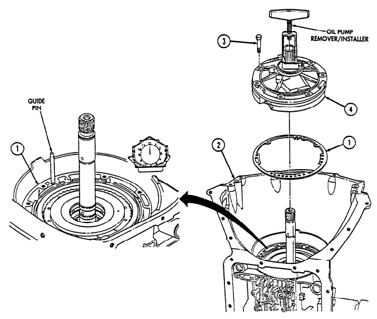

pulled into place, the overrun, fourth, forward and/or direct clutch housings have not been properly installed. This condition must be corrected before pump assembly is fully installed. 

4. Install pump (4) with seven capscrews (3) and tighten evenly to 18 lb& (24 N-m). 

# 28-19. Transmission Assembly From Subassemblies **(Cont'D)**

j. Front Unit End Play Check

#### Caution

If end play procedures are not closely followed, incorrect shim thickness will be selected, resulting in severe damage to internal transmission components.

1. Install dial indicator on transmission case (2) to read vertical movement on turbine shaft (5). 2. Press down turbine shaft (5) and pry up on output carrier (7) to eliminate slack between end of turbine shaft (5) and stator shaft (6).

3. Pull up turbine shaft (5) to eliminate slack between snapring on turbine shaft (5) and overdrive carrier.

4. Zero dial indicator. 5. Pull turbine shaft (5) forward and read dial indicator.

- Selective washer controlling end play is located between pump cover and forward clutch housing; refer to para. 28-11. If more or less washer thickness is required to bring end play within specifications, select proper washer from table 28-2.

- An oil-soaked washer may tend to discolor. - It will be necessary to measure washer for its actual thickness.

Table 28-2. Front Selective Washer Thickness.

| THICKNESS                        | COLOR   |
|----------------------------------|---------|
| 0.057\-0.061 in. (1.45\-1.55 mm) | Blue    |
| 0.073\-0.077 in. (1.85\-1.96 mm) | Red     |
| 0.089\-0.093 in. (2.26\-2.36 mm) | Brown   |
| 0.105\-0.109 in. (2.67\-2.77 mm) | Green   |
| 0.121\-0.125 in. (3.07\-3.18 mm) | Plain   |

6. Resulting travel or end play should be 0.004-0.022 in. (0.102-0.559 mm). If end play is not within specifications, remove selective washer and install new selective washer of proper thickness.

7. Install seal (8) on turbine shaft (5).

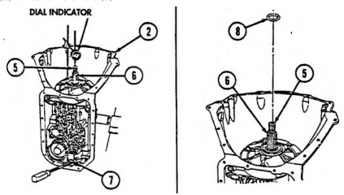

NOTE

# 28-19. Transmission Assembly From Subassemblies **(Cont'D)**

#### K. Front Servo Installation

Install spring (2) and piston assembly (1) in transmission case (3), ensuring piston assembly (1) is firmly

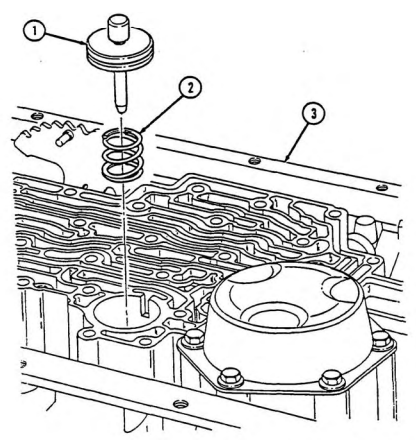 seated on spring (2).

#### L. Band Apply Pin Check

1. Place gauge pin in rear servo bore of transmission case (3) and rotate to side A. 2. Place checking tool on servo bore with hex nut (5) facing parking pawl side of transmission case (3). 3. Secure checking tool to transmission case (3) with two servo cover screws (4). Tighten screws (4)
to 18 lb-ft ( 24 N•m).

4. Ensure gauge pin can move freely in checking tool. 5. Apply 25 lb-ft (34 N•m) of torque to hex-nut (5). 6. Read edge of gauge pin that is even with checking tool edge at pin gauge. Record number and letter.

# 28- 19. Transmission Assembly From Subassemblies (Cont'D)

7. Determine correct apply pin to be used from table 28-3. 

l Apply pins are identified by the number of rings around small end of apply pins. 

l If necessary to change apply pin, refer to rear servo repair, para. 28-16. 

Table 28-3. Apply Pin Selection. 

a. If both flats are above gauge surface, use pin length **\#l.** b. If one flat is above gauge surface, use pin length \#2. c. If both flats are below gauge surface, rotate to side B. 

d. If both flats are above gauge surface, use pin length \#3. 

e. If one flat is above gauge surface, use pin length \#4. f. If both flats are below gauge surface, rotate to side C. 

g. If both flats are above gauge surface, use pin length \#5. 

h. If one flat is above gauge surface, use pin length \#6. i. If both flats are below gauge surface, use pin length \#7. 

8. Remove checking tool and gauge pin. 

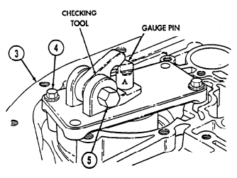

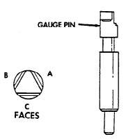

7 PIN LENGTH 

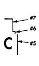

3.468-3.474 IN. 

(88.08-88.23 MM) 
6 3.440-3.446 IN. 

(87.37-87.52 MM) 

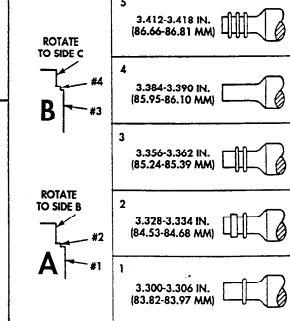

# 28-19. Transmission Assembly From Subassemblies (Cont'D)

m.  Rear Servo Installation Install spring (5), servo piston (4), gasket (3), and servo cover (2) in transmission case (6) with six capscrews (1). Tighten capscrews (1) to 18 lb-ft (24 N•m).

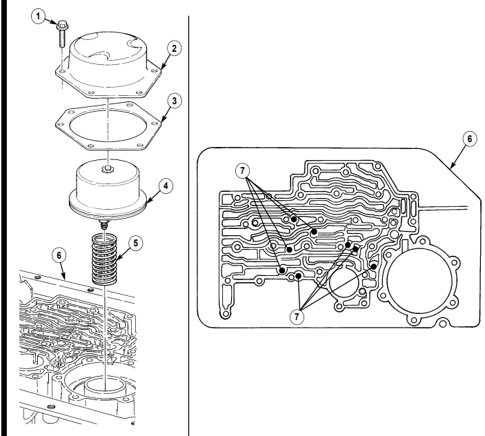

# 28-19. Transmission Assembly From Subassemblies **(Cont'D)**

#### N. Control Valve Assembly Installation (1995-1996)

1. Install screen (9) in transmission case (6). 2. Install eight checkballs (7) in passages of transmission case (6). 3. Position control valve assembly (8) on transmission case (6) and install sixteen capscrews (8.1) 
(1995 transmission), or fifteen capscrews (8.1) (1996 transmission) finger-tight.

4. Install transmission fluid pressure switch (13) on control valve assembly (8) with six capscrews (11)
finger-tight.

5. Install fluid indicator stop (14) on control valve assembly (8) with two capscrews (10) finger-tight. 6. Install spring and roller (12) on control valve assembly (8) with two capscrews (10) finger-tight.

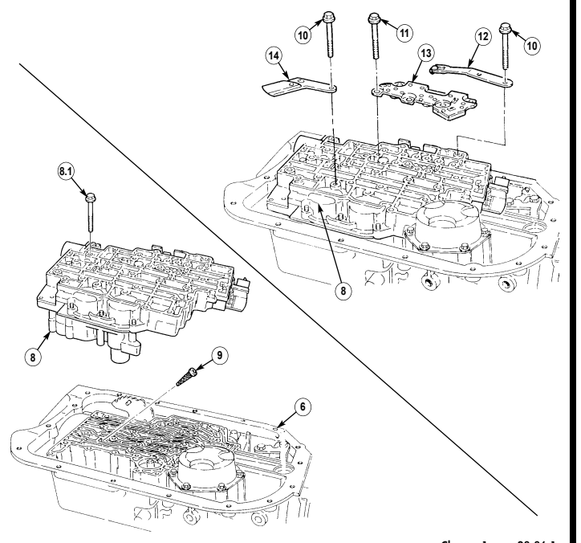

Change 1 28-86.1

# 28-19. Transmission Assembly From Subassemblies **(Cont'D)**

7. Secure lube pipe (5) on transmission case (8) and control valve assembly (10) with clip (11) 
and capscrew (6). Install lube pipe retainer (3) on transmission case (8) with capscrew (4) finger-tight.

8. Position wiring harness (7) over control valve assembly (10) with electrical connector (9) 
going through transmission case (8).

9. Install three wiring harness clips (2) and wiring harness (7) on control valve assembly (10) 
with three capscrews (1).

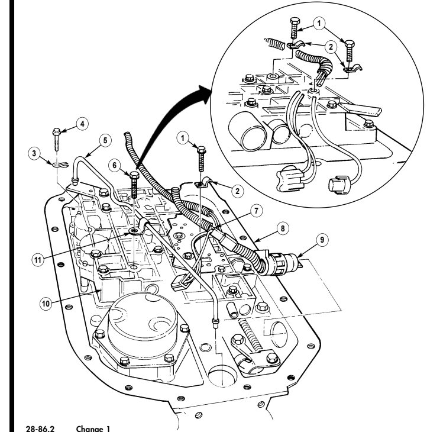

# 28-19. Transmission Assembly From Subassemblies (Cont'D)

Connect wiring harness (7) to pressure control solenoid (16), PWM solenoid assembly (15), 2-3 shift 10.

solenoid (14), I-2 shift solenoid (13), electrical connector (9), and transmission fluid pressure switch assembly (12).

11.

Tighten capscrews installed in steps 3, 4, 5, 6, and 7 to 97 lb-in. (11 N-m) in sequence shown,
A through V and AA through FF.

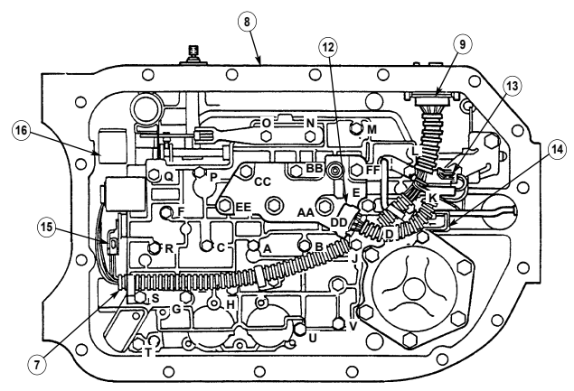

# 28-19. Transmission Assembly From Subassemblies **(Cont'D)**

n.1. Control Valve Assembly (1997-1998)
1. Install screen (4) in transmission case (2). 2. Install eight checkballs (1) in passages of transmission case (2). 3. Position control valve assembly (3) on transmission case (2) and install seventeen capscrews (3.1)
finger-tight.

4. Install spring and roller assembly (7) on control valve assembly (3) with two capscrews (8). 5. Install lube pipe (10) on transmission case (2) and control valve assembly (3) with clip (10.2) and capscrew (10.1).

6. Install fluid pressure switch assembly (6) on control valve assembly (3) with six capscrews (5) 
finger-tight.

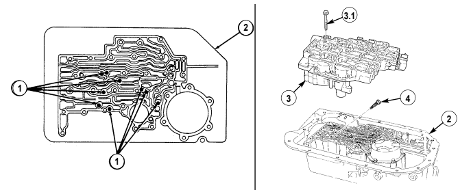

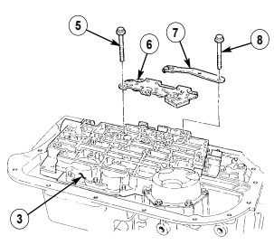

## 28-19. Transmission Assembly From Subassemblies **(Cont'D)**

7. Position wiring harness (9) over control valve assembly (3), with electrical connector going through transmission case (2).

8. Install wiring harness (9) on control valve assembly (3) with two clips (12) and capscrews (11). 9. Connect wiring harness (9) to pressure control solenoid (18), PWM solenoid assembly (17), 2-3 shift solenoid (16), 1-2 shift solenoid (15), connector (14), and transmission fluid pressure switch assembly (13).

10. Tighten two capscrews (8), seventeen capscrews (3.1), six capscrews (5), capscrew (10.1), and two capscrews (11) to 97 lb-in. (11 N•m) in sequence shown, A through V, and AA through FF.

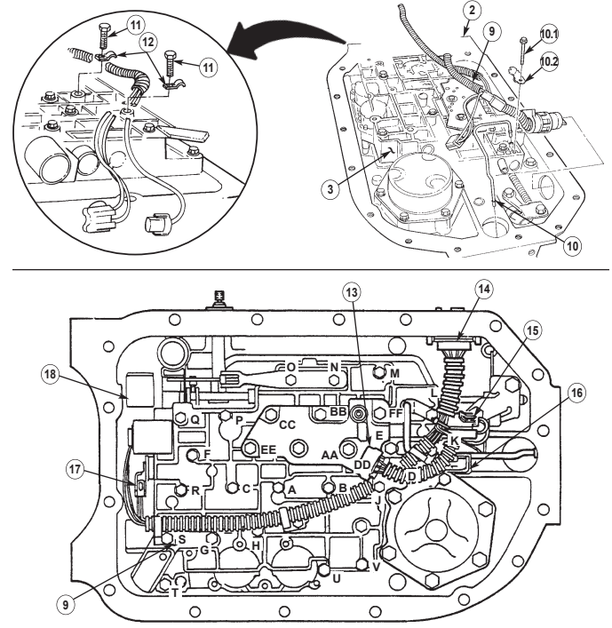

## 28-19. Transmission Assembly From Subassemblies **(Cont'D)**

o. Oil Pan and Filter Assembly Installation 1. Install filter (5) on transmission case (6). 2. Install magnet (4) in oil pan (1).

Do not use a sealer or adhesive on oil pan seal, oil pan, or transmission case surface.

3. Install gasket (3) and oil pan (1) on transmission case (6) with seventeen capscrews (2). Tighten

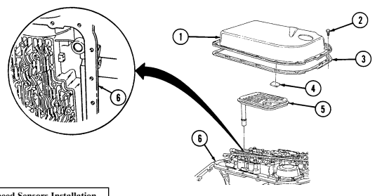

capscrews (2) to 18 lb-ft (24 N•m).

p. Speed Sensors Installation
Install two O-rings (7), speed sensors (8), and brackets (9) on transmission case (6) with capscrews (10).

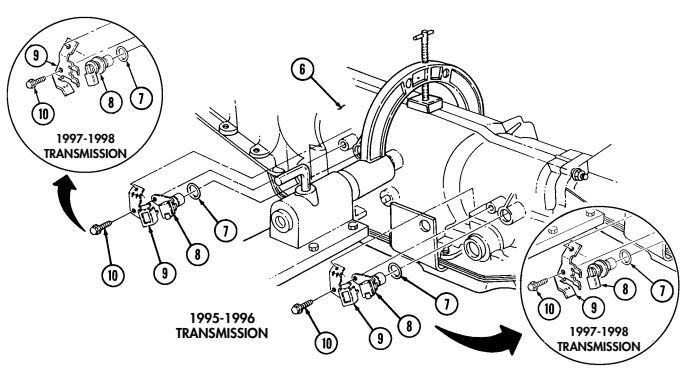

# 28-19. Transmission Assembly From Subassemblies **(Cont'D)**

#### Q. Holding Fixture Removal

Remove transmission (6) and adapter from transmission holding fixture.

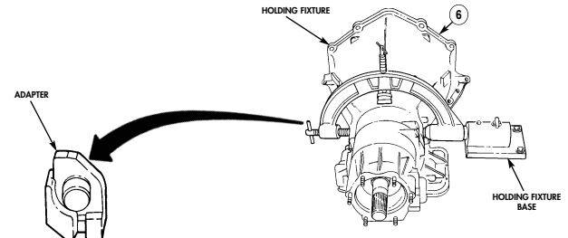

#### R. Torque Converter Installation

Install torque converter (12) into transmission (6). Be sure drive lugs of inner pump rotor are properly engaged with drive slots (13) of torque converter hub (11).

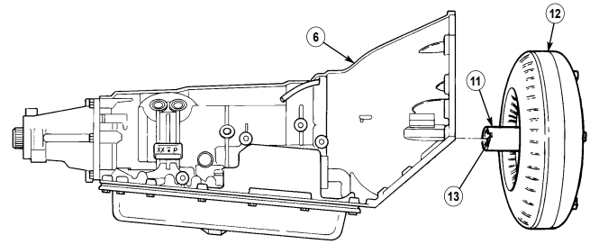

FOLLOW-ON TASK: Prepare transmission for installation (para. 19-5).

# Chapter 29 Transfer Case (Gs) Repair

## 29-1. Introduction

This chapter contains maintenance instructions for disassembly and repair of transfer case components at the general support maintenance level. Some subassemblies and parts must be removed before the transfer case components can be accessed. They are referenced to other paragraphs in this manual.

## 29-2. Transfer Case Repair Task Summary

| (para. 28\-3).   |
|------------------|

# 29-3. Transfer Case Repair

This task covers:
b. Cleaning d. Assembly

#### Initial Setup: A. Disassembly **C. Inspection And Repair**

| Tools                                                                           |                                                                                      |
|---------------------------------------------------------------------------------|--------------------------------------------------------------------------------------|
| General mechanic's tool kit:                                                    | Transmission  disassembled  into subassemblies                                       |
| automotive (Appendix B, Item 1)                                                 | (para. 28\-3).                                                                       |
| Special Tools                                                                   | General Safety Instructions                                                          |
| Seal installer (Appendix B, Item 61)                                            | l Protective clothing must be used when steam                                        |
| Materials/Parts                                                                 | cleaning.                                                                            |
|                                                                                 | l Compressed air for cleaning purposes will not                                      |
| Crocus cloth (Appendix C, Item 22)                                              | exceed 30 psi (207 kPa).                                                             |
| Manual References                                                               | Maintenance Level                                                                    |
| TM 9\-2320\-387\-24P                                                            | General support                                                                      |
| a. Cleaning                                                                     |                                                                                      |
| NOTE                                                                            |                                                                                      |
| Work area should be well\-ventilated,                                           | clean, and free from blowing dirt and dust.                                          |
| 1.                                                                              | Remove transmission  case (1) from transmission  holding fixture.                    |
| WARNING                                                                         |                                                                                      |
| When steam\-cleaning,                                                           | protective clothing must be used. Failure to do this may                             |
| cause serious injury.                                                           |                                                                                      |
| 2.                                                                              | Thoroughly  steam\-clean  transmission  case (1).                                    |
| WARNING                                                                         |                                                                                      |
| Compressed air used for cleaning purposes will not exceed 30 psi (207 kPa). Use |                                                                                      |
| only with effective chip guarding and personal protective equipment             |                                                                                      |
| (goggles/shield,                                                                | gloves, etc.).                                                                       |
| 3.                                                                              | Blow all dirt and cleaning solution from transmission  case (1) with compressed air. |

#### A. Disassembly

1. Remove capscrew (1), clamp (2), pinion adapter (6), and driven gear (4) from rear retainer (5). 2. Remove O-ring (3) from pinion adapter (6). Discard O-ring (3). 3. Remove nut (7), front output yoke (8), and lockwasher (9) from transfer case (11). Discard lockwasher (9).

4. Move shift range lever (10) to most rear position. 5. Remove three capscrews (12) from rear extension (14) and rear retainer (5).

#### Caution

Do not pry or wedge rear extension from rear retainer. Sealing surfaces could be damaged.

6. Use a soft-nosed hammer or mallet on screw hole bosses (15) on rear extension (14) to break sealing bead and remove rear extension (14) from rear retainer (5).

7. Remove rear output drive seal (13) from rear extension (14). Discard rear output drive seal (13).

# 29-3.  Transfer Case Repair (Cont'D)

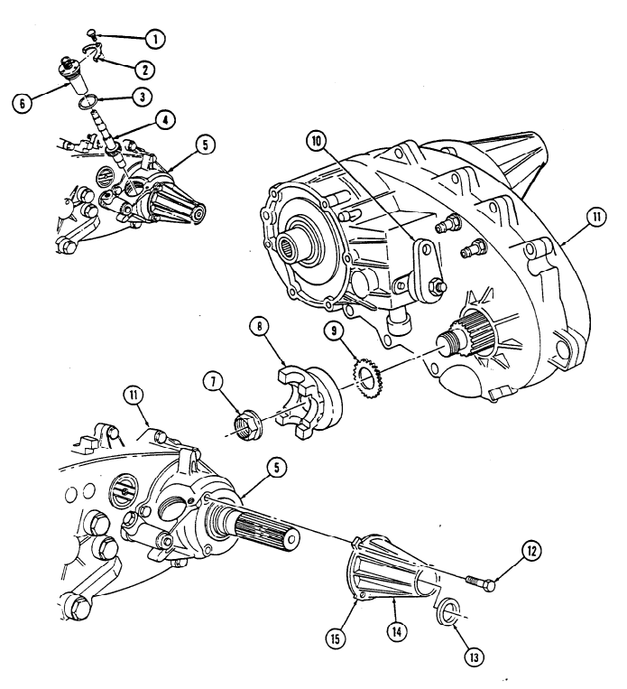

## I--- **29-3. Transfer Case Repair (Cont'D)**

8. 9. 

Remove snapring (1) from mainshaft assembly (2). 

Remove four capscrews (3) from rear retainer (4) and rear half-case (5). 

10. 11. 

Prying on tabs of rear retainer (4), remove rear retainer (4) from rear half-case (5) and mainshaft (2). 

Remove two snaprings (6) and speedometer drive gear (7) from mainshaft assembly (2). Remove two capscrews (10) and washers (11) from rear half-case (5) and front half-case (17). 

12. 

Mark positions of long screws for installation. 

13. 

14. 

Remove two long screws (9) from front output end of rear half-case (5). 

Remove seven screws (8) from rear half-case (5). 

Use slots in half-cases when separating half-cases. 

15. 

Pry and remove rear half-case (5) from front half-case (17). Lay rear half-case (5) on bench with oil pump (15) up. 

#### Caution

Mark position of oil pump to rear half-case before removal. Failure to do so may cause damage to equipment. 

16. Rotate oil pickup tube (13) and oil screen (14) out of rear half-case (5) and pull pickup tube (13) out of oil pump inlet port (12). 

17. Remove oil pump (15) from rear half-case (5). 

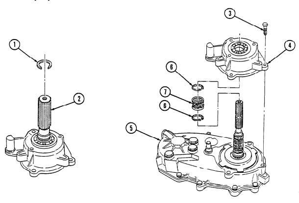

## 29-3.  Transfer Case Repair (Cont'D)

18.

 Remove oil screen (14) and pickup tube (13) from hose (16).

19.

Remove magnetic pickup (18) from pocket in front half-case (17).

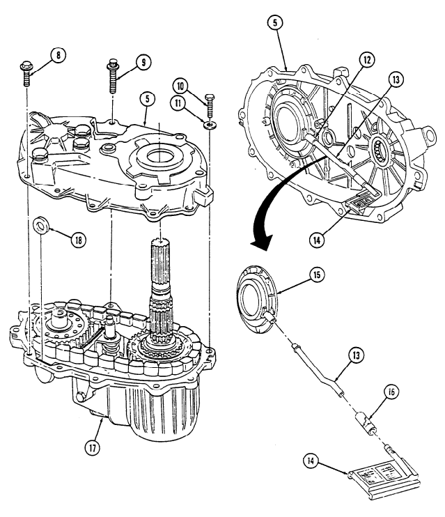

-

## 29-3. Transfer Case Repair (Cont'D)

20. Remove oil tube seal (2) from oil pump (1). Discard oil tube seal (2). 

21. Remove snapring (3) securing drive sprocket (4) on mainshaft assembly (5). 

22. Remove drive sprocket (4) and drive chain (6) from front half-case (7). 

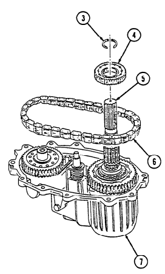

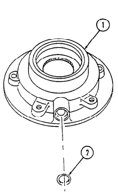 23. Remove front output shaft (10) and driven gear (9) from front half-case (7). 24. Remove snapring (8) and driven gear (9) Corn front output shafi (10). 

## 29-3. Transfer Case Repair (Cont'D)

25. Remove nut (22), washer (21), and shift lever (20) from sector shaft (19). 26. Remove plug (23) from low-range fork access hole (18). 27. Using screw extractor in tapered drive pin (24), turn counterclockwise and withdraw tapered drive pin (24) from low-range fork access hole (18). Discard tapered drive pin (24).

28. Remove shifter detent plug (17), O-ring (16.1), spring (16), and poppet (15) from front half-case (7).

Discard O-ring (16.1).

29. Remove two nuts (13), washers (12), and oil cooler (11) from front half-case (7).

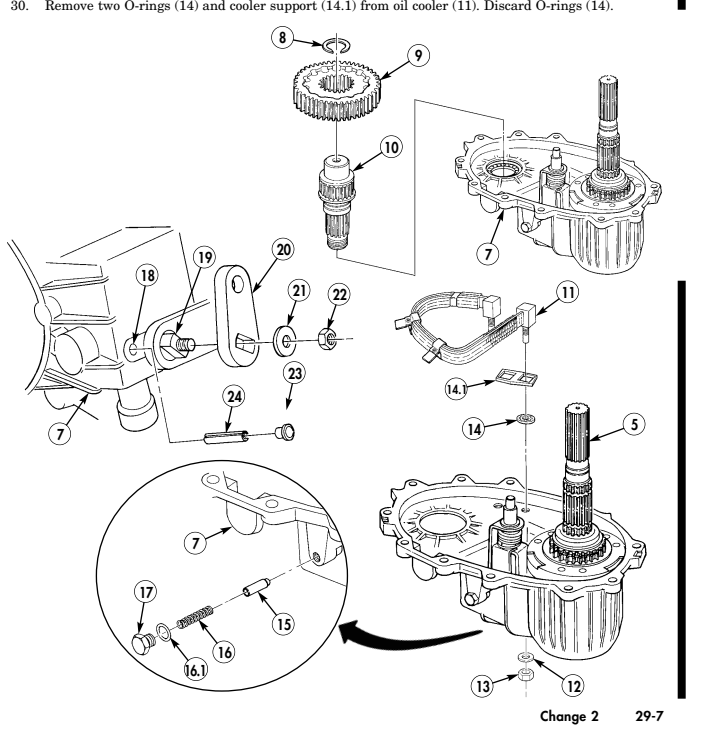

## 29-3. Transfer Case Repair (Cont'D)

31. Pull shift rail (5) out of mode shift fork assembly (4). 32. Remove mode shift fork assembly (4) and mainshaft assembly (1) out of front half-case (3) as a unit.

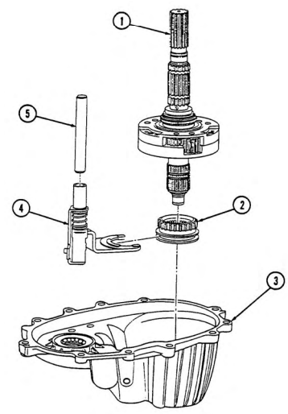 33. Remove mode shift fork assembly (4) from mode shift sleeve (2) on mainshaft assembly (1). 34. Remove mode shift sleeve (2) from mainshaft assembly (1).

## 29-3. Transfer Case Repair (Cont'D)

35. Remove snapring (6) and keyed thrust washer (7) from mainshaft (1). 36. Slide intermediate clutch shaft (8) off mainshaft (1). 37. Remove differential snapring (10) from mainshaft (1).

Needle bearings will fall free when differential is removed from mainshaft.

38. Remove differential assembly (9) from mainshaft (1). 39. Remove two thrust washers (11) and fifty-three needle bearings (12) from mainshaft (1).

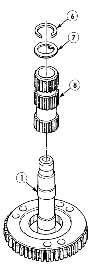

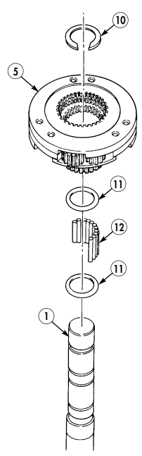

## 29-3. Transfer Case Repair (Cont'D)

40. Twist range shift fork (2) and range clutch sleeve (3) to disengage pin (1) from shift sector (5) and remove range shift fork (2) and range clutch sleeve (3) from front half-case (4).

41. Remove shift sector (5) from front half-case (4). 42. Remove four screws (7) and bearing retainer (8) from front half-case (4). Pry on bearing retainer (8)
at slots (11).

43. Remove input seal (6) from bearing retainer (8). Discard input seal (6). 44. Remove snapring (9) from input gear shaft (10).

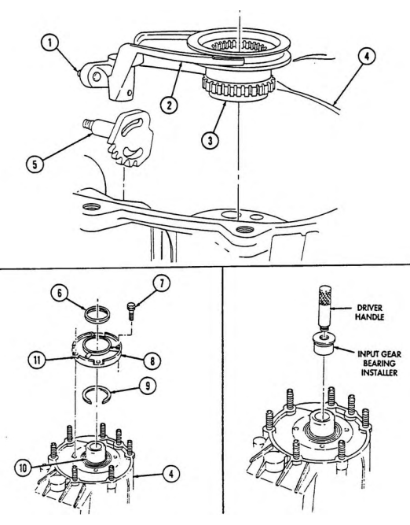

## 29-3. Transfer Case Repair (Cont'D)

45. Supporting front half-case (4), use driver handle and input gear bearing installer to press on input gear shaft (10) and remove input gear shaft (10) and low-range gear (13) from input bearing (12).

46. Remove snapring (16) from low-range gear (13). 47. Turn and remove retainer (15) from housing of low-range gear (13). 48. Remove two thrust washers (14) and input gear shaft (10) from low-range gear (13).

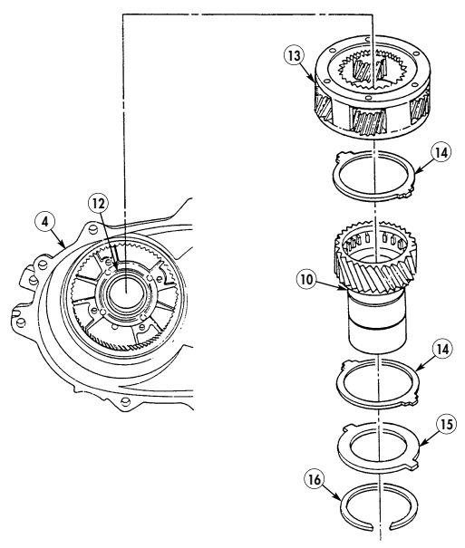

## 29-3. Transfer Case Repair (Cont'D)

b. Cleaning Clean all parts in accordance with para. 2-14.

c. Inspection and Repair 1. Inspect all parts in accordance with para. 2-15. 2. Repair all parts in accordance with para. 2-16. 3. Inspect front half-case (1) for cracks, nicks, burrs, blocked oil passages, and broken, missing, or damaged studs (7). Also check front input ball bearing (5) and front output ball bearing (4). Repair or replace damaged studs (7), remove burrs, and clear blocked oil passages. Replace front half-case (1) if cracked or broken at any machined surface. Remove and discard front output shaft seal (10). Replace front half-case (1) if annulus gear (2) is loose or damaged. Replace defective ball bearings as follows: (a) Front output ball bearing (4).

(1) Remove snapring (3) from front half-case (1). (2) Using driver handle, output shaft front bearing remover, and output shaft bearing installer, remove and install ball bearing (4) in front half-case (1).

(3) Install front output shaft seal (10) in front half-case (1) with output shaft seal installer.

(b) Front input ball bearing (5).

(1) Using driver handle, input gear bearing installer, and arbor press, press ball bearing (5) out of front half-case (1).

(2) Remove snapring (6) from ball bearing (5). (3) Install snapring (6) in ball bearing (5). (4) Using wooden block, seat ball bearing (5) in front half-case (1). Seat ball bearing (5) until snapring (6) is against front half-case (1).

4. Inspect retainer (9) and O-ring (8) for damage. Replace if damaged.

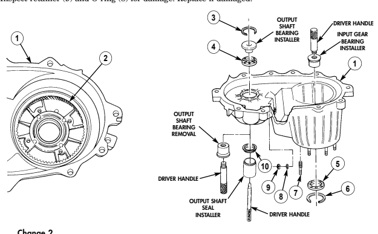

#### 29-3. Transfer Case Repair (Cont'D)

5. Inspect input gear (11) for breaks, cracks, broken or chipped gear teeth (121, scoring on sealing area (151, and damaged snapxing groove (14). Inspect bearing (13). Replace input gear (11) if damaged. Replace bearing (13) as follows: 
(a) Mount input gear (11) in soft-jawed vise, gear end up. (b) Install bearing remover to remove bearing (13). 

(c) Use slide hammer and,sIide hammer adapter to remove bearing (13) from input gear (11). (d) Coat bearing (13) with transmission fluid and install in input gear (11) with driver handle and main pilot bearing installer. 

6. Inspect rear half-case (17) for cracks, breaks, burrs, and plugged oil passages. Remove burrs. Replace rear hah-case if cracked or broken. Inspect tiont output shaft rear bearing (16). Replace loose or damaged alignment retaining dowel **(18).** Replace front output shaft rear bearing (16) as foI.Iows: 
(a) Using bearing remover, slide hammer and slide hammer adapter, remove bearing (16). 

(b) Coat bearing (16) with transmission fluid. (c) Using driver handle and bearing instaRer, install bearing (16) in rear half-case (17). 

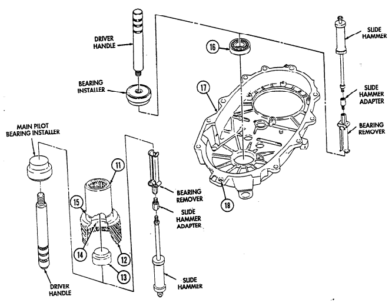

## 29-3. Transfer Case Repair (Cont'D)

7. Inspect rear differential assembly (1). 

(a) Mark front carrier (4) and rear carrier (3) cases for assembly. 

(b> Remove six screws (2) from rear carrier (3) and turn rear carrier (3) over. 

(c) Using slots (51, pry rear carrier (3) off front carrier (4). 

Needle bearings will fall free when removing short pinion gears. 

Cd> Remove six pinion washers (61, three long pinion gears (71, six thrust washers (121, three short pinion gears (81, and fifty-four needle bearings (13) from pins (10) on front carrier (4). 

Record position of mainshaft gear, sprocket gear, and front carrier for assembly. 

(e) Remove mainshaft gear (9) and sprocket gear (11) from front carrier (4). Separate mainshaft gear (9) and sprocket gear (11). 

(0 Inspect front carrier (4) for cracks, damaged threads, broken or chipped gear teeth, and loose or damaged pins (10). Replace front carrier (4) if damaged. 

(g) Inspect rear carrier (3) for cracks and breaks. Replace rear carrier (3) if damaged. 

(h) Inspect short pinions (8) and long pinions (7) for cracks, chipped or broken gear teeth, and ridged or scored gear teeth. Replace three short pinions (8) and three long pinions (7) if any one is damaged. 

(i) Inspect thrust washers (12) and pinion washers (6) for breaks, cupping, and scoring. Replace all 

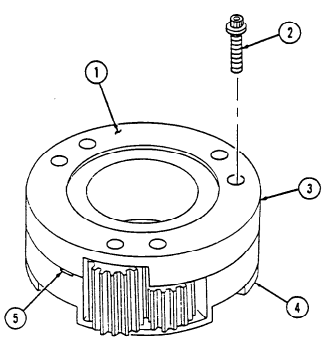

thrust and pinion washers (12) and (6) if any one is damaged. 

(i) Inspect mainshaft gear (9) and sprocket gear (11) for cracks, broken or chipped gear teeth, and cracks, gouges, or deep scoring on brass ring on bottom of mainshaft gear (9). Replace gear (9) or (11) if damaged. 

# 1 **29-3. Transfer Case Repair (Co&D)**

#### Caution

All transfer case parts must be lubricated with clean transmission fluid before assembly Foreign material will cause transfer case damage. 

(k) 
(1) 
Lay front carrier (4) on flat work table and place mainshaft gear (9) in rear carrier (3) with cone surface up. 

Install sprocket gear (11) on mainshaft gear (9). Splined hub of mainshaft gear (9) must be up. 

NOTE 
Cm> 

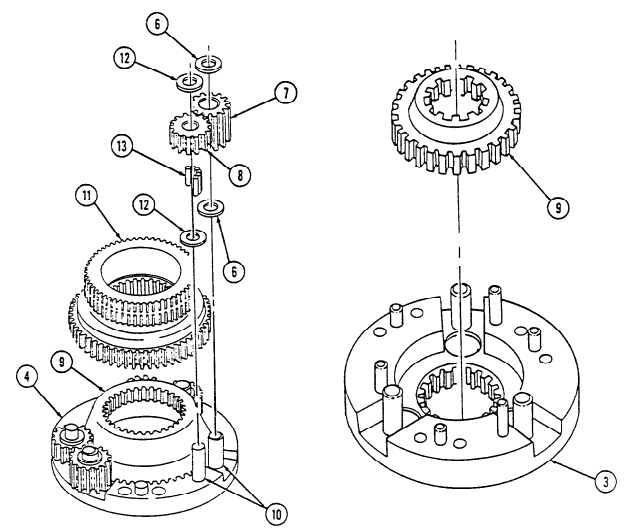

Use petrolatum to hold needle bearings in place on pins. 

Install three thrust washers (121, fifty-four needle bearings (131, three short pinion gears (8), and thrust washers (12) on pins (10). 

(n) Install three pinion washers (61, long pinion gears ('7), and pinion washers (6) on pins (10). 

(0) Align index marks on front carrier (4) and rear carrier (3) and set rear carrier (3) over pins (10). (P) Install front carrier (4) and rear carrier (3) with six screws (2). 

#### 1 29-3. Transfer Case Repair (Cont'D)

8. Inspect mainshaft (1) for cracks, breaks, scored bearing surfaces (21, chipped or broken splines (51, damaged lockring groove (31, and damaged gear teeth. Clean oil passages (4). Repair minor scoring and remove burrs on mainshaft (1). Replace mainshafi (11 if damaged. 

If any parts of oil pump fail inspection and cannot be repaired, 

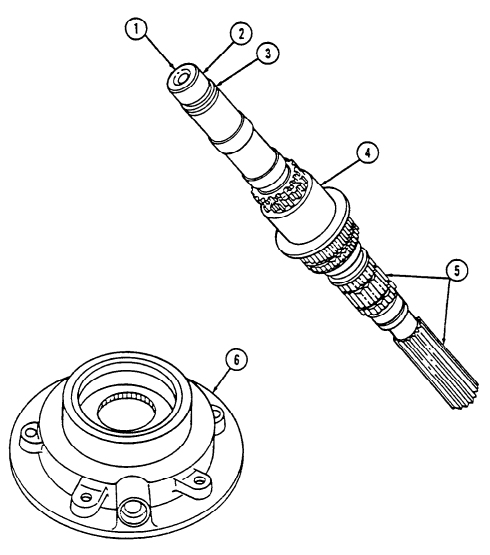 replace oil pump. 

9. Inspect oil pump (6) for cracks, breaks, scoring, and damaged bushing and threads. Replace oil pump (6) if any parts are damaged. 

## 29-3. Transfer Case Repair (Cont'D)

10. Inspect rear retainer (7) for cracks, breaks, damaged threads, and worn or damaged ball bearing (8). Repair damaged threads. Replace rear retainer (7) if cracked, broken, or threads unrepairable. Replace worn or damaged ball bearing (8). Replace loose or damaged alignment retainer dowel (16) if damaged.

(a) Use hammer and soft drift punch to remove ball bearing (8) from rear retainer (7). (b) Seat ball bearing (8) in rear retainer (7) using driver handle and output shaft front bearing installer.

11. Inspect rear extension (14) for cracks, breaks, and worn or damaged bushing (13). Replace rear extension (14) if cracked or broken. Replace worn or damaged bushing (13) as follows:
(a) Remove defective bushing (13) using driver handle and extension bushing remover. (b) Install bushing (13) in rear extension (14) using driver handle and bearing installer.

12. Inspect intermediate clutch shaft (9) for cracks, breaks, and bent or twisted splines. Replace intermediate clutch shaft (9) if damaged.

13. Inspect shift sector (17) for burrs, cracks, breaks, loose shaft (15), and damaged threads. Remove minor burrs and repair minor thread damage. Replace shift sector (17) if cracked, broken, or loose or damaged shaft (15).

14. Inspect oil screen (12), hose (11), and pickup tube (10). Clean oil screen (12) and inspect for holes.

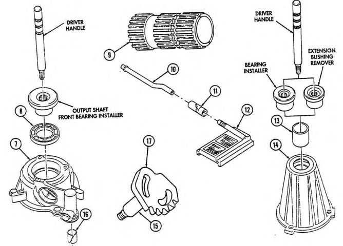

Replace oil screen (12) if damaged. Inspect tube (10), hose (11), and oil screen (12) for bends or cracks that would prevent sealing. Replace damaged parts.

## 29-3. Transfer Case Repair (Cont'D)

15. Inspect range shift fork (16) for burrs, bends, and breaks. Remove burrs. Replace pads (6) if there is any wear. Replace range shift fork (16) if broken, cracked, loose pin (15) or damaged.

16. Inspect range clutch sleeve (17) and mode shift sleeve (7) for burrs, cracks, breaks, and damaged splines or gear teeth. Remove minor burrs. Replace range clutch sleeve (17) or mode shift sleeve (7) if damaged.

17. Inspect mode shift fork assembly (8) for cracks, breaks, bent brackets (2) and (14), and broken or deformed springs (4) and (10). If pads (6) are worn, replace pads (6). Replace bracket (14) if pin (1) is damaged. Mode shift fork assembly (8) must slide freely on shift rail (18) without excessive side free play. Remove spacer ring (4.1) and discard. Inspect two bushings (5) for damage. Replace bushings (5) if damaged. If free play is excessive, replace mode shift fork assembly (8). 

(a) Disassemble mode shift fork assembly (8) as follows:
(1) Position mode shift fork assembly (8) in vise with bracket (14) secured in vise.

Mode shift fork assembly is under spring tension. Use care when compressing fork to release bracket.

(2) Press mode shift fork (8) down and tilt to free and remove mode shift fork assembly (8) from bracket (14).

(3) Remove bushing (11), spring (10), and thrust washer (9) from mode shift fork (8). (4) Remove bracket (2), cup (3), and spring (4) from mode shift fork (8). (5) Remove bracket (14) from vise.

(b) Assemble mode shift fork assembly (8) as follows:
(1) Install bracket (14) in vise. (2) Install spacer ring (4.1), spring (4), cup (3), and bracket (2) on short end of mode shift fork (8).

Ensure open end of bracket (2) is positioned under mode shift fork lip (12).

(3) Install thrust washer (9), spring (10), and bushing (11) on mode shift fork (8). (4) Position mode shift fork assembly (8) on bracket (14). (5) Press mode shift fork (8) down and forward until tab (13) on bracket (2) is seated in bracket
(14).

(6) Remove mode shift fork assembly (8) from vise.

18. Inspect shift rail (18) for bends, cracks, and grooving. Replace shift rail (18) if damaged. 19. Inspect detent assembly for broken or kinked spring (20), broken or burred poppet (19), or damaged plug (22). Replace poppet spring seal (21) on plug (22). Replace plug (22), spring (20), or poppet (19) if damaged.

20. Inspect drive chain (23) for breaks, missing parts, kinks, and evidence of scratching on contact surfaces. Replace drive chain (23) if damaged.

21. Inspect drive sprocket (24) and driven gear (26) for cracks, breaks, bent or twisted splines, and broken or chipped gear teeth. Replace gears (24) or (26) if damaged.

22. Inspect front output shaft (25) for cracks, bent or twisted splines, damaged threads, and scored bearing and sealing surfaces. Minor scoring and thread damage is repairable. Replace front output shaft (25) if damaged.

23. Inspect low-range gear (29) for cracks, breaks, chipped or broken gear teeth, pinion side free play and smooth rotation. If front and rear carriers are loose, tighten screws (28); if still loose, replace low-range gear (29). For all other damage, replace low-range gear (29).

24. Inspect oil cooler (27) for bends, breaks, and leaks. Repair by straightening bent fins. Replace oil cooler (27) if damaged.

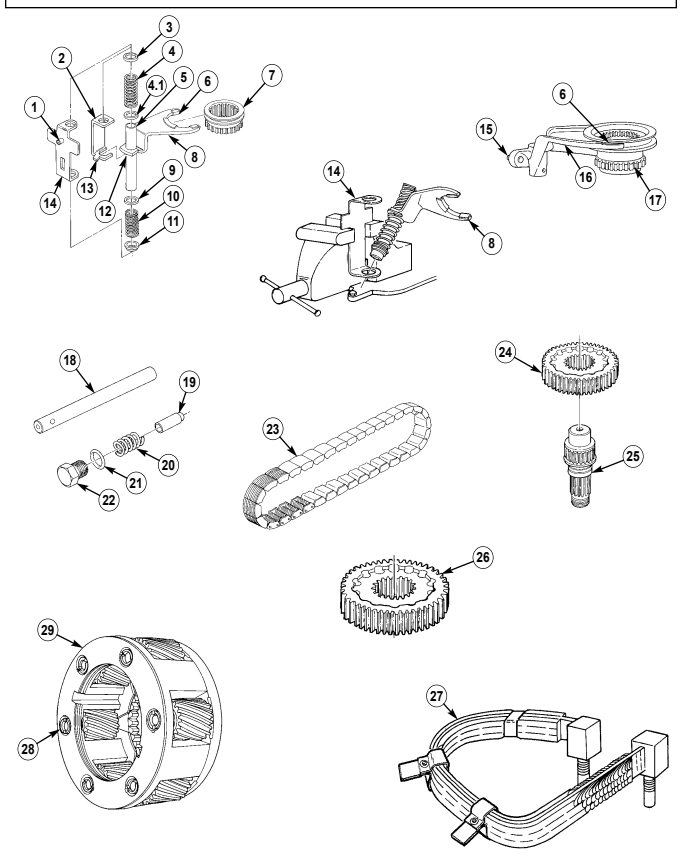

## 29-3.  Transfer Case Repair (Cont'D)

Change 2 29-19

## 29-3. Transfer Case Repair (Cont'D)

d. Assembly 1. For general assembly instructions, refer to para. 2-17. 2. Place thrust washer (3), input gear (5), thrust washer (3), and retainer (2) into low-range gear (4)
with snapring (1). Make sure snapring (1) is fully seated in groove of low-range gear (4).

#### Caution

Use correct tool to press input gear into ball bearing. Pilot bearing could be moved out of position causing damage to equipment.

3. Using driver handle and main pilot bearing installer and supporting ball bearing (12), press shaft of input gear (5) into ball bearing (12). Snapring groove must be exposed beyond ball bearing (12).

4. Install snapring (8) in shaft of input gear (5). 5. Using input gear seal installer, install input seal (10) in bearing retainer (9). 6. Run a bead of sealer on contact surface of bearing retainer (9). 7. Install bearing retainer (9) on front half-case (6) with four screws (11). Tighten screws (11) to 12-20 lb-ft (16-27 N•m).

8. Install shift sector (7) in front half-case (6). 9. Install shift lever (15) on shift sector (7) with washer (14) and nut (13). Tighten nut (13) to 20-25 lb-ft (27-34 N•m).

10. Install poppet (18), spring (17), O-ring (16.1), and shift detent plug (16) in bore (19). Tighten plug (16) to 12-18 lb-ft (16-24 N•m). Turn shift lever (15) so poppet (18) fits in teeth of shift sector (7).

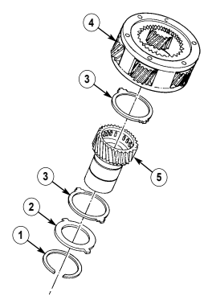

10 1

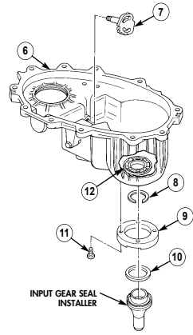

# 29-3.  Transfer Case Repair (Cont'D)

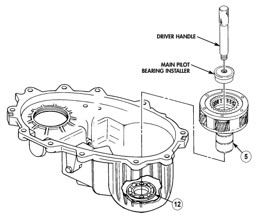

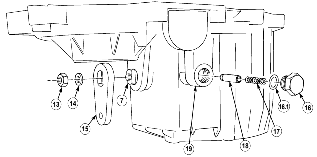

## 29-3. Transfer Case Repair (Cont'D)

11. Position range shift fork (1) in range clutch sleeve (2). 12. Holding range shift fork (1) and range clutch sleeve (2) together, install range clutch sleeve (2) in input gear shaft (3) and pin (14) in angle slot (13) of shift sector (15). Move shift sector (15) as necessary to align fork (1).

13. Place thrust washer (5), fifty-three needle bearings (6), and thrust washer (5) on mainshaft (7). Use petrolatum to hold needle bearings (6) in place on mainshaft (7).

14. Carefully slide differential assembly (12) over mainshaft (7) and needle bearings (6) with snapring (11). Make sure that no needle bearings (6) are displaced.

15. Place intermediate clutch shaft (10) over mainshaft (7). 16. Position keyed thrust washer (9) over mainshaft (7) on intermediate clutch shaft (10) with snapring (8). Ensure snapring (8) seats in groove in mainshaft (7).

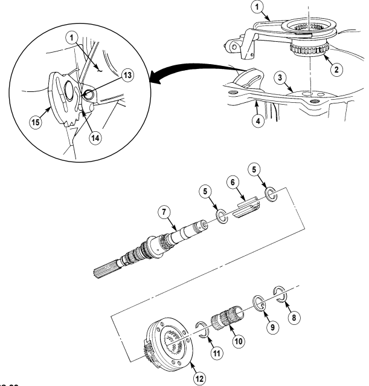

## 29-3. Transfer Case Repair (Cont'D)

17. Slide mode shift sleeve (18) onto mode shift fork (17). 18. Slide mode shift fork assembly (16) over mainshaft assembly (7) and align with differential assembly (12).

19. Lifting on end of mainshaft assembly (7) and holding mode shift fork assembly (16) in place, set end of mainshaft assembly (7) into input gear in front half-case (4).

20. Carefully align pin (20) of mode fork (16) in long slot (24) of shift sector (15). 21. Align mode shift fork (16) and range shift fork (1) in front half-case (4) and insert shift rail (19) 
and seat in front half-case (4).

- It may be necessary to use screw extractor to start tapered drive pin in range shift fork.

- It may be necessary to remove shift lever to install tapered drive pin.

22. Align pin hole in range shift fork (1) and shift rail (19) with hole (23) in front half-case (4) and install tapered drive pin (22) in shift rail (19).

23. Install plug (21) in front half-case (4).

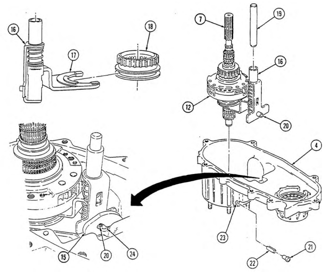

## 29-3. Transfer Case Repair (Cont'D)

24. Install cooler support (2) and two O-rings (6) on oil cooler (1).

24.1. Position oil cooler (1) into front half-case (3) and install external washers (5) and nuts (4). Do not tighten nuts (4) at this time.

24.2. Align cooler upper support tab (8) in recess on mounting face of front half-case (3) and lower tab (7)
on recess in front half-case (3).

#### Caution

To prevent damage to tube while tightening tube nuts, tube manifold should be held in place with 3/4-inch wrench.

Lower tab is designed so that the crush rivet compresses between recessed casting areas of the front and rear halves of the transfer case when they are bolted together.

24.3. Tighten tube nut (4) closest to support tab (8) to 15 lb-ft (20 N•m), and then tighten second tube nut (4) to 15 lb-ft (20 N•m).

25. Install driven gear (10) on front ouput shaft (11) with snapring (9). 26. Install front ouput shaft (11) and driven gear (10) on front half-case (3) 27. Position drive chain (13) over mainshaft assembly (12) and driven gear (10). 28. Work drive sprocket (14) onto mainshaft assembly (12) and into drive chain (13) and mainshaft (12)
with snapring (15).

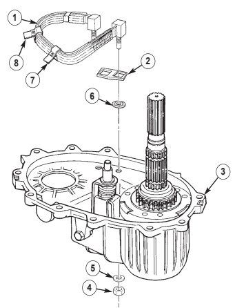

# 29-3. Transfer Case Repair (Cont'D)

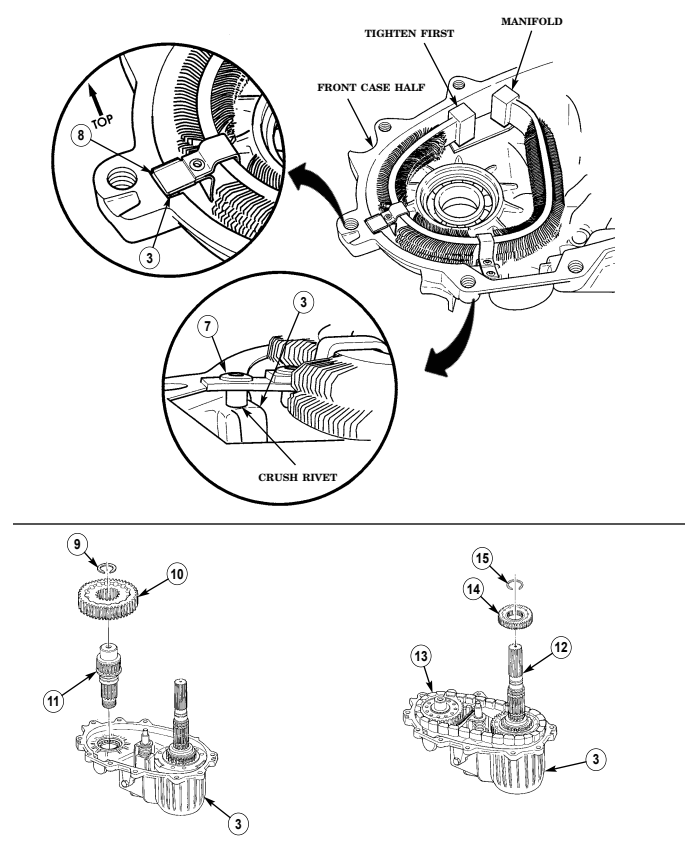

## 29-3. Transfer Case Repair (Cont'D)

29. Install oil tube seal (2) in pickup bore of front housing of oil pump (1). 30. Assemble oil screen (4), hose (5), and oil pickup tube (6). 31. Place oil pump (1) on rear half-case (3), insert pickup tube (6) into oil pump (1), and install oil screen (4) in rear half-case (3).

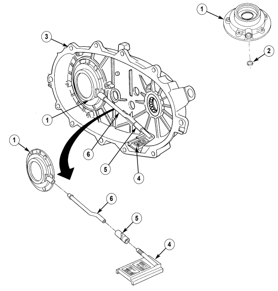

## 29-3. Transfer Case Repair (Cont'D)

32. Install magnet pickup (10) in socket (8) in front half-case (9). 33. Install two alignment dowels (5) in rear half-case (11) if they were removed.

NOTE
- Both front and rear contact surfaces must be clean, dry, and free of oil prior to application of silicone sealant. Oil spills may be wiped from transfer case with a nonpetroleum base cleaner. For proper bonding, half-cases should be assembled within five minutes after applying sealant, and all capscrews tightened within one hour after application of sealant.

- Ensure oil cooler is clear of transfer case housing during installation.

34. Run a 1/8-in. (3-mm) bead of sealer on mating flange surface of front half-case (9). 35. Position rear half-case (11) on front half-case (9) and install two washers (4) and capscrews (3)
through alignment dowels (5) into front half-case (9). Turn mainshaft assembly (7) to align oil pump (6) gears.

36. Install two long screws (2) at front output shaft area and seven screws (1) in remaining holes in rear half-case (11). Tighten screws (3), (2), and (1) to 26-34 lb-ft (35-46 N•m).

37. Install speedometer drive gear (17) on main shaft (7) with two snaprings (16).

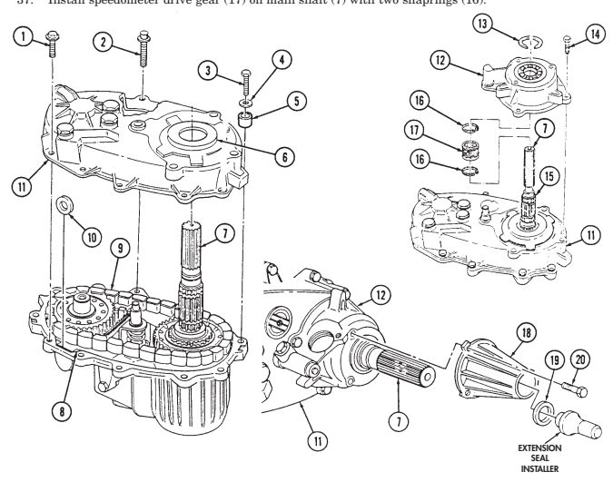

## 29-3. Transfer Case Repair (Cont'D)

38. Run a 1/8-in. (3-mm) bead of sealer on sealing surface of rear retainer (12) and install on rear halfcase (11) with four capscrews (14). Tighten capscrews (14) to 26-34 lb-ft (35-46 N•m).

39. Install snapring (13) on mainshaft assembly (7). Lift mainshaft (7) as necessary to clear groove (15)
for snapring (13). Ensure snapring (13) is fully seated in groove (15).

40. Run a 1/8-in. (3-mm) bead of sealer on flange sealing surface of rear retainer (12). 41. Using extension housing seal installer, install rear output drive seal (19) on rear extension (18). 42. Install rear extension (18) on rear retainer (12) with three capscrews (20). Tighten capscrews (20) to 26-34 lb-ft (35-46 N•m).

43. Install front output yoke (25) on shaft (23) with lockwasher (24) and nut (21). Tighten nut (21) to 90-130 lb-ft (122-176 N•m).

44. Install driven gear (30), O-ring (29), and pinion adapter (28) in rear retainer (12) with clamp (27) and capscrew (26). Tighten capscrew (26) to 12-15 lb-in. (1.4-1.7 N•m).

45. Move shift range lever (22) to ensure transfer shifts into four detent positions. Turning shafts may be necessary to obtain full detent engagement.

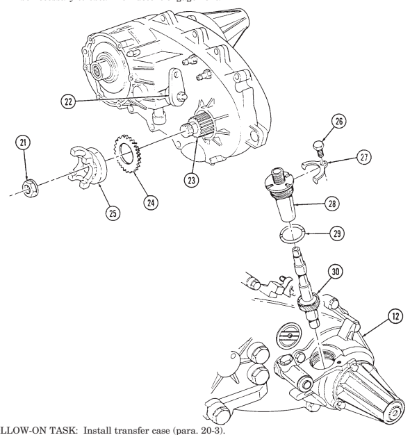

# Chapter 30 Differential (Gs) Repair

## 30-1. Introduction

This chapter contains maintenance instructions for disassembly and repair of propeller differential components at the general support maintenance level. Some subassemblies and parts must be removed before differential components can be accessed. They are referenced to other paragraphs in this manual.

## 30-2. Differential Repair Task Summary

| Driver handle (Appendix B, Item 60) Bushing service set (Appendix B, Item 76)   | Equipment Condition                           |
|---------------------------------------------------------------------------------|-----------------------------------------------|
| Adapter (Appendix B, Item 67)                                                   | Transmission disassembled into subassemblies  |
| Clutch compressor spring adapter                                                | (para. 28\-3).                                |
| (Appendix B, Item 69)                                                           | General Safety Instructions                   |
| Center support thread reamer                                                    | Air pressure must not exceed 15 psi (103 kPa) |
| (Appendix B, Item 73.1)                                                         | when air\-checking clutch piston.             |
| Materials/Parts                                                                 |                                               |

## 30-3. Differential Repair

This task covers:

a. Disassembly **c. Inspection** b. Cleaning **d. Assembly**

#### Initial Setup: Tools

General mechanic's tool kit:
automotive (Appendix B, Item 1)
Dial indicator (Appendix B, Item 113) Maintenance and repair shop equipment:
automotive (Appendix B, Item 2)

#### Special Tools

Differential housing spreader 
(Appendix B, Item 101)
Pinion setting gauge set (Appendix B, Item 106) Seal protector (Appendix B, Item 68) Rear bearing cup remover (Appendix B, Item 102) Front bearing cup remover (Appendix B, Item 103) Rear bearing cup installer (Appendix B, Item 104) Front bearing cup installer (Appendix B, Item 105) Yoke seal installer (Appendix B, Item 82) Driver handle (Appendix B, Item 60) Axle shaft and seal installer 
(Appendix B, Item 99)
Two axle holding fixture adapters
(Appendix B, Item 100)

#### Materials/Parts

Two O-rings (Appendix G, Item 215) Two locknuts (Appendix G, Item 108) Collapsible spacer (Appendix G, Item 315) Pinion seal (Appendix G, Item 302) Two output seals (Appendix G, Item 301) Lubricating oil (Appendix C, Item 43) RTV silicone sealant (Appendix C, Item 74) Four guide pins (Appendix D, Fig. 61)
Personnel Required One mechanic One assistant Manual References TM 9-2320-387-24P
Equipment Condition Differential removed (para. 21-5).

Maintenance Level General support

- Work area should be clean, well-ventilated, and free from blowing dirt and dust.

- Refer to axle differential housing identification part number, located on housing, before ordering any replacement parts.

a. Disassembly 1. Loosen locknut (3) on output shaft assembly (2). 2. Using slide hammer, remove output shaft assembly (2) from differential housing (1).

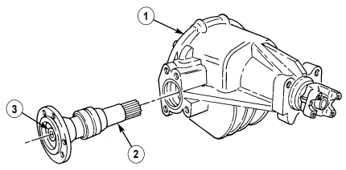

## 30-3. Differential Repair (Cont'D)

3. Remove locknut (3), O-ring (7), output flange (6), and output shaft seal (5) from output shaft (4).

Discard O-ring (7), output shaft seal (5), and locknut (3).

4. Repeat steps 1 through 3 for opposite side. 5. Install two axle holding fixture adapters on housing (1) with four capscrews (10). Place housing (1)
in holding stand.

6. Position housing (1) so differential cover (8) faces up. Remove twelve capscrews (9) and cover (8)

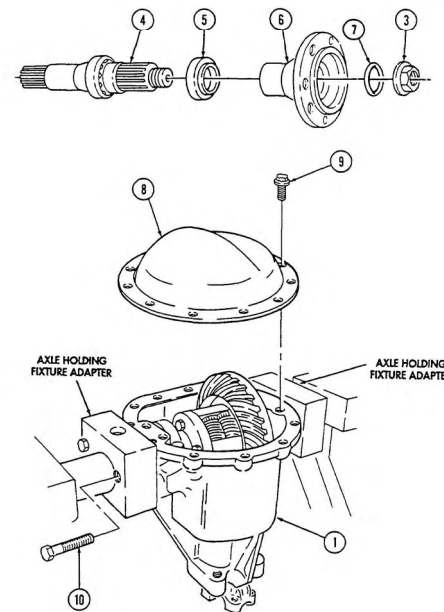

from housing (1).

## 30-3. Differential Repair (Cont'D)

7. Mark two bearing caps (1) and housing (3) for assembly and remove four capscrews (2) and two bearing caps (1) from housing (3).

8. Install differential housing spreader into holes in axle holding fixture adapters and install dial indicator to read from each end of housing (3). Dial indicator must have preload setting of 0.020 in. (0.5 mm).

#### Caution

Over tightening of differential housing spreader will damage

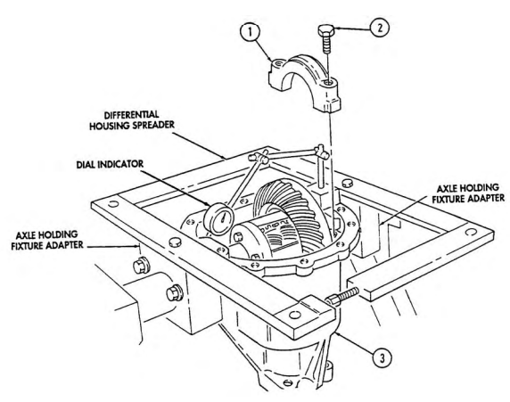 differential housing.

9. Spread housing (3) 0.010 in. (0.25 mm) and remove dial indicator.

## 30-3. Differential Repair (Cont'D) Note

Tag bearing shims and bearing cups for assembly.

 Remove differential case (6), two bearing cups (5), and shims (4) from housing (3).

Relieve pressure on housing spreader and remove from housing (3).

## Caution

Do not chisel or wedge ring gear from differential case or damage may result.

Remove eight capscrews (8) and ring gear (7) from differential case (6).

12.

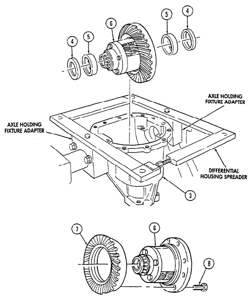

10.

11.

#### 30-3. Differential Repair **(Cont'D)**

13. Rotate housing (3) 90". Install cover (2) on housing (3) with two capscrews (1). 

14. Remove locknut (7) securing pinion yoke (6) to pinion gear (9). Discard locknut (7). 15. Remove pinion yoke (61 from pinion gear (91. 16. Drive pinion gear (9) out of front bearing (4). 

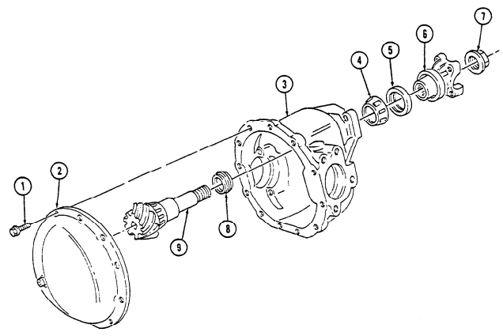 17. Remove two capscrews (11, cover (21, pinion gear (91, and collapsible spacer (8) from housing (3). 

Discard collapsible spacer (8). 

18. Remove pinion seal (5) and front bearing (4) from housing (3). Discard pinion seal (51. 

#### 30-3. Differential Repair (Cont'D)

19. Rotate front of housing (3) upward 90". Using driver handle and rear bearing remover, remove rear bearing cup (11) and pinion depth shim (10) from housing (3). 

20. Rotate housing (3) 180". Using driver handle and front bearing remover, remove front bearing cup 
(12) from housing (3). 

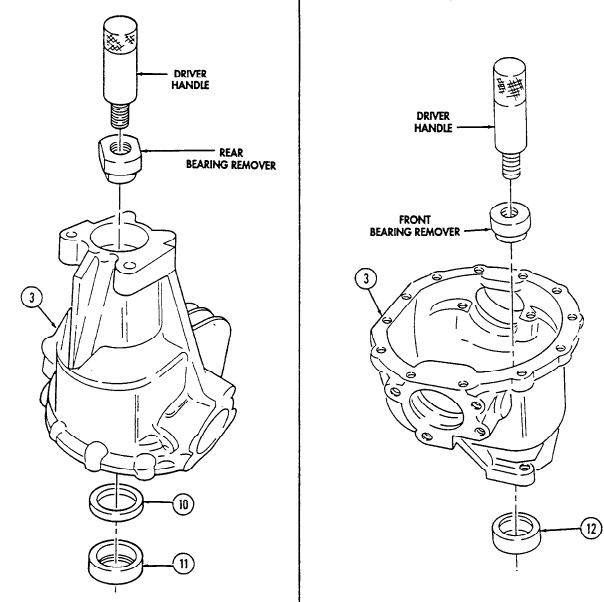

## 30-3. Differential Repair (Cont'D)

Remove two differential side bearings (1) from differential case (2).

21.

22.

Remove rear bearing (4) from pinion gear (3).

 23.

Remove two bearings (5) from output shafts (6).

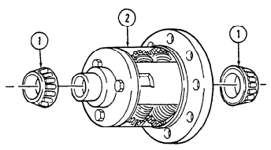

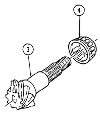

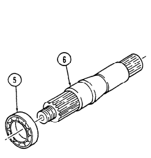

## 30-3. Differential Repair (Cont'D)

pzizq Clean all differential parts in accordance with para. 2-14. 

rc Inspection 1 

For general inspection instructions, refer to para. 2-15. 

1. Inspect housing (7) and all threaded holes for damage. Repair any damaged threads with thread repair inserts. Replace differential if housing (7) is damaged. 

#### Note 

Ring and pinion gears must be replaced as matched set. 

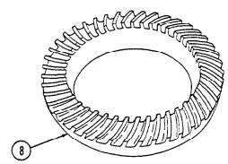

2. Inspect splines and gear teeth on pinion gear (3) and ring gear (8) for damage. Replace both pinion gear (3) and ring gear (8) if either are damaged. 

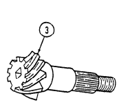

## 30-3. Differential Repair (Cont'D)

If rear pinion yoke is being replaced, a new slinger must be installed on new pinion yoke. Ensure slinger is seated against rear shoulder of yoke.

3. Inspect splines and sealing surfaces on output flanges (1), pinion yoke (2), and two output shafts (3) for damage. Replace if damaged.

4. Inspect all bearings (4) and bearing cups (5) for damage. Replace bearings (4) and bearing cups (5)
in matched sets if either is damaged.

5. Inspect differential case (6) for damage. Replace if damaged.

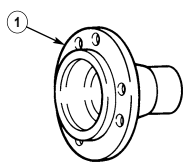

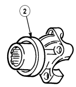

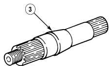

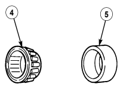

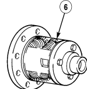

## I **30-3. Differential Repair (Cont'D)** -1

d. Assembly 

l For general assembly instructions, refer to para. 2-17. l Pinion gear depth is the distance from end face of pinion to center line of output shafts. The dimension is controlled by shims between pinion gear rear bearing cup and differential housing. The pinion gear is etched with two identifying numbers: the first number identifies ring gear and pinion gear as a matched set; the second number represents pinion depth variance and is preceded by a plus (+) or minus (-), which represents the amount in thousandths the gear set varied from the standard setting of 2.547 in. (6.47 cm). 

l If using original gear set, use original pinion depth shim as a starter shim and proceed to step 4. 

1. Measure thickness of original pinion depth shim (3) and record for reference. 

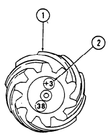

2. Check pinion depth variance numbers (2) marked on old and new pinion gears (1) and record for references. 

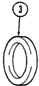

# 30-3. Differential Repair (Cont'D)

- If the old pinion is marked -3 and the new pinion is marked +2, the procedure would be as follows: Refer to Old Pinion Marking column at left side of table and locate -3. Then read to right, across table, until under +2 in New Pinion Marking column. Box where two columns intersect is amount of shim thickness change required. In this case, the number in the intersecting box is -0.005 in. (-0.13 mm), which represents the amount to be subtracted from the old shim thickness. If the box number had been a + figure, this amount would be added to the old shim thickness.

- This table determines an initial shim thickness. The actual pinion depth measurement must be performed and final shim thickness adjusted as necessary.

- Pinion shims are available from 0.084-0.111 in. (2.13-2.82 mm) in increments of 0.0005 in. (0.0127 mm).

3. Refer to Old and New Pinion Marking columns in table 30-1, Pinion Variance Table. Note on table where old and new pinion depth variances intersect to determine amount to be added or subtracted from original pinion depth shim for desired pinion depth starter shim.

| 4.  Remove O\-ring (2) from piston (3) and O\-ring (6) from housing (4). Discard O\-rings (2) and (6).   |
|----------------------------------------------------------------------------------------------------------|
| Clean all components in accordance with para. 2\-14.                                                     |
| 1.  Inspect piston (3), backing plate (11), and clutch housing (4) for cracks, breaks, and damaged seal  |
| ring grooves. Replace any that are cracked, broken, or damaged.                                          |
| 2.  Inspect plug (5). If missing, replace clutch housing (4).                                            |
| CAUTION                                                                                                  |
| All transmission parts must be lubricated with clean transmission fluid                                  |
| (Dexron® VI) before assembly. Foreign material will cause transmission damage.                           |
| 1.  Install O\-ring (2) on piston (3), with lip facing toward spring and retainer assembly (7) side.     |

Table 30-1. Pinion Variance Table (Inches).

## 30-3. Differential Repair (Cont'D)

 বঁ 5.

 Rotate housing (2) so front bearing cup bore faces up.

Lubricate outside diameter of front bearing cup (1) with lubricating oil. Using driver handle and front bearing installer, install cup (1) in housing (2).

6.

Install rear bearing (4) on pinion gear (3).

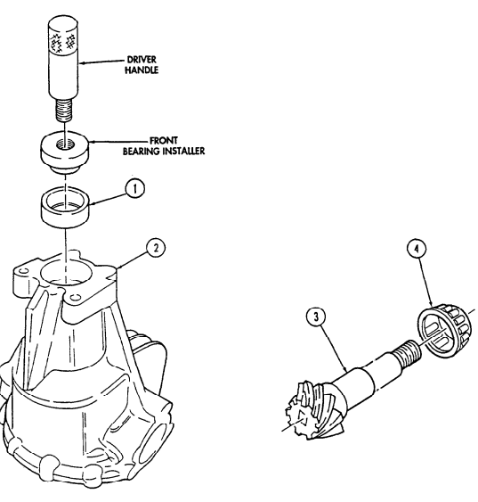

## ~Erential Repair **(Cont'D)** I

7. 

Using pinion setting gauge set, install block, rear bearing cup, rear bearing, and pilot washer on stud and secure with block.

8. 

Position stud assembly in housing (1) and install with front bearing, pilot washer, and nut. Tighten nut to 10 lb-in. (1 N-m). Rotate assembly several revolutions to seat bearings and recheck torque. Rotate front of housing downward 90". Assemble arbor and two discs and install in housing.

9. 

10. 

Install two bearing caps (2) on housing (1) with four capscrews (3) and finger tighten capscrews (31.

11. 

Position arbor on block and install dial indicator on arbor post. Preload dial indicator until needle rotates approximately one full turn clockwise. Tighten dial indicator in this position and recheck. 

12.

Rotate gauge shaft slowly back and forth until dial indicator reads greatest deflection. At point of greatest deflection, set dial indicator to zero. Repeat rocking action of gauge shaft to verify gauge setting. 

13. 

After zero setting is obtained, rotate gauge shaft until dial indicator plunger does not touch block. 

14. 

Record dial indicator reading. Example: If the pointer moved counterclockwise and stopped between 0 and 11, add .lOO in. to measurement for shim thickness. If the pointer moved counterclockwise and stopped between 99 and 84, correct shim thickness is indicated. 

15. 

This reading indicates shim thickness that is required of a pinion that is etched with a zero (0) on pinion head. If pinion being installed has a plus (+) or minus (-1 etching, then an adjustment of shim thickness is required. Example: If a pinion is etched +3, then .003 in. less shim thickness is required. Subtract -003 in. from the indicator reading. If a pinion is etched -3, then -003 in. more shim thickness is required. Add .003 in. to the indicator reading. 

16. 

Remove dial indicator from arbor.

Remove four capscrews (31, two bearing caps (2), discs, and arbor from housing (1). 

17. 

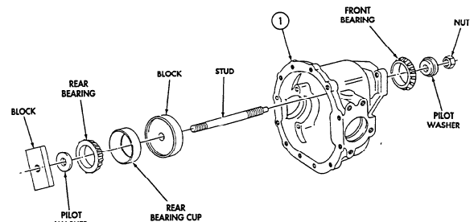

WASHER **BEARING CUP** 
# 30-3.  Differential Repair (Cont'D)

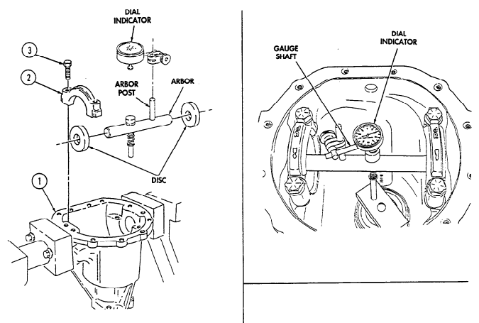

Remove nut, pilot washer, front bearing, and stud assembly from housing (1).

18.

Remove block, pilot washer, rear bearing, rear bearing cup, and block from stud.

19.

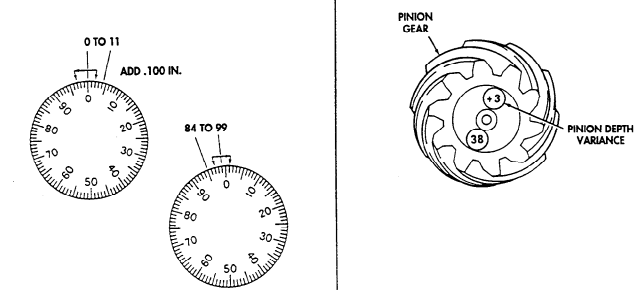

## 1 30-3. Differential Repair (Cont'D) I

20. L&~&e front bearing (2) and pinion seal (1) with lubricating oil. Using yoke seal installer, install front bearing (2) and pinion seal (1) in housing (3). 

21. Rotate housing (3) 180". Lubricate outside diameter of rear bearing cup (4) with lubricating oil. 

#### Note 

If pinion shim is beveled, ensure beveled side faces bottom of bearing cup bore. 

22. Using driver handle and rear bearing installer, install correct thickness pinion shim (5) and rear bearing cup (4) in housing (3). 

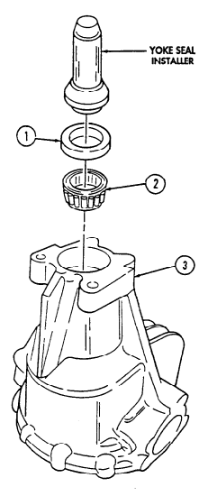

## 1 30-3. Differential Repair (Cont'D) --1

23. Rotate housing (3) 90". Lubricate rear bearing (6) with lubricating oil. 

Collapsible spacer controls pinion bearing preload. Do not reuse old spacer or pinion bearing damage may result. 

24. Install collapsible spacer (8) on pinion gear (7) and install pinion gear (7) in housing (3). 

25. Install pinion yoke (9) on pinion gear (7) with locknut (10). 

Do not exceed specified preload torque on pinion bearings. Do not loosen locknut to replace preload torque or pinion bearing damage may result. If specified torque is exceeded, remove pinion gear and replace collapsible spacer and locknut and adjust preload again. 

26. Tighten locknut (10) only enough to remove end play and seat pinion bearings in housing (3). 'lb seat bearings evenly, rotate pinion yoke (9) while tightening. 

27. Measure torque required to rotate pinion gear (7). Correct pinion bearing preload torque is 

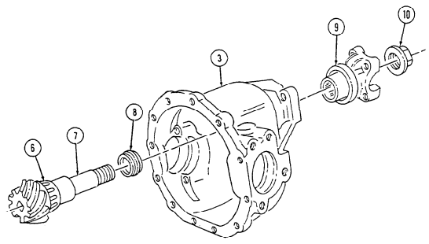

17-25 lb-in. (2-3 N-m) with new bearings and lo-15 lb-in. (l-2 N-m) with used bearings. 

28. Continue to tighten locknut (10) in small increments until pinion bearing preload torque meets specifications. 

## 30-3. Differential Repair (Cont'D)

29. Install two side bearings (1) on differential case (2).

Side bearing shims are available in thicknesses from 0.077-0.117 in. (1.96-2.97 mm) in increments of 0.001 in. (.025 mm).

30. Rotate housing (7) downward 90°. Install two side bearing cups (4) and side bearings shims (3) on side bearings (1). Use 0.080 in. (2 mm) shims (3) as a starting point.

31. Install differential case (2), two bearing cups (4), and shims (3) in housing (7). 32. Install two bearing caps (5) and four capscrews (6) in housing (7). Snug capscrews (6). 33. Mount dial indicator on housing (7) and index indicator to read off ring gear mounting surface of differential case (2).

34. Pry between differential case (2) and bearing cap (5) on one side and zero indicator. Pry on opposite side to read end play.

35. Amount read on indicator is shim thickness that should be added to side bearing shims (3) to arrive at zero end play. Add necessary shims (3) and repeat procedure to ensure accuracy.

36. Tighten four capscrews (6) to 55-70 lb-ft (75-95 N•m). 37. Rotate differential case (2) and check runout. Runout should not exceed 0.002 in. (0.05 mm). 38. Remove dial indicator from housing (7).

NOTE
Tag shims and bearing cups for assembly.

39. Remove four capscrews (6), two bearing caps (5), differential case (2), two bearing cups (4), and shims (3) from housing (7).

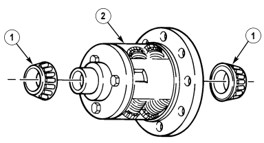

## 30-3. Differential Repair (Cont'D)

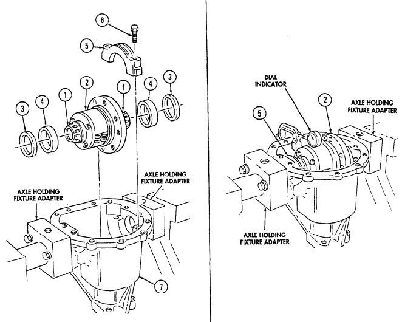

## 30-3. Differential Repair (Cont'D)

40. Install four guide pins in ring gear (2). 41. Support ring gear (2) with wood blocks in press. 42. Press differential case (3) on ring gear (2). 43. Remove four guide pins from ring gear (2). 44. Install ring gear (2) on differential case (3) with eight capscrews (1). Tighten capscrews (1) to 95-115 lb-ft (129-156 N•m).

45. Install two side bearing shims (4) previously used to eliminate differential case side play, side bearing cups (5), and differential case (3) in housing (8).

46. Install two bearing caps (6) on housing (8) with four capscrews (7). Tighten capscrews (7) to 55-70 lb-ft (75-95 N•m).

47. Attach dial indicator to housing (8) and index indicator to read off drive side of ring gear tooth (9) 
at a right angle.

Backlash must be checked at four equally-spaced points on ring gear and must not vary more than 0.002 in. (0.51 mm) between four points checked.

48. Move ring gear (2) back and forth while holding pinion yoke (10) stationary. Note backlash registered on indicator.

49. Ring gear backlash should be 0.005-0.009 in. (0.13-0.23 mm) with 0.008 in. (0.20 mm) desired. 

If backlash must be adjusted, perform steps 50 through 53. If not, go to step 54.

Tag shims and bearing cups for assembly.

case (3) from housing (8).

50. Remove four capscrews (7), two bearing caps (6), bearing cups (5), shims (4), and differential

The following example will explain the procedure for adjusting backlash: If side play was eliminated using 0.090 in. (2.29 mm) shims on each side, totaling 0.180 in. (4.57 mm), and backlash, when checked, is found to be 0.011 in. (0.28 mm), add 0.004 in. (0.10 mm) to shim on ring gear side and subtract 0.004 in. (0.10 mm) from shim on opposite side to correct backlash. This will result in 0.094 in. (2.39 mm) shim on ring gear side and 0.086 in. (2.18 mm) shim on other side. Backlash will be approximately 0.007 to 0.008 in. (0.18 to 0.20 mm). Total shim thickness remains 0.180 in. (4.57 mm).

51. To increase backlash, install thinner shim (4) on ring gear side and thicker shim (4) on opposite side. To decrease backlash, install thicker shim (4) on ring gear side and thinner shim (4) on opposite side. Do not change total shim thickness.

52. Install two shims (4), bearing cups (5), differential case (3), and two bearing caps (6) on housing (8)
with four capscrews (7). Tighten capscrews (7) to 55-70 lb-ft (75-95 N•m).

53. Mount dial indicator and recheck backlash. If necessary, repeat steps 50 through 53.

NOTE
Tag shims and bearing cups for assembly.

54. Remove four capscrews (7), two bearing caps (6), bearing cups (5), shims (4), and differential case (3) from housing (8).

30-20 Change 1

30-3.  DIFFERENTIAL REPAIR (Cont'd)

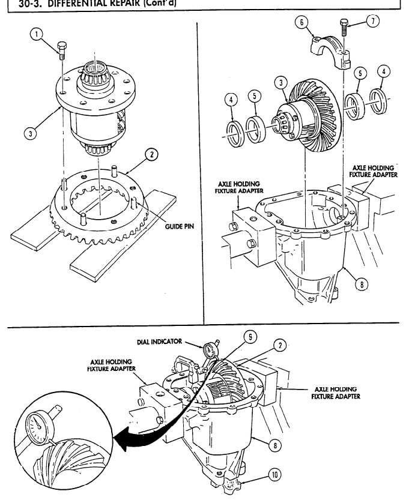

## 30-3. Differential Repair (Cont'D)

55. Install differential housing spreader into holes in axle holding fixture adapters and install dial indicator to read from each end of housing (1). Indicator must have preload setting of 0.020 in. (0.51 mm).

#### Caution

Overspreading of differential housing spreader will damage housing.

56. Spread housing (1) 0.010 in. (0.25 mm) and remove dial indicator.

Differential bearings must be preloaded to compensate for heat and loads during operation.

57. Preload differential case side bearings (4) by increasing shim (2) thickness at each side of differential case (5) by 0.004 in. (0.10 mm) for a total bearing preload of 0.008 in. (0.20 mm).

58. Lubricate side bearings (4) with lubricating oil and install differential case (5), two bearing cups (3),
shims (2), and bearing caps (6) in housing (1) with four capscrews (7).

Preloaded differential bearings may change backlash setting. Check and correct backlash if necessary.

59. Remove housing spreader and tighten four capscrews (7) to 55-70 lb-ft (75-95 N•m). 60. Apply silicone sealant to cover (8) sealing surface and install cover (8) on housing (1) with twelve capscrews (9). Tighten capscrews (9) to 16 lb-ft (22 N•m).

61. Remove housing (1) from holding fixture. 62. Remove four capscrews (10) and two axle holding fixture adapters from housing (1).

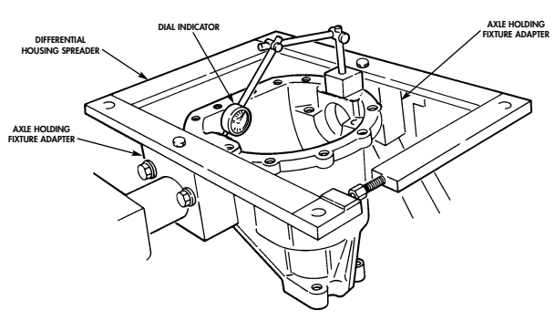

## 30-3. Differential Repair (Cont'D)

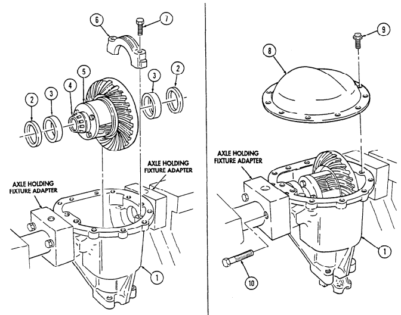

## 30-3. Differential Repair (Cont'D)

63. Using press, install output shaft bearings (1) on two output shafts (2). 

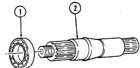

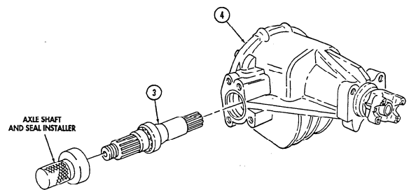 64. Using axle shaR and seal installer, install two output shaf't assemblies (3) into housing (4). 

## 30-3. Differential Repair (Cont'D)

65. Using axle shaft and seal installer, install two output shaft seals (5) in housing (4). 66. Using lubricating oil, lubricate sealing surface on two output flanges (8).

NOTE
Output shaft locknuts are torqued during differential installation.

67. Install two output flanges (8), O-rings (7), and locknuts (6) on output shafts (2). Tighten locknuts (6) fingertight.

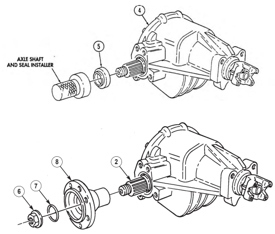

FOLLOW-ON TASK: Install differential (para. 21-5).

30-4. DIFFERENTIAL REAR COOLER LINES REPLACEMENT (SERIAL NUMBERS 188,975

# And Above)

This task covers:

Tools General mechanic's tool kit:
automotive (Appendix B, Item 1)
Maintenance and repair shop equipment:
automotive (Appendix B, Item 2)
Materials/Parts Two O-rings (Appendix G, Item 218)
Manual References TM 9-2320-387-10 TM 9-2320-387-24P
a. Rear Lines Removal a. Rear Lines Removal **b. Rear Lines Installation**
Equipment Condition Body raised (para. 33-3). General Safety Instructions Do not drain oil when engine is hot. Maintenance Level General Support

#### Warning

Allow differential to cool before performing this task. Severe injury to personnel may result.

CAUTION
Cover or plug all hoses and connections immediately after disconnection to prevent contamination. Remove all plugs prior to connection.

Have drainage container ready to catch oil.

1. Disconnect tubes (1) and (6) from unions (2) and (5). 2. Remove unions (2) and (5) from tubes (3) and (4). 3. Remove two bolts (7), washers (8), and clamps (9) from frame (15). 4. Remove nut (12), washer (14), and clamp (11) from stud (10) on frame (15). 5. Remove bolt (16), washer (17), and clamp (18) from crossmember (13). 6. Remove two oil cooler lines (19) and O-rings (20) from rear differential oil cooler (21). Discard O-rings (20).

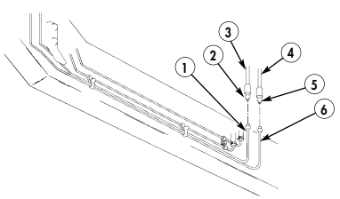

30-4. DIFFERENTIAL REAR COOLER LINES REPLACEMENT (SERIAL NUMBERS 188,975 AND ABOVE) (Cont'd)

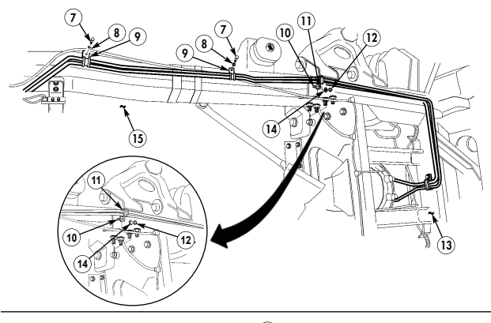

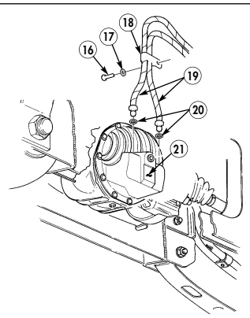

30-4. DIFFERENTIAL REAR COOLER LINES REPLACEMENT (SERIAL NUMBERS 188,975 AND ABOVE) (Cont'd)
b. Rear Lines Installation

- Remove all protective caps and plugs from tubes and hoses prior to connecting.

- Ensure tube have O-rings installed on ends that connect to cooler cover assembly.

1. Install two O-rings (5) and oil cooler lines (4) on rear differential oil cooler (6). 2. Install clamp (3) on crossmember (13) with washer (2) and bolt (1). 3. Install clamp (11) on stud (10) on frame (15) with washer (14) and nut (12). 4. Install two clamps (9) to frame (15) with two washers (8) and bolts (7). 5. Connect tubes (17) and (18) to tubes (16) and (19).

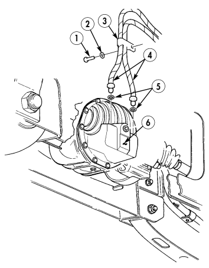

30-4. DIFFERENTIAL REAR COOLER LINES REPLACEMENT (SERIAL NUMBERS 188,975 AND ABOVE) (Cont'd)

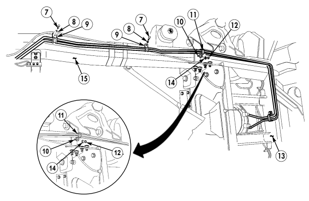

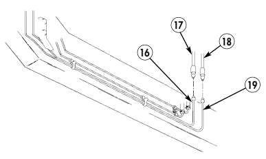

FOLLOW-ON TASK:    Lower body (para. 33-3).

# Chapter 31 Steering System (Gs) Repair

| 31\-1. INTRODUCTION   |
|-----------------------|

Deleted.

| Special Tools                                 | Transmission fluid (Appendix C, Item 37)   |
|-----------------------------------------------|--------------------------------------------|
| Output shaft seal installer                   | Manual References                          |
| (Appendix B, Item 90)                         | TM 9\-2320\-387\-24P                       |
| Oil pump seal installer (Appendix B, Item 61) | Equipment Condition                        |

31-2. STEERING SYSTEM REPAIR TASK SUMMARY

# Chapter 32 Frame (Gs) Repair

## 32-1. Introduction

This chapter contains maintenance instructions for repair of frame components at the general support maintenance level. Some subassemblies and parts must be removed before frame components can be accessed. They are referenced to other paragraphs in this manual.

## 32-2. General

Refer to TB 9-2300-247-40 for repair of frames used on the M1113/M1114 series vehicles. Refer to TM 92320-387-24P for authorized replacement parts used in frame repair.

|                                                              | Materials/Parts (Cont'd)                                   |
|--------------------------------------------------------------|------------------------------------------------------------|
| General mechanic's tool kit: automotive (Appendix B, Item 1) | Seal (Appendix G, Item 286) O\-ring (Appendix G, Item 234) |
| Maintenance and repair shop equipment:                       | O\-ring (Appendix G, Item 213)                             |
| (Appendix B, Item 2)                                         | Filter (Appendix G, Item 33) (1996 only)                   |
| Dial indicator (Appendix B, Item 113)                        | Gasket (Appendix G, Item 62)                               |
| Special Tools                                                | Hydraulic parts kit (Appendix G, Item 242)                 |
|                                                              | (1997, 1998 only)                                          |
| Transmission holding fixture (Appendix B, Item 57)           | O\-ring (Appendix G, Item 219)                             |
| Transmission holding fixture base                            | Transmission fluid (Appendix C, Item 37)                   |
| (Appendix B, Item 58)                                        | Petrolatum (Appendix C, Item 52)                           |

## 32-3. Frame Repair Task Summary 32-4. Frame Inspection And Repair

This task covers:
b. Powertrain Lift Sling Installation e. Repair Procedures c.1. Steering Gear Mounting Area Inspection

#### Initial Setup: Tools

General mechanic's tool kit:
automotive (Appendix B, Item 1)

#### Materials/Parts

Cotter pin (Appendix G, Item 16) Powertrain lift sling (Appendix D, Figs. 72, 73)

#### Manual References

TB 750-98-23 TM 9-2320-387-10 TM 9-2320-387-24P TC 9-237 TM 43-0139

#### Equipment Condition

- Vehicle mission equipment removed and stowed (TM 9-2320-387-10).

- Vehicle undercarriage clean and free of mud and debris (TM 9-2320-387-10).

- Battery ground cables disconnected 
(para. 4-68).

- Transmission control module removed 
(para. 4-45).

a. General Information d. Preparation and Materials c. Inspection f. Powertrain Lift Sling Removal

#### Equipment Condition (Cont'D)

- Engine left splash shield removed
(para. 10-23 or para. 10-23.1).

- Stabilizer bar removed 
(para. 6-20 or para. 6-20.1).

- Pitman arm disconnected from center link (8-14). - Steering shaft disconnected from steering gear
(para. 8-19).

- Oil cooler/brake line bracket removed 
(para. 3-7 or para. 3-7.1).

- Steering gear removed 
(para. 8-20 or para. 8-20.1).

#### General Safety Instructions

- When using power-driven equipment to straighten frames, all personnel must stand clear.

- Shim material must be under jackstands. - Ensure shoulder bolts have a raised metal 10.9 material strength indicator on the head of the bolts.

- Do not bulk heat frame rails to remove bends and/or buckles.

| Maintenance Level   |
|---------------------|
| General support     |

#### A. General Information

1. Frame rails are constructed by arc-welding two C-channels of preformed steel together to form a box-cross section.

2. Frame rails are internally reinforced at bolt hole locations by bushings or full cross-section spacers to prevent channels from collapsing from attaching load.

Crossmembers and crossmember brackets must be replaced if damaged.

3. The frame is made by bolting two non-identical frame rails to crossmembers. Crossmembers are held to more stringent dimensional tolerances and must be replaced if damaged.

4. The type of repairs attempted will vary considerably depending on equipment, type of facilities, and skill of available personnel. Also the choice of procedures will be influenced by parts supply status and the operational situation.

5. Mechanical forces involved in frame straightening can lead to safety problems, which all personnel must constantly consider.

6. The removal of frame constraints (loosening of crossmember and bracket fastenings) is critical to allow enough freedom of movement when straightening frame.

7. The objective of a repair procedure is to return the vehicle to a mission-safe (operationally and mechanically) condition within a reasonable time and cost expenditure.

8. For ease of frame maintenance, use powertrain lift sling. (Refer to task b.)

# 32-4. Frame Inspection And Repair (Cont'D)

b. Powertrain Lift Sling Installation

#### Warning

- To avoid possible injury to personnel and damage to equipment, ensure shoulder bolts have a raised metal 10.9 material strength indicator on the head of the bolts.

- Rope lift slings are awkward and potentially hazardous to personnel and can cause damage to equipment. Replace rope lift sling with powertrain lift sling.

1. Install powertrain lift sling (5) on cylinder heads (1) with four shoulder bolts (P/N 11502788) (6). 2. Install shackle (P/N NAS1042-14) (3) on powertrain lift sling (5) with pin (4) and cotter pin (2).

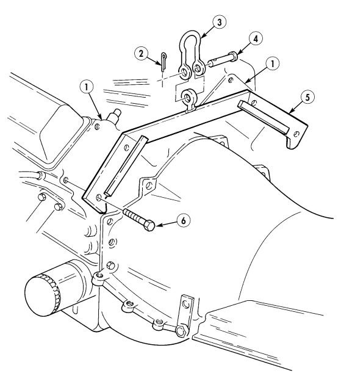

# 32-4. Frame Inspection And Repair (Cont'D)

c. Inspection 1. Visual inspection: This is the first and most critical step in deciding whether to repair or replace a damaged frame component. Factors to be noted in visual inspection: (a) Transverse tears, cracks, and breaks that extend over one tangent or radius and into 5/32 in.

(3.97 mm) of an associated tangent or radius must be replaced.

(b) Transverse tears, cracks, or breaks that extend over the tangent or radius can be repaired by welding and reinforcing, providing the crack does not extend into 5/32 in. (3.97 mm) of an associated tangent or radius.

(c) Tears, cracks, or breaks on the inside face of the frame rail that extend to within 3 in. (76.2 mm) of a bolted-on crossmember are unrepairable, and frame rail must be replaced.

(d) Tears, cracks, or breaks that extend into a hole or from a hole in the frame rails must first have a dye penetrant test performed at the hole to determine if secondary cracks exist (refer to TC 9-237). Secondary cracks are repairable. (See task c.1.)
(e) Tears, cracks, or breaks that extend into a hole or from a hole that does not have any existing secondary cracks may be repaired by welding with the use of a pre-drilled reinforcement (dutchman/fishplate) (refer to task e.).

(f) Short longitudinal cracks (up to 6 in. (15.2 cm)) or split welds can be repaired by installing a reinforcement (dutchman/fishplate) and heli-arc welding.

(g) Twisted frame rails are unrepairable; replace.

2. Measurements: Select a smooth, level surface with area 1-1/2 times the size of the vehicle.

(a) Vertical (or side view) measurement:
(1) Raise vehicle at four points until all four wheels are off the surface (para. 8-2).

#### Warning

Shim material must be under jackstand. Do not use shims on top of jackstand. Vehicle could be knocked off jackstand, causing personnel injury or damage to equipment.

(2) Measure height to bottom of frame near each jackstand. Place shim(s) under jackstands as necessary until all four heights are equal.

Measurements must be taken at identical locations on left and right frame rails. Failure to do so will result in faulty indication.

(3) Select, measure, and record frame rail height at several different positions on either frame rail.

(4) Measure and record frame rail height at corresponding points on opposite frame rail. (5) Right and left frame rail comparable points deviating more than 1/8 in. (3 mm) for each 2 ft 
(.6 m) linear distance indicate a vertically bent frame. Record deviations.

If measured frame rails are out of tolerance, notify supervisor. If frame rails are verified to be out of tolerance, vehicle will be classified as unserviceable.

(6) Lower vehicle from jackstands (para. 8-2).

# R **32-4. Frame Inspection And Repair (Cont'D)**

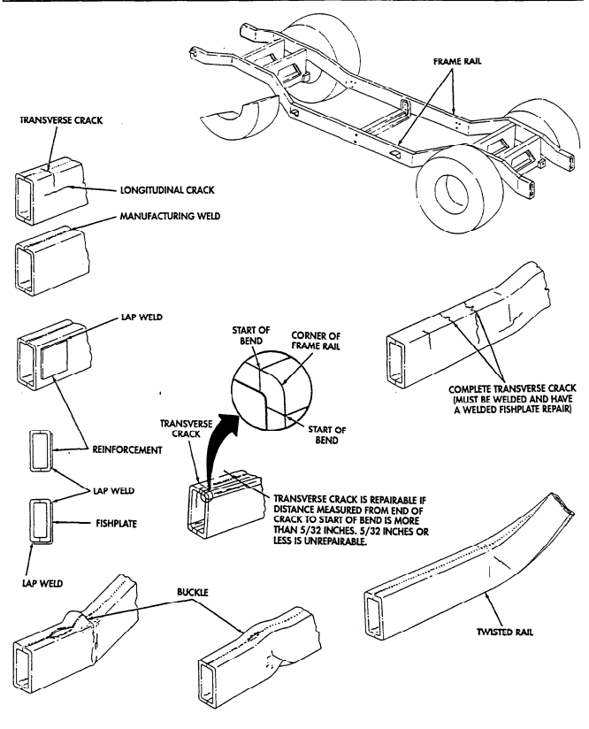

#### 32-4. Frame Inspection And Repair (Cont'D)

(b) Horizontal (bowing) measurement. 

(1) 
(2) 
Select a smooth, level surface and drive vehicle into position from a 12 fi (3.7 m> straight line of travel. Apply parking brake gently to bring vehicle to a stop. Chock wheels (TM 9-2320387-10) and release parking brake. 

Measure height of frame rails (3) and (6) at each end near center of crossmembers (21 and (4). If heights vary by more than L/8-5/16 in. (3-B mm>, raise and install jackstands to bring frame to leveling tolerance &.ep 2a (11 and (21). 

Hold a string with plumb bob (71, as shown, along frame rail (61 at intersection of crossmember (2). Mark location (8) where plumb bob (7) stops moving. Repeat for other three comers of frame. 

(3) 

l Strings used for horizontal bow measurement will remain in place until procedure 2(c), frame skew, is completed. 

l "lb ensure measurements are precise, string must be pulled tight and secured. 

Stretch string tightly on ground (5) between front and rear plumb bob (71 marks under each frame rail (3) and (6). 

Measure front (2) and rearmost (4) crossmembers to determine center point. Drop a plumb bob (71 from these points to the ground. Mark location where plumb bob (7) stops moving. 

Stretch string tightly on ground (5) between front and rear plumb bob (7) marks under crossmembers (2) and (4) to determine centerline (1). 

(4) 
(5) 
(6) 
Measure an equal distance (D) along right and left strings to select your measure points and measure from these right and left points to center string. Mark these points on string. The distance from right and left points to center string should be within l/4 in. (6 mm) of being equal. If not, one frame rail is bowed. Repeat this procedure for several other points along frame. Record deviations. 

(7) 

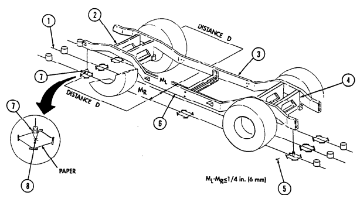

1 

# 32-4. Frame Inspection And Repair (Cont'D)

(c) Diagonal (skew) measurement.

The following two steps are alternate procedures to determine if frame rails are skewed.

(1) Measure diagonally from one point on right or left string to adjacent point on opposite side string. Compare to the opposite diagonal measurement. If these two measurements differ by more than 1/4 in. (6 mm), the two frame rails are skewed. Repeat this procedure at other sets of four measuring points to confirm skew. Record deviations.

(2) Position a string across two plumb bob points at corresponding (or end) points of frame rail string. Place a square with one leg coincident with frame rail string. Run a line or string along other side of square as far as opposite frame rail string. Measure deviation of end string and square side line at opposite frame rail string. Any deviation means the two frame rails are skewed and, consequently, the crossmembers are not at square angles to frame rails. A deviation of 1/2 in. (12.7 mm) makes a vehicle dog track and it is difficult to align wheels. Record deviations.

If measured frame rails are out of tolerance, notify supervisor. If

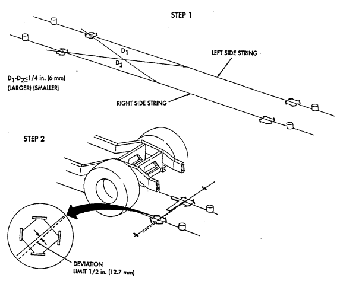 frame rails are verified to be out of tolerance, vehicle will be classified as unserviceable.

## 32-4. Frame Inspection And Repair (Cont'D)

(d) Decisions as to whether or not to repair frame will be made in accordance to the following factors: (1) Provisions of TB 750-98-23 regarding time and materials versus replacement. (2) Supply and operational considerations. (3) Appropriate facilities available. (4) Personnel skill levels. (5) Influence of other collateral repairs that may be required to return the vehicle to a serviceable condition.

(6) Buckled frame rails with both vertical and horizontal bending are extremely difficult to repair; item should be replaced.

(7) Twisted frame rails generally are unrepairable; replace item. (8) Frame rails that are bent upward, resulting in torn metal in bottom of rail, must be welded and have a welded-on fishplate repair. If fishplate would block mounting parts and bolt holes, replace frame rail.

#### C.1. Steering Gear Mounting Area Inspection Note

The inspection criteria is focused on the area surrounding the steering gear mounting tubes, commonly referred to below as bosses. They are located on the front left-hand frame rail. Tubes are welded in holes through the frame rail, accommodating the steering gear mounting bolts. Inside and outside frame rails in this area have experienced stress-cracking stemming from the steering gear mounting tubes. Stress cracks can be radial, tangential, transverse, and/or longitudinal, with some cases in the boss welds themselves.

1. Inspect steering gear mounting area as follows:
(a) Inspect all welds around bosses on inside and outside frame rails. Ensure boss welds are not undercut or undersized.

(b) Inspect surface between all bosses on inside, outside, top, and bottom of frame rails. (c) It may be necessary on suspect cracks to remove all paint. (d) Perform dye penetration test on any cracks found to locate ends of cracks and secondary cracks.

Cracks in boss welds are repairable. Secondary cracks are repairable, provided they meet criteria outlined is steps a and b.

2. Identify cracks in steering gear mounting area as follows:
(a) Tangential or radial cracks extending from/to any bosses and completely accessible are repairable if four inches long or less.

(b) Vertical and longitudinal cracks extending between any bosses are repairable if six inches long or less.

Frame rails are not repairable if they have secondary cracks that exceed the repair criteria, or cracks are present where the frame was previously repaired using a fish plate/support plate/repair plate.

(c) For any cracks found on top or bottom surface of frame rail, refer to task c.

# 32-4. Frame Inspection And Repair (Cont'D)

OUTSIDE OF FRAME RAIL

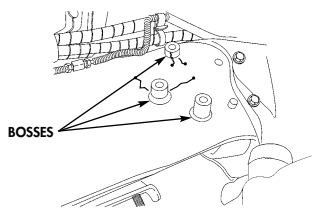

INSIDE OF FRAME RAIL

# 32-4. Frame Inspection And Repair (Cont'D)

#### D. Preparation And Materials

1. To perform a repair on the frame, a plan is needed due to the large variability of steps and methods to be employed. This plan is influenced by: (a) Bending-type repair:
(1) Suitable vehicle restraints. (2) Solid anchors for pulling or seating snatch blocks. (3) Pulling (pushing) power source, either mechanical or hydraulic.

(b) Frame rail (and possibly one or more crossmembers) replacement requires a quantity of suitable blocking material.

(c) Patches, dutchman, fishplates, and reinforcements:
(1) Bulk steel plate of grade SAE 950 or equivalent (of equal or greater thickness). (2) Scrap material of like metal from salvage or cannabilization. (3) Heli-arc welding rods of type AWS A5.20 (E 707-1) or equivalent.

(d) In critical situations, 1/4-in. (6-mm) construction grade steel angle or plate may be used.

2. Based on factors of subtasks b and c, prepare a plan to return the vehicle to mission-serviceable status.

e. Repair Procedures

#### Caution

Bulk heating of frame rails to remove bends and buckles is not an approved procedure. The strength characteristics of the metal are affected. The repair may fail, causing damage to equipment.

The repair or replacement procedure will vary with type(s) and location(s) of failure(s). For this reason, much of the repair work depends on skill of the mechanics, supply status, and operational situation. The removal/replacement of parts, bolts, and brackets affecting the repair are left to the discretion of the mechanics and will be governed by the instructions in this manual and repair parts manual.

1. Transverse tears, cracks, and breaks repairs (all welding on frame) will use reinforcements
(dutchman/fishplate), and be heli-arc type as given in TC 9-237, providing tears, cracks, or breaks are repairable (refer to task c.). (a) Stop-drill crack with 1/8-in. (3-mm) drill hole. (b) Vee-notch crack. (c) Heli-arc weld crack with approved welding rod. (d) Grind-weld flush to the surface of the rail. (e) Install reinforcement (dutchman/fishplate) and lap-weld.

2. Welded reinforcements or fishplates will not be less than 6 in. (15.2 cm) in length along frame rail. 3. All puncture holes may be repaired as follows:
(a) Heli-arc weld fill holes. (b) Grind-weld flush to surface. (c) Install reinforcement (dutchman/fishplate) and lap-weld.

# 32-4. Frame Inspection And Repair (Cont'D)

4. Bending repair:

#### Warning

When performing frame rail straightening repairs accomplished with power-driven mechanical or hydraulic means, all personnel will stand clear of vehicle. Failure or malfunction of equipment may cause injury to personnel.

(a) Do not attempt to repair a bend when:
(1) Buckling to a height of 1/4 in. (6 mm) on any one face of frame box is involved. If more than one face of frame box is involved with bending, replace part.

(2) Bending also includes more than very minor twisting. (3) Part is bent in two directions, replace part. (4) Bending involves a collapse of one or more faces of frame box at a suspension or body attachment point, replace part.

(b) When performing straightening repair with frame on vehicle:
(1) Use spreader plates or wood blocking to distribute chain force to avoid damage to frame box section.

(2) Be sure to loosen sufficient length of frame to allow frame force points to move without causing other damage.

(3) Restrain vehicle movement in both directions along line of force application.

(c) Vertical bends, except at end sections, require removal of frame rail or crossmember from vehicle. Straightening is done by using before and after dimensional measurements.

(d) Application of bulk heating to frame components is not authorized; metal properties are irreversibly degraded.

(e) At the conclusion of a bend repair, carefully inspect welds in vicinity of repair and area of force application. Any evidence of cracking or chipping of welds must be repaired. (Refer to step 1.)
(f) Spot-paint repaired areas using Chemical Agent Resistant Coating (CARC), following TM 43-0139, Painting Instructions for Field Use.

5. Front and rear wheel alignment checks (paras. 8-9 and 8-10) will be made after all frame repairs are completed.

## 32-4. Frame Inspection And Repair (Cont'D)

f. Powertrain Lift Sling Removal 1. Remove cotter pin (2), pin (4), and shackle (P/N NAS1042-14) (3) from powertrain lift sling (5). 2. Remove four shoulder bolts (P/N 11502788) (6) and powertrain lift sling (5) from cylinder heads (1).

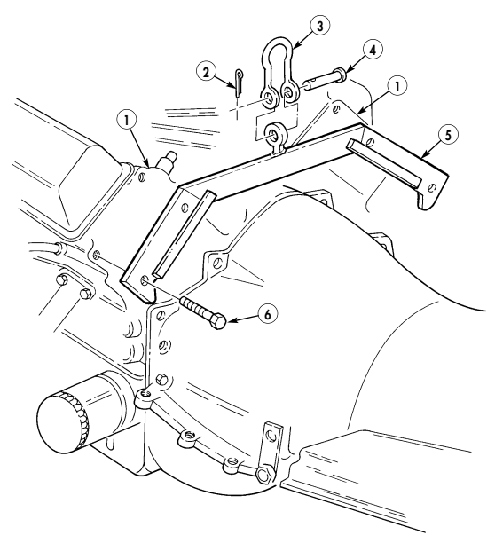

FOLLOW-ON TASKS: - Install steering gear (para. 8-20 or para. 8-20.1).

- Install oil cooler/brake line bracket (para. 3-7 or para. 3-7.1). - Connect steering shaft (para. 8-19). - Install pitman arm (para. 8-14). - Install stabilizer bar (para. 6-20 or para. 6-20.1). - Install engine left splash shield (para. 10-23 or para. 10-23.1). - Install transmission control module (para. 4-45). - Connect battery ground cables (para. 4-68).

# 32-5. Right Front Body Mount Bracket Replacement

This task covers:
INITIAL SETUP:

#### Tools

General mechanic's tool kit:
automotive (Appendix B, Item 1)
Maintenance and repair shop equipment:
automotive (Appendix B, Item 2)

#### Materials/Parts

Two locknuts (Appendix G, Item 85)
Manual References TM 9-2320-387-24P
a. Removal **b. Installation**
Equipment Condition Right front body mount removed (para. 33-3).

Maintenance Level General support a. Removal Remove two locknuts (4), washers (3), capscrews (2), washers (3), and right front body mount bracket (5) from frame rail (1). Discard locknuts (4).

#### B. Installation

Install right front body mount bracket (5) on frame rail (1) with two washers (3), capscrews (2),

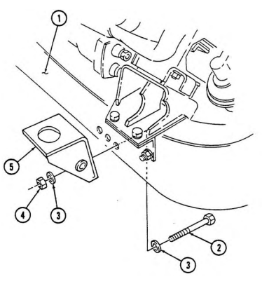 washers (3), and locknuts (4). Tighten locknuts (4) to 90 lb-ft (122 N•m).

FOLLOW-ON TASK: Install right front body mount (para. 33-3).

# 32-6. Right Intermediate Body Mount Bracket Replacement

This task covers:
INITIAL SETUP:
Tools General mechanic's tool kit:
automotive (Appendix B, Item 1)
Maintenance and repair shop equipment:
automotive (Appendix B, Item 2)
Materials/Parts Sealing compound (Appendix C, Item 71)
Manual References TM 9-2320-387-24P
a. Removal **b. Installation**
Equipment Condition Right intermediate body mount removed (para. 33-3).

Maintenance Level General support a. Removal Remove three capscrews (1), washers (2), and bracket (3) from frame rail (4).

b. Installation Apply sealing compound to three capscrews (1) and install bracket (3) on frame rail (4) with three

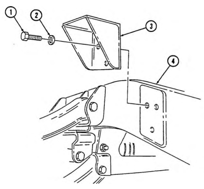 washers (2) and capscrews (1). Tighten capscrews (1) to 65-87 lb-ft (88-118 N•m).

FOLLOW-ON TASK: Install right intermediate body mount (para. 33-3).

32-12 Change 2

# 32-7. Left Intermediate Body Mount Bracket Replacement

This task covers:
INITIAL SETUP:

#### Tools

General mechanic's tool kit:
automotive (Appendix B, Item 1)
Maintenance and repair shop equipment:
automotive (Appendix B, Item 2)
Materials/Parts Three locknuts (Appendix G, Item 85)
Manual References TM 9-2320-387-24P
a. Removal **b. Installation**
Equipment Condition
•Left intermediate body mount removed 
(para. 33-3).

•Tailpipe hanger removed (para. 3-53).

Maintenance Level General support a. Removal Remove three locknuts (4), washers (3), and bracket (2) from frame rail (1). Discard locknuts (4).

b. Installation Install bracket (2) on three capscrews (5) and frame rail (1) with three washers (3) and locknuts (4).

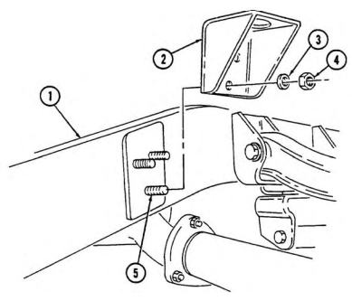 Tighten locknuts (4) to 90 lb-ft (122 N•m).

FOLLOW-ON TASKS: - Install tailpipe hanger (para. 3-53).

- Install left intermediate body mount (para. 33-3).

# Chapter 33 Body (Gs) Repair

## 33-1. Introduction

This chapter contains maintenance instructions for repair of body components at the general support maintenance level. Some subassemblies and parts must be removed before body components can be accessed. They are referenced to other paragraphs in this manual.

| overdrive carrier.       |                                                                  |
|--------------------------|------------------------------------------------------------------|
| 4.  Zero dial indicator. |                                                                  |
| 5.                       | Pull turbine shaft (5) forward and read dial indicator.          |
|                          | NOTE                                                             |
|                          | - Selective washer controlling end play is located between pump  |
|                          | cover and forward clutch housing; refer to para. 28\-11. If more |
|                          | or less washer thickness is required to bring end play within    |

## Section I. Body Maintenance 33-3. Body Mount Replacement

This task covers:
INITIAL SETUP:
Tools General mechanic's tool kit:
automotive (Appendix B, Item 1)
Maintenance and repair shop equipment:
automotive (Appendix B, Item 2)

#### Materials/Parts

Locknut (Appendix G, Item 120)
Manual References TM 9-2320-387-10 TM 9-2320-387-24P
a. Removal b. Installation

#### Equipment Condition

- Hood raised and secured (front mounts only)
(TM 9-2320-387-10).

- Left rear underbody armor removed (M1114 only)
(para. 11-37).

- Right rear underbody armor removed (M1114 only) (para. 11-39).

#### Maintenance Level

General support

- Replacement procedures for intermediate and rear body mounts are identical.

- On front body mounts, capscrew is inserted down through upper cushion for left side only.

- This procedure covers left intermediate body mount.

#### A. Removal

1. Remove locknut (2), washer (1), capscrew (7), washer (8), and spacer (9) from sleeve (4), upper cushion (5), lower cushion (10), body bracket (3), and frame bracket (6). Discard locknut (2).

2. Place jack under body reinforcements adjacent to body mount to be removed. 3. Raise body far enough to separate upper cushion (5) from lower cushion (10) and remove sleeve (4),
upper cushion (5), and lower cushion (10).

#### B. Installation

1. Install lower cushion (10), upper cushion (5), and sleeve (4) between body bracket (3) and frame bracket (6).

2. Lower body and align lower cushion (10), sleeve (4), upper cushion (5), and body bracket (3) and secure with spacer (9), washer (8), capscrew (7), washer (1), and locknut (2). Tighten locknut (2) to 90 lb-ft (122 N•m).

# 33-3. Body Mount Replacement (Cont'D)

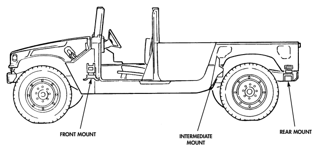

LEFT SIDE BODY MOUNT LOCATIONS

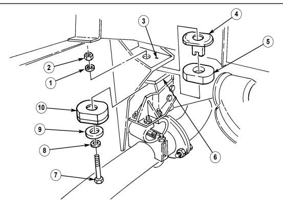

FOLLOW-ON TASKS: - Lower and secure hood (front mounts only) (TM 9-2320-387-10).

- Install right rear underbody armor (M1114 only) (para. 11-39). - Install left rear underbody armor (M1114 only) (para. 11-37).

# Section Ii. Body Repair

33-4. BODY REPAIR TASK SUMMARY

| 29\-1.                                                                                                   | INTRODUCTION                                                                                            |            |       |     |
|----------------------------------------------------------------------------------------------------------|---------------------------------------------------------------------------------------------------------|------------|-------|-----|
| This chapter contains maintenance instructions for disassembly and repair of transfer case components at | the general support maintenance level. Some subassemblies and parts must be removed before the transfer |            |       |     |
| case components can be accessed. They are referenced to other paragraphs in this manual.                 |                                                                                                         |            |       |     |
| 29\-2.                                                                                                   | TRANSFER CASE REPAIR TASK SUMMARY                                                                       |            |       |     |
| TASK                                                                                                     | PAGE                                                                                                    | PROCEDURES | PARA. | NO. |
| 29\-3.                                                                                                   | Transfer Case Repair                                                                                    | 29\-2      |       |     |

#### 33-5. General

a. The body is constructed of aluminum alloys that have been heat-treated to obtain high strength. 

Welding cannot be used to make body repairs. Heat generated in welding will reverse the heat treatment process and cause a great reduction in strength of material. 

b. The hood and engine access cover are made of fiberglass (sheet molding compound). Cracks, splits, or holes may be repaired with a glass reinforced plastic laminate repair kit, MIL-R-19907C. (Refer to para. 33-9.) 
c. Solid 3/16-m. diameter aluminum rivets are the primary method of joining body components. The rivet is inserted into a hole through two pieces of metal, and a second head is formed by manual or pneumatic impacting or by squeezing the rivet. A bucking bar is used to back up the rivet to form the rivet head. When making repairs, use blind rivets of the same size or oversize diameter with the appropriate grip length. Rivets 3/16-in. in diameter are identified in appendix F, table F-l. For other rivets that may be needed, the NSN for the rivet can be determined by cross-referencing the rivet part number to an NSN. To determine the proper rivet part number, the following part number breakdown is provided: 
MS20600 -basic MS number AD - indicates aluminum 6 - indicates rivet sleeve diameter in Y3Zin. increments (6 x l/32 = 6/32 = 3/16-in.) 
W - indicates serrated stem rivet 2 - indicates maximum grip length in 1/16-in. increments (2 x 1/16 = 2/16 = Y8-in.) 
d. Blind structural aluminum rivets of 3/16-in. diameter are used in applications where there is access from only one side of the part. Blind rivets are installed using a tool that pulls on the rivet stem causing a bulbed head to form on the back side of the part. Fastening is complete when stem breaks off. High strength is obtained in blind structural rivets by mechanically locking the remaining stem inside rivet body. 

e. Steel pull-type lockbolt fasteners of 3/16-in. and l/Pin. diameter are used where tension or high-shear loads exist. Lockbolts are two-piece unthreaded fasteners. One part is a high-strength, steel-headed, bolt-like part with serrations on its shank. The mating part is a collar which is swaged over the sex-rations causing the fastener to be locked in place. 

f. To facilitate repairs to the body, it is acceptable to replace lockbolts and rivets with 3/16-in. AN3 series and Y4in. AN4 series bolts. Do not replace lockbolts with rivets. Standard threaded fasteners should not be used as these will quickly wear the aluminum structure. Bolt lengths should be chosen so that the cylindrical portion of the bolt is bearing on all members being joined. AN3 and AN4 series bolts are identified in appendix F, table F-3. Tighten all bolts to 70-75 lb-in. (8-8.5 N-m). 

g. Fatigue strength of riveted joints and seams is increased by applying one part epoxy adhesive. This adhesive requires special material storage and metal preparation along with a low-temperature heat cycle for curing. Because of its impracticality in field repairs, epoxy adhesive will not be used. Where possible, extra rivets and thicker metal gauges should be used instead of adhesives. When making repairs, note epoxy applications. Parts may be difficult to separate, even after rivets are removed. 

#### 33-6. Inspection

a. General. The damaged area should be thoroughly cleaned and inspected to determine cause and extent of damage. Body parts should be inspected for holes, cracks, dents, distortion, or breaks. Fasteners should be inspected for breaks, stretching, looseness, cocked heads, or hole elongation. Seams, flanges, and joints should be inspected for straightness or local deformation as an indication that fasteners may have been stretched or holes elongated. It is possible for this to happen and fasteners still appear to be tight in their holes. In addition, make a thorough inspection of adjacent areas to determine if high loads have been transmitted from the damaged area to other areas. This can result in secondary damage in the form of distorted panels or seams, loosened or sheared fasteners, elongated fastener holes, and cracks. 

b. Classification. ARer extent of damage has been determined, affected parts should be classified into one of the following categories: 
l Negligible damage 

l Damage repairable by patching l Damage repairable by insertion l Damage necessitating replacement of parts

## 1 33-6. Inspection (Cont'D) 1

1. Negligible damage: Minor dents, nicks, scores, cracks, and holes in body panels which are within or are brought within reasonable limits by a simple procedure, without extensive rework, are considered negligible damage. These defects should be considered more serious if located in main structural members such as body side rails, A-pillars, or floor crossmembers rather than in body panels such as cowls or rear wheelhouses. Deep wrinkles of undetermined origin in body panels should not be classed as negligible until the source of wrinkles has been investigated and positively identified. Damage other than small dents, holes, nicks, and scratches will require repair or replacement of the part. Refer to para. 33-8-f for repair of negligible damage. 

(a) Negligible cracks. Isolated cracks less than 0.50 in. (1.27 cm) long may be classified as negligible cracks provided they are stop-drilled at each end to stop propagation. 

(b) Negligible holes. Isolated holes no more than 0.50 in. (1.27 cm) diameter, after they are made round with smooth edges are classified as negligible holes, provided the distance from the edge of the hole to the nearest line of rivets exceeds the diameter of the hole. 

(c) Negligible dents and distortion. Small dents and distorted areas may be classed as negligible if they can be repaired by hammering or bending without causing the material to crack. Heat may not be used for reforming. 

2. Damage repairable by patching: Damage beyond negligible must be repaired, or the section replaced. 

Patches can often be applied over damaged body panels provided damaged area is first trimmed to remove sharp edges or notches which could cause the start of new cracks. The patch must then be sized to overlap the area to allow for attaching rivets. Refer to para. 33.8.g for repair by patching. 

3. Damage repairable by insertion: In certain cases, patch repairs may not be desirable because of impracticality or because a flush surface is desired. In this case, damaged area must be cut away and a partial replacement of equivalent material inserted flush with adjacent areas and backed up with a doubler. 

Refer to para. 33-8.h for repair by insertion. 

4. Damage necessitating replacement of parts: Parts too badly damaged for repair, or where replacement is easier than repair, fall into this category. Repair of welded assemblies such as body mounts are also in this category. Welded assemblies cannot be re-welded without destroying strength of the part and must be replaced. 

c. Rivet Failure. Signs of rivet failure include tipped heads, looseness, and sometimes chipped or cracked paint. If heads are tipped in the same direction and rivets are loose in consecutive groups, the joint has undergone excessive load. Rivet heads which are tipped in different directions, and are not in groups may be improperly installed. With chipped or cracked paint, it may be necessary to remove paint to check true condition of rivets. Rivets subjected to critical loads but showing no distortion should be inspected if failure is suspected. The head should be drilled off, and the shank should be carefully punched out. Failure is indicated by notched rivet shank and misaligned holes. Flush rivets showing head slippage within the dimple or countersink indicate either sheet bearing or rivet shear failure and must be removed for inspection and replacement. If failure of rivets cannot be detected by visual inspection, the joint can be checked by drilling and punching out several rivets. If rivet shanks are notched, rivets should be replaced with next larger size rivets. If rivet holes show elongation due to local failure in tearing of the sheet, next larger size rivet must be used in replacement. Any deformation of the sheet around the rivet, tear-outs, or cracks between rivets usually indicates partially failed or damaged rivets. Complete repair of the joint will require replacement by next larger size rivets. Use the next .031 in. (0.79 mm) larger diameter rivet to obtain a tight joint when original hole has been enlarged. If original size rivet is installed, the rivet would not be able to carry its share of the shear load, and the joint would not meet its strength requirements. 

d. Lockbolt Failure. Lockbolts are used to withstand tension loads and high-shear loads. These fasteners are installed in their holes with an interference fit. No looseness can be permitted. Lockbolts showing evidence of being stretched, broken, loose in their holes, or having heads that do not set flat against the surface must be replaced. Guidelines used in 33-6.~ for detecting rivet failures also apply to lockbolts. 

When removing rivets, care should be taken to not enlarge rivet hole as this would require use of an oversize or larger rivet for replacement. 

#### A. **Solid** Rivet **Removal**

1. File a flat surface on the manufactured head if accessible. It is always preferable to work on manufactured head rather than the one that is bucked over, since the former will always be more symmetrical about the shank 2. Indent center of the filed surface with a center punch 3. .Drill through rivet head Be sure to use a drill slightly smaller than diameter of rivet shank to avoid making rivet hole oversized. 

4. Shear weakened rivet head off with a sharp chisel. For this operation, support back side of rivet and cut rivet head along direction of rivet line or panel edge. This will prevent distortion of the panel. 

5. Firmly support the panel from the opposite side and drive out shank with a pin punch. If rivet is unduly tight because of swelling between sheets, drill rivet shank out with an undersize drill bit. 

#### B. Blind Rivet **Removal.**

1. **File** a small flat space on rivet head. 

2. Center punch the flat space. Support rivet backside, if possible. 

3. Using a small drill bit about the size of rivet pin, drill off tapered end of pin which forms the lock. 4. Shear lock using a pin punch to drive out pin. 5. Fry out remainder of locking collar. 

6. Using a drill bit slightly smaller than rivet shank, drill almost through rivet head 7. F'ry off rivet head with a pin punch_ 
8. Tap out rivet shank with a pin punch

c. Lockbolt RemovaL 
1. Work from the head side of lockbolt, if accessible. File a small tlat space on the head if rounded. 2. Center punch the head 3. Using a hardened drill bit slightly smaller than lockbolt, drill through the head In cases where lockbolts are too hard to be drilled with available drills, grind the head down using a cutoff wheel or carbide bit in a die grinder. When using grinder method, cut the head down until it is very thin, but do not grind it completely off or touch the body part with grinding tool. 

4. Use a pin punch to pry off head or shear it off with a sharp chisel. Make sure the part is adequately supported while performing this step. 

5. Drive lockbolt out of its hole with a pin punch Care must be taken so that hole or part is not distorted. 

In cases where lockbolt head is inaccessible, the locking collar must be removed. It is best to remove collars by grinding or by splitting them axially with a sharp chisel. 

## 1 33-7. Rivet Replacement (Cont'D) 1

#### D. Rivet Hole Drilling.

1. Center punch all new rivet locations. Center punch mark must be large enough to prevent drill bit from slipping out of position, yet it must not dent the surface of the material. 'lb prevent denting, place a bucking bar behind material during punching. 

2. Make sure drill bit is the correct size (tables 33-1 and 33-2) and point is properly ground. A no. 10 drill bit is used to install standard 3/16-in. blind rivets. 

| RIVET DIAMETER   | DRILL SIZE   | DRILL DIAMETER   |
|------------------|--------------|------------------|
| (INCH)           |              | (INCH)           |
| 1/16             | #21          | 0.0670           |
| 3/32             | #41          | 0.0960           |
| 1/8              | #30          | 0.1285           |
| 5/32             | #21          | 0.1590           |
| 3/16             | #10          | 0.1910           |
| 1/4              | F            | 0.2570           |
| 5/16             | P            | 0.3230           |
| 3/8              | W            | 0.3860           |

Table 33-l. *Drill Sizes for Solid Shank Rivets.* 

| Mainshaft pilot bearing installer    | Equipment Condition _________________   |
|--------------------------------------|-----------------------------------------|
| (Appendix B, Item 86)                | Transfer case removed (para. 20\-3).    |
| Seal installer (Appendix B, Item 95) |                                         |
| Seal installer (Appendix B, Item 96) | Maintenance Level _______________       |
|                                      | General support                         |
| a. Disassembly                       |                                         |

I 

Table 33-2. Drill Sizes for Blind Rivets. 

3. Place drill bit in center mark for new rivet locations, or align drill bit with old hole when replacing old rivets with oversize rivets. When using a power drill, give the bit a few turns with fingers before starting motor. This will help assure that drill does not jump out of position when motor is started. 

l While drilling, hold drill at 90" angle to material surface. Avoid letting drill wobble, making oblong holes. 

l Avoid excessive pressure. Let drill bit do the cutting. l Do not push drill through material. 

4. Remove all burrs with a metal countersink or file. 

5. Clean away all drill chips. Care must be taken to assure that no chips are trap@ between sheets of metal. 

6. Apply sealing compound (appendix C, item 61) to hole and surrounding area. 

# 33-7. Rivet Replacement (Cont'D) 1

#### E. Hole **Countersinking.** Note

Some rivet installations in the body require that rivet head be flush with the material surface. In these instances, countersunk or flush-head rivets are used. 

1. When using countersunk rivets, rivet holes must be countersunk with a tool having a 100" taper so rivet head will fit flush with surface. 

2. When using a hand-operated countersink, the hole must be tried with a rivet so the recess will not be too deep or too shallow. It is best to use a countersink with a stop on it so depth of countersink can be controlled. Typical countersinking dimensions for blind rivets are shown in table 33-3. The minimum sheet thickness that can be machined for 100" countersink rivets is given in table 33-4. 

3. Do not remove edge of hole on blind side of joint. 

Table 33-3. Countersinking Dimensions for 100" Countersunk Blind Rivets. 

| Table 33\-4. Minimum Sheet Gauge for 100° Machine Countersink.   |       |       |       |       |       |
|------------------------------------------------------------------|-------|-------|-------|-------|-------|
| RIVET SIZE (INCH)                                                | 3/32  | 1/8   | 5/32  | 3/16  | 1/4   |
| GAUGE (INCH)                                                     | 0.040 | 0.050 | 0.064 | 0.072 | 0.072 |

| (Serial Numbers 188,975 and Above)   |
|--------------------------------------|

#### F. Blind Rivet Driving Practices And Precautions.

1. Rivets should be inspected for proper installation. The grip length of each rivet is marked on top of its head to provide positive identification. Use of proper grip length will produce a rivet installation where locking collar is flush with top surface of rivet head. Tolerance limit on flushness is 0.020 in. (0.5 mm). 

2. For proper rivet installation, it is imperative that holes be properly prepared, tools be in good working order, and rivets properly applied. When problems occur, the source of trouble could be in any of these areas. 

## 33-7. Rivet Replacement (Cont'D)

#### G. Blind Rivet Installation. Note

l Prior to installing blind rivets, the hole must be prepared, and the parts aligned and clamped firmly in place. These steps are the same as for solid riveting operations (refer to para. 33-5.d). Proper drill sizes for standard and oversized blind rivets are given in table 33-2. Countersinking dimensions and minimum sheet gauge for countersunk blind rivets are shown in tables 33-3 and 33-4. 

l It is very important that the proper length rivet is selected for each application. Rivet lengths are sized by the range of material thickness that the rivet will grip. Selecting the proper rivet length is critical because rivets can tolerate only l/16%. variation in material thickness for each particular rivet length Rivet grip lengths are called out as a dash number at the end of the manufacturer's part number. Grip lengths are determined as shown in appendix F, table F-1. 

l For double-dimpled sheets, add countersunk head height to material thickness. 

l Use rivet installation tool kit, D-lOO-ML1, and puller head adapters, if required, for all blind rivets.

Insert rivet stem into pulling head of rivet gun or adapter. 

1. 

Hold rivet gun in line with axis of rivet as accurately as possible. 

2. 

Apply a steady, firm pressure against rivet head. 

Squeeze handles of manual gun. The rivet clamping action will pull sheets together, seat rivet head, and break stem flush with head of rivet. 

3. 

4. 

## 33-8. Aluminum Repair

#### Caution

Repairs should not be made on the body using welding or heat for forming. Heat will only weaken material and cause further problems. 

a Mate&L Aluminum material used for repair should be of the same alloy and temper as original, if possible. In general, 6061-T6 aluminum alloy should be used. Material thickness must be the same or thicker. This alloy will work well for flat repairs, but is not well suited to bending because it is quite hard and cracks easily when bent sharply. When bends must be made, use softer 6061-T4 aluminum alloy and increase material thickness by at least 50 percent. As a general rule of thumb, 6061-T4 alloy should be bent with a minimum bend radius of one to two times material thickness, whereas 6061-T6 alloy requires at least three times material thickness radius for bends. In all cases, bends should be closely inspected for cracks. A 
suitable method for avoiding cracks during bending is to obtain angles that are extruded from 6061-T6 alloy or use preformed angles for repairs. Bulk aluminum is identified in appendix F, table F-2. 

b. Epoxy Adhesive. Where it is necessary to remove parts, note that epoxy adhesive is used in joints. 

Use care in parts removal to avoid unnecessary distortion. Parts should be separated by peeling them apart using a knife or chisel to start the peeling action. Before parts are reassembled, it will be necessary to remove any remaining cured epoxy from joints so parts will fit together with good, even contact. Use of epoxy requires special storage and application procedures which do not lend themselves to field repairs. For this reason, epoxy will not be used for repair. To compensate for the lack of epoxy, additional rivets should be used when making repairs to existing joints. 

## 1. Aluminum Repair (Cont'D) 1

#### C. Rivet Patterns.

1. Rivet patterns are denoted by rivet spacing and rivet edge distance. Rivet edge distance is the distance from center of rivet to nearest edge of sheet. Rivet spacing is defined as the distance from center of rivet to center of adjacent rivet. 

2. Required rivet spacing is determined by strength needed in the joint. A general feel for strength required can be obtained by inspecting rivet patterns in surrounding areas. Body repairs made using single rows of rivets should be performed using rivet spacing not greater than **1.5 in. (3.8 cm) and** not less than 0.625 in. (15.9 mm). Use 1 in. rivet spacing as a general practice for repairs. Rivet spacing used in original construction may be greater due to additional strength obtained by using epoxy adhesive. Do not use rivet edge distances less than 0.375 in. (9.5 mm). 

3. High-strength joints or large area patches may require use of double or multiple rows of rivets to obtain sufficient strength. 

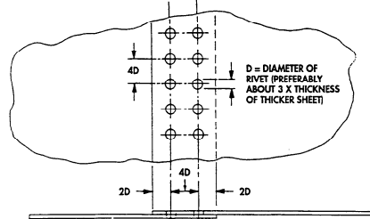

DOUBLE ROW RIVETING PATTERN 

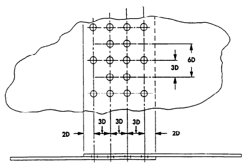

TRIPLE OR MULTIPLE ROW RIVETING PATTERN 

## 33-8. Aluminum Repair (Co&D)

4. Care must be taken to assure rivet hole patterns are transferred accurately in the case where a part with no holes is mated to one which already has rivet holes. Hole patterns may be transferred using one of the following methods: 
(a) Lay new part in place and use holes in mating part as a drill template. This requires that the new part be underneath the mating part. Care must be taken not to distort original holes. 

(b) Use removed part as a drill template by clamping the old and new parts together. This requires that the parts nest flat and rivet flange be undistorted. 

#### 13. **Joint Designs.**

1. Loads are applied through a joint to fasteners that hold it together. These loads are applied to fasteners in the form of shear loads or tension loads. If load is perpendicular to axis of fasteners, the fastener is loaded in shear. The fastener is loaded in tension when load is along axis of fastener, causing a pull on each end of fastener. 

2. Rivets (1) are designed to be loaded in shear. Do not create any new joints during repairs which 

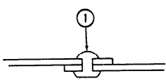

cause rivets to be used in a tension application. Bolts (2) should be used for tension applications or substituted for rivets in very high-shear load applications. 

RIVETS LOADED IN SHEAR 

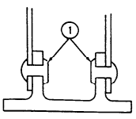

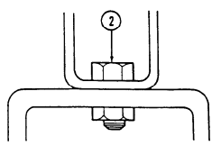

2 P b 

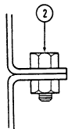

## 1 33-8. Aluminum Repair (Cont'D) 1

#### E. Repair Parts **Preparation.**

1. Repair parts or patches should be painted with epoxy primer before installation. 

2. Apply sealing compound (appendix C, item 611 to mating surfaces to prevent corrosion. 

3. Install insertion or patch as detailed in 33-8g and 33-8h. 4. Paint repaired area with epoxy primer. 5. Paint repaired area with polyurethane as required.

#### F. Repair Of Negligible **Damage.**

1. Negligible cracks as defined in para. 33-613 are repaired by drilling a small hole at each end of crack to stop crack propagation. This is called stop-drilling. Table 33-5 gives proper drill sizes for stop-drilling cracks. 

2. Negligible holes are repaired by rounding and smoothing edges of hole to alleviate stress risers caused by sharp notches. 

#### Caution

Heat will never be used to re-form parts because it greatly reduces 

#### Part Strength.

3. Small dents and distorted areas may be repaired by bending or hammering, as long as the operation does not cause materials to crack or tear. Sharp bends should not be attempted. 

|      | Maintenance Level   |
|------|---------------------|
|      | General support     |
| NOTE |                     |

Table 33-5. Stop-Drill Sizes for Negligible Cracks. 

## 33-8. Aluminum Repair (Cont'D)

g. Repair by Patching. Most body panel damage that exceeds the limits of negligible damage may be repaired by patching. This procedure involves removal of damaged area (1) and application of a patch (2) to cover the area (1). The damaged area is prepared by removal of the damage followed by rounding or smoothing of all corners and edges. This helps to assure that cracks will not spread into undamaged areas. In the case of a large crack (4), it may be desirable to stop-drill the crack (4) rather than cut out a portion of the panel (5) or structural member. Repair is completed by applying a large overlapping patch (3) over the area that was damaged. The overlap must be sufficient to allow the observance of proper rivet edge distance (6) 
(para. 33-8c). Large areas of damage are best repaired using a patch that is attached with multiple rows of rivets (para. 33-8c).

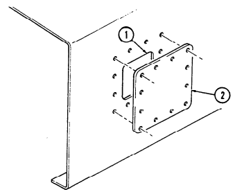

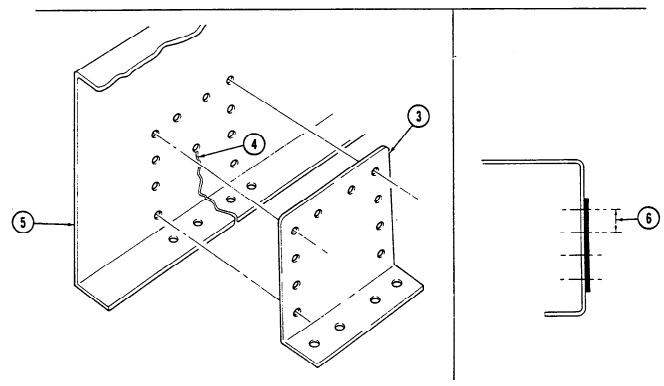

## 33-8. Aluminum Repair (Cont'D)

h.  Repair by Insertion.  For damage that is larger or more severe than a crack or hole, it is often desirable to remove damaged area (1), insert a piece of material (3) into removed area and reinforce this with a doubler (2). This is termed repair by insertion. This method or repair is typically stronger and stiffer than an added patch.

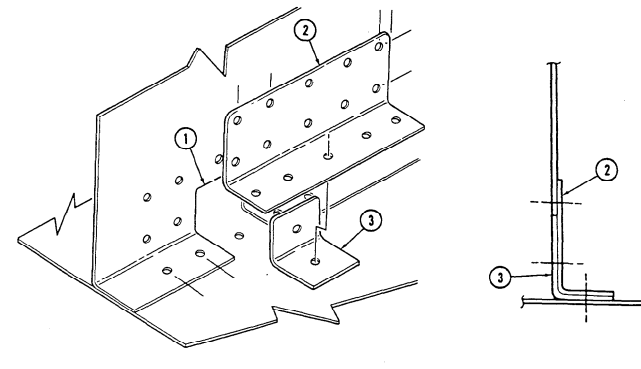

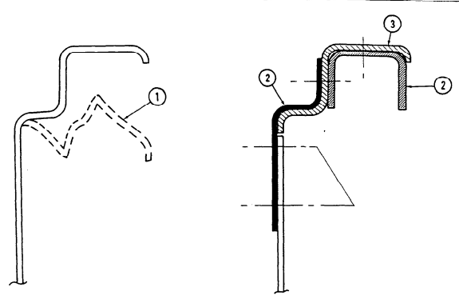

#### 33-9. Fiberglass Repair

a. General. The hood and engine access cover are made of fiberglass (sheet molding compound). Cracks, splits, or holes may be repaired with a glass-reinforced plastic laminate repair kit, ML-R-19907C, NSN 2090-00-372-6064. 

b. Inspection. 

Hood surface has a thin layer of gel coat that may appear cracked in a spider-web-like pattern due to hood flexing. No repair is required. 

1. Examine cracks to determine if they are on the surface only, or are deep breaks into material thickness. 

2. If filler material chips off at bonding flanges, appearing as cracked but not broken through, area need not be repaired. 

3. If a total penetration crack greater than one inch exists in critical areas: such as hinges (31, latches (21, or hood stop (1) areas, repair immediately. 

4. 

inches. 

If total penetration cracks exist in non-critical areas, do not repair until *size* is greater than three 5. If severe breaks develop in one area, remove fragmented material and use repair procedure 

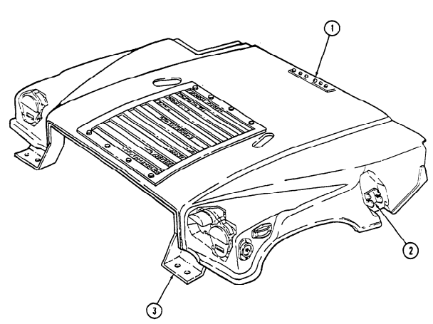

for holes. 

# 33-9. Fiberglass Repair (Cont'D)

c. Repair

Complete, detailed procedures for fiberglass repair are provided with repair kit, MIL-R-19907C.

1. Repairing cracks or splits.

#### Warning

When sanding fiberglass, personal protective equipment (respirator, goggles/shield, gloves, coveralls, etc.) must be used. Failure to do this may result in injury.

(a) Using sandpaper, remove dirt and paint 3-4 in. (8-10 cm) around area of crack. (b) Rough sand surface to which mat will be added; underside of surface if possible. Surface must be dry.

(c) Bevel edges of crack in a broad "V".

(d) Cut a piece of mat and apply to underside of surface with resin mixture. Extend patch beyond break about 2 in. (5 cm). Press patch firmly into place. Saturate patch with additional layer of resin and then allow 1 to 3 hours to cure.

(e) At the same time, cover top exposed surface with resin, allowing 1 to 3 hours to cure.

(f) For stressed areas, lightly sand first patch and add another patch layer, repeating steps 1.d and 1.e.

(g) Finish sand exposed surface. (h) Prime and paint.

2. Repairing holes.

(a) Remove damaged material. Bevel edges approximately 20° at outside edge of hole. (b) Remove dirt and paint in area of hole extending away 3-4 in. (8-10 cm), using sandpaper.

(c) Rough sand top and underside of surface to which mats will be added.

(d) Cut two same sized pieces of fiberglass mat that will extend past edge of hole about 2 in. (5 cm).

(e) Coat both top and underside surface and saturate both pieces of mat with the resin mixture.

(f) When tacky, apply one mat to the inner surface and one to the outer surface. Press the two patches together.

(g) Allow 1 to 3 hours to cure. Additional coats of resin may be added if necessary for appearance purposes.

Sand lightly between coats.

(h) Finish sand exposed surface.

(i) Prime and paint.

## 33-10. Floor Panel Repair

The M1113 floor panels that are damaged can be repaired by using sheet metal sections cut to the required size and installed using the following procedures. Each repair section can be installed independent of each other. Refer to paras. 33-5 through 33-8 for general repair criteria, inserting rivets, drilling, and repair of aluminum.

The vehicle floor is divided into the four areas defined below.

- AREA I - Left Front Floor Panel. Refer to para. 33-11 for repair of this panel. - AREA II - Left Rear Floor Panel. Refer to para. 33-12 for repair of this panel. - AREA III - Right Front Floor Panel. Refer to para. 33-13 for repair of this panel.

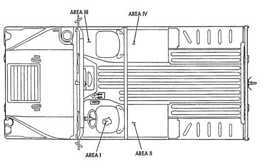 - AREA IV - Right Rear Floor Panel. Refer to para. 33-14 for repair of this panel.

# 33-11. Left Front Floor Panel Repair

This task covers:
d. Metal Strip A and Insert Panel Assembly i. Insert Panel and Left Front Floor Panel Installation e. Metal Strip C and Insert Panel Assembly

Applicable Models M1113 Tools General mechanic's tool kit:
automotive (Appendix B, Item 1)
Riveter tool kit (Appendix B, Item 123) Shop equipment, automotive maintenance and repair: field maintenance, wheeled vehicles, Post, Camp and Station, set A (Appendix B, Item 10)
Manual References TM 9-2320-387-24P TM 43-0139 a. Left Front Insert Panel Fabrication **f. Metal Strip D and Insert Panel Assembly** b. Metal Strips Fabrication **g. Metal Strip B and Insert Panel Assembly** c. Left Front Floor Panel Removal h. Left Front Floor Panel and Insert Panel Drilling

#### Materials/Parts

Eighty-eight rivets (Appendix G, Item 262) Twenty rivets (Appendix G, Item 262.1) Sheet metal (Appendix G, Item 314) Adhesive (Appendix C, Item 2.1) Adhesive sealant (Appendix C, Item 7.1)

#### Equipment Condition

- Fire extinguisher mount bracket removed
(para. 10-53).

- Driver's seat assembly removed 
(para. 10-40).

- Left floor insulation removed (para 10-31).

Maintenance Level General Support a. Left Front Insert Panel Fabrication

All dimensions are in inches. For metric conversion, see chart.

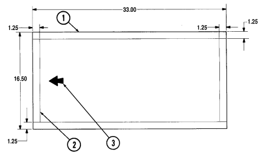

1. Cut insert panel (1) from sheet metal as shown and mark four reference lines (2) and directional arrow (3) on insert panel (1).

| METRIC CONVERSION   |           |
|---------------------|-----------|
| 1.25 IN.            | 31.75 MM  |
| 16.50 IN.           | 419.10 MM |
| 33.00 IN.           | 838.20 MM |

## 33-11. Left Front Floor Panel Repair (Cont'D)

2. Locate, mark, and drill six 0.218-in. (5.537-mm) diameter holes through insert panel (1). 3. Fabricate drain hole (2) in insert panel (1). 4. Cut and remove 0.180-in. (4.572-mm) of material from insert panel (1), remove all burrs, and round sharp edges on insert panel (1).

b. Metal Strips Fabrication 1. Cut metal strip (4) from sheet metal and mark two reference lines (3), centerline (5), directional arrow (6), and letter A on metal strip (4).

2. Locate, mark, and drill twenty-three 0.187-in. (4.75-mm) diameter holes in metal strip A (4).

| METRIC CONVERSION   |           |
|---------------------|-----------|
| 0.125 IN.           | 3.175 MM  |
| 0.18 IN.            | 4.57 MM   |
| 0.60 IN.            | 15.24 MM  |
| 0.75 IN.            | 19.05 MM  |
| 1.00 IN.            | 25.40 MM  |
| 1.40 IN.            | 35.56 MM  |
| 1.80 IN.            | 45.72 MM  |
| 1.85 IN:            | 46.99 MM  |
| 1.90 IN.            | 48.26 MM  |
| 2.00 IN.            | 50.80 MM  |
| 2.125 IN.           | 53.98 MM  |
| 2.13 IN.            | 54.10 MM  |
| 2.28 IN.            | 57.91 MM  |
| 2.50 IN.            | 63.50 MM  |
| 4.87 IN.            | 123.70 MM |
| 5.13 IN.            | 130.30 MM |
| 5.90 IN.            | 149.86 MM |
| 6.00 IN.            | 152.40 MM |
| 6.90 IN.            | 175.26 MM |
| 7.71 IN.            | 195.83 MM |
| 7.92 IN.            | 201.17 MM |
| 10.80 IN.           | 274.32 MM |
| 15.47 IN.           | 392.94 MM |
| 25.50 IN.           | 647.70 MM |
| 35.50 IN.           | 901.70 MM |

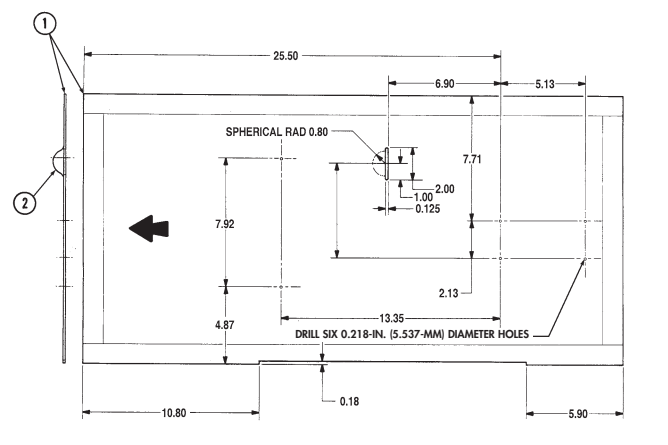

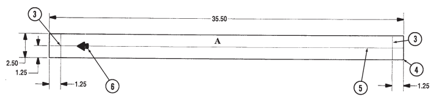

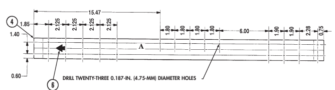

# 33-11. Left Front Floor Panel Repair (Cont'D)

## 33-11. Left Front Floor Panel Repair (Cont'D)

3. Cut metal strip (2) from sheet metal, and mark two reference lines (1), centerline (3), directional arrow (4), and letter B on metal strip (2).

4. Locate, mark, and drill twenty-six 0.187-in. (4.75-mm) diameter holes through metal strip B (2). 5. Cut two metal strips (5) from sheet metal, and mark centerlines (7), directional arrows (6), and letters C and D on metal strips (5).

6. Locate, mark, and drill seven 0.187-in. (4.75-mm) diameter holes through metal strip C (5). 7. Locate, mark, and drill fourteen 0.187-in. (4.75-mm) diameter holes through metal strip D (5).

| METRIC CONVERSION   |           |
|---------------------|-----------|
| 0.60 IN.            | 15.24 MM  |
| 0.75 IN.            | 19.05 MM  |
| 1.25 IN.            | 31.75 MM  |
| 1.40 IN.            | 35.56 MM  |
| 1.85 IN.            | 46.99 MM  |
| 2.00 IN.            | 50.80 MM  |
| 2.125 IN.           | 53.98 MM  |
| 3.00 IN.            | 76.20 MM  |
| 5.40 IN.            | 137.16 MM |
| 6.00 IN.            | 152.40 MM |
| 35.50 IN.           | 901.70 MM |

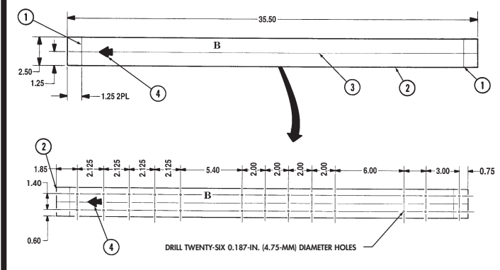

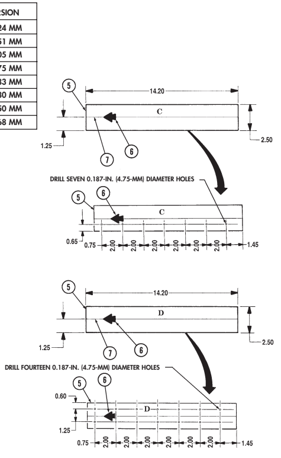

# 33-11. Left Front Floor Panel Repair (Cont'D) 33-11. Left Front Floor Panel Repair (Cont'D)

c. Left Front Floor Panel Removal 1. Using a 0.187-in. (4.75-mm) drill bit, remove thirty-two rivets (3) from left front seat supports (2)
and left front floor panel (1).

2. Position insert panel (5), with arrow facing down and toward front of vehicle, to underside of left front floor panel (4) and align mount holes (6).

3. Using insert panel (5) as a template, scribe an outline (7) on left front floor panel (4).

NOTE
Do not cut through front seat support when removing left front floor panel section.

4. Using scribed outline marked in step 3, cut and remove floor panel (4). 5. Remove sharp edges and burrs on left front floor panel (1). 6. Remove adhesive residue and clean left front seat support (8).

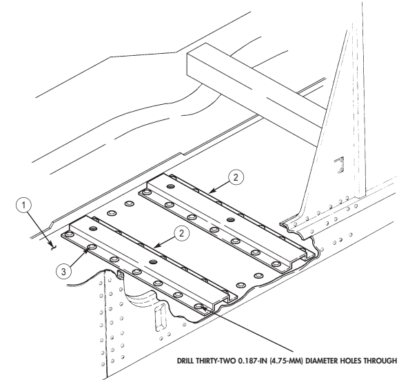

33-24 Change 1

# 33-11. Left Front Floor Panel Repair (Cont'D)

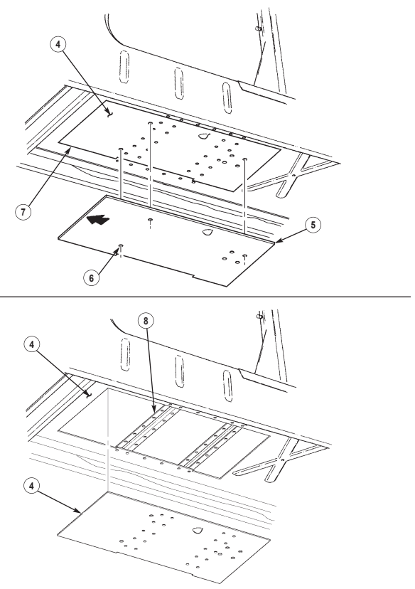

## 33-11. Left Front Floor Panel Repair (Cont'D)

7. Position insert panel (2), with arrow facing down and toward front of vehicle, to underside of left front floor panel (1).

8. Obtain a minimum clearance of 0.10-in. (2.54-mm) between edges of insert panel (2) and left front floor panel (1).

9. Remove insert panel (2).

#### D. Metal Strip A And Insert Panel Assembly

1. Position metal strip A (3), with arrow facing up and left, on insert panel (2). Align reference lines
(5) and (4) with edges of metal strip A (3).

2. Using metal strip A (3) as a template, locate, mark, and drill thirteen 0.187-in.(4.75-mm)
diameter holes through insert panel (2).

3. Apply approximately 0.125-in. (3.175-mm) thickness of adhesive sealant to shaded surface of insert panel (2) and metal strip A (3).

4. Install metal strip A (3) on insert panel (2) with thirteen rivets (6).

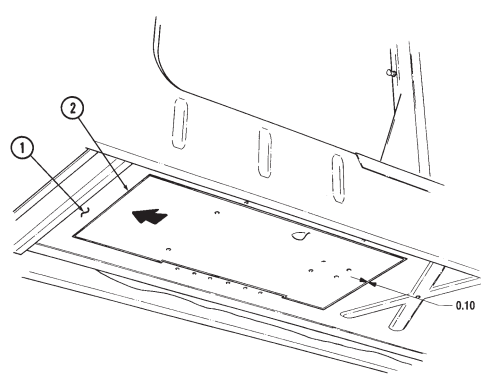 5. Remove adhesive residue and clean edges of metal strip A (3) and insert panel (2).

33-11. LEFT FRONT FLOOR PANEL REPAIR (Cont'd)

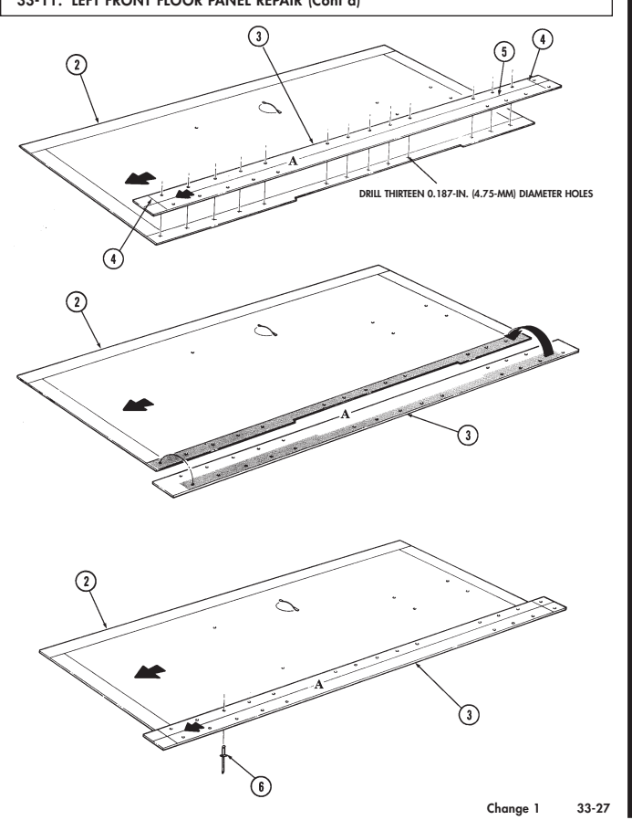

## 33-11. Left Front Floor Panel Repair (Cont'D)

e. Metal Strip C and Insert Panel Assembly 1. Position metal strip C (1), with arrow facing up and toward metal strip A (4), on insert panel (2).

Align reference lines (3).

2. Using metal strip C (1) as a template, locate, mark, and drill seven 0.187-in. (4.75-mm) diameter holes in insert panel (2). Remove metal strip C (1).

3. Apply approximately 0.125-in. (3.175-mm) thickness of adhesive sealant to shaded surface of insert panel (2) and metal strip C (1).

4. Position metal strip C (1) on insert panel (2) and install with seven rivets (5).

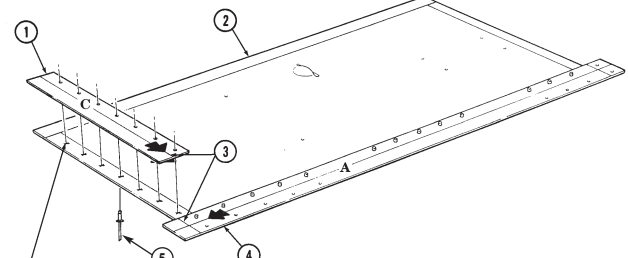 5. Remove any adhesive residue and clean edges of metal strip C (1) and insert panel (2).

5

DRILL SEVEN 0.187-IN. (4.75-MM) DIAMETER HOLES

# 33-11. Left Front Floor Panel Repair (Cont'D)

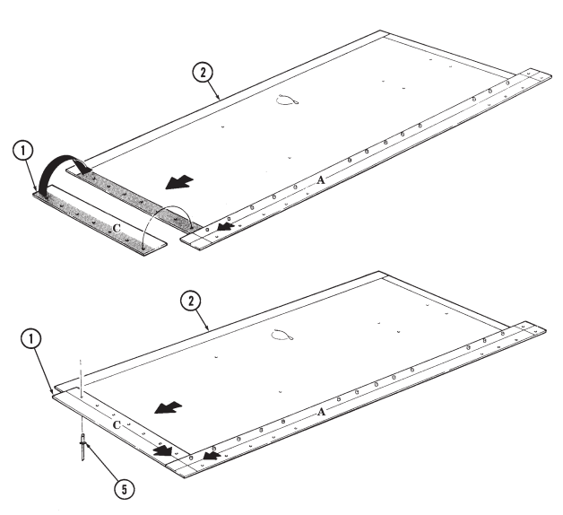

## 33-11. Left Front Floor Panel Repair (Cont'D)

f. Metal Strip D and Insert Panel Assembly 1. Position metal strip D (2), with arrow facing up and toward metal strip A (4), on insert panel (1).

Align reference lines (3).

2. Using metal strip D (2) as a template, locate, mark, and drill seven 0.187-in. (4.75-mm) diameter holes through insert panel (1).

3. Apply approximately 0.125-in. (3.175-mm) thickness of adhesive sealant to shaded mating surface of insert panel (1) and metal strip D (2).

4. Position metal strip D (2) on insert panel (1) and install with seven rivets (5). 5. Remove any adhesive residue and clean edges of metal strip D (2) and insert panel (1).

g. Metal Strip B and Insert Panel Assembly 1. Position metal strip B (6), with arrow facing up and toward metal strip C (8), on insert panel (1). Align reference line (7) with edge of metal strip B (6).

2. Using metal strip B (6) as a template, locate, mark, and drill twelve 0.187-in. (4.75-mm) diameter holes through insert panel (1).

3. Apply approximately 0.125-in. (3.175-mm) thickness of adhesive sealant to shaded surface of insert panel (1) and metal strip B (6).

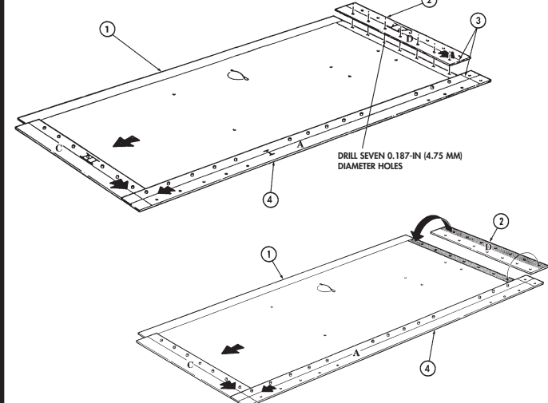

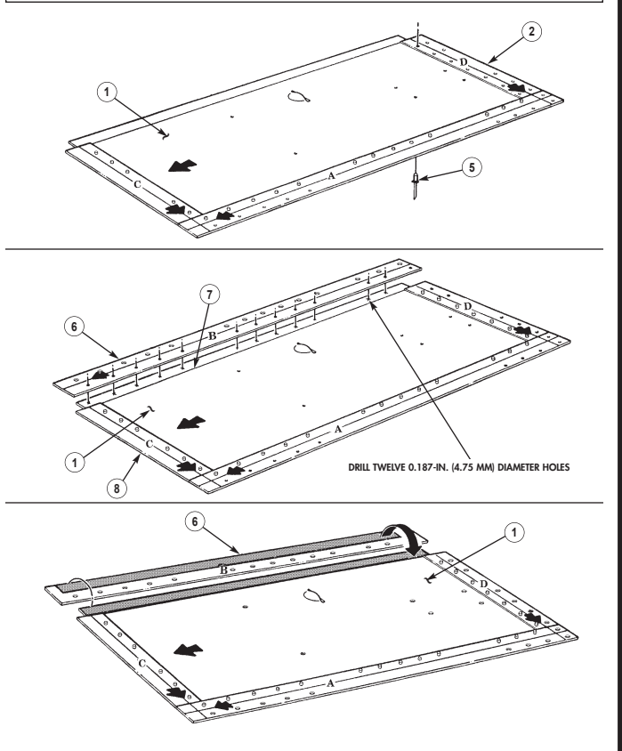

# 33-11. Left Front Floor Panel Repair (Cont'D)

Change 1

## 33-11. Left Front Floor Panel Repair (Cont'D)

4. Position metal strip B (1) on insert panel (2) and install with twelve rivets (3). 5. Remove any adhesive residue and clean edges of metal strip B (1) and insert panel (2).

h. Left Front Floor Panel and Insert Panel Drilling 1. Locate, mark, and drill eleven 0.187-in. (4.75-mm) diameter holes through left front floor panel (4). 2. Position insert panel (2) on underside of left front floor panel (4), with arrow facing down and toward front of vehicle.

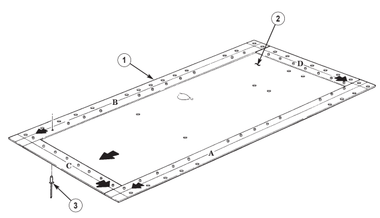

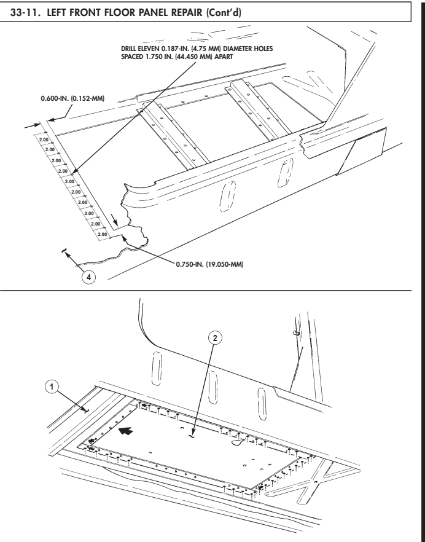

## 33-11. Left Front Floor Panel Repair (Cont'D)

3. Using left front seat supports (1) as a template, locate and mark twenty-eight 0.187-in. (4.75-mm) 
diameter holes (3) on insert panel (2).

4. Using left front floor panel (4) as a template, mark twelve hole locations (5) on insert panel (2). 5. Using insert panel (2) as a template, mark thirty-one hole locations (5) on underside of left front floor panel (4). Remove insert panel (2).

6. Drill thirty-one 0.187-in. (4.75-mm) diameter holes marked in step 5 through underside of left front floor panel (4).

7. Drill forty 0.187-in. (4.75-mm) diameter holes marked in steps 3 and 4 through insert panel (2).

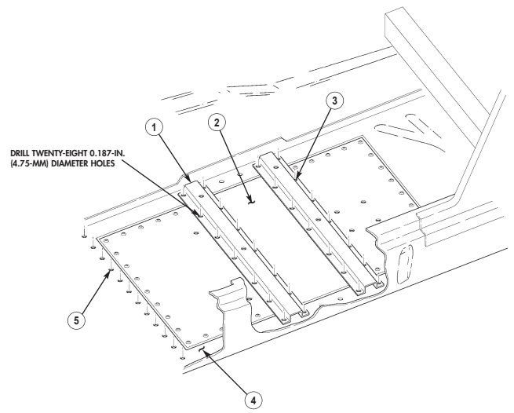

# 33-11. Left Front Floor Panel Repair (Cont'D)

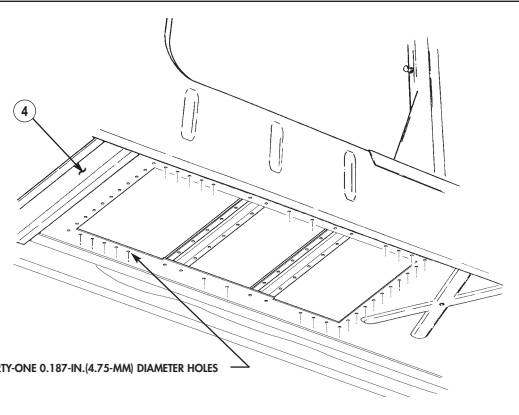

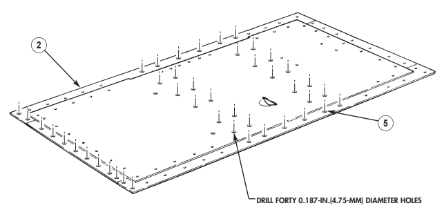

## 33-11. Left Front Floor Panel Repair (Cont'D)

i. Insert Panel and Left Front Floor Panel Installation 1. Apply approximately 0.125-in. (3.175-mm) thickness of adhesive sealent to outer shaded area (2) of insert panel (1).

2. Apply adhesive sealant to inner shaded area (3) on underside of left front seat supports (5). 3. Apply approximately 0.125-in. (3.175-mm) thickness of adhesive sealent to inner shaded area (4) of left front panel (6) underside.

4. Position insert panel (1) to underside of left front floor panel (6), with arrow facing down and toward front of vehicle.

5. Install insert panel (1) on underside of left front floor panel (6) and left front seat support (5) with twelve rivets (8) and eight rivets (7).

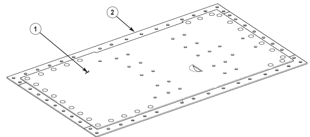

# 33-11. Left Front Floor Panel Repair (Cont'D)

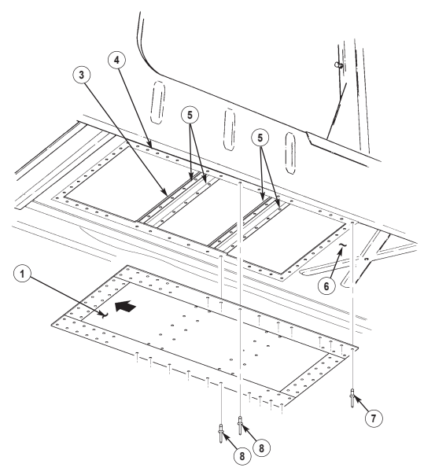

## 33-11. Left Front Floor Panel Repair (Cont'D)

6. Secure insert panel (4) to left front seat supports (3) with twenty rivets (1). 7. Secure insert panel (4) to left front floor panel (2) with twenty-nine rivets (1). 8. Spot-paint insert panel (4), left front seat supports (3), and left front floor panel (2) (TM 43-0139).

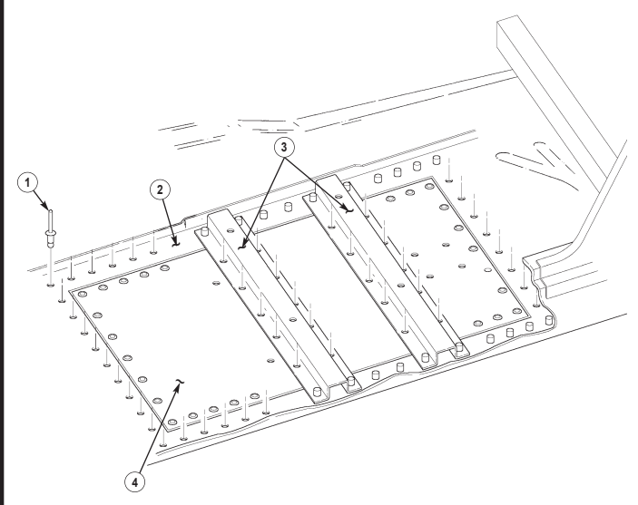

FOLLOW-ON TASKS: - Install left floor insulation (para. 10-31).

- Install driver's seat assembly (para. 10-40). - Install fire extinguisher mount bracket (para. 10-53).

## 33-12. Left Rear Floor Panel Repair

This Task Covers:
d. Left Rear Floor Panel Removal j. Metal Strip F and Insert Panel Assembly e. Reinforcement Strip A and Insert Panel Assembly k. Left Rear Floor Panel and Insert Panel Drilling

#### Initial Setup: Applicable Models

| T   | ools   |
|-----|--------|

| Materials/Parts   |
|-------------------|

General mechanic's tool kit:
automotive (Appendix B, Item 1)
Riveter tool kit (Appendix B, Item 123) Shop equipment, automotive maintenance and repair: field maintenance, wheeled vehicles, Post, Camp and Station, set A (Appendix B, Item 10)

#### Manual References

TM 9-2320-287-24P TM 43-0139

a. Left Rear Insert Panel Fabrication **g. Metal Strip C and Insert Panel Assembly** b. Reinforcement Strips Fabrication h. Metal Strip D and Insert Panel Assembly c. Metal Strips Fabrication i. Metal Strip E and Insert Panel Assembly

f. Reinforcement Strip B and Insert Panel Assembly l. Insert Panel and Left Rear Floor Panel Insulation

#### Materials/Parts

Ninety rivets (Appendix G, Item 262) Thirty-two rivets (Appendix G, Item 262.1) Sheet metal (Appendix G, Item 314) Adhesive (Appendix C, Item 2.1) Adhesive sealant (Appendix C, Item 7.1)

#### Equipment Condition

- Driver's seat assembly removed 
(para. 10-40).

- Transmission control model (TCM) removed
(para. 4-45).

- Left floor insulation removed
(para. 10-31).

#### Maintenance Level

General Support

# 33-12. Left Rear Floor Panel Repair (Cont'D)

All dimensions are in inches. For metric conversion, see chart.

a. Left Rear Insert Panel Fabrication 1. Cut insert panel (1) from sheet metal as shown, and mark six reference lines (2) and directional arrow (3) on insert panel (1).

2. Locate, mark, and drill two 0.312-in. (7.925-mm) diameter holes through insert panel (1). 3. Locate, mark, and drill a 1.000-in. (25.400-mm) diameter hole through insert panel (1). 4. Fabricate two drain holes (4) in insert panel (1). 5. Bend insert panel (1) 1.50-in. (38.10-mm). 6. Remove all burrs and round all sharp edges on insert panel (1).

| METRIC CONVERSION   |           |
|---------------------|-----------|
| 1.25 IN.            | 31.75 MM  |
| 3.00 IN.            | 76.20 MM  |
| 8.00 IN.            | 203.20 MM |
| 16.50 IN.           | 419.10 MM |
| 30.00 IN.           | 762.00 MM |

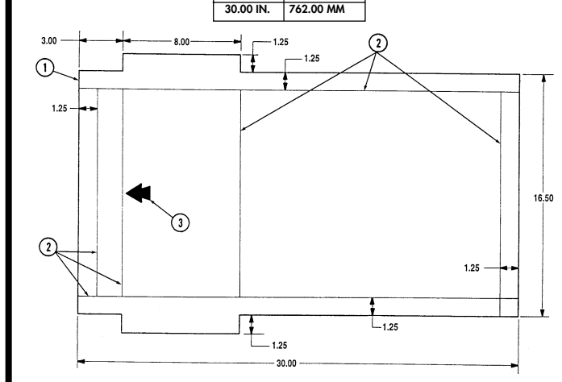

# 33-12. Left Rear Floor Panel Repair (Cont'D)

| METRIC CONVERSION   |           |
|---------------------|-----------|
| 2.00 IN.            | 50.80 MM  |
| 2.50 IN.            | 63.50 MM  |
| 7.25 IN.            | 184.15 MM |
| 7.75 IN.            | 196.85 MM |
| 8.00 IN.            | 203.20 MM |
| 8.25 IN.            | 209.55 MM |

| METRIC CONVERSION   |          |
|---------------------|----------|
| 0.125 IN.           | 3.175 MM |
| 0.80 IN.            | 20.32 MM |
| 1.00 IN.            | 25.40 MM |
| 1.20 IN.            | 30.48 MM |
| 1.50 IN.            | 38.10 MM |

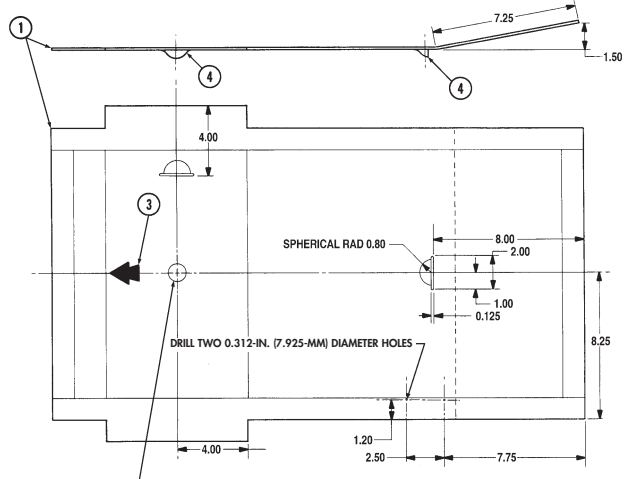

DRILL 1.000-IN. (25.400-MM) DIAMETER HOLE

## 33-12. Left Rear Floor Panel Repair (Cont'D)

b. Reinforcement Strips Fabrication 1. Cut reinforcement strip (1) from sheet metal, and mark four reference lines (2), centerline (3), and letter A on reinforcement strip (1).

2. Locate, mark, and drill fourteen 0.187-in. (4.75-mm) diameter holes and one 0.750-in. (19.05-mm)
diameter hole through reinforcement strip A (1).

3. Remove all burrs and round all sharp edges on reinforcement strip A (1).

| METRIC CONVERSION   |           |
|---------------------|-----------|
| 0.125 IN.           | 3.175 MM  |
| 0.75 IN.            | 19.05 MM  |
| 1.50 IN.            | 38.10 MM  |
| 2.00 IN.            | 50.80 MM  |
| 3.00 IN.            | 76.20 MM  |
| 4.00 IN.            | 101.60 MM |
| 8.00 IN.            | 203.20 MM |
| 14.00 IN.           | 355.60 MM |

DRILL 0.750-IN. (19.050-MM) DIAMETER HOLE

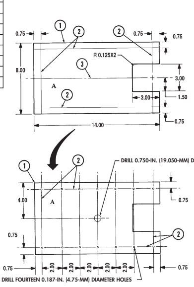

## 33-12. Left Rear Floor Panel Repair (Cont'D)

4. Cut reinforcement strip (4) from sheet metal, and mark four reference lines (5), centerline (6), and letter B on reinforcement strip (4).

5. Locate, mark, and drill eighteen 0.187-in. (4.75-mm) diameter holes and one 0.500-in.

(12.700-mm) diameter hole through reinforcement strip B (4).

6. Remove all burrs and round all sharp edges of reinforcement strip B (4).

| METRIC CONVERSION   |           |
|---------------------|-----------|
| 0.125 IN.           | 3.175 MM  |
| 0.75 IN.            | 19.05 MM  |
| 1.50 IN.            | 38.10 MM  |
| 2.00 IN.            | 50.80 MM  |
| 2.25 IN.            | 57.15 MM  |
| 3.00 IN.            | 76.20 MM  |
| 4.00 IN.            | 101.60 MM |
| 6.00 IN.            | 152.40 MM |
| 14.00 IN.           | 355.60 MM |

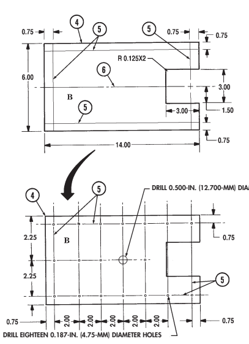

# 33-12. Left Rear Floor Panel Repair (Cont'D)

#### C. Metal Strips Fabrication

1. Cut two metal strips (2) from sheet metal, and mark two reference lines (1), centerline (3), and directional arrow (4). Identify two metal strips (2) as C and D.

2. Locate, mark, and drill twenty-four 0.187-in. (4.75-mm) diameter holes through metal strips C 
and D (2).

3. Bend metal strips C and D (2) 1.50 in. (38.10-mm).

| CAUTION   |
|-----------|

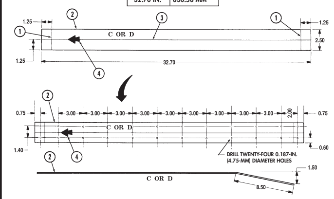

## 33-12. Left Rear Floor Panel Repair (Cont'D)

and F (5).

4. Cut two metal strips (5) from sheet metal, and mark centerline (7), and directional arrow (6).

Identify metal strips (5) as E and F.

5. Locate, mark, and drill fourteen 0.187-in. (4.75-mm) diameter holes through metal strips E

| Materials/Parts     |
|---------------------|
| Equipment Condition |
| (para. 10\-53).     |

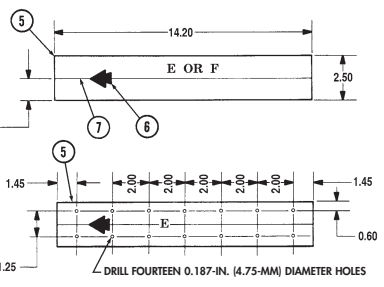

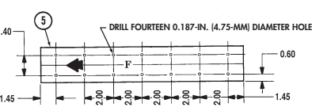

## 33-12. Left Rear Floor Panel Repair (Cont'D)

as G and H.

6. Cut two metal strips (1) from sheet metal, and mark centerline (2). Identify metal strips (1)
7. Locate, mark, and drill fourteen 0.187-in. (4.75-mm) diameter holes through metal strips G
and H (1).

| METRIC CONVERSION   |          |
|---------------------|----------|
| 0.125 IN.           | 3.175 MM |
| 0.18 IN.            | 4.57 MM  |
| 0.60 IN.            | 15.24 MM |

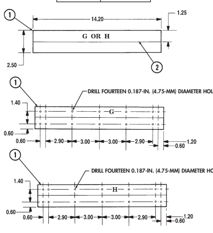

## 33-12. Left Rear Floor Panel Repair (Cont'D)

d. Left Rear Floor Panel Removal 1. Position insert panel (4), with arrow facing down and toward front of vehicle, to underside of left rear floor panel (3) and align mount hole (5).

2. Using insert panel (4) as a template, scribe outline (6) on left rear floor panel (3).

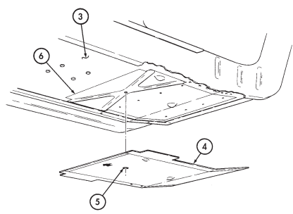

## 33-12. Left Rear Floor Panel Repair (Cont'D)

3. Using scribed outline marked in step 2, cut and remove floor panel (2) from left rear floor panel (1). 4. Remove sharp edges and burrs from left rear floor panel (1). 5. Position insert panel (3), with arrow facing down and toward front of vehicle, on underside of left rear floor panel (1).

6. Obtain a minimum clearance of 0.10-in. (2.54-mm) between edges of insert panel (3) and left rear floor panel (1).

7. Remove insert panel (3). 8. Locate and mark two reference lines (4) on left rear floor panel (1).

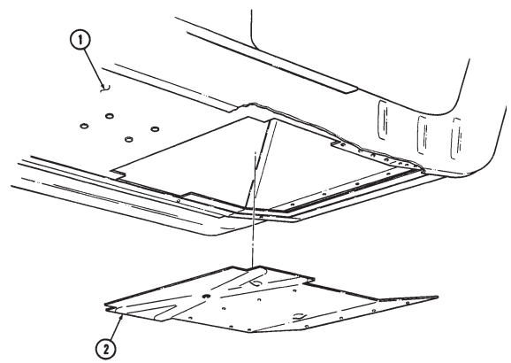

# 33-12. Left Rear Floor Panel Repair (Cont'D)

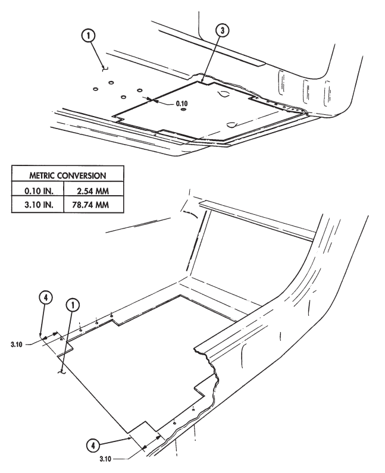

## 33-12. Left Rear Floor Panel Repair (Cont'D)

e. Reinforcement Strip A and Insert Panel Assembly 1. Position reinforcement strip A (2) on insert panel (1). Align reference lines (3) with edges of reinforcement strip A (2).

2. Using reinforcement strip A (2) as a template, locate, mark, and drill fourteen 0.187-in. (4.75-mm)
diameter holes through insert panel (1). Remove reinforcement strip A (2).

3. Apply approximately 0.125-in. (3.175-mm) thickness of adhesive sealant to shaded surfaces of insert panel (1) and reinforcement strip A (2).

4. Position reinforcement strip A (2) on insert panel (1) and install with fourteen rivets (4). 5. Remove any adhesive residue and clean edges on reinforcement strip A (2) and insert panel (1).

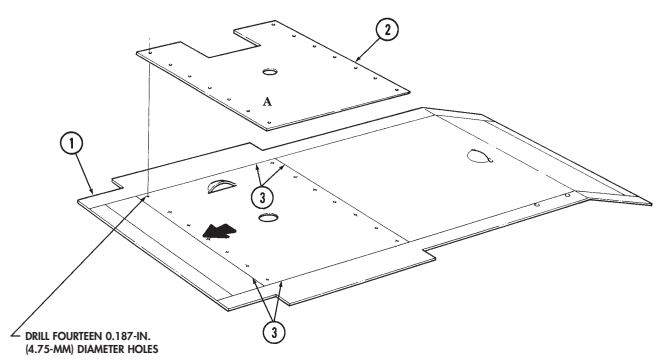

33-12. LEFT REAR FLOOR PANEL REPAIR (Cont'd)

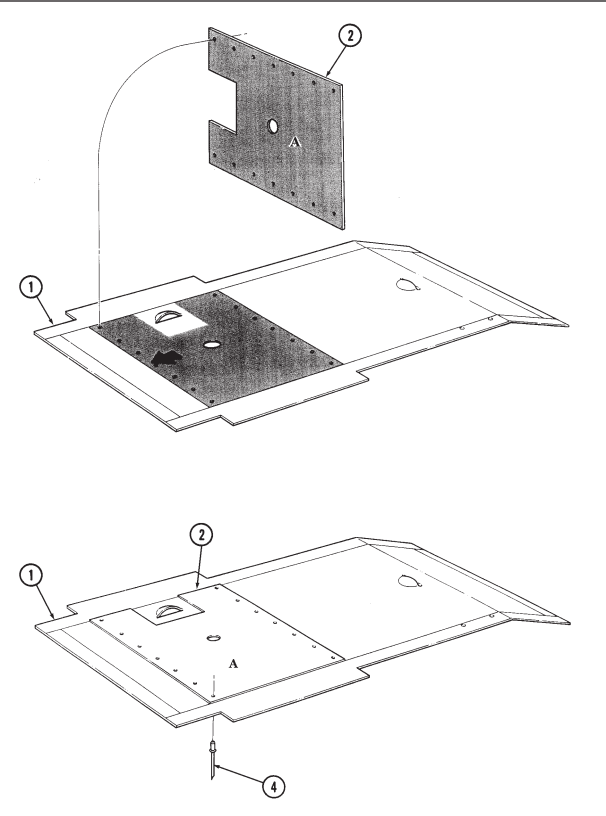

## 33-12. Left Rear Floor Panel Repair (Cont'D)

f. Reinforcement Strip B and Insert Panel Assembly 1. Position reinforcement strip B (1) on insert panel (2), and align reference lines (3) with edges of reinforcement strip B (1).

2. Using reinforcement strip B (1) as a template, locate, mark, and drill eighteen 0.187-in. (4.75-mm)
diameter holes through reinforcement strip A (4) and insert panel (2).

3. Apply approximately 0.125-in. (3.175-mm) thickness of adhesive sealant to shaded surface of reinforcement strip A (4) and reinforcement strip B (1).

4. Position reinforcement strip B (1) on reinforcement strip A (4) and install with eighteen rivets (5). 5. Remove any adhesive residue and clean edges of reinforcement strip B (1), reinforcement strip A (4),
and insert panel (2).

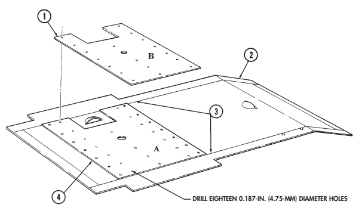

# 33-12. Left Rear Floor Panel Repair (Cont'D)

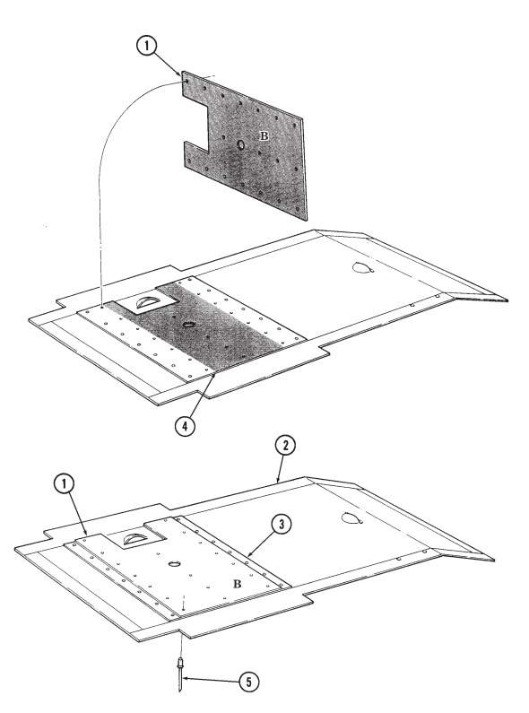

## 33-12. Left Rear Floor Panel Repair (Cont'D)

g. Metal Strip C and Insert Panel Assembly 1. Position metal strip C (2), with arrow facing up and toward left, on insert panel (1). Align reference lines (3) with edges of insert panel (1).

2. Using metal strip C (2) as a template, locate, mark, and drill ten 0.187-in. (4.75-mm) diameter holes through insert panel (1).

3. Apply approximately 0.125-in. (3.175-mm) thickness of adhesive sealant to shaded surface of insert panel (1) and metal strip C (2).

4. Position metal strip C (2) on insert panel (1) and install with ten rivets (4). 5. Remove any adhesive residue and clean edges on metal strip C (2) and insert panel (1).

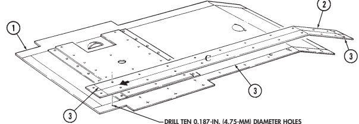

# 33-12. Left Rear Floor Panel Repair (Cont'D)

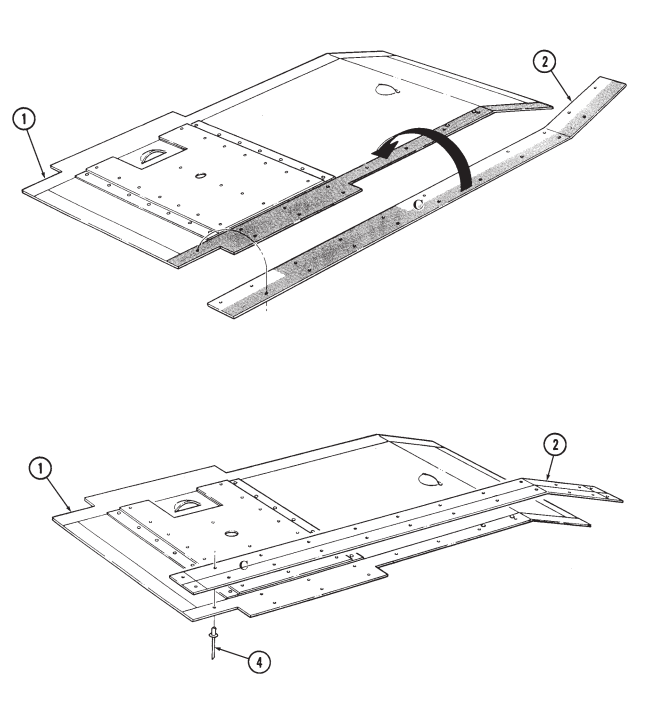

## 33-12. Left Rear Floor Panel Repair (Cont'D)

h. Metal Strip D and Insert Panel Assembly 1. Position metal strip D (1), with arrow facing up and toward metal strip C (4), on insert panel (2).

Align reference lines (3).

2. Using metal strip D (1) as a template, locate, mark, and drill seven 0.187-in. (4.75-mm) diameter holes through insert panel (2). Remove metal strip D (1).

3. Apply approximately 0.125-in. (3.175-mm) thickness of adhesive sealant to shaded surface of insert panel (2) and metal strip D (1).

4. Position metal strip D (1) on insert panel (2) and install with seven rivets (5). 5. Remove any adhesive residue and clean edges on metal strip D (1) and insert panel (2).

DRILL SEVEN 0.187-IN. (4.75-MM) DIAMETER HOLES

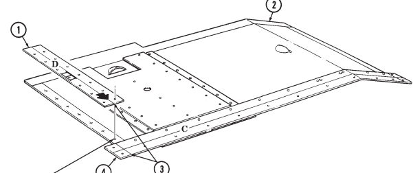

# 33-12. Left Rear Floor Panel Repair (Cont'D)

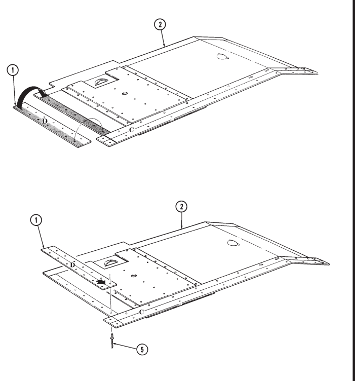

## 33-12. Left Rear Floor Panel Repair (Cont'D)

i. Metal Strip E and Insert Panel Assembly 1. Position metal strip E (2), with arrow facing up and toward metal strip C (4), on insert panel (1). Align reference lines (3).

2. Using metal strip E (2) as a template, locate, mark, and drill seven 0.187-in. (4.75-mm) diameter holes through insert panel (1). Remove metal strip E (2).

3. Apply approximately 0.125-in. (3.175-mm) thickness of adhesive sealant to shaded surface of insert panel (1) and metal strip E (2).

4. Position metal strip E (2) on insert panel (1) and install with seven rivets (5). 5. Remove any adhesive residue and clean edges on metal strip E (2) and insert panel (1).

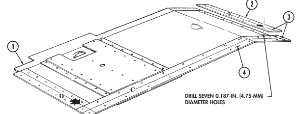

# 33-12. Left Rear Floor Panel Repair (Cont'D)

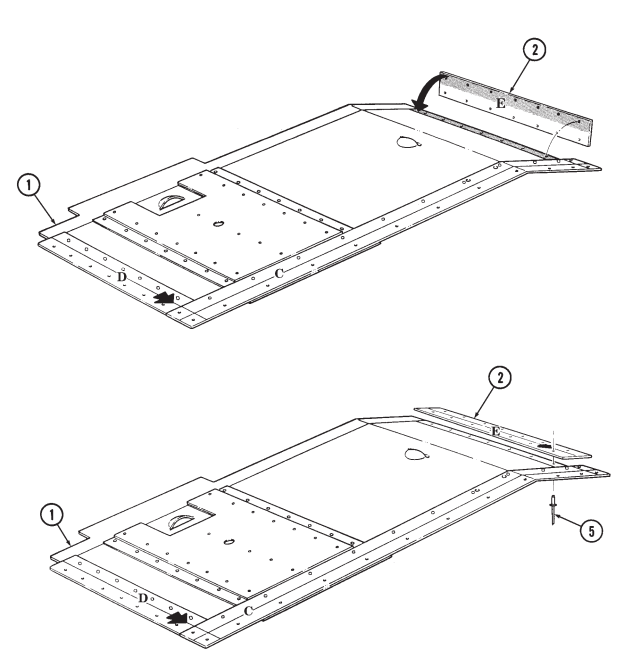

## 33-12. Left Rear Floor Panel Repair (Cont'D)

j. Metal Strip F and Insert Panel Assembly 1. Position metal strip F (1), with arrow facing up and toward metal strip C (3), on insert panel (2). Align reference lines (3).

2. Using metal strip F (1) as a template, locate, mark, and drill ten 0.187-in. (4.75-mm) diameter holes in insert panel (2). Remove metal strip F (1).

3. Apply approximately 0.125-in. (3.175-mm) thickness of adhesive sealant to shaded surface of insert panel (2) and metal strip F (1).

4. Position metal strip F (1) on insert panel (2) and install with ten rivets (4). 5. Remove any adhesive residue and clean edges on metal strip F (1) and insert panel (2).

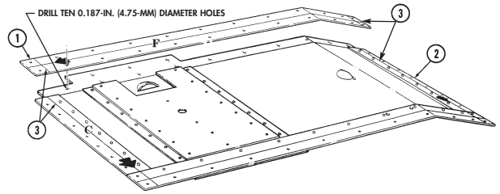

# 33-12. Left Rear Floor Panel Repair (Cont'D)

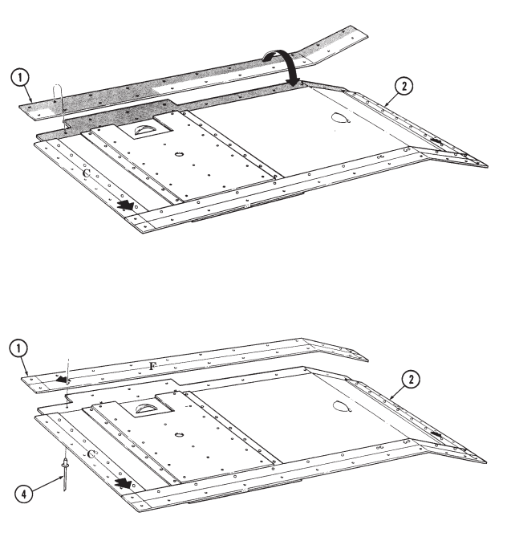

## 33-12. Left Rear Floor Panel Repair (Cont'D)

k. Left Rear Floor Panel and Insert Panel Drilling 1. Position insert panel (2) to underside of left rear floor panel (1).

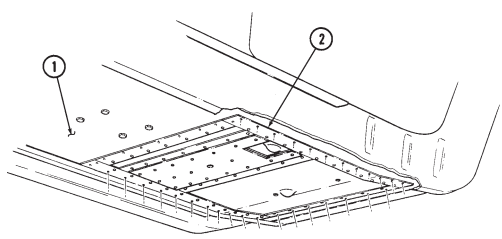 2. Using insert panel (2) as a template, mark forty-two hole locations (3) on underside of left rear floor panel (1). Remove insert panel (2).

3. Drill forty-two 0.187-in. (4.75-mm) diameter holes through underside of left rear floor panel (1).

# 33-12. Left Rear Floor Panel Repair (Cont'D)

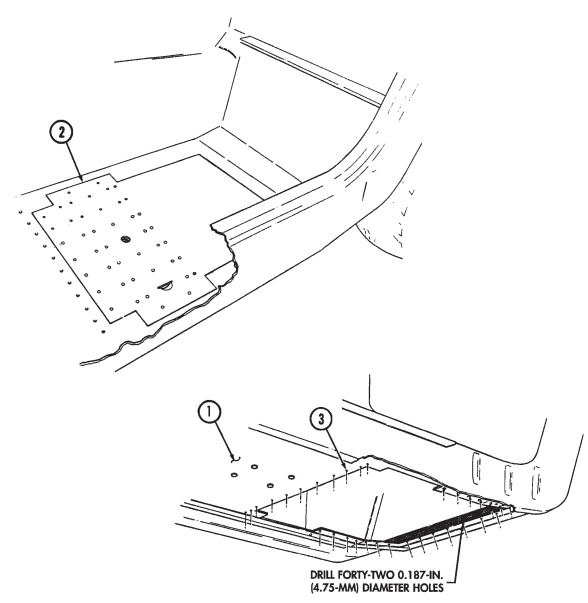

## 33-12. Left Rear Floor Panel Repair (Cont'D)

l. Insert Panel and Left Rear Floor Panel Installation 1. Apply approximately 0.125-in. (3.175-mm) thickness of adhesive sealant to outer shaded area (2) of insert panel (1).

2. Position insert panel (1) to underside of left rear floor panel (3).

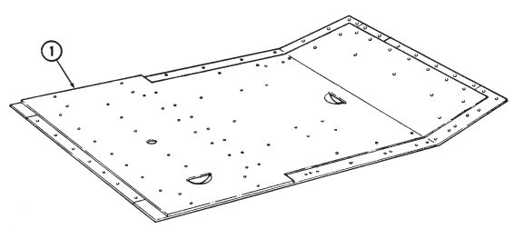 3. Secure insert panel (1) on left rear floor panel (3) with twenty-four rivets (5) and eighteen rivets (4).

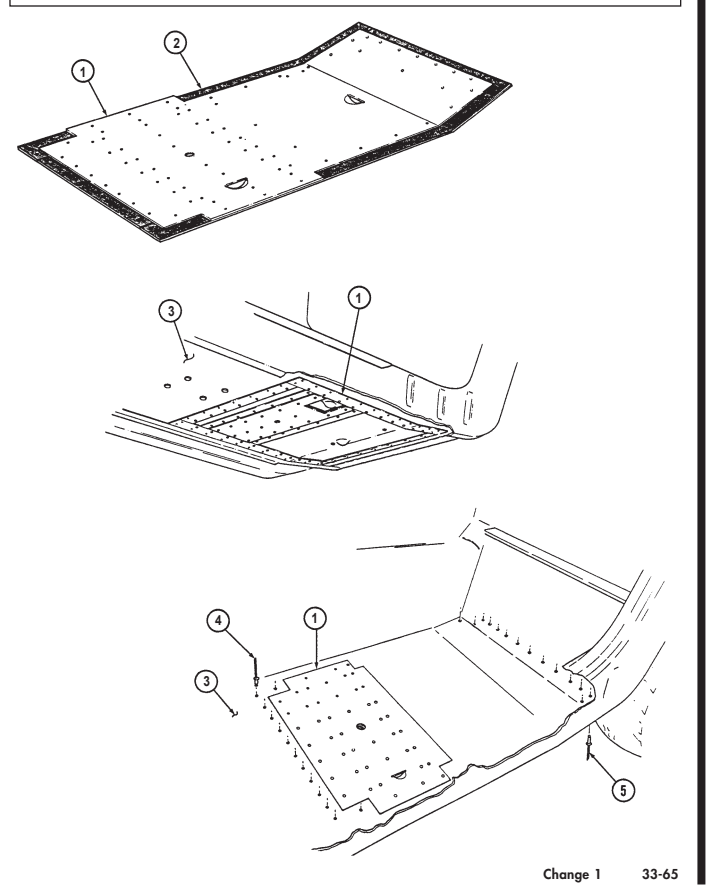

33-12. LEFT REAR FLOOR PANEL REPAIR (Cont'd)

## 33-12. Left Rear Floor Panel Repair (Cont'D)

4. Apply approximately 0.125-in. (3.175-mm) thickness of adhesive sealant to metal strip G (1). 5. Apply adhesive sealant to shaded area of left rear floor panel (8) and insert panel (7). 6. Position metal strip G (1) on left rear floor panel (8) and insert panel (7) and install three rivets (9). 7. Using metal strip G (1) as a template, locate and drill eleven 0.187-in. (4.75-mm) diameter holes through left rear floor panel (8) and insert panel (7).

8. Secure metal strip G (1) on left rear floor panel (8) and insert panel (7) with eleven rivets (5). 9. Apply approximately 0.125-in. (3.175-mm) thickness of adhesive sealant to metal strip H (2).

10. Apply adhesive sealant to area shaded on left rear floor panel (8) and insert panel (7). 11. Position metal strip H (2) on left rear floor panel (8) and insert panel (7) and install three rivets (6). 12. Using metal strip H (2) as a template, locate, mark, and drill eleven 0.187-in. (4.75-mm) diameter holes through left rear floor panel (8) and insert panel (7).

13. Secure metal strip H (2) on left rear floor panel (8) and insert panel (7) with four rivets (4) and seven rivets (3).

14. Spot-paint insert panel (7) and left rear floor panel (8) (TM 43-0139).

# 33-12. Left Rear Floor Panel Repair (Cont'D)

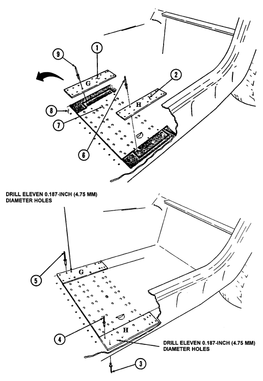

FOLLOW-ON TASKS: - Install left floor insulation (para. 10-31).

· Install Transmission Control Module (TCM) (para. 4-45).

· Install driver's seat assembly (para. 10-40).

# 33-13. Right Front Floor Panel Repair

This Task Covers:

Applicable Models M1113, M1151, and M1152 Tools General mechanic's tool set:
automotive (Appendix B, Item 1)
Riveter tool kit (Appendix B, Item 123) Shop equipment, automotive maintenance and repair: field maintenance, wheeled vehicles, Post, Camp and Station, set A (Appendix B, Item 10)

#### Manual References

TM 9-2320-387-24P TM 43-0139

#### Materials/Parts

Ninety-four rivets (Appendix G, Item 262) Fifteen rivets (Appendix G, Item 262.1) Front battery holdown bracket 
(Appendix G, Item 5)
Rear battery holdown bracket 
(Appendix G, Item 6)
Battery tray panel (Appendix G, Item 330) Sheet metal (Appendix G, Item 314) Adhesive (Appendix C, Item 2.1) Adhesive sealant (Appendix C, Item 7.1)
a. Right Front Insert Panel Fabrication f. Metal Strip C and Insert Panel Assembly b. Metal Strips Fabrication g. Right Front Floor Panel and Battery Tray Drilling c. Right Front Floor Panel Removal **h. Right Front Floor Panel and Insert Panel Drilling** d. Metal Strip A and Insert Panel Assembly **i. Battery Tray Panel and Right Front Floor Panel Installation** e. Metal Strip B and Insert Panel Assembly **j. Insert Panel and Right Front Floor Panel Installation**

#### Equipment Condition

- Battery tray removed (para. 4-75). - Right front floor insulation removed
(para 10-32).

Maintenance Level General Support

All dimensions are in inches. For Metric conversion, see chart.

#### A. Right Front Insert Panel Fabrication

1. Cut insert panel (1) from sheet metal, and mark four reference lines (2) and directional arrow (3) on insert panel (1).

2. Fabricate two drain holes (4) in insert panel (1). 3. Remove all burrs and round all sharp edges of insert panel (1).

| METRIC CONVERSION   |          |
|---------------------|----------|
| 0.60 IN.            | 15.24 MM |

# 33-13. Right Front Floor Panel Repair (Cont'D)

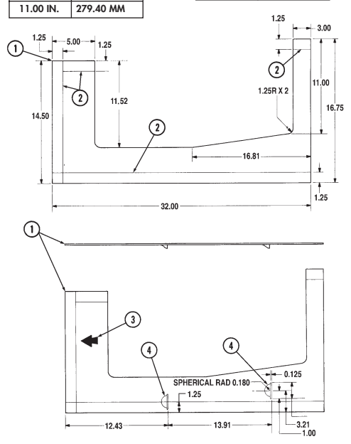

## 33-13. Right Front Floor Panel Repair (Cont'D)

#### B. Metal Strips Fabrication

1. Cut metal strip (1) from sheet metal, and mark two reference lines (2), centerline (3), and directional arrow (4). Identify metal strip (1) as A.

2. Locate, mark, and drill twenty-four 0.187-in. (4.75-mm) diameter holes through metal strip A (1). 3. Cut metal strip (5) from sheet metal, and mark two centerlines (6), and directional arrow (7).

Identify metal strip (5) as B.

4. Locate, mark, and drill twenty 0.187-in. (4.75-mm) diameter holes in metal strip B (5). 5. Cut metal strip (8) from sheet metal, and mark two centerlines (9) and directional arrow (10).

Identify metal strip (8) as C.

6. Locate, mark, and drill eighteen 0.187-in. (4.75-mm) diameter holes through metal strip C (8).

| DRILL SEVEN 0.187\-IN. (4.75\-MM) DIAMETER HOLES   |
|----------------------------------------------------|

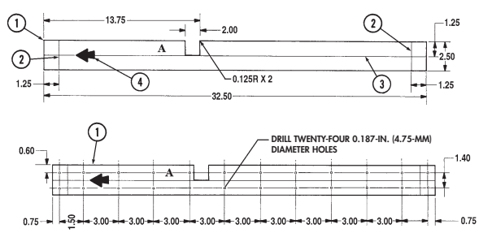

| INITIAL SETUP:               |
|------------------------------|
| Applicable Models            |
| M1113, M1151, and M1152      |
| Tools                        |
| General mechanic's tool kit: |
| (Appendix B, Item 10)        |

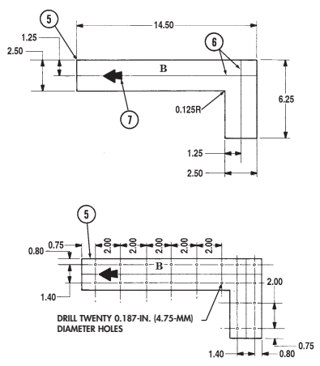

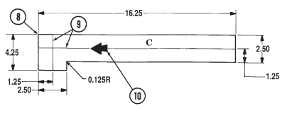

# 33-13. Right Front Floor Panel Repair (Cont'D)

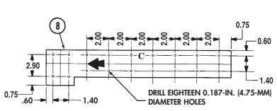

# 33-13. Right Front Floor Panel Repair (Cont'D)

c. Right Front Floor Panel Removal 1. Using a 0.187-in. (4.75-mm) drill bit, remove twenty-eight rivets (5) from right front seat support (3), battery tray (4), and right front floor panel (1).

2. Using a 0.187-in. (4.75-mm) drill bit, remove fifteen rivets (5) from battery tray (4) and tunnel (2). 3. Position insert panel (6), with arrow facing down and toward front of vehicle, to underside of right front floor panel (1) and align to battery tray (4).

4. Using insert panel (6) as a template, scribe an outline (8) on right front floor panel (1).

Do not cut through front seat support when removing right front panel section.

5. Using scribed outline (8), cut and remove right front floor panel (1). 6. Remove battery tray (4). 7. Remove sharp edges and burrs on right front floor panel (1). 8. Remove any adhesive residue and clean left front seat support (7) and tunnel (2). 9. Position insert panel (6), with arrow facing down and toward front of vehicle, to underside of right front floor panel (1).

10. Obtain a minimum clearance of 0.10-in. (2.54-mm) between edges of insert panel (6) and right front floor panel (1).

11. Remove insert panel (6).

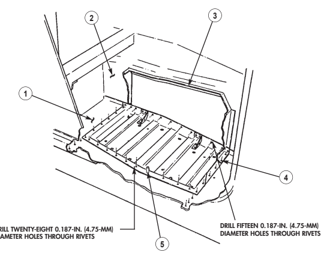

# 33-13.  Right Front Floor Panel Repair (Cont'D)

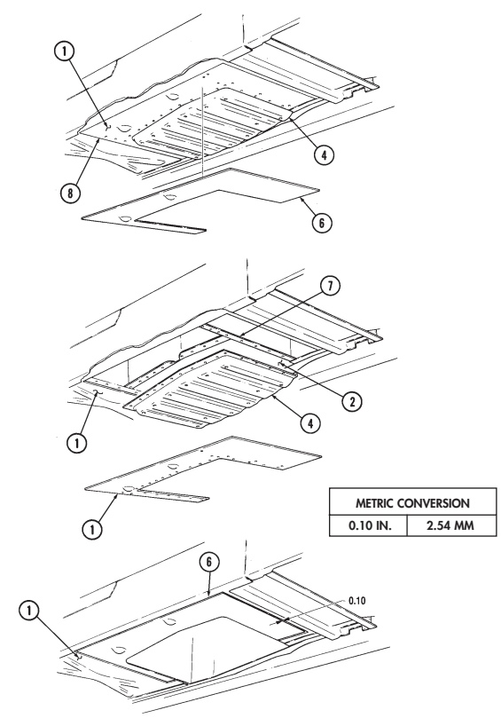

## 33-13. Right Front Floor Panel Repair (Cont'D)

#### D. Metal Strip A And Insert Panel Assembly

1. Position metal strip A (2), with arrow facing up and toward left, on insert panel (1). Align reference line (3) with edge of metal strip A (2) and reference lines (5) with edge of insert panel (1).

2. Using metal strip A (2) as a template, locate, mark, and drill ten 0.187-in. (4.75-mm) diameter holes through insert panel (1). Remove metal strip A (2).

3. Apply approximately 0.125-in. (3.175-mm) thickness of adhesive sealant to shaded surface of insert panel (1) and metal strip A (2).

4. Position metal strip A (2) on insert panel (1) and install with ten rivets (4). 5. Remove any adhesive residue and clean edges of metal strip A (2) and insert panel (1).

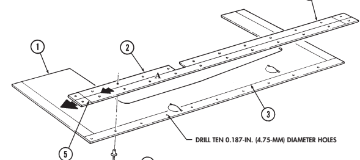

# 33-13. Right Front Floor Panel Repair (Cont'D)

## 33-13. Right Front Floor Panel Repair (Cont'D)

e. Metal Strip B and Insert Panel Assembly 1. Position metal strip B (1), with arrow facing up and toward metal strip A (3), on insert panel (2). Align reference lines (4) on metal strips A (3) and B (1) and line (5) with edge of metal strip B (1).

2. Using metal strip B (1) as a template, locate, mark, and drill nine 0.187-in. (4.75-mm) diameter holes through insert panel (2).

3. Apply approximately 0.125-in. (3.175-mm) thickness of adhesive sealant to shaded surface of insert panel (2) and metal strip B (1).

4. Position metal strip B (1) on insert panel (2) and install with nine rivets (6). 5. Remove any adhesive residue and clean edges of metal strip B (1) and insert panel (2).

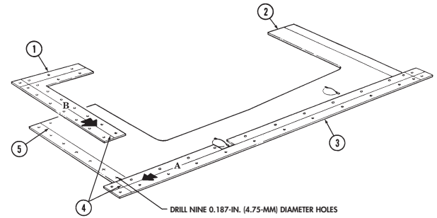

# 33-13. Right Front Floor Panel Repair (Cont'D)

## 33-13. Right Front Floor Panel Repair (Cont'D)

f. Metal Strip C and Insert Panel Assembly 1. Position metal strip C (2), with arrow facing up and toward metal strip A (5), on insert panel (1).

Align reference lines (4) of metal strip A (5) and C (2) and line (3) with edge of metal strip C (2).

2. Using metal strip C (2) as a template, locate, mark, and drill eight 0.187-in. (4.75-mm) diameter holes through insert panel (1).

3. Apply approximately 0.125-in. (3.175-mm) thickness of adhesive sealant to shaded surface of insert panel (1) and metal strip C (2).

4. Position metal strip C (2) on insert panel (1) and install with eight rivets (6). 5. Remove any adhesive residue and clean edges of metal strip C (2) and insert panel (1).

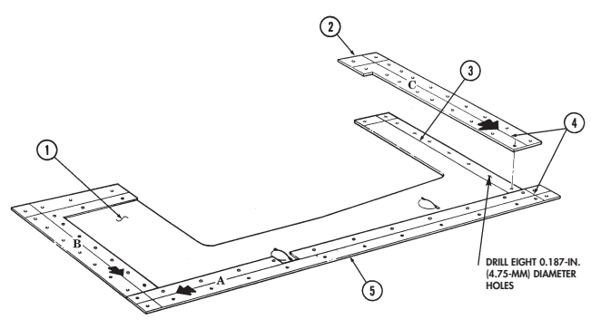

# 33-13.  Right Front Floor Panel Repair (Cont'D)

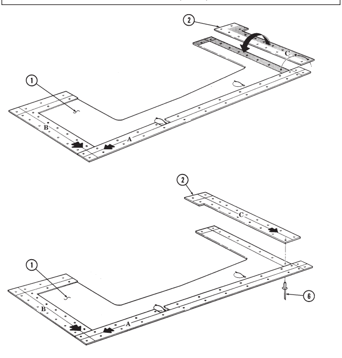

# 33-13. Right Front Floor Panel Repair (Cont'D)

g. Right Front Floor Panel and Battery Tray Drilling 1. Position battery tray panel (6) on underside of right front floor panel (1), right front seat support (2),
and tunnel (3).

2. Using right front seat support (2) as a template, mark twenty-two hole locations (5) on battery tray panel (6).

3. Using right tunnel (3) as a template, mark fifteen hole locations (4) on battery tray panel (6). 4. Drill thirty-seven 0.187-in. (4.75-mm) diameter holes, marked in steps 2 and 3, through battery tray panel (6).

5. Locate, mark, and drill two 0.187-in. (4.75-mm) diameter holes through holddown bracket (7). 6. Locate, mark, and drill two 0.187-in. (4.75-mm) diameter holes through holddown bracket (8). 7. Mark reference lines (10) and (11) on battery tray panel (6). 8. Position holddown bracket (8) to reference line (11) on battery tray panel (6). 9. Using holddown bracket (8) as a template, locate, mark, and drill two 0.187-in. (4.75-mm)
diameter holes through battery tray panel (6).

10. Install holddown bracket (8) on battery tray panel (6) with two rivets (9). 11. Using battery tray panel (6) as a template, locate, mark, and drill two 0.187-in. (4.75-mm)
diameter holes through holddown bracket (8).

12. Position holddown bracket (7) to reference line (10) on battery tray panel (6). 13. Using holddown bracket (7) as a template, locate, mark, and drill two 0.187-in. (4.75-mm)
diameter holes through battery tray panel (6).

14. Install holddown bracket (7) on battery tray panel (6) with two rivets (9). 15. Using battery tray panel (6) as a template, locate, mark, and drill two 0.187-in. (4.75-mm)
diameter holes through holddown bracket (7).

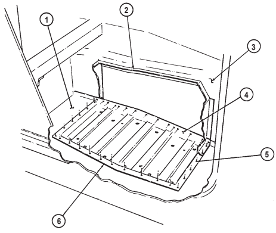

# 33-13. Right Front Floor Panel Repair (Cont'D)

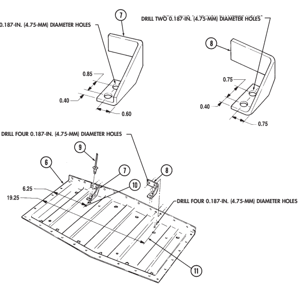

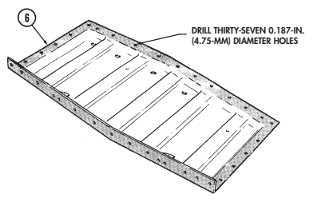

## 33-13. Right Front Floor Panel Repair (Cont'D)

h. Right Front Floor Panel and Insert Panel Drilling 1. Position insert panel (3) on underside of right front floor panel (1) with arrow facing down and toward front of vehicle.

2. Using right front seat support (2) as a template, mark twenty-six hole locations (4) on insert panel (3). 3. Using insert panel (3) as a template, mark thirty-seven hole locations (5) on underside of right front floor panel (1).

4. Remove insert panel (3) from right front floor panel (1) and place on suitable work surface. 5. Drill thirty-seven 0.187-in. (4.75-mm) diameter holes, marked in step 3, through underside of right front floor panel (1).

6. Drill twenty-six 0.187-in. (4.75-mm) diameter holes, marked in step 2, through insert panel (3).

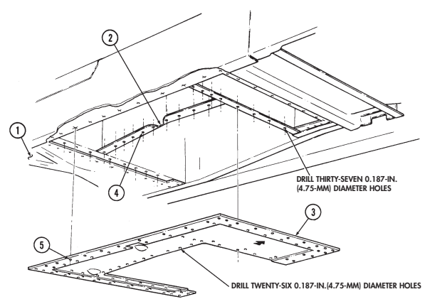

# 33-13. Right Front Floor Panel Repair (Cont'D)

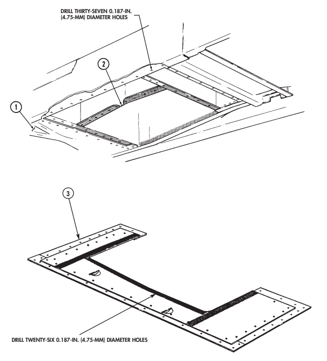

## 33-13. Right Front Floor Panel Repair (Cont'D)

i. Battery Tray Panel and Right Front Floor Panel Installation 1. Place battery tray panel (1) on a suitable work surface. 2. Apply approximately 0.125-in. (3.175-mm) thickness of adhesive sealant to shaded area on battery tray panel (1).

3. Apply adhesive sealant to shaded area on underside of right front seat support (2). 4. Position battery tray panel (1) on underside of right front floor panel (3). 5. Install battery tray panel (1) on tunnel (4) with fifteen rivets (5).

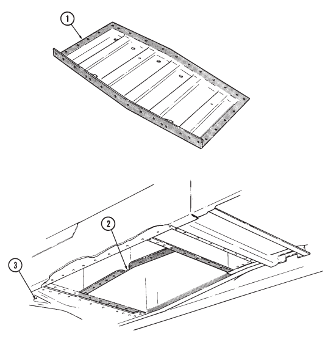

# 33-13.  Right Front Floor Panel Repair (Cont'D)

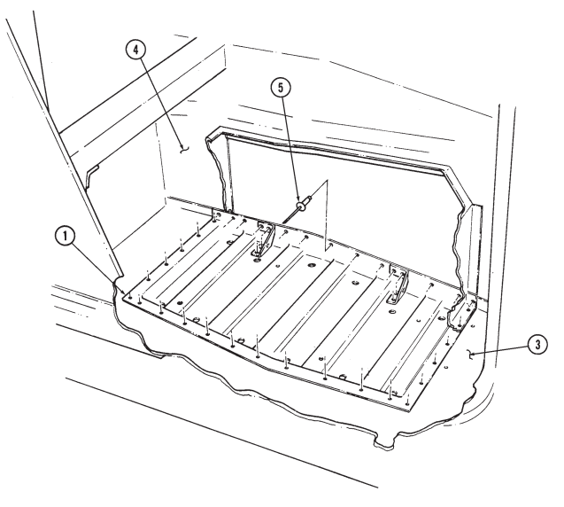

## 33-13. Right Front Floor Panel Repair (Cont'D)

j. Insert Panel and Right Front Floor Panel Installation 1. Apply approximately 0.125-in. (3.175-mm) thickness of adhesive sealant to shaded area of insert panel (1).

2. Apply adhesive sealant to shaded area on underside of right front seat support (2). 3. Apply approximately 0.125-in. (3.175-mm) thickness of adhesive sealant to shaded area on underside of right front panel (3).

4. Position insert panel (1) on underside of right front floor panel (3) with arrow facing down and toward front of vehicle.

5. Install insert panel (1) on right front seat support (2) and battery tray panel (6) with twenty-six rivets (5).

6. Secure insert panel (1) on right front floor panel (3) with thirty-seven rivets (4). 7. Spot-paint insert panel (1), battery tray panel (6), right front floor panel (3), and right front seat

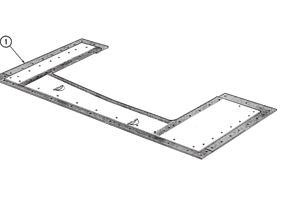

support (2). (Refer to TM 43-0139.)

# 33-13. Right Front Floor Panel Repair (Cont'D)

FOLLOW-ON TASKS: - Install right floor insulation (para. 10-32).

- Install battery tray (para. 4-75).

## 33-14. Right Rear Floor Panel Repair

This task covers:
a. Right Rear Insert Panel Fabrication g. Metal Strip C and Insert Panel Assembly b. Reinforcement Strips Fabrication h. Metal Strip E and Insert Panel Assembly c. Metal Strips Fabrication i. Metal Strip D and Insert Panel Assembly e. Reinforcement Strip A and Insert Panel Assembly k. Insert Panel and Right Rear Floor Panel Installation f. Reinforcement Strip B and Insert Panel Assembly

#### Initial Setup: Applicable Models

M1113, M1151, and M1152 Tools General mechanic's tool set automotive (Appendix B, Item 1)
Riveter tool kit (Appendix B, Item 123) Shop equipment, automotive maintenance and repair: field maintenace, wheeled vehicles, Post, Camp and Station, set A (Appendix B, Item 10)
Manual References TM 9-2320-387-24P TM 43-0139 d. Right Rear Floor Panel Removal **j. Right Rear Floor Panel and Insert Panel Drilling**

#### Materials/Parts

Ninety-two rivets (Appendix G, Item 262) Thirty-two rivets (Appendix G, Item 262.1) Sheet metal (Appendix G, Item 314) Rear battery holddown bracket
(Appendix G, Item 6)
Adhesive (Appendix C, Item 2.1) Adhesive sealant (Appendix C, Item 7.1)
Equipment Condition Right rear floor insulation removed (para. 10-34).

Maintenance Level General Support

All dimensions are in inches. For Metric conversion, see chart.

#### A. Right Rear Insert Panel Fabrication

1. Cut insert panel (1) from sheet metal, and mark four reference lines (3) and directional arrow (2) on insert panel (1).

2. Locate, mark, and drill six 0.312-in. (7.925-mm) diameter holes and one 1.00-in. (25.4-mm)
diameter hole through insert panel (1).

3. Fabricate two drain holes (4) in insert panel (1). 4. Bend insert panel (1) 1.50-in. (38.10-mm). 5. Remove all burrs and round all sharp edges of insert panel (1).

| DRILL 1.000\-IN. (25.400\-MM) DIAMETER HOLE   |
|-----------------------------------------------|

# 33-14. Right Rear Floor Panel Repair (Cont'D)

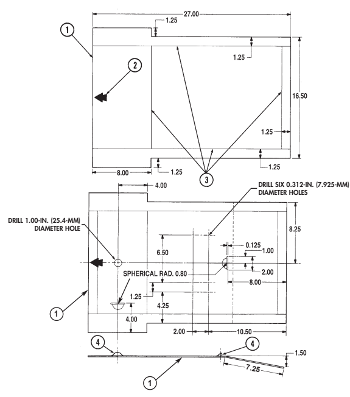

## 33-14. Right Rear Floor Panel Repair (Cont'D)

#### B. Reinforcement Strips Fabrication

1. Cut reinforcement strip (1) from sheet metal, and mark four reference lines (2), centerline (3), and identify as A on reinforcement strip (1).

2. Locate, mark, and drill twenty-one 0.187-in. (4.75-mm) diameter holes and a 0.750-in.

(19.050-mm) diameter hole through reinforcement strip A (1).

3. Remove all burrs and round sharp edges of reinforcement strip A (1). 4. Cut reinforcement strip (4) from sheet metal, and mark four reference lines (5) and centerline (6).

Identify reinforcement strip (1) as B.

5. Locate, mark, and drill eighteen 0.187-in. (4.75-mm) diameter holes and a 0.500-in. (12.700-mm)
diameter hole through reinforcement strip B (4).

6. Remove all burrs and round sharp edges of reinforcement strip B (4).

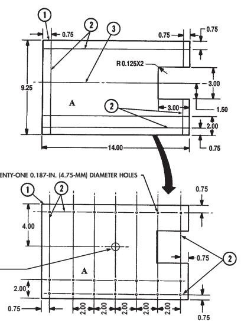

DRILL 0.750-IN. (19.050-MM) DIAMETER HOLE

| letter B on reinforcement strip (4).   |
|----------------------------------------|
| METRIC CONVERSION                      |
| 0.125 IN.  3.175 MM                    |
| 0.75 IN.  19.05 MM                     |

# 33-14. Right Rear Floor Panel Repair (Cont'D)

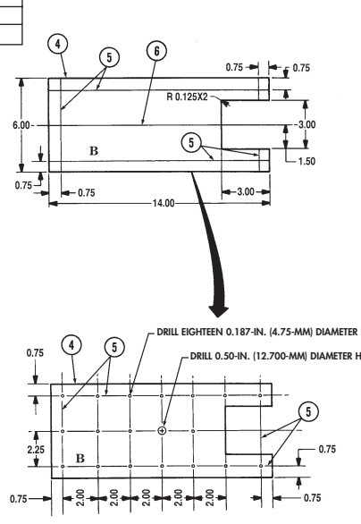

## 33-14. Right Rear Floor Panel Repair (Cont'D)

c. Metal Strips Fabrication 1. Cut two metal strips (1) from sheet metal, and mark two reference lines (2), centerline (3), and directional arrow (4), and identify as metal strips C and D.

2. Locate, mark, and drill twenty 0.187-in. (4.75-mm) diameter holes through metal strip C (1). 3. Bend metal strip C (1) 1.50-in. (38.10-mm). 4. Locate, mark, and drill twenty 0.187-in. (4.75-mm) diameter holes through metal strip D (1). 5. Bend metal strip D (1) 1.50-in. (38.10-mm).

| 0.60 IN.   | METRIC CONVERSION  15.24 MM   |
|------------|-------------------------------|
| 0.75 IN.   | 19.05 MM                      |
| 1.25 IN.   | 31.75 MM                      |
| 1.40 IN.   | 35.56 MM                      |
| 1.50 IN.   | 38.10 MM                      |

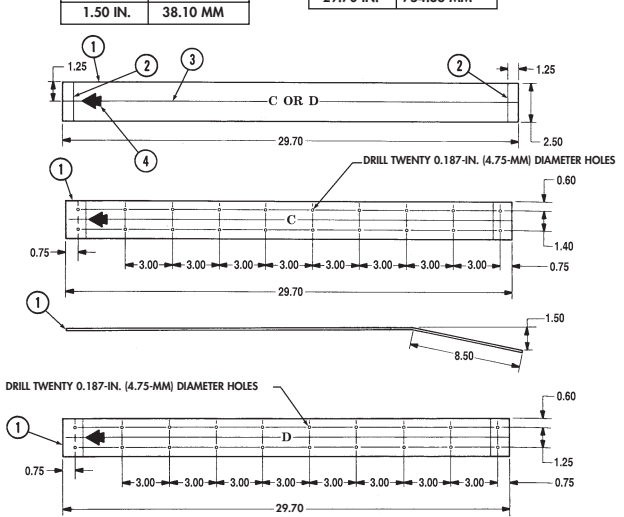

## 33-14. Right Rear Floor Panel Repair (Cont'D)

6. Cut metal strip (5) from sheet metal, and mark center line (6) and directional arrow (10). Identify metal strip (5) as E.

7. Locate, mark, and drill fourteen 0.187-in. (4.75-mm) diameter holes in metal strip E (5). 8. Cut two metal strips (7) from sheet metal, and mark center line (8), and directional arrow (9).

Identify metal strips (7) as F and G.

9. Locate, mark, and drill fourteen 0.187-in. (4.75-mm) diameter holes in metal strip F (7).

10. Locate, mark, and drill fourteen 0.187-in. (4.75-mm) diameter holes in metal strip G (7).

| 1.40 IN.   | 35.56 MM   |
|------------|------------|
| 1.45 IN.   | 36.83 MM   |
| 2.00 IN.   | 50.80 MM   |
| 2.50 IN.   | 63.50 MM   |
| 14.20 IN.  | 360.68 MM  |

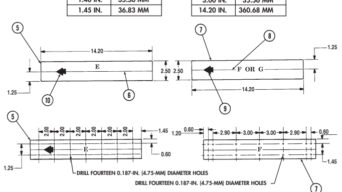

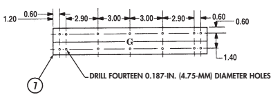

## 33-14. Right Rear Floor Panel Repair (Cont'D)

d. Right Rear Floor Panel Removal 1. Using a 0.187-in. (4.75-mm) drill, remove nine rivets (1) from right rear floor panel (2). 2. Position insert panel (3), with arrow facing down and toward front of vehicle, on underside of right rear floor panel (2) and align mount hole (5) with hole in floor panel (2).

3. Using insert panel (3) as a template, scribe an outline (6) on right rear floor panel (2).

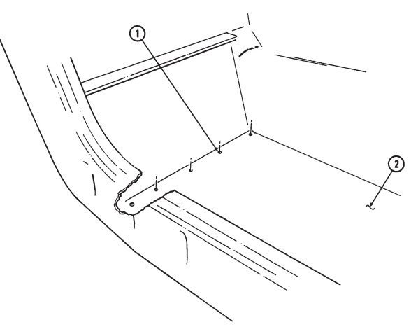 4. Using scribed outline marked in step 3 as a guide, cut and remove floor panel (4). 5. Remove sharp edges and burrs on floor panel (2).

33-14. RIGHT REAR FLOOR PANEL REPAIR (Cont'd)

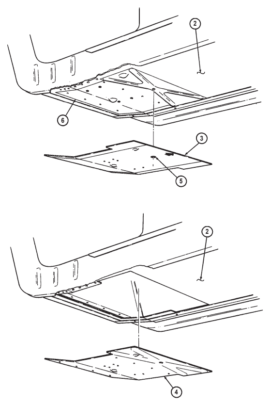

## 33-14. Right Rear Floor Panel Repair (Cont'D)

6. Position insert panel (2), with arrow facing down and toward front of vehicle, on underside of right rear floor panel (1).

7. Obtain a minimum clearance of 0.10-in. (2.54-mm) between edges of insert panel (2) and right rear floor panel (1).

8. Remove insert panel (2). 9. Locate and mark four reference lines (3) on right rear floor panel (1).

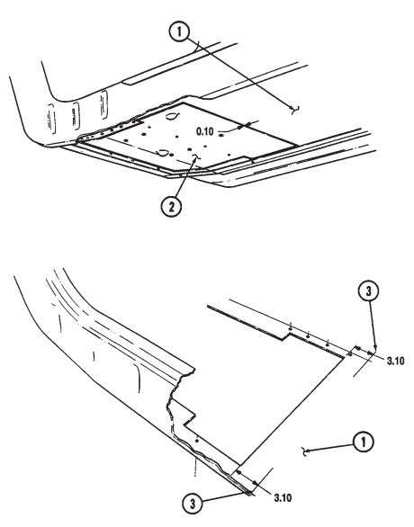

# 33-14. Right Rear Floor Panel Repair (Cont'D)

e. Reinforcement Strip A and Insert Panel Assembly 1. Position reinforcement strip A (3) on insert panel (1). Align reference lines (2) with edge of reinforcement strip A (3).

2. Using reinforcement strip A (3) as a template, locate, mark, and drill fourteen 0.187-in.

(4.75-mm) diameter holes through insert panel (1). Remove reinforcement strip A (3).

3. Apply approximately 0.125-in. (3.175-mm) thickness of adhesive sealant to shaded surface of insert panel (1) and reinforcement strip A (3).

4. Position reinforcement strip A (3) on insert panel (1) and install with fourteen rivets (4). 5. Remove any adhesive residue and clean edges of reinforcement strip A (3) and insert panel (1).

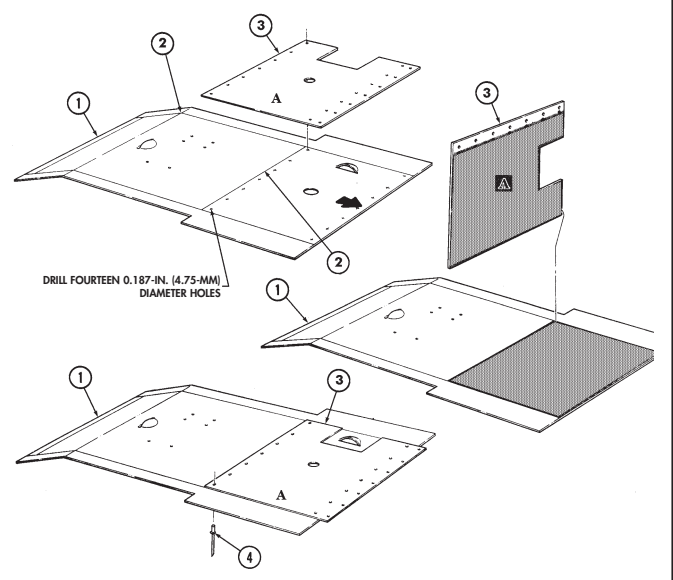

## 33-14. Right Rear Floor Panel Repair (Cont'D)

f. Reinforcement Strip B and Insert Panel Assembly 1. Position reinforcement strip B (2) on reinforcement strip A (3). Align between reference line (4) and side edge of reinforcement strip B (2).

2. Using reinforcement strip B (2) as a template, locate, mark, and drill eighteen 0.187-in. (4.75-mm)
diameter holes in reinforcement strip A (3) and insert panel (1). Remove reinforcement strip B (2).

3. Apply approximately 0.125-in. (3.175-mm) thickness of adhesive sealant to shaded surfaces of reinforcement strip A (3) and reinforcement strip B (2).

4. Position reinforcement strip B (2) on reinforcement strip A (3) and install with eighteen rivets (5). 5. Remove any adhesive residue and clean edges of reinforcement B (2), reinforcement strip A (3), and insert panel (1).

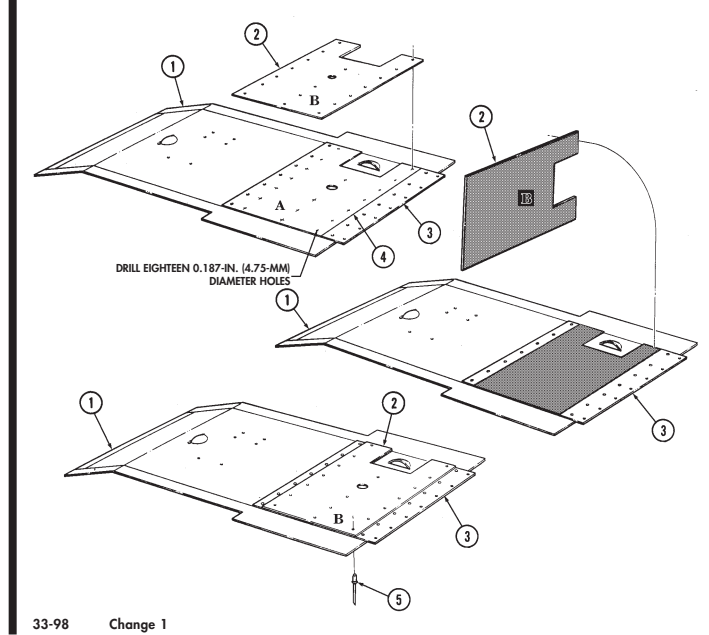

# 33-14. Right Rear Floor Panel Repair (Cont'D)

#### G. Metal Strip C And Insert Panel Assembly

1. Position metal strip C (6) with arrow facing up and toward right on insert panel (1). Align reference lines (8) and insert panel edges (7).

2. Using metal strip C (6) as a template, locate, mark, and drill nine 0.187-in. (4.75-mm) diameter holes through insert panel (1).

3. Apply approximately 0.125-in. (3.175-mm) thickness of adhesive sealant to shaded surface of insert panel (1) and metal strip C (6).

4. Position metal strip C (6) on insert panel (1) and install with nine rivets (9). 5. Remove any adhesive residue and clean edges of metal strip C (6) and insert panel (1).

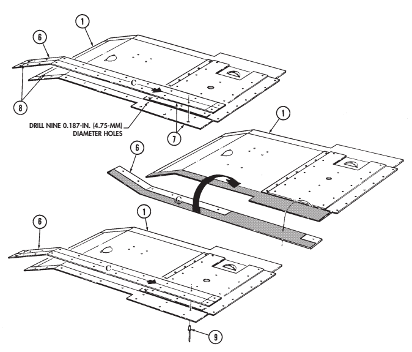

# 33-14. Right Rear Floor Panel Repair (Cont'D)

#### H. Metal Strip E And Insert Panel Assembly

1. Position metal strip E (1), with arrow facing up and toward metal strip C (3), on insert panel (2)
and align reference lines (4).

2. Using metal strip E (1) as a template, locate, mark, and drill seven 0.187-in. (4.75-mm) diameter holes through insert panel (2). Remove metal strip E (1).

3. Apply approximately 0.125-in. (3.175-mm) thickness of adhesive sealant to shaded surface of insert panel (2) and metal strip E (1).

4. Position metal strip E (1) on insert panel (2) and install with seven rivets (5). 5. Remove any adhesive residue and clean edges of metal strip E (1) and insert panel (2).

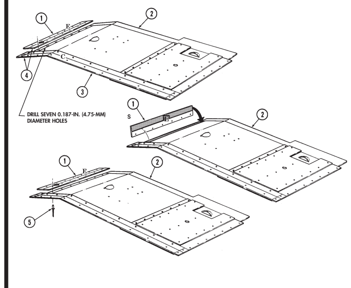

# 33-14. Right Rear Floor Panel Repair (Cont'D)

i. Metal Strip D and Insert Panel Assembly 1. Position metal strip D (6), with arrow facing up and right, on insert panel (2). Align reference lines (4)
and insert panel edges (7).

2. Using metal strip D (6) as a template, locate, mark, and drill nine 0.187-in. (4.75-mm) diameter holes through insert panel (2). Remove metal strip D (6).

3. Apply approximately 0.125-in. (3.175-mm) thickness of adhesive sealant to shaded surface of insert panel (2) and metal strip D (6).

4. Position metal strip D (6) on insert panel (2) and install with nine rivets (8). 5. Remove any adhesive residue and clean edges of metal strip D (6) and insert panel (2).

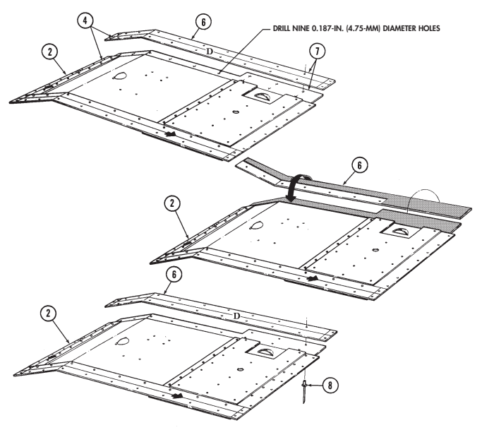

## 33-14. Right Rear Floor Panel Repair (Cont'D)

j. Right Rear Floor Panel and Insert Panel Drilling 1. Position insert panel (1) on underside of right rear floor panel (2).

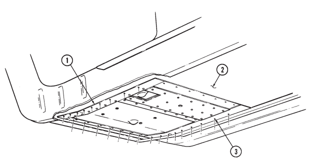 2. Using insert panel (1) as a template, mark thirty-eight hole locations (3) on underside of right rear floor panel (2). Remove insert panel (1).

3. Drill thirty-eight 0.187-in. (4.75-mm) diameter holes in underside of right rear floor panel (2).

# 33-14. Right Rear Floor Panel Repair (Cont'D)

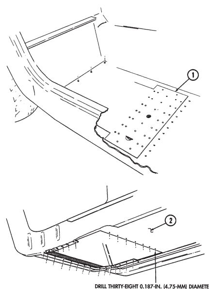

## 33-14. Right Rear Floor Panel Repair (Cont'D)

k. Insert Panel and Right Rear Floor Panel Installation 1. Apply approximately 0.125-in. (3.175-mm) thickness of adhesive sealant to shaded area of insert panel (1).

2. Apply adhesive sealant to shaded area on underside of right rear panel (2). 3. Position insert panel (1) on underside of right rear floor panel (2).

33-14. RIGHT REAR FLOOR PANEL REPAIR (Cont'd)

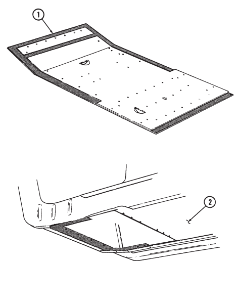

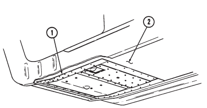

## 33-14. Right Rear Floor Panel Repair (Cont'D)

4. Secure insert panel (1) on right rear floor panel (3) with twenty-three rivets (4) and fifteen rivets (2).

5. Apply approximately 0.125-in. (3.175-mm) thickness adhesive sealant to shaded area of metal strip G (6).

6. Apply adhesive sealant to shaded area of right rear floor panel (3) and insert panel (1). 7. Position metal strip G (6) on right rear floor panel (3) and insert panel (1) and install with three rivets (5).

8. Using metal strip G (6) as a template, locate, mark, and drill eleven 0.187-in. (4.75-mm) diameter holes through right rear floor panel (3) and insert panel (1).

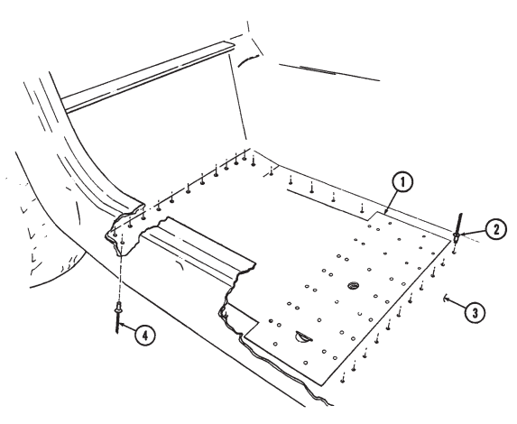

9. Secure metal strip G (6) to insert panel (1) with eleven rivets (7).

# 33-14. Right Rear Floor Panel Repair (Cont'D)

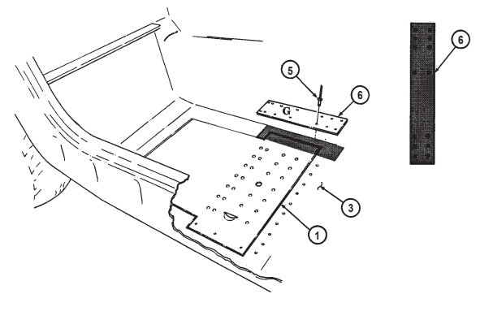

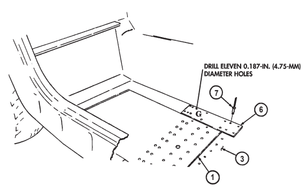

## 33-14. Right Rear Floor Panel Repair (Cont'D)

10. Apply approximately 0.125-in. (3.175-mm) thickness of adhesive sealant to shaded area of metal strip F (1).

11. Apply adhesive sealant to shaded area on right rear floor panel (2) and insert panel (3).

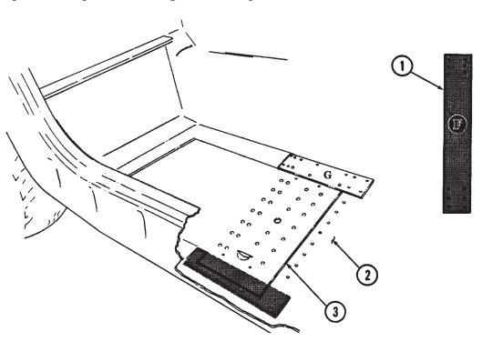 12. Position metal strip F (1) on right rear floor panel (2) and insert panel (3), and install metal strip F (1)
on insert panel (3) with three rivets (6).

13. Using metal strip F (1) as a template, locate, mark, and drill eleven 0.187-in. (4.75-mm) diameter holes through right rear floor panel (2) and insert panel (3).

14. Secure metal strip F (1) to right rear floor panel (2) and insert panel (3) with four rivets (4). 15. Secure metal strip F (1) on insert panel (3) and right rear floor panel (2) with seven rivets (5). 16. Spot-paint insert panel (3) and right rear floor panel (2). (Refer to TM 43-0139.)

# 33-14. Right Rear Floor Panel Repair (Cont'D)

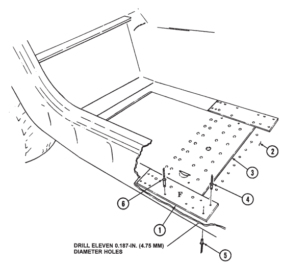

FOLLOW-ON TASK:
Install right rear floor insulation (para. 10-34).

# Chapter 34 Suspension (Gs) Maintenance

## 34-1. Introduction

This chapter contains maintenance instructions for suspension system components at the general support maintenance level. Some subassemblies and parts must be removed before suspension system components can be accessed. They are referenced to other paragraphs of this manual.

## 34-2. Suspension Maintenance Task Summary

| 3.21 IN.   | 81.53 MM   | 16.81 IN.   | 426.97 MM   |
|------------|------------|-------------|-------------|
| 5.00 IN.   | 127.00 MM  | 32.00 IN.   | 812.80 MM   |
| 11.00 IN.  | 279.40 MM  |             |             |

## 34-3. Suspension Alignment Instructions

This task covers:
a. Caster and Camber Check **c. Toe Check and Adjustment** b. Caster and Camber Adjustment

| Tools                                  | Manual References                 |
|----------------------------------------|-----------------------------------|
| General mechanic's tool kit:           | TM 9\-2320\-387\-10               |
| automotive (Appendix B. Item 1)        | TM 9\-2320\-387\-24P              |
| Alignment equipment, vehicle           | Equipment Condition               |
| (Appendix B, Item 113.1)               |                                   |
| Maintenance and repair shop equipment: | Tires inflated to proper pressure |
| automotive (Appendix B, Item 2)        | (TM 9\-2320\-387\-10).            |
| Materials/Parts                        | Maintenance Level                 |
| Two locknuts (Appendix G. Item 88)     | General support                   |

a. Caster and Camber Check

The alignment check will be made on a level surface, with front tires in the straight-ahead position. 

1. Check caster and compare to the specifications in table 34-1. 2. Check camber and compare to the specifications in table 34-1. 3. If either caster or camber does not meet specifications, go to task b, caster and camber adjustment.

# 34-3. Suspension Alignment Instructions (Cont'D)

|    | b. Metal Strips Fabrication                                                                          |
|----|------------------------------------------------------------------------------------------------------|
| 1. | Cut metal strip (1) from sheet metal, and mark two reference lines (2), centerline (3), and          |
|    | directional arrow (4). Identify metal strip (1) as A.                                                |
| 2. | Locate, mark, and drill twenty\-four 0.187\-in. (4.75\-mm) diameter holes through metal strip A (1). |
| 3. | Cut metal strip (5) from sheet metal, and mark two centerlines (6), and directional arrow (7).       |
|    | Identify metal strip (5) as B.                                                                       |
| 4. | Locate, mark, and drill twenty 0.187\-in. (4.75\-mm) diameter holes in metal strip B (5).            |

Table 34-1. Alignment Specifications.

#### B. Caster And Camber Adjustment Note

- Caster and camber adjustments are basically the same for all four wheels. This procedure covers the right front wheel.

- Maxmimum side to side difference is 1°.

1. Remove wheel (para. 8-3). 2. Remove two locknuts (7), washers (2), capscrews (1), and washers (2) from upper control arm (8) 
and mounting brackets (3). Discard locknuts (7).

3. Loosen two capscrews (6) and four nuts (5) on two mounting brackets (3) and airlift brackets (4).

NOTE
- When adjusting front and rear suspension camber, add or subtract shims as matched sets under both upper control arm mounting brackets.

- Shims are available in 0.060-in. (1.52-mm) and 0.120-in. 

(3.05-mm) thicknesses.

4. Add or subtract shim(s) (9) as required to bring caster and/or camber within specifications 
(table 34-1). Suspension alignment change in relation to shim selection is shown in table 34-2.

#### Table 34-2. Suspension Alignment Change. Note

| DRILL TWENTY\-FOUR 0.187\-IN. (4.75\-MM)   | DIAMETER HOLES   |
|--------------------------------------------|------------------|

- Subtracting shims will affect caster/camber in the opposite direction as compared to adding shims.

- For 0.06 in. (1.52 mm) shims, reduce the values in the table by half.

- For larger changes, combinations of additions or subtractions will provide desired results.

## 34-3. Suspension Alignment Instructions (Cont'D)

5. Tighten two capscrews (6) and four nuts (5) on two airlift brakets (4) and mounting brackets (3).

Tighten capscrews (6) and nuts (5) to 90 lb-ft (122 N•m).

6. Install upper control arm (8) on mounting brackets (3) with two washers (2), capscrews (1),
washers (2), and locknuts (7). Tighten locknuts (7) to 260 lb-ft (353 N•m).

7. Install wheel (para. 8-3). 8. Go to task a, and repeat steps 1 through 3 for left front and rear wheels.

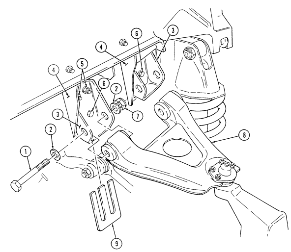

#### C. Toe Check And Adjustment

Check toe (para. 8-9 or 8-10) and adjust if necessary.

# Appendix A References

A-1. SCOPE
This appendix lists all forms, field manuals, and technical manuals for use with this vehicle.

## A-2. Department Of The Army Pamphlets

Consolidated Index of Army Publications and Blank Forms . . . . . . . . . . . . . . . . . . . . . . . . . . . . . . . DA Pam 25-30 The Army Maintenance Management System (TAMMS) Users Manual . . . . . . . . . . . . . . . . . . . DA Pam 750-8

## A-3. Forms

| 4.25 IN.   | 107.95 MM   |
|------------|-------------|
| 6.25 IN.   | 158.75 MM   |
| 14.50 IN.  | 368.30 MM   |
| 16.25 IN.  | 412.75 MM   |

| NBC Protection                                                                  |
|---------------------------------------------------------------------------------|
| NBC Decontamination .                                                           |
| Operation and Maintenance of Ordnance Materiel in Cold Weather (0°F to \-65°F). |
| General Fabric Repair                                                           |
| First Aid for Soldiers                                                          |
| Manual for the Wheeled Vehicle Driver                                           |
| Browning Machine Gun Caliber .50 HB, M2                                         |
| Machine Gun 7.62\-MM, M60                                                       |
| Basic Cold Weather Manual                                                       |
| Northern Operations                                                             |
| Army Motor Transport Units and Operations                                       |
| Mountain Operations                                                             |

| Basic Issue Items for Military Vehicles, Carriages and Equipment,   |
|---------------------------------------------------------------------|
| Preparation for Shipment and Storage .                              |
| Marking for Shipment and Storage .                                  |
| Magnetic Particles Inspection                                       |
| Inspection, Liquid Penetrant.                                       |
| Preparation for Shipment and Storage of Wheeled Vehicles .          |

## A-4. Field Manuals A-5. Military Standards A-6. Technical Manuals

| DRILL THIRTY\-SEVEN 0.187\-IN.                 | METRIC CONVERSION                              | (4.75\-MM) DIAMETER HOLES   |           |
|------------------------------------------------|------------------------------------------------|-----------------------------|-----------|
| 0.40 IN.                                       | 10.16 MM                                       | 0.60 IN.                    | 15.24 MM  |
| 0.75 IN.                                       | 19.05 MM                                       | 0.85 IN.                    | 21.59 MM  |
| 6.25 IN.                                       | 158.75 MM                                      | 19.25 IN.                   | 488.95 MM |
| DRILL TWO 0.187\-IN. (4.75\-MM) DIAMETER HOLES | DRILL TWO 0.187\-IN. (4.75\-MM) DIAMETER HOLES |                             |           |

| DRILL FOUR 0.187\-IN. (4.75\-MM) DIAMETER HOLES   |
|---------------------------------------------------|

| DRILL FOUR 0.187\-IN. (4.75\-MM) DIAMETER HOLES   |
|---------------------------------------------------|

## A-7. Technical Bulletins A-8. Army Regulations

# Appendix B Maintenance Allocation Chart

Section I. INTRODUCTION

## B-1. The Army Maintenance System (Mac)

a. This introduction provides a general explanation of all maintenance and repair functions authorized at the two maintenance levels under the Two-Level Maintenance System Concept.

b. This MAC designates overall authority and responsibility for the performance of maintenance functions on the identified end item or component. The application of the maintenance functions to the end item or component levels, which are shown on the MAC in column (4) as:
Field - includes two columns, Unit maintenance and Direct Support maintenance. The Unit maintenance column is divided again into two more subcolumns, C for Operator or Crew and O for Unit maintenance. Sustainment - includes two subcolumns, general support (H) and depot (D).

c. The tools and test equipment requirements list the tools and test equipment (both special tools and common tool sets) required for each maintenance function as referenced from the MAC.

d. The remarks contain supplemental instructions and explanatory notes for a particular maintenance function.

## B-2. Maintenance Functions

Maintenance functions are limited to and defined as follows:
a. Inspect. To determine the serviceability of an item by comparing its physical, mechanical, and/or electrical characteristics with established standards through examination (e.g., by sight, sound, or feel). This includes scheduled inspection and gagings and evaluation of cannon tubes.

b. Test. To verify serviceability by measuring the mechanical, pneumatic, hydraulic, or electrical characteristics of an item and comparing those characteristics with prescribed standards on a scheduled basis, i.e., load testing of lift devices and hydrostatic testing of pressure hoses.

c. Service. Operations required periodically to keep an item in proper operating condition, i.e., to clean
(includes decontaminate, when required), to preserve, to drain, to paint, or to replenish fuel, lubricants, chemical fluids, or gases. This includes scheduled exercising and purging of recoil mechanisms. The following are examples of service functions:
1. Unpack. To remove from packing box for service or when required for the performance of maintenance operations.

2. Repack. To return item to packing box after service and other maintenance operations. 3. Clean. To rid the item of contamination. 4. Touch up. To spot paint scratched or blistered surfaces. 5. Mark. To restore obliterated identification.

d. Adjust. To maintain or regulate, within prescribed limits, by bringing into proper or exact position, or by setting the operating characteristics to specified parameters.

e. Align. To adjust specified variable elements of an item to bring about optimum or desired performance.

f. Calibrate. To determine and cause corrections to be made or to be adjusted on instruments or test, measuring, and diagnostic equipment used in precision measurement. Consists of comparisons of two instruments, one of which is a certified standard of known accuracy, to detect and adjust any discrepancy in the accuracy of the instrument being compared.

g. Remove/Install. To remove and install the same item when required to perform service or other maintenance functions. Install may be the act of emplacing, seating, or fixing into position a spare, repair part, or module (component or assembly) in a manner to allow the proper functioning of an equipment or system.

h. Paint. To prepare and spray color coats of paint so that the ammunition can be identified and protected. The color indicating primary use is applied, preferably, to the entire exterior surface as the background color of the item. Other markings are to be repainted as original so as to retain proper ammunition identification.

i. Replace. To remove an unserviceable item and install a serviceable counterpart in its place. "Replace" is authorized by the MAC and assigned maintenance level is shown as the 3d position code of the Source, Maintenance and Recoverability (SMR) code.

j. Repair. The application of maintenance services, including fault location/troubleshooting, removal/installation, and disassembly/assembly procedures, and maintenance actions to identify troubles and restore serviceability to an item by correcting specific damage, fault, malfunction, or failure in a part, subassembly, module (component or assembly), end item, or system.

NOTE
The following definitions are applicable to the "repair" maintenance function: Services. Inspect, test, service, adjust, align, calibrate, and/or replace. Fault location/troubleshooting. The process of investigating and detecting the cause of equipment malfunctioning; the act of isolating a fault within a system or Unit Under Test (UUT). Disassembly/assembly. The step-by-step breakdown (taking apart) of a spare/functional group coded item to the level of its least component, that is assigned a SMR code for the level of maintenance under consideration (i.e., identified as maintenance significant). Actions. Welding, grinding, riveting, straightening, facing, machining, and/or resurfacing.

k. Overhaul. That maintenance effort (service/action) prescribed to restore an item to a completely serviceable/operational condition as required by maintenance standards in appropriate technical publications. Overhaul is normally the highest degree of maintenance performed by the Army. Overhaul does not normally return an item to like new condition.

l. Rebuild. Consists of those services/actions necessary for the restoration of unserviceable equipment to a like new condition in accordance with original manufacturing standards. Rebuild is the highest degree of materiel maintenance applied to Army equipment. The rebuild operation includes the act of returning to zero those age measurements (e.g., hours/miles) considered in classifying Army equipment/components.

## B-3. Explanation Of Columns In The Mac, Section Ii

a. Column (1)-Group Number. Column 1 lists FGC numbers, the purpose of which is to identify maintenance significant components, assemblies, subassemblies, and modules with the Next Higher Assembly (NHA).

b. Column (2)-Component/Assembly. Column 2 contains the item names of components, assemblies, subassemblies, and modules for which maintenance is authorized.

c. Column (3)-Maintenance Function. Column 3 lists the functions to be performed on the item listed in Column 2. (For detailed explanation of these functions, refer to "Maintenance Functions: outlined above.)
d. Column (4)-Maintenance Level. Column 4 specifies each level of maintenance authorized to perform the function listed in Column 3. This work time figure represents the active time required to perform that maintenance function at the indicated level of maintenance. If the number or complexity of the tasks within the listed maintenance function varies at different maintenance levels, appropriate work time figures are to be shown for each level. The work time figure represents the average time required to restore an item (assembly, subassembly, component, module, end item, or system) to a serviceable condition under typical field operating conditions. This time includes preparation time (including any necessary disassembly/assembly time) troubleshooting/fault location time, and quality assurance/quality control time in addition to the time required to perform the specific tasks identified for the maintenance functions authorized in the MAC chart. The symbol designations for the various maintenance levels are as follows:
Field:
C Operator or Crew maintenance O Unit maintenance F Direct Support maintenance Sustainment:
L Specialized Repair Activity H General Support maintenance D Depot maintenance

The "L" maintenace level is not included in column (4) of the MAC. Functions to this level of maintenance are identified by work time figure in the "H" column of column (4), and an associated reference code is used in the REMARKS column (6). This code is keyed to the remarks and the SRA complete repair application is explained there.

e. Column (5)-Tools and Equipment Code. Column 5 specifies, by code, those common tool sets (not individual tools), common Test, Measurement and Diagnostic Equipment (TMDE), and special tools, special TMDE and special support equipment required to perform the designated function. Codes are keyed to the entries in the tools and test equipment table.

f. Column (6)-Remarks Code. When applicable, this column contains a letter code, in alphabetic order, which is keyed to the remarks table entries.

## B-4. Explanation Of Columns In Tool And Test Equipment Requirements, Section Iii

a. Column (1)-Reference Code. The tool and test equipment reference code correlates with a code used in the MAC, section II, column 5.

b. Column (2)-Maintenance Category. The lowest category of maintenance authorized to use the tool or test equipment.

c. Column (3)-Nomenclature. Name or identification of the tool or test equipment. d. Column (4)-National Stock Number. The National stock number of the tool or test equipment. e. Column (5)-Tool Number. The manufacturer's part number.

## B-5. Explanation Of Columns In Remarks, Section Iv

a. Column (1)-Reference Code. The code recorded in column 6, section II. b. Column (2)-Remarks. This column lists information pertinent to the maintenance function being performed as indicated in the MAC, section II.

TM 9-2320-387-24-2

| 33\-14. RIGHT REAR FLOOR PANEL REPAIR                                                                       |           |           |
|-------------------------------------------------------------------------------------------------------------|-----------|-----------|
| This task covers:                                                                                           |           |           |
| a. Right Rear Insert Panel Fabrication  g. Metal Strip C and Insert Panel Assembly                          |           |           |
| b. Reinforcement Strips Fabrication h. Metal Strip E and Insert Panel Assembly                              |           |           |
| c. Metal Strips Fabrication i.  Metal Strip D and Insert Panel Assembly                                     |           |           |
| d. Right Rear Floor Panel Removal j. Right Rear Floor Panel and Insert Panel Drilling                       |           |           |
| e. Reinforcement Strip A and Insert Panel Assembly  k. Insert Panel and Right Rear Floor Panel Installation |           |           |
| f. Reinforcement Strip B and Insert Panel Assembly                                                          |           |           |
| Materials/Parts INITIAL SETUP:                                                                              |           |           |
| Ninety\-two rivets (Appendix G, Item 262)                                                                   |           |           |
| Applicable Models Thirty\-two rivets (Appendix G, Item 262.1)                                               |           |           |
| M1113, M1151, and M1152 Sheet metal (Appendix G, Item 314)                                                  |           |           |
| Rear battery holddown bracket Tools (Appendix G, Item 6)                                                    |           |           |
| General mechanic's tool set Adhesive (Appendix C, Item 2.1)                                                 |           |           |
| automotive (Appendix B, Item 1) Adhesive sealant (Appendix C, Item 7.1)                                     |           |           |
| Riveter tool kit (Appendix B, Item 123) Equipment Condition Shop equipment, automotive maintenance          |           |           |
| and repair: field maintenace, wheeled vehicles,  Right rear floor insulation removed (para. 10\-34).        |           |           |
| Post, Camp and Station, set A (Appendix B,                                                                  |           |           |
| Item 10) Maintenance Level                                                                                  |           |           |
| General Support                                                                                             |           |           |
| Manual References                                                                                           |           |           |
| TM 9\-2320\-387\-24P TM 43\-0139                                                                            |           |           |
| NOTE                                                                                                        |           |           |
| All dimensions are in inches. For Metric conversion, see chart.                                             |           |           |
| a. Right Rear Insert Panel Fabrication                                                                      |           |           |
| 1.  Cut insert panel (1) from sheet metal, and mark four reference lines (3) and directional arrow (2) on   |           |           |
| insert panel (1).                                                                                           |           |           |
| 2.  Locate, mark, and drill six 0.312\-in. (7.925\-mm) diameter holes and one 1.00\-in. (25.4\-mm)          |           |           |
| diameter hole through insert panel (1).                                                                     |           |           |
| 3.  Fabricate two drain holes (4) in insert panel (1).                                                      |           |           |
| 4.  Bend insert panel (1) 1.50\-in. (38.10\-mm).                                                            |           |           |
| 5.  Remove all burrs and round all sharp edges of insert panel (1).                                         |           |           |
| METRIC CONVERSION METRIC CONVERSION                                                                         |           |           |
| 0.125 IN. 6.50 IN.                                                                                          | 3.175 MM  | 165.10 MM |
| 0.80 IN. 7.25 IN.                                                                                           | 20.32 MM  | 184.15 MM |
| 1.00 IN. 8.00 IN.                                                                                           | 25.40 MM  | 203.20 MM |
| 1.25 IN.  8.25 IN.                                                                                          | 31.75 MM  | 209.55 MM |
| 1.50 IN. 10.50 IN.                                                                                          | 38.10 MM  | 266.70 MM |
| 2.00 IN.  16.50 IN.                                                                                         | 50.80 MM  | 419.10 MM |
| 4.00 IN. 27.00 IN.                                                                                          | 101.60 MM | 685.80 MM |
| 4.25 IN.  107.95 MM                                                                                         |           |           |

Section II. MAINTENANCE ALLOCATION CHART (Cont'd)

|    | 33\-14. RIGHT REAR FLOOR PANEL REPAIR (Cont'd)                                                                         |
|----|------------------------------------------------------------------------------------------------------------------------|
|    | b. Reinforcement Strips Fabrication                                                                                    |
| 1. | Cut reinforcement strip (1) from sheet metal, and mark four reference lines (2), centerline (3), and                   |
|    | identify as A on reinforcement strip (1).                                                                              |
| 2. | Locate, mark, and drill twenty\-one 0.187\-in. (4.75\-mm) diameter holes and a 0.750\-in.                              |
|    | (19.050\-mm) diameter hole through reinforcement strip A (1).                                                          |
| 3. | Remove all burrs and round sharp edges of reinforcement strip A (1).                                                   |
| 4. | Cut reinforcement strip (4) from sheet metal, and mark four reference lines (5) and centerline (6).                    |
|    | Identify reinforcement strip (1) as B.                                                                                 |
| 5. | Locate, mark, and drill eighteen 0.187\-in. (4.75\-mm) diameter holes and a 0.500\-in. (12.700\-mm)                    |
|    | diameter hole through reinforcement strip B (4).                                                                       |
| 6. | Remove all burrs and round sharp edges of reinforcement strip B (4).                                                   |
|    | DRILL TWENTY\-ONE 0.187\-IN. (4.75\-MM) DIAMETER HOLES  0.75  4.00  0.75  DRILL 0.750\-IN. (19.050\-MM)  DIAMETER HOLE |
|    | 2.00                                                                                                                   |
|    | 0  0  0  0  0                                                                                                          |
|    | 0.75  2.0 2.0 2.0 2.0 2.0                                                                                              |
|    | 0.75                                                                                                                   |

Section II. MAINTENANCE ALLOCATION CHART (Cont'd)
TM 9-2320-387-24-2

| 33\-14.                                             | RIGHT REAR FLOOR PANEL REPAIR (Cont'd)   |          |           |
|-----------------------------------------------------|------------------------------------------|----------|-----------|
| METRIC CONVERSION                                   | 0.125 IN.                                | 3.175 MM |           |
| 0.75 IN.                                            | 19.05 MM                                 | 1.50 IN. | 38.10 MM  |
| 2.00 IN.                                            | 50.80 MM                                 | 2.25 IN. | 57.15 MM  |
| 3.50 IN.                                            | 76.20 MM                                 | 6.00 IN. | 152.40 MM |
| 14.00 IN.                                           | 355.60 MM                                |          |           |
| DRILL EIGHTEEN 0.187\-IN. (4.75\-MM) DIAMETER HOLES |                                          |          |           |
| DRILL 0.50\-IN. (12.700\-MM) DIAMETER HOLE          |                                          |          |           |

Section II. MAINTENANCE ALLOCATION CHART (Cont'd)

| 33\-14.                                           | RIGHT REAR FLOOR PANEL REPAIR (Cont'd)                                                           |                                                              |                                               |          |          |          |          |
|---------------------------------------------------|--------------------------------------------------------------------------------------------------|--------------------------------------------------------------|-----------------------------------------------|----------|----------|----------|----------|
| c. Metal Strips Fabrication                       |                                                                                                  |                                                              |                                               |          |          |          |          |
| 1.                                                | Cut two metal strips (1) from sheet metal, and mark two reference lines (2), centerline (3), and | directional arrow (4), and identify as metal strips C and D. |                                               |          |          |          |          |
| 2.                                                | Locate, mark, and drill twenty 0.187\-in. (4.75\-mm) diameter holes through metal strip C (1).   | 3.                                                           | Bend metal strip C (1) 1.50\-in. (38.10\-mm). |          |          |          |          |
| 4.                                                | Locate, mark, and drill twenty 0.187\-in. (4.75\-mm) diameter holes through metal strip D (1).   | 5.                                                           | Bend metal strip D (1) 1.50\-in. (38.10\-mm). |          |          |          |          |
| METRIC CONVERSION                                 | METRIC CONVERSION                                                                                |                                                              |                                               |          |          |          |          |
| 0.60 IN.                                          | 15.24 MM                                                                                         | 2.50 IN.                                                     | 63.50 MM                                      | 0.75 IN. | 19.05 MM | 3.50 IN. | 76.20 MM |
| 1.25 IN.                                          | 31.75 MM                                                                                         | 8.50 IN.                                                     | 215.90 MM                                     | 1.40 IN. | 35.56 MM |          |          |
| 29.70 IN.                                         | 754.38 MM                                                                                        | 1.50 IN.                                                     | 38.10 MM                                      |          |          |          |          |
| DRILL TWENTY 0.187\-IN. (4.75\-MM) DIAMETER HOLES |                                                                                                  |                                                              |                                               |          |          |          |          |
| DRILL TWENTY 0.187\-IN. (4.75\-MM) DIAMETER HOLES |                                                                                                  |                                                              |                                               |          |          |          |          |
| 29.70                                             |                                                                                                  |                                                              |                                               |          |          |          |          |

Section II. MAINTENANCE ALLOCATION CHART (Cont'd)

| 33\-14. RIGHT REAR FLOOR PANEL REPAIR (Cont'd)                                                  |                                                                                                         |                              |                              |                                                                                             |                              |                   |                                                                                             |                                                                                             |                       |                              |
|-------------------------------------------------------------------------------------------------|---------------------------------------------------------------------------------------------------------|------------------------------|------------------------------|---------------------------------------------------------------------------------------------|------------------------------|-------------------|---------------------------------------------------------------------------------------------|---------------------------------------------------------------------------------------------|-----------------------|------------------------------|
| 6.                                                                                              | Cut metal strip (5) from sheet metal, and mark center line (6) and directional arrow (10). Identify     |                              |                              |                                                                                             |                              |                   |                                                                                             |                                                                                             | metal strip (5) as E. |                              |
| 9.                                                                                              |                                                                                                         |                              |                              | Locate, mark, and drill fourteen 0.187\-in. (4.75\-mm) diameter holes in metal strip F (7). |                              |                   |                                                                                             |                                                                                             |                       |                              |
| METRIC CONVERSION                                                                               |                                                                                                         |                              |                              |                                                                                             |                              | METRIC CONVERSION |                                                                                             |                                                                                             |                       |                              |
| 0.60 IN.                                                                                        |                                                                                                         |                              |                              |                                                                                             |                              |                   |                                                                                             |                                                                                             |                       | 15.24 MM  2.00 IN.  50.80 MM |
| 1.20 IN.                                                                                        |                                                                                                         | 30.48 MM  2.50 IN.  63.50 MM |                              |                                                                                             |                              |                   |                                                                                             |                                                                                             |                       |                              |
| 1.25 IN.                                                                                        |                                                                                                         |                              | 31.75 MM  2.90 IN.  76.20 MM |                                                                                             |                              |                   |                                                                                             |                                                                                             |                       |                              |
| 1.40 IN.                                                                                        |                                                                                                         |                              |                              |                                                                                             | 35.56 MM  3.00 IN.  35.56 MM |                   |                                                                                             |                                                                                             |                       |                              |
| 1.45 IN.  36.83 MM                                                                              | 14.20 IN.  360.68 MM                                                                                    |                              |                              |                                                                                             |                              |                   |                                                                                             |                                                                                             |                       |                              |
| Cut two metal strips (7) from sheet metal, and mark center line (8), and directional arrow (9). |                                                                                                         |                              |                              |                                                                                             |                              |                   |                                                                                             |                                                                                             |                       |                              |
| Identify metal strips (7) as F and G.                                                           |                                                                                                         |                              |                              |                                                                                             |                              |                   |                                                                                             |                                                                                             |                       |                              |
| DRILL FOURTEEN 0.187\-IN. (4.75\-MM) DIAMETER HOLES                                             | DRILL FOURTEEN 0.187\-IN. (4.75\-MM) DIAMETER HOLES DRILL FOURTEEN 0.187\-IN. (4.75\-MM) DIAMETER HOLES |                              |                              |                                                                                             |                              |                   |                                                                                             |                                                                                             |                       |                              |
| 7.                                                                                              |                                                                                                         |                              |                              |                                                                                             |                              |                   |                                                                                             | Locate, mark, and drill fourteen 0.187\-in. (4.75\-mm) diameter holes in metal strip E (5). |                       |                              |
| 8.                                                                                              |                                                                                                         |                              |                              |                                                                                             |                              |                   |                                                                                             |                                                                                             |                       |                              |
| 10.                                                                                             |                                                                                                         |                              |                              |                                                                                             |                              |                   | Locate, mark, and drill fourteen 0.187\-in. (4.75\-mm) diameter holes in metal strip G (7). |                                                                                             |                       |                              |

Section II. MAINTENANCE ALLOCATION CHART (Cont'd)

| 33\-14.   | RIGHT REAR FLOOR PANEL REPAIR (Cont'd)                                                               |                       |                                                                         |
|-----------|------------------------------------------------------------------------------------------------------|-----------------------|-------------------------------------------------------------------------|
| 6.        | Position insert panel (2), with arrow facing down and toward front of vehicle, on underside of right | rear floor panel (1). |                                                                         |
| 7.        | Obtain a minimum clearance of 0.10\-in. (2.54\-mm) between edges of insert panel (2) and right rear  | floor panel (1).      |                                                                         |
| 8.        | Remove insert panel (2).                                                                             | 9.                    | Locate and mark four reference lines (3) on right rear floor panel (1). |

Section II. MAINTENANCE ALLOCATION CHART (Cont'd)

Section II. MAINTENANCE ALLOCATION CHART (Cont'd)

| CHAPTER 34                                                                                               |                                                                                                     |
|----------------------------------------------------------------------------------------------------------|-----------------------------------------------------------------------------------------------------|
| SUSPENSION (GS) MAINTENANCE                                                                              |                                                                                                     |
| 34\-1.                                                                                                   | INTRODUCTION                                                                                        |
| This chapter contains maintenance instructions for suspension system components at the general support   | maintenance level. Some subassemblies and parts must be removed before suspension system components |
| can be accessed. They are referenced to other paragraphs of this manual.                                 |                                                                                                     |
| 34\-2.                                                                                                   | SUSPENSION MAINTENANCE TASK SUMMARY                                                                 |
| TASK  PAGE                                                                                               |                                                                                                     |
| PARA.  NO.                                                                                               | PROCEDURES                                                                                          |
| INITIAL SETUP:                                                                                           |                                                                                                     |
| Tools                                                                                                    | Manual References                                                                                   |
| General mechanic's tool kit:                                                                             | TM 9\-2320\-387\-10                                                                                 |
| automotive (Appendix B, Item 1)                                                                          | TM 9\-2320\-387\-24P                                                                                |
| (TM 9\-2320\-387\-10).                                                                                   |                                                                                                     |
| Maintenance Level                                                                                        |                                                                                                     |
| a.                                                                                                       | Caster and Camber Check                                                                             |
| NOTE                                                                                                     |                                                                                                     |
| tires in the straight\-ahead position.                                                                   |                                                                                                     |
| 3.  If either caster or camber does not meet specifications, go to task b, caster and camber adjustment. |                                                                                                     |
| 34\-3. 34\-1                                                                                             | Suspension Alignment Instructions                                                                   |
| 34\-3.                                                                                                   | SUSPENSION ALIGNMENT INSTRUCTIONS                                                                   |
| a. c. Toe Check and Adjustment                                                                           | Caster and Camber Check                                                                             |
| Alignment equipment, vehicle                                                                             |                                                                                                     |
| Equipment Condition                                                                                      | (Appendix B, Item 113.1)                                                                            |
| Tires inflated to proper pressure                                                                        | Maintenance and repair shop equipment:                                                              |
| automotive (Appendix B, Item 2)                                                                          |                                                                                                     |
| Materials/Parts                                                                                          |                                                                                                     |
| General support                                                                                          | Two locknuts (Appendix G, Item 88)                                                                  |
| The alignment check will be made on a level surface, with front                                          |                                                                                                     |
| 1.                                                                                                       | Check caster and compare to the specifications in table 34\-1.                                      |
| 2.                                                                                                       | Check camber and compare to the specifications in table 34\-1.                                      |
| b.                                                                                                       | Caster and Camber Adjustment                                                                        |
| This task covers:                                                                                        |                                                                                                     |

| SUSPENSION ALIGNMENT INSTRUCTIONS (Cont'd)                                                        |                  | 34\-3.             |                  |        |        |
|---------------------------------------------------------------------------------------------------|------------------|--------------------|------------------|--------|--------|
| Table 34\-1. Alignment Specifications.                                                            |                  |                    |                  |        |        |
| CAMBER                                                                                            |                  |                    |                  | CASTER |        |
| REAR                                                                                              | MODEL            | FRONT              | FRONT            |        | REAR   |
| .5° (\-1° to +2°)                                                                                 | All Models (GVW) | 0° (\-2° to +2°)   | 3° (0° to +4°)   |        | N/A    |
| 1.3° (\-1° to +2°)                                                                                | M1114 (Curb)     | 0.5° (\-2° to +2°) | 2.3° (0° to +4°) |        | N/A    |
| 3.5° (+2° to +5°)                                                                                 | M1113, M1151,    | 1.0° (\-2° to +2°) | 1.7° (0° to +4°) |        | N/A    |
| M1152 (Curb)                                                                                      |                  |                    |                  |        |        |
| b. Caster and Camber Adjustment                                                                   |                  |                    |                  |        |        |
| NOTE                                                                                              |                  |                    |                  |        |        |
| - Caster and camber adjustments are basically the same for all                                    |                  |                    |                  |        |        |
| four wheels. This procedure covers the right front wheel.                                         |                  |                    |                  |        |        |
| - Maxmimum side to side difference is 1°.                                                         |                  |                    |                  |        |        |
| Remove wheel (para. 8\-3).                                                                        |                  | 1.                 |                  |        |        |
| Remove two locknuts (7), washers (2), capscrews (1), and washers (2) from upper control arm (8)   |                  | 2.                 |                  |        |        |
| and mounting brackets (3). Discard locknuts (7).                                                  |                  |                    |                  |        |        |
| Loosen two capscrews (6) and four nuts (5) on two mounting brackets (3) and airlift brackets (4). |                  | 3.                 |                  |        |        |
| NOTE                                                                                              |                  |                    |                  |        |        |
| - When adjusting front and rear suspension camber, add or                                         |                  |                    |                  |        |        |
| subtract shims as matched sets under both upper control arm                                       |                  |                    |                  |        |        |
| mounting brackets.                                                                                |                  |                    |                  |        |        |
| - Shims are available in 0.060\-in. (1.52\-mm) and 0.120\-in.                                     |                  |                    |                  |        |        |
| (3.05\-mm) thicknesses.                                                                           |                  |                    |                  |        |        |
| Add or subtract shim(s) (9) as required to bring caster and/or camber within specifications       |                  | 4.                 |                  |        |        |
| (table 34\-1). Suspension alignment change in relation to shim selection is shown in table 34\-2. |                  |                    |                  |        |        |
| Suspension Alignment Change.                                                                      |                  | Table 34\-2.       |                  |        |        |
| NOTE                                                                                              |                  |                    |                  |        |        |
| - Subtracting shims will affect caster/camber in the opposite                                     |                  |                    |                  |        |        |
| direction as compared to adding shims.                                                            |                  |                    |                  |        |        |
| - For 0.06 in. (1.52 mm) shims, reduce the values in the table by                                 |                  |                    |                  |        |        |
| half.                                                                                             |                  |                    |                  |        |        |
| - For larger changes, combinations of additions or subtractions will                              |                  |                    |                  |        |        |
| provide desired results.                                                                          |                  |                    |                  |        |        |
| FRONT SUSPENSION                                                                                  |                  |                    |                  |        |        |
| SHIM (one each)                                                                                   | LOCATION         |                    | CASTER           |        | CAMBER |
| 0.12 in. (3.05 mm)                                                                                | Front shim only  |                    | +0.6°            |        | +0.5°  |
| 0.06 in. (1.52 mm)                                                                                |                  |                    | +0.3°            |        | +0.3°  |
| 0.12 in. (3.05 mm)                                                                                | Rear shim only   |                    | \-0.6°           |        | 0.0°   |
| 0.06 in. (1.52 mm)                                                                                |                  |                    | \-0.3°           |        | 0.0°   |
| 0.12 in. (3.05 mm)                                                                                | Front and rear   |                    | 0.0°             |        | +0.5°  |
| 0.06 in. (1.52 mm)                                                                                |                  |                    | 0.0°             |        | +0.3°  |
| REAR SUSPENSION                                                                                   |                  |                    |                  |        |        |
| LOCATION SHIM (one each)                                                                          |                  |                    | CASTER           |        | CAMBER |
| Front and rear shims  +0.12 in. (3.05 mm) 0.0° +0.5°                                              |                  |                    |                  |        |        |

Section II. MAINTENANCE ALLOCATION CHART (Cont'd)

| APPENDIX A                                                                                     |       |
|------------------------------------------------------------------------------------------------|-------|
| REFERENCES                                                                                     |       |
| A\-1.                                                                                          | SCOPE |
| This appendix lists all forms, field manuals, and technical manuals for use with this vehicle. |       |
| A\-2. DEPARTMENT OF THE ARMY PAMPHLETS                                                         |       |
| Consolidated Index of Army Publications and Blank Forms DA Pam 25\-30                          |       |
| The Army Maintenance Management System (TAMMS) Users Manual DA Pam 750\-8                      |       |
| A\-3. FORMS                                                                                    |       |
| Recommended Changes to Publications and Blank Forms DA Form 2028                               |       |
| Recommended Changes to Equipment Technical Publications DA Form 2028\-2                        |       |
| Hand Receipt/Annex Number DA Form 2062  Exchange Tag DA Form 2402                              |       |
| Equipment Inspection and Maintenance Worksheet DA Form 2404                                    |       |
| Maintenance Request DA Form 2407                                                               |       |
| Preventive Maintenance Schedule and Record DD Form 314                                         |       |
| Processing and Deprocessing Record for Shipment, Storage, and Issue of                         |       |
| Vehicles and Spare Engines DD Form 1397                                                        |       |
| Product Quality Deficiency Report SF Form 368                                                  |       |
| A\-4. FIELD MANUALS                                                                            |       |
| NBC Protection FM 3\-4                                                                         |       |
| NBC Decontamination FM 3\-5                                                                    |       |
| Operation and Maintenance of Ordnance Materiel in Cold Weather (0°F to \-65°F) FM 9\-207       |       |
| General Fabric Repair FM 10\-16  First Aid for Soldiers FM 21\-11                              |       |
| Manual for the Wheeled Vehicle Driver FM 21\-305                                               |       |
| Browning Machine Gun Caliber .50 HB, M2 FM 23\-65                                              |       |
| Machine Gun 7.62\-MM, M60 FM 23\-67                                                            |       |
| Basic Cold Weather Manual FM 31\-70                                                            |       |
| Northern Operations FM 31\-71                                                                  |       |
| Army Motor Transport Units and Operations FM 55\-30                                            |       |
| Mountain Operations FM 90\-6                                                                   |       |
| A\-5. MILITARY STANDARDS                                                                       |       |
| Basic Issue Items for Military Vehicles, Carriages and Equipment,                              |       |
| Preparation for Shipment and Storage MIL\-B\-12841                                             |       |
| Marking for Shipment and Storage MIL\-STD\-129  Magnetic Particles Inspection MIL\-STD\-1949   |       |
| Inspection, Liquid Penetrant MIL\-STD\-6866                                                    |       |
| Preparation for Shipment and Storage of Wheeled Vehicles MIL\-V\-62038                         |       |

Section II. MAINTENANCE ALLOCATION CHART (Cont'd)
TM 9-2320-387-24-2

| A\-6. TECHNICAL MANUALS                                                                      |                                                                              |
|----------------------------------------------------------------------------------------------|------------------------------------------------------------------------------|
| Inspection, Care, and Maintenance of Antifriction Bearings TM 9\-214                         |                                                                              |
| Operator's Manual for Welding Theory and Application TC 9\-237                               |                                                                              |
| Operator's Manual for Truck, 4x4, M1113 and M1114 Models                                     | TM 9\-2320\-387\-10                                                          |
| Hand Receipt TM 9\-2320\-387\-10\-HR                                                         |                                                                              |
| Unit, Direct Support, and General Support Maintenance Repair Parts and                       |                                                                              |
| Special Tools List for Truck, 4x4, M1113 and M1114 Models                                    | TM 9\-2320\-387\-24P                                                         |
| Direct Support and General Support Maintenance: Engine, Diesel:                              | 8 Cylinder, Naturally Aspirated Fuel Injected, Water Cooled                  |
| DDA Model 6.2 Liter (NSN 2815\-01\-231\-3672) DDA Model 6.5 Liter                            |                                                                              |
| (NSN 2815\-01\-410\-9710)                                                                    | TM 9\-2815\-237\-34                                                          |
| Operator's, Unit, Direct Support, and General Support Maintenance Manual for                 |                                                                              |
| Care, Maintenance, Repair, and Inspection of Pneumatic Tires and Inner Tubes                 | TM 9\-2610\-200\-14                                                          |
| Operator's and Organizational Maintenance Manual (Including                                  |                                                                              |
| Repair Parts and Special Tool Lists): Test Stand Automotive TM 9\-4910\-485\-12              |                                                                              |
| Operator's and Organizational Maintenance Manual for Test Stand,                             |                                                                              |
| Automotive Generator, Alternator Starter, and Associated Equipment TM 9\-4910\-663\-12       |                                                                              |
| Operator's, Unit, Intermediate Direct Support, and General Support                           |                                                                              |
| Maintenance Manual for Lead\-Acid Storage Batteries                                          | TM 9\-6140\-200\-14                                                          |
| Painting Instructions for Army Materiel                                                      | TM 43\-0139                                                                  |
| Transportability Guidance                                                                    | TM 55\-2320\-280\-14                                                         |
| General Packaging Instructions for Field Units                                               | TM 746\-10                                                                   |
| Procedures for Destruction of Tank\-automotive Equipment to Prevent Enemy Use TM 750\-244\-6 |                                                                              |
| Cooling Systems: Tactical Vehicles TM 750\-254                                               | Operating Instructions for Computer Truck Wheel Balancer TM 9\-4910\-785\-10 |
| A\-7. TECHNICAL BULLETINS                                                                    |                                                                              |
| Use of Antifreeze Solutions, Antifreeze Extender, Cleaning Compounds, and                    |                                                                              |
| Test Kit in Engine Cooling Systems TB 750\-651                                               |                                                                              |
| Corrosion Prevention and Control Including Rustproofing Procedures for                       |                                                                              |
| Tactical Vehicles and Trailers                                                               | TB 43\-0213                                                                  |
| The Army Integrated Publishing and Printing Program                                          | AR 25\-30                                                                    |
| The Army Physical Security Program                                                           | AR 190\-13                                                                   |
| Security of Unclassified Army Properties                                                     | AR 190\-51                                                                   |
| Unit Status Reporting                                                                        | AR 220\-1                                                                    |
| Identification and Distribution of DA Publications and Issue of Agency and                   |                                                                              |
| Command Administrative Publications                                                          | AR 310\-2                                                                    |
| Dictionary of United States Army Terms AR 310\-25                                            |                                                                              |
| Policy for Safeguarding and Controlling COMSEC Materiel                                      | AR 380\-40                                                                   |
| Packaging of Materiel                                                                        | AR 700\-15                                                                   |
| Army Materiel Maintenance Policy and Retail Maintenance Operations                           | AR 750\-1                                                                    |
| Solder and Soldering TB SIG 222                                                              |                                                                              |
| Tactical Wheeled Vehicles: Repair of Frames TB 9\-2300\-247\-40                              |                                                                              |
| Security of Tactical Wheeled Vehicles TB 9\-2300\-422\-20                                    |                                                                              |
| Equipment Improvement Report and Maintenance Digest TB 43\-0001\-62                          |                                                                              |
| Maintenance Expenditure Limits TB 750\-98\-23                                                |                                                                              |
| Calibration and Repair Requirements for the Maintenance of Army Materiel TB 43\-180          |                                                                              |
| A\-8. ARMY REGULATIONS                                                                       |                                                                              |

TM 9-2320-387-24-2

|        | Section II.                  |                | MAINTENANCE ALLOCATION CHART (Cont'd)   |       |                   |             |       |                      |         |
|--------|------------------------------|----------------|-----------------------------------------|-------|-------------------|-------------|-------|----------------------|---------|
| (1)    | (2)                          | (3)            |                                         |       | (4)               |             |       | (5)                  | (6)     |
|        |                              |                |                                         |       | MAINTENANCE LEVEL |             |       |                      |         |
|        |                              |                |                                         | FIELD |                   | SUSTAINMENT |       |                      |         |
| Group  |                              | Maintenance    | UNIT                                    |       | DS                | GS          | DEPOT | Tools and  Equipment | Remarks |
| Number | Component/Assembly           | Function       | C                                       | O     | F                 | H           | D     | Ref Code             | Code    |
| 01     | ENGINE                       |                |                                         |       |                   |             |       |                      |         |
| 0100   | Engine Assembly              | Inspect Test   | 0.2                                     | 0.7   | 1.0               |             |       | 1,21,25              | G       |
|        |                              | Service        |                                         | 0.5   |                   |             |       | 1,2                  |         |
|        |                              | Adjust         |                                         |       | 1.0               |             |       | 26,27                |         |
|        |                              | Replace        |                                         |       | 32.7              |             |       | 1,2,24,134,145       |         |
|        |                              | Repair         |                                         |       |                   | 16.0        |       | 1,2,28,133,139       |         |
|        |                              |                |                                         |       |                   |             |       | 145                  |         |
|        | Mount, Engine                | Inspect        |                                         | 0.1   |                   |             |       | 2,133,134            |         |
|        |                              | Replace        |                                         |       | 1.6               |             |       | 1,2,24,133\-         |         |
|        |                              |                |                                         |       |                   |             |       | 135,138              |         |
| 0101   | Cylinder Head                | Replace Repair |                                         |       | 3.0               | 5.0         |       | 1,2,6  1,2,6,8       |         |
|        | Block, Cylinder              | Repair         |                                         |       |                   | 10.0        |       | 1,2,6\-8,            |         |
|        |                              |                |                                         |       |                   |             |       | 12\-18               |         |
| 0102   | Crankshaft                   | Replace        |                                         |       |                   | 4.0         |       | 1,2                  |         |
|        | Pulley, Crankshaft           | Replace        |                                         |       | 0.5               |             |       | 1,2                  |         |
|        | Damper, Vibration            | Replace        |                                         |       | 0.5               |             |       | 1,2,6                |         |
|        | Bearings, Crankshaft         | Replace        |                                         |       |                   | 4.0         |       | 1,2                  |         |
|        | Oil Seals, Crankshaft, Front | Replace        |                                         |       | 2.0               |             |       | 1,2                  |         |
|        | Oil Seals, Crankshaft, Rear  | Replace        |                                         |       |                   | 2.0         |       | 1,6,29               |         |
| 0103   | Flywheel                     | Replace        |                                         |       | 3.5               |             |       | 1,6                  |         |
| 0104   | Pistons, Connecting Rod      |                |                                         |       |                   |             |       |                      |         |
|        | Rods, Connecting             | Replace        |                                         |       |                   | 8.0         |       | 1,6                  |         |
|        | Bearings, Connecting Rod     | Replace        |                                         |       |                   | 2.0         |       | 1,6                  |         |
|        | Pistons                      | Replace        |                                         |       |                   | 8.0         |       | 1,6                  |         |
|        | Rings, Piston                | Replace        |                                         |       |                   | 7.0         |       | 1,6,10               |         |
| 0105   | Valves, Camshaft, and        |                |                                         |       |                   |             |       |                      |         |
|        | Timing System                |                |                                         |       |                   |             |       |                      |         |
|        | Cover, Rocker Arm            | Replace        |                                         |       | 1.0               |             |       | 1,6                  |         |
|        | Valves, Intake and Exhaust   | Replace Repair |                                         |       |                   | 3.0 3.0     |       | 1,6  1,6,8           |         |
|        | Rocker Arm Assembly          | Replace        |                                         |       | 2.1               |             |       | 1,6                  |         |
|        | Springs, Valve               | Test Replace   |                                         |       | 0.5 2.3           |             |       | 1,8 1,6              |         |
|        | Rods, Push                   | Replace        |                                         |       | 3.0               |             |       | 1                    |         |
|        | Lifters                      | Replace        |                                         |       | 6.0               |             |       | 1,2,23               |         |
|        | Gears and Chain, Timing      | Replace        |                                         |       | 4.0               |             |       | 1,2,6,10,113         |         |
|        | Camshaft                     | Replace        |                                         |       |                   | 4.0         |       | 1,6,10               |         |
|        | Bearings, Camshaft           | Replace        |                                         |       |                   | 4.0         |       | 1,6,30               |         |

TM 9-2320-387-24-2

|         | Section II.                        |                   |      | MAINTENANCE ALLOCATION CHART (Cont'd)   |                   |             |       |                      |         |
|---------|------------------------------------|-------------------|------|-----------------------------------------|-------------------|-------------|-------|----------------------|---------|
| (1)     | (2)                                | (3)               |      |                                         | (4)               |             |       | (5)                  | (6)     |
|         |                                    |                   |      |                                         | MAINTENANCE LEVEL |             |       |                      |         |
|         |                                    |                   |      | FIELD                                   |                   | SUSTAINMENT |       |                      |         |
| Group   |                                    | Maintenance       | UNIT |                                         | DS                | GS          | DEPOT | Tools and  Equipment | Remarks |
| Number  | Component/Assembly                 | Function          | C    | O                                       | F                 | H           | D     | Ref Code             | Code    |
| 0106    | Engine Lubrication System          |                   |      |                                         |                   |             |       |                      |         |
|         | Pan, Oil                           | Replace           |      | 2.0                                     |                   |             |       | 1,2                  |         |
|         | Pump, Oil                          | Replace           |      |                                         | 2.5               |             |       | 1,2                  |         |
|         | Filter, Oil                        | Replace           |      | 0.5                                     |                   |             |       | 1,2                  |         |
|         | Dipstick and Tube                  | Replace           |      | 0.2                                     |                   |             |       | 1,2                  |         |
|         | Oil Cooler Assembly                | Inspect Replace   |      | 0.1 0.5                                 |                   |             |       | 1,2                  |         |
|         |                                    | Repair            |      |                                         | 1.0               |             |       | 1                    |         |
|         | Lines, Oil Cooler                  | Inspect Replace   |      | 0.2 1.8                                 |                   |             |       | 1,2                  |         |
|         | Valve, Crankcase Depression        | Inspect           |      | 0.1                                     |                   |             |       |                      |         |
|         | Regulator                          | Test              |      | 0.3                                     |                   |             |       |                      | L       |
|         |                                    | Service Replace   |      | 0.3 0.3                                 |                   |             |       | 1 1,2                |         |
| 0108    | Manifold, Intake                   | Replace           |      |                                         | 3.0               |             |       | 1,2                  |         |
|         | Manifold, Exhaust                  | Replace           |      | 3.0                                     |                   |             |       | 1,2                  |         |
|         | Crossover Intake                   | Replace           |      |                                         | 3.0               |             |       | 1,2                  |         |
| 03 0301 | FUEL SYSTEM  Injector Nozzle, Fuel |                   |      |                                         |                   |             |       |                      |         |
|         |                                    | Test Replace      |      |                                         | 0.5 0.7           |             |       | 1,9 1,2,32,137,      |         |
|         |                                    |                   |      |                                         |                   |             |       | 142                  |         |
| 0302    | Lines, Injection Pump              | Inspect Replace   |      | 0.1                                     | 2.0               |             |       | 1,136,137            |         |
|         | Pump, Injection                    | Inspect           |      | 0.1                                     |                   |             |       |                      |         |
|         |                                    | Calibrate Replace |      |                                         | 4.0               | A           |       | 1,9,42\-47 1,2,136   | A       |
|         |                                    | Repair            |      |                                         | 0.6               | 5.0         |       | 1,9,33\-40, 147\-150 | O       |
|         | Fuel Pump                          | Test              |      | 0.3                                     |                   |             |       | 1,2                  |         |
| 0304    | Cleaner Assembly, Air              | Replace  Inspect  | 0.2  | 1.0                                     |                   |             |       | 1,2                  |         |
|         |                                    | Service Replace   | 0.2  | 0.5 0.2                                 |                   |             |       | 1,2 1,2              |         |
|         | Horn, Air Induction                | Inspect Replace   | 0.1  | 0.3                                     |                   |             |       | 1,2                  |         |
| 0305    | Turbocharger Assembly              | Replace           |      |                                         | 4.0               |             |       | 1,2                  |         |
| 0306    | Lines and Fittings, Fuel           | Inspect Replace   |      | 0.2 3.2                                 |                   |             |       | 1,2                  |         |
|         | Tank, Fuel                         | Inspect Replace   |      | 0.1 2.6                                 |                   |             |       | 1,2                  |         |

TM 9-2320-387-24-2

|        | Section II.              |             |     | MAINTENANCE ALLOCATION CHART (Cont'd)   |                   |    |             |           |         |
|--------|--------------------------|-------------|-----|-----------------------------------------|-------------------|----|-------------|-----------|---------|
| (1)    | (2)                      | (3)         |     |                                         | (4)               |    |             | (5)       | (6)     |
|        |                          |             |     |                                         | MAINTENANCE LEVEL |    |             |           |         |
|        |                          |             |     | FIELD                                   |                   |    | SUSTAINMENT | Tools and |         |
| Group  |                          | Maintenance |     | UNIT                                    | DS                | GS | DEPOT       | Equipment | Remarks |
| Number | Component/Assembly       | Function    | C   | O                                       | F                 | H  | D           | Ref Code  | Code    |
| 0309   | Filter Assembly, Fuel    | Inspect     |     | 0.1                                     |                   |    |             |           |         |
|        |                          | Service     | 0.1 | 0.5                                     |                   |    |             | 1         | B       |
|        |                          | Replace     |     | 0.5                                     |                   |    |             | 1,2       |         |
| 0311   | Glow Plugs               | Test        |     | 0.3                                     |                   |    |             | 2         |         |
|        |                          | Replace     |     | 0.7                                     |                   |    |             | 1,2,144   |         |
| 0312   | Accelerator Linkage      | Inspect     |     | 0.2                                     |                   |    |             |           |         |
|        |                          | Adjust      |     | 0.2                                     |                   |    |             | 1         |         |
|        |                          | Replace     |     | 0.8                                     |                   |    |             | 1,2       |         |
|        | Hand Throttle            | Inspect     | 0.1 | 0.1                                     |                   |    |             |           |         |
|        |                          | Adjust      |     | 0.2                                     |                   |    |             | 1         |         |
|        |                          | Replace     |     | 0.5                                     |                   |    |             | 1,2       |         |
| 04     | EXHAUST SYSTEM           |             |     |                                         |                   |    |             |           |         |
| 0401   | Muffler                  | Inspect     |     | 0.2                                     |                   |    |             |           |         |
|        |                          | Replace     |     | 1.9                                     |                   |    |             | 1,2       |         |
|        | Exhaust Pipe             | Inspect     |     | 0.2                                     |                   |    |             |           |         |
|        |                          | Replace     |     | 1.2                                     |                   |    |             | 1,2       |         |
|        | Tailpipe                 | Inspect     |     | 0.2                                     |                   |    |             |           |         |
|        |                          | Replace     |     | 0.5                                     |                   |    |             | 1,2       |         |
| 05     | COOLING SYSTEM           |             |     |                                         |                   |    |             |           |         |
| 0501   | Radiator                 | Inspect     | 0.1 | 0.2                                     |                   |    |             |           |         |
|        |                          | Test        |     | 0.5                                     |                   |    |             | 2,49      |         |
|        |                          | Replace     |     | 4.3                                     |                   |    |             | 1,2       |         |
|        |                          | Repair      |     |                                         | 3.0               |    |             | 1         |         |
|        | Surge Tank               | Inspect     | 0.1 |                                         |                   |    |             |           |         |
|        |                          | Service     | 0.1 | 0.5                                     |                   |    |             | 1         | C       |
|        |                          | Replace     |     | 0.6                                     |                   |    |             | 1         |         |
| 0502   | Shroud, Fan              | Inspect     |     | 0.1                                     |                   |    |             |           |         |
|        |                          | Replace     |     | 4.4                                     |                   |    |             | 1,2       |         |
|        |                          | Repair      |     | F                                       |                   |    |             |           | F,M     |
| 0503   | Hoses, Lines, and Clamps | Inspect     | 0.1 | 0.1                                     |                   |    |             |           |         |
|        |                          | Replace     |     | 2.5                                     |                   |    |             | 1         |         |
|        | Thermostat               | Test        |     | 0.2                                     |                   |    |             |           |         |
|        |                          | Replace     |     | 0.3                                     |                   |    |             | 1,2       |         |
| 0504   | Pump, Water              | Replace     |     | 3.5                                     |                   |    |             | 1         |         |
| 0505   | Fan and Fan Drive        | Inspect     | 0.1 | 0.1                                     |                   |    |             |           |         |
|        |                          | Replace     |     | 1.0                                     |                   |    |             | 1,2,150   |         |
|        |                          | Repair      |     |                                         | 4.7               |    |             | 1,6       |         |
|        | Pulley, Water Pump       | Replace     |     | 4.8                                     |                   |    |             | 1,2,146   |         |
|        | Belt, Drive              | Inspect     | 0.1 |                                         |                   |    |             |           |         |
|        |                          | Replace     |     | 1.0                                     |                   |    |             | 1         |         |

TM 9-2320-387-24-2

|        | Section II.                        |                          |      | MAINTENANCE ALLOCATION CHART (Cont'd)   |                   |             |       |                      |         |
|--------|------------------------------------|--------------------------|------|-----------------------------------------|-------------------|-------------|-------|----------------------|---------|
| (1)    | (2)                                | (3)                      |      |                                         | (4)               |             |       | (5)                  | (6)     |
|        |                                    |                          |      |                                         | MAINTENANCE LEVEL |             |       |                      |         |
|        |                                    |                          |      | FIELD                                   |                   | SUSTAINMENT |       |                      |         |
| Group  |                                    | Maintenance              | UNIT |                                         | DS                | GS          | DEPOT | Tools and  Equipment | Remarks |
| Number | Component/Assembly                 | Function                 | C    | O                                       | F                 | H           | D     | Ref Code             | Code    |
| 06     | ELECTRICAL SYSTEM                  |                          |      |                                         |                   |             |       |                      |         |
| 0601   | Alternator                         | Inspect Test Adjust      |      | 0.2 0.3 1.1                             | 1.2               |             |       | 2,155 1,2            |         |
|        |                                    | Replace Repair           |      | 0.3                                     |                   | 4.0         |       | 1,2  1,2,9,54        |         |
|        | Pulley, Alternator                 | Replace                  |      | 1.2                                     |                   |             |       | 1,2,157,             |         |
| 0603   | Starter                            | Inspect Test Replace     |      | 0.2 0.3 1.9                             |                   |             |       | 2,155 1,2,134,       |         |
|        |                                    | Repair                   |      |                                         |                   | 8.3         |       | 135,139  1,2,9,51\-  |         |
|        |                                    |                          |      |                                         |                   |             |       | 53,55,155            |         |
| 0607   | Instrument Panel                   |                          |      |                                         |                   |             |       |                      |         |
|        | Switches Instruments, Gauges       | Replace  Inspect Replace | 0.1  | 0.3 0.5                                 |                   |             |       | 1 1                  |         |
|        | Circuit Breakers                   | Replace                  |      | 0.5                                     |                   |             |       | 1,2                  |         |
| 0608   | Control, Directional Signal        | Inspect Replace          | 0.1  | 0.3                                     |                   |             |       | 1,2                  |         |
|        | Protective Control Box             | Inspect Replace          |      | 0.1 0.3                                 |                   |             |       | 1,2                  |         |
| 0609   | Headlight                          | Inspect Adjust Replace   | 0.1  | 0.2 0.5                                 |                   |             |       | 1,2 1                |         |
|        | Lights, Composite, Front and Rear  | Inspect Replace          | 0.1  | 0.1                                     |                   |             |       | 1                    |         |
| 0610   | Sending Units and Warning Switches | Test Replace             |      | 0.1 0.1                                 |                   |             |       | 2 1                  |         |
| 0611   | Horn Assembly                      | Inspect Test Replace     | 0.1  | 0.2 0.3                                 |                   |             |       | 2 1,2                |         |
|        | Switch, Horn                       | Test Replace             |      | 0.2 0.2                                 |                   |             |       | 2 1                  |         |
| 0612   | Battery                            | Inspect Test Service     | 0.1  | 0.5 0.2                                 |                   |             |       | 2 1                  |         |
|        |                                    | Replace                  |      | 1.6                                     |                   |             |       | 1,2                  |         |
|        | Cables, Battery                    | Inspect Replace Repair   | 0.2  | 0.8 0.5                                 |                   |             |       | 1,2 1,2              |         |

TM 9-2320-387-24-2

|        | Section II.                |             |      | MAINTENANCE ALLOCATION CHART (Cont'd)   |                   |             |       |                      |         |
|--------|----------------------------|-------------|------|-----------------------------------------|-------------------|-------------|-------|----------------------|---------|
| (1)    | (2)                        | (3)         |      |                                         | (4)               |             |       | (5)                  | (6)     |
|        |                            |             |      |                                         | MAINTENANCE LEVEL |             |       |                      |         |
|        |                            |             |      | FIELD                                   |                   | SUSTAINMENT |       |                      |         |
| Group  |                            | Maintenance | UNIT |                                         | DS                | GS          | DEPOT | Tools and  Equipment | Remarks |
| Number | Component/Assembly         | Function    | C    | O                                       | F                 | H           | D     | Ref Code             | Code    |
| 0613   | Wiring Harnesses           |             |      |                                         |                   |             |       |                      |         |
|        | Wiring Harness, Engine     | Inspect     |      | 0.3                                     |                   |             |       |                      |         |
|        |                            | Replace     |      |                                         | 4.5               |             |       | 1,2                  |         |
|        |                            | Repair      |      | 0.5                                     |                   |             |       | 1,2,154              |         |
|        | Wiring Harness, STE/ICE\-R | Inspect     |      | 0.3                                     |                   |             |       |                      |         |
|        |                            | Replace     |      |                                         | 3.7               |             |       | 1,2                  |         |
|        |                            | Repair      |      |                                         | 0.5               |             |       | 1,2,154              |         |
|        | Wiring Harness, Body       | Inspect     |      | 0.4                                     |                   |             |       |                      |         |
|        |                            | Replace     |      |                                         |                   | 3.5         |       | 1,2                  |         |
|        |                            | Repair      |      |                                         | 0.5               |             |       | 1,2,154              |         |
|        | Wiring Harness, Hood       | Inspect     |      | 0.2                                     |                   |             |       |                      |         |
|        |                            | Replace     |      | 1.0                                     |                   |             |       | 1,2                  |         |
|        |                            | Repair      |      |                                         | 0.5               |             |       | 1,2,154              |         |
| 07     | TRANSMISSION               |             |      |                                         |                   |             |       |                      |         |
| 0705   | Shift Control and Linkage  | Inspect     | 0.1  | 0.2                                     |                   |             |       |                      | D       |
|        |                            | Adjust      |      | 0.5                                     |                   |             |       | 1                    |         |
|        |                            | Replace     |      | 1.5                                     |                   |             |       | 1,2                  |         |
|        |                            | Repair      |      | 1.0                                     |                   |             |       | 1,2                  |         |
|        | Throttle Position Sensor   | Adjust      |      | 0.1                                     |                   |             |       | 1,2                  |         |
|        |                            | Replace     |      | 0.6                                     |                   |             |       | 1,2                  |         |
|        | Switch, Neutral Start      | Replace     |      | 0.5                                     |                   |             |       | 1                    |         |
| 0708   | Torque Converter           | Replace     |      |                                         | 1.0               |             |       | 1,2                  |         |
| 0710   | Transmission Assembly      | Inspect     | 0.1  |                                         |                   |             |       |                      |         |
|        |                            | Test        |      |                                         | 0.5               |             |       | 2,6,79,80,134        |         |
|        |                            | Service     |      | 0.2                                     |                   |             |       | 1,2                  |         |
|        |                            | Replace     |      |                                         | 5.8               |             |       | 1,2,133              |         |
|        |                            | Repair      |      |                                         |                   | 4.0         |       | 1,2,57,62            |         |
|        |                            | Overhaul    |      |                                         |                   | 13.5        |       | 1,2,10,57\-81        |         |
|        | Transmission Mount         | Inspect     |      | 0.2                                     |                   |             |       |                      |         |
|        |                            | Replace     |      | 1.0                                     |                   |             |       | 1,2                  |         |
|        | Gear Unit                  | Replace     |      |                                         |                   | 1.5         |       | 1,2,65               |         |
|        |                            | Repair      |      |                                         |                   | 1.3         |       | 1,2,65               |         |
| 0713   | Forward Clutch             | Replace     |      |                                         |                   | 2.0         |       | 1,2,67\-69           |         |
|        |                            | Repair      |      |                                         |                   | 0.6         |       | 1,2,68,69            |         |
|        | Direct Clutch              | Replace     |      |                                         |                   | 2.0         |       | 1,2,66\-69           |         |
|        |                            | Repair      |      |                                         |                   | 0.8         |       | 1,2,68,69            |         |
|        | Intermediate Clutch        | Replace     |      |                                         |                   | 2.0         |       | 1,2,65               |         |
|        |                            | Repair      |      |                                         |                   | 0.8         |       | 1,2,65               |         |
|        | Fourth Clutch              | Replace     |      |                                         |                   | 2.0         |       | 1,2,66\-69           |         |
|        |                            | Repair      |      |                                         |                   | 0.8         |       | 1,2,67               |         |

TM 9-2320-387-24-2

|        | Section II.                         |             |      | MAINTENANCE ALLOCATION CHART (Cont'd)   |                   |             |       |                      |         |
|--------|-------------------------------------|-------------|------|-----------------------------------------|-------------------|-------------|-------|----------------------|---------|
| (1)    | (2)                                 | (3)         |      |                                         | (4)               |             |       | (5)                  | (6)     |
|        |                                     |             |      |                                         | MAINTENANCE LEVEL |             |       |                      |         |
|        |                                     |             |      | FIELD                                   |                   | SUSTAINMENT |       |                      |         |
| Group  |                                     | Maintenance | UNIT |                                         | DS                | GS          | DEPOT | Tools and  Equipment | Remarks |
| Number | Component/Assembly                  | Function    | C    | O                                       | F                 | H           | D     | Ref Code             | Code    |
|        | Turbine Shaft and Overdrive Replace |             |      |                                         |                   | 2.0         |       | 1,2                  |         |
|        | Carrier                             | Repair      |      |                                         |                   | 0.8         |       | 1,2,66,68,71         |         |
| 0714   | Rear Servo                          | Replace     |      |                                         |                   | 1.0         |       | 1,2,73,74            |         |
|        |                                     | Repair      |      |                                         |                   | 0.3         |       | 1,2,73,74            |         |
|        | Front Servo                         | Replace     |      |                                         |                   | 1.0         |       | 1,2                  |         |
|        |                                     | Repair      |      |                                         |                   | 1.0         |       | 1,2                  |         |
|        | Band, Front and Rear                | Replace     |      |                                         |                   | 2.5         |       | 1,2                  |         |
|        | Governor                            | Inspect     |      |                                         | 0.2               |             |       |                      |         |
|        |                                     | Replace     |      |                                         | 0.5               |             |       | 1,2                  |         |
|        | Control Valve                       | Replace     |      |                                         |                   | 1.3         |       | 1,2                  |         |
|        |                                     | Repair      |      |                                         |                   | 1.0         |       | 1,2,10               |         |
| 0721   | Oil Pump, Transmission              | Replace     |      |                                         |                   | 1.0         |       | 1,2,64,67            |         |
|        |                                     | Repair      |      |                                         |                   | 1.6         |       | 1,2,72               |         |
|        | Seal, Oil Pump                      | Replace     |      |                                         | 0.3               |             |       | 1,2,61               |         |
|        | Oil Filter, Transmission            | Replace     |      | 1.5                                     |                   |             |       | 1,2                  |         |
|        | Oil Cooler Lines                    | Inspect     |      | 0.2                                     |                   |             |       |                      |         |
|        |                                     | Replace     |      | 1.0                                     |                   |             |       | 1                    |         |
| 08     | TRANSFER                            |             |      |                                         |                   |             |       |                      |         |
| 0801   | Transfer Case                       | Inspect     |      | 0.1                                     |                   |             |       |                      |         |
|        |                                     | Service     |      | 0.5                                     |                   |             |       | 1,2                  |         |
|        |                                     | Replace     |      |                                         | 5.2               |             |       | 1,2,133              |         |
|        |                                     | Repair      |      |                                         |                   | 5.7         |       | 1,2,85\-92,          | P       |
|        |                                     |             |      |                                         |                   |             |       | 94\-96               |         |
|        |                                     | Overhaul    |      |                                         |                   | 10.0        |       | 1,2,10,60,           |         |
|        |                                     |             |      |                                         |                   |             |       | 94\-96,127           |         |
|        | Seal, Oil, Input Shaft              | Replace     |      | 1.3                                     |                   |             |       | 1,2,94               |         |
|        | Seal, Oil, Output Shaft             | Replace     | 1.3  |                                         |                   |             |       | 1,2,60,95,           |         |
|        |                                     |             |      |                                         |                   |             |       | 96                   |         |
|        | Yokes, Front and Rear               | Replace     |      | 1.2                                     |                   |             |       | 1,2                  |         |
|        | Bearings, Output Shaft              | Replace     |      |                                         |                   | 3.0         |       | 1,2,60,82,           |         |
|        |                                     |             |      |                                         |                   |             |       | 87,93                |         |
|        | Gear, Speedometer Driven            | Replace     |      | 0.5                                     |                   |             |       | 1,2                  |         |
| 0803   | Shift Control and Linkage           | Inspect     | 0.1  | 0.2                                     |                   |             |       |                      | D       |
|        |                                     | Adjust      |      | 0.5                                     |                   |             |       | 1                    |         |
|        |                                     | Replace     |      | 1.0                                     |                   |             |       | 1,2                  |         |
|        |                                     | Repair      |      |                                         | 1.0               |             |       | 1,2                  |         |

Section IV. MAINTENANCE ALLOCATION CHART (Cont'd)

| (1)    | (2)                          | (3)         |       | (4)               |             | (5)              | (6)     |
|--------|------------------------------|-------------|-------|-------------------|-------------|------------------|---------|
|        |                              |             |       | MAINTENANCE LEVEL |             |                  |         |
|        |                              |             | FIELD |                   | SUSTAINMENT |                  |         |
| Group  |                              | Maintenance | UNIT  | DS                | GS          | Tools and  DEPOT | Remarks |
|        |                              |             |       |                   |             | Equipment        |         |
| Number | Component/Assembly           | Function    | C  O  | F                 | H           | D  Ref Code      | Code    |
| 09     | PROPELLER SHAFTS             |             |       |                   |             |                  |         |
| 0900   | Shaft, Propeller, Front      | Service     | 0.2   |                   |             | 1,2              |         |
|        |                              | Replace     | 1.0   |                   |             | 1,2              |         |
|        |                              | Repair      |       |                   | 1.2         | 1,2,6,160        | E       |
|        | Shaft, Propeller, Rear       | Service     | 0.2   |                   |             | 1,2              |         |
|        |                              | Replace     | 1.0   |                   |             | 1,2              |         |
|        |                              | Repair      |       |                   | 1.2         | 1,2,160          |         |
|        | Joints, Universal            | Inspect     | 0.1   |                   |             |                  |         |
|        |                              | Service     | 0.3   |                   |             | 2                |         |
|        |                              | Replace     | 1.5   |                   |             | 1,2,160          |         |
| 10     | FRONT AXLE                   |             |       |                   |             |                  |         |
| 1000   | Halfshaft                    | Inspect     | 0.2   |                   |             |                  |         |
|        |                              | Replace     | 2.2   |                   |             | 1,2              |         |
|        |                              | Repair      | 1.0   |                   |             | 1,2              |         |
| 1002   | Differential Assembly        | Inspect     | 0.1   |                   |             |                  |         |
|        |                              | Service     | 0.5   |                   |             | 1,2              |         |
|        |                              | Replace     |       | 5.0               |             | 1,2              |         |
|        |                              | Repair      |       |                   | 10.2        | 1,7,60,82,       |         |
|        |                              |             |       |                   |             | 99\-106          |         |
|        | Seal, Output Shaft,          |             |       |                   |             |                  |         |
|        | Differential                 | Replace     |       | 1.0               |             | 1,2,99           |         |
|        | Seal, Pinion, Differential   | Replace     |       | 0.3               |             | 1,2,82           |         |
|        | Differential Cover           | Replace     | 0.5   |                   |             | 1,2              | H       |
| 1004   | Knuckle and Geared Hub       | Inspect     | 0.1   |                   |             |                  |         |
|        |                              | Service     | 0.5   |                   |             | 1,2              |         |
|        |                              | Replace     | 2.0   |                   |             | 1,2,157          | K       |
|        |                              | Repair      |       |                   | 1.2         | 1,2,60,          |         |
|        |                              |             |       |                   |             | 107,109,         |         |
|        |                              |             |       |                   |             | 113              |         |
|        | Bearing, Spindle, Geared Hub | Adjust      | 0.9   |                   |             | 1,2,108          |         |
|        | Seal, Input, Geared Hub      | Replace     | 2.0   |                   |             | 1,2,60,107,      |         |
|        |                              |             |       |                   |             | 108              |         |
|        | Seal, Spindle, Geared Hub    | Replace     | 1.0   |                   |             | 1,2,60,107,      | I       |
|        |                              |             |       |                   |             | 108              |         |
|        | Steering Stop                | Adjust      | 0.5   |                   |             | 1,2              |         |
|        |                              | Replace     | 0.3   |                   |             | 1,2              |         |
|        | Upper Control Arm            | Inspect     | 0.1   |                   |             |                  |         |
|        |                              | Adjust      |       |                   | 4.0         | 113.1            |         |
|        |                              | Replace     | 1.0   |                   |             | 1,2,157          |         |
|        |                              | Repair      |       | 1.0               |             | 1,2              |         |
|        | Lower Control Arm            | Inspect     | 0.1   |                   |             |                  |         |
|        |                              | Replace     | 2.6   |                   |             | 1,2              |         |
|        |                              | Repair      |       | 1.0               |             | 1,2              |         |
|        | Ball Joint, Upper and Lower  | Replace     | 0.6   |                   |             | 1,2,135,         |         |
|        |                              |             |       |                   |             | 140, 157         |         |

Section III. TOOL AND TEST EQUIPMENT REQUIREMENTS

Section III. TOOL AND TEST EQUIPMENT REQUIREMENTS (Cont'd)

|        |                              |             | FIELD   | MAINTENANCE LEVEL   | SUSTAINMENT   |             |         |
|--------|------------------------------|-------------|---------|---------------------|---------------|-------------|---------|
|        |                              |             |         |                     |               | Tools and   |         |
| Group  |                              | Maintenance | UNIT    | DS                  | GS  DEPOT     | Equipment   | Remarks |
| Number | Component/Assembly           | Function    | C  O    | F                   | H  D          | Ref Code    | Code    |
| 11     | REAR AXLE                    |             |         |                     |               |             |         |
| 1100   | Halfshaft                    | Inspect     | 0.2     |                     |               |             |         |
|        |                              | Replace     | 1.8     |                     |               | 1,2         |         |
|        |                              | Repair      | 1.0     |                     |               | 1,2         |         |
| 1102   | Differential Assembly        | Inspect     | 0.1     |                     |               |             |         |
|        |                              | Service     | 0.5     |                     |               | 1,2         |         |
|        |                              | Replace     |         | 5.0                 |               | 1,2         |         |
|        |                              | Repair      |         |                     | 10.0          | 1,7,60,82,  |         |
|        |                              |             |         |                     |               | 99\-106     |         |
|        | Seal, Output Shaft,          | Replace     |         | 1.0                 |               | 1,2,99      |         |
|        | Differential                 |             |         |                     |               |             |         |
|        | Seal, Pinion, Differential   | Replace     |         | 0.3                 |               | 1,2,82      |         |
|        | Differential Cover           | Replace     | 0.5     |                     |               | 1,2         | H       |
| 1104   | Knuckle and Geared Hub       | Inspect     | 0.1     |                     |               |             |         |
|        |                              | Service     | 0.5     |                     |               | 1,2         |         |
|        |                              | Replace     | 2.0     |                     |               | 1,2,157     | K       |
|        |                              | Repair      |         |                     | 1.2           | 1,2,60,107, |         |
|        |                              |             |         |                     |               | 109,113     |         |
|        | Bearing, Spindle, Geared Hub | Adjust      | 0.9     |                     |               | 1,2,108     |         |
|        | Seal, Input, Geared Hub      | Replace     | 2.0     |                     |               | 1,2,60,107, |         |
|        |                              |             |         |                     |               | 108         |         |
|        | Seal, Spindle, Geared Hub    | Replace     | 1.0     |                     |               | 1,2,60,107, | I       |
|        |                              |             |         |                     |               | 108         |         |
|        | Upper Control Arm            | Inspect     | 0.1     |                     |               |             |         |
|        |                              | Adjust      |         |                     | 4.0           | 113.1       |         |
|        |                              | Replace     | 1.0     |                     |               | 1,2,157     |         |
|        |                              | Repair      |         | 1.0                 |               | 1,2         |         |
|        | Lower Control Arm            | Inspect     | 0.1     |                     |               |             |         |
|        |                              | Replace     | 2.6     |                     |               | 1,2         |         |
|        |                              | Repair      |         | 1.0                 |               | 1,2         |         |
|        | Ball Joint, Upper and Lower  | Replace     | 0.6     |                     |               | 1,2,135,    |         |
|        |                              |             |         |                     |               | 140,157     |         |
| 12     | BRAKES                       |             |         |                     |               |             |         |
| 1201   | Parking Brake Lever          | Adjust      | 0.3     |                     |               |             |         |
|        |                              | Replace     | 1.0     |                     |               | 1           |         |
|        | Dual Service/Parking         | Adjust      | 0.5     |                     |               | 1           |         |
|        | Brake Cable, Right Rear      | Replace     | 0.7     |                     |               | 1           |         |
|        | Dual Service/Parking         | Adjust      | 0.5     |                     |               | 1           |         |
|        | Brake Cable, Left Rear       | Replace     | 0.5     |                     |               | 1           |         |
|        | Dual Service/Parking         | Inspect     | 0.1     |                     |               |             |         |
|        | Calipers, Rear               | Replace     | 1.0     |                     |               | 1,2,141,151 |         |
|        | Dual Service/Parking         | Inspect     | 0.2     |                     |               |             |         |
|        | Pads, Rear                   | Replace     | 1.0     |                     |               | 1,2,141     |         |

|        |                              |              | MAINTENANCE LEVEL   |             |                      | (6)     |
|--------|------------------------------|--------------|---------------------|-------------|----------------------|---------|
|        |                              |              | FIELD               | SUSTAINMENT |                      |         |
| Group  |                              | Maintenance  | UNIT  DS            | GS  DEPOT   | Tools and  Equipment | Remarks |
| Number | Component/Assembly           | Function  C  | O  F                | H  D        | Ref Code             | Code    |
| 1202   | Service Brakes               | Test  0.1    |                     |             |                      |         |
|        | Calipers, Front and Rear     | Replace      | 1.0                 |             | 1,2,141,151          |         |
|        |                              | Repair       | 0.5                 |             | 1,6                  |         |
|        | Pads, Front and Rear         | Inspect      | 0.2                 |             |                      |         |
|        |                              | Replace      | 1.0                 |             | 1,2,141,153          |         |
|        | Rotor, Front and Rear        | Inspect      | 0.1                 |             | 1,113,156            |         |
|        |                              | Replace      | 1.2                 |             | 1,2                  |         |
|        |                              | Repair       |                     | 1.5         | 1,6                  |         |
| 1204   | Master Cylinder              | Inspect  0.1 |                     |             |                      |         |
|        |                              | Service      | 0.2                 |             | 1,2                  |         |
|        |                              | Replace      | 0.5                 |             | 1,2                  |         |
|        | Brake Lines                  | Inspect      | 0.2                 |             |                      |         |
|        |                              | Replace      | 1.5                 |             | 1                    |         |
|        | Proportioning Valve          | Replace      | 0.6                 |             | 1,2                  |         |
| 1205   | Hydro\-Booster               | Replace      | 1.3                 |             | 1,2                  |         |
| 1206   | Pedal, Brake                 | Replace      | 1.0                 |             | 1,2,135,142          |         |
| 13     | WHEELS AND TIRES             |              |                     |             |                      |         |
| 1301   | Front Wheel Toe\-In          | Align        | 0.5                 |             | 1,2                  |         |
|        | Rear Wheel Toe\-Out          | Align        | 0.5                 |             | 1,2                  |         |
| 1311   | Wheel and Tire Assembly      | Inspect  0.1 | 0.1                 |             |                      |         |
|        |                              | Service  0.2 |                     |             |                      |         |
|        |                              | Replace  0.4 | 0.1                 |             | 1,2                  | N       |
|        |                              | Repair       | 0.5                 |             | 1,2,114,             |         |
|        |                              |              |                     |             | 115,133,135          |         |
|        | Runflat Assembly             | Replace      | 2.2                 |             | 1,2,115              | J       |
| 14     | STEERING                     |              |                     |             |                      |         |
| 1401   | Mechanical Steering          |              |                     |             |                      |         |
|        | Wheel, Steering              | Replace      | 0.7                 |             | 1,2                  |         |
|        | Column                       | Inspect      | 0.1                 |             |                      |         |
|        |                              | Replace      | 1.8                 |             | 1,2                  |         |
|        | Intermediate Shaft, Steering | Service      | 0.2                 |             | 2                    |         |
|        |                              | Replace      | 0.5                 |             | 1,2                  |         |
|        | Tie Rod Assembly             | Inspect      | 0.1                 |             |                      |         |
|        |                              | Service      | 0.2                 |             | 1,2                  |         |
|        |                              | Adjust       | 0.5                 |             | 1,2,157              |         |
|        |                              | Replace      | 0.5                 |             | 1,2,110              |         |
|        | Center Link                  | Inspect      | 0.1                 |             |                      |         |
|        |                              | Replace      | 0.3                 |             | 1,2,157              |         |

Section III. TOOL AND TEST EQUIPMENT REQUIREMENTS (Cont'd)
Section III. TOOL AND TEST EQUIPMENT REQUIREMENTS (Cont'd)

|        |                             | FIELD                      | MAINTENANCE LEVEL   SUSTAINMENT   |                               |
|--------|-----------------------------|----------------------------|-----------------------------------|-------------------------------|
| Group  |                             | Maintenance  UNIT          | DS  GS  DEPOT                     | Tools and  Remarks  Equipment |
| Number | Component/Assembly          | Function  C  O             | F  H  D                           | Code  Ref Code                |
|        | Pitman Arm                  | Inspect  0.1               |                                   |                               |
|        |                             | Replace  1.0               | 1,2,157                           |                               |
|        | Idler Arm                   | Inspect  0.1 Replace  0.3  | 1,2                               |                               |
| 1407   | Gear, Power Steering        | Inspect  0.2               |                                   |                               |
|        |                             | Replace  0.5 Repair        | 1,2 3.7                           | 1,2,116\-119                  |
| 1410   | Pump, Power Steering        | Inspect  0.1  0.1 Test 0.5 |                                   | 1,2,120\-122                  |
|        |                             | Service  0.2               | 1,2                               |                               |
|        |                             | Replace  1.0               | 1,2                               |                               |
|        |                             | Repair                     | 1.0  1,6                          |                               |
|        | Pulley, Power Steering Pump | Replace  0.5               | 1,2,121                           |                               |
| 1411   | Hoses, Lines, and Fittings, | Inspect  0.2               |                                   |                               |
|        | Power Steering              | Replace  1.0               | 1                                 |                               |
| 15     | FRAME                       |                            |                                   |                               |
| 1501   | Frame Assembly              | Inspect  0.5               |                                   |                               |
|        |                             | Repair                     | F 1,5                             | F                             |
|        | Crossmember, Transmission   | Replace                    | 2.0 1,2                           |                               |
|        | Crossmember, Front,         | Inspect  0.2               |                                   |                               |
|        | Brackets, and Supports      | Replace                    | 4.5  1,2                          |                               |
|        |                             | Repair                     | 2.0  1,2                          |                               |
|        | Crossmember, Rear           | Replace                    | 2.0 1,2                           |                               |
|        | Bumpers                     | Replace  0.5               | 1,2                               |                               |
| 1503   | Pintle, Towing              | Inspect  0.1               |                                   |                               |
|        |                             | Service  0.1               | 1                                 |                               |
|        |                             | Replace  1.0               | 1,2                               |                               |
|        |                             | Repair  0.2                | 1,2                               |                               |
| 16     | SPRINGS AND SHOCK ABSORBERS |                            |                                   |                               |
| 1601   | Springs                     | Inspect  0.1               |                                   |                               |
|        |                             | Replace  1.0               | 1,2                               |                               |
| 1604   | Absorbers, Shock            | Inspect  0.1  0.1          |                                   |                               |
|        |                             | Replace  0.8               | 1,2,158                           |                               |
| 1605   | Rod, Stabilizer             | Replace  1.5               | 1,2                               |                               |
|        | Rod, Radius                 | Inspect  0.1               |                                   |                               |
|        |                             | Replace  1.0               | 1,2                               |                               |
|        |                             | Repair  0.5                | 1,2                               |                               |

Section III. TOOL AND TEST EQUIPMENT REQUIREMENTS (Cont'd)

|        |                         |                   | MAINTENANCE LEVEL  FIELD   | SUSTAINMENT   |                  |         |
|--------|-------------------------|-------------------|----------------------------|---------------|------------------|---------|
|        |                         |                   |                            |               | Tools and        |         |
| Group  |                         | Maintenance  UNIT | DS                         | GS            | DEPOT  Equipment | Remarks |
| Number | Component/Assembly      | Function  C       | F   O                      | H             | D  Ref Code      | Code    |
| 18     | BODY AND HOOD           |                   |                            |               |                  |         |
| 1801   | Body                    | Inspect  0.1      |                            |               |                  |         |
|        |                         | Service           | 1.0                        |               | 1                |         |
|        |                         | Replace           |                            | F             | 1,6              | F       |
|        |                         | Repair            |                            | F             | 1,2,5,123,       | F       |
|        |                         |                   |                            |               | 124              |         |
|        | Hood                    | Inspect  0.1      |                            |               |                  |         |
|        |                         | Replace           | 1.3                        |               | 1,2              |         |
|        |                         | Repair            |                            | F             | 1,5,6            | F       |
|        | Cover, Engine Access    | Inspect  0.1      |                            |               |                  |         |
|        |                         | Replace           | 0.1                        |               | 1                |         |
|        |                         | Repair            | F                          |               | 1,5,123          | F       |
|        | Doors, Rear             | Inspect  0.1      |                            |               |                  |         |
|        |                         | Replace           | 0.2                        |               | 1                |         |
|        |                         | Repair            | F                          |               | 1,5,139          | F       |
|        | Door, Rear, Fixed       | Inspect  0.1      |                            |               |                  |         |
|        |                         | Replace           | 0.2                        |               | 1                |         |
|        |                         | Repair            | F                          |               | 1,5,123          | F       |
|        | Door Assembly, Armor    | Inspect  0.1      |                            |               |                  |         |
|        |                         | Replace           | 1.0                        |               | 1,2              |         |
|        | Door Handle and Latch,  | Inspect  0.1      |                            |               |                  |         |
|        | Armor                   | Replace           | 0.8                        |               | 1                |         |
|        | Door Window, Armor      | Inspect  0.1      |                            |               |                  |         |
|        |                         | Service  0.2      | 0.2                        |               |                  |         |
|        |                         | Replace           | 1.5                        |               | 1                |         |
|        | Footwell, Armor         | Inspect  0.1      |                            |               |                  |         |
|        |                         | Replace           | 0.6                        |               | 1                |         |
|        | B\-Beam Armor           | Replace           | 0.5                        |               | 1,2,123          |         |
|        | Rear Partition Assembly | Inspect  0.1      |                            |               |                  |         |
|        |                         | Replace           | 2.0                        |               | 1,6              |         |
|        | Firewall Armor          | Inspect  0.1      |                            |               | 1                |         |
|        |                         | Replace           | 0.5                        |               | 1,2              |         |
|        | Side Armor              | Inspect  0.1      |                            |               |                  |         |
|        |                         | Replace           | 2.0                        |               | 1                |         |
|        | Underbody Armor         | Inspect  0.1      |                            |               |                  |         |
|        |                         | Replace           | F                          |               | 1,2              | F       |
|        | Turret Hatch Door       | Inspect  0.1      |                            |               |                  |         |
|        |                         | Replace           | 0.2                        |               | 1,2              |         |
|        | Turret Pintle Mount     | Replace           | 1.0                        |               | 1,2              |         |
|        | Turret Assembly         | Inspect  0.1      |                            |               |                  |         |
|        |                         | Replace           | 1.5                        |               | 1,2              |         |
|        | Turret Frame            | Replace           | 1.0                        |               | 1,6              |         |

Section III. TOOL AND TEST EQUIPMENT REQUIREMENTS (Cont'd)

|        |                              |                      | MAINTENANCE LEVEL  FIELD   | SUSTAINMENT   |                      |         |
|--------|------------------------------|----------------------|----------------------------|---------------|----------------------|---------|
| Group  |                              | Maintenance  UNIT    | DS                         | GS  DEPOT     | Tools and  Equipment | Remarks |
| Number | Component/Assembly           | Function  C          | O  F                       | H  D          | Ref Code             | Code    |
|        | Door, Cargo Shell            | Inspect  0.1  Adjust | 0.3                        |               | 2                    |         |
|        |                              | Replace              | 1.0                        |               | 1,6                  |         |
|        |                              | Repair               | F                          |               | 1,6                  | F       |
|        | Gunner's Platform            | Inspect  0.1         |                            |               |                      |         |
|        |                              | Replace              | 0.5                        |               | 1,2                  |         |
|        | Tailgate                     | Inspect  0.1         |                            |               |                      |         |
|        |                              | Replace              | 0.4                        |               | 1                    |         |
|        |                              | Repair               | 1.0                        |               | 1,5,123              |         |
| 1802   | Windshield Assembly, Folding | Inspect  0.1         |                            |               |                      |         |
|        |                              | Replace              | 2.0                        |               | 1                    |         |
|        |                              | Repair               | F                          |               | 1,5,6,123            | F       |
|        | Windshield Assembly, Fixed   | Inspect  0.1         |                            |               |                      |         |
|        |                              | Replace              | 2.0                        |               | 1,6                  |         |
|        |                              | Repair               | F                          |               | 1,5,139              | F       |
|        | Windshield Assembly, Armor   | Inspect  0.1         |                            |               |                      |         |
|        |                              | Replace              | 2.0                        |               | 1,6                  |         |
|        |                              | Repair               | F                          |               | 1,5,123              | F       |
|        | Windshield Glass, Armor      | Inspect  0.1         |                            |               |                      |         |
|        |                              | Replace              | 1.0                        |               | 1,2                  |         |
|        | Windshield Glass             | Inspect  0.1         |                            |               |                      |         |
|        |                              | Replace              | 1.0                        |               |                      |         |
| 1806   | Seats                        | Inspect  0.1         |                            |               |                      |         |
|        |                              | Replace              | 1.0                        |               | 1,2                  |         |
|        |                              | Repair               | 1.0                        |               | 1,2                  |         |
|        | Seatbelts                    | Inspect  0.1         |                            |               |                      |         |
|        |                              | Replace              | 0.8                        |               | 1,2                  |         |
| 1808   | Stowage Racks, Boxes,        | Inspect  0.1         |                            |               |                      |         |
|        | and Straps                   | Replace              | F                          |               | 1,2                  | F       |
|        |                              | Repair               | F                          |               | 1,2                  | F       |
|        | Tailgate                     | Inspect  0.1         |                            |               |                      |         |
|        |                              | Replace              | 0.4                        |               | 1,2                  |         |
|        |                              | Repair               | 1.0                        |               | 1,5,139              |         |
| 1812   | Armanent Carrier             |                      |                            |               |                      |         |
|        | Doors, Crew                  | Inspect  0.1         |                            |               |                      |         |
|        |                              | Adjust               | 0.3                        |               | 1,2                  |         |
|        |                              | Replace              | 0.2                        |               | 1                    |         |
|        |                              | Repair               | F                          |               | 1,5,139              |         |
|        | Door, Cargo Shell            | Inspect  0.1         |                            |               |                      |         |
|        |                              | Adjust               | 0.3                        |               | 1,2                  |         |
|        |                              | Replace              | 2.5                        |               | 1,2                  |         |
|        |                              | Repair               | F                          |               | 1,2,139              | F       |
|        | Glass, Door                  | Inspect  0.1         |                            |               |                      |         |
|        |                              | Replace              | 1.0                        |               | 1                    |         |

|        |                         |             |      |       | MAINTENANCE LEVEL   |     |             |     |                      |         |
|--------|-------------------------|-------------|------|-------|---------------------|-----|-------------|-----|----------------------|---------|
|        |                         |             |      | FIELD |                     |     | SUSTAINMENT |     |                      |         |
| Group  |                         | Maintenance | UNIT |       | DS                  | GS  | DEPOT       |     | Tools and  Equipment | Remarks |
| Number | Component/Assembly      | Function    | C    | O     | F                   | H   | D           |     | Ref Code             | Code    |
|        | Weapon Station          | Inspect     | 0.1  |       |                     |     |             |     |                      |         |
|        |                         | Replace     |      | 1.5   |                     |     |             | 1,6 |                      |         |
|        | Gunners Platform        | Inspect     | 0.1  |       |                     |     |             |     |                      |         |
|        |                         | Replace     |      | 0.5   |                     |     |             | 1   |                      |         |
|        | S250 Shelter Carrier    |             |      |       |                     |     |             |     |                      |         |
|        | Support, Shelter        | Inspect     | 0.1  |       |                     |     |             |     |                      |         |
|        |                         | Replace     |      | 2.0   |                     |     |             | 1,2 |                      |         |
|        | Sling, Tiedown          | Inspect     | 0.1  |       |                     |     |             |     |                      |         |
|        |                         | Replace     |      | 0.3   |                     |     |             | 1   |                      |         |
| 20     | WINCH                   |             |      |       |                     |     |             |     |                      |         |
| 2001   | Front Winch Assembly    | Service     |      | 0.2   |                     |     |             |     |                      |         |
|        |                         | Replace     |      | 0.6   |                     |     |             | 1,2 |                      |         |
|        |                         | Repair      |      |       |                     | 4.0 |             | 1,2 |                      |         |
|        | Rear Winch Assembly     | Service     |      | 0.2   |                     |     |             |     |                      |         |
|        |                         | Replace     |      | 1.5   |                     |     |             | 1,2 |                      |         |
|        |                         | Repair      |      |       |                     | 4.0 |             | 1,2 |                      |         |
|        | Cable, Winch            | Inspect     | 0.5  |       |                     |     |             |     |                      |         |
|        |                         | Service     |      | 0.5   |                     |     |             | 1   |                      |         |
|        |                         | Replace     |      | 0.4   |                     |     |             | 1   |                      |         |
|        | Control Assembly, Winch | Inspect     | 0.1  |       |                     |     |             |     |                      |         |
|        |                         | Replace     |      | 0.1   |                     |     |             | 1,2 |                      |         |
| 22     | BODY ACCESSORY ITEMS    |             |      |       |                     |     |             |     |                      |         |
| 2201   | Bows                    | Inspect     |      | 0.1   |                     |     |             |     |                      |         |
|        |                         | Sevice      | 0.5  |       |                     |     |             |     |                      |         |
|        |                         | Replace     |      | 1.0   |                     |     |             | 1   |                      |         |
|        |                         | Repair      |      | 0.5   |                     |     |             | 1   |                      |         |
|        | Cover, 4\-Door Cab      | Inspect     |      | 0.1   |                     |     |             | 1   |                      |         |
|        |                         | Service     | 0.5  |       |                     |     |             |     |                      |         |
|        |                         | Replace     |      | 1.5   |                     |     |             | 1   |                      |         |

## Section Iv. Remarks

# Appendix C Expendable/Durable Supplies And Materials List

SECTION I. INTRODUCTION

## C-1. Scope

This appendix lists expendable/durable supplies and materials you will need to maintain the ECV series vehicles. These items are authorized by CTA 50-970, Expendable Items (Except Medical, Class V, Repair Parts, and Heraldic Items).

## C-2. Explanation Of Columns

a. Column (1) - Item Number. This number is assigned to each entry in the listing and is referenced in Initial Setup of applicable tasks under the heading of Materials/Parts.

b. Column (2) - Level. This column identifies the lowest level of maintenance that requires the listed item.

C - Operator/Crew O - Unit maintenance F - Direct support maintenance H - General support maintenance c. Column (3) - National Stock Number. This is the national stock number assigned to the item; use it to request or requisition the item.

d. Column (4) - Description. Indicates the Federal item name and, if required, a description to identify the item. The last line for each item listing indicates the Commercial and Government Entity Code (CAGEC) in parentheses followed by the part number.

e. Column (5) - Unit of Measure (U/M). Indicates the measure used in performing the actual maintenance function. This measure is expressed by an alphabetical abbreviation (QT, GAL.). If the unit of measure differs from the unit of issue, requisition the lowest unit of issue that will satisfy your requirements.

| (1)    | (2)                            | (3)  (4)                         | (5)                  | (6)     |
|--------|--------------------------------|----------------------------------|----------------------|---------|
|        |                                | MAINTENANCE LEVEL                |                      |         |
|        |                                | FIELD  SUSTAINMENT               |                      |         |
| Group  |                                | Maintenance  UNIT  DS  GS  DEPOT | Tools and  Equipment | Remarks |
| Number | Component/Assembly             | Function  C  O  F  H  D          | Ref Code             | Code    |
|        | Curtain, Body Cover            | Inspect  0.1                     |                      |         |
|        |                                | Service  0.5                     |                      |         |
|        |                                | Replace  1.0                     | 1                    |         |
|        |                                | Repair F                         | 1,7                  | F       |
|        | Cover, 2\-Door Cab             | Inspect  0.1                     |                      |         |
|        |                                | Service  0.5                     |                      |         |
|        |                                | Replace  0.5                     | 1                    |         |
|        |                                | Repair  F                        | 1,7                  | F       |
|        | Door, Front                    | Inspect  0.1                     |                      |         |
|        |                                | Service  0.1                     |                      |         |
|        |                                | Adjust  0.4                      | 1,2                  |         |
|        |                                | Replace  0.2                     | 1                    |         |
|        |                                | Repair  F                        | 1                    | F       |
| 2202   | Motor, Windshield Wiper        | Test 0.3                         | 2                    |         |
|        |                                | Replace  0.5                     | 1                    |         |
|        | Arm Assembly, Wiper            | Inspect  0.1                     |                      |         |
|        |                                | Replace  0.2                     | 1                    |         |
|        | Linkage, Wiper                 | Replace  0.5                     | 1,2                  |         |
|        | Motor and Reservoir            | Test 0.2                         | 2                    |         |
|        | Assembly, Washer               | Service  0.2                     | 1                    |         |
|        |                                | Replace  0.1                     | 1,2                  |         |
|        | Nozzle, Washer                 | Replace  0.5                     | 1                    |         |
|        | Mirror, Rearview               | Inspect  0.1                     |                      |         |
|        |                                | Adjust  0.1                      |                      |         |
|        |                                | Replace  0.2                     | 1,2                  |         |
|        | Reflectors                     | Replace  0.2                     | 1                    |         |
|        | Ducting, Defroster and Heater  | Replace  1.0                     | 1                    |         |
|        | Controls, Defroster and Heater | Replace  1.0                     | 1                    |         |
|        | Heater Assembly                | Replace  1.4                     | 1,2                  |         |
| 2210   | Data Plates                    | Replace  0.5                     | 1,123                |         |
| 33     | SPECIAL PURPOSE KITS           |                                  |                      |         |
| 3303   | Engine/Crew Compartment        | Install  8.0                     | 1,6,                 |         |
|        | Heater Kit                     |                                  | 123\-126             |         |
|        | Pump and Lines, Fuel           | Inspect  0.1  0.2                |                      |         |
|        |                                | Replace  1.0                     | 1                    |         |
|        | Pump, Circulating              | Replace  0.5                     | 1                    |         |
|        | Harness, Wiring                | Replace  0.2                     | 1                    |         |
|        | Inlet Pipe                     | Replace  0.2                     | 1                    |         |

## Section Ii. Expendable/Durable Supplies And Materials List

|        |                             | (3)               | (4)               | (5)              | (6)     |
|--------|-----------------------------|-------------------|-------------------|------------------|---------|
|        |                             |                   | MAINTENANCE LEVEL |                  |         |
|        |                             | FIELD             | SUSTAINMENT       | Tools and        |         |
| Group  |                             | UNIT  Maintenance | DS  GS            | DEPOT  Equipment | Remarks |
| Number | Component/Assembly          | Function  C  O    | F  H              | D  Ref Code      | Code    |
|        | Circuit Breaker             | Replace  0.5      |                   | 1                |         |
|        | Heater                      | Inspect  0.1      |                   |                  |         |
|        |                             | Replace  0.2      |                   | 1                |         |
|        | Control Assembly, Heater    | Replace  0.5      |                   | 1                |         |
|        | Arctic 2\-Man Crew Top Kit  | Install           | 2.0               | 123              |         |
|        | Arctic Cover, 2\-Door Cab   | Inspect  0.1      |                   |                  |         |
|        |                             | Replace  0.5      |                   | 1                |         |
|        |                             | Repair            | F                 | 1,7              | F       |
| 3305   | Deep Water Fording Kit      | Install  4.0      |                   | 1,2              |         |
|        | Snorkel, Intake and Exhaust | Inspect  0.2  0.2 |                   |                  |         |
|        |                             | Install  2.0      |                   | 1,2              |         |
|        |                             | Replace  1.5      |                   | 1,2              |         |
|        | Venting                     | Inspect  0.1  0.1 |                   |                  |         |
|        |                             | Replace  1.0      |                   | 1,2              |         |
| 3307   | Communications Kit          | Install  3.0      |                   | 1,2              |         |
|        |                             | Replace  F        |                   | 1,2              | F       |
|        | S250 Shelter Carrier        |                   |                   |                  |         |
|        | Troop Seat Kit              | Inspect  0.1      |                   |                  |         |
|        |                             | Install  2.0      |                   | 1,2              |         |
|        |                             | Replace  0.8      |                   | 2                |         |
|        |                             | Repair  1.0       |                   | 4                |         |
|        | Support, Shelter            | Inspect  0.1      |                   |                  |         |
|        |                             | Replace  2.0      |                   | 1,2              |         |
|        | Sling, Tiedown              | Inspect  0.1      |                   |                  |         |
|        |                             | Replace  0.3      |                   | 1                |         |
| 47     | GAUGES (NON\-ELECTRICAL)    |                   |                   |                  |         |
| 4701   | Speedometer                 | Replace  0.2      |                   | 1,2              |         |
|        | Cable and Housing           | Replace  0.5      |                   | 1                |         |
| 4702   | Gauge, Air Restriction      | Inspect  0.1      |                   |                  |         |
|        |                             | Replace  0.1      |                   | 1                |         |
| 52     | AIR CONDITIONER             |                   |                   |                  |         |
| 5203   | Compressor, A/C             | Replace           | 1.5               | 1                |         |
|        | Air Conditioner System      | Inspect  0.1      |                   |                  |         |
|        |                             | Test  0.3         |                   |                  |         |
|        |                             | Service           | 1.6               | 1,128\-132       |         |
|        | Cover, Access Hole          | Inspect  0.1      |                   |                  |         |
|        |                             | Replace           | 0.5               | 1,6              |         |

## Section Ii. Expendable/Durable Supplies And Materials List (Cont'D)

| (3)                | (4)                        | (5)       | (6)               | MAINTENANCE LEVEL   |                        |         |           |        |                    |          |      |    |    |    |          |    |    |
|--------------------|----------------------------|-----------|-------------------|---------------------|------------------------|---------|-----------|--------|--------------------|----------|------|----|----|----|----------|----|----|
| FIELD              | SUSTAINMENT                | Tools and |                   |                     |                        |         |           |        |                    |          |      |    |    |    |          |    |    |
| Group              | Maintenance                | UNIT      | DS                | GS                  | DEPOT                  | Remarks | Equipment | Number | Component/Assembly | Function | Code | F  | H  | D  | Ref Code | C  | O  |
| Cover, Access Hole | Inspect                    | 0.1       | Replace           | 0.5                 | 1,6                    |         |           |        |                    |          |      |    |    |    |          |    |    |
| Covers, Lines      | Inspect                    | 0.1       | Replace           | 0.5                 | 1,6                    |         |           |        |                    |          |      |    |    |    |          |    |    |
| Receiver Dryer     | Replace                    | 0.3       | 1,6               | 5217                | A/C Lines and Fittings | Inspect | 0.1       |        |                    |          |      |    |    |    |          |    |    |
| Replace            | 1.5                        | 1,6       | Harness and Cable | Replace             | 0.5                    | 1,6     |           |        |                    |          |      |    |    |    |          |    |    |
| Relays             | Replace                    | 0.5       | 1,6               | Condenser Assembly  | Replace                | 1.6     | 1,6       |        |                    |          |      |    |    |    |          |    |    |
| 5241               | Evaporator/Heater Assembly | Replace   | 2.0               | 1,6,123             | Repair                 | 0.4     | 1         |        |                    |          |      |    |    |    |          |    |    |

# Section Ii. Expendable/Durable Supplies And Materials List (Cont'D)

| (1)       | (2)         | (3)                                        | (4)                 | (5)       |
|-----------|-------------|--------------------------------------------|---------------------|-----------|
| Reference | Maintenance |                                            | National/NATO       | Tool      |
| Code      | Category    | Nomenclature                               | Stock Number        | Number    |
| 1         | O           | Tool Kit, General Mechanic's Automotive    | 5180\-00\-177\-7033 |           |
| 2         | O           | Shop Equipment, Automotive Maintenance     | 4910\-00\-754\-0654 |           |
|           |             | and Repair: Organizational Maintenance,    |                     |           |
|           |             | Common #1, Less Power                      |                     |           |
| 2.1       | O           | Shop Equipment, Standard Automotive        |                     |           |
|           |             | Tool Set (SATS)                            | 4910\-01\-601\-7342 |           |
| 3         | O           | Shop Equipment, Automotive Maintenance     | 4910\-00\-754\-0653 |           |
|           |             | and Repair: Organizational Maintenance,    |                     |           |
|           |             | Supplemental #1, Less Power                |                     |           |
| 4         | O           | Shop Equipment, Automotive Maintenance     | 4910\-00\-754\-0650 |           |
|           |             | and Repair: Organizational Maintenance,    |                     |           |
|           |             | Common #2, Less Power                      |                     |           |
| 5         | O           | Tool Kit, Body and Fender                  | 5180\-00\-754\-0643 |           |
| 6         | F           | Shop Equipment, Automotive Maintenance     | 4910\-00\-754\-0705 |           |
|           |             | and Repair: Field Maintenance, Basic,      |                     |           |
|           |             | Less Power                                 |                     |           |
| 7         | F           | Shop Equipment, Automotive Maintenance     | 4910\-00\-754\-0706 |           |
|           |             | and Repair: Field Maintenance,             |                     |           |
|           |             | Supplemental #1, Less Power                |                     |           |
| 8         | F           | Shop Equipment, Automotive Maintenance     | 4910\-00\-754\-0707 |           |
|           |             | and Repair: Field Maintenance,             |                     |           |
|           |             | Supplemental #2, Less Power                |                     |           |
| 9         | F           | Shop Equipment, Fuel and Electrical        | 4940\-00\-754\-0714 |           |
|           |             | System Engine: Field Maintenance,          |                     |           |
|           |             | Basic, Less Power                          |                     |           |
| 10        | F           | Shop Equipment, Automotive Maintenance     | 4910\-00\-348\-7696 |           |
|           |             | and Repair: Field Maintenance, Wheeled     |                     |           |
|           |             | Vehicles, Post, Camp and Station, Set A    |                     |           |
| 10.1      | O           | Special Tool Kit, Organizational           | 5180\-01\-387\-5455 | 57K0267   |
| 11        | O           | Special Tool Kit, Organizational           | 5180\-01\-410\-8467 | 57K3219   |
|           |             | Supplemental                               |                     |           |
| 12        | F           | Special Tool Kit, Direct Support           | 5180\-01\-389\-7560 | 57K0268   |
| 12.1      | H           | Special Tool Kit, General Support          | 5180\-01\-357\-9692 | 57K0236   |
|           |             | Supplemental                               |                     |           |
| 12.2      | H           | Special Tool Kit, General Support          | 5180\-01\-389\-7561 | 57K0266   |
| 13        | H           | Special Tool Kit, General Support          | 5180\-01\-408\-7050 | 57K3218   |
|           |             | Supplemental                               |                     |           |
| 14        | O           | Metric Wrench Set, 10\-32\-mm,             | 5120\-01\-119\-0010 | B107.9TY3 |
|           |             | Open End/Box End                           |                     |           |
| 15        | O           | Metric Socket Set, 6\-26\-mm, Std., 6 pt., | 5120\-01\-117\-3876 | B107.7    |
|           |             | 3/8\-in. Drive                             |                     |           |
| 16        | F           | Metric Socket Set, Std., 6 pt.,            | 5120\-01\-112\-9543 | B107.5    |
|           |             | 3/8\-in. Drive, Deep Reach                 |                     |           |
| 17        | F           | Metric Allen Wrench Kit                    | 5120\-01\-046\-5079 | B18.32M   |

## Section Ii. Expendable/Durable Supplies And Materials List (Cont'D)

Section II. EXPENDABLE/DURABLE SUPPLIES AND MATERIALS LIST (Cont'd)

| (1)       | (2)         | (3)                                      | (4)                 | (5)         |
|-----------|-------------|------------------------------------------|---------------------|-------------|
| Reference | Maintenance |                                          | National/NATO       | Tool        |
| Code      | Category    | Nomenclature                             | Stock Number        | Number      |
| 18        | F           | Metric Tap and Die Kit                   | 5136\-01\-119\-0005 | TDM99117    |
| 19        | O           | Universal Joint Bearing Kit              | 5120\-01\-210\-4096 | 7057        |
|           |             | 01 ENGINE                                |                     |             |
| 20        | F           | Adapter, Compression Gauge               | 4910\-01\-238\-2551 | J 26999\-30 |
| 21        | F           | Quick\-Disconnect                        |                     | J 25209     |
| 22        | F           | 90° Elbow                                | 4730\-00\-854\-5837 | MS51815     |
| 23        | F           | Remover, Hydraulic Valve Lifter          | 5120\-01\-209\-6870 | J 29834     |
| 24        | F           | Engine Lifting Sling                     | 4910\-01\-193\-7808 | J 33139     |
| 25        | F           | Tester, Engine Compression               | 4910\-01\-355\-7815 | J 6692A     |
| 26        | F           | Gauge, Timing                            | 4910\-01\-231\-3671 | MT95        |
| 27        | F           | Meter, Dynamic Timing                    | 5180\-01\-186\-3114 | J 33127     |
| 28        | F           | Stand, Engine Repair                     | 4910\-00\-506\-0037 | 1725A       |
| 29        | H           | Installer, Crankshaft Rear Oil Seal      | 5120\-01\-422\-0334 | J 39084     |
| 30        | H           | Remover and Installer, Camshaft Bearings | 5120\-01\-206\-3818 | J 35178     |
| 31        | F           | Pliers, Needle Nose, 90°                 | 5120\-01\-367\-4645 | 497ACP      |
|           |             | 03 FUEL SYSTEM                           |                     |             |
| 32        | F           | Remover, Fuel Injection Nozzle           | 5120\-01\-171\-5233 | J 29873     |
| 33        | H           | Installer, Drive Shaft Bearing           | 5120\-01\-208\-7771 | 23805       |
| 34        | H           | Installer, Drive Shaft Seal              | 5120\-01\-208\-7752 | 22727       |
| 35        | H           | Kit, Throttle and Shutoff Shaft Bushing  | 5180\-01\-189\-0448 | 18411       |
| 36        | H           | Socket, Torx Drive, T27                  | 5120\-01\-367\-3534 | FTX27A      |
| 37        | H           | Support, Governor Weight                 | 5120\-01\-197\-0236 | 16313       |
| 38        | H           | Wrench, End Cap                          | 5120\-01\-207\-5563 | 20548       |
| 39        | H           | Roller to Roller Setting Tool            | 5120\-01\-200\-4526 | 19969       |
| 40        | H           | Fixture, Holding                         | 5120\-01\-208\-7753 | 23615       |
| 41        | H           | Mandrel, Pilot Tube                      | 5120\-01\-208\-1767 | 16314       |
| 42        | H           | Extractor, Delivery Valve Test Set,      | 5120\-00\-816\-7859 | 26081       |
|           |             | Calibration                              |                     |             |
| 43        | H           | Linkage Gap Tool                         | 5210\-01\-249\-0370 | 23080       |
| 44        | H           | Indicator, Automatic Advance             | 5210\-01\-249\-0368 | 23745       |
| 45        | O           | Block, Valve Gauge                       | 4820\-01\-179\-4869 | J 33043     |
| 46        | H           | Protractor                               | 6675\-01\-247\-2286 | 22089       |
| 47        | H           | Gauge, Air Timing                        | 5220\-01\-247\-0361 | 23715       |

| (1)       | (2)         | (3)                                  | (4)                 | (5)          |
|-----------|-------------|--------------------------------------|---------------------|--------------|
| Reference | Maintenance |                                      | National/NATO       | Tool  Number |
| Code      | Category    | Nomenclature                         | Stock Number        |              |
| 48        | F           | Retaining Tool                       |                     | J 26528      |
|           |             | 05 COOLING SYSTEM                    |                     |              |
| 49        | O           | Tester, Radiator                     | 4910\-01\-018\-4373 | ST255A       |
|           |             | 06 ELECTRICAL SYSTEM                 |                     |              |
| 50        | F           | Socket, Torx                         | 5120\-01\-227\-3159 | TLE60        |
| 51        | O           | Starter Pinion Core Shaft Nut Driver | 9530\-00\-236\-7723 |              |
|           |             | 9530\-00\-061\-0463                  |                     |              |
| 52        | F           | Carbon Pile                          | 6110\-00\-038\-0074 | A 1705070    |
| 53        | F           | Armature Test Set                    |                     | 1231009      |
| 54        | F           | Puller                               | 5120\-00\-595\-9305 | GGGP781      |
| 55        | F           | Switch                               | 2920\-00\-789\-0652 | S0014932SA   |
| 56        | F           | Test Stand                           | 4928\-00\-939\-9489 | 667035       |
|           |             | 07 TRANSMISSION                      |                     |              |
| 57        | H           | Fixture, Transmission Holding        | 5120\-01\-198\-7583 | J 8763\-B    |
| 58        | H           | Base, Transmission Holding Fixture   | 5120\-01\-144\-4484 | J 3289\-20   |
| 59        | H           | Adapter, Slide Hammer, 3/8\-16       | 5120\-01\-130\-8865 | J 6471\-2    |
| 60        | O           | Driver Handle                        | 5120\-01\-026\-1666 | C 4171       |
| 61        | F           | Installer, Oil Pump Seal             | 5120\-01\-176\-1845 | J 21359A     |
| 62        | H           | Adapter, Holding Tool,               | 5120\-01\-422\-1326 | J 38655      |
|           |             | Use W/J 8763\-02                     |                     |              |
| 63        | H           | Adapter, Torque, 3/8\-in.            | 5120\-01\-367\-3536 | FTX40A       |
| 64        | H           | Removal/Installer Tool, Oil Pump     | 5120\-01\-422\-1308 | J 37789\-A   |
| 65        | H           | Installer/Remover, Gear Unit         | 5120\-01\-422\-1300 | J 38868\-A   |
| 66        | H           | Alignment Tool, Intermediate,        | 4910\-01\-209\-0729 | J 24396      |
|           |             | Clutch Pack                          |                     |              |
| 67        | H           | Adapter, Clutch Compressor           | 5120\-01\-422\-1329 | J 38734      |
|           |             | Spring, Use W/J 23327                |                     |              |
| 68        | H           | Seal Protectors, Forward Clutch      | 5120\-01\-422\-1301 | J 38732      |
|           |             | Piston, Kit Includes J 38732\-1      |                     |              |
|           |             | and J 21362                          |                     |              |
| 69        | H           | Compressor, Clutch Spring            | 4910\-01\-178\-0724 | J 23327      |
| 70        | H           | Adapter, Compressor, Clutch          | 5120\-01\-410\-8216 | J 25018\-A   |
|           |             | Spring, Use W/J 23327                |                     |              |
| 71        | H           | Seal Piston and Housing, Fourth      | 5180\-01\-422\-0138 | J 38731      |
|           |             | Clutch, Includes J 38731\-1,         |                     |              |
|           |             | J 38731\-2, J 38731\-3               |                     |              |
| 72        | H           | Installer/Sizer/Pusher, Turbine      | 5120\-01\-408\-7051 | J 38736      |

## Section Ii. Expendable/Durable Supplies And Materials List

Section II. EXPENDABLE/DURABLE SUPPLIES AND MATERIALS LIST (Cont'd)

| (1)       | (2)         | (3)                                    | (4)                 | (5)         |
|-----------|-------------|----------------------------------------|---------------------|-------------|
| Reference | Maintenance |                                        | National/NATO       | Tool        |
| Code      | Category    | Nomenclature                           | Stock Number        | Number      |
|           |             | Shaft Seal, Includes J 38736\-1        |                     |             |
|           |             | thru J 38736\-6                        |                     |             |
| 73        | H           | Installer/Sizer/Pusher, Oil Pump       | 5180\-01\-422\-1294 | J 38739     |
|           |             | Seal Ring J 38739\-1, J 38739\-2,      |                     |             |
|           |             | J 38739\-3                             |                     |             |
| 73.1      | H           | Center Support Thread Reamer           |                     | J39919      |
| 74        | H           | Gauge Pin, Band Apply,                 | 5120\-01\-423\-0032 | J 21370\-10 |
|           |             | Use W/J 38737                          |                     |             |
| 75        | H           | Tool, Pin Checking, Band Apply         | 5120\-01\-422\-1313 | J 38737     |
| 76        | H           | Bushing Service Set                    | 5180\-01\-195\-9777 | J 21465\-01 |
| 77        | H           | Reamer                                 |                     | J 39919\-1  |
| 78        | H           | Gauge Pin, Center Support              |                     | J 39919\-2  |
| 79        | O           | Jumper, Throttle Position              | 6150\-01\-412\-7774 | 12460120    |
|           |             | Sensor Adjustment                      |                     |             |
| 80        | O           | Case, Transmission Diagnostic          | 5120\-01\-408\-8173 | 12460136    |
|           |             | Cable                                  |                     |             |
| 81        | O           | Diagnostic Switch Cable                | 6150\-01\-410\-8215 | 12460137    |
|           |             | 08 TRANSFER                            |                     |             |
| 82        | F           | Installer, Yoke Seal                   | 4910\-01\-179\-5530 | J 29162     |
| 83        | H           | Adapter, Slide Hammer                  | 5120\-01\-391\-5131 | J 6471\-8   |
| 84        | O           | Mirror, Inspection                     | 5120\-00\-618\-6902 | 71\-510     |
| 85        | H           | Installer, Bushing Remover/Bearing     | 5120\-01\-357\-3633 | J 33826     |
| 86        | H           | Installer, Mainshaft Pilot Bearing     | 5120\-01\-389\-9992 | J 39636     |
| 87        | H           | Installer, Input Gear Seal             | 5120\-01\-357\-3632 | J 33831     |
| 88        | H           | Installer, Output Shaft Front Bearing  | 5120\-01\-357\-3630 | J 33833     |
| 89        | H           | Remover, Output Shaft Front Bearing    |                     | J33832      |
| 90        | H           | Installer, Output Shaft Seal           | 5120\-01\-227\-1680 | J 22661     |
| 91        | H           | Remover, Extension Housing Bushing     | 5120\-01\-357\-3631 | J 33839     |
| 92        | H           | Bearing Inserter                       | 5120\-01\-357\-9123 | J 9276\-3   |
| 93        | H           | Installer, Extension Housing Seal      | 5120\-01\-361\-3101 | J 33843     |
| 94        | H           | Installer, Bearing and Bushing         | 5120\-01\-185\-7968 | J 29174     |
| 95        | O           | Installer, Seal (Rear)                 |                     | J 38869     |
| 96        | O           | Installer, Seal (Front)                |                     | 6888        |
| 97        | H           | Remover, Universal Bearing and Bushing | 5120\-01\-201\-7857 | J 29369     |
| 98        | H           | Screw Extractor Set                    | 5120\-00\-610\-1888 | E 1020      |

| (1)       | (2)         | (3)                                   | (4)                 | (5)            |
|-----------|-------------|---------------------------------------|---------------------|----------------|
| Reference | Maintenance |                                       | National/NATO       | Tool           |
| Code      | Category    | Nomenclature                          | Stock Number        | Number         |
|           |             | 10 AND 11 FRONT AND REAR AXLE         |                     |                |
| 99        | F           | Installer, Axle Shaft and Seal        | 5120\-01\-187\-3659 | J 33142        |
| 100       | H           | Adapters, Axle Holding Fixture        | 5120\-01\-218\-8235 | J 33149\-A     |
| 101       | H           | Spreader, Differential Housing        | 4910\-00\-105\-2823 | W129B          |
| 102       | H           | Remover, Pinion Rear Bearing Cup      | 5120\-01\-185\-7957 | J 21786        |
| 103       | H           | Remover, Pinion Front Bearing Cup     | 5120\-01\-187\-3660 | J 21787        |
| 104       | H           | Installer, Pinion Rear Bearing Cup    | 5120\-01\-185\-7962 | J 8608         |
| 105       | H           | Installer, Pinion Front Bearing Cup   | 5120\-01\-185\-7964 | J 8611\-01     |
| 106       | H           | Set, Pinion Setting Gauge             | 5180\-01\-363\-8079 | J 39524        |
| 107       | O           | Installer, Geared Hub Input Seal      | 5120\-01\-187\-3607 | J 33143        |
| 108       | O           | Wrench, Geared Hub Locknut            | 5120\-01\-185\-7963 | J 33144        |
| 109       | O           | Installer, Geared Hub Spindle Seal    | 5120\-01\-229\-0842 | J 35184        |
| 110       | O           | Pickle Fork                           | 5120\-00\-880\-4268 | 11595179       |
| 111       | H           | Arbor Press                           |                     | AA51195        |
| 112       | F           | Blind Hole Puller Set                 | 5120\-00\-140\-3557 | CG46           |
| 113       | F           | Dial Indicator                        | 5210\-00\-277\-8840 | 196A           |
| 113.1     | H           | Alignment Equipment, Vehicle          | 4910\-01\-154\-1820 | DFP 134        |
|           |             | 13 WHEELS AND TIRES                   |                     |                |
| 114       | O           | Balancer, Vehicle Wheel               | 4910\-01\-309\-1751 | 5K6401GOVT     |
| 115       | O           | Runflat Compressor                    | 5120\-01\-335\-5847 | J 39250 or     |
|           |             |                                       |                     | 528236         |
|           |             | 14 STEERING SYSTEM                    |                     |                |
| 116       | F           | Remover and Installer, Adjuster Plug  | 5120\-01\-185\-7965 | J 6221         |
|           |             | Bearing                               |                     |                |
| 117       | F           | Remover and Installer, Pitman Shaft   | 5120\-01\-082\-6447 | J 6278         |
|           |             | Bearing                               |                     |                |
| 118       | F           | Wrench, Spanner                       | 5120\-01\-082\-6436 | J 7624         |
| 119       | F           | Arbor, Rack Piston                    | 5120\-01\-179\-1032 | J 21552        |
| 120       | O           | Analyzer, Power Steering              | 4910\-01\-185\-7966 | 12342943       |
| 121       | O           | Installer, Power Steering Pump Pulley | 4910\-01\-179\-2517 | J 25033\-B     |
| 122       | O           | Adapter                               | 5120\-01\-231\-1709 | J 33141        |
|           |             | 18 BODY AND HOOD                      |                     |                |
| 123       | O           | Tool Kit, Riveter                     | 5180\-01\-201\-4978 | D\-100\-MIL\-1 |
| 124       | F           | Puller, Head, Right Angle             | 5130\-01\-044\-7196 | H763\-456      |
| 125       | F           | Puller, Head, Offset                  | 5130\-01\-329\-0509 | H781\-456      |

## Section Ii. Expendable/Durable Supplies And Materials List (Cont'D)

|           | Section III.   | TOOL AND TEST EQUIPMENT REQUIREMENTS (Cont'd)   |                     |             |
|-----------|----------------|-------------------------------------------------|---------------------|-------------|
| (1)       | (2)            | (3)                                             | (4)                 | (5)         |
| Reference | Maintenance    |                                                 | National/NATO       | Tool        |
| Code      | Category       | Nomenclature                                    | Stock Number        | Number      |
| 126       | F              | Puller, Head, Straight                          | 5130\-01\-104\-5370 | H749\-456   |
|           |                | 52 AIR CONDITIONER                              |                     |             |
| 127       | F              | Tool Kit, Compressor                            | 5180\-01\-267\-2907 | J 29642\-C  |
| 128       | F              | Flushing Cylinder                               | 4310\-01\-248\-8460 | ACT 71      |
| 129       | F              | Flush Gun                                       | 4910\-00\-357\-1374 | 10351       |
| 130       | F              | Manifold Gauge Set                              | 4130\-01\-032\-2912 | 622\-C      |
| 131       | F              | Tool Kit, Service Refrigeration Unit            | 5180\-00\-596\-1474 |             |
| 132       | F              | Vacuum Pump                                     | 4310\-00\-460\-5237 | 3305        |
|           |                | MULTIPURPOSE TOOLS                              |                     |             |
| 133       | O              | Adapter, Torque, 9/16\-in.                      | 5120\-01\-367\-3582 | SRES 18     |
| 134       | O              | Adapter, Torque, 3/4\-in.                       | 5120\-01\-367\-3585 | SRES 24     |
| 135       | O              | Adapter, Socket, 3/8\-in. to 1/2\-in. Drive     | 5120\-00\-240\-8702 | 11655788\-2 |
| 136       | F              | Crowfoot, 3/8\-in. Drive, 16\-mm                | 5120\-01\-242\-8165 | J 35159     |
| 137       | F              | Crowfoot, 3/8\-in. Drive, 19\-mm                | 5120\-01\-230\-9421 | J 35160     |
| 138       | O              | Crowfoot, 3/8\-in. Drive, 5/8\-in.              | 5120\-00\-184\-8398 | AN8506\-4   |
| 139       | O              | Crowfoot, 3/8\-in. Drive, 9/16\-in.             | 5120\-00\-335\-1094 | FC 18A      |
| 140       | O              | Crowfoot, 3/8\-in. Drive, 15/16\-in.            | 5120\-01\-335\-1100 | FC\-30A     |
| 141       | O              | Crowfoot, 3/8\-in. Drive, 14\-mm                | 5120\-01\-079\-8023 | J\-35158    |
| 142       | O              | Crowfoot, 3/8\-in. Drive, 7/8\-in.              | 5120\-01\-335\-1099 | FC\-28A     |
| 143       | O              | Crowfoot, 3/8\-in. Drive, 11/16\-in.            | 5120\-01\-335\-1096 | FC\-22A     |
| 144       | O              | Socket, Deep Well, 12\-pt., 3/8\-in.            | 5120\-00\-277\-1463 | FVS121      |
| 145       | O              | Driver, Hex\-Head, 8\-mm                        | 5120\-01\-053\-4159 | FAM8A       |
| 146       | O              | Driver, Hex\-Head, 6\-mm                        | 5120\-01\-055\-1308 | FAM6A       |
| 147       | O              | Driver, Hex\-Head, 1/8\-in.                     | 5120\-00\-516\-4979 | J 35171     |
| 148       | F              | Driver, Hex\-Head, 5/32\-in.                    | 5120\-01\-367\-3456 | FA5A        |
| 149       | O              | Driver, Hex\-Head, 1/4\-in.                     | 5120\-00\-596\-8508 | FA8A        |
| 150       | O              | Driver, Hex\-Head, 5/16\-in.                    | 5120\-00\-367\-3477 | FA10B       |
| 151       | O              | Driver, Hex\-Head, 7\-mm                        | 5120\-00\-105\-4110 | FAM 7       |
| 152       | O              | Driver, Hex\-Head, 3/16\-in.                    | 5120\-00\-683\-8597 | FA6A        |
| 153       | O              | C\-Clamp                                        | 5120\-00\-180\-0908 | A\-A\-429   |
| 154       | O              | Connector Repair Kit                            | 5180\-00\-876\-9336 | 7550526     |
| 155       | O              | Multimeter                                      | 6625\-01\-139\-2512 | AN/PSM\-45  |
| 156       | F              | Micrometer                                      | 5210\-00\-554\-7134 | GGG\-C\-105 |
| 157       | O              | Puller, Mechanical                              | 5120\-01\-011\-7938 | C\-3894\-A  |
| 158       | O              | Socket, 1\-1/2\-in. Drive 3/4\-in.              | 5120\-00\-293\-0094 | 47148       |
| 159       |                | Deleted                                         |                     |             |
| 160       | O              | Vise Insert                                     | 5120\-00\-221\-1506 | 404\-4      |

# Appendix D Illustrated List Of Manufactured Items Section I. Introduction

## D-1. Scope

This appendix includes complete instructions for making items authorized to be manufactured or fabricated at unit, direct support, and general support maintenance.

## D-2. General

a. A part number index in alphanumeric order is provided for cross-referencing the part number of the item to be manufactured to the figure which covers fabrication criteria.

b. All bulk materials needed for manufacture of an item are listed by part number or specification number in a tabular list on the illustration.

Table D-1. Manufactured Items Part Number Index.

| J                                                                              | Runflat compressor must be used with rubber runflat.                                   | K                                                                                    | If the puller kit is not available at unit level, it can be found in the GSA catalogue,   |
|--------------------------------------------------------------------------------|----------------------------------------------------------------------------------------|--------------------------------------------------------------------------------------|-------------------------------------------------------------------------------------------|
| Blind Hole Puller Set, NSN 5120\-00\-140\-3557.                                | L                                                                                      | This tool can be found in the MCRL or GSA catalogue, Manometer, U\-Tube,             |                                                                                           |
| NSN 6685\-00\-857\-4895.                                                       | M                                                                                      | Fan shroud repair is limited to repairs that can be made using fiberglass repair kit |                                                                                           |
| (appendix C, item 57). Only those repairs that can be made while the shroud is | installed on the vehicle are authorized.                                               |                                                                                      |                                                                                           |
| N                                                                              | Operator can remove and replace wheel assembly, but must notify unit maintenance       | to tighten lug nuts to proper torque as soon as possible.                            |                                                                                           |
| O                                                                              | Direct support replaces fuel injection pump governor cover gasket, shut\-off solenoid, | and cold\-advance solenoid.                                                          |                                                                                           |
| P                                                                              | Direct support can reseal transfer case and transfer case housing with silicone        | sealant, (RTV), NSN 6850\-01\-159\-4844.                                             |                                                                                           |

| (1)    | (2)   | (3)                 | (4)                                               | (5)   |
|--------|-------|---------------------|---------------------------------------------------|-------|
|        |       | NATIONAL            |                                                   |       |
| ITEM   |       | STOCK               |                                                   |       |
| NUMBER | LEVEL | NUMBER              | DESCRIPTION                                       | U/M   |
| 1      | H     |                     | ACETONE, TECHNICAL:                               |       |
|        |       |                     | (81348) O\-A\-51                                  |       |
|        |       | 6810\-00\-223\-2739 | 1 Pint Can                                        | PT    |
| 2      | O     |                     | ADHESIVE: plastic cement                          |       |
|        |       |                     | (04963) 1099                                      |       |
|        |       | 8040\-01\-126\-1422 | 1 Quart Can                                       | QT    |
| 2.1    | O     |                     | ADHESIVE: 20251                                   |       |
|        |       |                     | (05972)                                           |       |
|        |       | 8040\-01\-154\-0038 | 25 CC Can                                         | CC    |
| 3      | O     |                     | ADHESIVE: ethyl\-2\-cyanoacrylate, low\-viscosity |       |
|        |       |                     | (80244) A\-A\-3097 TY2CL2                         |       |
|        |       | 8040\-00\-826\-3535 | 16 Ounce Bottle                                   | OZ    |
| 3.1    | F     |                     | ADHESIVE SEALANT: anaerobic                       |       |
|        |       |                     | AN0321, type II, grade N                          |       |
|        |       |                     | (05972) 24231                                     |       |
|        |       | 8030\-01\-014\-5869 | 50 milliliter                                     | ML    |
| 4      | O     |                     | ADHESIVE: silicone rubber, black                  |       |
|        |       |                     | (01139) RTV\-103                                  |       |
|        |       | 8040\-00\-865\-8991 | 12 Ounce Cartridge                                | OZ    |
| 5      | O     |                     | ADHESIVE: synthetic, rubber                       |       |

Table D-1. Manufactured Items Part Number Index (Cont'd).

# Section Ii. Illustrated Manufacturing Instructions

|    | 8040\-01\-215\-3426   | 24 Ounce Can                               | OZ   |
|----|-----------------------|--------------------------------------------|------|
| 10 | O                     | ADHESIVE: RTV silicone rubber, clear       |      |
|    |                       | (71984) SILASTIC 738 RTV                   |      |
|    | 8040\-00\-118\-2695   | 3 Ounce Tube                               | OZ   |
| 11 |                       | Deleted                                    |      |
| 12 | O                     | ADHESIVE: silicone rubber, general purpose |      |
|    |                       | (80244) MIL\-A\-46106, type I              |      |

|        |       | NATIONAL   |                               |
|--------|-------|------------|-------------------------------|
| ITEM   |       | STOCK      |                               |
| NUMBER | LEVEL | NUMBER     | DESCRIPTION  U/M              |
| 9      | O     |            | ADHESIVE: general trim, spray |

Figure D-l. Heat Shrink Insulation Sleeving. 

|                     | (81349) MIL\-A\-13881                      |      |
|---------------------|--------------------------------------------|------|
| 8030\-00\-753\-4953 | 1 Pound Can                                | LB   |
| 18  C               | BRAKE FLUID: silicone, automotive,         |      |
|                     | all\-weather, operational and preservative |      |
|                     | (81349) MIL\-B\-46176                      |      |
| 9150\-01\-102\-9455 | 1 Gallon Can                               | GAL. |

| 6850\-01\-464\-9137   | 5 Gallon Container             | GAL.   |
|-----------------------|--------------------------------|--------|
| 6850\-01\-464\-9152   | 55 Gallon Container            | GAL.   |
| 16  O                 | ANTISEIZE COMPOUND: conductive |        |
|                       | (81349) MIL\-A\-907            |        |
| 8030\-00\-059\-2761   | 1 Pound Can                    | LB     |

INSTRUCTIONS: 
Determine part number needed from RPSTL and cut insulation to length shown. 

Figure D-2. Heat Shrink Insulation Sleeving. 

#### Instructions:

Cut insulation to length shown. 

# Section Ii. Illustrated Manufacturing Instructions (Cont'D)

| 7510\-00\-223\-6701   | 1 Gross                            | GR   |
|-----------------------|------------------------------------|------|
| 20.1  O               | CLEANING COMPOUND                  |      |
|                       | (58536) A\-A\-59601                |      |
| 6850\-01\-331\-3349   | 5 Gallon Drum                      | GAL. |
| 21  O                 | CLEANING AND LUBRICATING COMPOUND: |      |

|               | NATIONAL   |             |     |
|---------------|------------|-------------|-----|
| NUMBER  LEVEL | NUMBER     | DESCRIPTION | U/M |

|    | 6850\-00\-110\-4498   | 1 Pint Can                       | PT   |
|----|-----------------------|----------------------------------|------|
|    | 6850\-00\-274\-5421   | 5 Gallon Drum                    | GAL. |
|    | 6850\-00\-285\-8011   | 55 Gallon Drum                   | GAL. |
|    | 6850\-00\-637\-6135   | Bulk                             | GAL. |
| 27 | C                     | FUEL OIL: diesel, regular, DF\-2 |      |
|    |                       | (81348) VV\-F\-800               |      |
|    | 9140\-00\-286\-5295   | 5 Gallon Can                     | GAL. |

|       | 4020\-00\-008\-6037   | 668 Yard Tube                      | YD   |
|-------|-----------------------|------------------------------------|------|
| 25  C |                       | DETERGENT: general purpose, liquid |      |
|       |                       | (81349) MIL\-D\-16791              |      |
|       | 7930\-00\-282\-9699   | 1 Gallon Container                 | GAL. |

Figure D-3. Towing Pintle Lock Chain.

INSTRUCTIONS:
Cut chain to length shown.

Figure D-4. Defroster Flex Ducting.

#### Instructions:

Determine ducting part number needed from RPSTL and cut ducting to length shown.

|        |       | NATIONAL   |                                 |
|--------|-------|------------|---------------------------------|
| ITEM   |       | STOCK      |                                 |
| NUMBER | LEVEL | NUMBER     | DESCRIPTION  U/M                |
| 29     | C     |            | FUEL OIL: diesel, arctic, DF\-A |
|        |       |            | (81348) VV\-F\-800              |

|    | 9140\-00\-286\-5282   | 5 Gallon Can             | GAL.   |
|----|-----------------------|--------------------------|--------|
|    | 9140\-00\-286\-5284   | 55 Gallon Drum           | GAL.   |
| 30 | F                     | FLUSHING AGENT: R\-111   |        |
|    |                       | (81348) BBF1421          |        |
|    | 6830\-00\-281\-3036   | 200 Pound Drum           | LB     |
| 31 | H                     | GAUGE: bearing clearance |        |

# Section Ii. Illustrated Manufacturing Instructions **(Cont'D)**

|       | 9150\-01\-197\-7689   | 6\-1/2 Pound Can                                            | LB   |
|-------|-----------------------|-------------------------------------------------------------|------|
| 35  O |                       | GREASE: ball and roller bearing (73219) 18901               |      |
|       | 9150\-01\-095\-5512   | Case, 24/14 Ounce Cans                                      | OZ   |
| 36  O |                       | GREASE: lithium base w/molybdenum disulfide (60218) LS 2267 |      |

| 33   | F                   | GREASE: aircraft and instrument,   |    |
|------|---------------------|------------------------------------|----|
|      |                     | gear and actuator screw            |    |
|      |                     | (81349) MIL\-G\-23827              |    |
|      | 9150\-00\-985\-7246 | 1\-3/4 Pound Can                   | LB |
| 34   | C                   | GREASE: automotive and artillery   |    |
|      |                     | (81349) MIL\-G\-10924              |    |

Figure D-5. Defroster Flex Ducting. 

INSTRUCTIONS: 
Cut ducting to length shown. 

Figure D-6. Defroster Flex Ducting. 

INSTRUCTIONS: 
Cut ducting to length shown. 

# Section Ii. Illustrated Manufacturing Instructions **(Cont'D)**

| 39   | F                      | INSULATION:                                   |     |
|------|------------------------|-----------------------------------------------|-----|
|      |                        | (81349) MIL\-I\-23053                         |     |
| 40   | 5970\-00\-740\-2971  F |                                               | N/A |
|      |                        | INSULATION VARNISH:                           |     |
|      |                        | (08800) 1201                                  |     |
|      | 5970\-00\-583\-0401    | 1 Quart Can                                   | QT  |
| 41   | C                      | LUBRICATING OIL: gear, multipurpose, GO 80/90 |     |

|        |       | NATIONAL   |                                 |     |
|--------|-------|------------|---------------------------------|-----|
| ITEM   |       | STOCK      |                                 |     |
| NUMBER | LEVEL | NUMBER     | DESCRIPTION                     | U/M |
| 38     | F     |            | INSULATING COMPOUND:            |     |
|        |       |            | (76381) Scotchcase No. 10 Resin |     |

| 44  C   |                      | LUBRICATING OIL: internal combustion engine, tactical service, OE/HDO 10   |      |
|---------|----------------------|----------------------------------------------------------------------------|------|
|         | (81349) MIL\-L\-2104 |                                                                            |      |
|         | 9150\-00\-189\-6727  | 1 Quart Can                                                                | QT   |
|         | 9150\-00\-186\-6668  | 5 Gallon Can                                                               | GAL. |
|         | 9150\-00\-191\-2772  | 55 Gallon Drum                                                             | GAL. |

| 43   | C                   | LUBRICATING OIL: internal combustion   |      |
|------|---------------------|----------------------------------------|------|
|      |                     | engine, arctic, OEA                    |      |
|      |                     | (81349) MIL\-L\-46167                  |      |
|      | 9150\-00\-402\-4478 | 1 Quart Can                            | QT   |
|      | 9150\-00\-402\-2372 | 5 Gallon Drum                          | GAL. |

Figure D-7. *Battery Cable Edge Protector.* 
INSTRUCTIONS: 
Cut edge protector to length shown. 

Figure D-8. Fuel Can Drain Hose. 

INSTRUCTIONS: 
Cut hose to length shown. 

# Section Il. Illustrated Manufacturing Instructions (Cont'D)

|       | 9150\-00\-273\-2389   | 4 Ounce Can                                                 | OZ   |
|-------|-----------------------|-------------------------------------------------------------|------|
| 47  C |                       | LUBRICATING OIL: internal combustion                        |      |
|       |                       | engine, tactical service, OE/HDO 15/40 (81349) MIL\-L\-2104 |      |
|       | 9150\-01\-152\-4117   | 1 Quart Can                                                 | QT   |
|       | 9150\-01\-152\-4118   | 5 Gallon Drum                                               | GAL. |
|       | 9150\-01\-152\-4119   | 55 Gallon Drum                                              | GAL. |

|        |       | NATIONAL   |                                             |
|--------|-------|------------|---------------------------------------------|
| ITEM   |       | STOCK      |                                             |
| NUMBER | LEVEL | NUMBER     | DESCRIPTION  U/M                            |
| 46     | O     |            | LUBRICATING OIL: general purpose,           |
|        |       |            | corrosion resistant and oxidation resistant |
|        |       |            | (92895) PQRUSTPREVENTIVENO172               |

Figure D-9. Fuel Supply Hose. 

|    |    | 9150\-00\-250\-0926   | 1\-3/4 Pound Can                           | LB   |
|----|----|-----------------------|--------------------------------------------|------|
|    |    | 9150\-00\-250\-0933   | 7\-1/2 Pound Can                           | LB   |
| 53 | H  |                       | PIGMENT, PAINT PRODUCTS: ultramarine, blue |      |
|    |    |                       | (96906)                                    |      |
|    |    | 8010\-00\-060\-6020   | 1/2 Pint Can                               | PT   |
| 54 | F  |                       | PRIMER: Weld\-through                      |      |
|    |    |                       | (81349) MIL\-P\-46105                      |      |
|    |    | 8010\-01\-296\-7851   | 1 Gallon Container                         | GAL. |

| 50   | F                   | METAL STRIP: hot\-rolled finish   |     |
|------|---------------------|-----------------------------------|-----|
|      |                     | (81346) ASTM A569                 |     |
|      | 9515\-00\-204\-3988 | 10 Ft Roll                        | FT  |
| 51   | F                   | NITROGEN:                         |     |
|      |                     | (81348) BB\-N\-411                |     |
|      | 6830\-01\-124\-3351 | Cylinder                          | N/A |

#### Instructions:

Determine hose part number needed from RPSTL and cut hose to length shown. 

Figure D-10. Fuel Hose. 

#### Instructions:

Determine hose part number needed from RPSTL and cut hose to length shown. 

# Section Ii. Illustrated Manufacturing Instructions **(Cont'D)**

| 7920\-00\-205\-1711   | 50 Pound Bale                   | LB   |
|-----------------------|---------------------------------|------|
| 56  F                 | REFRIGERANT R\-134a             |      |
|                       | (25827) HFC\-134A               |      |
| 6830\-01\-370\-6207   | 43 Pound Cylinder               | LB   |
| 57  O                 | REPAIR KIT, Glass Reinforcement |      |
|                       | Plastic Laminate                |      |

|           |          | NATIONAL   |                                                        |     |
|-----------|----------|------------|--------------------------------------------------------|-----|
| ITEM      |          | STOCK      |                                                        |     |
| NUMBER 55 | LEVEL  C | NUMBER     | DESCRIPTION  RAG: wiping, cotton and cotton\-synthetic | U/M |

Figure D-11. Overflow Hose. 

|       | 8040\-01\-010\-8758   | 1 Quart                                | QT   |
|-------|-----------------------|----------------------------------------|------|
| 61  O |                       | SEALING COMPOUND: corrosion\-resistant |      |
|       |                       | (81349) MIL\-S\-81733, type II         |      |
|       | 8030\-00\-009\-5023   | Kit                                    | KT   |
| 62 O  |                       | SEALING COMPOUND: pipe,                |      |
|       |                       | anaerobic, with Teflon                 |      |

| 8030\-01\-347\-0964   | 11 Ounce Cartridge                            | OZ   |
|-----------------------|-----------------------------------------------|------|
| 60  O                 | SEALING COMPOUND: anaerobic, adhesive/sealant |      |
|                       | (05972) 272\-40                               |      |
| 8030\-01\-171\-7628   | 50 CC Bottle                                  | CC   |

#### Instructions:

Cut hose to length shown. 

Figure D-12. Heater Hose. 

INSTRUCTIONS: 
Cut hose to iength shown. 

| (1)    | (2)   | (3)      |                                          | (4)         | (5)   |
|--------|-------|----------|------------------------------------------|-------------|-------|
|        |       | NATIONAL |                                          |             |       |
| ITEM   |       | STOCK    |                                          |             |       |
| NUMBER | LEVEL | NUMBER   |                                          | DESCRIPTION | U/M   |
| 65     | F     |          | SEALING COMPOUND: gasket, non\-hardening |             |       |
|        |       |          | (80244) MIL\-S\-45180, type II           |             |       |

| 66   | F   |                     | SEALING COMPOUND: thread\-locking, penetrating, anaerobic   |    |
|------|-----|---------------------|-------------------------------------------------------------|----|
|      |     |                     | (80244) MIL\-S\-46163, type III, Grade R                    |    |
|      |     | 8030\-00\-111\-2763 | 10 CC Bottle                                                | CC |
| 67   | H   |                     | SEALING COMPOUND: high\-temperature                         |    |
|      |     |                     | cylindrical part bonding                                    |    |
|      |     |                     | (05972) 62040                                               |    |
|      |     | 8030\-01\-268\-5917 | 50 CC Bottle                                                | CC |
| 68   | O   |                     | SEALING COMPOUND: windshield                                |    |
|      |     |                     | (04963) EC1103                                              |    |
|      |     | 8030\-00\-165\-6547 | 1 Quart Can                                                 | QT |

# Section Ii. Illustrated Manufacturing Instructions (Cont'D)

Figure D-13. 

Transmission Cooling Lines Connector Hoses and Steering Hydraulic System Hoses. 

|      | 8030\-01\-328\-0574   | 3 Ounce Package                         | OZ   |
|------|-----------------------|-----------------------------------------|------|
| 71 O |                       | SEALING COMPOUND: anaerobic/Loctite 290 |      |
|      |                       | (81349) MIL\-S\-46163                   |      |
|      | 8030\-00\-111\-2762   | 50 CC Bottle                            | CC   |

|      |    |                     | (71961) 6099                          |      |
|------|----|---------------------|---------------------------------------|------|
|      |    | 8030\-01\-392\-3276 | 1 Gallon Can                          | GAL. |
| 72.1 | O  |                     | SEALING COMPOUND:                     |      |
|      |    |                     | (80244) MIL\-S\-46163 TY2GRM          |      |
|      |    | 8030\-01\-054\-3968 | 50 CC Bottle                          | CC   |
| 73   | F  |                     | SILICONE COMPOUND: thermal insulating |      |
|      |    |                     | (71984) DC 340                        |      |
|      |    | 6850\-01\-137\-8525 | 2 Ounce Tube                          | OZ   |
|      |    | 6850\-00\-927\-9461 | 5 Ounce Package                       | OZ   |
| 74   | O  |                     | SILICONE COMPOUND: RTV                |      |
|      |    |                     | (11862) 1052734                       |      |

INSTRUCTIONS: 
Determine hose part number needed from RPSTL and cut hose to length shown. 

1 

Figure D-14. Vent Line Hose. 

#### Instructions:

Determine hose part number needed from RPSTL and cut hose to length shown. 

# Section Ii. Illustrated Manufacturing Instructions (Cont'D)

| 76   | O                   | SODIUM BICARBONATE:                                  |    |
|------|---------------------|------------------------------------------------------|----|
|      |                     | technical (baking soda)                              |    |
|      |                     | (81348) O\-S\-576                                    |    |
|      | 6810\-00\-264\-6618 | 1 Pound Box                                          | LB |
|      | 6810\-00\-290\-5574 | 100 Pound Bag                                        | LB |
| 77   |                     | DELETED                                              |    |
| 78   | O                   | TAPE: pressure\-sensitive adhesive,                  |    |
|      |                     | polyester film, transparent, 1 in. wide, 2 mil thick |    |

| ITEM   |       | STOCK             |             |     |
|--------|-------|-------------------|-------------|-----|
| NUMBER | LEVEL | NATIONAL   NUMBER | DESCRIPTION | U/M |

Figure D-15. Windshield Washer Hose.

| AIR RESTRICTION HOSE   |         |                       |
|------------------------|---------|-----------------------|
| CUT HOSE LENGTH        |         | MANUFACTURED FROM NSN |
| PART NUMBER  IN.       | MM      |                       |
| 1775\-826 84           | 2,133.6 | 4720\-01\-188\-3190   |

| 82                  | DELETED                          |
|---------------------|----------------------------------|
| 83  F               | WOOL, METALLIC: type III, medium |
|                     | (58536) A\-A\-1043               |
| 5350\-00\-242\-4404 | 1 Pound Package LB               |

#### Instructions:

Determine hose part number needed from RPSTL and cut hose to length shown.

Figure D-16. Air Restriction Hose.

INSTRUCTIONS:
Cut hose to length shown.

# Section Ii. Illustrated Manufacturing Instructions (Cont'D)

| This appendix includes complete instructions for making items authorized to be manufactured or      |    |
|-----------------------------------------------------------------------------------------------------|----|
| fabricated at unit, direct support, and general support maintenance.                                |    |
| D\-2. GENERAL                                                                                       |    |
| A part number index in alphanumeric order is provided for cross\-referencing the part number of the | a. |
| item to be manufactured to the figure which covers fabrication criteria.                            |    |

| ILLUSTRATED LIST OF MANUFACTURED ITEMS   |
|------------------------------------------|
| Section I. INTRODUCTION                  |

| SF5591612   | D\-24   | 5582451   | D\-37   | 5591157   | D\-34   |
|-------------|---------|-----------|---------|-----------|---------|
| SF5592748   | D\-4    | 5582479   | D\-13   | 5591158   | D\-34   |
| 14066306    | D\-17   | 5582641   | D\-34   | 5591159   | D\-34   |
| 15847       | D\-35   | 5582642   | D\-34   | 5591161   | D\-34   |
| 15848       | D\-35   | 5582643   | D\-34   | 5591168   | D\-34   |
| 1775\-826   | D\-16   | 5582645   | D\-34   | 5591180   | D\-14   |
| 23500024    | D\-10   | 5582646   | D\-34   | 5591210   | D\-33   |

| SF5585243   | D\-15   | 5578911   | D\-10   | 5584892      | D\-36   |
|-------------|---------|-----------|---------|--------------|---------|
| SF5585245   | D\-15   | 5578940   | D\-28   | 5584893      | D\-36   |
| SF5585258   | D\-15   | 5578999   | D\-11   | 5588617\-7.5 | D\-30   |
| SF5589035   | D\-4    | 5579007   | D\-10   | 5588767      | D\-10   |
| SF5589036   | D\-4    | 5579008   | D\-9    | 5589275      | D\-29   |
| SF5589037   | D\-5    | 5579997   | D\-12   | 5590023      | D\-13   |

Figure D-17. Fuel Drainback Hose. 

INSTRUCTIONS: 
Cut hose to length shown. 

Figure D-18. Thermostat Bypass Hose. 

INSTRUCllONS: 
Cut hose to length shown. 

# Section Ii. Illustrated Manufacturing Instructions **(Cont'D)**

| 5598830   | D\-41   | 5992399   | D\-68   | N/A      | D\-97   |
|-----------|---------|-----------|---------|----------|---------|
| 5598847   | D\-42   | 5992400   | D\-69   | 14066305 | D\-98   |
| 5740702   | D\-9    | 5992401   | D\-70   | 23500023 | D\-99   |
| 9439363   | D\-19   | 5992402   | D\-71   | 5598827  | D\-100  |
| N/A       | D\-43   | 5992403   | D\-72   | MT161A   | D\-101  |
| N/A       | D\-44   | 5992404   | D\-73   | 15667    | D\-102  |
| N/A       | D\-45   | 5992405   | D\-74   | N/A      | D\-103  |

| 5594083   | D\-33   | 5992390   | D\-61   | QQS741   | D\-90   |
|-----------|---------|-----------|---------|----------|---------|
| 5594278   | D\-22   | 5992391   | D\-62   | N/A      | D\-91   |
| 5595995   | D\-22   | 5992392   | D\-63   | N/A      | D\-92   |
| 5598825   | D\-38   | 5992393   | D\-64   | N/A      | D\-93   |
| 5598826   | D\-38   | 5992396   | D\-65   | N/A      | D\-94   |
| 5598828   | D\-39   | 5992397   | D\-66   | N/A      | D\-95   |

|          | HANDLE EDGE PROTECTOR       |            |       |                       |
|----------|-----------------------------|------------|-------|-----------------------|
| ITEM NO. | EDGE PROTECTOR  PART NUMBER | CUT LENGTH |       | MANUFACTURED FROM NSN |
|          |                             | IN.        | મમ    |                       |
|          | 5574986                     | 5\-11/16   | 144.5 | 2590\-01\-196\-7281   |
|          | 5584707                     | 8\-7/8     | 225.4 | 2590\-01\-196\-7281   |

| D\-60   | QQS741   | D\-89   | 8434398   | D\-118   |
|---------|----------|---------|-----------|----------|
| N/A     |          |         |           |          |

Figure D-19. Fuel Drainback Hose. 

INSTRUCTIONS: 
Cut hose to length shown. 

Figure D-20. Handle Edge Protector. 

#### Instructions:

Determine edge protector part number needed from RPSTL and cut edge protector to length shown. 

# Section Ii. Illustrated Manufacturing Instructions (Cont'D)

|      |                  |        | HEAT SHRINK INSULATlON SLEMNG   |      |                           |
|------|------------------|--------|---------------------------------|------|---------------------------|
| ITEM | INSULAJlON       |        | CUT                             |      | MANUFAClURED FROM         |
| NO.  | PART NUMBER      |        | LENGTH                          |      | PART NUMBER (CAGEC)       |
|      |                  | IN.    |                                 |      |                           |
| 1    | M23053/4\-303\-0 | l\-l/2 |                                 | 38.1 | M23053/4\-303\-0  (81349) |

|                     | MATERIAL BLOCK   |           |               |
|---------------------|------------------|-----------|---------------|
| STOCK SIZE          | DESCRlPTlON      |           | SPEClFlCATlON |
| 0.470 in. (11.9 mm) | INSULATION       | SLEEVING, | MILJ\-23053   |

Figure D-21. Fixed Door Seal.

| INSIDE DIAMETER   |             | HEAT SHRINK                   |             |                                        |
|-------------------|-------------|-------------------------------|-------------|----------------------------------------|
| I                 |             | HEAT SHRINK INSUlATlON SLEMNG |             | I                                      |
| INSUlATlON        | PART NUMBER |                               | CUT  LENGTH | MANUFACTURED FROM  PART NUMBER (CAGEC) |
|                   |             | IN.                           | I           |                                        |

| MATERIAL BLOCK   |
|------------------|
| STOCK SIZE       |

#### Instructions:

Determine seal part number needed from RPSTL and cut seal to length shown.

Figure D-22. Handle Edge Protector.

#### Instructions:

Determine edge protector part number needed from RPSTL and cut edge protector to length shown.

# Section Ii. Illustrated Manufacturing Instructions **(Cont'D)**

|               | TOWING PINTLE LOCK CHAIN   |                     |
|---------------|----------------------------|---------------------|
| CHAIN         | CUT                        | MANUFACTURED        |
| PART NUMBER   | LENGTH                     | FROM NSN            |
| RR\-C\-271\-6 | 6 LINKS                    | 4010\-00\-129\-3321 |

|            | MATERIAL BLOCK   |                              |
|------------|------------------|------------------------------|
| STOCK SIZE | DESCRIPTION      | SPECIFICATION                |
| 10 LINKS   | CHAIN, WELDLESS  | RR\-C\-271, TYPE II, CLASS 2 |

|          |                      | DEFROSTER FLEX DUCTING   |            |                                       |
|----------|----------------------|--------------------------|------------|---------------------------------------|
| ITEM NO. | DUCTING  PART NUMBER |                          | CUT LENGTH | MANUFACTURED FROM PART NUMBER (CAGEC) |
|          |                      | IN.                      | MM         |                                       |
| 1        | SF5589035            | 37                       | 939.8      | FLX4001\-16057600 (16632)             |

|                                 | MATERIAL BLOCK   |               |
|---------------------------------|------------------|---------------|
| STOCK SIZE                      | DESCRIPTION      | SPECIFICATION |
| 20 in. (508 mm) INSIDE DIAMETER | DUCTING, FLEX    | ASTM D1149    |

Figure D-23. Anti-Noise Pad. 

INSTRUCTIONS: 
Cut pad to size shown. 

Figure D-24. Widshield Lower Seal. 

INSTRUCTIONS: 
Cut seal to length shown. 

| DEFROSTER FLEX DUCTlNG             |         |       |                                        |
|------------------------------------|---------|-------|----------------------------------------|
| CUT  DUCllNG  LENGTH   PART NUMBER |         |       | MANUFACIURED FROM  PART NUMBER (CAGEC) |
| IN.                                |         |       |                                        |
| SF5589037                          | 33\-l/2 | 850.9 | FIX4001\-12057600  (16632)             |

|                   | MATERIAL BLOCK   |               |
|-------------------|------------------|---------------|
| STOCK SIZE        | DESCRlPTlON      | SPEClFlCATlON |
| 1.5 in. (38.1 mm) | DUCTING, FLEX    | ASTM D1149    |
| INSIDE DIAMETER   |                  |               |

# Section Ii. Illustrated Manufacturing Instructions **(Cont'D)**

|                  | DEFROSTER FLEX DUCING   | 1     |                                     |           |
|------------------|-------------------------|-------|-------------------------------------|-----------|
|                  | CUT                     |       | MANUFA(  XURED FROM                 |           |
| DUCllNG          | LENGTH                  |       | I  a___ ,1. ICC,  PART NUhtK  (uetq |           |
| PART NUMBER  IN. |                         | MM    |                                     |           |
| B\-1/2           |                         | 215.9 | FLX4001\-24057600  (16632)          | SF5591372 |

|                    | MATERIAL BLOCK   |               |
|--------------------|------------------|---------------|
| STOCK SIZE         | DESCRlPTlON      | SPEClFlCATlON |
| 3.00 in. (76.2 mm> | DUCTING, FLEX    | ASTM D1149    |
| INSIDE DIAMETER    |                  |               |

Figure D-25. *Windshield Lower Seal.* 
INSTRUCTIONS: 
Cut seal to length shown. 

Figure D-26. Rubber Lower Seal. 

INSTRUCTIONS: 
Cut seal to length shown. 

# Section Ii. Illustrated Manufacturing Instructions **(Cont'D)**

|                | 8AllERY CABLE EDGE PROTECTOR   |        |              |
|----------------|--------------------------------|--------|--------------|
|                |                                | CUT    |              |
| EDGE PROTECTOR |                                | LENGTH | MANUFACTURED |
| PART NUMBER    |                                |        | FROM NSN     |
|                | IN.                            | I      |              |

|                            | MATERIAL BLOCK       |               |
|----------------------------|----------------------|---------------|
| STOCK SIZE                 | DEXRlPTlON           | SPEClFlCATlON |
| 0.200 in. (5.08 mm) HEIGHT |                      |               |
| 0.162 in. (4.115 mm) WIDTH | GROMMET, NONMETALLIC | ASTM D\-4066  |

Figure D-27. lYay Assembly Seal. 

| 1           | I           | FUEL CAN DRAIN HOSE   | I                   |
|-------------|-------------|-----------------------|---------------------|
| HOSE        | CUT  LENGTH |                       | MANUFACTURED FROM   |
| PART NUMBER | IN.         |                       | PART NUMBER (CAGEC) |

|            | MATERIAL BLOCK   |    |               |
|------------|------------------|----|---------------|
| STOCK SIZE | DEXRlPTlON  !    | !  | SPECIFICATION |

INSTRUCTlONS: 
Cut seal to length shown. 

Figure D-28. Spiral Wrap Chafe Guard. 

INSTRUCTIONS: 
Cut chafe guard to length shown. 

| I                                           | MATERIAL BLOCK    |               |
|---------------------------------------------|-------------------|---------------|
| STOCK SIZE                                  | DESCRlPTlON       | SPEClFlCATlON |
| 0.375 in. * 0.016 in. (9.525 mm f 0.406 mm) | HOSE, NONMETALLIC | GM\-6165\-M   |
| INSIDE DIAMETER                             |                   |               |

|      | FUEL SUPPLY HOSE   |        |              |
|------|--------------------|--------|--------------|
|      |                    | CUT    |              |
| HOSE |                    | LENGTH | MANUFACTURED |

# Section Ii. Illustrated Manufacturing Instructions **(Cont'D)**

Figure D-29. Foam Insulation Strip. 

| INSTRUCTIONS:                                                              |                   |               |
|----------------------------------------------------------------------------|-------------------|---------------|
| Determine hose part number needed from RPSTL and cut hose to length shown. |                   |               |
| MATERIAL BLOCK                                                             |                   |               |
| STOCK SIZE                                                                 | DESCRlPTlON       | SPEClFlCATlON |
| 0.250 in. f 0.016 in. (6.35 mm A 0.406 mm>                                 | HOSE, NONMETALLIC | GM\-6165\-M   |

| 3                              | 5740702   | 10   | 254.0   | 4720\-01\-185\-9473   |
|--------------------------------|-----------|------|---------|-----------------------|
| Figure D\-9. Fuel Supply Hose. |           |      |         |                       |

#### Instructions:

| 1   | 23500024   | 22                       | 558.8   | 4720\-01\-155\-7784   |
|-----|------------|--------------------------|---------|-----------------------|
| 2   | 5578911    | 9                        | 228.6   | 4720\-01\-155\-7784   |
| 3   | 5579007    | 2\-13116                 | 71.4    | 4720\-01\-155\-7784   |
| 4   | 5588767    | 26                       | 660.4   | 4720\-01\-155\-7784   |
|     |            | Figure D\-10. Fuel Hose. |         |                       |

|             |      | FUEL HOSE    |              |
|-------------|------|--------------|--------------|
|             | HOSE | CUT   LENGTH | MANUFACTURED |
| ITEM NO.    |      |              |              |
| PART NUMBER |      | IN.          | FROM NSN     |

Cut insulation strip to length shown. 

Figure D-30. Filament Tape. 

#### Instructions:

Cut tape to length shown. 

Figure D-31. Foam Tape. 

#### Instructions:

Cut tape to length shown. 

# Section Ii. Illustrated Manufacturing Instructions (Cont'D)

|             |        | OVERFLOW HOSE   |                     |
|-------------|--------|-----------------|---------------------|
| HOSE        |        | CUT  LENGTH     | MANUFACTURED        |
| PART NUMBER | IN.    |                 | FROM NSN            |
| 5576999     | 3\-718 | 98.4            | 4720\-01\-185\-6673 |

|                                          | . ..\-m...  _.a\-..   MAI tKlAL L)LvLK   |                   |
|------------------------------------------|------------------------------------------|-------------------|
| STOCK SIZE                               | DESCRlPTlON  !                           | SPEClFlCATlON   ! |
| 0.290 in. f 0.040 in. (7.37 mm f 1.0 mm) | HOSE, NONMETALLIC                        | ASTM D2000        |
| INSIDE DIAMETER                          |                                          |                   |

Figure D-32. Fuel System Vent Line. 

| PART NUMBER                | FROM NSN   | IN.   | MM                  |
|----------------------------|------------|-------|---------------------|
| 5579997                    | 2\-l/2     | 63.5  | 4720\-00\-241\-4435 |
| Figure D\-12. Heater Hose. |            |       |                     |

| 0.62 in. (15.75 mm) INSIDE DIAMETER  0.94 in. (23.88 mm) OUTSIDE DIAMETER   I   | HOSE, NONMETALLIC  HEATER HOSE   | SAE 2OR3, CUSS  D\-l   |
|---------------------------------------------------------------------------------|----------------------------------|------------------------|

#### Instructions:

Determine vent line part number needed from RPSTL and cut vent line to length shown. 

Figure D-33. Fuel Tank Vent Line. 

#### Instructions:

Determine vent line part number needed from RPSTL and cut vent line to length shown. 

# Section Ii. Illustrated Manufacturing Instructions (Cont'D)

| HOSE                                                                       | CUT            |                                                                                 | MANUFAC'IURED       |
|----------------------------------------------------------------------------|----------------|---------------------------------------------------------------------------------|---------------------|
| PAUT NUMBER                                                                | LENGTH         |                                                                                 | FROM NSN            |
|                                                                            | IN.            |                                                                                 |                     |
| 5582479                                                                    | 3              | 76.2                                                                            | 4720\-01\-186\-2358 |
| 5583183                                                                    | 19             | 482.6                                                                           | 4720\-01\-186\-2358 |
| 5590023                                                                    | 23             | 584.2                                                                           | 4720\-01\-186\-2358 |
| 5590024                                                                    | 41             | 1,041.4                                                                         | 4720\-01\-297\-0255 |
| 5590025                                                                    | 27             | 685.8                                                                           | 4720\-01\-271\-6955 |
| 5591937                                                                    | 7\-l/4         | 178.1                                                                           | 4720\-01\-186\-2358 |
| 5591938                                                                    | 10             | 254.0                                                                           | 4720\-01\-186\-2358 |
| Figure D\-13.                                                              |                | Transmission Cooling Lines Connector Hoses and Steering Hydraulic System Hoses. |                     |
| INSTRUCTIONS:                                                              |                |                                                                                 |                     |
| Determine hose part number needed from RPSTL and cut hose to length shown. |                |                                                                                 |                     |
|                                                                            | MATERIAL BLOCK |                                                                                 |                     |
| STOCK SIZE                                                                 |                | DESCRlPTlON                                                                     | SPEClFlCATlON       |
| 0.250 in. (6.35 mm) INSIDE DIAMETER                                        |                | HOSE, NONMETALLIC                                                               | N/A                 |
| 0.500 in. (12.7 mm) OUTSIDE DIAMETER                                       |                |                                                                                 |                     |

| MATERIAL BLOCK                              |                   |               |
|---------------------------------------------|-------------------|---------------|
| STOCK SIZE                                  | DESCRlPTlON       | SPEClFlCATlON |
| 0.367 in. f 0.023 in. (9.322 mm f 0.584 mm> | HOSE, NONMETALLIC | GM\-6210\-M   |
| INSIDE DIAMETER                             |                   |               |
| 0.656 in. f 0.031 in. (16.66 mm f 0.787 mm> |                   |               |

Figure D-34. Vent Line Tube.

#### Instructions:

Determine tube part number needed from RPSTL and cut tube to length shown.

# Section Ii.  Illustrated Manufacturing Instructions (Cont'D)

|          |            |            | WINCH BATTERY CABLE            |                     |                  |
|----------|------------|------------|--------------------------------|---------------------|------------------|
| ITEM NO. | CABLE PART | CUT LENGTH | MANUFACTURED                   | END TERMINALS       | END INSULATORS   |
|          | NUMBER     | IN.        | FROM NSN MM                    | NSN                 | PART NO. (CAGEC) |
|          | 15847      | 74         | 1.879.6 \| 6145\-00\-538\-8219 | 5940\-00\-520\-2447 | M23053/03\-0     |
|          |            |            |                                | 5940\-00\-197\-3664 | (CAGEC 81349)    |
| 2        | 15848      | 87\-1/2    | 2.222.5 \| 6145\-00\-538\-8219 | 5940\-00\-520\-2447 | M23053/03\-0     |
|          |            |            |                                | 5940\-00\-197\-3664 | (CAGEC 81349)    |

|                           | MATERIAL BLOCK   |               |
|---------------------------|------------------|---------------|
| ટ્રીભ્ત ટાટિ                   | DESCRIPTION      | SPECIFICATION |
| 14 GAUGE, TYPE 1, CLASS A | WIRE ELECTRICAL  | MIL\-C\-13486 |

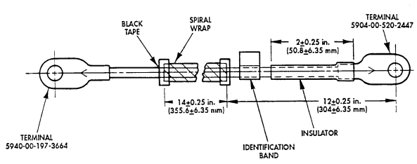

Figure D-35. Winch Battery Cable.

## Instructions:

Determine cable part number needed from RPSTL and cut cable 6145-00-538-8219 to length as 1. 

shown.

Select and solder proper end terminals to cable ends as shown. (Refer to TM 9-237 for soldering 2. 

instructions.)
3. Install insulator as shown.

Cut 14-in. (355.6 mm) of spiral wrap from bulk 25 FT 40186 (CAGEC 17656) and install as shown.

4.

Spiral wrap is held in position with black tape at both ends.

Mark and install identification band using old cable as reference.

5.

Section II. ILLUSTRATED MANUFACTURING INSTRUCTIONS (Cont'd)

|          |            |     |        | BATTERY CABLE ASSEMBLY   |                     |                     |
|----------|------------|-----|--------|--------------------------|---------------------|---------------------|
| ITEM NO. | CABLE PART | CUT | LENGTH | MANUFACTURED             | END TERMINALS       | END INSULATORS      |
|          | NUMBER     |     |        | FROM NSW                 | NSN                 | મર્ટીન                |
|          |            | IN. | MM     |                          |                     |                     |
| 1        | 5578874    | 21  | 533.4  | 6145\-00\-705\-6674      | 5940\-00\-705\-6732 | 5970\-01\-174\-9449 |
|          |            |     |        |                          | 5940\-00\-705\-6732 |                     |
| 2        | 5578875    | 25  | 635.0  | 6145\-00\-705\-6674      | 5940\-00\-735\-5520 | 5970\-01\-174\-9449 |
|          |            |     |        |                          | 5940\-00\-705\-6732 |                     |
| 3        | 5578876    | 13  | 330.2  | 6145\-00\-705\-6674      | 5940\-00\-705\-6732 | 5970\-01\-174\-9449 |
|          |            |     |        |                          | 5940\-00\-705\-6732 |                     |
| র্ব       | 5578877    | 36  | 914.4  | 6145\-00\-705\-6674      | 5940\-00\-735\-5520 | 5970\-01\-174\-9449 |
|          |            |     |        |                          | 5940\-00\-705\-6732 |                     |
| 5        | 5578878    | 32  | 812.8  | 6145\-00\-705\-6674      | 5940\-00\-705\-6732 | 5970\-01\-174\-9449 |
|          |            |     |        |                          | 5940\-00\-705\-6732 |                     |
| 6        | 5584892    | 31  | 787.4  | 6145\-00\-705\-6674      | 5940\-00\-735\-5520 | 5970\-01\-174\-9449 |
|          |            |     |        |                          | 5940\-00\-735\-5520 |                     |
| 7        | 5584893    | 31  | 787.4  | 6145\-00\-705\-6674      | 5940\-00\-735\-5520 | 5970\-01\-174\-9449 |
|          |            |     |        |                          | 5940\-00\-705\-6732 |                     |

|            | MATERIAL BLOCK   |               |
|------------|------------------|---------------|
| STOCK SIZE | DESCRIPTION      | SPECIFICATION |
| 0 GAUGE    | WIRE ELECTRICAL  | MIL\-C\-13486 |

INSULATOR

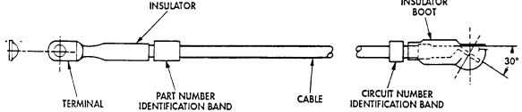

Figure D-36. Battery Cable Assembly.

#### Instructions:

1.

Determine cable part number needed from RPSTL and cut cable 6154-00-705-6674 to length as shown.

· Items 1, 4, 5, 6, and 7: flat of terminals to be 90° offset as shown without wire twist.

· Item 6: one terminal end is bent 30°.

Select and solder proper end terminals to cable ends as shown. (Refer to TM 9-237 for soldering 2.

instructions.)

3.

Insulator boot 5582481 is installed on 30° bent terminal end of item 6.

Select and install proper insulators as shown.

Mark and install circuit number identification band and part number identification band using old cable as reference.

র্ব.

# Section Ii. Illustrated Manufacturing Instructions (Cont'D)

|             | 200\-AMP ALTERNATOR CABLE ASSEMBLY   |         |                     |                     |                     |
|-------------|--------------------------------------|---------|---------------------|---------------------|---------------------|
| CABLE       | CUT LENGTH                           |         | MANUFACTURED        | END TERMINAL NSN    | END INSULATOR NSN   |
| PART NUMBER | IN.                                  | MM      | FROM NSN            |                     |                     |
| 5582451     | 58                                   | 1.473.2 | 6145\-00\-705\-6674 | 5940\-00\-735\-5520 | 5970\-00\-174\-9449 |

|            | MATERIAL BLOCK   |               |
|------------|------------------|---------------|
| STOCK SIZE | DESCRIPTION      | SPECIFICATION |
| 0 GAUGE    | WIRE ELECTRICAL  | MIL\-C\-13486 |

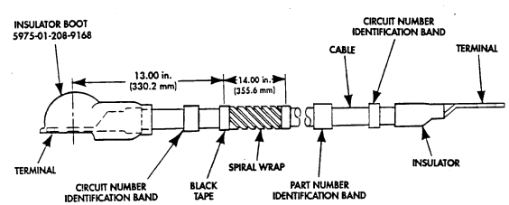

Figure D-37.  200-Amp Alternator Cable Assembly.

## Instructions:

Cut cable to length as shown.

I.

Cut 14-in. (355.6 mm) of spiral wrap from bulk 25 FT 40186 (CAGEC 17656) and install as shown.

2.

Secure spiral wrap in position with black tape at both ends.

Select and solder proper end terminals to cable ends as shown. Refer to TM 9-237 for soldering 3.

instructions.

Install insulator and insulator boot to cable ends as shown.

র্ব .

Mark and install identification bands using old cable as reference.

5.

|                               | MATERIAL BLOCK    |               |
|-------------------------------|-------------------|---------------|
| ટ્રીભ્ત ટાંટિક                      | DESCRIPTION       | SPECIFICATION |
| 0.250\-in. (6.35 mm) DIAMETER | TUBE, METALLIC    | MIL\-T\-6845  |
| 0.250\-in. (6.35 mm)          | HOSE, NONMETALLIC | MIL\-H\-13444 |
| INSIDE DIAMETER               |                   |               |
| 0.438\-in. (11.125 mm)        |                   |               |
| OUTSIDE DIAMETER              |                   |               |

|      |                  | FUEL FILTER BLEEDER TOOL   |       |                       |
|------|------------------|----------------------------|-------|-----------------------|
| ITEM | TOOL PART NUMBER | CUT LENGTH                 |       | MANUFACTURED FROM NSN |
| NO.  |                  | IN.                        | MM    |                       |
|      | 5598825          | 1\-1/2                     | 38.1  | 4710\-00\-825\-5894   |
|      | 5598826          | ನಿರ್                         | 609.6 | 4720\-00\-542\-3304   |

# Section Ii. Illustrated Manufacturing Instructions (Cont'D)

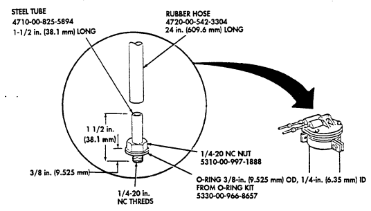

Figure D-38. Fuel Filter Bleeder Tool.

## Instructions:

1. Cut steel tube, NSN 4710-00-825-5894, to length as shown.

2.   Thread one end of the tube 5/8-in. (15.5 mm). 3.   Install nut, NSN 5310-00-997-1888, and O-ring, NSN 5330-00-966-8657, on threaded end of tube. 4. Install 24-in. (609.6 mm) rubber hose, NSN 4720-00-542-3304, to the other end of the tube.

# Section Ii. Illustrated Manufacturing Instructions (Cont'D)

|                               | PROTECTIVE SHIELD   |                       |
|-------------------------------|---------------------|-----------------------|
| PROTECTIVE SHIELD PART NUMBER | CUT TO  ડાંતર         | MANUFACTURED FROM NSN |
| 5598828                       | AS SHOWN            | 9535\-00\-541\-7194   |

|                                 | MATERIAL BLOCK   |                |
|---------------------------------|------------------|----------------|
| STOCK SIZE                      | DESCRIPTION      | SPECIFICATION  |
| 12 x 4\-ft (3.66 x 1.2 m) SHEET | ALUMINUM ALLOY   | ASTM B 209\-90 |
| 0.060 in. (91.524 mm) THICK     | TEMPER T\-4      |                |

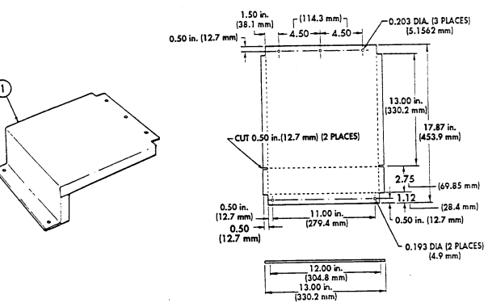

1

Figure D-39. Protective Shield.

## Instructions:

1. Cut aluminum sheet metal to size as shown.

2.  Locate, mark, and drill two 0.193-in. (4.902 mm) diameter holes in protective shield (1).

3.  Locate, mark, and drill three 0.203-in. (5.156 mm) diameter holes in protective shield (1).

4.   Make two 0.50-in. (12.7 mm) relief cuts in sides of protective shield (1).

5. Bend edges 90° along dotted lines on protective shield (1).

6. Paint protective shield (1) as required. Refer to TM 43-0139.

# Section Ii. Illustrated Manufacturing Instructions (Cont'D)

| PROTECTIVE ENGINE COVER   |         |                 |              |
|---------------------------|---------|-----------------|--------------|
| COVER                     | CUT     |                 | MANUFACTURED |
| PART NUMBER               | IN.     | MM              | FROM NSN     |
| 5598829                   | 34 x 60 | 863.6 x 1,524.0 | N/A          |

|                             | MATERIAL BLOCK   |                |
|-----------------------------|------------------|----------------|
| STOCK SIZE                  | DESCRIPTION      | SPECIFICATION  |
| 4 x 8 ft (1.22 x 2.44 m)    | PLYWOOD.         | MIL\-STD\-731A |
| 0.750\-in. (19.05 mm) THICK | SHEET            |                |

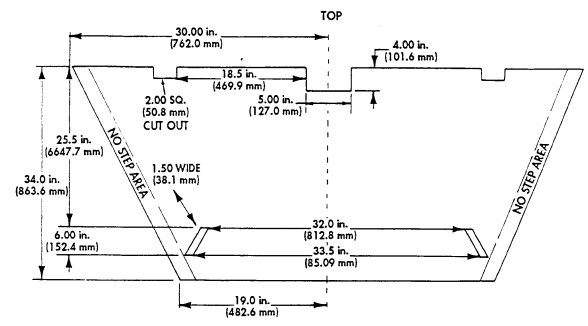

Figure D-40. Protective Engine Cover.

## Instructions

1. Cut plywood to dimensions shown. If necessary, modify plywood for proper fit.

Paint cover and outline with yellow safety boarder, 4-in. (101.6 mm) wide on outside edges. Refer to 2.

TM 43-0139.

Stencil NO STEP AREA caution on outside edges.

3.

Prior to installing protective engine cover, remove both plate covers and seals from airlift brackets.

4.

# Section Ii.  Illustrated Manufacturing Instructions (Cont'D)

| COOLER FIN PROTECTIVE COVER   |              |                  |              |
|-------------------------------|--------------|------------------|--------------|
| COVER                         | CUT LENGTH   |                  | MANUFACTURED |
| PART NUMBER  IN.              |              | MM               | FROM NSN     |
| 5598830                       | 40 x 46\-1/2 | 1,016. x 1,181.1 | N/A          |

| MATERIAL BLOCK              |             |                |
|-----------------------------|-------------|----------------|
| STOCK SIZE                  | DESCRIPTION | SPECIFICATION  |
| 4 x 8 ft (1.22 x 2.44 m)    | PLYWOOD.    | MIL\-STD\-731A |
| 0.750\-in. (19.05 mm) THICK | SHEFT       |                |

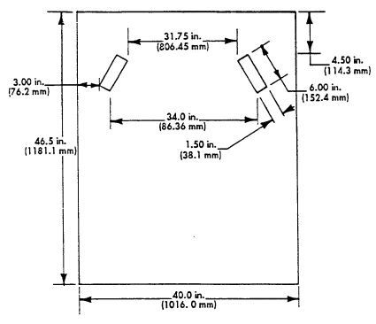

Figure D-41. Cooler Fin Protective Cover.

## Instructions:

1. Cut plywood to dimensions shown. If necessary, modify plywood for proper fit.

Never use cover with engine running; engine damage may occur.

2. 

Stencil NO STEP caution on top of cover.

3. 

 Prior to installing cooler fin protective cover, remove both plate covers and seals from airlift bracket.

4.

Store flat or hang on wall to prevent warpage.

5.

# Section Ii.  Illustrated Manufacturing Instructions (Cont'D)

|                 | GRAB LOOP   |       |                     |
|-----------------|-------------|-------|---------------------|
| GRAB LOOP       | CUT LENGTH  |       | MANUFACTURED        |
| IN. PART NUMBER |             | MM    | FROM NSN            |
| 12 5598847      |             | 304.8 | 8315\-00\-634\-3304 |

|            | MATERIAL BLOCK   |               |
|------------|------------------|---------------|
| STOCK SIZE | DESCRIPTION      | SPECIFICATION |
| N/A        | STRAP WEBBING    | N/A           |
| N/A        | THREAD           | N/A           |

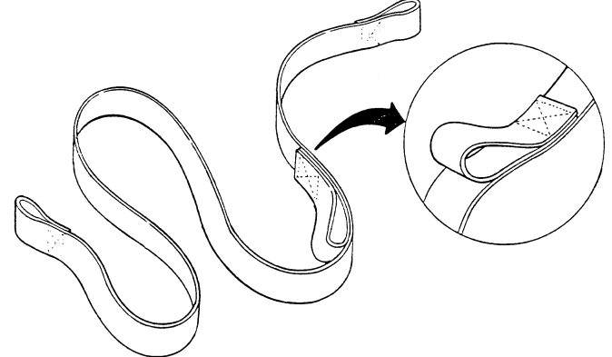

Figure D-42. Grab Loop.

## Instructions:

Remove cargo shell door strap from vehicle. Refer to para. 11-23.

1.

Position grab loop one-third of the way down strap. Fold strap into thirds and mark top fold.

2.

Secure grab loop to strap with thread using box stitch and string. Refer to FM 10-16.

3.

Install cargo shell door strap on vehicle with grab loop facing the rear. Refer to para. 11-23.

4.

# Section Ii. Illustrated Manufacturing Instructions (Cont'D)

| ITEM   |       | MATERIALS                            |                     |
|--------|-------|--------------------------------------|---------------------|
| NO.    | REQ'D | DESCRIPTION                          | NSN/PART NUMBER     |
|        | 8     | Electrical Wire: 48 in. (1,219.2 mm) | 6145\-00\-152\-6499 |
|        | 8     | Insulation Sleeving: 2 in. (50.8 mm) | 5970\-01\-815\-1295 |
| 5      |       | Receptacle                           | 5935\-00\-738\-8328 |
|        | 5     | Tiedown Strap                        | 5975\-00\-074\-2072 |
| 3      | 8     | Wire Marker                          | 46F5981             |

|            | MATERIAL BLOCK      |                 |
|------------|---------------------|-----------------|
| STOCK SIZE | DESCRIPTION         | SPECIFICATION   |
| 14 AWG     | WIRE. ELECTRICAL    | MIL\-C\-13486   |
| N/A        | INSULATION SLEEVING | MIL\-I\-23053/2 |

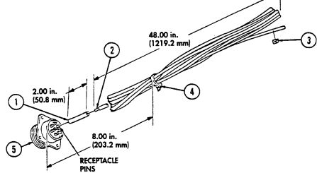

Figure D-43. Body Harness Receptacle Fabrication.

INSTRUCTIONS:

When connecting electrical wire to connector pins on engine harness plug connector, use NSN 3439-00-133-1108 solder. (Refer to TB SIG-222 for soldering.)
Cut eight sections of wire (2) to length as shown.

1.

Cut eight sections of insulation sleeving (1) as shown.

2.

Position eight sections of insulation sleeving (1) on wires (2).

3.

Connect eight sections of wire (2) to receptacle pins marked A, B, C, D, E, F, G, and H on recep4.

tacle (5). Place insulation sleeving (1) over wires (2) and receptacle pins and heat-shrink insulation sleeving (1) into position as shown.

Apply sealant NSN 8040-00-225-4918 to receptacle pins, wires, and sleeving.

5.

Use wire markers (3) on eight sections of wire (2) to locate and mark wires. Secure eight sections of 6.

wire (2) with five tiedown straps (4).

# Section Ii. Illustrated Manufacturing Instructions (Cont'D)

| ITEM   |       | MATERIALS                            |                     |
|--------|-------|--------------------------------------|---------------------|
| NO.    | REQ'D | DESCRIPTION                          | NSN/PART NUMBER     |
| ರಿ      | 1     | Coupling Nut                         | 5310\-00\-655\-9860 |
| 2      | 8     | Electrical Wire: 48 in. (1,219.2 mm) | 6145\-00\-152\-6499 |
| ﺴﺮ     | 1     | Grommet                              | 5365\-00\-772\-2322 |
| 5  ק   | 1     | Grommet Retaining Nut                | 5935\-00\-333\-9414 |
|        | 1     | Plug Shell Assembly                  | 5935\-00\-686\-2608 |
| 4      | ર     | Tiedown Strap                        | 5975\-00\-074\-2072 |
| ਤੇ      | 8     | Wire Marker                          | 46F5981             |

|            | MATERIAL BLOCK   |               |
|------------|------------------|---------------|
| STOCK SIZE | DESCRIPTION      | SPECIFICATION |
| 14 AWG     | WIRE, ELECTRICAL | MIL\-C\-13486 |
|            |                  |               |

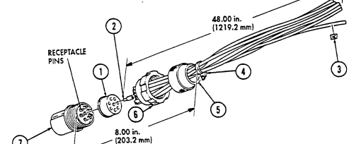

Figure D-44. Body Harness Connector Fabrication.

INSTRUCTIONS:

When connecting electrical wires to connector pins on body harness connector, use NSN 3439-00-133-1108 solder. (Refer to TB SIG-222 for soldering.)
Cut eight sections of wire (2) to length as shown.

Place grommet retaining nut (5) over eight sections of wire (2).

1.

2.

3.

Position eight sections of wire (2) in grommet (1).

4.

5.

Place coupling nut (6) over plug shell assembly (7).

Connect eight sections of wire (2) to receptacle pins marked A, B, C, D, E, F, G, and H on plug shell assembly (7).

Position grommet (1) in plug shell assembly (7) and secure with grommet retaining nut (5).

Use wire markers (3) on eight sections of wire (2) to locate and mark wires. Secure eight sections of wire (2) with five tiedown straps (4).

6.

7.

Section II. ILLUSTRATED MANUFACTURING INSTRUCTIONS (Cont'd)

|      |                  | MATERIAL BLOCK                       |                     |
|------|------------------|--------------------------------------|---------------------|
|      | STOCK SIZE       | DESCRIPTION                          | SPECIFICATION       |
|      | 14 AWG           | WIRE, ELECTRICAL                     | MIL\-C\-13486       |
|      | 14 AWG           | WIRE, ELECTRICAL                     | MIL\-C\-13486/1     |
|      | N/A              | INSULATION SLEEVING                  | MIL\-I\-23053/2     |
| ITEM |                  | MATERIALS                            |                     |
| NO.  | REQ'D            | DESCRIPTION                          | NSN/PART NUMBER     |
| 5    | Coupling Nut 1   |                                      | 5310\-00\-655\-9860 |
| 2    | 6                | Electrical Wire: 60 in. (1,524 mm)   | 6145\-00\-538\-8222 |
| 6    | 3                | Electrical Wire: 60 in. (1,524 mm)   | 6145\-00\-152\-6499 |
| 7    | 3                | Insulation Sleeving: 3 in. (76.2 mm) | 5970\-00\-812\-2967 |
| 1    | 1 Plug Connector |                                      | 5935\-01\-173\-7654 |
| 4    | Tiedown Straps 6 |                                      | 5975\-00\-074\-2072 |
| 3    | 9 Wire Marker    |                                      | 46F5981             |

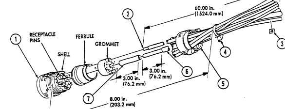

Figure D-45.  Engine Harness Connector Fabrication.

# Section Ii. Illustrated Manufacturing Instructions (Cont'D)

## Instructions: Note

When connecting electrical wire to connector pins on engine harness plug connector, use NSN 3439-00-133-1108 solder. (Refer to TB SIG-222 for soldering.)
1. 2. 3. 4. 5.

6.

7. 8. 9.

10.

11. 12.

13.

14.

Cut three sections of electrical wire (6) to length as shown.

Remove 3-in. (76.2 mm) section of electrical insulation from electrical wire (6).

Cut three sections of insulation sleeving (7) to length as shown.

Position three sections of insulation sleeving (7) over wires (6).

Using plug connector (1), disassemble shell, coupling nut (5), ferrule, and grommet.

Place coupling nut (5) and ferrule over three wires (6).

Place three wires (6) in holes marked D, E, and F in grommet.

Connect three wires (6) to receptacle pins marked D, E, and F on shell.

Cut six sections of electrical wire (2) to length as shown.

Place six wires (2) in coupling nut (5), ferrule, and holes marked A, B, C, G, H, and I on grommet.

Connect six wires (2) to receptacle pins marked A, B, C, G, H, and I on shell.

Position grommet and ferrule in shell and secure with coupling nut (5). Using three wires (6) with insulation, heat-shrink sleeving (7) in position.

Apply sealant NSN 8040-00-225-4918 to three wires (6) and insulation sleeving (7) on plug connector (1).

Using plug connector (1) and wire markers (3), locate and mark nine wires. Secure nine wires with six tiedown straps (4).

# Section Ii.  Illustrated Manufacturing Instructions (Cont'D)

|      | MATERIAL BLOCK                              |                     |
|------|---------------------------------------------|---------------------|
|      | DESCRIPTION STOCK SIZE                      | SPECIFICATION       |
|      | WIRE BIBCORRICAL 14 AWG                     | MIL\-C\-13486       |
|      | WIRE ELECTRICAL 14 AWG                      | MIL\-C\-13486/1     |
|      | INSULATION SLEEVING N/A                     | MIL\-I\-23053/2     |
|      | INSULATION SLEEVING N/A                     | MIL\-I\-23053/5     |
| ITEM | MATERIALS                                   |                     |
| NO.  | DESCRIPTION REQ'D                           | NSN/PART NUMBER     |
| 2    | 3 Electrical Wire: 60 in. (1,524 mm)        | 6145\-00\-538\-8222 |
| 5    | Electrical Wire: 60 in. (1,524 mm) 6        | 6145\-00\-152\-6499 |
| 1    | Insulation Sleeving: 1\-1/2 in. (38.1 mm) 3 | 5970\-00\-812\-2967 |
| 6    | Insulation Sleeving: 1\-1/2 in. (38.1 mm) 6 | 5970\-00\-815\-1295 |
| 7    | Receptacle Connector 1                      | 5935\-01\-149\-5163 |
| 4    | Tiedown Strap 6                             | 5975\-00\-074\-2072 |
| 3    | 9 Wire Marker                               | 46F5981             |

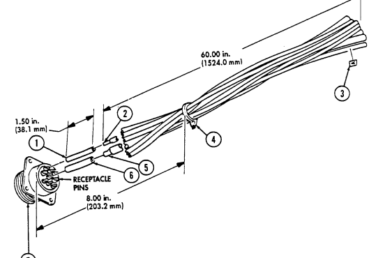

7

Figure D-46.  Engine Harness Receptacle Fabrication.

# Section Ii. Illustrated Manufacturing Instructions (Cont'D)

## Instructions: Note

When connecting electrical wire to connector pins on engine harness plug connector, use NSN 3439-00-133-1108 solder. (Refer to TB SIG-222 for soldering.)
1.

2. 3.

র্ব .

Cut three sections of electrical wire (2) to length as shown.

Cut three sections insulation sleeving (1) to length as shown. Position three sections of insulation sleeving (1) on wires (2).

Connect three wires (2) to receptacle pins marked D, E, and F on receptacle connector (7). Place insulation sleeving (1) over wires (2) and receptacle pins and heat-shrink insulation sleeving (1) into position. Apply sealant NSN 8040-00-225-4918 to three wires (2) and insulation sleeving (1) on receptacle connector (7).

5.

6.

7.

8.

9.

Cut six sections of electrical wire (5) to length as shown.

Cut six sections of insulation sleeving (6) to length as shown.

Position six sections of insulation sleeving (6) on wires (5).

Connect six wires (5) to receptacle pins marked A, B, C, G, H, and I on receptacle connector (7).

Place electrical insulating sleeving (6) over wires (5) and receptacle pins and heat-shrink insulation sleeving (6) into position.

Use wire marker (3) on nine sections of wire to locate and mark wires. Secure wires with six tiedown straps (4).

10.

| ITEM   |    | MATERIALS                  |                     |
|--------|----|----------------------------|---------------------|
| NO.    |    | REQ'D DESCRIPTION          | NSN/PART NUMBER     |
|        |    | Mini\-box (bottom section) | 5999\-00\-971\-8848 |
| 10     | દ  | Non\-metallic Bumper       | 5340\-01\-219\-6733 |
| II     | 6  | Nut                        | 5310\-00\-934\-9753 |
| 8      | 6  | Screw                      | 5305\-00\-958\-4353 |
|        | દ  | Washer                     | 5310\-00\-880\-5976 |

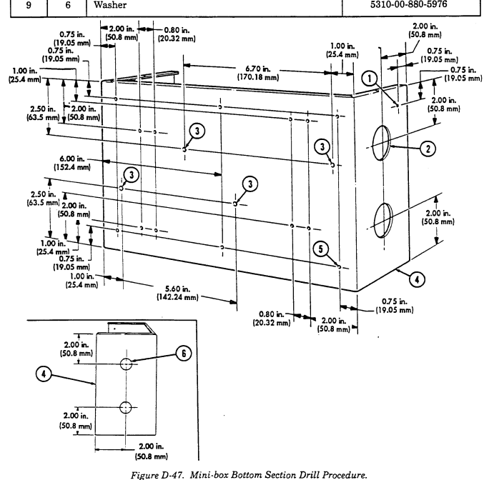

# Section Ii. Illustrated Manufacturing Instructions (Cont'D) Section Ii. Illustrated Manufacturing Instructions (Cont'D)

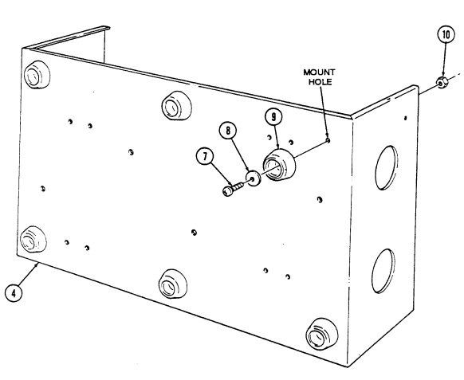

Figure D-47. Mini-box Bottom Section Drill Procedure (Cont'd).

## Instructions:

1. 2.

3.

Locate, mark, and drill 0.138-in. (3.51 mm) diameter hole (1) in mini-box bottom section (4) as shown.

Locate, mark, and drill two 1.250-in. (31.75 mm) diameter holes (2) in mini-box bottom section (4) as shown.

Locate, mark, and drill four 0.190-in. (4.83 mm) diameter holes (3) in mini-box bottom section (4) as shown.

র্ব.

5.

6.

Locate, mark, and drill fourteen 0.138-in. (3.51 mm) diameter holes (5) in mini-box bottom section (4)
as shown.

Locate, mark, and drill two 0.750-in. (19.05 mm) diameter holes (6) in mini-box bottom section (4) as shown.

Install six non-metallic bumpers (9) on mount holes on mini-box bottom section (4) with washers (8),
screws (7), and nuts (10) as shown.

Section II.  ILLUSTRATED MANUFACTURING INSTRUCTIONS (Cont'd)

| PRE\-PUNCHED CHANNEL   |            |              |
|------------------------|------------|--------------|
| CHANNEL                | CUT LENGTH | MANUFACTURED |
| PART NUMBER            |            | FROM NSN     |
| 67                     | AS SHOWN   | N/A          |

|              | MATERIAL BLOCK   |               |
|--------------|------------------|---------------|
| STOCK SIZE   | DESCRIPTION      | SPECIFICATION |
| 3 ft (.92 m) | CHANNEL          | N/A           |

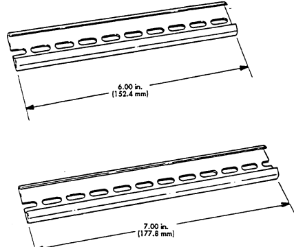

Figure D-48.  Pre-punched Channel.

# Section Ii. Illustrated Manufacturing Instructions (Cont'D)

| ITEM   |       | MATERIALS                               |             |
|--------|-------|-----------------------------------------|-------------|
| NO.    | REQ'D | DESCRIPTION                             | PART NUMBER |
|        |       | Channel, Pre\-punched: 7 in. (177.8 mm) | 67          |
| 5      | 2     | Channel Clamp                           | ୧୫          |
| 4      |       | End Section                             | 0630        |
| చ      | 3     | Terminal Block                          | 0624        |
| 2      | 6     | Terminal Block                          | 0621        |

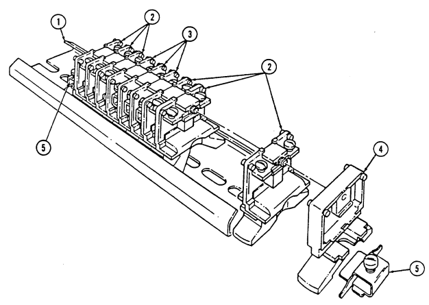

Figure D-49.  Channel, 7.00-in. (177.8 mm) and Terminal Block Assembly.

ASSEMBLY INSTRUCTIONS:
 Install three terminal blocks (2), terminal blocks (3), terminal blocks (2), and end section (4) on channel (1) with two channel clamps (5).

| ITEM   |       | MATERIALS                               |             |
|--------|-------|-----------------------------------------|-------------|
| NO.    | REQ'D | DESCRIPTION                             | PART NUMBER |
|        |       | Channel, Pre\-punched: 6 in. (152.4 mm) | 67          |
|        | ર     | Channel Clamp                           | ୧୫          |
| 3      |       | End Section                             | 0630        |
| 2      | ਬ     | Terminal Block                          | 0621        |

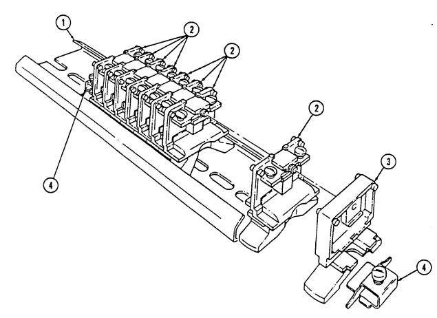

Figure 50.  Channel, 6.00-in. (152.4 mm) and Terminal Block Assembly.

ASSEMBLY INSTRUCTIONS:
Install eight terminal blocks (2) and end section (3) on channel (1) with two channel clamps (4).

# Section Ii. Illustrated Manufacturing Instructions (Cont'D)

| ITEM   |       | MATERIALS                  |                     |
|--------|-------|----------------------------|---------------------|
| NO.    | REQ'D | DESCRIPTION                | NSN/PART NUMBER     |
| 2      | 4     | Cable Tie Holder           | MB4A                |
| 1      | 2     | Grommet, Non\-metallic     | 5325\-00\-270\-8890 |
| ર      | 2     | Grommet, Non\-metallic     | 5325\-00\-309\-7164 |
| 5      | 1     | Mini\-box (bottom section) | 5999\-00\-971\-8848 |
| 8      | 4     | Nut                        | 5310\-00\-934\-9758 |
| 11     | 8     | Nut                        | 5310\-00\-934\-9753 |
| র্ব     | 4     | Screw                      | 5305\-00\-984\-6210 |
| 3      | 8     | Screw                      | 5305\-00\-958\-4353 |
| ਰੇ      | 4     | Washer                     | 5310\-00\-883\-9384 |
| 10     | 8     | Washer                     | 5310\-00\-880\-5976 |
| 7      | 1     | Wire Marker                | 46F5981             |

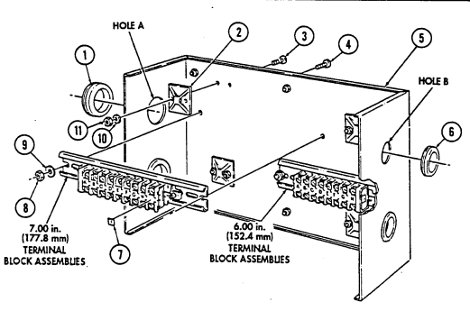

# Section Ii. Illustrated Manufacturing Instructions (Cont'D)

Figure 51.  Terminal Block Assemblies and Cable Tie Holder Installation.

ASSEMBLY INSTRUCTIONS:
1. Using wire marker (7) and 6-in. (152.4 mm) and 7-in. (177.8 mm) terminal block assemblies, locate and mark sections as shown.

2. Install 6-in. (152.4 mm) and 7-in. (177.8 mm) terminal block assemblies in mini-box bottom section (5)
with four screws (4), washers (9), and nuts (8).

3. Install four cable tie holders (2) in mini-box bottom section (5) with eight screws (3), washers (10), and nuts (11).

4. Install two non-metallic grommets (1) in holes A on mini-box bottom section (5).

5. 

Install two non-metallic grommets (6) in holes B on mini-box bottom section (5).

# Section Ii.  Illustrated Manufacturing Instructions (Cont'D)

| ITEM   |       |                                    | MATERIALS   |                     |
|--------|-------|------------------------------------|-------------|---------------------|
| NO.    | REQ'D |                                    | DESCRIPTION | NSN/PART NUMBER     |
|        | Jイ   | Electrical Wire: 12 in. (304.8 mm) |             | 6145\-00\-808\-4849 |
|        | 16    | Receptacle Pin                     |             | 1\-87756\-6         |
|        |       | Receptacle Plug                    |             | 103308\-3           |
|        | 11    | Terminal Lug                       |             | 5940\-00\-577\-3807 |
|        | 14    | Wire Marker                        |             | 46F5981             |

|            | MATERIAL BLOCK   |                 |
|------------|------------------|-----------------|
| STOCK SIZE | DESCRIPTION      | SPECIFICATION   |
| 14 AWG     | WIRE, ELECTRICAL | MIL\-C\-13486/1 |

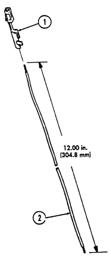

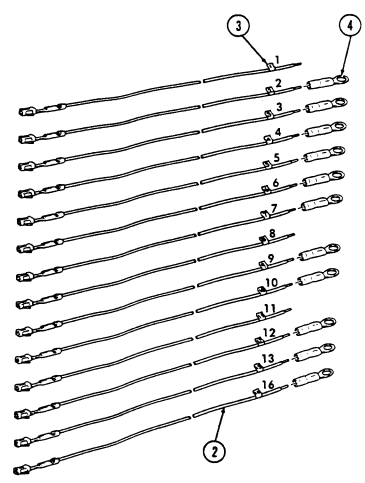

10 - 200

Figure D-52. Receptacle Plug and Pin Assemblies.

# Section Ii. Illustrated Manufacturing Instructions (Cont'D)

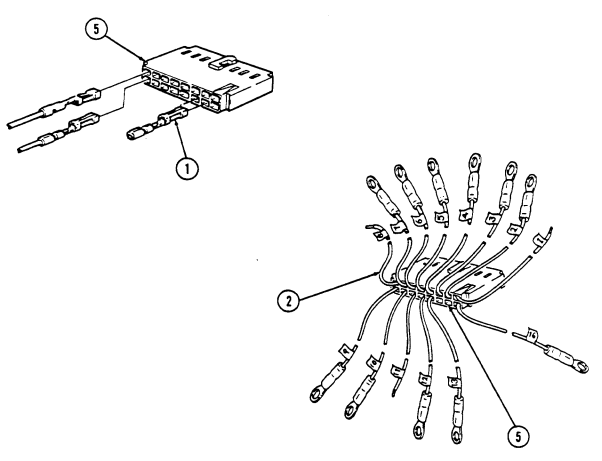

Figure D-52.  Receptacle Plug and Pin Assemblies (Cont'd).

## Instructions:

1. Cut fourteen sections of electrical wire (2) to length as shown.

2. Install fourteen receptacle pins (1) on wires (2) as shown.

 Using fourteen wire markers, mark wires (2) with numbers 1 through 13 and 16 as shown.

3.

4. Install eleven terminal lugs (4) on wires (2) marked 2, 3, 4, 5, 6, 7, 9, 10, 12, 13, and 16 as shown.

Install two receptacle pins (1) (without wires) in slotted positions marked 14 and 15 on receptacle 5. 

plug (5).

Install fourteen receptacle pins (1) (with wires connected) in slotted positions marked 1, 2, 3, 4, 5, 6, 7, 6.

8, 9, 10, 11, 12, 13, and 16 on receptacle plug (5).

# Section Ii. Illustrated Manufacturing Instructions (Cont'D)

|    | \-\-\-\-\-\-\-\-\-\-\-\-\-   | MATEDIAIS   |                               |                     |
|----|------------------------------|-------------|-------------------------------|---------------------|
|    | LE MODEL CONNULERS           | DESCRIPTION | \-\-\-\-\-\-\-\-\-            |                     |
|    |                              | \-\-        | \-\- \-\-\-\-\-\-\-\-\-\-\-\- | No. of Children     |
| OO | erminal Lug                  |             |                               | 5940\-00\-283\-5280 |
|    | ..                           |             | \-\- \-\-                     |                     |

## Assembly Instructions: Note

· Ensure wire markers match letter identification for connector and receptacle harness assemblies.

· Trim excess wire to required length when installing wire and terminal lugs to terminal block assembly.

1.

2. 3.

4.

5.

6.

7. 8.

9.

10.

11.

12.

13.

14.

Route wires (5) from body harness receptacle (6) through grommet (7).

Install eight terminal lugs (3) on wires (5) from body harness receptacle (6).

Install wires (5) marked A, B, C, D, E, F, G, and H on body harness receptacle (6) to matching letters on terminal block assembly (4).

Route wires (10) from body harness connector (8) through grommet (9).

Install eight terminal lugs (3) on wires (10) from body harness connector (8).

Install wires (10) marked A, B, C, D, E, F, G, and H on body harness connector (8) to matching letters on terminal block assembly (4).

Route wires (13) on engine harness connector (14) through grommet (15).

Connect three wires (12) marked D, E, and F on engine harness connector (14) to matching letters on terminal block assembly (11). Do not tighten screws.

Install six terminal lugs (3) on wires (13) from engine harness connector (14)
Install wires (13) marked A, B, C, G, H, and I on engine harness connector (14) to matching letters on terminal block assembly (11).

Route wires (2) on engine harness receptacle (1) through grommet (16).

Connect three wires (12) marked D, E, and F on engine harness receptacle (1) to matching letters on terminal block assembly (11).

Install six terminal lugs (3) on wires (2) from engine harness receptacle (1).

Install wires (2) marked A, B, C, G, H, and I on engine harness receptacle (1) to matching letters on terminal block assembly (11).

# Section Ii. Illustrated Manufacturing Instructions (Cont'D)

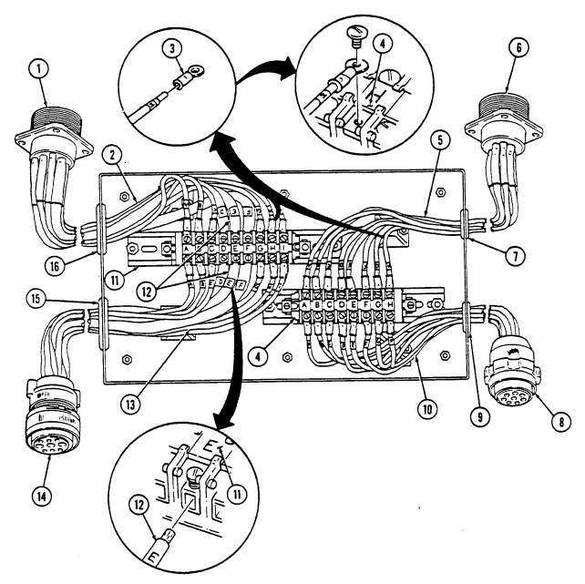

Figure D-53.  Body, Engine Harness Connector, and Receptacle Installation.

# Section Ii.  Illustrated Manufacturing Instructions (Cont'D)

## Assembly Instructions: Note

· Ensure wire markers match letter identification for connector and receptacle harness assemblies.

· Trim excess wire to required length when installing wire and terminal lugs to terminal block assembly.

1.

2.

3.

Connect wires (3) marked 2, 3, 4, 6, 7, and 16 on receptacle plug (4) to terminal strip (2) marked H, F,
G, C, D, and B.

Connect wire (3) marked 13 on receptacle plug (4) to terminal strip (2) marked E.

Connect wires (5) marked 1, 8, 11 on receptacle plug (4) to terminal strip (1) marked E, F, D.

Connect wires (3) marked 5, 9, 10, and 12 on receptacle plug (4) to terminal strip (1) marked A, H, I,
and G.

র .

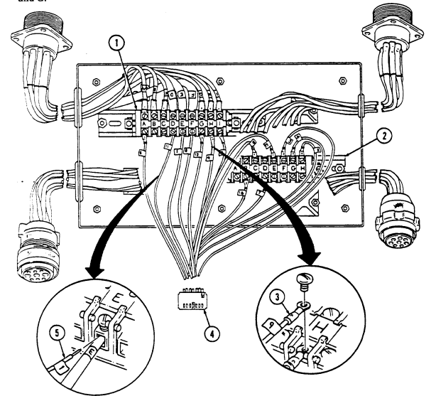

Figure D-54.  Receptacle Plug Installation.

| ITEM   |         | MATERIALS                               |                     |
|--------|---------|-----------------------------------------|---------------------|
| NO.    | REQ'D   | DESCRIPTION                             | NSN/PART NUMBER     |
| 5      | 2       | Conduit Insulation: 48 in. (1,219.2 mm) | 68240               |
| 13     | 2       | Conduit Insulation: 54 in. (1,371.6 mm) | 68243               |
| ਰੇ      | 4 Nut   |                                         | 5310\-00\-934\-9758 |
| র্ব     | 2       | Loop Clamp                              | 5340\-00\-057\-2904 |
| 12     | 2       | Loop Clamp                              | 5434\-00\-724\-7038 |
| 3      | 4 Screw |                                         | 5305\-00\-984\-6210 |
| દ      | AR Tape |                                         | 7510\-00\-802\-8311 |
| 11     | বঁ       | Tiedown Strap                           | 5975\-00\-074\-2072 |
| 8      | র্ব      | Washer                                  | 5310\-00\-883\-9384 |
|        | (       |                                         |                     |

# Section Ii. Illustrated Manufacturing Instructions (Cont'D)

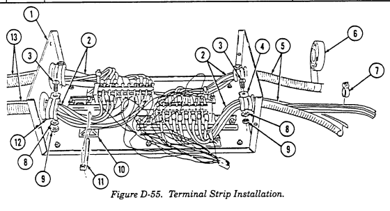

## Assembly Instructions:

1.

2.

3.

র্ব .

5.

6.

7.

8.

9.

Install four tiedown straps (11) in cable tie holders (10) and secure wires (2) to cable tie holders (10)
with tiedown straps (11).

Install two loop clamps (4) on wires (2) of body harness connector and receptacle with screws (3),
washers (8), and nuts (9).

Install two loop clamps (12) on wires (2) of engine harness connector and receptacle with screws (3),
washers (8), and nuts (9).

Cut two 48-in. (1.219.2 mm) sections of conduit insulation (5).

Remove ten tiedown straps (7) from wires (2) of body harness connector and receptacle. Position two sections of conduit insulation (5) over wires (2) of body harness connector and receptacle and secure with tape (6).

Cut two 54-in. (1,371.6 mm) sections of conduit insulation (13).

Remove twelve tiedown straps (7) from wires on engine harness connector and receptacle.

Position sections of conduit insulation (13) over wires (2) on engine harness connector and receptacle and secure with tape (6).

# Section Ii. Illustrated Manufacturing Instructions (Cont'D)

| ITEM   | MATERIALS                            |             |                     |
|--------|--------------------------------------|-------------|---------------------|
| NO.    | REQ'D                                | DESCRIPTION | NSN                 |
|        | Electrical Wire: 12 in. (304.8 mm)   |             | 6145\-00\-152\-6499 |
|        | Insulation Sleeving: 1 in. (25.4 mm) |             | 5970\-00\-815\-1295 |
|        | Tip Jack                             |             | 5935\-00\-683\-7651 |

|            | MATERIAL BLOCK      |                 |
|------------|---------------------|-----------------|
| STOCK SIZE | DESCRIPTION         | SPECIFICATION   |
| 14 AWG     | WIRE, ELECTRICAL    | MIL\-C\-13486/1 |
| N/A        | INSULATION SLEEVING | MIL\-I\-23053/5 |

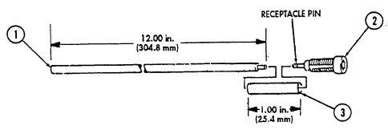

Figure D-56. Tip Jack Lead Assembly.

## Instructions: Note

When connecting electrical wire to receptacle pins on tip jacks, use NSN 3493-00-133-1108 solder. (Refer to TB SIG-222 for soldering.)
1. Cut wire (1) into five 12-in. (304.8 mm) sections as shown.

Cut insulation sleeving (3) into five 1-in. (25.4 mm) sections as shown.

2.

Connect five wires (1) to receptacle pins on tip jacks (2).

3.

Place insulation sleeving (3) over wires (1) and receptacle pins and heat-shrink insulation sleeving (3)
4.

into position.

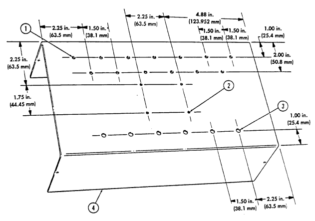

# Section Ii.  Illustrated Manufacturing Instructions (Cont'D)

Figure D-57. Mini-box Top Section Drill Procedure.

## Instructions:

1.

2.

3.

Locate, mark, and drill thirteen 0.156-in. (3.962 mm) diameter holes (1) in mini-box top section (4).

Locate, mark, and drill six 0.205-in. (5.962 mm) diameter holes (3) in mini-box top section (4).

Locate, mark, and drill four 0.138-in. (3.505 mm) diameter holes (2) in mini-box top section (4).

| ITEM   |       | MATERIALS                            |                     |
|--------|-------|--------------------------------------|---------------------|
| NO.    | REQ'D | DESCRIPTION                          | મરેન                 |
|        | 1     | Data Mark Set                        | 7510\-01\-040\-7110 |
|        | 1     | Data Mark Set                        | 7510\-01\-158\-1037 |
| 13     | 25    | Insulation Sleeving: 1 in. (25.4 mm) | 5970\-00\-812\-2974 |
| Σ      | 13    | Led                                  | 5980\-01\-288\-0188 |
| 3      | ।     | Mini\-Box (top section)              | 5999\-00\-971\-8848 |
| 7      | 5     | Terminal Lug                         | 5940\-00\-283\-5280 |
| 10     | 1     | Tip Jack                             | 5935\-00\-683\-7651 |
| 4      | 5     | Tip Jack (assembled in figure D\-56) | 5935\-00\-683\-7651 |

# Section Ii.  Illustrated Manufacturing Instructions (Cont'D)

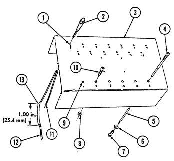

Figure D-57. Mini-box Top Section Drill Procedure (Cont'd).

## Instructions (Cont'D):

ব .

5. 6.

7.

8.

ಡ.

10.

11.

12.

Using data mark set, mark location of thirteen holes (1) on mini-box top section (3).

Using data mark set, mark location of six holes (9) on mini-box top section (3).

Install tip jack (10) and nut (8) in hole marked 2 on mini-box top section (3).

Install five tip jacks (4) with wires (5) and nuts (6) in holes marked 1, 3, 4, 5, and 6 on mini-box top section (3).

Install five terminal lugs (7) to wires (5) on tip jacks (4).

Install thirteen LEDs (2) in holes (1) marked 1 through 13 on mini-box top section (3).

Cut electrical insulation sleeving (13) into twenty-five sections as shown. Place twelve sections of electrical insulation sleeving (13) over red (+) wires (11) marked 2, 3, 4, 5, 6, 7, 8, 9, 10, 11, 12, and 13 on LEDs (2).

Place thirteen sections of electrical insulation sleeving (13) over black (-) wires (12) marked 1, 2, 3, 4, 5, 6, 7, 8, 9, 10, 11, 12, and 13 on LEDs (2).

# Section Ii. Illustrated Manufacturing Instructions (Cont'D)

| ITEM   | MATERIALS                               |                     |
|--------|-----------------------------------------|---------------------|
| NO.    | REQ'D DESCRIPTION                       | NSN/PART NUMBER     |
|        | Electrical Wire: 5 in. (127.0 mm) 31    | 6145\-00\-808\-4849 |
|        | Punch Board: 2 x 3 in. (50.8 x 76.2 mm) | 64P44EP             |

|            | MATERIAL BLOCK   |                 |
|------------|------------------|-----------------|
| STOCK SIZE | DESCRIPTION      | SPECIFICATION   |
| N/A        | WIRE, ELECTRICAL | MIL\-W\-16878/4 |
| N/A        | PUNCH BOARD      | 64P44EP         |

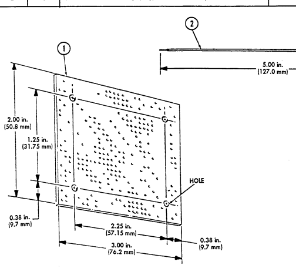

Figure D-58. Punch Board and Electrical Wire.

## Instructions:

Cut punch board (1) to size as shown.

1.

Locate, mark, and drill four 0.375-in. (9.5 mm) diameter holes in punch board (1) as shown.

2.

Cut thirty-one 5-in. (127.0 mm) sections of electrical wire (2) as shown.

3.

| ITEM   | MATERIALS                  |                                          |                     |
|--------|----------------------------|------------------------------------------|---------------------|
| NO.    | DESCRIPTION REQ'D          |                                          | NSN/PART NUMBER     |
| 7      | 1                          | Bussed Resistor Network                  | 13F171              |
| 4\-6   | 3                          | Diode                                    | ECG125              |
| 3      | 1                          | Isolated Resistor Network                | 13F170              |
|        | 1                          | Plug Connector                           | 5935\-01\-230\-9304 |
| 2      | 1                          | Punch Board (fabricated in figure D\-58) | 64P44EP             |
| 31     | Wire (cut in figure D\-58) |                                          |                     |
|        | (                          |                                          |                     |

# Section Ii. Illustrated Manufacturing Instructions (Cont'D)

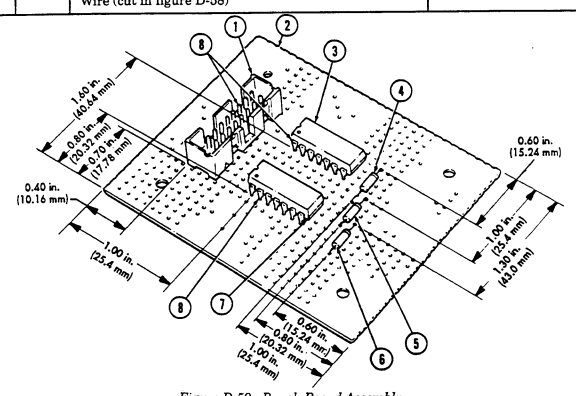

Figure D-59. Punch Board Assembly.

## Assembly Instructions:

Install plug connector (1) on punch board (2).

1.

Install fourteen wires to pins (8) marked 1, 2, 3, 4, 5, 6, 7, 8, 9, 10, 11, 12, 13, and 16 on plug 2.

connector (1).

3. Install insulated resistor network (3) on punch board (2).

Install six wires to pins (8) marked 1, 4, 7, 8, 11, and 14 on isolated resistor network (3).

4.

Install bussed resistor network (7) on punch board (2).

5.

Install eleven wires to pins (8) marked 1, 2, 3, 4, 5, 8, 9, 10, 11, 12, and 14 on bussed resistor 6.

network (7).

Install three diodes (4), (5), (6), on punch board (2).

7.

# Section Ii. Illustrated Manufacturing Instructions (Cont'D)

## Assembly Instructions:

1. Connect wire marked 6 on plug connector to banded end of diode R1.

2.

3.

4. 

5.

6.

7.

8.

9.

Connect wire marked 14 on isolated resistor network to bandless end of diode R1. Connect wire marked 7 on plug connector and wire marked 14 on bussed resistor network to banded end of diode R2.

Connect wire marked 13 on plug connector to bandless end of diode R3.

Connect wire marked 11 on isolated resistor network to bandless end of diode R2.

Connect wire marked 8 on isolated resistor network bandless end of diode R3.

 Connect wire marked 1 on isolated resistor network to black (-) wire marked 6 on LED on mini-box top section.

Connect wire marked 4 on isolated resistor network to black (-) wire marked 7 on LED.

Connect wire marked 7 on isolated resistor network to black (-) wire marked 13 on LED.

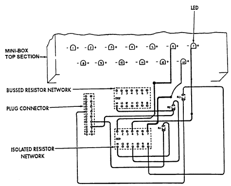

Figure D-60.  Test Module Assembly.

# Section Ii. Illustrated Manufacturing Instructions (Cont'D)

## Assembly Instructions (Cont'D):

Connect wire marked 16 on plug connector to red (+) wire marked 13 on LED.

10.

Connect wire marked 1 on plug connector to three red (+) wires marked 1, 6, and 7 on LED.

11.

Connect wire marked 2 on plug connector to red (+) wire marked 2 on LED.

12.

Connect wire marked 3 on plug connector to red (+) wire marked 3 on LED.

13.

Connect wire marked 4 on plug connector to red (+) wire marked 4 on LED.

14.

Connect wire marked 5 on plug connector to red (+) wire marked 5 on LED.

15.

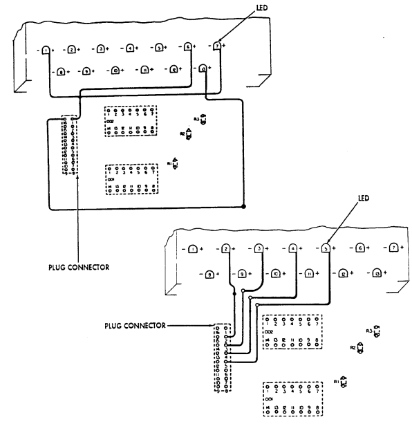

Figure D-60.  Test Module Assembly (Cont'd).

# Section Ii. Illustrated Manufacturing Instructions (Cont'D)

## Assembly Instructions (Cont'D):

Connect wire marked 8 on plug connector to red (+) wire marked 8 on LED.

16.

Connect wire marked 9 on plug connector to red (+) wire marked 9 on LED.

17.

Connect wire marked 10 on plug connector to red (+) wire marked 10 on LED.

18.

Connect wire marked 11 on plug connector to red (+) wire marked 11 on LED.

19.

Connect wire marked 12 on plug connector to red (+) wire marked 12 on LED.

20.

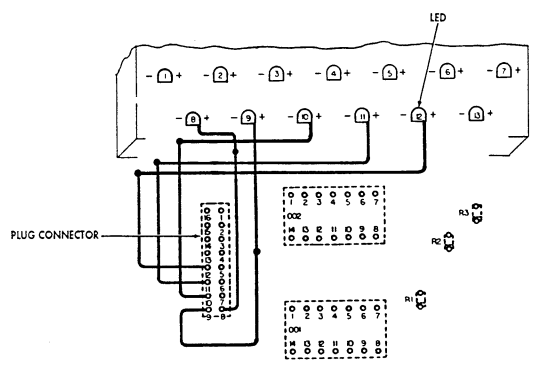

Figure D-60.  Test Module Assembly (Cont'd).

# Section Ii. Illustrated Manufacturing Instructions (Cont'D)

## Assembly Instructions (Cont'D):

21.

22. 23.

24.

25.

26.

27.

28. 29.

30.

Connect wire marked 1 on bussed resistor network to black (-) wire marked 1 on LED.

Connect wire marked 2 on bussed resistor network to black (-) wire marked 2 on LED.

Connect wire marked 3 on bussed resistor network to black (-) wire marked 3 on LED.

Connect wire marked 4 on bussed resistor network to black (~) wire marked 4 on LED. Connect wire marked 5 on bussed resistor network to black (-) wire marked 5 on LED. Connect wire marked 8 on bussed resistor network to black (-) wire marked 8 on LED. Connect wire marked 9 on bussed resistor network to black (~) wire marked 9 on LED. Connect wire marked 10 on bussed resistor network to black (-) wire marked 10 on LED.

Connect wire marked 11 on bussed resistor network to black (--) wire marked 11 on LED.

Connect wire marked 12 on bussed resistor network to black (-) wire marked 12 on LED.

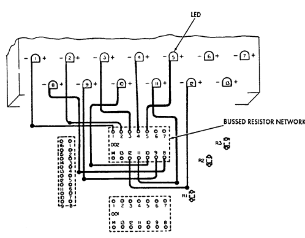

Figure D-60.  Test Module Assembly (Cont'd).

# Section Ii. Illustrated Manufacturing Instructions (Cont'D)

| ITEM   | MATERIALS                                        |             |                     |
|--------|--------------------------------------------------|-------------|---------------------|
| NO.    | REQ'D                                            | DESCRIPTION | NSN/PART NUMBER     |
| 3      | 25 Insulation Sleeving (install in figure D\-57) |             |                     |
| d      | র্ব Nut                                           |             | 5310\-00\-934\-9753 |
|        | র্ব Screw                                         |             | 5305\-00\-928\-9021 |
| 2      | র্ব Spacer                                        |             | 313\-1437\-024      |
| ਬ      | Washer                                           |             | 5310\-00\-880\-5976 |

## Assembly Instructions (Cont'D):

Place electrical insulation sleeving (3) over wire (10) marked 1 on plug connector.

31.

Place twenty-four sections of insulation sleeving (3) over connected wires (6) and (11) on LEDs (5) and 32.

heat-shrink into position.

Install four screws (4) in mount holes (12) on mini-box top section (1) and position four spacers (2) and 33.

punch board (7) on screws (4) and secure with four washers (8) and nuts (9).

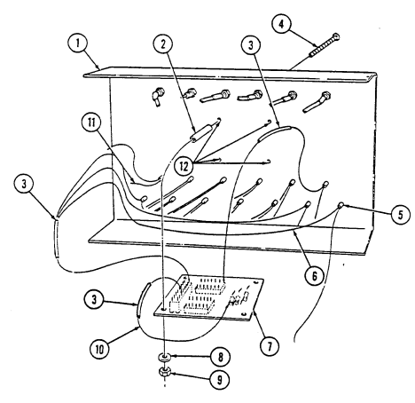

Figure D-60. Test Module Assembly (Cont'd).

# Section Ii. Illustrated Manufacturing Instructions (Cont'D)

| ITEM   | MATERIALS                          |                     |
|--------|------------------------------------|---------------------|
| NO.    | DESCRIPTION REQ'D                  | મરા                  |
| 2      | Electrical Wire: 12 in. (304.8 mm) | 6145\-00\-808\-4849 |
| 8      | Nut                                | 5310\-00\-934\-9758 |
| 7      | Screw                              | 5305\-00\-984\-6210 |
|        | 2 Terminal Lug                     | 5940\-00\-577\-3807 |
| 11     | Washer                             | 5310\-00\-883\-9384 |

|            | MATERIAL BLOCK   |                 |
|------------|------------------|-----------------|
| STOCK SIZE | DESCRIPTION      | SPECIFICATION   |
| 14 AWG     | WIRE ELECTRICAL  | MIL\-C\-13486/1 |

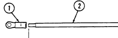

1 O
12.00 in.

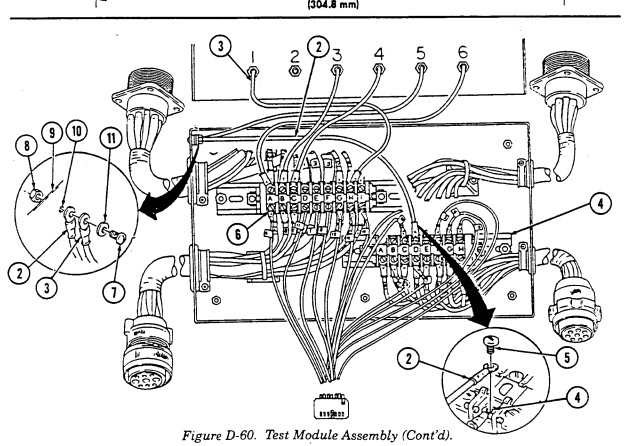

# Section Ii. Illustrated Manufacturing Instructions (Cont'D)

## Assembly Instructions (Cont'D):

34.

Cut electrical wire (2) to length as shown.

35. 36.

37.

Connect two terminal lugs (1) on wire (2).

Install wire (2) and tip jack lead (3) marked 5 on mount hole (10) on mini-box bottom section (9) with screw (7), washer (11), and nut (8).

Connect wire (2) to terminal strip (4) marked D with screw (5).

Connect tip jack lead (3) marked 1 to terminal strip (6) marked H with screw (5).

38. 39.

Connect tip jack lead (3) marked 3 to terminal strip (6) marked B with screw (5).

40.

41.

Connect tip jack lead (3) marked 4 to terminal strip (6) marked C with screw (5).

Connect tip jack lead (3) marked 6 to terminal strip (6) marked A with screw (5).

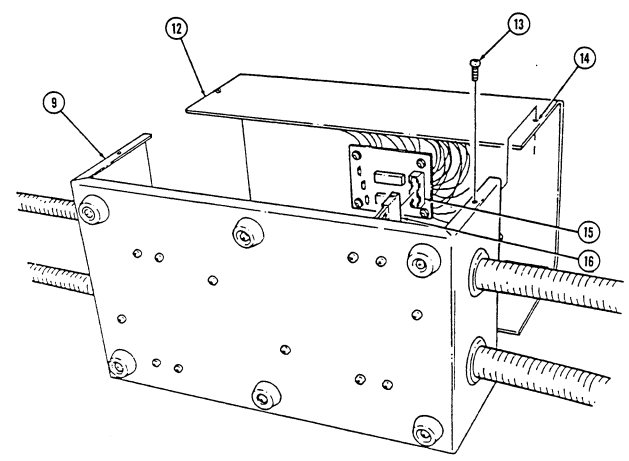

Figure D-60. Test Module Assembly (Cont'd).

Using existing drive pin, punch out four screw mount holes (14) in mini-box top section (12).

42.

Install plug (16) and connector (15) as shown.

43.

Install mini-box top (12) on bottom section (9) with four existing screws (13).

44.

# Section Ii. Illustrated Manufacturing Instructions

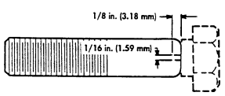

Figure D-61.  Differential Guide Pin, 5992390.

## Instructions:

1. Fabricate from screw, NSN 5305-00-709-8540.

2. Cut off head of screw.

3. Round off edge of non-threaded end as shown above.

4. Cut a slit approximately 1/16-in. (1.59-mm) wide and 1/8-in. (3.18-mm) deep in non-threaded end as shown above.

5. Remove any burrs after cutting.

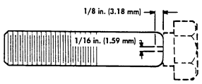

Figure D-62. Transmission Guide Pin, 5992391.

## Instructions:

1. Fabricate from screw, NSN 5306-00-226-4833.

2. Cut off head of screw.

3.  Round off edge of non-threaded end as shown above.

4. Cut a slit approximately 1/16-in. (1.59-mm) wide and 1/8-in. (3.18-mm) deep in non-threaded end as shown above.

5. Remove any burrs after cutting.

# Section Ii. Illustrated Manufacturing Instructions (Cont'D)

|                                       | MATERIAL BLOCK   |               |
|---------------------------------------|------------------|---------------|
| STOCK SIZE                            | DESCRIPTION      | SPECIFICATION |
| 3/8 in. x 3/8 in. (9.53 mm x 9.53 mm) | ALUMINUM         |               |

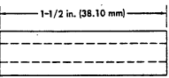

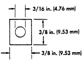

Figure D-63. Core Shaft Nut Tool, 5992392.

## Instructions:

1. Cut to length from 3/8-in. (9.53-mm) square aluminum stock, NSN 9530-00-236-7723 or NSN 9530-00-061-0463.

2. Drill 3/16-in. (4.76-mm) hole through middle of stock. 3. Remove all burrs.

Section II.  ILLUSTRATED MANUFACTURING INSTRUCTIONS (Cont'd)

| MATERIAL BLOCK                    |        |        |                   |                    |       |
|-----------------------------------|--------|--------|-------------------|--------------------|-------|
| ટાOCK ડાંટE DESCRIPTION              |        |        |                   | SPECIFICATION      |       |
| 2 x 4 (NOM) AND 2 x 12 (NOM) WOOD |        |        |                   | MMM\-L\-751        |       |
| LUMBER, SOFTWOOD                  |        |        |                   | NAILS (FF\-N\-105) |       |
| PIECE CUT LENGTH                  |        |        | MANUFACTURED FROM | SIZE               | QTY   |
| IN.                               |        | WW     |                   |                    |       |
| A (2 EA) 15\-3/4                  |        | 400.05 | 2 x 4 (NOM)       | 12D                | 12 EA |
| B 8\-1/4                          |        | 209.55 | 2 x 4 (NOM)       |                    |       |
| C 8\-1/4                          |        | 209.55 | 2 x 4 (NOM)       |                    |       |
| D 2 x 12 (NOM)                    | 8\-3/4 | 222.25 |                   |                    |       |

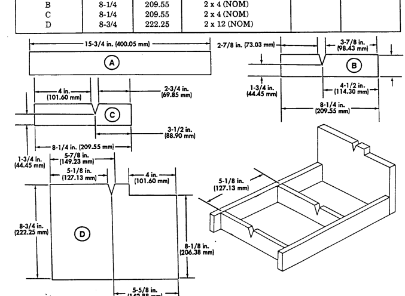

Figure D-64. Transfer Case Support Stand, 5992393.

## Instructions:

1.  Using NSN 5510-00-220-6146 lumber, cut four pieces of wood, A (two each), B, and C to length shown.

2. Using NSN 5510-00-220-6250, cut one piece of wood, D, to length shown.

3.  Cut a VEE notch in pieces B, C, and D in locations shown.

4. Cut a rectangular notch in piece D in location shown.

5.  Using two NSN 5310-00-753-3884 nails at each joint, assemble pieces A, B, C, and D as shown.

| MATERIAL BLOCK                      |             |            |                     |
|-------------------------------------|-------------|------------|---------------------|
| STOCK SIZE                          | DESCRIPTION |            | SPECIFICATION       |
| 10 x 12\-ft (3.05 x 3.66\-mm) (NOM) | BAR, METAL  |            | ASTM A108           |
| .50\-in. (12.70\-mm) THICK (NOM)    |             |            |                     |
| 2.50\-in. (63.50\-mm) WIDE (NOM)    |             |            |                     |
| 8 x 12\-ft (2.44 x 3.66\-mm) (NOM)  | BAR, METAL  |            | ASTM A108           |
| .3124\-in. (7.93\-mm) THICK (NOM)   |             |            |                     |
| 6.00\-in. (152.40\-mm) WIDE (NOM)   |             |            |                     |
| 12\-ft (3.66\-mm) (NOM)             | BAR, METAL  |            | ASTM A108           |
| .3760\-in. (9.55\-mm) THICK (NOM)   |             |            |                     |
| 2.50\-in. (63.50\-mm) WIDE (NOM)    |             |            |                     |
| POWERTRAIN LIFT SUNG ASSEMBLY       |             |            |                     |
| PIECE                               |             | CUT LENGTH | MANUFACTURED FROM   |
| IN.                                 |             | MM         | મરા                  |
| A. LIFT SLING BEAM                  | 14.50       | 368.30     | 9510\-00\-542\-2484 |
| B. LIFT HOOK                        | 6.10        | 154.94     | 9510\-00\-542\-2484 |
| C. SLING REINFORCEMENT (2)          | 3.25        | 82.55      | 9510\-00\-596\-3868 |
| D. LEFT SIDE BRACKET REINFORCEMENT  | 7.35        | 186.69     | 9510\-00\-596\-3868 |
| E. RIGHT SIDE BRACKET REINFORCEMENT | 7.38        | 187.45     | 9510\-00\-596\-3868 |
| F. LEFT SIDE BRACKET                | 9.60        | 243.84     | 9510\-00\-955\-9277 |
| G. RIGHT SIDE BRACKET               | 9.50        | 241.30     | 9510\-00\-955\-9277 |

Section II. ILLUSTRATED MANUFACTURING INSTRUCTIONS (Cont'd)

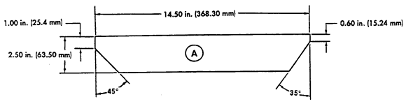

Figure D-65. Powertrain Lift Sling Beam, 5992396.

INSTRUCTIONS:
Using NSN 9510-00-542-2484 metal bar, fabricate lift sling beam A.

# Section Ii. Illustrated Manufacturing Instructions (Cont'D)

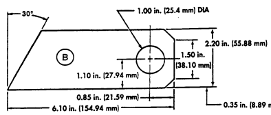

0.35 in. (8.89 mm) x 45° 2 PLACES
Figure D-66. Lift Hook, 5992397.

INSTRUCTIONS:
Using NSN 9510-00-542-2484 metal bar, fabricate lift hook B.

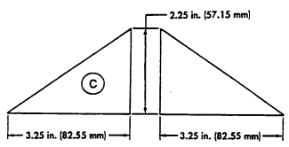

Figure D-67. Sling Reinforcement, 5992398.

INSTRUCTIONS:
Using NSN 9510-00-596-3868 metal bar, fabricate two sling reinforcements C.

0.78 in. (19.81 mm)

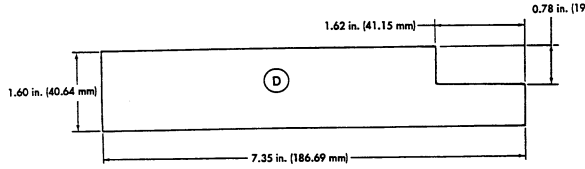

Figure D-68. Left Side Bracket Reinforcement, 5992399.

INSTRUCTIONS:
Using NSN 9510-00-596-3868 metal bar, fabricate left side bracket reinforcement D.

# Section Ii. Illustrated Manufacturing Instructions (Cont'D)

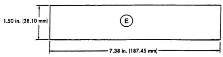

Figure D-69. Right Side Bracket Reinforcement, 5992400.

INSTRUCTIONS:
Using NSN 9510-00-596-3868 metal bar, fabricate right side bracket reinforcement E.

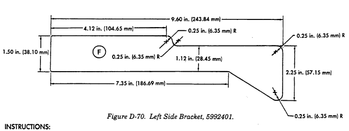

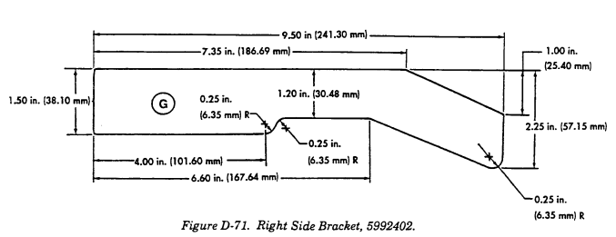

Using NSN 9510-00-955-9277 metal bar, fabricate left side bracket F.

INSTRUCTIONS:
Using NSN 9510-00-955-9277 metal bar, fabricate right side bracket G.

# Section Ii. Illustrated Manufacturing Instructions (Cont'D)

ASSEMBLY INSTRUCTIONS:

Remove all burrs and sharp edges after each fabrication.

1. Position lift hook (3) on lift sling beam (2) and weld into place.

2. Position two sling reinforcements (1) and (4) on lift sling beam (2) and lift hook (3) and weld into place.

3. Position right side bracket (8) on lift sling beam (2) and weld into place.

4. Position right side bracket reinforcement (7) on lift sling beam (2) and right side bracket (8) and weld into place.

5. Position left side bracket (5) on lift sling beam (2) and weld into place.

6.  Position left side bracket reinforcement (6) on lift sling beam (2) and left side bracket (5) and weld into place.

7. Locate, mark, and drill four 0.437-in. (11.10-mm) diameter holes through powertrain lift sling.

8. Paint powertrain lift sling (refer to TM 43-0139).

9. Complete load test for powertrain lift sling using a 1-ton (907.18-kg) weight.

10. Check powertrain lift sling for weld cracks by using a dye penetrant inspection method.

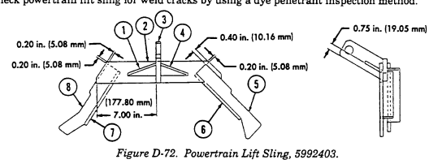

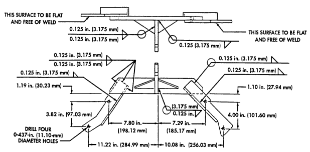

Figure D-73. Powertrain Lift Sling, 5992404.

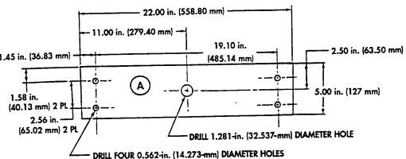

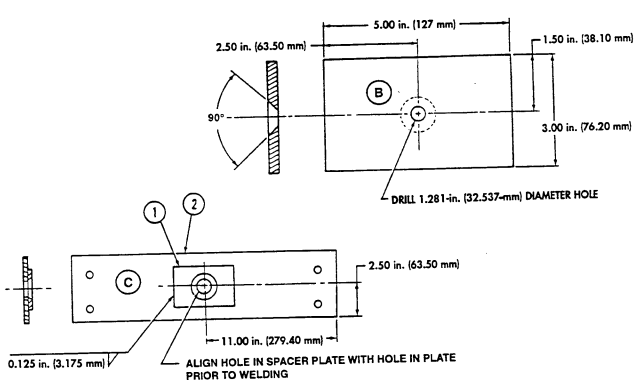

# Section Ii. Illustrated Manufacturing Instructions (Cont'D)

Figure D-74.  Front Bumper Tow Pintle Plate Assembly (Front), 5992405.

## Instructions: Note

Remove all burrs and sharp edges after each fabrication.

1. Using NSN 9510-01-043-3616 metal bar, fabricate plate as shown in A.

2. Using NSN 9510-01-043-3616 metal bar, fabricate spacer plate as shown in B. 3.  To fabricate front plate, position spacer plate (1) on plate (2) and weld into place as shown in C.

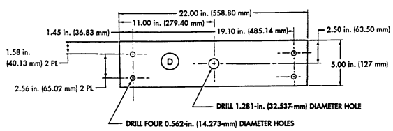

# Section Ii. Illustrated Manufacturing Instructions (Cont'D)

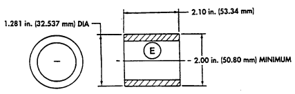

ALIGN HOLE IN SPACER PLATE WITH HOLE IN PLATE

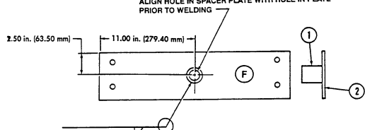

0.125 in. (3.175 mm)
Figure D-75.  Front Bumper Tow Pintle Plate Assembly (Back), 5992406.

## Instructions: Note

Remove all burrs and sharp edges after each fabrication.

1. Using NSN 9510-01-043-3616 metal bar, fabricate plate as shown in D.

2. Using NSN 9510-00-813-5343 metal bar, fabricate spacer tube as shown in E.

3. To fabricate back plate, position spacer tube (1) on plate (2) and weld into place as shown in F.

## Section Ii.  Illustrated Manufacturing Instructions (Cont'D)

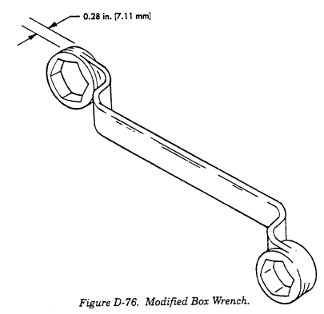

INSTRUCTIONS:
Modify a 1-in. (25.40-mm) box wrench by grinding it down to a thickness of 0.28 in. (7.11 mm).

|            | MATERIAL BLOCK                                       |               |
|------------|------------------------------------------------------|---------------|
| STOCK SIZE | DESCRIPTION                                          | SPECIFICATION |
| N/A        | 3/4\- TO 1\-HP ELECTRIC MOTOR W/ON\-OFF SWITCH       | N/A           |
| N/A        | PULLEY TO FIT MOTOR                                  | N/A           |
| N/A        | DRIVEBELT                                            | N/A           |
| N/A        | PRESSURE HOSE (CUT TO LENGTH) WITH QUICK\-DISCONNECT | N/A           |
| N/A        | GUARD                                                | N/A           |
| N/A        | DRAIN PAN                                            | N/A           |
| N/A        | WIRE MESH                                            | N/A           |

Section II.  ILLUSTRATED MANUFACTURING INSTRUCTIONS (Cont'd)

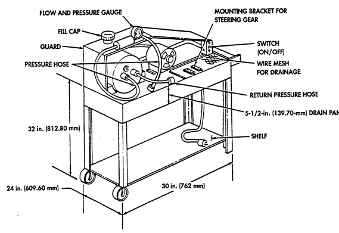

Figure D-77. Power Steering Pump and Steering Gear Test Stand.

INSTRUCTIONS:

Materials and size depend upon availability.

1.  Construct test stand using available materials and Figure D-77 as a guide.

# Section Ii. Illustrated Manufacturing Instructions (Cont'D)

|                     | POWERTRAIN LIFT SLING ASSEMBLY   |            |                     |
|---------------------|----------------------------------|------------|---------------------|
| PIECE               |                                  | CUT LENGTH | MANUFACTURED FROM   |
|                     | IN.                              | MM         | મરા                  |
| A. SUPPORT HOOK (2) | 14.50                            | 368.30     | 9510\-00\-542\-2484 |
| A. SUPPORT HOOK (2) | 12.00                            | 304.80     | 9510\-00\-813\-5322 |
| B. BRACE (2)        | 14.00                            | 355.60     | 9540\-00\-197\-9865 |
| C. BOTTOM SUPPORT   | 38.00                            | 965.20     | 9540\-00\-197\-9865 |

|                             | MATERIAL BLOCK   |               |
|-----------------------------|------------------|---------------|
| STOCK SIZE                  | DESCRIPTION      | SPECIFICATION |
| .375\-in. (9.525\-mm) THICK | BAR, METAL       | ASTM A108     |
| .188\-in. (4.775\-mm) THICK | ALUMINUM         | QQ\-A\-200/18 |

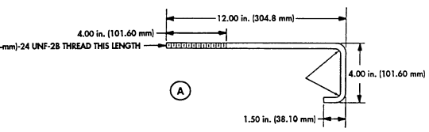

Figure D-78. Support Hook, QQS634.

INSTRUCTIONS:
Using NSN 9510-00-813-5322 metal bar, fabricate two support hooks A.

# Section Ii.  Illustrated Manufacturing Instructions (Cont'D)

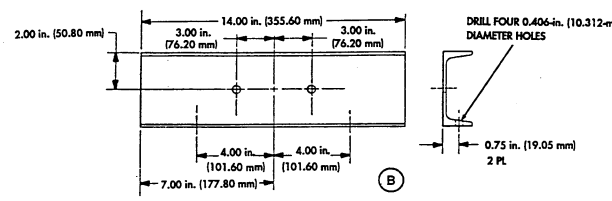

Figure D-79. Brace, QQ-A-200 / 18.

INSTRUCTIONS:
Using NSN 9540-00-197-9865 aluminum channel, fabricate two braces B.

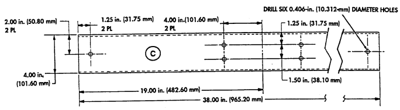

Figure D-80. Support, QQ-A-200/18.

## Instructions:

Using NSN 9540-00-197-9865 aluminum channel, fabricate support C.

D-70

# Section Ii. Illustrated Manufacturing Instructions (Cont'D)

## Assembly Instructions:

1. Positions two braces (1) on support (7) and install with six washers (2), capscrews (3), washers (2), and nuts (8).

2. Install two support hooks (4) on support (7) with four washers (5) and nuts (6).

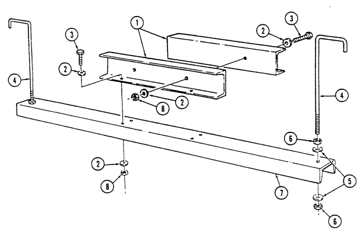

Figure D-81. Bottom Support Sling.

# Section Ii. Illustrated Manufacturing Instructions (Cont'D)

INSTALLATION INSTRUCTIONS:

· Bottom support sling must be installed prior to engine or transmission removal.

· When performing step 1, ensure support hooks are positioned flat on frame rail to prevent damage to oil and vent lines.

Ensure nuts on support hooks are adjusted evenly to keep from bending engine or transmission oil pan.

1. Position bottom support sling (1) under engine or transmission oil pan (2).

2. Slide support hooks (3) over frame rails (4) and hand-tighten four nuts (5) until support sling (1) is snug against oil pan (2). Tighten nuts (5) two more complete turns.

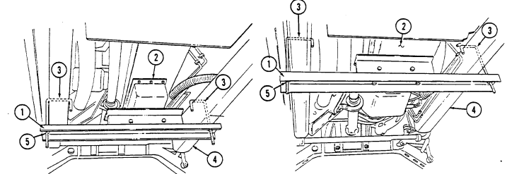

SUNG SUPPORTING ENGINE
SLING SUPPORTING TRANSMISSION
Figure D-83. Bottom Support.

Figure D-82. Bottom Support.

|                                | MATERIAL BLOCK   |               |
|--------------------------------|------------------|---------------|
| STOCK SIZE                     | DESCRIPTION      | SPECIFICATION |
| .125\-in. (3.175\-mm) THICK    | BAR. METAL       | ASTM A108     |
| .125\-in. (3.175\-mm) THICK    | BAR, METAL       | ASTM A108     |
| .125\-in. (3.175\-mm) THICK    | BAR, METAL       | ASTM A108     |
| .155\-in. (3.937\-mm) THICK    | STEEL, ANGLE     | ASTM A575     |
| .125\-in. (3.175\-mm) THICK    | STEEL, ANGLE     | ASTM A36      |
| .125\-in. (3.175\-mm) THICK    | STEEL, ANGLE     | ASTM A36      |
| .125\-in. (3.175\-mm) THICK    | STEEL, ANGLE     | ASTM A36      |
| .250\-in. (6.350\-mm) DIAMETER | STEEL, CHAIN     | RR\-C\-271    |
| 250\-in. (6.350\-mm) DIAMBINGR | STEEL, CHAIN     | RR\-C\-271    |

| OVERHEAD SUPPORT SLING        |       |            |                       |
|-------------------------------|-------|------------|-----------------------|
| PIECE                         |       | CUT LENGTH | MANUFACTURED FROM NSN |
| IN.                           |       | WW         |                       |
| A. ENGINE BRACKET (2)         | 3.50  | 88.90      | 9510\-00\-294\-0986   |
| B: L.H. TRANSMISSION BRACKET  | 8.10  | 205.74     | 9510\-00\-294\-0986   |
| C. R.H. TRANSMISSION BRACKET  | 8.10  | 205.74     | 9510\-00\-294\-0986   |
| D. A\-FRAME BRACKET           | 8.0   | 203.2      | 9520\-00\-061\-6507   |
| E. CENTER SUPPORT BEAM        | 19.5  | 495.3      | 9520\-00\-277\-4925   |
| F. INNER FLOOR SUPPORT        | 5.0   | 127.0      | 9520\-00\-277\-4925   |
| G. OUTER FLOOR SUPPORT        | 10.0  | 254.0      | 9520\-00\-277\-4925   |
| H. ENGINE SUPPORT CHAIN       | 14.00 | 355.60     | 4010\-00\-174\-4879   |
| I. TRANSMISSION SUPPORT CHAIN | 25.00 | 635.0      | 4010\-00\-174\-4879   |

Section II. ILLUSTRATED MANUFACTURING INSTRUCTIONS (Cont'd)

# Section Ii. Illustrated Manufacturing Instructions (Cont'D)

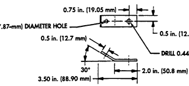

DRILL 0.31-in. (7.87-mm) DIAMETER HOLE
0.5 in. (12.7 mm)
A
DRILL 0.44-in. (11.18-mm) DIAMETER HOLE
Figure D-84. Engine Bracket, QQS634.

INSTRUCTIONS:
Using NSN 9510-00-294-0986 metal bar, fabricate two engine brackets A.

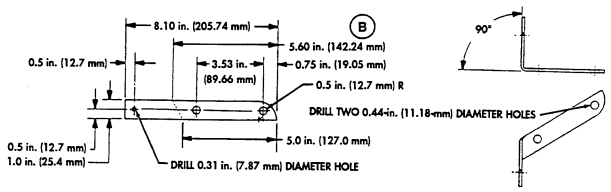

Figure D-85.  L.H. Transmission Bracket, QQS634.

INSTRUCTIONS:
Using NSN 9510-00-294-0986 metal bar, fabricate L.H. transmission bracket B.

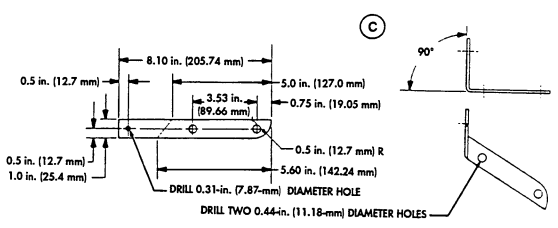

Figure D-86.  R.H. Transmission Bracket, QQS634.

INSTRUCTIONS:
Using NSN 9510-00-294-0986 metal bar, fabricate R.H. transmission bracket C.

# Section Ii. Illustrated Manufacturing Instructions (Cont'D)

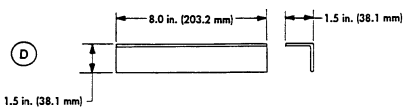

Figure D-87. A-Frame Bracket, QQS630.

INSTRUCTIONS:
Using NSN 9520-00-061-6507 steel angle, fabricate A-frame brace D.

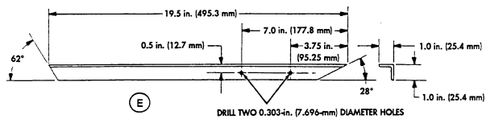

Figure D-88.  Center Support Beam, QQS741.

INSTRUCTIONS:
Using NSN 9520-00-277-4925 steel angle, fabricate center support beam E.

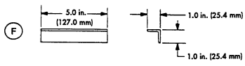

Figure D-89.  Inner Floor Support, QQS741.

INSTRUCTIONS:
Using NSN 9520-00-277-4925 steel angle, fabricate inner floor support F.

# Section Ii. Illustrated Manufacturing Instructions (Cont'D)

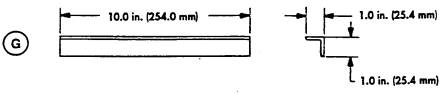

Figure D-90.  Outer Floor Support, QQS741.

INSTRUCTIONS:
Using NSN 9520-00-277-4925 steel angle, fabricate outer floor support G.

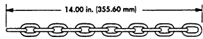

Figure D-91.  Engine Support Chain.

INSTRUCTIONS:
Using NSN 4010-00-174-4879 steel chain, fabricate engine support chain H.

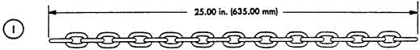

Figure D-92.  Transmission Support Chain.

INSTRUCTIONS:
Using NSN 4010-00-174-4879 steel chain, fabricate transmission support chain I.

 D-76

# Section Ii.  Illustrated Manufacturing Instructions (Cont'D)

## Assembly Instructions: Note

Remove all burrs and sharp edges after each fabrication.

1. Position outer floor support (4) on inner floor support (3) and weld into place. 2. Position center support beam (1) on inner floor support (3) and weld into place. 3. Position A-frame brace (2) on center support beam (1) and weld into place.

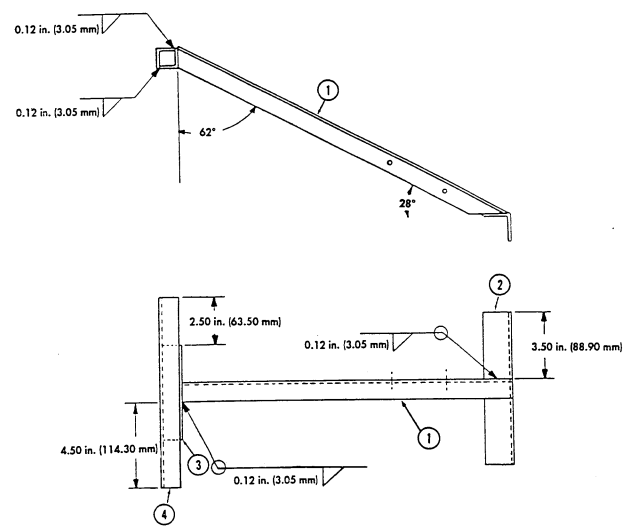

Figure D-93. Outer Inner Floor Support.

# Section Ii. Illustrated Manufacturing Instructions (Cont'D)

## Assembly Instructions (Cont'D): Note

· Remove all burrs and sharp edges after each fabrication.

· Perform step 4 if rigging overhead support sling for transmission use.

· Perform step 5 if rigging overhead support for engine use.

4. Position L.H. and R.H. transmission brackets (1) to the ends of support chain (14) and install two washers (3), capscrews (2), washers (3), and nuts (13).

5. Position two engine brackets (15) to the ends of support chain (14) and install two washers (3),
capscrews (2), washers (3), and nuts (13).

6.  Install eyebolts (4) and (6) in turnbuckle (5).

· Perform steps 7 and 8 if rigging overhead support sling for transmission use.

· Perform steps 9 and 10 if rigging overhead support sling for engine use.

7.  Position R.H. eyebolt (6) to hole (9) in overhead support sling (11) and install washer (8), capscrew (7),
washer (8), and nut (12). Do not tighten nut (12) or use hole (10).

8.  Using center link, install support chain (14) on L.H. eyebolt (4) with washer (3), capscrew (2), washer (3),
and nut (13). Tighten nut (12).

9.  Position R.H. eyebolt (6) to hole (10) in overhead support sling (11) and install washer (8), capscrew (7),
washer (8), and nut (12). Do not tighten nut (12) or use hole (9).

10. Using center link, install support chain (14) on L.H. eyebolt (4) and install washer (3), capscrew (2),
washer (3), and nut (13). Tighten nut (12).

# Section Ii. Illustrated Manufacturing Instructions (Cont'D)

(3

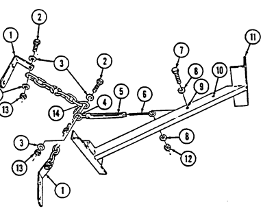

Figure D-94.  Overhead Support Sling for Transmission.

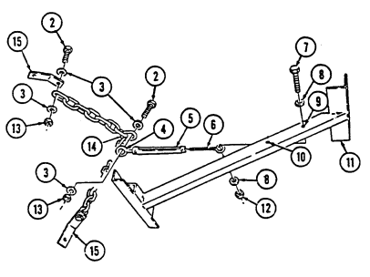

Figure D-95.  Overhead Support Sling for Engine.

# Section Ii. Illustrated Manufacturing Instructions (Cont'D)

## Installation Instructions: Note

· Perform engine removal procedures, para. 15-26, to a point prior to supporting transmission for engine removal.

· Perform steps 1 through 3 to secure transmission.

1. Position overhead support sling (2) on floor (3) and A-frame (1).

NOTE
· Use converter housing cover bolts to install transmission brackets on transmission housing.

· When performing step 2, it might be necessary to shift engine support chain link on L.H. eyebolt to adjust for securing transmission to transmission bracket.

2. Install transmission bracket (7) on transmission housing (4) with four washers (6) and capscrews (5).

3. Tighten turnbuckle (9) to remove slack from transmission chain (8).

4. Continue engine removal procedure; para. 15-26.

· Perform transmission removal procedure, para. 19-3, to a point prior to supporting engine for transmission removal.

· Perform steps 5 through 8 to secure engine.

5. Position overhead support sling (2) on floor (3) and A-frame (1).

· Use converter housing cover bolts and washers to install engine brackets on back of cylinder head.

· When performing step 6, it might be necessary to shift engine support chain link on L.H. eyebolt to adjust for securing engine cylinder head to engine bracket.

6. Install engine brackets (10) to engine cylinder head (11) with two existing washers (6) and capscrews (5).

7. Tighten turnbuckle (9) to remove slack from engine bracket chain (8). 8. Continue transmission removal procedure; para. 19-3.

# Section Ii. Illustrated Manufacturing Instructions (Cont'D)

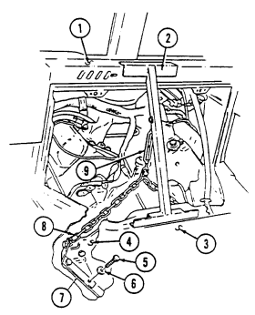

Figure D-96. Overhead Support Sling for Transmission.

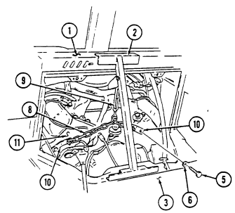

Figure D-97.  Overhead Support Sling for Engine.

# Section Ii  Illustrated Manufacturing Instructions (Cont'D)

| MATERIAL BLOCK                      |                   |                     |
|-------------------------------------|-------------------|---------------------|
| DESCRIPTION ટાOCK ટાટE                |                   | SPECIFICATION       |
| 0 156\-in. (3.962\-mm) INSIDE DIA.  | HOSE. NONMETALLIC | N/A                 |
| 0.281\-in. (7.137\-mm) OUTSIDE DIA. |                   |                     |
| FUEL DRAIN\-BACK HOSE               |                   |                     |
| CUT HOSE LENGTH                     |                   | MANUFACTURED FROM   |
| PART NUMBER IN.                     | WW                | મરા                  |
| 7 14066305                          | 177.8             | 4720\-01\-184\-0433 |

Figure D-98.  Fuel Drain-back Hose.

INSTRUCTIONS:

|             | FUEL SUPPLY HOSE   |       |                       |
|-------------|--------------------|-------|-----------------------|
| HOSE        | CUT LENGTH         |       | MANUFACTURED FROM મરેમ |
| PART NUMBER |                    | MM    |                       |
| 23500023    | 9\-13/16           | 249.2 | 4720\-01\-159\-5769   |

| MATERIAL BLOCK                                      |                   |               |
|-----------------------------------------------------|-------------------|---------------|
| STOCK SIZE                                          | DESCRIPTION       | SPECIFICATION |
| 0.359\-0.391\-in. (9.119\-9.931\-mm) INSIDE DIA     | HOSE, NONMETALLIC | GM\-6165\-M   |
| 0 648\-0 602\-in. (16.459\-15.291\-mm) OUTSIDE DIA. |                   |               |

Cut hose to length shown.

Figure D-99. Fuel Supply Hose.

INSTRUCTIONS:
Cut hose to length shown.

# Section Ii. Illustrated Manufacturing Instructions (Cont'D)

|               | PLASTIC SHEET   |                     |
|---------------|-----------------|---------------------|
| PLASTIC SHEET | CUT             | MANUFACTURED        |
| PART NUMBER   | LENGTH          | FROM NSN            |
| 5598827       | AS REQUIRED     | 9330\-00\-618\-7214 |

|            | MATERIAL BLOCK   |               |
|------------|------------------|---------------|
| STOCK SIZE | DESCRIPTION      | SPECIFICATION |
| N/A        | SEAL, NOMETALLIC | N/A           |

Figure D-100. Plastic Sheet.

| TURRET BEARING SEAL   |        |      |                     |
|-----------------------|--------|------|---------------------|
| SEAL                  | CUT    |      | MANUFACTURED FROM   |
| PART NUMBER           | LENGTH |      | મરેમ                 |
| MT161A                |        | 3.35 | 5330\-01\-282\-2213 |

## Instructions:

Cut two pieces of plastic large enough to cover small hole or crack with enough to overlap about 1/4 in.

(6.35 mm) around damaged area of window.

- 11 ft (3.35 m)
Figure D-101. Turret Bearing Seal.

INSTRUCTIONS:
Cut seal to length shown.

|          |        |       |               | WINCH WIRE ROPE ASSEMBLY   |                       |                           |
|----------|--------|-------|---------------|----------------------------|-----------------------|---------------------------|
| ASSEMBLY | CUT    |       | MANUFACTURED  | TERMINAL                   | CLAMP                 | THIMBLE                   |
| PART     | TENGTH |       | FROM          | PART NUMBER                | PART NUMBER           | PART NUMBER               |
| NUMBER   |        |       | PART NUMBER   | (CAGEC)                    | (CAGEC)               | (CAGEC)                   |
|          | IN.    | મમ    | (CAGEC)       |                            |                       |                           |
| 15667    | 1200.0 | 365.8 | 21451 (27647) | 16464 (27647) \|           | MS16843\-5 (27647) \| | I SC\-C\-36424\-6 (80063) |

# Section Ii. Illustrated Manufacturing Instructions (Cont'D)

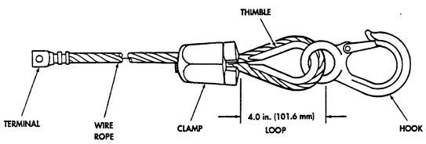

Figure D-102. Winch Wire Rope Assembly.

## Instructions:

1. (a) Properly seize wire rope end before cutting. To seize wire rope end, follow these instructions:
NOTE
· Ensure each wrap is tight to the preceding wrap.

· Ensure the length of the seizing is not less than the diameter of the wire rope.

(1) Wrap the seizing wire around the wire rope as tight as possible.

(2) Twist the ends of the seizing together by hand counterclockwise so that the twist is near the middle of the seizing.

Do not try to tighten the seizing by twisting.

(3) Tighten the twist just enough to take up the slack.

(4) Tighten the seizing by prying the twist away from the axis of the wire rope.

(5) Tighten the twist again as described in step 3. (6) Repeat the process until the seizing can not be pried away from the axis of the wire rope.

(7) Cut off wire ends and pound the twist into contact with the seizing.

(b)  Cut wire rope to length as shown and install part of clamp with nut on wire rope.

# Section Ii. Illustrated Manufacturing Instructions (Cont'D)

2. Position rope after seizing in a suitable fixture to make a loop, leaving enough rope to wrap around thimble and enclose in clamp.

3. Thread wire rope through eyelid in hook, insert thimble and close jaws of fixture to enable rope to conform to groove of thimble.

4. Place one-half of clamp in position and adjust rope accordingly. The seized portion of the wire rope should equal one rope diameter and protrude entirely beyond the threaded end of the clamp half.

5. Install clamp nut. Holding both threaded halves in position, push the nut into both halves through the first two threads. Ensure proper alignment of both threaded halves and that there is no crossthreading.

6. Remove rope, clamp, and thimble while still connected. 7. Hold opposing flats of clamp halves in suitable fixture and properly lubricate exposed threads with high-viscosity lubricating oil.

8. Using a permanent marker, mark one flat nut to ensure the same opposing flats are checked before and after tightening the clamp.

9. Using calipers, measure 1/8 in. (3.16 mm) across the flat nut from the bottom and note measurement.

10. Check to ensure clamp halves are properly secured in fixture and tighten with appropriate wrench. 11. Using calipers, again take measurement of the same flat nut as was done before tightening of the nut.

If the increment dilation is between 0.004 in. (.102 mm) and 0.007 in. (.178 mm), clamp is tight.

12. Using arbor press, crimp terminal to opposite end of wire rope.

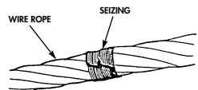

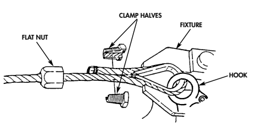

# Section Ii. Illustrated Manufacturing Instructions (Cont'D)

| ITEM NO.   | HOSE        |     | LENGTH   | MANUFACTURED FROM   |
|------------|-------------|-----|----------|---------------------|
|            | PART NUMBER | IN. | MM       | PART NUMBER (CAGEC) |
| 1          | SF5585243   | 16  | 406.4    | 846\-50 (11288)     |
| 2          | SF5585245   | 36  | 914.4    | 846\-50 (11288)     |
| 3          | SF5585258   | 27  | 685.8    | 846\-50 (11288)     |

| STOCK SIZE                          | DESCRIPTION       | SPECIFICATION   |
|-------------------------------------|-------------------|-----------------|
| 0.190 in. (4.83 mm) INSIDE DIAMETER | HOSE, NONMETALLIC | ASTM D1149      |

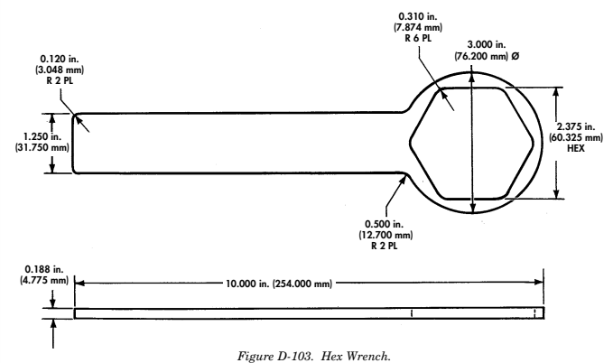

#### Instructions:

1. Cut one piece of metal strap to size as shown. 2. Remove all burrs and sharp edges.

# Section Ii. Illustrated Manufacturing Instructions (Cont'D)

|    |             |        | FUEL DRAINBACK HOSE   CUT   |                     |
|----|-------------|--------|-----------------------------|---------------------|
|    | HOSE        |        | LENGTH                      | MANUFAClURED        |
|    | PART NUMBER | IN.  I |                             | FROM NSN            |
| 1  | 14066306    | 7      | 177.8                       | 4720\-01\-184\-0432 |

| I  STOCK SIZE                                                               | DESCRIPTION          | 1  SPECIFICATION  1   |
|-----------------------------------------------------------------------------|----------------------|-----------------------|
| 0.156 in. (3.96 mm> INSIDE DIAMETER   0.281 in. (7.137 mm) OUTSIDE DIAMETER | HOSE, NONMETALLIC  I | N/A                   |

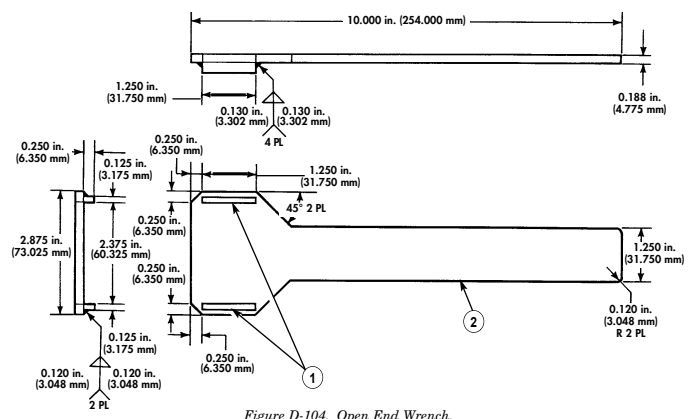

Figure D-104. Open End Wrench.

#### Instructions:

1. Using NSN 9515-00-814-7316 metal strip, cut one piece 0.188-in. (4.775-mm) thick to make handle (2)
as shown.

2. Using NSN 9515-00-569-2044 metal strap, cut two pieces 0.125-in. (3.175-mm) thick to make two jaws (1) as shown.

3. Weld two jaws (1) to handle (2) as shown. 4. Remove all burrs and sharp edges.

# Section Ii. Illustrated Manufacturing Instructions (Cont'D)

|                                    | CUT    |       |                     |
|------------------------------------|--------|-------|---------------------|
| HOSE                               | LENGTH |       | MANUFACIURED        |
| PART NUMBER  IN.                   |        |       | FROM NSN            |
| 9439363  7                         |        | 177.8 | 4720\-01\-163\-7833 |
| Figure D\-19. Fuel Drainback Hose. |        |       |                     |

|                                     | MATERIAL BLOCK    |                  |
|-------------------------------------|-------------------|------------------|
| STOCK SIZE                          | DESCRIPTION  I    | SPECIFICATION  I |
| 0.25 in. (6.35 mm) INSIDE DIAMETER  | HOSE, NONMETXLLIC | GM\-6163\-M      |
| 0.50 in. (12.7 mm) OUTSIDE DIAMETER | I                 | I                |

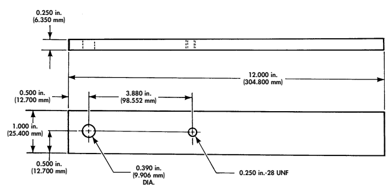

Figure D-105. Parking Brake Spring Tool.

#### Instructions:

1. Using NSN 9510-00-813-4714 metal bar, fabricate parking brake tool. 2. Remove all burrs and sharp edges.

# Section Ii. Illustrated Manufacturing Instructions (Cont'D)

#### Assembly Instructions:

1. Position bar (2) across parking brake spring (4) and install on parking brake lever (5) using 

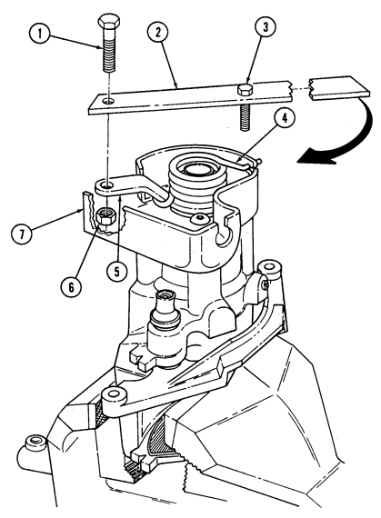

NSN 5305-00-725-2317 screw (1) and NSN 5310-00-761-0654 nut (6).

2. Install NSN 5305-00-068-0515 screw (3) in bar (2). 3. Remove parking brake spring (4) from parking brake lever (5) and caliper housing (7) by turning bar (2) clockwise.

4. Remove nut (6), screw (1), and bar (2) from parking brake lever (5).

Figure D-106. Instuctions for Parking Brake Spring Tool.

| MATERIAL BLOCK                                   |                  |               |
|--------------------------------------------------|------------------|---------------|
| STOCK SIZE                                       | DESCRIPTION      | SPECIFICATION |
| 0.75 in. (19.05 mm) ± 0.09 in. (2.29 mm), SQUARE | RUBBER, NEOPRENE | N/A           |

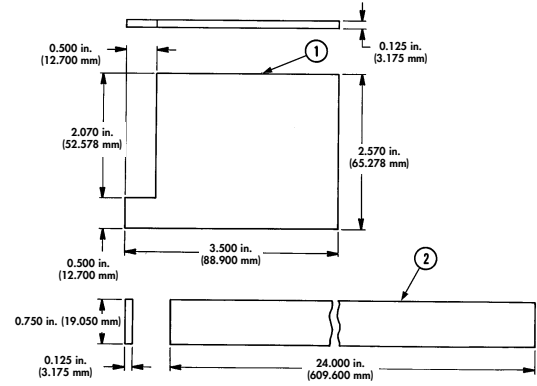

Figure D-107. Pulley Alignment Tool Fabrication.

INSTRUCTIONS:

- Remove all burrs and sharp edges from aluminum sheet and rectangle.

- Pulley alignment tool can be assembled using nuts, bolts, rivets, or by welding.

1. Cut aluminum sheet (1) to size as shown. 2. Position aluminum rectangle (2) on top of aluminum sheet (1) as shown in figure D-107.

NOTE
Check all measurements before welding, riveting, or bolting pulley alignment tool together.

3. Assemble pulley alignment tool as shown in figure D-107.

# Section Ii. Illustrated Manufacturing Instructions (Cont'D) Section Ii. Illustrated Manufacturing Instructions (Cont'D)

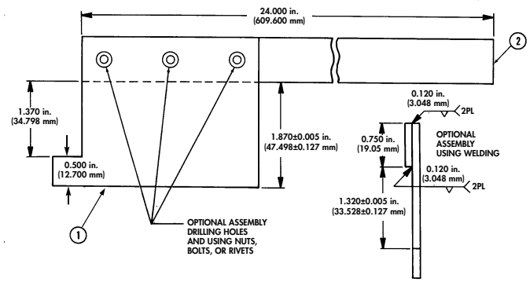

Figure D-107. Pulley Alignment Tool Fabrication (Cont'd).

# Section Ii. Illustrated Manufacturing Instructions (Cont'D)

|                          | MATERIAL BLOCK   |               |
|--------------------------|------------------|---------------|
| STOCK SUE                | DESCRIPTION      | SPEClFlCATlON |
| 0.10 in. (2.54 mm> THICK | RUBBER STRIP     | N/A           |

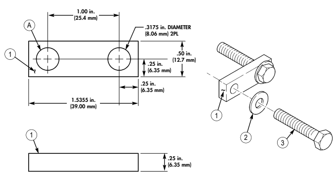

Figure D-108. Steering Wheel Removal Tool.

#### Instructions:

1. Using 9510-00-189-1557, fabricate metal block. 2. Drill two 0.3175-inch (8.06 mm) holes, A. 3. Insert two 5305-00-068-0515 screws (3) and 5310-00-809-4058 washers (2) in block (1).

# Section Ii. Illustrated Manufacturing Instructions (Cont'D)

|                            | MATERW. BLOCK         |               |
|----------------------------|-----------------------|---------------|
| STOCK SIZE                 | DESCRlPTlON           | SPEClFlCATlON |
| 0.188 in. (4.775 mm) THICK | SEAL                  | ASTM D\-1056  |
| 0.50 in. (12.7 mm) WIDTH   |                       | ASTM D\-903   |
|                            | WINDSHIELD LOWER SEAL |               |
|                            | CUT                   |               |

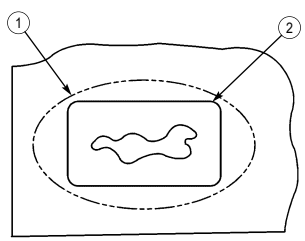

Figure D-109. Soft Top Repair.

#### Instructions: Note

In order to achieve maximum patch strength, apply tape in conditions above 50°F (10°C).

1. Ensure exterior of soft top area to be repaired is clean and dry.

for approximately 30 seconds.

2. Clean affected area (1) at least one inch larger than patch (2) with rubbing alcohol pads. Allow to dry

- Round off corners of patch to promote longer periods of adhesion. - Ensure patch extends beyond tear or hole to ensure strong bonding surface.

3. Cut appropriate piece of repair tape to form patch (2).

Primer application must be at least the same size of patch.

4. Apply primer to exterior of soft top around affected area (1). Allow to cure for approximately 2 minutes.

5. Remove paper backing from patch (2) and press patch onto primer and affected area (1).

# Section Ii. Illustrated Manufacturing Instructions (Cont'D)

| INSTRUCTlONS:  Cut seal to length shown.   |
|--------------------------------------------|

|             | CLIT          |                      |                     |
|-------------|---------------|----------------------|---------------------|
| SEAL        | LENGTH        |                      | MANUFAClURED        |
| PART NUMBER | IN.           |                      | FROM NSN            |
| 5584188     | 100           | 2,540.O              | 5330\-01\-202\-8360 |
|             | Figure D\-27. | lYay Assembly  Seal. |                     |

| 0.520 in. (13.21 mm) THICK   1.136 in. (28.85 mm) WIDTH   | SEAL, NONMETALLIC   | ASTM D 1056   |
|-----------------------------------------------------------|---------------------|---------------|
| STOCK SIZE                                                | DESCRlPTlON         | SPEClFlCATlON |

#### Instructions:

1. Cut a 14-inch (355.6 mm) long section (1) of metal bar from NSN 9510-00-224-1692 as shown in figure D-110. Bend metal bar (1) as shown in figure D-111.

2. Cut a 11.5-inch (292.1 mm) long section (2) from NSN 9510-00-287-9402 as shown in figure D-110.

Bend metal bar (2) as shown in figure D-111.

3. Cut an 8-inch (203.2 mm) long section (3) from NSN 9510-00-596-1405 as shown in figure D-110.

Locate, mark, and drill four 0.437-inch diameter holes through metal bar (3) as shown in figure D-111.

4. Remove all burrs and sharp edges. 5. Weld all three metal bars together as shown in figure D-111. All welds will be in accordance with MIL-STD-1261 Class 2. All weld sizes are minimal.

Washers are used in the installation of the cylinder head lifting device.

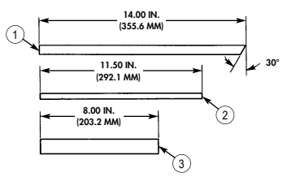

Section II. ILLUSTRATED MANUFACTURING INSTRUCTIONS (Cont'd)

Figure D-110. Bars For Cylinder Head Lifting Device.

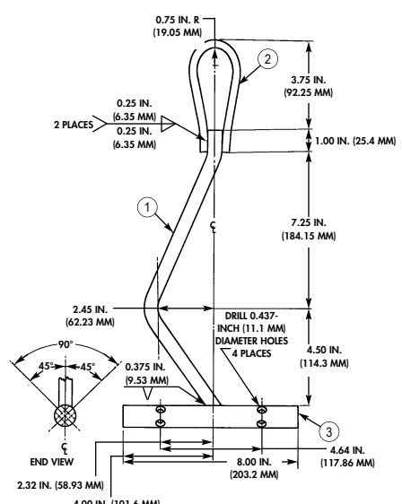

4.00 IN. (101.6 MM)

Figure D-111. Cylinder Head Lifting Device.

# Section Ii. Illustrated Manufacturing Instructions (Cont'D)

|                         | CUT                                  |       |
|-------------------------|--------------------------------------|-------|
| INSUlATlON  PART NUMBER | LENGTH   IN.                         |       |
| 5589275                 | 12                                   | 304.0 |
|                         | Figure D\-29. Foam Insulation Strip. |       |

| MATERIAL BLOCK           |                        |               |
|--------------------------|------------------------|---------------|
| STOCK SIZE               | DESCRlPTlON            | SPECIFICATION |
| 0.25 in. (6.35 mm) THICK | STRIP FOAM, INSULATION | MLI\-14511B   |
| 0.50 in. (12.7 mm) WIDTH |                        |               |

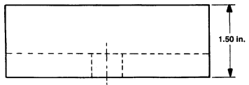

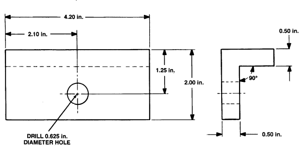

Figure D-112. Fixture Fabrication.

#### Instructions:

1. Fabricate fixture according to dimensions as shown. 2. Remove all burrs and sharp edges.

# Section Ii. Illustrated Manufacturing Instructions (Cont'D)

| FUEL SYSTEM VENT LINE   |     |         |                     |
|-------------------------|-----|---------|---------------------|
| CUT  VENT LINE  LENGTH  |     |         | MANUFACWRED         |
| PART NUMBER             | IN. |         | FROM NSN            |
| 5573534                 | 27  | 685.8   | 4720\-01\-003\-6706 |
| 5577552                 | 43  | 1,092.2 | 4720\-01\-003\-6706 |

| MATERIAL BLOCK                                                          |                                  |                         |
|-------------------------------------------------------------------------|----------------------------------|-------------------------|
| STOCK SIZE                                                              | DESCRIPTION  TUBING, NONMETALLIC | SPECIFICATION  SAE 5844 |
| 0.375 in. (9.525 mm) INSIDE DIAMETER  0.50 in(12.7 mm) OUTSIDE DIAMETER |                                  |                         |

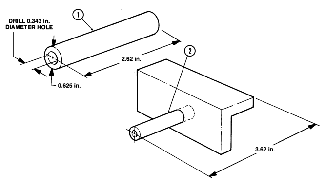

Figure D-113. Bushing Fabrication.

#### Instructions:

1. Using NSN 9510-00-229-4822 metal bar, fabricate bushing (1) as shown. 2. Remove all burrs and sharp edges. 3. Press bushing (1) into fixture hole (2) (fixture fabricated in figure D-112).

# Section Ii. Illustrated Manufacturing Instructions (Cont'D)

| ITEM NO.   |             | CUT    |         |                     |
|------------|-------------|--------|---------|---------------------|
|            | TUBE        | LENGTH |         | MANUFACTURED        |
|            | PART NUMBER |        |         | FROM NSN            |
|            |             | IN.    | MM      |                     |
| 1          | 5582641     | 4      | 101.6   | 4720\-01\-071\-4042 |
| 2          | 5582642     | 11     | 279.4   | 4720\-01\-071\-4042 |
| 3          | 5582643     | 15     | 381.0   | 4720\-01\-071\-4042 |
| 4          | 5582645     | 24     | 609.6   | 4720\-01\-071\-4042 |
| 5          | 5582646     | 32     | 812.8   | 4710\-01\-347\-6368 |
| 6          | 5584173     | 8      | 203.2   | 4720\-01\-071\-4042 |
| 7          | 5584373     | 26     | 660.4   | 4720\-01\-071\-4042 |
| 8          | 5591157     | 40     | 1,016.0 | 4720\-01\-071\-4042 |

| STOCK SIZE                           | DESCRIPTION         | SPECIFICATION    |
|--------------------------------------|---------------------|------------------|
|                                      | TUBING, NONMETALLIC | SAE J844, TYPE A |
| 0.250 in. (6.35 mm) OUTSIDE DIAMETER |                     |                  |
| 0.180 in. (4.52 mm) INSIDE DIAMETER  |                     |                  |

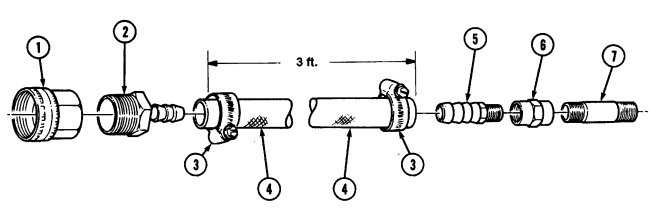

Figure D-114. Hose.

INSTRUCTIONS:

Do not apply sealing compound to first two threads of straight adapter.

1. Connect clamp (3), straight adapter (2), and straight swivel adapter (1) to hose (4). Tighten clamp (3).

2. Connect clamp (3), straight adapter (5), pipe coupling (6), and pipe nipple (7) to hose (4). Tighten clamp (3).

# Section Ii. Illustrated Manufacturing Instructions (Cont'D)

| MATERIAL BLOCK   |             |                     |
|------------------|-------------|---------------------|
| STOCK SIZE       | DESCRIPTION | પરાત                 |
| N/A              | LOCKNUT     | 5310\-00\-241\-6658 |
| N/A              | WASHER      | 5310\-01\-119\-1024 |
| N/A              | BOLT        | 5306\-00\-050\-1237 |
| N/A              | HANDLE      | P/N 12446730        |

#### Instructions:

1. Using existing turret handle (1) as a template, scribe two reference lines (2) on weapon station (4). 2. Locate and mark the center of six spot welds (3) on turret handle (1).

Ensure drill does not penetrate weapon station.

3. Using 0.313-inch diameter drill bit, drill out six spot welds (3) in turret handle (1). 4. Using chisel, remove turret handle (1) from weapon station (4).

NOTE
When grinding weapon station, ensure that the two reference lines are not removed.

5. Grind off any remaining spot weld (3) material flush with weapon station (4). 6. Using two reference lines (2) marked in step 1, position turret handle (5) on weapon station (4). 7. Using turret handle (5) as a template, drill four 0.344-inch diameter holes (6) in weapon station (4). 8. Spot paint weapon station (4) (refer to TM 43-0139). 9. Install turret handle (5) on weapon station (4) with four washers (8), capscrews (7), washers (8),
and locknuts (9).

10. Spot paint capscrews (7) and locknuts (9) (refer to TM 43-0139).

# Section Ii. Illustrated Manufacturing Instructions (Cont'D)

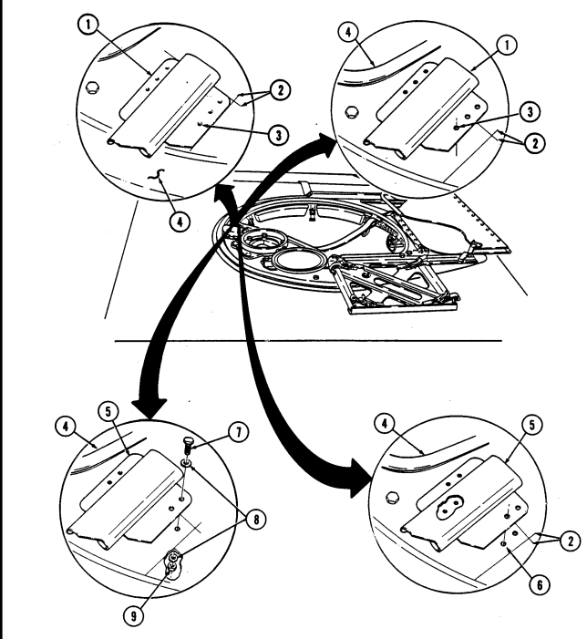

CP

Figure D-115.  Turret Handle Replacement.

# Section Ii. Illustrated Manufacturing Instructions (Cont'D)

| REINFORCEMENT BRACKET   |          |                     |
|-------------------------|----------|---------------------|
| PART                    | CUT TO   | MANUFACTURED        |
| NO.                     | SIZE     | FROM NSN            |
| (INCHES)                |          |                     |
| N/A                     | AS SHOWN | 9535\-00\-541\-7194 |

|                  | MATERIAL BLOCK   |               |
|------------------|------------------|---------------|
| STOCK SIZE       | DESCRIPTION      | SPECIFICATION |
|                  | ALUMINUM ALLOY   | QQ\-A\-250/11 |
| 0.0500 IN. THICK | TEMPER           |               |

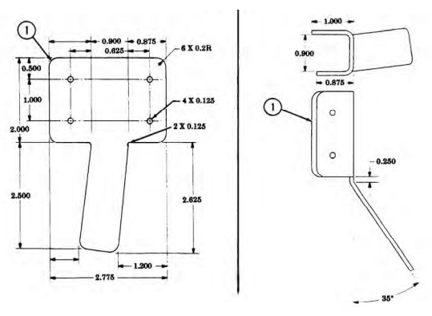

Figure D-116, C-Pillar Reinforcement Bracket.

#### Instructions:

1. Cut two pieces of aluminum sheet metal to size as shown. 2. Locate, mark, and drill four 0.125-inch diameter holes in reinforcement brackets (1). 3. Bend left reinforcement bracket (1). 4. Bend right reinforcement bracket (1) in opposite direction.

# Section Ii. Illustrated Manufacturing Instructions (Cont'D)

| PLASTIC SHEET             |             |                       |
|---------------------------|-------------|-----------------------|
| PLASTIC SHEET PART NUMBER | CUT LENGTH  | MANUFACTURED FROM NSN |
| (INCHES)                  |             |                       |
| 5598827                   | AS REQUIRED | 9330\-00\-618\-7214   |

| MATERIAL BLOCK                             |                      |               |
|--------------------------------------------|----------------------|---------------|
| STOCK SIZE                                 | DESCRIPTION          | SPECIFICATION |
| 0.002\-IN. (NOM) THICK 26\-IN. (NOM) WIDTH | PLASTIC SHEET, PRESS | N/A           |

Figure D-117. Plastic Sheet

#### Instructions:

Cut two pieces of plastic large enough to cover small hole or crack with enough to overlap about 1/4 in. around damaged area of window.

# Section Ii. Illustrated Manufacturing Instructions (Cont'D)

|         | GREEN RUBBER CANVAS   |                     |
|---------|-----------------------|---------------------|
| PART    | CUT                   | MANUFACTURED        |
| NO.     | LENGTH                | FROM NSN            |
|         | (INCHES)              |                     |
| 8434398 | 2 at 3X12             | 8305\-00\-616\-0022 |
|         | 4 at 4X15             |                     |
|         | 2 at 36X6             |                     |

|                   | MATERIAL BLOCK                         |                     |
|-------------------|----------------------------------------|---------------------|
| STOCK SIZE        | DESCRIPTION                            | SPECIFICATION       |
| 39.00 IN. MINIMUM | CLOTH,COATED PLASTIC, VINYL BOTH SIDES | 11 TYPE AND 2 CLASS |

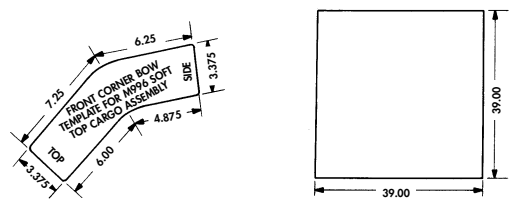

Figure D-118. Green Rubber Canvas Straps.

#### Instructions:

1. Cut canvas, NSN 8305-00-616-0022, into eight reinforcement straps for lengths shown. 2. Secure six grommets, NSN 5325-00-281-8643, and six stud turn buttons, NSN 5325-00-930-7607, to canvas straps using twelve clinch plate turn buttons, NSN 5325-00-371-8108.

# Appendix E Torque Limits

This section provides general torque limits for screws used on the ECV series vehicles. Special torque limits are indicated in the maintenance procedures for applicable components. The general torque limits given in this appendix shall be used when specific torque limits are not indicated in the maintenance procedure. These general torque limits cannot be applied to screws that retain rubber components. The rubber components will be damaged before the correct torque limit is reached. If a special torque limit is not given in the maintenance instructions, tighten the screw or nut until it touches the metal bracket, then tighten it one more turn. 

#### E-2. Torque Limits

Table E-l lists dry torque limits. Dry torque limits are used on screws that do not have lubricants applied to the threads. Table E-2 lists wet torque limits. Wet torque limits are used on screws that have highpressure lubricants applied to the threads. For metric fasteners, refer to table E-3 for torque limit requirements. 

#### 1 E-3. How To Use Torque Table 1 

a. Measure the diameter of the screw you are 

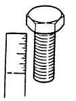

installing. 

b. Count the number of threads per inch. 

c. Under the heading SIZE, look down the left hand column until you find the diameter of the screw you are installing (there will usually be two lines beginning with the same size). 

d. In the second column under SIZE, find the number of threads per inch that matches the number of threads you counted in step b. 

#### Capscrew Head Markings

Manufacturer's marks may Metric screws are of three vary. These are all SAE Grade grades: 8.8, 10.9, and 12.9. 

5 (3-line). Grades & Manufacturer's marks appear on the screw head. 

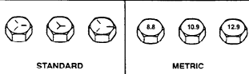

e. To find the grade screw you are installing, match the markings on the head to the correct picture of CAPSCREW HEAD MARKINGS on the torque table. 

f. Look down the column under the picture you found in step e. until you find the torque limit 
(in lb-f% or N.m) for the diameter and threads per inch of the screw. 

|             | CAPSCREW HEAD MARKINGS   |                  |            |                      |               |                 |            |                      |             |                 |
|-------------|--------------------------|------------------|------------|----------------------|---------------|-----------------|------------|----------------------|-------------|-----------------|
|             |                          |                  |            |                      |               |                 | TORQUE     |                      |             |                 |
|             | ટાટE                      |                  |            |                      |               |                 |            |                      |             |                 |
|             |                          |                  |            | SAE GRADE NO. 1 or 2 |               | SAE GRADE NO. 5 |            | SAE GRADE NO. 6 or 7 |             | SAE GRADE NO. 8 |
|             |                          |                  |            |                      |               |                 |            | NEWTON               | POUND       | NEWTON          |
| DIA. INCHES | THREADS PER INCH         | DIA. MILLIMETERS | POUND FEET | NEWTON METERS        | POUND FEET    | NEWTON METERS   | POUND FEET | METERS               | FEET        | METERS          |
| 1 / 4       | 20                       | 6.35             | 5          | 6.78                 | 8             | 10.85           | 10         | 13.56                | 12          | 16.27           |
| 1/4         | 28                       | 6.35             | 6          | 8.14                 | 10            | 13.56           | l          | \-                   | । ব         | 18.98           |
| २/16        | 18                       | 7.94             | 1 1        | 14.92                | 17            | 23.05           | 19         | 25.76                | 24          | 32.54           |
| ર/16        | ਨਵ                       | 7.94             | 13         | 17.63                | 19            | 25.76           | \-         | \-                   | 27          | 36.61           |
| 3/8         | 1 ୧                      | 9.53             | 18         | 24.41                | 31            | 42.04           | 34         | 46.10                | 44          | 59.66           |
| 3/8         | ਨ ਕ                      | 9.53             | 20         | 27.12                | રૂર            | 47.46           | 一         | \-                   | 49          | 66.44           |
| 7/16        | !イ                     | 11.11            | 28         | 37.97                | 49            | 66.44           | રર         | 74.58                | 70          | 94.92           |
| 7/16        | 20                       | 11.11            | 30         | 40. 88               | રર            | 74.58           | ー         | \-\-                 | 78          | 105.77          |
| 1/2         | 13                       | 12.70            | 39         | 22.88                | 75            | 101.70          | 8 ર        | 115.26               | 105         | 142.38          |
| 1/2         | 20                       | 12.70            | 41         | રર રેજી                | 8 ર           | 115.26          | 一         | \-                   | 120         | 162.72          |
| 9/16        | 12                       | 14.29            | રા          | 69.16                | 110           | 149.16          | 1 20       | 162.72               | । રેર        | 210.18          |
| 9/16        | 18                       | 14.29            | રર         | 74.58                | 120           | 162.72          | \-         | \-                   | 170         | 230.52          |
| 5/8         | 11                       | 12:88            | ୧३         | 85.43                | । ૨૦          | 203.40          | 1 67       | 226.45               | 210         | 284.76          |
| 5/8         | 18                       | 15.88            | ઠર         | 128.82               | 170           | 230.52          | \-         | \-                   | 240         | 325.44          |
| 3/4         | 10                       | 19.05            | 105        | 142.38               | 270           | 366.12          | 280        | 379.68               | 375         | 508.50          |
| 3/4         | । ୧                      | 19.05            | । । ર      | 155.94               | 295           | 400.02          | \-         | \-                   | 420         | 569.52          |
| 7/8         | 9                        | 22.23            | ા ୧୦        | 216.96               | ૩૭૨           | 535.62          | 440        | 596.64               | સ્୦ર         | 820.38          |
| 7/8         | 1 T                      | 22.23            | 175        | 237.30               | 435           | 589.86          | \-         | \-                   | ୧75         | 915.30          |
| l           | 8                        | 25.40            | ૪૩૨        | 318.68               | રઠ0           | 800.04          | રસ્ત        | 894.96               | 910         | 1233.96         |
| l           | ! ব                      | 25.40            | 250        | 339.00               | રસ્ત           | 894.96          | \-         | \-                   | 990         | 1342.44         |
| 1\-1/8      | \-                       | 28.58            | \-         | \-                   | 800\-         | 1084.8\-        | \-         | \-                   | 1280\-      | 1735.68         |
|             |                          |                  |            |                      | 880           | 1193.3          |            |                      | 1 440       | 1952.64         |
| 1\-1/4      | \-                       | 31.75            | \-         | \-                   | \-            | \-              | ﺴ          | \-                   | 1820\-      | 2467.92         |
|             |                          |                  |            |                      |               |                 |            |                      | 2000        | 2712.00         |
| 1\-3/8      | \-                       | 34.93            | \-         | \-                   | 1 460\- 1 ୧୫୦ | 1979.8\- 2278.1 | \-         | \-                   | 2380\- 2720 | 3227.28 3688.32 |
| 1\-1/2      | ﺴﺖ                       | 38.10            | \-         | \-\-                 | 1940\-        | 2630.6\-        | \-         | \-                   | 3160\-      | 4284.96         |
|             |                          |                  |            |                      | 2200          | 2983.2          |            |                      | રૂરસ્         | 4827.36         |

E-2 Table E-2. Torque Limits for Wet Fasteners. 

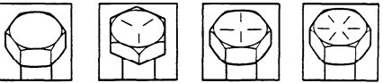

|             |                  |                  |            |                      |                 |                   | TORQUE               |               |                 |                   |
|-------------|------------------|------------------|------------|----------------------|-----------------|-------------------|----------------------|---------------|-----------------|-------------------|
|             | ટાટદ              |                  |            | SAE GRADE NO. 1 or 2 |                 | SAE GRADE NO. 5   | SAE GRADE NO. 6 or 7 |               |                 | SAE GRADE NO. 8   |
| DIA. INCHES | THREADS PER INCH | DIA. MILLIMETERS | POUND FEET | NEWTON METERS        | POUND FEET      | NEWTON METERS     | POUND FEET           | NEWTON MELEKS | POUND FEET      | NEWTON METERS     |
| 1/4         | 20               | 6.35             | વંરે         | 6.1                  | 7.2             | 9.76              | 9.0                  | 12.20         | 10.8            | 14.64             |
| 1/4         | 28               | ୧:35             | ર.4        | 7.32                 | 9.0             | 12.20             | \-                   | \-            | 12.6            | 17.09             |
| ર/16        | 18               | 7.94             | ర్ రి        | 13.42                | 15.3            | 20.75             | 17.1                 | 23.19         | 21.6            | 29.29             |
| 5/16        | 24               | 7.94             | 11.7       | 15.87                | 17.1            | 23.19             | \-                   | \-\-          | 24.3            | 32.95             |
| 3/8         | ાર                | 9.53             | 1 6.2      | 21.97                | 27.9            | 37.83             | 30.6                 | 41.49         | 39.6            | 53.70             |
| 3/8         | 24               | 9.53             | 18.0       | 24.41                | 31.5            | 42.71             | \-                   | \-            | 44.1            | 59.80             |
| 7/16        | । ব              | 11.11            | 25.2       | 34.17                | 44.1            | 59.80             | 49.5                 | 67.12         | 63.0            | 85.43             |
| 7/16        | 20               | 11.11            | 27.0       | 36.61                | 49.5            | 67.12             | \-                   | \-            | 70.2            | 95.19             |
| 1/2         | 13               | 12.70            | 35.1       | 47.60                | 67.5            | 91.53             | 76.5                 | 103.73        | 94.5            | 128.14            |
| 1/2         | 20               | 12.70            | 36.9       | 50.04                | 76.5            | 103.73            | \|                   | l             | 108.0           | 1 46.45           |
| 9/16        | 12               | 14.29            | 45.9       | 62.24                | 99.0            | 134.24            | 108.0                | 1 46.45       | 1 39.5          | 189.16            |
| 9/16        | 18               | 14.29            | 49.5       | 67.12                | 108.0           | 1 46.45           | ﺴﺴ                   | \-            | 1 53.0          | 207 .47           |
| 5/8         | 11               | 15.88            | 56.7       | 76.89                | 135.0           | 183.00            | 1 50.3               | 203.81        | 189.0           | 256.28            |
| 5/8         | 18               | 15.88            | 85.5       | 115.94               | 153.0           | 207.47            | ﺴ                    | \-            | 216.0           | 292.90            |
| 3/4         | 10               | 19.05            | 94.5       | 128.14               | 243.0           | 329.51            | 252.0                | 341.71        | 337.5           | 457.65            |
| 3/4         | ા ર               | 19.05            | 103.5      | 1 40.35              | 265.5           | 360.02            | l                    | \-            | 378.0           | 512.57            |
| 7/8         | 9                | 22.23            | 144.0      | 195.26               | 355.5           | 482.06            | 396.0                | 536.98        | 544.5           | 738.34            |
| 7/8         | 1 4              | 22.23            | 157.5      | 213.57               | 391.5           | 530.87            | \-                   | \-            | 607.5           | 823.77            |
| l           | 8                | 25.40            | 211.5      | 286.79               | 531.0           | 720.04            | 594.0                | 805.46        | 819.0           | ! ! ! ! 0 : 2 :   |
| l           | 14               | 25.40            | 225.0      | 305.10               | 594.0           | 805.46            | l                    | ﺴﻪ            | 891.0           | 1 208.20          |
| 1\-1/8      | l                | 28.58            | l          | \-                   | 720.0\- 792.0   | 976.32\- 1073.95  | ー                   | ﺴﺴ            | 1152.0\- 1296.0 | 1562.11\- 1757.38 |
| 1\-1/4      |                  | 31.75            |            |                      | \-              | \-                |                      |               | 1637.99\-       | 2221.11\-         |
|             |                  |                  |            |                      |                 |                   |                      |               | 1800.00         | 2440.80           |
| 1\-3/8      |                  | 34.93            |            |                      | 1314.0\- 1512.0 | 1781.78\- 2050.27 |                      |               | 2142.0\- 2448.0 | 2904.55\- 3319.49 |
| 1\-1/2      | \-               | 38.10            |            |                      | 1746.0\-        | 2367.58\-         |                      |               | 2844.0\-        | 3856.46           |
|             |                  |                  |            |                      | 1980.0          | 2684.88           |                      |               | 3204.0          | 4344.62           |

CAPSCREW HEAD MARKINGS 
Table E-3. Torque Limits for Metric Fasteners. 

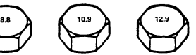

| SIZE   | TORQUE       |                    |
|--------|--------------|--------------------|
|        | POUND FEET   | NEWTON METERS      |
| WQ     | 7 \- 11      | 9.49 \- 14.92      |
| M8     | 21 \- 35     | 28.48 \- 47.46     |
| MIO    | 45 \- 65     | 61.02 \- 88.14     |
| M12    | 80 \- 120    | 108.48 \- 162.72   |
| M \| 4 | 130 \- 190   | 176.28 \- 257.64   |
| WIR    | 200 \- 280   | 271.20 \- 379.68   |
| M20    | 400 \- 520   | 542.40 \- 705.12   |
| M24    | 700 \- 900   | 949.20 \- 1220.40  |
| M30    | 1400 \- 1800 | 1898.40 \- 2440.80 |
| W3R    | 2400 \- 3000 | 3254.40 \- 4068.00 |

CAPSCREW HEAD MARKINGS 

# Appendix E (Cont'D)

#### E-4. Conversion Formula

Corrected dial or scale readings are determined by the use of the following formula: 

| Corrected   | Required     | Length of torque wrench + Length of adapter   |
|-------------|--------------|-----------------------------------------------|
| reading     | torque value | Length of torque wrench                       |

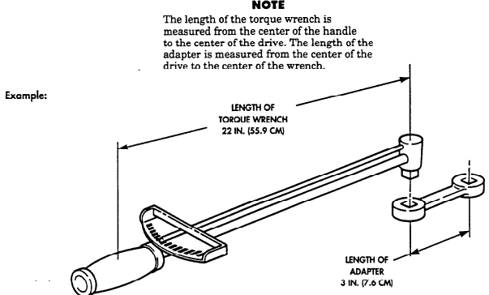

| Corrected   |    | 19 lb\-ft (25.8 N.m)   ÷   | 22 in. + 3 in. (55.9 cm + 7.6 cm)   |
|-------------|----|----------------------------|-------------------------------------|
| reading     | ニ |                            | 22 in. (55.9 cm)                    |
| Corrected   |    | 19 lb\-ft (25.8 N·m)   ÷   | 25 in. (63.5 cm)                    |
| reading     | =  |                            | 22 in. (55.9 cm)                    |
| Corrected   |    | 19 lb\-ft (25.8 N·m)   ÷   | 1.14                                |
| reading     | ll |                            |                                     |
| Corrected   |    | 17 lb\-ft (23.1 N.m)       |                                     |
| reading     | ll |                            |                                     |

In this example, the torque wrench measures 22 in. (55.9 cm) and the adapter is 3 in. (7.6 cm). The required torque is 19 lb-R (25.8 Nom) 

# Appendix F Body Repair Materials

## 1 F-L. Scope 1

This appendix is provided to facilitate identification of HMhIWV body repair materials. 

| MATERIAL THICKNESS   | RANGE (INCH)   | RIVET GRIP   | NSN                 |
|----------------------|----------------|--------------|---------------------|
| MINIMUM              | MAXIMUM        | NO.          |                     |
|                      | 1/16           | 1            | 5320\-00\-616\-4350 |
|                      | 1/8            | 2            | 5320\-00\-584\-1285 |
| 1/8                  | 3/16           | 3            | 5320\-00\-582\-3268 |
| 3/16                 | 1/4            | 4            | 5320\-00\-582\-3276 |
| 1/4                  | 5/16           | 5            | 5320\-00\-582\-3301 |
| 5/16                 | 3/8            | 6            | 5320\-00\-582\-3499 |
| 3/8                  | 7/16           | 7            | 5320\-00\-813\-4144 |
| 7/16                 | 1/2            | 8            | 5320\-00\-616\-4349 |
| 1/2                  | a/16           | ਰੇ            | 5320\-00\-753\-3809 |
| a/16                 | 5/8            | 10           | 5320\-00\-821\-1090 |
| 5/8                  | 11/16          | 11           | 5320\-00\-639\-2669 |
| 11/16                | 3/4            | 12           | 5320\-00\-996\-9871 |

Table F-l. Rivet Grip Length Determination. 

| NSN                 | TEMPER   | THICKNESS (IN.)   | WIDTH (IN.)   | LENGTH (FT)   |
|---------------------|----------|-------------------|---------------|---------------|
| 9535\-00\-250\-6503 | T\-6     | .050              | 36            | 8             |
| 9535\-01\-048\-6208 | T\-6     | .060              | 48            | 12            |
| 9535\-00\-250\-6908 | T\-6     | .080              | 48            | 12            |
| 9535\-00\-234\-8717 | T\-6     | .125              | 48            | 12            |
| 9535\-00\-232\-1885 | T\-6     | .125              | ਕੋ 8           | 8             |
| 9535\-00\-541\-7194 | T\-4     | .050              | 48            | 12            |
| 9535\-00\-232\-7554 | T\-4     | .080              | 48            | 12            |
| 9535\-00\-596\-3784 | T\-4     | .125              | ਕੋ 8           | 12            |
| 9535\-00\-188\-1574 | T\-4     | .187              | ਕੋ 8           | 12            |

Table F-2. Bulk Aluminum NSNs. 

|      |        |          | AN3 AND AN4 SERIES BOLTS   |         |          |                     |
|------|--------|----------|----------------------------|---------|----------|---------------------|
|      |        | AN3      |                            |         | AN4      |                     |
| DASH | GRIP   | BOLT     | NSN                        | GRIP    | BOLT     | NSN                 |
| NO.  | LENGTH | LENGTH   |                            | LENGTH  | TENGTH   |                     |
|      | (IN.)  | (IN.)    |                            | (IN.)   | (IN.)    |                     |
| 7A   | 1/2    | 29/32    | 5306\-00\-151\-0785        | 7/16    | 29/32    | 5306\-00\-515\-8064 |
| 10A  | રાજ     | 1\-1/32  | 5306\-00\-151\-0784        | 8/16    | 1\-1/32  | 5306\-00\-151\-1424 |
| 11A  | 3/4    | 1\-5/32  | 5306\-00\-685\-3027        | 11/32   | 1\-5/32  | 5306\-00\-151\-1423 |
| 12A  | 7/8    | 1\-9/32  | 5306\-00\-151\-0782        | 13/16   | 1\-9/32  | 5306\-00\-151\-1422 |
| 13A  |        | 1\-13/32 | 5306\-00\-151\-0781        | 15/16   | 1\-13/32 | 5306\-00\-151\-1421 |
| 14A  | 1\-1/8 | 1\-17/32 | 5306\-00\-151\-0780        | 1\-1/16 | 1\-17/32 | 5306\-00\-151\-1420 |
| 15A  | 1\-1/4 | 1\-21/32 | 5306\-00\-151\-0779        | 1\-3/16 | 1\-21/32 | 5306\-00\-151\-1419 |
| 16A  | 1\-3/8 | 1\-25/32 | 5306\-00\-151\-0778        | 1\-5/16 | 1\-25/32 | 5306\-00\-151\-1418 |
| 17A  | 1\-1/2 | 1\-29/32 | 5306\-00\-151\-0777        | 1\-7/16 | 1\-29/32 | 5306\-00\-151\-1417 |
| 20A  | 1\-5/8 | 2\-1/32  | 5306\-00\-151\-0776        | 1\-9/16 | 1\-1/32  | 5306\-00\-151\-1416 |

Table F-3. Ah73 and AN4 Series Bolts. 

Example: 

| NOMENCLATURE      | 3/16\-IN. NSN       | 1/4\-IN. NSN        |
|-------------------|---------------------|---------------------|
| Washer            | 5310\-00\-167\-0812 | 5310\-00\-809\-3078 |
| Self\-locking nut | 5310\-00\-017\-5108 | 5310\-00\-877\-5796 |

PN A.N3-7A is a 3/16-in. bolt, 29/32-in. long with a lJ2-in. grip length. PN AN4-7A is a lJ4-in. bolt, 29/32-in. long with a 7/16-in. grip length. 

The NSNs for washers and locknuts for use with the AN series bolts are: 

# Appendix G Mandatory Replacement Parts

Section I. INTRODUCTION
G-1. SCOPE
This appendix lists mandatory replacement parts you will need to maintain ECV series vehicles.

## G-2. Explanation Of Columns

a. Column (1) - Item Number. This number is assigned to each entry in the listing and is referenced in the Initial Setup of applicable tasks under the heading of Materials/Parts.

b. Column (2) - Nomenclature. Name or identification of the part. c. Column (3) - Part Number. The manufacturer's part number.

d. Column (4) - National/NATO Stock Number. The national stock number of the part.

|       |                                  | Section II. MANDATORY REPLACEMENT PARTS (Cont'd)   |                     |
|-------|----------------------------------|----------------------------------------------------|---------------------|
| (1)   |                                  | (3)                                                | (4)                 |
| IIIEM | PART                             | NATIONAL/NATO                                      |                     |
| NO.   | NOMENCLATURE                     | NUMBER                                             | STOCK NUMBER        |
| 1     | AVK Fastener                     | ALS7\-616\-150                                     | 5325\-01\-474\-9732 |
| 2     | Balance Weights                  | 2595966                                            | 6670\-01\-261\-6844 |
| 3     | Bearing Sleeve                   | 12L18F                                             | 3120\-00\-485\-1017 |
| 4     | Boot Service Kit                 | 57K3515                                            | 2530\-01\-457\-1337 |
| 5     | Bracket, Battery Holddown, Front | 12339904                                           | 5340\-01\-470\-7135 |
| 6     | Bracket, Battery Holddown, Rear  | 12339905                                           | 5340\-01\-470\-7160 |
| 6.1   | Bracket, Mounting, LH            | 2005207\-1                                         | 5340\-01\-542\-3351 |
| 6.2   | Bracket, Mounting, RH            | 2005207\-2                                         | 5340\-01\-542\-4800 |
| 7     | Capscrew                         | 9423557                                            | 5306\-01\-360\-1123 |
| 8     | Capscrew                         | 5597349                                            | 5306\-01\-276\-1621 |
| 9     | Capscrew                         | 4797000\-013                                       | 5306\-01\-433\-9185 |
| 10    | Center Parts Kit                 | CPL6N8                                             | 2520\-00\-352\-2168 |
| 11    | Clip                             | MS16633\-1050                                      | 5365\-00\-442\-5845 |
| 12    | Clip                             | M36\-0790\-10                                      | 5325\-01\-257\-0801 |
| 13    | Closed\-Cell Foam Rubber         | 4668987\-001                                       | 2540\-01\-474\-8719 |
| 14    | Copper Washer                    | 5582366                                            | 5310\-01\-189\-8476 |
| 15    | Copper Washer                    | 983\-0062                                          | 5310\-01\-495\-8564 |
| 16    | Cotter Pin                       | 10166                                              | 5315\-01\-284\-9812 |
| 16.1  | Cotter Pin                       | MS24665\-319                                       | 5315\-01\-267\-7570 |
| 17    | Cotter Pin                       | 4397007\-008                                       | 5315\-01\-433\-8419 |
| 18    | Cotter Pin                       | MS24665\-134                                       | 5315\-00\-839\-5820 |
| 19    | Cotter Pin                       | MS24665\-283                                       | 5315\-00\-842\-3044 |
| 20    | Cotter Pin                       | MS24665\-281                                       | 5315\-00\-839\-2326 |
| 21    | Cotter Pin                       | MS24665\-351                                       | 5315\-00\-839\-5821 |
| 22    | Cotter Pin                       | MS24665\-355                                       | 5315\-00\-012\-0123 |
| 23    | Cotter Pin                       | PK379                                              | 5315\-00\-816\-1794 |
| ਣਕੋ    | Cotter Pin                       | MS24665\-513                                       | 5315\-00\-239\-8032 |
| 25    | Cotter Pin                       | MS24665\-628                                       | 5315\-00\-846\-0126 |
| 26    | Cotter Pin                       | A82\-1                                             | 5315\-00\-839\-2325 |
| 26.1  | Cotter Ring                      | 6030302                                            |                     |
| 27    | Coupler, Tube                    | 12339235                                           | 4730\-01\-184\-6971 |
| 28    | Door Seal                        | RCSK 18037\-2                                      | 5330\-01\-460\-9004 |
| 29    | Door Seal                        | RCSK 18047                                         | 5330\-01\-460\-8997 |
| 30    | Drivescrew                       | MS21318\-47                                        | 5305\-00\-253\-5626 |
| 31    | Dust Cap                         | 211121X                                            | 5340\-01\-188\-1017 |
| 31.1  | Edge Protector                   | 6020920                                            |                     |
| 32    | Fiber Washer                     | 12500                                              | 5310\-00\-830\-7825 |
| 32.1  | Filter                           | 870889A                                            | 4330\-01\-506\-2918 |
| 33    | Filter Assembly                  | 8684221                                            | 2520\-01\-398\-4589 |
| 33.1  | Flat Washer                      | 130998                                             | 5310\-00\-013\-0998 |
| 34    | Flat Washer                      | 4397005\-010                                       | 5310\-01\-435\-7784 |
| 35    | Flat Washer                      | MS27183\-14                                        | 5310\-00\-080\-6004 |
| 35.1  | Fuel Pump Gasket                 | SC202494                                           | 5330\-01\-393\-9101 |
| 35.2  | Foam Washer                      | 6019898                                            |                     |
| 35.3  | Foam Washer                      | 12480828                                           |                     |

|      |                                 | Section II. MANDATORY REPLACEMENT PARTS (Cont'd)   |                     |
|------|---------------------------------|----------------------------------------------------|---------------------|
|      | NOMENCLATUR                     | NATIONAL/N                                         | (4) STOCK NUMBER    |
| 36   | Fuel/Water Filter Element Kit   | A910044                                            | 4330\-01\-190\-3579 |
| 37   | Gasket                          | 12338585                                           | 5330\-01\-194\-0473 |
| 38   | Gasket                          | MA128\-21182                                       | 5330\-01\-037\-0663 |
| 39   | Gasket                          | 12338339                                           | 5330\-01\-200\-0466 |
| 40   | Gasket                          | 12342105                                           | 5330\-01\-315\-1609 |
| イ1  | Gasket                          | 10137490                                           | 5330\-01\-445\-5459 |
| 42   | Gasket                          | 7539072                                            | 5330\-00\-753\-9072 |
| 43   | Gasket                          | DC8226                                             | 5330\-01\-076\-6172 |
| 44   | Gasket                          | 10137488                                           | 5330\-01\-149\-0874 |
| 45   | Gasket                          | 5577933                                            | 5330\-01\-184\-6500 |
| વેર   | Gasket                          | 12339379                                           | 5330\-01\-188\-0911 |
| 47   | Gasket                          | 8677743                                            | 5330\-01\-360\-5271 |
| 48   | Gasket                          | 12338462                                           | 5330\-01\-211\-5856 |
| 49   | Gasket                          | 12553488                                           | 5330\-01\-476\-3866 |
| 50   | Gasket                          | 24204253                                           | 5330\-01\-478\-5993 |
| 51   | Gasket                          | 12460095                                           | 5330\-01\-413\-2118 |
| 52   | Gasket                          | 10137486                                           | 5330\-01\-150\-5944 |
| 53   | Gasket                          | 12554979                                           | 5330\-01\-442\-2876 |
| 54   | Gasket                          | 14964                                              | 5330\-01\-306\-7887 |
| 55   | Gasket                          | 14022649                                           | 5330\-01\-156\-5147 |
| 56   | Gasket                          | 14025557                                           | 5330\-01\-150\-1215 |
| 56.1 | Gasket                          | 12356789                                           | 5330\-01\-319\-7302 |
| 56.2 | Gasket                          | 12469270                                           | 5330\-01\-548\-3654 |
| 57   | Gasket, Governor Cover          | 3921950                                            | 5330\-01\-234\-2615 |
| 58   | Gasket, Intake Manifold         | 12531704                                           | 5330\-01\-437\-9216 |
| 59   | Gasket, Intake Manifold         | 10211661                                           | 5331\-01\-437\-0547 |
| 60   | Gasket, Oil Pan                 | 0534400                                            | 5330\-01\-310\-6780 |
| 61   | Gasket, Oil Pump                | 8677782                                            | 5330\-01\-409\-1665 |
| 62   | Gasket, Servo Cover             | 8675728                                            | 5330\-01\-478\-4797 |
| 63   | Gasket, Turbocharger Oil        | 12461306                                           | 5330\-01\-484\-1471 |
| ୧୬   | Gasket, Valve Cover             | 91599                                              | 5330\-01\-372\-0636 |
| 65   | Gasket Kit, Commutator End Head | MES\-955                                           | 5330\-00\-138\-0251 |
| ୧୧   | Gasket Set                      | 36\-630                                            | 5330\-01\-190\-7510 |
| 67   | Gasket Set                      | SAT\-32                                            | 5330\-00\-193\-0850 |
| ୧୫   | Gasket Set                      | 90\-2206                                           | 2920\-00\-302\-6342 |
| 68.1 | Grommet, Nonmetallic            | 12340526                                           | 5325\-01\-437\-4175 |
| 69   | Hex\-Nut                        | 7063812                                            | 5310\-00\-126\-3842 |
| 70   | Hex\-Nut                        | N9098                                              | 5310\-01\-225\-0701 |
| 71   | Hex\-Nut                        | 4397002\-001                                       | 5310\-01\-417\-8614 |
| 72   | Journal and Bearing Kit         | 5\-213X                                            | 2520\-01\-180\-2135 |
| 72.1 | Keyed Washer                    | 5584462                                            | 5310\-01\-213\-4185 |

|       |                            | Section II. MANDATORY REPLACEMENT PARTS (Conf d)   |                     |
|-------|----------------------------|----------------------------------------------------|---------------------|
|       |                            |                                                    | (4)                 |
|       | NOMENCLATURE               |                                                    | STOCK NUMBER        |
| 72.2  | Kit, Pressure Relief Valve | 5716414                                            | 4820\-01\-510\-6041 |
| 72.3  | Lockbolt                   | 5589067                                            | 5306\-01\-204\-2139 |
| 73    | Locknut                    | 12339206                                           | 5310\-01\-439\-1154 |
| 73.1  | Locknut                    | M45913/4\-4CG8Z                                    | 5310\-01\-548\-1269 |
| 73.2  | Locknut                    | 190254                                             | 5310\-01\-269\-9245 |
| 74    | Locknut                    | M21245\-L12                                        | 5310\-00\-419\-0876 |
| 75    | Locknut                    | 9422279                                            | 5310\-01\-462\-4393 |
| 76    | Locknut                    | SN\-104\-NM\-22                                    | 5310\-00\-208\-1918 |
| 77    | Locknut                    | M45913/3\-4CG8C                                    | 5310\-00\-061\-4650 |
| 78    | Locknut                    | MS21245\-L10                                       | 5310\-00\-449\-2381 |
| 79    | Locknut                    | 9422295                                            | 5310\-01\-119\-3668 |
| 80    | Locknut                    | 5593035                                            | 5310\-01\-255\-2695 |
| 81    | Locknut                    | M45913/3\-4FG8C                                    | 5310\-00\-935\-9022 |
| 82    | Locknut                    | M45913/3\-5CG8C                                    | 5310\-00\-814\-0673 |
| 83    | Locknut                    | M45913/1\-10CG8C                                   | 5310\-00\-061\-4651 |
| 84    | Locknut                    | 12339501                                           | 5310\-01\-198\-7585 |
| 85    | Locknut                    | M45913/4\-8CG8Z                                    |                     |
| 86    | Locknut                    | MS21245\-8                                         | 5310\-00\-449\-2376 |
| 87    | Locknut                    | MS51943\-34                                        | 5310\-00\-241\-6658 |
| 88    | Locknut                    | M45913/3\-12CG8C                                   | 5310\-00\-409\-3333 |
| 89    | Locknut                    | 9411893                                            | 5310\-00\-251\-4503 |
| 90    | Locknut                    | 8712289\-4                                         | 5310\-00\-840\-6222 |
| 91    | Locknut                    | 21NE083                                            | 5310\-00\-020\-0358 |
| 92    | Locknut                    | 9442939                                            | 5310\-01\-149\-4407 |
| 93    | Locknut                    | 8712289                                            | 5310\-00\-044\-3340 |
| ರಿಕ    | Locknut                    | N9265                                              | 5310\-01\-136\-4888 |
| 94.1  | Locknut                    | 9424215                                            | 5310\-01\-398\-0319 |
| 94.2  | Locknut                    | MS4397020\-023                                     | 5340\-01\-513\-4903 |
| 94.3  | Locknut                    | B18241B100F                                        | 5310\-01\-395\-8747 |
| 95    | Locknut                    | 5593048                                            | 5310\-01\-252\-0481 |
| 96    | Locknut                    | 12338899                                           | 5340\-01\-185\-8619 |
| 97    | Locknut                    | 9419476                                            | 5310\-00\-984\-3807 |
| 98    | Locknut                    | 454749                                             | 5310\-00\-164\-1790 |
| 99    | Locknut                    | 92\-00065                                          | 5310\-01\-420\-8727 |
| 100   | Locknut                    | ALS7\-616\-312                                     | 5325\-01\-459\-5008 |
| 100.1 | Locknut                    | M45913/4\-4CG8C                                    | 5310\-01\-510\-1237 |
| 101   | Locknut                    | M45913/1\-4CG5C                                    | 5310\-00\-088\-1251 |
| 101.1 | Locknut                    | M45913/3\-5CG8Z                                    | 5310\-01\-500\-3204 |
| 101.2 | Locknut                    | NAS1022\-N08                                       | 5310\-00\-721\-5447 |
| 101.3 | Locknut                    | MS210\-83\-N08                                     | 5310\-00\-941\-6019 |
| 101.4 | Locknut                    | 5592958                                            | 5310\-01\-253\-1615 |

Section II. MANDATORY REPLACEMENT PARTS (Cont'd)

|           |              | Section II. MANDATORY REPLACEMENT PARTS (Cont'd)   |                     |
|-----------|--------------|----------------------------------------------------|---------------------|
| (1) IIIEM |              | NATIONAL/NATO                                      | (4)                 |
| NO.       | NOMENCLATURE | NUMBER                                             | STOCK NUMBER        |
| 101.5     | Locknut      | 9411807                                            | 5310\-01\-461\-8043 |
| 101.6     | Locknut      | MS17829\-4F                                        | 5310\-00\-483\-8791 |
| 101.7     | Locknut      | 131245                                             | 5310\-00\-013\-1245 |
| 101.8     | Locknut      | 5590556                                            | 5310\-01\-208\-5252 |
| 101.9     | Locknut      | 454748                                             | 5310\-00\-013\-1245 |
| 101.10    | Locknut      | 192481                                             | 5310\-01\-058\-3353 |
| 102       | Locknut      | 8712289\-5                                         | 5310\-00\-044\-3342 |
| 103       | Locknut      | 12339201                                           | 5310\-01\-198\-7585 |
| 104       | Locknut      | MS51943\-36                                        | 5310\-00\-935\-3569 |
| 102       | Locknut      | 21NE\-40                                           | 5310\-01\-066\-6759 |
| 108       | Locknut      | MS51943\-35                                        | 5310\-00\-935\-9021 |
| 107       | Locknut      | 22FT832                                            | 5310\-00\-582\-5765 |
| 108       | Locknut      | 5579442                                            | 5310\-01\-175\-0617 |
| 109       | Locknut      | 6779                                               | 5310\-01\-213\-4174 |
| 110       | Locknut      | 4397073\-003                                       | 5310\-01\-439\-8180 |
| 111       | Locknut      | 4397064\-005                                       | 5310\-01\-439\-8177 |
| 112       | Locknut      | 4397003\-001                                       |                     |
| 113       | Locknut      | M45912/3\-6FG8C                                    | 5310\-00\-814\-0672 |
| 114       | Locknut      | MS51988\-8                                         | 5310\-00\-447\-8774 |
| 114.1     | Locknut      | MS51988\-7                                         | 5310\-00\-930\-8214 |
| 114.2     | Locknut      | 5934802                                            |                     |
| 114.3     | Locknut      | MS51988\-11                                        | 5310\-00\-849\-3589 |
| 114.4     | Locknut      | MS51943\-39                                        | 5310\-00\-488\-3889 |
| 114.5     | Locknut      | MS51943\-40                                        | 5310\-00\-488\-3888 |
| 115       | Locknut      | N9416                                              | 5310\-01\-348\-8360 |
| 115.1     | Locknut      | N9092                                              | 5310\-01\-390\-5105 |
| 116       | Locknut      | N9099                                              | 5310\-01\-165\-1312 |
| 117       | Locknut      | 9419477                                            | 5310\-01\-466\-4852 |
| 118       | Locknut      | MS51943\-13                                        | 5310\-01\-315\-7311 |
| 119       | Locknut      | 4397064\-008                                       | 5310\-01\-439\-8178 |
| 120       | Locknut      | 9422305                                            | 5310\-01\-130\-4274 |
| 121       | Locknut      | 9442938                                            | 5310\-01\-315\-3403 |
| 122       | Locknut      | 4397064\-013                                       | 5310\-01\-439\-7064 |
| 123       | Locknut      | 4397012\-072                                       | 5305\-01\-438\-1201 |
| 124       | Locknut      | 9418969                                            | 5310\-00\-458\-2382 |
| 125       | Locknut      | M45913/4\-7CG8Z                                    | 5310\-00\-241\-6659 |
| 126       | Locknut      | 4397000\-64                                        | 5305\-01\-436\-6377 |
| 127       | Locknut      | 4397064\-001                                       | 5310\-01\-439\-8173 |
| 128       | Locknut      | 9422299                                            | 5310\-01\-150\-4003 |
| 129       | Locknut      | 4397064\-003                                       | 5310\-01\-439\-8172 |
| 130       | Locknut      | 4397064\-014                                       |                     |
| 131       | Locknut      | 4397068\-003                                       | 5310\-01\-437\-3836 |
| 132       | Locknut      | 9422277                                            | 5310\-01\-126\-9404 |
| 132.1     | Locknut      | 2770827                                            |                     |
| 133       | Locknut      | 9419471                                            | 5310\-01\-432\-6727 |
| 133.1     | Locknut      | 274209                                             | 5310\-00\-420\-9713 |

|          |                    | Section II. MANDATORY REPLACEMENT PARTS (Cont'd)   |                     |
|----------|--------------------|----------------------------------------------------|---------------------|
| (1) ITEM | (2)                | PART                                               | NATIONAL/NATO       |
| NO       | NOMENCLATURE       | NUMBER                                             | STOCK NUMBER        |
| 133.2    | Locknut            | 4397021\-023                                       | 5310\-01\-419\-2951 |
| 133.3    | Locknut            | 12339730                                           | 5310\-01\-254\-4284 |
| 133.4    | Locknut            | 12339728\-3                                        | 5310\-01\-198\-3487 |
| 133.5    | Locknut            | 5584710                                            | 5310\-01\-203\-3217 |
| 133.6    | Locknut            | MS21042L5                                          | 5310\-00\-807\-1476 |
| 133.7    | Locknut            | MS21042L6                                          | 5310\-00\-807\-1477 |
| 133.8    | Locknut            | MS21042L4                                          | 5310\-00\-807\-1475 |
| 133.9    | Locknut            | 5591514                                            | 5310\-01\-217\-0715 |
| 133.10   | Locknut            | MS21044\-N3                                        | 5310\-00\-877\-5797 |
| 133.11   | Locknut            | M45913/3\-4FG8C                                    | 5310\-00\-935\-9022 |
| 133.12   | Locknut            | 190171                                             | 5310\-00\-774\-9073 |
| 133.13   | Locknut            | 9419456                                            | 5310\-01\-318\-5237 |
| 133.14   | Locknut            | 272739                                             | 5310\-01\-317\-8164 |
| 133.15   | Locknut            | 190139                                             | 5310\-00\-088\-0553 |
| 133.16   | Locknut            | 4397064\-006                                       | 5310\-01\-437\-3845 |
| 133.17   | Locknut            | 9422300                                            | 5310\-01\-315\-3403 |
| 133.18   | Locknut            | 4397064\-006                                       | 5310\-01\-437\-3845 |
| 133.19   | Locknut            | 4397064\-018                                       |                     |
| 133.20   | Locknut            | 9422303                                            | 5310\-00\-044\-3342 |
| 133.21   | Locknut            | M45913/4\-6CG8Z                                    | 5310\-01\-542\-0395 |
| 133.22   | Locknut            | M45913/4\-4CG8Z                                    | 5310\-01\-548\-1269 |
| 133.23   | Deleted            |                                                    |                     |
| 133.24   | Locknut            | M45913/4\-5CG8Z                                    | 5310\-01\-563\-9653 |
| 133.25   | Locknut            | 190254                                             | 5310\-01\-269\-9245 |
| 133.26   | Locknut            | M45913/3\-6CG8Z                                    | 5310\-01\-500\-3209 |
| 133.27   | Locknut            | M45913/4\-7CG8Z                                    | 5310\-01\-565\-5271 |
| 133.28   | Locknut            | M45913/3\-010CG8Z                                  | 5310\-01\-501\-3090 |
| 133.29   | Locknut            | M45913/3\-8CG8Z                                    | 5310\-01\-501\-3086 |
| 133.30   | Locknut            | 4423867                                            | 5310\-01\-561\-0928 |
| 133.31   | Locknut            | M45913/3\-4CG8Z                                    | 5310\-01\-518\-7173 |
| 134      | Locknut, Assembled | 271172                                             | 5310\-01\-152\-0598 |
| 135      | Lockwasher         | MS35338\-141                                       | 5310\-00\-984\-7042 |
| 136      | Lockwasher         | 454542                                             | 5305\-00\-499\-7694 |
| 137      | Lockwasher         | MS35337\-22                                        | 5310\-00\-596\-7674 |
| 138      | Lockwasher         | 120382                                             | 5310\-00\-012\-0382 |
| 139      | Lockwasher         | MS35333\-38                                        | 5310\-00\-559\-0070 |
| 140      | Lockwasher         | 4397004\-005                                       | 5310\-01\-434\-1385 |
| 141      | Lockwasher         | 4397004\-007                                       | 5310\-01\-417\-9942 |
| 142      | Lockwasher         | 4397037\-006                                       | 5310\-01\-419\-4436 |
| 143      | Lockwasher         | MS122031                                           | 5310\-00\-285\-7037 |
| 144      | Lockwasher         | MS35338\-46                                        | 5310\-00\-637\-9541 |
| 145      | Lockwasher         | MS35338\-45                                        | 5310\-00\-407\-9566 |
| 146      | Lockwasher         | MS35338\-44                                        | 5310\-00\-582\-5965 |
| 147      | Lockwasher         | MS35338\-42                                        | 5310\-00\-045\-3299 |
| 148      | Lockwasher         | MS51415\-9                                         | 5310\-01\-216\-7390 |
| 149      | Lockwasher         | MS35338\-43                                        | 5310\-00\-045\-3296 |
| 150      | Lockwasher         | 120217                                             | 5310\-00\-922\-2017 |
| 151      | Lockwasher         | 11503962                                           | 5310\-01\-444\-3084 |
| 152      | Lockwasher         | 2239H                                              | 5310\-00\-209\-1218 |
| 153      | Lockwasher         | MS35338\-103                                       | 5310\-00\-184\-8971 |
| 154      | Lockwasher         | MS35338\-49                                        | 5310\-00\-167\-0680 |
| 155      | Lockwasher         | MS35333\-44                                        | 5310\-00\-194\-1483 |

|          |              | Section II. MANDATORT KEPLACEMENT PARTS (Cont d)   |                     |
|----------|--------------|----------------------------------------------------|---------------------|
| (1) ITEM | (2)          | PART                                               | NATIONAL/NAT        |
| NO       | NOMENCLATURE | NUMBER                                             | STOCK NUM           |
| 156      | Lockwasher   | 5573688                                            | 5310\-01\-231\-0596 |
| 157      | Lockwasher   | 12446954                                           | 5310\-01\-472\-3763 |
| 158      | Lockwasher   | MS35333\-43                                        | 5310\-00\-685\-3228 |
| 158.1    | Lockwasher   | 4397004\-006                                       | 5310\-01\-433\-0941 |
| 159      | Lockwasher   | 4397004\-008                                       | 5310\-01\-417\-7273 |
| 160      | Lockwasher   | 4397004\-042                                       | 5310\-01\-436\-5682 |
| 161      | Lockwasher   | MS35340\-47                                        | 5310\-00\-655\-9370 |
| 162      | Lockwasher   | B18212HRCZ080                                      | 5310\-01\-478\-5620 |
| 163      | Lockwasher   | 12460095                                           | 5330\-01\-413\-2118 |
| 164      | Lockwasher   | MS35333\-76                                        | 5310\-00\-180\-0277 |
| 165      | Lockwasher   | MS45904\-76                                        | 5310\-00\-061\-1258 |
| 166      | Lockwasher   | MS45904\-72                                        | 5310\-00\-889\-2527 |
| 167      | Lockwasher   | 85031                                              | 5310\-01\-186\-7066 |
| 168      | Lockwasher   | MS45904\-60                                        | 5310\-00\-080\-9786 |
| 169      | Lockwasher   | MS35338\-65                                        | 5310\-00\-011\-5093 |
| 170      | Lockwasher   | 5584462                                            | 5310\-01\-213\-4185 |
| 171      | Lockwasher   | MS35338\-50                                        | 5310\-00\-820\-6653 |
| 172      | Lockwasher   | MS35333\-40                                        | 5310\-00\-550\-1130 |
| 173      | Lockwasher   | MS45904\-68                                        | 5310\-00\-889\-2528 |
| 174      | Lockwasher   | MS35338\-48                                        | 5310\-00\-584\-5272 |
| 175      | Lockwasher   | MS35340\-48                                        | 5310\-00\-834\-7606 |
| 176      | Lockwasher   | MS35340\-43                                        | 5310\-00\-721\-7809 |
| 177      | Lockwasher   | N9018                                              | 5310\-01\-032\-4827 |
| 178      | Lockwasher   | N9265                                              | 5310\-01\-136\-4888 |
| 179      | Lockwasher   | N9459                                              | 5310\-01\-348\-8393 |
| 180      | Lockwasher   | N9461                                              | 5310\-01\-348\-8392 |
| 181      | Lockwasher   | N9015                                              | 5310\-01\-046\-0186 |
| 182      | Lockwasher   | MS35338\-47                                        | 5310\-00\-209\-0965 |
| 183      | Lockwasher   | 120384                                             | 5310\-00\-482\-9493 |
| 184      | Lockwasher   | 121841                                             | 5310\-00\-764\-5694 |
| 185      | Lockwasher   | 11500207                                           | 5310\-01\-206\-7306 |
| 186      | Lockwasher   | 5550554                                            | 5310\-01\-144\-2779 |
| 187      | Lockwasher   | MS35338\-67                                        | 5310\-00\-011\-6121 |
| 188      | Lockwasher   | 92\-2923                                           | 5310\-01\-214\-4955 |
| 189      | Lockwasher   | MS35338\-100                                       | 5310\-00\-261\-8278 |
| 190      | Lockwasher   | 12338062                                           | 5310\-01\-148\-2687 |
| 190.1    | Lockwasher   | 120214                                             | 5310\-00\-012\-0214 |
| 190.2    | Lockwasher   | 120423                                             | 5310\-00\-012\-0423 |
| 190.3    | Lockwasher   | 9424258                                            | 5310\-01\-199\-3440 |
| 190.4    | Lockwasher   | 120380                                             | 5310\-00\-209\-2946 |
| 190.5    | Lockwasher   | MS35335\-33                                        | 5310\-00\-209\-0786 |
| 190.6    | Lockwasher   | 95060A400                                          | 5310\-01\-476\-2608 |
| 190.7    | Lockwasher   | 91114A029                                          |                     |
| 190.8    | Lockwasher   | MS35338\-145                                       | 5310\-00\-937\-0453 |
| 190.9    | Lockwasher   | MS90728\-58                                        | 5305\-00\-543\-4372 |
| 190.10   | Lockwasher   | MS90728\-32                                        | 5305\-01\-359\-8002 |
| 190.11   | Lockwasher   | 12469426                                           | 5310\-01\-457\-3292 |
| 190.12   | Lockwasher   | MS35338\-41                                        | 5310\-00\-045\-4007 |

Section II. MANDATORY REPLACEMENT PARTS (Cont'd)

|           |                             | Section II. MANDATORY REPLACEMENT PARTS (Cont'd)   |                     |
|-----------|-----------------------------|----------------------------------------------------|---------------------|
| (1) IIIEM | (2)                         |                                                    |                     |
| NO        | NOMENCLATURE                |                                                    |                     |
| 191       | Lockwasher, Two\-Piece      | 12469426                                           | 5310\-01\-457\-3292 |
| 192       | Lubricant, Run Flat         | D528234\-H1                                        | 2640\-01\-419\-6200 |
| 193       | Mounting Plate Gasket       | 12551502                                           | 5330\-00\-830\-1745 |
| 194       | Nut and Lockwasher Assembly | 5593033                                            | 5310\-01\-252\-2999 |
| 194.1     | Nut, Insert                 | 12446871\-1                                        | 5310\-01\-413\-3276 |
| 194.2     | Nut, Insert                 | 12446871\-8                                        | 5325\-01\-476\-3041 |
| 194.3     | Nut, Insert                 | 12446871\-11                                       | 5325\-01\-505\-3122 |
| 194.4     | Nut, Insert                 | 12446871\-17                                       |                     |
| 194.5     | Nut, Insert                 | 12446871\-18                                       |                     |
| 195       | Nut, Plain Assembled        | G\-00271166                                        | 5310\-01\-251\-0760 |
| 196       | Nut, Plain Assembled        | 134530                                             | 5310\-01\-186\-7702 |
| 197       | Nut, Plain Assembled        | 271169                                             | 5310\-00\-124\-9265 |
| 197.1     | Nut, Plain Assembled        | 271184                                             | 5310\-00\-933\-4310 |
| 197.2     | Nut, Plain Assembled        | 271175                                             | 5310\-01\-333\-5245 |
| 198       | Nylon Thrust Washer         | 30277                                              | 3120\-01\-447\-8663 |
| 199       | Oil Filter                  | PF1218                                             | 4330\-01\-398\-8484 |
| 200       | Deleted                     |                                                    |                     |
| 201       | Oil Filter                  | 8684221                                            | 2520\-01\-398\-4589 |
| 201.1     | Oil Filter                  | 24210955                                           |                     |
| 202       | Oil Seal                    | 30275                                              | 5330\-01\-446\-4696 |
| 203       | 0\-Ring                     | M83461/1\-236                                      | 5331\-01\-183\-0971 |
| 204       | O\-Ring                     | 33\-00778                                          | 5331\-01\-419\-7754 |
| 205       | O\-Ring                     | 33\-00779                                          | 5331\-01\-460\-2442 |
| 206       | 0\-Ring                     | 33\-00781                                          | 5331\-01\-419\-7755 |
| 207       | 0\-Ring                     | 33\-00777                                          | 5331\-01\-420\-1795 |
| 208       | O\-Ring                     | 4397059\-016                                       | 5331\-01\-439\-8821 |
| 209       | O\-Ring                     | 5741062                                            | 5330\-01\-209\-7726 |
| 210       | O\-Ring                     | 3921936                                            | 5331\-01\-232\-2145 |
| 211       | O\-Ring                     | 33\-00780                                          | 5331\-01\-421\-4960 |
| 212       | O\-Ring                     | MS28775\-110                                       | 5331\-00\-585\-6663 |
| 213       | O\-Ring                     | 8658110                                            | 5330\-01\-043\-5572 |
| 214       | O\-Ring                     | 24201388                                           | 5330\-01\-456\-7886 |
| 215       | O\-Ring                     | 5939517                                            | 5330\-01\-487\-7129 |
| 216       | O\-Ring                     | 274244                                             | 5331\-00\-935\-9136 |
| 217       | O\-Ring                     | M83461/1\-020                                      | 5331\-01\-107\-4950 |
| 218       | O\-Ring                     | 299C413P3                                          | 5331\-00\-676\-8062 |
| 219       | O\-Ring                     | 12339002                                           | 5331\-01\-195\-8889 |
| 220       | O\-Ring                     | 12340395                                           | 5331\-00\-580\-6586 |
| 221       | O\-Ring                     | 1249\-4                                            | 5331\-00\-805\-2966 |
| 222       | O\-Ring                     | 5740436                                            | 5330\-01\-157\-1884 |
| 223       | O\-Ring                     | 983\-110.01                                        |                     |
| 224       | O\-Ring                     | 983\-9537044DO                                     |                     |
| 225       | O\-Ring                     | 983\-WH11\-105                                     |                     |
| 226       | O\-Ring                     | 11639519\-1                                        | 5331\-00\-463\-0200 |
| 227       | O\-Ring                     | 11639519\-2                                        | 5310\-00\-462\-0907 |

|       |                        | Section II. MANDATORY REPLACEMENT PARTS (Cont'd)   |                     |
|-------|------------------------|----------------------------------------------------|---------------------|
|       | (2)                    |                                                    |                     |
| NO    | NOMENCLATURE           |                                                    |                     |
| 228   | O\-Ring                | 22405A                                             |                     |
| 228.1 | O\-Ring                | PS18022                                            | 5330\-01\-495\-0145 |
| 228.2 | O\-Ring                | 7700242                                            |                     |
| 228.3 | O\-Ring                | 6006173                                            | 5331\-01\-520\-6192 |
| 228.4 | O\-Ring                | 6006174                                            |                     |
| 228.5 | O\-Ring                | 6006175                                            |                     |
| 228.6 | O\-Ring                | 2\-032                                             | 5331\-00\-752\-8885 |
| 229   | O\-Ring, Crossover     | 12456133                                           | 5331\-01\-472\-8177 |
| 230   | O\-Ring, Door Handle   | MS28775\-114                                       | 5331\-00\-618\-0801 |
| 231   | O\-Ring, Drum End      | 983\-AS5680357                                     |                     |
| 232   | O\-Ring, Insert        | 12342794                                           | 5331\-01\-346\-3806 |
| 233   | O\-Ring, Pinion        | XA744Z                                             | 5331\-00\-137\-3450 |
| 234   | O\-Ring Seal           | 8661760                                            | 5330\-01\-414\-6607 |
| 235   | O\-Ring Seal           | 12447172                                           | 5330\-01\-447\-4762 |
| 236   | O\-Ring Seal           | 5688049                                            | 5330\-00\-848\-4439 |
| 237   | 0\-Ring Seal           | 91610                                              | 5331\-01\-417\-1043 |
| 237.1 | Parts Kit              | 90\-2206                                           | 2920\-00\-302\-6342 |
| 238   | Parts Kit, Bearing     | 90\-2840                                           | 3120\-01\-191\-4637 |
| 239   | Parts Kit, Engine      | 90\-2225                                           | 2920\-01\-068\-7182 |
| 240   | Parts Kit, Engine      | 90\-2841                                           | 2920\-01\-191\-6534 |
| 241   | Parts Kit, Engine      | 90\-2837                                           | 2920\-01\-192\-2956 |
| 242   | Parts Kit, Hydraulic   | 24210468                                           |                     |
| 243   | Parts Kit, Seal        | 57K0241                                            | 5330\-01\-361\-8015 |
| 244   | Parts Kit, Seal        | 57K0240                                            | 5330\-01\-361\-8014 |
| 245   | Parts Kit. Seal        | 57K3489                                            | 5330\-01\-459\-6477 |
| 246   | Parts Kit, Solenoid    | 90\-816                                            | 2920\-01\-192\-2959 |
| 246.1 | Pin, Spring            | 9412281                                            | 5315\-01\-173\-3397 |
| 247   | Pin, Tapered Drive     | 91386                                              | 5315\-00\-576\-0265 |
| 247.1 | Platenut               | MS51941\-10                                        | 5310\-01\-025\-6444 |
| 248   | Plug                   | 24200224                                           | 4730\-01\-460\-5520 |
| 249   | Pushnut                | 12340258                                           | 5340\-01\-232\-7599 |
| 250   | Pushnut                | C183\-012\-4                                       | 5310\-01\-213\-1333 |
| 251   | Pushnut                | 12339313                                           | 5310\-01\-188\-6861 |
| 252   | Rear Brake Caliper Kit | 57K3512                                            | 2530\-01\-455\-9330 |
| 253   | Retainer, Oil Seal     | 23502587                                           | 5330\-01\-378\-8572 |
| 254   | Retaining Ring         | 012351                                             | 5365\-01\-135\-4290 |
| 254.1 | Retaining Ring         | MS16633\-1050                                      | 5325\-00\-442\-5845 |
| 254.2 | Retaining Ring         | 274612                                             | 5365\-99\-700\-9590 |
| 254.3 | Retaining Ring         | 9419863                                            | 5325\-01\-196\-5631 |
| 255   | Rivet                  | BALM\-6BP\-14                                      | 5320\-01\-254\-2283 |
| 256   | Rivet                  | CR\-213\-4\-2                                      | 5230\-01\-258\-2576 |
| 257   | Rivet                  | CR\-213\-4\-4                                      | 5230\-01\-220\-0596 |
| 257.1 | Rivet                  | CR\-213\-6\-8                                      | 5320\-01\-086\-1144 |
| 258   | Rivet                  | NAS9301BNS\-4\-04                                  | 5320\-01\-143\-5079 |

| こ    | (2)                         | Section II. MANDATORY REPLACEMENT PARTS (Cont'd)   |                     |
|-------|-----------------------------|----------------------------------------------------|---------------------|
| ITEM  |                             |                                                    |                     |
| NO    | NOMENCLATURE                | NUMBER                                             |                     |
| 259   | Rivet                       | 5593050                                            | 5320\-01\-254\-4251 |
| 260   | Rivet                       | NAS9301BNS\-6\-04                                  | 5320\-01\-136\-1782 |
| 262   | Rivet                       | 12339355\-1                                        | 5320\-01\-271\-6357 |
| 262.1 | Rivet                       | 12339355\-2                                        | 5320\-01\-264\-5978 |
| 262.2 | Rivet                       | M24243/1\-A404                                     | 5320\-01\-023\-2529 |
| 263   | Rivet                       | NAS9302BNS\-6\-04                                  | 5320\-01\-136\-1785 |
| 264   | Rivet                       | NAS9301BNS\-4\-02                                  | 5320\-01\-151\-1061 |
| 265   | Rivet                       | M24243/1\-A403                                     | 5320\-00\-083\-5009 |
| 266   | Rivet                       | 4397042\-621                                       | 5320\-01\-436\-5552 |
| 267   | Rivet                       | 4397081\-011                                       | 5320\-01\-439\-9728 |
| 268   | Rivet                       | BAPKTR\-64                                         | 5320\-01\-275\-1998 |
| 269   | Rivet                       | CR3243\-6\-3                                       | 5320\-01\-033\-8638 |
| 269.1 | Rivet                       | CR3243\-6\-5                                       | 5320\-01\-034\-1884 |
| 270   | Rivet                       | 96\-00034                                          | 5320\-01\-474\-9677 |
| 270.1 | Rivet                       | M2443/1B403                                        | 5320\-00\-904\-4136 |
| 270.2 | Rivet                       | M24243/1A406                                       | 5320\-01\-333\-9955 |
| 270.3 | Rivet                       | M24243/1B602                                       |                     |
| 271   | Rivet                       | 96\-00035                                          | 5320\-01\-422\-1712 |
| 271.1 | Rivet                       | 4397044\-019                                       |                     |
| 271.2 | Rivet                       | 4397081\-009                                       |                     |
| 271.3 | Rivet, Blind                | CR\-213\-4\-5                                      | 5320\-01\-259\-7423 |
| 271.4 | Rivet, Blind                | AD42BS                                             | 5320\-00\-899\-0981 |
| 271.5 | Rivet, Blind                | CR\-213\-6\-3                                      | 5320\-01\-135\-7319 |
| 272   | Rivet, CSK                  | 4397044\-021                                       | 5320\-01\-473\-2768 |
| 272.1 | Rivnut, Blind               | MS27130\-CR31                                      | 5310\-01\-283\-8482 |
| 273   | Rivet, Protruding           | 4397042\-022                                       | 5320\-01\-434\-0758 |
| 273.1 | Rubber Washer               | 33\-00748                                          | 5325\-01\-462\-6391 |
| 274   | Rubber Washer               | 12447149                                           | 5310\-01\-465\-9727 |
| 275   | Runflat Belt Repair Kit     | 1\-39295                                           | 2530\-01\-338\-3056 |
| 276   | Runflat Belt Repair Kit     | 528240                                             | 4310\-01\-345\-5723 |
| 277   | Screw, Assembled Lockwasher | 5593313                                            | 5305\-01\-254\-2459 |
| 278   | Screw, Assembled Lockwasher | 12340515                                           | 5305\-01\-215\-5174 |
| 278.1 | Screw, Assembled Washer     | 454542                                             | 5305\-00\-499\-7694 |
| 279   | Screw, Insert               | 12446871\-10                                       | 5325\-01\-460\-8350 |
| 279.1 | Screw, Machine              | MS51957\-64B                                       | 5305\-01\-083\-1591 |
| 279.2 | Screw, Machine              | MS35206\-245                                       | 5305\-00\-984\-6193 |
| 280   | Screw, Tapping              | DR\-T10X3/4                                        | 5305\-01\-006\-5736 |
| 280.1 | Seal                        | 6005193                                            | 5330\-01\-456\-8823 |
| 280.2 | Seal                        | MT161A                                             | 5330\-01\-282\-2213 |
| 280.3 | Seal                        | 12460338                                           | 5331\-01\-417\-1043 |
| 281   | Seal                        | 4668948                                            | 5330\-01\-421\-4967 |
| 282   | Seal                        | 8661894                                            | 5330\-01\-468\-3604 |
| 283   | Seal                        | 8661639                                            | 5330\-01\-470\-6543 |
| 284   | Seal                        | 5584836                                            |                     |

|       | (2)                       |              |                     |
|-------|---------------------------|--------------|---------------------|
|       | NOMENCLATURE              |              |                     |
| 285   | Seal                      | 24205833     | 5331\-01\-477\-6762 |
| 286   | Seal                      | 8671647      | 5330\-01\-251\-1607 |
| 287   | Seal                      | 10196040     | 5330\-01\-398\-3777 |
| 288   | Seal                      | 8654716      | 5330\-01\-324\-0906 |
| 289   | Seal                      | 24210605     |                     |
| 290   | Seal                      | CR535094\-60 | 5330\-01\-203\-6551 |
| 291   | Seal                      | 12342886     | 5330\-01\-381\-1810 |
| 292   | Seal                      | 19016        | 5330\-01\-413\-37   |
| 293   | Seal                      | 8HB315       | 3220\-01\-480\-3998 |
| 293.1 | Seal                      | 12480926     |                     |
| 293.2 | Seal                      | 12480927     |                     |
| 293.3 | Seal                      | 105572       |                     |
| 293.4 | Seal                      | 105573       |                     |
| 293.5 | Seal                      | 6006219      |                     |
| 294   | Seal, Door                | 4668918      | 5330\-01\-419\-4425 |
| 295   | Seal, Drainplug           | 27609        | 5330\-01\-233\-2778 |
| 296   | Seal, Input               | 5740017      | 5330\-01\-168\-3870 |
| 297   | Seal, Input               | 534059       | 5330\-01\-456\-3884 |
| 298   | Seal, Lockwasher          | 12338062     | 5310\-01\-148\-2687 |
| 298.1 | Seal, Nonmetallic ST      | 12342343     | 5330\-01\-318\-1998 |
| 299   | Seal, Oil Pump            | 8661602      | 5330\-01\-379\-1139 |
| 300   | Seal, Oil Tube            | 16214        | 5330\-01\-358\-9541 |
| 301   | Seal, Output              | 6009472      | 5330\-01\-174\-8145 |
| 301.1 | Seal, Plain               | 18771        | 5330\-01\-358\-9532 |
| 302   | Seal, Pinion              | 41292        | 5330\-10\-174\-8146 |
| 303   | Seal, Poppet Spring       | 15715        | 5331\-01\-358\-9545 |
| 304   | Seal, Rear Output         | 15896        | 5330\-01\-415\-9613 |
| 305   | Seal, Washer              | 5939517      | 5330\-01\-487\-7129 |
| 306   | Seal, Washer              | 33\-00811    | 5310\-01\-420\-4522 |
| 307   | Seal, Washer              | 33\-00822    | 5310\-01\-419\-5091 |
| 307.1 | Seal, Washer              | 6015624      |                     |
| 307.2 | Seal, Washer              | 6015625      |                     |
| 307.3 | Seal, Washer              | 6016730      | 5310\-01\-548\-3774 |
| 308   | Seal Kit (95\-96 only)    | 24205251     | 5330\-01\-442\-2874 |
| 309   | Seal Kit (97\-00 only)    | 24210954     | 3010\-01\-480\-7597 |
| 310   | Seal Ring                 | 8661789      | 5331\-01\-462\-7294 |
| 311   | Seal Service Kit          | 7848522      | 5330\-01\-044\-0703 |
| 311.1 | Sleeve, Wear              | 99199        | 3120\-01\-424\-0735 |
| 312   | Seat Kit                  | 24206749     | 5340\-01\-608\-8525 |
| 313   | Service Brake Caliper Kit | 11021        | 2530\-01\-179\-7511 |
| 314   | Sheet Metal               | QQA250\-11   | 9535\-00\-541\-7194 |
| 314.1 | Sound Dampener            | 5591149      | 2540\-01\-192\-5918 |

|       |                             | Section II. MANDATORY REPLACEMENT PARTS (Cont'd)   |                     |
|-------|-----------------------------|----------------------------------------------------|---------------------|
|       | (2)                         |                                                    |                     |
| NO    | NOMENCLATURE                |                                                    |                     |
| 314.2 | Socket, Turnbutton Fastener | 91\-BS\-78403\-1E                                  | 5325\-00\-281\-8642 |
| 314.3 | Sound Dampener              | 12339029\-1                                        | 2540\-01\-192\-9716 |
| 314.4 | Sound Dampener              | 12339029\-1                                        | 2540\-01\-192\-5948 |
| 315   | Spacer, Collapsible         | 5579450                                            | 5365\-01\-180\-2585 |
| 315.1 | Spacer Ring                 | 15624                                              | 5365\-01\-358\-4642 |
| 315.2 | Spacer Plate, Hinge         | 5584436                                            | 5365\-01\-201\-4749 |
| 315.3 | Spacer Plate, 0.063         | 12339379                                           | 5365\-01\-253\-8980 |
| 315.4 | Spacer Plate                | 5584299                                            | 5365\-01\-197\-9383 |
| 316   | Spring                      | 2\-300.P5                                          | 5360\-01\-282\-9316 |
| 316.1 | Spring                      | 4397100\-003                                       |                     |
| 317   | Spring Pin                  | MS16562\-256                                       | 5315\-00\-753\-3895 |
| 318   | Spring Pin                  | NAS561C4\-18                                       | 5315\-00\-559\-7467 |
| 318.1 | Spring Washer               | 7716721                                            | 5310\-00\-595\-7486 |
| 318.2 | Spring Washer               | 6042658                                            |                     |
| 319   | Spring Washer               | 4004616                                            | 5310\-01\-189\-8485 |
| 319.1 | Strip, Rubber               | 12342344                                           | 5330\-01\-318\-9780 |
| 319.2 | Strip, Rubber               | 12342345                                           | 5330\-01\-317\-5393 |
| 319.3 | Strip, Rubber               | 12342248                                           | 5330\-01\-317\-5392 |
| 320   | Thrust Washer               | 30277                                              | 3120\-01\-447\-8663 |
| 321   | Tiedown Strap               | MS3367\-7\-9                                       | 5975\-00\-570\-9598 |
| 322   | Tiedown Strap               | MS3367\-7                                          | 5340\-01\-205\-5379 |
| 323   | Tiedown Strap               | MS3367\-3\-0                                       | 5975\-00\-985\-6630 |
| 324   | Tiedown Strap               | MS3367\-1\-0                                       | 5975\-00\-984\-6582 |
| 325   | Tiedown Strap               | MS3367\-5\-9                                       | 5975\-00\-111\-3208 |
| 326   | Tiedown Strap               | MS3367\-3\-9                                       | 5975\-00\-451\-5001 |
| 327   | Tiedown Strap               | MS3367\-7\-0                                       | 5975\-01\-034\-5871 |
| 328   | Tiedown Strap               | SST1CM\-0                                          | 5975\-00\-903\-2284 |
| 329   | Tiedown Strap               | MS3367\-6\-0                                       | 5975\-01\-048\-2922 |
| 329.1 | Tiedown Strap               | MS3367\-5\-0                                       | 5975\-00\-133\-8687 |
| 329.2 | Tiedown Strap               | MS3367\-1\-9                                       | 5975\-00\-071\-2507 |
| 329.3 | Tiedown Strap               | 4662065\-027                                       |                     |
| 329.4 | Tiedown Strap               | MS3367\-2\-0                                       | 5975\-00\-899\-4606 |
| 329.5 | Tiedown Strap               | 6005929                                            |                     |
| 330   | Tray, Battery               | 12338765                                           | 6160\-01\-470\-4172 |
| 330.1 | Turnbutton, Clinch Plate    | BS78505                                            | 5325\-00\-371\-8108 |
| 330.2 | Washer, Spring Tension      | B0625\-022\-S                                      | 5310\-01\-203\-3230 |
| 331   | Woodruff Key                | 106751                                             | 5315\-01\-304\-9173 |
| 332   | Woodruff Key                | MS35756\-17                                        | 5315\-00\-012\-4553 |

# Appendix H Wiring Diagrams And Schematic

## H-1. General

This appendix contains wiring diagrams of special vehicle equipment and an overall vehicle electrical system schematic needed to maintain ECV series vehicles.

## H-2. Wiring Diagram And Schematic Index

| FIGURE   | TITLES                                              | PAGE   |
|----------|-----------------------------------------------------|--------|
| NO.      |                                                     | NO.    |
| H\-1.    | Winch Wiring Diagram                                | H\-2   |
| H\-2.    | Automatic Fire Extinguishing System (AFES)          |        |
|          | Wiring Diagram (M1151A1)                            | H\-3   |
| H\-3.    | Automatic Fire Extinguishing System (AFES)          |        |
|          | Wiring Diagram (M1152A1)                            | H\-4   |
| H\-4.    | Automatic Fire Extinguishing System (AFES)          |        |
|          | Wiring Diagram (M1165A1)                            | H\-2   |
| H\-5.    | Automatic Fire Extinguishing System (AFES)          |        |
|          | Wiring Diagram (M1114)                              | H\-6   |
| FO\-1.   | Electrical System Wiring Diagram (M1113, M1114)     | H\-7   |
| FO\-2.   | A/C Evaporator/Heater Electrical Schematic (M1114)  | H\-7   |
| FO\-3.   | Electrical System Wiring Diagram (M1151, M1165)     |        |
|          | (Serial Numbers 299999 and Below)                   | H\-7   |
| FO\-4.   | Electrical System Wiring Diagram (M1151, M1165)     |        |
|          | (Serial Numbers 300000 and Above)                   | H\-7   |
| FO\-5.   | Electrical System Wiring Diagram (M1151A1, M1165A1) |        |
|          | (Serial Numbers 299999 and Below)                   | H\-7   |
| FO\-6    | Electrical System Wiring Diagram (M1151A1, M1165A1) |        |
|          | (Serial Numbers 300000 and Above)                   | H\-7   |
| FO\-7.   | Electrical System Wiring Diagram (M1152)            |        |
|          | (Serial Numbers 299999 and Below)                   | H\-7   |
| FO\-8.   | Electrical System Wiring Diagram (M1152)            |        |
|          | (Serial Numbers 300000 and Above)                   | H\-7   |
| FO\-9.   | Electrical System Wiring Diagram (M1152A1)          |        |
|          | (Serial Numbers 299999 and Below)                   | H\-7   |
| FO\-10.  | Electrical System Wiring Diagram (M1152A1)          |        |
|          | (Serial Numbers 300000 and Above)                   | H\-7   |
| FO\-11.  | Electrical System Wiring Diagram (M1167)            | H\-7   |

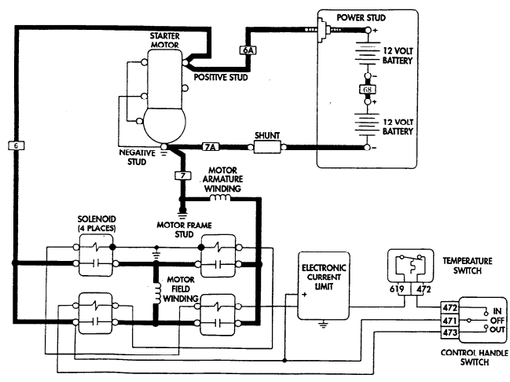

Figure H-1.  Winch Wiring Diagram.

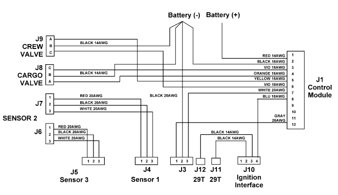

Figure H-2.  Automatic Fire Extinguishing System (AFES) Wiring Diagram (M1151A1).

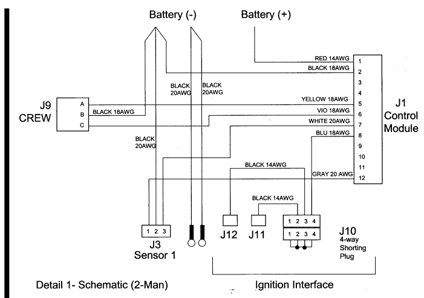

Figure H-3.  Automatic Fire Extinguishing System (AFES) Wiring Diagram (M1152A1).

Figure H-4.  Automatic Fire Extinguishing System (AFES) Wiring Diagram (M1165A1).

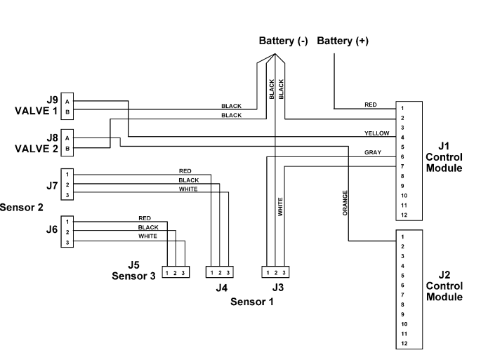

Figure H-5.  Automatic Fire Extinguishing System (AFES) Wiring Diagram (M1114).

Figure FO-1. Electrical System Wiring Diagram (M1113, M1114)
(located at back of manual).

Figure FO-2. A/C Evaporator/Heater Electrical Schematic (M1114)
(located at back of manual)
Figure FO-3. Electrical System Wiring Diagram (M1151, M1165) (Serial Numbers 299999 and Below)
(located at back of manual)
Figure FO-4. Electrical System Wiring Diagram (M1151, M1165) (Serial Numbers 300000 and Above)
(located at back of manual)
Figure FO-5. Electrical System Wiring Diagram (M1151A1, M1165A1) (Serial Numbers 299999 and Below)
(located at back of manual)
Figure FO-6. Electrical System Wiring Diagram (M1151A1, M1165A1) (Serial Numbers 300000 and Above)
(located at back of manual)
Figure FO-7. Electrical System Wiring Diagram (M1152) (Serial Numbers 299999 and Below)
(located at back of manual)
Figure FO-8. Electrical System Wiring Diagram (M1152) (Serial Numbers 300000 and Above)
(located at back of manual)
Figure FO-9. Electrical System Wiring Diagram (M1152A1) (Serial Numbers 299999 and Below)
(located at back of manual)
Figure FO-10. Electrical System Wiring Diagram (M1152A1) (Serial Numbers 300000 and Above)
(located at back of manual)
Figure FO-11. Electrical System Wiring Diagram (M1167)
(located at back of manual)

# Appendix J Perimeter Armor Kit Section I. Introduction

## J-1. Scope

This appendix includes complete instructions for the maintenance of the Perimeter Armor Kit.

## J-2. General

Your vehicle may come equipped with the Perimeter Armor Kit. The following procedures provide you with the instructions you will need to maintain or replace any of the components within this kit.

|          | J\-3.  PERIMETER ARMOR KIT MAINTENANCE TASK SUMMARY                        |          |    |
|----------|----------------------------------------------------------------------------|----------|----|
| J\-4.    | Door/Door Hinge and Check Strap (Perimeter) Maintenance                    | J\-4     |    |
| J\-5.    | Door Window Channel (Perimeter) Maintenance                                | J\-8     |    |
| J\-6.    | Door Latch (Perimeter) Maintenance                                         | J\-10    |    |
| J\-6.1.  | Door Latch (Perimeter) Adjustment                                          | J\-12    |    |
| J\-7.    | Door Handle (Perimeter) Replacement                                        | J\-14    |    |
| J\-8.    | Door Lock Release Handle Assembly (Perimeter) Replacement                  | J\-16    |    |
| J\-9.    | Door Insulation (Perimeter) Replacement                                    | J\-18    |    |
| J\-10.   | Door Seal (Perimeter) Replacement                                          | J\-19    |    |
| J\-11.   | Door Pull Strap (Perimeter) Replacement                                    | J\-20    |    |
| J\-12.   | Door Striker (Perimeter) Maintenance                                       | J\-22    |    |
| J\-13.   | Door Latch Tube (Perimeter) Replacement                                    | J\-24    |    |
| J\-14.   | Windshield Glass (Perimeter) Maintenance                                   | J\-26    |    |
| J\-16.   | Door Window (Perimeter) Replacement                                        | J\-28    |    |
| J\-17.   | Deleted                                                                    |          |    |
| J\-18.   | Deleted                                                                    |          |    |
| J\-19.   | Deleted                                                                    |          |    |
| J\-20.   | Roof Armor (Perimeter) Replacement (M1151A1, M1165A1, M1167)               | J\-34    |    |
| J\-21.   | Header Armor (Perimeter) Maintenance                                       | J\-38    |    |
| J\-22.   | Header Armor Gap Bracket (Perimeter) Replacement                           | J\-40    |    |
| J\-23.   | Rearview Mirror (Perimeter) Maintenance                                    | J\-42    |    |
| J\-24.   | A\-Pillar Gap Armor Bracket (Perimeter) Maintenance                        | J\-46    |    |
| J\-25.   | A\-Pillar Gap Armor and A\-Pillar Assembly (Perimeter) Maintenance         | J\-48    |    |
| J\-27.   | B\-Pillar Assembly and B\-Pillar Gap Armor Bracket (Perimeter) Maintenance |          |    |
|          | (Serial Numbers 239990 and Below)                                          | J\-50    |    |
| J\-27.1. | B\-Pillar Assembly and B\-Pillar Gap Armor Bracket (Perimeter)             |          |    |
|          | Maintenance (M1151A1, M1165A1 [Serial Numbers 239991 and Above],           |          |    |
|          | M1167)                                                                     | J\-50.2  |    |
| J\-28.   | Right Rear Seat Back Armor (Perimeter) Maintenance                         | J\-52    |    |
| J\-29.   | Left Rear Seat Back Armor (Perimeter) Maintenance                          | J\-54    |    |
| J\-30.   | Left C\-Pillar Armor (Perimeter) Maintenance (M1151A1, M1165A1, M1167)     | J\-56    |    |
|          |                                                                            | Change 6 | J  |

## Section Ii. Perimeter Armor Kit Maintenance

|                   | J\-3. PERIMETER ARMOR KIT MAINTENANCE TASK SUMMARY (Conf'd)                                      |          |
|-------------------|--------------------------------------------------------------------------------------------------|----------|
| J\-30.1.          | Left C\-Pillar Armor (Perimeter) Maintenance (M1151A1, M1165A1, M1167)                           | J\-56.2  |
| J\-30.2.          | Right C\-Pillar Armor (Perimeter) Maintenance                                                    | J\-56.4  |
| J\-31.            | C\-Pillar Gap Bracket (Perimeter) Maintenance                                                    | J\-58    |
| J\-32.            | Upper C\-Pillar Armor (Perimeter) Maintenance                                                    | J\-60    |
| J\-33.            | C\-Pillar Center Armor (Perimeter) Maintenance                                                   | J\-62    |
| J\-34.            | Rear Door Ramp Block (Perimeter) Replacement                                                     |          |
|                   | (M1151A1 [Serial Numbers 239990 and Below])                                                      | J\-64    |
| J\-35.            | C\-Partition Assembly (Perimeter) Maintenance (M1151A1, M1167)                                   | J\-66    |
| J\-36.            | C\-Partition Assembly (Perimeter) Maintenance (M1165A1)                                          | J\-68.2  |
| J\-37.            | C\-Partition Isolator Bracket (Perimeter) Maintenance                                            | J\-70    |
| J\-38.            | C\-Partition Door Handle and Lock Assembly (Perimeter) Replacement                               | J\-72    |
| J\-39.            | C\-Partition Door Gap Plate (Perimeter) Replacement                                              | J\-73    |
| J\-40.            | C\-Partition Door Assembly (Perimeter) (Old Configuration) Replacement                           | J\-74    |
| J\-40.1.          | C\-Partition Door Assembly (Perimeter) (New Configuration) Replacement                           | J\-75    |
| J\-44.            | Deleted                                                                                          |          |
| J\-45.            | Deleted                                                                                          |          |
| J\-46.            | Deleted                                                                                          |          |
| J\-47.            | Deleted                                                                                          |          |
| J\-48.            | Deleted                                                                                          |          |
| J\-49.            | Deleted                                                                                          |          |
| J\-50.            | Deleted                                                                                          |          |
| J\-51.            | Deleted                                                                                          |          |
| J\-52.            | Deleted                                                                                          |          |
| J\-53.            | Deleted                                                                                          |          |
| J\-54.            | Deleted                                                                                          |          |
| J\-55.            | Deleted                                                                                          |          |
|                   | Deleted                                                                                          |          |
| J\-55.1           |                                                                                                  |          |
| J\-56.            | Side Rocker Armor Plate (Perimeter) Maintenance (M1151A1 [Serial Numbers 239991 through 247548]) | J\-102   |
| J\-56.1           | Side Rocker Armor Plate (Perimeter) Maintenance                                                  |          |
|                   | (M1151A1 [Serial Numbers 247549 and above], M1152A1, M1165A1, M1167)                             | J\-102.2 |
| J\-57.            | Header Armor Plate Assembly (Perimeter) Maintenance (M1152A1)                                    | J\-104   |
| J\-58.            | Header Armor Gap Bracket (Perimeter) Replacement (M1152A1)                                       | J\-106   |
| J\-59.            | Roof Armor (Perimeter) Replacement (M1152A1)                                                     | J\-108   |
| J\-60.            | Rear Plate Armor (Perimeter) Replacement                                                         | J\-112   |
| J\-61.            | Door/Door Hinge and Check Strap (Standard Threat) Maintenance                                    | J\-114   |
| J\-62.            | Door Window (Standard Threat) Replacement                                                        | 1\-118   |
| J\-63.            | Door Glass and Handle (Standard Threat) Maintenance                                              | J\-120   |
| J\-64.            | Door Window Rollers (Standard Threat) Replacement                                                | J\-122   |
| J\-65.            | Door Handle (Interior), Linkage Access Panel, and Pull Strap                                     |          |
|                   | (Standard Threat) Replacement                                                                    | J\-124   |
| J\-66.            | Door Handle (Exterior). Wrench Access Cover, and                                                 |          |
|                   | Tiedown (Standard Threat) Replacement                                                            | J\-126   |
| J\-67.            | Door Lock and Linkage (Standard Threat) Replacement                                              | J\-130   |
| J\-68.            | Front Door Insulation, Seal, and Return (Standard Threat) Maintenance                            | J\-134   |
| J\-69.            | Rear Door Insulation, Seal, and Return (Standard Threat) Maintenance                             | J\-136   |
| J\-70.            | Door Bracket (Standard Threat) Replacement                                                       | 1\-138   |
| J\-71.            | Door (Standard Threat) Adjustment                                                                | J\-140   |
| J\-72.            | Rearview Mirror Assembly (Standard Threat Door) Maintenance                                      | J\-142   |
| J\-2/(J\-3 blank) | Change 6                                                                                         |          |

# J-4. Door/Door Hinge And Check Strap (Perimeter) Maintenance

This task covers:
b. Inspection

Applicable Models M1151A1, M1152A1, M1165A1 Tools General mechanic's tool kit:
automotive (Appendix B, Item 1)

| Materials/Parts   |
|-------------------|

Two lockwashers (Appendix G, Item 145) Nine lockwashers (Appendix G, Item 144) Fifteen rivets (Appendix G, Item 267) Two locknuts (rear door only) 
(Appendix G, Item 87)
Three locknuts (Appendix G, Item 82)
a. Removal c. Installation Personnel Required One mechanic One assistant Manual References TM 9-2320-387-24P
General Safety Instructions Vehicle door is extremely heavy and must be supported during removal and installation.

Maintenance Level Unit

#### Warning

Vehicle door is extremely heavy and must be supported during removal and installation. Failure to do so may cause injury to personnel or damage to equipment.

NOTE
Replacement procedures for all door, door hinges, and check straps (perimeter) are basically the same. This procedure covers the rear door, door hinge, and check strap.

#### A. Removal

1. Remove locknut (16), two washers (17), and capscrew (18) from door check strap (1) and door (19).

Discard locknut (16).

2. Remove locknut (8), two washers (2), capscrew (3), and door check strap (1) from bracket (7). Discard locknut (8).

Perform step 3 for rear doors and step 4 for front doors.

3. Remove two locknuts (10), washers (5) and (9), capscrews (6), and bracket (7) from vehicle (4).

Discard locknuts (10).

4. Remove two capscrews (22), lockwashers (21), washers (20), and bracket (7) from vehicle (4). Discard lockwashers (21).

5. Remove nine caspscrews (14), lockwashers (13), hinge plate (15), and door (19) from vehicle (4).

Discard lockwashers (13).

6. Remove fifteen rivets (11) and hinge (12) from door (19).

J-4. DOOR/DOOR HINGE AND CHECK STRAP (PERIMETER) MAINTENANCE (Cont'd)
| |

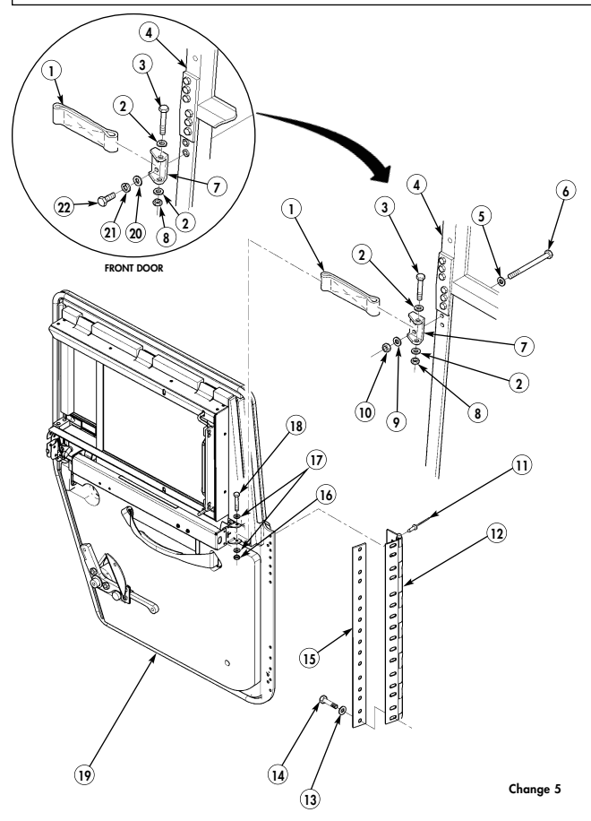

## J-4. Door/Door Hinge And Check Strap (Perimeter) Maintenance (Cont'D)

b. Inspection Refer to para. 10-56 for nut insert and rivet inspection and replacement.

c. Installation

#### Caution

Use grade 5 torque value when installing capscrews into nut inserts. Failure to do so may damage equipment or components.

1. Install hinge (12) on door (19) with fifteen rivets (11). 2. Install hinge plate (15) and door (19) on vehicle (4) with nine lockwashers (13) and capscrews (14).

Perform step 3 for rear doors and step 4 for front doors.

3. Install bracket (7) on vehicle (4) with two locknuts (10), washers (5) and (9), and capscrews (6). 4. Install bracket (7) on vehicle (4) with two capscrews (22), lockwashers (21), and washers (20). 5. Install door check strap (1) on bracket (7) with locknut (8), washers (2), and capscrews (3). 6. Install door check strap (1) on door (19) with locknut (16), washers (17), and capscrew (18).

J-4. DOOR/DOOR HINGE AND CHECK STRAP (PERIMETER) MAINTENANCE (Conf'd)
| |

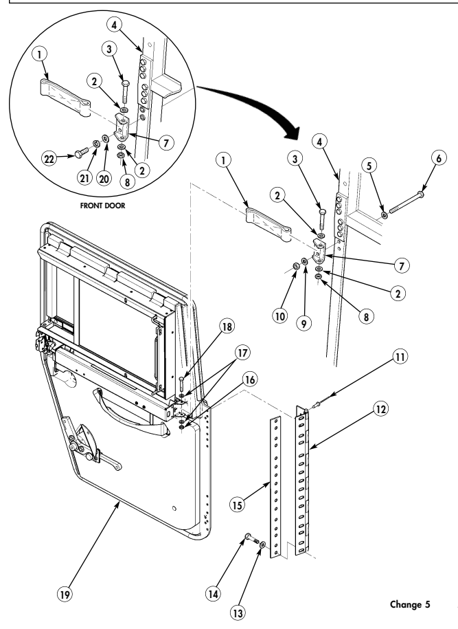

# J-5. Door Window Channel (Perimeter) Maintenance

This task covers:
b. Inspection

Applicable Models M1151A1, M1152A1, M1165A1, M1167 Tools General mechanic's tool kit:
automotive (Appendix B, Item 1)
Torque wrench 3/8-in. drive, 75 ft-lb 
(Appendix B, Item 2.1)

#### Materials/Parts

Twelve locknuts (Appendix G, Item 127) Four lockwashers (Appendix G, Item 159)
Personnel Required One mechanic One assistant a. Removal c. Installation Manual References TM 9-2320-387-24P
Equipment Condition Door window (perimeter) removed (Appendix J, J-16).

Maintenance Level Unit

Replacement procedures for all door window channels (perimeter) are basically the same. This procedure covers the left door window channel.

a. Removal b. Inspection Refer to para. 10-56 for nut insert inspection and replacement.

c. Installation 1. Install four window seals (2), and window channel (1) on door (3) with two washers (7) and capscrews (8). Tighten capscrews (8) to 31 lb-ft (42 N•m).

2. Install four washers (4), lockwashers (5), and capscrews (6) on door (3) and window channel (1).

Tighten capscrews (6) to 31 lb-ft (42 N•m).

3. Install twelve hexscrews (10) and locknuts (9) on window channel (1) and door (3). 4. Install sealing tape (11) on window channel (1).

1. Remove sealing tape (11) from window channel (1). 2. Remove twelve locknuts (9) and hexscrews (10) from door (3) and window channel (1). Discard locknuts (9).

3. Remove four capscrews (6), lockwashers (5), and washers (4) from door (3). Discard lockwashers (5). 4. Remove two capscrews (8), washers (7), window channel (1), and four window seals (2), from door (3).

# J-5. Door Window Channel (Perimeter) Maintenance (Cont'D)

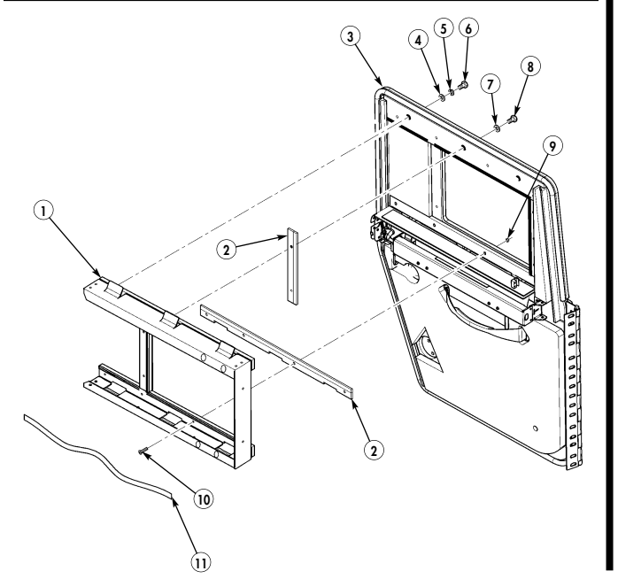

FOLLOW-ON TASK: Install door window (perimeter) (Appendix J, J-16).

# J-6. Door Latch (Perimeter) Maintenance

This task covers:
b. Inspection INITIAL SETUP:
Applicable Models M1151A1, M1152A1, M1165A1 Tools General mechanic's tool kit:
automotive (Appendix B, Item 1)
Materials/Parts Four lockwashers (Appendix G, Item 158.1)
a. Removal c. Installation Manual References TM 9-2320-387-24P

| Maintenance Level   |
|---------------------|
| Unit                |

Replacement procedures for all door latches (perimeter) are basically the same. This procedure cover the left door latch.

a. Removal 1. Remove capscrew (7), washer (4), and release rod (6) from door latch (3). 2. Remove screw (10), nut (8), and hook assembly (9) from door latch (3). 3. Remove four screws (1), lockwashers (2), and door latch (3) from door (5). Discard lockwashers (2).

b. Inspection Refer to para. 10-56 for nut insert inspection and replacement.

c. Installation

#### Caution

Use grade 5 torque value when installing capscrews into nut inserts. Failure to do so may damage equipment or components.

1. Install door latch (3) to door (5) with four screws (1) and lockwashers (2). 2. Install hook assembly (9) to door latch (3) with screw (10) and nut (8). 3. Install release rod (6) to door latch (3) with capscrew (7) and washer (4).

# J-6. Door Latch (Perimeter) Maintenance (Cont'D)

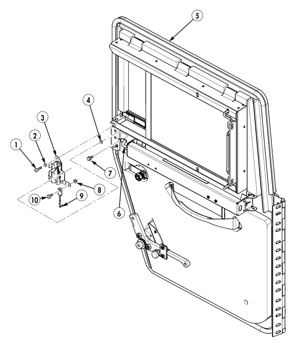

FOLLOW-ON TASK: Adjust door latch (perimeter) (Appendix J, J-6.1).

# J-6.1. Door Latch (Perimeter) Adjustment

This task covers:
a. Adjustment

Applicable Models M1151A1, M1152A1, M1165A1 Tools General mechanic's tool kit:
automotive (Appendix B, Item 1)

| Manual References    |
|----------------------|
| TM 9\-2320\-387\-24P |
| Maintenance Level    |
| Unit                 |

- It may be necessary to add shim(s) behind handle extension to achieve proper clearance with door insulation before adjusting door latch.

- Adjustment procedures for all door latches (perimeter) are basically the same. This procedure covers the left door latch.

#### A. Door Latch Adjustment

1. Loosen nut (4). 2. Remove capscrew (2) and boss (3) from latch (1) of handle extension (6). 3. Adjust boss (3) until rod (5) contacts end of slot (7) with door handle (8) in contact with lower flange (9) and bolt hole in boss (3) aligns with threaded hole in latch (1).

4. Install capscrew (2) on boss (3) and tighten nut (4).

# J-6.1. Door Latch (Perimeter) Adjustment (Cont'D)

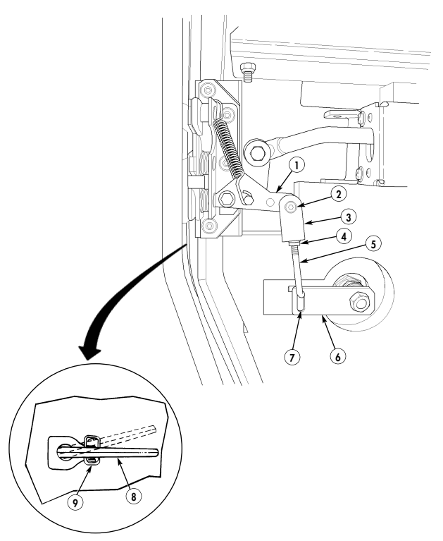

# J-7. Door Handle (Perimeter) Replacement

This task covers:
INITIAL SETUP:
Applicable Models M1151A1, M1152A1, M1165A1 Tools General mechanic's tool kit:
automotive (Appendix B, Item 1)
Materials/Parts Lithium grease (Appendix C, Item 36)

| Manual References    |
|----------------------|
| TM 9\-2320\-387\-24P |
| Maintenance Level    |
| Unit                 |

Replacement procedures for all door handles (perimeter) are basically the same. This procedure covers the left door handle.

a. Removal

Attaching hardware is part of handle.

1. Remove locknut (5), lever (6), and washer(s) (4) from door handle (2). 2. Remove locknut (7), retainer washer (3), and door handle (2) from door (1).

b. Installation

Chamfer inside retainer washer should fit over hexscrew in recess.

1. Install retainer washer (3) in door (1).

Apply a light coat of white lithium grease to uncoated surfaces of door handle and O-ring prior to assembly.

2. Slide door handle (2) through door (1) and secure with locknut (7).

NOTE
Install washers under lever as required to position link rod parallel to door. A total of seven washers may be required.

3. Install washer(s) (4), lever (6), and locknut (5) on door handle (2).

a. Removal b. Installation

# J-7. Door Handle (Perimeter) Replacement (Cont'D)

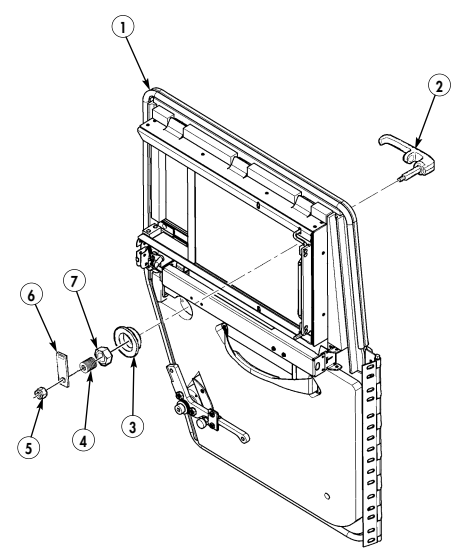

FOLLOW-ON TASK: Adjust door latch (perimeter) (Appendix J, J-6.1).

# J-8. Door Lock Release Handle Assembly (Perimeter) Replacement

This task covers:

| a. Removal                      | b. Installation                          |
|---------------------------------|------------------------------------------|
| INITIAL SETUP:                  |                                          |
| Applicable Models               | Materials/Parts                          |
| M1151A1, M1152A1, M1165A1       | Three lockwashers (Appendix G, Item 141) |
| Tools                           | Manual References                        |
| General mechanic's tool kit:    | TM 9\-2320\-387\-24P                     |
| automotive (Appendix B, Item 1) | Maintenance Level                        |
|                                 | Unit                                     |

Replacement procedures for all door lock release handle assemblies (perimeter) are basically the same. This procedure covers the left door lock handle assembly.

a. Removal 1. Remove capscrew (4), lockwasher (5), and washer (6) from door (1) and door lock release handle (7).

Discard lockwasher (5).

2. Remove two capscrews (3), lockwashers (2), and door lock release handle (7) from door (1). Discard lockwashers (2).

#### B. Installation

1. Install door lock release handle (7) on door (1) with two capscrews (3) and lockwashers (2). 2. Install washer (6), lockwasher (5), and capscrew (4) on door lock release handle (7) and door (1).

J-8.  DOOR LOCK RELEASE HANDLE ASSEMBLY (PERIMETER) REPLACEMENT (Cont'd)

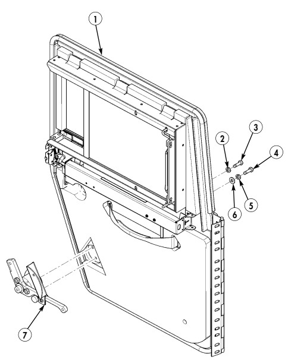

# J-9. Door Insulation (Perimeter) Replacement

This task covers:
INITIAL SETUP:
Applicable Models M1151A1, M1152A1, M1165A1 Tools General mechanic's tool kit:
automotive (Appendix B, Item 1)

#### Materials/Parts

Silicone compound (Appendix C, Item 74) Insulation–upper (Appendix G, Item 71.1) Insulation–lower (Appendix G, Item 71.2) Insulation–upper (Appendix G, Item 71.3) Insulation–upper (Appendix G, Item 71.4) Insulation–upper (Appendix G, Item 71.5) Drycleaning solvent (Appendix C, Item 26)
a. Removal b. Installation Manual References TM 9-2320-387-24P
General Safety Instructions Do not perform this procedure near fire, flames, or sparks.

Maintenance Level Unit

#### Warning

Do not perform this procedure near fire, flames, or sparks. Dry cleaning solvent is highly flammable. Injury to personnel or damage to equipment will result.

NOTE
Replacement procedures for all door insulations (perimeter) are basically the same. Their procedure covers the left door insulation.

a. Removal Remove door insulation (1) from door (2) and clean adhesive from door (2). Discard insulation (1).

b. Installation Apply a thin coat of silicone compound adhesive and install door insulation (1) on door (2).

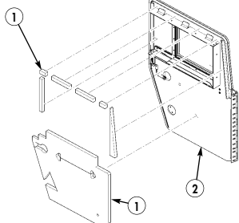

# J-10. Door Seal (Perimeter) Replacement

This task covers:
a. Removal c. Installation b. Inspection INITIAL SETUP:
Manual References

| Mallust References   |
|----------------------|
| TM 9\-2320\-387\-24F |
| Maintenance Level    |
| Unit                 |

Applicable Models M1151A1, M1152A1, M1165A1 Tools General mechanic's tool kit:
automotive (Appendix B, Item 1)

Replacement procedures for all door seals (perimeter) are basically the same. This procedure covers the left door seal.

a. Removal Remove door seal (1) from door (2).

b. Inspection Inspect door seal, replace if damaged.

c. Installation Install seal (1) on door (2).

1

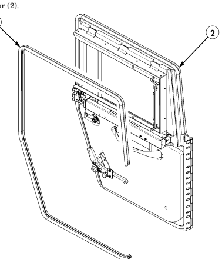

J-11. DOOR PULL STRAP (PERIMETER) REPLACEMENT
This task covers:

a. Removal b. Installation

| M1151A1, M1152A1, M1165A1    |
|------------------------------|
| Tools                        |
| General mechanic's tool kit: |
| automotive (Appendix B, Iten |

Applicable Models automotive (Appendix B, Item 1)

| Materials/Parts                     |
|-------------------------------------|
| Two locknuts (Appendix G, Item 129) |
| Manual References                   |
| TM 9\-2320\-387\-24P                |
| Maintenance Level                   |
| Unit                                |

Replacement procedures for all door pull straps (perimeter) are basically the same. This procedure covers the left door pull strap.

a. Removal Remove two locknuts (5), capscrews (2), washers (4), and door pull strap (3) from door (1). Discard locknuts (5).

b. Installation Install door pull strap (3) on door (1) with two washers (4), capscrews (2), and locknuts (5).

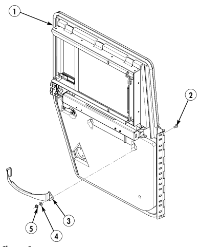

# J-12. Door Striker (Perimeter) Maintenance

This task covers:
b. Inspection

Applicable Models M1151A1, M1152A1, M1165A1, M1167 Tools General mechanic's tool kit:
automotive (Appendix B, Item 1)
Torque wrench 3/8-in. drive, 75 ft-lb 
(Appendix B, Item 2.1)
a. Removal c. Installation

#### Materials/Parts

Two locknuts (Appendix G, Item 129) Two lockwashers (Appendix G, Item 144)
Manual References TM 9-2320-387-24P
Maintenance Level Unit

Replacement procedures for left and right door strikers are basically the same. This procedure covers the right door striker.

a. Removal

- Perform step 1 if removing the front door strikers. Perform step 2 if removing the rear door strikers.

- Record number and position of shims.

1. Remove two locknuts (7), capscrews (1), four washers (2), door striker (3), shim(s) (4), and door strap bracket (6) from vehicle (5). Discard locknuts (7).

2. Remove two capscrews (12), lockwashers (11), washers (10), and shim(s) (8) rear door striker (9) from vehicle (5). Discard lockwashers (11).

b. Inspection Refer to para. 10-56 for nut insert inspection and replacement.

c. Installation

Perform step 1 if removing the rear door striker. Perform step 2 if removing the front door striker.

1. Install rear door striker (9) and shim(s) (8) on vehicle (5) with two capscrews (12), lockwashers (11),
and washers (10). Tighten capscrews (12) to 8 lb-ft (11 N•m).

2. Install front door striker (3), shim(s) (4), and door strap bracket (6) on vehicle (5) with two capscrews (1), four washers (2), and two locknuts (7).

3. Verify door closes properly. Adjust position of door strikers (3) and (9) as necessary.

## J-12.  Door Striker (Perimeter) Maintenance (Cont'D)

] ■

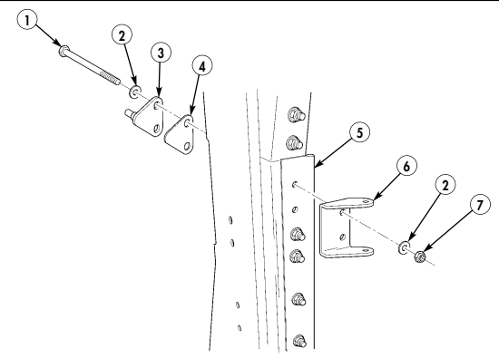

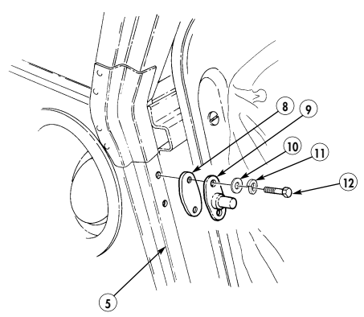

## J-13. Door Latch Tube (Perimeter) Replacement

This task covers:

a. Removal **b. Installation**

| IITIAL SETUP:                   |                      |
|---------------------------------|----------------------|
| Applicable Models               | Manual References    |
| M1151A1, M1152A1, M1165A1       | TM 9\-2320\-387\-24P |
| Tools                           | Maintenance Level    |
| General mechanic's tool kit:    | Unit                 |
| automotive (Appendix B, Item 1) |                      |

- Replacement procedures for all door latch tubes (perimeter) are basically the same. This procedure covers the left door latch tube.

- Attaching hardware is part of door latch tube.

a. Removal 1. Remove capscrew (1), washer (2), and release rod (3) from door latch (4). 2. Remove four capscrews (7), washers (6), and locknuts (9) from door latch tube (12) and bracket (5). 3. Remove two capscrews (11), washers (10), release rod (3), and door latch guide (8) from door latch tube (12).

b. Installation 1. Install release rod (3) and door latch guide (8) on door latch tube (12) with two capscrews (11) and washers (10).

2. Install door latch tube (12) to bracket (5) with four capscrews (7), washers (6), and locknuts (9). 3. Install release rod (3) on door latch (4) with capscrew (1) and washer (2).

# J-13.  Door Latch Tube (Perimeter) Replacement (Cont'D)

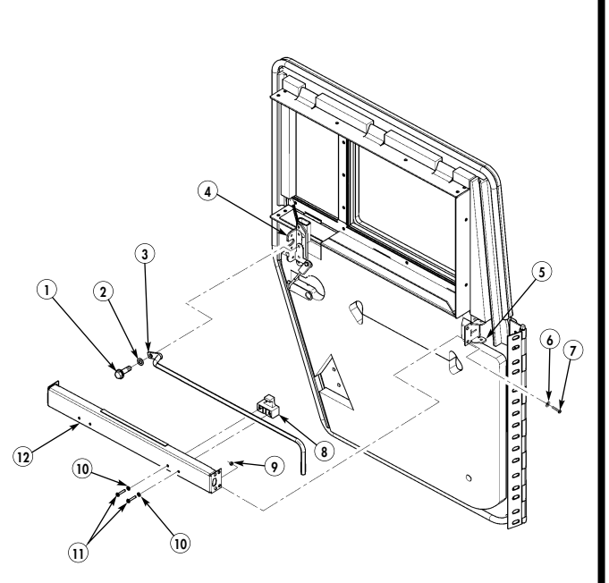

# J-14. Windshield Glass (Perimeter) Maintenance

This task covers:
b. Inspection

Applicable Models M1151A1, M1152A1, M1165A1, M1167 Tools General mechanic's tool kit:
automotive (Appendix B, Item 1)
Torque wrench 3/8-in. drive, 75 ft-lb 
(Appendix B, Item 2.1)

#### Materials/Parts

Twenty lockwashers (Appendix G, Item 146) Sealing compound (Appendix C, Item 72.1)
Personnel Required One mechanic One assistant a. Removal c. Installation Manual references TM9-2320-387-24P 
Equipment Condition
- A-pillar gap armor (perimeter) removed 
(Appendix J, J-25).

- Lower windshield capping ring armor
(integrated) removed (para.11-121).

- Windshield wipers removed (para. 10-62).

General Safety Instructions Windshield glass is extremely heavy and must be supported during removal and installation.

Maintenance Level Unit

#### Warning

Windshield glass is extremely heavy and must be supported during removal and installation. Failure to comply may result in injury to personnel or damage to equipment.

#### A. Removal

1. Remove eight capscrews (2), lockwashers (3), washers (4), and right and left front roof armor (1)
from vehicle (5). Discard lockwashers (3).

2. Remove three capscrews (15), lockwashers (14), washers (13), center capping ring (12) from vehicle (5).

Discard lockwashers (14).

3. Remove five capscrews (17), lockwashers (18), washers (19), and upper capping ring (16) from vehicle (5).

Discard lockwashers (18).

4. Remove four capscrews (11), lockwashers (10), washers (9), left and right capping rings (8),
windshield glass (7), and seal(s) (6) from vehicle (5). Discard lockwashers (10).

b. Inspection Refer to para. 10-56 for nut insert inspection and replacement.

c. Installation 1. Apply a bead of sealing compound around windshield glass (7) and install windshield glass (7) and seal(s) (6) on vehicle (5).

2. Install left and right capping rings (8) on vehicle (5) with four capscrews (11), lockwashers (10), and washers (9). Tighten capscrews (11) to 8 lb-ft (11 N•m).

3. Install upper capping ring (16) on vehicle (5) with five capscrews (17), lockwashers (18), and washers (19).

Tighten capscrews (17) to 8 lb-ft (11 N•m).

## J-14. Windshield Glass (Perimeter) Maintenance (Cont'D)

4. Install center capping ring (12), on vehicle (5) with three capscrews (15), lockwashers (14), and washers (13). Tighten capscrews (15) to 8 lb-ft (11 N•m).

5. Install right and left front roof armor (1) on vehicle (5), with eight capscrews (2), lockwashers (3),
and washers (4). Tighten capscrews (2) to 8 lb-ft (11 N•m).

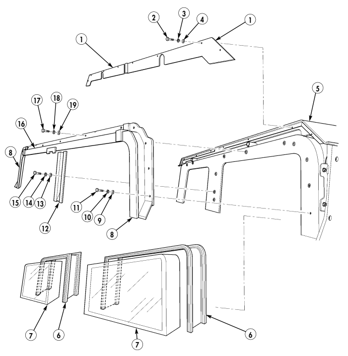

FOLLOW-ON TASKS: - Install windshield wipers (para. 10-62).

- Install lower windshield capping ring armor (integrated) (para. 11-121). - Install A-pillar gap armor (perimeter) (Appendix J, J-25).

## J-16. Door Window (Perimeter) Replacement

This task covers:

a. Removal b. Installation

INITIAL SETUP:
Applicable Models M1151A1, M1152A1, M1165A1

| Manual References    |
|----------------------|
| TM 9\-2320\-387\-24P |

Tools General mechanic's tool kit:
automotive (Appendix B, Item 1)
Materials/Parts Four locknuts (Appendix G, Item 127)

Replacement procedures for all door windows (perimeter) are basically the same. This procedure covers the left door window.

#### A. Removal

1. Remove four capscrews (7), two retainer plates (11), springs (9), and locking rod (10) from window (1). 2. Remove four locknuts (2), washers (6), capscrews (8), and two protective bumpers (5) from window channels (4). Discard locknuts (2).

3. Slide window (1) and remove from window channel (4) and door (3).

b. Installation 1. Slide window (1) into window channel (4) and door (3).

| Maintenance Level   |
|---------------------|
| Unit                |

2. Install two protective bumpers (5) on window channel (4) with four capscrews (8), washers (6), and locknuts (2).

3. Apply sealing compound to threads of four capscrews (7) and install locking rod (10) on window (1)
with two retainer plates (11), springs (9), and capscrews (7).

# J-16.  Door Window (Perimeter) Replacement (Cont'D)

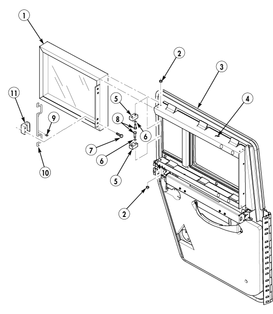

| Applicable Models               |
|---------------------------------|
| M1151A1, M1165A1, M1167         |
| Tools                           |
| General mechanic's tool kit:    |
| automotive (Appendix B, Item 1) |

# J-20. Roof Armor (Perimeter) Replacement (M1151A1, M1165A1, M1167)

| This task covers:   |
|---------------------|

a. Removal **b. Installation**

| Tools                                   | Equipment Condition                         |
|-----------------------------------------|---------------------------------------------|
| General mechanic's tool kit:            | · Windshield wipers removed (para. 10\-62). |
| automotive (Appendix B. Item 1)         | · Turret armor cover (new configuration)    |
|                                         | removed (para. 11\-198).                    |
| Personnel Required                      |                                             |
| One mechanic                            | General Safety Instructions                 |
| One assistant                           | Roof armor is extremely heavy and must be   |
|                                         | supported during removal and installation.  |
| Materials/Parts                         |                                             |
| Six locknuts (Appendix G, Item 106)     | Maintenance Level                           |
| Ten locknuts (Appendix G, Item 127)     | Unit                                        |
| Four lockwashers (Appendix G. Item 146) |                                             |

| Manual References    |
|----------------------|
| TM 9\-2320\-387\-24P |

#### Warning

Roof armor is extremely heavy and must be supported during removal and installation. Failure to do so may result in injury to personnel or damage to equipment.

Replacement procedures for left and right roof armor are basically the same. This procedure covers the left roof armor.

#### A. Removal

1. Remove four locknuts (21), eight washers (5), and four capscrews (6) from armor plate (1). Discard locknuts (21).

2. Remove locknut (17), rear snubber (15), two mounts (16), rear snubber (15), two washers (14),
washer (10), and capscrew (9) from armor plate (1). Discard locknut (17).

3. Remove locknut (18), front snubber (19), two mounts (20), front snubber (19), washer (7), and capscrew (8) from armor plate (1). Discard locknut (18).

4. Remove six locknuts (13), twelve washers (12), and six capscrews (11) from armor plate (1). Discard locknuts (13).

5. Remove four capscrews (23), lockwashers (24), washers (25), and front armor plate (26) from armor plate (1). Discard lockwashers (24).

6. Remove armor plate (1) and side armor plate (22) from roof of vehicle (27). 7. Remove four locknuts (4), eight washers (3), four capscrews (2) and armor plate (1) from side armor plate (22). Discard locknuts (4).

J-20. ROOF ARMOR (PERIMETER) REPLACEMENT (M1151A1, M1165A1, M1167) (Cont'd)

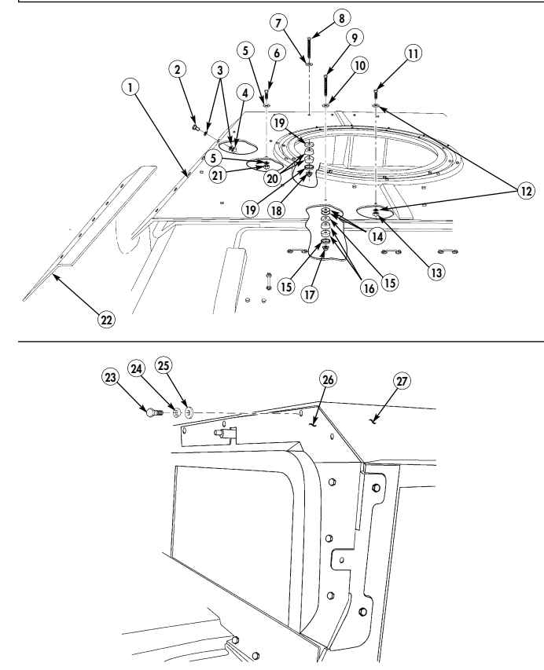

## J-20. Roof Armor (Perimeter) Replacement (M1151A1, M1165A1, M1167) (Cont'D)

#### B. Installation

1. Install side armor plate (22) on armor plate (1) with four capscrews (2), eight washers (3), and four locknuts (4).

2. Install side armor plate (22) and armor plate (1) on roof of vehicle (27). 3. Install front armor plate (26) on armor plate (1) with four capscrews (23), lockwashers (24), and washers (25).

4. Install six capscrews (11), twelve washers (12), and six locknuts (13) on armor plate (1). 5. Install capscrew (8), washer (7), front snubber (19), two mounts (20), front snubber (19), and locknut (18) to armor plate (1).

6. Install capscrew (9), washer (10), two washers (14), rear snubber (15), two mounts (16), rear snubber (15), and locknut (17).

7. Install four capscrews (6), eight washers (5), and four locknuts (21) on armor plate (1).

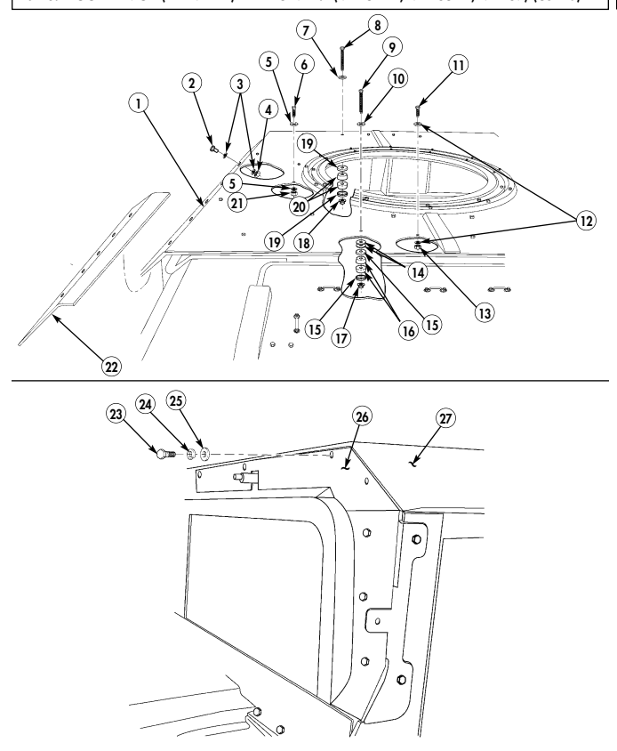

FOLLOW-ON TASKS: - Install windshield wipers (para. 10-62).

· Install turret armor cover (new configuration) (para. 11-198).

J-20. ROOF ARMOR (PERIMETER) REPLACEMENT (M1151A1, M1165A1, M1167) (Cont'd)
1
■

# J-21. Header Armor (Perimeter) Maintenance

This task covers:
b. Inspection

Applicable Models M1151A1, M1165A1, M1167 Tools General mechanic's tool kit:
automotive (Appendix B, Item 1)
Torque wrench 3/8-in. drive, 75 ft-lb 
(Appendix B, Item 2.1)
Materials/Parts Two lockwashers (Appendix G, Item 141) Twelve lockwashers (Appendix G, Item 159)

Replacement procedures for left and right header armor are basically the same. This procedure covers the left header armor.

a. Removal 1. Remove capscrew (10), lockwasher (11), and washer (12) from header armor (13), and A-pillar gap bracket (1). Discard lockwasher (11).

2. Remove capscrew (6), lockwasher (5), and washer (4) from header armor (13), and C-pillar gap bracket (3). Discard lockwasher (5).

3. Remove six capscrews (9), lockwashers (8), washers (7), header armor (13), and seal (14) from header gap bracket (2). Discard lockwashers (8).

b. Inspection Refer to para. 10-56 for nut insert inspection and replacement.

c. Installation a. Removal c. Installation

| Manual References              |
|--------------------------------|
| TM 9\-2320\-387\-24P           |
| Equipment Condition            |
| Roof armor (perimeter) removed |
| (Appendix J, J\-20).           |
| Maintenance Level              |
| Unit                           |

1. Install seal (14) and header armor (13) on header gap bracket (2) with six washers (7), lockwashers (8),
and capscrews (9). Tighten capscrews (9) to 31 lb-ft (42 N•m).

2. Install washer (4), lockwasher (5), and capscrew (6) on header armor (13) and C-pillar gap bracket (3).

Tighten capscrew (6) to 31 lb-ft (42 N•m).

3. Install washer (12), lockwasher (11), and capscrew (10) on header armor (13) and A-pillar gap bracket (1).

Tighten capscrew (10) to 31 lb-ft (42 N•m).

# J-21.  Header Armor (Perimeter) Maintenance (Cont'D)

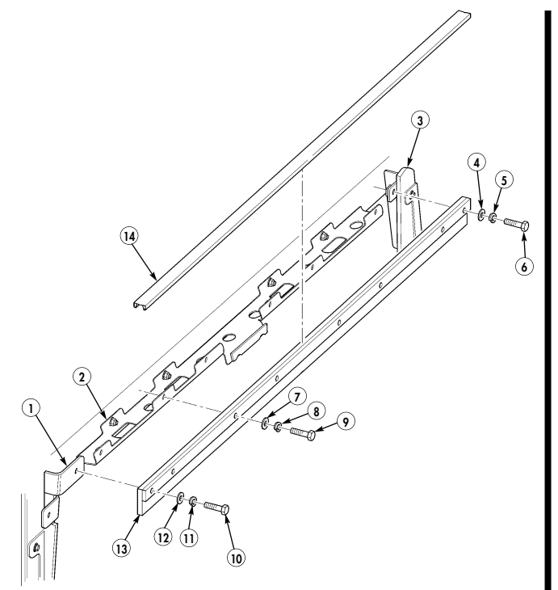

FOLLOW-ON TASK:

Install roof armor (perimeter) (Appendix J, J-20).

# J-22. Header Armor Gap Bracket (Perimeter) Replacement

This task covers:

| STOCK SIZE                  | DESCRIPTION   | SPECIFICATION   |
|-----------------------------|---------------|-----------------|
| 0.188\-in. (4.775 mm) THICK | STRIP, METAL  | ASTM A569       |
|                             | SHEET         |                 |
| PART NUMBER                 | CUT TO SIZE   | MANUFACTURED    |
|                             | (INCHES)      | FROM NSN        |

a. Removal b. Installation

Replacement procedures for left and right header gap brackets are basically the same. This procedure covers the right header gap bracket.

a. Removal Remove four capscrews (2), eight washers (3), four locknuts (5), and header armor gap bracket (4) from roof (1). Discard locknuts (5).

b. Installation Install header armor gap bracket (4) on roof (1) with four locknuts (5), eight washers (3), and four capscrews (2).

J-22. HEADER ARMOR GAP BRACKET (PERIMETER) REPLACEMENT (Cont'd)

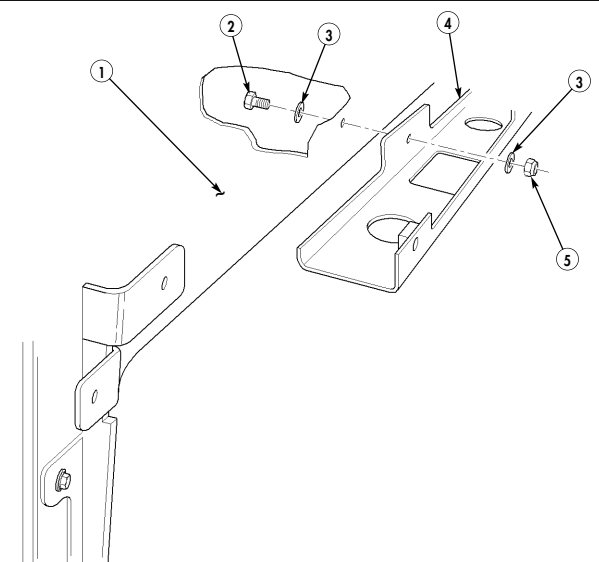

FOLLOW-ON TASK: Install header armor (perimeter) (Appendix J, J-21).

# J-23. Rearview Mirror (Perimeter) Maintenance

This task covers:

Applicable Models M1151A1, M1152A1, M1165A1 Tools General mechanic's tool kit:
automotive (Appendix B, Item 1).

#### Materials/Parts

Four lockwashers (Appendix G, Item 145) Three locknuts (Appendix G, Item 82) Two locknuts (Appendix G, Item 132)

a. Removal c. Assembly b. Disassembly **d. Installation**

Manual References TM 9-2320-387-10 TM 9-2320-387-24P
Maintenance Level Unit

Replacement procedures for left and right rearview mirrors are basically the same. This procedure covers the left rearview mirror.

a. Removal 1. Remove capscrew (3), lockwasher (4) and washer (5) from mirror assembly (2) and body (8).

Discard lockwasher (4).

2. Remove locknut (9), capscrew (6), washer (7), and mirror assembly (2) from A-pillar gap armor (1).

Discard locknut (9).

#### B. Disassembly

1. Remove two capscrews (17), lockwashers (16), washers (15), spacers (13), and mirror (12) from mirror brackets (14). Discard lockwashers (16).

2. Remove locknut (28), washer (29), nylon washers (30) and (32), capscrew (10), and upper mounting bracket (31) from mirror arm assembly (11). Discard locknut (28).

3. Remove locknut (27), washer (26), and lower mounting bracket (25) from mirror lock (24). Discard locknut (27).

4. Remove locknut (22), washer (23), and mirror lock (24) from mirror arm assembly (11). Discard locknut (22).

To remove clamps, slide clamps off mirror arm assembly.

5. Remove two locknuts (18), washers (19), capscrews (21), clamps (20), and brackets (14) from mirror arm assembly (11). Discard locknuts (18).

J-23.  REARVIEW MIRROR (PERIMETER) MAINTENANCE (Cont'd)

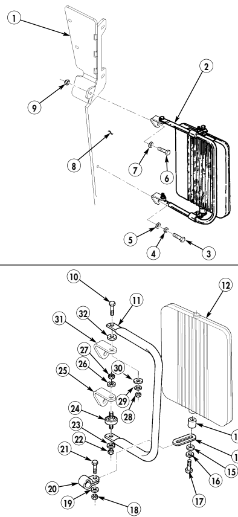

(13)
(14)

## J-23. Rearview Mirror (Perimeter) Maintenance (Cont'D)

c. Assembly

- To install clamps, slide clamps on mirror arm assembly. - Ensure clamps are positioned on mirror arm assembly to align with center of mirror head.

1. Install two clamps (11) and mirror brackets (5) on mirror arm assembly (2). Install mirror brackets (5) between clamps (11) with two capscrews (12), washers (10), and locknuts (9).

2. Install mirror lock (15) on mirror arm assembly (2) with washer (14) and locknut (13). 3. Install lower mounting bracket (16) on mirror lock (15) with washer (17) and locknut (18). 4. Install upper mounting bracket (22) on mirror arm assembly (2) with capscrew (1), nylon washers (23)
and (21), washer (20), and locknut (19).

Spacers must be positioned between mirror head and mirror brackets for proper installation.

5. Install mirror (3) and two spacers (4) on mirror brackets (5) with washers (6), lockwashers (7), and capscrews (8).

d. Installation 1. Install mirror (25) on A-pillar gap armor (24) with capscrew (29), washer (30) and locknut (32). 2. Install washer (28), lockwasher (27) and capscrew (26) on mirror assembly (25) and body (31).

J-23.  REARVIEW MIRROR (PERIMETER) MAINTENANCE (Cont'd)

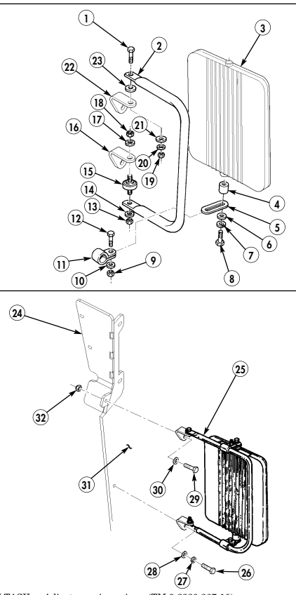

Adjust rearview mirror (TM 9-2320-387-10).

FOLLOW-ON TASK:

# J-24. A-Pillar Gap Armor Bracket (Perimeter) Maintenance

This task covers:
b. Inspection

Applicable Models M1151A1, M1152A1, M1165A1, M1167 Tools General mechanic's tool kit:
automotive (Appendix B, Item 1)
Materials/Parts Three lockwashers (Appendix G, Item 141)
Equipment Condition
•Left upper A-pillar IED overlay (Frag 1)
removed (if equipped) (M1151A1 only) (Appendix K, K-5).

•Left upper A-pillar IED overlay (Frag 1)
removed (if equipped) (M1152A1, M1165A1, M1167 only) (Appendix K, K-6).

a. Removal c. Installation

#### Equipment Condition (Cont'D)

•Right upper A-pillar IED overlay (Frag 1)
removed (if equipped) (M1151A1 only) (Appendix K, K-7).

•Right upper A-pillar IED overlay (Frag 1)
removed (if equipped) (M1152A1, M1165A1, M1167 only) (Appendix K, K-8).

•A-pillar gap armor (perimeter) removed 
(Appendix J, J-25).

Manual References TM 9-2320-387-24P
Maintenance Level Unit

Replacement procedures for left and right A-pillar gap armor brackets are basically the same. This procedure covers the left A-pillar gap armor bracket.

#### A. Removal

1. Remove capscrew (4), lockwasher (3), and washer (2) from A-pillar gap armor bracket (8). Discard lockwasher (3).

2. Remove two capscrews (5), lockwashers (6), washers (7), and A-pillar gap armor bracket (8) from vehicle (1). Discard lockwashers (6).

b. Inspection Refer to para. 10-56 for weldnut and nut insert inspection and replacement.

c. Installation

#### Caution

Use grade torque value when installing capscrews into nut inserts. Failure to do so may damage equipment or components.

1. Install A-pillar gap armor bracket (8) on vehicle (1) with capscrew (4), lockwasher (3), and washer (2). 2. Secure A-pillar gap armor bracket (8) to vehicle (1) with two capscrews (5), lockwashers (6), and washers (7).

# J-24. A-Pillar Gap Armor Bracket (Perimeter) Maintenance (Cont'D)

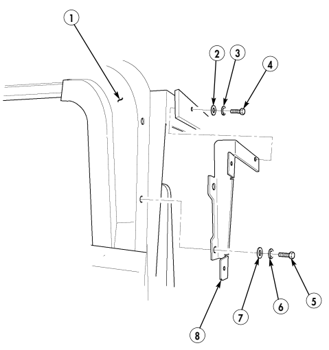

FOLLOW-ON TASKS: - Install A-pillar gap armor (perimeter) (Appendix J, J-25).

- Install right upper A-pillar IED overlay (Frag 1) (if equipped) (M1152A1, M1165A1, M1167 only) (Appendix K, K-8).

- Install right upper A-pillar IED overlay (Frag 1) (if equipped) (M1151A1 only)
(Appendix K, K-7).

- Install left upper A-pillar IED overlay (Frag 1) (if equipped) (M1152A1, M1165A1, M1167 only) (Appendix K, K-6).

- Install left upper A-pillar IED overlay (Frag 1) (if equipped) (M1151A1 only)

# J-25. A-Pillar Gap Armor And A-Pillar Assembly (Perimeter) Maintenance

This task covers:
b. Inspection

Applicable Models M1151A1, M1152A1, M1165A1, M1167 Tools General mechanic's tool kit:
automotive (Appendix B, Item 1)
Torque wrench 3/8-in. drive, 75 ft-lb 
(Appendix B, Item 2.1)

#### Materials/Parts

Four lockwashers (Appendix G, Item 141)

#### Equipment Condition

•Air intake assembly and bracket removed
(para. 3-19), (right side only).

•Rearview mirror (perimeter) removed
(Appendix J, J-23).

•Door/door hinge (perimeter) removed
(Appendix J, J-4).

•Left upper A-pillar IED overlay (Frag 1)
removed (if equipped) (M1151A1 only) (Appendix K, K-5).

a. Removal c. Installation

#### Equipment Condition (Cont'D)

•Left upper A-pillar IED overlay (Frag 1)
removed (if equipped) (M1152A1, M1165A1, M1167 only) (Appendix K, K-6).

•Right upper A-pillar IED overlay (Frag 1)
removed (if equipped) (M1151A1 only) (Appendix K, K-7).

•Right upper A-pillar IED overlay (Frag 1)
removed (if equipped) (M1152A1, M1165A1, M1167 only) (Appendix K, K-8).

•A-pillar gap armor bracket removed
(Appendix J, J-24).

Manual References TM 9-2320-387-24P
Maintenance Level Unit

- Replacement procedures for left and right A-pillar gap armor and A-pillar assemblies are basically the same. This procedure covers the left A-pillar gap armor and A-pillar assembly.

- If vehicle is equipped with deepwater fording kit air intake assembly, it will only be necessary to remove and install the lower side and lower front capscrews from the right A-pillar gap armor.

a. Removal 1. Remove two capscrews (1), lockwashers (2), and washers (3) from A-pillar gap armor (4). Discard lockwashers (2).

2. Remove two capscrews (5), lockwashers (6), washers (7), A-pillar gap armor (4), and A-pillar assembly (8) from vehicle (9). Discard lockwashers (6).

b. Inspection Refer to para. 10-56 for nut insert inspection and replacement.

c. Installation 1. Install A-pillar gap armor (4) and A-pillar assembly (8) on vehicle (9) with two capscrews (5),
lockwashers (6), and washers (7). Tighten capscrews (5) to 17 lb-ft (23 N•m).

2. Secure A-pillar gap armor (4) with two capscrews (1), lockwashers (2), and washers (3).

Tighten capscrews (1) to 8 lb-ft (11 N•m).

J-48 Change 6

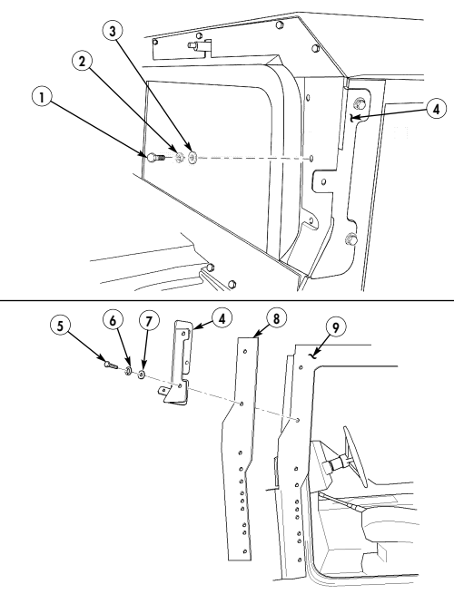

# J-25. A-Pillar Gap Armor And A-Pillar Assembly (Perimeter) Maintenance (Cont'D)

FOLLOW-ON TASKS: - Install A-pillar gap bracket (Appendix J, J-24).

- Install right upper A-pillar IED overlay (Frag 1) (if equipped) (M1152A1, M1165A1, M1167 only) (Appendix K, K-8).

- Install right upper A-pillar IED overlay (Frag 1) (if equipped) (M1151A1 only)
(Appendix K, K-7).

- Install left upper A-pillar IED overlay (Frag 1) (if equipped) (M1152A1, M1165A1, M1167 only) (Appendix K, K-6).

- Install left upper A-pillar IED overlay (Frag 1) (if equipped) (M1151A1 only)
(Appendix K, K-5).

- Install door and hinge (perimeter) (Appendix J, J-4). - Install rearview mirror (perimeter) (Appendix J, J-23). - Install air intake assembly and bracket (right side only) (para. 3-19).

Change 6 J-49

# J-27. B-Pillar Assembly And B-Pillar Gap Armor Bracket (Perimeter) Maintenance (Serial Numbers 239990 And Below)

This task covers:
b. Inspection INITIAL SETUP:
Applicable Models M1151A1, M1165A1 Tools General mechanic's tool kit:
automotive (Appendix B, Item 1)
Materials/Parts Four lockwashers (Appendix G, Item 159)
a. Removal c. Installation

#### Equipment Condition

- Rear door/door hinge (perimeter) removed 
(Appendix J, J-4).

- B-pillar IED overlay assembly removed (if equipped) (Appendix K, K-9).

Manual References TM 9-2320-387-24P
Maintenance Level Unit

Replacement procedures for left and right B-pillar assemblies and B-pillar gap armor brackets are basically the same. This procedure covers the left B-pillar assembly and B-pillar gap armor bracket.

#### A. Removal

1. Remove two capscrews (4), lockwashers (3), washers (2), and B-pillar assembly (5) from B-pillar gap armor bracket (1). Discard lockwashers (3).

2. Remove two capscrews (6), lockwashers (7), washers (8), and B-pillar gap armor bracket (1) from B-pillar (9). Discard lockwashers (7).

b. Inspection Refer to para. 10-56 for nut insert inspection and replacement.

c. Installation

#### Caution

Use grade 5 torque value when installing capscrews into nut inserts. Failure to do so may damage equipment or components.

1. Install B-pillar gap armor bracket (1) on B-pillar (9) with two capscrews (6), lockwashers (7), and washers (8).

2. Install B-pillar assembly (5) on B-pillar gap armor bracket (1) with two capscrews (4), lockwashers (3),
and washers (2).

# J-27.  B-Pillar Assembly And B-Pillar Gap Armor Bracket (Perimeter)

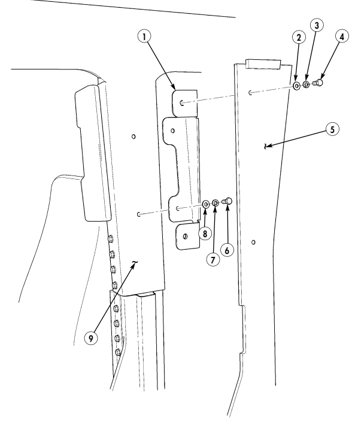

FOLLOW-ON TASKS:  - Install B-pillar IED overlay assembly (if equipped) (Appendix K, K-9).
- • Install rear door/door hinge (perimeter) (Appendix J, J-4).

■
J-27.1. B-PILLAR ASSEMBLY AND B-PILLAR GAP ARMOR BRACKET (PERIMETER)
MAINTENANCE (M1151A1, M1165A1 [SERIAL NUMBERS 239991 AND ABOVE], 

# M1152A1, M1167)

This task covers:
b. Inspection

#### Applicable Models

M1151A1 [Serial Numbers 239991 and above],
M1152A1, M1165A1, M1167 (Serial Numbers 239991 and above), M1167 Tools General mechanic's tool kit:
Torque wrench 3/8-in. drive, 75 ft-lb (Appendix B, Item 2.1)
a. Removal c. Installation

| Materials/Parts                             |
|---------------------------------------------|
| Six lockwashers (Appendix G, Item 144)      |
| Equipment Condition                         |
| B\-pillar IED overlay removed (if equipped) |
| (Appendix K, K\-10).                        |
| Manual References                           |
| TM 9\-2320\-387\-24P                        |
| Maintenance Level                           |
| Unit                                        |

#### A. Removal

1. Remove four capscrews (5), lockwashers (4), washers (3), and B-pillar assembly (2) from B-pillar gap armor bracket (1). Discard lockwashers (4).

2. Remove two capscrews (6), lockwashers (7), washers (8), and B-pillar gap armor bracket (1) from B-pillar (9). Discard lockwashers (7).

b. Inspection Refer to para. 10-56 for nut insert inspection or replacement.

c. Installation 1. Install B-pillar gap armor bracket (1) on B-pillar (9) with two washers (8), lockwashers (7), and capscrews (6). Tighten capscrews (6) to 31 lb-ft (42 N•m).

2. Install B-pillar assembly (2) on B-pillar gap armor bracket (1) with four washers (3), lockwashers (4),
and capscrews (5). Tighten capscrews (5) to 31 lb-ft (42 N•m).

J-27.1. B-PILLAR ASSEMBLY AND B-PILLAR GAP ARMOR BRACKET (PERIMETER)
 
M1152A1, M1167) (Cont'd)
■

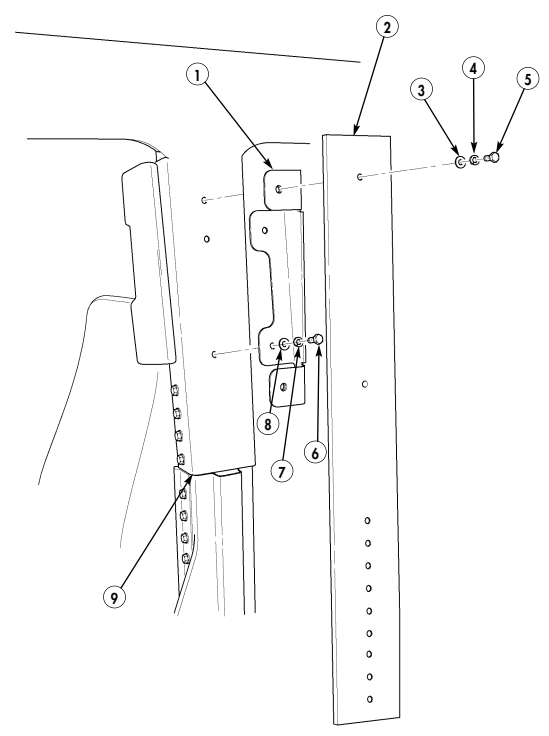

FOLLOW-ON TASK:    Install B-pillar IED overlay (if equipped) (Appendix K, K-10).

# J-28. Right Rear Seat Back Armor (Perimeter) Maintenance

This task covers:
b. Inspection

Applicable Models M1151A1, M1165A1, M1167 Tools General mechanic's tool kit:
automotive (Appendix B, Item 1)
Materials/Parts Five lockwashers (Appendix G, Item 144) Two locknuts (Appendix G, Item 127)
Personnel Required One mechanic One assistant Manual References TM 9-2320-387-24P
a. Removal c. Installation

#### Equipment Condition

- Right passenger seat removed (para. 10-45). - Door striker (perimeter) removed (if equipped) (Appendix J, J-12).

- Door striker (Frag 5) removed (if equipped)
(Appendix M, M-15).

General Safety Instructions Right rear seat back armor is extremely heavy and must be supported during removal and installation.

Maintenance Level Unit

#### Warning

Right rear seat back armor is extremely heavy and must be supported during removal and installation. Failure to do so may result in injury to personnel or damage to equipment.

Note location of capscrews, nuts, spacers, and brackets for installation.

#### A. Removal

1. Remove two capscrews (10), lockwashers (11), and washers (12) from rear seat back armor (6), and bracket (4). Discard lockwashers (11).

2. Remove three capscrews (9), lockwashers (8), and washers (7) from rear seat back armor (6) and rear seat back armor bracket (1). Discard lockwashers (8).

3. Remove rear seat back armor (6) from vehicle (14). 4. Remove two capscrews (2), four washers (3), two locknuts (5) and rear seat back armor bracket (1) from bracket (13). Discard locknuts (5).

b. Inspection Refer to para. 10-56 for nut insert inspection and replacement.

# J-28. Right Rear Seat Back Armor (Perimeter) Maintenance (Cont'D)

c. Installation

#### Caution

Use grade 5 torque value when installing capscrews into nut inserts. Failure to do so may damage equipment or components.

1. Install rear seat back armor bracket (1) on bracket (13) with two capscrews (2), four washers (3),
and two locknuts (5).

2. Position rear seat back armor (6) onto vehicle (14). 3. Install rear seat back armor (6) on rear seat back armor bracket (1) with three washers (7),
lockwashers (8), and capscrews (9).

4. Secure rear seat back armor (6) to bracket (4) with two capscrews (10), lockwashers (11), and washers (12).

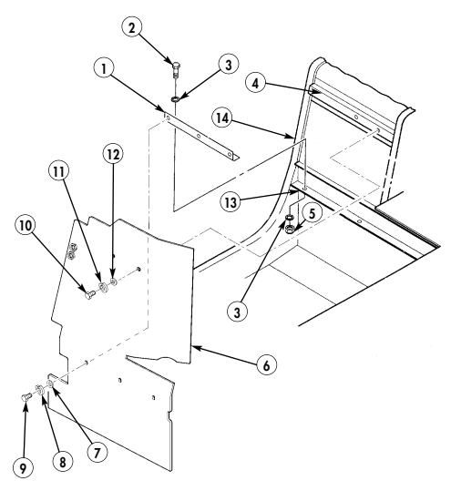

FOLLOW-ON TASKS: - Install door striker (Frag 5) (if equipped) (Appendix M, M-15).

- Install door striker (perimeter) (if equipped) (Appendix J, J-12). - Install right passenger seat (para. 10-45).

# J-29. Left Rear Seat Back Armor (Perimeter) Maintenance

This task covers:
b. Inspection

Applicable Models M1151A1, M1165A1, M1167 Tools General mechanic's tool kit:
automotive (Appendix B, Item 1)
Torque wrench 3/8-in. drive, 75 ft-lb 
(Appendix B, Item 2.1)

#### Materials/Parts

Five lockwashers (Appendix G, Item 144) Two locknuts (Appendix G, Item 127)
Personnel Required One mechanic One assistant

#### Manual References

TM 9-2320-387-24P
Equipment Condition
- Left passenger seat removed (para. 10-45). - Door striker (perimeter) removed 
(if equipped) (Appendix J, J-12).

- Door striker (Frag 5) removed (if equipped)
(Appendix M, M-15).

#### General Safety Instructions

Left rear seat back armor is extremely heavy and must be supported during removal and installation.

Maintenance Level Unit

#### Warning

Left rear seat back armor is extremely heavy and must be supported during removal and installation. Failure to do so may result in injury to personnel or damage to equipment.

Note location of capscrews, nuts, spacers, and brackets for installation.

#### A. Removal

1. Remove two capscrews (8), lockwashers (7), and washers (6) from rear seat back armor (5) and bracket (1). Discard lockwashers (7).

2. Remove three capscrews (11), lockwashers (10), and washers (9) from rear seat back armor (5) and rear seat back armor bracket (2). Discard lockwashers (10).

3. Remove rear seat back armor (5) from vehicle (13). 4. Remove two capscrews (3), four washers (4), two locknuts (12), and rear seat back armor bracket (2) from bracket (14). Discard locknuts (12).

#### B. Inspection

Refer to para. 10-56 for nut insert inspection and replacement.

c. Installation 1. Install rear seat back armor bracket (2) on bracket (14) with two capscrews (3), four washers (4), and two locknuts (12).

2. Position rear seat back armor (5) onto vehicle (13).

a. Removal c. Installation

## J-29. Left Rear Seat Back Armor (Perimeter) Maintenance (Cont'D)

3. Install rear seat back armor (5) on rear seat back armor bracket (2) with three washers (9),
lockwashers (10), and capscrews (11). Tighten capscrews (11) to 31 lb-ft (42 N•m).

4. Secure rear seat back armor (5) to bracket (1) with two capscrews (8), lockwashers (7), and washers (6). Tighten capscrews (8) to 31 lb-ft (42 N•m).

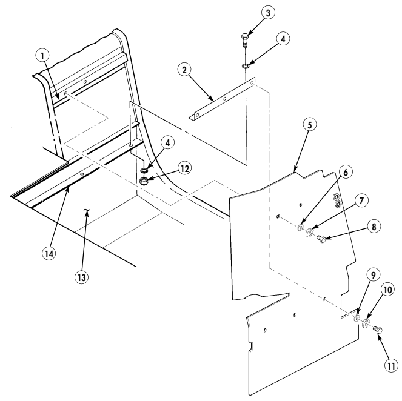

FOLLOW-ON TASKS: - Install door striker (Frag 5) (if equipped) (Appendix M, M-15).

- Install door striker (perimeter) (if equipped) (Appendix J, J-12). - Install left passenger seat (para. 10-45).

# J-30. Left C-Pillar Armor (Perimeter) Maintenance (M1151A1, M1165A1, M1167)

This task covers:
b. Inspection

Applicable Models M1151A1, M1165A1, M1167 Tools General mechanic's tool kit:
automotive (Appendix B, Item 1)
Torque wrench 3/8-in. drive, 75 ft-lb 
(Appendix B, Item 2.1)
Materials/Parts Lockwasher (Appendix G, Item 159)
a. Removal c. Installation

| Manual References    |
|----------------------|
| TM 9\-2320\-387\-24P |

Equipment Condition Upper C-pillar armor (perimeter) removed (Appendix J, J-32).

Maintenance Level Unit

There are various configurations of C-pillar armor. Refer to para. 30.1 or 30.2 for alternate configurations.

a. Removal Remove capscrew (1), lockwasher (2), washer (3), and C-pillar armor (5) from body (4). Discard lockwasher (2).

b. Inspection Refer to para. 10-56 for nut insert inspection and replacement.

c. Installation Install C-pillar armor (5) on body (4) with washer (3), lockwasher (2), and capscrew (1). Tighten capscrew (1) to 31 lb-ft (42 N•m).

J-30. LEFT C-PILLAR ARMOR (PERIMETER) MAINTENANCE (M1151A1, M1165A1, M1167) (Cont'd)

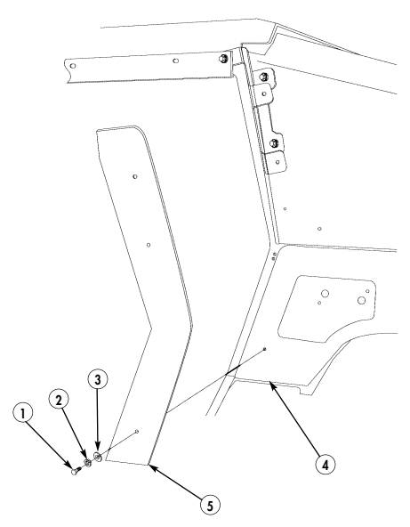

FOLLOW-ON TASK: Install upper C-pillar armor (perimeter) (Appendix-J, J-32).

# J-30.1. Left C-Pillar Armor (Perimeter) Maintenance (M1151A1, M1165A1, M1167)

This task covers:
b. Inspection

| Applicable Models                 |
|-----------------------------------|
| M1151A1, M1165A1, M1167           |
| Tools                             |
| General mechanic's tool kit:      |
| automotive (Appendix B, Item 1)   |
| Materials/Parts                   |
| Lockwasher (Appendix G, Item 144) |

a. Removal c. Installation

| Manual References                          |
|--------------------------------------------|
| TM 9\-2320\-387\-24P                       |
| Equipment Condition                        |
| Left upper C\-pillar armor (perimeter)     |
| removed (if equipped) (Appendix J, J\-32). |
| Maintenance Level                          |
| Unit                                       |

There are various configurations of C-pillar armor. Refer to para. J-30 or J-30.2 for alternate configurations.

a. Removal Remove capscrew (5), lockwasher (4), washer (3), and C-pillar armor plate (2), from C-pillar (1). Discard lockwasher (4).

b. Inspection Refer to para. 10-56 for nut insert inspection or replacement.

c. Installation

#### Caution

Use grade 5 torque values when installing capscrews into nut inserts. Failure to do so may damage equipment or components.

Install C-pillar armor plate (2) on C-pillar (1) with washer (3), lockwasher (4) and capscrew (5).

J-30.1. LEFT C-PILLAR ARMOR (PERIMETER) MAINTENANCE (M1151A1, M1165A1, M1167) (Cont'd)

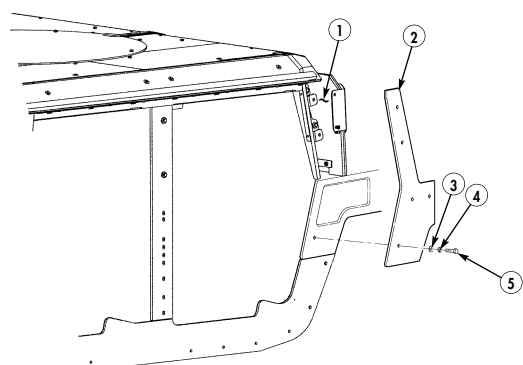

FOLLOW-ON TASK: Install left upper C-pillar armor (perimeter) (if equipped) (Appendix J, J-32).

# J-30.2. Right C-Pillar Armor (Perimeter) Maintenance

This task covers:
b. Inspection

Applicable Models M1151A1, M1165A1, M1167 Tools General mechanic's tool kit:
automotive (Appendix B, Item 1)
Materials/Parts a. Removal c. Installation Manual References TM 9-2320-387-24P
Equipment Condition Right upper C-pillar armor (perimeter) removed (if equipped) (Appendix J, J-32).

Maintenance Level Unit Two locknuts (Appendix G, Item 106) Three lockwashers (Appendix G, Item 144)

There are various configurations of C-pillar armor. Refer to para. J-30 or J-30.1 for alterrnate configurations.

a. Removal

Perform step two only if vehicle is not equipped with C-pillar IED overlay.

1. Remove capscrew (5) and clip (4) from C-pillar armor (13). 2. Remove two locknuts (2), washers (3), capscrews (9), washers (8), armor filler door plate (7), and filler door plate (6) from fuel filler door (14). Discard locknuts (2).

3. Remove three capscrews, (10), lockwashers (11), washers (12), and C-pillar armor (13) from C-pillar (1).

Discard lockwashers (11).

b. Inspection Refer to para. 10-56 for nut insert inspection or replacement.

c. Installation

Perform step two only if vehicle is not equipped with C-pillar IED overlay.

#### Caution

Use grade 5 torque values when installing capscrews into nut inserts. Failure to do so may damage equipment or components.

1. Install C-pillar armor (13) on C-pillar (1) with three washers (12), lockwashers (11), and capscrews
(10).

2. Install filler door plate (6) and armor filler door plate (7) on fuel filler door (14) with two washers (8),
capscrews (9), washers (3), and locknuts (2).

3. Install clip (4) on C-pillar armor (13) with capscrew (5).

# J-30.2. Right C-Pillar Armor (Perimeter) Maintenance (Cont'D)

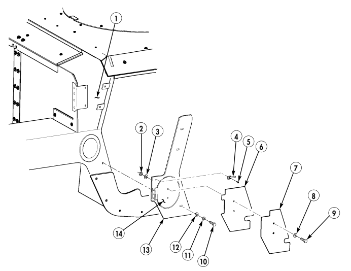

FOLLOW-ON TASK: Install upper right C-pillar armor (perimeter) (if equipped) (Appendix J, J-32).

# J-31. C-Pillar Gap Bracket (Perimeter) Maintenance

This task covers:
b. Inspection

Applicable Models M1151A1, M1165A1, M1167 Tools General mechanic's tool kit:
automotive (Appendix B, Item 1)
Torque wrench 3/8-in. drive, 75 ft-lb 
(Appendix B, Item 2.1)

#### Materials/Parts

Two locknuts (Appendix G, Item 111) Lockwasher (Appendix G, Item 141)
a. Removal **c. Installation**

#### Manual References

TM 9-2320-387-24P
Equipment Condition
- Upper C-pillar armor (perimeter) removed
(Appendix J, J-32).

- C-pillar armor (perimeter) removed
(Appendix J, J-30 or J-30.1).

#### Maintenance Level

Unit

Replacement procedures for left and right C-pillar gap brackets are basically the same. This procedure covers the left C-pillar gap bracket.

#### A. Removal B. Inspection

1. Refer to para 10-56 for inspection and repair of weld nuts. 2. Inspect insulation (9), replace if damaged.

c. Installation 1. Remove capscrew (1), lockwasher (2), washer (3), and header (4) from C-pillar gap bracket (5).

Discard lockwasher (2).

2. Remove two locknuts (7), four washers (8), two capscrews (12), and C-pillar gap bracket (5) from vehicle (6). Discard locknuts (7).

3. Remove two capscrews (11), nut plate (10), and insulation (9) from C-pillar gap bracket (5).

1. Install insulation (9) on C-pillar gap bracket (5) with nut plate (10) and two capscrews (11). Tighten capscrews (11) to 31 lb-ft (42 N•m).

2. Install C-pillar gap bracket (5) on vehicle (6) with two capscrews (12), four washers (8), and two locknuts (7). 3. Install header (4) on C-pillar gap bracket (5) with washer (3), lockwasher (2), and capscrew (1).

Tighten capscrew (1) to 31 lb-ft (42 N•m).

# J-31. C-Pillar Gap Bracket (Perimeter) Maintenance (Cont'D)

1

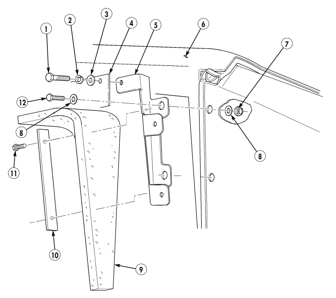

FOLLOW-ON TASKS: - Install upper C-pillar armor (perimeter) (Appendix J, J-32).

· Install C-pillar armor (perimeter) (Appendix J, J-30 or J-30.1).

100 million and the many of th

# J-32. Upper C-Pillar Armor (Perimeter) Maintenance

This task covers:
b. Inspection

Applicable Models M1151A1, M1165A1, M1167 Tools General mechanic's tool kit:
automotive (Appendix B, Item 1)
Torque wrench 3/8-in. drive, 75 lb-ft 
(Appendix B, Item 2.1)
Materials/Parts Five locknuts (Appendix G, Item 127)
(M1151A1 only)
Two lockwashers (Appendix G, Item 159)
(M1151A1 only)
Two locknuts (Appendix G, Item 106)
(M1165A1, M1167 only)
Four lockwashers (Appendix G, Item 144)
(M1165A1, M1167 only)
a. Removal **c. Installation**
Personnel Required One mechanic One assistant Manual References TM 9-2320-387-24P
Equipment Condition
- C-pillar IED overlay removed (if equipped)
(M1151A1 only) (Appendix K, K-11).

- Right C-pillar IED overlay removed (if equipped) (M1165A1 and M1167 only) (Appendix K, K-13).

- Left C-pillar IED overlay removed (if equipped) (M1165A1 and M1167 only) (Appendix K, K-12).

Maintenance Level Unit

Replacement procedures for left and right upper C-pillar armor are basically the same. This procedure covers the right upper C-pillar armor.

a. Removal

- Perform steps 1 through 3 for M1151A1 vehicles. - Perform steps 4 and 5 for M1165A1 and M1167 vehicles.

1. Remove two capscrews (7), lockwashers (6), and washers (5) from upper C-pillar armor (4) and vehicle (1). Discard lockwashers (6).

2. Remove two locknuts (10), four washers (9), and two capscrews (8) from upper C-pillar armor (4) and vehicle (1). Discard locknuts (10).

3. Remove three locknuts (11), six washers (2), three capscrews (3), and upper C-pillar armor (4) from vehicle (1). Discard locknuts (11).

4. Remove four capscrews (18), lockwashers (17), and washers (16) from upper C-pillar armor (15) and vehicle (12). Discard lockwashers (17).

5. Remove two locknuts (19), four washers (20), capscrews (14), washers (13) and upper C-pillar armor (15) from vehicle (12). Discard locknuts (19).

b. Inspection Refer to para. 10-56 for nut insert inspection or replacement.

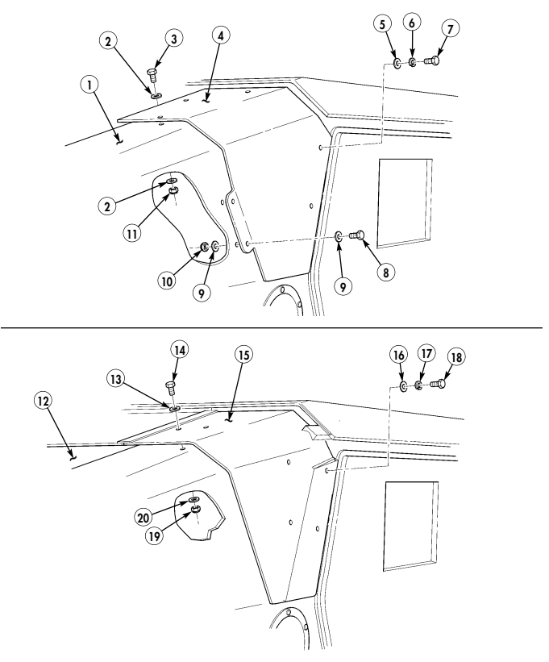

# J-32.  Upper C-Pillar Armor (Perimeter) Maintenance (Cont'D)

## J-32. Upper C-Pillar Armor (Perimeter) Maintenance (Cont'D)

c. Installation

- Perform steps 1 and 2 for M1165A1 and M1167 vehicles. - Perform steps 3 through 5 for M1151A1 vehicles.

1. Install upper C-pillar armor (15) on vehicle (12) with two washers (13), capscrews (14), washers (20),
and locknuts (19).

2. Secure upper C-pillar armor (15) to vehicle (12) with four washers (16), lockwashers (17), and capscrews (18). Tighten capscrews (18) to 8 lb-ft (11 N•m).

3. Install upper C-pillar armor (4) on vehicle (1) with three capscrews (3), six washers (2), and three locknuts (11).

4. Secure upper C-pillar armor (4) to vehicle (1) with two capscrews (8), four washers (9), and two locknuts (10).

5. Secure upper C-pillar armor (4) to vehicle (1) with two washers (5), lockwashers (6), and capscrews (7).

Tighten capscrews (7) to 8 lb-ft (11 N•m).

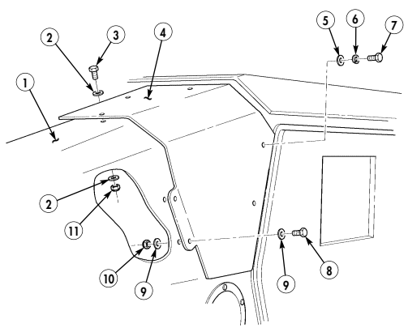

# J-32. Upper C-Pillar Armor (Perimeter) Maintenance (Cont'D)

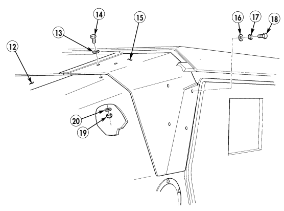

FOLLOW-ON TASKS: - Install left C-pillar IED overlay (if equipped) (M1165A1 and M1167 only)
(Appendix K, K-12).

- Install right C-pillar IED overlay (if equipped) (M1165A1 and M1167 only)
(Appendix K, K-13).

- Install C-pillar IED overlay (if equipped) (M1151A1 only) (Appendix K, K-11).

# J-33. C-Pillar Center Armor (Perimeter) Maintenance

This task covers:
b. Inspection

Applicable Models M1151A1, M1165A1, M1167 Tools General mechanic's tool kit:
automotive (Appendix B, Item 1)
Materials/Parts Two locknuts (Appendix G, Item 111)
(M1151A1 only)
Three locknuts (Appendix G, Item 106)
(M1165A1 and M1167 only)
Two lockwashers (Appendix G, Item 144)
(M1165A1 and M1167 only)
a. Removal c. Installation Personnel Required One mechanic One assistant Manual References TM 9-2320-387-24P
Equipment Condition Upper C-pillar armor (perimeter) removed
(M1165A1 and M1167 only) (Appendix J, J-32).

Maintenance Level Unit a. Removal

b. Inspection Refer to para. 10-56 for nut insert inspection or replacement.

c. Installation

#### Caution

Use grade 5 torque values when installing capscrews into nut inserts. Failure to do so may damage equipment or components.

NOTE
- Perform steps 1 and 2 for M1165A1 and M1167 vehicles. - Perform steps 3 and 4 for M1151A1 vehicles.

1. Install C-pillar center armor (3) on vehicle (14) with six washers (13), capscrews (12), and locknuts (15). 2. Secure C-pillar center armor (3) to vehicle (14) with two washers (9), lockwashers (10), and capscrews (11). 3. Install C-pillar center armor (3) to cargo shell door (4) with bracket (7), two capscrews (8), four washers (5), and two locknuts (6).

4. Install eight footman loops (2) on cargo shell door (3) with sixteen capscrews (1).

- Perform steps 1 and 2 for M1151A1 vehicles. - Perform steps 3 and 4 for M1165A1 and M1167 vehicles.

1. Remove sixteen capscrews (1) and eight footman loops (2) from C-pillar center armor (3). 2. Remove two locknuts (6), four washers (5), two capscrews (8), bracket (7), and C-pillar center armor (3)
from cargo shell door (4). Discard locknuts (6).

3. Remove two capscrews (11), lockwashers (10), and washers (9) from C-pillar center armor (3).

Discard lockwashers (10).

4. Remove three locknuts (15), six washers (13), three capscrews (12), and C-pillar center armor (3)
from vehicle (14). Discard locknuts (15).

# J-33. C-Pillar Center Armor (Perimeter) Maintenance (Cont'D)

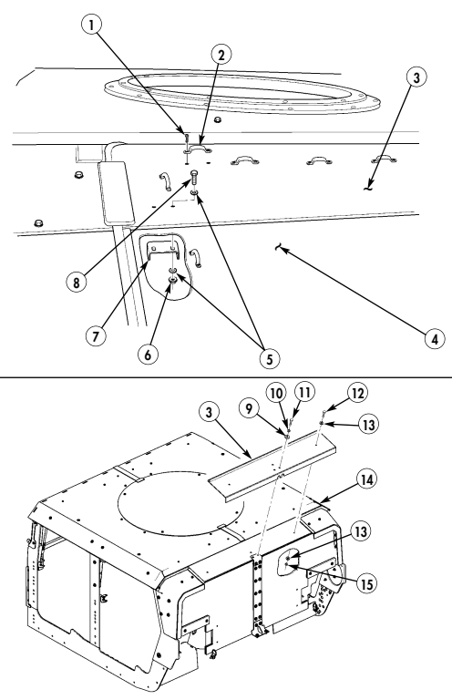

FOLLOW-ON TASK: Install upper C-pillar armor (perimeter) (M1165A1 and M1167 only)

(Appendix J, J-32).

# J-34. Rear Door Ramp Block (Perimeter) Replacement (M1151A1 Serial Numbers 239990 And Below)

This task covers:
INITIAL SETUP:
Applicable Models M1151A1 (Serial Numbers 239990 and below)
Tools

| Materials/Parts   |
|-------------------|

General mechanic's tool kit:
automotive (Appendix B, Item 1)
Two locknuts (Appendix G, Item 127)

a. Removal **b. Installation**

| Manual References                      |
|----------------------------------------|
| TM 9\-2320\-387\-24P                   |
| Equipment Condition                    |
| Right rear seat back armor (perimeter) |
| removed (Appendix J, J\-28).           |
| Maintenance Level                      |
| Unit                                   |

Replacement procedures for left and right rear door ramp blocks are basically the same. This procedure covers the right rear door ramp block.

a. Removal Remove two locknuts (4), four washers (3), two capscrews (2), and rear door ramp block (1) from vehicle (5). Discard locknuts (4).

b. Installation Install ramp block (1) on vehicle (5) with two capscrews (2), four washers (3), and two locknuts (4).

# J-34. Rear Door Ramp Block (Perimeter) Replacement (M1151A1 Serial Numbers 239990 And Below) (Cont'D)

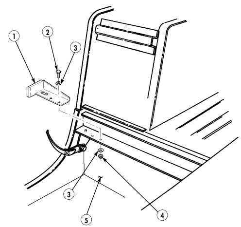

FOLLOW-ON TASK: Install right rear seat back armor (perimeter) (Appendix J, J-28).

# J-35. C-Partition Assembly (Perimeter) Maintenance (M1151A1, M1167)

This task covers:
b. Inspection

Applicable Models M1151A1, M1167 Tools General mechanic's tool kit:
automotive (Appendix B, Item 1)
Torque wrench 3/8-in. drive, 75 ft-lb 
(Appendix B, Item 2.1)

#### Materials/Parts

Seven locknuts (Appendix G, Item 111) Six lockwashers (Appendix G, Item 159)
Personnel Required One mechanic One assistant a. Removal **c. Installation**

#### Manual References

TM 9-2320-387-24P
Equipment Condition
- C-partition door assembly (perimeter)
removed (Appendix J, J-40).

- C-partition isolator bracket (perimeter)
removed (Appendix J, J-37).

#### General Safety Instructions

C-partition is extremely heavy and must be supported during removal and installation.

Maintenance Level Unit

#### Warning

C-partition is extremely heavy and must be supported during removal and installation. Failure to do so may result in injury to personnel and damage to equipment.

NOTE
Note location of screws, nuts, washers, and brackets prior to removal for installation.

#### A. Removal

1. Remove two locknuts (1), four washers (4), two capscrews (3), and lower gap plate (5) from C-
partition (2). Discard locknuts (1).

2. Remove four capscrews (6), lockwashers (7), washers (8), and upper gap plate (9) from C-partition (2). Discard lockwashers (7).

3. Remove two locknuts (13), four washers (11), and two capscrews (10) from mounting bracket (12)
and C-partition (2). Discard locknuts (13).

4. Remove two capscrews (16), lockwashers (15), washers (14), and mounting bracket (12) from floor (17).

Discard lockwashers (15).

5. Remove two locknuts (23), four washers (21), two capscrews (20) and plate (24) from mounting bracket (28) and support (22). Discard locknuts (23).

6. Remove locknut (25), capscrew (18), washers (19) and (26), two spacers (27) and mounting bracket (28)
from C-partition (2). Discard locknut (25).

7. Carefully remove C-partition (2) from vehicle (29).

b. Inspection Refer to para. 10-56 for nut insert inspection or replacement.

# J-35.  C-Partition Assembly (Perimeter) Maintenance (M1151A1, M1167) (Cont'D)

. I

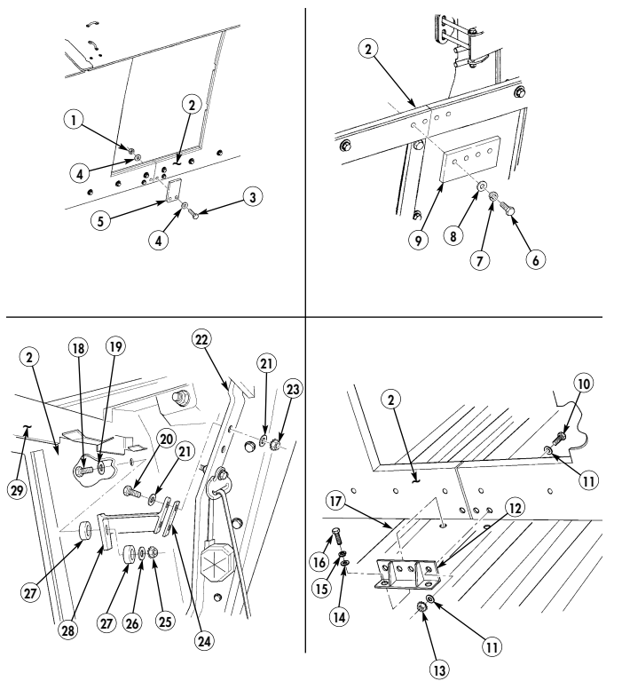

## J-35. C-Partition Assembly (Perimeter) Maintenance (M1151A1, M1167) (Cont'D)

c. Installation 1. Carefully position C-partition (12) in vehicle (13). 2. Install mounting bracket (10) on C-partition (12) with capscrew (1), washer (11), two spacers (9),
washer (8) and, locknut (7).

3. Install mounting bracket (10) to support (4) with two capscrews (2), four washers (3), and two locknuts (5).

Tighten capscrews (2) to 31 lb-ft (42 N•m).

4. Install mounting bracket (16) on floor (21) with two capscrews (20), lockwashers (19), and washers (18).

Tighten capscrews (20) to 31 lb-ft (42 N•m).

5. Install two capscrews (14), four washers (15), and two locknuts (17) on mounting bracket (16) and C-partition (12).

6. Install upper gap plate (5) on C-partition (1) with four capscrews (2), lockwashers (3), and washers (4). 7. Install lower gap plate (9) on C-partition (1) with two capscrews (7), washers (8), and locknuts (6).

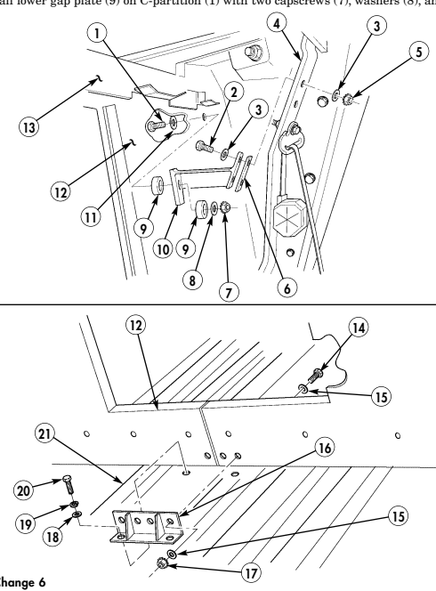

J-35.  C-PARTITION ASSEMBLY (PERIMETER) MAINTENANCE (M1151A1, M1167) (Cont'd)

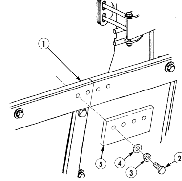

2)

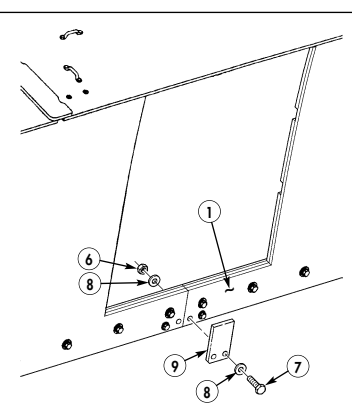

FOLLOW-ON TASKS: - Install C-partition isolator bracket (perimeter) (Appendix J, J-37).

- Install C-partition door assembly (perimeter) (Appendix J, J-40).

# J-36. C-Partition Assembly (Perimeter) Maintenance (M1165A1)

This task covers:
b. Inspection

Applicable Models M1165A1 Tools General mechanic's tool kit:
automotive (Appendix B, Item 1)
Materials/Parts Six locknuts (Appendix G, Item 106) Twenty-two lockwashers (Appendix G,
Item 144)
Manual References TM 9-2320-387-24P
a. Removal c. Installation

#### Equipment Condition

- Left C-pillar armor (perimeter) removed 
(Appendix J, J-30 or J-30.1).

- Right C-pillar armor (perimeter) removed 
(Appendix J, J-30.2).

- C-pillar center armor (perimeter) removed 
(Appendix J, J-33).

#### General Safety Instructions

C-partition is extremely heavy and must be supported during removal and installation.

Maintenance Level Unit

#### Warning

C-partition is extremely heavy and must be supported during removal and installation. Failure to do so may result in injury to personnel and damage to equipment.

NOTE
Note location of screws, nuts, washers, and brackets prior to removal for ease of installation.

#### A. Removal

1. Remove four capscrews (34), lockwashers (35), washers (36), and lower mounting bracket (37) from center plate (27) and vehicle (1). Discard lockwashers (35).

2. Move C-partition (5) toward rear of vehicle (1). 3. Remove two capscrews (20), lockwashers (19), washers (18) and center plate bracket (17) from C-partition (5) and vehicle (1). Discard lockwashers (19).

4. Remove two capscrews (14), lockwashers (15), and washers (16) from center plate bracket (17) and C-partition (5). Discard lockwashers (15).

5. Remove two capscrews (28), lockwashers (29), and washers (30), and lower gap plate (31) from center plate (27) and C-partition (5). Discard lockwashers (29).

6. Remove two capscrews (23), lockwashers (22), and washers (21), and upper gap plate (33) from center plate (27) and C-partition (5). Discard lockwashers (22).

7. Remove six locknuts (32), capscrews (24), lockwashers (25), twelve washers (26), and center plate (27)
from C-partition (5). Discard locknuts (32) and lockwashers (25).

Steps 8 through 10 cover right C-partition. Left C-partition is similar.

8. Remove two capscrews (13), lockwashers (12), washers (11), accessory cover (10), and accessory retainer plate (3) from C-partition (5). Discard lockwashers (12).

9. Remove two capscrews (9), lockwashers (8), washers (7), upper C-partition nut plate (4) and C-partition bracket (6) from C-partition nut bracket (2). Discard lockwashers (8).

10. Remove C-partition (5) from vehicle (1).

b. Inspection Refer to para. 10-56 for nut insert inspection or replacement.

# J-36.  C-Partition Assembly (Perimeter) Maintenance (M1165A1) (Cont'D)

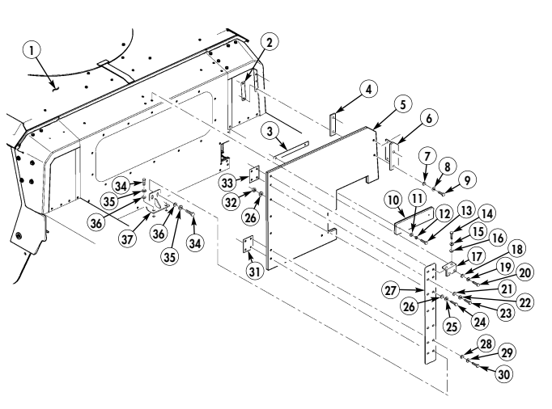

## J-36. C-Partition Assembly (Perimeter) Maintenance (M1165A1) (Cont'D)

c. Installation

#### Caution

Use grade 5 torque value when installing capscrews into nut inserts. Failure to do so may damage equipment or components.

Steps 1 through 3 cover right C-partition. Left C-partition is similar.

1. Position C-partition (5) on vehicle (1). 2. Install C-partition bracket (6) and C-partition nut plate (4) on C-partition nut bracket (2) on vehicle (1) with two capscrews (9), lockwashers (8), and washers (7).

3. Install accessory cover (10) and accessory retainer plate (3) on C-partition (5) with two capscrews (13), lockwashers (12), and washers (11).

4. Install upper gap plate (33) on center plate (27) and C-partition (5) with two capscrews (23),
lockwashers (22), and washers (21).

5. Install lower gap plate (31) on center plate (27) and C-partition (5) with two capscrews (28),
lockwashers (29), and washers (30).

6. Install center plate (27) on C-partition (5) with two capscrews (14), lockwashers (15), and washers (16).

7. Install center plate (27) on C-partition (5) with six capscrews (24), lockwashers (25), twelve washers (26) and six locknuts (32).

8. Install center plate bracket (17) on C-partition (5) and vehicle (1) with two capscrews (20),
lockwashers (19), and washers (18).

9. Move C-partition (5) toward front of vehicle (1).

10. Install lower mounting bracket (37) on center plate (27) and vehicle (1) with four capscrews (34),
lockwashers (35), and washers (36).

# J-36. C-Partition Assembly (Perimeter) Maintenance (M1165A1) (Cont'D)

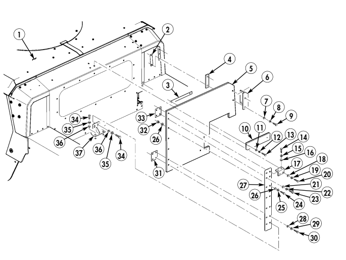

FOLLOW-ON TASKS: - Install C-pillar center armor (perimeter) (Appendix J, J-33).

- Install right C-pillar armor (perimeter) (Appendix J, J-30.2). - Install left C-pillar armor (perimeter) (Appendix J, J-30 or J-30.1).

# J-37. C-Partition Isolator Bracket (Perimeter) Maintenance

This task covers:

Applicable Models M1151A1, M1167 Tools General mechanic's tool kit:
automotive (Appendix B, Item 1)
Torque wrench 3/8-in. drive, 75 ft-lb 
(Appendix B, Item 2.1)
Materials/Parts Two locknuts (Appendix G, Item 111) Four lockwashers (Appendix G, Item 158.1)

a. Removal c. Installation b. Inspection **d. Adjustment**

| Manual References    |
|----------------------|
| TM 9\-2320\-387\-24P |

#### Equipment Condition

| Maintenance Level   |
|---------------------|
| Unit                |

- Left rear upper underbody armor
(integrated) removed (para. 11-109 or para. 11-109.1).

- Left rear seat back armor (perimeter)
removed (Appendix J, J-29).

Replacement procedures for left and right C-partition isolator brackets are basically the same. This procedure covers the left C-partition isolator bracket.

#### A. Removal

1. Remove two locknuts (3), two washers (2), two capscrews (9), four washers (6), four spacers (7), and door stop (5) from isolator bracket (8) and C-partition (4). Discard locknuts (3).

2. Remove four capscrews (10), lockwashers (11), washers (12), nutplate (1), and isolator bracket (8)
from vehicle (13). Discard lockwashers (11).

b. Inspection Refer to para 10-56 for nut insert inspection and repair.

c. Installation 1. Install isolator bracket (8) on vehicle (13) with four washers (12), lockwashers (11), capscrews (10),
and nutplate (1). Tighten capscrews (10) to 8 lb-ft (11 N•m).

2. Install doorstop (5) to isolator bracket (8) and C-partition (4) with two capscrews (9), four spacers (7), washers (6), two washers (2) and locknuts (3).

d. Adjustment Adjust door stop (5) as necessary to allow C-partition doors to slide into the fully open and locked position.

# J-37.  C-Partition Isolator Bracket (Perimeter) Maintenance (Cont'D)

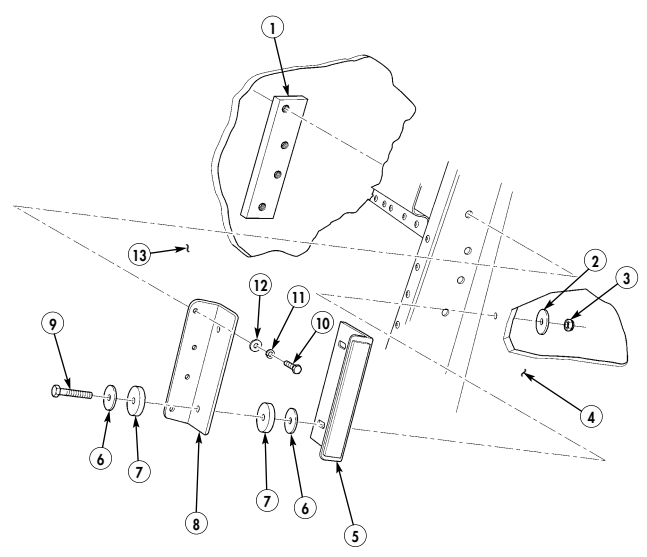

FOLLOW-ON TASKS: - • Install left rear seat back armor (perimeter) (Appendix J, J-29).

- Install left rear upper underbody armor (integrated) (para. 11-109 or para. 11-109.1).

# J-38. C-Partition Door Handle And Lock Assembly (Perimeter) Replacement

This task covers:
INITIAL SETUP:
Applicable Models M1151A1, M1167 Tools General mechanic's tool kit:
automotive (Appendix B, Item 1)

#### Materials/Parts

Two lockwashers (Appendix G, Item 159)

Replacement procedures for left and right C-partition door handle and lock assemblies are basically the same. This procedure covers the left C-partition door handle and lock assembly.

a. Removal Remove two capscrews (6), lockwashers (5), washers (4), handle (2), and lock assembly (1) from door (3). Discard lockwashers (5).

b. Installation Install lock assembly (1) and handle (2) on door (3) with two capscrews (6), lockwashers (5), and washers (4).

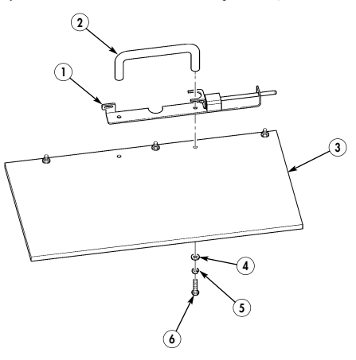

a. Removal **b. Installation** 

| Maintenance Level   |
|---------------------|
| Unit                |

| Manual References    |
|----------------------|
| TM 9\-2320\-387\-24P |

# J-39. C-Partition Door Gap Plate (Perimeter) Replacement

This task covers:
a. Removal **b. Installation**
INITIAL SETUP:
Applicable Models M1151A1, M1167 Tools General mechanic's tool kit:
automotive (Appendix B, Item 1)
Materials/Parts Three locknuts (Appendix G, Item 111)

| Maintenance Level   |
|---------------------|
| Unit                |

| Manual References    |
|----------------------|
| TM 9\-2320\-387\-24P |

Replacement procedures for left and right C-partition door gap plates are basically the same. This procedure covers the left C-partition door gap plate.

#### A. Removal

Remove three locknuts (5), six washers (4), three capscrews (3), and door gap plate (2) from door (1). Discard locknuts (5).

b. Installation Install door gap plate (2) on door (1) with three capscrews (3), six washers (4), and three locknuts (5).

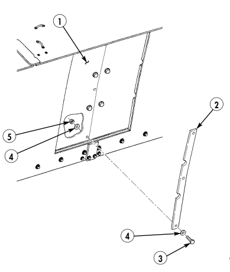

# J-40. C-Partition Door Assembly (Perimeter) (Old Configuration) Replacement

This task covers:
INITIAL SETUP:
Applicable Models M1151A1, M1167 Tools General mechanic's tool kit:
automotive (Appendix B, Item 1)
Materials/Parts Six lockwashers (Appendix G, Item 159)
a. Removal **b. Installation**
Manual References TM 9-2320-387-24P
Maintenance Level Unit

#### A. Removal

Remove six capscrews (4), lockwashers (3), washers (2), two upper brackets (6), and doors (5) from C-partition (1). Discard lockwashers (3).

b. Installation Install doors (5) on C-partition (1) and secure with two upper brackets (6), six capscrews (4), lockwashers (3), and washers (2).

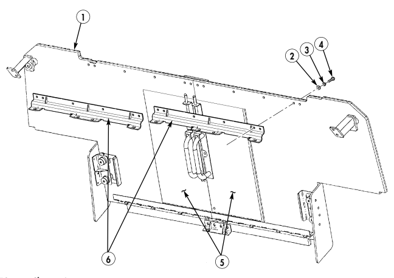

# J-40.1. C-Partition Door Assembly (Perimeter) (New Configuration) Replacement

This task covers:

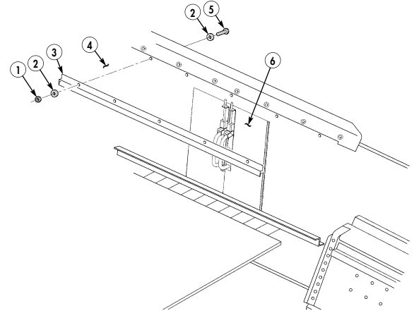

INITIAL SETUP:
Tools automotive (Appendix B, Item 1)
Materials/Parts Five locknuts (Appendix G, Item 77)
a. Removal b. Installation

| Maintenance Level   |
|---------------------|
| Unit                | | Manual References    |
|----------------------|
| TM 9\-2320\-387\-24P |

#### A. Removal

Remove five locknuts (1), ten washers (2), five capscrews (5), bracket (3), and doors (6) from C-partition (4). Discard locknuts (1).

b. Installation Install doors (6) on C-partition (4) with bracket (3), five capscrews (5), ten washers (2), and five locknuts (1).

Change 6 J-75/(J-76 through J-101 deleted)

# J-56. Side Rocker Armor Plate (Perimeter) Maintenance (M1151A1 Serial Numbers 239991 Through 247548)

This task covers:
b. Inspection

Applicable Models M1151A1 (Serial Numbers 239991 through 247548)
Tools General mechanic's tool kit:
automotive (Appendix B, Item 1)
Materials/Parts Seven locknuts (Appendix G, Item 106) Five lockwashers (Appendix G, Item 144)
Manual References TM 9-2320-387-24P
Equipment Conditions
- A-Pillar gap armor and A-Pillar Assembly
(perimeter) removed (Appendix J, J-25).

- B-Pillar assembly and B-Pillar gap armor bracket (perimeter) removed (Appendix J, J-27 or J-27.1).

a. Removal c. Installation

#### Equipment Conditions (Cont'D)

- Left C-Pillar armor (perimeter) (Appendix J, J-30 or J-30.1).

- Rocker panel IED overlay removed (if equipped)
(Appendix K, K-14).

- Front door removed (if equipped) 
(Appendix M, M-4).

- Rear door removed (if equipped) 
(Appendix M, M-4).

#### General Safety Instructions

Side rocker armor plates are extremely heavy and must be supported during removal and installation procedures.

Maintenance Level Unit

#### Warning

Side rocker armor plates are extremely heavy and must be supported during removal and installation procedures. Failure to do so may result in injury to personnel or damage to equipment.

NOTE
Replacement procedures for left and right rocker armor plates are basically the same. This procedure covers the left rocker armor plate.

#### A. Removal

1. Remove two capscrews (7), lockwashers (6), and washers (5) from left side rocker armor plate (8),
rear upper underbody armor (4) and body (3). Discard lockwashers (6).

2. Remove four locknuts (1), eight washers (2), and four capscrews (10) from left side rocker armor plate (8), rear lower underbody armor (9) and body (3). Discard locknuts (1).

3. Remove three locknuts (17), six washers (12), and three capscrews (11) from left side rocker armor plate (8), under body armor (16) and body (3). Discard locknuts (17).

4. Remove three capscrew (13), lockwashers (14), washers (15) and left side rocker armor plate (8) from body (3). Discard lockwashers (14).

b. Inspection Refer to para. 10-56 for nut insert inspection and replacement.

# J-56. Side Rocker Armor Plate (Perimeter) Maintenance (M1151A1 Serial Numbers 239991 Through 247548) (Cont'D)

c. Installation

#### Caution

Use grade 5 torque value when installing capscrews into nut inserts. Failure to do so may damage equipment or components.

1. Install left side rocker armor plate (8) on body (3) with three capscrews (13), lockwashers (14), and washers (15).

2. Install left side rocker armor plate (8) on underbody armor (16) and body (3) with three capscrews (11),
six washers (12), and three locknuts (17).

3. Install left side rocker armor plate (8) on rear lower underbody armor (9) and body (3) with four capscrews (10), eight washers (2), and four locknuts (1).

4. Install left side rocker armor plate (8) on rear upper underbody armor (4) and body (3) with two capscrews (7), lockwashers (6), and washers (5).

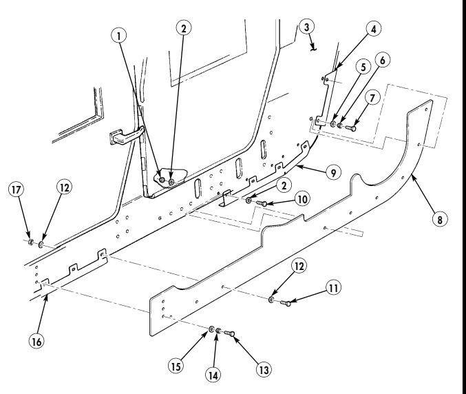

# J-56.1. Side Rocker Armor Plate (Perimeter) Maintenance (M1151A1 [Serial Numbers 247549 And Above], M1152A1, M1165A1, M1167)

This task covers:
b. Inspection

Applicable Models M1151A1 (Serial Numbers 247549 and above),
M1152A1, M1165A1, M1167 Tools General mechanic's tool kit:
automotive (Appendix B, Item 1)
Torque wrench 3/8-in. drive, 75 ft-lb 
(Appendix B, Item 2.1)

#### Materials/Parts

Seven locknuts (Appendix G, Item 106) Five lockwashers (Appendix G, Item 144)
Manual References TM 9-2320-387-24P
Equipment Condition
- A-Pillar gap armor and A-Pillar assembly
(perimeter) removed (Appendix J, J-25).

- B-Pillar assembly and B-Pillar gap armor bracket (perimeter) removed (Appendix J, J-27 or J-27.1).

a. Removal c. Installation

#### Equipment Condition (Cont'D)

- Left C-Pillar armor (perimeter) (Appendix J, J-30 or J-30.1).

- Rocker plate IED overlay removed (if equipped)
(Appendix K, K-14).

- Front door removed (if equipped) 
(Appendix M, M-4).

- Rear door removed (if equipped) 
(Appendix M, M-4).

#### General Safety Instructions

Side rocker armor plates are extremely heavy and must be supported during removal and installation procedures.

Maintenance Level Unit

#### Warning

Side rocker armor plates are extremely heavy and must be supported during removal and installation procedures. Failure to do so may result in injury to personnel or damage to equipment.

Replacement procedures for left and right rocker armor plates are basically the same. This procedure covers the left rocker armor plate.

#### A. Removal

1. Remove two capscrews (8), lockwashers (7), washers (6), and nut plate (4) from left side rocker armor plate (9), rear upper underbody armor (5) and body (3). Discard lockwashers (7).

2. Remove four locknuts (1), eight washers (2), and four capscrews (11) from left side rocker armor plate (9), rear lower underbody armor (10) and body (3). Discard locknuts (1).

3. Remove three locknuts (18), six washers (13), and three capscrews (12) from left side rocker armor plate (9), under body armor (17) and body (3). Discard locknuts (18).

4. Remove three capscrew (14), lockwashers (15), washers (16) and left side rocker armor plate (9) from body (3). Discard lockwashers (15).

b. Inspection Refer to para. 10-56 for nut insert inspection and replacement.

# J-56.1. Side Rocker Armor Plate (Perimeter) Maintenance (M1151A1 [Serial Numbers 247549 And Above], M1152A1, M1165A1, M1167) (Cont'D)

c. Installation 1. Install left side rocker armor plate (9) on body (3) with three capscrews (14), lockwashers (15), and washers (16). Tighten capscrews (14) to 31 lb-ft (42 N•m).

2. Install left side rocker armor plate (9) on underbody armor (17) and body (3) with three capscrews (12),
six washers (13), and three locknuts (18).

3. Install left side rocker armor plate (9) on rear lower underbody armor (10) and body (3) with four capscrews (11), eight washers (2), and four locknuts (1).

4. Install left side rocker armor plate (9) on rear upper underbody armor (5) and body (3) with nut plate (4),
two washers (6), lockwashers (7), and capscrews (8). Tighten capscrews (8) to 8 lb-ft (11 N•m).

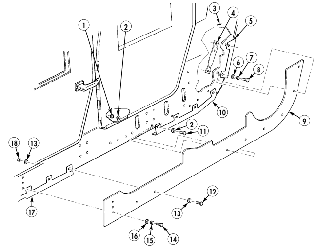

FOLLOW-ON TASKS: - Install rear door (if equipped) (Appendix M, M-4).

- Install front door (if equipped) (Appendix M, M-4). - Install rocker plate IED overlay (if equipped) (Appendix K, K-14). - Install left C-Pillar armor (perimeter) (Appendix J, J-30 or J-30.1). - Install left B-Pillar assembly and B-Pillar gap armor bracket (perimeter)
(Appendix J, J-27 or J-27.1).

- Install A-Pillar gap armor and A-Pillar assembly (perimeter) 
(Appendix J, J-25).

# J-57. Header Armor Plate Assembly (Perimeter) Maintenance (M1152A1)

This task covers:
b. Inspection INITIAL SETUP:
Applicable Models M1152A1 Tools General mechanic's tool kit:
automotive (Appendix B, Item 1)
Materials/Parts Three lockwashers (Appendix G, Item 144) Lockwasher (Appendix G, Item 145)

Replacement procedures for left and right header armor plate assemblies (perimeter) are basically the same. This procedure covers the left header armor plate assembly.

a. Removal 1. Remove capscrew (6), lockwasher (7), and washer (8) from header armor plate (2) on A-pillar armor bracket (9). Discard lockwasher (7).

2. Remove three capscrews (5), lockwashers (4), and washers (3), from header armor plate (2) on header armor gap bracket (10). Discard lockwashers (4).

NOTE
Perform step 3 for vehicles equipped with enhanced perimeter armor only.

3. Remove armor roof seal (1) from header armor plate (2).

b. Inspection 1. Refer to para. 10-56 for inspection and repair of weld nuts. 2. Inspect roof seal (1), replace if damaged.

c. Installation

Perform step 1 for vehicles equipped with enhanced perimeter armor only.

1. Install armor roof seal (1) on header armor plate (2). 2. Install header armor plate (2) on header armor gap bracket (10) with three washers (3), lockwashers (4),
and capscrews (5).

3. Install header armor plate (2) on A-pillar armor bracket (9) with washer (8), lockwasher (7), and capscrew (6).

a. Removal c. Installation

| Manual References    |
|----------------------|
| TM 9\-2320\-387\-24P |
| Maintenance Level    |
| Unit                 |

# J-57.  Header Armor Plate (Perimeter) Maintenance (M1152A1) (Cont'D)

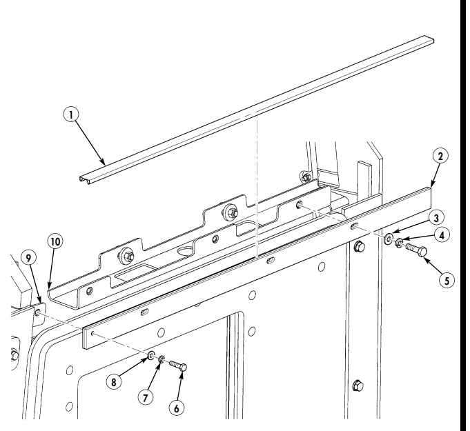

# J-58. Header Armor Gap Bracket (Perimeter) Replacement (M1152A1)

This task covers:

a. Removal b. Installation

| STOCK SIZE       | DESCRIPTION           | SPECIFICATION   |
|------------------|-----------------------|-----------------|
|                  | ALUMINUM ALLOY        | QQ\-A\-250/11   |
| 0.0500 IN. THICK | TEMPER                |                 |
|                  | REINFORCEMENT BRACKET |                 |
| PART             | CUT TO                | MANUFACTURED    |

Removal of left and right header armor gap brackets (perimeter) are basically the same. This procedure covers the left header armor gap bracket.

a. Removal Remove two locknuts (4), four washers (2), two capscrews (1) and header armor gap bracket (3) from vehicle (5). Discard locknuts (4).

b. Installation Install header armor gap bracket (3) on vehicle (5) with four washers (2), two capscrews (1), and locknuts (4).

J-58.  HEADER ARMOR GAP BRACKET (PERIMETER) REPLACEMENT (M1152A1) (Cont'd)

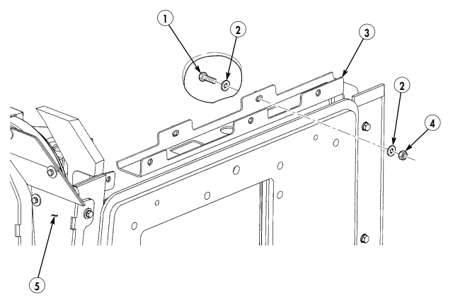

FOLLOW-ON TASK:
Install header armor (perimeter) (Appendix J, J-57).

# J-59. Roof Armor (Perimeter) Replacement (M1152A1)

This task covers:

Applicable Models

| 0.002\-IN. (NOM) THICK 26\-IN. (NOM) WIDTH   | PLASTIC SHEET, PRESS   | N/A                   |
|----------------------------------------------|------------------------|-----------------------|
|                                              | PLASTIC SHEET          |                       |
| PLASTIC SHEET PART NUMBER                    | CUT LENGTH             | MANUFACTURED FROM NSN |
|                                              | (INCHES)               |                       |
| 5598827                                      | AS REQUIRED            | 9330\-00\-618\-7214   |

Two locknuts (Appendix G, Item 114.1) Six locknuts (Appendix G, Item 106) Ten locknuts (Appendix G, Item 77) Eight lockwashers (Appendix G, Item 146)

a. Removal b. Installation

General Safety Instructions Roof armor is extremely heavy and must be supported during removal and installation.

Maintenance Level Unit

#### Warning

Roof armor is extremely heavy and must be supported during removal and installation. Failure to do so may result in injury to personnel or damage to equipment.

a. Removal 1. Remove four capscrews (1), lockwashers (2), washers (3), and left front armor plate (4) from roof armor (5). Discard lockwashers (2).

2. Remove four capscrews (9), lockwashers (8), washers (7), and right front armor plate (6) from roof armor (5). Discard lockwashers (8).

3. Remove two locknuts (30), snubber (29), mounts (28), capscrews (14), washers (13), and foam washers (12) from roof armor (5). Discard locknuts (30) and foam washers (12).

4. Remove self-tapping screw(s) (25) and two headliner plates (24) from top of cab (21).

It may be necessary to remove some insulation to access fasteners.

5. Remove locknut (15), washer (16), foam washer (17), capscrew (23) and washer (22) from right side rear corner of roof armor (5). Discard locknut (15) and foam washer (17).

6. Remove five locknuts (27), washers (26), capscrews (18), washers (19), and foam washers (20) from roof armor (5). Discard locknuts (27) and foam washers (20).

7. Remove ten locknuts (31), washers (32), capscrews (10), washers (11), two side armor plates (33),
and roof armor (5) from top of cab (21). Discard locknuts (31).

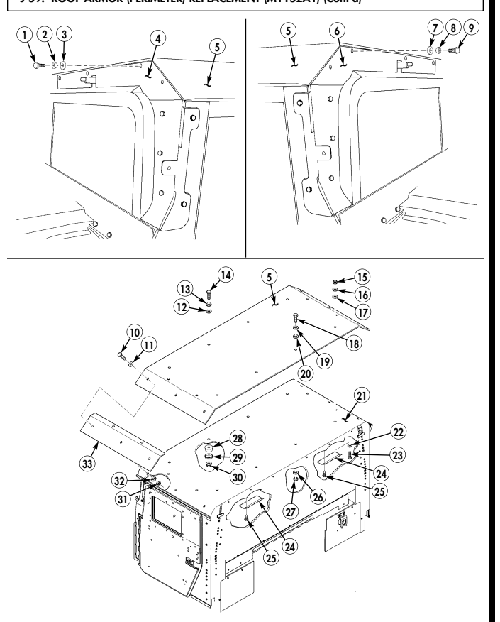

J-59. ROOF ARMOR (PERIMETER) REPLACEMENT (M1152A1) (Cont'd)

## J-59. Roof Armor (Perimeter) Replacement (M1152A1) (Cont'D)

b. Installation 1. Apply sealing compound to underside edge of roof armor (6). 2. Install two side armor plates (25) and roof armor (6) on top of cab (13) with ten washers (2),
capscrews (1), washers (24), and locknuts (23).

3. Install five foam washers (12), washers (29), capscrews (10), washers (18), and locknuts (19) on roof armor (6).

The capscrew in step 4 needs to be installed from the bottom of the roof armor.

4. Install washer (14), capscrew (15), foam washer (9), washer (8), and locknut (7) on right side rear corner of roof armor (6).

5. Install two headliner plates (16) on top of cab (13) with self-tapping screw(s) (17). 6. Install two foam washers (3), washers (4), capscrews (5), mounts (20), snubber (21), and locknuts (22) on roof armor (6).

7. Install right front armor plate (26) on roof armor (6) with four washers (27), lockwashers (28), and capscrews (29).

8. Install left front armor plate (33) on roof armor (6) with four washers (32), lockwashers (31), and capscrews (30).

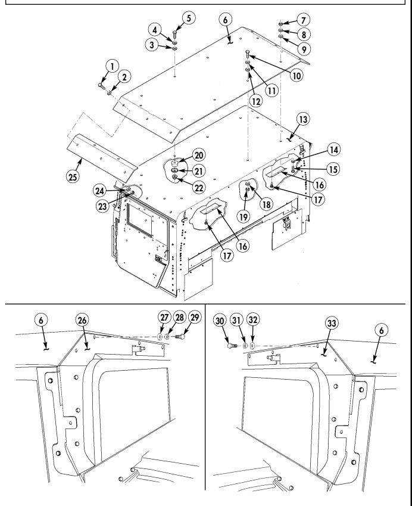

J-59. ROOF ARMOR (PERIMETER) REPLACEMENT (M1152A1) (Cont'd)

## J-60. Rear Plate Armor (Perimeter) Replacement

|                   | MATERIAL BLOCK        |                     |
|-------------------|-----------------------|---------------------|
| STOCK SIZE        | DESCRIPTION           | SPECIFICATION       |
| 39.00 IN. MINIMUM | CLOTH,COATED PLASTIC, | 11 TYPE AND 2 CLASS |
|                   | VINYL BOTH SIDES      |                     |
|                   | GREEN RUBBER CANVAS   |                     |
| PART              | CUT                   | MANUFACTURED        |
| NO.               | LENGTH                | FROM NSN            |
|                   | (INCHES)              |                     |
| 8434398           | 2 at 3X12             | 8305\-00\-616\-0022 |
|                   | 4 at 4X15             |                     |

#### Warning

Rear plate armor is extremely heavy and must be supported during removal and installation. Failure to do so may result in injury to personnel or damage to equipment.

a. Removal 1. Remove six nuts (10), capscrews (12), and washers (13) from side protector plate assemblies (1) and rear plate armor (4).

2. Remove eight locknuts (3) and capscrews (6) from top protector plate assembly (5) and rear plate armor (4). Discard locknuts (3).

3. Remove five nuts (11), capscrews (7), lockwashers (8), and washers (9) from bottom of rear plate armor (4). Discard lockwashers (8).

4. Remove rear plate armor (4) from vehicle (2).

b. Installation 1. Install rear plate armor (4) on vehicle (2) with five washers (9), lockwashers (8), capscrews (7), and nuts (11).

2. Install rear plate armor (4) and top protector plate assembly (5) to vehicle (2) with eight locknuts (3)
and capscrews (6).

3. Install rear plate armor (4) to side protector plate assemblies (1) with three capscrews (12), washers (13),
and nuts (10).

# J-60.  Rear Plate Armor (Perimeter) Replacement (Cont'D)

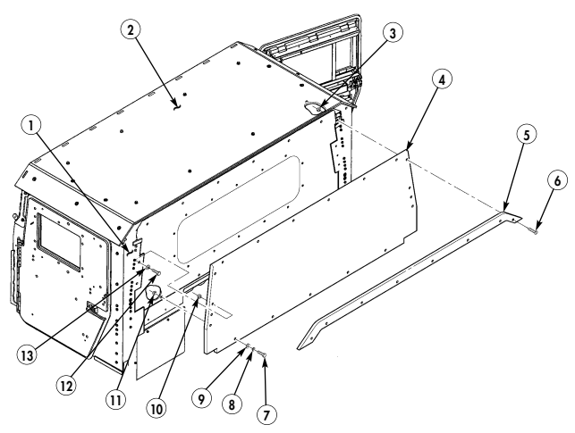

FOLLOW-ON TASK:
 Install AFES wiring harness (para.12-154).

# J-61. Door/Door Hinge And Check Strap (Standard Threat)

## Maintenance

This task covers:
b. Inspection

Applicable Models M1151A1, M1152A1, M1165A1, M1167 Tools General mechanic's tool kit:
automotive (Appendix B, Item 1)
Torque wrench 3/8-in. drive, 75 lb-ft 
(Appendix B, Item 2.1)
Materials/Parts Four lockwashers (Appendix G, Item 145) Nine locknuts (Appendix G, Item 87) Three locknuts (Appendix G, Item 82)
a. Removal c. Installation

| SAEGRADE   | NO.6or7   |
|------------|-----------|

Vehicle door is extremely heavy and must be supported during removal and installation.

#### Warning

Vehicle door is extremely heavy and must be supported during removal and installation. Failure to do so may cause injury to personnel or damage to equipment.

- Replacement procedures for doors, door hinges, and check straps are basically the same. This procedure covers the left side door, door hinge, and check strap.

- Use a sling as a lifting aid to position front and rear doors for removal and installation.

#### A. Removal

1. Remove locknut (24), washer (25), capscrew (30), washer (31), and check strap (32) from door hinge bracket (26). Discard locknut (24).

2. Remove two locknuts (29), lockwashers (28), washers (27), capscrews (22), washers (23), and door hinge bracket (26) from doors (5) and (9). Discard locknuts (29) and lockwashers (28).

Perform step 3 for front doors only.

Perform step 4 for rear doors only.

3. Remove ten capscrews (1) and washers (2) from door hinge (3) and vehicle (4). 4. Remove twelve capscrews (13) and washers (12) from door hinge (7) and vehicle (4). 5. Remove two capscrews (19) and (14), washers (20) and (15), and lockwashers (21) and (16) from door hinges (3) and (7), and vehicle (4). Discard lockwashers (21) and (16).

6. Remove nine locknuts (18) and (11), washers (17) and (10), capscrews (6) and (8), doors (5) and (9),
and door hinges (3) and (7) from vehicle (4). Discard locknuts (18) and (11).

b. Inspection Refer to para. 10-56 for nut insert inspection and replacement.

J-61.  DOOR/DOOR HINGE AND CHECK STRAP (STANDARD THREAT)
MAINTENANCE (Cont'd)

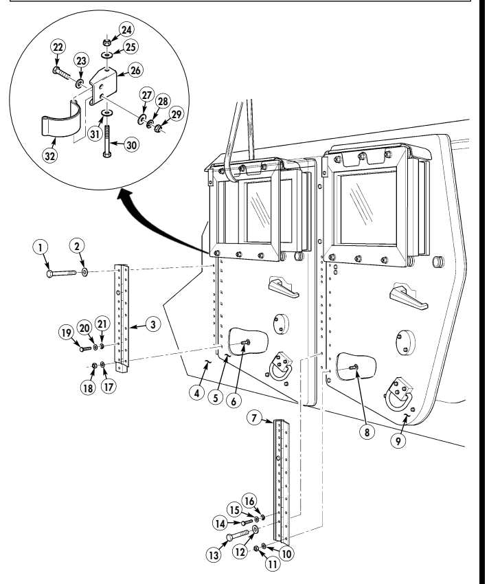

## J-61. Door/Door Hinge And Check Strap (Standard Threat) Maintenance (Cont'D)

c. Installation 1. Install doors (5) and (9), and door hinges (3) and (7) on vehicle (4) with nine capscrews (6) and (8),
washers (17) and (10), and locknuts (18) and (11).

2. Secure door hinges (3) and (7) to vehicle (4) with two washers (20) and (15), lockwashers (21) and (16),
and capscrews (19) and (14).

Perform step 3 for rear doors only.

Perform step 4 for front doors only.

3. Secure door hinge (7) on vehicle (4) with twelve capscrews (13) and washers (12). Tighten capscrews (13) to 31 lb-ft (42 N•m).

4. Secure door hinge (3) to vehicle (4) with ten capscrews (1) and washers (2). Tighten capscrews (1) to 31 lb-ft (42 N•m).

5. Install door hinge bracket (26) on doors (5) and (9) with two washers (23), capscrews (22),
washers (27), lockwashers (28), and locknuts (29).

6. Install check strap (32) on hinge bracket (26) with washer (31), capscrew (30), washer (25), and locknut (24).

J-61.  DOOR/DOOR HINGE AND CHECK STRAP (STANDARD THREAT)

# Maintenance (Cont'D)

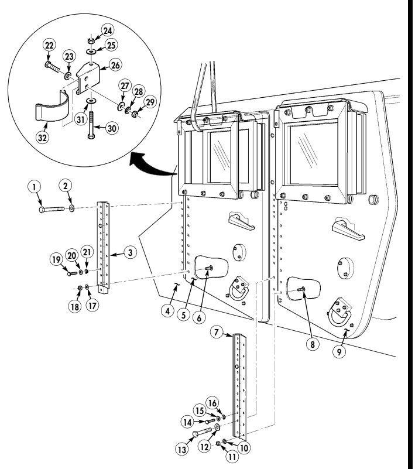

FOLLOW-ON TASK:  Adjust door (Appendix J, J-71).

# J-62. Door Window (Standard Threat) Replacement

This task covers:

| Applicable Models   |
|---------------------|

| MIT51A1, MIT5ZA1, MIT65      |
|------------------------------|
| Tools                        |
| General mechanic's tool kit: |

| Materials/Parts   |
|-------------------|

M1151A1, M1152A1, M1165A1, M1167 automotive (Appendix B, Item 1)
Six lockwashers (Appendix G, Item 174) Three lockwashers (Appendix G, Item 155)

a. Removal b. Installation

#### Warning

Door window is extremely heavy and must be supported during removal and installation. Failure to do so may result in injury to personnel or damage to equipment.

| TORQUE   |
|----------|

Replacement procedures for all door windows (standard threat) are basically the same. This procedure covers the left rear door window.

a. Removal 1. Remove three capscrews (11), lockwashers (12), and washers (13) from door water deflector (2) and frame plate (7). Discard lockwashers (12).

2. Remove four capscrews (1) and door water deflector (2) from door (3). 3. Remove six nuts (10), lockwashers (9), washers (8), and frame plate (7) from upper rollers (4) and lower rollers (5). Discard lockwashers (9).

4. Slide window (6) off upper rollers (4) and lower rollers (5).

#### B. Installation

1. Slide window (6) on upper rollers (4) and lower rollers (5). 2. Install frame plate (7) on upper rollers (4) and lower rollers (5) with six washers (8),
lockwashers (9), and nuts (10).

3. Install door water deflector (2) on door (3) with four capscrews (1). 4. Secure door water deflector (2) to door (3) with three washers (13), lockwashers (12), and capscrews (11).

# J-62. Door Window (Standard Threat) Replacement (Cont'D)

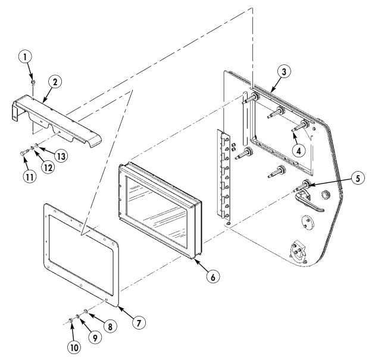

FOLLOW-ON TASK:
Install rearview mirror assembly (front door only) (standard threat doors)
(Appendix J, J-72).

# J-63. Door Glass And Handle (Standard Threat) Maintenance

This task covers:

| Applicable Models   |
|---------------------|

M1151A1, M1152A1, M1165A1, M1167 Tools General mechanic's tool kit:
automotive (Appendix B, Item 1)
Materials/Parts Sealing compound (Appendix C, item 68) Locknut (Appendix G, Item 77)
a. Removal b. Installation

#### Warning

| TORQUE        |
|---------------|
| METERS   FEET |

Door glass is extremely heavy and must be supported during removal and installation. Failure to do so may result in injury to personnel or damage to equipment.

- Replacement procedures for all door glass and handles
(standard threat) are basically the same. This procedure covers the left door glass and handle.

- Note position of seals for installation.

#### A. Removal

1. Remove four capscrews (1), washers (2), and glass retainer (12) from window frame (8). 2. Remove glass (11) from window frame (8). 3. Remove eight screws (4) and two roller tracks (3) from window frame (8). 4. Remove four screws (7) and handle (6) from window frame (8). 5. Remove seal (9) from spacer plate (10) and glass (11). 6. Remove seal (5) from window frame (8). 7. Remove two spacer plates (10) from glass (11). 8. Remove locknut (14), washer (15), capscrew (17), and washer (16) from window stop latch (13) and vehicle (18). Discard locknut (14).

9. Remove spring pin (19) and window stop latch (13) from vehicle (18).

#### B. Inspection

Inspect seals for damage. Replace if necessary.

# J-63. Door Glass And Handle (Standard Threat) Maintenance (Cont'D)

#### B. Installation

1. Install window stop latch (13) on vehicle (18) with spring pin (19). 2. Secure window stop latch (13) to vehicle (18) with capscrew (17), washer (16), washer (15) and locknut (14).

3. Install two spacer plates (10) on glass (11). 4. Apply a 1/8 in. (3 mm) bead of sealing compound to window frame (8) and glass (11). 5. Install seal (5) on window frame (8). 6. Install seal (9) on spacer plate (10) and glass (11). 7. Install handle (6) on window frame (8) with four screws (7). 8. Install two roller tracks (3) on window frame (8) with eight screws (4). 9. Install glass (11) on window frame (8).

10. Install glass retainer (12) on window frame (8) with four washers (2) and capscrews (1).

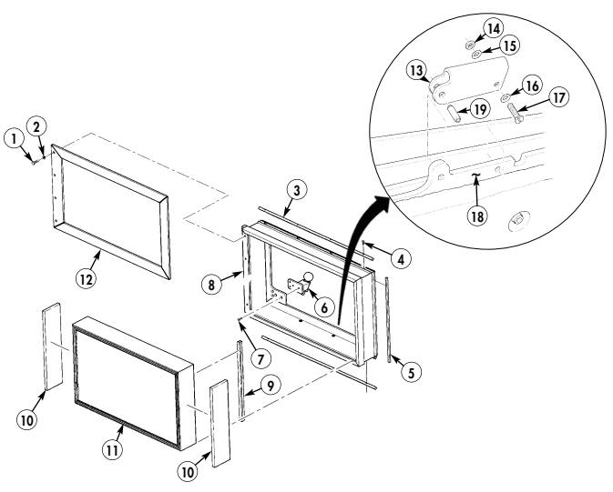

FOLLOW-ON TASK: Install door window (standard threat) (Appendix J, J-62).

# J-64. Door Window Rollers (Standard Threat) Replacement

This task covers:

Applicable Models M1151A1, M1152A1, M1165A1, M1167 Tools General mechanic's tool kit:
automotive (Appendix B, Item 1)
Torque wrench 1/2-in. drive, 250 lb-ft 
(Appendix B, Item 2.1)
Materials/Parts Seven lockwashers (Appendix G, Item 174)
a. Removal b. Installation

| Manual References    |
|----------------------|
| TM 9\-2320\-387\-24F |

| NOTE   |
|--------|

Equipment Condition

Replacement procedures for all door window rollers (standard threat) are basically the same. This procedure covers the left rear door window rollers.

#### A. Removal

1. Remove six roller sleeves (9) from window rollers (10). 2. Remove six nuts (4), lockwashers (3), washers (2), and window rollers (10) from door (1).

Discard lockwashers (3).

3. Remove nut (7), lockwasher (6), washer (5), and window roller (8) from door (1).

Discard lockwasher (6).

b. Installation

Window rollers and roller sleeves need to be installed with recessed sides facing inboard.

1. Install window roller (8) on door (1) with washer (5), lockwasher (6), and nut (7). Tighten nut (7) to 105 lb-ft (142 N•m).

2. Install six window rollers (10) on door (1) with six washers (2), lockwashers (3), and nuts (4).

Tighten nuts (4) to 105 lb-ft (142 N•m).

3. Install six roller sleeves (9) on window rollers (10).

J-64. DOOR WINDOW ROLLERS (STANDARD THREAT) REPLACEMENT (Cont'd)

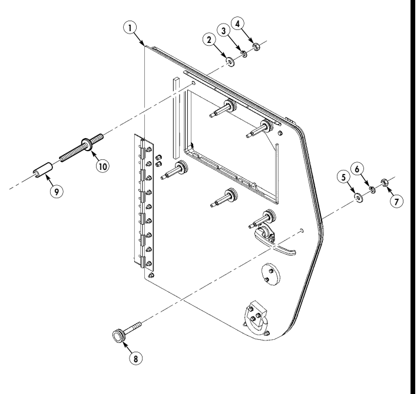

FOLLOW-ON TASK:  Install door window (standard threat) (Appendix J, J-62).

# J-65. Door Handle (Interior), Linkage Access Panel, And Pull Strap

(STANDARD THREAT) REPLACEMENT
This task covers:

Applicable Models

|                              |
|------------------------------|
| General mechanic's tool kit: |

M1151A1, M1152A1, M1165A1, M1167 Tools automotive (Appendix B, Item 1)
Torque wrench 3/8-in. drive, 75 lb-ft 
(Appendix B, Item 2.1)
a. Removal b. Installation

| NSN                 |
|---------------------|
| 5320\-00\-616\-4350 |
| 5320\-00\-584\-1285 |
| 5320\-00\-582\-3268 |

Replacement procedures for all interior door handles, linkage access panels, and pull straps (standard threat) are basically the same. This procedure covers the left rear interior door handle, linkage access panel, and pull strap.

a. Removal 1. Remove four capscrews (22), washers (23), and pull strap (12) from linkage access panel (7). 2. Remove two locknuts (16), washers (15), capscrews (13), and washers (14) from access panel (7) and lock (17). Discard locknuts (16).

3. Remove two capscrews (18), lockwashers (19), and washers (20) from access panel (7), lock (17), and spacer (21). Discard lockwashers (19).

4. Remove seven capscrews (24), lockwashers (25), washers (26), and linkage access panel (7) from door bracket (1). Discard lockwashers (25).

5. Remove three capscrews (10) and washers (9) from door handle (8) and linkage access panel (7). 6. Remove spring tension washer (11), clip (6), clip (2), washer (3), wave washer (4), and door handle (8) from linkage access panel (7) and lever (5).

#### B. Installation

1. Install door handle (8) on linkage access panel (7) and lever (5) with wave washer (4), washer (3),
clip (2), spring tension washer (11), and clip (6).

2. Secure door handle (8) to linkage access panel (7) with three washers (9) and capscrews (10) .

Tighten capscrews (10) to 8 lb-ft (11 N•m).

3. Install linkage access panel (7) on door bracket (1) with seven washers (26), lockwashers (25), and capscrews (24). Tighten capscrews (24) to 8 lb-ft (11 N•m).

4. Install lock (17) on spacer (21) and access panel (7) with two washers (20), lockwashers (19), and capscrews (18). Tighten capscrews (18) to 17 lb-ft (23 N•m).

5. Secure lock (17) to access panel (7) with two washers (14), capscrews (13), washers (15), and locknuts (16).

6. Install pull strap (12) on linkage access panel (7) with four washers (23) and capscrews (22).

Tighten capscrews (22) to 17 lb-ft (23 N•m).

J-65.  DOOR HANDLE (INTERIOR), LINKAGE ACCESS PANEL, AND PULL STRAP
(STANDARD THREAT) REPLACEMENT (Cont'd)

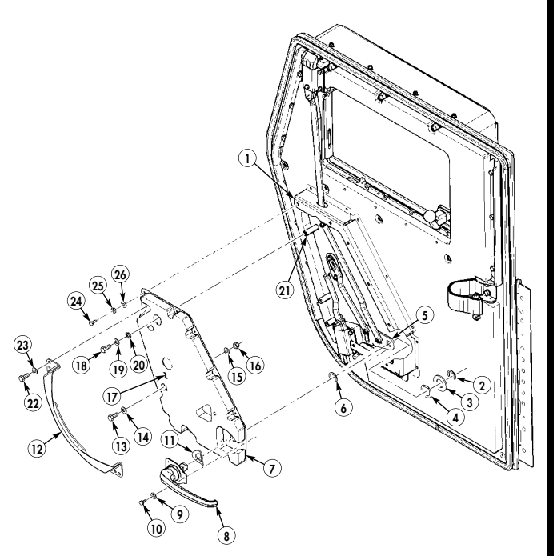

# J-66. Door Handle (Exterior), Wrench Access Cover, And Tiedown (Standard Threat) Replacement

This task covers:

Applicable Models M1151A1, M1152A1, M1165A1, M1167 Tools General mechanic's tool kit:
automotive (Appendix B, Item 1)
Torque wrench 3/8-in. drive, 75 lb-ft 
(Appendix B, Item 2.1)
Materials/Parts Two lockwashers (Appendix G, Item 146) Three lockwashers (Appendix G, Item 144) Three locknuts (Appendix G, Item 77) Locknut (Appendix G, Item 132)
a. Removal b. Installation

| Manual References   |
|---------------------|
| חרים חפפים חוזי     |

| 13116   | l\-9132   | 5306\-00\-151\-1422   |
|---------|-----------|-----------------------|
| 15116   | l\-13132  | 5306\-00\-151\-1421   |
| l\-1/16 | l\-17/32  | 5306\-00\-151\-1420   |
| l\-3116 | l\-21/32  | 5306\-00\-151\-1419   |

TM 9-2320-387-24P

Replacement procedures for all exterior door handles, wrench access covers, and tiedowns (standard threat) are basically the same. This procedure covers the left rear exterior door handle, wrench access cover, and tiedown.

#### A. Removal

1. Remove two locknuts (3), washers (2), capscrews (20), and washers (21) from exterior door handle (22)
and door (1). Discard locknuts (3).

2. Remove locknut (19), washer (18), capscrew (7), and washer (8), from exterior door handle (22) and door (1). Discard locknut (19).

3. Remove locknut (4), washer (5), washer (6), and exterior door handle (22) from door (1).

Discard locknut (4).

4. Remove three capscrews (13), lockwashers (12), washers (11), tiedown retainer (10), and tiedown ring (9) from door (1). Discard lockwashers (12).

5. Remove two capscrews (17), lockwashers (16), washers (15), and wrench access cover (14) from door (1). Discard lockwashers (16).

# J-66.  Door Handle (Exterior), Wrench Access Cover, And Tiedown (Standard Threat) Replacement (Cont'D)

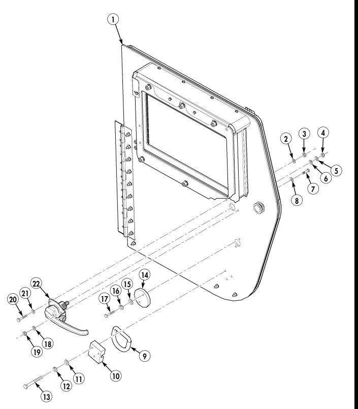

J-66. DOOR HANDLE (EXTERIOR), WRENCH ACCESS COVER, 

## And Tiedown (Standard Threat) Replacement (Cont'D)

#### B. Installation

1. Install wrench access cover (14) on door (1) with two washers (15), lockwashers (16), and capscrews (17). Tighten capscrews (17) to 31 lb-ft (42 N•m).

2. Install tiedown ring (9) and tiedown retainer (10) on door (1) with three washers (11),
lockwashers (12) and capscrews (13). Tighten capscrews (13) to 31 lb-ft (42 N•m).

3. Install exterior door handle (22) on door (1) with washer (6), washer (5), and locknut (4). 4. Secure exterior door handle (22) to door (1) with washer (8), capscrew (7), washer (18), and locknut (19). Tighten capscrews (7) to 12 lb-ft (16 N•m).

5. Secure exterior door handle (22) to door (1) with two washers (21), capscrews (20), washers (2), and locknuts (3). Tighten capscrews (20) to 12 lb-ft (16 N•m).

# J-66.  Door Handle (Exterior), Wrench Access Cover, And Tiedown (Standard Threat) Replacement (Cont'D)

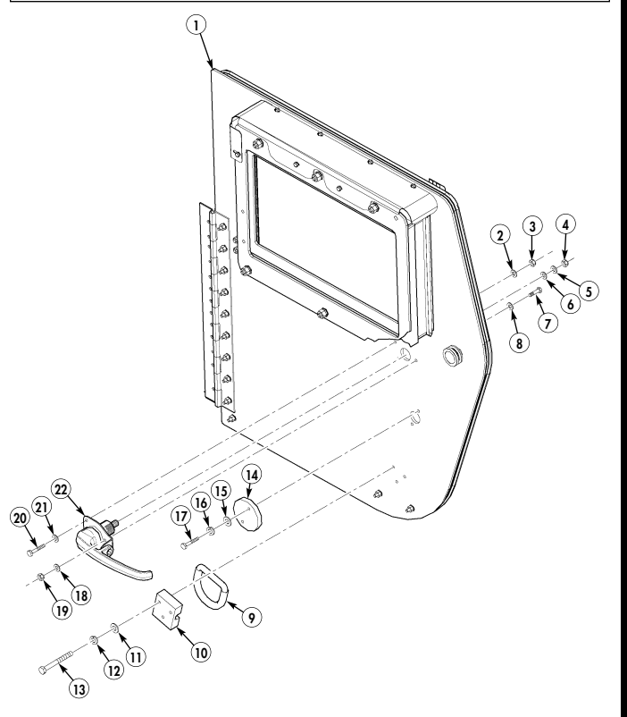

FOLLOW-ON TASK:  Install linkage access panel (Appendix J, J-65).

# J-67. Door Lock And Linkage (Standard Threat) Replacement

This task covers:

a. Removal b. Installation

| 2   | Balance Weights                  | 5595966    | 6670\-01\-261\-6844   |
|-----|----------------------------------|------------|-----------------------|
| 3   | Bearing Sleeve                   | 12L18F     | 3120\-00\-485\-1017   |
| 4   | Boot Service Kit                 | 57K3515    | 2530\-01\-457\-1337   |
| 5   | Bracket, Battery Holddown, Front | 12339904   | 5340\-01\-470\-7135   |
| 6   | Bracket, Battery Holddown, Rear  | 12339905   | 5340\-01\-470\-7160   |
| 6.1 | Bracket, Mounting, LH            | 2005207\-1 | 5340\-01\-542\-3351   |
| 6.2 | Bracket, Mounting, RH            | 2005207\-2 | 5340\-01\-542\-4800   |
| 7   | Capscrew                         | 9423557    | 5306\-01\-360\-1123   |
| 8   | Capscrew                         | 5597349    | 5306\-01\-276\-1621   |

Fourteen lockwashers (Appendix G, Item 146) Two cotter pins (Appendix G, Item 25)

Replacement procedures for all door locks and linkages (standard threat) are basically the same. This procedure covers the left rear door lock and linkage.

#### A. Removal

1. Remove two cotter pins (41) and (43), washers (42) and (44), and lock (35) from middle link (34) and lower link (40). Discard cotter pins (41) and (43).

2. Remove capscrew (57) and upper link (56) from upper combat lock (3). 3. Remove four lockwashers (2), capscrews (1), upper combat lock (3), and shim(s) (4) from spacer block (10). Discard lockwashers (2).

4. Remove two washers (5), lockwashers (6), capscrews (7), upper guide (8), and shim(s) (9) from spacer block (10). Discard lockwashers (6).

5. Remove capscrew (13), washer (12), screw (14), and spacer block (10) from door (11). 6. Remove capscrew (39) from lower combat lock (38) and lower link (40). 7. Remove four lockwashers (37), capscrews (36), lower combat lock cover (32), lower combat lock (38),
and shim(s) (31), from spacer block (30). Discard lockwashers (37).

8. Remove two lockwashers (27), capscrews (26), lower guide (28), and shim(s) (29) from spacer block (30). Discard lockwashers (27).

9. Remove washer (17), lockwasher (16), capscrew (15), and spacer block (30) from door (11). Discard lockwasher (16).

10. Remove spring (18) from lower lever (19) and door (11). 11. Remove washer (54), capscrew (55), washer (53), and upper link (56) from upper lever (51). 12. Remove washer (46), capscrew (45), middle link (33), and washer (47) from upper lever (51). 13. Remove nut (48), washer (49), and lockwasher (50) from upper lever (51) and stud (52) on door (11).

Discard lockwasher (50).

14. Remove washer (21), capscrew (22), washer (20), and middle link (34) from lower lever (19). 15. Remove washer (23), capscrew (25), washer (24), and middle link (33) from lower lever (19).

# J-67.  Door Lock And Linkage (Standard Threat) Replacement (Cont'D)

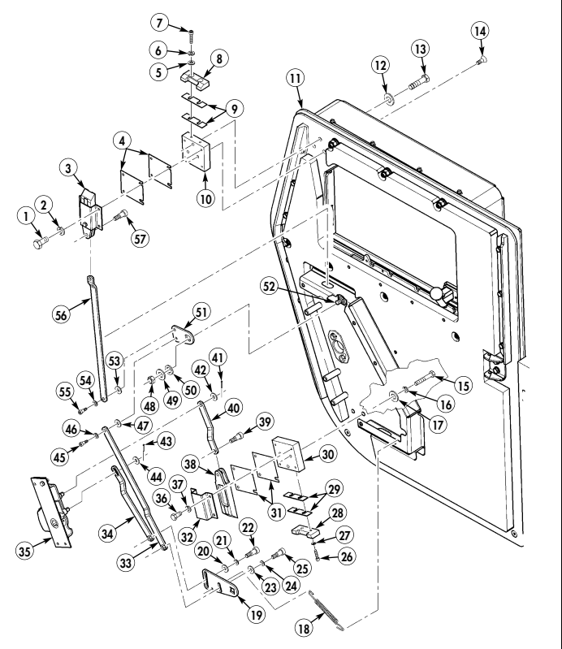

# J-67. Door Lock And Linkage (Standard Threat) Replacement (Cont'D)

#### B. Installation

1. Install middle link (33) on lower lever (19) with washer (23), washer (24), and capscrew (25). 2. Install middle link (34) on lower lever (19) with washer (20), washer (21), and capscrew (22). 3. Install upper lever (51) on stud (52) on door (11) with lockwasher (50), washer (49), and nut (48). 4. Install middle link (33) on upper lever (51) with washer (47), washer (46), and capscrew (45). 5. Install upper link (56) on upper lever (51), with washer (53), washer (54), and capscrew (55). 6. Install spring (18) on lower lever (19) and door (11). 7. Install spacer block (30) on door (11) with washer (17), lockwasher (16), and capscrew (15). 8. Install lower guide (28), and shim(s) (29) on spacer block (30) with two lockwashers (27) and capscrews (26).

9. Install lower combat lock cover (32), lower combat lock (38), and shim(s) (31), on spacer block (30)
with four lockwashers (37) and capscrews (36).

10. Install lower combat lock (38) on lower link (40) with capscrew (39). 11. Install spacer block (10) on door (11) with washer (12), capscrew (13), and screw (14). 12. Install upper guide (8) and shim(s) (9) on spacer block (10) with two washers (5), lockwashers (6),
and capscrews (7).

13. Install upper combat lock (3) and shim(s) (4) on spacer block (10) with four lockwashers (2) and capscrews (1).

14. Install upper link (56) on upper combat lock (3) with capscrew (57). 15. Install lock (35) on middle link (34) and lower link (40) with two washers (42) and (44), and cotter pins (41) and (43).

# J-67. Door Lock And Linkage (Standard Threat) Replacement (Cont'D)

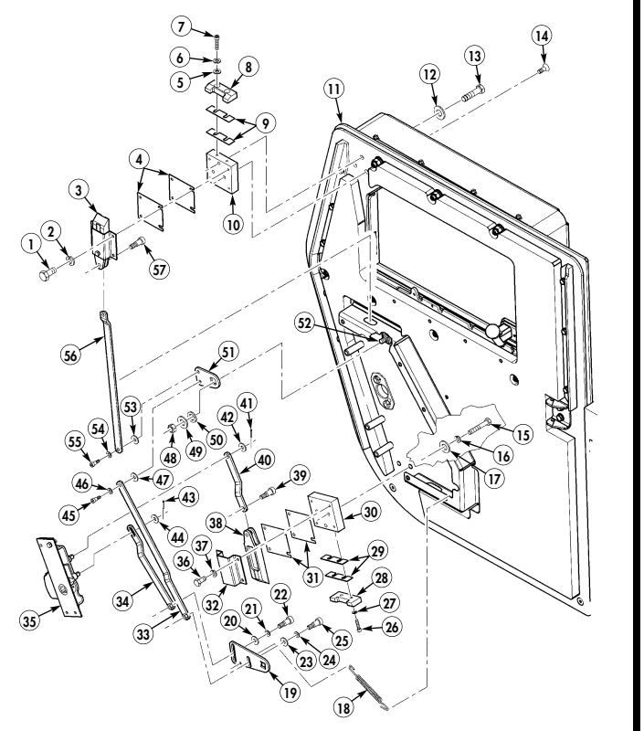

FOLLOW-ON TASKS: - • Install interior door handle and linkage access panel (Appendix J, J-65).

- Adjust door (Appendix J, J-71).

J-68. FRONT DOOR INSULATION, SEAL, AND RETURN (STANDARD THREAT)

## Maintenance

This task covers:
b. Inspection

Applicable Models M1151A1, M1152A1, M1165A1, M1167 Tools General mechanic's tool kit:
automotive (Appendix B, Item 1)
Torque wrench 3/8-in. drive, 75 lb-ft 
(Appendix B, Item 2.1)
Materials/Parts Silicone compound (Appendix C, Item 74) Drycleaning solvent (Appendix C, Item 26) Ten lockwashers (Appendix G, Item 146)
a. Removal c. Installation

| Manual References                                    |
|------------------------------------------------------|
| TM 9\-2320\-387\-24P                                 |
| Equipment Condition                                  |
| Door pull strap (standard threat) removed            |
| (Appendix J, J\-65).                                 |
| General Safety Instructions                          |
| Dry cleaning solvent is highly flammable. Do not     |
| perform this procedure near fire, flames, or sparks. |
| Maintenance Level                                    |
| Unit                                                 |

#### Warning

Dry cleaning solvent is highly flammable. Do not perform this procedure near fire, flames, or sparks. Injury to personnel or damage to equipment will result.

Replacement procedures for front door insulation, seal, and returns (standard threat) are basically the same. This procedure covers the left front door insulation, seal, and returns.

#### A. Removal

1. Remove six capscrews (8), lockwashers (9), washers (10), and door return (11) from door (2).

Discard lockwashers (9).

2. Remove four capscrews (6), lockwashers (5), washers (4), and door return (3) from door (2).

Discard lockwashers (5).

3. Remove insulations (7) and (12) from door (2). 4. Clean surface of door (2) with drycleaning solvent to remove adhesive. 5. Remove seal (1) from door (2).

#### B. Inspection

1. Inspect door seal (1) for damage. Replace if necessary. 2. Inspect insulations (7) and (12) for damage. Replace if necessary.

# J-68. Front Door Insulation, Seal, And Return (Standard Threat) Maintenance (Cont'D)

c. Installation

Pinch seal to ensure snug fit around door. Use rubber mallet if necessary.

1. Install seal (1) on door (2). 2. Apply thin coat of silicone compound adhesive on door insulations (7) and (12). 3. Install insulations (7) and (12) on door (2). 4. Install door return (3) on door (2) with four washers (4), lockwashers (5), and capscrews (6).

Tighten capscrews (6) to 17 lb-ft (23 N•m).

5. Install door return (11) on door (2) with six washers (10), lockwashers (9), and capscrews (8).

Tighten capscrews (8) to 17 lb-ft (23 N•m).

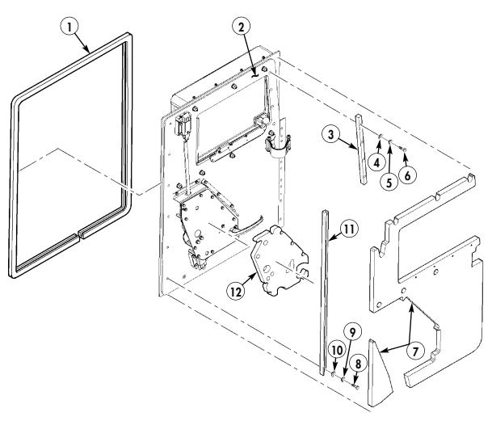

FOLLOW-ON TASK: Install door pull strap (standard threat) (Appendix J, J-65).

J-69. REAR DOOR INSULATION, SEAL, AND RETURN (STANDARD THREAT)

# Maintenance

This task covers:
b. Inspection

| Applicable Models       |
|-------------------------|
| M1151A1, M1165A1, M1167 |
| Tools                   |

General mechanic's tool kit:
automotive (Appendix B, Item 1)
Torque wrench 3/8-in. drive, 75 lb-ft 
(Appendix B, Item 2.1)
Materials/Parts Silicone compound (Appendix C, Item 74) Drycleaning solvent (Appendix C, Item 26) Ten lockwashers (Appendix G, Item 146)
a. Removal c. Installation

| Maintenance Level   |
|---------------------|
| Unit                |

Dry cleaning solvent is highly flammable. Do not perform this procedure near fire, flames, or sparks.

| Manual References                         |
|-------------------------------------------|
| TM 9\-2320\-387\-24P                      |
| Equipment Condition                       |
| Door pull strap (standard threat) removed |
| (Appendix J, J\-65).                      |
| General Safety Instructions               |

#### Warning

Dry cleaning solvent is highly flammable. Do not perform this procedure near fire, flames, or sparks. Injury to personnel or damage to equipment will result.

Replacement procedures for rear door insulation, seal, and returns are basically the same. This procedure covers the left rear door insulation, seal, and returns.

#### A. Removal

1. Remove four capscrews (6), lockwashers (5), washers (4), and return (3) from door (2).

Discard lockwashers (5).

2. Remove six capscrews (10), lockwashers (11), washers (12), and return (8) from door (2).

Discard lockwashers (11).

3. Remove insulations (7) and (9) from door (2). 4. Clean surface of door (2) with drycleaning solvent to remove adhesive. 5. Remove seal (1) from door (2).

#### B. Inspection

1. Inspect door seal (1) for damage. Replace if necessary. 2. Inspect insulations (7) and (9) for damage. Replace if necessary.

# J-69. Rear Door Insulation, Seal, And Return (Standard Threat) Maintenance (Cont'D)

c. Installation

Pinch seal to ensure snug fit around door. Use rubber mallet if necessary.

1. Install seal (1) on door (2). 2. Apply thin coat of silicone compound adhesive on door insulations (7) and (9). 3. Install insulations (7) and (9) on door (2). 4. Install door return (8) on door (2) with six washers (12), lockwashers (11), and capscrews (10).

Tighten capscrews (10) to 17 lb-ft (23 N•m).

5. Install door return (3) on door (2) with four washers (4), lockwashers (5), and capscrews (6).

Tighten capscrews (6) to 17 lb-ft (23 N•m).

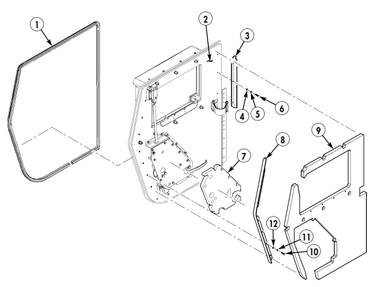

FOLLOW-ON TASK: Install door pull strap (standard threat) (Appendix J, J-65).

# J-70. Door Bracket (Standard Threat) Replacement

This task covers:

Applicable Models M1151A1, M1152A1, M1165A1, M1167 Tools General mechanic's tool kit:
automotive (Appendix B, Item 1)
Torque wrench 3/8-in. drive, 75 lb-ft 
(Appendix B, Item 2.1)
Materials/Parts Nine lockwashers (Appendix G, Item 146)
a. Removal b. Installation

| Manual References                              |
|------------------------------------------------|
| TM 9\-2320\-387\-24P                           |
| Equipment Condition                            |
| Linkage access panel (standard threat) removed |
| (Appendix J, J\-65).                           |
| Maintenance Level                              |
| Unit                                           |

Replacement procedures for all door brackets (standard threat) are basically the same. This procedure covers the left rear door bracket.

a. Removal Remove nine capscrews (1), lockwashers (2), washers (3), and bracket (4) from door (5). Discard lockwashers (2).

#### B. Installation

Install bracket (4) on door (5) with nine washers (3), lockwashers (2), and capscrews (1). Tighten capscrews (1) to 17 lb-ft (23 N•m).

# J-70. Door Bracket (Standard Threat) Replacement (Cont'D)

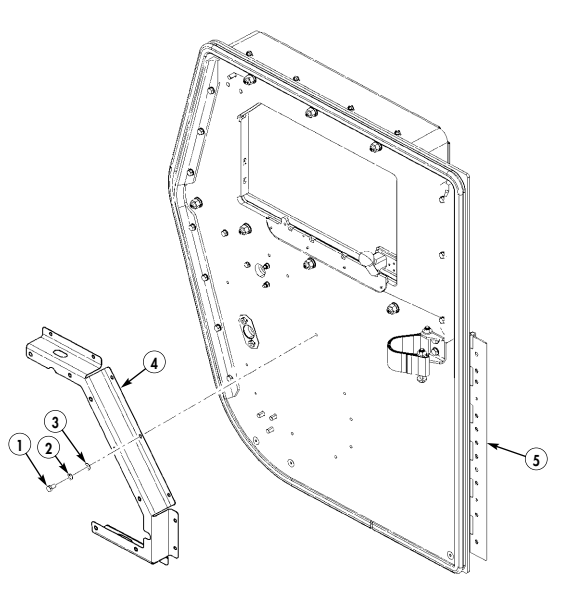

FOLLOW-ON TASK:  Install linkage access panel (standard threat) (Appendix J, J-65).

# J-71. Door (Standard Threat) Adjustment

This task covers:
a. Adjustment

Applicable Models M1151A1, M1152A1, M1165A1, M1167 Tools General mechanic's tool kit:
automotive (Appendix B, Item 1)
Materials/Parts Twelve lockwashers (Appendix G, Item 146)
(if required)

| Manual References .   |
|-----------------------|

TM 9-2320-387-24P
General Safety Instructions Do not remove all four capscrews and washers from top door latch.

Maintenance Level Unit

- Adjustment procedures for all doors (standard threat) are basically the same. This procedure covers the front door adjustment.

- Adjust top latch first and if necessary, adjust bottom latch.

#### A. Adjustment

1. Remove two capscrews (1) and lockwashers (2) from top door latch (8) and using dovetail shim(s) (5),
adjust top dovetail (3) to 0.015 inch clearance between top dovetail (3) and bottom of header armor (4).

#### Warning

Do not remove all four capscrews and washers from top door latch at one time. Removal of all four capscrews and washers will cause tension spring to release which can result in injury to personnel.

2. Remove two capscrews (6) and lockwashers (7) from top door latch (8). 3. Loosen two remaining capscrews (6) and lockwashers (7) on top door latch (8) and using combat lock shim(s) (9), adjust top door latch (8) so door closes with desired force and door seal is compressed.

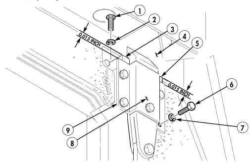

## J-71. Door (Standard Threat) Adjustment (Cont'D)

4. Remove two capscrews (13) and lockwashers (12) from bottom combat latch (14) and using dovetail shim(s) (10) adjust bottom dovetail (15) to 0.015 inch clearance between bottom dovetail (15) and top of rocker armor (16).

5. Remove two capscrews (17), lockwashers (18), and combat latch (14) from door (19). 6. Loosen two remaining capscrews (17) and lockwashers (18) from combat latch (14). 7. Using combat lock shim(s) (11) adjust bottom combat latch (14) so combat latch (14) engages freely on inboard side of rocker armor (16).

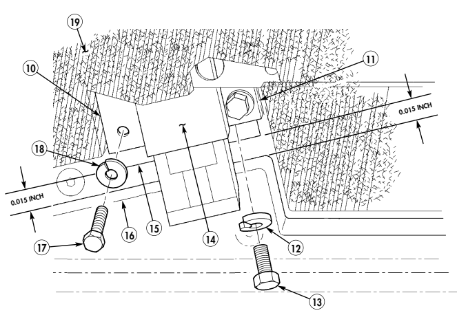

# J-72. Rearview Mirror Assembly (Standard Threat Door) Maintenance

This task covers:
b. Disassembly d. Installation

Applicable Models M1151A1, M1152A1, M1165A1, M1167 Tools General mechanic's tool kit:
automotive (Appendix B, Item 1)
Torque wrench 3/8-in. drive, 75 lb-ft 
(Appendix B, Item 2.1)
a. Removal c. Assembly

#### Materials/Parts

Two lockwashers (Appendix G, Item 145) Five locknuts (Appendix G, Item 82) Two locknuts (Appendix G, Item 132)

| Manual References    |
|----------------------|
| TM 9\-2320\-387\-24P |
| Maintenance Level    |
| Unit                 |

Replacement procedures for left and right rearview mirror assemblies (standard threat doors) are basically the same. This procedure covers the right rearview mirror assembly.

#### A. Removal

Remove two locknuts (1), washers (2), capscrews (5), and washers (6) from mirror assembly (4) and door side plate (3). Discard locknuts (1).

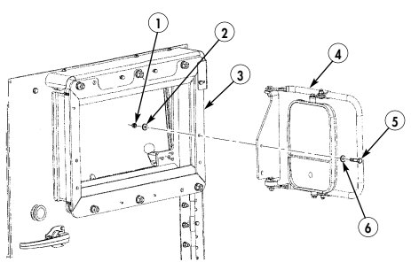

# J-72. Rearview Mirror Assembly (Standard Threat Door) Maintenance (Cont'D)

b. Disassembly 1. Remove locknut (9), washer (10), capscrew (11), washer (12), and washer (13), from mounting bracket (28) and mirror arm assembly (14). Discard locknut (9).

2. Remove two locknuts (19) and (8), washers (20) and (7), and mirror lock (21) from mirror arm assembly (14) and bracket (28). Discard locknuts (19) and (8).

To remove clamps, slide clamps off mirror arm assembly.

3. Remove two locknuts (15), washers (16), capscrews (18), and clamps (17) from brackets (25).

Discard locknuts (15).

4. Remove two capscrews (22), lockwashers (23), washers (24), spacers (26), and brackets (25) from mirror (27). Discard lockwashers (23).

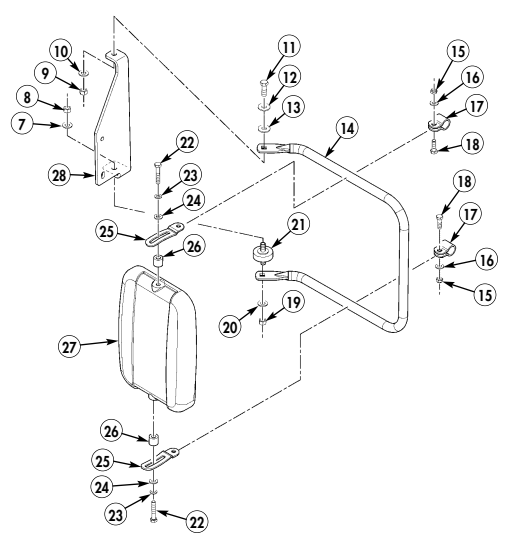

# J-72. Rearview Mirror Assembly (Standard Threat Door) Maintenance (Cont'D)

c. Assembly

- To install clamps, slide clamps on mirror assembly. - Ensure clamps are positioned on mirror arm assembly to align with center of mirror head.

- Spacers must be positioned between mirror and brackets for proper installation.

1. Install two brackets (15) on mirror (17) with two spacers (16), washers (14), lockwashers (13), and capscrews (12). Tighten capscrews (12) to 17 lb-ft (23 N•m).

2. Install two brackets (15) on clamps (7) with two capscrews (8), washers (6), and locknuts (5).

Tighten capscrews (8) to 24 lb-ft (33 N•m).

3. Install mirror lock (11) on mirror arm assembly (4) and bracket (18) with two washers (10) and (19),
and locknuts (9) and (20).

4. Install mirror arm assembly (4) on mounting bracket (18) with washer (3), washer (2), capscrew (1),
washer (22), and locknut (21). Tighten capscrew (1) to 11 lb-ft (44 lb-ft).

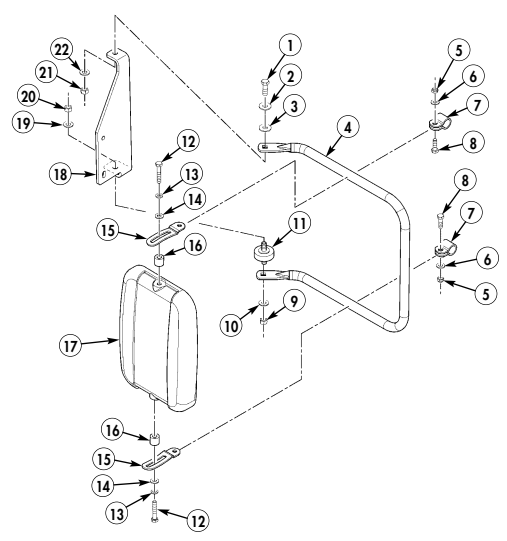

## J-72. Rearview Mirror Assembly (Standard Threat Door) Maintenance (Cont'D)

#### D. Installation

Install mirror assembly (26) on door side plate (25) with two washers (28), capscrews (27), washers (24), and locknuts (23). Tighten capscrews (27) to 44 lb-ft (60 N•m).

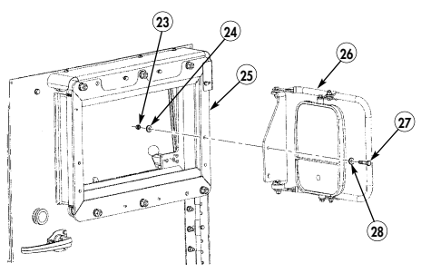

# Appendix K Ied Overlay (Frag 1) (M1151A1, M1152A1, M1165A1, M1167 W/Perimeter B Kit) Kit

Section I. INTRODUCTION
K-1. SCOPE
This appendix includes complete instructions for the maintenance of the IED Overlay (Frag 1) (M1151A1, M1152A1, M1165A1, M1167 w/Perimeter B Kit) Kit.

## K-2. General

Your vehicle may come equipped with the IED Overlay (Frag 1) (M1151A1, M1152A1, M1165A1, M1167 w/Perimeter B Kit) Kit. The following procedures provide you with the instructions you will need to maintain or replace any of the components within this kit.

## Section Ii. Ied M1167 Overlay (Frag 1) (M1151A1, M1152A1, M1165A1 W/Perimeter B Kit) Kit Maintenance K-3. Ied Overlay (Frag 1) (M1151A1, M1152A1, M1165A1, M1167 W/Perimeter B Kit) Kit Maintenance Task Summary

| 203   | O\-Ring   | M83461/1\-236   | 5331\-01\-183\-0971   |
|-------|-----------|-----------------|-----------------------|
| 204   | O\-Ring   | 33\-00778       | 5331\-01\-419\-7754   |
| 205   | O\-Ring   | 33\-00779       | 5331\-01\-460\-2442   |
| 206   | O\-Ring   | 33\-00781       | 5331\-01\-419\-7755   |
| 207   | O\-Ring   | 33\-00777       | 5331\-01\-420\-1795   |
| 208   | O\-Ring   | 4397059\-016    | 5331\-01\-439\-8821   |
| 209   | O\-Ring   | 5741062         | 5330\-01\-209\-7726   |
| 210   | O\-Ring   | 3921936         | 5331\-01\-232\-2145   |
| 211   | O\-Ring   | 33\-00780       | 5331\-01\-421\-4960   |
| 212   | O\-Ring   | MS28775\-110    | 5331\-00\-585\-6663   |
| 213   | O\-Ring   | 8658110         | 5330\-01\-043\-5572   |
| 214   | O\-Ring   | 24201388        | 5330\-01\-456\-7886   |
| 215   | O\-Ring   | 5939517         | 5330\-01\-487\-7129   |
| 216   | O\-Ring   | 274244          | 5331\-00\-935\-9136   |
| 217   | O\-Ring   | M83461/1\-020   | 5331\-01\-107\-4950   |
| 218   | O\-Ring   | 299C413P3       | 5331\-00\-676\-8062   |
| 219   | O\-Ring   | 12339002        | 5331\-01\-195\-8889   |
| 220   | O\-Ring   | 12340395        | 5331\-00\-580\-6586   |
| 221   | O\-Ring   | 1249\-4         | 5331\-00\-805\-2966   |
| 222   | O\-Ring   | 5740436         | 5330\-01\-157\-1884   |
| 223   | O\-Ring   | 983\-110.01     |                       |
| 224   | O\-Ring   | 983\-9537044DO  |                       |
| 225   | O\-Ring   | 983\-WH11\-105  |                       |
| 226   | O\-Ring   | 11639519\-1     | 5331\-00\-463\-0200   |
| 227   | O\-Ring   | 11639519\-2     | 5310\-00\-462\-0907   |

# K-4. Left Lower A-Pillar Ied Overlay (Frag 1) Maintenance

This task covers:
b. Inspection

Applicable Models M1151A1, M1152A1, M1165A1, M1167 w/Perimeter B Kit Tools General mechanic's tool kit:
automotive (Appendix B, Item 1)
Torque wrench 3/8-in. drive, 75 lb-ft 
(Appendix B, Item 2.1)
Materials/Parts Lockwasher (Appendix G, Item 144) Five locknuts (Appendix G, Item 106)
a. Removal c. Installation

| Manual References                              |
|------------------------------------------------|
| TM 9\-2320\-387\-24P                           |
| Equipment Condition                            |
| · Upper rocker plate (Frag 1) removed (M1152A1 |
| w/Perimeter B Kit only) (Appendix K, K\-16).   |
| · Upper rocker plate (Frag 1) removed (M1165A1 |
| w/Perimeter B Kit only) (Appendix K, K\-15).   |
| · Left front door removed (Frag 5)             |
| (Appendix M, M\-4).                            |
| Maintenance Level                              |
| Unit                                           |

a. Removal 1. Remove capscrew (5), lockwasher (4), and washer (3) from left lower A-pillar IED overlay (2) and body (1). Discard lockwasher (4).

2. Remove five locknuts (10), washers (9), capscrews (6), washers (7), and left lower A-pillar IED
overlay (2) from front underbody armor (8) and body (1). Discard locknuts (10).

b. Inspection Refer to para. 10-56 for nut insert inspection and replacement.

#### C. Installation

1. Install left lower A-pillar IED overlay (2) on body (1) and front underbody armor (8) with six washers (7), capscrews (6), washers (9), and locknuts (10). Tighten capscrews (6) to 44 lb-ft (59 N•m).

2. Secure left lower A-pillar IED overlay (2) to body (1) with washer (3), lockwasher (4), and capscrew (5). Tighten capscrew (5) to 31 lb-ft (42 N•m).

# K-4. Left Lower A-Pillar Ied Overlay (Frag 1) Maintenance (Cont'D)

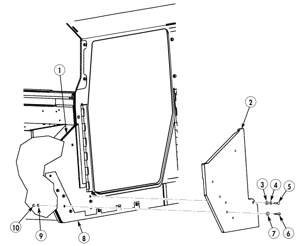

FOLLOW-ON TASKS: - Install front door (Frag 5) (Appendix M, M-4)
- Install upper rocker plate (Frag 1) (M1165A1 w/Perimeter B Kit only)
(Appendix K, K-15).

- Install upper rocker plate (Frag 1) (M1152A1 w/Perimeter B Kit only)
(Appendix K, K-16).

# K-5. Left Upper A-Pillar Ied Overlay (Frag 1) Maintenance (M1151A1 W/Perimeter B Kit)

This task covers:
b. Inspection

Applicable Models M1151A1 w/Perimeter B Kit Tools General mechanic's tool kit:
automotive (Appendix B, Item 1)
Torque wrench 3/8-in. drive, 75 lb-ft 
(Appendix B, Item 2.1)
a. Removal c. Installation

| Materials/Parts                          |
|------------------------------------------|
| Three lockwashers (Appendix G, Item 145) |
| Locknut (Appendix G, Item 106)           |
| Manual References                        |
| TM 9\-2320\-387\-24P                     |
| Maintenance Level                        |
| Unit                                     |

#### A. Removal

1. Remove locknut (1), washer (2), capscrew (9), and washer (8) from left upper A-pillar IED overlay (4)
and A-pillar bracket (3). Discard locknut (1).

2. Remove three capscrews (7), lockwashers (6), washers (5), and left upper A-pillar IED overlay (4)
from A-pillar bracket (3). Discard lockwashers (6).

b. Inspection Refer to para. 10-56 for nut insert inspection and replacement.

c. Installation 1. Install left upper A-pillar IED overlay (4) on A-pillar bracket (3) with three washers (5), lockwashers (6),
and capscrews (7). Tighten capscrews (7) to 17 lb-ft (23 N•m).

2. Secure left upper A-pillar IED overlay (4) to A-pillar bracket (3) with washer (8), capscrew (9),
washer (2), and locknut (1). Tighten capscrew (9) to 24 lb-ft (32 N•m).

# K-5.  Left Upper A-Pillar Ied Overlay (Frag 1) Maintenance (M1151A1 W/Perimeter B Kit) (Cont'D)

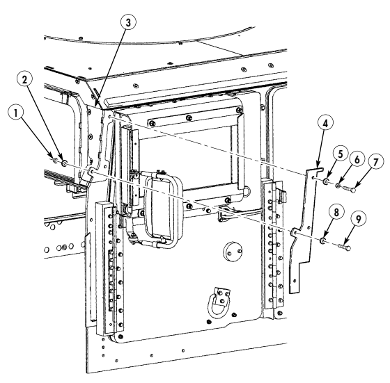

# K-6. Left Upper A-Pillar Ied Overlay (Frag 1) Maintenance (M1152A1, M1165A1, M1167 W/Perimeter B Kit)

This task covers:
b. Inspection

Applicable Models M1152A1, M1165A1, M1167 w/Perimeter B Kit Tools General mechanic's tool kit:
automotive (Appendix B, Item 1)
Torque wrench 3/8-in. drive, 75 lb-ft 
(Appendix B, Item 2.1)
a. Removal c. Installation

#### Materials/Parts

Three lockwashers (Appendix G, Item 145) Locknut (Appendix G, Item 106)

| Manual References    |
|----------------------|
| TM 9\-2320\-387\-24P |
| Maintenance Level    |
| Unit                 |

Replacement procedures for M1152A1, M1165A1, and M1167 left upper A-pillar IED overlay assemblies are the same. This procedure covers the M1152A1 left upper A-pillar IED overlay assembly.

#### A. Removal

1. Remove locknut (1), washer (2), capscrew (9), and washer (10) from left upper A-pillar IED
overlay (4) and A-pillar bracket (3). Discard locknut (1).

2. Remove three capscrews (8), lockwashers (7), washers (6), plate (5), and left upper A-pillar IED
overlay (4) from A-pillar bracket (3). Discard lockwashers (7).

b. Inspection Refer to para. 10-56 for nut insert inspection and replacement.

c. Installation 1. Install left upper A-pillar IED overlay (4) and plate (5) on A-pillar bracket (3) with three washers (6),
lockwashers (7), and capscrews (8). Tighten capscrews (8) to 17 lb-ft (23 N•m).

2. Secure left upper A-pillar IED overlay (4) to A-pillar bracket (3) with washer (10), capscrew (9),
washer (2), and locknut (1). Tighten capscrew (9) to 24 lb-ft (32 N•m).

K-6.  LEFT UPPER A-PILLAR IED OVERLAY (FRAG 1) MAINTENANCE
(M1152A1, M1165A1, M1167 W/PERIMETER B KIT)(Cont'd)
■

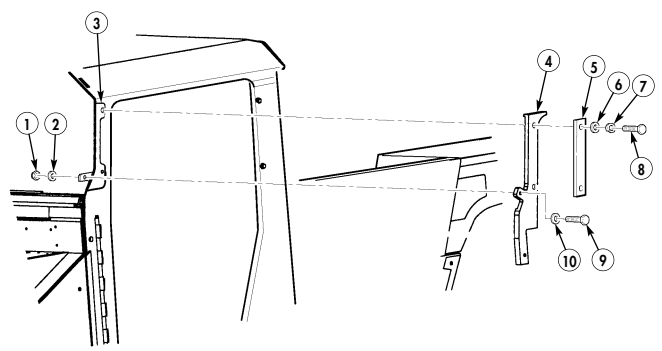

# K-7. Right A-Pillar Ied Overlay (Frag 1) Maintenance (M1151A1 W/Perimeter B Kit)

This task covers:
b. Inspection

Applicable Models M1151A1 w/Perimeter B Kit Tools General mechanic's tool kit:
automotive (Appendix B, Item 1)
Torque wrench 3/8-in. drive, 75 lb-ft 
(Appendix B, Item 2.1)
Materials/Parts Five lockwashers (Appendix G, Item 144) Three lockwashers (Appendix G, Item 145) Five locknuts (Appendix G, Item 106) Locknut (Appendix G, Item 82)
a. Removal c. Installation Equipment Condition Right front door (Frag 5) removed (para. M-4).

| Manual References    |
|----------------------|
| TM 9\-2320\-387\-24P |
| Maintenance Level    |

Unit

#### A. Removal

b. Inspection Refer to para. 10-56 for nut insert inspection and replacement.

b. Installation 1. Remove three capscrews (23), lockwashers (22), washers (21), vent cover IED overlay (20), vent cover (19), and six spacers (18) from body (8). Discard lockwashers (22).

2. Remove capscrew (24), lockwasher (25), and washer (26) from right upper A-pillar IED overlay (4).

Discard lockwasher (25).

3. Remove locknut (7), washer (6), capscrew (27), and washer (28) from right upper A-pillar IED
overlay (4). Discard locknut (7).

4. Remove three capscrews (1), lockwashers (2), washers (3), and right upper A-pillar IED overlay (4)
from A-pillar bracket (5). Discard lockwashers (2).

5. Remove capscrew (17), lockwasher (16), and washer (15) from right lower A-pillar IED overlay (14).

Discard lockwasher (16).

6. Remove five locknuts (9), washers (10), capscrews (13), washers (12), and right lower A-pillar IED
overlay (14) from body (8) and front underbody armor (11). Discard locknuts (9).

1. Install right lower A-pillar IED overlay (14) on body (8) and front underbody armor (11) with five washers (12), capscrews (13), washers (10), and locknuts (9). Tighten capscrews (13) to 44 lb-ft (59 N•m).

2. Secure right lower A-pillar IED overlay (14) to body (8) with washer (15), lockwasher (16), and capscrew (17). Tighten capscrew (17) to 31 lb-ft (42 N•m).

3. Install right upper A-pillar IED overlay (4) on A-pillar bracket (5) with three washers (3), lockwashers (2),
and capscrews (1). Tighten capscrews (1) to 17 lb-ft (23 N•m).

## K-7. Right A-Pillar Ied Overlay (Frag 1) Maintenance (M1151A1 W/Perimeter B Kit) (Cont'D)

4. Secure right upper A-pillar IED overlay (4) to A-pillar bracket (5) with washer (28), capscrew (27),
washer (6), and locknut (7). Tighten capscrew (27) to 24 lb-ft (32 N•m).

5. Secure right upper A-pillar IED overlay (4) to A-pillar bracket (5) with washer (26), lockwasher (25),
and capscrew (24). Tighten capscrew (24) to 17 lb-ft (23 N•m).

6. Install vent cover (19) and vent cover IED overlay (20) on body (8) with six spacers (18), three washers (21), lockwashers (22), and capscrews (23). Tighten capscrews (23) to 31 lb-ft (42 N•m).

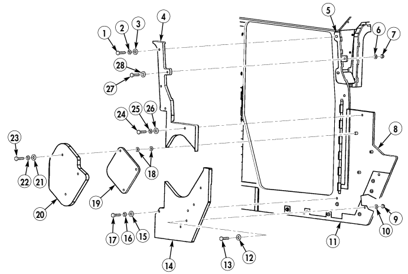

FOLLOW-ON TASK: Install right front door (Frag 5) removed (para. M-4).

# K-8. Right A-Pillar Ied Overlay (Frag 1) Maintenance (M1152A1, M1165A1, M1167 W/Perimeter B Kit)

This task covers:
b. Inspection

Applicable Models M1152A1, M1165A1, M1167 w/Perimeter B Kit Tools General mechanic's tool kit:
automotive (Appendix B, Item 1)
Torque wrench 3/8-in. drive, 75 lb-ft 
(Appendix B, Item 2.1)
a. Removal c. Installation

#### Materials/Parts

Five lockwashers (Appendix G, Item 144) Three lockwashers (Appendix G, Item 145) Five locknuts (Appendix G, Item 106) Locknut (Appendix G, Item 82)

| Docuras (Thhouany o   |
|-----------------------|
| Manual References     |
| TM 9\-2320\-387\-24P  |
| Maintenance Level     |
| Unit                  |

Replacement procedures for M1152A1, M1165A1, and M1167 right A-pillar IED overlay assemblies are the same. This procedure covers the M1152A1 right A-pillar IED overlay.

#### A. Removal

1. Remove three capscrews (24), lockwashers (23), washers (22), vent cover IED overlay (21), vent cover (20), and six spacers (19) from body (9). Discard lockwashers (23).

2. Remove capscrew (27), lockwasher (26) and washer (25) from right upper A-pillar IED overlay (5).

Discard lockwasher (26).

3. Remove locknut (8), washer (7), capscrew (29), and washer (28) from right upper A-pillar IED
overlay (5). Discard locknut (8).

4. Remove three capscrews (1), lockwashers (2), washers (3), plate (4), and right upper A-pillar IED
overlay (5) from A-pillar bracket (6). Discard lockwashers (2).

5. Remove capscrew (18), lockwasher (17), and washer (16) from right lower A-pillar IED overlay (15).

Discard lockwasher (17).

6. Remove five locknuts (10), washers (11), capscrews (14), washers (13), and right lower A-pillar IED
overlay (15) from body (9) and front underbody armor (12). Discard locknuts (10).

b. Inspection Refer to para. 10-56 for nut insert inspection and replacement.

c. Installation 1. Install right lower A-pillar IED overlay (15) on body (9) and front underbody armor (12) with five washers (13), capscrews (14), washers (11), and locknuts (10). Tighten capscrews (14) to 44 lb-ft (59 N•m).

2. Secure right lower A-pillar IED overlay (15) to body (9) with washer (16), lockwasher (17), and capscrew (18). Tighten capscrew (18) to 31 lb-ft (42 N•m).

3. Install right upper A-pillar IED overlay (5) and plate (4) on A-pillar bracket (6) with three washers (3), lockwashers (2), and capscrews (1). Tighten capscrews (1) to 17 lb-ft (23 N•m).

## K-8. Right A-Pillar Ied Overlay (Frag 1) Maintenance (M1152A1, M1165A1 W/Perimeter B Kit) (Cont'D)

4. Secure right upper A-pillar IED overlay (5) to A-pillar bracket (6) with washer (28), capscrew (29),
washer (7), and locknut (8). Tighten capscrew (29) to 24 lb-ft (32 N•m).

5. Secure right upper A-pillar IED overlay (5) to A-pillar bracket (6) with washer (25), lockwasher (26),
and capscrew (27). Tighten capscrew (27) to 17 lb-ft (23 N•m).

6. Install vent cover (20) and vent cover IED overlay (21) on body (9) with six spacers (19), three washers (22), lockwashers (23), and capscrews (24). Tighten capscrews (24) to 31 lb-ft (42 N•m).

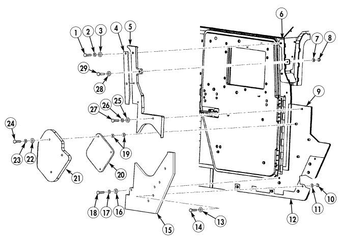

# K-9. B-Pillar Ied Overlay (Frag 1) Maintenance (M1151A1, M1165A1 W/Perimeter B Kit)

This task covers:
b. Inspection

Applicable Models M1151A1, M1165A1 w/Perimeter B Kit Tools General mechanic's tool kit:
automotive (Appendix B, Item 1)
Torque wrench 3/8-in. drive, 75 lb-ft 
(Appendix B, Item 2.1)
a. Removal c. Installation

| Materials/Parts                         |
|-----------------------------------------|
| Four lockwashers (Appendix G, Item 144) |
| Manual References                       |
| TM 9\-2320\-387\-24P                    |
| Maintenance Level                       |
| Unit                                    |

Replacement procedures for M1151A1 and M1165A1 left and right B-pillar IED overlays are basically the same. This procedure covers the left B-pillar IED overlay.

#### A. Removal

1. Remove two capscrews (4), lockwashers (5), washers (6), from nutplate (2), B-pillar reinforcement plate (3) and body (1). Discard lockwashers (5).

2. Remove capscrew (7), lockwasher (8), washer (9), washer (10), and B-pillar reinforcement plate (3)
from B-pillar IED overlay (14). Discard lockwasher (8).

3. Remove capscrew (11), lockwasher (12), washer (13), and B-pillar IED overlay (14) from B-pillar armor (15). Discard lockwasher (12).

b. Inspection Refer to para. 10-56 for nut insert inspection and replacement.

c. Installation 1. Install B-pillar IED overlay (14) on B-pillar armor (15) with washer (13), lockwasher (12), and capscrew (11). Tighten capscrew (11) to 31 lb-ft (42 N•m).

2. Install B-pillar reinforcement plate (3) on B-pillar IED overlay (14) with washer (10), washer (9),
lockwasher (8), and capscrew (7). Tighten capscrew (7) to 31 lb-ft (42 N•m).

3. Install B-pillar reinforcement plate (3) on body (1) and nutplate (2) with two washers (6),
lockwashers (5), and capscrews (4). Tighten capscrews (4) to 31 lb-ft (42 N•m).

K-9. B-PILLAR IED OVERLAY (FRAG 1) MAINTENANCE
 

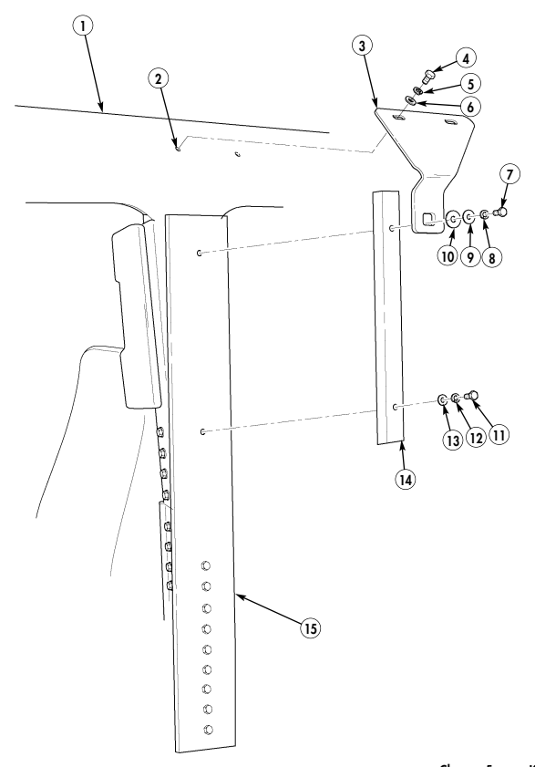

# K-10. B-Pillar Ied Overlay (Frag 1) Maintenance (M1151A1, M1152A1, M1165A1 [Serial Numbers 239991 And Above], M1167 W/Perimeter B Kit)

This task covers:
b. Inspection

Applicable Models M1151A1, M1152A1, M1165A1 [Serial Numbers 239991 and Above], M1167 w/Perimeter B Kit Tools General mechanic's tool kit:
automotive (Appendix B, Item 1)
Torque wrench 3/8-in. drive, 75 lb-ft 
(Appendix B, Item 2.1)
a. Removal c. Installation

#### Materials/Parts

Locknut (Appendix G, Item 106) Six lockwashers (Appendix G, Item 144)
Manual References TM 9-2320-387-24P
Maintenance Level Unit

Replacement procedures for M1152A1 left and right B-pillar IED overlays are basically the same. This procedure covers the left B-pillar IED overlay.

#### A. Removal

1. Remove locknut (1), washer (2), capscrew (6), and washer (5) from B-pillar upper bracket (4) and vehicle (3). Discard locknut (1).

2. Remove capscrew (7), lockwasher (8), washer (9), washer (10), B-pillar upper bracket (4), and spacer (11)
from B-pillar IED overlay (12). Discard lockwasher (8).

3. Remove five capscrews (13), lockwashers (14), washers (15), B-pillar IED overlay (12), B-pillar spacer (16), and B-pillar (17) from vehicle (3). Discard lockwashers (14).

b. Inspection Refer to para. 10-56 for nut insert inspection and replacement.

c. Installation 1. Install B-pillar (17), B-pillar spacer (15) and B-pillar IED overlay (12) on vehicle (3) with five washers (15), lockwashers (14), and capscrews (13). Tighten capscrews (13) to 31 lb-ft (42 N•m).

2. Install spacer (11) and B-pillar upper bracket (4) on B-pillar IED overlay (12) with washer (10),
washer (9), lockwasher (8), and capscrew (7). Tighten capscrew (7) to 31 lb-ft (42 N•m).

3. Secure B-pillar upper bracket (4) to vehicle (3) with washer (5), capscrew (6), washer (2), and locknut (1). Tighten capscrew (6) to 44 lb-ft (59 N•m).

K-10.  B-PILLAR IED OVERLAY (FRAG 1) MAINTENANCE (M1151A1, M1152A1, M1165A1
[SERIAL NUMBERS 239991 AND ABOVE], M1167 W/PERIMETER B KIT) (Confd)

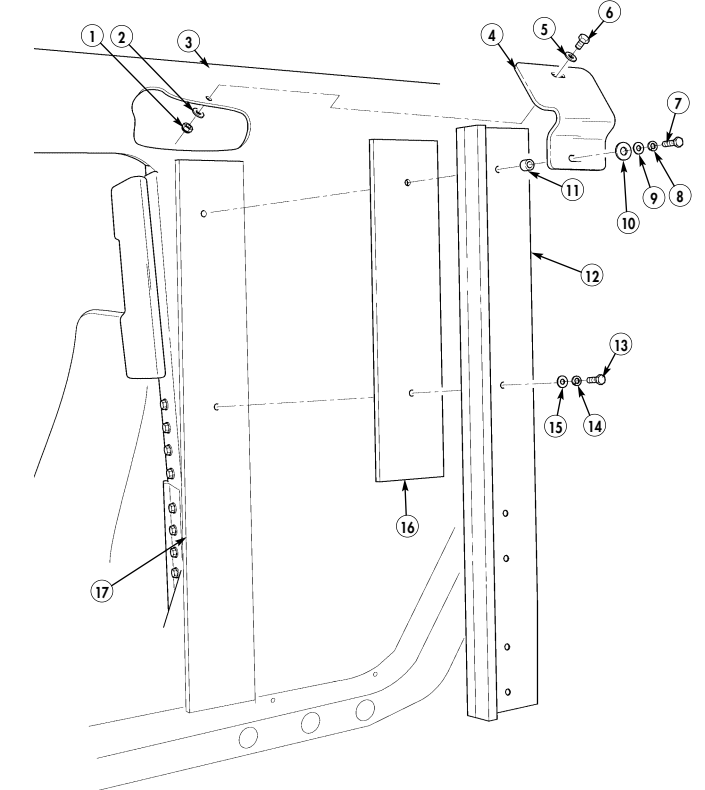

# K-11. C-Pillar Ied Overlay (Frag 1) Maintenance (M1151A1 W/Perimeter B Kit)

This task covers:
b. Inspection

Applicable Models M1151A1 w/Perimeter B Kit Tools General mechanics tool kit:
automotive (Appendix B, Item 1)
Torque wrench 3/8-in. drive, 75 lb-ft 
(Appendix B, Item 2.1)
a. Removal c. Installation

#### Materials/Parts

Five lockwashers (Appendix G, Item 144)

| Manual References    |
|----------------------|
| TM 9\-2320\-387\-24P |
| Maintenance Level    |
| Unit                 |

a. Removal

- Perform step 1 for left C-pillar IED overlay. - Perform step 2 for right C-pillar IED overlay.

1. Remove three capscrews (1), lockwashers (2), washers (3), and left C-pillar IED overlay (4) from left C-pillar (5). Discard lockwashers (2).

2. Remove two capscrews (8), lockwashers (7), washers (6), and right C-pillar IED overlay (9) from right C-pillar (10). Discard lockwashers (7).

b. Inspection Refer to para. 10-56 for nut insert inspection and replacement.

c. Installation

- Perform step 1 for right C-pillar IED overlay. - Perform step 2 for left C-pillar IED overlay.

1. Install right C-pillar IED overlay (9) on right C-pillar (10) with two washers (6), lockwashers (7),
and capscrews (8). Tighten capscrews (8) to 31 lb-ft (42 N•m).

2. Install left C-pillar IED overlay (4) on left C-pillar (5) with three washers (3), lockwashers (2), and capscrews (1). Tighten capscrews (1) to 31 lb-ft (42 N•m).

K-11.C-PILLAR IED OVERLAY (FRAG 1) MAINTENANCE
 

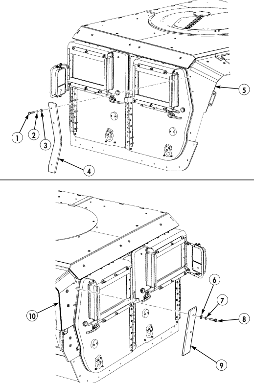

# K-12. Left C-Pillar Ied Overlay (Frag 1) Maintenance (M1151A1, M1165A1, M1167 W/Perimeter B Kit)

This task covers:
b. Inspection

Applicable Models M1151A1, M1165A1, M1167 w/Perimeter B Kit Tools General mechanic's tool kit:
automotive (Appendix B, Item 1)
Torque wrench 3/8-in. drive, 75 lb-ft 
(Appendix B, Item 2.1)
Materials/Parts Five lockwashers (Appendix G, Item 144)
a. Removal c. Installation

| One assistant                               |
|---------------------------------------------|
| Manual References                           |
| TM 9\-2320\-387\-24P                        |
| General Safety Instructions                 |
| Vehicle door is extremely heavy and must be |
| supported during removal and installation.  |
| Maintenance Level                           |

installation.

Maintenance Level Unit

#### Warning

Left C-pillar IED overlay is extremely heavy and must be supported during removal and installation. Failure to do so may result in injury to personnel or damage to equipment.

a. Removal 1. Remove two capscrews (7), lockwashers (6), and washers (5) from left upper C-pillar cover plate (8),
left C-pillar cover plate (12), and left C-pillar armor (1). Discard lockwashers (6).

2. Remove capscrew (11), lockwasher (10), washer (9), and left upper C-pillar plate (8) from left C-pillar cover plate (12) and C-pillar (1) on vehicle (13). Discard lockwasher (10).

3. Remove two capscrews (4), lockwashers (3), washers (2), and left C-pillar cover plate (12) from C-pillar armor (1). Discard lockwashers (3).

b. Inspection Refer to para. 10-56 for nut insert inspection and replacement.

c. Installation 1. Install left C-pillar cover plate (12) on left C-pillar armor with two washers (2), lockwashers (3), and capscrews (4). Do not tighten capscrews at this time.

2. Install left upper C-pillar plate (8) on left C-pillar cover plate (12) and C-pillar armor (1) with two washers (5), lockwashers (6), and capscrews (7). Tighten capscrews (7) to 31 lb-ft (42 N•m).

3. Install left upper C-pillar plate (8) on left C-pillar cover plate (12) and vehicle (13) with washer (9),
lockwasher (10), and capscrew (11). Tighten capscrews (11) to 31 lb-ft (42 N•m).

4. Tighten capscrews (4) installed in step 1 to 31 lb-ft (42 N•m).

K-12.  LEFT C-PILLAR IED OVERLAY (FRAG 1) MAINTENANCE (M1151A1, M1165A1, M1167 W/PERIMETER B KIT) (Cont'd)

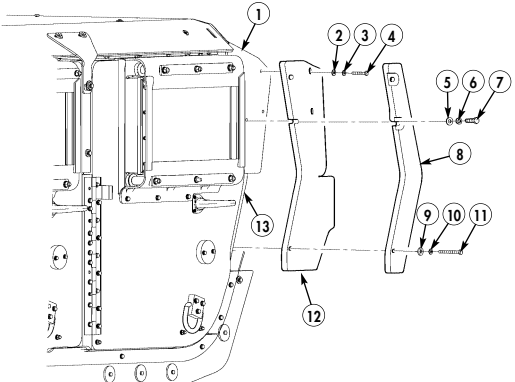

K-13. RIGHT C-PILLAR IED OVERLAY (FRAG 1) MAINTENANCE (M1151A1, M1165A1, M1167

# W/Perimeter B Kit)

This task covers:
b. Inspection

Applicable Models a. Removal c. Installation

| Tools                                                        |      | Maintenance Level   |
|--------------------------------------------------------------|------|---------------------|
| General mechanic's tool kit: automotive (Appendix B, Item 1) |      | Unit                |
| Materials/Parts                                              |      |                     |
| Four lockwashers (Appendix G, Item 158.1)                    |      |                     |
|                                                              | NOTE |                     |

a. Removal b. Inspection Refer to para. 10-56 for nut insert inspection and replacement.

c. Installation 1. Install filler door plate armor (10) on C-pillar (9) with two washers (16), capscrews (15), washers (8),
and locknuts (7). Tighten capscrews (15) to 44 lb-ft (59 N•m).

2. Install filler door strip plate armor (11) on filler door plate armor (10) with three washers (12),
lockwashers (13), and capscrews (14). Tighten capscrews (14) to 17 lb-ft (23 N•m).

3. Install right C-pillar IED overlay (5) on C-pillar armor (6) with two washers (17), lockwashers (18),
and capscrews (19). Tighten capscrews (19) to 31 lb-ft (42 N•m).

4. Install right C-pillar upper plate (4) on right C-pillar IED overlay (5) with two washers (3),
lockwashers (2), and capscrews (1). Tighten capscrews (1) to 31 lb-ft (42 N•m).

1. Remove two capscrews (1), lockwashers (2), washers (3), and right C-pillar upper plate (4) from right C-pillar IED overlay (5). Discard lockwashers (2).

2. Remove two capscrews (19), lockwashers (18), washers (17), and right C-pillar IED overlay (5) from C-pillar armor (6). Discard lockwashers (18).

3. Remove three capscrews (14), lockwashers (13), washers (12), and filler door strip plate armor (11)
from filler door plate armor (10). Discard lockwashers (13).

4. Remove two locknuts (7), washers (8), capscrews (15), washers (16), and filler door plate armor (10)
from C-pillar (9). Discard locknuts (7).

K-13.  RIGHT C-PILLAR IED OVERLAY (FRAG  I) MAINTENANCE (M1151A1, M1165A1,
 

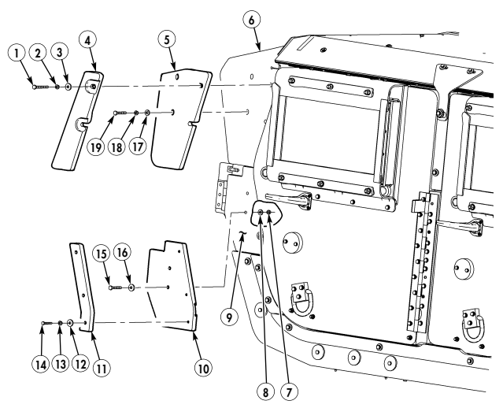

# K-14. Rocker Plate Ied Overlay (Frag 1) Maintenance (M1151A1, M1152A1, M1165A1, M1167 W/Perimeter B Kit)

This task covers:
b. Inspection

Applicable Models M1151A1, M1152A1, M1165A1, M1167 w/Perimeter B Kit Tools General mechanic's tool kit:
automotive (Appendix B, Item 1)
Torque wrench 3/8-in. drive, 75 lb-ft 
(Appendix B, Item 2.1)

#### Materials/Parts

Five locknuts (Appendix G, item 106) Two lockwasher (Appendix G, Item 144)
a. Removal c. Installation Manual References TM 9-2320-387-24P
General Safety Instructions Side rocker armor plates are extremely heavy and must be supported during removal and installation procedures.

Maintenance Level Unit

#### Warning

Side rocker armor plates are extremely heavy and must be supported during removal and installation procedures. Failure to do so may result in injury to personnel or damage to equipment.

Replacement procedures for left and right rocker plate IED overlays are basically the same. This procedure covers the left rocker plate IED overlay.

a. Removal 1. Remove two capscrews (4), lockwashers (3), and washers (2) from rocker plate IED overlay (1).

Discard lockwashers (3).

2. Remove five locknuts (8), washers (7), capscrews (5), washers (6), and rocker plate IED overlay (1)
from vehicle (9). Discard locknuts (8).

b. Inspection Refer to para. 10-56 for nut insert inspection and replacement.

c. Installation 1. Install rocker plate IED overlay (1) on vehicle (9) with five washers (6), capscrews (5), washers (7),
and locknuts (8). Tighten capscrews (5) to 44 lb-ft (59 N•m).

2. Secure rocker plate IED overlay (1) to vehicle (9) with two washers (2), lockwashers (3), and capscrews (4). Tighten capscrews (4) to 31 lb-ft (42 N•m).

K-14.  ROCKER PLATE IED OVERLAY (FRAG 1) MAINTENANCE (M1151A1, M1152A1,
 

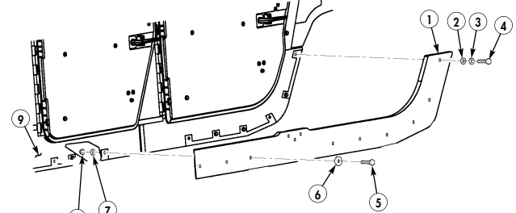

8

# K-15. Rocker Plate Ied Overlay (Frag 1) Maintenance (M1165A1 W/Perimeter B Kit)

This task covers:
b. Inspection

Applicable Models M1165A1 w/Perimeter B Kit Tools General mechanic's tool kit:
automotive (Appendix B, Item 1)
Torque wrench 3/8-in. drive, 75 lb-ft 
(Appendix B, Item 2.1)
a. Removal c. Installation

#### Materials/Parts

Six locknuts (Appendix G, item 106) Eight lockwashers (Appendix G, Item 144)
Manual References TM 9-2320-387-24P

| Maintenance Level   |
|---------------------|
| Unit                |

Replacement procedures for left and right rocker plate IED overlays are basically the same. This procedure covers the left rocker plate IED overlay.

a. Removal 1. Remove two capscrews (10), lockwashers (9), washers (8), and rear rocker plate (7) from rocker IED overlay (3). Discard lockwashers (9).

2. Remove four capscrews (11), lockwashers (12), washers (13), and upper rocker plate (14) from rocker IED overlay (3). Discard lockwashers (12).

3. Remove two capscrews (6), lockwashers (5), and washers (4) from rocker plate IED overlay (3).

Discard lockwashers (5).

4. Remove six locknuts (1), washers (2), capscrews (15), washers (16), and rocker plate IED overlay (3)
from vehicle (17). Discard locknuts (1).

b. Inspection Refer to para. 10-56 for nut insert inspection and replacement.

c. Installation 1. Install rocker plate IED overlay (3) on vehicle (17) with six washers (16), capscrews (15), washers (2),
and locknuts (1). Tighten capscrews (15) to 44 lb-ft (59 N•m).

2. Secure rocker plate IED overlay (3) to vehicle (17) with two washers (4), lockwashers (5), and capscrews (6). Tighten capscrews (6) to 31 lb-ft (42 N•m).

3. Install upper rocker plate (14) on rocker plate IED overlay (3) with four washers (13), lockwashers (12),
and capscrews (11). Tighten capscrews (11) to 31 lb-ft (42 N•m).

4. Install rear rocker plate (7) on rocker plate IED overlay (3) with two washers (8), lockwashers (9),
and capscrews (10). Tighten capscrews (10) to 31 lb-ft (42 N•m).

K-15.  ROCKER PLATE IED OVERLAY (FRAG  I) MAINTENANCE

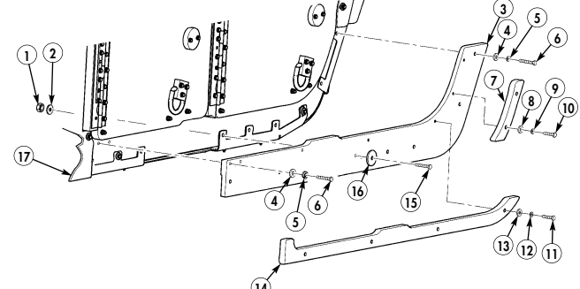

(14)
# K-16. Rocker Plate Ied Overlay (Frag 1) Maintenance (M1152A1 W/Perimeter B Kit)

This task covers:
b. Inspection

Applicable Models M1152A1 w/Perimeter B Kit Tools General mechanic's tool kit:
automotive (Appendix B, Item 1)
Torque wrench 3/8-in. drive, 75 lb-ft 
(Appendix B, Item 2.1)

#### Materials/Parts

Five locknuts (Appendix G, item 106) Four lockwashers (Appendix G, Item 144)
a. Removal c. Installation

#### Equipment Condition

Companion seat removed (para. 10-44).

| Manual References    |
|----------------------|
| TM 9\-2320\-387\-24P |
| Maintenance Level    |

Unit

Replacement procedures for left and right rocker plate IED overlays are basically the same. This procedure covers the left rocker plate IED overlay.

#### A. Removal

1. Remove two capscrews (6), lockwashers (7), washers (8), and upper rocker plate (5) from rocker IED
overlay (1). Discard lockwashers (7).

2. Remove two capscrews (4), lockwashers (3), and washers (2) from rocker IED overlay (1) and vehicle (13).

Discard lockwashers (3).

3. Remove five locknuts (12), washers (11), capscrews (9), washers (10), and rocker IED overlay (1)
from vehicle (13). Discard locknuts (12).

b. Inspection Refer to para. 10-56 for nut insert inspection and replacement.

c. Installation 1. Install rocker IED overlay (1) on vehicle (13) with five washers (10), capscrews (9), washers (11), and locknuts (12). Tighten capscrews (9) to 44 lb-ft (59 N•m).

2. Secure rocker IED overlay (1) to vehicle (13) with two washers (2), lockwashers (3), and capscrews (4).

Tighten capscrews (4) to 31 lb-ft (42 N•m).

3. Install upper rocker plate (5) on rocker IED overlay (1) with two washers (8), lockwashers (7), and capscrews (6). Tighten capscrews (6) to 31 lb-ft (42 N•m).

K-16.  ROCKER PLATE IED OVERLAY (FRAG  I) MAINTENANCE

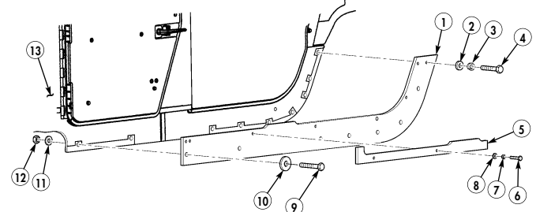

# Appendix L Front Wheelwell Armor (Frag 2) Kit

Section I. INTRODUCTION

## L-1. Scope

This appendix includes complete instructions for the maintenance of the Front Wheelwell Armor (Frag 2) Kit.

## L-2. General

Your vehicle may come equipped with Front Wheelwell Armor (Frag 2) Kit. The following procedures provide you with the instructions you will need to maintain or replace any of the components within this kit.

## Section Ii. Front Wheelwell Armor (Frag 2) L-3. Front Wheelwell Armor (Frag 2) Kit Maintenance

L-4. Left Front Wheelwell Armor Assembly (Frag 2) Replacement ................................................ L-2 L-5. Right Front Wheelwell Armor Assembly (Frag 2) Maintenance................................................ L-4

# L-4. Left Front Wheelwell Armor Assembly (Frag 2) Replacement

This task covers:

a. Removal b. Installation

| Applicable Models Materials/Parts                             |                                          |
|---------------------------------------------------------------|------------------------------------------|
| M1151A1, M1152A1, M1165A1                                     | Three lockwashers (Appendix G, Item 141) |
| Tools                                                         | Manual References                        |
| General mechanic's tool kit:                                  | TM 9\-2320\-387\-24P                     |
| automotive (Appendix B, Item 1)                               | Maintenance Level                        |
| Unit                                                          |                                          |
| NOTE                                                          |                                          |
| Replacement procedures for all door lock release handle       |                                          |
| assemblies (perimeter) are basically the same. This procedure |                                          |
| covers the left door lock handle assembly.                    |                                          |

#### Warning

Front wheelwell armor is extremely heavy and must be supported during removal and installation. Failure to do so may result in injury to personnel or damage to equipment.

#### A. Removal

1. Remove locknut (8), washer (9), washer (14), and capscrew (15) from left front wheelwell armor assembly (16) and underbody armor (10). Discard locknut (8).

2. Remove capscrew (20), lockwasher (21), and washer (22) from left front wheelwell armor assembly (16),
plate (7), and underbody armor (10). Discard lockwasher (21).

3. Remove four capscrews (19), lockwashers (18), and washers (17) from left front wheelwell armor assembly (16), left front underbody extension plate (4), and cowl armor (6). Discard lockwashers (18).

4. Remove three capscrews (1), lockwashers (2), washers (3), and left front wheelwell armor assembly (16)
from cowl armor (6). Discard lockwashers (2).

5. Remove three capscrews (23), lockwashers (24), washers (25), and left front underbody extension plate (4) from cowl armor (6). Discard lockwashers (24).

6. Remove two capscrews (13), lockwashers (12), washers (11), plate (7), and tapping plate (5) from underbody armor (10). Discard lockwashers (12).

#### B. Installation

1. Install tapping plate (5) and plate (7) on underbody armor (10) with two washers (11),
lockwashers (12), and capscrews (13).

2. Install left front underbody extension plate (4) on cowl armor (6) with three washers (25),
lockwashers (24), and capscrews (23).

## L-4. Left Front Wheelwell Armor Assembly (Frag 2) Replacement (Cont'D)

3. Install left front wheelwell armor assembly (16) on cowl armor (6) with three washers (3),
lockwashers (2), and capscrews (1).

4. Secure left front underbody extension plate (4) and left front wheelwell armor assembly (16) to cowl armor (6) with four washers (17), lockwashers (18), and capscrews (19).

Apply sealant to capscrew prior to installation.

5. Secure left front wheelwell armor assembly (16) to underbody armor (10) with washer (22),
lockwasher (21), and capscrew (20).

6. Secure left front wheelwell armor assembly (16) to underbody armor (10) with washer (14),
capscrew (15), washer (9), and locknut (8).

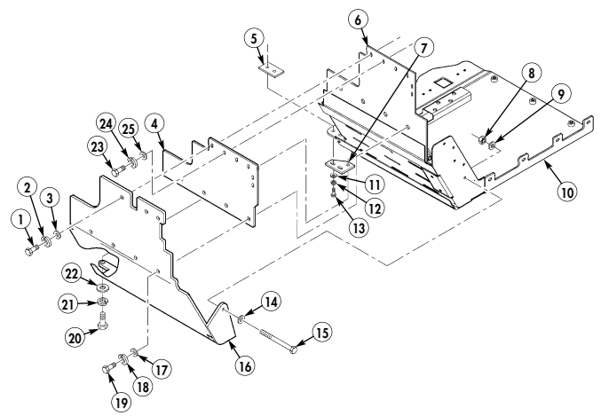

# L-5. Right Front Wheelwell Armor Assembly (Frag 2) Maintenance

This task covers:
b. Inspection

Applicable Models M1151A1, M1152A1, M1165A1, M1167 w/Perimeter B Kit Tools General mechanic's tool kit:
automotive (Appendix B, Item 1)

#### Materials/Parts

Sealant (Appendix C, Item 3.1) Edge protector (Appendix G, Item 31.1) Four locknuts (Appendix G, Item 106) Lockwasher (Appendix G, Item 144) Two lockwashers (Appendix G, Item 145)
a. Removal c. Installation Personnel Required One mechanic One assistant Manual References TM 9-2320-387-24P
Equipment Condition
•Air cleaner shield removed (para. 12-39). •Engine splash shield removed 
(para. 10-24 or para. 10-24.1).

General Safety Instructions Front wheelwell armor is extremely heavy and must be supported during removal and installation.

Maintenance Level Unit

#### Warning

Front wheelwell armor is extremely heavy and must be supported during removal and installation. Failure to do so may result in injury to personnel or damage to equipment.

a. Removal 1. Remove locknut (19), washer (18), washer (16), and capscrew (17) from right front wheelwell armor assembly (10) and underbody armor (3). Discard locknut (19).

2. Remove capscrew (13), lockwasher (12), and washer (11) from right front wheelwell armor assembly (10). Discard lockwasher (12).

3. Remove three locknuts (14), washers (15), capscrews (1), washers (2), and right front wheelwell armor assembly (10) from underbody armor (3). Discard locknuts (14).

4. Remove two capscrews (8), lockwashers (7), washers (6), plate (5), and tapping plate (4) from underbody armor (3). Discard lockwashers (7).

#### B. Inspection

Inspect edge protector (9). Replace if damaged.

c. Installation 1. Install tapping plate (4) and plate (5) on underbody armor (3) with two washers (6), lockwashers (7),
and capscrews (8).

2. Install right front wheelwell armor assembly (10) on underbody armor (3) with three washers (2),
capscrews (1), washers (15), and locknuts (14).

# L-5. Right Front Wheelwell Armor Assembly (Frag 2) Maintenance (Cont'D)

Apply sealant to capscrew prior to installation.

3. Secure right front wheelwell armor assembly (10) to underbody armor (3) with washer (11),
lockwasher (12), and capscrew (13).

4. Secure right front wheelwell armor assembly (10) to underbody armor (3) with washer (16),
capscrew (17), washer (18), and locknut (19).

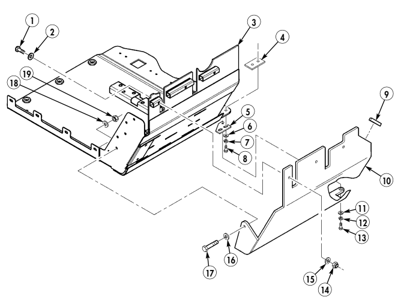

FOLLOW-ON TASKS: - Install engine splash shield (para. 10-24).

- Install air cleaner shield (para. 12-39).

# Appendix M Door (Frag 5) Kit

Section I. INTRODUCTION
M-1. SCOPE
This appendix includes complete instructions for the maintenance of the Door (Frag 5) Kit.

## M-2. General

Your vehicle may come equipped with the Door (Frag 5) Kit. The following procedures provide you with the instructions you will need to maintain or replace any of the components within this kit.

## Section Ii. Door (Frag 5) Kit Maintenance M-3. Door (Frag 5) Kit Maintenance Task Summary

| b. Inspection                          |    |
|----------------------------------------|----|
| Inspect door seal, replace if damaged. |    |
| c. Installation                        |    |
| Install seal (1) on door (2).          |    |
| 1                                      | 2  |

# M-4. Door/Door Hinge (Frag 5) Replacement

This task covers:

Applicable Models M1151A1, M1152A1, M1165A1, M1167 Tools General mechanic's tool kit:
automotive (Appendix B, Item 1)
Maintenance and repair shop equipment:
automotive (Appendix B, Item 2)
Materials/Parts Adhesive sealant (Appendix C, Item 31) Two locknuts (Appendix G, Item 87) Nine lockwashers (Appendix G, Item 146) Nine lockwashers (Appendix G, Item 144)
a. Removal b. Installation

| Materials/Parts                     |
|-------------------------------------|
| Two locknuts (Appendix G, Item 129) |
| Manual References                   |
| TM 9\-2320\-387\-24P                |
| Maintenance Level                   |
| Unit                                |

General Safety Instructions

| Maintenance Level   |
|---------------------|
| Unit                |

Vehicle door (Frag 5) is extremely heavy and must be supported during removal and installation.

#### Warning

Vehicle door is extremely heavy and must be supported during removal and installation. Failure to comply may result in injury to personnel or damage to equipment.

- Replacement procedures for front and rear doors and door hinges (Frag 5) are basically the same. This procedure covers the rear doors and hinges.

- Use two eyebolts (5716845) as lifting aid to position door for removal and installation.

- For installation, note length and locations of capscrews.

#### A. Removal

1. Remove locknut (6), washer (5), capscrew (1), washer (2), and door check strap (3) from bracket (4).

Discard locknut (6).

2. Remove two capscrews (9), lockwashers (8), and washers (7) from door hinge (18). Discard lockwashers (8).

3. Remove four capscrews (11), lockwashers (10), and washers (12) from door hinge (18). Discard lockwashers (10).

4. Remove three capscrews (15), lockwashers (16), washers (17), door (20), and door spacer (19) from B-pillar (21). Discard lockwashers (16).

5. Remove nine capscrews (13), washers (14), and door hinge (18) from door (20).

#### B. Installation

1. Apply adhesive sealant to nine capscrews (13). 2. Install door hinge (18) on door (20) with nine washers (14) and capscrews (13). Tighten capscrews (13) to 37 lb-ft (50 N•m).

3. Install door spacer (19) and door (20) on B-pillar (21) with three washers (17), lockwashers (16), and capscrews (15).

## M-4. Door/Door Hinge (Frag 5) Replacement (Cont'D)

4. Install four washers (12), lockwashers (10), and capscrews (11) on door hinge (18). 5. Install two washers (7), lockwashers (8), and capscrews (9) on door hinge (18). 6. Tighten capscrews (16), (11), and (9) to 37 lb-ft (50 N•m). 7. Install door check strap (3) on bracket (4) with washer (2), capscrew (1), washer (5), and locknut (6).

Tighten locknut (6) to 26 lb-ft (35 N•m).

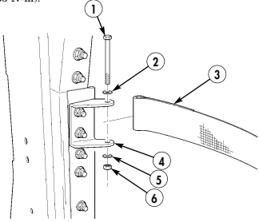

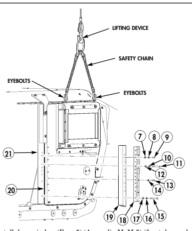

FOLLOW-ON TASKS: - Install door window (Frag 5) (Appendix M, M-5) (front door only).

- Adjust door (Frag 5) (Appendix M, M-15).

# M-5. Door Window (Frag 5) Replacement

This task covers:

Applicable Models M1151A1, M1152A1, M1165A1, M1167 Tools General mechanic's tool kit:
automotive (Appendix B, Item 1)
Personnel Required One mechanic One assistant Materials/Parts Six lockwashers (Appendix G, Item 174) Three lockwashers (Appendix G, Item 144)
a. Removal b. Installation Manual References TM 9-2320-387-24P
General Safety Instructions Door window is extremely heavy and must be supported during removal and installation.

Maintenance Level Unit

#### Warning

Door window is extremely heavy and must be supported during removal and installation. Failure to do so may result in injury to personnel or damage to equipment.

NOTE
Replacement procedures for all door windows (Frag 5) are basically the same. This procedure covers the left door window.

#### A. Removal

1. Remove three nuts (18), lockwashers (17), washers (16), and upper window roller plate (1) from side plate (2) and upper rollers (6). Discard lockwashers (17).

2. Remove three nuts (14), lockwashers (13), washers (12), and lower window roller plate (15) from side plate (2) and lower rollers (8). Discard lockwashers (13).

3. Remove three capscrews (11), lockwashers (10), and washers (9) from side plate (2) and door (7).

Discard lockwashers (10).

4. Remove three capscrews (3), washers (4), and side plate (2) from door (7). 5. Slide window (5) off upper rollers (6) and lower rollers (8).

#### B. Installation

1. Slide window (5) on upper rollers (6) and lower rollers (8). 2. Install side plate (2) on door (7) with three washers (4) and capscrews (3). 3. Secure side plate (2) to door (7) with three washers (9), lockwashers (10), and capscrews (11). 4. Install lower window roller plate (15) on side plate (2) and lower rollers (8) with three washers (12),
lockwashers (13), and nuts (14).

5. Install upper window roller plate (1) on side plate (2) and upper rollers (6) with three washers (16),
lockwashers (17), and nuts (18).

# M-5. Door Window (Frag 5) Replacement (Cont'D)

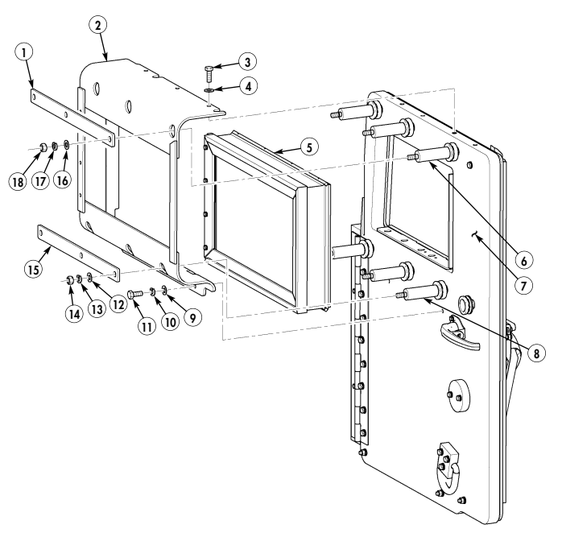

# M-6. Door Glass And Handle (Frag 5) Replacement

This task covers:

a. Removal b. Installation

Applicable Models M1151A1, M1152A1, M1165A1, M1167 Tools General mechanic's tool kit:
automotive (Appendix B, Item 1)
Materials/Parts Sealing compound (Appendix C, Item 68)
Personnel Required One mechanic One assistant

| Maintenance Level   |
|---------------------|

| Manual References      |
|------------------------|
| TM 9\-2320\-387\-24P   |
| Maintenance Level Unit |

Unit

#### Warning

Door glass is extremely heavy and must be supported during removal and installation. Failure to do so may result in injury to personnel or damage to equipment.

NOTE
Replacement procedures for all door glass and handles (Frag 5) are basically the same. This procedure covers the left door glass and handle.

#### A. Removal

1. Remove four capscrews (1), washers (2), and glass retainer (3) from window frame (7). 2. Remove glass (11) from window frame (7). 3. Remove eight screws (6) and two roller tracks (4) from window frame (7). 4. Remove four screws (9) and handle (8) from window frame (7). 5. Remove weather stripping (5) from window frame (7). 6. Remove plate (10) from window frame (7).

#### B. Installation

1. Install plate (10) on window frame (7). 2. Apply a 0.125 in (3 mm) bead of sealing compound to window frame (7). 3. Apply weather stripping (5) to window frame (7). 4. Install handle (8) on window frame (7) with four screws (9). 5. Install two roller tracks (4) on window frame (7) with eight screws (6). 6. Install glass (11) on window frame (7). 7. Install glass retainer (3) on window frame (7) with four capscrews (2) and washers (1).

# M-6. Door Glass And Handle (Frag 5) Replacement (Cont'D)

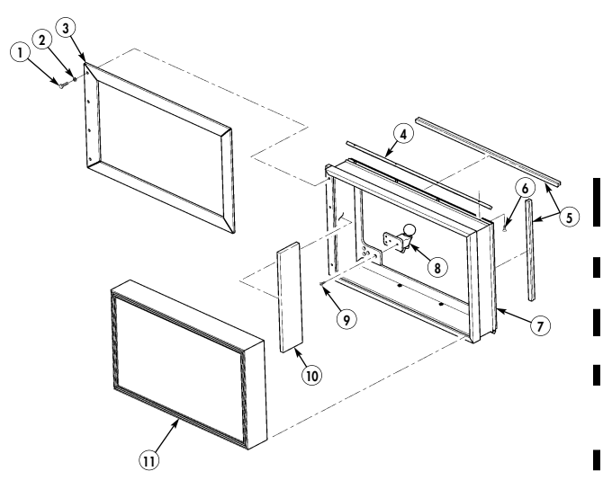

FOLLOW-ON TASK: Install door window (Frag 5) (Appendix M, M-5).

## M-7. Door Window Roller (Frag 5) Replacement

This task covers:

a. Removal **b. Installation**

| Applicable Models               | Manual References    |
|---------------------------------|----------------------|
| M1151A1, M1152A1, M1165A1       | TM 9\-2320\-387\-24P |
| Tools                           | Maintenance Level    |
| General mechanic's tool kit:    | Unit                 |
| automotive (Appendix B, Item 1) |                      |
| Materials/Parts                 |                      |

Seven lockwashers (Appendix G, Item 174)

Replacement procedures for all door window rollers (Frag 5) are basically the same. This procedure covers the left door window rollers.

#### A. Removal

1. Remove six roller sleeves (1) from window rollers (2). 2. Remove six nuts (6), lockwashers (5), washers (4), and inside window rollers (2) from door (3).

Discard lockwashers (5).

3. Remove nut (7), lockwasher (8), washer (9), and outside window roller (10) from door (3). Discard lockwasher (8).

#### B. Installation

1. Install outside window roller (10) on door (3) with washer (9), lockwasher (8), and nut (7). 2. Install six inside window rollers (2) on door (3) with six washers (4), lockwashers (5), and nuts (6). 3. Install six roller sleeves (1) on window rollers (2).

# M-7. Door Window Roller (Frag 5) Replacement (Cont'D)

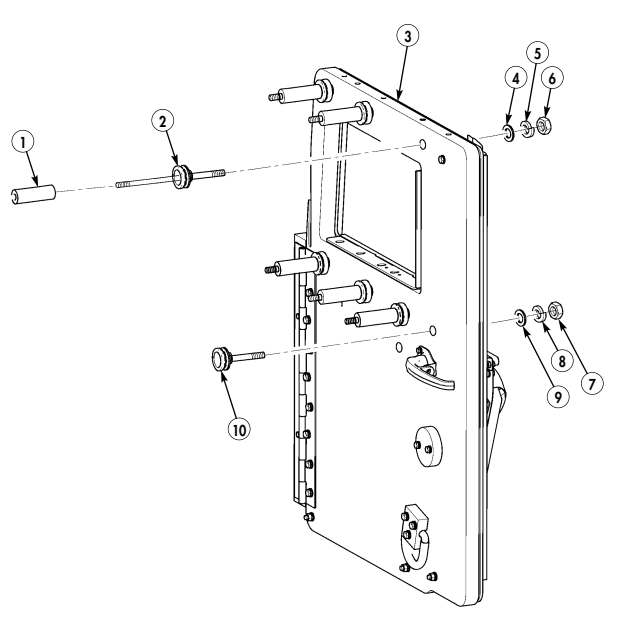

FOLLOW-ON TASK: Install door window (Frag 5) (Appendix M, M-5).

# M-8. Door Handle (Interior) (Frag 5) Replacement

This task covers:

Tools Applicable Models M1151A1, M1152A1, M1165A1, M1167 General mechanic's tool kit:
automotive (Appendix B, Item 1)

a. Removal b. Installation

| Manual References                           |
|---------------------------------------------|
| TM 9\-2320\-387\-24P                        |
| Equipment Condition                         |
| - Windshield wipers removed (para. 10\-62). |
| - Turret armor cover (new configuration)    |
| removed (para. 11\-198).                    |
| General Safety Instructions                 |
| Roof armor is extremely heavy and must be   |

Replacement procedures for all interior door handles (Frag 5) are basically the same. This procedure covers the left interior door handle.

a. Removal 1. Remove four capscrews (8), lockwashers (7), combat lock cover (6), and shim(s) (5) from door (4).

Discard lockwashers (7).

2. Remove clip (9) from door linkage (3). 3. Remove capscrew (1) and washer (2) from door linkage (3). 4. Remove capscrew (24), lockwasher (23), and washer (25) from door (4). Discard lockwasher (23). 5. Remove nine capscrews (10), lockwashers (11), washers (12), and lock release assembly (13) from door (4). Discard lockwashers (11).

6. Remove clip (17), washer (18), and wave washer (19) from door handle (20) and lever (16). 7. Remove three locknuts (15), washer (14), capscrew (22), washer (21), and door handle (20) from lock release assembly (13). Discard locknuts (15).

#### B. Installation

1. Install door handle (20) on lock release assembly (13) with three washers (21), capscrews (22),
washers (14), and locknuts (15).

2. Install wave washer (19), washer (18), and clip (17) on door handle (20) and lever (16). 3. Install lock release assembly (13) on door (4) with nine washers (12), lockwashers (11), and capscrews (10).

4. Secure lock release assembly (13) to door (4) with washer (25), lockwasher (23), and capscrew (24). 5. Secure lock release assembly (13) to door linkage (3) with washer (2) and capscrew (1). 6. Install clip (9) on door linkage (3). 7. Apply adhesive sealant to four capscrews (8). 8. Install shim(s) (5) and combat lock cover (6) on door (4) with four lockwashers (7) and capscrews (8).

# M-8. Door Handle (Interior) (Frag 5) Replacement (Cont'D)

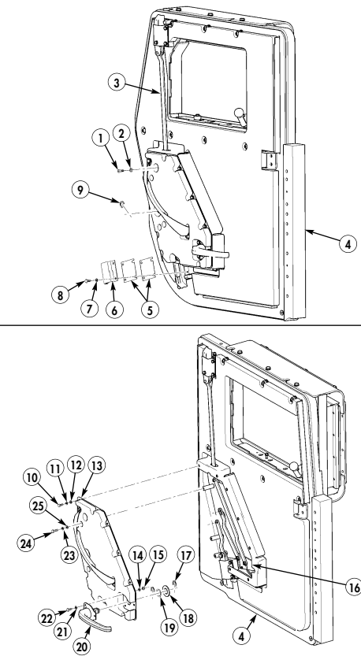

FOLLOW-ON TASK:

Adjust door (Frag 5) (Appendix M, M-15).

# M-9. Door Handle (Exterior) And Tiedown (Frag 5) Replacement

This task covers:

Tools Applicable Models M1151A1, M1152A1, M1165A1, M1167 General mechanic's tool kit:
automotive (Appendix B, Item 1)

a. Removal b. Installation

| Manual References              |
|--------------------------------|
| TM 9\-2320\-387\-24P           |
| Equipment Condition            |
| Roof armor (perimeter) removed |
| (Appendix J, J\-20).           |
| Maintenance Level              |
| Unit                           |

Replacement procedures for all exterior door handles and tiedowns (Frag 5) are basically the same. This procedure covers the left exterior door handle and tiedown.

#### A. Removal

1. Remove capscrew (1) and washer (2) from door linkage (3). 2. Remove three capscrews (11), lockwashers (10), washers (9), tiedown bracket (8), and tiedown (7)
from door (4). Discard lockwashers (10).

3. Remove two capscrews (15), lockwashers (14), washers (13), and armor plate (12) from door (4).

Discard lockwashers (14).

4. Remove locknut (17), washer (16), capscrew (5), and washer (6) from door (4) and exterior door handle (21). Discard locknut (17).

5. Remove two capscrews (18), lockwashers (19), washers (20), and exterior door handle (21) from door (4). Discard lockwashers (19).

#### B. Installation

1. Install exterior door handle (21) on door (4) with two washers (20), lockwashers (19), and capscrews (18).

2. Secure exterior door handle (21) to door (4) with washer (6), capscrew (5), washer (16), and locknut (17).

3. Install armor plate (12) on door (4) with two washers (13), lockwashers (14), and capscrews (15). 4. Install tiedown (7) on door (4) with tiedown bracket (8), three washers (9), lockwashers (10), and capscrews (11).

5. Install capscrew (1) and washer (2) on door linkage (3).

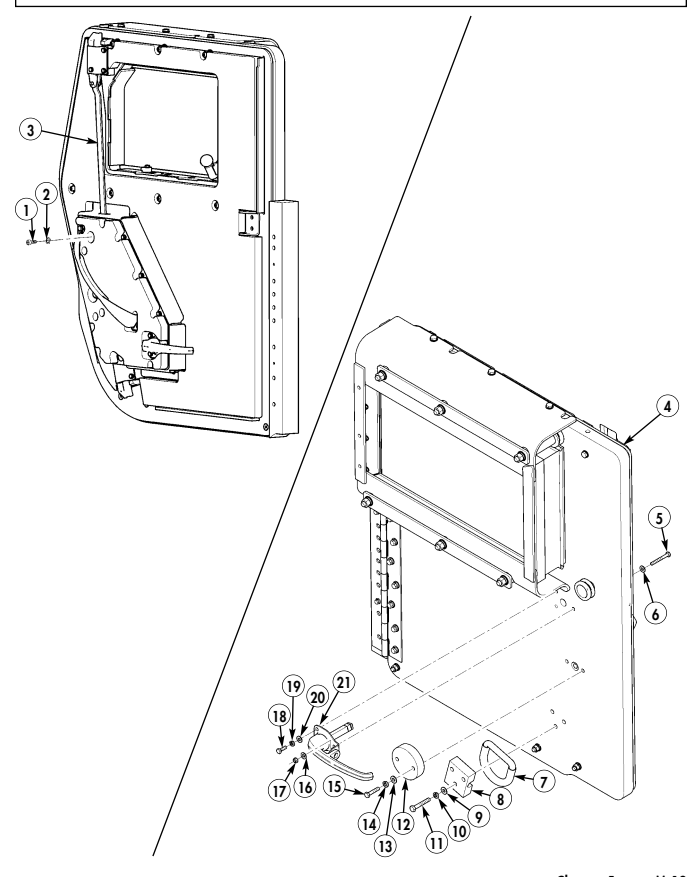

M-9. DOOR HANDLE (EXTERIOR) AND TIEDOWN (FRAG 5) REPLACEMENT (Cont'd)

# M-10. Door Lock Release (Frag 5) Replacement

This task covers:

Tools Applicable Models M1151A1, M1152A1, M1165A1, M1167

a. Removal **b. Installation**

| Manual References                |
|----------------------------------|
| TM 9\-2320\-387\-24P             |
| Equipment Condition              |
| Header armor (perimeter) removed |
| (Appendix J, J\-21).             |
| Maintenance Level                |
| Unit                             |

General mechanic's tool kit:
automotive (Appendix B, Item 1)

Replacement procedures for all door lock releases (Frag 5) are basically the same. This procedure covers the left door lock release.

a. Removal 1. Remove four capscrews (8), lockwashers (7), combat lock cover (6), and shim(s) (5) from door (4).

Discard lockwashers (7).

2. Remove clip (9) from door linkage (3). 3. Remove capscrew (1) and washer (2) from door linkage (3). 4. Remove capscrew (20), lockwasher (19), and washer (21) from door (4). Discard lockwasher (19). 5. Remove nine capscrews (10), lockwashers (11), washers (12), and lock release assembly (13) from door (4). Discard lockwashers (11).

6. Remove three locknuts (14), washers (15), capscrews (18), washers (17), and lock release (16) from lock release assembly (13). Discard locknuts (14).

#### B. Installation

1. Install lock release (16) on lock release assembly (13) with three washers (17), capscrews (18),
washers (15), and locknuts (14).

2. Install lock release assembly (13) on door (4) with nine washers (12), lockwashers (11), and capscrews (10).

3. Secure lock release assembly (13) to door (4) with washer (21), lockwasher (19), and capscrew (20). 4. Install washer (2) and capscrew (1) on door linkage (3). 5. Install clip (9) on door linkage (3). 6. Apply adhesive sealant to four capscrews (8). 7. Install shim(s) (5) and combat lock cover (6) on door (4) with four lockwashers (7) and capscrews (8).

# M-10. Door Lock Release (Frag 5) Replacement (Cont'D)

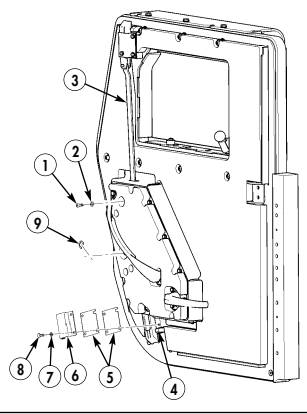

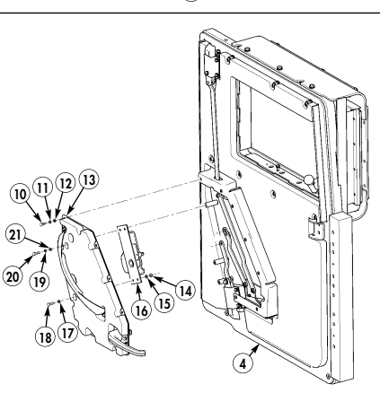

# M-11. Door Combat Lock And Linkage (Frag 5) Replacement

This task covers:

Tools General mechanic's tool kit:
automotive (Appendix B, Item 1)

a. Removal **b. Installation**

Applicable Models M1151A1, M1152A1, M1165A1, M1167

| Manual References    |
|----------------------|
| TM 9\-2320\-387\-10  |
| TM 9\-2320\-387\-24P |
| Maintenance Level    |
| Unit                 |

Replacement procedures for all door combat locks and linkages (Frag 5) are basically the same. This procedure covers the left door combat lock and linkage.

#### A. Removal

1. Remove capscrew (1) and washer (2) from door linkage (3). 2. Remove four capscrews (8), lockwashers (7), combat lock cover (6), and shim(s) (5) from door (4).

Discard lockwashers (7).

3. Remove clip (9) from door linkage (3). 4. Remove capscrew (16), lockwasher (15), and washer (14) from door (4). Discard lockwasher (15). 5. Remove nine capscrews (10), lockwashers (11), washers (12), and lock release assembly (13) from door (4). Discard lockwashers (11).

M-11. DOOR COMBAT LOCK AND LINKAGE (FRAG 5) REPLACEMENT (Cont'd)

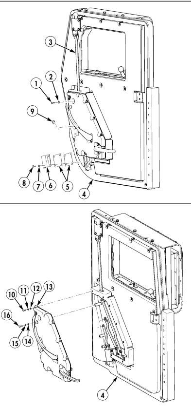

## M-11. Door Combat Lock And Linkage (Frag 5) Replacement (Cont'D)

6. Remove capscrew (27) and upper link (26) from upper combat lock (3). 7. Remove four capscrews (1), lockwashers (2), upper combat lock (3), and shim(s) (29) from door (4).

Discard lockwashers (2).

8. Remove capscrew (19) and lockwasher (20) from lower combat lock (15) and lower link (21). Discard lockwasher (20).

9. Remove four capscrews (18), lockwashers (17), lower combat lock cover (16), lower combat lock (15),
and shim(s) (14) from door (4). Discard lockwashers (17).

10. Remove spring (36) from lower lever (37). 11. Remove two capscrews (7), lockwashers (6), washers (5), upper guide (8), and shim (s) (9) from door (4). Discard lockwashers (6).

12. Remove two capscrews (10), lockwashers (11), lower guide (12), and shim (s) (13) from door (4).

Discard lockwashers (11).

13. Remove capscrew (25) and upper link (26) from upper lever (28). 14. Remove capscrew (24) and middle link (38) from upper lever (28). 15. Remove nut (39), capscrew (34), washer (33), washer (35), and middle link (38) from lower lever (37). 16. Remove nut (22), capscrew (32), washer (31), washer (30), and middle link (23), from lower lever (37).

#### B. Installation

1. Install middle link (23) on lower lever (37) with washer (30), washer (31), capscrew (32), and nut (22).

2. Install middle link (38) on lower lever (37) with washer (35), washer (33), capscrew (34), and nut (39).

3. Install middle link (38) on upper lever (28) with capscrew (24). 4. Install upper link (26) on upper lever (28) with capscrew (25). 5. Install lower guide (12), and shim (s) (13) on door (4) with two lockwashers (11) and capscrews (10). 6. Install upper guide (8), and shim (s) (9) on door (4) with two washers (5), lockwashers (6), and capscrews (7).

7. Install spring (36) on lower lever (37). 8. Apply adhesive sealant to four capscrews (18). 9. Install shim(s) (14), combat lock (15), and lower combat lock cover (16) on door (4) with four lockwashers (17) and capscrews (18).

10. Install lower link (21) on lower combat lock (15) with lockwasher (20) and capscrew (19). 11. Apply adhesive sealant to four capscrews (1). 12. Install shim(s) (29) and upper combat lock (3) on door (4) with four lockwashers (2) and capscrews (1).

13. Install upper link (26) on upper combat lock (3) with capscrew (27).

# M-11. Door Combat Lock And Linkage (Frag 5) Replacement (Cont'D)

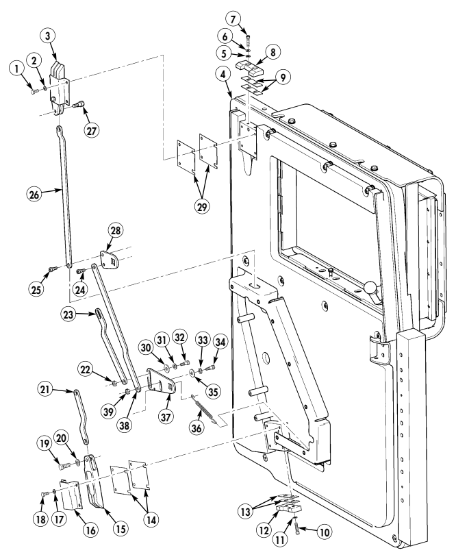

## M-11. Door Combat Lock And Linkage (Frag 5) Replacement (Cont'D)

14. Install lock release assembly (5) on door (4) with nine washers (3), lockwashers (2), and capscrews (1).

15. Secure lock release assembly (5) to door (4) with washer (6), lockwasher (7), and capscrew (8). 16. Install clip (16) on door linkage (11). 17. Install shim(s) (12) and combat lock cover (13) on door (4) with four lockwashers (14) and capscrews (15).

18. Secure door linkage (11) to lock release assembly (5) with washer (10) and capscrew (9).

# M-11. Door Combat Lock And Linkage (Frag 5) Replacement (Cont'D)

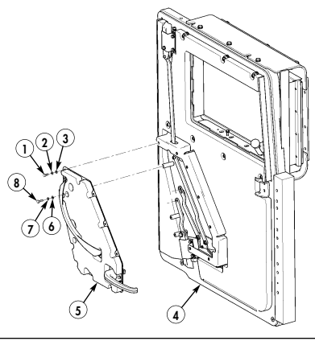

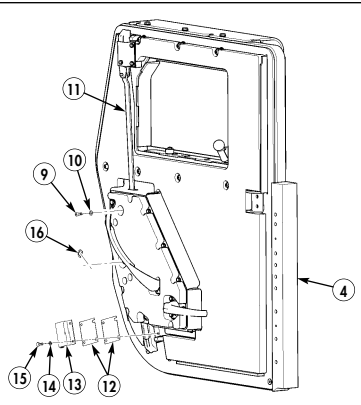

FOLLOW-ON TASK: Adjust door (Frag 5) (Appendix M, M-15).

## M-12. Door Insulation (Frag 5) Replacement

This task covers:

a. Removal b. Installation

Applicable Models M1151A1, M1152A1, M1165A1, M1167 Tools General mechanic's tool kit:
automotive (Appendix B, Item 1)

#### Materials/Parts

Silicone compound (Appendix C, Item 74) Drycleaning solvent (Appendix C, Item 26)

| Materials/Parts                             |
|---------------------------------------------|
| Six lockwashers (Appendix G, Item 144)      |
| Equipment Condition                         |
| B\-pillar IED overlay removed (if equipped) |
| (Appendix K, K\-10).                        |
| Manual References                           |
| TM 9\-2320\-387\-24P                        |
| Maintenance Level                           |

#### Warning

Dry cleaning solvent is highly flammable. Do not perform this procedure near fire, flames, or sparks. Injury to personnel or damage to equipment will result.

Replacement procedures for all door insulations (Frag 5) are basically the same. This procedure covers the left door insulation.

a. Removal 1. Remove insulation (1) from door lock release assembly (2). 2. Remove insulation (3) from door (4). 3. Clean surface of door (4) with drycleaning solvent to remove adhesive.

b. Installation 1. Apply thin coat of silicone compound adhesive on door insulation (1) and (3). 2. Install insulation (3) on door (4). 3. Install insulation (1) on door lock release assembly (2).

# M-12. Door Insulation (Frag 5) Replacement (Cont'D)

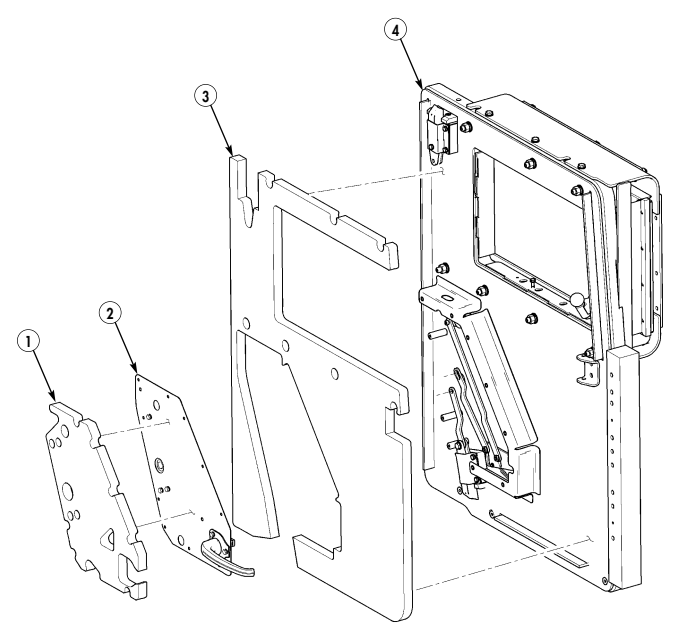

FOLLOW-ON TASK:
 Install door pull strap (Frag 5) (Appendix M, M-14).

## M-13. Door Seal (Frag 5) Replacement

This task covers:
a. Removal b. Installation INITIAL SETUP:
Applicable Models M1151A1, M1152A1, M1165A1, M1167

| Manual References   |
|---------------------|

Tools General mechanic's tool kit:
automotive (Appendix B, Item 1)

Replacement procedure for all door seals (Frag 5) are basically the same. This procedure covers the left door seal.

a. Removal Remove seal (1) from door (2).

b. Installation Install seal (1) on door (2).

# M-13. Door Seal (Frag 5) Replacement (Cont'D)

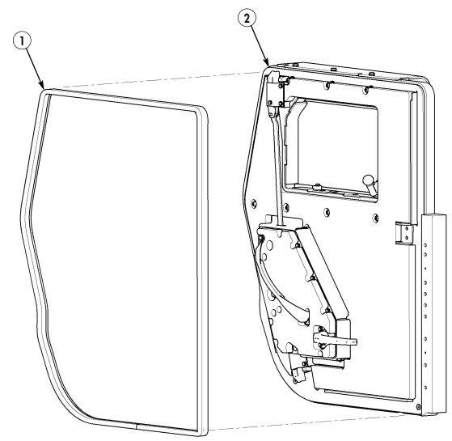

# M-14. Door Pull Strap (Frag 5) Replacement

This task covers:
a. Removal b. Installation

Tools Applicable Models M1151A1, M1152A1, M1165A1, M1167 Manual References TM 9-2320-387-24P

| Equipment Condition   |
|-----------------------|

General mechanic's tool kit:
automotive (Appendix B, Item 1)
Materials/Parts Adhesive sealant (Appendix C, Item 3.1) Fourteen lockwashers (Appendix G, Item 146) Two locknuts (Appendix G, Item 77)

Replacement procedures for all door pull straps (Frag 5) are basically the same. This procedure covers the left door pull strap.

a. Removal 1. Remove four capscrews (8), lockwashers (7), combat lock cover (6), and shim(s) (5) from door (4).

Discard lockwashers (7).

2. Remove clip (9) from door linkage (3). 3. Remove capscrew (1) and washer (2) from door linkage (3).

6. Remove two locknuts (16), washers (15), capscrews (10), washers (11), pull strap (22) and insulation (21) from lock release assembly (17). Discard locknuts (16).

#### B. Installation

1. Install insulation (21) and pull strap (22) on door (4) with two washers (11), capscrews (10),
washers (15), and locknuts (16).

2. Install lock release assembly (17) on door (4) with nine washers (14), lockwashers (13), and capscrews (12).

3. Install washer (18), lockwasher (19), and capscrew (20) on door (4). 4. Install washer (2) and capscrew (1) on door linkage (3). 5. Install clip (9) on door linkage (3). 6. Apply adhesive sealant to four capscrews (8). 7. Install shim(s) (5) and combat lock cover (6) on door (4) with four lockwashers (7) and capscrews (8).

4. Remove capscrew (20), lockwasher (19), and washer (18) from door (4). Discard lockwasher (19). 5. Remove nine capscrews (12), lockwashers (13), washers (14), and lock release assembly (17) from door (4). Discard lockwashers (13).

# M-14. Door Pull Strap (Frag 5) Replacement (Cont'D)

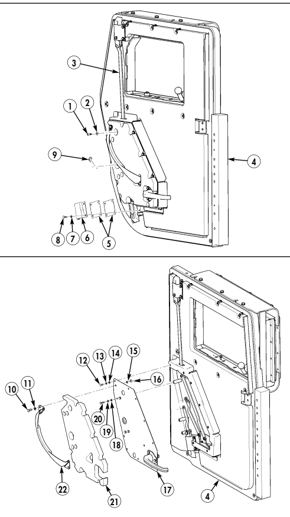

## M-15. Door (Frag 5) Adjustment

This task covers:
a. Adjustment

Applicable Models M1151A1, M1152A1, M1165A1, M1167 Tools General mechanic's tool kit:
automotive (Appendix B, Item 1)
Maintenance and repair shop equipment:
automotive (Appendix B, Item 2)

#### Materials/Parts

Twelve lockwashers (Appendix G, Item 146)
(if required)
Manual References TM 9-2320-387-24P
Maintenance Level Unit

- Adjustment procedures for all doors (Frag 5) are basically the same. This procedure covers the left door adjustment.

- If adjustment of door latch or combat latch is necessary, refer to para. M-11 for removal or installation of dovetail shims or combat lock shims.

#### A. Adjustment

1. Using dovetail shims(s) (3) adjust top dovetail (1) to 0.015 inch clearance between top dovetail (1)
and bottom of header armor (2).

2. Using combat lock shim(s) (5) adjust top door latch (4) so door closes with desired force. 3. Using dovetail shim(s) (10) adjust bottom dovetail (8) to 0.015 inch clearance between bottom dovetail (8) and top of rocker armor (9).

4. Using combat lock shim(s) (6) adjust bottom combat latch (7) so combat latch (7) engages freely.

M-15. DOOR (FRAG 5) ADJUSTMENT (Cont'd)

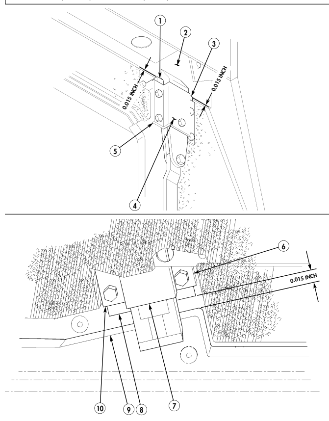

# M-16. Rearview Mirror (Frag 5) Maintenance

This task covers:

| Applicable Models ..   |
|------------------------|

M1151A1, M1152A1, M1165A1, M1167

| WWW.VALLVVAIN   |
|-----------------|
| Materials/Parts |

Tools General mechanic's tool kit:
automotive (Appendix B, Item 1)
Two lockwashers (Appendix G, Item 145) Five locknuts (Appendix G, Item 82) Two locknuts (Appendix G, Item 132)

a. Removal **c. Assembly** b. Disassembly **d. Installation**

Manual References TM 9-2320-387-10 TM 9-2320-387-24P

| Maintenance Level   |
|---------------------|

Unit

Replacement procedures for left and right rearview mirrors are basically the same. This procedure covers the left rearview mirror.

#### A. Removal

1. Remove locknut (9), washer (10), capscrew (7), and washer (8) from mirror assembly (3) and door side plate (4). Discard locknut (9).

2. Remove locknut (6), washer (5), capscrew (1), washer (2), and mirror assembly (3) from door side plate (4). Discard locknut (6).

#### B. Disassembly

1. Remove two capscrews (18), lockwashers (17), washers (16), spacers (14), and mirror (13) from brackets (15). Discard lockwashers (17).

2. Remove locknut (29), washer (30), nylon washer (32), capscrew (11), washer (33), and upper mounting bracket (31) from mirror arm assembly (12). Discard locknut (29).

3. Remove locknut (28), washer (27), and lower mounting bracket (26) from mirror lock (25). Discard locknut (28).

4. Remove locknut (23), washer (24), and mirror lock (25) from mirror arm assembly (12). Discard locknut (23).

To remove clamps, slide clamps off mirror arm assembly.

5. Remove two locknuts (19), washers (20), capscrews (22), clamps (21), and brackets (15) from mirror arm assembly (12). Discard locknuts (19).

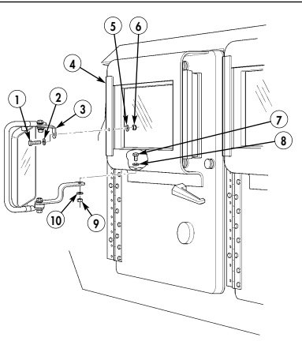

M-16.  REARVIEW MIRROR (FRAG 5) MAINTENANCE (Cont'd)

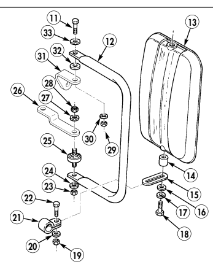

# M-16. Rearview Mirror (Frag 5) Maintenance (Cont'D)

c. Assembly

- To install clamps, slide clamps on mirror arm assembly. - Ensure clamps are positioned on mirror arm assembly to align with center of mirror head.

1. Install two clamps (21) and brackets (15) on mirror arm assembly (12). Install brackets (15)
between clamps (21) with two capscrews (22), washers (20), and locknuts (19).

2. Install mirror lock (25) on mirror arm assembly (12) with washer (24) and locknut (23). 3. Install lower mounting bracket (26) on mirror lock (25) with washer (27) and locknut (28). 4. Install upper mounting bracket (31) on mirror arm assembly (12) with capscrew (11), washer (33),
nylon washer (32), washer (30), and locknut (29).

Spacers must be positioned between mirror and brackets for proper installation.

5. Install mirror (13) and two spacers (14) on brackets (15) with washers (16), lockwashers (17), and capscrews (18).

#### D. Installation

1. Install mirror assembly (3) on door side plate (4) with capscrew (1), washer (2), washer (5), and locknut (6).

2. Secure mirror assembly (3) to door side plate (4) with washer (8), capscrew (7), washer (10), and locknut (9).

# M-16. Rearview Mirror (Frag 5) Maintenance (Cont'D)

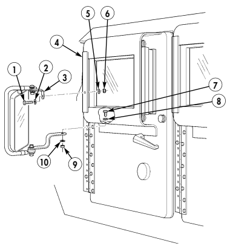

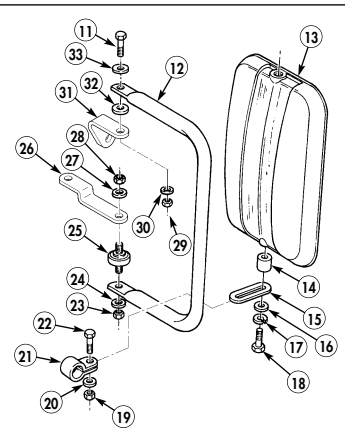

FOLLOW-ON TASK: Adjust rearview mirror (TM 9-2320-387-10).

INDEX

| This task covers:                                                                                          |                 |                                                                                                    |
|------------------------------------------------------------------------------------------------------------|-----------------|----------------------------------------------------------------------------------------------------|
| a. Removal b. Inspection d. Adjustment                                                                     | c. Installation |                                                                                                    |
| INITIAL SETUP:                                                                                             |                 |                                                                                                    |
| Applicable Models  Manual References                                                                       |                 |                                                                                                    |
| M1151A1, M1167 TM 9\-2320\-387\-24P                                                                        |                 |                                                                                                    |
| Tools Equipment Condition                                                                                  |                 |                                                                                                    |
| General mechanic's tool kit: - Left rear upper underbody armor                                             |                 |                                                                                                    |
| automotive (Appendix B, Item 1) (integrated) removed (para. 11\-109 or                                     |                 |                                                                                                    |
| Torque wrench 3/8\-in. drive, 75 ft\-lb  para. 11\-109.1).                                                 |                 |                                                                                                    |
| (Appendix B, Item 2.1) - Left rear seat back armor (perimeter)                                             |                 |                                                                                                    |
| removed (Appendix J, J\-29).                                                                               |                 |                                                                                                    |
| Materials/Parts                                                                                            |                 |                                                                                                    |
| Maintenance Level Two locknuts (Appendix G, Item 111)                                                      |                 |                                                                                                    |
| Four lockwashers (Appendix G, Item 158.1) Unit                                                             |                 |                                                                                                    |
| NOTE                                                                                                       |                 |                                                                                                    |
| Replacement procedures for left and right C\-partition isolator                                            |                 |                                                                                                    |
| brackets are basically the same. This procedure covers the left                                            |                 |                                                                                                    |
| C\-partition isolator bracket.                                                                             |                 |                                                                                                    |
| a. Removal                                                                                                 |                 |                                                                                                    |
| 1.  Remove two locknuts (3), two washers (2), two capscrews (9), four washers (6), four spacers (7), and   |                 |                                                                                                    |
| door stop (5) from isolator bracket (8) and C\-partition (4). Discard locknuts (3).                        |                 |                                                                                                    |
| 2.                                                                                                         |                 | Remove four capscrews (10), lockwashers (11), washers (12), nutplate (1), and isolator bracket (8) |
| from vehicle (13). Discard lockwashers (11).                                                               |                 |                                                                                                    |
| b. Inspection                                                                                              |                 |                                                                                                    |
| Refer to para 10\-56 for nut insert inspection and repair.                                                 |                 |                                                                                                    |
| c. Installation                                                                                            |                 |                                                                                                    |
| 1.  Install isolator bracket (8) on vehicle (13) with four washers (12), lockwashers (11), capscrews (10), |                 |                                                                                                    |
| and nutplate (1). Tighten capscrews (10) to 8 lb\-ft (11 N•m).                                             |                 |                                                                                                    |
| 2.  Install doorstop (5) to isolator bracket (8) and C\-partition (4) with two capscrews (9), four         |                 |                                                                                                    |
| spacers (7), washers (6), two washers (2) and locknuts (3).                                                |                 |                                                                                                    |
| d. Adjustment                                                                                              |                 |                                                                                                    |
| Adjust door stop (5) as necessary to allow C\-partition doors to slide into the fully open and locked      |                 |                                                                                                    |
| position.                                                                                                  |                 |                                                                                                    |

# Index (Cont'D)

| This task covers: a. Removal                                                                             | b. Installation      |
|----------------------------------------------------------------------------------------------------------|----------------------|
| INITIAL SETUP:                                                                                           |                      |
| Applicable Models                                                                                        | Manual References    |
| M1151A1, M1167                                                                                           | TM 9\-2320\-387\-24P |
| Tools                                                                                                    | Maintenance Level    |
| General mechanic's tool kit:                                                                             | Unit                 |
| automotive (Appendix B, Item 1)                                                                          |                      |
| Materials/Parts                                                                                          |                      |
| Two lockwashers (Appendix G, Item 159)                                                                   |                      |
| NOTE                                                                                                     |                      |
| Replacement procedures for left and right C\-partition door handle                                       |                      |
| and lock assemblies are basically the same. This procedure covers                                        |                      |
| the left C\-partition door handle and lock assembly.                                                     |                      |
| a. Removal                                                                                               |                      |
| Remove two capscrews (6), lockwashers (5), washers (4), handle (2), and lock assembly (1) from door (3). |                      |
| Discard lockwashers (5).                                                                                 |                      |
| b. Installation                                                                                          |                      |
| Install lock assembly (1) and handle (2) on door (3) with two capscrews (6), lockwashers (5), and        |                      |
| washers (4).                                                                                             |                      |
| 2                                                                                                        |                      |
| 1                                                                                                        |                      |
|                                                                                                          | 3                    |
|                                                                                                          | 4                    |

# Index (Cont'D)

| This task covers:                                                                                         |                              |
|-----------------------------------------------------------------------------------------------------------|------------------------------|
| a. Removal                                                                                                | b. Installation              |
| INITIAL SETUP:                                                                                            |                              |
| Applicable Models                                                                                         | Manual References            |
| M1151A1, M1167                                                                                            | TM 9\-2320\-387\-24P         |
| Tools                                                                                                     | Maintenance Level            |
| General mechanic's tool kit:                                                                              | Unit                         |
| automotive (Appendix B, Item 1)                                                                           |                              |
| Materials/Parts                                                                                           |                              |
| Three locknuts (Appendix G, Item 111)                                                                     |                              |
| NOTE                                                                                                      |                              |
| Replacement procedures for left and right C\-partition door gap                                           |                              |
| plates are basically the same. This procedure covers the left                                             | C\-partition door gap plate. |
| a. Removal                                                                                                |                              |
| Remove three locknuts (5), six washers (4), three capscrews (3), and door gap plate (2) from door (1).    |                              |
| Discard locknuts (5).                                                                                     |                              |
| b. Installation                                                                                           |                              |
| Install door gap plate (2) on door (1) with three capscrews (3), six washers (4), and three locknuts (5). |                              |
| 1                                                                                                         |                              |
| ~                                                                                                         |                              |
|                                                                                                           | 2                            |
| 5                                                                                                         |                              |
| 4                                                                                                         |                              |
| 4                                                                                                         |                              |

# Index (Cont'D)

| (NEW CONFIGURATION) REPLACEMENT                                                                  |                                         |                              |      |
|--------------------------------------------------------------------------------------------------|-----------------------------------------|------------------------------|------|
| This task covers:                                                                                | a. Removal                              | b. Installation              |      |
| INITIAL SETUP:                                                                                   | Applicable Models                       | Manual References            |      |
| M1151A1, M1165A1                                                                                 | TM 9\-2320\-387\-24P                    |                              |      |
| Tools                                                                                            | Maintenance Level                       | General mechanic's tool kit: | Unit |
| automotive (Appendix B, Item 1)                                                                  |                                         |                              |      |
| Materials/Parts                                                                                  | Five locknuts (Appendix G, Item 77)     |                              |      |
| a. Removal                                                                                       |                                         |                              |      |
| Remove five locknuts (1), ten washers (2), five capscrews (5), bracket (3), and doors (6) from   | C\-partition (4). Discard locknuts (1). |                              |      |
| b. Installation                                                                                  |                                         |                              |      |
| Install doors (6) on C\-partition (4) with bracket (3), five capscrews (5), ten washers (2), and | five locknuts (1).                      |                              |      |
| 5                                                                                                | 2                                       |                              |      |
| 4                                                                                                | 3                                       | 6                            |      |
| 2                                                                                                | ~                                       | 1                            |      |
| ~                                                                                                |                                         |                              |      |

# Index (Cont'D)

| a. Removal  c. Installation                                                                                  | This task covers:   |                  |
|--------------------------------------------------------------------------------------------------------------|---------------------|------------------|
| b. Inspection                                                                                                |                     |                  |
| INITIAL SETUP:                                                                                               |                     |                  |
| Applicable Models Manual References                                                                          |                     |                  |
| M1152A1 TM 9\-2320\-387\-24P                                                                                 |                     |                  |
| Maintenance Level                                                                                            | Tools               |                  |
| General mechanic's tool kit: Unit automotive (Appendix B, Item 1)                                            |                     |                  |
| Materials/Parts Three lockwashers (Appendix G, Item 144)                                                     |                     |                  |
| Lockwasher (Appendix G, Item 145)                                                                            |                     |                  |
| NOTE                                                                                                         |                     |                  |
| Replacement procedures for left and right header armor plate                                                 |                     |                  |
| assemblies (perimeter) are basically the same. This procedure covers the left header armor plate assembly.   |                     |                  |
| a. Removal                                                                                                   |                     |                  |
| Remove capscrew (6), lockwasher (7), and washer (8) from header armor plate (2) on A\-pillar armor           | 1.                  |                  |
| bracket (9). Discard lockwasher (7).                                                                         |                     |                  |
| Remove three capscrews (5), lockwashers (4), and washers (3), from header armor plate (2) on                 | 2.                  |                  |
| header armor gap bracket (10). Discard lockwashers (4).                                                      |                     |                  |
| NOTE                                                                                                         |                     |                  |
| Perform step 3 for vehicles equipped with enhanced perimeter armor only.                                     |                     |                  |
| Remove armor roof seal (1) from header armor plate (2).                                                      | 3.                  |                  |
| b. Inspection                                                                                                |                     |                  |
| Refer to para. 10\-56 for inspection and repair of weld nuts.                                                | 1.                  |                  |
| Inspect roof seal (1), replace if damaged.                                                                   | 2.                  |                  |
| c. Installation                                                                                              |                     |                  |
| NOTE Perform step 1 for vehicles equipped with enhanced perimeter                                            |                     |                  |
| armor only.                                                                                                  |                     |                  |
| Install armor roof seal (1) on header armor plate (2).                                                       | 1.                  |                  |
| Install header armor plate (2) on header armor gap bracket (10) with three washers (3),                      | 2.                  | lockwashers (4), |
| and capscrews (5).                                                                                           |                     |                  |
| Install header armor plate (2) on A\-pillar armor bracket (9) with washer (8), lockwasher (7), capscrew (6). | 3.                  | and              |

# Index (Cont'D)

| This task covers:                                                                                  | a. Removal                                                      | b. Installation                     |
|----------------------------------------------------------------------------------------------------|-----------------------------------------------------------------|-------------------------------------|
| INITIAL SETUP:                                                                                     | Applicable Models                                               | Manual References                   |
| M1152A1                                                                                            | TM 9\-2320\-387\-24P                                            | Equipment Condition                 |
| Tools                                                                                              | Header armor (perimeter) removed                                | General mechanic's tool kit:        |
| automotive (Appendix B, Item 1)                                                                    | (Appendix J, J\-57).                                            | Maintenance Level                   |
| Materials/Parts                                                                                    | Unit                                                            | Two locknuts (Appendix G, Item 106) |
| NOTE                                                                                               | Removal of left and right header armor gap brackets (perimeter) |                                     |
| are basically the same. This procedure covers the left header                                      | armor gap bracket.                                              |                                     |
| a. Removal                                                                                         |                                                                 |                                     |
| Remove two locknuts (4), four washers (2), two capscrews (1) and header armor gap bracket (3) from | vehicle (5). Discard locknuts (4).                              |                                     |
| b. Installation                                                                                    |                                                                 |                                     |
| Install header armor gap bracket (3) on vehicle (5) with four washers (2), two capscrews (1), and  | locknuts (4).                                                   |                                     |

# Index (Cont'D)

| b. Installation                                                                                    |                                          | a. Removal                                 | This task covers:   |
|----------------------------------------------------------------------------------------------------|------------------------------------------|--------------------------------------------|---------------------|
| INITIAL SETUP:                                                                                     |                                          |                                            |                     |
| Materials/Parts (Cont'd)                                                                           |                                          | Applicable Models                          |                     |
| M1152A1                                                                                            |                                          | Eight foam washers (Appendix G, Item 35.2) |                     |
| Sealing compound (Appendix C, Item 64)                                                             |                                          | Tools                                      |                     |
| Manual References                                                                                  |                                          | General mechanic's tool kit:               |                     |
| automotive (Appendix B, Item 1) TM 9\-2320\-387\-24P                                               |                                          |                                            |                     |
| General Safety Instructions                                                                        |                                          | Personnel Required                         |                     |
| Roof armor is extremely heavy and must be                                                          |                                          |                                            |                     |
| One mechanic                                                                                       |                                          |                                            |                     |
| supported during removal and installation.                                                         |                                          | One assistant                              |                     |
| Maintenance Level                                                                                  |                                          | Materials/Parts                            |                     |
| Unit                                                                                               |                                          | Two locknuts (Appendix G, Item 114.1)      |                     |
| Six locknuts (Appendix G, Item 106)                                                                |                                          |                                            |                     |
| Ten locknuts (Appendix G, Item 77)                                                                 |                                          |                                            |                     |
| Eight lockwashers (Appendix G, Item 146)                                                           |                                          |                                            |                     |
| WARNING                                                                                            |                                          |                                            |                     |
| Roof armor is extremely heavy and must be supported during                                         |                                          |                                            |                     |
| removal and installation.                                                                          | Failure to do so may result in injury to |                                            |                     |
| personnel or damage to equipment.                                                                  |                                          |                                            |                     |
| Remove four capscrews (1), lockwashers (2), washers (3), and left front armor plate (4) from roof  |                                          |                                            | 1.                  |
| Remove four capscrews (9), lockwashers (8), washers (7), and right front armor plate (6) from roof |                                          |                                            | 2.                  |
| armor (5). Discard lockwashers (8).                                                                |                                          |                                            |                     |
| Remove two locknuts (30), snubber (29), mounts (28), capscrews (14), washers (13), and foam        |                                          |                                            | 3.                  |
| washers (12) from roof armor (5). Discard locknuts (30) and foam washers (12).                     |                                          |                                            |                     |
|                                                                                                    |                                          |                                            | 4.                  |
| NOTE                                                                                               |                                          |                                            |                     |
| It may be necessary to remove some insulation to access fasteners.                                 |                                          |                                            |                     |
| Remove locknut (15), washer (16), foam washer (17), capscrew (23) and washer (22) from right side  |                                          |                                            | 5.                  |
| Remove five locknuts (27), washers (26), capscrews (18), washers (19), and foam washers (20) from  |                                          |                                            | 6.                  |
| roof armor (5). Discard locknuts (27) and foam washers (20).                                       |                                          |                                            |                     |
|                                                                                                    |                                          |                                            | 7.                  |
| a. Removal                                                                                         |                                          |                                            |                     |
| armor (5). Discard lockwashers (2).                                                                |                                          |                                            |                     |
| Remove self\-tapping screw(s) (25) and two headliner plates (24) from top of cab (21).             |                                          |                                            |                     |
| rear corner of roof armor (5). Discard locknut (15) and foam washer (17).                          |                                          |                                            |                     |
| Remove ten locknuts (31), washers (32), capscrews (10), washers (11), two side armor plates (33),  |                                          |                                            |                     |
| and roof armor (5) from top of cab (21). Discard locknuts (31).                                    |                                          |                                            |                     |

# Index (Cont'D)

| This task covers: a. Removal                                                                                              | b. Installation                                 |
|---------------------------------------------------------------------------------------------------------------------------|-------------------------------------------------|
| INITIAL SETUP:                                                                                                            |                                                 |
| Applicable Models                                                                                                         | Manual References                               |
| M1152A1                                                                                                                   | TM 9\-2320\-387\-24P                            |
| Tools                                                                                                                     | Equipment Condition                             |
| General mechanic's tool kit:                                                                                              | AFES wiring harness removed (para. 12\-154).    |
| automotive (Appendix B, Item 1)                                                                                           | General Safety Instructions                     |
| Materials/Parts                                                                                                           | Rear plate armor is extremely heavy and must be |
| Eight locknuts (Appendix G, Item 77)                                                                                      | supported during removal and installation.      |
| Five lockwashers (Appendix G, item 146)                                                                                   | Maintenance Level                               |
| Personnel Required                                                                                                        | Unit                                            |
| One mechanic                                                                                                              |                                                 |
| One assistant                                                                                                             |                                                 |
| WARNING                                                                                                                   |                                                 |
| Rear plate armor is extremely heavy and must be supported during removal and installation. Failure to do so may result in |                                                 |
| injury to personnel or damage to equipment.                                                                               |                                                 |
| a. Removal                                                                                                                |                                                 |
| 1.  Remove six nuts (10), capscrews (12), and washers (13) from side protector plate assemblies (1) and                   |                                                 |
| rear plate armor (4).                                                                                                     |                                                 |
| 2.  Remove eight locknuts (3) and capscrews (6) from top protector plate assembly (5) and rear plate                      |                                                 |
| armor (4). Discard locknuts (3).                                                                                          |                                                 |
| 3.  Remove five nuts (11), capscrews (7), lockwashers (8), and washers (9) from bottom of rear plate                      |                                                 |
| armor (4). Discard lockwashers (8).                                                                                       |                                                 |
| 4.  Remove rear plate armor (4) from vehicle (2).                                                                         |                                                 |
| b. Installation                                                                                                           |                                                 |
| 1.  Install rear plate armor (4) on vehicle (2) with five washers (9), lockwashers (8), capscrews (7), and                |                                                 |
| nuts (11).                                                                                                                |                                                 |
| 2.  Install rear plate armor (4) and top protector plate assembly (5) to vehicle (2) with eight locknuts (3)              |                                                 |
| and capscrews (6).                                                                                                        |                                                 |
| 3.  Install rear plate armor (4) to side protector plate assemblies (1) with three capscrews (12), washers (13),          |                                                 |
| and nuts (10).                                                                                                            |                                                 |

# Index (Cont'D)

| MAINTENANCE                                                                                              |
|----------------------------------------------------------------------------------------------------------|
| This task covers:                                                                                        |
| a. Removal c. Installation                                                                               |
| b.  Inspection                                                                                           |
| INITIAL SETUP:                                                                                           |
| Applicable Models Personnel Required                                                                     |
| M1151A1, M1152A1, M1165A1, M1167 One mechanic                                                            |
| One assistant Tools                                                                                      |
| Manual References                                                                                        |
| General mechanic's tool kit:                                                                             |
| automotive (Appendix B, Item 1) TM 9\-2320\-387\-24P                                                     |
| Torque wrench 3/8\-in. drive, 75 lb\-ft  General Safety Instructions                                     |
| (Appendix B, Item 2.1) Vehicle door is extremely heavy and must be                                       |
| Materials/Parts supported during removal and installation.                                               |
| Four lockwashers (Appendix G, Item 145) Maintenance Level                                                |
| Nine locknuts (Appendix G, Item 87) Unit                                                                 |
| Three locknuts (Appendix G, Item 82)                                                                     |
| WARNING                                                                                                  |
| Vehicle door is extremely heavy and must be supported during                                             |
| removal and installation. Failure to do so may cause injury to                                           |
| personnel or damage to equipment.                                                                        |
| NOTE                                                                                                     |
| - Replacement procedures for doors, door hinges, and check                                               |
| straps are basically the same. This procedure covers the left                                            |
| side door, door hinge, and check strap.                                                                  |
| - Use a sling as a lifting aid to position front and rear doors for                                      |
| removal and installation.                                                                                |
| a. Removal                                                                                               |
| 1.  Remove locknut (24), washer (25), capscrew (30), washer (31), and check strap (32) from door hinge   |
| bracket (26). Discard locknut (24).                                                                      |
| 2.  Remove two locknuts (29), lockwashers (28), washers (27), capscrews (22), washers (23), and door     |
| hinge bracket (26) from doors (5) and (9). Discard locknuts (29) and lockwashers (28).                   |
| NOTE                                                                                                     |
| Perform step 3 for front doors only.                                                                     |
| Perform step 4 for rear doors only.                                                                      |
| 3.  Remove ten capscrews (1) and washers (2) from door hinge (3) and vehicle (4).                        |
| 4.  Remove twelve capscrews (13) and washers (12) from door hinge (7) and vehicle (4).                   |
| 5.  Remove two capscrews (19) and (14), washers (20) and (15), and lockwashers (21) and (16) from        |
| door hinges (3) and (7), and vehicle (4). Discard lockwashers (21) and (16).                             |
| 6.  Remove nine locknuts (18) and (11), washers (17) and (10), capscrews (6) and (8), doors (5) and (9), |
| and door hinges (3) and (7) from vehicle (4). Discard locknuts (18) and (11).                            |
| b. Inspection                                                                                            |

# Index (Cont'D)

| This task covers:                                                                                      |
|--------------------------------------------------------------------------------------------------------|
| a. Removal b. Installation                                                                             |
| INITIAL SETUP:                                                                                         |
| Applicable Models Manual References                                                                    |
| M1151A1, M1152A1, M1165A1, M1167 TM 9\-2320\-387\-24P                                                  |
| Tools Equipment Condition                                                                              |
| General mechanic's tool kit: Rearview mirror assembly (front door only)                                |
| automotive (Appendix B, Item 1) (standard threat doors) removed (Appendix J, J\-72).                   |
| Materials/Parts General Safety Instructions                                                            |
| Six lockwashers (Appendix G, Item 174) Door window is extremely heavy and must be                      |
| Three lockwashers (Appendix G, Item 155) supported during removal and installation.                    |
| Unit                                                                                                   |
| Door window is extremely heavy and must be supported during                                            |
| removal and installation. Failure to do so may result in injury to                                     |
| personnel or damage to equipment.                                                                      |
| NOTE                                                                                                   |
| Replacement procedures for all door windows (standard threat)                                          |
| are basically the same. This procedure covers the left rear door                                       |
| window.                                                                                                |
| a. Removal                                                                                             |
| 1.  Remove three capscrews (11), lockwashers (12), and washers (13) from door water deflector (2) and  |
| frame plate (7). Discard lockwashers (12).                                                             |
| 2.  Remove four capscrews (1) and door water deflector (2) from door (3).                              |
| 3.  Remove six nuts (10), lockwashers (9), washers (8), and frame plate (7) from upper rollers (4) and |
| lower rollers (5). Discard lockwashers (9).                                                            |
| 4.  Slide window (6) off upper rollers (4) and lower rollers (5).                                      |
| b. Installation                                                                                        |
| 1.  Slide window (6) on upper rollers (4) and lower rollers (5).                                       |
| 2.  Install frame plate (7) on upper rollers (4) and lower rollers (5) with six washers (8),           |
| lockwashers (9), and nuts (10).                                                                        |
| 3.  Install door water deflector (2) on door (3) with four capscrews (1).                              |
| 4.  Secure door water deflector (2) to door (3) with three washers (13), lockwashers (12), and         |
| capscrews (11).                                                                                        |
| Maintenance Level                                                                                      |
| WARNING                                                                                                |

# Index (Cont'D)

| This task covers:                                                  | a.                                                                                     | Removal                                                              | b.                                                                                               | Installation   |
|--------------------------------------------------------------------|----------------------------------------------------------------------------------------|----------------------------------------------------------------------|--------------------------------------------------------------------------------------------------|----------------|
| INITIAL SETUP:                                                     | Applicable Models                                                                      | Manual References                                                    |                                                                                                  |                |
| M1151A1, M1152A1, M1165A1, M1167                                   | TM 9\-2320\-387\-24P                                                                   | Tools                                                                | Equipment Condition                                                                              |                |
| General mechanic's tool kit:                                       | Door window (standard threat) removed                                                  | automotive (Appendix B, Item 1)                                      | (Appendix J, J\-62).                                                                             |                |
| Materials/Parts                                                    | General Safety Instructions                                                            | Sealing compound (Appendix C, item 68)                               | Door glass is extremely heavy and must be                                                        |                |
| Locknut (Appendix G, Item 77)                                      | supported during removal and installation.                                             | Maintenance Level                                                    |                                                                                                  |                |
| Unit                                                               |                                                                                        |                                                                      |                                                                                                  |                |
| WARNING                                                            | Door glass is extremely heavy and must be supported during                             |                                                                      |                                                                                                  |                |
| removal and installation. Failure to do so may result in injury to | personnel or damage to equipment.                                                      |                                                                      |                                                                                                  |                |
| NOTE                                                               | - Replacement procedures for all door glass and handles                                |                                                                      |                                                                                                  |                |
| (standard threat) are basically the same. This procedure covers    | the left door glass and handle.                                                        |                                                                      |                                                                                                  |                |
| - Note position of seals for installation.                         |                                                                                        |                                                                      |                                                                                                  |                |
| a. Removal                                                         |                                                                                        |                                                                      |                                                                                                  |                |
| 1.                                                                 | Remove four capscrews (1), washers (2), and glass retainer (12) from window frame (8). | 2.                                                                   | Remove glass (11) from window frame (8).                                                         |                |
| 3.                                                                 | Remove eight screws (4) and two roller tracks (3) from window frame (8).               | 4.                                                                   | Remove four screws (7) and handle (6) from window frame (8).                                     |                |
| 5.                                                                 | Remove seal (9) from spacer plate (10) and glass (11).                                 | 6.                                                                   | Remove seal (5) from window frame (8).                                                           |                |
| 7.                                                                 | Remove two spacer plates (10) from glass (11).                                         | 8.                                                                   | Remove locknut (14), washer (15), capscrew (17), and washer (16) from window stop latch (13) and |                |
| vehicle (18). Discard locknut (14).                                | 9.                                                                                     | Remove spring pin (19) and window stop latch (13) from vehicle (18). |                                                                                                  |                |
| b. Inspection                                                      |                                                                                        |                                                                      |                                                                                                  |                |
| Inspect seals for damage. Replace if necessary.                    |                                                                                        |                                                                      |                                                                                                  |                |

# Index (Cont'D)

| This task covers:                                                   | a.                                                           | Removal                                                                                                | b.                                                                                        | Installation   |
|---------------------------------------------------------------------|--------------------------------------------------------------|--------------------------------------------------------------------------------------------------------|-------------------------------------------------------------------------------------------|----------------|
| INITIAL SETUP:                                                      | Applicable Models                                            | Manual References                                                                                      |                                                                                           |                |
| M1151A1, M1152A1, M1165A1, M1167                                    | TM 9\-2320\-387\-24P                                         | Tools                                                                                                  | Equipment Condition                                                                       |                |
| General mechanic's tool kit:                                        | Door window (standard threat) removed                        | automotive (Appendix B, Item 1)                                                                        | (Appendix J, J\-62).                                                                      |                |
| Torque wrench 1/2\-in. drive, 250 lb\-ft                            | Maintenance Level                                            | (Appendix B, Item 2.1)                                                                                 |                                                                                           |                |
| Unit                                                                | Materials/Parts                                              |                                                                                                        |                                                                                           |                |
| Seven lockwashers (Appendix G, Item 174)                            |                                                              |                                                                                                        |                                                                                           |                |
| NOTE                                                                | Replacement procedures for all door window rollers (standard |                                                                                                        |                                                                                           |                |
| threat) are basically the same. This procedure covers the left rear | door window rollers.                                         |                                                                                                        |                                                                                           |                |
| a. Removal                                                          |                                                              |                                                                                                        |                                                                                           |                |
| 1.                                                                  | Remove six roller sleeves (9) from window rollers (10).      | 2.                                                                                                     | Remove six nuts (4), lockwashers (3), washers (2), and window rollers (10) from door (1). |                |
| Discard lockwashers (3).                                            | 3.                                                           | Remove nut (7), lockwasher (6), washer (5), and window roller (8) from door (1).                       |                                                                                           |                |
| Discard lockwasher (6).                                             |                                                              |                                                                                                        |                                                                                           |                |
| b. Installation                                                     |                                                              |                                                                                                        |                                                                                           |                |
| NOTE                                                                | Window rollers and roller sleeves need to be installed with  |                                                                                                        |                                                                                           |                |
| recessed sides facing inboard.                                      | 1.                                                           | Install window roller (8) on door (1) with washer (5), lockwasher (6), and nut (7). Tighten nut (7) to |                                                                                           |                |
| 105 lb\-ft (142 N•m).                                               | 2.                                                           | Install six window rollers (10) on door (1) with six washers (2), lockwashers (3), and nuts (4).       |                                                                                           |                |
| Tighten nuts (4) to 105 lb\-ft (142 N•m).                           | 3.                                                           | Install six roller sleeves (9) on window rollers (10).                                                 |                                                                                           |                |

INDEX (Cont'd)

| (STANDARD THREAT) REPLACEMENT                                                                           |
|---------------------------------------------------------------------------------------------------------|
| This task covers:                                                                                       |
| a.  Removal  b.  Installation                                                                           |
| INITIAL SETUP:                                                                                          |
| Applicable Models Materials/Parts                                                                       |
| M1151A1, M1152A1, M1165A1, M1167 Nine lockwashers (Appendix G, Item 146)                                |
| Two locknuts (Appendix G, Item 77) Tools                                                                |
| Manual References General mechanic's tool kit:                                                          |
| automotive (Appendix B, Item 1) TM 9\-2320\-387\-24P                                                    |
| Torque wrench 3/8\-in. drive, 75 lb\-ft                                                                 |
| Maintenance Level (Appendix B, Item 2.1)                                                                |
| Unit                                                                                                    |
| NOTE                                                                                                    |
| Replacement procedures for all interior door handles, linkage                                           |
| access panels, and pull straps (standard threat) are basically the                                      |
| same. This procedure covers the left rear interior door handle,                                         |
| linkage access panel, and pull strap.                                                                   |
| a. Removal                                                                                              |
| 1.  Remove four capscrews (22), washers (23), and pull strap (12) from linkage access panel (7).        |
| 2.  Remove two locknuts (16), washers (15), capscrews (13), and washers (14) from access panel (7) and  |
| lock (17). Discard locknuts (16).                                                                       |
| 3.  Remove two capscrews (18), lockwashers (19), and washers (20) from access panel (7), lock (17), and |
| spacer (21). Discard lockwashers (19).                                                                  |
| 4.  Remove seven capscrews (24), lockwashers (25), washers (26), and linkage access panel (7) from      |
| door bracket (1). Discard lockwashers (25).                                                             |
| 5.  Remove three capscrews (10) and washers (9) from door handle (8) and linkage access panel (7).      |
| 6.  Remove spring tension washer (11), clip (6), clip (2), washer (3), wave washer (4), and             |
| door handle (8) from linkage access panel (7) and lever (5).                                            |
| b. Installation                                                                                         |
| 1.  Install door handle (8) on linkage access panel (7) and lever (5) with wave washer (4), washer (3), |
| clip (2), spring tension washer (11), and clip (6).                                                     |
| 2.  Secure door handle (8) to linkage access panel (7) with three washers (9) and capscrews (10) .      |
| Tighten capscrews (10) to 8 lb\-ft (11 N•m).                                                            |
| 3.  Install linkage access panel (7) on door bracket (1) with seven washers (26), lockwashers (25), and |
| capscrews (24). Tighten capscrews (24) to 8 lb\-ft (11 N•m).                                            |
| 4.  Install lock (17) on spacer (21) and access panel (7) with two washers (20), lockwashers (19), and  |
| capscrews (18). Tighten capscrews (18) to 17 lb\-ft (23 N•m).                                           |
| 5.  Secure lock (17) to access panel (7) with two washers (14), capscrews (13), washers (15), and       |
| locknuts (16).                                                                                          |
| 6.  Install pull strap (12) on linkage access panel (7) with four washers (23) and capscrews (22).      |
| Tighten capscrews (22) to 17 lb\-ft (23 N•m).                                                           |

# Index (Cont'D)

| AND TIEDOWN (STANDARD THREAT) REPLACEMENT   |                                                                                                       |                                                   |                                                           |              |
|---------------------------------------------|-------------------------------------------------------------------------------------------------------|---------------------------------------------------|-----------------------------------------------------------|--------------|
| This task covers:                           | a.                                                                                                    | Removal                                           | b.                                                        | Installation |
| INITIAL SETUP:                              | Applicable Models                                                                                     | Manual References                                 |                                                           |              |
| TM 9\-2320\-387\-24P                        | M1151A1, M1152A1, M1165A1, M1167                                                                      | Tools                                             | Equipment Condition                                       |              |
| General mechanic's tool kit:                | Linkage access panel removed (Appendix J, J\-65).                                                     | automotive (Appendix B, Item 1)                   | Maintenance Level                                         |              |
| Torque wrench 3/8\-in. drive, 75 lb\-ft     | Unit                                                                                                  | (Appendix B, Item 2.1)                            |                                                           |              |
| Materials/Parts                             | Two lockwashers (Appendix G, Item 146)                                                                |                                                   |                                                           |              |
| Three lockwashers (Appendix G, Item 144)    | Three locknuts (Appendix G, Item 77)                                                                  |                                                   |                                                           |              |
| Locknut (Appendix G, Item 132)              |                                                                                                       |                                                   |                                                           |              |
| NOTE                                        | Replacement procedures for all exterior door handles,                                                 | wrench                                            |                                                           |              |
| access covers,                              | and tiedowns (standard threat) are basically the                                                      | same.                                             | This procedure covers the left rear exterior door handle, |              |
| wrench access cover,                        | and tiedown.                                                                                          |                                                   |                                                           |              |
| a. Removal                                  |                                                                                                       |                                                   |                                                           |              |
| 1.                                          | Remove two locknuts (3), washers (2), capscrews (20), and washers (21) from exterior door handle (22) | and door (1). Discard locknuts (3).               |                                                           |              |
| 2.                                          | Remove locknut (19), washer (18), capscrew (7), and washer (8), from exterior door handle (22) and    | door (1). Discard locknut (19).                   |                                                           |              |
| 3.                                          | Remove locknut (4), washer (5), washer (6), and exterior door handle (22) from door (1).              | Discard locknut (4).                              |                                                           |              |
| 4.                                          | Remove three capscrews (13), lockwashers (12), washers (11), tiedown retainer (10), and tiedown       | ring (9) from door (1). Discard lockwashers (12). |                                                           |              |
| 5.                                          | Remove two capscrews (17), lockwashers (16), washers (15), and wrench access cover (14) from          | door (1). Discard lockwashers (16).               |                                                           |              |

# Index (Cont'D)

| This task covers:                                                                                                                                            |
|--------------------------------------------------------------------------------------------------------------------------------------------------------------|
| a.  Removal  b.  Installation                                                                                                                                |
| INITIAL SETUP:                                                                                                                                               |
| Applicable Models Manual References                                                                                                                          |
| M1151A1, M1152A1, M1165A1, M1167 TM 9\-2320\-387\-24P                                                                                                        |
| Tools Equipment Condition                                                                                                                                    |
| General mechanic's tool kit: Interior door handle and linkage access panel                                                                                   |
| automotive (Appendix B, Item 1) removed (Appendix J, J\-65).                                                                                                 |
| Torque wrench 3/8\-in. drive, 75 lb\-ft  Maintenance Level (Appendix B, Item 2.1)                                                                            |
| Unit                                                                                                                                                         |
| Materials/Parts                                                                                                                                              |
| Fourteen lockwashers (Appendix G, Item 146)                                                                                                                  |
| Two cotter pins (Appendix G, Item 25)                                                                                                                        |
| NOTE                                                                                                                                                         |
| Replacement procedures for all door locks and linkages (standard                                                                                             |
| threat) are basically the same. This procedure covers the left rear                                                                                          |
| door lock and linkage.                                                                                                                                       |
| a. Removal                                                                                                                                                   |
| 1.  Remove two cotter pins (41) and (43), washers (42) and (44), and lock (35) from middle link (34) and lower link (40). Discard cotter pins (41) and (43). |
| 2.  Remove capscrew (57) and upper link (56) from upper combat lock (3).                                                                                     |
| 3.  Remove four lockwashers (2), capscrews (1), upper combat lock (3), and shim(s) (4) from spacer                                                           |
| block (10). Discard lockwashers (2).                                                                                                                         |
| 4.  Remove two washers (5), lockwashers (6), capscrews (7), upper guide (8), and shim(s) (9) from                                                            |
| spacer block (10). Discard lockwashers (6).                                                                                                                  |
| 5.  Remove capscrew (13), washer (12), screw (14), and spacer block (10) from door (11).                                                                     |
| 6.  Remove capscrew (39) from lower combat lock (38) and lower link (40).                                                                                    |
| 7.  Remove four lockwashers (37), capscrews (36), lower combat lock cover (32), lower combat lock (38),                                                      |
| and shim(s) (31), from spacer block (30). Discard lockwashers (37).                                                                                          |
| 8.  Remove two lockwashers (27), capscrews (26), lower guide (28), and shim(s) (29) from                                                                     |
| spacer block (30). Discard lockwashers (27).                                                                                                                 |
| 9.  Remove washer (17), lockwasher (16), capscrew (15), and spacer block (30) from door (11). Discard                                                        |
| lockwasher (16).                                                                                                                                             |
| 10.  Remove spring (18) from lower lever (19) and door (11).                                                                                                 |
| 11.  Remove washer (54), capscrew (55), washer (53), and upper link (56) from upper lever (51).                                                              |
| 12.  Remove washer (46), capscrew (45), middle link (33), and washer (47) from upper lever (51).                                                             |
| 13.  Remove nut (48), washer (49), and lockwasher (50) from upper lever (51) and stud (52) on door (11).                                                     |
| Discard lockwasher (50).                                                                                                                                     |
| 14.  Remove washer (21), capscrew (22), washer (20), and middle link (34) from lower lever (19).                                                             |
| 15.  Remove washer (23), capscrew (25), washer (24), and middle link (33) from lower lever (19).                                                             |

# Index (Cont'D)

| MAINTENANCE                                                      |                                                                                              |                                         |                                                                        |              |
|------------------------------------------------------------------|----------------------------------------------------------------------------------------------|-----------------------------------------|------------------------------------------------------------------------|--------------|
| This task covers:                                                | a.                                                                                           | Removal                                 | c.                                                                     | Installation |
| b.                                                               | Inspection                                                                                   |                                         |                                                                        |              |
| INITIAL SETUP:                                                   | Applicable Models                                                                            | Manual References                       |                                                                        |              |
| M1151A1, M1152A1, M1165A1, M1167                                 | TM 9\-2320\-387\-24P                                                                         | Tools                                   | Equipment Condition                                                    |              |
| General mechanic's tool kit:                                     | Door pull strap (standard threat) removed                                                    | automotive (Appendix B, Item 1)         | (Appendix J, J\-65).                                                   |              |
| Torque wrench 3/8\-in. drive, 75 lb\-ft                          | General Safety Instructions                                                                  | (Appendix B, Item 2.1)                  | Dry cleaning solvent is highly flammable. Do not                       |              |
| Materials/Parts                                                  | perform this procedure near fire, flames, or sparks.                                         | Silicone compound (Appendix C, Item 74) | Maintenance Level                                                      |              |
| Drycleaning solvent (Appendix C, Item 26)                        | Unit                                                                                         | Ten lockwashers (Appendix G, Item 146)  |                                                                        |              |
| WARNING                                                          | Dry cleaning solvent is highly flammable. Do not perform this                                |                                         |                                                                        |              |
| procedure near fire, flames, or sparks. Injury to personnel or   | damage to equipment will result.                                                             |                                         |                                                                        |              |
| NOTE                                                             | Replacement procedures for front door insulation, seal, and                                  |                                         |                                                                        |              |
| returns (standard threat) are basically the same. This procedure | covers the left front door insulation, seal, and returns.                                    |                                         |                                                                        |              |
| a. Removal                                                       |                                                                                              |                                         |                                                                        |              |
| 1.                                                               | Remove six capscrews (8), lockwashers (9), washers (10), and door return (11) from door (2). | Discard lockwashers (9).                |                                                                        |              |
| 2.                                                               | Remove four capscrews (6), lockwashers (5), washers (4), and door return (3) from door (2).  | Discard lockwashers (5).                |                                                                        |              |
| 3.                                                               | Remove insulations (7) and (12) from door (2).                                               | 4.                                      | Clean surface of door (2) with drycleaning solvent to remove adhesive. |              |
| 5.                                                               | Remove seal (1) from door (2).                                                               |                                         |                                                                        |              |
| b. Inspection                                                    |                                                                                              |                                         |                                                                        |              |
| 1.                                                               | Inspect door seal (1) for damage. Replace if necessary.                                      | 2.                                      | Inspect insulations (7) and (12) for damage. Replace if necessary.     |              |

INDEX (Cont'd)

| MAINTENANCE                                                                              |    |                                                      |                                                                    |
|------------------------------------------------------------------------------------------|----|------------------------------------------------------|--------------------------------------------------------------------|
| This task covers:                                                                        |    |                                                      |                                                                    |
| a. Removal c. Installation                                                               |    |                                                      |                                                                    |
| b.  Inspection                                                                           |    |                                                      |                                                                    |
| INITIAL SETUP:                                                                           |    |                                                      |                                                                    |
| Applicable Models Manual References                                                      |    |                                                      |                                                                    |
| M1151A1, M1165A1, M1167 TM 9\-2320\-387\-24P                                             |    |                                                      |                                                                    |
| Tools Equipment Condition                                                                |    |                                                      |                                                                    |
| General mechanic's tool kit: Door pull strap (standard threat) removed                   |    |                                                      |                                                                    |
| automotive (Appendix B, Item 1) (Appendix J, J\-65).                                     |    |                                                      |                                                                    |
| Torque wrench 3/8\-in. drive, 75 lb\-ft  General Safety Instructions                     |    |                                                      |                                                                    |
| (Appendix B, Item 2.1)                                                                   |    |                                                      |                                                                    |
| Materials/Parts                                                                          |    | Dry cleaning solvent is highly flammable. Do not     |                                                                    |
| Silicone compound (Appendix C, Item 74)                                                  |    | perform this procedure near fire, flames, or sparks. |                                                                    |
| Maintenance Level                                                                        |    |                                                      |                                                                    |
| Drycleaning solvent (Appendix C, Item 26)                                                |    |                                                      |                                                                    |
| Unit Ten lockwashers (Appendix G, Item 146)                                              |    |                                                      |                                                                    |
| WARNING                                                                                  |    |                                                      |                                                                    |
| Dry cleaning solvent is highly flammable. Do not perform this                            |    |                                                      |                                                                    |
| procedure near fire, flames, or sparks. Injury to personnel or                           |    |                                                      |                                                                    |
| damage to equipment will result.                                                         |    |                                                      |                                                                    |
| NOTE                                                                                     |    |                                                      |                                                                    |
| are basically the same. This procedure covers the left rear door                         |    |                                                      | Replacement procedures for rear door insulation, seal, and returns |
| insulation, seal, and returns.                                                           |    |                                                      |                                                                    |
| a. Removal                                                                               |    |                                                      |                                                                    |
| Remove four capscrews (6), lockwashers (5), washers (4), and return (3) from door (2).   | 1. |                                                      |                                                                    |
| Discard lockwashers (5).                                                                 |    |                                                      |                                                                    |
| Remove six capscrews (10), lockwashers (11), washers (12), and return (8) from door (2). | 2. |                                                      |                                                                    |
| Discard lockwashers (11).                                                                |    |                                                      |                                                                    |
| Remove insulations (7) and (9) from door (2).                                            | 3. |                                                      |                                                                    |
| Clean surface of door (2) with drycleaning solvent to remove adhesive.                   | 4. |                                                      |                                                                    |
| Remove seal (1) from door (2).                                                           | 5. |                                                      |                                                                    |
| b. Inspection                                                                            |    |                                                      |                                                                    |
| Inspect door seal (1) for damage. Replace if necessary.                                  | 1. |                                                      |                                                                    |
| Inspect insulations (7) and (9) for damage. Replace if necessary.                        | 2. |                                                      |                                                                    |

# Index (Cont'D)

| This task covers:                                                                               | a.                                                             | Removal                         | b.                   | Installation   |
|-------------------------------------------------------------------------------------------------|----------------------------------------------------------------|---------------------------------|----------------------|----------------|
| INITIAL SETUP:                                                                                  | Applicable Models                                              | Manual References               |                      |                |
| M1151A1, M1152A1, M1165A1, M1167                                                                | TM 9\-2320\-387\-24P                                           | Tools                           | Equipment Condition  |                |
| General mechanic's tool kit:                                                                    | Linkage access panel (standard threat) removed                 | automotive (Appendix B, Item 1) | (Appendix J, J\-65). |                |
| Torque wrench 3/8\-in. drive, 75 lb\-ft                                                         | Maintenance Level                                              | (Appendix B, Item 2.1)          |                      |                |
| Unit                                                                                            | Materials/Parts                                                |                                 |                      |                |
| Nine lockwashers (Appendix G, Item 146)                                                         |                                                                |                                 |                      |                |
| NOTE                                                                                            | Replacement procedures for all door brackets (standard threat) |                                 |                      |                |
| are basically the same.                                                                         | This procedure covers the left rear door                       | bracket.                        |                      |                |
| a. Removal                                                                                      |                                                                |                                 |                      |                |
| Remove nine capscrews (1), lockwashers (2), washers (3), and bracket (4) from door (5). Discard | lockwashers (2).                                               |                                 |                      |                |
| b. Installation                                                                                 |                                                                |                                 |                      |                |
| Install bracket (4) on door (5) with nine washers (3), lockwashers (2), and capscrews (1).      | Tighten capscrews (1) to 17 lb\-ft (23 N•m).                   |                                 |                      |                |

# Index (Cont'D)

| This task covers:                | a.                                                                                                   | Adjustment                                                                                          |                                                                                                    |                      |
|----------------------------------|------------------------------------------------------------------------------------------------------|-----------------------------------------------------------------------------------------------------|----------------------------------------------------------------------------------------------------|----------------------|
| INITIAL SETUP:                   | Applicable Models                                                                                    | Manual References                                                                                   |                                                                                                    |                      |
| M1151A1, M1152A1, M1165A1, M1167 | TM 9\-2320\-387\-24P                                                                                 | Tools                                                                                               | General Safety Instructions                                                                        |                      |
| General mechanic's tool kit:     | Do not remove all four capscrews and washers                                                         | automotive (Appendix B, Item 1)                                                                     | from top door latch.                                                                               |                      |
| Materials/Parts                  | Maintenance Level                                                                                    | Twelve lockwashers (Appendix G, Item 146)                                                           | Unit                                                                                               |                      |
| (if required)                    |                                                                                                      |                                                                                                     |                                                                                                    |                      |
| NOTE                             | -                                                                                                    | Adjustment procedures for all doors (standard threat) are basically                                 |                                                                                                    |                      |
| the same.                        | This procedure covers the front door adjustment.                                                     | -                                                                                                   | Adjust top latch first and if necessary,                                                           | adjust bottom latch. |
| a. Adjustment                    |                                                                                                      |                                                                                                     |                                                                                                    |                      |
| 1.                               | Remove two capscrews (1) and lockwashers (2) from top door latch (8) and using dovetail shim(s) (5), | adjust top dovetail (3) to 0.015 inch clearance between top dovetail (3) and bottom of header armor | (4).                                                                                               |                      |
| WARNING                          | Do not remove all four capscrews and washers from top door latch                                     |                                                                                                     |                                                                                                    |                      |
| at one time.                     | Removal of all four capscrews and washers will cause                                                 | tension spring to release which can result in injury to personnel.                                  |                                                                                                    |                      |
| 2.                               | Remove two capscrews (6) and lockwashers (7) from top door latch (8).                                | 3.                                                                                                  | Loosen two remaining capscrews (6) and lockwashers (7) on top door latch (8) and using combat lock |                      |
| shim(s) (9),                     | adjust top door latch (8) so door closes with desired force and door seal is compressed.             |                                                                                                     |                                                                                                    |                      |
| 1                                | 2                                                                                                    |                                                                                                     |                                                                                                    |                      |
| 3                                | 0.015                                                                                                | 4                                                                                                   |                                                                                                    |                      |
| INCH                             | 5                                                                                                    |                                                                                                     |                                                                                                    |                      |
| ~                                |                                                                                                      |                                                                                                     |                                                                                                    |                      |
| 0.015                            | 6                                                                                                    | INCH                                                                                                |                                                                                                    |                      |
| ~                                |                                                                                                      |                                                                                                     |                                                                                                    |                      |
| 7                                | 9                                                                                                    |                                                                                                     |                                                                                                    |                      |
| 8                                |                                                                                                      |                                                                                                     |                                                                                                    |                      |

# Index (Cont'D)

| This task covers:                                                                                 | a.                                                        | Removal                             | c.           | Assembly   |
|---------------------------------------------------------------------------------------------------|-----------------------------------------------------------|-------------------------------------|--------------|------------|
| b.                                                                                                | Disassembly                                               | d.                                  | Installation |            |
| INITIAL SETUP:                                                                                    | Applicable Models                                         | Materials/Parts                     |              |            |
| M1151A1, M1152A1, M1165A1, M1167                                                                  | Two lockwashers (Appendix G, Item 145)                    | Five locknuts (Appendix G, Item 82) | Tools        |            |
| Two locknuts (Appendix G, Item 132)                                                               | General mechanic's tool kit:                              | Manual References                   |              |            |
| automotive (Appendix B, Item 1)                                                                   | Torque wrench 3/8\-in. drive, 75 lb\-ft                   | TM 9\-2320\-387\-24P                |              |            |
| (Appendix B, Item 2.1)                                                                            | Maintenance Level                                         |                                     |              |            |
| Unit                                                                                              |                                                           |                                     |              |            |
| NOTE                                                                                              | Replacement procedures for left and right rearview mirror |                                     |              |            |
| assemblies (standard threat doors) are basically the same.                                        | This procedure covers the right rearview mirror assembly. |                                     |              |            |
| a. Removal                                                                                        |                                                           |                                     |              |            |
| Remove two locknuts (1), washers (2), capscrews (5), and washers (6) from mirror assembly (4) and | door side plate (3). Discard locknuts (1).                |                                     |              |            |
| 1                                                                                                 | 2                                                         |                                     |              |            |
| 4                                                                                                 |                                                           |                                     |              |            |
| 3                                                                                                 |                                                           |                                     |              |            |
| 5                                                                                                 |                                                           |                                     |              |            |
| 6                                                                                                 |                                                           |                                     |              |            |

# Index (Cont'D)

| IED OVERLAY (FRAG 1) (M1151A1, M1152A1,                                                             |     |
|-----------------------------------------------------------------------------------------------------|-----|
| M1165A1, M1167 W/PERIMETER B KIT) KIT                                                               |     |
| Section I. INTRODUCTION                                                                             |     |
| K\-1. SCOPE                                                                                         |     |
| This appendix includes complete instructions for the maintenance of the IED Overlay (Frag 1)        |     |
| (M1151A1, M1152A1, M1165A1, M1167 w/Perimeter B Kit) Kit.                                           |     |
| K\-2. GENERAL                                                                                       |     |
| Your vehicle may come equipped with the IED Overlay (Frag 1) (M1151A1, M1152A1, M1165A1, M1167      |     |
| w/Perimeter B Kit) Kit. The following procedures provide you with the instructions you will need to |     |
| maintain or replace any of the components within this kit.                                          |     |
| Section II. IED M1167 OVERLAY (FRAG 1) (M1151A1, M1152A1,                                           |     |
| M1165A1 W/PERIMETER B KIT) KIT MAINTENANCE                                                          |     |
| K\-3. IED OVERLAY (FRAG 1) (M1151A1, M1152A1, M1165A1, M1167 W/PERIMETER B                          |     |
| KIT) KIT MAINTENANCE TASK SUMMARY                                                                   |     |
| TASK  PAGE                                                                                          |     |
| PROCEDURES                                                                                          |     |
| PARA.                                                                                               | NO. |
| K\-4. Left Lower A\-Pillar IED Overlay (Frag 1) Maintenance  K\-2                                   |     |
| K\-5. Left Upper A\-Pillar IED Overlay (Frag 1) Maintenance                                         |     |
| (M1151A1 w/Perimeter B Kit) K\-4                                                                    |     |
| K\-6. Left Upper A\-Pillar IED Overlay (Frag 1) Maintenance                                         |     |
| (M1152A1, M1165A1, M1167 w/Perimeter B Kit) K\-6                                                    |     |
| K\-7. Right A\-Pillar IED Overlay (Frag 1) Maintenance                                              |     |
| (M1151A1 w/Perimeter B Kit) K\-8                                                                    |     |
| K\-8. Right A\-Pillar IED Overlay (Frag 1) Maintenance                                              |     |
| (M1152A1, M1165A1, M1167 w/Perimeter B Kit) K\-10                                                   |     |
| K\-9. B\-Pillar IED Overlay (Frag 1) Maintenance                                                    |     |
| (M1151A1, M1165A1 w/Perimeter B Kit) K\-12                                                          |     |
| K\-10. B\-Pillar IED Overlay (Frag 1) Maintenance                                                   |     |
| (M1151A1, M1152A1, M1165A1 [Serial Numbers 239991 and Above],                                       |     |
| M1167 w/Perimeter B Kit) K\-14                                                                      |     |
| K\-11. C\-Pillar IED Overlay (Frag 1) Maintenance (M1151A1 w/Perimeter B Kit)  K\-16                |     |
| K\-12. Left C\-Pillar IED Overlay (Frag 1) Maintenance                                              |     |
| (M1151A1, M1165A1, M1167 w/Perimeter B Kit) K\-18                                                   |     |
| K\-13. Right C\-Pillar IED Overlay (Frag 1) Maintenance                                             |     |
| (M1165A1 w/Perimeter B Kit) K\-20                                                                   |     |
| K\-14. Rocker Plate IED Overlay (Frag 1) Maintenance                                                |     |
| (M1151A1, M1152A1, M1165A1 [Serial Numbers 239991                                                   |     |
| and Above], M1167 w/Perimeter B Kit) K\-22                                                          |     |
| K\-15. Rocker Plate IED Overlay (Frag 1) Maintenance                                                |     |
| (M1165A1 w/Perimeter B Kit) K\-24                                                                   |     |
| K\-16. Rocker Plate IED Overlay (Frag 1) Maintenance                                                |     |

# Index (Cont'D)

| This task covers:                                                | a. Removal                                                                                        | c. Installation                                                                              |                                              |
|------------------------------------------------------------------|---------------------------------------------------------------------------------------------------|----------------------------------------------------------------------------------------------|----------------------------------------------|
| b. Inspection                                                    |                                                                                                   |                                                                                              |                                              |
| INITIAL SETUP:                                                   | Applicable Models                                                                                 | Manual References                                                                            |                                              |
| M1151A1, M1152A1, M1165A1,                                       | TM 9\-2320\-387\-24P                                                                              | M1167 w/Perimeter B Kit                                                                      | Equipment Condition                          |
| Tools                                                            | - Upper rocker plate (Frag 1) removed (M1152A1                                                    | General mechanic's tool kit:                                                                 | w/Perimeter B Kit only) (Appendix K, K\-16). |
| automotive (Appendix B, Item 1)                                  | - Upper rocker plate (Frag 1) removed (M1165A1                                                    | Torque wrench 3/8\-in. drive, 75 lb\-ft                                                      | w/Perimeter B Kit only) (Appendix K, K\-15). |
| (Appendix B, Item 2.1)                                           | - Left front door removed (Frag 5)                                                                | (Appendix M, M\-4).                                                                          |                                              |
| Materials/Parts                                                  | Maintenance Level                                                                                 | Lockwasher (Appendix G, Item 144)                                                            |                                              |
| Five locknuts (Appendix G, Item 106)                             | Unit                                                                                              |                                                                                              |                                              |
| a. Removal                                                       |                                                                                                   |                                                                                              |                                              |
| 1.                                                               | Remove capscrew (5), lockwasher (4), and washer (3) from left lower A\-pillar IED overlay (2) and | body (1). Discard lockwasher (4).                                                            |                                              |
| 2.                                                               | Remove five locknuts (10), washers (9), capscrews (6), washers (7), and left lower A\-pillar IED  | overlay (2) from front underbody armor (8) and body (1). Discard locknuts (10).              |                                              |
| b. Inspection                                                    |                                                                                                   |                                                                                              |                                              |
| Refer to para. 10\-56 for nut insert inspection and replacement. |                                                                                                   |                                                                                              |                                              |
| c. Installation                                                  |                                                                                                   |                                                                                              |                                              |
| 1.                                                               | Install left lower A\-pillar IED overlay (2) on body (1) and front underbody armor (8) with       | six washers (7), capscrews (6), washers (9), and locknuts (10). Tighten capscrews (6) to     |                                              |
| 44 lb\-ft (59 N•m).                                              | 2.                                                                                                | Secure left lower A\-pillar IED overlay (2) to body (1) with washer (3), lockwasher (4), and |                                              |
| capscrew (5). Tighten capscrew (5) to 31 lb\-ft (42 N•m).        |                                                                                                   |                                                                                              |                                              |

INDEX (Cont'd)

| (M1151A1 W/PERIMETER B KIT)                                      |                                                                                                                |                                                                          |                                              |
|------------------------------------------------------------------|----------------------------------------------------------------------------------------------------------------|--------------------------------------------------------------------------|----------------------------------------------|
| This task covers:                                                | a. Removal                                                                                                     | c. Installation                                                          |                                              |
| b. Inspection                                                    |                                                                                                                |                                                                          |                                              |
| INITIAL SETUP:                                                   | Applicable Models                                                                                              | Materials/Parts                                                          |                                              |
| M1151A1 w/Perimeter B Kit                                        | Three lockwashers (Appendix G, Item 145)                                                                       | Locknut (Appendix G, Item 106)                                           |                                              |
| Tools                                                            | Manual References                                                                                              | General mechanic's tool kit:                                             |                                              |
| automotive (Appendix B, Item 1)                                  | TM 9\-2320\-387\-24P                                                                                           | Torque wrench 3/8\-in. drive, 75 lb\-ft                                  | Maintenance Level                            |
| (Appendix B, Item 2.1)                                           | Unit                                                                                                           |                                                                          |                                              |
| a. Removal                                                       |                                                                                                                |                                                                          |                                              |
| 1.                                                               | Remove locknut (1), washer (2), capscrew (9), and washer (8) from left upper A\-pillar IED overlay (4)         | and A\-pillar bracket (3). Discard locknut (1).                          |                                              |
| 2.                                                               | Remove three capscrews (7), lockwashers (6), washers (5), and left upper A\-pillar IED overlay (4)             | from A\-pillar bracket (3). Discard lockwashers (6).                     |                                              |
| b. Inspection                                                    |                                                                                                                |                                                                          |                                              |
| Refer to para. 10\-56 for nut insert inspection and replacement. |                                                                                                                |                                                                          |                                              |
| c. Installation                                                  |                                                                                                                |                                                                          |                                              |
| 1.                                                               | Install left upper A\-pillar IED overlay (4) on A\-pillar bracket (3) with three washers (5), lockwashers (6), | and capscrews (7).                                                       | Tighten capscrews (7) to 17 lb\-ft (23 N•m). |
| 2.                                                               | Secure left upper A\-pillar IED overlay (4) to A\-pillar bracket (3) with washer (8), capscrew (9),            | washer (2), and locknut (1). Tighten capscrew (9) to 24 lb\-ft (32 N•m). |                                              |

# Index (Cont'D)

| (M1152A1, M1165A1, M1167 W/PERIMETER B KIT)                      |                                                                                                             |                                                                          |                                              |
|------------------------------------------------------------------|-------------------------------------------------------------------------------------------------------------|--------------------------------------------------------------------------|----------------------------------------------|
| This task covers:                                                | a. Removal                                                                                                  | c. Installation                                                          |                                              |
| b. Inspection                                                    |                                                                                                             |                                                                          |                                              |
| INITIAL SETUP:                                                   | Applicable Models                                                                                           | Materials/Parts                                                          |                                              |
| M1152A1, M1165A1, M1167 w/Perimeter B Kit                        | Three lockwashers (Appendix G, Item 145)                                                                    | Locknut (Appendix G, Item 106)                                           |                                              |
| Tools                                                            | Manual References                                                                                           | General mechanic's tool kit:                                             |                                              |
| automotive (Appendix B, Item 1)                                  | TM 9\-2320\-387\-24P                                                                                        | Torque wrench 3/8\-in. drive, 75 lb\-ft                                  | Maintenance Level                            |
| (Appendix B, Item 2.1)                                           | Unit                                                                                                        |                                                                          |                                              |
| NOTE                                                             | Replacement procedures for M1152A1, M1165A1, and M1167 left                                                 |                                                                          |                                              |
| upper A\-pillar IED overlay assemblies are the same. This        | procedure covers the M1152A1 left upper A\-pillar IED overlay                                               |                                                                          |                                              |
| assembly.                                                        |                                                                                                             |                                                                          |                                              |
| a. Removal                                                       |                                                                                                             |                                                                          |                                              |
| 1.                                                               | Remove locknut (1), washer (2), capscrew (9), and washer (10) from left upper A\-pillar IED                 | overlay (4) and A\-pillar bracket (3). Discard locknut (1).              |                                              |
| 2.                                                               | Remove three capscrews (8), lockwashers (7), washers (6), plate (5), and left upper A\-pillar IED           | overlay (4) from A\-pillar bracket (3). Discard lockwashers (7).         |                                              |
| b. Inspection                                                    |                                                                                                             |                                                                          |                                              |
| Refer to para. 10\-56 for nut insert inspection and replacement. |                                                                                                             |                                                                          |                                              |
| c. Installation                                                  |                                                                                                             |                                                                          |                                              |
| 1.                                                               | Install left upper A\-pillar IED overlay (4) and plate (5) on A\-pillar bracket (3) with three washers (6), | lockwashers (7), and capscrews (8).                                      | Tighten capscrews (8) to 17 lb\-ft (23 N•m). |
| 2.                                                               | Secure left upper A\-pillar IED overlay (4) to A\-pillar bracket (3) with washer (10), capscrew (9),        | washer (2), and locknut (1). Tighten capscrew (9) to 24 lb\-ft (32 N•m). |                                              |

# Index (Cont'D)

| (M1151A1 W/PERIMETER B KIT)                                                                                         |
|---------------------------------------------------------------------------------------------------------------------|
| This task covers:                                                                                                   |
| a. Removal c. Installation                                                                                          |
| b. Inspection                                                                                                       |
| INITIAL SETUP:                                                                                                      |
| Applicable Models Equipment Condition                                                                               |
| M1151A1 w/Perimeter B Kit Right front door (Frag 5) removed (para. M\-4).                                           |
| Tools Manual References                                                                                             |
| General mechanic's tool kit: TM 9\-2320\-387\-24P                                                                   |
| automotive (Appendix B, Item 1)                                                                                     |
| Maintenance Level Torque wrench 3/8\-in. drive, 75 lb\-ft                                                           |
| (Appendix B, Item 2.1) Unit                                                                                         |
| Materials/Parts                                                                                                     |
| Five lockwashers (Appendix G, Item 144)                                                                             |
| Three lockwashers (Appendix G, Item 145)                                                                            |
| Five locknuts (Appendix G, Item 106)                                                                                |
| Locknut (Appendix G, Item 82)                                                                                       |
| a. Removal                                                                                                          |
| 1.  Remove three capscrews (23), lockwashers (22), washers (21), vent cover IED overlay (20), vent                  |
| cover (19), and six spacers (18) from body (8). Discard lockwashers (22).                                           |
| 2.  Remove capscrew (24), lockwasher (25), and washer (26) from right upper A\-pillar IED overlay (4).              |
| Discard lockwasher (25).                                                                                            |
| 3.  Remove locknut (7), washer (6), capscrew (27), and washer (28) from right upper A\-pillar IED                   |
| overlay (4). Discard locknut (7).                                                                                   |
| 4.  Remove three capscrews (1), lockwashers (2), washers (3), and right upper A\-pillar IED overlay (4)             |
| from A\-pillar bracket (5). Discard lockwashers (2).                                                                |
| 5.  Remove capscrew (17), lockwasher (16), and washer (15) from right lower A\-pillar IED overlay (14).             |
| Discard lockwasher (16).                                                                                            |
| 6.  Remove five locknuts (9), washers (10), capscrews (13), washers (12), and right lower A\-pillar IED             |
| overlay (14) from body (8) and front underbody armor (11). Discard locknuts (9).                                    |
| b. Inspection                                                                                                       |
| Refer to para. 10\-56 for nut insert inspection and replacement.                                                    |
| b. Installation                                                                                                     |
| 1.  Install right lower A\-pillar IED overlay (14) on body (8) and front underbody armor (11) with                  |
| five washers (12), capscrews (13), washers (10), and locknuts (9). Tighten capscrews (13) to                        |
| 44 lb\-ft (59 N•m).                                                                                                 |
| 2.  Secure right lower A\-pillar IED overlay (14) to body (8) with washer (15), lockwasher (16), and                |
| capscrew (17). Tighten capscrew (17) to 31 lb\-ft (42 N•m).                                                         |
| 3.  Install right upper A\-pillar IED overlay (4) on A\-pillar bracket (5) with three washers (3), lockwashers (2), |
| and capscrews (1). Tighten capscrews (1) to 17 lb\-ft (23 N•m).                                                     |

# Index (Cont'D)

| (M1152A1, M1165A1, M1167 W/PERIMETER B KIT)                                                              |
|----------------------------------------------------------------------------------------------------------|
| This task covers:                                                                                        |
| a. Removal  c. Installation                                                                              |
| b. Inspection                                                                                            |
| INITIAL SETUP:                                                                                           |
| Applicable Models Materials/Parts                                                                        |
| M1152A1, M1165A1, M1167 Five lockwashers (Appendix G, Item 144)                                          |
| w/Perimeter B Kit Three lockwashers (Appendix G, Item 145)                                               |
| Five locknuts (Appendix G, Item 106)                                                                     |
| Tools Locknut (Appendix G, Item 82)                                                                      |
| General mechanic's tool kit: Manual References                                                           |
| automotive (Appendix B, Item 1) TM 9\-2320\-387\-24P                                                     |
| Torque wrench 3/8\-in. drive, 75 lb\-ft                                                                  |
| (Appendix B, Item 2.1) Maintenance Level                                                                 |
| Unit                                                                                                     |
| NOTE                                                                                                     |
| Replacement procedures for M1152A1, M1165A1, and M1167                                                   |
| right A\-pillar IED overlay assemblies are the same. This                                                |
| procedure covers the M1152A1 right A\-pillar IED overlay.                                                |
| a. Removal                                                                                               |
| 1.  Remove three capscrews (24), lockwashers (23), washers (22), vent cover IED overlay (21), vent       |
| cover (20), and six spacers (19) from body (9). Discard lockwashers (23).                                |
| 2.  Remove capscrew (27), lockwasher (26) and washer (25) from right upper A\-pillar IED overlay (5).    |
| Discard lockwasher (26).                                                                                 |
| 3.  Remove locknut (8), washer (7), capscrew (29), and washer (28) from right upper A\-pillar IED        |
| overlay (5). Discard locknut (8).                                                                        |
| 4.  Remove three capscrews (1), lockwashers (2), washers (3), plate (4), and right upper A\-pillar IED   |
| overlay (5) from A\-pillar bracket (6). Discard lockwashers (2).                                         |
| 5.  Remove capscrew (18), lockwasher (17), and washer (16) from right lower A\-pillar IED overlay (15).  |
| Discard lockwasher (17).                                                                                 |
| 6.  Remove five locknuts (10), washers (11), capscrews (14), washers (13), and right lower A\-pillar IED |
| overlay (15) from body (9) and front underbody armor (12). Discard locknuts (10).                        |
| b. Inspection                                                                                            |
| Refer to para. 10\-56 for nut insert inspection and replacement.                                         |
| c. Installation                                                                                          |
| 1.  Install right lower A\-pillar IED overlay (15) on body (9) and front underbody armor (12) with       |
| five washers (13), capscrews (14), washers (11), and locknuts (10). Tighten capscrews (14) to            |
| 44 lb\-ft (59 N•m).                                                                                      |
| 2.  Secure right lower A\-pillar IED overlay (15) to body (9) with washer (16), lockwasher (17), and     |
| capscrew (18). Tighten capscrew (18) to 31 lb\-ft (42 N•m).                                              |
| 3.  Install right upper A\-pillar IED overlay (5) and plate (4) on A\-pillar bracket (6) with three      |

INDEX (Cont'd)

| (M1151A1, M1165A1 W/PERIMETER B KIT)                             |                                                                                                       |                                                                                  |
|------------------------------------------------------------------|-------------------------------------------------------------------------------------------------------|----------------------------------------------------------------------------------|
| This task covers:                                                | a. Removal                                                                                            | c. Installation                                                                  |
| b. Inspection                                                    |                                                                                                       |                                                                                  |
| INITIAL SETUP:                                                   | Applicable Models                                                                                     | Materials/Parts                                                                  |
| M1151A1, M1165A1 w/Perimeter B Kit                               | Four lockwashers (Appendix G, Item 144)                                                               | Manual References                                                                |
| Tools                                                            | TM 9\-2320\-387\-24P                                                                                  | General mechanic's tool kit:                                                     |
| automotive (Appendix B, Item 1)                                  | Maintenance Level                                                                                     | Torque wrench 3/8\-in. drive, 75 lb\-ft                                          |
| Unit                                                             | (Appendix B, Item 2.1)                                                                                |                                                                                  |
| NOTE                                                             | Replacement procedures for M1151A1 and M1165A1 left and right                                         |                                                                                  |
| B\-pillar IED overlays are basically the same. This procedure    | covers the left B\-pillar IED overlay.                                                                |                                                                                  |
| a. Removal                                                       |                                                                                                       |                                                                                  |
| 1.                                                               | Remove two capscrews (4), lockwashers (5), washers (6), from nutplate (2), B\-pillar reinforcement    | plate (3) and body (1). Discard lockwashers (5).                                 |
| 2.                                                               | Remove capscrew (7), lockwasher (8), washer (9), washer (10), and B\-pillar reinforcement plate (3)   | from B\-pillar IED overlay (14). Discard lockwasher (8).                         |
| 3.                                                               | Remove capscrew (11), lockwasher (12), washer (13), and B\-pillar IED overlay (14) from B\-pillar     | armor (15). Discard lockwasher (12).                                             |
| b. Inspection                                                    |                                                                                                       |                                                                                  |
| Refer to para. 10\-56 for nut insert inspection and replacement. |                                                                                                       |                                                                                  |
| c. Installation                                                  |                                                                                                       |                                                                                  |
| 1.                                                               | Install B\-pillar IED overlay (14) on B\-pillar armor (15) with washer (13), lockwasher (12), and     | capscrew (11). Tighten capscrew (11) to 31 lb\-ft (42 N•m).                      |
| 2.                                                               | Install B\-pillar reinforcement plate (3) on B\-pillar IED overlay (14) with washer (10), washer (9), | lockwasher (8), and capscrew (7). Tighten capscrew (7) to 31 lb\-ft (42 N•m).    |
| 3.                                                               | Install B\-pillar reinforcement plate (3) on body (1) and nutplate (2) with two washers (6),          | lockwashers (5), and capscrews (4). Tighten capscrews (4) to 31 lb\-ft (42 N•m). |

# Index (Cont'D)

| (M1151A1 W/PERIMETER B KIT)                                      |                                                                                                  |                                                                                                           |
|------------------------------------------------------------------|--------------------------------------------------------------------------------------------------|-----------------------------------------------------------------------------------------------------------|
| This task covers:                                                |                                                                                                  |                                                                                                           |
| a. Removal                                                       |                                                                                                  | c. Installation                                                                                           |
| b. Inspection                                                    |                                                                                                  |                                                                                                           |
| INITIAL SETUP:                                                   |                                                                                                  |                                                                                                           |
| Applicable Models                                                |                                                                                                  | Materials/Parts                                                                                           |
| M1151A1 w/Perimeter B Kit                                        |                                                                                                  | Five lockwashers (Appendix G, Item 144)                                                                   |
| Manual References                                                |                                                                                                  | Tools                                                                                                     |
| TM 9\-2320\-387\-24P                                             |                                                                                                  | General mechanics tool kit:                                                                               |
| automotive (Appendix B, Item 1)                                  |                                                                                                  | Maintenance Level                                                                                         |
| Torque wrench 3/8\-in. drive, 75 lb\-ft                          |                                                                                                  | Unit                                                                                                      |
| (Appendix B, Item 2.1)                                           |                                                                                                  |                                                                                                           |
| a. Removal                                                       |                                                                                                  |                                                                                                           |
| NOTE                                                             |                                                                                                  |                                                                                                           |
| - Perform step 1 for left C\-pillar IED overlay.                 |                                                                                                  |                                                                                                           |
| - Perform step 2 for right C\-pillar IED overlay.                |                                                                                                  |                                                                                                           |
| 1.                                                               |                                                                                                  | Remove three capscrews (1), lockwashers (2), washers (3), and left C\-pillar IED overlay (4) from left    |
| C\-pillar (5). Discard lockwashers (2).                          |                                                                                                  |                                                                                                           |
| 2.                                                               | Remove two capscrews (8), lockwashers (7), washers (6), and right C\-pillar IED overlay (9) from |                                                                                                           |
| right C\-pillar (10). Discard lockwashers (7).                   |                                                                                                  |                                                                                                           |
| b. Inspection                                                    |                                                                                                  |                                                                                                           |
| Refer to para. 10\-56 for nut insert inspection and replacement. |                                                                                                  |                                                                                                           |
| c. Installation                                                  |                                                                                                  |                                                                                                           |
| - Perform step 1 for right C\-pillar IED overlay.                |                                                                                                  |                                                                                                           |
| 1.                                                               |                                                                                                  | Install right C\-pillar IED overlay (9) on right C\-pillar (10) with two washers (6), lockwashers (7),    |
| and capscrews (8). Tighten capscrews (8) to 31 lb\-ft (42 N•m).  |                                                                                                  |                                                                                                           |
| 2.                                                               |                                                                                                  | Install left C\-pillar IED overlay (4) on left C\-pillar (5) with three washers (3), lockwashers (2), and |
| capscrews (1). Tighten capscrews (1) to 31 lb\-ft (42 N•m).      |                                                                                                  |                                                                                                           |
| NOTE                                                             |                                                                                                  |                                                                                                           |
| - Perform step 2 for left C\-pillar IED overlay.                 |                                                                                                  |                                                                                                           |

# Index (Cont'D)

| W/PERIMETER B KIT)                                                                                          |       |
|-------------------------------------------------------------------------------------------------------------|-------|
| This task covers:                                                                                           |       |
| a. Removal  c. Installation                                                                                 |       |
| b. Inspection                                                                                               |       |
| INITIAL SETUP:                                                                                              |       |
| Applicable Models Personnel Required                                                                        |       |
| M1151A1, M1165A1, M1167 w/Perimeter B Kit One mechanic                                                      |       |
| One assistant                                                                                               | Tools |
| Manual References General mechanic's tool kit:                                                              |       |
| automotive (Appendix B, Item 1) TM 9\-2320\-387\-24P                                                        |       |
| Torque wrench 3/8\-in. drive, 75 lb\-ft  General Safety Instructions (Appendix B, Item 2.1)                 |       |
| Left C\-pillar IED overlay is extremely heavy and                                                           |       |
| Materials/Parts must be supported during removal and                                                        |       |
| Five lockwashers (Appendix G, Item 144) installation.                                                       |       |
| Maintenance Level                                                                                           |       |
| Unit                                                                                                        |       |
| WARNING                                                                                                     |       |
| Left C\-pillar IED overlay is extremely heavy and must be                                                   |       |
| supported during removal and installation. Failure to do so may                                             |       |
| result in injury to personnel or damage to equipment.                                                       |       |
| a. Removal                                                                                                  |       |
| Remove two capscrews (7), lockwashers (6), and washers (5) from left upper C\-pillar cover plate (8),       | 1.    |
| left C\-pillar cover plate (12), and left C\-pillar armor (1). Discard lockwashers (6).                     |       |
|                                                                                                             | 2.    |
| C\-pillar cover plate (12) and C\-pillar (1) on vehicle (13). Discard lockwasher (10).                      |       |
| Remove two capscrews (4), lockwashers (3), washers (2), and left C\-pillar cover plate (12) from            | 3.    |
| C\-pillar armor (1). Discard lockwashers (3).                                                               |       |
| b. Inspection                                                                                               |       |
| Refer to para. 10\-56 for nut insert inspection and replacement.                                            |       |
| c. Installation                                                                                             |       |
| capscrews (4). Do not tighten capscrews at this time.                                                       |       |
| Install left upper C\-pillar plate (8) on left C\-pillar cover plate (12) and C\-pillar armor (1) with two  | 2.    |
| washers (5), lockwashers (6), and capscrews (7). Tighten capscrews (7) to 31 lb\-ft (42 N•m).               |       |
|                                                                                                             | 3.    |
| lockwasher (10), and capscrew (11). Tighten capscrews (11) to 31 lb\-ft (42 N•m).                           |       |
| Remove capscrew (11), lockwasher (10), washer (9), and left upper C\-pillar plate (8) from left             |       |
| Install left C\-pillar cover plate (12) on left C\-pillar armor with two washers (2), lockwashers (3), and  | 1.    |
| Install left upper C\-pillar plate (8) on left C\-pillar cover plate (12) and vehicle (13) with washer (9), |       |
|                                                                                                             | 4.    |
| Tighten capscrews (4) installed in step 1 to 31 lb\-ft (42 N•m).                                            |       |

# Index (Cont'D)

| W/PERIMETER B KIT)                                               |                                                                                                           |                                                                                     |                                          |
|------------------------------------------------------------------|-----------------------------------------------------------------------------------------------------------|-------------------------------------------------------------------------------------|------------------------------------------|
| This task covers:                                                | a. Removal                                                                                                | c. Installation                                                                     |                                          |
| b. Inspection                                                    |                                                                                                           |                                                                                     |                                          |
| INITIAL SETUP:                                                   | Applicable Models                                                                                         | Materials/Parts                                                                     |                                          |
| M1151A1, M1165A1, M1167 w/Perimeter B                            | Two locknuts (Appendix G, Item 106)                                                                       | Kit                                                                                 | Three lockwashers (Appendix G, Item 145) |
| Four lockwashers (Appendix G, Item 144)                          | Tools                                                                                                     | Manual References                                                                   |                                          |
| General mechanic's tool kit:                                     | automotive (Appendix B, Item 1)                                                                           | TM 9\-2320\-387\-24P                                                                |                                          |
| Torque wrench 3/8\-in. drive, 75 lb\-ft                          | Maintenance Level                                                                                         | (Appendix B, Item 2.1)                                                              |                                          |
| Unit                                                             |                                                                                                           |                                                                                     |                                          |
| a. Removal                                                       |                                                                                                           |                                                                                     |                                          |
| 1.                                                               | Remove two capscrews (1), lockwashers (2), washers (3), and right C\-pillar upper plate (4) from right    | C\-pillar IED overlay (5). Discard lockwashers (2).                                 |                                          |
| 2.                                                               | Remove two capscrews (19), lockwashers (18), washers (17), and right C\-pillar IED overlay (5) from       | C\-pillar armor (6). Discard lockwashers (18).                                      |                                          |
| 3.                                                               | Remove three capscrews (14), lockwashers (13), washers (12), and filler door strip plate armor (11)       | from filler door plate armor (10). Discard lockwashers (13).                        |                                          |
| 4.                                                               | Remove two locknuts (7), washers (8), capscrews (15), washers (16), and filler door plate armor (10)      | from C\-pillar (9). Discard locknuts (7).                                           |                                          |
| b. Inspection                                                    |                                                                                                           |                                                                                     |                                          |
| Refer to para. 10\-56 for nut insert inspection and replacement. |                                                                                                           |                                                                                     |                                          |
| c. Installation                                                  |                                                                                                           |                                                                                     |                                          |
| 1.                                                               | Install filler door plate armor (10) on C\-pillar (9) with two washers (16), capscrews (15), washers (8), | and locknuts (7). Tighten capscrews (15) to 44 lb\-ft (59 N•m).                     |                                          |
| 2.                                                               | Install filler door strip plate armor (11) on filler door plate armor (10) with three washers (12),       | lockwashers (13), and capscrews (14). Tighten capscrews (14) to 17 lb\-ft (23 N•m). |                                          |
| 3.                                                               | Install right C\-pillar IED overlay (5) on C\-pillar armor (6) with two washers (17), lockwashers (18),   | and capscrews (19). Tighten capscrews (19) to 31 lb\-ft (42 N•m).                   |                                          |
| 4.                                                               | Install right C\-pillar upper plate (4) on right C\-pillar IED overlay (5) with two washers (3),          | lockwashers (2), and capscrews (1). Tighten capscrews (1) to 31 lb\-ft (42 N•m).    |                                          |

# Index (Cont'D)

| (M1165A1 W/PERIMETER B KIT)                                                                              |                                                                                                           |
|----------------------------------------------------------------------------------------------------------|-----------------------------------------------------------------------------------------------------------|
| This task covers:                                                                                        |                                                                                                           |
| a. Removal                                                                                               | c. Installation                                                                                           |
| b. Inspection                                                                                            |                                                                                                           |
| INITIAL SETUP:                                                                                           |                                                                                                           |
| Applicable Models                                                                                        | Materials/Parts                                                                                           |
| M1165A1 w/Perimeter B Kit                                                                                | Six locknuts (Appendix G, item 106)                                                                       |
| Tools                                                                                                    | Eight lockwashers (Appendix G, Item 144)                                                                  |
| Manual References                                                                                        |                                                                                                           |
| General mechanic's tool kit:                                                                             |                                                                                                           |
| automotive (Appendix B, Item 1)                                                                          | TM 9\-2320\-387\-24P                                                                                      |
| Torque wrench 3/8\-in. drive, 75 lb\-ft                                                                  | Maintenance Level                                                                                         |
| (Appendix B, Item 2.1)                                                                                   | Unit                                                                                                      |
| NOTE                                                                                                     |                                                                                                           |
| Replacement procedures for left and right rocker plate IED                                               |                                                                                                           |
| overlays are basically the same. This procedure covers the left                                          |                                                                                                           |
| rocker plate IED overlay.                                                                                |                                                                                                           |
| a. Removal                                                                                               |                                                                                                           |
| 1.                                                                                                       | Remove two capscrews (10), lockwashers (9), washers (8), and rear rocker plate (7) from rocker            |
| IED overlay (3). Discard lockwashers (9).                                                                |                                                                                                           |
| 2.                                                                                                       | Remove four capscrews (11), lockwashers (12), washers (13), and upper rocker plate (14) from rocker       |
| IED overlay (3). Discard lockwashers (12).                                                               |                                                                                                           |
| 3.                                                                                                       | Remove two capscrews (6), lockwashers (5), and washers (4) from rocker plate IED overlay (3).             |
| Discard lockwashers (5).                                                                                 |                                                                                                           |
| 4.                                                                                                       | Remove six locknuts (1), washers (2), capscrews (15), washers (16), and rocker plate IED overlay (3)      |
| from vehicle (17). Discard locknuts (1).                                                                 |                                                                                                           |
| b. Inspection                                                                                            |                                                                                                           |
| Refer to para. 10\-56 for nut insert inspection and replacement.                                         |                                                                                                           |
| c. Installation                                                                                          |                                                                                                           |
| 1.                                                                                                       | Install rocker plate IED overlay (3) on vehicle (17) with six washers (16), capscrews (15), washers (2),  |
| and locknuts (1).                                                                                        | Tighten capscrews (15) to 44 lb\-ft (59 N•m).                                                             |
| 2.                                                                                                       | Secure rocker plate IED overlay (3) to vehicle (17) with two washers (4), lockwashers (5), and            |
| capscrews (6). Tighten capscrews (6) to 31 lb\-ft (42 N•m).                                              |                                                                                                           |
| 3.                                                                                                       | Install upper rocker plate (14) on rocker plate IED overlay (3) with four washers (13), lockwashers (12), |
| and capscrews (11).                                                                                      | Tighten capscrews (11) to 31 lb\-ft (42 N•m).                                                             |
| 4.  Install rear rocker plate (7) on rocker plate IED overlay (3) with two washers (8), lockwashers (9), |                                                                                                           |
| and capscrews (10). Tighten capscrews (10) to 31 lb\-ft (42 N•m).                                        |                                                                                                           |

INDEX (Cont'd)

| (M1152A1 W/PERIMETER B KIT)                                      |                                                                                                          |                                                             |
|------------------------------------------------------------------|----------------------------------------------------------------------------------------------------------|-------------------------------------------------------------|
| This task covers:                                                | a. Removal                                                                                               | c. Installation                                             |
| b. Inspection                                                    |                                                                                                          |                                                             |
| INITIAL SETUP:                                                   | Applicable Models                                                                                        | Equipment Condition                                         |
| M1152A1 w/Perimeter B Kit                                        | Companion seat removed (para. 10\-44).                                                                   | Manual References                                           |
| Tools                                                            | TM 9\-2320\-387\-24P                                                                                     | General mechanic's tool kit:                                |
| automotive (Appendix B, Item 1)                                  | Maintenance Level                                                                                        | Torque wrench 3/8\-in. drive, 75 lb\-ft                     |
| Unit                                                             | (Appendix B, Item 2.1)                                                                                   |                                                             |
| Materials/Parts                                                  | Five locknuts (Appendix G, item 106)                                                                     |                                                             |
| Four lockwashers (Appendix G, Item 144)                          |                                                                                                          |                                                             |
| NOTE                                                             | Replacement procedures for left and right rocker plate IED                                               |                                                             |
| overlays are basically the same. This procedure covers the left  | rocker plate IED overlay.                                                                                |                                                             |
| a. Removal                                                       |                                                                                                          |                                                             |
| 1.                                                               | Remove two capscrews (6), lockwashers (7), washers (8), and upper rocker plate (5) from rocker IED       | overlay (1). Discard lockwashers (7).                       |
| 2.                                                               | Remove two capscrews (4), lockwashers (3), and washers (2) from rocker IED overlay (1) and vehicle (13). | Discard lockwashers (3).                                    |
| 3.                                                               | Remove five locknuts (12), washers (11), capscrews (9), washers (10), and rocker IED overlay (1)         | from vehicle (13). Discard locknuts (12).                   |
| b. Inspection                                                    |                                                                                                          |                                                             |
| Refer to para. 10\-56 for nut insert inspection and replacement. |                                                                                                          |                                                             |
| c. Installation                                                  |                                                                                                          |                                                             |
| 1.                                                               | Install rocker IED overlay (1) on vehicle (13) with five washers (10), capscrews (9), washers (11), and  | locknuts (12). Tighten capscrews (9) to 44 lb\-ft (59 N•m). |
| 2.                                                               | Secure rocker IED overlay (1) to vehicle (13) with two washers (2), lockwashers (3), and capscrews (4).  | Tighten capscrews (4) to 31 lb\-ft (42 N•m).                |
| 3.                                                               | Install upper rocker plate (5) on rocker IED overlay (1) with two washers (8), lockwashers (7), and      | capscrews (6). Tighten capscrews (6) to 31 lb\-ft (42 N•m). |

# Index (Cont'D)

| This task covers:                                                                                          |
|------------------------------------------------------------------------------------------------------------|
| a. Removal b. Installation                                                                                 |
| INITIAL SETUP:                                                                                             |
| Applicable Models Personnel Required                                                                       |
| M1151A1, M1152A1,M1165A1, One mechanic                                                                     |
| M1167 w/Perimeter B Kit One assistant                                                                      |
| Tools Manual References                                                                                    |
| General mechanic's tool kit: TM 9\-2320\-387\-24P                                                          |
| automotive (Appendix B, Item 1) General Safety Instructions                                                |
| Materials/Parts Front wheelwell armor is extremely heavy and                                               |
| must be supported during removal and Sealant (Appendix C, Item 3.1)                                        |
| Locknut (Appendix G, Item 106) installation.                                                               |
| Four lockwashers (Appendix G, Item 144) Maintenance Level                                                  |
| Five lockwashers (Appendix G, Item 145)                                                                    |
| Unit Four lockwashers (Appendix G, Item 146)                                                               |
| WARNING                                                                                                    |
| Front wheelwell armor is extremely heavy and must be supported                                             |
| during removal and installation. Failure to do so may result in                                            |
| injury to personnel or damage to equipment.                                                                |
| a. Removal                                                                                                 |
| 1.  Remove locknut (8), washer (9), washer (14), and capscrew (15) from left front wheelwell armor         |
| assembly (16) and underbody armor (10). Discard locknut (8).                                               |
| 2.  Remove capscrew (20), lockwasher (21), and washer (22) from left front wheelwell armor assembly (16),  |
| plate (7), and underbody armor (10). Discard lockwasher (21).                                              |
| 3.  Remove four capscrews (19), lockwashers (18), and washers (17) from left front wheelwell armor         |
| assembly (16), left front underbody extension plate (4), and cowl armor (6). Discard lockwashers (18).     |
| 4.  Remove three capscrews (1), lockwashers (2), washers (3), and left front wheelwell armor assembly (16) |
| from cowl armor (6). Discard lockwashers (2).                                                              |
| 5.  Remove three capscrews (23), lockwashers (24), washers (25), and left front underbody extension        |
| plate (4) from cowl armor (6). Discard lockwashers (24).                                                   |
| 6.  Remove two capscrews (13), lockwashers (12), washers (11), plate (7), and tapping plate (5) from       |
| underbody armor (10). Discard lockwashers (12).                                                            |
| b. Installation                                                                                            |
| 1.  Install tapping plate (5) and plate (7) on underbody armor (10) with two washers (11),                 |
| lockwashers (12), and capscrews (13).                                                                      |
| 2.  Install left front underbody extension plate (4) on cowl armor (6) with three washers (25),            |
| lockwashers (24), and capscrews (23).                                                                      |

# Index (Cont'D)

| DOOR (FRAG 5) KIT                                                                                    |                                                                                              |       |
|------------------------------------------------------------------------------------------------------|----------------------------------------------------------------------------------------------|-------|
| Section I.                                                                                           | INTRODUCTION                                                                                 |       |
|                                                                                                      | M\-1. SCOPE                                                                                  |       |
| This appendix includes complete instructions for the maintenance of the Door (Frag 5) Kit.           |                                                                                              |       |
|                                                                                                      | M\-2. GENERAL                                                                                |       |
| Your vehicle may come equipped with the Door (Frag 5) Kit. The following procedures provide you with | the instructions you will need to maintain or replace any of the components within this kit. |       |
| Section II.                                                                                          | DOOR (FRAG 5) KIT MAINTENANCE                                                                |       |
| DOOR (FRAG 5) KIT MAINTENANCE TASK SUMMARY                                                           | M\-3.                                                                                        |       |
|                                                                                                      | TASK                                                                                         | PAGE  |
| PROCEDURES                                                                                           | PARA.                                                                                        | NO.   |
| Door/Door Hinge (Frag 5) Replacement                                                                 | M\-4.                                                                                        | M\-2  |
| Door Window (Frag 5) Replacement                                                                     | M\-5.                                                                                        | M\-4  |
| Door Glass and Handle (Frag 5) Replacement                                                           | M\-6.                                                                                        | M\-6  |
| Door Window Roller (Frag 5) Replacement                                                              | M\-7.                                                                                        | M\-8  |
| Door Handle (Interior) (Frag 5) Replacement                                                          | M\-8                                                                                         | M\-10 |
| Door Handle (Exterior) and Tiedown (Frag 5) Replacement                                              | M\-9.                                                                                        | M\-12 |
| Door Lock Release (Frag 5) Replacement                                                               | M\-10.                                                                                       | M\-14 |
| Door Combat Lock and Linkage (Frag 5) Replacement                                                    | M\-11.                                                                                       | M\-16 |
| Door Insulation (Frag 5) Replacement                                                                 | M\-12.                                                                                       | M\-22 |
| Door Seal (Frag 5) Replacement                                                                       | M\-13.                                                                                       | M\-24 |
| Door Pull Strap (Frag 5) Replacement                                                                 | M\-14.                                                                                       | M\-26 |
| Door (Frag 5) Adjustment                                                                             | M\-15.                                                                                       | M\-28 |
| Rearview Mirror (Frag 5) Maintenance                                                                 | M\-16.                                                                                       | M\-30 |

# Index (Cont'D)

| This task covers:                                                                                       |            |
|---------------------------------------------------------------------------------------------------------|------------|
| b. Installation                                                                                         | a. Removal |
| INITIAL SETUP:                                                                                          |            |
| Applicable Models Personnel Required                                                                    |            |
| M1151A1, M1152A1, M1165A1, M1167 One mechanic                                                           |            |
| One assistant                                                                                           | Tools      |
| Manual References General mechanic's tool kit:                                                          |            |
| automotive (Appendix B, Item 1) TM 9\-2320\-387\-24P                                                    |            |
| Maintenance and repair shop equipment: Equipment Condition                                              |            |
| automotive (Appendix B, Item 2) Door window (Frag 5) removed (Appendix M, M\-5)                         |            |
| Materials/Parts (front door only).                                                                      |            |
| Adhesive sealant (Appendix C, Item 31) General Safety Instructions                                      |            |
| Two locknuts (Appendix G, Item 87) Vehicle door (Frag 5) is extremely heavy and must                    |            |
| Nine lockwashers (Appendix G, Item 146)                                                                 |            |
| be supported during removal and installation. Nine lockwashers (Appendix G, Item 144)                   |            |
| Maintenance Level                                                                                       |            |
| Unit                                                                                                    |            |
| WARNING                                                                                                 |            |
| Vehicle door is extremely heavy and must be supported during                                            |            |
| removal and installation. Failure to comply may result in injury to                                     |            |
| personnel or damage to equipment.                                                                       |            |
| NOTE                                                                                                    |            |
| - Replacement procedures for front and rear doors and door                                              |            |
| hinges (Frag 5) are basically the same. This procedure covers                                           |            |
| the rear doors and hinges.                                                                              |            |
| - Use two eyebolts (5716845) as lifting aid to position door for                                        |            |
| removal and installation.                                                                               |            |
| - For installation, note length and locations of capscrews.                                             |            |
|                                                                                                         | a. Removal |
| Remove locknut (6), washer (5), capscrew (1), washer (2), and door check strap (3) from bracket (4).    | 1.         |
| Discard locknut (6).                                                                                    |            |
| Remove two capscrews (9), lockwashers (8), and washers (7) from door hinge (18). Discard                | 2.         |
| lockwashers (8).                                                                                        |            |
| Remove four capscrews (11), lockwashers (10), and washers (12) from door hinge (18). Discard            | 3.         |
| lockwashers (10).                                                                                       |            |
| Remove three capscrews (15), lockwashers (16), washers (17), door (20), and door spacer (19) from       | 4.         |
| B\-pillar (21). Discard lockwashers (16).                                                               |            |
| Remove nine capscrews (13), washers (14), and door hinge (18) from door (20).                           | 5.         |
| b. Installation                                                                                         |            |
| Apply adhesive sealant to nine capscrews (13).                                                          | 1.         |
| Install door hinge (18) on door (20) with nine washers (14) and capscrews (13). Tighten                 | 2.         |
| capscrews (13) to 37 lb\-ft (50 N•m).                                                                   |            |
| Install door spacer (19) and door (20) on B\-pillar (21) with three washers (17), lockwashers (16), and | 3.         |
| capscrews (15).                                                                                         |            |

INDEX (Cont'd)

| This task covers: a. Removal  b. Installation                                               |                                                  |
|---------------------------------------------------------------------------------------------|--------------------------------------------------|
| INITIAL SETUP:                                                                              |                                                  |
| Applicable Models Manual References                                                         |                                                  |
| M1151A1, M1152A1, M1165A1, M1167 TM 9\-2320\-387\-24P                                       |                                                  |
| Equipment Condition Tools                                                                   |                                                  |
| General mechanic's tool kit:                                                                | Door window (Frag 5) removed (Appendix M, M\-5). |
| automotive (Appendix B, Item 1) General Safety Instructions                                 |                                                  |
| Materials/Parts                                                                             | Door glass is extremely heavy and must be        |
| Sealing compound (Appendix C, Item 68)                                                      | supported during removal and installation.       |
| Maintenance Level Personnel Required                                                        |                                                  |
| Unit                                                                                        |                                                  |
| One mechanic                                                                                |                                                  |
| One assistant                                                                               |                                                  |
| WARNING                                                                                     |                                                  |
| Door glass is extremely heavy and must be supported during                                  |                                                  |
| removal and installation. Failure to do so may result in injury to                          |                                                  |
| personnel or damage to equipment.                                                           |                                                  |
| NOTE                                                                                        |                                                  |
| Replacement procedures for all door glass and handles (Frag 5)                              |                                                  |
| are basically the same. This procedure covers the left door glass                           |                                                  |
| and handle.                                                                                 |                                                  |
| a. Removal                                                                                  |                                                  |
| 1.  Remove four capscrews (1), washers (2), and glass retainer (3) from window frame (7).   |                                                  |
| 2.  Remove glass (11) from window frame (7).                                                |                                                  |
| 3.  Remove eight screws (6) and two roller tracks (4) from window frame (7).                |                                                  |
| 4.  Remove four screws (9) and handle (8) from window frame (7).                            |                                                  |
| 5.  Remove weather stripping (5) from window frame (7).                                     |                                                  |
| 6.  Remove plate (10) from window frame (7).                                                |                                                  |
| b. Installation                                                                             |                                                  |
| 1.  Install plate (10) on window frame (7).                                                 |                                                  |
| 2.  Apply a 0.125 in (3 mm) bead of sealing compound to window frame (7).                   |                                                  |
| 3.  Apply weather stripping (5) to window frame (7).                                        |                                                  |
| 4.  Install handle (8) on window frame (7) with four screws (9).                            |                                                  |
| 5.  Install two roller tracks (4) on window frame (7) with eight screws (6).                |                                                  |
| 6.  Install glass (11) on window frame (7).                                                 |                                                  |
| 7.  Install glass retainer (3) on window frame (7) with four capscrews (2) and washers (1). |                                                  |

# Index (Cont'D)

| This task covers:                                           | a. Removal                                                                                   | b. Installation                                                                                   |                                                                                                        |
|-------------------------------------------------------------|----------------------------------------------------------------------------------------------|---------------------------------------------------------------------------------------------------|--------------------------------------------------------------------------------------------------------|
| INITIAL SETUP:                                              | Applicable Models                                                                            | Manual References                                                                                 |                                                                                                        |
| M1151A1, M1152A1, M1165A1, M1167                            | TM 9\-2320\-387\-24P                                                                         | Tools                                                                                             | Equipment Condition                                                                                    |
| General mechanic's tool kit:                                | Door window (Frag 5) removed (Appendix M, M\-5).                                             | automotive (Appendix B, Item 1)                                                                   |                                                                                                        |
| Maintenance Level                                           | Materials/Parts                                                                              | Unit                                                                                              |                                                                                                        |
| Seven lockwashers (Appendix G, Item 174)                    |                                                                                              |                                                                                                   |                                                                                                        |
| NOTE                                                        | Replacement procedures for all door window rollers (Frag 5)                                  |                                                                                                   |                                                                                                        |
| are basically the same. This procedure covers the left door | window rollers.                                                                              |                                                                                                   |                                                                                                        |
| a. Removal                                                  |                                                                                              |                                                                                                   |                                                                                                        |
| 1.                                                          | Remove six roller sleeves (1) from window rollers (2).                                       | 2.                                                                                                | Remove six nuts (6), lockwashers (5), washers (4), and inside window rollers (2) from door (3).        |
| Discard lockwashers (5).                                    | 3.                                                                                           | Remove nut (7), lockwasher (8), washer (9), and outside window roller (10) from door (3). Discard |                                                                                                        |
| lockwasher (8).                                             |                                                                                              |                                                                                                   |                                                                                                        |
| b. Installation                                             |                                                                                              |                                                                                                   |                                                                                                        |
| 1.                                                          | Install outside window roller (10) on door (3) with washer (9), lockwasher (8), and nut (7). | 2.                                                                                                | Install six inside window rollers (2) on door (3) with six washers (4), lockwashers (5), and nuts (6). |
| 3.                                                          | Install six roller sleeves (1) on window rollers (2).                                        |                                                                                                   |                                                                                                        |

# Index (Cont'D)

| This task covers:                                                                                      |       | a. Removal b. Installation              |
|--------------------------------------------------------------------------------------------------------|-------|-----------------------------------------|
| INITIAL SETUP:                                                                                         |       |                                         |
| Applicable Models                                                                                      |       | Materials/Parts                         |
| M1151A1, M1152A1, M1165A1, M1167                                                                       |       | Adhesive sealant (Appendix C, Item 3.1) |
| Fourteen lockwashers (Appendix G, Item 146)                                                            | Tools |                                         |
| Three locknuts (Appendix G, Item 77)                                                                   |       |                                         |
| General mechanic's tool kit:                                                                           |       | Manual References                       |
| automotive (Appendix B, Item 1)                                                                        |       |                                         |
| TM 9\-2320\-387\-24P                                                                                   |       |                                         |
| Maintenance Level                                                                                      |       |                                         |
| Unit                                                                                                   |       |                                         |
| NOTE                                                                                                   |       |                                         |
| Replacement procedures for all interior door handles (Frag 5) are                                      |       |                                         |
| basically the same. This procedure covers the left interior door                                       |       |                                         |
| handle.                                                                                                |       |                                         |
| a. Removal                                                                                             |       |                                         |
| Remove four capscrews (8), lockwashers (7), combat lock cover (6), and shim(s) (5) from door (4).      | 1.    |                                         |
| Discard lockwashers (7).                                                                               |       |                                         |
| Remove clip (9) from door linkage (3).                                                                 | 2.    |                                         |
| Remove capscrew (1) and washer (2) from door linkage (3).                                              | 3.    |                                         |
| Remove nine capscrews (10), lockwashers (11), washers (12), and lock release assembly (13) from        | 5.    |                                         |
| release assembly (13). Discard locknuts (15).                                                          |       |                                         |
|                                                                                                        | 1.    |                                         |
| washers (14), and locknuts (15).                                                                       |       |                                         |
| Install lock release assembly (13) on door (4) with nine washers (12), lockwashers (11), and           | 3.    |                                         |
| capscrews (10).                                                                                        |       |                                         |
| Secure lock release assembly (13) to door (4) with washer (25), lockwasher (23), and capscrew (24).    | 4.    |                                         |
| Secure lock release assembly (13) to door linkage (3) with washer (2) and capscrew (1).                | 5.    |                                         |
| Install clip (9) on door linkage (3).                                                                  | 6.    |                                         |
| Apply adhesive sealant to four capscrews (8).                                                          | 7.    |                                         |
|                                                                                                        | 8.    |                                         |
| Remove capscrew (24), lockwasher (23), and washer (25) from door (4). Discard lockwasher (23).         | 4.    |                                         |
| door (4). Discard lockwashers (11).                                                                    |       |                                         |
| Remove clip (17), washer (18), and wave washer (19) from door handle (20) and lever (16).              | 6.    |                                         |
| Remove three locknuts (15), washer (14), capscrew (22), washer (21), and door handle (20) from lock    | 7.    |                                         |
| b. Installation                                                                                        |       |                                         |
| Install door handle (20) on lock release assembly (13) with three washers (21), capscrews (22),        |       |                                         |
| Install wave washer (19), washer (18), and clip (17) on door handle (20) and lever (16).               | 2.    |                                         |
| Install shim(s) (5) and combat lock cover (6) on door (4) with four lockwashers (7) and capscrews (8). |       |                                         |

# Index (Cont'D)

| This task covers:                                               | a. Removal                                                                                        | b. Installation                                                                                |                                                                                                    |
|-----------------------------------------------------------------|---------------------------------------------------------------------------------------------------|------------------------------------------------------------------------------------------------|----------------------------------------------------------------------------------------------------|
| INITIAL SETUP:                                                  | Applicable Models                                                                                 | Materials/Parts                                                                                |                                                                                                    |
| M1151A1, M1152A1, M1165A1, M1167                                | Two lockwashers (Appendix G, Item 146)                                                            | Two lockwashers (Appendix G, Item 145)                                                         |                                                                                                    |
| Tools                                                           | Three lockwashers (Appendix G, Item 144)                                                          | General mechanic's tool kit:                                                                   |                                                                                                    |
| Locknut (Appendix G, Item 77)                                   | automotive (Appendix B, Item 1)                                                                   | Manual References                                                                              |                                                                                                    |
| TM 9\-2320\-387\-24P                                            | Maintenance Level                                                                                 |                                                                                                |                                                                                                    |
| Unit                                                            |                                                                                                   |                                                                                                |                                                                                                    |
| NOTE                                                            | Replacement procedures for all exterior door handles and                                          |                                                                                                |                                                                                                    |
| tiedowns (Frag 5) are basically the same. This procedure covers | the left exterior door handle and tiedown.                                                        |                                                                                                |                                                                                                    |
| a. Removal                                                      |                                                                                                   |                                                                                                |                                                                                                    |
| 1.                                                              | Remove capscrew (1) and washer (2) from door linkage (3).                                         | 2.                                                                                             | Remove three capscrews (11), lockwashers (10), washers (9), tiedown bracket (8), and tiedown (7)   |
| from door (4). Discard lockwashers (10).                        | 3.                                                                                                | Remove two capscrews (15), lockwashers (14), washers (13), and armor plate (12) from door (4). |                                                                                                    |
| Discard lockwashers (14).                                       | 4.                                                                                                | Remove locknut (17), washer (16), capscrew (5), and washer (6) from door (4) and exterior door |                                                                                                    |
| handle (21). Discard locknut (17).                              | 5.                                                                                                | Remove two capscrews (18), lockwashers (19), washers (20), and exterior door handle (21) from  |                                                                                                    |
| door (4). Discard lockwashers (19).                             |                                                                                                   |                                                                                                |                                                                                                    |
| b. Installation                                                 |                                                                                                   |                                                                                                |                                                                                                    |
| 1.                                                              | Install exterior door handle (21) on door (4) with two washers (20), lockwashers (19), and        | capscrews (18).                                                                                |                                                                                                    |
| 2.                                                              | Secure exterior door handle (21) to door (4) with washer (6), capscrew (5), washer (16), and      | locknut (17).                                                                                  |                                                                                                    |
| 3.                                                              | Install armor plate (12) on door (4) with two washers (13), lockwashers (14), and capscrews (15). | 4.                                                                                             | Install tiedown (7) on door (4) with tiedown bracket (8), three washers (9), lockwashers (10), and |
| capscrews (11).                                                 | 5.                                                                                                | Install capscrew (1) and washer (2) on door linkage (3).                                       |                                                                                                    |

INDEX (Cont'd)

| b. Installation                                                                                            |                                                                                                  | This task covers: a. Removal   |
|------------------------------------------------------------------------------------------------------------|--------------------------------------------------------------------------------------------------|--------------------------------|
| INITIAL SETUP:                                                                                             |                                                                                                  |                                |
| Applicable Models                                                                                          | Material/Parts                                                                                   |                                |
| M1151A1, M1152A1, M1165A1, M1167 Adhesive sealant (Appendix C, Item 3.1)                                   |                                                                                                  |                                |
| Fourteen lockwashers (Appendix G, Item 146)                                                                |                                                                                                  |                                |
| Tools                                                                                                      | Three locknuts (Appendix G, Item 77)                                                             |                                |
| General mechanic's tool kit:                                                                               |                                                                                                  |                                |
| automotive (Appendix B, Item 1)                                                                            | Manual References                                                                                |                                |
| TM 9\-2320\-387\-24P                                                                                       |                                                                                                  |                                |
| Maintenance Level                                                                                          |                                                                                                  |                                |
| Unit                                                                                                       |                                                                                                  |                                |
| NOTE                                                                                                       |                                                                                                  |                                |
| Replacement procedures for all door lock releases (Frag 5) are                                             |                                                                                                  |                                |
| basically the same. This procedure covers the left door lock release.                                      |                                                                                                  |                                |
| a. Removal                                                                                                 |                                                                                                  |                                |
| 1.  Remove four capscrews (8), lockwashers (7), combat lock cover (6), and shim(s) (5) from door (4).      |                                                                                                  |                                |
| Discard lockwashers (7).                                                                                   |                                                                                                  |                                |
| 2.  Remove clip (9) from door linkage (3).                                                                 |                                                                                                  |                                |
| 3.                                                                                                         | Remove capscrew (1) and washer (2) from door linkage (3).                                        |                                |
| 4.  Remove capscrew (20), lockwasher (19), and washer (21) from door (4). Discard lockwasher (19).         |                                                                                                  |                                |
| 5.  Remove nine capscrews (10), lockwashers (11), washers (12), and lock release assembly (13) from        |                                                                                                  |                                |
| door (4). Discard lockwashers (11).                                                                        |                                                                                                  |                                |
| 6.  Remove three locknuts (14), washers (15), capscrews (18), washers (17), and lock release (16) from     |                                                                                                  |                                |
| lock release assembly (13). Discard locknuts (14).                                                         |                                                                                                  |                                |
| b. Installation                                                                                            |                                                                                                  |                                |
| 1.                                                                                                         | Install lock release (16) on lock release assembly (13) with three washers (17), capscrews (18), |                                |
| washers (15), and locknuts (14).                                                                           |                                                                                                  |                                |
| 2.                                                                                                         | Install lock release assembly (13) on door (4) with nine washers (12), lockwashers (11), and     |                                |
| capscrews (10).                                                                                            |                                                                                                  |                                |
| 3.  Secure lock release assembly (13) to door (4) with washer (21), lockwasher (19), and capscrew (20).    |                                                                                                  |                                |
| 4.                                                                                                         | Install washer (2) and capscrew (1) on door linkage (3).                                         |                                |
| 5.  Install clip (9) on door linkage (3).                                                                  |                                                                                                  |                                |
| 6.                                                                                                         | Apply adhesive sealant to four capscrews (8).                                                    |                                |
| 7.  Install shim(s) (5) and combat lock cover (6) on door (4) with four lockwashers (7) and capscrews (8). |                                                                                                  |                                |

# Index (Cont'D)

| This task covers:                                               | a. Removal                                                                                     | b. Installation                                |                                                                                                   |
|-----------------------------------------------------------------|------------------------------------------------------------------------------------------------|------------------------------------------------|---------------------------------------------------------------------------------------------------|
| INITIAL SETUP:                                                  | Applicable Models                                                                              | Materials/Parts                                |                                                                                                   |
| M1151A1, M1152A1, M1165A1, M1167                                | Adhesive sealant (Appendix C, Item 3.1)                                                        | Twenty\-two lockwashers (Appendix G, Item 146) |                                                                                                   |
| Tools                                                           | Manual References                                                                              | General mechanic's tool kit:                   |                                                                                                   |
| automotive (Appendix B, Item 1)                                 | TM 9\-2320\-387\-24P                                                                           | Maintenance Level                              |                                                                                                   |
| Unit                                                            |                                                                                                |                                                |                                                                                                   |
| NOTE                                                            | Replacement procedures for all door combat locks and linkages                                  |                                                |                                                                                                   |
| (Frag 5) are basically the same. This procedure covers the left | door combat lock and linkage.                                                                  |                                                |                                                                                                   |
| a. Removal                                                      |                                                                                                |                                                |                                                                                                   |
| 1.                                                              | Remove capscrew (1) and washer (2) from door linkage (3).                                      | 2.                                             | Remove four capscrews (8), lockwashers (7), combat lock cover (6), and shim(s) (5) from door (4). |
| Discard lockwashers (7).                                        | 3.                                                                                             | Remove clip (9) from door linkage (3).         |                                                                                                   |
| 4.                                                              | Remove capscrew (16), lockwasher (15), and washer (14) from door (4). Discard lockwasher (15). | 5.                                             | Remove nine capscrews (10), lockwashers (11), washers (12), and lock release assembly (13) from   |
| door (4). Discard lockwashers (11).                             |                                                                                                |                                                |                                                                                                   |

# Index (Cont'D)

| This task covers:                                                   | a. Removal                                                                    | b. Installation                         |                                      |
|---------------------------------------------------------------------|-------------------------------------------------------------------------------|-----------------------------------------|--------------------------------------|
| INITIAL SETUP:                                                      | Applicable Models                                                             | Manual References                       |                                      |
| M1151A1, M1152A1, M1165A1, M1167                                    | TM 9\-2320\-387\-24P                                                          | Equipment Condition                     |                                      |
| Tools                                                               | Door pull strap (Frag 5) removed                                              | General mechanic's tool kit:            |                                      |
| automotive (Appendix B, Item 1)                                     | (Appendix M, M\-14).                                                          | General Safety Instructions             |                                      |
| Materials/Parts                                                     | Dry cleaning solvent is highly flammable. Do not                              | Silicone compound (Appendix C, Item 74) |                                      |
| perform this procedure near fire, flames, or sparks.                | Drycleaning solvent (Appendix C, Item 26)                                     | Maintenance Level                       |                                      |
| Unit                                                                |                                                                               |                                         |                                      |
| WARNING                                                             | Dry cleaning solvent is highly flammable. Do not perform this                 |                                         |                                      |
| procedure near fire, flames, or sparks. Injury to personnel or      | damage to equipment will result.                                              |                                         |                                      |
| NOTE                                                                | Replacement procedures for all door insulations (Frag 5) are                  |                                         |                                      |
| basically the same. This procedure covers the left door insulation. |                                                                               |                                         |                                      |
| a. Removal                                                          |                                                                               |                                         |                                      |
| 1.                                                                  | Remove insulation (1) from door lock release assembly (2).                    | 2.                                      | Remove insulation (3) from door (4). |
| 3.                                                                  | Clean surface of door (4) with drycleaning solvent to remove adhesive.        |                                         |                                      |
| b. Installation                                                     |                                                                               |                                         |                                      |
| 1.                                                                  | Apply thin coat of silicone compound adhesive on door insulation (1) and (3). | 2.                                      | Install insulation (3) on door (4).  |
| 3.                                                                  | Install insulation (1) on door lock release assembly (2).                     |                                         |                                      |

# Index (Cont'D)

| This task covers:                               | a. Removal                                                          | b. Installation              |
|-------------------------------------------------|---------------------------------------------------------------------|------------------------------|
| INITIAL SETUP:                                  | Applicable Models                                                   | Manual References            |
| M1151A1, M1152A1, M1165A1, M1167                | TM 9\-2320\-387\-24P                                                | Maintenance Level            |
| Tools                                           | Unit                                                                | General mechanic's tool kit: |
| automotive (Appendix B, Item 1)                 |                                                                     |                              |
| NOTE                                            | Replacement procedure for all door seals (Frag 5) are basically the |                              |
| same. This procedure covers the left door seal. |                                                                     |                              |
| a. Removal                                      |                                                                     |                              |
| Remove seal (1) from door (2).                  |                                                                     |                              |
| b. Installation                                 |                                                                     |                              |
| Install seal (1) on door (2).                   |                                                                     |                              |

# Index (Cont'D)

| This task covers:                                                                                      |
|--------------------------------------------------------------------------------------------------------|
| a. Removal b. Installation                                                                             |
| INITIAL SETUP:                                                                                         |
| Applicable Models Manual References                                                                    |
| M1151A1, M1152A1, M1165A1, M1167 TM 9\-2320\-387\-24P                                                  |
| Tools Maintenance Level                                                                                |
| General mechanic's tool kit: Unit                                                                      |
| automotive (Appendix B, Item 1)                                                                        |
| Materials/Parts                                                                                        |
| Adhesive sealant (Appendix C, Item 3.1)                                                                |
| Fourteen lockwashers (Appendix G, Item 146)                                                            |
| Two locknuts (Appendix G, Item 77)                                                                     |
| NOTE                                                                                                   |
| Replacement procedures for all door pull straps (Frag 5) are                                           |
| basically the same. This procedure covers the left door pull strap.                                    |
| a. Removal                                                                                             |
| 1.  Remove four capscrews (8), lockwashers (7), combat lock cover (6), and shim(s) (5) from door (4).  |
| Discard lockwashers (7).                                                                               |
| 2.  Remove clip (9) from door linkage (3).                                                             |
| 3.  Remove capscrew (1) and washer (2) from door linkage (3).                                          |
| 4.  Remove capscrew (20), lockwasher (19), and washer (18) from door (4). Discard lockwasher (19).     |
| 5.  Remove nine capscrews (12), lockwashers (13), washers (14), and lock release assembly (17) from    |
| door (4). Discard lockwashers (13).                                                                    |
| 6.  Remove two locknuts (16), washers (15), capscrews (10), washers (11), pull strap (22) and          |
| insulation (21) from lock release assembly (17). Discard locknuts (16).                                |
| b. Installation                                                                                        |
| 1.  Install insulation (21) and pull strap (22) on door (4) with two washers (11), capscrews (10),     |
| washers (15), and locknuts (16).                                                                       |
| 2.  Install lock release assembly (17) on door (4) with nine washers (14), lockwashers (13), and       |
| capscrews (12).                                                                                        |
| 3.  Install washer (18), lockwasher (19), and capscrew (20) on door (4).                               |
| 4.  Install washer (2) and capscrew (1) on door linkage (3).                                           |
| 5.  Install clip (9) on door linkage (3).                                                              |
| 6.  Apply adhesive sealant to four capscrews (8).                                                      |
| Install shim(s) (5) and combat lock cover (6) on door (4) with four lockwashers (7) and capscrews (8). |
| 7.                                                                                                     |

INDEX (Cont'd)

| This task covers:                                                          |                                                                                                    |
|----------------------------------------------------------------------------|----------------------------------------------------------------------------------------------------|
| a. Removal                                                                 | c. Assembly                                                                                        |
| b. Disassembly                                                             | d. Installation                                                                                    |
| INITIAL SETUP:                                                             |                                                                                                    |
| Applicable Models                                                          | Manual References                                                                                  |
| M1151A1, M1152A1, M1165A1, M1167                                           | TM 9\-2320\-387\-10                                                                                |
| Tools                                                                      | TM 9\-2320\-387\-24P                                                                               |
| General mechanic's tool kit:                                               | Maintenance Level                                                                                  |
| automotive (Appendix B, Item 1)                                            | Unit                                                                                               |
| Materials/Parts                                                            |                                                                                                    |
| Two lockwashers (Appendix G, Item 145)                                     |                                                                                                    |
| Five locknuts (Appendix G, Item 82)                                        |                                                                                                    |
| Two locknuts (Appendix G, Item 132)                                        |                                                                                                    |
|                                                                            | NOTE                                                                                               |
| Replacement procedures for left and right rearview mirrors are             | basically the same. This procedure covers the left rearview mirror.                                |
| a. Removal                                                                 |                                                                                                    |
| 1.                                                                         | Remove locknut (9), washer (10), capscrew (7), and washer (8) from mirror assembly (3) and door    |
| side plate (4). Discard locknut (9).                                       |                                                                                                    |
| 2.                                                                         | Remove locknut (6), washer (5), capscrew (1), washer (2), and mirror assembly (3) from door side   |
| plate (4). Discard locknut (6).                                            |                                                                                                    |
| b. Disassembly                                                             |                                                                                                    |
| 1.                                                                         | Remove two capscrews (18), lockwashers (17), washers (16), spacers (14), and mirror (13) from      |
| brackets (15). Discard lockwashers (17).                                   |                                                                                                    |
| 2.                                                                         | Remove locknut (29), washer (30), nylon washer (32), capscrew (11), washer (33), and upper         |
| mounting bracket (31) from mirror arm assembly (12). Discard locknut (29). |                                                                                                    |
| 3.                                                                         | Remove locknut (28), washer (27), and lower mounting bracket (26) from mirror lock (25). Discard   |
| locknut (28).                                                              |                                                                                                    |
| 4.                                                                         | Remove locknut (23), washer (24), and mirror lock (25) from mirror arm assembly (12). Discard      |
| locknut (23).                                                              |                                                                                                    |
|                                                                            | NOTE                                                                                               |
| To remove clamps, slide clamps off mirror arm assembly.                    |                                                                                                    |
| 5.                                                                         | Remove two locknuts (19), washers (20), capscrews (22), clamps (21), and brackets (15) from mirror |
| arm assembly (12). Discard locknuts (19).                                  |                                                                                                    |

INDEX (Cont'd)

| Para.                             | Page     | Para.                                    | Page    |
|-----------------------------------|----------|------------------------------------------|---------|
| A                                 |          | A (Cont'd)                               |         |
| AB\-652/GR antenna:               |          | A/C coolant line covers (M1114):         |         |
| Installation 12\-23b              | 12\-39   | Inspection 25\-32b                       | 25\-84  |
| Removal 12\-23a                   | 12\-39   | Installation 25\-32c                     | 25\-86  |
| A\-beam left side armor:          |          | Removal 25\-32a                          | 25\-84  |
| Installation 11\-42b              | 11\-86   | A/C evaporator assembly (rear)           |         |
| Removal 11\-42a                   | 11\-86   | M1114):                                  |         |
| A\-beam right side armor:         |          | Assembly 25\-27b                         | 25\-72  |
| Installation 11\-43b              | 11\-88   | Disassembly 25\-27a                      | 25\-72  |
| Removal 11\-43a                   | 11\-88   | Inspection 25\-22a.1                     | 25\-62  |
| A/C and de\-ice relays (M1114):   |          | Installation 25\-22b                     | 25\-62  |
| Installation 25\-34b              | 25\-92   | Removal 25\-22a                          | 25\-62  |
| Removal 25\-34a                   | 25\-90   | A/C evaporator assembly (rear)           |         |
| A/C and fan toggle switches and   |          | (all models except M1113,                |         |
| jumper wires:                     |          | M1114):                                  |         |
| Installation 11\-99b              | 11\-192  | Inspection 25\-44b                       | 25\-134 |
| Removal 11\-99a                   | 11\-192  | Installation 25\-44c                     | 25\-136 |
| A/C blower motor (M1114):         |          | Removal 25\-44a                          | 25\-134 |
| Installation 25\-25b              | 25\-67   | A/C evaporator (rear) supply and         |         |
| Removal 25\-25a                   | 25\-67   | return line (M1114):                     |         |
| A/C compressor (M1114):           |          | Installation 25\-29b                     | 25\-76  |
| Installation 25\-20b              | 25\-56   | Removal 25\-29a                          | 25\-76  |
| Removal 25\-20a                   | 25\-56   | A/C front air distribution duct (M1114): |         |
| A/C compressor hose (M1114):      |          | Installation 11\-81b                     | 11\-146 |
| Inspection 25\-30a.1              | 25\-78   | Removal 11\-81a                          | 11\-146 |
| Installation 25\-30b              | 25\-78.2 | A/C front air distribution duct          |         |
| Removal 25\-30a                   | 25\-78   | (all models except M1113,                |         |
|                                   |          | M1114):                                  |         |
| A/C compressor manifold (M1114):  |          |                                          |         |
| Installation 25\-20.1b            | 25\-56.2 | Installation 11\-100b                    | 11\-194 |
| Removal 25\-20.1a                 | 25\-56.2 | Removal 11\-100a                         | 11\-194 |
| A/C condenser (M1114):            |          | A/C front air distribution duct          |         |
| Inspection 25\-18a.1              | 25\-52   | registers (M1114):                       |         |
| Installation 25\-18b              | 25\-52   | Installation 11\-82b                     | 11\-148 |
| Removal 25\-18a                   | 25\-52   | Removal 11\-82a                          | 11\-148 |
| A/C condenser                     |          | A/C front blower motor                   |         |
| (all models except M1113, M1114): |          | (M1151/M1152):                           |         |
| Installation 25\-40b              | 25\-122  | Installation 11\-98b                     | 11\-190 |
| Removal 25\-40a                   | 25\-124  | Removal 11\-98a                          | 11\-190 |
| A/C condenser assembly (M1114):   |          | A/C front evaporator drain hose          |         |
| Assembly 25\-28b                  | 25\-74   | (M1114):                                 |         |
| Disassembly 25\-28a               | 25\-74   | Installation 11\-83b                     | 11\-149 |
| A/C condenser fan and             |          | Removal 11\-83a                          | 11\-149 |
| shroud (M1114):                   |          | A/C front evaporator drain hose          |         |
| Installation 25\-19b              | 25\-54   | (M1151/M1152):                           |         |
| Removal 25\-19a                   | 25\-54   | Installation 11\-101b                    | 11\-196 |
| A/C condenser fan wiring harness: |          | Removal 11\-101a                         | 11\-196 |
| Installation 25\-47b              | 25\-156  | A/C hard line (front)                    |         |
| Removal 25\-47a                   | 25\-152  | (M1152/M1152):                           |         |
| A/C condenser hose assemblies     |          | Installation 25\-49b                     | 25\-164 |
| (M1114):                          |          | Removal 25\-49a                          | 25\-162 |
| Installation 25\-33b              | 25\-88   |                                          |         |
| Removal 25\-33a                   | 25\-88   |                                          |         |

INDEX (Cont'd)

| Para.                                  | Page                                       | Para.                  | Page     |
|----------------------------------------|--------------------------------------------|------------------------|----------|
| A (Cont'd)                             |                                            | A (Cont'd)             |          |
| A/C hard line (rear)                   | A/C rear air distribution duct             |                        |          |
| (M1152/M1152):                         | and register (M1114):                      |                        |          |
| Installation 25\-50b  25\-166          | Inspection 11\-87b                         |                        | 11\-156  |
| Removal 25\-50a  25\-166               | Installation 11\-87c                       |                        | 11\-156  |
| A/C heater/evaporator assembly         | Removal 11\-87a                            |                        | 11\-156  |
| (front) (M1114):                       | A/C rear evaporator drain hose             |                        |          |
| Assembly 25\-26b  25\-70               | (M1114):                                   |                        |          |
| Disassembly 25\-26a  25\-68            | Installation 11\-88b                       |                        | 11\-158  |
| Installation 25\-21b  25\-60           | Removal 11\-88a                            |                        | 11\-158  |
| Removal 25\-21a  25\-58                | A/C rear evaporator drain hose             |                        |          |
| A/C heater/evaporator assembly         | (all models except M1113, M1114):          |                        |          |
| (front) (M1151/M1152):                 |                                            | Inspection 11\-102b    | 11\-198  |
| Installation 25\-43b  25\-132          | Installation 11\-88c                       |                        | 11\-198  |
| Removal 25\-43a  225\-130              | Removal 11\-88a                            |                        | 11\-198  |
| A/C high and low pressure              | A/C receiver/dryer (all models             |                        |          |
| switches (M1151/M1152):                | except M1113, M1114):                      |                        |          |
| Installation 11\-104.1b 11\-202.2      | Installation 25\-39b                       |                        | 25\-120  |
| Removal 11\-104.1a 11\-202.2           | Removal 25\-39a                            |                        | 25\-120  |
| A/C hoses (front) (all models          | A/C receiver/dryer (front) (M1114):        |                        |          |
| except M1113, M1114):                  | Inspection 25\-16b                         |                        | 25\-48   |
| Installation 25\-45b  25\-140          | Installation 25\-16c                       |                        | 25\-48   |
| Removal 25\-45a  25\-138               | Removal 25\-16a                            |                        | 25\-48   |
| A/C hoses (middle) (all models         | A/C receiver/dryer (rear) (M1114):         |                        |          |
| except M1113, M1114):                  | Installation 25\-17b                       |                        | 25\-50   |
| Installation 25\-48b  25\-160          | Removal 25\-17a                            |                        | 25\-50   |
| Removal 25\-48a  25\-160               | A/C receiver/dryer (rear) lines            |                        |          |
| A/C hoses (rear) (all models           | (M1114):                                   |                        |          |
| except M1113, M1114):                  |                                            | Installation 25\-17.1b | 25\-50.2 |
| Installation 25\-46b  25\-146          |                                            | Removal 25\-17.1a      | 25\-50.2 |
| Removal 25\-46a  25\-142               | A/C relay (all models except               |                        |          |
| A/C manifold and compressor            | M1113, M1114):                             |                        |          |
| (all models except M1113,              | Installation 11\-94b                       |                        | 11\-168  |
| M1114):                                | Removal 11\-94a                            |                        | 11\-168  |
| Installation 25\-41b  25\-126          | A/C relay (four\-man)                      |                        |          |
| Removal 25\-41a  25\-126               | (M1151, M1151A1, M1165,                    |                        |          |
| A/C module (all models                 | M1165A1):                                  |                        |          |
| except M1113, M1114):                  | Installation 11\-92b                       |                        | 11\-164  |
| Installation 11\-93b  11\-166          | Removal 11\-92a                            |                        | 11\-164  |
| Removal 11\-93a  11\-166               | A/C seal plate (all models                 |                        |          |
| A/C pressure hoses (M1114):            | except M1113, M1114):                      |                        |          |
| Inspection 25\-31a.1  25\-80           | Installation 25\-42b                       |                        | 25\-128  |
| Installation 25\-31b  25\-82           | Removal 25\-42a                            |                        | 25\-128  |
| Removal 25\-31a  25\-80                | A/C system servicing:                      |                        |          |
| Air conditioning system operation      | Adding refrigerant oil 25\-15g             |                        | 25\-47   |
| (M1114): 1\-29  1\-38.1                | Charging system 25\-15f                    |                        | 25\-46   |
| Air conditioning system                | Discharging system 25\-15c                 |                        | 25\-40   |
| operation (two\-man) 1\-29.1  1\-38.2  | Evacuating system 25\-15e                  |                        | 25\-44   |
| Air conditioning system                | Flushing system 25\-15d                    |                        | 25\-42   |
| operation (four\-man) 1\-29.2  1\-38.4 | Manifold gauge set installation .. 25\-15a |                        | 25\-39   |
|                                        | Manifold gauge set removal 25\-15b         |                        | 25\-40   |
| INDEX 2 Change 6                       |                                            |                        |          |

INDEX (Cont'd)

| Para.                             | Page      |                                        | Para.  Page   |
|-----------------------------------|-----------|----------------------------------------|---------------|
| A (Cont'd)                        |           | A (Cont'd)                             |               |
| A/C thermostat (M1114):           |           | Additional terminal boards replacement |               |
| Installation 25\-24b              | 25\-66    | replacement                            |               |
| Removal 25\-24a                   | 25\-66    | Installation 4\-71.1b                  | 4\-120.6      |
| A/C toggle switch and harness     |           | Removal 4\-71.1a                       | 4\-120.2      |
| (M1114):                          |           | Adjustable gunner stand:               |               |
| Installation 11\-84b              | 11\-150   | Installation 11\-71.3b                 | 11\-132.6     |
| Removal 11\-84a                   | 11\-150   | Removal 11\-71.3a                      | 11\-132.6     |
| A/C trinary switch (M1114):       |           | Air cleaner assembly and dust          |               |
| Installation 25\-23b              | 25\-64    | unloader:                              |               |
| Removal 25\-23a                   | 25\-64    | Inspection 3\-12b                      | 3\-22         |
| A/C wiring harness (M1151/M1152): |           | Installation 3\-12c                    | 3\-22         |
| Installation 11\-95b              | 11\-176   | Removal 3\-12a                         | 3\-22         |
| Removal 11\-95a                   | 11\-170   | Air cleaner dust cap:                  |               |
| A/C wiring harness and cable      |           | Installation 12\-40b                   | 12\-74        |
| (M1114):                          |           | Removal 12\-40a                        | 12\-74        |
| Inspection 25\-35b                | 25\-102   | Air cleaner filter element:            |               |
| Installation 25\-35c              | 25\-104   | Cleaning 3\-13d                        | 3\-26         |
| Removal 25\-35a                   | 25\-94    | Emergency cleaning 3\-13c              | 3\-24         |
| Accelerator cable mounting        |           | Inspection 3\-13b                      | 3\-24         |
| bracket:                          |           | Installation 3\-13e                    | 3\-26         |
| Inspection 16\-10b                | 16\-20    | Removal 3\-13a                         | 3\-24         |
| Installation 16\-10c              | 16\-20    | Air cleaner shield:                    |               |
| Removal 16\-10a                   | 16\-20    | Inspection 12\-39b                     | 12\-72        |
| Accelerator linkage:              |           | Installation 12\-39c                   | 12\-72        |
| Adjustment 3\-43d                 | 3\-84     | Removal 12\-39a                        | 12\-72        |
| Inspection 3\-43b                 | 3\-83     | Air cleaner\-to\-selector              |               |
| Installation 3\-43c               | 3\-84     | valve vent line:                       |               |
| Removal 3\-43a                    | 3\-82     | Installation 12\-41b                   | 12\-74.1      |
| Accelerator pedal:                |           | Removal 12\-41a                        | 12\-74.1      |
| Installation 3\-44b               | 3\-86     | Air conditioning maintenance           |               |
| Removal 3\-44a                    | 3\-86     | task summary 11\-80                    | 11\-145       |
| Accelerator system maintenance    |           | Air conditioning maintenance task      |               |
| task summary 3\-42                | 3\-81     | summary 25\-14                         | 25\-37        |
| Access cover, cargo floor:        |           | Air conditioning system operation      |               |
| Installation 10\-58.3             | 10\-98.20 | (M1114) 1\-29                          | 1\-38.1       |
| Access hole cover plate:          |           | Air conditioning system operation      |               |
| Inspection 25\-36b                | 25\-114   | (two\-man) 1\-29.1                     | 1\-38.2       |
| Installation 25\-36c              | 25\-114   | Air conditioning system operation,     |               |
| Removal 25\-36a                   | 25\-114   | (four\-man) 1\-29                      | 1\-38.4       |
| Access panel, fixed rear door:    |           | Air conditioning troubleshooting       |               |
| Installation 10\-20.1b            | 10\-32.2  | instructions (DS/GS) 14\-4             | 14\-17        |
| Removal 10\-20.1a                 | 10\-32.2  | Air distribution duct, A/C front:      |               |
| Actuator assembly, parking lock   |           | Installation 11\-81b                   | 11\-146       |
| (pawl and:                        |           | Removal 11\-81a                        | 11\-146       |
| Inspection 28\-6                  | 28\-24    | Air distribution duct registers,       |               |
| Actuator, wastegate:              |           | A/C front:                             |               |
| Installation 15\-19b              | 15\-36    | Installation 11\-82b                   | 11\-148       |
| Removal 15\-19a                   | 15\-36    | Removal 11\-82a                        | 11\-148       |
| Adapter plate, water pump and:    |           | Air duct assembly:                     |               |
| Inspection 3\-78b                 | 3\-134    | Installation 10\-74b                   | 10\-126       |
| Installation 3\-78c               | 3\-136    |                                        |               |

INDEX (Cont'd)

| Para.                                  | Page      |                                  | Para.  Page   |
|----------------------------------------|-----------|----------------------------------|---------------|
| A (Cont'd)                             |           | A (Cont'd)                       |               |
| Air horn:                              |           | Removal 4\-8.3a                  | 4\-18.12      |
| Installation 3\-14b                    | 3\-28     | Static testing 18\-3.1c          | 18\-10.10     |
| Removal 3\-14a                         | 3\-28     | Alternator cable, 200\-ampere    |               |
| Air horn support bracket (M1113):      |           | dual voltage:                    |               |
| Installation 3\-16b                    | 3\-31     | Installation 4\-6b               | 4\-12         |
| Removal 3\-16a                         | 3\-31     | Removal 4\-6a                    | 4\-12         |
| Air horn support bracket (M1114):      |           | Alternator cable, 400\-ampere    |               |
| Installation 25\-13.1b                 | 25\-36.1  | dual voltage:                    |               |
| Removal 25\-13.1a                      | 25\-36.1  | Installation 4\-8.2b             | 4\-18.8       |
| Air horn\-to\-air cleaner elbow:       |           | Removal 4\-8.2a                  | 4\-18.4       |
| Installation 3\-15b                    | 3\-30     | Alternator/power steering        |               |
| Removal 3\-15a                         | 3\-30     | mounting bracket:                |               |
| Air intake and fuel pump               |           | Installation 4\-3b               | 4\-4          |
| vent lines:                            |           | Removal 4\-3a                    | 4\-4          |
| Installation 3\-21b                    | 3\-37     | Alternator clutch pulley (serial |               |
| Removal 3\-21a                         | 3\-37     | numbers 196901 and above):       |               |
| Air intake assembly and bracket:       |           | Installation 4\-2.1b             | 4\-2.2        |
| Installation 3\-19b                    | 3\-34     | Removal 4\-2.1a                  | 4\-2.2        |
| Removal 3\-19a                         | 3\-34     | Alternator pulley:               |               |
| Air intake/exhaust tests 2\-29         | 2\-141    | Installation 4\-2b               | 4\-2          |
| Airlift bracket\-to\-hood seal:        |           | Removal 4\-2a                    | 4\-2          |
| Installation 10\-55b                   | 10\-90    | Alternator/power steering        |               |
| Removal 10\-55a                        | 10\-90    | mounting bracket (serial numbers |               |
| Airlift\-to\-shroud shield assembly:   |           | (196901 and above):              |               |
| Installation 3\-63b                    | 3\-118    | Installation 4\-3.1b             | 4\-4          |
| Removal 3\-63a                         | 3\-118    | Removal 4\-3.1a                  | 4\-4          |
| Air restriction gauge:                 |           | Alternator tests 2\-33           | 2\-199        |
| Installation 3\-17b                    | 3\-32     | Ammo box tray (40 mm)            |               |
| Removal 3\-17a                         | 3\-32     | (M1114), triple:                 |               |
| Air restriction gauge hose:            |           | Installation 11\-69b             | 11\-130       |
| Installation 3\-20b                    | 3\-36     | Removal 11\-69a                  | 11\-130       |
| Removal 3\-20a                         | 3\-36     | Ammo box tray (40 mm)            |               |
| Alignment instructions, suspension:    |           | (M1151, M1151A1, M1165,          |               |
| Caster and camber adjustment... 34\-3b | 34\-2     | M1165A1), triple:                |               |
| Caster and camber check 34\-3a         | 34\-1     | Inspection 11\-69.1b             | 11\-130.2     |
| Toe check and adjustment 34\-3c        | 34\-3     | Installation 11\-69.1c           | 11\-130.2     |
| Alternator, 200\-ampere dual           |           | Removal 11\-69.1a                | 11\-130.2     |
| voltage:                               |           | Ammo box tray (caliber .50),     |               |
| Assembly 18\-3e                        | 18\-10    | double:                          |               |
| Cleaning 18\-3d                        | 18\-6     | Inspection 11\-68a.1             | 11\-129       |
| Disassembly 18\-3b                     | 18\-6     | Installation 11\-68b             | 11\-129       |
| Installation 4\-5b                     | 4\-10     | Removal 11\-68a                  | 11\-129       |
| Output testing 18\-3a                  | 18\-2     | Antenna, AB\-652/GR:             |               |
| Removal 4\-5a                          | 4\-8      | Installation 12\-23b             | 12\-39        |
| Static testing 18\-3c                  | 18\-8     | Removal 12\-23a                  | 12\-39        |
| Alternator, 400\-ampere dual voltage:  |           | Antenna, AS 1729/VRC:            |               |
| Assembly 18\-3.1e                      | 18\-10.11 | Installation 12\-21b             | 12\-37        |
| Cleaning 18\-3.1d                      | 18\-10.11 | Removal 12\-21a                  | 12\-37        |
| Disassembly 18\-3.1b                   | 18\-10.8  | Antenna blast shield (TOW ITAS): |               |
| Installation 4\-8.3b                   | 4\-18.12  | Installation 11\-166b            | 11\-346       |
| Output testing 18\-3.1a                | 18\-10.2  | Removal 11\-166a                 | 11\-346       |

INDEX (Cont'd)

| Para.                             | Page     |                                    | Para.  Page   |
|-----------------------------------|----------|------------------------------------|---------------|
| A (Cont'd)                        |          | A (Cont'd)                         |               |
| Antenna cables, rear:             |          | Arctic curtain angle assembly:     |               |
| Installation 12\-24b              | 12\-43   | Installation 12\-57b               | 12\-92        |
| Removal 12\-24a                   | 12\-40   | Removal 12\-57a                    | 12\-92        |
| Antenna ground strap:             |          | Arctic curtain assembly:           |               |
| Installation 12\-20b              | 12\-36   | Installation 12\-56b               | 12\-91        |
| Removal 12\-20a                   | 12\-35   | Removal 12\-56a                    | 12\-91        |
| Antenna mount and gasket          |          | Arctic curtain channel assembly    |               |
| Installation 25\-8.3b             | 25\-22.6 | (2\-man crew):                     |               |
| Removal 25\-8.3a                  | 25\-22.6 | Installation 12\-59b               | 12\-94        |
| Antenna mounting bracket, rear:   |          | Removal 12\-59a                    | 12\-94        |
| Installation 12\-22b              | 12\-38   | Arctic curtain channel assembly    |               |
| Removal 12\-22a                   | 12\-38   | (4\-man crew):                     |               |
| A\-pillar armor, left side:       |          | Inspection 12\-60b                 | 12\-96        |
| Inspection 11\-32b                | 11\-58   | Installation 12\-60c               | 12\-96        |
| Installation 11\-32c              | 11\-58   | Removal 12\-60a                    | 12\-96        |
| Removal 11\-32a                   | 11\-58   | Arctic curtain fastener tape hook: |               |
| A\-pillar armor, right side:      |          | Installation 12\-61b               | 12\-98        |
| Inspection 11\-33b                | 11\-60   | Removal 12\-61a                    | 12\-98        |
| Installation 11\-33c              | 11\-60   | Arctic foam insulation:            |               |
| Removal 11\-33a                   | 11\-60   | Installation 12\-62b               | 12\-99        |
| A\-pillar former assembly:        |          | Removal 12\-62a                    | 12\-99        |
| Inspection 10\-90b                | 10\-152  | Arctic top cover assembly:         |               |
| Installation 10\-90c              | 10\-152  | Installation 12\-55b               | 12\-90        |
| Removal 10\-90a                   | 10\-152  | Removal 12\-55a                    | 12\-90        |
| A\-pillar gap armor and A\-pillar |          | Arctic window:                     |               |
| assembly (perimeter):             |          | Installation 12\-58b               | 12\-93        |
| Inspection J\-25b                 | J\-48    | Removal 12\-58a                    | 12\-93        |
| Installation J\-25c               | J\-48    | Armament carrier maintenance       |               |
| Removal J\-25a                    | J\-48    | task summary 25\-2                 | 25\-1         |
| A\-pillar gap armor bracket       |          | Armor, B\-pillar:                  |               |
| (Perimeter):                      |          | Installation 11\-44b               | 11\-90        |
| Inspection J\-24b                 | J\-46    | Removal 11\-44a                    | 11\-90        |
| Installation J\-24c               | J\-46    | Armor brush seal, turret:          |               |
| Removal J\-24a                    | J\-46    | Installation 11\-51b               | 11\-102       |
| A\-pillar IED overlay\- LH        |          | Removal 11\-51a                    | 11\-102       |
| (frag 1) (M1114):                 |          | Armor, C\-pillar (perimeter):      |               |
| Installation 11\-122.1b 11\-240   |          | Inspection J\-30b                  | J\-56         |
| Removal 11\-122.1a 11\-240        |          | Installation J\-30c                | J\-56         |
| A\-pillar IED overlay\-RH         |          | Removal J\-30a                     | J\-56         |
| (Frag 1) (M1114):                 |          | Armor, cargo hatch (perimeter):    |               |
| Installation 11\-123b             | 11\-242  | Inspection J\-33b                  | J\-62         |
| Removal 11\-123a                  | 11\-242  | Installation J\-33c                | J\-62         |
| A\-pillar IED overlay\-LH         |          | Removal J\-33a                     | J\-62         |
| (frag 1A) (M1114):                |          | Armor, cowl:                       |               |
| Installation 11\-133b             | 11\-264  | Inspection 11\-49b                 | 11\-98        |
| Removal 11\-133a                  | 11\-262  | Installation 11\-49c               | 11\-98        |
| A\-pillar IED overlay\-RH         |          | Removal 11\-49a                    | 11\-98        |
| (frag 1A) (M1114):                |          | Armor, firewall:                   |               |
| Installation 11\-134b             | 11\-269  | Inspection 11\-48b                 | 11\-96        |
| Removal 11\-134a                  | 11\-266  | Installation 11\-48c               | 11\-96        |
|                                   |          | Removal 11\-48a                    | 11\-96        |

INDEX (Cont'd)

| Para.                                       | Page     | Para.                                | Page      |
|---------------------------------------------|----------|--------------------------------------|-----------|
| A (Cont'd)                                  |          | A (Cont'd)                           |           |
| Armor, header (perimeter)                   |          | Armor, left rear upper underbody     |           |
| (M1151A1, M1165A1):                         |          | (integrated) (S/N 241953 and below): |           |
| Inspection J\-57b                           | J\-104   | Inspection 11\-110b                  | 11\-216   |
| Installation J\-57c                         | J\-104   | Installation 11\-110c                | 11\-216   |
| Removal J\-57a                              | J\-104   | Removal 11\-110a                     | 11\-216   |
| Armor, header gap bracket                   |          | Armor, left rear upper underbody     |           |
| (perimeter):                                |          | (integrated) (S/N 241954 and above): |           |
| Installation J\-58b                         | J\-106   | Inspection 11\-110.1b 11\-216.2      |           |
| Removal J\-58a                              | J\-106   | Installation 11\-110.1c 11\-217      |           |
| Armor, left front underbody:                |          | Removal 11\-110.1a 11\-16.2          |           |
| Inspection 11\-36b                          | 11\-67   | Armor, left rear underbody and       |           |
| Installation 11\-36c                        | 11\-68   | left rear rocker (integrated)        |           |
| Removal 11\-36a                             | 11\-66   | (S/N 241953 and below):              |           |
| Armor, left front underbody:                |          | Inspection 11\-117b                  | 11\-230   |
| New driver's side footwell                  |          | Installation 11\-117c                | 11\-230   |
| inner armor installation 11\-36.1b 11\-68.4 |          | Removal 11\-117a                     | 11\-230   |
| New driver's side footwell                  |          | Armor, left rear underbody and       |           |
| outer armor installation 11\-36.1a 11\-68.2 |          | left rear rocker (integrated)        |           |
| New front underbody armor                   |          | (S/N 241954 and above):              |           |
| installation 11\-36.1c                      | 11\-68.5 | Inspection 11\-117.1b 11\-230.2      |           |
| Armor, left front underbody                 |          | Installation 11\-117.1c 11\-230.2    |           |
| (integrated) (S/N 241953 and below):        |          | Removal 11\-117.1a 11\-230.2         |           |
| Inspection 11\-106b                         | 11\-208  | Armor, left underbody extension      |           |
| Installation 11\-106c                       | 11\-208  | (integrated) (S/N 241953 and below): |           |
| Removal 11\-106a                            | 11\-206  | Inspection 11\-115b                  | 11\-226   |
| Armor, left front underbody                 |          | Installation 11\-115c                | 11\-226   |
| (integrated) (S/N 241954 and above):        |          | Removal 11\-115a                     | 11\-226   |
| Inspection 11\-106.1b 11\-208.3             |          | Armor, left underbody extension      |           |
| Installation 11\-106.1c 11\-208.4           |          | (integrated) (S/N 241954 and above): |           |
| Removal 11\-106.1a 11\-208.2                |          | Inspection 11\-115.1b 11\-226.2      |           |
| Armor, left front wheelwell                 |          | Installation 11\-115.1c 11\-226.2    |           |
| (Frag 2):                                   |          | Removal 11\-115.1a 11\-226.2         |           |
| Installation L\-4b                          | L\-2     | Armor, left upper cowl (integrated): |           |
| Removal L\-4a                               | L\-2     | Inspection 11\-111b                  | 11\-218   |
| Armor, left lower A\-pillar                 |          | Installation 11\-111c                | 11\-218   |
| (integrated) (S/N 241953 and below):        |          | Removal 11\-111a                     | 11\-218   |
| Installation 11\-119b                       | 11\-234  | Armor, lower windshield              |           |
| Removal 11\-119a                            | 11\-234  | capping ring (integrated):           |           |
| Armor, left lower A\-pillar                 |          | Inspection 11\-121b                  | 11\-238   |
| (Integrated) (S/N 241954 and above):        |          | Installation 11\-121c                | 11\-238   |
| Installation 11\-119.1b 11\-234.2           |          | Removal 11\-121a                     | 11\-238   |
| Removal 11\-119.1a 11\-234.2                |          | Armor plate, tailgate:               |           |
| Armor, left rear seat back                  |          | Installation 11\-47b                 | 11\-95    |
| (perimeter):                                |          | Removal 11\-47a                      | 11\-95    |
| Inspection J\-29b                           | J\-54    | Armor rear plate (perimeter):        |           |
| Installation J\-29c                         | J\-54    | Installation J\-60b                  | J\-112    |
| Removal J\-29a                              | J\-54    | Removal… J\-60a                      | J\-112    |
| Armor, left rear underbody:                 |          | Armor, right front underbody:        |           |
|                                             |          | Inspection 25\-13.4b 25\-36.35       |           |
| Inspection 11\-37b                          | 11\-70   | Installation 25\-13.4c               | 25\-36.36 |
| Installation 11\-37c                        | 11\-72   |                                      |           |
| Removal 11\-37a                             | 11\-70   | Removal 25\-13.4a 25\-36.34          |           |

INDEX (Cont'd)

| Para.                                        | Page      |                                      | Para.  Page   |
|----------------------------------------------|-----------|--------------------------------------|---------------|
| A (Cont'd)                                   |           | A (Cont'd)                           |               |
| Armor, right front underbody                 |           | Armor, right upper cowl (integrated) |               |
| (integrated)                                 |           | (S/N 241953 and below):              |               |
| (S/N 241953 and below):                      |           | Installation 25\-55b                 | 25\-178       |
| Inspection 25\-52b                           | 25\-172   | Removal 25\-55a                      | 25\-178       |
| Installation 25\-52c                         | 25\-172   | Armor, right upper cowl              |               |
| Removal 25\-52a                              | 25\-170   | (integrated) (S/N 241954             |               |
| Armor, right front underbody                 |           | and above):                          |               |
| (integrated)                                 |           | Installation 25\-55.1b               | 25\-180       |
| (S/N 241954 and above):                      |           | Removal 25\-55.1a                    | 25\-180       |
| Inspection 25\-52.1b                         | 25\-172.4 | Armor, right rear seat back          |               |
| Installation 25\-52.1c                       | 25\-172.4 | (perimeter):                         |               |
| Removal 25\-52.1a                            | 25\-172.2 | Inspection J\-28b                    | J\-53         |
| Armor, right front underbody:                |           | Installation J\-28c                  | J\-52         |
| New passenger side footwell                  |           | Removal J\-28a                       | J\-52         |
| inner armor and inner/                       |           | Armor, right rear underbody:         |               |
| outer cowl reinforcement                     |           | Inspection 11\-39b                   | 11\-78        |
| installation 25\-13.3c                       | 25\-36.24 | Installation 11\-39c                 | 11\-80        |
| New passenger side footwell                  |           | Removal 11\-39a                      | 11\-78        |
| outer armor installation 25\-13.3b 25\-36.22 |           | Armor, right rear upper              |               |
| New passenger side footwell                  |           | underbody (integrated)               |               |
| upper armor installation 25\-13.3a 25\-36.21 |           | (S/N 241953 and below):              |               |
| New right front underbody                    |           | Inspection 11\-109b                  | 11\-214       |
| armor installation 25\-13.3d 25\-36.26       |           | Installation 11\-109c                | 11\-214.1     |
| Armor, right front wheelwell                 |           | Removal 11\-109a                     | 11\-214       |
| (frag 2):                                    |           | Armor, right rear upper              |               |
| Inspection L\-5b                             | L\-4      | underbody (integrated)               |               |
| Installation L\-5c  L\-4                     |           | (S/N 241954 and above):              |               |
| Removal L\-5a  L\-4                          |           | Inspection 11\-109.1b 11\-214.2      |               |
| Armor, right lower A\-pillar                 |           | Installation 11\-109.1c 11\-215      |               |
| (integrated) (S/N 241953                     |           | Removal 11\-109.1a 11\-214.2         |               |
| and below):                                  |           | Armor, right rear underbody          |               |
| Inspection 11\-118b  11\-232                 |           | and right rear rocker (integrated)   |               |
| Installation 11\-118c  11\-232               |           | (S/N 241953 and below):              |               |
| Removal 11\-118a  11\-232                    |           | Inspection 11\-116b                  | 11\-228       |
| Armor, right lower A\-pillar                 |           | Installation 11\-116c                | 11\-228       |
| (integrated) (S/N 241954                     |           | Removal 11\-116a                     | 11\-228       |
| and above):                                  |           | Armor, right rear underbody and      |               |
| Inspection 11\-118.1b 11\-232.2              |           | right rear rocker (integrated)       |               |
| Installation 11\-118.1c 11\-232.2            |           | (S/N 241954 and above):              |               |
| Removal 11\-118.1a 11\-232.2                 |           | Inspection 11\-116.1b 11\-228.2      |               |
| Armor, right outer kick liner                |           | Installation 11\-116.1c 11\-228.2    |               |
| (integrated) (S/N 241953                     |           | Removal 11\-116.1a 11\-228.2         |               |
| and below):                                  |           | Armor, right rear underbody          |               |
| Installation 25\-53b  25\-174                |           | extension (integrated)               |               |
| Removal 25\-53a  25\-174                     |           | (S/N 241953 and below):              |               |
| Armor, right outer kick liner                |           | Inspection 11\-114b                  | 11\-224       |
| (integrated) (S/N 241954                     |           | Installation 11\-114c                | 11\-224       |
| and above):                                  |           | Removal 11\-114a                     | 11\-224       |
| Installation 25\-53.1b  25\-174.2            |           |                                      |               |
| Removal 25\-53.1a  25\-174.2                 |           |                                      |               |

INDEX (Cont'd)

| Para.                                | Page   | Para.                               | Page    |
|--------------------------------------|--------|-------------------------------------|---------|
| A (Cont'd)                           |        | A (Cont'd)                          |         |
| Armor, right rear underbody          |        | Automatic fire extinguishing        |         |
| extension (integrated)               |        | system (AFES) cargo bottle          |         |
| (S/N 241954 and above):              |        | bracket (M1114):                    |         |
| Inspection 11\-114.1b 11\-224.2      |        | Installation 12\-149b               | 12\-246 |
| Installation 11\-114.1c 11\-224.2    |        | Removal 12\-149a                    | 12\-246 |
| Removal 11\-114.1a 11\-224.2         |        | Automatic fire extinguishing        |         |
| Armor, roof (perimeter):             |        | system (AFES) cargo bottle          |         |
| Installation J\-59b  J\-110          |        | bracket (M1151A1, M1167):           |         |
| Removal J\-59a  J\-108               |        | Inspection 12\-148b                 | 12\-244 |
| Armor, side rocker plate (perimeter) |        | Installation 12\-148c               | 12\-244 |
| Inspection J\-56b  J\-102            |        | Removal 12\-148a                    | 12\-244 |
| Installation J\-56c  J\-102          |        | Automatic fire extinguishing        |         |
| Removal J\-56a  J\-102               |        | system (AFES) cargo sensor          |         |
| Armor, upper C\-pillar (perimeter):  |        | (M1114):                            |         |
| Inspection J\-32b                    | J\-60  | Inspection 12\-151b                 | 12\-250 |
| Installation J\-32c                  | J\-60  | Installation 12\-151c               | 12\-250 |
| Removal J\-32a                       | J\-60  | Removal 12\-151a                    | 12\-250 |
| Armor, vent cover (integrated)       |        | Automatic fire extinguishing system |         |
| (S/N 241953 and below):              |        | (AFES) cargo sensor bracket         |         |
| Inspection 11\-120b  11\-236         |        | (M1151A1, M1167):                   |         |
| Installation 11\-120c  11\-236       |        | Inspection 12\-150b                 | 12\-248 |
| Removal 11\-120a  11\-236            |        | Installation 12\-150c               | 12\-248 |
| Armor, vent cover (integrated)       |        | Removal 12\-150a                    | 12\-248 |
| (S/N 241954 and above):              |        | Automatic fire extinguishing        |         |
| Inspection 11\-120.1b 11\-236.2      |        | system (AFES) control               |         |
| Installation 11\-120.1c 11\-236.2    |        | module (M1114):                     |         |
| Removal 11\-120.1a 11\-236.2         |        | Installation 12\-141b               | 12\-230 |
| Armor and seal, turret:              |        | Removal 12\-141a                    | 12\-230 |
| Installation 11\-52b  11\-103        |        | Automatic fire extinguishing        |         |
| Removal 11\-52a  11\-103             |        | system (AFES) crew                  |         |
| Army equipment, destruction of,      |        | bottle bracket (M1114):             |         |
| to prevent enemy use 1\-3            | 1\-1   | Installation 12\-147b               | 12\-242 |
| AS 1729/VRC antenna:                 |        | Removal 12\-147a                    | 12\-242 |
| Installation 12\-21b  12\-37         |        | Automatic fire extinguishing        |         |
| Removal 12\-21a  12\-37              |        | system (AFES) crew bottle bracket   |         |
| Assembly:                            |        | (M1151A1, M1152A1):                 |         |
| General maintenance 2\-17            | 2\-33  | Inspection 12\-146b                 | 12\-240 |
| Automatic fire extinguishing         |        | Installation 12\-146c               | 12\-240 |
| system (AFES) B\-pillar bracket      |        | Removal 12\-146a                    | 12\-240 |
| (M1151A1, M1165A1, M1167):           |        | Automatic fire extinguishing        |         |
| Installation 12\-142b  12\-232       |        | system (AFES) crew                  |         |
| Removal 12\-142a  12\-232            |        | sensor (M1151A1):                   |         |
| Automatic fire extinguishing         |        | Inspection 12\-143b                 | 12\-234 |
|                                      |        | Installation 12\-143c               | 12\-234 |
| system (AFES) bottle:                |        | Removal 12\-143a                    | 12\-234 |
| Installation 12\-144b  12\-236       |        | Automatic fire extinguishing        |         |
| Removal 12\-144a  12\-236            |        |                                     |         |
| Automatic fire extinguishing         |        | system (AFES) crew                  |         |
| system (AFES) bottle (M1114):        |        | sensor (M1152A1):                   |         |
| Installation 12\-144.1b 12\-236.2    |        | Inspection 12\-143b                 | 12\-234 |
| Removal 12\-144.1a 12\-236.2         |        | Installation 12\-143c               | 12\-234 |
|                                      |        | Removal 12\-143a                    | 12\-234 |

INDEX (Cont'd)

| Para.                               | Page      | Para.  Page                       |
|-------------------------------------|-----------|-----------------------------------|
| A (Cont'd)                          |           | B                                 |
| Automatic fire extinguishing        |           | B\-pillar padding                 |
| system (AFES) crew sensor           |           | Installation 11\-44.1b  11\-90.2  |
| bracket (M1151A1, M1152A1):         |           | Removal 11\-44.1a  11\-90.2       |
| Installation 12\-146b               | 12\-240   | Backrest, turret:                 |
| Removal 12\-146a                    | 12\-240   | Installation 11\-54b  11\-106     |
| Automatic fire extinguishing        |           | Removal 11\-54a  11\-106          |
| system (AFES) crew                  |           | Backup light switch:              |
| sensor bracket (M1114)              |           | Installation 4\-36b  4\-62        |
| Installation 12\-145b               | 12\-238   | Removal 4\-36a  4\-62             |
| Removal 12\-145a                    | 12\-238   | Balancing, tire 8\-8  8\-22       |
| Automatic fire extinguishing system |           | Ball joint, lower:                |
| (AFES) master controller            |           | Inspection 6\-24a  6\-54          |
| (integrated radio rack) (M1151A1,   |           | Installation 6\-24c  6\-54        |
| M1152A1, M1165A1, M1167):           |           | Removal 6\-24b  6\-54             |
| Installation 12\-140b               | 12\-228   | Ball joint, upper:                |
| Removal 12\-140a                    | 12\-228   | Inspection 6\-23a  6\-50.2        |
| Automatic fire extinguishing system |           | Installation 6\-23c  6\-52        |
| (AFES) master controller            |           | Removal 6\-23b  6\-52             |
| (standard radio rack) (M1151A1,     |           | Ballistic cargo shell door:       |
| M1152A1, M1165A1, M1167):           |           | Adjustment 11\-12.13c 11\-24.22   |
| Installation 12\-139b               | 12\-226   | Installation 11\-12.13b 11\-24.20 |
| Removal 12\-139a                    | 12\-226   | Removal 11\-12.13a 11\-24.18      |
| Automatic fire extinguishing        |           | Ballistic crew door:              |
| system (AFES) maintenance           |           | Adjustment 11\-12.2d 11\-4.4      |
| task summary 12\-138                | 12\-225   | Inspection 11\-12.2c  11\-24.4    |
| Automatic fire extinguishing system |           | Installation 11\-12.2b  11\-24.3  |
| (AFES) wiring harness (M1114):      |           | Removal 11\-12.2a  11\-24.3       |
| Installation 12\-153b               | 12\-268   | Ballistic crew door hinge:        |
| Removal 12\-153a                    | 12\-264   | Installation 11\-12.3b  11\-24.6  |
| Automatic fire extinguishing system |           | Removal 11\-12.3a  11.24.6        |
| (AFES) wiring harness               |           | Ballistic crew door front         |
| (M1151A1, M1152A1, M1167):          |           | striker plate:                    |
| Installation 12\-152b               | 12\-258   | Installation 11\-12.5b  11\-24.8  |
| Removal 12\-152a                    | 12\-252   | Removal 11\-12.5a  11\-24.8       |
| Automatic fire extinguishing system |           | Ballistic crew door latch:        |
| (AFES) wiring harness               |           | Installation 11\-12.11b 11\-24.16 |
| (M1152A1):                          |           | Removal 11\-12.11a 11\-24.16      |
| Installation 12\-154b               | 12\-270.6 | Ballistic crew door latch tube:   |
| Removal 12\-154a                    | 12\-270.2 | Installation 11\-12.12b 11\-24.17 |
| Auxiliary fuel pickup and return    |           | Removal 11\-12.12a 11\-24.17      |
| lines:                              |           | Ballistic crew door paddle lock:  |
| Installation 3\-27b                 | 3\-54     | Installation 11\-12.6b  11\-24.9  |
| Removal 3\-27a                      | 3\-54     | Removal 11\-12.6a  12\-24.9       |
| Axle free play tolerance,           |           | Ballistic crew door rear          |
| differential and:                   |           | striker plate:                    |
| Inspection 21\-9                    | 21\-20    | Installation 11\-12.4b  11\-24.7  |
| Axles, and suspension, propeller    |           | Removal 11\-12.4a  11\-24.7       |
| shafts, maintenance task            |           | Ballistic crew door seal:         |
| summary 21\-2                       | 21\-1     | Installation 11\-12.10b 11\-24.15 |
| Axles, front and rear,              |           | Removal 11\-12.10a 11\-24.15      |
| maintenance task summary 6\-6       | 6\-12     |                                   |

INDEX (Cont'd)

| Para.                                    | Page                                         | Para.                             | Page     |
|------------------------------------------|----------------------------------------------|-----------------------------------|----------|
|                                          | B (Cont'd)                                   | B (Cont'd)                        |          |
| Battery (O\-GPK):                        | Ballistic crew door window                   |                                   |          |
| Installation 12\-160b                    | assembly:                                    |                                   | 12\-310  |
| Assembly 11\-12.7c                       | 11\-24.10                                    | Removal 12\-160a                  | 12\-312  |
| Disassembly 11\-12.7b                    | 11\-24.10                                    | Battery powered motorized         |          |
| Installation 11\-12.7d 11\-24.10         |                                              | traversing unit (BPMTU)           |          |
| Removal 11\-12.7a                        | 11\-24.10                                    | (O\-GPK):                         |          |
| Adjustment 12\-172a                      | Ballistic crew door window                   |                                   | 12\-348  |
| Battery powered motorized                | protective shield:                           |                                   |          |
| Initial Installation 11\-12.8a 11\-24.12 |                                              | traversing unit (BPMTU) (O\-GPK): |          |
| Installation 11\-12.8c                   | 11\-24.13                                    | Installation 12\-162b             | 12\-318  |
| Removal 11\-12.8b                        | 11\-24.13                                    | Removal 12\-162a                  | 12\-316  |
| Battery system maintenance               | Ballistic crew door window stop:             |                                   |          |
| Installation 11\-12.9b                   | 11\-24.14                                    | task summary 4\-66                | 4\-107   |
| Removal 11\-12.9a                        | 11\-24.14                                    | Battery system operation 1\-23    | 1\-30    |
| Battery tray:                            | Battery:                                     |                                   |          |
| Installation 4\-74c                      | 4\-128                                       | Cleaning and inspection 4\-75b    | 4\-130   |
| Removal 4\-74a                           | 4\-128                                       | Inspection 4\-75c.1               | 4\-130   |
| Servicing 4\-74b                         | 4\-128                                       | Installation 4\-75d               | 4\-130   |
| Preventive modification 4\-75c           | Battery box cover catch:                     |                                   | 4\-130   |
| Installation 10\-42b                     | 10\-72                                       | Removal 4\-75a                    | 4\-130   |
| Removal 10\-42a                          | 10\-72                                       | Bearing adjustment, geared hub    |          |
| spindle 6\-12                            | Battery box cover, companion                 |                                   | 6\-35    |
| Belt, runflat compressor                 | seat assembly and:                           |                                   |          |
| Installation 10\-43b                     | 10\-73                                       | (P/N 528236):                     |          |
| Removal 10\-43a                          | 10\-73                                       | Installation 8\-6b                | 8\-18    |
| Removal 8\-6a                            | Battery box (O\-GPK):                        |                                   | 8\-18    |
| Installation 12\-160b                    | 12\-310                                      | Belt, runflat compressor          |          |
| Removal 12\-160a                         | 12\-312                                      | (P/N J39250):                     |          |
| Installation 8\-5b                       | Battery box (TOW ITAS):                      |                                   | 8\-17    |
| Inspection 11\-170b                      | 11\-360                                      | Removal 8\-5a                     | 8\-17    |
| Installation 11\-170c                    | 11\-360                                      | Blackout drive light assembly:    |          |
| Installation 4\-51b                      | Removal 11\-170a  11\-360                    |                                   | 4\-86    |
| Removal 4\-51a                           | Battery cable:                               |                                   | 4\-86    |
| Blackout drive light lamp:               | Cleaning and inspection 4\-68a  4\-110       |                                   |          |
| Installation 4\-52b                      | Ground cable installation 4\-68e  4\-112     |                                   | 4\-88    |
| Removal 4\-52a                           | Ground cable removal 4\-68d  4\-112          |                                   | 4\-88    |
| Ground cables disconnection 4\-68b       | 4\-111                                       | Blade and arm,                    |          |
| Ground cables reconnection 4\-68c        | 4\-111                                       | windshield wiper:                 |          |
| Installation 10\-62c                     | Interconnecting cable                        |                                   | 10\-104  |
| Removal 10\-62a                          | installation 4\-68g  4\-113                  |                                   | 10\-104  |
| Repair (optional) 10\-62b                | Interconnecting cable removal 4\-68f  4\-113 |                                   | 10\-104  |
| Bleeding, power steering                 | Positive cable installation 4\-68i  4\-114   |                                   |          |
| system (P/N 1200359) 8\-27.1             | Positive cable removal 4\-68h  4\-114        |                                   | 8\-74.1  |
| Bleeding, power steering                 | Battery cable terminal clamp:                |                                   |          |
| system (RCSK 18330) 8\-27                | Installation 4\-67b  4\-108                  |                                   | 8\-74    |
| Removal 4\-67a                           | 4\-108                                       | Body accessories maintenance      |          |
| task summary 10\-59                      | Battery circuit tests 2\-35  2\-237          |                                   | 10\-100  |
| Body hinge mount (M1113):                | Battery holddown:                            |                                   |          |
| Installation 10\-54b                     | Installation 4\-73b  4\-126                  |                                   | 10\-88.1 |
| Removal 10\-54a                          | Removal 4\-73a  4\-126                       |                                   | 10\-88.1 |

# Index (Cont'D)

| Para.                              | Page     |                                    | Para.  Page   |
|------------------------------------|----------|------------------------------------|---------------|
| B (Cont'd)                         |          | B (Cont'd)                         |               |
| Body hinge mount                   |          | B\-pillar assembly and             |               |
| (M1151, M1152, M1165):             |          | B\-pillar gap armor bracket        |               |
| Installation 10\-54.1b 10\-88.2    |          | (perimeter) (M1151A1, M1152A1,     |               |
| Removal… 10\-54.1a                 | 10\-88.2 | M1165A1 S/N 239991 and above),     |               |
| Body maintenance task              |          | M1167:                             |               |
| summary 10\-1                      | 10\-1    | Inspection J\-27.1b                | J\-50.2       |
| Body mount:                        |          | Installation J\-27.1c              | J\-50.2       |
| Installation 33\-3b                | 33\-2    | Removal J\-27.1a                   | J\-50.2       |
| Removal 33\-3a                     | 33\-2    | B\-pillar deflector plate          |               |
| Body repair (GS):                  |          | (frag 1A) (M1114):                 |               |
| Aluminum repair 33\-8              | 33\-10   | Installation 11\-135b              | 11\-273       |
| Fiberglass repair 33\-9            | 33\-16   | Removal 11\-135a                   | 11\-273       |
| General 33\-5                      | 33\-5    | B\-pillar, IED overlay (frag 1)    |               |
| Inspection 33\-6                   | 33\-5    | (M1114):                           |               |
| Maintenance task summary 33\-2     | 33\-1    | Installation 11\-124b              | 11\-244       |
| Repair task summary 33\-4          | 33\-4    | Removal 11\-124a                   | 11\-244       |
| Rivet replacement 33\-7            | 33\-7    | B\-pillar, IED overlay (frag 1)    |               |
| Body repair materials:             |          | (M1151A1, M1165A1):                |               |
| appendix F                         | F\-1     | Inspection K\-9b                   | K\-12         |
| Body repair (unit):                |          | Installation K\-9c                 | K\-12         |
| General 10\-56a                    | 10\-91   | Removal K\-9a                      | K\-12         |
| Inspection 10\-56b                 | 10\-92   | B\-pillar, IED overlay (frag 1)    |               |
| Rivet replacement 10\-56c          | 10\-92   | (M1152A1, M1165A1                  |               |
| Body wiring harness:               |          | [serial numbers 239991 and above], |               |
| Installation 27\-3b                | 27\-22   | M1167 w/B perimeter kit):          |               |
| Removal 27\-3a                     | 27\-22   | Inspection K\-10b                  | K\-14         |
| Body wiring maintenance task       |          | Installation K\-10c                | K\-14         |
| summary 27\-2                      | 27\-1    | Removal K\-10a                     | K\-14         |
| Boot, fuel injection pump:         |          | Brace, rear bumper:                |               |
| Installation 3\-23b                | 3\-39    | Installation 9\-6b                 | 9\-6          |
| Removal 3\-23a                     | 3\-39    | Removal 9\-6a                      | 9\-6          |
| Boot, heater:                      |          | Bracket, A\-pillar gap armor       |               |
| Installation 10\-85b               | 10\-147  | (perimeter):                       |               |
| Removal 10\-85a                    | 10\-147  | Inspection J\-24b                  | J\-46         |
| Bottom left side armor, C\-pillar: |          | Installation J\-24c                | J\-46         |
| Inspection 11\-46a.1               | 11\-94   | Removal J\-24a                     | J\-46         |
| Installation 11\-46b               | 11\-94   | Bracket, safety strap              |               |
| Removal 11\-46a                    | 11\-94   | (frag 1A) (M1114):                 |               |
| B\-pillar:                         |          | Installation 11\-132b              | 11\-260       |
| Installation 10\-57b               | 10\-96.1 | Removal 11\-132a                   | 11\-260       |
| Removal 10\-57a                    | 10\-96.1 | Bracket, airlifting:               |               |
| B\-pillar armor:                   |          | Installation 6\-18.1b              | 6\-46.2       |
| Installation 11\-44b               | 11\-90   | Removal 6\-18.1a                   | 6\-46.2       |
| Removal 11\-44a                    | 11\-90   | Bracket, airlift,\-to\-hood seal:  |               |
| B\-pillar assembly and             |          | Installation 10\-55b               | 10\-90        |
| B\-pillar gap armor bracket        |          | Removal 10\-55a                    | 10\-90        |
| (perimeter)                        |          | Bracket, alternator/power          |               |
| (S/N 239990 and below):            |          | steering mounting:                 |               |
| Inspection J\-27b                  | J\-50    | Installation 4\-3b                 | 4\-4          |
| Installation J\-27c                | J\-50    | Removal 4\-3a                      | 4\-4          |
| Removal J\-27a                     | J\-50    |                                    |               |

INDEX (Cont'd)

| Para.                                 | Page     | Para.                             | Page     |
|---------------------------------------|----------|-----------------------------------|----------|
| B (Cont'd)                            |          | B (Cont'd)                        |          |
| Bracket, B\-pillar assembly           |          | Bracket, left rear underbody      |          |
| and B\-pillar gap armor               |          | (integrated)                      |          |
| (perimeter):                          |          | (S/N 241953 and below):           |          |
| Inspection J\-27b                     | J\-50    | Installation 11\-113b             | 11\-222  |
| Installation J\-27c                   | J\-50    | Removal 11\-113a                  | 11\-222  |
| Removal J\-27a                        | J\-50    | Bracket, left rear underbody      |          |
| Bracket, C\-partition isolator        |          | (integrated)                      |          |
| (perimeter):                          |          | (S/N 241954 and above):           |          |
| Adjustment J\-37d                     | J\-70    | Installation 11\-113.1b 11\-222.2 |          |
| Inspection J\-37b                     | J\-70    | Removal 11\-113.1a 11\-222.2      |          |
| Installation J\-37c                   | J\-70    | Bracket, muffler support:         |          |
| Removal J\-37a                        | J\-70    | Assembly 3\-55c                   | 3\-100   |
| Bracket, C\-pillar gap (perimeter):   |          | Disassembly 3\-55b                | 3\-100   |
| Inspection J\-31b                     | J\-58    | Installation 3\-55d               | 3\-100   |
| Installation J\-31c                   | J\-58    | Removal 3\-55a                    | 3\-100   |
| Removal J\-31a                        | J\-58    | Bracket, Precision Lightweight    |          |
| Bracket, C\-pillar reinforcement      |          | Global Positioning Receiver       |          |
| Installation 10\-57.1b                | 10\-96.2 | (PLGR) mounting:                  |          |
| Bracket, cargo shell door             |          | Installation 12\-17.1b            | 12\-30.2 |
| gas spring mounting:                  |          | Removal 12\-17.1a                 | 12\-30.2 |
| Installation 11\-29.1b                | 11\-52.2 | Bracket, radiator front mount:    |          |
| Removal 11\-29.1a                     | 11\-52.2 | Installation 9\-5b                | 9\-5     |
| Bracket, field glasses:               |          | Removal 9\-5a                     | 9\-5     |
| Installation 11\-65b                  | 11\-125  | Bracket, rear antenna mounting:   |          |
| Removal 11\-65a                       | 11\-125  | Installation 12\-22b              | 12\-38   |
| Bracket, fire extinguisher:           |          | Removal 12\-22a                   | 12\-38   |
| Inspection 10\-53b                    | 10\-88   | Bracket, rear bumper inner        |          |
| Installation 10\-53c                  | 10\-88   | mounting:                         |          |
| Removal 10\-53a                       | 10\-88   | Installation 9\-8b                | 9\-10    |
| Bracket, fuel injection lines, left:  |          | Removal 9\-8a                     | 9\-10    |
| Installation 3\-41b                   | 3\-80    | Bracket, right rear underbody     |          |
| Removal 3\-41a                        | 3\-80    | (integrated)                      |          |
| Bracket, fuel injection lines, right: |          | (S/N 241953 and below):           |          |
| Installation 3\-40b                   | 3\-79    | Installation 11\-112b             | 11\-220  |
| Removal 3\-40a                        | 3\-79    | Removal 11\-112a                  | 11\-220  |
| Bracket, headphone mounting:          |          | Bracket, right rear underbody     |          |
| Installation 12\-19b                  | 12\-34   | (integrated)                      |          |
| Removal 12\-19a                       | 12\-34   | (S/N 241954 and above):           |          |
| Bracket, hood latch:                  |          | Installation 11\-112.1b 11\-220.2 |          |
| Installation 10\-6b                   | 10\-10   | Removal 11\-112.1a 11\-220.2      |          |
| Removal 10\-6a                        | 10\-9    | Bracket, shelter mounting:        |          |
| Bracket, hood prop rod and:           |          | Installation 11\-73b              | 11\-134  |
| Assembly 10\-8d                       | 10\-12   | Removal 11\-73a                   | 11\-134  |
| Disassembly 10\-8b                    | 10\-12   | Brackets, cargo bulkhead          |          |
| Inspection 10\-8c                     | 10\-12   | mounting:                         |          |
| Installation 10\-8e                   | 10\-13   | Installation 10\-51b              | 10\-86   |
| Removal 10\-8a                        | 10\-12   | Removal 10\-51a                   | 10\-86   |
| Bracket, horn mounting:               |          | Brackets, intercom and:           |          |
| Installation 4\-27b                   | 4\-50.3  | Installation 11\-63b              | 11\-122  |
| Removal 4\-27a                        | 4\-50.3  | Removal 11\-63a                   | 11\-122  |

INDEX (Cont'd)

| Para.                                 | Page     | Para.                                    | Page     |
|---------------------------------------|----------|------------------------------------------|----------|
| B (Cont'd)                            |          | B (Cont'd)                               |          |
| Brackets, M13 decontamination:        |          | Brake lever, parking:                    |          |
| Installation 10\-58                   | 10\-98   | Installation 7\-20b                      | 7\-56    |
| Brackets, radio rack and              |          | Removal 7\-20a                           | 7\-56    |
| mounting (M1113/M1114):               |          | Brake lines                              |          |
| Installation 12\-17b                  | 12\-30   | (serial numbers 299999 and below):       |          |
| Removal 12\-17a                       | 12\-28   | Caliper\-to\-intermediate                |          |
| Brackets, radio rack and              |          | support bracket installation 7\-7f       | 7\-22    |
| mounting (M1151/M1152):               |          | Caliper\-to\-intermediate                |          |
| Installation 12\-17.2b                | 12\-30.6 | support bracket removal 7\-7e            | 7\-22    |
| Removal 12\-17.2a                     | 12\-30.4 | Front caliper\-to\-intermediate          |          |
| Brackets, tailgate chain and:         |          | brake line installation 7\-7b            | 7\-18    |
| Installation 10\-35b                  | 10\-62   | Front caliper\-to\-intermediate          |          |
| Removal 10\-35a                       | 10\-61   | brake line removal 7\-7a                 | 7\-18    |
| Brackets, 10,500 lb hydraulic         |          | Intermediate brake line                  |          |
| winch and (M1113):                    |          | installation 7\-7j                       | 7\-25    |
| Brackets installation 12\-27.1c       | 12\-54.4 | Intermediate brake line                  |          |
| Brackets removal 12\-27.1b            | 12\-54.4 | removal 7\-7i                            | 7\-24    |
| Winch installation 12\-27.1d 12\-54.4 |          | Pressure limiter valve\-to               |          |
| Winch removal 12\-27.1a               | 12\-54.2 | differential valve                       |          |
| Brackets, 10,500 lb rear hydraulic    |          | installation 7\-7n                       | 7\-26    |
| winch and (M1114):                    |          | Pressure limiter valve\-to\-differential |          |
| Brackets installation 12\-36.1c       | 12\-68.2 | valve removal 7\-7m                      | 7\-26    |
| Brackets removal 12\-36.1b            | 12\-68.2 | Proportioning valve\-to\-union           |          |
| Winch installation 12\-36.1d 12\-68.2 |          | brake line installation 7\-7l            | 7\-26    |
| Winch removal 12\-36.1a               | 12\-68.1 | Proportioning valve\-to\-union           |          |
|                                       |          | brake line removal 7\-7k                 | 7\-26    |
| Brake adjustment, rear dual           |          |                                          |          |
| service/parking 7\-19                 | 7\-54    | Rear brake line installation 7\-7h       | 7\-24    |
| Brake and base, turret:               |          | Rear brake line removal 7\-7g            | 7\-24    |
|                                       |          | Rear caliper\-to\-intermediate           |          |
| Adjustment 11\-55c                    | 11\-108  |                                          |          |
| Installation 11\-55b                  | 11\-108  | brake line installation 7\-7d            | 7\-20    |
|                                       |          | Rear caliper\-to\-intermediate           |          |
| Removal 11\-55a                       | 11\-108  | brake line removal 7\-7c                 | 7\-20    |
| Brake cable/mounting bracket,         |          |                                          |          |
| parking, left:                        |          | Brake lines                              |          |
| Installation 7\-17b                   | 7\-50    | (serial numbers 300000 and below):       |          |
|                                       |          | Differential valve                       |          |
| Removal 7\-17a                        | 7\-48    |                                          |          |
| Brake cable, parking, right:          |          | brake line installation 7\-7.1l          | 7\-27    |
|                                       |          | Differential valve                       |          |
| Installation 7\-16b                   | 7\-46    | brake line removal 7\-7.1k               | 7\-27    |
| Removal 7\-16a                        | 7\-46    |                                          |          |
| Brake caliper, disc:                  |          | Front brake                              |          |
|                                       |          | line installation 7\-7.1f                | 7\-26.6  |
| Assembly 22\-4d                       | 22\-6    | Front brake                              |          |
| Cleaning 22\-4b                       | 22\-4    | line removal 7\-7.1e                     | 7\-26.6  |
| Disassembly 22\-4a                    | 22\-4    |                                          |          |
| Inspection 22\-4c                     | 22\-5    | Front caliper                            |          |
| Brake caliper, rear parking:          |          | brake line installation 7\-7.1b          | 7\-26.2  |
|                                       |          | Front caliper                            |          |
| Assembly 22\-5d                       | 22\-10   | brake line removal 7\-7.1a               | 7\-26.2  |
| Cleaning 22\-5b                       | 22\-9    | Proportioning valve                      |          |
| Disassembly 22\-5a                    | 22\-8    |                                          |          |
| Inspection 22\-5c                     | 22\-9    | brake line installation 7\-7.1j          | 7\-26.10 |
|                                       |          | Proportioning valve                      |          |
| Brake caliper, service:               |          | brake line removal 7\-7.1i               | 7\-26.10 |
| Cleaning and inspection 7\-4b         | 7\-12    | Rear brake                               |          |
| Installation 7\-4c                    | 7\-12    | line installation 7\-7.1h                | 7\-26.8  |
| Removal 7\-4a                         | 7\-10    |                                          |          |

# Index (Cont'D)

| Para.                                     | Page    | Para.                            | Page      |
|-------------------------------------------|---------|----------------------------------|-----------|
| B (Cont'd)                                |         | B (Cont'd)                       |           |
| Brake lines                               |         | Brake switch, parking            |           |
| (serial numbers 300000 and below) con't:  |         | Installation 4\-23b              | 4\-46     |
| Rear brake                                |         | Removal 4\-23a                   | 4\-46     |
| line removal 7\-7.1g                      | 7\-26.8 | Brake system bleeding, service:  |           |
| Rear caliper                              |         | Manual bleeding 7\-2b            | 7\-4      |
| brake line installation 7\-7.1d           | 7\-26.4 | Master cylinder bleeding 7\-2c   | 7\-4      |
| Rear caliper                              |         | Pressure bleeding 7\-2a          | 7\-2      |
| brake line removal 7\-7.1c                | 7\-26.4 | Brake system, rear               |           |
| Brake pad, rear dual                      |         | dual service/parking             |           |
| service/parking:                          |         | maintenance task summary 7\-13   | 7\-37     |
| Cleaning and inspection 7\-14b            | 7\-40   | Brake system, service            |           |
| Installation 7\-14c                       | 7\-40   | maintenance task summary 7\-1    | 7\-1      |
| Removal 7\-14a                            | 7\-38   | Brake system tests 2\-41         | 2\-419    |
| Brake pad, service:                       |         | Brake warning lamp:              |           |
| Cleaning and inspection 7\-3b             | 7\-8    | Installation 4\-21b              | 4\-44     |
| Installation 7\-3c                        | 7\-8    | Removal 4\-21a                   | 4\-44     |
| Removal 7\-3a                             | 7\-6    | Break\-in procedure 1\-9         | 1\-2      |
| Brake pedal, service:                     |         | Brushguard bracket:              |           |
| Installation 7\-9b                        | 7\-30   | Installation 12\-36.7c           | 12\-68.30 |
| Removal 7\-9a                             | 7\-30   | Removal 12\-36.7b                | 12\-68.30 |
| Brake pressure limiter valve:             |         | Brushguard:                      |           |
| Installation 7\-8b                        | 7\-28   | Installation 12\-36.7d 12\-68.30 |           |
| Removal 7\-8a                             | 7\-28   | Removal 12\-36.7a                | 12\-68.30 |
| Brake protection guards                   |         | Brush, horn control:             |           |
| (serial numbers 299999 and below):        |         | Installation 4\-25b              | 4\-48     |
| Installation 7\-11b                       | 7\-34.2 | Removal 4\-25a                   | 4\-48     |
| Removal 7\-11a                            | 7\-34   | Bulkhead, cargo:                 |           |
| Brake protection guards                   |         | Installation 10\-49b             | 10\-83    |
| (serial numbers 300000 and above):        |         | Removal 10\-49a                  | 10\-83    |
| Installation 7\-11.1b                     | 7\-34.6 | Bulkhead extension, cargo:       |           |
| Removal 7\-11.1a                          | 7\-34.4 | Assembly 10\-50c                 | 10\-84    |
| Brake rod, rear dual service/             |         | Disassembly 10\-50b              | 10\-84    |
| parking:                                  |         | Installation 10\-50d             | 10\-84    |
| Installation 7\-18b                       | 7\-52   | Removal 10\-50a                  | 10\-84    |
| Removal 7\-18a                            | 7\-52   | Bumper and bracket,              |           |
| Brake rotor:                              |         | night vision lid:                |           |
| Checking lateral runout 22\-3b            | 22\-2   | Installation 11\-58b             | 11\-112   |
| Checking thickness variation 22\-3c       | 22\-2   | Removal 11\-58a                  | 11\-112   |
| Inspection 22\-3a                         | 22\-2   | Bumper and towing brackets,      |           |
| Refinishing 22\-3d                        | 22\-2   | front:                           |           |
| Brake rotor, service                      |         | Installation 9\-2b               | 9\-2      |
| (serial numbers 299999 and below):        |         | Removal 9\-2a                    | 9\-2      |
| Installation 7\-12b                       | 7\-36   | Bumper brace, rear:              |           |
| Removal 7\-12a                            | 7\-36   | Installation 9\-6b               | 9\-6      |
| Brake rotor, service                      |         | Removal 9\-6a                    | 9\-6      |
| (serial numbers 300000 and above):        |         | Bumper inner mounting bracket,   |           |
| Installation 7\-12.1b                     | 7\-36.2 | rear:                            |           |
| Removal 7\-12.1a                          | 7\-36.2 | Installation 9\-8b               | 9\-10     |
| Brake, service/parking,                   |         | Removal 9\-8a                    | 9\-10     |
| system operation 1\-25                    | 1\-32   | Bumper, rear:                    |           |
| Brake, service, system operation... 1\-26 | 1\-33   | Installation 9\-7b               | 9\-8      |
|                                           |         | Removal 9\-7a                    | 9\-8      |

INDEX (Cont'd)

| Para.                                | Page          |                                    | Para.  Page   |
|--------------------------------------|---------------|------------------------------------|---------------|
| B (Cont'd)                           |               | C (Cont'd)                         |               |
| Bumper, water can:                   |               | Cable, power:                      |               |
| Inspection 11\-70.2b                 | 11\-130.6     | Installation 12\-25b               | 12\-48        |
| Installation 11\-70.2c               | 11\-130.6     | Removal 12\-25a                    | 12\-47        |
| Removal 11\-70.2a                    | 11\-130.6     | Cable, slave receptacle and:       |               |
| Bushing, control arm:                |               | Inspection 4\-76b                  | 4\-132        |
| Installation 21\-7b                  | 21\-18        | Installation 4\-76c                | 4\-132        |
| Removal 21\-7a                       | 21\-18        | Removal 4\-76a                     | 4\-132        |
| Buss bar:                            |               | Cable, speedometer:                |               |
| Installation 4\-71b                  | 4\-121        | Installation 4\-18b                | 4\-38         |
| Removal 4\-71a                       | 4\-121        | Removal 4\-18a                     | 4\-38         |
|                                      |               | Cables, rear antenna:              |               |
|                                      |               | Installation 12\-24b               | 12\-43        |
| C                                    |               | Removal 12\-24a                    | 12\-40        |
| Cab enclosure panel                  |               | Cables, starter power:             |               |
| Installation 11\-79.1b               | 11\-144       |                                    |               |
|                                      |               | Installation 4\-72b                | 4\-124        |
| Removal 11\-79.1a                    | 11\-144       | Removal 4\-72a                     | 4\-122        |
| Cable, 12\-volt regulator            |               | Cable, transfer case guide:        |               |
| Installation 4\-70b                  | 4\-120        | Installation 20\-4b                | 20\-8         |
| Removal 4\-70a                       | 4\-118        |                                    |               |
| Cable, 200\-ampere dual voltage      |               | Removal 20\-4a                     | 20\-8         |
|                                      |               | Cable, winch:                      |               |
| alternator:                          |               | Installation 12\-28b               | 12\-56        |
| Installation 4\-6b                   | 4\-12         |                                    |               |
| Removal 4\-6a                        | 4\-12         | Removal 12\-28a                    | 12\-56        |
|                                      |               | Cable, 10,500 lb hydraulic winch   |               |
| Cable, 200\-ampere dual voltage      |               |                                    |               |
| umbilical power:                     |               | (M1113):                           |               |
|                                      |               | Installation 12\-28.1b             | 12\-56.2      |
| Installation 4\-7b                   | 4\-16         |                                    |               |
|                                      |               | Removal 12\-28.1a                  | 12\-56.2      |
| Removal 4\-7a                        | 4\-14         | Cable, 10,500 lb rear hydraulic    |               |
| Cable, 400\-amp dual voltage         |               |                                    |               |
|                                      |               | winch (M1114):                     |               |
| alternator:                          |               | Installation 12\-36.2b             | 12\-68.4      |
| Installation 4\-8.2b                 | 4\-18.8       |                                    |               |
|                                      |               | Removal 12\-36.2a                  | 12\-68.4      |
| Removal 4\-8.2a                      | 4\-18.4       | Caliper, rear dual service/parking |               |
| Cable, battery:                      |               |                                    |               |
| Cleaning and inspection 4\-68a       | 4\-110        | brake:                             |               |
|                                      |               | Cleaning and inspection 7\-15b     | 7\-44         |
| Ground cable installation 4\-68e     | 4\-112        |                                    |               |
| Ground cable removal 4\-68d          | 4\-112        | Installation 7\-15c                | 7\-44         |
|                                      |               | Removal 7\-15a                     | 7\-42         |
| Ground cables disconnection 4\-68b   | 4\-111        |                                    |               |
| Ground cables reconnection 4\-68c    |               | Caliper, service brake:            |               |
|                                      | 4\-111        | Cleaning and inspection 7\-4b      | 7\-12         |
| Interconnecting cable                |               |                                    |               |
| installation 4\-68g                  | 4\-113        | Installation 7\-4c                 | 7\-12         |
| Interconnecting cable removal 4\-68f | 4\-113        | Removal 7\-4a                      | 7\-10         |
|                                      |               | Camouflage screen stowage straps:  |               |
| Positive cable installation 4\-68i   | 4\-114        | Installation 10\-36b               | 10\-63        |
| Positive cable removal 4\-68h        | 4\-114        |                                    |               |
|                                      |               | Removal 10\-36a                    | 10\-63        |
| Cable, hand throttle control,        |               | Can tray, water (M1114):           |               |
| and bracket:                         |               |                                    |               |
| Installation 3\-46b                  | 3\-88         | Installation 11\-70b               | 11\-130.4     |
| Removal 3\-46a                       | 3\-88         | Removal 11\-70a                    | 11\-130.4     |
|                                      |               | Can tray, water (M1151):           |               |
| Cable, heater control, and           |               |                                    |               |
|                                      |               | Installation 11\-70.1b             | 11\-130.5     |
| shutoff valve:                       |               | Removal 11\-70.1a                  | 11\-130.5     |
| Adjustment 10\-79                    | 10\-136       |                                    |               |
|                                      |               | Capacitor, Transmission Control    |               |
| Cable, parking brake, right:         |               | Module (TCM):                      |               |
| Installation 7\-16b Removal 7\-16a   | 7\-46   7\-46 | Installation 4\-47.1b              | 4\-80         |

INDEX (Cont'd)

| Para.                                  | Page            | Para.                             | Page     |
|----------------------------------------|-----------------|-----------------------------------|----------|
| C (Cont'd)                             |                 | C (Cont'd)                        |          |
| Cargo bulkhead (M1113):                |                 | Cargo shell door blast shield     |          |
| Installation 10\-49b                   | 10\-83          | (TOW ITAS):                       |          |
| Removal 10\-49a                        | 10\-83          | Inspection 11\-167b               | 11\-348  |
| Cargo bulkhead (M1152):                |                 | Installation 11\-167c             | 11\-348  |
| Installation 11\-29.2b                 | 11\-53          | Removal 11\-167a                  | 11\-348  |
| Removal 10\-29.2a                      | 11\-53          | Cargo shell door dovetail         |          |
| Cargo bulkhead extension:              |                 | assembly:                         |          |
| Assembly 10\-50c                       | 10\-84          | Adjustment 11\-20c                | 11\-38   |
| Disassembly 10\-50b                    | 10\-84          | Installation 11\-20b              | 11\-38   |
| Installation 10\-50d                   | 10\-84          | Removal 11\-20a                   | 11\-38   |
| Removal 10\-50a                        | 10\-84          | Cargo shell door dovetail spring: |          |
| Cargo bulkhead mounting                |                 | Installation 11\-28b              | 11\-51   |
| brackets:                              |                 | Removal 11\-28a                   | 11\-51   |
| Installation 10\-51b                   | 10\-86          | Cargo shell door front striker:   |          |
| Removal 10\-51a                        | 10\-86          | Installation 11\-25b              | 11\-48   |
| Cargo door access, rear:               |                 | Removal 11\-25a                   | 11\-48   |
| Lifting 11\-90a                        | 11\-160         | Cargo shell door gas spring:      |          |
| Lowering 11\-90b                       | 11\-160         | Assembly 11\-22d                  | 11\-44   |
| Cargo door strap (TOW ITAS):           |                 | Disassembly 11\-22c               | 11\-44   |
| Installation 11\-184.1b 11\-410        |                 | Inspection 11\-22c.1              | 11\-44   |
| Removal 11\-184.1a 11\-410             |                 | Installation 11\-22e              | 11\-44   |
| Cargo floor access cover:              |                 | Removal 11\-22b                   | 11\-43   |
| Installation 10\-58.3                  | 10\-98.20       | Rotating 11\-22a                  | 11\-41   |
|                                        |                 | Cargo shell door gas spring       |          |
| Cargo hatch armor (perimeter):         |                 |                                   |          |
| Inspection J\-33b                      | J\-62           | mounting bracket:                 |          |
| Installation J\-33c                    | J\-62           | Installation 11\-29.1b            | 11\-52.2 |
| Removal J\-33a                         | J\-62           | Removal 11\-29.1a                 | 11\-52.2 |
| Cargo shell:                           |                 | Cargo shell door grab handle:     |          |
| Inspection 25\-7b                      | 25\-19          | Installation 11\-16b              | 11\-33   |
| Installation 25\-7c                    | 25\-19          | Removal 11\-16a                   | 11\-33   |
| Repair 25\-8                           | 25\-22          | Cargo shell door handle latch:    |          |
| Removal 25\-7a                         | 25\-16          | Installation 11\-17b              | 11\-34   |
| Cargo shell center support and bracket |                 | Removal 11\-17a                   | 11\-34   |
| Installation 25\-8.6b                  | 25\-22.12       | Cargo shell door latch:           |          |
| Removal 25\-8.6a                       | 25\-22.12       | Adjustment 11\-18c                | 11\-35   |
| Cargo shell door:                      |                 | Installation 11\-18b              | 11\-35   |
| Adjustment 11\-14c                     | 11\-30          | Removal 11\-18a                   | 11\-35   |
| Inspection 11\-14a.1                   | 11\-26          | Cargo shell door latch rod:       |          |
|                                        |                 | Adjustment 11\-19c                | 11\-36   |
| Installation 11\-14b Removal 11\-14a   | 11\-28   11\-26 | Installation 11\-19b              | 11\-36   |
| Seal cleaning 11\-14d                  | 11\-30          | Removal 11\-19a                   | 11\-36   |
| Cargo shell door armor:                |                 | Cargo shell door left side gas    |          |
| Inspection 11\-13b                     | 11\-25          | spring mounting bracket:          |          |
| Installation 11\-13c                   | 11\-25          | Inspection 11\-29b                | 11\-52   |
| Removal 11\-13a                        | 11\-25          | Installation 11\-29c              | 11\-52   |
| Cargo shell door ballistic:            |                 | Removal 11\-29a                   | 11\-52   |
| Adjustment 11\-12.13c 11\-24.22        |                 | Cargo shell door liner:           |          |
|                                        |                 | Installation 11\-31b              | 11\-56   |
| Installation 11\-12.13b 11\-24.20      |                 |                                   |          |
| Removal 11\-12.13a 11\-24.18           |                 | Removal 11\-31a                   | 11\-56   |

INDEX (Cont'd)

| Para.                             | Page      | Para.                                 | Page    |
|-----------------------------------|-----------|---------------------------------------|---------|
| C (Cont'd)                        |           | C (Cont'd)                            |         |
| Cargo shell door rear striker:    |           | CDR valve and bracket:                |         |
| Installation 11\-26b              | 11\-49    | Cleaning and inspection 3\-9c         | 3\-18   |
| Removal 11\-26a                   | 11\-49    | Installation 3\-9d                    | 3\-18   |
| Cargo shell door rear striker     |           | Removal 3\-9b                         | 3\-16   |
| mounting plate:                   |           | Testing 3\-9a                         | 3\-16   |
| Installation 11\-27b              | 11\-50    | CDR valve hoses:                      |         |
| Removal 11\-27a                   | 11\-50    | Installation 3\-10b                   | 3\-20   |
| Cargo shell door retention cable: |           | Removal 3\-10a                        | 3\-20   |
| Inspection 11\-21b                | 11\-40    | CDR valve vent line:                  |         |
| Installation 11\-21c              | 11\-40    | Installation 12\-44b                  | 12\-79  |
| Removal 11\-21a                   | 11\-40    | Removal 12\-44a                       | 12\-79  |
| Cargo shell door seal:            |           | Center hood stop:                     |         |
| Installation 11\-24b              | 11\-46.1  | Installation 10\-12b                  | 10\-21  |
| Removal 11\-24a                   | 11\-46.1  | Removal 10\-12a                       | 10\-21  |
| Cargo shell door seal protector:  |           | Center hood stop guide:               |         |
| Installation 11\-24.1b            | 11\-46.2  | Installation 10\-14b                  | 10\-23  |
| Removal 11\-24.1a                 | 11\-46.2  | Removal 10\-14a                       | 10\-23  |
| Cargo shell door strap:           |           | Center link                           |         |
| Inspection 11\-23a.1              | 11\-46    | (serial numbers 246889 and below):    |         |
| Installation 11\-23b              | 11\-46    | Installation 8\-15b                   | 8\-42   |
| Removal 11\-23a                   | 11\-46    | Removal 8\-15a                        | 8\-42   |
| Cargo shell door support          |           | Center support:                       |         |
| Adjustment 11\-24.2d 11\-46.4     |           | Assembly 28\-9d                       | 28\-35  |
| Inspection 11\-24.2b              | 11\-46.4  | Cleaning 28\-9b                       | 28\-32  |
| Installation 11\-24.2c            | 11\-46.4  | Disassembly 28\-9a                    | 28\-32  |
| Removal 11\-24.2a                 | 11\-46.4  | Inspection 28\-9c                     | 28\-32  |
| Cargo shell door wire             |           | Chain, shelter carrier tailgate:      |         |
| handle lock:                      |           | Assembly 11\-77c                      | 11\-138 |
| Installation 11\-15b              | 11\-32    | Disassembly 11\-77b                   | 11\-138 |
| Removal 11\-15a                   | 11\-32    | Installation 11\-77d                  | 11\-138 |
| Cargo shell, replacement:         |           | Removal 11\-77a                       | 11\-138 |
| Inspection 25\-8.5b               | 25\-22.10 | Channel, door window (Perimeter):     |         |
| Installation 25\-8.5c             | 25\-22.10 | Inspection J\-5b                      | J\-8    |
| Removal 25\-8.5a                  | 25\-22.10 | Installation J\-5c                    | J\-8    |
| Cargo shell stop plate            |           | Removal J\-5a                         | J\-8    |
| Inspection 25\-8.4b               | 25\-22.8  | Characteristics, capabilities,        |         |
| Installation 25\-8.4c             | 25\-22.8  | and features, equipment 1\-10         | 1\-2    |
| Removal 25\-8.4a                  | 25\-22.8  | Circuit breaker:                      |         |
| Cargo tiedown:                    |           | Installation 4\-12b                   | 4\-26   |
| Installation 10\-52b              | 10\-87    | Removal 4\-12a                        | 4\-26   |
|                                   |           | Circuit breaker, windshield de\-icer, |         |
| Removal 10\-52a                   | 10\-87    | defroster switch, and:                |         |
| Catalytic converter, muffler and: |           |                                       |         |
| Installation 3\-49b               | 3\-92     | Installation 10\-67b                  | 10\-114 |
| Removal 3\-49a                    | 3\-92     | Removal 10\-67a                       | 10\-114 |
|                                   |           | Circuit breakers, transmission:       |         |
| Catch, battery box cover:         |           |                                       |         |
| Installation 10\-42b              | 10\-72    | Installation 4\-43b                   | 4\-70   |
|                                   |           | Removal 4\-43a                        | 4\-70   |
| Removal 10\-42a                   | 10\-72    |                                       |         |
| Catch, fuel door:                 |           | Clamp, battery cable terminal:        |         |
|                                   |           | Installation 4\-67b                   | 4\-108  |
| Installation 10\-4b               | 10\-6     | Removal 4\-67a                        | 4\-108  |
| Removal 10\-4a                    | 10\-6     |                                       |         |

INDEX (Cont'd)

| Para.                                | Page                        | Para.                              | Page                             | C (Cont'd)                         | C (Cont'd)                   |                                |        |
|--------------------------------------|-----------------------------|------------------------------------|----------------------------------|------------------------------------|------------------------------|--------------------------------|--------|
| Cleaning:                            | Condenser fan access panel  | General maintenance 2\-14          | 2\-30                            | (M1114):                           |                              |                                |        |
| Inspection 11\-86b                   | 11\-154                     | Close\-off and retainer,           | Installation 11\-86c             | 11\-154                            | intermediate steering shaft: |                                |        |
| Removal 11\-86a                      | 11\-154                     | Installation 8\-22b                | 8\-62                            | Removal 8\-22a                     | 8\-62                        | Condenser fan access panel     |        |
| (all models except M1113, M1114):    | Coil spring:                | Installation 11\-103b              | 11\-200                          | Installation 6\-27b                | 6\-61                        |                                |        |
| Removal 11\-103a                     | 11\-200                     | Removal 6\-27a                     | 6\-60                            | Condenser fan exhaust and supply   | Cold\-advance solenoid, fuel |                                |        |
| vent (M1114):                        | injection pump:             | Exhaust vents installation 11\-85d | 11\-152                          | Inspection 16\-9b                  | 16\-18                       |                                |        |
| Exhaust vents removal 11\-85a        | 11\-152                     | Installation 16\-9c                | 16\-18                           | Inspection 11\-85c                 | 11\-152                      | Removal 16\-9a                 | 16\-18 |
| Supply vents installation 11\-85e    | 11\-152                     | Cold\-advance switch:              | Supply vents removal 11\-85b     | 11\-152                            | Installation 4\-31b          | 4\-55                          |        |
| Condenser fan supply vent            | Removal 4\-31a              | 4\-55                              | (all models except M1113,        | Column, steering:                  |                              |                                |        |
| M1114):                              | Installation 8\-18b         | 8\-52                              | Inspection 11\-104b              | 11\-202                            | Removal 8\-18a               | 8\-50                          |        |
| Installation 11\-104c                | 11\-202                     | Combat lock and linkage,           | Removal 11\-104a                 | 11\-202                            | door (frag 5):               |                                |        |
| Connecting rod, locking pawl and:    | Installation M\-11b         | M\-18                              | Installation 11\-7b              | 11\-14                             | Removal M\-11a               | M\-16                          |        |
| Removal 11\-7a                       | 11\-14                      | Commander's control box            | Connector and grommet, service   | mounting bracket:                  |                              |                                |        |
| headlight and blackout drive         | Installation 11\-64b        | 11\-124                            | light electrical:                | Removal 11\-64a                    | 11\-124                      |                                |        |
| Installation 4\-65b                  | 4\-106                      | Common tools and equipment 2\-1    | 2\-1                             | Removal 4\-65a                     | 4\-106                       | Communication kits maintenance |        |
| Connector, wiring harness:           | task summary 12\-16         | 12\-27                             | Connector assembly repair 4\-80d | 4\-147                             | Companion seat assembly:     |                                |        |
| Female cable connector repair 4\-80c | 4\-147                      | Assembly 10\-44b                   | 10\-74                           | Male cable connector repair 4\-80b | 4\-146                       | Disassembly 10\-44a            | 10\-74 |
| Protective control box lower         | Companion seat assembly and | cannon plug assembly repair 4\-80f | 4\-148                           | battery box cover:                 |                              |                                |        |
| Receptacle assembly repair 4\-80e    | 4\-148                      | Installation 10\-43b               | 10\-73                           | Terminal\-type cable connector     | Removal 10\-43a              | 10\-73                         |        |
| Repair 4\-80a                        | 4\-146                      | Composite light assembly, front:   | Control arm bracket, rear upper: |                                    |                              |                                |        |
| Installation 4\-53b                  | 4\-90                       | Installation 24\-11b               | 24\-14                           | Removal 4\-53a                     | 4\-90                        |                                |        |
| Removal 24\-11a                      | 24\-14                      | Composite light assembly, rear:    | Control arm bushing:             |                                    |                              |                                |        |
| Installation 4\-57b                  | 4\-96                       | Installation 21\-7b                | 21\-18                           | Removal 4\-57a                     | 4\-96                        |                                |        |
| Removal 21\-7a                       | 21\-18                      | Composite light lamp, front:       | Control arm, lower:              |                                    |                              |                                |        |
| Installation 4\-54b                  | 4\-92                       | Installation 6\-26b                | 6\-58                            | Removal 4\-54a                     | 4\-92                        |                                |        |
| Removal 6\-26a                       | 6\-58                       | Composite light lamp, rear:        | Control arm, upper:              |                                    |                              |                                |        |
| Installation 4\-55b                  | 4\-93                       | Installation 6\-25b                | 6\-56                            | Removal 4\-55a                     | 4\-93                        |                                |        |
| Removal 6\-25a                       | 6\-56                       | Compression/mechanical tests 2\-30 | 2\-147                           |                                    |                              |                                |        |

INDEX (Cont'd)

| Para.                                   | Page      |                                      | Para.  Page   |
|-----------------------------------------|-----------|--------------------------------------|---------------|
| C (Cont'd)                              |           | C (Cont'd)                           |               |
| Control box assembly (O\-GPK):          |           | Cooler hose, power steering:         |               |
| Installation 12\-166b                   | 12\-328   | Installation 8\-26b                  | 8\-72         |
| Removal 12\-166a                        | 12\-326   | Removal 8\-26a                       | 8\-72         |
| Control box assembly cover (O\-GPK):    |           | Cooler lines, differential (serial   |               |
| Installation 12\-165b                   | 12\-324   | numbers 188974 and below):           |               |
| Removal 12\-165a                        | 12\-324   | Front hoses and relief valve         |               |
| Control box, protective:                |           | Installation 3\-84d                  | 3\-165        |
| Installation 4\-4b                      | 4\-6      | Front hoses and relief valve         |               |
| Removal 4\-4a                           | 4\-6      | Removal 3\-84a                       | 3\-148        |
| Controller, glow plug:                  |           | Oil cooler hoses and tubes           |               |
| Installation 4\-33b                     | 4\-58     | Installation 3\-84c                  | 3\-159        |
| Removal 4\-33a                          | 4\-58     | Oil cooler hoses and tubes           |               |
| Controller plug, 10,500 lb              |           | Removal 3\-84b                       | 3\-153        |
| hydraulic winch (M1113):                |           | Cooler lines, differential           |               |
| Installation 12\-32.1b                  | 12\-62.5  | (serial numbers 188975               |               |
| Removal 12\-32.1a                       | 12\-62    | \- 299999):                          |               |
| Controller plug, 10,500 lb rear         |           | Drilling hole locations in           |               |
| hydraulic winch (M1114):                |           | tunnel support braces 3\-85c         | 3\-177        |
| Installation 12\-36.6b                  | 12\-36.28 | Front hoses and relief valve         |               |
| Removal 12\-36.6a                       | 12\-36.26 | installation 3\-85f                  | 3\-185        |
|                                         |           | Front hoses and relief valve         |               |
| Control valve and accumulator           |           |                                      |               |
| housing repair:                         |           | Removal 3\-85a                       | 3\-170        |
| Accumulator housing assembly .. 28\-17h | 28\-64    | Oil cooler tubes installation 3\-85e | 3\-183        |
| Accumulator housing cleaning 28\-17a    | 28\-60    | Oil cooler tubes removal 3\-85b      | 3\-175        |
| Accumulator housing                     |           | Rear oil cooler hoses and tubes      |               |
|                                         |           | Installation 3\-85d                  | 3\-179        |
| disassembly 28\-17b                     | 28\-60    |                                      |               |
| Accumulator housing                     |           | Cooler lines, transfer case          |               |
| inspection 28\-17g                      | 28\-64    | (serial numbers 300000 and above):   |               |
| Control valve assembly 28\-17f          | 28\-62    | Assembly 3\-85.1c                    | 3\-192        |
| Control valve cleaning 28\-17d          | 28\-62    | Disassembly 3\-85.1b                 | 3\-192        |
|                                         |           | Installation 3\-85.1d                | 3\-192        |
| Control valve disassembly 28\-17c       | 28\-62    | Removal 3\-85.1a                     | 3\-192        |
| Control valve inspection 28\-17e        | 28\-62    |                                      |               |
| Control valve, power steering           |           | Cooler lines, differential rear      |               |
|                                         |           | (serial numbers 188975 and above)    |               |
| system hydraulic:                       |           |                                      | 30\-28        |
| Back flush procedure 8\-25b             | 8\-68     | Rear lines installation 30\-4b       |               |
|                                         |           | Rear lines removal 30\-4a            | 30\-26        |
| Inspection 8\-25d                       | 8\-70     | Cooling system:                      |               |
| Installation 8\-25e                     | 8\-70     | Maintenance task summary             |               |
| Removal 8\-25a                          | 8\-68     |                                      |               |
|                                         |           | (DS) 17\-2                           | 17\-1         |
| Converter housing cover (2\-piece),     |           | Maintenance task summary             |               |
| sealed lower:                           |           | (unit) 3\-60                         | 3\-109        |
| Inspection 5\-11b                       | 5\-26     |                                      | 1\-26         |
| Installation 5\-11c                     | 5\-26     | Cooling system operation 1\-20       |               |
| Removal 5\-11a                          | 5\-26     | Cooling system servicing:            |               |
|                                         |           | Depressurizing 3\-61a                | 3\-110        |
| Converter housing cover, sealed         |           | Draining system 3\-61b               | 3\-110        |
| upper:                                  |           |                                      |               |
| Inspection 5\-12b                       | 5\-28     | Filling system 3\-61d                | 3\-110.1      |
|                                         |           | Preventive cleaning 3\-61c           | 3\-110        |
| Installation 5\-12c                     | 5\-28     |                                      |               |
|                                         |           | Cooling system tests 2\-25           | 2\-61         |
| Removal 5\-12a                          | 5\-28     |                                      |               |
| Converter, torque:                      |           | Cover, differential:                 |               |
|                                         |           | Cleaning and inspection 6\-18b       | 6\-46         |
| Cleaning 28\-4a                         | 28\-20    | Installation 6\-18c                  | 6\-47         |
| Inspection 28\-4b                       | 28\-20    | Removal 6\-18a                       | 6\-46         |

INDEX (Cont'd)

| Para.                             | Page    |                                     | Para.  Page   |
|-----------------------------------|---------|-------------------------------------|---------------|
| C (Cont'd)                        |         | C (Cont'd)                          |               |
| Cover, control box assembly       |         | C\-partition door assembly          |               |
| (O\-GPK):                         |         | (perimeter)(new configuration):     |               |
| Installation 12\-165b             | 12\-324 | Installation J\-40b                 | J\-75         |
| Removal 12\-165a                  | 12\-324 | Removal J\-40a                      | J\-75         |
| Cover, door latch:                |         | C\-partition door assembly          |               |
| Installation 11\-6b               | 11\-13  | (perimeter) (old configuration):    |               |
| Removal 11\-6a                    | 11\-13  | Installation J\-40b                 | J\-74         |
| Cover, engine access:             |         | Removal J\-40a                      | J\-74         |
| Assembly 10\-22c                  | 10\-36  | C\-partition door gap plate         |               |
| Disassembly 10\-22b               | 10\-36  | (perimeter):                        |               |
| Installation 10\-22d              | 10\-36  | Installation J\-39b                 | J\-73         |
| Removal 10\-22a                   | 10\-35  | Removal J\-39a                      | J\-73         |
| Cover, geared hub side:           |         | C\-partition door handle and        |               |
| Cleaning and inspection 6\-8b     | 6\-20   | lock assembly (perimeter):          |               |
| Installation 6\-8c                | 6\-20   | Installation J\-38b                 | J\-72         |
| Removal 6\-8a                     | 6\-20   | Removal J\-38a                      | J\-72         |
| Covers, A/C coolant line:         |         | C\-partition isolator bracket       |               |
| Inspection 25\-32b                | 25\-84  | (perimeter):                        |               |
| Installation 25\-32c              | 25\-86  | Adjustment J\-37d                   | J\-70         |
| Removal 25\-32a                   | 25\-84  | Inspection J\-37b                   | J\-70         |
| Cowl armor:                       |         | Installation J\-37c                 | J\-70         |
| Inspection 11\-49b                | 11\-98  | Removal J\-37a                      | J\-70         |
| Installation 11\-49c              | 11\-98  | C\-pillar, armor (perimeter)        |               |
| Removal 11\-49a                   | 11\-98  | (M1151A1, M1165A1, M1167):          |               |
| Cowl IED overlay (frag 2)         |         | Inspection J\-30b                   | J\-56         |
| Inspection 11\-161b               | 11\-336 | Installation J\-30c                 | J\-56         |
| Installation 11\-161c             | 11\-336 | Removal J\-30a                      | J\-56         |
| Removal 11\-161a                  | 11\-336 | C\-pillar, right armor (perimeter): |               |
| Cowl insulation, left front:      |         | Inspection J\-30.2b                 | J\-56.4       |
| Inspection 10\-31b                | 10\-56  | Installation J\-30.2c               | J\-56.4       |
| Installation 10\-31c              | 10\-56  | Removal J\-30.2a                    | J\-56.4       |
| Removal 10\-31a                   | 10\-56  | C\-pillar, left armor (perimeter)   |               |
| Cowl insulation, left outer:      |         | (M1151A1, M1165A1, M1167):          |               |
| Installation 10\-30b              | 10\-55  | Inspection J\-30.1b                 | J\-56.2       |
| Removal 10\-30a                   | 10\-55  | Installation J\-30.1c               | J\-56.2       |
| Cowl insulation, right front:     |         | Removal J\-30.1a                    | J\-56.2       |
| Inspection 10\-32b                | 10\-58  | C\-pillar bottom left side armor:   |               |
| Installation 10\-32c              | 10\-58  | Inspection 11\-46a.1                | 11\-94        |
| Removal 10\-32a                   | 10\-58  | Installation 11\-46b                | 11\-94        |
| C\-partition assembly (perimeter) |         | Removal 11\-46a                     | 11\-94        |
| (M1151A1, M1167):                 |         | C\-pillar door, guides, track, and  |               |
| Inspection J\-35b                 | J\-66   | door stop:                          |               |
| Installation J\-35c               | J\-68   | Inspection 25\-12b                  | 25\-32        |
| Removal J\-35a                    | J\-66   | Installation 25\-12c                | 25\-34        |
| C\-partition assembly (perimeter) |         | Removal 25\-12a                     | 25\-32        |
| (M1165A1):                        |         | C\-pillar, IED overlay (frag 1)     |               |
| Inspection J\-36b                 | J\-68.2 | (M1114), LH:                        |               |
| Installation J\-36c               | J\-69   | Installation 11\-125b               | 11\-246       |
| Removal J\-36a                    | J\-68.2 | Removal 11\-125a                    | 11\-246       |

INDEX (Cont'd)

| Para.                                 | Page    |                                    | Para.  Page   |
|---------------------------------------|---------|------------------------------------|---------------|
| C (Cont'd)                            |         | C (Cont'd)                         |               |
| C\-pillar, IED overlay (frag 1)       |         | Crossmember, rear,                 |               |
| (M1114), RH:                          |         | rear suspension                    |               |
| Installation 11\-126b                 | 11\-248 | (serial numbers 299999 and below): |               |
| Removal 11\-126a                      | 11\-248 | Installation 24\-19b               | 24\-34        |
| C\-pillar, IED overlay (frag 1)       |         | Removal 24\-19a                    | 24\-34        |
| (M1151A1):                            |         | Crossmember, rear,                 |               |
| Inspection K\-11b                     | K\-16   | rear suspension                    |               |
| Installation K\-11c                   | K\-16   | (serial numbers 300000 and above): |               |
| Removal K\-11a                        | K\-16   | Installation 24\-19.1b             | 24\-34.2      |
| C\-pillar, IED overlay (frag 1A)      |         | Removal 24\-19.1a                  | 24\-34.2      |
| (M1114):                              |         | Crossmember, suspension:           |               |
| Installation 11\-138b                 | 11\-278 | Inspection 24\-20a                 | 24\-36        |
| Removal 11\-138a                      | 11\-278 | Repair 24\-20b                     | 24\-36        |
| C\-pillar, IED overlay, left (frag 1) |         | Crossmember, transmission          |               |
| (M1151A1, M1165A1, M1167              |         | mount:                             |               |
| w/perimeter b kit):                   |         | Installation 9\-10b                | 9\-16         |
| Inspection K\-12b                     | K\-18   | Removal 9\-10a                     | 9\-16         |
| Installation K\-12c                   | K\-18   | Crossover, intake:                 |               |
| Removal K\-12a                        | K\-18   | Installation 15\-20b               | 15\-37        |
| C\-pillar gap bracket (perimeter):    |         | Removal 15\-20a                    | 15\-37        |
| Inspection J\-31b                     | J\-58   | Crossover, water:                  |               |
| Installation J\-31c                   | J\-58   | Inspection 3\-79b                  | 3\-138        |
| Removal J\-31a                        | J\-58   | Installation 3\-79c                | 3\-138        |
| C\-pillar partition:                  |         | Removal 3\-79a                     | 3\-138        |
| Assembly 25\-9c                       | 25\-26  | Cylinder head, left:               |               |
| Disassembly 25\-9b                    | 25\-24  | Installation 15\-4c                | 15\-10        |
| Inspection 25\-9b.1                   | 25\-26  | Removal 15\-4a                     | 15\-8         |
| Installation 25\-9d                   | 25\-26  | Repair 15\-4b                      | 15\-8         |
| Removal 25\-9a                        | 25\-24  | Cylinder head, right:              |               |
| C\-pillar top armor:                  |         | Installation 15\-5c                | 15\-12        |
| Inspection 11\-45b                    | 11\-92  | Removal 15\-5a                     | 15\-12        |
| Installation 11\-45c                  | 11\-92  | Repair 15\-5b                      | 15\-12        |
| Removal 11\-45a                       | 11\-92  |                                    |               |
| Crankcase depression regulator        |         | D                                  |               |
| (CDR) valve and bracket:              |         | Damper, torsional:                 |               |
| Cleaning and inspection 3\-9c         | 3\-18   | Installation 15\-7b                | 15\-16        |
| Installation 3\-9d                    | 3\-18   | Removal 15\-7a                     | 15\-15        |
| Removal 3\-9b                         | 3\-16   |                                    |               |
| Testing 3\-9a                         | 3\-16   | Data, tabulated 1\-15              | 1\-19         |
| Crankshaft pulley:                    |         | DCA troubleshooting 2\-45          | 2\-479        |
|                                       |         | Decontamination brackets (M13):    |               |
| Installation 15\-6b                   | 15\-14  | Installation 10\-58                | 10\-98        |
| Removal 15\-6a                        | 15\-14  |                                    |               |
| Crossmember bracket, rear, and        |         | Deep water fording kit exhaust     |               |
|                                       |         | assembly:                          |               |
| rear body mount bracket:              |         | Inspection 12\-38b                 | 12\-70        |
| Installation 24\-21b                  | 24\-38  |                                    |               |
|                                       |         | Installation 12\-38c               | 12\-70        |
| Removal 24\-21a                       | 24\-38  |                                    |               |
|                                       |         | Removal 12\-38a                    | 12\-70        |
| Crossmember, front, rear              |         | Deep water fording kit             |               |
| suspension:                           |         |                                    |               |
| Installation 24\-18b                  | 24\-32  | maintenance task summary 12\-37    | 12\-69        |
| Removal 24\-18a                       | 24\-30  | Deep water fording sensor cup:     |               |

INDEX (Cont'd)

| Para.                                   | Page                                  | Para.                                  | Page                                      | D (Cont'd)                         | D (Cont'd)                   |                           |        |
|-----------------------------------------|---------------------------------------|----------------------------------------|-------------------------------------------|------------------------------------|------------------------------|---------------------------|--------|
| Defrost control:                        | Rear oil cooler hoses and             | Installation 10\-77b                   | 10\-132                                   | tubes installation 3\-85d          | 3\-179                       |                           |        |
| Removal 10\-77a                         | 10\-132                               | Differential cooler lines (serial      | Defroster ducting:                        | Numbers 300000 and above):         |                              |                           |        |
| Installation 10\-82b                    | 10\-142                               | Assembly: 17\-4c                       | 17\-4                                     | Removal 10\-82a                    | 10\-142                      | Disassembly: 17\-4b       | 17\-4  |
| Defroster nozzle, left:                 | Installation: 17\-4d                  | 17\-6                                  | Installation 10\-83b                      | 10\-144                            | Removal: 17\-4a              | 17\-2                     |        |
| Removal 10\-83a                         | 10\-144                               | Differential cover                     | Defroster nozzle, right:                  |                                    |                              |                           |        |
| (serial numbers 299999 and below):      | Installation 10\-84b                  | 10\-146                                | Cleaning and inspection 6\-18b            | 6\-46.1                            |                              |                           |        |
| Removal 10\-84a                         | 10\-146                               | Installation 6\-18c                    | 6\-47                                     | Defroster switch, and circuit      | Removal 6\-18a               | 6\-46                     |        |
| breaker, windshield de\-icer:           | Differential, front alignment 21\-5.1 | 21\-8.2                                | Installation 10\-67b                      | 10\-114                            |                              |                           |        |
| Differential output shaft seal          | Removal 10\-67a                       | 10\-114                                | (serial numbers 299999 and below):        |                                    |                              |                           |        |
| Destruction of Army equipment           | Installation 21\-3b                   | 21\-2                                  | to prevent enemy use 1\-3                 | 1\-1                               |                              |                           |        |
| Removal 21\-3a                          | 21\-2                                 | Differences between models 1\-14       | 1\-18                                     | Differential rear cooler lines     |                              |                           |        |
| Differential:                           | (serial numbers 188975                | Assembly 30\-3d                        | 30\-11                                    | and above)                         |                              |                           |        |
| Cleaning 30\-3b                         | 30\-9                                 | Rear lines installation 30\-4b         | 30\-28                                    | Disassembly 30\-3a                 | 30\-2                        | Rear lines removal 30\-4a | 30\-26 |
| Inspection 30\-3c                       | 30\-9                                 | Differential repair task               | Differential                              |                                    |                              |                           |        |
| summary (GS) 30\-2                      | 30\-1                                 | (serial numbers 299999 and below):     | Differential support bracket and          |                                    |                              |                           |        |
| Installation 21\-5b                     | 21\-8                                 | side mounting bracket                  | Removal 21\-5a                            | 21\-6                              |                              |                           |        |
| (serial numbers 299999 and below):      | Differential and axle free play       | Installation 24\-15b                   | 24\-22                                    |                                    |                              |                           |        |
| tolerance inspection 21\-9              | 21\-20                                | Removal 24\-15a                        | 24\-20                                    | Differential cooler lines (serial  |                              |                           |        |
| Differential/transfer case cooler lines | numbers 188974 and below):            | (serial numbers 300000 and above):     |                                           |                                    |                              |                           |        |
| Front hoses and relief valve            | Installation: 17\-5b                  | 17\-10                                 | installation 3\-84d                       | 3\-165                             |                              |                           |        |
| Removal: 17\-5a                         | 17\-8                                 | Front hoses and relief valve           | Differential valve, proportioning         | removal 3\-84a                     | 3\-148                       |                           |        |
| valve and:                              | Oil cooler hoses and tubes            | Differential valve installation 7\-10b | 7\-32                                     | installation 3\-84c                | 3\-159                       |                           |        |
| Differential valve removal 7\-10a       | 7\-32                                 | Oil cooler hoses and tubes             | Proportioning valve installation . 7\-10d | 7\-33                              | removal 3\-84b               | 3\-153                    |        |
| Proportioning valve removal 7\-10c      | 7\-32                                 | Differential cooler lines (serial      | Differential vent line:                   | numbers 188975 and above):         |                              |                           |        |
| Installation 6\-14b                     | 6\-38.1                               | Drilling hole locations in             | Removal 6\-14a                            | 6\-38.1                            | tunnel support braces 3\-85c | 3\-177                    |        |
| Differential vent line                  | Front hoses and relief valve          | installation 3\-85f                    | 3\-185                                    | (serial numbers 300000 and above): |                              |                           |        |
| Front hoses and relief valve            | Installation 6\-14.1b                 | 6\-38.2                                | removal 3\-85a                            | 3\-170                             | Removal 6\-14.1a             | 6\-38.2                   |        |
| Oil cooler tubes installation 3\-85e    | 3\-183                                | Dipstick tube, engine oil:             | Oil cooler tubes removal 3\-85b           | 3\-175                             | Installation 3\-2b           | 3\-2                      |        |
| Removal 3\-2a                           | 3\-2                                  |                                        |                                           |                                    |                              |                           |        |

INDEX (Cont'd)

| Para.                                 | Page    | Para.                             | Page     |
|---------------------------------------|---------|-----------------------------------|----------|
| D (Cont'd)                            |         | D (Cont'd)                        |          |
| Dipstick tube, transmission oil:      |         | Door hinge adjustment 11\-160a    | 11\-326  |
| Installation 5\-5b                    | 5\-14   | Door latch adjustment 11\-160f    | 11\-330  |
| Removal 5\-5a                         | 5\-14   | Final door adjustment 11\-160h    | 11\-332  |
| Direct clutch assembly:               |         | Final linkage adjustment 11\-160d | 11\-328  |
| Assembly 28\-10d                      | 28\-40  | Ramp block adjustment 11\-160e    | 11\-328  |
| Cleaning 28\-10b                      | 28\-38  | Window adjustment 11\-160i        | 11\-334  |
| Direct clutch piston movement         |         | Door and hinge, front:            |          |
| measurement 28\-10e                   | 28\-40  | Installation 11\-2b               | 11\-4    |
| Disassembly 28\-10a                   | 28\-38  | Removal 11\-2a                    | 11\-4    |
| Inspection 28\-10c                    | 28\-38  | Door and hinge, rear:             |          |
| Directional signal control:           |         | Installation 11\-2.1b             | 11\-4.2  |
| Installation 4\-63b                   | 4\-104  | Removal 11\-2.1a                  | 11\-4.2  |
| Removal 4\-63a                        | 4\-104  | Door armor, cargo shell:          |          |
| Directional signal control            |         | Inspection 11\-13b                | 11\-25   |
| canceling ring:                       |         | Installation 11\-13c              | 11\-25   |
| Installation 4\-64b                   | 4\-105  | Removal 11\-13a                   | 11\-25   |
| Removal 4\-64a                        | 4\-105  | Door assembly, C\-partition       |          |
| Directional signal control            |         | (perimeter):                      |          |
| indicator lamp:                       |         | Installation J\-40b               | J\-74    |
| Installation 4\-62b                   | 4\-103  | Removal J\-40a                    | J\-74    |
| Removal 4\-62a                        | 4\-103  | Door, ballistic cargo shell:      |          |
| Directional signal flasher            |         | Adjustment 11\-12.13c 11\-24.22   |          |
| maintenance:                          |         | Installation 11\-12.13b 11\-24.20 |          |
| Inspection 4\-61a.1                   | 4\-102  | Removal 11\-12.13a 11\-24.18      |          |
| Installation 4\-61b                   | 4\-102  | Door and hinge, front (frag 5)    |          |
| Removal 4\-61a                        | 4\-102  | (M1114):                          |          |
| Disc brake caliper:                   |         | Installation 11\-158b             | 11\-320  |
| Assembly 22\-4d                       | 22\-6   | Removal 11\-158a                  | 11\-320  |
| Cleaning 22\-4b                       | 22\-4   | Door and hinge, rear (Frag 5)     |          |
| Disassembly 22\-4a                    | 22\-4   | (M1114):                          |          |
| Inspection 22\-4c                     | 22\-5   | Installation 11\-159b             | 11\-324  |
| Diverter box:                         |         | Removal 11\-159a                  | 11\-322  |
| Assembly 10\-81c                      | 10\-140 | Door, ballistic crew:             |          |
| Disassembly 10\-81b                   | 10\-140 | Adjustment 11\-12.2d 11\-24.4     |          |
| Installation 10\-81d                  | 10\-140 | Inspection 11\-12.2c              | 11\-24.4 |
| Removal 10\-81a                       | 10\-140 | Installation 11\-12.2b            | 11\-24.3 |
| Diverter box cover:                   |         | Removal 11\-12.2a                 | 11\-24.3 |
| Installation 10\-89b                  | 10\-151 | Door bracket (standard threat)    |          |
| Removal 10\-89a                       | 10\-151 | Installation J\-70b               | J\-138   |
| Diverter ducting:                     |         | Removal J\-70a                    | J\-138   |
| Installation 10\-86b                  | 10\-148 | Door, cargo shell:                |          |
| Removal 10\-86a                       | 10\-148 | Adjustment 11\-14c                | 11\-30   |
| Diverter manifold and housing:        |         | Inspection 11\-14a.1              | 11\-26   |
| Installation 10\-95b                  | 10\-160 | Installation 11\-14b              | 11\-28   |
| Removal 10\-95a                       | 10\-159 | Removal 11\-14a                   | 11\-26   |
| Door (Frag 5):                        |         | Seal cleaning 11\-14d             | 11\-30   |
| Adjustment M15a                       | M\-28   | Door combat lock and              |          |
| Door assembly adjustments (Frag 5)    |         | linkage (frag 5):                 |          |
| Baseline exterior adjustment 11\-160b | 11\-328 | Installation M\-11b               | M\-16    |
| Baseline interior adjustment 11\-160c | 11\-328 | Removal M\-11a                    | M\-16    |
| Door adjustment 11\-160g              | 11\-332 |                                   |          |

# Index (Cont'D)

| Para.                              | Page    | Para.                               | Page     |
|------------------------------------|---------|-------------------------------------|----------|
| D (Cont'd)                         |         | D (Cont'd)                          |          |
| Door combat slam latches (frag 5): |         | Door glass and handle (frag 5):     |          |
| Installation 11\-149b              | 11\-302 | Installation M\-6b                  | M\-6     |
| Removal 11\-149a                   | 11\-302 | Removal M\-6a                       | M\-6     |
| Door/door hinge and check          |         | Door grab handle, cargo shell:      |          |
| strap (Perimeter):                 |         | Installation 11\-16b                | 11\-33   |
| Inspection J\-4b                   | J\-6    | Removal 11\-16a                     | 11\-33   |
| Installation J\-4c                 | J\-6    | Door guide mount                    |          |
| Removal J\-4a                      | J\-4    | (frag 1A) (M1114):                  |          |
| Door/door hinge and check strap    |         | Inspection 11\-137b                 | 11\-276  |
| (standard threat):                 |         | Installation 11\-137c               | 11\-276  |
| Inspection J\-61b                  | J\-116  | Removal 11\-137a                    | 11\-276  |
| Installation J\-61c                | J\-116  | Door handle and lock assembly,      |          |
| Removal J\-61a                     | J\-114  | C\-partition (perimeter):           |          |
| Door/door hinge (frag 5):          |         | Installation J\-38b                 | J\-72    |
| Installation M\-4b                 | M\-2    | Removal J\-38a                      | J\-72    |
| Removal M\-4a                      | M\-2    | Door handle:                        |          |
| Door dovetail assembly,            |         | Installation 11\-5b                 | 11\-12   |
| cargo shell:                       |         | Removal 11\-5a                      | 11\-12   |
| Adjustment 11\-20c                 | 11\-38  | Door handle (perimeter):            |          |
| Installation 11\-20b               | 11\-38  | Installation J\-7b                  | J\-14    |
| Removal 11\-20a                    | 11\-38  | Removal J\-7a                       | J\-14    |
| Door dovetail spring, cargo shell: |         | Door handle (exterior) (Frag 5):    |          |
| Installation 11\-28b               | 11\-51  | Installation M\-9b                  | M\-12    |
|                                    |         | Removal M\-9a                       | M\-12    |
| Removal 11\-28a                    | 11\-51  |                                     |          |
| Door, fixed rear:                  |         | Door handle (exterior) (frag 5):    |          |
| Installation 10\-20b               | 10\-33  | Installation 11\-154b               | 11\-312  |
| Removal 10\-20a                    | 10\-33  | Removal 11\-154a                    | 11\-312  |
| Door (frag 5) kit                  |         | Door handle (interior) (frag 5):    |          |
| maintenance task summary: M\-3     | M\-1    | Installation M\-8b                  | M\-10    |
| Door front striker, cargo shell:   |         | Removal M\-8a                       | M\-10    |
| Installation 11\-25b               | 11\-48  | Door handle (with locking feature): |          |
| Removal 11\-25a                    | 11\-48  | Installation 11\-5.1b               | 11\-12.2 |
| Door, fuel:                        |         | Removal 11\-5.1a                    | 11\-12.2 |
| Installation 10\-3b                | 10\-5   | Door handle assembly:               |          |
| Removal 10\-3a                     | 10\-5   | Installation 10\-19c                | 10\-32   |
| Door gap plate, C\-partition       |         | Removal 10\-19a                     | 10\-30   |
| (Perimeter)                        |         | Repair 10\-19b                      | 10\-30   |
| Installation J\-39b                | J\-73   | Door handle (exterior), winch       |          |
| Removal J\-39a                     | J\-73   | access cover, and tiedown           |          |
| Door gas spring, cargo shell:      |         | (standard threat):                  |          |
| Assembly 11\-22d                   | 11\-44  | Installation J\-66b                 | J\-128   |
| Disassembly 11\-22c                | 11\-44  | Removal J\-66a                      | J\-126   |
| Inspection 11\-22c.1               | 11\-44  | Door handle (interior), linkage     |          |
| Installation 11\-22e               | 11\-44  | access panel, and pull strap        |          |
| Removal 11\-22b                    | 11\-43  | (standard threat):                  |          |
| Rotating 11\-22a                   | 11\-41  | Installation J\-65b                 | J\-124   |
| Door glass and handle              |         | Removal J\-65a                      | J\-124   |
| (standard threat):                 |         | Door handle latch, cargo shell:     |          |
| Inspection J\-63b                  | J\-120  | Installation 11\-17b                | 11\-34   |
| Installation J\-63c                | J\-121  | Removal 11\-17a                     | 11\-34   |
| Removal J\-63a                     | J\-120  |                                     |          |

INDEX (Cont'd)

| Para.                              | Page    |                                    | Para.  Page   |
|------------------------------------|---------|------------------------------------|---------------|
| D (Cont'd)                         |         | D (Cont'd)                         |               |
| Door header (frag 1) (M1114):      |         | Door lock and linkage              |               |
| Installation 11\-127b              | 11\-250 | (standard threat):                 |               |
| Removal 11\-127a                   | 11\-250 | Installation J\-67b                | J\-132        |
| Door hinge, soft top:              |         | Removal J\-67a                     | J\-130        |
| Installation 10\-91b               | 10\-153 | Door lock assembly (frag 5):       |               |
| Removal 10\-91a                    | 10\-153 | Installation 11\-152b              | 11\-308       |
| Door insulation (frag 5):          |         | Removal 11\-152a                   | 11\-308       |
| Installation M\-12b                | M\-22   | Door lock guides (front) (frag 5): |               |
| Removal M\-12a                     | M\-22   | Installation 11\-150b              | 11\-304       |
| Door insulation (frag 5) (M1114):  |         | Removal 11\-150a                   | 11\-304       |
| Installation 11\-156b              | 11\-316 | Door lock guides (rear) (frag 5):  |               |
| Removal 11\-156a                   | 11\-316 | Installation 11\-151b              | 11\-306       |
| Door insulation (perimeter):       |         | Removal 11\-151a                   | 11\-306       |
| Installation J\-9b                 | J\-18   | Door lock release (frag 5):        |               |
| Removal J\-9a                      | J\-18   | Installation M\-10b                | M\-14         |
| Door latch:                        |         | Removal M\-10a                     | M\-14         |
| Adjustment J\-6.1a                 | J\-12   | Door lock release handle           |               |
| Inspection 11\-4b                  | 11\-10  | (Perimeter):                       |               |
| Installation 11\-4c                | 11\-10  | Installation J\-8b                 | J\-16         |
| Removal 11\-4a                     | 11\-10  | Removal J\-8a                      | J\-16         |
| Door latch adjustment:             |         | Door pull strap (frag 5):          |               |
| Exterior handle adjustment 11\-9a  | 11\-18  | Installation M\-14b                | M\-26         |
| Interior handle adjustment 11\-9b  | 11\-18  | Removal M\-14a                     | M\-26         |
| Locking rod adjustment 11\-9c      | 11\-18  | Door pull strap (perimeter):       |               |
| Door latch, cargo shell:           |         | Installation J\-11b                | J\-20         |
| Adjustment 11\-18c                 | 11\-35  | Removal J\-11a                     | J\-20         |
| Installation 11\-18b               | 11\-35  | Door rear striker, cargo shell:    |               |
| Removal 11\-18a                    | 11\-35  | Installation 11\-26b               | 11\-49        |
| Door latch cover:                  |         | Removal 11\-26a                    | 11\-49        |
| Installation 11\-6b                | 11\-13  | Door rear striker mounting plate,  |               |
| Removal 11\-6a                     | 11\-13  | cargo shell:                       |               |
| Door latch (perimeter):            |         | Installation 11\-27b               | 11\-50        |
| Inspection J\-6b                   | J\-10   | Removal 11\-27a                    | 11\-50        |
| Installation J\-6c                 | J\-10   | Door release handle, locking       |               |
| Removal J\-6a                      | J\-10   | rod and:                           |               |
| Door latch rod, cargo shell:       |         | Installation 11\-8b                | 11\-16        |
| Adjustment 11\-19c                 | 11\-36  | Removal 11\-8a                     | 11\-16        |
| Installation 11\-19b               | 11\-36  | Door retention cable, cargo shell: |               |
| Removal 11\-19a                    | 11\-36  | Inspection 11\-21a.1               | 11\-40        |
| Door latch tube (perimeter):       |         | Installation 11\-21b               | 11\-40        |
| Installation J\-13b                | J\-24   | Removal 11\-21a                    | 11\-40        |
| Removal J\-13a                     | J\-24   | Door, right rear striker           |               |
| Door left side gas spring mounting |         | reinforcement:                     |               |
| bracket, cargo shell:              |         | Installation 11\-12.1b             | 11\-24.2      |
| Inspection 11\-29b                 | 11\-52  | Removal 11\-12.1a                  | 11\-24.2      |
| Installation 11\-29c               | 11\-52  | Door pull strap (frag 5)           |               |
| Removal 11\-29a                    | 11\-52  | Installation 11\-153b              | 11\-310       |
| Door liner, cargo shell:           |         | Removal 11\-153a                   | 11\-310       |
| Installation 11\-31b               | 11\-56  |                                    |               |
| Removal 11\-31a                    | 11\-56  |                                    |               |

INDEX (Cont'd)

| Para.                                | Page     |                               | Para.  Page   |
|--------------------------------------|----------|-------------------------------|---------------|
| D (Cont'd)                           |          | D (Cont'd)                    |               |
| Door seal and pull strap:            |          | Door window box (frag 5)      |               |
| Door pull strap installation 11\-11d | 11\-22   | Installation 11\-143b         | 11\-290       |
| Door pull strap removal 11\-11c      | 11\-22   | Removal 11\-143a              | 11\-290       |
| Door seal installation 11\-11b       | 11\-22   | Door window channel           |               |
| Door seal removal 11\-11a            | 11\-22   | (Perimeter):                  |               |
| Door seal, cargo shell:              |          | Inspection J\-5b              | J\-8          |
| Installation 11\-24b                 | 11\-46.1 | Installation J\-5c            | J\-8          |
| Removal 11\-24a                      | 11\-46.1 | Removal J\-5a                 | J\-8          |
| Door seal (frag 5):                  |          | Door window handle and latch  |               |
| Installation M\-13b                  | M\-24    | assembly (frag 5):            |               |
| Removal M\-13a                       | M\-24    | Installation 11\-145b         | 11\-294       |
| Door seal (frag 5) (M1114):          |          | Removal 11\-145a              | 11\-294       |
| Installation 11\-157b                | 11\-318  | Door window roller (frag 5):  |               |
| Removal 11\-157a                     | 11\-318  | Installation M\-7b            | M\-8          |
| Door seal (perimeter):               |          | Removal M\-7a                 | M\-8          |
| Installation J\-10b                  | J\-19    | Door window and roller        |               |
| Removal J\-10a                       | J\-19    | assist (frag 5):              |               |
| Door skirts (frag 5)                 |          | Installation 11\-144b         | 11\-292       |
| Installation 11\-155b                | 11\-314  | Removal 11\-144a              | 11\-292       |
| Removal 11\-155a                     | 11\-314  | Door window rollers           |               |
| Door, soft top, adjustment 10\-92    | 10\-154  | (standard threat):            |               |
| Door (standard threat):              |          | Installation J\-64b           | J\-122        |
| Adjustment J\-71a                    | J\-140   | Removal J\-64a                | J\-122        |
| Door strap, cargo shell:             |          | Door window seal:             |               |
| Inspection 11\-23a.1                 | 11\-46   | Installation 11\-10b          | 11\-20        |
| Installation 11\-23b                 | 11\-46   | Removal 11\-10a               | 11\-20        |
| Removal 11\-23a                      | 11\-46   | Door window (standard threat) |               |
| Door striker:                        |          | Installation J\-62b           | J\-118        |
| Installation 11\-12b                 | 11\-24   | Removal J\-62a                | J\-118        |
| Removal 11\-12a                      | 11\-24   | Door wire handle lock,        |               |
| Door striker (perimeter):            |          | cargo shell:                  |               |
| Inspection J\-12b                    | J\-22    | Installation 11\-15b          | 11\-32        |
| Installation J\-12c                  | J\-22    | Removal 11\-15a               | 11\-32        |
| Removal J\-12a                       | J\-22    | Double ammo box tray          |               |
| Door striker, soft top:              |          | (caliber .50):                |               |
| Installation 10\-94b                 | 10\-158  | Inspection 11\-68a.1          | 11\-129       |
| Removal 10\-94a                      | 10\-158  | Installation 11\-68b          | 11\-129       |
| Door, turret:                        |          | Removal 11\-68a               | 11\-129       |
| Installation 11\-53b                 | 11\-104  | Drainage bracket:             |               |
| Removal 11\-53a                      | 11\-104  | Installation 3\-22b           | 3\-38         |
| Door window:                         |          | Removal 3\-22a                | 3\-38         |
| Installation 11\-3b                  | 11\-8    | Drivebelt, serpentine (serial |               |
| Removal 11\-3a                       | 11\-6    | numbers 196900 and below):    |               |
| Door window (frag 5):                |          | Alignment 3\-81c              | 3\-142.2      |
| Installation M\-5b                   | M\-4     | Installation 3\-81b           | 3\-142        |
| Removal M\-5a                        | M\-4     | Removal 3\-81a                | 3\-142        |
| Door window (perimeter):             |          | Drivebelt, serpentine (serial |               |
| Installation J\-16b                  | J\-28    | numbers 196901 and above):    |               |
| Removal J\-16a                       | J\-28    | Alignment 3\-81.1c            | 3\-142.6      |
|                                      |          | Installation 3\-81.1b         | 3\-142.4      |
|                                      |          | Removal 3\-81.1a              | 3\-142.4      |

# Index (Cont'D)

| Para.                                | Page     |                                      | Para.   | Page     |
|--------------------------------------|----------|--------------------------------------|---------|----------|
| D (Cont'd)                           |          | E (Cont'd)                           |         |          |
| Driven gear, speedometer:            |          | Electrical circuit description 2\-22 |         | 2\-43    |
| Installation 5\-17b                  | 5\-34    | Electrical gauge:                    |         |          |
| Removal 5\-17a                       | 5\-34    | Installation 4\-16b                  |         | 4\-34    |
| Drive, oil pump:                     |          | Removal 4\-16a                       |         | 4\-34    |
| Installation 15\-14b                 | 15\-29   | Electrical/mechanical systems        |         |          |
| Removal 15\-14a                      | 15\-29   | troubleshooting 2\-19                |         | 2\-35    |
| Driver's footwell inner armor:       |          | Electrical speedometer system test   |         |          |
| Inspection 11\-41b                   | 11\-84   | (serial numbers 300000               |         |          |
| Installation 11\-41c                 | 11\-84   | and above): 2\-45.1                  |         | 2\-488.1 |
| Removal 11\-41a                      | 11\-84   | Electrical system maintenance        |         |          |
| Driver's footwell outer armor:       |          | task summary 18\-2                   |         | 18\-1    |
| Inspection 11\-40b                   | 11\-82   | Electrical tests 2\-27               |         | 2\-75    |
| Installation 11\-40c                 | 11\-82   | Electromagnetic interference         |         |          |
| Removal 11\-40a                      | 11\-82   | (EMI) capacitor assembly:            |         |          |
| Driver's rearview mirror bracket:    |          | Installation 4\-47.2b                |         | 4\-80.2  |
| Inspection 10\-69a.1                 | 10\-120  | Removal 4\-47.2a                     |         | 4\-80.2  |
| Installation 10\-69b                 | 10\-120  | Element, air cleaner filter:         |         |          |
| Removal 10\-69a                      | 10\-120  | Cleaning 3\-13d                      |         | 3\-26    |
| Driver's seat assembly:              |          | Elevation and depression             |         |          |
| Assembly 10\-41b                     | 10\-70   | stop assembly                        |         |          |
| Disassembly 10\-41a                  | 10\-70   | Installation 11\-184.2b 11\-412      |         |          |
| Installation 10\-40b                 | 10\-69   | Removal 11\-184.2a 11\-412           |         |          |
| Removal 10\-40a                      | 10\-69   |                                      |         |          |
| Drive sprockets, timing chain        |          | Emergency cleaning 3\-13c            |         | 3\-24    |
|                                      |          | Inspection 3\-13b                    |         | 3\-24    |
| cover, timing chain, and:            |          |                                      |         |          |
| Inspection 15\-10b                   | 15\-21   | Installation 3\-13e                  |         | 3\-26    |
| Installation 15\-10c                 | 15\-22   | Removal 3\-13a                       |         | 3\-24    |
| Removal 15\-10a                      | 15\-20   | Element, fuel filter:                |         |          |
|                                      |          | Cleaning and inspection 3\-34b       |         | 3\-66    |
| Driver's closeout panel replacement: |          | Element installation 3\-34c          |         | 3\-67    |
| Installation 11\-104.2b 11\-202.4    |          |                                      |         |          |
| Removal 11\-104.2a 11\-202.4         |          | Element removal 3\-34a               |         | 3\-66    |
| 1\-24                                |          | Engine/crew compartment heater       |         |          |
| Drivetrain operation 1\-18           |          | assembly:                            |         |          |
| Drivetrain tests 2\-43               | 2\-453   |                                      |         |          |
|                                      |          | Installation 12\-10b                 |         | 12\-18   |
| Ducting, defroster:                  |          | Removal 12\-10a                      |         | 12\-18   |
| Installation 10\-82b                 | 10\-142  |                                      |         |          |
|                                      |          | Engine/crew compartment heater       |         |          |
| Removal 10\-82a                      | 10\-142  | circuit breaker:                     |         |          |
| Ducting, heater:                     |          | Installation 12\-12b                 |         | 12\-22   |
| Installation 10\-80b                 | 10\-138  | Removal 12\-12a                      |         | 12\-22   |
| Removal 10\-80a                      | 10\-138  | Engine/crew compartment heater       |         |          |
| Dust unloader, air cleaner           |          | controller:                          |         |          |
| assembly and:                        |          | Installation 12\-13b                 |         | 12\-23   |
| Inspection 3\-12b                    |          |                                      |         |          |
| 3\-22                                |          | Removal 12\-13a                      |         | 12\-23   |
| Installation 3\-12c                  | 3\-22    | Engine/crew compartment heater       |         |          |
| Removal 3\-12a                       | 3\-22    | exhaust muffler:                     |         |          |
| E                                    |          | Installation 12\-3b                  |         | 12\-2.2  |
|                                      |          | Removal 12\-3a                       |         | 12\-2.2  |
| Elbow, air cleaner extension:        |          | Engine/crew compartment heater       |         |          |
| Inspection 12\-41.1b                 | 12\-75   | exhaust pipe:                        |         |          |
| Installation 12\-41.1c               | 12\-75   | Installation 12\-4b                  |         | 12\-3    |
| Removal 12\-41.1a                    | 12\-74.2 | Removal 12\-4a                       |         | 12\-3    |

INDEX (Cont'd)

| Para.                                | Page   |                                           | Para.   | Page      |
|--------------------------------------|--------|-------------------------------------------|---------|-----------|
| E (Cont'd)                           |        | E (Cont'd)                                |         |           |
| Engine/crew compartment heater       |        | Engine cooling tests                      |         |           |
| fuel lines:                          |        | (serial numbers 299999                    |         |           |
| Heater fuel line installation 12\-8b | 12\-12 | and below): 2\-31                         | 2\-159  |           |
| Heater fuel line removal 12\-8a      | 12\-12 | Engine cooling tests                      |         |           |
| Tank fuel line and supply            |        | (serial numbers 300000                    |         |           |
| tube installation 12\-8d             | 12\-14 | and above): 2\-31.1                       |         | 2\-190.1  |
| Tank fuel line and supply            |        | Engine idle speed adjustment 3\-45        | 3\-87   |           |
| tube removal 12\-8c                  | 12\-14 |                                           |         |           |
|                                      |        | Engine injection pump timing:             |         |           |
| Engine/crew compartment heater       |        |                                           |         |           |
| fuel pump:                           |        | Timing adjustment 15\-23b                 | 15\-45  |           |
| Installation 12\-9b                  | 12\-16 | Timing check 15\-23a Engine installation  | 15\-42  |           |
| Removal 12\-9a                       | 12\-16 |                                           |         |           |
|                                      |        | (serial numbers 299999                    |         |           |
| Engine/crew compartment heater       |        | and below): 15\-28                        | 15\-98  |           |
| fuel system bleeding 12\-14          | 12\-24 | Engine installation                       |         |           |
| Engine/crew compartment heater       |        | (serial numbers 300000                    |         |           |
| wiring harness:                      |        |                                           |         |           |
| Installation 12\-11b                 | 12\-20 | and above): 15\-28.1                      |         | 15\-124.2 |
| Removal 12\-11a                      |        | Engine left splash shield                 |         |           |
|                                      | 12\-20 |                                           |         |           |
| Engine/crew compartment heater       |        | (serial numbers 299999 and below):        |         |           |
| heat shield:                         |        | Assembly 10\-23c                          |         | 10\-38.2  |
| Installation 12\-2b                  | 12\-2  | Disassembly 10\-23b                       |         | 10\-38.2  |
| Removal 12\-2a                       | 12\-2  | Installation 10\-23d                      | 10\-40  |           |
|                                      |        | Removal 10\-23a                           | 10\-38  |           |
| Engine/crew compartment heater       |        | Engine left splash shield                 |         |           |
| inlet pipe:                          |        |                                           |         |           |
| Installation 12\-4.1b                | 12\-4  | (serial numbers 300000 and above):        |         |           |
|                                      |        | Assembly 10\-23.1c                        |         | 10\-40.4  |
| Removal 12\-4.1a                     | 12\-4  |                                           |         |           |
| Engine/crew compartment              |        | Disassembly 10\-23.1b                     |         | 10\-40.4  |
| heater maintenance                   |        | Installation 10\-23.1d 10\-40.6           |         |           |
| task summary 12\-1                   | 12\-1  | Removal 10\-23.1a                         |         | 10\-40.2  |
|                                      |        | Engine left splash shield                 |         |           |
| Engine/crew compartment heater       |        | access cover:                             |         |           |
| outlet hose assembly:                |        |                                           |         |           |
| Installation 12\-6b                  | 12\-8  | Installation 10\-25b                      | 10\-46  |           |
| Removal 12\-6a                       | 12\-8  | Removal 10\-25a                           | 10\-46  |           |
| Engine/crew compartment heater       |        | Engine lubrication tests 2\-32            | 2\-191  |           |
| circulating pump:                    |        | Engine maintenance task                   |         |           |
| Installation 12\-7b                  | 12\-10 | summary, general 15\-2                    | 15\-1   |           |
| Removal 12\-7a                       | 12\-10 | Engine mount and insulator:               |         |           |
| Engine/crew compartment heater       |        | Assembly 15\-3c                           | 15\-4   |           |
| lower hose assembly:                 |        | Disassembly 15\-3b                        | 15\-4   |           |
| Installation 12\-5b                  | 12\-6  | Installation 15\-3d                       | 15\-6   |           |
| Removal 12\-5a                       | 12\-6  | Removal 15\-3a                            | 15\-2   |           |
| Engine access cover:                 |        | Engine mount bracket, left:               |         |           |
| Assembly 10\-22c                     | 10\-36 | Installation 24\-10b                      | 24\-12  |           |
| Disassembly 10\-22b                  | 10\-36 | Removal 24\-10a                           | 24\-12  |           |
| Installation 10\-22d                 | 10\-36 | Engine mount bracket, right:              |         |           |
| Removal 10\-22a                      | 10\-35 | Installation 24\-9b                       | 24\-10  |           |
| Engine access cover                  |        | Removal 24\-9a                            | 24\-10  |           |
| flexible latch and                   |        | Engine oil cooler supply and return lines |         |           |
| holddown strike:                     |        | (serial numbers 299999 and below):        |         |           |
| Installation 10\-21b                 | 10\-34 | Inspection 3\-7b                          | 3\-10   |           |
| Removal 10\-21a                      | 10\-34 | Supply line installation 3\-7c            | 3\-10   |           |

INDEX (Cont'd)

| Para.                              | Page      | Para.                              | Page     |
|------------------------------------|-----------|------------------------------------|----------|
| E (Cont'd)                         |           | E (Cont'd)                         |          |
| Engine oil cooler supply           |           | Engine right splash shield         |          |
| and return lines                   |           | (serial numbers 300000 and above): |          |
| (serial numbers 300000 and above): |           | Assembly 10\-24.1c                 | 10\-44.4 |
| Inspection 3\-7.1b                 | 3\-10.2   | Disassembly 10\-24.1b              | 10\-44.4 |
| Supply line installation 3\-7.1c   | 3\-11     | Installation 10\-24.1d 10\-44.6    |          |
| Supply line removal 3\-7.1a        | 3\-10.2   | Removal 10\-24.1a                  | 10\-44.2 |
| Engine oil dipstick tube:          |           | Engine rpm sensor:                 |          |
| Installation 3\-2b                 | 3\-2      | Installation 4\-37b                | 4\-64    |
| Removal 3\-2a                      | 3\-2      | Removal 4\-37a                     | 4\-64    |
| Engine oil filler tube:            |           | Engine run\-in:                    |          |
| Inspection 3\-3b                   | 3\-4      | In\-chassis run\-in 15\-24         | 15\-46   |
| Installation 3\-3c                 | 3\-4      | Engine running tests 2\-24         | 2\-51    |
| Removal 3\-3a                      | 3\-4      | Engine temperature sending unit:   |          |
| Engine oil filter adapter:         |           | Installation 4\-28b                | 4\-51    |
| Inspection 3\-4b                   | 3\-4.1    | Removal 4\-28a                     | 4\-51    |
| Installation 3\-4c                 | 3\-4.1    | Engine, transmission, and          |          |
| Removal 3\-4a                      | 3\-4.1    | power steering oil cooler assembly |          |
| Engine oil filter adapter, dual:   |           | (serial numbers 299999 and below): |          |
| Inspection 3\-4.1b                 | 3\-4.2    | Cleaning and inspection 3\-8c      | 3\-14    |
| Installation 3\-4.1c               | 3\-4.2    | Installation 3\-8b                 | 3\-14    |
| Removal 3\-4.1a                    | 3\-4.2    | Removal 3\-8a                      | 3\-12    |
| Engine oil service:                |           | Engine, transmission, and          |          |
| Filter installation 3\-5c          | 3\-6      | power steering oil cooler assembly |          |
| Filter removal 3\-5b               | 3\-6      | (serial numbers 300000 and above): |          |
| Oil draining 3\-5a                 | 3\-6      | Installation 3\-8.1b               | 3\-14.2  |
| Oil replenishing 3\-5d             | 3\-6      | Removal 3\-8.1a                    | 3\-14.2  |
| Engine preparation                 |           | Engine wiring harness:             |          |
| (serial numbers 299999 and below): |           | Installation 18\-6b                | 18\-40   |
| Assembly 15\-27b                   | 15\-88    | Removal 18\-6a                     | 18\-34   |
| Disassembly 15\-27a                | 15\-78    | E\-Prom replacement:               |          |
| Engine preparation                 |           | Installation 4\-45.1b              | 4\-74.2  |
| (serial numbers 300000 and above): |           | Removal 4\-45.1a                   | 4\-74.2  |
| Assembly 15\-27.1b                 | 15\-96.12 | Equipment description and data:    |          |
| Disassembly 15\-27.1a              | 15\-96.2  | Differences between models 1\-14   | 1\-18    |
| Engine removal                     |           | Equipment characteristics,         |          |
| (serial numbers 299999             |           | capabilities, and features 1\-10   | 1\-2     |
| and below) 15\-26                  | 15\-48    | Location and contents of warning,  |          |
| Engine removal                     |           | caution, and data plates 1\-13     | 1\-8     |
| (serial numbers 300000             |           | Location and description of        |          |
| and above) 15\-26.1                | 15\-76.2  | major exterior components 1\-11    | 1\-5     |
| Engine replacement in shipping/    |           | Location and description of major  |          |
| storage container:                 |           | interior components 1\-12          | 1\-6     |
| Installation 15\-29b               | 15\-126   | Tabulated data 1\-15               | 1\-19    |
| Removal 15\-29a                    | 15\-126   | Equipment Improvement              |          |
| Engine replacement task            |           | Recommendations (EIR),             |          |
| summary 15\-25                     | 15\-47    | reporting 1\-5                     | 1\-1     |
| Engine right splash shield         |           | Equipment Improvement Report       |          |
| (serial numbers 299999 and below): |           | and Maintenance Digest             |          |
| Assembly 10\-24c                   | 10\-42.2  | (EIR MD) 1\-6                      | 1\-1.2   |

# Index (Cont'D)

| Para.                                | Page     |                                      | Para.  Page   |
|--------------------------------------|----------|--------------------------------------|---------------|
| E (Cont'd)                           |          | F (Cont'd)                           |               |
| Evaporator drain hose, A/C front:    |          | Fan blade and fan                    |               |
| Installation 11\-83b                 | 11\-149  | (serial numbers 300000 and above):   |               |
| Removal 11\-83a                      | 11\-149  | Inspection 3\-80.1b                  | 3\-140.2      |
| Evaporator drain hose, A/C rear:     |          | Installation 3\-80.1c                | 3\-140.2      |
| Installation 11\-88b                 | 11\-158  | Removal 3\-80.1a                     | 3\-140.2      |
| Removal 11\-88a                      | 11\-158  | Fan cut\-off switch:                 |               |
| Evaporator stowage plate (TOW ITAS): |          | Installation 4\-42b                  | 4\-69         |
| Inspection 11\-169b                  | 11\-356  | Removal 4\-42a                       | 4\-69         |
| Installation 11\-169c                | 11\-356  | Fan drive and fan blade              |               |
| Removal 11\-1691a 11\-352            |          | (serial numbers 299999 and below):   |               |
| Exhaust assembly, deep water         |          | Inspection 3\-80b                    | 3\-140        |
| fording kit:                         |          | Installation 3\-80c                  | 3\-140        |
| Inspection 12\-38b                   | 12\-70   | Removal 3\-80a                       | 3\-140        |
| Installation 12\-38c                 | 12\-70   | Fan drive and upper front            |               |
| Removal 12\-38a                      | 12\-70   | rear crossmember, geared             |               |
| Exhaust manifold heat                |          | (serial numbers 300000 and above):   |               |
| shield, right:                       |          | Installation 3\-80.2b                | 3\-140.4      |
| Installation 3\-56b                  | 3\-102   | Removal 3\-80.2a                     | 3\-140.4      |
| Removal 3\-56a                       | 3\-102   | Fan drive friction lining:           |               |
| Exhaust manifolds:                   |          | Installation 3\-83b                  | 3\-147        |
| Installation 3\-57b                  | 3\-104   | Removal 3\-83a                       | 3\-147        |
| Removal 3\-57a                       | 3\-104   | Fan drive hose and quick disconnect: |               |
| Exhaust pipe:                        |          | Installation 3\-69b                  | 3\-124        |
| Installation 3\-50b                  | 3\-94    | Removal 3\-69a                       | 3\-124        |
| Removal 3\-50a                       | 3\-94    | Fan driveshaft, geared               |               |
| Exhaust pipe, manifold turbocharger: |          | (serial numbers 300000 and above):   |               |
| Installation 3\-51b                  | 3\-96    | Inspection 3\-80.3b                  | 3\-140.4      |
| Removal 3\-51a                       | 3\-96    | Installation 3\-80.3c                | 3\-140.4      |
| Exhaust reinforcement bracket:       |          | Removal 3\-80.3a                     | 3\-140.4      |
| Installation 12\-49b                 | 12\-84   | Fan exhaust and supply vent,         |               |
| Removal 12\-49a                      | 12\-84   | condenser:                           |               |
| Exhaust system maintenance           |          | Exhaust vents installation 11\-85d   | 11\-152       |
| task summary 3\-47                   | 3\-90    | Exhaust vents removal 11\-85a        | 11\-152       |
| Expendable/durable supplies and      |          | Inspection 11\-85c                   | 11\-152       |
| materials list: appendix C           | C\-1     | Supply vents installation 11\-85e    | 11\-152       |
| Exterior components, location        |          | Supply vents removal 11\-85b         | 11\-152       |
| and description of major 1\-11       | 1\-5     | Fan shroud replacement, upper        |               |
|                                      |          | Installation 3\-62.2b                | 3\-116.12     |
| F                                    |          | Removal 3\-62.2a                     | 3\-116.12     |
| Fabricated tools 2\-3                | 2\-1     | Fan shroud assembly, radiator and:   |               |
| Fairlead roller bracket assembly,    |          | Cleaning and inspection 3\-62b       | 3\-114        |
| 10,500 lb rear hydraulic             |          | Installation 3\-62c                  | 3\-114        |
|                                      |          | Removal 3\-62a                       | 3\-112        |
| winch (M1114):                       |          |                                      |               |
| Installation 12\-36.3b               | 12\-68.6 | Fan temperature switch:              |               |
| Removal 12\-36.3a                    | 12\-68.6 | Installation 4\-34b Removal 4\-34a   | 4\-60   4\-60 |
| Fan access panel, condenser          |          |                                      |               |
| Inspection 11\-86b                   | 11\-154  | Features, characteristics,           |               |
| Installation 11\-86c                 | 11\-154  | capabilities, and equipment 1\-10    | 1\-2          |
| Removal 11\-86a                      | 11\-154  |                                      |               |

# Index (Cont'D)

| Para.                                  | Page    |                                        | Para.  Page   |
|----------------------------------------|---------|----------------------------------------|---------------|
| F (Cont'd)                             |         | F (Cont'd)                             |               |
| Field glasses bracket:                 |         | Fixed rear door access panel:          |               |
| Installation 11\-65b                   | 11\-125 | Installation 10\-20.1a                 | 10\-32.2      |
| Removal 11\-65a                        | 11\-125 | Removal 10\-20.1b                      | 10\-32.2      |
| Filler cap and spout, fuel tank:       |         | Flasher, directional signal:           |               |
| Inspection 3\-29b                      | 3\-58   | Installation 4\-61b                    | 4\-102        |
| Installation 3\-29c                    | 3\-58   | Removal 4\-61a                         | 4\-102        |
| Removal 3\-29a                         | 3\-58   | Flexible latch and holddown strike,    |               |
| Filler spout hose:                     |         | engine access cover:                   |               |
| Installation 3\-31b                    | 3\-62   | Installation 10\-21b                   | 10\-34        |
| Removal 3\-31a                         | 3\-62   | Removal 10\-21a                        | 10\-34        |
| Filler tube, engine oil:               |         | Floor drain hole plate:                |               |
| Inspection 3\-3b                       | 3\-4    | Installation 10\-58.1                  | 10\-98.2      |
| Installation 3\-3c                     | 3\-4    | Floor insulation, rear seat:           |               |
| Removal 3\-3a                          | 3\-4    | Installation 10\-34b                   | 10\-60        |
| Filter adapter, engine oil:            |         | Removal 10\-34a                        | 10\-60        |
| Inspection 3\-4b                       | 3\-5    | Floor panel repair 33\-10              | 33\-18        |
| Installation 3\-4c                     | 3\-5    | Floor panel repair, left front:        |               |
| Removal 3\-4a                          | 3\-5    | Insert panel and left front            |               |
| Filter element, air cleaner:           |         | floor panel installation 33\-11i       | 33\-36        |
| Cleaning 3\-13d                        | 3\-26   | Left front floor panel and             |               |
| Emergency cleaning 3\-13c              | 3\-24   | insert panel drilling 33\-11h          | 33\-32        |
| Inspection 3\-13b                      | 3\-24   | Left front floor panel removal 33\-11c | 33\-24        |
| Installation 3\-13e                    | 3\-26   | Left front insert panel                |               |
| Removal 3\-13a                         | 3\-24   | fabrication 33\-11a                    | 33\-19        |
| Filter, fuel:                          |         | Metal strip A and insert               |               |
| Bleeding 3\-33c                        | 3\-65   | panel assembly 33\-11d                 | 33\-26        |
| Installation 3\-33b                    | 3\-64   | Metal strip B and insert               |               |
| Removal 3\-33a                         | 3\-64   | panel assembly 33\-11g                 | 33\-30        |
| Filter, power steering reservoir       |         | Metal strip C and insert               |               |
| (P/N 94252A):                          |         | panel assembly 33\-11e                 | 33\-28        |
| Installation 8\-30b                    | 8\-82   | Metal strip D and insert               |               |
| Removal 8\-30a                         | 8\-82   | panel assembly 33\-11f                 | 33\-30        |
| Fire control system (FCS) tray latches |         | Metal strips fabrication 33\-11b       | 33\-20        |
| (TOW ITAS)                             |         | Floor panel repair, left rear:         |               |
| Installation 11\-180b                  | 11\-390 | Insert panel and left rear             |               |
| Removal 11\-180a                       | 11\-390 | floor panel installation 33\-12l       | 33\-64        |
| Fire control system (FCS) tray         |         | Left rear floor panel and              |               |
|                                        |         | insert panel drilling 33\-12k          | 33\-62        |
| (TOW ITAS)                             |         | Left rear floor panel removal 33\-12d  | 33\-47        |
| Installation 11\-179b                  | 11\-388 | Left rear insert panel                 |               |
| Removal 11\-179a                       | 11\-388 | fabrication 33\-12a                    | 33\-40        |
| Fire extinguisher bracket:             |         | Metal strip C and insert               |               |
| Inspection 10\-53b                     | 10\-88  | panel assembly 33\-12g                 | 33\-54        |
| Installation 10\-53c                   | 10\-88  | Metal strip D and insert               |               |
| Removal 10\-53a                        | 10\-88  | panel assembly 33\-12h                 | 33\-56        |
| Firewall armor:                        |         | Metal strip E and insert               |               |
| Inspection 11\-48b                     | 11\-96  | panel assembly 33\-12i                 | 33\-58        |
| Installation 11\-48c                   | 11\-96  | Metal strip F and insert               |               |
| Removal 11\-48a                        | 11\-96  | panel assembly 33\-12j                 | 33\-60        |
| Fixed rear door:                       |         | Metal strips fabrication 33\-12c       | 33\-44        |
| Installation 10\-20b                   | 10\-33  |                                        |               |
| Removal 10\-20a                        | 10\-33  |                                        |               |

INDEX (Cont'd)

| Para.                            | Page    | Para.                                | Page    |
|----------------------------------|---------|--------------------------------------|---------|
| F (Cont'd)                       |         | F (Cont'd)                           |         |
| Reinforcement strip A and        |         | Footwell inner armor, passenger      |         |
| insert panel assembly 33\-12e    | 33\-50  | side:                                |         |
| Reinforcement strip B and        |         | Inspection 25\-11a.1                 | 25\-30  |
| insert panel assembly 33\-12f    | 33\-52  | Installation 25\-11b                 | 25\-30  |
| Reinforcement strips             |         | Removal 25\-11a                      | 25\-30  |
| fabrication 33\-12b              | 33\-42  | Footwell outer armor, passenger      |         |
| Floor panel repair, right front: |         | side:                                |         |
| Battery tray and right front     |         | Inspection 25\-10a.1                 | 25\-28  |
| floor panel installation 33\-13i | 33\-84  | Installation 25\-10b                 | 25\-28  |
| Insert panel and right front     |         | Removal 25\-10a                      | 25\-28  |
| floor panel installation 33\-13j | 33\-86  | Former, A\-pillar, assembly:         |         |
| Metal strip A and insert panel   |         | Installation 10\-90b                 | 10\-152 |
| assembly 33\-13d                 | 33\-74  | Removal 10\-90a                      | 10\-152 |
| Metal strip B and insert panel   |         | Forward clutch assembly:             |         |
| assembly 33\-13e                 | 33\-76  | Assembly 28\-11d                     | 28\-44  |
| Metal strip C and insert panel   |         | Cleaning 28\-11b                     | 28\-42  |
| assembly 33\-13f                 | 33\-78  | Disassembly 28\-11a                  | 28\-42  |
| Metal strips fabrication 33\-13b | 33\-70  | Inspection 28\-11c                   | 28\-42  |
| Right front floor panel and      |         | Fourth clutch assembly:              |         |
| battery tray drilling 33\-13g    | 33\-80  | Assembly 28\-12d                     | 28\-46  |
| Right front floor panel and      |         | Cleaning 28\-12b                     | 28\-46  |
| insert panel drilling 33\-13h    | 33\-82  | Disassembly 28\-12a                  | 28\-46  |
| Right front floor panel          |         | End play measurement 28\-12e         | 28\-47  |
| removal 33\-13c                  | 33\-72  | Inspection 28\-12c                   | 28\-46  |
| Right front insert panel         |         | Frame:                               |         |
| fabrication 33\-13a              | 33\-68  | Maintenance task summary             |         |
| Floor panel repair, right rear:  |         | (DS) 24\-3                           | 24\-1   |
| Insert panel and right rear      |         | Maintenance task summary             |         |
| floor panel installation 33\-14k | 33\-104 | (GS) 32\-3                           | 32\-1   |
| Metal strip C and insert         |         | Maintenance task summary             |         |
| panel assembly 33\-14g           | 33\-99  | (unit) 9\-1                          | 9\-1    |
| Metal strip D and insert         |         | Frame extension:                     |         |
| panel assembly 33\-14i           | 33\-101 | Installation 9\-3b                   | 9\-3    |
| Metal strip E and insert         |         | Removal 9\-3a                        | 9\-3    |
| panel assembly 33\-14h           | 33\-100 | Frame, grille:                       |         |
| Metal strips fabrication 33\-14c | 33\-92  | Installation 10\-16b                 | 10\-26  |
| Reinforcement strip A and        |         | Removal 10\-16a                      | 10\-25  |
| insert panel assembly 33\-14e    | 33\-97  | Frame inspection and repair:         |         |
| Reinforcement strip B and        |         | General information 32\-4a           | 32\-2   |
| insert panel assembly 33\-14f    | 33\-98  | Inspection 32\-4c                    | 32\-4   |
| Reinforcement strips             |         | Powertrain lift sling                |         |
| fabrication 33\-14b              | 33\-90  | Installation 32\-4b                  | 32\-3   |
| Right rear floor panel           |         | Powertrain lift sling removal 32\-4f | 32\-10  |
| removal 33\-14d                  | 33\-94  | Preparation and materials 32\-4d     | 32\-8   |
| Right rear floor panel and       |         | Repair procedures 32\-4e             | 32\-8   |
| insert panel drilling 33\-14j    | 33\-102 | Steering gear mounting area          |         |
| Right rear insert panel          |         | inspection 32\-4c.1                  | 32\-6.2 |
| fabrication 33\-14a              | 33\-88  | Frame, turret:                       |         |
| Footman loop and strap:          |         | Installation 25\-4b                  | 25\-6   |
| Inspection 10\-13b               | 10\-22  | Removal 25\-4a                       | 25\-4   |
| Installation 10\-13c             | 10\-22  |                                      |         |
| Removal 10\-13a                  | 10\-22  |                                      |         |

INDEX (Cont'd)

| Para.                                | Page     | Para.                                  | Page            |
|--------------------------------------|----------|----------------------------------------|-----------------|
| F (Cont'd)                           |          | F (Cont'd)                             |                 |
| Front and rear axles maintenance     |          | Front grille screen:                   |                 |
| task summary 6\-6                    | 6\-12    | Installation 10\-15b                   | 10\-24          |
| Front bumper and towing brackets:    |          | Removal 10\-15a                        | 10\-24          |
| Installation 9\-2b                   | 9\-2     | Front propeller shaft:                 |                 |
| Removal 9\-2a                        | 9\-2     | Assembly 21\-8b                        | 21\-19          |
| Front composite light assembly:      |          | Disassembly 21\-8a                     | 21\-19          |
| Installation 4\-53b                  | 4\-90    | Front propeller shaft assembly:        |                 |
| Removal 4\-53a                       | 4\-90    | Assembly 6\-3c                         | 6\-7            |
| Front composite light lamp:          |          | Cleaning and inspection 6\-3b          | 6\-6            |
|                                      |          | Disassembly 6\-3a                      | 6\-6            |
| Installation 4\-54b                  | 4\-92    |                                        |                 |
| Removal 4\-54a                       | 4\-92    | Inspection 6\-2b                       | 6\-2            |
| Front cover oil seal:                |          | Installation 6\-2c                     | 6\-4            |
| Installation 15\-13b                 | 15\-28   | Removal 6\-2a                          | 6\-2            |
| Removal 15\-13a                      | 15\-28   | Front restraint mounting bracket,      |                 |
| Front differential:                  |          | improved personal restraint system:    |                 |
| Alignment 21\-5.1                    | 21\-8.2  | Installation 10\-47.2b                 | 10\-82.2        |
| Installation 21\-4.1b                | 21\-4.2  | Removal 10\-47.2a                      | 10\-82.2        |
| Removal 21\-4.1a                     | 21\-4.2  | Front servo:                           |                 |
| Front differential cover             |          | Assembly 28\-15d                       | 28\-57          |
|                                      |          | Cleaning 28\-15b                       | 28\-57          |
| (serial numbers 300000 and above):   |          |                                        |                 |
| Cleaning and inspection 21\-4.3      | 21\-4.12 | Disassembly 28\-15a Inspection 28\-15c | 28\-57   28\-57 |
| Installation 21\-4.3                 | 21\-4.12 | Front shield (O\-GPK):                 |                 |
| Removal 21\-4.3                      | 21\-4.12 | Installation 12\-159b                  | 12\-306         |
| Front differential output shaft seal |          | Removal 12\-159a                       | 12\-302         |
| (serial numbers 300000 and above):   |          | Front suspension brace:                |                 |
| Installation 21\-3.2b                | 21\-2.4  | Installation 24\-6b                    | 24\-4           |
| Removal 21\-3.2a                     | 21\-2.4  | Removal 24\-6a                         | 24\-4           |
| Front differential support bracket/  |          |                                        |                 |
|                                      |          | Front suspension brace:                |                 |
| brake adapter                        |          | Installation 24\-6b                    | 24\-4           |
| (serial numbers 300000 and above)    |          | Removal 24\-6a                         | 24\-4           |
| Installation 24\-15.1                | 24\-22.2 | Front suspension front                 |                 |
| Removal 24\-15.1                     | 24\-22.2 | crossmember:                           |                 |
| Front door and hinge:                |          | Installation 24\-16b                   | 24\-24          |
| Installation 11\-2b                  | 11\-4    | Removal 24\-16a                        | 24\-24          |
| Removal 11\-2a                       | 11\-4    | Front suspension rear                  |                 |
| Front door insulation, seal, and     |          | crossmember                            |                 |
| return (standard threat):            |          | (serial numbers 299999 and below):     |                 |
|                                      |          | Installation 24\-17b                   | 24\-28          |
| Inspection J\-68b                    | J\-134   | Removal 24\-17a                        | 24\-26          |
| Installation J\-68c                  | J\-135   |                                        |                 |
| Removal J\-68a                       | J\-134   | Front suspension rear                  |                 |
|                                      |          | crossmember                            |                 |
| Front fairlead roller bracket        |          | (serial numbers 300000 and above):     |                 |
| assembly:                            |          |                                        |                 |
| Installation 12\-30b                 | 12\-59   | Installation 24\-17.1b                 | 24\-28.4        |
| Removal 12\-30a                      |          | Removal 24\-17.1a                      | 24\-28.2        |
|                                      | 12\-59   |                                        |                 |
| Front geared hub vent line:          |          |                                        |                 |
| Installation 6\-16b                  | 6\-42    |                                        |                 |
| Removal 6\-16a                       | 6\-42    |                                        |                 |

# Index (Cont'D)

| Para.                                     | Page     | Para.                                | Page    |
|-------------------------------------------|----------|--------------------------------------|---------|
| F (Cont'd)                                |          | F (Cont'd)                           |         |
| Front upper control arm brackets,         |          | Front winch receptacle bracket:      |         |
| left airlift bracket and                  |          | Installation 12\-32b                 | 12\-61  |
| (serial numbers 299999 and below):        |          | Removal 12\-32a                      | 12\-61  |
| Installation 24\-7b                       | 24\-6    | Fuel door:                           |         |
| Removal 24\-7a                            | 24\-6    | Installation 10\-3b                  | 10\-5   |
| Front upper control arm brackets,         |          | Removal 10\-3a                       | 10\-5   |
| left airlift bracket and                  |          | Fuel door catch:                     |         |
| (serial numbers 299999 and below):        |          | Installation 10\-4b                  | 10\-6   |
| Installation 24\-7.1b                     | 24\-6.2  | Removal 10\-4a                       | 10\-6   |
| Removal 24\-7.1a                          | 24\-6.2  | Fuel door IED overlay (frag 1)       |         |
| Front upper control arm brackets,         |          | (M1114):                             |         |
| right airlift bracket and                 |          | Installation 11\-128b                | 11\-252 |
| (serial numbers 299999 and below):        |          | Removal 11\-128a                     | 11\-252 |
| Installation 24\-8b                       | 24\-8    | Fuel drain\-back tube:               |         |
| Removal 24\-8a                            | 24\-8    | Installation 3\-38b                  | 3\-76   |
| Front upper control arm brackets,         |          | Removal 3\-38a                       | 3\-76   |
| right airlift bracket and                 |          | Fuel filler housing:                 |         |
| (serial numbers 300000 and above):        |          | Inspection 10\-2b                    | 10\-4   |
| Installation 24\-8.1b                     | 24\-8.2  | Installation 10\-2c                  | 10\-4   |
| Removal 24\-8.1a                          | 24\-8.2  | Removal 10\-2a                       | 10\-3   |
| Front wheel toe\-in alignment:            |          | Fuel filter maintenance, primary:    |         |
| Preliminary inspection 8\-9a              | 8\-24    | Bleeding 3\-33c                      | 3\-65   |
| Toe\-in adjustment 8\-9c                  | 8\-28    | Installation 3\-33b                  | 3\-64   |
| Toe\-in check 8\-9b                       | 8\-26    | Removal 3\-33a                       | 3\-64   |
|                                           |          | Fuel filter maintenance, secondary:  |         |
| Front wheelwell armor (frag 2) kit        |          |                                      |         |
| maintenance task summary: L\-3            | L\-1     | Installation 3\-33.1b                | 3\-64.2 |
| Front 10,500 lb hydraulic winch           |          | Removal 3\-33.1a                     | 3\-64.2 |
| cable replacement (M1113):                |          | Fuel filter drain hose and valve:    |         |
| Installation 12\-28.1b                    | 12\-56.2 | Installation 3\-35b                  | 3\-68   |
| Removal 12\-28.1a                         | 12\-56.2 | Removal 3\-35a                       | 3\-68   |
| Front winch:                              |          | Fuel filter element:                 |         |
| Installation 12\-27b                      | 12\-54   | Cleaning and inspection 3\-34b       | 3\-66   |
| Removal 12\-27a                           | 12\-52   | Element installation 3\-34c          | 3\-67   |
| Front winch, 10,500 lb hydraulic (M1113): |          | Element removal 3\-34a               | 3\-66   |
| Brackets installation 12\-27.1c           | 12\-54.4 | Fuel injection lines:                |         |
| Brackets removal 12\-27.1b                | 12\-54.4 | Bleeding 16\-4d                      | 16\-5   |
| Winch installation 12\-27.1d 12\-54.4     |          | Inspection 16\-4b                    | 16\-4   |
| Winch removal 12\-27.1a                   | 12\-54.2 | Installation 16\-4c                  | 16\-5   |
| Front winch clutch rod:                   |          | Removal 16\-4a                       | 16\-4   |
| Installation 12\-31b                      | 12\-60   | Fuel injection lines bracket, left:  |         |
| Removal 12\-31a                           | 12\-60   | Installation 3\-41b                  | 3\-80   |
| Front winch, 10,500 lb hydraulic          |          | Removal 3\-41a                       | 3\-80   |
| hose replacement (M1113):                 |          | Fuel injection lines bracket, right: |         |
| Installation 12\-31.1b                    | 12\-60.4 | Installation 3\-40b                  | 3\-79   |
| Removal 12\-31.1a                         | 12\-60.2 | Removal 3\-40a                       | 3\-79   |
| Front winch, 10,500 lb hydraulic          |          | Fuel injection nozzle:               |         |
| winch controller plug (M1113):            |          | Installation 16\-3b                  | 16\-3   |
| Installation 12\-32.1b                    | 12\-62.5 | Removal 16\-3a                       | 16\-2   |
| Removal 12\-32.1a                         | 12\-62   |                                      |         |

# Index (Cont'D)

| Para.                                | Page   |                                       | Para.  Page   |
|--------------------------------------|--------|---------------------------------------|---------------|
| F (Cont'd)                           |        | F (Cont'd)                            |               |
| Fuel injection pump:                 |        | Fuel pump vent lines, air intake and: |               |
| Installation 16\-6c                  | 16\-10 | Installation 3\-21b                   | 3\-37         |
| Removal 16\-6a                       | 16\-8  | Removal 3\-21a                        | 3\-37         |
| Repair 16\-6b                        | 16\-10 | Fuel system:                          |               |
| Fuel injection pump boot:            |        | Maintenance task summary              |               |
| Installation 3\-23b                  | 3\-39  | (DS) 16\-2                            | 16\-1         |
| Removal 3\-23a                       | 3\-39  | Maintenance task summary              |               |
| Fuel injection pump cold\-advance    |        | (unit) 3\-11                          | 3\-21         |
| solenoid:                            |        | Fuel system bleeding,                 |               |
| Inspection 16\-9b                    | 16\-18 | vehicular heater 12\-14               | 12\-24        |
| Installation 16\-9c                  | 16\-18 | Fuel system operation 1\-19           | 1\-25         |
| Removal 16\-9a                       | 16\-18 | Fuel system tests 2\-28               | 2\-99         |
| Fuel injection pump cover:           |        | Fuel tank and shield:                 |               |
| Installation 16\-7b                  | 16\-14 | Assembly 3\-25e                       | 3\-48         |
| Removal 16\-7a                       | 16\-12 | Cleaning and inspection 3\-25d        | 3\-46         |
| Fuel injection pump return hose      |        | Disassembly 3\-25c                    | 3\-46         |
| check valve:                         |        | Draining 3\-25a                       | 3\-42         |
| Cleaning and inspection 3\-36b       | 3\-70  | Installation 3\-25f                   | 3\-50         |
| Installation 3\-36c                  | 3\-70  | Removal 3\-25b                        | 3\-42         |
| Removal 3\-36a                       | 3\-70  | Fuel tank filler cap and spout:       |               |
| Fuel injection pump shutoff          |        | Inspection 3\-29b                     | 3\-58         |
| solenoid:                            |        | Installation 3\-29c                   | 3\-58         |
| Inspection 16\-8b                    | 16\-16 | Removal 3\-29a                        | 3\-58         |
| Installation 16\-8c                  | 16\-16 | Fuel tank filler spout vent line:     |               |
| Removal 16\-8a                       | 16\-16 | Installation 3\-30b                   | 3\-60.2       |
| Fuel injection return hoses:         |        | Removal 3\-30a                        | 3\-60         |
| Fuel drain\-back hose                |        | Fuel tank hangers:                    |               |
| installation 3\-37b                  | 3\-72  | Installation 3\-32b                   | 3\-63         |
| Fuel drain\-back hose                |        | Removal 3\-32a                        | 3\-63         |
| removal 3\-37a                       | 3\-72  | Fuel tank supply and return lines:    |               |
| Nozzle cap installation 3\-37h       | 3\-74  | Installation 3\-26b                   | 3\-52         |
| Nozzle cap removal 3\-37g            | 3\-74  | Removal 3\-26a                        | 3\-52         |
| Nozzle\-to\-nozzle hose              |        | Fuel tank vent line and filter:       |               |
| installation 3\-37f                  | 3\-74  |                                       |               |
| Nozzle\-to\-nozzle hose              |        | Installation 3\-28b                   | 3\-56         |
| removal 3\-37e                       | 3\-74  | Removal 3\-28a                        | 3\-56         |
|                                      |        | Fuel tank vent stack tube:            |               |
| Tube\-to\-nozzle hose                |        | Installation 12\-42b                  | 12\-76        |
| installation 3\-37d                  | 3\-72  | Removal 12\-42a                       | 12\-76        |
| Tube\-to\-nozzle hose removal 3\-37c | 3\-72  |                                       |               |
| Fuel level sending unit:             |        | Fuse (O\-GPK):  Installation 12\-169b | 12\-336       |
| Installation 4\-32b                  | 4\-56  | Removal 12\-169a                      | 12\-334       |
| Removal 4\-32a                       | 4\-56  |                                       |               |
| Fuel pickup and return lines,        |        |                                       |               |
| auxiliary:                           |        |                                       |               |
| Installation 3\-27b                  | 3\-54  | G                                     |               |
| Removal 3\-27a                       | 3\-54  | Gauge, air restriction:               |               |
| Fuel pressure transducer:            |        | Installation 3\-17b                   | 3\-32         |
| Installation 4\-30b                  | 4\-54  | Removal 3\-17a                        | 3\-32         |
| Removal 4\-30a                       | 4\-54  | Gauge, electrical:                    |               |
| Fuel pump:                           |        | Installation 4\-16b                   | 4\-34         |
| Installation 3\-24b                  | 3\-40  | Removal 4\-16a                        | 4\-34         |
| Removal 3\-24a                       | 3\-40  |                                       |               |

INDEX (Cont'd)

| Para.                              | Page     |                                   | Para.  Page   |
|------------------------------------|----------|-----------------------------------|---------------|
| G (Cont'd)                         |          | G (Cont'd)                        |               |
| Geared hub:                        |          | Reporting Equipment               |               |
| Assembly 21\-6d                    | 21\-14   | Improvement                       |               |
| Cleaning 21\-6b                    | 21\-12   | Recommendations (EIR) 1\-5        | 1\-2          |
| Disassembly 21\-6a                 | 21\-10   | Scope of manual 1\-1              | 1\-1          |
| Inspection 21\-6c                  | 21\-12   | General instructions, preparation |               |
| Installation 6\-9b                 | 6\-24    | for stowage and shipment:         |               |
| Removal 6\-9a                      | 6\-22    | Administrative storage 13\-2      | 13\-1         |
| Geared hub input seal:             |          | Cleaning 13\-6                    | 13\-2         |
| Installation 6\-10b                | 6\-28    | General storage and shipping      |               |
| Removal 6\-10a                     | 6\-28    | information 13\-5                 | 13\-2         |
| Geared hub side cover:             |          | Inspections, stowage, and         |               |
| Cleaning and inspection 6\-8b      | 6\-20    | inventory 13\-7                   | 13\-2         |
| Installation 6\-8c                 | 6\-20    | Lubrication 13\-9                 | 13\-3         |
| Removal 6\-8a                      | 6\-20    | Records and reports 13\-10        | 13\-3         |
| Geared hub spindle bearing         |          | Repair, painting, and             |               |
| adjustment 6\-12                   | 6\-35    | preservation 13\-8                | 13\-3         |
| Geared hub spindle seal:           |          | Scope 13\-1                       | 13\-1         |
| Installation 6\-11b                | 6\-32    | Security 13\-3                    | 13\-1         |
| Removal 6\-11a                     | 6\-30    | Special packaging and             |               |
|                                    |          | shipping requirements 13\-4       | 13\-1         |
| Geared hub vent line, front:       |          | General maintenance               |               |
| Installation 6\-16b                | 6\-42    |                                   |               |
| Removal 6\-16a                     | 6\-42    | instructions task summary 2\-13   | 2\-30         |
| Geared hub vent line, rear:        |          | Generating and protective         |               |
| Installation 6\-15b                | 6\-40    | control box system                |               |
| Removal 6\-15a                     | 6\-40    | maintenance task summary 4\-1     | 4\-1          |
| Gear, steering:                    |          | Generating system operation 1\-22 | 1\-29         |
| Installation 8\-20b                | 8\-58    | Generator (Electronic), sender    |               |
| Removal 8\-20a                     | 8\-56    | Installation 5\-17.1b             | 5\-34.2       |
| Gear unit and output               |          | Removal 5\-17.1a                  | 5\-34.2       |
| assemblies:                        |          | Glass (O\-GPK):                   |               |
| Assembly (1995) 28\-8d             | 28\-30   | Installation 12\-158b             | 12\-300       |
| Assembly (1996\-1998) 28\-8d.1     | 28\-30.2 | Removal 12\-158a                  | 12\-300       |
| Cleaning 28\-8b                    | 28\-28   | Glass, windshield (Perimeter):    |               |
| Disassembly (1995) 28\-8a          | 28\-26   | Inspection J\-14b                 | J\-26         |
| Disassembly (1996\-1998) 28\-8a.1  | 28\-26.2 | Installation J\-14c               | J\-26         |
| Inspection 28\-8c                  | 28\-28   | Removal J\-14a                    | J\-26         |
| General engine maintenance         |          | Glossary of abbreviations and     |               |
| task summary 15\-2                 | 15\-1    | commonly used terms 2\-21         | 2\-42         |
| General information, introduction: |          | Glow plug:                        |               |
| Break\-in procedures 1\-9          | 1\-2.9   | Installation 3\-39b               | 3\-78         |
| Destruction of Army equipment      |          | Removal 3\-39a                    | 3\-78         |
| to prevent enemy use 1\-3          | 1\-1     | Glow plug circuit tests 2\-37     | 2\-289        |
| Equipment Improvement Report       |          | Glow plug controller:             |               |
| and Maintenance Digest             |          | Installation 4\-33b               | 4\-58         |
| (EIR MD) 1\-6                      | 1\-2     | Removal 4\-33a                    | 4\-58         |
| Maintenance forms, records,        |          |                                   |               |
|                                    |          | Glow plug tip removal             |               |
| and reports 1\-2                   | 1\-1     | (damaged or broken) 15\-22        | 15\-40        |
| Mandatory replacement parts 1\-8   | 1\-2     | Grille and screen, hood:          |               |
| Metric system 1\-7                 | 1\-2     |                                   |               |
| Preparation for storage and        |          | Installation 10\-17b              | 10\-27        |
| shipment 1\-4                      | 1\-2     | Removal 10\-17a                   | 10\-27        |

INDEX (Cont'd)

| Para.                               | Page      | Para.                               | Page      |
|-------------------------------------|-----------|-------------------------------------|-----------|
| G (Cont'd)                          |           | H                                   |           |
| Grille frame:                       |           | Gunner's restraint turret brackets: |           |
| Installation 10\-16b                | 10\-26    | Installation 12\-135b               | 12\-218   |
| Removal 10\-16a                     | 10\-25    | Removal 12\-135a                    | 12\-218   |
| Grille screen, front:               |           | Gunner's sling and hook:            |           |
| Installation 10\-15b                | 10\-24    | Installation 11\-56b                | 11\-109   |
| Removal 10\-15a                     | 10\-24    | Removal 11\-56a                     | 11\-109   |
| Grommet, service headlight and      |           | Gunner's sling (O\-GPK):            |           |
| blackout drive light electrical     |           | Installation 12\-167b               | 12\-330   |
| connector and:                      |           | Removal 12\-167a                    | 12\-330   |
| Installation 4\-65b                 | 4\-106    | Gunner's platform,                  |           |
| Removal 4\-65a                      | 4\-106    | stowage pedestal and:               |           |
| Grooved idler pulley and            |           | Inspection 11\-71a.1                | 11\-132   |
| support (serial numbers             |           | Installation 11\-71b                | 11\-132   |
| 196901 and above):                  |           | Removal 11\-71a                     | 11\-132   |
| Installation 3\-82.3b               | 3\-144.2  | Gunner platform:                    |           |
| Removal 3\-82.3a                    | 3\-144.2  | Inspection 11\-71.2b                | 11\-132.4 |
| Ground strap, antenna:              |           | Installation 11\-71.2c              | 11\-132.4 |
| Installation 12\-20b                | 12\-36    | Removal 11\-71.2a                   | 11\-132.4 |
| Removal 12\-20a                     | 12\-35    | Gunner's platform and restraint     |           |
| Guards, brake protection:           |           | (TOW ITAS):                         |           |
| Installation 7\-11b                 | 7\-34     | Inspection 11\-172b                 | 11\-368   |
| Removal 7\-11a                      | 7\-34     | Installation 11\-172c               | 11\-368   |
| Gunner, adjustable stand:           |           | Removal 11\-172a                    | 11\-366   |
| Installation 11\-71.3b              | 11\-132.6 | Gunner's sling and hood             |           |
| Removal 11\-71.3a                   | 11\-132.6 |                                     |           |
|                                     |           | (new configuration):                |           |
| Gunner shield:                      |           | Installation 11\-192b               | 11\-428   |
| Installation 11\-71.1b              | 11\-132.2 | Removal 11\-192a                    | 11\-428   |
| Removal 11\-71.1a                   | 11\-132.2 |                                     |           |
| Gunner's protection kit, objective  |           | Gunner's sling and hood             |           |
| (O\-GPK) (M1114):                   |           | (old configuration):                |           |
| Installation 12\-156b               | 12\-278   | Installation 11\-191b               | 11\-426   |
| Removal 12\-156a                    | 12\-272   | Removal 11\-191a                    | 11\-426   |
| Gunner's protection kit, objective  |           | Halfshaft:                          |           |
| (O\-GPK) (M1151A1                   |           | Assembly 6\-7e                      | 6\-17     |
| w/perimeter B Kit):                 |           | Cleaning and inspection 6\-7c       | 6\-16     |
| Installation 12\-157b               | 12\-292   | Disassembly 6\-7b                   | 6\-14     |
| Removal 12\-157a                    | 12\-284   | Installation 6\-7f                  | 6\-18     |
| Gunner's restraint kit maintenance  |           | Removal 6\-7a                       | 6\-13     |
| task summary: 12\-134               | 12\-217   | Wear sleeve installation 6\-7d      | 6\-17     |
| Gunner's restraint, lower retractor |           | Handle assembly, door:              |           |
| (M1114):                            |           | Installation 10\-19c                | 10\-32    |
| Inspection 12\-137b                 | 12\-222   | Removal 10\-19a                     | 10\-30    |
| Installation 12\-137c               | 12\-222   | Repair 10\-19b                      | 10\-30    |
| Removal 12\-137a                    | 12\-222   | Handle, door:                       |           |
|                                     |           | Installation 11\-5b                 | 11\-12    |
| Gunner's restraint, lower retractor |           |                                     |           |
| and mounting plate                  |           | Removal 11\-5a                      | 11\-12    |
| (M1151, M1151A1):                   |           | Handle, door (perimeter):           |           |
| Inspection 12\-136b                 | 12\-220   | Installation J\-7b                  | J\-14     |
| Installation 12\-136c               | 12\-220   | Removal J\-7a                       | J\-14     |
| Removal 12\-136a                    | 12\-220   |                                     |           |

INDEX (Cont'd)

| H (Cont'd)   |
|--------------|

Para. Page

| Para.                              | Page      |
|------------------------------------|-----------|
| H (Cont'd)                         |           |
| Handle, door lock release          |           |
| (Perimeter):                       |           |
| Installation J\-8b                 | J\-16     |
| Removal J\-8a                      | J\-16     |
| Handle (O\-GPK):                   |           |
| Installation 12\-164b              | 12\-322   |
| Removal 12\-164a                   | 12\-322   |
| Handle, soft top door              |           |
| Installation 10\-92.1c             | 10\-154.4 |
| Removal 10\-92.1a                  | 10\-154.2 |
| Repair 10\-92.1b                   | 10\-154.2 |
| Hand throttle control cable        |           |
| and bracket:                       |           |
| Installation 3\-46b                | 3\-88     |
| Removal 3\-46a                     | 3\-88     |
| Hanger, muffler:                   |           |
| Installation 3\-59b                | 3\-107    |
| Removal 3\-59a                     | 3\-107    |
| Hangers, fuel tank:                |           |
| Installation 3\-32b                | 3\-63     |
| Removal 3\-32a                     | 3\-63     |
| Hanger, tailpipe:                  |           |
| Installation 3\-53b                | 3\-98     |
| Removal 3\-53a                     | 3\-98     |
| Hatch assembly components, turret: |           |

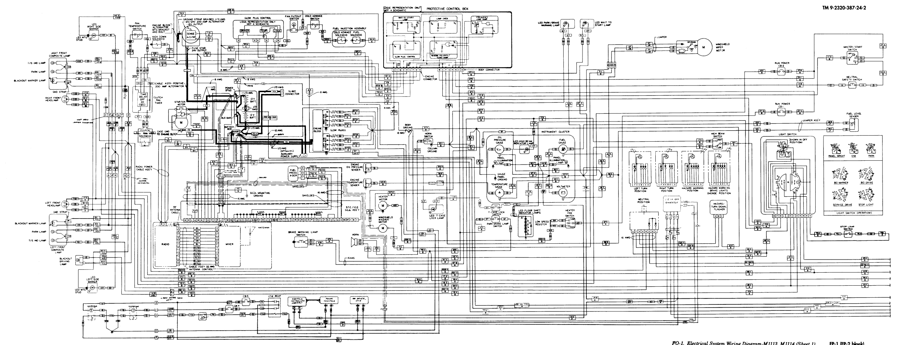

FO-1.  Electrical System Wiring Diagram-M1113, M1114 (Sheet 1).

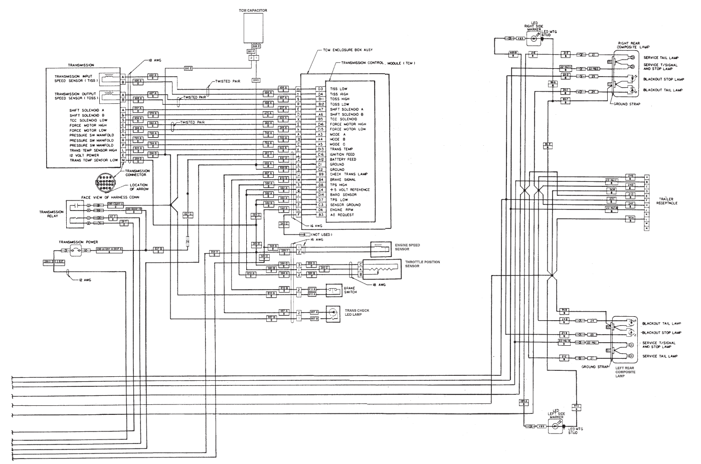

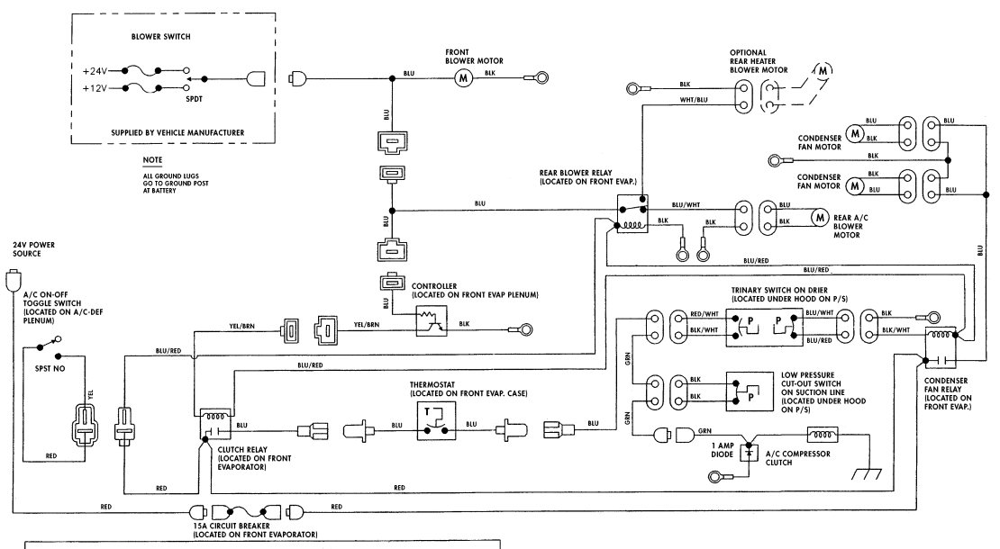

| ﺯ         |
|-----------|
| MOLDED    |
| CONNECTOR |

LEGEND:
DIODE

OTOTOTO

NG TERMINA
GRD TO CHASI
2 PIN WEATHER
RELAY N.O. CONTACT

| 1 产       |
|------------|
| CONTROLLER |

PACK CONNECTO
MIL SPEC
M
INTERNAL CHASIS GRD
NOTE:
THIS ILLUSTRATION IS A SCHEMATIC ONLY AND IS
MEANT TO SHOW POINT TO POINT CONNECTION.

THIS ILLUSTRATION DOES NOT SHOW PHYSICAL
LOCATION OF COMPONENTS OR ROUTING OF
CABLES.

CONNECTOR
MOTOR

Change 6 *FO-3. Electrical System Wiring Diagram (M1151, M1165) (Serial Numbers 299999 and Below) (Sheet 1).* **FP-7/(FP-8 blank)**

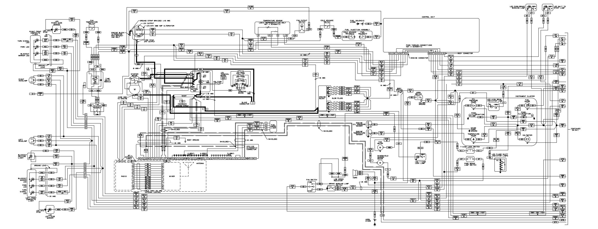

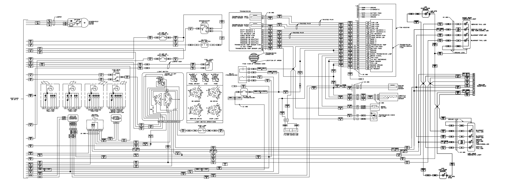

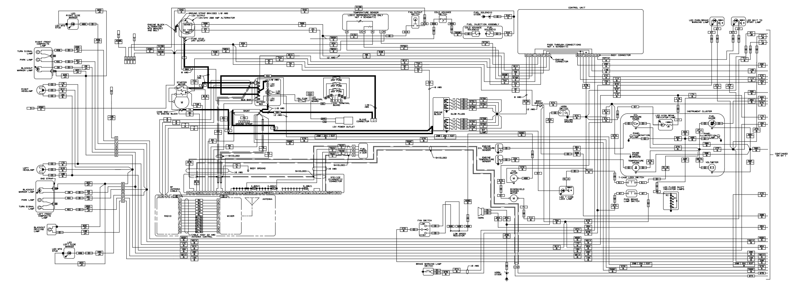

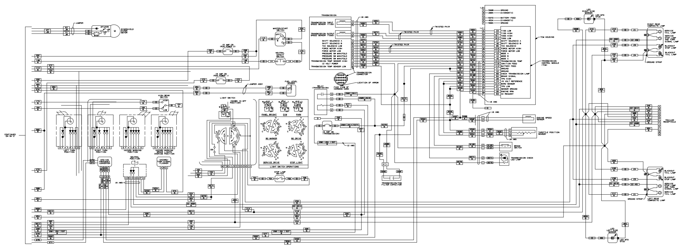

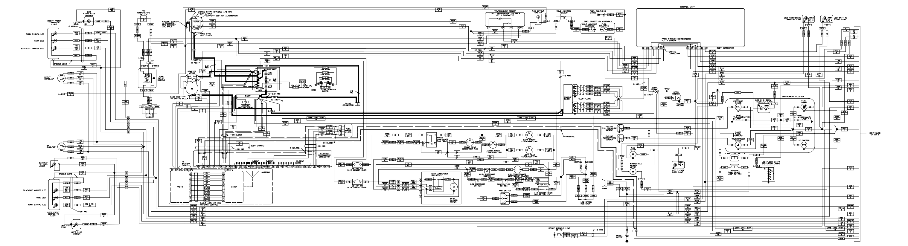

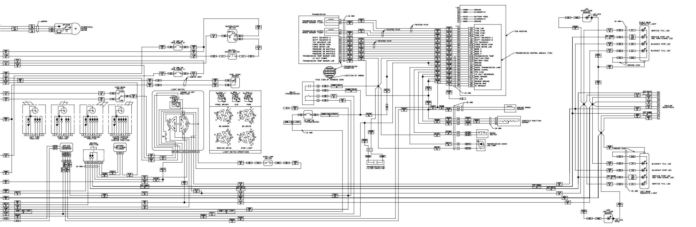

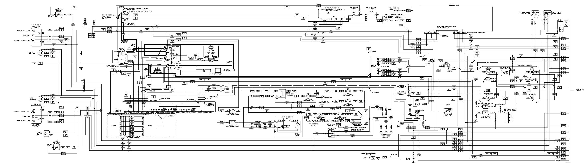

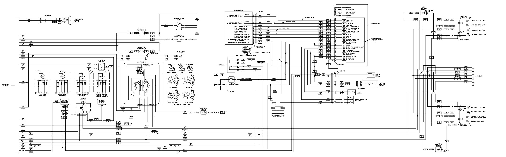

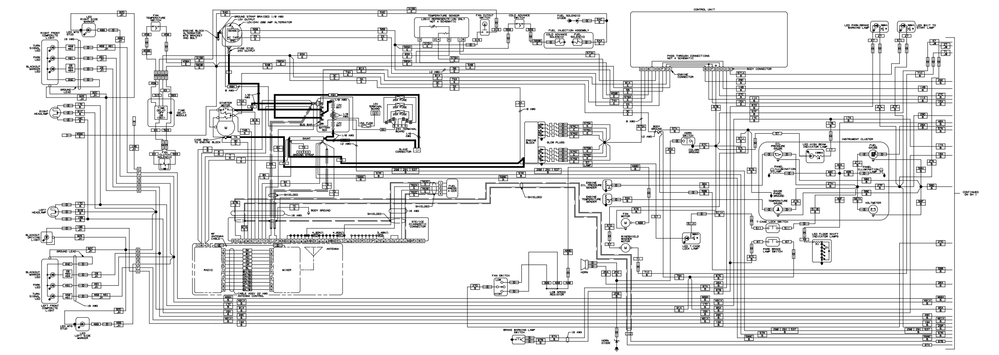

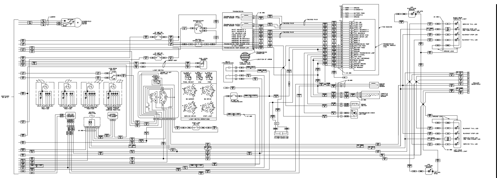

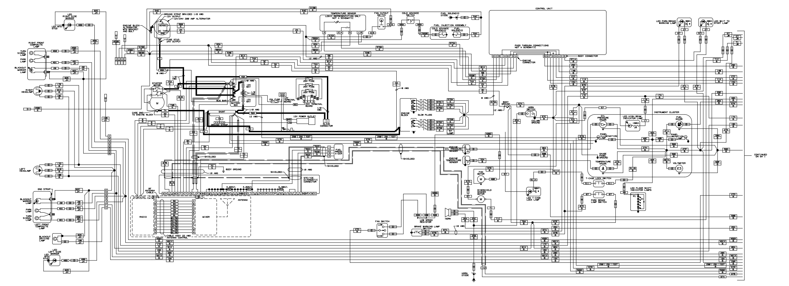

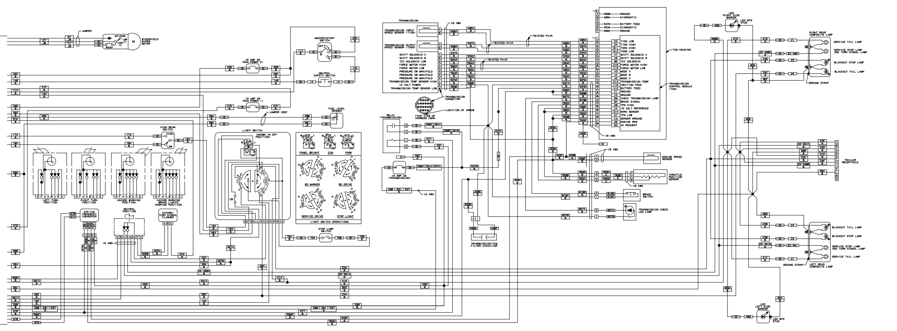

CONTINUED —

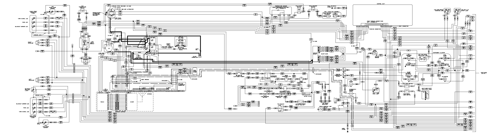

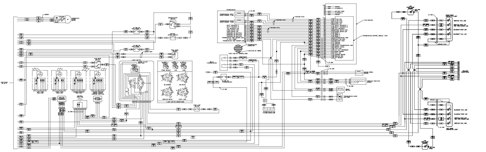

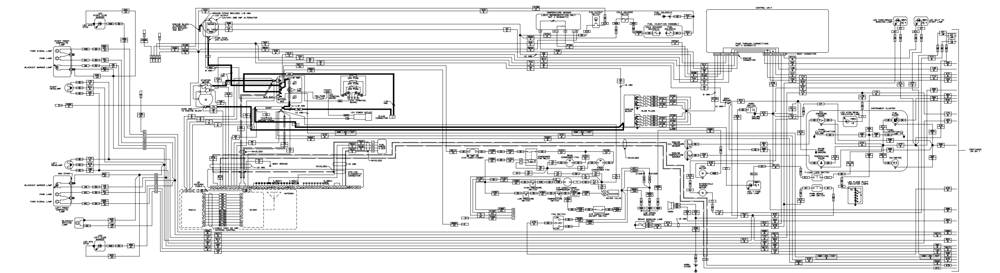

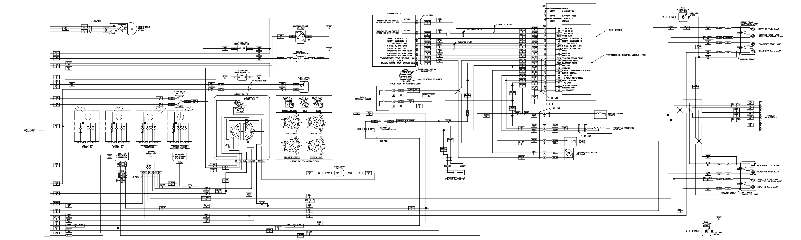

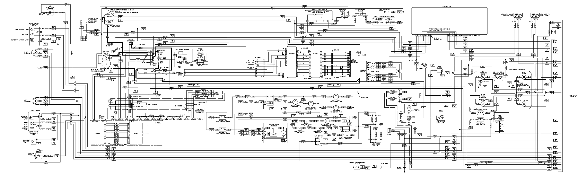

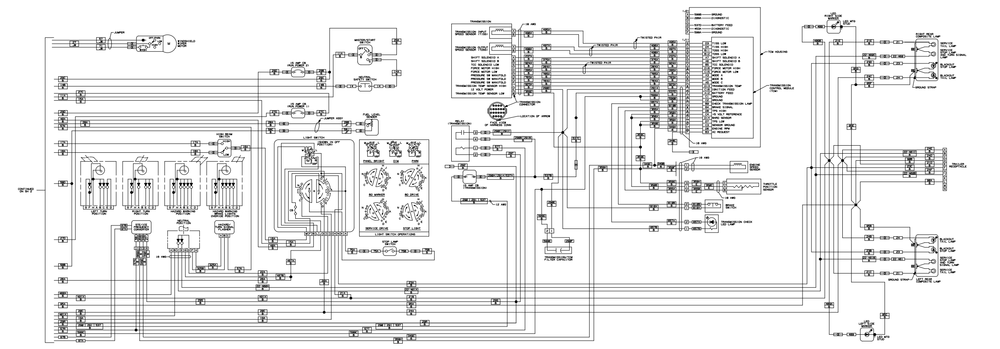

