# Army Tm 9-2320-280-10 Air Force To 36A12-1A-2091-1 Marine Corps Tm 2320-10/6B

(SUPERSEDES TM 9-2320-280-10, 18 JUNE 1991)
OPERATOR'S MANUAL FOR TRUCK, UTILITY: 
CARGO/TROOP CARRIER, 1-1/4 TON, 4X4, M998
(2320-01-107-7155) (EIC: BBD); M998A1 (2320-01-371-9577) (EIC: BBN);
TRUCK, UTILITY: CARGO/TROOP CARRIER, 1-1/4 TON, 4X4, W/WINCH, M1038 
(2320-01-107-7156) (EIC: BBE); M1038A1 (2320-01-371-9578) (EIC: BBP);
TRUCK, UTILITY: HEAVY VARIANT, 4X4, M1097 (2320-01-346-9317) (EIC: BBM); M1097A1
(2320-01-371-9583) (EIC: BBU); M1097A2 (2320-01-380-8604) (EIC: BB6); M1123 
(2320-01-455-9593) (EIC: B6G);
TRUCK, UTILITY: TOW CARRIER, ARMORED, 1-1/4 TON, 4X4, M966 (2320-01-107-7153) (EIC: BBC); M966A1 (2320-01-372-3932) (EIC: BBX); M1121 
(2320-01-956-1282) (EIC: B6H);
TRUCK, UTILITY: TOW CARRIER, ARMORED, 1-1/4 TON, 4X4, W/WINCH,
M1036 (2320-01-107-7154) (EIC: BBH);
TRUCK, UTILITY: TOW CARRIER, W/SUPPLEMENTAL ARMOR, 1-1/4 TON, 4X4, M1045 (2320-01-146-7191); M1045A1 (2320-01-371-9580) (EIC: BBR);
M1045A2 (2320-01-380-8229) (EIC: BB5);
TRUCK, UTILITY: TOW CARRIER, W/SUPPLEMENTAL ARMOR, 1-1/4 TON, 4X4, W/WINCH,
M1046 (2320-01-146-7188); M1046A1 (2320-01-371-9582) (EIC: BBT);
TRUCK, UTILITY: ARMAMENT CARRIER, ARMORED, 1-1/4 TON, 4X4, M1025
(2320-01-128-9551) (EIC: BBF); M1025A1 (2320-01-371-9584) (EIC: BBV);
M1025A2 (2320-01-380-8233) (EIC: BB3);
TRUCK, UTILITY: ARMAMENT CARRIER, ARMORED, 1-1/4 TON, 4X4, W/WINCH, M1026 
(2320-01-128-9552) (EIC: BBG); M1026A1 (2320-01-371-9579) (EIC: BBQ);
TRUCK, UTILITY: ARMAMENT CARRIER, W/SUPPLEMENTAL ARMOR, 1-1/4 TON, 4X4, M1043
(2320-01-146-7190); M1043A1 (2320-01-372-3933) (EIC: BBY); 
M1043A2 (2320-01-380-8213) (EIC: BB4);
TRUCK, UTILITY: ARMAMENT CARRIER, W/SUPPLEMENTAL ARMOR, 1-1/4 TON, 4X4, W/WINCH, M1044 (2320-01-146-7189); M1044A1 (2320-01-371-9581) (EIC: BBS);
TRUCK, UTILITY: S250 SHELTER CARRIER, 4X4, M1037 (2320-01-146-7193) (EIC: BBK); TRUCK, UTILITY: S250 SHELTER CARRIER, 4X4, W/WINCH, M1042 (2320-01-146-7187);
TRUCK, AMBULANCE, 2-LITTER, ARMORED, 4X4, M996 (2310-01-111-2275)
(EIC: BBB); M996A1 (2310-01-372-3935) (EIC: BB2);
TRUCK, AMBULANCE, 4-LITTER, ARMORED, 4X4, M997 (2310-01-111-2274) (EIC: BBA);
M997A1 (2310-01-372-3934) (EIC: BBZ); M997A2 (2310-01-380-8225) (EIC: BB8);
TRUCK, AMBULANCE, 2-LITTER, SOFT TOP, 4X4, M1035 (2310-01-146-7194);
M1035A1 (2310-01-371-9585) (EIC: BBW); M1035A2 (2310-01-380-8290) (EIC: BB9).
<!--
Approved for public release; distribution is unlimited.

HEADQUARTERS, DEPARTMENTS OF THE ARMY, THE
AIR FORCE, AND MARINE CORPS
JANUARY 1996

# .Warning. Exhaust Gases Can Kill

Brain damage or death can result from heavy exposure. Precautions must be followed to ensure crew safety when the personnel heater or engine of any vehicle is operated for any purpose.

1. Do not operate your vehicle engine in enclosed areas. 2. Do not idle vehicle engine with vehicle windows closed. 3. Be alert at all times for exhaust odors. 4. Be alert for exhaust poisoning symptoms. They are:
- Headache - Dizziness - Sleepiness - Loss of muscular control 5. If you see another person with exhaust poisoning symptoms:
- Remove person from area - Expose to open air - Keep person warm - Do not permit physical exercise - Administer artificial respiration, if necessary* - Notify a medic
*For artificial respiration, refer to FM 21-11.

6. BE AWARE, the field protective mask and ambulance Nuclear-BiologicalChemical (NBC) system will not protect you from exhaust poisoning.

THE BEST DEFENSE AGAINST EXHAUST POISONING IS ADEQUATE VENTILATION.

## Warning Summary

- Never open one end of cargo shell door without first ensuring that the opposite end is securely closed. Not doing so may cause both ends to open at the same time, causing damage to equipment, mission abort, or injury to personnel.

- Drycleaning solvent is flammable and will not be used near an open flame. 

A fire extinguisher will be kept nearby when the solvent is used. Use only in well-ventilated places. Failure to do this may result in injury to personnel and/or damage to equipment.

- Protective gloves, clothing, and/or respiratory equipment must be worn whenever caustic, toxic, or flammable cleaning solutions are used. Failure to do this may result in injury to personnel and/or damage to equipment.

- Do not perform fuel or battery system checks, inspections, or maintenance while smoking or near sparks. Fuel may ignite and batteries may explode causing damage to vehicle and injury or death to personnel.

- The automatic transmissions on M998 and "A1" vehicles do not have a "PARK"
position. Whenever the vehicle is parked, or the transmission is in "NEUTRAL," the parking brake MUST BE APPLIED. Damage to equipment and injury to personnel may occur if these instructions are not followed.

- The automatic transmissions on M1123 and "A2" vehicles have a "PARK"
position. Never use the transmission shift lever in place of the parking brake. Set the parking brake. Ensure the transmission shift lever in in the "P" (park) position and transfer case shift lever is NOT in the "N" (neutral) position. Damage to equipment and injury to personnel may occur if these instructions are not followed.

- Ensure all slack from two-point seatbelt adjusting strap or three-point seatbelt is removed. Two-point seatbelt retracts but does not lock in any position. Threepoint seatbelt retracts and will lock only during sudden stops or impact. Injury to personnel will result if an accident occurs and seatbelts are not in use or adjusted properly.

- Extreme caution shall be taken when transporting personnel. Rollover protection and seatbelts are available for the crew area only and are not provided in the troop/cargo area. Despite certain design characteristics of the vehicle, such as improved capabilities, failure to use basic safe driving skills may result in injury or death to personnel and damage to equipment.

- Operators are reminded to observe basic safe driving techniques/skills when operating vehicle. Vehicle speed must be reduced consistent with weather and road/terrain conditions. Obstacles such as stumps and boulders must be avoided.

- This vehicle has been designed to operate safely and efficiently within the limits specified in this TM. Operations beyond these limits are prohibited IAW AR 750-1 without written approval from the Commander, U.S. Army Tank-automotive and Armaments Command, ATTN: AMSTA-CM-S, Warren, MI 48397-5000. 

- Prior to towing vehicle with rear wheels up, secure steering wheel to prevent front wheels from turning. 

- Wear leather gloves when handling winch cable. Do not handle cable with bare hands. When fully extending winch cable, ensure that four wraps of winch cable remain on drum at all times. Direct all personnel to stand clear of winch cable during winch operation. Failure to do this may cause damage to vehicle and injury or death to personnel.

## Warning Summary (Cont'D)

- Avoid using fire extinguisher in unventilated areas. Prolonged inhalation exposure to extinguishing agent or fumes from burning material may cause injury to personnel. Using fire extinguisher in windy area will cause rapid dispersal of extinguishing agent and reduce effectiveness in fire control.

- Vehicle operation in snow is a hazardous condition. Operator must travel at reduced speeds and be prepared to meet sudden changes in road conditions. Pump brakes gradually when stopping vehicle on ice or snow. Sudden braking will cause wheels to lock and vehicle to slide out of control causing damage to vehicle and injury or death to personnel.

- Do not rely on wet service brakes. Keep applying brakes until they dry out and uneven braking ceases. Failure to do this may cause damage to vehicle and injury or death to personnel.

- Exhaust components are hot after prolonged vehicle use. Ensure exhaust system components are cool before removing/installing exhaust assembly. Failure to do this will result in injury to personnel.

- Do not use the hand throttle as an automatic speed or cruise control. The hand throttle does not automatically disengage when brake is applied, resulting in increased stopping distances and possible hazardous and unsafe operation. Injury to personnel or damage to equipment may result.

- Do not operate heater when ventilation system is on. Damage to heater or injury to personnel will result.

- To ensure opening of the hood assembly is accomplished safely and effectively, always maintain the proper lifting posture, legs bent with back straight. When raising and securing hood, make sure the hood prop rod is secured to hood support bracket. When releasing hood prop rod, do not pull rod at hook end. Damage to equipment or injury to personnel will occur if hood is not raised, secured, and lowered properly.

- If NBC exposure is suspected, all air filter media should be handled by personnel wearing protective equipment. Consult your unit NBC officer or NBC NCO for appropriate handling or disposal instructions.

- Radial and bias ply tires should not be mixed on the same vehicle. Injury to personnel or damage to equipment may result.

- Do not use bias ply tires on the M1097, M1123, or any A1 and A2 models, under any condition. Due to tire load ratings and vehicle load carrying capabilities, only the load range "D" radial tire can be used on the M1097, M1123, and all A1 and A2 models.

- For M1097, M1123, and all A1 and A2 model vehicles only, hearing protection is required for driver and passengers when engine is running. Noise levels produced by these vehicles exceed 85 dBA, which may cause injury to personnel.

- The Department of Transportation requires 105 mm cannon ammunition to be in wooden boxes when transporting ammunition on public highways. Movement of cannon ammunition in fiber containers (inner pack) in the vehicle ammunition rack is restricted to other than public highways.

- Do not operate the vehicle without the windshield assembly positioned upright and the "B" pillar securely attached. Operation of the vehicle without these structures in place may result in injury to personnel and damage to equipment.

#### Tm 9-2320-280-10

## Warning Summary (Cont'D)

- Communication shelters AN/GRC-122 and AN/GRC-142 RATT may overload vehicle by up to 500 pounds. Use caution when driving to avoid damage to equipment or injury to personnel.

- Chock blocks shall be used when parking a vehicle with inoperative parking brakes, when operating in extreme cold conditions, when parking on inclines, or whenever and wherever maintenance is being performed. Failure to do so may result in injury to personnel or damage to equipment.

- Vehicle speed must be reduced consistent with weather and road/terrain conditions. Obstacles such as stumps and boulders must be avoided. Failure to use basic safe driving techniques/skills may result in injury or death to personnel and damage to equipment.

- Do not use tow pintle as a step when entering or exiting vehicle cargo area.

Failure to do so may result in injury to personnel or damage to equipment.
-->
ARMY TM 9-2320-280-10


AIR FORCE TO 36A12-1A-2091-1 MARINE CORPS TM 2320-10/6B
CHANGE HEADQUARTERS, 
DEPARTMENTS OF THE ARMY,
NO. 3 THE AIR FORCE, AND MARINE CORPS
WASHINGTON, **D.C.,** 15 July *2004*

## Operator'S Manual

TRUCK, UTILITY: CARGO/TROOP CARRIER, 1-1/4 TON, 4X4, M998 (2320-01-107-7155) (EIC: BBD); M998A1 (2320-01-371-9577) (EIC: BBN);
TRUCK, UTILITY: CARGO/TROOP CARRIER, 1-1/4 TON, 4X4, W/WINCH,
M1038 (2320-01-107-7156) (EIC: BBE); M1038A1 (2320-01-371-9578) (EIC: BBP);
TRUCK, UTILITY: HEAVY VARIANT, 4X4, M1097 (2320-01-346-9317) (EIC: BBM); 
M1097A1 (2320-01-371-9583) (EIC: BBU); M1097A2 (2320-01-380-8604) (EIC: BB6); 
M1123 (2320-01-455-9593) (EIC: B6G);
TRUCK, UTILITY: TOW CARRIER, ARMORED, 1-1/4 TON, 4X4, M966 (2320-01-107-7153) (EIC: BBC); M966A1 (2320-01-372-3932) (EIC: BBX); 
M1121 (2320-01-456-1282) (EIC B6H);
TRUCK, UTILITY: TOW CARRIER, ARMORED, 1-1/4 TON, 4X4, W/WINCH,
M1036 (2320-01-107-7154) (EIC: BBH);
TRUCK, UTILITY: TOW CARRIER, W/SUPPLEMENTAL ARMOR, 1-1/4 TON, 4X4, M1045 (2320-01-146-7191); M1045A1 (2320-01-371-9580) (EIC: BBR); 
M1045A2 (2320-01-380-8229) (EIC: BB5);
TRUCK, UTILITY: TOW CARRIER, W/SUPPLEMENTAL ARMOR, 1-1/4 TON, 4X4, W/WINCH,
M1046 (2320-01-146-7188); M1046A1 (2320-01-371-9582) (EIC: BBT);
TRUCK, UTILITY: ARMAMENT CARRIER, ARMORED, 1-1/4 TON, 4X4, M1025 (2320-01-128-9551) (EIC: BBF); M1025A1 (2320-01-371-9584) (EIC: BBV); 
M1025A2 (2320-01-380-8233) (EIC: BB3); 
TRUCK, UTILITY: ARMAMENT CARRIER, ARMORED, 1-1/4 TON, 4X4, W/WINCH,
M1026 (2320-01-128-9552) (EIC: BBG); M1026A1 (2320-01-371-9579) (EIC: BBQ);
TRUCK, UTILITY: ARMAMENT CARRIER, W/SUPPLEMENTAL ARMOR, 1-1/4 TON, 4X4, M1043 (2320-01-146-7190) M1043A1 (2320-01-372-3933) (EIC: BBY); 
M1043A2 (2320-01-380-8213) (EIC: BB4); 
TRUCK, UTILITY: ARMAMENT CARRIER, W/SUPPLEMENTAL ARMOR, 1-1/4 TON, 4X4, W/WINCH,
M1044 (2320-01-146-7189); M1044A1 (2320-01-371-9581) (EIC: BBS);
TRUCK, UTILITY: S250 SHELTER CARRIER, 4X4, M1037 (2320-01-146-7193) (EIC: BBK);
TRUCK, UTILITY: S250 SHELTER CARRIER, 4X4, W/WINCH, M1042 (2320-01-146-7187);
TRUCK, AMBULANCE, 2-LITTER, ARMORED, 4X4, M996 (2310-01-111-2275) (EIC: BBB); 
M996A1 (2310-01-372-3935) (EIC: BB2);
TRUCK, AMBULANCE, 4-LITTER, ARMORED, 4X4, M997 (2310-01-111-2274) (EIC: BBA); 
M997A1 (2310-01-372-3934) (EIC: BBZ); M997A2 (2310-01-380-8225) (EIC: BB8);
TRUCK, AMBULANCE, 2-LITTER, SOFT TOP, 4X4, M1035 (2310-01-146-7194); 
M1035A1 (2310-01-371-9585) (EIC: BBW); M1035A2 (2310-01-380-8290) (EIC: BB9).
<!--
TM 9-2320-280-10, 31 January 1996, is changed as follows:
1. Remove old pages and insert new pages as indicated below. 2. New or changed material is indicated by a vertical bar in the margin of the page.

Approved for public release; distribution is unlimited.

| Remove page               | Insert page               |
|---------------------------|---------------------------|
| A and B                   | A and B                   |
| i and ii                  | i and ii                  |
| 1\-1 through 1\-4         | 1\-1 through 1\-4         |
| 1\-23 through 1\-26       | 1\-23 through 1\-26       |
| 1\-33 and 1\-34           | 1\-33 and 1\-34           |
| None                      | 1\-35 and 1\-36           |
| 2\-29 and 2\-30           | 2\-29 and 2\-30           |
| 2\-61 and 2\-62           | 2\-61 and 2\-62           |
| 2\-69 and 2\-70           | 2\-69 and 2\-70           |
| 2\-73 through 2\-78       | 2\-73 through 2\-78       |
| 2\-87 through 2\-94       | 2\-87 through 2\-94       |
| 2\-99 and 2\-100          | 2\-99 and 2\-100          |
| 2\-104.1 and 2\-104.2     | 2\-104.1 and 2\-104.2     |
| 2\-105 and 2\-106         | 2\-105 and 2\-106         |
| 2\-134.1 through 2\-134.4 | 2\-134.1 through 2\-134.4 |
| 2\-135 and 2\-136         | 2\-135 and 2\-136         |
| 2\-179 and 2\-180         | 2\-179 and 2\-180         |
| 3\-33 and 3\-34           | 3\-33 and 3\-34           |
| A\-1 and A\-2             | A\-1 and A\-2             |
| B\-1 through B\-10        | B\-1 through B\-10        |
| None                      | B\-11 through B\-14       |
| C\-1 through C\-4         | C\-1 through C\-4         |
| None                      | C\-5 and C\-6             |
| D\-3 and D\-4             | D\-3 and D\-4             |
| F\-7 through F\-10        | F\-7 through F\-10        |
| G\-3 through G\-6         | G\-3 through G\-6         |
| G\-15 and G\-16           | G\-15 and G\-16           |
| Index 1 and Index 2       | Index 1 and Index 2       |
| Index 5 and Index 6       | Index 5 and Index 6       |
| DA Form 2028\-2           | DA Form 2028              |

3. File this change sheet in front of the publication for reference purposes.

By Order of the Secretary of the Army:
Peter J. Schoomaker General, United States Army Chief of Staff Official:
JOEL B. HUDSON
Administrative Assistant to the Secretary of the Army 0223402 By Order of the Secretary of the Air Force:
RONALD R. FOGLEMAN
General, United States Air Force Chief of Staff Official:
HENRY VICCELLIO, JR.

General, United States Air Force Commander, Air Force Materiel Command By Order of the Marine Corps:
R. P. SHOCKEY
Director, Program Support Marine Corps Systems Command Distribution:
To be distributed in accordance with the initial distribution number (IDN) 380377, requirements for TM 9-2320-280-10.

ARMY TM 9-2320-280-10 AIR FORCE TO 36A12-1A-2091-1 MARINE CORPS TM 2320-10/6B 
CHANGE HEADQUARTERS, 
DEPARTMENTS OF THE ARMY, 
NO. 2 THE AIR FORCE, AND MARINE CORPS 
WASHINGTON, D.C., *30 NOVEMBER 2001* 

## Operator'S Manual

TRUCK, UTILITY: CARGO/TROOP CARRIER, 1-1/4 TON, 4X4, M998 (2320-01-107-7155) (EIC: BBD); M998A1 (2320-01-371-9577) (EIC: BBN); 
TRUCK, UTILITY: CARGO/TROOP CARRIER, 1-1/4 TON, 4X4, W/WINCH, 
M1038 (2320-01-107-7156) (EIC: BBE); M1038A1 (2320-01-371-9578) (EIC: BBP); 

```
TRUCK, UTILITY: HEAVY VARIANT, 4X4, M1097 (2320-01-346-9317) (EIC: BBM); 
M1097A1 (2320-01-371-9583) (EIC: BBU); M1097A2 (2320-01-380-8604) (EIC: BB6); 
                    M1123 (2320-01-455-9593) (EIC: B6G); 
        TRUCK, UTILITY: TOW CARRIER, ARMORED, 1-1/4 TON, 4X4, 
  M966 (2320-01-107-7153) (EIC: BBC); M966A1 (2320-01-372-3932) (EIC: BBX); 
                    M1121 (2320-01-456-1282) (EIC B6H); 

```

TRUCK, UTILITY: TOW CARRIER, ARMORED, 1-1/4 TON, 4X4, W/WINCH, 
M1036 (2320-01-107-7154) (EIC: BBH); 
TRUCK, UTILITY: TOW CARRIER, W/SUPPLEMENTAL ARMOR, 1-1/4 TON, 4X4, M1045 (2320-01-146-7191); M1045A1 (2320-01-371-9580) (EIC: BBR); 
M1045A2 (2320-01-380-8229) (EIC: BB5); 
TRUCK, UTILITY: TOW CARRIER, W/SUPPLEMENTAL ARMOR, 1-1/4 TON, 4X4, W/WINCH, 
M1046 (2320-01-146-7188); M1046A1 (2320-01-371-9582) (EIC: BBT); 
TRUCK, UTILITY: ARMAMENT CARRIER, ARMORED, 1-1/4 TON, 4X4, M1025 (2320-01-128-9551) (EIC: BBF); M1025A1 (2320-01-371-9584) (EIC: BBV); 
M1025A2 (2320-01-380-8233) (EIC: BB3); 
TRUCK, UTILITY: ARMAMENT CARRIER, ARMORED, 1-1/4 TON, 4X4, W/WINCH, 
M1026 (2320-01-128-9552) (EIC: BBG); M1026A1 (2320-01-371-9579) (EIC: BBQ); 
TRUCK, UTILITY: ARMAMENT CARRIER, W/SUPPLEMENTAL ARMOR, 1-1/4 TON, 4X4, M1043 (2320-01-146-7190) M1043A1 (2320-01-372-3933) (EIC: BBY); 
M1043A2 (2320-01-380-8213) (EIC: BB4); 
TRUCK, UTILITY: ARMAMENT CARRIER, W/SUPPLEMENTAL ARMOR, 1-1/4 TON, 4X4, W/WINCH, 
M1044 (2320-01-146-7189); M1044A1 (2320-01-371-9581) (EIC: BBS); 
TRUCK, UTILITY: S250 SHELTER CARRIER, 4X4, M1037 (2320-01-146-7193) (EIC: BBK); 
TRUCK, UTILITY: S250 SHELTER CARRIER, 4X4, W/WINCH, M1042 (2320-01-146-7187); 
TRUCK, AMBULANCE, 2-LITTER, ARMORED, 4X4, M996 (2310-01-111-2275) (EIC: BBB); 
M996A1 (2310-01-372-3935) (EIC: BB2); 
TRUCK, AMBULANCE, 4-LITTER, ARMORED, 4X4, M997 (2310-01-111-2274) (EIC: BBA); 
M997A1 (2310-01-372-3934) (EIC: BBZ); M997A2 (2310-01-380-8225) (EIC: BB8); 
TRUCK, AMBULANCE, 2-LITTER, SOFT TOP, 4X4, M1035 (2310-01-146-7194); 
M1035A1 (2310-01-371-9585) (EIC: BBW); M1035A2 (2310-01-380-8290) (EIC: BB9). 

TM 9-2320-280-10, 31 January 1996, is changed as follows: 
1. Remove old pages and insert new pages as indicated below. 2. New or changed material is indicated by a vertical bar in the margin of the page. 

 
TM 9-2320-280-10

| Remove page         | Insert page             |
|---------------------|-------------------------|
| A and B             | A and B                 |
| 2\-125 and 2\-126   | 2\-125 and 2\-126       |
| 2\-133 and 2\-134   | 2\-132.1 through 2\-134 |
| B\-1 and B\-2       | B\-1 and B\-2           |
| Index 5 and Index 6 | Index 5 and Index 6     |

3. File this change sheet in front of the publication for reference purposes.

By Order of the Secretary of the Army:
ERIC K. SHINSEKI
General, United States Army Chief of Staff Official:
JOEL B. HUDSON
Administrative Assistant to the Secretary of the Army 0126701 By Order of the Secretary of the Air Force:
RONALD R. FOGLEMAN
General, United States Air Force Chief of Staff Official:
HENRY VICCELLIO, JR.

General, United States Air Force Commander, Air Force Materiel Command By Order of the Marine Corps:
D.R. BLOOMER
Colonel, USMC
Director, Program Support Marine Corps Systems Command Distribution:
To be distributed in accordance with the initial distribution number (IDN) 380377, requirements for TM 9-2320-280-10.

ARMY TM 9-2320-280-10 AIR FORCE TO 36A12-1A-2091-1 MARINE CORPS TM 2320-10/6B
CHANGE NO. 1 HEADQUARTERS, 
DEPARTMENTS OF THE ARMY,
THE AIR FORCE, AND MARINE CORPS
WASHINGTON, D.C., *31 MAY 1999*

# Operator'S Manual

TRUCK, UTILITY: CARGO/TROOP CARRIER, 1-1/4 TON, 4X4, M998 (2320-01-107-7155) (EIC: BBD); M998A1 (2320-01-371-9577) (EIC: BBN);
TRUCK, UTILITY: CARGO/TROOP CARRIER, 1-1/4 TON, 4X4, W/WINCH,
M1038 (2320-01-107-7156) (EIC: BBE); M1038A1 (2320-01-371-9578) (EIC: BBP);
TRUCK, UTILITY: HEAVY VARIANT, 4X4, M1097 (2320-01-346-9317) (EIC: BBM); 
M1097A1 (2320-01-371-9583) (EIC: BBU); M1097A2 (2320-01-380-8604) (EIC: BB6); M1123 (2320-01-455-9593) (EIC:B 6 G ) ;
TRUCK, UTILITY: TOW CARRIER, ARMORED, 1-1/4 TON, 4X4, M966 (2320-01-107-7153) (EIC: BBC); M966A1 (2320-01-372-3932) (EIC: BBX); M1121 ( 2 3 2 0 - 0 1 - 4 5 6 - 1 2 8 2 )( E I CB 6 H ) ;
TRUCK, UTILITY: TOW CARRIER, ARMORED, 1-1/4 TON, 4X4, W/WINCH,
M1036 (2320-01-107-7154) (EIC: BBH);
TRUCK, UTILITY: TOW CARRIER, W/SUPPLEMENTAL ARMOR, 1-1/4 TON, 4X4, M1045 (2320-01-146-7191); M1045A1 (2320-01-371-9580) (EIC: BBR); M1045A2 (2320-01-380-8229) (EIC: BB5);
TRUCK, UTILITY: TOW CARRIER, W/SUPPLEMENTAL ARMOR, 1-1/4 TON, 4X4, W/WINCH,
M1046 (2320-01-146-7188); M1046A1 (2320-01-371-9582) (EIC: BBT);
TRUCK, UTILITY: ARMAMENT CARRIER, ARMORED, 1-1/4 TON, 4X4, M1025 (2320-01-128-9551) (EIC: BBF); M1025A1 (2320-01-371-9584) (EIC: BBV); M1025A2 (2320-01-380-8233) (EIC: BB3); 
TRUCK, UTILITY: ARMAMENT CARRIER, ARMORED, 1-1/4 TON, 4X4, W/WINCH,
M1026 (2320-01-128-9552) (EIC: BBG); M1026A1 (2320-01-371-9579) (EIC: BBQ);
TRUCK, UTILITY: ARMAMENT CARRIER, W/SUPPLEMENTAL ARMOR, 1-1/4 TON, 4X4, M1043 (2320-01-146-7190) M1043A1 (2320-01-372-3933) (EIC: BBY); M1043A2 (2320-01-380-8213) (EIC: BB4); 
TRUCK, UTILITY: ARMAMENT CARRIER, W/SUPPLEMENTAL ARMOR, 1-1/4 TON, 4X4, W/WINCH,
M1044 (2320-01-146-7189); M1044A1 (2320-01-371-9581) (EIC: BBS);
TRUCK, UTILITY: S250 SHELTER CARRIER, 4X4, M1037 (2320-01-146-7193) (EIC: BBK);
TRUCK, UTILITY: S250 SHELTER CARRIER, 4X4, W/WINCH, M1042 (2320-01-146-7187);
TRUCK, AMBULANCE, 2-LITTER, ARMORED, 4X4, M996 (2310-01-111-2275) (EIC: BBB); M996A1 (2310-01-372-3935) (EIC: BB2);
TRUCK, AMBULANCE, 4-LITTER, ARMORED, 4X4, M997 (2310-01-111-2274) (EIC: BBA); 
M997A1 (2310-01-372-3934) (EIC: BBZ); M997A2 (2310-01-380-8225) (EIC: BB8);
TRUCK, AMBULANCE, 2-LITTER, SOFT TOP, 4X4, M1035 (2310-01-146-7194); M1035A1 (2310-01-371-9585) (EIC: BBW); M1035A2 (2310-01-380-8290) (EIC: BB9).

TM 9-2320-280-10, 31 January 1996, is changed as follows:
1. Two new models have been added to the front cover. The new cover, located at the end of the change package, replaces the existing cover.

2. Remove old pages and insert new pages as indicated below. 3. New or changed material is indicated by a vertical bar in the margin of the page.

| Remove page         | Insert page               |
|---------------------|---------------------------|
| warning a through d | warning a through d       |
| None                | A and B (After warning d) |
| i and ii            | i and ii                  |
| 1\-1 through 1\-10  | 1\-1 through 1\-10        |

Approved for public release; distribution is unlimited.

| Remove page                       | Insert page                             |
|-----------------------------------|-----------------------------------------|
| 1\-21 through 1\-24               | 1\-21 through 1\-24                     |
| 1\-29 through 1\-34               | 1\-29 through 1\-34                     |
| 2\-3 through 2\-8                 | 2\-3 through 2\-8                       |
| 2\-25 through 2\-28               | 2\-25 through 2\-28                     |
| 2\-31 through 2\-34               | 2\-31 through 2\-34                     |
| 2\-41 through 2\-46               | 2\-41 through 2\-46                     |
| 2\-61 and 2\-62                   | 2\-61 and 2\-62                         |
| 2\-65 through 2\-80               | 2\-65 through 2\-80                     |
| 2\-83 through 2\-104              | 2\-83 through 2\-104.3/(2\-104.4 blank) |
| 2\-105 through 2\-112             | 2\-105 through 2\-112                   |
| 2\-121 and 2\-122                 | 2\-121 and 2\-122                       |
| 2\-125 and 2\-126                 | 2\-124.1 through 2\-126                 |
| 2\-133 through 2\-146             | 2\-133 through 2\-146                   |
| 2\-151 through 2\-156             | 2\-151 through 2\-156                   |
| 2\-165 through 2\-168             | 2\-165 through 2\-168                   |
| 2\-171 and 2\-172                 | 2\-171 and 2\-172                       |
| 2\-179 and 2\-180                 | 2\-179 and 2\-180                       |
| 2\-183 and 2\-184                 | 2\-182.1 through 2\-184                 |
| 3\-3 through 3\-6                 | 3\-3 through 3\-6                       |
| 3\-9 through 3\-12                | 3\-9 through 3\-12                      |
| 3\-15 through 3\-24               | 3\-15 through 3\-24                     |
| 3\-27 through 3\-34               | 3\-27 through 3\-34                     |
| 3\-39/(3\-40 blank)               | 3\-39 and 3\-40                         |
| A\-1 and A\-2                     | A\-1 and A\-2                           |
| B\-1 through B\-8                 | B\-1 through B\-10                      |
| C\-1 through C\-4                 | C\-1 through C\-4                       |
| D\-1 through D\-6                 | D\-1 through D\-6                       |
| E\-1 and E\-2                     | E\-1 and E\-2                           |
| E\-7 and E\-8                     | E\-7 and E\-8                           |
| E\-11 and E\-12                   | E\-11 and E\-12                         |
| F\-1 through F\-18                | F\-1 through F\-18                      |
| F\-21 through F\-23/(F\-24 blank) | F\-21 through F\-23/(F\-24 blank)       |
| G\-1 through G\-8                 | G\-1 through G\-8                       |
| G\-13 through G\-16               | G\-13 through G\-16                     |
| Index 1 through Index 6           | Index 1 through Index 7/(Index 8 blank) |
| cover                             | cover                                   |

4. File this change sheet in front of the publication for reference purposes.

By Order of the Secretary of the Army:
ERIC K. SHINSEKI
General, United States Army Chief of Staff Official:
JOEL B. HUDSON
Administrative Assistant to the Secretary of the Army 05688 By Order of the Secretary of the Air Force:
RONALD R. FOGLEMAN
General, United States Air Force Chief of Staff Official:
HENRY VICCELLIO, JR.

General, United States Air Force Commander, Air Force Materiel Command By Order of the Marine Corps:
D.R. BLOOMER
Colonel, USMC
Director, Program Support Marine Corps Systems Command Distribution:
To be distributed in accordance with the initial distribution number (IDN) 380377, requirements for TM 9-2320-280-10.

#### Tm 9-2320-280-10

# List Of Effective Pages

NOTE: The portion of the text affected by the changes is indicated by a vertical line in the outer margins of the page.

Dates of issue for original and changed pages are: Original . . . . . . . . . 0 . . . . . . 31 January 1996 Change . . . . . . . . . . 1 . . . . . . . . . 31 May 1999 Change . . . . . . . . . . 2 . . . . . . 15 October 2001 Change . . . . . . . . . . 3 . . . . . . . . . 15 July 2004 TOTAL NUMBER OF PAGES IN THIS PUBLICATION IS 402 CONSISTING OF THE FOLLOWING:

| Page No. . .*Change No.   | Page No. . .*Change No.      | Page No. . .*Change No.      |
|---------------------------|------------------------------|------------------------------|
| Warning a 0               | 2\-63 \- 2\-65 0             | 2\-126 2                     |
| Warning b \- d 1          | 2\-66 1                      | 2\-127 \- 2\-132 0           |
| A \- B 3                  | 2\-67 0                      | 2\-132.1 Added 2             |
| i 3                       | 2\-68 1                      | 2\-132.2 Added 2             |
| ii 0                      | 2\-69 3                      | 2\-133 Blank 2               |
| 1\-1 \- 1\-3 3            | 2\-70 1                      | 2\-134 1                     |
| 1\-4 \- 1\-5 0            | 2\-71 0                      | 2\-134.1 1                   |
| 1\-6 \- 1\-9 1            | 2\-72 1                      | 2\-134.2 \- 2\-134.4 3       |
| 1\-10 \- 1\-21 0          | 2\-73 3                      | 2\-135 \- 2\-136 3           |
| 1\-22 \- 1\-23 1          | 2\-74 1                      | 2\-137 1                     |
| 1\-24 \- 1\-26 3          | 2\-75 \- 2\-77 3             | 2\-138 0                     |
| 1\-27 \- 1\-29 0          | 2\-78 1                      | 2\-139 \- 2\-144 1           |
| 1\-30 \- 1\-32 1          | 2\-79 0                      | 2\-145 0                     |
| 1\-33 3                   | 2\-80 1                      | 2\-146 1                     |
| 1\-34 1                   | 2\-81 \- 2\-82 0             | 2\-147 \- 2\-151 0           |
| 1\-35 \- 1\-36 Added 3    | 2\-83 \- 2\-86 1             | 2\-152 1                     |
| 2\-1 \- 2\-3 0            | 2\-87 \- 2\-93 3             | 2\-153 0                     |
| 2\-4 1                    | 2\-94 \- 2\-98 1             | 2\-154 1                     |
| 2\-5 0                    | 2\-99 3                      | 2\-155 0                     |
| 2\-6 \- 2\-7 1            | 2\-100 \- 2\-104 1           | 2\-156 1                     |
| 2\-8 \- 2\-25 0           | 2\-104.1 3                   | 2\-157 \- 2\-165 0           |
| 2\-26 \- 2\-27 1          | 2\-104.2 1                   | 2\-166 \- 2\-167 1           |
| 2\-28 \- 2\-29 0          | 2\-104.3 Added 1             | 2\-168 \- 2\-171 0           |
| 2\-30 3                   | 2\-104.4 Blank 1             | 2\-172 1                     |
| 2\-31 0                   | 2\-105 1                     | 2\-173 \- 2\-179 0           |
| 2\-32 \- 2\-33 1          | 2\-106 3                     | 2\-180 3                     |
| 2\-34 \- 2\-41 0          | 2\-107 0                     | 2\-181 \- 2\-182 0           |
| 2\-42 1                   | 2\-108 \- 2\-112 1           | 2\-182.1 \- 2\-182.2 Added 1 |
| 2\-43 0                   | 2\-113 \- 2\-120 0           | 2\-183 \- 2\-184 1           |
| 2\-44 \- 2\-45 1          | 2\-121 1                     | 2\-185 \- 2\-217 0           |
| 2\-46 \- 2\-60 0          | 2\-122 \- 2\-124 0           | 2\-218 Blank 0               |
| 2\-61 1                   | 2\-124.1 \- 2\-124.2 Added 1 | 3\-1 \- 3\-2 0               |
| 2\-62 3                   | 2\-125 1                     | 3\-3 1                       |

*Zero in this column indicates original page.

Change 3 A

#### 

LIST OF EFFECTIVE PAGES (Contd)

| Page No. . .*Change No.       | Page No. . .*Change No.   | Page No. . .*Change No.   |
|-------------------------------|---------------------------|---------------------------|
| 3\-4 0                        | A\-2 3                    | F\-8 \- F\-9 3            |
| 3\-5 1                        | B\-1 \- B\-10 3           | F\-10 \- F\-17 1          |
| 3\-6 \- 3\-9 0                | B\-11 \- B\-14 Added 3    | F\-18 \- F\-21 0          |
| 3\-10 \- 3\-11 1              | C\-1 1                    | F\-22 \- F\-23 1          |
| 3\-12 \- 3\-15 0              | C\-2 3                    | F\-24 Blank 0             |
| 3\-16 1                       | C\-3 1                    | G\-1 0                    |
| 3\-17 0                       | C\-4 3                    | G\-2 1                    |
| 3\-18 \- 3\-21 1              | C\-5 \- C\-6 Added 3      | G\-3 \- G\-5 3            |
| 3\-22 0                       | D\-1 0                    | G\-6 0                    |
| 3\-23 1                       | D\-2 1                    | G\-7 \- G\-8 1            |
| 3\-24 \- 3\-26 0              | D\-3 \- D\-4 3            | G\-9 \- G\-13 0           |
| 3\-27 \- 3\-28 1              | D\-5 \- D\-6 1            | G\-14 1                   |
| 3\-28.1 \- 3\-28.2 Added . .1 | E\-1 \- E\-2 1            | G\-15 \- G\-16 3          |
| 3\-29 1                       | E\-3 \- E\-6 0            | Index\-1 3                |
| 3\-30 \- 3\-31 0              | E\-7 \- E\-8 1            | Index\-2 \- Index\-4 1    |
| 3\-32 1                       | E\-9 \- E\-10 0           | Index\-5 3                |
| 3\-33 3                       | E\-11 1                   | Index\-6 2                |
| 3\-34 \- 3\-38 0              | E\-12 0                   | Index\-7 1                |
| 3\-39 \- 3\-40 1              | F\-1 \- F\-5 1            | Index\-8 Blank 0          |
| A\-1 1                        | F\-6 \- F\-7 0            |                           |

*Zero in this column indicates original page.

*ARMY TM 9-2320-280-10 AIR FORCE TO 36A12-1A-2091-1 MARINE CORPS TM 2320-10/6B
TECHNICAL MANUAL HEADQUARTERS, NO. 9-2320-280-10 DEPARTMENTS OF THE ARMY, NO. 2320-10/6B THE AIR FORCE, AND MARINE CORPS
WASHINGTON, D.C. *31 JANUARY 1996* TECHNICAL ORDER NO. 36A12-1A-2091-1

## Operator'S Manual

TRUCK, UTILITY: CARGO/TROOP CARRIER, 1-1/4 TON, 4X4, M998
(2320-01-107-7155) (EIC: BBD); M998A1 (2320-01-371-9577) (EIC: BBN);
TRUCK, UTILITY: CARGO/TROOP CARRIER, 1-1/4 TON, 4X4, W/WINCH, M1038 (2320-01-107-7156) 
(EIC: BBE); M1038A1 (2320-01-371-9578) (EIC: BBP);
TRUCK, UTILITY: HEAVY VARIANT, 4X4, M1097 (2320-01-346-9317) (EIC: BBM); M1097A1 
(2320-01-371-9583) (EIC: BBU); M1097A2 (2320-01-380-8604) (EIC: BB6); M1123 (2320-01-455-9593) (EIC: B6G);
TRUCK, UTILITY: TOW CARRIER, ARMORED, 1-1/4 TON, 4X4, M966 (2320-01-107-7153) (EIC: BBC); M966A1 (2320-01-372-3932) (EIC: BBX); 
M1121 (2320-01-456-1282) (EIC B6H);
TRUCK, UTILITY: TOW CARRIER, ARMORED, 1-1/4 TON, 4X4, W/WINCH,
M1036 (2320-01-107-7154) (EIC: BBH);
TRUCK, UTILITY: TOW CARRIER, W/SUPPLEMENTAL ARMOR, 1-1/4 TON, 4X4, M1045 (2320-01-146-7191); M1045A1 (2320-01-371-9580) (EIC: BBR); M1045A2 (2320-01-380-8229) (EIC: BB5);
TRUCK, UTILITY: TOW CARRIER, W/SUPPLEMENTAL ARMOR, 1-1/4 TON, 4X4, W/WINCH, M1046 
(2320-01-146-7188); M1046A1 (2320-01-371-9582) (EIC: BBT);
TRUCK, UTILITY: ARMAMENT CARRIER, ARMORED, 1-1/4 TON, 4X4, M1025
(2320-01-128-9551) (EIC: BBF); M1025A1 (2320-01-371-9584) (EIC: BBV);
M1025A2 (2320-01-380-8233) (EIC: BB3);
TRUCK, UTILITY: ARMAMENT CARRIER, ARMORED, 1-1/4 TON, 4X4, W/WINCH, M1026 
(2320-01-128-9552) (EIC: BBG); M1026A1 (2320-01-371-9579) (EIC: BBQ);
TRUCK, UTILITY: ARMAMENT CARRIER, W/SUPPLEMENTAL ARMOR, 1-1/4 TON, 4X4, M1043 
(2320-01-146-7190); M1043A1 (2320-01-372-3933) (EIC: BBY);
M1043A2 (2320-01-380-8213) (EIC: BB4);
TRUCK, UTILITY: ARMAMENT CARRIER, W/SUPPLEMENTAL ARMOR, 1-1/4 TON, 4X4, W/WINCH, 
M1044 (2320-01-146-7189); M1044A1 (2320-01-371-9581) (EIC: BBS);
TRUCK, UTILITY: S250 SHELTER CARRIER, 4X4, M1037 (2320-01-146-7193) (EIC: BBK);
TRUCK, UTILITY: S250 SHELTER CARRIER, 4X4, W/WINCH, M1042 (2320-01-146-7187);
TRUCK, AMBULANCE, 2-LITTER, ARMORED, 4X4, M996 (2310-01-111-2275)
(EIC: BBB); M996A1 (2310-01-372-3935) (EIC: BB2);
TRUCK, AMBULANCE, 4-LITTER, ARMORED, 4X4, M997 (2310-01-111-2274) (EIC: BBA); 
M997A1 (2310-01-372-3934) (EIC: BB2); M997A2 (2310-01-380-8225) (EIC: BB8);
TRUCK, AMBULANCE, 2-LITTER, SOFT TOP, 4X4, M1035 (2310-01-146-7194);
M1035A1 (2310-01-371-9585) (EIC: BBW); M1035A2 (2310-01-380-8290) (EIC: BB9).

Approved for public release; distribution is unlimited.

REPORTING ERRORS AND RECOMMENDING IMPROVEMENTS
You can help improve this publication. If you find any mistakes or if you know of a way to improve the procedures, please let us know. Submit your DA Form 2028 (Recommended Changes to Publications and Blank Forms), through the Internet, on the Army Electronic Product Support (AEPS) website. The Internet address is http://aeps.ria.army.mil. If you need a password, scroll down and click on "ACCESS REQUEST FORM." The DA Form 2028 is located in the ONLINE FORMS PROCESSING section of the AEPS. Fill out the form and click on SUBMIT. Using this form on the AEPS will enable us to respond quicker to your comments and better manage the DA Form 2028 program. You may also mail, fax or E-mail your letter or DA Form 2028 direct to: AMSTA-LC-CI Tech Pubs, TACOM-RI, 1 Rock Island Arsenal, Rock Island, IL 61299-7630. The E-mail address is TACOM-TECH-PUBS@ria.army.mil. The fax number is DSN 793-0726 or Commercial (309) 782-0726. (Marine Corps) Submit NAVMC 10772 to the Commanding General (826), MCLB, 814 Radford Blvd., Albany, GA 31704-1128.

*This publication supersedes TM 9-2320-280-10 dated 18 June 1991 and all changes.
-->
TM 9-2320-280-10

|  Chapter    | Description                                          
|-------------|------------------------------------------------------
| CHAPTER 1.  | INTRODUCTION                                         
| Section I.  | General Information                                  
| Section II. | Equipment Description                                
| CHAPTER 2.  | OPERATING INSTRUCTIONS                               
| Section I.  | Description and Use of Operator's Controls and Indicators
| Section II. | Preventive Maintenance Checks and Services           
| Section III | Operation Under Usual Conditions                     
| Section IV. | Operation Under Unusual Conditions                   
| Section V.  | Cargo/Troop Carrier and S250 Shelter Carrier Operation
| Section VI. | TOW/Armament Carrier Operation               
| Section VII.| Ambulance Operation                          
| CHAPTER 3.  | MAINTENANCE INSTRUCTIONS                             
| Section I.  | Lubrication                                          
| Section II. | Troubleshooting                              
| Section III.| Maintenance Procedures                       
| APPENDIX A. | REFERENCES                                           
| APPENDIX B. | COMPONENTS OF END ITEM AND BASIC ISSUE ITEMS LISTS
| Section I.  | Introduction                                         
| Section II. | Components of End Item                       
| Section III.| Basic Issue Items                            
| APPENDIX C. | ADDITIONAL AUTHORIZATION LIST                        
| Section I.  | Introduction                                         
| Section II. | Additional Authorization List                
| APPENDIX D. | EXPENDABLE/DURABLE SUPPLIES AND MATERIALS LIST
| Section I.  | Introduction                                         
| Section II. | Expendable/Durable Supplies and Materials List
| APPENDIX E. | STOWAGE AND SIGN GUIDE                                
| APPENDIX F. | ON-VEHICLE EQUIPMENT LOADING PLANS
| APPENDIX G. | LUBRICATION INSTRUCTIONS                              
| INDEX       |                                                       


# Chapter 1 Introduction

# Section I. General Information

## 1-1. Scope

a. This manual contains instructions for operating and servicing M998 series vehicles.

These vehicles are:


(1) M998 and M998A1 Cargo/Troop Carriers (2) M1038 and M1038A1 Cargo/Troop Carriers, W/W (3) M1097, M1097A1, M1097A2, and M1123 Heavy Variants (4) M966, M966A1, and M1121 TOW Carriers, Armored (5) M1036 TOW Carrier, Armored, W/W (6) M1045, M1045A1, and M1045A2 TOW Carriers, W/Supplemental Armor (7) M1046 and M1046A1 TOW Carriers, W/Supplemental Armor, W/W (8) M1025, M1025A1, and M1025A2 Armament Carriers, Armored (9) M1026 and M1026A1 Armament Carriers, Armored, W/W
(10) M1043, M1043A1, and M1043A2 Armament Carriers, W/Supplemental Armor (11) M1044 and M1044A1 Armament Carriers, W/Supplemental Armor, W/W (12) M1037 S250 Shelter Carrier (13) M1042 S250 Shelter Carrier, W/W (14) M996 and M996A1 2-Litter Ambulances, Armored (15) M997, M997A1, and M997A2 4-Litter Ambulances, Armored (16) M1035, M1035A1, and M1035A2 2-Litter Ambulances, Soft Top b. The material presented here provides operators with information and procedures needed to provide the safest and most efficient operation of these vehicles. This information includes:
(1) Operator forms and records. (2) Descriptions of each vehicle and its operation. (3) The purpose of each vehicle. (4) Vehicle limitations. (5) The function of all controls and indicators. (6) Operating instructions for each vehicle. (7) Cautions and warnings to operators regarding safety to personnel and equipment.

(8) How and when to use special purpose kits. (9) Operator maintenance checks and service procedures.

(10) Troubleshooting procedures to be followed by operators if the vehicle malfunctions.

## 1-2. Maintenance Forms And Records

(Army) Department of the Army forms and procedures used for equipment maintenance will be those prescribed by DA Pam 738-750, The Army Maintenance Management System (TAMMS). (Marine Corps) Refer to TM 4700-15/1 series.

## 1-3. Hand Receipt Manual

This operator's manual has a companion document with a TM number followed by "-HR" (which stands for Hand Receipt). The TM 9-2320-280-10-HR consists of preprinted hand receipts (DA Form 2062) that list end item related equipment (i.e., COEI, BII, and AAL) you must account for. As an aid to property accountability, additional -HR manuals may be requisitioned from the following source in accordance with procedures in chapter 12, AR 25-30:
Commander U.S. Army Publications Distribution Center 2800 Eastern Blvd. Baltimore, MD 21220-2896

## 1-4. Reporting Equipment Improvement Recommendations (Eir)

If your vehicle needs improvement, let us know. Send us an EIR. You, the user, are the only one who can tell us what you don't like about your equipment. Let us know why you don't like the design or performance. The preferred method for submitting QDRs is through the Army Electronic Product Support (AEPS) website under the Electronic Deficiency Reporting System (EDRS). The web address is: https://aeps.ria.army.mil. This is a secured site requiring a password that can be applied for on the front page of the website. If the above method is not available to you, put it on an SF 368, Product Quality Deficiency Report (PQDR), and mail it to us at: Department of the Army, U.S. Army Tankautomotive and Armaments Command, ATTN: AMSTA-TR-E/PQDR MS 267, 6501 E. 11 Mile Road, Warren, MI 48397-5000. We'll send you a reply. 1-2 Change 3

## 1-5. Equipment Improvement Report And Maintenance Digest (Eir Md)

The quarterly Equipment Improvement Report and Maintenance Digest, TB 43-0001-62 series, contains valuable field information on the equipment covered in this manual. The information in the TB 43-0001-62 series is compiled from some of the Equipment Improvement Reports that you prepared on the vehicles covered in this manual. Many of these articles result from comments, suggestions, and improvement recommendations that you submitted to the EIR program. The TB 43-0001-62 series contains information on equipment improvements, minor alterations, proposed Modification Work Orders (MWOs), warranties (if applicable), actions taken on some of your DA Form 2028s (Recommended Changes to Publications), and advance information on proposed changes that may affect this manual. The information will help you in doing your job better and will help in keeping you advised of the latest changes to this manual. Also refer to DA Pam 25-30, Consolidated Index of Army Publications and Blank Forms, and appendix A, References, of this manual. (Marine Corps) Submit QDR's in accordance with MCO 4855-10. For those with access to the World Wide Web (WWW), the EIR MD can be viewed through the Army Electronic Product Support. The site is http://aeps.ria.army.mil.

## 1-6. Break-In Service

Upon receipt of vehicle, or after engine replacement, break-in precautions must be observed during the first 500 miles (805 kilometers) of operation. For breakin procedure, refer to paragraph 2-9.

## Section Ii. Equipment Description 1-7. Equipment Characteristics, Capabilities, And Features

The 1-1/4 ton, 4x4, M998 series vehicles are tactical vehicles designed for use over all types of roads, as well as cross-country terrain in all weather conditions. The vehicles have four driving wheels powered by a V-8 liquid-cooled diesel engine. Four-wheel hydraulic service brakes and a mechanical parking brake are common to all models in the M998 series. All vehicles are equipped with a pintle hook for towing. Tiedown and lifting eyes are provided for air, rail, or sea shipment.

## 1-8. Metric System

The equipment/system described herein contains metric components and requires metric, common, and special tools; therefore, metric units in addition to standard units will be used throughout this publication. In addition, a metric conversion table is located on the inside back cover of this publication.

## 1-9. Cargo/Troop Carriers

# (M998, M998A1, M1038, And M1038A1)

a. Differences. The only difference between the M998 and M998A1 cargo/troop carriers and the M1038 and M1038A1 cargo/troop carriers is that the M998 and M998A1 do not have winches and the M1038 and M1038A1 do. This difference affects:
•Vehicle Length •Vehicle Weight •Shipping Dimensions •Approach Angle •Special Winch-Assisted Operations It does not affect the basic purpose, performance, or special limitations of the vehicles.

b. Purpose of the Vehicle. M998, M998A1, M1038, and M1038A1 cargo/
troop carriers are used to transport equipment, materials, and/or personnel. The cargo carrier is capable of transporting a payload (including crew) of 2,500 pounds (1,134 kilograms). The troop carrier is capable of transporting a two-man crew and eight passengers. Both use a troop seat kit for troop transport operations. The cargo/troop carrier also has a four-man crew configuration. The M1038 and M1038A1 are equipped with winches. This feature permits recovery operations of similar vehicles.

c. Performance. Fully-loaded M998, M998A1, M1038, and M1038A1 cargo/
troop carriers will climb road grades as steep as 60% (31°) and traverse a side slope of up to 40% (22°). The vehicle fords hard bottom water crossing up to 30 inches (76 centimeters) without a deep water fording kit and 60 inches (152 centimeters) with the kit. Refer to table 1-15 for cruising range.

d. Special Limitations. None. e. Special Instructions in the Manual.

(1) Refer to paragraph 2-2, Controls, Indicators, and Equipment. (2) Refer to paragraph 2-44, Troop Seat Kit Operation. (3) Refer to chapter 2, section V, Cargo/Troop Carrier and S250 Shelter Carrier Operation.


(WITH 2-MAN SOFT TOP INSTALLED)
M1038 AND M1038A1 W/WINCH
(WITH 4-MAN SOFT TOP INSTALLED)
1-5

## 1-10. Heavy Variant Cargo/Troop Carriers (M1097, M1097A1, M1097A2, And M1123)

a. **Differences.** The difference between the M998 and M998A1 cargo/troop carriers and the M1097, M1097A1, M1097A2, and M1123 heavy variant cargo/troop carriers is that the M1097, M1097A1, M1097A2, and M1123 are specifically designed to accommodate a higher payload capacity. The M1123 and A2 models have new bumpers, which make the vehicles slightly longer. A 9,000 lb winch is also available for the M1123 and A2 models as an option. These differences affect:
- Approach Angle - Special Winch-Assisted Operations - Vehicle Length - Vehicle Weight - Shipping Dimensions It does not affect the basic purpose, performance, or special limitations of the vehicles.

b. **Purpose of the Vehicle.** M1097, M1097A1, M1097A2, and M1123 heavy variant cargo/troop carriers are used to transport equipment, materials, and/or personnel. The heavy variant troop carrier is capable of transporting a two-man crew and eight passengers. The heavy variant cargo carrier is capable of transporting a payload (including crew) of 4,400 pounds (1,998 kilograms). The M1097, M1097A1, M1097A2, and M1123 use a troop seat kit for troop transport operations, a 200 ampere umbilical power cable to power shelter equipment, and stowage racks for ammunition and equipment. For higher payload capacity, the M1097, M1097A1, M1097A2, and M1123 are equipped with a reinforced frame, crossmembers, lifting shackles, heavy-duty rear springs, shock absorbers, reinforced control arms, heavy-duty tires and rims, and a transfer case and differential with a modified gear ratio. 

c. **Performance.** Fully-loaded M1097, M1097A1, M1097A2, and M11 2 3 heavy variant cargo/troop carriers will climb road grades as steep as 60% (31°) and traverse a side slope of up to 40% (22°). The vehicle fords hard bottom water crossing up to 30 inches (76 centimeters) without a deep water fording kit and 60 inches (152 centimeters) with the kit. Refer to table 1-15 for cruising range.

d. **Special Limitations.** None.

e. Special Instructions in the Manual.

(1) Refer to paragraph 2-2, Controls, Indicators, and Equipment. (2) Refer to paragraph 2-44, Troop Seat Kit Operation. (3) Refer to chapter 2, section V, Cargo/Troop Carrier and S250 Shelter Carrier Operation (if equipped).


M1097A2


M1123 Change 1 1-7

# 1-11. Tow Carriers, Armored (M966, M966A1, M1036, And M1121)

a. **Differences.** The only difference between the M966, M966A1, and M1121 TOW carrier armored vehicles and the M1036 TOW carrier armored vehicle is that the M966, M966A1, and M1121 do not have winches and the M1036 does. This difference affects:
- Vehicle Length - Vehicle Weight - Shipping Dimensions - Approach Angle - Special Winch-Assisted Operations It does not affect the basic purpose, performance, or special limitations of the vehicles.

b. **Purpose of the Vehicle.** M966, M966A1, M1036, and M1121 TOW
carriers are used to mount and operate the TOW missile launcher system with armor protection for crew, TOW system components, and ammunition. The M1036 is equipped with a winch. This feature permits recovery operations of similar vehicles.

c . **Performance.** Fully-loaded M966, M966A1, M1036, and M1121 T O W
carriers will climb road grades as steep as 60% (31°) and traverse a side slope of up to 40% (22°). The vehicles ford hard bottom water crossings up to 30 inches (76 centimeters) without a deep water fording kit and 60 inches (152 centimeters) with the kit. Refer to table 1-15 for cruising range.

d. **Special Limitations.** Weapon station azimuth is limited to 300° left and right of vehicle centerline when Vehicle Power Conditioner (VPC) cables are connected. With launcher installed, elevation is limited to 20° and depression is limited to 10°.

e. Special Instructions in the Manual.

(1) Refer to paragraph 2-2, Controls, Indicators, and Equipment. (2) Refer to chapter 2, section VI, TOW/Armament Carrier Operation.

#### 1-8 Change 1


M966, M966A1, AND M1121

■

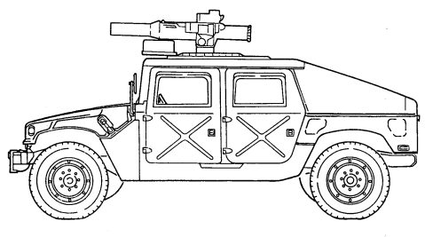

M1036 W/WINCH

Change 1

# 1-12. **Tow Carriers, W/Supplemental Armor (M1045,** M1045A1, M1045A2, M1046, And M1046A1)

a. **Differences**. The difference between the M1045, M1045A1, and M1045A2 TOW carriers w/supplemental armor and the M1046 and M1046A1 TOW carriers w/supplemental armor is that the M1045, M1045A1, and M1045A2 do not have winches and the M1046 and M1046A1 do. The A2 models have new bumpers, which make the vehicles slightly longer. A 9,000 lb winch is also available for the A2 models as an option. These differences affect:
- Vehicle Length - Vehicle Weight - Shipping Dimensions
- Approach Angle
- Special Winch-Assisted Operations It does not affect the basic purpose, performance, or special limitations of the vehicles.

b. **Purpose of the Vehicle**. The M1045, M1045A1, M1045A2, M1046, and M1046A1 provide added ballistic protection for TOW system components, crew, and ammunition. The M1046 and M1046A1 are equipped with winches. This feature permits recovery operations of similar vehicles.

c. **Performance**. Fully-loaded M1045, M1045A1, M1045A2, M1046, and M1046A1 TOW carriers w/supplemental armor will climb road grades as steep as 60% (3-1°) and traverse a side slope of up to 40% (220). The vehicles ford hard bottom water crossings up to 30 inches (76 centimeters) without a deepwater fording kit and 60 inches (152 centimeters) with the kit. Refer to table 1-15 for cruising range.

d. **Special Limitations**. Weapon station azimuth is limited to 300° left and right of vehicle centerline when Vehicle Power Conditioner (VPC) cables are connected. With launcher installed, elevation is limited to 20° and depression is limited to 10°.

e. **Special Instructions in the Manual.** (1) Refer to paragraph 2-2, Controls, Indicators, and Equipment. (2) Refer to chapter 2, section VI, TOW/Armament Carrier Operation.

1-10


M1046 AND M1046A1 W/WINCH

# 1-13. **Armament Carriers, Armored (M1025,** M1025A1, M1025A2, M1026, And M1026A1)

a. Differences. The difference between the M1025, M1025A1, and M1025A2 armament carriers and the M1026 and M1026A1 armament carriers is that the M1025 and M1025A1 do not have winches and the M1026 and M1026A1 do. The A2 models have new bumpers, which make the vehicles slightly longer. A 9,000 lb winch is also available for the A2 models as an option. These differences affect:
- Vehicle Length
- Vehicle Weight
- Shipping Dimensions - Approach Angle - Special Winch-Assisted Operations It does not affect the basic purpose, performance, or special limitations of the vehicles.

b. **Purpose of the Vehicle**. The M1025, M1025A1, M1025A2, M1026, and M1026A1 armament carriers provide mounting and firing of the MK19 automatic grenade launcher; M2, caliber .50 machine gun; and M60, 7.62 mm machine gun; ring-mounted with 360° arc of fire, with armor protection for crew, weapon components, and ammunition. The M1026 and M1026A1 are equipped with winches. This feature permits recovery operations of similar vehicles. c. Performance. Fully-loaded M1025, M1025A1, M1025A2, M1026, and M1026A1 armament carriers will climb road grades as steep as 60% (31°) and traverse a side slope of up to 40% (22°). The vehicles ford hard bottom water crossings up to 30 inches (76 centimeters) without a deep water fording kit and 60 inches (152 centimeters) with the kit. Refer to table 1-15 for cruising range.

d. **Special Limitations**. None. e. **Special Instructions in the Manual.** (1) Refer to paragraph 2-2, Controls, Indicators, and Equipment. (2) Refer to chapter 2, section VI, TOW/Armament Carrier Operation.

1-12


M1025A2
(WITH M60, 7.62 MM MACHINE GUN MOUNTED)

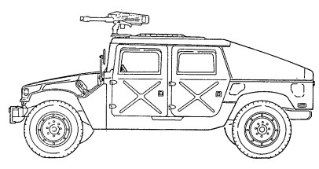

M1026 AND M1026A1 W/WINCH
(WITH MK19 GRENADE LAUNCHER MOUNTED)

1-13

# 1-14. **Armament Carriers, W/Supplemental Armor** (M1043, M1043A1, M1043A2, M1044, And M1044A1)

a. **Differences**. The difference between the M1043, M1043A1, and M1043A2 armament carriers w/supplemental armor and M1044 and M1044A1 armament carriers w/supplemental armor is that the M1043, and M1043A1, do not have winches and the M1044 and M1044A1 do. The A2 models have new bumpers which make the vehicles slightly longer. A 9,000 lb winch is also available for the A2 models as an option. These differences affect:
- Vehicle Length
- Vehicle Weight
- Shipping Dimensions - Approach Angle - Special Winch-Assisted Operations It does not affect the basic purpose, performance, or special limitations of the vehicles.

b. **Purpose of the Vehicle**. The M1043, M1043A1, M1043A2, M1044, and M1044A1 armament carriers w/supplemental armor provide added ballistic protection for armament components, crew, and ammunition. The M1044 and M1044A1 are equipped with winches. This feature permits recovery operations of similar vehicles.

c. **Performance**. Fully-loaded M1043, M1043A1, M1043A2, M1044, and M1044A1 armament carriers w/supplemental armor will climb road grades as steep as 60% (31°) and traverse a side slope of up to 40% (220). The vehicles ford hard bottom water crossings up to 30 inches (76 centimeters) without a deep-water fording kit and 60 inches (152 centimeters) with the kit. Refer to table 1-15 for cruising range.

d. **Special Limitations**. None. e. **Special Instructions in the Manual**.

(1) Refer to paragraph 2-2, Controls, Indicators, and Equipment. (2) Refer to chapter 2, section VI, TOW/Armament Carrier Operation.

1-14


M1043 AND M1043A1

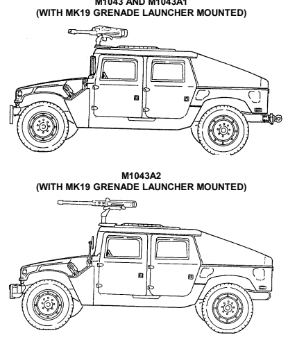

M1044 AND M1044AI W/WINCH
(WITH M2, CAUBER .50 MACHINE GUN MOUNTED)
1-15

#### 1-15. **S250 Shelter Carriers (M1037 And M1042)**

a. **Differences**. The only difference between the M1037 shelter carrier and the M1042 shelter carrier is that the M1037 does not have a winch and the M1042 does. This difference affects:
- Vehicle Length
- Vehicle Weight - Shipping Dimensions
- Approach Angle - Special Winch-Assisted Operations It does not affect the basic purpose, performance, or special limitations of the vehicles.

b. **Purpose of the Vehicle**. The M1037 and M1042 shelter carriers provide the capability to secure and transport the S250 electrical equipment shelter with a total payload (including crew) of 3,600 pounds (1,634 kilograms). The M1042 is equipped with a winch. This feature permits recovery operations of similar vehicles.

c. **Performance**. Fully-loaded M1037 and M1042 shelter carriers will climb road grades as steep as 60%
(31°) and traverse a side slope of up to 40% (22°). The vehicles ford hard bottom water crossings up to 30 inches (76 centimeters) without a deepwater fording kit and 60 inches (152 centimeters) with the kit. Refer to table 1-15 for cruising range.

d. **Special Limitations**. None.

e. **Special Instructions in the Manual.** (1) Refer to paragraph 2-2, Controls, Indicators, and Equipment. (2) Refer to chapter 2, section V, Cargo/Troop Carrier and S250 Shelter Carrier Operation.

1-16


M1042 W/WINCH
1-17

1-16. 2-ULITTER AMBULANCES, ARMORED (M996 AND
M996A1); 4-LITTER AMBULANCES, ARMORED (M997, M997A1, AND M997A2)
a. **Differences**. The M996 and M996A1 are armored 2-litter ambulances. The M997, M997A1, and M997A2 are 4-litter ambulances with armor protection and air conditioning for crew and patients. The A2 models have new bumpers, which make the vehicles slightly longer. A 9,000 lb winch is also available for the A2 models as an option. These differences affect:
- Approach Angle - Special Winch-Assisted Operations - Vehicle Length
- Vehicle Weight
- Shipping Dimensions

#### B. **Purpose Of The Vehicle.**

(1) **M996 and M996A1 Armored 2-Litter Ambulances**. The M996 and M996A1 ambulances are capable of transporting up to two litter patients, six ambulatory patients, or a combination of litter and ambulatory patients. Additionally, medical personnel, equipment, and a driver can be accommodated in the vehicle. The patient compartment is heated with a vehicle-mounted fuel burning heater. For operation in an NBC environment, the M996 and M996A1 are equipped with a Gas-Particulate Filter Unit (GPFU) with heaters capable of supporting up to five personnel equipped with either M25 series protective masks or M13 series patient protective masks. The GPFU forces temperature-controlled, filtered air to the mask facepieces, which increases protection, eases breathing, and reduces stress and heat fatigue during extended periods of NBC operation.

(2) **M997, M997A1, and M997A2 Armored 4-Litter Ambulances**. The M997, M997A1, and M997A2 ambulances are capable of transporting up to four litter patients, eight ambulatory patients, or a combination of litter and ambulatory patients. Additionally, medical personnel, equipment, and a driver can be accommodated in the vehicle. The ambulance can be heated, ventilated, or air conditioned, depending on environmental conditions. For operation in an NBC environment, the M997, M997A1, and M997A2 are equipped with a Gas- Particulate Filter Unit (GPFU) with heaters capable of supporting up to seven personnel equipped with either M25 series protective masks or M13 series patient protective masks. The GPFU forces temperature-controlled, filtered air to the mask facepieces, which increases protection, eases breathing, and reduces stress and heat fatigue during extended periods of NBC operation.

c. **Performance**. Fully-loaded M996, M996A1, M997, M997A1, and M997A2 ambulances will climb road grades as steep as 60% (31°) and traverse a side slope of up to 40% (220). The vehicles ford hard bottom water crossings up to 30 inches (76 centimeters) without a deep water fording kit and 60 inches (152 centimeters) with the kit. Refer to table 1-15 for cruising range.

d. **Special Limitations**. None. e. **Special Instructions in the Manual**.

(1) Refer to paragraph 2-2, Controls, Indicators, and Equipment. (2) Refer to chapter 2, section VII, Ambulance Operation.

#### 1-18


M996 AND M996A1


M997A2 1-19

# 1-17. **2-Litter Ambulances, Soft Top** (M1035, M1035A1, And M1035A2)

a. **Differences**. The difference between the M1035, M1035A1, and M1035A2 2-litter soft top ambulances is that the M1035A2 is longer, due to new bumpers, and can be equipped with an optional 9,000 lb winch. These differences affect:
- Approach Angle
- Special Winch-Assisted Operations
- Vehicle Length - Vehicle Weight - Shipping Dimensions b. **Purpose of the Vehicle.** The M1035, M1035A1, and M1035A2 ambulances are 2-litter soft tops which have no armor protection for crew and patients.

c. **Performance**. Fully-loaded M1035,'M1035A1, and M1035A2 ambulances will climb road grades as steep as 60% (31°) and traverse a side slope of up to 40% (22°). The vehicles ford hard bottom water crossings up to 30 inches (76 centimeters) without a deep water fording kit and 60 inches (152 centimeters) with the kit. Refer to table 1-15 for cruising range.

d. **Special Limitations**. None. e. **Special Instructions in the Manual**. (1) Refer to paragraph 2-2, Controls, Indicators, and Equipment. (2) Refer to chapter 2, section VII, Ambulance Operation.

1-20


M1035 AND M1035A1


M1035A2 1-21

## 1-18. Tabulated Data

|                                          |    |                                                       |    |    | Table 1\-1. Differences Between Models   |    |    |    |    |    |    |    |    |    |    |    |
|------------------------------------------|----|-------------------------------------------------------|----|----|------------------------------------------|----|----|----|----|----|----|----|----|----|----|----|
| Equipment/Function                       |    |                                                       |    |    |                                          |    |    |    |    |    |    |    |    |    |    |    |
| Personnel/Cargo                          |    |                                                       |    | x  |                                          |    |    |    |    | x  |    |    |    |    |    | x  |
| Operations                               |    |                                                       |    |    |                                          |    |    |    |    |    |    |    |    |    |    |    |
| TOW Launcher                             | x  |                                                       |    |    |                                          |    |    | x  |    |    |    |    |    | x  | x  |    |
| Mounting                                 |    |                                                       |    |    |                                          |    |    |    |    |    |    |    |    |    |    |    |
| Armament Mounting                        |    |                                                       |    |    | x                                        | x  |    |    |    |    |    | x  | x  |    |    |    |
| S250 Shelter                             |    |                                                       |    |    |                                          |    |    |    | x  |    | x  |    |    |    |    | x  |
| Configuration                            |    |                                                       |    |    |                                          |    |    |    |    |    |    |    |    |    |    |    |
| Ambulance:                               |    |                                                       |    |    |                                          |    |    |    |    |    |    |    |    |    |    |    |
| Two Litter Patients                      |    | x                                                     |    |    |                                          |    | x  |    |    |    |    |    |    |    |    |    |
| Four Litter Patients                     |    |                                                       | x  |    |                                          |    |    |    |    |    |    |    |    |    |    |    |
| Eight Ambulatory Patients                |    |                                                       | x  |    |                                          |    |    |    |    |    |    |    |    |    |    |    |
| Six Ambulatory Patients                  |    | x                                                     |    |    |                                          |    |    |    |    |    |    |    |    |    |    |    |
| Two Litter and Four Ambulatory Patients  |    |                                                       | x  |    |                                          |    |    |    |    |    |    |    |    |    |    |    |
| One Litter and Three Ambulatory Patients |    | x                                                     |    |    |                                          |    |    |    |    |    |    |    |    |    |    |    |
| Vehicle Winch                            |    |                                                       | *  |    | *                                        | x  | *  | x  |    | x  | x  | *  | x  | *  | x  | *  |
| Communications:                          |    |                                                       |    |    |                                          |    |    |    |    |    |    |    |    |    |    |    |
| AN/GRC\-160                              | x  | x                                                     | x  | x  | x                                        | x  |    | x  |    | x  |    | x  | x  | x  | x  |    |
| AN/VRC\-12 Series                        |    |                                                       |    | x  |                                          |    |    |    |    | x  |    |    |    |    |    |    |
| Collective NBC                           |    | x                                                     | x  |    |                                          |    |    |    |    |    |    |    |    |    |    |    |
| Protection                               |    |                                                       |    |    |                                          |    |    |    |    |    |    |    |    |    |    |    |
| Basic Armor                              | x  | x                                                     | x  |    | x                                        | x  |    | x  |    |    |    |    |    |    |    |    |
| Supplemental Armor                       |    |                                                       |    |    |                                          |    |    |    |    |    |    | x  | x  | x  | x  |    |
| Howitzer Prime Mover                     |    |                                                       |    |    |                                          |    |    |    |    |    |    |    |    |    |    | x  |
| *                                        |    | Identifies an optional winch available for A2 models. |    |    |                                          |    |    |    |    |    |    |    |    |    |    |    |

This paragraph organizes vehicle specifications, special equipment, and model differences in table form for easy reference by operators.

1-22 Change 1

|                                                       | Table 1\-2. Capacities                    |          |        |
|-------------------------------------------------------|-------------------------------------------|----------|--------|
| Vehicle                                               | Description                               | Capacity |        |
|                                                       |                                           | Standard | Metric |
| All                                                   | Cooling system                            | 26 qt    | 24.6 L |
| All                                                   | Engine (crankcase only)                   | 7 qt     | 6.6 L  |
| All                                                   | Engine (crankcase with new filter)        | 8 qt     | 7.6 L  |
| All                                                   | Differential (each)                       | 2 qt     | 1.9 L  |
| All                                                   | Transmission (3L80)                       | 6 qt     | 5.7 L  |
| (Except M1123 and A2)                                 | (drain and refill)                        |          |        |
| M1123 and A2 Series Vehicles                          | Transmission (4L80\-E) (drain and refill) | 7.7 qt   | 7.3 L  |
| All (Except M1097, A1, A2, and M1123                  | Transfer case (218)                       | 3.5 qt   | 3.3 L  |
| Series Vehicles)                                      |                                           |          |        |
| M1097, A1, A2, and M1123 Series Vehicles              | Transfer case (242)                       | 3.35 qt  | 3.17 L |
| All                                                   | Fuel tank                                 | 25 gal.  | 94.6 L |
| All                                                   | Steering system                           | 1 qt     | 0.95 L |
| All                                                   | Steering system (with steering cooler)    | 1.25 qt  | 1.18 L |
| All (Except M1097, A1, A2, and M1123 Series Vehicles) | Brake master cylinder                     | 0.69 pt  | 0.33 L |
| M1097, A1, A2, and                                    | Brake master cylinder                     | 1.12 pt  | 0.53 L |
| M1123 Series Vehicles                                 |                                           |          |        |
| All (Except M1097, A1, A2, and M1123                  | Total brake system                        | 1.2 pt   | 0.57 L |
| Series Vehicles)                                      |                                           |          |        |
| M1097, A1, A2, and                                    | Total brake system                        | 1.63 pt  | 0.77 L |
| M1123 Series Vehicles                                 |                                           |          |        |
| All                                                   | Windshield washer                         | 1 qt     | 0.95 L |
| All                                                   | Geared hub                                | 1 pt     | 0.47 L |

| Vehicle   | Description     |                | Expected Temperatures     |                 |
|-----------|-----------------|----------------|---------------------------|-----------------|
|           |                 | Above +15°     | +40° to \-15°F            | +40° to \-65°F  |
|           |                 | (above \-9°C)  | (+4° to \-26°C)           | (+4° to \-54°C) |
| All       | Cooling system  | 1/4 ethylene   | 2/5 ethylene              | 3/5 ethylene    |
|           |                 | glycol,        | glycol,                   | glycol,         |
|           |                 | 3/4 water      | 3/5 water                 | 2/5 water       |
| All       | Engine          | OE/HDO 30      | OE/HDO 10                 | OEA             |
| All       | Fuel tank       | DF1, DF2       | DF1                       | DF1, DFA*       |
|           |                 |                | All Temp. Alternate JP\-8 |                 |
| All       | Differentials   | GO 80/90       | GO 80/90                  | GO 80/90        |
| All       | Geared hubs     | GO 80/90       | GO 80/90                  | GO 80/90        |
|           | Transmission    | Dexron® II or  | Dexron® II or             | Dexron® II or   |
|           | (3L80)          | Dexron® III    | Dexron® III               | Dexron® III     |
| All       | Transmission    | Dexron® III    | Dexron® III               | Dexron® III     |
|           | (4L80\-E)       |                |                           |                 |
| All       | Transfer case   | Dexron® II or  | Dexron® II or             | Dexron® II or   |
|           |                 | Dexron® III    | Dexron® III               | Dexron® III     |
| All       | Steering system | Dexron® II or  | Dexron® II or             | Dexron® II or   |
|           |                 | Dexron® III    | Dexron® III               | Dexron® III     |
| All       | Brake system    | Brake Fluid    | Brake Fluid               | Brake Fluid     |
|           |                 | Silicone (BFS) | Silicone (BFS)            | Silicone (BFS)  |
| All       | Windshield      | 1/3 cleaning   | 1/2 cleaning              | 2/3 cleaning    |
|           | washer          | compound,      | compound,                 | compound,       |
|           | reservoir       | 2/3 water      | 1/2 water                 | 1/3 water       |

Table 1-3. General Service Data Table 1-4. Engine Data (6.2 L)

| Type                                        | 6.2 liter diesel, naturally\-aspirated, liquid\-cooled   |
|---------------------------------------------|----------------------------------------------------------|
| Cylinders                                   | 8(V)                                                     |
| Brake horsepower                            | 1 50 horsepower @ 3600 rpm                               |
| Idle speed (engine rpm)                     | 650 ± 25 rpm                                             |
| Operating speed (engine rpm) 1500\-2300 rpm |                                                          |
| Oil pressure at idle                        | 1 5 psi (103 kPa)                                        |
| Normal operating oil pressure               | 40\-50 psi (276\-345 kPa)                                |

| Type 6.5 liter diesel, naturally\-aspirated, liquid\-cooled   |
|---------------------------------------------------------------|
| Cylinders 8(V)                                                |
| Brake horsepower 1 60 horsepower @ 3400 rpm                   |
| Idle speed (engine rpm) 700 ± 25 rpm                          |
| Operating speed (engine rpm) 1500\-2300 rpm                   |
| Oil pressure at idle 1 0 psi (69 kPa)                         |
| Normal operating oil pressure 40\-50 psi (276\-345 kPa)       |

| Surge tank cap pressure 1 5 psi (103 kPa)                     |
|---------------------------------------------------------------|
| Thermostat:                                                   |
| Starts to open 1 90°F (88°C)                                  |
| Fully open 21 2°F (1 00°C)                                    |
| Radiator Downflow type                                        |
| Fan 1 0 blade, 19 inch (48 cm)                                |
| Normal operating coolant temperature 190°\-230°F (88°\-110°C) |

#### Table 1-5. Engine Data (6.5 L) Table 1-6. Cooling System Data Tm 9-2320-280-10

| General Information                        |                                             |
|--------------------------------------------|---------------------------------------------|
| Model Turbo Hydra\-Matic 3L80              |                                             |
| Type Three\-speed automatic                |                                             |
| Oil type Dexron® II or Dexron III®         |                                             |
| Transmission Range Selection               |                                             |
| Recommended Shift Lever Position           | Operating Condition                         |
| "R" (reverse)                              | Clear of traffic and obstructions, using    |
| ground guide.                              |                                             |
| "N" (neutral)                              | Vehicle stopped with parking brake applied. |
| "D" (drive)                                | Normal driving and fording.                 |
| "2" (second)                               | Hill climbing and "engine braking" to slow  |
| vehicle when descending steep hills.       |                                             |
| "1" (first)                                | Maximum "engine braking" when descending    |
| very steep hills, climbing steep hills, or |                                             |
| driving through deep mud, sand, or snow.   |                                             |

Table 1-7. Transmission Data (3L80)

| General Information                  |                                             |
|--------------------------------------|---------------------------------------------|
| Model Turbo Hydra\-Matic 4L80\-E     |                                             |
| Type Four\-speed automatic           |                                             |
| Oil type Dexron® III                 |                                             |
| Transmission Range Selection         |                                             |
| Recommended Shift Lever Position     | Operating Condition                         |
| "P" (park)                           | Vehicle stopped with parking brake applied. |
| "R" (reverse)                        | Clear of traffic and obstructions, using    |
| ground guide.                        |                                             |
| "N" (neutral)                        | Vehicle stopped with parking brake applied. |
| " D  " (overdrive)                   | Normal driving and fording.                 |
| "D" (drive)                          | Hilly terrain and towing a trailer.         |
| "2" (second)                         | Hill climbing and "engine braking" to slow  |
| vehicle when descending steep hills. |                                             |
| "1" (first)                          | Maximum "engine braking" when descending    |
|                                      | very steep hills, climbing steep hills, or  |
|                                      | driving through deep mud, sand, or snow.    |

Table 1-8. Transmission Data (4L80-E)

| General Information                                                                                       |
|-----------------------------------------------------------------------------------------------------------|
| Model New Process Gear 218 (MOD)                                                                          |
| Type Two\-speed, locking, chain driven                                                                    |
| Oil type Dexron® II                                                                                       |
| CAUTION                                                                                                   |
| Damage to drivetrain will occur if transfer case ranges are not selected properly. Refer to paragraph 2\- |
| 11, Placing Vehicle in Motion, and paragraph 2\-29, Operating on Unusual Terrain, for specific            |
| instructions.                                                                                             |
| Transfer Case Range Selection                                                                             |
| Recommended Shift Lever Position Operating Condition                                                      |
| "H" (high range) This drive range shall be selected whenever possible.                                    |
| High range should be used when operating on all                                                           |
| primary, secondary, and off\-road surfaces, where little                                                  |
| or no wheel slippage exists. This range is also to be                                                     |
| used when encountering sharp, continuous turns on                                                         |
| high traction surfaces.                                                                                   |
| "H/L" (high lock range)  This  drive  range shall be  selected only when                                  |
| continuous wheel slippage is evident; i.e., when                                                          |
| operating in mud, snow, loose sand, or on ice, and                                                        |
| increased control or additional traction is required.                                                     |
| "L" (low range)  This drive range shall be selected only when high                                        |
| ranges do not provide sufficient power to negotiate                                                       |
| steep hills or downgrades. This range shall also be                                                       |
| used when the vehicle is mired and cannot be                                                              |
| extracted using the high lock range.                                                                      |
| "N" (neutral)  Vehicle is disabled and must be towed.                                                     |

| General Information                                                                                  |                                                                                                           |
|------------------------------------------------------------------------------------------------------|-----------------------------------------------------------------------------------------------------------|
| Model                                                                                                | New Process Gear 242 (MOD)                                                                                |
| Type                                                                                                 | Two\-speed, locking, chain driven                                                                         |
| Oil type                                                                                             | Dexron® II                                                                                                |
| CAUTION                                                                                              |                                                                                                           |
| 11 for specific instructions on Placing Vehicle in Motion, and paragraph 2\-29, Operating on Unusual | Damage to drivetrain will occur if transfer case ranges are not selected properly. Refer to paragraph 2\- |
| Terrain.                                                                                             |                                                                                                           |
| Transfer Case Range Selection                                                                        |                                                                                                           |
| Recommended Shift Lever Position                                                                     | Operating Condition                                                                                       |
| "H" (high range)                                                                                     | This drive range shall be selected whenever possible.                                                     |
| High range should be used when operating on all                                                      |                                                                                                           |
| primary, secondary, and off\-road surfaces, where little                                             |                                                                                                           |
| or no wheel slippage exists. This range is also to be                                                |                                                                                                           |
| used when encountering sharp, continuous turns on                                                    |                                                                                                           |
| high traction surfaces.                                                                              |                                                                                                           |
| "H/L" (high lock range)  This drive range shall be selected for off\- highway hilly                  |                                                                                                           |
| terrain or when continuous wheel slippage is evident;                                                |                                                                                                           |
| i.e., when operating in mud, snow, loose sand, or on                                                 |                                                                                                           |
| ice, and increased control or additional traction is                                                 |                                                                                                           |
| required.                                                                                            |                                                                                                           |
| "L" (low range) This drive range shall be selected only when high                                    |                                                                                                           |
| ranges do not provide sufficient power to negotiate                                                  |                                                                                                           |
| steep hills or downgrades. This range shall also be                                                  |                                                                                                           |
| used when the vehicle is mired and cannot be                                                         |                                                                                                           |
| extracted using the high lock range.                                                                 |                                                                                                           |
| "N" (neutral) Vehicle is disabled and must be towed.                                                 |                                                                                                           |

Table 1-11. Maximum Vehicle Operating Speeds (3L80 Transmission)

| Transmission    |               | Transfer Case Range Selection   |                       |
|-----------------|---------------|---------------------------------|-----------------------|
| Range Selection | "L" Low Range | "H" High Range                  | "H/L" High Lock Range |
| "R" (reverse)   | 11 mph        | 29 mph                          | 11 mph                |
|                 | (18 kph)      | (47 kph)                        | (18 kph)              |
| "D" (drive)     | 27 mph        | 55 mph                          | 55 mph                |
|                 | (43 kph)      | (88 kph)                        | (88 kph)              |
| "2" (second)    | 19 mph        | 48 mph                          | 48 mph                |
|                 | (31 kph)      | (77 kph)                        | (77 kph)              |
| "1" (first)     | 11 mph        | 29 mph                          | 29 mp                 |
|                 | (18 kph)      | (47 kph)                        | (47 kph)              |

| Transmission      |               | Transfer Case Range Selection   |                       |
|-------------------|---------------|---------------------------------|-----------------------|
| Range Selection   | "L" Low Range | "H" High Range                  | "H/L" High Lock Range |
| "R" (reverse)     | 11 mph        | 29 mph                          | 11 mph                |
|                   | (18 kph)      | (47 kph)                        | (18 kph)              |
| " D " (overdrive) | 27 mph        | 55 mph                          | 55 mph                |
|                   | (43 kph)      | (88 kph)                        | (88 kph)              |
| "D" (drive)       | 27 mph        | 55 mph                          | 55 mph                |
|                   | (43 kph)      | (88 kph)                        | (88 kph)              |
| "2" (second)      | 19 mph        | 48 mph                          | 48 mph                |
|                   | (31 kph)      | (77 kph)                        | (77 kph)              |
| "1" (first)       | 11 mph        | 29 mph                          | 29 mph                |
|                   | (18 kph)      | (47 kph)                        | (47 kph)              |

Table 1-12. Maximum Vehicle Operating Speeds (4L80-E Transmission)

# Tm 9-2320-280-10

| Table 1\-13.   |        |                | Vehicle Dimensions (All except M1123 and A2 Vehicles)   |                 |                  |                          |
|----------------|--------|----------------|---------------------------------------------------------|-----------------|------------------|--------------------------|
|                |        | Length Overall |                                                         | Height Overall* |                  | Height Minimum Reducible |
| Vehicle        | Inches | Centimeters    | Inches                                                  | Centimeters     | Inches           | Centimeters              |
| M966/M966A1    | 180    | 457            | 73                                                      | 185             | 71               | 180                      |
|                |        |                | 69**                                                    | 175             |                  |                          |
| M996/M996A1    | 202    | 513            | 86                                                      | 218             | 77               | 196                      |
| M997/M997A1    | 202    | 513            | 102                                                     | 259             | 102              | 259                      |
| M998/M998A1    | 180    | 457            | 69                                                      | 175             | 55               | 140                      |
| M1025/M1025A1  | 180    | 457            | 73                                                      | 185             | 71               | 180                      |
|                |        |                | 69**                                                    | 175             |                  |                          |
| M1026/M1026A1  | 185    | 470            | 73                                                      | 185             | 71               | 180                      |
|                |        |                | 69**                                                    | 175             |                  |                          |
| M1035/M1035A1  | 180    | 457            | 69                                                      | 175             | 55               | 140                      |
| M1036          | 185    | 470            | 73                                                      | 185             | 71               | 180                      |
|                |        |                | 69**                                                    | 175             |                  |                          |
| M1037          | 189    | 480            | 69                                                      | 175             | 55               | 140                      |
| M1038/M1038A1  | 185    | 470            | 69                                                      | 175             | 55               | 140                      |
| M1042          | 185    | 470            | 69                                                      | 175             | 55               | 140                      |
| M1043/M1043A1  | 180    | 457            | 73                                                      | 185             | 71               | 180                      |
|                |        |                | 69**                                                    | 175             |                  |                          |
| M1044/M1044A1  | 185    | 470            | 73                                                      | 185             | 71               | 180                      |
|                |        |                | 69**                                                    | 175             |                  |                          |
| M1045/M1045A1  | 180    | 457            | 73                                                      | 185             | 71               | 180                      |
|                |        |                | 69**                                                    | 175             |                  |                          |
| M1046/M1046A1  | 185    | 470            | 73                                                      | 185             | 71               | 180                      |
| M1097/M1097A1  | 180    | 457            | 69**                                                    | 175             | 55               | 140                      |
| M1121          | 180    | 457            | 73                                                      | 185             | 71               | 180                      |
|                |        | Width Overall  |                                                         |                 | Ground Clearance |                          |
|                |        |                |                                                         | Under Axle      |                  | Under Chassis            |
| Vehicle        | Inches | Centimeters    | Inches                                                  | Centimeters     | Inches           | Centimeters              |
| All            | 85     | 216            | 16                                                      | 41              | 24               | 61                       |

* Height covers basic vehicle only. ** Height when weapon station is removed.

# Tm 9-2320-280-10

|         | Table 1\-14.        |       | Vehicle Dimensions   | (M1123 and A2 Vehicles)   |                   |             |
|---------|---------------------|-------|----------------------|---------------------------|-------------------|-------------|
| Vehicle | Length Overall      |       | Height Overall*      |                           | Height            |             |
|         |                     |       |                      |                           | Minimum Reducible |             |
|         | Inches  Centimeters |       | Inches  Centimeters  |                           | Inches            | Centimeters |
| M997A2  | 204.5               | 519.5 | 102                  | 259                       | 102               | 259         |
| M1025A2 | 190.5               | 483.9 | 73                   | 185                       | 71                | 180         |
|         |                     |       | 69**                 | 175                       |                   |             |
| M1035A2 | 190.5               | 483.9 | 69                   | 175                       | 55                | 140         |
| M1043A2 | 190.5               | 483.9 | 73                   | 185                       | 71                | 180         |
|         |                     |       | 69**                 | 175                       |                   |             |
| M1045A2 | 190.5               | 483.9 | 73                   | 185                       | 71                | 180         |
|         |                     |       | 69**                 | 175                       |                   |             |
| M1097A2 | 190.5               | 483.9 | 69                   | 175                       | 55                | 140         |
| M1123   | 182.5               | 463.6 | 69                   | 175                       | 55                | 140         |
|         | Width Overall       |       |                      |                           | Ground Clearance  |             |
|         |                     |       | Under Axle           |                           | Under Chassis     |             |
| Vehicle | Inches  Centimeters |       | Inches  Centimeters  |                           | Inches            | Centimeters |
| All     | 85                  | 216   | 16                   | 41                        | 24                | 61          |

* Height covers basic vehicle only. ** Height when weapon station is removed.

#### Tm 9-2320-280-10

Table 1-15. Vehicle Cruising Range

When vehicle is driven on hard surface and hilly terrain at a speed of 30-40 mph (48-64 kph), the ranges shown in this table can be expected when using bias ply tires. Cruising range may increase by approximately 30 miles (48 km) when using radial tires.

| Vehicles                          | Gross Vehicle Weight (GVW)   | Cruising Range   |
|-----------------------------------|------------------------------|------------------|
| M998, M1035, M1038                | 7,700 lb (3,496 kg)          | 337 mi (542 km)  |
| M966, M1025, M1026,  M1036, M1121 | 8,200 lb (3,723 kg)          | 320 mi (515 km)  |
| M1043, M1044, M1045,              | 8,400 lb (3,814 kg)          | 312 mi (502 km)  |
| M1046                             |                              |                  |
| M996, M1037, M1042                | 8,660 lb (3,932 kg)          | 300 mi (483 km)  |
| M997                              | 9,100 lb (4,131 kg)          | 275 mi (442 km)  |
| M1097                             | 10,000 lb (4,540 kg)         | 275 mi (442 km)  |
| M998A1, M1035A1,  M1038A1         | 7,880 lb (3,578 kg)          | 337 mi (542 km)  |
| M966A1, M1025A1,                  | 8,380 lb (3,805 kg)          | 320 mi (515 km)  |
| M1026A1                           |                              |                  |
| M1043A1, M1044A1,                 | 8,580 lb (3,895 kg)          | 312 mi (502 km)  |
| M1045A1, M1046A1                  |                              |                  |
| M996A1                            | 8,840 lb (4,013 kg)          | 300 mi (483 km)  |
| M997A1                            | 9,280 lb (4,213 kg)          | 275 mi (442 km)  |
| M1097A1                           | 10,000 lb (4,540 kg)         | 275 mi (442 km)  |
| M1035A2                           | 10,300 lb (4,676 kg)         | 337 mi (542 km)  |
| M1025A2                           | 10,300 lb (4,676 kg)         | 320 mi (515 km)  |
| M1043A2,  M1045A2                 | 10,300 lb (4,676 kg)         | 312 mi (502 km)  |
| M997A2                            | 9,280 lb (4,213 kg)          | 275 mi (442 km)  |
| M1097A2, M1123                    | 10,300 lb (4,676 kg)         | 275 mi (442 km)  |

| NOTE   |
|--------|

TM 9-2320-280-10

|                  |                | Capacities   |          |
|------------------|----------------|--------------|----------|
| Vehicle          | Description    | Standard     | Metric   |
| M1026, M1036,    | Max. Load      | 3,360 lb     | 1,525 kg |
| M1038, M1042,    | (Fifth Layer)  |              |          |
| M1044, M0146,    | Max. Load      | 3,780 lb     | 1,716 kg |
| M1026A1,         | (Fourth Layer) |              |          |
| M1038A1,         |                |              |          |
| M1044A1, M1046A1 | Max. Load      | 4,310 lb     | 1,957 kg |
|                  | (Third Layer)  |              |          |
|                  | Max. Load      | 5,020 lb     | 2,279 kg |
|                  | (Second Layer) |              |          |
|                  | Max. Load      | 6,000 lb     | 2,724 kg |
|                  | (First Layer)  |              |          |

|                   | Table 1\-17. 9,000 lb Winch Data (Optional)   |            |          |
|-------------------|-----------------------------------------------|------------|----------|
|                   |                                               | Capacities |          |
| Vehicle           | Description                                   | Standard   | Metric   |
| M1097A2, M1025A2, | Max. Load                                     | 6,200 lb   | 2,815 kg |
| M1043A2, M1123,   | (Fifth Layer)                                 |            |          |
| M1045A2,          | Max. Load                                     | 7,000 lb   | 3,178 kg |
| M997A2,           | (Fourth Layer)                                |            |          |
| M1035A2           |                                               |            |          |
|                   | Max. Load                                     | 8,000 lb   | 3,632 kg |
|                   | (Third Layer)                                 |            |          |
|                   | Max. Load                                     | 8,500 lb   | 3,859 kg |
|                   | (Second Layer)                                |            |          |
|                   | Max. Load                                     | 9,000 lb   | 4,086 kg |
|                   | (First Layer)                                 |            |          |

|                     |                |           | Capacities   |
|---------------------|----------------|-----------|--------------|
| Vehicle             | Description    | Standard  | Metric       |
|                     | Min. Load      | 4,700 lb  | 2,134 kg     |
| All vehicles except | Max. Load      | 5,200 lb  | 2,361 kg     |
| M966, M996, M997,   | (Fifth Layer)  |           |              |
| M1035, M1121,       | Min. Load      | 5,600 lb  | 2,542 kg     |
| M966A1, M996A1,     |                |           |              |
| M997A1, M1035A1,    | Max. Load      | 6,000 lb  | 2,724 kg     |
| M997A2, M1035A2     | (Fourth Layer) |           |              |
|                     | Min. Load      | 6,800 lb  | 3,087 kg     |
|                     | Max. Load      | 8,500 lb  | 3,859 kg     |
|                     | (Third Layer)  |           |              |
|                     | Min. Load      | 8,700 lb  | 3,950 kg     |
|                     | Max Load       | 9,600 lb  | 4,358 kg     |
|                     | (Second Layer) |           |              |
|                     | Min. Load      | 9,620 lb  | 4,367 kg     |
|                     | Max. Load      | 10,500 lb | 4,767 kg     |
|                     | (First Layer)  |           |              |

Table 1-16. 6,000 lb Winch Data

Table 1-17.1. 10,500 lb Winch Data (Optional)

#### Tm 9-2320-280-10

|         |                     | Table 1\-18. Curb Weight   |                     |
|---------|---------------------|----------------------------|---------------------|
| Vehicle | Curb Weight         | Vehicle                    | Curb Weight         |
| M998    | 5,200 lb (2,361 kg) | M997                       | 7,180 lb (3,260 kg) |
| M1038   | 5,327 lb (2,418 kg) | M1045                      | 6,438 lb (2,923 kg) |
| M966    | 6,051 lb (2,747 kg) | M1046                      | 6,565 lb (2,981 kg) |
| M1025   | 5,960 lb (2,706 kg) | M1043                      | 6,411 lb (2,911 kg) |
| M1026   | 6,087 lb (2,763 kg) | M1044                      | 6,538 lb (2,968 kg) |
| M1037   | 5,425 lb (2,463 kg) | M1035                      | 5,297 lb (2,405 kg) |
| M996    | 6,748 lb (3,064 kg) | M1042                      | 5,551 lb (2,520 kg) |
| M1036   | 6,178 lb (2,805 kg) | M1097                      | 5,600 lb (2,542 kg) |
| M998A1  | 5,380 lb (2,443 kg) | M997A1                     | 7,360 lb (3,341 kg) |
| M1038A1 | 5,507 lb (2,500 kg) | M1045A1                    | 6,618 lb (3,005 kg) |
| M966A1  | 6,231 lb (2,829 kg) | M1046A1                    | 6,745 lb (3,062 kg) |
| M1025A1 | 6,140 lb (2,788 kg) | M1043A1                    | 6,591 lb (2,992 kg) |
| M1026A1 | 6,267 lb (2,845 kg) | M1044A1                    | 6,718 lb (3,050 kg) |
| M996A1  | 6,928 lb (3,145 kg) | M1035A1                    | 5,477 lb (2,487 kg) |
| M1097A1 | 5,600 lb (2,542 kg) | M1025A2                    | 6,780 lb (3,078 kg) |
| M1045A2 | 7,258 lb (3,295 kg) | M1043A2                    | 7,230 lb (3,282 kg) |
| M1097A2 | 5,900 lb (2,679 kg) | M1035A2                    | 6,100 lb (2,769 kg) |
| M997A2  | 7,660 lb (3,478 kg) | M1121                      | 6,051 lb (2,747kg)  |
| M1123   | 5,900 lb (2,679 kg) |                            |                     |

Refer to FM 5-36 for information on trailer weights.

|                                        |       | Loaded         |         |
|----------------------------------------|-------|----------------|---------|
| Model                                  | Empty | Cross\-Country | Highway |
| M966, M966A1, M996, M996A1, M997,      | 3     | 4              | 4       |
| M997A1, M997A2, M998, M998A1, M1025,   |       |                |         |
| M1025A1, M1025A2, M1026, M1026A1,      |       |                |         |
| M1036, M1044, M1044A1, M1045, M1045A1, |       |                |         |
| M1045A2, M1046, M1046A1, M1121         |       |                |         |
| M1035, M1035A1, M1035A2                | 2     | 3              | 3       |
| M1037, M1038, M1038A1, M1042, M1043,   | 2     | 4              | 4       |
| M1043A1, M1043A2, M1097, M1097A1,      |       |                |         |
| M1097A2, M1123                         |       |                |         |

Table 1-19. Vehicle Bridge Classification

|         |         | Less Payload and Crew   |         |         | GVW     |         |
|---------|---------|-------------------------|---------|---------|---------|---------|
|         | Front   | Rear                    |         | Front   | Rear    |         |
|         | Axle    | Axle                    | Total   | Axle    | Axle    | Total   |
|         | lbs.    | lbs.                    | lbs.    | lbs.    | lbs.    | lbs.    |
| Vehicle | (kgs)   | (kgs)                   | (kgs)   | (kgs)   | (kgs)   | (kgs)   |
| M966    | 3,111   | 2,940                   | 6,051   | 3,550   | 4,650   | 8,200   |
|         | (1,412) | (1,335)                 | (2,747) | (1,612) | (2,111) | (3,723) |
| M966A1  | 3,191   | 3,040                   | 6,231   | 3,628   | 4,752   | 8,380   |
|         | (1,449) | (1,380)                 | (2,829) | (1,647) | (2,157) | (3,805) |
| M996    | 3,063   | 3,685                   | 6,748   | 3,673   | 4,987   | 8,660   |
|         | (1,391) | (1,673)                 | (3,064) | (1,667) | (2,264) | (3,932) |
| M996A1  | 3,143   | 3,785                   | 6,928   | 3,750   | 5,090   | 8,840   |
|         | (1,427) | (1,718)                 | (3,145) | (1,703) | (2,311) | (4,013) |
| M997    | 3,253   | 3,945                   | 7,180   | 3,860   | 5,240   | 9,100   |
|         | (1,477) | (1,791)                 | (3,260) | (1,752) | (2,379) | (4,131) |
| M997A1  | 3,315   | 4,045                   | 7,360   | 3,936   | 5,344   | 9,280   |
|         | (1,505) | (1,836)                 | (3,341) | (1,787) | (2,426) | (4,213) |
| M997A2  | 3,565   | 4,205                   | 7,770   | N/A     | N/A     | 10,300  |
|         | (1,619) | (1,909)                 | (3,528) |         |         | (4,676) |
| M998    | 2,900   | 2,300                   | 5,200   | 3,350   | 4,350   | 7,700   |
|         | (1,317) | (1,044)                 | (2,361) | (1,521) | (1,975) | (3,495) |
| M998A1  | 2,980   | 2,400                   | 5,380   | 3,429   | 4,451   | 7,880   |
|         | (1,353) | (1,089)                 | (2,443) | (1,557) | (2,021) | (3,578) |
| M1025   | 3,122   | 2,848                   | 5,960   | 3,685   | 4,515   | 8,200   |
|         | (1,417) | (1,293)                 | (2,706) | (1,673) | (2,050) | (3,723) |
| M1025A1 | 3,192   | 2,948                   | 6,140   | 3,766   | 4,614   | 8,380   |
|         | (1,449) | (1,338)                 | (2,788) | (1,710) | (2,095) | (3,805) |
| M1025A2 | 3,350   | 3,430                   | 6,780   | N/A     | N/A     | 10,300  |
|         | (1,521) | (1,557)                 | (3,078) |         |         | (4,676) |
| M1026   | 3,259   | 2,828                   | 6,087   | 3,840   | 4,360   | 8,200   |
|         | (1,480) | (1,284)                 | (2,763) | (1,743) | (1,979) | (3,723) |
| M1026A1 | 3,339   | 2,928                   | 6,267   | 3,925   | 4,435   | 8,380   |
|         | (1,516) | (1,329)                 | (2,847) | (1,782) | (2,013) | (3,805) |
| M1035   | 2,890   | 2,407                   | 5,297   | 3,350   | 4,350   | 7,700   |
|         | (1,312) | (1,092)                 | (2,405) | (1,521) | (1,975) | (3,496) |
| M1035A1 | 2,970   | 2,507                   | 5,477   | 3,429   | 4,451   | 7,880   |
|         | (1,349) | (1,138)                 | (2,487) | (1,557) | (2,021) | (3,578) |
| M1035A2 | 3,330   | 2,770                   | 6,100   | N/A     | N/A     | 10,300  |
|         | (1,512) | (1,258)                 | (2,769) |         |         | (4,676) |
| M1036   | 3,253   | 2,925                   | 6,178   | 3,700   | 4,500   | 8,200   |
|         | (1,477) | (1,328)                 | (2,805) | (1,680) | (2,043) | (3,723) |
| M1037   | 2,720   | 2,480                   | 5,200   | 3,362   | 5,298   | 8,660   |
|         | (1,235) | (1,126)                 | (2,360) | (1,526) | (2,405) | (3,932) |
| M1038   | 3,052   | 2,275                   | 5,327   | 3,400   | 4,300   | 7,700   |
|         | (1,386) | (1,032)                 | (2,418) | (1,544) | (1,952) | (3,496) |
| M1038A1 | 3,132   | 2,375                   | 5,507   | 3,480   | 4,400   | 7,880   |
|         | (1,422) | (1,078)                 | (2,500) | (1,580) | (1,998) | (3,578) |
| M1042   | 2,866   | 2,454                   | 5,320   | 3,387   | 5,273   | 8,660   |
|         | (1,301) | (1,114)                 | (2,415) | (1,538) | (2,394) | (3,932) |

Table 1-20. Axle Weights.

Change 3 1-35

TM 9-2320-280-10

|         |            |                       | Table 1\-20. Axle Weights (Cont'd).   |             |             |         |
|---------|------------|-----------------------|---------------------------------------|-------------|-------------|---------|
|         |            | Less Payload and Crew |                                       |             | GVW         |         |
|         | Front Axle | Rear  Axle            | Total                                 | Front  Axle | Rear   Axle | Total   |
|         | lbs.       | lbs.                  | lbs.                                  | lbs.        | lbs.        | lbs.    |
| Vehicle | (kgs)      | (kgs)                 | (kgs)                                 | (kgs)       | (kgs)       | (kgs)   |
| M1043   | 3,300      | 3,111                 | 6,411                                 | 3,961       | 4,439       | 8,400   |
|         | (1,498)    | (1,412)               | (2,911)                               | (1,798)     | (2,015)     | (3,814) |
| M1043A1 | 3,380      | 3,211                 | 6,591                                 | 4,045       | 4,535       | 8,580   |
|         | (1,535)    | (1,458)               | (2,993)                               | (1,836)     | (2,059)     | (2,895) |
| M1043A2 | 3,680      | 3,530                 | 7,210                                 | N/A         | N/A         | 10,300  |
|         | (1,671)    | (1,603)               | (3,273)                               |             |             | (4,676) |
| M1044   | 3,445      | 3,093                 | 6,538                                 | 4,092       | 4,308       | 8,400   |
|         | (1,564)    | (1,404)               | (2,968)                               | (1,858)     | (1,956)     | (3,814) |
| M1044A1 | 3,525      | 3,193                 | 6,718                                 | 4,180       | 4,400       | 8,580   |
|         | (1,600)    | (1,450)               | (3,050)                               | (1,898)     | (1,998)     | (3,895) |
| M1045   | 3,265      | 3,173                 | 6,438                                 | 3,725       | 4,675       | 8,400   |
|         | (1,482)    | (1,441)               | (2,923)                               | (1,691)     | (2,122)     | (3,814) |
| M1045A1 | 3,346      | 3,272                 | 6,618                                 | 3,805       | 4,775       | 8,580   |
|         | (1,520)    | (1,485)               | (3,005)                               | (1,727)     | (2,168)     | (3,895) |
| M1045A2 | 3,679      | 3,585                 | 7,264                                 | N/A         | N/A         | 10,300  |
|         | (1,670)    | (1,628)               | (3,298)                               |             |             | (4,676) |
| M1046   | 3,407      | 3,158                 | 6,565                                 | 3,850       | 4,550       | 8,400   |
|         | (1,547)    | (1,434)               | (2,981)                               | (1,748)     | (2,066)     | (3,814) |
| M1046A1 | 3,487      | 3,258                 | 6,745                                 | 3,932       | 4,648       | 8,580   |
|         | (1,583)    | (1,479)               | (3,062)                               | (1,785)     | (2,110)     | (3,895) |
| M1097   | 2,950      | 2,650                 | 5,600                                 | 3,500       | 6,500       | 10,000  |
|         | (1,339)    | (1,203)               | (2,542)                               | (1,589)     | (2,951)     | (4,540) |
| M1097A1 | 2,950      | 2,650                 | 5,600                                 | 3,500       | 6,500       | 10,000  |
|         | (1,339)    | (1,203)               | (2,542)                               | (1,589)     | (2,951)     | (4,540) |
| M1097A2 | 3,160      | 2,740                 | 5,900                                 | N/A         | N/A         | 10,300  |
|         | (1,435)    | (1,244)               | (2,679)                               |             |             | (4,676) |
| M1121   | 3,111      | 2,940                 | 6,051                                 | 3,550       | 4,650       | 8,200   |
|         | (1,412)    | (1,335)               | (2,747)                               | (1,612)     | (2,111)     | (3,723) |
| M1123   | 3,220      | 2,630                 | 5,850                                 | N/A         | N/A         | 10,300  |
|         | (1,462)    | (1,194)               | (2,656)                               |             |             | (4,676) |

# Chapter 2 Operating Instructions Section I. Description And Use Of Operator'S Controls And Indicators

#### 2-1. Know Your Controls And Indicators

Before you attempt to operate your equipment, be sure you are familiar with the location and function of all controls and indicators. The location and function of the controls and indicators are described in this section.

· This vehicle has been designed to operate safely and efficiently within the limits specified in this TM. Operation beyond these limits is prohibited IAW AR 750-1 without written approval from the Commander, U.S. Army Tank-automotive and Armaments Command, ATTN: AMSTA-CM-S, Warren, MI 48397-5000.

· Do not use the hand throttle as an automatic speed or cruise control. The hand throttle does not automatically disengage when brake is applied, resulting in increased stopping distances and possible hazardous and unsafe operation. Injury to personnel or damage to equipment may result.

· Except where noted, the controls and indicators in this section are applicable to all vehicles covered in this manual.

· In this manual, the term "left" indicates the driver side of the vehicle. The term "right" indicates the opposite side of the vehicle.

#### 2-1

# 2-2. Controls, Indicators, And Equipment

#### A. **Driver'S Compartment.**

 Key **Item And Function**

1 *Rotary switch* has "ENG STOP," 'RUN," and "START." When positioned to "RUN," glow plugs are activated to heat engine precombustion chambers. When positioned to "START," the starter will engage and crank the engine.

2 *Wait-to-start lamp assembly* illuminates when glow plugs are activated, goes out when engine is ready to be started.

3 *Brake warning lamp assembly* illuminates if parking brake is applied or if a hydraulic imbalance 
(leak, etc.) exists between the front and rear brake systems.

4 *Air restriction gauge signals* the operator that a restriction exists in the air cleaner.

#### Key **Item And Function**

5 *Engine oil pressure gauge* indicates the oil pressure when the engine is running.

6 *High beam lamp assembly* illuminates when front headlights are switched to high beam position. 7 *Coolant temperature gauge* indicates engine coolant temperature.

8 *Defroster control knob* directs heated air to the windshield for defrosting. 9 *Instrument panel lights* illuminate instrument panel gauges.

10 *Heater control knob* varies temperature of heated air into vehicle. 11 *Heater fan switch* controls the blower motor speed. The switch has "HI" (high), "OFF", and 'LO" 
(low) settings to regulate defroster and heater air flow into vehicle.

12 *Voltmeter* indicates the charging level and activity of the battery charging system. 13 *Speedometer/odometer* indicates vehicle speed and accumulated mileage.

14 *Fuel gauge* indicates amount of fuel in fuel tank.

15 *Hand throttle* increases engine speed for use during cold weather starting, winch operation, deep water fording, and to obtain maximum alternator output for communications/electrical requirements, and is not to be used as an automatic speed or cruise control.

16 *Accelerator pedal* is the operator's foot control for varying engine speed.

17 *Service brake pedal* is depressed to slow or stop vehicle.

18 *Dimmer switch* permits the operator to select high or low headlight beam. 19 *Light switch* controls operation of vehicle service lights and blackout lights. 20 *Directional signal /emergency flasher indicator light* illuminates during directional signal or emergency flasher use.


forward to close.

6 *Simplified Test Equipment/Internal Combustion Engine-Reprogrammable*
(STE/ICE-R) diagnostic connector is attaching point for the vehicle test meter (VTM) to facilitate vehicle electrical and engine systems diagnoses.

7 *Transmission shift lever* is used to select vehicle driving range, "R"
(reverse), "N" (neutral), "D" (drive), "
oD " (overdrive) (M1123 and A2 vehicles only), "2" (second), "1" (first), and "P" (park).

8 *Transfer case shift lever* is used to select vehicle driving range, "L" (low range), "N" (neutral), "H" (high range), and "H/L" (high lock range).

9 *Transmission indicator lamp* comes on when ignition switch is turned on, and goes off when ignition switch is turned off. It is used to flash the diagnostic trouble codes when the transmission control module (TCM) is placed in the diagnostic mode.

10 *Transfer case indicator lamp* illuminates when transfer case has completed the low-range shift and high lock range shift.

11 *Parking brake lever* is used to apply parking brake. Safety release button must be depressed to release parking brake in new configuration.

12 *Fording control switch* (deep water fording kit only) allows operator to select "VENT" during normal operating conditions or "DEEP FORD" for deep water fording.

13 *Steering wheel lock cable* permits steering wheel to be locked to prevent unauthorized use of vehicle.

NEW CONFIGURATION

#### 2-4 Change 1


#### Key **Item And Function**

14 *Windshield washer/wiper control knob* operates a two-speed electric wiper motor and when 


depressed operates windshield washer.

15 *Companion seat* is removed to provide access to batteries.

16 *Battery box latches* release to permit removal of companion seat for access to batteries. 17 *Batteries* provide 24-volt power to vehicle electrical system.

18 *Slave receptacle* is located at outside front of battery box. It is the connecting point for the slave 


cable for slave-starting the vehicle.

2-5

#### Tm 9-2320-280-10 Key Item And Function

1 *Engine access cover* is removed to


provide access to rear of engine.

2 *Radio rack* serves as mounting point for AN/GRC-160 or AN/VRC-12 radios.

3 *Microphone bracket* serves as mounting point for microphone.

4 *Fire extinguisher bracket* is located under front of driver's seat and is the stowage location for fire extinguisher. For new configuration vehicles, the bracket is located on the side of the driver's seat.

5 *Wing head screws* (two each) secure front access plate for stowage area under driver's seat.

6 *Driver's seat adjusting slots* permit driver's seat to be locked in a forward or rearward position. For the new configuration vehicles, the adjusters are located on front of driver's seat.

7 *Catch assembly* holds M16A1 rifle safely in place for travel. Adjustable catch assembly configuration holds M16A1 rifle when positioned all the way in or M203 grenade launcher when extended out.

8 *Stock brace* holds stock end of M16A1 rifle or M203 grenade launcher in position for travel.

9 *First aid kit* is located underneath the driver's seat and is used for crew emergency first aid treatment.


2-6 Change 1

10 *Jack retaining strap* (M1097 only) is located behind the driver's seat and is used to secure the jack firmly to the vehicle floor.


Change 1 2-7

#### Key **Item And Function**

1 *Transmission oil dipstick tube* (located right rear of engine) is fill point for transmission fluid.


2 *Engine oil dipstick* (on vehicles without deep water fording kit) is located behind alternator on left 


side of engine and removed to check engine oil level.

3 *Engine oil dipstick* (on vehicles with deep water fording kit) is located behind alternator on left side 


of engine and is removed to check engine oil level.

4 *Engine oil filler cap* (located front center of engine) is removed from oil filler neck to add oil to engine.


#### Key **Item And Function**

5 *Radiator drainvalve* (located beneath right front of engine on lower radiator crossover pipe) is 


turned counterclockwise to drain coolant from the radiator.

6 *Coolant surge tank cap* (located right rear of engine) is removed from surge tank to add coolant to 


cooling system.

2-9

#### Key **Item And Function**

1 *Fuel filter* (located left rear of engine on firewall) filters water from fuel system.

2 *Windshield washer reservoir cap* (located left rear of engine) unsnaps to add windshield washer fluid to reservoir.

3 *Fuel filter drainvalve* (located left rear of engine compartment on cowl, beneath and in front of windshield washer reservoir) is draining point for water collected in fuel filter.

4 *Master cylinder cover* (located left of engine) is removed to fill and/or check brake fluid level.


5 *Air cleaner assembly* (located right rear of engine) houses air cleaner element which filters dirt and 


dust from air before it enters combustion chamber.

6 *Air cleaner dump valve* when squeezed, releases dirt, mud, or water from air cleaner body assembly.


#### Key **Item And Function**

7 *Cargo tiedowns* (eight each) provide tiedown points for use in cargo operations (M998, M998A1, M1038, and M1038A1 only).

8 *Tailgate chains and hooks* secure tailgate to rear of vehicle body (all except M996, M996A1, M997, M997A1, and M997A2).

9 *Tailgate* opens and closes to allow access to vehicle cargo area (all except M996, M996A1, M997, M997A1, and M997A2).

10 *Lifting shackles* (located at front and rear of vehicle) are used to lift or tie down vehicle.

11 *Trailer receptacle* provides electrical power for towed equipment. 12 *Towing pintle* (rear bumper) provides connection point for towing.

13 *Pintle pin* locks pintle latch to towing pintle.

14 *Pintle latch* pulls up to open towing pintle and pushes down to lock towing pintle.


1 *Windshield folddown hinges* (soft top models only) are used as a hinge point when lowering windshield. Hinge pins are removed when detaching windshield assembly.

2 *Hitch pin and hinge pin* are removed to allow windshield to be lowered or detached. 3 *Windshield hinges* (soft top models only) secure windshield in the raised (up) position with hinge 

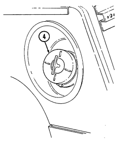

pins installed. Hinge pins are removed when lowering or detaching windshield.

4 *Fuel tank filler cap* (located at right rear side of vehicle) is removed to permit fuel servicing.

2-12

#### Key **Item And Function**

5 *Hood latches* (one on each side of hood) unlatch to release hood.

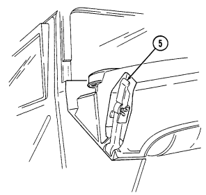

6 *Hood support rod* supports hood in the raised position.


2-13

#### D. **Tow Carrier (M966, M996A1, M1036, M1045, M1045A1, M1045A2, M1046, And M1046A1)** Equipment. Warning Note Key **Item And Function** 2-14

Never open one end of the cargo shell door without first ensuring that the opposite end is securely closed. Not doing so may cause both ends to open at same time causing damage to equipment, mission abort, or injury to personnel.

This manual identifies HMMWV equipment which permits the mounting and operation of the TOW launcher system. Specific instructions for employing the TOW and TOW 2 launcher on the HMMWV are covered in TM 9-1425-450-12 and TM 9-1425-472-12.

1 *Cargo shell door strap* serves as a grab strap to lower cargo shell door.

2 *Cargo shell door assist cylinders* provide a lift boost for raising and holding cargo shell door open.

3 *Cargo shell door* is a double-actuating door which pivots at either end. When door forward latch is released from inside vehicle, door opens rearward and functions as a TOW loader's door to facilitate mounting of TOW launcher and missile loading. When door rear latch is released, door opens forward and permits access to cargo area from rear of vehicle for stowing TOW launcher and equipment or ground mounting TOW launcher.

4 *Cargo shell door rear latch* is pulled upward to open cargo shell door from rear of vehicle.

5 *Launch tube brackets* (located on underside of cargo shell door) serve as stowage points for missile launch tube.

6 *Cargo shell door retaining cables* limit cargo shell door travel when opened from either end.

7 *Cargo shell door forward latch locking device* prevents accidental opening of cargo shell door from inside vehicle.

8 *Cargo shell door forward latch* is pulled downward to open door from inside vehicle. 9 *Cargo shell door front grab handle* serves as a grabbing point for lowering door when inside vehicle.


2-15

#### Key **Item And Function**


1 *Telephone set footman loops* (two each) *and strap* secure telephone set beneath rear of left cargo shell.

2 *Cable reel footman loops* (two each) *and strap* secure cable reel forward of telephone set stowage location.

3 *M16 ammo box rack* serves as stowage base for two M16 ammo boxes and is located forward of the cable reel stowage location.

4 *M16 ammo box footman loops and straps* (four each) secure two M16 ammo boxes to ammo rack.

5 *Combat ration footman loops* (four each) *and straps* (three each) secure one case of combat rations right rear of M16 ammo rack.

6 *Fuel can footman loops* (two each) *and strap* secure fuel can to fuel can stowage bracket.

7 *Fuel can stowage bracket* located between the left wheelhouse and missile rack permits vertical stowage of fuel can.

8 *Tripod head mounting bracket* secured to left rear wheelhouse permits mounting of traversing unit end of tripod in the stowed position.

2-16

#### Key **Item And Function**


9 *Missile stowage rack* provides stowage for six TOW missile rounds. It consists of a base, a first tier, and a second tier. Tiers pivot upward to facilitate missile stowage and quick access to missiles during reload operations. Missiles are mounted in each rack with warheads facing front of vehicle. Missiles stowed between rack base and second tier are held in without straps. Missiles mounted on top of the second tier are secured with straps located fore and aft of rack.

10 *Second tier mounting straps* (four each) located fore and aft of missile rack secure two missile rounds to second tier of rack.

11 *Missile guidance set (MGS) battery stowage boxes* provide stowage for two MGS batteries. 12 *Water can footman loops and straps* (two each) secure stowed water can between missile rack and left wheelhouse.

13 *Missile rack tier retaining springs* (two each) retain raised first or second tiers of missile rack to permit stowage of missiles or access to missiles for reloading operations.

14 *Missile rack second tier locking latches* (two each) located fore and aft of missile rack secure second tier of missile rack to first tier of missile rack.

15 *Missile rack first tier locking latches* (two each) located right side of missile rack secure first tier of missile rack to rack base.

16 *Missile rack support braces* (two each) support first and second missile rack tiers and pivot to outside to allow easy access to missiles for stowage or reloading.

2-17

#### Key **Item And Function**


1 *Night sight battery case stowage brackets* (two each) provide mounting locations for night sight battery cases.

2 *Night sight battery case footman loops and straps* (four each) secure two night sight battery cases to night sight battery case stowage brackets.

3 *Night sight battery case mounting bracket footman loops* (two each) and straps (four each) provide stowage of night sight case to top front of right wheelhouse.

4 *Boresight collimator case footman loops and straps* (four each) secure boresight collimator case to top rear of right wheelhouse.

5 *Combat ration footman loops and straps* (two each) secure one case of combat rations.

6 *Night sight coolant cartridge case stowage bracket* provides mounting location for night sight coolant cartridge cases.

7 *Night sight coolant cartridge case footman loops and straps* (four each) secure two night sight coolant cartridge cases to night sight coolant cartridge case stowage bracket.

8 *Tripod legs mounting bracket and strap* provide stowage for leg end of tripod.

9 *Day sight and carrying bag stowage bracket* provide stowage location for day sight and carrying bag in front of tripod.

10 *Day sight and carrying bag footman loops and straps* (four each) secure day sight to day sight stowage bracket.

2-18

#### Key **Item And Function**


11 *Gunner's platform* provides an adjustable non-slip platform for TOW gunner. Also serves as mounting base for the MGS in the stowed position.

12 *Missile guidance set footman loops and straps* secure MGS to the gunner's platform during extended travel mode.

13 *Gunner's platform locking pins* (two each) secure gunner's platform to selected height risers.

15 *Traversing unit stowage pedestal* provides mounting base for TU mount adapter. 16 *Lower traversing unit mount adapter clamp* secures TU mount adapter to the stowage pedestal or weapon station pedestal mount.

17 *Upper traversing unit mount adapter clamp* secures TU to TU mount adapter. 18 *Gunner's platform risers* provide support and height adjustment for gunner's platform.

19 *Gunner's platform locking lugs and holes* (two each) secure gunner's platform to fully lowered position when locking pin is installed.

14 *Traversing unit (TU) mount adapter* adapts TU to the TU stowage pedestal or weapon station pedestal mount.

#### Key **Item And Function**


1 *Turret positioning handle* provides positive right-hand grip to rotate weapon station. Hole in handle serves as securing point for weapon station pedestal mount cover.

2 *Gunner's backrest* provides back support for a gunner positioned in weapon station.

3 *Hatch cover securing latches* (three each) secure cover to weapon station. 4 *Gunner's sling* serves as seat rest or restraint for a gunner positioned in weapon station.

5 *Weapon station brake handle* locks the weapon station at the gunner's desired azimuth. Handle is placed in the down position for locking and pulled up when traversing the weapon station.

6 *Hatch cover retaining latches* (two each) secure to latch catches for retaining station cover in the open position.

7 *Hatch cover retaining catches* (two each) are connection points for retaining latches.

8 *Hatch cover handle* is grab handle to assist gunner in opening and closing station cover. 9 *Weapon station hatch cover* provides sealed protective covering for roof opening when TOW is not mounted to weapon station.

#### Key **Item And Function**

10 *Missile guidance set retaining latches* (four each) secure MGS to MGS weapon station mounting tray.

11 *Missile guidance set weapon station mounting tray* is mounting point for the MGS when the TOW 
launcher is assembled on the weapon station.

12 *TOW carrier level gauge (inclinometer)* measures levelness of the vehicle to alert TOW crew when vehicle is beyond recommended side slope operation.

13 *Weapon station pedestal mount cover retainer* secures pedestal mount cover in the open position. 14 *Weapon station pedestal mount cover* protects pedestal mount opening when TOW launcher is not mounted.

15 *Weapon station pedestal mount* is mounting point for TU adapter bracket and TOW launcher. 16 *Weapon station* serves as rotating mounting platform for TOW components during the launcher mode of operation. It can be continuously rotated 360° without vehicle power conditioner (VPC) cables connected.

17 *Vehicle power conditioner (VPC) mounting plate* provides a mounting point for the VPC. This bracket is mounted to the radio rack.

18 *Field glasses bracket* serves as mounting point for field glasses.


#### 2-21 Key **Item And Function**

1 *Camouflage screen stowage straps* (four each) secure camouflage screen and support to tailgate.

2 *NBC overgarments straps* (two each) secure two sets of NBC overgarments and four sets of gloves


to floor (under left rear passenger seat).

3 *NBC overgarments straps* (eight each) secure two sets of overgarments (one set on each side) to cargo shell.

4 *Night sight vision goggles stowage straps* secure two sets of night sight vision goggles to floor 
(under right rear passenger seat).

5 *Radiac meter stowage straps* secure radiac meter to floor (under right rear passenger seat).


2-22

#### Key **Item And Function**

6 *Power connector* is located lower right side of "B" pillar and supplies power for vehicle power conditioner (VPC).

7 *Power conditioner cable* supplies vehicle power to TOW launcher equipment.

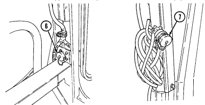

8 *Vehicle power conditioner cable cleat* (for vehicles with serial numbers 99,999 and below) secures the VPC cable to the inner right side of the "B" pillar when the cable is not connected to the power conditioner.

9 *Vehicle power conditioner cable cleat* (for vehicles with serial numbers 100,000 and above) secures


the VPC cable behind the passenger seat when the cable is not connected to the power conditioner.

2-23
e. **Armament Carrier (M1025, M1025A1, M1025A2, M1026, M1026A1,**


M1043, M1043A1, M1043A2, M1044, and M1044A1) Equipment.

#### Key **Item And Function**

1 *Turret positioning handle* provides positive right-hand grip to rotate weapon station.

2 *Gunner's backrest* provides back support for a gunner positioned in weapon station. 3 *Hatch cover* securing latches (three each) secure cover to weapon station. 4 *Gunner's sling* serves as seat rest or restraint for a gunner positioned in weapon station.

5 *Weapon station brake handle* locks the weapon station at the gunner's desired azimuth. Handle is placed in the down position for locking.

6 *Hatch cover retaining latches* (two each) secure to latch catches for retaining station cover in the open position.

7 *Hatch cover retaining catches* (two each) are connection points for retaining latches.

8 *Hatch cover handle* is grab handle to assist gunner in opening and closing station cover.

9 *Weapon station hatch cover* provides sealed protective covering for roof opening when weapons are not mounted to weapon station.

10 *Armament mount* is mounting bracket for weapon adapter.

11 *Universal weapons adapter* provides mounting base for the M60 7.62 mm machine gun, M2 caliber
.50 machine gun, and MK19 grenade launcher.

12 *Universal weapons adapter pin assembly* secures weapon adapter to the armament mount.

13 *Weapon station* serves as rotating mounting platform for weapon components. Can be continuously rotated 360 degrees.

Operation and identification of cargo shell door components and gunner's platform can be found in para. 2-2d.

#### Key **Item And Function**


14 *Spare barrel and cleaning kit footman loops and straps* (two each) secure spare barrel and cleaning kit for M2 caliber .50 machine gun.

15 *Ammo box rack* provides stowage base for caliber .50 ammo box. 16 *Ammo box footman loop and strap* secure caliber .50 ammo box to ammo box rack. 17 *Water can footman loop and strap* secure 5 gal. water can to water can bracket; 18 *Water can bracket* provides stowage base for 5 gal. water can.

19 *Ammo box rack* provides stowage base for 40 mm ammo box. 20 *Ammo box footman loops and straps* (two each) secure 40 mm ammo box to ammo box rack.

21 *Ammo box rack* provides stowage base for caliber .50 ammo box.

22 *Ammo box footman loop and strap* secure caliber .50 ammo box to ammo box rack. 23 *Ammo box rack* provides stowage base for two 40 mm ammo boxes. 24 *Ammo box footman loops and straps* (two each) secure two 40 mm ammo boxes to ammo box rack.

25 *Ammo box rack* provides stowage base for three 40 mm ammo boxes.

26 *Tripod mounting bracket and straps* (two each) provide stowage for M3 tripod. 27 *Ammo box footman loops and straps* (two each) secure three 40 mm ammo boxes to ammo box rack.

#### Key Item And Function

1 *Gun mount adapter plate* provides mounting base for stowage of 40 mm gun mount adapter.

2 *Gun mount footman loops and straps* (two each) secure 40 mm gun mount adapter to gun mount adapter plate.

3 *Pintle adapter bracket* provides mounting base for stowage of pintle adapter.

4 *Pintle adapter footman loop and strap* secure pintle adapter to pintle adapter bracket.

5 *Ammo box rack* serves as stowage base for two caliber .50 ammo boxes. 6 *Ammo box footman loops and straps* (two each) secure two caliber .50 ammo boxes to ammo box rack.

7 *Night sight case stowage brackets* (two each) provide mounting for night sight case.

8 *Night sight case footman loops and straps* (two each) secure night sight case to night sight stowage brackets.

9 *Grenade launcher stowage brackets* (two each) provide mounting base for stowage of MK19 grenade launcher.

10 *Grenade launcher straps and footman loops* (two each) secure MK19 grenade launcher to grenade launcher stowage brackets.

11 *Gun stop* restricts movement of stowed MK19/40 mm grenade launcher.

12 *Machine gun mounting brackets* (two each) provide mounting base for stowage of M2 caliber .50 machine gun.

13 *Machine gun straps and footman loops* (two each) secure M2 caliber .50


machine gun to machine gun mounting brackets.

#### 2-26 Change 1

e.1. **Armament Carrier (M1025, M1025A1, M1026, M1026A1) Equipment**


(cargo barrier and net kit)

#### Key Item And Function

14 *Cargo barrier* prevents movement of cargo into the cab area during vehicle operation.

15 *Stowage compartment net* secures cargo to the cargo floor and limits movement of cargo during vehicle operation.

16 *Antiskid strips* (nine each) prevent cargo from sliding around in the cargo


area.

Change 1 2-27

#### F. **81 Mm Mortar Carrier (M998, M998A1, M1038, And M1038A1) Equipment.** Key **Item And Function**

1 *Bipod stowage straps and tray* secure bipod assembly to the wheelhouse.

2 *Mortar ammunition container* provides stowage for mortar rounds and equipment. 3 *Four-round ready rack* provides stowage for four mortar rounds. Ready rack can be removed from mortar ammunition container and placed near firing position.

4 *Aiming post straps* (two each) secure aiming post and stowage bag to mortar ammunition container.

5 *Ready rack straps and bracket* secure four-round ready rack to mortar ammunition container. 6 *Ammunition straps* (three each) secure mortar ammunition in ammunition container. 7 *Mortar base plate stowage strap and brackets* secure mortar base plate to mortar ammunition 


container.

#### Key Item And Function

8 *Troop seat support* provides support for forward end of troop seat when seat is lowered.

9 *Troop seat* provides seating for mortar crewman.

10 *Lockpins* (two each) secure troop seat in raised position. 11 *M14 chest strap and bracket* secure M14 lighting equipment chest to mortar equipment rack.

12 *Mortar equipment stowage rack* provides stowage for M14 chest, tool chest, and M166 chest.

13 *Tool chest strap and bracket* secure tool chest to mortar equipment rack. 14 *Troop seat bumpers* (two each) provide support for troop seat in lowered position.

15 *Stowage clips* (two each) secure cleaning staff to vehicle. 16 *Cannon stowage straps and brackets* (two each) provide stowage for 81 mm cannon.

17 *M166 chest strap and bracket* secures M166 sight unit carrying case to


mortar equipment rack.

# Tm 9-2320-280-10

g. S250 Shelter Carrier (M1037 and M1042) Equipment.

#### Key Item And Function Caution

The M1037 and M1042 shelter carriers are specifically designed to be operated with the S250 shelter installed. It can be driven safely for short distances (to and from maintenance or from the rail head when being delivered) without the shelter installed. However, this should not be done for long distances. Driving for long distances without the shelter installed will cause damage to equipment.

1 *Shelter reinforcement brackets* (four each) secure S250 Shelter Carrier to vehicle body.

2 *Rear Suspension Tiedown Kit* is used to compress rear suspension to obtain an overall height of 102 in. (259 cm) with S250 shelter.


#### 2-30 Change 3 H. **Soft Top Ambulance (M1035, M1035A1, And M1035A2) Equipment.** Key **Item And Function**

3 *Litter straps* (eight each) secure litters to litter rack during transportation of litter patients.

4 *Upper litter tray* provides a platform for loading litter on upper litter rack. 5 *Upper litter rack* provides a platform for securing upper litter tray.

6 *Litter stop* secures litter in upper litter tray during loading, unloading, and transportation. 7 *Litter tray handle* provides positive grip to slide upper litter tray during loading or unloading.

8 *Lower litter rack* provides a platform for securing lower litter.

9 *Upper litter rack stop notch* allows upper litter tray stop to be inserted during upper litter tray stowage.

10 *Tray stop* secures upper litter tray to upper litter rack during stowage.


#### Tm 9-2320-280-10 I. **Four-Litter Ambulance (M997, M997A1, And M997A2) Equipment.** Key Item And Function

1 *Four-litter ambulance* provides transport for up to eight ambulatory patients or four litter patients and two attendants. The ambulance has armor protection, self-contained heating, air-conditioning, and collective NBC protection for crew and patients.

10 *Side stowage doors* (two each) provide access to stowage areas on the left and right sides of the vehicle.

16 *Litter stowage compartment* provides stowage for litters and litter rail extension.

17 *Stowage compartment latch* secures litter stowage compartment cover in closed position.

18 *Door holders* (two each) engage receptacles on side of ambulance body to secure rear doors in open position.

19 *Rear door handles* (two each) are turned to the horizontal position to unlatch rear doors and to the vertical position to latch rear doors. Ensure that doors are closed and handles are securely latched before placing vehicle in motion.

2-32 Change 1 4 *Air-conditioner intake louver* provides air intake for air-conditioner. 5 *Antenna base mount* provides support for AS-1729/VRC antenna. 6 *Red cross placards* are at six locations on the ambulance; one each on the rear doors, sides, front, and top of ambulance body.

7 *Rear doors* (two each) provide access into the ambulance for patients and crew. The right rear door must be opened first, and closed last, when entering or leaving the vehicle. Ensure that doors are securely closed and latched before placing the vehicle in motion.

7.1 *Spreader Bar Tiedowns* (two each) are used during transport operations.

8 *Placard retaining clips* (twelve each) hold the red cross placards in open position, or folded when the vehicle is used for non-ambulance operations.

9 *Door holder receptacles* (two each) engage the door holders and secure the rear doors in the fully open position.

11 *Stowage compartment latches* (four each) secure the side stowage doors in the closed position.

12 *Lifting shackles* (located at front and rear of vehicle) are used to tie down the vehicle during transport operations.

13 *Backup light assembly* (two each) provides warning to personnel standing at the rear of the vehicle and light for vehicle operator when backing up ambulance.

14 *Trailer receptacle* provides electrical power to towed equipment. 15 *Rear step assembly* lowers and folds out to provide easy access to ambulance interior. Step assembly must be in stowed position before closing rear doors in preparation for movement.

2 *Heater exhaust pipe* vents exhaust gases from ambulance heater. 3 *Air-conditioner condenser exhaust louver* vents exhaust heat from airconditioner condenser.


Change 1 2-33

#### Key **Item And Function**

1 *Safety strap* secures the rear step assembly in the stowed position.

2 *Rear step retractor assembly* provides a lift boost for raising the rear step assembly into stowed position.

3 *Rear step assembly* lowers and folds out to provide easy access to ambulance interior. Step assembly is secured in stowed position with safety strap and rear step latch assembly. Step assembly must be in stowed position before closing rear doors in preparation for movement.

4 *Blackout switch assembly* activates interior blackout lights and extinguishes white ceiling lights and spotlights when rear step assembly is lowered and interior lights switch is set to either "NORMAL" 
or "B/O."
5 *Rear step strikers* (two each) engage rear step latch assemblies to secure rear step assembly in stowed position.

6 *Rear step latch assemblies* (two each) engage rear step strikers to secure rear step assembly in stowed position.

7 *Rear step latch cable* is pulled to release rear step strikers so rear step assembly can be lowered. 8 *Bottom step* becomes an attendant's seat when rear step assembly is in stowed position.

9 *Safety strap attachment hole* is connecting point for safety strap when rear step assembly is in the stowed position.

10 *Rear step knob* secures pivoting lower step in fully lowered position or stowed position.

11 *Retention cable assemblies* (two each) provide support for rear step assembly in lowered position.


#### Key **Item And Function**

1 *Air-conditioning louvers* (six each) can be adjusted to direct cool air into patient area.

2 *Bulkhead door latch assembly* secures bulkhead door in open position. 3 *Electrical control panels* provide centralized control of lighting, heating, and cooling for ambulance interior.

4 *Blackout lamp* (one per side) provides blue light illumination during blackout conditions.

5 *Heater, A/C, and vent operation data plate* provide instructions for operating heating, airconditioning, and ventilation systems within the ambulance interior.

6 *Strap assemblies* (two per side) provide a handhold to enable patients and attendant to move around when vehicle is in motion.

7 *Ceiling lamps* (two per side) provide white light illumination for ambulance interior. 8 *Litter handle bumpers* (eight per side) protect litter handles from damage and restrict litter movement when ambulance is in motion.

9 *Oxygen cylinder straps, footman loops, and bumpers* provide stowage for two oxygen cylinders on each bulkhead.

10 *Attendant seat bracket and strap assembly* provide stowage for attendant seat.

11 *Spineboard bracket and strap assembly* provide stowage for short spineboard. 12 *24-volt receptacle* (two each) provides a 24-VDC electrical source for ambulance accessories. The other 24-volt receptacle is located on the electrical control panel.

13 *Litter skids* provide a track to guide litter into position on litter rack. 14 *Stowage covers* (two each) secure and cover equipment stowed under lower litter rack. Each cover is secured by five turnbuttons.

16 *Medical cabinet doors and hasps* (two each) provide secure stowage areas for medical supplies and equipment.

17 *Bulkhead doors* (two each) provide walk-through access between vehicle cab and ambulance interior. Left bulkhead door must be closed before right door is closed and latched.

18 *Bulkhead door handle* latches bulkhead door closed when handle is turned to vertical position. 19 *Portable heart monitor stowage* provides storage area for portable heart monitor.

15 *Heater vents* (four each) direct heated air into ambulance compartment.


#### Key **Item And Function**

1 *Upper litter rack* (one per side) provides additional litter capacity, and when folded downward, provides backrest for ambulatory patients.

2 *Spotlight assembly* (two per side) provides a movable source of illumination. Switch on back of spotlight assembly activates light when interior light switch is activated.

3 *IV bag hangers* (four per side) provide suspension point for patient IV bag.

4 *IV bag stowage straps* (four per side) secure IV bag in stowed position.

5 *Upper litter rack ring* (two per side) is the attaching point for litter rack support straps. 6 *Litter rack support straps* (two per side) support upper litter rack. 7 *Spotlight mount* (five per side) provides mounting points for movable spotlights. Three wall mounts and two mounts located on the underside of upper litter rack are located on each side of ambulance.

8 *Rear door blackout switch* activates interior blackout lights and extinguishes all interior white light illumination when rear doors are opened and interior lights switch is set to either "NORMAL" or "B/O."
9 *Litter rack front latch,* when activated, releases front striker to allow upper litter rack to lower to backrest position.

10 *Litter rack front striker* engages litter rack front latch assembly to secure upper litter rack in raised position.

11 *Bulkhead door blackout light switch* activates interior blackout lights and extinguishes all interior white light illumination when bulkhead doors are opened and interior lights switch is set to either "NORMAL" or "B/O."
12 *NBC heaters* (five in ambulance body, two in cab) provide a flow of heated, filtered air to NBC 
protective masks worn by crew and patients.

13 *Aspirator/resuscitator stowage brackets* secure aspirator/resuscitator in stowed position.

14 *Front litter rack straps* (four per side) secure front litter handles to litter rack. 15 *Litter rack tension strap* applies tension to upper litter rack to restrict movement of litter rack during vehicle movement.

16 *Rear litter rack straps* (four per side) secure rear litter handles to litter rack. 17 *Spineboard bracket and strap assembly* provides stowage for long spineboard.

18 *Upper litter rack rear latch assembly* (one per side) when unlocked and depressed allows rear of upper litter rack to be lowered to ease loading of patients.

19 *Litter rack handle* slides out to ease loading of patients into upper litter rack.


#### Key **Item And Function**


1 *Intercom control* (C-2298/VRC) provides communication with the driver and radio control facilities when used with an M24 series protective mask, radio handset, or other audio accessories. A second intercom control is located in the cab on the radio rack.

2 *Web shelf net assembly* provides stowage area in front of bulkhead.

#### Key **Item And Function**


3 *Attendant seat* slides along the attendant seat rails providing a sliding and removable seat for the ambulance attendant.

4 *Seatbelt assembly* secures the attendant to the attendant seat when ambulance is in motion.

5 *Rail notch* secures the attendant seat in one of three locations along the attendant seat rails. 6 *Attendant seat rails* (two each) provide a track along which the attendant seat can be positioned.

7 *Attendant seat latch* is pushed to the attendant's right to release the locking mechanism holding the attendant seat stationary at rail notch locations.


KEY ITEM AND FUNCTION

#### Not E

The following items are located in the crew compartment overhead.

1 *NBC door paddle handle* permits NBC door to be opened or closed. 2 *NBC door* provides access to gas-particulate filter unit and stowage area. 3 *Antenna base mount* provides mounting for AS-1729/VRC antenna and cabling.

4 *NBC door latch* secures NBC door in open position. 5 *Air-conditioner sight glass* allows vehicle operator to visually check status of air-conditioning charging condition.

6 *Heating, ventilating, and air-conditioning (HVAC) system compartment* door provides access to HVAC components.

7 *Air intake filter door* provides access to air-conditioner air intake filter.

2-42 Change 1

#### Key **Item And Function**

 Note

The NBC control box for the M997, M997A1, and M997A2 ambulance has seven heater fuses and one spare fuse.

8 *NBC control box* houses circuitry and controls for the collective NBC protection system. 9 *NBC system switch* controls operation of the collective NBC protection system.

10 20 amp fuses protect NBC heater circuits from overload damage.

#### Tm 9-2320-280-10 J. **Two-Litter Ambulance (M996 And M996A1) Equipment.** Key Item And Function

1 *Two-litter ambulance* provides transport for up to six ambulatory patients or two litter patients and two attendants. The ambulance has armor protection, self-contained heating and ventilation, and collective NBC protection for crew and patients.

2 *Heater exhaust pipe* vents exhaust gases from ambulance heater. 3 *Antenna base mount* provides support for AS-1729/VRC antenna. 4 *Heater intake louver* provides air intake for heating and ventilating systems. 5 *Rear door vent* provides ventilation for patient compartment. 6 *Rear doors* (two each) provide access for patients and crew into the ambulance. The right rear door must be opened first, and closed last, when entering or leaving the vehicle. Ensure that the door is securely closed and latched before placing the vehicle in motion.

6.1 *Spreader bar tiedowns* (two each) are used during transport operations.

7 *Door holder receptacles* (two each) engage the door holders and secure the rear doors in the fully open position.

8 *Placard retaining clips* (eight each) hold the red cross placards in open position or folded when the vehicle is used for non-ambulance operations.

9 *Red cross placards* are at five locations on the ambulance; one each on the right rear door, sides, front, and top of ambulance body.

10 *Stowage compartment latches* (four each) secure the side stowage doors in the closed position.

11 *Side stowage doors* (two each) provide exterior stowage areas on the left and right sides of the vehicle.

12 *Lifting shackles* (located at front and rear of vehicle) are used to tie down the vehicle during transport operations.

13 *Backup light assembly* (two each) provide warning to personnel standing at the rear of the vehicle and light for vehicle operator when backing up ambulance.

14 *Trailer receptacle* provides electrical power to towed equipment. 15 *Rear step assembly* lowers and folds out to provide easy access to ambulance interior. Step assembly must be in stowed position before closing rear doors in preparation for movement.

16 *Litter stowage compartment* provides stowage for litters and litter rail extension.

17 *Stowage compartment latch* secures litter stowage compartment cover in closed position.

18 *Door holders* (two each) engage receptacles on side of ambulance body to secure rear doors in open position.

19 *Rear door handles* (two each) are turned to the horizontal position to unlatch rear doors, and to the vertical position to latch rear doors. Ensure that doors are closed and handles are securely latched before placing vehicle in motion.


#### Key **Item And Function**

1 *Electrical control panels* provide centralized control of lighting, heating, and ventilation for ambulance interior.

2 *Blackout lamp* (one per side) provides blue light illumination during blackout conditions. 3 *Strap assemblies* (four per side) provide an assist to patients and crew when moving about in ambulance interior.

4 *Ceiling lamps* (two per side) provide white light illumination for ambulance interior.

5 *Splint set stowage strap assemblies* (two each) secure splint set in stowed position. 6 *Oxygen cylinder straps, footman loops, and bumpers* provide stowage for oxygen cylinders on each bulkhead.

7 *Attendant seat bracket and strap assembly* provides stowage for attendant seat. 8 *Attendant seat* shown in stowed position. When installed on attendant seat rails, provides a movable seat for ambulance attendant.

9 *Spineboard bracket and strap assembly* provides stowage for short spineboard.

10 *Medical instrument and supply set stowage strap assembly* (two per side) secures medical instruments and supplies in stowage.

11 *24-volt receptacle* (two each) provides a 24-VDC electrical source for ambulance accessories. The other 24-volt receptacle is located on the electrical control panel.

12 *Ambulatory patient seat latch* (one per side) secures folding patient seat back in closed position. 13 *Ambulatory patient seat* provides seating for three ambulatory patients on each side of ambulance. 14 *Stowage area under litter rack* provides additional stowage space.

15 *Portable heart monitor stowage* provides storage area for portable heart monitor.

16 *Bulkhead doors* (two each) provide walk-through access between vehicle cab and ambulance interior. Left bulkhead door must be closed before right door is closed and latched.

17 *Shelf assembly* provides area in front of bulkhead for blanket kit and splint kit stowage.

18 *Bulkhead door handle* latches bulkhead door closed when handle is turned to vertical position. 19 *Heater/fresh air vent* directs heated air during heater operation or fresh air if ventilation system is activated.

20 *Blanket set stowage strap assembly* secures medical blanket set in stowed position.


#### Key **Item And Function**

1 *Spotlight mount* (three per side) provides mounting points for movable spotlights.

2 *IV bag hangers* (four per side) provide suspension points for patient IV bags. 3 *IV bag stowage straps* (four per side) secure IV bags in stowed position.

4 *Spotlight assembly* (one per side) provides a movable source of illumination. Switch on back of spotlight assembly activates light when interior light switch is activated.

5 *Rear door blackout switch* activates interior blackout lights and extinguishes all interior white light illumination when rear doors are opened and interior lights switch is set to either "NORMAL" or "B/O."
6 *Intercom control* (C-2298/VRC) provides communication with the driver and radio control facilities when used with an M24 series protective mask, radio handset and speaker, or other audio accessories. A second intercom control is located in the cab.

7 *NBC heaters* (three in ambulance body, two in cab) provide a flow of heated, filtered air to NBC 
protective masks worn by crew and patients.

8 *Bulkhead door blackout light switch* activates interior blackout lights and extinguishes all interior white light illumination when bulkhead doors are opened and interior lights switch is set to either "NORMAL" or "B/O".

9 *Litter handle bumpers* (four per side) protect litter handles from damage and restrict litter movement when ambulance is in motion.

10 *Front litter rack straps* (one per side) secure front litter handles to litter rack. 11 *Aspirator/resuscitator stowage brackets* secure aspirator/resuscitator in stowed position. 12 *Bulkhead door latch assembly* secures bulkhead door in open position.

13 *Medical stowage cover latch* secures stowage cover in closed position.

14 *Medical stowage cover* secures medical stowage in compartment beneath litter rack. 15 *Litter skids* (two each) provide a track to guide litter into position on litter rack.

16 *Rear litter rack straps* (two per side) secure rear litter handles to litter rack.

17 *Spineboard bracket and strap assembly* provide stowage for long spineboard.


 2-49


#### Key **Item And Function**

1 *Vent cover retaining clips* (two each) secure vent cover in either open or closed position.

2 *Rear door vent* provides fresh air ventilation for ambulance interior, or can serve as an exhaust vent when used in conjunction with heating/ventilation system.

3 *Vent cover* opens to allow fresh air ventilation of ambulance interior.

#### 2-50


#### Key **Item And Function**

4 *NBC door* provides access to gas-particulate filter unit. 5 *Wing head screws* (two each) secure NBC door in closed position.

NBC door strap must be in good condition and properly installed to prevent injury to personnel in driver's position or damage to equipment.

6 *NBC door strap* acts as a safety strap to prevent NBC door from accidentally opening and injuring driver.

2-51

#### Key **Item And Function**


1 *NBC heaters* (three in ambulance body, two in cab) provide a flow of heated, filtered air to NBC protective masks worn by crew and patients.

2 *Antenna base mount* provides mounting for AS-1729/VRC antenna and cabling.

3 *Heating and ventilating system compartment door* provides access to heating and ventilating system components.

4 *Wing head screws* (seven each) secure heating and ventilating system compartment door in closed position.

#### 2-52 Key **Item And Function**

 Note

The NBC control box for the M996 and M996A1 ambulance has five heater fuses and one spare fuse.

5 *NBC control box* houses circuitry and controls for the collective NBC
protection system.

6 *NBC system switch* controls operation of the collective NBC protection system.

7 *20 amp fuses* protect NBC heater circuits from overload damage.

#### 2-53 Key **Item And Function**

1 *Safety strap* secures the rear step assembly in the stowed position.

2 *Rear step retractor assembly* provides a lift boost for raising the rear step assembly into stowed position.

3 *Rear step assembly* lowers and folds out to provide easy access to ambulance interior. Step assembly is secured in stowed position with safety strap and rear step latch assembly. Step assembly must be in stowed position before closing rear doors in preparation for movement.

4 *Blackout switch assembly* activates interior blackout lights and extinguishes white ceiling lights and spotlights when rear step assembly is lowered and interior lights switch is set to either "NORMAL" or "B/O."
5 *Rear step strikers* (two each) engage rear step latch assemblies to secure rear step assembly in stowed position.

6 Rear step latch *assemblies* (two each) engage rear step strikers to secure rear step assembly in stowed position.

7 *Rear step latch cable* is pulled to release rear step strikers so rear step assembly can be lowered.

8 *Bottom step* becomes an attendant's seat when rear step assembly is in stowed position.

9 Safety strap attachment *hole* is connecting point for safety strap when rear step assembly is in the stowed position.

10 *Rear step knob* secures pivoting lower step in fully lowered position or stowed position.

11 *Retention cable assembly* (two each) provides support for rear step assembly in lowered position.

2-54


#### Key **Item And Function**


12 *Attendant seat* slides along the attendant seat rails, providing a sliding and removable seat for the ambulance attendant.

13 *Seatbelt assembly* secures the attendant to the attendant seat when ambulance is in motion.

14 *Rail notch secures* the attendant seat in one of three locations along the attendant seat rails.

15 *Attendant seat rails* (two each) provide a track along which the attendant seat can be positioned.

16 *Attendant seat latch* is pushed to the attendant's right to release the locking mechanism holding the attendant seat stationary at rail notch locations.

#### 2-55 K. Troop/Cargo Winterization Kit Equipment. Key **Item And Function**

1 Diverter assembly *(damper*) regulates amount of fresh outside air, interior


air, or a mixture of both to be circulated through the heater assembly.

2 *Heater guard assembly* protects personnel from accidental contact with hot heater components.

3 *Heater* provides a flow of heated air to interior of troop/cargo enclosure assembly.

4 *Heater deflector* directs heated air from heater to all areas of troop/cargo enclosure assembly.

5 *Circuit breaker* protects heater assembly from damage caused by electrical overloading. The circuit breaker is waterproof and automatically resets.

6 *Heater control assembly* operates heater and controls blower motor speed.

2-56

#### Key **Item And Function**

7 *Dome light* provides white light illumination for interior of top enclosure


assembly.

8 *Blackout light* provides blue light illumination for interior of top enclosure assembly during blackout conditions.

9 *Heater data plate* provides heater operating instructions.

10 *Blackout/dome light switch* controls operation of blackout lights and dome lights.

11 *Door switch assembly* activates blackout light or dome light when door is in closed position.

#### 2-57 Key **Item And Function**

1 *Rear door* provides access into enclosure assembly for personnel.


2 *Grab handle* serves as a grabbing point to assist personnel when entering into enclosure assembly.

3 *Antenna mounting bracket* provides mounting point for AS 1729/VRC
antenna and AB-652/GR antenna.

4 *Trailer receptacle* provides electrical power to towed equipment.

5 *Fuel can mounting bracket* provides easily accessible storage location for fuel can.

6 *Door handle* is turned to the horizontal position to unlatch rear door and to the vertical position to latch rear door. Door should be closed and securely latched before placing vehicle in motion.

2-58

#### Key **Item And Function**

7 *Skid strips* allow cargo to be easily loaded and unloaded from vehicle.


8 *Rear step assembly* lowers and folds out to provide easy access to interior of top enclosure assembly. Step assembly must be in stowed position before closing rear door in preparation for vehicle movement.

9 *Blackout curtain* blocks light illumination from inside top enclosure


assembly.

2-59

# Section Ii. Preventive Maintenance Checks And Services

#### 2-3. General

A permanent record of the services, repairs, and modifications made to these vehicles must be recorded. (Army) See DA Pam 738-750 for a list of the forms and records required and how to complete them. (Marine Corps) Refer to TM 470015/1 series.

#### 2-4. Cleaning Instructions

a. Cleaning is an after operation service performed by the operator/crew to keep the vehicle in a state of readiness. Facilities and material available to operators for vehicle cleaning can vary greatly in differing operating conditions. However, vehicles must be maintained in as clean a condition as available cleaning equipment, materials, and tactical situations permit.

- Drycleaning solvent is flammable and will not be used near an open flame. A fire extinguisher will be kept nearby when the solvent is used. Use only in well-ventilated places. Failure to do this may result in injury to personnel and/or damage to equipment.

- Protective gloves, clothing, and/or respiratory equipment must be worn whenever caustic, toxic, or flammable cleaning solutions are used. Failure to do this may result in injury to personnel and/or damage to equipment.

- Do not allow cleaning compounds to come into contact with rubber, leather, vinyl, or canvas materials.

Damage to equipment will result.

- Do not use compressed air when cleaning vehicle interiors. Damage to equipment will result. - Do not allow water to enter air cleaner assembly air intake weathercap. Damage to engine will occur.

Remember to clean windshield wipers of debris on a regular basis to ensure proper vision.

b. Cleaning Materials. Detailed descriptions of specific cleaning compounds, cleaning solvents, drycleaning solutions, and corrosion-removing compounds are found in TM 9-247.

c. General Guidelines. Table 2-1 provides a general guide of cleaning materials used in removing contaminants from various parts of the vehicle.

#### 2-60

| Table 2\-1. General Cleaning Instructions                                                                               |                         |                                                |                           |
|-------------------------------------------------------------------------------------------------------------------------|-------------------------|------------------------------------------------|---------------------------|
| Cleaning Materials Used to Remove                                                                                       |                         |                                                |                           |
| Surface                                                                                                                 | Oil/Grease              | Salt/Mud/Dust/Debris                           | Surface Rust/Corrosion    |
| Body                                                                                                                    | Detergent; water; rags. | Soapy water; soft brush;                       | Corrosion\-removing com                           |
| damp and dry rags.                                                                                                      |                         |                                                | pound; bristle brush; dry |
| rags; and lubricating oil.*                                                                                             |                         |                                                |                           |
| Vehicle Interior                                                                                                        | Detergent; damp and     | Damp and dry rags.                             | Corrosion\-removing com\- |
| (Metals)                                                                                                                | dry rags.               |                                                | pound; bristle brush; dry |
| rags; and lubricating oil.*                                                                                             |                         |                                                |                           |
| Glass                                                                                                                   | Window cleaning         | Window cleaning                                | Not applicable.           |
| compound; dry rags.                                                                                                     |                         | compound; dry rags.                            |                           |
| Ballistic Glass                                                                                                         | Detergent; soapy water, | Detergent; soapy water;                        | Not applicable.           |
| plastic polish; dry rags.                                                                                               |                         | plastic polish; dry rags.                      |                           |
| Plastic Windows                                                                                                         | Soapy water; cream      | Soapy water; cream                             | Not applicable.           |
| cleaner; dry rags.***                                                                                                   |                         | cleaner; dry rags.***                          |                           |
| NOTE                                                                                                                    |                         |                                                |                           |
| For removal of fungus and mold on soft top vehicle windows,                                                             |                         |                                                |                           |
| refer to para. 3\-18.                                                                                                   |                         |                                                |                           |
| Vehicle Interior                                                                                                        | Water; damp and dry     | Soapy water; damp and                          | Not applicable.           |
| (Seats and Straps) rags.                                                                                                |                         | dry rags.                                      |                           |
| Frame                                                                                                                   | Detergent rinsed with   | Soapy water; damp and                          | Corrosion\-removing com                           |
| water; dry rags.                                                                                                        |                         | dry rags.                                      | pound; wire brush; dry    |
| rags; and lubricating oil.*                                                                                             |                         |                                                |                           |
| Engine and                                                                                                              | Drycleaning solvent;    | Soapy water; soft wire                         | Bristle brush; warm       |
| Transmission                                                                                                            | water; rags.            | brush; damp and dry rags. water; and dry rags. |                           |
| Radiator                                                                                                                | Not applicable.         | Low pressure water or                          | Not applicable.           |
| air; soapy water; damp                                                                                                  |                         |                                                |                           |
| and dry rags.                                                                                                           |                         |                                                |                           |
| Oil Cooler                                                                                                              | Not applicable.         | Low pressure water or                          | Not applicable.           |
| air; soapy water; damp                                                                                                  |                         |                                                |                           |
| and dry rags.**                                                                                                         |                         |                                                |                           |
| Master Cylinder                                                                                                         | Detergent; rinsed with  | Soapy water; damp and                          | Not applicable.           |
| soapy water, dry rags.                                                                                                  |                         | dry rags.                                      |                           |
| Rubber                                                                                                                  | Damp and dry rags.      | Damp and dry rags.                             | Not applicable.           |
| Insulation                                                                                                              |                         |                                                |                           |
| Tires                                                                                                                   | Soapy water; damp rags. | Soapy water; damp rags.                        | Not applicable.           |
| Wood                                                                                                                    | Detergent; water;       | Low pressure water;                            | Not applicable.           |
| damp and dry rags.                                                                                                      |                         | soapy water; damp and                          |                           |
| dry rags.                                                                                                               |                         |                                                |                           |
| After cleaning, apply light grade of lubricating oil to all unprotected surfaces to prevent                             | *                       |                                                |                           |
| continued rust.                                                                                                         |                         |                                                |                           |
| ** Cleaning between oil cooler and radiator. If more space is needed to clean mud and debris                            |                         |                                                |                           |
| between the oil cooler and radiator, refer to unit maintenance.                                                         |                         |                                                |                           |
| Operator Participation. Operator may perform this cleaning procedure under the supervision   of unit level maintenance. |                         |                                                |                           |
| ***After cleaning window zippers, apply zipper lubricant (appendix D, item 29).                                         |                         |                                                |                           |

# 2-5. Preventive Maintenance Checks And Services (Pmcs)

a. Designated Intervals.

Designated intervals are performed under usual operating conditions. PMCS intervals must be performed more frequently when operating under unusual conditions.

(1) BEFORE checks and services of PREVENTIVE MAINTENANCE must be performed prior to placing vehicle or its components in operation.

(2) DURING checks and services of PREVENTIVE MAINTENANCE must be performed while the vehicle and/or its components/systems are in operation.

(3) AFTER checks and services of PREVENTIVE MAINTENANCE are performed upon completion of mission.

(4) WEEKLY checks and services of PREVENTIVE MAINTENANCE are performed once every 7 days.

(5) MONTHLY checks and services of PREVENTIVE MAINTENANCE are performed once every 30 days.

b. Procedures.

(1) For troubleshooting malfunctions, refer to table 3-1 or notify your supervisor.

(2) Use DA Form 2404 or DA Form 5988-E (automated) and report malfunctions to unit maintenance at once.

(3) Tools included with vehicle are to be used when making PREVENTIVE
MAINTENANCE checks and services. Wiping cloths are needed to remove dirt or grease.

(4) Refer to appropriate TMs for PMCS requirements on mounted systems
(i.e., TOW missiles systems, radios, etc.).

(5) When performing lubrication procedures, you should be familiar with the equipment. Notify organizational maintenance or your supervisor if you have any questions relating to lubrication points.

#### C. Troublespots. Note

Dirt, grease, oil, and debris may cover up a serious problem. Clean as you check. Following precautions printed on container, use drycleaning solvent (SD-3) on all metal surfaces. On rubber or plastic material, use soap and water.

(1) Check all bolts, nuts, and screws. If loose, bent, broken, or missing, either tighten or report conditions to unit maintenance.

(2) Look for loose or chipped paint, and rust or cracks at welds. Remove rust and loose paint, and spot paint as required. If a cracked weld is found, report situation to unit maintenance.

(3) Inspect electrical wires and connectors for cracked or broken insulation.

Also look for bare wires, and loose or broken connections. Tighten loose connections. Report other problems to unit maintenance.

(4) Check hoses and fluid lines for wear, damage, and leaks. Ensure clamps and fittings are tight. (Refer to para. 2-6 for information on leaks.)
(5) Check hinges for security and operation. (6) Check data, caution, and warning plates for security and legibility.

2-62 Change 3

#### 2-5. Preventative Maintenance Checks And Services (Pmcs)

# (Cont'D)

d. **Not Ready/Available**. If a vehicle is not able to perform the mission, equipment will be reported as not ready/available. Refer to DA Pam 738-750.

e. **Correct Assembly or Stowage**. Check each component for installation as an assembly, in the right place, and with no missing parts.

## 2-6. Fluid Leakage.

Wetness around seals, gaskets, fittings, or connections indicates leakage. A stain also denotes leakage. If a fitting or connector is loose, tighten it. If broken or defective, report it. Use the following as a guide:
a. **Class I.** Leakage indicated by wetness or discoloration, but not great enough to form drops.

b. **Class II.** Leakage great enough to form drops, but not enough to cause drops to drip from item being checked/inspected.

c. **Class III.** Leakage great enough to form drops that fall from the item being checked/inspected.

Operation is allowable with Class I or II leakage except for brake system. Any brake fluid leakage must be reported. WHEN IN DOUBT, NOTIFY YOUR SUPERVISOR. When operating with Class I or II leaks, check fluid levels more frequently. Class III leaks must be reported immediately to your supervisor or to unit maintenance. Failure to do this will result in damage to vehicle and/or components.

#### 2-7. Lubrication Requirements

For lubrication requirements and procedures, refer to appendix G.

2-63

| Table 2\-2. Preventive Maintenance Checks and Services   |                              |         |            |                   |         |
|----------------------------------------------------------|------------------------------|---------|------------|-------------------|---------|
| Location                                                 | Item                         | Item to | Crewmember | Not Fully Mission |         |
| No.                                                      | Interval                     | Check/  | Procedure  | Capable if:       | Service |
| WARNING                                                  |                              |         |            |                   |         |
| Always remember the                                      | WARNINGS, CAU                              |         |            |                   |         |
| TIONS, and NOTES                                         | before operating this        |         |            |                   |         |
| vehicle and prior to                                     | PMCS.                        |         |            |                   |         |
| NOTE                                                     |                              |         |            |                   |         |
| Perform your before,                                     | after, and weekly checks     |         |            |                   |         |
| if:                                                      |                              |         |            |                   |         |
| a. You are the assigned                                  | driver but have not operated |         |            |                   |         |
| the vehicle since the last                               | weekly inspection.           |         |            |                   |         |
| b. You are operating the                                 | vehicle for the first time.  |         |            |                   |         |
| c. See separate manuals                                  | for smoke generator, TOW     |         |            |                   |         |
| launcher, and radios.                                    |                              |         |            |                   |         |

| Table 2\-2. Preventive Maintenance Checks and Services (Cont'd)   |                          |                             |                          |                   |         |
|-------------------------------------------------------------------|--------------------------|-----------------------------|--------------------------|-------------------|---------|
| Location                                                          | Item                     | Item to                     | Crewmember               | Not Fully Mission |         |
| No.                                                               | Interval                 | Check/                      | Procedure                | Capable if:       | Service |
| DRIVER                                                            | CAUTION                  | 1                           | Before                   | Left Front,       |         |
| Side                                                              | If leaks are detected in | Exterior                    | the area of the transfer |                   |         |
| case oil cooler, do not                                           | attempt to tighten       |                             |                          |                   |         |
| retaining nuts; internal                                          | damage to the transfer   |                             |                          |                   |         |
| case oil cooler may result.                                       | Notify unit maintenance. |                             |                          |                   |         |
| NOTE                                                              |                          |                             |                          |                   |         |
| If leakage is detected,                                           | further investigation is |                             |                          |                   |         |
| needed to determine the                                           | location and cause of    |                             |                          |                   |         |
| the leak.                                                         |                          |                             |                          |                   |         |
| a. Visually check underneath                                      | a. Any brake fluid       | vehicle for any evidence of | leak; class III leak     |                   |         |
| fluid leakage.                                                    | of oil, fuel, or         | coolant.                    |                          |                   |         |
| b. Visually check front and                                       | b. Any damage            | left side of vehicle for    | that will prevent        |                   |         |
| obvious damage that would                                         | operation.               | impair operation.           |                          |                   |         |

|      | Table 2\-2.   |                          | Preventive Maintenance Checks and Services (Cont'd)   |                             |
|------|---------------|--------------------------|-------------------------------------------------------|-----------------------------|
| Item |               | Location                 | Crewmember                                            | Not Fully Mission           |
| No.  | Interval      | Item to  Check/  Service | Procedure                                             | Capable If:                 |
|      |               |                          | DRIVER                                                |                             |
| 2    | Before        | Left Side                | WARNING                                               |                             |
|      |               | Tires                    | Operating a vehicle with                              |                             |
|      |               |                          | a tire in an underinflated                            |                             |
|      |               |                          | condition or with a ques tionable defect may lead                                                       |                             |
|      |               |                          | to premature tire failure                             |                             |
|      |               |                          | and may cause equipment                               |                             |
|      |               |                          | damage and injury or                                  |                             |
|      |               |                          | death to personnel.                                   |                             |
|      |               |                          | Visually check tires for presence                     | Tire missing,               |
|      |               |                          | and under inflation.                                  | deflated, or unserviceable. |
|      |               |                          | DRIVER                                                |                             |
| 3    | Before        | Rear                     | NOTE                                                  |                             |
|      |               | Exterior                 | If leakage is detected,                               |                             |
|      |               |                          | further investigation is                              |                             |
|      |               |                          | needed to determine the                               |                             |
|      |               |                          | location and cause of                                 |                             |
|      |               |                          | the leak.                                             |                             |
|      |               |                          | a. Visually check underneath                          | a. Any brake fluid          |
|      |               |                          | vehicle for evidence of fluid                         | leak; class III             |
|      |               |                          | leakage.                                              | leak of oil, fuel, or       |
|      |               |                          |                                                       | coolant.                    |
|      |               |                          | b. Visually check rear of                             | b. Any damage               |
|      |               |                          | vehicle for obvious damage                            | that would prevent          |
|      |               |                          | that would impair operation.                          | operation.                  |
|      |               |                          | c. Inspect bumper supports                            | c. Any damage               |
|      |               |                          | for cracks before towing trailer.                     | that would prevent          |
|      |               |                          |                                                       | operation.                  |

|           | Location         | Table 2\-2. Preventive Maintenance Checks and Services (Cont'd)                   |                                    |
|-----------|------------------|-----------------------------------------------------------------------------------|------------------------------------|
| Item No.  | Item to Check/   | Crewmember Procedure                                                              | Not Fully Mission Capable if:      |
| Interval  | Service          |                                                                                   |                                    |
| 4  Before | Exhaust  Louvers | DRIVER (M996 and M996A1 only)  Check air exhaust louvers to                       |                                    |
|           |                  | ensure they are clear and free                                                    |                                    |
|           |                  | of debris that would restrict air                                                 |                                    |
|           |                  | flow. Clean any dirt or debris                                                    |                                    |
|           |                  | from louvers.                                                                     |                                    |
| 5  Before | Right            | NOTE                                                                              |                                    |
|           | Front,  Side     | If leakage is detected,                                                           |                                    |
|           | Exterior         | needed to determine                                                               |                                    |
|           |                  | of the leak.                                                                      |                                    |
|           |                  | a. Visually check underneath  vehicle for evidence of fluid                       | a. Any brake fluid leak; class III |
|           |                  |                                                                                   | leak of oil, fuel, or coolant.     |
|           |                  | b. Visually check front and                                                       | b. Any damage                      |
|           |                  | right side of vehicle for obvi\-                                                  | that would prevent operation.      |
|           |                  | ous damage that would                                                             |                                    |
|           |                  | DRIVER further investigation is the location and cause leakage. impair operation. |                                    |

| Table 2\-2.                        | Preventive Maintenance Checks and Services (Cont'd)   | Location                     |                           |                            |                              |     |             |        |
|------------------------------------|-------------------------------------------------------|------------------------------|---------------------------|----------------------------|------------------------------|-----|-------------|--------|
| Crewmember                         | Item                                                  | Not Fully Mission            | Item to                   | Interval                   | Procedure                    | No. | Capable If: | Check/ |
| Service                            | DRIVER                                                |                              |                           |                            |                              |     |             |        |
| 6                                  | Before                                                | Right Side                   | WARNING                   | Tires                      | Operating a vehicle with     |     |             |        |
| a tire in an underinflated         | condition or with a ques                                                       |                              |                           |                            |                              |     |             |        |
| tionable defect may lead           | to premature tire failure                             |                              |                           |                            |                              |     |             |        |
| and may cause equipment            | damage and injury or                                  |                              |                           |                            |                              |     |             |        |
| death to personnel.                | Visually check tires for                              | Tire missing,                |                           |                            |                              |     |             |        |
| presence and under inflation.      | deflated, or                                          | unserviceable.               |                           |                            |                              |     |             |        |
| DRIVER                             | 7                                                     | Before                       | Front                     | NOTE                       |                              |     |             |        |
| If leakage is detected,            | investigation is needed                               |                              |                           |                            |                              |     |             |        |
| to determine the location          | and cause of the leak.                                |                              |                           |                            |                              |     |             |        |
| a.                                 | Visually check front of                               | a.                           | Any damage                | vehicle for obvious damage | that will prevent            |     |             |        |
| that would impair operation.       | operation.                                            | b.                           | Visually check underneath | b.                         | Any brake fluid              |     |             |        |
| vehicle for evidence of fluid      | leak; class III                                       | leakage.                     | leak of oil, fuel, or     |                            |                              |     |             |        |
| coolant.                           |                                                       |                              |                           |                            |                              |     |             |        |
| DRIVER                             | 7.1                                                   | Before                       | Power                     | CAUTION                    |                              |     |             |        |
| Steering                           | -                                                     | Do not permit dirt, dust, or | Reservoir                 | -                          | grit to enter power steering |     |             |        |
| r e s e r v o i r. Damage to power | steering system will result                           |                              |                           |                            |                              |     |             |        |
| if power steering fluid            | becomes contaminated.                                 |                              |                           |                            |                              |     |             |        |
| -                                  | Do not overfill power                                 | steering reservoir.          |                           |                            |                              |     |             |        |
| Damage to power steering           | system will result.                                   |                              |                           |                            |                              |     |             |        |

|           |          |                                   | Table 2\-2. Preventive Maintenance Checks and Services (Cont'd)              |                                |
|-----------|----------|-----------------------------------|------------------------------------------------------------------------------|--------------------------------|
| Item  No. | Interval | Location Item to Check/ Service   | Crewmember  Procedure                                                        | Not Fully Mission  Capable If: |
| 7.1       | Before   | Power Steering Reservoir (Cont'd) | Check fluid in power steering   reservoir. Fluid should be be  tween "HOT" and "COLD"  marks. Add fluid if level is                                                                              |                                |
|           |          |                                   | below "COLD" mark.  DRIVER                                                   |                                |
| 8         | Before   | Cooling System                    | WARNING                                                                      |                                |
|           |          |                                   | If engine has been recently  operated, do not remove   radiator cap to check |                                |
|           |          |                                   | coolant level. Cooling  system is under pressure,                            |                                |
|           |          |                                   | and escaping steam or   coolant can cause burns.                             |                                |
|           |          |                                   | CAUTION                                                                      |                                |
|           |          |                                   | Overheating, caused by lack of coolant, will cause  engine damage.           |                                |
|           |          |                                   | Check coolant level in coolant tank. Level should be at or                   |                                |
|           |          |                                   | above the "FULL COLD" line  Add coolant if below the                         |                                |
|           |          |                                   | "FULL" line.                                                                 |                                |
|           |          |                                   | DRIVER                                                                       |                                |
| 9         | Before   | Seat and                          | NOTE                                                                         |                                |
|           |          | Seatbelts                         | Vehicle operation with                                                       |                                |
|           |          |                                   | inoperative seatbelts                                                        |                                |
|           |          |                                   | may violate AR 385\-55.                                                      |                                |
|           |          |                                   | a. Check all seatbelts,  including troop seat safety strap                   |                                |
|           |          |                                   | for security, damage, and  operation of buckle and clasp                     |                                |
|           |          |                                   | ends.                                                                        |                                |
|           |          |                                   | b. Check operation of seat                                                   | b. Seat adjustment             |
|           |          |                                   | adjusting mechanism                                                          | lock broken or                 |
|           |          |                                   | (driver's seat only).                                                        | missing.                       |

|           |          | Location               | Table 2\-2. Preventive Maintenance Checks and Services (Cont'd)   |                                      |
|-----------|----------|------------------------|-------------------------------------------------------------------|--------------------------------------|
| Item  No. | Interval | Item to Check/ Service | Crewmember  Procedure                                             | Not Fully Mission  Capable If:       |
| 10        | Before   | Fire Extin\-           | DRIVER  a. Check for missing or                                   | a. Fire extinguisher                 |
|           |          | guisher                | damaged fire extinguisher.                                        | missing or damaged.                  |
|           |          |                        | b. Check gauge for proper  pressure of about 150 psi              | b. Pressure gauge needle in recharge |
|           |          |                        | (1034 kPa).                                                       | area.                                |
|           |          |                        | c. Check for damaged or                                           | c. Seal broken                       |
|           |          |                        | missing seal.                                                     | or missing.                          |
| 11        | Deleted  |                        |                                                                   |                                      |

| Table 2\-2. Preventive Maintenance Checks and Services (Cont'd)   |                              |                               |                     |                   |                            |
|-------------------------------------------------------------------|------------------------------|-------------------------------|---------------------|-------------------|----------------------------|
| Location                                                          | Item                         | Item to                       | Crewmember          | Not Fully Mission |                            |
| No.                                                               | Interval                     | Check/                        | Procedure           | Capable if:       | Service                    |
| DRIVER                                                            |                              |                               |                     |                   |                            |
| 12                                                                | Before                       | Instrument                    | WARNING             | Panel             | If gauges, instruments, or |
| instrument lights are                                             | inoperable or not within     |                               |                     |                   |                            |
| ranges described in these                                         | checks, immediately          |                               |                     |                   |                            |
| shut off engine and notify                                        | supervisor or unit           |                               |                     |                   |                            |
| maintenance personnel.                                            | Continued operation of       |                               |                     |                   |                            |
| vehicle may result in                                             | injury or damage to          |                               |                     |                   |                            |
| equipment.                                                        |                              |                               |                     |                   |                            |
| NOTE                                                              |                              |                               |                     |                   |                            |
| If engine is warm, wait\-to                                                                   | start light may not come on. |                               |                     |                   |                            |
| During cranking or after                                          | starting, light may go on    |                               |                     |                   |                            |
| and off a few times.                                              |                              |                               |                     |                   |                            |
| a. Check wait\-to\-start light                                    | a. Wait\-to\-start           | and brake warning light. Turn | light does not come |                   |                            |
| rotary switch to "RUN". Wait\-                                    | on when engine is            | to\-start and brake warning   | cold or wait light  |                   |                            |
| light should come on.                                             | stays on continually.        | Brake warning light           |                     |                   |                            |
| does not come on.                                                 |                              |                               |                     |                   |                            |

|          |          | Location        | Crewmember                |                               |
|----------|----------|-----------------|---------------------------|-------------------------------|
| Item No. | Interval | Item to  Check/ | Procedure                 | Not Fully Mission Capable If: |
|          |          | Service         |                           |                               |
| 12       | Before   | Instrument      | b. Start engine and check | b. Engine will                |
|          |          | Panel           | the following:            | not start.                    |
|          |          | (Cont'd)        | c. Engine oil pressure    | c. Oil pressure is            |
|          |          |                 | gauge.                    | less than 6 psi (103          |
|          |          |                 |                           | kPa) at idle.                 |
|          |          |                 | d. Voltmeter.             | d. Voltmeter needle           |
|          |          |                 |                           | stays in yellow or red        |
|          |          |                 |                           | range.                        |
|          |          |                 | e. Air restriction gauge. | e. Air restriction            |
|          |          |                 |                           | indicator reaches             |
|          |          |                 |                           | red zone.                     |
|          |          |                 | f. Brake warning light    | f. Brake warning              |
|          |          |                 | should go off when hand   | light stays on after          |
|          |          |                 | brake is released.        | hand brake is                 |
|          |          |                 |                           | released or comes on          |
|          |          |                 |                           | while driving.                |
|          |          |                 | g. Check fuel gauge.      |                               |
|          |          |                 | h. Check coolant          | h. Coolant temp                               |
|          |          |                 | temperature gauge.        | erature gauge inop                               |
|          |          |                 |                           | erative or reads              |
|          |          |                 |                           | greater than 230°F            |
|          |          |                 |                           | (110°C).                      |

Table 2-2. *Preventive Maintenance Checks and Services (Cont'd)*


2-72 Change 1

|           |          |                                 | Table 2\-2. Preventive Maintenance Checks and Services (Cont'd)   |                                |
|-----------|----------|---------------------------------|-------------------------------------------------------------------|--------------------------------|
| Item  No. | Interval | Location Item to Check/ Service | Crewmember  Procedure                                             | Not Fully Mission  Capable If: |
| 14        | Before   | Brakes                          | DRIVER  NOTE                                                      |                                |
|           |          |                                 | Engine must be warmed                                             |                                |
|           |          |                                 | up and idling, trans                                                                   |                                |
|           |          |                                 | mission in "D" (drive),   transfer in "H" (high),                 |                                |
|           |          |                                 | and parking brake                                                 |                                |
|           |          |                                 | released to perform the                                           |                                |
|           |          |                                 | following check.                                                  |                                |
|           |          |                                 | a. Check brake pedal travel. a.                                   | Brakes will not                |
|           |          |                                 | With vehicle at idle, transfer                                    | stop the vehicle.              |
|           |          |                                 | in H, and transmission in D,                                      |                                |
|           |          |                                 | allow vehicle to move forward.                                    |                                |
|           |          |                                 | As vehicle moves, slowly de                                                                   |                                |
|           |          |                                 | press brake pedal. Pedal                                          |                                |
|           |          |                                 | should travel 1 to 1\-1/2                                         |                                |
|           |          |                                 | inches before brakes take  hold. After brakes take hold,          |                                |
|           |          |                                 | pedal may exceed the 1 to                                         |                                |
|           |          |                                 | 1\-1/2 inch travel. This is                                       |                                |
|           |          |                                 | normal.                                                           |                                |
|           |          |                                 | b. Check parking brake. b.                                        | Parking brake                  |
|           |          |                                 | With parking brake fully                                          | inoperable or                  |
|           |          |                                 | applied, transmission in D                                        | unable to hold                 |
|           |          |                                 | or R, and transfer in H, vehicle vehicle.                         |                                |
|           |          |                                 | should not move.                                                  |                                |
|           |          |                                 | c. Check parking brake c.                                         | Parking brake                  |
|           |          |                                 | lever safety mechanism (if                                        | lever safety                   |
|           |          |                                 | equipped) to ensure that it                                       | mechanism (if                  |
|           |          |                                 | latches when parking brake is                                     | equipped) is not               |
|           |          |                                 | applied.                                                          | functioning                    |
|           |          |                                 |                                                                   | properly.                      |

|           |          | Location               | Table 2\-2. Preventive Maintenance Checks and Services (Cont'd)                                                                                                                                  |                                |
|-----------|----------|------------------------|--------------------------------------------------------------------------------------------------------------------------------------------------------------------------------------------------|--------------------------------|
| Item  No. | Interval | Item to Check/ Service | Crewmember  Procedure                                                                                                                                                                            | Not Fully Mission  Capable If: |
|           |          | System                 | M997A1, and M997A2 only)                                                                                                                                                                         |                                |
| 15        | Before   | NBC                    | DRIVER   (M996, M996A1, M997, a. Check NBC system power switch for proper   operation and security of mounting. All system fuses, including spares, should be present.  b. Check NBC heater for  |                                |
|           |          |                        | proper operation. When knob is turned clockwise, the light should come on,                                                                                                                       |                                |
|           |          |                        | indicating heater is working. c. Check for steady flow of air at hose outlets. If light does not come on, notify   supervisor, and record on  DA Form 2404.                                      |                                |
|           |          |                        | DRIVER                                                                                                                                                                                           |                                |
| 16        | Before   | Weapon Station         | (TOW and armament carriers, M966, M966A1, M1036, M1045,  M1045A1, M1045A2, M1046,  M1046A1, M1025, M1025A1,  M1025A2, M1026, M1026A1,  M1043, M1043A1, M1043A2,  M1044, M1044A1, and M1121 only) |                                |
|           |          |                        | NOTE Weapon station binding  should be checked with   weapon system or  equivalent weight applied  to turret. Refer to  appropriate system TM   to determine weight  of weapon system.           |                                |
|           |          |                        | a. Check weapon station  for binding by rotating 360  degrees in both directions at least five times.                                                                                            | a. Weapon station binds.       |

|      |          |                  | Table 2\-2. Preventive Maintenance Checks and Services (Cont'd)   |                         |
|------|----------|------------------|-------------------------------------------------------------------|-------------------------|
| Item | Interval | Location Item to | Crewmember                                                        | Not Fully Mission       |
| No.  |          | Check/           | Procedure                                                         | Capable If:             |
|      |          | Service          |                                                                   |                         |
| 16   | Before   | Weapon           | b. (Armament carriers only).                                      | b. Armament weapons     |
|      |          | Station          | Check armament mounting                                           | required for mission:   |
|      |          | (Cont'd)         | plate and bearing sleeve for                                      | Mounting plate or       |
|      |          |                  | security of mounting and                                          | bearing sleeve missing  |
|      |          |                  | obvious damage that would                                         | or any damage that      |
|      |          |                  | impair operation.                                                 | will prevent or         |
|      |          |                  |                                                                   | impair mounting of      |
|      |          |                  |                                                                   | armament weapons.       |
|      |          |                  | c. (TOW vehicles only). Check                                     | c. Level vial is        |
|      |          |                  | inclinometer for proper opera\-                                   | broken or no bubble     |
|      |          |                  | tion. Check level vial for breaks                                 | is present.             |
|      |          |                  | and/or bubbles.                                                   |                         |
|      |          |                  | DRIVER                                                            |                         |
| 17   | During   | Controls         | a. Monitor all gauges.                                            | a. Engine oil           |
|      |          | and Indicators   |                                                                   | pressure gauge reads   less than approx                         |
|      |          |                  |                                                                   | imately 40 psi          |
|      |          |                  |                                                                   | (276 kPa) under         |
|      |          |                  |                                                                   | normal driving con                         |
|      |          |                  |                                                                   | ditions or less than    |
|      |          |                  |                                                                   | 6 psi (41 kPa) at idle. |
|      |          |                  |                                                                   | Coolant temperature     |
|      |          |                  |                                                                   | gauge reads greater     |
|      |          |                  |                                                                   | than 230°F (110°C).     |
|      |          |                  |                                                                   | Air restriction gauge   |
|      |          |                  |                                                                   | indicates restriction   |
|      |          |                  |                                                                   | in the air cleaner.     |
|      |          |                  |                                                                   | Voltmeter indicates a   |
|      |          |                  |                                                                   | loss of voltage.        |
|      |          |                  | b. Check speedometer                                              |                         |
|      |          |                  | operation.                                                        |                         |
|      |          |                  | c. (Marine Corps only.)                                           |                         |
|      |          |                  | Check hour/tachometer                                             |                         |
|      |          |                  | operation.                                                        |                         |
|      |          |                  | DRIVER                                                            |                         |
| 18   | During   | Brakes           | Check brakes for pulling or                                       | Brakes pull or grab.    |
|      |          |                  | grabbing.                                                         |                         |
|      |          |                  | DRIVER                                                            |                         |
| 19   | During   | Steering         | Be alert for excessive sway,                                      | Handling is unstable    |
|      |          |                  | leaning to one side, or unstable                                  | turning is              |
|      |          |                  | handling. Check steering                                          | difficult or free       |
|      |          |                  | response for unusual free                                         | play, binding, or       |
|      |          |                  | play, binding, or shimmy.                                         | shimming detected.      |

|      |          |                | Table 2\-2. Preventive Maintenance Checks and Services (Cont'd)        |                            |
|------|----------|----------------|------------------------------------------------------------------------|----------------------------|
| Item |          | Location       | Crewmember                                                             | Not Fully Mission          |
| No.  | Interval | Item to        | Procedure                                                              |                            |
|      |          | Check/ Service |                                                                        | Capable If:                |
|      |          |                | DRIVER                                                                 |                            |
| 19.1 | During   | Pedal          | Accelerator Check response to accelerator  feed. Check for sticking or | Pedal sticking or binding. |
|      |          |                | binding pedal.                                                         |                            |
|      |          |                | DRIVER                                                                 |                            |
| 20   | During   | Power\-        | Be alert for unusual noises or                                         | Unusual noise or           |
|      |          | train          | vibrations from engine, trans\-                                        | vibration detected.        |
|      |          |                | mission, transfer, differentials,                                      |                            |
|      |          |                | propeller shafts (especially under load), axle shafts,                 |                            |
|      |          |                | or wheels.                                                             |                            |
|      |          |                | DRIVER                                                                 |                            |
| 21   | During   | Trans\-        | Check transmission for                                                 | Transmission slips         |
|      |          | mission        | proper operation.                                                      | or will not shift.         |
|      |          |                | DRIVER                                                                 | Climatic conditions  require air                            |
| 22   | During   | Ambulance      | NOTE                                                                   | conditioning and A/C       |
|      |          | Air\-condi\-   | Perform the following                                                  | is inoperable, and         |
|      |          | tioner         |                                                                        | if outlet duct air is      |
|      |          |                | inspection only if the air                                             |                            |
|      |          | (M997,         | conditioner is required                                                | not cooler than            |
|      |          |                |                                                                        | ambient                    |
|      |          | M997A1,        | for climatic conditions.                                               |                            |
|      |          | and            | Turn air conditioner on and                                            | temperature.               |
|      |          | M997A2         | set blower to maximum cooling                                          |                            |
|      |          | only)          | speed settings. Wait 5 minutes                                         |                            |
|      |          |                | to allow temperature to stabi                                                                        |                            |
|      |          |                | lize. Check outlet ducts for cool                                      |                            |
|      |          |                | air.                                                                   |                            |
|      |          |                | DRIVER                                                                 |                            |
| 22.1 | After    | Gear           | a. Check transmission shift                                            | a. Lever inoperable        |
|      |          | Shifter        | lever operation. Shift trans\-                                         | or binds between           |
|      |          | Lever          | mission through all operating                                          | range detents.             |
|      |          |                | ranges. Lever should move                                              |                            |
|      |          |                | freely through all range  positions.                                   |                            |
|      |          |                | b. Check transfer shift lever                                          | b. Lever inoperable        |
|      |          |                | operation. With transmission                                           | or does not engage         |
|      |          |                | in "N," shift transfer lever                                           | in all ranges with         |
|      |          |                | through all range positions.                                           | engine not running.        |
|      |          |                | Lever should move freely                                               |                            |
|      |          |                | through all range positions.                                           |                            |

| Item  No.   | Interval   | Location Item to Check/   | Crewmember  Procedure                                | Not Fully Mission  Capable If:   |
|-------------|------------|---------------------------|------------------------------------------------------|----------------------------------|
|             |            | Service                   | DRIVER                                               |                                  |
| 23          | After      | Trans                           | CAUTION                                              |                                  |
|             |            | mission                   | - Do not permit dirt, dust,                          |                                  |
|             |            | fluid                     | fluid or grit to enter trans                                                      |                                  |
|             |            |                           | mission oil dipstick tube.                           |                                  |
|             |            |                           | Internal transmission                                |                                  |
|             |            |                           | damage will result if                                |                                  |
|             |            |                           | transmission oil becomes                             |                                  |
|             |            |                           | contaminated.                                        |                                  |
|             |            |                           | - Do not overfill transmission.                      |                                  |
|             |            |                           | Damage to transmission will                          |                                  |
|             |            |                           | result. An over\-full                                |                                  |
|             |            |                           | transmission can also indicate a transfer case fluid |                                  |
|             |            |                           | leak. Notify unit                                    |                                  |
|             |            |                           | maintenance if transmission                          |                                  |
|             |            |                           | fluid is above crosshatch                            |                                  |
|             |            |                           | mark.                                                |                                  |
|             |            |                           | NOTE                                                 |                                  |
|             |            |                           | - Apply brake and move shift lever through each gear |                                  |
|             |            |                           | range. Pause for about three                         |                                  |
|             |            |                           | seconds in each range,                               |                                  |
|             |            |                           | ending in "P".                                       |                                  |
|             |            |                           | - Transmission fluid level                           |                                  |
|             |            |                           | should be checked with                               |                                  |
|             |            |                           | engine running, parking                              |                                  |
|             |            |                           | brake set, transmission shift                        |                                  |
|             |            |                           | lever in "N," and vehicle on                         |                                  |
|             |            |                           | level ground. Fluid level                            |                                  |
|             |            |                           | should be at crosshatch                              |                                  |
|             |            |                           | marks on dipstick.                                   |                                  |
|             |            |                           | - Let the vehicle idle with all                      |                                  |
|             |            |                           | accessories off for three                            |                                  |
|             |            |                           | minutes.                                             |                                  |
|             |            |                           | - Engine operating temp                                                      |                                  |
|             |            |                           | erature of 190\-230°F (88\- 110°C) must be reached   |                                  |
|             |            |                           | before performing AFTER                              |                                  |
|             |            |                           | checks.                                              |                                  |
|             |            |                           | Check transmission fluid                             |                                  |
|             |            |                           | level. If level is below the crosshatch marks, add   |                                  |
|             |            |                           | sufficient fluid to bring the                        |                                  |
|             |            |                           | level to the crosshatch marks.                       |                                  |

Table 2-2. Preventive Maintenance Checks and Services (Cont'd)

|           |          | Location               | Table 2\-2. Preventive Maintenance Checks and Services (Cont'd)   |                                |
|-----------|----------|------------------------|-------------------------------------------------------------------|--------------------------------|
| Item  No. | Interval | Item to Check/ Service | Crewmember  Procedure                                             | Not Fully Mission  Capable If: |
| 24        | After    | Fuel Filter            | DRIVER  WARNING Do not perform fuel  system checks, inspec                                                                   |                                |
|           |          |                        | tions, or maintenance                                             |                                |
|           |          |                        | while smoking or near                                             |                                |
|           |          |                        | fire, flames, or sparks.                                          |                                |
|           |          |                        | Fuel may ignite, causing                                          |                                |
|           |          |                        | damage to vehicle and   injury or death to                        |                                |
|           |          |                        | personnel.                                                        |                                |
|           |          |                        | NOTE                                                              |                                |
|           |          |                        | A rubber hose can be   attached to drainvalve                     |                                |
|           |          |                        | to catch fuel in container                                        |                                |
|           |          |                        | before opening drain                                              |                                |
|           |          |                        | valve. If fuel is clear, put                                      |                                |
|           |          |                        | fuel back in fuel tank.                                           |                                |
|           |          |                        | a. Check fuel for contamin\-                                      | a. Fuel is not clear           |
|           |          |                        | ation. With engine running,                                       | after draining 1 pint          |
|           |          |                        | open drainvalve. Allow fuel to drain in suitable container        | (0.47 L).                      |
|           |          |                        | until it runs clear. Close valve.                                 |                                |
|           |          |                        | NOTE                                                              |                                |
|           |          |                        | Fuel retained in the drain                                                                   |                                |
|           |          |                        | valve may drip when  vehicle vibrations occur.                    |                                |
|           |          |                        | This is normal and does                                           |                                |
|           |          |                        | not constitute a leak.                                            |                                |
|           |          |                        | Wipe drainvalve with  rag until excess fuel is                    |                                |
|           |          |                        | removed.                                                          |                                |
|           |          |                        | b. Check for leaks.                                               | b. Class III                   |
|           |          |                        |                                                                   | leakage evident.               |
|           |          |                        | c. Stop engine and remove                                         |                                |
|           |          |                        | rubber hose from drainvalve,                                      |                                |
|           |          |                        | if installed.                                                     |                                |

| Table 2\-2. Preventive Maintenance Checks and Services (Cont'd)   |                            |                               |                       |                   |                          |
|-------------------------------------------------------------------|----------------------------|-------------------------------|-----------------------|-------------------|--------------------------|
| Location                                                          | Item                       | Item to                       | Crewmember            | Not Fully Mission |                          |
| No.                                                               | Interval                   | Check/                        | Procedure             | Capable if:       | Service                  |
| DRIVER                                                            |                            |                               |                       |                   |                          |
| 25                                                                | After                      | Left Side                     | WARNING               | Tires             | Operating a vehicle with |
| a tire in an underinflated                                        | condition or with          |                               |                       |                   |                          |
| questionable defect may                                           | lead to premature tire     |                               |                       |                   |                          |
| failure and may cause                                             | equipment damage and       |                               |                       |                   |                          |
| injury or death to                                                | personnel.                 |                               |                       |                   |                          |
| Visually check tires for under\-                                  | Tire deflated or           | inflation, cuts, gouges,      | otherwise unser                       |                   |                          |
| cracks, or bulges.                                                | viceable.                  | Remove all penetrating        |                       |                   |                          |
| objects.                                                          |                            |                               |                       |                   |                          |
| DRIVER                                                            |                            |                               |                       |                   |                          |
| 26                                                                | After                      | Mirror                        | NOTE                  | (Left Side)       | Vehicle operation with   |
| damaged or missing                                                | outside rearview mirrors   |                               |                       |                   |                          |
| may violate AR 385\-55.                                           | Check mirror for presence, |                               |                       |                   |                          |
| cracks, and serviceability.                                       |                            |                               |                       |                   |                          |
| DRIVER                                                            |                            |                               |                       |                   |                          |
| NOTE                                                              | 27                         | After                         | Left Front,           | Side              | If leakage is detected,  |
| Exterior                                                          | further investigation is   | needed to determine the       |                       |                   |                          |
| location and cause of the                                         | leak.                      |                               |                       |                   |                          |
| a. Visually check underneath                                      | a. Any brake               | vehicle for evidence of fluid | fluid leak; Class III |                   |                          |
| leakage.                                                          | leak of oil, fuel, or      | coolant.                      |                       |                   |                          |

|         | Table 2\-2.   |                                 | Preventive Maintenance Checks and Services (Cont'd)         |                                         |
|---------|---------------|---------------------------------|-------------------------------------------------------------|-----------------------------------------|
|         |               | Location                        | Crewmember                                                  | Not Fully Mission                       |
| No.     | Interval      | Item to  Check/  Service        | Procedure                                                   | Capable If:                             |
| 27      | After         | Left Front, S i d e             | b. Visually check halfshaft cv boots and ball joint boots   |                                         |
|         |               | E x t e r i o r ( C o n t ' d ) | for presence, rips, tears, or cuts.                         |                                         |
|         |               |                                 | c . Inspect frame crossmem\-                                | c . Crossmembers or                     |
|         |               |                                 | bers and underbody support                                  | underbody support                       |
|         |               |                                 | for missing hardware, cracks,                               | are missing any                         |
|         |               |                                 | bends, and breaks. Notify unit                              | hardware, broken,                       |
|         |               |                                 | maintenance if rust is present,                             | cracked, or if a bent                   |
|         |               |                                 | but the base metal is sound.                                | or rusted\-through                      |
|         |               |                                 |                                                             | condition is present that would affect  |
|         |               |                                 |                                                             | vehicle operation.                      |
|         |               |                                 | d. Visually check for body                                  | d. Any damage                           |
|         |               |                                 | damage that would impair                                    | that will prevent                       |
|         |               |                                 | operation of vehicle.                                       | operation.                              |
|         |               |                                 | DRIVER                                                      |                                         |
|         | After         | Rear Exterior                   | NOTE If leakage is detected,  further investigation is      |                                         |
|         |               |                                 | needed to determine the  location and cause of              |                                         |
|         |               |                                 | the leak.                                                   |                                         |
|         |               |                                 | a. Visually check underneath                                | a. Any brake fluid                      |
|         |               |                                 | vehicle for evidence of fluid                               | leak; class III leak                    |
|         |               |                                 | leakage.                                                    | of oil, fuel, or coolant.               |
|         |               |                                 | b. Visually check halfshaft cv boots and ball joint boots   |                                         |
|         |               |                                 | for presence, rips, tears, or cuts.                         |                                         |
|         |               |                                 | c . Inspect frame cross\-                                   | c . Crossmembers or                     |
|         |               |                                 | members and underbody                                       | underbody support                       |
|         |               |                                 | support for missing hardware,                               | are missing any                         |
|         |               |                                 | cracks, bends, and breaks.  Notify unit maintenance if rust | hardware, broken, cracked, or if a bent |
|         |               |                                 | is present, but the base metal                              | or rusted\-through                      |
|         |               |                                 | is sound.                                                   | condition is present                    |
|         |               |                                 |                                                             | that would affect                       |
|         |               |                                 |                                                             | vehicle operation.                      |
|         |               |                                 | d. Inspect bumper or cross\-                                | d. Bumper, cross                                         |
|         |               |                                 | member and inner braces in area around towing pintle for    | member or an inner brace is cracked or  |
|         |               |                                 | cracks or breaks.                                           | broken.                                 |
| Item 28 |               |                                 |                                                             |                                         |

|      |          |                  | Table 2\-2. Preventive Maintenance Checks and Services (Cont'd)   |                       |
|------|----------|------------------|-------------------------------------------------------------------|-----------------------|
| Item |          | Location Item to | Crewmember                                                        | Not Fully Mission     |
| No.  | Interval | Check/           | Procedure                                                         | Capable if:           |
|      |          | Service          |                                                                   |                       |
|      |          |                  | DRIVER                                                            |                       |
|      |          |                  | (M996, M996A1, M997,                                              |                       |
|      |          |                  | M997A1, and M997A2 only)                                          |                       |
| 29   | After    | Patient          | a. Check presence and                                             | a. One or more        |
|      |          | Compart\-        | operation of ceiling white                                        | lights inoperative or |
|      |          | ment             | lights, blackout lights, and                                      | unserviceable.        |
|      |          |                  | spotlights.                                                       |                       |
|      |          |                  | b. Check operation of                                             | b. Any blackout       |
|      |          |                  | blackout switches at rear                                         | switch inoperable.    |
|      |          |                  | step, rear doors, and bulk head door.                                                                   |                       |
|      |          |                  | c. Inspect condition and  security of litter racks and            |                       |
|      |          |                  | components.                                                       |                       |
|      |          |                  | d. Inspect upper litter rack                                      | d. Hinges or latches  |
|      |          |                  | hinges and latches for                                            | inoperative, dam                       |
|      |          |                  | proper operation, damage,                                         | aged, or missing.     |
|      |          |                  | or missing components.                                            |                       |
|      |          |                  | e. Inspect tension straps, sup                                                                   |                       |
|      |          |                  | port straps, litter straps, and footman loops for security of     |                       |
|      |          |                  | mounting, damage, and                                             |                       |
|      |          |                  | missing components.                                               |                       |
|      |          |                  | f. Inspect oxygen bottles and  mounting components for            |                       |
|      |          |                  | security of stowage when                                          |                       |
|      |          |                  | oxygen bottles are in                                             |                       |
|      |          |                  | stowed position.                                                  |                       |
|      |          |                  | g. Inspect IV straps and  hangers for security of                 |                       |
|      |          |                  | mounting, damage, and                                             |                       |
|      |          |                  | missing components.                                               |                       |

| Table 2\-2. Preventive Maintenance Checks and Services (Cont'd)   |                                   |                                  |                            |                          |                                 |                              |                   |
|-------------------------------------------------------------------|-----------------------------------|----------------------------------|----------------------------|--------------------------|---------------------------------|------------------------------|-------------------|
| Location                                                          | Item                              | Item to                          | Crewmember                 | Not Fully Mission        |                                 |                              |                   |
| No.                                                               | Interval                          | Check/                           | Procedure                  | Capable if:              | Service                         |                              |                   |
| 29                                                                | After                             | Patient                          | h. Check operation of rear | h. Rear door han                          | Compart\-                       | doors, handles, and latching | dles and latching |
| ment                                                              | mechanisms. Check for             | mechanisms do not                | (Cont'd)                   | loose or missing compo\- | operate properly.               |                              |                   |
| nents. Door should not bind                                       | Missing or damaged                | and should close securely        | components. Rear           |                          |                                 |                              |                   |
| when latched shut.                                                | doors do not operate properly.    |                                  |                            |                          |                                 |                              |                   |
| i. Inspect rear door seals,                                       | i. Door seals allow               | step seals, bulkhead door        | emission of light          |                          |                                 |                              |                   |
| and rear door vent seals                                          | signature under                   | (M996 and M996A1 only) for       | blackout conditions        |                          |                                 |                              |                   |
| proper installation and                                           | (detectable from 50 ft            | condition. Door seals must       | [15 ml of vehicle).        |                          |                                 |                              |                   |
| not allow emission of light signature                             | under blackout conditions.        |                                  |                            |                          |                                 |                              |                   |
| DRIVER                                                            |                                   |                                  |                            |                          |                                 |                              |                   |
| 30                                                                | After                             | Right Side                       | WARNING                    | Tires                    | Operating a vehicle with a tire |                              |                   |
| in an underinflated                                               | condition or with questionable    |                                  |                            |                          |                                 |                              |                   |
| defect may lead                                                   | to premature tire failure and     |                                  |                            |                          |                                 |                              |                   |
| may cause equipment damage                                        | and injury or death to personnel. |                                  |                            |                          |                                 |                              |                   |
| Visually check tires for under\-                                  | Tire deflated,                    | inflation, cuts, gouges, cracks, | or otherwise               |                          |                                 |                              |                   |
| or bulges. Remove all                                             | unserviceable.                    | penetrating objects.             |                            |                          |                                 |                              |                   |
| DRIVER                                                            |                                   |                                  |                            |                          |                                 |                              |                   |
| NOTE                                                              | 31                                | After                            | Mirror                     | (Right                   | Vehicle operation with          |                              |                   |
| Side)                                                             | damaged or missing                | outside rearview mirrors         |                            |                          |                                 |                              |                   |
| may violate AR 385\-55.                                           | Check mirror for presence,        |                                  |                            |                          |                                 |                              |                   |
| cracks, and serviceability.                                       |                                   |                                  |                            |                          |                                 |                              |                   |

| Item No.   | Interval   | Location Item to  Check/   | Crewmember Procedure                                         | Not Fully Mission Capable If:            |
|------------|------------|----------------------------|--------------------------------------------------------------|------------------------------------------|
|            |            | Service                    | DRIVER                                                       |                                          |
| 32         | After      | Right Front,               | NOTE If leakage is detected,                                 |                                          |
|            |            | Side                       | further investigation is                                     |                                          |
|            |            | Exterior                   | needed to determine the                                      |                                          |
|            |            |                            | location and cause of                                        |                                          |
|            |            |                            | the leak.                                                    |                                          |
|            |            |                            | a . Visually check underneath                                | a . Any brake fluid                      |
|            |            |                            | vehicle for evidence of fluid                                | leak; class III leak of                  |
|            |            |                            | l e a k a g e .                                              | oil, fuel, or coolant.                   |
|            |            |                            | b. Visually check halfshaft                                  |                                          |
|            |            |                            | cv boots and ball joint boots for presence of rips, tears,   |                                          |
|            |            |                            | cuts.                                                        |                                          |
|            |            |                            | c . Inspect frame crossmem\-                                 | c . Crossmembers or                      |
|            |            |                            | bers and underbody support                                   | underbody support                        |
|            |            |                            | for missing hardware, cracks, bends, and breaks. Notify unit | are missing any hardware, broken,        |
|            |            |                            | maintenance if rust is present                               | cracked, or if a bent                    |
|            |            |                            | but the base metal is sound.                                 | or rusted\-through  condition is present |
|            |            |                            |                                                              | that would affect vehicle operation.     |
|            |            |                            | d . Visually check front and                                 | d . Any damage that                      |
|            |            |                            | right side of vehicle for obvi\-                             | will prevent opera                                          |
|            |            |                            | ous damage that would im\-                                   | tion.                                    |
|            |            |                            | pair operation.                                              |                                          |
|            |            |                            | DRIVER                                                       |                                          |
| 33         | After      | Engine Oil                 | CAUTION                                                      |                                          |
|            |            |                            | - Do not permit dirt, dust, or grit to enter                 |                                          |
|            |            |                            | engine oil dipstick tube.                                    |                                          |
|            |            |                            | Internal engine damage                                       |                                          |
|            |            |                            | will result if engine oil becomes contaminated.              |                                          |
|            |            |                            | - Do not overfill engine                                     |                                          |
|            |            |                            | crankcase. Damage to                                         |                                          |
|            |            |                            | engine will result.                                          |                                          |

|          | Table 2\-2.   |                                   | Preventive Maintenance Checks and Services (Cont'd)                                  |                               |
|----------|---------------|-----------------------------------|--------------------------------------------------------------------------------------|-------------------------------|
| Item No. | Interval      | Location Item to  Check/  Service | Crewmember Procedure                                                                 | Not Fully Mission Capable If: |
| 33       | After         | Engine Oil (Cont'd)               | Check engine oil level. Level should be between "ADD" and  "FULL." If level is below | Oil appears milky.            |
|          |               |                                   | "ADD," add oil to bring level  between the "ADD" and "FULL"                          |                               |
|          |               |                                   | marks.                                                                               |                               |
|          |               |                                   | DRIVER                                                                               |                               |
| 34       | After         | Power                             | WARNING                                                                              |                               |
|          |               | Steering                          | Notify unit maintenance                                                              |                               |
|          |               | Lines and Fittings                | if power steering system  has class III leak. Loss of                                |                               |
|          |               |                                   | power assist could occur  if this condition exists.                                  |                               |
|          |               |                                   | Check power steering lines                                                           | Class III leakage             |
| 35       | Deleted       |                                   | and fittings for leaks.                                                              | evident.                      |

| Item No.   | Interval   | Location Item to  Check/   | Crewmember Procedure                                             | Not Fully Mission Capable If:   |
|------------|------------|----------------------------|------------------------------------------------------------------|---------------------------------|
|            |            | Service                    | DRIVER                                                           |                                 |
| 36         | After      | Cooling System             | Inspect radiator hoses for leakage.                              | Class III leakage evident.      |
|            |            |                            | DRIVER                                                           |                                 |
| 37         | After      | Master Cylinder            | Visually check master cylinder lines for leaks and security of   | Any leak or cover missing.      |
|            |            |                            | cover.                                                           |                                 |
|            |            |                            | DRIVER                                                           |                                 |
| 37.1       | After      | Windshield                 | a. Visually check windshield                                     |                                 |
|            |            | Washer                     | washer jar for damage.                                           |                                 |
|            |            | Jar                        | b. Check windshield washer                                       |                                 |
|            |            |                            | fluid level.                                                     |                                 |
|            |            |                            | DRIVER                                                           |                                 |
| 38         | After      | Lights                     | CAUTION                                                          |                                 |
|            |            |                            | Never set the rotary switch to "RUN" to check                    |                                 |
|            |            |                            | the lights. This drains  the batteries and can                   |                                 |
|            |            |                            | burn out the glow plugs  and control box.                        |                                 |
|            |            |                            | NOTE Vehicle operation with                                      |                                 |
|            |            |                            | damaged or inoperable  headlights may violate                    |                                 |
|            |            |                            | AR 385\-55.                                                      |                                 |
|            |            |                            | a. Check for presence and operation of service drive,            |                                 |
|            |            |                            | turn signal, blackout marker, marker, blackout drive, and        |                                 |
|            |            |                            | side marker lights.                                              |                                 |
|            |            |                            | b . Check operation of tail/stop lights. Push down brake pedal                                                                  |                                 |
|            |            |                            | approximately 1/4 in. Ta i l / s t o p \- lights should come on. |                                 |

|      | Table 2\-2.   |                          | Preventive Maintenance Checks and Services (Cont'd)   |                                            |
|------|---------------|--------------------------|-------------------------------------------------------|--------------------------------------------|
| Item |               | Location                 | Crewmember                                            | Not Fully Mission                          |
| No.  | Interval      | Item to  Check/  Service | Procedure                                             | Capable If:                                |
|      |               |                          | DRIVER                                                |                                            |
| 39   | After         | Horn                     | NOTE                                                  |                                            |
|      |               |                          | Vehicle operation with                                |                                            |
|      |               |                          | inoperative horn may                                  |                                            |
|      |               |                          | violate AR 385\-55.                                   |                                            |
|      |               |                          | Check operation of horn if                            |                                            |
|      |               |                          | tactical situation permits.                           |                                            |
|      |               |                          | DRIVER                                                |                                            |
| 40   | After         | Wind\-                   | NOTE                                                  |                                            |
|      |               | shield and               | Vehicle operation with                                |                                            |
|      |               | Wipers                   | damaged windshield                                    |                                            |
|      |               |                          | may violate AR 385\-55.                               |                                            |
|      |               |                          | a . Check windshield for dam\-                        | a. Windshield is                           |
|      |               |                          | age that would impair opera\-                         | cracked, broken, or                        |
|      |               |                          | tor's vision.                                         | discolored (cloudy) sufficiently to impair |
|      |               |                          |                                                       | operator's vision.                         |
|      |               |                          | NOTE                                                  |                                            |
|      |               |                          | Vehicle operation with                                |                                            |
|      |               |                          | inoperative wipers may                                |                                            |
|      |               |                          | violate AR 385\-55.                                   |                                            |
|      |               |                          | b. Check windshield wiper                             |                                            |
|      |               |                          | and blade for presence and                            |                                            |
|      |               |                          | damage.                                               |                                            |
|      |               |                          | c. Check windshield wipers                            |                                            |
|      |               |                          | and washer for proper                                 |                                            |
|      |               |                          | operation.                                            |                                            |
|      |               |                          | DRIVER                                                |                                            |
| 41   | After         | Light                    | NOTE                                                  |                                            |
|      |               | Switches                 | Ensure all switches are                               |                                            |
|      |               |                          | in the "OFF" position.                                |                                            |
|      |               |                          | Failure to turn switches                              |                                            |
|      |               |                          | to the "OFF" position                                 |                                            |
|      |               |                          | when not in use will                                  |                                            |
|      |               |                          | drain the batteries.                                  |                                            |
|      |               |                          | Check and ensure all switches                         |                                            |
|      |               |                          | are in the "OFF" position.                            |                                            |

|           |          |                                 | Table 2\-2. Preventive Maintenance Checks and Services (Cont'd)                                                                                                                                |                                |
|-----------|----------|---------------------------------|------------------------------------------------------------------------------------------------------------------------------------------------------------------------------------------------|--------------------------------|
| Item  No. | Interval | Location Item to Check/ Service | Crewmember  Procedure                                                                                                                                                                          | Not Fully Mission  Capable If: |
| 41.1      | Weekly   | Hand Throttle                   | DRIVER  a. Check hand throttle and  mounting bracket for security.  Check throttle release button  to ensure hand throttle cable                                                               |                                |
|           |          |                                 | operates properly. b. Check hand throttle cable  for corrosion, nicks, breaks, or  burns.                                                                                                      |                                |
| 42        | Weekly   | Tires                           | DRIVER  WARNING                                                                                                                                                                                |                                |
|           |          |                                 | - Do not exceed 30 psi  (207 kPa) cold bias   tire inflation pressure.  Overinflation of tire  may result in premature  tire failure, damage to  equipment, and injury  or death to personnel. |                                |
|           |          |                                 | - Do not exceed 50 psi   (345 kPa) cold radial  tire inflation pressure.  Overinflation of tire  may result in damage  to equipment and injury  or death to personnel.                         |                                |
|           |          |                                 | NOTE - Check tire size designator                                                                                                                                                              |                                |
|           |          |                                 | on sidewall for tire con struction identification:   36x12.50\-16.5 LT\-Bias  ply, 37x12.50R 16.5   LT\-Radial.                                                                                                                                                                                                |                                |
|           |          |                                 | - Both radial and bias tires   are non\-directional. They   provide equal traction and   performance when   installed in either direction.                                                     |                                |

|           |          |                                 | Table 2\-2. Preventive Maintenance Checks and Services (Cont'd)   |                                         |
|-----------|----------|---------------------------------|-------------------------------------------------------------------|-----------------------------------------|
| Item  No. | Interval | Location Item to Check/ Service | Crewmember  Procedure                                             | Not Fully Mission  Capable If:          |
|           |          |                                 | NOTE                                                              |                                         |
|           |          |                                 | Refer to TM 9\-2610\-200\-14 for additional tire                  |                                         |
|           |          |                                 | information.                                                      |                                         |
| 42        | Weekly   | Tires                           | a. Check tire tread depth.                                        | a. Any tread is                         |
|           |          | (Cont'd)                        | Tread should not be worn be\-                                     | worn to height of                       |
|           |          |                                 | yond level of wear bar (1/16 in.                                  | tread wear indicator                    |
|           |          |                                 | (1.59 mm) or less). Wear bars are molded across the               | (1/16 in. (1.59 mm)  or less). Any cut, |
|           |          |                                 | tread pattern in the valley be\-                                  | gouge, or crack that                    |
|           |          |                                 | tween the center rib and lugs.                                    | extends to the cord                     |
|           |          |                                 | The tread wear indicator                                          | body or any bulges.                     |
|           |          |                                 | letters (TWI) are molded on                                       | Tires exhibit                           |
|           |          |                                 | the sidewall to aid in locating                                   | excessive inner and                     |
|           |          |                                 | the wear bar.                                                     | outer wear or                           |
|           |          |                                 | The wear bars are not evi                                                                   |                                         |
|           |          |                                 | dent on new or very low                                           |                                         |
|           |          |                                 | mileage tires. The wear                                           |                                         |
|           |          |                                 | bars will appear after                                            |                                         |
|           |          |                                 | usual use.                                                        |                                         |
|           |          |                                 |                                                                   | balance.                                |
|           |          |                                 | NOTE                                                              |                                         |


| Table 2\-2. Preventive Maintenance Checks and Services (Cont'd)   | Location                  |                            |                    |                |             |     |             |        |
|-------------------------------------------------------------------|---------------------------|----------------------------|--------------------|----------------|-------------|-----|-------------|--------|
| Crewmember                                                        | Item                      | Not Fully Mission          | Item to            | Interval       | Procedure   | No. | Capable If: | Check/ |
| Service                                                           | 42                        | Weekly                     | Tires              | b. Deleted.    | b. Deleted. |     |             |        |
| (Cont'd)                                                          | c.                        | Check for missing or loose | c.                 | Any wheel stud |             |     |             |        |
| wheel stud nuts and lug nuts.                                     | nut or lug nut is         | Tighten loose lug nuts and | broken or missing. |                |             |     |             |        |
| have unit maintenance tighten                                     | stud nuts and lug nuts to |                            |                    |                |             |     |             |        |
| proper torque.                                                    |                           |                            |                    |                |             |     |             |        |

| Table 2\-2. Preventive Maintenance Checks and Services (Cont'd)                  |                        |                                                                                           |           |                                |        |
|----------------------------------------------------------------------------------|------------------------|-------------------------------------------------------------------------------------------|-----------|--------------------------------|--------|
| Location Item  Interval No.                                                      | Item to Check/ Service | Crewmember                                                                                | Procedure | Not Fully Mission  Capable If: |        |
| 42  Weekly                                                                       | Tires (Cont'd)         | NOTE  Perform step d for bias tires   and step e for radial tires.   (BIAS TIRES ONLY)    |           |                                |        |
|                                                                                  |                        | WARNING Do not exceed 30 psi  (207 kPa) cold bias tire inflation pressure. Over inflation of tire may result in premature  tire failure, damage to equipment, and injury or death to personnel. Check tire size designator on   sidewall for tire construction identification: 36x12.50\-16.5 LT\-Bias ply.                                                                                           |           |                                |        |
|                                                                                  |                        | d. Gauge tires for correct air  pressure using tire inflation gauge. Adjust as necessary. |           |                                |        |
|                                                                                  |                        | FRONT                                                                                     |           | REAR                           |        |
| VEHICLE                                                                          |                        | Standard                                                                                  | Metric    | Standard                       | Metric |
| AT GVW                                                                           |                        | (psi)                                                                                     | (kPa)     | (psi)                          | (kPa)  |
| M966, M998, M1025, M1026, M1035, M1036, M1038, M1043, M1044, M1045, M1046, M1121 |                        | 20                                                                                        | 138       | 22                             | 152    |
| M996, M997, M1037, M1042                                                         |                        | 20                                                                                        | 138       | 30                             | 207    |
| UNLOADED* M998, M1038 (only)                                                     |                        | 16                                                                                        | 110       | 18                             | 124    |
| MUD, SAND, AND SNOW (30 mph [48 kph] max. speed) All models                      |                        | 12                                                                                        | 83        | 16                             | 110    |
| CROSS COUNTRY M998 series (except M1097)                                         |                        | 15                                                                                        | 103       | 20                             | 138    |
| *Driver plus one passenger                                                       |                        |                                                                                           |           |                                |        |

| Table 2\-2. Preventive Maintenance Checks and Services (Cont'd)   |        |                                |                   |        |
|-------------------------------------------------------------------|--------|--------------------------------|-------------------|--------|
| Location Item                                                     |        | Crewmember                     | Not Fully Mission |        |
| Item to Interval                                                  |        | Procedure                      |                   |        |
| No.                                                               | Check/ |                                | Capable If:       |        |
| Service                                                           |        |                                |                   |        |
| 42  Weekly  Tires (Cont'd)                                        |        | (RADIAL TIRES ONLY)            |                   |        |
|                                                                   |        | WARNING                        |                   |        |
|                                                                   |        | Do not exceed 50 psi           |                   |        |
|                                                                   |        | (345 kPa) cold radial tire     |                   |        |
|                                                                   |        | inflation pressure. Over                                |                   |        |
|                                                                   |        | inflation of tire may          |                   |        |
|                                                                   |        | result in premature tire       |                   |        |
|                                                                   |        | failure, damage to             |                   |        |
|                                                                   |        | equipment, and injury          |                   |        |
|                                                                   |        | or death to personnel.         |                   |        |
|                                                                   |        | Check tire size designator     |                   |        |
|                                                                   |        | on sidewall for tire construc tion identification: 37x12.50R                                |                   |        |
|                                                                   |        | 16.5 LT\-Radial.               |                   |        |
|                                                                   |        | e. Gauge tires for correct air |                   |        |
|                                                                   |        | pressure using tire inflation  |                   |        |
|                                                                   |        | gauge. Adjust as necessary.    |                   |        |
| VEHICLE                                                           |        | FRONT                          | REAR              |        |
|                                                                   |        | Standard  Metric               | Standard          | Metric |
| AT GVW                                                            |        | (psi)  (kPa)                   | (psi)             | (kPa)  |
| M966, M966A1, M998,                                               |        | 20  138                        | 25                | 172    |
| M998A1, M1025, M1025A1,                                           |        |                                |                   |        |
| M1026, M1026A1, M1035,                                            |        |                                |                   |        |
| M1035A1, M1036, M1038,                                            |        |                                |                   |        |
| M1038A1, M1043, M1043A1,                                          |        |                                |                   |        |
| M1043A2, M1044, M1044A1,                                          |        |                                |                   |        |
| M1045, M1045A1, M1046,                                            |        |                                |                   |        |
| M1046A1, M1121                                                    |        |                                |                   |        |
| M996, M996A1, M997,                                               |        | 20  138                        | 30                | 207    |
| M997A1, M997A2, M1037,                                            |        |                                |                   |        |
| M1042                                                             |        |                                |                   |        |
| M1025A2, M1035A2, M1045A2,                                        |        | 25  172                        | 40                | 276    |
| M997A2, M1043A2, M1097A1,                                         |        | 35  241                        | 40                | 276    |
| M1097A2, M1123                                                    |        |                                |                   |        |
| M1097                                                             |        | 36  248                        | 42                | 290    |
| UNLOADED* All models                                              |        | 15  103                        | 18                | 124    |
| MUD, SAND, AND SNOW                                               |        | 12  83                         | 20                | 138    |
| (30 mph [48 kph] max. speed)                                      |        |                                |                   |        |
| All models                                                        |        |                                |                   |        |
| *Driver plus one passenger                                        |        |                                |                   |        |

|                                                                                        |                                 | Table 2\-2. Preventive Maintenance Checks and Services (Cont'd)                                                       |                                |                                                                              |
|----------------------------------------------------------------------------------------|---------------------------------|-----------------------------------------------------------------------------------------------------------------------|--------------------------------|------------------------------------------------------------------------------|
| Item  Interval No.                                                                     | Location Item to Check/ Service | Crewmember  Procedure                                                                                                 |                                | Not Fully Mission  Capable If:                                               |
| 42  Weekly                                                                             | Tires (Contd)                   |                                                                                                                       |                                |                                                                              |
|                                                                                        |                                 | FRONT                                                                                                                 |                                | REAR                                                                         |
| VEHICLE                                                                                |                                 | Standard                                                                                                              | Metric                         | Standard  Metric                                                             |
| AT GVW                                                                                 |                                 | (psi)                                                                                                                 | (kPa)                          | (psi)  (kPa)                                                                 |
| CROSS COUNTRY M998 and M998A1 series  (except M1097 and M1097A1) M998A2 series, M1097, |                                 | 15 20                                                                                                                 | 103 138                        | 20 138 30 207                                                                |
| M1097A1, and M1123                                                                     |                                 |                                                                                                                       |                                |                                                                              |
| 43  Weekly                                                                             | Exhaust System                  | DRIVER   Check exhaust system for  security of all mounts,  tightness of clamps and bolts, rusted conditions, damaged |                                | Any mounts are  broken, pipes are  rusted through or  broken, and any        |
| 44  Weekly                                                                             | Shock  Absorbers                | pipes, and any indication of an exhaust leak. DRIVER a. Visually inspect shock absorb\-   ers for leaks, damage, and  |                                | indication of an  exhaust leak. a. Class III leakage or   damage is evident; |
|                                                                                        |                                 | security of mounting. If leaks are found, notify your supervisor.                                                     |                                | mounting damaged  or loose.                                                  |
|                                                                                        |                                 | b. Check that spring coil is  centered on shock absorber.                                                             |                                | b. Spring coil has  shifted off center.                                      |
|                                                                                        |                                 |                                                                                                                       | SHOCK   ABSORBER  SPRING  COIL |                                                                              |

|      |          |                  | Table 2\-2. Preventive Maintenance Checks and Services (Cont'd)   |                       |
|------|----------|------------------|-------------------------------------------------------------------|-----------------------|
| Item |          | Location Item to | Crewmember                                                        | Not Fully Mission     |
| No.  | Interval | Check/           | Procedure                                                         | Capable If:           |
|      |          | Service          |                                                                   |                       |
|      |          |                  | DRIVER                                                            |                       |
| 45   | Weekly   | Doors and        | Check operation of doors and                                      |                       |
|      |          | Windows          | windows.                                                          |                       |
|      |          |                  | DRIVER                                                            |                       |
| 46   | Weekly   | Tailgate         | Check operation of tailgate.                                      |                       |
|      |          |                  | Check that tailgate latches                                       |                       |
|      |          |                  | securely and operates                                             |                       |
|      |          |                  | properly.                                                         |                       |
|      |          |                  | DRIVER                                                            |                       |
| 47   | Weekly   | Armament         | (TOW and armament carriers                                        |                       |
|      |          | Carriers         | M966, M966A1, M1036,                                              |                       |
|      |          |                  | M1045, M1045A1, M1045A2,  M1046, M1046A1, M1025,                  |                       |
|      |          |                  | M1025A1, M1025A2, M1026,                                          |                       |
|      |          |                  | M1026A1, M1043, M1043A1,                                          |                       |
|      |          |                  | M1043A2, M1044, M1044A1,                                          |                       |
|      |          |                  | and M1121 only)                                                   |                       |
|      |          |                  | a. Inspect cargo shell door                                       | a. Lift cylinders or  |
|      |          |                  | for bends, warping, binding,                                      | latches bent, warped, |
|      |          |                  | warped, and ease of operation.                                    | binding, or inopera                       |
|      |          |                  | Inspect latching mechanisms                                       | tive.                 |
|      |          |                  | for proper operation. Inspect                                     |                       |
|      |          |                  | lift cylinders for bends                                          |                       |
|      |          |                  | and security of mounting.                                         |                       |
|      |          |                  | a.1. Inspect retaining wire                                       | a.1. Retaining wire   |
|      |          |                  | rope for damage and security                                      | rope is damaged,      |
|      |          |                  | of mounting.                                                      | missing, or not       |
|      |          |                  |                                                                   | secured.              |
|      |          |                  | b. Inspect strap assembly                                         |                       |
|      |          |                  | for frays and security of                                         |                       |
|      |          |                  | mounting.                                                         |                       |
|      |          |                  | c. Check cargo shell door                                         |                       |
|      |          |                  | for alignment as follows:                                         |                       |
|      |          |                  | (1) Insert a piece of paper                                       |                       |
|      |          |                  | between the door seal and  door opening.                          |                       |
|      |          |                  | (2) With door closed, seal                                        |                       |
|      |          |                  | should offer resistance to                                        |                       |
|      |          |                  | pulling out paper. If door seal                                   |                       |
|      |          |                  | does not offer resistance,                                        |                       |
|      |          |                  | adjustment is required.                                           |                       |

| Table 2\-2. Preventive Maintenance Checks and Services (Cont'd)   | Location                      |                              |                      |           |                          |     |             |        |
|-------------------------------------------------------------------|-------------------------------|------------------------------|----------------------|-----------|--------------------------|-----|-------------|--------|
| Crewmember                                                        | Item                          | Not Fully Mission            | Item to              | Interval  | Procedure                | No. | Capable If: | Check/ |
| Service                                                           | DRIVER                        |                              |                      |           |                          |     |             |        |
| 48                                                                | Weekly                        | Patient                      | (M996, M996A1, M997, | Compart\- | M997A1, and M997A2 only) |     |             |        |
| ment                                                              | WARNING                       |                              |                      |           |                          |     |             |        |
| Be sure cables are                                                | securely connected to         |                              |                      |           |                          |     |             |        |
| the steps before using.                                           | Failure to do so may          |                              |                      |           |                          |     |             |        |
| cause injury to personnel.                                        | a.                            | Inspect step assembly.       |                      |           |                          |     |             |        |
| b.                                                                | Check operation of step       | latch. Latch should securely |                      |           |                          |     |             |        |
| engage step striker to secure                                     | step assembly in the stowed   |                              |                      |           |                          |     |             |        |
| position.                                                         | c.                            | Check operation of attend\-  | c.                   | Seatbelt, atten           |                          |     |             |        |
| ant seat and rail. Inspect seat                                   | dant seat, or rail is         | and rail for damage, missing | broken or missing.   |           |                          |     |             |        |
| components, and binding                                           | during operation. Ensure      |                              |                      |           |                          |     |             |        |
| proper adjustment and                                             | operation of seatbelt.        |                              |                      |           |                          |     |             |        |
| d.                                                                | Check operation of am                               | bulatory patient seat (M996  |                      |           |                          |     |             |        |
| and M996A1 only). Check for                                       | damage or missing components. |                              |                      |           |                          |     |             |        |
| e.                                                                | Inspect handhold straps       | and footman loops for secur                              |                      |           |                          |     |             |        |
| ity, damage, or missing compo                                                                   | nents (M996 and M996A1 only). |                              |                      |           |                          |     |             |        |

| Item No.   | Interval   | Location Item to  Check/   | Crewmember Procedure                                     | Not Fully Mission Capable If:     |
|------------|------------|----------------------------|----------------------------------------------------------|-----------------------------------|
|            |            | Service                    | DRIVER                                                   |                                   |
| 49         | Weekly     | Front Arctic               | (Vehicle w/Arctic Winterization Kit and/or Troop/Cargo   |                                   |
|            |            | Heater                     | Winterization Kit)                                       |                                   |
|            |            | and/or                     | a. Check heater and heater                               | a. Heater inoper                                   |
|            |            | Rear Tr o o p /            | controls for proper operation.                           | able and mission                  |
|            |            | Cargo                      |                                                          | requires heater.                  |
|            |            | H e a t e r                | b . Check fuel lines and fittings                        | b . Class III fuel                |
|            |            |                            | for leaks, cracks, or breaks.                            | leakage is evident                |
|            |            |                            |                                                          | and mission requires h e a t e r. |
|            |            |                            | c. Check electrical cables                               | c. Frayed or                      |
|            |            |                            | and connections for security, or frayed or broken wires. | broken wires.                     |
|            |            |                            | d. Check heater exhaust pipe                             | d. Heater exhaust                 |
|            |            |                            | for damage, security of mount\-                          | damaged or com                                   |
|            |            |                            | ing, and missing components.                             | ponents missing.                  |
|            |            |                            | e. Check fuel filter for leaks                           | e. Class III leak                 |
|            |            |                            | or damage.                                               | evident.                          |
|            |            |                            | DRIVER                                                   |                                   |
| 50         | Weekly     | Crew Door                  | (M966, M966A1, M996,  M996A1, M997, M997A1,              |                                   |
|            |            |                            | M997A2, M1025, M1025A1,                                  |                                   |
|            |            |                            | M1025A2, M1026, M1026A1,  M1036, and M1121 only)         |                                   |
|            |            |                            | a . Check crew door assembly                             | a . Visible cracks,               |
|            |            |                            | for visible cracks that would                            | or door does not                  |
|            |            |                            | make door unserviceable                                  | secure properly.                  |
|            |            |                            | or unable to secure properly.                            |                                   |
|            |            |                            | b. Check crew door assembly                              | b. Loose, missing,                |
|            |            |                            | latch, hinges, and door handle                           | or unserviceable                  |
|            |            |                            | for damage, looseness, or missing parts.                 | parts.                            |

| Table 2\-2.                     | Preventive Maintenance Checks and Services (Cont'd)   | Location                         |                          |                               |                          |     |              |        |
|---------------------------------|-------------------------------------------------------|----------------------------------|--------------------------|-------------------------------|--------------------------|-----|--------------|--------|
| Crewmember                      | Item                                                  | Not Fully Mission                | Item to                  | Interval                      | Procedure                | No. | Capable If:  | Check/ |
| Service                         | DRIVER                                                |                                  |                          |                               |                          |     |              |        |
| WARNING                         | 51                                                    | Weekly                           | Air                      | Cleaner                       | If NBC exposure is sus                          |     |              |        |
| pected, all air filter media    | should be handled by per                                                       |                                  |                          |                               |                          |     |              |        |
| sonnel wearing protective       | equipment. Consult your                               |                                  |                          |                               |                          |     |              |        |
| unit NBC Officer or NBC         | NCO for appropriate                                   |                                  |                          |                               |                          |     |              |        |
| handling or disposal            | instructions.                                         |                                  |                          |                               |                          |     |              |        |
| Check air cleaner weathercap,   | Evidence of damage to                                 | air cleaner assembly, air intake | air cleaner weather                          |                               |                          |     |              |        |
| hose, and air horn for security | cap, body, air intake                                 | of mounting and damage.          | hose, or mounting        |                               |                          |     |              |        |
| that will allow unfil                                 | tered air to enter the                                |                                  |                          |                               |                          |     |              |        |
| e n g i n e .                   |                                                       |                                  |                          |                               |                          |     |              |        |
| DRIVER                          | 52                                                    | Weekly                           | Alternator               | Visually check power steering | Damaged or               |     |              |        |
| Brackets                        | and alternator brackets for                           | cracked bracket, or              | cracks, damage, or loose | loose bolts.                  |                          |     |              |        |
| bolts.                          |                                                       |                                  |                          |                               |                          |     |              |        |
| DRIVER                          | 53                                                    | Weekly                           | Cooling                  | a.                            | Check fan and fan pulley | a.  | Fan blade or |        |
| System                          | for damage.                                           | pulley is bent,                  | broken, cracked, or      |                               |                          |     |              |        |
| loose.                          | b.                                                    | Check radiator for leaks,        | b.                       | Class III                     |                          |     |              |        |
| clogged or damaged fins, and    | leakage evident.                                      | loose or damaged hoses to and    |                          |                               |                          |     |              |        |
| from the engine.                |                                                       |                                  |                          |                               |                          |     |              |        |

| Location                       | Crewmember                      | Item                               | Not Fully Mission                  | Item to                   |                       |    |                |
|--------------------------------|---------------------------------|------------------------------------|------------------------------------|---------------------------|-----------------------|----|----------------|
| Interval                       | Procedure                       | No.                                | Capable If:                        | Check/                    |                       |    |                |
| Service                        | 53                              | Weekly                             | Cooling                            | c.                        | Check support mounts, | c. | Support mounts |
| System                         | side brackets, and side bracket | broken, damaged,                   | (Cont'd)                           | weldments on radiator for | or missing hardware.  |    |                |
| missing hardware, damage,      | Side brackets                   | or broken welds.                   | damaged or weld                                    |                           |                       |    |                |
| ments broken.                  | SIDE BRACKET                    | WELDMENTS                          |                                    |                           |                       |    |                |
| NOTE                           | Belt flutter at idle is         |                                    |                                    |                           |                       |    |                |
| normal in the HMMWV            | belt drive system. It does      |                                    |                                    |                           |                       |    |                |
| not necessarily indicate       | that the belts are loose.       |                                    |                                    |                           |                       |    |                |
| Belt flutter should            | disappear as the engine         |                                    |                                    |                           |                       |    |                |
| is accelerated.                |                                 |                                    |                                    |                           |                       |    |                |
| d. Check for loose, missing,   | d .                             | Any drivebelt is                   | broken, cracked, or frayed drive\- | missing, broken,          |                       |    |                |
| belts (all models except "A2"  | frayed or dry rotted.           | and M1123 vehicles). Notify        | Belt fiber has more                |                           |                       |    |                |
| supervisor if loose drivebelts | than one crack 1/8\-in.         | are suspected.                     | (3.18 mm) in depth or              |                           |                       |    |                |
| 50% or frays more than         | 2 in. (5.1 cm) long.            |                                    |                                    |                           |                       |    |                |
| e. For A2 and M1123 models,    | e. Serpentine                   | check for looseness, misalignment, | drivebelt is loose,                |                           |                       |    |                |
| breaks, splits, or frayed      | misaligned (off one or          | serpentine belt.                   | more grooves on any                |                           |                       |    |                |
| pulley), breaks or             | splits in outer surface,        |                                    |                                    |                           |                       |    |                |
| frays on either edge if        | cord is broken.                 |                                    |                                    |                           |                       |    |                |
| f . Check fan shroud for       | f . Fan shroud                  | d a m a g e .                      | broken, cracked, or                |                           |                       |    |                |
| l o o s e .                    | g.                              | Check engine oil cooler and        | g .                                | Class III leak            |                       |    |                |
| hoses for damage and leaks.    | e v i d e n t .                 |                                    |                                    |                           |                       |    |                |

|          | Table 2\-2.   |                          | Preventive Maintenance Checks and Services (Cont'd)     |                                          |
|----------|---------------|--------------------------|---------------------------------------------------------|------------------------------------------|
| Item No. | Interval      | Location Item to  Check/ | Crewmember Procedure                                    | Not Fully Mission Capable If:            |
|          |               | Service                  | DRIVER                                                  |                                          |
| 54       | Weekly        | Batteries                | WARNING - Don't smoke, have open                        |                                          |
|          |               |                          | flames, or make sparks around batteries, espe                                                         |                                          |
|          |               |                          | cially if the caps are off.                             |                                          |
|          |               |                          | Batteries can explode                                   |                                          |
|          |               |                          | and cause injury or death. - Remove all jewelry such    |                                          |
|          |               |                          | as rings, dog tags, bracelets,                          |                                          |
|          |               |                          | etc. If jewelry contacts battery terminal, a direct     |                                          |
|          |               |                          | short will result, causing                              |                                          |
|          |               |                          | instant heating of tools, severe injury to personnel,   |                                          |
|          |               |                          | or damage to equipment.                                 |                                          |
|          |               |                          | a. Remove companion seat                                | a. One or more bat                                          |
|          |               |                          | and check batteries for dam\-                           | teries missing, un                                          |
|          |               |                          | aged casing, terminal posts,  and security of mounting. | serviceable, leaking, terminal or cables |
|          |               |                          | Notify unit maintenance if                              | are loose, corroded,                     |
|          |               |                          | any defects are found.                                  | or holddowns are                         |
|          |               |                          |                                                         | not secure.                              |
|          |               |                          | b. Electrolyte should be                                |                                          |
|          |               |                          | filled to the level/split ring                          |                                          |
|          |               |                          | in the battery filler opening                           |                                          |
|          |               |                          | (vent). If fluid is low, fill with                      |                                          |
|          |               |                          | distilled water to split ring                           |                                          |
|          |               |                          | (refer to appendix D, item 27).                         |                                          |
|          |               |                          | If fluid is gassing (boiling),                          |                                          |
|          |               |                          | notify unit maintenance.                                |                                          |
|          |               |                          | NOTE                                                    |                                          |
|          |               |                          | Water in battery box can be caused by debris            |                                          |
|          |               |                          | plugging battery box                                    |                                          |
|          |               |                          | drain holes. If water is present, clean debris from     |                                          |
|          |               |                          | battery box drain holes.                                |                                          |
|          |               |                          | c. Check battery box for cor                                                         |                                          |
|          |               |                          | rosion or water on bottom  of battery tray.             |                                          |

| Table 2\-2. Preventive Maintenance Checks and Services (Cont'd)   | Location                    |                            |                              |                           |                          |                     |             |        |
|-------------------------------------------------------------------|-----------------------------|----------------------------|------------------------------|---------------------------|--------------------------|---------------------|-------------|--------|
| Crewmember                                                        | Item                        | Not Fully Mission          | Item to                      | Interval                  | Procedure                | No.                 | Capable If: | Check/ |
| Service                                                           | DRIVER                      |                            |                              |                           |                          |                     |             |        |
| 55                                                                | Weekly                      | Weapon                     | (M966, M966A1, M1036, M1045, | Station                   | M1045A1, M1045A2, M1046, |                     |             |        |
| M1046A1, M1025, M1025A1,                                          | M1025A2, M1026, M1026A1,    |                            |                              |                           |                          |                     |             |        |
| M1043, M1043A1, M1043A2,                                          | M1044, M1044A1, and         |                            |                              |                           |                          |                     |             |        |
| M1121 only)                                                       | a. Inspect weapon station   |                            |                              |                           |                          |                     |             |        |
| hatch and hinge for bends,                                        | cracks, warped, or damaged  |                            |                              |                           |                          |                     |             |        |
| areas.                                                            | b. Inspect brake handle for |                            |                              |                           |                          |                     |             |        |
| ease of operation.                                                | c.                          | Inspect gunner's sling for |                              |                           |                          |                     |             |        |
| tears or frays.                                                   | DRIVER                      |                            |                              |                           |                          |                     |             |        |
| 56                                                                | Weekly                      | TOW                        | (M966, M966A1, M1036,        | Missile                   | M1045, M1045A1, M1045A2, |                     |             |        |
| Rack                                                              | M1046, M1046A1, and         | M1121 only)                |                              |                           |                          |                     |             |        |
| a. Inspect TOW missile rack                                       | a. Rack will not            | latch assembly and support | support or stow six          |                           |                          |                     |             |        |
| braces for presence and                                           | TOW missiles.               | ease of operation.         |                              |                           |                          |                     |             |        |
| b. Inspect straps for tears                                       | and frays.                  |                            |                              |                           |                          |                     |             |        |
| 56.1                                                              | Weekly                      | Floorboard                 | Check for presence of        | TU adapter                | TU adapter.              | missing or damaged. |             |        |
| DRIVER                                                            | 57                          | Weekly                     | Gunner's                     | Inspect gunner's platform | Gunner's platform        |                     |             |        |
| Platform                                                          | risers for binding, ease of | cannot be adjusted.        | operation, or missing lock                              |                           |                          |                     |             |        |
| pins.                                                             |                             |                            |                              |                           |                          |                     |             |        |

|           |          |                                 | Table 2\-2. Preventive Maintenance Checks and Services (Cont'd)   |                                |
|-----------|----------|---------------------------------|-------------------------------------------------------------------|--------------------------------|
| Item  No. | Interval | Location Item to Check/ Service | Crewmember  Procedure                                             | Not Fully Mission  Capable If: |
| 58        | Weekly   | Tiedowns                        | DRIVER  a. Inspect stored equipment                               |                                |
|           |          |                                 | footman loops for presence                                        |                                |
|           |          |                                 | and security of mounting.                                         |                                |
|           |          |                                 | Inspect straps for tears                                          |                                |
|           |          |                                 | or frays.                                                         |                                |
|           |          |                                 | b. Inspect stowage brackets,                                      |                                |
|           |          |                                 | footman loops, and tiedowns for security of mounting,             |                                |
|           |          |                                 | damage, and missing                                               |                                |
|           |          |                                 | components.                                                       |                                |
|           |          |                                 | c. Inspect all tiedown                                            |                                |
|           |          |                                 | strap assemblies for proper                                       |                                |
|           |          |                                 | operation, frays, damage, cleanliness, and security               |                                |
|           |          |                                 | of mounting.                                                      |                                |
|           |          |                                 | DRIVER                                                            |                                |
| 59        | Weekly   | Bulkhead Doors                  | (M996, M996A1, M997,                                              |                                |
|           |          |                                 | M997A1, and M997A2 only)                                          |                                |
|           |          |                                 | Check operation of bulkhead                                       |                                |
|           |          |                                 | doors. Doors should securely                                      |                                |
|           |          |                                 | latch when closed or fully  opened. Inspect all door com                                                                   |                                |
|           |          |                                 | ponents for damage, adjust                                                                   |                                |
|           |          |                                 | ment, or missing components.                                      |                                |

| Location                             | Crewmember                        | Item                                | Not Fully Mission   | Item to                      |                    |                              |
|--------------------------------------|-----------------------------------|-------------------------------------|---------------------|------------------------------|--------------------|------------------------------|
| Interval                             | Procedure                         | No.                                 | Capable If:         | Check/                       |                    |                              |
| Service                              | DRIVER                            |                                     |                     |                              |                    |                              |
| 60                                   | Weekly                            | Environ\-                           | a.                  | Check security of A/C        | ment               | heater control box mounting. |
| Control                              | b.                                | Check Heating, Ve n t i l a t i o n | System              | and Air Conditioning (HVAC)  |                    |                              |
| filter (para. 3\-27) for dirt or     | debris. Clean filters of dirt and |                                     |                     |                              |                    |                              |
| debris that would restrict air flow. | NOTE                              |                                     |                     |                              |                    |                              |
| Insufficient cooling could           | be a result of loss of R12.       |                                     |                     |                              |                    |                              |
| This is a gas, therefore             | leaks cannot be detected.         |                                     |                     |                              |                    |                              |
| If lines or fittings are             | suspect, the vehicle is to        |                                     |                     |                              |                    |                              |
| be considered non\-mission           | capable and sent to               |                                     |                     |                              |                    |                              |
| Direct Support for further           | inspection(s).                    |                                     |                     |                              |                    |                              |
| c.                                   | Inspect exposed HVAC              | system ducts, hoses, fitting        |                     |                              |                    |                              |
| lines, vents, and mounting           | hardware for damage,              |                                     |                     |                              |                    |                              |
| leaks, missing components,           | and security of mounting.         |                                     |                     |                              |                    |                              |
| d.                                   | Inspect exposed wiring            | d.                                  | Wiring harness      | harnesses for breaks, frayed | broken, frayed, or |                              |
| insulation, loose or damaged         | damaged. Mounting                 | connectors, and loose, damaged,     | hardware missing.   |                              |                    |                              |
| or missing mounting hardware.        |                                   |                                     |                     |                              |                    |                              |

Table 2-2. *Preventive Maintenance Checks and Services (Cont'd)*

| Table 2\-2.                   | Preventive Maintenance Checks and Services (Cont'd)   | Location                  |                      |          |                          |     |             |        |
|-------------------------------|-------------------------------------------------------|---------------------------|----------------------|----------|--------------------------|-----|-------------|--------|
| Crewmember                    | Item                                                  | Not Fully Mission         | Item to              | Interval | Procedure                | No. | Capable If: | Check/ |
| Service                       | DRIVER                                                |                           |                      |          |                          |     |             |        |
| 61                            | Weekly                                                | NBC                       | (M996, M996A1, M997, | System   | M997A1, and M997A2 only) |     |             |        |
| a.                            | Inspect exposed NBC                                   | equipment for security of |                      |          |                          |     |             |        |
| mounting, damage, and         | missing components.                                   |                           |                      |          |                          |     |             |        |
| b.                            | Inspect NBC stowage                                   | compartment door seals,   |                      |          |                          |     |             |        |
| hinges, latches, and straps   | for proper operation, damage,                         |                           |                      |          |                          |     |             |        |
| and missing components.       | c.                                                    | Inspect M13 patient pro                           |                      |          |                          |     |             |        |
| tective mask, hoses, and      | end connectors for damage,                            |                           |                      |          |                          |     |             |        |
| leaks, or missing components. | Inspect adapter for stripped                          |                           |                      |          |                          |     |             |        |
| threads or other damage.      |                                                       |                           |                      |          |                          |     |             |        |

| Item No.   | Interval   | Location Item to  Check/   | Crewmember Procedure                                        | Not Fully Mission Capable If:   |
|------------|------------|----------------------------|-------------------------------------------------------------|---------------------------------|
|            |            | Service                    | DRIVER                                                      |                                 |
| 62         | Weekly     | Canvas and Bows            | (M998, M998A1, M1038, and M1038A1 w/Soft Top Enclosure)     |                                 |
|            |            |                            | a. Inspect cargo cover for tears, punctures, and ripped     |                                 |
|            |            |                            | seams.                                                      |                                 |
|            |            |                            | b . Inspect windows for cracks                              |                                 |
|            |            |                            | and scratches.                                              |                                 |
|            |            |                            | c . Inspect bows and mounting brackets for damage and       |                                 |
|            |            |                            | security of mounting.                                       |                                 |
|            |            |                            | d. Inspect footman loops and straps for tears, frays,       |                                 |
|            |            |                            | and security of mounting.                                   |                                 |
|            |            |                            | DRIVER                                                      |                                 |
| 63         | Weekly     | Tow Pintle                 | Check pintle hook for looseness, damaged locking mechanism, |                                 |
|            |            |                            | and presence of cotter pin.                                 |                                 |
|            |            |                            | DRIVER                                                      |                                 |
| 64         | Weekly     | Tow                        | Check presence and condition                                |                                 |
|            |            | Hooks                      | of tow hooks (front and rear).                              |                                 |
|            |            |                            | DRIVER                                                      |                                 |
| 65         | Weekly     | Trailer                    | Check trailer electrical                                    |                                 |
|            |            | Electrical Connector       | connector for damage.                                       |                                 |
|            |            |                            | DRIVER                                                      |                                 |
| 66         | Weekly     | Parking                    | Check combination service/                                  | Actuating lever or              |
|            |            | Brake                      | parking brake assemblies; inspect parking brake for ob\-    | spring is missing or broken.    |
|            |            |                            | struction of the actuating lever                            |                                 |
|            |            |                            | or broken or missing spring.                                |                                 |
| 67         | Deleted    |                            |                                                             |                                 |

|      | Table 2\-2.   |                  | Preventive Maintenance Checks and Services (Cont'd)   |                      |
|------|---------------|------------------|-------------------------------------------------------|----------------------|
| Item | Interval      | Location Item to | Crewmember                                            | Not Fully Mission    |
| No.  |               | Check/           | Procedure                                             | Capable If:          |
|      |               | Service          |                                                       |                      |
|      |               |                  | DRIVER                                                |                      |
| 68   | Monthly       | Corrosion        | Visually inspect vehicle for                          | Any corroded                      |
|      |               |                  | indication of corrosion or                            | through condition    |
|      |               |                  | cracks and/or breaks.                                 | or cracks or breaks  |
|      |               |                  |                                                       | that would affect ve                      |
|      |               |                  |                                                       | hicle operation.     |
|      |               |                  | DRIVER                                                |                      |
| 69   | Monthly       | Tailgate         | Check tailgate for corroded\-                         | Any corroded                      |
|      |               |                  | through condition and/or dam\-                        | through condition or |
|      |               |                  | age. If tailgate does not latch                       | damage that would    |
|      |               |                  | securely or is damaged, notify unit maintenance.      | affect vehicle opera tion.                      |
|      |               |                  | DRIVER                                                |                      |
| 70   | Monthly       | Red              | (M996, M996A1, M997,                                  |                      |
|      |               | Cross            | M997A1, and M997A2 only)                              |                      |
|      |               | Plate            | a. Check cross marking                                |                      |
|      |               |                  | latches and hinges for proper                         |                      |
|      |               |                  | operation, security of                                |                      |
|      |               |                  | mounting, damage, or miss ing components.                                                       |                      |
|      |               |                  | b. Inspect stowage compo                                                       |                      |
|      |               |                  | nent door hinge, seal, and                            |                      |
|      |               |                  | latch for proper operation,                           |                      |
|      |               |                  | damage, or missing compo                                                       |                      |
|      |               |                  | nents.                                                |                      |
|      |               |                  | DRIVER                                                |                      |
| 71   | Monthly       | Shelter          | (M1037, M1042, M1097,                                 |                      |
|      |               | Mount Kit        | M1097A1, M1097A2, and                                 |                      |
|      |               |                  | M1123 only)                                           |                      |
|      |               |                  | Inspect shelter mounting                              | Any mounting bolt    |
|      |               |                  | bracket for security of mount\-                       | missing.             |
|      |               |                  | ing and loose or missing bolts.                       |                      |

| Table 2\-2. Preventive Maintenance Checks and Services (Cont'd)   | Location                    |                               |                       |                           |                          |     |             |        |
|-------------------------------------------------------------------|-----------------------------|-------------------------------|-----------------------|---------------------------|--------------------------|-----|-------------|--------|
| Crewmember                                                        | Item                        | Not Fully Mission             | Item to               | Interval                  | Procedure                | No. | Capable If: | Check/ |
| Service                                                           | DRIVER                      |                               |                       |                           |                          |     |             |        |
| 72                                                                | Monthly                     | Winch                         | (Vehicles with winch) | a.                        | Check winch controls for |     |             |        |
| proper operation.                                                 | b. Check winch cable for    |                               |                       |                           |                          |     |             |        |
| kinks, frays, or breaks.                                          | c.                          | Inspect tree saver strap      |                       |                           |                          |     |             |        |
| for cuts and abrasions. If red                                    | safety thread is visible in |                               |                       |                           |                          |     |             |        |
| main body of strap, the strap                                     | shall be discarded.         |                               |                       |                           |                          |     |             |        |
| d.                                                                | If it is known the strap    | has been overloaded, it shall |                       |                           |                          |     |             |        |
| be discarded.                                                     | e.                          | Wrap winch cable              |                       |                           |                          |     |             |        |
| (para. 2\-26.1).                                                  |                             |                               |                       |                           |                          |     |             |        |
| DRIVER                                                            | 73                          | Monthly                       | Troop                 | (M998, M998A1, M1038, and |                          |     |             |        |
| Seats                                                             | M1038A1 w/Troop Seats Kit)  | a. Inspect troop seats for    |                       |                           |                          |     |             |        |
| missing or damaged lock                                                                   | pins.                       |                               |                       |                           |                          |     |             |        |
| b.                                                                | Inspect troop seats         | b.                            | Mission requires      | and backrest for security | troop seats and          |     |             |        |
| of mounting.                                                      | troop seats are             | inoperative or                |                       |                           |                          |     |             |        |
| damaged.                                                          |                             |                               |                       |                           |                          |     |             |        |

|           |          |                                 | Table 2\-2. Preventive Maintenance Checks and Services (Cont'd)          |                                |
|-----------|----------|---------------------------------|--------------------------------------------------------------------------|--------------------------------|
| Item  No. | Interval | Location Item to Check/ Service | Crewmember  Procedure                                                    | Not Fully Mission  Capable If: |
| 74        | Monthly  | TOW Power Cable                 | DRIVER   (M966, M1036, M1045, M1046 \-  serial numbers 1 through 19,410) |                                |
|           |          |                                 | Inspect TOW power cable                                                  |                                |
|           |          |                                 | at the point where it exits the battery box. Chafing of                  |                                |
|           |          |                                 | the nylon braid that covers                                              |                                |
|           |          |                                 | the cable is acceptable.                                                 |                                |
|           |          |                                 | If there is evidence that                                                |                                |
|           |          |                                 | the wire inside is exposed,                                              |                                |
|           |          |                                 | notify unit maintenance.                                                 |                                |
|           |          |                                 | the cable is acceptable.                                                 |                                |
|           |          |                                 | If there is evidence that                                                |                                |
|           |          |                                 | the wire inside is exposed,                                              |                                |
|           |          |                                 | notify unit maintenance.                                                 |                                |


| Location                     | Crewmember                     | Item                      | Not Fully Mission            | Item to                      |
|------------------------------|--------------------------------|---------------------------|------------------------------|------------------------------|
| Interval                     | Procedure                      | No.                       | Capable If:                  | Check/                       |
| Service                      | DRIVER                         |                           |                              |                              |
| 75                           | Monthly                        | Zippers                   | a. Check canvas top and door | zippers for corrosion and/or |
| damage.                      | b.                             | Apply interlock lubricant |                              |                              |
| (zipperease) (refer to       | appendix D, item 29) to canvas |                           |                              |                              |
| top and door zippers.        | 76                             | Monthly                   | Skid Plates                  | (Vehicles equipped with      |
| skid plate)                  | a.                             | Inspect skid plate and    |                              |                              |
| shield for bends, breaks, or | cracks.                        |                           |                              |                              |
| b.                           | Inspect shields for loose      | fasteners, or damaged or  |                              |                              |
| missing components. Tighten  | loose fasteners, or replace    |                           |                              |                              |
| damaged or missing           | components.                    |                           |                              |                              |

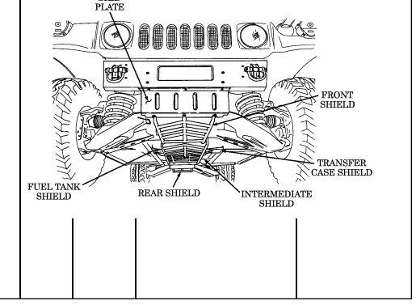

Table 2-2. *Preventive Maintenance Checks and Services (Cont'd)*

# Section Iii. Operation Under Usual Conditions

## 2-8. General

This section provides instructions for vehicle operations under moderate temperature, humidity, and terrain conditions. For vehicle operation under unusual conditions, refer to section IV of this chapter.

Before you operate your vehicle, be sure to perform the preventive maintenance checks and services shown in table 2-2.

## 2-9. Break-In Service

a. Perform all before operation checks and services as indicated in table 2-2. b. Upon receipt of vehicle, or after engine replacement, the following break-in speeds and precautions should be observed during the first 500 miles (805 km) of operation:
- Do not exceed a speed of 55 miles per hour (89 kilometers per hour). - Do not drive for long periods of time at constant speed. - Avoid rapid acceleration or deceleration. - Drive at a moderate speed until the engine is fully warmed up. - No trailer towing.

## 2-10. Starting The Engine

- The automatic transmissions on M998 and "A1" vehicles do not have a "PARK" position. Whenever the vehicle is parked, or the transmission in in "NEUTRAL", the parking brake MUST BE APPLIED. Damage to equipment and injury to personnel may occur if these instructions are not followed.

- The automatic transmissions on the M1123 and"A2" vehicles have a "PARK" position. Never use the transmission shift lever in place of the parking brake. Set the parking brake. Make sure the transmission shift lever is in the "P" (park) position and transfer case shift lever is NOT in the "N" (neutral) position. Damage to equipment and injury to personnel may occur if these instructions are not followed.

- Chock blocks will be used when parking a vehicle with inoperative parking brakes, when operating in extreme cold conditions, when parking on inclines, or whenever and wherever maintenance is being performed. Failure to do so may result in injury to personnel or damage to equipment.

- For M1097, M1123, and all A1 and A2 model vehicles only, hearing protection is required for driver and passengers when engine is running. Noise levels produced by these vehicles exceed 85 dBA, which may cause injury to personnel.

To apply parking brake, grasp handle firmly and pull upward until handle is locked in a straight-up position.

a. Ensure parking brake is applied. b. Adjust driver's seat (para. 2-14).

Visibility may be restricted with right rearview mirror.

c. Adjust left and right rearview mirrors. Ensure both mirrors provide a clear view (para. 3-24 or 3-25).

d. Ensure all windows are clean. If not, clean windows before attempting to move vehicle (refer to table 2-1).

Ensure all slack from two-point seatbelt adjusting strap or threepoint seatbelt is removed. Two-point seatbelt retracts but does not lock in any position. Three-point seatbelt retracts and will lock only during sudden stops or impact. Injury to personnel will result if an accident occurs and seatbelt is not used or adjusted properly.

Fasten unused seatbelts to protect the belt ends from damage or dirt contamination.

e. Fasten and adjust seatbelt (para. 2-16). f. Place transmission shift lever (8) in "N" (neutral) and transfer case shift lever (7) in desired range. See table 1-9 for transfer case range selection.

- Do not leave rotary switch in "RUN" position for extended periods of time. Glow plugs will continue to cycle and batteries will discharge leading to a no-start condition.

- Glare from the sun may make it difficult to tell if the wait-tostart lamp assembly is illuminated. If this occurs, shade the light with your hands to ensure that the wait-to-start lamp assembly goes out before attempting to start the vehicle.

- Starting the engine before the wait-to-start lamp goes out can result in starting problems.

f.1. Ensure all electrical switches (e.g. lights, wipers, and blower motor) in


vehicle are turned to "OFF".

g. Place rotary switch (1) to "RUN" and wait until WAIT-TO-START lamp assembly (2) goes out.

2-106 Change 3

· If ambient temperature is above 0°F (-18°C), do not operate starter continuously for more than 20 seconds; wait 10 to 15 seconds between periods of starter operation. Failure to do this will result in damage to the starter.

· If any instrument reading is not normal, stop engine. Failure to do this will result in damage to the engine.

Refer to troubleshooting, table 3-1.

· If engine does not start, leave rotary switch in "RUN" position and wait 10 to 15 seconds before trying to restart. Failure to do this will result in damage to glow plugs or starter.

· If you accidentally turn the rotary switch to "ENG STOP" position after an unsuccessful attempt to start, wait 90 seconds before trying to restart. Failure to do this will result in damage to glow plugs.

h. Place rotary switch (1) to 'START." Release lever after engine starts. Lever will return automatically to "RUN".

Before the engine reaches operating temperature, the WAIT-TO-
START lamp may flicker and a clicking noise may be heard. This is due to glow plug relay cycling and is a normal condition.

i. Allow engine to warm up for approximately one minute and ensure instruments indicate the following:
(1) Oil pressure gauge (4) should register above approximately 6 psi (41 kPa) with engine at idle. (2) Voltmeter (6) should register in green area. (3) Fuel gauge (9) should indicate fuel level in fuel tank. (4) Air restriction gauge (3) should not register within the red zone.

j. Stop engine if any of the following conditions occur:
(1) Excessive engine vibration. (2) Oil pressure does not register or suddenly drops to or less than approximately 6 psi (41 kPa) with engine at idle.

(3) Air restriction gauge (3) is within the red zone.

k. If engine overheating occurs:
(1) Park vehicle, allow engine to idle. (2) Observe coolant temperature gauge (5) for steady cooling.

Stop engine if coolant temperature gauge suddenly increases beyond approximately 230°F (110°C), or damage to engine will result.

(3) If engine coolant temperature continues to increase, or does not decrease, as indicated by engine temperature gauge (5), stop engine. Perform troubleshooting procedures in table 3-1.

#### 2-107

## 2-11. Placing Vehicle In Motion

- This vehicle has been designed to operate safely and efficiently within the limits specified in this TM. Operation beyond these limits are prohibited IAW AR 750-1 without written approval from the Commander, U.S. Army Tank-automotive and Armaments Command, ATTN: AMSTA-CM-S, Warren, MI 48397-5000.

- Communications shelters AN/GRC-122 and AN/GRC-142 RATT
may overload truck by up to 500 lbs (227 kg). Use caution when driving to avoid damage to equipment or injury to personnel.

The following procedures apply to a vehicle being driven in good weather on high traction surfaces where little or no wheel slippage is evident. For operating the vehicle under unusual conditions; i.e., unusual terrain, cold weather, ice, snow, dusty or sandy areas, mud or rain, refer to section IV.

a. Be sure all auxiliary equipment and tools are stored for travel.

- Vehicle must be stopped, engine off, and transmission shift lever placed in "N" (Neutral), before transfer case can be shifted. Failure to do this will result in damage to drivetrain.

- Do not place transfer case shift lever in "H/L" (high lock range) or
"L" (low range) on high traction surfaces where little or no wheel slippage is evident, particularly when encountering sharp, continuous turns. Failure to operate the vehicle with transfer case in "H" (high range) on high traction surfaces, particularly when encountering sharp, continuous turns, can damage drivetrain.

b. With transmission shift lever (2) in "N" (neutral), select "H" (high range)
transfer case driving gear range using transfer case shift lever (3). This range is for normal driving in good weather, or on high traction surfaces.

c. Start engine (para. 2-10). d. Set vehicle light switch (7) (para. 2-13).

Ensure parking brake is released completely before operating the vehicle. Failure to do so may cause damage to equipment.

- To release parking brake, grasp handle firmly and push forward until handle is seated in its most forward position.

- Starting with A1 vehicles, parking brake handles have a safety release button which must be depressed to release the parking brake.

- If covering warning lamp with tape, put a pinhole in the tape in order to recognize when the light is on.

e. Depress service brake pedal (6). Depress parking brake release button and release parking brake lever (4). The brake warning lamp assembly (1) should go out.

f. Place transmission shift lever (2) in "D" (drive) or " D " (overdrive) for


M1123 and "A2" series vehicles), for normal driving. 

g. Release service brake pedal (6), and depress accelerator pedal (5). Accelerate at a safe, steady speed.

h. Upshift or downshift transmission shift lever (2) when road and/or traffic conditions change.

Extreme caution shall be taken when transporting personnel. Rollover protection and seatbelts are available for the crew area only and are not provided in the troop/cargo area. Failure to use basic safe driving skills may result in injury or death to personnel and damage to equipment.

To help judge clearance more accurately, guide rods can be used at the discretion of the unit commander.

i. Exercise extreme caution when transporting personnel. Rollover protection is available for the crew area only and is not provided in the troop/cargo area. Although certain design characteristics of the vehicle, such as vehicle width, ground clearance, independent suspension, etc., provide improved capabilities, accidents can still happen.

Vehicle speed must be reduced consistent with weather and road/ terrain conditions. Obstacles such as stumps and boulders must be avoided. Failure to use basic safe driving techniques/skills may result in injury or death to personnel and damage to equipment.

j. Operators are reminded to observe basic safe driving techniques/skills when operating the vehicle, especially when transporting personnel. 

## 2-12. Stopping The Vehicle And Engine

a. Release accelerator pedal (5). b. Depress service brake pedal (6) to bring vehicle to a gradual stop.

The automatic transmission of the M1123 and"A2" series vehicles has a "PARK" position. Proceed to steps f and g for the M1123 and "A2" series vehicles.

c. Move transmission shift lever (3) to "N" (neutral). d. If vehicle must be backed into parking position, have another person act as a ground guide to direct reverse operation.

- The automatic transmission of the M998 series vehicle does not have a "PARK" position. Whenever the vehicle is parked, or the transmission is in "NEUTRAL," the parking brake MUST BE APPLIED. Damage to equipment and injury to personnel may occur if these instructions are not followed.

- Chock blocks shall be used when parking a vehicle with inoperative parking brakes, when operating in extreme cold conditions, when parking on inclines, or whenever and wherever maintenance is being performed. Failure to do this may result in injury to personnel or damage to equipment.

To apply parking brake, grasp handle firmly, and pull upward until handle is locked in a straight-up position.

e. Once vehicle is completely stopped, apply parking brake lever (4).

- The automatic transmission of the M1123 and "A2" vehicles have a "PARK" position. Never use the transmission shift lever in place of the parking brake. Set the parking brake. Make sure the transmission shift lever is in the "P" (park) position and transfer case shift lever is NOT in the "N" (neutral) position. Damage to equipment and injury to personnel may occur if these instructions are not followed.

- Some vehicles have parking brake levers that do not lock. If equipped with a chain lock, secure parking brake lever with the chain lock to prevent accidental release of the parking brake. If not equipped, refer to unit maintenance for installation procedures.

- Steps f and g apply to the M1123 and "A2" series vehicles only.

f. Once vehicle is completely stopped, apply parking brake lever (4). g. Move transmission shift lever (3) to "P" (park). h. Turn light switch (7) to "OFF." i. Place rotary switch (1) to "ENG STOP."

If there is engine run-on, pinch the fuel return line with your fingers or a pair of pliers to stop the engine. Notify unit maintenance.

j. Lock steering wheel with cable (2) and chock wheels if tactical situation permits.


A1, A2, AND M1123 MODELS

## 2-13. Operation Of Vehicle Light Switch

a. To illuminate instrument panel:
(1) Lift unlock lever (2) to "UNLOCK" and hold in position. (2) Turn selector switch lever (1) to any "ON" position except "B.O. MARKER." (3) Turn auxiliary lever (3) to "DIM" or "PANEL BRT" (bright).

b. For normal daylight driving, turn selector lever (1) to "STOPLIGHT." c. For night driving, turn selector lever (1) to "SERVICE DRIVE." The headlight dimmer foot switch is depressed to provide high beam service light operation. The indicator light (4) on the instrument panel should illuminate when high beams are operating.

d. In blackout operations:
(1) When driving vehicle, turn selector lever (1) to "B.O. DRIVE." (2) When vehicle is parked, turn selector lever (1) to "B.O. MARKER."
e. To illuminate parked vehicle at night (if tactical situation permits):
(1) Keep selector lever (1) in "SERVICE DRIVE." (2) Turn auxiliary lever (3) to "PARK."
f. Move turn signal lever up for right turns, down for left turns. g. For hazard warning lights (blinking lights):

- For vehicles built prior to 1990, the warning flashers override

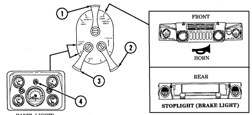

operation of the brake lights. For vehicles built in 1990 and after, a brake light override feature is installed.

- The headlights cannot be turned on when auxiliary lever (3) is in the "PARK" position.

(1) Turn selector lever (1) to "SERVICE DRIVE" or "STOPLIGHT." (2) Pull warning hazard tab out and move turn signal lever up to lock lever in place.

(3) To deactivate, move turn signal lever back to neutral.

h. For horn operation, turn selector lever (1) to either "STOPLIGHT" or
"SERVICE DRIVE."

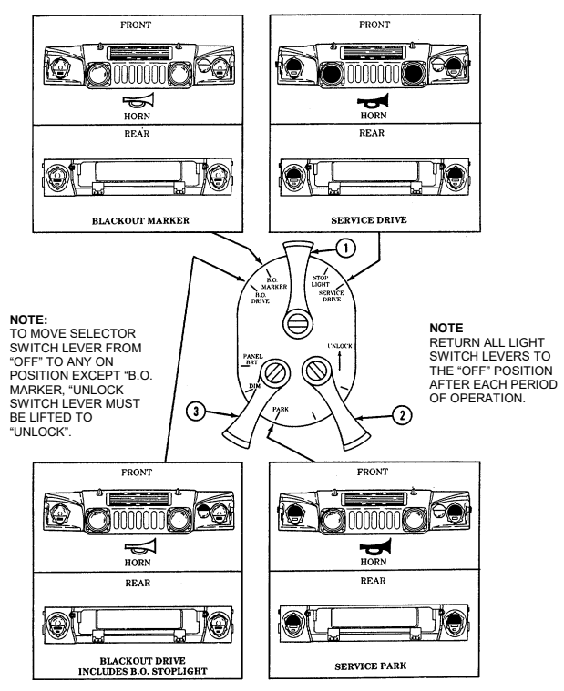

Perform steps a and b for vehicles with old configuration driver's seat. Perform steps c and d for vehicles with new configuration driver's seat.


a. To adjust seat (1), exit vehicle and lift seat (1) up and slide seat (1) forward or rearward so that seat mount pins (3) are positioned in desired slots (2).

b. Adjust seat (1) for most comfortable and effective position.

c. To adjust horizontal position of seat:


(1) Pull seat adjustment lever (4) upward and slide seat (5) to desired position. (2) Release seat adjustment lever (4) to lock seat (5) into position.

d. To adjust vertical position of seat:
(1) Pull seat adjustment lever (4) upward and allow body weight to lower seat (5). (2) To raise seat (5), pull seat adjustment lever (4) upward and remove body weight from seat (5). (3) Release seat adjustment lever (4) to lock seat (5) in desired position.

#### 2-114

# 2-15. Companion Seat Assembly And Battery Box Cover Replacement

a. Removal of companion seat assembly and battery box cover.


(1) Pull seat adjustment lever (10) upward and slide companion seat assembly (6) forward. (2) Release two latches (9) securing companion seat assembly (6) and battery box lever (7) to battery box (8)
(3) Lift and pull companion seat assembly (6) and battery box cover (7) forward and remove from battery box (8).

b. Installation of companion seat assembly and battery box cover.

(1) Install companion seat assembly (6) and battery box cover (7) on battery box (8) and secure with two latches (9).

(2) Pull seat adjustment lever (10) upward and slide companion seat assembly (6) to desired position.

#### 2-115

a. Two-Point Seatbelt.

Ensure all slack from two-point seatbelt adjusting strap is removed. Two-point seatbelt retracts but does not lock in any position. Injury to personnel will result if an accident occurs and two-point seatbelt is not in use or adjusted properly.

(1) **Seatbelt Fastening**. Pull seatbelt (1) across body and fasten strap in belt buckle (3). (2) **Seatbelt Adjustment**. Pull adjustable strap (4) to remove slack from seatbelt (1). Seatbelt (1)
must fit snugly across operator's hips.

(3) **Seatbelt Unfastening**. Push release button (2) on belt buckle (3) to release seatbelt (1).

b. Three-Point Seatbelt.

Ensure all slack from three-point seatbelt is removed. Three-point seatbelt retracts and will lock only during sudden stops or impact. Injury to personnel will result if an accident occurs and three-point seatbelt is not in use or adjusted properly.

(1) **Seatbelt Fastening.** Pull shoulder harness and seatbelt (6) across body and fasten latch plate (5)


to belt buckle (3).

(2) **Seatbelt Adjustment**. Pull shoulder harness strap (6) through latch plate (5) and remove slack from seatbelt (6). Seatbelt (6) must fit snugly across operator's hips, shoulder, and chest.

(3) **Seatbelt Unfastening**. Push release button (2) on belt buckle (3) to release seatbelt (6).

#### 2-116

# 2-17. Defroster Operation (All Except A2 Vehicles)

#### A. To Defrost Windshield:

(1) Start engine (para. 2-10). (2) Push fresh air intake lever (4) forward to close grille. (3) Slide baffles (2) to the right to close air vents. (4) Loosen thumbscrew (3) and position deflector to close air flow to the floor of vehicle. Tighten thumbscrew (3).

(5) Turn heater fan switch (6) "ON" to desired setting, "HIGH" OR "LOW." (6) Position heater control knob (5) to desired setting.

· To obtain maximum air flow to driver's side windshield only, pull defroster control knob halfway out.

· To obtain even air flow to both sides of the windshield, pull defroster control knob all the way out.

· To allow warm air into crew area while defrosting windshield, slide baffles to open air vents.


(7) Position defroster control knob (1) to desired setting.

# 2-18. Defroster Operation (A2 Vehicles)

To defrost windshield:


(1) Start engine (para. 2-10). (2) Push fresh air intake lever (3) forward to close grille. (3) Turn heater fan switch (4) "ON" to desired setting, "HIGH" or "LOW." (4) Position heater control knob (2) to desired setting. (5) Push defroster control knob (1) in.

#### 2-118

# 2-19. Heater Operation (All Except A2 Vehicles)

To operate heater:
(1) Start engine (para. 2-10). (2) Push fresh air intake lever (4) forward to close grille.

Perform step 3 if air flow to floor of vehicle is closed.

(3) Loosen thumbscrew (3) and position deflector to allow air flow to floor of vehicle. Tighten thumbscrew (3).

(4) Slide baffles (2) to the left to open air vents. (5) Turn heater fan switch (6) "ON" to desired setting, "HIGH" OR "LOW."

For maximum heat, pull heater control knob all the way out.


(6) Position heater control knob (5) to desired setting. (7) Push defroster control knob (1) in.

#### 2-119

# 2-20. Heater Operation (A2 Vehicles)

To operate heater.

(1) Start engine (para. 2-10). (2) Push fresh air intake lever (3) forward to close grille. (3) Turn heater fan switch (4) "ON" to desired setting, "HIGH" or "LOW."

#### Note


For maximum heat, pull heater control knob all the way out.

(4) Position heater control knob (2) to desired setting. (5) Push defroster control knob (1) out.

#### 2-120

## 2-21. Tailgate Operation

a. **Lowering Tailgate.**

Do not use tow pintle as a step when entering or exiting vehicle cargo area. Failure to do so may result in injury to personnel or damage to equipment.

The tailgate should not be lowered further than the length of tailgate chains. Tailgate chains should always be used to support tailgate when open. Do not allow tailgate to slam against lifting shackles. Damage to equipment may occur.

(1) Remove two tailgate chain hooks (6) securing tailgate (7) to rear of


vehicle body.

(2) Lower tailgate (7) and secure with two tailgate chain hooks (6).

b. Raising Tailgate.

(1) Raise tailgate (7). (2) Secure tailgate (7) to rear of vehicle body with two tailgate chain hooks (6).

#### A. Tool Stowage Rack Removal.

(1) Release two tension latches (3) from latch strikes (2) and lower tool rack (4) (2) Lift tool rack (4) out of support bracket (1) to remove tool rack (4).

b. Tool Removal.

Note location of straps for installation.

(1) Loosen and disconnect two strap assemblies (8) securing tools. (2) Remove mattock head (6) from tool rack (4). (3) Remove shovel (7) from retainer (12) by turning 90° from stowage position and sliding through tool rod support (9).

(4) Remove mattock handle (5) from tool rack (4). (5) Unlatch ax head retainer (11) and slide head out of ax head support (1(and remove ax (13).

For improved pioneer tool accessibility, tools can be stored inside the vehicle cargo area at the discretion of the unit commander. Tools must be secured in place.

#### C. Tool Installation.

(1) Install ax (13) by sliding ax head into ax head support (10); secure with retainer (11).


(2) Install mattock handle (5) in tool rack (4).

(3) Position shovel (7) through tool rod support (9) and secure handle of shovel into retainer (12). (4) Install mattock head (6) in tool rack (4). (5) Connect and tighten two strap assemblies (8) to secure tools to tool rack (4).


# D.  Tool Stowage Rack Installation.

(1)  Place tool rack (5) in support bracket (2).

(2)  Raise tool rack (5) and secure tension latches (4)  to latch strikes (3).


## 2 - 2 2 . 1 . Max Tool Kit Stowage Operat I O N

Stowage location on M1025A2, M1043A2, and M1045A2 vehicles is behind left rear seat. Stowage location on M1035A2, M1097A2, and M 1123 vehicles is on tunnel. The following procedure is for M997A2 v e h i c l e s .

#### A. **Tool Removal.**

( 1 ) Disconnect two strap assemblies (4) in right footwell (3) and remove ax (1)
and max tool kit case (2).

( 2 ) Remove the following attachments from max tool kit case (2):
- Reversible rake/hoe attachment (11 ) - Rake/hoe thumbscrew attachment (10) - Shovel attachment (5)
- Six safety locking pins (7)
- Broad pick attachment (9) - Pick attachment (8) - Mattock attachment (6)

- Using the ax and attachments, the max tool kit can be


incorporated into seven basic hand tools.

- Ax blade must be covered with sheath before using kit. - Read all safety and assembly instructions enclosed with max tool kit before using kit.

#### B. **Reversible Rake/Hoe Attachment.**

(1) Connect rake/hoe attachment (2) (with either rake or hoe in the working position) into socket (4) on end of ax (1).

Thumbscrew must be seated tightly in rake/hoe attachment and socket of ax. Check thumbscrew often to be sure it does not work l o o s e .

(2) Install thumbscrew (3) on rake/hoe attachment (2) and in socket (4) of ax (1).

Tighten thumbscrew (3).

(3) To remove rake/hoe attachment (2), remove thumbscrew (3) from rake/hoe attachment (2) and ax (1).

c. **Shovel Attachment.**

Shovel attachment is shown. Broad pick, pick, and mattock attachments are attached basically the same.

(1) Connect shovel attachment (5) into socket (4) on end of ax (1). (2) Insert safety locking pin (6) into hole in end of taper on shovel attachment (5). (3) To remove shovel attachment (5), remove safety locking pin (8) from shovel attachment (5) and ax (1).

d. Tool Installation.

(1) Replace attachments in the max tool kit case (7). (2) Install max tool kit case (7) and ax (1) with two strap assemblies (9) in right footwell (8) of vehicle.


ATTACHMENT


SHOVEL ATTACHMENT


#### 2-124.2 Change 1

## 2-23. Slave Starting Operation

hookup.

a. Position slaving vehicle and disabled vehicle close enough for cable b. Stop slaving vehicle engine.

Vehicles with kits 5705623 and 5705624 and serial numbers 100,000 and above are equipped with screw-on covers.

c. Remove cover from slave receptacle of disabled vehicle and slaving vehicle.

Ensure all battery cables in disabled vehicle are properly connected before connecting slave cable. Damage to batteries, cables, or serious injury to personnel may result from improperly connected batteries.

Use a twisting motion when installing slave cable to the receptacle. Forcefully pushing the cable onto the receptacle may cause damage to the receptacle mount.

Ensure all electrical switches in both vehicles are turned off.

d. Connect slave cable to the slave receptacle of both vehicles. e. Start slaving vehicle engine. f. Start disabled vehicle engine.

Use a twisting motion when disconnecting slave cable from the receptacle. Forcefully pulling the cable from the receptacle may cause damage to the receptacle mount.

g. After engine starts, disconnect slave cable from both vehicles.

- Screw-on type covers must be fully tightened to ensure a proper seal.

- For ease of removal, apply hand cleaner (Appendix D, Item 11)
on the inside of the cover before installing receptacle covers.

h. Install receptacle covers on both vehicles. i. Clean and stow slave cable.

## 2-24. Towing Operation

- Do not exceed a towing speed of 30 mph (48 kph) or a towing distance of 30 mi (48 km) without first removing the front propeller shaft and/or rear propeller shaft with the parking brake rotor as specified in table 2-3. Failure to remove the necessary propeller shafts may result in damage to the transmission and/or transfer case.

- Before initiating vehicle recovery, operator should be familiar with basic vehicle recovery techniques and precautions. Refer to FM 20-22, Vehicle Recovery Operations.

- If propeller shafts are to be removed, notify unit maintenance personnel.

- Towing pintle (front bumper) provides improved driver control when moving trailers in hard-to-maneuver areas and during aircraft loading operations.

| Table 2\-3. Towing Operations   |                                         |
|---------------------------------|-----------------------------------------|
| Vehicle Towing Mode             | Prop Shafts                             |
| Rear wheels up                  | Front off                               |
| Front wheels up                 | Rear off (Parking brake rotor removed)  |
| Four wheels on ground           | Front and rear off (Parking brake rotor |
| removed)                        |                                         |

#### A. Towing Vehicle From Front (Four Wheels On Ground). Caution

Always use a tow bar when towing vehicle. Failure to do so may cause damage to equipment.

(1) Attach towbar (2) to the towing shackle brackets (4) of the vehicle to be towed and to the pintle hook (1) of the towing vehicle.

(2) Attach safety chain (5) to vehicle frames directly behind bumper (3) or bumperette (6). Let safety chain (5) dip to about 1 ft (30.5 cm) from the ground.

(3) If towing operation is over a distance of 30 mi (48 km), or towing speed is expected to be over 30 mph (48 kph), remove propeller shafts specified in table 2-3.

(4) Place transmission and transfer case shift levers in "N" (neutral). (5) Depress parking brake release button and release parking brake lever. (6) Proceed with towing operation. The vehicle is capable of towing a vehicle of similar weight, fully loaded, for a distance of 50 mi (80 km).


 2-127

#### B. Towing Vehicle From Front (Front Wheels Up). Note

Ensure that towbar is connected to towing brackets as shown in illustration.

(1) Attach towbar (5) to brackets (1) and to wrecker towing pintle.

Ensure that wrecker hoisting boom and hook are centered over the lifting shackles.

Failure to do this may result in difficult turning during towing operations.

(2) Install chain assembly (3) through lifting shackles (2) and attach chain assembly (3) to the wrecker's


hoisting hook (4).

(3) Secure safety chain (6) to towed vehicle's frame and to wrecker directly behind the bumpers and let safety chain (6) dip to about 1 ft (30.5 cm) from the ground.

(4) Hoist vehicle to be towed. (5) If towing operation is more than a distance of 30 mi (48 km), or towing speed is expected to be over 30 mph (48 kph), remove rear propeller shaft and rotor.

(6) Place transmission and transfer case shift levers in "N" (neutral). (7) Depress parking brake release button and release parking brake lever. (8) Proceed with towing operation.

It will be necessary to remove the wrecker lifting eyes (shackle) prior to attaching the towbar arms.

(1) Attach the eye of the towbar (5) to the pintle (7) of the vehicle requiring towing and the towbar arms to the wrecker rear lifting eye attaching bracket.

Ensure that wrecker hoisting boom and hook are centered over the lifting shackles.

Failure to do this may result in difficult turning during towing operations.

(2) Install chain assembly (3) through the rear lifting shackles (8) and attach the chain assembly (3) to the wrecker's hoisting hook (4).

(3) Secure safety chain (6) to towed vehicle's frame and to wrecker directly behind bumper or bumperette and let safety chain (6) dip to about 1 ft (30.5 cm) from the ground.

Prior to towing vehicle with rear wheels up, secure steering wheel to prevent front wheels

 from turning. Failure to do this may cause damage to vehicle and injury or death to personnel. (4) Secure steering wheel.

(5) If towing operation is more than a distance of 30 mi (48 km), or towing speed is expected to be over 30 mph (48 kph), remove front propeller shaft.

(6) Place transmission and transfer case shift levers in "N" (neutral). (7) Depress parking brake release button and release parking brake lever. (8) Lift rear wheels from ground. (9) Proceed with towing operations.

d. Towing S250 Shelter Vehicle from Rear (Rear Wheels Up).

It will be necessary to remove the wrecker lifting eyes (shackle) prior to attaching the towbar arms.

(1) Attach the eye of the towbar (3) to the pintle (4) of the vehicle requiring towing and the towbar arms to the wrecker rear lifting eye attaching bracket.

Ensure that wrecker hoisting boom and hook are centered over the lifting shackles.

Failure to do this may result in difficult turning during towing operations.

If necessary, relocate the rear lifting shackles from the ends of the bumper to the location indicated.

(2) Install the two hooks of chain assembly (1) through the rear lifting shackles (6) and attach the chain assembly (1) to the wrecker's hoisting hook (2).

(3) Secure safety chain (5) to towed vehicle's frame and to wrecker directly behind bumpers and let safety chain (5) dip to about 1 ft (30.5 cm) from the ground.

Prior to towing vehicle with rear wheels up, secure steering wheel to prevent front wheels from turning. Failure to do this may cause damage to vehicle and injury or death to personnel.

(4) Secure steering wheel. (5) If towing operation is over a distance of 30 mi (48 km), remove front propeller shaft. (6) Place transmission and transfer case shift levers in "N" (neutral). (7) Depress parking brake release button and release parking brake lever (8) Lift rear wheels from ground.

Do not exceed 15 mph (24 kph) towing speed. Avoid sharp turns and U-turns when towing. Failure to comply may cause damage to equipment.

(9) Proceed with towing operations.


# 2-131

#### E. Towing M996, M996A1, M997, M997A1, And M997A2 Ambulance Vehicles From Rear (Rear Wheels

Up).

(1) Install eye (12) of towbar (9) in pintle hook (11) of towing vehicle and secure pintle hook (11) with cotter pin (10).

(2) Remove two safety pins (16) and connector pins (3) securing two clamps (2) to towbar extension legs
(7) and remove clamps (2).

(3) Install two clamps (2) on rear bumper (1) of disabled vehicle with adjusting nuts (17) facing downward and clamp chains (18) over top of bumper (1).

(4) Remove two safety pins (14) and extension pins (13) securing extension legs (7) to towbar (9), and adjust extension legs (7) length to attach to two clamps (3). Secure extension legs (7) to two clamps (2) with two connector pins (3) and safety pins (16).

(5) Secure extension legs (7) to towbar (9) with two extension pins (13) and safety pins (14).

(6) Tighten two adjusting nuts (17) on clamps (2) to secure clamp chains (18) to bumper (1).

Wrecker hoisting boom should be positioned so that chain from wrecker boom hook to towing pintle makes minimal contact with rear of ambulance body. It may be necessary to extend towbar legs to provide sufficient hoisting chain clearance to prevent damage to rear of ambulance body.

(7) Attach hoisting chain (5) to wrecker boom hook (6) and towing pintle (4) of towed vehicle, ensuring towing pintle latch (15) is facing downward.

(8) Attach and secure safety chain (8) to frame of disabled vehicle and to wrecker, directly behind bumper (1). Allow chain (8) to dip to approximately 1 ft (30.5 cm) above ground.

Prior to towing vehicle with rear wheels up, secure steering wheel to prevent front wheels from turning. Failure to do this may cause damage to vehicle, injury, or death.

 (9) Secure steering wheel. (10) If towing distance is more than 30 mi (48 km), remove front propeller shaft. (11) Place transmission and transfer case shift levers in "N" (neutral) position. (12) Lift rear end of disabled vehicle off ground.

Do not exceed 15 mph (24 kph) towing speed. Avoid sharp turns and U-turns when towing. Failure to comply may cause damage to equipment.

(13) Proceed with towing operations.

#### 2-132


## 2-25. Trailer Towing

Towing trailers too large or too small for the vehicle capacity is dangerous. These trailers do not track vehicle properly, cargo shifting occurs, and the likelihood of trailer capsizing during movement is increased. This could result in damage to equipment, and injury or death to personnel.

Be sure to close tailgate before towing trailer. Failure to do so may cause damage to the master cylinder.

- Towing any trailer with a HMMWV other than the authorized M116 series, M101 series, M1101, and M1102 trailers or a M102 howitzer is not authorized.

- When towing a trailer, the maximum safe slope is reduced from 40% to 30%.

All vehicles are capable of towing M116 Series and M101 Series trailers and the M102 Howitzer. The M998 Series and A1 Series have a maximum towed load capacity of 3,400 lb. The Heavy Variant (M1097, M1097A1, M1097A2 and M1123) and A2 Series have a maximum towed load capacity of 4,200 lb. Only vehicles that have been retrofitted with MWO 9-2320-280-20-6 Airlift Bumper Reinforcement, or MWO 9-2320-280-20-7 Crossmember Reinforcement, are authorized to tow M1101 and M1102 trailers. Due to the numerous model differences, you must refer to Table 2-3.1 to determine towing authorization for the M1101 and M1102.

Change 2 2-132.1 The ambulances are authorized to tow trailers only during administrative or tactical moves, when not transporting patients. Trailer payloads should be evenly distributed to prevent excessive tongue loads.

|                       |                  |       | MWO Requirements   |    |                                        |          |
|-----------------------|------------------|-------|--------------------|----|----------------------------------------|----------|
| HMMWV Model Number    | Description      | M1101 | M1102              |    | <3400 lb <4200 lb  (1544 kg) (1905 kg) | Remarks  |
| M998/M998A1           | Cargo/Troop      | A     |                    | A  |                                        |          |
| M1038/M1038A1         | Cargo/Troop      | A     |                    | A  |                                        |          |
| M1097/M1097A1/M1097A2 | Heavy Variant    | B     | B                  | B  | B                                      |          |
| M1123                 | Heavy Variant    | C     | C                  | C  | C                                      |          |
| M966/M966A1           | Tow Carrier      | A     |                    | A  |                                        |          |
| M1121                 | Tow Carrier      | A     |                    | A  |                                        |          |
| M1036                 | Tow Carrier      | A     |                    | A  |                                        |          |
| M1045/M1045A1         | Tow Carrier      | A     |                    | A  |                                        |          |
| M1045A2               | Tow Carrier      | C     | C                  | C  | C                                      |          |
| M1046/M1046A1         | Tow Carrier      | A     |                    | A  |                                        |          |
| M1025/M1025A1         | Armament Carrier | A     |                    | A  |                                        |          |
| M1025A2               | Armament Carrier | B     | B                  | B  | B                                      |          |
| M1026/M1026A1         | Armament Carrier | A     |                    | A  |                                        |          |
| M1043/1043A1          | Armament Carrier | A     |                    | A  |                                        |          |
| M1043A2               | Armament Carrier | C     | C                  | C  | C                                      |          |
| M1044/M1044A1         | Armament Carrier | A     |                    | A  |                                        |          |
| M1037                 | Shelter Carrier  | B1    |                    | B1 |                                        | See Note |
| M1042                 | Shelter Carrier  | B1    |                    | B1 |                                        |          |
| M996/M996A1           | Ambulance        | B1    |                    | B1 |                                        |          |
| M997/M997A1           | Ambulance        | B1    |                    | B1 |                                        |          |
| M997A2                | Ambulance        | B     | B                  | B  | B                                      |          |
| M1035/M1035A1         | Ambulance        | A     |                    |    | A                                      |          |
| M1035A2               | Ambulance        | B     | B                  | B  | B                                      |          |

Table 2-3.1. Vehicle Trailer Towing Requirements

Key:
A = MWO 9-2320-280-20-7 B = MWO 9-2320-280-20-6 B1 = Need MWO 9-2320-280-20-6 but must change stencil to read 3400 lb (1544 kg) instead of 4200 lb (1907 kg).

C = Comes equipped. No MWO required. <3400 lb (1544 kg) = Any system mounted on HMT Chassis with GVW of 3400 lb (1544 kg) or less.

<4200 lb (1907 kg) = Any system mounted on HMT Chassis with GVW of 4200 lb (1907 kg) or less.

Note: Pintle extensions are required on vehicles with Shelter Standardized Integrated Command Post System (SICPS) type II. If vehicle is equipped with SICPS (M788) mounted, MWO 9-2320-280-20-6 is not required.

## 2-26. Electric Winch Operation

a. General. The vehicle electrical system is used to power the winch. It is recommended to have engine running while operating the winch so the alternator recharges the battery. Increased engine rpms can be maintained by use of the hand throttle. When engaging or disengaging the clutch, it may be necessary to rotate the drum by hand to align gears.

#### B. Preparation For Use. Note

The eye of the winch cable needs a thimble to keep wires from shearing or breaking. Refer to unit maintenance for installation.

(1) Park vehicle directly facing object to be winched. Place transmission shift lever in "N" (neutral), or "P" (Park) for M1123 and A2 vehicles.

(2) Apply parking brake. (3) Start engine (para. 2-10). (4) Chock wheels.

c. Unwinding Winch Cable.

Do not power out winch cable for more than 10 ft (3 m). Use free spool for paying out long lengths of winch cable. Failure to free spool long lengths of winch cable will cause damage to winch.

(1) Turn clutch lever (1) counterclockwise to "FREE SPOOL."

- Wear leather gloves when handling winch cable. Do not handle cable with bare hands.

- When fully extending winch cable, ensure that four wraps of winch cable remain on drum at all times. Failure to do this may cause injury or death to personnel.

Allow 1 ft (30.5 cm) of slack in winch cable prior to start of winching operations. This allows time for winch motor start-up for maximum pulling power.

(2) Pull out cable (5) by hand to desired length. Connect to load leaving 1 ft (30.5 cm) of slack in cable (5).

#### D. Pulling Load. Note

Refer to table 1-16 (6,000 lb), or table 1-17 (Optional 9,000 lb), Winch Data, for pulling load capacity.

(1) Remove remote control switch (3) from stowage box (4). (2) Turn clutch lever (1) clockwise to "ENGAGED."

Direct all personnel to stand clear of winch cable during winch operation. A snapped winch cable will cause injury or death.

- The electric winch is equipped with an electronic current limiter


switch to prevent winch overload. If winch stops repeatedly during operation and restarts in approximately five seconds, the electronic current limiter is being activated, indicating an overload condition.

- The electric winch is equipped with a thermal cutoff switch to prevent winch from overheating. If winch stops during operation, and does not restart within five seconds, wait approximately two minutes to let winch cool off and allow thermal switch to reset. If after five minutes winch is still inoperative, notify unit maintenance.

Do not fully apply hand throttle during engine "NO LOAD" condition. Damage to engine may result.

(3) Pull out hand throttle until desired engine speed is obtained. (4) Operate remote control switch (3) to "IN" or "OUT" until load has been retrieved.

e. Securing Winch After Operation.

Winch cable must be wound onto the drum under a load of at least 500 lbs (227 kg) or outer wraps will draw into the inner wraps and damage winch cable.

(1) Wind winch cable (5) until hook (2) is 4 ft (1.2 m) from cable guide (6). (2) Turn clutch lever (1) counterclockwise to "FREE SPOOL" and rotate drum by hand to retrieve the remaining cable.

(3) Place remote control switch (3) in stowage box (4). (4) Turn clutch lever (1) clockwise to "ENGAGED." (5) Release hand throttle.

#### Change 1 2-134.1

## 2-26.1. Hydraulic Winch Operation

a. General. The vehicle power steering system is used to power winch.

Operating winch requires vehicle to be running. Applying vehicle brakes or turning steering wheel can be done while operating winch, but this may cause winch to stop. To achieve 100% pulling power, do not brake or steer while operating winch. It is possible to pay out vehicle's winch cable without vehicle running. This is accomplished with the freespool method. Keep no less than five cable wraps on drum during all winch operations. 

#### B. Preparation For Use.

(1) Park vehicle directly facing object to be winched and place transmission in "N" (neutral) or "P" (park) for M1123 and A2 vehicles.

(2) Place transfer selector lever in low lock. (3) Apply parking brake. (4) Chock wheels. (5) Start engine (para. 2-10).

c. Unwinding Winch Cable.

(1) Move selector levers (2) and (3) to "FREE". This setting on winch is
"FREESPOOL".

- When fully extending winch cable, ensure that five wraps of winch cable remain on drum at all times. Failure to do this may cause damage to equipment or injury or death to personnel.

- Wear leather gloves when handling winch cable. Do not handle cable with bare hands.

- Do not even slide gloved hands across winch cable. Injury can result.

Allow 1 ft. (30.5 cm) of slack in winch cable prior to start of winching operations. This allows time for winch motor start up for maximum pulling power.

(2) Pull out winch cable (1) to desired length. Connect to load, leaving 1 ft.

(30.5 cm) of slack in cable (1).

(3) If retrieving load by moving vehicle and not winding winch cable, move winch selector levers to "WINCH LOCKED UP" position.

#### 2-134.2 Change 3


#### D. Powering Winch In And Out. Caution

- Do not power out winch cable for more than 50 ft. (15.3 m). Use free spool for paying out long lengths of winch cable. Failure to free spool long lengths of winch cable will cause damage to winch.

- Wind winch cable onto drum under a load of at least 500 lb (227 kg) or outer wraps will draw into inner wraps and damage winch cable. 

- Do not move winch selector levers with load on winch or when powering winch in or out. Moving winch selector levers with load on winch or when powering winch may cause damage to winch.

- Refer to table 1-17.1 (optional 10,500 lb.), Winch Data for Pulling Capacity.

- Wrapping winch cable is essential and should be done as soon as winch is applied to vehicle. This procedure ensures winch cable is tight on drum and should be accomplished during monthly PMCS, or if winch cable has been powered or freespooled out more than 50% of cable length.

(1) Align drum gears.

(a) Remove remote control (6) from storage compartment (7) under passenger seat.

(b) Remove cap (10) from controller plug (8) and connect hand controller connector (9) to controller plug (8).

"LOCK LOW GEAR" is the preferred winch speed for all recovery and wrapping operations.

(c) Move winch selector lever (1) to "LOW". Move winch selector lever
(5) to "FREE".

Direct all personnel to stand clear of winch cable during winch operation. A snapped winch cable may cause injury or death.

Do not move winch levers with load on winch or when powering winch in or out.

(d) Power winch in and out with no load on cable for 1/2 second at a time until full engagement is accomplished. 

(2) Attach winch cable (3) to load. Press "OUT" remote control button (11)
or "IN" remote control button (12) until load has been retrieved.

This winch uses right-lay bottom feed method of winch cable on winch drum. Ensure cable wrap begins from right side of winch drum.

(3) Power in winch cable (3), ensuring cable wraps (2) are tight. (4) Continue powering in winch cable (3) under load until approximately four feet (1.2 m) from hook. Disconnect load and power in, keeping cable taut, until hook clevis touches fairlead roller (13). Clevis should hang freely with less than one foot (.31 m) of cable exposed.

#### E. Securing Winch After Operation.

(1) Move levers (1) and (5) to "FREE" positions and rotate drum by hand


to retrieve remaining cable.

(2) Remove hand controller connector (9) from controller plug (8) and place remote control (6) in stowage compartment (7).

(3) Move lever (1) to "LOW" position and lever (5) to "HIGH" position to lockup winch (4)
(4) Install cap (10) on controller plug (8).


Change 3 2-135

## 2-27. Fire Extinguisher Operation

a. Before Operation.

(1) Ensure operator PMCS have been accomplished and needle of indicator gauge (1) is in the green zone. Refer to table 2-2.

(2) Refer to para. 2-2 for fire extinguisher stowage location.

- Avoid using fire extinguisher in unventilated areas. Prolonged inhalation exposure to extinguishing agent or fumes from burning materials may cause injury to personnel.

- Using fire extinguisher in windy areas will cause rapid dispersal of extinguishing agent and reduce effectiveness in fire control.

#### B. During Operation.

(1) To operate fire extinguisher (4), remove from stowage bracket (5).

Remove locking pin (2) and direct nozzle (6) to source of flames.

(2) Squeeze handles (3) together and direct extinguishing agent to base of flames. To extinguish burning liquid in a container, direct extinguishing agent against inside of container, just above burning liquid.

#### C. After Operation.

(1) Stow fire extinguisher (4) in stowage bracket (5). (2) Notify unit maintenance to replace or recharge fire extinguisher (4)
after use.


# Section Iv. Operation Under Unusual Conditions

## 2-28. Special Instructions

a. **General.** Special instructions for operating and maintaining vehicles under unusual conditions are included in this section. Unusual conditions are extreme temperatures, humidity, and/or terrain. Special care in cleaning and lubrication must be taken in order to keep vehicles operational when operating under unusual conditions.

This vehicle has been designed to operate safely and efficiently within the limits specified in this TM. Operation beyond these limits is prohibited IAW AR 750-1 without written approval from the Commander, U.S. Army Tank-automotive and Armaments Command, ATTN: AMSTA-CM-S, Warren, MI 48397-5000.

NOTE
Except where noted, all normal operating procedures will apply in addition to special instructions for unusual operating conditions.

b. **Cleaning.** Refer to para. 2-4 for cleaning instructions and precautions. c . **L u b r i c a t i o n .** Refer to appendix G for proper lubricating instructions. d. **Driving Instructions.**
(1) FM 21-305, Manual for the Wheeled Vehicle Driver, contains special driving instructions for operating wheeled vehicles.

(2) FM 55-30, Army Motor Transport Unit Operations, contains instructions on driver selection, training, and supervision.

(3) FM 9-207, Operation and Maintenance of Ordnance Materiel in Cold Weather, contains instructions on vehicle operation in extreme cold of 0°F to -65°F (-18°C to -54°C).

(4) Other documents with information on vehicle operation under unusual conditions are:
(a) FM 31-70 Basic Cold Weather Manual **( d )** FM 90-5 Jungle Operations ( b ) FM 31-71 Northern Operations **( e )** FM 90-6 Mountain Operations ( c ) FM 90-3 Desert Operations e . **Special Purpose Kits.** Paragraphs describing special purpose kits for operation under unusual conditions are:
( 1 ) Deep water fording operation, para. 2-37. ( 2 ) Arctic operation, para. 2-39 or 2-40.

f . **Transmission Range Selection.** For proper transmission range selection, refer to table 1-7 or table 1-8. If transmission range selection is peculiar to an unusual operating condition, it will be specified in the applicable paragraph.

g . **Transfer Case Range Selection.**

- Vehicle must be stopped, engine off, and transmission shift lever in "N" (neutral) before transfer case can be shifted. Failure to do this will result in damage to drivetrain.

- Damage to drivetrain will result if transfer case is operated in "L"
(low range) or "H/L" (high lock range) on high traction surfaces with no wheel slippage.

When necessary to temporarily operate transfer case in "H/L" (high lock range) or "L" (low range) when additional traction is needed to prevent wheel slippage, avoid sharp continuous turns. Failure to avoid sharp continuous turns while operating transfer case in locked ranges may cause damage to drivetrain. Immediately after operation in "H/L" (high lock range) or "L" (low range), ensure transfer case is shifted to "H" (high range) to avoid damage to drivetrain. If any noises from drivetrain components are heard, ensure that transfer case range is properly selected.

For proper transfer case range selection, refer to table 1-9. If transfer case range selection is peculiar to an unusual operating condition, it will be specified in the applicable paragraph.

#### 2-29. Operating On Unusual Terrain

a. General Rules. Driving off-road over rough or unusual terrain basically requires using good driving sense. Experience is the best teacher, but there are a few good rules to keep in mind when you are in that kind of driving situation.

Use extreme caution when transporting personnel. Rollover protection is available for the crew area only and is not provided in the troop/cargo area. Although certain design characteristics of the vehicle, such as vehicle width, ground clearance, independent suspension, etc., provide improved capabilities, accidents can still happen.

Operators are reminded to observe basic safe driving techniques/skills when operating the vehicle, especially when transporting personnel. Vehicle speed must be reduced consistent with weather and road/terrain conditions. Obstacles such as stumps and boulders must be avoided. Failure to use basic safe driving techniques/skills may result in injury or death to personnel and damage to equipment.

(1) Use "H/L" (high lock range) or "L" (low range) only when absolutely required by the conditions identified in table 1-9. After operations on unusual terrain, be sure to shift the transfer case from "H/L" (high lock range) or "L" (low range) to "H" (high range) to avoid damaging drivetrain components.

(2) Select proper transmission and transfer case driving ranges. Refer to table 1-7 or table 1-8 for transmission range selections. For transfer case range selections, refer to table 1-9.

(3) Keep engine at a moderate speed. The engine works at its best pace in the mid-range revolutions per minute (rpms). You can slow down or speed up quickly without changing gears if you get into a tight spot. Use the transmission shift lever and transfer case shift lever to control the engine speed.

(4) Attempt to keep wheels from spinning. If the wheels start to spin, ease off the accelerator pedal until the wheels regain traction.

(5) The instructions for placing vehicle in motion (para. 2-11) also apply to operating on unusual terrain.

#### 2-138 B. **Unusual Terrain Driving Techniques** Caution

- Do not shift into any lower gear than is necessary to maintain h e a d w a y. Attempt to maintain a constant engine speed. Overrevving engine will cause the wheels to slip, and traction will be lost.

- Before ascending or descending steep hills, stop vehicle, place transmission to "N" (neutral), and shift transfer case to "L" (low range). Failure to shift transfer case to "L" (low range) before ascending or descending steep hills may result in damage to drivetrain.

(1) Before climbing a steep hill, shift the transfer case into "L" (low range)
and the automatic transmission into "1" (first). If wheels start to slip, "walk" the vehicle the last few remaining feet of a hill by swinging the front wheels sharply left and right if situation permits. This action will provide fresh "bite" into the surface and will usually result in enough traction to complete the climb.

When "L" (low range) is used for "engine braking" while descending steep grades, avoid sharp continuous turns. Failure to avoid sharp continuous turns while operating transfer case in range may cause damage to drivetrain.

(2) You can proceed safely down a steep grade by shifting the transfer case into
"L" (low range) and the transmission into "2" (second) or "1" (first). Let the vehicle go slowly down the hill with all four wheels turning against engine compression.

Do not travel diagonally across a hill unless it is absolutely necessary, or injury to personnel or damage to equipment may result.

(3) When moving across a slope, choose the least angle possible, keep moving, and avoid turning quickly.

(4) If it is difficult to shift out of a locked range, drivetrain torque buildup may have occured. If necessary to relieve drivetrain torque buildup when leaving a low traction surface for a high traction surface, the vehicle should be backed up for a distance of approximately 5 ft (1.5 m) before proceeding.

## 2-30. Cold Weather Starting Below +32°F (0°C)

Starting aids will not be used on the engine. Use of starting aids will cause damage to vehicle, injury, or death.

(1) Start engine (para. 2-10).

- Do not use the hand throttle as an automatic speed or cruise control. The hand throttle does not automatically disengage when brake is applied, resulting in increased stopping distances and possible hazardous and unsafe operation.

- Do not fully apply hand throttle when engine is not under load.

If engine cranks slowly and voltmeter indicates low battery charge level, attempt to slave start vehicle (para. 2-23). If vehicle still will not start, perform troubleshooting procedures in table 3-1.

(2) After engine starts, pull out hand throttle until desired engine speed is obtained. Twist handle to lock hand throttle.

(3) Allow engine to warm up at an increased speed for approximately three minutes.

(4) After warm-up period, unlock hand throttle and push hand throttle in and allow engine speed to decrease.

## 2-31. Operating In Extreme Cold, On Ice, Or Snow

#### A. **Before Operation.**

(1) Operate arctic winterization equipment (para. 2-39 or 2-40). (2) Scrape off any ice accumulated on vehicle. (3) Remove ice and snow from area around air cleaner intake cap. (4) Refer to para. 2-30 for cold weather starting instructions. (5) Refer to para. 2-29 for techniques that can be used when operating on unusual terrain.

(6) Refer to para. 3-22 for tire chain installation and operation. (7) Operate troop/cargo winterization heater, if applicable (para. 2-41).

b. **During Operation.**

- Vehicle operation in snow is a hazardous condition. Operator must travel at reduced speeds and be prepared to meet sudden changes in road conditions. Failure to maintain safe stopping distances will cause damage to vehicle and injury or death to personnel.

- Pump brakes gradually when stopping vehicle on ice or snow.

Sudden braking will cause wheels to lock and vehicle to slide out of control, causing damage to vehicle and injury or death to personnel.

- Chock blocks shall be used when parking a vehicle in extreme cold conditions. Failure to do so may result in injury to personnel or damage to equipment.**NOTE**
Keep area around air cleaner intake cap clear of snow and ice. Snow and ice may melt, refreeze, and cause restriction in air intake system. If necessary, remove intake cap and clear ice and snow without damaging intake cap screen. Hold the cap near the vehicle exhaust to quickly melt ice without damaging screen.

(1) Place transmission shift lever in "D" (drive) (or "oD " overdrive for M1123 and A2 vehicles), and transfer case shift lever in "H/L" (high lock range). Place vehicle in motion slowly to prevent wheels from spinning.

If additional power is needed to extract vehicle when mired in snow, place transmission in "1" (first) and transfer case in "L" (low range). After vehicle is extracted from mired condition, immediately return transfer case to "H/L" (high lock range) position.

(2) If rear skidding occurs:
(a) Let up on accelerator pedal. ( b ) Turn steering wheel in direction of skid until control has been regained. (c) Apply brake pedal in a gradual pumping manner.

c. **After Operation.**
( 1 ) Remove all ice and snow from underside of vehicle and fuel tank filler cap. (2) Drain fuel filter (para. 3-10).

## 2-32. Operating In Dusty, Sandy Areas

a. **General.** Vehicles operating in dusty or sandy areas require frequent servicing of the air filter and cooling system.

NOTE
For dusty conditions, a precleaner, NSN 2940-01-302-8028, can be inserted in the air intake shield assembly, at the discretion of the unit commander.

#### B. **Before Operation.**

(1) Reduce tire inflation to 12 psi (83 kPa) front and 16 psi (110 kPa) rear to increase traction when operating in sand.

(2) When operating in loose sand or soft ground, place transfer case shift lever in "H/L" (high lock range) position and transmission shift lever in "D" (drive) (or " " (overdrive) for M1123 and A2 vehicles).

(3) Refer to paragraph 2-29 for techniques that can be used when operating on unusual terrain.

c. **During Operation.**
D

If additional power is needed to extract vehicle when mired in sand, place transmission in "1" (first) and transfer case in "L" (low range). After vehicle is extracted from mired condition, immediately return transfer case to "H/L" (high lock range) position.

(1) Frequently check air restriction gauge. If indicator shows red, park vehicle, stop engine, and refer to para. 3-15 for emergency air cleaner servicing.

(2) If engine overheating occurs:
(a) Park vehicle, allow engine to idle. (b) Observe coolant temperature gauge for steady cooling.

Stop engine if coolant temperature gauge suddenly increases beyond approximately 230°F (110°C). Failure to comply will result in damage to engine.

(c) If coolant temperature continues to increase or does not lower, stop engine. Perform applicable troubleshooting procedures in table 3-1.

(3) Accelerate slowly so wheels will not spin and dig into sand.

Use a wrecker or second vehicle equipped with winch to recover vehicles mired in deep sand. Do not attempt to "rock" vehicles out of deep sand with quick transmission shift changes. Damage to transmission will occur.

#### D. **After Operation.**

(1) At end of daily operation, remove all sand from accelerator linkage and brake components.

(2) Park vehicle in shade whenever possible to protect tires, soft tops, paint, wood, and seals from sun, dust, and sand.

(3) If shade is not available, cover vehicle with tarpaulin. When entire vehicle cannot be covered, protect windows and hood with tarpaulin to prevent entry of sand or dust.

(4) Vehicles completing operation in dusty, sandy areas must be lubricated and serviced by unit maintenance as soon as possible.

## 2-33. Operating In Mud

a. **Before Operation.**
(1) Before operating in mud, place transfer case shift lever in "H/L" (high lock range) and transmission shift lever in "D" (drive) (or " " (overdrive) for M1123 and A2 vehicles).

(2) Refer to paragraph 2-29 for techniques that can be used when operating on unusual terrain.

b. **During Operation.**
D

- Do not repeatedly shift transmission or overspeed the engine during operation in deep mud. Damage to drivetrain may result.

- Use wrecker or a second vehicle equipped with winch to recover vehicles mired in deep mud. Do not attempt to "rock" vehicles out of deep mud with quick transmission shift changes. Damage to transmission will occur.

If additional power is needed to extract vehicle when mired in mud, place transmission in "1" (first) and transfer case in "L" (low range). After vehicle is extracted from mired condition, immediately return transfer case to "H/L" (high lock range) position.

Skidding and sudden loss of steering control are operating problems in mud.

When rear end skidding occurs, immediately turn wheel in direction of skid.

c. **After Operation.**
(1) Wash the following as soon as possible with low pressure water:

Do not allow water to enter air intake cap or air cleaner assembly. Damage to engine will occur.

(a) Radiator and oil cooler (b) Propeller shaft U-joint and halfshafts (c) Steering linkage and ball joints

Do not rely on service brakes until they dry out. Keep applying brakes until uneven braking ceases. Failure to do this may cause damage to vehicle and injury or death to personnel.

(d) Brake rotors and pads (service) (e) Brake rotors and pads (park) (f) Parking brake linkage (g) Service lights (h) Transmission control linkage (i) Accelerator control linkage (j) Sway bar bushings (k) Towing pintle (l) Fuel filler cap (m)Vehicle exterior (n) Geared hubs (o) Advance solenoid rocker arm and fuel injection pump
(2) Remove mud from air cleaner dump valve (para. 3-16). (3) Remove mud from drain hole (1) on converter housing cover (2). (4) Remove mud from battery box drain holes.

To prevent parking brake linkage from binding, lithium grease should be used after operating in mud. Clean mud, grit, and debris from linkage. Apply lithium grease (Appendix D, Item 10.1) and move linkage back and forth to work into joints.

(5) Vehicles completing operation in deep mud must be lubricated and


serviced by unit maintenance as soon as possible.

## 2-34. Operating In Extreme Heat

a. **General.** Extreme heat exists when ambient temperatures reach 95°F
(35°C) or more. The effect of extreme heat on vehicle engine is a decrease in engine efficiency.

b. Before Operation.

(1) Perform before operation checks and services in table 2-2. (2) Check for foreign objects in front of radiator and clean as required. (3) Check batteries more frequently. If electrolyte is low, add distilled water, refer to Appendix D, Item 27.

#### C. **During Operation.** Caution

Avoid continuous vehicle operation at high speeds. Avoid long hard pulls on steep grades with transfer case shift lever in "L" (low range) position. Damage to transfer case will result.

(1) Frequently check coolant temperature gauge (2) and oil pressure 


gauge (1). Engine is overheating if one or more of the following conditions exist:
(a) Engine coolant temperature is more than approximately 230°F
(110°C) as indicated by temperature gauge (2).

(b) Engine oil pressure drops below approximately 15 psi (103 kPa) with engine under a load.

(c) Engine oil pressure drops below approximately 6 psi (41 kPa) with engine at idle.

(2) If engine overheating occurs:
(a) Park vehicle, allowing engine to idle. (b) Observe coolant temperature gauge (2) for steady cooling.

- Stop engine if coolant temperature gauge suddenly increases beyond approximately 230°F (110°C). Failure to comply will result in damage to engine.

- Notify unit maintenance to check differential, T-case, and transmission fluids for "oil breakdown" caused by overheating.

(c) If engine coolant temperature continues to increase or does not lower, stop engine. Perform troubleshooting procedures in table 3-1.

## 2-35. Operating In Rainy Or Humid Conditions

a. **General.** Material inactive for long periods during rainy or humid conditions can rust rapidly. Fungus may develop in the fuel tanks as well as on soft tops, seats, and other components. Frequent inspections, cleaning, and lubrication are necessary to maintain the operational readiness of vehicles.

b. Before Operation. Fuel filter must be drained frequently because of high condensation in fuel system.

To drain fuel filter, refer to paragraph 3-10.

c. During Operation.

(1)If necessary, place transfer case shift lever in "H/L" (high lock range) to obtain a start without spinning wheels.

(2)Do not spin wheels when placing vehicle in motion in heavy rain conditions. (3)Refer to para. 2-29 for techniques that can be used when operating on unusual terrain.

#### 2-36. Shallow Water Fording Operation

a. General. M998 series vehicles have a 30 in. (76 cm) shallow water fording capability without the use of a deep water fording kit.

CAUTION
Never attempt shallow water fording unless water depth is known to be 30 in. (76 cm) or less, and bottom is known to be hard. Do not exceed 5 mph (8 kph) during fording operation. Damage to vehicle will result.

b. Before Operation.

(1)Make sure oil dipstick, transmission dipstick, oil filler cap, and fuel tank cap are secure. (2)Secure all loose objects on vehicle. (3)Make sure battery caps are all present and tight.

#### Warning


Do not allow tools to come in contact with vehicle when disconnecting or connecting slave receptacle cable. Tool contact with vehicle will result in a direct short, causing instant heating of tool, tool damage, and injury to personnel.

NOTE
Perform steps 4 through 6 only if fording in salt water.

(4) Disconnect battery ground cable (1).

Battery positive cable must remain on power stud.

(5)Disconnect slave receptacle positive lead 49A (2) at power stud (3).

(6)Connect battery ground cable (1). (7)Place transfer case shift lever in "H" (high range).

#### C. **During Operation.** Caution

Entering water too fast will cause water to splash up over hood and into air intake. The engine may stop abruptly and will not crank. Do not continue starting efforts; damage to engine will result.

(1) Enter water slowly and maintain even vehicle speed while fording. (2) Exit water in area with gentle slope.

- Hydrostatic lock is caused by the entry of substantial amounts of water into the engine through the air intake system and subsequent contamination of the fuel system. Hydrostatic lock most frequently occurs during or just after fording. Water is forced into the air intake system, is drawn into the engine, and effectively "locks-up" the engine.

- Notify unit maintenance if you suspect hydrostatic lock and they will further test the engine.

#### D. **After Operation.** Warning

Do not rely on service brakes after fording until the brakes dry out. Keep applying brakes until uneven braking ceases. Failure to do this may cause damage to vehicle or injury or death to personnel.

If accumulated water drains slowly through floor drain holes, refer to unit maintenance for drilling and improving drain holes
(1) If fording operation was through salt water, wash and wipe off all salt deposits as soon as possible.

To prevent parking brake linkage from binding, lithium grease from linkage. Apply lithium grease (Appendix D, Item 10.1) and move linkage back and forth to work into joints. should be used after operating in mud. Clean mud, grit, and debris
(2) Vehicles completing shallow water fording operation must be lubricated and serviced by unit maintenance as soon as possible.

Perform steps 3 through 7 only if fording was in salt water.

(3) Slide rubber boot (1) back and inspect slave receptacle (2) for evidence of corrosion, RTV wash out, or salt water penetration of RTV sealant. If any evidence of these conditions is found, report vehicle to unit maintenance for corrective action. Do not connect slave receptacle positive lead (4).

(4) If no evidence of corrosion, RTV wash out, or salt water penetration of the RTV sealant is found, slide rubber boot (1) on slave receptacle (2).

#### Warning


Do not allow tools to come in contact with vehicle when disconnecting or

 connecting slave receptacle cable. Tool contact with vehicle will result in a direct short, causing instant heating of tool, tool damage, and injury to personnel.

(5) Disconnect battery ground cable (5). (6) Connect slave receptacle positive lead 49A (4) at power stud (3). (7) Connect battery ground cable (5).

#### 2-147 2-37. Deep Water Fording Operation

a. General. The deep water fording kit allows M998 series vehicles to ford water up to 60 in. (152 cm)
deep.

Never attempt deep water fording unless water depth is known to be 60 in. (152 cm) or less, and bottom is known to be hard. Do not exceed 5 mph (8 kph) during fording operation. Damage to vehicle will result.

#### B. Before Operation. Note Retain All Parts Removed For Reuse.

(1) Raise and secure hood (para. 3-8). (2) Loosen clamp (3) and remove weathercap (2) and clamp (3) from shield (12). (3) Remove three capscrews (16), washers (15), and shield (12) from cowling (10). Stow shield (12). (4) Install intake assembly vent tube (8) on air intake assembly (1) with two clips (14) and screws (13). (5) Install air intake assembly (1) and clamp (9) into cowling (10) and tighten clamp (9). (6) Connect fuel tank vent line (11) to intake assembly vent tube (8). (7) Install air intake assembly (1) on windshield mounting bracket (6) with washer (5), capscrew (4),
washer (5), and nut (7).

(8) Install clamp (3) and weathercap (2) on air intake assembly (1) and tighten clamp (3). (9) Ensure that rubber cap (18) on the bottom of air cleaner body (17) is secure.


Exhaust system components are hot after prolonged vehicle use. Ensure exhaust system components are cool before removing/ installing exhaust assembly. Failure to do this will result in injury to personnel.

NOTE
Any items removed for fording must be stowed for reuse.

(10) Remove three locknuts (17), washers (9), capscrews (10), and washers (9) securing tailpipe (11) to


muffler (16).

(11) Remove two nuts (15), lockwashers (14), and U-bolt (12) securing tail-pipe (11) to clamp (13).

(12) Remove tailpipe (11) and gasket (8) from muffler (16).

(13) Install two rubber isolators (5) into wheelhouse (6). To ease installation, wet rubber isolators (5) with water.

(14) If isolators (5) cannot be installed easily, check alignment of holes in wheelhouse (6) and reinforcement bracket (3). To align holes, loosen capscrews (4) securing reinforcement bracket (3) to wheelhouse (6). Align holes in wheel-house (6) and reinforcement bracket (3) and tighten capscrews (4). Install isolators (5).

(15) Install exhaust assembly (7) and gasket (8) on muffler (16) with three washers (9), capscrews (10),
washers (9), and locknuts (17).

(16) Install exhaust assembly (7) on wheelhouse (6) with two washers (2) and locknuts (1). (17) Ensure oil dipstick, transmission dipstick, oil filler cap, and fuel tank cap are secure. (18) Secure all loose objects on vehicle. (19) Ensure battery caps are all present and tight.

Do not allow tools to come in contact with vehicle when disconnecting or connecting slave receptacle cable. Tool contact with vehicle will result in a direct short, causing instant heating of tool, tool damage, and injury to personnel.

NOTE
Perform steps 20 through 22 only if fording in salt water.

(20) Disconnect battery ground cable (20).

Battery positive cable must remain on power stud.


(21) Disconnect slave receptacle positive lead 49A (19) at power stud (18).

(22) Connect battery ground cable (20).

(23) Place transfer case shift lever in appropriate range (table 1-9).

(24) Turn off all non-essential electrical loads (lights, fan, heater/defroster).

(25) Place fording selector switch (21) in "DEEP FORD" position prior to entering water. (26) Pull out hand throttle (22) until desired engine speed is obtained. Twist hand throttle (22) to lock in position. (27) Open driver and passenger windows.

#### C. **During Operation.** Warning

Entering water too fast will cause water to splash up over hood and into air intake. The engine may stop abruptly and will not crank. Do not continue starting efforts; damage to engine will result.

Perform step 1 for M996, M996A1, M997, M997A1, and M997A2 vehicles.

(1) Enter water until water level has reached the bottom of the driver and passenger windows, stop for a two minute waiting period to allow the ambulance body to fill with water, then proceed with operations.

(2) Enter water slowly and maintain even vehicle speed, 5 mph (8 kph)
maximum.

(3) Exit water in area with gentle slope. (4) Place fording selector switch (1) in "VENT" position upon leaving water.

After fording do not use the hand throttle as an automatic speed or cruise control. The hand throttle does not automatically disengage when brake is applied, resulting in increased stopping distances and possible hazardous and unsafe operation. Injury to personnel or damage to equipment may result.

(5) Unlock and push in hand throttle (2).


Do not rely on service brakes after fording until the brakes dry out. Keep applying brakes until uneven braking ceases. Failure to do this may cause damage to vehicle, and injury or death to personnel.

(6) Place transfer case shift lever in desired range.

- Hydrostatic lock is caused by the entry of substantial amounts of water into the engine through the air intake system and subsequent contamination of the fuel system. Hydrostatic lock most frequently occurs during or just after fording. Water is forced into the air intake system, drawn into the engine, and effectively "locks-up" the engine.

- Notify unit maintenance if you suspect hydrostatic lock, and they will further test the engine.

d. After Operation.

Exhaust system components are hot after prolonged vehicle use. Ensure exhaust system components are cool before removing/ installing exhaust assembly. Failure to do this will result in injury to personnel.

(1) Stop engine.

- Steps 2 through 13 are performed only if required.

- If accumulated water drains slowly through the holes, refer to unit maintenance for 


drilling and improving drain holes.

(2) Remove three locknuts (16), washers (8), capscrews (9), washers (8), gasket (7), and exhaust assembly (6) from muffler (15).

(3) Remove two locknuts (3), washers (4), and exhaust assembly (6) from wheelhouse (5). (4) Install gasket (7) and tailpipe (10) on muffler (15) with three washers (8), capscrews (9), washers
(8), and locknuts (16).

(5) Install clamp (12) on tailpipe (10) with U-bolt (11), two lockwashers (13), and nuts (14).

(6) Loosen clamp (2) securing weathercap (1) to air intake assembly (3)


and remove weathercap (1).

(7) Remove nut (7), washer (5), capscrew (4), washer (5), and air intake assembly (3) from windshield mounting bracket (6).

(8) Disconnect fuel tank vent line (11) from intake assembly vent tube (8).

(9) Loosen clamp (9) securing air intake assembly (3) to cowling (10) and remove air intake assembly (3) and clamp (9).

(10) Install shield (12) in cowling (10) with three washers (13) and capscrews (14).

(11) Install weathercap (1) and clamp (2) on shield (12) and tighten clamp (2).

(12) Lower and secure hood (para. 3-8). (13) Clean and stow intake and exhaust assembly components. (14) If fording operation was through salt water, wash and wipe off all salt deposits as soon as possible.

To prevent parking brake linkage from binding, lithium grease should be used after operating in mud. Clean mud, grit, and debris from linkage. Apply lithium grease (Appendix D, Item 10.1) and move linkage back and forth to work into joints.

(15) Vehicles completing deep water fording operation must be lubricated and serviced by unit maintenance as soon as possible.

Perform steps 16 through 20 only if fording was in salt water.

(16) Slide rubber boot (15) back and inspect slave receptacle (16) for evidence of corrosion, RTV wash out, or salt water penetration of RTV sealant. If any evidence of these conditions is found, report vehicle to unit maintenance for corrective action. Do not connect slave receptacle positive lead (17).

(17) If no evidence of corrosion, RTV wash out, or salt water penetration of the RTV sealant is found, slide rubber boot (15) on slave receptacle (16).

Do not allow tools to come in contact with vehicle when disconnecting or connecting slave receptacle cable. Tool contact with vehicle will result in a direct short, causing instant heating of tool, tool damage, and injury to personnel.

(18) Disconnect battery ground cable (18).

 (19) Connect slave receptacle positive lead 49A (17) at power stud (19). (20) Connect battery ground cable (18).

#### 2-155

## 2-38. Runflat Operations

M998 series vehicles are equipped with runflat devices, allowing the vehicle to be driven with one or more tires flat. For runflat operations, refer to table 2-4.

- Do not exceed 30 mph (48 kph) during any runflat operation. Do not exceed 20 mph (32 kph) with both rear tires flat. Loss of vehicle control will occur, causing damage to equipment, injury or death to personnel.

- Speeds indicated in table 2-4 are maximum and must be reduced when traveling on secondary roads, cross-country, or with traffic present. Failure to reduce speeds could cause loss of control of vehicle, resulting in damage to equipment and injury or death to personnel.

- When driving your vehicle, the existing conditions are constantly changing. Never drive at a speed greater than is reasonable and prudent for these conditions. Loss of vehicle control will occur causing damage to equipment and injury or death to personnel.

- A wheel that has been run flat must be replaced and inspected by unit maintenance as soon as possible before reuse, or damage to equipment may result.

- Runflat operation may cause the tread to separate from the tire and/or wheel. If abnormal handling is experienced, or noise such as flapping or pounding around the wheel well occurs, the tread needs to be cut away from the wheel before continuing operation. Failure to do so could result in damage to the vehicle.

| NOTE                                                                                              |                           |               |
|---------------------------------------------------------------------------------------------------|---------------------------|---------------|
| Runflat travel distance will improve with radial tire and rubber runflat. If additional travel is |                           |               |
| required, tire tread may be cut away from tire.                                                   |                           |               |
| Combination of Flat Tires                                                                         | Recommended Vehicle Speed | Distance      |
| Two tires flat - rear                                                                             | 20 mph maximum (32 kph)   | 30 mi (48 km) |
| One tire flat - any location                                                                      | 30 mph (48 kph)           | 30 mi (48 km) |
| Two tires flat - same side                                                                        | 30 mph (48 kph)           | 30 mi (48 km) |
| Two tires flat - front only                                                                       | 30 mph (48 kph)           | 30 mi (48 km) |

Table 2-4. *Runflat Operation*

## 2-39. Arctic Operation (All Except M1123 And A2 Vehicles)

a. **General.** Arctic winterization kits are for use during extremely cold temperatures from 0°F (-18°C) to -50°F (-46°C).

- Do not operate arctic heater in ambient temperatures above 0°F (-18°C) or with temperature switch in "HI" position when temperature is above -25°F (-32°C). Damage to equipment may result.

- Close battery box door after 30 minutes of arctic heater operation or when engine is running. Failure to do so may result in damage to batteries.

#### B. Starting Arctic Heater.

(1) Set temperature switch (4) on heater control box (1) to "LO" position. (2) Move start switch (3) on heater control box (1) to "START" position and hold for approximately 2 minutes or until heater starts and yellow indicator lamp (2) comes on.

NOTE
If the start switch is moved from the "START" to "ON" position too quickly, the heater flame will be extinguished and the heater will need restarting.

(3) When heater starts, move start switch (3) on heater control box (1) to "ON" position. If heater does not start, move start switch (3) to "OFF" position for 10 seconds and then back to "START" for 60 seconds. Repeat procedure if heater doesn't start. c. Starting Engine With Arctic Heater Assistance.

(1) Push defroster control knob (9) all the way in to ensure hot air is not directed on windshield.

(2) Pull exhaust diverter cable knob (6) out to allow heater exhaust to heat the engine oil pan.

(3) Open battery box door (8), by sliding away from plenum (7), to heat batteries.

(4) Move regulator control lever (5) to "ARCTIC HEATER" position.

CAUTION
Do not operate arctic heater in ambient temperatures above 0°F

 (-18°C) or with temperature switch in "HI" position, when temperature is above -25°F (-32°C). Damage to equipment will result.

(5) Start arctic heater and set temperature switch (4) on heater control box (1) to "LO" position for temperatures from 0°F (-18°C) to -25°F (-32°C), or to "HI" position for temperatures from -25°F (-32°C) to -50°F (-46°C).

(6) Operate heater for 30 minutes maximum at -50°F (-46°C); less time may be required for higher ambient temperatures.

CAUTION
Close battery box door after 30 minutes of arctic heater operation or when engine is running. Failure to do so may result in damage to batteries.

(7) Close battery box door (8) by sliding toward plenum (7).

(8) Push exhaust diverter cable knob (5) in to shut off heat to engine oil pan. (9) Start engine (para. 2-30). (10) If engine fails to start, notify unit maintenance.

d. Stopping Arctic Heater.

Set start switch (2) on heater control box (1) to "OFF" position.

The yellow indicator lamp will remain lit and the fan will continue to run until the heater has purged itself of fuel.

#### E. Defrosting Windshield In Ambient Temperatures Above -25°F (-32°C). Caution

- Cab must be heated prior to defrosting, or damage to windshield will occur. - Use of the arctic heater to defrost in temperatures above -25°F (-32°C) will damage the windshield.

- Do not operate arctic heater with regulator control lever in "STANDARD HEAT" position and battery box door closed, or damage to equipment will occur.

(1) Start engine with arctic heater assistance.

(2) Shut off arctic heater. (3) Pull defrost control knob (8) all the way out to direct air on windshield. (4) Pull temperature control knob (7) all the way out for maximum heat. (5) Set regulator control lever (4) to "STANDARD HEAT" position. (6) Set standard heater fan switch (6) to "HI" position until windshield is defrosted.

#### F. Defrosting Windshield In Ambient Temperatures From -25°F (-32°C) To 50°F (-46°C).

(1) Start engine with arctic heater assistance. (2) Set temperature switch (3) on heater control box (1) to "LO" position. (3) Set regulator control lever (4) to "DUAL" position. (4) Pull defrost control knob (8) all the way out to direct air on windshield. (5) Pull temperature control knob (7) all the way out for maximum heat. (6) Set standard heater fan switch (6) to "LO" position until windshield is defrosted.

#### G. Heating Cab With Arctic Heater.

(1) Start engine (para. 2-30).

Do not operate arctic heater in ambient temperatures above 0°F (-18°C), or with temperature switch in "HI" position, when temperature is above - 25°F (-32°C). Damage to equipment will result.

(2) Start arctic heater and set temperature switch (3) on heater control box (1) to "LO" position for temperatures from 0°F (-18°C) to -25°F (-32°C), or "HI" position for temperatures from -25°F (-32°C) to -50°F
(-46°C).

(3) Set regulator control lever (4) to "DUAL" or "ARCTIC HEATER" position to achieve desired mix of air.

(4) Push defrost control knob (8) all the way in to direct airflow to heat ducts.

 (5) Pull temperature control knob (7) all the way out for maximum heat. (6) Set standard heater fan switch (6) to desired position to mix air.

a. General. Arctic winterization kits are for use during extremely cold temperatures from 0°F (-18°C) to -50°F
(-46°C).

- Do not operate arctic heater in ambient temperatures above 0°F (-18°C), or with temperature switch in "HI" position, when temperature is above -25°F 
(-32°C). Damage to equipment may result.

- Close battery box door after 30 minutes of arctic heater operation or when engine is running. Failure to do so may result in damage to batteries.

#### B. Starting Arctic Heater.

(1) Set temperature switch (4) on heater control box (1) to "LO" position. (2) Move start switch (3) on heater control box (1) to "START" position and hold for approximately 2 minutes or until heater starts and yellow indicator lamp (2) comes on.

NOTE
If the start switch is moved from the "START" to "ON" position too quickly, the heater flame will be extinguished and the heater will need restarting.

(3) When heater starts, move start switch (3) on heater control box (1) to "ON" position. If heater does not start, move start switch (3) to "OFF" position for 10 seconds and then back to "START" for 60 seconds. Repeat procedure if heater doesn't start.

#### C. Starting Engine With Arctic Heater Assistance.

(1) Pull defroster control knob (9) all the way out to ensure hot air is not directed on windshield.

(2) Pull exhaust diverter cable knob (6) out to allow heater exhaust to heat the engine oil pan.

(3) Open battery box door (8), by sliding away from plenum (7), to heat batteries.

(4) Move regulator control lever (5) up to "STANDARD HEAT" position.

Do not operate arctic heater in ambient temperatures above 0°F (-18°C), or with temperature switch in "HI" position, when temperature is above -25°F (-32°C). Damage to equipment will result.

(5) Start arctic heater and set temperature switch (4) on heater control box (1) to "LO" position for temperatures from 0°F (-18°C) to -25°F (-32°C), or "HI" position for temperatures from -25°F (-32°C) to -50°F (-46°C).

(6) Operate heater for 30 minutes maximum at -50°F (-46°C); less time may be required for higher ambient temperatures.

Close battery box door after 30 minutes of arctic heater operation or when engine is running.  Failure to do so may result in damage to batteries.


(7) Close battery box door (8) by sliding toward plenum (7).

(8) Push exhaust diverter cable knob (5) in to shut off heat to engine oil pan. (9) Start engine (para. 2-30). (10) If engine fails to start, notify unit maintenance.

d. Stopping Arctic Heater. Set start switch (2) on heater control box (1) to "OFF" position.

NOTE
The yellow indicator lamp will remain lit and the fan will continue to run until the heater has purged itself of fuel.

e. Defrosting Windshield in Ambient Temperatures Above -25°F (-32°C).

- Cab must be heated prior to defrosting, or damage to windshield will occur. - Use of the arctic heater to defrost in temperatures above -25°F (-32°C) will damage the windshield.

- Do not operate arctic heater with regulator control lever in "STANDARD HEAT" position and battery box door closed, or damage will occur.

(1) Start engine with arctic heater assistance. (2) Shut off arctic heater. (3) Push defroster control knob (8) all the way in to direct air on windshield. (4) Pull temperature control knob (7) all the way out for maximum heat. (5) Set regulator control lever (4) up to "STANDARD HEAT" position. (6) Set standard heater fan switch (6) to "HI" position until windshield is defrosted.

f. Defrosting Windshield in Ambient Temperatures from -25°F (-32°C) to -50°F (-46°C).

(1) Start engine with arctic heater assistance. (2) Set temperature switch (3) on heater control box (1) to "LO" position. (3) Set regulator control lever (4) down to "ARCTIC HEAT" position. (4) Push defroster control knob (8) all the way in to direct air on windshield. (5) Pull temperature control knob (7) all the way out for maximum heat. (6) Set standard heater fan switch (6) to "LO" position until windshield is defrosted.

#### 2-162 G. Heating Cab With Arctic Heater.

(1) Start engine (para. 2-30).

Do not operate arctic heater in ambient temperatures above 0°F (-18°C), or with

 temperature switch in "HI" position, when temperature is above -25°F (-32°C), or without standard heater fan on. Damage to equipment will result.

(2) Start arctic heater and set temperature switch (3) on heater control box (1) to "LO" position for temperatures from 0°F (-18°C) to -25°F (-32°C), or "HI" position for temperatures from -25°F (-32°C) to -50°F (-46°C).

(3) Set regulator control lever (4) to "ARCTIC HEAT" position.

(4) Pull defrost control knob (8) all the way out to direct airflow to heat ducts.

(5) Pull temperature control knob (7) all the way out for maximum heat.

(6) Set standard heater fan switch (6) to desired position to mix air.

2-41. TROOP/CARGO WINTERIZATION HEATER OPERATING INSTRUCTIONS
a. General.

Troop/cargo winterization heater is for use during extremely cold temperatures from 0°F (-18°C) to -50°F
(-46°C).

Do not operate troop/cargo heater in ambient temperatures above 0°F (-18°C), or with fan switch in "HI" position, when temperature is above -25°F (-32°C). Damage to equipment will result.

NOTE
Heater may be operated with engine running or engine off.

#### B. Starting Heater.

(1) Set heater fan switch (4) to "LO" position. (2) Move heater control switch (2) to "START position and hold for approximately two minutes or until heater starts and heater indicator light (1) comes on.

(3) When heater starts, move heater control switch (2) to "RUN" position.

The heater indicator light (1) will remain illuminated.

(4) Set heater fan switch (4) to desired position ("HI" or "LO").

NOTE
To defrost the interior of the troop/cargo enclosure, the diverter assembly door should be shut or in the closed position.

(5) Adjust diverter assembly (3) to regulate amount of outside and inside air to be circulated through the heater assembly and into the troop/cargo area.

#### C. If Heater Fails To Start: Note

If the start switch is moved from the "START" to "RUN" position too quickly, the heater flame will be extinguished and the heater will need restarting.

(1) Move heater control switch (2) to "OFF" position for 10 seconds, and then back to "START" for 60 seconds. Repeat procedure if heater doesn't start.

(2) Press heater indicator light (1) to test electrical circuit. (3) If heater indicator light (1) works and heater still fails to start in approximately three minutes, service is required.

#### D. Shutting Heater Off.

Move heater control switch (2) to "OFF."
NOTE
The heater indicator light will remain on and the fan will continue to run until the heater has purged itself of fuel.


 2-165

# Section V. Cargo/Troop Carrier And S250 Shelter Carrier Operation

## 2-42. General

a. This section provides operating instructions for components found on M998, M998A1, M1038, and M1038A1 cargo/troop carriers and M1037 and M1042 S250 shelter carriers.

b. Refer to para. 2-2a for stowage location of fire extinguisher on cargo/troop carriers and S250 shelter carriers. Refer to para. 2-27 for operation of fire extinguisher.

## 2-43. Windshield Assembly Operation

Do not operate the vehicle without the windshield assembly positioned upright and the "B'' pillar securely attached. Operation of the vehicle without these structures in place may result in injury to personnel and damage to equipment.

Before lowering windshield on vehicles equipped with retention bracket, the windshield retention bracket must be removed. Refer to unit maintenance.

#### A. **Lowering Windshield Assembly.**

(1) Remove two hitch pins (3) from inside hinge pins (4) and remove hinge pins (4).

(2) Lower windshield assembly (5) to hood and secure to four footman loops (2) with two straps (1).

b. Raising Windshield Assembly.

(1) Remove straps (1) from footman loops (2) securing windshield assembly (5) to hood.

(2) Raise windshield assembly (5).

 (3) Secure windshield assembly (5) with two inside hinge pins (4) and hitch pins (3).

2-166 Change 1

## 2-44. Troop Seat Kit Operation

a. **General.** The troop seat kit is used to convert M998, M998A1, M1097, M1097A1, M1097A2, and M1123 cargo vehicles into troop carriers.

b. **Lowering Troop Seat.**
(1) Remove two lockpins (7) from troop seat (6). (2) Lower troop seat (6). (3) Install two lockpins (7) to secure troop seat (6).

c. **Raising Troop Seat.**
(1) Remove two lockpins (7) from troop seat (6).

 (2) Raise troop seat (6) and secure with two lockpins (7).

## 2-45. Cargo Tiedown Operation

The static rated working load of the tiedown ring assembly is 500 lb (227 kg) applied along the centerline of the assembly. Side-loading the tiedown ring assembly will cause damage to the tiedown and/or cause the tiedown bolt to become loose. Either of these conditions will result in an unrestrained load causing damage to vehicle and/or equipment.

The load must be applied as shown below. If tiedown rings (9) loosen, position

 tiedown ring (9) in direction of load and tighten bolt (8). Notify unit maintenance to tighten bolt (8) to 65 lb-ft (88 N•m) when practical.

# 2-46. Removal And Installation Of Two-Man Crew Area Soft Top Enclosure

· Ensure P/N 12340736-7 is used for replacement of soft top on vehicles equipped with three-point seatbelt.

· For ease of installation, soft top components should be installed when temperatures are above 72°F (22°C).

· To keep hinge screws tight, lockwasher NSN 5310-00-527-3634 and locknut NSN 5310-00-2416658 can be used for installation of soft top doors.

· To prevent seams from leaking, coat with adhesive as needed (refer to appendix D, item 1).

a. General. The two-man soft top enclosure consists of two soft doors, rear curtain, cab roof cover, two rails and bow assembly.

#### B. Removal Of Soft Top Doors.

(1) Open door (1) and detach door holding check strap (3) from mounting plate (2).

 (2) Raise door (1) to remove hinge pins (5) from hinge brackets (4).

(3) Remove door (1).

#### C. Removal Of Cab Roof Cover, Rails, And Bow Assembly.

(1) Unfasten eyelets (7) from turnbuttons (15) on horizontal rails (14), and unfasten hook and loop attachments (9) securing cab roof cover (10) to bow assembly (8).

(2) Remove cab roof cover (10) from horizontal rails (14).

(3) Unfasten eyelets (11) from turnbuttons (12) on "B" pillar (13) and "A" pillar (18).

2-168


(4)  Roll cab roof cover (10) over windshield and slide cab roof cover (10) from channel (6).

(5)  Remove four screws (17) and bow assembly (8) from horizontal rails (14).

(6)  Remove four screws (16) securing two horizontal rails (14) to "A" pillar (18) and "B" pillar (13).

Remove horizontal rails (14).


2-169

d. Removal of Rear Curtain.

(1) Detach curtain straps (5) from footman loops (7) behind seats by depressing locking taps (6).

Perform step 2 if vehicle is equipped with two-man arctic cab.

(2) Peel curtain (4) back from fastener tape (8). (3) Unfasten eyelets (3) from turnbuttons (2) on "B" pillar (1).

(4) Remove rear curtain (4).

e. Installation of Rear Curtain.

(1) Install rear curtain (4) to "B" pillar (1) by fastening eyelets (3) to turn buttons (2).

Perform step 2 if vehicle is equipped with two-man arctic cab.


(2) Attach curtain (4) to fastener tape (8). (3) Attach curtain straps (5) to footman loops (7) located behind seats. Tighten straps (5) equally, but do not overtighten.

f. Installation of Cab Roof Cover, Rails, and Bow Assembly.

(1) Install two horizontal rails (12) on "A" pillar (13) and "B" pillar (1), and secure with four screws (9).

The short end of horizontal rails (12) go toward front of vehicle.

(2) Loosen end bracket screws (14) and install bow assembly (11) on horizontal rails (12) and secure with four screws (10). Retighten bracket screws (14).

(3) Slide cab roof cover (18) into channel (15) on "A" pillar (13) and roll cab roof cover (18) over cab. (4) Install cab roof cover (18) over rear curtain (4) at "B" pillar (1) and fasten eyelets (3) to turnbuttons
(2) on "B" pillar (1) and "A" pillar (13).

(5) Position cab roof cover (18) around horizontal rails (12) and fasten eyelets (16) to turnbuttons (19).

Secure cab roof cover (18) to bow assembly (11) with hook and loop attachments (17).


 2-171

#### G. **Installation Of Soft Top Doors.**

(1) Apply a small amount of seasonal grade OE oil to hinge pins (6), and install door (1) by inserting hinge pins (6) into hinge brackets (5).

(2) Install door holding check strap (3) on mounting plate (2).

If door is jammed, do not force open. Excessive force may damage door.

(3) Close door (1). It may be necessary to adjust door hinges (5) or door latch striker (4) to achieve a tight seal. If adjustment is necessary, notify unit maintenance.

NOTE
When lowering the soft top door window, always fold the window to the inside of the vehicle and secure between the door and the door


2 - 4 7 . **R E M O VAL AND INSTA L L ATION OF TROOP AREA SOFT TOP**
E N C L O S U R E S

Remove any accumulation of rain, snow, and ice from the cargo cover as soon as possible. Failure to do so could result in damage to the cargo cover assembly. If the vehicle is to be parked for a long period of time, the cargo cover can be removed. The decision whether or not to remove the cover should be based on the length of time the vehicle is to be parked and the expected weather conditions.

- For ease of installation, soft top components should be installed when temperatures are above 72°F (22°C).

- To prevent seams from leaking, coat with adhesive as needed
(refer to appendix D, item 1)
a. **Removal of Troop Area Enclosure.**
(1) Unfasten eyelets (9) from turnbuttons (8) on "B" pillar (16), front bow (10), and rear bow (13).

(2) Press locking tab (20) and unhook straps (14) from footman loops (19). (3) Detach hook and loop attachment securing front flap (7) of troop area soft top (12) from two-man crew area soft top (17). Remove grommets (18) from footman loops (19).

(4) Remove troop area cover (12).

b . **Removal of Bows.** Remove bows (10), (11), and (13) from bow retainer (15).

c. Installation of Bows. The front bow assembly (10) and rear bow assembly (13) contain turnbuttons (8);
the front bow assembly (10) has shorter legs. Install bows (10), (11), and (13) into bow retainers (15).

#### D. Installation Of Troop Area Enclosure. Note

· Troop seats and two-man crew area soft top must be installed prior to installation of bows and troop area enclosure.

· To prevent canvas noise and damage, tiedowns can be added to the canvas at the commander's discretion, refer to unit maintenance.

(1) Install troop area cover (12) over "B" pillar (16), front bow (10), intermediate bows (11), and rear bow

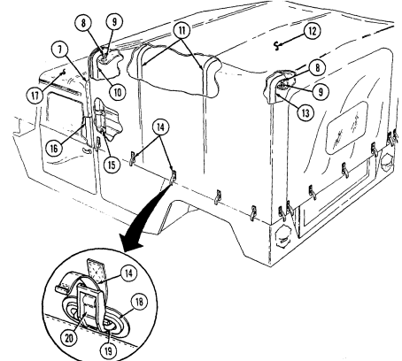

(13).

(2) Fasten eyelets (9) to turnbuttons (8) on "B" pillar (16), front bow (10), and rear bow (13).

(3) Fit troop area cover (12) evenly to ensure tight fit and secure by installing grommets (18) over footman loops (19). Attach straps (14) to footman loops (19) and pull straps (14) tight.

(4) Secure front flap (7) of troop area cover (12) to two-man crew area soft top (17).

#### 2-173

# 2-48. Removal And Installation Of Four-Man Crew Area Soft Top And Arctic Soft Top Enclosures

· For ease of installation, soft top components should be installed when temperatures are above 72°F (22°C). · To prevent seams from leaking, coat with adhesive as needed (refer to appendix D, item 1).

a. General. The four-man soft top and arctic soft top enclosures consist of four soft doors, rear curtain, cab roof cover, and bow assemblies. For removal and installation of doors, refer to para. 2-46. Para. 2-48 covers removal and installation of four-man cab roof cover, rails, bow assemblies, and rear curtain.

#### B. Removal Of Cab Roof Cover, Rails, And Bow Assemblies.

(1) Unfasten eyelets (2) from turnbuttons (3) on horizontal rails (12) and "A" pillar (13). Unfasten hook and loop attachments (5) securing cab roof cover (6) to bow assemblies (4) and ""B" pillar (11).

(2) Remove cab roof cover (6) from horizontal rails (12). (3) Unfasten eyelets (8) from turnbuttons (7) on "C" pillar (9). (4) Roll cab roof cover (6) over windshield and slide cab roof cover (6) from channel (1). (5) Remove eight screws (14) and two bow assemblies (4) from horizontal rails (12). (6) Remove six screws (15) and two horizontal rails (12) from "A" pillar (13), "B" pillar (11), and "C" pillar
(9).


2-174

# C. Installation Of Rails, Bow Assemblies, And Cab Roof Cover.

Align horizontal rail holes with holes in "A," "B," and "C" pillars.

(1) Install two horizontal rails (12) on "A" pillar (13), "B" pillar (11), and "C" pillar (9) and secure with six


screws (15).

(2) Loosen end bracket screws (16), and install two bow assemblies (4) on horizontal rails (12) with eight screws (14). Tighten bracket screws (16).

(3) Slide cab roof cover (6) into channel (1) on "A" pillar (13), roll cab roof cover (6) over cab, and fasten eyelets (2) to turnbuttons (3) on "A" pillar (13).

(4) Install cab roof cover (6) over rear curtain (10) at "C" pillar (9) and fasten eyelets (8) to turnbuttons
(7) on "C" pillar (9).

(5) Position cab roof cover (6) around horizontal rails (12) and fasten eyelets (2) to turnbuttons (3).

Attach cab roof cover (6) to bow assemblies (4) with hook and loop attachments (5).

#### 2-175 D. Removal Of Rear Curtain.

(1) Detach four curtain straps (11) from footman loops (13) on wheelhousings (15) and cargo floor (14)
by depressing locking tabs (12).

Perform step 2 if vehicle is equipped with four-man arctic cab.

(2) Peel curtain (2) back from fastener tape (3).

(3) Unfasten eyelets (10) from turnbuttons (16) on "C" pillar (1).

Perform step 4 for vehicles equipped with three-point seatbelts.

(4) Unfasten eyelets (7) from turnbuttons (8) on rear seatbelt bracket (9). (5) Remove curtain (4).

e. Installation of Rear Curtain.

(1) Install curtain (4) on ""C" pillar (1) by fastening eyelets (10) to turnbuttons (16).

NOTE
· Perform steps 2 and 3 when installing new curtain on vehicles with three-point seatbelts.

· Ensure P/N 12342475 is used for replacement of rear curtain on vehicles equipped with threepoint seatbelt.

(2) Cut away inside curtain panel (17) and remove curtain panel (17) from curtain (4). (3) Cut away outside curtain panel (6) and remove curtain panel (6) from curtain (4).

(4) Extend rear seatbelt bracket boot (5) and install over rear seatbelt bracket (9).

(5) Fasten eyelets (7) to turnbuttons (8) on rear seatbelt bracket (9).

Perform step 6 if vehicle is equipped with four-man arctic cab.

(6) Attach curtain (2) to fastener tape (3). (7) Attach four curtain straps (11) to footman loops (13) on wheelhousings (15) and cargo floor (14).

Tighten straps (11) equally, but do not overtighten.

#### 2-176


# 2-49. Removal And Installation Of Four-Man Cargo Area Soft Top Enclosure

· For ease of installation, soft top components should be installed when temperatures are above 72°F (22°C).

· To prevent seams from leaking, coat with adhesive as needed (refer to appendix D, item 1).

Remove any accumulation of rain, snow, and ice from the cargo cover as soon as possible. Failure to do so could result in damage to the cargo cover assembly. If the vehicle is to be parked for a long period of time, the cargo cover can be removed. The decision whether or not to remove the cover should be based on the length of time the vehicle is to be parked and the expected weather conditions.

#### A. Removal Of Cargo Enclosure.


(1) Unfasten hook and loop attachment (3) securing cargo cover (6) to cab roof (2) at "C" pillar (8). (2) Unfasten eyelets (5) from turnbuttons (4) on "C" pillar (8), front bow (1), and rear bow (7). (3) Detach straps (9) from footman loops (11) by depressing locking tabs (12) and loosening straps
(9). Remove grommets (10) from footman loops (11).

(4) Remove cargo cover (6).

#### B. Removal Of Bows. Note

If bows are broken or bent, reinforce 3/64 in. (1.2 mm) thick bow walls with steel rod NSN 9510-00-596-2063. Reinforce 3/32 in. (2.4 mm) bows with steel rod NSN 9510-00-596-2066.

(1) Depress locking tabs (14) and unhook straps (13) from footman loops (15 (2) Remove capscrews (19) securing longitudinal bow (20) to front bow (1) and rear bow (7). Remove longitudinal bow (20).

(3) Remove four snaprings (17) and pivot pins (16) securing front bow (1) an rear bow (7) to pivot brackets (18). Remove bows (1) and (7).


#### C. Installation Of Bows. Note

Four-man crew area soft top must be installed before installation of bows and cargo enclosure.

(1) Install bows (1) and (7) on pivot brackets (18) and secure with four pivot pins (16) and snaprings (17).

(2) Install longitudinal bow (20) on front bow (1) and rear bow (7) and secure with two capscrews (19).

(3) Install straps (13) on footman loops (15) and pull straps (13) tight.

d. Installation of Cargo Enclosure.

(1) Install cargo cover (6) over "C" pillar (8), front bow (1), and rear bow (7). (2) Fasten eyelets (5) to turnbuttons (4) on "C" pillar (8), front bow (1), and rear bow (7).

(3) Secure cargo (6) to cab roof (2) at "C" pillar (8) with hook and loop attachment (3).

(4) Install grommets (10) on footman loops (11) and attach straps (9) to footman loops (11). Tighten straps (9) equally, but do not overtighten.

#### 2-179

# 2-50. Removal And Installation Of S250 Shelter Carrier Rear Suspension Tiedown Kit

The M1037 and M1042 shelter carriers are specifically designed to be operated with the S250 shelter installed. It can be driven safely for short distances (to and from maintenance or from the rail head when being delivered) without the shelter installed. However this should not be done for long distances. Driving for long distances without the shelter installed will cause damage to equipment.

- Rear suspension tiedown kit is to be used only for shipment and should be removed promptly after shipment.

- The following applies to M1037, M1042, M1097, and M1097A1/A2 vehicles only.

#### A. Removal Of S250 Rear Suspension Tiedown Kit.

(1) Using wrench provided, turn out turnbuckle assembly (1) and unhook from suspension tiedown bracket (2) and suspension tiedown bar (7).

(2) Remove suspension tiedown bracket (2) from upper spring mount bracket (4).

(3) Remove suspension tiedown bar (7) from lower control arm (5).

b. Installation of S250 Rear Suspension Tiedown Kit.

Ensure suspension tiedown bracket is fully seated to upper spring mount bracket and nut. Suspension tiedown bracket could spring free under tension, causing damage to vehicle.

(1) Install suspension tiedown bracket (2) to upper spring mount bracket
(4) with cupped end seated against upper spring mount bracket nut (3).

(2) Install suspension tiedown bar (7) into lower control arm (5) and shock mount bracket (6).

Ensure turnbuckle assembly eye and hook have an equal amount of threads inside the turnbuckle.

(3) Grease threads on turnbuckle assembly (1) and hook turnbuckle assembly (1) to suspension tiedown bar (7) and suspension tiedown bracket (2).

(4) With wrench provided, tighten until turnbuckle assembly (1) is completely turned in.

#### 2-180 Change 3


 2-181

# Extension

#### 2-51. Removal And Installation Of Cargo Barrier A. Removal Of Cargo Barrier Extension.

Remove quick release pin (5) from post assembly (2) and remove cargo barrier extension (1) from cargo bulkhead (3).

b. Installation of Cargo Barrier Extension.

When installing cargo barrier extension, ensure side rack pins on post assemblies slide into holes of cargo bulkhead.

Install cargo barrier extension (1) into four mounting brackets (4) on

 cargo bulkhead (3) and secure with quick release pin (5).

0


## 2-51.1. Removal And Installation Of Cargo Barrier And Net

Removal and installation instructions for the cargo barrier and stowage compartment net are applicable only for M1025, M1025A1, M1026, and M1026A1 vehicles equipped with the cargo barrier and net kit.

#### A. **Removal Of Cargo Barrier And Net.**

( 1 ) Remove net (2) by unhooking two J-hooks (5) from D-rings (4) on cargo


floor (3), two J-hooks (1) from D-rings (7) on left and right wheelhouses (6), and three J-hooks (10) from D-rings (11) at D-beam (12) on cargo floor (3).

(2) Slide cargo barrier (8) out of left and right channels (9).

2-182.2 Change 1

#### B. **Installation Of Cargo Barrier And Net.**

(1) Position cargo barrier (8) into left and right channels (9) and slide cargo barrier (8) down to cargo floor (3).

If slack exists in stowage compartment net, attach two J-hooks to each D-ring at D-beam on cargo floor to ensure J-hooks are not damaged when closing tailgate.

Prior to installing net, ensure four J-hooks are toward front of vehicle and six J-hooks are toward rear of vehicle.

( 2 ) Position net (2) on cargo floor (3) and install two J-hooks (5) to D-rings (4)


on cargo floor (3), two J-hooks (1) to D-rings (7) on left and right wheelhouse (6), and three J-hooks (10) to D-rings (11) on D-beam (12) on cargo floor (3).

(3) Pull adjustable strap (13) to remove slack from net (2).

Change 1 2-183

# Section Vi. Tow/Armament Carrier Operation

## 2-52. General

a. This section provides operating instructions for components found on M966, M966A1, M1036, M1045, M1045A1, M1045A2, M1046, M1046A1, and M1121 TOW carriers and on M1025, M1025A1, M1025A2, M1026, M1026A1, M1043, M1043A1, M1043A2, M1044, and M1044A1 armament carriers.

b. Refer to para. 2-2a for stowage location of fire extinguisher on TOW and armament carriers. Refer to para. 2-27 for operation of fire extinguisher.

## 2-53. Cargo Shell Door Operation

Never open one end of the cargo shell door without first ensuring that the opposite end is securely closed. Not doing so may cause both ends to open at the same time, causing damage to equipment, mission abort, or injury to personnel.

a. **General.** The cargo shell door is a double-actuating door that pivots at either end. When door forward latch is released from inside vehicle, door opens rearward and functions as a TOW loader's door to facilitate mounting of TOW launcher, missile loading, and missile reloading. When door rear latch is released, door opens forward and permits access to cargo area from rear of vehicle for stowing the TOW launcher and equipment or ground mounting TOW launcher.

For ease of operation, a grab-hold loop can be attached to the cargo door strap at the discretion of unit commander. Notify unit maintenance for installation of grab-hold loop.

#### B. **Raising And Lowering Rear End Of Cargo Shell Door.**

(1) Turn locking device (6) to the lock position to ensure that forward end of cargo shell door (2) is locked. Pull door handle (1) upward and release. Push door (2) open, until door (2) will open automatically to FULL OPEN position.

(2) Pull on strap (3) to lower door (2) then slam shut. Ensure door (2) is locked by observing alignment of door surface with cargo shell surface side and bottom edges (4).

c. Raising and Lowering Forward End of Cargo Shell Door.

(1) Turn locking device (6) to unlock position and pull door forward latch (5)
downward and release. Push door (2) open with grab handle (7) until door (2) will open automatically to full open position.

(2) Pull down on grab handle (7) to lower door (2), then pull shut. Ensure door (2) is locked by observing position of striker pins (8) and latch (9) engagement while pushing and pulling on grab handle (7).

(3) Turn locking device (6) to lock forward end of cargo shell door (2).


2-185

Should both ends of the cargo shell door open at the same time, a safety catch built into the rear latch mechanism will normally engage the rear strikers and prevent the door from slinging forward. Should this occur, procedures to reinstall the door are provided in steps 1 through 8. If door has separated from all four strikers, notify unit maintenance.

(1) Inspect the rear latch mechanism and ensure the rear strikers (2) have engaged the safety catch (3).


(2) Turn locking device (9), pull the cargo shell door forward latch (6) from inside the vehicle, and completely raise door (5).

(3) Release rear door latch locks (1), if locked. (4) Grasp raised door (5) from rear of vehicle with both hands and pull right side of door (5) straight down. A distinctive latching sound should be heard.

(5) Inspect right rear latch mechanism again to ensure striker (2) engagement with latch (4).

 (6) Perform steps 3, 4, and 5 for left side of door.

(7) Enter vehicle, pull forward end of door (5) shut, and turn locking device (9). Inspect forward door


latches (7) to ensure proper striker (8) engagement.

(8) Exit vehicle and raise door (5) from the rear. Operation of door (5) should be smooth. If operation is not smooth, or door components appear damaged, notify unit maintenance.

2-187

#### 2-54. Tow Weapon Station Operation A. Before Operation.

(1) Release three weapon station cover securing latches (2) and push weapon station cover (7) open using weapon station cover handle (8).

(2) Secure weapon station cover (7) in the open position with two retaining latches (5) and catches (6). (3) Raise weapon station brake handle (4) to unlock weapon station (9).

(4) Use weapon station brake handle (4) and turret positioning handle (1) to rotate weapon station (9) to the desired azimuth.

(5) Lock weapon station (9) with brake handle (4).

Do not sit, stand, or place heavy objects on weapon station, tray, or cover. Components may bend, and damage to equipment will occur.

(6) Use gunner's sling (3) as seat rest or restraint if gunner is positioned in the weapon station during travel or weapon operation.

(7) Detach retaining pin (11) on weapon station pedestal mount cover (12) from hole in turret positioning handle (1) and open pedestal mount cover (12).

(8) Secure pedestal mount cover (12) to pedestal mount cover retainer (10).

#### B. After Operation.

(1) Detach pedestal mount cover (12) from pedestal mount cover retainer (10).

 (2) Close pedestal mount cover (12) and secure retaining pin (11) to turret positioning handle (1). (3) Remove two retaining latches (5) from catches (6). (4) Close weapon station cover (7) and secure with three weapon station securing latches (2).

#### 2-55. **Armament Weapon Station Operation** A. **Before Operation.**

(1) Release three weapon station cover securing latches (2) and push weapon station cover (7) open using weapon station cover handle (8).

(2) Secure weapon station cover (7) in the open position with two retaining latches (5) and catches (6). (3) Raise weapon station brake handle (4) to unlock weapon station (9). (4) Use weapon station brake handle (4) and turret positioning handle (1) to rotate weapon station (9) to the desired azimuth.

(5) Lock weapon station (9) with brake handle (4).

Do not sit, stand, or place heavy objects on weapon station, tray, or cover. Components may bend and damage to equipment will occur.

(6) Use gunner's sling (3) as seat rest or restraint if gunner is positioned in the weapon station during travel or weapon operation.

#### B. **After Operation.**

(1) Remove two retaining latches (5) from catches (6). (2) Close weapon station cover (7) and secure with three weapon station securing latches (2).

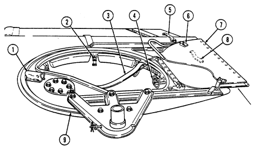

#### 2-189 2-56. Gunner'S Platform Operation A. **Before Operation.**

(1) Depress two lock buttons (6) on locking pins (5) and remove locking pins (5) from locking lugs (9) and holes (10) securing platform (1) in stowed position (14).

(2) Grasp hand hold (2) on platform (1) to lift platform (1) to either half-height position (13) or full-height position (12).

(a) If half-height position (13) is required, lift platform (1) all the way up, and turn two latches (7) so that ledges of latches (7) are facing up and parallel to bottom edge of platform (1). Lower platform (1) and allow to rest on ledges of latch (7) at half-height position (13). Insert locking pins (5) through forward locking holes (4) in platform (1) and holes (11) in platform risers (8).

(b) If full-height position (12) is required, lift platform (1) to the full-height position (12), and ensure that rear locking holes (3) in left and right sides of platform (1) are aligned with locking holes (11) in platform risers (8). Insert locking pins (5) through rear locking holes (3) in platform (1) and holes (11) in platform risers (8).

#### B. **After Operation.**

(1) Remove locking pins (5) securing platform (1) in either half-height position (13) or full-height position


(12) by pressing lock buttons (6) and removing locking pins (5). Lift up on platform (1) and turn two latches (7) so that ledges of latch (7) are facing downward, parallel to floor.

(2) Lower platform to stowed position (14), and align locking holes (10) with locking lugs (9). Insert locking pins (5) through locking holes (10) and lugs (9).

# Section Vii. Ambulance Operation

#### 2-57. General

a. This section provides operating instructions for components found on M996, M996A1, M997, M997A1, M997A2, M1035, M1035A1, and M1035A2 ambulances.

b. Refer to para. 2-2a for stowage location of fire extinguisher on ambulance vehicles. Refer to para. 227 for operation of fire extinguisher.

To prevent possible injury, insulation may be added to the exposed refrigerant lines of the air conditioner behind the companion seat, at the discretion of unit commander. Notify unit maintenance for installation of insulation.

#### 2-58. Soft Top Ambulance (M1035, M1035A1, And M1035A2) Liter Rack Operation Warning

When transporting more than one litter patient, first litter patient must be loaded on upper litter rack. Injury may result if litter patient is loaded in lower litter rack first.

#### A. **Unloading Litters From Litter Rack.**

(1) Release five straps (16) securing enclosure rear curtain (15) to tailgate (17).

(2) Roll up enclosure rear curtain (15) and secure with two straps (18).

(3) Lower tailgate (17) (para. 2-21).


(4) Release four straps (3) securing litter (4) to lower litter rack (5).

(5) Pull out and remove litter (4) from lower litter rack (5).

(6) Release four straps (3) securing litter (10) to upper litter rack (8). (7) Upper litter tray (7) must be pushed forward and raised slightly to allow stops (6) to clear notches (9) in upper litter rack (8).

(8) Pull upper litter tray (7) out from upper litter rack (8). Lower and rest upper litter tray (7) in lower litter rack (5).

(9) Remove litter (10) from upper litter tray (7).

#### B. **Loading Litters On Litter Racks** Note

Ensure litter support legs are positioned behind stops on upper litter tray.

(1) Place litter (10) on upper litter tray (7). (2) Slide litter (10) up until rear support legs (11) are positioned behind stops (12) on upper litter tray (7). (3) Pull litter tray (7) up and push forward to lock litter tray (7) to upper litter rack (8). (4) Secure litter (10) to upper litter rack (8) with four straps (3). (5) Place litter (4) on lower litter rack (5) and slide forward. (6) Secure litter (4) to lower litter rack (5) with four straps (3). (7) Raise tailgate (14) (para. 2-21).

 (8) Release two straps (2) and unroll enclosure rear curtain (1). (9) Secure enclosure rear curtain (1) to tailgate (14) with five straps (13).


NOTE

For ease of installation, soft top components should be installed when temperatures are above 72°F (22°C).

a. **General**. The 2-litter ambulance soft top enclosure consists of four soft doors, roof cover, and bow assemblies. For removal of doors, refer to para. 2-46. Para. 2-59 covers removal and installation of roof cover, rails, bow assemblies, and rear bow.

b. **Removal of Roof Cover, Rails, and Bow Assemblies.**
(1) Unfasten eyelets (3) from turnbuttons (2) on two horizontal rails (6) and "A" pillar (1). (2) Remove roof cover (7) from horizontal rails (6). (3) Unfasten eyelets (3) from turnbuttons (2) on "C" pillar (5) and rear bow (8). (4) Depress locking tabs (11) and unhook straps (14) from footman loops (13) on wheelhouse (10) and tailgate (9). Remove grommets (12) from foot-man loops (13).

(5) Roll roof cover (7) over rear bow (8) and lower rear bow (8). (6) Roll roof cover (7) over "C" pillar (5) and "A" pillar (1). (7) Slide roof cover (71 from channel (4).


#### 2-194

(8) Remove eight screws (17) securing two bow assemblies (15) to horizontal rails (6). Remove bow assemblies (15).

(9) Remove six screws (17) securing two horizontal rails (6) to "A" pillar (1), "B" pillar (16) and "C" pillar
(5). Remove horizontal rails (6).

c. **Removal of Rear Bow.**
rear bow (8).

(1) Depress locking tabs (11) and unhook straps (14) from footman loops (13). (2) Remove two snaprings (20) and pivot pins (18) securing rear bow (8) to pivot brackets (19). Remove d. **Installation of Rear Bow.**
(1) Install rear bow (8) to two pivot brackets (19) with two pivot pins (18) and snaprings (20). (2) Install straps (14) to footman loop (13).

e. **Installation of Rails, Bow Assemblies, and Roof Cover.**
(1) Install two horizontal rails (6) to "A" pillar (1), "B" pillar (16), and "C" pillar (5) with six screws (17).

 (2) Loosen end bracket screws (21) and install two bow assemblies (15) on horizontal rails (6) with eight screws (17). Tighten bracket screws (21).

#### 2-195

(3) Slide roof cover (4) into channel (3) and roll roof cover (4) over bow assemblies (7) and rear bow (9).

(4) Raise rear bow (9) and roll roof cover (4) over rear bow (9).

(5) Fasten eyelets (5) to turnbuttons (2) on rear bow (9). (6) Install roof cover (4) around horizontal rails (6) and "C" pillar (8) and fasten eyelets (5) to turnbuttons
(2).

(7) Fasten eyelets (5) to turnbuttons (2) on "A" pillar (1).

 (8) Install grommets (10) over footman loops (11), attach straps (12) to footman loops (11), and pull straps (12) tight.

#### 2-196 2-60. Ambulance Rear Step Assembly Operation A. **Lowering Rear Steps.**

(1) Open and secure rear doors. (2) Ensure that the rear step safety strap (13) is connected to the rear step assembly (20). (3) Pull rear step latch cable (16) to release rear step latches (15).

Personnel inside vehicle should not lean on rear step assembly while unlatching and disconnecting rear safety strap. Injury to personnel may result from rapidly falling steps.

(4) While grasping bottom step (17) with one hand, disconnect safety strap (13) from hole (18) on rear step assembly (20).

(5) Lower rear step assembly (20) by releasing bottom step (17). (6) Turn knob (19) clockwise to secure bottom step (17).

#### B. **Raising Rear Steps.**

(1) Turn knob (19) counterclockwise and raise bottom step (17). (2) Lift rear step assembly (20) until rear step latches (15) engage with rear step strikers (14). (3) Connect step safety strap (13) to hole (18) on rear step assembly (20).

 (4) Close and secure rear doors.

#### 2-61. Ambulance Interior Electrical Controls

a. **General**. The vehicle electrical system is used to power the NBC air filtration system, interior lights, heater, air-conditioner, and ventilation system. It is recommended to have engine running while operating the heater, vent, and NBC air filtration system so the alternator maintains battery charge. The engine must be running to operate the air-conditioner compressor.

- Electrical control panels on M996, M996A1, M997, M997A1, and M997A2 ambulances are basically the same (M997 is shown).

- To facilitate blackout operations, M996, M996A1, M997, M997A1, and M997A2 ambulance interior lighting systems have been designed so that all white light illumination in the patient compartment will be extinguished when bulkhead doors, rear doors, or rear steps are opened unless the vehicle main light switch is in "SERVICE DRIVE" position.

#### B. **White Light Operation.**

(1) Place interior light switch (1) on electrical control panel (3) in "NORMAL" position. The blackout lights will illuminate.

(2) Close bulkhead doors, rear doors, and steps. Ceiling white lights will illuminate and blackout lights will extinguish.

(3) To activate spotlights, engage switch on back of spotlight assembly.


(4) If bulkhead doors, rear doors, or rear steps are opened, all white light illumination will be extinguished and blackout lights will be illuminated.

(5) Turn vehicle main light switch to "SERVICE DRIVE" to operate interior white lights when bulkhead doors, rear doors, or rear steps are open and blackout operation is not required.

c. **Blackout Light Operation**. Place interior light switch (1) in "B/O" position. Blackout lights will illuminate.

Blackout position on the electrical control panel overrides the automatic blackout switches in the event of automatic blackout switch failure in blackout conditions.

d. **Interior Light Operation**. Place interior light switch (1) in "OFF" position to extinguish all interior lights.

e. **Fuse Replacement**. To replace a defective fuse (2) in the electrical control panel (3), pull fuse (2)


straight out of panel (3). Inspect fuse (2) for an open fuse element (5). Replace with known good fuse (4). All fuses in the control box are 20 amp.


- Prior to starting ambulance heater, ensure that vehicle fuel gauge registers above 1/4 full. If heater is operated with fuel level below 1/4, the heater may shut off and not restart. This feature is to ensure that vehicle remains operational. If heater will not restart, notify unit maintenance to refill tank and bleed heater fuel system.

- Normal start-up time for M996, M996A1, M997, M997A1, and M997A2 ambulance heaters is approximately 2-1/2 minutes. Time may vary depending on amount of use.

#### F. **M996 And M996A1 Heater Operation.** Warning

Do not operate heater when ventilation system is on. Damage to heater, or injury to personnel will result.

(1) To operate heater, ensure fuel cutoff valve (14) is open and place vent off-on-max lever (5) to "OFF."
Hold heater run-start switch (2) to "START" until heater light (1) illuminates to show that heater burner is operating.

(2) When heater light (1) illuminates, position heater run-start switch (2) to "RUN." (3) Outlet air temperature can be adjusted by positioning fuel selection switch (3) to either "HIGH" or
"LOW."
(4) To turn heater off, position heater run-start switch (2) to "OFF." It will take several minutes for heater to purge itself of fuel.

#### G. **M996 And M996A1 Vent Operation.**

(1) To operate ventilation system, position on-off-max lever (5) to "ON." The proportion of fresh air entering patient compartment can be adjusted by the following:
(a) Position fan control switch (4) to "HIGH", "MED", or "LOW." (b) Adjust off-on-max lever (5) to the right to increase proportion of fresh air entering the system.

 (c) Open rear door vent to enable it to function as an exhaust vent.

(2) To turn ventilation system off, place on-off-max lever (5) to "OFF."

#### H. **M997, M997A1, And M997A2 Heater Operation.**

(1) To operate the heater, ensure fuel cutoff valve (14) is open and place A/C vent-heat lever (6) in
"HEAT" position.

(2) Adjust the inside-outside air lever (7) to "HEAT MAX" or "HEAT NORMAL."
(3) Position fuel selection switch (9) to "LOW." (4) Hold heater run-start switch (10) to "START" position until heater light (11) illuminates to show that heater burner is operating. When heater light (11) illuminates, position the heater run-start switch (10) to "RUN."
(5) Outlet air temperature can be adjusted by positioning the fuel selection switch (9) to either "HI" or
"LOW," the fan switch (13) to "LO," "MED," or "HI," and the inside-outside air lever (7) to either "HEAT MAX"
or "HEAT NORMAL."
(6) To turn the heater off, position the heater run-start switch (10) to "OFF." It will take several minutes for the heater to purge itself of fuel. After heater light (11) goes off, move inside-outside air lever (7) to "UNIT- OFF."

#### I. **M997, M997A1, And M997A2 Air-Conditioner Operation.**

(1) Start engine (para. 2-10). (2) To operate the air-conditioner, position the A/C vent-heat lever (6) to "A/C." (3) Adjust the inside-outside air lever (7) to "A/C MAX" or "A/C NORMAL." (4) Set A/C off-on switch (12) to "ON." (5) Adjust A/C cold control (8) clockwise to "COLD."
(6) Outlet air temperature can be adjusted with A/C cold control (8) by rotating the control (8) between
"OFF" and "COLD," the fan switch (13) to "LO", "MED," or "HI," and the inside-outside air lever (7) to "A/C MAX" or "A/C NORMAL."
(7) To turn air-conditioner off, position the A/C switch (12) to "OFF" and move inside-outside air lever (7)
to UNIT-OFF".

#### J. **M997, M997A1, And M997A2 Vent Operation.**

(1) To operate ventilation system without heating or cooling incoming air, place A/C vent-heat lever (6)
and inside-outside air lever (7) in "VENT" position.

(2) Activate fan switch (13) to "LO," "MED," or "HI."

 (3) To turn ventilation system off, place inside-outside air lever (7) in
"UNIT-OFF" position.

#### A. **Assembling Litter Rail Extension.**

(1) Turn latch (1) counterclockwise and open stowage compartment door (2). (2) Loosen and disconnect securing strap (7) and remove folded litter rail extension (6) from stowage compartment (5).

Perform step 3 for M997, M997A1, and M997A2 vehicles. M996 and M996A1 litters are stowed behind right ambulatory patient seat.

(3) Lift tray (3) slightly and push in tray supports (4) to lower tray (3) for access to stowed litters. (4) Pull left and right rails (8) apart and let legs (13) drop down. Ensure feet (14) are flat on ground. (5) Lock support braces (15), and adjust straps (16) as necessary.

#### B. **Unloading Litters From Lower Litter Rack.** Warning

- When unloading more than two litter patients, lower litter rack patients must be unloaded first. Injury may result if upper litter rack patients are unloaded first.

- Make sure straps and equipment do not inhibit unloading operations.


Unload litters carefully to prevent patient injury.

(1) Release front and rear litter handle straps (10) securing litter (9) to lower litter rack (11). (2) Secure both rails (8) of litter rail extension (6) into slots (12) on lower litter rack (11). (3) Slide litter (9) from lower litter rack (11) onto litter rail extension (6). Lift up and remove litter (9) from litter rail extension (6).

#### C. **Loading Litters On Lower Litter Rack.** Warning

When loading more than two litter patients, upper litter rack patients must be loaded first. Injury may result if litter patients are loaded in lower litter rack first.

(1) Place litter (9) on litter rail extension (6).

Ensure straps and equipment do not inhibit litter loading operations. Load litters carefully to prevent patient injury.

(2) Slide litter (9) onto lower litter rack (11).


(3) Secure litter (9) to lower litter rack (11) with front and rear litter handle straps (10).

#### 2-203 D. **Unloading Litters From Upper Litter Racks.** Warning

When unloading more than two litter patients, lower litter rack patients must be unloaded first. Injury may result if upper litter rack patients are unloaded first.

(1) Release front litter handle straps (5) from litter handles (6). (2) Unhook tension strap (9) from footman loop (7) on lower litter rack (8).

(3) Pull out upper litter rack handle (11) and support weight of upper litter rack (4).

Rear end of upper litter must be supported before releasing suspension strap

 hook. Injury to personnel may result if rear end of upper litter is not supported.

(4) Unhook rear suspension strap hook (3) from loop (10) on upper litter rack (4). Clip suspension strap hook (3) to eye (2).

(5) Release litter support latch stop (13), push latch (12) in, and lower upper litter rack (4) onto lower litter rack (8).

#### 2-204

(6) Slide litter rack handle (11) into upper litter rack (4). (7) Secure rails of litter rail extension (14) into slots in upper litter rack (4). (8) Release rear litter handle straps (5) from litter handles (6). (9) Slide litter (1) down rails (14) until litter (1) is clear of upper litter rack (4). (10) Lift and remove litter (1) from litter rail extension (14).

(11) Remove litter rail extension (14) from upper litter rack (4).

#### E. **Loading Litters On Upper Litter Racks.** Warning

When loading more than two litter patients, upper litter rack patients must be loaded first. Injury may result if litter patients are loaded in lower litter rack first.

(1) Secure both rails of litter rail extension (14) into slots in upper litter rack (4). (2) Place litter (1) on litter rail extension (14). (3) Slide litter (1) up rails (14) until litter (1) is clear of litter rail extension (14). (4) Secure rear litter handles (6) to upper litter rack (4) with rear litter handle straps (5).

(5) Remove litter rail extension (14) from upper litter rack (4).

(6) Unhook suspension strap hook (3) from eye (2).

 (7) Pull out upper litter rack handle (11). (8) Raise upper litter rack (4), push into litter support latch (12), and secure with latch stop (13). (9) Attach suspension strap hook (3) to loop (10) on upper litter rack (4). (10) Secure front litter handles (6) to litter rack (4) with front litter handle straps (5). (11) Hook tension strap (9) to footman loop (7) on lower litter rack (8). (12) Slide litter rack handle (11) into upper litter rack (4).

#### 2-205

# F. Folding Upper Litter Rack To The Backrest Position.

(1)   Unhook litter rack tension strap (10) from lower litter rack footman loop (8).

(2)  Unhook two upper litter rack suspension straps (4) from loops (2) on upper litter rack (1) and hook strap ends (5) to eyes (3).


(3) Release upper litter rack latch (6) and disengage rack striker (7) from latch (6).

(4) Lower upper litter rack (1) onto the lower litter rack (9) forming a backrest.

(5) To convert backrest to upper litter rack (1), raise upper litter rack (1) and engage rack striker (7) into upper litter rack latch (6). Ensure striker (7) is locked in latch (6).

(6) Unhook two upper litter rack suspension strap hooks (5) from eyes (3) and hook to loops (2) on upper litter rack (1).

(7) Hook upper litter rack tension strap (10) to footman loop (8) on lower litter rack (9).

 (8) Adjust straps (10) and (4) for proper tension.

#### G. **Fold And Stow Litter Rail Extension.**

(1) Unlock support braces (6).

(2) Fold left and right rails (2) together.

(3) Fold left and right litter rail legs (4) and feet (5) against rail (2). (4) Lift tray (7), push tray supports (8) in, and lower tray (7).

Perform step 5 for M997, M997A1, and M997A2 vehicles only. M996 and M996A1 litters are stowed behind right ambulatory patient seat.

(5) Slide litters into stowage compartment (9) on top of lift tray (7). Pull out supports (8) to place lift tray (7) in raised position. (6) Place folded litter rail extension (1) into stowage compartment (9) and secure with strap (10).

 (7) Close door (3) and turn latch (11) clockwise to secure door (3).


#### H. **Opening Patient Seat To Accommodate Ambulatory Patients.**

(1) Ensure litters (1) are in stowed position.

(2) Pull out and up on seat latch handle (5) and remove latch (7) from catch (6).

(3) Lift seatback (4) to open position and fold seatback support (2) into


recesses between seat cushions (9).

(4) Ensure that seat braces (8) are fully extended and locked in position.

#### I. Closing Patient Seat To Accommodate Litter Patients.

(1) Press lock buttons (12) on seat braces (8) and fold braces (8) toward seatback (4).

(2) Fold seatback support (2) outward and fold seatback (4) into closed position. Ensure that guide pins (11) on seatback support (2) engage holes (10) in seat base (3).

(3) Install seatback (4) to seat base (3) with seat latch (7) and catch (6). If


necessary to ensure security of seatback (4), adjust seat latch (7) to proper length by turning clockwise or counterclockwise.

#### 2-211

· NBC filters do not protect against carbon monoxide poisoning. · NBC filters do not decontaminate or neutralize contamination, they only collect and contain it.

· NBC contaminated filters must be handled using adequate precaution (FM 3-5) and must be disposed of by trained personnel.

· After Nuclear, Biological, or Chemical (NBC) exposure of this vehicle, all air filters shall be handled with extreme caution. Unprotected personnel may experience injury or death if residual toxic agents or radioactive material are present. Servicing personnel will wear protective overgarments, mask, hood, and chemical protective gloves and boots. All contaminated air filters will be placed into double-lined plastic bags and moved immediately to a temporary segregation area away from the work site. If contaminated by radioactive dust, the Company NBC team will measure the radiation before removal. The NBC team will determine the extent of safety procedures required. The temporary segregation area will be marked with the appropriate NBC signs. Final disposal of contaminated air filters will be in accordance with local SOP.

· Failure to observe above warnings may result in injury or death.

#### A. General

(1) For operation in an NBC environment, M996, M996A1, M997, M997A1, and M997A2 ambulances are equipped with a collective NBC protection system known as a Gas-Particulate Filter Unit (GPFU). The GPFU forces filtered, temperature-controlled air to the facepiece of the M25 series protective mask or the M13 series patient protective mask, increasing NBC protection, easing breathing effort, and reducing stress and heat fatigue during extended periods of NBC operation.

(2) The GPFU system mounted in M996 and M996A1, M997, M997A1, and M997A2 ambulances include the following components:
· M1A1-19 precleaner (blower)/particulate filter unit · M18 gas filters (two per vehicle) · NBC control panel and wiring harness
· Five or seven individual NBC heaters
· PVC or flex tubing to connect filter precleaner/particulate filter and heaters.

#### B. Component Location And Identification.

(1) The precleaner/particulate filter unit (6) and the two gas filters (5) are located in the NBC stowage compartment above the driver's position. In the M997, M997A1, and M997A2 ambulances, entry to this compartment is gained by unlatching the two paddle locks (1) and securing the NBC access door (2) to the ceiling (3) with the door catch (4).


 2-213

(2) In the M996 and M996A1 ambulances, the precleaner/particulate filter


unit (4) and two gas filters (5) are mounted in a similar configuration to the M997, M997A1, and M997A2. Entry into the NBC compartment is gained through the NBC access door (1) located directly over the driver's head by removing the safety strap (3) and loosening two captive wing head screws (2) and carefully lowering the NBC access door (1). M18 gas filters in both vehicles are replaced in a similar manner. Contaminated M18 gas filters and the precleaner/particulate filter units should only be replaced by specially-trained NBC personnel.

M996 AND M996A1

2-214
(3) The NBC heaters (6) supply heated air to protective mask facepieces


connected to the GPFU system. Five heaters are installed in the M996 and M996A1 ambulances; three in the patient compartment and two in the cab. Seven heaters are installed in the M997, M997A1, and M997A2 ambulances; five in the patient compartment and two in the cab. When the heater (6) is not in use, the protective cap (9) should be installed in the heater (6) outlet. The cap (9) is a oneway check valve allowing air to flow in only one direction, outward from the heater (6). This reduces the potential risk of NBC contamination to the vehicle's NBC system. The heater (6) is activated by turning the temperature control knob (8) clockwise and adjusting to the desired heat level. The indicator light (7)
will illuminate when the heater (6) is in operation
(4) The NBC control box (11) is mounted in the cab above and behind the passenger position. It houses the control switch (13) for the system and a fuse panel (12). A diagram (15) on the control box (11) shows heater location and identifies the fuse responsible for each heater circuit (16). Spare fuses are also present.

(5) To replace a NBC fuse (10), simply pull it straight out of the fuse


panel (12). Check fuse (10) for an open fuse element or a melted fuse link (14). If the fuse (10) is damaged, replace with a new fuse (10). All fuses in the NBC control box are 20 amp.

#### C. Nbc System Operation.

(1) Activate the collective NBC protection system by positioning the NBC
control switch (2) on the NBC control box (1) to the "ON" position. The M1A1-19 precleaner/particulate unit blower should engage.

(2) M25 series protective mask (10): remove protective cap (3) from heater outlet (4) and connect either the six or nine foot air hose (8) to canister coupling (9). Connect hose coupling (7) to the heater outlet (4).

(3) M13 series patient protective mask (11): mask the patient with the M13 series mask (11). Connect either the six or nine foot air hose (8) to adapter (13) and connect adapter (13) to protective mask facepiece (12). Remove protective cap (14) from the heater outlet (15) and connect hose coupling (7) to heater outlet (15).

(4) Turn heater control (6) to "WARMER" and adjust to desired heat level.

Indicator light (5) should illuminate when heater is on.

(5) To shut down the NBC system, use the following procedure:
(a) Unmask crew and patients when all clear is sounded.

 (b) Remove mask air lines from heater outlets. (c) Install protective caps on heater outlets. (d) Position switch on NBC control box to "OFF" position. (e) Clean/decontaminate and stow NBC gear.

2-216


 2-217

# Chapter 3 Maintenance Instructions Section I. Lubrication

#### 3-1. Lubrication Instructions

Lubrication Instructions, Appendix G, designate cleaning and lubricating procedures for M998 series vehicles.

#### 3-2. General Lubrication Instructions

a. Service Intervals. Service intervals on the lubrication instructions are for normal operation in moderate temperatures, humidity, and atmospheric conditions.

b. Application Points . Wipe clean lubricating points and surrounding surfaces before and after applying lubricant.

c. Reports and Records. Report unsatisfactory performance of lubricant or preserving materials on Quality Deficiency Report, SF 368, as stated in paragraph 1-4.

#### 3-3. General Lubricating Instructions Under Unusual Conditions

a. Service Intervals. Increase frequency of lubricating service when operating under abnormal conditions such as high or low temperatures, prolonged high-speed driving, or extended cross-country operations. Such operations can destroy lubricant's protective qualities. More frequent lubricating service intervals are necessary to maintain vehicle readiness when operating under abnormal conditions. During inactive periods, with adequate preservation, service intervals can be extended.

b. Changes in Lubricant Grades. Lubricant grades change with weather conditions. Refer to Appendix G for lubricant grade changes.

c. Maintaining Lubricant Levels . Lubricant levels must be checked as specified in Appendix G. Steps must be taken to replenish and maintain lubricant levels.

#### 3-4. Lubrication For Continued Operation Below 0°F (-18°C)

Refer to FM 9-207, Operation and Maintenance of Ordnance Materiel in Cold Weather (0°F to -65°F) (-18°C to -54°C), or Appendix G.

#### 3-1

# Section Ii. Troubleshooting

#### 3-5. General

Troubleshooting, table 3-1, contains instructions that will help the operator identify and correct simple vehicle malfunctions. The table also helps the operator identify major mechanical difficulties that must be referred to unit maintenance. The listing of possible malfunctions come under major vehicle headings. They are:
· Engine
· Heating system
· Transmission · Transfer case · Brakes
· Wheels and tires
· Steering · Winch · Special purpose bodies

#### 3-6. Troubleshooting Procedures

a. Table 3-1 lists the common malfunctions which you may find during the operation or maintenance of M998 series of vehicles or its components. You should perform the tests/inspections and corrective actions in the order listed.

b. This manual cannot list all malfunctions that may occur, nor all tests or inspections and corrective actions. If a malfunction is not listed or is not corrected by listed actions, notify your supervisor.

Entering water too fast will cause water to splash up over hood and into air intake. The engine may stop abruptly and will not crank. Do not continue starting efforts; damage to engine will result.

· Hydrostatic lock is caused by the entry of substantial amounts of water into the engine through the air intake system and subsequent contamination of the fuel system. Hydrostatic lock most frequently occurs during or just after fording. Water is forced into the air intake system, is drawn into the engine, and effectively "locks-up" the engine.

· Notify unit maintenance for further engine tests if you suspect hydrostatic lock.

#### 3-2 Table 3-1. Troubleshooting

MALFUNCTION
TEST OR INSPECTION
CORRECTIVE ACTION

## Engine

#### 1. Engine Fails To Crank

Step 1. Check to see if transmission shift lever is in "N" (neutral) or "P" (park)
for M1123 and A2 vehicles.

If not, place lever in "N" (neutral) or "P" (park). 

Step 2. Check battery fluid level and check battery connections for looseness, damage, or corrosion.

If any of these conditions exist, notify unit maintenance.

Step 3. Attempt to slave-start vehicle (para. 2-23). Step 4. Other causes.

Notify unit maintenance.

#### 2. Engine Cranks Slowly

Step 1. Check battery fluid level and check battery cable connections for looseness, damage, or corrosion.

If any of these conditions exist, notify unit maintenance.

Step 2. Attempt to slave-start vehicle (para. 2-23). Step 3. Other causes.

Notify unit maintenance. 

#### 3. Engine Cranks But Does Not Start

Step 1. Check to see if fuel gauge indicates "E" (empty).

Fill fuel tank, and start engine.

Step 2. Purge fuel system of air (para. 3-10). Step 3. Check to see if WAIT-TO-START lamp assembly fails to light or does not go out.

Notify unit maintenance if wait-to-start lamp assembly fails to light or does not go out.

Step 4. Other causes.

Notify unit maintenance.

#### 4. Vehicle Not Charging According To Voltmeter

Step 1. Check battery cable connections for looseness, damage, or corrosion.

Notify unit maintenance of any damage to battery cables.

Step 2. Check for broken or missing alternator belts.

Notify unit maintenance if alternator belts are broken or missing.

Step 3. Other causes.

Notify unit maintenance.

MALFUNCTION
TEST OR INSPECTION
CORRECTIVE ACTION
5. EXCESSIVE EXHAUST SMOKE AFTER ENGINE REACHES NORMAL OPERATING
TEMPERATURE 190°-230°F (88°-110°C)
Step 1. Check oil level for overfilling (Appendix G).

Notify unit maintenance if fluid level is high.

Step 2. Check for restricted air cleaner.

If emergency situation exists, clean air cleaner element (para. 3-15). If emergency situation does not exist, notify unit maintenance.

Step 3. Other causes.

Notify unit maintenance.

6. ENGINE STARTS BUT MISFIRES, RUNS ROUGH, OR LACKS POWER
Step 1. Check for water in fuel filter by draining.

Drain fuel filter (para. 3-10).

Step 2. Check for restricted air cleaner.

If emergency situation exists, clean air cleaner element (para. 3-15). If emergency situation does not exist, notify unit maintenance.

Step 3. Other causes.

Notify unit maintenance.

7. ENGINE OVERHEATS ACCORDING TO ENGINE COOLANT TEMPERATURE GAUGE
Step 1. Check to see if fan is running.

If fan is not running, perform emergency fan clutch override procedure (para. 3-23).

Step 2. Allow engine to cool and check for low coolant level.

Add coolant as necessary (para. 3-9).

Step 3. Check for debris blocking radiator fins.

Remove debris.

Step 4. Check for broken or missing fan belts.

Notify unit maintenance if belts are broken or missing.

Step 5. Other causes.

Notify unit maintenance.

8. LOW ENGINE OIL PRESSURE ACCORDING TO OIL PRESSURE GAUGE
Step 1. Check for low oil level (para. 3-17).

Add oil (Appendix G).

Step 2. Other causes.

Notify unit maintenance.

#### 3-4 Table 3-1. Troubleshooting (Cont'D)

MALFUNCTION
TEST OR INSPECTION
CORRECTIVE ACTION

## Heating System

9. HOT WATER PERSONNEL HEATER FAILS TO PRODUCE HEAT AFTER ENGINE
REACHES OPERATING TEMPERATURE
Step 1. Check operating controls for correct settings. Step 2. Other causes.

Notify unit maintenance.

## Transmission

#### 10. No Response To Shift Lever Movement

Step 1. Check to see if transfer case lever is in "N" (neutral) or "P" (Park) for M1123 and A2 vehicles.

Place transmission shift lever in "N" (neutral) or "P" (Park) and select transfer gear range.

Step 2. Other causes.

Notify unit maintenance.

11. ROUGH SHIFTING
All causes.

Notify unit maintenance.

12. FLUID THROWN FROM TRANSMISSION FILL TUBE
Step 1. Check to see if transmission dipstick is loose.

Secure dipstick.

Step 2. Check fluid level for overfilling (para. 3-19).

Notify unit maintenance if fluid level is high.

Step 3. Other causes.

Notify unit maintenance.

13. SLIPPAGE IN ALL RANGES
Step 1. Check for low fluid level (para. 3-19).

Add fluid (Appendix G).

Step 2. Other causes.

Notify unit maintenance.

## Transfer Case

#### 14. Transfer Case Shift Lever Will Not Shift

Step 1. Check for proper shifting sequence. Ensure proper shifting sequence is used (para. 2-11).

Step 2. Other causes.

Notify unit maintenance.

| MALFUNCTION        |
|--------------------|
| TEST OR INSPECTION |
| CORRECTIVE ACTION  |

#### Brakes

15. POOR SERVICE BRAKING ACTION
All causes.

Notify unit maintenance.

16. SERVICE BRAKES DRAGGING
All causes.

Notify unit maintenance.

#### 17. Brake Warning Lamp Assembly On

Step 1. Check to see if parking brake is partially applied.

Disengage parking brake.

Step 2. Check for low brake fluid level (TM 9-2320-280-20).

Add brake fluid (Appendix G).

Step 3. Other causes.

Notify unit maintenance.

18. PARKING BRAKE FAILS TO HOLD VEHICLE
Clean and adjust parking brake (para. 3-13)
If parking brake still fails to hold vehicle, notify unit maintenance.

#### Wheels And Tires 19. Wheels Wobble Or Shimmy

Step 1. Check to see if wheel lug nuts are loose.

Tighten loose lug nuts (para. 3-26) and notify unit maintenance to properly torque lug nuts.

Step 2. Inspect for mud or dirt build up inside the rim.

Remove any mud or dirt build up.

Step 3. Other causes.

Notify unit maintenance.

20. EXCESSIVE OR UNEVEN TIRE WEAR
Step 1. Check tire air pressure.

Inflate or deflate tires to correct air pressure.

Step 2. Other causes.

Notify unit maintenance.

21. VEHICLE WANDERS TO ONE SIDE ON LEVEL PAVEMENT
Step 1. Check tire air pressure.

Inflate or deflate tires to correct air pressure.

Step 2. Other causes.

Notify unit maintenance.

MALFUNCTION
TEST OR INSPECTION
CORRECTIVE ACTION

#### Steering 22. Hard Steering

Step 1. Check tire air pressure.

Inflate or deflate tires to correct air pressure.

Step 2. Check power steering reservoir for low fluid level (para. 3-20).

Add steering fluid (Appendix G).

Step 3. Check for broken or missing power steering belts.

Notify unit maintenance if belts are broken or missing.

Step 4. Check power steering cooler for bent fins or any other air flow obstructions.

Remove obstructions if fins are not damaged. Notify unit maintenance if power steering cooler is damaged.

Step 5. Other causes.

Notify unit maintenance.

#### Winch 23. Winch Stops During Normal Operation

Step 1. Wait 2 minutes and attempt winch operation again.

Refer to para. 2-26 for winch operation.

Step 2. Check to see if clutch lever is engaged (para. 2-26).

If not, engage clutch lever.

Step 3. Check to see if voltmeter is in red or yellow (engine not running).

Start engine and charge batteries.

Step 4. Other causes.

Notify unit maintenance.

#### Special Purpose Bodies Tow/Armament Carrier

24. WEAPON STATION WILL NOT ROTATE OR LOCK
Step 1. Check to see if brake handle is in proper position (para. 2-54).

Place brake handle in proper position.

Step 2. Check for obstructions that may be restricting weapon station movement.

Remove obstructions.

Step 3. Other causes.

Notify unit maintenance.

25. CARGO SHELL DOOR WILL NOT SEAL PROPERLY
All causes.

Notify unit maintenance.

MALFUNCTION
TEST OR INSPECTION
CORRECTIVE ACTION

#### Ambulance 26. All Ceiling White Ughts, Blackout Ughts, And Spotlights Fail To Illuminate

Step 1. Check that interior light switch on control box is in proper position.

Place interior light switch in proper position (para. 2-61).

Step 2. If white light illumination is required under blackout conditions, make sure front door, rear doors, and rear steps are closed.

Step 3. For white illumination with front door, rear doors, and rear steps opened, set the vehicle light switch to "service drive" (para. 2-13).

Step 4. Check that left and right lighting fuses are serviceable.

Replace fuses if blown (para. 2-61).

Step 5. Other causes.

Notify unit maintenance.

#### 27. Left Or Right Ceiling White Lights And Blackout Light Fail To

ILLUMINATE Step 1. Check that left lighting or right lighting fuse is serviceable.

Replace fuse if blown (para. 2-61).

Step 2. Other causes.

Notify unit maintenance.

#### 28. Ceiung White Ught Or Blackout Ught Fails To Illuminate

Step 1. Inspect bulb for serviceability.

Replace bulb with known serviceable bulb (para. 3-28).

Step 2. Other causes.

Notify unit maintenance.

#### 29. Spotught Fails To Illuminate

Step 1. Perform malfunction 26, steps 1 through 3. Step 2. Check if ceiling lights illuminate. If dome lamps illuminate, check to ensure spotlight switch is in proper position.

Place spotlight switch in proper position (para. 2-61).

Step 3. Inspect bulb for serviceability.

Replace bulb with known serviceable bulb (para. 3-28).

Step 4. Other causes.

Notify unit maintenance.

#### 3-8

MALFUNCTION
TEST OR INSPECTION
CORRECTIVE ACTION
30. POOR HEATING, VENTILATING, OR AIR-CONDITIONING PERFORMANCE
Step 1. Ensure that operating controls are properly set.

Set operating controls (para. 2-61).

Step 2. Inspect HVAC filters for excessive dust, dirt, or debris.

Service HVAC filters (para. 3-28).

Step 3. Inspect HVAC fuses for a blown or missing fuse.

Notify unit maintenance. Replace fuse (para. 2-61).

Step 4. Other causes.

Notify unit maintenance.

#### 3-9

# Section Iii. Maintenance Procedures

## 3-7. General

The operator/crew is responsible for daily, weekly, and monthly preventive maintenance checks and services listed in table 2-2. Certain other maintenance services, also the responsibility of the operator/crew, are explained in this section.

## 3-8. Raising And Securing Hood

a. Raising Hood.

(1) Apply parking brake. (2) Release left and right hood latches (1).

#### W A R N I N G

To ensure opening of the hood assembly is accomplished safely and e f f e c t i v e l y, always maintain the proper lifting posture with legs bent and back straight. Failure to do so may cause damage to equipment or injury to personnel.

(3) Facing the driver's side of the hood, position one hand at the rear area of the hood and the other at the rear area of the wheel well.

Due to the inherent weight of the assembly, the hood may flex when

 opening, possibly causing interference between the right side of the hood assembly and the body. This interference can be eliminated by pushing the hood assembly laterally, away from the individual, prior to lifting.

#### 3 - 1 0 Change 1 Warning

When raising and securing hood, ensure the hood prop rod is secured to hood support bracket. Damage to equipment or injury to personnel will occur if hood is not properly secured in raised position.

(4) Push the hood toward the passenger side and lift at the same time, moving your hands toward the front of the hood as it opens. The prop rod (2) should automatically engage the support bracket (3) when hood is raised.

b. **Lowering hood.**

When releasing hood prop rod, do not pull rod at hook end. Injury to fingers will result.

Lower hood slowly. Damage to hood and/or headlights can occur if hood is dropped.

(1) While supporting and slightly raising the hood, grasp prop rod (2) above retaining ring (5), pull out, and release hood prop rod (2).

(2) Once the prop rod hook (4) is clear of the support bracket (3), slowly


lower hood and secure left and right hood latches (1).

Extreme care should be taken when removing surge tank filler cap if temperature gauge reads above 165°F (74°C). Do not add coolant to cooling system when engine is hot unless engine is running. Add coolant slowly. Steam or hot coolant under pressure will cause injury.

a. Raise and secure hood (para. 3-8).

 b. Visually check coolant level. Surge tank level should be at "COLD FILL
LINE" before operation and slightly above "COLD FILL LINE" after operation. If coolant is low, perform steps c through h.

c. Place a thick cloth over surge tank filler cap (1). Carefully turn cap (1)
counterclockwise to its first stop to allow cooling system pressure to escape.

d. After cooling system pressure is vented, push down and turn cap (1) counterclockwise to remove. Add coolant until surge tank level is at "COLD FILL LINE."
e. Start engine (para. 2-10) and run for one minute.

f. Stop engine (para. 2-12) and recheck coolant level. If coolant level is low, add coolant until surge tank level is at "COLD FILL LINE."
g. Repeat steps e and f until surge tank level remains at "COLD FILL LINE." h. Install cap (1). Lower and secure hood (para. 3-8).

3-12

Do not perform fuel system checks, inspection, or maintenance while smoking or near fire, flames, or sparks. Fuel may ignite, causing damage to vehicle and injury or death to personnel.

a. Draining Fuel Filter.

(1) Raise and secure hood (para. 3-8). (2) Start engine (para. 2-10). (3) Open fuel draincock (4) and allow approximately 1 pint (0.47 L) of fuel to drain into a suitable container.

(4) Close draincock (4) when draining is complete. (5) Shut off engine (para. 2-12). (6) Lower and secure hood (para. 3-8).

b. Purging Fuel System of Air.

This procedure is used to purge fuel system of air if vehicle has run out of fuel.

(1) Raise and secure hood (para. 3-8).


(2) Disconnect fuel line (2) from fuel filter outlet (3). (3) Place a rag over fuel filter outlet (3). (4) Crank engine until rag is wet with fuel. (5) Connect fuel line (2) to fuel filter outlet (3). (6) Start engine (para. 2-10) and ensure fuel system has been purged of air.

3-13 a. Unhook latches (6) securing companion seat (1) to battery box and remove companion seat (1).

Do not perform battery system checks or inspections while smoking or near fire, flames, or sparks, especially if the caps are off. Batteries may explode causing damage to vehicle and injury or death to personnel.

#### B. Check Electrolyte Level.

(1) Unscrew and remove all battery filler caps (2) and check electrolyte level. If electrolyte level is below the ledge in the battery filler opening, add distilled water (appendix D, item 27).

(2) A battery that is continually in need of electrolyte may indicate an improperly adjusted charging system. Notify unit maintenance if the problem continues.

(3) Inspect the vented battery filler caps (2) to ensure that vents are clear, unobstructed, and permit escape of battery gases. Clean vents if obstructed; replace caps (2) if damaged.

(4) Install filler caps (2).

c. Inspect all battery compartment components, including terminal clamps (5),
battery cables (3), battery holddowns (8), and shunt (4) for corrosion, damage, or looseness. Inspect terminal boots (7), if installed. Notify unit maintenance if any of these problems exist.

d. Ensure that battery terminal clamps (5) have a light coat of lubricating oil for corrosion protection. Refer to appendix D, item 19.

e. Install companion seat (1) and secure to battery box with latches (6). f. Refer to TM 9-6140-200-14 for additional information.


Reports from the field indicate that first-aid kit, stored under the companion seat and in the battery box compartment, can be contaminated by battery acid residues. At the discretion of the unit commander, the first-aid kit can be removed, cleaned, and relocated under the driver's seat.

#### A. First-Aid Kit Removal.

(1) Remove companion seat (para. 2-15). (2) Remove first-aid kit (9) from bracket and strap assembly (10) located inside battery box compartment (14).

(3) Remove two screws (13), nuts (11), four washers (12), and bracket and strap assembly (10) from battery box compartment (14).

(4) Install companion seat (para. 2-15).

#### B. First-Aid Kit Cleaning.

(1) Using a solution of sodium bicarbonate and water, wash the outside of first-aid kit (9), rinse, and dry completely.

(2) Inspect inside of first-aid kit (9) for evidence of contamination. If


contaminated, replace first-aid kit (9).

#### C. **First-Aid Kit Installation.** Note

An optional cotton duck pamphlet bag (Appendix C, Item 2) can be used to protect first-aid kit.

(1) Remove front access plate (3) from driver's seat (2).

 (2) Position first-aid kit (1) under driver's seat (2). (3) Install front access plate (3) on driver's seat (2).

a. Chock wheels and release parking brake handle (5). b. Turn adjusting knob (4) clockwise as tightly as possible by hand. c. Apply parking brake handle (5). d. If parking brake cannot be applied, turn adjusting knob (4) counterclockwise until parking brake can be applied.

e. Test parking brake:
(1) Remove chocks. (2) Depress service brake pedal and start engine (para. 2-10). (3) Place transfer case shift lever (6) in "H" (high) and transmission shift lever (7) in "D" (drive).

(4) Slowly let up on service brake pedal. Parking brake should hold vehicle stationary.

f. Vehicles are equipped with one of two types of parking brake assemblies.

Check to see if vehicle is equipped with parking brake assembly (A) or parking brake assembly (B). Perform step (1) for parking brake assembly (A) or step (2) for brake assembly (B).

(1) After operating in mud or


sand, use a low pressure water source to ensure that the parking brake pads (10), rotor (12), pad-rotor contact areas (11), guide pins (9), and push pins (8) are thoroughly cleaned of mud, sand, or other debris. Lubricate items 8 and 9 in accordance with Appendix G as soon as possible.

(2) After operating in mud or sand,


use a low pressure water source to ensure that actuating lever (14) and spring (13) are thoroughly cleaned of mud, sand, or other debris. Lubricate item 14 in accordance with Appendix G as soon as possible.

## 3-14. Servicing Windshield Washer Reservoir

a. Check fluid level in washer reservoir (2). Check frequently under adverse weather conditions.

b. If fluid is required, refer to table 3-2.

Table 3-2. *Cleaning Compound-to-Water Ratio*

| Temperature Range              | Cleaning Compound   | to   | Water   |
|--------------------------------|---------------------|------|---------|
| +15°F (\-9°C)                  | 1                   | to   | 2       |
| +40° to \-15°F (+4° to \-26°C) | 1                   | to   | 1       |
| +40° to \-65°F (+4° to \-54°C) | 2                   | to   | 1       |

c. If washer system does not work, check washer nozzles (1) to see if they are blocked with dirt and/or debris. Remove dirt and/or debris with fine wire.

d. Check hoses (3) for leaks or poor conditions.


## 3-15. Air Cleaner Servicing (Emergency Procedure)

a. **General.** Air cleaner service is required when the yellow air restriction indicator (6) reaches the red zone (5) of the gauge (4).

CAUTION
Do not operate engine without air cleaner element. Damage to engine will result.

b. Filter Element Removal.

(1) Raise and secure hood (para. 3-8).

NOTE
Perform step 3 for vehicles with new over-center clamp configuration only.

(2) Loosen clamp bolt (13) and remove clamp (7) and cover (8) from air cleaner assembly (11).

(3) Release over center-clamp (7) and remove clamp (7) and cover (8) from air cleaner assembly (11).

#### W A R N I N G

- NBC contaminated filters must be handled using adequate precautions (FM 3-5) and must be disposed of by trained personnel.

- After Nuclear, Biological, or Chemical (NBC) exposure of this vehicle, all air filters shall be handled with extreme caution. Unprotected personnel may experience injury or death if residual toxic agents or radioactive material are present. Servicing personnel will wear protective overgarments, mask, hood, and chemical protective gloves and boots. All contaminated air filters will be placed into double-lined plastic bags and moved immediately to a temporary segregation area away from the work site. If contaminated by radioactive dust, the Company NBC team will measure the radiation before removal. The NBC team will determine the extent of safety procedures required. The temporary segregation area will be marked with the appropriate NBC signs. Final disposal of contaminated air filters will be in accordance with local Standard Operating Procedures (SOP).

- Failure to observe above warnings may result in injury or death.

(3) Remove nut and washer assembly (9) securing filter element (10) to 


stud (12) and pull filter element (10) from air cleaner assembly (11).

(4) Place cover (8) and clamp (7) back on air cleaner assembly (11) to prevent dirt and dust from entering air induction system while cleaning filter element (10).

#### Change 1 3 - 1 9 C. **Air Filter Element Cleaning.** Caution

Do not strike ends of filter element on hard surface, or damage to filter element may result.

(1) Hold filter element (1) so open end faces ground.

 ( 2 ) Gently tap completely around filter element (1) with hand to free trapped dirt.

#### D. **Filter Element Installation.**

(1) Remove clamp (2) and cover (3) from air cleaner assembly (5). (2) Position filter element (1) into air cleaner assembly (5) and secure element (1) to stud (6) with nut and washer assembly (4).

When clamp is secured to end of air cleaner ensure the clamp bolt is between the three and six o'clock positions to prevent damaging hood when hood is closed.

Perform step 4 for vehicles with new over-center clamp configuration only.

(3) Install cover (3) on end of air cleaner assembly (5) and position clamp (2)
as shown. Tighten clamp bolt (7).

(4) Install cover (3) on air cleaner assembly (5) and secure with over-center clamp (2).

(5) Lower and secure hood (para. 3-8).

## 3-16. Air Cleaner Dump Valve Servicing


Air cleaner dump valve should be serviced after any operation through sand, mud, or water.

a. Raise and secure hood (para. 3-8). b. Squeeze dump valve (8) to clear any sand, mud, or water from air cleaner assembly (5).

c. For vehicles equipped with a deep water fording kit, loosen clamp (9) and

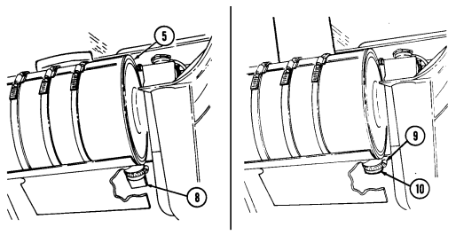

remove cap (10). Clean and install cap (10) and secure with clamp (9).

d. Lower and secure hood (para. 3-8).

Change 1 3 - 2 1

a. Raise and secure hood (para. 3-8).

Do not permit dirt, dust, or grit to enter engine oil dipstick tube. Internal engine damage will result if engine oil becomes contaminated.

· Engine oil level is checked with engine off.

· If oil level checks above 'FULL," it may be due to oil cooler drain back. Operate the engine for one minute, shut down, wait one minute, and recheck oil level.

· Vehicles equipped with deep fording kit will have a sealed dipstick.

b. Pull out dipstick (1) and check for proper oil level. Level should be at crosshatch marks (2) between "FULL" and "ADD 1 QT."

Do not overfill engine crankcase. Damage to engine will result.

c. If engine oil is low, remove oil filler cap (3) and add engine oil
(Appendix G).

Install a non-vented filler cap only. An incorrect filler cap will not

 seal properly, causing water to enter and damage engine.

d. Replace oil filler cap (3), tighten securely, and wipe away any spilled oil. e. Lower and secure hood (para. 3-8).

## 3-18. Plastic Window Cleaning


Never clean plastic windows with abrasives. Repeated use of abrasives or failure to follow the instructions below will eventually cause damage to windows.

This paragraph provides instructions for cleaning soft top plastic windows and ballistic windshield and windows. This procedure is to be used on the inner plastic laminate surfaces of ballistic glass. Clean the outer surface of ballistic glass as you would plain glass.

#### A. **Plastic Window Cleaning.**

(1) Wash windows using soap and water and a soft, clean cloth. (2) Rinse with clean water. (3) Apply cream cleaner (appendix D, item 26) to plastic windows. (4) Wipe cream cleaner off with dry cloth. Cream cleaner improves visual clarity after cleaning with soap and water.

a.1. **Plastic Window Cleaning - Fungus and Mold.**
(1) Wash windows using soap and water and a soft clean cloth. (2) Rinse with clean water. (3) Using a soft, clean cloth and isopropyl alcohol (Appendix D, Item 1.01),
clean off fungus and mold.

(4) Wipe area with soft, clean cloth.

b. **Ballistic Glass Cleaning.**

Remove rings or other hard objects from hands before cleaning or polishing plastic surfaces. Do not use hard, dirty, or gritty cloths on plastic surfaces. Do not apply water, solvent, or polish unless the plastic is cool and is protected from the heating effects of sunlight. Failure to follow these instructions will cause damage to ballistic glass.

(1) Add detergent (appendix D, item 5) to a gallon of water. (2) Saturate a soft cloth with cleaning solution and lightly rub plastic surface. (3) Flush off cleaning solution with water and dry with a soft cloth. (4) Apply polish (appendix D, item 24) to plastic surface. Let dry, then wipe clean. Light scratches can be removed by vigorous rubbing, but care should be taken not to rub too long in one place.

#### 3-19. Transmission Fluid Servicing

a. Raise and secure hood (para. 3-8).

b. Start engine (para. 2-10).

c. While depressing service brake pedal, move transmission shift lever through all operating ranges and
"R" (reverse) before checking fluid level in "N" (neutral) with parking brake applied.

Do not permit dirt, dust, or grit to enter transmission oil dipstick tube. Internal transmission damage will result if transmission fluid becomes contaminated.

Vehicles equipped with deepwater fording kit will have a sealed dipstick.

d. Pull out dipstick (2) and check for proper transmission fluid level. At normal operating temperature, fluid level should be at crosshatch marks (3).

#### Caution


Do not overfill transmission. Damage to transmission will result.

e. If transmission fluid level is low, add fluid (appendix G) through fill pipe (1), insert dipstick (2), and wipe


away any spilled fluid.

f. Shut off engine (para. 2-12).

g. Lower and secure hood (para. 3-8).

3-24

# 3-20. Power Steering Fluid Servicing

a. Raise and secure hood (para. 3-8).

CAUTION
Do not permit dirt, dust, or grit to enter power steering reservoir. Damage to power steering system will result if power steering fluid becomes contaminated.

b. Pull out cap/dipstick (5) and check steering fluid level. If engine is warm, level should be between
"HOT" and "COLD" marks. If engine is cool, level should be between "ADD" and "COLD" marks. In either condition, fluid must be added if level reads below "ADD" mark.

Do not overfill power steering reservoir. Damage to power steering system will result.

spilled.

c. If fluid level is low, add fluid (appendix G) to power steering reservoir (4) and wipe away any fluid d. Install cap/dipstick (5).


e. Lower and secure hood (para. 3-8).

#### 3-25

a. Shut off engine (para. 2-12).

Do not perform fuel system checks, inspection, or maintenance while smoking or near fire, flames, or sparks.

Fuel may ignite, causing damage to vehicle, and injury or death to personnel.

CAUTION
Do not turn fuel cap handle more than necessary to remove or seal fuel cap. Fuel cap chain links may separate or become damaged.

b. Turn fuel cap handle (1) on fuel cap (2) counterclockwise and remove fuel cap (2).

To help prevent spills and overflows, pay close attention to the dispensing nozzle while refueling. Do not exceed a safe refueling rate. If fuel backup and spillage is being experienced, reduce flow rate. Also, when topping off the tank, a reduced flow rate should be used.

#### Caution


When refueling the vehicle, be careful that the nozzle does not slam into the filler pipe. Damage to the strainer may occur, allowing dirty fuel to clog up the filters.

c. Insert the fuel filler nozzle into the filler neck rubber cone, using caution not to puncture the fuel filler neck strainer. Dispense fuel into fuel tank.

#### 3-26

d. If the fuel cap handle (1) is turned more than necessary to remove the fuel


cap (2), the fuel cap backing plate (3) may become jammed on the staked threads (4). Correct the problem by holding the backing plate (3) and turning the fuel cap handle (1) clockwise until the backing plate (3) turns freely.

e. When fueling operation is complete, install fuel cap (2) and turn fuel cap handle (1) clockwise to seal fuel cap (2).

## 3-22. Tire Chain Installation And Removal

Tire chains are only used when extra traction is required and must be used as an axle set. Any other combination may cause damage to the drivetrain.

#### A. **Radial Tire Chain Installation.**

(1) Spread out tire chain assembly (1) and line up with tire. (2) Cautiously move or drive vehicle over tire chain assembly (1) until wheel is positioned at either end of chain assembly (1), allowing tire chain assembly (1) to be draped up and over tire.

(3) Maneuver tire chain assembly (1) until cross-link sections are evenly spaced around tire. Secure one side of tire chain assembly (1) to tire by hooking inside fastener (2) to chain assembly (1). Tighten chain assembly (1) as much as possible.

(4) Repeat steps 1 through 3 above until all tire chain assemblies have been properly installed.

(5) Hook end fastener (3) to chain assembly (1) and secure with locking


retainer (4) to tighten chain assembly (1). Ensure as many chain links as possible lay between the sidewall head lugs (5) on both sides of tires.

(6) Move vehicle forward a few feet and retighten chain assembly (1) to remove any slack from where tire was resting on chain assembly (1). Secure loose chain linkage to chain assembly (1) with wire or other field expedient method.

3 - 2 8 Change 1

(7) After vehicle is driven one or two miles, stop and retighten tire chains.

Ensure as many chain links as possible lie between the sidewall head lugs (5) on both sides of the tires.

(8) After final tightening, secure loose chain linkage to chain assembly (1)
with wire or other field expedient method.

(9) Occasionally check tire chains (1) during operations to ensure tire chains (1) have not slipped.

b. **Radial Tire Chain Removal.**

Remove tire chains from tires as soon as possible after leaving area requiring their use. Prolonged use of tire chains may damage drivetrain.

(1) Detach locking retainer (4) from end fastener (3) and unhook end fastener (3) from chain assembly (1).

(2) Unhook inside fastener (2) from chain assembly (1) and remove chain assembly (1) from tire.

(3) Drive vehicle off chain assembly (1). (4) Repeat operations listed in steps 1 through 3 above until all tire chain assemblies (1) have been removed from tires.

(5) Stow tire chain assemblies (1) under driver's seat.


#### C. **Bias Ply Tire Chain Installation.** Caution

Tire chains are only used when extra traction is required and must be used as an axle set. Any other combination may cause damage to the drivetrain.

(1) Install quick link (1) through cross-link connector (4) located on each side of tire chain assembly (5) between the third and fourth cross chains (3). Tighten nut (2).

(2) Spread out tire chain assembly (5) and line up with tire. (3) Cautiously move or drive vehicle over tire chain assembly (5) until wheel is positioned at either end of chain assembly (5), allowing tire chain assembly (5) to be draped up and over tire.

(4) Maneuver tire chain assembly (5) until cross-link sections are evenly spaced around tire. Secure one side of tire chain assembly (5) to tire by hooking inside fastener (6) to chain assembly (5). Tighten chain assembly (5) as much as possible.

(5) Repeat steps 2 through 4 above until all tire chain assemblies have been properly installed.

(6) Hook end fastener (7) to chain assembly (5) and secure with locking retainer (8) to tighten chain assembly (5). Ensure as many chain links as possible lay between the sidewall head lugs (9) on both sides of tires.

(7) Move vehicle forward a few feet and retighten chain assembly (5) to remove any slack from where tire was resting on chain assembly (5). Secure loose chain linkage to chain assembly (5) with wire or other field-expedient method.

(8) After vehicle is driven one or two miles, stop and retighten tire chains.

Ensure as many chain links as possible lay between the sidewall head lugs (9) on both sides of the tires.

(9) After final tightening, secure loose chain linkage to chain assembly (5)


with wire or other field-expedient method.

(10) Occasionally check tire chains (5) during operations to ensure tire chains (5) have not slipped.

3 - 2 8 . 2 **Change 1**

#### D. **Bias Ply Tire Chain Removal.** Caution

Remove tire chains from tires as soon as possible after leaving area requiring their use. Prolonged use of tire chains may damage drivetrain.

(1) Detach locking retainer (8) from end fastener (7) and unhook end fastener (7) from chain assembly (5).

(2) Unhook inside fastener (6) from chain assembly (5) and remove chain assembly (5) from tire.

(3) Drive vehicle off chain assembly (5). (4) Repeat steps 1 through 3 until all tire chain assemblies (5) have been removed from tires.

(5) Stow tire chain assemblies (5) under driver's seat.


Change 1 **3 - 2 9**

#### 3-23. Emergency Fan Clutch Override

a. The radiator fan in M998 series vehicles normally activates when engine temperature exceeds 220°F
(104°C) and deactivates when engine temperature drops to 190°F (88°C). If overheating occurs in an emergency situation, this procedure will ensure continuous fan operation.

b. Raise and secure hood (para. 3-8).

Stop engine (para. 2-12) prior to disconnecting time delay module.

c. Disconnect time delay module connector (1) from control valve connector (2).


d. Start engine (para. 2-10).

e. Check fan for continuous operation. If fan is not operating continuously, stop engine and notify unit maintenance.

f. Lower and secure hood (para. 3-10).

g. Allow engine to cool at idle until engine temperature lowers to normal operating temperature of 190°-
230°F (88°-110°C).

h. Proceed to unit maintenance with vehicle. Make certain unit maintenance is notified of emergency service performed on vehicle.

3-24. REARVIEW MIRROR ADJUSTMENT (FOR VEHICLE
SERIAL NUMBER 99,999 AND BELOW)
a. Raise and secure hood (para. 3-8).

b. Using screwdriver, loosen special nut (11) securing arm assembly (9) to rearview mirror bracket (4).

Right mirror must be adjusted for viewing through the windshield.

c. Adjust mirror head (7) and arm assembly (9) to proper position.


d. Tighten special nut (11) securing arm assembly (9) to rearview mirror bracket (4). Ensure rearview mirror bracket mounting capscrews (3) are secure.

e. If mirror head (7) will not hold adjustment, tighten screws (6).

f. If arm assembly (9) will not hold adjustment, tighten nut (10).

g. If mirror head shaft (5) will not hold adjustment, tighten nut (8). h. Lower and secure hood (para. 3-8).

# 3-25. Rearview Mirror Adjustment (For Vehicle Serial Number 100,000 And Above)

- Prior to mirror adjustment, move mirror arm assembly until assembly locks in place.

- Illustration shows left side adjustment assembly; right side is basically the same.

- The left mirror has been lowered 5 in. (12.7 cm) on M996A2, M997A2, M1025A2, M1035A2, M1043A2, M1045A2, M1097A2, and M1123 vehicles to improve visibility.

a. **Left Mirror (Driver's Side).** Loosen top nut (5) and position mirror 


arm (7) forward of windshield frame (4) so that center line of mirror arm (7) is approximately 9-1/2 in. (24.1 cm) from vehicle (1). Tighten top nut (5). Adjust mirror head (6) for maximum visibility.

b. **Right Mirror (Passenger's Side).** Loosen top nut (5) and position mirror arm (3) forward of windshield frame (4) so that center line of mirror arm (3) is approximately 7-3/4 in. (19.7 cm) from vehicle (1). Tighten top nut (5). Adjust mirror head (2) for maximum visibility.

3 - 3 2 **Change 1**

## 3-26. Wheel Assembly Replacement

- Always apply parking brake and block opposite wheel before removing wheel assembly. Avoid removing wheel assembly when vehicle is on sloping terrain. Injury to personnel, or damage to equipment may result.

- Remove only the inner group of nuts when removing a wheel from the vehicle. Removing the outer nuts which hold the rim together while the wheel assembly is inflated could result in serious injury or death.

- Ensure scissors jack is positioned directly under the lower control arm, next to the wheel being replaced. Do not place at any other location such as frame rails. Injury to personnel, or damage to equipment may result.

- Both radial and bias tires are non-directional. They provide equal traction and performance when installed in either direction. For further information, refer to TM 9-2610-200-14.

- Radial and bias ply tires should not be mixed on the same vehicle. Injury to personnel or damage to equipment may result.

- Do not use bias ply tires on the M1097, M1123, or any A1 and A2 models, under any condition. Due to tire load ratings and vehicle load carrying capabilities, only the load range "D" radial tire can be used on the M1097, M1123, and all A1 and A2 models.

Check tire size designator on sidewall for tire construction identification: 36 x 12.50-16.5LT-Bias ply, 37 x 12.50R16.5LT- Radial.

#### A. Wheel Assembly Removal.

(1) Place jack (11) under lower control arm (12) next to wheel being


replaced. Center jack (11) squarely under point of contact.

(2) Loosen eight lug nuts (9), but do not remove. (3) Raise vehicle high enough to allow removal of wheel assembly (8). (4) Remove eight lug nuts (9) securing wheel assembly (8) to geared hub (10) and remove wheel assembly (8).

Change 3 3-33

#### B. Wheel Assembly Installation.

(1) Install wheel assembly (8) to geared hub (10) and secure with eight lug


nuts (9). Tighten lug nuts (9) to full engagement of wheel assembly (8) to geared hub (10).

(2) Slowly lower vehicle and remove jack (11). (3) Tighten eight lug nuts (9) in the sequence indicated. (4) Notify unit maintenance to tighten lug nuts (9) to proper torque as soon as possible.

## 3-27. Heating, Ventilation, And Air-Conditioning Air Intake Filter Service

- NBC contaminated filters must be handled using adequate precaution (FM 3-5) and must be disposed of by trained personnel.

- After Nuclear, Biological, or Chemical (NBC) exposure of this vehicle, all air filters shall be handled with extreme caution. Unprotected personnel may experience injury or death if residual toxic agents or radioactive material are present. Servicing personnel will wear protective overgarments, mask, hood, and chemical protective gloves and boots. All contaminated air filters will be placed into double lined plastic bags and moved immediately to a temporary segregation area away from the work site. If contaminated by radioactive dust, the Company NBC team will measure the radiation before removal. The NBC team will determine the extent of safety procedures required. The temporary segregation area will be marked with the appropriate NBC signs. Final disposal of contaminated air filters will be in accordance with local Standard Operating Procedure (SOP).

- Failure to observe above warnings may result in injury or death.

#### A. M996 And M996A1 Filter Removal.

(1) Loosen seven captive wing head screws (2) securing panel (1) to body (3)
and remove panel (1).

(2) Slide filter (4) out of mounting bracket (5) and remove filter (4).

b. **M997, M997A1, and M997A2 Filter Removal.**
to panel (8). body (7) and remove panel (12). remove frame (17) and filter (16).

(1) Remove two capscrews (6), lockwashers (14), and washers (13) securing front cover panel (12) (2) Remove four screws (11), lockwashers (10), and washers (9) securing front cover panel (12) to (3) Remove two screws (18) securing frame (17) and filter (16) to air intake assembly (15) and


M996 AND M996A1 ONLY

M997,M997A1, AND M997A2 ONLY


c. **Inspection.** Inspect filters for tears, rips, contaminants, or other damage. Inspect filter frames for cracks, bends, or other damage. If filters or frames are damaged, notify unit maintenance.

d. **M996 and M996A1 Filter Installation.**
(1) Slide filter (4) into mounting bracket (5). (2) Install cover panel (1) on body (3) with seven captive wing head screws (2).

e. **M997, M997A1, and M997A2 Filter Installation.**
(1) Install filter (16) and frame (17) on air intake assembly (15) with two screws (18). (2) Install front cover panel (12) to body (7) and secure with four washers (9), lockwashers (10), and screws (11).

(3) Secure front cover panel (12) to panel (8) with two washers (13), lockwashers (14), and capscrews (6).


M997, M997A1, AND M997A2 ONLY


# 3-28. Ambulance Interior Light Bulb Replacement

a. **General.** Replacement bulbs are located in the storage compartment of the vehicle.

WARNING
When changing light bulbs, ensure the system in which the bulb is being replaced is turned off. Failure to do so may cause injury.

Ceiling white light and blackout light assemblies are removed and installed basically the same. This procedure covers the ceiling white light assemblies.

b. **Ceiling Light Bulb Removal.**
(1) Remove two screws (3) securing lens (4) to light assembly (2). Remove lens (4). (2) Press light bulb (5) into socket (1), twist counterclockwise, and remove light bulb (5).

c. **Ceiling Light Bulb Installation.**
(1) Install light bulb (5) into socket (1), press in, and twist clockwise to secure. (2) Install lens (4) to light assembly (2) and secure with two screws (3).

d. **Spotlight Bulb Removal.**

M996, M996A1, M997, M997A1, and M997A2 vehicles spotlight bulb replacement is basically the same. This procedure covers M996 and M996A1 spotlight bulb replacement for M996 and M996A1 vehicles.

(1) Remove base (8) from wall socket (7). (2) Remove four screws (6) securing lens assembly (11) to base (8) and remove lens assembly (11). (3) Press light bulb (10) into socket (9), twist counterclockwise, and remove light bulb (10).

e. **Spotlight Bulb Installation.**
(1) Install light bulb (10) into socket (9), press in, and twist clockwise to secure.

(2) Install base (8) on lens assembly (11) and secure with four screws (6).

(3) Install base (8) into wall socket (7).

f. Test Interior Lights Operation. Refer to para. 2-61.


## 3-29. Restraining Net Installation

Restraining Net Installation. (Models M966, M966A1, M1025, M1025A1, M1026, M1026A1, M1036, M1043, M1043A1, M1044, M1044A1, M1045, M1045A1, M1046, M1046A1, and M1121).

(1) Position restraining net (2) behind rear seats (1) and loop three 


straps (3) through roof brackets (4). Do not tighten straps (3).

(2) Route three straps (5) on restraining net (2) through tiedowns (6) on cargo floor (7). Tighten straps (3) and (5).

#### 3 - 4 0 Change 1

# Appendix A References

## A-1. Scope

This appendix lists all forms, field manuals, and technical manuals for use with this vehicle.

## A-2. Department Of The Army Pamphlets

Consolidated Index of Army Publications and Blank Forms . . . . . . . . . . . . . . . . . . . . . . DA Pam 25-30 The Army Maintenance Management System (TAMMS). . . . DA Pam 738-750

## A-3. Forms

| Recommended Changes to Publications and Blank Forms DA Form 2028         |
|--------------------------------------------------------------------------|
| Recommended Changes to Equipment Technical                               |
| Publications DA Form 2028\-2                                             |
| Hand Receipt/Annex Number DA Form 2062                                   |
| Exchange Tag DA Form 2402                                                |
| Equipment Inspection and Maintenance Worksheet DA Form 2404              |
| Equipment Inspection and Maintenance Worksheet                           |
| (Automated) DA Form 5988\-E                                              |
| Maintenance Request DA Form 2407                                         |
| Maintenance Request (Automated) DA Form 5990\-E                          |
| Preventive Maintenance Schedule and Record DD Form 314                   |
| Preventive Maintenance Schedule and Record (Automated) . DA Form 5986\-E |
| Quality Deficiency Report SF 368                                         |

| NBC Decontamination FM 3\-5                         |
|-----------------------------------------------------|
| Operation and Maintenance of Ordnance Materiel in   |
| Cold Weather (0° to \-65°F) FM 9\-207               |
| Vehicle Recovery Operations FM 20\-22               |
| First Aid for Soldiers FM 21\-11                    |
| Manual for the Wheeled Vehicle Driver FM 21\-305    |
| Browning Machinegun Caliber .50 HB, M2 FM 23\-65    |
| Machinegun 7.62, M60 FM 23\-67                      |
| Basic Cold Weather Manual FM 31\-70                 |
| Northern Op eration FM 31\-71                       |
| Army Motor Transport Units and Operations FM 55\-30 |

## A-4. Field Manuals

| Desert Operations FM 90\-3   |
|------------------------------|
| Jungle Operations FM 90\-5   |
| Mountain Operations FM 90\-6 |

## A-5. Technical Manuals

Machine gun, Caliber .50 Browning, M2 . . . . . . . . . . . . . . TM 9-1005-213-10 Machine gun, 7.62 MM, M60 . . . . . . . . . . . . . . . . . . . . . . . TM 9-1005-224-10 TOWWeapon System, Guided Missile System, Operator and Organizational Maintenance Manual. . . . . TM 9-1425-472-12 TOW 2 Weapon System, Guided Missile System Operator and Organizational Maintenance Manual. . . . . TM 9-1425-450-12 Materials used for Cleaning, Preserving, Abrading, and Cementing Ordnance Materiel and Related Material (Including Chemicals) . . . . . . . . . . . . . . . . . . . . . . . . . . . . . . . . TM 9-247 Operator's, Unit, Direct Support and General Support Maintenance Manual for Care, Maintenance, Repair, and Inspection of Pneumatic Tires and Inner Tubes. . . . . . . . . . . . . . . . . . . . . . . . . . . . . . TM 9-2610-200-14 Operator's Organizational, Direct Support and General Support Maintenance Manual for Lead-Acid Storage Batteries . . . . . . . . . . . . . . . . . . . . . TM 9-6140-200-14

## A-6. Technical Bulletins

Security of Tactical Wheeled Vehicles. . . . . . . . . . . . . . . . . TB 9-2300-422-20 Equipment Improvement Report and Maintenance Digest . . . . TB 43-0001-62 Use of Antifreeze Solutions, Antifreeze Extender, and Cleaning Compounds Test Kit in Engine Cooling Systems. . . . . TB 750-651

## A-7. Miscellaneous Publications

Hand Receipt . . . . . . . . . . . . . . . . . . . . . . . . . . . . . . . TM 9-2320-280-10-HR

| The Army Integrated Publishing and Printing Program AR 25\-30   |
|-----------------------------------------------------------------|
| Dictionary of United States Army Terms AR 310\-25               |
| Prevention of Motor Vehicle Accidents AR 385\-55                |
| Army Materiel Policy and Retail Maintenance Operation AR 750\-1 |
| Expendable/Durable Items                                        |

## A-8. Army Regulations

(Except: Medical, Class V, Repair Parts, and Heraldic Items) . . . CTA 50-970

# Appendix B Components Of End Item And Basic Issue Items Lists

Section I. INTRODUCTION

## B-1. Scope

This appendix lists components of end item and basic issue items for M998 series vehicles to help you inventory items required for safe and efficient operation.

## B-2. General

The Components of End Item and Basic Issue Items Lists are divided into the following sections:
a. Section II. Components of End Item. This listing is for informational purposes only and is not authority to requisition replacements. These items are part of the end item, but are removed and separately packaged for transportation or shipment. As part of the end item, these items must be with the end item whenever it is issued or transferred between property accounts. Illustrations are furnished to assist in identifying the items.

b. Section III. Basic Issue Items (BII). These are the minimum essential items required to place M998 series vehicles in operation, to operate them, and to perform emergency repairs. Although shipped separately packaged, BII must be with the vehicle during operation and whenever it is transferred between property accounts. The illustrations will assist you with hard-to-identify items. This manual is the authority to request/requisition replacement BII, based on TOE/MTOE authorization of the end item.

## B-3. Explanation Of Columns

The following provides an explanation of columns found in the tabular listings:
a. Column (1) - Illustration Number (Illus Number). This column indicates the number of the illustration in which the item is shown.

b. Column (2) - National Stock Number. Indicates the National Stock Number assigned to the item and will be used for requisitioning purposes.

c. Column (3) - Description. Indicates the Federal item name and, if required, a minimum description to identify the item. The last line for each item indicates the CAGEC (in parentheses) followed by the part number. If item needed differs for different models of this vehicle, the model is shown under the "Usable On Code" heading in this column. These codes are identified as:

| Code        | Used On                   | Code                                                                | Used On                           |
|-------------|---------------------------|---------------------------------------------------------------------|-----------------------------------|
| (Blank)     | All                       | H18/B18                                                             | M1026/M1026A1                     |
|             |                           | HVY/AVY/BVY M1097/M1097A1/M1097A2 H20/A20/B20 M1035/M1035A1/M1035A2 |                                   |
| H11/A11     | M966/M966A1               | H21                                                                 | M1037                             |
| H12         | M1036                     |                                                                     | H24/A24/B24 M1045/M1045A1/M1045A2 |
| H13/A13     | M998/M998A1               |                                                                     | H25/A25/B25 M1043/M1043A1/M1043A2 |
| H14/A14     | M1038/M1038A1             | H26/A26                                                             | M1044/M1044A1                     |
| H15/A15/B15 | M997/M997A1/M997A2        | H27/A27                                                             | M1046/M1046A1                     |
| H16/B16     | M996/M996A1               | H28                                                                 | M1042                             |
| H17/B17/C17 | M1025/M1025A1/M1025A2 MMM |                                                                     | M1121                             |
|             |                           | NNN                                                                 | M1123                             |

d. Column (4) - Unit of Issue (U/I). Indicates a determinate amount or quantity of an item that will be issued. This unit is expressed by a two-character alphabetical abbreviation; i.e., (ea, pr).

e. Column (5) - Quantity Required (Qty rqr). Indicates the quantity of the item authorized to be used with/on the vehicle.

## Section Ii. Components Of End Item

| (1)    | (2)                 | (3)                      |           | (4)   | (5)   |
|--------|---------------------|--------------------------|-----------|-------|-------|
| Illus  | National Stock      | Description              | Usable    |       | Qty   |
| Number | Number              | CAGEC and Part Number    | On Code   | U/I   | rqr   |
| 1      | 3120\-01\-188\-5082 | BEARING, SLEEVE:         | A25, A26, | EA    | 1     |
|        |                     | Pintle Adapter           | B17, B18  |       |       |
|        |                     | (located in the armament | H17, H18  |       |       |
|        |                     | mounting assembly)       | H25, H26  |       |       |
|        |                     | (19207) 12340310         |           |       |       |
|        | 5305\-01\-204\-4190 | a. Setscrew 3/8 \- 24    |           | EA    | 4     |
|        |                     | (7X677) 9428747          |           |       |       |
|        |                     | b. Pintle Adapter        |           | EA    | 1     |
|        |                     | (19207) 12340310\-1      |           |       |       |
|        |                     | a                        |           |       |       |
|        |                     |                          | ~         |       |       |
|        |                     | b                        |           |       |       |

These items are installed in the vehicle at the time of manufacture or rebuild.

B-2 Change 3

Section III. BASIC ISSUE ITEMS

| (1)    | (2)                 | (3)                                |         | (4)   | (5)   |
|--------|---------------------|------------------------------------|---------|-------|-------|
| Illus  | National Stock      | Description                        | Usable  |       | Qty   |
| Number | Number              | CAGEC and Part Number              | On Code | U/I   | rqr   |
| 1      |                     | TM 9\-2320\-280\-10                |         | EA    | 1     |
|        |                     | (in cotton duck pamphlet bag)      |         |       |       |
|        |                     | TM 9\-2320\-280\-10\-HR            |         | EA    | 1     |
|        |                     | (in cotton duck pamphlet bag)      |         |       |       |
|        |                     | (not used by Marine Corps).        |         |       |       |
| 2      | 3040\-00\-392\-2962 | ADAPTER, HOUSING: filter unit      |         | EA    |       |
|        |                     | inlet [in NBC stowage compart                                    | H15,    |       | 4     |
|        |                     | ment] [in front of right litter    | A15,    |       |       |
|        |                     | rack]                              | B15,    |       |       |
|        |                     | (81361) C5\-66\-232                | H16,    |       | 2     |
|        |                     |                                    | B16     |       |       |
| 3      | 2540\-00\-670\-2459 | BAG, ASSEMBLY,                     |         | EA    | 1     |
|        |                     | PAMPHLET: cotton duck, 3 in. x     |         |       |       |
|        |                     | 9\-1/4 in. x 11\-1/4 in. [under dri                                    |         |       |       |
|        |                     | ver's seat]                        |         |       |       |
|        |                     | (19207) 11676920                   |         |       |       |
| 4      | 5140\-00\-772\-4142 | BAG, TOOL, ENVELOPE TYPE:          |         | EA    | 1     |
|        |                     | 10 in. x 20 in., w/ flap           |         |       |       |
|        |                     | [on H21 and H28, item is stored    |         |       |       |
|        |                     | behind driver's seat; on all other |         |       |       |
|        |                     | vehicles, the item is stored under |         |       |       |
|        |                     | the driver's seat]                 |         |       |       |
|        |                     | (81349) MIL\-B\-43648\-4           |         |       |       |


Change 3 B-3

| (1)    | (2)                 | (3)                                |          | (4)   | (5)   |
|--------|---------------------|------------------------------------|----------|-------|-------|
| Illus  | National Stock      | Description                        | Usable   |       | Qty   |
| Number | Number              | CAGEC and Part Number              | On Code  | U/I   | rqr   |
| *5     | 7510\-00\-889\-3494 | BINDER, LOOSE\-LEAF:               |          | EA    | 1     |
|        |                     | equipment log book, 6\-7/20 in. x  |          |       |       |
|        |                     | 9\-1/2 in. [in pamphlet bag]       |          |       |       |
|        |                     | (19207) 11677003                   |          |       |       |
| *6     | 4210\-01\-149\-1356 | FIRE EXTINGUISHER: hand,           | All      | EA    | 1     |
|        |                     | type 1, class 2, 5 lb. capacity,   | except   |       |       |
|        |                     | w/bracket [mounting location per   | "A2" and |       |       |
|        |                     | unit commander discretion]         | NNN      |       |       |
|        |                     | (for bracket only, notify unit     | vehicles |       |       |
|        |                     | maintenance) (19207) 12255633\-1   |          |       |       |
| *7     | 4210\-01\-481\-3875 | FIRE EXTINGUISHER: hand,           | "A2" and | EA    | 1     |
|        |                     | type 1, class 2, size 5 [mounting  | NNN      |       |       |
|        |                     | location per unit commander        | vehicles |       |       |
|        |                     | discretion] (54905) 14091          |          |       |       |
| *8     | 6545\-00\-922\-1200 | FIRST\-AID KIT, GENERAL PURPOSE:   |          | EA    | 1     |
|        |                     | 3 in. x 5\-13/16 in. x 8\-7/32 in. |          |       |       |
|        |                     | [under driver's seat]              |          |       |       |
|        |                     | (19207) 11677011                   |          |       |       |

Section III. BASIC ISSUE ITEMS (Cont'd)


* Not Marine Corps BII.

B-4 Change 3

| (1)    | (2)                 | (3)                                           |          | (4)   | (5)   |
|--------|---------------------|-----------------------------------------------|----------|-------|-------|
| Illus  | National Stock      | Description                                   | Usable   |       | Qty   |
| Number | Number              | CAGEC and Part Number                         | On Code  | U/I   | rqr   |
| *9     | 7510\-01\-065\-0166 | FOLDER, EQUIPMENT RECORD:                     |          | EA    | 1     |
|        |                     | 2\-1/2 in. x 8 in. x 10 in. [in pamphlet bag] |          |       |       |
|        |                     | (72094) 43986\-1                              |          |       |       |
| 10     | 5120\-01\-032\-6042 | HANDLE, JACK: 58\-1/4 in. long                | All      | EA    | 1     |
|        |                     | (nom), folding type, OD finish [on            | except   |       |       |
|        |                     | four\-door vehicles, items are                | NNN,     |       |       |
|        |                     | stored under rear seat; on two                                               | HVY,     |       |       |
|        |                     | door vehicles, items are stored               | "A1" and |       |       |
|        |                     | under driver's and/or comman                                               | "A2"     |       |       |
|        |                     | der's seat]                                   | vehicles |       |       |
|        |                     | (19207) 12255298                              |          |       |       |
|        |                     | 9                                             | 10       |       |       |

Section III. BASIC ISSUE ITEMS (Cont'd)


Change 3 B-5

|                                 | (1)  (2)              | (3)                          |    |         | (4)   | (5)   |
|---------------------------------|-----------------------|------------------------------|----|---------|-------|-------|
| Description                     | Illus  National Stock |                              |    | Usable  |       | Qty   |
| CAGEC and Part Number           | Number  Number        |                              |    | On Code | U/I   | rqr   |
|                                 | 11                    | HOSE, AIR BREATHING: 6 ft    |    |         | EA    |       |
|                                 |                       | [in NBC stowage compartment] |    | H15,    |       | 6     |
| [in front of right litter rack] |                       |                              |    | A15,    |       |       |
| consists of:                    |                       |                              |    | B15,    |       |       |
|                                 |                       |                              |    | H16,    |       | 4     |
|                                 |                       |                              |    | B16     |       |       |
| a. Hose, 6 ft                   | 4720\-00\-279\-0093   |                              |    |         |       |       |
| (81361) C5\-19\-916\-2          |                       |                              |    |         |       |       |
| b. Clamp, hose (2 ea)           | 4720\-00\-269\-3760   |                              |    |         |       |       |
| (96906) MS22064\-5              |                       |                              |    |         |       |       |
| c. Coupling half, quick         | 4730\-01\-138\-7152   |                              |    |         |       |       |
| (84987) 6209\-047               |                       |                              |    |         |       |       |
| d. Connector, orifice           | 4240\-00\-977\-8503   |                              |    |         |       |       |
| (81361) C5\-19\-1830            |                       |                              |    |         |       |       |
| 11                              |                       |                              |    |         |       |       |
|                                 | a                     |                              |    |         |       |       |
|                                 |                       |                              | b  |         |       |       |


Section III. BASIC ISSUE ITEMS (Cont'd)
B-6 Change 3

| (1)    | (2)                 | (3)                             |         | (4)   | (5)   |
|--------|---------------------|---------------------------------|---------|-------|-------|
| Illus  | National Stock      | Description                     | Usable  |       | Qty   |
| Number | Number              | CAGEC and Part Number           | On Code | U/I   | rqr   |
| 12     |                     | HOSE, AIR BREATHING: 9 ft       |         | EA    |       |
|        |                     | [in NBC stowage compartment]    | H15,    |       | 1     |
|        |                     | [in front of right litter rack] | A15,    |       |       |
|        |                     | consists of:                    | B15,    |       |       |
|        |                     |                                 | H16,    |       | 1     |
|        |                     |                                 | B16     |       |       |
|        | 4720\-00\-279\-0094 | a. Hose, 9 ft                   |         |       |       |
|        |                     | (81361) C5\-19\-916\-3          |         |       |       |
|        | 4720\-00\-269\-3760 | b. Clamp, hose (2 ea)           |         |       |       |
|        |                     | (96906) MS22064\-5              |         |       |       |
|        | 4730\-01\-138\-7152 | c. Coupling half, quick         |         |       |       |
|        |                     | (84987) 6209\-047               |         |       |       |
|        | 4240\-00\-977\-8503 | d. Connector, orifice           |         |       |       |
|        |                     | (81361) C5\-19\-1830            |         |       |       |
|        |                     | 12                              |         |       |       |
|        | a                   |                                 |         |       |       |
|        |                     | b                               |         |       |       |
|        |                     |                                 | c       |       |       |

Section III. BASIC ISSUE ITEMS (Cont'd)


| (1)    | (2)                 | (3)                                 |          | (4)   | (5)   |
|--------|---------------------|-------------------------------------|----------|-------|-------|
| Illus  | National Stock      | Description                         | Usable   |       | Qty   |
| Number | Number              | CAGEC and Part Number               | On Code  | U/I   | rqr   |
| 13     | 5120\-00\-106\-7598 | JACK, SCISSORS, HAND:               | All      | EA    | 1     |
|        |                     | mechanical, 2\-ton cap., 2\-1/4 in. | except   |       |       |
|        |                     | closed to 18\-1/2 in. (max) open,   | NNN,     |       |       |
|        |                     | OD finish [on four\-door vehi                                     | HVY,     |       |       |
|        |                     | cles, items are stored under        | "A1" and |       |       |
|        |                     | rear seat; on two\-door vehicles,   | "A2"     |       |       |
|        |                     | items are stored under driver's     | vehicles |       |       |
|        |                     | and/or commander's seat]            |          |       |       |
|        |                     | (19207) 11640481                    |          |       |       |


| 14  5120\-01\-375\-0070   | JACK, SCISSORS, HAND: mechanical, 3.5\-ton cap.,  6.33 in. closed to 18.70 in.   | NNN, HVY, "A1" and   |
|---------------------------|----------------------------------------------------------------------------------|----------------------|
|                           | (max) open, OD finish [stored                                                    | "A2"                 |
|                           | on right splash shield in jack stowage box]                                      | vehicles             |
|                           | (34623) 5939822                                                                  |                      |
| 5120\-01\-430\-3123       | a. Jack, scissors                                                                |                      |
|                           | (19207) 12447042                                                                 |                      |
| 5120\-01\-429\-6964       | b. Wrench, ratchet                                                               |                      |
|                           | (19207) 12447039                                                                 |                      |
| 5120\-01\-429\-6065       | c. Extension, jack handle                                                        |                      |
|                           | (19207) 12447040                                                                 |                      |

Section III. BASIC ISSUE ITEMS (Cont'd)

B-8 Change 3

| (1)    | (2)                 | (3)                   |               | (4)   | (5)   |
|--------|---------------------|-----------------------|---------------|-------|-------|
| Illus  | National Stock      | Description           | Usable        |       | Qty   |
| Number | Number              | CAGEC and Part Number | On Code       | U/I   | rqr   |
|        | 5120\-01\-429\-8137 | d. Handle, jack       | NNN,          |       |       |
|        |                     | (19207) 12447041      | HVY,          |       |       |
|        | 5140\-01\-429\-6945 | e. Bag, stowage       | "A1" and "A2" |       |       |
|        |                     | (19207) 12447043      | vehicles      |       |       |

Section III. BASIC ISSUE ITEMS (Cont'd)


Change 3 B-9

| (1)    | (2)                 | (3)                                                      |                | (4)   | (5)   |
|--------|---------------------|----------------------------------------------------------|----------------|-------|-------|
| Illus  | National Stock      | Description                                              | Usable         |       | Qty   |
| Number | Number              | CAGEC and Part Number                                    | On Code        | U/I   | rqr   |
| 16     | 4240\-00\-763\-2464 | MASK: head pieces gas, patient                           |                | EA    |       |
|        |                     | protective [in NBC stowage com                                                          | H15,           |       | 4     |
|        |                     | partment] [in front right litter                         | A15,           |       |       |
|        | 16                  | rack] (81361) D5\-70\-23                                 | B15, H16,      |       | 2     |
|        |                     |                                                          | B16            |       |       |
| 17     | 5120\-01\-416\-8568 | MAX TOOL KIT: (previous tool                             | NNN            | EA    | 1     |
|        |                     | kit was Pioneer) (For the USMC,                          | and            |       |       |
|        |                     | all HMMWV A2s require the Max                            | serial         |       |       |
|        |                     | Tool Kit.) combination tool, hand multipurpose [M1025A2, | numbers 189192 |       |       |
|        |                     | M1043A2, and M1045A2 \- behind                           | and up,        |       |       |
|        |                     | left rear seat; M1035A2,                                 | for "A2"       |       |       |
|        |                     | M1097A2, and M1123 \- on                                 | vehicles       |       |       |
|        |                     | tunnel; M997A2 \- in right                               | only           |       |       |
|        |                     | footwell]                                                |                |       |       |
|        |                     | (19207) 57K3528                                          |                |       |       |
|        | 5140\-01\-416\-8569 | a. Carrying case                                         |                |       |       |
|        |                     | (0T9K4) 595\-030                                         |                |       |       |
|        | 5110\-01\-416\-7827 | b. Ax                                                    |                |       |       |
|        |                     | (0T9K4) 595\-010                                         |                |       |       |
|        | 5110\-01\-416\-7830 | c. Ax sheath                                             |                |       |       |
|        |                     | (0T9K4) 595\-020                                         |                |       |       |
|        | 5120\-01\-416\-8570 | d. Shovel attachment                                     |                |       |       |
|        |                     | (0T9K4) 595\-040                                         |                |       |       |
|        | 5120\-01\-416\-8571 | e. Mattock attachment                                    |                |       |       |
|        |                     | (0T9K4) 595\-050                                         |                |       |       |
|        | 5120\-01\-416\-8573 | f.  Pick attachment                                      |                |       |       |
|        |                     | (0T9K4) 595\-060                                         |                |       |       |

Section III. BASIC ISSUE ITEMS (Cont'd)

B-10 Change 3

| (1)    | (2)                 | (3)                      |         | (4)   | (5)   |
|--------|---------------------|--------------------------|---------|-------|-------|
| Illus  | National Stock      | Description              | Usable  |       | Qty   |
| Number | Number              | CAGEC and Part Number    | On Code | U/I   | rqr   |
|        | 5120\-01\-416\-8572 | g. Broad pick attachment |         |       |       |
|        |                     | (0T9K4) 595\-070         |         |       |       |
|        | 5120\-01\-416\-8577 | h. Rake\-hoe attachment  |         |       |       |
|        |                     | (0T9K4) (595\-080)       |         |       |       |
|        | 5120\-01\-416\-8574 | i.  Rake\-hoe fastener   |         |       |       |
|        |                     | (0T9K4) 595\-090         |         |       |       |
|        | 5120\-01\-416\-8575 | j.  Safety locking pins  |         |       |       |
|        |                     | (0T9K4) 595\-999         |         |       |       |
|        |                     | 17                       |         |       |       |

Section III. BASIC ISSUE ITEMS (Cont'd)


Change 3 B-11

| (1)    | (2)                 | (3)                       |           | (4)   | (5)   |
|--------|---------------------|---------------------------|-----------|-------|-------|
| Illus  | National Stock      | Description               | Usable    |       | Qty   |
| Number | Number              | CAGEC and Part Number     | On Code   | U/I   | rqr   |
| 18     |                     | PIONEER TOOL KIT:         | For all   |       |       |
|        |                     | (on bumper storage hooks) | vehicles  |       |       |
|        |                     |                           | up to     |       |       |
|        |                     |                           | serial    |       |       |
|        |                     |                           | number    |       |       |
|        |                     |                           | 189191    |       |       |
|        |                     |                           | and for   |       |       |
|        |                     |                           | all basic |       |       |
|        |                     |                           | and "A1"  |       |       |
|        |                     |                           | vehicles  |       |       |
|        |                     |                           |           | EA    | 1     |
|        | 5110\-00\-293\-2336 | a. Single bit ax:         |           |       |       |
|        |                     | (19207) 6150925           |           |       |       |
|        | 5120\-00\-288\-6574 | b. Mattock\-pick handle:  |           | EA    | 1     |
|        |                     | (19207) 11677021          |           |       |       |
|        | 5120\-00\-243\-2395 | c. Mattock:               |           | EA    | 1     |
|        |                     | (19207) 11677022          |           |       |       |
|        | 5120\-00\-293\-3336 | d. Hand shovel:           |           | EA    | 1     |
|        |                     | (19207) 11655784          |           |       |       |
|        |                     | 18                        |           |       |       |

Section III. BASIC ISSUE ITEMS (Cont'd)


B-12 Change 3

| (1)    | (2)                 | (3)                                   |         | (4)   | (5)   |
|--------|---------------------|---------------------------------------|---------|-------|-------|
| Illus  | National Stock      | Description                           | Usable  |       | Qty   |
| Number | Number              | CAGEC and Part Number                 | On Code | U/I   | rqr   |
|        |                     |                                       |         | EA    | 1     |
| 19     | 5120\-00\-223\-7397 | PLIERS, SLIP JOINT: combina                                       |         |       |       |
|        |                     | tion, slip joint, straight nose w/ cut                                       |         |       |       |
|        |                     | ter, 8 in. long, phosphate finish [in |         |       |       |
|        |                     | tool bag]                             |         |       |       |
| 20     | 5120\-00\-234\-8913 |                                       |         |       |       |
|        |                     | Phillips type, plastic handle, point  |         |       |       |
|        |                     | no. 2, 7\-1/2 in. long [in tool bag]  |         |       |       |
|        |                     | (19207) 11655777\-12                  |         |       |       |
|        |                     |                                       |         | EA    | 1     |
| 21     | 5120\-00\-227\-7356 | SCREWDRIVER, FLAT TIP: flared         |         |       |       |
|        |                     | sides, plastic handle, round blade,   |         |       |       |
|        |                     | 7\-3/4 in. long                       |         |       |       |
|        |                     | SCREWDRIVER, CROSS TIP:               |         |       |       |
|        |                     | (19207) 11655775\-3                   |         |       |       |
|        |                     |                                       |         | EA    | 1     |
|        |                     | 3/16 in. wide tip,                    |         |       |       |
|        |                     | (55719) SSDE\-66                      |         |       |       |

Section III. BASIC ISSUE ITEMS (Cont'd)


Change 3 B-13

| (1)    | (2)                 | (3)                                |         | (4)   | (5)   |
|--------|---------------------|------------------------------------|---------|-------|-------|
| Illus  | National Stock      | Description                        | Usable  |       | Qty   |
| Number | Number              | CAGEC and Part Number              | On Code | U/I   | rqr   |
| 22     | 4910\-01\-313\-8839 | SPREADER BAR ASSEMBLY:             | H15,    | EA    | 1     |
|        |                     | rigging for airlift [below right   | A15,    |       |       |
|        |                     | lower litter rack]                 | B15,    |       |       |
|        |                     | (19207) 12342102                   | H16,    |       |       |
|        |                     |                                    | B16     |       |       |
| 23     | 5120\-00\-240\-5328 | WRENCH, ADJUSTABLE:                |         | EA    | 1     |
|        |                     | open end, 8 in. long [in tool bag] |         |       |       |
|        |                     | (34623) MS15461\-3                 |         |       |       |
| 24     | 5120\-01\-156\-7296 | WRENCH, WHEEL LUG:                 |         | EA    | 1     |
|        |                     | 1\-15/32 \- 1\-19/64 in.           |         |       |       |
|        |                     | socket dia., 1\-3/16 in. socket    |         |       |       |
|        |                     | depth, 17\-1/2 in. long [on four   |         |       |       |
|        |                     | door vehicles, item is stored      |         |       |       |
|        |                     | under rear seat; on two door       |         |       |       |
|        |                     | vehicles, item is stored under     |         |       |       |
|        |                     | driver's and/or commander's seat]  |         |       |       |
|        |                     | (11862) 14009303                   |         |       |       |

Section III. BASIC ISSUE ITEMS (Cont'd)


B-14 Change 3

# Appendix C Additional Authorization List

Section I. INTRODUCTION
C-1. SCOPE
This appendix lists additional items authorized for support of M998 series vehicles.

## C-2. General

This list identifies items that do not have to accompany the vehicle and do not have to be turned in with it. These items are all authorized to you by CTA, MTOE, TDA, or JTA.

## C-3. Explanation Of Listing

National stock numbers, descriptions, and quantities are provided to help you identify and request the additional items you require to support this vehicle. The items are listed in alphabetical sequence by item name. If item required differs for different models of this equipment, the model is shown under the "Usable On Code" heading in the description column. These codes are identified as:

| Code        | Used On                   | Code                                                                | Used On                           |
|-------------|---------------------------|---------------------------------------------------------------------|-----------------------------------|
| (Blank)     | All                       | H18/B18                                                             | M1026/M1026A1                     |
|             |                           | HVY/AVY/BVY M1097/M1097A1/M1097A2 H20/A20/B20 M1035/M1035A1/M1035A2 |                                   |
| H11/A11     | M966/M966A1               | H21                                                                 | M1037                             |
| H12         | M1036                     |                                                                     | H24/A24/B24 M1045/M1045A1/M1045A2 |
| H13/A13     | M998/M998A1               |                                                                     | H25/A25/B25 M1043/M1043A1/M1043A2 |
| H14/A14     | M1038/M1038A1             | H26/A26                                                             | M1044/M1044A1                     |
| H15/A15/B15 | M997/M997A1/M997A2        | H27/A27                                                             | M1046/M1046A1                     |
| H16/B16     | M996/M996A1               | H28                                                                 | M1042                             |
| H17/B17/C17 | M1025/M1025A1/M1025A2 MMM |                                                                     | M1121                             |
|             |                           | NNN                                                                 | M1123                             |

| (1)                 | (2)                                           |           | (3)   | (4)   |
|---------------------|-----------------------------------------------|-----------|-------|-------|
| NATIONAL            | DESCRIPTION                                   |           |       |       |
| STOCK               |                                               |           |       | QTY   |
| NUMBER              | CAGEC AND PART NUMBER  USABLE ON CODE         |           | U/I   | AUTH  |
| 6665\-00\-935\-6955 | ALARM: chemical agent, M8                     |           | EA    | 1     |
|                     | (81361) C5\-15\-8803                          |           |       |       |
| 2540\-00\-670\-2459 | BAG: pamphlet, cotton duck,                   |           | EA    | 1     |
|                     | 3 in. x 9\-1/4 in. x 11\-1/4 in.,             |           |       |       |
|                     | optional use for first\-aid kit               |           |       |       |
|                     | (19207) 11676920                              |           |       |       |
| 2510\-01\-276\-9249 | BAR: suspension, tiedown, [in  H21, H28,      |           | EA    | 2     |
|                     | tool bag behind driver's seat]  HVY, AVY,     |           |       |       |
|                     | (34623) 5598373                               | BVY       |       |       |
| 2540\-00\-678\-3469 | BLOCK: chock                                  |           | EA    | 2     |
|                     | (96906) MS52127\-3                            |           |       |       |
| 3940\-00\-151\-6769 | BLOCK: tackle  H12, H14, A14,                 |           | EA    | 1     |
|                     | (19207) 11676932  H18, B18, H26,              |           |       |       |
|                     | A26, H27, A27, H28                            |           |       |       |
| 2510\-01\-050\-9770 | BRACKET: support, decontamination             |           | EA    | 1     |
|                     | apparatus (19207) 11644841                    |           |       |       |
| 2540\-01\-276\-9250 | BRACKET: suspension tiedown  H21, H28,        |           | EA    | 2     |
|                     | [in tool bag behind driver's door]  HVY, AVY, |           |       |       |
|                     | (34623) 5598408                               | BVY       |       |       |
| 2590\-00\-473\-6331 | BRACKET: water/gasoline can                   |           | EA    | 2     |
|                     | (96906) MS53052\-1                            |           |       |       |
| 2590\-01\-222\-7946 | CABLE, NATO SLAVE:                            |           | AY    | 1     |
|                     | intervehicular power cable,                   |           |       |       |
|                     | 12 ft long (19207) 11682379\-4                |           |       |       |
| 7240\-00\-089\-3827 | CAN: water, military, plastic, 5 gal.         |           | EA    | 1     |
|                     | (81349) MIL\-C\-43613                         |           |       |       |
| 4240\-00\-368\-6361 | CARRIER, HEADPIECE: hospital protector        |           | EA    |       |
|                     | assembly (81361) D5\-4\-1002                  | H15, A15, |       | 4     |
|                     |                                               | B15       |       |       |
|                     |                                               | H16, B16  |       | 2     |

Section II. ADDITIONAL AUTHORIZATION LIST

| (1)                                               | (2)                                     | (3)   | (4)   |
|---------------------------------------------------|-----------------------------------------|-------|-------|
| NATIONAL                                          | DESCRIPTION                             |       |       |
| STOCK                                             |                                         |       | QTY   |
| NUMBER                                            | CAGEC AND PART NUMBER  USABLE ON CODE   | U/I   | AUTH  |
| 2540\-01\-214\-1264                               | CHAIN: tire, 9/32 side x                | SET   | 2     |
| 1/4 cross link                                    |                                         |       |       |
| (34623) 5569255                                   |                                         |       |       |
| 4010\-00\-443\-4845                               | CHAIN: tow, 9/32 side x                 | EA    | 1     |
| 12 ft long (34623) 10944642\-5                    |                                         |       |       |
| 4230\-01\-133\-4124                               | DECONTAMINATION APPARATUS:              | EA    | 1     |
| M\-13 (81361) E5\-51\-527                         |                                         |       |       |
| 4230\-00\-720\-1618                               | DECONTAMINATION APPARATUS:              | EA    | 1     |
| portable, DS\-2, 1\-1/2 UT, ABC\-M11              |                                         |       |       |
| w/bracket (81361) D5\-51\-269                     |                                         |       |       |
| 6230\-00\-163\-1856                               | FLASHLIGHT: 2 x 3\-1/2, GFST x 8 in.    | EA    | 1     |
| (82214) 1259                                      |                                         |       |       |
| 5920\-01\-085\-0825                               | FUSE, ENCLOSED LINK  H15, H16           | EA    | 1     |
| (75915) 257020                                    |                                         |       |       |
| 4910\-00\-204\-3170                               | GAGE: tire pressure                     | EA    | 1     |
| (19207) 7081758                                   |                                         |       |       |
| 5120\-00\-198\-5390                               | KEY, MACHINE: differential fillplug     | EA    | 1     |
| (58536) A\-A\-2473                                |                                         |       |       |
| 5315\-00\-732\-1019                               | KEY, MACHINE: geared hub oil drainplug, | EA    | 1     |
| straight bar key, 1/2 in. square, 2\-1/2 in. long |                                         |       |       |
| (96906) MS20066\-543                              |                                         |       |       |
| 6530\-00\-783\-7905                               | LITTER: folding  H15, A15, B15          | EA    | 4     |
| (90142) 51L1976                                   | H16, B16,                               | EA    | 2     |
|                                                   | H20, A20, B20                           |       |       |
| MASK, CHEMICAL, BIOLOGICAL:                       |                                         | EA    | 1     |
| 4240\-00\-994\-8751                               | M25A1 mask, small size                  |       |       |
| 4240\-00\-994\-8750                               | M25A1 mask, medium size                 |       |       |
| 4240\-00\-994\-8752                               | M25A1 mask, large size  H15, A15, B15   |       | 4     |
|                                                   | H16, B16                                |       | 2     |
| 5340\-00\-158\-3805                               | PADLOCK SET:                            | EA    | 1     |
| (96906) MS35647\-10                               |                                         |       |       |
| 5820\-00\-223\-7473                               | RADIO SET: 9 x 14 x 16 in.              | EA    | 1     |
| (80058) AN/GRC\-160                               |                                         |       |       |
| 5120\-00\-222\-8852                               | SCREWDRIVER: flat tip, flared           | EA    | 1     |
| sides, plastic handle, round blade,               |                                         |       |       |
| 1/4 in. wide tip (80063) SCC539502\-2             |                                         |       |       |

Section II. ADDITIONAL AUTHORIZATION LIST (Cont'd)

| (1)                 | (2)                                    | (3)   | (4)   |
|---------------------|----------------------------------------|-------|-------|
| NATIONAL  STOCK     | DESCRIPTION                            |       | QTY   |
| NUMBER              | CAGEC AND PART NUMBER  USABLE ON CODE  | U/I   | AUTH  |
| 7240\-00\-177\-6154 | SPOUT: can, gas, flexible with filter  | EA    | 1     |
|                     | screen, 16 in. long                    |       |       |
|                     | (19207) 11677020                       |       |       |
| 2610\-01\-171\-4746 | TIRE: pneumatic, bias, nylon           | EA    | 1     |
|                     | breaker, 36 x 12.50 x 16.50 (81348)    |       |       |
|                     | ZZT\-381/36\-12.50\-16.5/C/G2A/LTTR    |       |       |
| 2610\-01\-333\-7632 | TIRE: radial, 37 x 12.50R16.5LT        | EA    | 1     |
|                     | (73842) 5935336                        |       |       |
| 9905\-00\-148\-9546 | TRIANGLES: folding, reflective         | SET   | 1     |
|                     | (81348) RR\-W\-1817                    |       |       |
| 1005\-00\-322\-9716 | TRIPOD MOUNT: w/cover,  H17, B17, C17, | EA    | 1     |
|                     | M3, mach. gun  H18, B18                |       |       |
|                     | (19204) 8403398                        |       |       |
| 5340\-01\-277\-2460 | TURNBUCKLE ASSY:  H21, H28,            | EA    | 2     |
|                     | suspension tiedown  HVY, AVY,          |       |       |
|                     | (34623) 5598406  BVY                   |       |       |
|                     | WHEEL AND RUNFLAT, BIAS:  All except   | EA    | 1     |
|                     | (41885) 89305 HVY, "A1", "A2"          |       |       |
|                     | vehicles                               |       |       |
|                     | WHEEL AND RUNFLAT, RADIAL:             | EA    | 1     |
|                     | 3,850 lb.                              |       |       |
|                     | (19207) 12460176                       |       |       |
|                     | WHEEL AND RUNFLAT, RADIAL: All except  | EA    | 1     |
|                     | 3,400 lb.  "A2"                        |       |       |
|                     | (19207) 12342641  vehicles             |       |       |
| 5120\-01\-279\-4788 | WRENCH: open end,  H21, H28            | EA    | 1     |
|                     | 1\-1/8 x 18 in. long  HVY, AVY, BVY    |       |       |
|                     | (34623) 5598407                        |       |       |

Section II. ADDITIONAL AUTHORIZATION LIST (Cont'd)

| (1)                 | (2)                                                                  | (3)   | (4)   |
|---------------------|----------------------------------------------------------------------|-------|-------|
| NATIONAL  STOCK     | DESCRIPTION                                                          |       | QTY   |
| NUMBER              | CAGEC AND PART NUMBER  USABLE ON CODE                                | U/I   | AUTH  |
|                     | THE FOLLOWING ITEMS ARE ADDED                                        |       |       |
|                     | AAL FOR MARINE CORPS USE ONLY                                        |       |       |
| 7510\-00\-889\-3494 | BINDER, LOOSE\-LEAF: equipment log                                   | EA    | 1     |
|                     | book, 6\-7/20 in. x 9\-1/2 in.                                       |       |       |
|                     | (19207) 11677003                                                     |       |       |
| 4210\-01\-149\-1356 | FIRE EXTINQUISHER:                                                   | EA    | 1     |
|                     | hand, type 1, class 2,  All except                                   |       |       |
|                     | 5 lb capacity, w/bracket  M1123 and                                  |       |       |
|                     | (19207) 12255633\-1  "A2" vehicles                                   |       |       |
|                     | FIRE EXTINQUISHER:  M1123 and                                        | EA    | 1     |
|                     | hand, type 1, class 2, size 5  "A2" vehicles                         |       |       |
|                     | (19207) 12460466                                                     |       |       |
| 6545\-00\-922\-1200 | FIRST\-AID KIT, GENERAL PURPOSE:  3 in. x 5\-13/16 in. x 8\-7/32 in. | EA    | 1     |
|                     | (19207) 11677011                                                     |       |       |
| 7510\-01\-065\-0166 | FOLDER, EQUIP RECORD:                                                |       |       |
|                     | 2\-1/2 in. x 8 in. x 10 in.                                          | EA    | 1     |
|                     | (72094) 43986\-1                                                     |       |       |
| 5120\-00\-926\-5175 | BRUSH, WIRE, BATTERY: steel                                          |       |       |
|                     | (50888) AGH3024                                                      | EA    | 1     |
| 7240\-01\-337\-5269 | CAN, GASOLINE, MILITARY:                                             |       |       |
|                     | fuel, plastic, 5 gal                                                 | EA    | 1     |
|                     | (81349) MIL\-C\-53109 Type 1                                         |       |       |
| 0000\-00\-000\-9304 | FOLDER, NAVMC\-696D                                                  |       |       |
|                     |                                                                      | EA    | 1     |
| 4390\-00\-266\-9182 | OILER, HAND: steel, 8 oz. capacity                                   |       |       |
|                     | (96906) MS15764\-1                                                   | EA    | 1     |
| 5120\-00\-611\-7525 | TERMINAL CLAMP SPREADER, REAMER,                                     |       |       |
|                     | AND POST: steel, 7\-1/2 in. long                                     | EA    | 1     |
|                     | (70786) 20\-C                                                        |       |       |
| 7920\-00\-269\-1259 | BRUSH, WIRE, SCRATCH: steel bristles                                 |       |       |
|                     | (76861) 387\-SS                                                      | EA    | 1     |

Section II. ADDITIONAL AUTHORIZATION LIST (Cont'd)

| (1)                 | (2)                                       | (3)   | (4)   |
|---------------------|-------------------------------------------|-------|-------|
| NATIONAL  STOCK     | DESCRIPTION                               |       | QTY   |
| NUMBER              | CAGEC AND PART NUMBER  USABLE ON CODE     | U/I   | AUTH  |
| 5120\-00\-944\-4268 | PULLER, BATTERY TERMINAL: spring                                           | EA    | 1     |
|                     | loaded steel jaws                         |       |       |
|                     | (70786) 21                                |       |       |
| 5120\-00\-234\-8912 | SCREWDRIVER, CROSS TIP:                   | EA    | 1     |
|                     | plastic handle, size 3 tip                |       |       |
|                     | (21340) 125570                            |       |       |
| 5120\-00\-227\-7338 | SCREWDRIVER, FLAT TIP:                    | EA    | 1     |
|                     | flared side, ½ in. tip width              |       |       |
|                     | (77948) D339                              |       |       |
| 5120\-00\-895\-9569 | WRENCH, BOX AND OPEN END,                 | EA    | 1     |
|                     | COMBINATION:                              |       |       |
|                     | steel, 0.500 in. 12\-point wrenching ends |       |       |
|                     | [part of combination wrench set           |       |       |
|                     | (80244) 5120\-00\-895\-9566]              |       |       |
| 5120\-00\-895\-9570 | WRENCH, BOX AND OPEN END,                 | EA    | 1     |
|                     | COMBINATION:                              |       |       |
|                     | steel, 0.562 in. 12\-point wrenching ends |       |       |
|                     | [part of combination wrench set           |       |       |
|                     | (80244) 5120\-00\-895\-9566]              |       |       |
| 5120\-01\-054\-7130 | WRENCH, BOX AND OPEN END,                 | EA    | 1     |
|                     | COMBINATION: steel, 12 mm hex and oval    |       |       |
|                     | (93389) 1212M                             |       |       |
| 5120\-01\-045\-4906 | WRENCH, BOX AND OPEN END,                 | EA    | 1     |
|                     | COMBINATION:                              |       |       |
|                     | steel, 12 mm oval and 12\-point           |       |       |
|                     | (55719) GOEXM12                           |       |       |
| 5120\-01\-054\-7131 | WRENCH, BOX AND OPEN END,                 | EA    | 1     |
|                     | COMBINATION:                              |       |       |
|                     | steel, 13 mm oval and 12\-point           |       |       |
|                     | (15526) 600\-13 mm x 13 mm                |       |       |
| 5120\-01\-054\-7132 | WRENCH, OPEN END, COMBINATION:            | EA    | 1     |
|                     | steel, 14 mm oval and 12\-point           |       |       |
|                     | (15526) 600\-14 mm x 14 mm                |       |       |

Section II. ADDITIONAL AUTHORIZATION LIST (Cont'd)

# Appendix D Expendable/Durable Supplies And Materials Ust Section I. Introduction

#### D-1. Scope

This appendix lists expendable/durable supplies and materials you will need to operate and maintain M998 series vehicles. These items are authorized to you by CTA 50-970, Expendable Items (except Medical, Class V, Repair Parts, and Heraldic Items.)

#### D-2. Explanation Of Columns

a. Column (1) - Item Number. This number is assigned to each entry in the listing. b. Column (2) - Level. This column identifies the lowest level of maintenance that requires the listed item:
C - Operator/Crew c. Column (3) - National Stock Number. This is the National stock number assigned to the item; use it to request or requisition the item.

d. Column (4) - Description. Indicates the Federal item name and, if required, a description to identify the item. The last line for each item listing indicates the Commercial and Government Entity Code (CAGEC) in parenthesis followed by the part number.

e. Column (5) - Unit of Measure (U/M ). Indicates the measure used in performing the actual maintenance function. This measure is expressed by an alphabetical abbreviation (QT, GAL.). If the unit of measure differs from the unit of issue, requisition the lowest unit of issue that will satisfy your requirements.

|        |       | MATERIALS LIST      |                               |      |
|--------|-------|---------------------|-------------------------------|------|
| (1)    | (2)   | (3)                 | (4)                           | (5)  |
| ITEM   |       | NATIONAL  STOCK     |                               |      |
| NUMBER | LEVEL | NUMBER              | DESCRIPTION                   | U/M  |
| 1      | C     |                     | ADHESIVE: silicone rubber     |      |
|        |       |                     | (81349) MIL\-A\-46106         |      |
|        |       | 8040\-01\-010\-8758 | 1 Kit                         | KT   |
| 1.1    | C     |                     | ALCOHOL, ISOPROPYL            | EA   |
|        |       | 6810\-01\-205\-7039 | (61757) MDC00395\-1243\-16    |      |
| 1.2    | C     |                     | ANTIFREEZE: arctic\-type      |      |
|        |       |                     | (81349) MIL\-A\-11755         |      |
|        |       | 6850\-00\-174\-1806 | 55 Gallon Drum                | GAL. |
| 2      | C     |                     | ANTIFREEZE: ethylene glycol,  |      |
|        |       |                     | inhibited, heavy duty, single |      |
|        |       |                     | package (81349) MIL\-A\-46153 |      |
|        |       | 6850\-00\-181\-7929 | 1 Gallon Container            | GAL. |
|        |       | 6850\-00\-181\-7933 | 5 Gallon Container            | GAL. |
|        |       | 6850\-00\-181\-7940 | 55 Gallon Drum                | GAL. |
| 3      | C     |                     | CLEANING COMPOUND:            |      |
|        |       |                     | windshield washer             |      |
|        |       |                     | (81348) O\-C\-1901            |      |
|        |       | 6850\-00\-926\-2275 | 1 Pint                        | PT   |
| 4      | C     |                     | DETERGENT: general purpose    |      |
|        |       |                     | (74188) ORVUS WA PASTE        |      |
|        |       | 7930\-01\-107\-6997 | Container                     | N/A  |
| 5      | C     |                     | DETERGENT: general purpose,   |      |
|        |       |                     | liquid (81349) MIL\-D\-16791  |      |
|        |       | 7930\-00\-282\-9699 | 1 Gallon Container            | GAL. |
| 5.1    | C     |                     | DETERGENT: laundry            |      |
|        |       |                     | (81348) P\-D\-245             |      |
|        |       | 7830\-00\-985\-6904 | 20 Oz. Box                    | OZ   |

Section II. EXPENDABLE/DURABLE SUPPLIES AND Section II. EXPENDABLE/DURABLE SUPPLIES AND 
MATERIALS LIST (Cont'd)

| (1)          | (2)   | (3)  NATIONAL       | (4)                                | (5)   |
|--------------|-------|---------------------|------------------------------------|-------|
| ITEM  NUMBER | LEVEL | STOCK  NUMBER       | DESCRIPTION                        | U/M   |
| 6            | C     |                     | DRYCLEANING SOLVENT:               |       |
|              |       |                     | (81348) SD\-3                      |       |
|              |       | 6850\-00\-110\-4498 | 1 Pint Can                         | PT    |
|              |       | 6850\-00\-274\-5421 | 5 Gallon Drum                      | GAL.  |
|              |       | 6850\-00\-285\-8011 | 55 Gallon Drum                     | GAL.  |
|              |       | 6850\-00\-637\-6135 | Bulk                               | GAL.  |
| 7            | C     |                     | FUEL OIL: diesel, regular,         |       |
|              |       |                     | DF\-2 (81348) VV\-F\-800           |       |
|              |       | 9140\-00\-286\-5296 | 55 Gallon Drum                     | GAL.  |
|              |       | 9140\-00\-286\-5294 | Bulk                               | GAL.  |
| 8            | C     |                     | FUEL OIL: diesel, winter,          |       |
|              |       |                     | DF\-1 (81348) VV\-F\-800           |       |
|              |       | 9140\-00\-286\-5288 | 55 Gallon Drum                     | GAL.  |
|              |       | 9140\-00\-286\-5286 | Bulk                               | GAL.  |
| 9            | C     |                     | FUEL OIL: diesel, arctic,          |       |
|              |       |                     | DF\-A (81348) VV\-F\-800           |       |
|              |       | 9140\-00\-286\-5284 | 55 Gallon Drum                     | GAL.  |
|              |       | 9140\-00\-286\-5283 | Bulk                               | GAL.  |
| 9.1          | C     | 9130\-01\-031\-5816 | TURBINE FUEL: aviation, JP8        | GAL.  |
|              |       |                     | (81349) MILT83133GRJP8             |       |
| 10           | C     |                     | GREASE: automotive and             |       |
|              |       |                     | artillery (81349) MIL\-G\-10924    |       |
|              |       | 9150\-00\-935\-1017 | 14 Ounce Cartridge                 | OZ    |
|              |       | 9150\-00\-190\-0904 | 1\-3/4 Pound Can                   | LB    |
|              |       | 9150\-00\-190\-0905 | 6\-1/2 Pound Can                   | LB    |
| 10.1         | C     |                     | GREASE: molybdenum                 |       |
|              |       |                     | (30719) LS2267                     |       |
|              |       | 9150\-01\-015\-1542 | 14.5 Ounce Cartridge               | OZ    |
| 10.2         | C     |                     | GREASE, wire rope:                 |       |
|              |       | 9150\-00\-530\-6814 | exposed gear (81349) MIL\-G\-18458 | CN    |

Change 3 D-3

|        |       | MATERIALS LIST (Cont'd)   |                              |      |
|--------|-------|---------------------------|------------------------------|------|
| (1)    | (2)   | (3)  NATIONAL             | (4)                          | (5)  |
| ITEM   |       | STOCK                     |                              |      |
| NUMBER | LEVEL | NUMBER                    | DESCRIPTION                  | U/M  |
| 11     | C     |                           | HAND CLEANER                 |      |
|        |       |                           | (19410) PAXSOLV16            |      |
|        |       | 8520\-00\-082\-2146       | Container, 1 Pound           | LB   |
| 12     | C     |                           | HYDRAULIC FLUID: trans                              |      |
|        |       |                           | mission (24617) Dexron® II   |      |
|        |       | 9150\-00\-698\-2382       | 1 Quart Can                  | QT   |
|        |       | 9150\-00\-657\-4959       | 5 Gallon Can                 | GAL. |
| 13     | C     |                           | HYDRAULIC FLUID: trans                              |      |
|        |       |                           | mission (24617) Dexron® III  |      |
|        |       | 9150\-01\-353\-4799       | 1 Quart (plastic) Can        | QT   |
|        |       | 9150\-01\-114\-9968       | 55 Gallon Drum               | GAL. |
| 14     |       |                           | Deleted                      |      |
| 15     |       |                           | Deleted                      |      |
| 16     |       |                           | Deleted                      |      |
| 17     | C     |                           | LUBRICATING OIL: gear,       |      |
|        |       |                           | multipurpose, GO 75          |      |
|        |       |                           | (81349) MIL\-L 2105          |      |
|        |       | 9150\-01\-035\-5390       | 1 Quart Can                  | QT   |
|        |       | 9150\-01\-035\-5391       | 5 Gallon Drum                | GAL. |
| 18     | C     |                           | LUBRICATING OIL: gear,       |      |
|        |       |                           | multipurpose, GO 80/90       |      |
|        |       |                           | (81349) MIL\-L\-2105         |      |
|        |       | 9150\-01\-035\-5392       | 1 Quart Can                  | QT   |
|        |       | 9150\-01\-035\-5393       | 5 Gallon Drum                | GAL. |
| 19     | C     |                           | LUBRICATING OIL: general     |      |
|        |       |                           | purpose, preservative, PL\-S |      |
|        |       |                           | (81348) VV\-L\-800           |      |
|        |       | 9150\-00\-231\-6689       | 1 Quart Can                  | QT   |

Section II. EXPENDABLE/DURABLE SUPPLIES AND
Section II. EXPENDABLE/DURABLE SUPPLIES AND

|        |       | MATERIALS LIST (Cont'd)   |                                |      |
|--------|-------|---------------------------|--------------------------------|------|
| (1)    | (2)   | (3)                       | (4)                            | (5)  |
| ITEM   |       | NATIONAL  STOCK           |                                |      |
| NUMBER | LEVEL | NUMBER                    | DESCRIPTION                    | U/M  |
| 20     | C     |                           | LUBRICATING OIL: internal      |      |
|        |       |                           | combustion engine, arctic, OEA |      |
|        |       |                           | (81349) MIL\-L\-46167          |      |
|        |       | 9150\-00\-402\-4478       | 1 Quart Can                    | QT   |
|        |       | 9150\-00\-402\-2372       | 5 Gallon Drum                  | GAL. |
|        |       | 9150\-00\-491\-7197       | 55 Gallon Drum                 | GAL. |
| 21     | C     |                           | LUBRICATING OIL:               |      |
|        |       |                           | internal combustion engine,    |      |
|        |       |                           | tactical service, OE/HDO 10    |      |
|        |       |                           | (81349) MIL\-L\-2104           |      |
|        |       | 9150\-00\-189\-6727       | 1 Quart Can                    | QT   |
|        |       | 9150\-00\-186\-6668       | 5 Gallon Drum                  | GAL. |
|        |       | 9150\-00\-191\-2772       | 55 Gallon Drum                 | GAL. |
| 22     | C     |                           | LUBRICATING OIL:               |      |
|        |       |                           | internal combustion engine,    |      |
|        |       |                           | tactical service, OE/HDO 30    |      |
|        |       |                           | (81349) MIL\-L\-2104           |      |
|        |       | 9150\-00\-186\-6681       | 1 Quart Can                    | QT   |
|        |       | 9150\-00\-188\-9858       | 5 Gallon Drum                  | GAL. |
|        |       | 9150\-00\-189\-6729       | 55 Gallon Drum                 | GAL. |
| 23     | C     |                           | LUBRICATING OIL: internal      |      |
|        |       |                           | combustion engine, tactical    |      |
|        |       |                           | service, OE/HDO 15/40          |      |
|        |       |                           | (81349) MIL\-L\-2104           |      |
|        |       | 9150\-01\-152\-4117       | 1 Quart Can                    | QT   |
|        |       | 9150\-01\-152\-4118       | 5 Gallon Drum                  | GAL. |
|        |       | 9150\-01\-152\-4119       | 55 Gallon Drum                 | GAL. |

|        |       | MATERIALS LIST (Cont'd)   |                               |      |
|--------|-------|---------------------------|-------------------------------|------|
| (1)    | (2)   | (3)  NATIONAL             | (4)                           | (5)  |
| ITEM   |       | STOCK                     |                               |      |
| NUMBER | LEVEL | NUMBER                    | DESCRIPTION                   | U/M  |
| 24     | C     | 7930\-00\-935\-3794       | POLISH: plastic,              |      |
|        |       |                           | liquid, removable             |      |
|        |       |                           | (80244) P\-P\-560, Type I     |      |
|        |       | 7930\-00\-634\-5340       | 1 Pint Container              | PT   |
| 25     | C     |                           | RAG: wiping, cotton and       |      |
|        |       |                           | cotton\-synthetic             |      |
|        |       |                           | (58536) A\-A\-531             |      |
|        |       | 7920\-00\-205\-1711       | 50 Pound Bale                 | LB   |
| 26     | C     |                           | CREAM CLEANER: plastic,       |      |
|        |       |                           | liquid                        |      |
|        |       | 8520\-00\-262\-7177       | 1 Pint Container              | PT   |
| 27     | C     |                           | DISTILLED WATER:              |      |
|        |       | 6810\-00\-682\-6867       | 1 Gallon Container            | GAL. |
|        |       | 6810\-00\-356\-4936       | 5 Gallon Container            | GAL. |
| 28     | C     |                           | LUBRICANT: solid film         |      |
|        |       |                           | (8F024) Perm\-slik RAC        |      |
|        |       | 9150\-01\-380\-4470       | 11 ounce can, aerosol (P0329) | OZ   |
| 29     | C     |                           | LUBRICANT: interlock          |      |
|        |       |                           | (96980) Zipperease            |      |
|        |       | 9150\-00\-999\-7548       | 1 Box                         | OZ   |

Section II. EXPENDABLE/DURABLE SUPPLIES AND

# Ign Guide Iwage /

# E-1. Scope

This appendix shows the location for stowage of equipment and material required to be carried on M998, A1, A2 series, and M1123 vehicles.

1

# E-2. General

The equipment stowage locator is designed to help inventory items required for safe and efficient operation. This equipment locator is representative of BII and applicable AAL stowage on M998, A1, A2 series, and M1123 vehicles. Refer to appendix F for specific deviations from this equipment locator for other vehicles and to para. 2-2 for additional information concerning stowage of equipment.

# E-3. Stowage Locations

Applicable models: All


# Change 1

## E-4. Sign Guide

|     | LOCATION OF CREW AREA AND EXTERIOR DECALS AND DATA PLATES   |                                                           |
|-----|-------------------------------------------------------------|-----------------------------------------------------------|
| KEY | ITEM                                                        | VEHICLE APPLICATION                                       |
| 1   | Decal, caution, windshield cleaning                         | M996, M996A1, M997, M 9 9 7 A 1 , M997A2, M1025, M1025A1, |
|     |                                                             | M1025A2, M1026, M1026A1,                                  |
|     |                                                             | M1036, M1043, M1043A1,                                    |
|     |                                                             | M1043A2, M1044, M1044A1,                                  |
|     |                                                             | M1045, M1045A1, M1045A2,                                  |
|     |                                                             | M1046, M1046A1                                            |
| 2   | Plate, identification, ignition                             | A l l                                                     |
| 3   | Decal, neutral start, warning                               | A l l                                                     |
| 4   | Plate, instruction, steering wheel lock                     | A l l                                                     |
| 5   | Decal, speedometer                                          | A l l                                                     |
| 6   | Decal, warning, hand throttle                               | A l l                                                     |
| 7   | Plate, identification, heater, defroster,                   | A l l                                                     |
|     | temperature, fan                                            |                                                           |
| 8   | Decal, identification, M16 rifle, front                     | M966, M966A1, M1025,                                      |
|     |                                                             | M1025A1, M1025A2, M1026,                                  |
|     |                                                             | M1026A1, M1036, M1043,  M1043A1, M1043A2, M1044,          |
|     |                                                             | M1044A1, M1045, M1045A1,                                  |
|     |                                                             | M1045A2, M1046, M1046A1, M11 2 1                          |
| 9   | Plate, instruction, heater air control                      | A l l                                                     |
| 1 0 | Decal, service and data manuals                             | A l l                                                     |
| 11  | Decal, procedures, tiedown                                  | A l l                                                     |
| 1 2 | Plate, instruction, seatbelt retractor (front)              | A l l                                                     |
| 1 3 | Plate, instruction, operating                               | A l l                                                     |
| 1 4 | Decal, identification, M16 rifle, rear                      | M1043, M1043A1, M1043A2,                                  |
|     |                                                             | M1044, M1044A1                                            |
| 1 5 | Plate, instruction, seatbelt retractor (rear)               | All except M996, M996A1,                                  |
|     |                                                             | M997, M997A1, M997A2,                                     |
|     |                                                             | M1035, M1035A1, M1035A2,                                  |
|     |                                                             | M1037, M1042                                              |
| 1 6 | Plate, instruction, driver's seat adjustment                | A l l                                                     |
| 1 7 | Plate, identification, vehicle                              | A l l                                                     |
| 1 8 | Decal, identification, fire extinguisher                    | A l l                                                     |
| 1 9 | Plate, information, deep water fording                      | Vehicles so equipped                                      |
| 2 0 | Plate, sling and tiedown/weights and                        | A l l                                                     |
|     | dimensions data                                             |                                                           |
| 2 1 | Plate, instruction, battery cable connections               | A l l                                                     |
| 2 2 | Decal, 24V                                                  | A l l                                                     |
| 2 3 | Plate, identification, slave receptacle                     | A l l                                                     |


E-3

#### E-4. Sign Guide (Cont'D)

|     | LOCATION OF CREW AREA AND EXTERIOR DECALS AND DATA PLATES   |                          |
|-----|-------------------------------------------------------------|--------------------------|
|     |                                                             | VEHICLE                  |
| KEY | ITEM                                                        | APPLICATION              |
| 1   | Decal, warning, fan blade                                   | All                      |
| 2   | Decal, no step                                              | All                      |
| 3   | Decal, sling                                                | All                      |
| 4   | Decal, no step                                              | All                      |
| 5   | Decal, identification, USMC registration number             | USMC vehicles only       |
| 6   | Decal, warning, surge tank cap                              | All                      |
| 7   | Decal, no step                                              | All                      |
| 8   | Decal, instruction, sling guide                             | All except M996, M996A1, |
|     |                                                             | M997, M997A1, M1097A2,   |
|     |                                                             | M1037, M1042             |
| 9   | Decal, identification, sling and tiedown                    | All except M996, M996A1, |
|     |                                                             | M997, M997A1, M997A2,    |
|     |                                                             | M1037, M1042             |
| 10  | Decal, identification, star                                 | Army only, except for    |
|     |                                                             | CONUS vehicles and       |
|     |                                                             | M996, M996A1, M997,      |
|     |                                                             | M997A1, M997A2, M1035,   |
|     |                                                             | M1035A1, M1035A2         |
| 11  | Decal, tire pressure, rear                                  | All                      |
| 12  | Decal, identification, vehicle number                       | Army vehicles only       |
| 13  | Decal, tire pressure, front                                 | All                      |
| 14  | Decal, identification, tiedown                              | All                      |


#### E-4. Sign Guide (Cont'D)

|     |                                  | LOCATION OF CREW AREA AND EXTERIOR DECALS AND DATA PLATES   |
|-----|----------------------------------|-------------------------------------------------------------|
|     |                                  | VEHICLE                                                     |
| KEY | ITEM                             | APPLICATION                                                 |
| 1   | Plate, NBC fuse control box      | M996, M996A1, M997, M997A1,                                 |
|     |                                  | M997A2                                                      |
| 2   | Plate, NBC master control switch | M996, M996A1, M997, M997A1,                                 |
|     |                                  | M997A2                                                      |
| 3   | Decal, sling                     | M996, M996A1, M997, M997A1,                                 |
|     |                                  | M997A2, M1037, M1042                                        |
| 4   | Decal, tiedown                   | M996, M996A1, M997, M997A1,                                 |
|     |                                  | M997A2, M1037, M1042                                        |
| 5   | Decal, 24V                       | All                                                         |


E-5 E-4. SIGN GUIDE (Cont'd)

|     |                                                | LOCATION OF CREW AREA AND EXTERIOR DECALS AND DATA PLATES   |
|-----|------------------------------------------------|-------------------------------------------------------------|
| KEY | ITEM                                           | VEHICLE  APPLICATION                                        |
| 1   | Decal, warning, body heater                    | M996, M996A1, M997, M997A1, M997A2                          |
| 2   | Plate, control system heating/ventilation      | M996, M996A1                                                |
| 3   | Plate, heater/air\-conditioner/vent operation  | M997, M997A1, M997A2                                        |
| 4   | Plate, 24\-volt outlet                         | M996, M996A1, M997, M997A1,  M997A2                         |
| 5   | Plate, harness circuit connections control box | M996, M996A1, M997, M997A1, M997A2                          |
| 6   | Plate, lights, 24\-volt DC, fuse control       | M996, M996A1, M997, M997A1, M997A2                          |


#### 

|     | TOW CARRIER (M966, M966A1, M1036, M1045, M1045A1, M1045A2, M1046, M1046A1,   |
|-----|------------------------------------------------------------------------------|
|     | A N D M 1 1 2 1 )                                                            |
|     | STOWAGE LOCATION DECALS                                                      |
| KEY | ITEM                                                                         |
| 1   | Deleted                                                                      |
| 2   | Decal, Missile Guidance Set (MGS)                                            |
| 3   | Decal, traversing unit                                                       |
| 4   | Decal, radiac meter                                                          |
| 5   | Decal, night vision goggles                                                  |
| 6   | Decal, night sight                                                           |
| 7   | Decal, night sight coolant                                                   |
| 8   | Decal, boresight collimator                                                  |
| 9   | Decal, night sight batteries                                                 |
| 10  | Decal, combat rations                                                        |
| 11  | Decal, daysight                                                              |
| 12  | Decal, fuel can                                                              |
| 13  | Decal, tripod                                                                |
| 14  | Decal, telephone                                                             |
| 15  | Decal, cable reel                                                            |
| 16  | Decal, ammunition                                                            |
| 17  | Decal, MGS battery                                                           |
| 18  | Decal, water can                                                             |
| 19  | Decal, NBC overgarments                                                      |
| 20  | Decal, NBC chemical mask                                                     |
| 21  | Decal, no hold warning spring cover                                          |
| 22  | Decal, nose end                                                              |
| 23  | Decal, launch tube                                                           |


E-9


|     | CARGO/TROOP CARRIER (M998, M998A1, M1038, AND M1038A1) WITH   |
|-----|---------------------------------------------------------------|
|     | 81MM MORTAR KIT INSTALLED                                     |
| KEY | ITEM                                                          |
| 1   | Decal, mortar base plate                                      |
| 2   | Decal, bipod                                                  |
| 3   | Decal, 4 round ready rack                                     |
| 4   | Decal, M16 chest                                              |
| 5   | Decal, aiming post                                            |
| 6   | Decal, M14 chest                                              |
| 7   | Decal, tool chest                                             |
| 8   | Decal, mortar launch tube                                     |
| 9   | Decal, cleaning staff                                         |


|     | LOCATION OF TRANSPORTING AMMUNITION DECAL           |
|-----|-----------------------------------------------------|
|     | AND HEARING PROTECTION DECAL                        |
| KEY | ITEM                                                |
| 1   | Decal, warning, transporting ammunition (M1097,     |
|     | M1097A1, M1097A2, and M1123 with Howitzer Prime     |
|     | Mover Kit installed)                                |
| 2   | Decal, caution, hearing protection (M1097 only)     |
| 3   | Decal, caution, hearing protection (All A1, A2, and |
|     | M1123 vehicles)                                     |


|     | CARGO/TROOP CARRIER (M998, M998A1, M1038, AND M1038A1)   |
|-----|----------------------------------------------------------|
|     | WITH WINTERIZATION KIT INSTALLED                         |
| KEY | ITEM                                                     |
| 1   | Plate, instruction, heater operating instructions        |

# Appendix F On-Vehicle Equipment Loading Plans

## F-1. Scope

This appendix shows the on-vehicle equipment loading plan for TOW carrier (M966, M966A1, M1036, M1045, M1045A1, M1045A2, M1046, M1046A1, and M1121), armament carriers w/supplemental armor (M1043, M1043A1, M1043A2, M1044, and M1044A1), and heavy variants (M1097, M1097A1, M1097A2, and M1123).

## F-2. Tow Carrier Load Plan

This is a standard load plan for the TOW carrier (M966, M966A1, M1036, M1045, M1045A1, M1045A2, M1046, M1046A1, and M1121). It is designed to supplement the stowage and sign guide contained in Appendix E. It includes selected items of personnel and unit equipment issued to most units within the Army or Marine Corps equipped with this vehicle. Vehicles and equipment not shown in either this document or Appendix E may be loaded in accordance with local command policy. Fuel cans cannot be carried in an enclosed vehicle.

Proponent: Commandant US Army Infantry School Fort Benning, GA 31905

|     | LOAD PLAN                                         |
|-----|---------------------------------------------------|
| NO. | ITEM                                              |
| 1   | Missile Guidance Set (MGS)                        |
| 2   | M16A1/M203 Rifle                                  |
| 3   | Flashlight                                        |
| 4   | Binoculars                                        |
| 5   | AN/GRC\-160 Radio                                 |
| 6   | TSEC/KY\-57                                       |
| 7   | Gasoline Cook Stove (strapped to airlift bracket) |
| 7.1 | Jack, Scissors (A2 only)                          |
| 8   | M16A1/M203 Rifle                                  |
| 9   | Night Sight Vehicle Power Conditioner             |
| 10  | Adjustable Gunner's Platform                      |
| 11  | Traversing Unit                                   |
| 12  | Radiac Meter                                      |
| 13  | Night Vision Goggles (2)                          |
| 14  | NBC Footwear                                      |
| 15  | Battery Pack, Night Sight                         |
| 16  | NBC Overgarments (strapped to body)               |
| 17  | Boresight Collimator                              |
| 18  | Night Vision Sight Case                           |
| 19  | Coolant Cartridge Cases                           |
| 20  | Radio Antenna (on cargo shell)                    |
| 21  | Combat Rations                                    |
| 22  | Optical Sight W/Cover                             |
| 23  | Night Sight Battery (under tanker roll)           |
| 24  | Camouflage Screen and Support System              |
| 25  | Tanker Rolls                                      |
| 26  | Tripod                                            |
| 27  | Telephone                                         |
| 28  | DR8 Cable Reel                                    |
| 29  | Combat Rations                                    |
| 30  | M13 Decon Kit                                     |
| 31  | Ammunition (M16A1)                                |
| 32  | Water Can                                         |
| 33  | NBC Overgarments (strapped to body)               |
| 34  | MGS Battery Assemblies (2)                        |
| 35  | NBC Footwear (2)                                  |
| 36  | Missiles (6)                                      |
| 37  | Tanker Roll (strapped to roof)                    |
| 38  | NBC Hood Masks (4)                                |
| 39  | Launch Tube (strapped to door)                    |

TOW CARRIER STOWAGE PLAN
INTERNAL TOP VIEW


Change 1 F-3

|     | LOAD PLAN                                         |
|-----|---------------------------------------------------|
| NO. | ITEM                                              |
| 1   | Missile Guidance Set (MGS)                        |
| 2   | M16A1/M203 Rifle                                  |
| 3   | Flashlight                                        |
| 4   | Binoculars                                        |
| 5   | AN/GRC\-160 Radio                                 |
| 6   | TSEC/KY\-57                                       |
| 7   | Gasoline Cook Stove (strapped to airlift bracket) |
| 7.1 | Jack, Scissors (A2 only)                          |
| 8   | M16A1/M203 Rifle                                  |
| 9   | Night Sight Vehicle Power Conditioner             |
| 10  | Adjustable Gunner's Platform                      |
| 11  | Traversing Unit                                   |
| 12  | Night Vision Goggles (2)                          |
| 13  | Radiac Meter                                      |
| 14  | MGS VPC Cable Extension                           |
| 15  | NBC Footwear (2)                                  |
| 16  | Night Vision Sight                                |
| 17  | NBC Overgarments (strapped to body)               |
| 18  | Optical Sight W/Cover                             |
| 19  | Boresight Collimator                              |
| 20  | Combat Rations                                    |
| 21  | Radio Antenna (on cargo shell)                    |
| 22  | Night Sight Battery Power Conditioner             |
| 23  | Night Sight Battery (under tanker roll)           |
| 24  | Camouflage Screen and Support System              |
| 25  | Tanker Rolls                                      |
| 26  | Tripod                                            |
| 27  | Telephone                                         |
| 28  | DR8 Cable Reel                                    |
| 29  | M13 Decon Kit                                     |
| 30  | Combat Rations                                    |
| 31  | MGS Battery Assemblies (2)                        |
| 32  | Ammunition (M16A1)                                |
| 33  | NBC Overgarments (strapped to body)               |
| 34  | Water Can                                         |
| 35  | Missiles (6)                                      |
| 36  | NBC Overgarments (2)                              |
| 37  | Tanker Roll (strapped to roof)                    |
| 38  | NBC Hood Masks (4)                                |
| 39  | Launch Tube (strapped to door)                    |

TOW 2 CARRIER STOWAGE PLAN
INTERNAL TOP VIEW


Change 1

# F-3. Armament Carriers W/Supplemental Armor Load Plan

This is a standard load plan for the armament carriers w/supplemental armor (M1043, M1043A1, M1044, and M1044A1). It is designed to supplement the stowage and sign guide contained in Appendix E. It includes selected items of personnel and unit equipment issued to most units within the Marine Corps equipped with this vehicle. Equipment not shown in either this document or Appendix E may be loaded in accordance with local command policy.

ARMAMENT CARRIER W/SUPPLEMENTAL
ARMOR STOWAGE PLAN

|     | LOAD PLAN                                      |
|-----|------------------------------------------------|
| NO. | ITEM                                           |
| 1   | M16A1/M203 Rifle                               |
| 2   | Fire Extinguisher                              |
| 3   | AN/GRC\-160 Radio                              |
| 4   | M16A1/M203 Rifle                               |
| 5   | MK64 MOD 4 Mount                               |
| 6   | Pintle Adapter                                 |
| 7   | M16A1 Rifle                                    |
| 8   | Tool Box                                       |
| 9   | Combat Rations (under seat)                    |
| 10  | Ammunition (caliber .50)                       |
| 11  | Night Vision Sight Case                        |
| 12  | Radio Antenna (on cargo shell)                 |
| 13  | MK19 40 mm Grenade Launcher                    |
| 14  | M3 Tripod                                      |
| 15  | M2 Caliber .50 Machine Gun                     |
| 16  | Camouflage Screen and Support System           |
| 17  | Ammunition (MK19)                              |
| 18  | Spare Barrel (M2 caliber .50) and Cleaning Kit |
| 19  | Water Can                                      |
| 20  | Ammunition (caliber .50)                       |
| 21  | Ammunition (MK19)                              |
| 22  | Ammo Can Mounting Tray (40 mm)                 |
| 23  | Ammunition (caliber .50)                       |
| 24  | Combat Rations (under seat)                    |
| 25  | M16A1 Rifle                                    |
| 26  | Adjustable Gunner's Platform                   |


INTERNAL TOP VIEW

## F-4. Armament Carriers W/Supplemental Armor Load Plan A2 Vehicles

This is a standard load plan for the armament carriers w/basic armor (M1025A2), or w/supplemental armor (M1043A2). It is designed to supplement the stowage and sign guide contained in Appendix E. It includes selected items of personnel and unit equipment issued to most units within the Army equipped with this vehicle. Equipment not shown in this document may be loaded in accordance with local command policy. For Marine Corps Load Plans, refer to TI 11240-24/42.

ARMAMENT CARRIER W/SUPPLEMENTAL
ARMOR STOWAGE PLAN

|     | LOAD PLAN                            |
|-----|--------------------------------------|
| NO. | ITEM                                 |
| 1   | M16A1/M203 Rifle                     |
| 2   | Rifle M16A1                          |
| 3   | Tool Box                             |
| 4   | Combat Rations (under seat)          |
| 4.1 | Bulkhead, Cargo                      |
| 5   | Ammunition Tray (caliber 5.56 mm)    |
| 6   | Radio Antenna (on cargo shell)       |
| 7   | Camouflage Screen and Support System |
| 8   | Water Can Tray                       |
| 9   | Water Can Tray (2)                   |
| 10  | Ammunition Tray (caliber 5.56 mm)    |
| 11  | 40 mm/50 cal/Ammunition Tray         |
| 12  | Combat Rations (under seat)          |
| 13  | Pedestal                             |
| 14  | Adjustable Gunner's Platform         |
| 15  | Fire Extinguisher                    |
| 16  | M16A1/M203 Rifle                     |
| 17  | AN/GRC\-160 Radio                    |
| 18  | Jack, Scissors                       |


F-9 Change 3

## F-5. Armament Carriers Load Plan (Usaf) (Mk19/M60 Machine Gun)

This is a standard load plan for the USAF armament carriers (M1026 and M1026A1). It is designed to supplement the stowage and sign guide contained in Appendix E. It includes selected items of personnel and unit equipment issued to units within the Air Force equipped with this vehicle. Equipment not shown in this document may be loaded in accordance with local command policy. This load plan is for either the MK19 or M60 equipped armament carrier.

## Armament Carrier Stowage Plan (Usaf) (Mk19/M60 Machine Gun)

|     | LOAD PLAN                                                       |
|-----|-----------------------------------------------------------------|
| NO. | ITEM                                                            |
| 1   | M16 Rifle                                                       |
| 2   | Fire Extinguisher                                               |
| 3   | Tactical Communications Platform                                |
| 3.1 | Jack, Scissors (A2 only)                                        |
| 4   | M16 Rifle                                                       |
| 5   | MK64 MOD 4 Mount                                                |
| 6   | Pintle Adapter                                                  |
| 7   | Slave Cable/Batteries (under seat)                              |
| 8   | M16 Rifle                                                       |
| 9   | Combat Rations (under seat)                                     |
| 10  | Tool Box (under seat)                                           |
| 11  | Ammunition (5.56 mm)                                            |
| 12  | Night Vision Sight and Case AN/TVS\-5 (MK19) or AN/PVS\-4 (M60) |
| 13  | Radio Antenna (on cargo shell)                                  |
| 14  | MK19 Grenade Launcher or M60 Machine Gun                        |
| 15  | M3 Tripod                                                       |
| 16  | Camouflage Screen and Support System                            |
| 17  | Pioneer Kit (rear vehicle under carriage)                       |
| 18  | Spare Barrel (M60) and Cleaning Kit                             |
| 19  | Ammunition (40 mm or 7.62 mm)                                   |
| 20  | Water Can                                                       |
| 21  | Ammunition and Feeder Tray (7.62 mm)                            |
| 22  | Ammunition (40 mm or 7.62 mm)                                   |
| 23  | Ammunition (7.62 mm)                                            |
| 24  | Ammunition (40 mm) and Night Vision Goggles AN/PVS\-5           |
| 25  | Combat Rations (under seat)                                     |
| 26  | M16A1/M203 Rifle                                                |
| 27  | Adjustable Gunner's Platform                                    |
| 28  | Tow and Tire Chains/Jack/Lug Wrench/First Aid Kit (under seat)  |

NOTE: MG ammunition brackets hold (1) 40 mm or up to (3) 7.62 mm ammunition cans.

# Internal Top View


## F-6. Armament Carrier Load Plan (Mk19/40 Mm)

This is a standard load plan for the armament carrier. It is designed to supplement the stowage and sign guide contained in Appendix E. It includes selected items of personnel and unit equipment issued to most units within the Army equipped with this vehicle. Equipment not shown in this document may be loaded in accordance with local command policy.

ARMAMENT CARRIER
STOWAGE PLAN (40 MM)

|     | LOAD PLAN                                         |
|-----|---------------------------------------------------|
| NO. | ITEM                                              |
| 1   | M16A1/M203 Rifle                                  |
| 2   | Fire Extinguisher                                 |
| 3   | AN/GRC\-49 Radio                                  |
| 4   | Gasoline Cook Stove (strapped to airlift bracket) |
| 4.1 | Jack, Scissors (A2 only)                          |
| 5   | M16A1/M203 Rifle                                  |
| 6   | MK64 MOD 4 Mount                                  |
| 7   | Pintle Adapter                                    |
| 8   | M16A1 Rifle                                       |
| 9   | Radiac Meter IM 174 PD or AN/VDR\-2               |
| 10  | AN/PVS\-5 Night Sight Goggles (2)                 |
| 11  | Hand Grenades (12)                                |
| 12  | Ammunition (5.56/M203\-40 mm)                     |
| 13  | AN\-TVS\-5 Night Sight                            |
| 14  | Radio Antenna (on cargo shell)                    |
| 15  | MK19 Grenade Launcher                             |
| 16  | Camouflage Screen and Support System              |
| 17  | Ammunition (MK19\-40 mm)                          |
| 18  | M3 Tripod                                         |
| 19  | Water Can                                         |
| 20  | TA\-312/PT Telephone                              |
| 21  | Radio Antenna                                     |
| 22  | DR8 Cable Reel                                    |
| 23  | Ammunition (5.56/M203\-40 mm)                     |
| 24  | M13 Decon Kit                                     |
| 25  | Ammunition (40 mm) and Mounting Bracket/MK64      |
| 26  | Ammunition (5.56)                                 |
| 27  | Demolition Kit                                    |
| 28  | PEWS AN/THS\-2                                    |
| 29  | AN/PVS\-4 Individual Vision Sight                 |
| 30  | Adjustable Gunner's Platform and MK64 Mount       |
|     | when AN/GRC 49 Radio is installed                 |

# Internal Top View


## F-7. Armament Carrier Load Plan (M2/.50 Cal)

This is a standard load plan for the armament carrier. It is designed to supplement the stowage and sign guide contained in Appendix E. It includes selected items of personnel and unit equipment issued to most units within the Army equipped with this vehicle. Equipment not shown in this document may be loaded in accordance with local command policy.

## Armament Carrier (M2/.50 Cal) Army Stowage Plan

|     | LOAD PLAN                                         |
|-----|---------------------------------------------------|
| NO. | ITEM                                              |
| 1   | Fire Extinguisher                                 |
| 2   | M16A1/M203 Rifle                                  |
| 3   | AN/GRC\-160 Radio                                 |
| 4   | Gasoline Cook Stove (strapped to airlift bracket) |
| 4.1 | Jack, Scissors (A2 only)                          |
| 5   | M16A1/M203 Rifle                                  |
| 6   | MK64 MOD 4 M2 MG Mount                            |
| 7   | Pintle Adapter                                    |
| 8   | M16A1 Rifle                                       |
| 9   | Radiac Meter IM 174 PD or AN/VDR\-2               |
| 10  | AN/PVS\-5 Night Sight Goggles (2)                 |
| 11  | Hand Grenades (12)                                |
| 12  | Ammunition (5.56/M203\-40 mm)                     |
| 13  | Night Sight AN\-TVS\-5                            |
| 14  | Infrared Viewer AN PAS\-7                         |
| 15  | Radio Antenna (on cargo shell)                    |
| 16  | Machine Gun (M2/.50 cal)                          |
| 17  | Camouflage Screen and Support System              |
| 18  | Infrared Observation Set AN GVS\-5 Laser          |
| 19  | Ammunition (M2/.50 cal)                           |
| 20  | M3 Tripod                                         |
| 21  | Water Can                                         |
| 22  | Telephone TA\-312 PT                              |
| 23  | Antenna AT 784                                    |
| 24  | DR8 Cable Reel                                    |
| 25  | Spare Barrel (M2/.50 cal) and Cleaning Kit        |
| 26  | Ammunition (M2/.50 cal) Mounted in MG Feed Tray   |
| 27  | M13 Decon Kit                                     |
| 28  | Demolition Kit                                    |
| 29  | PEWS AN/THS\-2                                    |
| 30  | Individual Vision Sight AN/PVS\-4                 |
| 31  | Adjustable Gunner's Platform                      |

# Internal Top View

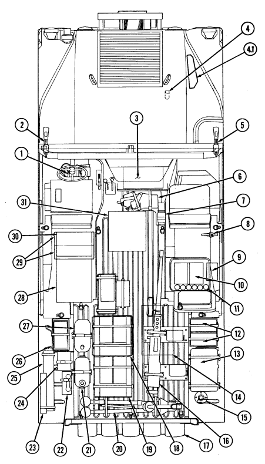

## F-8. Armament Carrier Load Plan (M60/7.62 Mm)

This is a standard load plan for the armament carrier. It is designed to supplement the stowage and sign guide contained in Appendix E. It includes selected items of personnel and unit equipment issued to most units within the Army equipped with this vehicle. Equipment not shown in this document may be loaded in accordance with local command policy.

ARMAMENT CARRIER
STOWAGE PLAN (M60/7.62 MM)

|     | LOAD PLAN                                         |
|-----|---------------------------------------------------|
| NO. | ITEM                                              |
| 1   | M16A1/M203 Rifle                                  |
| 2   | Gasoline Cook Stove (strapped to airlift bracket) |
| 2.1 | Jack, Scissors (A2 only)                          |
| 3   | M16A1/M203 Rifle                                  |
| 4   | MK64 MOD/M60 MG Mount                             |
| 5   | Pintle Adapter                                    |
| 6   | M16A1/M203 Rifle                                  |
| 7   | Adjustable Gunner's Platform                      |
| 8   | Radiac Meter IM 174 PD or AN VDR\-2               |
| 9   | Night Vision Goggles (2)                          |
| 10  | Hand Grenades (12)                                |
| 11  | Ammunition (5.56/M203\-40 mm)                     |
| 12  | Night Sight AN\-TVS\-5                            |
| 13  | Infrared Viewer AN/PAS\-7                         |
| 14  | Radio Antenna (on cargo shell)                    |
| 15  | Machine Gun M60                                   |
| 16  | Infrared Observation Set AN/GVS\-5 Laser          |
| 17  | Camouflage Screen and Support System              |
| 18  | M2 Tripod                                         |
| 19  | Ammunition (M60/7.62 mm)                          |
| 20  | Water Can                                         |
| 21  | Telephone TA\-312/PT                              |
| 22  | Antenna AT1784                                    |
| 23  | Cable Reel DR\-8                                  |
| 24  | Spare Barrel (M60/7.62 mm) and Cleaning Kit       |
| 25  | Ammunition (M60/7.62 mm)                          |
| 26  | M13 Decon Kit                                     |
| 27  | Demolition Kit                                    |
| 28  | PEWS AN/THS\-2                                    |
| 29  | Individual Vision Sight AN/PVS\-4                 |
| 30  | Fire Extinguisher                                 |
| 31  | AN/GRC\-160 Radio                                 |

# Internal Top View


#### F-9. M997, M997A1, And M997A2 Ambulance Load Plan

This is a standard load plan for the M997, M997A1, and M997A2 ambulance. It is designed to supplement the stowage and sign guide contained in Appendix E. It includes selected items of personnel and unit equipment issued to most units within the Army and Marines equipped with this vehicle. Equipment not shown in this document may be loaded in accordance with local command policy.

#### Ambulance Stowage Plan

|     | LOAD PLAN                                                        |
|-----|------------------------------------------------------------------|
| NO. | ITEM                                                             |
| 1   | NBC Patient Masks, Hoses, and Fittings                           |
| 2   | Portable Heart Monitor                                           |
| 3   | Oxygen Tanks (two on right side)                                 |
| 4   | Attendant Seat (stowed position)                                 |
| 5   | Short Spineboard (on right wall)                                 |
| 6   | Litters (2) (stowage when upper litter rack is used as backrest) |
| 7   | Spreader Bar                                                     |
| 8   | Litters (2) (in upper compartment)                               |
| 9   | Litter Rail Extension (in lower compartment)                     |
| 10  | Medical Bags, Splint Set, and NBC Equipment Stowage (under       |
|     | litter bench)                                                    |
| 11  | Long Spineboard (on left wall)                                   |
| 12  | Medical Supplies and Equipment (medications and IV bags)         |
| 13  | External Stowage for Optional Equipment                          |
| 14  | Aspirator/Resuscitator                                           |
| 15  | Oxygen Tanks (two on left side)                                  |

#### F-18


F-19

## F-10. M996 And M996A1 Ambulance Load Plan

This is a standard load plan for the M996 and M996A1 ambulance. It is designed to supplement the stowage and sign guide contained in Appendix E. It includes selected items of personnel and unit equipment issued to most units within the Army and Marines equipped with this vehicle. Equipment not shown in this document may be loaded in accordance with local command policy.

AMBULANCE STOWAGE PLAN

|     | LOAD PLAN                                       |
|-----|-------------------------------------------------|
| NO. | ITEM                                            |
| 1   | Aspirator/Resuscitator                          |
| 2   | Blanket Set                                     |
| 3   | Splint Set                                      |
| 4   | Oxygen Tank (on right wall)                     |
| 5   | NBC Patient Masks, Hoses, and Fittings          |
| 6   | Attendant Seat (stowed position)                |
| 7   | Medical Instrument and Supply Set               |
| 8   | Short Spineboard (on right wall)                |
| 9   | Litters (2) (stowage when patient seat is open) |
| 10  | Spreader Bar                                    |
| 11  | Medical Instrument and Supply Set               |
| 12  | Litter Rail Extension                           |
| 13  | Long Spineboard (on left wall)                  |
| 14  | Portable Heart Monitor                          |
| 15  | External Stowage for Optional Equipment         |
| 16  | IV Bags                                         |
| 17  | Oxygen Tank (on left wall)                      |


## F-11. Heavy Variant Stowage Plan

This is the standard load plan for the M1097, M1097A1, M1097A2, M1123, and heavy variants equipped with a howitzer prime mover or towed vulcan kit. It is designed to supplement the stowage and sign guide contained in Appendix E. It includes selected items of personnel and unit equipment issued to most units within the Army equipped with this vehicle. Equipment not shown in this document may be loaded in accordance with local command policy.

HEAVY VARIANT STOWAGE PLAN

|     | LOAD PLAN                            |
|-----|--------------------------------------|
| NO. | ITEM                                 |
| 1   | Camouflage Screen and Support System |
| 2   | Fuel (Diesel) Cans (2)               |
| 3   | Remote                               |
| 4   | M122 Tripod                          |
| 5   | Telephone                            |
| 6   | DR8 Cable Reels (2)                  |
| 7   | Paralleloscope and Aiming Posts      |
| 8   | Jack Strut                           |
| 9   | Paralleloscope Spikes (2)            |
| 10  | Ammo (22 Rounds)                     |
| 11  | M60 Machine Gun                      |
| 12  | Sight Box #2                         |
| 13  | Sight Box #1                         |
| 14  | GDU Battery                          |
| 15  | GDU Box                              |
| 16  | Section Chest                        |
| 17  | Water Cans (2)                       |
| 18  | Spade                                |
| 19  | Jack, Scissors (A2 and M1123 only)   |

INTERNAL TOP VIEW


# Change 1

# Appendix G Lubrication Instructions

G 1. SCOPE This appendix gives lubrication requirements for the M998 series vehicles which are the responsibility of the operator/crew. G-2. GENERAL LUBRICATION REQUIREMENTS
a. **Maintaining Lubricant Levels.** Lubricant levels must be checked as specified in the PMCS (Chapter 2, Section 2) and Table G-l, Lubrication. Steps must be taken to replenish and maintain lubricant levels.

WARNING
· Drycleaning solvent P-D-680 is TOXIC and flammable. Wear protective goggles and gloves, use only in well-ventilated area, avoid contact with skin, eyes, and clothes, and do not breathe vapors. Keep away from heat and flame. Never smoke when using solvent. The flashpoint for type I drycleaning solvent is 100°F (38°C), and for type II, is 138°F (50°C). Failure to do so may result in injury or death to personnel.

· If personnel become dizzy while using cleaning solvent, immediately get fresh air and medical help. If solvent contacts skin or clothes, flush with cold water. If solvent contacts eyes, immediately flush eyes with water and get medical attention.

b. **Cleaning Fittings Before Lubrication.** Clean parts with drycleaning solvent P-D-680 or equivalent.

Dry before lubricating. Dotted arrow points indicate lubrication on both sides of the equipment.

c. **Lubrication After Fording.** If fording operation occurs, lubricate all fittings below fording depth and check submerged gear boxes for presence of water.

d. **Lubrication After High-Pressure Washing**. After a thorough washing, lubricate all grease fittings and oil can points outside and underneath vehicle.

e. **Localized Views.** A reference to the appropriate localized view is given after most lubrication entries.

Localized views begin on page G-11.

#### G-1

## G-3. Lubrication Intervals

a. **Service Interval Under Normal Conditions.** Service intervals listed are for normal operation in moderate temperatures, humidity, and atmospheric conditions. Hard time intervals may be shortened if your lubricants are contaminated or if you are operating the equipment under adverse conditions, including longer-than-usual operating hours. Hard time intervals may be extended during periods of low activity, though adequate preservation precautions must be taken. Perform semi-annual service intervals every six months, or 3,000 miles (4,827 km), whichever comes first.

b. **Service Interval Under Unusual Conditions.** Increase frequency of lubricating service when operating under abnormal conditions such as high or low temperatures, prolonged high speed driving, or extended cross-country operations. Such operation can diminish lubricant's protective qualities. More frequent lubricating service intervals are necessary to maintain vehicle readiness when operating under abnormal conditions.

c. **Hard Time Intervals.** Intervals shown in this appendix are based on mileage and calendar times. An example of mileage and calendar interval is: 3/S, in which 3 stands for 3,000 mi (4,827 km), and S stands for semiannually (every six months). The lubrication for the vehicle is to be performed at whichever interval occurs first. For equipment under manufacturer's warranty, hard time oil service intervals shall be followed.

d. **Army Oil Analysis Program (AOAP).** HMMWV engines and transmissions are enrolled in the Army Oil Analysis Program (AOAP). The sampling interval for the engine is every six months or 3,000 miles (4,827 km) (or 100 hours if hour meter is installed) of operation. For the transmission, the sampling interval is every 12 months or 6,000 miles (9,654 km) (or 300 hours if hour meter is installed) of operation.

## G - 4 . L U B R I C Ation For Operation Under Extreme Temperat U R E S

a. **Changes in Lubricant Grades.** Lubricant grades change with weather conditions. Refer to Lubrication Table for lubricant grade changes.

b. **Arctic Conditions.** Refer to FM 9-207, Operation and Maintenance of Ordnance Materiel in cold Weather (0°F to -65°F) (-18°C to -54°C), or the Lubrication Table.

## G-5. Corrosion Control

Refer to para 2-4 for appropriate corrosion control procedures.

#### G - 2 Change 1

| Table G\-1. Lubrication                                                       |                        |               |                                    |
|-------------------------------------------------------------------------------|------------------------|---------------|------------------------------------|
| EXPECTED                                                                      | USAGE  FLUID/LUBRICANT | CAPACITIES    |                                    |
| TEMPERATURES                                                                  |                        |               |                                    |
| Engine Oil                                                                    | OE/HDO 30              | Crankcase:    | Above + 15° F (\-9° C)             |
| (MIL\-L\-2104)                                                                | OE/HDO 10              | w/o filter    | +40° to \-15° F (+4° to \-26° C)   |
| (MIL\-L\-46167)                                                               | OEA                    | 7 qt (6.6 L)  | +40° to \-65° F (+4° to \-54° C)   |
| w/ filter                                                                     |                        |               |                                    |
| 8 qt (7.6 L)                                                                  |                        |               |                                    |
| Dry System                                                                    |                        |               |                                    |
| 10 qt (9.5 L)                                                                 |                        |               |                                    |
| Engine                                                                        | Ethylene Glycol        | Radiator:     |                                    |
| Coolant                                                                       | and Water              | 5 qt (4.7 L)  |                                    |
| Complete                                                                      |                        |               |                                    |
| 1/4 Ethylene Glycol, System: 26 qt                                            |                        |               | Above +15° F (\-9°C)               |
| 3/4 Water                                                                     |                        | (24.6 L)      |                                    |
| 2/5 Ethylene Glycol,                                                          |                        |               | +40° to \-15° F (+4° to \-26° C)   |
| 3/5 Water                                                                     |                        |               |                                    |
| 3/5 Ethylene Glycol,                                                          |                        |               | +40° to \-65° F (+4° to \-54° C)   |
| 2/5 Water                                                                     |                        |               |                                    |
| Dexron® II or                                                                 | Transmission           | Dry 11 qt     | All Temperatures                   |
| Dexron® III                                                                   | (3L80)                 | (10.4 L)      | (except arctic)                    |
| Drain & Refill                                                                |                        |               |                                    |
| 6 qt (5.7 L)                                                                  |                        |               |                                    |
| Dexron® III                                                                   | (4L80\-E)              | Dry 13.5 qt   | All Temperatures                   |
| (12.8 L)                                                                      |                        |               | (except arctic)                    |
| Drain & Refill                                                                |                        |               |                                    |
| 7.7 qt (7.3 L)                                                                |                        |               |                                    |
| OEA                                                                           |                        |               | Arctic Temperatures                |
| Differentials                                                                 | Multipurpose Gear      |               |                                    |
| GO 80/90                                                                      |                        |               | 2 qt ea. (1.9 L) All Temperatures  |
| Geared Hubs                                                                   | Multipurpose Gear      |               |                                    |
| GO 80/90                                                                      |                        |               | 1 pt ea. (0.47 L) All Temperatures |
| Steering                                                                      | Dexron® II or          | 1 qt (0.95 L) | All Temperatures                   |
| System                                                                        | Dexron® III            | w/Cooler 1.25 |                                    |
| qt (1.18 L)                                                                   |                        |               |                                    |
| Upper Ball                                                                    |                        |               |                                    |
| Joints (all                                                                   |                        |               |                                    |
| vehicles), Lower                                                              |                        |               |                                    |
| Ball Joints (A2                                                               |                        |               |                                    |
| and M1123                                                                     |                        |               |                                    |
| vehicles only),                                                               |                        |               |                                    |
| Tie Rod Ends,                                                                 | GAA                    | As Required   | All Temperatures                   |
| Pitman Arm,                                                                   |                        |               |                                    |
| Propeller                                                                     |                        |               |                                    |
| Shafts, etc.                                                                  |                        |               |                                    |
| Hinges, Cables,                                                               |                        |               |                                    |
| and Linkages                                                                  | OE/HDO                 | As Required   | All Temperatures                   |
| OE/HDO 15/40 (Grade 15W\-40) lubricant may be used when expected temperatures |                        |               |                                    |

are above +5°F (–15°C). If OEA lubricant is required to meet the temperature ranges prescribed in the Lubrication Table, then the OEA lubricant is to be used in place of OE/HDO 10 lubricant for all temperature ranges. If operating conditions are severe or abnormal, service chassis lubrication points at 1,000 mi (1,609 km).

Table G-1. Lubrication (Cont'd)

| LUBRICANTS                                                           | EXPECTED         |
|----------------------------------------------------------------------|------------------|
| TEMPERATURES                                                         |                  |
| GAA\-GREASE, AUTOMOTIVE                                              |                  |
| AND ARTILLERY                                                        | ALL TEMPERATURES |
| (MIL\-G\-10924)                                                      |                  |
| PL\-S\-LUBRICATING OIL,                                              |                  |
| GENERAL PURPOSE,                                                     |                  |
| PRESERVATIVE,                                                        |                  |
| (WATER DISPLACING                                                    | ALL TEMPERATURES |
| LOW TEMPERATURE)                                                     |                  |
| (VV\-L\-800A)                                                        |                  |
| GWR\-GREASE, WIRE ROPE                                               |                  |
| (MIL\-G\-18458)                                                      | ALL TEMPERATURES |
| GO 80/90\-LUBRICATING OIL                                            |                  |
| MULTIPURPOSE GEAR                                                    | ALL TEMPERATURES |
| (81349) MIL\-L\-2105                                                 |                  |
| FUEL REQUIREMENTS - TEMPERATURE LIMITS (VV\-F\-800)                  |                  |
| Grade DF2 Fuel For use above +10°F (\-12°C)*                         |                  |
| Grade DF1** For use below +10°F (\-12°C)                             |                  |
| to above \-20°F (\-29°C)                                             |                  |
| Grade DFA For use below \-20°F (\-29°C)                              |                  |
| All Temperature Alternate JP8                                        |                  |
| *  Temperature limits may vary dependent on the cloud point of the   |                  |
| actual DF2 fuel being supplied in the geographical area.             |                  |
| **  DF1 is not normally procured in CONUS or OCONUS. Refineries will |                  |
| blend DF2 with kerosene to meet temperature requirements of DF1.     |                  |

# Lubrication Points


INTERVAL - LUBRICANT

|          | Rope            |
|----------|-----------------|
|          | (See note 2)    |
| HDO      | (See note 1)    |
| 3/S  OE/ | Heater Control  |
| HDO      | Shutoff Valve   |
|          | Lever and Pin   |
|          | (LV\-A)         |
|          | (See note 1)    |
| HDO      | (See note 1)    |
| HDO      | Shift Linkage   |
|          | (See note 1)    |
| HDO      | (See note 1)    |
|          | Door Latches    |
|          | (See note 1)    |
|          | Door Front      |
|          | Paddle Lock     |
|          | (See note 1)    |
|          | Door Latches    |
|          | (See note 1)    |
| 3/S  OE/ | Tailgate Hinges |
| HDO      | (See note 1)    |

NOTE
A REFERENCE TO THE LOCALIZED VIEW (LV) IS PROVIDED AFTER LUBRICATION POINT ENTRY, WHERE APPLICABLE.

## Lubrication Points (Cont'D)

LUBRICANT - INTERVAL


Accelerator OE/ 3/S Linkage HDO (LV-B) (See note 1)

Heater Control Knob and OE/ 3/S Plunger HDO (LV-C) (See note 1)

Transfer Case OE/ 3/S Shift Linkage HDO (See note 1)

Door Handles OE/ 3/S (See note 1) HDO

Cargo Shell PL-S 3/S

Door Rear Wire Handle Lock (See note 1)
NOTE
A REFERENCE TO THE LOCALIZED VIEW (LV) IS PROVIDED AFTER LUBRICATION POINT ENTRY, WHERE APPLICABLE.

# Lubrication Points (Cont'D)


INTERVAL - LUBRICANT
G A A **Front Propeller**
Shaft Universal Joint and Slip Yokes (3 fittings) (LV-D, LV-E) (See note 4)
GAA Upper Control Arm Ball Joints (all vehicles). Lower Control Arm Ball Joints (A2 and M1123 vehicles only) (LV-S, T) (See note 4)
OE/ Crankcase HDO **Fill**
(LV-F) (See note 7)
Dexron® (LV-G) for 4L80-E
Dexron® Transmission II or III Fill and Level for 3L80 (Check Level) III (See note 6)
GAA Radius Rods
(LV-H) (See note 4)

OE/ Pintle

HD0 (See note 3)
(LV-I)
NOT E
A REFERENCE TO THE LOCALIZED VIEW (LV) IS PROVIDED AFTER LUBRICATION POINT.

LUBRICATION POINTS (Cont'd)


NOT E
A REFERENCE TO THE LOCALIZED VIEW (LV) IS PROVIDED AFTER LUBRICATION POINT.


# G-9

Rear Propeller Shaft Universal Joints and Slip Yokes
(3 fittings)
(LV-N, O)
NOTE
A REFERENCE TO THE LOCALIZED VIEW (LV) IS PROVIDED AFTER LUBRICATION POINT.

INTERVAL - LUBRICANT
Tie Rod Ends
(2 fittings)
(LV-R)
(See note 4)
Idler Arm
(2 fittings)
(LV-M)
(See note 4)
LUBRICANT - INTERVAL


NOTE
A REFERENCE TO THE LOCALIZED VIEW (LV) IS PROVIDED AFTER LUBRICATION POINT.

G-10


G-11


G-12


POWER STEERING RESERVOIR
 
IDLER ARM AND TIE ROD


TIE ROD AND PITMAN ARM

G-13


LOCALIZED LUBRICATION POINTS (Cont'd)

## Notes

#### 1. Oil Can Points.

Lubricate all oil can points every 3,000 mi (4,827 km), or semiannually, whichever occurs first. Use seasonal grade OE on hood hinges, tailgate hinges, door hinges, door handles, transfer case shift linkage, accelerator linkage, transmission shift linkage, heater control shutoff valve lever and pin, and heater control knob and plunger. Lubricate cargo shell door front paddle lock, rear wire handle lock and cargo shell door latches with PL-S, (M996, M996A1, M1025, M1025A1, M1025A2, M1026, M1026A1, M1036, M1043, M1043A1, M1043A2, M1044, M1044A1, M1045, M1045A1, M1045A2, M1046, and M1046A1 only).

#### 2. Winch Wire Rope. .Warning.

Wear leather gloves when handling winch wire rope. Do not handle wire rope with bare hands. Broken wires cause injury.

After each use, clean and lubricate winch wire rope. Clean entire wire rope with wire brush. Lubricate with new OE/HDO. Perform winch wire rope cleaning and lubrication every 3,000 mi (4,827 km) or semiannually, whichever occurs first, when wire rope is not used.

#### 3. Pintle.

Every 3,000 mi (4,827 km), or semiannually, whichever occurs first, clean pintle with wire bush and lubricate rear plate fitting with seasonal grade OE.

#### 4. Steering System. Caution

Do not over lubricate tie rod ends and upper and lower ball joints. One or two shots is adequate. Excessive lubrication will result in the boot rupturing. Observe the boot during lubrication: a seeping condition indicates adequate lubrication; expansion of the boot indicates over lubrication.

Lubricate front propeller shaft, steering column, U-joints, slip yokes, tie rods, upper and lower ball joints, radius rods, pitman arm, intermediate steering shafts, and idler arm with GAA every 3,000 mi (4,827 km), or semiannually, whichever comes first.

#### 5. Power Steering Reservoir. Caution

- Use Dexron® II or Dexron® III
for filling power steering reservoir. Failure to use Dexron® II or Dexron® III
will cause damage to power steering system.

- Do not overfill the power steering reservoir. Excessive fluid will cause damage to power steering system.

Check the fluid level in the power steering reservoir and adjust level as necessary. Level must be above "ADD" mark. Fluid does not require periodic changing.

## Notes

#### 6. Transmission. Caution

transmission.

| - Do  not  overfill           | trans      |
|-------------------------------|------|
| mission. The fluid level      |      |
| rises as  the fluid tem                               |      |
| perature increases. There                               |      |
| fore, do not check level      |      |
| before the transmission has   |      |
| reached normal operating      |      |
| temperature.  The             | safe |
| operating level is within the |      |
| crosshatch marks on the       |      |
| dipstick. Overfilling will    |      |
| result  in  damage            | to   |

- Use Dexron® II or Dexron®
III (3L80) or Dexron® III
(4L80-E) for filling transmission. Failure to use appropriate lubrication will cause damage to transmission.

Check and fill transmission to proper level weekly. Operate transmission through all operating ranges to fill cavities and fluid passages. With vehicle positioned on level ground, allow engine to idle, shift transmission to neutral, and apply parking brake. For vehicles with a park position, shift transmission to park. Check fluid level on dipstick. It should register within the crosshatch marks under the conditions stated above. On vehicles equipped for deep water fording, the dipstick has a seal which fits into the opening of the dipstick tube. The dipstick handle must be turned counterclockwise to be released before dipstick is withdrawn. Turn dipstick handle clockwise to seat after installing dipstick. Have fluid changed every 12,000 mi (19,308 km), or biennially, whichever occurs first.

#### 7. Crankcase Oil Level. Caution

- There are two marks on the dipstick: "FULL" and "ADD 1 QT." The quantity of oil required to raise the oil level from "ADD 1 QT" mark to "FULL" mark is 1 qt (0.9 L). Do not overfill crankcase. Overfilling will result in damage to engine.

- If oil level is above "FULL,"
it may be due to oil cooler drain back. Operate the engine for one minute, shut down, wait one minute, then recheck oil level.

- Oil is added to crankcase through fill tube which is located on top of engine.

Check crankcase oil level daily. Start engine and visually check for oil leaks at drain plug and oil filter. Stop engine and wait approximately one minute for oil to drain back into oil pan, then recheck oil level with dipstick. On vehicles equipped for deep water fording, the dipstick has a seal which fits into the opening of the dipstick tube. The dipstick handle must be turned counterclockwise to be released before dipstick is withdrawn. Turn handle clockwise to seat after installing dipstick. Have oil changed every 3,000 mi (4,827 km), or semiannually, whichever occurs first.

TM 9-2320-280-10 INDEX

| A                                                                | Para.   | Page   |
|------------------------------------------------------------------|---------|--------|
| Additional authorization list, appendix C                        |         | C\-1   |
| Adjusting driver's seat                                          | 2\-14   | 2\-114 |
| Air cleaner dump valve servicing                                 | 3\-16   | 3\-21  |
| Air cleaner servicing (emergency procedure)                      | 3\-15   | 3\-18  |
| Ambulance heating, ventilation, and air\-conditioning            |         |        |
| air intake filter service                                        | 3\-27   | 3\-34  |
| Ambulance interior electrical controls                           | 2\-6 1  | 2\-198 |
| Ambulance interior light bulb replacement                        | 3\-28   | 3\-38  |
| Ambulance litter rack operation                                  | 2\-6 2  | 2\-202 |
| Ambulance load plan (M996 and M996A1)                            | F\-10   | F\-20  |
| Ambulance load plan (M997, M997A1, and M997A2)                   | F\-9    | F\-18  |
| Ambulance NBC system operation                                   | 2\-6 3  | 2\-212 |
| Ambulance operation, general                                     | 2\-57   | 2\-191 |
| Ambulance rear step assembly operation                           | 2\-6 0  | 2\-197 |
| Ambulance, soft\-top (M1035, M1035A1, and M1035A2),              |         |        |
| litter rack operation                                            | 2\-58   | 2\-191 |
| Appendix A, references                                           |         | A\-1   |
| Appendix B, components of end item and basic issue items lists . |         | B\-1   |
| Appendix C, additional authorization list                        |         | C\-1   |
| Appendix D, expendable/durable supplies and materials list       |         | D\-1   |
| Appendix E, stowage and sign guide                               |         | E\-1   |
| Appendix F, on\-vehicle equipment loading plans                  |         | F\-1   |
| Appendix G, lubrication instructions                             |         | G\-1   |
| Arctic operation (All except M1123 and A2 vehicles)              | 2\-39   | 2\-156 |
| Arctic operation (A2 vehicles)                                   | 2\-40   | 2\-160 |
| Armament carriers, armored (M1025, M1025A1, M1025A2,             |         |        |
| M1026, and M1026A1)                                              | 1\-13   | 1\-12  |
| Armament carriers w/supplemental armor load plan                 | F\-3    | F\-6   |
| Armament carriers w/supplemental armor load plan                 |         |        |
| (A2 vehicles)                                                    | F\-4    | F\-8   |
| Armament carriers load plan (MK19/40 mm)                         | F\-6    | F\-12  |
| Armament carriers, w/supplemental armor (M1043, M1043A1,         |         |        |
| M1043A2, M1044, and M1044A1)                                     | 1\-14   | 1\-14  |
| Armament carriers load plan (M2/.50 cal)                         | F\-7    | F\-14  |
| Armament carriers load plan (M60/7.62 mm)                        | F\-8    | F\-16  |
| Armament carriers load plan (USAF) (MK19/M60 machine gun) .      | F\-5    | F\-10  |
| Armament weapon station operation                                | 2\-55   | 2\-189 |
| Army regulations                                                 | A\-8    | A\-2   |
| Axle weights (Table 1\-20)                                       | 1\-18   | 1\-35  |
| B                                                                |         |        |
| Basic issue items, appendix B                                    |         | B\-1   |
| Batteries, servicing                                             | 3\-11   | 3\-14  |
| Break\-in service, general information                           | 1\-6    | 1\-3   |
| Break\-in service, operation under usual conditions              | 2\-9    | 2\-105 |
| Bridge classification, vehicle (table 1\-19)                     |         | 1\-34  |

Change 3 Index 1

# Tm 9-2320-280-10

| INDEX                                                                      |         |          |
|----------------------------------------------------------------------------|---------|----------|
|                                                                            | Para.   | Page     |
| C                                                                          |         |          |
| Capacities (table 1\-2)                                                    |         | 1\-23    |
| Cargo barrier extension, removal and installation of                       | 2\-51   | 2\-182   |
| Cargo barrier and net, removal and installation of                         | 2\-51.1 | 2\-182.2 |
| Cargo shell door operation                                                 | 2\-53   | 2\-184   |
| Cargo tiedown operation                                                    | 2\-4 5  | 2\-167   |
| Cargo/troop carriers (M998, M998A1, M1038, and M1038A1) . . .              | 1\-9    | 1\-4     |
| Cleaning compound to water ratio (table 3\-2)                              | 3\-14   | 3\-18    |
| Cleaning instructions                                                      | 2\-4    | 2\-60    |
| Cold weather starting below +32°F (0°C)                                    | 2\-30   | 2\-139   |
| Companion seat assembly and battery box cover replacement . . .            | 2\-15   | 2\-115   |
| Components of end item and basic issue items lists, appendix B .           |         | B\-1     |
| Controls, indicators, and equipment                                        | 2\-2    | 2\-2     |
| Controls, interior electrical, ambulance                                   | 2\-61   | 2\-198   |
| Coolant surge tank, servicing                                              | 3\-9    | 3\-12    |
| Cooling system data (table 1\-6)                                           |         | 1\-25    |
| D                                                                          |         |          |
| Deep water fording operation                                               | 2\-37   | 2\-148   |
| Defroster operation (All except A2 vehicles)                               | 2\-17   | 2\-117   |
| Defroster operation (A2 vehicles)                                          | 2\-18   | 2\-118   |
| Department of the Army pamphlets                                           | A\-2    | A\-1     |
| Differences between models (table 1\-1)                                    |         | 1\-22    |
| Driver's seat, adjusting                                                   | 2\-14   | 2\-114   |
| Dusty, sandy areas, operating in                                           | 2\-32   | 2\-141   |
| E                                                                          |         |          |
| Electric winch operation                                                   | 2\-26   | 2\-134   |
| Emergency fan clutch override                                              | 3\-23   | 3\-30    |
| Engine data (6.2 L) (table 1\-4)                                           |         | 1\-25    |
| Engine data (6.5 L) (table 1\-5)                                           |         | 1\-25    |
| Engine oil servicing                                                       | 3\-17   | 3\-22    |
| Engine, starting the                                                       | 2\-10   | 2\-105   |
| Equipment characteristics, capabilities, and features                      | 1\-7    | 1\-3     |
| Equipment improvement report and maintenance                               |         |          |
| digest (EIR MD)                                                            | 1\-5    | 1\-3     |
| Expendable/durable supplies and materials list, appendix D                 |         | D\-1     |
| Extreme cold, on ice, or snow, operating in                                | 2\-31   | 2\-140   |
| Extreme heat, operating in                                                 | 2\-34   | 2\-143   |
| F                                                                          |         |          |
| Fan clutch override, emergency                                             | 3\-23   | 3\-30    |
| Field manuals                                                              | A\-4    | A\-1     |
| Fire extinguisher operation                                                | 2\-27   | 2\-136   |
| First\-aid kit relocation                                                  | 3\-12   | 3\-15    |
| Fluid leakage                                                              | 2\-6    | 2\-63    |
| Fording operation, deep water                                              | 2\-37   | 2\-148   |
| Fording operation, shallow water                                           | 2\-36   | 2\-145   |
| Forms, references                                                          | A\-3    | A\-1     |
| Four\-man cargo area soft top enclosure, removal and installation of . . . | 2\-49   | 2\-178   |
| Index 2  Change 1                                                          |         |          |

INDEX

|                                                                             | Para.    | Page       |
|-----------------------------------------------------------------------------|----------|------------|
| F (Cont'd)                                                                  |          |            |
| Four\-man crew area soft top and arctic soft top enclosures,                |          |            |
| removal and installation of                                                 | 2\-48    | 2\-174     |
| Fuel filter maintenance                                                     | 3\-10    | 3\-13      |
| Fuel tank servicing                                                         | 3\-21    | 3\-26      |
| G                                                                           |          |            |
| General cleaning instructions (table 2\-1)                                  |          | 2\-61      |
| General information                                                         |          | 1\-1       |
| General lubricating instructions under unusual conditions                   | 3\-3     | 3\-1       |
| General lubrication instructions                                            | 3\-2     | 3\-1       |
| General service data (table 1\-3)                                           |          | 1\-24      |
| Gunner's platform operation                                                 | 2\-56    | 2\-190     |
| H                                                                           |          |            |
| Hand receipt manual                                                         | 1\-3     | 1\-2       |
| Heater operating instructions, troop/cargo winterization                    | 2\-41    | 2\-164     |
| Heater operation (All except A2 vehicles)                                   | 2 \- 1 9 | 2 \- 11 9  |
| Heater operation (A2 vehicles)                                              | 2 \- 2 0 | 2 \- 1 2 0 |
| Heating, ventilation, and air\-conditioning air intake filter service . . . | 3\-27    | 3\-34      |
| Heavy variant cargo/troop carriers (M1097, M1097A1,                         |          |            |
| M1097A2, and M1123)                                                         | 1\-10    | 1\-6       |
| Heavy variant stowage plan                                                  | F\-11    | F\-22      |
| Hydraulic winch operation                                                   | 2\-26.1  | 2\-134.2   |
| L                                                                           |          |            |
| 2\-litter ambulance, armored (M996 and M996A1); 4\-litter                   |          |            |
| ambulance armored (M997, M997A1, and M997A2)                                | 1\-16    | 1\-18      |
| 2\-litter ambulance, soft top (M1035, M1035A1, and M1035A2). . .            | 1\-17    | 1\-20      |
| Light bulb replacement, ambulance interior                                  | 3\-28    | 3\-38      |
| Light switch, operation of vehicle                                          | 2\-13    | 2\-112     |
| Litter rack operation, ambulance                                            | 2\-62    | 2\-202     |
| Litter rack operation, soft top ambulance (M1035, M1035A1,                  |          |            |
| and M1035A2)                                                                | 2\-58    | 2\-191     |
| Lubrication for continued operation below 0°F (\-18°C)                      | 3\-4     | 3\-1       |
| Lubrication instructions                                                    | 3\-1     | 3\-1       |
| Lubrication instructions                                                    |          | G\-1       |
| Lubrication instructions, general                                           | 3\-2     | 3\-1       |
| Lubrication instructions under unusual conditions, general                  | 3\-3     | 3\-1       |
| Lubrication requirements                                                    | 2\-7     | 2\-63      |
| M                                                                           |          |            |
| Maintenance forms and records                                               | 1\-2     | 1\-2       |
| Max tool kit stowage operation                                              | 2\-22.1  | 2\-124.1   |
| Maximum vehicle operating speeds (3L80) (table 1\-11)                       |          | 1\-29      |
| Maximum vehicle operating speeds (4L80\-E) (table 1\-12)                    |          | 1\-29      |
| Metric system                                                               | 1\-8     | 1\-3       |
| Mirror adjustment, rearview (vehicle serial number 99,999                   |          |            |
| and below)                                                                  | 3\-24    | 3\-31      |

# Tm 9-2320-280-10

INDEX

|                                                              | Para.   | Page     |
|--------------------------------------------------------------|---------|----------|
| M (Cont'd)                                                   |         |          |
| Mirror adjustment, rearview (vehicle serial number 100,000   |         |          |
| and above)                                                   | 3\-25   | 3\-32    |
| Miscellaneous publications                                   | A\-7    | A\-2     |
| Mud, operating in                                            | 2\-33   | 2\-142   |
| N                                                            |         |          |
| NBC system operation, ambulance                              | 2\-63   | 2\-212   |
| O                                                            |         |          |
| On\-vehicle equipment loading plans, appendix F              |         | F\-1     |
| Operating in dusty, sandy areas                              | 2\-32   | 2\-141   |
| Operating in extreme cold, on ice, or snow                   | 2\-31   | 2\-140   |
| Operating in extreme heat                                    | 2\-34   | 2\-143   |
| Operating in mud                                             | 2\-33   | 2\-142   |
| Operating in rainy or humid conditions                       | 2\-35   | 2\-144   |
| Operating on unusual terrain                                 | 2\-29   | 2\-138   |
| Operation of vehicle light switch                            | 2\-13   | 2\-112   |
| Operator's controls and indicators, description and use of   |         | 2\-1     |
| P                                                            |         |          |
| Parking brake adjustment and cleaning                        | 3\-13   | 3\-17    |
| Pioneer tool stowage rack operation                          | 2\-22   | 2\-122   |
| Placing vehicle in motion                                    | 2\-11   | 2\-108   |
| Plastic window cleaning                                      | 3\-18   | 3\-23    |
| Power steering fluid servicing                               | 3\-20   | 3\-25    |
| Preventive maintenance checks and services (PMCS)            | 2\-5    | 2\-62    |
| R                                                            |         |          |
| Rainy or humid conditions, operating in                      | 2\-35   | 2\-144   |
| Raising and securing hood                                    | 3\-8    | 3\-10    |
| Rearview mirror adjustment (vehicle serial number 99,999     |         |          |
| and below)                                                   | 3\-24   | 3\-31    |
| Rearview mirror adjustment (vehicle series number 100,000    |         |          |
| and above)                                                   | 3\-25   | 3\-32    |
| References, appendix A                                       |         | A\-1     |
| Removal and installation of cargo barrier and net            | 2\-51.1 | 2\-182.2 |
| Removal and installation of cargo barrier extension          | 2\-51   | 2\-182   |
| Removal and installation of four\-man cargo area soft top    |         |          |
| e n c l o s u r e                                            | 2\-49   | 2\-178   |
| Removal and installation of four\-man crew area soft top and |         |          |
| arctic soft top enclosures                                   | 2\-48   | 2\-174   |
| Removal and installation of S250 shelter carrier rear        |         |          |
| suspension tiedown kit                                       | 2\-50   | 2\-180   |
| Removal and installation of soft top ambulance (M1035,       |         |          |
| M1035A1, and M1035A2) enclosure                              | 2\-59   | 2\-193   |
| Removal and installation of troop area soft top enclosures   | 2\-47   | 2\-172   |
| Removal and installation of two\-man crew area soft top      |         |          |
| enclosure                                                    | 2\-46   | 2\-168   |
| Reporting equipment improvement recommendations (EIR)        | 1\-4    | 1\-2     |

Index 4 Change 1 TM 9-2320-280-10

| R (Cont'd)                                                     |    | Para.   | Page    |
|----------------------------------------------------------------|----|---------|---------|
| Restraining net installation                                   |    | 3\-29   | 3\-40   |
| Runflat operations                                             |    | 2\-38   | 2\-156  |
| Runflat operation (table 2\-4)                                 |    |         | 2\-156  |
| S                                                              |    |         |         |
| Scope of manual                                                |    | 1\-1    | 1\-1    |
| Seatbelt operation                                             |    | 2\-16   | 2\-116  |
| Service data, general (table 1\-3)                             |    |         | 1\-24   |
| Servicing batteries                                            |    | 3\-11   | 3\-14   |
| Servicing coolant surge tank                                   |    | 3\-9    | 3\-12   |
| Servicing windshield washer reservoir                          |    | 3\-14   | 3\-18   |
| Shallow water fording operation                                |    | 2\-36   | 2\-145  |
| Slave starting operation                                       |    | 2\-23   | 2\-125  |
| Soft top ambulance (M1035, M1035A1, and M1035A2)               |    |         |         |
| enclosure, removal and installation of                         |    | 2\-59   | 2\-193  |
| Soft top ambulance (M1035, M1035A1, and M1035A2)               |    |         |         |
| litter rack operation                                          |    | 2\-58   | 2\-191  |
| Special instructions                                           |    | 2\-28   | 2\-137  |
| Starting the engine                                            |    | 2\-10   | 2\-105  |
| Step assembly operation, rear, ambulance                       |    | 2\-60   | 2\-197  |
| Stopping the vehicle and engine                                |    | 2\-12   | 2\-110  |
| Stowage and sign guide, appendix E                             |    |         | E\-1    |
| S250 shelter carriers (M1037 and M1042)                        |    | 1\-15   | 1\-16   |
| S250 shelter carrier rear suspension tiedown kit,              |    |         |         |
| removal and installation of                                    |    | 2\-50   | 2\-180  |
| T                                                              |    |         |         |
| Tables:                                                        |    |         |         |
| 1\-1.  Differences Between Models                              |    |         | 1\-22   |
| 1\-2.  Capacities                                              |    |         | 1\-23   |
| 1\-3.  General Service Data                                    |    |         | 1\-24   |
| 1\-4.  Engine Data (6.2 L)                                     |    |         | 1\-25   |
| 1\-5.  Engine Data (6.5 L)                                     |    |         | 1\-25   |
| 1\-6.  Cooling System Data                                     |    |         | 1\-25   |
| 1\-7.  Transmission Data (3L80)                                |    |         | 1\-26   |
| 1\-8.  Transmission Data (4L80\-E)                             |    |         | 1\-26   |
| 1\-9.  Transfer Case Data (218)                                |    |         | 1\-27   |
| 1\-10. Transfer Case Data (242)                                |    |         | 1\-28   |
| 1\-11. Maximum Vehicle Operating Speeds (3L80 Transmission) .  |    |         | 1\-29   |
| 1\-12. Maximum Vehicle Operating Speeds (4L80\-E Transmission) |    |         | 1\-29   |
| 1\-13. Vehicle Dimensions (All except M1123 and A2 Vehicles) . |    |         | 1\-30   |
| 1\-14. Vehicle Dimensions (M1123 and A2 Vehicles)              |    |         | 1\-31   |
| 1\-15. Vehicle Cruising Range                                  |    |         | 1\-32   |
| 1\-16.  6,000 lb Winch Data                                    |    |         | 1\-33   |
| 1\-17.  9,000 lb Winch Data (Optional)                         |    |         | 1\-33   |
| 1\-17.1. 10,500 lb Winch Data (Optional)                       |    |         | 1\-33   |
| 1\-18. Curb Weight                                             |    |         | 1\-34   |
| 1\-19. Vehicle Bridge Classification                           |    |         | 1\-34   |
| 1\-20. Axle Weights                                            |    |         | 1\-35   |
| Change 3                                                       |    |         | Index 5 |

INDEX

# Tm 9-2320-280-10

| INDEX                                                                   |                 |       |          |
|-------------------------------------------------------------------------|-----------------|-------|----------|
|                                                                         |                 | Para. | Page     |
| T (Cont'd)                                                              |                 |       |          |
| 2\-1.  General Cleaning Instructions                                    |                 |       | 2\-61    |
| 2\-2.  Preventive Maintenance Checks and Services                       |                 |       | 2\-62    |
| 2\-3.  Towing Operations                                                |                 |       | 2\-126   |
| 2\-3.1 Vehicle Trailer Towing Requirements                              |                 |       | 2\-132.2 |
| 2\-4.  Runflat Operations                                               |                 |       | 2\-156   |
| 3\-1.                                                                   | Troubleshooting |       | 3\-3     |
| 3\-2.  Cleaning Compound\-to\-Water Ratio                               |                 |       | 3\-18    |
| Tabulated data (table 1\-1)                                             |                 |       | 1\-22    |
| Tailgate operation                                                      |                 | 2\-21 | 2\-121   |
| Technical bulletins                                                     |                 | A\-6  | A\-2     |
| Technical manuals                                                       |                 | A\-5  | A\-2     |
| Tire chain installation and removal                                     |                 | 3\-22 | 3\-28    |
| TOW 2 carrier stowage plan                                              |                 |       | F\-4     |
| TOW/armament carrier operation                                          |                 |       | 2\-184   |
| TOW carrier load plan                                                   |                 | F\-2  | F\-1     |
| TOW carrier stowage plan                                                |                 |       | F\-2     |
| TOW carriers, armored (M966, M966A1, M1036, and M1121) . . .            |                 | 1\-11 | 1\-8     |
| TOW carriers, w/supplemental armor (M1045, M1045A1,                     |                 |       |          |
| M1045A2, M1046, and M1046A1)                                            |                 | 1\-12 | 1\-10    |
| TOW weapon station operation                                            |                 | 2\-54 | 2\-188   |
| Towing operation                                                        |                 | 2\-24 | 2\-126   |
| Towing operations (table 2\-3)                                          |                 |       | 2\-126   |
| Trailer towing                                                          |                 | 2\-25 | 2\-132.1 |
| Trailer towing requirements, vehicle (table 2\-3.1)                     |                 |       | 2\-132.2 |
| Transfer case data (218) (table 1\-9)                                   |                 |       | 1\-27    |
| Transfer case data (242) (table 1\-10)                                  |                 |       | 1\-28    |
| Transmission data (3L80) (table 1\-7)                                   |                 |       | 1\-26    |
| Transmission data (4L80\-E) (table 1\-8)                                |                 |       | 1\-26    |
| Transmission fluid servicing                                            |                 | 3\-19 | 3\-24    |
| Troop area soft top enclosures, removal and installation of             |                 | 2\-47 | 2\-172   |
| Troop/cargo winterization heater operating instructions                 |                 | 2\-41 | 2\-164   |
| Troop seat kit operation                                                |                 | 2\-44 | 2\-167   |
| Troubleshooting (table 3\-1)                                            |                 |       | 3\-3     |
| Troubleshooting procedures                                              |                 | 3\-6  | 3\-2     |
| Two\-man crew area soft top enclosure, removal and                      |                 |       |          |
| installation of                                                         |                 | 2\-46 | 2\-168   |
| V                                                                       |                 |       |          |
| Vehicle and engine, stopping the                                        |                 | 2\-12 | 2\-110   |
| Vehicle cruising range (table 1\-15)                                    |                 |       | 1\-32    |
| Vehicle dimensions (M1123 and A2 vehicles) (table 1\-14)                |                 |       | 1\-31    |
| Vehicle dimensions (All except M1123 and A2 vehicles) (table 1\-13) . . |                 |       | 1\-30    |
| Vehicle light switch, operation of                                      |                 | 2\-13 | 2\-112   |
| Vehicle operating speeds, maximum (3L80 transmission)                   |                 |       |          |
| (table 1\-11)                                                           |                 |       | 1\-29    |
| Vehicle operating speeds, maximum (4L80\-E transmission)                |                 |       |          |
| (table 1\-12)                                                           |                 |       | 1\-29    |
| Index 6                                                                 | Change 2        |       |          |

TM 9-2320-280-10 INDEX

|                                                  | Para    | Page     |
|--------------------------------------------------|---------|----------|
| W (Cont'd)                                       |         |          |
| Weight, curb (table 1\-18)                       |         | 1\-33    |
| Wheel assembly replacement                       | 3\-26   | 3\-33    |
| Winch operation, electric                        | 2\-26   | 2\-134   |
| Winch operation, hydraulic                       | 2\-26.1 | 2\-134.2 |
| Winch data, 9,000 lb (Optional) (table 1\-17)    |         | 1\-33    |
| Winch data, 6,000 lb (table 1\-16)               |         | 1\-33    |
| Winch data, 10,500 lb (Optional) (table 1\-17.1) |         | 1\-33    |
| Windshield assembly operation                    | 2\-43   | 2\-166   |
| Windshield washer reservoir, servicing           | 3\-14   | 3\-18    |

By Order of the Secretary of the Army:
DENNIS J. REIMER
General, United States Army Chief of Staff Official:
YVONNE M. HARRISON
Administrative Assistant to the Secretary of the Army 01393 By Order of the Secretary of the Air Force:
RONALD R. FOGLEMAN
General, United States Air Force Chief of Staff Official:
HENRY VICCELLIO, JR.

General, United States Air Force Commander, Air Force Materiel Command By Order of the Marine Corps:
D. R. BLOOMER
Colonel, USMC
Director, Program Support Marine Corps Systems Command DISTRIBUTION:
To be distributed in accordance with DA Form 12-38-E, block 0377, requirements for TM 9-2320-280-10.


DA FORM 2028, FEB 74 REPLACES DA FORM 2028, 1 DEC 68, WHICH WILL BE USED.

USAPPC V3.00

TO: (Forward direct to addressee listed in publication)
FROM: (Activity and location) (include ZIP code)
DATE:

AMSTA-LC-CI Tech Pubs, TACOM-RI


| TELEPHONE EXCHANGE/AUTOVON, PLUS EXTENSION:   |
|-----------------------------------------------|

TYPED NAME, GRADE, OR TITLE:

| SIGNATURE:   |
|--------------|


DA FORM 2028, FEB 74 REPLACES DA FORM 2028, 1 DEC 68, WHICH WILL BE USED.

USAPPC V3.00


| TELEPHONE EXCHANGE/AUTOVON,   |
|-------------------------------|
| PLUS EXTENSION:               |

TYPED NAME, GRADE, OR TITLE:

| SIGNATURE:   |
|--------------|

# The Metric System And Equivalents

LINEAR MEASURE
1 Centimeter = 10 Millimeters = 0.01 Meters =
0.3937 Inches 1 Meter = 100 Centimeters = 1,000 Millimeters =
39.37 Inches 1 Kilometer = 1,000 Meters = 0.621 Miles SQUARE MEASURE
1 Sq Centimeter = 100 Sq Millimeters = 0.155 Sq Inches 1 Sq Meter = 10,000 Sq Centimeters = 10.76 Sq Feet 1 Sq Kilometer = 1,000,000 Sq Meters = 0.386 Sq Miles CUBIC MEASURE
1 Cu Centimeter = 1,000 Cu Millimeters = 0.06 Cu Inches 1 Cu Meter = 1,000,000 Cu Centimeters = 35.31 Cu Feet LIQUID MEASURE
1 Milliliter = 0.001 Liters = 0.0338 Fluid Ounces 1 Liter = 1,000 Milliliters = 33.82 Fluid Ounces TEMPERATURE
Degrees Fahrenheit (F) = °C · 9 ÷ 5 + 32 Degrees Celsius (C) = °F - 32 · 5 ÷ 9 212° Fahrenheit is equivalent to 100° Celsius 89.96° Fahrenheit is equivalent to 32.2° Celsius 32° Fahrenheit is equivalent to 0° Celsius WEIGHTS
1 Gram = 0.001 Kilograms = 1,000 Milligrams =
0.035 Ounces 1 Kilogram = 1,000 Grams = 2.2 Lb 1 Metric Ton = 1,000 Kilograms = 1 Megagram =
1.1 Short Tons

## Approximate Conversion Factors

| ALL ROAMAIL VALLERIAL INSTANT   |                        |             |
|---------------------------------|------------------------|-------------|
| TO CHANGE                       | TO                     | MULTIPLY BY |
| Inches                          | Millimeters            | 25.400      |
| Inches .                        | Centimeters            | 2.540       |
| Feet .                          | Meters                 | 0.305       |
| Yards . . .                     | Meters                 | 0.914       |
| Miles .                         | Kilometers             | 1.609       |
| Square Inches                   | Square Centimeters     | 6.451       |
| Square Feet                     | Square Meters          | 0.093       |
| Square Yards                    | Square Meters          | 0.836       |
| Square Miles                    | Square Kilometers      | 2.590       |
| Acres .                         | Square Hectometers     | 0.405       |
| Cubic Feet                      | Cubic Meters           | 0.028       |
| Cubic Yards                     | Cubic Meters           | 0.765       |
| Fluid Ounces                    | Milliliters            | 29.573      |
| Pints                           | Liters . .             | 0.473       |
| Quarts                          | Liters . . .           | 0.946       |
| Gallons  . .                    | Liters  . . .          | 3.785       |
| Ounces . . .                    | Grams                  | 28.349      |
| Pounds . . .                    | Kilograms              | 0.4536      |
| Short Tons                      | Metric Tons            | 0.907       |
| Pound\-Feet                     | Newton\-Meters         | 1.356       |
| Pounds Per Square Inch          | Kilopascals            | 6.895       |
| Miles Per Gallon                | Kilometers Per Liter   | 0.425       |
| Miles Per Hour                  | Kilometers Per Hour    | 1.609       |
| TO CHANGE                       | TO                     | MULTIPLY BY |
| Millimeters                     | Inches   .             | 0.03937     |
| Centimeters                     | Inches .               | 0.3937      |
| Meters                          | Feet .                 | 3.280       |
| Meters                          | Yards .                | 1.094       |
| Kilometers                      | Miles .                | 0.621       |
| Square Centimeters              | Square Inches          | 0.155       |
| Square Meters                   | Square Feet .          | 10.764      |
| Square Meters                   | Square Yards .         | 1.196       |
| Square Kilometers               | Square Miles           | 0.386       |
| Square Hectometers              | Acres                  | 2.471       |
| Cubic Meters                    | Cubic Feet             | 35.315      |
| Cubic Meters                    | Cubic Yards            | 1.308       |
| Milliliters                     | Fluid Ounces           | 0.034       |
| . . . Liters                    | Pints                  | 2.113       |
| Liters  . .                     | Quarts                 | 1.057       |
| Liters  . .                     | Gallons                | 0.264       |
| Grams .                         | Ounces . .             | 0.035       |
| Kilograms .                     | . . . Pounds           | 2.2046      |
| Metric Tons                     | Short Tons             | 1.102       |
| Newton\-Meters   .              | Pound\-Feet            | 0.738       |
| Kilopascals    .                | Pounds Per Square Inch | 0.145       |
| Kilometers Per Liter            | Miles Per Gallon       | 2.354       |
| Kilometers Per Hour             | Miles Per Hour         | 0.621       |


